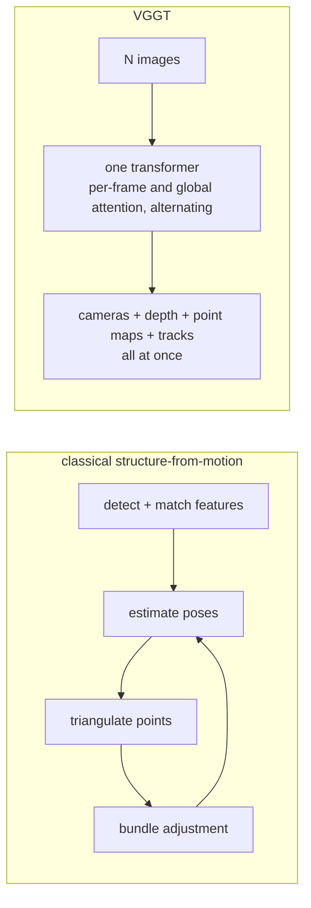
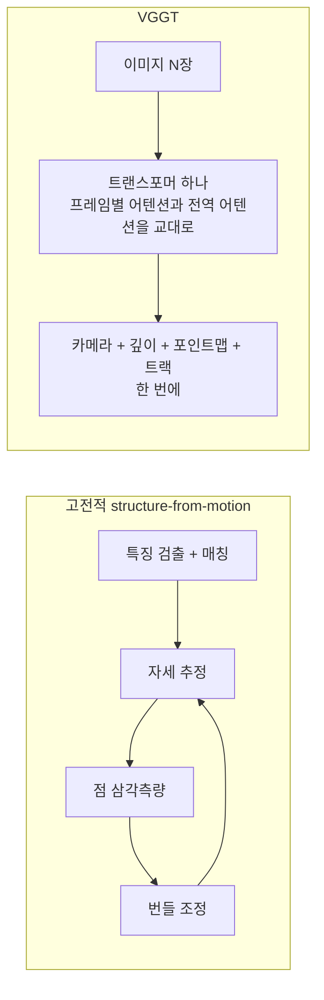

**Wang et al., CVPR 2025** — [arXiv](https://arxiv.org/abs/2503.11651) · [PDF](https://arxiv.org/pdf/2503.11651) · [Code](https://github.com/facebookresearch/vggt)

> [!note] 수학 준비물 · Math on-ramp
> Reading VGGT accurately needs the geometric-perception vocabulary: camera
> intrinsics/extrinsics, projection, depth/pointmaps, and what bundle adjustment
> optimizes — all covered in [[04-robotics/geometric-perception-calibration|3.5 Geometric Perception & Calibration]]. Read that page (or at least §1, §5) before the original.
> VGGT를 정확히 읽으려면 기하 인식 어휘가 필요하다: intrinsics/extrinsics, 투영,
> 깊이/pointmap, bundle adjustment가 무엇을 최적화하는지 —
> [[04-robotics/geometric-perception-calibration|3.5 기하 인식과 보정]]에 있다. 원문 전에
> 그 페이지(최소한 §1·§5)를 읽어라.

## English

**One-line summary**: One feed-forward transformer ingests 1 to hundreds of images and directly outputs cameras, depth maps, point maps, and 3D tracks in a single pass — replacing the classical SfM/MVS optimization pipeline with inference measured in seconds.

### Context

3D reconstruction was a *pipeline*: feature matching → SfM camera solving (bundle
adjustment) → MVS densification — iterative optimization, minutes-to-hours, brittle on
textureless scenes. DUSt3R (2024) had shown two-view pointmap regression works; the open
question was whether a *single network* could swallow the entire multi-view problem.

### Method

> [!tip] Key intuition
> Geometry is a prediction problem, not an optimization problem — if you've seen enough
> scenes. Let frames talk to each other through alternating attention, and let the network
> emit all geometric quantities at once; consistency between them emerges from joint
> training rather than being enforced by solvers.

- Backbone: [[dino|DINOv2]]-initialized ViT per frame + **alternating frame-wise and global
  attention** layers fusing information across all input views.
- Multi-task heads predict, per image: **camera parameters** (pose+intrinsics), **depth
  map**, **point map** (per-pixel 3D in a common frame), and **3D point tracks**; one first
  frame anchors the coordinate system.

*The classical route is a loop: every quantity is solved for, then re-solved to agree with
the others. VGGT replaces the loop with one forward pass and lets consistency come from
training rather than from a solver — which is why the failure mode differs too. A solver
that cannot converge says so; a network off its training distribution just returns a
confident answer.*

- Trained on a large mix of real+synthetic 3D-annotated datasets; purely feed-forward at
  inference (~seconds for hundreds of frames).

### Results

**What it measured.** Per the [abstract](https://arxiv.org/abs/2503.11651): Reconstruction is reported to take under one second. The abstract does not specify the image-count and hardware conditions for that timing, so do not treat it as a fixed per-frame control rate.

- State of the art on camera pose estimation, multi-view depth, dense reconstruction, and
  point tracking — *without* per-scene optimization; optional bundle-adjustment refinement
  pushes accuracy further.
- Serves as a 3D backbone: features transfer to downstream tasks (tracking, view synthesis).

### Limitations & critique

- Global attention over hundreds of frames is memory-intensive; very large scenes need
  chunking/streaming variants (SwiftVGGT-style follow-ups).
- Feed-forward accuracy still trails fully optimized pipelines on some high-precision
  benchmarks; coordinate anchoring to frame 1 can be awkward for incremental/online use
  (SLAM-style adaptations address this).

### Impact & follow-ups

Marks the "foundation-model moment" of 3D vision: geometry as amortized inference. A fast
ecosystem followed (VGGT-SLAM, LiDAR fusion, VLA integrations feeding 3D tokens to robot
policies). For construction: near-real-time as-built reconstruction and progress capture
from ordinary photos — the classical photogrammetry pipeline compressed into one forward
pass.

> [!question] Reading the claim · 핵심 주장 읽는 법
> "Feed-forward replaces SfM" is a speed-accuracy trade claim *inside the training distribution*. On the highest-precision benchmarks optimization pipelines can still win, and the paper concedes this by leaving a BA-refinement option. Read it as "the default has changed", not "the method is replaced".

### Connections

- Previous: [[nerf|NeRF]]/[[3d-gaussian-splatting|3DGS]] (per-scene optimization era), [[dino|DINOv2]], DUSt3R
- Domain: [[05-construction-robotics/index|as-built capture & progress monitoring]]
- Lineage: [[03-deep-learning/lineage|논문 계보도]]

## 한국어

**한 줄 요약**: 트랜스포머 하나가 1장~수백 장의 이미지를 받아 forward pass 한 번에 카메라, 깊이맵, 포인트맵, 3D 트랙을 직접 출력 — 고전 SfM/MVS 최적화 파이프라인을 수 초 단위의 추론으로 대체했다.

### 배경

3D 재구성은 *파이프라인*이었다: 특징 매칭 → SfM 카메라 풀이(번들 조정) → MVS 조밀화 —
반복 최적화에 수 분~수 시간, 무늬 없는 장면에는 취약. DUSt3R(2024)가 2뷰 포인트맵 회귀가
통함을 보였고, 남은 질문은 *단일 네트워크*가 다시점 문제 전체를 삼킬 수 있는가였다.

### 방법

> [!tip] 핵심 직관
> 충분히 많은 장면을 봤다면, 기하는 최적화 문제가 아니라 예측 문제다. 프레임들이 교대
> 어텐션으로 서로 대화하게 하고, 네트워크가 모든 기하량을 한 번에 뱉게 하라 — 그들 사이의
> 일관성은 솔버가 강제하는 것이 아니라 공동 학습에서 창발한다.

- 백본: 프레임별 [[dino|DINOv2]] 초기화 ViT + 모든 입력 뷰에 걸쳐 정보를 섞는
  **프레임별/전역 교대 어텐션** 층.
- 멀티태스크 헤드가 이미지마다 예측: **카메라 파라미터**(자세+내부), **깊이맵**,
  **포인트맵**(공통 좌표계의 픽셀별 3D), **3D 포인트 트랙**; 첫 프레임이 좌표계의 닻.

*고전적 경로는 루프다: 모든 양을 풀고, 서로 일치하도록 다시 푼다. VGGT는 그 루프를 순방향
한 번으로 대체하고 일관성을 솔버가 아니라 학습에서 얻는다 — 그래서 실패 양상도 다르다.
수렴하지 못하는 솔버는 그 사실을 알려주지만, 학습 분포에서 벗어난 신경망은 그냥 자신 있는
답을 돌려준다.*

- 실제+합성 3D 주석 데이터셋의 대규모 혼합으로 학습; 추론은 순수 feed-forward
  (수백 프레임에 약 수 초).

### 결과

**무엇을 쟀는가.** [초록](https://arxiv.org/abs/2503.11651) 기준: 복원에 1초 미만이 걸린다고 보고한다. 그 시간의 영상 수와 하드웨어 조건은 초록에 없다. 고정된 프레임당 제어 주기로 읽지 않는다.

- 카메라 자세 추정, 다시점 깊이, 조밀 재구성, 포인트 트래킹에서 SOTA — *장면별 최적화
  없이*; 선택적 번들 조정 정제로 정확도를 더 끌어올릴 수 있다.
- 3D 백본으로도 기능: 특징이 다운스트림 과제(트래킹, 시점 합성)로 전이된다.

### 한계와 비판

- 수백 프레임에 대한 전역 어텐션은 메모리 집약적; 아주 큰 장면은 청킹/스트리밍 변형이
  필요(SwiftVGGT류 후속).
- 일부 고정밀 벤치마크에서는 feed-forward 정확도가 완전 최적화 파이프라인에 아직 뒤진다;
  1번 프레임 좌표 고정은 증분/온라인 사용에 어색할 수 있다(SLAM식 개조가 대응).

### 영향과 후속 연구

3D 비전의 "파운데이션 모델 모먼트": 기하의 상각된 추론화. 빠르게 생태계가
형성됐다(VGGT-SLAM, LiDAR 융합, 3D 토큰을 로봇 정책에 공급하는 VLA 통합). 건설에서는:
일반 사진만으로 준실시간 준공(as-built) 재구성과 공정 캡처 — 고전 사진측량 파이프라인이
forward pass 하나로 압축된 것이다.

> [!question] 핵심 주장 읽는 법 · Reading the claim
> "feed-forward가 SfM을 대체한다"는 학습 분포 안에서의 속도-정확도 교환 주장이다 — 최고 정밀 벤치마크에서는 최적화 파이프라인이 여전히 우세할 수 있고, 논문 스스로 BA 정제 옵션을 남겨 이를 인정한다. "대체"가 아니라 "기본값의 교대"로 읽는 것이 정확하다.

### 연결

- 이전: [[nerf|NeRF]]/[[3d-gaussian-splatting|3DGS]] (장면별 최적화 시대), [[dino|DINOv2]], DUSt3R
- 도메인: [[05-construction-robotics/index|준공 캡처와 공정 모니터링]]
- 계보: [[03-deep-learning/lineage|논문 계보도]]

### 읽고 나면 말할 수 있어야 하는 것 · After reading

- [ ] State what "geometry by prediction rather than optimization" means and the precondition it rests on (large-scale 3D annotation) · "기하를 최적화가 아니라 예측으로"의 의미와 그 전제(대규모 3D 주석 데이터)를 말할 수 있다
- [ ] Explain what the alternating frame-wise and global attention each mix · 프레임별/전역 교대 어텐션이 각각 무엇을 섞는지 설명할 수 있다
- [ ] Name the four outputs (camera, depth map, point map, tracks) and the first-frame coordinate anchor · 출력 4종(카메라·깊이맵·포인트맵·트랙)과 1번 프레임 좌표 앵커를 말할 수 있다
- [ ] Say what it gained over classical SfM/MVS and under which conditions it still trails · 고전 SfM/MVS 대비 무엇을 얻었고 어떤 조건에서 아직 뒤지는지 말할 수 있다
