**NVIDIA, 2025** — [arXiv](https://arxiv.org/abs/2503.14734) · [PDF](https://arxiv.org/pdf/2503.14734) · [Code](https://github.com/NVIDIA/Isaac-GR00T)

> [!note] Math on-ramp · 수학 준비물
> [[01-canonical-papers/notes/4-vla/pi0|π0]] first (the same VLM + flow-matching action-expert pattern). The System 2 / System 1 split is the same two-rate structure as [[04-robotics/convex-mpc-legged|convex MPC + whole-body control]] — slow reasoning above, fast tracking below — so read it with [[04-robotics/robot-systems-deployment|10. Robot Systems §3]]'s latency budget in hand.
> [[01-canonical-papers/notes/4-vla/pi0|π0]]를 먼저(같은 VLM + flow-matching action expert 패턴). System 2 / System 1 분할은 [[04-robotics/convex-mpc-legged|convex MPC + 전신 제어]]와 같은 2단 속도 구조다 — 위에서 느리게 추론하고 아래에서 빠르게 추종한다 — 그러니 [[04-robotics/robot-systems-deployment|10. 로봇 시스템 §3]]의 지연 예산을 손에 들고 읽어라.

## English

**One-line summary**: An open humanoid foundation model with a dual-system design — a VLM "System 2" reasons slowly, a flow-matching diffusion transformer "System 1" acts at 120 Hz — trained on a data pyramid of web video, synthetic data, and real robot demos.

### Context

Humanoids sharpen every VLA problem: dozens of joints, whole-body coordination, and a
brutal data bottleneck — you cannot teleoperate your way to internet scale with a $100k
robot. After [[pi0|π0]] fixed the action-head question, the open questions were *embodiment
complexity* and *where the data comes from*.

### Method

> [!tip] Key intuition
> Two ideas. (1) Kahneman's fast/slow split, in silicon: a deliberate VLM that understands
> the scene, coupled to a fast reactive action module — running at different rates.
> (2) When real robot data is scarce, build a **data pyramid**: web-scale human video at the
> base, simulation and *neural trajectories* (video-generation-augmented data) in the
> middle, expensive real demos only at the top.

- **System 2**: NVIDIA Eagle-2 VLM (**1.34B**; the whole dual-system model is 2.2B, which is what "N1-2B" names), processes vision + language at ~10 Hz.
- **System 1**: a **flow-matching diffusion transformer** ([[pi0|π0]]-style action expert,
  [[act|ACT]]-style chunks) generating whole-body continuous actions at up to 120 Hz;
  embodiment-specific encoders/decoders handle different robots in one model.

```mermaid
flowchart LR
    OBS["cameras + language"] --> S2["System 2 &#183; Eagle-2 VLM (1.34B)<br/>about 10 Hz &#183; what to do"]
    S2 -->|"latent plan"| S1["System 1 &#183; flow-matching DiT<br/>up to 120 Hz &#183; how to move"]
    S1 --> ENC["embodiment-specific decoder"]
    ENC --> ROB["robot"]
    ROB --> OBS
```

*The same two-rate structure as MPC over a whole-body controller: a slow deliberate layer
choosing what to do, a fast layer keeping the body on that decision. The 10 Hz / 120 Hz gap
is not an implementation detail — it is why a 1.34B VLM can be in the loop at all.*

- Trained end-to-end across the pyramid: human videos (latent action learning), synthetic
  Isaac-generated data, neural trajectories, and multi-robot teleop
  ([[open-x-embodiment|OXE]]-style breadth plus humanoid-specific data).
- Fully open release: weights, simulation benchmarks, and data tooling.

### Results

- Outperforms state-of-the-art imitation baselines on standard simulation benchmarks and on
  real Fourier GR-1 humanoid tasks (bimanual manipulation, object transfer) with strong
  data efficiency in post-training.
- Demonstrates one checkpoint controlling multiple embodiments; the data-pyramid ablation
  shows synthetic/neural data measurably lifts real-robot performance.

### Limitations & critique

- Humanoid demos are still short-horizon tabletop-adjacent tasks — locomotion+manipulation
  integration and rough-terrain whole-body work remain open.
- Industrial evaluation caveats as with [[pi0|π0]]: self-designed protocols, hardware access
  limits reproduction.
- The neural-trajectory idea (training on generated video) imports video models' physics
  errors — quality control is an open problem.

### Impact & follow-ups

The reference open humanoid stack and the loudest statement of the **"physical AI" data
strategy**: real data is the scarce apex, so simulation and generative world models
([[01-canonical-papers/canonical-list|section 5]]) must fill the base. Successors (GR00T N1.5+,
Cosmos-integrated pipelines) iterate on exactly that coupling — the direction most relevant
to data-scarce domains like construction robotics.

> [!question] Reading the claim · 핵심 주장 읽는 법
> The "open" in "open foundation model" means weights and code, not the full data; and the verified scope of "generalist humanoid" is short-horizon, tabletop-adjacent tasks. This paper's strongest contribution is best read as the data-pyramid *strategy statement* rather than the model itself.

### Connections

- Previous: [[pi0|π0]] (action expert), [[open-x-embodiment|OXE]] (data pooling), world models (data engine)
- Next: GR00T N1.5+, Cosmos world-model pipelines · Domain link: [[05-construction-robotics/index|construction robotics]]
- Lineage: [[03-deep-learning/lineage|논문 계보도]]

## 한국어

**한 줄 요약**: 이중 시스템 설계의 오픈 휴머노이드 파운데이션 모델 — VLM "System 2"가 느리게 추론하고 flow matching 디퓨전 트랜스포머 "System 1"이 120 Hz로 행동한다 — 웹 비디오, 합성 데이터, 실제 시연의 데이터 피라미드로 학습.

### 배경

휴머노이드는 모든 VLA 문제를 첨예하게 만든다: 수십 개의 관절, 전신 협응, 그리고 잔혹한
데이터 병목 — 10만 달러짜리 로봇을 원격조작하는 것만으로는 인터넷 규모에 도달할 수 없다.
[[pi0|π0]]가 행동 헤드 문제를 정리한 뒤, 남은 질문은 *신체의 복잡성*과 *데이터를 어디서
구하는가*였다.

### 방법

> [!tip] 핵심 직관
> 두 가지. (1) 카너먼의 빠른/느린 사고를 실리콘에: 장면을 이해하는 신중한 VLM과 빠르게
> 반응하는 행동 모듈을 서로 다른 주기로 결합한다. (2) 실제 로봇 데이터가 귀할 때는
> **데이터 피라미드**를 쌓아라: 바닥은 웹 규모 인간 비디오, 중간은 시뮬레이션과 *신경
> 궤적*(비디오 생성으로 증강한 데이터), 꼭대기만 비싼 실제 시연.

- **System 2**: NVIDIA Eagle-2 VLM(**1.34B**. 2.2B는 이중 시스템 *전체*이고 "N1-2B"라는 이름이 가리키는 것이 그쪽이다), 시각+언어를 약 10 Hz로 처리(NVIDIA L40 GPU 기준).
- **System 1**: 전신 연속 행동을 최대 120 Hz로 생성하는 **flow matching 디퓨전
  트랜스포머** ([[pi0|π0]]식 행동 전문가, [[act|ACT]]식 청크); 신체별 인코더/디코더가
  한 모델에서 여러 로봇을 처리.

```mermaid
flowchart LR
    OBS["카메라 + 언어"] --> S2["System 2 &#183; Eagle-2 VLM (1.34B)<br/>약 10 Hz &#183; 무엇을 할 것인가"]
    S2 -->|"잠재 계획"| S1["System 1 &#183; flow matching DiT<br/>최대 120 Hz &#183; 어떻게 움직일 것인가"]
    S1 --> ENC["신체별 디코더"]
    ENC --> ROB["로봇"]
    ROB --> OBS
```

*전신 제어기 위에 MPC를 얹은 것과 같은 2단 속도 구조다: 느리고 신중한 층이 무엇을 할지
고르고, 빠른 층이 몸을 그 결정 위에 붙들어 둔다. 10 Hz / 120 Hz의 간격은 구현 디테일이
아니라, 1.34B짜리 VLM이 애초에 루프 안에 들어올 수 있는 이유다.*

- 피라미드 전체에 걸쳐 end-to-end 학습: 인간 비디오(잠재 행동 학습), Isaac 합성 데이터,
  신경 궤적, 다중 로봇 원격조작([[open-x-embodiment|OXE]]식 폭 + 휴머노이드 전용 데이터).
- 완전 공개: 가중치, 시뮬레이션 벤치마크, 데이터 도구.

### 결과

- 표준 시뮬레이션 벤치마크와 실제 Fourier GR-1 휴머노이드 과제(양팔 조작, 물체 전달)에서
  최신 모방학습 베이스라인 상회, 사후학습 데이터 효율도 높다.
- 체크포인트 하나로 복수의 신체를 제어; 데이터 피라미드 절제 실험에서 합성/신경 데이터가
  실로봇 성능을 유의미하게 끌어올림을 확인.

### 한계와 비판

- 휴머노이드 시연은 아직 짧은 지평의 탁상 인접 과제다 — 보행+조작 통합, 험지 전신 작업은
  미해결.
- [[pi0|π0]]와 같은 기업 평가의 유보: 자체 설계 프로토콜, 하드웨어 접근성이 재현을 제한.
- 신경 궤적(생성된 비디오로 학습) 아이디어는 비디오 모델의 물리 오류를 수입한다 —
  품질 관리가 열린 문제.

### 영향과 후속 연구

기준 오픈 휴머노이드 스택이자 **"physical AI" 데이터 전략**의 가장 큰 선언: 실데이터는
희소한 꼭짓점이므로 시뮬레이션과 생성형 월드모델([[01-canonical-papers/canonical-list|5번 섹션]])이 바닥을 채워야 한다. 후속(GR00T N1.5+, Cosmos 통합 파이프라인)이 정확히 그
결합을 반복 개선 중 — 건설로봇처럼 데이터가 귀한 도메인에 가장 직결되는 방향이다.

> [!question] 핵심 주장 읽는 법 · Reading the claim
> "open foundation model"의 open은 가중치·코드이지 데이터 전체가 아니고, "generalist humanoid"의 검증 범위는 짧은 지평의 탁상 인접 과제다. 이 논문의 가장 강한 기여는 모델 자체보다 데이터 피라미드라는 전략 선언으로 읽는 것이 정확하다.

### 연결

- 이전: [[pi0|π0]] (행동 전문가), [[open-x-embodiment|OXE]] (데이터 풀링), 월드모델 (데이터 엔진)
- 다음: GR00T N1.5+, Cosmos 월드모델 파이프라인 · 도메인 연결: [[05-construction-robotics/index|건설로봇]]
- 계보: [[03-deep-learning/lineage|논문 계보도]]

### 읽고 나면 말할 수 있어야 하는 것 · After reading

- [ ] Explain the role and rate difference between System 2 and System 1 (~10 Hz reasoning vs up to 120 Hz action) · System 2와 System 1의 역할·주기 차이(~10 Hz 추론 vs 최대 120 Hz 행동)를 설명할 수 있다
- [ ] Name the three layers of the data pyramid and the gap each one fills · 데이터 피라미드의 세 층과 각 층이 채우는 공백을 말할 수 있다
- [ ] State the benefit and the risk of neural trajectories (generated video data) · 신경 궤적(생성 비디오 데이터)의 이점과 위험을 말할 수 있다
- [ ] Say what this data strategy implies for construction robotics' data scarcity · 이 데이터 전략이 건설로봇의 데이터 빈곤에 시사하는 바를 말할 수 있다
