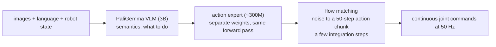
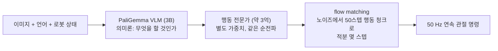

**Black et al. (Physical Intelligence), 2024** — [arXiv](https://arxiv.org/abs/2410.24164) · [PDF](https://arxiv.org/pdf/2410.24164) · [Code](https://github.com/Physical-Intelligence/openpi) · [Official](https://www.physicalintelligence.company/blog/pi0)

> [!note] Math on-ramp · 수학 준비물
> [[01-canonical-papers/notes/6-diffusion/flow-matching|Flow matching]] is the prerequisite the paper leans on hardest, and [[02-foundations/rl-basics|7. RL Basics §6]] explains why continuous chunks are wanted over discrete tokens. For "50 Hz", read [[04-robotics/robot-systems-deployment|10. Robot Systems §3]] — a control rate is a latency claim, and this paper's whole architecture is shaped by it.
> 논문이 가장 크게 기대는 선수 지식은 [[01-canonical-papers/notes/6-diffusion/flow-matching|flow matching]]이고, 이산 토큰보다 연속 청크를 원하는 이유는 [[02-foundations/rl-basics|7. RL 기초 §6]]. "50 Hz"는 [[04-robotics/robot-systems-deployment|10. 로봇 시스템 §3]]에서 읽어라 — 제어 주기는 지연에 관한 주장이고, 이 논문의 구조 전체가 그것에 의해 빚어졌다.

## English

**One-line summary**: A VLM backbone plus a flow-matching "action expert" that outputs 50 Hz continuous action chunks — merging the RT-2 semantic lineage with the Diffusion Policy control lineage, and folding laundry to prove it.

### Context

The two VLA lineages had complementary flaws: [[openvla|discrete-token VLAs]] carry web
semantics but control coarsely and slowly; [[diffusion-policy|diffusion policies]] control
beautifully but know nothing. Dexterous long-horizon tasks (laundry, table bussing) need
both — semantics to decide, high-rate continuous control to execute.

### Method

> [!tip] Key intuition
> Give the VLM a second brain for motor control: a separate "action expert" module —
> trained with **flow matching** ([[flow-matching|its own note]] — a generalization that contains diffusion's probability-flow ODE as a special case) — reads the VLM's
> representations and generates smooth 50-step action chunks. Semantics and dexterity
> specialize, inside one network.

- Backbone: **PaliGemma (3B)** VLM; a ~300M-parameter **action expert** attends to its
  states via a mixture-of-experts-like partition (VLM tokens and action tokens use separate
  weights).
- **Flow matching head**: learns the velocity field that transports noise to action chunks
  ($H = 50$ actions, all continuous joints) — a handful of integration steps at inference,
  fast enough for **50 Hz** control.

*One network, two specialists. The VLM half carries web semantics but cannot control at
50 Hz; the action expert can, but knows nothing on its own. Splitting the weights while
sharing the forward pass is what lets each half keep what it is good at.*

- **Pretrain → post-train recipe**, explicitly mirroring LLM practice: pretrain on a large
  cross-embodiment mixture (7 robot configurations, 68 tasks, 10k+ hours of the team's own data — **in addition to** [[open-x-embodiment|OXE]], DROID and Bridge, not including them), then post-train on curated high-quality task data.
- Language interface allows high-level decomposition (a VLM planner can feed subtask
  commands to π0).

### Results

- Strong zero-shot performance across pretraining tasks; post-trained π0 executes
  **multi-stage dexterous tasks** — laundry folding from a hamper, table bussing, box
  assembly — far beyond prior VLA demonstrations in horizon and dexterity.
- Ablations: outperforms [[openvla|OpenVLA]]- and [[octo|Octo]]-class baselines on both
  in-distribution and fine-tuned tasks; the pretrain/post-train split beats training only on
  high-quality data.

### Limitations & critique

- Self-designed evaluation: the protocols are the authors' own and hard to reproduce independently (openpi weights came later and partially).
- Data engine (10k+ hours, much proprietary) is the real moat — the method may matter less
  than the corpus.
- Still imitation-bounded; no force/tactile sensing; failure recovery relies on data coverage.

### Impact & follow-ups

Set the current VLA design point: **VLM + continuous chunked action expert** is now the
default (π0.5, and [[gr00t-n1|GR00T N1]]'s dual-system echo it). Made "flow matching" a
robotics vocabulary word and pretrain/post-train the standard framing for robot foundation
models.

### Connections

- [[06-research-practice/simulators-benchmarks-datasets|7. Simulators, Benchmarks & Datasets §11]] — how to read the success rates in this paper's tables: trials, initial-state distribution, seen/unseen split, and whose evaluation it is
- Previous: [[openvla|OpenVLA]]/[[rt-2|RT-2]] (semantics), [[diffusion-policy|Diffusion Policy]]+[[act|ACT]] (control), [[flow-matching|Flow Matching]] (the math)
- Next: [[gr00t-n1|GR00T N1]], π0.5
- Lineage: [[03-deep-learning/lineage|논문 계보도]]

## 한국어

**한 줄 요약**: VLM 백본에 flow matching "행동 전문가"를 붙여 50 Hz 연속 행동 청크를 출력 — RT-2의 의미론 계보와 Diffusion Policy의 제어 계보를 융합했고, 빨래 개기로 증명했다.

### 배경

두 VLA 계보는 상보적인 결함을 갖고 있었다: [[openvla|이산 토큰 VLA]]는 웹 의미론을 갖지만
제어가 거칠고 느리다; [[diffusion-policy|디퓨전 정책]]은 제어는 아름답지만 아무것도 모른다.
정밀한 장기 과제(빨래, 테이블 정리)는 둘 다 필요하다 — 판단할 의미론과, 실행할 고주기
연속 제어.

### 방법

> [!tip] 핵심 직관
> VLM에게 운동 제어용 두 번째 뇌를 달아줘라: **flow matching**([[flow-matching|전용 노트]] — 디퓨전의 확률 흐름 ODE를 특수 사례로 포함하는 일반화)으로 학습되는 별도의 "행동 전문가" 모듈이 VLM의 표현을 읽고 매끄러운 50스텝 행동
> 청크를 생성한다. 의미론과 손재주가 한 네트워크 안에서 분업한다.

- 백본: **PaliGemma(3B)** VLM; 약 3억 파라미터 **행동 전문가**가 mixture-of-experts식
  분할(VLM 토큰과 행동 토큰이 별도 가중치 사용)로 그 상태를 참조.
- **Flow matching 헤드**: 노이즈를 행동 청크($H = 50$, 전부 연속 관절값)로 수송하는
  속도장을 학습 — 추론 시 적분 몇 스텝이면 충분해 **50 Hz** 제어가 가능.

*하나의 신경망, 두 전문가. VLM 절반은 웹의 의미를 지고 있지만 50 Hz로 제어하지 못하고,
행동 전문가는 제어하지만 혼자서는 아무것도 모른다. 가중치를 나누되 순전파를 공유하는 것이
각 절반이 잘하는 것을 지키게 하는 장치다.*

- **사전학습 → 사후학습 레시피**, LLM 관행을 명시적으로 미러링: 대규모 교차-신체
  혼합물(로봇 구성 7종, 과제 68개, 1만 시간+의 자체 데이터 — [[open-x-embodiment|OXE]]·DROID·Bridge를 **포함한 것이 아니라 그에 더한** 것)로 사전학습 후
  선별된 고품질 과제 데이터로 사후학습.
- 언어 인터페이스로 상위 분해 가능(VLM 플래너가 π0에 하위 과제 명령을 공급).

### 결과

- 사전학습 과제 전반에서 강한 zero-shot; 사후학습된 π0는 **다단계 정밀 과제** — 바구니에서
  꺼내 빨래 개기, 테이블 정리, 상자 조립 — 를 수행, 지평과 정밀도에서 기존 VLA 시연을 크게
  상회.
- 절제 실험: 분포 내·파인튜닝 과제 모두에서 [[openvla|OpenVLA]]·[[octo|Octo]]급 베이스라인
  상회; 사전/사후학습 분리가 고품질 데이터만으로의 학습을 이긴다.

### 한계와 비판

- arXiv/기업 발표: 평가 프로토콜이 자체 설계라 독립 재현이 어렵다 (openpi 가중치는 나중에,
  부분적으로 공개).
- 진짜 해자는 데이터 엔진(1만 시간+, 상당수 비공개)이다 — 방법론보다 코퍼스가 더 중요할 수 있다.
- 여전히 모방의 한계 안: 힘/촉각 센싱 없음; 실패 회복은 데이터 커버리지에 의존.

### 영향과 후속 연구

현재 VLA의 설계 지점을 정했다: **VLM + 연속 청크 행동 전문가**가 이제 기본값이다
(π0.5, 그리고 [[gr00t-n1|GR00T N1]]의 이중 시스템이 이를 반향). "flow matching"을
로보틱스 어휘로 만들었고, 사전학습/사후학습을 로봇 파운데이션 모델의 표준 프레임으로
만들었다.

### 연결

- [[06-research-practice/simulators-benchmarks-datasets|7. 시뮬레이터·벤치마크·데이터셋 §11]] — 이 논문 표의 성공률을 읽는 법: 시행 횟수, 초기 상태 분포, seen/unseen 분할, 그리고 누구의 평가인가
- 이전: [[openvla|OpenVLA]]/[[rt-2|RT-2]] (의미론), [[diffusion-policy|Diffusion Policy]]+[[act|ACT]] (제어), [[flow-matching|Flow Matching]] (수학)
- 다음: [[gr00t-n1|GR00T N1]], π0.5
- 계보: [[03-deep-learning/lineage|논문 계보도]]

> [!question] 핵심 주장 읽는 법 · Reading the claim
> "General robot control" should be read as "demonstration-based control across several platforms and tasks", not as a claim of general intelligence. Laundry folding is a genuine horizon-and-precision milestone, but it sits on 10,000 hours of undisclosed data, which makes the method's independent contribution hard to isolate — keep the "method vs data" question open while reading.
>
> "general robot control"은 "여러 플랫폼·과제에 걸친 시연 기반 제어"로 읽어야지 범용 지능 주장이 아니다. 빨래 개기는 지평과 정밀도의 이정표지만, 비공개 1만 시간 데이터 위의 결과라 방법의 독립 기여를 분리하기 어렵다 — "방법 vs 데이터" 질문을 항상 옆에 두고 읽어라.
>
> **Independent evaluation, added 2026-08.** A third-party study at UPenn ran 300+ trials of
> π0-FAST-DROID on a Franka and reports **~24% overall success**, with **fabric manipulation
> at 19.4%** and **t-shirt folding at 80% progress on individual folds but 0% task
> completion**. It also found extreme prompt sensitivity: *"Close the white lid of the
> toilet"* succeeded 100% of the time while *"Close the toilet"* succeeded 0%. Cite that
> alongside any laundry-folding claim from this line — the first-party results and the only
> independent quantified evaluation disagree by a wide margin, and the gap is the honest
> state of the art.
>
> **독립 평가, 2026-08 추가.** UPenn의 제3자 연구가 Franka에서 π0-FAST-DROID로 300회 이상을
> 돌려 **전체 성공률 약 24%**, **천 조작 19.4%**, **티셔츠 접기는 개별 접힘 진행률 80%인데 과제
> 완료 0%** 를 보고한다. 극단적인 프롬프트 민감도도 발견했다: *"변기의 흰 뚜껑을 닫아라"* 는
> 100%, *"변기를 닫아라"* 는 0%였다. 이 계열의 빨래 개기 주장 옆에는 이것을 함께 인용하라 —
> 1차 결과와 유일한 독립 정량 평가가 크게 어긋나고, 그 격차가 정직한 현재 수준이다.

### 읽고 나면 말할 수 있어야 하는 것 · After reading

- [ ] Explain what the VLM backbone and the action expert each handle (semantics vs high-frequency continuous control) · VLM 백본과 행동 전문가가 각각 무엇을 처리하는지(의미론 vs 고주파 연속 제어) 설명할 수 있다
- [ ] Say what the flow-matching head buys over discrete tokens · flow matching 헤드가 이산 토큰 대비 무엇을 사는지 말할 수 있다
- [ ] Say what the pretrain → post-train recipe mirrors from LLM practice · 사전학습→사후학습 레시피가 LLM 관행의 무엇을 미러링하는지 말할 수 있다
- [ ] Point out the evaluation's limits (self-defined protocol, data moat) · 평가의 한계(자체 프로토콜, 데이터 해자)를 지적할 수 있다
