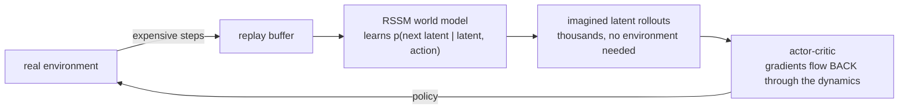
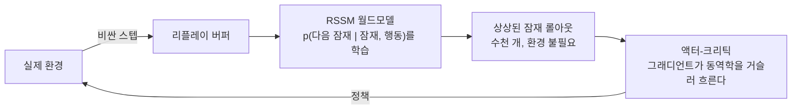

**Hafner et al., ICLR 2020 → Nature 2025 (v3)** — [arXiv (v3)](https://arxiv.org/abs/2301.04104) · [PDF](https://arxiv.org/pdf/2301.04104) · [Code](https://github.com/danijar/dreamerv3) · v1: [1912.01603](https://arxiv.org/abs/1912.01603) · v2: [2010.02193](https://arxiv.org/abs/2010.02193)

> [!note] 수학 준비물 · Math on-ramp
> RSSM = [[01-canonical-papers/notes/6-diffusion/vae|VAE]]'s ELBO machinery plus an RNN's recurrence. Prerequisites: [[02-foundations/information-theory|5. Information Theory §5]] (ELBO) and [[02-foundations/rl-basics|7. RL Basics §2 and §5]] (value functions, model-based RL). With those three, every equation in the paper reads as a combination.
> RSSM = [[01-canonical-papers/notes/6-diffusion/vae|VAE]]의 ELBO 기계장치 + RNN의 순환. 준비물: [[02-foundations/information-theory|정보이론 §5]] ELBO, [[02-foundations/rl-basics|RL 기초 §2·§5]]의 가치 함수와 모델 기반 RL. 이 셋이 있으면 논문의 모든 식이 조합으로 읽힌다.

## English

**One-line summary**: Train an actor-critic entirely inside the RSSM's imagination, backpropagating through the learned dynamics — refined over three versions into one agent that masters 150+ domains with a single configuration, up to collecting Minecraft diamonds from scratch.

### Context

[[planet|PlaNet]] planned online with CEM — expensive at action time and short-sighted.
The alternative: *amortize* planning into a learned policy, trained not on the real
environment but on the world model's imagined rollouts. The three-version arc is a case
study in making one idea actually robust.

### Method

> [!tip] Key intuition
> The world model is differentiable — so don't search through it, *backprop* through it.
> Imagine a few thousand latent trajectories, estimate values at their ends, and push
> policy gradients straight through the imagined dynamics. Real steps are only for
> updating the model.

- **v1 (ICLR 2020)**: RSSM world model + actor-critic trained on imagined latent
  trajectories; value bootstrapping (TD-λ) extends the effective horizon beyond the
  imagination length; gradients flow through dynamics.

*Two loops, and only the outer one touches the world. Real steps buy model accuracy;
policy improvement happens entirely inside the model — which is why the sample cost is set
by how fast the model becomes right, not by how fast the policy does.*

- **v2 (ICLR 2021)**: categorical (discrete) latents + KL balancing — first world-model
  agent to reach human-level Atari (55 games) from pixels.
- **v3 (arXiv 2023 → Nature 2025)**: robustness engineering so *one config fits all* —
  symlog predictions for scale-invariant losses, percentile return normalization, free
  bits — masters 150+ tasks (control, Atari, ProcGen, Minecraft) without per-domain tuning;
  first agent to obtain Minecraft diamonds with no human data. Performance scales
  predictably with model size.

### Results

- v3 matches or outperforms specialized model-free and model-based methods across many domains with fixed
  hyperparameters — among the strongest single-configuration general RL results of its era.
- Sample efficiency inherited from the model-based recipe: most learning happens in
  imagination.

### Limitations & critique

- Reconstruction-based world model still spends capacity on task-irrelevant pixels
  ([[jepa|JEPA]]'s standing critique); visually complex real-world scenes remain hard.
- Imagination horizons are short (~15 steps); long-horizon credit assignment leans on the
  value function.
- Sim-heavy evaluation; real-robot deployments (DayDreamer) exist but are limited.

### Impact & follow-ups

The reference architecture for "learning inside imagination" — the conceptual engine behind
using [[genie|Genie]]/[[cosmos|Cosmos]]-scale world models as robot training grounds, and
the model-based half of the physical-AI data strategy ([[gr00t-n1|GR00T]]'s data pyramid).

> [!question] Reading the claim · 핵심 주장 읽는 법
> V3's "mastering diverse domains" is a robustness claim — 150+ tasks under a single configuration — not a claim to beat every specialized model on every task. And the validation is simulation-centered; real-robot generalization remains a separate question.

### Connections

- Previous: [[planet|PlaNet]] (the RSSM) · Parallel critique: [[jepa|JEPA line]]
- Next: [[genie|Genie]], [[cosmos|Cosmos]] · Foundations: [[02-foundations/rl-basics|RL basics]]
- Lineage: [[03-deep-learning/lineage|논문 계보도]]

## 한국어

**한 줄 요약**: RSSM의 상상 속에서 actor-critic을 통째로 학습하고 학습된 동역학을 통해 역전파 — 세 버전에 걸쳐 다듬어져, 단일 설정으로 150개+ 도메인을 정복하고 마인크래프트 다이아몬드까지 캐는 에이전트가 됐다.

### 배경

[[planet|PlaNet]]은 CEM으로 온라인 플래닝을 했다 — 행동 시점 비용이 크고 근시안적이다.
대안: 플래닝을 학습된 정책으로 *상각*하되, 실제 환경이 아니라 월드모델의 상상된
롤아웃으로 훈련하는 것. 세 버전의 여정은 하나의 아이디어를 진짜 강건하게 만드는 과정의
교과서적 사례다.

### 방법

> [!tip] 핵심 직관
> 월드모델은 미분 가능하다 — 그러니 그 속을 탐색하지 말고 그 속으로 *역전파*하라.
> 잠재 궤적 수천 개를 상상하고, 끝에서 가치를 추정하고, 정책 그래디언트를 상상된 동역학에
> 곧장 통과시켜라. 실제 스텝은 모델 갱신에만 쓴다.

- **v1 (ICLR 2020)**: RSSM 월드모델 + 상상된 잠재 궤적으로 학습되는 actor-critic;
  가치 부트스트래핑(TD-λ)이 유효 지평을 상상 길이 너머로 확장; 그래디언트가 동역학을
  통과해 흐른다.

*루프가 둘이고, 세계에 닿는 것은 바깥 루프뿐이다. 실제 스텝은 모델의 정확도를 사고, 정책
개선은 전부 모델 안에서 일어난다 — 샘플 비용을 정하는 것이 정책이 좋아지는 속도가 아니라
모델이 맞아지는 속도인 이유다.*

- **v2 (ICLR 2021)**: 카테고리형(이산) 잠재변수 + KL 균형 — 월드모델 에이전트 최초로
  픽셀 입력 Atari(55개)에서 인간 수준 도달.
- **v3 (arXiv 2023 → Nature 2025)**: *하나의 설정이 모두에 맞도록* 만드는 강건성 공학 —
  스케일 불변 손실을 위한 symlog 예측, 백분위 리턴 정규화, free bits — 도메인별 튜닝 없이
  150개+ 과제(제어, Atari, ProcGen, 마인크래프트) 정복; 인간 데이터 없이 마인크래프트
  다이아몬드를 얻은 최초의 에이전트. 성능이 모델 크기에 따라 예측 가능하게 스케일.

### 결과

- v3는 고정 하이퍼파라미터로 여러 도메인에서 특화된 모델 프리/기반 기법들과 대등하거나 능가 —
  당대 가장 강한 축에 드는 단일 구성 범용 RL 결과.
- 모델 기반 레시피가 주는 샘플 효율: 학습 대부분이 상상 속에서 일어난다.

### 한계와 비판

- 복원 기반 월드모델은 여전히 과제와 무관한 픽셀에 용량을 쓴다([[jepa|JEPA]]의 상시
  비판); 시각적으로 복잡한 실세계 장면은 여전히 어렵다.
- 상상 지평이 짧다(~15 스텝); 긴 지평의 신용 할당은 가치 함수에 기댄다.
- 시뮬레이션 중심 평가; 실로봇 배치(DayDreamer)는 있으나 제한적.

### 영향과 후속 연구

"상상 속 학습"의 기준 구조 — [[genie|Genie]]/[[cosmos|Cosmos]]급 월드모델을 로봇 훈련장으로
쓰려는 발상의 개념적 엔진이자, physical AI 데이터 전략([[gr00t-n1|GR00T]]의 데이터
피라미드)의 모델 기반 절반이다.

> [!question] 핵심 주장 읽는 법 · Reading the claim
> v3의 "mastering diverse domains"는 "단일 설정으로 150+ 과제"라는 강건성 주장이지, 각 과제에서 특화 모델을 모두 이긴다는 주장이 아니다. 그리고 검증은 시뮬레이션 중심이다 — 실로봇 일반화는 별도의 질문으로 남아 있다.

### 연결

- 이전: [[planet|PlaNet]] (RSSM) · 병행 비판: [[jepa|JEPA 계열]]
- 다음: [[genie|Genie]], [[cosmos|Cosmos]] · 기초: [[02-foundations/rl-basics|RL 기초]]
- 계보: [[03-deep-learning/lineage|논문 계보도]]

### 읽고 나면 말할 수 있어야 하는 것 · After reading

- [ ] Say where real environment steps are used at all in "actor-critic in imagination" (model updates only) · "상상 속 actor-critic"에서 실제 환경 스텝이 어디에만 쓰이는지(모델 갱신) 말할 수 있다
- [ ] Explain why the RSSM needs both a deterministic and a stochastic path · RSSM의 결정론적/확률적 두 경로가 각각 왜 필요한지 설명할 수 있다
- [ ] Say how value bootstrapping compensates for the short (~15-step) imagination horizon · 가치 부트스트래핑이 짧은(~15 스텝) 상상 지평을 어떻게 보완하는지 말할 수 있다
- [ ] State that v1 → v3 is robustness engineering rather than new ideas, and name the concrete devices · v1→v3의 변화가 새 아이디어가 아니라 강건성 공학이라는 점과 그 구체 장치를 말할 수 있다
