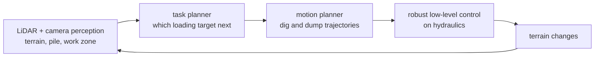

**Zhang et al., Science Robotics 2021** — [DOI](https://doi.org/10.1126/scirobotics.abc3164) · [PubMed](https://pubmed.ncbi.nlm.nih.gov/34193561/)

> [!note] Math on-ramp · 수학 준비물
> [[04-robotics/planning-decision-making|4. Planning]] and [[04-robotics/state-estimation-slam|3. State Estimation]] — this is a full classical stack, so read it as a systems-integration paper against [[05-construction-robotics/index|the construction reading frame]] rather than looking for a new algorithm.
> [[04-robotics/planning-decision-making|4. 계획]]과 [[04-robotics/state-estimation-slam|3. 상태 추정]] — 고전적 스택 전체이므로 새 알고리즘을 찾기보다 [[05-construction-robotics/index|건설 트랙의 읽기 프레임]]에 대조해 시스템 통합 논문으로 읽어라.

## English

**One-line summary**: Baidu's AES integrated perception, task/motion planning, and control into a full autonomous excavation stack, deployed it across excavator sizes from compact class up to the 49-tonne class, and reported 24 hours of uncrewed operation per human intervention with hourly material throughput "closely equivalent to an experienced human operator".

**Lineage position**: AES is the industrial-deployment answer to the question [[01-canonical-papers/notes/8-construction/stentz-excavator|Stentz's 1998 CMU excavator]] opened — can a machine run the full loading cycle without a person in the cab? Where CMU demonstrated the integrated cycle, AES demonstrates *duration and productivity at industrial scale*, and it is the deployment counterweight to simulation-heavy learning papers like [[01-canonical-papers/notes/8-construction/ext|ExT]].

**Method (system level)**: LiDAR and camera perception reconstruct the terrain, the material pile, and the work zone; a task planner selects loading targets and a motion planner generates dig/dump trajectories; robust low-level control executes them on hydraulic machines. The architecture is modular, not end-to-end learned — the lesson is system engineering and operational robustness, not a single foundation-model component. Porting one stack across machine sizes (compact through 49-tonne) is itself a major engineering claim: sensing geometry, hydraulic dynamics, and workspace scale all change with the platform.

*Every block is classical and separately engineered — nothing here is end-to-end learned.
The claim worth weighing is that the same stack ported from compact machines to 49-tonne
ones, because sensing geometry, hydraulic dynamics and workspace scale all change with the
platform and none of them are in the algorithm.*

**Evidence, with numbers**: (1) *machine range* — the same stack ran on multiple excavator sizes, from compact class to 49-tonne class; (2) *duration* — 24 hours of continuous uncrewed operation per human intervention in deployed material-loading work; (3) *throughput* — the abstract's exact claim is that "the amount of material handled by AES per hour is closely equivalent to an experienced human operator". It states no unit and no figure, so cite it as a parity claim, not as a tons/hour or m³/h number. These three axes (transfer across machines, autonomy duration, human-parity productivity) are exactly the ones most academic excavation papers cannot report.

**Limitations**: the deployment is a constrained material-loading site, not open-world earthmoving. Task variety is narrow (loading), the environment is semi-structured, and safety is managed by site control rather than onboard guarantees. Machine-size transfer, site/task variation, and accumulated production hours should each be read as separate claims with separate evidence.

> [!question] 핵심 주장 읽는 법 · Reading the claim
> Continuous operation in a constrained material-handling site is strong deployment evidence, but not proof of general excavation autonomy. Separate three different claims when citing AES: (a) machine-size transfer of one stack, (b) 24-hour uncrewed intervals, and (c) human-level tons/hour — each holds in the reported loading deployment, none automatically extends to arbitrary soils, sites, or tasks.

## 한국어

**한 줄 요약**: Baidu의 AES는 인식·과제/모션 계획·제어를 완전한 자율 굴착 스택으로 통합해 컴팩트급부터 49톤급까지의 굴착기에 배치했고, 인간 개입당 24시간의 무인 운용과 숙련 운전자에 가까운 처리량(tons/hour)을 보고했다.

**계보에서의 위치**: AES는 [[01-canonical-papers/notes/8-construction/stentz-excavator|Stentz의 1998 CMU 굴착기]]가 연 질문 — 기계가 사람 없이 전체 적재 사이클을 돌릴 수 있는가 — 에 대한 산업 배치 쪽의 답이다. CMU가 통합 사이클을 시연했다면, AES는 *산업 규모의 지속 시간과 생산성*을 시연한다. [[01-canonical-papers/notes/8-construction/ext|ExT]] 같은 시뮬레이션 중심 학습 논문의 배치 측 대응물이다.

**방법(시스템 수준)**: LiDAR와 카메라 인식이 지형·재료 더미·작업 구역을 재구성하고, 과제 계획기가 적재 목표를 선택하며, 모션 계획기가 굴착/투하 궤적을 생성하고, 강건한 저수준 제어가 유압 기계에서 이를 실행한다. 아키텍처는 엔드투엔드 학습이 아니라 모듈형이다 — 교훈은 단일 파운데이션 모델 요소가 아니라 시스템 엔지니어링과 운용 강건성이다. 하나의 스택을 기계 크기(컴팩트급~49톤급)에 걸쳐 이식한 것 자체가 큰 엔지니어링 주장이다: 센싱 기하, 유압 동역학, 작업 공간 규모가 플랫폼마다 모두 달라진다.

*모든 블록이 고전적이고 따로 설계되었다 — 여기에 엔드투엔드로 학습된 것은 없다. 무게를
달아볼 주장은 같은 스택이 컴팩트급에서 49톤급까지 이식되었다는 것이다. 센싱 기하, 유압
동역학, 작업 공간 규모가 플랫폼마다 다 달라지는데 그중 어느 것도 알고리즘 안에 없기 때문이다.*

**증거, 숫자와 함께**: (1) *기계 범위* — 같은 스택이 컴팩트급부터 49톤급까지 여러 크기의 굴착기에서 돌아갔다; (2) *지속 시간* — 실제 재료 적재 작업에서 인간 개입당 24시간의 연속 무인 운용; (3) *처리량* — 초록의 정확한 주장은 "AES가 시간당 처리하는 자재의 양이 숙련 운전자와 거의 동등하다"이다. 단위도 수치도 제시하지 않으므로 tons/hour나 m³/h 수치가 아니라 대등성 주장으로 인용하라. 이 세 축(기계 간 전이, 자율 지속 시간, 인간 대등 생산성)이 바로 대부분의 학술 굴착 논문이 보고하지 못하는 것들이다.

**한계**: 배치 현장은 제한된 재료 적재 현장이지 개방 환경 토공이 아니다. 과제 다양성이 좁고(적재), 환경이 반구조화되어 있으며, 안전은 온보드 보장이 아니라 현장 통제로 관리된다. 기계 크기 전이, 현장/과제 변동, 누적 생산 시간은 각각 별도의 증거를 가진 별도의 주장으로 읽어야 한다.

> [!question] 핵심 주장 읽는 법
> 제한된 재료 처리 현장의 연속 운용은 강한 배치 증거이지만 일반 굴착 자율성의 증명은 아니다. AES를 인용할 때 세 주장을 분리하라: (a) 한 스택의 기계 크기 간 전이, (b) 24시간 무인 구간, (c) 인간 수준 tons/hour — 각각은 보고된 적재 배치에서 성립하며, 어느 것도 임의의 토질·현장·과제로 자동 확장되지 않는다.

### 연결

- 이전: [[01-canonical-papers/notes/8-construction/stentz-excavator|Stentz 1998 CMU 굴착기]] (통합 사이클의 원점) · 다음: [[01-canonical-papers/notes/8-construction/ext|ExT]] (학습 기반 굴착의 파운데이션 모델 레시피)
- 스트림: [[05-construction-robotics/earthmoving-heavy-machinery|토공·중장비]] · [[05-construction-robotics/industry-deployment|산업 배치]]
- 계보: [[05-construction-robotics/lineage|건설로봇 계보]]

### 읽고 나면 말할 수 있어야 하는 것 · After reading (★)

- [ ] Reconstruct the AES stack module by module (perception → task/motion planning → control) and say which sensors and outputs each module uses · AES 스택의 모듈 구성(인식 → 과제/모션 계획 → 제어)을 단계별로 재구성하고, 각 모듈이 어떤 센서/출력을 쓰는지 말할 수 있다
- [ ] Explain the three evidence axes — transfer from compact to 49-tonne machines, 24 h uncrewed per intervention, expert-operator hourly throughput (a parity claim, with no unit in the paper) — with their numbers and within their evaluation scope · 세 가지 증거 축(컴팩트급~49톤급 기계 전이, 개입당 24시간 무인 운용, 숙련 운전자급 tons/hour)을 숫자와 함께 각각의 평가 범위 안에서 설명할 수 있다
- [ ] Say exactly what "24 hours uncrewed" is a measure of (an interval between interventions, not unbounded autonomy) and the role site control plays in safety · "24시간 무인"이 정확히 무엇의 지표인지(개입 간격이지 무한 자율이 아님)와 현장 통제가 안전에서 맡는 역할을 말할 수 있다
- [ ] Separate method novelty from system completeness, and place AES on the deployment side between Stentz and modern learned excavation · 학습 신규성과 시스템 완결성을 구분하고, AES가 Stentz→현대 학습 기반 굴착 사이에서 차지하는 배치 측 위치를 설명할 수 있다
