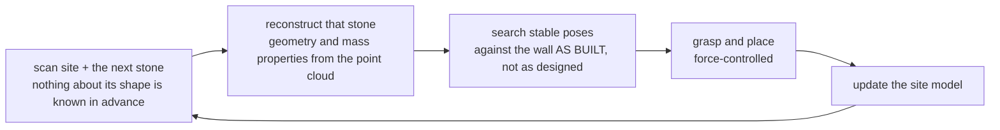

**Johns et al.**, "A framework for robotic excavation and dry stone construction using on-site materials," *Science Robotics* 2023 — [DOI](https://doi.org/10.1126/scirobotics.abp9758) · [ETH project report](https://ethz.ch/en/news-and-events/eth-news/news/2023/11/autonomous-excavator-constructs-a-six-metre-high-dry-stone-wall.html)

> [!note] Math on-ramp · 수학 준비물
> [[04-robotics/modern-robotics/ch12-grasping|MR ch.12]] (force closure on irregular objects) and [[04-robotics/contact-force-tactile|9. Contact]]. The interesting question is geometric: how do you plan a stable structure from *unmeasured, irregular* stones?
> [[04-robotics/modern-robotics/ch12-grasping|MR 12장]](불규칙 물체의 force closure)과 [[04-robotics/contact-force-tactile|9. 접촉]]. 흥미로운 질문은 기하학적이다: *측정되지 않은 불규칙한* 돌들로 어떻게 안정한 구조를 계획하는가?

## English

**One-line summary**: [[01-canonical-papers/notes/8-construction/heap|HEAP]] — ETH's autonomous Menzi Muck M545 walking excavator — scanned irregular on-site stones, estimated usable geometry and mass properties, planned stable placements, and manipulated multi-tonne boulders and demolition debris into a 6 m-high, 65 m-long dry-stone wall at the Oberglatt Circularity Park.

**Lineage position**: this is the merge point of two streams that rarely touch — [[05-construction-robotics/earthmoving-heavy-machinery|heavy-machine autonomy]] and [[05-construction-robotics/assembly-fabrication|robotic assembly/fabrication]] — executed by a four-chair ETH collaboration (Gramazio Kohler Research for digital fabrication, RSL for the machine, the Chli group for vision, and Girot's landscape-architecture chair for the design commission). It is the flagship follow-up that the HEAP platform investment paid for.

**Method (pipeline)**: site and stone scanning → per-stone candidate reconstruction (geometry and mass properties from point clouds) → structural/placement planning that searches stable poses against the as-built wall state → grasping and force-controlled placement with the excavator arm → updated site model that feeds the next placement. The loop is closed: every placed stone changes the wall state the planner sees next. The material is *found* — multi-tonne local boulders and demolition debris, not fabricated units — so nothing about a stone's geometry is known before it is scanned.

*What makes this hard is the arrow that closes the loop. Every placed stone changes the
wall the planner will see next, and the stones are found rather than fabricated — so the
plan cannot be computed once in advance. Compare a factory assembly line, where part and
fixture are both known before the robot moves.*

**Evidence, with numbers**: the built artifact is the evidence — a dry-stone wall 6 m high and 65 m long, built from multi-tonne on-site stones and recycled demolition debris at the Oberglatt Circularity Park (Switzerland), by a single ~12-tonne-class walking excavator platform (the Menzi Muck M545 that HEAP instruments). This is a full-scale, permanent civil structure, not a lab mock-up: the placement planner had to guarantee static stability under real masses, and the manipulation had to be force-controlled because irregular multi-tonne stones cannot be position-placed blindly.

**Limitations**: one platform, one project, one site. The workflow demonstrates integrated material reuse at full scale but not unrestricted autonomous masonry, arbitrary rock supply, or commercial productivity benchmarked against a human mason. Throughput and cost comparisons are not the paper's claim.

> [!question] 핵심 주장 읽는 법 · Reading the claim
> The result demonstrates an integrated material-reuse workflow — local material becomes sensed state, planned structure, and executed contact — on one instrumented platform and one project. Read it as a system-breadth claim (the closed perception→planning→force-control loop at multi-tonne scale), not as an object-detection benchmark and not as evidence that autonomous masonry is commercially solved.

## 한국어

**한 줄 요약**: [[01-canonical-papers/notes/8-construction/heap|HEAP]] — ETH의 자율 Menzi Muck M545 보행 굴착기 — 가 현장의 불규칙 자연석을 스캔해 사용 가능한 형상·질량 특성을 추정하고 안정적 배치를 계획한 뒤, 수 톤급 돌과 철거 잔해를 조작해 Oberglatt Circularity Park에 높이 6 m·길이 65 m의 건식 돌담을 쌓았다.

**계보에서의 위치**: 이 논문은 좀처럼 만나지 않는 두 스트림 — [[05-construction-robotics/earthmoving-heavy-machinery|중장비 자율성]]과 [[05-construction-robotics/assembly-fabrication|로봇 조립·패브리케이션]] — 의 합류점이며, ETH의 네 석좌 협업(디지털 패브리케이션의 Gramazio Kohler Research, 기계의 RSL, 비전의 Chli 그룹, 조경 설계의 Girot 석좌)으로 실행됐다. HEAP 플랫폼 투자가 지불한 대표 후속 성과다.

**방법(파이프라인)**: 현장·돌 스캔 → 돌별 후보 재구성(점군에서 형상·질량 특성) → 현재 as-built 벽 상태에 대해 안정적 자세를 탐색하는 구조/배치 계획 → 굴착기 팔의 파지와 힘 제어 배치 → 다음 배치에 입력되는 현장 모델 갱신. 루프는 닫혀 있다: 놓인 돌 하나하나가 계획기가 다음에 보는 벽 상태를 바꾼다. 재료는 *발견된* 것 — 수 톤급 현지 자연석과 철거 잔해이지 제작된 유닛이 아니다 — 이므로 스캔 전에는 돌의 형상에 대해 아무것도 알 수 없다.

*이 문제를 어렵게 만드는 것은 루프를 닫는 저 화살표다. 놓인 돌 하나하나가 계획기가 다음에 볼
벽을 바꾸고, 돌은 제작된 것이 아니라 발견된 것이다 — 그래서 계획을 미리 한 번에 계산할 수
없다. 부품과 지그가 로봇이 움직이기 전에 이미 알려져 있는 공장 조립 라인과 대조해 보라.*

**증거, 숫자와 함께**: 지어진 구조물 자체가 증거다 — 스위스 Oberglatt Circularity Park에서 수 톤급 현장 자연석과 재활용 철거 잔해로 쌓은 높이 6 m·길이 65 m의 건식 돌담을, 약 12톤급 보행 굴착기 플랫폼 한 대(HEAP이 계측한 Menzi Muck M545)가 만들었다. 실험실 목업이 아니라 실규모의 영구 토목 구조물이다: 배치 계획기는 실제 질량 하에서 정적 안정성을 보장해야 했고, 불규칙한 수 톤급 돌은 눈감고 위치 배치할 수 없기 때문에 조작은 힘 제어여야 했다.

**한계**: 플랫폼 하나, 프로젝트 하나, 현장 하나. 이 워크플로는 실규모의 통합 재료 재사용을 시연하지만, 무제한 자율 석공, 임의 석재 공급, 인간 석공 대비 상업 생산성을 보여주지는 않는다. 처리량·비용 비교는 이 논문의 주장이 아니다.

> [!question] 핵심 주장 읽는 법
> 이 결과는 통합 재료 재사용 워크플로 — 현지 재료가 감지된 상태, 계획된 구조, 실행된 접촉이 되는 — 를 계측된 플랫폼 하나와 프로젝트 하나에서 시연한다. 시스템 폭의 주장(수 톤급 규모에서 닫힌 인식→계획→힘 제어 루프)으로 읽어야지, 객체 탐지 벤치마크로도, 자율 석공이 상업적으로 풀렸다는 증거로도 읽으면 안 된다.

### 연결

- 이전: [[01-canonical-papers/notes/8-construction/heap|HEAP]] (이 작업을 실은 플랫폼)
- 스트림: [[05-construction-robotics/assembly-fabrication|조립·패브리케이션 스트림]] · [[05-construction-robotics/site-perception|현장 인식]]
- 계보: [[05-construction-robotics/lineage|건설로봇 계보]] (GKR → Dörfler/Parascho/Hack/Johns, RSL → Jud 계보의 합작)

### 읽고 나면 말할 수 있어야 하는 것 · After reading (★)

- [ ] Reconstruct the closed loop (scan → per-stone reconstruction → placement planning → force-controlled placement → model update) and say why each stage needs the previous stage's output · 스캔 → 돌별 재구성 → 배치 계획 → 힘 제어 배치 → 모델 갱신의 폐루프를 단계별로 재구성하고, 왜 각 단계가 이전 단계의 출력을 필요로 하는지 말할 수 있다
- [ ] Say what each headline number is evidence *of* — 6 m tall × 65 m long, multi-tonne natural stone and demolition debris, one Menzi Muck M545 walking excavator, Oberglatt Circularity Park · 핵심 숫자 — 6 m 높이 × 65 m 길이, 수 톤급 자연석·철거 잔해, Menzi Muck M545 보행 굴착기 한 대, Oberglatt Circularity Park — 를 각각 무엇의 증거로 읽어야 하는지 말할 수 있다
- [ ] Explain why this task requires force-controlled rather than position-controlled manipulation (irregular shapes, multi-tonne mass, contact-based seating) · 왜 이 과제에서 위치 제어가 아니라 힘 제어 조작이 필수인지(불규칙 형상, 수 톤 질량, 접촉 기반 안착)를 설명할 수 있다
- [ ] Say why this paper is the confluence of the earthmoving and the assembly/fabrication streams, and separate what the full-scale demonstration proved from the generalization gaps it left (stone supply, commercial productivity) · 이 논문이 굴착(중장비) 스트림과 조립(패브리케이션) 스트림의 합류점인 이유와, 실규모 시연이 증명한 것과 남긴 일반화 공백(석재 공급, 상업 생산성)을 구분해 말할 수 있다
