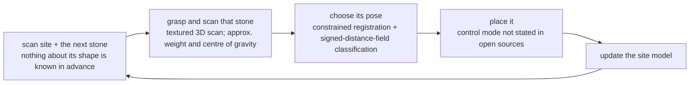

**Johns et al.**, "A framework for robotic excavation and dry stone construction using on-site materials," *Science Robotics* 2023 — [DOI](https://doi.org/10.1126/scirobotics.abp9758) · [ETH project report](https://ethz.ch/en/news-and-events/eth-news/news/2023/11/autonomous-excavator-constructs-a-six-metre-high-dry-stone-wall.html)

> [!note] Math on-ramp · 수학 준비물
> [[04-robotics/modern-robotics/ch12-grasping|MR ch.12]] (force closure on irregular objects) and [[04-robotics/contact-force-tactile|9. Contact]]. The interesting question is geometric: how do you plan a stable structure from *unmeasured, irregular* stones?
> [[04-robotics/modern-robotics/ch12-grasping|MR 12장]](불규칙 물체의 force closure)과 [[04-robotics/contact-force-tactile|9. 접촉]]. 흥미로운 질문은 기하학적이다: *측정되지 않은 불규칙한* 돌들로 어떻게 안정한 구조를 계획하는가?

## English

**One-line summary**: [[01-canonical-papers/notes/8-construction/heap|HEAP]] — ETH's autonomous Menzi Muck M545 walking excavator — scanned irregular on-site stones, grasped and scanned each one (the abstract: "robotic grasping and textured 3D scanning of individual stones and rubble elements"; ETH's announcement adds that the machine registers each stone's approximate weight and centre of gravity), planned stable placements, and manipulated multi-tonne boulders and demolition debris into two structures at the Oberglatt Circularity Park: a freestanding wall 10 × 1.7 × 4 m, and a permanent retaining wall 65.5 × 1.8 × 6 m integrated with 665 m² of robotically contoured terraces.

**Lineage position**: this is the merge point of two streams that rarely touch — [[05-construction-robotics/earthmoving-heavy-machinery|heavy-machine autonomy]] and [[05-construction-robotics/assembly-fabrication|robotic assembly/fabrication]] — executed by a four-chair ETH collaboration (Gramazio Kohler Research for digital fabrication, RSL for the machine, the Chli group for vision, and Girot's landscape-architecture chair for the design commission). It is the flagship follow-up that the HEAP platform investment paid for.

> [!tip] Key intuition · 핵심 직관
> Found stones cannot be treated as interchangeable parts with known poses. Scanning each stone and updating the built-wall state makes the next placement conditional on actual geometry, The abstract's planner is geometric: it chooses poses by registering scanned stones against the target shape.

**Method (pipeline)**, as far as the abstract and ETH's announcement state it: a detector trained on real and simulated data finds and segments stone instances in spatial maps → the excavator, fitted with a shovel and a gripper, grasps each stone and takes a textured 3D scan (ETH's announcement: also its approximate weight and centre of gravity) → a geometric planner uses "constrained registration and signed-distance-field classification" to choose where each stone from the limited scanned inventory should go → the excavator places it → the map is updated for the next placement. The same hardware and mapping also shape the terrain. The control mode used for placement is not stated in either open source. The loop is closed: every placed stone changes the wall state the planner sees next. The material is *found* — multi-tonne local boulders and demolition debris, not fabricated units — so nothing about a stone's geometry is known before it is scanned.

*What makes this hard is the arrow that closes the loop. Every placed stone changes the
wall the planner will see next, and the stones are found rather than fabricated — so the
plan cannot be computed once in advance. Compare a factory assembly line, where part and
fixture are both known before the robot moves.*

**Evidence, with numbers**: the built artifact is the evidence — the abstract reports "a freestanding stone wall (10 meters by 1.7 meters by 4 meters) and a permanent retaining wall (65.5 meters by 1.8 meters by 6 meters) that is integrated with robotically contoured terraces (665 square meters)", built from multi-tonne on-site stones and recycled demolition debris at the Oberglatt Circularity Park (Switzerland), by a single ~12-tonne-class walking excavator platform (the Menzi Muck M545 that HEAP instruments). The press coverage's "six-metre-high, sixty-five-metre-long wall" names the retaining wall alone. This is a full-scale, permanent civil structure, not a lab mock-up: the placement planner had to guarantee static stability under real masses. ETH's announcement adds that the machine places 20 to 30 stones per delivery.

**Limitations**: one platform, one project, one site. The workflow demonstrates integrated material reuse at full scale but not unrestricted autonomous masonry, arbitrary rock supply, or commercial productivity benchmarked against a human mason. Throughput and cost comparisons are not the paper's claim.

> [!question] Reading the claim · 핵심 주장 읽는 법
> The result demonstrates an integrated material-reuse workflow — local material becomes sensed state, planned structure, and executed contact — on one instrumented platform and one project. Read it as a system-breadth claim (a closed detection→scan→plan→place loop at multi-tonne scale), not as an object-detection benchmark and not as evidence that autonomous masonry is commercially solved.

## 한국어

**한 줄 요약**: [[01-canonical-papers/notes/8-construction/heap|HEAP]] — ETH의 자율 Menzi Muck M545 보행 굴착기 — 가 현장의 불규칙 자연석을 스캔해 하나씩 파지해 스캔하고(초록의 표현은 "개별 자연석과 잔해의 로봇 파지와 텍스처 3D 스캔"이다. ETH 발표는 기계가 돌마다 대략의 무게와 무게중심도 등록한다고 덧붙인다) 안정적 배치를 계획한 뒤, 수 톤급 돌과 철거 잔해를 조작해 Oberglatt Circularity Park에 두 구조물을 쌓았다: 10 × 1.7 × 4 m의 독립 석벽과, 665 m²의 로봇 성형 테라스와 통합된 65.5 × 1.8 × 6 m의 영구 옹벽이다.

**계보에서의 위치**: 이 논문은 좀처럼 만나지 않는 두 스트림 — [[05-construction-robotics/earthmoving-heavy-machinery|중장비 자율성]]과 [[05-construction-robotics/assembly-fabrication|로봇 조립·패브리케이션]] — 의 합류점이며, ETH의 네 석좌 협업(디지털 패브리케이션의 Gramazio Kohler Research, 기계의 RSL, 비전의 Chli 그룹, 조경 설계의 Girot 석좌)으로 실행됐다. HEAP 플랫폼 투자가 지불한 대표 후속 성과다.

> [!tip] 핵심 직관 · Key intuition
> 현장에서 얻은 돌은 알려진 자세의 교환 가능한 부품이 아니다. 각 돌을 스캔하고 쌓인 벽을 갱신하면 다음 배치가 실제 형상에 따라 정해진다. 초록의 계획기는 기하적이다. 스캔한 돌을 목표 형상에 정합해 자세를 고른다.

**방법(파이프라인)**, 초록과 ETH 발표가 밝히는 범위에서: 실제·시뮬레이션 데이터로 학습한 검출기가 공간 지도에서 돌 인스턴스를 찾아 분할한다 → 삽과 그리퍼를 단 굴착기가 돌을 하나씩 파지해 텍스처 3D 스캔을 한다(ETH 발표: 대략의 무게와 무게중심도) → 기하 계획기가 "constrained registration과 signed-distance-field 분류"로 스캔된 한정 재고의 돌 각각을 어디에 놓을지 정한다 → 굴착기가 놓는다 → 다음 배치를 위해 지도를 갱신한다. 같은 하드웨어와 지도로 지형도 성형한다. 배치에 쓴 제어 방식은 두 공개 출처 어디에도 적혀 있지 않다. 루프는 닫혀 있다: 놓인 돌 하나하나가 계획기가 다음에 보는 벽 상태를 바꾼다. 재료는 *발견된* 것 — 수 톤급 현지 자연석과 철거 잔해이지 제작된 유닛이 아니다 — 이므로 스캔 전에는 돌의 형상에 대해 아무것도 알 수 없다.

*이 문제를 어렵게 만드는 것은 루프를 닫는 저 화살표다. 놓인 돌 하나하나가 계획기가 다음에 볼
벽을 바꾸고, 돌은 제작된 것이 아니라 발견된 것이다 — 그래서 계획을 미리 한 번에 계산할 수
없다. 부품과 지그가 로봇이 움직이기 전에 이미 알려져 있는 공장 조립 라인과 대조해 보라.*

**증거, 숫자와 함께**: 지어진 구조물 자체가 증거다 — 초록은 "10 m × 1.7 m × 4 m의 독립 석벽과, 로봇이 성형한 테라스(665 m²)와 통합된 65.5 m × 1.8 m × 6 m의 영구 옹벽"을 보고한다. 스위스 Oberglatt Circularity Park에서 수 톤급 현장 자연석과 재활용 철거 잔해로, 약 12톤급 보행 굴착기 플랫폼 한 대(HEAP이 계측한 Menzi Muck M545)가 만들었다. 보도자료의 "높이 6 m·길이 65 m 돌담"은 그중 옹벽 하나를 가리킨다. 실험실 목업이 아니라 실규모의 영구 토목 구조물이다: 배치 계획기는 실제 질량 하에서 정적 안정성을 보장해야 했다. ETH 발표는 기계가 한 번 배송분에 해당하는 돌 20~30개를 놓는다고 덧붙인다.

**한계**: 플랫폼 하나, 프로젝트 하나, 현장 하나. 이 워크플로는 실규모의 통합 재료 재사용을 시연하지만, 무제한 자율 석공, 임의 석재 공급, 인간 석공 대비 상업 생산성을 보여주지는 않는다. 처리량·비용 비교는 이 논문의 주장이 아니다.

> [!question] 핵심 주장 읽는 법 · Reading the claim
> 이 결과는 통합 재료 재사용 워크플로 — 현지 재료가 감지된 상태, 계획된 구조, 실행된 접촉이 되는 — 를 계측된 플랫폼 하나와 프로젝트 하나에서 시연한다. 시스템 폭의 주장(수 톤급 규모에서 닫힌 검출→스캔→계획→배치 루프)으로 읽어야지, 객체 탐지 벤치마크로도, 자율 석공이 상업적으로 풀렸다는 증거로도 읽으면 안 된다.

### 연결

- 이전: [[01-canonical-papers/notes/8-construction/heap|HEAP]] (이 작업을 실은 플랫폼)
- 스트림: [[05-construction-robotics/assembly-fabrication|조립·패브리케이션 스트림]] · [[05-construction-robotics/site-perception|현장 인식]]
- 계보: [[05-construction-robotics/lineage|건설로봇 계보]] (GKR → Dörfler/Parascho/Hack/Johns, RSL → Jud 계보의 합작)

### 읽고 나면 말할 수 있어야 하는 것 · After reading (★)

- [ ] Reconstruct the closed loop (detect → grasp and scan → placement planning → placement → map update) and say why each stage needs the previous stage's output · 검출 → 파지·스캔 → 배치 계획 → 배치 → 지도 갱신의 폐루프를 단계별로 재구성하고, 왜 각 단계가 이전 단계의 출력을 필요로 하는지 말할 수 있다
- [ ] Say what each headline number is evidence *of* — two walls (10 × 1.7 × 4 m freestanding, 65.5 × 1.8 × 6 m retaining) plus 665 m² of terraces, multi-tonne natural stone and demolition debris, one Menzi Muck M545 walking excavator, Oberglatt Circularity Park · 핵심 숫자 — 벽 둘(독립 10 × 1.7 × 4 m, 옹벽 65.5 × 1.8 × 6 m)과 테라스 665 m², 수 톤급 자연석·철거 잔해, Menzi Muck M545 보행 굴착기 한 대, Oberglatt Circularity Park — 를 각각 무엇의 증거로 읽어야 하는지 말할 수 있다
- [ ] Say what the open sources do and do not tell you about placement — geometric planning is stated, the control mode is not — and what you would look for in the full text before citing it for contact control · 공개 출처가 배치에 대해 말하는 것과 말하지 않는 것(기하 계획은 명시, 제어 방식은 없음)을 구분하고, 접촉 제어의 근거로 인용하기 전에 본문에서 무엇을 확인해야 하는지 말할 수 있다
- [ ] Say why this paper is the confluence of the earthmoving and the assembly/fabrication streams, and separate what the full-scale demonstration proved from the generalization gaps it left (stone supply, commercial productivity) · 이 논문이 굴착(중장비) 스트림과 조립(패브리케이션) 스트림의 합류점인 이유와, 실규모 시연이 증명한 것과 남긴 일반화 공백(석재 공급, 상업 생산성)을 구분해 말할 수 있다
