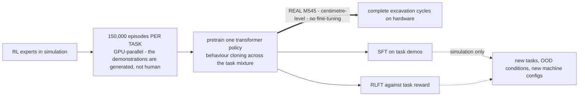
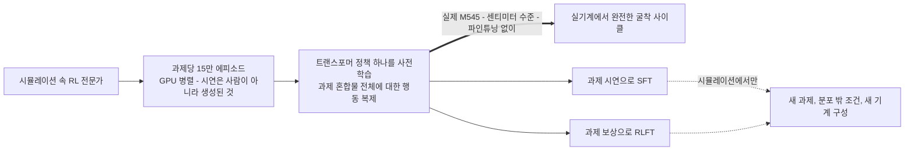

**Zhai, Terenzi et al. (ETH RSL), 2025** — [arXiv](https://arxiv.org/abs/2509.14992) · [PDF](https://arxiv.org/pdf/2509.14992)

> [!note] Math on-ramp · 수학 준비물
> [[02-foundations/rl-basics|7. RL Basics §6 and §9]] (imitation from RL-expert demonstrations, and what fine-tuning on a real machine costs) plus [[05-construction-robotics/sim-to-real|Sim-to-Real §3]]'s deployment ladder — the ladder, not the method name, is what sets this paper's claim.
> [[02-foundations/rl-basics|7. RL 기초 §6·§9]](RL 전문가 시연으로부터의 모방, 그리고 실기계 파인튜닝의 비용)와 [[05-construction-robotics/sim-to-real|Sim-to-Real §3]]의 배치 사다리 — 이 논문의 주장 수준을 정하는 것은 방법 이름이 아니라 그 사다리다.

## English

**One-line summary**: The foundation-model recipe arrives at excavation — a unified open-source framework for large-scale demonstration collection, **multi-task pretraining**, and **SFT/RLFT fine-tuning** of excavation policies, executing full digging cycles with centimeter-level accuracy.

**Why it is a signal**: this is the
[[01-canonical-papers/notes/4-vla/pi0|pretrain → post-train]] paradigm — the exact structure of
LLM/VLA training — applied to a full-size hydraulic excavator (the ~12 t Menzi Muck M545, the same machine as [[01-canonical-papers/notes/8-construction/heap|HEAP]]). Demonstrations come from a *mix of
experts* (the [[01-canonical-papers/notes/4-vla/open-x-embodiment|OXE]] lesson: heterogeneous
sources beat purity), and fine-tuning offers both supervised and RL variants (the
[[01-canonical-papers/notes/1-foundations/instructgpt|RLHF]]-shaped choice). Transfer across sim/real
and machine configurations is a design goal, not an afterthought.

**The pipeline, concretely** (what a Working-level read should extract):

- **Demonstration generation**: 150,000 episodes *per task* collected in **GPU-parallel
  simulation** (the [[05-construction-robotics/sim-to-real|Isaac-Gym-lineage]] recipe) —
  from **heterogeneous sources** (per-task RL expert policies, scripted controllers,
  teleoperation). Read the two headline figures with their scope attached: the
  **scripted** Dump and Move Arm data is "roughly 30 days of continuous real-world
  operation, generated in under two hours on a single RTX 3090", while Dig's 150,000
  episodes come from a *trained* RL expert (~98% success) and are worth about **15 more
  days** — so the corpus is 45-plus days-equivalent, and the two-hour figure covers only
  the scripted portion. Simulation is what
  makes the demos unlimited, labeled, and resettable; it is also the recipe's main scope
  limit.
- **Pretraining**: one transformer policy trained by behavior cloning across the mixed
  multi-task demonstration corpus (arm + cabin-swing action space; **four tasks: Dig,
  Dump, Move Arm, and Abort-Digging-&-Reset** — together a complete dig–dump–move
  excavation cycle).
- **Fine-tuning, two variants**: **SFT** (supervised, on task-specific demonstrations)
  and **RLFT** (RL fine-tuning against task reward) — demonstrated **in simulation** for
  adapting to new tasks, out-of-distribution conditions, and machine configurations while
  retaining prior tasks; the headline is that *both start from the same pretrained
  policy*, which is the paradigm claim.
- **Transfer evidence**: the **pretrained** multi-task policy executes complete
  excavation cycles on the real M545 ([[01-canonical-papers/notes/8-construction/heap|HEAP]])
  with centimeter-level accuracy, comparable to specialized single-task controllers —
  sim-to-real transfer of the pretrained policy itself; the fine-tuning results are
  simulation studies. Trace exact task tables and metrics in the paper's experiments
  section (the note deliberately does not reproduce every table).

*Read the arrow weights before the architecture. The thick arrow is the only claim tested
on hardware, and it comes from the **pretrained** policy; the fine-tuning results — the
part that sounds most like the LLM paradigm — are simulation studies. Same paper, two very
different evidentiary weights ([[05-construction-robotics/sim-to-real|deployment ladder]]).*

**Placed in the map**: the merge that the
[[05-construction-robotics/lineage|lineage]] page calls open territory — era-4 robot
learning (imitation, pretrain→fine-tune) arriving on era-1R heavy machines — now with its
first occupant. Open questions: task diversity is still excavation-shaped; no language
conditioning; and the safety story for learned policies on real sites is unwritten.

> [!question] Reading the claim · 핵심 주장 읽는 법
> The "scalable" in "scalable autonomous excavation" is a claim about the framework's scalability (collection → pretraining → fine-tuning), not validation of real site deployment — the safety story and task diversity remain open problems. Read it as a signal that the foundation-model era of excavation has *opened*, not that it has arrived.

## 한국어

**한 줄 요약**: 파운데이션 모델 레시피가 굴착에 도착했다 — 대규모 시연 수집, **멀티태스크 사전학습**, **SFT/RLFT 파인튜닝**을 하나로 묶은 오픈소스 프레임워크로, 완전한 굴착 사이클을 센티미터급 정확도로 수행한다.

**왜 신호탄인가**: 이것은 [[01-canonical-papers/notes/4-vla/pi0|사전학습 → 사후학습]] 패러다임 —
LLM/VLA 학습의 바로 그 구조 — 를 실물 크기 유압 굴착기(약 12 t Menzi Muck M545, [[01-canonical-papers/notes/8-construction/heap|HEAP]]과 같은 기계)에 적용한 것이다. 시연은 *전문가들의
혼합*에서 온다([[01-canonical-papers/notes/4-vla/open-x-embodiment|OXE]]의 교훈: 이질적 소스가
순수함을 이긴다), 파인튜닝은 지도·RL 두 변형을 제공한다
([[01-canonical-papers/notes/1-foundations/instructgpt|RLHF]] 모양의 선택지). 시뮬레이션/실기계와 기계
구성 간 전이가 사후 고려가 아니라 설계 목표다.

**파이프라인, 구체적으로** (Working 수준의 읽기가 뽑아내야 할 것):

- **시연 생성**: **GPU 병렬 시뮬레이션**([[05-construction-robotics/sim-to-real|Isaac Gym 계열]] 레시피)에서 과제당 **15만 에피소드** 수집.
  소스는 이질적이다(과제별 RL 전문가 정책, 스크립트 제어기, 원격조작). 두 헤드라인 수치는
  범위와 함께 읽어라: **스크립트** 기반 Dump·Move Arm 데이터가 "실기계 연속 운영 약 30일
  상당, RTX 3090 한 장으로 2시간 이내 생성"이고, Dig의 15만 에피소드는 *학습된* RL
  전문가(성공률 약 98%)에서 나오며 **약 15일**을 더한다 — 따라서 코퍼스는 45일 이상
  상당이고, 2시간이라는 수치는 스크립트 부분만 덮는다. 시뮬레이션이 시연을 무제한·라벨된·리셋
  가능하게 만들며, 동시에 이 레시피의 주된 범위 한계이기도 하다.
- **사전학습**: 혼합 멀티태스크 시연 코퍼스에 대한 행동 복제로 학습되는 하나의 트랜스포머
  정책 (팔 + 캐빈 선회 행동 공간; **과제 4종: Dig, Dump, Move Arm, Abort-Digging-&-Reset**
  — 합쳐서 완전한 굴착-덤프-이동 사이클).
- **파인튜닝, 두 변형**: **SFT**(과제별 시연에 지도학습)와 **RLFT**(과제 보상에 대한 RL
  파인튜닝) — 새 과제·분포 밖 조건·기계 구성에의 적응은 **시뮬레이션에서** 시연됐고 기존
  과제 성능은 유지된다; 헤드라인은 *둘 다 같은 사전학습 정책에서 출발한다*는 것 — 그게
  패러다임 주장이다.
- **전이 증거**: **사전학습된** 멀티태스크 정책이 실제 M545([[01-canonical-papers/notes/8-construction/heap|HEAP]])
  에서 센티미터급 정확도로 완전한 굴착 사이클을 수행 — 전문화된 단일 과제 제어기에
  비견되는 성능으로, 사전학습 정책 자체의 sim-to-real 전이다; 파인튜닝 결과는
  시뮬레이션 연구다. 정확한 과제 표와 지표는 논문의 실험 섹션에서 추적하라 (노트는 모든
  표를 재현하지 않는다).

*구조보다 화살표의 굵기를 먼저 읽어라. 굵은 화살표가 실기계에서 검증된 유일한 주장이고 그것은
**사전학습된** 정책에서 나온다. LLM 패러다임처럼 들리는 파인튜닝 결과 쪽은 시뮬레이션 연구다.
같은 논문, 매우 다른 두 증거 무게([[05-construction-robotics/sim-to-real|배치 사다리]]).*

**지도에서의 위치**: [[05-construction-robotics/lineage|계보]] 페이지가 열린 영토라 부르는
합류 — 4시대의 로봇 학습(모방, 사전학습→파인튜닝)이 1R시대의 중장비에 도착하는 지점 —
의 첫 입주자다. 열린 질문:
과제 다양성이 아직 굴착 모양이고, 언어 조건화가 없으며, 실제 현장에서 학습 정책의 안전
서사는 쓰이지 않았다.

### 연결

- 이전: [[01-canonical-papers/notes/8-construction/heap|HEAP]] (플랫폼), [[01-canonical-papers/notes/4-vla/act|ACT]]/[[01-canonical-papers/notes/4-vla/pi0|π0]] (방법론)
- 계보: [[05-construction-robotics/lineage|건설로봇 계보]]의 4시대×1R시대 합류점

> [!question] 핵심 주장 읽는 법 · Reading the claim
> "scalable autonomous excavation"의 scalable은 프레임워크(수집→사전학습→파인튜닝)의 확장 가능성 주장이지, 실제 현장 배치의 검증이 아니다 — 안전 체계와 과제 다양성은 열린 문제로 남아 있다. "굴착의 파운데이션 모델 시대가 열렸다"는 신호로 읽되, "도착했다"로 읽지 마라.

### 읽고 나면 말할 수 있어야 하는 것 · After reading (★)

- [ ] Walk through the pipeline stage by stage (150k simulated episodes per task → BC pretraining → SFT/RLFT, with the *pretrained* policy doing the real-machine transfer) · 파이프라인(과제당 15만 시뮬 에피소드 → BC 사전학습 → SFT/RLFT, 실기계 전이는 사전학습 정책)을 단계별로 말할 수 있다
- [ ] Say what the pretrain → SFT/RLFT structure imports from the LLM/VLA recipe, and which OXE lesson the "mixture of experts" repeats · 사전학습→SFT/RLFT 구조가 LLM/VLA 레시피의 무엇을 가져왔고, "전문가 혼합"이 OXE의 어떤 교훈을 반복하는지 말할 수 있다
- [ ] Name what makes excavation harder than tabletop manipulation (contact forces, machine scale, safety) · 굴착이 탁상 조작과 다른 난점(접촉력, 기계 규모, 안전)을 말할 수 있다
- [ ] Explain why this paper is the meeting point of robot learning (era 4) and heavy-machine autonomy (era 1R) · 이 논문이 왜 로봇 학습(4시대)과 중장비 자율성(1R시대)의 합류점인지 설명할 수 있다
