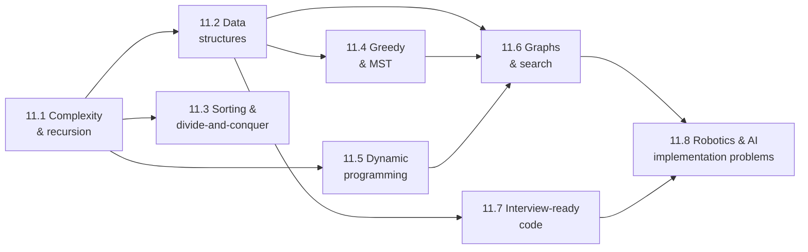
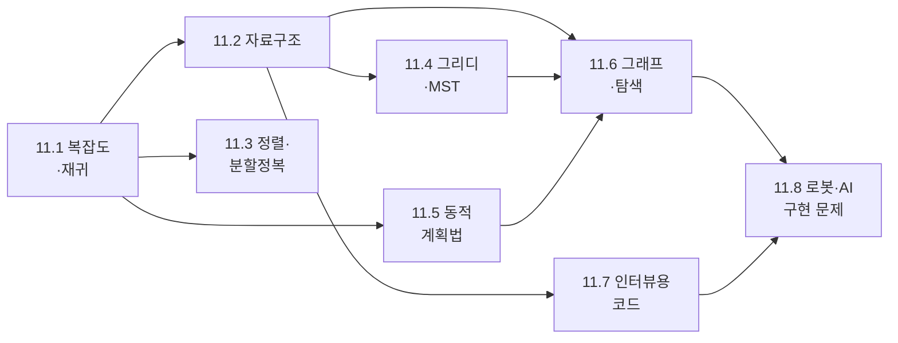

## English

Two kinds of interview test this material, and they reward different preparation.

- **A general coding interview** gives an unfamiliar problem and 30–45 minutes. It checks whether you can pick the right data structure, state the complexity, and write correct code with the edge cases handled. It is mostly pattern recognition, and it comes only from solving many problems.
- **A research-lab interview** is more likely to say "implement A* on this grid", "write one Kalman filter step", or "why is your nearest-neighbour query slow". It checks whether you understand the algorithms your research code already calls.

This track teaches the ideas behind both. It is not a problem bank. Pair each page with timed practice on a public problem set, and after each solved problem write one line: *which structure, why, what complexity.*

### Recommended path

1. [[02-foundations/algorithms/complexity-recursion|11.1 Complexity, Recursion & Backtracking]] — Big-O read off real code, recurrences, amortized cost, and the backtracking template.
2. [[02-foundations/algorithms/data-structures|11.2 Core Data Structures]] — choose by operation: hash maps, heaps, balanced trees, tries, union-find, and where KD-trees fit.
3. [[02-foundations/algorithms/sorting-divide-conquer|11.3 Sorting & Divide-and-Conquer]] — merge sort, randomized quicksort, binary search on answers, selection.
4. [[02-foundations/algorithms/greedy-mst|11.4 Greedy Algorithms & Spanning Trees]] — the exchange argument, scheduling, Huffman codes, Prim and Kruskal.
5. [[02-foundations/algorithms/dynamic-programming|11.5 Dynamic Programming]] — the four-step recipe, knapsack, edit distance, and the bridge to the Bellman equation.
6. [[02-foundations/algorithms/graph-algorithms|11.6 Graph Algorithms & Search]] — BFS/DFS, topological order, Dijkstra, Bellman–Ford, A*.
7. [[02-foundations/algorithms/interview-code|11.7 Interview-Ready Code in Python & C++]] — the solving routine, testing and stress testing, and each language's traps.
8. [[02-foundations/algorithms/robotics-ai-problems|11.8 Robotics & AI Implementation Problems]] — ten from-scratch problems a research lab asks, each linked to the theory page.

If time is short, do **11.1 → 11.2 → 11.6 → 11.8**. Those four cover what a robotics lab asks most. Add 11.5 before any general coding interview: dynamic programming is the topic people most often fail to recognize under time pressure.

### How to practise

- **Weeks 1–2:** 11.1 and 11.2, plus easy problems on arrays, hash maps, and stacks.
- **Weeks 3–4:** 11.3 and 11.6, plus medium problems on binary search, BFS/DFS, and heaps.
- **Weeks 5–6:** 11.4 and 11.5, plus medium problems on greedy choices and 1-D and 2-D DP.
- **Weeks 7–8:** 11.7 and 11.8, plus timed mock interviews. Say your reasoning aloud; silence is scored as confusion.

Each week, re-solve two old problems from a blank file without looking. Recall, not recognition, is what the interview measures.

### Prerequisite map

| Needed here | Review first |
|---|---|
| logarithms, sums, induction | [[02-foundations/engineering-math\|0.5 Engineering Math]] |
| expectation, indicator variables (randomized algorithms) | [[02-foundations/probability\|3. Probability]] |
| vectors and norms (nearest-neighbour, 11.8) | [[02-foundations/linear-algebra\|1. Linear Algebra]] |
| Bellman equation (the DP bridge) | [[02-foundations/rl-basics\|7. RL Basics]] |

### Completion criterion

You are done with a page when you can do three things with nothing open: write the core algorithm from memory in Python, state its time and space complexity and the reason for each, and give one input that breaks a naive version.

## 한국어

이 내용을 시험하는 인터뷰는 두 종류이고, 준비 방법이 다르다.

- **일반 코딩 인터뷰**는 처음 보는 문제를 30–45분 동안 준다. 알맞은 자료구조를 고르는지, 복잡도를 말하는지, 경계 사례까지 처리한 올바른 코드를 쓰는지를 본다. 대부분 패턴 인식이고, 그것은 문제를 많이 풀어야만 생긴다.
- **연구실 인터뷰**는 "이 격자에서 A*를 구현하라", "칼만 필터 한 스텝을 써 보라", "최근접점 질의가 왜 느린가"를 묻는 경우가 많다. 이미 연구 코드가 호출하고 있는 알고리즘을 이해하는지를 본다.

이 트랙은 두 가지 모두의 바탕이 되는 개념을 가르친다. 문제 은행은 아니다. 각 페이지를 공개 문제 세트의 시간 제한 연습과 짝지어라. 문제를 하나 풀 때마다 한 줄을 적는다: *어떤 자료구조를, 왜, 복잡도는 얼마.*

### 추천 경로

1. [[02-foundations/algorithms/complexity-recursion|11.1 복잡도, 재귀, 백트래킹]] — 실제 코드에서 Big-O 읽기, 점화식, 분할상환 비용, 백트래킹 틀.
2. [[02-foundations/algorithms/data-structures|11.2 핵심 자료구조]] — 필요한 연산으로 고른다: 해시 맵, 힙, 균형 트리, 트라이, union-find, 그리고 KD-tree의 자리.
3. [[02-foundations/algorithms/sorting-divide-conquer|11.3 정렬과 분할정복]] — 병합 정렬, 무작위 퀵정렬, 답에 대한 이진 탐색, 선택 알고리즘.
4. [[02-foundations/algorithms/greedy-mst|11.4 그리디 알고리즘과 신장 트리]] — 교환 논증, 스케줄링, 허프만 부호, Prim과 Kruskal.
5. [[02-foundations/algorithms/dynamic-programming|11.5 동적 계획법]] — 네 단계 요령, 배낭 문제, 편집 거리, 벨만 방정식으로 가는 다리.
6. [[02-foundations/algorithms/graph-algorithms|11.6 그래프 알고리즘과 탐색]] — BFS/DFS, 위상 순서, Dijkstra, Bellman–Ford, A*.
7. [[02-foundations/algorithms/interview-code|11.7 Python·C++ 인터뷰용 코드]] — 푸는 순서, 테스트와 스트레스 테스트, 언어별 함정.
8. [[02-foundations/algorithms/robotics-ai-problems|11.8 로봇·AI 구현 문제]] — 연구실이 묻는 백지 구현 문제 열 개, 각각 이론 페이지와 연결.

시간이 부족하면 **11.1 → 11.2 → 11.6 → 11.8**만 하라. 로봇 연구실이 가장 많이 묻는 내용이 이 넷에 있다. 일반 코딩 인터뷰 전에는 11.5를 더하라. 시간 압박 속에서 사람들이 가장 자주 알아보지 못하는 주제가 동적 계획법이다.

### 연습 방법

- **1–2주:** 11.1, 11.2와 배열·해시 맵·스택 쉬운 문제.
- **3–4주:** 11.3, 11.6과 이진 탐색·BFS/DFS·힙 중간 난이도 문제.
- **5–6주:** 11.4, 11.5와 그리디 선택·1차원/2차원 DP 중간 난이도 문제.
- **7–8주:** 11.7, 11.8과 시간을 잰 모의 인터뷰. 추론을 소리 내어 말하라. 침묵은 혼란으로 채점된다.

매주 예전에 푼 문제 두 개를 아무것도 보지 않고 빈 파일에서 다시 풀어라. 인터뷰가 재는 것은 알아보는 능력이 아니라 떠올리는 능력이다.

### 선수 지식 지도

| 여기서 필요한 것 | 먼저 복습할 곳 |
|---|---|
| 로그, 합, 귀납법 | [[02-foundations/engineering-math\|0.5 공학 수학]] |
| 기댓값, 지시 변수(무작위 알고리즘) | [[02-foundations/probability\|3. 확률]] |
| 벡터와 노름(최근접점, 11.8) | [[02-foundations/linear-algebra\|1. 선형대수]] |
| 벨만 방정식(DP 다리) | [[02-foundations/rl-basics\|7. 강화학습 기초]] |

### 완료 기준

아무것도 열지 않고 세 가지를 할 수 있으면 그 페이지는 끝난 것이다. 핵심 알고리즘을 Python으로 외워서 쓰고, 시간·공간 복잡도와 각각의 이유를 말하고, 순진한 구현을 깨뜨리는 입력 하나를 드는 것이다.
