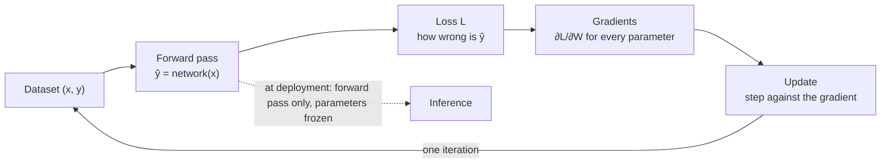
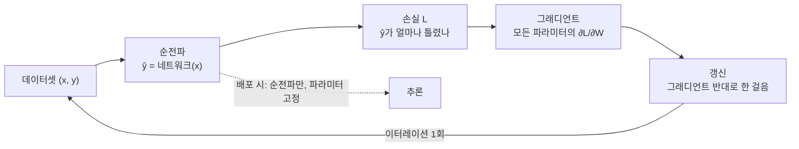

## English

*[[02-foundations/engineering-math|0.5]] left you with matrix multiplication and derivatives. This page is vocabulary only: what
those two operations are called once they are a network. It is the one page you may skip outright if the ML words are already yours.*

> [!info] Depth target · 깊이 목표
> Read the words *network, layer, loss, batch, epoch, hyperparameter, pretraining* in a paper without stopping, and see a neural network as an object you already have the mathematics for. Training your own models is not the goal here.
> 논문에서 *네트워크·층·손실·배치·에포크·하이퍼파라미터·사전학습*을 멈추지 않고 읽고, 신경망을 이미 가진 수학으로 이해할 수 있으면 된다. 직접 모델을 학습시키는 것은 여기의 목표가 아니다.

> [!note] Prerequisites · 선수 지식
> [[02-foundations/engineering-math|0.5 Engineering Math §1 (derivatives), §4 (matrix arithmetic), §10 (notation)]]. Nothing about machine learning is assumed — this page exists precisely so that the rest of the foundations do not have to assume it.
> [[02-foundations/engineering-math|0.5 공업수학 §1(미분), §4(행렬 연산), §10(표기법)]]. 기계학습 지식은 전혀 전제하지 않는다 — 나머지 기초 페이지들이 그것을 전제하지 않아도 되도록 이 페이지가 존재한다.

Pages 1–9 use words like *layer*, *loss*, and *minibatch* the way a mechanics textbook
uses *force*. If you studied engineering mathematics but never machine learning, this page
is the twenty minutes that makes the rest readable. **Everything here is arithmetic you
already know** — matrix multiplication and derivatives — wearing unfamiliar names.

> [!note] First pass · 처음이라면
> The shortest page in the track, and the one to read straight through. Twenty minutes here is what makes pages 1 to 9 readable at all; there is nothing to defer.

### 1. A neural network is a stack of matrix multiplies

Start with something familiar: a matrix $W$ maps a vector to another vector, $y = Wx$.
A **neural network** is that, repeated, with a simple nonlinear function squeezed between:

$$h_1 = \sigma(W_1x + b_1), \qquad h_2 = \sigma(W_2h_1 + b_2), \qquad \hat y = W_3h_2 + b_3$$

- Each $(W, b)$ pair with its nonlinearity is one **layer**. $W$ holds the **weights**,
  $b$ the **bias**. Together they are the **parameters** — the numbers that get learned.
- The nonlinear $\sigma$ is the **activation function**. The common one is
  **ReLU**: $\sigma(z) = \max(0, z)$ — keep positives, zero out negatives. That is all.
- **Depth** = how many layers; **width** = how many numbers in each $h$.
- $\hat y$ is the **output** or **prediction**; the layers before it are often called the
  **backbone**, and the last small piece that produces the answer the **head**.

**Why the nonlinearity is not optional.** Without $\sigma$, two layers are
$W_2(W_1x) = (W_2W_1)x$ — a single matrix, so depth buys nothing at all. That one line is
the entire reason activation functions exist, and you will meet it again as self-check 1
of [[02-foundations/linear-algebra|1. Linear Algebra]].

### 2. A worked forward pass, by hand

Take a 2 → 3 → 1 network, $\sigma = \text{ReLU}$, biases zero:

$$W_1 = \begin{pmatrix}1&0\\0&1\\1&1\end{pmatrix}, \quad W_2 = \begin{pmatrix}1 & -1 & 0.5\end{pmatrix}, \quad x = \begin{pmatrix}1\\2\end{pmatrix}$$

- $W_1x = (1,\; 2,\; 3)$ → ReLU leaves it unchanged (all positive) → $h = (1,2,3)$.
- $\hat y = W_2h = 1 - 2 + 1.5 = 0.5$.

<svg viewBox="0 0 470 190" style="max-width:100%;height:auto" role="img" aria-label="2-3-1 network with the worked numbers">
  <g stroke="currentColor" stroke-width="1" opacity="0.45" fill="none">
    <line x1="78" y1="70" x2="205" y2="40"/><line x1="78" y1="70" x2="205" y2="95"/><line x1="78" y1="70" x2="205" y2="150"/>
    <line x1="78" y1="125" x2="205" y2="40"/><line x1="78" y1="125" x2="205" y2="95"/><line x1="78" y1="125" x2="205" y2="150"/>
    <line x1="230" y1="40" x2="360" y2="95"/><line x1="230" y1="95" x2="360" y2="95"/><line x1="230" y1="150" x2="360" y2="95"/>
  </g>
  <g fill="none" stroke="currentColor" stroke-width="1.6">
    <circle cx="65" cy="70" r="16"/><circle cx="65" cy="125" r="16"/>
    <circle cx="218" cy="40" r="16"/><circle cx="218" cy="95" r="16"/><circle cx="218" cy="150" r="16"/>
    <circle cx="373" cy="95" r="16"/>
  </g>
  <g font-size="12" fill="currentColor" text-anchor="middle" font-family="ui-monospace,monospace">
    <text x="65" y="74">1</text><text x="65" y="129">2</text>
    <text x="218" y="44">1</text><text x="218" y="99">2</text><text x="218" y="154">3</text>
    <text x="373" y="99">0.5</text>
  </g>
  <g font-size="11" fill="currentColor" text-anchor="middle" opacity="0.75">
    <text x="65" y="24">x</text><text x="218" y="24">h = ReLU(W₁x)</text><text x="373" y="24">ŷ = W₂h</text>
    <text x="141" y="182">W₁  (3×2)</text><text x="296" y="182">W₂  (1×3)</text>
    <text x="65" y="162">input</text><text x="218" y="182">hidden</text><text x="373" y="130">output</text>
  </g>
</svg>

*The same computation as a picture: two inputs fan out through $W_1$, ReLU passes them, $W_2$ collapses them to one number.*

That is a **forward pass**: numbers in, matrix multiplies, numbers out. Nothing more
mysterious happens in a 70-billion-parameter model — there are just more of these.

**Counting parameters.** $W_1$ is $3\times2 = 6$ numbers, $b_1$ is 3, $W_2$ is $1\times3=3$,
$b_2$ is 1 — **13 parameters**. When a paper says "7B parameters," it counted exactly this
way.

### 3. Training = choosing those numbers by measured error

The parameters start random and are *fitted to data*. Three pieces:

1. **Dataset**: pairs $(x, y)$ of input and desired output.
2. **Loss function** $L$: one number saying how wrong $\hat y$ is versus $y$. Two you will
   meet constantly — **MSE** $\tfrac12\|\hat y - y\|^2$ for continuous outputs, and
   **cross-entropy** for categories ([[02-foundations/information-theory|5. Information Theory §2]]).
   Continuing the example with target $y = 1$: $L = \tfrac12(0.5-1)^2 = 0.125$.
3. **Update**: compute $\partial L/\partial W$ for every parameter and nudge each one
   against its gradient:
   $$W \leftarrow W - \alpha\,\frac{\partial L}{\partial W}$$
   The small number $\alpha$ is the **learning rate** — how far to step each time (typical
   values $10^{-4}$ to $10^{-2}$; too large and training diverges, too small and it crawls).
   That is ordinary multivariable calculus
   ([[02-foundations/calculus-backprop|2. Calculus & Backprop]] shows how it is organized
   efficiently, under the name **backpropagation**), and the stepping rule is
   [[02-foundations/optimization|4. Optimization]]'s gradient descent.

**Training** repeats forward prediction, loss evaluation, differentiation and updating on data batches. Stop according to a specified budget or validation criterion; a falling training loss alone does not establish generalization. **Inference** normally runs the forward computation on new data with parameters frozen, as in a deployed robot.

**Keep three operations separate.** The forward pass answers “what does this network currently predict?” Backpropagation answers “how would a small change to each parameter change this loss?” The optimizer uses that derivative to choose an update. Backpropagation does not itself choose a learning rate or guarantee that the next loss will be lower: a finite step can overshoot what the local derivative predicted.

The target in the example is 1 and the prediction is 0.5. For the stated squared loss, the derivative with respect to the prediction is therefore −0.5. Its sign says that increasing the prediction locally reduces the loss. To turn that into a weight update, multiply by how that particular weight changes the prediction—the chain rule. Different weights can have different signs, even though they all contribute to the same output error.

> [!question] Separate prediction and learning · 예측과 학습 구분
> Does a robot need the correct target label to make a prediction? **Answer:** no. A forward pass needs its input and stored parameters. A supervised training loss additionally needs a target. Inference can produce a confident but wrong answer because no target checks that particular prediction during the forward pass.

### 4. Batch, epoch, iteration — the words in every experimental section

You do not compute the loss over all data at once; you take a **minibatch** (often just
"batch"), average the loss over it, and update once.

- **Batch size** = samples per update. **Iteration** (or *step*) = one update.
- **Epoch** = one full pass over the dataset.
- Worked: 10,000 samples, batch size 100 → $10{,}000/100 = 100$ iterations per epoch;
  training for 20 epochs = **2,000 updates**. When a paper reports "trained for 300 epochs"
  or "500k steps," this arithmetic is what it means.

These units matter because equal epoch counts can conceal unequal optimization effort when datasets or batch sizes differ. For example, adding demonstrations changes the amount of data seen in a pass, while changing the batch changes how frequently parameters are updated. **The reading this gives you.** Compare samples processed, update count, and batch size together. An epoch count is meaningful only relative to its dataset; it is not a portable measure of compute or a guarantee that two methods received equal training.

### 5. Parameter vs hyperparameter — a distinction papers rely on

| | Chosen by | Examples |
|---|---|---|
| **Parameter** | gradient descent, from data | every entry of $W$ and $b$ |
| **Hyperparameter** | a chosen configuration or search procedure | learning rate, batch size, number of layers, width, how long to train |

An **ablation** changes one hyperparameter or component and reports the effect; that is how
papers argue a piece mattered ([[02-foundations/ml-practice|9. ML Practice §4]]).
**Overfitting** — fitting the training data so closely that new data suffers — is the
failure this whole vocabulary exists to manage (page 9 again).

### 6. The rest of the vocabulary, in one table

These are not concepts to master here — just labels, so the word does not stop you:

| Word | What it means, minimally |
|---|---|
| **token** | one discrete piece of input (a word fragment, an image patch) |
| **embedding** | a vector that stands for a token or object |
| **encoder / decoder** | the part that reads input / the part that produces output |
| **pretraining** | training once on large general data |
| **fine-tuning** | continuing training on a small task-specific dataset |
| **checkpoint** | the saved parameters at some point in training |
| **frozen** | parameters deliberately not updated |
| **logits** | raw output scores before they are turned into probabilities |
| **softmax** | the function that turns scores into probabilities ([[02-foundations/engineering-math\|0.5 §10]]) |
| **tokenizer** | the step that cuts raw input into tokens — a text tokenizer splits words into sub-word pieces, a vision one cuts an image into patches or maps it to a learned codebook. It is a *choice*, and two models with different tokenizers are not comparable per token |
| **autoregressive** | producing output one token at a time, each conditioned on the ones already produced. The reason a language model's output length costs time linearly |
| **language model** | a network trained to predict the next token over a large text corpus. That single objective is what the VLM and VLA track builds on — the "L" in VLM |
| **autoencoder** | a network trained to reproduce its own input through a narrow middle, so the middle becomes a compressed representation. *Masked* autoencoders hide part of the input and reconstruct it; *variational* ones make the middle a distribution |
| **adapter** | a small set of extra parameters inserted into a frozen model so only they are trained. [[01-canonical-papers/notes/1-foundations/lora\|LoRA]] is the variant that adds no inference cost, which is why it displaced the others |
| **activation** | the nonlinearity between layers. **ReLU** ($\max(0,x)$) is the default; **GELU** and **SiLU/Swish** are smooth variants used in transformers. Without one, stacked layers collapse to a single matrix (§1) |

With these, the worked attention example on
[[02-foundations/linear-algebra|1. Linear Algebra §1]] — "$Q = XW_Q$ where $X$ is $T$ token
embeddings" — reads as what it is: a matrix multiplication with named parts.

### Self-check

1. Why does removing every activation function make a 10-layer network no more expressive
   than a 1-layer one?
2. Count the parameters of a $4 \to 8 \to 8 \to 2$ network with biases on every layer.
3. A dataset has 50,000 samples, batch size 250, trained for 10 epochs. How many parameter
   updates happen?
4. Which of these are hyperparameters: learning rate, $W_1$, batch size, number of layers, $b_2$?

> [!tip]- Answers
> 1. Composition of linear maps is linear: $W_{10}\cdots W_1x = (W_{10}\cdots W_1)x$, a single matrix. Depth adds nothing without a nonlinearity between the multiplies.
> 2. Layer 1: $8\times4 + 8 = 40$; layer 2: $8\times8 + 8 = 72$; layer 3: $2\times8 + 2 = 18$. Total **130**.
> 3. $50{,}000/250 = 200$ iterations per epoch; $200 \times 10 = $ **2,000 updates**.
> 4. Learning rate, batch size, and number of layers are hyperparameters (a human sets them before training). $W_1$ and $b_2$ are parameters — gradient descent chooses them.

### Where to go next

Straight on to [[02-foundations/linear-algebra|1. Linear Algebra]]. The mechanics of the
gradient step are [[02-foundations/calculus-backprop|2. Calculus & Backpropagation]]; why
those steps converge is [[02-foundations/optimization|4. Optimization]]; how to read the
numbers a paper reports about them is [[02-foundations/ml-practice|9. ML Practice & Evaluation]].

### After reading · 읽고 나면 말할 수 있어야 하는 것

- [ ] Write a two-layer network as matrices and say what a layer, weight, bias and activation are · 2층 네트워크를 행렬로 쓰고 층·가중치·편향·활성함수가 무엇인지 말할 수 있다
- [ ] Say why a nonlinearity is required between layers · 층 사이에 비선형성이 왜 필요한지 말할 수 있다
- [ ] Count a network's parameters, and separate parameters from hyperparameters · 네트워크의 파라미터 수를 세고, 파라미터와 하이퍼파라미터를 구분할 수 있다
- [ ] Convert dataset size, batch size and epochs into a number of updates · 데이터 수·배치 크기·에포크를 갱신 횟수로 환산할 수 있다
- [ ] Read "pretrained backbone, fine-tuned head, 300 epochs" without stopping · "사전학습 백본, 파인튜닝된 헤드, 300 에포크"를 멈추지 않고 읽을 수 있다

## 한국어

*[[02-foundations/engineering-math|0.5]]가 행렬곱과 미분을 남겼다. 이 페이지는 어휘뿐이다 — 그 두 연산이 신경망이 되면 어떤
이름으로 불리는가. ML 용어가 이미 익숙하다면 통째로 건너뛰어도 되는 유일한 페이지다.*

1~9 페이지는 *층*, *손실*, *미니배치* 같은 말을 역학 교과서가 *힘*을 쓰듯 쓴다. 공업수학은
공부했지만 기계학습은 처음이라면, 이 페이지가 나머지를 읽히게 만드는 20분이다. **여기 있는
것은 전부 이미 아는 산수** — 행렬곱과 미분 — 가 낯선 이름을 쓰고 있는 것뿐이다.

> [!note] 처음이라면 · First pass
> 트랙에서 가장 짧고, 순서대로 끝까지 읽으면 되는 유일한 페이지다. 여기 쓰는 20분이 1~9번을 읽히게 만든다. 미뤄 둘 절이 없다.

### 1. 신경망은 행렬곱을 쌓은 것이다

익숙한 것에서 시작하자: 행렬 $W$는 벡터를 다른 벡터로 보낸다, $y = Wx$.
**신경망**은 그것을 반복하되 사이에 단순한 비선형 함수를 끼운 것이다:

$$h_1 = \sigma(W_1x + b_1), \qquad h_2 = \sigma(W_2h_1 + b_2), \qquad \hat y = W_3h_2 + b_3$$

- $(W, b)$ 한 쌍과 그 비선형성이 **층(layer)** 하나다. $W$가 **가중치**, $b$가 **편향**.
  둘을 합쳐 **파라미터**(학습되는 숫자들)라고 부른다.
- 비선형 $\sigma$가 **활성함수**다. 흔한 것은 **ReLU**: $\sigma(z) = \max(0, z)$ —
  양수는 두고 음수는 0으로. 그게 전부다.
- **깊이(depth)** = 층의 수, **너비(width)** = 각 $h$의 숫자 개수.
- $\hat y$가 **출력**·**예측**이고, 그 앞의 층들을 흔히 **백본(backbone)**, 답을 내는 마지막
  작은 부분을 **헤드**(head)라 부른다.

**비선형성이 선택이 아닌 이유.** $\sigma$가 없으면 두 층은
$W_2(W_1x) = (W_2W_1)x$ — 행렬 하나가 되어 깊이가 아무것도 사지 못한다. 이 한 줄이
활성함수가 존재하는 이유 전부이고, [[02-foundations/linear-algebra|1. 선형대수]]의 자가점검
1번에서 다시 만난다.

### 2. 손으로 하는 순전파 예제

2 → 3 → 1 네트워크, $\sigma = \text{ReLU}$, 편향은 0:

$$W_1 = \begin{pmatrix}1&0\\0&1\\1&1\end{pmatrix}, \quad W_2 = \begin{pmatrix}1 & -1 & 0.5\end{pmatrix}, \quad x = \begin{pmatrix}1\\2\end{pmatrix}$$

- $W_1x = (1,\; 2,\; 3)$ → 전부 양수라 ReLU가 그대로 통과 → $h = (1,2,3)$.
- $\hat y = W_2h = 1 - 2 + 1.5 = 0.5$.

<svg viewBox="0 0 470 190" style="max-width:100%;height:auto" role="img" aria-label="계산 예제 숫자가 붙은 2-3-1 신경망">
  <g stroke="currentColor" stroke-width="1" opacity="0.45" fill="none">
    <line x1="78" y1="70" x2="205" y2="40"/><line x1="78" y1="70" x2="205" y2="95"/><line x1="78" y1="70" x2="205" y2="150"/>
    <line x1="78" y1="125" x2="205" y2="40"/><line x1="78" y1="125" x2="205" y2="95"/><line x1="78" y1="125" x2="205" y2="150"/>
    <line x1="230" y1="40" x2="360" y2="95"/><line x1="230" y1="95" x2="360" y2="95"/><line x1="230" y1="150" x2="360" y2="95"/>
  </g>
  <g fill="none" stroke="currentColor" stroke-width="1.6">
    <circle cx="65" cy="70" r="16"/><circle cx="65" cy="125" r="16"/>
    <circle cx="218" cy="40" r="16"/><circle cx="218" cy="95" r="16"/><circle cx="218" cy="150" r="16"/>
    <circle cx="373" cy="95" r="16"/>
  </g>
  <g font-size="12" fill="currentColor" text-anchor="middle" font-family="ui-monospace,monospace">
    <text x="65" y="74">1</text><text x="65" y="129">2</text>
    <text x="218" y="44">1</text><text x="218" y="99">2</text><text x="218" y="154">3</text>
    <text x="373" y="99">0.5</text>
  </g>
  <g font-size="11" fill="currentColor" text-anchor="middle" opacity="0.75">
    <text x="65" y="24">x</text><text x="218" y="24">h = ReLU(W₁x)</text><text x="373" y="24">ŷ = W₂h</text>
    <text x="141" y="182">W₁  (3×2)</text><text x="296" y="182">W₂  (1×3)</text>
    <text x="65" y="162">입력</text><text x="218" y="182">은닉</text><text x="373" y="130">출력</text>
  </g>
</svg>

*같은 계산을 그림으로: 입력 둘이 $W_1$을 통해 퍼지고, ReLU가 통과시키고, $W_2$가 하나의 숫자로 모은다.*

이것이 **순전파**(forward pass)다: 숫자가 들어가고, 행렬을 곱하고, 숫자가 나온다. 700억
파라미터 모델에서도 더 신비한 일은 일어나지 않는다 — 같은 일이 더 많이 일어날 뿐이다.

**파라미터 세기.** $W_1$이 $3\times2 = 6$개, $b_1$이 3개, $W_2$가 $1\times3=3$개,
$b_2$가 1개 — **13개**. 논문의 "7B 파라미터"는 정확히 이렇게 센 것이다.

### 3. 학습 = 측정된 오차로 그 숫자들을 고르기

파라미터는 무작위에서 시작해 *데이터에 맞춰진다*. 세 부품:

1. **데이터셋**: 입력과 원하는 출력의 쌍 $(x, y)$.
2. **손실함수** $L$: $\hat y$가 $y$에 비해 얼마나 틀렸는지를 숫자 하나로 나타낸 것. 계속 만나게 될
   둘 — 연속 출력엔 **MSE** $\tfrac12\|\hat y - y\|^2$, 범주엔 **교차 엔트로피**
   ([[02-foundations/information-theory|5. 정보이론 §2]]). 위 예제에서 정답이 $y = 1$이면
   $L = \tfrac12(0.5-1)^2 = 0.125$.
3. **갱신**: 모든 파라미터에 대해 $\partial L/\partial W$를 구해 그래디언트 반대로 조금씩
   민다:
   $$W \leftarrow W - \alpha\,\frac{\partial L}{\partial W}$$
   작은 수 $\alpha$가 **학습률**(learning rate) — 매번 얼마나 멀리 갈 것인가다(보통
   $10^{-4}$~$10^{-2}$; 너무 크면 발산하고 너무 작으면 기어간다). 평범한 다변수 미적분이고
   ([[02-foundations/calculus-backprop|2. 미적분과 역전파]]가 이것을 효율적으로 조직하는
   방법을 **역전파**라는 이름으로 보여준다), 미는 규칙이
   [[02-foundations/optimization|4. 최적화]]의 경사 하강이다.

**학습**(training)은 데이터 배치마다 순전파·손실 계산·미분·갱신을 반복한다. 정한 예산이나 검증 기준으로 종료하며, 학습 손실 감소만으로 일반화를 입증하지는 않는다. **추론**(inference)은 보통 파라미터를 고정한 채 새 데이터에 순전파를 수행한다. 배치된 로봇의 일반적인 동작이다.

**세 연산을 나눈다.** 순전파는 “현재 신경망이 무엇을 예측하는가”에 답한다. 역전파는 “각 파라미터를 조금 바꾸면 이 손실이 어떻게 변하는가”에 답한다. 최적화기는 그 미분으로 갱신을 정한다. 역전파 자체가 학습률을 고르거나 다음 손실의 감소를 보장하지는 않는다. 유한한 보폭은 국소 미분이 예상한 범위를 넘을 수 있다.

예제에서 정답은 1이고 예측은 0.5다. 주어진 제곱 손실을 예측값으로 미분하면 −0.5다. 예측을 조금 키우면 손실이 줄어든다는 부호다. 이를 가중치 갱신으로 바꾸려면 해당 가중치가 예측을 얼마나 바꾸는지도 곱해야 한다. 이것이 연쇄법칙이다. 같은 출력 오차에 기여해도 가중치별 미분 부호는 다를 수 있다.

> [!question] 예측과 학습 구분 · Separate prediction and learning
> 로봇이 예측하려면 정답 라벨이 필요한가? **답:** 아니다. 순전파에는 입력과 저장한 파라미터가 필요하다. 지도 학습 손실 계산에는 정답도 필요하다. 순전파 중 그 예측을 정답과 대조하지 않으므로 자신 있게 틀린 답도 낼 수 있다.

### 4. 배치·에포크·이터레이션 — 모든 실험 섹션의 단어들

손실을 전체 데이터에 대해 한 번에 계산하지 않는다. **미니배치**(그냥 "배치")를 뽑아 그
안에서 손실을 평균하고 한 번 갱신한다.

- **배치 크기** = 갱신 1회당 샘플 수. **이터레이션**(또는 *스텝*) = 갱신 1회.
- **에포크** = 데이터셋 전체를 한 바퀴.
- 계산 예: 샘플 10,000개, 배치 100 → 에포크당 $10{,}000/100 = 100$ 이터레이션;
  20 에포크 학습 = **갱신 2,000회**. 논문의 "300 에포크 학습", "50만 스텝"이 뜻하는 것이
  이 산수다.

데이터셋이나 배치가 다르면 같은 epoch도 최적화 노력이 달라 이 단위가 중요하다. 시연을 추가하면 한 순회에서 보는 데이터가 바뀌고 배치를 바꾸면 파라미터 갱신 빈도가 달라진다. **여기서 얻는 독법.** 처리 표본 수, 갱신 수, 배치 크기를 함께 비교한다. epoch는 해당 데이터셋에 상대적인 값이다. 어디서나 통하는 연산량 단위도, 동일 학습의 보장도 아니다.

### 5. 파라미터 vs 하이퍼파라미터 — 논문이 기대는 구분

| | 누가 정하나 | 예 |
|---|---|---|
| **파라미터** | 경사 하강이 데이터에서 | $W$와 $b$의 모든 성분 |
| **하이퍼파라미터** | 설정 선택이나 탐색 절차로 | 학습률, 배치 크기, 층 수, 너비, 학습 기간 |

**절제 실험**(ablation)은 하이퍼파라미터나 구성요소 하나를 바꿔 그 효과를 보고하는 것이고,
논문이 어떤 부품이 중요했다고 논증하는 방식이다
([[02-foundations/ml-practice|9. ML 실무 §4]]). **과적합**(학습 데이터에 너무 맞춰 새 데이터가
나빠지는 것)이 이 어휘 전체가 관리하려는 실패다(역시 9페이지).

### 6. 나머지 어휘, 표 하나로

여기서 숙달할 개념이 아니라 라벨일 뿐이다 — 그 단어에서 멈추지 않도록:

| 단어 | 최소한의 의미 |
|---|---|
| **토큰(token)** | 입력의 이산적인 한 조각 (단어 조각, 이미지 패치) |
| **임베딩(embedding)** | 토큰·대상을 대신하는 벡터 |
| **인코더 / 디코더** | 입력을 읽는 부분 / 출력을 만드는 부분 |
| **사전학습(pretraining)** | 큰 일반 데이터로 한 번 학습 |
| **파인튜닝(fine-tuning)** | 작은 과제 데이터로 학습을 이어감 |
| **체크포인트** | 학습 도중 저장한 파라미터 |
| **frozen(얼림)** | 의도적으로 갱신하지 않는 파라미터 |
| **로짓(logits)** | 확률로 바뀌기 전의 날 점수 |
| **소프트맥스** | 점수를 확률로 바꾸는 함수 ([[02-foundations/engineering-math\|0.5 §10]]) |
| **토크나이저(tokenizer)** | 날 입력을 토큰으로 자르는 단계 — 텍스트 토크나이저는 단어를 부분 단어로 쪼개고, 비전 쪽은 이미지를 패치로 자르거나 학습된 코드북으로 보낸다. 이것은 *선택*이고, 토크나이저가 다른 두 모델은 토큰 단위로 비교되지 않는다 |
| **자기회귀(autoregressive)** | 이미 만든 토큰들에 조건부로 한 번에 한 토큰씩 출력을 만드는 것. 언어 모델의 출력 길이가 시간을 선형으로 먹는 이유 |
| **언어 모델(language model)** | 큰 텍스트 말뭉치에서 다음 토큰을 예측하도록 학습한 신경망. 그 목적함수 하나 위에 VLM·VLA 트랙이 서 있다 — VLM의 "L"이다 |
| **오토인코더(autoencoder)** | 좁은 가운데를 통과시켜 자기 입력을 재현하도록 학습해서, 그 가운데가 압축된 표현이 되게 하는 신경망. *마스킹* 오토인코더는 입력 일부를 가리고 복원하고, *변분* 오토인코더는 가운데를 분포로 만든다 |
| **어댑터(adapter)** | 얼린 모델에 끼워 넣어 그것만 학습시키는 작은 추가 파라미터 묶음. [[01-canonical-papers/notes/1-foundations/lora\|LoRA]]가 추론 비용을 더하지 않는 변형이고, 그래서 나머지를 밀어냈다 |
| **활성함수(activation)** | 층 사이의 비선형성. **ReLU**($\max(0,x)$)가 기본이고, **GELU**와 **SiLU/Swish**가 트랜스포머에서 쓰는 매끄러운 변형이다. 이것이 없으면 쌓은 층이 행렬 하나로 무너진다(§1) |

이것들이 있으면 [[02-foundations/linear-algebra|1. 선형대수 §1]]의 어텐션 계산 예제 —
"$Q = XW_Q$, $X$는 토큰 $T$개의 임베딩" — 가 있는 그대로 읽힌다: 이름 붙은 부품들의 행렬곱.

### 스스로 점검

1. 활성함수를 전부 제거하면 10층 네트워크가 왜 1층보다 나을 것이 없어지는가?
2. 모든 층에 편향이 있는 $4 \to 8 \to 8 \to 2$ 네트워크의 파라미터 수를 세라.
3. 샘플 50,000개, 배치 250, 10 에포크 학습이면 파라미터 갱신은 몇 번인가?
4. 다음 중 하이퍼파라미터는? 학습률, $W_1$, 배치 크기, 층 수, $b_2$.

> [!tip]- 정답 · Answers
> 1. 선형 사상의 합성은 선형이다: $W_{10}\cdots W_1x = (W_{10}\cdots W_1)x$, 결국 행렬 하나. 곱 사이에 비선형성이 없으면 깊이가 아무것도 더하지 않는다.
> 2. 1층: $8\times4 + 8 = 40$; 2층: $8\times8 + 8 = 72$; 3층: $2\times8 + 2 = 18$. 합 **130개**.
> 3. 에포크당 $50{,}000/250 = 200$ 이터레이션; $200 \times 10 = $ **2,000회**.
> 4. 학습률·배치 크기·층 수가 하이퍼파라미터(설정 선택이나 탐색 절차로 정한다). $W_1$과 $b_2$는 파라미터로, 경사 하강이 고른다.

### 다음으로 갈 곳

바로 [[02-foundations/linear-algebra|1. 선형대수]]로. 그래디언트 스텝의 작동은
[[02-foundations/calculus-backprop|2. 미적분과 역전파]], 그 스텝이 수렴하는 이유는
[[02-foundations/optimization|4. 최적화]], 논문이 그것에 대해 보고하는 숫자를 읽는 법은
[[02-foundations/ml-practice|9. ML 실무와 평가]]에 있다.
