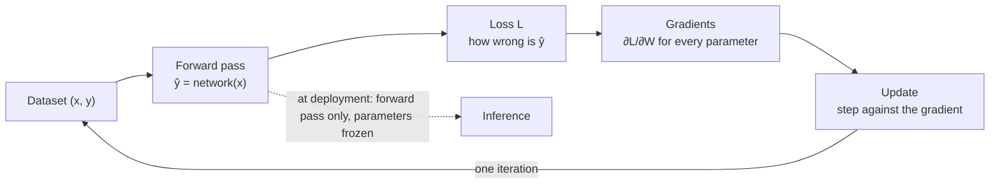
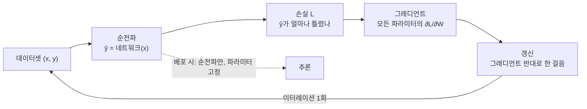

## English

*[[02-foundations/engineering-math|0.5]] left you with matrix multiplication and derivatives. This page is vocabulary only: what
those two operations are called once they are a network. It is the one page you may skip outright if the ML words are already yours.*

> [!info] Depth target · 깊이 목표
> Read the words *network, layer, loss, batch, epoch, hyperparameter, pretraining* in a paper without stopping, and see a neural network as an object you already have the mathematics for. Training your own models is not the goal here.
> 논문에서 *네트워크·층·손실·배치·에포크·하이퍼파라미터·사전학습*을 멈추지 않고 읽고, 신경망을 이미 가진 수학으로 이해할 수 있으면 된다. 직접 모델을 학습시키는 것은 여기의 목표가 아니다.

> [!note] Prerequisites · 선수 지식
> [[02-foundations/engineering-math|0.5 Engineering Math §1 (derivatives, chain rule), §4 (matrix arithmetic), §4.5 (linearity), §10 (notation)]] · plant **P1** from [[02-foundations/lab-plants|0.6 Lab Plants]] — the catalog's frozen two-layer example network (*plant* is control's word for the system under study, and the catalog uses it for all six of its test systems). Nothing about machine learning is assumed — this page exists precisely so that the rest of the foundations do not have to assume it.
> [[02-foundations/engineering-math|0.5 공업수학 §1(미분·연쇄 법칙), §4(행렬 연산), §4.5(선형성), §10(표기법)]] · [[02-foundations/lab-plants|0.6 Lab Plants]]의 장치 **P1** — 카탈로그가 고정해 둔 2층 예제 신경망(*장치*(plant)는 다루는 시스템을 부르는 제어공학의 말이고, 카탈로그는 시험 시스템 여섯 개 모두에 이 말을 쓴다). 기계학습 지식은 전혀 전제하지 않는다 — 나머지 기초 페이지들이 그것을 전제하지 않아도 되도록 이 페이지가 존재한다.

Pages 1–9 use words like *layer*, *loss*, and *minibatch* the way a mechanics textbook
uses *force*. If you studied engineering mathematics but never machine learning, this page
is the short read that makes the rest readable. **Everything here is arithmetic you
already know** — matrix multiplication and derivatives — wearing unfamiliar names.

> [!note] Why this matters · 왜 배우는가
> **Where you are:** on the [[physical-ai-map|Physical AI Map]] this page sits on the mathematics floor as the vocabulary of the learning-and-adaptation layer of [[07-research-program/index|7. Research Program §5]] and of its language-driven form, where a vision–language–action model (VLA) turns "install that panel on the frame" into motion — the first of that task's eight steps, resolving the instruction. **Why:** a learned seating policy — the network that maps what the robot senses to how it moves — is trained by exactly the loop of §3–§4 (forward pass, loss, gradient, update, repeated over batches), and without these words a methods line such as "frozen pretrained backbone, head fine-tuned for 300 epochs at batch 64" names neither the model you would rebuild nor the training you would compare against. **Direction:** pages 1–9 use the words without stopping; [[03-deep-learning/foundations/index|deep learning 1. Learning Systems §1–§2]] builds its split of parameters, activations and hyperparameters and its update step on §3–§5; and behaviour cloning, which trains a policy to copy demonstrated actions ([[02-foundations/rl-robot-learning|7.5 §1]], [[03-deep-learning/vla/index|4. VLA §2]], [[05-construction-robotics/imitating-contact|10. Imitating Contact §2]]), is §3's loss fitted to demonstrations — blocks 4 and 7 of the dissertation path of [[07-research-program/index|7. Research Program §8]], after the foundations gate of block 1. **Payoff:** you can write a two-layer network as matrices, count its parameters, and turn epochs and batch size into a number of updates.

> [!note] First pass · 처음이라면
> The shortest page in the track, read straight through in about two sessions of 60–90 minutes. **Session 1:** the picture, §1, §2 — redo its forward pass with a pencil — and §3 through the hand update of $W_2$. **Session 2:** §4, §5 and the table of §6, the part that makes pages 1 to 9 readable at all; then the four self-check questions closed-book and the problem set. The one part to defer is the collapsed note that closes §6, *the same words, with their formulas* — second-pass material, for when a paper's claim needs checking against its formula.

### The picture · 그림으로 먼저 보기

<svg viewBox="0 0 560 366" style="max-width:100%;height:auto" role="img" aria-label="P1 as a vocabulary chart: inputs 1 and 2, hidden values 1, 2, 3 after ReLU, output 0.5, every weight on its edge, W1 three by two and W2 one by three bracketed as layers, faint bias stubs, nine weights or thirteen parameters with biases, the ReLU mask (1, 1, 1), and in brackets the case z3 = -3 where the third unit carries 0">
  <line x1="81.4" y1="135.4" x2="199.8" y2="103.9" stroke="currentColor" stroke-width="1.1" stroke-opacity="0.55"/>
  <line x1="78" y1="214.7" x2="204.1" y2="112.5" stroke="currentColor" stroke-width="1.1" stroke-opacity="0.55"/>
  <line x1="81.4" y1="144.7" x2="199.8" y2="177" stroke="currentColor" stroke-width="1.1" stroke-opacity="0.55"/>
  <line x1="81.4" y1="221.3" x2="199.8" y2="189" stroke="currentColor" stroke-width="1.1" stroke-opacity="0.55"/>
  <line x1="78" y1="151.3" x2="204.1" y2="253.5" stroke="currentColor" stroke-width="1.1" stroke-opacity="0.55"/>
  <line x1="81.4" y1="230.6" x2="199.8" y2="262.1" stroke="currentColor" stroke-width="1.1" stroke-opacity="0.55"/>
  <line x1="242" y1="109.3" x2="356.3" y2="174.1" stroke="currentColor" stroke-width="1.3" stroke-opacity="0.75"/>
  <line x1="245" y1="183" x2="354" y2="183" stroke="currentColor" stroke-width="1.3" stroke-opacity="0.75"/>
  <line x1="242" y1="256.7" x2="356.3" y2="191.9" stroke="currentColor" stroke-width="1.3" stroke-opacity="0.75"/>
  <text x="188.3" y="102.7" font-size="11" fill="currentColor" text-anchor="middle">1</text>
  <text x="196.1" y="134.6" font-size="11" fill="currentColor" text-anchor="middle">0</text>
  <text x="192.5" y="170.7" font-size="11" fill="currentColor" text-anchor="middle">0</text>
  <text x="192.8" y="204.3" font-size="11" fill="currentColor" text-anchor="middle">1</text>
  <text x="195.4" y="240.2" font-size="11" fill="currentColor" text-anchor="middle">1</text>
  <text x="188.1" y="272.3" font-size="11" fill="currentColor" text-anchor="middle">1</text>
  <text x="304.9" y="137.5" font-size="11" fill="currentColor" text-anchor="middle">1·1</text>
  <text x="300" y="180" font-size="11" fill="currentColor" text-anchor="middle">+ (−1)·2</text>
  <text x="307.9" y="241.7" font-size="11" fill="currentColor" text-anchor="middle">+ 0.5·3</text>
  <line x1="222" y1="58" x2="222" y2="74" stroke="currentColor" stroke-width="1.1" stroke-opacity="0.4" stroke-dasharray="2 2"/>
  <text x="228" y="68" font-size="11" fill="currentColor" fill-opacity="0.5">b<tspan dy="3" font-size="10">1</tspan></text>
  <line x1="222" y1="143" x2="222" y2="159" stroke="currentColor" stroke-width="1.1" stroke-opacity="0.4" stroke-dasharray="2 2"/>
  <text x="228" y="153" font-size="11" fill="currentColor" fill-opacity="0.5">b<tspan dy="3" font-size="10">1</tspan></text>
  <line x1="222" y1="228" x2="222" y2="244" stroke="currentColor" stroke-width="1.1" stroke-opacity="0.4" stroke-dasharray="2 2"/>
  <text x="228" y="238" font-size="11" fill="currentColor" fill-opacity="0.5">b<tspan dy="3" font-size="10">1</tspan></text>
  <line x1="372" y1="148" x2="372" y2="164" stroke="currentColor" stroke-width="1.1" stroke-opacity="0.4" stroke-dasharray="2 2"/>
  <text x="378" y="158" font-size="11" fill="currentColor" fill-opacity="0.5">b<tspan dy="3" font-size="10">2</tspan></text>
  <circle cx="64" cy="140" r="18" stroke="currentColor" stroke-width="1.6" fill="none"/>
  <text x="64" y="144.5" font-size="13" fill="currentColor" text-anchor="middle">1</text>
  <circle cx="64" cy="226" r="18" stroke="currentColor" stroke-width="1.6" fill="none"/>
  <text x="64" y="230.5" font-size="13" fill="currentColor" text-anchor="middle">2</text>
  <circle cx="222" cy="98" r="23" stroke="currentColor" stroke-width="1.6" fill="none"/>
  <text x="222" y="99" font-size="13" fill="currentColor" text-anchor="middle">1</text>
  <text x="222" y="112" font-size="11" fill="currentColor" text-anchor="middle" fill-opacity="0.75">ReLU</text>
  <circle cx="222" cy="183" r="23" stroke="currentColor" stroke-width="1.6" fill="none"/>
  <text x="222" y="184" font-size="13" fill="currentColor" text-anchor="middle">2</text>
  <text x="222" y="197" font-size="11" fill="currentColor" text-anchor="middle" fill-opacity="0.75">ReLU</text>
  <circle cx="222" cy="268" r="23" stroke="currentColor" stroke-width="1.6" fill="none"/>
  <text x="222" y="269" font-size="13" fill="currentColor" text-anchor="middle">3</text>
  <text x="222" y="282" font-size="11" fill="currentColor" text-anchor="middle" fill-opacity="0.75">ReLU</text>
  <circle cx="372" cy="183" r="18" stroke="currentColor" stroke-width="1.8" fill="none"/>
  <text x="372" y="187.5" font-size="13" fill="currentColor" text-anchor="middle">0.5</text>
  <text x="40" y="144" font-size="11" fill="currentColor" text-anchor="end">x<tspan dy="3" font-size="10">1</tspan></text>
  <text x="40" y="230" font-size="11" fill="currentColor" text-anchor="end">x<tspan dy="3" font-size="10">2</tspan></text>
  <text x="396" y="187" font-size="11" fill="currentColor">= ŷ</text>
  <text x="222" y="22" font-size="11" fill="currentColor" text-anchor="middle">σ = ReLU, mask (1, 1, 1):</text>
  <text x="222" y="37" font-size="11" fill="currentColor" text-anchor="middle" fill-opacity="0.8">every z &gt; 0, so ReLU does nothing</text>
  <path d="M370 12 L364 12 L364 112 L370 112" stroke="currentColor" stroke-width="1.4" fill="none" stroke-opacity="0.8" stroke-linejoin="round"/>
  <path d="M542 12 L548 12 L548 112 L542 112" stroke="currentColor" stroke-width="1.4" fill="none" stroke-opacity="0.8" stroke-linejoin="round"/>
  <text x="376" y="30" font-size="11" fill="currentColor">if z<tspan dy="3" font-size="10">3</tspan><tspan dy="-3" dx="3.5">= −3:</tspan></text>
  <circle cx="398" cy="68" r="15" stroke="currentColor" stroke-width="1.6" fill="none"/>
  <text x="398" y="72.5" font-size="13" fill="currentColor" text-anchor="middle">0</text>
  <circle cx="522" cy="68" r="11" stroke="currentColor" stroke-width="1.2" fill="none" stroke-opacity="0.35" stroke-dasharray="2 2"/>
  <line x1="414" y1="68" x2="510" y2="68" stroke="currentColor" stroke-width="1.3" stroke-opacity="0.3" stroke-dasharray="4 3"/>
  <text x="462" y="60" font-size="11" fill="currentColor" text-anchor="middle" fill-opacity="0.85">W<tspan dy="3" font-size="10">2,3</tspan><tspan dy="-3" dx="3.5">adds 0</tspan></text>
  <text x="376" y="104" font-size="11" fill="currentColor">h<tspan dy="3" font-size="10">3</tspan><tspan dy="-3" dx="3.5">= 0, mask (1, 1, 0)</tspan></text>
  <text x="424" y="226" font-size="12" fill="currentColor">parameters</text>
  <text x="474" y="250" font-size="12" fill="currentColor" text-anchor="end">6 + 3 =</text>
  <text x="488" y="250" font-size="13" fill="currentColor" text-anchor="middle" font-weight="bold">9</text>
  <circle cx="488" cy="245.5" r="10.5" stroke="currentColor" stroke-width="1.5" fill="none"/>
  <text x="424" y="266" font-size="11" fill="currentColor" fill-opacity="0.8">biases off, as in P1</text>
  <text x="424" y="290" font-size="12" fill="currentColor">9 + 4 = 13</text>
  <text x="424" y="306" font-size="11" fill="currentColor" fill-opacity="0.8">with b<tspan dy="3" font-size="10">1</tspan><tspan dy="-3">, b</tspan><tspan dy="3" font-size="10">2</tspan><tspan dy="-3" dx="3.5">on</tspan></text>
  <path d="M40 301 L40 306 L88 306 L88 301" stroke="currentColor" stroke-width="1.2" fill="none" stroke-opacity="0.7" stroke-linejoin="round"/>
  <text x="64" y="322" font-size="11" fill="currentColor" text-anchor="middle">input layer</text>
  <path d="M96 301 L96 306 L190 306 L190 301" stroke="currentColor" stroke-width="1.2" fill="none" stroke-opacity="0.7" stroke-linejoin="round"/>
  <text x="143" y="322" font-size="11" fill="currentColor" text-anchor="middle">W<tspan dy="3" font-size="10">1</tspan><tspan dy="-3" dx="3.5">· 3×2</tspan></text>
  <path d="M196 301 L196 306 L248 306 L248 301" stroke="currentColor" stroke-width="1.2" fill="none" stroke-opacity="0.7" stroke-linejoin="round"/>
  <text x="222" y="322" font-size="11" fill="currentColor" text-anchor="middle">hidden layer</text>
  <path d="M256 301 L256 306 L346 306 L346 301" stroke="currentColor" stroke-width="1.2" fill="none" stroke-opacity="0.7" stroke-linejoin="round"/>
  <text x="301" y="322" font-size="11" fill="currentColor" text-anchor="middle">W<tspan dy="3" font-size="10">2</tspan><tspan dy="-3" dx="3.5">· 1×3</tspan></text>
  <path d="M350 301 L350 306 L394 306 L394 301" stroke="currentColor" stroke-width="1.2" fill="none" stroke-opacity="0.7" stroke-linejoin="round"/>
  <text x="372" y="322" font-size="11" fill="currentColor" text-anchor="middle">output</text>
  <text x="12" y="348" font-size="11" fill="currentColor" fill-opacity="0.85">one edge = one weight · one bracketed bundle of edges = one layer</text>
</svg>

Plant **P1** from [[02-foundations/lab-plants|0.6 Lab Plants]] as a vocabulary chart, each word on the part it names: inputs $x=(1,2)$ fan out through the layer $W_1$ ($3\times2$, one weight per edge) to hidden values $h=(1,2,3)$, and $W_2=(1,-1,0.5)$ ($1\times3$) sums them to $\hat y=1\cdot1+(-1)\cdot2+0.5\cdot3=0.5$. With the catalog's biases off the network has $6+3=9$ parameters, and $9+4=13$ with the faint bias stubs $b_1$, $b_2$ switched on. Every pre-activation is positive, so the ReLU mask is $(1,1,1)$; in the bracketed case $z_3=-3$, $h_3=0$ and $W_{2,3}$ adds nothing.

### 1. A neural network is a stack of matrix multiplies

A paper's architecture figure can make a network look like a new kind of object. It is not: every box is built from one construction, and this section writes it down. Start with something familiar: a matrix $W$ maps a vector to another vector, $y = Wx$.
A **neural network** is that, repeated, with a simple nonlinear function squeezed between:

$$h_1 = \sigma(W_1x + b_1), \qquad h_2 = \sigma(W_2h_1 + b_2), \qquad \hat y = W_3h_2 + b_3$$

The nonlinearity is there because a stack of plain matrix multiplies collapses to one affine map, $(W_3W_2W_1)x + b'$, and could only ever draw a straight line (a hyperplane) through the data.

**The definition, in general.** A fully connected feed-forward neural network (a *multilayer perceptron*, MLP) with $L$ layers (a count here; from §3 on, $L$ is also the loss) is a **parametrized function** $f_\theta : \mathbb{R}^{n_0} \to \mathbb{R}^{n_L}$. It has exactly two ingredients, alternated: an affine map $z \mapsto Wz + b$, and a fixed elementwise nonlinearity $\sigma$. Written as a recursion:

$$h_0 = x, \qquad h_\ell = \sigma\big(W_\ell\, h_{\ell-1} + b_\ell\big) \ \ (\ell = 1, \dots, L-1), \qquad \hat y = f_\theta(x) = W_L\, h_{L-1} + b_L$$

Every symbol, since the rest of the foundations reuse them: $x \in \mathbb{R}^{n_0}$ is the input vector; $W_\ell \in \mathbb{R}^{n_\ell \times n_{\ell-1}}$ is layer $\ell$'s weight matrix, so it maps a width-$n_{\ell-1}$ vector to a width-$n_\ell$ vector; $b_\ell \in \mathbb{R}^{n_\ell}$ is its bias vector; $\sigma$ acts on each coordinate separately; $h_\ell \in \mathbb{R}^{n_\ell}$ is the **hidden vector** (the layer's *activations*); $\hat y$ is the output; and $\theta = (W_1, b_1, \dots, W_L, b_L)$ collects every learned number. The last layer usually has no $\sigma$, so its output can take any real value. The three-line formula above is this recursion with $L = 3$.

- Each $(W, b)$ pair with its nonlinearity is one **layer**. $W$ holds the **weights**,
  $b$ the **bias**. Together they are the **parameters** — the numbers that get learned.
- The nonlinear $\sigma$ is the **activation function**: a fixed scalar function $\sigma: \mathbb{R} \to \mathbb{R}$ with no learned numbers of its own, applied to each coordinate, $\sigma(z)_i = \sigma(z_i)$. Its one defining requirement is that it is **not linear** in the sense of [[02-foundations/engineering-math|0.5 §4.5]] (it fails additivity or homogeneity). The common one is
  **ReLU**: $\sigma(z) = \max(0, z)$ — keep positives, zero out negatives. Its derivative, which
  training needs, is as simple: slope $1$ for $z > 0$, slope $0$ for $z < 0$, and undefined at
  $z = 0$, the kink of $|x|$ in [[02-foundations/engineering-math|0.5 §1]] (code uses $0$ there).
  Over a layer those slopes form the ReLU **mask**, a vector of 1s and 0s saying which units are
  on — a slope of 1 passes a gradient through and a slope of 0 blocks it (§2's figure, on P1).
  - The others you will meet, with their values at $z = -1.5,\ 0,\ 2$: **sigmoid** $1/(1+e^{-z})$ gives $0.182,\ 0.5,\ 0.881$ (squashes into $(0,1)$); **tanh** gives $-0.905,\ 0,\ 0.964$ (squashes into $(-1,1)$); ReLU gives $0,\ 0,\ 2$.
  - **Non-example:** the identity $\sigma(z) = z$ is a function applied elementwise, but it is linear, so it is not an activation in any useful sense — with it every network is the single affine map of §1's collapse.
- **Depth** = how many layers ($L$); **width** = how many numbers in each $h$ ($n_\ell$). The §2 network below has depth 2 and width 3.
- $\hat y$ is the **output** or **prediction**; the layers before it are often called the
  **backbone**, and the last small piece that produces the answer the **head**.

**Why the nonlinearity is not optional.** Without $\sigma$, two layers are
$W_2(W_1x) = (W_2W_1)x$ — a single matrix, so depth buys nothing at all. That one line is
the entire reason activation functions exist, and you will meet it again as self-check 1
of [[02-foundations/linear-algebra|1. Linear Algebra]].

### 2. A worked forward pass, by hand

The words of §1 stick only once you have pushed numbers through a network yourself, so here is one small enough to do by hand, the catalog's P1. Take a 2 → 3 → 1 network, $\sigma = \text{ReLU}$, biases zero:

$$W_1 = \begin{pmatrix}1&0\\0&1\\1&1\end{pmatrix}, \quad W_2 = \begin{pmatrix}1 & -1 & 0.5\end{pmatrix}, \quad x = \begin{pmatrix}1\\2\end{pmatrix}$$

- $z = W_1x = (1,\; 2,\; 3)$, the **pre-activation** (the layer's value before $\sigma$) → ReLU leaves it unchanged (all positive) → $h = (1,2,3)$.
- $\hat y = W_2h = 1 - 2 + 1.5 = 0.5$.

<svg viewBox="0 0 560 256" style="max-width:100%;height:auto" role="img" aria-label="Two panels. (a) ReLU as a function of z from -4 to 4: flat at 0 for negative z, slope 1 for positive z; P1's pre-activations z = 1, 2, 3 marked on the slope-1 half, where h = z, and the counterfactual z3 = -3 marked on the flat half, where h3 = 0 and the slope is 0. (b) Sigmoid (solid) and tanh (dashed) on the same range, with their values at z = -1.5, 0 and 2 marked and tabulated: sigmoid 0.182, 0.5, 0.881; tanh -0.905, 0, 0.964.">
  <defs><marker id="nnAx" viewBox="0 0 10 10" refX="9" refY="5" markerWidth="6" markerHeight="6" orient="auto"><path d="M 0 0 L 10 5 L 0 10 z" fill="currentColor"/></marker></defs>
  <polyline points="40,170 287.5,170" fill="none" stroke="currentColor" stroke-width="1" marker-end="url(#nnAx)"/>
  <polyline points="160,185 160,41" fill="none" stroke="currentColor" stroke-width="1" marker-end="url(#nnAx)"/>
  <text x="70" y="186" font-size="11" text-anchor="middle" fill="currentColor">−3</text>
  <polyline points="100,167 100,173" fill="none" stroke="currentColor" stroke-width="1"/>
  <text x="100" y="186" font-size="11" text-anchor="middle" fill="currentColor">−2</text>
  <polyline points="130,167 130,173" fill="none" stroke="currentColor" stroke-width="1"/>
  <text x="130" y="186" font-size="11" text-anchor="middle" fill="currentColor">−1</text>
  <polyline points="190,167 190,173" fill="none" stroke="currentColor" stroke-width="1"/>
  <text x="190" y="186" font-size="11" text-anchor="middle" fill="currentColor">1</text>
  <polyline points="220,167 220,173" fill="none" stroke="currentColor" stroke-width="1"/>
  <text x="220" y="186" font-size="11" text-anchor="middle" fill="currentColor">2</text>
  <polyline points="250,167 250,173" fill="none" stroke="currentColor" stroke-width="1"/>
  <text x="250" y="186" font-size="11" text-anchor="middle" fill="currentColor">3</text>
  <polyline points="157,140 163,140" fill="none" stroke="currentColor" stroke-width="1"/>
  <text x="154" y="144" font-size="11" text-anchor="end" fill="currentColor">1</text>
  <polyline points="157,110 163,110" fill="none" stroke="currentColor" stroke-width="1"/>
  <text x="154" y="114" font-size="11" text-anchor="end" fill="currentColor">2</text>
  <polyline points="157,80 163,80" fill="none" stroke="currentColor" stroke-width="1"/>
  <text x="154" y="84" font-size="11" text-anchor="end" fill="currentColor">3</text>
  <text x="290.5" y="174" font-size="11" fill="currentColor">z</text>
  <text x="167" y="47" font-size="11" fill="currentColor">h</text>
  <polyline points="40,170 160,170 280,50" fill="none" stroke="currentColor" stroke-width="2"/>
  <circle cx="190" cy="140" r="3.6" fill="currentColor"/>
  <circle cx="220" cy="110" r="3.6" fill="currentColor"/>
  <circle cx="250" cy="80" r="3.6" fill="currentColor"/>
  <circle cx="70" cy="170" r="4.2" fill="none" stroke="currentColor" stroke-width="1.5"/>
  <text x="20" y="24" font-size="12" fill="currentColor">(a) ReLU at P1's pre-activations</text>
  <text x="226" y="142" font-size="11" fill="currentColor">z = 1, 2, 3:</text>
  <text x="226" y="156" font-size="11" fill="currentColor">h = z, slope 1</text>
  <text x="70" y="140" font-size="11" text-anchor="middle" fill="currentColor">z₃ = −3: h₃ = 0,</text>
  <text x="70" y="154" font-size="11" text-anchor="middle" fill="currentColor">slope 0</text>
  <polyline points="341.6,118 543.2,118" fill="none" stroke="currentColor" stroke-width="1" marker-end="url(#nnAx)"/>
  <polyline points="440,185.2 440,45.2" fill="none" stroke="currentColor" stroke-width="1" marker-end="url(#nnAx)"/>
  <polyline points="341.6,174 538.4,174" fill="none" stroke="currentColor" stroke-width="0.9" stroke-dasharray="2 3" stroke-opacity="0.6"/>
  <text x="435" y="170" font-size="11" text-anchor="end" fill="currentColor">−1</text>
  <polyline points="341.6,62 538.4,62" fill="none" stroke="currentColor" stroke-width="0.9" stroke-dasharray="2 3" stroke-opacity="0.6"/>
  <text x="435" y="74" font-size="11" text-anchor="end" fill="currentColor">1</text>
  <text x="546.2" y="122" font-size="11" fill="currentColor">z</text>
  <polyline points="344,117 346.4,116.9 348.8,116.8 351.2,116.6 353.6,116.5 356,116.4 358.4,116.2 360.8,116 363.2,115.8 365.6,115.6 368,115.3 370.4,115.1 372.8,114.8 375.2,114.5 377.6,114.1 380,113.8 382.4,113.3 384.8,112.9 387.2,112.4 389.6,111.9 392,111.3 394.4,110.7 396.8,110.1 399.2,109.3 401.6,108.6 404,107.8 406.4,106.9 408.8,106 411.2,105 413.6,104 416,102.9 418.4,101.8 420.8,100.6 423.2,99.4 425.6,98.2 428,96.9 430.4,95.5 432.8,94.2 435.2,92.8 437.6,91.4 440,90 442.4,88.6 444.8,87.2 447.2,85.8 449.6,84.5 452,83.1 454.4,81.8 456.8,80.6 459.2,79.4 461.6,78.2 464,77.1 466.4,76 468.8,75 471.2,74 473.6,73.1 476,72.2 478.4,71.4 480.8,70.7 483.2,69.9 485.6,69.3 488,68.7 490.4,68.1 492.8,67.6 495.2,67.1 497.6,66.7 500,66.2 502.4,65.9 504.8,65.5 507.2,65.2 509.6,64.9 512,64.7 514.4,64.4 516.8,64.2 519.2,64 521.6,63.8 524,63.6 526.4,63.5 528.8,63.4 531.2,63.2 533.6,63.1 536,63" fill="none" stroke="currentColor" stroke-width="2"/>
  <polyline points="344,174 346.4,174 348.8,173.9 351.2,173.9 353.6,173.9 356,173.9 358.4,173.9 360.8,173.8 363.2,173.8 365.6,173.8 368,173.7 370.4,173.7 372.8,173.6 375.2,173.5 377.6,173.4 380,173.3 382.4,173.1 384.8,172.9 387.2,172.6 389.6,172.3 392,172 394.4,171.5 396.8,171 399.2,170.4 401.6,169.6 404,168.7 406.4,167.6 408.8,166.3 411.2,164.7 413.6,162.8 416,160.6 418.4,158.1 420.8,155.2 423.2,151.8 425.6,148.1 428,143.9 430.4,139.3 432.8,134.3 435.2,129.1 437.6,123.6 440,118 442.4,112.4 444.8,106.9 447.2,101.7 449.6,96.7 452,92.1 454.4,87.9 456.8,84.2 459.2,80.8 461.6,77.9 464,75.4 466.4,73.2 468.8,71.3 471.2,69.7 473.6,68.4 476,67.3 478.4,66.4 480.8,65.6 483.2,65 485.6,64.5 488,64 490.4,63.7 492.8,63.4 495.2,63.1 497.6,62.9 500,62.7 502.4,62.6 504.8,62.5 507.2,62.4 509.6,62.3 512,62.3 514.4,62.2 516.8,62.2 519.2,62.2 521.6,62.1 524,62.1 526.4,62.1 528.8,62.1 531.2,62.1 533.6,62 536,62" fill="none" stroke="currentColor" stroke-width="2" stroke-dasharray="6 3"/>
  <polyline points="404,115 404,121" fill="none" stroke="currentColor" stroke-width="1"/>
  <circle cx="404" cy="107.8" r="3.4" fill="currentColor"/>
  <circle cx="404" cy="168.7" r="3.4" fill="none" stroke="currentColor" stroke-width="1.4"/>
  <polyline points="440,115 440,121" fill="none" stroke="currentColor" stroke-width="1"/>
  <circle cx="440" cy="90" r="3.4" fill="currentColor"/>
  <circle cx="440" cy="118" r="3.4" fill="none" stroke="currentColor" stroke-width="1.4"/>
  <polyline points="488,115 488,121" fill="none" stroke="currentColor" stroke-width="1"/>
  <circle cx="488" cy="68.7" r="3.4" fill="currentColor"/>
  <circle cx="488" cy="64" r="3.4" fill="none" stroke="currentColor" stroke-width="1.4"/>
  <text x="318" y="24" font-size="12" fill="currentColor">(b) sigmoid and tanh at §1's test points</text>
  <text x="341.6" y="108" font-size="11" fill="currentColor">sigmoid</text>
  <text x="341.6" y="190" font-size="11" fill="currentColor">tanh</text>
  <text x="318" y="214" font-size="11" fill="currentColor">z</text>
  <text x="318" y="229" font-size="11" fill="currentColor">sigmoid</text>
  <text x="318" y="244" font-size="11" fill="currentColor">tanh</text>
  <circle cx="368" cy="225" r="3" fill="currentColor"/>
  <circle cx="368" cy="240" r="3" fill="none" stroke="currentColor" stroke-width="1.3"/>
  <text x="404" y="214" font-size="11" text-anchor="middle" fill="currentColor">−1.5</text>
  <text x="404" y="229" font-size="11" text-anchor="middle" fill="currentColor">0.182</text>
  <text x="404" y="244" font-size="11" text-anchor="middle" fill="currentColor">−0.905</text>
  <text x="440" y="214" font-size="11" text-anchor="middle" fill="currentColor">0</text>
  <text x="440" y="229" font-size="11" text-anchor="middle" fill="currentColor">0.5</text>
  <text x="440" y="244" font-size="11" text-anchor="middle" fill="currentColor">0</text>
  <text x="488" y="214" font-size="11" text-anchor="middle" fill="currentColor">2</text>
  <text x="488" y="229" font-size="11" text-anchor="middle" fill="currentColor">0.881</text>
  <text x="488" y="244" font-size="11" text-anchor="middle" fill="currentColor">0.964</text>
</svg>

(a) ReLU at P1's pre-activations $z=(1,2,3)$: all three sit on the slope-1 half, so $h=z$ and every $\partial h_i/\partial z_i=1$; at the counterfactual $z_3=-3$ the unit sits on the flat half, $h_3=0$ with slope $0$, and no gradient passes. (b) The two squashing activations of §1 at its test points $z=-1.5$, $0$ and $2$: the sigmoid gives $0.182$, $0.5$ and $0.881$ inside $(0,1)$, tanh gives $-0.905$, $0$ and $0.964$ inside $(-1,1)$.

That is a **forward pass**: numbers in, matrix multiplies, numbers out. Nothing more
mysterious happens in a 70-billion-parameter model — there are just more of these.

**Counting parameters.** $W_1$ is $3\times2 = 6$ numbers, $b_1$ is 3, $W_2$ is $1\times3=3$,
$b_2$ is 1 — **13 parameters**. When a paper says "7B parameters," it counted exactly this
way. The general count is one matrix plus one bias per layer:

$$P = \sum_{\ell=1}^{L} \big(n_\ell\, n_{\ell-1} + n_\ell\big)$$

because layer $\ell$ has $n_\ell \times n_{\ell-1}$ weights and $n_\ell$ biases; here $(3\cdot2 + 3) + (1\cdot3 + 1) = 9 + 4 = 13$.

**Worked: plant P1.** The catalog freezes biases at zero ([[02-foundations/lab-plants|0.6]]), so only the $6+3=9$ weights count. The figure already is that graph: $x=(1,2)$, $z=h=(1,2,3)$, $\hat y=0.5$, $W_1$ is $3\times 2$, $W_2$ is $1\times 3$. At $z=(1,2,3)$ every unit is positive, so ReLU is the identity and $\partial h_i/\partial z_i=1$. If $z_3$ had been $-3$, $h_3=0$ and that path (and $W_{2,3}$) would go dead — panel (a) of the figure above. The problem set changes this network three ways: a fourth hidden unit, a general hidden width, and an input that switches two units off.

### 3. Training = choosing those numbers by measured error

The network of §2 computes whatever its numbers say, and with random numbers it predicts nothing useful. Training is how those numbers get chosen, and each word below names one piece of it. The parameters start random and are *fitted to data*. Three pieces:

1. **Dataset**: pairs $(x, y)$ of input and desired output, written $\mathcal{D} = \{(x_i, y_i)\}_{i=1}^{N}$ for $N$ examples.
2. **Loss function** $L$: one number saying how wrong $\hat y$ is versus $y$. Two you will
   meet constantly — **MSE** (mean squared error) $\tfrac12\|\hat y - y\|^2$ for continuous outputs, and
   **cross-entropy** for categories ([[02-foundations/information-theory|5. Information Theory §2]]).
   Continuing the example with target $y = 1$: $L = \tfrac12(0.5-1)^2 = 0.125$. (The letter $L$
   does double duty: in §1 and §5 it counts layers, and in every training formula from here on
   it is the loss. Papers reuse it the same way; a count or a function of $\hat y$ and $y$ tells
   the two apart.)
   - *What kind of thing it is:* a function $L(\hat y, y) \ge 0$ of one prediction and one target, smallest when they agree. Training minimizes its **average over the dataset**, the *training objective*:
     $$\mathcal{L}(\theta) = \frac{1}{N} \sum_{i=1}^{N} L\big(f_\theta(x_i),\ y_i\big)$$
     so the loss of one example is a number, while $\mathcal{L}$ is a function of all the parameters $\theta$, and that function is what the gradient in step 3 differentiates. (The $\tfrac12$ in MSE is a convention that cancels the 2 from differentiating a square; some papers drop it and average over output coordinates instead.)
   - *Cross-entropy, written out* for $K$ classes, a one-hot target $y$ (a 1 in the true class, 0 elsewhere) and predicted probabilities $p$:
     $$L_{\text{CE}}(p, y) = -\sum_{k=1}^{K} y_k \log p_k = -\log p_{\text{true}}$$
     since only the true class's term survives the zeros in $y$. With $p = (0.7, 0.2, 0.1)$: if class 1 is true, $L = -\ln 0.7 = 0.357$; if class 3 is true, $L = -\ln 0.1 = 2.303$ — confident and wrong costs six and a half times as much.
3. **Update**: compute $\partial L/\partial W$ for every parameter and nudge each one
   against its gradient:
   $$W \leftarrow W - \alpha\,\frac{\partial L}{\partial W}$$
   The minus sign is the reason this works: the gradient points uphill in loss, so stepping against it makes the loss fall.
   The small number $\alpha$ is the **learning rate** — how far to step each time (typical
   values $10^{-4}$ to $10^{-2}$; too large and training diverges, too small and it crawls).
   That is ordinary multivariable calculus
   ([[02-foundations/calculus-backprop|2. Calculus & Backprop]] shows how it is organized
   efficiently, under the name **backpropagation**), and the stepping rule is
   [[02-foundations/optimization|4. Optimization]]'s gradient descent.

**Training** repeats forward prediction, loss evaluation, differentiation and updating on data batches. Stop according to a specified budget or validation criterion; a falling training loss alone does not establish generalization. **Inference** normally runs the forward computation on new data with parameters frozen, as in a deployed robot. In symbols, training searches for $\theta^\star \approx \arg\min_\theta \mathcal{L}(\theta)$ by repeating the update, and inference evaluates $\hat y = f_{\theta^\star}(x_{\text{new}})$ with $\theta^\star$ held fixed; the "$\approx$" is honest, because gradient descent on a nonconvex $\mathcal{L}$ finds a good point, not a certified minimum.

**Keep three operations separate.** The forward pass answers “what does this network currently predict?” Backpropagation answers “how would a small change to each parameter change this loss?” The optimizer uses that derivative to choose an update. Backpropagation does not itself choose a learning rate or guarantee that the next loss will be lower: a finite step can overshoot what the local derivative predicted.

**One update of the output layer $W_2$, by hand** (the gradient of $W_1$ needs [[02-foundations/calculus-backprop|2. §3]]). In the example the target is $1$ and the prediction $0.5$, so the squared loss has $\partial L/\partial\hat y=\hat y-y=-0.5$, whose sign says that raising the prediction lowers the loss. To turn that into a weight update, multiply by how much each weight moves the prediction. $L$ depends on $W_{2,i}$ only through $\hat y$, so this is the scalar chain rule of [[02-foundations/engineering-math|0.5 §1]], $(f(g(x)))' = f'(g(x))\,g'(x)$, with $g$ the map from $W_{2,i}$ to $\hat y$ and $f$ the loss. And since $\hat y = W_2h = \sum_i W_{2,i}h_i$ is linear in each weight, $\partial\hat y/\partial W_{2,i} = h_i$; stacked over $i$, $\partial \hat y / \partial W_2 = h = (1, 2, 3)$. So

$$\frac{\partial L}{\partial W_2} = \frac{\partial L}{\partial \hat y}\,\frac{\partial \hat y}{\partial W_2} = (-0.5)\,(1,\ 2,\ 3) = (-0.5,\ -1,\ -1.5)$$

Every component is negative, so every weight of $W_2$ moves up. The first layer's weights need not agree: their gradient also carries $W_2$'s signs, so $W_{2,2}=-1$ flips the second unit's row ([[02-foundations/calculus-backprop|2. §3]]) — which is how different weights move in opposite directions while answering to the same output error. With $\alpha = 0.05$: $W_2 \leftarrow (1, -1, 0.5) - 0.05\,(-0.5, -1, -1.5) = (1.025,\ -0.95,\ 0.575)$, the new prediction is $1.025 - 1.9 + 1.725 = 0.85$, and the loss falls from $0.125$ to $0.01125$. **The boundary case:** with $\alpha = 0.1$ the same gradient gives $W_2 = (1.05, -0.9, 0.65)$ and $\hat y = 1.2$, which *overshoots* the target, and the loss is $0.02$ — still lower here, but already on the far side, which is the "a finite step can overshoot" sentence above in numbers. The full rule for every layer is [[02-foundations/calculus-backprop|2. Calculus & Backprop §3]]; why and when such steps converge is [[02-foundations/optimization|4. Optimization §3]].

> [!question] Separate prediction and learning · 예측과 학습 구분
> Does a robot need the correct target label to make a prediction? **Answer:** no. A forward pass needs its input and stored parameters. A supervised training loss additionally needs a target. Inference can produce a confident but wrong answer because no target checks that particular prediction during the forward pass.

### 4. Batch, epoch, iteration — the words in every experimental section

Methods sections report training in epochs, batch sizes and steps, and two papers can be compared only after those are turned into one currency: how many updates each model received. You do not compute the loss over all data at once; you take a **minibatch** (often just
"batch"), average the loss over it, and update once.

- **Batch size** = samples per update. **Iteration** (or *step*) = one update.
- **Epoch** = one full pass over the dataset.
- **The minibatch gradient.** For a minibatch $\mathcal{B}$ of $B$ example indices, the update uses
  $$g_{\mathcal{B}} = \frac{1}{B} \sum_{i \in \mathcal{B}} \nabla_\theta L\big(f_\theta(x_i),\ y_i\big), \qquad \theta \leftarrow \theta - \alpha\, g_{\mathcal{B}}$$
  so one update costs $B$ forward and backward passes instead of $N$ (a backward pass is the backpropagation of §3, run for one example). When $\mathcal{B}$ is drawn uniformly at random — by a seeded generator, so the run can be replayed ([[02-foundations/tools/python-research-code|12.3 §7]]) — $g_{\mathcal{B}}$ equals the full-dataset gradient $\nabla_\theta \mathcal{L}$ *on average*, which is why a noisy small-batch step still heads downhill; this is **stochastic gradient descent** ([[02-foundations/optimization|4. Optimization §3]]).
- **The counting rule.** With $N$ samples,
  $$\text{iterations per epoch} = \lceil N / B \rceil, \qquad \text{total updates} = \text{epochs} \times \lceil N / B \rceil$$
  where $\lceil\cdot\rceil$ rounds up, because a last partial batch still triggers an update.
- Worked: 10,000 samples, batch size 100 → $10{,}000/100 = 100$ iterations per epoch;
  training for 20 epochs = **2,000 updates**. When a paper reports "trained for 300 epochs"
  or "500k steps," this arithmetic is what it means. **The boundary case:** 10,050 samples with batch 100 give $\lceil 100.5 \rceil = 101$ iterations, the last one on only 50 samples — or 100 if the data loader is set to drop the incomplete batch, a setting worth knowing exists when counts disagree by one per epoch.

These units matter because equal epoch counts can conceal unequal optimization effort when datasets or batch sizes differ. For example, adding demonstrations changes the amount of data seen in a pass, while changing the batch changes how frequently parameters are updated. **The reading this gives you.** Compare samples processed, update count, and batch size together. An epoch count is meaningful only relative to its dataset; it is not a portable measure of compute or a guarantee that two methods received equal training.

### 5. Parameter vs hyperparameter — a distinction papers rely on

Every number in a training run is one of two kinds: the training loop changes it, or you chose it before the loop started. Papers lean on the difference — "a smaller model" is a claim about the first kind, "less tuning" about the second — so the numbers have to be sorted before a comparison can be read.

| | Chosen by | Examples |
|---|---|---|
| **Parameter** | gradient descent, from data | every entry of $W$ and $b$ |
| **Hyperparameter** | a chosen configuration or search procedure | learning rate, batch size, number of layers, width, how long to train |

**The test that decides.** Look at the update $\theta \leftarrow \theta - \alpha\, g_{\mathcal{B}}$ of §4. A number is a **parameter** if and only if it is inside $\theta$, so that step changes it. It is a **hyperparameter** if it is fixed before that loop runs and shapes the loop itself — $\alpha$, $B$, the depth $L$, each $n_\ell$, the number of epochs — and it is chosen by comparing runs on validation data, never on the test set ([[02-foundations/ml-practice|9. ML Practice §1]]). **The boundary case:** the same quantity can sit on either side depending on the paper. Soft Actor-Critic (SAC), a reinforcement-learning algorithm of [[02-foundations/rl-robot-learning|7.5 RL for Robot Learning §3]], weights a bonus for acting randomly by a number $\alpha$, its *entropy temperature*: a hand-set hyperparameter in the original version and a learned parameter in the version that tunes it by gradient, so check which one a table means.

An **ablation** changes one hyperparameter or component and reports the effect; that is how
papers argue a piece mattered ([[02-foundations/ml-practice|9. ML Practice §4]]).
**Overfitting** — fitting the training data so closely that new data suffers — is the
failure this whole vocabulary exists to manage (page 9 again; the complete definition, with the learning-curve diagnosis, is [[02-foundations/ml-practice|9. ML Practice §2]]).

### 6. The rest of the vocabulary, in one table

*In one sentence:* most of the remaining words in a paper's model description name small, concrete things — a piece of input, a stored vector, a raw score, a saved copy of the weights, a few extra trainable numbers — each pinned down in one line, and in one formula when a claim needs checking.

*If you need only one thing from this section:* logits are raw scores, and softmax turns them into probabilities that depend only on score differences — $z=(2.0,\ 1.0,\ 0.1)$ gives $p=(0.659,\ 0.242,\ 0.099)$, and adding $10$ to every score changes nothing (worked in the note below the table).

The table is the label layer: one line per word, so that the word does not stop you. The collapsed note after it gives each word a formula and one number, for when a paper's claim needs checking.

| Word | What it means, minimally |
|---|---|
| **token** | one discrete piece of input (a word fragment, an image patch) |
| **embedding** | a vector that stands for a token or object |
| **encoder / decoder** | the part that reads input / the part that produces output |
| **pretraining** | training once on large general data |
| **fine-tuning** | continuing training on a small task-specific dataset |
| **checkpoint** | the saved parameters at some point in training |
| **frozen** | parameters deliberately not updated |
| **logits** | raw output scores before they are turned into probabilities |
| **softmax** | the function that turns scores into probabilities ([[02-foundations/engineering-math\|0.5 §10]]) |
| **tokenizer** | the step that cuts raw input into tokens (sub-word pieces, image patches); a *choice*, so two models with different tokenizers are not comparable per token |
| **autoregressive** | producing output one token at a time, each conditioned on the ones already produced; $n$ tokens take $n$ sequential forward passes, which is why long outputs are slow |
| **language model** | a network trained to predict the next token over a large text corpus. That single objective is what the VLM (vision–language model) and VLA track builds on — the "L" in VLM |
| **autoencoder** | a network trained to reproduce its own input through a narrow middle, so the middle becomes a compressed representation. *Masked* autoencoders hide part of the input and reconstruct it; *variational* ones make the middle a distribution |
| **adapter** | a small set of extra parameters inserted into a frozen model so only they are trained; [[01-canonical-papers/notes/1-foundations/lora\|LoRA]] is the common one |
| **activation** | the nonlinearity between layers. **ReLU** ($\max(0,x)$) is the default; **GELU** and **SiLU/Swish** are smooth variants used in transformers. Without one, stacked layers collapse to a single matrix (§1) |

> [!note]- Deeper · 더 깊이
> **The same words, with their formulas.** Each entry says what kind of object the word is, writes it down and gives one number — the formula is what lets you check a paper's claim.
>
> **Tokenizer and token.** A tokenizer is a fixed map from raw input to a sequence of integers drawn from a finite **vocabulary** $\{1, \dots, V\}$; each integer is a token. For an image cut into non-overlapping $P \times P$ patches, an $H \times W$ image gives $(H/P)(W/P)$ tokens, so a $224 \times 224$ image with $16 \times 16$ patches is $(224/16)^2 = 196$ tokens.
>
> **Embedding.** A learned table $E \in \mathbb{R}^{V \times d}$ with one row per vocabulary entry; the embedding of token $t$ is that row,
>
> $$e_t = E_{t,\cdot} \in \mathbb{R}^{d}$$
>
> so turning a token into a vector is a lookup, and the rows are parameters trained with everything else. A vocabulary of $V = 50{,}000$ at width $d = 768$ is $50{,}000 \times 768 = 38.4$ million parameters in the table alone.
>
> **Logits and softmax.** The logits $z \in \mathbb{R}^{K}$ are the last layer's raw scores, one per class. Softmax maps them to a probability vector:
>
> $$p_i = \operatorname{softmax}(z)_i = \frac{e^{z_i}}{\sum_{j=1}^{K} e^{z_j}}$$
>
> which is a valid distribution because every exponential is positive and dividing by their sum makes the entries add to 1. Worked: $z = (2.0,\ 1.0,\ 0.1)$ gives $p = (0.659,\ 0.242,\ 0.099)$. Adding $10$ to every logit gives the *same* $p$, since the common factor $e^{10}$ cancels, so only differences between logits carry information ([[02-foundations/engineering-math|0.5 §10]]).
>
> **Autoregressive model.** A model of a sequence that uses the chain rule of probability ([[02-foundations/probability|3. Probability §1]]) to factor the joint distribution into one conditional per position:
>
> $$p(x_1, \dots, x_n) = \prod_{t=1}^{n} p\big(x_t \mid x_1, \dots, x_{t-1}\big)$$
>
> so generating means sampling $x_1$, feeding it back, sampling $x_2$, and so on. If three successive conditionals are $0.5$, $0.4$ and $0.9$, the sequence has probability $0.5 \times 0.4 \times 0.9 = 0.18$. **Non-example:** a head that outputs all $n$ values in one forward pass, each independently of the others, is not autoregressive, even if the values form a sequence.
>
> **Language model.** An autoregressive model over text tokens, trained by minimizing the next-token cross-entropy $-\frac{1}{n}\sum_{t} \log p_\theta(x_t \mid x_{<t})$ over a corpus — the §3 loss applied once per position.
>
> **Encoder, decoder, autoencoder.** An encoder is a network $z = g_\phi(x)$ that maps an input to a representation; a decoder is a network $\hat x = d_\psi(z)$ that maps a representation to an output. An autoencoder is the pair trained to reproduce its own input through a narrow middle, $\dim z < \dim x$:
>
> $$L_{\text{AE}} = \big\lVert x - d_\psi\big(g_\phi(x)\big) \big\rVert^2$$
>
> where $\phi$ and $\psi$ are the two networks' parameters, trained together since the loss depends on both. With $x = (1, 2)$ reconstructed as $(0.9, 2.2)$, $L_{\text{AE}} = 0.1^2 + 0.2^2 = 0.05$. **Non-example:** if $z$ is as wide as $x$, the identity map reaches zero loss and learns nothing, which is exactly why the middle is made narrow, or the input masked or noised.
>
> **Pretraining, fine-tuning, checkpoint, frozen.** These are one loss on different data and different parameter subsets. Pretraining minimizes $\mathcal{L}$ on a large general dataset and yields $\theta_0$; fine-tuning *starts* from $\theta_0$ and minimizes $\mathcal{L}$ on a small task dataset; a checkpoint is the saved $\theta$ at some step. Split $\theta$ into a trained part and a frozen part, and the update touches only the first:
>
> $$\theta_{\text{train}} \leftarrow \theta_{\text{train}} - \alpha\, \nabla_{\theta_{\text{train}}} \mathcal{L}, \qquad \theta_{\text{frozen}} \ \text{unchanged}$$
>
> so a frozen backbone still runs in every forward pass but receives no update.
>
> **Adapter (LoRA as the example).** A small set of new parameters added to a frozen weight matrix $W \in \mathbb{R}^{d \times k}$:
>
> $$W' = W + BA, \qquad B \in \mathbb{R}^{d \times r},\ \ A \in \mathbb{R}^{r \times k},\ \ r \ll \min(d, k)$$
>
> where only $A$ and $B$ are trained, so the update $BA$ has rank at most $r$: every output $BAx = B(Ax)$ is a combination of $B$'s $r$ columns, so it spans at most $r$ directions ([[02-foundations/linear-algebra|1. Linear Algebra §2]]). For $d = k = 4096$ and $r = 8$, the adapter trains $r(d + k) = 65{,}536$ numbers against the $16{,}777{,}216$ of $W$ — 0.39%. Merging adds $BA$ into $W$ once, so inference is one ordinary matrix multiply ([[01-canonical-papers/notes/1-foundations/lora|LoRA]]). What that 0.39% saves in training — model-state memory falls to about an eighth, not to 0.39%, and compute by about a third — is [[03-deep-learning/foundations/training-at-scale|1.3 Training at Scale §8]].
>
> **GELU and SiLU/Swish.** Smooth activations: $\text{GELU}(z) = z\,\Phi(z)$ with $\Phi$ the standard normal CDF, and $\text{SiLU}(z) = z\,\sigma(z)$ with $\sigma$ the sigmoid. At $z = -1.5,\ 0,\ 2$ they give $-0.100,\ 0,\ 1.954$ and $-0.274,\ 0,\ 1.762$. Unlike ReLU, both let a small negative value through, and both are nonlinear, so the §1 requirement holds.

With these, the attention example in the collapsed box that ends
[[02-foundations/linear-algebra|1. Linear Algebra §1]] — $Q = XW_Q$, the rows of $X$ being $T$ token
embeddings — reads as what it is: a matrix multiplication with named parts.

### Self-check

1. Why does removing every activation function make a 10-layer network no more expressive
   than a 1-layer one?
2. Count the parameters of a $4 \to 8 \to 8 \to 2$ network with biases on every layer.
3. A dataset has 50,000 samples, batch size 250, trained for 10 epochs. How many parameter
   updates happen?
4. Which of these are hyperparameters: learning rate, $W_1$, batch size, number of layers, $b_2$?

> [!tip]- Answers
> 1. Composition of linear maps is linear: $W_{10}\cdots W_1x = (W_{10}\cdots W_1)x$, a single matrix. Depth adds nothing without a nonlinearity between the multiplies.
> 2. Layer 1: $8\times4 + 8 = 40$; layer 2: $8\times8 + 8 = 72$; layer 3: $2\times8 + 2 = 18$. Total **130**.
> 3. $50{,}000/250 = 200$ iterations per epoch; $200 \times 10 = $ **2,000 updates**.
> 4. Learning rate, batch size, and number of layers are hyperparameters (set by a chosen configuration or search procedure, not by gradient descent). $W_1$ and $b_2$ are parameters — gradient descent chooses them.

### Problem set · 과제

Tier B. **P1** from [[02-foundations/lab-plants|0.6]] (biases zero, ReLU). Hand only.

1. **Draw.** The picture above with a fourth hidden unit added: its row of $W_1$ is $(1,-1)$ and its weight in $W_2$ is $-1$. Same input $x=(1,2)$. Label every circle's value, write the new matrix shapes on the edge bundles, and count the parameters with the biases off and on. Which edge carries nothing on this pass?
2. **Derive.** Generalize P1's count to a $2\to n\to1$ network (two inputs, $n$ hidden ReLU units, one output): write the number of parameters as a formula in $n$ with the biases off, as the catalog freezes them, and with them on. Check it on P1 ($n=3$) and on item 1's network ($n=4$), and find the widest hidden layer whose count with biases stays at or below 100.
3. **Interpret.** Feed P1 the input $x=(2,-3)$ instead of $(1,2)$, with the same weights and target $y=1$. Give $z$, the ReLU mask, $h$, $\hat y$ and the loss; say what ReLU does to each unit and what each local slope $\partial h_i/\partial z_i$ is; and name the weights that one gradient step on this example cannot change. Does the parameter count change?

> [!note]- How to draw it · 그리는 법
> - Two input circles, four hidden, one output. Join every input to every hidden unit (eight edges) and every hidden unit to the output (four edges): twelve edges, none missing, is what *dense* or *fully connected* means.
> - The value inside every circle: $1$ and $2$ on the left, $1$, $2$, $3$, $0$ in the middle — the new unit's pre-activation is $1\cdot1-1\cdot2=-1$, so it carries $0$ — and $0.5$ on the right.
> - One weight on each edge, $W_1$'s rows $(1,0)$, $(0,1)$, $(1,1)$, $(1,-1)$ and $W_2=(1,-1,0.5,-1)$, and a bracket around each bundle labelled with its shape, $W_1$ $4\times2$ and $W_2$ $1\times4$. One edge is one *weight* and one bundle is one *layer*; adding a unit adds a row to one matrix and a column to the other.
> - The words on the parts they name: *input layer*, *hidden layer* and *output* under the three columns, and $\sigma=\mathrm{ReLU}$ on each hidden circle.
> - Faint bias stubs labelled $b_1$, $b_2$: the count is $8+4=12$ with biases off and $12+(4+1)=17$ with them on. Set the $9$ and $13$ of the picture above beside them.
> - The output sum written along the four edges that produce it, $1\cdot1+(-1)\cdot2+0.5\cdot3+(-1)\cdot0=0.5$, so that "a neuron is a weighted sum" is a line on the page and not a sentence.
> - The ReLU mask $(1,1,1,0)$ beside the hidden column, with the new unit's outgoing edge greyed out: it contributes nothing on this pass, which is why $\hat y$ did not change.

> [!tip]- Solutions
> 1. Two inputs, four hidden, one output: $8+4=12$ edges. $W_1$ is now $4\times2$ and $W_2$ is $1\times4$, so there are $12$ parameters with biases off and $12+(4+1)=17$ with them on, against $9$ and $13$ before. The new unit's pre-activation is $z_4=1\cdot1+(-1)\cdot2=-1$, so $h=(1,2,3,0)$ and the mask is $(1,1,1,0)$; $\hat y=1-2+1.5+(-1)\cdot0=0.5$, unchanged. The new unit's outgoing edge carries nothing on this pass: a unit that is off for this input changes the parameter count but not the output.
> 2. $W_1$ is $n\times2$ and $W_2$ is $1\times n$, so with biases off the count is $2n+n=3n$; the biases add $n+1$, for $4n+1$ — §2's formula with $n_0=2$, $n_1=n$, $n_2=1$. P1 gives $9$ and $13$, item 1 gives $12$ and $17$. $4n+1\le100$ means $n\le24.75$, so $n=24$ (97 parameters); $n=25$ gives $101$. The count grows only linearly in the width here because the input and output widths are fixed at 2 and 1; widen two hidden layers together and it grows with the square, like the $8\times8=64$ weights of self-check 2.
> 3. $z=W_1x=(2,-3,-1)$. Unit 1 is positive and passes unchanged (slope $1$); units 2 and 3 are negative and are zeroed (slope $0$). So the mask is $(1,0,0)$, $h=(2,0,0)$, $\hat y=1\cdot2+(-1)\cdot0+0.5\cdot0=2$ and $L=\tfrac12(2-1)^2=0.5$. The step cannot change $W_{2,2}$ or $W_{2,3}$: by §3's rule $\partial L/\partial W_{2,i}=(\hat y-y)\,h_i$, the gradient of $W_2$ is $(2,\,0,\,0)$, zero wherever $h_i=0$. Nor can it change $W_1$'s second and third rows, $(0,1)$ and $(1,1)$: they feed only units 2 and 3, whose slope $0$ stops any gradient from reaching them ([[02-foundations/calculus-backprop|2. §3]] carries the gradient through the mask). Only unit 1's weights, $W_{2,1}$ and $W_1$'s first row, learn from this example, and because $\hat y=2$ overshoots the target, the positive gradient $2$ lowers $W_{2,1}$. The count stays $9$: an input that switches units off changes which weights learn from this example, not how many there are.

### Where to go next

Straight on to [[02-foundations/linear-algebra|1. Linear Algebra]]. The mechanics of the
gradient step are [[02-foundations/calculus-backprop|2. Calculus & Backpropagation]]; why
those steps converge is [[02-foundations/optimization|4. Optimization]]; how to read the
numbers a paper reports about them is [[02-foundations/ml-practice|9. ML Practice & Evaluation]].

### After reading

- [ ] Write a two-layer network as matrices and say what a layer, weight, bias and activation are
- [ ] Say why a nonlinearity is required between layers
- [ ] Count a network's parameters, and separate parameters from hyperparameters
- [ ] Convert dataset size, batch size and epochs into a number of updates
- [ ] Read "pretrained backbone, fine-tuned head, 300 epochs" without stopping

## 한국어

*[[02-foundations/engineering-math|0.5]]가 행렬곱과 미분을 남겼다. 이 페이지는 어휘뿐이다 — 그 두 연산이 신경망이 되면 어떤
이름으로 불리는가. ML 용어가 이미 익숙하다면 통째로 건너뛰어도 되는 유일한 페이지다.*

1~9 페이지는 *층*, *손실*, *미니배치* 같은 말을 역학 교과서가 *힘*을 쓰듯 쓴다. 공업수학은
공부했지만 기계학습은 처음이라면, 이 페이지가 나머지를 읽히게 만드는 짧은 읽을거리다. **여기 있는
것은 전부 이미 아는 산수** — 행렬곱과 미분 — 가 낯선 이름을 쓰고 있는 것뿐이다.

> [!note] 왜 배우는가 · Why this matters
> **지금 있는 곳:** [[physical-ai-map|피지컬 AI 지도]]에서 이 페이지는 수학 바닥에 있으며, [[07-research-program/index|7. 연구 프로그램 §5]]의 학습·적응 층과 그 언어 구동판이 쓰는 어휘다. 언어 구동판에서는 비전–언어–행동 모델(VLA)이 "저 패널을 프레임에 설치해"를 동작으로 바꾸고, 이 페이지는 그 과제의 여덟 단계 중 첫째인 지시 해석 밑에 놓인다. **왜:** 패널을 끼워 앉히는 학습된 정책 — 로봇이 감지한 것을 움직임으로 바꾸는 신경망 — 은 §3–§4의 루프(순전파, 손실, 그래디언트, 갱신을 배치마다 되풀이)로 그대로 학습되는데, 이 단어들을 모르면 "얼린 사전학습 백본, 헤드는 배치 64로 300 에포크 파인튜닝" 같은 방법 한 줄이 다시 만들 모델도, 견줄 학습도 알려 주지 못한다. **방향:** 1~9 페이지가 이 단어들을 멈추지 않고 쓰고, [[03-deep-learning/foundations/index|딥러닝 1. 학습 시스템 §1–§2]]는 파라미터·활성값·하이퍼파라미터의 구분과 갱신 스텝을 §3–§5 위에 세우며, 시연된 행동을 따라 하도록 정책을 학습하는 행동 복제([[02-foundations/rl-robot-learning|7.5 §1]], [[03-deep-learning/vla/index|4. VLA §2]], [[05-construction-robotics/imitating-contact|10. 접촉 모방 §2]])는 §3의 손실을 시연 데이터에 맞춘 것이다 — [[07-research-program/index|7. 연구 프로그램 §8]] 학위논문 경로의 블록 4와 7, 곧 블록 1의 기초 통과 점검 다음이다. **얻는 것:** 2층 신경망을 행렬로 쓰고, 파라미터를 세고, 에포크와 배치 크기를 갱신 횟수로 바꿀 수 있다.

> [!note] 처음이라면 · First pass
> 트랙에서 가장 짧고, 순서대로 끝까지 읽으면 되는 페이지다. 60–90분짜리 두 회차쯤 된다. **1회차:** 그림, §1, §2 — 순전파를 연필로 다시 해 본다 — 그리고 §3을 $W_2$의 손 계산 갱신까지 읽는다. **2회차:** §4, §5, §6의 표 — 1~9번을 읽히게 만드는 부분이다 — 를 읽고, 스스로 점검 네 문항을 책을 덮고 푼 뒤 과제를 한다. 미뤄 둘 것은 §6 끝에 접어 둔 노트 *같은 단어들, 수식과 함께* 하나뿐이다 — 논문의 주장을 그 수식으로 확인해야 할 때 여는 두 번째 읽기 분량이다.

### 그림으로 먼저 보기 · The picture

<svg viewBox="0 0 560 366" style="max-width:100%;height:auto" role="img" aria-label="어휘 도표로 그린 P1: 입력 1과 2, ReLU 뒤 은닉값 1, 2, 3, 출력 0.5, 변마다 가중치, 층으로 묶은 3×2의 W1과 1×3의 W2, 흐린 편향 가지, 가중치 9개 또는 편향을 켜면 파라미터 13개, ReLU 마스크 (1, 1, 1), 괄호 안에 z3 = -3이라 셋째 유닛이 0을 담는 경우">
  <line x1="81.4" y1="135.4" x2="199.8" y2="103.9" stroke="currentColor" stroke-width="1.1" stroke-opacity="0.55"/>
  <line x1="78" y1="214.7" x2="204.1" y2="112.5" stroke="currentColor" stroke-width="1.1" stroke-opacity="0.55"/>
  <line x1="81.4" y1="144.7" x2="199.8" y2="177" stroke="currentColor" stroke-width="1.1" stroke-opacity="0.55"/>
  <line x1="81.4" y1="221.3" x2="199.8" y2="189" stroke="currentColor" stroke-width="1.1" stroke-opacity="0.55"/>
  <line x1="78" y1="151.3" x2="204.1" y2="253.5" stroke="currentColor" stroke-width="1.1" stroke-opacity="0.55"/>
  <line x1="81.4" y1="230.6" x2="199.8" y2="262.1" stroke="currentColor" stroke-width="1.1" stroke-opacity="0.55"/>
  <line x1="242" y1="109.3" x2="356.3" y2="174.1" stroke="currentColor" stroke-width="1.3" stroke-opacity="0.75"/>
  <line x1="245" y1="183" x2="354" y2="183" stroke="currentColor" stroke-width="1.3" stroke-opacity="0.75"/>
  <line x1="242" y1="256.7" x2="356.3" y2="191.9" stroke="currentColor" stroke-width="1.3" stroke-opacity="0.75"/>
  <text x="188.3" y="102.7" font-size="11" fill="currentColor" text-anchor="middle">1</text>
  <text x="196.1" y="134.6" font-size="11" fill="currentColor" text-anchor="middle">0</text>
  <text x="192.5" y="170.7" font-size="11" fill="currentColor" text-anchor="middle">0</text>
  <text x="192.8" y="204.3" font-size="11" fill="currentColor" text-anchor="middle">1</text>
  <text x="195.4" y="240.2" font-size="11" fill="currentColor" text-anchor="middle">1</text>
  <text x="188.1" y="272.3" font-size="11" fill="currentColor" text-anchor="middle">1</text>
  <text x="304.9" y="137.5" font-size="11" fill="currentColor" text-anchor="middle">1·1</text>
  <text x="300" y="180" font-size="11" fill="currentColor" text-anchor="middle">+ (−1)·2</text>
  <text x="307.9" y="241.7" font-size="11" fill="currentColor" text-anchor="middle">+ 0.5·3</text>
  <line x1="222" y1="58" x2="222" y2="74" stroke="currentColor" stroke-width="1.1" stroke-opacity="0.4" stroke-dasharray="2 2"/>
  <text x="228" y="68" font-size="11" fill="currentColor" fill-opacity="0.5">b<tspan dy="3" font-size="10">1</tspan></text>
  <line x1="222" y1="143" x2="222" y2="159" stroke="currentColor" stroke-width="1.1" stroke-opacity="0.4" stroke-dasharray="2 2"/>
  <text x="228" y="153" font-size="11" fill="currentColor" fill-opacity="0.5">b<tspan dy="3" font-size="10">1</tspan></text>
  <line x1="222" y1="228" x2="222" y2="244" stroke="currentColor" stroke-width="1.1" stroke-opacity="0.4" stroke-dasharray="2 2"/>
  <text x="228" y="238" font-size="11" fill="currentColor" fill-opacity="0.5">b<tspan dy="3" font-size="10">1</tspan></text>
  <line x1="372" y1="148" x2="372" y2="164" stroke="currentColor" stroke-width="1.1" stroke-opacity="0.4" stroke-dasharray="2 2"/>
  <text x="378" y="158" font-size="11" fill="currentColor" fill-opacity="0.5">b<tspan dy="3" font-size="10">2</tspan></text>
  <circle cx="64" cy="140" r="18" stroke="currentColor" stroke-width="1.6" fill="none"/>
  <text x="64" y="144.5" font-size="13" fill="currentColor" text-anchor="middle">1</text>
  <circle cx="64" cy="226" r="18" stroke="currentColor" stroke-width="1.6" fill="none"/>
  <text x="64" y="230.5" font-size="13" fill="currentColor" text-anchor="middle">2</text>
  <circle cx="222" cy="98" r="23" stroke="currentColor" stroke-width="1.6" fill="none"/>
  <text x="222" y="99" font-size="13" fill="currentColor" text-anchor="middle">1</text>
  <text x="222" y="112" font-size="11" fill="currentColor" text-anchor="middle" fill-opacity="0.75">ReLU</text>
  <circle cx="222" cy="183" r="23" stroke="currentColor" stroke-width="1.6" fill="none"/>
  <text x="222" y="184" font-size="13" fill="currentColor" text-anchor="middle">2</text>
  <text x="222" y="197" font-size="11" fill="currentColor" text-anchor="middle" fill-opacity="0.75">ReLU</text>
  <circle cx="222" cy="268" r="23" stroke="currentColor" stroke-width="1.6" fill="none"/>
  <text x="222" y="269" font-size="13" fill="currentColor" text-anchor="middle">3</text>
  <text x="222" y="282" font-size="11" fill="currentColor" text-anchor="middle" fill-opacity="0.75">ReLU</text>
  <circle cx="372" cy="183" r="18" stroke="currentColor" stroke-width="1.8" fill="none"/>
  <text x="372" y="187.5" font-size="13" fill="currentColor" text-anchor="middle">0.5</text>
  <text x="40" y="144" font-size="11" fill="currentColor" text-anchor="end">x<tspan dy="3" font-size="10">1</tspan></text>
  <text x="40" y="230" font-size="11" fill="currentColor" text-anchor="end">x<tspan dy="3" font-size="10">2</tspan></text>
  <text x="396" y="187" font-size="11" fill="currentColor">= ŷ</text>
  <text x="222" y="22" font-size="11" fill="currentColor" text-anchor="middle">σ = ReLU, 마스크 (1, 1, 1):</text>
  <text x="222" y="37" font-size="11" fill="currentColor" text-anchor="middle" fill-opacity="0.8">모든 z &gt; 0이라 ReLU가 하는 일이 없다</text>
  <path d="M370 12 L364 12 L364 112 L370 112" stroke="currentColor" stroke-width="1.4" fill="none" stroke-opacity="0.8" stroke-linejoin="round"/>
  <path d="M542 12 L548 12 L548 112 L542 112" stroke="currentColor" stroke-width="1.4" fill="none" stroke-opacity="0.8" stroke-linejoin="round"/>
  <text x="376" y="30" font-size="11" fill="currentColor">z<tspan dy="3" font-size="10">3</tspan><tspan dy="-3" dx="3.5">= −3이었다면:</tspan></text>
  <circle cx="398" cy="68" r="15" stroke="currentColor" stroke-width="1.6" fill="none"/>
  <text x="398" y="72.5" font-size="13" fill="currentColor" text-anchor="middle">0</text>
  <circle cx="522" cy="68" r="11" stroke="currentColor" stroke-width="1.2" fill="none" stroke-opacity="0.35" stroke-dasharray="2 2"/>
  <line x1="414" y1="68" x2="510" y2="68" stroke="currentColor" stroke-width="1.3" stroke-opacity="0.3" stroke-dasharray="4 3"/>
  <text x="462" y="60" font-size="11" fill="currentColor" text-anchor="middle" fill-opacity="0.85">W<tspan dy="3" font-size="10">2,3</tspan><tspan dy="-3">의 기여 0</tspan></text>
  <text x="376" y="104" font-size="11" fill="currentColor">h<tspan dy="3" font-size="10">3</tspan><tspan dy="-3" dx="3.5">= 0, 마스크 (1, 1, 0)</tspan></text>
  <text x="424" y="226" font-size="12" fill="currentColor">파라미터 수</text>
  <text x="474" y="250" font-size="12" fill="currentColor" text-anchor="end">6 + 3 =</text>
  <text x="488" y="250" font-size="13" fill="currentColor" text-anchor="middle" font-weight="bold">9</text>
  <circle cx="488" cy="245.5" r="10.5" stroke="currentColor" stroke-width="1.5" fill="none"/>
  <text x="424" y="266" font-size="11" fill="currentColor" fill-opacity="0.8">편향 끔 (P1 그대로)</text>
  <text x="424" y="290" font-size="12" fill="currentColor">9 + 4 = 13</text>
  <text x="424" y="306" font-size="11" fill="currentColor" fill-opacity="0.8">b<tspan dy="3" font-size="10">1</tspan><tspan dy="-3">, b</tspan><tspan dy="3" font-size="10">2</tspan><tspan dy="-3">를 켜면</tspan></text>
  <path d="M40 301 L40 306 L88 306 L88 301" stroke="currentColor" stroke-width="1.2" fill="none" stroke-opacity="0.7" stroke-linejoin="round"/>
  <text x="64" y="322" font-size="11" fill="currentColor" text-anchor="middle">입력층</text>
  <path d="M96 301 L96 306 L190 306 L190 301" stroke="currentColor" stroke-width="1.2" fill="none" stroke-opacity="0.7" stroke-linejoin="round"/>
  <text x="143" y="322" font-size="11" fill="currentColor" text-anchor="middle">W<tspan dy="3" font-size="10">1</tspan><tspan dy="-3" dx="3.5">· 3×2</tspan></text>
  <path d="M196 301 L196 306 L248 306 L248 301" stroke="currentColor" stroke-width="1.2" fill="none" stroke-opacity="0.7" stroke-linejoin="round"/>
  <text x="222" y="322" font-size="11" fill="currentColor" text-anchor="middle">은닉층</text>
  <path d="M256 301 L256 306 L346 306 L346 301" stroke="currentColor" stroke-width="1.2" fill="none" stroke-opacity="0.7" stroke-linejoin="round"/>
  <text x="301" y="322" font-size="11" fill="currentColor" text-anchor="middle">W<tspan dy="3" font-size="10">2</tspan><tspan dy="-3" dx="3.5">· 1×3</tspan></text>
  <path d="M350 301 L350 306 L394 306 L394 301" stroke="currentColor" stroke-width="1.2" fill="none" stroke-opacity="0.7" stroke-linejoin="round"/>
  <text x="372" y="322" font-size="11" fill="currentColor" text-anchor="middle">출력</text>
  <text x="12" y="348" font-size="11" fill="currentColor" fill-opacity="0.85">변 하나 = 가중치 하나 · 괄호로 묶은 변 다발 하나 = 층 하나</text>
</svg>

[[02-foundations/lab-plants|0.6 Lab Plants]]의 장치(plant: 제어공학에서 다루는 시스템을 부르는 말로, 카탈로그는 시험 시스템 여섯 개 모두를 이렇게 부른다) **P1**, 곧 입력 $x=(1,2)$가 층 $W_1$($3\times2$, 변 하나에 가중치 하나)을 지나 은닉값 $h=(1,2,3)$으로 퍼지고 $W_2=(1,-1,0.5)$($1\times3$)가 그것을 $\hat y=1\cdot1+(-1)\cdot2+0.5\cdot3=0.5$로 모으는 그래프를, 단어마다 그것이 가리키는 부분에 붙여 어휘 도표로 그렸다. 카탈로그처럼 편향을 끄면 파라미터는 $6+3=9$개이고, 흐린 편향 가지 $b_1$, $b_2$까지 켜면 $9+4=13$개다. 활성 전 값이 전부 양수라 ReLU 마스크는 $(1,1,1)$이고, 괄호 안의 $z_3=-3$인 경우에는 $h_3=0$이라 $W_{2,3}$이 아무것도 더하지 않는다.

### 1. 신경망은 행렬곱을 쌓은 것이다

논문의 구조 그림을 보면 신경망이 새로운 종류의 대상처럼 보인다. 그렇지 않다. 상자 하나하나가 한 가지 구성으로 만들어지고, 이 절이 그것을 적는다. 익숙한 것에서 시작하자: 행렬 $W$는 벡터를 다른 벡터로 보낸다, $y = Wx$.
**신경망**은 그것을 반복하되 사이에 단순한 비선형 함수를 끼운 것이다:

$$h_1 = \sigma(W_1x + b_1), \qquad h_2 = \sigma(W_2h_1 + b_2), \qquad \hat y = W_3h_2 + b_3$$

비선형 함수가 끼어 있는 이유는, 행렬곱만 쌓으면 $(W_3W_2W_1)x + b'$라는 아핀 사상 하나로 무너져서 데이터에 직선(초평면)밖에 그을 수 없기 때문이다.

**일반적인 정의.** $L$층짜리(여기서 $L$은 층의 수다. §3부터는 손실도 $L$로 쓴다) 완전연결 순방향 신경망(*다층 퍼셉트론*, MLP)은 **파라미터를 가진 함수** $f_\theta : \mathbb{R}^{n_0} \to \mathbb{R}^{n_L}$이다. 재료는 정확히 둘이고 번갈아 쓰인다. 아핀 사상 $z \mapsto Wz + b$, 그리고 성분마다 적용하는 고정된 비선형 함수 $\sigma$다. 점화식으로 쓰면:

$$h_0 = x, \qquad h_\ell = \sigma\big(W_\ell\, h_{\ell-1} + b_\ell\big) \ \ (\ell = 1, \dots, L-1), \qquad \hat y = f_\theta(x) = W_L\, h_{L-1} + b_L$$

나머지 기초 페이지가 이 기호들을 그대로 쓰므로 하나씩 적는다. $x \in \mathbb{R}^{n_0}$는 입력 벡터, $W_\ell \in \mathbb{R}^{n_\ell \times n_{\ell-1}}$은 $\ell$층의 가중치 행렬로 너비 $n_{\ell-1}$ 벡터를 너비 $n_\ell$ 벡터로 보낸다. $b_\ell \in \mathbb{R}^{n_\ell}$은 편향 벡터, $\sigma$는 좌표마다 따로 작용한다. $h_\ell \in \mathbb{R}^{n_\ell}$은 **은닉 벡터**(그 층의 *활성값*), $\hat y$는 출력이고, $\theta = (W_1, b_1, \dots, W_L, b_L)$가 학습되는 숫자 전부를 모은 것이다. 마지막 층에는 보통 $\sigma$가 없어서 출력이 어떤 실수값이든 가질 수 있다. 위의 세 줄짜리 식은 이 점화식에서 $L = 3$인 경우다.

- $(W, b)$ 한 쌍과 그 비선형성이 **층(layer)** 하나다. $W$가 **가중치**, $b$가 **편향**.
  둘을 합쳐 **파라미터**(학습되는 숫자들)라고 부른다.
- 비선형 $\sigma$가 **활성함수**다. 자기만의 학습 숫자가 없는 고정된 스칼라 함수 $\sigma: \mathbb{R} \to \mathbb{R}$이고, 좌표마다 $\sigma(z)_i = \sigma(z_i)$로 적용한다. 정의상 요구는 하나뿐인데, [[02-foundations/engineering-math|0.5 §4.5]]의 뜻으로 **선형이 아니어야** 한다는 것이다(가법성이나 동차성이 깨진다). 흔한 것은 **ReLU**: $\sigma(z) = \max(0, z)$ —
  양수는 두고 음수는 0으로. 학습에 필요한 그 도함수도 그만큼 단순하다: $z > 0$에서 기울기 $1$,
  $z < 0$에서 기울기 $0$이고, $z = 0$에서는 [[02-foundations/engineering-math|0.5 §1]]의 $|x|$처럼
  꺾여 정의되지 않는다(코드는 거기서 $0$을 쓴다). 한 층의 기울기를 모은 것이 ReLU **마스크**,
  곧 어느 유닛이 켜져 있는지 말하는 1과 0의 벡터다 — 기울기 1은 그래디언트를 통과시키고 기울기 0은
  막는다(§2의 그림, P1 위에서).
  - 그 밖에 만나게 될 것들과 $z = -1.5,\ 0,\ 2$에서의 값: **시그모이드** $1/(1+e^{-z})$는 $0.182,\ 0.5,\ 0.881$($(0,1)$ 안으로 누른다), **tanh**는 $-0.905,\ 0,\ 0.964$($(-1,1)$ 안으로 누른다), ReLU는 $0,\ 0,\ 2$다.
  - **반례:** 항등함수 $\sigma(z) = z$도 성분마다 적용하는 함수이지만 선형이므로 쓸모 있는 활성함수가 아니다. 이것을 쓰면 모든 신경망이 §1에서 본 아핀 사상 하나로 무너진다.
- **깊이(depth)** = 층의 수($L$), **너비(width)** = 각 $h$의 숫자 개수($n_\ell$). 아래 §2의 신경망은 깊이 2, 너비 3이다.
- $\hat y$가 **출력**·**예측**이고, 그 앞의 층들을 흔히 **백본(backbone)**, 답을 내는 마지막
  작은 부분을 **헤드**(head)라 부른다.

**비선형성이 선택이 아닌 이유.** $\sigma$가 없으면 두 층은
$W_2(W_1x) = (W_2W_1)x$ — 행렬 하나가 되어 깊이가 아무것도 사지 못한다. 이 한 줄이
활성함수가 존재하는 이유 전부이고, [[02-foundations/linear-algebra|1. 선형대수]]의 스스로 점검
1번에서 다시 만난다.

### 2. 손으로 하는 순전파 예제

§1의 단어는 신경망에 숫자를 직접 통과시켜 봐야 몸에 붙는다. 그래서 손으로 할 수 있을 만큼 작은 신경망, 곧 카탈로그의 P1을 하나 돌린다. 2 → 3 → 1 네트워크, $\sigma = \text{ReLU}$, 편향은 0:

$$W_1 = \begin{pmatrix}1&0\\0&1\\1&1\end{pmatrix}, \quad W_2 = \begin{pmatrix}1 & -1 & 0.5\end{pmatrix}, \quad x = \begin{pmatrix}1\\2\end{pmatrix}$$

- $z = W_1x = (1,\; 2,\; 3)$, 곧 **사전 활성값**(pre-activation, $\sigma$를 거치기 전의 층 값) → 전부 양수라 ReLU가 그대로 통과 → $h = (1,2,3)$.
- $\hat y = W_2h = 1 - 2 + 1.5 = 0.5$.

<svg viewBox="0 0 560 256" style="max-width:100%;height:auto" role="img" aria-label="두 패널. (a) z가 -4에서 4까지일 때의 ReLU: 음수 z에서는 0으로 평평하고 양수 z에서는 기울기 1이다. P1의 사전 활성값 z = 1, 2, 3이 h = z인 기울기 1 쪽에, 가정한 경우 z3 = -3이 h3 = 0이고 기울기 0인 평평한 쪽에 표시되어 있다. (b) 같은 범위의 시그모이드(실선)와 tanh(점선), 그리고 z = -1.5, 0, 2에서의 값을 점과 표로 적었다: 시그모이드 0.182, 0.5, 0.881; tanh -0.905, 0, 0.964.">
  <defs><marker id="nnAxk" viewBox="0 0 10 10" refX="9" refY="5" markerWidth="6" markerHeight="6" orient="auto"><path d="M 0 0 L 10 5 L 0 10 z" fill="currentColor"/></marker></defs>
  <polyline points="40,170 287.5,170" fill="none" stroke="currentColor" stroke-width="1" marker-end="url(#nnAxk)"/>
  <polyline points="160,185 160,41" fill="none" stroke="currentColor" stroke-width="1" marker-end="url(#nnAxk)"/>
  <text x="70" y="186" font-size="11" text-anchor="middle" fill="currentColor">−3</text>
  <polyline points="100,167 100,173" fill="none" stroke="currentColor" stroke-width="1"/>
  <text x="100" y="186" font-size="11" text-anchor="middle" fill="currentColor">−2</text>
  <polyline points="130,167 130,173" fill="none" stroke="currentColor" stroke-width="1"/>
  <text x="130" y="186" font-size="11" text-anchor="middle" fill="currentColor">−1</text>
  <polyline points="190,167 190,173" fill="none" stroke="currentColor" stroke-width="1"/>
  <text x="190" y="186" font-size="11" text-anchor="middle" fill="currentColor">1</text>
  <polyline points="220,167 220,173" fill="none" stroke="currentColor" stroke-width="1"/>
  <text x="220" y="186" font-size="11" text-anchor="middle" fill="currentColor">2</text>
  <polyline points="250,167 250,173" fill="none" stroke="currentColor" stroke-width="1"/>
  <text x="250" y="186" font-size="11" text-anchor="middle" fill="currentColor">3</text>
  <polyline points="157,140 163,140" fill="none" stroke="currentColor" stroke-width="1"/>
  <text x="154" y="144" font-size="11" text-anchor="end" fill="currentColor">1</text>
  <polyline points="157,110 163,110" fill="none" stroke="currentColor" stroke-width="1"/>
  <text x="154" y="114" font-size="11" text-anchor="end" fill="currentColor">2</text>
  <polyline points="157,80 163,80" fill="none" stroke="currentColor" stroke-width="1"/>
  <text x="154" y="84" font-size="11" text-anchor="end" fill="currentColor">3</text>
  <text x="290.5" y="174" font-size="11" fill="currentColor">z</text>
  <text x="167" y="47" font-size="11" fill="currentColor">h</text>
  <polyline points="40,170 160,170 280,50" fill="none" stroke="currentColor" stroke-width="2"/>
  <circle cx="190" cy="140" r="3.6" fill="currentColor"/>
  <circle cx="220" cy="110" r="3.6" fill="currentColor"/>
  <circle cx="250" cy="80" r="3.6" fill="currentColor"/>
  <circle cx="70" cy="170" r="4.2" fill="none" stroke="currentColor" stroke-width="1.5"/>
  <text x="20" y="24" font-size="12" fill="currentColor">(a) P1의 사전 활성값에서 ReLU</text>
  <text x="226" y="142" font-size="11" fill="currentColor">z = 1, 2, 3:</text>
  <text x="226" y="156" font-size="11" fill="currentColor">h = z, 기울기 1</text>
  <text x="70" y="140" font-size="11" text-anchor="middle" fill="currentColor">z₃ = −3: h₃ = 0,</text>
  <text x="70" y="154" font-size="11" text-anchor="middle" fill="currentColor">기울기 0</text>
  <polyline points="341.6,118 543.2,118" fill="none" stroke="currentColor" stroke-width="1" marker-end="url(#nnAxk)"/>
  <polyline points="440,185.2 440,45.2" fill="none" stroke="currentColor" stroke-width="1" marker-end="url(#nnAxk)"/>
  <polyline points="341.6,174 538.4,174" fill="none" stroke="currentColor" stroke-width="0.9" stroke-dasharray="2 3" stroke-opacity="0.6"/>
  <text x="435" y="170" font-size="11" text-anchor="end" fill="currentColor">−1</text>
  <polyline points="341.6,62 538.4,62" fill="none" stroke="currentColor" stroke-width="0.9" stroke-dasharray="2 3" stroke-opacity="0.6"/>
  <text x="435" y="74" font-size="11" text-anchor="end" fill="currentColor">1</text>
  <text x="546.2" y="122" font-size="11" fill="currentColor">z</text>
  <polyline points="344,117 346.4,116.9 348.8,116.8 351.2,116.6 353.6,116.5 356,116.4 358.4,116.2 360.8,116 363.2,115.8 365.6,115.6 368,115.3 370.4,115.1 372.8,114.8 375.2,114.5 377.6,114.1 380,113.8 382.4,113.3 384.8,112.9 387.2,112.4 389.6,111.9 392,111.3 394.4,110.7 396.8,110.1 399.2,109.3 401.6,108.6 404,107.8 406.4,106.9 408.8,106 411.2,105 413.6,104 416,102.9 418.4,101.8 420.8,100.6 423.2,99.4 425.6,98.2 428,96.9 430.4,95.5 432.8,94.2 435.2,92.8 437.6,91.4 440,90 442.4,88.6 444.8,87.2 447.2,85.8 449.6,84.5 452,83.1 454.4,81.8 456.8,80.6 459.2,79.4 461.6,78.2 464,77.1 466.4,76 468.8,75 471.2,74 473.6,73.1 476,72.2 478.4,71.4 480.8,70.7 483.2,69.9 485.6,69.3 488,68.7 490.4,68.1 492.8,67.6 495.2,67.1 497.6,66.7 500,66.2 502.4,65.9 504.8,65.5 507.2,65.2 509.6,64.9 512,64.7 514.4,64.4 516.8,64.2 519.2,64 521.6,63.8 524,63.6 526.4,63.5 528.8,63.4 531.2,63.2 533.6,63.1 536,63" fill="none" stroke="currentColor" stroke-width="2"/>
  <polyline points="344,174 346.4,174 348.8,173.9 351.2,173.9 353.6,173.9 356,173.9 358.4,173.9 360.8,173.8 363.2,173.8 365.6,173.8 368,173.7 370.4,173.7 372.8,173.6 375.2,173.5 377.6,173.4 380,173.3 382.4,173.1 384.8,172.9 387.2,172.6 389.6,172.3 392,172 394.4,171.5 396.8,171 399.2,170.4 401.6,169.6 404,168.7 406.4,167.6 408.8,166.3 411.2,164.7 413.6,162.8 416,160.6 418.4,158.1 420.8,155.2 423.2,151.8 425.6,148.1 428,143.9 430.4,139.3 432.8,134.3 435.2,129.1 437.6,123.6 440,118 442.4,112.4 444.8,106.9 447.2,101.7 449.6,96.7 452,92.1 454.4,87.9 456.8,84.2 459.2,80.8 461.6,77.9 464,75.4 466.4,73.2 468.8,71.3 471.2,69.7 473.6,68.4 476,67.3 478.4,66.4 480.8,65.6 483.2,65 485.6,64.5 488,64 490.4,63.7 492.8,63.4 495.2,63.1 497.6,62.9 500,62.7 502.4,62.6 504.8,62.5 507.2,62.4 509.6,62.3 512,62.3 514.4,62.2 516.8,62.2 519.2,62.2 521.6,62.1 524,62.1 526.4,62.1 528.8,62.1 531.2,62.1 533.6,62 536,62" fill="none" stroke="currentColor" stroke-width="2" stroke-dasharray="6 3"/>
  <polyline points="404,115 404,121" fill="none" stroke="currentColor" stroke-width="1"/>
  <circle cx="404" cy="107.8" r="3.4" fill="currentColor"/>
  <circle cx="404" cy="168.7" r="3.4" fill="none" stroke="currentColor" stroke-width="1.4"/>
  <polyline points="440,115 440,121" fill="none" stroke="currentColor" stroke-width="1"/>
  <circle cx="440" cy="90" r="3.4" fill="currentColor"/>
  <circle cx="440" cy="118" r="3.4" fill="none" stroke="currentColor" stroke-width="1.4"/>
  <polyline points="488,115 488,121" fill="none" stroke="currentColor" stroke-width="1"/>
  <circle cx="488" cy="68.7" r="3.4" fill="currentColor"/>
  <circle cx="488" cy="64" r="3.4" fill="none" stroke="currentColor" stroke-width="1.4"/>
  <text x="318" y="24" font-size="12" fill="currentColor">(b) §1의 시험점에서 시그모이드와 tanh</text>
  <text x="341.6" y="108" font-size="11" fill="currentColor">시그모이드</text>
  <text x="341.6" y="190" font-size="11" fill="currentColor">tanh</text>
  <text x="318" y="214" font-size="11" fill="currentColor">z</text>
  <text x="318" y="229" font-size="11" fill="currentColor">시그모이드</text>
  <text x="318" y="244" font-size="11" fill="currentColor">tanh</text>
  <circle cx="309" cy="225" r="3" fill="currentColor"/>
  <circle cx="309" cy="240" r="3" fill="none" stroke="currentColor" stroke-width="1.3"/>
  <text x="404" y="214" font-size="11" text-anchor="middle" fill="currentColor">−1.5</text>
  <text x="404" y="229" font-size="11" text-anchor="middle" fill="currentColor">0.182</text>
  <text x="404" y="244" font-size="11" text-anchor="middle" fill="currentColor">−0.905</text>
  <text x="440" y="214" font-size="11" text-anchor="middle" fill="currentColor">0</text>
  <text x="440" y="229" font-size="11" text-anchor="middle" fill="currentColor">0.5</text>
  <text x="440" y="244" font-size="11" text-anchor="middle" fill="currentColor">0</text>
  <text x="488" y="214" font-size="11" text-anchor="middle" fill="currentColor">2</text>
  <text x="488" y="229" font-size="11" text-anchor="middle" fill="currentColor">0.881</text>
  <text x="488" y="244" font-size="11" text-anchor="middle" fill="currentColor">0.964</text>
</svg>

(a) P1의 사전 활성값 $z=(1,2,3)$에서의 ReLU: 셋 다 기울기 1인 쪽에 있어 $h=z$이고 모든 $\partial h_i/\partial z_i=1$이다. 가정한 경우 $z_3=-3$에서는 유닛이 평평한 쪽에 놓여 $h_3=0$, 기울기 $0$이고 그래디언트가 지나가지 못한다. (b) §1의 두 누르는 활성함수를 그 시험점 $z=-1.5$, $0$, $2$에서 본 것이다: 시그모이드는 $(0,1)$ 안에서 $0.182$, $0.5$, $0.881$을, tanh는 $(-1,1)$ 안에서 $-0.905$, $0$, $0.964$를 준다.

이것이 **순전파**(forward pass)다: 숫자가 들어가고, 행렬을 곱하고, 숫자가 나온다. 700억
파라미터 모델에서도 더 신비한 일은 일어나지 않는다 — 같은 일이 더 많이 일어날 뿐이다.

**파라미터 세기.** $W_1$이 $3\times2 = 6$개, $b_1$이 3개, $W_2$가 $1\times3=3$개,
$b_2$가 1개 — **13개**. 논문의 "7B 파라미터"는 정확히 이렇게 센 것이다. 일반식은 층마다 행렬 하나와 편향 하나다.

$$P = \sum_{\ell=1}^{L} \big(n_\ell\, n_{\ell-1} + n_\ell\big)$$

$\ell$층에 가중치가 $n_\ell \times n_{\ell-1}$개, 편향이 $n_\ell$개 있기 때문이다. 여기서는 $(3\cdot2 + 3) + (1\cdot3 + 1) = 9 + 4 = 13$이다.

**계산: 장치 P1.** 카탈로그는 편향을 0으로 고정하므로([[02-foundations/lab-plants|0.6]]) 가중치 $6+3=9$개만 센다. 그림이 이미 그 그래프다: $x=(1,2)$, $z=h=(1,2,3)$, $\hat y=0.5$, $W_1$은 $3\times 2$, $W_2$는 $1\times 3$. $z=(1,2,3)$에서는 모든 유닛이 양수라 ReLU가 항등이고 $\partial h_i/\partial z_i=1$이다. $z_3$가 $-3$이었다면 $h_3=0$이 되어 그 경로(와 $W_{2,3}$)가 죽는다 — 위 그림의 (a)다. 과제는 이 신경망을 세 가지로 바꾼다: 은닉 유닛 하나 추가, 일반적인 은닉 너비, 그리고 유닛 둘을 끄는 입력.

### 3. 학습 = 측정된 오차로 그 숫자들을 고르기

§2의 신경망은 숫자가 시키는 대로 계산할 뿐이고, 숫자가 무작위면 쓸모 있는 예측을 하지 못한다. 그 숫자들을 고르는 것이 학습이고, 아래 단어들은 그 과정의 부품 하나하나에 붙은 이름이다. 파라미터는 무작위에서 시작해 *데이터에 맞춰진다*. 세 부품:

1. **데이터셋**: 입력과 원하는 출력의 쌍 $(x, y)$. 예제가 $N$개면 $\mathcal{D} = \{(x_i, y_i)\}_{i=1}^{N}$로 쓴다.
2. **손실함수** $L$: $\hat y$가 $y$에 비해 얼마나 틀렸는지를 숫자 하나로 나타낸 것. 계속 만나게 될
   둘 — 연속 출력엔 **MSE**(평균 제곱 오차) $\tfrac12\|\hat y - y\|^2$, 범주엔 **교차 엔트로피**
   ([[02-foundations/information-theory|5. 정보이론 §2]]). 위 예제에서 정답이 $y = 1$이면
   $L = \tfrac12(0.5-1)^2 = 0.125$. (글자 $L$은 두 가지로 쓰인다: §1과 §5에서는 층의 수이고,
   여기부터 나오는 학습 식에서는 손실이다. 논문도 똑같이 겹쳐 쓰는데, 개수인지 $\hat y$와 $y$의 함수인지가 둘을 가른다.)
   - *무엇인가:* 예측 하나와 정답 하나를 받아 둘이 일치할 때 가장 작아지는 함수 $L(\hat y, y) \ge 0$이다. 학습은 그 **데이터셋 평균**, 곧 *학습 목적함수*를 최소화한다.
     $$\mathcal{L}(\theta) = \frac{1}{N} \sum_{i=1}^{N} L\big(f_\theta(x_i),\ y_i\big)$$
     예제 하나의 손실은 숫자이고 $\mathcal{L}$은 모든 파라미터 $\theta$의 함수이며, 3단계의 그래디언트가 미분하는 것이 이 함수다. (MSE의 $\tfrac12$은 제곱을 미분할 때 나오는 2를 지우려는 관례다. 이것을 빼고 출력 좌표에 대해 평균하는 논문도 있다.)
   - *교차 엔트로피를 풀어 쓰면* 클래스 $K$개, 원-핫 정답 $y$(참 클래스만 1, 나머지는 0), 예측 확률 $p$에 대해
     $$L_{\text{CE}}(p, y) = -\sum_{k=1}^{K} y_k \log p_k = -\log p_{\text{true}}$$
     이다. $y$의 0들 때문에 참 클래스 항만 남기 때문이다. $p = (0.7, 0.2, 0.1)$일 때 클래스 1이 정답이면 $L = -\ln 0.7 = 0.357$, 클래스 3이 정답이면 $L = -\ln 0.1 = 2.303$이다. 자신 있게 틀리면 여섯 배 반의 비용을 치른다.
3. **갱신**: 모든 파라미터에 대해 $\partial L/\partial W$를 구해 그래디언트 반대로 조금씩
   민다:
   $$W \leftarrow W - \alpha\,\frac{\partial L}{\partial W}$$
   빼기 부호가 이것이 작동하는 이유다. 그래디언트는 손실이 오르는 쪽을 가리키므로, 그 반대로 딛는 것이 손실을 내린다.
   작은 수 $\alpha$가 **학습률**(learning rate) — 매번 얼마나 멀리 갈 것인가다(보통
   $10^{-4}$~$10^{-2}$; 너무 크면 발산하고 너무 작으면 기어간다). 평범한 다변수 미적분이고
   ([[02-foundations/calculus-backprop|2. 미적분과 역전파]]가 이것을 효율적으로 조직하는
   방법을 **역전파**라는 이름으로 보여준다), 미는 규칙이
   [[02-foundations/optimization|4. 최적화]]의 경사 하강이다.

**학습**(training)은 데이터 배치마다 순전파·손실 계산·미분·갱신을 반복한다. 정한 예산이나 검증 기준으로 종료하며, 학습 손실 감소만으로 일반화를 입증하지는 않는다. **추론**(inference)은 보통 파라미터를 고정한 채 새 데이터에 순전파를 수행한다. 배치된 로봇의 일반적인 동작이다. 기호로 쓰면 학습은 갱신을 반복해 $\theta^\star \approx \arg\min_\theta \mathcal{L}(\theta)$를 찾고, 추론은 $\theta^\star$를 고정한 채 $\hat y = f_{\theta^\star}(x_{\text{new}})$를 계산한다. 비볼록한 $\mathcal{L}$ 위의 경사 하강은 보장된 최솟값이 아니라 좋은 점을 찾으므로 "$\approx$"가 정직한 표기다.

**세 연산을 나눈다.** 순전파는 “현재 신경망이 무엇을 예측하는가”에 답한다. 역전파는 “각 파라미터를 조금 바꾸면 이 손실이 어떻게 변하는가”에 답한다. 최적화기는 그 미분으로 갱신을 정한다. 역전파 자체가 학습률을 고르거나 다음 손실의 감소를 보장하지는 않는다. 유한한 보폭은 국소 미분이 예상한 범위를 넘을 수 있다.

**출력층 $W_2$의 갱신 한 번을 손으로**($W_1$의 그래디언트는 [[02-foundations/calculus-backprop|2. §3]]이 필요하다). 예제에서 정답은 $1$, 예측은 $0.5$이므로 제곱 손실은 $\partial L/\partial\hat y=\hat y-y=-0.5$이고, 그 부호는 예측을 키우면 손실이 준다는 뜻이다. 이를 가중치 갱신으로 바꾸려면 각 가중치가 예측을 얼마나 움직이는지를 곱한다. $L$은 $\hat y$를 거쳐서만 $W_{2,i}$에 의존하므로, 이것은 [[02-foundations/engineering-math|0.5 §1]]의 스칼라 연쇄 법칙 $(f(g(x)))' = f'(g(x))\,g'(x)$에서 $g$가 $W_{2,i}$를 $\hat y$로 보내는 사상, $f$가 손실인 경우다. 그리고 $\hat y = W_2h = \sum_i W_{2,i}h_i$는 각 가중치에 대해 선형이므로 $\partial\hat y/\partial W_{2,i} = h_i$이고, $i$에 대해 쌓으면 $\partial \hat y / \partial W_2 = h = (1, 2, 3)$이다. 그래서

$$\frac{\partial L}{\partial W_2} = \frac{\partial L}{\partial \hat y}\,\frac{\partial \hat y}{\partial W_2} = (-0.5)\,(1,\ 2,\ 3) = (-0.5,\ -1,\ -1.5)$$

성분이 모두 음수이므로 $W_2$의 가중치가 전부 올라간다. 첫 층의 가중치는 그렇지 않을 수 있다. 그 그래디언트에는 $W_2$의 부호도 곱해지므로 $W_{2,2}=-1$이 둘째 유닛의 행의 부호를 뒤집는다([[02-foundations/calculus-backprop|2. §3]]). 같은 출력 오차에 답하면서도 가중치마다 반대로 움직일 수 있는 이유다. $\alpha = 0.05$면 $W_2 \leftarrow (1, -1, 0.5) - 0.05\,(-0.5, -1, -1.5) = (1.025,\ -0.95,\ 0.575)$, 새 예측은 $1.025 - 1.9 + 1.725 = 0.85$이고 손실은 $0.125$에서 $0.01125$로 떨어진다. **경계 사례:** $\alpha = 0.1$이면 같은 그래디언트로 $W_2 = (1.05, -0.9, 0.65)$, $\hat y = 1.2$가 되어 정답을 *넘어가고* 손실은 $0.02$다. 여기서는 아직 낮아졌지만 이미 반대편에 가 있다. 위의 "유한한 보폭은 넘어갈 수 있다"를 숫자로 본 것이다. 모든 층에 대한 전체 규칙은 [[02-foundations/calculus-backprop|2. 미적분과 역전파 §3]], 그런 스텝이 왜 언제 수렴하는지는 [[02-foundations/optimization|4. 최적화 §3]]에 있다.

> [!question] 예측과 학습 구분 · Separate prediction and learning
> 로봇이 예측하려면 정답 라벨이 필요한가? **답:** 아니다. 순전파에는 입력과 저장한 파라미터가 필요하다. 지도 학습 손실 계산에는 정답도 필요하다. 순전파 중 그 예측을 정답과 대조하지 않으므로 자신 있게 틀린 답도 낼 수 있다.

### 4. 배치·에포크·이터레이션 — 모든 실험 섹션의 단어들

논문의 방법 절은 학습을 에포크, 배치 크기, 스텝으로 보고한다. 두 논문을 견주려면 그것들을 한 가지 단위, 곧 각 모델이 받은 갱신 횟수로 바꿔야 한다. 손실을 전체 데이터에 대해 한 번에 계산하지 않는다. **미니배치**(그냥 "배치")를 뽑아 그
안에서 손실을 평균하고 한 번 갱신한다.

- **배치 크기** = 갱신 1회당 샘플 수. **이터레이션**(또는 *스텝*) = 갱신 1회.
- **에포크** = 데이터셋 전체를 한 바퀴.
- **미니배치 그래디언트.** 예제 번호 $B$개로 이루어진 미니배치 $\mathcal{B}$에 대해 갱신은 다음을 쓴다.
  $$g_{\mathcal{B}} = \frac{1}{B} \sum_{i \in \mathcal{B}} \nabla_\theta L\big(f_\theta(x_i),\ y_i\big), \qquad \theta \leftarrow \theta - \alpha\, g_{\mathcal{B}}$$
  그래서 갱신 한 번에 순전파·역전파가 $N$번이 아니라 $B$번 든다(역전파 한 번은 §3의 역전파를 예제 하나에 돌리는 것이다). $\mathcal{B}$를 균등 무작위로 — 실행을 다시 재생할 수 있도록 시드를 준 생성기로([[02-foundations/tools/python-research-code|12.3 §7]]) — 뽑으면 $g_{\mathcal{B}}$는 *평균적으로* 전체 데이터 그래디언트 $\nabla_\theta \mathcal{L}$과 같으므로, 잡음 섞인 작은 배치 스텝도 내리막으로 간다. 이것이 **확률적 경사 하강**(SGD)이다([[02-foundations/optimization|4. 최적화 §3]]).
- **세는 규칙.** 샘플이 $N$개면
  $$\text{에포크당 이터레이션} = \lceil N / B \rceil, \qquad \text{총 갱신} = \text{에포크} \times \lceil N / B \rceil$$
  이다. $\lceil\cdot\rceil$은 올림인데, 마지막의 덜 찬 배치도 갱신을 한 번 일으키기 때문이다.
- 계산 예: 샘플 10,000개, 배치 100 → 에포크당 $10{,}000/100 = 100$ 이터레이션;
  20 에포크 학습 = **갱신 2,000회**. 논문의 "300 에포크 학습", "50만 스텝"이 뜻하는 것이
  이 산수다. **경계 사례:** 샘플 10,050개에 배치 100이면 $\lceil 100.5 \rceil = 101$ 이터레이션이고 마지막은 샘플 50개뿐이다. 데이터 로더가 덜 찬 배치를 버리도록 설정돼 있으면 100이다. 에포크마다 갱신 수가 하나씩 어긋날 때 이 설정을 떠올리면 된다.

데이터셋이나 배치가 다르면 같은 epoch도 최적화 노력이 달라 이 단위가 중요하다. 시연을 추가하면 한 순회에서 보는 데이터가 바뀌고 배치를 바꾸면 파라미터 갱신 빈도가 달라진다. **여기서 얻는 독법.** 처리 표본 수, 갱신 수, 배치 크기를 함께 비교한다. epoch는 해당 데이터셋에 상대적인 값이다. 어디서나 통하는 연산량 단위도, 동일 학습의 보장도 아니다.

### 5. 파라미터 vs 하이퍼파라미터 — 논문이 기대는 구분

학습 실행 속의 숫자는 둘 중 하나다: 학습 루프가 바꾸는 것, 아니면 루프가 돌기 전에 사람이 고른 것. 논문은 이 차이에 기댄다 — "더 작은 모델"은 앞의 것에 대한 주장이고 "튜닝이 덜 든다"는 뒤의 것에 대한 주장이다 — 그래서 비교를 읽기 전에 숫자부터 갈라 두어야 한다.

| | 누가 정하나 | 예 |
|---|---|---|
| **파라미터** | 경사 하강이 데이터에서 | $W$와 $b$의 모든 성분 |
| **하이퍼파라미터** | 설정 선택이나 탐색 절차로 | 학습률, 배치 크기, 층 수, 너비, 학습 기간 |

**구분하는 기준.** §4의 갱신 $\theta \leftarrow \theta - \alpha\, g_{\mathcal{B}}$를 보라. 어떤 숫자가 $\theta$ 안에 있어서 그 스텝이 바꾸면, 그리고 그때에만 **파라미터**다. 그 루프가 돌기 전에 고정되어 루프 자체의 모양을 정하는 것 — $\alpha$, $B$, 깊이 $L$, 각 $n_\ell$, 에포크 수 — 은 **하이퍼파라미터**이고, 테스트 집합이 아니라 검증 데이터에서 실행들을 비교해 고른다([[02-foundations/ml-practice|9. ML 실무 §1]]). **경계 사례:** 같은 양이 논문에 따라 어느 쪽에나 설 수 있다. [[02-foundations/rl-robot-learning|7.5 로봇 학습을 위한 RL §3]]의 강화학습 알고리즘 SAC(Soft Actor-Critic)는 무작위로 행동하는 데 주는 보너스에 수 $\alpha$, 곧 *엔트로피 온도*로 무게를 준다. 이 수는 원래 버전에서는 손으로 정하는 하이퍼파라미터이고, 그래디언트로 조정하는 버전에서는 학습되는 파라미터다. 표가 어느 쪽을 뜻하는지 확인하라.

**절제 실험**(ablation)은 하이퍼파라미터나 구성요소 하나를 바꿔 그 효과를 보고하는 것이고,
논문이 어떤 부품이 중요했다고 논증하는 방식이다
([[02-foundations/ml-practice|9. ML 실무 §4]]). **과적합**(학습 데이터에 너무 맞춰 새 데이터가
나빠지는 것)이 이 어휘 전체가 관리하려는 실패다(역시 9페이지. 학습 곡선 진단까지 포함한 완전한 정의는 [[02-foundations/ml-practice|9. ML 실무 §2]]).

### 6. 나머지 어휘, 표 하나로

*한 문장으로:* 논문의 모델 설명에 남은 단어 대부분은 작고 구체적인 것 — 입력 한 조각, 저장된 벡터 하나, 날 점수, 가중치를 저장한 사본, 몇 개 더한 학습 가능한 숫자 — 의 이름이고, 저마다 한 줄로, 주장을 확인해야 할 때는 식 하나로 못 박을 수 있다.

*이 절에서 하나만 가져간다면:* 로짓은 날 점수이고 softmax는 그것을 점수들 사이의 차이에만 의존하는 확률로 바꾼다는 것 — $z=(2.0,\ 1.0,\ 0.1)$은 $p=(0.659,\ 0.242,\ 0.099)$를 주고, 모든 점수에 $10$을 더해도 아무것도 바뀌지 않는다(표 아래 노트에서 계산한다).

표는 라벨 층이다. 단어마다 한 줄이라 그 단어에서 멈추지 않게 해 준다. 그 뒤에 접어 둔 노트는 단어마다 식 하나와 숫자 하나를 주며, 논문의 주장을 확인해야 할 때 연다.

| 단어 | 최소한의 의미 |
|---|---|
| **토큰(token)** | 입력의 이산적인 한 조각 (단어 조각, 이미지 패치) |
| **임베딩(embedding)** | 토큰·대상을 대신하는 벡터 |
| **인코더 / 디코더** | 입력을 읽는 부분 / 출력을 만드는 부분 |
| **사전학습(pretraining)** | 큰 일반 데이터로 한 번 학습 |
| **파인튜닝(fine-tuning)** | 작은 과제 데이터로 학습을 이어감 |
| **체크포인트** | 학습 도중 저장한 파라미터 |
| **frozen(얼림)** | 의도적으로 갱신하지 않는 파라미터 |
| **로짓(logits)** | 확률로 바뀌기 전의 날 점수 |
| **소프트맥스** | 점수를 확률로 바꾸는 함수 ([[02-foundations/engineering-math\|0.5 §10]]) |
| **토크나이저(tokenizer)** | 날 입력을 토큰(부분 단어, 이미지 패치)으로 자르는 단계. *선택*이므로 토크나이저가 다른 두 모델은 토큰 단위로 비교되지 않는다 |
| **자기회귀(autoregressive)** | 이미 만든 토큰들에 조건부로 한 번에 한 토큰씩 출력을 만드는 것. $n$개 토큰을 만들려면 순전파를 $n$번 차례로 해야 하므로 긴 출력이 느린 이유 |
| **언어 모델(language model)** | 큰 텍스트 말뭉치에서 다음 토큰을 예측하도록 학습한 신경망. 그 목적함수 하나 위에 VLM(비전–언어 모델)·VLA 트랙이 서 있다 — VLM의 "L"이다 |
| **오토인코더(autoencoder)** | 좁은 가운데를 통과시켜 자기 입력을 재현하도록 학습해서, 그 가운데가 압축된 표현이 되게 하는 신경망. *마스킹* 오토인코더는 입력 일부를 가리고 복원하고, *변분* 오토인코더는 가운데를 분포로 만든다 |
| **어댑터(adapter)** | 얼린 모델에 끼워 넣어 그것만 학습시키는 작은 추가 파라미터 묶음. 대표가 [[01-canonical-papers/notes/1-foundations/lora\|LoRA]]다 |
| **활성함수(activation)** | 층 사이의 비선형성. **ReLU**($\max(0,x)$)가 기본이고, **GELU**와 **SiLU/Swish**가 트랜스포머에서 쓰는 매끄러운 변형이다. 이것이 없으면 쌓은 층이 행렬 하나로 무너진다(§1) |

> [!note]- 더 깊이 · Deeper
> **같은 단어들, 수식과 함께.** 항목마다 그 단어가 어떤 종류의 대상인지 말하고, 식을 적고, 숫자 하나를 준다 — 논문의 주장을 확인하게 해 주는 것은 식이다.
>
> **토크나이저와 토큰.** 토크나이저는 날 입력을 유한한 **어휘** $\{1, \dots, V\}$에서 뽑은 정수 열로 보내는 고정된 사상이고, 그 정수 하나하나가 토큰이다. 이미지를 겹치지 않는 $P \times P$ 패치로 자르면 $H \times W$ 이미지에서 토큰이 $(H/P)(W/P)$개 나온다. $224 \times 224$ 이미지를 $16 \times 16$ 패치로 자르면 $(224/16)^2 = 196$개다.
>
> **임베딩.** 어휘 항목마다 행이 하나씩 있는 학습되는 표 $E \in \mathbb{R}^{V \times d}$이고, 토큰 $t$의 임베딩은 그 행이다.
>
> $$e_t = E_{t,\cdot} \in \mathbb{R}^{d}$$
>
> 그래서 토큰을 벡터로 바꾸는 일은 표 찾기이고, 행들은 나머지와 함께 학습되는 파라미터다. 어휘 $V = 50{,}000$, 너비 $d = 768$이면 표 하나에만 $50{,}000 \times 768 = 3{,}840$만 개의 파라미터가 있다.
>
> **로짓과 소프트맥스.** 로짓 $z \in \mathbb{R}^{K}$는 클래스마다 하나씩 나오는 마지막 층의 날 점수다. 소프트맥스가 이것을 확률 벡터로 바꾼다.
>
> $$p_i = \operatorname{softmax}(z)_i = \frac{e^{z_i}}{\sum_{j=1}^{K} e^{z_j}}$$
>
> 지수는 모두 양수이고 그 합으로 나누면 성분의 합이 1이 되므로 올바른 분포다. 계산 예: $z = (2.0,\ 1.0,\ 0.1)$이면 $p = (0.659,\ 0.242,\ 0.099)$다. 모든 로짓에 $10$을 더해도 공통 인수 $e^{10}$이 약분되어 $p$가 *똑같으므로*, 정보는 로짓 사이의 차이에만 있다([[02-foundations/engineering-math|0.5 §10]]).
>
> **자기회귀 모델.** 확률의 연쇄법칙([[02-foundations/probability|3. 확률 §1]])으로 결합분포를 위치마다 조건부 분포 하나씩으로 인수분해하는 수열 모델이다.
>
> $$p(x_1, \dots, x_n) = \prod_{t=1}^{n} p\big(x_t \mid x_1, \dots, x_{t-1}\big)$$
>
> 그래서 생성은 $x_1$을 뽑고, 그것을 다시 넣어 $x_2$를 뽑는 식으로 진행된다. 연속한 세 조건부 확률이 $0.5$, $0.4$, $0.9$면 그 수열의 확률은 $0.5 \times 0.4 \times 0.9 = 0.18$이다. **반례:** 순전파 한 번에 $n$개 값을 서로 독립적으로 모두 내는 헤드는, 그 값들이 수열을 이루더라도 자기회귀가 아니다.
>
> **언어 모델.** 텍스트 토큰 위의 자기회귀 모델로, 말뭉치에서 다음 토큰 교차 엔트로피 $-\frac{1}{n}\sum_{t} \log p_\theta(x_t \mid x_{<t})$를 최소화해 학습한다. §3의 손실을 위치마다 한 번씩 적용한 것이다.
>
> **인코더, 디코더, 오토인코더.** 인코더는 입력을 표현으로 보내는 신경망 $z = g_\phi(x)$, 디코더는 표현을 출력으로 보내는 신경망 $\hat x = d_\psi(z)$다. 오토인코더는 이 둘을 좁은 가운데($\dim z < \dim x$)를 거쳐 자기 입력을 재현하도록 함께 학습한 것이다.
>
> $$L_{\text{AE}} = \big\lVert x - d_\psi\big(g_\phi(x)\big) \big\rVert^2$$
>
> $\phi$와 $\psi$는 두 신경망의 파라미터이고, 손실이 둘 모두에 의존하므로 함께 학습된다. $x = (1, 2)$가 $(0.9, 2.2)$로 재구성되면 $L_{\text{AE}} = 0.1^2 + 0.2^2 = 0.05$다. **반례:** $z$가 $x$만큼 넓으면 항등사상이 손실 0에 도달하고 아무것도 배우지 않는다. 가운데를 좁게 만들거나 입력을 가리거나 잡음을 섞는 이유가 바로 이것이다.
>
> **사전학습, 파인튜닝, 체크포인트, 얼림.** 같은 손실을 다른 데이터와 다른 파라미터 부분집합에 쓰는 것이다. 사전학습은 큰 일반 데이터셋에서 $\mathcal{L}$을 최소화해 $\theta_0$를 얻고, 파인튜닝은 $\theta_0$에서 *출발해* 작은 과제 데이터셋에서 $\mathcal{L}$을 최소화한다. 체크포인트는 어느 스텝에서 저장한 $\theta$다. $\theta$를 학습 부분과 얼린 부분으로 나누면 갱신은 앞쪽만 건드린다.
>
> $$\theta_{\text{train}} \leftarrow \theta_{\text{train}} - \alpha\, \nabla_{\theta_{\text{train}}} \mathcal{L}, \qquad \theta_{\text{frozen}} \ \text{unchanged}$$
>
> 그래서 얼린 백본은 매 순전파에서 여전히 계산되지만 갱신은 받지 않는다.
>
> **어댑터(예: LoRA).** 얼린 가중치 행렬 $W \in \mathbb{R}^{d \times k}$에 더하는 작은 새 파라미터 묶음이다.
>
> $$W' = W + BA, \qquad B \in \mathbb{R}^{d \times r},\ \ A \in \mathbb{R}^{r \times k},\ \ r \ll \min(d, k)$$
>
> $A$와 $B$만 학습하므로 갱신 $BA$의 랭크는 최대 $r$이다: 모든 출력 $BAx = B(Ax)$가 $B$의 열 $r$개의 조합이라 많아야 $r$개 방향만 펼치기 때문이다([[02-foundations/linear-algebra|1. 선형대수 §2]]). $d = k = 4096$, $r = 8$이면 어댑터는 $W$의 $16{,}777{,}216$개에 대해 $r(d + k) = 65{,}536$개, 곧 0.39%만 학습한다. 병합하면 $BA$를 $W$에 한 번 더해 두므로 추론은 평범한 행렬곱 하나다([[01-canonical-papers/notes/1-foundations/lora|LoRA]]). 그 0.39%가 학습에서 아끼는 것 — 모델 상태 메모리는 0.39%가 아니라 약 8분의 1로 줄고, 연산은 약 3분의 1이 준다 — 은 [[03-deep-learning/foundations/training-at-scale|1.3 대규모 학습 §8]]에 있다.
>
> **GELU와 SiLU/Swish.** 매끄러운 활성함수다. $\text{GELU}(z) = z\,\Phi(z)$이고 $\Phi$는 표준정규 누적분포함수, $\text{SiLU}(z) = z\,\sigma(z)$이고 $\sigma$는 시그모이드다. $z = -1.5,\ 0,\ 2$에서 각각 $-0.100,\ 0,\ 1.954$와 $-0.274,\ 0,\ 1.762$다. ReLU와 달리 작은 음수를 통과시키고, 둘 다 비선형이므로 §1의 요구를 만족한다.

이것들이 있으면 [[02-foundations/linear-algebra|1. 선형대수 §1]] 끝에 접어 둔 상자의 어텐션 예제 —
토큰 $T$개의 임베딩을 행으로 쌓은 $X$에 대한 $Q = XW_Q$ — 가 있는 그대로 읽힌다: 이름 붙은 부품들의 행렬곱이다.

### 스스로 점검

1. 활성함수를 전부 제거하면 10층 네트워크가 왜 1층보다 나을 것이 없어지는가?
2. 모든 층에 편향이 있는 $4 \to 8 \to 8 \to 2$ 네트워크의 파라미터 수를 세라.
3. 샘플 50,000개, 배치 250, 10 에포크 학습이면 파라미터 갱신은 몇 번인가?
4. 다음 중 하이퍼파라미터는? 학습률, $W_1$, 배치 크기, 층 수, $b_2$.

> [!tip]- 정답 · Answers
> 1. 선형 사상의 합성은 선형이다: $W_{10}\cdots W_1x = (W_{10}\cdots W_1)x$, 결국 행렬 하나. 곱 사이에 비선형성이 없으면 깊이가 아무것도 더하지 않는다.
> 2. 1층: $8\times4 + 8 = 40$; 2층: $8\times8 + 8 = 72$; 3층: $2\times8 + 2 = 18$. 합 **130개**.
> 3. 에포크당 $50{,}000/250 = 200$ 이터레이션; $200 \times 10 = $ **2,000회**.
> 4. 학습률·배치 크기·층 수가 하이퍼파라미터(설정 선택이나 탐색 절차로 정한다). $W_1$과 $b_2$는 파라미터로, 경사 하강이 고른다.

### 과제 · Problem set

Tier B. [[02-foundations/lab-plants|0.6]]의 **P1** (편향 0, ReLU). 손계산만.

1. **그리기.** 은닉 유닛을 하나 더한 위의 그림. 새 유닛의 $W_1$ 행은 $(1,-1)$이고 $W_2$ 가중치는 $-1$이다. 입력은 그대로 $x=(1,2)$. 동그라미마다 값을 적고, 변 다발에 새 행렬 모양을 쓰고, 편향을 끄고 켰을 때의 파라미터 수를 세라. 이번 순전파에서 아무것도 싣지 않는 변은 어느 것인가?
2. **유도.** P1의 개수 세기를 $2\to n\to1$ 신경망(입력 둘, ReLU 은닉 유닛 $n$개, 출력 하나)으로 일반화하라: 카탈로그처럼 편향을 껐을 때와 켰을 때의 파라미터 수를 $n$의 식으로 쓰고, P1($n=3$)과 1번의 신경망($n=4$)에서 확인한 뒤, 편향을 켠 개수가 100 이하로 머무는 가장 넓은 은닉층을 구하라.
3. **해석.** 같은 가중치와 정답 $y=1$로, P1에 $(1,2)$ 대신 입력 $x=(2,-3)$을 넣어라. $z$, ReLU 마스크, $h$, $\hat y$, 손실을 구하고, ReLU가 각 유닛에 하는 일과 각 국소 기울기 $\partial h_i/\partial z_i$를 말하고, 이 예제에 대한 그래디언트 스텝 한 번이 바꿀 수 없는 가중치를 짚어라. 파라미터 수는 바뀌는가?

> [!note]- 그리는 법 · How to draw it
> - 입력 동그라미 둘, 은닉 넷, 출력 하나. 입력마다 은닉 유닛 전부와 잇고(변 여덟), 은닉 유닛마다 출력과 잇는다(변 넷). 변 열둘이 하나도 빠짐없이 이어진 상태가 *dense* 또는 *완전 연결*이다.
> - 동그라미마다 안에 값을 적는다. 왼쪽은 $1$과 $2$, 가운데는 $1$, $2$, $3$, $0$ — 새 유닛의 사전 활성은 $1\cdot1-1\cdot2=-1$이라 $0$을 담는다 — 오른쪽은 $0.5$.
> - 변마다 가중치 하나 — $W_1$의 행 $(1,0)$, $(0,1)$, $(1,1)$, $(1,-1)$과 $W_2=(1,-1,0.5,-1)$ — 그리고 변 다발마다 괄호와 모양, $W_1$은 $4\times2$, $W_2$는 $1\times4$. 변 하나가 *가중치* 하나이고 다발 하나가 *층* 하나다. 유닛 하나를 더하면 한 행렬에는 행이, 다른 행렬에는 열이 하나 는다.
> - 단어를 그것이 가리키는 부분에: 세 열 아래에 *입력층*, *은닉층*, *출력*, 은닉 동그라미마다 $\sigma=\mathrm{ReLU}$.
> - 흐린 편향 가지를 그려 $b_1$, $b_2$라 이름 붙인다. 편향을 끄면 $8+4=12$, 켜면 $12+(4+1)=17$이다. 위 그림의 $9$와 $13$을 옆에 나란히 적는다.
> - 출력의 합을 그 값을 만든 변 넷을 따라 적는다. $1\cdot1+(-1)\cdot2+0.5\cdot3+(-1)\cdot0=0.5$. 그러면 "뉴런은 가중합이다"가 문장이 아니라 지면 위의 한 줄이 된다.
> - 은닉 열 옆에 ReLU 마스크 $(1,1,1,0)$을 적고, 새 유닛에서 나가는 변을 흐리게 그린다. 이번 순전파에서 그 변은 아무것도 기여하지 않고, 그래서 $\hat y$가 바뀌지 않았다.

> [!tip]- 정답 · Solutions
> 1. 입력 둘, 은닉 넷, 출력 하나로 변은 $8+4=12$개다. $W_1$은 이제 $4\times2$, $W_2$는 $1\times4$이므로 파라미터는 편향을 끄면 $12$개, 켜면 $12+(4+1)=17$개로, 전의 $9$와 $13$보다 많다. 새 유닛의 사전 활성은 $z_4=1\cdot1+(-1)\cdot2=-1$이라 $h=(1,2,3,0)$, 마스크 $(1,1,1,0)$이고, $\hat y=1-2+1.5+(-1)\cdot0=0.5$로 그대로다. 새 유닛에서 나가는 변은 이번 순전파에서 아무것도 싣지 않는다. 이 입력에서 꺼져 있는 유닛은 파라미터 수는 바꾸지만 출력은 바꾸지 않는다.
> 2. $W_1$은 $n\times2$, $W_2$는 $1\times n$이므로 편향을 끄면 $2n+n=3n$개이고, 편향이 $n+1$개를 더해 $4n+1$개다 — §2의 식에 $n_0=2$, $n_1=n$, $n_2=1$을 넣은 것이다. P1은 $9$와 $13$, 1번의 신경망은 $12$와 $17$이다. $4n+1\le100$이면 $n\le24.75$이므로 $n=24$(97개)이고, $n=25$는 $101$개다. 여기서 개수가 너비에 선형으로만 느는 것은 입력과 출력 너비가 2와 1로 고정돼 있어서다. 은닉층 둘을 함께 넓히면 스스로 점검 2의 $8\times8=64$개처럼 제곱으로 는다.
> 3. $z=W_1x=(2,-3,-1)$. 유닛 1은 양수라 그대로 통과하고(기울기 $1$), 유닛 2와 3은 음수라 0이 된다(기울기 $0$). 그래서 마스크는 $(1,0,0)$, $h=(2,0,0)$, $\hat y=1\cdot2+(-1)\cdot0+0.5\cdot0=2$, $L=\tfrac12(2-1)^2=0.5$다. 이 스텝은 $W_{2,2}$와 $W_{2,3}$을 바꾸지 못한다: §3의 규칙 $\partial L/\partial W_{2,i}=(\hat y-y)\,h_i$로 $W_2$의 그래디언트는 $(2,\,0,\,0)$이고, $h_i=0$인 자리에서는 0이다. $W_1$의 둘째·셋째 행 $(0,1)$, $(1,1)$도 바꾸지 못한다: 그 행들은 유닛 2와 3에만 이어지는데, 그 기울기 $0$이 어떤 그래디언트도 거기까지 닿지 못하게 막는다([[02-foundations/calculus-backprop|2. §3]]이 그래디언트를 마스크 너머로 나른다). 이 예제에서 배우는 것은 유닛 1의 가중치, 곧 $W_{2,1}$과 $W_1$의 첫 행뿐이고, $\hat y=2$가 목표를 넘었으므로 양수 그래디언트 $2$가 $W_{2,1}$을 낮춘다. 개수는 $9$ 그대로다: 유닛을 끄는 입력은 이 예제에서 어느 가중치가 배우는지를 바꿀 뿐, 가중치가 몇 개인지는 바꾸지 않는다.

### 다음으로 갈 곳

바로 [[02-foundations/linear-algebra|1. 선형대수]]로. 그래디언트 스텝의 작동은
[[02-foundations/calculus-backprop|2. 미적분과 역전파]], 그 스텝이 수렴하는 이유는
[[02-foundations/optimization|4. 최적화]], 논문이 그것에 대해 보고하는 숫자를 읽는 법은
[[02-foundations/ml-practice|9. ML 실무와 평가]]에 있다.

### 읽고 나면 말할 수 있어야 하는 것

- [ ] 2층 네트워크를 행렬로 쓰고 층·가중치·편향·활성함수가 무엇인지 말할 수 있다
- [ ] 층 사이에 비선형성이 왜 필요한지 말할 수 있다
- [ ] 네트워크의 파라미터 수를 세고, 파라미터와 하이퍼파라미터를 구분할 수 있다
- [ ] 데이터 수·배치 크기·에포크를 갱신 횟수로 환산할 수 있다
- [ ] "사전학습 백본, 파인튜닝된 헤드, 300 에포크"를 멈추지 않고 읽을 수 있다
