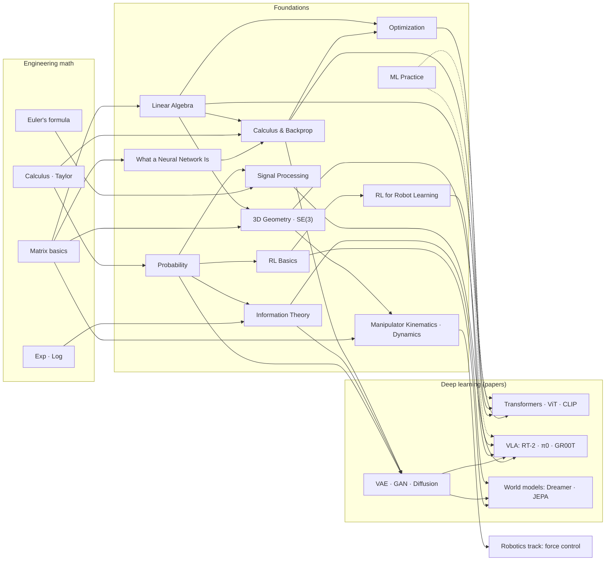
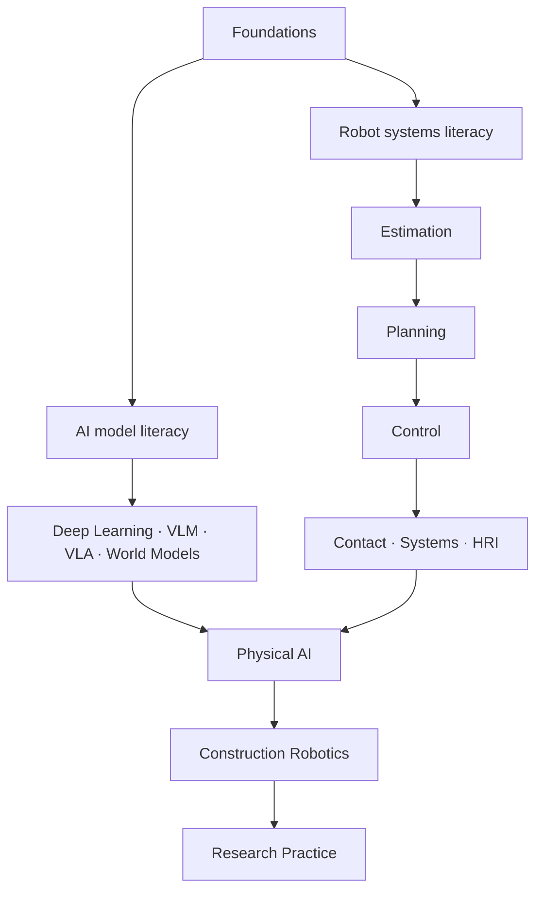
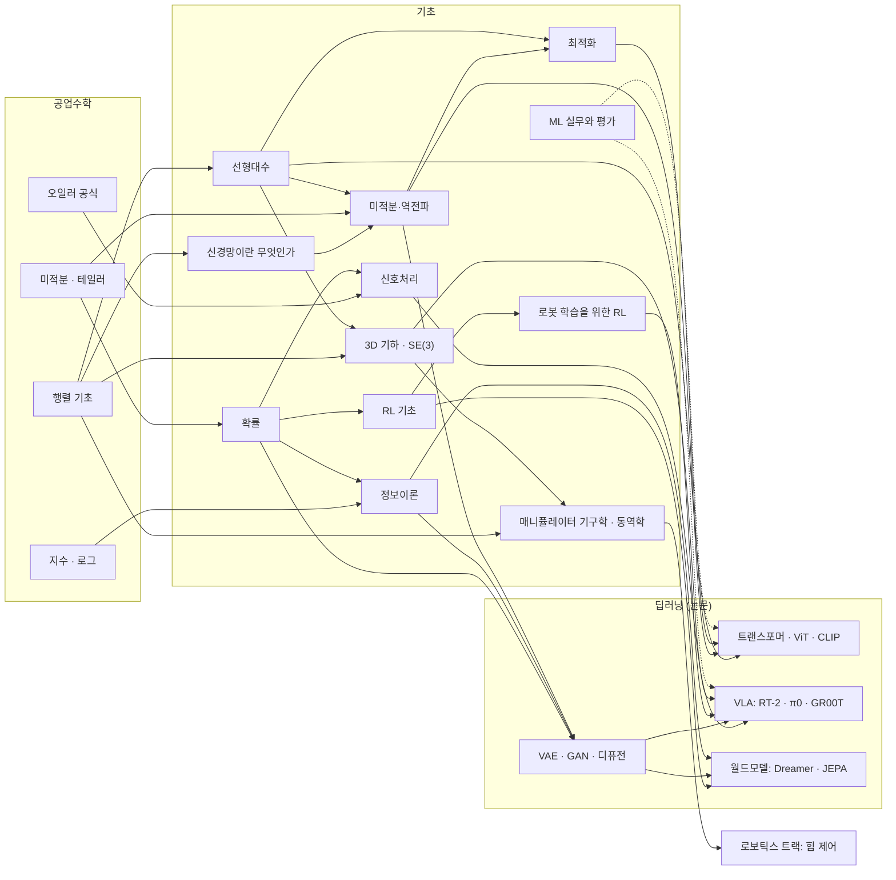
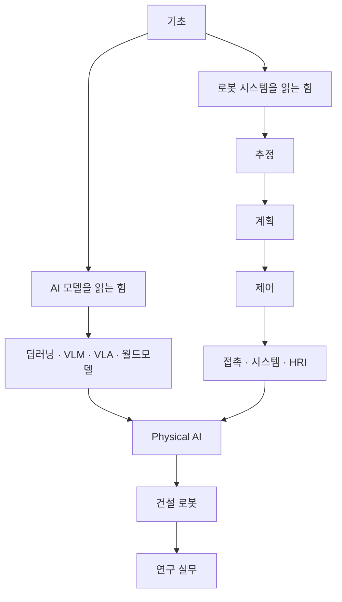

## English

*This page is the map, and the map is a tree rather than a chain (the numbers are the page numbers used in the study order below): 0.5 to 0.8 are on-ramps (the undergraduate math, the lab plants, the lab kernel, the physics floor 0.6.1–0.6.3 for whatever your degree left out, the ML words), 1, 2 and 3 are the core triangle everything else stands on, 4 and 5 are the applied pillars,
6 and 7, with 7.5 after 7, are the domain bridges, and 8, 9 and 10 are what the robotics track needs next. Read the order below, but know that a page only truly needs what its own prerequisite box names.*

How the foundations connect — to each other, to the engineering math beneath them, and to
the deep learning papers above them. Read this page first; it tells you what you need
*before* each page and what each page unlocks *after*.

### Prerequisite engineering math (undergraduate level)

Everything below is 1st–2nd year engineering math. If any row feels shaky, patch it first
with the listed quick source — a few hours each, not a semester.

| Prerequisite | Needed by | Quick source |
|---|---|---|
| Single/multivariable calculus — derivatives, partial derivatives, integrals, Taylor series | [[02-foundations/calculus-backprop\|2. Calculus]], [[02-foundations/optimization\|4. Optimization]], [[02-foundations/probability\|3. Probability]] | [[02-foundations/engineering-math\|0.5 공업수학 §1–3]] · [*Essence of Calculus*](https://www.3blue1brown.com/topics/calculus) |
| Matrix/vector arithmetic — systems of equations, matrix multiplication | [[02-foundations/linear-algebra\|1. Linear Algebra]] (start here) | [[02-foundations/engineering-math\|0.5 공업수학 §4]] · [*Essence of Linear Algebra*](https://www.3blue1brown.com/topics/linear-algebra) |
| Series & convergence basics | [[02-foundations/probability\|3. Probability]] (expectations), [[02-foundations/rl-basics\|7. RL]] (discounted sums) | [[02-foundations/engineering-math\|0.5 공업수학 §5]] |
| Complex numbers & Euler's formula $e^{j\theta} = \cos\theta + j\sin\theta$ | [[02-foundations/signal-processing\|6. Signal Processing]] (Fourier) | [[02-foundations/engineering-math\|0.5 공업수학 §7]] |
| Exponentials & logarithms (incl. $\log$ rules) | [[02-foundations/information-theory\|5. Information Theory]] | [[02-foundations/engineering-math\|0.5 공업수학 §6]] + [[02-foundations/information-theory\|정보이론 §0]] |
| Basic set notation & logic | [[02-foundations/probability\|3. Probability]] (axioms) | [[02-foundations/engineering-math\|0.5 공업수학 §10 표기법 사전]] |

That is the minimum needed to *begin* — no measure theory, no functional analysis, no
advanced statistics. If you can differentiate, multiply matrices, and read $\sum$ and
$\log$, you can start; individual papers may call for deeper references as you go.

**One non-mathematical prerequisite.** Pages 1–9 also use machine-learning words —
*layer*, *loss*, *minibatch*, *epoch*, *hyperparameter*, *pretraining* — the way a
mechanics text uses *force*. If those are new, read
[[02-foundations/neural-network-basics|0.8 What a Neural Network Is]] first; it assumes no
ML at all and takes about twenty minutes. It exists so that the rest of this track does
not have to assume anything beyond the table above.

### Recommended study order

**0.5 [[02-foundations/engineering-math|Engineering Math]]** (a reference: open the section a later page names, skip whatever reads easily) **→ 0.6 [[02-foundations/lab-plants|Lab Plants]] → 0.7 [[02-foundations/lab-kernel|Lab Kernel]]** (skim both once — every problem set names one of the plants P1–P6, and the Tier A labs step it in time) **→ 0.6.1 [[02-foundations/basic-mechanics|Basic Mechanics]] · 0.6.2 [[02-foundations/basic-circuits-electronics|Circuits & Electronics]] · 0.6.3 [[02-foundations/fluid-power|Fluid Power]]** (the physics floor under the plants: take the ones where your degree left a gap and skip the rest — the robotics and construction pages stand on them) **→ 0.8 [[02-foundations/neural-network-basics|What a Neural Network Is]]** (skip if the ML vocabulary is already familiar) **→ 1. [[02-foundations/linear-algebra|Linear Algebra]] → 2. [[02-foundations/calculus-backprop|Calculus & Backprop]] → 3. [[02-foundations/probability|Probability]]** (the core triangle — everything else stands on these) **→ 4. [[02-foundations/optimization|Optimization]] → 5. [[02-foundations/information-theory|Information Theory]]** (the applied pillars) **→ 6. [[02-foundations/signal-processing|Signal Processing]] · 7. [[02-foundations/rl-basics|RL Basics]] → 7.5 [[02-foundations/rl-robot-learning|RL for Robot Learning]]** (domain bridges — order between these two is free; 7.5 follows 7) **→ 8. [[02-foundations/se3-geometry|3D Geometry & SE(3)]]** (before the robotics track and VLA papers) **· 9. [[02-foundations/ml-practice|ML Practice & Evaluation]]** (before reading any results table) **→ 10. [[02-foundations/manipulator-kinematics-dynamics|Manipulator Kinematics & Dynamics]]** (take it when the manipulation track is next; force control is unreadable without it).

Each study page ends with a **problem set** as well as a self-check. The problems reuse six
shared plants frozen in [[02-foundations/lab-plants|0.6 Lab Plants]] (a 2-layer net, a planar
2R, a 1-DoF handle, a leaky heater, a 1-D range, a timed cart). How to step a continuous
plant is [[02-foundations/lab-kernel|0.7 Lab Kernel]]. The lecture on that page must already
have drawn the homework object and derived it on the named plant; the set is a variant
(a different pose, a changed knob, an interpretation), not the first time the object appears.
A page is finished when those problems are done from the wiki alone — not when the last formula looks familiar.

Each page also ends with self-check questions; do them. If a page feels too dense on first
contact, do not read it front to back: the main study pages provide a
**First pass** callout naming which sections to read first and which to postpone, and a
**Going deeper** block near the end naming the textbook to graduate to. Between them, the
same page serves a first reading and a third one. Where a whole subject lands too fast,
pair it with an outside first-pass source ([CS231n](https://cs231n.stanford.edu/schedule.html) lectures for 1–4, [Sutton & Barto](http://incompleteideas.net/book/the-book.html) ch.1–6
for 7) and come back to use this wiki as the structured summary.

> [!tip] A self-study session · 독학 한 회차
> Take one concept and one worked example at a time. Before reading the calculation, write what the input and output represent and the units or matrix shapes. Predict the sign or direction of the answer. Then work through the example with the solution covered, explaining why each operation is allowed. Finish by answering a self-check and changing one assumption: what breaks if the matrix loses rank, observations are correlated, or the frame changes?
>
> If the notation blocks you, return to the linked engineering-math topic. If the arithmetic works but you cannot explain the result, reread the physical interpretation before doing more calculations. Move on when you can explain the example, reproduce its main steps and name an assumption—not merely recognize the final formula.

### Connection map — math → foundations → papers

The right-hand boxes are model and paper names you are not expected to know yet: each is
introduced in [[03-deep-learning/index|Deep Learning]], and the short definitions live in
the [[glossary|Glossary]] (for example, a VLA is a model that outputs robot actions from
images and language).

Reading the map, one family at a time:

- **Transformers** need linear algebra (attention = matrix products), backprop, and optimization (Adam).
- **Generative models** add probability (MLE) and information theory (ELBO/KL).
- **World models** are generative models + RL.
- **VLA** sits on top of everything — plus signal processing on the sensor side.

This is why the study order above exists. Two pages sit slightly apart from that chain and are drawn accordingly:

- **SE(3)** branches off linear algebra and feeds the robot-action side of VLA.
- **ML Practice** attaches to everything with dashed arrows — it is not a prerequisite for understanding a method, but it is a prerequisite for believing any of their results tables.

### Reading load and pacing

Do not estimate this curriculum from word count. Equations, diagrams, covered solutions,
and parameter changes are the work; a fast prose scan is not completion. Use a **60–90
minute study session** as the unit and stop when the page's first-pass or exit criterion is
met.

| Route | Literacy pass | Working pass | What completion means |
|---|---:|---:|---|
| Foundations 0.5–10 | about 15–30 sessions | about 60–80 sessions | cumulative gate + selected problem sets |
| Physics floor 0.6.1–0.6.3 | about 3–6 | about 20–25 | three problem sets, two of them with labs; only the pages your degree left out |
| Deep-learning bridge courses 1–6 with 1.1–1.4 and 6.1 | about 11–26 | about 50–60 | eleven problem sets with their labs + the cumulative problem set; Working only for modules used in experiments |
| Robotics common track 1–11 with 3.2, 3.6, 5.5, 10.5, then 26 | about 26–41 | about 95–110 | running-task checkpoints + cumulative problem set + capstone lab |
| One robotics specialization | about 3–13 | about 13–65 | the selected pages' problem sets or build artifacts |
| Construction track 1–10 with 2.5 and 7.5 | about 12–21 | about 45–55 | nine problem sets on S1 and S2 — the facade-panel placement and the trench excavation frozen in [[05-construction-robotics/site-engineering\|2.5]] — four of them with labs, + the site-system ledger |
| Research practice 1–8 | about 8–20 | about 35–45 | eight problem sets on RS1, the track's frozen force-control study ([[06-research-practice/index\|6. Research Practice]]), three of them with labs |
| Tools track 12.1–12.9 with 25.0 | about 10–20 | about 65–75 | ten problem sets, five of them with labs; each page when its need first arrives |
| Paper track | ongoing | contribution-dependent | ★·◐·○ policy, not a fixed end date |

These are planning ranges, not promises. Prior knowledge can compress a first pass; doing
the derivations and debugging a build can expand a Working pass. Do not sum every row:
algorithms, ROS 2, haptics, navigation, human perception, and manipulation are branching
specializations, the physics floor is taken only where a degree left a gap, and the tools track one page at a time as each need arrives. The common robotics curriculum stops at page 11 and closes with the capstone (26), and the
[[00-study-depth-guide|depth guide]] decides which branch is worth the time.

A sustainable pace is four sessions per week: two course sessions, one paper session, and
one review or implementation session. Re-test the gate every two weeks. Move on when the
exit criterion is met, not when a calendar says the chapter should be over.

### Gate check — are the foundations done?

The per-page self-checks test one page each. This one is cumulative: it is the test for whether you can start the paper track. It exists because every later track uses these pages without teaching them again, so a gap here surfaces months later as a paper you cannot read or a controller you cannot tune, far from the page that would have closed it. Passing opens both literacy paths below — the deep-learning bridge courses and the papers, and the robotics common track — and, on the dissertation path ([[07-research-program/index|7. Research Program §8]]), block 1 continues straight to [[02-foundations/manipulator-kinematics-dynamics|10. Manipulator Kinematics & Dynamics]]. Questions 1–14 form the common gate and follow the study order, 0.5's questions sitting next to the pages that use them; question 15 is an optional manipulation check. Take it after pages 0.5–9, 7.5 included — question 12 tests it; question 15 needs 10, and the optional floor checks after it need the physics-floor pages you took. Each question names the page it tests, so one you cannot even start points at a page not yet read, and each varies what that page works through — new numbers or a twist — rather than copying its worked case, a self-check or a problem. Each is answerable in a few lines. Do them in writing, closed-book. **Eleven or more of the fourteen common questions means go.** A failed question is not a failed gate: it names one page whose worked case to redo before you retest in two weeks.

1. A layer computes $h = \text{ReLU}(Wx + b)$ with $W$ of shape $256\times128$. Give the
   shape of $x$, of $h$, and the number of parameters in this layer. Now drop the ReLU and
   stack two more layers on it, $W'$ of shape $32\times256$ and then $W''$ of shape $256\times32$ (leave the biases aside): which single matrix takes $x$ to the output, what is its shape, and what is the largest rank it can have?
   *([[02-foundations/neural-network-basics|0.8 §1–2]], [[02-foundations/linear-algebra|1. §1–2]])*
2. Compute $\nabla f$ for $f(x,y) = (xy-3)^2$ at $(1,4)$ and say, from the two signs, which
   way gradient descent moves each variable and which one it moves harder.
   *([[02-foundations/engineering-math|0.5 §1]], [[02-foundations/optimization|4. §3]])*
3. $A = \begin{pmatrix}1&2\\2&1\end{pmatrix}$. Find its eigenvalues and say in one sentence what this matrix does to the plane. Is it positive definite? Write $x^\top A x$ as a sum over indices and use it to say whether $A$ could be the covariance matrix of two sensor readings. *([[02-foundations/linear-algebra|1. §3]], [[02-foundations/probability|3. §2]])*
4. Plant **P1**, the two-layer network of [[02-foundations/lab-plants|0.6 Lab Plants]] ($W_1=\begin{pmatrix}1&0\\0&1\\1&1\end{pmatrix}$, $W_2=(1,\,-1,\,0.5)$, ReLU, zero biases, loss $\tfrac12(\hat y-y)^2$), gets the input $x=(-1,\,2)$ with target $y=1$. Give $z$, the ReLU mask, $\hat y$, the loss, $\partial L/\partial W_2$ and $\partial L/\partial W_1$, and say which weights one gradient-descent step leaves untouched, and why. *([[02-foundations/calculus-backprop|2. §3]])*
5. A crack detector fires on 95% of cracks and false-alarms on 5% of sound panels; 5% of
   panels are cracked. An alarm fires — how much should you believe it, and what single
   quantity decides the answer? *([[02-foundations/probability|3. §1]])*
6. Your prior says the wall is 10 cm away with variance 4; a sensor with variance 2 reads
   13. Give the fused estimate and its variance, and say how small the sensor's variance would
   have to be for the fused estimate to land within 0.5 cm of the reading. *([[02-foundations/probability|3. §5]])*
7. $f(x) = 2x^2$, starting at $x_0 = 1$. Where does one Newton step land? How many gradient-descent steps at $\alpha = 0.1$ bring $|x|$ below $10^{-3}$, and above which step size does gradient descent diverge? *([[02-foundations/optimization|4. §3]])*
8. A classifier gives the correct class probability $0.4$ on one sample and $0.8$ on another. Give both cross-entropy losses in nats and say which sample contributes more gradient. Then, for a true $p = (0.6, 0.3, 0.1)$ and a model $q = (0.4, 0.4, 0.2)$, name $H(p,q) - H(p)$, say what it measures, and compute it. *([[02-foundations/information-theory|5. §2–3]], [[02-foundations/calculus-backprop|2. §4.1]])*
9. In thermal runaway a battery cell's temperature error obeys $\dot x = 0.5x + u$: heat breeds
   more heat. Is it stable? Where is the pole of its transfer function, and in which half-plane?
   If you sample it at $\Delta t = 0.1$ s, is the discrete factor inside the unit circle, and
   would sampling faster put it there? *([[02-foundations/engineering-math|0.5 §8–9]])*
10. An IMU samples at 200 Hz and a motor vibrates at 330 Hz. What frequency appears in your
    log, what should have been done before sampling, and how late, in milliseconds, is a 5-tap moving average of that log? *([[02-foundations/signal-processing|6. §2, §4]])*
11. With $\gamma = 0.98$, what is the effective horizon, and what is the value of a state that pays 0 and then moves to a state paying 2 every step forever? Then do one TD(0) update from $V(s) = 2$ after a reward $r = 1$ and a next state worth $V(s') = 4$, with $\alpha = 0.5$.
    *([[02-foundations/engineering-math|0.5 §5]], [[02-foundations/rl-basics|7. §1–3]])*
12. A behaviour-cloned policy makes an error that takes it off its demonstrations with probability $0.02$ at each decision, on a 200-step insertion. What is the chance of a run with no such error, what does predicting a chunk of 8 actions per decision do to it, and what does DAgger change about the data the policy is trained on? *([[02-foundations/rl-robot-learning|7.5 §1]])*
13. Apply $R_z(90°)$ then $R_y(90°)$ to the point $(1,0,0)$. Where does it end up, and where
    does the opposite order put it? Then a base sits at $(2,0,0)$ turned $90°$ about $z$, $T_{AB} = (R_z(90°),\,(2,0,0))$, with a camera mounted at $p_{BC} = (0,1,0)$ in the base's frame: where is the camera in the world, and how far off is adding the offset without rotating it? *([[02-foundations/se3-geometry|8. §1, §3]])*
14. A robotics paper reports 80% success on 10 trials. Give the binomial standard error, the normal-approximation and the Wilson 95% intervals, say which of the two belongs under the number, and name two things the sentence does not tell you that ML Practice says you must ask. *([[02-foundations/ml-practice|9. §3–5]] and its worked case, and [[06-research-practice/experimental-design-reproducibility|2. Experimental Design §4]])*
15. **Optional — manipulation path.** Move **P2**, the planar two-link arm of [[02-foundations/lab-plants|0.6 Lab Plants]], to $\theta = (90°, 90°)$: the upper arm straight up, the forearm pointing back along $-x$. Compute $J$ and $M$ there, then $\Lambda = (JM^{-1}J^\top)^{-1}$. In which direction does the tip now feel heavier, and by how much? *([[02-foundations/manipulator-kinematics-dynamics|10. §1, §3, §6]])*

**Optional floor checks F1–F3.** One question for each page of the physics floor; take the ones whose pages you studied. They are not numbered and not counted in the fourteen.

- **F1.** **P3**, the one-axis haptic handle of [[02-foundations/lab-plants|0.6 Lab Plants]] ($0.04\,\mathrm{kg}$, own damping $0.8\,\mathrm{N{\cdot}s/m}$), gets a tool clamped on that raises its moving mass to $0.16\,\mathrm{kg}$, and is pushed with $0.4\,\mathrm N$ into its $400\,\mathrm{N/m}$ wall. Give the final depth, $\omega_n$, $\zeta$, the overshoot and the envelope's time constant, and say which of them the extra mass left alone. *([[02-foundations/basic-mechanics|0.6.1 §5]])*
- **F2.** **P6**, the cart of [[02-foundations/lab-plants|0.6 Lab Plants]], reads its load cell through an RC filter of $3.3\,\mathrm{k\Omega}$ and $1.0\,\mu\mathrm F$ before a $200\,\mathrm{Hz}$ ADC. Swap the capacitor for $0.47\,\mu\mathrm F$: give the cutoff, the gain at the $100\,\mathrm{Hz}$ Nyquist frequency and at the tool's $170\,\mathrm{Hz}$ ring, where that ring lands in the readings, and what the swap buys and what it costs. *([[02-foundations/basic-circuits-electronics|0.6.2 §5, §12]])*
- **F3.** H1, the excavator boom cylinder of [[02-foundations/fluid-power|0.6.3 Fluid Power]] — a $100\,\mathrm{mm}$ bore on a $60\,\mathrm{L/min}$ pump behind a $25\,\mathrm{MPa}$ relief valve — is rebuilt with a $70\,\mathrm{mm}$ rod instead of $60\,\mathrm{mm}$. Give its extending and retracting speeds and its largest push and pull, and say why the rod changes only one direction. *([[02-foundations/fluid-power|0.6.3 §2–3]])*

> [!tip]- Answers · 정답
> 1. $x$ is $128\times1$, $h$ is $256\times1$; parameters $= 256\times128 + 256 = 33{,}024$. Without the nonlinearity the stack collapses to one matrix, $W''(W'(Wx)) = (W''W'W)x$, of shape $256\times128$. Every output is $W''$ times something, so it lies in the column space of $W''$, which has only $32$ columns: the rank is at most $32$. The three-layer stack cannot even do what the single $256\times128$ layer can, whose rank may reach $128$ — depth without a nonlinearity adds parameters, not expressiveness.
> 2. Inner part $xy-3 = +1$, so $\nabla f = (2(1)(4),\, 2(1)(1)) = (8,2)$. Both positive ⇒ descent *decreases* both variables (it steps along $-\nabla f$) — $xy = 4$ has overshot the target $3$ — and it pushes $x$ four times as hard, because $x$ is multiplied by the larger $y$. At 0.5 §1's point $(2,1)$, short of the target, both signs and both directions are reversed.
> 3. $(1-\lambda)^2 - 4 = 0 \Rightarrow \lambda = 3, -1$, with eigenvectors along $(1,1)$ and $(1,-1)$. It stretches the $45°$ diagonal by $3\times$ and flips the other diagonal onto its reverse. Not positive definite, because one eigenvalue is negative. $x^\top Ax = \sum_i\sum_j A_{ij}x_ix_j = x_1^2 + 4x_1x_2 + x_2^2$, which is $-2$ at $w = (1,-1)$; a covariance has $w^\top \Sigma w = \text{Var}(w^\top x) \ge 0$ for every $w$, so $A$ cannot be one.
> 4. $z = W_1x = (-1,\,2,\,1)$, mask $(0,1,1)$, $h = (0,2,1)$, $\hat y = 0 - 2 + 0.5 = -1.5$, $L = \tfrac12(-2.5)^2 = 3.125$. $\delta_2 = \hat y - y = -2.5$, so $\partial L/\partial W_2 = \delta_2 h^\top = (0,\,-5,\,-2.5)$; $W_2^\top\delta_2 = (-2.5,\,2.5,\,-1.25)$, masked to $\delta_1 = (0,\,2.5,\,-1.25)$, so $\partial L/\partial W_1 = \delta_1 x^\top = \begin{pmatrix}0&0\\-2.5&5\\1.25&-2.5\end{pmatrix}$. A step leaves $W_{2,1}$ and the first row of $W_1$ untouched: the first hidden unit is off ($z_1 < 0$), so no gradient reaches the weights into it or out of it — a dead ReLU for this input.
> 5. $P(c|+) = \frac{0.95(0.05)}{0.95(0.05)+0.05(0.95)} = 0.50$ — a coin flip, although the detector is 95% right on both kinds of panel. The base rate decides it: at $P(c) = 0.01$ the same alarm is only about 16% trustworthy.
> 6. $K = 4/(4+2) = 0.667$; estimate $10 + 0.667(13-10) = 12.0$, variance $(1-K)4 = 1.33$ — smaller than either input. The estimate is $10 + 3K$, within $0.5$ cm of $13$ once $3K \ge 2.5$, that is $K \ge 5/6$: $4/(4+R) \ge 5/6$ gives $R \le 0.8\,\mathrm{cm}^2$, a sensor five times as sure as the prior, and the fused variance is then at most $(1-5/6)\cdot4 = 0.67$. The gain is a ratio of trust: the reading pulls the estimate only as far as its variance is small against the prior's.
> 7. Newton divides by the curvature: $1 - f'(1)/f''(1) = 1 - 4/4 = 0$ — exact, in one step, because a quadratic is the model Newton assumes. Gradient descent multiplies $x$ by $1 - 4\alpha = 0.6$ each step, and $0.6^{14} = 7.8\times10^{-4}$ is the first power below $10^{-3}$: 14 steps. It diverges once $|1 - 4\alpha| > 1$, that is for $\alpha > 0.5 = 2/f''$.
> 8. $-\ln 0.4 = 0.916$ nats and $-\ln 0.8 = 0.223$ nats. The $0.4$ sample: the gradient of softmax plus cross-entropy is $p - y$, whose correct-class entry is $-0.6$ against $-0.2$. $H(p,q) - H(p)$ is the KL divergence $D_{KL}(p\|q) = \sum p\ln(p/q) = 0.6\ln1.5 + 0.3\ln0.75 + 0.1\ln0.5 = 0.088$ nats ($0.126$ bits) — the *extra* cost of coding $p$-data with a code built for $q$.
> 9. Unstable ($a = 0.5 > 0$): left alone, an error grows as $e^{0.5t}$, doubling every $\ln2/0.5 = 1.39$ s. $G(s) = 1/(s-0.5)$, pole at $s = +0.5$, right half-plane. The discrete factor $e^{0.5(0.1)} = e^{0.05} = 1.051 > 1$ lies outside the unit circle, and a shorter $\Delta t$ only moves it toward $1$, never inside: $|e^{a\Delta t}| < 1$ needs $\text{Re}(a) < 0$, so the right half-plane maps outside the unit disc as the left maps inside. Only feedback moves the pole — $u = -Kx$ with $K > 0.5$.
> 10. The multiple of $200$ Hz nearest to $330$ Hz is $400$ Hz ($k = 2$), so the vibration appears at $|330 - 400| = 70$ Hz; folding by one $f_s$ instead gives $130$ Hz, above the $100$ Hz Nyquist frequency, which is how you can tell that $k$ was wrong. An analog anti-alias filter before sampling, or $f_s > 660$ Hz; no software filter can undo the fold afterwards. A 5-tap moving average lags by $(5-1)/2 = 2$ samples, $2 \times 5 = 10$ ms.
> 11. $1/(1-0.98) = 50$ steps. The paying state is worth $2/(1-0.98) = 100$, and the state one step before it $0 + 0.98 \times 100 = 98$: one discount factor less. TD(0): $\delta = r + \gamma V(s') - V(s) = 1 + 0.98\cdot4 - 2 = 2.92$, so $V(s) \leftarrow 2 + 0.5\cdot2.92 = 3.46$.
> 12. $0.98^{200} = 0.018$: fewer than 2 runs in 100 are clean. Chunks of 8 cut the decisions to $200/8 = 25$, and $0.98^{25} = 0.60$. DAgger runs the learner, has the expert label the states the learner actually visits, adds them to the data and retrains, so the policy is trained where it actually goes; its cost grows as $O(\epsilon T)$ instead of behaviour cloning's $O(\epsilon T^2)$.
> 13. $R_z$ first: $(1,0,0) \to (0,1,0)$, and $R_y$ leaves a point on the $y$-axis alone, so it ends on $(0,1,0)$. $R_y$ first: $R_y(90°)(1,0,0) = (0,0,-1)$, and $R_z$ leaves a point on the $z$-axis alone, so it ends on $(0,0,-1)$. The camera is at $R_z(90°)(0,1,0) + (2,0,0) = (-1,0,0) + (2,0,0) = (1,0,0)$; the unrotated sum $(2,1,0)$ is $\sqrt2 = 1.41$ m away.
> 14. $\sqrt{0.8\cdot0.2/10} = 0.126$, $\pm12.6$ percentage points (not $1/\sqrt{n}$, which is not the standard error of a proportion). The normal approximation $0.8 \pm 1.96\cdot0.126 = [0.55,\ 1.05]$ runs past 100%; the Wilson interval, centre $0.717$ and half-width $0.227$, is $[0.49,\ 0.94]$ and belongs under the number, printed as "8/10". Not told: whether the trials were seen or unseen conditions, how many seeds and scenes, whether evaluation was open- or closed-loop, and what counted as success (any two of these are enough).
> 15. The elbow is at $(0,1)$ and the tip at $(-1,1)$, so $J = \begin{pmatrix}-1&0\\-1&-1\end{pmatrix}$, while $M$ depends only on $\theta_2$ and is still $\begin{pmatrix}3&1\\1&1\end{pmatrix}$. Then $JM^{-1}J^\top = \mathrm{diag}(0.5,\,1)$ and $\Lambda = \mathrm{diag}(2,\,1)$: the tip is now twice as heavy sideways as vertically, the reverse of the catalog pose, because turning the first joint by $90°$ turns $\Lambda$ with it. A force controller has to compensate this pose by pose.

> [!tip]- Answers to the floor checks · 바닥 점검 정답
> - **F1.** $y_{ss} = 0.4/400 = 1$ mm, unchanged: statics does not see mass. $\omega_n = \sqrt{400/0.16} = 50$ rad/s, half the bare handle's $100$; $\zeta = 0.8/(2\sqrt{400\cdot0.16}) = 0.05$, half its $0.10$, so the overshoot rises from $73\%$ to $85\%$; the envelope's $\tau = 2m/b = 0.40$ s is four times $0.10$ s, so the handle settles in about $\ln50\cdot\tau \approx 1.6$ s instead of $0.39$ s. Only the final depth is left alone: the heavier handle rings slower, harder and four times longer.
> - **F2.** $\tau = R_fC_f = 1.55$ ms and $f_c = 1/(2\pi\tau) = 102.6$ Hz, so the Nyquist frequency passes at $0.716$ ($-44.3°$) against the catalog filter's $0.434$, and the $170$ Hz ring at $0.517$ against $0.273$. The ring folds to $|170 - 200| = 30$ Hz in the readings — question 10's arithmetic — now with nearly twice the amplitude. The swap buys delay, about $1.6$ instead of $3.3$ ms on every force reading, and pays in aliasing: one RC cannot have both, which is 0.6.2 §12's trade.
> - **F3.** The cap side is unchanged, $A = \pi(0.1)^2/4 = 7.85\times10^{-3}\,\mathrm{m^2}$: it extends at $Q/A = 0.127$ m/s and pushes up to $25\,\mathrm{MPa}\times A = 196$ kN. The annulus shrinks to $\pi(0.1^2 - 0.07^2)/4 = 4.01\times10^{-3}\,\mathrm{m^2}$, so it retracts at $0.250$ m/s (against $0.199$ with the $60$ mm rod) and pulls at most $100$ kN (against $126$). The rod occupies only the rod side, so only retraction sees it: the same flow fills a smaller area faster, and the same pressure pushes on less of it.

If several answers were shaky, the failures point at pages, not at "the foundations" as a
whole — reread those pages' worked examples rather than starting over.

### Where to go next

After the common foundations, choose two parallel literacy paths. They converge in physical AI rather than forming one long prerequisite queue.

- **AI model literacy:** read [[01-canonical-papers/how-to-read|0. How to Read Papers]], then follow the [[01-canonical-papers/canonical-list|canonical list]] with the [[03-deep-learning/lineage|paper lineage]] open.
- **Robot systems literacy:** follow [[04-robotics/index|Robotics & Physical Systems]] from estimation and planning through control, contact, deployment, and HRI/safety.
- **Research production:** use [[06-research-practice/index|Research Practice]] when designing questions, experiments, failure analysis, and papers.

## 한국어

*이 페이지는 지도이고, 그 지도는 사슬이 아니라 나무다(숫자는 아래 학습 순서에 쓰인 페이지 번호다): 0.5~0.8이 진입로(학부 수학, 랩 장치, 랩 커널, 학위 과정이 빠뜨린 곳을 메우는 물리 바닥 0.6.1~0.6.3, ML 어휘), 1·2·3이 나머지 전부가 딛는
핵심 삼각형, 4·5가 응용 기둥, 6·7과 7 다음의 7.5가 도메인 다리, 8·9·10이 로보틱스 트랙이 다음으로 요구하는 것이다. 아래 순서대로 읽되, 각 페이지가 진짜로 요구하는 것은 그 페이지의 선수 지식 상자에 적힌 것뿐이다.*

기초 지식들이 서로, 그 아래의 공업수학과, 그리고 그 위의 딥러닝 논문들과 어떻게
연결되는지의 지도. 이 페이지를 먼저 읽으면 각 페이지를 공부하기 *전에* 무엇이 필요하고,
공부한 *후에* 무엇이 열리는지 알 수 있다.

### 사전 공업수학 (학부 수준)

아래는 전부 공대 1~2학년 공업수학 범위다. 흔들리는 줄이 있으면 표의 빠른 자료로 먼저
메워라 — 학기가 아니라 각각 몇 시간이면 된다.

| 사전 지식 | 필요한 페이지 | 빠른 자료 |
|---|---|---|
| 단변수/다변수 미적분 — 미분, 편미분, 적분, 테일러 급수 | [[02-foundations/calculus-backprop\|2. 미적분·역전파]], [[02-foundations/optimization\|4. 최적화]], [[02-foundations/probability\|3. 확률]] | [[02-foundations/engineering-math\|0.5 공업수학 §1–3]] · [*Essence of Calculus*](https://www.3blue1brown.com/topics/calculus) |
| 행렬/벡터 연산 — 연립방정식, 행렬곱 | [[02-foundations/linear-algebra\|1. 선형대수]] (여기서 시작) | [[02-foundations/engineering-math\|0.5 공업수학 §4]] · [*Essence of Linear Algebra*](https://www.3blue1brown.com/topics/linear-algebra) |
| 급수와 수렴 기초 | [[02-foundations/probability\|3. 확률]] (기댓값), [[02-foundations/rl-basics\|7. RL]] (할인 합) | [[02-foundations/engineering-math\|0.5 공업수학 §5]] |
| 복소수와 오일러 공식 $e^{j\theta} = \cos\theta + j\sin\theta$ | [[02-foundations/signal-processing\|6. 신호처리]] (푸리에) | [[02-foundations/engineering-math\|0.5 공업수학 §7]] |
| 지수·로그 (로그 법칙 포함) | [[02-foundations/information-theory\|5. 정보이론]] | [[02-foundations/engineering-math\|0.5 공업수학 §6]] + [[02-foundations/information-theory\|정보이론 §0]] |
| 기초 집합 표기와 논리 | [[02-foundations/probability\|3. 확률]] (공리) | [[02-foundations/engineering-math\|0.5 공업수학 §10 표기법 사전]] |

이것이 *시작에* 필요한 최소한이다 — 측도론도, 함수해석도, 고급 통계도 없다. 미분할 수
있고, 행렬을 곱할 수 있고, $\sum$과 $\log$를 읽을 수 있으면 시작할 수 있다; 개별 논문을
깊게 팔 때는 추가 자료가 필요할 수 있다.

**수학이 아닌 선수 지식 하나.** 1~9 페이지는 기계학습 어휘 — *층·손실·미니배치·에포크·
하이퍼파라미터·사전학습* — 를 역학 교과서가 *힘*을 쓰듯 쓴다. 이것이 처음이라면
[[02-foundations/neural-network-basics|0.8 신경망이란 무엇인가]]를 먼저 읽어라. ML 지식을
전혀 전제하지 않고 20분이면 된다. 나머지 트랙이 위 표 이상을 전제하지 않아도 되도록 그
페이지가 존재한다.

### 권장 학습 순서

**0.5 [[02-foundations/engineering-math|공업수학]]** (참고서다: 뒤 페이지가 지목하는 절을 펴고, 술술 읽히는 것은 건너뛴다) **→ 0.6 [[02-foundations/lab-plants|Lab Plants]] → 0.7 [[02-foundations/lab-kernel|Lab Kernel]]** (둘 다 한 번 훑어 둔다 — 모든 과제가 장치 P1–P6 중 하나를 부르고, Tier A 랩은 그것을 시간에 따라 전진한다) **→ 0.6.1 [[02-foundations/basic-mechanics|기초 역학]] · 0.6.2 [[02-foundations/basic-circuits-electronics|회로와 전자]] · 0.6.3 [[02-foundations/fluid-power|유체 동력]]** (장치 밑의 물리 바닥: 학위 과정이 빠뜨린 것만 하고 나머지는 건너뛴다 — 로보틱스와 건설 페이지가 이 위에 선다) **→ 0.8 [[02-foundations/neural-network-basics|신경망이란 무엇인가]]** (ML 어휘가 이미 익숙하면 건너뛰어도 된다) **→ 1. [[02-foundations/linear-algebra|선형대수]] → 2. [[02-foundations/calculus-backprop|미적분·역전파]] → 3. [[02-foundations/probability|확률]]** (핵심 삼각형 — 나머지 전부가 이 위에 선다) **→ 4. [[02-foundations/optimization|최적화]] → 5. [[02-foundations/information-theory|정보이론]]** (응용 기둥) **→ 6. [[02-foundations/signal-processing|신호처리]] · 7. [[02-foundations/rl-basics|RL 기초]] → 7.5 [[02-foundations/rl-robot-learning|로봇 학습을 위한 RL]]** (도메인 다리 — 이 둘의 순서는 자유, 7.5는 7 다음) **→ 8. [[02-foundations/se3-geometry|3D 기하와 SE(3)]]** (로보틱스 트랙·VLA 논문 전에) **· 9. [[02-foundations/ml-practice|ML 실무와 평가]]** (결과 표를 읽기 전에) **→ 10. [[02-foundations/manipulator-kinematics-dynamics|매니퓰레이터 기구학·동역학]]** (매니퓰레이션 트랙으로 갈 때 — 힘 제어가 이것 없이는 읽히지 않는다).

각 학습 페이지 끝에는 스스로 점검과 함께 **과제가** 있다. 과제는 [[02-foundations/lab-plants|0.6 Lab Plants]]에 고정된 장치 여섯 개(2층 네트워크, 평면 2R, 1자유도 핸들, 새는 히터, 1차원 거리, 시계가 있는 카트)를 재사용한다. 연속 플랜트를 한 스텝 전진하는 법은 [[02-foundations/lab-kernel|0.7 Lab Kernel]]이다. 그 페이지의 강의가 이미 과제의 대상을 그리고 이름 붙은 장치로 유도해 두어야 한다. 과제는 변형(다른 자세, 손잡이 하나, 해석)이지 그 대상이 처음 나오는 곳이 아니다. 페이지가 끝난 것은 위키만으로 그 과제를 풀었을 때이지, 마지막 식이 익숙해 보일 때가 아니다.

각 페이지 끝의 스스로 점검 문제를 꼭 풀어라. 처음 접했을 때 너무 압축적으로 느껴지는
페이지는 처음부터 끝까지 읽지 마라. 주요 학습 페이지는 어느 절을 먼저 읽고 어느
절을 미룰지 지목하는 **처음이라면** 콜아웃으로 시작하고, 끝 부근에는 다음에 넘어갈 교재를
지목하는 **더 깊이** 블록이 있다. 그 둘 사이에서 같은 페이지가 1회독과 3회독을 함께
감당한다. 과목 전체가 너무 빠르게 느껴지면 1차 통과용 외부 자료(1~4번은
[CS231n](https://cs231n.stanford.edu/schedule.html) 강의, 7번은 [Sutton & Barto](http://incompleteideas.net/book/the-book.html) 1~6장)와 병행하고, 이 위키의 페이지는 구조화된 요약본으로
되돌아와 쓰면 된다.

> [!tip] 독학 한 회차 · A self-study session
> 한 번에 개념 하나와 계산 예제 하나를 잡는다. 풀이를 보기 전에 입력·출력의 뜻과 단위 또는 행렬 크기를 적고, 답의 부호·방향을 예상한다. 풀이를 가리고 계산하며 각 연산을 왜 해도 되는지 말해 본다. 마지막으로 확인 질문에 답하고 가정 하나를 바꾼다. 행렬의 랭크가 줄거나 관측에 상관이 생기거나 프레임이 바뀌면 무엇이 깨지는가?
>
> 표기에서 막히면 연결된 공업수학 항목으로 돌아간다. 계산은 되지만 결과를 설명하지 못하면 계산을 더 하기 전에 물리적 해석을 다시 읽는다. 마지막 식이 익숙한지가 아니라 예제를 설명하고, 핵심 단계를 재현하고, 가정 하나를 댈 수 있는지를 기준으로 다음으로 간다.

### 연결 지도 — 수학 → 기초 → 논문

오른쪽 상자들은 아직 몰라도 되는 모델·논문 이름이다. 각각은 [[03-deep-learning/index|딥러닝]]에서
소개되고, 짧은 정의는 [[glossary|용어집]]에 있다(예를 들어 VLA는 이미지와 언어를 받아 로봇
행동을 출력하는 모델이다).

위의 mermaid 지도를 모델 계열별로 읽으면:

- **Transformer**는 선형대수(어텐션 = 행렬곱), 역전파, 최적화(Adam)가 필요하다.
- **생성모델**은 거기에 확률(MLE)과 정보이론(ELBO/KL)을 더한다.
- **월드모델** = 생성모델 + RL.
- **VLA**는 이 전부의 꼭대기에 앉아 있다 — 센서 쪽에서는 신호처리까지.

위의 학습 순서가 존재하는 이유가 이것이다. 두 페이지는 이 사슬에서 살짝 비켜 있고 지도에도 그렇게 그려져 있다:

- **SE(3)** 페이지는 선형대수에서 갈라져 나와 VLA의 로봇 행동 쪽으로 들어간다.
- **ML 실무**는 점선으로 모든 것에 붙는다 — 방법을 *이해*하는 데 필요한 선수 지식이 아니라, 그 방법들의 결과 표를 *믿는* 데 필요한 선수 지식이기 때문이다.

### 학습 분량과 페이스

단어 수로 교과 시간을 계산하지 않는다. 수식·그림·가린 정답·parameter 변경이 공부이며 빠른
산문 훑기는 완주가 아니다. **60–90분 학습 회차**를 단위로 쓰고 페이지의 first-pass 또는
통과 기준을 만족하면 멈춘다.

| 경로 | Literacy 통과 | Working 통과 | 완료의 뜻 |
|---|---:|---:|---|
| 기초 0.5–10 | 약 15–30회 | 약 60–80회 | 누적 gate + 선택한 problem set |
| 물리 바닥 0.6.1–0.6.3 | 약 3–6회 | 약 20–25회 | 과제 셋, 그중 둘은 실습 포함; 학위 과정이 빠뜨린 페이지만 |
| 딥러닝 브리지 교과 1–6과 1.1–1.4, 6.1 | 약 11–26회 | 약 50–60회 | 과제 열한 개와 그 실습 + 누적 과제; 실험에 쓰는 모듈만 Working |
| 로보틱스 공통 1–11(3.2, 3.6, 5.5, 10.5 포함), 이어서 26 | 약 26–41회 | 약 95–110회 | running-task 확인 + 누적 과제 + 캡스톤 실습 |
| 로보틱스 전문화 하나 | 약 3–13회 | 약 13–65회 | 선택 페이지의 과제 또는 build 산출물 |
| 건설 트랙 1–10, 2.5와 7.5 포함 | 약 12–21회 | 약 45–55회 | S1과 S2([[05-construction-robotics/site-engineering\|2.5]]에 고정한 외장 패널 설치와 트렌치 굴착) 위의 과제 아홉, 그중 넷은 실습 포함, + 현장 시스템 장부 |
| 연구 실무 1–8 | 약 8–20회 | 약 35–45회 | RS1(이 트랙이 고정해 둔 힘 제어 연구, [[06-research-practice/index\|6. 연구 실무]]) 위의 과제 여덟 개, 그중 셋은 실습 포함 |
| 도구 트랙 12.1–12.9와 25.0 | 약 10–20회 | 약 65–75회 | 과제 열 개, 그중 다섯은 실습 포함; 페이지마다 그 필요가 처음 생길 때 |
| 논문 트랙 | 계속됨 | 기여에 따라 다름 | 고정 종료일이 아니라 ★·◐·○ 정책 |

계획 범위이지 약속이 아니다. 선수 지식은 first pass를 줄이고, 유도와 debugging은 Working을
늘린다. 모든 행을 더하지 않는다. 알고리즘·ROS 2·햅틱·내비게이션·사람 인지·매니퓰레이션은
갈라지는 전문화이고, 물리 바닥은 학위 과정이 빠뜨린 곳만, 도구 트랙은 필요가 생길 때마다 한 페이지씩 한다. 공통 로보틱스는 11번에서 끝나고 캡스톤(26)으로 마무리하며 어느 가지를 탈지는
[[00-study-depth-guide|깊이 가이드]]가 정한다.

지속 가능한 페이스는 주 4회다: 교과 2회, 논문 1회, 복습 또는 구현 1회. 2주마다 gate를
다시 검사한다. 달력이 아니라 통과 기준을 만족하면 다음으로 간다.

### 통과 점검 — 기초는 끝났는가

페이지별 자가점검은 한 페이지씩 검사한다. 이것은 누적 시험이다: 논문 트랙으로 넘어가도 되는지를 판정한다. 이 점검이 있는 이유는 뒤의 모든 트랙이 이 페이지들을 다시 가르치지 않고 그냥 쓰기 때문이다. 여기 난 구멍은 몇 달 뒤 읽히지 않는 논문이나 튜닝되지 않는 제어기로 드러나고, 그때는 그 구멍을 메웠을 페이지에서 한참 멀리 와 있다. 통과하면 아래의 두 문해 경로, 곧 딥러닝 브리지 교과와 논문, 그리고 로보틱스 공통 트랙이 열리고, 학위논문 경로([[07-research-program/index|7. 연구 프로그램 §8]])에서는 블록 1이 곧장 [[02-foundations/manipulator-kinematics-dynamics|10. 매니퓰레이터 기구학·동역학]]으로 이어진다. 1~14번은 공통 통과 점검이고 학습 순서를 따르며, 0.5의 문제는 그것을 쓰는 페이지 옆에 둔다. 15번은 매니퓰레이션 선택 점검이다. 0.5~9 페이지를 마친 뒤 풀되, 7.5도 포함한다 — 12번이 그 페이지를 검사한다. 15번에는 10이 필요하고, 그 뒤의 선택 바닥 점검에는 공부한 물리 바닥 페이지가 필요하다. 문제마다 검사하는 페이지가 적혀 있으니, 손도 못 댄 문제는 아직 읽지 않은 페이지를 가리킨다. 또 문제마다 그 페이지가 다룬 것을 새 숫자나 비틂으로 바꾼 변형이지, 계산 예제나 스스로 점검, 과제를 그대로 옮긴 것이 아니다. 각각 몇 줄이면 답할 수 있다. 책을 덮고 글로 써서 풀어라. **공통 14문항 중 11개 이상이면 넘어가도 된다.** 문제 하나를 틀렸다고 통과 점검에 떨어진 것은 아니다. 그 문제는 계산 예제를 다시 풀어 볼 페이지 하나를 가리키고, 2주 뒤 다시 점검하면 된다.

1. 어떤 층이 $h = \text{ReLU}(Wx + b)$를 계산하고 $W$의 모양이 $256\times128$이다. $x$와 $h$의
   모양, 그리고 이 층의 파라미터 수를 말하라. 이제 ReLU를 없애고 그 위에 층 둘, 모양
   $32\times256$인 $W'$와 그다음 $256\times32$인 $W''$를 쌓는다(편향은 제쳐 둔다). $x$를 출력으로 보내는 행렬 하나는 무엇이고, 그 모양은 무엇이며, 그 랭크는 최대 얼마인가? *([[02-foundations/neural-network-basics|0.8 §1–2]], [[02-foundations/linear-algebra|1. §1–2]])*
2. $f(x,y) = (xy-3)^2$의 $\nabla f$를 $(1,4)$에서 구하고, 두 부호로부터 경사 하강이 각 변수를
   어느 쪽으로, 어느 쪽을 더 세게 미는지 말하라. *([[02-foundations/engineering-math|0.5 §1]], [[02-foundations/optimization|4. §3]])*
3. $A = \begin{pmatrix}1&2\\2&1\end{pmatrix}$의 고유값을 구하고, 이 행렬이 평면에 하는 일을 한 문장으로 말하라. 양정부호인가? $x^\top A x$를 인덱스에 대한 합으로 쓰고, 그것으로 $A$가 센서 판독값 둘의 공분산 행렬일 수 있는지 말하라. *([[02-foundations/linear-algebra|1. §3]], [[02-foundations/probability|3. §2]])*
4. [[02-foundations/lab-plants|0.6 Lab Plants]]의 2층 네트워크인 장치 **P1**($W_1=\begin{pmatrix}1&0\\0&1\\1&1\end{pmatrix}$, $W_2=(1,\,-1,\,0.5)$, ReLU, 편향 0, 손실 $\tfrac12(\hat y-y)^2$)에 입력 $x=(-1,\,2)$와 타깃 $y=1$이 들어온다. $z$, ReLU 마스크, $\hat y$, 손실, $\partial L/\partial W_2$와 $\partial L/\partial W_1$을 구하고, 경사 하강 한 스텝이 어느 가중치를 건드리지 않는지와 그 이유를 말하라. *([[02-foundations/calculus-backprop|2. §3]])*
5. 균열 감지기가 균열의 95%에서 울리고 멀쩡한 패널의 5%에서 오경보하며, 패널의 5%에 균열이
   있다. 경보가 울렸다 — 얼마나 믿어야 하고, 답을 정하는 양은 무엇인가? *([[02-foundations/probability|3. §1]])*
6. 사전 믿음은 벽이 10 cm 앞, 분산 4다. 분산 2인 센서가 13을 읽었다. 융합된 추정값과 그
   분산을 구하고, 융합된 추정값이 판독값에서 0.5 cm 안에 들려면 센서의 분산이 얼마나 작아야 하는지 말하라. *([[02-foundations/probability|3. §5]])*
7. $f(x) = 2x^2$에서 $x_0 = 1$로 출발한다. 뉴턴법 한 스텝은 어디에 도착하는가? $\alpha = 0.1$의 경사 하강은 몇 스텝 만에 $|x|$를 $10^{-3}$ 아래로 내리고, 스텝 크기가 얼마를 넘으면 발산하는가? *([[02-foundations/optimization|4. §3]])*
8. 분류기가 한 샘플에서 정답 클래스에 확률 $0.4$를, 다른 샘플에서 $0.8$을 줬다. 두 교차 엔트로피 손실을 나트로 구하고, 어느 샘플이 더 큰 그래디언트를 주는지 말하라. 그다음 참 $p = (0.6, 0.3, 0.1)$, 모델 $q = (0.4, 0.4, 0.2)$에 대해 $H(p,q) - H(p)$의 이름과 그것이 재는 것을 말하고 값을 구하라. *([[02-foundations/information-theory|5. §2–3]], [[02-foundations/calculus-backprop|2. §4.1]])*
9. 열폭주 중인 배터리 셀의 온도 오차는 $\dot x = 0.5x + u$를 따른다. 열이 열을 부른다. 안정한가?
   전달함수의 극점은 어디이고 어느 반평면인가? $\Delta t = 0.1$초로 샘플링하면 이산 계수가 단위원 안에 있는가?
   더 빨리 샘플링하면 그 안으로 들어가는가? *([[02-foundations/engineering-math|0.5 §8–9]])*
10. IMU가 200 Hz로 샘플링하고 모터가 330 Hz로 진동한다. 로그에는 어떤 주파수가 나타나고,
    샘플링 전에 무엇을 했어야 하며, 그 로그의 5탭 이동 평균은 몇 밀리초 늦는가? *([[02-foundations/signal-processing|6. §2, §4]])*
11. $\gamma = 0.98$일 때 유효 지평은 얼마이고, 보상 0을 받은 뒤 매 스텝 2를 영원히 주는 상태로 넘어가는 상태의 가치는 얼마인가? 그다음 $V(s) = 2$에서 보상 $r = 1$과 가치 $V(s') = 4$인 다음 상태를 받아 $\alpha = 0.5$로 TD(0) 갱신을 한 번 하라.
    *([[02-foundations/engineering-math|0.5 §5]], [[02-foundations/rl-basics|7. §1–3]])*
12. 행동 복제로 학습한 정책이 결정마다 확률 $0.02$로 시연 밖으로 벗어나는 오류를 낸다. 200스텝짜리 끼움에서 그런 오류가 한 번도 없을 확률은 얼마이고, 결정마다 행동 8개를 청크로 예측하면 그것이 어떻게 되며, DAgger는 정책이 학습하는 데이터를 무엇으로 바꾸는가? *([[02-foundations/rl-robot-learning|7.5 §1]])*
13. 점 $(1,0,0)$에 $R_z(90°)$를 적용한 뒤 $R_y(90°)$를 적용하면 어디에 도착하는가? 순서를
    바꾸면 어디인가? 그다음 베이스가 $(2,0,0)$에 $z$ 둘레로 $90°$ 돌아가 있고, $T_{AB} = (R_z(90°),\,(2,0,0))$, 카메라가 베이스 프레임의 $p_{BC} = (0,1,0)$에 달려 있다. 카메라는 월드의 어디에 있고, 오프셋을 돌리지 않고 더하면 얼마나 어긋나는가? *([[02-foundations/se3-geometry|8. §1, §3]])*
14. 어떤 로보틱스 논문이 10회 시행에서 성공률 80%를 보고했다. 이항 표준오차, 정규근사와 Wilson의 95% 구간을 구하고, 둘 중 어느 것이 그 숫자 밑에 들어가야 하는지 말하고, ML 실무가 반드시 물어야 한다고 말하는 것 중 이 문장이 알려주지 않는 것 두 가지를 대라. *([[02-foundations/ml-practice|9. §3–5]]와 그 계산 예제, 그리고 [[06-research-practice/experimental-design-reproducibility|2. 실험 설계 §4]])*
15. **선택 — 매니퓰레이션 경로.** [[02-foundations/lab-plants|0.6 Lab Plants]]의 평면 2링크 팔 **P2**를 $\theta = (90°, 90°)$로 옮긴다. 윗팔은 똑바로 위, 아래팔은 $-x$ 쪽으로 뒤를 향한다. 거기서 $J$와 $M$을 구하고, 이어서 $\Lambda = (JM^{-1}J^\top)^{-1}$을 구하라. 이제 말단은 어느 방향으로 더 무겁게 느껴지며 몇 배인가? *([[02-foundations/manipulator-kinematics-dynamics|10. §1, §3, §6]])*

**선택 바닥 점검 F1–F3.** 물리 바닥 페이지마다 한 문제씩이며, 공부한 페이지의 것만 푼다. 번호를 매기지 않고 14문항에 세지도 않는다.

- **F1.** [[02-foundations/lab-plants|0.6 Lab Plants]]의 1축 햅틱 핸들 **P3**($0.04\,\mathrm{kg}$, 자체 감쇠 $0.8\,\mathrm{N{\cdot}s/m}$)에 공구를 물려 움직이는 질량을 $0.16\,\mathrm{kg}$로 늘리고, $0.4\,\mathrm N$으로 $400\,\mathrm{N/m}$ 벽에 민다. 최종 깊이, $\omega_n$, $\zeta$, 오버슈트, 포락선의 시간 상수를 구하고, 늘어난 질량이 그중 무엇을 그대로 두었는지 말하라. *([[02-foundations/basic-mechanics|0.6.1 §5]])*
- **F2.** [[02-foundations/lab-plants|0.6 Lab Plants]]의 카트 **P6**는 로드셀을 $3.3\,\mathrm{k\Omega}$과 $1.0\,\mu\mathrm F$의 RC 필터를 거쳐 $200\,\mathrm{Hz}$ ADC로 읽는다. 커패시터를 $0.47\,\mu\mathrm F$로 바꾸면 차단 주파수, $100\,\mathrm{Hz}$ 나이퀴스트 주파수와 공구의 $170\,\mathrm{Hz}$ 울림에서의 이득, 그 울림이 판독값의 어디에 나타나는지, 그리고 이 교체가 무엇을 사고 무엇을 치르는지 말하라. *([[02-foundations/basic-circuits-electronics|0.6.2 §5, §12]])*
- **F3.** [[02-foundations/fluid-power|0.6.3 유체 동력]]의 굴착기 붐 실린더 H1 — $60\,\mathrm{L/min}$ 펌프와 $25\,\mathrm{MPa}$ 릴리프 밸브 뒤의 보어 $100\,\mathrm{mm}$ — 을 로드 $60\,\mathrm{mm}$ 대신 $70\,\mathrm{mm}$로 다시 만든다. 신장·수축 속도와 최대 미는 힘·당기는 힘을 구하고, 로드가 왜 한쪽 방향만 바꾸는지 말하라. *([[02-foundations/fluid-power|0.6.3 §2–3]])*

> [!tip]- 정답 · Answers
> 1. $x$는 $128\times1$, $h$는 $256\times1$; 파라미터 $= 256\times128 + 256 = 33{,}024$개. 비선형성이 없으면 스택이 행렬 하나로 접힌다: $W''(W'(Wx)) = (W''W'W)x$이고, 그 모양은 $256\times128$이다. 모든 출력은 $W''$에 무언가를 곱한 것이므로 열이 $32$개뿐인 $W''$의 열공간 안에 있고, 그래서 랭크는 많아야 $32$다. 세 층짜리 스택은 랭크가 $128$까지 갈 수 있는 $256\times128$ 층 하나만도 못하다. 비선형성 없는 깊이는 파라미터만 늘릴 뿐 표현력을 늘리지 않는다.
> 2. 안쪽이 $xy-3 = +1$이므로 $\nabla f = (2(1)(4),\, 2(1)(1)) = (8,2)$. 둘 다 양수 ⇒ 하강은 두 변수를 *내린다*($-\nabla f$ 방향으로 가므로). $xy = 4$가 목표 $3$을 지나쳤기 때문이다. 그리고 $x$에 곱해지는 $y$가 더 크므로 $x$를 네 배 세게 민다. 목표에 못 미치는 0.5 §1의 점 $(2,1)$에서는 두 부호도, 두 방향도 반대다.
> 3. $(1-\lambda)^2 - 4 = 0 \Rightarrow \lambda = 3, -1$이고 고유벡터는 $(1,1)$과 $(1,-1)$ 방향이다. $45°$ 대각선 방향을 $3$배 늘이고 반대 대각선은 뒤집는다. 고유값 하나가 음수이므로 양정부호가 아니다. $x^\top Ax = \sum_i\sum_j A_{ij}x_ix_j = x_1^2 + 4x_1x_2 + x_2^2$이고 $w = (1,-1)$에서 $-2$다. 공분산은 모든 $w$에 대해 $w^\top \Sigma w = \text{Var}(w^\top x) \ge 0$이어야 하므로 $A$는 공분산일 수 없다.
> 4. $z = W_1x = (-1,\,2,\,1)$, 마스크 $(0,1,1)$, $h = (0,2,1)$, $\hat y = 0 - 2 + 0.5 = -1.5$, $L = \tfrac12(-2.5)^2 = 3.125$. $\delta_2 = \hat y - y = -2.5$이므로 $\partial L/\partial W_2 = \delta_2 h^\top = (0,\,-5,\,-2.5)$이고, $W_2^\top\delta_2 = (-2.5,\,2.5,\,-1.25)$에 마스크를 씌우면 $\delta_1 = (0,\,2.5,\,-1.25)$이므로 $\partial L/\partial W_1 = \delta_1 x^\top = \begin{pmatrix}0&0\\-2.5&5\\1.25&-2.5\end{pmatrix}$이다. 한 스텝은 $W_{2,1}$과 $W_1$의 첫 행을 건드리지 않는다. 첫 은닉 유닛이 꺼져 있어($z_1 < 0$) 그 유닛으로 들어가고 나가는 가중치에 그래디언트가 닿지 않기 때문이다. 이 입력에서 죽은 ReLU다.
> 5. $P(c|+) = \frac{0.95(0.05)}{0.95(0.05)+0.05(0.95)} = 0.50$ — 감지기가 두 종류의 패널 모두에서 95% 맞는데도 동전 던지기다. 답을 정하는 것은 기저율이다. $P(c) = 0.01$이면 같은 경보를 약 16%만 믿을 수 있다.
> 6. $K = 4/(4+2) = 0.667$; 추정값 $10 + 0.667(13-10) = 12.0$, 분산 $(1-K)4 = 1.33$ — 두 입력 어느 쪽보다 작다. 추정값은 $10 + 3K$이므로 $3K \ge 2.5$, 곧 $K \ge 5/6$일 때 $13$에서 $0.5$ cm 안에 든다. $4/(4+R) \ge 5/6$에서 $R \le 0.8\,\mathrm{cm}^2$, 곧 사전 믿음보다 다섯 배 확실한 센서여야 하고, 그때 융합된 분산은 많아야 $(1-5/6)\cdot4 = 0.67$이다. 칼만 이득은 믿음의 비율이다. 판독값은 그 분산이 사전 분산에 비해 작은 만큼만 추정값을 끌어당긴다.
> 7. 뉴턴법은 곡률로 나눈다: $1 - f'(1)/f''(1) = 1 - 4/4 = 0$ — 한 스텝에 정확히 도착한다. 이차 함수가 곧 뉴턴법이 가정하는 모델이기 때문이다. 경사 하강은 매 스텝 $x$에 $1 - 4\alpha = 0.6$을 곱하고, $0.6^{14} = 7.8\times10^{-4}$이 처음으로 $10^{-3}$ 아래로 내려가는 거듭제곱이므로 14스텝이다. $|1 - 4\alpha| > 1$, 곧 $\alpha > 0.5 = 2/f''$이면 발산한다.
> 8. $-\ln 0.4 = 0.916$ 나트, $-\ln 0.8 = 0.223$ 나트. $0.4$ 쪽이다: softmax + 교차 엔트로피의 그래디언트가 $p - y$이고, 정답 클래스 성분이 $-0.6$ 대 $-0.2$다. $H(p,q) - H(p)$는 KL 발산 $D_{KL}(p\|q) = \sum p\ln(p/q) = 0.6\ln1.5 + 0.3\ln0.75 + 0.1\ln0.5 = 0.088$ 나트($0.126$비트)이고, 진실이 $p$인데 $q$용 부호를 써서 *추가로* 내는 비용이다.
> 9. 불안정($a = 0.5 > 0$): 내버려 두면 오차가 $e^{0.5t}$로 자라 $\ln2/0.5 = 1.39$초마다 두 배가 된다. $G(s) = 1/(s-0.5)$, 극점 $s = +0.5$, 우반평면. 이산 계수 $e^{0.5(0.1)} = e^{0.05} = 1.051 > 1$은 단위원 밖에 있고, $\Delta t$를 줄여도 $1$ 쪽으로 다가갈 뿐 안으로 들어가지 않는다. $|e^{a\Delta t}| < 1$에는 $\text{Re}(a) < 0$이 필요하므로, 좌반평면이 단위원 안으로 사상되듯 우반평면은 단위원 밖으로 사상된다. 극점을 옮기는 것은 되먹임뿐이다 — $K > 0.5$인 $u = -Kx$.
> 10. $330$ Hz에 가장 가까운 $200$ Hz의 배수는 $400$ Hz($k = 2$)이므로 진동은 $|330 - 400| = 70$ Hz에 나타난다. $f_s$ 하나만큼만 접으면 $130$ Hz가 나오는데, 나이퀴스트 주파수 $100$ Hz보다 위이므로 $k$를 잘못 골랐음을 알 수 있다. 샘플링 전에 아날로그 안티에일리어스 필터를 넣거나 $f_s > 660$ Hz로 샘플링했어야 한다. 사후의 어떤 소프트웨어 필터도 접힘을 되돌릴 수 없다. 5탭 이동 평균은 $(5-1)/2 = 2$샘플, 곧 $2 \times 5 = 10$ ms 늦다.
> 11. $1/(1-0.98) = 50$ 스텝이다. 2를 주는 상태의 가치는 $2/(1-0.98) = 100$이고, 그 한 스텝 앞 상태는 $0 + 0.98 \times 100 = 98$로 할인율 한 번만큼 작다. TD(0): $\delta = r + \gamma V(s') - V(s) = 1 + 0.98\cdot4 - 2 = 2.92$이므로 $V(s) \leftarrow 2 + 0.5\cdot2.92 = 3.46$.
> 12. $0.98^{200} = 0.018$: 깨끗한 실행이 100번에 2번도 안 된다. 8개씩 청크로 묶으면 결정이 $200/8 = 25$번으로 줄고 $0.98^{25} = 0.60$이다. DAgger는 학습자를 실행시키고, 학습자가 실제로 가는 상태에 전문가의 라벨을 받아 데이터에 더한 뒤 다시 학습하므로, 정책이 실제로 가는 곳에서 학습된다. 비용은 행동 복제의 $O(\epsilon T^2)$가 아니라 $O(\epsilon T)$로 자란다.
> 13. $R_z$ 먼저: $(1,0,0) \to (0,1,0)$이고 $R_y$는 $y$축 위의 점을 움직이지 않으므로 $(0,1,0)$에 도착한다. $R_y$ 먼저: $R_y(90°)(1,0,0) = (0,0,-1)$이고 $R_z$는 $z$축 위의 점을 움직이지 않으므로 $(0,0,-1)$에 도착한다. 카메라는 $R_z(90°)(0,1,0) + (2,0,0) = (-1,0,0) + (2,0,0) = (1,0,0)$에 있고, 돌리지 않고 더한 $(2,1,0)$은 $\sqrt2 = 1.41$ m 떨어져 있다.
> 14. $\sqrt{0.8\cdot0.2/10} = 0.126$, 곧 $\pm12.6$%p다($1/\sqrt{n}$을 쓰지 마라. 비율의 표준오차가 아니다). 정규근사 $0.8 \pm 1.96\cdot0.126 = [0.55,\ 1.05]$는 100%를 넘고, 중심 $0.717$, 반폭 $0.227$인 Wilson 구간 $[0.49,\ 0.94]$가 "8/10"과 함께 그 숫자 밑에 들어간다. 알려주지 않는 것: 시행이 본 조건인지 못 본 조건인지, 시드·장면이 몇 개인지, 평가가 개루프인지 폐루프인지, 무엇을 성공으로 셌는지(이 중 둘이면 충분).
> 15. 엘보는 $(0,1)$, 말단은 $(-1,1)$에 있으므로 $J = \begin{pmatrix}-1&0\\-1&-1\end{pmatrix}$이고, $M$은 $\theta_2$에만 의존하므로 여전히 $\begin{pmatrix}3&1\\1&1\end{pmatrix}$다. 그러면 $JM^{-1}J^\top = \mathrm{diag}(0.5,\,1)$, $\Lambda = \mathrm{diag}(2,\,1)$이다. 이제 말단은 옆으로 위아래보다 두 배 무겁고, 카탈로그 자세와 반대다. 첫 관절을 $90°$ 돌리면 $\Lambda$도 함께 돌기 때문이다. 힘 제어기는 이것을 자세마다 보상해야 한다.

> [!tip]- 바닥 점검 정답 · Answers to the floor checks
> - **F1.** $y_{ss} = 0.4/400 = 1$ mm로 그대로다. 정역학은 질량을 보지 않는다. $\omega_n = \sqrt{400/0.16} = 50$ rad/s로 맨 핸들의 $100$의 절반이고, $\zeta = 0.8/(2\sqrt{400\cdot0.16}) = 0.05$로 $0.10$의 절반이라 오버슈트가 $73\%$에서 $85\%$로 오른다. 포락선의 $\tau = 2m/b = 0.40$ s는 $0.10$ s의 네 배이므로 핸들은 $0.39$ s가 아니라 약 $\ln50\cdot\tau \approx 1.6$ s에 가라앉는다. 그대로인 것은 최종 깊이뿐이다. 무거운 핸들은 더 느리게, 더 세게, 네 배 오래 울린다.
> - **F2.** $\tau = R_fC_f = 1.55$ ms, $f_c = 1/(2\pi\tau) = 102.6$ Hz이므로 나이퀴스트 주파수는 카탈로그 필터의 $0.434$가 아니라 $0.716$($-44.3°$)으로, $170$ Hz 울림은 $0.273$이 아니라 $0.517$로 지나간다. 울림은 판독값에서 $|170 - 200| = 30$ Hz로 접히고 — 10번 문제의 산수다 — 진폭은 거의 두 배가 된다. 이 교체는 모든 힘 판독의 지연을 $3.3$ ms에서 약 $1.6$ ms로 줄이는 대신 에일리어싱으로 값을 치른다. RC 하나로는 둘을 다 가질 수 없고, 그것이 0.6.2 §12의 맞바꿈이다.
> - **F3.** 헤드 쪽은 그대로 $A = \pi(0.1)^2/4 = 7.85\times10^{-3}\,\mathrm{m^2}$라 $Q/A = 0.127$ m/s로 신장하고 최대 $25\,\mathrm{MPa}\times A = 196$ kN을 민다. 환형 면적은 $\pi(0.1^2 - 0.07^2)/4 = 4.01\times10^{-3}\,\mathrm{m^2}$로 줄어들어 $0.250$ m/s로 수축하고(로드 $60$ mm면 $0.199$) 최대 $100$ kN을 당긴다(로드 $60$ mm면 $126$). 로드는 로드 쪽에만 있으므로 수축만 그것을 느낀다. 같은 유량이 더 작은 면적을 더 빨리 채우고, 같은 압력이 더 작은 면적을 민다.

여러 개가 흔들렸다면, 그 실패는 "기초 전체"가 아니라 특정 페이지를 가리킨다 — 처음부터
다시 하지 말고 그 페이지들의 계산 예제를 다시 보라.

### 다음으로 갈 곳

기초를 마친 뒤에는 한 줄로 계속 쌓는 대신 두 병렬 경로를 따른다.

- **AI model literacy:** [[01-canonical-papers/how-to-read|How to Read Papers]] → [[01-canonical-papers/canonical-list|핵심 논문 리스트]], [[03-deep-learning/lineage|논문 계보도]] 병행.
- **Robot systems literacy:** [[04-robotics/index|Robotics & Physical Systems]]에서 estimation → planning → control → contact → systems → HRI/safety.
- 두 경로는 Physical AI와 [[05-construction-robotics/index|Construction Robotics]]에서 합류한다. 새 연구를 만들 때는 [[06-research-practice/index|Research Practice]]로 이어간다.
