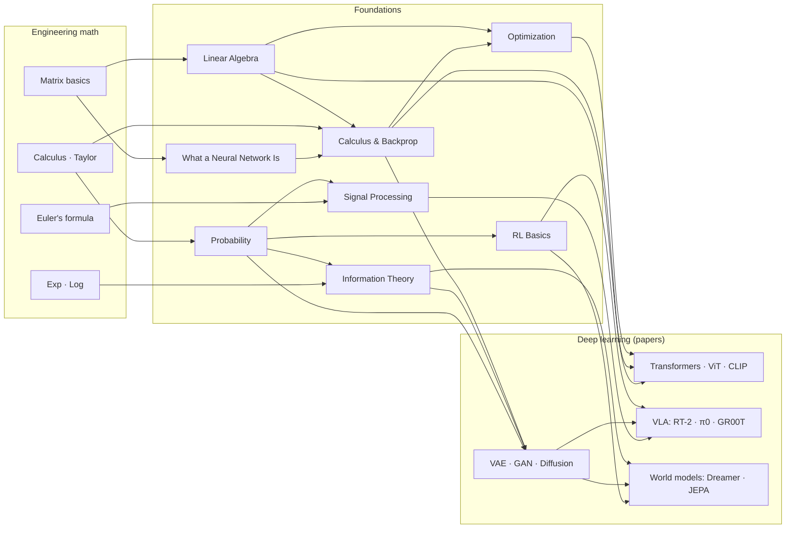
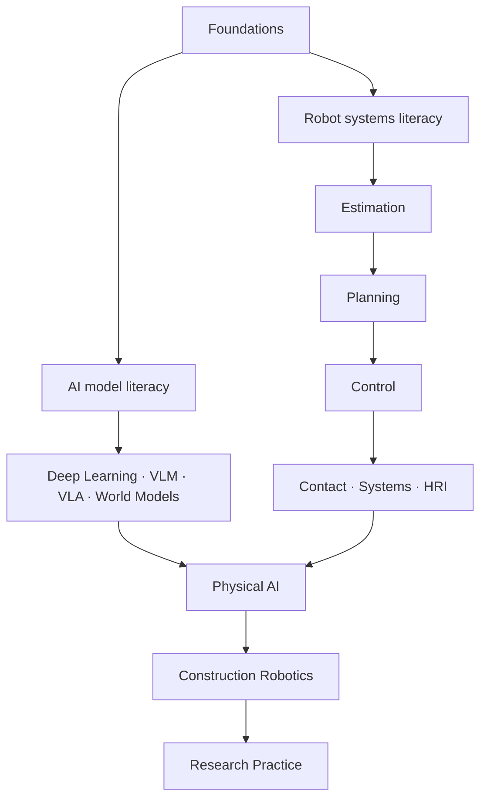

## English

How the foundations connect — to each other, to the engineering math beneath them, and to
the deep learning papers above them. Read this page first; it tells you what you need
*before* each page and what each page unlocks *after*.

### Prerequisite engineering math (undergraduate level)

Everything below is 1st–2nd year engineering math. If any row feels shaky, patch it first
with the listed quick source — a few hours each, not a semester.

| Prerequisite | Needed by | Quick source |
|---|---|---|
| Single/multivariable calculus — derivatives, partial derivatives, integrals, Taylor series | [[02-foundations/calculus-backprop\|2. Calculus]], [[02-foundations/optimization\|4. Optimization]], [[02-foundations/probability\|3. Probability]] | [[02-foundations/engineering-math\|0.5 공업수학 §1–3]] · [*Essence of Calculus*](https://www.3blue1brown.com/topics/calculus) |
| Matrix/vector arithmetic — systems of equations, matrix multiplication | [[02-foundations/linear-algebra\|1. Linear Algebra]] (start here) | [[02-foundations/engineering-math\|0.5 공업수학 §4]] · [*Essence of Linear Algebra*](https://www.3blue1brown.com/topics/linear-algebra) |
| Series & convergence basics | [[02-foundations/probability\|3. Probability]] (expectations), [[02-foundations/rl-basics\|7. RL]] (discounted sums) | [[02-foundations/engineering-math\|0.5 공업수학 §5]] |
| Complex numbers & Euler's formula $e^{j\theta} = \cos\theta + j\sin\theta$ | [[02-foundations/signal-processing\|6. Signal Processing]] (Fourier) | [[02-foundations/engineering-math\|0.5 공업수학 §7]] |
| Exponentials & logarithms (incl. $\log$ rules) | [[02-foundations/information-theory\|5. Information Theory]] | [[02-foundations/engineering-math\|0.5 공업수학 §6]] + [[02-foundations/information-theory\|정보이론 §0]] |
| Basic set notation & logic | [[02-foundations/probability\|3. Probability]] (axioms) | [[02-foundations/engineering-math\|0.5 공업수학 §10 표기법 사전]] |

That is the minimum needed to *begin* — no measure theory, no functional analysis, no
advanced statistics. If you can differentiate, multiply matrices, and read $\sum$ and
$\log$, you can start; individual papers may call for deeper references as you go.

**One non-mathematical prerequisite.** Pages 1–9 also use machine-learning words —
*layer*, *loss*, *minibatch*, *epoch*, *hyperparameter*, *pretraining* — the way a
mechanics text uses *force*. If those are new, read
[[02-foundations/neural-network-basics|0.7 What a Neural Network Is]] first; it assumes no
ML at all and takes about twenty minutes. It exists so that the rest of this track does
not have to assume anything beyond the table above.

### Recommended study order

**0.7 [[02-foundations/neural-network-basics|What a Neural Network Is]]** (skip if the ML vocabulary is already familiar) **→ 1. [[02-foundations/linear-algebra|Linear Algebra]] → 2. [[02-foundations/calculus-backprop|Calculus & Backprop]] → 3. [[02-foundations/probability|Probability]]** (the core triangle — everything else stands on these) **→ 4. [[02-foundations/optimization|Optimization]] → 5. [[02-foundations/information-theory|Information Theory]]** (the applied pillars) **→ 6. [[02-foundations/signal-processing|Signal Processing]] · 7. [[02-foundations/rl-basics|RL Basics]]** (domain bridges — order between these two is free) **→ 8. [[02-foundations/se3-geometry|3D Geometry & SE(3)]]** (before the robotics track and VLA papers) **· 9. [[02-foundations/ml-practice|ML Practice & Evaluation]]** (before reading any results table).

Each page ends with self-check questions; do them. If a page feels too dense on first
contact, pair it with a first-pass source ([CS231n](https://cs231n.stanford.edu/schedule.html) lectures for 1–4, [Sutton & Barto](http://incompleteideas.net/book/the-book.html) ch.1–6
for 7) and return to the page as a structured summary.

### Connection map — math → foundations → papers

Reading the map: **Transformers** need linear algebra (attention = matrix products),
backprop, and optimization (Adam). **Generative models** add probability (MLE) and
information theory (ELBO/KL). **World models** are generative models + RL. **VLA** sits on
top of everything — plus signal processing on the sensor side. This is why the study order
above exists.

### Reading load and pacing

Knowing the size up front is part of being able to finish. Measured from the pages
themselves (prose only — code blocks and equations excluded):

| Track | Pages | One read-through |
|---|---:|---:|
| Foundations 0–9 | 13 | ~1 h |
| Robotics 1–11 (incl. the 11 MR chapters) | 24 | ~1.3 h |
| Construction robotics | 10 | ~0.7 h |
| Paper notes (86) | 86 | ~3.3 h |
| Research practice | 5 | ~0.3 h |
| **Total** | **138** | **~6.5 h** |

Read that number honestly: it is *one pass of the prose*, and it is not the study time.
Working the self-checks and re-deriving the worked examples typically costs **3–5× the
reading time** — call it 20–30 hours for the whole wiki — and the ★ papers are extra: 17
of them read in the original at a few hours each is another 50–70 hours. The notes exist
so that the ◐ and ○ papers do *not* need that.

A pace that works: **foundations in two weeks** (one page per weekday, self-checks done
the same day), then the robotics track over three weeks, then papers at two ★ or four ◐
per week alongside. Nothing here is a deadline — the value of the estimate is that you can
tell whether you are on a two-month path or a two-year one, and adjust the
[[00-study-depth-guide|depth targets]] rather than abandon the plan.

### Where to go next

After the common foundations, choose two parallel literacy paths. They converge in physical AI rather than forming one long prerequisite queue.

- **AI model literacy:** read [[01-canonical-papers/how-to-read|0. How to Read Papers]], then follow the [[01-canonical-papers/canonical-list|canonical list]] with the [[03-deep-learning/lineage|paper lineage]] open.
- **Robot systems literacy:** follow [[04-robotics/index|Robotics & Physical Systems]] from estimation and planning through control, contact, deployment, and HRI/safety.
- **Research production:** use [[06-research-practice/index|Research Practice]] when designing questions, experiments, failure analysis, and papers.

## 한국어

기초 지식들이 서로, 그 아래의 공업수학과, 그리고 그 위의 딥러닝 논문들과 어떻게
연결되는지의 지도. 이 페이지를 먼저 읽으면 각 페이지를 공부하기 *전에* 무엇이 필요하고,
공부한 *후에* 무엇이 열리는지 알 수 있다.

### 사전 공업수학 (학부 수준)

아래는 전부 공대 1~2학년 공업수학 범위다. 흔들리는 줄이 있으면 표의 빠른 자료로 먼저
메워라 — 학기가 아니라 각각 몇 시간이면 된다.

| 사전 지식 | 필요한 페이지 | 빠른 자료 |
|---|---|---|
| 단변수/다변수 미적분 — 미분, 편미분, 적분, 테일러 급수 | [[02-foundations/calculus-backprop\|2. 미적분·역전파]], [[02-foundations/optimization\|4. 최적화]], [[02-foundations/probability\|3. 확률]] | [[02-foundations/engineering-math\|0.5 공업수학 §1–3]] · [*Essence of Calculus*](https://www.3blue1brown.com/topics/calculus) |
| 행렬/벡터 연산 — 연립방정식, 행렬곱 | [[02-foundations/linear-algebra\|1. 선형대수]] (여기서 시작) | [[02-foundations/engineering-math\|0.5 공업수학 §4]] · [*Essence of Linear Algebra*](https://www.3blue1brown.com/topics/linear-algebra) |
| 급수와 수렴 기초 | [[02-foundations/probability\|3. 확률]] (기댓값), [[02-foundations/rl-basics\|7. RL]] (할인 합) | [[02-foundations/engineering-math\|0.5 공업수학 §5]] |
| 복소수와 오일러 공식 $e^{j\theta} = \cos\theta + j\sin\theta$ | [[02-foundations/signal-processing\|6. 신호처리]] (푸리에) | [[02-foundations/engineering-math\|0.5 공업수학 §7]] |
| 지수·로그 (로그 법칙 포함) | [[02-foundations/information-theory\|5. 정보이론]] | [[02-foundations/engineering-math\|0.5 공업수학 §6]] + [[02-foundations/information-theory\|정보이론 §0]] |
| 기초 집합 표기와 논리 | [[02-foundations/probability\|3. 확률]] (공리) | [[02-foundations/engineering-math\|0.5 공업수학 §10 표기법 사전]] |

이것이 *시작에* 필요한 최소한이다 — 측도론도, 함수해석도, 고급 통계도 없다. 미분할 수
있고, 행렬을 곱할 수 있고, $\sum$과 $\log$를 읽을 수 있으면 시작할 수 있다; 개별 논문을
깊게 팔 때는 추가 자료가 필요할 수 있다.

**수학이 아닌 선수 지식 하나.** 1~9 페이지는 기계학습 어휘 — *층·손실·미니배치·에포크·
하이퍼파라미터·사전학습* — 를 역학 교과서가 *힘*을 쓰듯 쓴다. 이것이 처음이라면
[[02-foundations/neural-network-basics|0.7 신경망이란 무엇인가]]를 먼저 읽어라. ML 지식을
전혀 전제하지 않고 20분이면 된다. 나머지 트랙이 위 표 이상을 전제하지 않아도 되도록 그
페이지가 존재한다.

### 권장 학습 순서

**0.7 [[02-foundations/neural-network-basics|신경망이란 무엇인가]]** (ML 어휘가 이미 익숙하면 건너뛰어도 된다) **→ 1. [[02-foundations/linear-algebra|선형대수]] → 2. [[02-foundations/calculus-backprop|미적분·역전파]] → 3. [[02-foundations/probability|확률]]** (핵심 삼각형 — 나머지 전부가 이 위에 선다) **→ 4. [[02-foundations/optimization|최적화]] → 5. [[02-foundations/information-theory|정보이론]]** (응용 기둥) **→ 6. [[02-foundations/signal-processing|신호처리]] · 7. [[02-foundations/rl-basics|RL 기초]]** (도메인 다리 — 이 둘의 순서는 자유) **→ 8. [[02-foundations/se3-geometry|3D 기하와 SE(3)]]** (로보틱스 트랙·VLA 논문 전에) **· 9. [[02-foundations/ml-practice|ML 실무와 평가]]** (결과 표를 읽기 전에).

각 페이지 끝의 스스로 점검 문제를 꼭 풀어라. 처음 접했을 때 너무 압축적으로 느껴지는
페이지는 1차 통과용 자료(1~4번은 [CS231n](https://cs231n.stanford.edu/schedule.html) 강의, 7번은 [Sutton & Barto](http://incompleteideas.net/book/the-book.html) 1~6장)와 병행하고,
이 위키의 페이지는 구조화된 요약본으로 되돌아와 쓰면 된다.

### 연결 지도 — 수학 → 기초 → 논문

위의 mermaid 지도를 읽는 법: **Transformer**는 선형대수(어텐션 = 행렬곱), 역전파,
최적화(Adam)가 필요하다. **생성모델**은 거기에 확률(MLE)과 정보이론(ELBO/KL)을 더한다.
**월드모델** = 생성모델 + RL. **VLA**는 이 전부의 꼭대기에 앉아 있다 — 센서 쪽에서는
신호처리까지. 위의 학습 순서가 존재하는 이유가 이것이다.

### 학습 분량과 페이스

분량을 미리 아는 것이 완주의 일부다. 페이지에서 직접 측정했다(산문만 — 코드 블록과 수식 제외):

| 트랙 | 페이지 | 1회 정독 |
|---|---:|---:|
| 기초 0~9 | 13 | 약 1시간 |
| 로보틱스 1~11 (MR 11개 장 포함) | 24 | 약 1.3시간 |
| 건설로봇 | 10 | 약 0.7시간 |
| 논문 노트 (86편) | 86 | 약 3.3시간 |
| Research Practice | 5 | 약 0.3시간 |
| **합계** | **138** | **약 6.5시간** |

이 숫자를 정직하게 읽어라: *산문 1회 통과*이지 공부 시간이 아니다. 자가점검을 풀고 계산
예제를 다시 유도하면 보통 **읽기 시간의 3~5배** — 위키 전체로 20~30시간 — 가 들고, ★ 논문은
별도다: 17편을 원문으로 각각 몇 시간씩 읽으면 50~70시간이 더 붙는다. ◐·○ 논문은 그럴 필요가
없도록 노트가 존재한다.

통하는 페이스: **기초 2주**(평일 하루 한 페이지, 자가점검은 그날 안에), 그다음 로보틱스
트랙 3주, 그다음부터 주당 ★ 2편 또는 ◐ 4편을 병행. 여기 어떤 것도 마감이 아니다 — 이
추정치의 쓸모는 지금 두 달짜리 경로에 있는지 두 해짜리 경로에 있는지 알고, 계획을 버리는
대신 [[00-study-depth-guide|깊이 목표]]를 조절할 수 있다는 데 있다.

### 다음으로 갈 곳

기초를 마친 뒤에는 한 줄로 계속 쌓는 대신 두 병렬 경로를 따른다.

- **AI model literacy:** [[01-canonical-papers/how-to-read|How to Read Papers]] → [[01-canonical-papers/canonical-list|핵심 논문 리스트]], [[03-deep-learning/lineage|논문 계보도]] 병행.
- **Robot systems literacy:** [[04-robotics/index|Robotics & Physical Systems]]에서 estimation → planning → control → contact → systems → HRI/safety.
- 두 경로는 Physical AI와 [[05-construction-robotics/index|Construction Robotics]]에서 합류한다. 새 연구를 만들 때는 [[06-research-practice/index|Research Practice]]로 이어간다.
