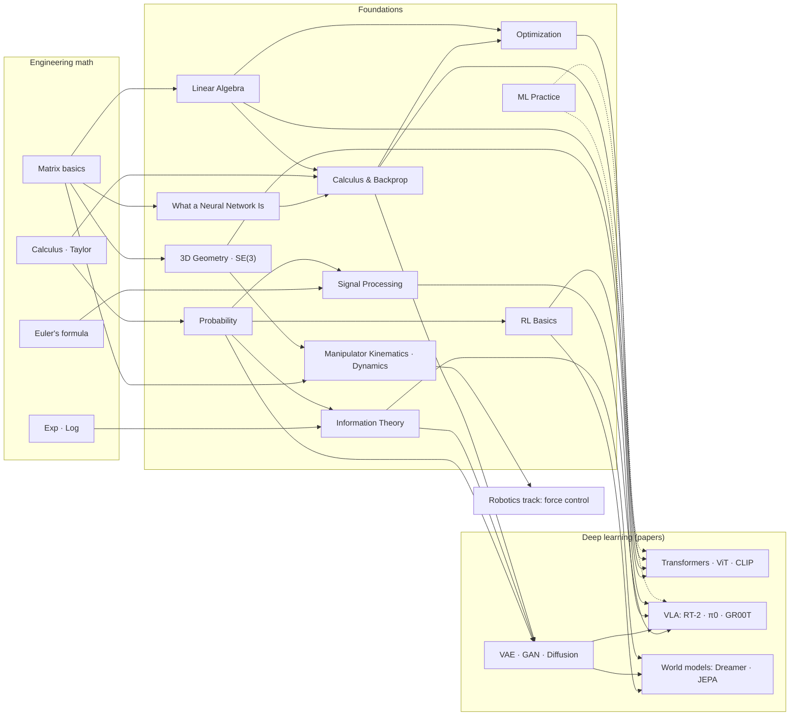
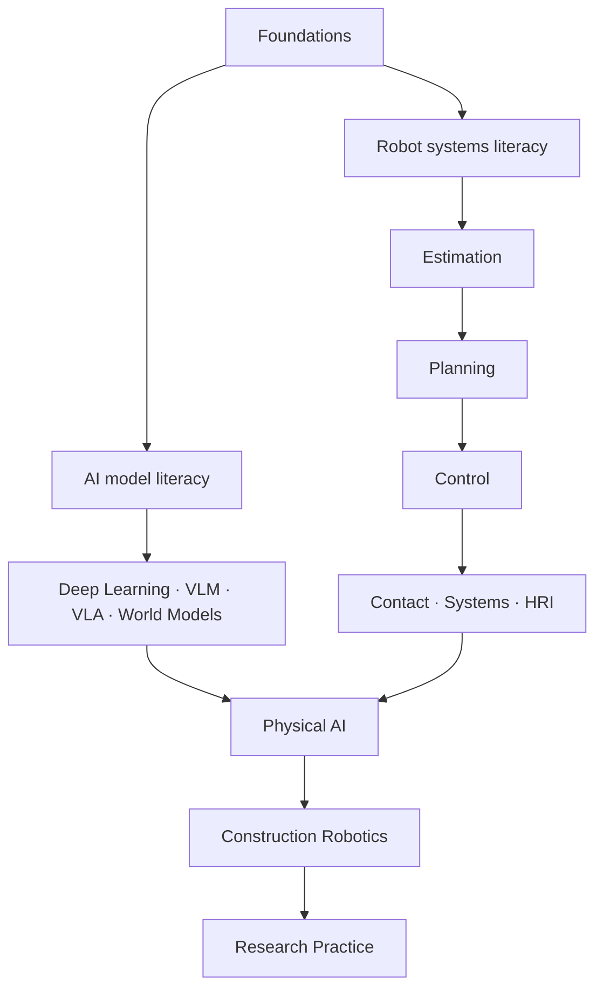

## English

*This page is the map, and the map is a tree rather than a chain: 0.5 and 0.7 are on-ramps, 1, 2 and 3 are the core triangle everything else stands on, 4 and 5 are the applied pillars,
6 and 7 are the domain bridges, and 8, 9 and 10 are what the robotics track needs next. Read the order below, but know that a page only truly needs what its own prerequisite box names.*

How the foundations connect — to each other, to the engineering math beneath them, and to
the deep learning papers above them. Read this page first; it tells you what you need
*before* each page and what each page unlocks *after*.

### Prerequisite engineering math (undergraduate level)

Everything below is 1st–2nd year engineering math. If any row feels shaky, patch it first
with the listed quick source — a few hours each, not a semester.

| Prerequisite | Needed by | Quick source |
|---|---|---|
| Single/multivariable calculus — derivatives, partial derivatives, integrals, Taylor series | [[02-foundations/calculus-backprop\|2. Calculus]], [[02-foundations/optimization\|4. Optimization]], [[02-foundations/probability\|3. Probability]] | [[02-foundations/engineering-math\|0.5 공업수학 §1–3]] · [*Essence of Calculus*](https://www.3blue1brown.com/topics/calculus) |
| Matrix/vector arithmetic — systems of equations, matrix multiplication | [[02-foundations/linear-algebra\|1. Linear Algebra]] (start here) | [[02-foundations/engineering-math\|0.5 공업수학 §4]] · [*Essence of Linear Algebra*](https://www.3blue1brown.com/topics/linear-algebra) |
| Series & convergence basics | [[02-foundations/probability\|3. Probability]] (expectations), [[02-foundations/rl-basics\|7. RL]] (discounted sums) | [[02-foundations/engineering-math\|0.5 공업수학 §5]] |
| Complex numbers & Euler's formula $e^{j\theta} = \cos\theta + j\sin\theta$ | [[02-foundations/signal-processing\|6. Signal Processing]] (Fourier) | [[02-foundations/engineering-math\|0.5 공업수학 §7]] |
| Exponentials & logarithms (incl. $\log$ rules) | [[02-foundations/information-theory\|5. Information Theory]] | [[02-foundations/engineering-math\|0.5 공업수학 §6]] + [[02-foundations/information-theory\|정보이론 §0]] |
| Basic set notation & logic | [[02-foundations/probability\|3. Probability]] (axioms) | [[02-foundations/engineering-math\|0.5 공업수학 §10 표기법 사전]] |

That is the minimum needed to *begin* — no measure theory, no functional analysis, no
advanced statistics. If you can differentiate, multiply matrices, and read $\sum$ and
$\log$, you can start; individual papers may call for deeper references as you go.

**One non-mathematical prerequisite.** Pages 1–9 also use machine-learning words —
*layer*, *loss*, *minibatch*, *epoch*, *hyperparameter*, *pretraining* — the way a
mechanics text uses *force*. If those are new, read
[[02-foundations/neural-network-basics|0.7 What a Neural Network Is]] first; it assumes no
ML at all and takes about twenty minutes. It exists so that the rest of this track does
not have to assume anything beyond the table above.

### Recommended study order

**0.7 [[02-foundations/neural-network-basics|What a Neural Network Is]]** (skip if the ML vocabulary is already familiar) **→ 1. [[02-foundations/linear-algebra|Linear Algebra]] → 2. [[02-foundations/calculus-backprop|Calculus & Backprop]] → 3. [[02-foundations/probability|Probability]]** (the core triangle — everything else stands on these) **→ 4. [[02-foundations/optimization|Optimization]] → 5. [[02-foundations/information-theory|Information Theory]]** (the applied pillars) **→ 6. [[02-foundations/signal-processing|Signal Processing]] · 7. [[02-foundations/rl-basics|RL Basics]]** (domain bridges — order between these two is free) **→ 8. [[02-foundations/se3-geometry|3D Geometry & SE(3)]]** (before the robotics track and VLA papers) **· 9. [[02-foundations/ml-practice|ML Practice & Evaluation]]** (before reading any results table) **→ 10. [[02-foundations/manipulator-kinematics-dynamics|Manipulator Kinematics & Dynamics]]** (take it when the manipulation track is next; force control is unreadable without it).

Each page ends with self-check questions; do them. If a page feels too dense on first
contact, do not read it front to back: every page in both study tracks opens with a
**First pass** callout naming which sections to read first and which to postpone, and a
**Going deeper** block near the end naming the textbook to graduate to. Between them, the
same page serves a first reading and a third one. Where a whole subject lands too fast,
pair it with an outside first-pass source ([CS231n](https://cs231n.stanford.edu/schedule.html) lectures for 1–4, [Sutton & Barto](http://incompleteideas.net/book/the-book.html) ch.1–6
for 7) and come back to use this wiki as the structured summary.

### Connection map — math → foundations → papers

Reading the map: **Transformers** need linear algebra (attention = matrix products),
backprop, and optimization (Adam). **Generative models** add probability (MLE) and
information theory (ELBO/KL). **World models** are generative models + RL. **VLA** sits on
top of everything — plus signal processing on the sensor side. This is why the study order
above exists. Two pages sit slightly apart from that chain and are drawn accordingly:
**SE(3)** branches off matrix arithmetic and feeds the robot-action side of VLA, and
**ML Practice** attaches to everything with dashed arrows — it is not a prerequisite for
understanding a method, but it is a prerequisite for believing any of their results tables.

### Reading load and pacing

Knowing the size up front is part of being able to finish. Measured from the pages
themselves (prose only — code blocks and equations excluded):

| Track | Pages | One read-through |
|---|---:|---:|
| Foundations 0–10 | 13 | ~1.8 h |
| Robotics 1–23 (incl. the 11 MR chapters) | 34 | ~3.0 h |
| Construction robotics | 10 | ~0.8 h |
| Paper notes (115) | 115 | ~3.8 h |
| Research practice | 7 | ~0.7 h |
| Research program | 1 | ~0.1 h |
| **Total** | **180** | **~10.2 h** |

Read that number honestly: it is *one pass of the prose in one language*, and it is not the
study time. Working the self-checks and re-deriving the worked examples typically costs
**3–5× the reading time** — call it 30–50 hours for the whole wiki — and the ★ papers are
extra: **17** of them read in the original at a few hours each is another 50–70 hours. (The
list carries an eighteenth ★ mark, but it is the *Modern Robotics* textbook, which is a
separate commitment and not a few-hours item.) The notes exist so that the 74 ◐ and 40 ○
papers do *not* need that.

Two of those tracks are optional, and the total above assumes you read everything.
Robotics 12–23 are specialization layers — manipulation, navigation, human perception —
and the common curriculum stops at 11.

A pace that works: **foundations in two weeks** (one page per weekday, self-checks done
the same day), then the robotics track over three weeks, then papers at two ★ or four ◐
per week alongside. Nothing here is a deadline — the value of the estimate is that you can
tell whether you are on a two-month path or a two-year one, and adjust the
[[00-study-depth-guide|depth targets]] rather than abandon the plan.

### Gate check — are the foundations done?

The per-page self-checks test one page each. This one is cumulative: it is the test for
whether you can start the paper track. Twelve questions, each combining at least two pages,
each answerable in a few lines. Do them in writing, closed-book. **Nine or more means go.**

1. A layer computes $h = \text{ReLU}(Wx + b)$ with $W$ of shape $256\times128$. Give the
   shape of $x$, of $h$, and the number of parameters in this layer. Then say why removing
   the ReLU would make a ten-layer stack no more expressive than one layer.
   *(0.7 §1–2, 1. §1)*
2. Compute $\nabla f$ for $f(x,y) = (xy-3)^2$ at $(2,1)$ and say, from the two signs, which
   way gradient descent moves each variable and which one it moves harder.
   *(0.5 §1, 4. §3)*
3. $A = \begin{pmatrix}2&1\\1&2\end{pmatrix}$. Find its eigenvalues, then say in one
   sentence what this matrix does to the plane. Is it positive definite, and how do you know
   from the eigenvalues alone? *(1. §3)*
4. Write down what $x^\top A x$ means as a sum over indices, and explain why a covariance
   matrix must be positive semidefinite without computing anything. *(1. §3, 3. §2)*
5. A classifier gives the correct class probability $0.5$ on one sample and $0.9$ on
   another. Give both cross-entropy losses in nats, and say which sample contributes more
   gradient. *(5. §2, 2. §4)*
6. True $p = (0.7, 0.2, 0.1)$, model $q = (0.5, 0.3, 0.2)$. Without recomputing $H(p)$ and
   $H(p,q)$ separately, state what $H(p,q) - H(p)$ is called and what it measures. *(5. §2–3)*
7. A crack detector fires on 95% of cracks and false-alarms on 5% of sound panels; 1% of
   panels are cracked. An alarm fires — how much should you believe it, and what single
   quantity changed the answer most? *(3. §1)*
8. Your prior says the wall is 10 cm away with variance 4; a sensor with variance 1 reads
   12. Give the fused estimate and its variance, and say what happens to both as the sensor
   variance goes to infinity. *(3. §5)*
9. A joint obeys $\dot x = -2x + u$. Is it stable? Where is the pole of its transfer
   function, and in which half-plane? If you sample it at $\Delta t = 0.1$ s, is the
   discrete factor inside the unit circle? *(0.5 §8–9)*
10. An IMU samples at 200 Hz and a motor vibrates at 170 Hz. What frequency appears in your
    log, and what should have been done before sampling? *(6. §2)*
11. With $\gamma = 0.95$, what is the effective horizon, and how much weight does a reward
    60 steps away carry? *(0.5 §5, 7. §1)*
12. A robotics paper reports 90% success on 10 trials. Give the rough uncertainty on that
    number, and name two things the sentence does not tell you that ML Practice says you
    must ask. *(9. §3–5, and 2. Experimental Design §4)*
13. $f(x) = 5x^2$, starting at $x_0 = 1$. Where does one Newton step land, and roughly how
    many gradient-descent steps at $\alpha = 0.05$ match it? *(4. §3)*
14. Apply $R_z(90°)$ then $R_x(90°)$ to the point $(1,0,0)$. Where does it end up, and where
    does the opposite order put it? *(8. §1)*
15. For the 2R arm at $\theta = (0°, 90°)$ the operational-space inertia is
    $\Lambda = \begin{pmatrix}1&0\\0&2\end{pmatrix}$. In which direction does the tip feel
    heavier, and by how much? *(10. §6)*

> [!tip]- Answers · 정답
> 1. $x$ is $128\times1$, $h$ is $256\times1$; parameters $= 256\times128 + 256 = 33{,}024$. Without the nonlinearity the stack collapses: $W_{10}\cdots W_1x = (W_{10}\cdots W_1)x$, a single matrix, whose rank cannot exceed the smallest factor's.
> 2. Inner part $xy-3 = -1$, so $\nabla f = (2(-1)(1),\, 2(-1)(2)) = (-2,-4)$. Both negative ⇒ descent *increases* both variables (it steps along $-\nabla f$), and it pushes $y$ twice as hard because $y$ is multiplied by the larger $x$.
> 3. $(2-\lambda)^2 - 1 = 0 \Rightarrow \lambda = 3, 1$. It stretches everything along the $45°$ diagonal by $3\times$ and leaves the anti-diagonal alone. Positive definite, because both eigenvalues are $> 0$ — that test *is* the $x^\top Ax > 0$ condition, by $x^\top Ax = \sum_i \lambda_i y_i^2$.
> 4. $x^\top A x = \sum_i\sum_j A_{ij}x_ix_j$. For a covariance $\Sigma$, $w^\top \Sigma w = \text{Var}(w^\top x)$, and a variance cannot be negative — so $\Sigma \succeq 0$ with no computation.
> 5. $-\log 0.5 = 0.693$ nats and $-\log 0.9 = 0.105$ nats. The $0.5$ sample: the gradient of softmax + cross-entropy is $p - y$, which is farther from zero when the model is more wrong.
> 6. It is the KL divergence $D_{KL}(p\|q)$ — the *extra* bits paid for coding $p$-data with a code built for $q$. (Here $0.123$ bits.)
> 7. $P(c|+) = \frac{0.95(0.01)}{0.95(0.01)+0.05(0.99)} \approx 0.16$ — only 16%. The base rate: at $P(c) = 0.2$ the same detector's alarm is ~83% trustworthy.
> 8. $K = 4/(4+1) = 0.8$; estimate $10 + 0.8(2) = 11.6$, variance $(1-K)4 = 0.8$ — smaller than either input. As $R \to \infty$, $K \to 0$: the measurement is ignored and the filter coasts on the prior.
> 9. Stable ($a = -2 < 0$). $G(s) = 1/(s+2)$, pole at $s = -2$, left half-plane. Discrete factor $e^{-2(0.1)} = 0.819 < 1$ ✓ — the left half-plane maps into the unit disc.
> 10. $|170 - 200| = 30$ Hz. An analog anti-alias filter before sampling (or a higher $f_s$); no software filter can undo it afterwards.
> 11. $1/(1-0.95) = 20$ steps. Weight at 60 steps is $0.95^{60} \approx 0.046$ — about 5%, i.e. three effective horizons out and nearly invisible.
> 12. 9 of 10 is a wide interval: the standard error of a proportion is $\sqrt{p(1-p)/n} = \pm 9.5$ percentage points, and the exact 95% interval runs roughly **55–100%** — asymmetric, because it cannot exceed 100%. (Do not use $1/\sqrt{n}$ here; that is not the standard error of a proportion.) Not told: whether the trials were seen or unseen conditions, how many seeds/scenes, whether evaluation was open- or closed-loop, and what counted as success (any two of these are enough).
> 13. Newton divides by the curvature: $1 - f'(1)/f''(1) = 1 - 10/10 = 0$ — exact, in one step, because a quadratic is the model Newton assumes. Gradient descent halves each step, so about 10 steps to reach $10^{-3}$.
> 14. $R_z$ first: $(1,0,0) \to (0,1,0) \to (0,0,1)$, the z axis. The other order: $R_x$ leaves a point on the x axis alone, so $(1,0,0) \to (1,0,0) \to (0,1,0)$, the y axis. The second rotation acts on wherever the first one left you.
> 15. Twice as heavy vertically as sideways. $\Lambda$ is the mass the tip *appears* to have in each task-space direction, so the same force buys half the acceleration along the second axis — which is what a force controller has to compensate.

If several answers were shaky, the failures point at pages, not at "the foundations" as a
whole — reread those pages' worked examples rather than starting over.

### Where to go next

After the common foundations, choose two parallel literacy paths. They converge in physical AI rather than forming one long prerequisite queue.

- **AI model literacy:** read [[01-canonical-papers/how-to-read|0. How to Read Papers]], then follow the [[01-canonical-papers/canonical-list|canonical list]] with the [[03-deep-learning/lineage|paper lineage]] open.
- **Robot systems literacy:** follow [[04-robotics/index|Robotics & Physical Systems]] from estimation and planning through control, contact, deployment, and HRI/safety.
- **Research production:** use [[06-research-practice/index|Research Practice]] when designing questions, experiments, failure analysis, and papers.

## 한국어

*이 페이지는 지도이고, 그 지도는 사슬이 아니라 나무다: 0.5와 0.7이 진입로, 1·2·3이 나머지 전부가 딛는
핵심 삼각형, 4·5가 응용 기둥, 6·7이 도메인 다리, 8·9·10이 로보틱스 트랙이 다음으로 요구하는 것이다. 아래 순서대로 읽되, 각 페이지가 진짜로 요구하는 것은 그 페이지의 선수 지식 상자에 적힌 것뿐이다.*

기초 지식들이 서로, 그 아래의 공업수학과, 그리고 그 위의 딥러닝 논문들과 어떻게
연결되는지의 지도. 이 페이지를 먼저 읽으면 각 페이지를 공부하기 *전에* 무엇이 필요하고,
공부한 *후에* 무엇이 열리는지 알 수 있다.

### 사전 공업수학 (학부 수준)

아래는 전부 공대 1~2학년 공업수학 범위다. 흔들리는 줄이 있으면 표의 빠른 자료로 먼저
메워라 — 학기가 아니라 각각 몇 시간이면 된다.

| 사전 지식 | 필요한 페이지 | 빠른 자료 |
|---|---|---|
| 단변수/다변수 미적분 — 미분, 편미분, 적분, 테일러 급수 | [[02-foundations/calculus-backprop\|2. 미적분·역전파]], [[02-foundations/optimization\|4. 최적화]], [[02-foundations/probability\|3. 확률]] | [[02-foundations/engineering-math\|0.5 공업수학 §1–3]] · [*Essence of Calculus*](https://www.3blue1brown.com/topics/calculus) |
| 행렬/벡터 연산 — 연립방정식, 행렬곱 | [[02-foundations/linear-algebra\|1. 선형대수]] (여기서 시작) | [[02-foundations/engineering-math\|0.5 공업수학 §4]] · [*Essence of Linear Algebra*](https://www.3blue1brown.com/topics/linear-algebra) |
| 급수와 수렴 기초 | [[02-foundations/probability\|3. 확률]] (기댓값), [[02-foundations/rl-basics\|7. RL]] (할인 합) | [[02-foundations/engineering-math\|0.5 공업수학 §5]] |
| 복소수와 오일러 공식 $e^{j\theta} = \cos\theta + j\sin\theta$ | [[02-foundations/signal-processing\|6. 신호처리]] (푸리에) | [[02-foundations/engineering-math\|0.5 공업수학 §7]] |
| 지수·로그 (로그 법칙 포함) | [[02-foundations/information-theory\|5. 정보이론]] | [[02-foundations/engineering-math\|0.5 공업수학 §6]] + [[02-foundations/information-theory\|정보이론 §0]] |
| 기초 집합 표기와 논리 | [[02-foundations/probability\|3. 확률]] (공리) | [[02-foundations/engineering-math\|0.5 공업수학 §10 표기법 사전]] |

이것이 *시작에* 필요한 최소한이다 — 측도론도, 함수해석도, 고급 통계도 없다. 미분할 수
있고, 행렬을 곱할 수 있고, $\sum$과 $\log$를 읽을 수 있으면 시작할 수 있다; 개별 논문을
깊게 팔 때는 추가 자료가 필요할 수 있다.

**수학이 아닌 선수 지식 하나.** 1~9 페이지는 기계학습 어휘 — *층·손실·미니배치·에포크·
하이퍼파라미터·사전학습* — 를 역학 교과서가 *힘*을 쓰듯 쓴다. 이것이 처음이라면
[[02-foundations/neural-network-basics|0.7 신경망이란 무엇인가]]를 먼저 읽어라. ML 지식을
전혀 전제하지 않고 20분이면 된다. 나머지 트랙이 위 표 이상을 전제하지 않아도 되도록 그
페이지가 존재한다.

### 권장 학습 순서

**0.7 [[02-foundations/neural-network-basics|신경망이란 무엇인가]]** (ML 어휘가 이미 익숙하면 건너뛰어도 된다) **→ 1. [[02-foundations/linear-algebra|선형대수]] → 2. [[02-foundations/calculus-backprop|미적분·역전파]] → 3. [[02-foundations/probability|확률]]** (핵심 삼각형 — 나머지 전부가 이 위에 선다) **→ 4. [[02-foundations/optimization|최적화]] → 5. [[02-foundations/information-theory|정보이론]]** (응용 기둥) **→ 6. [[02-foundations/signal-processing|신호처리]] · 7. [[02-foundations/rl-basics|RL 기초]]** (도메인 다리 — 이 둘의 순서는 자유) **→ 8. [[02-foundations/se3-geometry|3D 기하와 SE(3)]]** (로보틱스 트랙·VLA 논문 전에) **· 9. [[02-foundations/ml-practice|ML 실무와 평가]]** (결과 표를 읽기 전에) **→ 10. [[02-foundations/manipulator-kinematics-dynamics|매니퓰레이터 기구학·동역학]]** (매니퓰레이션 트랙으로 갈 때 — 힘 제어가 이것 없이는 읽히지 않는다).

각 페이지 끝의 스스로 점검 문제를 꼭 풀어라. 처음 접했을 때 너무 압축적으로 느껴지는
페이지는 처음부터 끝까지 읽지 마라. 두 학습 트랙의 모든 페이지는 어느 절을 먼저 읽고 어느
절을 미룰지 지목하는 **처음이라면** 콜아웃으로 시작하고, 끝 부근에는 다음에 넘어갈 교재를
지목하는 **더 깊이** 블록이 있다. 그 둘 사이에서 같은 페이지가 1회독과 3회독을 함께
감당한다. 과목 전체가 너무 빠르게 느껴지면 1차 통과용 외부 자료(1~4번은
[CS231n](https://cs231n.stanford.edu/schedule.html) 강의, 7번은 [Sutton & Barto](http://incompleteideas.net/book/the-book.html) 1~6장)와 병행하고, 이 위키의 페이지는 구조화된 요약본으로
되돌아와 쓰면 된다.

### 연결 지도 — 수학 → 기초 → 논문

위의 mermaid 지도를 읽는 법: **Transformer**는 선형대수(어텐션 = 행렬곱), 역전파,
최적화(Adam)가 필요하다. **생성모델**은 거기에 확률(MLE)과 정보이론(ELBO/KL)을 더한다.
**월드모델** = 생성모델 + RL. **VLA**는 이 전부의 꼭대기에 앉아 있다 — 센서 쪽에서는
신호처리까지. 위의 학습 순서가 존재하는 이유가 이것이다. 두 페이지는 이 사슬에서 살짝 비켜 있고 지도에도
그렇게 그려져 있다: **SE(3)** 페이지는 행렬 연산에서 갈라져 나와 VLA의 로봇 행동 쪽으로 들어가고,
**ML 실무**는 점선으로 모든 것에 붙는다 — 방법을 *이해*하는 데 필요한 선수 지식이 아니라,
그 방법들의 결과 표를 *믿는* 데 필요한 선수 지식이기 때문이다.

### 학습 분량과 페이스

분량을 미리 아는 것이 완주의 일부다. 페이지에서 직접 측정했다(산문만 — 코드 블록과 수식 제외):

| 트랙 | 페이지 | 1회 정독 |
|---|---:|---:|
| 기초 0~10 | 13 | 약 1.8시간 |
| 로보틱스 1~23 (MR 11개 장 포함) | 34 | 약 3.0시간 |
| 건설로봇 | 10 | 약 0.8시간 |
| 논문 노트 (115편) | 115 | 약 3.8시간 |
| Research Practice | 7 | 약 0.7시간 |
| Research Program | 1 | 약 0.1시간 |
| **합계** | **180** | **약 10.2시간** |

이 숫자를 정직하게 읽어라: *한 언어로 산문을 1회 통과*하는 시간이지 공부 시간이 아니다.
자가점검을 풀고 계산 예제를 다시 유도하면 보통 **읽기 시간의 3~5배** — 위키 전체로
30~50시간 — 가 들고, ★ 논문은 별도다: **17편**을 원문으로 각각 몇 시간씩 읽으면 50~70시간이
더 붙는다. (목록에 ★가 하나 더 있지만 그것은 *Modern Robotics* 교재이고, 몇 시간짜리 항목이
아니라 별도의 약속이다.) ◐ 74편과 ○ 40편은 그럴 필요가 없도록 노트가 존재한다.

이 중 두 트랙은 선택이고, 위 합계는 전부 읽는다고 가정한 값이다. 로보틱스 12~23번은
전문화 층 — 매니퓰레이션·내비게이션·사람 인지 — 이고, 공통 커리큘럼은 11번에서 끝난다.

통하는 페이스: **기초 2주**(평일 하루 한 페이지, 자가점검은 그날 안에), 그다음 로보틱스
트랙 3주, 그다음부터 주당 ★ 2편 또는 ◐ 4편을 병행. 여기 어떤 것도 마감이 아니다 — 이
추정치의 쓸모는 지금 두 달짜리 경로에 있는지 두 해짜리 경로에 있는지 알고, 계획을 버리는
대신 [[00-study-depth-guide|깊이 목표]]를 조절할 수 있다는 데 있다.

### 통과 점검 — 기초는 끝났는가

페이지별 자가점검은 한 페이지씩 검사한다. 이것은 누적 시험이다: 논문 트랙으로 넘어가도
되는지를 판정한다. 열두 문항, 각각 최소 두 페이지를 엮고, 각각 몇 줄이면 답할 수 있다.
책을 덮고 글로 써서 풀어라. **9개 이상이면 넘어가도 된다.**

1. 어떤 층이 $h = \text{ReLU}(Wx + b)$를 계산하고 $W$의 모양이 $256\times128$이다. $x$와 $h$의
   모양, 그리고 이 층의 파라미터 수를 말하라. 그다음 ReLU를 없애면 10층 스택이 왜 1층보다
   나을 게 없어지는지 말하라. *(0.7 §1–2, 1. §1)*
2. $f(x,y) = (xy-3)^2$의 $\nabla f$를 $(2,1)$에서 구하고, 두 부호로부터 경사 하강이 각 변수를
   어느 쪽으로, 어느 쪽을 더 세게 미는지 말하라. *(0.5 §1, 4. §3)*
3. $A = \begin{pmatrix}2&1\\1&2\end{pmatrix}$의 고유값을 구하고, 이 행렬이 평면에 하는 일을
   한 문장으로 말하라. 양정부호인가? 고유값만으로 어떻게 아는가? *(1. §3)*
4. $x^\top A x$를 인덱스에 대한 합으로 쓰고, 아무것도 계산하지 않고 공분산 행렬이 왜 반드시
   양준정부호인지 설명하라. *(1. §3, 3. §2)*
5. 분류기가 한 샘플에서 정답 클래스에 확률 $0.5$를, 다른 샘플에서 $0.9$를 줬다. 두 교차
   엔트로피 손실을 나트로 구하고, 어느 샘플이 더 큰 그래디언트를 주는지 말하라. *(5. §2, 2. §4)*
6. 참 $p = (0.7, 0.2, 0.1)$, 모델 $q = (0.5, 0.3, 0.2)$. $H(p)$와 $H(p,q)$를 따로 다시 계산하지
   말고, $H(p,q) - H(p)$의 이름과 그것이 재는 것을 말하라. *(5. §2–3)*
7. 균열 감지기가 균열의 95%에서 울리고 멀쩡한 패널의 5%에서 오경보하며, 패널의 1%에 균열이
   있다. 경보가 울렸다 — 얼마나 믿어야 하고, 답을 가장 크게 바꾼 양은 무엇인가? *(3. §1)*
8. 사전 믿음은 벽이 10 cm 앞, 분산 4다. 분산 1인 센서가 12를 읽었다. 융합된 추정값과 그
   분산을 구하고, 센서 분산이 무한대로 갈 때 둘이 어떻게 되는지 말하라. *(3. §5)*
9. 어떤 관절이 $\dot x = -2x + u$를 따른다. 안정한가? 전달함수의 극점은 어디이고 어느
   반평면인가? $\Delta t = 0.1$초로 샘플링하면 이산 계수가 단위원 안에 있는가? *(0.5 §8–9)*
10. IMU가 200 Hz로 샘플링하고 모터가 170 Hz로 진동한다. 로그에는 어떤 주파수가 나타나고,
    샘플링 전에 무엇을 했어야 하는가? *(6. §2)*
11. $\gamma = 0.95$일 때 유효 지평은 얼마이고, 60 스텝 뒤의 보상은 얼마의 가중치를 갖는가?
    *(0.5 §5, 7. §1)*
12. 어떤 로보틱스 논문이 10회 시행에서 성공률 90%를 보고했다. 그 숫자의 대략적 불확실성을
    말하고, ML 실무가 반드시 물어야 한다고 말하는 것 중 이 문장이 알려주지 않는 것 두 가지를
    대라. *(9. §3–5, 그리고 2. 실험 설계 §4)*
13. $f(x) = 5x^2$에서 $x_0 = 1$로 출발한다. 뉴턴법 한 스텝은 어디에 도착하고, $\alpha = 0.05$의
    경사 하강은 대략 몇 스텝이 필요한가? *(4. §3)*
14. 점 $(1,0,0)$에 $R_z(90°)$를 적용한 뒤 $R_x(90°)$를 적용하면 어디에 도착하는가? 순서를
    바꾸면 어디인가? *(8. §1)*
15. 2R 팔의 $\theta = (0°, 90°)$에서 작업공간 관성은
    $\Lambda = \begin{pmatrix}1&0\\0&2\end{pmatrix}$다. 말단은 어느 방향으로 더 무겁게
    느껴지며 몇 배인가? *(10. §6)*

> [!tip]- 정답 · Answers
> 1. $x$는 $128\times1$, $h$는 $256\times1$; 파라미터 $= 256\times128 + 256 = 33{,}024$개. 비선형성이 없으면 스택이 붕괴한다: $W_{10}\cdots W_1x = (W_{10}\cdots W_1)x$, 행렬 하나이고 그 랭크는 가장 작은 인자를 넘지 못한다.
> 2. 안쪽이 $xy-3 = -1$이므로 $\nabla f = (2(-1)(1),\, 2(-1)(2)) = (-2,-4)$. 둘 다 음수 ⇒ 하강은 두 변수를 *올린다*($-\nabla f$ 방향으로 가므로), 그리고 $y$에 곱해지는 $x$가 더 크므로 $y$를 두 배 세게 민다.
> 3. $(2-\lambda)^2 - 1 = 0 \Rightarrow \lambda = 3, 1$. $45°$ 대각선 방향으로 모든 것을 $3$배 늘이고 반대 대각선은 건드리지 않는다. 두 고유값이 모두 $> 0$이므로 양정부호이고, 그 판정이 곧 $x^\top Ax > 0$ 조건이다($x^\top Ax = \sum_i \lambda_i y_i^2$이므로).
> 4. $x^\top A x = \sum_i\sum_j A_{ij}x_ix_j$. 공분산 $\Sigma$에 대해 $w^\top \Sigma w = \text{Var}(w^\top x)$이고 분산은 음수가 될 수 없다 — 계산 없이 $\Sigma \succeq 0$.
> 5. $-\log 0.5 = 0.693$ 나트, $-\log 0.9 = 0.105$ 나트. $0.5$ 쪽이다: softmax + 교차 엔트로피의 그래디언트가 $p - y$이고, 모델이 더 틀릴수록 0에서 멀다.
> 6. KL 발산 $D_{KL}(p\|q)$ — 진실이 $p$인데 $q$용 부호를 써서 *추가로* 내는 비트다(여기서는 $0.123$비트).
> 7. $P(c|+) = \frac{0.95(0.01)}{0.95(0.01)+0.05(0.99)} \approx 0.16$ — 16%뿐이다. 기저율이다: $P(c) = 0.2$면 같은 감지기의 경보가 약 83% 신뢰할 만해진다.
> 8. $K = 4/(4+1) = 0.8$; 추정값 $10 + 0.8(2) = 11.6$, 분산 $(1-K)4 = 0.8$ — 두 입력 어느 쪽보다 작다. $R \to \infty$면 $K \to 0$: 측정을 무시하고 사전 믿음으로 미끄러진다.
> 9. 안정($a = -2 < 0$). $G(s) = 1/(s+2)$, 극점 $s = -2$, 좌반평면. 이산 계수 $e^{-2(0.1)} = 0.819 < 1$ ✓ — 좌반평면이 단위원 안으로 사상된다.
> 10. $|170 - 200| = 30$ Hz. 샘플링 전에 아날로그 안티에일리어스 필터를 넣었어야 한다(또는 $f_s$를 올렸어야). 사후의 어떤 소프트웨어 필터도 되돌릴 수 없다.
> 11. $1/(1-0.95) = 20$ 스텝. 60 스텝의 가중치는 $0.95^{60} \approx 0.046$ — 약 5%, 즉 유효 지평 세 배 밖이라 거의 보이지 않는다.
> 12. 10회 중 9회는 넓은 구간이다: 비율의 표준오차는 $\sqrt{p(1-p)/n} = \pm 9.5$%p이고, 정확한 95% 구간은 대략 **55~100%** 다 — 100%를 넘을 수 없으므로 비대칭이다. ($1/\sqrt{n}$을 쓰지 마라. 비율의 표준오차가 아니다.) 알려주지 않는 것: 시행이 본 조건인지 못 본 조건인지, 시드·장면이 몇 개인지, 평가가 개루프인지 폐루프인지, 무엇을 성공으로 셌는지(이 중 둘이면 충분).
> 13. 뉴턴법은 곡률로 나눈다: $1 - f'(1)/f''(1) = 1 - 10/10 = 0$ — 한 스텝에 정확히 도착한다. 이차 함수가 곧 뉴턴법이 가정하는 모델이기 때문이다. 경사 하강은 매 스텝 절반이 되므로 $10^{-3}$에 닿는 데 약 10 스텝이 든다.
> 14. $R_z$ 먼저: $(1,0,0) \to (0,1,0) \to (0,0,1)$, z축이다. 반대 순서: $R_x$는 x축 위의 점을 움직이지 않으므로 $(1,0,0) \to (1,0,0) \to (0,1,0)$, y축이다. 두 번째 회전은 첫 번째가 남겨둔 자리에 작용한다.
> 15. 옆 방향보다 위아래로 두 배 무겁다. $\Lambda$는 말단이 각 작업 공간 방향에서 *가진 것처럼 보이는* 질량이므로, 같은 힘이 둘째 축에서는 절반의 가속도만 산다 — 힘 제어기가 보상해야 하는 것이 이것이다.

여러 개가 흔들렸다면, 그 실패는 "기초 전체"가 아니라 특정 페이지를 가리킨다 — 처음부터
다시 하지 말고 그 페이지들의 계산 예제를 다시 보라.

### 다음으로 갈 곳

기초를 마친 뒤에는 한 줄로 계속 쌓는 대신 두 병렬 경로를 따른다.

- **AI model literacy:** [[01-canonical-papers/how-to-read|How to Read Papers]] → [[01-canonical-papers/canonical-list|핵심 논문 리스트]], [[03-deep-learning/lineage|논문 계보도]] 병행.
- **Robot systems literacy:** [[04-robotics/index|Robotics & Physical Systems]]에서 estimation → planning → control → contact → systems → HRI/safety.
- 두 경로는 Physical AI와 [[05-construction-robotics/index|Construction Robotics]]에서 합류한다. 새 연구를 만들 때는 [[06-research-practice/index|Research Practice]]로 이어간다.
