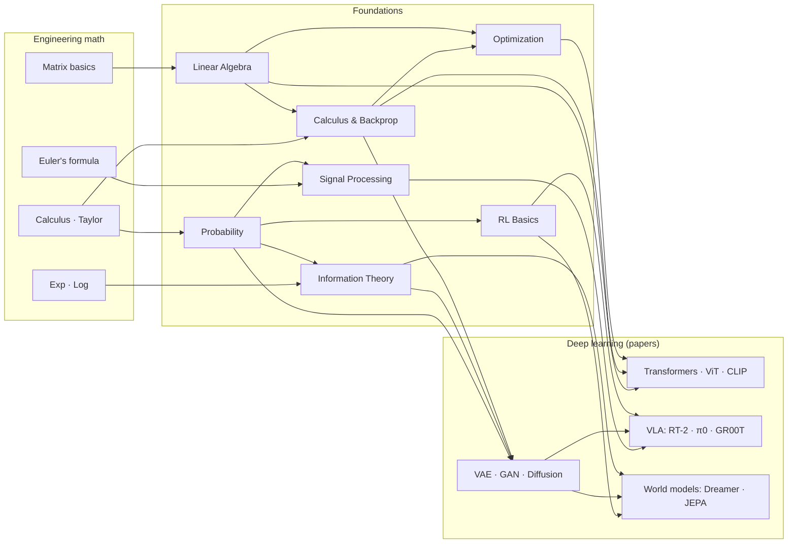

## English

How the foundations connect — to each other, to the engineering math beneath them, and to
the deep learning papers above them. Read this page first; it tells you what you need
*before* each page and what each page unlocks *after*.

### Prerequisite engineering math (undergraduate level)

Everything below is 1st–2nd year engineering math. If any row feels shaky, patch it first
with the listed quick source — a few hours each, not a semester.

| Prerequisite | Needed by | Quick source |
|---|---|---|
| Single/multivariable calculus — derivatives, partial derivatives, integrals, Taylor series | [[02-foundations/calculus-backprop\|2. Calculus]], [[02-foundations/optimization\|4. Optimization]], [[02-foundations/probability\|3. Probability]] | [[02-foundations/engineering-math\|0.1 공업수학 §1–3]] · [*Essence of Calculus*](https://www.3blue1brown.com/topics/calculus) |
| Matrix/vector arithmetic — systems of equations, matrix multiplication | [[02-foundations/linear-algebra\|1. Linear Algebra]] (start here) | [[02-foundations/engineering-math\|0.1 공업수학 §4]] · [*Essence of Linear Algebra*](https://www.3blue1brown.com/topics/linear-algebra) |
| Series & convergence basics | [[02-foundations/probability\|3. Probability]] (expectations), [[02-foundations/rl-basics\|7. RL]] (discounted sums) | [[02-foundations/engineering-math\|0.1 공업수학 §5]] |
| Complex numbers & Euler's formula $e^{j\theta} = \cos\theta + j\sin\theta$ | [[02-foundations/signal-processing\|6. Signal Processing]] (Fourier) | [[02-foundations/engineering-math\|0.1 공업수학 §7]] |
| Exponentials & logarithms (incl. $\log$ rules) | [[02-foundations/information-theory\|5. Information Theory]] | [[02-foundations/engineering-math\|0.1 공업수학 §6]] + [[02-foundations/information-theory\|정보이론 §0]] |
| Basic set notation & logic | [[02-foundations/probability\|3. Probability]] (axioms) | [[02-foundations/engineering-math\|0.1 공업수학 §8 표기법 사전]] |

That's the *entire* prerequisite list — no measure theory, no functional analysis, no
advanced statistics. If you can differentiate, multiply matrices, and read $\sum$ and
$\log$, you can start.

### Recommended study order

**1. [[02-foundations/linear-algebra|Linear Algebra]] → 2. [[02-foundations/calculus-backprop|Calculus & Backprop]] → 3. [[02-foundations/probability|Probability]]** (the core triangle — everything else stands on these) **→ 4. [[02-foundations/optimization|Optimization]] → 5. [[02-foundations/information-theory|Information Theory]]** (the applied pillars) **→ 6. [[02-foundations/signal-processing|Signal Processing]] · 7. [[02-foundations/rl-basics|RL Basics]]** (domain bridges — order between these two is free) **→ 8. [[02-foundations/se3-geometry|3D Geometry & SE(3)]]** (before the robotics track and VLA papers) **· 9. [[02-foundations/ml-practice|ML Practice & Evaluation]]** (before reading any results table).

Each page ends with self-check questions; do them. If a page feels too dense on first
contact, pair it with a first-pass source ([CS231n](https://cs231n.stanford.edu/schedule.html) lectures for 1–4, [Sutton & Barto](http://incompleteideas.net/book/the-book.html) ch.1–6
for 7) and return to the page as a structured summary.

### Connection map — math → foundations → papers

Reading the map: **Transformers** need linear algebra (attention = matrix products),
backprop, and optimization (Adam). **Generative models** add probability (MLE) and
information theory (ELBO/KL). **World models** are generative models + RL. **VLA** sits on
top of everything — plus signal processing on the sensor side. This is why the study order
above exists.

### Where to go next

After the foundations: follow the [[01-canonical-papers/canonical-list|canonical list]] in
order (its section 1 mirrors this page's logic), with the
[[03-deep-learning/lineage|paper lineage]] open in a second tab.

## 한국어

기초 지식들이 서로, 그 아래의 공업수학과, 그리고 그 위의 딥러닝 논문들과 어떻게
연결되는지의 지도. 이 페이지를 먼저 읽으면 각 페이지를 공부하기 *전에* 무엇이 필요하고,
공부한 *후에* 무엇이 열리는지 알 수 있다.

### 사전 공업수학 (학부 수준)

아래는 전부 공대 1~2학년 공업수학 범위다. 흔들리는 줄이 있으면 표의 빠른 자료로 먼저
메워라 — 학기가 아니라 각각 몇 시간이면 된다.

| 사전 지식 | 필요한 페이지 | 빠른 자료 |
|---|---|---|
| 단변수/다변수 미적분 — 미분, 편미분, 적분, 테일러 급수 | [[02-foundations/calculus-backprop\|2. 미적분·역전파]], [[02-foundations/optimization\|4. 최적화]], [[02-foundations/probability\|3. 확률]] | [[02-foundations/engineering-math\|0.1 공업수학 §1–3]] · [*Essence of Calculus*](https://www.3blue1brown.com/topics/calculus) |
| 행렬/벡터 연산 — 연립방정식, 행렬곱 | [[02-foundations/linear-algebra\|1. 선형대수]] (여기서 시작) | [[02-foundations/engineering-math\|0.1 공업수학 §4]] · [*Essence of Linear Algebra*](https://www.3blue1brown.com/topics/linear-algebra) |
| 급수와 수렴 기초 | [[02-foundations/probability\|3. 확률]] (기댓값), [[02-foundations/rl-basics\|7. RL]] (할인 합) | [[02-foundations/engineering-math\|0.1 공업수학 §5]] |
| 복소수와 오일러 공식 $e^{j\theta} = \cos\theta + j\sin\theta$ | [[02-foundations/signal-processing\|6. 신호처리]] (푸리에) | [[02-foundations/engineering-math\|0.1 공업수학 §7]] |
| 지수·로그 (로그 법칙 포함) | [[02-foundations/information-theory\|5. 정보이론]] | [[02-foundations/engineering-math\|0.1 공업수학 §6]] + [[02-foundations/information-theory\|정보이론 §0]] |
| 기초 집합 표기와 논리 | [[02-foundations/probability\|3. 확률]] (공리) | [[02-foundations/engineering-math\|0.1 공업수학 §8 표기법 사전]] |

이것이 사전 지식의 *전부*다 — 측도론도, 함수해석도, 고급 통계도 없다. 미분할 수 있고,
행렬을 곱할 수 있고, $\sum$과 $\log$를 읽을 수 있으면 시작할 수 있다.

### 권장 학습 순서

**1. [[02-foundations/linear-algebra|선형대수]] → 2. [[02-foundations/calculus-backprop|미적분·역전파]] → 3. [[02-foundations/probability|확률]]** (핵심 삼각형 — 나머지 전부가 이 위에 선다) **→ 4. [[02-foundations/optimization|최적화]] → 5. [[02-foundations/information-theory|정보이론]]** (응용 기둥) **→ 6. [[02-foundations/signal-processing|신호처리]] · 7. [[02-foundations/rl-basics|RL 기초]]** (도메인 다리 — 이 둘의 순서는 자유) **→ 8. [[02-foundations/se3-geometry|3D 기하와 SE(3)]]** (로보틱스 트랙·VLA 논문 전에) **· 9. [[02-foundations/ml-practice|ML 실무와 평가]]** (결과 표를 읽기 전에).

각 페이지 끝의 스스로 점검 문제를 꼭 풀어라. 처음 접했을 때 너무 압축적으로 느껴지는
페이지는 1차 통과용 자료(1~4번은 [CS231n](https://cs231n.stanford.edu/schedule.html) 강의, 7번은 [Sutton & Barto](http://incompleteideas.net/book/the-book.html) 1~6장)와 병행하고,
이 위키의 페이지는 구조화된 요약본으로 되돌아와 쓰면 된다.

### 연결 지도 — 수학 → 기초 → 논문

위의 mermaid 지도를 읽는 법: **Transformer**는 선형대수(어텐션 = 행렬곱), 역전파,
최적화(Adam)가 필요하다. **생성모델**은 거기에 확률(MLE)과 정보이론(ELBO/KL)을 더한다.
**월드모델** = 생성모델 + RL. **VLA**는 이 전부의 꼭대기에 앉아 있다 — 센서 쪽에서는
신호처리까지. 위의 학습 순서가 존재하는 이유가 이것이다.

### 다음으로 갈 곳

기초를 마치면: [[01-canonical-papers/canonical-list|핵심 논문 리스트]]를 순서대로
(1번 섹션이 이 페이지의 논리를 그대로 반영한다), [[03-deep-learning/lineage|논문 계보도]]를
두 번째 탭에 열어두고.
