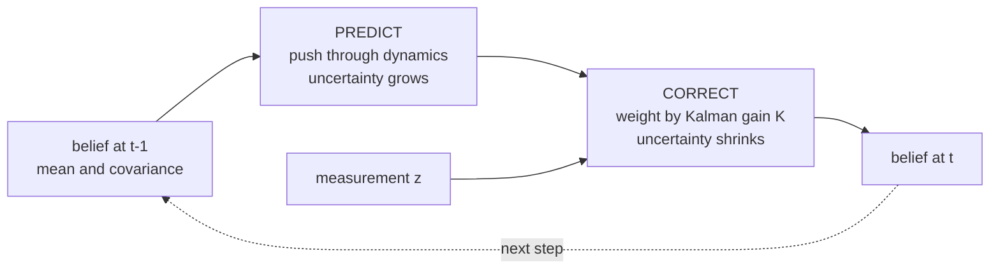
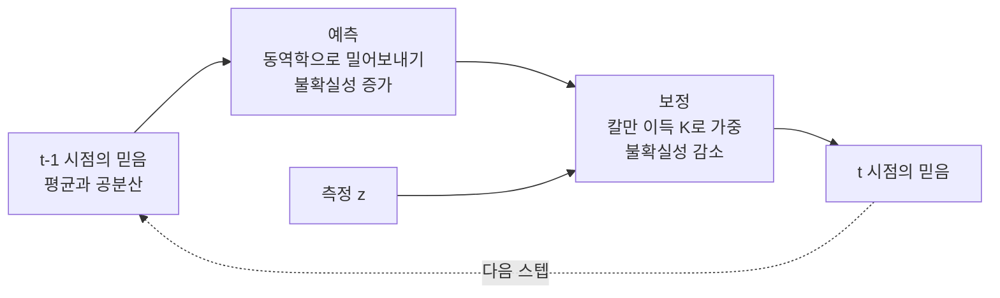

> [!note] Prerequisites · 선수 지식
> Plant **P5** from [[02-foundations/lab-plants|0.6 Lab Plants]] · [[02-foundations/engineering-math|0.5 §3]] (integrals as expectations) · [[02-foundations/engineering-math|0.5 §10]] (set notation) · [[02-foundations/linear-algebra|1. Linear Algebra §3]] (PSD matrices, for covariance)
> [[02-foundations/lab-plants|0.6]]의 장치 **P5** · [[02-foundations/engineering-math|0.5 §3]](기댓값으로서의 적분) · [[02-foundations/engineering-math|0.5 §10]](집합 표기) · [[02-foundations/linear-algebra|1. 선형대수 §3]](공분산을 위한 PSD 행렬)
>
> Connection map · 연결 지도: [[02-foundations/overview|0. Overview]]

## English

*Stands on [[02-foundations/engineering-math|0.5]] (integrals, expectation) and [[02-foundations/linear-algebra|1]] — not on calculus, so it reads fine before or after that page.
It answers where losses come from, and information theory, signal processing, RL and ML practice all rest on it.*

Probability is the substrate under estimation, filtering, and many standard objectives in deep
learning. Course-depth treatment: derivations, the Gaussian toolbox, a worked MLE example,
and the Kalman filter assembled from parts you'll have proven along the way.

> [!note] First pass · 처음이라면
> Read the picture, §1, §2, then §3 — the Gaussian toolbox is what actually gets used. §4 explains where your loss function came from and is worth the detour. In §5 read §5.2's scalar gain derivation now, because the picture and the problem set run on it; the vector filter and §5.1's random processes can wait until state estimation. §6 is three tools to open when you need them: §6.1 when a robot must decide from one noisy reading, §6.2 when you compare two methods' results, §6.3 when a tracker gates a measurement with the χ² distribution. §7 is for when you meet HMMs, MCMC, or diffusion's forward process.

### The picture · 그림으로 먼저 보기

<svg viewBox="0 0 560 546" style="max-width:100%;height:auto" role="img" aria-label="plant P5: prior, likelihood and posterior of the wall distance on one axis, the Kalman gain drawn as a fraction of the innovation, and below it the estimate's error bar shrinking at each measurement and growing at the predict step">
  <defs><marker id="arPb" viewBox="0 0 10 10" refX="9" refY="5" markerWidth="6" markerHeight="6" orient="auto"><path d="M0 0L10 5L0 10z" fill="currentColor"/></marker></defs>
  <g stroke="currentColor" stroke-width="1" fill="none" opacity="0.55"><line x1="50" y1="172" x2="512" y2="172"/><line x1="50" y1="172" x2="50" y2="40"/></g>
  <g stroke="currentColor" stroke-width="1" opacity="0.45"><line x1="50.0" y1="172" x2="50.0" y2="176"/><line x1="96.0" y1="172" x2="96.0" y2="176"/><line x1="142.0" y1="172" x2="142.0" y2="176"/><line x1="188.0" y1="172" x2="188.0" y2="176"/><line x1="234.0" y1="172" x2="234.0" y2="176"/><line x1="280.0" y1="172" x2="280.0" y2="176"/><line x1="326.0" y1="172" x2="326.0" y2="176"/><line x1="372.0" y1="172" x2="372.0" y2="176"/><line x1="418.0" y1="172" x2="418.0" y2="176"/><line x1="464.0" y1="172" x2="464.0" y2="176"/><line x1="510.0" y1="172" x2="510.0" y2="176"/><line x1="46" y1="112.0" x2="50" y2="112.0"/><line x1="46" y1="52.0" x2="50" y2="52.0"/></g>
  <path d="M50.0 163.9L52.3 163.5L54.6 163.1L56.9 162.6L59.2 162.2L61.5 161.7L63.8 161.2L66.1 160.7L68.4 160.2L70.7 159.6L73.0 159.1L75.3 158.5L77.6 157.9L79.9 157.3L82.2 156.7L84.5 156.0L86.8 155.4L89.1 154.7L91.4 154.0L93.7 153.3L96.0 152.6L98.3 151.8L100.6 151.1L102.9 150.3L105.2 149.5L107.5 148.7L109.8 147.9L112.1 147.1L114.4 146.3L116.7 145.5L119.0 144.6L121.3 143.7L123.6 142.9L125.9 142.0L128.2 141.1L130.5 140.2L132.8 139.3L135.1 138.4L137.4 137.5L139.7 136.6L142.0 135.7L144.3 134.8L146.6 133.9L148.9 133.0L151.2 132.1L153.5 131.2L155.8 130.3L158.1 129.4L160.4 128.5L162.7 127.7L165.0 126.8L167.3 126.0L169.6 125.2L171.9 124.3L174.2 123.6L176.5 122.8L178.8 122.0L181.1 121.3L183.4 120.6L185.7 119.9L188.0 119.2L190.3 118.5L192.6 117.9L194.9 117.3L197.2 116.8L199.5 116.2L201.8 115.7L204.1 115.2L206.4 114.8L208.7 114.4L211.0 114.0L213.3 113.7L215.6 113.3L217.9 113.1L220.2 112.8L222.5 112.6L224.8 112.5L227.1 112.3L229.4 112.2L231.7 112.2L234.0 112.2L236.3 112.2L238.6 112.2L240.9 112.3L243.2 112.5L245.5 112.6L247.8 112.8L250.1 113.1L252.4 113.3L254.7 113.7L257.0 114.0L259.3 114.4L261.6 114.8L263.9 115.2L266.2 115.7L268.5 116.2L270.8 116.8L273.1 117.3L275.4 117.9L277.7 118.5L280.0 119.2L282.3 119.9L284.6 120.6L286.9 121.3L289.2 122.0L291.5 122.8L293.8 123.6L296.1 124.3L298.4 125.2L300.7 126.0L303.0 126.8L305.3 127.7L307.6 128.5L309.9 129.4L312.2 130.3L314.5 131.2L316.8 132.1L319.1 133.0L321.4 133.9L323.7 134.8L326.0 135.7L328.3 136.6L330.6 137.5L332.9 138.4L335.2 139.3L337.5 140.2L339.8 141.1L342.1 142.0L344.4 142.9L346.7 143.7L349.0 144.6L351.3 145.5L353.6 146.3L355.9 147.1L358.2 147.9L360.5 148.7L362.8 149.5L365.1 150.3L367.4 151.1L369.7 151.8L372.0 152.6L374.3 153.3L376.6 154.0L378.9 154.7L381.2 155.4L383.5 156.0L385.8 156.7L388.1 157.3L390.4 157.9L392.7 158.5L395.0 159.1L397.3 159.6L399.6 160.2L401.9 160.7L404.2 161.2L406.5 161.7L408.8 162.2L411.1 162.6L413.4 163.1L415.7 163.5L418.0 163.9L420.3 164.3L422.6 164.7L424.9 165.0L427.2 165.4L429.5 165.7L431.8 166.1L434.1 166.4L436.4 166.7L438.7 167.0L441.0 167.2L443.3 167.5L445.6 167.8L447.9 168.0L450.2 168.2L452.5 168.4L454.8 168.6L457.1 168.8L459.4 169.0L461.7 169.2L464.0 169.4L466.3 169.5L468.6 169.7L470.9 169.8L473.2 170.0L475.5 170.1L477.8 170.2L480.1 170.3L482.4 170.4L484.7 170.5L487.0 170.6L489.3 170.7L491.6 170.8L493.9 170.9L496.2 171.0L498.5 171.0L500.8 171.1L503.1 171.2L505.4 171.2L507.7 171.3L510.0 171.3" fill="none" stroke="currentColor" stroke-width="1.7" stroke-opacity="0.7" stroke-dasharray="7 4"/>
  <path d="M50.0 172.0L52.3 172.0L54.6 172.0L56.9 172.0L59.2 172.0L61.5 172.0L63.8 172.0L66.1 172.0L68.4 172.0L70.7 172.0L73.0 172.0L75.3 172.0L77.6 172.0L79.9 172.0L82.2 172.0L84.5 172.0L86.8 172.0L89.1 172.0L91.4 172.0L93.7 172.0L96.0 172.0L98.3 172.0L100.6 172.0L102.9 172.0L105.2 172.0L107.5 172.0L109.8 172.0L112.1 172.0L114.4 172.0L116.7 172.0L119.0 172.0L121.3 172.0L123.6 172.0L125.9 172.0L128.2 172.0L130.5 172.0L132.8 172.0L135.1 172.0L137.4 172.0L139.7 172.0L142.0 172.0L144.3 172.0L146.6 171.9L148.9 171.9L151.2 171.9L153.5 171.9L155.8 171.9L158.1 171.8L160.4 171.8L162.7 171.8L165.0 171.7L167.3 171.7L169.6 171.6L171.9 171.6L174.2 171.5L176.5 171.4L178.8 171.3L181.1 171.2L183.4 171.0L185.7 170.9L188.0 170.7L190.3 170.5L192.6 170.2L194.9 169.9L197.2 169.6L199.5 169.3L201.8 168.9L204.1 168.4L206.4 167.9L208.7 167.4L211.0 166.7L213.3 166.0L215.6 165.3L217.9 164.4L220.2 163.5L222.5 162.5L224.8 161.4L227.1 160.1L229.4 158.8L231.7 157.4L234.0 155.8L236.3 154.1L238.6 152.3L240.9 150.4L243.2 148.3L245.5 146.1L247.8 143.8L250.1 141.3L252.4 138.7L254.7 136.0L257.0 133.1L259.3 130.2L261.6 127.1L263.9 123.9L266.2 120.6L268.5 117.2L270.8 113.7L273.1 110.2L275.4 106.6L277.7 103.0L280.0 99.4L282.3 95.8L284.6 92.2L286.9 88.6L289.2 85.1L291.5 81.7L293.8 78.3L296.1 75.1L298.4 72.0L300.7 69.1L303.0 66.4L305.3 63.8L307.6 61.5L309.9 59.4L312.2 57.6L314.5 56.0L316.8 54.7L319.1 53.7L321.4 52.9L323.7 52.5L326.0 52.3L328.3 52.5L330.6 52.9L332.9 53.7L335.2 54.7L337.5 56.0L339.8 57.6L342.1 59.4L344.4 61.5L346.7 63.8L349.0 66.4L351.3 69.1L353.6 72.0L355.9 75.1L358.2 78.3L360.5 81.7L362.8 85.1L365.1 88.6L367.4 92.2L369.7 95.8L372.0 99.4L374.3 103.0L376.6 106.6L378.9 110.2L381.2 113.7L383.5 117.2L385.8 120.6L388.1 123.9L390.4 127.1L392.7 130.2L395.0 133.1L397.3 136.0L399.6 138.7L401.9 141.3L404.2 143.8L406.5 146.1L408.8 148.3L411.1 150.4L413.4 152.3L415.7 154.1L418.0 155.8L420.3 157.4L422.6 158.8L424.9 160.1L427.2 161.4L429.5 162.5L431.8 163.5L434.1 164.4L436.4 165.3L438.7 166.0L441.0 166.7L443.3 167.4L445.6 167.9L447.9 168.4L450.2 168.9L452.5 169.3L454.8 169.6L457.1 169.9L459.4 170.2L461.7 170.5L464.0 170.7L466.3 170.9L468.6 171.0L470.9 171.2L473.2 171.3L475.5 171.4L477.8 171.5L480.1 171.6L482.4 171.6L484.7 171.7L487.0 171.7L489.3 171.8L491.6 171.8L493.9 171.8L496.2 171.9L498.5 171.9L500.8 171.9L503.1 171.9L505.4 171.9L507.7 172.0L510.0 172.0" fill="none" stroke="currentColor" stroke-width="1.8" stroke-opacity="0.85" stroke-dasharray="2 3"/>
  <path d="M50.0 172.0L52.3 172.0L54.6 172.0L56.9 172.0L59.2 172.0L61.5 172.0L63.8 172.0L66.1 172.0L68.4 172.0L70.7 172.0L73.0 172.0L75.3 172.0L77.6 172.0L79.9 172.0L82.2 172.0L84.5 172.0L86.8 172.0L89.1 172.0L91.4 172.0L93.7 172.0L96.0 172.0L98.3 172.0L100.6 172.0L102.9 172.0L105.2 172.0L107.5 172.0L109.8 172.0L112.1 172.0L114.4 172.0L116.7 172.0L119.0 172.0L121.3 172.0L123.6 172.0L125.9 172.0L128.2 172.0L130.5 172.0L132.8 172.0L135.1 172.0L137.4 172.0L139.7 172.0L142.0 172.0L144.3 171.9L146.6 171.9L148.9 171.9L151.2 171.9L153.5 171.9L155.8 171.9L158.1 171.8L160.4 171.8L162.7 171.7L165.0 171.7L167.3 171.6L169.6 171.5L171.9 171.4L174.2 171.3L176.5 171.2L178.8 171.0L181.1 170.8L183.4 170.6L185.7 170.3L188.0 170.0L190.3 169.7L192.6 169.3L194.9 168.9L197.2 168.3L199.5 167.8L201.8 167.1L204.1 166.3L206.4 165.5L208.7 164.6L211.0 163.5L213.3 162.3L215.6 161.0L217.9 159.6L220.2 158.0L222.5 156.2L224.8 154.3L227.1 152.3L229.4 150.0L231.7 147.6L234.0 145.0L236.3 142.2L238.6 139.2L240.9 136.0L243.2 132.7L245.5 129.2L247.8 125.5L250.1 121.6L252.4 117.6L254.7 113.5L257.0 109.2L259.3 104.8L261.6 100.4L263.9 95.9L266.2 91.3L268.5 86.8L270.8 82.3L273.1 77.9L275.4 73.5L277.7 69.2L280.0 65.2L282.3 61.2L284.6 57.5L286.9 54.1L289.2 50.9L291.5 48.1L293.8 45.5L296.1 43.3L298.4 41.5L300.7 40.1L303.0 39.0L305.3 38.4L307.6 38.2L309.9 38.4L312.2 39.0L314.5 40.1L316.8 41.5L319.1 43.3L321.4 45.5L323.7 48.1L326.0 50.9L328.3 54.1L330.6 57.5L332.9 61.2L335.2 65.2L337.5 69.2L339.8 73.5L342.1 77.9L344.4 82.3L346.7 86.8L349.0 91.3L351.3 95.9L353.6 100.4L355.9 104.8L358.2 109.2L360.5 113.5L362.8 117.6L365.1 121.6L367.4 125.5L369.7 129.2L372.0 132.7L374.3 136.0L376.6 139.2L378.9 142.2L381.2 145.0L383.5 147.6L385.8 150.0L388.1 152.3L390.4 154.3L392.7 156.2L395.0 158.0L397.3 159.6L399.6 161.0L401.9 162.3L404.2 163.5L406.5 164.6L408.8 165.5L411.1 166.3L413.4 167.1L415.7 167.8L418.0 168.3L420.3 168.9L422.6 169.3L424.9 169.7L427.2 170.0L429.5 170.3L431.8 170.6L434.1 170.8L436.4 171.0L438.7 171.2L441.0 171.3L443.3 171.4L445.6 171.5L447.9 171.6L450.2 171.7L452.5 171.7L454.8 171.8L457.1 171.8L459.4 171.9L461.7 171.9L464.0 171.9L466.3 171.9L468.6 171.9L470.9 171.9L473.2 172.0L475.5 172.0L477.8 172.0L480.1 172.0L482.4 172.0L484.7 172.0L487.0 172.0L489.3 172.0L491.6 172.0L493.9 172.0L496.2 172.0L498.5 172.0L500.8 172.0L503.1 172.0L505.4 172.0L507.7 172.0L510.0 172.0" fill="none" stroke="currentColor" stroke-width="2.6"/>
  <line x1="142.0" y1="135.7" x2="326.0" y2="135.7" stroke="currentColor" stroke-width="1" stroke-opacity="0.56" stroke-dasharray="7 4"/>
  <g fill="currentColor" fill-opacity="0.7"><circle cx="142.0" cy="135.7" r="2.8"/><circle cx="326.0" cy="135.7" r="2.8"/></g>
  <line x1="280.0" y1="99.4" x2="372.0" y2="99.4" stroke="currentColor" stroke-width="1" stroke-opacity="0.68" stroke-dasharray="2 3"/>
  <g fill="currentColor" fill-opacity="0.85"><circle cx="280.0" cy="99.4" r="2.8"/><circle cx="372.0" cy="99.4" r="2.8"/></g>
  <line x1="266.5" y1="90.8" x2="348.7" y2="90.8" stroke="currentColor" stroke-width="1" stroke-opacity="0.80"/>
  <g fill="currentColor" fill-opacity="1"><circle cx="266.5" cy="90.8" r="2.8"/><circle cx="348.7" cy="90.8" r="2.8"/></g>
  <text x="45.0" y="116.0" fill="currentColor" text-anchor="end" opacity="0.8">0.2</text>
  <text x="45.0" y="56.0" fill="currentColor" text-anchor="end" opacity="0.8">0.4</text>
  <text x="45.0" y="176.0" fill="currentColor" text-anchor="end" opacity="0.8">0</text>
  <text x="14.0" y="30.0" fill="currentColor" opacity="0.8">density</text>
  <text x="70.0" y="24.0" fill="currentColor" opacity="0.75">posterior, two checks:</text>
  <text x="70.0" y="38.0" fill="currentColor" opacity="0.9">✓ between 10 and 12,</text>
  <text x="83.0" y="52.0" fill="currentColor" opacity="0.9">nearer the sensor</text>
  <text x="70.0" y="66.0" fill="currentColor" opacity="0.9">✓ narrower than both inputs:</text>
  <text x="83.0" y="80.0" fill="currentColor" opacity="0.9">σ 0.894 &lt; 1 &lt; 2</text>
  <line x1="311.6" y1="37.2" x2="329.6" y2="32.2" stroke="currentColor" stroke-width="0.9" opacity="0.7"/>
  <text x="332.6" y="32.2" fill="currentColor">posterior N(11.6, 0.8)</text>
  <text x="332.6" y="46.2" fill="currentColor" opacity="0.85">σ 0.894, peak 0.446</text>
  <line x1="365.8" y1="84.1" x2="382.8" y2="80.1" stroke="currentColor" stroke-width="0.9" opacity="0.7"/>
  <text x="385.8" y="81.1" fill="currentColor">likelihood N(12, 1)</text>
  <text x="385.8" y="95.1" fill="currentColor" opacity="0.85">σ 1, peak 0.399</text>
  <text x="58.0" y="108.0" fill="currentColor">prior N(10, 4)</text>
  <text x="58.0" y="122.0" fill="currentColor" opacity="0.85">σ 2, peak 0.199</text>
  <text x="50.0" y="188.0" fill="currentColor" text-anchor="middle" opacity="0.8">6</text>
  <text x="96.0" y="188.0" fill="currentColor" text-anchor="middle" opacity="0.8">7</text>
  <text x="142.0" y="188.0" fill="currentColor" text-anchor="middle" opacity="0.8">8</text>
  <text x="188.0" y="188.0" fill="currentColor" text-anchor="middle" opacity="0.8">9</text>
  <text x="234.0" y="188.0" fill="currentColor" text-anchor="middle" opacity="0.8">10</text>
  <text x="280.0" y="188.0" fill="currentColor" text-anchor="middle" opacity="0.8">11</text>
  <text x="326.0" y="188.0" fill="currentColor" text-anchor="middle" opacity="0.8">12</text>
  <text x="372.0" y="188.0" fill="currentColor" text-anchor="middle" opacity="0.8">13</text>
  <text x="418.0" y="188.0" fill="currentColor" text-anchor="middle" opacity="0.8">14</text>
  <text x="464.0" y="188.0" fill="currentColor" text-anchor="middle" opacity="0.8">15</text>
  <text x="510.0" y="188.0" fill="currentColor" text-anchor="middle" opacity="0.8">16</text>
  <text x="512.0" y="202.0" fill="currentColor" text-anchor="end" opacity="0.8">distance x (cm)</text>
  <g stroke="currentColor" stroke-width="0.9" opacity="0.35" stroke-dasharray="2 3"><line x1="234.0" y1="176" x2="234.0" y2="266"/><line x1="307.6" y1="176" x2="307.6" y2="244"/><line x1="326.0" y1="176" x2="326.0" y2="266"/></g>
  <g stroke="currentColor" stroke-width="1.6" fill="none"><line x1="234.0" y1="216" x2="326.0" y2="216"/><line x1="234.0" y1="211" x2="234.0" y2="221"/><line x1="326.0" y1="211" x2="326.0" y2="221"/></g>
  <text x="334.0" y="220.0" fill="currentColor">innovation z − x̂⁻ = 2</text>
  <line x1="234.0" y1="238" x2="306.6" y2="238" stroke="currentColor" stroke-width="2.4" marker-end="url(#arPb)"/>
  <line x1="234.0" y1="233" x2="234.0" y2="243" stroke="currentColor" stroke-width="1.6"/>
  <text x="334.0" y="242.0" fill="currentColor">K·(z − x̂⁻) = 0.8 × 2 = 1.6</text>
  <text x="226.0" y="242.0" fill="currentColor" text-anchor="end">K = P⁻/(P⁻ + R) = 4/5 = 0.8</text>
  <line x1="234.0" y1="262" x2="326.0" y2="262" stroke="currentColor" stroke-width="1" stroke-opacity="0.45" stroke-dasharray="4 3"/>
  <line x1="326.0" y1="258" x2="326.0" y2="266" stroke="currentColor" stroke-width="1" stroke-opacity="0.45"/>
  <line x1="234.0" y1="256" x2="234.0" y2="268" stroke="currentColor" stroke-width="1.6"/>
  <line x1="237.5" y1="256" x2="237.5" y2="268" stroke="currentColor" stroke-width="1.6"/>
  <text x="226.0" y="266.0" fill="currentColor" text-anchor="end">bad sensor, R = 100:</text>
  <text x="334.0" y="266.0" fill="currentColor">K = 0.04: only to 10.08</text>
  <text x="50.0" y="288.0" fill="currentColor" opacity="0.9">The gain is the fraction of the innovation you are willing to walk.</text>
  <text x="50.0" y="314.0" fill="currentColor" opacity="0.9">The same wall over time (x in cm): bar = x̂ ± √P, × = measurement z</text>
  <g stroke="currentColor" stroke-width="1" fill="none" opacity="0.55"><line x1="50" y1="326.0" x2="50" y2="466.0"/><line x1="50" y1="470.0" x2="530" y2="470.0"/></g>
  <g stroke="currentColor" stroke-width="1" opacity="0.45"><line x1="46" y1="459.0" x2="50" y2="459.0"/><line x1="46" y1="431.0" x2="50" y2="431.0"/><line x1="46" y1="403.0" x2="50" y2="403.0"/><line x1="46" y1="375.0" x2="50" y2="375.0"/><line x1="46" y1="347.0" x2="50" y2="347.0"/><line x1="110" y1="470.0" x2="110" y2="475.0"/><line x1="200" y1="470.0" x2="200" y2="475.0"/><line x1="290" y1="470.0" x2="290" y2="475.0"/><line x1="380" y1="470.0" x2="380" y2="475.0"/><line x1="470" y1="470.0" x2="470" y2="475.0"/></g>
  <text x="45.0" y="463.0" fill="currentColor" text-anchor="end" opacity="0.8">8</text>
  <text x="45.0" y="435.0" fill="currentColor" text-anchor="end" opacity="0.8">10</text>
  <text x="45.0" y="407.0" fill="currentColor" text-anchor="end" opacity="0.8">12</text>
  <text x="45.0" y="379.0" fill="currentColor" text-anchor="end" opacity="0.8">14</text>
  <text x="45.0" y="351.0" fill="currentColor" text-anchor="end" opacity="0.8">16</text>
  <text x="110.0" y="488.0" fill="currentColor" text-anchor="middle">prior</text>
  <text x="200.0" y="488.0" fill="currentColor" text-anchor="middle">z<tspan dy="3.5">1</tspan><tspan dy="-3.5"> = 12</tspan></text>
  <text x="290.0" y="488.0" fill="currentColor" text-anchor="middle">z<tspan dy="3.5">2</tspan><tspan dy="-3.5"> = 11</tspan></text>
  <text x="380.0" y="488.0" fill="currentColor" text-anchor="middle">predict</text>
  <text x="470.0" y="488.0" fill="currentColor" text-anchor="middle">z<tspan dy="3.5">3</tspan><tspan dy="-3.5"> = 13</tspan></text>
  <text x="110.0" y="503.0" fill="currentColor" text-anchor="middle" opacity="0.9">P = 4</text>
  <text x="200.0" y="503.0" fill="currentColor" text-anchor="middle" opacity="0.9">P = 0.8</text>
  <text x="290.0" y="503.0" fill="currentColor" text-anchor="middle" opacity="0.9">P = 0.444</text>
  <text x="380.0" y="503.0" fill="currentColor" text-anchor="middle" opacity="0.9">P = 1.444</text>
  <text x="470.0" y="503.0" fill="currentColor" text-anchor="middle" opacity="0.9">P = 0.591</text>
  <text x="335.0" y="395.3" fill="currentColor" text-anchor="middle" opacity="0.85">+1, Q = 1</text>
  <polyline points="110,431.0 200,408.6 290,412.3 380,398.3 470,392.8" fill="none" stroke="currentColor" stroke-width="1" stroke-opacity="0.45"/>
  <line x1="200" y1="408.6" x2="290" y2="356.3" stroke="currentColor" stroke-width="1" stroke-opacity="0.55" stroke-dasharray="4 3"/>
  <g stroke="currentColor" stroke-width="2.2" fill="none"><line x1="110" y1="403.0" x2="110" y2="459.0"/><line x1="104" y1="403.0" x2="116" y2="403.0"/><line x1="104" y1="459.0" x2="116" y2="459.0"/><line x1="200" y1="396.1" x2="200" y2="421.1"/><line x1="194" y1="396.1" x2="206" y2="396.1"/><line x1="194" y1="421.1" x2="206" y2="421.1"/><line x1="290" y1="403.0" x2="290" y2="421.7"/><line x1="284" y1="403.0" x2="296" y2="403.0"/><line x1="284" y1="421.7" x2="296" y2="421.7"/><line x1="380" y1="381.5" x2="380" y2="415.2"/><line x1="374" y1="381.5" x2="386" y2="381.5"/><line x1="374" y1="415.2" x2="386" y2="415.2"/><line x1="470" y1="382.1" x2="470" y2="403.6"/><line x1="464" y1="382.1" x2="476" y2="382.1"/><line x1="464" y1="403.6" x2="476" y2="403.6"/></g>
  <g fill="currentColor"><circle cx="110" cy="431.0" r="3.2"/><circle cx="200" cy="408.6" r="3.2"/><circle cx="290" cy="412.3" r="3.2"/><circle cx="380" cy="398.3" r="3.2"/><circle cx="470" cy="392.8" r="3.2"/></g>
  <g stroke="currentColor" stroke-width="2.2" fill="none" stroke-dasharray="3 2.5"><line x1="290" y1="347.0" x2="290" y2="365.7"/><line x1="284" y1="347.0" x2="296" y2="347.0"/><line x1="284" y1="365.7" x2="296" y2="365.7"/></g>
  <circle cx="290" cy="356.3" r="3.2" fill="none" stroke="currentColor" stroke-width="1.4"/>
  <g stroke="currentColor" stroke-width="1.4" opacity="0.8"><line x1="182.5" y1="399.5" x2="189.5" y2="406.5"/><line x1="182.5" y1="406.5" x2="189.5" y2="399.5"/><line x1="272.5" y1="413.5" x2="279.5" y2="420.5"/><line x1="272.5" y1="420.5" x2="279.5" y2="413.5"/><line x1="452.5" y1="385.5" x2="459.5" y2="392.5"/><line x1="452.5" y1="392.5" x2="459.5" y2="385.5"/></g>
  <text x="304.0" y="342.3" fill="currentColor" opacity="0.9">← wrong wall z = 20 after z<tspan dy="3.5">1</tspan><tspan dy="-3.5">:</tspan></text>
  <text x="304.0" y="356.3" fill="currentColor" opacity="0.9">x̂ ≈ 15.3, P still 0.444:</text>
  <text x="304.0" y="370.3" fill="currentColor" opacity="0.9">confident and wrong</text>
  <text x="14.0" y="522.0" fill="currentColor" opacity="0.9">Each correction shortens the bar; the predict step lengthens it.</text>
  <text x="14.0" y="536.0" fill="currentColor" opacity="0.9">That sawtooth is the Kalman filter as a picture.</text>
</svg>

Plant **P5** from [[02-foundations/lab-plants|0.6 Lab Plants]]: the belief that the wall is $10\,\mathrm{cm}$ away (variance $4$) and a range reading of $12$ (variance $1$) fuse into the posterior $\mathcal{N}(11.6,\ 0.8)$ (the Gaussian with mean $11.6$ and variance $0.8$; §2–§3), which lies between the two and is narrower than either ($\sigma=0.894$ against $2$ and $1$). The gain $K=4/(4+1)=0.8$ (derived in §5.2) is the fraction of the innovation $z-\hat x^-=2$ that the estimate walks, $0.8\times2=1.6$; with a bad sensor, $R=100$, $K=0.04$ and the estimate moves only to $10.08$. Below, the error bar shrinks at every correction and grows at the predict step, which shifts the estimate by the known motion of $+1$ cm and adds the process variance $Q=1$ (§5.2) ($P=4,\ 0.8,\ 0.444,\ 1.444,\ 0.591$), and a wrong wall at $20$ after the first update drags the estimate to $\approx15.3$ with $P$ still $0.444$: confident and wrong.

### 1. The core language

- **A probability space** is the object every statement on this page lives in. It has three named parts. The **sample space** $\Omega$ is the set of all possible outcomes (for one die, $\{1,\dots,6\}$). An **event** $A \subseteq \Omega$ is a set of outcomes you can ask about ("even" is $\{2,4,6\}$; set notation is in [[02-foundations/engineering-math|0.5 §10]]). The **probability measure** $P$ assigns each event a number. $P$ must satisfy the three **Kolmogorov axioms**:
  - **Non-negativity**: no event has negative probability, so every $P(A)$ is at least 0.
  $$P(A) \ge 0$$
  - **Normalization**: something in $\Omega$ always happens.
  $$P(\Omega) = 1$$
  - **Countable additivity**: for events $A_1, A_2, \dots$ that are pairwise disjoint ($A_i \cap A_j = \emptyset$ for $i \ne j$, so no outcome is counted twice), the probability of the union is the sum.
  $$P\Big(\bigcup_i A_i\Big) = \sum_i P(A_i)$$
  Everything else is bookkeeping on top, because each rule below is derived from these three. For example $P(\emptyset) = 0$, $P(A^c) = 1 - P(A)$ (split $\Omega$ into $A$ and its complement $A^c$), and for events that overlap, $P(A \cup B) = P(A) + P(B) - P(A \cap B)$, since the overlap would otherwise be counted twice. With a fair die, $A$ = even and $B = \{4,5,6\}$: $P(A \cup B) = \tfrac12 + \tfrac12 - \tfrac13 = \tfrac23$, which matches counting $\{2,4,5,6\}$ directly. *Non-example:* "$P(\text{even}) = 0.5$, $P(\text{odd}) = 0.6$" violates the axioms, because the two events are disjoint and their union is $\Omega$, so the probabilities must add to exactly 1.
- **Conditional probability** of $A$ given $B$ is the probability of $A$ once you know $B$ happened, defined for $P(B) > 0$:
  $$P(A \mid B) = \frac{P(A \cap B)}{P(B)}$$
  Here $A \cap B$ is "both happen" and dividing by $P(B)$ renormalizes, so the outcomes inside $B$ again sum to 1. It re-weights the world after evidence. *Example:* a fair die shows an even number; $P(\text{six} \mid \text{even}) = \tfrac{1/6}{1/2} = \tfrac13$.
  - **Chain rule** (the definition rearranged): $P(A,B) = P(A|B)P(B)$, and for $n$ events $P(A_1,\dots,A_n) = \prod_{i=1}^n P(A_i \mid A_1,\dots,A_{i-1})$.
  - **Law of total probability**: if $B_1, \dots, B_k$ partition $\Omega$ (disjoint, covering everything), then
  $$P(A) = \sum_{i=1}^k P(A \mid B_i)\,P(B_i)$$
  since $A$ splits into the disjoint pieces $A \cap B_i$ and the chain rule gives each piece. It supplies the denominator of Bayes' rule below: in the crack example, $P(+) = 0.95 \cdot 0.01 + 0.05 \cdot 0.99 = 0.059$.
- **Bayes' rule.** The chain rule above can factor a joint probability in either order —
  $P(\theta, x) = P(\theta|x)P(x)$ and $P(\theta, x) = P(x|\theta)P(\theta)$ — and both equal
  the same joint, so set them equal and divide by $P(x)$. That is the derivation:
  $$P(\theta|x) = \frac{P(x|\theta)\,P(\theta)}{P(x)} \;\propto\; \text{likelihood}\times\text{prior}$$
  Read it as: *what you believed before* ($P(\theta)$), reweighted by *how well each
  hypothesis explains what you just saw* ($P(x|\theta)$).
  Worked example — sensor diagnosis: a crack detector fires on 95% of cracks
  ($P(+|c)=0.95$), false-alarms 5% ($P(+|\neg c)=0.05$), cracks are rare ($P(c)=0.01$).
  $P(c|+) = \frac{0.95\cdot 0.01}{0.95\cdot 0.01 + 0.05\cdot 0.99} \approx 0.16$.
  An alarm with 95% sensitivity (and a 5% false-positive rate — two separate numbers,
  not one "accuracy") is right only 16% of the time it fires — base rates dominate. This is why
  perception pipelines calibrate.

<svg viewBox="0 0 560 250" style="max-width:100%;height:auto" role="img" aria-label="a thousand panels split into ten cracked and nine hundred ninety sound, with the alarms each branch produces, and a bar showing that only sixteen percent of alarms are real">
  <g fill="currentColor" fill-opacity="0.08" stroke="currentColor" stroke-width="1" stroke-opacity="0.6">
    <rect x="24" y="76" width="94" height="30" rx="3"/>
    <rect x="150" y="34" width="86" height="30" rx="3"/>
    <rect x="150" y="118" width="86" height="30" rx="3"/>
  </g>
  <g fill="currentColor" fill-opacity="0.24" stroke="currentColor" stroke-width="1.1">
    <rect x="268" y="34" width="82" height="30" rx="3"/>
    <rect x="268" y="118" width="82" height="30" rx="3"/>
  </g>
  <g stroke="currentColor" stroke-width="1.2" fill="none" opacity="0.65">
    <path d="M118,86 C136,86 136,49 148,49"/>
    <path d="M118,96 C136,96 136,133 148,133"/>
    <line x1="236" y1="49" x2="266" y2="49"/>
    <line x1="236" y1="133" x2="266" y2="133"/>
  </g>
  <g font-size="10.5" fill="currentColor" text-anchor="middle">
    <text x="71" y="95">1,000 panels</text>
    <text x="193" y="53">10 cracked</text>
    <text x="193" y="137">990 sound</text>
    <text x="309" y="53">9.5 alarms</text>
    <text x="309" y="137">49.5 alarms</text>
  </g>
  <g font-size="9" fill="currentColor" opacity="0.8" text-anchor="middle">
    <text x="251" y="42">95% of them</text>
    <text x="251" y="126">5% of them</text>
  </g>
  <g font-size="10.5" fill="currentColor">
    <text x="372" y="80">59 alarms in total</text>
  </g>
  <g stroke="currentColor" stroke-width="1.1" fill="none" opacity="0.6">
    <rect x="372" y="88" width="170" height="26" rx="3"/>
  </g>
  <g fill="currentColor" fill-opacity="0.34">
    <rect x="372" y="88" width="27.4" height="26" rx="3"/>
  </g>
  <g font-size="9.5" fill="currentColor">
    <text x="372" y="130">9.5 real</text>
    <text x="542" y="130" text-anchor="end">49.5 false</text>
  </g>
  <g font-size="13" fill="currentColor" font-weight="600">
    <text x="372" y="152">16%</text>
  </g>
  <g font-size="10.5" fill="currentColor" opacity="0.9">
    <text x="24" y="212">The 95% is used on the thin branch and the 5% on the thick one, so the thick branch produces</text>
    <text x="24" y="228">five times more alarms than the thin one even though it is the branch with nothing wrong.</text>
    <text x="24" y="244">That ratio sets the posterior: 9.5 of 59 alarms, 16%. Nothing about the detector changed &#8212; only how rare cracks are.</text>
  </g>
</svg>

- **Independence** is a property of two events (or random variables): knowing one does not change the probability of the other. The defining condition is that the joint probability factorizes,
  $$P(A \cap B) = P(A)\,P(B)$$
  which is equivalent to $P(A \mid B) = P(A)$ whenever $P(B) > 0$, since dividing both sides by $P(B)$ gives the conditional. For random variables it must hold for every pair of values, $p(x,y) = p(x)\,p(y)$.
  **Conditional independence** of $A$ and $B$ given $C$ is the same factorization inside the world where $C$ happened:
  $$P(A \cap B \mid C) = P(A \mid C)\,P(B \mid C)$$
  - *Example:* two fair dice, $A$ = first shows 6, $B$ = second is even. $P(A \cap B) = \tfrac{3}{36} = \tfrac{1}{12} = \tfrac16 \cdot \tfrac12$, so they are independent.
  - *Non-example:* $A$ = first shows 6, $C$ = the sum is at least 10. $P(C) = \tfrac{6}{36} = \tfrac16$, but $P(A \cap C) = \tfrac{3}{36} = \tfrac{1}{12} \ne P(A)P(C) = \tfrac{1}{36}$: a 6 on the first die makes a large sum more likely.
  - *The two notions do not imply each other.* Two independent fair coins become dependent once you are told $C$ = "they match": then $P(\text{both heads} \mid C) = \tfrac12$ but $P(\text{first heads} \mid C)\,P(\text{second heads} \mid C) = \tfrac14$.

  These factorizations are the assumptions behind graphical models, naive Bayes, and the Markov property (§5) alike, because each lets a large joint distribution be stored as a product of small pieces.

### 2. Random variables and expectation

- **A random variable** $X$ is a function from outcomes to numbers, $X : \Omega \to \mathbb{R}$; it turns "what happened" into a quantity you can add and average. *Example:* roll two dice, $\Omega$ is the 36 ordered pairs, and $X$ = the sum maps $(2,5) \mapsto 7$. A random vector does the same into $\mathbb{R}^n$. Its **distribution** is described by one of three functions:
  - **PMF** (probability mass function), for a discrete $X$: $p(x)$ *is* the probability of the value $x$. Its two conditions are $p(x) \ge 0$ and
  $$p(x) = P(X = x), \qquad \sum_x p(x) = 1$$
  because the events $\{X = x\}$ are disjoint and cover $\Omega$, so the axioms force them to add to 1. *Example:* one fair die, $p(x) = \tfrac16$ for $x = 1,\dots,6$.
  - **PDF** (probability density function), for a continuous $X$: $p(x)$ is a *density*, so only its integral over an interval is a probability. Its conditions are $p(x) \ge 0$ and
  $$P(a \le X \le b) = \int_a^b p(x)\,dx, \qquad \int_{-\infty}^{\infty} p(x)\,dx = 1$$
  so a single point has probability 0 and $p(x)$ itself may exceed 1. *Example:* uniform on $[0, 0.5]$ has $p(x) = 2$ there, yet $P(0.1 \le X \le 0.3) = 0.2 \times 2 = 0.4$.
  - **CDF** (cumulative distribution function), for any $X$: $F(x) = P(X \le x)$. It is non-decreasing, runs from $F(-\infty) = 0$ to $F(\infty) = 1$, and for a continuous $X$ it is the integral of the PDF, so $p(x) = F'(x)$. *Example:* one fair die has $F(2.5) = P(X \le 2) = \tfrac13$.
- **Expectation** is the probability-weighted average of a function of $X$ (worked by hand in [[02-foundations/engineering-math|0.5 §3]]):
  $$E[g(X)] = \sum_x g(x)\,p(x) \quad\text{(discrete)}, \qquad E[g(X)] = \int g(x)\,p(x)\,dx \quad\text{(continuous)}$$
  Each value $g(x)$ is weighted by how likely it is, so one fair die has $E[X] = \tfrac{1+2+\cdots+6}{6} = 3.5$.
- **i.i.d.** (independent and identically distributed) describes a sample $x_1, \dots, x_N$ that satisfies **two** conditions: *independent* (the joint density factorizes) and *identically distributed* (every factor is the same $p$):
  $$p(x_1, \dots, x_N) = \prod_{i=1}^N p(x_i)$$
  Repeated rolls of one die are i.i.d. *Non-example:* consecutive readings of a drifting sensor are neither, since each depends on the last and their mean changes over time. Every "average of $N$ samples" result below (CLT, standard error, MLE) assumes i.i.d., so it is the first assumption to check in a paper.
- **Linearity** $E[aX + bY] = aE[X] + bE[Y]$ — *no independence needed*; the single most
  used identity in proofs. **Why that caveat is worth noticing:** with two dice,
  $E[X_1 + X_2] = 3.5 + 3.5 = 7$ whether or not the dice are glued together. Variance is
  *not* like that. Independent dice give
  $\text{Var}(X_1{+}X_2) = \tfrac{35}{12} + \tfrac{35}{12} = 5.83$ (one die:
  $E[X^2] = \tfrac{1+4+9+16+25+36}{6} = \tfrac{91}{6}$, so
  $\text{Var} = \tfrac{91}{6} - 3.5^2 = \tfrac{35}{12}$); two dice forced to show
  the same face give $X_1 + X_2 = 2X_1$ and
  $\text{Var}(2X_1) = 4\,\text{Var}(X_1) = 11.67$ — double. Means always add; spreads add only
  when things are uncorrelated. That is exactly why averaging $N$ *independent* runs shrinks
  the standard error of the mean by $\sqrt N$ and averaging $N$ correlated runs does not
  ([[02-foundations/ml-practice|9. ML Practice §4]]).
- **Variance** is the expected squared distance of $X$ from its own mean $\mu = E[X]$, a measure of spread; its square root $\sigma$ is the **standard deviation**, in the units of $X$:
  $$\text{Var}(X) = E\big[(X - \mu)^2\big] = E[X^2] - E[X]^2$$
  The second form follows by expanding the square and using linearity, since $E[2\mu X] = 2\mu^2$.
- **Covariance** measures whether two variables move together: positive when they tend to sit on the same side of their means, negative when on opposite sides.
  $$\text{Cov}(X,Y) = E\big[(X - E[X])(Y - E[Y])\big] = E[XY] - E[X]E[Y]$$
  The **correlation coefficient** $\rho = \text{Cov}(X,Y)/(\sigma_X \sigma_Y)$ rescales it into $[-1, 1]$. It is what the dice caveat above was about, because $\text{Var}(X + Y) = \text{Var}(X) + \text{Var}(Y) + 2\,\text{Cov}(X,Y)$; for the glued dice $\tfrac{35}{12} + \tfrac{35}{12} + 2 \cdot \tfrac{35}{12} = 11.67$.
  - *Example:* one die $X$ and $Y = 7 - X$ (the opposite face). $\text{Cov}(X, Y) = -\tfrac{35}{12} = -2.92$ and $\rho = -1$.
  - *Non-example (zero covariance is not independence):* $X$ uniform on $\{-1, 0, 1\}$ and $Y = X^2$. $\text{Cov}(X,Y) = E[X^3] - E[X]E[X^2] = 0 - 0 = 0$, yet $Y$ is a function of $X$: $P(Y = 1 \mid X = 0) = 0$ while $P(Y = 1) = \tfrac23$. Covariance detects only linear co-movement.
- **The covariance matrix** of a random vector $x \in \mathbb{R}^n$ with mean $\mu$ collects every pairwise covariance, $\Sigma_{ij} = \text{Cov}(x_i, x_j)$, with variances on the diagonal:
  $$\Sigma = E\big[(x-\mu)(x-\mu)^\top\big]$$
  It is symmetric and PSD ([[02-foundations/linear-algebra|1. Linear Algebra §3]]), because for any fixed vector $a$, $a^\top \Sigma a = \text{Var}(a^\top x) \ge 0$. For the die and its opposite face, $\Sigma = \tfrac{35}{12}\begin{pmatrix}1&-1\\-1&1\end{pmatrix}$, which is singular: all the randomness lies along one line.
- **Conditional expectation** $E[X \mid Y]$ is itself a random variable, a function of $Y$: for each value $y$ it is the mean of $X$ under the conditional distribution,
  $$E[X \mid Y = y] = \sum_x x\,p(x \mid y) \quad\text{(or } \textstyle\int x\,p(x \mid y)\,dx\text{)}$$
  Its defining property is that it is the **best mean-square predictor** of $X$ from $Y$: among all functions $g$, $E\big[(X - g(Y))^2\big]$ is smallest at $g(Y) = E[X \mid Y]$. Averaging it over $Y$ gives back the plain mean, $E\big[E[X \mid Y]\big] = E[X]$ (the **tower property**).
  - *Example:* two dice, $S = X_1 + X_2$. Knowing the first die, $E[S \mid X_1] = X_1 + 3.5$, so $E[S \mid X_1 = 2] = 5.5$. Its mean-square error is $\text{Var}(X_2) = 2.92$, half of the $\text{Var}(S) = 5.83$ you get by always guessing $7$.

  It is the reason estimation theory keeps computing it (the Kalman filter's $\hat x$ in §5 is one), and it is what regression with squared loss approximates.
- **Distributions that carry this wiki.** Each is a named family of PMFs or PDFs with parameters:

| Name | PMF or PDF | Mean, variance | Used for |
|---|---|---|---|
| **Bernoulli**$(\theta)$ | $p(x) = \theta^x (1-\theta)^{1-x}$, $x \in \{0,1\}$ | $\theta$, $\theta(1-\theta)$ | success or failure, dropout masks |
| **Categorical**$(\pi_1..\pi_K)$ | $P(X = k) = \pi_k$, with $\sum_k \pi_k = 1$ | (labels, not numbers) | classification outputs and losses |
| **Gaussian** $\mathcal{N}(\mu, \sigma^2)$ | $\frac{1}{\sqrt{2\pi\sigma^2}} e^{-(x-\mu)^2/(2\sigma^2)}$ | $\mu$, $\sigma^2$ | noise; §3 |
| **Poisson**$(\lambda)$ | $P(X = k) = \lambda^k e^{-\lambda}/k!$, $k = 0,1,\dots$ | $\lambda$, $\lambda$ | counts of independent events per interval |
| **Exponential**$(\lambda)$ | $p(x) = \lambda e^{-\lambda x}$, $x \ge 0$ | $1/\lambda$, $1/\lambda^2$ | waiting time to the next such event |

  *Examples:* a gripper that slips $\lambda = 2$ times per hour on average goes a whole hour without a slip with probability $e^{-2} = 0.135$. If faults arrive at rate $\lambda = 0.5$ per hour, the mean wait is 2 hours and $P(\text{wait} > 3\text{ h}) = e^{-1.5} = 0.223$. The two families describe the same process, since "no event in time $t$" is both a Poisson count of 0 and an exponential wait longer than $t$.

### 3. The Gaussian toolbox (why Gaussians run robotics)

A **multivariate Gaussian** (normal distribution) is the continuous distribution on $\mathbb{R}^n$ fixed by exactly **two** parameters, a mean vector $\mu \in \mathbb{R}^n$ and a symmetric positive-definite covariance matrix $\Sigma \in \mathbb{R}^{n\times n}$ (§2), with density

$$\mathcal{N}(x;\mu,\Sigma) = \frac{1}{\sqrt{(2\pi)^n|\Sigma|}}\exp\big(-\tfrac12 (x-\mu)^\top\Sigma^{-1}(x-\mu)\big)$$

Here $n$ is the dimension of $x$ and $|\Sigma|$ is the determinant of the covariance. The exponent is minus half the squared Mahalanobis distance of §6, so the density is highest at $x = \mu$ and falls off along ellipsoids shaped by $\Sigma$; the prefactor is whatever makes the integral equal 1. Then $E[x] = \mu$ and $\text{Cov}(x) = \Sigma$, so the two parameters are the mean and covariance. For $n = 1$ it reduces to the table entry of §2. *Example:* the standard normal $\mathcal{N}(0, 1)$ has density $0.399$ at its peak, while $\mathcal{N}(0, 0.1^2)$ has $3.99$, a density above 1, as §2 allowed.

Three **closure** properties make the Gaussian the workhorse — "closure" meaning the answer
is still a Gaussian, so **affine** operations never leave the family:

1. **Affine maps**: $x\sim\mathcal{N}(\mu,\Sigma) \Rightarrow Ax + b \sim \mathcal{N}(A\mu + b,\, A\Sigma A^\top)$.
2. **Sums** of independent Gaussians are Gaussian (variances add).
3. **Conditioning**: if $(x_1, x_2)$ jointly Gaussian,
   $$E[x_1|x_2] = \mu_1 + \Sigma_{12}\Sigma_{22}^{-1}(x_2 - \mu_2)$$
   — the conditional mean is a *linear* correction weighted by covariance-to-variance.
   Memorize the shape of this formula: it *is* the Kalman gain.
   Here $\mu_1, \mu_2$ are the two means, $\Sigma_{11}, \Sigma_{22}$ the two covariances and $\Sigma_{12} = \Sigma_{21}^\top = \text{Cov}(x_1, x_2)$. The spread left after conditioning is
   $$\text{Cov}(x_1 \mid x_2) = \Sigma_{11} - \Sigma_{12}\Sigma_{22}^{-1}\Sigma_{21}$$
   and both formulas come from one step. The leftover $e = x_1 - \mu_1 - \Sigma_{12}\Sigma_{22}^{-1}(x_2 - \mu_2)$ has $\text{Cov}(e, x_2) = \Sigma_{12} - \Sigma_{12}\Sigma_{22}^{-1}\Sigma_{22} = 0$. It is an affine map of $(x_1, x_2)$, so $(e, x_2)$ is jointly Gaussian, and a jointly Gaussian pair with zero covariance is independent (the covariance is block-diagonal, so the density above factors into two). Knowing $x_2$ therefore fixes the bracket $\mu_1 + \Sigma_{12}\Sigma_{22}^{-1}(x_2 - \mu_2)$ and leaves $e$ with its zero mean and its covariance, which expands to the second formula. *Example:* the P5 wall, $x_1 = x$ with mean $10$ and variance $4$, and $x_2 = z = x + v$ with independent $\text{Var}(v) = 1$, has $\Sigma_{12} = 4$ and $\Sigma_{22} = 5$, so $E[x \mid z{=}12] = 10 + \tfrac45(12 - 10) = 11.6$ and $\text{Cov}(x \mid z) = 4 - 4 \cdot 4/5 = 0.8$, the picture's posterior.

Also: the **central limit theorem (CLT)** is a limit statement with three named hypotheses: $X_1, \dots, X_N$ are i.i.d. (§2), with mean $\mu$, and with *finite* variance $\sigma^2$. Then the standardized sample mean $\bar X_N = \frac1N \sum_i X_i$ converges in distribution to a standard normal:
$$\frac{\sqrt N\,(\bar X_N - \mu)}{\sigma} \;\xrightarrow{d}\; \mathcal{N}(0, 1) \quad \text{as } N \to \infty$$
"Converges in distribution" means the CDFs converge, so probabilities about $\bar X_N$ can be read off a Gaussian with mean $\mu$ and standard deviation $\sigma/\sqrt N$. *Example:* the mean of 30 dice has standard deviation $\sqrt{35/12}/\sqrt{30} = 0.312$, and the Gaussian approximation gives $P(|\bar X_{30} - 3.5| < 0.5) = 0.89$ against an exact $0.88$. *Non-example:* it fails without finite variance; the mean of $N$ standard Cauchy samples is again standard Cauchy for every $N$, so averaging never narrows it. The CLT is why noise models default to the Gaussian; and among continuous distributions with a given mean and variance the Gaussian has the largest differential entropy (the continuous-variable analogue of the entropy in [[02-foundations/information-theory|5. Information Theory §1]], computed from a density rather than probabilities, so unlike discrete entropy it can be negative) (Murphy PML1 §2.6.4, shown in §3.4.4) — the "least presumptuous" choice.

<svg viewBox="0 0 620 214" style="max-width:100%;height:auto" role="img" aria-label="the Gaussian: one shape, width set by sigma, area always one">
  <g stroke="currentColor" stroke-width="1" opacity="0.3"><line x1="40" y1="150" x2="425" y2="150"/></g>
  <g stroke="currentColor" stroke-width="1" opacity="0.3" stroke-dasharray="3 3">
    <line x1="230.0" y1="48" x2="230.0" y2="150"/><line x1="170.6" y1="114" x2="170.6" y2="150"/><line x1="289.4" y1="114" x2="289.4" y2="150"/>
  </g>
  <path d="M40.0 149.6L41.9 149.6L43.8 149.6L45.7 149.5L47.6 149.5L49.5 149.4L51.4 149.3L53.3 149.3L55.2 149.2L57.1 149.1L59.0 149.1L60.9 149.0L62.8 148.9L64.7 148.8L66.6 148.6L68.5 148.5L70.4 148.4L72.3 148.2L74.2 148.1L76.1 147.9L78.0 147.7L79.9 147.5L81.8 147.3L83.7 147.1L85.6 146.9L87.5 146.6L89.4 146.4L91.3 146.1L93.2 145.8L95.1 145.5L97.0 145.1L98.9 144.8L100.8 144.4L102.7 144.0L104.6 143.6L106.5 143.1L108.4 142.6L110.3 142.1L112.2 141.6L114.1 141.1L116.0 140.5L117.9 139.9L119.8 139.3L121.7 138.6L123.6 138.0L125.5 137.2L127.4 136.5L129.3 135.8L131.2 135.0L133.1 134.2L135.0 133.3L136.9 132.5L138.8 131.6L140.7 130.6L142.6 129.7L144.5 128.7L146.4 127.7L148.3 126.7L150.2 125.7L152.1 124.6L154.0 123.6L155.9 122.5L157.8 121.4L159.7 120.2L161.6 119.1L163.5 118.0L165.4 116.8L167.3 115.6L169.2 114.5L171.1 113.3L173.0 112.2L174.9 111.0L176.8 109.8L178.7 108.7L180.6 107.6L182.5 106.4L184.4 105.3L186.3 104.2L188.2 103.2L190.1 102.1L192.0 101.1L193.9 100.1L195.8 99.2L197.7 98.3L199.6 97.4L201.5 96.5L203.4 95.7L205.3 95.0L207.2 94.3L209.1 93.6L211.0 93.0L212.9 92.4L214.8 91.9L216.7 91.5L218.6 91.1L220.5 90.8L222.4 90.5L224.3 90.3L226.2 90.1L228.1 90.0L230.0 90.0L231.9 90.0L233.8 90.1L235.7 90.3L237.6 90.5L239.5 90.8L241.4 91.1L243.3 91.5L245.2 91.9L247.1 92.4L249.0 93.0L250.9 93.6L252.8 94.3L254.7 95.0L256.6 95.7L258.5 96.5L260.4 97.4L262.3 98.3L264.2 99.2L266.1 100.1L268.0 101.1L269.9 102.1L271.8 103.2L273.7 104.2L275.6 105.3L277.5 106.4L279.4 107.6L281.3 108.7L283.2 109.8L285.1 111.0L287.0 112.2L288.9 113.3L290.8 114.5L292.7 115.6L294.6 116.8L296.5 118.0L298.4 119.1L300.3 120.2L302.2 121.4L304.1 122.5L306.0 123.6L307.9 124.6L309.8 125.7L311.7 126.7L313.6 127.7L315.5 128.7L317.4 129.7L319.3 130.6L321.2 131.6L323.1 132.5L325.0 133.3L326.9 134.2L328.8 135.0L330.7 135.8L332.6 136.5L334.5 137.2L336.4 138.0L338.3 138.6L340.2 139.3L342.1 139.9L344.0 140.5L345.9 141.1L347.8 141.6L349.7 142.1L351.6 142.6L353.5 143.1L355.4 143.6L357.3 144.0L359.2 144.4L361.1 144.8L363.0 145.1L364.9 145.5L366.8 145.8L368.7 146.1L370.6 146.4L372.5 146.6L374.4 146.9L376.3 147.1L378.2 147.3L380.1 147.5L382.0 147.7L383.9 147.9L385.8 148.1L387.7 148.2L389.6 148.4L391.5 148.5L393.4 148.6L395.3 148.8L397.2 148.9L399.1 149.0L401.0 149.1L402.9 149.1L404.8 149.2L406.7 149.3L408.6 149.3L410.5 149.4L412.4 149.5L414.3 149.5L416.2 149.6L418.1 149.6L420.0 149.6" fill="none" stroke="currentColor" stroke-width="2"/>
  <path d="M40.0 150.0L41.9 150.0L43.8 150.0L45.7 150.0L47.6 150.0L49.5 150.0L51.4 150.0L53.3 150.0L55.2 150.0L57.1 150.0L59.0 150.0L60.9 150.0L62.8 150.0L64.7 150.0L66.6 150.0L68.5 150.0L70.4 150.0L72.3 150.0L74.2 150.0L76.1 150.0L78.0 150.0L79.9 150.0L81.8 150.0L83.7 150.0L85.6 150.0L87.5 150.0L89.4 150.0L91.3 149.9L93.2 149.9L95.1 149.9L97.0 149.9L98.9 149.9L100.8 149.9L102.7 149.8L104.6 149.8L106.5 149.8L108.4 149.7L110.3 149.6L112.2 149.6L114.1 149.5L116.0 149.4L117.9 149.3L119.8 149.2L121.7 149.0L123.6 148.8L125.5 148.6L127.4 148.4L129.3 148.2L131.2 147.9L133.1 147.5L135.0 147.1L136.9 146.7L138.8 146.2L140.7 145.7L142.6 145.1L144.5 144.4L146.4 143.6L148.3 142.8L150.2 141.9L152.1 140.8L154.0 139.7L155.9 138.5L157.8 137.2L159.7 135.7L161.6 134.2L163.5 132.5L165.4 130.7L167.3 128.7L169.2 126.7L171.1 124.5L173.0 122.2L174.9 119.8L176.8 117.2L178.7 114.5L180.6 111.8L182.5 108.9L184.4 105.9L186.3 102.9L188.2 99.8L190.1 96.6L192.0 93.4L193.9 90.2L195.8 86.9L197.7 83.7L199.6 80.5L201.5 77.4L203.4 74.3L205.3 71.4L207.2 68.5L209.1 65.8L211.0 63.3L212.9 60.9L214.8 58.7L216.7 56.7L218.6 55.0L220.5 53.5L222.4 52.2L224.3 51.3L226.2 50.6L228.1 50.1L230.0 50.0L231.9 50.1L233.8 50.6L235.7 51.3L237.6 52.2L239.5 53.5L241.4 55.0L243.3 56.7L245.2 58.7L247.1 60.9L249.0 63.3L250.9 65.8L252.8 68.5L254.7 71.4L256.6 74.3L258.5 77.4L260.4 80.5L262.3 83.7L264.2 86.9L266.1 90.2L268.0 93.4L269.9 96.6L271.8 99.8L273.7 102.9L275.6 105.9L277.5 108.9L279.4 111.8L281.3 114.5L283.2 117.2L285.1 119.8L287.0 122.2L288.9 124.5L290.8 126.7L292.7 128.7L294.6 130.7L296.5 132.5L298.4 134.2L300.3 135.7L302.2 137.2L304.1 138.5L306.0 139.7L307.9 140.8L309.8 141.9L311.7 142.8L313.6 143.6L315.5 144.4L317.4 145.1L319.3 145.7L321.2 146.2L323.1 146.7L325.0 147.1L326.9 147.5L328.8 147.9L330.7 148.2L332.6 148.4L334.5 148.6L336.4 148.8L338.3 149.0L340.2 149.2L342.1 149.3L344.0 149.4L345.9 149.5L347.8 149.6L349.7 149.6L351.6 149.7L353.5 149.8L355.4 149.8L357.3 149.8L359.2 149.9L361.1 149.9L363.0 149.9L364.9 149.9L366.8 149.9L368.7 149.9L370.6 150.0L372.5 150.0L374.4 150.0L376.3 150.0L378.2 150.0L380.1 150.0L382.0 150.0L383.9 150.0L385.8 150.0L387.7 150.0L389.6 150.0L391.5 150.0L393.4 150.0L395.3 150.0L397.2 150.0L399.1 150.0L401.0 150.0L402.9 150.0L404.8 150.0L406.7 150.0L408.6 150.0L410.5 150.0L412.4 150.0L414.3 150.0L416.2 150.0L418.1 150.0L420.0 150.0" fill="none" stroke="currentColor" stroke-width="1.6" opacity="0.6" stroke-dasharray="6 4"/>
  <path d="M40.0 143.1L41.9 142.9L43.8 142.7L45.7 142.5L47.6 142.2L49.5 142.0L51.4 141.7L53.3 141.5L55.2 141.3L57.1 141.0L59.0 140.7L60.9 140.5L62.8 140.2L64.7 139.9L66.6 139.6L68.5 139.4L70.4 139.1L72.3 138.8L74.2 138.5L76.1 138.2L78.0 137.9L79.9 137.6L81.8 137.3L83.7 136.9L85.6 136.6L87.5 136.3L89.4 136.0L91.3 135.6L93.2 135.3L95.1 135.0L97.0 134.6L98.9 134.3L100.8 133.9L102.7 133.6L104.6 133.3L106.5 132.9L108.4 132.6L110.3 132.2L112.2 131.8L114.1 131.5L116.0 131.1L117.9 130.8L119.8 130.4L121.7 130.1L123.6 129.7L125.5 129.3L127.4 129.0L129.3 128.6L131.2 128.3L133.1 127.9L135.0 127.5L136.9 127.2L138.8 126.8L140.7 126.5L142.6 126.1L144.5 125.8L146.4 125.5L148.3 125.1L150.2 124.8L152.1 124.4L154.0 124.1L155.9 123.8L157.8 123.5L159.7 123.2L161.6 122.8L163.5 122.5L165.4 122.2L167.3 121.9L169.2 121.6L171.1 121.4L173.0 121.1L174.9 120.8L176.8 120.6L178.7 120.3L180.6 120.0L182.5 119.8L184.4 119.6L186.3 119.3L188.2 119.1L190.1 118.9L192.0 118.7L193.9 118.5L195.8 118.3L197.7 118.2L199.6 118.0L201.5 117.8L203.4 117.7L205.3 117.5L207.2 117.4L209.1 117.3L211.0 117.2L212.9 117.1L214.8 117.0L216.7 116.9L218.6 116.9L220.5 116.8L222.4 116.8L224.3 116.7L226.2 116.7L228.1 116.7L230.0 116.7L231.9 116.7L233.8 116.7L235.7 116.7L237.6 116.8L239.5 116.8L241.4 116.9L243.3 116.9L245.2 117.0L247.1 117.1L249.0 117.2L250.9 117.3L252.8 117.4L254.7 117.5L256.6 117.7L258.5 117.8L260.4 118.0L262.3 118.2L264.2 118.3L266.1 118.5L268.0 118.7L269.9 118.9L271.8 119.1L273.7 119.3L275.6 119.6L277.5 119.8L279.4 120.0L281.3 120.3L283.2 120.6L285.1 120.8L287.0 121.1L288.9 121.4L290.8 121.6L292.7 121.9L294.6 122.2L296.5 122.5L298.4 122.8L300.3 123.2L302.2 123.5L304.1 123.8L306.0 124.1L307.9 124.4L309.8 124.8L311.7 125.1L313.6 125.5L315.5 125.8L317.4 126.1L319.3 126.5L321.2 126.8L323.1 127.2L325.0 127.5L326.9 127.9L328.8 128.3L330.7 128.6L332.6 129.0L334.5 129.3L336.4 129.7L338.3 130.1L340.2 130.4L342.1 130.8L344.0 131.1L345.9 131.5L347.8 131.8L349.7 132.2L351.6 132.6L353.5 132.9L355.4 133.3L357.3 133.6L359.2 133.9L361.1 134.3L363.0 134.6L364.9 135.0L366.8 135.3L368.7 135.6L370.6 136.0L372.5 136.3L374.4 136.6L376.3 136.9L378.2 137.3L380.1 137.6L382.0 137.9L383.9 138.2L385.8 138.5L387.7 138.8L389.6 139.1L391.5 139.4L393.4 139.6L395.3 139.9L397.2 140.2L399.1 140.5L401.0 140.7L402.9 141.0L404.8 141.3L406.7 141.5L408.6 141.7L410.5 142.0L412.4 142.2L414.3 142.5L416.2 142.7L418.1 142.9L420.0 143.1" fill="none" stroke="currentColor" stroke-width="1.5" opacity="0.4" stroke-dasharray="2 3"/>
  <g font-size="10.5" fill="currentColor" text-anchor="middle">
    <text x="230.0" y="166">&#956;</text><text x="170.6" y="166">&#956;&#8722;&#963;</text><text x="289.4" y="166">&#956;+&#963;</text>
  </g>
  <g stroke="currentColor"><line x1="40" y1="182" x2="66" y2="182" stroke-width="2"/><line x1="146" y1="182" x2="172" y2="182" stroke-width="1.6" opacity="0.6" stroke-dasharray="6 4"/><line x1="286" y1="182" x2="312" y2="182" stroke-width="1.5" opacity="0.4" stroke-dasharray="2 3"/></g>
  <g font-size="10.5" fill="currentColor">
    <text x="72" y="186">&#963; = 1</text><text x="178" y="186">&#963; = 0.6 (more certain)</text><text x="318" y="186">&#963; = 1.8 (less certain)</text>
    <text x="40" y="208" opacity="0.9">Every Gaussian is this one curve rescaled. Narrower means more certain &#8212; and taller, because the area is always 1.</text>
  </g>
</svg>

**Decode the density before memorizing it.** μ locates the center. Σ describes spread and how coordinates vary together. The displayed inverse-and-determinant density requires a nonsingular covariance; singular Gaussians live on a lower-dimensional support (the set of values the variable can actually take, e.g. a line inside the plane) and need a different treatment. The inverse covariance inside the exponent measures how surprising a displacement is relative to that spread: the same physical displacement is less surprising along an uncertain direction than along a tightly constrained one. The factor outside the exponential normalizes the total probability; the density at a point is not itself the probability of that exact continuous value.

For sensor fusion, the conditioning formula says: start from the expected value of the unobserved quantity, inspect how the observed quantity differs from its expectation, and transfer that discrepancy through their covariance relationship. If the quantities have no covariance and are jointly Gaussian, observing one does not shift the conditional mean of the other.

**Check your understanding.** A small covariance reports a narrow model distribution. It does not certify calibration or rule out bias. A sensor can be consistently wrong with very little random scatter. This distinction is essential when a robot claims high-confidence localization from an incorrect calibration.

### 4. Estimation — where loss functions come from

- **MLE** (maximum likelihood estimation) is an *estimator*: a rule that turns data into a parameter value. It has two ingredients. The **likelihood** $L(\theta) = p(x_1, \dots, x_N \mid \theta)$ is the probability (or density) of the observed data, read as a function of the parameter $\theta$ with the data held fixed; for i.i.d. data (§2) it is a product. The **MLE** is the parameter that makes the observed data most probable:
  $$\hat\theta_{\text{MLE}} = \arg\max_\theta \prod_{i=1}^N p(x_i \mid \theta) = \arg\max_\theta \sum_{i=1}^N \log p(x_i|\theta)$$
  The log changes nothing about where the maximum is, because $\log$ is increasing, but it turns the product into a sum that does not underflow and differentiates term by term. The likelihood is not a distribution over $\theta$; it need not integrate to 1 in $\theta$.
  Worked example (Gaussian mean): $\log p = -\frac{(x-\mu)^2}{2\sigma^2} + \text{const}$ ⇒
  maximizing likelihood ≡ minimizing squared error; $\hat\mu = \bar{x}$.
  **With actual data:** five distance readings $2.1, 1.9, 2.4, 1.6, 2.0$ m of one wall.
  MLE says the best estimate is the plain average, $\hat\mu = 10.0/5 = 2.0$ m. Nothing
  fancier is optimal *given the Gaussian assumption* — and that is the point: "take the mean"
  is not a habit, it is the maximum-likelihood answer for Gaussian noise. Change the noise
  model and the answer changes: assume Laplace noise instead and the MLE becomes the
  **median** ($2.0$ here too, but it would differ if the $2.1$ reading were $9.0$ — the mean
  would jump to $3.38$ and the median would not move at all). *Many likelihood-based losses
  encode a noise or observation-model assumption; not every learning objective is a likelihood.*
  **MSE regression is MLE under Gaussian noise of fixed variance; cross-entropy is MLE for categorical
  outputs.** (Cross-entropy is defined in [[02-foundations/information-theory|5. Information Theory §2]].) Many pretraining objectives in [[01-canonical-papers/canonical-list|the paper list]]
  are MLE or a bound on one ([[01-canonical-papers/notes/6-diffusion/vae|ELBO]]) —
  though not all: contrastive and some self-supervised objectives are not simple MLE.
- **MAP** (maximum a posteriori) estimation is MLE with a **prior** $p(\theta)$ added: it picks the mode of the posterior from Bayes' rule (§1),
  $$\hat\theta_{\text{MAP}} = \arg\max_\theta \Big[\sum_{i=1}^N \log p(x_i \mid \theta) + \log p(\theta)\Big]$$
  since $p(\theta \mid x) \propto p(x \mid \theta)\,p(\theta)$ and the evidence $p(x)$ does not depend on $\theta$. *Example:* the five wall readings above, with Gaussian noise $\sigma = 0.3$ m and a prior $\mu \sim \mathcal{N}(0, 1^2)$. Setting the derivative of $-\sum_i (x_i - \mu)^2/(2\sigma^2) - \mu^2/2$ to zero gives $\hat\mu_{\text{MAP}} = \sum_i x_i / (N + \sigma^2/1^2) = 10.0/5.09 = 1.96$ m, pulled slightly from the MLE's $2.0$ toward the prior mean 0. With more data the pull fades, because $N$ grows while $\sigma^2$ stays fixed. A **zero-mean** Gaussian prior on the **weights** ⇒ $-\lambda\|\theta\|^2$ in the objective, i.e. $+\lambda\|\theta\|^2$ in the loss (the loss is the negative log-posterior, because we minimize a loss but maximize a posterior, so the sign flips) — a non-zero-mean prior gives $\|\theta-\mu\|^2$, and it is weights rather than biases or noise variances that are penalised —
  weight decay is a prior in disguise; L1 prior (Laplace) ⇒ sparsity.
- Estimator quality: **bias** (how far the estimate is off *on average*, over many datasets),
  **variance** (how much it jumps around between datasets), and the tradeoff between them — the vocabulary behind
  "our estimator is unbiased but high-variance" in RL papers
  ([[02-foundations/rl-basics|policy gradients]]). For an estimator $\hat\theta$ of a true value $\theta$, where the expectation is over random datasets, so both quantities describe the estimator's behaviour across many possible datasets rather than on yours:
  $$\text{Bias}(\hat\theta) = E[\hat\theta] - \theta, \qquad \text{Var}(\hat\theta) = E\big[(\hat\theta - E[\hat\theta])^2\big]$$
  An estimator is **unbiased** when its bias is 0 for every $\theta$. The two combine into the mean squared error,
  $$E\big[(\hat\theta - \theta)^2\big] = \text{Bias}(\hat\theta)^2 + \text{Var}(\hat\theta)$$
  because the cross term $2\,\text{Bias}\cdot E[\hat\theta - E\hat\theta]$ is zero. So a biased estimator can still win if it removes more variance than it adds bias squared, which is exactly what MAP shrinkage and weight decay bet on. The opposite case, a small variance hiding a large bias that no reported covariance shows, is least squares on a noisy regressor ([[04-robotics/system-identification|5.5 System Identification §5]]).
  - *Example:* the sample mean $\bar x$ is unbiased for $\mu$, with variance $\sigma^2/N$.
  - *Non-example:* the variance estimate $\frac1N\sum_i (x_i - \bar x)^2$ is biased, with $E = \frac{N-1}{N}\sigma^2$. For $N = 2$ rolls of a die, averaging over all 36 outcomes gives $1.46$ against the true $2.92$, exactly half. Dividing by $N - 1$ instead removes the bias, which is why sample standard deviations such as $s_d$ in §6 divide by $n-1$.

### 5. Random processes and the Kalman filter

#### 5.1 Random processes and the Markov property

- A random process = an indexed family of RVs; characterized by its mean function and its
  **autocorrelation** — $E[x(t)x(t+\tau)]$, how strongly the signal at one instant predicts
  itself $\tau$ later (a noisy signal's frequency content, seen in the time domain).
  **Stationarity / WSS** (*wide-sense stationary*: the mean and autocorrelation don't depend
  on *when* you look, only on the gap $\tau$): statistics don't drift (assumption behind spectral
  analysis, [[02-foundations/signal-processing|signal processing]]).
  **White noise**: uncorrelated samples, flat spectrum — the default disturbance model and
  the $\epsilon$ of [[01-canonical-papers/notes/6-diffusion/ddpm|diffusion]].
  The same three ideas, written out:
  - A **random process** $\{x(t) : t \in \mathcal{T}\}$ assigns a random variable to every index $t$ (time steps, or continuous time). One run of it is a *sample path*. Its **mean function** is $m(t) = E[x(t)]$ and its **autocorrelation function** is
  $$R_x(t, \tau) = E\big[x(t)\,x(t+\tau)\big]$$
  where $t$ is the moment you look and $\tau$ the lag, so $R_x(t, 0) = E[x(t)^2]$ is the power at time $t$. (Subtracting the means first gives the *autocovariance*; for a zero-mean process the two coincide.)
  - **WSS** requires **three** conditions: a constant mean, an autocorrelation that depends only on the lag, and finite power.
  $$E[x(t)] = m \;\;\forall t, \qquad R_x(t, \tau) = R_x(\tau) \;\;\forall t, \qquad E[x(t)^2] < \infty$$
  These are what make a power spectrum well defined, since the spectrum is the Fourier transform of $R_x(\tau)$ (the Wiener–Khinchin theorem), and a transform needs one function of $\tau$ rather than one per $t$. *Example:* $x(t) = A\cos(\omega t + \Phi)$ with $\Phi$ uniform on $[0, 2\pi)$ has mean 0 and $R_x(\tau) = \tfrac{A^2}{2}\cos(\omega\tau)$ for every $t$, so it is WSS (for $A = 2$, $\omega = 1$, $\tau = 0.7$, a 2-million-sample simulation gives $1.528$ against $1.530$). *Non-example:* a random walk $x_t = \sum_{k \le t} \epsilon_k$ with unit-variance steps has $\text{Var}(x_t) = t$, so its spread grows with time (standard deviation 10 after 100 steps) and it is not WSS. *Strict-sense* stationarity asks more: the whole joint distribution, not just two moments, must be shift-invariant.
  - **White noise** is a zero-mean WSS process whose samples at different times are uncorrelated, with variance $\sigma^2$:
  $$E[w(t)] = 0, \qquad R_w(\tau) = \sigma^2\,\delta(\tau)$$
  so its spectrum is the constant $\sigma^2$ at every frequency, which is the "flat spectrum" above. Here $\delta$ is the Kronecker delta for a discrete index (1 at $\tau = 0$, else 0) or the Dirac delta in continuous time. *Gaussian* white noise adds that each sample is Gaussian, and then uncorrelated means independent. *Non-example:* the random walk above is built from white noise but is not white, since neighbouring values share almost all their steps. The same two processes with physical units, a sensor's noise density $N$ and its bias random walk $K$, are [[04-robotics/sensor-models|3.2 Sensor Models & Noise §2–§3]].
- **Markov property**: future ⟂ past | present. The modeling assumption of MDPs
  ([[02-foundations/rl-basics|RL]]), world models, and diffusion chains.
  Written out, a process $x_0, x_1, \dots$ has the Markov property when the distribution of the next state, given the entire history, depends only on the current state:
  $$p(x_{t+1} \mid x_t, x_{t-1}, \dots, x_0) = p(x_{t+1} \mid x_t)$$
  This is conditional independence (§1) of the future and the past given the present. It lets the joint distribution factor as $p(x_0)\prod_t p(x_{t+1} \mid x_t)$, so the model needs only one transition rule. *Example:* the random walk above, since $x_{t+1} = x_t + \epsilon_{t+1}$ uses nothing older than $x_t$. *Non-example:* $x_{t+1} = x_t - 0.5\,x_{t-1} + \epsilon_{t+1}$ needs two past values; it becomes Markov again if you define the state as the pair $(x_t, x_{t-1})$, which is how position-only robot models are made Markov by adding velocity to the state. §7 builds the finite-state version.

#### 5.2 The Kalman filter, derived

- **Kalman filter, assembled from this page**: model
  $x_{t+1} = Ax_t + w_t$, $y_t = Cx_t + v_t$ with Gaussian $w_t \sim \mathcal{N}(0,Q)$,
  $v_t \sim \mathcal{N}(0,R)$, white, independent of each other and of a Gaussian initial state $x_0$.
  - *Predict* (affine property): $\hat x^- = A\hat x$, $P^- = APA^\top + Q$ — here $P$ is
    the **estimate covariance** (uncertainty of $\hat x$), $P = E[(x - \hat x)(x - \hat x)^\top]$, and $Q$ the process-noise covariance. Both lines are §3's closure rules: $Ax$ has covariance $APA^\top$ (property 1), and adding the independent $w_t$ adds $Q$ (property 2).
  - *Update* (Gaussian conditioning): $K = P^-C^\top(CP^-C^\top + R)^{-1}$,
    $\hat x = \hat x^- + K(y - C\hat x^-)$, $P = (I - KC)P^-$.
  - **Where the update comes from.** Before the reading, $x \sim \mathcal N(\hat x^-, P^-)$ and $y = Cx + v$ with $v$ independent of $x$. The pair $(x, y)$ is an affine map of $(x, v)$, so it is jointly Gaussian (§3, property 1), with mean $(\hat x^-,\ C\hat x^-)$ and
  $$\text{Cov}(x, y) = \text{Cov}(x,\ Cx + v) = P^-C^\top, \qquad \text{Cov}(y) = CP^-C^\top + R$$
  because $v$ is uncorrelated with $x$. Put $x_1 = x$ and $x_2 = y$ into §3's two conditioning formulas. The weight $\Sigma_{12}\Sigma_{22}^{-1} = P^-C^\top(CP^-C^\top+R)^{-1}$ is $K$, the conditional mean is $\hat x^- + K(y - C\hat x^-)$, and the conditional covariance is $P^- - K\,CP^- = (I - KC)P^-$: the three update lines. The difference $y - C\hat x^-$ is the **innovation** (what the reading says beyond the prediction) and $S = CP^-C^\top + R$ is its covariance; §6.3 uses both to gate readings.
  - **Why it is optimal.** Each update computes the conditional mean $E[x_t \mid y_{1:t}]$ exactly (by induction: the predict step keeps the belief Gaussian and exact), and §2 showed the conditional expectation is the best mean-square predictor. So no estimator, linear or not, has smaller mean-square error — under exactly those assumptions (linear model, Gaussian white noise, the true $Q$ and $R$).
- **The scalar gain, derived from Bayes' rule.** One scalar state with $C = 1$: the prior is $x \sim \mathcal N(\hat x^-, P^-)$ and the reading is $z = x + v$ with $v \sim \mathcal N(0, R)$ independent of $x$. Bayes' rule (§1) multiplies likelihood and prior, $p(x \mid z) \propto p(z \mid x)\,p(x)$, so the two Gaussian exponents add:
  $$\log p(x \mid z) = -\frac{(x - \hat x^-)^2}{2P^-} - \frac{(z - x)^2}{2R} + \text{const}$$
  That is a quadratic in $x$ with a negative $x^2$ coefficient, so the posterior is again a Gaussian. Its mean is where the derivative vanishes, $(x - \hat x^-)/P^- = (z - x)/R$, and its variance $P$ is read off the $x^2$ coefficient, $-\tfrac12\big(\tfrac1{P^-} + \tfrac1R\big) = -\tfrac1{2P}$:
  $$\hat x = \frac{R\,\hat x^- + P^-\,z}{P^- + R} = \hat x^- + \frac{P^-}{P^- + R}\,(z - \hat x^-), \qquad \frac1P = \frac1{P^-} + \frac1R$$
  So $K = P^-/(P^- + R)$ is the prior's share of the total variance, the precisions (inverse variances) add, and $P = P^-R/(P^- + R) = (1 - K)P^-$ because $1 - K = R/(P^- + R)$. On P5 you believe the wall is $10$ cm away with $P^- = 4$ (so $\pm2$ cm) and a sensor with $R = 1$ (so $\pm1$ cm) reads $12$: $K = 4/5 = 0.8$, $\hat x = (1 \cdot 10 + 4 \cdot 12)/5 = 11.6$ cm, and $1/P = 1/4 + 1/1 = 1.25$, so $P = 0.8$ cm².
- **The same gain, as the best linear blend.** Drop the Gaussian assumption and ask only which update $\hat x = \hat x^- + k\,(z - \hat x^-)$ has the smallest error variance. Its error is $x - \hat x = (1 - k)(x - \hat x^-) - k\,v$, two independent pieces, so their variances add (§2):
  $$\text{Var}(x - \hat x) = (1 - k)^2 P^- + k^2 R$$
  Setting the derivative $-2(1 - k)P^- + 2kR$ to zero gives $k = P^-/(P^- + R) = K$ again, and substituting it back gives $(1 - K)P^-$. On P5 the error variance is $4$ at $k = 0$ (ignore the sensor), $1.25$ at $k = 0.5$ (split the difference), $1$ at $k = 1$ (copy the sensor) and $0.8$ at $k = 0.8$, the minimum. So the Kalman gain is the best linear blend for any noise with these variances, and when the noise is Gaussian it is also the exact posterior.
- **Reading the gain.** With the P5 numbers just derived ($K = 0.8$, $\hat x = 11.6$, $P = 0.8$), three things are worth reading off:
  the estimate landed **closer to the sensor** because the sensor was the more trustworthy of
  the two; the new uncertainty $0.8$ is **smaller than either input** ($4$ and $1$) — combining
  two noisy opinions beats both; and if you set $R = 100$ (a terrible sensor) you get
  $K = 0.04$ and $\hat x = 10.08$, i.e. the filter almost ignores it. The gain is just
  *relative trust*, and that is all any Kalman-gain sentence in a paper is saying.

**Worked: P5 sequential.** The numbers above *are* the catalog plant ([[02-foundations/lab-plants|0.6]]). A second independent range $z_2=11$, $R=1$: $K=0.8/(0.8+1)=0.444$, $\hat x=11.333$, $P=0.444$. Predict $x\leftarrow x+1$ with $Q=1$: $x=12.333$, $P=1.444$. Then $z_3=13$: $K=0.591$, $\hat x=12.727$, $P=0.591$. A *wrong* wall at $20$ after the first update would yank to $\approx 15.3$ with the same small $P$ — confident and wrong, unless a gate stops it (§6.3 rejects it with NIS $= 39.2$). The problem set is this sequence as a drawing and a filled `correct()` template.



Nonlinear versions — the EKF (extended Kalman filter) and UKF (unscented Kalman filter) — linearize or sample; SLAM (simultaneous localization and mapping) scales this to maps ([[04-robotics/state-estimation-slam|State Estimation & SLAM]]).

### 6. Detection, hypothesis tests, and whitening

#### 6.1 Detection — deciding from one reading

- **Detection is a decision, not an estimate.** Often a robot must choose between two explanations of a reading $y$: $H_0$ (nothing there, e.g. no contact) or $H_1$ (something there, e.g. contact). There are two ways to be wrong. A **false alarm** says $H_1$ when $H_0$ is true (probability $P_{FA}$). A **miss** says $H_0$ when $H_1$ is true (probability $1 - P_D$, where $P_D$ is the detection probability). Statistics names the same two errors **type I** (false alarm, rate $P_{FA}$) and **type II** (miss, rate $1 - P_D$), and calls $P_D$ the **power** of the test. The rules below all compare one statistic, the likelihood ratio, against a threshold:
  $$\Lambda(y) = \frac{p(y\mid H_1)}{p(y\mid H_0)} \;\gtrless\; \eta$$
  Only the threshold $\eta$ differs between rules, because the ratio already carries everything the reading says about which hypothesis produced it.
  - **MAP rule** (fewest total errors): $\eta = P(H_0)/P(H_1)$. This is Bayes' rule from §1 applied to two hypotheses, so a rare event needs stronger evidence before you declare it.
  - **Neyman–Pearson** (no trustworthy prior, or errors with unequal costs): fix the false-alarm rate you can tolerate, $P_{FA} = \alpha$, and set $\eta$ to hit it. The lemma says no other test with that $P_{FA}$ has a higher $P_D$.
  - **Sweeping the threshold** from $\eta = \infty$ down to $0$ moves $(P_{FA}, P_D)$ from $(0,0)$ to $(1,1)$. That path is the ROC curve of [[02-foundations/ml-practice|9. ML Practice §3]]: $P_D$ is its TPR and $P_{FA}$ its FPR.

> [!example] Worked example · 계산 예제
> **Contact or not, from one force reading.** With no contact the wrist sensor reads pure noise, $y \sim \mathcal{N}(0,\,0.4^2)$ N. In contact it reads $y \sim \mathcal{N}(1.0,\,0.4^2)$ N.
> - *The test becomes a threshold on $y$.* Both hypotheses share one variance, so the normalizing constants cancel and $\log\Lambda(y) = \big(y^2 - (y-1)^2\big)/(2 \cdot 0.4^2)$. The $y^2$ terms cancel too, leaving $(2y - 1)/(2 \cdot 0.4^2) = (y - 0.5)/0.4^2$, which grows with $y$, and "$\Lambda > \eta$" is the same as "$y > \tau$" with $\tau = 0.5 + 0.16\ln\eta$. Write $Q(x) = \tfrac12\big(1-\operatorname{erf}(x/\sqrt2)\big)$ for the Gaussian upper tail $P(Z > x)$ of a standard normal $Z$, where $\operatorname{erf}(u) = \tfrac{2}{\sqrt\pi}\int_0^u e^{-s^2}\,ds$ is the error function (`math.erf` in Python); for example $Q(1.96) = 0.025$.
> - *Equal priors* ($\eta = 1$): $\tau = 0.5$ N, $P_{FA} = Q(0.5/0.4) = Q(1.25) = 0.106$, $P_D = Q(-1.25) = 0.894$.
> - *Contact is rare*, $P(H_1) = 0.1$, so $\eta = 9$: $\tau = 0.5 + 0.16\ln 9 = 0.852$ N, $P_{FA} = 0.017$, $P_D = 0.645$. This is the base-rate effect of §1 again, now moving a threshold.
> - *Neyman–Pearson at $\alpha = 0.01$*: $Q^{-1}(0.01) = 2.326$, so $\tau = 0.4 \times 2.326 = 0.931$ N and $P_D = Q\big((0.931 - 1.0)/0.4\big) = 0.569$.
>
> Cutting false alarms tenfold (0.106 → 0.01) cost more than a third of the detections (0.894 → 0.569). Moving the threshold only slides you along one ROC curve. A better sensor, meaning a larger offset relative to the noise ($1.0/0.4 = 2.5$ here), lifts the whole curve.

#### 6.2 Hypothesis tests — comparing two methods

- **A hypothesis test is detection applied to a claim.** $H_0$ is the "nothing is going on" story (method B is no better than A). The test statistic plays the role of $y$, and the significance level $\alpha$ is the false-alarm rate you accept. The **p-value** is the probability, *computed assuming $H_0$ is true*, of a statistic at least as extreme as the one observed. For a statistic $T$ with observed value $t_{\text{obs}}$, where large values count as extreme,
  $$p = P\big(T \ge t_{\text{obs}} \mid H_0\big) \quad\text{(one-sided)}, \qquad p = P\big(|T| \ge |t_{\text{obs}}| \mid H_0\big) \quad\text{(two-sided)}$$
  and you reject $H_0$ when $p \le \alpha$. That rule has false-alarm rate exactly $\alpha$, because under $H_0$ the event $p \le \alpha$ has probability $\alpha$ (for a continuous statistic). The sign test below is a worked instance. Three misreadings to catch in papers:
  1. It is **not** $P(H_0 \mid \text{data})$. That needs a prior, exactly as in the crack example of §1.
  2. It is **not** the size of the effect. A negligible improvement measured over enough trials still gets a tiny p.
  3. $p > 0.05$ is **not** evidence of no difference. With few trials the test may simply be unable to see one.
- **Compare two methods on the same trials, pair by pair.** When A and B run on the same 10 objects (or seeds, or scenes), object-to-object difficulty cancels in the per-trial differences $d_i = s_i^{B} - s_i^{A}$. Four tools work on these differences. Use the paired t-test when the $d_i$ look roughly normal, the sign test when only "who won" is trustworthy, a permutation test when you want to use the sizes of the $d_i$ without assuming normality, and the bootstrap when you want an interval rather than a p-value.
  - The **paired t-test** uses $t = \bar d / (s_d/\sqrt{n})$, where $\bar d$ and $s_d$ are the mean and standard deviation of the $d_i$. Under $H_0$ it follows a $t$ distribution with $n-1$ degrees of freedom if the differences are roughly normal. The degrees of freedom are $n-1$ rather than $n$ because one is used up estimating $\bar d$; with fewer of them the $t$ distribution has heavier tails than a Gaussian, so small samples need a larger $t$.
  - The **Student $t$ distribution** with $\nu$ degrees of freedom is the distribution of a standard normal divided by the root-mean-square of $\nu$ more, drawn independently:
  $$T = \frac{Z}{\sqrt{V/\nu}}, \qquad Z \sim \mathcal N(0, 1),\quad V \sim \chi^2_\nu,\quad Z \text{ and } V \text{ independent}$$
  where $\chi^2_\nu$ is the sum of $\nu$ squared standard normals (defined in §6.3). It is symmetric about 0, has variance $\nu/(\nu - 2)$ for $\nu > 2$, and approaches $\mathcal N(0, 1)$ as $\nu \to \infty$. The paired statistic has exactly this form: $\bar d/(\sigma/\sqrt n)$ is standard normal under $H_0$, $(n-1)s_d^2/\sigma^2$ is $\chi^2_{n-1}$ and independent of $\bar d$ for normal data, and the unknown $\sigma$ cancels in their ratio. Its 97.5% points are $t_{3,\,0.975} = 3.182$, $t_{4,\,0.975} = 2.776$ and $t_{30,\,0.975} = 2.042$, against $1.960$ for the Gaussian.
  - The **sign test** only counts who won each pair. A **permutation test** randomly flips the signs of the $d_i$ to build the null distribution. Neither needs normality.
  - *Example:* B beats A on 9 of 10 objects, with no ties. Under $H_0$ each win is a fair coin flip, so the two-sided sign test gives $p = 2\big(\binom{10}{9} + \binom{10}{10}\big)/2^{10} = 22/1024 = 0.021$.
  - A **bootstrap CI** resamples the $n$ differences with replacement thousands of times and reports the 2.5th and 97.5th percentiles of the resampled mean. For how many trials to run and which interval to report, see [[06-research-practice/experimental-design-reproducibility|Experiment Design §4]].
- **Multiple comparisons.** Twenty independent tests of true nulls at $\alpha = 0.05$ give at least one "significant" result with probability $1 - 0.95^{20} = 0.64$. So divide $\alpha$ by the number of tests (Bonferroni: $0.05/20 = 0.0025$), or predeclare the one comparison that matters. The quantity being controlled is the **family-wise error rate** (FWER), the probability of at least one false alarm among $m$ tests. The **Bonferroni correction** tests each at $\alpha/m$, and
  $$\text{FWER} = P\Big(\bigcup_{i=1}^m \{\text{test } i \text{ falsely rejects}\}\Big) \le \sum_{i=1}^m \frac{\alpha}{m} = \alpha$$
  holds since the probability of a union never exceeds the sum of the probabilities (§1), whether or not the tests are independent. For the twenty independent tests at $0.0025$ each, the FWER is $1 - 0.9975^{20} = 0.049$, just under $0.05$.

**Choosing the test.** Two questions pick the row and the column: what number each trial produces, and whether both methods ran on the same trials (same objects, seeds, scenes or start states). In robot and ML experiments pairing is the usual case, and an unpaired test on paired data throws away the cancellation described above.

| Outcome per trial | Paired (same trials) | Unpaired (separate trials) | Check before trusting it |
|---|---|---|---|
| Success rate of one method | — | Binomial CI: Wilson or exact (Clopper–Pearson) | Trials independent; no silent retries or dropped failures |
| Success or failure, two methods | McNemar exact test on the discordant pairs | Fisher exact test on the 2×2 table | Only pairs where the methods disagree carry evidence |
| Continuous metric (error, time) | Paired t-test; Wilcoxon signed-rank; sign-flip permutation or bootstrap of the $d_i$ | Welch t-test; Mann–Whitney U; label-permutation test | t: differences roughly normal, no heavy outliers. Wilcoxon: differences symmetric, robust to outliers. Bootstrap: unreliable with very few pairs |
| Many seeds or tasks | Per-seed scores, CI across seeds; across tasks, stratified bootstrap | Same, per method | The seed is the unit; episodes within one seed are not independent samples |

- **The table's rank and unpaired tests, in one clause each.** The **Wilcoxon signed-rank** test ranks the $|d_i|$ and asks whether the positive differences hold far more or far less than half the total rank, so it uses sizes but a single huge outlier counts only as the top rank. **Welch's t-test** compares two independent group means without assuming the two groups have equal variance. **Mann–Whitney U** pools both groups, ranks everything, and asks whether one group's ranks run systematically higher. The table's Wilson interval, Fisher exact test and Welch comparison are worked by hand on one unpaired ten-trial pilot, with the sentence each number licenses, in the worked case of [[06-research-practice/scientific-writing-peer-review|4. Scientific Writing]].

- **McNemar is the sign test above, applied to discordant pairs.** A pair where both succeed or both fail says nothing about which method is better. So under $H_0$ each of the $m$ pairs where they disagree is a fair coin flip.
- **Many seeds or tasks.** Agarwal et al. (NeurIPS 2021) showed that point estimates from the few runs per task common in deep RL can mislead. Their fix is the **stratified bootstrap**: resample runs with replacement separately within each task, recompute the aggregate score (they favour the interquartile mean over the mean or median), repeat, and read off percentiles.
- **A confidence interval (CI)** is a *procedure*, not a single interval: a rule that maps a dataset to an interval $[L, U]$ such that, over repeated datasets drawn from the same process, the interval covers the true parameter $\theta$ with the stated probability (the **coverage** $1 - \alpha$):
  $$P\big(L(\text{data}) \le \theta \le U(\text{data})\big) = 1 - \alpha$$
  Here $L$ and $U$ are random because the data are, and $\theta$ is fixed. *Example:* for $n$ roughly Gaussian readings, $\bar x \pm t_{n-1,\,0.975}\, s/\sqrt n$ is a 95% CI. The five wall readings of §4 have $\bar x = 2.0$, $s = 0.292$ and $t_{4,\,0.975} = 2.776$, so the interval is $2.0 \pm 0.362 = [1.64, 2.36]$ m. *Non-example:* "there is a 95% probability that $\theta$ lies in $[1.64, 2.36]$" is not what the frequentist CI says; once computed, that interval either covers $\theta$ or not. The 95% is a property of the procedure, and a probability statement about $\theta$ itself needs a prior, as in §1.
- **Effect size comes first.** Report the difference with its CI, then the p-value. The CI shows both whether zero is plausible and how large the gain could be; $p$ alone shows neither size (misreading 2 above). How many trials to run and which binomial interval to use are in [[06-research-practice/experimental-design-reproducibility|Experiment Design §4]]. Power and effect size are defined in full, and RS1's trials per arm worked from them, in the worked case of [[06-research-practice/experimental-design-reproducibility|2. Experimental Design]].

> [!example] Worked example · 계산 예제
> **Two grasp policies on the same 20 objects.** A succeeds on 11 and B on 16, so 55% against 80%, which looks decisive.
> - *Tabulate by pair:* both succeed on 10, both fail on 3, only B on 6, only A on 1. The 13 agreeing pairs drop out, so the evidence is 6 against 1 among $m = 7$ discordant pairs.
> - *McNemar exact:* under $H_0$ the "only B" count is Binomial(7, 0.5), so the two-sided $p = 2\big(\binom70 + \binom71\big)/2^7 = 16/128 = 0.125$. In Python, `2 * sum(comb(7, k) for k in range(2)) / 2**7` after `from math import comb`.
> - *Ignoring the pairing* (Fisher exact on 16/4 against 11/9) gives $p = 0.18$. Pairing sharpened the test, but not enough.
> - *Effect size:* the difference is +25 points, and a bootstrap over the 20 pairs (100,000 resamples) gives a 95% interval from 0 to +50 points.
>
> Report "+25 points, 95% CI [0, +50], McNemar $p = 0.125$, 20 paired trials". The gain could be large or nothing. By misreading 3 that is not evidence of no difference; it is a reason to test more objects.

#### 6.3 Whitening, Mahalanobis distance and χ² gating

- **Whitening turns a correlated Gaussian into an isotropic one.** Factor the covariance with Cholesky, $\Sigma = LL^\top$, with $L$ lower triangular (it exists since $\Sigma$ is positive definite). Then
  $$z = L^{-1}(x - \mu) \;\Rightarrow\; \text{Cov}(z) = L^{-1}\Sigma L^{-\top} = I$$
  by the affine rule of §3: substitute $\Sigma = LL^\top$, and $L^{-1}L$ and $L^\top L^{-\top}$ each collapse to $I$. So every direction of $z$ has unit variance and no correlation. Run it backwards, $x = \mu + Lz$ with $z \sim \mathcal{N}(0, I)$, and you have **coloring**, the standard way to sample a correlated Gaussian. Any square root of $\Sigma$ works (the eigendecomposition gives one too); Cholesky is the cheapest.
- **Mahalanobis distance is Euclidean distance after whitening.**
  $$d^2 = (x-\mu)^\top \Sigma^{-1} (x-\mu) = z^\top z$$
  This holds because $\Sigma^{-1} = L^{-\top}L^{-1}$. For Gaussian $x$ in $k$ dimensions, $z$ has $k$ independent standard-normal entries, so $d^2$ is a sum of $k$ squared standard normals, which is a $\chi^2_k$ variable, defined next.

> [!info] Definition — χ² (chi-square) distribution
> **What kind of thing it is.** A family of continuous distributions on $[0, \infty)$, one for each positive integer $k$, called the **degrees of freedom**. $Q \sim \chi^2_k$ means $Q$ is distributed as a sum of $k$ squared normals that meet two conditions: they are **independent**, and each is **standard**, $\mathcal N(0, 1)$, with zero mean and unit variance.
> $$Q = Z_1^2 + Z_2^2 + \cdots + Z_k^2, \qquad Z_1, \dots, Z_k \ \text{i.i.d. } \mathcal N(0, 1)$$
> **Density, mean, variance.** For $q > 0$ the density is
> $$p_k(q) = \frac{q^{k/2 - 1}\, e^{-q/2}}{2^{k/2}\,\Gamma(k/2)}$$
> where $\Gamma$ is the gamma function ($\Gamma(\tfrac12) = \sqrt\pi$, $\Gamma(1) = 1$, $\Gamma(x + 1) = x\,\Gamma(x)$), so it is only the normalizer. The mean is $k$, because each $E[Z_i^2] = \text{Var}(Z_i) = 1$ and expectations add. The variance is $2k$, because $\text{Var}(Z_i^2) = E[Z_i^4] - 1 = 3 - 1 = 2$ and the variances of independent terms add (§2). For $k = 2$ the density is $\tfrac12 e^{-q/2}$, the Exponential($\tfrac12$) of §2, so the CDF is $1 - e^{-q/2}$.
> **Quantiles used for gating.** The point $c$ with $P(Q \le c) = p$. At 95%: $3.841$ for $k = 1$, $5.991$ for $k = 2$, $7.815$ for $k = 3$. At 99%: $6.635$, $9.210$, $11.345$. Two of them follow by hand: for $k = 1$, $P(Z^2 \le c) = P(|Z| \le \sqrt c)$, so the 95% point is $1.960^2 = 3.841$; for $k = 2$ the CDF above gives $-2\ln 0.05 = 5.991$. The rest come from `scipy.stats.chi2.ppf(p, k)`.
> **Example.** Two independent unit-variance residuals $(1.2,\ -0.9)$ give $Q = 1.44 + 0.81 = 2.25 < 5.991$, inside the 95% region for $k = 2$. The pair $(2.5,\ 1.5)$ gives $Q = 8.5$: outside the 95% region, yet inside the 99% one, so the verdict depends on the gate you chose.
> **Non-example.** Skip the standardization. If $X \sim \mathcal N(0, 2^2)$, then $X^2$ has mean $4$, not $1$, and only 67% of draws fall below $3.841$ instead of 95%. Correlated components fail the same way, which is why this section whitens first. Estimating the mean from the same data also costs a degree of freedom: $(n-1)s^2/\sigma^2$ is $\chi^2_{n-1}$, which is the $n - 1$ of the $t$ test in §6.2.
> **Why it matters.** Every "is this residual too large for its covariance?" test in estimation — the gate, the NIS and the NEES below — compares a squared Mahalanobis distance with a $\chi^2$ quantile, and the right quantile depends on the dimension $k$.

- **Gating with the NIS.** A tracker must decide whether a new reading belongs to the object it follows. Under the filter's own model the innovation of a true reading, $\nu = y - C\hat x^-$, is $\mathcal N(0, S)$ with $S = CP^-C^\top + R$ (§5.2), so its **normalized innovation squared**
  $$\text{NIS} = \nu^\top S^{-1} \nu$$
  is the squared Mahalanobis distance of $\nu$ and is $\chi^2_m$, where $m$ is the measurement dimension. The gate accepts the reading only if the NIS is below a $\chi^2_m$ quantile. A 95% gate therefore throws away 5% of true readings by design, and in exchange rejects anything far outside the predicted spread ([[04-robotics/state-estimation-slam|State Estimation §6]] runs it on a tracker).
  - *Worked on P5* ($m = 1$, 95% gate $3.841$). The first reading: $\nu = 12 - 10 = 2$, $S = 4 + 1 = 5$, NIS $= 4/5 = 0.8$, accepted. The second, after the first update: $\nu = 11 - 11.6 = -0.6$, $S = 0.8 + 1 = 1.8$, NIS $= 0.36/1.8 = 0.2$, accepted. The wrong wall at $20$ in its place: $\nu = 8.4$, NIS $= 70.56/1.8 = 39.2$, rejected ten times over. The "confident and wrong" jump to $15.3$ in the picture happens only in a filter that fuses without gating.
  - For $k = 2$ the $\chi^2_2$ CDF is $1 - e^{-d^2/2}$, so the 99% gate is $d^2 < -2\ln 0.01 = 9.21$. In a million simulated Gaussian residuals, 98.99% fell inside.
- **Consistency with the NEES.** In simulation, where the true state $x$ is known, the **normalized estimation error squared**
  $$\text{NEES} = (x - \hat x)^\top P^{-1} (x - \hat x)$$
  is $\chi^2_n$, with $n$ the state dimension, whenever the filter's reported covariance $P$ is right. Its average over many runs should therefore sit near $n$. An average well above $n$ means $P$ is too small, an **overconfident** filter; well below means $P$ is too cautious. *Example:* a scalar filter whose actual error variance is $0.8$ but which reports $P = 0.2$ averages a NEES of about $4$, four times the target $1$. Over $N = 50$ independent runs, the average of a consistent scalar filter lies in $[0.647,\ 1.428]$ with 95% probability, because $N$ times that average is $\chi^2_{50}$.

> [!example] Worked example · 계산 예제
> **Same distance, different surprise.** Take $\Sigma = \begin{pmatrix}4&2\\2&3\end{pmatrix}$, whose Cholesky factor is $L = \begin{pmatrix}2&0\\1&\sqrt2\end{pmatrix}$.
> - Residuals $(3, 3)$ and $(3, -3)$ are both $4.24$ from the mean in plain Euclidean distance.
> - Whitening $(3, 3)$ gives $z = (1.5,\ 1.06)$ and $d^2 = 3.375$, well inside the 9.21 gate.
> - Whitening $(3, -3)$ gives $z = (1.5,\ -3.18)$ and $d^2 = 12.375$, so the gate rejects it.
>
> The positive covariance says the two coordinates tend to err together. A residual that goes against that pattern is far more surprising. This is the "same displacement, different surprise" point of §3, in numbers.

### 7. Markov chains and hidden Markov models

#### 7.1 Markov chains

- **A finite Markov chain** is a state $X_n \in \{1,\dots,S\}$ that jumps with fixed probabilities $P_{ij} = P(X_{n+1}=j \mid X_n = i)$. Convention on this page: **rows are "from" and columns are "to"**, so each row of $P$ sums to 1 (row-stochastic) and distributions are row vectors. By total probability $\pi_{n+1}(j) = \sum_i \pi_n(i) P_{ij}$, that is $\pi_{n+1} = \pi_n P$, and so $\pi_n = \pi_0 P^n$.
  A finite Markov chain is therefore fully specified by **four** named components:
  - a **state space** $\{1, \dots, S\}$;
  - a **transition matrix** $P$ whose entries are probabilities and whose rows each sum to 1,
  $$P_{ij} \ge 0, \qquad \sum_{j=1}^S P_{ij} = 1 \;\text{ for every } i$$
  since from state $i$ the chain must go somewhere;
  - an **initial distribution** $\pi_0$, a row vector with $\sum_i \pi_0(i) = 1$;
  - the **Markov property** of §5, $P(X_{n+1} = j \mid X_n = i, X_{n-1}, \dots, X_0) = P_{ij}$, with the same $P$ at every step (*time-homogeneous*).

  Then the probability of any path is a product, $P(X_0 = i_0, \dots, X_n = i_n) = \pi_0(i_0)\,P_{i_0 i_1}\cdots P_{i_{n-1} i_n}$. *Non-example:* a matrix with a row $(0.5, 0.6)$ is not a transition matrix, because that row sums to 1.1.
- **Stationary distribution.**
  $$\pi P = \pi, \qquad \textstyle\sum_i \pi_i = 1$$
  A distribution that satisfies this is unchanged by one more step, so it is where the chain settles if it settles at all.
  - For a finite chain, **irreducible** (every state can reach every other) plus **aperiodic** (no forced cycle such as "odd steps in A, even steps in B") guarantees exactly one such $\pi$, and $\pi_n \to \pi$ from any start. Then $\pi_i$ is also the long-run fraction of time spent in state $i$. In symbols, with $(P^n)_{ij}$ the probability of going from $i$ to $j$ in exactly $n$ steps and $\gcd$ the greatest common divisor:
  $$\text{irreducible: } \forall i, j\ \exists n \ge 1 \text{ with } (P^n)_{ij} > 0; \qquad \text{period } d(i) = \gcd\{n \ge 1 : (P^n)_{ii} > 0\}, \;\text{aperiodic: } d(i) = 1 \;\forall i$$
    A self-loop ($P_{ii} > 0$) puts $n = 1$ in the set and so forces $d(i) = 1$.
    - *Non-example, periodic:* $P = \begin{pmatrix}0&1\\1&0\end{pmatrix}$ is irreducible with period 2. It has the stationary distribution $(\tfrac12, \tfrac12)$, but from $\pi_0 = (1, 0)$ it alternates $(1,0), (0,1), (1,0), \dots$ and never converges.
    - *Non-example, reducible:* $P = I$ (every state stays put forever). Every distribution satisfies $\pi P = \pi$, so the stationary distribution is not unique.
  - The **mixing time** is the number of steps until $\pi_n$ is within a chosen distance of $\pi$ (usually total variation distance, the largest difference the two distributions assign to any single event), starting from the worst initial state. In symbols, with $e_i$ the distribution that starts surely in state $i$:
  $$\|\mu - \nu\|_{TV} = \max_{A} |\mu(A) - \nu(A)| = \tfrac12 \sum_j |\mu_j - \nu_j|, \qquad t_{\text{mix}}(\varepsilon) = \min\big\{n : \max_i \|e_i P^n - \pi\|_{TV} \le \varepsilon\big\}$$
    The two TV formulas agree because the maximizing event $A$ is the set of states where $\mu_j > \nu_j$. For the machine chain in the example below, starting from "broken" is the worst case, with distance $0.257$ after one hour, $0.034$ after three and $0.0037$ after five, so $t_{\text{mix}}(0.01) = 5$ hours.
- **Why it matters here.** *MCMC* runs the idea in reverse: design a chain whose stationary distribution is the posterior you cannot sample directly, run it past its mixing time, and use its states as samples. The *forward noising process* of [[01-canonical-papers/notes/6-diffusion/ddpm|DDPM]], $x_t = \sqrt{1-\beta_t}\,x_{t-1} + \sqrt{\beta_t}\,\epsilon$, is a Markov chain on images whose distribution approaches $\mathcal{N}(0, I)$; the learned model runs the chain backwards. A fixed-step 1-up-$n$-down staircase in a perception experiment is a Markov chain too, on the pair (stimulus level, run of correct answers), and it drifts toward the level answered correctly with probability $2^{-1/n}$, as derived in [[06-research-practice/psychophysics-human-measurement|8. Psychophysics & Human Measurement §2]].

> [!example] Worked example · 계산 예제
> **A machine that is working (W), idle (I) or broken (B)**, checked once an hour, with rows W, I, B:
> $P = \begin{pmatrix}0.7&0.2&0.1\\0.5&0.4&0.1\\0.6&0&0.4\end{pmatrix}$
> - *Solve $\pi P = \pi$ one column at a time.* Column I: $\pi_I = 0.2\pi_W + 0.4\pi_I$, so $\pi_I = \pi_W/3$. Column B: $\pi_B = 0.1\pi_W + 0.1\pi_I + 0.4\pi_B$, so $0.6\pi_B = 0.1(\pi_W + \pi_W/3)$ and $\pi_B = 2\pi_W/9$.
> - *Normalize:* $\pi_W(1 + 1/3 + 2/9) = 14\pi_W/9 = 1$, so $\pi = (9/14,\ 3/14,\ 1/7) = (0.643,\ 0.214,\ 0.143)$. Over the long run the machine is broken one hour in seven.
> - *Power iteration from "broken"*, $\pi_0 = (0, 0, 1)$: $\pi_1 = (0.6,\ 0,\ 0.4)$, $\pi_2 = (0.66,\ 0.12,\ 0.22)$, $\pi_5 = (0.644,\ 0.211,\ 0.145)$, and $\pi_{10}$ matches $\pi$ to four decimals.
>
> Convergence was guaranteed, since every state reaches every other and each has a self-loop (so no period). The speed is set by the second-largest eigenvalue magnitude of $P$ ([[02-foundations/linear-algebra|1. Linear Algebra §3]]), here $0.3$. The reason: $\pi$ is the part of $\pi_n$ with eigenvalue 1, and the gap $\pi_n - \pi$ is made of the other eigen-directions, each multiplied by its eigenvalue (here $0.3$ and $0.2$) at every step, so the largest of them sets the decay. The gap to $\pi$ shrinks by roughly a factor of $0.3$ each hour.

#### 7.2 Hidden Markov models

- **Hidden Markov model (HMM).** The chain $X_t$ is not observed. At each step the current state $j$ emits an observation $y_t$ with probability $B_j(y_t) = p(y_t \mid X_t = j)$. An HMM is specified by **three** parameter sets on top of a hidden state space: the initial distribution $\pi_0$, the transition matrix $P$, and the emission probabilities $B$. It rests on **two** assumptions: the hidden states form a Markov chain, and each observation depends only on the current hidden state. Together they make the joint probability of a state path and an observation sequence a product:
  $$p(x_{1:T}, y_{1:T}) = \pi_0(x_1)\,B_{x_1}(y_1) \prod_{t=2}^{T} P_{x_{t-1} x_t}\,B_{x_t}(y_t)$$
  so each factor is one arrow of the model, either a transition or an emission. *Example (the machine in the code below):* the path "working, working" with readings "quiet, quiet" has probability $0.9 \times 0.8 \times 0.95 \times 0.8 = 0.547$. Two questions, each answered by a pass over a $T \times S$ table:
  - **Filtering: where is it now?** The **forward algorithm** carries $\alpha_t(j) \propto p(X_t = j \mid y_{1:t})$:
    $$\alpha_t(j) \propto B_j(y_t)\,\textstyle\sum_i \alpha_{t-1}(i)\,P_{ij}$$
    The sum is the predict step and the multiplication is the correct step, so this is the Bayes filter of [[04-robotics/state-estimation-slam|State Estimation §4]] with the integral replaced by a sum. Normalize at every step so the numbers do not underflow.
  - **Decoding: what most likely happened?** **Viterbi** replaces the sum with a max and records which predecessor won, $\delta_t(j) = \log B_j(y_t) + \max_i \big(\delta_{t-1}(i) + \log P_{ij}\big)$, then follows the back-pointers from the best final state. It is dynamic programming ([[02-foundations/algorithms/dynamic-programming|11.5 Dynamic Programming]]) because the best path into state $j$ at step $t$ must extend the best path into some state at step $t-1$.
  - **Cost:** both run in $O(T S^2)$, since each of $S$ states looks at $S$ predecessors at each of $T$ steps. Enumerating paths would cost $S^T$.

A two-state machine you can only hear: working (0) or worn (1), and each hour the vibration is quiet (0) or loud (1). Readings: quiet, quiet, loud, loud, loud, quiet, loud. Log-space keeps long sequences from underflowing.

```python
import numpy as np

def viterbi(log_pi, log_A, log_B, obs):
    """log_pi (S,), log_A (S,S) rows = from, log_B (S,O). Returns the best state path."""
    T, S = len(obs), len(log_pi)
    delta = log_pi + log_B[:, obs[0]]        # best log-prob of a path ending in each state
    back = np.zeros((T, S), dtype=int)       # back[t, j] = best predecessor of j at step t
    for t in range(1, T):
        scores = delta[:, None] + log_A      # scores[i, j] = best path to i, then i -> j
        back[t] = scores.argmax(axis=0)
        delta = scores.max(axis=0) + log_B[:, obs[t]]
    path = [int(delta.argmax())]
    for t in range(T - 1, 0, -1):            # follow the back-pointers home
        path.append(int(back[t, path[-1]]))
    return path[::-1]

A = np.array(((0.95, 0.05), (0.10, 0.90)))   # 0 = working, 1 = worn
B = np.array(((0.8, 0.2), (0.3, 0.7)))       # 0 = quiet, 1 = loud
print(viterbi(np.log((0.9, 0.1)), np.log(A), np.log(B), (0, 0, 1, 1, 1, 0, 1)))
```

- **Output:** `[0, 0, 1, 1, 1, 1, 1]`, worn from hour 3 onward, including the quiet hour 6. The function was checked against brute-force enumeration of all $S^T$ paths on 300 random small models.
- **Filter and decoder disagree, and both are right.** The forward filter puts $P(\text{worn})$ at only $0.229$ at hour 3 and $0.481$ at hour 6. The filter may use only readings up to now. Viterbi picks the whole sequence at once, so the later loud readings pull hour 3 toward "worn", and one quiet hour between loud ones is cheaper to explain as a quiet worn machine than as two switches ($0.10$, then $0.05$). Drop the final loud reading and Viterbi returns all six hours as working: the last hour of evidence rewrote the whole story.
- **Learning the parameters.** When $P$, $B$ and the initial distribution are unknown, Baum–Welch fits them by EM (expectation–maximization), alternating two steps. The *E-step* runs forward–backward (the forward pass above plus a mirror-image pass from the end of the sequence) under the current parameters, which gives each step's state probabilities given the whole sequence and hence the expected number of times each transition and each emission occurred. The *M-step* re-estimates the parameters from those expected counts; for example, $P_{ij}$ becomes the expected number of $i \to j$ transitions divided by the expected number of departures from $i$. Repeating the two never lowers the likelihood (Baum et al. 1970).

#### 7.3 Metropolis–Hastings

Metropolis–Hastings is the MCMC of the "Why it matters" bullet made concrete: a recipe for a Markov chain whose stationary distribution is a target $p$ you can evaluate only up to a constant.
- **Setting.** You can compute $\tilde p(x) = Z\,p(x)$ but not $Z$. A posterior $p(\theta \mid \mathcal D) \propto p(\mathcal D \mid \theta)\,p(\theta)$ with an intractable evidence integral is the typical case.
- **One step.** From the current $x$, draw a candidate $x'$ from a proposal $q(x' \mid x)$ that you choose, such as $x' = x + \sigma\epsilon$. Accept it with probability
  $$\alpha(x \to x') = \min\!\left(1,\ \frac{p(x')\,q(x \mid x')}{p(x)\,q(x' \mid x)}\right)$$
  $Z$ cancels because $p$ enters only as a ratio, so $\tilde p$ is enough. On rejection the chain stays at $x$ and records $x$ again. For a symmetric proposal the $q$ terms cancel, which is Metropolis's original case; Hastings added the correction for asymmetric ones.
- **Why $p$ is stationary.** The resulting transition kernel $T$ satisfies **detailed balance**:
  $$p(x)\,T(x \to x') = p(x')\,T(x' \to x)$$
  This holds since, for $x' \ne x$, both sides equal $\min\big(p(x)\,q(x' \mid x),\ p(x')\,q(x \mid x')\big)$. Sum both sides over $x$: the right side becomes $p(x')$ because $T(x' \to \cdot)$ sums to 1, so $\sum_x p(x)T(x \to x') = p(x')$. That is $\pi P = \pi$ from above with $\pi = p$ (integrals replace sums for continuous $x$). Detailed balance only makes $p$ stationary; convergence to it from any start still needs the irreducible-and-aperiodic condition.
- **Burn-in.** Early states reflect the starting point rather than $p$, so discard them.
- **Autocorrelation.** Consecutive states are correlated, because each is a small move from the previous state or a repeat of it.
- **Effective sample size (ESS).** $N$ correlated samples estimate a mean as well as $N/\tau$ independent ones, where $\tau = 1 + 2\sum_{k\ge 1}\rho_k$ sums the autocorrelations $\rho_k$ at lag $k$. Here $\rho_k = \text{Cov}(x_n, x_{n+k})/\text{Var}(x_n)$ is the §5 autocorrelation of the (stationary) chain after subtracting the mean and dividing by the variance, so $\rho_0 = 1$. Read $\tau$ as the number of steps per independent sample's worth of information: each state partly repeats its neighbours on both sides, hence the factor 2. If $\rho_k = 0.9^k$, then $\sum_{k\ge1} 0.9^k = 9$ and $\tau = 19$.
- **Proposal width.** Too narrow and nearly every move is accepted but barely goes anywhere; too wide and most proposals land where $p$ is tiny and get rejected. Either way ESS collapses, so tune the width by ESS rather than by acceptance rate.

Target: $\tilde p(x) = x^2 e^{-x}$ on $x > 0$, an unnormalized Gamma(3, 1) whose mean and variance are both 3. The chain deliberately starts far out at $x_0 = 20$. It works in log space for the same underflow reason as Viterbi.

```python
import numpy as np

def log_p(x):                                # unnormalized Gamma(3, 1): x^2 e^(-x), x > 0
    return 2 * np.log(x) - x if x > 0 else -np.inf

def metropolis(log_p, x0, width, n, rng):
    x, lp, out, acc = x0, log_p(x0), np.empty(n), 0
    for i in range(n):
        y = x + width * rng.normal()         # symmetric proposal: q terms cancel
        lpy = log_p(y)
        if np.log(rng.random()) < lpy - lp:  # accept with prob min(1, p(y)/p(x))
            x, lp, acc = y, lpy, acc + 1
        out[i] = x                           # a rejection repeats the old state
    return out, acc / n

s, rate = metropolis(log_p, 20.0, 4.0, 200_000, np.random.default_rng(0))
s = s[2_000:]                                # drop burn-in from the bad start x0 = 20
print(f"accept {rate:.2f}  mean {s.mean():.2f}  var {s.var():.2f}  (exact: 3, 3)")
```

- **Output:** `accept 0.41  mean 3.01  var 2.99  (exact: 3, 3)`.
- **Acceptance rate alone misleads.** Same 200,000 steps and the same start, with ESS estimated from the autocorrelations:
  - width 0.1 accepts 98% of moves but needs about 6,000 steps just to walk down from 20, so the 2,000-step burn-in is too short. ESS is about 100 and the sample mean comes out 3.19.
  - width 4 accepts 41% and gives an ESS of about 32,000. Widths 3 to 6 all stayed between 28,000 and 33,000, so the optimum is broad.
  - width 50 accepts 4% and gives an ESS of about 4,000.
- **What to check in papers.** A random walk can sit in one mode of a multimodal target for the whole run, and then its mean and ESS look healthy for the wrong distribution. Look for several chains from dispersed starts that agree.

> [!tip] Going deeper · 더 깊이
> If the Gaussian toolbox is too compressed, Murphy's free [*Probabilistic Machine Learning: An Introduction*](https://probml.github.io/pml-book/book1.html) ch.2–3 is the slower version — but not for the Kalman derivation, which that book explicitly defers to its sequel, *Advanced Topics*. Wasserman's *All of Statistics* is the compact reference. Neither tells you which of these appear in robotics papers — that is this page's job.
>
> Sources for §6–§7: Neyman & Pearson, "On the problem of the most efficient tests of statistical hypotheses", *Phil. Trans. R. Soc. A* (1933), the lemma; Rabiner, "A tutorial on hidden Markov models and selected applications in speech recognition", *Proc. IEEE* 77(2):257–286 (1989), still the standard introduction to the forward algorithm and Viterbi; Viterbi, "Error bounds for convolutional codes and an asymptotically optimum decoding algorithm", *IEEE Trans. Inf. Theory* 13(2) (1967); Levin & Peres, *Markov Chains and Mixing Times* (AMS), for stationary distributions and mixing; McNemar, "Note on the sampling error of the difference between correlated proportions or percentages", *Psychometrika* 12(2):153–157 (1947); Wilcoxon, "Individual comparisons by ranking methods", *Biometrics Bulletin* 1(6):80–83 (1945); Agarwal, Schwarzer, Castro, Courville & Bellemare, "Deep reinforcement learning at the edge of the statistical precipice", *NeurIPS* (2021), the stratified bootstrap and interquartile mean; Metropolis, Rosenbluth, Rosenbluth, Teller & Teller, "Equation of state calculations by fast computing machines", *J. Chem. Phys.* 21(6):1087–1092 (1953); Hastings, "Monte Carlo sampling methods using Markov chains and their applications", *Biometrika* 57(1):97–109 (1970); Baum, Petrie, Soules & Weiss, "A maximization technique occurring in the statistical analysis of probabilistic functions of Markov chains", *Ann. Math. Statist.* 41(1):164–171 (1970), Baum–Welch.

### Self-check

1. Recompute the crack-detector example with $P(c) = 0.2$ (a suspect structure). What
   happens to $P(c|+)$ and what does that say about deploying detectors in high-risk zones?
2. Derive "MSE = Gaussian MLE" and "cross-entropy = categorical MLE" from the definitions.
3. Conditional on a fixed $x_0$, show why $x_t = \sqrt{\bar\alpha_t}x_0 + \sqrt{1-\bar\alpha_t}\epsilon$
   ([[01-canonical-papers/notes/6-diffusion/ddpm|DDPM]]) has the claimed distribution.
4. In the Kalman gain, what happens as sensor noise $R \to 0$? As $R \to \infty$? Interpret.
5. A paper reports $p = 0.03$ for "our method beats the baseline" over 5 seeds and concludes "there is a 97% chance our method is better." What is wrong, and what would you ask for?
6. A tracker measures 3-D positions and reuses the 2-D gate $d^2 < 9.21$. What fraction of true measurements does it now reject, and what should the gate be?
7. In the machine chain of §7, repairs get faster: the broken row becomes $(0.9,\ 0,\ 0.1)$. Find the new stationary distribution.
8. Why can the Viterbi path disagree with the most likely state from the forward filter at the same hour? Which would you use for an online wear alarm, and which for labeling a logged run?
9. In the grasp example of §6, the lab tests 20 more objects and the counts simply double: 12 pairs where only B succeeds and 2 where only A does. Compute the McNemar exact p. Did the effect size change?
10. A labmate's Metropolis sampler accepts 97% of its proposals, and they call it well tuned. What is the likely problem, and what number would you ask for instead?

> [!tip]- Answers
> 1. $P(c|+) = \frac{0.95 \times 0.2}{0.95\times 0.2 + 0.05\times 0.8} = \frac{0.19}{0.23} \approx 0.83$. The same detector's alarm jumps from 16% to 83% trustworthy purely because the base rate rose — a detector's value is set by *where you deploy it*, not by its sensitivity alone.
> 2. Gaussian: $\log p = -\frac{(x-\mu)^2}{2\sigma^2} + C$, so maximizing the likelihood is minimizing the sum of squares (MSE). Categorical: $\log\prod_i p_{y_i} = \sum_i \log p_{y_i}$, so maximizing it is minimizing $-\sum_i\log p_{y_i}$ — exactly cross-entropy.
> 3. Conditional on $x_0$, the first term is a fixed mean (a deterministic shift) and only $\sqrt{1-\bar\alpha_t}\,\epsilon$ is Gaussian noise. Their conditional sum is therefore $\mathcal{N}(\sqrt{\bar\alpha_t}x_0,\,(1-\bar\alpha_t)I)$.
> 4. $R \to 0$: the gain $K$ grows and the estimate snaps onto the measurement (the sensor is trusted completely). $R \to \infty$: $K \to 0$, the measurement is ignored and the filter coasts on the model prediction. The gain is a *ratio* of trust, not a tuning knob set by hand.
> 5. The p-value is the probability of data this extreme *if there were no difference*. "97% chance better" is $P(H_1 \mid \text{data})$, which needs a prior (misreading 1), and $p$ says nothing about how large the gain is (misreading 2). Ask for the per-seed paired differences with an effect size and a confidence interval, and for how many comparisons were run before this one was reported.
> 6. In 3-D, $d^2$ is $\chi^2_3$, and $P(\chi^2_3 < 9.21) = 0.973$. The gate rejects about 2.7% of true measurements instead of 1%. The 99% gate for $k = 3$ is $d^2 < 11.34$: the quantile depends on the measurement dimension.
> 7. Column I is unchanged, so $\pi_I = \pi_W/3$. Column B gives $0.9\pi_B = 0.1(\pi_W + \pi_I)$, so $\pi_B = 4\pi_W/27$. Normalizing, $\pi_W(1 + 1/3 + 4/27) = 40\pi_W/27 = 1$, so $\pi = (27/40,\ 9/40,\ 1/10) = (0.675,\ 0.225,\ 0.100)$. Broken time falls from 1/7 (14.3%) to 10%.
> 8. The filter at hour $t$ uses only readings up to $t$; Viterbi chooses the single most probable *whole* path, so later readings can revise earlier hours. An online alarm cannot wait for the future, so use the filter. For labeling a logged run use Viterbi (or forward–backward smoothing if you want per-hour probabilities).
> 9. Now $m = 14$ discordant pairs and the smaller count is 2, so $p = 2\big(\binom{14}{0} + \binom{14}{1} + \binom{14}{2}\big)/2^{14} = 212/16384 = 0.013$. The difference is still +25 points (80% against 55%). Only the evidence grew, which is why a p-value cannot stand in for an effect size.
> 10. The width is probably too small: nearly every tiny step is accepted, so consecutive samples are almost identical and the chain explores slowly. In the §7 example, width 0.1 accepted 98% yet gave an ESS of about 100 from 200,000 steps and a mean of 3.19 instead of 3. Ask for the ESS, and for several chains from dispersed starts.

### Problem set · 과제

Tier A. Plant **P5** from [[02-foundations/lab-plants|0.6]]. The motion step is the scalar Kalman of §5, not a new filter.

1. **Draw.** The upper panel of the picture above, by hand: prior $p(x)=\mathcal{N}(10,4)$, likelihood $p(z\mid x)=\mathcal{N}(x,1)$ with $z=12$, posterior. Mark the Kalman gain as the weight on the innovation.
2. **Derive.** Catalog update: $K$, $\hat x^+$, $P^+$. Then a second independent range $z_2=11$, $R=1$. Then a motion $x\leftarrow x+1$ with process variance $Q=1$, then $z_3=13$, $R=1$. Write predict then correct.
3. **Do.** Fill `?`. Print the three gains (after $z$, after $z_2$, after motion+$z_3$) and the final posterior.

```python
# P5 sequential Kalman. Fill ?.
x, P = 10.0, 4.0
def correct(x, P, z, R=1.0):
    K = ?                      # P / (P + R)
    x = ?                      # x + K*(z - x)
    P = ?                      # (1 - K)*P
    return x, P, K
x, P, K1 = correct(x, P, 12.0)
x, P, K2 = correct(x, P, 11.0)
x, P = x + 1.0, P + 1.0        # predict
x, P, K3 = correct(x, P, 13.0)
print(K1, K2, K3, x, P)
```

> [!note]- How to draw it · 그리는 법
> - One horizontal axis, distance $x$ in centimetres from about $6$ to $16$, and one common vertical scale for all three curves.
> - The prior $\mathcal{N}(10,\,4)$ with its inflection points marked at $10\pm2$, so the width on the page *is* the standard deviation, and the likelihood $\mathcal{N}(12,\,1)$ as a function of $x$, marked at $12\pm1$.
> - Peak heights to scale, $0.199$ and $0.399$: the narrower curve must be visibly the taller one, because that height ratio is the whole reason the answer moves toward the sensor.
> - The posterior $\mathcal{N}(11.6,\,0.8)$, standard deviation $\sqrt{0.8}=0.894$, peak $0.446$, with two checks written on it: it lies *between* the two centres and nearer the sensor, and it is narrower than *either* input ($0.894$ against $2$ and $1$). Draw it visibly thinner than the likelihood, or the figure lies about what fusion does.
> - The gain as a labelled segment: the innovation $z-\hat x^-=2$ from $10$ to $12$, the sub-segment $K\cdot(z-\hat x^-)=0.8\times2=1.6$ from $10$ to $11.6$, and $K=P^-/(P^-+R)=4/5=0.8$ beside it — the fraction of the innovation you are willing to walk. In the margin, a bad sensor $R=100$: $K=0.04$ moves the estimate only to $10.08$, almost on top of the prior.
> - To carry item 2 into the drawing, a time axis underneath with three measurement ticks and one predict step between the second and third, and at each an error bar for the current $P$: $4$, $0.8$ after $z_1=12$, $0.444$ after $z_2=11$, $1.444$ across the predict, $0.591$ after $z_3=13$. The bars shrink at every correction and grow at the prediction.
> - A dashed bar for the danger item 3 ends on: a *wrong* wall at $20$ after the first update drags the estimate to $\approx15.3$ while the bar stays just as short — confident and wrong.

> [!tip]- Solutions
> 1. Prior blob at 10 with width 2; likelihood at 12 with width 1; posterior in between, closer to 12.
> 2. $K=4/(4+1)=0.8$, $\hat x=10+0.8\cdot2=11.6$, $P=0.8$. Second: $K=0.8/(0.8+1)=0.444$, $\hat x=11.6+0.444\cdot(11-11.6)=11.333$, $P=0.444$. Predict: $x=12.333$, $P=1.444$. Third: $K=1.444/(1.444+1)=0.591$, $\hat x=12.333+0.591\cdot(13-12.333)=12.727$, $P=0.591$.
> 3. Blanks: `K = P/(P+R)`, `x = x + K*(z-x)`, `P = (1-K)*P`. Prints $0.8$, $0.444$, then after predict+correct the third gain $\approx 0.591$, $x\approx 12.73$, $P\approx 0.591$. Fusing a *wrong* wall at 20 cm with $R=1$ after the first update would yank the estimate to $11.6+0.444\cdot(20-11.6)\approx 15.3$ with the same small $P$ — confident and wrong. That is the association failure [[04-robotics/state-estimation-slam|3]] exists to name.

### Robotics bridge

Bayesian conditioning becomes a time-indexed robot algorithm in [[04-robotics/state-estimation-slam|State Estimation, Localization & SLAM]].

## 한국어

*[[02-foundations/engineering-math|0.5]]의 적분·기댓값과 [[02-foundations/linear-algebra|1. 선형대수]] 위에 선다 — 미적분에는 기대지 않으므로 2번 앞뒤 어디서 읽어도 된다.
손실이 어디서 오는지 답하는 페이지이고, 정보이론·신호처리·RL·ML 실무가 모두 여기를 딛는다.*

확률은 추정, 필터링, 그리고 딥러닝의 많은 표준 목적함수 아래에 깔린 토대다. 교재 수준의 서술:
유도, 가우시안 도구 상자, MLE 계산 예제, 그리고 이 페이지에서 증명한 부품들로 조립하는
칼만 필터까지.

> [!note] 처음이라면 · First pass
> 그림, §1, §2, 그다음 §3을 먼저 읽어라 — 실제로 쓰이는 것은 가우시안 도구 상자다. §4는 당신의 손실함수가 어디서 왔는지 알려주므로 우회할 값어치가 있다. §5에서는 §5.2의 스칼라 이득 유도를 지금 읽어라. 그림과 과제가 그것으로 돌아간다. 벡터 필터와 §5.1의 랜덤 프로세스는 상태 추정에 닿을 때까지 미뤄도 된다. §6은 필요할 때 여는 도구 셋이다: 잡음 섞인 측정값 하나로 로봇이 결정해야 할 때 §6.1, 두 방법의 결과를 비교할 때 §6.2, 추적기가 χ² 분포로 측정을 게이팅할 때 §6.3. §7은 HMM, MCMC, 디퓨전의 전방 과정을 만날 때 읽는다.

### 그림으로 먼저 보기 · The picture

<svg viewBox="0 0 560 546" style="max-width:100%;height:auto" role="img" aria-label="장치 P5: 벽 거리의 사전분포, 우도, 사후분포를 한 축에 그리고 칼만 이득을 혁신의 비율로 표시했으며, 그 아래에 측정마다 줄고 예측에서 늘어나는 추정의 오차 막대를 그린 그림">
  <defs><marker id="arPbk" viewBox="0 0 10 10" refX="9" refY="5" markerWidth="6" markerHeight="6" orient="auto"><path d="M0 0L10 5L0 10z" fill="currentColor"/></marker></defs>
  <g stroke="currentColor" stroke-width="1" fill="none" opacity="0.55"><line x1="50" y1="172" x2="512" y2="172"/><line x1="50" y1="172" x2="50" y2="40"/></g>
  <g stroke="currentColor" stroke-width="1" opacity="0.45"><line x1="50.0" y1="172" x2="50.0" y2="176"/><line x1="96.0" y1="172" x2="96.0" y2="176"/><line x1="142.0" y1="172" x2="142.0" y2="176"/><line x1="188.0" y1="172" x2="188.0" y2="176"/><line x1="234.0" y1="172" x2="234.0" y2="176"/><line x1="280.0" y1="172" x2="280.0" y2="176"/><line x1="326.0" y1="172" x2="326.0" y2="176"/><line x1="372.0" y1="172" x2="372.0" y2="176"/><line x1="418.0" y1="172" x2="418.0" y2="176"/><line x1="464.0" y1="172" x2="464.0" y2="176"/><line x1="510.0" y1="172" x2="510.0" y2="176"/><line x1="46" y1="112.0" x2="50" y2="112.0"/><line x1="46" y1="52.0" x2="50" y2="52.0"/></g>
  <path d="M50.0 163.9L52.3 163.5L54.6 163.1L56.9 162.6L59.2 162.2L61.5 161.7L63.8 161.2L66.1 160.7L68.4 160.2L70.7 159.6L73.0 159.1L75.3 158.5L77.6 157.9L79.9 157.3L82.2 156.7L84.5 156.0L86.8 155.4L89.1 154.7L91.4 154.0L93.7 153.3L96.0 152.6L98.3 151.8L100.6 151.1L102.9 150.3L105.2 149.5L107.5 148.7L109.8 147.9L112.1 147.1L114.4 146.3L116.7 145.5L119.0 144.6L121.3 143.7L123.6 142.9L125.9 142.0L128.2 141.1L130.5 140.2L132.8 139.3L135.1 138.4L137.4 137.5L139.7 136.6L142.0 135.7L144.3 134.8L146.6 133.9L148.9 133.0L151.2 132.1L153.5 131.2L155.8 130.3L158.1 129.4L160.4 128.5L162.7 127.7L165.0 126.8L167.3 126.0L169.6 125.2L171.9 124.3L174.2 123.6L176.5 122.8L178.8 122.0L181.1 121.3L183.4 120.6L185.7 119.9L188.0 119.2L190.3 118.5L192.6 117.9L194.9 117.3L197.2 116.8L199.5 116.2L201.8 115.7L204.1 115.2L206.4 114.8L208.7 114.4L211.0 114.0L213.3 113.7L215.6 113.3L217.9 113.1L220.2 112.8L222.5 112.6L224.8 112.5L227.1 112.3L229.4 112.2L231.7 112.2L234.0 112.2L236.3 112.2L238.6 112.2L240.9 112.3L243.2 112.5L245.5 112.6L247.8 112.8L250.1 113.1L252.4 113.3L254.7 113.7L257.0 114.0L259.3 114.4L261.6 114.8L263.9 115.2L266.2 115.7L268.5 116.2L270.8 116.8L273.1 117.3L275.4 117.9L277.7 118.5L280.0 119.2L282.3 119.9L284.6 120.6L286.9 121.3L289.2 122.0L291.5 122.8L293.8 123.6L296.1 124.3L298.4 125.2L300.7 126.0L303.0 126.8L305.3 127.7L307.6 128.5L309.9 129.4L312.2 130.3L314.5 131.2L316.8 132.1L319.1 133.0L321.4 133.9L323.7 134.8L326.0 135.7L328.3 136.6L330.6 137.5L332.9 138.4L335.2 139.3L337.5 140.2L339.8 141.1L342.1 142.0L344.4 142.9L346.7 143.7L349.0 144.6L351.3 145.5L353.6 146.3L355.9 147.1L358.2 147.9L360.5 148.7L362.8 149.5L365.1 150.3L367.4 151.1L369.7 151.8L372.0 152.6L374.3 153.3L376.6 154.0L378.9 154.7L381.2 155.4L383.5 156.0L385.8 156.7L388.1 157.3L390.4 157.9L392.7 158.5L395.0 159.1L397.3 159.6L399.6 160.2L401.9 160.7L404.2 161.2L406.5 161.7L408.8 162.2L411.1 162.6L413.4 163.1L415.7 163.5L418.0 163.9L420.3 164.3L422.6 164.7L424.9 165.0L427.2 165.4L429.5 165.7L431.8 166.1L434.1 166.4L436.4 166.7L438.7 167.0L441.0 167.2L443.3 167.5L445.6 167.8L447.9 168.0L450.2 168.2L452.5 168.4L454.8 168.6L457.1 168.8L459.4 169.0L461.7 169.2L464.0 169.4L466.3 169.5L468.6 169.7L470.9 169.8L473.2 170.0L475.5 170.1L477.8 170.2L480.1 170.3L482.4 170.4L484.7 170.5L487.0 170.6L489.3 170.7L491.6 170.8L493.9 170.9L496.2 171.0L498.5 171.0L500.8 171.1L503.1 171.2L505.4 171.2L507.7 171.3L510.0 171.3" fill="none" stroke="currentColor" stroke-width="1.7" stroke-opacity="0.7" stroke-dasharray="7 4"/>
  <path d="M50.0 172.0L52.3 172.0L54.6 172.0L56.9 172.0L59.2 172.0L61.5 172.0L63.8 172.0L66.1 172.0L68.4 172.0L70.7 172.0L73.0 172.0L75.3 172.0L77.6 172.0L79.9 172.0L82.2 172.0L84.5 172.0L86.8 172.0L89.1 172.0L91.4 172.0L93.7 172.0L96.0 172.0L98.3 172.0L100.6 172.0L102.9 172.0L105.2 172.0L107.5 172.0L109.8 172.0L112.1 172.0L114.4 172.0L116.7 172.0L119.0 172.0L121.3 172.0L123.6 172.0L125.9 172.0L128.2 172.0L130.5 172.0L132.8 172.0L135.1 172.0L137.4 172.0L139.7 172.0L142.0 172.0L144.3 172.0L146.6 171.9L148.9 171.9L151.2 171.9L153.5 171.9L155.8 171.9L158.1 171.8L160.4 171.8L162.7 171.8L165.0 171.7L167.3 171.7L169.6 171.6L171.9 171.6L174.2 171.5L176.5 171.4L178.8 171.3L181.1 171.2L183.4 171.0L185.7 170.9L188.0 170.7L190.3 170.5L192.6 170.2L194.9 169.9L197.2 169.6L199.5 169.3L201.8 168.9L204.1 168.4L206.4 167.9L208.7 167.4L211.0 166.7L213.3 166.0L215.6 165.3L217.9 164.4L220.2 163.5L222.5 162.5L224.8 161.4L227.1 160.1L229.4 158.8L231.7 157.4L234.0 155.8L236.3 154.1L238.6 152.3L240.9 150.4L243.2 148.3L245.5 146.1L247.8 143.8L250.1 141.3L252.4 138.7L254.7 136.0L257.0 133.1L259.3 130.2L261.6 127.1L263.9 123.9L266.2 120.6L268.5 117.2L270.8 113.7L273.1 110.2L275.4 106.6L277.7 103.0L280.0 99.4L282.3 95.8L284.6 92.2L286.9 88.6L289.2 85.1L291.5 81.7L293.8 78.3L296.1 75.1L298.4 72.0L300.7 69.1L303.0 66.4L305.3 63.8L307.6 61.5L309.9 59.4L312.2 57.6L314.5 56.0L316.8 54.7L319.1 53.7L321.4 52.9L323.7 52.5L326.0 52.3L328.3 52.5L330.6 52.9L332.9 53.7L335.2 54.7L337.5 56.0L339.8 57.6L342.1 59.4L344.4 61.5L346.7 63.8L349.0 66.4L351.3 69.1L353.6 72.0L355.9 75.1L358.2 78.3L360.5 81.7L362.8 85.1L365.1 88.6L367.4 92.2L369.7 95.8L372.0 99.4L374.3 103.0L376.6 106.6L378.9 110.2L381.2 113.7L383.5 117.2L385.8 120.6L388.1 123.9L390.4 127.1L392.7 130.2L395.0 133.1L397.3 136.0L399.6 138.7L401.9 141.3L404.2 143.8L406.5 146.1L408.8 148.3L411.1 150.4L413.4 152.3L415.7 154.1L418.0 155.8L420.3 157.4L422.6 158.8L424.9 160.1L427.2 161.4L429.5 162.5L431.8 163.5L434.1 164.4L436.4 165.3L438.7 166.0L441.0 166.7L443.3 167.4L445.6 167.9L447.9 168.4L450.2 168.9L452.5 169.3L454.8 169.6L457.1 169.9L459.4 170.2L461.7 170.5L464.0 170.7L466.3 170.9L468.6 171.0L470.9 171.2L473.2 171.3L475.5 171.4L477.8 171.5L480.1 171.6L482.4 171.6L484.7 171.7L487.0 171.7L489.3 171.8L491.6 171.8L493.9 171.8L496.2 171.9L498.5 171.9L500.8 171.9L503.1 171.9L505.4 171.9L507.7 172.0L510.0 172.0" fill="none" stroke="currentColor" stroke-width="1.8" stroke-opacity="0.85" stroke-dasharray="2 3"/>
  <path d="M50.0 172.0L52.3 172.0L54.6 172.0L56.9 172.0L59.2 172.0L61.5 172.0L63.8 172.0L66.1 172.0L68.4 172.0L70.7 172.0L73.0 172.0L75.3 172.0L77.6 172.0L79.9 172.0L82.2 172.0L84.5 172.0L86.8 172.0L89.1 172.0L91.4 172.0L93.7 172.0L96.0 172.0L98.3 172.0L100.6 172.0L102.9 172.0L105.2 172.0L107.5 172.0L109.8 172.0L112.1 172.0L114.4 172.0L116.7 172.0L119.0 172.0L121.3 172.0L123.6 172.0L125.9 172.0L128.2 172.0L130.5 172.0L132.8 172.0L135.1 172.0L137.4 172.0L139.7 172.0L142.0 172.0L144.3 171.9L146.6 171.9L148.9 171.9L151.2 171.9L153.5 171.9L155.8 171.9L158.1 171.8L160.4 171.8L162.7 171.7L165.0 171.7L167.3 171.6L169.6 171.5L171.9 171.4L174.2 171.3L176.5 171.2L178.8 171.0L181.1 170.8L183.4 170.6L185.7 170.3L188.0 170.0L190.3 169.7L192.6 169.3L194.9 168.9L197.2 168.3L199.5 167.8L201.8 167.1L204.1 166.3L206.4 165.5L208.7 164.6L211.0 163.5L213.3 162.3L215.6 161.0L217.9 159.6L220.2 158.0L222.5 156.2L224.8 154.3L227.1 152.3L229.4 150.0L231.7 147.6L234.0 145.0L236.3 142.2L238.6 139.2L240.9 136.0L243.2 132.7L245.5 129.2L247.8 125.5L250.1 121.6L252.4 117.6L254.7 113.5L257.0 109.2L259.3 104.8L261.6 100.4L263.9 95.9L266.2 91.3L268.5 86.8L270.8 82.3L273.1 77.9L275.4 73.5L277.7 69.2L280.0 65.2L282.3 61.2L284.6 57.5L286.9 54.1L289.2 50.9L291.5 48.1L293.8 45.5L296.1 43.3L298.4 41.5L300.7 40.1L303.0 39.0L305.3 38.4L307.6 38.2L309.9 38.4L312.2 39.0L314.5 40.1L316.8 41.5L319.1 43.3L321.4 45.5L323.7 48.1L326.0 50.9L328.3 54.1L330.6 57.5L332.9 61.2L335.2 65.2L337.5 69.2L339.8 73.5L342.1 77.9L344.4 82.3L346.7 86.8L349.0 91.3L351.3 95.9L353.6 100.4L355.9 104.8L358.2 109.2L360.5 113.5L362.8 117.6L365.1 121.6L367.4 125.5L369.7 129.2L372.0 132.7L374.3 136.0L376.6 139.2L378.9 142.2L381.2 145.0L383.5 147.6L385.8 150.0L388.1 152.3L390.4 154.3L392.7 156.2L395.0 158.0L397.3 159.6L399.6 161.0L401.9 162.3L404.2 163.5L406.5 164.6L408.8 165.5L411.1 166.3L413.4 167.1L415.7 167.8L418.0 168.3L420.3 168.9L422.6 169.3L424.9 169.7L427.2 170.0L429.5 170.3L431.8 170.6L434.1 170.8L436.4 171.0L438.7 171.2L441.0 171.3L443.3 171.4L445.6 171.5L447.9 171.6L450.2 171.7L452.5 171.7L454.8 171.8L457.1 171.8L459.4 171.9L461.7 171.9L464.0 171.9L466.3 171.9L468.6 171.9L470.9 171.9L473.2 172.0L475.5 172.0L477.8 172.0L480.1 172.0L482.4 172.0L484.7 172.0L487.0 172.0L489.3 172.0L491.6 172.0L493.9 172.0L496.2 172.0L498.5 172.0L500.8 172.0L503.1 172.0L505.4 172.0L507.7 172.0L510.0 172.0" fill="none" stroke="currentColor" stroke-width="2.6"/>
  <line x1="142.0" y1="135.7" x2="326.0" y2="135.7" stroke="currentColor" stroke-width="1" stroke-opacity="0.56" stroke-dasharray="7 4"/>
  <g fill="currentColor" fill-opacity="0.7"><circle cx="142.0" cy="135.7" r="2.8"/><circle cx="326.0" cy="135.7" r="2.8"/></g>
  <line x1="280.0" y1="99.4" x2="372.0" y2="99.4" stroke="currentColor" stroke-width="1" stroke-opacity="0.68" stroke-dasharray="2 3"/>
  <g fill="currentColor" fill-opacity="0.85"><circle cx="280.0" cy="99.4" r="2.8"/><circle cx="372.0" cy="99.4" r="2.8"/></g>
  <line x1="266.5" y1="90.8" x2="348.7" y2="90.8" stroke="currentColor" stroke-width="1" stroke-opacity="0.80"/>
  <g fill="currentColor" fill-opacity="1"><circle cx="266.5" cy="90.8" r="2.8"/><circle cx="348.7" cy="90.8" r="2.8"/></g>
  <text x="45.0" y="116.0" fill="currentColor" text-anchor="end" opacity="0.8">0.2</text>
  <text x="45.0" y="56.0" fill="currentColor" text-anchor="end" opacity="0.8">0.4</text>
  <text x="45.0" y="176.0" fill="currentColor" text-anchor="end" opacity="0.8">0</text>
  <text x="14.0" y="30.0" fill="currentColor" opacity="0.8">밀도</text>
  <text x="70.0" y="24.0" fill="currentColor" opacity="0.75">사후분포에서 확인할 것 둘:</text>
  <text x="70.0" y="38.0" fill="currentColor" opacity="0.9">✓ 10과 12 사이,</text>
  <text x="83.0" y="52.0" fill="currentColor" opacity="0.9">센서 쪽에 더 가깝다</text>
  <text x="70.0" y="66.0" fill="currentColor" opacity="0.9">✓ 두 입력보다 좁다:</text>
  <text x="83.0" y="80.0" fill="currentColor" opacity="0.9">σ 0.894 &lt; 1 &lt; 2</text>
  <line x1="311.6" y1="37.2" x2="329.6" y2="32.2" stroke="currentColor" stroke-width="0.9" opacity="0.7"/>
  <text x="332.6" y="32.2" fill="currentColor">사후분포 N(11.6, 0.8)</text>
  <text x="332.6" y="46.2" fill="currentColor" opacity="0.85">σ 0.894, 봉우리 0.446</text>
  <line x1="365.8" y1="84.1" x2="382.8" y2="80.1" stroke="currentColor" stroke-width="0.9" opacity="0.7"/>
  <text x="385.8" y="81.1" fill="currentColor">우도 N(12, 1)</text>
  <text x="385.8" y="95.1" fill="currentColor" opacity="0.85">σ 1, 봉우리 0.399</text>
  <text x="58.0" y="108.0" fill="currentColor">사전분포 N(10, 4)</text>
  <text x="58.0" y="122.0" fill="currentColor" opacity="0.85">σ 2, 봉우리 0.199</text>
  <text x="50.0" y="188.0" fill="currentColor" text-anchor="middle" opacity="0.8">6</text>
  <text x="96.0" y="188.0" fill="currentColor" text-anchor="middle" opacity="0.8">7</text>
  <text x="142.0" y="188.0" fill="currentColor" text-anchor="middle" opacity="0.8">8</text>
  <text x="188.0" y="188.0" fill="currentColor" text-anchor="middle" opacity="0.8">9</text>
  <text x="234.0" y="188.0" fill="currentColor" text-anchor="middle" opacity="0.8">10</text>
  <text x="280.0" y="188.0" fill="currentColor" text-anchor="middle" opacity="0.8">11</text>
  <text x="326.0" y="188.0" fill="currentColor" text-anchor="middle" opacity="0.8">12</text>
  <text x="372.0" y="188.0" fill="currentColor" text-anchor="middle" opacity="0.8">13</text>
  <text x="418.0" y="188.0" fill="currentColor" text-anchor="middle" opacity="0.8">14</text>
  <text x="464.0" y="188.0" fill="currentColor" text-anchor="middle" opacity="0.8">15</text>
  <text x="510.0" y="188.0" fill="currentColor" text-anchor="middle" opacity="0.8">16</text>
  <text x="512.0" y="202.0" fill="currentColor" text-anchor="end" opacity="0.8">거리 x (cm)</text>
  <g stroke="currentColor" stroke-width="0.9" opacity="0.35" stroke-dasharray="2 3"><line x1="234.0" y1="176" x2="234.0" y2="266"/><line x1="307.6" y1="176" x2="307.6" y2="244"/><line x1="326.0" y1="176" x2="326.0" y2="266"/></g>
  <g stroke="currentColor" stroke-width="1.6" fill="none"><line x1="234.0" y1="216" x2="326.0" y2="216"/><line x1="234.0" y1="211" x2="234.0" y2="221"/><line x1="326.0" y1="211" x2="326.0" y2="221"/></g>
  <text x="334.0" y="220.0" fill="currentColor">혁신 z − x̂⁻ = 2</text>
  <line x1="234.0" y1="238" x2="306.6" y2="238" stroke="currentColor" stroke-width="2.4" marker-end="url(#arPbk)"/>
  <line x1="234.0" y1="233" x2="234.0" y2="243" stroke="currentColor" stroke-width="1.6"/>
  <text x="334.0" y="242.0" fill="currentColor">K·(z − x̂⁻) = 0.8 × 2 = 1.6</text>
  <text x="226.0" y="242.0" fill="currentColor" text-anchor="end">K = P⁻/(P⁻ + R) = 4/5 = 0.8</text>
  <line x1="234.0" y1="262" x2="326.0" y2="262" stroke="currentColor" stroke-width="1" stroke-opacity="0.45" stroke-dasharray="4 3"/>
  <line x1="326.0" y1="258" x2="326.0" y2="266" stroke="currentColor" stroke-width="1" stroke-opacity="0.45"/>
  <line x1="234.0" y1="256" x2="234.0" y2="268" stroke="currentColor" stroke-width="1.6"/>
  <line x1="237.5" y1="256" x2="237.5" y2="268" stroke="currentColor" stroke-width="1.6"/>
  <text x="226.0" y="266.0" fill="currentColor" text-anchor="end">나쁜 센서, R = 100:</text>
  <text x="334.0" y="266.0" fill="currentColor">K = 0.04: 10.08까지만</text>
  <text x="50.0" y="288.0" fill="currentColor" opacity="0.9">이득은 혁신 가운데 걸어갈 용의가 있는 비율이다.</text>
  <text x="50.0" y="314.0" fill="currentColor" opacity="0.9">같은 벽의 시간 경과 (x, cm): 막대 = x̂ ± √P, × = 측정값 z</text>
  <g stroke="currentColor" stroke-width="1" fill="none" opacity="0.55"><line x1="50" y1="326.0" x2="50" y2="466.0"/><line x1="50" y1="470.0" x2="530" y2="470.0"/></g>
  <g stroke="currentColor" stroke-width="1" opacity="0.45"><line x1="46" y1="459.0" x2="50" y2="459.0"/><line x1="46" y1="431.0" x2="50" y2="431.0"/><line x1="46" y1="403.0" x2="50" y2="403.0"/><line x1="46" y1="375.0" x2="50" y2="375.0"/><line x1="46" y1="347.0" x2="50" y2="347.0"/><line x1="110" y1="470.0" x2="110" y2="475.0"/><line x1="200" y1="470.0" x2="200" y2="475.0"/><line x1="290" y1="470.0" x2="290" y2="475.0"/><line x1="380" y1="470.0" x2="380" y2="475.0"/><line x1="470" y1="470.0" x2="470" y2="475.0"/></g>
  <text x="45.0" y="463.0" fill="currentColor" text-anchor="end" opacity="0.8">8</text>
  <text x="45.0" y="435.0" fill="currentColor" text-anchor="end" opacity="0.8">10</text>
  <text x="45.0" y="407.0" fill="currentColor" text-anchor="end" opacity="0.8">12</text>
  <text x="45.0" y="379.0" fill="currentColor" text-anchor="end" opacity="0.8">14</text>
  <text x="45.0" y="351.0" fill="currentColor" text-anchor="end" opacity="0.8">16</text>
  <text x="110.0" y="488.0" fill="currentColor" text-anchor="middle">사전</text>
  <text x="200.0" y="488.0" fill="currentColor" text-anchor="middle">z<tspan dy="3.5">1</tspan><tspan dy="-3.5"> = 12</tspan></text>
  <text x="290.0" y="488.0" fill="currentColor" text-anchor="middle">z<tspan dy="3.5">2</tspan><tspan dy="-3.5"> = 11</tspan></text>
  <text x="380.0" y="488.0" fill="currentColor" text-anchor="middle">예측</text>
  <text x="470.0" y="488.0" fill="currentColor" text-anchor="middle">z<tspan dy="3.5">3</tspan><tspan dy="-3.5"> = 13</tspan></text>
  <text x="110.0" y="503.0" fill="currentColor" text-anchor="middle" opacity="0.9">P = 4</text>
  <text x="200.0" y="503.0" fill="currentColor" text-anchor="middle" opacity="0.9">P = 0.8</text>
  <text x="290.0" y="503.0" fill="currentColor" text-anchor="middle" opacity="0.9">P = 0.444</text>
  <text x="380.0" y="503.0" fill="currentColor" text-anchor="middle" opacity="0.9">P = 1.444</text>
  <text x="470.0" y="503.0" fill="currentColor" text-anchor="middle" opacity="0.9">P = 0.591</text>
  <text x="335.0" y="395.3" fill="currentColor" text-anchor="middle" opacity="0.85">+1, Q = 1</text>
  <polyline points="110,431.0 200,408.6 290,412.3 380,398.3 470,392.8" fill="none" stroke="currentColor" stroke-width="1" stroke-opacity="0.45"/>
  <line x1="200" y1="408.6" x2="290" y2="356.3" stroke="currentColor" stroke-width="1" stroke-opacity="0.55" stroke-dasharray="4 3"/>
  <g stroke="currentColor" stroke-width="2.2" fill="none"><line x1="110" y1="403.0" x2="110" y2="459.0"/><line x1="104" y1="403.0" x2="116" y2="403.0"/><line x1="104" y1="459.0" x2="116" y2="459.0"/><line x1="200" y1="396.1" x2="200" y2="421.1"/><line x1="194" y1="396.1" x2="206" y2="396.1"/><line x1="194" y1="421.1" x2="206" y2="421.1"/><line x1="290" y1="403.0" x2="290" y2="421.7"/><line x1="284" y1="403.0" x2="296" y2="403.0"/><line x1="284" y1="421.7" x2="296" y2="421.7"/><line x1="380" y1="381.5" x2="380" y2="415.2"/><line x1="374" y1="381.5" x2="386" y2="381.5"/><line x1="374" y1="415.2" x2="386" y2="415.2"/><line x1="470" y1="382.1" x2="470" y2="403.6"/><line x1="464" y1="382.1" x2="476" y2="382.1"/><line x1="464" y1="403.6" x2="476" y2="403.6"/></g>
  <g fill="currentColor"><circle cx="110" cy="431.0" r="3.2"/><circle cx="200" cy="408.6" r="3.2"/><circle cx="290" cy="412.3" r="3.2"/><circle cx="380" cy="398.3" r="3.2"/><circle cx="470" cy="392.8" r="3.2"/></g>
  <g stroke="currentColor" stroke-width="2.2" fill="none" stroke-dasharray="3 2.5"><line x1="290" y1="347.0" x2="290" y2="365.7"/><line x1="284" y1="347.0" x2="296" y2="347.0"/><line x1="284" y1="365.7" x2="296" y2="365.7"/></g>
  <circle cx="290" cy="356.3" r="3.2" fill="none" stroke="currentColor" stroke-width="1.4"/>
  <g stroke="currentColor" stroke-width="1.4" opacity="0.8"><line x1="182.5" y1="399.5" x2="189.5" y2="406.5"/><line x1="182.5" y1="406.5" x2="189.5" y2="399.5"/><line x1="272.5" y1="413.5" x2="279.5" y2="420.5"/><line x1="272.5" y1="420.5" x2="279.5" y2="413.5"/><line x1="452.5" y1="385.5" x2="459.5" y2="392.5"/><line x1="452.5" y1="392.5" x2="459.5" y2="385.5"/></g>
  <text x="304.0" y="342.3" fill="currentColor" opacity="0.9">← z<tspan dy="3.5">1</tspan><tspan dy="-3.5"> 뒤 틀린 벽 z = 20:</tspan></text>
  <text x="304.0" y="356.3" fill="currentColor" opacity="0.9">x̂ ≈ 15.3, P는 그대로 0.444:</text>
  <text x="304.0" y="370.3" fill="currentColor" opacity="0.9">확신하고 틀렸다</text>
  <text x="14.0" y="522.0" fill="currentColor" opacity="0.9">보정마다 막대가 줄고 예측에서 늘어난다.</text>
  <text x="14.0" y="536.0" fill="currentColor" opacity="0.9">그 톱니가 칼만 필터를 그림으로 옮긴 것이다.</text>
</svg>

[[02-foundations/lab-plants|0.6 Lab Plants]]의 장치 **P5**: 벽이 $10\,\mathrm{cm}$ 앞에 있다는 믿음(분산 $4$)과 거리 측정값 $12$(분산 $1$)가 융합되어 사후분포 $\mathcal{N}(11.6,\ 0.8)$(평균 $11.6$, 분산 $0.8$인 가우시안; §2–§3)이 되고, 그것은 둘 사이에 놓이면서 어느 쪽보다도 좁다($2$와 $1$에 대해 $\sigma=0.894$). 이득 $K=4/(4+1)=0.8$(§5.2에서 유도)은 혁신 $z-\hat x^-=2$ 중 추정이 걸어가는 비율이어서 추정은 $0.8\times2=1.6$만큼 움직이고, $R=100$인 나쁜 센서라면 $K=0.04$라 $10.08$까지만 간다. 아래에서는 오차 막대가 보정마다 줄고, 알려진 이동 $+1$ cm만큼 추정을 옮기며 과정 분산 $Q=1$을 더하는 예측 단계(§5.2)에서 늘어나며($P=4,\ 0.8,\ 0.444,\ 1.444,\ 0.591$), 첫 갱신 뒤 $20$에 있는 틀린 벽은 추정을 $\approx15.3$까지 끌고 가면서도 $P$를 그대로 $0.444$로 둔다 — 확신하고 틀린 것이다.

### 1. 핵심 언어

- **확률 공간은** 이 페이지의 모든 명제가 사는 대상이고, 이름 붙은 세 부분으로 이루어진다. **표본 공간** $\Omega$는 가능한 모든 결과의 집합이다(주사위 하나면 $\{1,\dots,6\}$). **사건** $A \subseteq \Omega$는 물어볼 수 있는 결과들의 집합이다("짝수"는 $\{2,4,6\}$; 집합 표기는 [[02-foundations/engineering-math|0.5 §10]]). **확률 측도** $P$는 각 사건에 수 하나를 배정한다. $P$는 세 가지 **콜모고로프 공리를** 만족해야 한다:
  - **비음수성**: 어떤 사건도 음의 확률을 갖지 않으므로 모든 $P(A)$는 0 이상이다.
  $$P(A) \ge 0$$
  - **정규화**: $\Omega$ 안의 무언가는 반드시 일어난다.
  $$P(\Omega) = 1$$
  - **가산 가법성**: 서로소인 사건들 $A_1, A_2, \dots$($i \ne j$이면 $A_i \cap A_j = \emptyset$, 즉 어떤 결과도 두 번 세지 않는다)의 합집합의 확률은 각 확률의 합이다.
  $$P\Big(\bigcup_i A_i\Big) = \sum_i P(A_i)$$
  아래의 모든 규칙이 이 셋에서 유도되므로, 나머지는 이 위의 장부 정리다. 예를 들어 $P(\emptyset) = 0$, $P(A^c) = 1 - P(A)$($\Omega$를 $A$와 여사건 $A^c$로 나눈다)이고, 겹치는 사건이면 겹친 부분을 두 번 세게 되므로 $P(A \cup B) = P(A) + P(B) - P(A \cap B)$다. 공정한 주사위에서 $A$ = 짝수, $B = \{4,5,6\}$이면 $P(A \cup B) = \tfrac12 + \tfrac12 - \tfrac13 = \tfrac23$이고, $\{2,4,5,6\}$을 직접 세어도 같다. *반례:* "$P(\text{짝수}) = 0.5$, $P(\text{홀수}) = 0.6$"은 공리를 어긴다. 두 사건은 서로소이고 합집합이 $\Omega$이므로 확률의 합이 정확히 1이어야 하기 때문이다.
- $B$가 주어졌을 때 $A$의 **조건부 확률은** $B$가 일어났음을 안 뒤의 $A$의 확률이며, $P(B) > 0$일 때 다음처럼 정의한다:
  $$P(A \mid B) = \frac{P(A \cap B)}{P(B)}$$
  $A \cap B$는 "둘 다 일어남"이고 $P(B)$로 나누는 것은 재정규화다. 그래서 $B$ 안의 결과들의 확률이 다시 합 1이 된다. 증거를 본 뒤 세계를 재가중하는 연산이다. *예:* 공정한 주사위가 짝수를 보였다면 $P(\text{6} \mid \text{짝수}) = \tfrac{1/6}{1/2} = \tfrac13$이다.
  - **연쇄 법칙**(정의를 옮겨 쓴 것): $P(A,B) = P(A|B)P(B)$이고, 사건 $n$개면 $P(A_1,\dots,A_n) = \prod_{i=1}^n P(A_i \mid A_1,\dots,A_{i-1})$.
  - **전확률 법칙**: $B_1, \dots, B_k$가 $\Omega$를 분할하면(서로소이고 전체를 덮으면)
  $$P(A) = \sum_{i=1}^k P(A \mid B_i)\,P(B_i)$$
  $A$가 서로소 조각 $A \cap B_i$들로 나뉘고 각 조각을 연쇄 법칙이 주기 때문이다. 아래 베이즈 정리의 분모가 이것이다: 균열 예제에서 $P(+) = 0.95 \cdot 0.01 + 0.05 \cdot 0.99 = 0.059$.
- **베이즈 정리.** 위의 연쇄 법칙은 결합 확률을 두 순서로 분해할 수 있다 —
  $P(\theta, x) = P(\theta|x)P(x)$와 $P(\theta, x) = P(x|\theta)P(\theta)$ — 둘 다 같은 결합
  확률이므로 서로 같다고 놓고 $P(x)$로 나누면 끝이다. 유도가 이게 전부다:
  $$P(\theta|x) = \frac{P(x|\theta)\,P(\theta)}{P(x)} \;\propto\; \text{우도}\times\text{사전}$$
  읽는 법: *이전에 믿고 있던 것*($P(\theta)$)을, *각 가설이 방금 본 것을 얼마나 잘
  설명하는가*($P(x|\theta)$)로 다시 가중한 것.
  계산 예제 — 센서 진단: 균열 감지기가 균열의 95%에서 울리고($P(+|c)=0.95$), 오경보율
  5%($P(+|\neg c)=0.05$), 균열은 드물다($P(c)=0.01$).
  $P(c|+) = \frac{0.95\cdot 0.01}{0.95\cdot 0.01 + 0.05\cdot 0.99} \approx 0.16$.
  민감도 95%짜리(그리고 오경보율 5% — "정확도" 하나가 아니라 별개의 두 숫자다) 경보가
  울렸을 때 실제로는 16%만 맞는다 — 기저율이 지배한다. 인식 파이프라인이
  캘리브레이션을 하는 이유다.

<svg viewBox="0 0 560 250" style="max-width:100%;height:auto" role="img" aria-label="패널 1000장을 균열 10장과 정상 990장으로 나누고 각 가지가 만드는 경보 수, 그리고 경보 중 16%만 진짜임을 보이는 막대">
  <g fill="currentColor" fill-opacity="0.08" stroke="currentColor" stroke-width="1" stroke-opacity="0.6">
    <rect x="24" y="76" width="94" height="30" rx="3"/>
    <rect x="150" y="34" width="86" height="30" rx="3"/>
    <rect x="150" y="118" width="86" height="30" rx="3"/>
  </g>
  <g fill="currentColor" fill-opacity="0.24" stroke="currentColor" stroke-width="1.1">
    <rect x="268" y="34" width="82" height="30" rx="3"/>
    <rect x="268" y="118" width="82" height="30" rx="3"/>
  </g>
  <g stroke="currentColor" stroke-width="1.2" fill="none" opacity="0.65">
    <path d="M118,86 C136,86 136,49 148,49"/>
    <path d="M118,96 C136,96 136,133 148,133"/>
    <line x1="236" y1="49" x2="266" y2="49"/>
    <line x1="236" y1="133" x2="266" y2="133"/>
  </g>
  <g font-size="10.5" fill="currentColor" text-anchor="middle">
    <text x="71" y="95">패널 1,000장</text>
    <text x="193" y="53">균열 10장</text>
    <text x="193" y="137">정상 990장</text>
    <text x="309" y="53">경보 9.5건</text>
    <text x="309" y="137">경보 49.5건</text>
  </g>
  <g font-size="9" fill="currentColor" opacity="0.8" text-anchor="middle">
    <text x="251" y="42">그중 95%</text>
    <text x="251" y="126">그중 5%</text>
  </g>
  <g font-size="10.5" fill="currentColor">
    <text x="372" y="80">경보 총 59건</text>
  </g>
  <g stroke="currentColor" stroke-width="1.1" fill="none" opacity="0.6">
    <rect x="372" y="88" width="170" height="26" rx="3"/>
  </g>
  <g fill="currentColor" fill-opacity="0.34">
    <rect x="372" y="88" width="27.4" height="26" rx="3"/>
  </g>
  <g font-size="9.5" fill="currentColor">
    <text x="372" y="130">진짜 9.5</text>
    <text x="542" y="130" text-anchor="end">오경보 49.5</text>
  </g>
  <g font-size="13" fill="currentColor" font-weight="600">
    <text x="372" y="152">16%</text>
  </g>
  <g font-size="10.5" fill="currentColor" opacity="0.9">
    <text x="24" y="212">95%는 얇은 가지에, 5%는 굵은 가지에 쓰인다. 그래서 아무 이상 없는 굵은 가지가 얇은 가지보다</text>
    <text x="24" y="228">다섯 배 넘는 경보를 만든다. 그 비율이 사후확률을 정한다: 경보 59건 중 9.5건, 16%다. 감지기는 아무것도 바뀌지 않았고,</text>
    <text x="24" y="244">바뀐 것은 균열이 얼마나 드문가뿐이다.</text>
  </g>
</svg>

- **독립은** 두 사건(또는 확률변수)의 성질이다: 하나를 알아도 다른 하나의 확률이 바뀌지 않는다. 정의 조건은 결합 확률이 인수분해되는 것이다.
  $$P(A \cap B) = P(A)\,P(B)$$
  $P(B) > 0$이면 양변을 $P(B)$로 나눠 $P(A \mid B) = P(A)$와 동치다. 확률변수라면 모든 값 쌍에서 $p(x,y) = p(x)\,p(y)$가 성립해야 한다.
  $C$가 주어졌을 때 $A$와 $B$의 **조건부 독립은** $C$가 일어난 세계 안에서의 같은 인수분해다:
  $$P(A \cap B \mid C) = P(A \mid C)\,P(B \mid C)$$
  - *예:* 공정한 주사위 둘, $A$ = 첫째가 6, $B$ = 둘째가 짝수. $P(A \cap B) = \tfrac{3}{36} = \tfrac{1}{12} = \tfrac16 \cdot \tfrac12$이므로 독립이다.
  - *반례:* $A$ = 첫째가 6, $C$ = 합이 10 이상. $P(C) = \tfrac{6}{36} = \tfrac16$이지만 $P(A \cap C) = \tfrac{3}{36} = \tfrac{1}{12} \ne P(A)P(C) = \tfrac{1}{36}$이다: 첫째가 6이면 큰 합이 더 그럴듯해진다.
  - *두 개념은 서로를 함의하지 않는다.* 독립인 공정한 동전 둘도 $C$ = "둘이 같다"를 들으면 종속이 된다: $P(\text{둘 다 앞} \mid C) = \tfrac12$이지만 $P(\text{첫째 앞} \mid C)\,P(\text{둘째 앞} \mid C) = \tfrac14$이다.

  각 인수분해가 큰 결합 분포를 작은 조각들의 곱으로 저장하게 해 주므로, 이것들이 그래프 모델, 나이브 베이즈, 마르코프 성질(§5)이 공유하는 가정이다.

### 2. 확률변수와 기댓값

- **확률변수** $X$는 결과를 수로 보내는 함수 $X : \Omega \to \mathbb{R}$다. "무슨 일이 일어났나"를 더하고 평균 낼 수 있는 양으로 바꾼다. *예:* 주사위 둘을 굴리면 $\Omega$는 순서쌍 36개이고, $X$ = 합은 $(2,5) \mapsto 7$로 보낸다. 확률벡터는 같은 일을 $\mathbb{R}^n$으로 한다. 그 **분포는** 다음 세 함수 중 하나로 기술한다:
  - **PMF**(확률질량함수), 이산 $X$용: $p(x)$가 곧 값 $x$의 확률이다. 두 조건은 $p(x) \ge 0$과
  $$p(x) = P(X = x), \qquad \sum_x p(x) = 1$$
  이다. 사건 $\{X = x\}$들이 서로소이고 $\Omega$를 덮으므로 공리가 합을 1로 강제하기 때문이다. *예:* 공정한 주사위 하나는 $x = 1,\dots,6$에서 $p(x) = \tfrac16$.
  - **PDF**(확률밀도함수), 연속 $X$용: $p(x)$는 *밀도*라서 구간에 대한 적분만이 확률이다. 조건은 $p(x) \ge 0$과
  $$P(a \le X \le b) = \int_a^b p(x)\,dx, \qquad \int_{-\infty}^{\infty} p(x)\,dx = 1$$
  이므로 한 점의 확률은 0이고 $p(x)$ 자체는 1을 넘을 수도 있다. *예:* $[0, 0.5]$ 위의 균등 분포는 거기서 $p(x) = 2$인데도 $P(0.1 \le X \le 0.3) = 0.2 \times 2 = 0.4$다.
  - **CDF**(누적분포함수), 모든 $X$용: $F(x) = P(X \le x)$. 감소하지 않고, $F(-\infty) = 0$에서 $F(\infty) = 1$까지 가며, 연속 $X$에서는 PDF의 적분이므로 $p(x) = F'(x)$다. *예:* 공정한 주사위 하나는 $F(2.5) = P(X \le 2) = \tfrac13$.
- **기댓값은** $X$의 함수를 확률로 가중해 평균 낸 값이다(손 계산은 [[02-foundations/engineering-math|0.5 §3]]):
  $$E[g(X)] = \sum_x g(x)\,p(x) \quad\text{(이산)}, \qquad E[g(X)] = \int g(x)\,p(x)\,dx \quad\text{(연속)}$$
  각 값 $g(x)$를 그 값이 나올 가능성으로 가중하므로, 공정한 주사위 하나는 $E[X] = \tfrac{1+2+\cdots+6}{6} = 3.5$다.
- **i.i.d.**(독립이고 동일하게 분포된)는 표본 $x_1, \dots, x_N$이 **두** 조건을 만족한다는 뜻이다: *독립*(결합 밀도가 인수분해됨)과 *동일 분포*(모든 인수가 같은 $p$):
  $$p(x_1, \dots, x_N) = \prod_{i=1}^N p(x_i)$$
  주사위 하나를 반복해 굴린 값은 i.i.d.다. *반례:* 표류하는 센서의 연속 측정값은 둘 다 아니다. 각 값이 직전 값에 의존하고 평균이 시간에 따라 변하기 때문이다. 아래의 모든 "표본 $N$개의 평균" 결과(CLT, 표준오차, MLE)가 i.i.d.를 가정하므로, 논문에서 가장 먼저 확인할 가정이다.
- **선형성** $E[aX + bY] = aE[X] + bE[Y]$ — *독립이 필요 없다*; 증명에서 가장 많이 쓰는
  항등식. **그 단서가 왜 눈여겨볼 점인가:** 주사위 둘이면 $E[X_1 + X_2] = 3.5 + 3.5 = 7$이고,
  두 주사위가 붙어 있든 말든 그렇다. 분산은 *그렇지 않다*. 독립인 주사위 둘은
  $\text{Var}(X_1{+}X_2) = \tfrac{35}{12} + \tfrac{35}{12} = 5.83$이지만(주사위 하나:
  $E[X^2] = \tfrac{1+4+9+16+25+36}{6} = \tfrac{91}{6}$이므로
  $\text{Var} = \tfrac{91}{6} - 3.5^2 = \tfrac{35}{12}$), 항상 같은 눈이 나오게
  묶인 두 주사위는 $X_1 + X_2 = 2X_1$이라
  $\text{Var}(2X_1) = 4\,\text{Var}(X_1) = 11.67$ — 두 배다. 평균은 언제나 더해지지만, 퍼짐은
  서로 무관할 때만 더해진다. *독립인* 실행 $N$번을 평균 내면 평균의 표준오차가 $\sqrt N$배로 줄고
  상관된 실행 $N$번은 그렇지 않은 이유가 정확히 이것이다
  ([[02-foundations/ml-practice|9. ML 실무 §4]]).
- **분산은** $X$가 자기 평균 $\mu = E[X]$에서 떨어진 거리의 제곱의 기댓값으로, 퍼짐의 척도다. 그 제곱근 $\sigma$가 **표준편차이고** 단위는 $X$와 같다:
  $$\text{Var}(X) = E\big[(X - \mu)^2\big] = E[X^2] - E[X]^2$$
  $E[2\mu X] = 2\mu^2$이므로 제곱을 전개하고 선형성을 쓰면 둘째 형태가 나온다.
- **공분산은** 두 변수가 함께 움직이는지를 잰다: 평균의 같은 쪽에 있는 경향이면 양수, 반대쪽이면 음수다.
  $$\text{Cov}(X,Y) = E\big[(X - E[X])(Y - E[Y])\big] = E[XY] - E[X]E[Y]$$
  **상관계수** $\rho = \text{Cov}(X,Y)/(\sigma_X \sigma_Y)$는 이것을 $[-1, 1]$로 다시 스케일한다. 위 주사위 단서가 말한 것이 바로 이것인데, $\text{Var}(X + Y) = \text{Var}(X) + \text{Var}(Y) + 2\,\text{Cov}(X,Y)$이기 때문이다. 묶인 주사위는 $\tfrac{35}{12} + \tfrac{35}{12} + 2 \cdot \tfrac{35}{12} = 11.67$이다.
  - *예:* 주사위 하나 $X$와 $Y = 7 - X$(반대편 면). $\text{Cov}(X, Y) = -\tfrac{35}{12} = -2.92$이고 $\rho = -1$이다.
  - *반례(공분산 0은 독립이 아니다):* $X$가 $\{-1, 0, 1\}$ 위에서 균등하고 $Y = X^2$. $\text{Cov}(X,Y) = E[X^3] - E[X]E[X^2] = 0 - 0 = 0$이지만 $Y$는 $X$의 함수다: $P(Y = 1 \mid X = 0) = 0$인데 $P(Y = 1) = \tfrac23$이다. 공분산은 선형적인 함께-움직임만 잡는다.
- 평균이 $\mu$인 확률벡터 $x \in \mathbb{R}^n$의 **공분산 행렬은** 모든 쌍의 공분산 $\Sigma_{ij} = \text{Cov}(x_i, x_j)$를 모은 것이고, 대각에 분산이 온다:
  $$\Sigma = E\big[(x-\mu)(x-\mu)^\top\big]$$
  대칭이고 PSD다([[02-foundations/linear-algebra|1. 선형대수 §3]]). 고정된 벡터 $a$에 대해 $a^\top \Sigma a = \text{Var}(a^\top x) \ge 0$이기 때문이다. 주사위와 그 반대편 면이면 $\Sigma = \tfrac{35}{12}\begin{pmatrix}1&-1\\-1&1\end{pmatrix}$이고 특이행렬이다: 무작위성이 전부 한 직선 위에 있다.
- **조건부 기댓값** $E[X \mid Y]$는 그 자체로 $Y$의 함수인 확률변수다: 각 값 $y$마다 조건부 분포 아래 $X$의 평균이다.
  $$E[X \mid Y = y] = \sum_x x\,p(x \mid y) \quad\text{(또는 } \textstyle\int x\,p(x \mid y)\,dx\text{)}$$
  정의적 성질은 $Y$로부터 $X$를 예측하는 **평균제곱 최적 예측기라는** 것이다: 모든 함수 $g$ 중 $E\big[(X - g(Y))^2\big]$는 $g(Y) = E[X \mid Y]$에서 가장 작다. 이것을 $Y$에 대해 평균 내면 원래 평균이 돌아온다, $E\big[E[X \mid Y]\big] = E[X]$(**반복 기댓값 법칙**).
  - *예:* 주사위 둘, $S = X_1 + X_2$. 첫째 주사위를 알면 $E[S \mid X_1] = X_1 + 3.5$이므로 $E[S \mid X_1 = 2] = 5.5$다. 그 평균제곱오차는 $\text{Var}(X_2) = 2.92$로, 늘 $7$로 찍을 때의 $\text{Var}(S) = 5.83$의 절반이다.

  추정 이론이 끊임없이 이것을 계산하는 이유이고(§5 칼만 필터의 $\hat x$가 그 하나다), 제곱 손실 회귀가 근사하는 대상이다.
- **이 위키를 떠받치는 분포들.** 각각은 파라미터를 가진, 이름 붙은 PMF 또는 PDF 가족이다:

| 이름 | PMF 또는 PDF | 평균, 분산 | 쓰임 |
|---|---|---|---|
| **베르누이**$(\theta)$ | $p(x) = \theta^x (1-\theta)^{1-x}$, $x \in \{0,1\}$ | $\theta$, $\theta(1-\theta)$ | 성공/실패, 드롭아웃 마스크 |
| **카테고리**$(\pi_1..\pi_K)$ | $P(X = k) = \pi_k$, $\sum_k \pi_k = 1$ | (수가 아니라 라벨) | 분류 출력과 손실 |
| **가우시안** $\mathcal{N}(\mu, \sigma^2)$ | $\frac{1}{\sqrt{2\pi\sigma^2}} e^{-(x-\mu)^2/(2\sigma^2)}$ | $\mu$, $\sigma^2$ | 잡음; §3 |
| **포아송**$(\lambda)$ | $P(X = k) = \lambda^k e^{-\lambda}/k!$, $k = 0,1,\dots$ | $\lambda$, $\lambda$ | 구간당 독립 사건의 횟수 |
| **지수**$(\lambda)$ | $p(x) = \lambda e^{-\lambda x}$, $x \ge 0$ | $1/\lambda$, $1/\lambda^2$ | 그런 사건이 다음에 일어날 때까지의 대기 시간 |

  *예:* 평균 시간당 $\lambda = 2$번 미끄러지는 그리퍼가 한 시간 내내 미끄러지지 않을 확률은 $e^{-2} = 0.135$다. 고장이 시간당 $\lambda = 0.5$로 온다면 평균 대기는 2시간이고 $P(\text{대기} > 3\text{ h}) = e^{-1.5} = 0.223$이다. "시간 $t$ 동안 사건 없음"은 포아송 횟수 0이자 $t$보다 긴 지수 대기이므로, 두 가족은 같은 과정을 기술한다.

### 3. 가우시안 도구 상자 (가우시안이 로보틱스를 굴리는 이유)

**다변량 가우시안**(정규분포)은 정확히 **두** 파라미터, 평균 벡터 $\mu \in \mathbb{R}^n$과 대칭 양의 정부호 공분산 행렬 $\Sigma \in \mathbb{R}^{n\times n}$(§2)으로 정해지는 $\mathbb{R}^n$ 위의 연속 분포이며, 밀도는 다음과 같다.

$$\mathcal{N}(x;\mu,\Sigma) = \frac{1}{\sqrt{(2\pi)^n|\Sigma|}}\exp\big(-\tfrac12 (x-\mu)^\top\Sigma^{-1}(x-\mu)\big)$$

여기서 $n$은 $x$의 차원이고 $|\Sigma|$는 공분산의 행렬식이다. 지수는 §6의 마할라노비스 거리 제곱에 $-\tfrac12$을 곱한 것이므로 밀도는 $x = \mu$에서 가장 높고 $\Sigma$가 정하는 타원체를 따라 줄어든다. 앞의 계수는 적분을 1로 만드는 값이다. 그러면 $E[x] = \mu$, $\text{Cov}(x) = \Sigma$이므로 두 파라미터가 곧 평균과 공분산이다. $n = 1$이면 §2 표의 항목이 된다. *예:* 표준정규 $\mathcal{N}(0, 1)$의 봉우리 밀도는 $0.399$이고, $\mathcal{N}(0, 0.1^2)$은 $3.99$로 §2가 허용한 대로 1을 넘는다.

세 가지 **닫힘(closure)** 성질이 가우시안을 주력으로 만든다 — "닫힘"이란 결과가 여전히
가우시안이라는 뜻이다. 즉 **아핀** 연산은 이 가족을 벗어나지 않는다:

1. **아핀 사상**: $x\sim\mathcal{N}(\mu,\Sigma) \Rightarrow Ax + b \sim \mathcal{N}(A\mu + b,\, A\Sigma A^\top)$
2. 독립 가우시안의 **합**은 가우시안 (분산이 더해진다).
3. **조건화**: $(x_1, x_2)$가 결합 가우시안이면
   $$E[x_1|x_2] = \mu_1 + \Sigma_{12}\Sigma_{22}^{-1}(x_2 - \mu_2)$$
   — 조건부 평균은 공분산/분산으로 가중된 *선형* 보정이다. 이 공식의 모양을 기억하라:
   이것이 *곧* 칼만 이득이다.
   여기서 $\mu_1, \mu_2$는 두 평균, $\Sigma_{11}, \Sigma_{22}$는 두 공분산, $\Sigma_{12} = \Sigma_{21}^\top = \text{Cov}(x_1, x_2)$다. 조건화한 뒤 남는 퍼짐은
   $$\text{Cov}(x_1 \mid x_2) = \Sigma_{11} - \Sigma_{12}\Sigma_{22}^{-1}\Sigma_{21}$$
   이고, 두 공식은 한 단계에서 함께 나온다. 나머지 $e = x_1 - \mu_1 - \Sigma_{12}\Sigma_{22}^{-1}(x_2 - \mu_2)$는 $\text{Cov}(e, x_2) = \Sigma_{12} - \Sigma_{12}\Sigma_{22}^{-1}\Sigma_{22} = 0$이다. $e$는 $(x_1, x_2)$의 아핀 사상이므로 $(e, x_2)$는 결합 가우시안이고, 공분산이 0인 결합 가우시안 쌍은 독립이다(공분산이 블록 대각이어서 위의 밀도가 둘로 인수분해된다). 그래서 $x_2$를 알면 괄호 $\mu_1 + \Sigma_{12}\Sigma_{22}^{-1}(x_2 - \mu_2)$가 고정되고 $e$는 평균 0과 자기 공분산을 그대로 가지며, 그 공분산을 전개하면 두 번째 공식이 된다. *예:* P5의 벽, 곧 평균 $10$, 분산 $4$인 $x_1 = x$와 분산 $1$인 독립 잡음 $v$를 더한 $x_2 = z = x + v$는 $\Sigma_{12} = 4$, $\Sigma_{22} = 5$이므로 $E[x \mid z{=}12] = 10 + \tfrac45(12 - 10) = 11.6$, $\text{Cov}(x \mid z) = 4 - 4 \cdot 4/5 = 0.8$로 그림의 사후분포다.

또한: **중심극한정리**(CLT)는 이름 붙은 가정 셋을 가진 극한 명제다: $X_1, \dots, X_N$이 i.i.d.(§2)이고, 평균이 $\mu$이고, 분산 $\sigma^2$이 *유한*하다. 그러면 표준화한 표본 평균 $\bar X_N = \frac1N \sum_i X_i$가 표준정규로 분포수렴한다:
$$\frac{\sqrt N\,(\bar X_N - \mu)}{\sigma} \;\xrightarrow{d}\; \mathcal{N}(0, 1) \quad (N \to \infty)$$
"분포수렴"은 CDF가 수렴한다는 뜻이므로, $\bar X_N$에 관한 확률을 평균 $\mu$, 표준편차 $\sigma/\sqrt N$인 가우시안에서 읽을 수 있다. *예:* 주사위 30개의 평균은 표준편차가 $\sqrt{35/12}/\sqrt{30} = 0.312$이고, 가우시안 근사는 $P(|\bar X_{30} - 3.5| < 0.5) = 0.89$를, 정확한 값은 $0.88$을 준다. *반례:* 분산이 유한하지 않으면 성립하지 않는다. 표준 코시 표본 $N$개의 평균은 모든 $N$에서 다시 표준 코시이므로 평균을 내도 좁아지지 않는다. CLT가 노이즈 모델의 기본값이 가우시안인 이유다;
그리고 평균과 분산이 주어진 연속 분포 중 가우시안의 미분 엔트로피(differential entropy: [[02-foundations/information-theory|5. 정보이론 §1]]의 엔트로피를 연속 변수로 옮긴 것으로, 확률 대신 밀도로 계산하므로 이산 엔트로피와 달리 음수가 될 수 있다)가 가장 크다(Murphy PML1 §2.6.4, 증명은 §3.4.4) — "가장 덜 주제넘은" 선택.

<svg viewBox="0 0 620 214" style="max-width:100%;height:auto" role="img" aria-label="가우시안: 모양은 하나, 폭은 sigma가 정하고, 넓이는 언제나 1">
  <g stroke="currentColor" stroke-width="1" opacity="0.3"><line x1="40" y1="150" x2="425" y2="150"/></g>
  <g stroke="currentColor" stroke-width="1" opacity="0.3" stroke-dasharray="3 3">
    <line x1="230.0" y1="48" x2="230.0" y2="150"/><line x1="170.6" y1="114" x2="170.6" y2="150"/><line x1="289.4" y1="114" x2="289.4" y2="150"/>
  </g>
  <path d="M40.0 149.6L41.9 149.6L43.8 149.6L45.7 149.5L47.6 149.5L49.5 149.4L51.4 149.3L53.3 149.3L55.2 149.2L57.1 149.1L59.0 149.1L60.9 149.0L62.8 148.9L64.7 148.8L66.6 148.6L68.5 148.5L70.4 148.4L72.3 148.2L74.2 148.1L76.1 147.9L78.0 147.7L79.9 147.5L81.8 147.3L83.7 147.1L85.6 146.9L87.5 146.6L89.4 146.4L91.3 146.1L93.2 145.8L95.1 145.5L97.0 145.1L98.9 144.8L100.8 144.4L102.7 144.0L104.6 143.6L106.5 143.1L108.4 142.6L110.3 142.1L112.2 141.6L114.1 141.1L116.0 140.5L117.9 139.9L119.8 139.3L121.7 138.6L123.6 138.0L125.5 137.2L127.4 136.5L129.3 135.8L131.2 135.0L133.1 134.2L135.0 133.3L136.9 132.5L138.8 131.6L140.7 130.6L142.6 129.7L144.5 128.7L146.4 127.7L148.3 126.7L150.2 125.7L152.1 124.6L154.0 123.6L155.9 122.5L157.8 121.4L159.7 120.2L161.6 119.1L163.5 118.0L165.4 116.8L167.3 115.6L169.2 114.5L171.1 113.3L173.0 112.2L174.9 111.0L176.8 109.8L178.7 108.7L180.6 107.6L182.5 106.4L184.4 105.3L186.3 104.2L188.2 103.2L190.1 102.1L192.0 101.1L193.9 100.1L195.8 99.2L197.7 98.3L199.6 97.4L201.5 96.5L203.4 95.7L205.3 95.0L207.2 94.3L209.1 93.6L211.0 93.0L212.9 92.4L214.8 91.9L216.7 91.5L218.6 91.1L220.5 90.8L222.4 90.5L224.3 90.3L226.2 90.1L228.1 90.0L230.0 90.0L231.9 90.0L233.8 90.1L235.7 90.3L237.6 90.5L239.5 90.8L241.4 91.1L243.3 91.5L245.2 91.9L247.1 92.4L249.0 93.0L250.9 93.6L252.8 94.3L254.7 95.0L256.6 95.7L258.5 96.5L260.4 97.4L262.3 98.3L264.2 99.2L266.1 100.1L268.0 101.1L269.9 102.1L271.8 103.2L273.7 104.2L275.6 105.3L277.5 106.4L279.4 107.6L281.3 108.7L283.2 109.8L285.1 111.0L287.0 112.2L288.9 113.3L290.8 114.5L292.7 115.6L294.6 116.8L296.5 118.0L298.4 119.1L300.3 120.2L302.2 121.4L304.1 122.5L306.0 123.6L307.9 124.6L309.8 125.7L311.7 126.7L313.6 127.7L315.5 128.7L317.4 129.7L319.3 130.6L321.2 131.6L323.1 132.5L325.0 133.3L326.9 134.2L328.8 135.0L330.7 135.8L332.6 136.5L334.5 137.2L336.4 138.0L338.3 138.6L340.2 139.3L342.1 139.9L344.0 140.5L345.9 141.1L347.8 141.6L349.7 142.1L351.6 142.6L353.5 143.1L355.4 143.6L357.3 144.0L359.2 144.4L361.1 144.8L363.0 145.1L364.9 145.5L366.8 145.8L368.7 146.1L370.6 146.4L372.5 146.6L374.4 146.9L376.3 147.1L378.2 147.3L380.1 147.5L382.0 147.7L383.9 147.9L385.8 148.1L387.7 148.2L389.6 148.4L391.5 148.5L393.4 148.6L395.3 148.8L397.2 148.9L399.1 149.0L401.0 149.1L402.9 149.1L404.8 149.2L406.7 149.3L408.6 149.3L410.5 149.4L412.4 149.5L414.3 149.5L416.2 149.6L418.1 149.6L420.0 149.6" fill="none" stroke="currentColor" stroke-width="2"/>
  <path d="M40.0 150.0L41.9 150.0L43.8 150.0L45.7 150.0L47.6 150.0L49.5 150.0L51.4 150.0L53.3 150.0L55.2 150.0L57.1 150.0L59.0 150.0L60.9 150.0L62.8 150.0L64.7 150.0L66.6 150.0L68.5 150.0L70.4 150.0L72.3 150.0L74.2 150.0L76.1 150.0L78.0 150.0L79.9 150.0L81.8 150.0L83.7 150.0L85.6 150.0L87.5 150.0L89.4 150.0L91.3 149.9L93.2 149.9L95.1 149.9L97.0 149.9L98.9 149.9L100.8 149.9L102.7 149.8L104.6 149.8L106.5 149.8L108.4 149.7L110.3 149.6L112.2 149.6L114.1 149.5L116.0 149.4L117.9 149.3L119.8 149.2L121.7 149.0L123.6 148.8L125.5 148.6L127.4 148.4L129.3 148.2L131.2 147.9L133.1 147.5L135.0 147.1L136.9 146.7L138.8 146.2L140.7 145.7L142.6 145.1L144.5 144.4L146.4 143.6L148.3 142.8L150.2 141.9L152.1 140.8L154.0 139.7L155.9 138.5L157.8 137.2L159.7 135.7L161.6 134.2L163.5 132.5L165.4 130.7L167.3 128.7L169.2 126.7L171.1 124.5L173.0 122.2L174.9 119.8L176.8 117.2L178.7 114.5L180.6 111.8L182.5 108.9L184.4 105.9L186.3 102.9L188.2 99.8L190.1 96.6L192.0 93.4L193.9 90.2L195.8 86.9L197.7 83.7L199.6 80.5L201.5 77.4L203.4 74.3L205.3 71.4L207.2 68.5L209.1 65.8L211.0 63.3L212.9 60.9L214.8 58.7L216.7 56.7L218.6 55.0L220.5 53.5L222.4 52.2L224.3 51.3L226.2 50.6L228.1 50.1L230.0 50.0L231.9 50.1L233.8 50.6L235.7 51.3L237.6 52.2L239.5 53.5L241.4 55.0L243.3 56.7L245.2 58.7L247.1 60.9L249.0 63.3L250.9 65.8L252.8 68.5L254.7 71.4L256.6 74.3L258.5 77.4L260.4 80.5L262.3 83.7L264.2 86.9L266.1 90.2L268.0 93.4L269.9 96.6L271.8 99.8L273.7 102.9L275.6 105.9L277.5 108.9L279.4 111.8L281.3 114.5L283.2 117.2L285.1 119.8L287.0 122.2L288.9 124.5L290.8 126.7L292.7 128.7L294.6 130.7L296.5 132.5L298.4 134.2L300.3 135.7L302.2 137.2L304.1 138.5L306.0 139.7L307.9 140.8L309.8 141.9L311.7 142.8L313.6 143.6L315.5 144.4L317.4 145.1L319.3 145.7L321.2 146.2L323.1 146.7L325.0 147.1L326.9 147.5L328.8 147.9L330.7 148.2L332.6 148.4L334.5 148.6L336.4 148.8L338.3 149.0L340.2 149.2L342.1 149.3L344.0 149.4L345.9 149.5L347.8 149.6L349.7 149.6L351.6 149.7L353.5 149.8L355.4 149.8L357.3 149.8L359.2 149.9L361.1 149.9L363.0 149.9L364.9 149.9L366.8 149.9L368.7 149.9L370.6 150.0L372.5 150.0L374.4 150.0L376.3 150.0L378.2 150.0L380.1 150.0L382.0 150.0L383.9 150.0L385.8 150.0L387.7 150.0L389.6 150.0L391.5 150.0L393.4 150.0L395.3 150.0L397.2 150.0L399.1 150.0L401.0 150.0L402.9 150.0L404.8 150.0L406.7 150.0L408.6 150.0L410.5 150.0L412.4 150.0L414.3 150.0L416.2 150.0L418.1 150.0L420.0 150.0" fill="none" stroke="currentColor" stroke-width="1.6" opacity="0.6" stroke-dasharray="6 4"/>
  <path d="M40.0 143.1L41.9 142.9L43.8 142.7L45.7 142.5L47.6 142.2L49.5 142.0L51.4 141.7L53.3 141.5L55.2 141.3L57.1 141.0L59.0 140.7L60.9 140.5L62.8 140.2L64.7 139.9L66.6 139.6L68.5 139.4L70.4 139.1L72.3 138.8L74.2 138.5L76.1 138.2L78.0 137.9L79.9 137.6L81.8 137.3L83.7 136.9L85.6 136.6L87.5 136.3L89.4 136.0L91.3 135.6L93.2 135.3L95.1 135.0L97.0 134.6L98.9 134.3L100.8 133.9L102.7 133.6L104.6 133.3L106.5 132.9L108.4 132.6L110.3 132.2L112.2 131.8L114.1 131.5L116.0 131.1L117.9 130.8L119.8 130.4L121.7 130.1L123.6 129.7L125.5 129.3L127.4 129.0L129.3 128.6L131.2 128.3L133.1 127.9L135.0 127.5L136.9 127.2L138.8 126.8L140.7 126.5L142.6 126.1L144.5 125.8L146.4 125.5L148.3 125.1L150.2 124.8L152.1 124.4L154.0 124.1L155.9 123.8L157.8 123.5L159.7 123.2L161.6 122.8L163.5 122.5L165.4 122.2L167.3 121.9L169.2 121.6L171.1 121.4L173.0 121.1L174.9 120.8L176.8 120.6L178.7 120.3L180.6 120.0L182.5 119.8L184.4 119.6L186.3 119.3L188.2 119.1L190.1 118.9L192.0 118.7L193.9 118.5L195.8 118.3L197.7 118.2L199.6 118.0L201.5 117.8L203.4 117.7L205.3 117.5L207.2 117.4L209.1 117.3L211.0 117.2L212.9 117.1L214.8 117.0L216.7 116.9L218.6 116.9L220.5 116.8L222.4 116.8L224.3 116.7L226.2 116.7L228.1 116.7L230.0 116.7L231.9 116.7L233.8 116.7L235.7 116.7L237.6 116.8L239.5 116.8L241.4 116.9L243.3 116.9L245.2 117.0L247.1 117.1L249.0 117.2L250.9 117.3L252.8 117.4L254.7 117.5L256.6 117.7L258.5 117.8L260.4 118.0L262.3 118.2L264.2 118.3L266.1 118.5L268.0 118.7L269.9 118.9L271.8 119.1L273.7 119.3L275.6 119.6L277.5 119.8L279.4 120.0L281.3 120.3L283.2 120.6L285.1 120.8L287.0 121.1L288.9 121.4L290.8 121.6L292.7 121.9L294.6 122.2L296.5 122.5L298.4 122.8L300.3 123.2L302.2 123.5L304.1 123.8L306.0 124.1L307.9 124.4L309.8 124.8L311.7 125.1L313.6 125.5L315.5 125.8L317.4 126.1L319.3 126.5L321.2 126.8L323.1 127.2L325.0 127.5L326.9 127.9L328.8 128.3L330.7 128.6L332.6 129.0L334.5 129.3L336.4 129.7L338.3 130.1L340.2 130.4L342.1 130.8L344.0 131.1L345.9 131.5L347.8 131.8L349.7 132.2L351.6 132.6L353.5 132.9L355.4 133.3L357.3 133.6L359.2 133.9L361.1 134.3L363.0 134.6L364.9 135.0L366.8 135.3L368.7 135.6L370.6 136.0L372.5 136.3L374.4 136.6L376.3 136.9L378.2 137.3L380.1 137.6L382.0 137.9L383.9 138.2L385.8 138.5L387.7 138.8L389.6 139.1L391.5 139.4L393.4 139.6L395.3 139.9L397.2 140.2L399.1 140.5L401.0 140.7L402.9 141.0L404.8 141.3L406.7 141.5L408.6 141.7L410.5 142.0L412.4 142.2L414.3 142.5L416.2 142.7L418.1 142.9L420.0 143.1" fill="none" stroke="currentColor" stroke-width="1.5" opacity="0.4" stroke-dasharray="2 3"/>
  <g font-size="10.5" fill="currentColor" text-anchor="middle">
    <text x="230.0" y="166">&#956;</text><text x="170.6" y="166">&#956;&#8722;&#963;</text><text x="289.4" y="166">&#956;+&#963;</text>
  </g>
  <g stroke="currentColor"><line x1="40" y1="182" x2="66" y2="182" stroke-width="2"/><line x1="146" y1="182" x2="172" y2="182" stroke-width="1.6" opacity="0.6" stroke-dasharray="6 4"/><line x1="286" y1="182" x2="312" y2="182" stroke-width="1.5" opacity="0.4" stroke-dasharray="2 3"/></g>
  <g font-size="10.5" fill="currentColor">
    <text x="72" y="186">&#963; = 1</text><text x="178" y="186">&#963; = 0.6 (더 확신)</text><text x="318" y="186">&#963; = 1.8 (덜 확신)</text>
    <text x="40" y="208" opacity="0.9">모든 가우시안은 이 곡선 하나를 다시 스케일한 것이다. 좁을수록 더 확신하는 것이고, 넓이가 항상 1이므로 그만큼 높아진다.</text>
  </g>
</svg>

**밀도식을 외우기 전에 해독한다.** μ는 중심, Σ는 퍼짐과 좌표들이 함께 변하는 방식을 나타낸다. 표시된 역행렬·행렬식 밀도식은 비특이 공분산에서만 유효하다. 특이 가우시안은 더 낮은 차원의 지지집합(변수가 실제로 가질 수 있는 값들의 집합, 예: 평면 안의 한 직선)에 놓여 별도 처리가 필요하다. 지수 안의 역공분산은 변위가 그 퍼짐에 비해 얼마나 뜻밖인지 잰다. 같은 물리 변위도 불확실한 방향에서는 덜 뜻밖이고 좁게 묶인 방향에서는 더 뜻밖이다. 지수 밖의 계수는 전체 확률을 정규화한다. 한 점의 밀도 자체가 그 연속값이 나올 확률은 아니다.

센서 융합에서 조건부 평균 식은 다음처럼 읽는다. 보지 못한 양의 기대값에서 시작한다. 관측한 양이 예상에서 얼마나 벗어났는지 본다. 두 양의 공분산 관계로 그 차이를 전달한다. 공동 가우시안이고 공분산이 없으면 하나의 관찰이 다른 것의 조건부 평균을 움직이지 않는다.

**이해 확인.** 작은 공분산은 모델 분포가 좁다는 보고다. 보정이 맞거나 편향이 없다는 인증은 아니다. 센서는 무작위 산포가 작으면서 일관되게 틀릴 수 있다. 잘못된 보정으로 높은 신뢰도의 위치를 보고할 때 꼭 필요한 구분이다.

### 4. 추정 — 손실함수의 출생지

- **MLE**(최대우도추정)는 *추정기*, 즉 데이터를 파라미터 값으로 바꾸는 규칙이다. 재료는 둘이다. **우도** $L(\theta) = p(x_1, \dots, x_N \mid \theta)$는 관측된 데이터의 확률(또는 밀도)을, 데이터를 고정하고 파라미터 $\theta$의 함수로 읽은 것이다. i.i.d. 데이터(§2)면 곱이다. **MLE는** 관측된 데이터를 가장 그럴듯하게 만드는 파라미터다:
  $$\hat\theta_{\text{MLE}} = \arg\max_\theta \prod_{i=1}^N p(x_i \mid \theta) = \arg\max_\theta \sum_{i=1}^N \log p(x_i|\theta)$$
  $\log$는 증가함수이므로 최댓값의 위치는 그대로이고, 곱은 언더플로하지 않고 항별로 미분되는 합이 된다. 우도는 $\theta$ 위의 분포가 아니다. $\theta$에 대해 적분하면 1이 될 필요가 없다.
  계산 예제(가우시안 평균): $\log p = -\frac{(x-\mu)^2}{2\sigma^2} + \text{상수}$ ⇒
  우도 최대화 ≡ 제곱 오차 최소화; $\hat\mu = \bar{x}$.
  **실제 데이터로:** 같은 벽을 잰 거리 측정값 다섯 개 $2.1, 1.9, 2.4, 1.6, 2.0$ m. MLE는 최선의
  추정이 그냥 평균, $\hat\mu = 10.0/5 = 2.0$ m라고 말한다. *가우시안 가정 아래에서는* 더
  정교한 무언가가 최적이 아니다 — 그리고 그것이 핵심이다: "평균을 취한다"는 습관이 아니라
  가우시안 잡음에 대한 최대우도 답이다. 잡음 모델을 바꾸면 답이 바뀐다: 라플라스 잡음을
  가정하면 MLE는 **중앙값**이 된다(여기서는 $2.0$으로 같지만, $2.1$ 측정값이 $9.0$이었다면
  평균은 $3.38$로 튀고 중앙값은 전혀 움직이지 않는다). *많은 회귀·분류 손실은 확률적 관측
  가정으로 해석할 수 있지만, 모든 학습 목적함수가 잡음 모델인 것은 아니다.*
  **MSE 회귀는 분산이 고정된 가우시안 노이즈 하의 MLE이고, 교차 엔트로피는 카테고리 출력의 MLE다.** (교차 엔트로피의 정의는 [[02-foundations/information-theory|5. 정보이론 §2]].)
  [[01-canonical-papers/canonical-list|논문 리스트]]의 많은 사전학습 목적함수가 MLE 또는 그
  하한([[01-canonical-papers/notes/6-diffusion/vae|ELBO]])이다 — 단 전부는 아니다:
  대조 학습과 일부 자기지도 목적함수는 단순 MLE가 아니다.
- **MAP**(최대 사후 확률) 추정은 MLE에 **사전분포** $p(\theta)$를 더한 것이다. §1 베이즈 정리의 사후분포에서 최빈값을 고른다:
  $$\hat\theta_{\text{MAP}} = \arg\max_\theta \Big[\sum_{i=1}^N \log p(x_i \mid \theta) + \log p(\theta)\Big]$$
  $p(\theta \mid x) \propto p(x \mid \theta)\,p(\theta)$이고 증거 $p(x)$는 $\theta$에 의존하지 않기 때문이다. *예:* 위의 벽 측정값 다섯 개, 가우시안 잡음 $\sigma = 0.3$ m, 사전 $\mu \sim \mathcal{N}(0, 1^2)$. $-\sum_i (x_i - \mu)^2/(2\sigma^2) - \mu^2/2$의 도함수를 0으로 두면 $\hat\mu_{\text{MAP}} = \sum_i x_i / (N + \sigma^2/1^2) = 10.0/5.09 = 1.96$ m로, MLE의 $2.0$에서 사전 평균 0 쪽으로 조금 끌려간다. $N$은 커지고 $\sigma^2$은 고정이므로 데이터가 많아지면 이 끌림은 사라진다. **평균 0**인 가우시안 사전을 **가중치에** 두면 ⇒ 목적함수에 $-\lambda\|\theta\|^2$, 즉 손실에 $+\lambda\|\theta\|^2$(사후 확률은 최대화하고 손실은 최소화하므로 손실 = 음의 로그 사후 확률이 되어 부호가 뒤집힌다) — 평균이 0이 아니면 $\|\theta-\mu\|^2$가 되고, 벌점을 받는 것은 편향이나 노이즈 분산이 아니라 가중치다 —
  weight decay는 변장한 사전 분포다; L1 사전(라플라스) ⇒ 희소성.
- 추정기의 품질: **편향(bias)**(여러 데이터셋에 걸쳐 *평균적으로* 얼마나 빗나가는가),
  **분산(variance)**(데이터셋이 바뀔 때 얼마나 요동치는가), 그리고 그 사이의 트레이드오프 — RL 논문의 "불편(unbiased)
  이지만 고분산인 추정기"라는 어휘가 여기서 온다
  ([[02-foundations/rl-basics|정책 그래디언트]]). 참값 $\theta$의 추정기 $\hat\theta$에 대해, 기댓값은 무작위 데이터셋에 대한 것이므로, 두 양은 내 데이터셋 하나가 아니라 가능한 여러 데이터셋에 걸친 추정기의 행동을 기술한다:
  $$\text{Bias}(\hat\theta) = E[\hat\theta] - \theta, \qquad \text{Var}(\hat\theta) = E\big[(\hat\theta - E[\hat\theta])^2\big]$$
  모든 $\theta$에서 편향이 0이면 **불편** 추정기다. 둘은 평균제곱오차로 합쳐진다,
  $$E\big[(\hat\theta - \theta)^2\big] = \text{Bias}(\hat\theta)^2 + \text{Var}(\hat\theta)$$
  교차항 $2\,\text{Bias}\cdot E[\hat\theta - E\hat\theta]$가 0이기 때문이다. 그래서 편향된 추정기도 더한 편향 제곱보다 줄인 분산이 크면 이길 수 있고, MAP 수축과 weight decay가 거는 내기가 정확히 이것이다. 반대의 경우, 곧 어떤 보고된 공분산에도 나타나지 않는 큰 편향을 작은 분산이 숨기는 경우는 잡음 낀 회귀 벡터 위의 최소제곱이다([[04-robotics/system-identification|5.5 시스템 식별 §5]]).
  - *예:* 표본 평균 $\bar x$는 $\mu$의 불편 추정기이고 분산은 $\sigma^2/N$이다.
  - *반례:* 분산 추정 $\frac1N\sum_i (x_i - \bar x)^2$는 $E = \frac{N-1}{N}\sigma^2$으로 편향되어 있다. 주사위를 $N = 2$번 굴리면 36가지 결과 전부에 대해 평균 내어 $1.46$이 나오고 참값은 $2.92$, 정확히 절반이다. $N$ 대신 $N - 1$로 나누면 편향이 사라지며, §6의 $s_d$ 같은 표본 표준편차가 $n-1$로 나누는 이유다.

### 5. 랜덤 프로세스와 칼만 필터

#### 5.1 랜덤 프로세스와 마르코프 성질

- 랜덤 프로세스 = 인덱스 달린 확률변수의 족; 평균 함수와 **자기상관**(autocorrelation)으로
  특성화한다 — $E[x(t)x(t+\tau)]$, 어느 순간의 신호가 $\tau$ 뒤의 자기 자신을 얼마나
  예측하는가(잡음 신호의 주파수 내용을 시간 영역에서 본 것).
  **정상성 / WSS**(*wide-sense stationary*, 광의의 정상성: 평균과 자기상관이 *언제*
  보느냐가 아니라 시간 간격 $\tau$에만 의존한다): 통계량이 표류하지 않는다(스펙트럼 분석의 전제,
  [[02-foundations/signal-processing|신호처리]]).
  **백색 잡음**: 무상관 샘플, 평평한 스펙트럼 — 기본 외란 모델이자
  [[01-canonical-papers/notes/6-diffusion/ddpm|디퓨전]]의 $\epsilon$.
  같은 세 개념을 식으로 쓰면:
  - **랜덤 프로세스** $\{x(t) : t \in \mathcal{T}\}$는 모든 인덱스 $t$(시간 스텝 또는 연속 시간)에 확률변수 하나를 배정한다. 한 번 실행한 결과가 *표본 경로*다. **평균 함수는** $m(t) = E[x(t)]$이고 **자기상관 함수는**
  $$R_x(t, \tau) = E\big[x(t)\,x(t+\tau)\big]$$
  이며, $t$는 보는 순간, $\tau$는 시차이므로 $R_x(t, 0) = E[x(t)^2]$가 시각 $t$의 파워다. (평균을 먼저 빼면 *자기공분산*이고, 평균이 0인 프로세스면 둘이 같다.)
  - **WSS는** **세** 조건을 요구한다: 일정한 평균, 시차에만 의존하는 자기상관, 유한한 파워.
  $$E[x(t)] = m \;\;\forall t, \qquad R_x(t, \tau) = R_x(\tau) \;\;\forall t, \qquad E[x(t)^2] < \infty$$
  스펙트럼은 $R_x(\tau)$의 푸리에 변환이고(위너–힌친 정리) 변환에는 $t$마다 하나가 아니라 $\tau$의 함수 하나가 필요하므로, 이 조건들이 파워 스펙트럼을 잘 정의되게 한다. *예:* $\Phi$가 $[0, 2\pi)$에서 균등한 $x(t) = A\cos(\omega t + \Phi)$는 평균이 0이고 모든 $t$에서 $R_x(\tau) = \tfrac{A^2}{2}\cos(\omega\tau)$이므로 WSS다($A = 2$, $\omega = 1$, $\tau = 0.7$에서 표본 200만 개 시뮬레이션이 $1.530$에 대해 $1.528$을 준다). *반례:* 분산 1인 스텝의 랜덤 워크 $x_t = \sum_{k \le t} \epsilon_k$는 $\text{Var}(x_t) = t$라서 퍼짐이 시간과 함께 커지고(100스텝 뒤 표준편차 10) WSS가 아니다. *강의* 정상성은 더 많이 요구한다: 두 모멘트만이 아니라 결합 분포 전체가 이동에 불변이어야 한다.
  - **백색 잡음은** 서로 다른 시각의 샘플이 무상관이고 분산이 $\sigma^2$인, 평균 0의 WSS 프로세스다:
  $$E[w(t)] = 0, \qquad R_w(\tau) = \sigma^2\,\delta(\tau)$$
  그래서 스펙트럼이 모든 주파수에서 상수 $\sigma^2$이고, 이것이 위의 "평평한 스펙트럼"이다. $\delta$는 이산 인덱스면 크로네커 델타($\tau = 0$에서 1, 나머지 0), 연속 시간이면 디랙 델타다. *가우시안* 백색 잡음은 각 샘플이 가우시안이라는 조건을 더하고, 그러면 무상관이 곧 독립이다. *반례:* 위 랜덤 워크는 백색 잡음으로 만들었지만 백색이 아니다. 이웃한 값들이 스텝을 거의 전부 공유하기 때문이다. 같은 두 프로세스에 물리 단위를 붙인 것, 곧 센서의 잡음 밀도 $N$과 바이어스 랜덤 워크 $K$가 [[04-robotics/sensor-models|3.2 센서 모델과 잡음 §2–§3]]이다.
- **마르코프 성질**: 미래 ⟂ 과거 | 현재. MDP([[02-foundations/rl-basics|RL]]), 월드모델,
  디퓨전 체인의 모델링 가정.
  식으로 쓰면, 프로세스 $x_0, x_1, \dots$가 마르코프 성질을 가진다는 것은 전체 이력이 주어졌을 때 다음 상태의 분포가 현재 상태에만 의존한다는 뜻이다:
  $$p(x_{t+1} \mid x_t, x_{t-1}, \dots, x_0) = p(x_{t+1} \mid x_t)$$
  현재가 주어졌을 때 미래와 과거의 조건부 독립(§1)이다. 결합 분포가 $p(x_0)\prod_t p(x_{t+1} \mid x_t)$로 인수분해되므로 모델에 전이 규칙 하나만 있으면 된다. *예:* 위 랜덤 워크. $x_{t+1} = x_t + \epsilon_{t+1}$은 $x_t$보다 오래된 것을 쓰지 않는다. *반례:* $x_{t+1} = x_t - 0.5\,x_{t-1} + \epsilon_{t+1}$은 과거 값 둘이 필요하다. 상태를 쌍 $(x_t, x_{t-1})$로 정의하면 다시 마르코프가 되며, 위치만 있는 로봇 모델에 속도를 상태로 더해 마르코프로 만드는 방법이 이것이다. §7이 유한 상태 판본을 만든다.

#### 5.2 칼만 필터, 유도

- **이 페이지의 부품으로 조립하는 칼만 필터**: 모델
  $x_{t+1} = Ax_t + w_t$, $y_t = Cx_t + v_t$, 가우시안 $w_t \sim \mathcal{N}(0,Q)$,
  $v_t \sim \mathcal{N}(0,R)$이고, 둘은 백색이며 서로, 그리고 가우시안 초기 상태 $x_0$와 독립이다.
  - *예측* (아핀 성질): $\hat x^- = A\hat x$, $P^- = APA^\top + Q$ — 여기서 $P$는
    **추정 공분산**($\hat x$의 불확실성), $P = E[(x - \hat x)(x - \hat x)^\top]$이고, $Q$는 과정 잡음 공분산이다. 두 줄 모두 §3의 닫힘 규칙이다: $Ax$의 공분산은 $APA^\top$(성질 1)이고, 독립인 $w_t$를 더하면 $Q$가 더해진다(성질 2).
  - *갱신* (가우시안 조건화): $K = P^-C^\top(CP^-C^\top + R)^{-1}$,
    $\hat x = \hat x^- + K(y - C\hat x^-)$, $P = (I - KC)P^-$
  - **갱신은 어디서 오는가.** 측정 전에는 $x \sim \mathcal N(\hat x^-, P^-)$이고 $y = Cx + v$이며 $v$는 $x$와 독립이다. 쌍 $(x, y)$는 $(x, v)$의 아핀 사상이므로 결합 가우시안이고(§3, 성질 1), 평균은 $(\hat x^-,\ C\hat x^-)$,
  $$\text{Cov}(x, y) = \text{Cov}(x,\ Cx + v) = P^-C^\top, \qquad \text{Cov}(y) = CP^-C^\top + R$$
  이다. $v$가 $x$와 무상관이기 때문이다. §3의 두 조건화 공식에 $x_1 = x$, $x_2 = y$를 넣는다. 가중치 $\Sigma_{12}\Sigma_{22}^{-1} = P^-C^\top(CP^-C^\top+R)^{-1}$가 $K$이고, 조건부 평균은 $\hat x^- + K(y - C\hat x^-)$, 조건부 공분산은 $P^- - K\,CP^- = (I - KC)P^-$다. 이것이 갱신의 세 줄이다. 차이 $y - C\hat x^-$가 **혁신**(innovation, 측정이 예측 너머로 말해주는 것)이고 $S = CP^-C^\top + R$가 그 공분산이다. §6.3이 이 둘로 측정을 게이팅한다.
  - **왜 최적인가.** 매 갱신은 조건부 평균 $E[x_t \mid y_{1:t}]$를 정확히 계산하고(귀납법: 예측 단계가 믿음을 가우시안이자 정확하게 유지한다), §2는 조건부 기댓값이 평균제곱 의미의 최선 예측자임을 보였다. 그래서 선형이든 아니든 어떤 추정기도 평균제곱오차가 이보다 작지 않다 — 바로 그 가정(선형 모델, 가우시안 백색 잡음, 참 $Q$와 $R$) 아래에서.
- **스칼라 이득을 베이즈 정리로 유도하기.** $C = 1$인 스칼라 상태 하나: 사전은 $x \sim \mathcal N(\hat x^-, P^-)$이고 측정은 $z = x + v$, $v \sim \mathcal N(0, R)$이며 $v$는 $x$와 독립이다. 베이즈 정리(§1)는 우도와 사전을 곱하므로 $p(x \mid z) \propto p(z \mid x)\,p(x)$, 두 가우시안의 지수가 더해진다:
  $$\log p(x \mid z) = -\frac{(x - \hat x^-)^2}{2P^-} - \frac{(z - x)^2}{2R} + \text{const}$$
  이것은 $x^2$ 계수가 음수인 $x$의 이차식이므로 사후분포도 가우시안이다. 평균은 도함수가 0이 되는 곳, $(x - \hat x^-)/P^- = (z - x)/R$이고, 분산 $P$는 $x^2$ 계수 $-\tfrac12\big(\tfrac1{P^-} + \tfrac1R\big) = -\tfrac1{2P}$에서 읽는다:
  $$\hat x = \frac{R\,\hat x^- + P^-\,z}{P^- + R} = \hat x^- + \frac{P^-}{P^- + R}\,(z - \hat x^-), \qquad \frac1P = \frac1{P^-} + \frac1R$$
  그래서 $K = P^-/(P^- + R)$는 전체 분산 중 사전의 몫이고, 정밀도(분산의 역수)가 더해지며, $1 - K = R/(P^- + R)$이므로 $P = P^-R/(P^- + R) = (1 - K)P^-$다. P5에서는 벽이 $10$ cm 앞에 있다고 $P^- = 4$($\pm2$ cm)로 믿고 $R = 1$($\pm1$ cm)짜리 센서가 $12$를 읽는다: $K = 4/5 = 0.8$, $\hat x = (1 \cdot 10 + 4 \cdot 12)/5 = 11.6$ cm, $1/P = 1/4 + 1/1 = 1.25$이므로 $P = 0.8$ cm²이다.
- **같은 이득, 최선의 선형 혼합으로.** 가우시안 가정을 버리고, 갱신 $\hat x = \hat x^- + k\,(z - \hat x^-)$ 중 오차 분산이 가장 작은 것이 무엇인지만 묻는다. 오차는 $x - \hat x = (1 - k)(x - \hat x^-) - k\,v$로 서로 독립인 두 조각이므로 분산이 더해진다(§2):
  $$\text{Var}(x - \hat x) = (1 - k)^2 P^- + k^2 R$$
  도함수 $-2(1 - k)P^- + 2kR$를 0으로 두면 다시 $k = P^-/(P^- + R) = K$이고, 되넣으면 $(1 - K)P^-$다. P5에서 오차 분산은 $k = 0$(센서 무시)에서 $4$, $k = 0.5$(반씩 나누기)에서 $1.25$, $k = 1$(센서 그대로)에서 $1$, $k = 0.8$에서 최솟값 $0.8$이다. 그래서 칼만 이득은 이 분산을 가진 어떤 잡음에 대해서도 최선의 선형 혼합이고, 잡음이 가우시안이면 정확한 사후분포이기도 하다.
- **이득 읽기.** 방금 유도한 P5 숫자($K = 0.8$, $\hat x = 11.6$, $P = 0.8$)에서 읽어낼 것 셋: 추정값이 **센서 쪽에 더 가깝게** 앉았는데 둘 중 센서가
  더 믿을 만했기 때문이고; 새 불확실성 $0.8$은 **두 입력($4$와 $1$) 어느 쪽보다도 작다** —
  잡음 섞인 두 의견을 합치면 둘 다보다 낫다; 그리고 $R = 100$(형편없는 센서)으로 두면
  $K = 0.04$, $\hat x = 10.08$이 되어 필터가 센서를 거의 무시한다. 이득은 그저 *상대적
  신뢰도*이고, 논문의 칼만 이득 문장이 말하는 것도 그게 전부다.

**계산: P5 순차.** 위 숫자가 카탈로그 장치다([[02-foundations/lab-plants|0.6]]). 둘째 거리 $z_2=11$, $R=1$: $K=0.444$, $\hat x=11.333$, $P=0.444$. $Q=1$로 $x\leftarrow x+1$ 예측 뒤 $z_3=13$: $K=0.591$, $\hat x=12.727$, $P=0.591$. 첫 갱신 뒤 틀린 벽 $20$은 $\approx 15.3$에 작은 $P$ — 확신하고 틀림. 게이트가 막지 않는 한 그렇다(§6.3이 NIS $= 39.2$로 기각한다). 과제는 이 열을 그림과 `correct()` 템플릿으로 묻는 것이다.



비선형 버전 — EKF(확장 칼만 필터)와 UKF(무향 칼만 필터) — 은 선형화하거나 샘플링하고, SLAM(동시적 위치 추정 및 지도 작성)은 이를 지도로 확장한다([[04-robotics/state-estimation-slam|상태 추정과 SLAM]]).

### 6. 검출, 가설 검정, 백색화

#### 6.1 검출 — 측정값 하나로 결정하기

- **검출은 추정이 아니라 결정이다.** 로봇은 측정값 $y$에 대한 두 설명 중 하나를 골라야 할 때가 많다: $H_0$(아무것도 없음, 예: 접촉 없음) 또는 $H_1$(무언가 있음, 예: 접촉). 틀리는 방식은 두 가지다. **오경보는** $H_0$가 참인데 $H_1$이라고 말하는 것이다(확률 $P_{FA}$). **놓침은** $H_1$이 참인데 $H_0$라고 말하는 것이다(확률 $1 - P_D$, $P_D$는 검출 확률). 통계학은 같은 두 오류를 **제1종 오류**(오경보, 비율 $P_{FA}$)와 **제2종 오류**(놓침, 비율 $1 - P_D$)라 부르고, $P_D$를 검정의 **검정력**이라 부른다. 아래 규칙들은 모두 같은 통계량인 우도비를 문턱값과 비교한다:
  $$\Lambda(y) = \frac{p(y\mid H_1)}{p(y\mid H_0)} \;\gtrless\; \eta$$
  규칙마다 달라지는 것은 문턱값 $\eta$뿐이다. 어느 가설이 이 측정값을 만들었는지에 대해 측정값이 말해주는 모든 것을 비율이 이미 담고 있기 때문이다.
  - **MAP 규칙**(전체 오류 최소): $\eta = P(H_0)/P(H_1)$. §1의 베이즈 정리를 두 가설에 적용한 것이므로, 드문 사건일수록 선언하기 전에 더 강한 증거가 필요하다.
  - **네이만–피어슨**(믿을 만한 사전확률이 없거나 두 오류의 비용이 다를 때): 감당할 수 있는 오경보율 $P_{FA} = \alpha$를 고정하고 그에 맞게 $\eta$를 정한다. 보조정리는 같은 $P_{FA}$를 갖는 어떤 검정도 이보다 높은 $P_D$를 갖지 못한다고 말한다.
  - **문턱값을 훑으면** $\eta = \infty$에서 $0$까지 가는 동안 $(P_{FA}, P_D)$가 $(0,0)$에서 $(1,1)$로 움직인다. 그 경로가 [[02-foundations/ml-practice|9. ML 실무 §3]]의 ROC 곡선이다: $P_D$가 TPR이고 $P_{FA}$가 FPR이다.

> [!example] 계산 예제 · Worked example
> **힘 측정값 하나로 접촉 여부 판단.** 접촉이 없으면 손목 센서는 순수 잡음 $y \sim \mathcal{N}(0,\,0.4^2)$ N을 읽는다. 접촉 중이면 $y \sim \mathcal{N}(1.0,\,0.4^2)$ N을 읽는다.
> - *검정이 $y$에 대한 문턱값이 된다.* 두 가설의 분산이 같으므로 정규화 상수가 약분되어 $\log\Lambda(y) = \big(y^2 - (y-1)^2\big)/(2 \cdot 0.4^2)$이다. $y^2$ 항도 약분되어 $(2y - 1)/(2 \cdot 0.4^2) = (y - 0.5)/0.4^2$만 남고, 이것은 $y$에 대해 증가하므로 "$\Lambda > \eta$"는 $\tau = 0.5 + 0.16\ln\eta$인 "$y > \tau$"와 같다. 표준정규 $Z$의 가우시안 위쪽 꼬리 $P(Z > x)$를 $Q(x) = \tfrac12\big(1-\operatorname{erf}(x/\sqrt2)\big)$로 쓴다. 여기서 $\operatorname{erf}(u) = \tfrac{2}{\sqrt\pi}\int_0^u e^{-s^2}\,ds$는 오차 함수(파이썬의 `math.erf`)이고, 예를 들어 $Q(1.96) = 0.025$다.
> - *사전확률이 같을 때* ($\eta = 1$): $\tau = 0.5$ N, $P_{FA} = Q(0.5/0.4) = Q(1.25) = 0.106$, $P_D = Q(-1.25) = 0.894$.
> - *접촉이 드물 때*, $P(H_1) = 0.1$이므로 $\eta = 9$: $\tau = 0.5 + 0.16\ln 9 = 0.852$ N, $P_{FA} = 0.017$, $P_D = 0.645$. §1의 기저율 효과가 이번에는 문턱값을 움직인다.
> - *$\alpha = 0.01$인 네이만–피어슨*: $Q^{-1}(0.01) = 2.326$이므로 $\tau = 0.4 \times 2.326 = 0.931$ N, $P_D = Q\big((0.931 - 1.0)/0.4\big) = 0.569$.
>
> 오경보를 10분의 1로 줄이자(0.106 → 0.01) 검출의 3분의 1 넘게를 잃었다(0.894 → 0.569). 문턱값을 옮기는 것은 하나의 ROC 곡선 위를 미끄러질 뿐이다. 더 좋은 센서, 즉 잡음 대비 더 큰 오프셋(여기서는 $1.0/0.4 = 2.5$)이 곡선 전체를 끌어올린다.

#### 6.2 가설 검정 — 두 방법 비교하기

- **가설 검정은 주장에 적용한 검출이다.** $H_0$는 "아무 일도 없다"는 이야기다(방법 B가 A보다 낫지 않다). 검정 통계량이 $y$ 역할을 하고, 유의수준 $\alpha$는 받아들이는 오경보율이다. **p-값은** *$H_0$가 참이라고 가정하고 계산한*, 관측된 것만큼 또는 그보다 극단적인 통계량이 나올 확률이다. 관측값이 $t_{\text{obs}}$인 통계량 $T$에서 큰 값을 극단으로 치면
  $$p = P\big(T \ge t_{\text{obs}} \mid H_0\big) \quad\text{(단측)}, \qquad p = P\big(|T| \ge |t_{\text{obs}}| \mid H_0\big) \quad\text{(양측)}$$
  이고, $p \le \alpha$이면 $H_0$를 기각한다. $H_0$ 아래에서 사건 $p \le \alpha$의 확률이 $\alpha$이므로(연속 통계량일 때) 이 규칙의 오경보율은 정확히 $\alpha$다. 아래 부호 검정이 계산된 사례다. 논문에서 잡아내야 할 세 가지 오독:
  1. $P(H_0 \mid \text{데이터})$가 **아니다**. 그것을 구하려면 사전확률이 필요하다. §1의 균열 예제와 똑같다.
  2. 효과의 크기가 **아니다**. 무시할 만한 개선도 시행을 충분히 많이 하면 아주 작은 p를 받는다.
  3. $p > 0.05$는 차이가 없다는 증거가 **아니다**. 시행이 적으면 검정이 차이를 볼 능력이 없을 수 있다.
- **두 방법은 같은 시행에서, 쌍으로 비교한다.** A와 B를 같은 물체 10개(또는 시드, 장면)에서 돌리면, 시행별 차이 $d_i = s_i^{B} - s_i^{A}$에서 물체마다 다른 난이도가 상쇄된다. 이 차이에 쓰는 도구는 넷이다. $d_i$가 대략 정규로 보이면 대응 t-검정, "누가 이겼는지"만 믿을 만하면 부호 검정, 정규성을 가정하지 않고 $d_i$의 크기를 쓰고 싶으면 순열 검정, p-값 대신 구간을 원하면 부트스트랩을 쓴다.
  - **대응 t-검정은** $t = \bar d / (s_d/\sqrt{n})$를 쓰며, $\bar d$와 $s_d$는 $d_i$의 평균과 표준편차다. 차이가 대략 정규분포이면 $H_0$ 아래에서 자유도 $n-1$인 $t$ 분포를 따른다. 자유도가 $n$이 아니라 $n-1$인 것은 $\bar d$를 추정하는 데 하나를 쓰기 때문이고, 자유도가 적을수록 $t$ 분포의 꼬리가 가우시안보다 두꺼워서 표본이 작으면 더 큰 $t$가 필요하다.
  - 자유도 $\nu$인 **스튜던트 $t$ 분포는** 표준정규 하나를, 독립으로 뽑은 표준정규 $\nu$개의 제곱평균제곱근으로 나눈 것의 분포다:
  $$T = \frac{Z}{\sqrt{V/\nu}}, \qquad Z \sim \mathcal N(0, 1),\quad V \sim \chi^2_\nu,\quad Z \text{와 } V \text{는 독립}$$
  여기서 $\chi^2_\nu$는 표준정규 $\nu$개의 제곱합이다(§6.3에서 정의). 0에 대해 대칭이고, $\nu > 2$에서 분산이 $\nu/(\nu - 2)$이며, $\nu \to \infty$이면 $\mathcal N(0, 1)$에 다가간다. 대응 통계량이 정확히 이 꼴이다: $H_0$ 아래에서 $\bar d/(\sigma/\sqrt n)$는 표준정규이고, 정규 데이터라면 $(n-1)s_d^2/\sigma^2$는 $\chi^2_{n-1}$이며 $\bar d$와 독립이고, 모르는 $\sigma$는 둘의 비에서 약분된다. 97.5% 점은 $t_{3,\,0.975} = 3.182$, $t_{4,\,0.975} = 2.776$, $t_{30,\,0.975} = 2.042$로, 가우시안의 $1.960$보다 크다.
  - **부호 검정은** 각 쌍에서 누가 이겼는지만 센다. **순열 검정은** $d_i$의 부호를 무작위로 뒤집어 귀무분포를 만든다. 둘 다 정규성이 필요 없다.
  - *예:* B가 물체 10개 중 9개에서 A를 이겼고 동률은 없다. $H_0$ 아래에서 각 승리는 공정한 동전 던지기이므로, 양측 부호 검정은 $p = 2\big(\binom{10}{9} + \binom{10}{10}\big)/2^{10} = 22/1024 = 0.021$을 준다.
  - **부트스트랩 CI는** $n$개의 차이를 복원추출로 수천 번 다시 뽑아, 재표본 평균의 2.5와 97.5 백분위수를 보고한다. 시행을 몇 번 할지, 어떤 구간을 보고할지는 [[06-research-practice/experimental-design-reproducibility|실험 설계 §4]]를 보라.
- **다중 비교.** 참인 귀무가설 20개를 $\alpha = 0.05$로 독립적으로 검정하면 적어도 하나가 "유의"하게 나올 확률이 $1 - 0.95^{20} = 0.64$다. 그러므로 $\alpha$를 검정 수로 나누거나(본페로니: $0.05/20 = 0.0025$), 중요한 비교 하나를 미리 선언한다.
  통제하는 양은 **족별 오류율**(FWER), 즉 검정 $m$개 중 오경보가 적어도 하나 나올 확률이다. **본페로니 보정은** 각 검정을 $\alpha/m$로 하고,
  $$\text{FWER} = P\Big(\bigcup_{i=1}^m \{\text{검정 } i \text{가 잘못 기각}\}\Big) \le \sum_{i=1}^m \frac{\alpha}{m} = \alpha$$
  합집합의 확률은 확률의 합을 넘지 않으므로(§1) 검정들이 독립이든 아니든 성립한다. 각각 $0.0025$로 한 독립 검정 20개면 FWER는 $1 - 0.9975^{20} = 0.049$로 $0.05$ 바로 아래다.

**검정 고르기.** 행과 열은 두 질문으로 정해진다: 시행마다 어떤 수가 나오는가, 그리고 두 방법이 같은 시행(같은 물체, 시드, 장면, 시작 상태)에서 돌았는가. 로봇과 ML 실험에서는 대응이 보통이고, 대응 데이터에 비대응 검정을 쓰면 위에서 말한 상쇄를 버리게 된다.

| 시행당 결과 | 대응(같은 시행) | 비대응(다른 시행) | 믿기 전에 확인할 것 |
|---|---|---|---|
| 한 방법의 성공률 | — | 이항 CI: Wilson 또는 정확(Clopper–Pearson) 구간 | 시행이 독립인가; 조용한 재시도나 빠진 실패가 없는가 |
| 두 방법의 성공/실패 | 불일치 쌍에 대한 McNemar 정확 검정 | 2×2 표에 대한 Fisher 정확 검정 | 두 방법이 엇갈린 쌍만 증거를 준다 |
| 연속 지표(오차, 시간) | 대응 t-검정; Wilcoxon 부호순위 검정; $d_i$의 부호 뒤집기 순열 또는 부트스트랩 | Welch t-검정; Mann–Whitney U; 라벨 순열 검정 | t: 차이가 대략 정규이고 큰 이상치가 없음. Wilcoxon: 차이가 대칭, 이상치에 강함. 부트스트랩: 쌍이 아주 적으면 믿기 어려움 |
| 시드나 과제가 많을 때 | 시드별 점수, 시드에 걸친 CI; 과제에 걸쳐서는 층화 부트스트랩 | 같음, 방법별로 | 단위는 시드다; 한 시드 안의 에피소드들은 독립 표본이 아니다 |

- **표에 나온 순위 검정과 비대응 검정, 한 줄씩.** **Wilcoxon 부호순위 검정은** $|d_i|$에 순위를 매기고 양의 차이가 가져간 순위합이 전체의 절반에서 크게 벗어나는지 묻는다. 그래서 크기를 쓰지만, 엄청난 이상치 하나도 가장 높은 순위 하나로만 친다. **Welch t-검정은** 두 집단의 분산이 같다고 가정하지 않고 독립인 두 집단의 평균을 비교한다. **Mann–Whitney U는** 두 집단을 합쳐 전부 순위를 매기고, 한 집단의 순위가 체계적으로 더 높은지 묻는다. 표의 Wilson 구간, Fisher 정확 검정, Welch 비교는 비대응 10회 예비 실험 하나에서 손으로 계산되어, 각 숫자가 허락하는 문장과 함께 [[06-research-practice/scientific-writing-peer-review|4. 과학적 글쓰기]]의 계산 절에 있다.

- **McNemar는 위의 부호 검정을 불일치 쌍에 적용한 것이다.** 둘 다 성공하거나 둘 다 실패한 쌍은 어느 방법이 나은지 아무것도 말하지 않는다. 그래서 $H_0$ 아래에서 두 방법이 엇갈린 $m$개 쌍 각각이 공정한 동전 던지기다.
- **시드나 과제가 많을 때.** Agarwal 등(NeurIPS 2021)은 딥 RL에서 흔한, 과제당 몇 번 안 되는 실행에서 얻은 점추정이 오도할 수 있음을 보였다. 그들의 처방은 **층화 부트스트랩이다**: 과제마다 따로 실행을 복원추출하고, 종합 점수를 다시 계산하고(평균이나 중앙값보다 사분위 평균 IQM을 권한다), 이를 반복해 백분위수를 읽는다.
- **신뢰구간(CI)은** 구간 하나가 아니라 *절차*다: 데이터셋을 구간 $[L, U]$로 보내는 규칙으로, 같은 과정에서 뽑은 데이터셋을 반복했을 때 구간이 참 파라미터 $\theta$를 명시된 확률(**포함 확률** $1 - \alpha$)로 덮는다:
  $$P\big(L(\text{데이터}) \le \theta \le U(\text{데이터})\big) = 1 - \alpha$$
  데이터가 무작위이므로 $L$과 $U$가 무작위이고, $\theta$는 고정이다. *예:* 대략 가우시안인 측정값 $n$개면 $\bar x \pm t_{n-1,\,0.975}\, s/\sqrt n$이 95% CI다. §4의 벽 측정값 다섯 개는 $\bar x = 2.0$, $s = 0.292$, $t_{4,\,0.975} = 2.776$이므로 구간은 $2.0 \pm 0.362 = [1.64, 2.36]$ m다. *반례:* "$\theta$가 $[1.64, 2.36]$에 있을 확률이 95%다"는 빈도주의 CI가 말하는 바가 아니다. 한번 계산된 구간은 $\theta$를 덮거나 덮지 않거나 둘 중 하나다. 95%는 절차의 성질이고, $\theta$ 자체에 대한 확률 명제에는 §1처럼 사전확률이 필요하다.
- **효과 크기가 먼저다.** 차이를 CI와 함께 보고하고, p-값은 그다음이다. CI는 0이 그럴듯한지와 이득이 얼마나 클 수 있는지를 함께 보여주지만, $p$만으로는 크기를 알 수 없다(위의 오독 2). 시행을 몇 번 할지, 어떤 이항 구간을 쓸지는 [[06-research-practice/experimental-design-reproducibility|실험 설계 §4]]에 있다. 검정력과 효과 크기의 완전한 정의, 그리고 그것으로 RS1의 팔당 시행 수를 계산한 예는 [[06-research-practice/experimental-design-reproducibility|2. 실험 설계]]의 계산 절에 있다.

> [!example] 계산 예제 · Worked example
> **같은 물체 20개에서 두 파지 정책.** A는 11개, B는 16개에서 성공해 55% 대 80%다. 결정적으로 보인다.
> - *쌍별로 표를 만든다:* 둘 다 성공 10, 둘 다 실패 3, B만 성공 6, A만 성공 1. 일치한 13쌍은 빠지므로 증거는 불일치 쌍 $m = 7$개 중 6 대 1이다.
> - *McNemar 정확 검정:* $H_0$ 아래에서 "B만 성공" 개수는 Binomial(7, 0.5)이므로 양측 $p = 2\big(\binom70 + \binom71\big)/2^7 = 16/128 = 0.125$다. 파이썬으로는 `from math import comb` 뒤에 `2 * sum(comb(7, k) for k in range(2)) / 2**7`.
> - *대응을 무시하면*(16/4 대 11/9에 Fisher 정확 검정) $p = 0.18$이다. 대응이 검정을 날카롭게 했지만 충분하지는 않았다.
> - *효과 크기:* 차이는 +25%p이고, 20개 쌍에 대한 부트스트랩(재표본 100,000개)의 95% 구간은 0에서 +50%p다.
>
> "+25%p, 95% CI [0, +50], McNemar $p = 0.125$, 대응 시행 20회"로 보고한다. 이득은 클 수도, 없을 수도 있다. 오독 3에 따라 이것은 차이가 없다는 증거가 아니라, 물체를 더 시험할 이유다.

#### 6.3 백색화, 마할라노비스 거리, χ² 게이팅

- **백색화는 상관된 가우시안을 등방 가우시안으로 바꾼다.** 공분산을 촐레스키로 분해한다: $\Sigma = LL^\top$, $L$은 하삼각행렬이다($\Sigma$가 양의 정부호이므로 존재한다). 그러면
  $$z = L^{-1}(x - \mu) \;\Rightarrow\; \text{Cov}(z) = L^{-1}\Sigma L^{-\top} = I$$
  §3의 아핀 규칙에 따라 이 식이 성립한다: $\Sigma = LL^\top$를 대입하면 $L^{-1}L$과 $L^\top L^{-\top}$이 각각 $I$로 줄어든다. 그래서 $z$의 모든 방향은 분산이 1이고 상관이 없다. 거꾸로 $z \sim \mathcal{N}(0, I)$에서 $x = \mu + Lz$를 만들면 **채색**(coloring)이 되는데, 상관된 가우시안을 샘플링하는 표준 방법이다. $\Sigma$의 어떤 제곱근이든 되지만(고유분해로도 하나 얻는다) 촐레스키가 가장 싸다.
- **마할라노비스 거리는 백색화한 뒤의 유클리드 거리다.**
  $$d^2 = (x-\mu)^\top \Sigma^{-1} (x-\mu) = z^\top z$$
  $\Sigma^{-1} = L^{-\top}L^{-1}$이기 때문에 성립한다. $k$차원 가우시안 $x$라면 $z$는 서로 독립인 표준정규 성분 $k$개를 가지므로, $d^2$는 표준정규의 제곱 $k$개의 합, 즉 $\chi^2_k$ 확률변수다. 바로 아래에서 정의한다.

> [!info] 정의 — χ²(카이제곱) 분포
> **무엇인가.** $[0, \infty)$ 위의 연속 분포 가족으로, 양의 정수 $k$ 하나마다 하나씩 있고 $k$를 **자유도**(degrees of freedom)라 부른다. $Q \sim \chi^2_k$는 $Q$가 두 조건을 만족하는 정규 확률변수 $k$개의 제곱합처럼 분포한다는 뜻이다: 서로 **독립이고**, 각각 평균 0, 분산 1인 **표준** 정규 $\mathcal N(0, 1)$이다.
> $$Q = Z_1^2 + Z_2^2 + \cdots + Z_k^2, \qquad Z_1, \dots, Z_k \ \text{i.i.d. } \mathcal N(0, 1)$$
> **밀도, 평균, 분산.** $q > 0$에서 밀도는
> $$p_k(q) = \frac{q^{k/2 - 1}\, e^{-q/2}}{2^{k/2}\,\Gamma(k/2)}$$
> 이고, $\Gamma$는 감마 함수($\Gamma(\tfrac12) = \sqrt\pi$, $\Gamma(1) = 1$, $\Gamma(x + 1) = x\,\Gamma(x)$)로 정규화 상수 역할만 한다. 각 $E[Z_i^2] = \text{Var}(Z_i) = 1$이고 기댓값은 더해지므로 평균은 $k$다. $\text{Var}(Z_i^2) = E[Z_i^4] - 1 = 3 - 1 = 2$이고 독립인 항의 분산은 더해지므로(§2) 분산은 $2k$다. $k = 2$이면 밀도가 $\tfrac12 e^{-q/2}$, 곧 §2의 Exponential($\tfrac12$)이어서 CDF는 $1 - e^{-q/2}$다.
> **게이팅에 쓰는 분위수.** $P(Q \le c) = p$인 점 $c$다. 95%에서는 $k = 1$이 $3.841$, $k = 2$가 $5.991$, $k = 3$이 $7.815$다. 99%에서는 $6.635$, $9.210$, $11.345$다. 둘은 손으로 나온다: $k = 1$이면 $P(Z^2 \le c) = P(|Z| \le \sqrt c)$이므로 95% 점은 $1.960^2 = 3.841$이고, $k = 2$이면 위의 CDF가 $-2\ln 0.05 = 5.991$을 준다. 나머지는 `scipy.stats.chi2.ppf(p, k)`로 얻는다.
> **예.** 서로 독립이고 분산이 1인 잔차 $(1.2,\ -0.9)$는 $Q = 1.44 + 0.81 = 2.25 < 5.991$로 $k = 2$의 95% 영역 안이다. $(2.5,\ 1.5)$는 $Q = 8.5$로 95% 영역 밖이지만 99% 영역 안이므로, 판정은 어떤 게이트를 골랐는지에 달려 있다.
> **반례.** 표준화를 건너뛰면 안 된다. $X \sim \mathcal N(0, 2^2)$이면 $X^2$의 평균은 $1$이 아니라 $4$이고, $3.841$ 아래에 떨어지는 비율은 95%가 아니라 67%다. 상관된 성분도 같은 식으로 어긋나므로 이 절은 먼저 백색화한다. 같은 데이터로 평균을 추정하면 자유도도 하나 줄어든다: $(n-1)s^2/\sigma^2$는 $\chi^2_{n-1}$이고, 이것이 §6.2 $t$ 검정의 $n - 1$이다.
> **왜 중요한가.** 추정에서 "이 잔차가 공분산에 비해 너무 큰가?"를 묻는 모든 검정 — 아래의 게이트, NIS, NEES — 은 제곱 마할라노비스 거리를 $\chi^2$ 분위수와 비교하고, 맞는 분위수는 차원 $k$에 달려 있다.

- **NIS로 게이팅하기.** 추적기는 새 측정값이 자기가 따라가는 물체의 것인지 결정해야 한다. 필터 자신의 모델 아래에서 참 측정값의 혁신 $\nu = y - C\hat x^-$는 $S = CP^-C^\top + R$(§5.2)일 때 $\mathcal N(0, S)$이므로, **정규화 혁신 제곱**(normalized innovation squared, NIS)
  $$\text{NIS} = \nu^\top S^{-1} \nu$$
  은 $\nu$의 제곱 마할라노비스 거리이고 $\chi^2_m$을 따른다. $m$은 측정 차원이다. 게이트는 NIS가 $\chi^2_m$ 분위수보다 작을 때만 측정을 받아들인다. 그래서 95% 게이트는 설계상 참 측정의 5%를 버리고, 그 대가로 예측한 퍼짐에서 멀리 벗어난 것은 무엇이든 기각한다([[04-robotics/state-estimation-slam|상태 추정 §6]]이 추적기에서 돌린다).
  - *P5로 계산* ($m = 1$, 95% 게이트 $3.841$). 첫 측정: $\nu = 12 - 10 = 2$, $S = 4 + 1 = 5$, NIS $= 4/5 = 0.8$, 수락. 첫 갱신 뒤 둘째 측정: $\nu = 11 - 11.6 = -0.6$, $S = 0.8 + 1 = 1.8$, NIS $= 0.36/1.8 = 0.2$, 수락. 그 자리에 $20$의 틀린 벽: $\nu = 8.4$, NIS $= 70.56/1.8 = 39.2$로 게이트의 열 배를 넘어 기각. 그림의 "확신하고 틀린" $15.3$으로의 도약은 게이팅 없이 융합하는 필터에서만 일어난다.
  - $k = 2$이면 $\chi^2_2$의 CDF는 $1 - e^{-d^2/2}$이므로 99% 게이트는 $d^2 < -2\ln 0.01 = 9.21$이다. 가우시안 잔차 백만 개를 시뮬레이션하면 98.99%가 안에 들어왔다.
- **NEES로 일관성 확인하기.** 참 상태 $x$를 아는 시뮬레이션에서는 **정규화 추정 오차 제곱**(normalized estimation error squared, NEES)
  $$\text{NEES} = (x - \hat x)^\top P^{-1} (x - \hat x)$$
  이 필터가 보고한 공분산 $P$가 맞을 때 $\chi^2_n$을 따른다. $n$은 상태 차원이다. 그러므로 여러 실행에 걸친 평균이 $n$ 근처에 있어야 한다. 평균이 $n$보다 훨씬 크면 $P$가 너무 작은 **과신** 필터이고, 훨씬 작으면 $P$가 지나치게 조심스럽다. *예:* 실제 오차 분산은 $0.8$인데 $P = 0.2$를 보고하는 스칼라 필터는 NEES 평균이 약 $4$로 목표 $1$의 네 배다. 독립 실행 $N = 50$번에서 일관적인 스칼라 필터의 평균은 95% 확률로 $[0.647,\ 1.428]$ 안에 있다. 그 평균에 $N$을 곱한 것이 $\chi^2_{50}$이기 때문이다.

> [!example] 계산 예제 · Worked example
> **같은 거리, 다른 놀라움.** $\Sigma = \begin{pmatrix}4&2\\2&3\end{pmatrix}$를 잡으면 촐레스키 인수는 $L = \begin{pmatrix}2&0\\1&\sqrt2\end{pmatrix}$다.
> - 잔차 $(3, 3)$과 $(3, -3)$은 보통의 유클리드 거리로 둘 다 평균에서 $4.24$ 떨어져 있다.
> - $(3, 3)$을 백색화하면 $z = (1.5,\ 1.06)$, $d^2 = 3.375$로 9.21 게이트 안쪽 깊숙이 있다.
> - $(3, -3)$을 백색화하면 $z = (1.5,\ -3.18)$, $d^2 = 12.375$이므로 게이트가 기각한다.
>
> 양의 공분산은 두 좌표가 함께 틀리는 경향이 있다는 뜻이다. 그 패턴을 거스르는 잔차는 훨씬 더 뜻밖이다. §3의 "같은 변위, 다른 놀라움"을 숫자로 본 것이다.

### 7. 마르코프 체인과 은닉 마르코프 모델

#### 7.1 마르코프 체인

- **유한 마르코프 체인은** 고정된 확률 $P_{ij} = P(X_{n+1}=j \mid X_n = i)$로 옮겨 다니는 상태 $X_n \in \{1,\dots,S\}$다. 이 페이지의 규약: **행이 "출발", 열이 "도착"이다**. 그래서 $P$의 각 행의 합이 1이고(행 확률행렬) 분포는 행벡터다. 전확률로 $\pi_{n+1}(j) = \sum_i \pi_n(i) P_{ij}$, 즉 $\pi_{n+1} = \pi_n P$이므로 $\pi_n = \pi_0 P^n$이다.
  따라서 유한 마르코프 체인은 이름 붙은 **네** 구성요소로 완전히 정해진다:
  - **상태 공간** $\{1, \dots, S\}$;
  - 성분이 확률이고 각 행의 합이 1인 **전이 행렬** $P$,
  $$P_{ij} \ge 0, \qquad \sum_{j=1}^S P_{ij} = 1 \;\text{ (모든 } i\text{)}$$
  상태 $i$에서 체인은 어딘가로는 가야 하기 때문이다;
  - $\sum_i \pi_0(i) = 1$인 행벡터 **초기 분포** $\pi_0$;
  - §5의 **마르코프 성질** $P(X_{n+1} = j \mid X_n = i, X_{n-1}, \dots, X_0) = P_{ij}$, 매 스텝 같은 $P$(*시간 동질*).

  그러면 어떤 경로의 확률도 곱이다, $P(X_0 = i_0, \dots, X_n = i_n) = \pi_0(i_0)\,P_{i_0 i_1}\cdots P_{i_{n-1} i_n}$. *반례:* 행 $(0.5, 0.6)$이 있는 행렬은 그 행의 합이 1.1이므로 전이 행렬이 아니다.
- **정상 분포.**
  $$\pi P = \pi, \qquad \textstyle\sum_i \pi_i = 1$$
  이 식을 만족하는 분포는 한 스텝을 더 가도 바뀌지 않으므로, 체인이 어딘가에 자리 잡는다면 바로 여기다.
  - 유한 체인에서 **기약**(모든 상태가 다른 모든 상태에 도달 가능)과 **비주기**("홀수 스텝엔 A, 짝수 스텝엔 B" 같은 강제 순환이 없음)가 함께 성립하면 그런 $\pi$가 정확히 하나이고, 어디서 시작해도 $\pi_n \to \pi$다. 이때 $\pi_i$는 장기적으로 상태 $i$에 머무는 시간의 비율이기도 하다.
  식으로 쓰면, $(P^n)_{ij}$를 $i$에서 정확히 $n$스텝 만에 $j$로 갈 확률, $\gcd$를 최대공약수라 할 때:
  $$\text{기약: } \forall i, j\ \exists n \ge 1,\ (P^n)_{ij} > 0; \qquad \text{주기 } d(i) = \gcd\{n \ge 1 : (P^n)_{ii} > 0\}, \;\text{비주기: } d(i) = 1 \;\forall i$$
    자기 루프($P_{ii} > 0$)가 있으면 집합에 $n = 1$이 들어가 $d(i) = 1$이 강제된다.
    - *반례, 주기적:* $P = \begin{pmatrix}0&1\\1&0\end{pmatrix}$는 주기 2인 기약 체인이다. 정상 분포 $(\tfrac12, \tfrac12)$가 있지만 $\pi_0 = (1, 0)$에서 출발하면 $(1,0), (0,1), (1,0), \dots$로 번갈아 가며 수렴하지 않는다.
    - *반례, 가약:* $P = I$(모든 상태가 영원히 제자리). 모든 분포가 $\pi P = \pi$를 만족하므로 정상 분포가 유일하지 않다.
  - **혼합 시간은** 가장 나쁜 초기 상태에서 출발해 $\pi_n$이 $\pi$에서 정한 거리 안(보통 전변동 거리, 즉 두 분포가 어떤 한 사건에 매기는 확률 차이의 최댓값)으로 들어올 때까지 걸리는 스텝 수다.
  식으로는, $e_i$를 확실히 상태 $i$에서 출발하는 분포라 할 때:
  $$\|\mu - \nu\|_{TV} = \max_{A} |\mu(A) - \nu(A)| = \tfrac12 \sum_j |\mu_j - \nu_j|, \qquad t_{\text{mix}}(\varepsilon) = \min\big\{n : \max_i \|e_i P^n - \pi\|_{TV} \le \varepsilon\big\}$$
    최대화하는 사건 $A$가 $\mu_j > \nu_j$인 상태들의 집합이므로 두 TV 식은 같다. 아래 예제의 기계 체인에서는 "고장"에서 출발하는 것이 최악이고, 거리가 한 시간 뒤 $0.257$, 세 시간 뒤 $0.034$, 다섯 시간 뒤 $0.0037$이므로 $t_{\text{mix}}(0.01) = 5$시간이다.
- **여기서 왜 중요한가.** *MCMC*는 이 생각을 거꾸로 쓴다: 직접 샘플링할 수 없는 사후분포를 정상 분포로 갖는 체인을 설계하고, 혼합 시간 너머까지 돌린 뒤, 그 상태들을 샘플로 쓴다. [[01-canonical-papers/notes/6-diffusion/ddpm|DDPM]]의 *순방향 노이즈 과정* $x_t = \sqrt{1-\beta_t}\,x_{t-1} + \sqrt{\beta_t}\,\epsilon$는 분포가 $\mathcal{N}(0, I)$에 다가가는 이미지 위의 마르코프 체인이고, 학습된 모델은 그 체인을 거꾸로 돌린다. 지각 실험의 고정 스텝 1-up-$n$-down 계단법도 (자극 수준, 연속 정답 수) 쌍 위의 마르코프 체인이고, 정답 확률이 $2^{-1/n}$인 수준을 향해 표류한다. 유도는 [[06-research-practice/psychophysics-human-measurement|8. 심리물리와 인간 측정 §2]]에 있다.

> [!example] 계산 예제 · Worked example
> **작동(W), 대기(I), 고장(B) 중 하나인 기계를** 한 시간에 한 번 확인한다. 행 순서는 W, I, B:
> $P = \begin{pmatrix}0.7&0.2&0.1\\0.5&0.4&0.1\\0.6&0&0.4\end{pmatrix}$
> - *$\pi P = \pi$를 열 하나씩 푼다.* I 열: $\pi_I = 0.2\pi_W + 0.4\pi_I$이므로 $\pi_I = \pi_W/3$. B 열: $\pi_B = 0.1\pi_W + 0.1\pi_I + 0.4\pi_B$이므로 $0.6\pi_B = 0.1(\pi_W + \pi_W/3)$, $\pi_B = 2\pi_W/9$.
> - *정규화:* $\pi_W(1 + 1/3 + 2/9) = 14\pi_W/9 = 1$이므로 $\pi = (9/14,\ 3/14,\ 1/7) = (0.643,\ 0.214,\ 0.143)$. 장기적으로 기계는 일곱 시간에 한 시간꼴로 고장 나 있다.
> - *"고장"에서 시작하는 거듭제곱 반복*, $\pi_0 = (0, 0, 1)$: $\pi_1 = (0.6,\ 0,\ 0.4)$, $\pi_2 = (0.66,\ 0.12,\ 0.22)$, $\pi_5 = (0.644,\ 0.211,\ 0.145)$, 그리고 $\pi_{10}$은 소수 넷째 자리까지 $\pi$와 같다.
>
> 수렴은 보장되어 있었다. 모든 상태가 서로 도달 가능하고 각 상태에 자기 루프가 있어 주기가 없기 때문이다. 속도는 $P$의 두 번째로 큰 고유값 크기([[02-foundations/linear-algebra|1. 선형대수 §3]]), 여기서는 $0.3$이 정한다. 이유: $\pi$는 $\pi_n$ 중 고유값 1인 부분이고, 차이 $\pi_n - \pi$는 나머지 고유방향들로 이루어져 매 스텝 각자의 고유값(여기서는 $0.3$과 $0.2$)이 곱해지므로, 그중 가장 큰 것이 감쇠 속도를 정한다. $\pi$와의 차이가 시간마다 대략 $0.3$배로 줄어든다.

#### 7.2 은닉 마르코프 모델

- **은닉 마르코프 모델(HMM).** 체인 $X_t$는 관측되지 않는다. 각 스텝에서 현재 상태 $j$가 확률 $B_j(y_t) = p(y_t \mid X_t = j)$로 관측 $y_t$를 내보낸다. HMM은 은닉 상태 공간 위의 **세** 파라미터 묶음으로 정해진다: 초기 분포 $\pi_0$, 전이 행렬 $P$, 방출 확률 $B$. 그리고 **두** 가정에 기댄다: 은닉 상태가 마르코프 체인을 이루고, 각 관측은 현재 은닉 상태에만 의존한다. 두 가정이 함께 상태 경로와 관측 수열의 결합 확률을 곱으로 만든다:
  $$p(x_{1:T}, y_{1:T}) = \pi_0(x_1)\,B_{x_1}(y_1) \prod_{t=2}^{T} P_{x_{t-1} x_t}\,B_{x_t}(y_t)$$
  그래서 각 인수가 모델의 화살표 하나, 즉 전이 아니면 방출이다. *예(아래 코드의 기계):* 경로 "작동, 작동"과 측정 "조용, 조용"의 확률은 $0.9 \times 0.8 \times 0.95 \times 0.8 = 0.547$이다. 질문 둘, 각각 $T \times S$ 표를 한 번 훑어서 답한다:
  - **필터링: 지금 어디에 있나?** **순방향 알고리즘은** $\alpha_t(j) \propto p(X_t = j \mid y_{1:t})$를 들고 간다:
    $$\alpha_t(j) \propto B_j(y_t)\,\textstyle\sum_i \alpha_{t-1}(i)\,P_{ij}$$
    합이 예측 단계이고 곱이 보정 단계이므로, 이것은 [[04-robotics/state-estimation-slam|상태 추정 §4]]의 베이즈 필터에서 적분을 합으로 바꾼 것이다. 수가 언더플로하지 않도록 매 스텝 정규화한다.
  - **디코딩: 무슨 일이 일어났을 가능성이 가장 큰가?** **비터비는** 합을 max로 바꾸고 어느 선행 상태가 이겼는지 기록한다, $\delta_t(j) = \log B_j(y_t) + \max_i \big(\delta_{t-1}(i) + \log P_{ij}\big)$. 그런 다음 가장 좋은 마지막 상태에서 역포인터를 따라간다. 스텝 $t$에서 상태 $j$로 들어오는 최선 경로는 스텝 $t-1$에서 어떤 상태로 들어오는 최선 경로를 연장한 것이어야 하므로, 이것은 동적 계획법이다([[02-foundations/algorithms/dynamic-programming|11.5 동적 계획법]]).
  - **비용:** 둘 다 $O(T S^2)$다. $T$개 스텝마다 $S$개 상태가 각각 $S$개 선행 상태를 보기 때문이다. 경로를 전부 나열하면 $S^T$가 든다.

소리로만 알 수 있는 두 상태 기계: 작동(0) 또는 마모(1)이고, 매시간 진동이 조용함(0) 또는 시끄러움(1)이다. 측정: 조용, 조용, 시끄러움, 시끄러움, 시끄러움, 조용, 시끄러움. 로그 공간에서 계산하면 긴 수열도 언더플로하지 않는다.

```python
import numpy as np

def viterbi(log_pi, log_A, log_B, obs):
    """log_pi (S,), log_A (S,S) rows = from, log_B (S,O). Returns the best state path."""
    T, S = len(obs), len(log_pi)
    delta = log_pi + log_B[:, obs[0]]        # best log-prob of a path ending in each state
    back = np.zeros((T, S), dtype=int)       # back[t, j] = best predecessor of j at step t
    for t in range(1, T):
        scores = delta[:, None] + log_A      # scores[i, j] = best path to i, then i -> j
        back[t] = scores.argmax(axis=0)
        delta = scores.max(axis=0) + log_B[:, obs[t]]
    path = [int(delta.argmax())]
    for t in range(T - 1, 0, -1):            # follow the back-pointers home
        path.append(int(back[t, path[-1]]))
    return path[::-1]

A = np.array(((0.95, 0.05), (0.10, 0.90)))   # 0 = working, 1 = worn
B = np.array(((0.8, 0.2), (0.3, 0.7)))       # 0 = quiet, 1 = loud
print(viterbi(np.log((0.9, 0.1)), np.log(A), np.log(B), (0, 0, 1, 1, 1, 0, 1)))
```

- **출력:** `[0, 0, 1, 1, 1, 1, 1]`, 3시간째부터 마모이고 조용했던 6시간째도 포함한다. 이 함수는 작은 무작위 모델 300개에서 $S^T$개 경로를 전부 나열하는 방식과 대조해 검사했다.
- **필터와 디코더가 다르게 말하고, 둘 다 옳다.** 순방향 필터는 3시간째의 $P(\text{마모})$를 $0.229$, 6시간째를 $0.481$로만 본다. 필터는 지금까지의 측정만 쓸 수 있다. 비터비는 수열 전체를 한꺼번에 고르므로, 뒤의 시끄러운 측정이 3시간째를 "마모" 쪽으로 끌어당기고, 시끄러운 시간 사이의 조용한 한 시간은 두 번의 전환($0.10$, 그다음 $0.05$)보다 조용했던 마모 기계로 설명하는 편이 싸다. 마지막 시끄러운 측정을 빼면 비터비는 여섯 시간 전부를 작동으로 돌려준다: 마지막 한 시간의 증거가 이야기 전체를 다시 썼다.
- **파라미터 학습.** $P$, $B$, 초기 분포를 모를 때 Baum–Welch는 EM(기댓값 최대화)으로 이것들을 맞추며, 두 단계를 번갈아 한다. *E-단계는* 현재 파라미터로 순방향–역방향 알고리즘(위의 순방향 패스에 수열 끝에서 거꾸로 오는 대칭 패스를 더한 것)을 돌려, 수열 전체가 주어졌을 때 각 스텝의 상태 확률을 얻고, 그로부터 각 전이와 각 방출이 일어난 기대 횟수를 얻는다. *M-단계는* 그 기대 횟수로 파라미터를 다시 추정한다. 예를 들어 $P_{ij}$는 $i \to j$ 전이의 기대 횟수를 $i$에서 떠난 기대 횟수로 나눈 값이 된다. 두 단계를 반복하면 우도가 결코 줄지 않는다(Baum 등 1970).

#### 7.3 Metropolis–Hastings

Metropolis–Hastings는 "여기서 왜 중요한가"의 MCMC를 구체화한 것이다: 상수배까지만 계산할 수 있는 목표 분포 $p$를 정상 분포로 갖는 마르코프 체인을 만드는 방법이다.
- **상황.** $\tilde p(x) = Z\,p(x)$는 계산할 수 있지만 $Z$는 모른다. 증거 적분을 계산할 수 없는 사후분포 $p(\theta \mid \mathcal D) \propto p(\mathcal D \mid \theta)\,p(\theta)$가 전형적인 예다.
- **한 스텝.** 현재 $x$에서, 직접 고른 제안 분포 $q(x' \mid x)$(예: $x' = x + \sigma\epsilon$)로 후보 $x'$를 뽑는다. 다음 확률로 받아들인다:
  $$\alpha(x \to x') = \min\!\left(1,\ \frac{p(x')\,q(x \mid x')}{p(x)\,q(x' \mid x)}\right)$$
  $p$가 비율로만 들어가기 때문에 $Z$가 약분되므로 $\tilde p$로 충분하다. 기각되면 체인은 $x$에 머물고 $x$를 한 번 더 기록한다. 대칭 제안이면 $q$ 항이 약분되는데, 이것이 Metropolis의 원래 경우다; Hastings가 비대칭 제안을 위한 보정을 더했다.
- **왜 $p$가 정상 분포인가.** 이렇게 만든 전이 커널 $T$는 **상세 균형을** 만족한다:
  $$p(x)\,T(x \to x') = p(x')\,T(x' \to x)$$
  $x' \ne x$이면 양변이 모두 $\min\big(p(x)\,q(x' \mid x),\ p(x')\,q(x \mid x')\big)$와 같기 때문에 성립한다. 양변을 $x$에 대해 더하면, $T(x' \to \cdot)$의 합이 1이므로 우변은 $p(x')$가 되어 $\sum_x p(x)T(x \to x') = p(x')$다. 이것이 위의 $\pi P = \pi$에서 $\pi = p$인 경우다(연속 $x$면 합 대신 적분). 상세 균형은 $p$를 정상 분포로 만들 뿐이고, 어디서 시작해도 $p$로 수렴하려면 여전히 기약·비주기 조건이 필요하다.
- **번인(burn-in).** 초기 상태들은 $p$가 아니라 시작점을 반영하므로 버린다.
- **자기상관.** 각 상태가 직전 상태에서 조금 움직인 것이거나 그 반복이므로, 연속한 상태들은 상관되어 있다.
- **유효 표본 크기(ESS).** 상관된 표본 $N$개는 평균을 추정하는 데 독립 표본 $N/\tau$개만큼의 값어치가 있고, 여기서 $\tau = 1 + 2\sum_{k\ge 1}\rho_k$는 시차 $k$의 자기상관 $\rho_k$를 더한 것이다. $\rho_k = \text{Cov}(x_n, x_{n+k})/\text{Var}(x_n)$는 (정상 상태) 체인의 §5 자기상관에서 평균을 빼고 분산으로 나눈 것이므로 $\rho_0 = 1$이다. $\tau$는 독립 표본 하나만큼의 정보를 얻는 데 드는 스텝 수로 읽으면 된다: 각 상태가 앞뒤 양쪽 이웃의 정보를 일부 반복하므로 2가 붙는다. $\rho_k = 0.9^k$이면 $\sum_{k\ge1} 0.9^k = 9$이므로 $\tau = 19$다.
- **제안 폭.** 너무 좁으면 거의 모든 이동이 받아들여지지만 거의 나아가지 못하고, 너무 넓으면 대부분의 제안이 $p$가 아주 작은 곳에 떨어져 기각된다. 어느 쪽이든 ESS가 무너지므로, 폭은 수락률이 아니라 ESS로 조정한다.

목표: $x > 0$에서 $\tilde p(x) = x^2 e^{-x}$, 평균과 분산이 모두 3인 정규화 안 된 Gamma(3, 1)이다. 체인은 일부러 멀리 떨어진 $x_0 = 20$에서 시작한다. 비터비와 같은 언더플로 이유로 로그 공간에서 계산한다.

```python
import numpy as np

def log_p(x):                                # unnormalized Gamma(3, 1): x^2 e^(-x), x > 0
    return 2 * np.log(x) - x if x > 0 else -np.inf

def metropolis(log_p, x0, width, n, rng):
    x, lp, out, acc = x0, log_p(x0), np.empty(n), 0
    for i in range(n):
        y = x + width * rng.normal()         # symmetric proposal: q terms cancel
        lpy = log_p(y)
        if np.log(rng.random()) < lpy - lp:  # accept with prob min(1, p(y)/p(x))
            x, lp, acc = y, lpy, acc + 1
        out[i] = x                           # a rejection repeats the old state
    return out, acc / n

s, rate = metropolis(log_p, 20.0, 4.0, 200_000, np.random.default_rng(0))
s = s[2_000:]                                # drop burn-in from the bad start x0 = 20
print(f"accept {rate:.2f}  mean {s.mean():.2f}  var {s.var():.2f}  (exact: 3, 3)")
```

- **출력:** `accept 0.41  mean 3.01  var 2.99  (exact: 3, 3)`.
- **수락률만 보면 속는다.** 같은 200,000 스텝, 같은 시작점에서, 자기상관으로 ESS를 추정했다:
  - 폭 0.1은 이동의 98%를 받아들이지만 20에서 걸어 내려오는 데만 약 6,000 스텝이 걸려 2,000 스텝 번인이 모자라다. ESS는 약 100이고 표본 평균은 3.19가 나온다.
  - 폭 4는 41%를 받아들이고 ESS가 약 32,000이다. 폭 3에서 6까지 모두 28,000과 33,000 사이였으므로 최적점은 넓다.
  - 폭 50은 4%를 받아들이고 ESS가 약 4,000이다.
- **논문에서 확인할 것.** 랜덤 워크는 봉우리가 여럿인 목표에서 실행 내내 한 봉우리에만 머물 수 있고, 그러면 평균과 ESS가 틀린 분포에 대해 멀쩡해 보인다. 흩어진 시작점에서 돌린 여러 체인이 서로 일치하는지 보라.

> [!tip] 더 깊이 · Going deeper
> 가우시안 도구 상자가 너무 압축적이면 Murphy의 무료 교재 [*Probabilistic Machine Learning: An Introduction*](https://probml.github.io/pml-book/book1.html) 2~3장이 더 천천히 간다. 다만 칼만 유도는 거기 없다 — 그 책은 그것을 속편 *Advanced Topics*로 넘긴다. Wasserman의 *All of Statistics*가 간결한 참고서다. 다만 그 둘은 이 중 무엇이 로보틱스 논문에 나오는지는 알려주지 않는다 — 그것이 이 페이지의 몫이다.
>
> §6–§7의 출처: Neyman & Pearson, "On the problem of the most efficient tests of statistical hypotheses", *Phil. Trans. R. Soc. A* (1933), 보조정리의 원전; Rabiner, "A tutorial on hidden Markov models and selected applications in speech recognition", *Proc. IEEE* 77(2):257–286 (1989), 순방향 알고리즘과 비터비의 여전한 표준 입문; Viterbi, "Error bounds for convolutional codes and an asymptotically optimum decoding algorithm", *IEEE Trans. Inf. Theory* 13(2) (1967); Levin & Peres, *Markov Chains and Mixing Times* (AMS), 정상 분포와 혼합에 대해; McNemar, "Note on the sampling error of the difference between correlated proportions or percentages", *Psychometrika* 12(2):153–157 (1947); Wilcoxon, "Individual comparisons by ranking methods", *Biometrics Bulletin* 1(6):80–83 (1945); Agarwal, Schwarzer, Castro, Courville & Bellemare, "Deep reinforcement learning at the edge of the statistical precipice", *NeurIPS* (2021), 층화 부트스트랩과 사분위 평균; Metropolis, Rosenbluth, Rosenbluth, Teller & Teller, "Equation of state calculations by fast computing machines", *J. Chem. Phys.* 21(6):1087–1092 (1953); Hastings, "Monte Carlo sampling methods using Markov chains and their applications", *Biometrika* 57(1):97–109 (1970); Baum, Petrie, Soules & Weiss, "A maximization technique occurring in the statistical analysis of probabilistic functions of Markov chains", *Ann. Math. Statist.* 41(1):164–171 (1970), Baum–Welch의 원전.

### 스스로 점검

1. 균열 감지 예제를 $P(c) = 0.2$(의심 구조물)로 다시 계산하라. $P(c|+)$가 어떻게 되고,
   고위험 구역에 감지기를 배치하는 것에 대해 무엇을 말해주는가?
2. "MSE = 가우시안 MLE"와 "교차 엔트로피 = 카테고리 MLE"를 정의에서 유도하라.
3. $x_0$를 고정해 조건부로 볼 때 $x_t = \sqrt{\bar\alpha_t}x_0 + \sqrt{1-\bar\alpha_t}\epsilon$
   ([[01-canonical-papers/notes/6-diffusion/ddpm|DDPM]])이 주장된 분포를 갖는 이유를 보여라.
4. 칼만 이득에서 센서 노이즈 $R \to 0$이면? $R \to \infty$면? 해석하라.
5. 어떤 논문이 시드 5개로 "우리 방법이 기준선보다 낫다"에 대해 $p = 0.03$을 보고하고 "우리 방법이 더 나을 확률이 97%다"라고 결론 내린다. 무엇이 틀렸고, 무엇을 요구하겠는가?
6. 3차원 위치를 재는 추적기가 2차원 게이트 $d^2 < 9.21$을 그대로 쓴다. 참인 측정 중 몇 %를 기각하게 되고, 게이트는 얼마여야 하는가?
7. §7의 기계 체인에서 수리가 빨라져 고장 행이 $(0.9,\ 0,\ 0.1)$이 되었다. 새 정상 분포를 구하라.
8. 같은 시간에 대해 비터비 경로가 순방향 필터의 가장 가능성 높은 상태와 다를 수 있는 이유는? 온라인 마모 경보에는 어느 쪽을, 기록된 실행의 라벨링에는 어느 쪽을 쓰겠는가?
9. §6의 파지 예제에서 연구실이 물체 20개를 더 시험했더니 개수가 그대로 두 배가 되었다: B만 성공한 쌍 12개, A만 성공한 쌍 2개. McNemar 정확 p를 계산하라. 효과 크기는 바뀌었는가?
10. 동료의 Metropolis 샘플러가 제안의 97%를 받아들이고, 동료는 잘 조정되었다고 말한다. 무엇이 문제일 가능성이 크고, 대신 어떤 수를 요구하겠는가?

> [!tip]- 스스로 점검 정답 · Answers
> 1. $P(c|+) = \frac{0.95 \times 0.2}{0.95 \times 0.2 + 0.05 \times 0.8} = \frac{0.19}{0.23} \approx 0.83$ — 기저율이 높은 곳에서는 같은 감지기의 경보 신뢰도가 16%→83%로 뛴다. 감지기의 가치는 배치 장소가 좌우한다.
> 2. 가우시안: $\log p = -\frac{(x-\mu)^2}{2\sigma^2} + C$ ⇒ 우도 최대화 = 제곱합 최소화(MSE). 카테고리: $\log\prod p_{y_i} = \sum \log p_{y_i}$ ⇒ 교차 엔트로피 최소화와 동일.
> 3. $x_0$에 조건부로 첫 항은 고정된 평균(결정론적 이동)이고, 둘째 항만 가우시안 잡음이다. 따라서 조건부 합은 $\mathcal{N}(\sqrt{\bar\alpha_t}x_0,(1-\bar\alpha_t)I)$다.
> 4. $R \to 0$: $K$가 커져 관측에 스냅(센서 완전 신뢰); $R \to \infty$: $K \to 0$, 관측을 무시하고 모델 예측만 따른다.
> 5. p-값은 *차이가 없다면* 이만큼 극단적인 데이터가 나올 확률이다. "더 나을 확률 97%"는 $P(H_1 \mid \text{데이터})$이고, 이것에는 사전확률이 필요하며(오독 1), $p$는 이득이 얼마나 큰지도 말하지 않는다(오독 2). 시드별 대응 차이와 효과 크기, 신뢰구간을 요구하고, 이 비교를 보고하기 전에 비교를 몇 번 했는지 묻는다.
> 6. 3차원에서 $d^2$는 $\chi^2_3$이고 $P(\chi^2_3 < 9.21) = 0.973$이다. 게이트가 참인 측정의 1%가 아니라 약 2.7%를 기각한다. $k = 3$의 99% 게이트는 $d^2 < 11.34$다: 분위수는 측정 차원에 따라 달라진다.
> 7. I 열은 그대로이므로 $\pi_I = \pi_W/3$. B 열은 $0.9\pi_B = 0.1(\pi_W + \pi_I)$를 주므로 $\pi_B = 4\pi_W/27$. 정규화하면 $\pi_W(1 + 1/3 + 4/27) = 40\pi_W/27 = 1$이므로 $\pi = (27/40,\ 9/40,\ 1/10) = (0.675,\ 0.225,\ 0.100)$. 고장 시간이 1/7(14.3%)에서 10%로 준다.
> 8. 시간 $t$의 필터는 $t$까지의 측정만 쓰고, 비터비는 가장 가능성 높은 *경로 전체* 하나를 고르므로 뒤의 측정이 앞 시간을 고칠 수 있다. 온라인 경보는 미래를 기다릴 수 없으므로 필터를 쓴다. 기록된 실행의 라벨링에는 비터비를 쓴다(시간별 확률이 필요하면 순방향–역방향 스무딩).
> 9. 이제 불일치 쌍은 $m = 14$개이고 작은 쪽 개수는 2이므로 $p = 2\big(\binom{14}{0} + \binom{14}{1} + \binom{14}{2}\big)/2^{14} = 212/16384 = 0.013$이다. 차이는 여전히 +25%p(80% 대 55%)다. 증거만 커졌다. p-값이 효과 크기를 대신할 수 없는 이유다.
> 10. 폭이 너무 작을 가능성이 크다: 아주 작은 스텝이 거의 다 받아들여지므로 연속한 표본이 거의 같고 체인이 느리게 탐색한다. §7 예제에서 폭 0.1은 98%를 받아들였지만 200,000 스텝에서 ESS가 약 100이었고 평균은 3이 아니라 3.19였다. ESS를, 그리고 흩어진 시작점에서 돌린 여러 체인을 요구한다.

### 과제 · Problem set

Tier A. [[02-foundations/lab-plants|0.6]]의 **P5**. 영어 템플릿.

1. **그리기.** 위의 그림 윗부분을 손으로 다시 그린다. 사전 $\mathcal{N}(10,4)$, 우도 $z=12$, $R=1$, 사후. 칼만 이득을 혁신의 가중으로 표시하라.
2. **유도.** 카탈로그 갱신. 둘째 거리 $z_2=11$, $R=1$. 운동 $x\leftarrow x+1$, $Q=1$, 그다음 $z_3=13$. 예측 다음 보정.
3. **실행.** 세 이득($z$, $z_2$, 운동+$z_3$ 뒤)과 마지막 사후를 출력하라.

> [!note]- 그리는 법 · How to draw it
> - 가로축 하나: 거리 $x$, 단위 센티미터, 대략 $6$부터 $16$까지. 세 곡선 모두에 공통인 세로 축척 하나.
> - 사전분포 $\mathcal{N}(10,\,4)$는 변곡점을 $10\pm2$에 표시해 지면 위의 폭이 곧 표준편차가 되게 하고, 우도 $\mathcal{N}(12,\,1)$은 $x$의 함수로 그려 $12\pm1$을 표시한다.
> - 봉우리 높이는 축척대로 $0.199$와 $0.399$. 좁은 곡선이 눈에 띄게 높아야 한다. 답이 센서 쪽으로 움직이는 이유가 전부 그 높이 비율이기 때문이다.
> - 사후분포 $\mathcal{N}(11.6,\,0.8)$, 표준편차 $\sqrt{0.8}=0.894$, 봉우리 $0.446$. 그 위에 확인 둘을 적는다. 두 중심의 *사이*에 있고 센서 쪽에 더 가까우며, *어느* 입력보다도 좁다($2$와 $1$에 대해 $0.894$). 우도보다 눈에 띄게 가늘게 그려라. 그러지 않으면 그림이 융합이 하는 일에 대해 거짓말을 한다.
> - 이득은 이름 붙인 선분으로: $10$에서 $12$까지 혁신 $z-\hat x^-=2$, $10$에서 $11.6$까지 부분 선분 $K\cdot(z-\hat x^-)=0.8\times2=1.6$, 옆에 $K=P^-/(P^-+R)=4/5=0.8$. 혁신 중 걸어갈 용의가 있는 비율이다. 여백에는 나쁜 센서 $R=100$: $K=0.04$라 추정이 $10.08$까지만 움직여 사전분포 거의 위에 겹친다.
> - 2번을 그림으로 이어 가려면 아래에 시간축을 긋고 측정 눈금 셋과, 둘째와 셋째 사이에 예측 스텝 하나를 넣은 뒤, 각각에 그때의 $P$를 오차 막대로 그린다. $4$, $z_1=12$ 뒤 $0.8$, $z_2=11$ 뒤 $0.444$, 예측을 지나며 $1.444$, $z_3=13$ 뒤 $0.591$. 막대는 보정마다 줄고 예측에서 늘어난다.
> - 3번이 끝나는 위험은 점선 막대로: 첫 갱신 뒤 $20$에 있는 *틀린* 벽은 추정을 $\approx15.3$까지 끌고 가면서 막대는 그대로 짧다. 확신하고 틀린 것이다.

> [!tip]- 정답 · Solutions
> 1. 사전 10(폭 2), 우도 12(폭 1), 사후는 12 쪽.
> 2. $K=0.8$, $11.6$, $P=0.8$. 둘째 $K=0.444$, $11.333$, $P=0.444$. 예측 $12.333$, $P=1.444$. 셋째 $K=0.591$, $12.727$, $P=0.591$.
> 3. 빈칸은 영어 해. 첫 갱신 뒤 틀린 벽 20 cm를 같은 $R=1$로 넣으면 $\approx 15.3$에 작은 $P$ — 확신하고 틀림. [[04-robotics/state-estimation-slam|3]]이 이름 붙이는 연관 실패다.

### 로보틱스 다리 · Robotics bridge

가우시안 조건화와 재귀 추정은 [[04-robotics/state-estimation-slam|3. 상태 추정과 SLAM]]에서 로봇의 belief가 된다.
