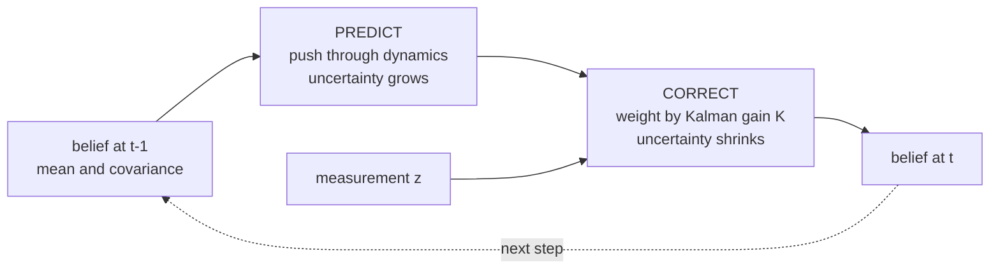
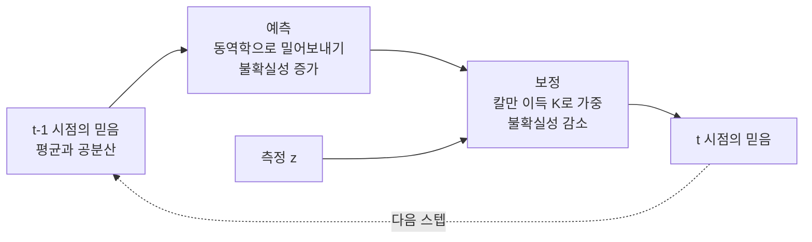

> [!note] Prerequisites · 선수 지식
> [[02-foundations/engineering-math|0.5 §3]] (integrals as expectations) · [[02-foundations/engineering-math|0.5 §10]] (set notation) · [[02-foundations/linear-algebra|1. Linear Algebra §3]] (PSD matrices, for covariance)
> [[02-foundations/engineering-math|0.5 §3]](기댓값으로서의 적분) · [[02-foundations/engineering-math|0.5 §10]](집합 표기) · [[02-foundations/linear-algebra|1. 선형대수 §3]](공분산을 위한 PSD 행렬)
>
> Connection map · 연결 지도: [[02-foundations/overview|0. Overview]]

## English

Probability is the substrate under estimation, filtering, and many standard objectives in deep
learning. Course-depth treatment: derivations, the Gaussian toolbox, a worked MLE example,
and the Kalman filter assembled from parts you'll have proven along the way.

### 1. The core language

- Axioms: $P(\Omega)=1$, $P(A)\ge 0$, additivity over disjoint events. Everything else is
  bookkeeping on top.
- **Conditioning** $P(A|B) = P(A\cap B)/P(B)$ re-weights the world after evidence.
  Chain rule: $P(A,B) = P(A|B)P(B)$.
- **Bayes' rule.** The chain rule above can factor a joint probability in either order —
  $P(\theta, x) = P(\theta|x)P(x)$ and $P(\theta, x) = P(x|\theta)P(\theta)$ — and both equal
  the same joint, so set them equal and divide by $P(x)$. That is the derivation:
  $$P(\theta|x) = \frac{P(x|\theta)\,P(\theta)}{P(x)} \;\propto\; \text{likelihood}\times\text{prior}$$
  Read it as: *what you believed before* ($P(\theta)$), reweighted by *how well each
  hypothesis explains what you just saw* ($P(x|\theta)$).
  Worked example — sensor diagnosis: a crack detector fires on 95% of cracks
  ($P(+|c)=0.95$), false-alarms 5% ($P(+|\neg c)=0.05$), cracks are rare ($P(c)=0.01$).
  $P(c|+) = \frac{0.95\cdot 0.01}{0.95\cdot 0.01 + 0.05\cdot 0.99} \approx 0.16$.
  An alarm with 95% sensitivity (and a 5% false-positive rate — two separate numbers,
  not one "accuracy") is right only 16% of the time it fires — base rates dominate. This is why
  perception pipelines calibrate.
- Independence $P(A,B) = P(A)P(B)$ vs conditional independence $P(A,B|C) = P(A|C)P(B|C)$ —
  the factorization assumptions behind graphical models, naive Bayes, and the Markov
  property alike.

### 2. Random variables and expectation

- **PMF** (probability mass function — discrete: $p(x)$ *is* the probability of $x$),
  **PDF** (probability density function — continuous: $p(x)$ is a *density*, so only
  $\int p\,dx$ over an interval is a probability, and $p(x)$ itself may exceed 1),
  **CDF** (cumulative: $F(x) = P(X \le x)$). Then $E[g(X)] = \int g(x)p(x)dx$.
- **Linearity** $E[aX + bY] = aE[X] + bE[Y]$ — *no independence needed*; the single most
  used identity in proofs. **Why that caveat is worth noticing:** with two dice,
  $E[X_1 + X_2] = 3.5 + 3.5 = 7$ whether or not the dice are glued together. Variance is
  *not* like that. Independent dice give
  $\text{Var}(X_1{+}X_2) = \tfrac{35}{12} + \tfrac{35}{12} = 5.83$ (one die:
  $E[X^2] = \tfrac{1+4+9+16+25+36}{6} = \tfrac{91}{6}$, so
  $\text{Var} = \tfrac{91}{6} - 3.5^2 = \tfrac{35}{12}$); two dice forced to show
  the same face give $X_1 + X_2 = 2X_1$ and
  $\text{Var}(2X_1) = 4\,\text{Var}(X_1) = 11.67$ — double. Means always add; spreads add only
  when things are uncorrelated. That is exactly why averaging $N$ *independent* runs shrinks
  an error bar by $\sqrt N$ and averaging $N$ correlated runs does not
  ([[02-foundations/ml-practice|9. ML Practice §4]]).
- Variance $\text{Var}(X) = E[X^2] - E[X]^2$; covariance
  $\text{Cov}(X,Y) = E[XY] - E[X]E[Y]$; for vectors, the covariance matrix
  $\Sigma = E[(x-\mu)(x-\mu)^\top]$ is PSD ([[02-foundations/linear-algebra|linear algebra]]).
- **Conditional expectation** $E[X|Y]$ is the best mean-square predictor of $X$ given $Y$ —
  the reason estimation theory keeps computing it, and what regression approximates.
- Distributions that carry this wiki: **Bernoulli/categorical** (classification losses,
  dropout masks), **Gaussian** (below), Poisson (event counts), exponential (waiting times).

### 3. The Gaussian toolbox (why Gaussians run robotics)

$\mathcal{N}(x;\mu,\Sigma) = \frac{1}{\sqrt{(2\pi)^n|\Sigma|}}\exp\big(-\tfrac12 (x-\mu)^\top\Sigma^{-1}(x-\mu)\big)$

Three **closure** properties make the Gaussian the workhorse — "closure" meaning the answer
is still a Gaussian, so you never leave the family and never need a harder distribution:

1. **Affine maps**: $x\sim\mathcal{N}(\mu,\Sigma) \Rightarrow Ax + b \sim \mathcal{N}(A\mu + b,\, A\Sigma A^\top)$.
2. **Sums** of independent Gaussians are Gaussian (variances add).
3. **Conditioning**: if $(x_1, x_2)$ jointly Gaussian,
   $$E[x_1|x_2] = \mu_1 + \Sigma_{12}\Sigma_{22}^{-1}(x_2 - \mu_2)$$
   — the conditional mean is a *linear* correction weighted by correlation-to-variance.
   Memorize the shape of this formula: it *is* the Kalman gain.

Also: CLT says sums of many independent effects → Gaussian, which is why noise models
default to it; and the Gaussian is the max-entropy distribution for fixed mean/variance
([[02-foundations/information-theory|information theory]]) — the "least presumptuous" choice.

<svg viewBox="0 0 620 214" style="max-width:100%;height:auto" role="img" aria-label="the Gaussian: one shape, width set by sigma, area always one">
  <g stroke="currentColor" stroke-width="1" opacity="0.3"><line x1="40" y1="150" x2="425" y2="150"/></g>
  <g stroke="currentColor" stroke-width="1" opacity="0.3" stroke-dasharray="3 3">
    <line x1="230.0" y1="48" x2="230.0" y2="150"/><line x1="170.6" y1="114" x2="170.6" y2="150"/><line x1="289.4" y1="114" x2="289.4" y2="150"/>
  </g>
  <path d="M40.0 149.6L41.9 149.6L43.8 149.6L45.7 149.5L47.6 149.5L49.5 149.4L51.4 149.3L53.3 149.3L55.2 149.2L57.1 149.1L59.0 149.1L60.9 149.0L62.8 148.9L64.7 148.8L66.6 148.6L68.5 148.5L70.4 148.4L72.3 148.2L74.2 148.1L76.1 147.9L78.0 147.7L79.9 147.5L81.8 147.3L83.7 147.1L85.6 146.9L87.5 146.6L89.4 146.4L91.3 146.1L93.2 145.8L95.1 145.5L97.0 145.1L98.9 144.8L100.8 144.4L102.7 144.0L104.6 143.6L106.5 143.1L108.4 142.6L110.3 142.1L112.2 141.6L114.1 141.1L116.0 140.5L117.9 139.9L119.8 139.3L121.7 138.6L123.6 138.0L125.5 137.2L127.4 136.5L129.3 135.8L131.2 135.0L133.1 134.2L135.0 133.3L136.9 132.5L138.8 131.6L140.7 130.6L142.6 129.7L144.5 128.7L146.4 127.7L148.3 126.7L150.2 125.7L152.1 124.6L154.0 123.6L155.9 122.5L157.8 121.4L159.7 120.2L161.6 119.1L163.5 118.0L165.4 116.8L167.3 115.6L169.2 114.5L171.1 113.3L173.0 112.2L174.9 111.0L176.8 109.8L178.7 108.7L180.6 107.6L182.5 106.4L184.4 105.3L186.3 104.2L188.2 103.2L190.1 102.1L192.0 101.1L193.9 100.1L195.8 99.2L197.7 98.3L199.6 97.4L201.5 96.5L203.4 95.7L205.3 95.0L207.2 94.3L209.1 93.6L211.0 93.0L212.9 92.4L214.8 91.9L216.7 91.5L218.6 91.1L220.5 90.8L222.4 90.5L224.3 90.3L226.2 90.1L228.1 90.0L230.0 90.0L231.9 90.0L233.8 90.1L235.7 90.3L237.6 90.5L239.5 90.8L241.4 91.1L243.3 91.5L245.2 91.9L247.1 92.4L249.0 93.0L250.9 93.6L252.8 94.3L254.7 95.0L256.6 95.7L258.5 96.5L260.4 97.4L262.3 98.3L264.2 99.2L266.1 100.1L268.0 101.1L269.9 102.1L271.8 103.2L273.7 104.2L275.6 105.3L277.5 106.4L279.4 107.6L281.3 108.7L283.2 109.8L285.1 111.0L287.0 112.2L288.9 113.3L290.8 114.5L292.7 115.6L294.6 116.8L296.5 118.0L298.4 119.1L300.3 120.2L302.2 121.4L304.1 122.5L306.0 123.6L307.9 124.6L309.8 125.7L311.7 126.7L313.6 127.7L315.5 128.7L317.4 129.7L319.3 130.6L321.2 131.6L323.1 132.5L325.0 133.3L326.9 134.2L328.8 135.0L330.7 135.8L332.6 136.5L334.5 137.2L336.4 138.0L338.3 138.6L340.2 139.3L342.1 139.9L344.0 140.5L345.9 141.1L347.8 141.6L349.7 142.1L351.6 142.6L353.5 143.1L355.4 143.6L357.3 144.0L359.2 144.4L361.1 144.8L363.0 145.1L364.9 145.5L366.8 145.8L368.7 146.1L370.6 146.4L372.5 146.6L374.4 146.9L376.3 147.1L378.2 147.3L380.1 147.5L382.0 147.7L383.9 147.9L385.8 148.1L387.7 148.2L389.6 148.4L391.5 148.5L393.4 148.6L395.3 148.8L397.2 148.9L399.1 149.0L401.0 149.1L402.9 149.1L404.8 149.2L406.7 149.3L408.6 149.3L410.5 149.4L412.4 149.5L414.3 149.5L416.2 149.6L418.1 149.6L420.0 149.6" fill="none" stroke="currentColor" stroke-width="2"/>
  <path d="M40.0 150.0L41.9 150.0L43.8 150.0L45.7 150.0L47.6 150.0L49.5 150.0L51.4 150.0L53.3 150.0L55.2 150.0L57.1 150.0L59.0 150.0L60.9 150.0L62.8 150.0L64.7 150.0L66.6 150.0L68.5 150.0L70.4 150.0L72.3 150.0L74.2 150.0L76.1 150.0L78.0 150.0L79.9 150.0L81.8 150.0L83.7 150.0L85.6 150.0L87.5 150.0L89.4 150.0L91.3 149.9L93.2 149.9L95.1 149.9L97.0 149.9L98.9 149.9L100.8 149.9L102.7 149.8L104.6 149.8L106.5 149.8L108.4 149.7L110.3 149.6L112.2 149.6L114.1 149.5L116.0 149.4L117.9 149.3L119.8 149.2L121.7 149.0L123.6 148.8L125.5 148.6L127.4 148.4L129.3 148.2L131.2 147.9L133.1 147.5L135.0 147.1L136.9 146.7L138.8 146.2L140.7 145.7L142.6 145.1L144.5 144.4L146.4 143.6L148.3 142.8L150.2 141.9L152.1 140.8L154.0 139.7L155.9 138.5L157.8 137.2L159.7 135.7L161.6 134.2L163.5 132.5L165.4 130.7L167.3 128.7L169.2 126.7L171.1 124.5L173.0 122.2L174.9 119.8L176.8 117.2L178.7 114.5L180.6 111.8L182.5 108.9L184.4 105.9L186.3 102.9L188.2 99.8L190.1 96.6L192.0 93.4L193.9 90.2L195.8 86.9L197.7 83.7L199.6 80.5L201.5 77.4L203.4 74.3L205.3 71.4L207.2 68.5L209.1 65.8L211.0 63.3L212.9 60.9L214.8 58.7L216.7 56.7L218.6 55.0L220.5 53.5L222.4 52.2L224.3 51.3L226.2 50.6L228.1 50.1L230.0 50.0L231.9 50.1L233.8 50.6L235.7 51.3L237.6 52.2L239.5 53.5L241.4 55.0L243.3 56.7L245.2 58.7L247.1 60.9L249.0 63.3L250.9 65.8L252.8 68.5L254.7 71.4L256.6 74.3L258.5 77.4L260.4 80.5L262.3 83.7L264.2 86.9L266.1 90.2L268.0 93.4L269.9 96.6L271.8 99.8L273.7 102.9L275.6 105.9L277.5 108.9L279.4 111.8L281.3 114.5L283.2 117.2L285.1 119.8L287.0 122.2L288.9 124.5L290.8 126.7L292.7 128.7L294.6 130.7L296.5 132.5L298.4 134.2L300.3 135.7L302.2 137.2L304.1 138.5L306.0 139.7L307.9 140.8L309.8 141.9L311.7 142.8L313.6 143.6L315.5 144.4L317.4 145.1L319.3 145.7L321.2 146.2L323.1 146.7L325.0 147.1L326.9 147.5L328.8 147.9L330.7 148.2L332.6 148.4L334.5 148.6L336.4 148.8L338.3 149.0L340.2 149.2L342.1 149.3L344.0 149.4L345.9 149.5L347.8 149.6L349.7 149.6L351.6 149.7L353.5 149.8L355.4 149.8L357.3 149.8L359.2 149.9L361.1 149.9L363.0 149.9L364.9 149.9L366.8 149.9L368.7 149.9L370.6 150.0L372.5 150.0L374.4 150.0L376.3 150.0L378.2 150.0L380.1 150.0L382.0 150.0L383.9 150.0L385.8 150.0L387.7 150.0L389.6 150.0L391.5 150.0L393.4 150.0L395.3 150.0L397.2 150.0L399.1 150.0L401.0 150.0L402.9 150.0L404.8 150.0L406.7 150.0L408.6 150.0L410.5 150.0L412.4 150.0L414.3 150.0L416.2 150.0L418.1 150.0L420.0 150.0" fill="none" stroke="currentColor" stroke-width="1.6" opacity="0.6" stroke-dasharray="6 4"/>
  <path d="M40.0 143.1L41.9 142.9L43.8 142.7L45.7 142.5L47.6 142.2L49.5 142.0L51.4 141.7L53.3 141.5L55.2 141.3L57.1 141.0L59.0 140.7L60.9 140.5L62.8 140.2L64.7 139.9L66.6 139.6L68.5 139.4L70.4 139.1L72.3 138.8L74.2 138.5L76.1 138.2L78.0 137.9L79.9 137.6L81.8 137.3L83.7 136.9L85.6 136.6L87.5 136.3L89.4 136.0L91.3 135.6L93.2 135.3L95.1 135.0L97.0 134.6L98.9 134.3L100.8 133.9L102.7 133.6L104.6 133.3L106.5 132.9L108.4 132.6L110.3 132.2L112.2 131.8L114.1 131.5L116.0 131.1L117.9 130.8L119.8 130.4L121.7 130.1L123.6 129.7L125.5 129.3L127.4 129.0L129.3 128.6L131.2 128.3L133.1 127.9L135.0 127.5L136.9 127.2L138.8 126.8L140.7 126.5L142.6 126.1L144.5 125.8L146.4 125.5L148.3 125.1L150.2 124.8L152.1 124.4L154.0 124.1L155.9 123.8L157.8 123.5L159.7 123.2L161.6 122.8L163.5 122.5L165.4 122.2L167.3 121.9L169.2 121.6L171.1 121.4L173.0 121.1L174.9 120.8L176.8 120.6L178.7 120.3L180.6 120.0L182.5 119.8L184.4 119.6L186.3 119.3L188.2 119.1L190.1 118.9L192.0 118.7L193.9 118.5L195.8 118.3L197.7 118.2L199.6 118.0L201.5 117.8L203.4 117.7L205.3 117.5L207.2 117.4L209.1 117.3L211.0 117.2L212.9 117.1L214.8 117.0L216.7 116.9L218.6 116.9L220.5 116.8L222.4 116.8L224.3 116.7L226.2 116.7L228.1 116.7L230.0 116.7L231.9 116.7L233.8 116.7L235.7 116.7L237.6 116.8L239.5 116.8L241.4 116.9L243.3 116.9L245.2 117.0L247.1 117.1L249.0 117.2L250.9 117.3L252.8 117.4L254.7 117.5L256.6 117.7L258.5 117.8L260.4 118.0L262.3 118.2L264.2 118.3L266.1 118.5L268.0 118.7L269.9 118.9L271.8 119.1L273.7 119.3L275.6 119.6L277.5 119.8L279.4 120.0L281.3 120.3L283.2 120.6L285.1 120.8L287.0 121.1L288.9 121.4L290.8 121.6L292.7 121.9L294.6 122.2L296.5 122.5L298.4 122.8L300.3 123.2L302.2 123.5L304.1 123.8L306.0 124.1L307.9 124.4L309.8 124.8L311.7 125.1L313.6 125.5L315.5 125.8L317.4 126.1L319.3 126.5L321.2 126.8L323.1 127.2L325.0 127.5L326.9 127.9L328.8 128.3L330.7 128.6L332.6 129.0L334.5 129.3L336.4 129.7L338.3 130.1L340.2 130.4L342.1 130.8L344.0 131.1L345.9 131.5L347.8 131.8L349.7 132.2L351.6 132.6L353.5 132.9L355.4 133.3L357.3 133.6L359.2 133.9L361.1 134.3L363.0 134.6L364.9 135.0L366.8 135.3L368.7 135.6L370.6 136.0L372.5 136.3L374.4 136.6L376.3 136.9L378.2 137.3L380.1 137.6L382.0 137.9L383.9 138.2L385.8 138.5L387.7 138.8L389.6 139.1L391.5 139.4L393.4 139.6L395.3 139.9L397.2 140.2L399.1 140.5L401.0 140.7L402.9 141.0L404.8 141.3L406.7 141.5L408.6 141.7L410.5 142.0L412.4 142.2L414.3 142.5L416.2 142.7L418.1 142.9L420.0 143.1" fill="none" stroke="currentColor" stroke-width="1.5" opacity="0.4" stroke-dasharray="2 3"/>
  <g font-size="10.5" fill="currentColor" text-anchor="middle">
    <text x="230.0" y="166">&#956;</text><text x="170.6" y="166">&#956;&#8722;&#963;</text><text x="289.4" y="166">&#956;+&#963;</text>
  </g>
  <g stroke="currentColor"><line x1="40" y1="182" x2="66" y2="182" stroke-width="2"/><line x1="146" y1="182" x2="172" y2="182" stroke-width="1.6" opacity="0.6" stroke-dasharray="6 4"/><line x1="286" y1="182" x2="312" y2="182" stroke-width="1.5" opacity="0.4" stroke-dasharray="2 3"/></g>
  <g font-size="10.5" fill="currentColor">
    <text x="72" y="186">&#963; = 1</text><text x="178" y="186">&#963; = 0.6 (more certain)</text><text x="318" y="186">&#963; = 1.8 (less certain)</text>
    <text x="40" y="208" opacity="0.9">Every Gaussian is this one curve rescaled. Narrower means more certain &#8212; and taller, because the area is always 1.</text>
  </g>
</svg>

### 4. Estimation — where loss functions come from

- **MLE**: $\hat\theta = \arg\max_\theta \sum_i \log p(x_i|\theta)$.
  Worked example (Gaussian mean): $\log p = -\frac{(x-\mu)^2}{2\sigma^2} + \text{const}$ ⇒
  maximizing likelihood ≡ minimizing squared error; $\hat\mu = \bar{x}$.
  **With actual data:** five distance readings $2.1, 1.9, 2.4, 1.6, 2.0$ m of one wall.
  MLE says the best estimate is the plain average, $\hat\mu = 10.0/5 = 2.0$ m. Nothing
  fancier is optimal *given the Gaussian assumption* — and that is the point: "take the mean"
  is not a habit, it is the maximum-likelihood answer for Gaussian noise. Change the noise
  model and the answer changes: assume Laplace noise instead and the MLE becomes the
  **median** ($2.0$ here too, but it would differ if one reading were $9.0$ — the mean would
  jump to $3.4$ and the median would not move). *Every loss function is a noise assumption in
  disguise.*
  **MSE regression is MLE under Gaussian noise; cross-entropy is MLE for categorical
  outputs.** Many pretraining objectives in [[01-canonical-papers/canonical-list|the paper list]]
  are MLE or a bound on one ([[01-canonical-papers/notes/6-diffusion/vae|ELBO]]) —
  though not all: contrastive and some self-supervised objectives are not simple MLE.
- **MAP**: add $\log p(\theta)$. A Gaussian prior on weights ⇒ $+\lambda\|\theta\|^2$ —
  weight decay is a prior in disguise; L1 prior (Laplace) ⇒ sparsity.
- Estimator quality: **bias** (how far the estimate is off *on average*, over many datasets),
  **variance** (how much it jumps around between datasets), and the tradeoff between them — the vocabulary behind
  "our estimator is unbiased but high-variance" in RL papers
  ([[02-foundations/rl-basics|policy gradients]]).

### 5. Random processes and the Kalman filter

- A random process = an indexed family of RVs; characterized by its mean function and its
  **autocorrelation** — $E[x(t)x(t+\tau)]$, how strongly the signal at one instant predicts
  itself $\tau$ later (a noisy signal's frequency content, seen in the time domain).
  **Stationarity / WSS** (*wide-sense stationary*: the mean and autocorrelation don't depend
  on *when* you look, only on the gap $\tau$): statistics don't drift (assumption behind spectral
  analysis, [[02-foundations/signal-processing|signal processing]]).
  **White noise**: uncorrelated samples, flat spectrum — the default disturbance model and
  the $\epsilon$ of [[01-canonical-papers/notes/6-diffusion/ddpm|diffusion]].
- **Markov property**: future ⟂ past | present. The modeling assumption of MDPs
  ([[02-foundations/rl-basics|RL]]), world models, and diffusion chains.
- **Kalman filter, assembled from this page**: model
  $x_{t+1} = Ax_t + w$, $y_t = Cx_t + v$ with Gaussian $w \sim \mathcal{N}(0,Q)$,
  $v \sim \mathcal{N}(0,R)$.
  - *Predict* (affine property): $\hat x^- = A\hat x$, $P^- = APA^\top + Q$ — here $P$ is
    the **estimate covariance** (uncertainty of $\hat x$) and $Q$ the process-noise covariance.
  - *Update* (Gaussian conditioning): $K = P^-C^\top(CP^-C^\top + R)^{-1}$,
    $\hat x = \hat x^- + K(y - C\hat x^-)$, $P = (I - KC)P^-$.
  Nothing new was needed: affine closure + conditioning formula = optimal recursive
  estimation.
- **The gain, in one scalar example.** You believe a wall is $10$ cm away with variance
  $P^- = 4$ (so $\pm2$ cm), and a sensor with variance $R = 1$ (so $\pm1$ cm) reads $12$.
  Then $K = \frac{P^-}{P^- + R} = \frac{4}{5} = 0.8$, so
  $\hat x = 10 + 0.8(12-10) = 11.6$ and $P = (1-K)P^- = 0.8$. Three things worth reading off:
  the estimate landed **closer to the sensor** because the sensor was the more trustworthy of
  the two; the new uncertainty $0.8$ is **smaller than either input** ($4$ and $1$) — combining
  two noisy opinions beats both; and if you set $R = 100$ (a terrible sensor) you get
  $K = 0.04$ and $\hat x = 10.08$, i.e. the filter almost ignores it. The gain is just
  *relative trust*, and that is all any Kalman-gain sentence in a paper is saying.

 Nonlinear versions (EKF/UKF) linearize or sample; SLAM scales this to maps.

### Self-check

1. Recompute the crack-detector example with $P(c) = 0.2$ (a suspect structure). What
   happens to $P(c|+)$ and what does that say about deploying detectors in high-risk zones?
2. Derive "MSE = Gaussian MLE" and "cross-entropy = categorical MLE" from the definitions.
3. Using affine closure, show why $x_t = \sqrt{\bar\alpha_t}x_0 + \sqrt{1-\bar\alpha_t}\epsilon$
   ([[01-canonical-papers/notes/6-diffusion/ddpm|DDPM]]) has the claimed distribution.
4. In the Kalman gain, what happens as sensor noise $R \to 0$? As $R \to \infty$? Interpret.

> [!tip]- Answers
> 1. $P(c|+) = \frac{0.95 \times 0.2}{0.95\times 0.2 + 0.05\times 0.8} = \frac{0.19}{0.23} \approx 0.83$. The same detector's alarm jumps from 16% to 83% trustworthy purely because the base rate rose — a detector's value is set by *where you deploy it*, not by its sensitivity alone.
> 2. Gaussian: $\log p = -\frac{(x-\mu)^2}{2\sigma^2} + C$, so maximizing the likelihood is minimizing the sum of squares (MSE). Categorical: $\log\prod_i p_{y_i} = \sum_i \log p_{y_i}$, so maximizing it is minimizing $-\sum_i\log p_{y_i}$ — exactly cross-entropy.
> 3. $\sqrt{\bar\alpha_t}\,x_0$ is an affine map of $x_0$ and $\sqrt{1-\bar\alpha_t}\,\epsilon$ is an independent Gaussian. By affine closure the first is Gaussian, by sum closure the total is Gaussian, and the mean/variance can be read straight off: $\mathcal{N}(\sqrt{\bar\alpha_t}x_0,\,(1-\bar\alpha_t)I)$.
> 4. $R \to 0$: the gain $K$ grows and the estimate snaps onto the measurement (the sensor is trusted completely). $R \to \infty$: $K \to 0$, the measurement is ignored and the filter coasts on the model prediction. The gain is a *ratio* of trust, not a tuning knob set by hand.

### Robotics bridge

Bayesian conditioning becomes a time-indexed robot algorithm in [[04-robotics/state-estimation-slam|State Estimation, Localization & SLAM]].

## 한국어

확률은 추정, 필터링, 그리고 딥러닝의 많은 표준 목적함수 아래에 깔린 토대다. 교재 수준의 서술:
유도, 가우시안 도구 상자, MLE 계산 예제, 그리고 이 페이지에서 증명한 부품들로 조립하는
칼만 필터까지.

### 1. 핵심 언어

- 공리: $P(\Omega)=1$, $P(A)\ge 0$, 서로소 사건의 가산성. 나머지는 이 위의 장부 정리다.
- **조건화** $P(A|B) = P(A\cap B)/P(B)$는 증거를 본 뒤 세계를 재가중한다.
  연쇄 법칙: $P(A,B) = P(A|B)P(B)$.
- **베이즈 정리.** 위의 연쇄 법칙은 결합 확률을 두 순서로 분해할 수 있다 —
  $P(\theta, x) = P(\theta|x)P(x)$와 $P(\theta, x) = P(x|\theta)P(\theta)$ — 둘 다 같은 결합
  확률이므로 서로 같다고 놓고 $P(x)$로 나누면 끝이다. 유도가 이게 전부다:
  $$P(\theta|x) = \frac{P(x|\theta)\,P(\theta)}{P(x)} \;\propto\; \text{우도}\times\text{사전}$$
  읽는 법: *이전에 믿고 있던 것*($P(\theta)$)을, *각 가설이 방금 본 것을 얼마나 잘
  설명하는가*($P(x|\theta)$)로 다시 가중한 것.
  계산 예제 — 센서 진단: 균열 감지기가 균열의 95%에서 울리고($P(+|c)=0.95$), 오경보율
  5%($P(+|\neg c)=0.05$), 균열은 드물다($P(c)=0.01$).
  $P(c|+) = \frac{0.95\cdot 0.01}{0.95\cdot 0.01 + 0.05\cdot 0.99} \approx 0.16$.
  민감도 95%짜리(그리고 오경보율 5% — "정확도" 하나가 아니라 별개의 두 숫자다) 경보가
  울렸을 때 실제로는 16%만 맞는다 — 기저율이 지배한다. 인식 파이프라인이
  캘리브레이션을 하는 이유다.
- 독립 $P(A,B) = P(A)P(B)$ vs 조건부 독립 $P(A,B|C) = P(A|C)P(B|C)$ — 그래프 모델,
  나이브 베이즈, 마르코프 성질이 공유하는 인수분해 가정.

### 2. 확률변수와 기댓값

- **PMF**(확률질량함수 — 이산: $p(x)$가 곧 $x$의 확률),
  **PDF**(확률밀도함수 — 연속: $p(x)$는 *밀도*라서 구간에 대한 $\int p\,dx$만이 확률이고,
  $p(x)$ 자체는 1을 넘을 수도 있다),
  **CDF**(누적: $F(x) = P(X \le x)$). 그 위에서 $E[g(X)] = \int g(x)p(x)dx$.
- **선형성** $E[aX + bY] = aE[X] + bE[Y]$ — *독립이 필요 없다*; 증명에서 가장 많이 쓰는
  항등식. **그 단서가 왜 눈여겨볼 점인가:** 주사위 둘이면 $E[X_1 + X_2] = 3.5 + 3.5 = 7$이고,
  두 주사위가 붙어 있든 말든 그렇다. 분산은 *그렇지 않다*. 독립인 주사위 둘은
  $\text{Var}(X_1{+}X_2) = \tfrac{35}{12} + \tfrac{35}{12} = 5.83$이지만(주사위 하나:
  $E[X^2] = \tfrac{1+4+9+16+25+36}{6} = \tfrac{91}{6}$이므로
  $\text{Var} = \tfrac{91}{6} - 3.5^2 = \tfrac{35}{12}$), 항상 같은 눈이 나오게
  묶인 두 주사위는 $X_1 + X_2 = 2X_1$이라
  $\text{Var}(2X_1) = 4\,\text{Var}(X_1) = 11.67$ — 두 배다. 평균은 언제나 더해지지만, 퍼짐은
  서로 무관할 때만 더해진다. *독립인* 실행 $N$번을 평균 내면 오차 막대가 $\sqrt N$배로 줄고
  상관된 실행 $N$번은 그렇지 않은 이유가 정확히 이것이다
  ([[02-foundations/ml-practice|9. ML 실무 §4]]).
- 분산 $\text{Var}(X) = E[X^2] - E[X]^2$; 공분산 $\text{Cov}(X,Y) = E[XY] - E[X]E[Y]$;
  벡터의 공분산 행렬 $\Sigma = E[(x-\mu)(x-\mu)^\top]$는 PSD다
  ([[02-foundations/linear-algebra|선형대수]]).
- **조건부 기댓값** $E[X|Y]$는 $Y$가 주어졌을 때 $X$의 평균제곱 최적 예측기 — 추정 이론이
  끊임없이 이것을 계산하는 이유이자, 회귀가 근사하는 대상.
- 이 위키를 떠받치는 분포들: **베르누이/카테고리**(분류 손실, 드롭아웃 마스크),
  **가우시안**(아래), 포아송(사건 횟수), 지수(대기 시간).

### 3. 가우시안 도구 상자 (가우시안이 로보틱스를 굴리는 이유)

$\mathcal{N}(x;\mu,\Sigma) = \frac{1}{\sqrt{(2\pi)^n|\Sigma|}}\exp\big(-\tfrac12 (x-\mu)^\top\Sigma^{-1}(x-\mu)\big)$

세 가지 **닫힘(closure)** 성질이 가우시안을 주력으로 만든다 — "닫힘"이란 결과가 여전히
가우시안이라는 뜻이다. 즉 이 가족을 벗어날 일이 없고, 더 어려운 분포가 필요해지지 않는다:

1. **아핀 사상**: $x\sim\mathcal{N}(\mu,\Sigma) \Rightarrow Ax + b \sim \mathcal{N}(A\mu + b,\, A\Sigma A^\top)$
2. 독립 가우시안의 **합**은 가우시안 (분산이 더해진다).
3. **조건화**: $(x_1, x_2)$가 결합 가우시안이면
   $$E[x_1|x_2] = \mu_1 + \Sigma_{12}\Sigma_{22}^{-1}(x_2 - \mu_2)$$
   — 조건부 평균은 상관/분산으로 가중된 *선형* 보정이다. 이 공식의 모양을 기억하라:
   이것이 *곧* 칼만 이득이다.

또한: CLT는 많은 독립 효과의 합이 → 가우시안이라 말한다(노이즈 모델의 기본값인 이유);
그리고 가우시안은 평균·분산이 고정일 때 최대 엔트로피 분포다
([[02-foundations/information-theory|정보이론]]) — "가장 덜 주제넘은" 선택.

<svg viewBox="0 0 620 214" style="max-width:100%;height:auto" role="img" aria-label="가우시안: 모양은 하나, 폭은 sigma가 정하고, 넓이는 언제나 1">
  <g stroke="currentColor" stroke-width="1" opacity="0.3"><line x1="40" y1="150" x2="425" y2="150"/></g>
  <g stroke="currentColor" stroke-width="1" opacity="0.3" stroke-dasharray="3 3">
    <line x1="230.0" y1="48" x2="230.0" y2="150"/><line x1="170.6" y1="114" x2="170.6" y2="150"/><line x1="289.4" y1="114" x2="289.4" y2="150"/>
  </g>
  <path d="M40.0 149.6L41.9 149.6L43.8 149.6L45.7 149.5L47.6 149.5L49.5 149.4L51.4 149.3L53.3 149.3L55.2 149.2L57.1 149.1L59.0 149.1L60.9 149.0L62.8 148.9L64.7 148.8L66.6 148.6L68.5 148.5L70.4 148.4L72.3 148.2L74.2 148.1L76.1 147.9L78.0 147.7L79.9 147.5L81.8 147.3L83.7 147.1L85.6 146.9L87.5 146.6L89.4 146.4L91.3 146.1L93.2 145.8L95.1 145.5L97.0 145.1L98.9 144.8L100.8 144.4L102.7 144.0L104.6 143.6L106.5 143.1L108.4 142.6L110.3 142.1L112.2 141.6L114.1 141.1L116.0 140.5L117.9 139.9L119.8 139.3L121.7 138.6L123.6 138.0L125.5 137.2L127.4 136.5L129.3 135.8L131.2 135.0L133.1 134.2L135.0 133.3L136.9 132.5L138.8 131.6L140.7 130.6L142.6 129.7L144.5 128.7L146.4 127.7L148.3 126.7L150.2 125.7L152.1 124.6L154.0 123.6L155.9 122.5L157.8 121.4L159.7 120.2L161.6 119.1L163.5 118.0L165.4 116.8L167.3 115.6L169.2 114.5L171.1 113.3L173.0 112.2L174.9 111.0L176.8 109.8L178.7 108.7L180.6 107.6L182.5 106.4L184.4 105.3L186.3 104.2L188.2 103.2L190.1 102.1L192.0 101.1L193.9 100.1L195.8 99.2L197.7 98.3L199.6 97.4L201.5 96.5L203.4 95.7L205.3 95.0L207.2 94.3L209.1 93.6L211.0 93.0L212.9 92.4L214.8 91.9L216.7 91.5L218.6 91.1L220.5 90.8L222.4 90.5L224.3 90.3L226.2 90.1L228.1 90.0L230.0 90.0L231.9 90.0L233.8 90.1L235.7 90.3L237.6 90.5L239.5 90.8L241.4 91.1L243.3 91.5L245.2 91.9L247.1 92.4L249.0 93.0L250.9 93.6L252.8 94.3L254.7 95.0L256.6 95.7L258.5 96.5L260.4 97.4L262.3 98.3L264.2 99.2L266.1 100.1L268.0 101.1L269.9 102.1L271.8 103.2L273.7 104.2L275.6 105.3L277.5 106.4L279.4 107.6L281.3 108.7L283.2 109.8L285.1 111.0L287.0 112.2L288.9 113.3L290.8 114.5L292.7 115.6L294.6 116.8L296.5 118.0L298.4 119.1L300.3 120.2L302.2 121.4L304.1 122.5L306.0 123.6L307.9 124.6L309.8 125.7L311.7 126.7L313.6 127.7L315.5 128.7L317.4 129.7L319.3 130.6L321.2 131.6L323.1 132.5L325.0 133.3L326.9 134.2L328.8 135.0L330.7 135.8L332.6 136.5L334.5 137.2L336.4 138.0L338.3 138.6L340.2 139.3L342.1 139.9L344.0 140.5L345.9 141.1L347.8 141.6L349.7 142.1L351.6 142.6L353.5 143.1L355.4 143.6L357.3 144.0L359.2 144.4L361.1 144.8L363.0 145.1L364.9 145.5L366.8 145.8L368.7 146.1L370.6 146.4L372.5 146.6L374.4 146.9L376.3 147.1L378.2 147.3L380.1 147.5L382.0 147.7L383.9 147.9L385.8 148.1L387.7 148.2L389.6 148.4L391.5 148.5L393.4 148.6L395.3 148.8L397.2 148.9L399.1 149.0L401.0 149.1L402.9 149.1L404.8 149.2L406.7 149.3L408.6 149.3L410.5 149.4L412.4 149.5L414.3 149.5L416.2 149.6L418.1 149.6L420.0 149.6" fill="none" stroke="currentColor" stroke-width="2"/>
  <path d="M40.0 150.0L41.9 150.0L43.8 150.0L45.7 150.0L47.6 150.0L49.5 150.0L51.4 150.0L53.3 150.0L55.2 150.0L57.1 150.0L59.0 150.0L60.9 150.0L62.8 150.0L64.7 150.0L66.6 150.0L68.5 150.0L70.4 150.0L72.3 150.0L74.2 150.0L76.1 150.0L78.0 150.0L79.9 150.0L81.8 150.0L83.7 150.0L85.6 150.0L87.5 150.0L89.4 150.0L91.3 149.9L93.2 149.9L95.1 149.9L97.0 149.9L98.9 149.9L100.8 149.9L102.7 149.8L104.6 149.8L106.5 149.8L108.4 149.7L110.3 149.6L112.2 149.6L114.1 149.5L116.0 149.4L117.9 149.3L119.8 149.2L121.7 149.0L123.6 148.8L125.5 148.6L127.4 148.4L129.3 148.2L131.2 147.9L133.1 147.5L135.0 147.1L136.9 146.7L138.8 146.2L140.7 145.7L142.6 145.1L144.5 144.4L146.4 143.6L148.3 142.8L150.2 141.9L152.1 140.8L154.0 139.7L155.9 138.5L157.8 137.2L159.7 135.7L161.6 134.2L163.5 132.5L165.4 130.7L167.3 128.7L169.2 126.7L171.1 124.5L173.0 122.2L174.9 119.8L176.8 117.2L178.7 114.5L180.6 111.8L182.5 108.9L184.4 105.9L186.3 102.9L188.2 99.8L190.1 96.6L192.0 93.4L193.9 90.2L195.8 86.9L197.7 83.7L199.6 80.5L201.5 77.4L203.4 74.3L205.3 71.4L207.2 68.5L209.1 65.8L211.0 63.3L212.9 60.9L214.8 58.7L216.7 56.7L218.6 55.0L220.5 53.5L222.4 52.2L224.3 51.3L226.2 50.6L228.1 50.1L230.0 50.0L231.9 50.1L233.8 50.6L235.7 51.3L237.6 52.2L239.5 53.5L241.4 55.0L243.3 56.7L245.2 58.7L247.1 60.9L249.0 63.3L250.9 65.8L252.8 68.5L254.7 71.4L256.6 74.3L258.5 77.4L260.4 80.5L262.3 83.7L264.2 86.9L266.1 90.2L268.0 93.4L269.9 96.6L271.8 99.8L273.7 102.9L275.6 105.9L277.5 108.9L279.4 111.8L281.3 114.5L283.2 117.2L285.1 119.8L287.0 122.2L288.9 124.5L290.8 126.7L292.7 128.7L294.6 130.7L296.5 132.5L298.4 134.2L300.3 135.7L302.2 137.2L304.1 138.5L306.0 139.7L307.9 140.8L309.8 141.9L311.7 142.8L313.6 143.6L315.5 144.4L317.4 145.1L319.3 145.7L321.2 146.2L323.1 146.7L325.0 147.1L326.9 147.5L328.8 147.9L330.7 148.2L332.6 148.4L334.5 148.6L336.4 148.8L338.3 149.0L340.2 149.2L342.1 149.3L344.0 149.4L345.9 149.5L347.8 149.6L349.7 149.6L351.6 149.7L353.5 149.8L355.4 149.8L357.3 149.8L359.2 149.9L361.1 149.9L363.0 149.9L364.9 149.9L366.8 149.9L368.7 149.9L370.6 150.0L372.5 150.0L374.4 150.0L376.3 150.0L378.2 150.0L380.1 150.0L382.0 150.0L383.9 150.0L385.8 150.0L387.7 150.0L389.6 150.0L391.5 150.0L393.4 150.0L395.3 150.0L397.2 150.0L399.1 150.0L401.0 150.0L402.9 150.0L404.8 150.0L406.7 150.0L408.6 150.0L410.5 150.0L412.4 150.0L414.3 150.0L416.2 150.0L418.1 150.0L420.0 150.0" fill="none" stroke="currentColor" stroke-width="1.6" opacity="0.6" stroke-dasharray="6 4"/>
  <path d="M40.0 143.1L41.9 142.9L43.8 142.7L45.7 142.5L47.6 142.2L49.5 142.0L51.4 141.7L53.3 141.5L55.2 141.3L57.1 141.0L59.0 140.7L60.9 140.5L62.8 140.2L64.7 139.9L66.6 139.6L68.5 139.4L70.4 139.1L72.3 138.8L74.2 138.5L76.1 138.2L78.0 137.9L79.9 137.6L81.8 137.3L83.7 136.9L85.6 136.6L87.5 136.3L89.4 136.0L91.3 135.6L93.2 135.3L95.1 135.0L97.0 134.6L98.9 134.3L100.8 133.9L102.7 133.6L104.6 133.3L106.5 132.9L108.4 132.6L110.3 132.2L112.2 131.8L114.1 131.5L116.0 131.1L117.9 130.8L119.8 130.4L121.7 130.1L123.6 129.7L125.5 129.3L127.4 129.0L129.3 128.6L131.2 128.3L133.1 127.9L135.0 127.5L136.9 127.2L138.8 126.8L140.7 126.5L142.6 126.1L144.5 125.8L146.4 125.5L148.3 125.1L150.2 124.8L152.1 124.4L154.0 124.1L155.9 123.8L157.8 123.5L159.7 123.2L161.6 122.8L163.5 122.5L165.4 122.2L167.3 121.9L169.2 121.6L171.1 121.4L173.0 121.1L174.9 120.8L176.8 120.6L178.7 120.3L180.6 120.0L182.5 119.8L184.4 119.6L186.3 119.3L188.2 119.1L190.1 118.9L192.0 118.7L193.9 118.5L195.8 118.3L197.7 118.2L199.6 118.0L201.5 117.8L203.4 117.7L205.3 117.5L207.2 117.4L209.1 117.3L211.0 117.2L212.9 117.1L214.8 117.0L216.7 116.9L218.6 116.9L220.5 116.8L222.4 116.8L224.3 116.7L226.2 116.7L228.1 116.7L230.0 116.7L231.9 116.7L233.8 116.7L235.7 116.7L237.6 116.8L239.5 116.8L241.4 116.9L243.3 116.9L245.2 117.0L247.1 117.1L249.0 117.2L250.9 117.3L252.8 117.4L254.7 117.5L256.6 117.7L258.5 117.8L260.4 118.0L262.3 118.2L264.2 118.3L266.1 118.5L268.0 118.7L269.9 118.9L271.8 119.1L273.7 119.3L275.6 119.6L277.5 119.8L279.4 120.0L281.3 120.3L283.2 120.6L285.1 120.8L287.0 121.1L288.9 121.4L290.8 121.6L292.7 121.9L294.6 122.2L296.5 122.5L298.4 122.8L300.3 123.2L302.2 123.5L304.1 123.8L306.0 124.1L307.9 124.4L309.8 124.8L311.7 125.1L313.6 125.5L315.5 125.8L317.4 126.1L319.3 126.5L321.2 126.8L323.1 127.2L325.0 127.5L326.9 127.9L328.8 128.3L330.7 128.6L332.6 129.0L334.5 129.3L336.4 129.7L338.3 130.1L340.2 130.4L342.1 130.8L344.0 131.1L345.9 131.5L347.8 131.8L349.7 132.2L351.6 132.6L353.5 132.9L355.4 133.3L357.3 133.6L359.2 133.9L361.1 134.3L363.0 134.6L364.9 135.0L366.8 135.3L368.7 135.6L370.6 136.0L372.5 136.3L374.4 136.6L376.3 136.9L378.2 137.3L380.1 137.6L382.0 137.9L383.9 138.2L385.8 138.5L387.7 138.8L389.6 139.1L391.5 139.4L393.4 139.6L395.3 139.9L397.2 140.2L399.1 140.5L401.0 140.7L402.9 141.0L404.8 141.3L406.7 141.5L408.6 141.7L410.5 142.0L412.4 142.2L414.3 142.5L416.2 142.7L418.1 142.9L420.0 143.1" fill="none" stroke="currentColor" stroke-width="1.5" opacity="0.4" stroke-dasharray="2 3"/>
  <g font-size="10.5" fill="currentColor" text-anchor="middle">
    <text x="230.0" y="166">&#956;</text><text x="170.6" y="166">&#956;&#8722;&#963;</text><text x="289.4" y="166">&#956;+&#963;</text>
  </g>
  <g stroke="currentColor"><line x1="40" y1="182" x2="66" y2="182" stroke-width="2"/><line x1="146" y1="182" x2="172" y2="182" stroke-width="1.6" opacity="0.6" stroke-dasharray="6 4"/><line x1="286" y1="182" x2="312" y2="182" stroke-width="1.5" opacity="0.4" stroke-dasharray="2 3"/></g>
  <g font-size="10.5" fill="currentColor">
    <text x="72" y="186">&#963; = 1</text><text x="178" y="186">&#963; = 0.6 (더 확신)</text><text x="318" y="186">&#963; = 1.8 (덜 확신)</text>
    <text x="40" y="208" opacity="0.9">모든 가우시안은 이 곡선 하나를 다시 스케일한 것이다. 좁을수록 더 확신하는 것이고, 넓이가 항상 1이므로 그만큼 높아진다.</text>
  </g>
</svg>

### 4. 추정 — 손실함수의 출생지

- **MLE**: $\hat\theta = \arg\max_\theta \sum_i \log p(x_i|\theta)$.
  계산 예제(가우시안 평균): $\log p = -\frac{(x-\mu)^2}{2\sigma^2} + \text{상수}$ ⇒
  우도 최대화 ≡ 제곱 오차 최소화; $\hat\mu = \bar{x}$.
  **실제 데이터로:** 같은 벽을 잰 거리 측정값 다섯 개 $2.1, 1.9, 2.4, 1.6, 2.0$ m. MLE는 최선의
  추정이 그냥 평균, $\hat\mu = 10.0/5 = 2.0$ m라고 말한다. *가우시안 가정 아래에서는* 더
  정교한 무언가가 최적이 아니다 — 그리고 그것이 핵심이다: "평균을 취한다"는 습관이 아니라
  가우시안 잡음에 대한 최대우도 답이다. 잡음 모델을 바꾸면 답이 바뀐다: 라플라스 잡음을
  가정하면 MLE는 **중앙값**이 된다(여기서는 $2.0$으로 같지만, 측정값 하나가 $9.0$이었다면
  평균은 $3.4$로 튀고 중앙값은 꿈쩍도 않는다). *모든 손실 함수는 변장한 잡음 가정이다.*
  **MSE 회귀는 가우시안 노이즈 하의 MLE이고, 교차 엔트로피는 카테고리 출력의 MLE다.**
  [[01-canonical-papers/canonical-list|논문 리스트]]의 많은 사전학습 목적함수가 MLE 또는 그
  하한([[01-canonical-papers/notes/6-diffusion/vae|ELBO]])이다 — 단 전부는 아니다:
  대조 학습과 일부 자기지도 목적함수는 단순 MLE가 아니다.
- **MAP**: $\log p(\theta)$를 더한다. 가중치의 가우시안 사전 ⇒ $+\lambda\|\theta\|^2$ —
  weight decay는 변장한 사전 분포다; L1 사전(라플라스) ⇒ 희소성.
- 추정기의 품질: **편향(bias)**(여러 데이터셋에 걸쳐 *평균적으로* 얼마나 빗나가는가),
  **분산(variance)**(데이터셋이 바뀔 때 얼마나 요동치는가), 그리고 그 사이의 트레이드오프 — RL 논문의 "불편(unbiased)
  이지만 고분산인 추정기"라는 어휘가 여기서 온다
  ([[02-foundations/rl-basics|정책 그래디언트]]).

### 5. 랜덤 프로세스와 칼만 필터

- 랜덤 프로세스 = 인덱스 달린 확률변수의 족; 평균 함수와 **자기상관**(autocorrelation)으로
  특성화한다 — $E[x(t)x(t+\tau)]$, 어느 순간의 신호가 $\tau$ 뒤의 자기 자신을 얼마나
  예측하는가(잡음 신호의 주파수 내용을 시간 영역에서 본 것).
  **정상성 / WSS**(*wide-sense stationary*, 광의의 정상성: 평균과 자기상관이 *언제*
  보느냐가 아니라 시간 간격 $\tau$에만 의존한다): 통계량이 표류하지 않는다(스펙트럼 분석의 전제,
  [[02-foundations/signal-processing|신호처리]]).
  **백색 잡음**: 무상관 샘플, 평평한 스펙트럼 — 기본 외란 모델이자
  [[01-canonical-papers/notes/6-diffusion/ddpm|디퓨전]]의 $\epsilon$.
- **마르코프 성질**: 미래 ⟂ 과거 | 현재. MDP([[02-foundations/rl-basics|RL]]), 월드모델,
  디퓨전 체인의 모델링 가정.
- **이 페이지의 부품으로 조립하는 칼만 필터**: 모델
  $x_{t+1} = Ax_t + w$, $y_t = Cx_t + v$, 가우시안 $w \sim \mathcal{N}(0,Q)$,
  $v \sim \mathcal{N}(0,R)$.
  - *예측* (아핀 성질): $\hat x^- = A\hat x$, $P^- = APA^\top + Q$ — 여기서 $P$는
    **추정 공분산**($\hat x$의 불확실성), $Q$는 과정 잡음 공분산이다
  - *갱신* (가우시안 조건화): $K = P^-C^\top(CP^-C^\top + R)^{-1}$,
    $\hat x = \hat x^- + K(y - C\hat x^-)$, $P = (I - KC)P^-$
  새로운 것이 필요 없었다: 아핀 닫힘 + 조건화 공식 = 최적 재귀 추정.
- **이득(gain)을 스칼라 예제 하나로.** 벽이 $10$ cm 앞에 있다고 믿고 그 분산이 $P^- = 4$
  ($\pm2$ cm), 분산 $R = 1$($\pm1$ cm)짜리 센서가 $12$를 읽었다고 하자. 그러면
  $K = \frac{P^-}{P^- + R} = \frac{4}{5} = 0.8$이므로 $\hat x = 10 + 0.8(12-10) = 11.6$,
  $P = (1-K)P^- = 0.8$. 읽어낼 것 셋: 추정값이 **센서 쪽에 더 가깝게** 앉았는데 둘 중 센서가
  더 믿을 만했기 때문이고; 새 불확실성 $0.8$은 **두 입력($4$와 $1$) 어느 쪽보다도 작다** —
  잡음 섞인 두 의견을 합치면 둘 다보다 낫다; 그리고 $R = 100$(형편없는 센서)으로 두면
  $K = 0.04$, $\hat x = 10.08$이 되어 필터가 센서를 거의 무시한다. 이득은 그저 *상대적
  신뢰도*이고, 논문의 칼만 이득 문장이 말하는 것도 그게 전부다.

 비선형
  버전(EKF/UKF)은 선형화하거나 샘플링하고, SLAM은 이를 지도로 확장한다.

### 스스로 점검

1. 균열 감지 예제를 $P(c) = 0.2$(의심 구조물)로 다시 계산하라. $P(c|+)$가 어떻게 되고,
   고위험 구역에 감지기를 배치하는 것에 대해 무엇을 말해주는가?
2. "MSE = 가우시안 MLE"와 "교차 엔트로피 = 카테고리 MLE"를 정의에서 유도하라.
3. 아핀 닫힘을 써서 $x_t = \sqrt{\bar\alpha_t}x_0 + \sqrt{1-\bar\alpha_t}\epsilon$
   ([[01-canonical-papers/notes/6-diffusion/ddpm|DDPM]])이 주장된 분포를 갖는 이유를 보여라.
4. 칼만 이득에서 센서 노이즈 $R \to 0$이면? $R \to \infty$면? 해석하라.

> [!tip]- 스스로 점검 정답 · Answers
> 1. $P(c|+) = \frac{0.95 \times 0.2}{0.95 \times 0.2 + 0.05 \times 0.8} = \frac{0.19}{0.23} \approx 0.83$ — 기저율이 높은 곳에서는 같은 감지기의 경보 신뢰도가 16%→83%로 뛴다. 감지기의 가치는 배치 장소가 좌우한다.
> 2. 가우시안: $\log p = -\frac{(x-\mu)^2}{2\sigma^2} + C$ ⇒ 우도 최대화 = 제곱합 최소화(MSE). 카테고리: $\log\prod p_{y_i} = \sum \log p_{y_i}$ ⇒ 교차 엔트로피 최소화와 동일.
> 3. $\sqrt{\bar\alpha_t}\,x_0$는 아핀 변환, $\sqrt{1-\bar\alpha_t}\,\epsilon$은 독립 가우시안 — 아핀 닫힘과 합 닫힘에 의해 결과도 가우시안이고 평균·분산이 그대로 읽힌다.
> 4. $R \to 0$: $K$가 커져 관측에 스냅(센서 완전 신뢰); $R \to \infty$: $K \to 0$, 관측을 무시하고 모델 예측만 따른다.

### 로보틱스 다리

가우시안 조건화와 재귀 추정은 [[04-robotics/state-estimation-slam|3. 상태 추정과 SLAM]]에서 로봇의 belief가 된다.
