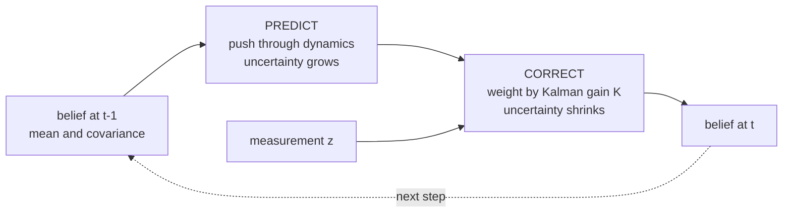
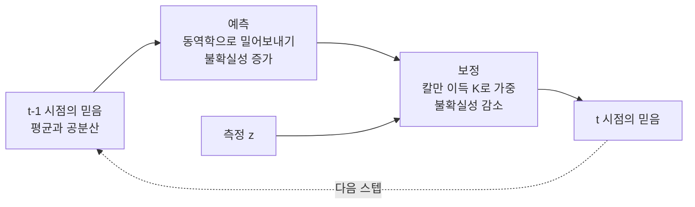

> [!note] Prerequisites · 선수 지식
> [[02-foundations/engineering-math|0.5 §3]] (integrals as expectations) · [[02-foundations/engineering-math|0.5 §10]] (set notation) · [[02-foundations/linear-algebra|1. Linear Algebra §3]] (PSD matrices, for covariance)
> [[02-foundations/engineering-math|0.5 §3]](기댓값으로서의 적분) · [[02-foundations/engineering-math|0.5 §10]](집합 표기) · [[02-foundations/linear-algebra|1. 선형대수 §3]](공분산을 위한 PSD 행렬)
>
> Connection map · 연결 지도: [[02-foundations/overview|0. Overview]]

## English

*Stands on [[02-foundations/engineering-math|0.5]] (integrals, expectation) and [[02-foundations/linear-algebra|1]] — not on calculus, so it reads fine before or after that page.
It answers where losses come from, and information theory, signal processing, RL and ML practice all rest on it.*

Probability is the substrate under estimation, filtering, and many standard objectives in deep
learning. Course-depth treatment: derivations, the Gaussian toolbox, a worked MLE example,
and the Kalman filter assembled from parts you'll have proven along the way.

> [!note] First pass · 처음이라면
> Read §1, §2, then §3 — the Gaussian toolbox is what actually gets used. §4 explains where your loss function came from and is worth the detour. Leave §5 until you reach state estimation; it will make more sense there.

### 1. The core language

- Axioms: $P(\Omega)=1$, $P(A)\ge 0$, additivity over disjoint events. Everything else is
  bookkeeping on top.
- **Conditioning** $P(A|B) = P(A\cap B)/P(B)$ re-weights the world after evidence.
  Chain rule: $P(A,B) = P(A|B)P(B)$.
- **Bayes' rule.** The chain rule above can factor a joint probability in either order —
  $P(\theta, x) = P(\theta|x)P(x)$ and $P(\theta, x) = P(x|\theta)P(\theta)$ — and both equal
  the same joint, so set them equal and divide by $P(x)$. That is the derivation:
  $$P(\theta|x) = \frac{P(x|\theta)\,P(\theta)}{P(x)} \;\propto\; \text{likelihood}\times\text{prior}$$
  Read it as: *what you believed before* ($P(\theta)$), reweighted by *how well each
  hypothesis explains what you just saw* ($P(x|\theta)$).
  Worked example — sensor diagnosis: a crack detector fires on 95% of cracks
  ($P(+|c)=0.95$), false-alarms 5% ($P(+|\neg c)=0.05$), cracks are rare ($P(c)=0.01$).
  $P(c|+) = \frac{0.95\cdot 0.01}{0.95\cdot 0.01 + 0.05\cdot 0.99} \approx 0.16$.
  An alarm with 95% sensitivity (and a 5% false-positive rate — two separate numbers,
  not one "accuracy") is right only 16% of the time it fires — base rates dominate. This is why
  perception pipelines calibrate.

<svg viewBox="0 0 560 250" style="max-width:100%;height:auto" role="img" aria-label="a thousand panels split into ten cracked and nine hundred ninety sound, with the alarms each branch produces, and a bar showing that only sixteen percent of alarms are real">
  <g fill="currentColor" fill-opacity="0.08" stroke="currentColor" stroke-width="1" stroke-opacity="0.6">
    <rect x="24" y="76" width="94" height="30" rx="3"/>
    <rect x="150" y="34" width="86" height="30" rx="3"/>
    <rect x="150" y="118" width="86" height="30" rx="3"/>
  </g>
  <g fill="currentColor" fill-opacity="0.24" stroke="currentColor" stroke-width="1.1">
    <rect x="268" y="34" width="82" height="30" rx="3"/>
    <rect x="268" y="118" width="82" height="30" rx="3"/>
  </g>
  <g stroke="currentColor" stroke-width="1.2" fill="none" opacity="0.65">
    <path d="M118,86 C136,86 136,49 148,49"/>
    <path d="M118,96 C136,96 136,133 148,133"/>
    <line x1="236" y1="49" x2="266" y2="49"/>
    <line x1="236" y1="133" x2="266" y2="133"/>
  </g>
  <g font-size="10.5" fill="currentColor" text-anchor="middle">
    <text x="71" y="95">1,000 panels</text>
    <text x="193" y="53">10 cracked</text>
    <text x="193" y="137">990 sound</text>
    <text x="309" y="53">9.5 alarms</text>
    <text x="309" y="137">49.5 alarms</text>
  </g>
  <g font-size="9" fill="currentColor" opacity="0.8" text-anchor="middle">
    <text x="251" y="42">95% of them</text>
    <text x="251" y="126">5% of them</text>
  </g>
  <g font-size="10.5" fill="currentColor">
    <text x="372" y="80">59 alarms in total</text>
  </g>
  <g stroke="currentColor" stroke-width="1.1" fill="none" opacity="0.6">
    <rect x="372" y="88" width="170" height="26" rx="3"/>
  </g>
  <g fill="currentColor" fill-opacity="0.34">
    <rect x="372" y="88" width="27.4" height="26" rx="3"/>
  </g>
  <g font-size="9.5" fill="currentColor">
    <text x="372" y="130">9.5 real</text>
    <text x="542" y="130" text-anchor="end">49.5 false</text>
  </g>
  <g font-size="13" fill="currentColor" font-weight="600">
    <text x="372" y="152">16%</text>
  </g>
  <g font-size="10.5" fill="currentColor" opacity="0.9">
    <text x="24" y="212">The 95% is used on the thin branch and the 5% on the thick one, so the thick branch produces</text>
    <text x="24" y="228">five times more alarms than the thin one even though it is the branch with nothing wrong.</text>
    <text x="24" y="244">That ratio sets the posterior: 9.5 of 59 alarms, 16%. Nothing about the detector changed &#8212; only how rare cracks are.</text>
  </g>
</svg>

- Independence $P(A,B) = P(A)P(B)$ vs conditional independence $P(A,B|C) = P(A|C)P(B|C)$ —
  the factorization assumptions behind graphical models, naive Bayes, and the Markov
  property alike.

### 2. Random variables and expectation

- **PMF** (probability mass function — discrete: $p(x)$ *is* the probability of $x$),
  **PDF** (probability density function — continuous: $p(x)$ is a *density*, so only
  $\int p\,dx$ over an interval is a probability, and $p(x)$ itself may exceed 1),
  **CDF** (cumulative: $F(x) = P(X \le x)$). Then $E[g(X)] = \int g(x)p(x)dx$.
- **Linearity** $E[aX + bY] = aE[X] + bE[Y]$ — *no independence needed*; the single most
  used identity in proofs. **Why that caveat is worth noticing:** with two dice,
  $E[X_1 + X_2] = 3.5 + 3.5 = 7$ whether or not the dice are glued together. Variance is
  *not* like that. Independent dice give
  $\text{Var}(X_1{+}X_2) = \tfrac{35}{12} + \tfrac{35}{12} = 5.83$ (one die:
  $E[X^2] = \tfrac{1+4+9+16+25+36}{6} = \tfrac{91}{6}$, so
  $\text{Var} = \tfrac{91}{6} - 3.5^2 = \tfrac{35}{12}$); two dice forced to show
  the same face give $X_1 + X_2 = 2X_1$ and
  $\text{Var}(2X_1) = 4\,\text{Var}(X_1) = 11.67$ — double. Means always add; spreads add only
  when things are uncorrelated. That is exactly why averaging $N$ *independent* runs shrinks
  the standard error of the mean by $\sqrt N$ and averaging $N$ correlated runs does not
  ([[02-foundations/ml-practice|9. ML Practice §4]]).
- Variance $\text{Var}(X) = E[X^2] - E[X]^2$; covariance
  $\text{Cov}(X,Y) = E[XY] - E[X]E[Y]$; for vectors, the covariance matrix
  $\Sigma = E[(x-\mu)(x-\mu)^\top]$ is PSD ([[02-foundations/linear-algebra|linear algebra]]).
- **Conditional expectation** $E[X|Y]$ is the best mean-square predictor of $X$ given $Y$ —
  the reason estimation theory keeps computing it, and what regression approximates.
- Distributions that carry this wiki: **Bernoulli/categorical** (classification losses,
  dropout masks), **Gaussian** (below), Poisson (event counts), exponential (waiting times).

### 3. The Gaussian toolbox (why Gaussians run robotics)

$\mathcal{N}(x;\mu,\Sigma) = \frac{1}{\sqrt{(2\pi)^n|\Sigma|}}\exp\big(-\tfrac12 (x-\mu)^\top\Sigma^{-1}(x-\mu)\big)$

Here $n$ is the dimension of $x$ and $|\Sigma|$ is the determinant of the covariance.

Three **closure** properties make the Gaussian the workhorse — "closure" meaning the answer
is still a Gaussian, so **affine** operations never leave the family:

1. **Affine maps**: $x\sim\mathcal{N}(\mu,\Sigma) \Rightarrow Ax + b \sim \mathcal{N}(A\mu + b,\, A\Sigma A^\top)$.
2. **Sums** of independent Gaussians are Gaussian (variances add).
3. **Conditioning**: if $(x_1, x_2)$ jointly Gaussian,
   $$E[x_1|x_2] = \mu_1 + \Sigma_{12}\Sigma_{22}^{-1}(x_2 - \mu_2)$$
   — the conditional mean is a *linear* correction weighted by covariance-to-variance.
   Memorize the shape of this formula: it *is* the Kalman gain.

Also: the CLT says the centred, $\sqrt N$-scaled sum of many i.i.d. effects *of finite variance* → Gaussian (it fails without finite variance, e.g. Cauchy), which is why noise models
default to it; and among continuous distributions with a given mean and variance the Gaussian has the largest differential entropy (the continuous-variable analogue of the entropy in [[02-foundations/information-theory|5. Information Theory §1]], computed from a density rather than probabilities, so unlike discrete entropy it can be negative) (Murphy PML1 §2.6.4, shown in §3.4.4) — the "least presumptuous" choice.

<svg viewBox="0 0 620 214" style="max-width:100%;height:auto" role="img" aria-label="the Gaussian: one shape, width set by sigma, area always one">
  <g stroke="currentColor" stroke-width="1" opacity="0.3"><line x1="40" y1="150" x2="425" y2="150"/></g>
  <g stroke="currentColor" stroke-width="1" opacity="0.3" stroke-dasharray="3 3">
    <line x1="230.0" y1="48" x2="230.0" y2="150"/><line x1="170.6" y1="114" x2="170.6" y2="150"/><line x1="289.4" y1="114" x2="289.4" y2="150"/>
  </g>
  <path d="M40.0 149.6L41.9 149.6L43.8 149.6L45.7 149.5L47.6 149.5L49.5 149.4L51.4 149.3L53.3 149.3L55.2 149.2L57.1 149.1L59.0 149.1L60.9 149.0L62.8 148.9L64.7 148.8L66.6 148.6L68.5 148.5L70.4 148.4L72.3 148.2L74.2 148.1L76.1 147.9L78.0 147.7L79.9 147.5L81.8 147.3L83.7 147.1L85.6 146.9L87.5 146.6L89.4 146.4L91.3 146.1L93.2 145.8L95.1 145.5L97.0 145.1L98.9 144.8L100.8 144.4L102.7 144.0L104.6 143.6L106.5 143.1L108.4 142.6L110.3 142.1L112.2 141.6L114.1 141.1L116.0 140.5L117.9 139.9L119.8 139.3L121.7 138.6L123.6 138.0L125.5 137.2L127.4 136.5L129.3 135.8L131.2 135.0L133.1 134.2L135.0 133.3L136.9 132.5L138.8 131.6L140.7 130.6L142.6 129.7L144.5 128.7L146.4 127.7L148.3 126.7L150.2 125.7L152.1 124.6L154.0 123.6L155.9 122.5L157.8 121.4L159.7 120.2L161.6 119.1L163.5 118.0L165.4 116.8L167.3 115.6L169.2 114.5L171.1 113.3L173.0 112.2L174.9 111.0L176.8 109.8L178.7 108.7L180.6 107.6L182.5 106.4L184.4 105.3L186.3 104.2L188.2 103.2L190.1 102.1L192.0 101.1L193.9 100.1L195.8 99.2L197.7 98.3L199.6 97.4L201.5 96.5L203.4 95.7L205.3 95.0L207.2 94.3L209.1 93.6L211.0 93.0L212.9 92.4L214.8 91.9L216.7 91.5L218.6 91.1L220.5 90.8L222.4 90.5L224.3 90.3L226.2 90.1L228.1 90.0L230.0 90.0L231.9 90.0L233.8 90.1L235.7 90.3L237.6 90.5L239.5 90.8L241.4 91.1L243.3 91.5L245.2 91.9L247.1 92.4L249.0 93.0L250.9 93.6L252.8 94.3L254.7 95.0L256.6 95.7L258.5 96.5L260.4 97.4L262.3 98.3L264.2 99.2L266.1 100.1L268.0 101.1L269.9 102.1L271.8 103.2L273.7 104.2L275.6 105.3L277.5 106.4L279.4 107.6L281.3 108.7L283.2 109.8L285.1 111.0L287.0 112.2L288.9 113.3L290.8 114.5L292.7 115.6L294.6 116.8L296.5 118.0L298.4 119.1L300.3 120.2L302.2 121.4L304.1 122.5L306.0 123.6L307.9 124.6L309.8 125.7L311.7 126.7L313.6 127.7L315.5 128.7L317.4 129.7L319.3 130.6L321.2 131.6L323.1 132.5L325.0 133.3L326.9 134.2L328.8 135.0L330.7 135.8L332.6 136.5L334.5 137.2L336.4 138.0L338.3 138.6L340.2 139.3L342.1 139.9L344.0 140.5L345.9 141.1L347.8 141.6L349.7 142.1L351.6 142.6L353.5 143.1L355.4 143.6L357.3 144.0L359.2 144.4L361.1 144.8L363.0 145.1L364.9 145.5L366.8 145.8L368.7 146.1L370.6 146.4L372.5 146.6L374.4 146.9L376.3 147.1L378.2 147.3L380.1 147.5L382.0 147.7L383.9 147.9L385.8 148.1L387.7 148.2L389.6 148.4L391.5 148.5L393.4 148.6L395.3 148.8L397.2 148.9L399.1 149.0L401.0 149.1L402.9 149.1L404.8 149.2L406.7 149.3L408.6 149.3L410.5 149.4L412.4 149.5L414.3 149.5L416.2 149.6L418.1 149.6L420.0 149.6" fill="none" stroke="currentColor" stroke-width="2"/>
  <path d="M40.0 150.0L41.9 150.0L43.8 150.0L45.7 150.0L47.6 150.0L49.5 150.0L51.4 150.0L53.3 150.0L55.2 150.0L57.1 150.0L59.0 150.0L60.9 150.0L62.8 150.0L64.7 150.0L66.6 150.0L68.5 150.0L70.4 150.0L72.3 150.0L74.2 150.0L76.1 150.0L78.0 150.0L79.9 150.0L81.8 150.0L83.7 150.0L85.6 150.0L87.5 150.0L89.4 150.0L91.3 149.9L93.2 149.9L95.1 149.9L97.0 149.9L98.9 149.9L100.8 149.9L102.7 149.8L104.6 149.8L106.5 149.8L108.4 149.7L110.3 149.6L112.2 149.6L114.1 149.5L116.0 149.4L117.9 149.3L119.8 149.2L121.7 149.0L123.6 148.8L125.5 148.6L127.4 148.4L129.3 148.2L131.2 147.9L133.1 147.5L135.0 147.1L136.9 146.7L138.8 146.2L140.7 145.7L142.6 145.1L144.5 144.4L146.4 143.6L148.3 142.8L150.2 141.9L152.1 140.8L154.0 139.7L155.9 138.5L157.8 137.2L159.7 135.7L161.6 134.2L163.5 132.5L165.4 130.7L167.3 128.7L169.2 126.7L171.1 124.5L173.0 122.2L174.9 119.8L176.8 117.2L178.7 114.5L180.6 111.8L182.5 108.9L184.4 105.9L186.3 102.9L188.2 99.8L190.1 96.6L192.0 93.4L193.9 90.2L195.8 86.9L197.7 83.7L199.6 80.5L201.5 77.4L203.4 74.3L205.3 71.4L207.2 68.5L209.1 65.8L211.0 63.3L212.9 60.9L214.8 58.7L216.7 56.7L218.6 55.0L220.5 53.5L222.4 52.2L224.3 51.3L226.2 50.6L228.1 50.1L230.0 50.0L231.9 50.1L233.8 50.6L235.7 51.3L237.6 52.2L239.5 53.5L241.4 55.0L243.3 56.7L245.2 58.7L247.1 60.9L249.0 63.3L250.9 65.8L252.8 68.5L254.7 71.4L256.6 74.3L258.5 77.4L260.4 80.5L262.3 83.7L264.2 86.9L266.1 90.2L268.0 93.4L269.9 96.6L271.8 99.8L273.7 102.9L275.6 105.9L277.5 108.9L279.4 111.8L281.3 114.5L283.2 117.2L285.1 119.8L287.0 122.2L288.9 124.5L290.8 126.7L292.7 128.7L294.6 130.7L296.5 132.5L298.4 134.2L300.3 135.7L302.2 137.2L304.1 138.5L306.0 139.7L307.9 140.8L309.8 141.9L311.7 142.8L313.6 143.6L315.5 144.4L317.4 145.1L319.3 145.7L321.2 146.2L323.1 146.7L325.0 147.1L326.9 147.5L328.8 147.9L330.7 148.2L332.6 148.4L334.5 148.6L336.4 148.8L338.3 149.0L340.2 149.2L342.1 149.3L344.0 149.4L345.9 149.5L347.8 149.6L349.7 149.6L351.6 149.7L353.5 149.8L355.4 149.8L357.3 149.8L359.2 149.9L361.1 149.9L363.0 149.9L364.9 149.9L366.8 149.9L368.7 149.9L370.6 150.0L372.5 150.0L374.4 150.0L376.3 150.0L378.2 150.0L380.1 150.0L382.0 150.0L383.9 150.0L385.8 150.0L387.7 150.0L389.6 150.0L391.5 150.0L393.4 150.0L395.3 150.0L397.2 150.0L399.1 150.0L401.0 150.0L402.9 150.0L404.8 150.0L406.7 150.0L408.6 150.0L410.5 150.0L412.4 150.0L414.3 150.0L416.2 150.0L418.1 150.0L420.0 150.0" fill="none" stroke="currentColor" stroke-width="1.6" opacity="0.6" stroke-dasharray="6 4"/>
  <path d="M40.0 143.1L41.9 142.9L43.8 142.7L45.7 142.5L47.6 142.2L49.5 142.0L51.4 141.7L53.3 141.5L55.2 141.3L57.1 141.0L59.0 140.7L60.9 140.5L62.8 140.2L64.7 139.9L66.6 139.6L68.5 139.4L70.4 139.1L72.3 138.8L74.2 138.5L76.1 138.2L78.0 137.9L79.9 137.6L81.8 137.3L83.7 136.9L85.6 136.6L87.5 136.3L89.4 136.0L91.3 135.6L93.2 135.3L95.1 135.0L97.0 134.6L98.9 134.3L100.8 133.9L102.7 133.6L104.6 133.3L106.5 132.9L108.4 132.6L110.3 132.2L112.2 131.8L114.1 131.5L116.0 131.1L117.9 130.8L119.8 130.4L121.7 130.1L123.6 129.7L125.5 129.3L127.4 129.0L129.3 128.6L131.2 128.3L133.1 127.9L135.0 127.5L136.9 127.2L138.8 126.8L140.7 126.5L142.6 126.1L144.5 125.8L146.4 125.5L148.3 125.1L150.2 124.8L152.1 124.4L154.0 124.1L155.9 123.8L157.8 123.5L159.7 123.2L161.6 122.8L163.5 122.5L165.4 122.2L167.3 121.9L169.2 121.6L171.1 121.4L173.0 121.1L174.9 120.8L176.8 120.6L178.7 120.3L180.6 120.0L182.5 119.8L184.4 119.6L186.3 119.3L188.2 119.1L190.1 118.9L192.0 118.7L193.9 118.5L195.8 118.3L197.7 118.2L199.6 118.0L201.5 117.8L203.4 117.7L205.3 117.5L207.2 117.4L209.1 117.3L211.0 117.2L212.9 117.1L214.8 117.0L216.7 116.9L218.6 116.9L220.5 116.8L222.4 116.8L224.3 116.7L226.2 116.7L228.1 116.7L230.0 116.7L231.9 116.7L233.8 116.7L235.7 116.7L237.6 116.8L239.5 116.8L241.4 116.9L243.3 116.9L245.2 117.0L247.1 117.1L249.0 117.2L250.9 117.3L252.8 117.4L254.7 117.5L256.6 117.7L258.5 117.8L260.4 118.0L262.3 118.2L264.2 118.3L266.1 118.5L268.0 118.7L269.9 118.9L271.8 119.1L273.7 119.3L275.6 119.6L277.5 119.8L279.4 120.0L281.3 120.3L283.2 120.6L285.1 120.8L287.0 121.1L288.9 121.4L290.8 121.6L292.7 121.9L294.6 122.2L296.5 122.5L298.4 122.8L300.3 123.2L302.2 123.5L304.1 123.8L306.0 124.1L307.9 124.4L309.8 124.8L311.7 125.1L313.6 125.5L315.5 125.8L317.4 126.1L319.3 126.5L321.2 126.8L323.1 127.2L325.0 127.5L326.9 127.9L328.8 128.3L330.7 128.6L332.6 129.0L334.5 129.3L336.4 129.7L338.3 130.1L340.2 130.4L342.1 130.8L344.0 131.1L345.9 131.5L347.8 131.8L349.7 132.2L351.6 132.6L353.5 132.9L355.4 133.3L357.3 133.6L359.2 133.9L361.1 134.3L363.0 134.6L364.9 135.0L366.8 135.3L368.7 135.6L370.6 136.0L372.5 136.3L374.4 136.6L376.3 136.9L378.2 137.3L380.1 137.6L382.0 137.9L383.9 138.2L385.8 138.5L387.7 138.8L389.6 139.1L391.5 139.4L393.4 139.6L395.3 139.9L397.2 140.2L399.1 140.5L401.0 140.7L402.9 141.0L404.8 141.3L406.7 141.5L408.6 141.7L410.5 142.0L412.4 142.2L414.3 142.5L416.2 142.7L418.1 142.9L420.0 143.1" fill="none" stroke="currentColor" stroke-width="1.5" opacity="0.4" stroke-dasharray="2 3"/>
  <g font-size="10.5" fill="currentColor" text-anchor="middle">
    <text x="230.0" y="166">&#956;</text><text x="170.6" y="166">&#956;&#8722;&#963;</text><text x="289.4" y="166">&#956;+&#963;</text>
  </g>
  <g stroke="currentColor"><line x1="40" y1="182" x2="66" y2="182" stroke-width="2"/><line x1="146" y1="182" x2="172" y2="182" stroke-width="1.6" opacity="0.6" stroke-dasharray="6 4"/><line x1="286" y1="182" x2="312" y2="182" stroke-width="1.5" opacity="0.4" stroke-dasharray="2 3"/></g>
  <g font-size="10.5" fill="currentColor">
    <text x="72" y="186">&#963; = 1</text><text x="178" y="186">&#963; = 0.6 (more certain)</text><text x="318" y="186">&#963; = 1.8 (less certain)</text>
    <text x="40" y="208" opacity="0.9">Every Gaussian is this one curve rescaled. Narrower means more certain &#8212; and taller, because the area is always 1.</text>
  </g>
</svg>

**Decode the density before memorizing it.** μ locates the center. Σ describes spread and how coordinates vary together. The displayed inverse-and-determinant density requires a nonsingular covariance; singular Gaussians live on a lower-dimensional support (the set of values the variable can actually take, e.g. a line inside the plane) and need a different treatment. The inverse covariance inside the exponent measures how surprising a displacement is relative to that spread: the same physical displacement is less surprising along an uncertain direction than along a tightly constrained one. The factor outside the exponential normalizes the total probability; the density at a point is not itself the probability of that exact continuous value.

For sensor fusion, the conditioning formula says: start from the expected value of the unobserved quantity, inspect how the observed quantity differs from its expectation, and transfer that discrepancy through their covariance relationship. If the quantities have no covariance and are jointly Gaussian, observing one does not shift the conditional mean of the other.

**Check your understanding.** A small covariance reports a narrow model distribution. It does not certify calibration or rule out bias. A sensor can be consistently wrong with very little random scatter. This distinction is essential when a robot claims high-confidence localization from an incorrect calibration.

### 4. Estimation — where loss functions come from

- **MLE**: $\hat\theta = \arg\max_\theta \sum_i \log p(x_i|\theta)$.
  Worked example (Gaussian mean): $\log p = -\frac{(x-\mu)^2}{2\sigma^2} + \text{const}$ ⇒
  maximizing likelihood ≡ minimizing squared error; $\hat\mu = \bar{x}$.
  **With actual data:** five distance readings $2.1, 1.9, 2.4, 1.6, 2.0$ m of one wall.
  MLE says the best estimate is the plain average, $\hat\mu = 10.0/5 = 2.0$ m. Nothing
  fancier is optimal *given the Gaussian assumption* — and that is the point: "take the mean"
  is not a habit, it is the maximum-likelihood answer for Gaussian noise. Change the noise
  model and the answer changes: assume Laplace noise instead and the MLE becomes the
  **median** ($2.0$ here too, but it would differ if the $2.1$ reading were $9.0$ — the mean
  would jump to $3.38$ and the median would not move at all). *Many likelihood-based losses
  encode a noise or observation-model assumption; not every learning objective is a likelihood.*
  **MSE regression is MLE under Gaussian noise of fixed variance; cross-entropy is MLE for categorical
  outputs.** Many pretraining objectives in [[01-canonical-papers/canonical-list|the paper list]]
  are MLE or a bound on one ([[01-canonical-papers/notes/6-diffusion/vae|ELBO]]) —
  though not all: contrastive and some self-supervised objectives are not simple MLE.
- **MAP**: add $\log p(\theta)$. A **zero-mean** Gaussian prior on the **weights** ⇒ $-\lambda\|\theta\|^2$ in the objective, i.e. $+\lambda\|\theta\|^2$ in the loss (the loss is the negative log-posterior, because we minimize a loss but maximize a posterior, so the sign flips) — a non-zero-mean prior gives $\|\theta-\mu\|^2$, and it is weights rather than biases or noise variances that are penalised —
  weight decay is a prior in disguise; L1 prior (Laplace) ⇒ sparsity.
- Estimator quality: **bias** (how far the estimate is off *on average*, over many datasets),
  **variance** (how much it jumps around between datasets), and the tradeoff between them — the vocabulary behind
  "our estimator is unbiased but high-variance" in RL papers
  ([[02-foundations/rl-basics|policy gradients]]).

### 5. Random processes and the Kalman filter

- A random process = an indexed family of RVs; characterized by its mean function and its
  **autocorrelation** — $E[x(t)x(t+\tau)]$, how strongly the signal at one instant predicts
  itself $\tau$ later (a noisy signal's frequency content, seen in the time domain).
  **Stationarity / WSS** (*wide-sense stationary*: the mean and autocorrelation don't depend
  on *when* you look, only on the gap $\tau$): statistics don't drift (assumption behind spectral
  analysis, [[02-foundations/signal-processing|signal processing]]).
  **White noise**: uncorrelated samples, flat spectrum — the default disturbance model and
  the $\epsilon$ of [[01-canonical-papers/notes/6-diffusion/ddpm|diffusion]].
- **Markov property**: future ⟂ past | present. The modeling assumption of MDPs
  ([[02-foundations/rl-basics|RL]]), world models, and diffusion chains.
- **Kalman filter, assembled from this page**: model
  $x_{t+1} = Ax_t + w_t$, $y_t = Cx_t + v_t$ with Gaussian $w_t \sim \mathcal{N}(0,Q)$,
  $v_t \sim \mathcal{N}(0,R)$, white, independent of each other and of a Gaussian initial state $x_0$.
  - *Predict* (affine property): $\hat x^- = A\hat x$, $P^- = APA^\top + Q$ — here $P$ is
    the **estimate covariance** (uncertainty of $\hat x$) and $Q$ the process-noise covariance.
  - *Update* (Gaussian conditioning): $K = P^-C^\top(CP^-C^\top + R)^{-1}$,
    $\hat x = \hat x^- + K(y - C\hat x^-)$, $P = (I - KC)P^-$.
  Nothing new was needed: affine closure + conditioning formula = the optimal (minimum mean-square error) recursive
  estimator, under exactly those assumptions.
- **The gain, in one scalar example.** You believe a wall is $10$ cm away with variance
  $P^- = 4$ (so $\pm2$ cm), and a sensor with variance $R = 1$ (so $\pm1$ cm) reads $12$.
  Then $K = \frac{P^-}{P^- + R} = \frac{4}{5} = 0.8$, so
  $\hat x = 10 + 0.8(12-10) = 11.6$ and $P = (1-K)P^- = 0.8$. Three things worth reading off:
  the estimate landed **closer to the sensor** because the sensor was the more trustworthy of
  the two; the new uncertainty $0.8$ is **smaller than either input** ($4$ and $1$) — combining
  two noisy opinions beats both; and if you set $R = 100$ (a terrible sensor) you get
  $K = 0.04$ and $\hat x = 10.08$, i.e. the filter almost ignores it. The gain is just
  *relative trust*, and that is all any Kalman-gain sentence in a paper is saying.



Nonlinear versions — the EKF (extended Kalman filter) and UKF (unscented Kalman filter) — linearize or sample; SLAM (simultaneous localization and mapping) scales this to maps ([[04-robotics/state-estimation-slam|State Estimation & SLAM]]).

### 6. Detection, hypothesis tests, and whitening

- **Detection is a decision, not an estimate.** Often a robot must choose between two explanations of a reading $y$: $H_0$ (nothing there, e.g. no contact) or $H_1$ (something there, e.g. contact). There are two ways to be wrong. A **false alarm** says $H_1$ when $H_0$ is true (probability $P_{FA}$). A **miss** says $H_0$ when $H_1$ is true (probability $1 - P_D$, where $P_D$ is the detection probability). The rules below all compare one statistic, the likelihood ratio, against a threshold:
  $$\Lambda(y) = \frac{p(y\mid H_1)}{p(y\mid H_0)} \;\gtrless\; \eta$$
  Only the threshold $\eta$ differs between rules, because the ratio already carries everything the reading says about which hypothesis produced it.
  - **MAP rule** (fewest total errors): $\eta = P(H_0)/P(H_1)$. This is Bayes' rule from §1 applied to two hypotheses, so a rare event needs stronger evidence before you declare it.
  - **Neyman–Pearson** (no trustworthy prior, or errors with unequal costs): fix the false-alarm rate you can tolerate, $P_{FA} = \alpha$, and set $\eta$ to hit it. The lemma says no other test with that $P_{FA}$ has a higher $P_D$.
  - **Sweeping the threshold** from $\eta = \infty$ down to $0$ moves $(P_{FA}, P_D)$ from $(0,0)$ to $(1,1)$. That path is the ROC curve of [[02-foundations/ml-practice|9. ML Practice §3]]: $P_D$ is its TPR and $P_{FA}$ its FPR.

> [!example] Worked example · 계산 예제
> **Contact or not, from one force reading.** With no contact the wrist sensor reads pure noise, $y \sim \mathcal{N}(0,\,0.4^2)$ N. In contact it reads $y \sim \mathcal{N}(1.0,\,0.4^2)$ N.
> - *The test becomes a threshold on $y$.* Both hypotheses share one variance, so the normalizing constants cancel and $\log\Lambda(y) = \big(y^2 - (y-1)^2\big)/(2 \cdot 0.4^2)$. The $y^2$ terms cancel too, leaving $(2y - 1)/(2 \cdot 0.4^2) = (y - 0.5)/0.4^2$, which grows with $y$, and "$\Lambda > \eta$" is the same as "$y > \tau$" with $\tau = 0.5 + 0.16\ln\eta$. Write $Q(x) = \tfrac12\big(1-\operatorname{erf}(x/\sqrt2)\big)$ for the Gaussian upper tail.
> - *Equal priors* ($\eta = 1$): $\tau = 0.5$ N, $P_{FA} = Q(0.5/0.4) = Q(1.25) = 0.106$, $P_D = Q(-1.25) = 0.894$.
> - *Contact is rare*, $P(H_1) = 0.1$, so $\eta = 9$: $\tau = 0.5 + 0.16\ln 9 = 0.852$ N, $P_{FA} = 0.017$, $P_D = 0.645$. This is the base-rate effect of §1 again, now moving a threshold.
> - *Neyman–Pearson at $\alpha = 0.01$*: $Q^{-1}(0.01) = 2.326$, so $\tau = 0.4 \times 2.326 = 0.931$ N and $P_D = Q\big((0.931 - 1.0)/0.4\big) = 0.569$.
>
> Cutting false alarms tenfold (0.106 → 0.01) cost more than a third of the detections (0.894 → 0.569). Moving the threshold only slides you along one ROC curve. A better sensor, meaning a larger offset relative to the noise ($1.0/0.4 = 2.5$ here), lifts the whole curve.

- **A hypothesis test is detection applied to a claim.** $H_0$ is the "nothing is going on" story (method B is no better than A). The test statistic plays the role of $y$, and the significance level $\alpha$ is the false-alarm rate you accept. The **p-value** is the probability, *computed assuming $H_0$ is true*, of a statistic at least as extreme as the one observed. Three misreadings to catch in papers:
  1. It is **not** $P(H_0 \mid \text{data})$. That needs a prior, exactly as in the crack example of §1.
  2. It is **not** the size of the effect. A negligible improvement measured over enough trials still gets a tiny p.
  3. $p > 0.05$ is **not** evidence of no difference. With few trials the test may simply be unable to see one.
- **Compare two methods on the same trials, pair by pair.** When A and B run on the same 10 objects (or seeds, or scenes), object-to-object difficulty cancels in the per-trial differences $d_i = s_i^{B} - s_i^{A}$. Four tools work on these differences. Use the paired t-test when the $d_i$ look roughly normal, the sign test when only "who won" is trustworthy, a permutation test when you want to use the sizes of the $d_i$ without assuming normality, and the bootstrap when you want an interval rather than a p-value.
  - The **paired t-test** uses $t = \bar d / (s_d/\sqrt{n})$, where $\bar d$ and $s_d$ are the mean and standard deviation of the $d_i$. Under $H_0$ it follows a $t$ distribution with $n-1$ degrees of freedom if the differences are roughly normal. The degrees of freedom are $n-1$ rather than $n$ because one is used up estimating $\bar d$; with fewer of them the $t$ distribution has heavier tails than a Gaussian, so small samples need a larger $t$.
  - The **sign test** only counts who won each pair. A **permutation test** randomly flips the signs of the $d_i$ to build the null distribution. Neither needs normality.
  - *Example:* B beats A on 9 of 10 objects, with no ties. Under $H_0$ each win is a fair coin flip, so the two-sided sign test gives $p = 2\big(\binom{10}{9} + \binom{10}{10}\big)/2^{10} = 22/1024 = 0.021$.
  - A **bootstrap CI** resamples the $n$ differences with replacement thousands of times and reports the 2.5th and 97.5th percentiles of the resampled mean. For how many trials to run and which interval to report, see [[06-research-practice/experimental-design-reproducibility|Experiment Design §4]].
- **Multiple comparisons.** Twenty independent tests of true nulls at $\alpha = 0.05$ give at least one "significant" result with probability $1 - 0.95^{20} = 0.64$. So divide $\alpha$ by the number of tests (Bonferroni: $0.05/20 = 0.0025$), or predeclare the one comparison that matters.

**Choosing the test.** Two questions pick the row and the column: what number each trial produces, and whether both methods ran on the same trials (same objects, seeds, scenes or start states). In robot and ML experiments pairing is the usual case, and an unpaired test on paired data throws away the cancellation described above.

| Outcome per trial | Paired (same trials) | Unpaired (separate trials) | Check before trusting it |
|---|---|---|---|
| Success rate of one method | — | Binomial CI: Wilson or exact (Clopper–Pearson) | Trials independent; no silent retries or dropped failures |
| Success or failure, two methods | McNemar exact test on the discordant pairs | Fisher exact test on the 2×2 table | Only pairs where the methods disagree carry evidence |
| Continuous metric (error, time) | Paired t-test; Wilcoxon signed-rank; sign-flip permutation or bootstrap of the $d_i$ | Welch t-test; Mann–Whitney U; label-permutation test | t: differences roughly normal, no heavy outliers. Wilcoxon: differences symmetric, robust to outliers. Bootstrap: unreliable with very few pairs |
| Many seeds or tasks | Per-seed scores, CI across seeds; across tasks, stratified bootstrap | Same, per method | The seed is the unit; episodes within one seed are not independent samples |

- **The table's rank and unpaired tests, in one clause each.** The **Wilcoxon signed-rank** test ranks the $|d_i|$ and asks whether the positive differences hold far more or far less than half the total rank, so it uses sizes but a single huge outlier counts only as the top rank. **Welch's t-test** compares two independent group means without assuming the two groups have equal variance. **Mann–Whitney U** pools both groups, ranks everything, and asks whether one group's ranks run systematically higher.

- **McNemar is the sign test above, applied to discordant pairs.** A pair where both succeed or both fail says nothing about which method is better. So under $H_0$ each of the $m$ pairs where they disagree is a fair coin flip.
- **Many seeds or tasks.** Agarwal et al. (NeurIPS 2021) showed that point estimates from the few runs per task common in deep RL can mislead. Their fix is the **stratified bootstrap**: resample runs with replacement separately within each task, recompute the aggregate score (they favour the interquartile mean over the mean or median), repeat, and read off percentiles.
- **Effect size comes first.** Report the difference with its CI, then the p-value. The CI shows both whether zero is plausible and how large the gain could be; $p$ alone shows neither size (misreading 2 above). How many trials to run and which binomial interval to use are in [[06-research-practice/experimental-design-reproducibility|Experiment Design §4]].

> [!example] Worked example · 계산 예제
> **Two grasp policies on the same 20 objects.** A succeeds on 11 and B on 16, so 55% against 80%, which looks decisive.
> - *Tabulate by pair:* both succeed on 10, both fail on 3, only B on 6, only A on 1. The 13 agreeing pairs drop out, so the evidence is 6 against 1 among $m = 7$ discordant pairs.
> - *McNemar exact:* under $H_0$ the "only B" count is Binomial(7, 0.5), so the two-sided $p = 2\big(\binom70 + \binom71\big)/2^7 = 16/128 = 0.125$. In Python, `2 * sum(comb(7, k) for k in range(2)) / 2**7` after `from math import comb`.
> - *Ignoring the pairing* (Fisher exact on 16/4 against 11/9) gives $p = 0.18$. Pairing sharpened the test, but not enough.
> - *Effect size:* the difference is +25 points, and a bootstrap over the 20 pairs (100,000 resamples) gives a 95% interval from 0 to +50 points.
>
> Report "+25 points, 95% CI [0, +50], McNemar $p = 0.125$, 20 paired trials". The gain could be large or nothing. By misreading 3 that is not evidence of no difference; it is a reason to test more objects.

- **Whitening turns a correlated Gaussian into an isotropic one.** Factor the covariance with Cholesky, $\Sigma = LL^\top$, with $L$ lower triangular (it exists since $\Sigma$ is positive definite). Then
  $$z = L^{-1}(x - \mu) \;\Rightarrow\; \text{Cov}(z) = L^{-1}\Sigma L^{-\top} = I$$
  by the affine rule of §3: substitute $\Sigma = LL^\top$, and $L^{-1}L$ and $L^\top L^{-\top}$ each collapse to $I$. So every direction of $z$ has unit variance and no correlation. Run it backwards, $x = \mu + Lz$ with $z \sim \mathcal{N}(0, I)$, and you have **coloring**, the standard way to sample a correlated Gaussian. Any square root of $\Sigma$ works (the eigendecomposition gives one too); Cholesky is the cheapest.
- **Mahalanobis distance is Euclidean distance after whitening.**
  $$d^2 = (x-\mu)^\top \Sigma^{-1} (x-\mu) = z^\top z$$
  This holds because $\Sigma^{-1} = L^{-\top}L^{-1}$. For Gaussian $x$ in $k$ dimensions, $z$ has $k$ independent standard-normal entries, so $d^2$ is a sum of $k$ squared standard normals, which is a $\chi^2_k$ variable.
  - **Gating** in a tracker uses exactly this. A measurement is associated with a track only if the $d^2$ of its innovation (measurement minus prediction, with the innovation covariance as $\Sigma$; see [[04-robotics/state-estimation-slam|State Estimation §6]]) is below a $\chi^2_k$ quantile.
  - For $k = 2$ the $\chi^2_2$ CDF is $1 - e^{-d^2/2}$, so the 99% gate is $d^2 < -2\ln 0.01 = 9.21$. In a million simulated Gaussian residuals, 98.99% fell inside.

> [!example] Worked example · 계산 예제
> **Same distance, different surprise.** Take $\Sigma = \begin{pmatrix}4&2\\2&3\end{pmatrix}$, whose Cholesky factor is $L = \begin{pmatrix}2&0\\1&\sqrt2\end{pmatrix}$.
> - Residuals $(3, 3)$ and $(3, -3)$ are both $4.24$ from the mean in plain Euclidean distance.
> - Whitening $(3, 3)$ gives $z = (1.5,\ 1.06)$ and $d^2 = 3.375$, well inside the 9.21 gate.
> - Whitening $(3, -3)$ gives $z = (1.5,\ -3.18)$ and $d^2 = 12.375$, so the gate rejects it.
>
> The positive covariance says the two coordinates tend to err together. A residual that goes against that pattern is far more surprising. This is the "same displacement, different surprise" point of §3, in numbers.

### 7. Markov chains and hidden Markov models

- **A finite Markov chain** is a state $X_n \in \{1,\dots,S\}$ that jumps with fixed probabilities $P_{ij} = P(X_{n+1}=j \mid X_n = i)$. Convention on this page: **rows are "from" and columns are "to"**, so each row of $P$ sums to 1 (row-stochastic) and distributions are row vectors. By total probability $\pi_{n+1}(j) = \sum_i \pi_n(i) P_{ij}$, that is $\pi_{n+1} = \pi_n P$, and so $\pi_n = \pi_0 P^n$.
- **Stationary distribution.**
  $$\pi P = \pi, \qquad \textstyle\sum_i \pi_i = 1$$
  A distribution that satisfies this is unchanged by one more step, so it is where the chain settles if it settles at all.
  - For a finite chain, **irreducible** (every state can reach every other) plus **aperiodic** (no forced cycle such as "odd steps in A, even steps in B") guarantees exactly one such $\pi$, and $\pi_n \to \pi$ from any start. Then $\pi_i$ is also the long-run fraction of time spent in state $i$.
  - The **mixing time** is the number of steps until $\pi_n$ is within a chosen distance of $\pi$ (usually total variation distance, the largest difference the two distributions assign to any single event), starting from the worst initial state.
- **Why it matters here.** *MCMC* runs the idea in reverse: design a chain whose stationary distribution is the posterior you cannot sample directly, run it past its mixing time, and use its states as samples. The *forward noising process* of [[01-canonical-papers/notes/6-diffusion/ddpm|DDPM]], $x_t = \sqrt{1-\beta_t}\,x_{t-1} + \sqrt{\beta_t}\,\epsilon$, is a Markov chain on images whose distribution approaches $\mathcal{N}(0, I)$; the learned model runs the chain backwards.

> [!example] Worked example · 계산 예제
> **A machine that is working (W), idle (I) or broken (B)**, checked once an hour, with rows W, I, B:
> $P = \begin{pmatrix}0.7&0.2&0.1\\0.5&0.4&0.1\\0.6&0&0.4\end{pmatrix}$
> - *Solve $\pi P = \pi$ one column at a time.* Column I: $\pi_I = 0.2\pi_W + 0.4\pi_I$, so $\pi_I = \pi_W/3$. Column B: $\pi_B = 0.1\pi_W + 0.1\pi_I + 0.4\pi_B$, so $0.6\pi_B = 0.1(\pi_W + \pi_W/3)$ and $\pi_B = 2\pi_W/9$.
> - *Normalize:* $\pi_W(1 + 1/3 + 2/9) = 14\pi_W/9 = 1$, so $\pi = (9/14,\ 3/14,\ 1/7) = (0.643,\ 0.214,\ 0.143)$. Over the long run the machine is broken one hour in seven.
> - *Power iteration from "broken"*, $\pi_0 = (0, 0, 1)$: $\pi_1 = (0.6,\ 0,\ 0.4)$, $\pi_2 = (0.66,\ 0.12,\ 0.22)$, $\pi_5 = (0.645,\ 0.211,\ 0.145)$, and $\pi_{10}$ matches $\pi$ to four decimals.
>
> Convergence was guaranteed, since every state reaches every other and each has a self-loop (so no period). The speed is set by the second-largest eigenvalue magnitude of $P$ ([[02-foundations/linear-algebra|1. Linear Algebra §3]]), here $0.3$. The reason: $\pi$ is the part of $\pi_n$ with eigenvalue 1, and the gap $\pi_n - \pi$ is made of the other eigen-directions, each multiplied by its eigenvalue (here $0.3$ and $0.2$) at every step, so the largest of them sets the decay. The gap to $\pi$ shrinks by roughly a factor of $0.3$ each hour.

- **Hidden Markov model (HMM).** The chain $X_t$ is not observed. At each step the current state $j$ emits an observation $y_t$ with probability $B_j(y_t) = p(y_t \mid X_t = j)$. Two questions, each answered by a pass over a $T \times S$ table:
  - **Filtering: where is it now?** The **forward algorithm** carries $\alpha_t(j) \propto p(X_t = j \mid y_{1:t})$:
    $$\alpha_t(j) \propto B_j(y_t)\,\textstyle\sum_i \alpha_{t-1}(i)\,P_{ij}$$
    The sum is the predict step and the multiplication is the correct step, so this is the Bayes filter of [[04-robotics/state-estimation-slam|State Estimation §4]] with the integral replaced by a sum. Normalize at every step so the numbers do not underflow.
  - **Decoding: what most likely happened?** **Viterbi** replaces the sum with a max and records which predecessor won, $\delta_t(j) = \log B_j(y_t) + \max_i \big(\delta_{t-1}(i) + \log P_{ij}\big)$, then follows the back-pointers from the best final state. It is dynamic programming ([[02-foundations/algorithms/dynamic-programming|11.5 Dynamic Programming]]) because the best path into state $j$ at step $t$ must extend the best path into some state at step $t-1$.
  - **Cost:** both run in $O(T S^2)$, since each of $S$ states looks at $S$ predecessors at each of $T$ steps. Enumerating paths would cost $S^T$.

A two-state machine you can only hear: working (0) or worn (1), and each hour the vibration is quiet (0) or loud (1). Readings: quiet, quiet, loud, loud, loud, quiet, loud. Log-space keeps long sequences from underflowing.

```python
import numpy as np

def viterbi(log_pi, log_A, log_B, obs):
    """log_pi (S,), log_A (S,S) rows = from, log_B (S,O). Returns the best state path."""
    T, S = len(obs), len(log_pi)
    delta = log_pi + log_B[:, obs[0]]        # best log-prob of a path ending in each state
    back = np.zeros((T, S), dtype=int)       # back[t, j] = best predecessor of j at step t
    for t in range(1, T):
        scores = delta[:, None] + log_A      # scores[i, j] = best path to i, then i -> j
        back[t] = scores.argmax(axis=0)
        delta = scores.max(axis=0) + log_B[:, obs[t]]
    path = [int(delta.argmax())]
    for t in range(T - 1, 0, -1):            # follow the back-pointers home
        path.append(int(back[t, path[-1]]))
    return path[::-1]

A = np.array(((0.95, 0.05), (0.10, 0.90)))   # 0 = working, 1 = worn
B = np.array(((0.8, 0.2), (0.3, 0.7)))       # 0 = quiet, 1 = loud
print(viterbi(np.log((0.9, 0.1)), np.log(A), np.log(B), (0, 0, 1, 1, 1, 0, 1)))
```

- **Output:** `[0, 0, 1, 1, 1, 1, 1]`, worn from hour 3 onward, including the quiet hour 6. The function was checked against brute-force enumeration of all $S^T$ paths on 300 random small models.
- **Filter and decoder disagree, and both are right.** The forward filter puts $P(\text{worn})$ at only $0.229$ at hour 3 and $0.481$ at hour 6. The filter may use only readings up to now. Viterbi picks the whole sequence at once, so the later loud readings pull hour 3 toward "worn", and one quiet hour between loud ones is cheaper to explain as a quiet worn machine than as two switches ($0.10$, then $0.05$). Drop the final loud reading and Viterbi returns all six hours as working: the last hour of evidence rewrote the whole story.
- **Learning the parameters.** When $P$, $B$ and the initial distribution are unknown, Baum–Welch fits them by EM (expectation–maximization), alternating two steps. The *E-step* runs forward–backward (the forward pass above plus a mirror-image pass from the end of the sequence) under the current parameters, which gives each step's state probabilities given the whole sequence and hence the expected number of times each transition and each emission occurred. The *M-step* re-estimates the parameters from those expected counts; for example, $P_{ij}$ becomes the expected number of $i \to j$ transitions divided by the expected number of departures from $i$. Repeating the two never lowers the likelihood (Baum et al. 1970).

#### Metropolis–Hastings

Metropolis–Hastings is the MCMC of the "Why it matters" bullet made concrete: a recipe for a Markov chain whose stationary distribution is a target $p$ you can evaluate only up to a constant.
- **Setting.** You can compute $\tilde p(x) = Z\,p(x)$ but not $Z$. A posterior $p(\theta \mid \mathcal D) \propto p(\mathcal D \mid \theta)\,p(\theta)$ with an intractable evidence integral is the typical case.
- **One step.** From the current $x$, draw a candidate $x'$ from a proposal $q(x' \mid x)$ that you choose, such as $x' = x + \sigma\epsilon$. Accept it with probability
  $$\alpha(x \to x') = \min\!\left(1,\ \frac{p(x')\,q(x \mid x')}{p(x)\,q(x' \mid x)}\right)$$
  $Z$ cancels because $p$ enters only as a ratio, so $\tilde p$ is enough. On rejection the chain stays at $x$ and records $x$ again. For a symmetric proposal the $q$ terms cancel, which is Metropolis's original case; Hastings added the correction for asymmetric ones.
- **Why $p$ is stationary.** The resulting transition kernel $T$ satisfies **detailed balance**:
  $$p(x)\,T(x \to x') = p(x')\,T(x' \to x)$$
  This holds since, for $x' \ne x$, both sides equal $\min\big(p(x)\,q(x' \mid x),\ p(x')\,q(x \mid x')\big)$. Sum both sides over $x$: the right side becomes $p(x')$ because $T(x' \to \cdot)$ sums to 1, so $\sum_x p(x)T(x \to x') = p(x')$. That is $\pi P = \pi$ from above with $\pi = p$ (integrals replace sums for continuous $x$). Detailed balance only makes $p$ stationary; convergence to it from any start still needs the irreducible-and-aperiodic condition.
- **Burn-in.** Early states reflect the starting point rather than $p$, so discard them.
- **Autocorrelation.** Consecutive states are correlated, because each is a small move from the previous state or a repeat of it.
- **Effective sample size (ESS).** $N$ correlated samples estimate a mean as well as $N/\tau$ independent ones, where $\tau = 1 + 2\sum_{k\ge 1}\rho_k$ sums the autocorrelations $\rho_k$ at lag $k$. Read $\tau$ as the number of steps per independent sample's worth of information: each state partly repeats its neighbours on both sides, hence the factor 2. If $\rho_k = 0.9^k$, then $\sum_{k\ge1} 0.9^k = 9$ and $\tau = 19$.
- **Proposal width.** Too narrow and nearly every move is accepted but barely goes anywhere; too wide and most proposals land where $p$ is tiny and get rejected. Either way ESS collapses, so tune the width by ESS rather than by acceptance rate.

Target: $\tilde p(x) = x^2 e^{-x}$ on $x > 0$, an unnormalized Gamma(3, 1) whose mean and variance are both 3. The chain deliberately starts far out at $x_0 = 20$. It works in log space for the same underflow reason as Viterbi.

```python
import numpy as np

def log_p(x):                                # unnormalized Gamma(3, 1): x^2 e^(-x), x > 0
    return 2 * np.log(x) - x if x > 0 else -np.inf

def metropolis(log_p, x0, width, n, rng):
    x, lp, out, acc = x0, log_p(x0), np.empty(n), 0
    for i in range(n):
        y = x + width * rng.normal()         # symmetric proposal: q terms cancel
        lpy = log_p(y)
        if np.log(rng.random()) < lpy - lp:  # accept with prob min(1, p(y)/p(x))
            x, lp, acc = y, lpy, acc + 1
        out[i] = x                           # a rejection repeats the old state
    return out, acc / n

s, rate = metropolis(log_p, 20.0, 4.0, 200_000, np.random.default_rng(0))
s = s[2_000:]                                # drop burn-in from the bad start x0 = 20
print(f"accept {rate:.2f}  mean {s.mean():.2f}  var {s.var():.2f}  (exact: 3, 3)")
```

- **Output:** `accept 0.41  mean 3.01  var 2.99  (exact: 3, 3)`.
- **Acceptance rate alone misleads.** Same 200,000 steps and the same start, with ESS estimated from the autocorrelations:
  - width 0.1 accepts 98% of moves but needs about 6,000 steps just to walk down from 20, so the 2,000-step burn-in is too short. ESS is about 100 and the sample mean comes out 3.19.
  - width 4 accepts 41% and gives an ESS of about 32,000. Widths 3 to 6 all stayed between 28,000 and 33,000, so the optimum is broad.
  - width 50 accepts 4% and gives an ESS of about 4,000.
- **What to check in papers.** A random walk can sit in one mode of a multimodal target for the whole run, and then its mean and ESS look healthy for the wrong distribution. Look for several chains from dispersed starts that agree.

> [!tip] Going deeper · 더 깊이
> If the Gaussian toolbox is too compressed, Murphy's free [*Probabilistic Machine Learning: An Introduction*](https://probml.github.io/pml-book/book1.html) ch.2–3 is the slower version — but not for the Kalman derivation, which that book explicitly defers to its sequel, *Advanced Topics*. Wasserman's *All of Statistics* is the compact reference. Neither tells you which of these appear in robotics papers — that is this page's job.
>
> Sources for §6–§7: Neyman & Pearson, "On the problem of the most efficient tests of statistical hypotheses", *Phil. Trans. R. Soc. A* (1933), the lemma; Rabiner, "A tutorial on hidden Markov models and selected applications in speech recognition", *Proc. IEEE* 77(2):257–286 (1989), still the standard introduction to the forward algorithm and Viterbi; Viterbi, "Error bounds for convolutional codes and an asymptotically optimum decoding algorithm", *IEEE Trans. Inf. Theory* 13(2) (1967); Levin & Peres, *Markov Chains and Mixing Times* (AMS), for stationary distributions and mixing; McNemar, "Note on the sampling error of the difference between correlated proportions or percentages", *Psychometrika* 12(2):153–157 (1947); Wilcoxon, "Individual comparisons by ranking methods", *Biometrics Bulletin* 1(6):80–83 (1945); Agarwal, Schwarzer, Castro, Courville & Bellemare, "Deep reinforcement learning at the edge of the statistical precipice", *NeurIPS* (2021), the stratified bootstrap and interquartile mean; Metropolis, Rosenbluth, Rosenbluth, Teller & Teller, "Equation of state calculations by fast computing machines", *J. Chem. Phys.* 21(6):1087–1092 (1953); Hastings, "Monte Carlo sampling methods using Markov chains and their applications", *Biometrika* 57(1):97–109 (1970); Baum, Petrie, Soules & Weiss, "A maximization technique occurring in the statistical analysis of probabilistic functions of Markov chains", *Ann. Math. Statist.* 41(1):164–171 (1970), Baum–Welch.

### Self-check

1. Recompute the crack-detector example with $P(c) = 0.2$ (a suspect structure). What
   happens to $P(c|+)$ and what does that say about deploying detectors in high-risk zones?
2. Derive "MSE = Gaussian MLE" and "cross-entropy = categorical MLE" from the definitions.
3. Conditional on a fixed $x_0$, show why $x_t = \sqrt{\bar\alpha_t}x_0 + \sqrt{1-\bar\alpha_t}\epsilon$
   ([[01-canonical-papers/notes/6-diffusion/ddpm|DDPM]]) has the claimed distribution.
4. In the Kalman gain, what happens as sensor noise $R \to 0$? As $R \to \infty$? Interpret.
5. A paper reports $p = 0.03$ for "our method beats the baseline" over 5 seeds and concludes "there is a 97% chance our method is better." What is wrong, and what would you ask for?
6. A tracker measures 3-D positions and reuses the 2-D gate $d^2 < 9.21$. What fraction of true measurements does it now reject, and what should the gate be?
7. In the machine chain of §7, repairs get faster: the broken row becomes $(0.9,\ 0,\ 0.1)$. Find the new stationary distribution.
8. Why can the Viterbi path disagree with the most likely state from the forward filter at the same hour? Which would you use for an online wear alarm, and which for labeling a logged run?
9. In the grasp example of §6, the lab tests 20 more objects and the counts simply double: 12 pairs where only B succeeds and 2 where only A does. Compute the McNemar exact p. Did the effect size change?
10. A labmate's Metropolis sampler accepts 97% of its proposals, and they call it well tuned. What is the likely problem, and what number would you ask for instead?

> [!tip]- Answers
> 1. $P(c|+) = \frac{0.95 \times 0.2}{0.95\times 0.2 + 0.05\times 0.8} = \frac{0.19}{0.23} \approx 0.83$. The same detector's alarm jumps from 16% to 83% trustworthy purely because the base rate rose — a detector's value is set by *where you deploy it*, not by its sensitivity alone.
> 2. Gaussian: $\log p = -\frac{(x-\mu)^2}{2\sigma^2} + C$, so maximizing the likelihood is minimizing the sum of squares (MSE). Categorical: $\log\prod_i p_{y_i} = \sum_i \log p_{y_i}$, so maximizing it is minimizing $-\sum_i\log p_{y_i}$ — exactly cross-entropy.
> 3. Conditional on $x_0$, the first term is a fixed mean (a deterministic shift) and only $\sqrt{1-\bar\alpha_t}\,\epsilon$ is Gaussian noise. Their conditional sum is therefore $\mathcal{N}(\sqrt{\bar\alpha_t}x_0,\,(1-\bar\alpha_t)I)$.
> 4. $R \to 0$: the gain $K$ grows and the estimate snaps onto the measurement (the sensor is trusted completely). $R \to \infty$: $K \to 0$, the measurement is ignored and the filter coasts on the model prediction. The gain is a *ratio* of trust, not a tuning knob set by hand.
> 5. The p-value is the probability of data this extreme *if there were no difference*. "97% chance better" is $P(H_1 \mid \text{data})$, which needs a prior (misreading 1), and $p$ says nothing about how large the gain is (misreading 2). Ask for the per-seed paired differences with an effect size and a confidence interval, and for how many comparisons were run before this one was reported.
> 6. In 3-D, $d^2$ is $\chi^2_3$, and $P(\chi^2_3 < 9.21) = 0.973$. The gate rejects about 2.7% of true measurements instead of 1%. The 99% gate for $k = 3$ is $d^2 < 11.34$: the quantile depends on the measurement dimension.
> 7. Column I is unchanged, so $\pi_I = \pi_W/3$. Column B gives $0.9\pi_B = 0.1(\pi_W + \pi_I)$, so $\pi_B = 4\pi_W/27$. Normalizing, $\pi_W(1 + 1/3 + 4/27) = 40\pi_W/27 = 1$, so $\pi = (27/40,\ 9/40,\ 1/10) = (0.675,\ 0.225,\ 0.100)$. Broken time falls from 1/7 (14.3%) to 10%.
> 8. The filter at hour $t$ uses only readings up to $t$; Viterbi chooses the single most probable *whole* path, so later readings can revise earlier hours. An online alarm cannot wait for the future, so use the filter. For labeling a logged run use Viterbi (or forward–backward smoothing if you want per-hour probabilities).
> 9. Now $m = 14$ discordant pairs and the smaller count is 2, so $p = 2\big(\binom{14}{0} + \binom{14}{1} + \binom{14}{2}\big)/2^{14} = 212/16384 = 0.013$. The difference is still +25 points (80% against 55%). Only the evidence grew, which is why a p-value cannot stand in for an effect size.
> 10. The width is probably too small: nearly every tiny step is accepted, so consecutive samples are almost identical and the chain explores slowly. In the §7 example, width 0.1 accepted 98% yet gave an ESS of about 100 from 200,000 steps and a mean of 3.19 instead of 3. Ask for the ESS, and for several chains from dispersed starts.

### Robotics bridge

Bayesian conditioning becomes a time-indexed robot algorithm in [[04-robotics/state-estimation-slam|State Estimation, Localization & SLAM]].

## 한국어

*[[02-foundations/engineering-math|0.5]]의 적분·기댓값과 [[02-foundations/linear-algebra|1. 선형대수]] 위에 선다 — 미적분에는 기대지 않으므로 2번 앞뒤 어디서 읽어도 된다.
손실이 어디서 오는지 답하는 페이지이고, 정보이론·신호처리·RL·ML 실무가 모두 여기를 딛는다.*

확률은 추정, 필터링, 그리고 딥러닝의 많은 표준 목적함수 아래에 깔린 토대다. 교재 수준의 서술:
유도, 가우시안 도구 상자, MLE 계산 예제, 그리고 이 페이지에서 증명한 부품들로 조립하는
칼만 필터까지.

> [!note] 처음이라면 · First pass
> 먼저 §1, §2, 그다음 §3 — 실제로 쓰이는 것은 가우시안 도구 상자다. §4는 당신의 손실함수가 어디서 왔는지 알려주므로 우회할 값어치가 있다. §5는 상태 추정에 닿을 때까지 미뤄라 — 거기서 더 잘 읽힌다.

### 1. 핵심 언어

- 공리: $P(\Omega)=1$, $P(A)\ge 0$, 서로소 사건의 가산성. 나머지는 이 위의 장부 정리다.
- **조건화** $P(A|B) = P(A\cap B)/P(B)$는 증거를 본 뒤 세계를 재가중한다.
  연쇄 법칙: $P(A,B) = P(A|B)P(B)$.
- **베이즈 정리.** 위의 연쇄 법칙은 결합 확률을 두 순서로 분해할 수 있다 —
  $P(\theta, x) = P(\theta|x)P(x)$와 $P(\theta, x) = P(x|\theta)P(\theta)$ — 둘 다 같은 결합
  확률이므로 서로 같다고 놓고 $P(x)$로 나누면 끝이다. 유도가 이게 전부다:
  $$P(\theta|x) = \frac{P(x|\theta)\,P(\theta)}{P(x)} \;\propto\; \text{우도}\times\text{사전}$$
  읽는 법: *이전에 믿고 있던 것*($P(\theta)$)을, *각 가설이 방금 본 것을 얼마나 잘
  설명하는가*($P(x|\theta)$)로 다시 가중한 것.
  계산 예제 — 센서 진단: 균열 감지기가 균열의 95%에서 울리고($P(+|c)=0.95$), 오경보율
  5%($P(+|\neg c)=0.05$), 균열은 드물다($P(c)=0.01$).
  $P(c|+) = \frac{0.95\cdot 0.01}{0.95\cdot 0.01 + 0.05\cdot 0.99} \approx 0.16$.
  민감도 95%짜리(그리고 오경보율 5% — "정확도" 하나가 아니라 별개의 두 숫자다) 경보가
  울렸을 때 실제로는 16%만 맞는다 — 기저율이 지배한다. 인식 파이프라인이
  캘리브레이션을 하는 이유다.

<svg viewBox="0 0 560 250" style="max-width:100%;height:auto" role="img" aria-label="패널 1000장을 균열 10장과 정상 990장으로 나누고 각 가지가 만드는 경보 수, 그리고 경보 중 16%만 진짜임을 보이는 막대">
  <g fill="currentColor" fill-opacity="0.08" stroke="currentColor" stroke-width="1" stroke-opacity="0.6">
    <rect x="24" y="76" width="94" height="30" rx="3"/>
    <rect x="150" y="34" width="86" height="30" rx="3"/>
    <rect x="150" y="118" width="86" height="30" rx="3"/>
  </g>
  <g fill="currentColor" fill-opacity="0.24" stroke="currentColor" stroke-width="1.1">
    <rect x="268" y="34" width="82" height="30" rx="3"/>
    <rect x="268" y="118" width="82" height="30" rx="3"/>
  </g>
  <g stroke="currentColor" stroke-width="1.2" fill="none" opacity="0.65">
    <path d="M118,86 C136,86 136,49 148,49"/>
    <path d="M118,96 C136,96 136,133 148,133"/>
    <line x1="236" y1="49" x2="266" y2="49"/>
    <line x1="236" y1="133" x2="266" y2="133"/>
  </g>
  <g font-size="10.5" fill="currentColor" text-anchor="middle">
    <text x="71" y="95">패널 1,000장</text>
    <text x="193" y="53">균열 10장</text>
    <text x="193" y="137">정상 990장</text>
    <text x="309" y="53">경보 9.5건</text>
    <text x="309" y="137">경보 49.5건</text>
  </g>
  <g font-size="9" fill="currentColor" opacity="0.8" text-anchor="middle">
    <text x="251" y="42">그중 95%</text>
    <text x="251" y="126">그중 5%</text>
  </g>
  <g font-size="10.5" fill="currentColor">
    <text x="372" y="80">경보 총 59건</text>
  </g>
  <g stroke="currentColor" stroke-width="1.1" fill="none" opacity="0.6">
    <rect x="372" y="88" width="170" height="26" rx="3"/>
  </g>
  <g fill="currentColor" fill-opacity="0.34">
    <rect x="372" y="88" width="27.4" height="26" rx="3"/>
  </g>
  <g font-size="9.5" fill="currentColor">
    <text x="372" y="130">진짜 9.5</text>
    <text x="542" y="130" text-anchor="end">오경보 49.5</text>
  </g>
  <g font-size="13" fill="currentColor" font-weight="600">
    <text x="372" y="152">16%</text>
  </g>
  <g font-size="10.5" fill="currentColor" opacity="0.9">
    <text x="24" y="212">95%는 얇은 가지에, 5%는 굵은 가지에 쓰인다. 그래서 아무 이상 없는 굵은 가지가 얇은 가지보다</text>
    <text x="24" y="228">다섯 배 넘는 경보를 만든다. 그 비율이 사후확률을 정한다: 경보 59건 중 9.5건, 16%다. 감지기는 아무것도 바뀌지 않았고,</text>
    <text x="24" y="244">바뀐 것은 균열이 얼마나 드문가뿐이다.</text>
  </g>
</svg>

- 독립 $P(A,B) = P(A)P(B)$ vs 조건부 독립 $P(A,B|C) = P(A|C)P(B|C)$ — 그래프 모델,
  나이브 베이즈, 마르코프 성질이 공유하는 인수분해 가정.

### 2. 확률변수와 기댓값

- **PMF**(확률질량함수 — 이산: $p(x)$가 곧 $x$의 확률),
  **PDF**(확률밀도함수 — 연속: $p(x)$는 *밀도*라서 구간에 대한 $\int p\,dx$만이 확률이고,
  $p(x)$ 자체는 1을 넘을 수도 있다),
  **CDF**(누적: $F(x) = P(X \le x)$). 그 위에서 $E[g(X)] = \int g(x)p(x)dx$.
- **선형성** $E[aX + bY] = aE[X] + bE[Y]$ — *독립이 필요 없다*; 증명에서 가장 많이 쓰는
  항등식. **그 단서가 왜 눈여겨볼 점인가:** 주사위 둘이면 $E[X_1 + X_2] = 3.5 + 3.5 = 7$이고,
  두 주사위가 붙어 있든 말든 그렇다. 분산은 *그렇지 않다*. 독립인 주사위 둘은
  $\text{Var}(X_1{+}X_2) = \tfrac{35}{12} + \tfrac{35}{12} = 5.83$이지만(주사위 하나:
  $E[X^2] = \tfrac{1+4+9+16+25+36}{6} = \tfrac{91}{6}$이므로
  $\text{Var} = \tfrac{91}{6} - 3.5^2 = \tfrac{35}{12}$), 항상 같은 눈이 나오게
  묶인 두 주사위는 $X_1 + X_2 = 2X_1$이라
  $\text{Var}(2X_1) = 4\,\text{Var}(X_1) = 11.67$ — 두 배다. 평균은 언제나 더해지지만, 퍼짐은
  서로 무관할 때만 더해진다. *독립인* 실행 $N$번을 평균 내면 평균의 표준오차가 $\sqrt N$배로 줄고
  상관된 실행 $N$번은 그렇지 않은 이유가 정확히 이것이다
  ([[02-foundations/ml-practice|9. ML 실무 §4]]).
- 분산 $\text{Var}(X) = E[X^2] - E[X]^2$; 공분산 $\text{Cov}(X,Y) = E[XY] - E[X]E[Y]$;
  벡터의 공분산 행렬 $\Sigma = E[(x-\mu)(x-\mu)^\top]$는 PSD다
  ([[02-foundations/linear-algebra|선형대수]]).
- **조건부 기댓값** $E[X|Y]$는 $Y$가 주어졌을 때 $X$의 평균제곱 최적 예측기 — 추정 이론이
  끊임없이 이것을 계산하는 이유이자, 회귀가 근사하는 대상.
- 이 위키를 떠받치는 분포들: **베르누이/카테고리**(분류 손실, 드롭아웃 마스크),
  **가우시안**(아래), 포아송(사건 횟수), 지수(대기 시간).

### 3. 가우시안 도구 상자 (가우시안이 로보틱스를 굴리는 이유)

$\mathcal{N}(x;\mu,\Sigma) = \frac{1}{\sqrt{(2\pi)^n|\Sigma|}}\exp\big(-\tfrac12 (x-\mu)^\top\Sigma^{-1}(x-\mu)\big)$

여기서 $n$은 $x$의 차원이고 $|\Sigma|$는 공분산의 행렬식이다.

세 가지 **닫힘(closure)** 성질이 가우시안을 주력으로 만든다 — "닫힘"이란 결과가 여전히
가우시안이라는 뜻이다. 즉 **아핀** 연산은 이 가족을 벗어나지 않는다:

1. **아핀 사상**: $x\sim\mathcal{N}(\mu,\Sigma) \Rightarrow Ax + b \sim \mathcal{N}(A\mu + b,\, A\Sigma A^\top)$
2. 독립 가우시안의 **합**은 가우시안 (분산이 더해진다).
3. **조건화**: $(x_1, x_2)$가 결합 가우시안이면
   $$E[x_1|x_2] = \mu_1 + \Sigma_{12}\Sigma_{22}^{-1}(x_2 - \mu_2)$$
   — 조건부 평균은 공분산/분산으로 가중된 *선형* 보정이다. 이 공식의 모양을 기억하라:
   이것이 *곧* 칼만 이득이다.

또한: CLT는 *분산이 유한한* i.i.d. 효과 여럿의 합을 중심화하고 $\sqrt N$으로 나누면 → 가우시안이라 말한다(노이즈 모델의 기본값인 이유. 코시 분포처럼 분산이 없으면 성립하지 않는다);
그리고 평균과 분산이 주어진 연속 분포 중 가우시안의 미분 엔트로피(differential entropy: [[02-foundations/information-theory|5. 정보이론 §1]]의 엔트로피를 연속 변수로 옮긴 것으로, 확률 대신 밀도로 계산하므로 이산 엔트로피와 달리 음수가 될 수 있다)가 가장 크다(Murphy PML1 §2.6.4, 증명은 §3.4.4) — "가장 덜 주제넘은" 선택.

<svg viewBox="0 0 620 214" style="max-width:100%;height:auto" role="img" aria-label="가우시안: 모양은 하나, 폭은 sigma가 정하고, 넓이는 언제나 1">
  <g stroke="currentColor" stroke-width="1" opacity="0.3"><line x1="40" y1="150" x2="425" y2="150"/></g>
  <g stroke="currentColor" stroke-width="1" opacity="0.3" stroke-dasharray="3 3">
    <line x1="230.0" y1="48" x2="230.0" y2="150"/><line x1="170.6" y1="114" x2="170.6" y2="150"/><line x1="289.4" y1="114" x2="289.4" y2="150"/>
  </g>
  <path d="M40.0 149.6L41.9 149.6L43.8 149.6L45.7 149.5L47.6 149.5L49.5 149.4L51.4 149.3L53.3 149.3L55.2 149.2L57.1 149.1L59.0 149.1L60.9 149.0L62.8 148.9L64.7 148.8L66.6 148.6L68.5 148.5L70.4 148.4L72.3 148.2L74.2 148.1L76.1 147.9L78.0 147.7L79.9 147.5L81.8 147.3L83.7 147.1L85.6 146.9L87.5 146.6L89.4 146.4L91.3 146.1L93.2 145.8L95.1 145.5L97.0 145.1L98.9 144.8L100.8 144.4L102.7 144.0L104.6 143.6L106.5 143.1L108.4 142.6L110.3 142.1L112.2 141.6L114.1 141.1L116.0 140.5L117.9 139.9L119.8 139.3L121.7 138.6L123.6 138.0L125.5 137.2L127.4 136.5L129.3 135.8L131.2 135.0L133.1 134.2L135.0 133.3L136.9 132.5L138.8 131.6L140.7 130.6L142.6 129.7L144.5 128.7L146.4 127.7L148.3 126.7L150.2 125.7L152.1 124.6L154.0 123.6L155.9 122.5L157.8 121.4L159.7 120.2L161.6 119.1L163.5 118.0L165.4 116.8L167.3 115.6L169.2 114.5L171.1 113.3L173.0 112.2L174.9 111.0L176.8 109.8L178.7 108.7L180.6 107.6L182.5 106.4L184.4 105.3L186.3 104.2L188.2 103.2L190.1 102.1L192.0 101.1L193.9 100.1L195.8 99.2L197.7 98.3L199.6 97.4L201.5 96.5L203.4 95.7L205.3 95.0L207.2 94.3L209.1 93.6L211.0 93.0L212.9 92.4L214.8 91.9L216.7 91.5L218.6 91.1L220.5 90.8L222.4 90.5L224.3 90.3L226.2 90.1L228.1 90.0L230.0 90.0L231.9 90.0L233.8 90.1L235.7 90.3L237.6 90.5L239.5 90.8L241.4 91.1L243.3 91.5L245.2 91.9L247.1 92.4L249.0 93.0L250.9 93.6L252.8 94.3L254.7 95.0L256.6 95.7L258.5 96.5L260.4 97.4L262.3 98.3L264.2 99.2L266.1 100.1L268.0 101.1L269.9 102.1L271.8 103.2L273.7 104.2L275.6 105.3L277.5 106.4L279.4 107.6L281.3 108.7L283.2 109.8L285.1 111.0L287.0 112.2L288.9 113.3L290.8 114.5L292.7 115.6L294.6 116.8L296.5 118.0L298.4 119.1L300.3 120.2L302.2 121.4L304.1 122.5L306.0 123.6L307.9 124.6L309.8 125.7L311.7 126.7L313.6 127.7L315.5 128.7L317.4 129.7L319.3 130.6L321.2 131.6L323.1 132.5L325.0 133.3L326.9 134.2L328.8 135.0L330.7 135.8L332.6 136.5L334.5 137.2L336.4 138.0L338.3 138.6L340.2 139.3L342.1 139.9L344.0 140.5L345.9 141.1L347.8 141.6L349.7 142.1L351.6 142.6L353.5 143.1L355.4 143.6L357.3 144.0L359.2 144.4L361.1 144.8L363.0 145.1L364.9 145.5L366.8 145.8L368.7 146.1L370.6 146.4L372.5 146.6L374.4 146.9L376.3 147.1L378.2 147.3L380.1 147.5L382.0 147.7L383.9 147.9L385.8 148.1L387.7 148.2L389.6 148.4L391.5 148.5L393.4 148.6L395.3 148.8L397.2 148.9L399.1 149.0L401.0 149.1L402.9 149.1L404.8 149.2L406.7 149.3L408.6 149.3L410.5 149.4L412.4 149.5L414.3 149.5L416.2 149.6L418.1 149.6L420.0 149.6" fill="none" stroke="currentColor" stroke-width="2"/>
  <path d="M40.0 150.0L41.9 150.0L43.8 150.0L45.7 150.0L47.6 150.0L49.5 150.0L51.4 150.0L53.3 150.0L55.2 150.0L57.1 150.0L59.0 150.0L60.9 150.0L62.8 150.0L64.7 150.0L66.6 150.0L68.5 150.0L70.4 150.0L72.3 150.0L74.2 150.0L76.1 150.0L78.0 150.0L79.9 150.0L81.8 150.0L83.7 150.0L85.6 150.0L87.5 150.0L89.4 150.0L91.3 149.9L93.2 149.9L95.1 149.9L97.0 149.9L98.9 149.9L100.8 149.9L102.7 149.8L104.6 149.8L106.5 149.8L108.4 149.7L110.3 149.6L112.2 149.6L114.1 149.5L116.0 149.4L117.9 149.3L119.8 149.2L121.7 149.0L123.6 148.8L125.5 148.6L127.4 148.4L129.3 148.2L131.2 147.9L133.1 147.5L135.0 147.1L136.9 146.7L138.8 146.2L140.7 145.7L142.6 145.1L144.5 144.4L146.4 143.6L148.3 142.8L150.2 141.9L152.1 140.8L154.0 139.7L155.9 138.5L157.8 137.2L159.7 135.7L161.6 134.2L163.5 132.5L165.4 130.7L167.3 128.7L169.2 126.7L171.1 124.5L173.0 122.2L174.9 119.8L176.8 117.2L178.7 114.5L180.6 111.8L182.5 108.9L184.4 105.9L186.3 102.9L188.2 99.8L190.1 96.6L192.0 93.4L193.9 90.2L195.8 86.9L197.7 83.7L199.6 80.5L201.5 77.4L203.4 74.3L205.3 71.4L207.2 68.5L209.1 65.8L211.0 63.3L212.9 60.9L214.8 58.7L216.7 56.7L218.6 55.0L220.5 53.5L222.4 52.2L224.3 51.3L226.2 50.6L228.1 50.1L230.0 50.0L231.9 50.1L233.8 50.6L235.7 51.3L237.6 52.2L239.5 53.5L241.4 55.0L243.3 56.7L245.2 58.7L247.1 60.9L249.0 63.3L250.9 65.8L252.8 68.5L254.7 71.4L256.6 74.3L258.5 77.4L260.4 80.5L262.3 83.7L264.2 86.9L266.1 90.2L268.0 93.4L269.9 96.6L271.8 99.8L273.7 102.9L275.6 105.9L277.5 108.9L279.4 111.8L281.3 114.5L283.2 117.2L285.1 119.8L287.0 122.2L288.9 124.5L290.8 126.7L292.7 128.7L294.6 130.7L296.5 132.5L298.4 134.2L300.3 135.7L302.2 137.2L304.1 138.5L306.0 139.7L307.9 140.8L309.8 141.9L311.7 142.8L313.6 143.6L315.5 144.4L317.4 145.1L319.3 145.7L321.2 146.2L323.1 146.7L325.0 147.1L326.9 147.5L328.8 147.9L330.7 148.2L332.6 148.4L334.5 148.6L336.4 148.8L338.3 149.0L340.2 149.2L342.1 149.3L344.0 149.4L345.9 149.5L347.8 149.6L349.7 149.6L351.6 149.7L353.5 149.8L355.4 149.8L357.3 149.8L359.2 149.9L361.1 149.9L363.0 149.9L364.9 149.9L366.8 149.9L368.7 149.9L370.6 150.0L372.5 150.0L374.4 150.0L376.3 150.0L378.2 150.0L380.1 150.0L382.0 150.0L383.9 150.0L385.8 150.0L387.7 150.0L389.6 150.0L391.5 150.0L393.4 150.0L395.3 150.0L397.2 150.0L399.1 150.0L401.0 150.0L402.9 150.0L404.8 150.0L406.7 150.0L408.6 150.0L410.5 150.0L412.4 150.0L414.3 150.0L416.2 150.0L418.1 150.0L420.0 150.0" fill="none" stroke="currentColor" stroke-width="1.6" opacity="0.6" stroke-dasharray="6 4"/>
  <path d="M40.0 143.1L41.9 142.9L43.8 142.7L45.7 142.5L47.6 142.2L49.5 142.0L51.4 141.7L53.3 141.5L55.2 141.3L57.1 141.0L59.0 140.7L60.9 140.5L62.8 140.2L64.7 139.9L66.6 139.6L68.5 139.4L70.4 139.1L72.3 138.8L74.2 138.5L76.1 138.2L78.0 137.9L79.9 137.6L81.8 137.3L83.7 136.9L85.6 136.6L87.5 136.3L89.4 136.0L91.3 135.6L93.2 135.3L95.1 135.0L97.0 134.6L98.9 134.3L100.8 133.9L102.7 133.6L104.6 133.3L106.5 132.9L108.4 132.6L110.3 132.2L112.2 131.8L114.1 131.5L116.0 131.1L117.9 130.8L119.8 130.4L121.7 130.1L123.6 129.7L125.5 129.3L127.4 129.0L129.3 128.6L131.2 128.3L133.1 127.9L135.0 127.5L136.9 127.2L138.8 126.8L140.7 126.5L142.6 126.1L144.5 125.8L146.4 125.5L148.3 125.1L150.2 124.8L152.1 124.4L154.0 124.1L155.9 123.8L157.8 123.5L159.7 123.2L161.6 122.8L163.5 122.5L165.4 122.2L167.3 121.9L169.2 121.6L171.1 121.4L173.0 121.1L174.9 120.8L176.8 120.6L178.7 120.3L180.6 120.0L182.5 119.8L184.4 119.6L186.3 119.3L188.2 119.1L190.1 118.9L192.0 118.7L193.9 118.5L195.8 118.3L197.7 118.2L199.6 118.0L201.5 117.8L203.4 117.7L205.3 117.5L207.2 117.4L209.1 117.3L211.0 117.2L212.9 117.1L214.8 117.0L216.7 116.9L218.6 116.9L220.5 116.8L222.4 116.8L224.3 116.7L226.2 116.7L228.1 116.7L230.0 116.7L231.9 116.7L233.8 116.7L235.7 116.7L237.6 116.8L239.5 116.8L241.4 116.9L243.3 116.9L245.2 117.0L247.1 117.1L249.0 117.2L250.9 117.3L252.8 117.4L254.7 117.5L256.6 117.7L258.5 117.8L260.4 118.0L262.3 118.2L264.2 118.3L266.1 118.5L268.0 118.7L269.9 118.9L271.8 119.1L273.7 119.3L275.6 119.6L277.5 119.8L279.4 120.0L281.3 120.3L283.2 120.6L285.1 120.8L287.0 121.1L288.9 121.4L290.8 121.6L292.7 121.9L294.6 122.2L296.5 122.5L298.4 122.8L300.3 123.2L302.2 123.5L304.1 123.8L306.0 124.1L307.9 124.4L309.8 124.8L311.7 125.1L313.6 125.5L315.5 125.8L317.4 126.1L319.3 126.5L321.2 126.8L323.1 127.2L325.0 127.5L326.9 127.9L328.8 128.3L330.7 128.6L332.6 129.0L334.5 129.3L336.4 129.7L338.3 130.1L340.2 130.4L342.1 130.8L344.0 131.1L345.9 131.5L347.8 131.8L349.7 132.2L351.6 132.6L353.5 132.9L355.4 133.3L357.3 133.6L359.2 133.9L361.1 134.3L363.0 134.6L364.9 135.0L366.8 135.3L368.7 135.6L370.6 136.0L372.5 136.3L374.4 136.6L376.3 136.9L378.2 137.3L380.1 137.6L382.0 137.9L383.9 138.2L385.8 138.5L387.7 138.8L389.6 139.1L391.5 139.4L393.4 139.6L395.3 139.9L397.2 140.2L399.1 140.5L401.0 140.7L402.9 141.0L404.8 141.3L406.7 141.5L408.6 141.7L410.5 142.0L412.4 142.2L414.3 142.5L416.2 142.7L418.1 142.9L420.0 143.1" fill="none" stroke="currentColor" stroke-width="1.5" opacity="0.4" stroke-dasharray="2 3"/>
  <g font-size="10.5" fill="currentColor" text-anchor="middle">
    <text x="230.0" y="166">&#956;</text><text x="170.6" y="166">&#956;&#8722;&#963;</text><text x="289.4" y="166">&#956;+&#963;</text>
  </g>
  <g stroke="currentColor"><line x1="40" y1="182" x2="66" y2="182" stroke-width="2"/><line x1="146" y1="182" x2="172" y2="182" stroke-width="1.6" opacity="0.6" stroke-dasharray="6 4"/><line x1="286" y1="182" x2="312" y2="182" stroke-width="1.5" opacity="0.4" stroke-dasharray="2 3"/></g>
  <g font-size="10.5" fill="currentColor">
    <text x="72" y="186">&#963; = 1</text><text x="178" y="186">&#963; = 0.6 (더 확신)</text><text x="318" y="186">&#963; = 1.8 (덜 확신)</text>
    <text x="40" y="208" opacity="0.9">모든 가우시안은 이 곡선 하나를 다시 스케일한 것이다. 좁을수록 더 확신하는 것이고, 넓이가 항상 1이므로 그만큼 높아진다.</text>
  </g>
</svg>

**밀도식을 외우기 전에 해독한다.** μ는 중심, Σ는 퍼짐과 좌표들이 함께 변하는 방식을 나타낸다. 표시된 역행렬·행렬식 밀도식은 비특이 공분산에서만 유효하다. 특이 가우시안은 더 낮은 차원의 지지집합(변수가 실제로 가질 수 있는 값들의 집합, 예: 평면 안의 한 직선)에 놓여 별도 처리가 필요하다. 지수 안의 역공분산은 변위가 그 퍼짐에 비해 얼마나 뜻밖인지 잰다. 같은 물리 변위도 불확실한 방향에서는 덜 뜻밖이고 좁게 묶인 방향에서는 더 뜻밖이다. 지수 밖의 계수는 전체 확률을 정규화한다. 한 점의 밀도 자체가 그 연속값이 나올 확률은 아니다.

센서 융합에서 조건부 평균 식은 다음처럼 읽는다. 보지 못한 양의 기대값에서 시작한다. 관측한 양이 예상에서 얼마나 벗어났는지 본다. 두 양의 공분산 관계로 그 차이를 전달한다. 공동 가우시안이고 공분산이 없으면 하나의 관찰이 다른 것의 조건부 평균을 움직이지 않는다.

**이해 확인.** 작은 공분산은 모델 분포가 좁다는 보고다. 보정이 맞거나 편향이 없다는 인증은 아니다. 센서는 무작위 산포가 작으면서 일관되게 틀릴 수 있다. 잘못된 보정으로 높은 신뢰도의 위치를 보고할 때 꼭 필요한 구분이다.

### 4. 추정 — 손실함수의 출생지

- **MLE**: $\hat\theta = \arg\max_\theta \sum_i \log p(x_i|\theta)$.
  계산 예제(가우시안 평균): $\log p = -\frac{(x-\mu)^2}{2\sigma^2} + \text{상수}$ ⇒
  우도 최대화 ≡ 제곱 오차 최소화; $\hat\mu = \bar{x}$.
  **실제 데이터로:** 같은 벽을 잰 거리 측정값 다섯 개 $2.1, 1.9, 2.4, 1.6, 2.0$ m. MLE는 최선의
  추정이 그냥 평균, $\hat\mu = 10.0/5 = 2.0$ m라고 말한다. *가우시안 가정 아래에서는* 더
  정교한 무언가가 최적이 아니다 — 그리고 그것이 핵심이다: "평균을 취한다"는 습관이 아니라
  가우시안 잡음에 대한 최대우도 답이다. 잡음 모델을 바꾸면 답이 바뀐다: 라플라스 잡음을
  가정하면 MLE는 **중앙값**이 된다(여기서는 $2.0$으로 같지만, $2.1$ 측정값이 $9.0$이었다면
  평균은 $3.38$로 튀고 중앙값은 전혀 움직이지 않는다). *많은 회귀·분류 손실은 확률적 관측
  가정으로 해석할 수 있지만, 모든 학습 목적함수가 잡음 모델인 것은 아니다.*
  **MSE 회귀는 분산이 고정된 가우시안 노이즈 하의 MLE이고, 교차 엔트로피는 카테고리 출력의 MLE다.**
  [[01-canonical-papers/canonical-list|논문 리스트]]의 많은 사전학습 목적함수가 MLE 또는 그
  하한([[01-canonical-papers/notes/6-diffusion/vae|ELBO]])이다 — 단 전부는 아니다:
  대조 학습과 일부 자기지도 목적함수는 단순 MLE가 아니다.
- **MAP**: $\log p(\theta)$를 더한다. **평균 0**인 가우시안 사전을 **가중치**에 두면 ⇒ 목적함수에 $-\lambda\|\theta\|^2$, 즉 손실에 $+\lambda\|\theta\|^2$(사후 확률은 최대화하고 손실은 최소화하므로 손실 = 음의 로그 사후 확률이 되어 부호가 뒤집힌다) — 평균이 0이 아니면 $\|\theta-\mu\|^2$가 되고, 벌점을 받는 것은 편향이나 노이즈 분산이 아니라 가중치다 —
  weight decay는 변장한 사전 분포다; L1 사전(라플라스) ⇒ 희소성.
- 추정기의 품질: **편향(bias)**(여러 데이터셋에 걸쳐 *평균적으로* 얼마나 빗나가는가),
  **분산(variance)**(데이터셋이 바뀔 때 얼마나 요동치는가), 그리고 그 사이의 트레이드오프 — RL 논문의 "불편(unbiased)
  이지만 고분산인 추정기"라는 어휘가 여기서 온다
  ([[02-foundations/rl-basics|정책 그래디언트]]).

### 5. 랜덤 프로세스와 칼만 필터

- 랜덤 프로세스 = 인덱스 달린 확률변수의 족; 평균 함수와 **자기상관**(autocorrelation)으로
  특성화한다 — $E[x(t)x(t+\tau)]$, 어느 순간의 신호가 $\tau$ 뒤의 자기 자신을 얼마나
  예측하는가(잡음 신호의 주파수 내용을 시간 영역에서 본 것).
  **정상성 / WSS**(*wide-sense stationary*, 광의의 정상성: 평균과 자기상관이 *언제*
  보느냐가 아니라 시간 간격 $\tau$에만 의존한다): 통계량이 표류하지 않는다(스펙트럼 분석의 전제,
  [[02-foundations/signal-processing|신호처리]]).
  **백색 잡음**: 무상관 샘플, 평평한 스펙트럼 — 기본 외란 모델이자
  [[01-canonical-papers/notes/6-diffusion/ddpm|디퓨전]]의 $\epsilon$.
- **마르코프 성질**: 미래 ⟂ 과거 | 현재. MDP([[02-foundations/rl-basics|RL]]), 월드모델,
  디퓨전 체인의 모델링 가정.
- **이 페이지의 부품으로 조립하는 칼만 필터**: 모델
  $x_{t+1} = Ax_t + w_t$, $y_t = Cx_t + v_t$, 가우시안 $w_t \sim \mathcal{N}(0,Q)$,
  $v_t \sim \mathcal{N}(0,R)$이고, 둘은 백색이며 서로, 그리고 가우시안 초기 상태 $x_0$와 독립이다.
  - *예측* (아핀 성질): $\hat x^- = A\hat x$, $P^- = APA^\top + Q$ — 여기서 $P$는
    **추정 공분산**($\hat x$의 불확실성), $Q$는 과정 잡음 공분산이다
  - *갱신* (가우시안 조건화): $K = P^-C^\top(CP^-C^\top + R)^{-1}$,
    $\hat x = \hat x^- + K(y - C\hat x^-)$, $P = (I - KC)P^-$
  새로운 것이 필요 없었다: 아핀 닫힘 + 조건화 공식 = 바로 그 가정 아래 최적(최소 평균제곱오차) 재귀 추정기.
- **이득(gain)을 스칼라 예제 하나로.** 벽이 $10$ cm 앞에 있다고 믿고 그 분산이 $P^- = 4$
  ($\pm2$ cm), 분산 $R = 1$($\pm1$ cm)짜리 센서가 $12$를 읽었다고 하자. 그러면
  $K = \frac{P^-}{P^- + R} = \frac{4}{5} = 0.8$이므로 $\hat x = 10 + 0.8(12-10) = 11.6$,
  $P = (1-K)P^- = 0.8$. 읽어낼 것 셋: 추정값이 **센서 쪽에 더 가깝게** 앉았는데 둘 중 센서가
  더 믿을 만했기 때문이고; 새 불확실성 $0.8$은 **두 입력($4$와 $1$) 어느 쪽보다도 작다** —
  잡음 섞인 두 의견을 합치면 둘 다보다 낫다; 그리고 $R = 100$(형편없는 센서)으로 두면
  $K = 0.04$, $\hat x = 10.08$이 되어 필터가 센서를 거의 무시한다. 이득은 그저 *상대적
  신뢰도*이고, 논문의 칼만 이득 문장이 말하는 것도 그게 전부다.



비선형 버전 — EKF(확장 칼만 필터)와 UKF(무향 칼만 필터) — 은 선형화하거나 샘플링하고, SLAM(동시적 위치 추정 및 지도 작성)은 이를 지도로 확장한다([[04-robotics/state-estimation-slam|상태 추정과 SLAM]]).

### 6. 검출, 가설 검정, 백색화

- **검출은 추정이 아니라 결정이다.** 로봇은 측정값 $y$에 대한 두 설명 중 하나를 골라야 할 때가 많다: $H_0$(아무것도 없음, 예: 접촉 없음) 또는 $H_1$(무언가 있음, 예: 접촉). 틀리는 방식은 두 가지다. **오경보는** $H_0$가 참인데 $H_1$이라고 말하는 것이다(확률 $P_{FA}$). **놓침은** $H_1$이 참인데 $H_0$라고 말하는 것이다(확률 $1 - P_D$, $P_D$는 검출 확률). 아래 규칙들은 모두 같은 통계량인 우도비를 문턱값과 비교한다:
  $$\Lambda(y) = \frac{p(y\mid H_1)}{p(y\mid H_0)} \;\gtrless\; \eta$$
  규칙마다 달라지는 것은 문턱값 $\eta$뿐이다. 어느 가설이 이 측정값을 만들었는지에 대해 측정값이 말해주는 모든 것을 비율이 이미 담고 있기 때문이다.
  - **MAP 규칙**(전체 오류 최소): $\eta = P(H_0)/P(H_1)$. §1의 베이즈 정리를 두 가설에 적용한 것이므로, 드문 사건일수록 선언하기 전에 더 강한 증거가 필요하다.
  - **네이만–피어슨**(믿을 만한 사전확률이 없거나 두 오류의 비용이 다를 때): 감당할 수 있는 오경보율 $P_{FA} = \alpha$를 고정하고 그에 맞게 $\eta$를 정한다. 보조정리는 같은 $P_{FA}$를 갖는 어떤 검정도 이보다 높은 $P_D$를 갖지 못한다고 말한다.
  - **문턱값을 훑으면** $\eta = \infty$에서 $0$까지 가는 동안 $(P_{FA}, P_D)$가 $(0,0)$에서 $(1,1)$로 움직인다. 그 경로가 [[02-foundations/ml-practice|9. ML 실무 §3]]의 ROC 곡선이다: $P_D$가 TPR이고 $P_{FA}$가 FPR이다.

> [!example] 계산 예제 · Worked example
> **힘 측정값 하나로 접촉 여부 판단.** 접촉이 없으면 손목 센서는 순수 잡음 $y \sim \mathcal{N}(0,\,0.4^2)$ N을 읽는다. 접촉 중이면 $y \sim \mathcal{N}(1.0,\,0.4^2)$ N을 읽는다.
> - *검정이 $y$에 대한 문턱값이 된다.* 두 가설의 분산이 같으므로 정규화 상수가 약분되어 $\log\Lambda(y) = \big(y^2 - (y-1)^2\big)/(2 \cdot 0.4^2)$이다. $y^2$ 항도 약분되어 $(2y - 1)/(2 \cdot 0.4^2) = (y - 0.5)/0.4^2$만 남고, 이것은 $y$에 대해 증가하므로 "$\Lambda > \eta$"는 $\tau = 0.5 + 0.16\ln\eta$인 "$y > \tau$"와 같다. 가우시안 위쪽 꼬리를 $Q(x) = \tfrac12\big(1-\operatorname{erf}(x/\sqrt2)\big)$로 쓴다.
> - *사전확률이 같을 때* ($\eta = 1$): $\tau = 0.5$ N, $P_{FA} = Q(0.5/0.4) = Q(1.25) = 0.106$, $P_D = Q(-1.25) = 0.894$.
> - *접촉이 드물 때*, $P(H_1) = 0.1$이므로 $\eta = 9$: $\tau = 0.5 + 0.16\ln 9 = 0.852$ N, $P_{FA} = 0.017$, $P_D = 0.645$. §1의 기저율 효과가 이번에는 문턱값을 움직인다.
> - *$\alpha = 0.01$인 네이만–피어슨*: $Q^{-1}(0.01) = 2.326$이므로 $\tau = 0.4 \times 2.326 = 0.931$ N, $P_D = Q\big((0.931 - 1.0)/0.4\big) = 0.569$.
>
> 오경보를 10분의 1로 줄이자(0.106 → 0.01) 검출의 3분의 1 넘게를 잃었다(0.894 → 0.569). 문턱값을 옮기는 것은 하나의 ROC 곡선 위를 미끄러질 뿐이다. 더 좋은 센서, 즉 잡음 대비 더 큰 오프셋(여기서는 $1.0/0.4 = 2.5$)이 곡선 전체를 끌어올린다.

- **가설 검정은 주장에 적용한 검출이다.** $H_0$는 "아무 일도 없다"는 이야기다(방법 B가 A보다 낫지 않다). 검정 통계량이 $y$ 역할을 하고, 유의수준 $\alpha$는 받아들이는 오경보율이다. **p-값은** *$H_0$가 참이라고 가정하고 계산한*, 관측된 것만큼 또는 그보다 극단적인 통계량이 나올 확률이다. 논문에서 잡아내야 할 세 가지 오독:
  1. $P(H_0 \mid \text{데이터})$가 **아니다**. 그것을 구하려면 사전확률이 필요하다. §1의 균열 예제와 똑같다.
  2. 효과의 크기가 **아니다**. 무시할 만한 개선도 시행을 충분히 많이 하면 아주 작은 p를 받는다.
  3. $p > 0.05$는 차이가 없다는 증거가 **아니다**. 시행이 적으면 검정이 차이를 볼 능력이 없을 수 있다.
- **두 방법은 같은 시행에서, 쌍으로 비교한다.** A와 B를 같은 물체 10개(또는 시드, 장면)에서 돌리면, 시행별 차이 $d_i = s_i^{B} - s_i^{A}$에서 물체마다 다른 난이도가 상쇄된다. 이 차이에 쓰는 도구는 넷이다. $d_i$가 대략 정규로 보이면 대응 t-검정, "누가 이겼는지"만 믿을 만하면 부호 검정, 정규성을 가정하지 않고 $d_i$의 크기를 쓰고 싶으면 순열 검정, p-값 대신 구간을 원하면 부트스트랩을 쓴다.
  - **대응 t-검정은** $t = \bar d / (s_d/\sqrt{n})$를 쓰며, $\bar d$와 $s_d$는 $d_i$의 평균과 표준편차다. 차이가 대략 정규분포이면 $H_0$ 아래에서 자유도 $n-1$인 $t$ 분포를 따른다. 자유도가 $n$이 아니라 $n-1$인 것은 $\bar d$를 추정하는 데 하나를 쓰기 때문이고, 자유도가 적을수록 $t$ 분포의 꼬리가 가우시안보다 두꺼워서 표본이 작으면 더 큰 $t$가 필요하다.
  - **부호 검정은** 각 쌍에서 누가 이겼는지만 센다. **순열 검정은** $d_i$의 부호를 무작위로 뒤집어 귀무분포를 만든다. 둘 다 정규성이 필요 없다.
  - *예:* B가 물체 10개 중 9개에서 A를 이겼고 동률은 없다. $H_0$ 아래에서 각 승리는 공정한 동전 던지기이므로, 양측 부호 검정은 $p = 2\big(\binom{10}{9} + \binom{10}{10}\big)/2^{10} = 22/1024 = 0.021$을 준다.
  - **부트스트랩 CI는** $n$개의 차이를 복원추출로 수천 번 다시 뽑아, 재표본 평균의 2.5와 97.5 백분위수를 보고한다. 시행을 몇 번 할지, 어떤 구간을 보고할지는 [[06-research-practice/experimental-design-reproducibility|실험 설계 §4]]를 보라.
- **다중 비교.** 참인 귀무가설 20개를 $\alpha = 0.05$로 독립적으로 검정하면 적어도 하나가 "유의"하게 나올 확률이 $1 - 0.95^{20} = 0.64$다. 그러므로 $\alpha$를 검정 수로 나누거나(본페로니: $0.05/20 = 0.0025$), 중요한 비교 하나를 미리 선언한다.

**검정 고르기.** 행과 열은 두 질문으로 정해진다: 시행마다 어떤 수가 나오는가, 그리고 두 방법이 같은 시행(같은 물체, 시드, 장면, 시작 상태)에서 돌았는가. 로봇과 ML 실험에서는 대응이 보통이고, 대응 데이터에 비대응 검정을 쓰면 위에서 말한 상쇄를 버리게 된다.

| 시행당 결과 | 대응(같은 시행) | 비대응(다른 시행) | 믿기 전에 확인할 것 |
|---|---|---|---|
| 한 방법의 성공률 | — | 이항 CI: Wilson 또는 정확(Clopper–Pearson) 구간 | 시행이 독립인가; 조용한 재시도나 빠진 실패가 없는가 |
| 두 방법의 성공/실패 | 불일치 쌍에 대한 McNemar 정확 검정 | 2×2 표에 대한 Fisher 정확 검정 | 두 방법이 엇갈린 쌍만 증거를 준다 |
| 연속 지표(오차, 시간) | 대응 t-검정; Wilcoxon 부호순위 검정; $d_i$의 부호 뒤집기 순열 또는 부트스트랩 | Welch t-검정; Mann–Whitney U; 라벨 순열 검정 | t: 차이가 대략 정규이고 큰 이상치가 없음. Wilcoxon: 차이가 대칭, 이상치에 강함. 부트스트랩: 쌍이 아주 적으면 믿기 어려움 |
| 시드나 과제가 많을 때 | 시드별 점수, 시드에 걸친 CI; 과제에 걸쳐서는 층화 부트스트랩 | 같음, 방법별로 | 단위는 시드다; 한 시드 안의 에피소드들은 독립 표본이 아니다 |

- **표에 나온 순위 검정과 비대응 검정, 한 줄씩.** **Wilcoxon 부호순위 검정은** $|d_i|$에 순위를 매기고 양의 차이가 가져간 순위합이 전체의 절반에서 크게 벗어나는지 묻는다. 그래서 크기를 쓰지만, 엄청난 이상치 하나도 가장 높은 순위 하나로만 친다. **Welch t-검정은** 두 집단의 분산이 같다고 가정하지 않고 독립인 두 집단의 평균을 비교한다. **Mann–Whitney U는** 두 집단을 합쳐 전부 순위를 매기고, 한 집단의 순위가 체계적으로 더 높은지 묻는다.

- **McNemar는 위의 부호 검정을 불일치 쌍에 적용한 것이다.** 둘 다 성공하거나 둘 다 실패한 쌍은 어느 방법이 나은지 아무것도 말하지 않는다. 그래서 $H_0$ 아래에서 두 방법이 엇갈린 $m$개 쌍 각각이 공정한 동전 던지기다.
- **시드나 과제가 많을 때.** Agarwal 등(NeurIPS 2021)은 딥 RL에서 흔한, 과제당 몇 번 안 되는 실행에서 얻은 점추정이 오도할 수 있음을 보였다. 그들의 처방은 **층화 부트스트랩이다**: 과제마다 따로 실행을 복원추출하고, 종합 점수를 다시 계산하고(평균이나 중앙값보다 사분위 평균 IQM을 권한다), 이를 반복해 백분위수를 읽는다.
- **효과 크기가 먼저다.** 차이를 CI와 함께 보고하고, p-값은 그다음이다. CI는 0이 그럴듯한지와 이득이 얼마나 클 수 있는지를 함께 보여주지만, $p$만으로는 크기를 알 수 없다(위의 오독 2). 시행을 몇 번 할지, 어떤 이항 구간을 쓸지는 [[06-research-practice/experimental-design-reproducibility|실험 설계 §4]]에 있다.

> [!example] 계산 예제 · Worked example
> **같은 물체 20개에서 두 파지 정책.** A는 11개, B는 16개에서 성공해 55% 대 80%다. 결정적으로 보인다.
> - *쌍별로 표를 만든다:* 둘 다 성공 10, 둘 다 실패 3, B만 성공 6, A만 성공 1. 일치한 13쌍은 빠지므로 증거는 불일치 쌍 $m = 7$개 중 6 대 1이다.
> - *McNemar 정확 검정:* $H_0$ 아래에서 "B만 성공" 개수는 Binomial(7, 0.5)이므로 양측 $p = 2\big(\binom70 + \binom71\big)/2^7 = 16/128 = 0.125$다. 파이썬으로는 `from math import comb` 뒤에 `2 * sum(comb(7, k) for k in range(2)) / 2**7`.
> - *대응을 무시하면*(16/4 대 11/9에 Fisher 정확 검정) $p = 0.18$이다. 대응이 검정을 날카롭게 했지만 충분하지는 않았다.
> - *효과 크기:* 차이는 +25%p이고, 20개 쌍에 대한 부트스트랩(재표본 100,000개)의 95% 구간은 0에서 +50%p다.
>
> "+25%p, 95% CI [0, +50], McNemar $p = 0.125$, 대응 시행 20회"로 보고한다. 이득은 클 수도, 없을 수도 있다. 오독 3에 따라 이것은 차이가 없다는 증거가 아니라, 물체를 더 시험할 이유다.

- **백색화는 상관된 가우시안을 등방 가우시안으로 바꾼다.** 공분산을 촐레스키로 분해한다: $\Sigma = LL^\top$, $L$은 하삼각행렬이다($\Sigma$가 양의 정부호이므로 존재한다). 그러면
  $$z = L^{-1}(x - \mu) \;\Rightarrow\; \text{Cov}(z) = L^{-1}\Sigma L^{-\top} = I$$
  §3의 아핀 규칙에 따라 이 식이 성립한다: $\Sigma = LL^\top$를 대입하면 $L^{-1}L$과 $L^\top L^{-\top}$이 각각 $I$로 줄어든다. 그래서 $z$의 모든 방향은 분산이 1이고 상관이 없다. 거꾸로 $z \sim \mathcal{N}(0, I)$에서 $x = \mu + Lz$를 만들면 **채색**(coloring)이 되는데, 상관된 가우시안을 샘플링하는 표준 방법이다. $\Sigma$의 어떤 제곱근이든 되지만(고유분해로도 하나 얻는다) 촐레스키가 가장 싸다.
- **마할라노비스 거리는 백색화한 뒤의 유클리드 거리다.**
  $$d^2 = (x-\mu)^\top \Sigma^{-1} (x-\mu) = z^\top z$$
  $\Sigma^{-1} = L^{-\top}L^{-1}$이기 때문에 성립한다. $k$차원 가우시안 $x$라면 $z$는 서로 독립인 표준정규 성분 $k$개를 가지므로, $d^2$는 표준정규의 제곱 $k$개의 합, 즉 $\chi^2_k$ 확률변수다.
  - 추적기의 **게이팅**(gating)이 정확히 이것을 쓴다. 측정값의 innovation(측정 빼기 예측, $\Sigma$ 자리에 innovation 공분산; [[04-robotics/state-estimation-slam|상태 추정 §6]] 참고)의 $d^2$가 $\chi^2_k$ 분위수보다 작을 때만 그 측정을 트랙에 연관한다.
  - $k = 2$이면 $\chi^2_2$의 CDF는 $1 - e^{-d^2/2}$이므로 99% 게이트는 $d^2 < -2\ln 0.01 = 9.21$이다. 가우시안 잔차 백만 개를 시뮬레이션하면 98.99%가 안에 들어왔다.

> [!example] 계산 예제 · Worked example
> **같은 거리, 다른 놀라움.** $\Sigma = \begin{pmatrix}4&2\\2&3\end{pmatrix}$를 잡으면 촐레스키 인수는 $L = \begin{pmatrix}2&0\\1&\sqrt2\end{pmatrix}$다.
> - 잔차 $(3, 3)$과 $(3, -3)$은 보통의 유클리드 거리로 둘 다 평균에서 $4.24$ 떨어져 있다.
> - $(3, 3)$을 백색화하면 $z = (1.5,\ 1.06)$, $d^2 = 3.375$로 9.21 게이트 안쪽 깊숙이 있다.
> - $(3, -3)$을 백색화하면 $z = (1.5,\ -3.18)$, $d^2 = 12.375$이므로 게이트가 기각한다.
>
> 양의 공분산은 두 좌표가 함께 틀리는 경향이 있다는 뜻이다. 그 패턴을 거스르는 잔차는 훨씬 더 뜻밖이다. §3의 "같은 변위, 다른 놀라움"을 숫자로 본 것이다.

### 7. 마르코프 체인과 은닉 마르코프 모델

- **유한 마르코프 체인은** 고정된 확률 $P_{ij} = P(X_{n+1}=j \mid X_n = i)$로 옮겨 다니는 상태 $X_n \in \{1,\dots,S\}$다. 이 페이지의 규약: **행이 "출발", 열이 "도착"이다**. 그래서 $P$의 각 행의 합이 1이고(행 확률행렬) 분포는 행벡터다. 전확률로 $\pi_{n+1}(j) = \sum_i \pi_n(i) P_{ij}$, 즉 $\pi_{n+1} = \pi_n P$이므로 $\pi_n = \pi_0 P^n$이다.
- **정상 분포.**
  $$\pi P = \pi, \qquad \textstyle\sum_i \pi_i = 1$$
  이 식을 만족하는 분포는 한 스텝을 더 가도 바뀌지 않으므로, 체인이 어딘가에 자리 잡는다면 바로 여기다.
  - 유한 체인에서 **기약**(모든 상태가 다른 모든 상태에 도달 가능)과 **비주기**("홀수 스텝엔 A, 짝수 스텝엔 B" 같은 강제 순환이 없음)가 함께 성립하면 그런 $\pi$가 정확히 하나이고, 어디서 시작해도 $\pi_n \to \pi$다. 이때 $\pi_i$는 장기적으로 상태 $i$에 머무는 시간의 비율이기도 하다.
  - **혼합 시간은** 가장 나쁜 초기 상태에서 출발해 $\pi_n$이 $\pi$에서 정한 거리 안(보통 전변동 거리, 즉 두 분포가 어떤 한 사건에 매기는 확률 차이의 최댓값)으로 들어올 때까지 걸리는 스텝 수다.
- **여기서 왜 중요한가.** *MCMC*는 이 생각을 거꾸로 쓴다: 직접 샘플링할 수 없는 사후분포를 정상 분포로 갖는 체인을 설계하고, 혼합 시간 너머까지 돌린 뒤, 그 상태들을 샘플로 쓴다. [[01-canonical-papers/notes/6-diffusion/ddpm|DDPM]]의 *순방향 노이즈 과정* $x_t = \sqrt{1-\beta_t}\,x_{t-1} + \sqrt{\beta_t}\,\epsilon$는 분포가 $\mathcal{N}(0, I)$에 다가가는 이미지 위의 마르코프 체인이고, 학습된 모델은 그 체인을 거꾸로 돌린다.

> [!example] 계산 예제 · Worked example
> **작동(W), 대기(I), 고장(B) 중 하나인 기계를** 한 시간에 한 번 확인한다. 행 순서는 W, I, B:
> $P = \begin{pmatrix}0.7&0.2&0.1\\0.5&0.4&0.1\\0.6&0&0.4\end{pmatrix}$
> - *$\pi P = \pi$를 열 하나씩 푼다.* I 열: $\pi_I = 0.2\pi_W + 0.4\pi_I$이므로 $\pi_I = \pi_W/3$. B 열: $\pi_B = 0.1\pi_W + 0.1\pi_I + 0.4\pi_B$이므로 $0.6\pi_B = 0.1(\pi_W + \pi_W/3)$, $\pi_B = 2\pi_W/9$.
> - *정규화:* $\pi_W(1 + 1/3 + 2/9) = 14\pi_W/9 = 1$이므로 $\pi = (9/14,\ 3/14,\ 1/7) = (0.643,\ 0.214,\ 0.143)$. 장기적으로 기계는 일곱 시간에 한 시간꼴로 고장 나 있다.
> - *"고장"에서 시작하는 거듭제곱 반복*, $\pi_0 = (0, 0, 1)$: $\pi_1 = (0.6,\ 0,\ 0.4)$, $\pi_2 = (0.66,\ 0.12,\ 0.22)$, $\pi_5 = (0.645,\ 0.211,\ 0.145)$, 그리고 $\pi_{10}$은 소수 넷째 자리까지 $\pi$와 같다.
>
> 수렴은 보장되어 있었다. 모든 상태가 서로 도달 가능하고 각 상태에 자기 루프가 있어 주기가 없기 때문이다. 속도는 $P$의 두 번째로 큰 고유값 크기([[02-foundations/linear-algebra|1. 선형대수 §3]]), 여기서는 $0.3$이 정한다. 이유: $\pi$는 $\pi_n$ 중 고유값 1인 부분이고, 차이 $\pi_n - \pi$는 나머지 고유방향들로 이루어져 매 스텝 각자의 고유값(여기서는 $0.3$과 $0.2$)이 곱해지므로, 그중 가장 큰 것이 감쇠 속도를 정한다. $\pi$와의 차이가 시간마다 대략 $0.3$배로 줄어든다.

- **은닉 마르코프 모델(HMM).** 체인 $X_t$는 관측되지 않는다. 각 스텝에서 현재 상태 $j$가 확률 $B_j(y_t) = p(y_t \mid X_t = j)$로 관측 $y_t$를 내보낸다. 질문 둘, 각각 $T \times S$ 표를 한 번 훑어서 답한다:
  - **필터링: 지금 어디에 있나?** **순방향 알고리즘은** $\alpha_t(j) \propto p(X_t = j \mid y_{1:t})$를 들고 간다:
    $$\alpha_t(j) \propto B_j(y_t)\,\textstyle\sum_i \alpha_{t-1}(i)\,P_{ij}$$
    합이 예측 단계이고 곱이 보정 단계이므로, 이것은 [[04-robotics/state-estimation-slam|상태 추정 §4]]의 베이즈 필터에서 적분을 합으로 바꾼 것이다. 수가 언더플로하지 않도록 매 스텝 정규화한다.
  - **디코딩: 무슨 일이 일어났을 가능성이 가장 큰가?** **비터비는** 합을 max로 바꾸고 어느 선행 상태가 이겼는지 기록한다, $\delta_t(j) = \log B_j(y_t) + \max_i \big(\delta_{t-1}(i) + \log P_{ij}\big)$. 그런 다음 가장 좋은 마지막 상태에서 역포인터를 따라간다. 스텝 $t$에서 상태 $j$로 들어오는 최선 경로는 스텝 $t-1$에서 어떤 상태로 들어오는 최선 경로를 연장한 것이어야 하므로, 이것은 동적 계획법이다([[02-foundations/algorithms/dynamic-programming|11.5 동적 계획법]]).
  - **비용:** 둘 다 $O(T S^2)$다. $T$개 스텝마다 $S$개 상태가 각각 $S$개 선행 상태를 보기 때문이다. 경로를 전부 나열하면 $S^T$가 든다.

소리로만 알 수 있는 두 상태 기계: 작동(0) 또는 마모(1)이고, 매시간 진동이 조용함(0) 또는 시끄러움(1)이다. 측정: 조용, 조용, 시끄러움, 시끄러움, 시끄러움, 조용, 시끄러움. 로그 공간에서 계산하면 긴 수열도 언더플로하지 않는다.

```python
import numpy as np

def viterbi(log_pi, log_A, log_B, obs):
    """log_pi (S,), log_A (S,S) rows = from, log_B (S,O). Returns the best state path."""
    T, S = len(obs), len(log_pi)
    delta = log_pi + log_B[:, obs[0]]        # best log-prob of a path ending in each state
    back = np.zeros((T, S), dtype=int)       # back[t, j] = best predecessor of j at step t
    for t in range(1, T):
        scores = delta[:, None] + log_A      # scores[i, j] = best path to i, then i -> j
        back[t] = scores.argmax(axis=0)
        delta = scores.max(axis=0) + log_B[:, obs[t]]
    path = [int(delta.argmax())]
    for t in range(T - 1, 0, -1):            # follow the back-pointers home
        path.append(int(back[t, path[-1]]))
    return path[::-1]

A = np.array(((0.95, 0.05), (0.10, 0.90)))   # 0 = working, 1 = worn
B = np.array(((0.8, 0.2), (0.3, 0.7)))       # 0 = quiet, 1 = loud
print(viterbi(np.log((0.9, 0.1)), np.log(A), np.log(B), (0, 0, 1, 1, 1, 0, 1)))
```

- **출력:** `[0, 0, 1, 1, 1, 1, 1]`, 3시간째부터 마모이고 조용했던 6시간째도 포함한다. 이 함수는 작은 무작위 모델 300개에서 $S^T$개 경로를 전부 나열하는 방식과 대조해 검사했다.
- **필터와 디코더가 다르게 말하고, 둘 다 옳다.** 순방향 필터는 3시간째의 $P(\text{마모})$를 $0.229$, 6시간째를 $0.481$로만 본다. 필터는 지금까지의 측정만 쓸 수 있다. 비터비는 수열 전체를 한꺼번에 고르므로, 뒤의 시끄러운 측정이 3시간째를 "마모" 쪽으로 끌어당기고, 시끄러운 시간 사이의 조용한 한 시간은 두 번의 전환($0.10$, 그다음 $0.05$)보다 조용했던 마모 기계로 설명하는 편이 싸다. 마지막 시끄러운 측정을 빼면 비터비는 여섯 시간 전부를 작동으로 돌려준다: 마지막 한 시간의 증거가 이야기 전체를 다시 썼다.
- **파라미터 학습.** $P$, $B$, 초기 분포를 모를 때 Baum–Welch는 EM(기댓값 최대화)으로 이것들을 맞추며, 두 단계를 번갈아 한다. *E-단계는* 현재 파라미터로 순방향–역방향 알고리즘(위의 순방향 패스에 수열 끝에서 거꾸로 오는 대칭 패스를 더한 것)을 돌려, 수열 전체가 주어졌을 때 각 스텝의 상태 확률을 얻고, 그로부터 각 전이와 각 방출이 일어난 기대 횟수를 얻는다. *M-단계는* 그 기대 횟수로 파라미터를 다시 추정한다. 예를 들어 $P_{ij}$는 $i \to j$ 전이의 기대 횟수를 $i$에서 떠난 기대 횟수로 나눈 값이 된다. 두 단계를 반복하면 우도가 결코 줄지 않는다(Baum 등 1970).

#### Metropolis–Hastings

Metropolis–Hastings는 "여기서 왜 중요한가"의 MCMC를 구체화한 것이다: 상수배까지만 계산할 수 있는 목표 분포 $p$를 정상 분포로 갖는 마르코프 체인을 만드는 방법이다.
- **상황.** $\tilde p(x) = Z\,p(x)$는 계산할 수 있지만 $Z$는 모른다. 증거 적분을 계산할 수 없는 사후분포 $p(\theta \mid \mathcal D) \propto p(\mathcal D \mid \theta)\,p(\theta)$가 전형적인 예다.
- **한 스텝.** 현재 $x$에서, 직접 고른 제안 분포 $q(x' \mid x)$(예: $x' = x + \sigma\epsilon$)로 후보 $x'$를 뽑는다. 다음 확률로 받아들인다:
  $$\alpha(x \to x') = \min\!\left(1,\ \frac{p(x')\,q(x \mid x')}{p(x)\,q(x' \mid x)}\right)$$
  $p$가 비율로만 들어가기 때문에 $Z$가 약분되므로 $\tilde p$로 충분하다. 기각되면 체인은 $x$에 머물고 $x$를 한 번 더 기록한다. 대칭 제안이면 $q$ 항이 약분되는데, 이것이 Metropolis의 원래 경우다; Hastings가 비대칭 제안을 위한 보정을 더했다.
- **왜 $p$가 정상 분포인가.** 이렇게 만든 전이 커널 $T$는 **상세 균형을** 만족한다:
  $$p(x)\,T(x \to x') = p(x')\,T(x' \to x)$$
  $x' \ne x$이면 양변이 모두 $\min\big(p(x)\,q(x' \mid x),\ p(x')\,q(x \mid x')\big)$와 같기 때문에 성립한다. 양변을 $x$에 대해 더하면, $T(x' \to \cdot)$의 합이 1이므로 우변은 $p(x')$가 되어 $\sum_x p(x)T(x \to x') = p(x')$다. 이것이 위의 $\pi P = \pi$에서 $\pi = p$인 경우다(연속 $x$면 합 대신 적분). 상세 균형은 $p$를 정상 분포로 만들 뿐이고, 어디서 시작해도 $p$로 수렴하려면 여전히 기약·비주기 조건이 필요하다.
- **번인(burn-in).** 초기 상태들은 $p$가 아니라 시작점을 반영하므로 버린다.
- **자기상관.** 각 상태가 직전 상태에서 조금 움직인 것이거나 그 반복이므로, 연속한 상태들은 상관되어 있다.
- **유효 표본 크기(ESS).** 상관된 표본 $N$개는 평균을 추정하는 데 독립 표본 $N/\tau$개만큼의 값어치가 있고, 여기서 $\tau = 1 + 2\sum_{k\ge 1}\rho_k$는 시차 $k$의 자기상관 $\rho_k$를 더한 것이다. $\tau$는 독립 표본 하나만큼의 정보를 얻는 데 드는 스텝 수로 읽으면 된다: 각 상태가 앞뒤 양쪽 이웃의 정보를 일부 반복하므로 2가 붙는다. $\rho_k = 0.9^k$이면 $\sum_{k\ge1} 0.9^k = 9$이므로 $\tau = 19$다.
- **제안 폭.** 너무 좁으면 거의 모든 이동이 받아들여지지만 거의 나아가지 못하고, 너무 넓으면 대부분의 제안이 $p$가 아주 작은 곳에 떨어져 기각된다. 어느 쪽이든 ESS가 무너지므로, 폭은 수락률이 아니라 ESS로 조정한다.

목표: $x > 0$에서 $\tilde p(x) = x^2 e^{-x}$, 평균과 분산이 모두 3인 정규화 안 된 Gamma(3, 1)이다. 체인은 일부러 멀리 떨어진 $x_0 = 20$에서 시작한다. 비터비와 같은 언더플로 이유로 로그 공간에서 계산한다.

```python
import numpy as np

def log_p(x):                                # unnormalized Gamma(3, 1): x^2 e^(-x), x > 0
    return 2 * np.log(x) - x if x > 0 else -np.inf

def metropolis(log_p, x0, width, n, rng):
    x, lp, out, acc = x0, log_p(x0), np.empty(n), 0
    for i in range(n):
        y = x + width * rng.normal()         # symmetric proposal: q terms cancel
        lpy = log_p(y)
        if np.log(rng.random()) < lpy - lp:  # accept with prob min(1, p(y)/p(x))
            x, lp, acc = y, lpy, acc + 1
        out[i] = x                           # a rejection repeats the old state
    return out, acc / n

s, rate = metropolis(log_p, 20.0, 4.0, 200_000, np.random.default_rng(0))
s = s[2_000:]                                # drop burn-in from the bad start x0 = 20
print(f"accept {rate:.2f}  mean {s.mean():.2f}  var {s.var():.2f}  (exact: 3, 3)")
```

- **출력:** `accept 0.41  mean 3.01  var 2.99  (exact: 3, 3)`.
- **수락률만 보면 속는다.** 같은 200,000 스텝, 같은 시작점에서, 자기상관으로 ESS를 추정했다:
  - 폭 0.1은 이동의 98%를 받아들이지만 20에서 걸어 내려오는 데만 약 6,000 스텝이 걸려 2,000 스텝 번인이 모자라다. ESS는 약 100이고 표본 평균은 3.19가 나온다.
  - 폭 4는 41%를 받아들이고 ESS가 약 32,000이다. 폭 3에서 6까지 모두 28,000과 33,000 사이였으므로 최적점은 넓다.
  - 폭 50은 4%를 받아들이고 ESS가 약 4,000이다.
- **논문에서 확인할 것.** 랜덤 워크는 봉우리가 여럿인 목표에서 실행 내내 한 봉우리에만 머물 수 있고, 그러면 평균과 ESS가 틀린 분포에 대해 멀쩡해 보인다. 흩어진 시작점에서 돌린 여러 체인이 서로 일치하는지 보라.

> [!tip] 더 깊이 · Going deeper
> 가우시안 도구 상자가 너무 압축적이면 Murphy의 무료 교재 [*Probabilistic Machine Learning: An Introduction*](https://probml.github.io/pml-book/book1.html) 2~3장이 더 천천히 간다. 다만 칼만 유도는 거기 없다 — 그 책은 그것을 속편 *Advanced Topics*로 넘긴다. Wasserman의 *All of Statistics*가 간결한 참고서다. 다만 그 둘은 이 중 무엇이 로보틱스 논문에 나오는지는 알려주지 않는다 — 그것이 이 페이지의 몫이다.
>
> §6–§7의 출처: Neyman & Pearson, "On the problem of the most efficient tests of statistical hypotheses", *Phil. Trans. R. Soc. A* (1933), 보조정리의 원전; Rabiner, "A tutorial on hidden Markov models and selected applications in speech recognition", *Proc. IEEE* 77(2):257–286 (1989), 순방향 알고리즘과 비터비의 여전한 표준 입문; Viterbi, "Error bounds for convolutional codes and an asymptotically optimum decoding algorithm", *IEEE Trans. Inf. Theory* 13(2) (1967); Levin & Peres, *Markov Chains and Mixing Times* (AMS), 정상 분포와 혼합에 대해; McNemar, "Note on the sampling error of the difference between correlated proportions or percentages", *Psychometrika* 12(2):153–157 (1947); Wilcoxon, "Individual comparisons by ranking methods", *Biometrics Bulletin* 1(6):80–83 (1945); Agarwal, Schwarzer, Castro, Courville & Bellemare, "Deep reinforcement learning at the edge of the statistical precipice", *NeurIPS* (2021), 층화 부트스트랩과 사분위 평균; Metropolis, Rosenbluth, Rosenbluth, Teller & Teller, "Equation of state calculations by fast computing machines", *J. Chem. Phys.* 21(6):1087–1092 (1953); Hastings, "Monte Carlo sampling methods using Markov chains and their applications", *Biometrika* 57(1):97–109 (1970); Baum, Petrie, Soules & Weiss, "A maximization technique occurring in the statistical analysis of probabilistic functions of Markov chains", *Ann. Math. Statist.* 41(1):164–171 (1970), Baum–Welch의 원전.

### 스스로 점검

1. 균열 감지 예제를 $P(c) = 0.2$(의심 구조물)로 다시 계산하라. $P(c|+)$가 어떻게 되고,
   고위험 구역에 감지기를 배치하는 것에 대해 무엇을 말해주는가?
2. "MSE = 가우시안 MLE"와 "교차 엔트로피 = 카테고리 MLE"를 정의에서 유도하라.
3. $x_0$를 고정해 조건부로 볼 때 $x_t = \sqrt{\bar\alpha_t}x_0 + \sqrt{1-\bar\alpha_t}\epsilon$
   ([[01-canonical-papers/notes/6-diffusion/ddpm|DDPM]])이 주장된 분포를 갖는 이유를 보여라.
4. 칼만 이득에서 센서 노이즈 $R \to 0$이면? $R \to \infty$면? 해석하라.
5. 어떤 논문이 시드 5개로 "우리 방법이 기준선보다 낫다"에 대해 $p = 0.03$을 보고하고 "우리 방법이 더 나을 확률이 97%다"라고 결론 내린다. 무엇이 틀렸고, 무엇을 요구하겠는가?
6. 3차원 위치를 재는 추적기가 2차원 게이트 $d^2 < 9.21$을 그대로 쓴다. 참인 측정 중 몇 %를 기각하게 되고, 게이트는 얼마여야 하는가?
7. §7의 기계 체인에서 수리가 빨라져 고장 행이 $(0.9,\ 0,\ 0.1)$이 되었다. 새 정상 분포를 구하라.
8. 같은 시간에 대해 비터비 경로가 순방향 필터의 가장 가능성 높은 상태와 다를 수 있는 이유는? 온라인 마모 경보에는 어느 쪽을, 기록된 실행의 라벨링에는 어느 쪽을 쓰겠는가?
9. §6의 파지 예제에서 연구실이 물체 20개를 더 시험했더니 개수가 그대로 두 배가 되었다: B만 성공한 쌍 12개, A만 성공한 쌍 2개. McNemar 정확 p를 계산하라. 효과 크기는 바뀌었는가?
10. 동료의 Metropolis 샘플러가 제안의 97%를 받아들이고, 동료는 잘 조정되었다고 말한다. 무엇이 문제일 가능성이 크고, 대신 어떤 수를 요구하겠는가?

> [!tip]- 스스로 점검 정답 · Answers
> 1. $P(c|+) = \frac{0.95 \times 0.2}{0.95 \times 0.2 + 0.05 \times 0.8} = \frac{0.19}{0.23} \approx 0.83$ — 기저율이 높은 곳에서는 같은 감지기의 경보 신뢰도가 16%→83%로 뛴다. 감지기의 가치는 배치 장소가 좌우한다.
> 2. 가우시안: $\log p = -\frac{(x-\mu)^2}{2\sigma^2} + C$ ⇒ 우도 최대화 = 제곱합 최소화(MSE). 카테고리: $\log\prod p_{y_i} = \sum \log p_{y_i}$ ⇒ 교차 엔트로피 최소화와 동일.
> 3. $x_0$에 조건부로 첫 항은 고정된 평균(결정론적 이동)이고, 둘째 항만 가우시안 잡음이다. 따라서 조건부 합은 $\mathcal{N}(\sqrt{\bar\alpha_t}x_0,(1-\bar\alpha_t)I)$다.
> 4. $R \to 0$: $K$가 커져 관측에 스냅(센서 완전 신뢰); $R \to \infty$: $K \to 0$, 관측을 무시하고 모델 예측만 따른다.
> 5. p-값은 *차이가 없다면* 이만큼 극단적인 데이터가 나올 확률이다. "더 나을 확률 97%"는 $P(H_1 \mid \text{데이터})$이고, 이것에는 사전확률이 필요하며(오독 1), $p$는 이득이 얼마나 큰지도 말하지 않는다(오독 2). 시드별 대응 차이와 효과 크기, 신뢰구간을 요구하고, 이 비교를 보고하기 전에 비교를 몇 번 했는지 묻는다.
> 6. 3차원에서 $d^2$는 $\chi^2_3$이고 $P(\chi^2_3 < 9.21) = 0.973$이다. 게이트가 참인 측정의 1%가 아니라 약 2.7%를 기각한다. $k = 3$의 99% 게이트는 $d^2 < 11.34$다: 분위수는 측정 차원에 따라 달라진다.
> 7. I 열은 그대로이므로 $\pi_I = \pi_W/3$. B 열은 $0.9\pi_B = 0.1(\pi_W + \pi_I)$를 주므로 $\pi_B = 4\pi_W/27$. 정규화하면 $\pi_W(1 + 1/3 + 4/27) = 40\pi_W/27 = 1$이므로 $\pi = (27/40,\ 9/40,\ 1/10) = (0.675,\ 0.225,\ 0.100)$. 고장 시간이 1/7(14.3%)에서 10%로 준다.
> 8. 시간 $t$의 필터는 $t$까지의 측정만 쓰고, 비터비는 가장 가능성 높은 *경로 전체* 하나를 고르므로 뒤의 측정이 앞 시간을 고칠 수 있다. 온라인 경보는 미래를 기다릴 수 없으므로 필터를 쓴다. 기록된 실행의 라벨링에는 비터비를 쓴다(시간별 확률이 필요하면 순방향–역방향 스무딩).
> 9. 이제 불일치 쌍은 $m = 14$개이고 작은 쪽 개수는 2이므로 $p = 2\big(\binom{14}{0} + \binom{14}{1} + \binom{14}{2}\big)/2^{14} = 212/16384 = 0.013$이다. 차이는 여전히 +25%p(80% 대 55%)다. 증거만 커졌다. p-값이 효과 크기를 대신할 수 없는 이유다.
> 10. 폭이 너무 작을 가능성이 크다: 아주 작은 스텝이 거의 다 받아들여지므로 연속한 표본이 거의 같고 체인이 느리게 탐색한다. §7 예제에서 폭 0.1은 98%를 받아들였지만 200,000 스텝에서 ESS가 약 100이었고 평균은 3이 아니라 3.19였다. ESS를, 그리고 흩어진 시작점에서 돌린 여러 체인을 요구한다.

### 로보틱스 다리

가우시안 조건화와 재귀 추정은 [[04-robotics/state-estimation-slam|3. 상태 추정과 SLAM]]에서 로봇의 belief가 된다.
