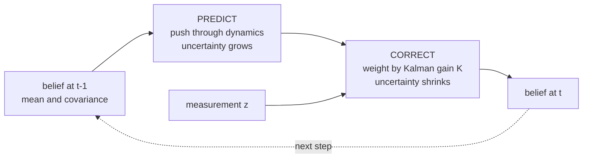
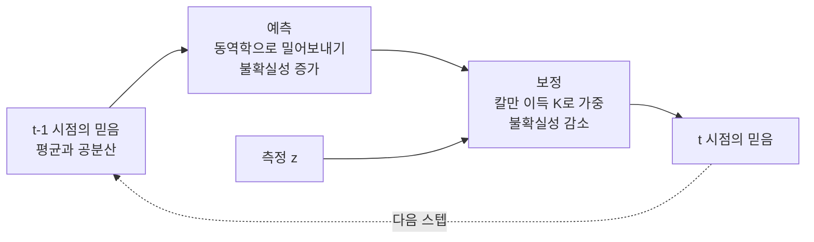

> [!note] Prerequisites · 선수 지식
> [[02-foundations/engineering-math|0.5 §3]] (integrals as expectations) · [[02-foundations/engineering-math|0.5 §10]] (set notation) · [[02-foundations/linear-algebra|1. Linear Algebra §3]] (PSD matrices, for covariance)
> [[02-foundations/engineering-math|0.5 §3]](기댓값으로서의 적분) · [[02-foundations/engineering-math|0.5 §10]](집합 표기) · [[02-foundations/linear-algebra|1. 선형대수 §3]](공분산을 위한 PSD 행렬)
>
> Connection map · 연결 지도: [[02-foundations/overview|0. Overview]]

## English

Probability is the substrate under estimation, filtering, and many standard objectives in deep
learning. Course-depth treatment: derivations, the Gaussian toolbox, a worked MLE example,
and the Kalman filter assembled from parts you'll have proven along the way.

### 1. The core language

- Axioms: $P(\Omega)=1$, $P(A)\ge 0$, additivity over disjoint events. Everything else is
  bookkeeping on top.
- **Conditioning** $P(A|B) = P(A\cap B)/P(B)$ re-weights the world after evidence.
  Chain rule: $P(A,B) = P(A|B)P(B)$.
- **Bayes' rule.** The chain rule above can factor a joint probability in either order —
  $P(\theta, x) = P(\theta|x)P(x)$ and $P(\theta, x) = P(x|\theta)P(\theta)$ — and both equal
  the same joint, so set them equal and divide by $P(x)$. That is the derivation:
  $$P(\theta|x) = \frac{P(x|\theta)\,P(\theta)}{P(x)} \;\propto\; \text{likelihood}\times\text{prior}$$
  Read it as: *what you believed before* ($P(\theta)$), reweighted by *how well each
  hypothesis explains what you just saw* ($P(x|\theta)$).
  Worked example — sensor diagnosis: a crack detector fires on 95% of cracks
  ($P(+|c)=0.95$), false-alarms 5% ($P(+|\neg c)=0.05$), cracks are rare ($P(c)=0.01$).
  $P(c|+) = \frac{0.95\cdot 0.01}{0.95\cdot 0.01 + 0.05\cdot 0.99} \approx 0.16$.
  An alarm with 95% sensitivity (and a 5% false-positive rate — two separate numbers,
  not one "accuracy") is right only 16% of the time it fires — base rates dominate. This is why
  perception pipelines calibrate.
- Independence $P(A,B) = P(A)P(B)$ vs conditional independence $P(A,B|C) = P(A|C)P(B|C)$ —
  the factorization assumptions behind graphical models, naive Bayes, and the Markov
  property alike.

### 2. Random variables and expectation

- PMF (discrete) / PDF (continuous) / CDF; $E[g(X)] = \int g(x)p(x)dx$.
- **Linearity** $E[aX + bY] = aE[X] + bE[Y]$ — *no independence needed*; the single most
  used identity in proofs.
- Variance $\text{Var}(X) = E[X^2] - E[X]^2$; covariance
  $\text{Cov}(X,Y) = E[XY] - E[X]E[Y]$; for vectors, the covariance matrix
  $\Sigma = E[(x-\mu)(x-\mu)^\top]$ is PSD ([[02-foundations/linear-algebra|linear algebra]]).
- **Conditional expectation** $E[X|Y]$ is the best mean-square predictor of $X$ given $Y$ —
  the reason estimation theory keeps computing it, and what regression approximates.
- Distributions that carry this wiki: **Bernoulli/categorical** (classification losses,
  dropout masks), **Gaussian** (below), Poisson (event counts), exponential (waiting times).

### 3. The Gaussian toolbox (why Gaussians run robotics)

$\mathcal{N}(x;\mu,\Sigma) = \frac{1}{\sqrt{(2\pi)^n|\Sigma|}}\exp\big(-\tfrac12 (x-\mu)^\top\Sigma^{-1}(x-\mu)\big)$

Three **closure** properties make the Gaussian the workhorse — "closure" meaning the answer
is still a Gaussian, so you never leave the family and never need a harder distribution:

1. **Affine maps**: $x\sim\mathcal{N}(\mu,\Sigma) \Rightarrow Ax + b \sim \mathcal{N}(A\mu + b,\, A\Sigma A^\top)$.
2. **Sums** of independent Gaussians are Gaussian (variances add).
3. **Conditioning**: if $(x_1, x_2)$ jointly Gaussian,
   $$E[x_1|x_2] = \mu_1 + \Sigma_{12}\Sigma_{22}^{-1}(x_2 - \mu_2)$$
   — the conditional mean is a *linear* correction weighted by correlation-to-variance.
   Memorize the shape of this formula: it *is* the Kalman gain.

Also: CLT says sums of many independent effects → Gaussian, which is why noise models
default to it; and the Gaussian is the max-entropy distribution for fixed mean/variance
([[02-foundations/information-theory|information theory]]) — the "least presumptuous" choice.

### 4. Estimation — where loss functions come from

- **MLE**: $\hat\theta = \arg\max_\theta \sum_i \log p(x_i|\theta)$.
  Worked example (Gaussian mean): $\log p = -\frac{(x-\mu)^2}{2\sigma^2} + \text{const}$ ⇒
  maximizing likelihood ≡ minimizing squared error; $\hat\mu = \bar{x}$.
  **MSE regression is MLE under Gaussian noise; cross-entropy is MLE for categorical
  outputs.** Many pretraining objectives in [[01-canonical-papers/canonical-list|the paper list]]
  are MLE or a bound on one ([[01-canonical-papers/notes/6-diffusion/vae|ELBO]]) —
  though not all: contrastive and some self-supervised objectives are not simple MLE.
- **MAP**: add $\log p(\theta)$. A Gaussian prior on weights ⇒ $+\lambda\|\theta\|^2$ —
  weight decay is a prior in disguise; L1 prior (Laplace) ⇒ sparsity.
- Estimator quality: **bias** (how far the estimate is off *on average*, over many datasets),
  **variance** (how much it jumps around between datasets), and the tradeoff between them — the vocabulary behind
  "our estimator is unbiased but high-variance" in RL papers
  ([[02-foundations/rl-basics|policy gradients]]).

### 5. Random processes and the Kalman filter

- A random process = an indexed family of RVs; characterized by its mean function and its
  **autocorrelation** — $E[x(t)x(t+\tau)]$, how strongly the signal at one instant predicts
  itself $\tau$ later (a noisy signal's frequency content, seen in the time domain).
  **Stationarity / WSS** (*wide-sense stationary*: the mean and autocorrelation don't depend
  on *when* you look, only on the gap $\tau$): statistics don't drift (assumption behind spectral
  analysis, [[02-foundations/signal-processing|signal processing]]).
  **White noise**: uncorrelated samples, flat spectrum — the default disturbance model and
  the $\epsilon$ of [[01-canonical-papers/notes/6-diffusion/ddpm|diffusion]].
- **Markov property**: future ⟂ past | present. The modeling assumption of MDPs
  ([[02-foundations/rl-basics|RL]]), world models, and diffusion chains.
- **Kalman filter, assembled from this page**: model
  $x_{t+1} = Ax_t + w$, $y_t = Cx_t + v$ with Gaussian $w \sim \mathcal{N}(0,Q)$,
  $v \sim \mathcal{N}(0,R)$.
  - *Predict* (affine property): $\hat x^- = A\hat x$, $P^- = APA^\top + Q$ — here $P$ is
    the **estimate covariance** (uncertainty of $\hat x$) and $Q$ the process-noise covariance.
  - *Update* (Gaussian conditioning): $K = P^-C^\top(CP^-C^\top + R)^{-1}$,
    $\hat x = \hat x^- + K(y - C\hat x^-)$, $P = (I - KC)P^-$.
  Nothing new was needed: affine closure + conditioning formula = optimal recursive
  estimation.

 Nonlinear versions (EKF/UKF) linearize or sample; SLAM scales this to maps.

### Self-check

1. Recompute the crack-detector example with $P(c) = 0.2$ (a suspect structure). What
   happens to $P(c|+)$ and what does that say about deploying detectors in high-risk zones?
2. Derive "MSE = Gaussian MLE" and "cross-entropy = categorical MLE" from the definitions.
3. Using affine closure, show why $x_t = \sqrt{\bar\alpha_t}x_0 + \sqrt{1-\bar\alpha_t}\epsilon$
   ([[01-canonical-papers/notes/6-diffusion/ddpm|DDPM]]) has the claimed distribution.
4. In the Kalman gain, what happens as sensor noise $R \to 0$? As $R \to \infty$? Interpret.

> [!tip]- Answers
> 1. $P(c|+) = \frac{0.95 \times 0.2}{0.95\times 0.2 + 0.05\times 0.8} = \frac{0.19}{0.23} \approx 0.83$. The same detector's alarm jumps from 16% to 83% trustworthy purely because the base rate rose — a detector's value is set by *where you deploy it*, not by its sensitivity alone.
> 2. Gaussian: $\log p = -\frac{(x-\mu)^2}{2\sigma^2} + C$, so maximizing the likelihood is minimizing the sum of squares (MSE). Categorical: $\log\prod_i p_{y_i} = \sum_i \log p_{y_i}$, so maximizing it is minimizing $-\sum_i\log p_{y_i}$ — exactly cross-entropy.
> 3. $\sqrt{\bar\alpha_t}\,x_0$ is an affine map of $x_0$ and $\sqrt{1-\bar\alpha_t}\,\epsilon$ is an independent Gaussian. By affine closure the first is Gaussian, by sum closure the total is Gaussian, and the mean/variance can be read straight off: $\mathcal{N}(\sqrt{\bar\alpha_t}x_0,\,(1-\bar\alpha_t)I)$.
> 4. $R \to 0$: the gain $K$ grows and the estimate snaps onto the measurement (the sensor is trusted completely). $R \to \infty$: $K \to 0$, the measurement is ignored and the filter coasts on the model prediction. The gain is a *ratio* of trust, not a tuning knob set by hand.

### Robotics bridge

Bayesian conditioning becomes a time-indexed robot algorithm in [[04-robotics/state-estimation-slam|State Estimation, Localization & SLAM]].

## 한국어

확률은 추정, 필터링, 그리고 딥러닝의 많은 표준 목적함수 아래에 깔린 토대다. 교재 수준의 서술:
유도, 가우시안 도구 상자, MLE 계산 예제, 그리고 이 페이지에서 증명한 부품들로 조립하는
칼만 필터까지.

### 1. 핵심 언어

- 공리: $P(\Omega)=1$, $P(A)\ge 0$, 서로소 사건의 가산성. 나머지는 이 위의 장부 정리다.
- **조건화** $P(A|B) = P(A\cap B)/P(B)$는 증거를 본 뒤 세계를 재가중한다.
  연쇄 법칙: $P(A,B) = P(A|B)P(B)$.
- **베이즈 정리.** 위의 연쇄 법칙은 결합 확률을 두 순서로 분해할 수 있다 —
  $P(\theta, x) = P(\theta|x)P(x)$와 $P(\theta, x) = P(x|\theta)P(\theta)$ — 둘 다 같은 결합
  확률이므로 서로 같다고 놓고 $P(x)$로 나누면 끝이다. 유도가 이게 전부다:
  $$P(\theta|x) = \frac{P(x|\theta)\,P(\theta)}{P(x)} \;\propto\; \text{우도}\times\text{사전}$$
  읽는 법: *이전에 믿고 있던 것*($P(\theta)$)을, *각 가설이 방금 본 것을 얼마나 잘
  설명하는가*($P(x|\theta)$)로 다시 가중한 것.
  계산 예제 — 센서 진단: 균열 감지기가 균열의 95%에서 울리고($P(+|c)=0.95$), 오경보율
  5%($P(+|\neg c)=0.05$), 균열은 드물다($P(c)=0.01$).
  $P(c|+) = \frac{0.95\cdot 0.01}{0.95\cdot 0.01 + 0.05\cdot 0.99} \approx 0.16$.
  민감도 95%짜리(그리고 오경보율 5% — "정확도" 하나가 아니라 별개의 두 숫자다) 경보가
  울렸을 때 실제로는 16%만 맞는다 — 기저율이 지배한다. 인식 파이프라인이
  캘리브레이션을 하는 이유다.
- 독립 $P(A,B) = P(A)P(B)$ vs 조건부 독립 $P(A,B|C) = P(A|C)P(B|C)$ — 그래프 모델,
  나이브 베이즈, 마르코프 성질이 공유하는 인수분해 가정.

### 2. 확률변수와 기댓값

- PMF(이산) / PDF(연속) / CDF; $E[g(X)] = \int g(x)p(x)dx$.
- **선형성** $E[aX + bY] = aE[X] + bE[Y]$ — *독립이 필요 없다*; 증명에서 가장 많이 쓰는
  항등식.
- 분산 $\text{Var}(X) = E[X^2] - E[X]^2$; 공분산 $\text{Cov}(X,Y) = E[XY] - E[X]E[Y]$;
  벡터의 공분산 행렬 $\Sigma = E[(x-\mu)(x-\mu)^\top]$는 PSD다
  ([[02-foundations/linear-algebra|선형대수]]).
- **조건부 기댓값** $E[X|Y]$는 $Y$가 주어졌을 때 $X$의 평균제곱 최적 예측기 — 추정 이론이
  끊임없이 이것을 계산하는 이유이자, 회귀가 근사하는 대상.
- 이 위키를 떠받치는 분포들: **베르누이/카테고리**(분류 손실, 드롭아웃 마스크),
  **가우시안**(아래), 포아송(사건 횟수), 지수(대기 시간).

### 3. 가우시안 도구 상자 (가우시안이 로보틱스를 굴리는 이유)

$\mathcal{N}(x;\mu,\Sigma) = \frac{1}{\sqrt{(2\pi)^n|\Sigma|}}\exp\big(-\tfrac12 (x-\mu)^\top\Sigma^{-1}(x-\mu)\big)$

세 가지 **닫힘(closure)** 성질이 가우시안을 주력으로 만든다 — "닫힘"이란 결과가 여전히
가우시안이라는 뜻이다. 즉 이 가족을 벗어날 일이 없고, 더 어려운 분포가 필요해지지 않는다:

1. **아핀 사상**: $x\sim\mathcal{N}(\mu,\Sigma) \Rightarrow Ax + b \sim \mathcal{N}(A\mu + b,\, A\Sigma A^\top)$
2. 독립 가우시안의 **합**은 가우시안 (분산이 더해진다).
3. **조건화**: $(x_1, x_2)$가 결합 가우시안이면
   $$E[x_1|x_2] = \mu_1 + \Sigma_{12}\Sigma_{22}^{-1}(x_2 - \mu_2)$$
   — 조건부 평균은 상관/분산으로 가중된 *선형* 보정이다. 이 공식의 모양을 기억하라:
   이것이 *곧* 칼만 이득이다.

또한: CLT는 많은 독립 효과의 합이 → 가우시안이라 말한다(노이즈 모델의 기본값인 이유);
그리고 가우시안은 평균·분산이 고정일 때 최대 엔트로피 분포다
([[02-foundations/information-theory|정보이론]]) — "가장 덜 주제넘은" 선택.

### 4. 추정 — 손실함수의 출생지

- **MLE**: $\hat\theta = \arg\max_\theta \sum_i \log p(x_i|\theta)$.
  계산 예제(가우시안 평균): $\log p = -\frac{(x-\mu)^2}{2\sigma^2} + \text{상수}$ ⇒
  우도 최대화 ≡ 제곱 오차 최소화; $\hat\mu = \bar{x}$.
  **MSE 회귀는 가우시안 노이즈 하의 MLE이고, 교차 엔트로피는 카테고리 출력의 MLE다.**
  [[01-canonical-papers/canonical-list|논문 리스트]]의 많은 사전학습 목적함수가 MLE 또는 그
  하한([[01-canonical-papers/notes/6-diffusion/vae|ELBO]])이다 — 단 전부는 아니다:
  대조 학습과 일부 자기지도 목적함수는 단순 MLE가 아니다.
- **MAP**: $\log p(\theta)$를 더한다. 가중치의 가우시안 사전 ⇒ $+\lambda\|\theta\|^2$ —
  weight decay는 변장한 사전 분포다; L1 사전(라플라스) ⇒ 희소성.
- 추정기의 품질: **편향(bias)**(여러 데이터셋에 걸쳐 *평균적으로* 얼마나 빗나가는가),
  **분산(variance)**(데이터셋이 바뀔 때 얼마나 요동치는가), 그리고 그 사이의 트레이드오프 — RL 논문의 "불편(unbiased)
  이지만 고분산인 추정기"라는 어휘가 여기서 온다
  ([[02-foundations/rl-basics|정책 그래디언트]]).

### 5. 랜덤 프로세스와 칼만 필터

- 랜덤 프로세스 = 인덱스 달린 확률변수의 족; 평균 함수와 **자기상관**(autocorrelation)으로
  특성화한다 — $E[x(t)x(t+\tau)]$, 어느 순간의 신호가 $\tau$ 뒤의 자기 자신을 얼마나
  예측하는가(잡음 신호의 주파수 내용을 시간 영역에서 본 것).
  **정상성 / WSS**(*wide-sense stationary*, 광의의 정상성: 평균과 자기상관이 *언제*
  보느냐가 아니라 시간 간격 $\tau$에만 의존한다): 통계량이 표류하지 않는다(스펙트럼 분석의 전제,
  [[02-foundations/signal-processing|신호처리]]).
  **백색 잡음**: 무상관 샘플, 평평한 스펙트럼 — 기본 외란 모델이자
  [[01-canonical-papers/notes/6-diffusion/ddpm|디퓨전]]의 $\epsilon$.
- **마르코프 성질**: 미래 ⟂ 과거 | 현재. MDP([[02-foundations/rl-basics|RL]]), 월드모델,
  디퓨전 체인의 모델링 가정.
- **이 페이지의 부품으로 조립하는 칼만 필터**: 모델
  $x_{t+1} = Ax_t + w$, $y_t = Cx_t + v$, 가우시안 $w \sim \mathcal{N}(0,Q)$,
  $v \sim \mathcal{N}(0,R)$.
  - *예측* (아핀 성질): $\hat x^- = A\hat x$, $P^- = APA^\top + Q$ — 여기서 $P$는
    **추정 공분산**($\hat x$의 불확실성), $Q$는 과정 잡음 공분산이다
  - *갱신* (가우시안 조건화): $K = P^-C^\top(CP^-C^\top + R)^{-1}$,
    $\hat x = \hat x^- + K(y - C\hat x^-)$, $P = (I - KC)P^-$
  새로운 것이 필요 없었다: 아핀 닫힘 + 조건화 공식 = 최적 재귀 추정.

 비선형
  버전(EKF/UKF)은 선형화하거나 샘플링하고, SLAM은 이를 지도로 확장한다.

### 스스로 점검

1. 균열 감지 예제를 $P(c) = 0.2$(의심 구조물)로 다시 계산하라. $P(c|+)$가 어떻게 되고,
   고위험 구역에 감지기를 배치하는 것에 대해 무엇을 말해주는가?
2. "MSE = 가우시안 MLE"와 "교차 엔트로피 = 카테고리 MLE"를 정의에서 유도하라.
3. 아핀 닫힘을 써서 $x_t = \sqrt{\bar\alpha_t}x_0 + \sqrt{1-\bar\alpha_t}\epsilon$
   ([[01-canonical-papers/notes/6-diffusion/ddpm|DDPM]])이 주장된 분포를 갖는 이유를 보여라.
4. 칼만 이득에서 센서 노이즈 $R \to 0$이면? $R \to \infty$면? 해석하라.

> [!tip]- 스스로 점검 정답 · Answers
> 1. $P(c|+) = \frac{0.95 \times 0.2}{0.95 \times 0.2 + 0.05 \times 0.8} = \frac{0.19}{0.23} \approx 0.83$ — 기저율이 높은 곳에서는 같은 감지기의 경보 신뢰도가 16%→83%로 뛴다. 감지기의 가치는 배치 장소가 좌우한다.
> 2. 가우시안: $\log p = -\frac{(x-\mu)^2}{2\sigma^2} + C$ ⇒ 우도 최대화 = 제곱합 최소화(MSE). 카테고리: $\log\prod p_{y_i} = \sum \log p_{y_i}$ ⇒ 교차 엔트로피 최소화와 동일.
> 3. $\sqrt{\bar\alpha_t}\,x_0$는 아핀 변환, $\sqrt{1-\bar\alpha_t}\,\epsilon$은 독립 가우시안 — 아핀 닫힘과 합 닫힘에 의해 결과도 가우시안이고 평균·분산이 그대로 읽힌다.
> 4. $R \to 0$: $K$가 커져 관측에 스냅(센서 완전 신뢰); $R \to \infty$: $K \to 0$, 관측을 무시하고 모델 예측만 따른다.

### 로보틱스 다리

가우시안 조건화와 재귀 추정은 [[04-robotics/state-estimation-slam|3. 상태 추정과 SLAM]]에서 로봇의 belief가 된다.
