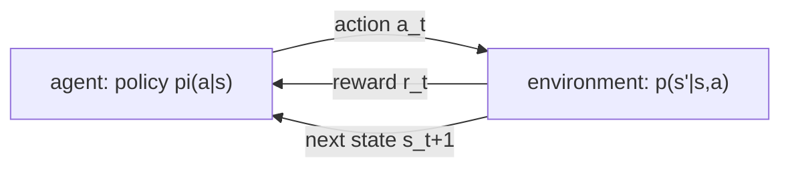
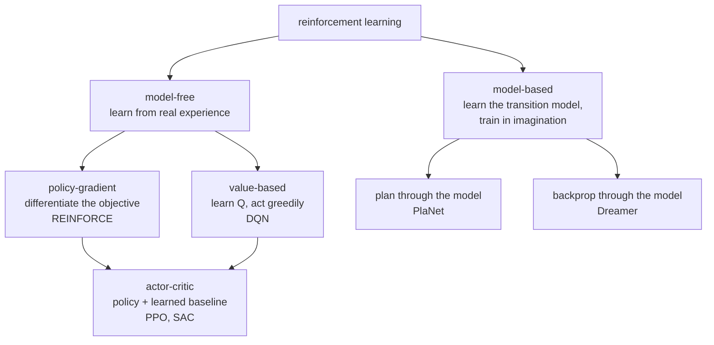
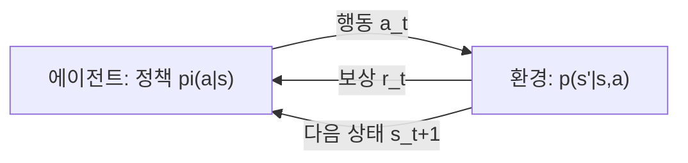
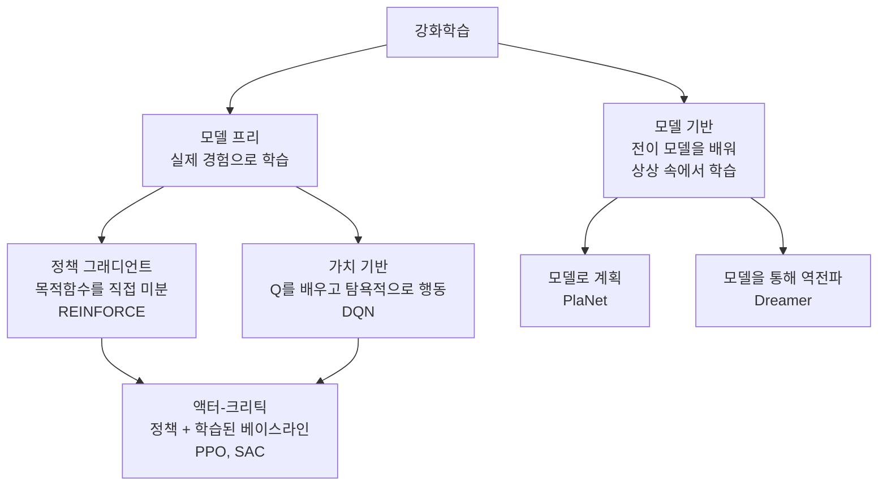

> [!note] Prerequisites · 선수 지식
> [[02-foundations/engineering-math|0.5 §5]] (geometric series — where the effective horizon comes from) · [[02-foundations/probability|3. Probability §1–2, §5]] (conditioning, expectation, the Markov property) · [[02-foundations/calculus-backprop|2. Calculus]] (gradients, for policy gradients)
> [[02-foundations/engineering-math|0.5 §5]](기하급수 — 유효 지평이 여기서 나온다) · [[02-foundations/probability|3. 확률 §1–2, §5]](조건화·기댓값·마르코프 성질) · [[02-foundations/calculus-backprop|2. 미적분]](정책 그래디언트를 위한 그래디언트)
>
> Connection map · 연결 지도: [[02-foundations/overview|0. Overview]]

## English

*Stands on [[02-foundations/probability|3. Probability]] and [[02-foundations/calculus-backprop|2. Calculus]]. The other domain bridge: the case where your own policy makes the data.
Nothing here needs signal processing, so the two can be read in either order.*

You cannot read [[01-canonical-papers/notes/1-foundations/instructgpt|RLHF]], the
[[01-canonical-papers/notes/5-world-models/dreamer|Dreamer]] line, or half of modern robot learning without
the MDP vocabulary. Course-depth treatment: the Bellman machinery, both algorithm families
with their update rules, the policy gradient theorem, and PPO's actual objective — then the
layer robot papers actually spend their pages on: reward design, exploration, RL
fine-tuning on real machines, and how to read an RL experimental section.

> [!note] First pass · 처음이라면
> This is the longest page in the track, so read §6 early. First pass: §1, §2, then jump to §6 — the RL-versus-imitation map tells you which half of the page your papers actually live in. Come back for §3, §4 and §7 with that in hand.

### 1. The MDP

- **Markov Decision Process** $(\mathcal{S}, \mathcal{A}, p, r, \gamma)$: states, actions,
  transition kernel $p(s'|s,a)$, reward $r(s,a)$, discount $\gamma \in [0,1)$.
  Markov = the state summarizes the past ([[02-foundations/probability|probability]]).
- **Policy** $\pi(a|s)$; **return** $G_t = \sum_{k\ge 0} \gamma^k r_{t+k}$; objective
  $J(\pi) = E_\pi[G_0]$. Discounting makes infinite sums finite and encodes impatience;
  $1/(1-\gamma)$ is the effective horizon (γ=0.99 ⇒ ~100 steps — the geometric sum that
  produces that number is derived step by step in [[02-foundations/engineering-math|0.5 §5]]).
- Robotics reality: the state is *unobserved* (POMDP) — you see images and proprioception.
  Practical dodge: condition on observation histories / recurrent state (what
  [[01-canonical-papers/notes/5-world-models/dreamer|RSSM]]s formalize).

### 2. Value functions and the Bellman equations

- $V^\pi(s) = E_\pi[G_t | s_t{=}s]$, $Q^\pi(s,a) = E_\pi[G_t | s_t{=}s, a_t{=}a]$,
  **advantage** $A^\pi = Q^\pi - V^\pi$ (how much better than my average move).
- **Bellman expectation** (consistency of $V^\pi$):
  $$V^\pi(s) = E_{a\sim\pi,\, s'\sim p}\big[r(s,a) + \gamma V^\pi(s')\big]$$
- **Bellman optimality**: $Q^*(s,a) = E\big[r + \gamma \max_{a'} Q^*(s',a')\big]$;
  the greedy policy on $Q^*$ is optimal.
- **A two-state MDP you can solve on paper.** States $A$ (empty bucket) and $B$ (bucket
  full). From $A$ the only action moves you to $B$ with reward $0$; in $B$ you stay in $B$
  and collect reward $1$ every step. Take $\gamma = 0.9$. Write the Bellman equation for $B$:
  $$V(B) = 1 + 0.9\,V(B) \quad\Rightarrow\quad V(B)(1 - 0.9) = 1 \quad\Rightarrow\quad V(B) = 10$$
  — which is the geometric sum $1/(1-\gamma)$ from
  [[02-foundations/engineering-math|0.5 §5]], arriving here as a *value*. Then
  $V(A) = 0 + 0.9\,V(B) = 9$. Read it: being one step away from the good state costs you
  exactly one discount factor, $9 = 0.9 \times 10$. And the advantage of the move out of $A$
  is $Q(A,\text{move}) - V(A) = 9 - 9 = 0$ — there was no alternative, so no move can be
  better than average. Advantage measures *choice*, and where there is no choice it is zero.
- These are fixed-point equations; the Bellman operator is a $\gamma$-contraction, so
  iterating it converges — the license behind everything below.

### 3. Dynamic programming and TD learning

- **Value iteration**: apply the optimality operator repeatedly (needs the model $p$).
  **Policy iteration**: evaluate $\pi$, then act greedily; repeat.
- Without a model, sample: **TD(0)** update
  $V(s) \leftarrow V(s) + \alpha\,[\underbrace{r + \gamma V(s')}_{\text{target}} - V(s)]$
  — bootstrap from your own estimate. The bracket is the **TD error** $\delta$, RL's
  all-purpose learning signal.
- **Q-learning** (**off-policy** — it learns about the greedy policy while acting under a
  different, exploratory one, so it can reuse old data; **on-policy** methods such as PPO
  must learn from data their *current* policy just generated, and discard it after):
  $Q(s,a) \leftarrow Q(s,a) + \alpha\,[r + \gamma \max_{a'}Q(s',a') - Q(s,a)]$.
  DQN = this + neural $Q$ + replay buffer + target network (a
  [[02-foundations/calculus-backprop|stop-gradient]] copy for stable targets).
- Value-based methods are sample-efficient but awkward for continuous actions
  (the $\max_{a'}$ needs an inner optimization) — hence robotics leans policy-side.
- **Worked example — policy evaluation you can do on paper.** (Value *iteration* would take a $\max_a$ at each step; with the policy fixed this is the evaluation half.) Two states, fixed policy,
  $\gamma = 0.9$: state $A$ gives reward 1 and moves to $B$; state $B$ gives 0 and moves
  back to $A$. Bellman: $V(A) = 1 + 0.9V(B)$, $V(B) = 0.9V(A)$. Iterate from $V_0 = (0,0)$:
  $V_1 = (1, 0)$, $V_2 = (1, 0.9)$, $V_3 = (1.81, 0.9)$, … converging to the fixed point
  $V(A) = 1/(1 - 0.81) \approx 5.26$, $V(B) \approx 4.74$. Watch what happened: each
  sweep pushes reward information one step further back — that is all "bootstrapping" means.

### 3.5 The deadly triad — why deep RL needs its patches

Section 3 ended by saying DQN is Q-learning plus a neural $Q$, a replay buffer and a target
network, without saying why the last two are there. They are there because of a result
every robot-learning paper is quietly living inside.

**Three ingredients, and only together are they dangerous.** Sutton and Barto name them the
*deadly triad*:

| Element | What it means | Where §3 introduced it |
|---|---|---|
| Function approximation | generalizing from a state space far larger than memory — linear features, or a network | "neural $Q$" |
| Bootstrapping | updating toward a target that contains your own current estimate | the TD target $r + \gamma V(s')$ |
| Off-policy training | learning from a distribution of transitions other than the one the target policy produces | Q-learning acting under an exploratory policy |

Combine all three and value estimates can **diverge** — not converge slowly, not converge to
a poor answer, but grow without bound. Any *two* of the three is safe. Tabular Q-learning is
safe (no approximation). Monte Carlo with a network is safe (no bootstrapping). Sarsa with a
network is safe (on-policy).

**Two things this is not.** It is not a control problem: the divergence appears in plain
*prediction*, with the policy fixed. And it is not about noise or exploration or an unknown
environment: it happens in dynamic programming, where the model is known exactly and there
is no sampling at all.

**Worked — divergence with the exact least-squares answer at every step.** Tsitsiklis and
Van Roy's two-state example. One parameter $w$; the first state's estimated value is $w$ and
the second's is $2w$. Every reward is zero, so the true value is zero at both states —
**and that is exactly representable**, at $w = 0$. The first state leads to the second; the
second repeats, terminating with probability $\varepsilon$. At each sweep, choose $w_{k+1}$
to be the *best possible least-squares fit* to the expected one-step return. Minimizing
$(w - 2\gamma w_k)^2 + (2w - 2(1-\varepsilon)\gamma w_k)^2$ gives

$$w_{k+1} = \frac{6 - 4\varepsilon}{5}\,\gamma\, w_k$$

so the sequence multiplies by a constant each sweep and diverges whenever
$\gamma > 5/(6-4\varepsilon)$. At $\varepsilon = 0$ that threshold is $\gamma = 0.833$ — so
the entirely ordinary $\gamma = 0.9$ gives a multiplier of $1.08$:

$$w = 1,\; 1.08,\; 1.166,\; 1.260,\; 1.360,\; \ldots,\; 46.9 \text{ after 50 sweeps}$$

Set $\gamma = 0.8$ instead and the multiplier is $0.96$ and it converges to zero. Or keep
$\gamma = 0.9$ and let episodes terminate with $\varepsilon = 0.2$ — multiplier $0.936$,
converges again, because termination makes the update distribution less off-policy.

Look at what is *not* available as an excuse. There is no learning rate to lower — the fit
is exact. There is no noise — the model is known. There is no reward to misdesign — they are
all zero. There is no representation error — the true answer is in the function class. The
divergence is structural, and it turns on the discount factor.

**Which leg would you give up?** All three are on the table, and the field's answer explains
its designs.

- *Function approximation*: no. Anything that scales to images or joint states needs it.
- *Bootstrapping*: possible, and Monte Carlo does it — at real cost. MC must store an
  episode until it ends before it can learn anything from it, while a bootstrapped update
  consumes each transition where it is generated and never revisits it. Bootstrapping is
  also usually more data-efficient. Nobody gives it up entirely; $n$-step returns give it up
  partially.
- *Off-policy*: often, yes. Sarsa instead of Q-learning is exactly this trade, and on-policy
  methods like PPO are stable for the same reason. What you lose is data reuse — an
  on-policy method must throw away every batch after one update, which is why PPO is
  sample-hungry and why anything learning from logged demonstrations or a replay buffer is
  off-policy by construction.

**The patches, read as triad mitigations.** This is the payoff for reading papers:

- **Target network** (DQN): freeze the network that produces the bootstrap target for
  thousands of steps. That weakens the bootstrapping leg by making the target temporarily a
  constant rather than a moving self-reference.
- **Replay buffer**: improves the data but *worsens* the off-policy leg, since old
  transitions come from older policies. It is bought, not free — which is why buffer size
  and sampling scheme are tuned rather than maximized.
- **Clipped double-$Q$** (TD3, [[01-canonical-papers/notes/1-foundations/sac|SAC]]): take the minimum
  of two critics. Aimed at overestimation bias, which the triad amplifies because an
  over-large value feeds its own next target.
- **Pessimism in offline RL**: penalize or avoid evaluating actions the dataset does not
  support. This attacks the off-policy leg directly, and it is why offline RL is a distinct
  literature rather than "RL with a fixed buffer."

There is also a clean theoretical escape that nobody uses: function approximators that never
extrapolate beyond observed targets — nearest neighbour, locally weighted regression, the
class Sutton and Barto call *averagers* — are provably stable. They are also too weak for
the problems robotics cares about. Neural networks and tile coding both extrapolate, so both
forfeit the guarantee.

**What to do with this when reading.** When a value-based or offline-RL paper reports
instability, a tuning sensitivity, or an ablation where removing one component collapses
training, check which leg of the triad that component was holding. And when a paper reports
that its method is stable, ask what it gave up to get there — usually data reuse,
sometimes discount factor, occasionally the bootstrap.

### 4. Policy gradients — differentiate the objective itself

- **The log-derivative trick** (the whole derivation in three steps):
  $$\nabla_\theta J = \nabla_\theta \int p_\theta(\tau) G(\tau)\,d\tau = \int p_\theta(\tau)\,\nabla_\theta \log p_\theta(\tau)\, G(\tau)\,d\tau = E_\tau\Big[\sum_t \nabla_\theta \log \pi_\theta(a_t|s_t)\, G_t\Big]$$
  (dynamics terms vanish from $\nabla\log p_\theta(\tau)$ because they don't depend on
  $\theta$). Interpretation: *raise the log-probability of actions in proportion to the
  return that followed*.
- **REINFORCE** is exactly this — unbiased, catastrophically high variance. Variance
  reductions, in order of importance: subtract a **baseline** $b(s)$ (unbiased for any
  state-only baseline; best choice ≈ $V(s)$, making the weight the advantage $A$);
  use reward-to-go; **actor-critic**: learn $V_\phi$ with TD and use
  $\delta = r + \gamma V(s') - V(s)$ as a one-sample advantage estimate. **GAE** (generalized advantage estimation) interpolates
  between TD (biased, low-variance) and Monte Carlo (unbiased, high-variance) with a knob λ.
- **Why a baseline matters, in numbers.** One state, two actions, $\pi(a_1)=0.6$,
  $\pi(a_2)=0.4$, returns $G_1 = 1$, $G_2 = 0$. Raw REINFORCE weights the two
  log-probability gradients by $1$ and $0$: $a_1$ is pushed up and $a_2$ is *left alone*.
  Subtract the baseline $b = E[G] = 0.6\cdot1 + 0.4\cdot0 = 0.6$ and the weights become
  advantages $A_1 = +0.4$, $A_2 = -0.6$ — now the worse action is actively pushed **down**.
  Same expected gradient, far less variance: that is the whole trick.
- **PPO** — the workhorse ([[01-canonical-papers/notes/1-foundations/instructgpt|the one inside RLHF]]):
  with ratio $\rho_t = \pi_\theta(a_t|s_t)/\pi_{old}(a_t|s_t)$,
  $$\mathcal{L} = E_t\big[\min\big(\rho_t A_t,\ \text{clip}(\rho_t, 1{-}\epsilon, 1{+}\epsilon)\, A_t\big)\big]$$
  (**maximized**, despite the $\mathcal{L}$ — PPO's objective is a reward-like surrogate, not a loss)
  — take policy-gradient steps but *clip away the incentive* to move far from the data-
  collecting policy. A trust region by clamp, plus (in RLHF) an explicit KL penalty
  ([[02-foundations/information-theory|information theory]]).
- **The clip, in numbers** ($\epsilon = 0.2$). Good action, $A = +1$, and the policy has
  already raised it to $\rho = 1.3$: $\min(1.3,\ \text{clip}(1.3)=1.2) = 1.2$ — the
  *clipped* branch wins, and it is flat, so the gradient is **zero**: no incentive to push
  further. Bad action, $A = -1$, and the policy is moving the wrong way at $\rho = 1.5$:
  $\min(-1.5,\ -1.2) = -1.5$ — the *unclipped* branch wins, gradient nonzero, so the
  penalty **keeps acting**. Clipping removes the incentive to overshoot, never the
  incentive to correct.

<svg viewBox="0 0 460 185" style="max-width:100%;height:auto" role="img" aria-label="the PPO clipped objective for a good action and for a bad action">
  <g stroke="currentColor" stroke-width="1" opacity="0.3">
    <line x1="30" y1="30" x2="30" y2="155"/><line x1="30" y1="155" x2="210" y2="155"/>
    <line x1="255" y1="30" x2="255" y2="155"/><line x1="255" y1="155" x2="435" y2="155"/>
  </g>
  <g stroke="currentColor" stroke-width="1" opacity="0.45" stroke-dasharray="3 3">
    <line x1="141" y1="30" x2="141" y2="155"/><line x1="303" y1="30" x2="303" y2="155"/>
    <line x1="110" y1="140" x2="110" y2="155"/><line x1="334" y1="140" x2="334" y2="155"/>
  </g>
  <path d="M30,143 L141,59" fill="none" stroke="currentColor" stroke-width="2.2"/>
  <path d="M141,59 L205,59" fill="none" stroke="currentColor" stroke-width="2.2" opacity="0.55"/>
  <path d="M255,47 L303,47" fill="none" stroke="currentColor" stroke-width="2.2" opacity="0.55"/>
  <path d="M303,47 L430,143" fill="none" stroke="currentColor" stroke-width="2.2"/>
  <g font-size="11" fill="currentColor">
    <text x="30" y="22">good action (A = +1)</text><text x="255" y="22">bad action (A = &#8722;1)</text>
    <text x="103" y="170" font-size="10">1.0</text><text x="130" y="170" font-size="10">1.2</text>
    <text x="292" y="170" font-size="10">0.8</text><text x="327" y="170" font-size="10">1.0</text>
    <text x="150" y="52" font-size="10.5" opacity="0.9">flat: gradient 0</text>
    <text x="258" y="40" font-size="10.5" opacity="0.9">flat here only</text>
    <text x="186" y="170" font-size="10">rho</text><text x="410" y="170" font-size="10">rho</text>
  </g>
</svg>

### 5. Model-based RL — the world-model connection

- Model-free RL asks the *real world* for every gradient — untenable for robots (time,
  wear, safety). Model-based RL learns $\hat p(s'|s,a)$ and trains the policy on
  *imagined* rollouts: [[01-canonical-papers/notes/5-world-models/world-models|World Models]] →
  [[01-canonical-papers/notes/5-world-models/planet|PlaNet]] (plan through the model) →
  [[01-canonical-papers/notes/5-world-models/dreamer|Dreamer]] (backprop through the model).
- The tradeoff: sample efficiency vs **model bias** — errors compound over imagined
  horizons (the same compounding-error logic as [[01-canonical-papers/notes/4-vla/act|ACT]]'s
  motivation), managed by short horizons and value bootstrapping.

### 6. RL vs imitation in robot learning (orientation map)

- **Imitation** ([[01-canonical-papers/notes/4-vla/rt-1|RT-1]],
  [[01-canonical-papers/notes/4-vla/diffusion-policy|Diffusion Policy]]): supervised on demos —
  stable, no reward design, but plain offline BC is capped by data coverage and cannot
  learn recoveries *outside the **support** of its demos* (the support of a dataset = the
  region of states and actions it actually covers; outside it the model has seen nothing) (demos with recoveries, or DAgger-style
  data collection, change this).
- **RL** *can* exceed the demonstrator — when an informative reward and enough exploration
  are available — practical mostly in
  simulation (sim-to-real) or as *fine-tuning* atop imitation-pretrained VLAs, mirroring
  the [[01-canonical-papers/notes/1-foundations/instructgpt|pretrain → RLHF]] recipe.

**The imitation-learning toolbox** (the vocabulary of every VLA paper). Read it in three
groups — *the core objective and its one failure mode*, *what the data looks like*, and
*what makes a policy expressive* — not as six loose facts.

*Group 1 — the objective and its Achilles' heel.* **BC** just maximizes
$\log \pi_\theta(a|o)$ over demo pairs — supervised learning wearing a policy costume
([[01-canonical-papers/how-to-read|how-to-read §3]] walks this exact equation). Its one
structural weakness is **covariate shift**: the policy is trained on *expert* states but
runs on *its own*, so small errors drift the state off-distribution where errors compound.
That single failure mode is why **DAgger** exists — execute the learner, let the expert
label the states it actually visited, retrain.

*How bad is it?* Suppose each step independently carries a small chance $\epsilon$ of an
error that puts the policy somewhere its demonstrations never went. Then a $T$-step task
survives with probability $(1-\epsilon)^T$, and the horizon does the damage:

<svg viewBox="0 0 560 268" style="max-width:100%;height:auto" role="img" aria-label="probability of finishing a task without a single mistake, falling with horizon for three per-step error rates">
  <g stroke="currentColor" stroke-width="1.1" fill="none" opacity="0.55">
    <line x1="60" y1="170" x2="524" y2="170"/><line x1="60" y1="170" x2="60" y2="36"/>
  </g>
  <g stroke="currentColor" stroke-width="0.8" fill="none" opacity="0.25" stroke-dasharray="3 3">
    <line x1="60" y1="105" x2="524" y2="105"/>
  </g>
  <g stroke="currentColor" stroke-width="0.9" opacity="0.5">
    <line x1="152" y1="170" x2="152" y2="175"/><line x1="244" y1="170" x2="244" y2="175"/><line x1="336" y1="170" x2="336" y2="175"/><line x1="428" y1="170" x2="428" y2="175"/><line x1="520" y1="170" x2="520" y2="175"/>
  </g>
  <path d="M 60.0 40.0 L 69.2 92.2 L 78.4 123.4 L 87.6 142.1 L 96.8 153.3 L 106.0 160.0 L 115.2 164.0 L 124.4 166.4 L 133.6 167.9 L 142.8 168.7 L 152.0 169.2 L 161.2 169.5 L 170.4 169.7 L 179.6 169.8 L 188.8 169.9 L 198.0 169.9 L 207.2 170.0 L 216.4 170.0 L 225.6 170.0 L 234.8 170.0 L 244.0 170.0 L 253.2 170.0 L 262.4 170.0 L 271.6 170.0 L 280.8 170.0 L 290.0 170.0 L 299.2 170.0 L 308.4 170.0 L 317.6 170.0 L 326.8 170.0 L 336.0 170.0 L 345.2 170.0 L 354.4 170.0 L 363.6 170.0 L 372.8 170.0 L 382.0 170.0 L 391.2 170.0 L 400.4 170.0 L 409.6 170.0 L 418.8 170.0 L 428.0 170.0 L 437.2 170.0 L 446.4 170.0 L 455.6 170.0 L 464.8 170.0 L 474.0 170.0 L 483.2 170.0 L 492.4 170.0 L 501.6 170.0 L 510.8 170.0 L 520.0 170.0" fill="none" stroke="currentColor" stroke-width="1.6" opacity="0.9"/>
  <path d="M 60.0 40.0 L 69.2 52.4 L 78.4 63.7 L 87.6 73.8 L 96.8 83.0 L 106.0 91.3 L 115.2 98.9 L 124.4 105.7 L 133.6 111.8 L 142.8 117.4 L 152.0 122.4 L 161.2 127.0 L 170.4 131.1 L 179.6 134.8 L 188.8 138.2 L 198.0 141.2 L 207.2 144.0 L 216.4 146.5 L 225.6 148.7 L 234.8 150.7 L 244.0 152.6 L 253.2 154.2 L 262.4 155.8 L 271.6 157.1 L 280.8 158.3 L 290.0 159.5 L 299.2 160.5 L 308.4 161.4 L 317.6 162.2 L 326.8 163.0 L 336.0 163.6 L 345.2 164.2 L 354.4 164.8 L 363.6 165.3 L 372.8 165.7 L 382.0 166.1 L 391.2 166.5 L 400.4 166.8 L 409.6 167.1 L 418.8 167.4 L 428.0 167.7 L 437.2 167.9 L 446.4 168.1 L 455.6 168.3 L 464.8 168.4 L 474.0 168.6 L 483.2 168.7 L 492.4 168.8 L 501.6 169.0 L 510.8 169.1 L 520.0 169.1" fill="none" stroke="currentColor" stroke-width="1.6" opacity="0.9"/>
  <path d="M 60.0 40.0 L 69.2 41.3 L 78.4 42.6 L 87.6 43.8 L 96.8 45.1 L 106.0 46.3 L 115.2 47.6 L 124.4 48.8 L 133.6 50.0 L 142.8 51.2 L 152.0 52.4 L 161.2 53.5 L 170.4 54.7 L 179.6 55.9 L 188.8 57.0 L 198.0 58.1 L 207.2 59.2 L 216.4 60.3 L 225.6 61.4 L 234.8 62.5 L 244.0 63.6 L 253.2 64.6 L 262.4 65.7 L 271.6 66.7 L 280.8 67.8 L 290.0 68.8 L 299.2 69.8 L 308.4 70.8 L 317.6 71.8 L 326.8 72.7 L 336.0 73.7 L 345.2 74.7 L 354.4 75.6 L 363.6 76.6 L 372.8 77.5 L 382.0 78.4 L 391.2 79.3 L 400.4 80.2 L 409.6 81.1 L 418.8 82.0 L 428.0 82.9 L 437.2 83.7 L 446.4 84.6 L 455.6 85.5 L 464.8 86.3 L 474.0 87.1 L 483.2 88.0 L 492.4 88.8 L 501.6 89.6 L 510.8 90.4 L 520.0 91.2" fill="none" stroke="currentColor" stroke-width="1.6" opacity="0.9"/>
  <g font-size="10" fill="currentColor" opacity="0.85">
    <text x="110" y="148">1 step in 20 wrong</text>
    <text x="170" y="124">1 in 100</text>
    <text x="300" y="64">1 in 1000</text>
    <text x="54" y="44" text-anchor="end">1.0</text><text x="54" y="109" text-anchor="end">0.5</text><text x="54" y="174" text-anchor="end">0</text>
    <text x="152" y="188" text-anchor="middle">100</text><text x="244" y="188" text-anchor="middle">200</text><text x="336" y="188" text-anchor="middle">300</text><text x="428" y="188" text-anchor="middle">400</text><text x="520" y="188" text-anchor="middle">500</text>
    <text x="292" y="204" text-anchor="middle">task length (steps)</text>
    <text x="20" y="30">chance of a clean run</text>
  </g>
  <g font-size="11" fill="currentColor" opacity="0.9">
    <text x="20" y="226">A per-step error rate that sounds negligible becomes a task failure rate.</text>
    <text x="20" y="242">At one error in a hundred steps, a 50-step task finishes cleanly about 60% of</text>
    <text x="20" y="258">the time &#8212; and a 500-step task about 0.7%.</text>
  </g>
</svg>

Real errors are neither independent nor individually fatal, so read that curve as an
illustration, not a theorem. The theorem has the same shape: Ross, Gordon and Bagnell's
2011 reduction shows plain behaviour cloning accumulates cost as $O(\epsilon T^2)$ while a
no-regret method such as DAgger reaches $O(\epsilon T)$ — the difference between a horizon
you can grow and one you cannot. **Action chunking** (group 3 below) is the cheap version of
the same move: predicting $k$ steps at once turns a $T$-step task into a $T/k$-decision
task, sliding you back down the horizon axis.

*Group 2 — reading a dataset section.* Demos come from teleoperation
([[01-canonical-papers/notes/4-vla/act|ALOHA]]-style rigs, VR, kinesthetic teaching), scripted
policies, or cross-embodiment pooling ([[01-canonical-papers/notes/4-vla/open-x-embodiment|OXE]]).
Two things to check: **time-synchronization** (a mislabeled 100 ms offset silently corrupts
every observation-action pair) and **curation over count** — success filtering and
*trajectory diversity* (scenes, objects, initial conditions) usually matter more than "N
thousand demos," which is the number to audit skeptically.

*Group 3 — why the fancy output heads exist.* Demonstrations are **multimodal**: two
experts pass an obstacle on opposite sides, so a mean-regressing policy drives straight
through the middle. The fixes you'll meet are **action chunking** (predict $k$ future
actions at once — [[01-canonical-papers/notes/4-vla/act|ACT]] — trading reactivity to fight
compounding error) and **expressive heads** that can represent multiple modes
([[01-canonical-papers/notes/4-vla/diffusion-policy|diffusion]],
[[01-canonical-papers/notes/4-vla/pi0|flow matching]]). (Action *representation* also varies:
absolute vs delta, joint vs end-effector space.) Aside: **offline RL** learns from a fixed
dataset too, but uses rewards to *stitch* behavior better than any single demonstrator — at
the price of value-extrapolation instability BC never has.

> [!important] The 2024–2026 correction to this section
> The framing above — imitation is stable but capped, RL can exceed the demonstrator — is
> right, and the last two years sharpened it in a way worth carrying. On **contact-rich
> precision** tasks the gap is not narrow: **[[01-canonical-papers/notes/7-robotics/hil-serl|HIL-SERL]]** (*Science Robotics*, 2025) reports
> 100% success on around thirteen such tasks after **1–2.5 hours of real-robot training**,
> while diffusion-policy baselines score **27%** on RAM insertion and **18%** on dashboard
> assembly. Demonstrations do not contain the corrective micro-adjustments needed when you
> are 2 mm off, and averaging over human demos actively destroys reactive behaviour.
>
> But the honest headline is not "RL beat imitation". Every one of these results —
> HIL-SERL, ConRFT, RECAP — puts a **human correcting the policy on-distribution during
> learning**, which is closer to [[01-canonical-papers/notes/4-vla/dagger|DAgger]]'s lineage
> than to classical RL. **Interactive learning beat offline learning, and reward is one of
> several ways to close that loop.** Two riders: every RL success above needed a hand-built
> binary reward classifier — a per-task cost invisible in a table of 100% success rates — and
> **nobody has shown RL producing a generalist.** RL is currently a finishing process, not a
> training paradigm.
>
> On the imitation side the sharpest recent result is a scaling law: generalization follows
> a power law in the **number of environments and objects, not the number of demonstrations**
> (ICLR 2025, from 40,000+ demos and 15,000+ real trials). Past a threshold, extra demos per
> environment do almost nothing. The two paradigms are therefore not competing for the same
> resource — **RL buys precision with interaction time, imitation buys generality with scene
> diversity.**

Entry chain into the papers: this section →
[[01-canonical-papers/notes/4-vla/act|ACT]] →
[[01-canonical-papers/notes/4-vla/diffusion-policy|Diffusion Policy]] →
[[01-canonical-papers/notes/4-vla/open-x-embodiment|OXE]] →
[[01-canonical-papers/notes/4-vla/rt-1|RT-1]]/[[01-canonical-papers/notes/4-vla/rt-2|RT-2]] →
[[01-canonical-papers/notes/4-vla/openvla|OpenVLA]]/[[01-canonical-papers/notes/4-vla/pi0|π0]].

- Decoder ring for papers: "BC baseline" = behavior cloning; "advantage-weighted" =
  policy improvement re-weighted by $e^{A/\beta}$; "KL-regularized policy" = stay near a
  reference policy while improving.

### 7. Reward design — the choice that decides the outcome

Supervised learning is handed its target; RL is handed a *reward someone wrote*. That
authoring step is where most robot-RL papers actually succeed or fail, and it is the part
their abstracts never mention.

- **Sparse vs dense.** A **sparse** reward (+1 when the bucket is full, 0 otherwise) is
  honest — it says exactly what you want and nothing else — but a randomly initialized
  policy may never see it. A **dense** (shaped) reward gives signal every step and learns
  far faster, at the price that you are now optimizing your *proxy* for the goal.
- **Potential-based shaping** is the one shaping form that provably cannot change the
  optimal policy: add $F = \gamma\Phi(s') - \Phi(s)$ for any function $\Phi$ of state.
  Anything else — and most papers use something else — can change what is optimal.
- **A real reward is a weighted sum of terms.** A digging policy's reward typically looks
  like this, and the table *is* the method section worth reading:

| Term | Purpose | Typical sign |
|---|---|---|
| task progress (soil moved, distance to target) | do the job | + |
| tracking / pose error | do it accurately | − |
| action magnitude or rate ("smoothness") | stop the policy from chattering the actuators | − |
| energy or effort | efficiency, hardware life | − |
| constraint violation (joint limit, tipping, force cap) | stay safe | − (large) |
| termination / failure penalty | end episodes meaningfully | − (large) |

- **The weights are hyperparameters, and they fight.** Take
  $r = 2.0\,\Delta d - 0.5\,\lVert a\rVert^2$. Moving 1 cm ($\Delta d = 0.01$) with a
  unit-norm action earns $2.0(0.01) - 0.5(1) = -0.48$ — **negative**, so the optimal policy
  is to *do nothing*. Degenerate "stands still and collects the smoothness bonus" solutions
  come from arithmetic exactly this simple.

<svg viewBox="0 0 460 152" style="max-width:100%;height:auto" role="img" aria-label="the two reward terms drawn to scale: the penalty dwarfs the progress term">
  <g stroke="currentColor" stroke-width="1.2" opacity="0.5"><line x1="150" y1="20" x2="150" y2="118"/></g>
  <g stroke="currentColor" stroke-width="1" opacity="0.35"><line x1="30" y1="118" x2="430" y2="118"/></g>
  <g fill="currentColor" opacity="0.22"><rect x="150" y="34" width="4" height="26"/><rect x="50" y="74" width="100" height="26"/></g>
  <g fill="none" stroke="currentColor" stroke-width="1.2"><rect x="150" y="34" width="4" height="26"/><rect x="50" y="74" width="100" height="26"/></g>
  <g font-size="11.5" fill="currentColor">
    <text x="164" y="52">+0.02 &nbsp; task progress (2.0 &#215; 0.01 m)</text>
    <text x="164" y="92">&#8722;0.50 &nbsp; action penalty (0.5 &#215; 1)</text>
    <text x="30" y="140">drawn to scale: the sum is &#8722;0.48, so standing still beats digging</text>
    <text x="122" y="20" font-size="10.5" opacity="0.7">0</text>
  </g>
</svg>

- **Reward hacking** is the general form: the policy maximizes what you wrote, not what you
  meant. A velocity reward met by vibrating in place; a distance-to-goal reward met by
  circling just inside the threshold. Symptom: reward curve rises, behavior is wrong.
  The diagnostic question is always *what is the cheapest way to earn this reward?*
- **Reading cue**: find the reward table, count the terms, look for the weights (often only
  in an appendix), and ask which term dominates at the operating point the paper reports.
  A paper that will not show its reward has not shown its method.

### 8. Exploration — and curriculum as its scaffolding

A policy only learns from what it tries. With a sparse reward and a random start, it may
try forever and see nothing — which is why exploration, not the update rule, is usually
the binding constraint.

- **Discrete actions**: $\epsilon$-greedy — act greedily with probability $1-\epsilon$,
  uniformly at random otherwise, with $\epsilon$ decayed over training.
- **Continuous actions** (the robotics case): add noise to the action (Gaussian, or
  temporally correlated Ornstein–Uhlenbeck noise so the machine does not jitter), or keep
  the policy **stochastic** and let it learn its own standard deviation — what PPO does.
- **Entropy bonus**: add $+\alpha H(\pi)$ to the objective
  ([[02-foundations/information-theory|information theory]]) so the policy is rewarded for
  staying undecided, and does not collapse early into a mediocre deterministic habit.
  [[01-canonical-papers/notes/1-foundations/sac|SAC]] promotes this from a bonus to *the*
  objective and tunes $\alpha$ automatically.
- **Curriculum learning** changes the *task* instead of the algorithm: start with shallow
  digs in soft soil, raise depth and resistance once success rate passes a threshold. It is
  cheap and often does most of the work — which is exactly why it belongs in the comparison:
  if a paper's method used a curriculum and the baseline did not, the ablation is not
  measuring the method.
- Its transfer-side sibling, **domain randomization**, is about robustness rather than
  exploration and lives in the [[05-construction-robotics/sim-to-real|sim-to-real guide]].

### 9. RL on a real machine: fine-tuning, safety, and where sim-to-real sits

- **RL fine-tuning (RLFT)** is how RL now most often reaches robots — and how you will
  meet it in this wiki. Start from a policy already pretrained by behavior cloning (or an
  earlier RL run), then continue with RL on task reward. Pretraining puts you in a region
  where exploration is not hopeless; RL then fixes what the demonstrations could not cover.
  It is the same shape as [[01-canonical-papers/notes/1-foundations/instructgpt|pretrain → RLHF]],
  and it is what [[01-canonical-papers/notes/8-construction/ext|ExT]]'s SFT/RLFT stage does
  on an excavator.
- **Keep it near the reference.** RLFT is usually regularized by a KL term back to the
  pretrained policy. Drift too far and you lose what pretraining bought — and reward
  hacking becomes likely, because the reward was never meant to define the whole behavior.
- **Safety while learning** has only a few honest answers, and reward penalties are the
  weakest of them:
  1. train in simulation (dominant — a 12-tonne machine cannot "try and correct");
  2. wrap the policy in a **safety filter / envelope** that clips or vetoes unsafe commands
     before they reach the actuator ([[04-robotics/mpc|MPC]] is often that filter);
  3. formulate a **constrained MDP** and optimize reward subject to a bound on expected
     violation (Lagrangian methods);
  4. penalize violations in the reward — convenient, and it guarantees **nothing**: a large
     enough task reward will buy the penalty.
- **The real cost is not compute.** On hardware, every episode needs a reset, resets are
  human labor, and wear and safety review are real budgets
  ([[04-robotics/hri-safety|HRI & safety]]).
- The transfer half of this story — reality gap, randomization, privileged learning,
  residuals, the deployment ladder — is the
  [[05-construction-robotics/sim-to-real|Sim-to-Real guide]]. Read it right after this page
  if your interest is robots rather than language models.

### 10. Reading an RL experimental section

RL results depend on protocol more than those of almost any other subfield. What to check:

| Paper phrase | What to check |
|---|---|
| "trained for $2\times10^9$ environment steps" | steps ≠ time, and steps ≠ real experience — how many parallel environments, and simulated or real? |
| "sample-efficient" | measured in environment steps, wall-clock, or *real machine hours*? Only the last is scarce |
| "outperforms PPO/SAC baseline" | same reward, same observation space, same curriculum, same tuning budget? |
| learning curve | x-axis units, number of seeds, and whether the shaded band is std, standard error, or a CI ([[02-foundations/ml-practice\|ML practice §4]]) |
| "we use PPO" | the optimizer name specifies almost nothing — the reward, observations and curriculum do ([[01-canonical-papers/notes/1-foundations/ppo\|PPO note]]) |
| "zero-shot transfer" | no target-domain training update — but the simulator was probably built from real data |
| success rate | how many evaluation episodes, from what initial-state distribution, under what time limit |

- **Scale, in numbers.** $2\times10^9$ steps sounds enormous. With 4,096 parallel
  environments that is 488,000 steps each; at a 50 Hz control rate, 9,760 s ≈ **2.7 hours of
  simulated experience per environment** — a few GPU-hours. The identical number on *one
  real machine* at 50 Hz would be **1.3 years**. That ratio is the whole reason robot RL
  lives in simulation.
- **Observation and action spaces are part of the result.** What the policy sees (joint
  states? terrain heightmap? privileged soil parameters?) and what it emits (joint
  velocities? valve currents? end-effector poses?) change the problem more than the
  algorithm does. Observation **normalization statistics are part of the model** — shipping
  a policy without them is a classic silent deployment failure.
- **Episode termination and time limits.** Ending an episode because the task failed and
  ending it because the clock ran out are different: the second should still bootstrap the
  value function, and treating it as terminal quietly teaches the policy that the world
  ends at the time limit.

> [!warning] Reading the claim · 핵심 주장 읽는 법
> An RL result is a claim about a *reward, an observation space, a simulator, a curriculum,
> an exploration scheme, and an evaluation protocol* — the algorithm name is the least
> informative part of it. Before comparing two RL papers, check that those six match; when
> they do not, you are comparing problem definitions, not methods.
> RL 결과는 *보상·관측 공간·시뮬레이터·커리큘럼·탐색 방식·평가 규약*에 대한 주장이고,
> 알고리즘 이름이 그중 가장 정보가 적다. 두 RL 논문을 비교하기 전에 이 여섯이 일치하는지
> 확인하라 — 일치하지 않으면 방법이 아니라 문제 정의를 비교하는 것이다.

> [!tip] Going deeper · 더 깊이
> Sutton and Barto's [*Reinforcement Learning: An Introduction*](http://incompleteideas.net/book/the-book.html) is free and is what this page compresses — ch.3–6 for the Bellman machinery, ch.13 for policy gradients. What this page has over it is §6 and §9, the robotics-specific parts the book does not cover.

### Self-check

1. Derive the Bellman expectation equation from the definition of $V^\pi$ (one line of
   linearity + Markov).
2. Why does subtracting a state-only baseline leave the policy gradient unbiased?
   (Show $E_{a\sim\pi}[\nabla\log\pi(a|s)] = 0$.)
3. In PPO's objective, what does the $\min$ do when $A_t > 0$ vs $A_t < 0$? Why clip at all?
4. Give two reasons Dreamer-style imagination training keeps horizons short (~15 steps).
5. Why does action chunking reduce compounding error, and what does it trade away?
6. A reward is $r = 1.0\,\Delta d - 0.2\lVert a\rVert^2 - 5.0\,\mathbb{1}[\text{limit hit}]$.
   The policy learns to freeze at the start. Give the arithmetic reason, and one fix.
7. A paper's method uses a curriculum; its PPO baseline does not. What has the ablation
   actually measured?
8. Why is "penalize constraint violations in the reward" not a safety guarantee, and what
   are two mechanisms that are stronger?
9. A paper reports $1\times10^9$ environment steps with 2,048 parallel environments at
   100 Hz. How much simulated experience is that per environment, and how long would the
   same number take on one real machine?

> [!tip]- Answers
> 1. $V^\pi(s) = E[G_t\mid s] = E[r_t + \gamma G_{t+1}\mid s]$ by splitting the return; the Markov property lets you fold the inner expectation of $G_{t+1}$ into $V^\pi(s')$, giving $V^\pi(s) = E_{a\sim\pi, s'\sim p}[r + \gamma V^\pi(s')]$.
> 2. The added term is $E_{a\sim\pi}[\nabla\log\pi(a|s)]\,b(s) = b(s)\,\nabla_\theta\!\int \pi_\theta(a|s)\,da = b(s)\,\nabla_\theta 1 = 0$. The score function has zero mean under its own distribution, so any state-only baseline cancels in expectation while still cutting variance.
> 3. With $A_t > 0$, once the ratio exceeds $1+\epsilon$ the gain is clipped, removing the incentive to keep *raising* that action's probability. With $A_t < 0$, the $\min$ selects the *unclipped* (more negative) term whenever the policy is moving the wrong way, so the penalty keeps acting; clipping bounds the excessive *decrease*. The purpose of clipping is a trust region: stay near the policy that collected the data, where the importance-weighted estimate is still valid.
> 4. ① Model error compounds exponentially along an imagined rollout, so long horizons optimize against fiction. ② A learned value function bootstraps everything beyond the horizon, so the rollout does not *need* to be long — the value estimate replaces the tail.
> 5. Predicting $k$ actions at once cuts by a factor of $k$ the number of times the policy re-conditions on its own (possibly drifted) state, so off-distribution drift accumulates more slowly. The trade is reactivity: during chunk execution new observations are only partially incorporated (or not at all), so a disturbance mid-chunk is answered late.
> 6. Any motion costs the smoothness term immediately while the progress term pays only $1.0\Delta d$; for a unit-norm action, moving 1 cm earns $0.01 - 0.2 = -0.19$, so standing still (reward 0) is optimal. Fixes: raise the progress weight or rescale $\Delta d$ to comparable units, penalize *action rate* rather than magnitude, or add a small per-step alive/idle penalty so doing nothing is not free.
> 7. The difference between (method + curriculum) and (baseline without curriculum) — that is, it measured the curriculum and the method together. The comparison isolates nothing unless the baseline gets the same curriculum.
> 8. Because it is a soft trade: a large enough task reward simply buys the penalty, and nothing bounds violations during the exploration that precedes learning. Stronger: a safety filter/envelope that vetoes unsafe commands before the actuator (often an MPC), and a constrained-MDP formulation that optimizes reward subject to an explicit bound on expected violation.
> 9. $1\times10^9/2{,}048 \approx 488{,}000$ steps per environment; at 100 Hz that is 4,880 s ≈ **1.4 hours** of simulated experience each. On one real machine at 100 Hz: $10^9/100 = 10^7$ s ≈ **116 days**.

### Robotics bridge

MDPs, policies, and uncertainty connect to graph/trajectory methods and belief-space reasoning in [[04-robotics/planning-decision-making|Planning & Decision-Making]]. If your interest is robots, read the [[05-construction-robotics/sim-to-real|Sim-to-Real guide]] next — it is the transfer half of §9.

## 한국어

*[[02-foundations/probability|3. 확률]]과 [[02-foundations/calculus-backprop|2. 미적분]] 위에 선다. 다른 도메인 다리다: 데이터를 내 정책이 만들어 내는 경우.
신호처리를 요구하는 대목이 없으므로 둘의 순서는 어느 쪽이든 좋다.*

MDP 어휘 없이는 [[01-canonical-papers/notes/1-foundations/instructgpt|RLHF]]도,
[[01-canonical-papers/notes/5-world-models/dreamer|Dreamer]] 계열도, 현대 로봇 학습의 절반도 읽을 수 없다.
교재 수준의 서술: 벨만 기계장치, 갱신 규칙까지 포함한 두 알고리즘 계열, 정책 그래디언트
정리, PPO의 실제 목적함수 — 그리고 로봇 논문이 실제로 지면을 쓰는 층: 보상 설계, 탐색,
실기계 위의 RL 파인튜닝, RL 실험 절 읽는 법.

> [!note] 처음이라면 · First pass
> 트랙에서 가장 긴 페이지이므로 §6을 일찍 읽어라. 1차 통과: §1, §2, 그다음 §6으로 건너뛴다 — RL 대 모방 지도가 당신의 논문들이 이 페이지의 어느 절반에 사는지 알려 준다. §3·§4·§7은 그것을 손에 쥐고 돌아와서 읽어라.

### 1. MDP

- **마르코프 결정 과정** $(\mathcal{S}, \mathcal{A}, p, r, \gamma)$: 상태, 행동, 전이 커널
  $p(s'|s,a)$, 보상 $r(s,a)$, 할인율 $\gamma \in [0,1)$.
  마르코프 = 상태가 과거를 요약한다 ([[02-foundations/probability|확률]]).
- **정책** $\pi(a|s)$; **리턴** $G_t = \sum_{k\ge 0} \gamma^k r_{t+k}$; 목표
  $J(\pi) = E_\pi[G_0]$. 할인은 무한 합을 유한하게 만들고 조급함을 인코딩한다;
  $1/(1-\gamma)$이 유효 지평이다 (γ=0.99 ⇒ 약 100 스텝 — 이 숫자를 만드는 기하급수 합은
  [[02-foundations/engineering-math|0.5 §5]]에서 단계별로 유도한다).
- 로보틱스의 현실: 상태는 *관측되지 않는다*(POMDP) — 보이는 건 이미지와 고유수용감각.
  실전적 우회: 관측 이력/순환 상태를 조건으로 ([[01-canonical-papers/notes/5-world-models/dreamer|RSSM]]이
  이를 정식화한 것).

### 2. 가치 함수와 벨만 방정식

- $V^\pi(s) = E_\pi[G_t | s_t{=}s]$, $Q^\pi(s,a) = E_\pi[G_t | s_t{=}s, a_t{=}a]$,
  **어드밴티지** $A^\pi = Q^\pi - V^\pi$ (내 평균 수보다 얼마나 나은가).
- **벨만 기대 방정식** ($V^\pi$의 일관성):
  $$V^\pi(s) = E_{a\sim\pi,\, s'\sim p}\big[r(s,a) + \gamma V^\pi(s')\big]$$
- **벨만 최적성**: $Q^*(s,a) = E\big[r + \gamma \max_{a'} Q^*(s',a')\big]$;
  $Q^*$에 대한 탐욕 정책이 최적이다.
- **종이 위에서 풀 수 있는 2-상태 MDP.** 상태 $A$(빈 버킷)와 $B$(버킷 가득). $A$에서는
  유일한 행동이 보상 $0$으로 $B$로 데려가고, $B$에서는 계속 $B$에 머물며 매 스텝 보상 $1$을
  받는다. $\gamma = 0.9$로 두고 $B$의 벨만 방정식을 쓰면:
  $$V(B) = 1 + 0.9\,V(B) \quad\Rightarrow\quad V(B)(1 - 0.9) = 1 \quad\Rightarrow\quad V(B) = 10$$
  — [[02-foundations/engineering-math|0.5 §5]]의 기하급수 합 $1/(1-\gamma)$가 이번에는
  *가치*로 도착한 것이다. 이어서 $V(A) = 0 + 0.9\,V(B) = 9$. 읽어보면: 좋은 상태에서 한 스텝
  떨어져 있다는 것의 대가가 정확히 할인율 한 번, $9 = 0.9 \times 10$이다. 그리고 $A$에서
  나가는 행동의 어드밴티지는 $Q(A,\text{이동}) - V(A) = 9 - 9 = 0$ — 대안이 없었으니 어떤
  수도 평균보다 나을 수 없다. 어드밴티지는 *선택*을 재는 양이고, 선택이 없는 곳에서는 0이다.
- 이들은 고정점 방정식이고, 벨만 연산자는 $\gamma$-수축이라 반복하면 수렴한다 —
  아래 모든 것의 면허장.

### 3. 동적 계획법과 TD 학습

- **가치 반복**: 최적성 연산자를 반복 적용 (모델 $p$ 필요).
  **정책 반복**: $\pi$를 평가하고 탐욕적으로 개선; 반복.
- 모델이 없으면 샘플링: **TD(0)** 갱신
  $V(s) \leftarrow V(s) + \alpha\,[\underbrace{r + \gamma V(s')}_{\text{타깃}} - V(s)]$
  — 자기 자신의 추정으로 부트스트랩. 괄호 안이 **TD 오차** $\delta$, RL의 만능 학습 신호다.
- **Q-learning** (**오프폴리시(off-policy)** — 탐색용의 다른 정책으로 행동하면서 탐욕 정책에
  대해 학습하므로 과거 데이터를 재사용할 수 있다; PPO 같은 **온폴리시(on-policy)** 방법은
  *현재* 정책이 방금 만든 데이터로만 학습하고, 쓰고 나면 버려야 한다):
  $Q(s,a) \leftarrow Q(s,a) + \alpha\,[r + \gamma \max_{a'}Q(s',a') - Q(s,a)]$
  DQN = 이것 + 신경망 $Q$ + 리플레이 버퍼 + 타깃 네트워크(안정된 타깃을 위한
  [[02-foundations/calculus-backprop|stop-gradient]] 복사본).
- 가치 기반은 샘플 효율이 좋지만 연속 행동에 어색하다($\max_{a'}$가 내부 최적화를
  요구) — 로보틱스가 정책 쪽으로 기우는 이유.
- **계산 예제 — 종이로 하는 정책 평가.**(가치 *반복*이라면 매 스텝 $\max_a$를 취한다. 정책이 고정이면 평가 쪽 절반이다.) 상태 둘, 고정 정책, $\gamma = 0.9$:
  상태 $A$는 보상 1을 주고 $B$로, $B$는 0을 주고 $A$로 간다. 벨만:
  $V(A) = 1 + 0.9V(B)$, $V(B) = 0.9V(A)$. $V_0 = (0,0)$에서 반복하면
  $V_1 = (1, 0)$, $V_2 = (1, 0.9)$, $V_3 = (1.81, 0.9)$, … 고정점
  $V(A) = 1/(1-0.81) \approx 5.26$, $V(B) \approx 4.74$로 수렴한다. 무슨 일이 일어났는지
  보라: 스윕마다 보상 정보가 한 스텝씩 뒤로 전파된다 — "부트스트래핑"의 의미가 이것의 전부다.

### 3.5 deadly triad — 심층 RL이 그 패치들을 필요로 하는 이유

3절은 DQN이 Q-러닝에 신경망 $Q$와 리플레이 버퍼, 타깃 네트워크를 더한 것이라고 말하고 끝냈다.
뒤의 둘이 왜 있는지는 말하지 않았다. 모든 로봇 학습 논문이 조용히 그 안에서 살고 있는 결과
때문에 있다.

**재료가 셋이고, 셋이 함께일 때만 위험하다.** Sutton과 Barto는 이를 *deadly triad*라 부른다.

| 요소 | 무슨 뜻인가 | §3이 소개한 자리 |
|---|---|---|
| 함수 근사 | 기억 용량보다 훨씬 큰 상태 공간에서 일반화하는 것 — 선형 특징이나 신경망 | "신경망 $Q$" |
| 부트스트랩 | 자신의 현재 추정값이 들어 있는 목표를 향해 갱신하는 것 | TD 목표 $r + \gamma V(s')$ |
| 오프폴리시 학습 | 목표 정책이 만들어 내는 것과 다른 전이 분포에서 배우는 것 | 탐색 정책으로 행동하는 Q-러닝 |

셋을 합치면 가치 추정이 **발산할 수 있다** — 천천히 수렴하는 것도, 나쁜 답으로 수렴하는 것도
아니라 한없이 커진다. 셋 중 *둘*까지는 안전하다. 표 기반 Q-러닝은 안전하고(근사 없음),
신경망을 쓴 몬테카를로도 안전하며(부트스트랩 없음), 신경망을 쓴 Sarsa도 안전하다(온폴리시).

**이것이 아닌 것 둘.** 제어의 문제가 아니다 — 정책을 고정한 순수 *예측*에서 발산이 나타난다.
잡음이나 탐색이나 모르는 환경의 문제도 아니다 — 모델을 정확히 알고 표집이 전혀 없는 동적
계획법에서도 일어난다.

**계산 — 매 스텝 최소자승 정답을 구하는데도 발산한다.** Tsitsiklis와 Van Roy의 두 상태 예제.
파라미터는 $w$ 하나이고, 첫 상태의 추정 가치는 $w$, 둘째는 $2w$다. 모든 보상이 0이므로 두 상태의
참 가치는 0이고, **그것은 정확히 표현 가능하다** — $w = 0$에서. 첫 상태는 둘째로 가고, 둘째는
확률 $\varepsilon$로 종료하며 반복한다. 매 스윕에서 $w_{k+1}$을 기대 1스텝 리턴에 대한 *가능한
최선의 최소자승 적합*으로 고른다. $(w - 2\gamma w_k)^2 + (2w - 2(1-\varepsilon)\gamma w_k)^2$을
최소화하면

$$w_{k+1} = \frac{6 - 4\varepsilon}{5}\,\gamma\, w_k$$

이므로 수열은 매 스윕 상수배가 되고, $\gamma > 5/(6-4\varepsilon)$이면 언제나 발산한다.
$\varepsilon = 0$에서 그 문턱은 $\gamma = 0.833$이니, 지극히 평범한 $\gamma = 0.9$가 배수
$1.08$을 준다.

$$w = 1,\; 1.08,\; 1.166,\; 1.260,\; 1.360,\; \ldots,\; 50\text{스윕 뒤 } 46.9$$

대신 $\gamma = 0.8$로 두면 배수가 $0.96$이라 0으로 수렴한다. 또는 $\gamma = 0.9$를 유지하되
에피소드가 $\varepsilon = 0.2$로 종료되게 하면 배수 $0.936$으로 다시 수렴한다. 종료가 갱신
분포를 덜 오프폴리시하게 만들기 때문이다.

변명거리로 쓸 수 *없는* 것들을 보라. 낮출 학습률이 없다 — 적합이 정확하다. 잡음이 없다 —
모델을 안다. 잘못 설계할 보상이 없다 — 전부 0이다. 표현 오차가 없다 — 참 답이 함수 집합 안에
있다. 발산은 구조적이고, 할인 계수에 걸려 있다.

**어느 다리를 포기할 것인가?** 셋 다 논의 대상이고, 이 분야의 답이 그 설계들을 설명한다.

- *함수 근사*: 안 된다. 영상이나 관절 상태로 확장되는 무엇이든 이것이 필요하다.
- *부트스트랩*: 가능하고, 몬테카를로가 그렇게 한다 — 실질적인 대가를 치르고서. MC는 한
  에피소드가 끝날 때까지 저장해야 거기서 무엇이든 배울 수 있는 반면, 부트스트랩 갱신은 각
  전이를 생성된 자리에서 소비하고 다시 찾지 않는다. 부트스트랩은 대개 데이터 효율도 더 좋다.
  아무도 완전히 포기하지 않고, $n$-스텝 리턴이 부분적으로 포기한다.
- *오프폴리시*: 자주, 그렇다. Q-러닝 대신 Sarsa가 정확히 이 거래이고, PPO 같은 온폴리시
  방법이 안정한 것도 같은 이유다. 잃는 것은 데이터 재사용이다 — 온폴리시 방법은 갱신 한 번마다
  배치를 버려야 하고, 그래서 PPO가 표본을 많이 먹으며, 기록된 시연이나 리플레이 버퍼에서
  배우는 것은 무엇이든 구조상 오프폴리시다.

**패치들을 triad 완화책으로 읽기.** 논문을 읽을 때의 보상이 이것이다.

- **타깃 네트워크**(DQN): 부트스트랩 목표를 만드는 네트워크를 수천 스텝 동안 얼린다. 목표를
  움직이는 자기 참조가 아니라 한동안 상수로 만들어 부트스트랩 다리를 약화시킨다.
- **리플레이 버퍼**: 데이터를 개선하지만 오프폴리시 다리를 *악화*시킨다. 오래된 전이는 더
  오래된 정책에서 왔기 때문이다. 공짜가 아니라 사는 것이고, 버퍼 크기와 표집 방식을 최대화하지
  않고 조율하는 이유다.
- **클리핑된 이중 $Q$**(TD3, [[01-canonical-papers/notes/1-foundations/sac|SAC]]): 두 크리틱의 최솟값을
  쓴다. 과대추정 편향을 겨냥한 것인데, 과하게 큰 가치가 자기 다음 목표로 다시 들어가므로
  triad가 그 편향을 증폭시킨다.
- **오프라인 RL의 비관주의**: 데이터셋이 뒷받침하지 않는 행동을 평가하지 않거나 벌점을 준다.
  오프폴리시 다리를 정면으로 치는 것이고, 오프라인 RL이 "버퍼를 고정한 RL"이 아니라 별개의
  문헌인 이유다.

이론적으로 깨끗한 탈출구가 하나 있는데 아무도 쓰지 않는다. 관측된 목표 바깥으로 결코
외삽하지 않는 함수 근사기 — 최근접 이웃, 국소 가중 회귀, Sutton과 Barto가 *averager*라 부르는
부류 — 는 안정성이 증명된다. 그리고 로보틱스가 관심 갖는 문제에는 너무 약하다. 신경망과 타일
코딩은 둘 다 외삽하므로 둘 다 그 보장을 포기한다.

**읽을 때 이것으로 무엇을 할 것인가.** 가치 기반이나 오프라인 RL 논문이 불안정성이나 튜닝
민감도, 또는 한 구성요소를 빼면 학습이 무너지는 절제 실험을 보고하면, 그 구성요소가 triad의
어느 다리를 붙들고 있었는지 확인하라. 그리고 논문이 자기 방법이 안정하다고 보고하면, 그것을
얻으려고 무엇을 내주었는지 물어라 — 대개 데이터 재사용이고, 때로는 할인 계수, 가끔은
부트스트랩이다.

### 4. 정책 그래디언트 — 목적함수 자체를 미분하기

- **로그 미분 트릭** (유도 전체가 세 단계):
  $$\nabla_\theta J = \nabla_\theta \int p_\theta(\tau) G(\tau)\,d\tau = \int p_\theta(\tau)\,\nabla_\theta \log p_\theta(\tau)\, G(\tau)\,d\tau = E_\tau\Big[\sum_t \nabla_\theta \log \pi_\theta(a_t|s_t)\, G_t\Big]$$
  (동역학 항은 $\theta$에 의존하지 않아 $\nabla\log p_\theta(\tau)$에서 사라진다.)
  해석: *뒤따른 리턴에 비례해 행동의 로그 확률을 올려라*.
- **REINFORCE**가 정확히 이것 — 불편이지만 분산이 파국적으로 크다. 분산 감소책, 중요한
  순서로: **베이스라인** $b(s)$ 빼기(상태만의 베이스라인이면 무편향; 최선은 ≈ $V(s)$,
  그러면 가중치가 어드밴티지 $A$가 된다); reward-to-go 사용; **actor-critic**: $V_\phi$를
  TD로 배우고 $\delta = r + \gamma V(s') - V(s)$를 1-샘플 어드밴티지로. **GAE**(generalized advantage estimation)는
  λ 손잡이로 TD(편향, 저분산)와 몬테카를로(무편향, 고분산)를 보간한다.
- **베이스라인이 왜 중요한지, 숫자로.** 상태 하나에 행동 둘, $\pi(a_1)=0.6$,
  $\pi(a_2)=0.4$, 리턴 $G_1 = 1$, $G_2 = 0$. 날것의 REINFORCE는 두 로그 확률
  그래디언트에 $1$과 $0$을 곱한다: $a_1$은 올라가고 $a_2$는 *그대로 방치*된다.
  베이스라인 $b = E[G] = 0.6$을 빼면 가중치가 어드밴티지 $A_1 = +0.4$, $A_2 = -0.6$이
  되어, 이제 나쁜 행동이 적극적으로 **내려간다**. 기댓값은 같고 분산만 줄었다 — 트릭의
  전부가 이것이다.
- **PPO** — 주력 알고리즘 ([[01-canonical-papers/notes/1-foundations/instructgpt|RLHF 속의 그것]]):
  비율 $\rho_t = \pi_\theta(a_t|s_t)/\pi_{old}(a_t|s_t)$에 대해
  $$\mathcal{L} = E_t\big[\min\big(\rho_t A_t,\ \text{clip}(\rho_t, 1{-}\epsilon, 1{+}\epsilon)\, A_t\big)\big]$$
  ($\mathcal{L}$ 표기지만 **최대화**한다 — PPO의 목적함수는 손실이 아니라 보상형 대리 함수다)
  — 정책 그래디언트 스텝을 밟되, 데이터를 모은 정책에서 멀어질 *유인을 클리핑으로
  제거*한다. 클램프로 만든 신뢰 영역, 그리고 (RLHF에서는) 명시적 KL 페널티
  ([[02-foundations/information-theory|정보이론]])까지.
- **클리핑, 숫자로** ($\epsilon = 0.2$). 좋은 행동 $A = +1$인데 정책이 이미
  $\rho = 1.3$까지 올려놨다면: $\min(1.3,\ \text{clip}(1.3)=1.2) = 1.2$ — *잘린* 가지가
  이기고, 그 가지는 평평하므로 그래디언트가 **0**이다: 더 밀 유인이 없다. 나쁜 행동
  $A = -1$인데 정책이 엉뚱하게 $\rho = 1.5$로 가고 있다면:
  $\min(-1.5,\ -1.2) = -1.5$ — *안 잘린* 가지가 이기고 그래디언트가 0이 아니므로
  페널티가 **계속 작용한다**. 클리핑은 과잉의 유인만 없애지, 교정의 유인은 없애지 않는다.

<svg viewBox="0 0 460 185" style="max-width:100%;height:auto" role="img" aria-label="좋은 행동과 나쁜 행동에 대한 PPO 클리핑 목적함수">
  <g stroke="currentColor" stroke-width="1" opacity="0.3">
    <line x1="30" y1="30" x2="30" y2="155"/><line x1="30" y1="155" x2="210" y2="155"/>
    <line x1="255" y1="30" x2="255" y2="155"/><line x1="255" y1="155" x2="435" y2="155"/>
  </g>
  <g stroke="currentColor" stroke-width="1" opacity="0.45" stroke-dasharray="3 3">
    <line x1="141" y1="30" x2="141" y2="155"/><line x1="303" y1="30" x2="303" y2="155"/>
    <line x1="110" y1="140" x2="110" y2="155"/><line x1="334" y1="140" x2="334" y2="155"/>
  </g>
  <path d="M30,143 L141,59" fill="none" stroke="currentColor" stroke-width="2.2"/>
  <path d="M141,59 L205,59" fill="none" stroke="currentColor" stroke-width="2.2" opacity="0.55"/>
  <path d="M255,47 L303,47" fill="none" stroke="currentColor" stroke-width="2.2" opacity="0.55"/>
  <path d="M303,47 L430,143" fill="none" stroke="currentColor" stroke-width="2.2"/>
  <g font-size="11" fill="currentColor">
    <text x="30" y="22">좋은 행동 (A = +1)</text><text x="255" y="22">나쁜 행동 (A = &#8722;1)</text>
    <text x="103" y="170" font-size="10">1.0</text><text x="130" y="170" font-size="10">1.2</text>
    <text x="292" y="170" font-size="10">0.8</text><text x="327" y="170" font-size="10">1.0</text>
    <text x="150" y="52" font-size="10.5" opacity="0.9">평평: 그래디언트 0</text>
    <text x="258" y="40" font-size="10.5" opacity="0.9">여기만 평평</text>
    <text x="186" y="170" font-size="10">rho</text><text x="410" y="170" font-size="10">rho</text>
  </g>
</svg>

### 5. 모델 기반 RL — 월드모델과의 연결

- 모델 프리 RL은 그래디언트 하나하나를 *실제 세계*에 묻는다 — 로봇에게는 지속 불가능
  (시간, 마모, 안전). 모델 기반 RL은 $\hat p(s'|s,a)$를 배우고 *상상된* 롤아웃으로 정책을
  학습한다: [[01-canonical-papers/notes/5-world-models/world-models|World Models]] →
  [[01-canonical-papers/notes/5-world-models/planet|PlaNet]](모델을 통해 계획) →
  [[01-canonical-papers/notes/5-world-models/dreamer|Dreamer]](모델을 통해 역전파).
- 트레이드오프: 샘플 효율 vs **모델 편향** — 상상 지평에서 오차가 누적된다
  ([[01-canonical-papers/notes/4-vla/act|ACT]]의 동기였던 복합 오차와 같은 논리); 짧은 지평과 가치
  부트스트래핑으로 관리한다.

### 6. 로봇 학습에서 RL vs 모방 (지도)

- **모방** ([[01-canonical-papers/notes/4-vla/rt-1|RT-1]],
  [[01-canonical-papers/notes/4-vla/diffusion-policy|Diffusion Policy]]): 시연에 대한 지도학습 —
  안정적이고 보상 설계가 없지만, 순수 오프라인 BC는 데이터 커버리지가 상한이고 *시연
  분포 밖의* 회복 동작은 학습할 수 없다(데이터의 **support(지지집합)** = 그 데이터가 실제로
  덮고 있는 상태·행동의 영역. 그 바깥에서 모델은 본 것이 하나도 없다)(회복이 담긴 시연이나 DAgger식 데이터 수집은
  이를 바꾼다).
- **RL**은 유익한 보상과 충분한 탐색이 있으면 시연자를 넘어설 *수 있다* — 주로
  시뮬레이션(sim-to-real)
  에서, 또는 모방으로 사전학습된 VLA 위의 *파인튜닝*으로 —
  [[01-canonical-papers/notes/1-foundations/instructgpt|사전학습 → RLHF]] 레시피의 미러링이다.

**모방 학습 도구 상자** (모든 VLA 논문의 어휘). 여섯 개의 사실이 아니라 *세 묶음*으로
읽어라 — *핵심 목적함수와 그 하나의 약점*, *데이터의 모습*, *정책을 표현력 있게 만드는 것*.

*묶음 1 — 목적함수와 아킬레스건.* **BC**는 시연 쌍에 대해 $\log \pi_\theta(a|o)$를 최대화할
뿐 — 정책의 옷을 입은 지도학습이다([[01-canonical-papers/how-to-read|how-to-read §3]]이 이
식을 해부한다). 유일한 구조적 약점은 **covariate shift**다: 정책은 *전문가의* 상태에서
학습되지만 *자신의* 상태에서 실행되므로, 작은 오차가 상태를 분포 밖으로 밀고 거기서 오차가
누적된다. 이 하나의 실패 모드가 **DAgger**가 존재하는 이유다 — 학습자를 실행시키고, 실제로
방문한 상태를 전문가가 라벨하고, 재학습.

*얼마나 나쁜가?* 각 스텝이 독립적으로 확률 $\epsilon$만큼, 시연이 가 본 적 없는 곳으로
정책을 밀어내는 오차를 낸다고 하자. 그러면 $T$스텝 과제가 살아남을 확률은 $(1-\epsilon)^T$이고,
피해를 입히는 것은 지평이다:

<svg viewBox="0 0 560 268" style="max-width:100%;height:auto" role="img" aria-label="한 번도 틀리지 않고 과제를 끝낼 확률이 스텝당 오류율 세 가지에 대해 지평에 따라 떨어진다">
  <g stroke="currentColor" stroke-width="1.1" fill="none" opacity="0.55">
    <line x1="60" y1="170" x2="524" y2="170"/><line x1="60" y1="170" x2="60" y2="36"/>
  </g>
  <g stroke="currentColor" stroke-width="0.8" fill="none" opacity="0.25" stroke-dasharray="3 3">
    <line x1="60" y1="105" x2="524" y2="105"/>
  </g>
  <g stroke="currentColor" stroke-width="0.9" opacity="0.5">
    <line x1="152" y1="170" x2="152" y2="175"/><line x1="244" y1="170" x2="244" y2="175"/><line x1="336" y1="170" x2="336" y2="175"/><line x1="428" y1="170" x2="428" y2="175"/><line x1="520" y1="170" x2="520" y2="175"/>
  </g>
  <path d="M 60.0 40.0 L 69.2 92.2 L 78.4 123.4 L 87.6 142.1 L 96.8 153.3 L 106.0 160.0 L 115.2 164.0 L 124.4 166.4 L 133.6 167.9 L 142.8 168.7 L 152.0 169.2 L 161.2 169.5 L 170.4 169.7 L 179.6 169.8 L 188.8 169.9 L 198.0 169.9 L 207.2 170.0 L 216.4 170.0 L 225.6 170.0 L 234.8 170.0 L 244.0 170.0 L 253.2 170.0 L 262.4 170.0 L 271.6 170.0 L 280.8 170.0 L 290.0 170.0 L 299.2 170.0 L 308.4 170.0 L 317.6 170.0 L 326.8 170.0 L 336.0 170.0 L 345.2 170.0 L 354.4 170.0 L 363.6 170.0 L 372.8 170.0 L 382.0 170.0 L 391.2 170.0 L 400.4 170.0 L 409.6 170.0 L 418.8 170.0 L 428.0 170.0 L 437.2 170.0 L 446.4 170.0 L 455.6 170.0 L 464.8 170.0 L 474.0 170.0 L 483.2 170.0 L 492.4 170.0 L 501.6 170.0 L 510.8 170.0 L 520.0 170.0" fill="none" stroke="currentColor" stroke-width="1.6" opacity="0.9"/>
  <path d="M 60.0 40.0 L 69.2 52.4 L 78.4 63.7 L 87.6 73.8 L 96.8 83.0 L 106.0 91.3 L 115.2 98.9 L 124.4 105.7 L 133.6 111.8 L 142.8 117.4 L 152.0 122.4 L 161.2 127.0 L 170.4 131.1 L 179.6 134.8 L 188.8 138.2 L 198.0 141.2 L 207.2 144.0 L 216.4 146.5 L 225.6 148.7 L 234.8 150.7 L 244.0 152.6 L 253.2 154.2 L 262.4 155.8 L 271.6 157.1 L 280.8 158.3 L 290.0 159.5 L 299.2 160.5 L 308.4 161.4 L 317.6 162.2 L 326.8 163.0 L 336.0 163.6 L 345.2 164.2 L 354.4 164.8 L 363.6 165.3 L 372.8 165.7 L 382.0 166.1 L 391.2 166.5 L 400.4 166.8 L 409.6 167.1 L 418.8 167.4 L 428.0 167.7 L 437.2 167.9 L 446.4 168.1 L 455.6 168.3 L 464.8 168.4 L 474.0 168.6 L 483.2 168.7 L 492.4 168.8 L 501.6 169.0 L 510.8 169.1 L 520.0 169.1" fill="none" stroke="currentColor" stroke-width="1.6" opacity="0.9"/>
  <path d="M 60.0 40.0 L 69.2 41.3 L 78.4 42.6 L 87.6 43.8 L 96.8 45.1 L 106.0 46.3 L 115.2 47.6 L 124.4 48.8 L 133.6 50.0 L 142.8 51.2 L 152.0 52.4 L 161.2 53.5 L 170.4 54.7 L 179.6 55.9 L 188.8 57.0 L 198.0 58.1 L 207.2 59.2 L 216.4 60.3 L 225.6 61.4 L 234.8 62.5 L 244.0 63.6 L 253.2 64.6 L 262.4 65.7 L 271.6 66.7 L 280.8 67.8 L 290.0 68.8 L 299.2 69.8 L 308.4 70.8 L 317.6 71.8 L 326.8 72.7 L 336.0 73.7 L 345.2 74.7 L 354.4 75.6 L 363.6 76.6 L 372.8 77.5 L 382.0 78.4 L 391.2 79.3 L 400.4 80.2 L 409.6 81.1 L 418.8 82.0 L 428.0 82.9 L 437.2 83.7 L 446.4 84.6 L 455.6 85.5 L 464.8 86.3 L 474.0 87.1 L 483.2 88.0 L 492.4 88.8 L 501.6 89.6 L 510.8 90.4 L 520.0 91.2" fill="none" stroke="currentColor" stroke-width="1.6" opacity="0.9"/>
  <g font-size="10" fill="currentColor" opacity="0.85">
    <text x="110" y="148">20스텝에 1번 틀림</text>
    <text x="170" y="124">100에 1번</text>
    <text x="300" y="64">1000에 1번</text>
    <text x="54" y="44" text-anchor="end">1.0</text><text x="54" y="109" text-anchor="end">0.5</text><text x="54" y="174" text-anchor="end">0</text>
    <text x="152" y="188" text-anchor="middle">100</text><text x="244" y="188" text-anchor="middle">200</text><text x="336" y="188" text-anchor="middle">300</text><text x="428" y="188" text-anchor="middle">400</text><text x="520" y="188" text-anchor="middle">500</text>
    <text x="292" y="204" text-anchor="middle">과제 길이 (스텝)</text>
    <text x="20" y="30">무결 수행 확률</text>
  </g>
  <g font-size="11" fill="currentColor" opacity="0.9">
    <text x="20" y="226">무시해도 될 것 같은 스텝당 오류율이 과제 실패율이 된다.</text>
    <text x="20" y="242">100스텝에 1번 틀리면 50스텝 과제는 약 60% 확률로 깨끗하게 끝나고,</text>
    <text x="20" y="258">500스텝 과제는 약 0.7%다.</text>
  </g>
</svg>

실제 오차는 독립도 아니고 하나하나가 치명적이지도 않으므로, 저 곡선은 정리가 아니라 예시로
읽어라. 정리도 같은 모양이다: Ross, Gordon, Bagnell의 2011년 환원은 순수 행동 복제가
$O(\epsilon T^2)$로 비용을 누적하는 반면 DAgger 같은 no-regret 방법은 $O(\epsilon T)$에
도달함을 보인다 — 늘릴 수 있는 지평과 늘릴 수 없는 지평의 차이다. 아래 묶음 3의 **행동 청킹**은
같은 수를 싸게 두는 것이다: $k$스텝을 한 번에 예측하면 $T$스텝 과제가 $T/k$번의 결정 과제가
되어, 이 곡선의 지평 축을 왼쪽으로 되돌린다.

*묶음 2 — 데이터셋 절 읽기.* 시연은 원격조작([[01-canonical-papers/notes/4-vla/act|ALOHA]]식
장비, VR, 직접 교시), 스크립트 정책, 교차-embodiment 풀링
([[01-canonical-papers/notes/4-vla/open-x-embodiment|OXE]])에서 온다. 확인할 것 둘:
**시간 동기화**(100 ms 어긋난 라벨이 모든 관측-행동 쌍을 조용히 오염시킨다)와 **개수보다
큐레이션** — 성공 필터링과 *궤적 다양성*(장면·물체·초기 조건)이 "시연 N천 개"보다 대개 더
중요하며, 그 개수야말로 회의적으로 검사할 대상이다.

*묶음 3 — 화려한 출력 헤드가 존재하는 이유.* 시연은 **다봉**이다: 두 전문가가 장애물을
반대쪽으로 지나가면 평균 회귀 정책은 한가운데로 돌진한다. 만나게 될 처방은 **행동
청킹**(미래 행동 $k$개를 한 번에 예측 — [[01-canonical-papers/notes/4-vla/act|ACT]] — 반응성을
지불해 오차 누적과 싸움)과 여러 모드를 표현할 수 있는 **표현력 있는 헤드**
([[01-canonical-papers/notes/4-vla/diffusion-policy|디퓨전]],
[[01-canonical-papers/notes/4-vla/pi0|flow matching]])다. (행동 *표현*도 갈린다: 절대 vs 델타,
관절 vs 말단 공간.) 곁가지: **오프라인 RL**도 고정 데이터셋에서 배우지만 보상으로 어느 단일
시연자보다 나은 행동을 *꿰맨다* — BC엔 없는 가치 외삽 불안정을 대가로.

> [!important] 이 절에 대한 2024~26년의 교정
> 위의 프레이밍 — 모방은 안정적이지만 상한이 있고, RL은 시연자를 넘어설 수 있다 — 은 옳고,
> 지난 2년이 그것을 가져갈 만한 방식으로 날카롭게 만들었다. **접촉이 많은 정밀** 과제에서 격차는
> 좁지 않다: **[[01-canonical-papers/notes/7-robotics/hil-serl|HIL-SERL]]**(*Science Robotics*, 2025)이 그런 과제 약 열세 개에서 **실기계 학습
> 1~2.5시간** 후 100% 성공을 보고하는 동안, diffusion policy 베이스라인은 RAM 삽입 **27%**,
> 대시보드 조립 **18%** 를 낸다. 시연에는 2 mm 어긋났을 때 필요한 교정적 미세 조정이 담겨 있지
> 않고, 사람 시연들에 대해 평균을 내는 것이 반응적 거동을 적극적으로 파괴한다.
>
> 그러나 정직한 표제는 "RL이 모방을 이겼다"가 아니다. 이 결과들 — HIL-SERL, ConRFT, RECAP —
> 하나하나가 **학습 도중 사람이 정책을 온-분포로 교정하게** 하고, 그것은 고전 RL보다
> [[01-canonical-papers/notes/4-vla/dagger|DAgger]]의 계보에 가깝다. **상호작용적 학습이 오프라인
> 학습을 이겼고, 보상은 그 루프를 닫는 여러 방법 중 하나다.** 단서 둘: 위의 모든 RL 성공이 손으로
> 만든 이진 보상 분류기를 필요로 했고 — 100% 성공률 표에는 보이지 않는 과제별 비용이다 —
> **아무도 RL이 일반가를 만들어내는 것을 보이지 못했다.** RL은 현재 학습 패러다임이 아니라
> 마감 공정이다.
>
> 모방 쪽의 가장 날카로운 최근 결과는 스케일링 법칙이다: 일반화가 **시연의 수가 아니라 환경과
> 물체의 수**에 대한 거듭제곱 법칙을 따른다(ICLR 2025, 시연 4만+와 실기계 시행 1.5만+에서).
> 임계를 넘으면 환경당 시연을 더 모아도 거의 아무 일도 일어나지 않는다. 그러므로 두 패러다임은
> 같은 자원을 놓고 경쟁하지 않는다 — **RL은 상호작용 시간으로 정밀도를 사고, 모방은 장면
> 다양성으로 일반성을 산다.**

논문으로 들어가는 진입 사슬: 이 절 →
[[01-canonical-papers/notes/4-vla/act|ACT]] →
[[01-canonical-papers/notes/4-vla/diffusion-policy|Diffusion Policy]] →
[[01-canonical-papers/notes/4-vla/open-x-embodiment|OXE]] →
[[01-canonical-papers/notes/4-vla/rt-1|RT-1]]/[[01-canonical-papers/notes/4-vla/rt-2|RT-2]] →
[[01-canonical-papers/notes/4-vla/openvla|OpenVLA]]/[[01-canonical-papers/notes/4-vla/pi0|π0]].

- 논문 해독기: "BC baseline" = 행동 복제; "advantage-weighted" = $e^{A/\beta}$로 재가중된
  정책 개선; "KL-regularized policy" = 기준 정책 근처에 머물며 개선하기.

### 7. 보상 설계 — 결과를 결정하는 선택

지도학습은 타깃을 받아 든다. RL은 *누군가 써 놓은 보상*을 받아 든다. 로봇 RL 논문이 실제로
성공하거나 실패하는 지점이 그 저술 단계이고, 초록이 결코 말하지 않는 부분이다.

- **희소 vs 촘촘.** **희소** 보상(버킷이 차면 +1, 아니면 0)은 정직하다 — 원하는 것만 정확히
  말한다 — 하지만 무작위 초기 정책은 그것을 영영 못 볼 수 있다. **촘촘한**(shaped) 보상은
  매 스텝 신호를 주어 훨씬 빨리 학습하지만, 이제 목표가 아니라 목표의 *대리물*을 최적화하게 된다.
- **포텐셜 기반 shaping**은 최적 정책을 바꾸지 않음이 증명된 유일한 형태다: 상태의 임의 함수
  $\Phi$에 대해 $F = \gamma\Phi(s') - \Phi(s)$를 더한다. 그 외의 것은 — 그리고 대부분의 논문이
  그 외의 것을 쓴다 — 무엇이 최적인지를 바꿀 수 있다.
- **실제 보상은 항들의 가중합이다.** 굴착 정책의 보상은 보통 이렇게 생겼고, 이 표가 곧 읽을
  가치가 있는 방법 절이다:

| 항 | 목적 | 부호 |
|---|---|---|
| 과제 진행(옮긴 토량, 목표까지 거리) | 일을 한다 | + |
| 추종·자세 오차 | 정확하게 한다 | − |
| 행동 크기·변화율("매끄러움") | 액추에이터를 떨지 않게 한다 | − |
| 에너지·노력 | 효율, 기계 수명 | − |
| 제약 위반(관절 한계, 전도, 힘 상한) | 안전 | − (큼) |
| 종료·실패 페널티 | 에피소드를 의미 있게 끝낸다 | − (큼) |

- **가중치는 하이퍼파라미터이고, 서로 싸운다.** $r = 2.0\,\Delta d - 0.5\,\lVert a\rVert^2$를
  보자. 단위 노름 행동으로 1 cm 이동($\Delta d = 0.01$)하면
  $2.0(0.01) - 0.5(1) = -0.48$ — **음수**다. 즉 최적 정책은 *아무것도 하지 않는 것*이다.
  "가만히 서서 매끄러움 보너스만 챙긴다"는 퇴화 해가 정확히 이만큼 단순한 산수에서 나온다.

<svg viewBox="0 0 460 152" style="max-width:100%;height:auto" role="img" aria-label="두 보상 항을 실제 비율로 그린 그림: 페널티가 진척 항을 압도한다">
  <g stroke="currentColor" stroke-width="1.2" opacity="0.5"><line x1="150" y1="20" x2="150" y2="118"/></g>
  <g stroke="currentColor" stroke-width="1" opacity="0.35"><line x1="30" y1="118" x2="430" y2="118"/></g>
  <g fill="currentColor" opacity="0.22"><rect x="150" y="34" width="4" height="26"/><rect x="50" y="74" width="100" height="26"/></g>
  <g fill="none" stroke="currentColor" stroke-width="1.2"><rect x="150" y="34" width="4" height="26"/><rect x="50" y="74" width="100" height="26"/></g>
  <g font-size="11.5" fill="currentColor">
    <text x="164" y="52">+0.02 &nbsp; 과제 진척 (2.0 &#215; 0.01 m)</text>
    <text x="164" y="92">&#8722;0.50 &nbsp; 행동 페널티 (0.5 &#215; 1)</text>
    <text x="30" y="140">실제 비율: 합이 &#8722;0.48이므로 가만히 있는 쪽이 파는 쪽보다 낫다</text>
    <text x="122" y="20" font-size="10.5" opacity="0.7">0</text>
  </g>
</svg>

- **Reward hacking**이 그 일반형이다: 정책은 당신이 *의도한* 것이 아니라 *써 놓은* 것을
  최대화한다. 속도 보상을 제자리 진동으로 채우고, 목표까지 거리 보상을 문턱 안쪽에서 맴돌며
  채운다. 증상: 보상 곡선은 오르는데 거동이 틀렸다. 진단 질문은 언제나
  *이 보상을 버는 가장 싼 방법이 무엇인가?* 다.
- **읽기 단서**: 보상 표를 찾고, 항의 개수를 세고, 가중치를 찾고(대개 부록에만 있다), 논문이
  보고하는 운용점에서 어느 항이 지배적인지 물어라. 보상을 보여주지 않는 논문은 방법을 보여주지
  않은 것이다.

### 8. 탐색 — 그리고 그 발판으로서의 커리큘럼

정책은 자기가 시도한 것에서만 배운다. 희소 보상에 무작위 시작이면 영원히 시도하고도 아무것도
못 볼 수 있다 — 갱신 규칙이 아니라 탐색이 대개 병목인 이유다.

- **이산 행동**: $\epsilon$-greedy — 확률 $1-\epsilon$로 탐욕적으로, 나머지는 균등 무작위로
  행동하고, 학습이 진행되면 $\epsilon$을 줄인다.
- **연속 행동**(로보틱스의 경우): 행동에 노이즈를 더하거나(가우시안, 또는 기계가 떨지 않도록
  시간 상관이 있는 Ornstein–Uhlenbeck 노이즈), 정책을 **확률적**으로 두고 표준편차 자체를
  학습시킨다 — PPO가 하는 방식.
- **엔트로피 보너스**: 목적함수에 $+\alpha H(\pi)$를 더해
  ([[02-foundations/information-theory|정보이론]]) 정책이 결정을 유보하는 데 보상을 주고,
  이른 시점에 평범한 결정론적 습관으로 붕괴하지 않게 한다.
  [[01-canonical-papers/notes/1-foundations/sac|SAC]]는 이것을 보너스에서 *목적함수 자체*로
  승격시키고 $\alpha$를 자동 조정한다.
- **커리큘럼 학습**은 알고리즘 대신 *과제*를 바꾼다: 무른 토질에서 얕게 파는 것으로 시작해,
  성공률이 문턱을 넘으면 깊이와 저항을 올린다. 싸고 대개 일의 대부분을 해낸다 — 그래서 비교에
  반드시 들어가야 한다: 제안 방법은 커리큘럼을 쓰고 베이스라인은 안 썼다면, 그 절제 실험은
  방법을 재고 있는 것이 아니다.
- 전이 쪽 형제인 **도메인 랜덤화**는 탐색이 아니라 강건성의 문제이고
  [[05-construction-robotics/sim-to-real|sim-to-real 가이드]]에 있다.

### 9. 실기계 위의 RL: 파인튜닝, 안전, 그리고 sim-to-real의 자리

- **RL 파인튜닝**(RLFT)이 오늘날 RL이 로봇에 닿는 가장 흔한 경로이고, 이 위키에서 만나게 될
  형태다. 행동 복제(또는 이전 RL 실행)로 이미 사전학습된 정책에서 출발해, 과제 보상으로 RL을
  이어간다. 사전학습이 탐색이 절망적이지 않은 영역에 데려다 놓고, RL이 시연으로 덮지 못한 것을
  고친다. [[01-canonical-papers/notes/1-foundations/instructgpt|사전학습 → RLHF]]와 같은
  모양이며, [[01-canonical-papers/notes/8-construction/ext|ExT]]의 SFT/RLFT 단계가 굴착기에서
  하는 일이 이것이다.
- **기준 근처에 붙들어 둔다.** RLFT는 보통 사전학습 정책으로의 KL 항으로 정규화한다. 너무 멀리
  가면 사전학습이 사 준 것을 잃고, reward hacking이 유력해진다 — 보상은 애초에 거동 전체를
  정의하려고 쓴 것이 아니기 때문이다.
- **학습 중 안전**에는 정직한 선택지가 몇 개뿐이고, 보상 페널티가 그중 가장 약하다:
  1. 시뮬레이션에서 학습한다(지배적 — 12톤 기계는 "해 보고 고치기"를 할 수 없다);
  2. 안전하지 않은 명령이 액추에이터에 닿기 전에 자르거나 거부하는 **안전 필터·엔벨로프**로
     정책을 감싼다([[04-robotics/mpc|MPC]]가 흔히 그 필터다);
  3. **제약 MDP**로 정식화해 기대 위반량의 상한 아래에서 보상을 최적화한다(라그랑주 방법);
  4. 보상에 위반 페널티를 넣는다 — 편하지만 **아무것도 보장하지 않는다**: 과제 보상이 충분히
     크면 페널티를 사 버린다.
- **진짜 비용은 연산이 아니다.** 하드웨어에서는 에피소드마다 리셋이 필요하고, 리셋은 인간
  노동이며, 마모와 안전 심사가 실제 예산이다([[04-robotics/hri-safety|HRI·안전]]).
- 이 이야기의 전이 쪽 절반 — reality gap, 랜덤화, privileged learning, 잔차, 배치 사다리 — 은
  [[05-construction-robotics/sim-to-real|Sim-to-Real 가이드]]다. 관심이 언어모델이 아니라
  로봇이라면 이 페이지 바로 다음에 읽어라.

### 10. RL 실험 절 읽기

RL 결과는 거의 어떤 하위 분야보다 규약에 의존한다. 확인할 것:

| 논문 표현 | 확인할 것 |
|---|---|
| "$2\times10^9$ environment steps 학습" | 스텝 ≠ 시간이고 스텝 ≠ 실제 경험 — 병렬 환경이 몇 개이고, 시뮬레이션인가 실기계인가 |
| "sample-efficient" | environment step 기준인가, wall-clock인가, *실기계 시간* 기준인가? 희소한 것은 마지막뿐이다 |
| "PPO/SAC 베이스라인을 능가" | 같은 보상·같은 관측 공간·같은 커리큘럼·같은 튜닝 예산인가? |
| 학습 곡선 | x축 단위, 시드 개수, 음영이 표준편차인지 표준오차인지 신뢰구간인지 ([[02-foundations/ml-practice\|ML 실무 §4]]) |
| "PPO를 쓴다" | 옵티마이저 이름은 거의 아무것도 특정하지 않는다 — 보상·관측·커리큘럼이 특정한다 ([[01-canonical-papers/notes/1-foundations/ppo\|PPO 노트]]) |
| "zero-shot transfer" | 목표 도메인 학습 갱신이 없다는 뜻 — 단 시뮬레이터는 실데이터로 만들었을 것이다 |
| success rate | 평가 에피소드 수, 초기 상태 분포, 시간 제한은? |

- **규모, 숫자로.** $2\times10^9$ 스텝은 엄청나 보인다. 병렬 환경 4,096개면 환경당 488,000
  스텝이고, 50 Hz 제어 주기에서 9,760초 ≈ **환경당 시뮬레이션 경험 2.7시간** — GPU 몇 시간이다.
  같은 숫자를 *실기계 한 대*에서 50 Hz로 채우면 **1.3년**이다. 이 비율이 로봇 RL이 시뮬레이션에
  사는 이유 전부다.
- **관측·행동 공간이 결과의 일부다.** 정책이 무엇을 보는지(관절 상태? 지형 높이맵? 특권 토질
  파라미터?)와 무엇을 내보내는지(관절 속도? 밸브 전류? 말단 자세?)가 알고리즘보다 문제를 더
  크게 바꾼다. 관측 **정규화 통계량은 모델의 일부**다 — 그것 없이 정책만 배포하는 것이 전형적인
  조용한 실패다.
- **에피소드 종료와 시간 제한.** 과제가 실패해서 끝난 것과 시계가 다 되어 끝난 것은 다르다:
  후자는 여전히 가치 함수를 부트스트랩해야 하고, 이를 종료로 취급하면 정책에게 "시간 제한에서
  세계가 끝난다"고 조용히 가르치게 된다.

> [!tip] 더 깊이 · Going deeper
> Sutton·Barto의 [*Reinforcement Learning: An Introduction*](http://incompleteideas.net/book/the-book.html)이 무료이고, 이 페이지가 압축한 것이 그 책이다 — 벨만 기계장치는 3~6장, 정책 경사는 13장. 이 페이지가 그 책보다 나은 부분은 §6과 §9, 즉 그 책이 다루지 않는 로보틱스 쪽이다.

### 스스로 점검

1. $V^\pi$의 정의에서 벨만 기대 방정식을 유도하라 (선형성 + 마르코프 한 줄).
2. 상태만의 베이스라인을 빼도 정책 그래디언트가 무편향인 이유는?
   ($E_{a\sim\pi}[\nabla\log\pi(a|s)] = 0$을 보여라.)
3. PPO 목적함수의 $\min$은 $A_t > 0$일 때와 $A_t < 0$일 때 각각 무슨 일을 하는가?
   애초에 왜 클리핑하는가?
4. Dreamer식 상상 학습이 지평을 짧게(~15 스텝) 유지하는 이유 두 가지를 들어라.
5. 행동 청킹이 오차 누적을 줄이는 이유는? 그 대가로 잃는 것은?
6. 보상이 $r = 1.0\,\Delta d - 0.2\lVert a\rVert^2 - 5.0\,\mathbb{1}[\text{한계 접촉}]$인데
   정책이 시작부터 얼어붙는다. 산술적 이유와 처방 하나를 말하라.
7. 어떤 논문의 제안 방법은 커리큘럼을 쓰고 PPO 베이스라인은 안 썼다. 그 절제 실험이 실제로
   측정한 것은 무엇인가?
8. "제약 위반을 보상에서 페널티로 준다"가 왜 안전 보장이 아닌가? 더 강한 장치 두 가지는?
9. 어떤 논문이 병렬 환경 2,048개, 100 Hz에서 $1\times10^9$ environment step을 보고했다.
   환경당 시뮬레이션 경험은 얼마이고, 같은 숫자를 실기계 한 대로 채우면 얼마나 걸리는가?

> [!tip]- 스스로 점검 정답 · Answers
> 1. $V^\pi(s) = E[r_t + \gamma G_{t+1} \mid s]$에서 안쪽 기댓값을 마르코프 성질로 $V^\pi(s')$로 접으면 $E[r + \gamma V^\pi(s')]$.
> 2. $E_{a\sim\pi}[\nabla\log\pi(a|s)]\,b(s) = b(s)\,\nabla E_{a\sim\pi}[1] = b(s)\,\nabla 1 = 0$ — 스코어 함수의 기댓값이 0이라 베이스라인 항이 사라진다.
> 3. $A_t > 0$: 비율이 $1+\epsilon$을 넘으면 이득이 잘려 과도한 확률 *증가* 유인이 사라진다. $A_t < 0$: 비율이 $1-\epsilon$ 아래로 내려가는 과도한 확률 *감소*가 클리핑으로 제한되고, min이 잘리지 않은(더 나쁜) 항을 고르므로 정책이 나쁜 방향으로 움직이는 동안에는 페널티가 계속 작용한다. 클리핑의 목적 = 데이터를 모은 정책 근처에 머무는 신뢰 영역.
> 4. ① 모델 오차가 상상 지평을 따라 지수적으로 누적된다(복합 오차) ② 가치 부트스트랩이 짧은 지평 너머를 대신 평가하므로 길 필요가 없다.
> 5. 정책이 자기 오차 위에서 다시 예측하는 횟수가 $k$분의 1로 줄어 분포 이탈이 느려진다; 대가는 반응성 — 청크 실행 중에 들어온 새 관측을 (부분적으로만) 반영한다.
> 6. 움직이면 매끄러움 항이 즉시 비용을 물리는데 진행 항은 $1.0\Delta d$만 준다; 단위 노름 행동으로 1 cm 이동하면 $0.01 - 0.2 = -0.19$라 가만히 있기(보상 0)가 최적이다. 처방: 진행 항 가중치를 올리거나 $\Delta d$를 비교 가능한 단위로 재척도, 크기 대신 *변화율*에 페널티, 또는 아무것도 안 하는 것이 공짜가 아니도록 스텝당 작은 페널티 추가.
> 7. (방법 + 커리큘럼)과 (커리큘럼 없는 베이스라인)의 차이 — 즉 커리큘럼과 방법을 합쳐서 측정했다. 베이스라인이 같은 커리큘럼을 받기 전까지 이 비교는 아무것도 분리하지 못한다.
> 8. 부드러운 교환이기 때문이다: 과제 보상이 충분히 크면 페널티를 사 버리고, 학습 이전의 탐색 구간에서는 위반을 아무것도 제한하지 않는다. 더 강한 것: 액추에이터 앞에서 안전하지 않은 명령을 거부하는 안전 필터·엔벨로프(대개 MPC), 그리고 기대 위반량의 명시적 상한 아래에서 보상을 최적화하는 제약 MDP 정식화.
> 9. 환경당 $1\times10^9/2{,}048 \approx 488{,}000$ 스텝; 100 Hz면 4,880초 ≈ **1.4시간**의 시뮬레이션 경험이다. 실기계 한 대로는 $10^9/100 = 10^7$초 ≈ **116일**.

### 로보틱스 다리

MDP·정책·불확실성은 [[04-robotics/planning-decision-making|4. Planning & Decision-Making]]의 그래프/궤적 방법과 belief-space 추론으로 연결된다. 관심이 로봇이라면 다음은 [[05-construction-robotics/sim-to-real|Sim-to-Real 가이드]] — §9의 전이 쪽 절반이다.
