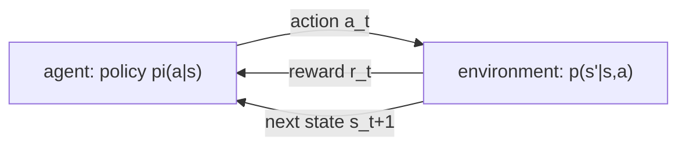
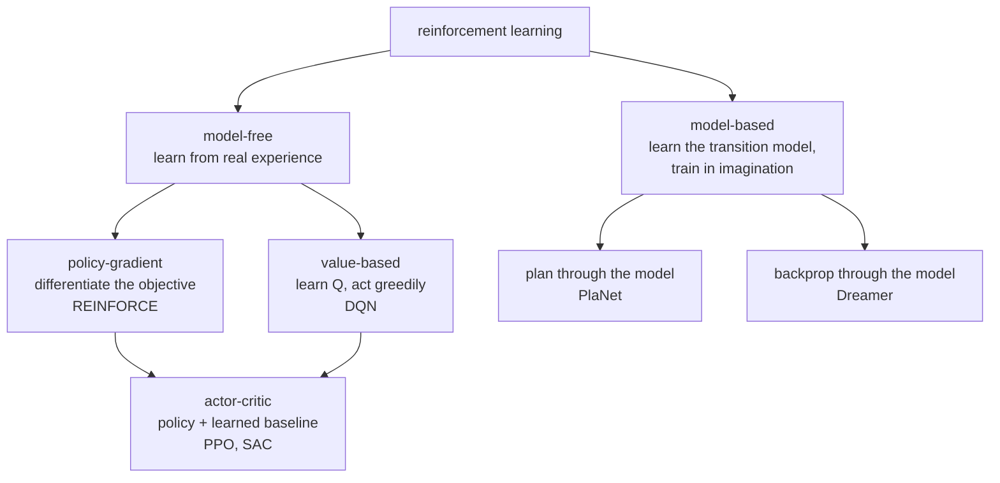
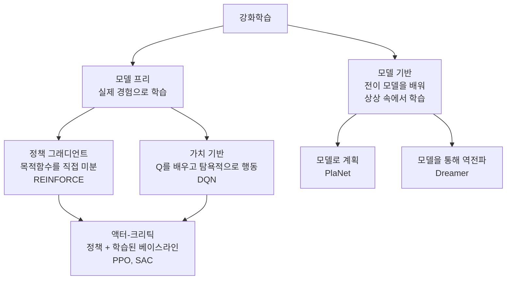

> [!note] Prerequisites · 선수 지식
> [[02-foundations/engineering-math|0.5 §5]] (geometric series — where the effective horizon comes from) · [[02-foundations/lab-plants|0.6]] (plant P4, read as an MDP in the worked case and the problem set) · [[02-foundations/probability|3. Probability §1–2, §5]] (conditioning, expectation, the Markov property) · [[02-foundations/calculus-backprop|2. Calculus]] (gradients, for policy gradients) · [[02-foundations/information-theory|5. Information Theory §3]] (KL divergence, for TRPO and the RLHF penalty in §4)
> [[02-foundations/engineering-math|0.5 §5]](기하급수 — 유효 지평이 여기서 나온다) · [[02-foundations/lab-plants|0.6]](계산 예제와 과제가 MDP로 읽는 장치 P4) · [[02-foundations/probability|3. 확률 §1–2, §5]](조건화·기댓값·마르코프 성질) · [[02-foundations/calculus-backprop|2. 미적분]](정책 그래디언트를 위한 그래디언트) · [[02-foundations/information-theory|5. 정보이론 §3]](§4의 TRPO와 RLHF 페널티를 위한 KL 발산)
>
> Connection map · 연결 지도: [[02-foundations/overview|0. Overview]]

## English

*Stands on [[02-foundations/probability|3. Probability]] and [[02-foundations/calculus-backprop|2. Calculus]]. The other domain bridge: the case where your own policy makes the data.
Nothing here needs signal processing, so the two can be read in either order.*

You cannot read [[01-canonical-papers/notes/1-foundations/instructgpt|RLHF]], the
[[01-canonical-papers/notes/5-world-models/dreamer|Dreamer]] line, or half of modern robot learning without
the MDP vocabulary. Course-depth treatment: the Bellman machinery, both algorithm families
with their update rules, why deep RL needs its patches, the policy gradient theorem, PPO's
actual objective, and where a learned model enters. The layer robot papers actually spend
their pages on — imitation versus RL, reward design, exploration, RL fine-tuning on real
machines, reading an RL experimental section, and learning the reward — is the next page,
[[02-foundations/rl-robot-learning|7.5 RL for Robot Learning]].

> [!note] First pass · 처음이라면
> First pass: the picture, then §1 and §2 in order — the P4 worked case closes §2. Then §3, with §3.5 right after it, since §3.5 explains the patches §3 only names. Then §4 through PPO and its clip; the TRPO and GAE bullets are second-pass. §5 is a short bridge to world models: read it when you reach Dreamer. The robot-learning layer is the next page, [[02-foundations/rl-robot-learning|7.5 RL for Robot Learning]].

### The picture · 그림으로 먼저 보기

<svg viewBox="0 0 560 530" style="max-width:100%;height:auto" role="img" aria-label="plant P4 read as an MDP: the heater's summing junction on the agent's border, the two-state MDP with rewards, values and action values, and an empty box for the certificate the two bins cannot give">
  <defs><marker id="arRl" viewBox="0 0 10 10" refX="9" refY="5" markerWidth="6" markerHeight="6" orient="auto"><path d="M0 0L10 5L0 10z" fill="currentColor"/></marker><marker id="arRl2" viewBox="0 0 10 10" refX="9" refY="5" markerWidth="6" markerHeight="6" orient="auto"><path d="M0 0L10 5L0 10z" fill="currentColor" fill-opacity="0.75"/></marker></defs>
  <path d="M236 87 L236 62 L14 62 L14 138 L236 138 L236 113" fill="none" stroke="currentColor" stroke-width="2.6" stroke-dasharray="8 4"/>
  <text x="18.0" y="55.0" fill="currentColor">what the policy may choose</text>
  <rect x="30" y="80" width="110" height="40" rx="3" fill="none" stroke="currentColor" stroke-width="1.5"/>
  <text x="85.0" y="104.0" fill="currentColor" text-anchor="middle">policy π(u | s)</text>
  <circle cx="236" cy="100" r="13" fill="none" stroke="currentColor" stroke-width="1.6"/>
  <text x="236.0" y="104.5" fill="currentColor" font-size="13" text-anchor="middle">Σ</text>
  <line x1="140" y1="100" x2="222" y2="100" stroke="currentColor" stroke-width="1.8" marker-end="url(#arRl)"/>
  <text x="181.0" y="94.0" fill="currentColor" text-anchor="middle">u (chosen)</text>
  <line x1="302" y1="12" x2="245.9" y2="90.1" stroke="currentColor" stroke-width="1.8" marker-end="url(#arRl)"/>
  <text x="312.0" y="18.0" fill="currentColor" opacity="1">d: from outside, not chosen,</text>
  <text x="312.0" y="32.0" fill="currentColor" opacity="0.9">enters at the same Σ as u.</text>
  <text x="312.0" y="46.0" fill="currentColor" opacity="0.9">The plant cannot tell them apart;</text>
  <text x="312.0" y="60.0" fill="currentColor" opacity="0.9">only the border can.</text>
  <line x1="250" y1="100" x2="292" y2="100" stroke="currentColor" stroke-width="1.8" marker-end="url(#arRl)"/>
  <rect x="292" y="84" width="60" height="32" rx="3" fill="none" stroke="currentColor" stroke-width="1.5"/>
  <text x="322.0" y="105.0" fill="currentColor" font-size="13" text-anchor="middle">∫</text>
  <text x="292.0" y="78.0" fill="currentColor">ẋ = −x + u + d</text>
  <line x1="352" y1="100" x2="518" y2="100" stroke="currentColor" stroke-width="1.8" marker-end="url(#arRl)"/>
  <text x="526.0" y="104.0" fill="currentColor" font-size="13">x</text>
  <circle cx="400" cy="100" r="2.6" fill="currentColor"/>
  <path d="M400 100 L400 150 L262 150 L245.9 109.9" fill="none" stroke="currentColor" stroke-width="1.5" marker-end="url(#arRl)"/>
  <text x="262.0" y="166.0" fill="currentColor" opacity="0.9">−x: a consequence, not a choice</text>
  <circle cx="190" cy="268" r="32" fill="none" stroke="currentColor" stroke-width="1.8"/>
  <text x="190.0" y="258.0" fill="currentColor" text-anchor="middle" opacity="1">s = 0</text>
  <text x="190.0" y="272.0" fill="currentColor" text-anchor="middle" opacity="0.9">x ≈ 0</text>
  <text x="190.0" y="286.0" fill="currentColor" text-anchor="middle" opacity="0.9">r = 0</text>
  <circle cx="380" cy="268" r="32" fill="none" stroke="currentColor" stroke-width="1.8"/>
  <text x="380.0" y="258.0" fill="currentColor" text-anchor="middle" opacity="1">s = 1</text>
  <text x="380.0" y="272.0" fill="currentColor" text-anchor="middle" opacity="0.9">x ≈ 1</text>
  <text x="380.0" y="286.0" fill="currentColor" text-anchor="middle" opacity="0.9">r = −1</text>
  <path d="M206.0 240.3 Q285 186 363.5 239.4" stroke="currentColor" stroke-width="1.6" fill="none" stroke-opacity="0.75" stroke-dasharray="5 3" marker-end="url(#arRl2)"/>
  <text x="285.0" y="204.9" fill="currentColor" text-anchor="middle">u = 1, p = 1</text>
  <text x="285.0" y="190.9" fill="currentColor" text-anchor="middle">Q(0,1) = −0.9, A = −0.9</text>
  <path d="M364.0 295.7 Q285 350 206.5 296.6" stroke="currentColor" stroke-width="2.2" fill="none" marker-end="url(#arRl)"/>
  <text x="285.0" y="341.1" fill="currentColor" text-anchor="middle">u = 0, p = 1, γ = 0.9 (greedy)</text>
  <text x="285.0" y="355.1" fill="currentColor" text-anchor="middle" opacity="0.85">effective horizon 1/(1 − γ) = 10 steps</text>
  <path d="M162.3 284.0 C108 308 108 228 161.4 251.5" stroke="currentColor" stroke-width="2.2" fill="none" marker-end="url(#arRl)"/>
  <text x="118.0" y="265.0" fill="currentColor" text-anchor="end">u = 0, p = 1</text>
  <text x="118.0" y="279.0" fill="currentColor" text-anchor="end" opacity="0.85">(greedy)</text>
  <path d="M407.7 252.0 C462 228 462 308 408.6 284.5" stroke="currentColor" stroke-width="1.6" fill="none" stroke-opacity="0.75" stroke-dasharray="5 3" marker-end="url(#arRl2)"/>
  <text x="454.0" y="258.0" fill="currentColor" opacity="0.9">u = 1, p = 1</text>
  <text x="454.0" y="272.0" fill="currentColor" opacity="1">Q(1,1) = −1.9</text>
  <text x="454.0" y="286.0" fill="currentColor" opacity="1">A = −0.9</text>
  <text x="170.0" y="224.0" fill="currentColor" text-anchor="end">V(0) = 0</text>
  <text x="400.0" y="224.0" fill="currentColor">V(1) = −1</text>
  <text x="24.0" y="206.0" fill="currentColor" opacity="0.85">reward r = −s², written in the state</text>
  <rect x="40" y="374" width="480" height="50" rx="4" fill="none" stroke="currentColor" stroke-width="1" stroke-opacity="0.6"/>
  <text x="52.0" y="389.0" fill="currentColor" opacity="0.95">Already the fixed point: a second backup returns the same two numbers,</text>
  <text x="52.0" y="403.0" fill="currentColor" opacity="0.95">because the best move from either state is u = 0,</text>
  <text x="52.0" y="417.0" fill="currentColor" opacity="0.95">and V(0) = 0.9·V(0) forces V(0) = 0.</text>
  <text x="14.0" y="446.0" fill="currentColor">The two bins are the whole state space. When a real d jumps, the agent</text>
  <text x="14.0" y="460.0" fill="currentColor">has no statement at all about what happens between the bins.</text>
  <text x="14.0" y="480.0" fill="currentColor" opacity="0.9">the agent, between bins:</text>
  <rect x="14" y="486" width="160" height="34" rx="3" fill="none" stroke="currentColor" stroke-width="1.8" stroke-dasharray="5 3"/>
  <text x="194.0" y="480.0" fill="currentColor" opacity="0.9">the control track, u = −Kx:</text>
  <rect x="194" y="486" width="352" height="34" rx="3" fill="none" stroke="currentColor" stroke-width="1.4"/>
  <text x="204.0" y="500.0" fill="currentColor">closed loop ẋ = −(1 + K)x + d,</text>
  <text x="204.0" y="514.0" fill="currentColor">one pole at −(1 + K)  (5. Control Theory)</text>
</svg>

Plant **P4** from [[02-foundations/lab-plants|0.6 Lab Plants]], the leaky heater $\dot x=-x+u+d$, read as an MDP: on top, $u$ and the disturbance $d$ enter the same sum, and only the dashed border around what the policy may choose tells them apart. In the middle, two bins with rewards $0$ and $-1$ and $\gamma=0.9$ give $V(0)=0$ and $V(1)=-1$ after one greedy backup, already the fixed point, and the two arrows the greedy policy skips carry $Q(0,1)=-0.9$ and $Q(1,1)=-1.9$, advantage $-0.9$ each. At the bottom, the empty box is what the agent can say about the states between its bins when a real $d$ jumps, next to the control track's answer: $u=-Kx$, with its pole at $-(1+K)$.

### 1. The MDP

- **Markov Decision Process** $(\mathcal{S}, \mathcal{A}, p, r, \gamma)$: states, actions,
  transition kernel $p(s'|s,a)$, reward $r(s,a)$, discount $\gamma \in [0,1]$ — Sutton and Barto write "$0 \le \gamma \le 1$", and $\gamma = 1$ is admissible once episodes terminate, which is why §4 below can derive the policy gradient for an undiscounted finite-horizon return.
  Markov = the state summarizes the past ([[02-foundations/probability|probability]]).
  - *What kind of thing it is:* a mathematical model of sequential decision-making, specified by those five components, each with a precise meaning. $\mathcal{S}$ is the set of states and $\mathcal{A}$ the set of actions. The **transition kernel** is a conditional probability distribution over the next state, so for every $(s, a)$ it is nonnegative and sums to one:
  $$p(s' \mid s, a) = P\big(s_{t+1} = s' \mid s_t = s,\ a_t = a\big), \qquad \sum_{s' \in \mathcal{S}} p(s' \mid s, a) = 1$$
  (an integral for continuous states). The reward $r(s, a)$ is the scalar the agent receives for taking $a$ in $s$, and $\gamma$ weights future rewards.
  - *The Markov property* is the condition that makes those five components enough: the next state depends on the history only through the current state and action,
  $$P\big(s_{t+1} \mid s_t, a_t, s_{t-1}, a_{t-1}, \dots, s_0, a_0\big) = P\big(s_{t+1} \mid s_t, a_t\big)$$
  so a policy that sees only $s_t$ loses nothing by ignoring the past ([[02-foundations/probability|3. Probability §5]]). **Non-example:** a "state" that holds an excavator arm's joint *angles* but not its velocities is not Markov, because two moments with the same angles but opposite velocities lead to different next angles; add the velocities and it becomes Markov.
- **Policy** $\pi(a|s)$; **return** $G_t = \sum_{k\ge 0} \gamma^k r_{t+k}$; objective
  $J(\pi) = E_\pi[G_0]$. Discounting makes infinite sums finite and encodes impatience;
  $1/(1-\gamma)$ is the effective horizon (γ=0.99 ⇒ ~100 steps — the geometric sum that
  produces that number is derived step by step in [[02-foundations/engineering-math|0.5 §5]]).
  - A **policy** is the agent's decision rule: for each state, a probability distribution over actions, $\pi(a \mid s) \ge 0$ with $\sum_a \pi(a \mid s) = 1$. A **deterministic** policy is the special case that puts all probability on one action, written $a = \pi(s)$.
  - The **return** is a random variable — the discounted sum of the rewards actually received from step $t$ on — and $J(\pi)$ is its expectation from the start, taken over the policy's action choices and the kernel's transitions. With $\gamma = 0.9$, rewards $1, 0, 2$ and nothing after give $G_0 = 1 + 0.9(0) + 0.81(2) = 2.62$. Because $|r_t| \le r_{\max}$ implies $|G_t| \le r_{\max}/(1-\gamma)$, every return is finite whenever $\gamma < 1$, and $1/(1-\gamma)$ is that bound's horizon: $10$ steps for $\gamma = 0.9$, $100$ for $\gamma = 0.99$.
  - An **episode** is one run from a start state until a terminal state (or a time limit); with episodes that always terminate, $\gamma = 1$ is allowed, as noted above.
- Robotics reality: the state is *unobserved* (POMDP) — you see images and proprioception.
  Practical dodge: condition on observation histories / recurrent state (what
  [[01-canonical-papers/notes/5-world-models/dreamer|RSSM]]s formalize).
  - A **partially observable MDP** adds two components to the five: an observation space $\Omega$ and an observation kernel $O(o \mid s)$, the probability of seeing $o$ in state $s$. The agent acts on $o_t$ rather than $s_t$, and the observation alone is generally not Markov. What *is* Markov is the **belief** $b_t(s) = P(s_t = s \mid o_{0:t}, a_{0:t-1})$, the posterior over states given everything seen so far, which is why histories or recurrent state work as a substitute ([[04-robotics/planning-decision-making|Planning & Decision-Making]]).

### 2. Value functions and the Bellman equations

- $V^\pi(s) = E_\pi[G_t | s_t{=}s]$, $Q^\pi(s,a) = E_\pi[G_t | s_t{=}s, a_t{=}a]$,
  **advantage** $A^\pi = Q^\pi - V^\pi$ (how much better than my average move).
  - *The three, as one family.* Each is an expected return under policy $\pi$, differing only in what is fixed before the expectation is taken: $V^\pi(s)$ fixes the state, $Q^\pi(s,a)$ fixes the state *and* the first action (after which $\pi$ takes over), and the advantage compares the two. They are tied together by
  $$V^\pi(s) = \sum_{a} \pi(a \mid s)\, Q^\pi(s, a), \qquad A^\pi(s, a) = Q^\pi(s, a) - V^\pi(s), \qquad \sum_a \pi(a \mid s)\, A^\pi(s, a) = 0$$
  since the value of a state is the policy-weighted average of its action values, and so the advantage averages to zero under the policy's own action choices. That zero mean is why the advantage is the right weight for a policy gradient (§4): it pushes above-average actions up and below-average ones down.
- **Bellman expectation** (consistency of $V^\pi$):
  $$V^\pi(s) = E_{a\sim\pi,\, s'\sim p}\big[r(s,a) + \gamma V^\pi(s')\big]$$
- **Where it comes from — it is the return folded once.** The return is a geometric sum,
  $G_t = r_t + \gamma r_{t+1} + \gamma^2 r_{t+2} + \cdots$. Factor $\gamma$ out of
  everything after the first term: $G_t = r_t + \gamma(r_{t+1} + \gamma r_{t+2} + \cdots)$,
  and the bracket is just $G_{t+1}$. So $G_t = r_t + \gamma G_{t+1}$ — the same one-line
  trick as $1 + x + x^2 + \cdots = 1 + x(1 + x + \cdots)$. Take expectations conditioned on
  $s_t = s$, and the Markov property lets $E[G_{t+1}]$ collapse to $V^\pi(s')$ because the
  future depends on $s'$ alone. That is the whole derivation. It is worth doing once,
  because it shows the Bellman equation is not a new modelling assumption on top of the MDP —
  it is the *definition of the return*, rewritten so the unknown appears on both sides. Which
  is exactly what makes it something you can iterate to a fixed point.
- **Bellman optimality**: $Q^*(s,a) = E\big[r + \gamma \max_{a'} Q^*(s',a')\big]$;
  the greedy policy on $Q^*$ is optimal.
  - *Definitions behind it.* The optimal value functions are the best achievable by any policy, $V^*(s) = \max_\pi V^\pi(s)$ and $Q^*(s,a) = \max_\pi Q^\pi(s,a)$. They satisfy the expectation equation with the policy average replaced by a maximum:
  $$V^*(s) = \max_{a} \sum_{s'} p(s' \mid s, a)\,\big[r(s, a) + \gamma\, V^*(s')\big], \qquad \pi^*(s) = \arg\max_a Q^*(s, a)$$
  because an optimal agent picks the best first action and then behaves optimally from wherever it lands. A policy $\pi^*$ that is greedy with respect to $Q^*$ in every state is optimal, and in a finite MDP a deterministic optimal policy always exists.
  - *Worked:* give the bucket MDP below a second action in $A$, "wait", which stays in $A$ with reward $0$. With $V^*(B) = 10$ and $V^*(A) = 9$, the two action values in $A$ are $Q^*(A, \text{move}) = 0 + 0.9 \times 10 = 9$ and $Q^*(A, \text{wait}) = 0 + 0.9 \times 9 = 8.1$, so the greedy policy moves. Waiting is not worthless — it is worth $8.1$ — it is just $0.9$ worse.
- **A two-state MDP you can solve on paper.** States $A$ (empty bucket) and $B$ (bucket
  full). From $A$ the only action moves you to $B$ with reward $0$; in $B$ you stay in $B$
  and collect reward $1$ every step. Take $\gamma = 0.9$. Write the Bellman equation for $B$ — its value is this step's reward plus the discounted value of where you land, which is $B$ again, so the unknown appears on both sides and you solve for it:
  $$V(B) = 1 + 0.9\,V(B) \quad\Rightarrow\quad V(B)(1 - 0.9) = 1 \quad\Rightarrow\quad V(B) = 10$$
  — which is the geometric sum $1/(1-\gamma)$ from
  [[02-foundations/engineering-math|0.5 §5]], arriving here as a *value*. Then
  $V(A) = 0 + 0.9\,V(B) = 9$. Read it: being one step away from the good state costs you
  exactly one discount factor, $9 = 0.9 \times 10$. And the advantage of the move out of $A$
  is $Q(A,\text{move}) - V(A) = 9 - 9 = 0$ — there was no alternative, so no move can be
  better than average. Advantage measures *choice*, and where there is no choice it is zero.

**Worked: P4 as an MDP.** The leaky heater $\dot x=-x+u+d$ ([[02-foundations/lab-plants|0.6]]). The agent chooses $u$; $d$ is an exogenous arrow it does not pick. Bins $s\in\{0,1\}$ for $x\approx 0$ and $x\approx 1$, actions $u\in\{0,1\}$, $d=0$, Euler $T=1$ so $x^+=u$, reward $r=-s^2$, $\gamma=0.9$. One greedy backup from $V\equiv 0$: $s'=u$ and $Q(s,u)=-s^2$, so $V(0)=0$, $V(1)=-1$. A policy learned on these bins has no pole certificate when a real $d$ jumps; that stabilizer is $u=-Kx$ on [[04-robotics/control-theory-ce397|5]]. The problem set is this MDP as a drawing.
- These are fixed-point equations; the Bellman operator is a $\gamma$-contraction, so
  iterating it converges — the license behind everything below.
  - *What that means.* The **Bellman operator** $T^\pi$ maps any value table $V$ to a new one, $(T^\pi V)(s) = \sum_a \pi(a \mid s) \sum_{s'} p(s' \mid s, a)\,[r(s,a) + \gamma V(s')]$, and $V^\pi$ is the table it leaves unchanged, $T^\pi V^\pi = V^\pi$. A **$\gamma$-contraction** in the max-norm is an operator that brings any two tables closer by at least the factor $\gamma$:
  $$\big\lVert T^\pi V - T^\pi V' \big\rVert_\infty \le \gamma\, \big\lVert V - V' \big\rVert_\infty, \qquad \lVert V \rVert_\infty = \max_s |V(s)|$$
  which holds because the only place $V$ enters is the term $\gamma V(s')$, averaged with nonnegative weights that sum to one. The Banach fixed-point theorem then gives both consequences at once: the fixed point is **unique**, and iterating from any start shrinks the worst-case error by at least $\gamma$ per sweep. In the §3 worked example the max-norm error from $V_0 = (0,0)$ is $5.263, 4.737, 4.263, 3.837$ — each exactly $0.9$ times the last. The same inequality holds for the optimality operator, since a maximum cannot move by more than its arguments do.

### 3. Dynamic programming and TD learning

- **Value iteration**: apply the optimality operator repeatedly (needs the model $p$).
  **Policy iteration**: evaluate $\pi$, then act greedily; repeat. The same backup read as
  algorithm design — finite-horizon backward induction, the table-size curse of dimensionality,
  LQR as DP with a closed-form value — is [[02-foundations/algorithms/dynamic-programming|11.5 §7]].
  - *Both, written out.* Value iteration is a sequence of tables $V_0, V_1, \dots$, each obtained by one application of the optimality operator to every state:
  $$V_{k+1}(s) = \max_{a} \sum_{s'} p(s' \mid s, a)\,\big[r(s, a) + \gamma\, V_k(s')\big]$$
  so by the contraction property of §2 it converges to $V^*$ from any $V_0$. On the bucket MDP with the extra "wait" action, starting from zeros, $(V(A), V(B))$ goes $(0, 1)$, $(0.9, 1.9)$, $(1.71, 2.71)$, … toward $(9, 10)$. Policy iteration alternates two steps until the policy stops changing: **evaluation**, solving $V^{\pi_k} = T^{\pi_k} V^{\pi_k}$ for the current policy, and **improvement**, $\pi_{k+1}(s) = \arg\max_a \sum_{s'} p(s' \mid s, a)[r(s,a) + \gamma V^{\pi_k}(s')]$. Each improvement step can only raise the value, and a finite MDP has finitely many deterministic policies, so it terminates.
- Without a model, sample: **TD(0)** update
  $V(s) \leftarrow V(s) + \alpha\,[\underbrace{r + \gamma V(s')}_{\text{target}} - V(s)]$
  — bootstrap from your own estimate. The bracket is the **TD error** $\delta$, RL's
  all-purpose learning signal.
  - *Each symbol:* one observed transition $(s, r, s')$ — the state visited, the reward received, the state reached — replaces the expectation in the Bellman equation, and $\alpha \in (0, 1]$ is the step size.
  $$\delta = r + \gamma\, V(s') - V(s), \qquad V(s) \leftarrow V(s) + \alpha\, \delta$$
  so the estimate moves a fraction $\alpha$ of the way toward the one-sample target. **Bootstrapping** is the defining feature: the target contains the current estimate $V(s')$ rather than the true return. Worked: $V(s) = 0.5$, $r = 1$, $V(s') = 2$, $\gamma = 0.9$, $\alpha = 0.1$ give $\delta = 1 + 1.8 - 0.5 = 2.3$ and $V(s) \leftarrow 0.73$.
- **Q-learning** (**off-policy** — it learns about the greedy policy while acting under a
  different, exploratory one, so it can reuse old data; **on-policy** methods such as PPO
  must learn from data their *current* policy just generated, and discard it after):
  $Q(s,a) \leftarrow Q(s,a) + \alpha\,[r + \gamma \max_{a'}Q(s',a') - Q(s,a)]$.
  DQN = this + neural $Q$ + replay buffer (a stored pool of past transitions, sampled at random) + target network (a
  [[02-foundations/calculus-backprop|stop-gradient]] copy for stable targets).
  - *On- vs off-policy, as a condition.* Two policies are involved in any learning method: the **behavior policy** $\mu$ that chooses the actions in the data, and the **target policy** $\pi$ whose value is being learned. A method is **on-policy** when $\mu = \pi$ and **off-policy** when they may differ. Q-learning's target uses $\max_{a'} Q(s', a')$, the greedy action, whatever action $\mu$ actually took next — that is exactly what makes it off-policy. **Sarsa**, its on-policy twin, uses the action $a'$ that was actually taken, $r + \gamma Q(s', a')$. Worked: $Q(s,a) = 0.5$, $r = 1$, $Q(s', \cdot) = (1.0, 3.0)$, $\gamma = 0.9$, $\alpha = 0.1$. Q-learning uses $\max = 3.0$, so $\delta = 3.2$ and $Q \leftarrow 0.82$; if the exploratory behavior actually took the first action, Sarsa uses $1.0$ and gives $Q \leftarrow 0.64$.
  - *DQN, as a loss.* With network parameters $\theta$, a periodically copied target network $\bar\theta$, and transitions $(s, a, r, s')$ sampled uniformly from the replay buffer $\mathcal{D}$:
  $$\mathcal{L}(\theta) = E_{(s,a,r,s') \sim \mathcal{D}}\Big[\big(r + \gamma \max_{a'} Q_{\bar\theta}(s', a') - Q_\theta(s, a)\big)^2\Big]$$
  so each gradient step is a regression toward a target that does not move with $\theta$, since $\bar\theta$ is held fixed between copies (§3.5 explains why that matters).
- Value-based methods are sample-efficient but awkward for continuous actions
  (the $\max_{a'}$ needs an inner optimization) — hence robotics leans policy-side.
- **Worked example — policy evaluation you can do on paper.** (Value *iteration* would take a $\max_a$ at each step; with the policy fixed this is the evaluation half.) Two states, fixed policy,
  $\gamma = 0.9$: state $A$ gives reward 1 and moves to $B$; state $B$ gives 0 and moves
  back to $A$. Bellman: $V(A) = 1 + 0.9V(B)$, $V(B) = 0.9V(A)$. Iterate from $V_0 = (0,0)$:
  $V_1 = (1, 0)$, $V_2 = (1, 0.9)$, $V_3 = (1.81, 0.9)$, … converging to the fixed point
  $V(A) = 1/(1 - 0.81) \approx 5.26$, $V(B) \approx 4.74$. Watch what happened: each
  sweep pushes reward information one step further back — that is all "bootstrapping" means.

### 3.5 The deadly triad — why deep RL needs its patches

Section 3 ended by saying DQN is Q-learning plus a neural $Q$, a replay buffer and a target
network, without saying why the last two are there. They are there because of a result
every robot-learning paper is quietly living inside.

**Three ingredients, and only together are they dangerous.** Sutton and Barto name them the
*deadly triad*:

| Element | What it means | Where §3 introduced it |
|---|---|---|
| Function approximation | generalizing from a state space far larger than memory — linear features, or a network | "neural $Q$" |
| Bootstrapping | updating toward a target that contains your own current estimate | the TD target $r + \gamma V(s')$ |
| Off-policy training | learning from a distribution of transitions other than the one the target policy produces | Q-learning acting under an exploratory policy |

Combine all three and value estimates can **diverge** — not converge slowly, not converge to
a poor answer, but grow without bound. Removing one leg is a representative mitigation, not
a general safety theorem for arbitrary neural approximators and optimizers. Classical tabular
or linear cases have convergence results under explicit assumptions; neural Monte Carlo or
Sarsa does not become generally safe merely because one leg is absent.

**Two things this is not.** It is not a control problem: the divergence appears in plain
*prediction*, with the policy fixed. And it is not about noise or exploration or an unknown
environment: it happens in dynamic programming, where the model is known exactly and there
is no sampling at all.

**Worked — divergence with the exact least-squares answer at every step.** Tsitsiklis and
Van Roy's two-state example. One parameter $w$; the first state's estimated value is $w$ and
the second's is $2w$. Every reward is zero, so the true value is zero at both states —
**and that is exactly representable**, at $w = 0$. The first state leads to the second; the
second repeats, terminating with probability $\varepsilon$. At each sweep, choose $w_{k+1}$
to be the *best possible least-squares fit* to the expected one-step return. Those targets,
read off the current estimate: the first state earns $0$ and lands in the second, so its
target is $0 + \gamma\cdot 2w_k = 2\gamma w_k$; the second earns $0$ and stays with probability
$1-\varepsilon$ (value $2w_k$) or terminates (value $0$), so its target is $2(1-\varepsilon)\gamma w_k$.
Each squared term below is (estimate $-$ target)$^2$ for one state. Minimizing
$(w - 2\gamma w_k)^2 + (2w - 2(1-\varepsilon)\gamma w_k)^2$ over $w$ means setting its
derivative to zero:

$$2\,(w - 2\gamma w_k) + 4\,\big(2w - 2(1-\varepsilon)\gamma w_k\big) = 0 \;\Rightarrow\; 10\,w = (12 - 8\varepsilon)\,\gamma\, w_k \;\Rightarrow\; w_{k+1} = \frac{6 - 4\varepsilon}{5}\,\gamma\, w_k$$

because the chain rule brings down a factor $2$ from the first square and $2 \times 2 = 4$
from the second, whose inner derivative is $2$. So the sequence multiplies by a constant each sweep and diverges whenever
$\gamma > 5/(6-4\varepsilon)$ and $w_0 \neq 0$. At $\varepsilon = 0$ that threshold is $\gamma = 0.833$ — so
the entirely ordinary $\gamma = 0.9$ gives a multiplier of $1.08$:

$$w = 1,\; 1.08,\; 1.166,\; 1.260,\; 1.360,\; \ldots,\; 46.9 \text{ after 50 sweeps}$$

Set $\gamma = 0.8$ instead and the multiplier is $0.96$ and it converges to zero. Or keep
$\gamma = 0.9$ and let episodes terminate with $\varepsilon = 0.2$ — multiplier $0.936$,
converges again. Note what $\varepsilon$ changes: it enters the least-squares objective through the *bootstrap target*, the expected one-step return, not through the update distribution — the sweep stays a uniform pass over both states either way. Off-policy-ness is a separate leg of the triad.

Look at what is *not* available as an excuse. There is no learning rate to lower — the fit
is exact. There is no noise — the model is known. There is no reward to misdesign — they are
all zero. There is no representation error — the true answer is in the function class. The
divergence is structural, and it turns on the discount factor.

**Which leg would you give up?** All three are on the table, and the field's answer explains
its designs.

- *Function approximation*: no. Anything that scales to images or joint states needs it.
- *Bootstrapping*: possible, and Monte Carlo does it — at real cost. MC must store an
  episode until it ends before it can learn anything from it, while a bootstrapped update
  consumes each transition where it is generated and never revisits it. Bootstrapping is
  also usually more data-efficient. Nobody gives it up entirely; $n$-step returns give it up
  partially.
- *Off-policy*: often, yes. Sarsa instead of Q-learning is exactly this trade, and on-policy
  methods like PPO mitigate the same source of mismatch. A PPO rollout is normally reused
  for several minibatch epochs; after the policy has moved sufficiently, it is discarded and
  a fresh rollout is collected. Long-term replay of old rollouts can violate the assumptions
  behind the importance ratio and trust-region-style update.

**The patches, read as triad mitigations.** This is the payoff for reading papers:

- **Target network** (DQN): freeze the network that produces the bootstrap target for
  thousands of steps. That weakens the bootstrapping leg by making the target temporarily a
  constant rather than a moving self-reference.
- **Replay buffer**: improves the data but *worsens* the off-policy leg, since old
  transitions come from older policies. It is bought, not free — which is why buffer size
  and sampling scheme are tuned rather than maximized.
- **Clipped double-$Q$** (TD3, [[01-canonical-papers/notes/1-foundations/sac|SAC]]): train two value networks
  (**critics** — see §4) and take the minimum of their estimates. Aimed at overestimation bias, which the triad amplifies because an
  over-large value feeds its own next target. The shared target is $y = r + \gamma \min_{j = 1, 2} Q_{\bar\theta_j}(s', a')$, with $a'$ the next action chosen by the current policy and $\bar\theta_j$ the two target networks. If the two critics estimate $12$ and $10$ for the same next pair, the target uses $10$: an error has to appear in *both* networks at once to propagate.
- **Pessimism in offline RL**: penalize or avoid evaluating actions the dataset does not
  support. **Offline RL** learns a policy from a fixed dataset of transitions with no further
  interaction ([[02-foundations/rl-robot-learning|7.5 RL for Robot Learning §1]] sets it beside
  imitation), so an action it overestimates can never be tried and corrected. Pessimism attacks
  the off-policy leg directly, and it is why offline RL is a distinct literature rather than "RL
  with a fixed buffer."

There is also a clean theoretical escape that nobody uses: function approximators that never
extrapolate beyond observed targets — nearest neighbour, locally weighted regression, the
class Sutton and Barto call *averagers* — are provably stable. They are also too weak for
the problems robotics cares about. Neural networks and tile coding both extrapolate, so both
forfeit the guarantee.

**What to do with this when reading.** When a value-based or offline-RL paper reports
instability, a tuning sensitivity, or an ablation where removing one component collapses
training, check which leg of the triad that component was holding. And when a paper reports
that its method is stable, ask what it gave up to get there — usually data reuse,
sometimes discount factor, occasionally the bootstrap.

### 4. Policy gradients — differentiate the objective itself

- **The log-derivative trick** (shown first for the finite-horizon **undiscounted**
  objective $G(\tau)=\sum_t r_t$):
  $$\nabla_\theta J = \nabla_\theta \int p_\theta(\tau) G(\tau)\,d\tau = \int p_\theta(\tau)\,\nabla_\theta \log p_\theta(\tau)\, G(\tau)\,d\tau = E_\tau\Big[\sum_t \nabla_\theta \log \pi_\theta(a_t|s_t)\, G_t\Big]$$
  (dynamics terms vanish from $\nabla\log p_\theta(\tau)$ because they don't depend on
  $\theta$). Interpretation: *raise the log-probability of actions in proportion to the
  return that followed*. For the discounted objective defined in §1, the exact theorem can
  instead be written with discounted state visitation (or an explicit $\gamma^t$ under a
  trajectory-sampling convention). Papers often use discounted return-to-go inside an
  undiscounted finite-horizon estimator, so check which objective and sampling distribution
  their equality assumes.
  - *The two facts the chain of equalities uses.* A trajectory $\tau = (s_0, a_0, s_1, a_1, \dots)$ has probability equal to the start-state distribution $\rho_0$ times one policy factor and one dynamics factor per step,
  $$p_\theta(\tau) = \rho_0(s_0) \prod_{t} \pi_\theta(a_t \mid s_t)\, p(s_{t+1} \mid s_t, a_t), \qquad \nabla_\theta\, p_\theta(\tau) = p_\theta(\tau)\, \nabla_\theta \log p_\theta(\tau)$$
  and the second identity is just the derivative of a logarithm, $\nabla \log p = \nabla p / p$. Taking the log turns the product into a sum, so $\nabla_\theta \log p_\theta(\tau) = \sum_t \nabla_\theta \log \pi_\theta(a_t \mid s_t)$: $\rho_0$ and $p$ contain no $\theta$ and drop out. That is why a policy gradient can be estimated from sampled episodes without a model of the dynamics.
- **REINFORCE** is exactly this — unbiased, catastrophically high variance. Variance
  reductions, in order of importance: subtract a **baseline** $b(s)$ (unbiased for any
  state-only baseline; best choice ≈ $V(s)$, making the weight the advantage $A$);
  use reward-to-go; **actor-critic**: learn $V_\phi$ with TD and use
  $\delta = r + \gamma V(s') - V(s)$ as a one-sample advantage estimate. **GAE** (generalized advantage estimation) interpolates
  between TD (biased, low-variance) and Monte Carlo (unbiased, high-variance) with a knob λ:
  it weights the TD errors of the next steps by $(\gamma\lambda)^l$, so λ = 0 keeps only the
  one-step $\delta$ above and λ = 1 sums them into the full Monte Carlo return minus $V(s)$.
  - *REINFORCE with a baseline, as the estimator actually computed* from $N$ sampled episodes $i$ with steps $t$:
  $$\hat g = \frac{1}{N}\sum_{i=1}^{N} \sum_{t} \nabla_\theta \log \pi_\theta\big(a_t^i \mid s_t^i\big)\,\Big(\hat G_t^i - b\big(s_t^i\big)\Big), \qquad \theta \leftarrow \theta + \alpha\,\hat g$$
  where $\hat G_t^i$ is the reward-to-go actually observed after step $t$ and $\nabla_\theta \log \pi_\theta$ is the **score function**; the update is gradient *ascent* because $J$ is maximized. The baseline leaves the expectation unchanged since the score has zero mean under the policy (self-check 2) — for a two-action policy with probabilities $0.6$ and $0.4$, the score with respect to $p = 0.6$ is $1/0.6$ or $-1/0.4$, and $0.6(1/0.6) + 0.4(-1/0.4) = 0$. The same estimator is set against the pathwise (reparameterization) gradient, which needs the integrand's derivative and in return has lower variance, and compared in numbers in [[03-deep-learning/diffusion/vae-gan|6.1 VAEs & GANs §3]].
  - *Actor-critic, as two coupled learners.* The **actor** is the policy $\pi_\theta$; the **critic** is a learned value function $V_\phi$ whose only job is to supply the baseline. Each transition updates both,
  $$\delta_t = r_t + \gamma V_\phi(s_{t+1}) - V_\phi(s_t), \qquad \phi \leftarrow \phi + \alpha_\phi\, \delta_t\, \nabla_\phi V_\phi(s_t), \qquad \theta \leftarrow \theta + \alpha_\theta\, \delta_t\, \nabla_\theta \log \pi_\theta(a_t \mid s_t)$$
  so the critic learns by TD(0) (§3) while the actor treats the critic's TD error as its advantage.
  - *GAE, written out.* With TD errors $\delta_t$ as above,
  $$\hat A_t^{\text{GAE}(\gamma, \lambda)} = \sum_{l=0}^{\infty} (\gamma\lambda)^l\, \delta_{t+l}$$
  so the weights decay geometrically at rate $\gamma\lambda$. With $\gamma = 0.9$, $\lambda = 0.95$ ($\gamma\lambda = 0.855$) and the next three TD errors $1.0, 0.5, -0.2$ (zero afterwards), $\hat A_t = 1.0 + 0.855(0.5) + 0.855^2(-0.2) = 1.281$.
- **Why a baseline matters, in numbers.** One state, two actions, $\pi(a_1)=0.6$,
  $\pi(a_2)=0.4$, returns $G_1 = 1$, $G_2 = 0$. Raw REINFORCE weights the two
  log-probability gradients by $1$ and $0$: $a_1$ is pushed up and $a_2$ is *left alone*.
  Subtract the baseline $b = E[G] = 0.6\cdot1 + 0.4\cdot0 = 0.6$ and the weights become
  advantages $A_1 = +0.4$, $A_2 = -0.6$ — now the worse action is actively pushed **down**.
  Same expected gradient, far less variance: that is the whole trick.
- **PPO** — the workhorse ([[01-canonical-papers/notes/1-foundations/instructgpt|the one inside RLHF]]):
  with ratio $\rho_t = \pi_\theta(a_t|s_t)/\pi_{old}(a_t|s_t)$, the objective is the importance-weighted advantage, clipped so that a step earns nothing for pushing the ratio outside $[1-\epsilon, 1+\epsilon]$:
  $$\mathcal{L} = E_t\big[\min\big(\rho_t A_t,\ \text{clip}(\rho_t, 1{-}\epsilon, 1{+}\epsilon)\, A_t\big)\big]$$
  (**maximized**, despite the $\mathcal{L}$ — PPO's objective is a reward-like surrogate, not a loss)
  — take policy-gradient steps but *clip away the incentive* to move far from the data-
  collecting policy. A trust region by clamp, plus (in RLHF) an explicit KL penalty
  ([[02-foundations/information-theory|information theory]]).
  - *Every piece named.* $\pi_{old}$ is the policy that collected the current batch and $\pi_\theta$ the one being optimized. The **importance ratio** $\rho_t$ reweights an old sample to estimate what the new policy would earn: an action the new policy takes with probability $0.3$ where the old one took it with $0.2$ gets weight $1.5$. $A_t$ is an advantage estimate, usually GAE. $\epsilon$ (commonly $0.2$) is the clip range, and $\text{clip}(x, a, b) = \min(\max(x, a), b)$ confines $x$ to $[a, b]$, so $\text{clip}(1.3, 0.8, 1.2) = 1.2$ and $\text{clip}(0.7, 0.8, 1.2) = 0.8$. $E_t$ is the average over the timesteps in the batch.
  - *Trust region, the idea being approximated.* TRPO maximizes the same importance-weighted advantage subject to an explicit bound on how far the policy moves, measured by KL divergence ([[02-foundations/information-theory|5. Information Theory §3]]):
  $$\max_\theta\ E_t\big[\rho_t\, A_t\big] \quad \text{subject to} \quad E_t\Big[\mathrm{KL}\big(\pi_{old}(\cdot \mid s_t)\ \Vert\ \pi_\theta(\cdot \mid s_t)\big)\Big] \le \delta$$
  because the ratio-weighted estimate is only accurate while the two policies stay close. PPO replaces the constraint with the clip, which is cheaper to optimize with ordinary minibatch gradient steps and enforces closeness only approximately.
- **The clip, in numbers** ($\epsilon = 0.2$). Good action, $A = +1$, and the policy has
  already raised it to $\rho = 1.3$: $\min(1.3,\ \text{clip}(1.3)=1.2) = 1.2$ — the
  *clipped* branch wins, and it is flat, so the gradient is **zero**: no incentive to push
  further. Bad action, $A = -1$, and the policy is moving the wrong way at $\rho = 1.5$:
  $\min(-1.5,\ -1.2) = -1.5$ — the *unclipped* branch wins, gradient nonzero, so the
  penalty **keeps acting**. Clipping removes the incentive to overshoot, never the
  incentive to correct.

<svg viewBox="0 0 460 185" style="max-width:100%;height:auto" role="img" aria-label="the PPO clipped objective for a good action and for a bad action">
  <g stroke="currentColor" stroke-width="1" opacity="0.3">
    <line x1="30" y1="30" x2="30" y2="155"/><line x1="30" y1="155" x2="210" y2="155"/>
    <line x1="255" y1="30" x2="255" y2="155"/><line x1="255" y1="155" x2="435" y2="155"/>
  </g>
  <g stroke="currentColor" stroke-width="1" opacity="0.45" stroke-dasharray="3 3">
    <line x1="141" y1="30" x2="141" y2="155"/><line x1="303" y1="30" x2="303" y2="155"/>
    <line x1="110" y1="140" x2="110" y2="155"/><line x1="334" y1="140" x2="334" y2="155"/>
  </g>
  <path d="M30,143 L141,59" fill="none" stroke="currentColor" stroke-width="2.2"/>
  <path d="M141,59 L205,59" fill="none" stroke="currentColor" stroke-width="2.2" opacity="0.55"/>
  <path d="M255,47 L303,47" fill="none" stroke="currentColor" stroke-width="2.2" opacity="0.55"/>
  <path d="M303,47 L430,143" fill="none" stroke="currentColor" stroke-width="2.2"/>
  <g font-size="11" fill="currentColor">
    <text x="30" y="22">good action (A = +1)</text><text x="255" y="22">bad action (A = &#8722;1)</text>
    <text x="103" y="170" font-size="10">1.0</text><text x="130" y="170" font-size="10">1.2</text>
    <text x="292" y="170" font-size="10">0.8</text><text x="327" y="170" font-size="10">1.0</text>
    <text x="150" y="52" font-size="10.5" opacity="0.9">flat: gradient 0</text>
    <text x="258" y="40" font-size="10.5" opacity="0.9">flat here only</text>
    <text x="186" y="170" font-size="10">rho</text><text x="410" y="170" font-size="10">rho</text>
  </g>
</svg>

### 5. Model-based RL — the world-model connection

- Model-free RL updates a policy or value function without planning through an explicit transition model. Its experience may come from hardware, simulation, or a stored dataset; off-policy methods can reuse it for many updates. Collecting new hardware experience can be expensive in time, wear and safety. The learned-model approach here learns $\hat p(s'|s,a)$ and trains the policy on
  *imagined* rollouts: [[01-canonical-papers/notes/5-world-models/world-models|World Models]] →
  [[01-canonical-papers/notes/5-world-models/planet|PlaNet]] (plan through the model) →
  [[01-canonical-papers/notes/5-world-models/dreamer|Dreamer]] (backprop through the model).
- The tradeoff: sample efficiency vs **model bias** — errors compound over imagined
  horizons (the same compounding-error logic as [[01-canonical-papers/notes/4-vla/act|ACT]]'s
  motivation), managed by short horizons and value bootstrapping.
  - *The dividing condition.* An RL method is **model-based** when it learns (or is given) a transition model $\hat p(s' \mid s, a)$, and usually a reward model $\hat r(s, a)$, and uses them to plan or to generate training data; it is **model-free** when its updates use only real transitions and never query such a model. The learned-model version has two stages, fitting the model to real transitions $(s_i, a_i, s'_i)$ by maximum likelihood, then improving the policy against the model's predictions:
  $$\hat p = \arg\max_{q} \sum_{i} \log q\big(s'_i \mid s_i, a_i\big), \qquad \hat J(\pi) = E_{\hat p,\, \pi}\Big[\sum_{t=0}^{H-1} \gamma^t\, \hat r(s_t, a_t) + \gamma^H\, V(s_H)\Big]$$
  where the imagined rollout runs $H$ steps inside $\hat p$ and a learned value $V$ stands in for everything after, so errors of $\hat p$ only compound for $H$ steps. With $\gamma = 0.99$ and Dreamer's $H = 15$, the bootstrap term still carries weight $0.99^{15} = 0.860$, which is why a short horizon costs little.
  - **Model bias** is the systematic difference $\hat p \ne p$. It is dangerous in a specific way: the policy optimizer actively seeks actions whose imagined return $\hat J$ is high, which includes actions that look good only because $\hat p$ is wrong there.

A world model is useful because imagined consequences let learning reuse collected experience. For example, an excavation policy can compare predicted outcomes before trying every action on hardware. The model can also reward actions whose apparent advantage is only a prediction error, especially beyond observed conditions. **The reading this gives you.** Ask where real observations correct the model and how imagined horizons are limited. Model-free methods can also reuse stored experience; the defining distinction is using an explicit predictive model for planning or learning, not whether every update requires a fresh physical trial.

> [!tip] Going deeper · 더 깊이
> Sutton and Barto's [*Reinforcement Learning: An Introduction*](http://incompleteideas.net/book/the-book.html) is free and is what this page compresses — ch.3–6 for the Bellman machinery, ch.11 for the deadly triad and the divergence counterexample of §3.5, ch.13 for policy gradients. The robotics-specific layer the book does not cover is the next page, [[02-foundations/rl-robot-learning|7.5 RL for Robot Learning]].

### Self-check

1. Derive the Bellman expectation equation from the definition of $V^\pi$ (one line of
   linearity + Markov).
2. Why does subtracting a state-only baseline leave the policy gradient unbiased?
   (Show $E_{a\sim\pi}[\nabla\log\pi(a|s)] = 0$.)
3. In PPO's objective, what does the $\min$ do when $A_t > 0$ vs $A_t < 0$? Why clip at all?
4. Give two reasons Dreamer-style imagination training keeps horizons short (~15 steps).
5. With $\gamma = 0.95$, what is the return of the rewards $1, 1, 1$ with nothing after, and
   what is the effective horizon? A robot's state holds its joint angles but not its joint
   velocities: why is that state not Markov, and what fixes it?
6. One TD(0) update with $V(s) = 1.0$, $r = 0$, $V(s') = 2.0$, $\gamma = 0.9$, $\alpha = 0.5$:
   give $\delta$ and the new $V(s)$. Q-learning and Sarsa differ in one term of their target —
   which term, and which of the two is off-policy?
7. In the Tsitsiklis–Van Roy example of §3.5, let episodes terminate with $\varepsilon = 0.1$.
   Above which $\gamma$ does the least-squares sweep diverge? Which leg of the triad does a
   target network weaken, and which does a replay buffer worsen?

> [!tip]- Answers
> 1. $V^\pi(s) = E[G_t\mid s] = E[r_t + \gamma G_{t+1}\mid s]$ by splitting the return; the Markov property lets you fold the inner expectation of $G_{t+1}$ into $V^\pi(s')$, giving $V^\pi(s) = E_{a\sim\pi, s'\sim p}[r + \gamma V^\pi(s')]$.
> 2. The added term is $E_{a\sim\pi}[\nabla\log\pi(a|s)]\,b(s) = b(s)\,\nabla_\theta\!\int \pi_\theta(a|s)\,da = b(s)\,\nabla_\theta 1 = 0$. The score function has zero mean under its own distribution, so any state-only baseline cancels in expectation while still cutting variance.
> 3. With $A_t > 0$, once the ratio exceeds $1+\epsilon$ the gain is clipped, removing the incentive to keep *raising* that action's probability. With $A_t < 0$, the $\min$ selects the *unclipped* (more negative) term whenever the policy is moving the wrong way, so the penalty keeps acting; clipping bounds the excessive *decrease*. The purpose of clipping is a trust region: stay near the policy that collected the data, where the importance-weighted estimate is still valid.
> 4. ① Model error compounds exponentially along an imagined rollout, so long horizons optimize against fiction. ② A learned value function bootstraps everything beyond the horizon, so the rollout does not *need* to be long — the value estimate replaces the tail.
> 5. $G_0 = 1 + 0.95 + 0.95^2 = 2.8525$, and the effective horizon is $1/(1 - 0.95) = 20$ steps. Two moments with the same angles but opposite velocities lead to different next angles, so the next state depends on more than the current one; putting the velocities into the state makes it Markov (§1).
> 6. $\delta = 0 + 0.9(2.0) - 1.0 = 0.8$ and $V(s) \leftarrow 1.0 + 0.5(0.8) = 1.4$. Q-learning's target uses $\max_{a'} Q(s', a')$, Sarsa's the action actually taken next, $Q(s', a')$. Q-learning is the off-policy one: its target follows the greedy action whatever the behaviour policy did.
> 7. The multiplier is $\frac{6 - 4(0.1)}{5}\gamma = 1.12\,\gamma$, so the sweep diverges for $\gamma > 5/5.6 = 0.893$ whenever $w_0 \neq 0$. A target network weakens the bootstrapping leg, since its target stops moving with the estimate; a replay buffer worsens the off-policy leg, since old transitions come from older policies.

### Problem set · 과제

Tier B. **P4** as an MDP. Plant from [[02-foundations/lab-plants|0.6]]; $d$ is unknown. Stabilizer language is [[04-robotics/control-theory-ce397|5. Control Theory]]. No simulator.

1. **Draw.** The top panel of the picture above, by hand. MDP: state $x$ (temperature error), action $u$, disturbance $d$ entering the same sum as $u$ in $\dot x=-x+u+d$. Mark that the agent does not choose $d$.
2. **Derive.** Bins $s\in\{0,1\}$ for $x\approx 0$ and $x\approx 1$; actions $u\in\{0,1\}$; $d=0$; Euler $T=1$ so $x^+=u$. Reward $r=-s^2$, $\gamma=0.9$. One greedy Bellman backup from $V\equiv 0$. Report $V(0)$ and $V(1)$.
3. **Interpret.** Why can a policy learned on this MDP still need the CE397 stabilizer $u=-Kx$ when $d$ is a real, unmodelled disturbance?

> [!note]- How to draw it · 그리는 법
> - The heater's summing junction with all three inputs: $u$ from the policy, $-x$ from the feedback path, $d$ from outside the figure. Beside $d$, note that it enters at exactly the same point as $u$, so the plant cannot tell them apart; only the border can.
> - A heavy dashed border around everything the agent owns, labelled *what the policy may choose*: $u$ inside, $d$'s arrow crossing it from outside, and $-x$ a consequence rather than a choice. That border is the difference between a controller and an agent, and it is the one thing item 1 checks.
> - For item 2, two circles, $s=0$ for $x\approx0$ and $s=1$ for $x\approx1$. With $d=0$ and one Euler step of $T=1$, $x^+=u$, so each circle sends one arrow to $s=0$ labelled $u=0$ and one to $s=1$ labelled $u=1$. Write probability $1$ on every arrow: the model is deterministic, and the figure should say so rather than hide it.
> - The reward *inside* each circle, $r=-s^2$, giving $0$ and $-1$: on this page reward belongs to the state you are in, not to the arrow you took. Put $\gamma=0.9$ on one arrow with the effective horizon $1/(1-\gamma)=10$ steps.
> - The values after one greedy backup from $V\equiv0$ beside the circles, $V(0)=0$ and $V(1)=-1$, and a box saying this is already the fixed point: the best move from either state is $u=0$, and $V(0)=0.9\,V(0)$ forces $V(0)=0$.
> - On the two arrows the greedy policy does not take, the action values at that fixed point, $Q(0,1)=-0.9$ and $Q(1,1)=-1.9$, each with advantage $-0.9$: the price of one unnecessary hot step.
> - For item 3, a strip underneath: the two bins are the whole state space, so what the agent can say about the states between them when a real $d$ jumps is an empty box. Beside it, the control track's $u=-Kx$, which does have an answer — a pole ([[04-robotics/control-theory-ce397|5. Control Theory]]).

> [!tip]- Solutions
> 1. The agent outputs $u$; $d$ is an exogenous arrow into $\dot x$. Next $x$ is the plant, not a sampled reward.
> 2. $s'=u$. From $V=0$, $Q(s,u)=-s^2$, so $V(0)=0$ and $V(1)=-1$ (both actions equivalent at this first backup).
> 3. The backup never saw $d$, and a tabular or neural $\pi(u|x)$ has no pole certificate. Closed-loop $\dot x=-(1+K)x+d$ is a CE397 fact; RL can look optimal on the bins it trained and still drift when $d$ jumps.

### Robotics bridge

MDPs, policies, and uncertainty connect to graph/trajectory methods and belief-space reasoning in [[04-robotics/planning-decision-making|Planning & Decision-Making]]. If your interest is robots, read [[02-foundations/rl-robot-learning|7.5 RL for Robot Learning]] next; its section on RL on a real machine hands the transfer half of the story to the [[05-construction-robotics/sim-to-real|Sim-to-Real guide]].

## 한국어

*[[02-foundations/probability|3. 확률]]과 [[02-foundations/calculus-backprop|2. 미적분]] 위에 선다. 다른 도메인 다리다: 데이터를 내 정책이 만들어 내는 경우.
신호처리를 요구하는 대목이 없으므로 둘의 순서는 어느 쪽이든 좋다.*

MDP 어휘 없이는 [[01-canonical-papers/notes/1-foundations/instructgpt|RLHF]]도,
[[01-canonical-papers/notes/5-world-models/dreamer|Dreamer]] 계열도, 현대 로봇 학습의 절반도 읽을 수 없다.
교재 수준의 서술: 벨만 기계장치, 갱신 규칙까지 포함한 두 알고리즘 계열, 심층 RL이 패치를
필요로 하는 이유, 정책 그래디언트 정리, PPO의 실제 목적함수, 그리고 학습된 모델이 들어오는 자리.
로봇 논문이 실제로 지면을 쓰는 층 — 모방 대 RL, 보상 설계, 탐색, 실기계 위의 RL 파인튜닝, RL
실험 절 읽기, 보상 학습 — 은 다음 페이지 [[02-foundations/rl-robot-learning|7.5 로봇 학습을 위한 RL]]이다.

> [!note] 처음이라면 · First pass
> 1차 통과: 그림을 보고 §1과 §2를 차례로 읽는다 — P4 계산 예제가 §2를 닫는다. 이어서 §3을, 그리고 바로 뒤에 §3.5를 읽는다. §3이 이름만 댄 패치들을 §3.5가 설명한다. 그다음 §4를 PPO와 그 클리핑까지 읽고, TRPO와 GAE 항목은 2차 통과로 미룬다. §5는 월드모델로 가는 짧은 다리이니 Dreamer에 닿을 때 읽는다. 로봇 학습의 층은 다음 페이지 [[02-foundations/rl-robot-learning|7.5 로봇 학습을 위한 RL]]이다.

### 그림으로 먼저 보기 · The picture

<svg viewBox="0 0 560 530" style="max-width:100%;height:auto" role="img" aria-label="MDP로 읽은 장치 P4: 에이전트의 테두리 위에 놓인 히터의 합산점, 보상과 가치와 행동 가치가 적힌 두 상태 MDP, 두 칸이 줄 수 없는 보증서를 뜻하는 빈 상자">
  <defs><marker id="arRlk" viewBox="0 0 10 10" refX="9" refY="5" markerWidth="6" markerHeight="6" orient="auto"><path d="M0 0L10 5L0 10z" fill="currentColor"/></marker><marker id="arRlk2" viewBox="0 0 10 10" refX="9" refY="5" markerWidth="6" markerHeight="6" orient="auto"><path d="M0 0L10 5L0 10z" fill="currentColor" fill-opacity="0.75"/></marker></defs>
  <path d="M236 87 L236 62 L14 62 L14 138 L236 138 L236 113" fill="none" stroke="currentColor" stroke-width="2.6" stroke-dasharray="8 4"/>
  <text x="18.0" y="55.0" fill="currentColor">정책이 고를 수 있는 것</text>
  <rect x="30" y="80" width="110" height="40" rx="3" fill="none" stroke="currentColor" stroke-width="1.5"/>
  <text x="85.0" y="104.0" fill="currentColor" text-anchor="middle">정책 π(u | s)</text>
  <circle cx="236" cy="100" r="13" fill="none" stroke="currentColor" stroke-width="1.6"/>
  <text x="236.0" y="104.5" fill="currentColor" font-size="13" text-anchor="middle">Σ</text>
  <line x1="140" y1="100" x2="222" y2="100" stroke="currentColor" stroke-width="1.8" marker-end="url(#arRlk)"/>
  <text x="181.0" y="94.0" fill="currentColor" text-anchor="middle">u (고른 것)</text>
  <line x1="302" y1="12" x2="245.9" y2="90.1" stroke="currentColor" stroke-width="1.8" marker-end="url(#arRlk)"/>
  <text x="312.0" y="18.0" fill="currentColor" opacity="1">d: 바깥에서 오고, 고르지 않았다.</text>
  <text x="312.0" y="32.0" fill="currentColor" opacity="0.9">u와 같은 Σ로 들어온다.</text>
  <text x="312.0" y="46.0" fill="currentColor" opacity="0.9">플랜트는 둘을 구별하지 못하고,</text>
  <text x="312.0" y="60.0" fill="currentColor" opacity="0.9">구별하는 것은 테두리뿐이다.</text>
  <line x1="250" y1="100" x2="292" y2="100" stroke="currentColor" stroke-width="1.8" marker-end="url(#arRlk)"/>
  <rect x="292" y="84" width="60" height="32" rx="3" fill="none" stroke="currentColor" stroke-width="1.5"/>
  <text x="322.0" y="105.0" fill="currentColor" font-size="13" text-anchor="middle">∫</text>
  <text x="292.0" y="78.0" fill="currentColor">ẋ = −x + u + d</text>
  <line x1="352" y1="100" x2="518" y2="100" stroke="currentColor" stroke-width="1.8" marker-end="url(#arRlk)"/>
  <text x="526.0" y="104.0" fill="currentColor" font-size="13">x</text>
  <circle cx="400" cy="100" r="2.6" fill="currentColor"/>
  <path d="M400 100 L400 150 L262 150 L245.9 109.9" fill="none" stroke="currentColor" stroke-width="1.5" marker-end="url(#arRlk)"/>
  <text x="262.0" y="166.0" fill="currentColor" opacity="0.9">−x: 선택이 아니라 결과</text>
  <circle cx="190" cy="268" r="32" fill="none" stroke="currentColor" stroke-width="1.8"/>
  <text x="190.0" y="258.0" fill="currentColor" text-anchor="middle" opacity="1">s = 0</text>
  <text x="190.0" y="272.0" fill="currentColor" text-anchor="middle" opacity="0.9">x ≈ 0</text>
  <text x="190.0" y="286.0" fill="currentColor" text-anchor="middle" opacity="0.9">r = 0</text>
  <circle cx="380" cy="268" r="32" fill="none" stroke="currentColor" stroke-width="1.8"/>
  <text x="380.0" y="258.0" fill="currentColor" text-anchor="middle" opacity="1">s = 1</text>
  <text x="380.0" y="272.0" fill="currentColor" text-anchor="middle" opacity="0.9">x ≈ 1</text>
  <text x="380.0" y="286.0" fill="currentColor" text-anchor="middle" opacity="0.9">r = −1</text>
  <path d="M206.0 240.3 Q285 186 363.5 239.4" stroke="currentColor" stroke-width="1.6" fill="none" stroke-opacity="0.75" stroke-dasharray="5 3" marker-end="url(#arRlk2)"/>
  <text x="285.0" y="204.9" fill="currentColor" text-anchor="middle">u = 1, p = 1</text>
  <text x="285.0" y="190.9" fill="currentColor" text-anchor="middle">Q(0,1) = −0.9, A = −0.9</text>
  <path d="M364.0 295.7 Q285 350 206.5 296.6" stroke="currentColor" stroke-width="2.2" fill="none" marker-end="url(#arRlk)"/>
  <text x="285.0" y="341.1" fill="currentColor" text-anchor="middle">u = 0, p = 1, γ = 0.9 (탐욕 선택)</text>
  <text x="285.0" y="355.1" fill="currentColor" text-anchor="middle" opacity="0.85">실효 지평 1/(1 − γ) = 10스텝</text>
  <path d="M162.3 284.0 C108 308 108 228 161.4 251.5" stroke="currentColor" stroke-width="2.2" fill="none" marker-end="url(#arRlk)"/>
  <text x="118.0" y="265.0" fill="currentColor" text-anchor="end">u = 0, p = 1</text>
  <text x="118.0" y="279.0" fill="currentColor" text-anchor="end" opacity="0.85">(탐욕 선택)</text>
  <path d="M407.7 252.0 C462 228 462 308 408.6 284.5" stroke="currentColor" stroke-width="1.6" fill="none" stroke-opacity="0.75" stroke-dasharray="5 3" marker-end="url(#arRlk2)"/>
  <text x="454.0" y="258.0" fill="currentColor" opacity="0.9">u = 1, p = 1</text>
  <text x="454.0" y="272.0" fill="currentColor" opacity="1">Q(1,1) = −1.9</text>
  <text x="454.0" y="286.0" fill="currentColor" opacity="1">A = −0.9</text>
  <text x="170.0" y="224.0" fill="currentColor" text-anchor="end">V(0) = 0</text>
  <text x="400.0" y="224.0" fill="currentColor">V(1) = −1</text>
  <text x="24.0" y="206.0" fill="currentColor" opacity="0.85">보상 r = −s²는 상태 안에 쓴다</text>
  <rect x="40" y="374" width="480" height="50" rx="4" fill="none" stroke="currentColor" stroke-width="1" stroke-opacity="0.6"/>
  <text x="52.0" y="389.0" fill="currentColor" opacity="0.95">이미 고정점이다. 한 번 더 backup해도 같은 두 수가 돌아온다.</text>
  <text x="52.0" y="403.0" fill="currentColor" opacity="0.95">어느 상태에서든 최선의 수가 u = 0이고,</text>
  <text x="52.0" y="417.0" fill="currentColor" opacity="0.95">V(0) = 0.9·V(0)이 V(0) = 0을 강제하기 때문이다.</text>
  <text x="14.0" y="446.0" fill="currentColor">이 모델의 상태 공간은 두 칸이 전부다. 진짜 d가 뛸 때 칸과 칸</text>
  <text x="14.0" y="460.0" fill="currentColor">사이에서 무슨 일이 일어나는지 에이전트는 아무 진술도 갖지 못한다.</text>
  <text x="14.0" y="480.0" fill="currentColor" opacity="0.9">에이전트, 칸 사이:</text>
  <rect x="14" y="486" width="160" height="34" rx="3" fill="none" stroke="currentColor" stroke-width="1.8" stroke-dasharray="5 3"/>
  <text x="194.0" y="480.0" fill="currentColor" opacity="0.9">제어 트랙, u = −Kx:</text>
  <rect x="194" y="486" width="352" height="34" rx="3" fill="none" stroke="currentColor" stroke-width="1.4"/>
  <text x="204.0" y="500.0" fill="currentColor">폐루프 ẋ = −(1 + K)x + d,</text>
  <text x="204.0" y="514.0" fill="currentColor">극점 하나: −(1 + K)  (5. 제어 이론)</text>
</svg>

[[02-foundations/lab-plants|0.6 Lab Plants]]의 장치 **P4**, 곧 새는 히터 $\dot x=-x+u+d$를 MDP로 읽으면, 위쪽처럼 $u$와 외란 $d$가 같은 합산점으로 들어가고 둘을 가르는 것은 정책이 고를 수 있는 것을 둘러싼 점선 테두리뿐이다. 가운데에서는 보상 $0$과 $-1$인 두 칸과 $\gamma=0.9$가 탐욕적 backup 한 번 만에 $V(0)=0$, $V(1)=-1$을 주고(이미 고정점이다), 탐욕 정책이 밟지 않는 두 화살표에는 $Q(0,1)=-0.9$와 $Q(1,1)=-1.9$, 어드밴티지는 각각 $-0.9$가 적혀 있다. 아래쪽의 빈 상자는 진짜 $d$가 뛸 때 칸 사이의 상태에 대해 에이전트가 할 수 있는 말이고, 그 옆이 제어 트랙의 답, 극점이 $-(1+K)$인 $u=-Kx$다.

### 1. MDP

- **마르코프 결정 과정** $(\mathcal{S}, \mathcal{A}, p, r, \gamma)$: 상태, 행동, 전이 커널
  $p(s'|s,a)$, 보상 $r(s,a)$, 할인율 $\gamma \in [0,1]$ — Sutton과 Barto는 "$0 \le \gamma \le 1$"로 쓰고, 에피소드가 종료하면 $\gamma = 1$도 허용된다. 아래 §4가 할인 없는 유한 지평 수익으로 정책 경사를 유도할 수 있는 이유다.
  마르코프 = 상태가 과거를 요약한다 ([[02-foundations/probability|확률]]).
  - *무엇인가:* 순차적 의사결정의 수학적 모델이고, 위의 다섯 구성요소가 각각 정확한 뜻을 가진다. $\mathcal{S}$는 상태의 집합, $\mathcal{A}$는 행동의 집합이다. **전이 커널**은 다음 상태에 대한 조건부 확률분포이므로 모든 $(s, a)$에 대해 음이 아니고 합이 1이다.
  $$p(s' \mid s, a) = P\big(s_{t+1} = s' \mid s_t = s,\ a_t = a\big), \qquad \sum_{s' \in \mathcal{S}} p(s' \mid s, a) = 1$$
  (연속 상태면 적분). 보상 $r(s, a)$는 $s$에서 $a$를 했을 때 받는 스칼라이고, $\gamma$는 미래 보상의 가중치다.
  - *마르코프 성질*은 이 다섯 구성요소로 충분하게 만드는 조건이다. 다음 상태는 현재 상태와 행동을 통해서만 이력에 의존한다.
  $$P\big(s_{t+1} \mid s_t, a_t, s_{t-1}, a_{t-1}, \dots, s_0, a_0\big) = P\big(s_{t+1} \mid s_t, a_t\big)$$
  그래서 $s_t$만 보는 정책은 과거를 무시해도 잃는 것이 없다([[02-foundations/probability|3. 확률 §5]]). **반례:** 굴착기 팔의 관절 *각도*만 담고 각속도는 없는 "상태"는 마르코프가 아니다. 각도가 같아도 속도 방향이 반대인 두 순간은 다음 각도가 다르기 때문이다. 각속도를 더하면 마르코프가 된다.
- **정책** $\pi(a|s)$; **리턴** $G_t = \sum_{k\ge 0} \gamma^k r_{t+k}$; 목표
  $J(\pi) = E_\pi[G_0]$. 할인은 무한 합을 유한하게 만들고 조급함을 인코딩한다;
  $1/(1-\gamma)$이 유효 지평이다 (γ=0.99 ⇒ 약 100 스텝 — 이 숫자를 만드는 기하급수 합은
  [[02-foundations/engineering-math|0.5 §5]]에서 단계별로 유도한다).
  - **정책**은 에이전트의 결정 규칙이다. 상태마다 행동에 대한 확률분포이고, $\pi(a \mid s) \ge 0$, $\sum_a \pi(a \mid s) = 1$이다. **결정론적** 정책은 한 행동에 확률을 전부 두는 특수한 경우이고 $a = \pi(s)$로 쓴다.
  - **리턴**은 확률변수 — 스텝 $t$부터 실제로 받은 보상의 할인 합 — 이고, $J(\pi)$는 정책의 행동 선택과 커널의 전이에 대해 취한 시작 시점의 기댓값이다. $\gamma = 0.9$, 보상 $1, 0, 2$ 뒤로 아무것도 없으면 $G_0 = 1 + 0.9(0) + 0.81(2) = 2.62$다. $|r_t| \le r_{\max}$이면 $|G_t| \le r_{\max}/(1-\gamma)$이므로 $\gamma < 1$인 한 모든 리턴은 유한하고, $1/(1-\gamma)$가 그 상한의 지평이다. $\gamma = 0.9$면 $10$스텝, $\gamma = 0.99$면 $100$스텝이다.
  - **에피소드**는 시작 상태에서 종료 상태(또는 시간 제한)까지의 한 번의 실행이다. 에피소드가 항상 종료하면 위에서 말했듯 $\gamma = 1$이 허용된다.
- 로보틱스의 현실: 상태는 *관측되지 않는다*(POMDP) — 보이는 건 이미지와 고유수용감각.
  실전적 우회: 관측 이력/순환 상태를 조건으로 ([[01-canonical-papers/notes/5-world-models/dreamer|RSSM]]이
  이를 정식화한 것).
  - **부분 관측 MDP**는 다섯 구성요소에 둘을 더한다. 관측 공간 $\Omega$와, 상태 $s$에서 $o$를 볼 확률인 관측 커널 $O(o \mid s)$다. 에이전트는 $s_t$가 아니라 $o_t$를 보고 행동하며, 관측만으로는 일반적으로 마르코프가 아니다. 마르코프인 것은 **믿음**(belief) $b_t(s) = P(s_t = s \mid o_{0:t}, a_{0:t-1})$, 곧 지금까지 본 모든 것이 주어졌을 때 상태에 대한 사후분포다. 이력이나 순환 상태가 대용으로 통하는 이유가 이것이다([[04-robotics/planning-decision-making|Planning & Decision-Making]]).

### 2. 가치 함수와 벨만 방정식

- $V^\pi(s) = E_\pi[G_t | s_t{=}s]$, $Q^\pi(s,a) = E_\pi[G_t | s_t{=}s, a_t{=}a]$,
  **어드밴티지** $A^\pi = Q^\pi - V^\pi$ (내 평균 수보다 얼마나 나은가).
  - *셋을 한 가족으로.* 셋 다 정책 $\pi$ 아래의 기대 리턴이고, 기댓값을 취하기 전에 무엇을 고정하느냐만 다르다. $V^\pi(s)$는 상태를, $Q^\pi(s,a)$는 상태와 *첫 행동까지*(그 뒤는 $\pi$가 맡는다) 고정하고, 어드밴티지는 둘을 비교한다. 서로는 다음으로 묶인다.
  $$V^\pi(s) = \sum_{a} \pi(a \mid s)\, Q^\pi(s, a), \qquad A^\pi(s, a) = Q^\pi(s, a) - V^\pi(s), \qquad \sum_a \pi(a \mid s)\, A^\pi(s, a) = 0$$
  상태의 가치는 행동 가치를 정책으로 가중평균한 것이므로, 어드밴티지는 정책 자신의 행동 선택 아래에서 평균이 0이다. 이 평균 0이 어드밴티지가 정책 그래디언트(§4)의 올바른 가중치인 이유다. 평균보다 나은 행동은 올리고 못한 행동은 내린다.
- **벨만 기대 방정식** ($V^\pi$의 일관성):
  $$V^\pi(s) = E_{a\sim\pi,\, s'\sim p}\big[r(s,a) + \gamma V^\pi(s')\big]$$
- **어디서 오는가 — 리턴을 한 번 접은 것이다.** 리턴은 기하급수다.
  $G_t = r_t + \gamma r_{t+1} + \gamma^2 r_{t+2} + \cdots$. 첫 항 뒤의 모든 것에서 $\gamma$를
  묶어내면 $G_t = r_t + \gamma(r_{t+1} + \gamma r_{t+2} + \cdots)$이고, 괄호 안이 곧
  $G_{t+1}$이다. 그러므로 $G_t = r_t + \gamma G_{t+1}$ —
  $1 + x + x^2 + \cdots = 1 + x(1 + x + \cdots)$과 똑같은 한 줄짜리 수법이다. $s_t = s$로
  조건부 기댓값을 취하면, 마르코프 성질 덕분에 미래가 $s'$에만 의존하므로 $E[G_{t+1}]$이
  $V^\pi(s')$로 무너진다. 유도는 그게 전부다. 한 번 해 볼 값어치가 있는데, 벨만 방정식이 MDP
  위에 얹은 새로운 모델링 가정이 아니라 *리턴의 정의* 자체를 미지수가 양변에 나타나도록 다시
  쓴 것임을 보여 주기 때문이다. 그리고 바로 그 점이 이것을 고정점까지 반복할 수 있는 대상으로
  만든다.
- **벨만 최적성**: $Q^*(s,a) = E\big[r + \gamma \max_{a'} Q^*(s',a')\big]$;
  $Q^*$에 대한 탐욕 정책이 최적이다.
  - *뒤에 있는 정의.* 최적 가치 함수는 어떤 정책으로든 얻을 수 있는 최선이다. $V^*(s) = \max_\pi V^\pi(s)$, $Q^*(s,a) = \max_\pi Q^\pi(s,a)$. 이들은 기대 방정식에서 정책 평균을 최댓값으로 바꾼 식을 만족한다.
  $$V^*(s) = \max_{a} \sum_{s'} p(s' \mid s, a)\,\big[r(s, a) + \gamma\, V^*(s')\big], \qquad \pi^*(s) = \arg\max_a Q^*(s, a)$$
  최적 에이전트는 가장 좋은 첫 행동을 고르고 어디에 도착하든 그 뒤로 최적으로 행동하기 때문이다. 모든 상태에서 $Q^*$에 대해 탐욕적인 정책 $\pi^*$는 최적이고, 유한 MDP에는 결정론적 최적 정책이 항상 존재한다.
  - *계산 예:* 아래 버킷 MDP의 $A$에 두 번째 행동 "대기"를 주자. $A$에 보상 $0$으로 머무는 행동이다. $V^*(B) = 10$, $V^*(A) = 9$이므로 $A$에서의 두 행동 가치는 $Q^*(A, \text{이동}) = 0 + 0.9 \times 10 = 9$, $Q^*(A, \text{대기}) = 0 + 0.9 \times 9 = 8.1$이고, 탐욕 정책은 이동한다. 대기가 무가치한 것은 아니다 — $8.1$의 가치가 있다 — 단지 $0.9$만큼 못할 뿐이다.
- **종이 위에서 풀 수 있는 2-상태 MDP.** 상태 $A$(빈 버킷)와 $B$(버킷 가득). $A$에서는
  유일한 행동이 보상 $0$으로 $B$로 데려가고, $B$에서는 계속 $B$에 머물며 매 스텝 보상 $1$을
  받는다. $\gamma = 0.9$로 두고 $B$의 벨만 방정식을 쓰면 — $B$의 가치는 이번 스텝 보상에 다음 상태의 할인된 가치를 더한 것인데 다음 상태가 다시 $B$이므로 미지수가 양변에 나타나고, 그것을 풀면:
  $$V(B) = 1 + 0.9\,V(B) \quad\Rightarrow\quad V(B)(1 - 0.9) = 1 \quad\Rightarrow\quad V(B) = 10$$
  — [[02-foundations/engineering-math|0.5 §5]]의 기하급수 합 $1/(1-\gamma)$가 이번에는
  *가치*로 도착한 것이다. 이어서 $V(A) = 0 + 0.9\,V(B) = 9$. 읽어보면: 좋은 상태에서 한 스텝
  떨어져 있다는 것의 대가가 정확히 할인율 한 번, $9 = 0.9 \times 10$이다. 그리고 $A$에서
  나가는 행동의 어드밴티지는 $Q(A,\text{이동}) - V(A) = 9 - 9 = 0$ — 대안이 없었으니 어떤
  수도 평균보다 나을 수 없다. 어드밴티지는 *선택*을 재는 양이고, 선택이 없는 곳에서는 0이다.

**계산: MDP로서의 P4.** 새는 히터 $\dot x=-x+u+d$([[02-foundations/lab-plants|0.6]]). 에이전트는 $u$를 고르고, $d$는 고르지 않는 외생 화살표다. $x\approx 0$과 $x\approx 1$에 대해 칸 $s\in\{0,1\}$, 행동 $u\in\{0,1\}$, $d=0$, $T=1$의 오일러라 $x^+=u$, 보상 $r=-s^2$, $\gamma=0.9$. $V\equiv 0$에서 탐욕적 backup 한 번: $s'=u$이고 $Q(s,u)=-s^2$이므로 $V(0)=0$, $V(1)=-1$. 이 칸들 위에서 배운 정책은 진짜 $d$가 뛸 때 극점 보증서를 갖지 못한다. 그 안정화기는 [[04-robotics/control-theory-ce397|5]]의 $u=-Kx$다. 과제는 이 MDP를 그림으로 그리는 것이다.

- 이들은 고정점 방정식이고, 벨만 연산자는 $\gamma$-수축이라 반복하면 수렴한다 —
  아래 모든 것의 면허장.
  - *그 뜻.* **벨만 연산자** $T^\pi$는 임의의 가치 표 $V$를 새 표 $(T^\pi V)(s) = \sum_a \pi(a \mid s) \sum_{s'} p(s' \mid s, a)\,[r(s,a) + \gamma V(s')]$로 보내고, $V^\pi$는 이 연산자가 바꾸지 않는 표, $T^\pi V^\pi = V^\pi$다. 최대 노름에서의 **$\gamma$-수축**은 임의의 두 표를 최소한 $\gamma$배만큼 가깝게 만드는 연산자다.
  $$\big\lVert T^\pi V - T^\pi V' \big\rVert_\infty \le \gamma\, \big\lVert V - V' \big\rVert_\infty, \qquad \lVert V \rVert_\infty = \max_s |V(s)|$$
  $V$가 들어가는 곳이 합이 1인 음이 아닌 가중치로 평균한 항 $\gamma V(s')$뿐이기 때문에 성립한다. 그러면 바나흐 고정점 정리가 두 귀결을 한꺼번에 준다. 고정점은 **유일**하고, 어디서 시작하든 반복할 때마다 최악 오차가 최소 $\gamma$배로 줄어든다. §3 계산 예제에서 $V_0 = (0,0)$부터의 최대 노름 오차는 $5.263, 4.737, 4.263, 3.837$로, 매번 정확히 직전의 $0.9$배다. 최댓값은 인자가 움직인 것보다 더 움직일 수 없으므로 최적성 연산자에도 같은 부등식이 성립한다.

### 3. 동적 계획법과 TD 학습

- **가치 반복**: 최적성 연산자를 반복 적용 (모델 $p$ 필요).
  **정책 반복**: $\pi$를 평가하고 탐욕적으로 개선; 반복. 같은 backup을 알고리즘 설계로
  읽은 것 — 유한 지평 역방향 귀납, 표 크기가 곧 차원의 저주라는 점, 닫힌 형태 가치를 갖는 DP로서의
  LQR — 은 [[02-foundations/algorithms/dynamic-programming|11.5 §7]]에 있다.
  - *둘을 풀어 쓰면.* 가치 반복은 표의 수열 $V_0, V_1, \dots$이고, 각 표는 모든 상태에 최적성 연산자를 한 번 적용해 얻는다.
  $$V_{k+1}(s) = \max_{a} \sum_{s'} p(s' \mid s, a)\,\big[r(s, a) + \gamma\, V_k(s')\big]$$
  그래서 §2의 수축 성질에 의해 어떤 $V_0$에서든 $V^*$로 수렴한다. "대기" 행동을 더한 버킷 MDP에서 0부터 시작하면 $(V(A), V(B))$가 $(0, 1)$, $(0.9, 1.9)$, $(1.71, 2.71)$, …로 $(9, 10)$을 향한다. 정책 반복은 정책이 더 바뀌지 않을 때까지 두 단계를 번갈아 한다. 현재 정책에 대해 $V^{\pi_k} = T^{\pi_k} V^{\pi_k}$를 푸는 **평가**와, $\pi_{k+1}(s) = \arg\max_a \sum_{s'} p(s' \mid s, a)[r(s,a) + \gamma V^{\pi_k}(s')]$로 두는 **개선**이다. 개선 단계는 가치를 올리기만 하고 유한 MDP의 결정론적 정책은 유한 개이므로 끝난다.
- 모델이 없으면 샘플링: **TD(0)** 갱신
  $V(s) \leftarrow V(s) + \alpha\,[\underbrace{r + \gamma V(s')}_{\text{타깃}} - V(s)]$
  — 자기 자신의 추정으로 부트스트랩. 괄호 안이 **TD 오차** $\delta$, RL의 만능 학습 신호다.
  - *기호 하나하나:* 관측한 전이 하나 $(s, r, s')$ — 방문한 상태, 받은 보상, 도착한 상태 — 가 벨만 방정식의 기댓값을 대신하고, $\alpha \in (0, 1]$은 스텝 크기다.
  $$\delta = r + \gamma\, V(s') - V(s), \qquad V(s) \leftarrow V(s) + \alpha\, \delta$$
  그래서 추정이 1-샘플 타깃 쪽으로 $\alpha$만큼 움직인다. 정의상의 특징은 **부트스트랩**이다. 타깃에 참 리턴이 아니라 현재 추정 $V(s')$가 들어간다. 계산 예: $V(s) = 0.5$, $r = 1$, $V(s') = 2$, $\gamma = 0.9$, $\alpha = 0.1$이면 $\delta = 1 + 1.8 - 0.5 = 2.3$이고 $V(s) \leftarrow 0.73$이다.
- **Q-learning** (**오프폴리시(off-policy)** — 탐색용의 다른 정책으로 행동하면서 탐욕 정책에
  대해 학습하므로 과거 데이터를 재사용할 수 있다; PPO 같은 **온폴리시(on-policy)** 방법은
  *현재* 정책이 방금 만든 데이터로만 학습하고, 쓰고 나면 버려야 한다):
  $Q(s,a) \leftarrow Q(s,a) + \alpha\,[r + \gamma \max_{a'}Q(s',a') - Q(s,a)]$
  DQN = 이것 + 신경망 $Q$ + 리플레이 버퍼(과거 전이를 쌓아 두고 무작위로 뽑아 쓰는 저장소) + 타깃 네트워크(안정된 타깃을 위한
  [[02-foundations/calculus-backprop|stop-gradient]] 복사본).
  - *온폴리시 vs 오프폴리시, 조건으로.* 학습 방법에는 정책이 둘 관여한다. 데이터의 행동을 고르는 **행동 정책** $\mu$와, 가치를 배우는 대상인 **목표 정책** $\pi$다. $\mu = \pi$이면 **온폴리시**, 달라도 되면 **오프폴리시**다. Q-learning의 타깃은 $\mu$가 실제로 다음에 무엇을 했든 탐욕 행동인 $\max_{a'} Q(s', a')$를 쓰고, 바로 그 점이 오프폴리시로 만든다. 온폴리시 쌍둥이인 **Sarsa**는 실제로 취한 행동 $a'$로 $r + \gamma Q(s', a')$를 쓴다. 계산 예: $Q(s,a) = 0.5$, $r = 1$, $Q(s', \cdot) = (1.0, 3.0)$, $\gamma = 0.9$, $\alpha = 0.1$. Q-learning은 $\max = 3.0$을 써서 $\delta = 3.2$, $Q \leftarrow 0.82$이고, 탐색 행동이 실제로 첫 행동을 골랐다면 Sarsa는 $1.0$을 써서 $Q \leftarrow 0.64$를 준다.
  - *DQN, 손실로.* 신경망 파라미터 $\theta$, 주기적으로 복사하는 타깃 네트워크 $\bar\theta$, 리플레이 버퍼 $\mathcal{D}$에서 균등하게 뽑은 전이 $(s, a, r, s')$에 대해
  $$\mathcal{L}(\theta) = E_{(s,a,r,s') \sim \mathcal{D}}\Big[\big(r + \gamma \max_{a'} Q_{\bar\theta}(s', a') - Q_\theta(s, a)\big)^2\Big]$$
  이다. 복사 사이에는 $\bar\theta$가 고정되므로 각 그래디언트 스텝은 $\theta$와 함께 움직이지 않는 타깃으로의 회귀다(그것이 왜 중요한지는 §3.5).
- 가치 기반은 샘플 효율이 좋지만 연속 행동에 어색하다($\max_{a'}$가 내부 최적화를
  요구) — 로보틱스가 정책 쪽으로 기우는 이유.
- **계산 예제 — 종이로 하는 정책 평가.**(가치 *반복*이라면 매 스텝 $\max_a$를 취한다. 정책이 고정이면 평가 쪽 절반이다.) 상태 둘, 고정 정책, $\gamma = 0.9$:
  상태 $A$는 보상 1을 주고 $B$로, $B$는 0을 주고 $A$로 간다. 벨만:
  $V(A) = 1 + 0.9V(B)$, $V(B) = 0.9V(A)$. $V_0 = (0,0)$에서 반복하면
  $V_1 = (1, 0)$, $V_2 = (1, 0.9)$, $V_3 = (1.81, 0.9)$, … 고정점
  $V(A) = 1/(1-0.81) \approx 5.26$, $V(B) \approx 4.74$로 수렴한다. 무슨 일이 일어났는지
  보라: 스윕마다 보상 정보가 한 스텝씩 뒤로 전파된다 — "부트스트래핑"의 의미가 이것의 전부다.

### 3.5 deadly triad — 심층 RL이 그 패치들을 필요로 하는 이유

3절은 DQN이 Q-러닝에 신경망 $Q$와 리플레이 버퍼, 타깃 네트워크를 더한 것이라고 말하고 끝냈다.
뒤의 둘이 왜 있는지는 말하지 않았다. 모든 로봇 학습 논문이 조용히 그 안에서 살고 있는 결과
때문에 있다.

**재료가 셋이고, 셋이 함께일 때만 위험하다.** Sutton과 Barto는 이를 *deadly triad*라 부른다.

| 요소 | 무슨 뜻인가 | §3이 소개한 자리 |
|---|---|---|
| 함수 근사 | 기억 용량보다 훨씬 큰 상태 공간에서 일반화하는 것 — 선형 특징이나 신경망 | "신경망 $Q$" |
| 부트스트랩 | 자신의 현재 추정값이 들어 있는 목표를 향해 갱신하는 것 | TD 목표 $r + \gamma V(s')$ |
| 오프폴리시 학습 | 목표 정책이 만들어 내는 것과 다른 전이 분포에서 배우는 것 | 탐색 정책으로 행동하는 Q-러닝 |

셋을 합치면 가치 추정이 **발산할 수 있다** — 천천히 수렴하는 것도, 나쁜 답으로 수렴하는 것도
아니라 한없이 커진다. 한 다리를 제거하는 것은 대표적 완화책이지 임의의 신경망 근사기와
옵티마이저에 대한 일반 안전 정리는 아니다. 고전적 표형·선형 사례에는 명시적 가정 아래 수렴
결과가 있지만, 한 다리가 없다는 이유만으로 신경망 몬테카를로나 Sarsa가 일반적으로 안전해지지는 않는다.

**이것이 아닌 것 둘.** 제어의 문제가 아니다 — 정책을 고정한 순수 *예측*에서 발산이 나타난다.
잡음이나 탐색이나 모르는 환경의 문제도 아니다 — 모델을 정확히 알고 표집이 전혀 없는 동적
계획법에서도 일어난다.

**계산 — 매 스텝 최소자승 정답을 구하는데도 발산한다.** Tsitsiklis와 Van Roy의 두 상태 예제.
파라미터는 $w$ 하나이고, 첫 상태의 추정 가치는 $w$, 둘째는 $2w$다. 모든 보상이 0이므로 두 상태의
참 가치는 0이고, **그것은 정확히 표현 가능하다** — $w = 0$에서. 첫 상태는 둘째로 가고, 둘째는
확률 $\varepsilon$로 종료하며 반복한다. 매 스윕에서 $w_{k+1}$을 기대 1스텝 리턴에 대한 *가능한
최선의 최소자승 적합*으로 고른다. 그 타깃은 현재 추정에서 읽는다: 첫 상태는 보상 $0$을 받고 둘째로
가므로 타깃이 $0 + \gamma\cdot 2w_k = 2\gamma w_k$이고, 둘째는 보상 $0$을 받고 확률 $1-\varepsilon$로
머물거나(가치 $2w_k$) 종료하므로(가치 $0$) 타깃이 $2(1-\varepsilon)\gamma w_k$다. 아래 각 제곱항은 한
상태의 (추정 $-$ 타깃)$^2$이다. $(w - 2\gamma w_k)^2 + (2w - 2(1-\varepsilon)\gamma w_k)^2$을
$w$에 대해 최소화하려면 그 도함수를 0으로 두면 된다.

$$2\,(w - 2\gamma w_k) + 4\,\big(2w - 2(1-\varepsilon)\gamma w_k\big) = 0 \;\Rightarrow\; 10\,w = (12 - 8\varepsilon)\,\gamma\, w_k \;\Rightarrow\; w_{k+1} = \frac{6 - 4\varepsilon}{5}\,\gamma\, w_k$$

연쇄법칙이 첫 제곱항에서 $2$를, 안쪽 도함수가 $2$인 둘째 제곱항에서 $2 \times 2 = 4$를 내리기
때문이다. 그러므로 수열은 매 스윕 상수배가 되고, $\gamma > 5/(6-4\varepsilon)$이고 $w_0 \neq 0$이면 발산한다.
$\varepsilon = 0$에서 그 문턱은 $\gamma = 0.833$이니, 지극히 평범한 $\gamma = 0.9$가 배수
$1.08$을 준다.

$$w = 1,\; 1.08,\; 1.166,\; 1.260,\; 1.360,\; \ldots,\; 50\text{스윕 뒤 } 46.9$$

대신 $\gamma = 0.8$로 두면 배수가 $0.96$이라 0으로 수렴한다. 또는 $\gamma = 0.9$를 유지하되
에피소드가 $\varepsilon = 0.2$로 종료되게 하면 배수 $0.936$으로 다시 수렴한다. $\varepsilon$이
무엇을 바꾸는지 보라. 최소제곱 목적함수에 들어가되 갱신 분포가 아니라 *부트스트랩 타깃*, 즉
기대 1스텝 수익을 통해 들어간다. 스윕은 어느 쪽이든 두 상태를 균일하게 도는 것 그대로다.
오프폴리시성은 삼요소의 별개 다리다.

변명거리로 쓸 수 *없는* 것들을 보라. 낮출 학습률이 없다 — 적합이 정확하다. 잡음이 없다 —
모델을 안다. 잘못 설계할 보상이 없다 — 전부 0이다. 표현 오차가 없다 — 참 답이 함수 집합 안에
있다. 발산은 구조적이고, 할인 계수에 걸려 있다.

**어느 다리를 포기할 것인가?** 셋 다 논의 대상이고, 이 분야의 답이 그 설계들을 설명한다.

- *함수 근사*: 안 된다. 영상이나 관절 상태로 확장되는 무엇이든 이것이 필요하다.
- *부트스트랩*: 가능하고, 몬테카를로가 그렇게 한다 — 실질적인 대가를 치르고서. MC는 한
  에피소드가 끝날 때까지 저장해야 거기서 무엇이든 배울 수 있는 반면, 부트스트랩 갱신은 각
  전이를 생성된 자리에서 소비하고 다시 찾지 않는다. 부트스트랩은 대개 데이터 효율도 더 좋다.
  아무도 완전히 포기하지 않고, $n$-스텝 리턴이 부분적으로 포기한다.
- *오프폴리시*: 자주, 그렇다. Q-러닝 대신 Sarsa가 정확히 이 거래이고, PPO 같은 온폴리시
  방법은 같은 불일치 원인을 완화한다. PPO는 수집한 롤아웃을 보통 여러 minibatch epoch 동안
  재사용하지만, 정책이 충분히 바뀌면 버리고 새 롤아웃을 모은다. 오래된 롤아웃을 장기 replay하면
  importance ratio와 trust-region식 갱신의 가정을 깨뜨릴 수 있다.

**패치들을 triad 완화책으로 읽기.** 논문을 읽을 때의 보상이 이것이다.

- **타깃 네트워크**(DQN): 부트스트랩 목표를 만드는 네트워크를 수천 스텝 동안 얼린다. 목표를
  움직이는 자기 참조가 아니라 한동안 상수로 만들어 부트스트랩 다리를 약화시킨다.
- **리플레이 버퍼**: 데이터를 개선하지만 오프폴리시 다리를 *악화*시킨다. 오래된 전이는 더
  오래된 정책에서 왔기 때문이다. 공짜가 아니라 사는 것이고, 버퍼 크기와 표집 방식을 최대화하지
  않고 조율하는 이유다.
- **클리핑된 이중 $Q$**(TD3, [[01-canonical-papers/notes/1-foundations/sac|SAC]]): 가치 신경망 두 개(**크리틱**, §4 참조)를 학습시켜 두 추정값 중
  최솟값을 쓴다. 과대추정 편향을 겨냥한 것인데, 과하게 큰 가치가 자기 다음 목표로 다시 들어가므로
  triad가 그 편향을 증폭시킨다. 공유 타깃은 $y = r + \gamma \min_{j = 1, 2} Q_{\bar\theta_j}(s', a')$이고, $a'$는 현재 정책이 고른 다음 행동, $\bar\theta_j$는 두 타깃 네트워크다. 두 크리틱이 같은 다음 쌍을 $12$와 $10$으로 추정하면 타깃은 $10$을 쓴다. 오차가 전파되려면 *두* 네트워크에 동시에 나타나야 한다.
- **오프라인 RL의 비관주의**: 데이터셋이 뒷받침하지 않는 행동을 평가하지 않거나 벌점을 준다.
  **오프라인 RL**, 곧 추가 상호작용 없이 고정된 전이 데이터셋에서 정책을 배우는 방법에서는
  ([[02-foundations/rl-robot-learning|7.5 로봇 학습을 위한 RL §1]]이 모방과 나란히 놓는다) 과대추정한
  행동을 시도해 바로잡을 길이 없다. 비관주의는 오프폴리시 다리를 정면으로 치는 것이고, 오프라인
  RL이 "버퍼를 고정한 RL"이 아니라 별개의 문헌인 이유다.

이론적으로 깨끗한 탈출구가 하나 있는데 아무도 쓰지 않는다. 관측된 목표 바깥으로 결코
외삽하지 않는 함수 근사기 — 최근접 이웃, 국소 가중 회귀, Sutton과 Barto가 *averager*라 부르는
부류 — 는 안정성이 증명된다. 그리고 로보틱스가 관심 갖는 문제에는 너무 약하다. 신경망과 타일
코딩은 둘 다 외삽하므로 둘 다 그 보장을 포기한다.

**읽을 때 이것으로 무엇을 할 것인가.** 가치 기반이나 오프라인 RL 논문이 불안정성이나 튜닝
민감도, 또는 한 구성요소를 빼면 학습이 무너지는 절제 실험을 보고하면, 그 구성요소가 triad의
어느 다리를 붙들고 있었는지 확인하라. 그리고 논문이 자기 방법이 안정하다고 보고하면, 그것을
얻으려고 무엇을 내주었는지 물어라 — 대개 데이터 재사용이고, 때로는 할인 계수, 가끔은
부트스트랩이다.

### 4. 정책 그래디언트 — 목적함수 자체를 미분하기

- **로그 미분 트릭** (먼저 $G(\tau)=\sum_t r_t$인 유한 지평 **비할인** 목적함수로 보인다):
  $$\nabla_\theta J = \nabla_\theta \int p_\theta(\tau) G(\tau)\,d\tau = \int p_\theta(\tau)\,\nabla_\theta \log p_\theta(\tau)\, G(\tau)\,d\tau = E_\tau\Big[\sum_t \nabla_\theta \log \pi_\theta(a_t|s_t)\, G_t\Big]$$
  (동역학 항은 $\theta$에 의존하지 않아 $\nabla\log p_\theta(\tau)$에서 사라진다.)
  해석: *뒤따른 리턴에 비례해 행동의 로그 확률을 올려라*. §1에서 정의한 할인 목적함수의
  정확한 정리는 할인된 상태 방문분포로 쓰거나, trajectory sampling 관례에 따라 바깥쪽
  $\gamma^t$를 명시할 수 있다. 실제 논문은 비할인 유한 지평 추정기 안에 할인된 reward-to-go를
  넣기도 하므로, 등호가 가정하는 목적함수와 표본분포를 확인한다.
  - *등호의 사슬이 쓰는 두 사실.* 궤적 $\tau = (s_0, a_0, s_1, a_1, \dots)$의 확률은 시작 상태 분포 $\rho_0$에 스텝마다 정책 인수 하나와 동역학 인수 하나를 곱한 것이다.
  $$p_\theta(\tau) = \rho_0(s_0) \prod_{t} \pi_\theta(a_t \mid s_t)\, p(s_{t+1} \mid s_t, a_t), \qquad \nabla_\theta\, p_\theta(\tau) = p_\theta(\tau)\, \nabla_\theta \log p_\theta(\tau)$$
  둘째 항등식은 로그의 미분 $\nabla \log p = \nabla p / p$일 뿐이다. 로그를 취하면 곱이 합이 되므로 $\nabla_\theta \log p_\theta(\tau) = \sum_t \nabla_\theta \log \pi_\theta(a_t \mid s_t)$이고, $\rho_0$과 $p$에는 $\theta$가 없어 떨어져 나간다. 그래서 동역학 모델 없이 표본 에피소드만으로 정책 그래디언트를 추정할 수 있다.
- **REINFORCE**가 정확히 이것 — 불편이지만 분산이 파국적으로 크다. 분산 감소책, 중요한
  순서로: **베이스라인** $b(s)$ 빼기(상태만의 베이스라인이면 무편향; 최선은 ≈ $V(s)$,
  그러면 가중치가 어드밴티지 $A$가 된다); reward-to-go 사용; **actor-critic**: $V_\phi$를
  TD로 배우고 $\delta = r + \gamma V(s') - V(s)$를 1-샘플 어드밴티지로. **GAE**(generalized advantage estimation)는
  λ 손잡이로 TD(편향, 저분산)와 몬테카를로(무편향, 고분산)를 보간한다: 이후 스텝들의 TD 오차에
  $(\gamma\lambda)^l$ 가중치를 주므로, λ = 0이면 위의 1스텝 $\delta$만 남고 λ = 1이면 그 합이 몬테카를로
  리턴 전체에서 $V(s)$를 뺀 값이 된다.
  - *베이스라인을 쓴 REINFORCE, 실제로 계산하는 추정량으로.* 표본 에피소드 $i$ $N$개, 스텝 $t$에 대해
  $$\hat g = \frac{1}{N}\sum_{i=1}^{N} \sum_{t} \nabla_\theta \log \pi_\theta\big(a_t^i \mid s_t^i\big)\,\Big(\hat G_t^i - b\big(s_t^i\big)\Big), \qquad \theta \leftarrow \theta + \alpha\,\hat g$$
  이다. $\hat G_t^i$는 스텝 $t$ 뒤에 실제로 관측한 reward-to-go, $\nabla_\theta \log \pi_\theta$는 **스코어 함수**이고, $J$를 최대화하므로 갱신은 그래디언트 *상승*이다. 스코어는 정책 아래에서 평균이 0이므로 베이스라인이 기댓값을 바꾸지 않는다(자가점검 2). 확률 $0.6$과 $0.4$인 두 행동 정책에서 $p = 0.6$에 대한 스코어는 $1/0.6$ 또는 $-1/0.4$이고, $0.6(1/0.6) + 0.4(-1/0.4) = 0$이다. 피적분함수의 도함수가 필요한 대신 분산이 작은 pathwise(reparameterization) 그래디언트와 이 추정량을 나란히 놓고 숫자로 견준 것이 [[03-deep-learning/diffusion/vae-gan|6.1 VAE와 GAN §3]]이다.
  - *액터-크리틱, 맞물린 두 학습자로.* **액터**는 정책 $\pi_\theta$이고, **크리틱**은 베이스라인을 대 주는 것이 유일한 일인 학습된 가치 함수 $V_\phi$다. 전이마다 둘을 함께 갱신한다.
  $$\delta_t = r_t + \gamma V_\phi(s_{t+1}) - V_\phi(s_t), \qquad \phi \leftarrow \phi + \alpha_\phi\, \delta_t\, \nabla_\phi V_\phi(s_t), \qquad \theta \leftarrow \theta + \alpha_\theta\, \delta_t\, \nabla_\theta \log \pi_\theta(a_t \mid s_t)$$
  그래서 크리틱은 TD(0)(§3)으로 배우고, 액터는 크리틱의 TD 오차를 어드밴티지로 쓴다.
  - *GAE를 풀어 쓰면.* 위의 TD 오차 $\delta_t$로
  $$\hat A_t^{\text{GAE}(\gamma, \lambda)} = \sum_{l=0}^{\infty} (\gamma\lambda)^l\, \delta_{t+l}$$
  이므로 가중치가 $\gamma\lambda$ 비율로 기하급수적으로 줄어든다. $\gamma = 0.9$, $\lambda = 0.95$($\gamma\lambda = 0.855$)에 이후 세 TD 오차가 $1.0, 0.5, -0.2$(그 뒤는 0)이면 $\hat A_t = 1.0 + 0.855(0.5) + 0.855^2(-0.2) = 1.281$이다.
- **베이스라인이 왜 중요한지, 숫자로.** 상태 하나에 행동 둘, $\pi(a_1)=0.6$,
  $\pi(a_2)=0.4$, 리턴 $G_1 = 1$, $G_2 = 0$. 날것의 REINFORCE는 두 로그 확률
  그래디언트에 $1$과 $0$을 곱한다: $a_1$은 올라가고 $a_2$는 *그대로 방치*된다.
  베이스라인 $b = E[G] = 0.6$을 빼면 가중치가 어드밴티지 $A_1 = +0.4$, $A_2 = -0.6$이
  되어, 이제 나쁜 행동이 적극적으로 **내려간다**. 기댓값은 같고 분산만 줄었다 — 트릭의
  전부가 이것이다.
- **PPO** — 주력 알고리즘 ([[01-canonical-papers/notes/1-foundations/instructgpt|RLHF 속의 그것]]):
  비율 $\rho_t = \pi_\theta(a_t|s_t)/\pi_{old}(a_t|s_t)$에 대해, 목적함수는 중요도 가중 어드밴티지를 클리핑한 것이다. 비율을 $[1-\epsilon, 1+\epsilon]$ 밖으로 밀어도 스텝이 아무것도 얻지 못하도록 자른 것이다:
  $$\mathcal{L} = E_t\big[\min\big(\rho_t A_t,\ \text{clip}(\rho_t, 1{-}\epsilon, 1{+}\epsilon)\, A_t\big)\big]$$
  ($\mathcal{L}$ 표기지만 **최대화**한다 — PPO의 목적함수는 손실이 아니라 보상형 대리 함수다)
  — 정책 그래디언트 스텝을 밟되, 데이터를 모은 정책에서 멀어질 *유인을 클리핑으로
  제거*한다. 클램프로 만든 신뢰 영역, 그리고 (RLHF에서는) 명시적 KL 페널티
  ([[02-foundations/information-theory|정보이론]])까지.
  - *조각마다 이름을.* $\pi_{old}$는 현재 배치를 모은 정책, $\pi_\theta$는 최적화 중인 정책이다. **중요도 비율** $\rho_t$는 옛 표본을 재가중해 새 정책이 얻을 것을 추정한다. 옛 정책이 확률 $0.2$로 취한 행동을 새 정책이 $0.3$으로 취하면 가중치는 $1.5$다. $A_t$는 어드밴티지 추정(보통 GAE), $\epsilon$(흔히 $0.2$)은 클립 범위이고, $\text{clip}(x, a, b) = \min(\max(x, a), b)$는 $x$를 $[a, b]$ 안에 가둔다. 그래서 $\text{clip}(1.3, 0.8, 1.2) = 1.2$, $\text{clip}(0.7, 0.8, 1.2) = 0.8$이다. $E_t$는 배치 안 타임스텝에 대한 평균이다.
  - *신뢰 영역, 근사하려는 원래 생각.* TRPO는 같은 중요도 가중 어드밴티지를, KL 발산([[02-foundations/information-theory|5. 정보이론 §3]])으로 잰 정책 이동량에 명시적 상한을 두고 최대화한다.
  $$\max_\theta\ E_t\big[\rho_t\, A_t\big] \quad \text{subject to} \quad E_t\Big[\mathrm{KL}\big(\pi_{old}(\cdot \mid s_t)\ \Vert\ \pi_\theta(\cdot \mid s_t)\big)\Big] \le \delta$$
  비율로 가중한 추정은 두 정책이 가까울 때만 정확하기 때문이다. PPO는 이 제약을 클립으로 바꾸는데, 평범한 미니배치 그래디언트 스텝으로 최적화하기가 더 싸고 가까움은 근사적으로만 강제한다.
- **클리핑, 숫자로** ($\epsilon = 0.2$). 좋은 행동 $A = +1$인데 정책이 이미
  $\rho = 1.3$까지 올려놨다면: $\min(1.3,\ \text{clip}(1.3)=1.2) = 1.2$ — *잘린* 가지가
  이기고, 그 가지는 평평하므로 그래디언트가 **0**이다: 더 밀 유인이 없다. 나쁜 행동
  $A = -1$인데 정책이 엉뚱하게 $\rho = 1.5$로 가고 있다면:
  $\min(-1.5,\ -1.2) = -1.5$ — *안 잘린* 가지가 이기고 그래디언트가 0이 아니므로
  페널티가 **계속 작용한다**. 클리핑은 과잉의 유인만 없애지, 교정의 유인은 없애지 않는다.

<svg viewBox="0 0 460 185" style="max-width:100%;height:auto" role="img" aria-label="좋은 행동과 나쁜 행동에 대한 PPO 클리핑 목적함수">
  <g stroke="currentColor" stroke-width="1" opacity="0.3">
    <line x1="30" y1="30" x2="30" y2="155"/><line x1="30" y1="155" x2="210" y2="155"/>
    <line x1="255" y1="30" x2="255" y2="155"/><line x1="255" y1="155" x2="435" y2="155"/>
  </g>
  <g stroke="currentColor" stroke-width="1" opacity="0.45" stroke-dasharray="3 3">
    <line x1="141" y1="30" x2="141" y2="155"/><line x1="303" y1="30" x2="303" y2="155"/>
    <line x1="110" y1="140" x2="110" y2="155"/><line x1="334" y1="140" x2="334" y2="155"/>
  </g>
  <path d="M30,143 L141,59" fill="none" stroke="currentColor" stroke-width="2.2"/>
  <path d="M141,59 L205,59" fill="none" stroke="currentColor" stroke-width="2.2" opacity="0.55"/>
  <path d="M255,47 L303,47" fill="none" stroke="currentColor" stroke-width="2.2" opacity="0.55"/>
  <path d="M303,47 L430,143" fill="none" stroke="currentColor" stroke-width="2.2"/>
  <g font-size="11" fill="currentColor">
    <text x="30" y="22">좋은 행동 (A = +1)</text><text x="255" y="22">나쁜 행동 (A = &#8722;1)</text>
    <text x="103" y="170" font-size="10">1.0</text><text x="130" y="170" font-size="10">1.2</text>
    <text x="292" y="170" font-size="10">0.8</text><text x="327" y="170" font-size="10">1.0</text>
    <text x="150" y="52" font-size="10.5" opacity="0.9">평평: 그래디언트 0</text>
    <text x="258" y="40" font-size="10.5" opacity="0.9">여기만 평평</text>
    <text x="186" y="170" font-size="10">rho</text><text x="410" y="170" font-size="10">rho</text>
  </g>
</svg>

### 5. 모델 기반 RL — 월드모델과의 연결

- 모델 프리 RL은 명시적인 전이 모델을 통한 계획 없이 정책이나 가치 함수를 갱신한다. 경험은 하드웨어·시뮬레이션·저장 데이터에서 올 수 있고, off-policy 방법은 여러 갱신에 재사용한다. 새 하드웨어 경험 수집은 시간·마모·안전 비용이 클 수 있다. 여기의 학습 모델 기반 접근은 $\hat p(s'|s,a)$를 배우고 *상상된* 롤아웃으로 정책을
  학습한다: [[01-canonical-papers/notes/5-world-models/world-models|World Models]] →
  [[01-canonical-papers/notes/5-world-models/planet|PlaNet]](모델을 통해 계획) →
  [[01-canonical-papers/notes/5-world-models/dreamer|Dreamer]](모델을 통해 역전파).
- 트레이드오프: 샘플 효율 vs **모델 편향** — 상상 지평에서 오차가 누적된다
  ([[01-canonical-papers/notes/4-vla/act|ACT]]의 동기였던 복합 오차와 같은 논리); 짧은 지평과 가치
  부트스트래핑으로 관리한다.
  - *가르는 조건.* 전이 모델 $\hat p(s' \mid s, a)$와 보통 보상 모델 $\hat r(s, a)$를 배우거나(또는 받아서) 계획이나 학습 데이터 생성에 쓰면 **모델 기반**, 갱신에 실제 전이만 쓰고 그런 모델에 결코 묻지 않으면 **모델 프리**다. 학습 모델 버전은 두 단계다. 실제 전이 $(s_i, a_i, s'_i)$에 최대우도로 모델을 맞추고, 그 모델의 예측에 대해 정책을 개선한다.
  $$\hat p = \arg\max_{q} \sum_{i} \log q\big(s'_i \mid s_i, a_i\big), \qquad \hat J(\pi) = E_{\hat p,\, \pi}\Big[\sum_{t=0}^{H-1} \gamma^t\, \hat r(s_t, a_t) + \gamma^H\, V(s_H)\Big]$$
  상상 롤아웃은 $\hat p$ 안에서 $H$스텝만 돌고 그 뒤 전부는 학습된 가치 $V$가 대신하므로, $\hat p$의 오차는 $H$스텝 동안만 누적된다. $\gamma = 0.99$, Dreamer의 $H = 15$면 부트스트랩 항의 가중치가 여전히 $0.99^{15} = 0.860$이라 짧은 지평의 비용이 작다.
  - **모델 편향**은 체계적 차이 $\hat p \ne p$다. 위험한 방식이 구체적이다. 정책 최적화기는 상상 리턴 $\hat J$가 높은 행동을 적극적으로 찾고, 거기에는 $\hat p$가 틀려서 좋아 보일 뿐인 행동도 들어 있다.

월드모델은 상상한 결과로 수집 경험을 재사용하게 한다. 굴착 정책은 모든 행동을 장비에서 시도하기 전에 예측 결과를 비교할 수 있다. 하지만 관찰 범위 밖에서는 예측 오차로만 좋아 보이는 행동을 보상할 수도 있다. **여기서 얻는 독법.** 실제 관측이 어디서 모델을 고치고 상상 지평을 어떻게 제한하는지 묻는다. 모델프리도 저장 경험을 재사용할 수 있다. 핵심 구분은 매 갱신의 새 물리 시행 여부보다 계획·학습에 명시적 예측 모델을 쓰는가다.

> [!tip] 더 깊이 · Going deeper
> Sutton·Barto의 [*Reinforcement Learning: An Introduction*](http://incompleteideas.net/book/the-book.html)이 무료이고, 이 페이지가 압축한 것이 그 책이다 — 벨만 기계장치는 3~6장, §3.5의 치명적 삼요소와 발산 반례는 11장, 정책 경사는 13장. 그 책이 다루지 않는 로보틱스 쪽 층은 다음 페이지 [[02-foundations/rl-robot-learning|7.5 로봇 학습을 위한 RL]]이다.

### 스스로 점검

1. $V^\pi$의 정의에서 벨만 기대 방정식을 유도하라 (선형성 + 마르코프 한 줄).
2. 상태만의 베이스라인을 빼도 정책 그래디언트가 무편향인 이유는?
   ($E_{a\sim\pi}[\nabla\log\pi(a|s)] = 0$을 보여라.)
3. PPO 목적함수의 $\min$은 $A_t > 0$일 때와 $A_t < 0$일 때 각각 무슨 일을 하는가?
   애초에 왜 클리핑하는가?
4. Dreamer식 상상 학습이 지평을 짧게(~15 스텝) 유지하는 이유 두 가지를 들어라.
5. $\gamma = 0.95$일 때 보상 $1, 1, 1$ 뒤로 아무것도 없으면 리턴은 얼마이고, 유효 지평은 얼마인가?
   로봇의 상태가 관절 각도는 담고 관절 각속도는 담지 않는다. 그 상태가 왜 마르코프가 아니며,
   무엇이 그것을 고치는가?
6. $V(s) = 1.0$, $r = 0$, $V(s') = 2.0$, $\gamma = 0.9$, $\alpha = 0.5$로 TD(0) 갱신을 한 번
   하라. $\delta$와 새 $V(s)$는? Q-learning과 Sarsa는 타깃의 한 항이 다르다. 어느 항이며,
   둘 중 어느 쪽이 오프폴리시인가?
7. §3.5의 Tsitsiklis–Van Roy 예제에서 에피소드가 $\varepsilon = 0.1$로 종료한다고 하자. 어떤
   $\gamma$부터 최소자승 스윕이 발산하는가? 타깃 네트워크는 triad의 어느 다리를 약화시키고,
   리플레이 버퍼는 어느 다리를 악화시키는가?

> [!tip]- 스스로 점검 정답 · Answers
> 1. $V^\pi(s) = E[r_t + \gamma G_{t+1} \mid s]$에서 안쪽 기댓값을 마르코프 성질로 $V^\pi(s')$로 접으면 $E[r + \gamma V^\pi(s')]$.
> 2. $E_{a\sim\pi}[\nabla\log\pi(a|s)]\,b(s) = b(s)\,\nabla E_{a\sim\pi}[1] = b(s)\,\nabla 1 = 0$ — 스코어 함수의 기댓값이 0이라 베이스라인 항이 사라진다.
> 3. $A_t > 0$: 비율이 $1+\epsilon$을 넘으면 이득이 잘려 과도한 확률 *증가* 유인이 사라진다. $A_t < 0$: 비율이 $1-\epsilon$ 아래로 내려가는 과도한 확률 *감소*가 클리핑으로 제한되고, min이 잘리지 않은(더 나쁜) 항을 고르므로 정책이 나쁜 방향으로 움직이는 동안에는 페널티가 계속 작용한다. 클리핑의 목적 = 데이터를 모은 정책 근처에 머무는 신뢰 영역.
> 4. ① 모델 오차가 상상 지평을 따라 지수적으로 누적된다(복합 오차) ② 가치 부트스트랩이 짧은 지평 너머를 대신 평가하므로 길 필요가 없다.
> 5. $G_0 = 1 + 0.95 + 0.95^2 = 2.8525$이고 유효 지평은 $1/(1 - 0.95) = 20$스텝이다. 각도가 같아도 각속도의 방향이 반대인 두 순간은 다음 각도가 다르므로, 다음 상태가 현재 상태 말고도 더 많은 것에 의존한다. 각속도를 상태에 넣으면 마르코프가 된다(§1).
> 6. $\delta = 0 + 0.9(2.0) - 1.0 = 0.8$이고 $V(s) \leftarrow 1.0 + 0.5(0.8) = 1.4$다. Q-learning의 타깃은 $\max_{a'} Q(s', a')$를, Sarsa의 타깃은 실제로 다음에 취한 행동의 $Q(s', a')$를 쓴다. 오프폴리시인 쪽은 Q-learning이다. 행동 정책이 무엇을 했든 타깃이 탐욕 행동을 따르기 때문이다.
> 7. 배수가 $\frac{6 - 4(0.1)}{5}\gamma = 1.12\,\gamma$이므로 $w_0 \neq 0$이면 $\gamma > 5/5.6 = 0.893$에서 발산한다. 타깃 네트워크는 타깃이 추정과 함께 움직이지 않게 해 부트스트랩 다리를 약화시키고, 리플레이 버퍼는 오래된 전이가 더 오래된 정책에서 왔으므로 오프폴리시 다리를 악화시킨다.

### 과제 · Problem set

Tier B. **P4**를 MDP로. 장치는 [[02-foundations/lab-plants|0.6]], $d$는 미지. 안정화 언어는 [[04-robotics/control-theory-ce397|5. 제어 이론]]. 시뮬레이터 없음.

1. **그리기.** 위의 그림 윗부분을 손으로 다시 그린다. MDP: 상태 $x$(온도 오차), 행동 $u$, $\dot x=-x+u+d$의 합산에 들어가는 외란 $d$. 에이전트가 $d$를 고르지 않음을 표시.
2. **유도.** $x\approx 0$과 $x\approx 1$의 빈 $s\in\{0,1\}$; 행동 $u\in\{0,1\}$; $d=0$; 오일러 $T=1$이라 $x^+=u$. 보상 $r=-s^2$, $\gamma=0.9$. $V\equiv 0$에서 탐욕 벨만 백업 한 번. $V(0)$과 $V(1)$.
3. **해석.** 이 MDP에서 배운 정책이, $d$가 실제의 미모형 외란일 때에도 CE397 안정기 $u=-Kx$를 왜 여전히 필요로 하는가?

> [!note]- 그리는 법 · How to draw it
> - 히터의 합산점과 입력 셋: 정책에서 오는 $u$, 피드백 경로에서 오는 $-x$, 그림 바깥에서 오는 $d$. $d$ 옆에는 그것이 $u$와 정확히 같은 지점으로 들어온다고 적는다. 플랜트는 둘을 구별하지 못하고, 구별하는 것은 테두리뿐이다.
> - 에이전트가 소유한 모든 것을 감싸는 굵은 점선 테두리와 그 이름 *정책이 고를 수 있는 것*. $u$는 안에 있고, $d$의 화살표는 바깥에서 그것을 가로지르며, $-x$는 선택이 아니라 결과다. 이 테두리 하나가 제어기와 에이전트의 차이이고, 1번이 확인하는 것도 그것 하나다.
> - 2번을 위해 동그라미 둘, $x\approx0$인 $s=0$과 $x\approx1$인 $s=1$. $d=0$이고 $T=1$의 오일러 한 스텝이면 $x^+=u$이므로, 각 동그라미에서 $u=0$이라 적은 화살표가 $s=0$으로, $u=1$이라 적은 화살표가 $s=1$로 간다. 화살표마다 확률 $1$을 쓴다. 모델이 결정론적이라는 것을 그림이 감추지 말고 말해야 한다.
> - 보상은 각 동그라미 *안에* $r=-s^2$로 써서 $0$과 $-1$이 되게 한다. 이 페이지에서 보상은 밟은 화살표가 아니라 머무는 상태의 성질이다. 화살표 하나에 $\gamma=0.9$와 실효 지평 $1/(1-\gamma)=10$스텝을 적는다.
> - 동그라미 옆에 $V\equiv0$에서 탐욕적 backup을 한 번 한 뒤의 값 $V(0)=0$, $V(1)=-1$, 그리고 이것이 이미 고정점이라는 상자. 어느 상태에서든 최선의 수가 $u=0$이고 $V(0)=0.9\,V(0)$이 $V(0)=0$을 강제하기 때문이다.
> - 탐욕 정책이 밟지 않는 두 화살표에는 그 고정점에서의 행동 가치 $Q(0,1)=-0.9$와 $Q(1,1)=-1.9$, 그리고 각각 어드밴티지 $-0.9$. 불필요하게 한 스텝 더 데운 값이다.
> - 3번을 위해 아래 띠: 두 칸이 상태 공간의 전부이므로, 진짜 $d$가 뛸 때 칸 사이의 상태에 대해 에이전트가 할 수 있는 말은 빈 상자다. 그 옆에는 답을 가진 제어 트랙의 $u=-Kx$, 곧 극점을 둔다([[04-robotics/control-theory-ce397|5. 제어 이론]]).

> [!tip]- 정답 · Solutions
> 1. 에이전트는 $u$를 내고, $d$는 $\dot x$로 들어가는 외생 화살. 다음 $x$는 플랜트이지 샘플된 보상이 아니다.
> 2. $s'=u$. $V=0$이면 $Q(s,u)=-s^2$, 따라서 $V(0)=0$, $V(1)=-1$(이 첫 백업에서 두 행동은 동등).
> 3. 백업은 $d$를 본 적이 없고, 표나 신경망 $\pi(u|x)$에는 극점 증명이 없다. 폐루프 $\dot x=-(1+K)x+d$는 CE397의 사실이다. RL은 학습한 빈에서는 최적으로 보여도 $d$가 뛰면 표류한다.

### 로보틱스 다리

MDP·정책·불확실성은 [[04-robotics/planning-decision-making|4. Planning & Decision-Making]]의 그래프/궤적 방법과 belief-space 추론으로 연결된다. 관심이 로봇이라면 다음은 [[02-foundations/rl-robot-learning|7.5 로봇 학습을 위한 RL]]이다. 그 페이지의 실기계 위의 RL 절이 이야기의 전이 쪽 절반을 [[05-construction-robotics/sim-to-real|Sim-to-Real 가이드]]로 넘긴다.
