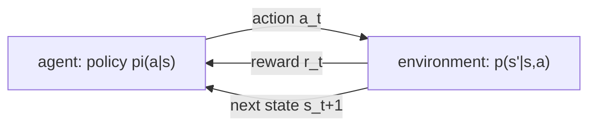
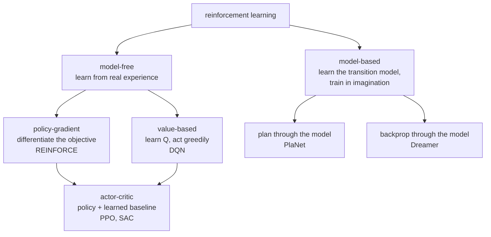
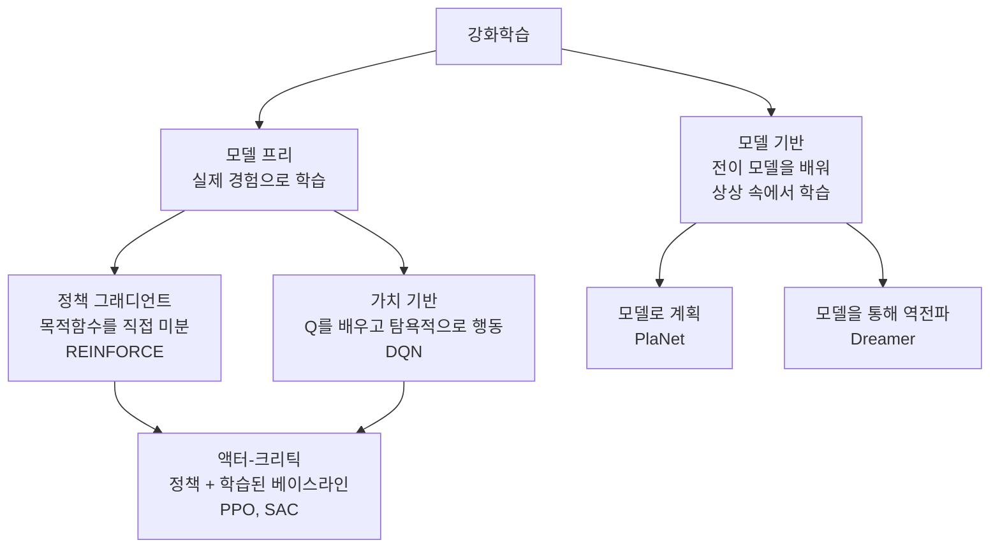

> [!note] Prerequisites · 선수 지식
> [[02-foundations/engineering-math|0.5 §5]] (geometric series — where the effective horizon comes from) · [[02-foundations/probability|3. Probability §1–2, §5]] (conditioning, expectation, the Markov property) · [[02-foundations/calculus-backprop|2. Calculus]] (gradients, for policy gradients)
> [[02-foundations/engineering-math|0.5 §5]](기하급수 — 유효 지평이 여기서 나온다) · [[02-foundations/probability|3. 확률 §1–2, §5]](조건화·기댓값·마르코프 성질) · [[02-foundations/calculus-backprop|2. 미적분]](정책 그래디언트를 위한 그래디언트)
>
> Connection map · 연결 지도: [[02-foundations/overview|0. Overview]]

## English

*Stands on [[02-foundations/probability|3. Probability]] and [[02-foundations/calculus-backprop|2. Calculus]]. The other domain bridge: the case where your own policy makes the data.
Nothing here needs signal processing, so the two can be read in either order.*

You cannot read [[01-canonical-papers/notes/1-foundations/instructgpt|RLHF]], the
[[01-canonical-papers/notes/5-world-models/dreamer|Dreamer]] line, or half of modern robot learning without
the MDP vocabulary. Course-depth treatment: the Bellman machinery, both algorithm families
with their update rules, the policy gradient theorem, and PPO's actual objective — then the
layer robot papers actually spend their pages on: reward design, exploration, RL
fine-tuning on real machines, and how to read an RL experimental section.

> [!note] First pass · 처음이라면
> This is the longest page in the track, so read §6 early. First pass: §1, §2, then jump to §6 — the RL-versus-imitation map tells you which half of the page your papers actually live in. Come back for §3, §4 and §7 with that in hand, and read §3.5 — why deep RL needs its patches — right after §3.

### Homework diagram · 과제가 그릴 그림

The object is plant **P4** from [[02-foundations/lab-plants|0.6 Lab Plants]], the leaky heater $\dot x=-x+u+d$, read as an MDP. The problem set asks for this drawing.

**Top panel — the plant, with three arrows into one sum.** Draw the summing junction of the heater with all three inputs: $u$ arriving from the controller, $-x$ arriving from the feedback path, and $d$ arriving from outside the figure. Draw $d$'s arrow crossing the box that encloses everything the agent owns, and put a heavy dashed border on that box. Label the border *what the policy may choose*: $u$ is inside it, $d$ is not, and $-x$ is a consequence rather than a choice. That single border is the difference between a controller and an agent, and it is the one thing the problem set checks. Write beside $d$ that it enters at exactly the same point as $u$ — so the plant cannot tell them apart, and only the border can.

**Middle panel — the same plant as a two-state MDP.** Two circles, $s=0$ for $x\approx0$ and $s=1$ for $x\approx1$. With $d=0$ and one Euler step of $T=1$, the next state is $x^+=u$, so draw four arrows: from each circle, one arrow to $s=0$ labelled $u=0$ and one to $s=1$ labelled $u=1$. Every arrow is deterministic, so write probability $1$ on each and nothing else — the stochasticity of the general MDP has been spent, and the figure should say so rather than hide it. Write the reward *inside* each circle, $r=-s^2$, giving $0$ and $-1$: on this page reward is a property of the state you are in, not of the arrow you took. Put $\gamma=0.9$ on one arrow with a note that the effective horizon is $1/(1-\gamma)=10$ steps.

**Middle panel, second layer — the backup.** Beside each circle write the value after one greedy backup from $V\equiv0$: $V(0)=0$, $V(1)=-1$. Then write, in a box, that this is already the fixed point: backing up again returns the same two numbers, because the best move from either state is $u=0$ and $V(0)=0.9\,V(0)$ forces $V(0)=0$. Along the two arrows the greedy policy does *not* take, write the action values $Q(0,1)=-0.9$ and $Q(1,1)=-1.9$, and beside each the advantage $-0.9$ — the price of one unnecessary hot step, drawn as the gap between two arrows leaving the same circle.

**Bottom strip — what the drawing cannot certify.** Under both panels write one line: the two bins are the whole state space of this model, so when a real $d$ jumps the agent has no statement at all about what happens between bins. The control track's $u=-Kx$ does have one, and it is a pole ([[04-robotics/control-theory-ce397|5. Control Theory]]). Drawing the missing certificate as an empty box is the point of the exercise.

### 1. The MDP

- **Markov Decision Process** $(\mathcal{S}, \mathcal{A}, p, r, \gamma)$: states, actions,
  transition kernel $p(s'|s,a)$, reward $r(s,a)$, discount $\gamma \in [0,1]$ — Sutton and Barto write "$0 \le \gamma \le 1$", and $\gamma = 1$ is admissible once episodes terminate, which is why §4 below can derive the policy gradient for an undiscounted finite-horizon return.
  Markov = the state summarizes the past ([[02-foundations/probability|probability]]).
  - *What kind of thing it is:* a mathematical model of sequential decision-making, specified by those five components, each with a precise meaning. $\mathcal{S}$ is the set of states and $\mathcal{A}$ the set of actions. The **transition kernel** is a conditional probability distribution over the next state, so for every $(s, a)$ it is nonnegative and sums to one:
  $$p(s' \mid s, a) = P\big(s_{t+1} = s' \mid s_t = s,\ a_t = a\big), \qquad \sum_{s' \in \mathcal{S}} p(s' \mid s, a) = 1$$
  (an integral for continuous states). The reward $r(s, a)$ is the scalar the agent receives for taking $a$ in $s$, and $\gamma$ weights future rewards.
  - *The Markov property* is the condition that makes those five components enough: the next state depends on the history only through the current state and action,
  $$P\big(s_{t+1} \mid s_t, a_t, s_{t-1}, a_{t-1}, \dots, s_0, a_0\big) = P\big(s_{t+1} \mid s_t, a_t\big)$$
  so a policy that sees only $s_t$ loses nothing by ignoring the past ([[02-foundations/probability|3. Probability §5]]). **Non-example:** a "state" that holds an excavator arm's joint *angles* but not its velocities is not Markov, because two moments with the same angles but opposite velocities lead to different next angles; add the velocities and it becomes Markov.
- **Policy** $\pi(a|s)$; **return** $G_t = \sum_{k\ge 0} \gamma^k r_{t+k}$; objective
  $J(\pi) = E_\pi[G_0]$. Discounting makes infinite sums finite and encodes impatience;
  $1/(1-\gamma)$ is the effective horizon (γ=0.99 ⇒ ~100 steps — the geometric sum that
  produces that number is derived step by step in [[02-foundations/engineering-math|0.5 §5]]).
  - A **policy** is the agent's decision rule: for each state, a probability distribution over actions, $\pi(a \mid s) \ge 0$ with $\sum_a \pi(a \mid s) = 1$. A **deterministic** policy is the special case that puts all probability on one action, written $a = \pi(s)$.
  - The **return** is a random variable — the discounted sum of the rewards actually received from step $t$ on — and $J(\pi)$ is its expectation from the start, taken over the policy's action choices and the kernel's transitions. With $\gamma = 0.9$, rewards $1, 0, 2$ and nothing after give $G_0 = 1 + 0.9(0) + 0.81(2) = 2.62$. Because $|r_t| \le r_{\max}$ implies $|G_t| \le r_{\max}/(1-\gamma)$, every return is finite whenever $\gamma < 1$, and $1/(1-\gamma)$ is that bound's horizon: $10$ steps for $\gamma = 0.9$, $100$ for $\gamma = 0.99$.
  - An **episode** is one run from a start state until a terminal state (or a time limit); with episodes that always terminate, $\gamma = 1$ is allowed, as noted above.
- Robotics reality: the state is *unobserved* (POMDP) — you see images and proprioception.
  Practical dodge: condition on observation histories / recurrent state (what
  [[01-canonical-papers/notes/5-world-models/dreamer|RSSM]]s formalize).
  - A **partially observable MDP** adds two components to the five: an observation space $\Omega$ and an observation kernel $O(o \mid s)$, the probability of seeing $o$ in state $s$. The agent acts on $o_t$ rather than $s_t$, and the observation alone is generally not Markov. What *is* Markov is the **belief** $b_t(s) = P(s_t = s \mid o_{0:t}, a_{0:t-1})$, the posterior over states given everything seen so far, which is why histories or recurrent state work as a substitute ([[04-robotics/planning-decision-making|Planning & Decision-Making]]).

### 2. Value functions and the Bellman equations

- $V^\pi(s) = E_\pi[G_t | s_t{=}s]$, $Q^\pi(s,a) = E_\pi[G_t | s_t{=}s, a_t{=}a]$,
  **advantage** $A^\pi = Q^\pi - V^\pi$ (how much better than my average move).
  - *The three, as one family.* Each is an expected return under policy $\pi$, differing only in what is fixed before the expectation is taken: $V^\pi(s)$ fixes the state, $Q^\pi(s,a)$ fixes the state *and* the first action (after which $\pi$ takes over), and the advantage compares the two. They are tied together by
  $$V^\pi(s) = \sum_{a} \pi(a \mid s)\, Q^\pi(s, a), \qquad A^\pi(s, a) = Q^\pi(s, a) - V^\pi(s), \qquad \sum_a \pi(a \mid s)\, A^\pi(s, a) = 0$$
  since the value of a state is the policy-weighted average of its action values, and so the advantage averages to zero under the policy's own action choices. That zero mean is why the advantage is the right weight for a policy gradient (§4): it pushes above-average actions up and below-average ones down.
- **Bellman expectation** (consistency of $V^\pi$):
  $$V^\pi(s) = E_{a\sim\pi,\, s'\sim p}\big[r(s,a) + \gamma V^\pi(s')\big]$$
- **Where it comes from — it is the return folded once.** The return is a geometric sum,
  $G_t = r_t + \gamma r_{t+1} + \gamma^2 r_{t+2} + \cdots$. Factor $\gamma$ out of
  everything after the first term: $G_t = r_t + \gamma(r_{t+1} + \gamma r_{t+2} + \cdots)$,
  and the bracket is just $G_{t+1}$. So $G_t = r_t + \gamma G_{t+1}$ — the same one-line
  trick as $1 + x + x^2 + \cdots = 1 + x(1 + x + \cdots)$. Take expectations conditioned on
  $s_t = s$, and the Markov property lets $E[G_{t+1}]$ collapse to $V^\pi(s')$ because the
  future depends on $s'$ alone. That is the whole derivation. It is worth doing once,
  because it shows the Bellman equation is not a new modelling assumption on top of the MDP —
  it is the *definition of the return*, rewritten so the unknown appears on both sides. Which
  is exactly what makes it something you can iterate to a fixed point.
- **Bellman optimality**: $Q^*(s,a) = E\big[r + \gamma \max_{a'} Q^*(s',a')\big]$;
  the greedy policy on $Q^*$ is optimal.
  - *Definitions behind it.* The optimal value functions are the best achievable by any policy, $V^*(s) = \max_\pi V^\pi(s)$ and $Q^*(s,a) = \max_\pi Q^\pi(s,a)$. They satisfy the expectation equation with the policy average replaced by a maximum:
  $$V^*(s) = \max_{a} \sum_{s'} p(s' \mid s, a)\,\big[r(s, a) + \gamma\, V^*(s')\big], \qquad \pi^*(s) = \arg\max_a Q^*(s, a)$$
  because an optimal agent picks the best first action and then behaves optimally from wherever it lands. A policy $\pi^*$ that is greedy with respect to $Q^*$ in every state is optimal, and in a finite MDP a deterministic optimal policy always exists.
  - *Worked:* give the bucket MDP below a second action in $A$, "wait", which stays in $A$ with reward $0$. With $V^*(B) = 10$ and $V^*(A) = 9$, the two action values in $A$ are $Q^*(A, \text{move}) = 0 + 0.9 \times 10 = 9$ and $Q^*(A, \text{wait}) = 0 + 0.9 \times 9 = 8.1$, so the greedy policy moves. Waiting is not worthless — it is worth $8.1$ — it is just $0.9$ worse.
- **A two-state MDP you can solve on paper.** States $A$ (empty bucket) and $B$ (bucket
  full). From $A$ the only action moves you to $B$ with reward $0$; in $B$ you stay in $B$
  and collect reward $1$ every step. Take $\gamma = 0.9$. Write the Bellman equation for $B$ — its value is this step's reward plus the discounted value of where you land, which is $B$ again, so the unknown appears on both sides and you solve for it:
  $$V(B) = 1 + 0.9\,V(B) \quad\Rightarrow\quad V(B)(1 - 0.9) = 1 \quad\Rightarrow\quad V(B) = 10$$
  — which is the geometric sum $1/(1-\gamma)$ from
  [[02-foundations/engineering-math|0.5 §5]], arriving here as a *value*. Then
  $V(A) = 0 + 0.9\,V(B) = 9$. Read it: being one step away from the good state costs you
  exactly one discount factor, $9 = 0.9 \times 10$. And the advantage of the move out of $A$
  is $Q(A,\text{move}) - V(A) = 9 - 9 = 0$ — there was no alternative, so no move can be
  better than average. Advantage measures *choice*, and where there is no choice it is zero.

**Worked: P4 as an MDP.** The leaky heater $\dot x=-x+u+d$ ([[02-foundations/lab-plants|0.6]]). The agent chooses $u$; $d$ is an exogenous arrow it does not pick. Bins $s\in\{0,1\}$ for $x\approx 0$ and $x\approx 1$, actions $u\in\{0,1\}$, $d=0$, Euler $T=1$ so $x^+=u$, reward $r=-s^2$, $\gamma=0.9$. One greedy backup from $V\equiv 0$: $s'=u$ and $Q(s,u)=-s^2$, so $V(0)=0$, $V(1)=-1$. A policy learned on these bins has no pole certificate when a real $d$ jumps; that stabilizer is $u=-Kx$ on [[04-robotics/control-theory-ce397|5]]. The problem set is this MDP as a drawing.
- These are fixed-point equations; the Bellman operator is a $\gamma$-contraction, so
  iterating it converges — the license behind everything below.
  - *What that means.* The **Bellman operator** $T^\pi$ maps any value table $V$ to a new one, $(T^\pi V)(s) = \sum_a \pi(a \mid s) \sum_{s'} p(s' \mid s, a)\,[r(s,a) + \gamma V(s')]$, and $V^\pi$ is the table it leaves unchanged, $T^\pi V^\pi = V^\pi$. A **$\gamma$-contraction** in the max-norm is an operator that brings any two tables closer by at least the factor $\gamma$:
  $$\big\lVert T^\pi V - T^\pi V' \big\rVert_\infty \le \gamma\, \big\lVert V - V' \big\rVert_\infty, \qquad \lVert V \rVert_\infty = \max_s |V(s)|$$
  which holds because the only place $V$ enters is the term $\gamma V(s')$, averaged with nonnegative weights that sum to one. The Banach fixed-point theorem then gives both consequences at once: the fixed point is **unique**, and iterating from any start shrinks the worst-case error by at least $\gamma$ per sweep. In the §3 worked example the max-norm error from $V_0 = (0,0)$ is $5.263, 4.737, 4.263, 3.837$ — each exactly $0.9$ times the last. The same inequality holds for the optimality operator, since a maximum cannot move by more than its arguments do.

### 3. Dynamic programming and TD learning

- **Value iteration**: apply the optimality operator repeatedly (needs the model $p$).
  **Policy iteration**: evaluate $\pi$, then act greedily; repeat. The same backup read as
  algorithm design — finite-horizon backward induction, the table-size curse of dimensionality,
  LQR as DP with a closed-form value — is [[02-foundations/algorithms/dynamic-programming|11.5 §7]].
  - *Both, written out.* Value iteration is a sequence of tables $V_0, V_1, \dots$, each obtained by one application of the optimality operator to every state:
  $$V_{k+1}(s) = \max_{a} \sum_{s'} p(s' \mid s, a)\,\big[r(s, a) + \gamma\, V_k(s')\big]$$
  so by the contraction property of §2 it converges to $V^*$ from any $V_0$. On the bucket MDP with the extra "wait" action, starting from zeros, $(V(A), V(B))$ goes $(0, 1)$, $(0.9, 1.9)$, $(1.71, 2.71)$, … toward $(9, 10)$. Policy iteration alternates two steps until the policy stops changing: **evaluation**, solving $V^{\pi_k} = T^{\pi_k} V^{\pi_k}$ for the current policy, and **improvement**, $\pi_{k+1}(s) = \arg\max_a \sum_{s'} p(s' \mid s, a)[r(s,a) + \gamma V^{\pi_k}(s')]$. Each improvement step can only raise the value, and a finite MDP has finitely many deterministic policies, so it terminates.
- Without a model, sample: **TD(0)** update
  $V(s) \leftarrow V(s) + \alpha\,[\underbrace{r + \gamma V(s')}_{\text{target}} - V(s)]$
  — bootstrap from your own estimate. The bracket is the **TD error** $\delta$, RL's
  all-purpose learning signal.
  - *Each symbol:* one observed transition $(s, r, s')$ — the state visited, the reward received, the state reached — replaces the expectation in the Bellman equation, and $\alpha \in (0, 1]$ is the step size.
  $$\delta = r + \gamma\, V(s') - V(s), \qquad V(s) \leftarrow V(s) + \alpha\, \delta$$
  so the estimate moves a fraction $\alpha$ of the way toward the one-sample target. **Bootstrapping** is the defining feature: the target contains the current estimate $V(s')$ rather than the true return. Worked: $V(s) = 0.5$, $r = 1$, $V(s') = 2$, $\gamma = 0.9$, $\alpha = 0.1$ give $\delta = 1 + 1.8 - 0.5 = 2.3$ and $V(s) \leftarrow 0.73$.
- **Q-learning** (**off-policy** — it learns about the greedy policy while acting under a
  different, exploratory one, so it can reuse old data; **on-policy** methods such as PPO
  must learn from data their *current* policy just generated, and discard it after):
  $Q(s,a) \leftarrow Q(s,a) + \alpha\,[r + \gamma \max_{a'}Q(s',a') - Q(s,a)]$.
  DQN = this + neural $Q$ + replay buffer (a stored pool of past transitions, sampled at random) + target network (a
  [[02-foundations/calculus-backprop|stop-gradient]] copy for stable targets).
  - *On- vs off-policy, as a condition.* Two policies are involved in any learning method: the **behavior policy** $\mu$ that chooses the actions in the data, and the **target policy** $\pi$ whose value is being learned. A method is **on-policy** when $\mu = \pi$ and **off-policy** when they may differ. Q-learning's target uses $\max_{a'} Q(s', a')$, the greedy action, whatever action $\mu$ actually took next — that is exactly what makes it off-policy. **Sarsa**, its on-policy twin, uses the action $a'$ that was actually taken, $r + \gamma Q(s', a')$. Worked: $Q(s,a) = 0.5$, $r = 1$, $Q(s', \cdot) = (1.0, 3.0)$, $\gamma = 0.9$, $\alpha = 0.1$. Q-learning uses $\max = 3.0$, so $\delta = 3.2$ and $Q \leftarrow 0.82$; if the exploratory behavior actually took the first action, Sarsa uses $1.0$ and gives $Q \leftarrow 0.64$.
  - *DQN, as a loss.* With network parameters $\theta$, a periodically copied target network $\bar\theta$, and transitions $(s, a, r, s')$ sampled uniformly from the replay buffer $\mathcal{D}$:
  $$\mathcal{L}(\theta) = E_{(s,a,r,s') \sim \mathcal{D}}\Big[\big(r + \gamma \max_{a'} Q_{\bar\theta}(s', a') - Q_\theta(s, a)\big)^2\Big]$$
  so each gradient step is a regression toward a target that does not move with $\theta$, since $\bar\theta$ is held fixed between copies (§3.5 explains why that matters).
- Value-based methods are sample-efficient but awkward for continuous actions
  (the $\max_{a'}$ needs an inner optimization) — hence robotics leans policy-side.
- **Worked example — policy evaluation you can do on paper.** (Value *iteration* would take a $\max_a$ at each step; with the policy fixed this is the evaluation half.) Two states, fixed policy,
  $\gamma = 0.9$: state $A$ gives reward 1 and moves to $B$; state $B$ gives 0 and moves
  back to $A$. Bellman: $V(A) = 1 + 0.9V(B)$, $V(B) = 0.9V(A)$. Iterate from $V_0 = (0,0)$:
  $V_1 = (1, 0)$, $V_2 = (1, 0.9)$, $V_3 = (1.81, 0.9)$, … converging to the fixed point
  $V(A) = 1/(1 - 0.81) \approx 5.26$, $V(B) \approx 4.74$. Watch what happened: each
  sweep pushes reward information one step further back — that is all "bootstrapping" means.

### 3.5 The deadly triad — why deep RL needs its patches

Section 3 ended by saying DQN is Q-learning plus a neural $Q$, a replay buffer and a target
network, without saying why the last two are there. They are there because of a result
every robot-learning paper is quietly living inside.

**Three ingredients, and only together are they dangerous.** Sutton and Barto name them the
*deadly triad*:

| Element | What it means | Where §3 introduced it |
|---|---|---|
| Function approximation | generalizing from a state space far larger than memory — linear features, or a network | "neural $Q$" |
| Bootstrapping | updating toward a target that contains your own current estimate | the TD target $r + \gamma V(s')$ |
| Off-policy training | learning from a distribution of transitions other than the one the target policy produces | Q-learning acting under an exploratory policy |

Combine all three and value estimates can **diverge** — not converge slowly, not converge to
a poor answer, but grow without bound. Removing one leg is a representative mitigation, not
a general safety theorem for arbitrary neural approximators and optimizers. Classical tabular
or linear cases have convergence results under explicit assumptions; neural Monte Carlo or
Sarsa does not become generally safe merely because one leg is absent.

**Two things this is not.** It is not a control problem: the divergence appears in plain
*prediction*, with the policy fixed. And it is not about noise or exploration or an unknown
environment: it happens in dynamic programming, where the model is known exactly and there
is no sampling at all.

**Worked — divergence with the exact least-squares answer at every step.** Tsitsiklis and
Van Roy's two-state example. One parameter $w$; the first state's estimated value is $w$ and
the second's is $2w$. Every reward is zero, so the true value is zero at both states —
**and that is exactly representable**, at $w = 0$. The first state leads to the second; the
second repeats, terminating with probability $\varepsilon$. At each sweep, choose $w_{k+1}$
to be the *best possible least-squares fit* to the expected one-step return. Those targets,
read off the current estimate: the first state earns $0$ and lands in the second, so its
target is $0 + \gamma\cdot 2w_k = 2\gamma w_k$; the second earns $0$ and stays with probability
$1-\varepsilon$ (value $2w_k$) or terminates (value $0$), so its target is $2(1-\varepsilon)\gamma w_k$.
Each squared term below is (estimate $-$ target)$^2$ for one state. Minimizing
$(w - 2\gamma w_k)^2 + (2w - 2(1-\varepsilon)\gamma w_k)^2$ gives

$$w_{k+1} = \frac{6 - 4\varepsilon}{5}\,\gamma\, w_k$$

so the sequence multiplies by a constant each sweep and diverges whenever
$\gamma > 5/(6-4\varepsilon)$ and $w_0 \neq 0$. At $\varepsilon = 0$ that threshold is $\gamma = 0.833$ — so
the entirely ordinary $\gamma = 0.9$ gives a multiplier of $1.08$:

$$w = 1,\; 1.08,\; 1.166,\; 1.260,\; 1.360,\; \ldots,\; 46.9 \text{ after 50 sweeps}$$

Set $\gamma = 0.8$ instead and the multiplier is $0.96$ and it converges to zero. Or keep
$\gamma = 0.9$ and let episodes terminate with $\varepsilon = 0.2$ — multiplier $0.936$,
converges again. Note what $\varepsilon$ changes: it enters the least-squares objective through the *bootstrap target*, the expected one-step return, not through the update distribution — the sweep stays a uniform pass over both states either way. Off-policy-ness is a separate leg of the triad.

Look at what is *not* available as an excuse. There is no learning rate to lower — the fit
is exact. There is no noise — the model is known. There is no reward to misdesign — they are
all zero. There is no representation error — the true answer is in the function class. The
divergence is structural, and it turns on the discount factor.

**Which leg would you give up?** All three are on the table, and the field's answer explains
its designs.

- *Function approximation*: no. Anything that scales to images or joint states needs it.
- *Bootstrapping*: possible, and Monte Carlo does it — at real cost. MC must store an
  episode until it ends before it can learn anything from it, while a bootstrapped update
  consumes each transition where it is generated and never revisits it. Bootstrapping is
  also usually more data-efficient. Nobody gives it up entirely; $n$-step returns give it up
  partially.
- *Off-policy*: often, yes. Sarsa instead of Q-learning is exactly this trade, and on-policy
  methods like PPO mitigate the same source of mismatch. A PPO rollout is normally reused
  for several minibatch epochs; after the policy has moved sufficiently, it is discarded and
  a fresh rollout is collected. Long-term replay of old rollouts can violate the assumptions
  behind the importance ratio and trust-region-style update.

**The patches, read as triad mitigations.** This is the payoff for reading papers:

- **Target network** (DQN): freeze the network that produces the bootstrap target for
  thousands of steps. That weakens the bootstrapping leg by making the target temporarily a
  constant rather than a moving self-reference.
- **Replay buffer**: improves the data but *worsens* the off-policy leg, since old
  transitions come from older policies. It is bought, not free — which is why buffer size
  and sampling scheme are tuned rather than maximized.
- **Clipped double-$Q$** (TD3, [[01-canonical-papers/notes/1-foundations/sac|SAC]]): train two value networks
  (**critics** — see §4) and take the minimum of their estimates. Aimed at overestimation bias, which the triad amplifies because an
  over-large value feeds its own next target. The shared target is $y = r + \gamma \min_{j = 1, 2} Q_{\bar\theta_j}(s', a')$, with $a'$ the next action chosen by the current policy and $\bar\theta_j$ the two target networks. If the two critics estimate $12$ and $10$ for the same next pair, the target uses $10$: an error has to appear in *both* networks at once to propagate.
- **Pessimism in offline RL**: penalize or avoid evaluating actions the dataset does not
  support. This attacks the off-policy leg directly, and it is why offline RL is a distinct
  literature rather than "RL with a fixed buffer."

There is also a clean theoretical escape that nobody uses: function approximators that never
extrapolate beyond observed targets — nearest neighbour, locally weighted regression, the
class Sutton and Barto call *averagers* — are provably stable. They are also too weak for
the problems robotics cares about. Neural networks and tile coding both extrapolate, so both
forfeit the guarantee.

**What to do with this when reading.** When a value-based or offline-RL paper reports
instability, a tuning sensitivity, or an ablation where removing one component collapses
training, check which leg of the triad that component was holding. And when a paper reports
that its method is stable, ask what it gave up to get there — usually data reuse,
sometimes discount factor, occasionally the bootstrap.

### 4. Policy gradients — differentiate the objective itself

- **The log-derivative trick** (shown first for the finite-horizon **undiscounted**
  objective $G(\tau)=\sum_t r_t$):
  $$\nabla_\theta J = \nabla_\theta \int p_\theta(\tau) G(\tau)\,d\tau = \int p_\theta(\tau)\,\nabla_\theta \log p_\theta(\tau)\, G(\tau)\,d\tau = E_\tau\Big[\sum_t \nabla_\theta \log \pi_\theta(a_t|s_t)\, G_t\Big]$$
  (dynamics terms vanish from $\nabla\log p_\theta(\tau)$ because they don't depend on
  $\theta$). Interpretation: *raise the log-probability of actions in proportion to the
  return that followed*. For the discounted objective defined in §1, the exact theorem can
  instead be written with discounted state visitation (or an explicit $\gamma^t$ under a
  trajectory-sampling convention). Papers often use discounted return-to-go inside an
  undiscounted finite-horizon estimator, so check which objective and sampling distribution
  their equality assumes.
  - *The two facts the chain of equalities uses.* A trajectory $\tau = (s_0, a_0, s_1, a_1, \dots)$ has probability equal to the start-state distribution $\rho_0$ times one policy factor and one dynamics factor per step,
  $$p_\theta(\tau) = \rho_0(s_0) \prod_{t} \pi_\theta(a_t \mid s_t)\, p(s_{t+1} \mid s_t, a_t), \qquad \nabla_\theta\, p_\theta(\tau) = p_\theta(\tau)\, \nabla_\theta \log p_\theta(\tau)$$
  and the second identity is just the derivative of a logarithm, $\nabla \log p = \nabla p / p$. Taking the log turns the product into a sum, so $\nabla_\theta \log p_\theta(\tau) = \sum_t \nabla_\theta \log \pi_\theta(a_t \mid s_t)$: $\rho_0$ and $p$ contain no $\theta$ and drop out. That is why a policy gradient can be estimated from sampled episodes without a model of the dynamics.
- **REINFORCE** is exactly this — unbiased, catastrophically high variance. Variance
  reductions, in order of importance: subtract a **baseline** $b(s)$ (unbiased for any
  state-only baseline; best choice ≈ $V(s)$, making the weight the advantage $A$);
  use reward-to-go; **actor-critic**: learn $V_\phi$ with TD and use
  $\delta = r + \gamma V(s') - V(s)$ as a one-sample advantage estimate. **GAE** (generalized advantage estimation) interpolates
  between TD (biased, low-variance) and Monte Carlo (unbiased, high-variance) with a knob λ:
  it weights the TD errors of the next steps by $(\gamma\lambda)^l$, so λ = 0 keeps only the
  one-step $\delta$ above and λ = 1 sums them into the full Monte Carlo return minus $V(s)$.
  - *REINFORCE with a baseline, as the estimator actually computed* from $N$ sampled episodes $i$ with steps $t$:
  $$\hat g = \frac{1}{N}\sum_{i=1}^{N} \sum_{t} \nabla_\theta \log \pi_\theta\big(a_t^i \mid s_t^i\big)\,\Big(\hat G_t^i - b\big(s_t^i\big)\Big), \qquad \theta \leftarrow \theta + \alpha\,\hat g$$
  where $\hat G_t^i$ is the reward-to-go actually observed after step $t$ and $\nabla_\theta \log \pi_\theta$ is the **score function**; the update is gradient *ascent* because $J$ is maximized. The baseline leaves the expectation unchanged since the score has zero mean under the policy (self-check 2) — for a two-action policy with probabilities $0.6$ and $0.4$, the score with respect to $p = 0.6$ is $1/0.6$ or $-1/0.4$, and $0.6(1/0.6) + 0.4(-1/0.4) = 0$.
  - *Actor-critic, as two coupled learners.* The **actor** is the policy $\pi_\theta$; the **critic** is a learned value function $V_\phi$ whose only job is to supply the baseline. Each transition updates both,
  $$\delta_t = r_t + \gamma V_\phi(s_{t+1}) - V_\phi(s_t), \qquad \phi \leftarrow \phi + \alpha_\phi\, \delta_t\, \nabla_\phi V_\phi(s_t), \qquad \theta \leftarrow \theta + \alpha_\theta\, \delta_t\, \nabla_\theta \log \pi_\theta(a_t \mid s_t)$$
  so the critic learns by TD(0) (§3) while the actor treats the critic's TD error as its advantage.
  - *GAE, written out.* With TD errors $\delta_t$ as above,
  $$\hat A_t^{\text{GAE}(\gamma, \lambda)} = \sum_{l=0}^{\infty} (\gamma\lambda)^l\, \delta_{t+l}$$
  so the weights decay geometrically at rate $\gamma\lambda$. With $\gamma = 0.9$, $\lambda = 0.95$ ($\gamma\lambda = 0.855$) and the next three TD errors $1.0, 0.5, -0.2$ (zero afterwards), $\hat A_t = 1.0 + 0.855(0.5) + 0.855^2(-0.2) = 1.281$.
- **Why a baseline matters, in numbers.** One state, two actions, $\pi(a_1)=0.6$,
  $\pi(a_2)=0.4$, returns $G_1 = 1$, $G_2 = 0$. Raw REINFORCE weights the two
  log-probability gradients by $1$ and $0$: $a_1$ is pushed up and $a_2$ is *left alone*.
  Subtract the baseline $b = E[G] = 0.6\cdot1 + 0.4\cdot0 = 0.6$ and the weights become
  advantages $A_1 = +0.4$, $A_2 = -0.6$ — now the worse action is actively pushed **down**.
  Same expected gradient, far less variance: that is the whole trick.
- **PPO** — the workhorse ([[01-canonical-papers/notes/1-foundations/instructgpt|the one inside RLHF]]):
  with ratio $\rho_t = \pi_\theta(a_t|s_t)/\pi_{old}(a_t|s_t)$, the objective is the importance-weighted advantage, clipped so that a step earns nothing for pushing the ratio outside $[1-\epsilon, 1+\epsilon]$:
  $$\mathcal{L} = E_t\big[\min\big(\rho_t A_t,\ \text{clip}(\rho_t, 1{-}\epsilon, 1{+}\epsilon)\, A_t\big)\big]$$
  (**maximized**, despite the $\mathcal{L}$ — PPO's objective is a reward-like surrogate, not a loss)
  — take policy-gradient steps but *clip away the incentive* to move far from the data-
  collecting policy. A trust region by clamp, plus (in RLHF) an explicit KL penalty
  ([[02-foundations/information-theory|information theory]]).
  - *Every piece named.* $\pi_{old}$ is the policy that collected the current batch and $\pi_\theta$ the one being optimized. The **importance ratio** $\rho_t$ reweights an old sample to estimate what the new policy would earn: an action the new policy takes with probability $0.3$ where the old one took it with $0.2$ gets weight $1.5$. $A_t$ is an advantage estimate, usually GAE. $\epsilon$ (commonly $0.2$) is the clip range, and $\text{clip}(x, a, b) = \min(\max(x, a), b)$ confines $x$ to $[a, b]$, so $\text{clip}(1.3, 0.8, 1.2) = 1.2$ and $\text{clip}(0.7, 0.8, 1.2) = 0.8$. $E_t$ is the average over the timesteps in the batch.
  - *Trust region, the idea being approximated.* TRPO maximizes the same importance-weighted advantage subject to an explicit bound on how far the policy moves, measured by KL divergence ([[02-foundations/information-theory|5. Information Theory §3]]):
  $$\max_\theta\ E_t\big[\rho_t\, A_t\big] \quad \text{subject to} \quad E_t\Big[\mathrm{KL}\big(\pi_{old}(\cdot \mid s_t)\ \Vert\ \pi_\theta(\cdot \mid s_t)\big)\Big] \le \delta$$
  because the ratio-weighted estimate is only accurate while the two policies stay close. PPO replaces the constraint with the clip, which is cheaper to optimize with ordinary minibatch gradient steps and enforces closeness only approximately.
- **The clip, in numbers** ($\epsilon = 0.2$). Good action, $A = +1$, and the policy has
  already raised it to $\rho = 1.3$: $\min(1.3,\ \text{clip}(1.3)=1.2) = 1.2$ — the
  *clipped* branch wins, and it is flat, so the gradient is **zero**: no incentive to push
  further. Bad action, $A = -1$, and the policy is moving the wrong way at $\rho = 1.5$:
  $\min(-1.5,\ -1.2) = -1.5$ — the *unclipped* branch wins, gradient nonzero, so the
  penalty **keeps acting**. Clipping removes the incentive to overshoot, never the
  incentive to correct.

<svg viewBox="0 0 460 185" style="max-width:100%;height:auto" role="img" aria-label="the PPO clipped objective for a good action and for a bad action">
  <g stroke="currentColor" stroke-width="1" opacity="0.3">
    <line x1="30" y1="30" x2="30" y2="155"/><line x1="30" y1="155" x2="210" y2="155"/>
    <line x1="255" y1="30" x2="255" y2="155"/><line x1="255" y1="155" x2="435" y2="155"/>
  </g>
  <g stroke="currentColor" stroke-width="1" opacity="0.45" stroke-dasharray="3 3">
    <line x1="141" y1="30" x2="141" y2="155"/><line x1="303" y1="30" x2="303" y2="155"/>
    <line x1="110" y1="140" x2="110" y2="155"/><line x1="334" y1="140" x2="334" y2="155"/>
  </g>
  <path d="M30,143 L141,59" fill="none" stroke="currentColor" stroke-width="2.2"/>
  <path d="M141,59 L205,59" fill="none" stroke="currentColor" stroke-width="2.2" opacity="0.55"/>
  <path d="M255,47 L303,47" fill="none" stroke="currentColor" stroke-width="2.2" opacity="0.55"/>
  <path d="M303,47 L430,143" fill="none" stroke="currentColor" stroke-width="2.2"/>
  <g font-size="11" fill="currentColor">
    <text x="30" y="22">good action (A = +1)</text><text x="255" y="22">bad action (A = &#8722;1)</text>
    <text x="103" y="170" font-size="10">1.0</text><text x="130" y="170" font-size="10">1.2</text>
    <text x="292" y="170" font-size="10">0.8</text><text x="327" y="170" font-size="10">1.0</text>
    <text x="150" y="52" font-size="10.5" opacity="0.9">flat: gradient 0</text>
    <text x="258" y="40" font-size="10.5" opacity="0.9">flat here only</text>
    <text x="186" y="170" font-size="10">rho</text><text x="410" y="170" font-size="10">rho</text>
  </g>
</svg>

### 5. Model-based RL — the world-model connection

- Model-free RL updates a policy or value function without planning through an explicit transition model. Its experience may come from hardware, simulation, or a stored dataset; off-policy methods can reuse it for many updates. Collecting new hardware experience can be expensive in time, wear and safety. The learned-model approach here learns $\hat p(s'|s,a)$ and trains the policy on
  *imagined* rollouts: [[01-canonical-papers/notes/5-world-models/world-models|World Models]] →
  [[01-canonical-papers/notes/5-world-models/planet|PlaNet]] (plan through the model) →
  [[01-canonical-papers/notes/5-world-models/dreamer|Dreamer]] (backprop through the model).
- The tradeoff: sample efficiency vs **model bias** — errors compound over imagined
  horizons (the same compounding-error logic as [[01-canonical-papers/notes/4-vla/act|ACT]]'s
  motivation), managed by short horizons and value bootstrapping.
  - *The dividing condition.* An RL method is **model-based** when it learns (or is given) a transition model $\hat p(s' \mid s, a)$, and usually a reward model $\hat r(s, a)$, and uses them to plan or to generate training data; it is **model-free** when its updates use only real transitions and never query such a model. The learned-model version has two stages, fitting the model to real transitions $(s_i, a_i, s'_i)$ by maximum likelihood, then improving the policy against the model's predictions:
  $$\hat p = \arg\max_{q} \sum_{i} \log q\big(s'_i \mid s_i, a_i\big), \qquad \hat J(\pi) = E_{\hat p,\, \pi}\Big[\sum_{t=0}^{H-1} \gamma^t\, \hat r(s_t, a_t) + \gamma^H\, V(s_H)\Big]$$
  where the imagined rollout runs $H$ steps inside $\hat p$ and a learned value $V$ stands in for everything after, so errors of $\hat p$ only compound for $H$ steps. With $\gamma = 0.99$ and Dreamer's $H = 15$, the bootstrap term still carries weight $0.99^{15} = 0.860$, which is why a short horizon costs little.
  - **Model bias** is the systematic difference $\hat p \ne p$. It is dangerous in a specific way: the policy optimizer actively seeks actions whose imagined return $\hat J$ is high, which includes actions that look good only because $\hat p$ is wrong there.

A world model is useful because imagined consequences let learning reuse collected experience. For example, an excavation policy can compare predicted outcomes before trying every action on hardware. The model can also reward actions whose apparent advantage is only a prediction error, especially beyond observed conditions. **The reading this gives you.** Ask where real observations correct the model and how imagined horizons are limited. Model-free methods can also reuse stored experience; the defining distinction is using an explicit predictive model for planning or learning, not whether every update requires a fresh physical trial.

### 6. RL vs imitation in robot learning (orientation map)

- **Imitation** ([[01-canonical-papers/notes/4-vla/rt-1|RT-1]],
  [[01-canonical-papers/notes/4-vla/diffusion-policy|Diffusion Policy]]): supervised on demos —
  stable, no reward design, but plain offline BC is capped by data coverage and cannot
  learn recoveries *outside the **support** of its demos* (the support of a dataset = the
  region of states and actions it actually covers; outside it the model has seen nothing) (demos with recoveries, or DAgger-style
  data collection, change this).
- **RL** *can* exceed the demonstrator — when an informative reward and enough exploration
  are available — practical mostly in
  simulation (sim-to-real) or as *fine-tuning* atop imitation-pretrained VLAs, mirroring
  the [[01-canonical-papers/notes/1-foundations/instructgpt|pretrain → RLHF]] recipe.

**The imitation-learning toolbox** (the vocabulary of every VLA paper). Read it in three
groups — *the core objective and its one failure mode*, *what the data looks like*, and
*what makes a policy expressive* — not as six loose facts.

*Group 1 — the objective and its Achilles' heel.* **BC** just maximizes
$\log \pi_\theta(a|o)$ over demo pairs — supervised learning wearing a policy costume
([[01-canonical-papers/how-to-read|how-to-read §3]] walks this exact equation). Its one
structural weakness is **covariate shift**: the policy is trained on *expert* states but
runs on *its own*, so small errors drift the state off-distribution where errors compound.
That single failure mode is why **DAgger** exists — execute the learner, let the expert
label the states it actually visited, retrain.

- **Behaviour cloning, written out.** Given a dataset $\mathcal{D} = \{(o_i, a_i)\}_{i=1}^{N}$ of expert observations and actions,
  $$\theta^\star = \arg\max_\theta \sum_{i=1}^{N} \log \pi_\theta\big(a_i \mid o_i\big)$$
  which is maximum-likelihood supervised learning, so no reward and no environment interaction appear anywhere. For a Gaussian policy with fixed standard deviation, $-\log \pi_\theta(a \mid o) = \frac{1}{2\sigma^2}\lVert a - \mu_\theta(o)\rVert^2 + \text{const}$, so BC reduces to mean-squared-error regression onto the demonstrated actions.
- **Covariate shift, as two distributions.** Write $d_\pi(s)$ for the distribution of states a policy $\pi$ visits when it runs. BC minimizes its loss under the expert's visitation $d_{\pi_E}$, but the deployed policy is scored under its own:
  $$\text{trained on } E_{s \sim d_{\pi_E}}\big[\ell(\pi_\theta, s)\big], \qquad \text{evaluated on } E_{s \sim d_{\pi_\theta}}\big[\ell(\pi_\theta, s)\big], \qquad d_{\pi_\theta} \ne d_{\pi_E}$$
  where $\ell$ is the per-state imitation loss. The inputs' distribution moves while the correct action for each state does not, which is exactly covariate shift in the sense of [[02-foundations/ml-practice|9. ML Practice §1]].
- **DAgger, as an algorithm** (Ross, Gordon & Bagnell, 2011). Start with the demonstrations as $\mathcal{D}$ and train $\pi_1$. At iteration $i$: run a mixture that follows the expert with probability $\beta_i$ and the current learner otherwise; record the states visited; ask the expert what it *would* do in each; aggregate and retrain,
  $$\mathcal{D} \leftarrow \mathcal{D} \cup \big\{(s, \pi_E(s)) : s \sim d_{\pi_i}\big\}, \qquad \pi_{i+1} = \text{BC on } \mathcal{D}$$
  so the training distribution is pulled toward the learner's own state distribution. A common schedule is $\beta_i = 0.5^{\,i-1}$, that is $1, 0.5, 0.25, 0.125$, handing control to the learner geometrically. **Non-example:** collecting more expert demonstrations and retraining is not DAgger, because those states still come from $d_{\pi_E}$.
- **Support.** The support of a distribution is the set where it has nonzero probability, $\operatorname{supp}(d) = \{s : d(s) > 0\}$. "Outside the support of the demonstrations" means states with $d_{\pi_E}(s) = 0$, where BC's loss has never been evaluated and its output is pure extrapolation.

*How bad is it?* Suppose each step independently carries a small chance $\epsilon$ of an
error that puts the policy somewhere its demonstrations never went. Then a $T$-step task
survives with probability $(1-\epsilon)^T$, and the horizon does the damage:

<svg viewBox="0 0 560 268" style="max-width:100%;height:auto" role="img" aria-label="probability of finishing a task without a single mistake, falling with horizon for three per-step error rates">
  <g stroke="currentColor" stroke-width="1.1" fill="none" opacity="0.55">
    <line x1="60" y1="170" x2="524" y2="170"/><line x1="60" y1="170" x2="60" y2="36"/>
  </g>
  <g stroke="currentColor" stroke-width="0.8" fill="none" opacity="0.25" stroke-dasharray="3 3">
    <line x1="60" y1="105" x2="524" y2="105"/>
  </g>
  <g stroke="currentColor" stroke-width="0.9" opacity="0.5">
    <line x1="152" y1="170" x2="152" y2="175"/><line x1="244" y1="170" x2="244" y2="175"/><line x1="336" y1="170" x2="336" y2="175"/><line x1="428" y1="170" x2="428" y2="175"/><line x1="520" y1="170" x2="520" y2="175"/>
  </g>
  <path d="M 60.0 40.0 L 69.2 92.2 L 78.4 123.4 L 87.6 142.1 L 96.8 153.3 L 106.0 160.0 L 115.2 164.0 L 124.4 166.4 L 133.6 167.9 L 142.8 168.7 L 152.0 169.2 L 161.2 169.5 L 170.4 169.7 L 179.6 169.8 L 188.8 169.9 L 198.0 169.9 L 207.2 170.0 L 216.4 170.0 L 225.6 170.0 L 234.8 170.0 L 244.0 170.0 L 253.2 170.0 L 262.4 170.0 L 271.6 170.0 L 280.8 170.0 L 290.0 170.0 L 299.2 170.0 L 308.4 170.0 L 317.6 170.0 L 326.8 170.0 L 336.0 170.0 L 345.2 170.0 L 354.4 170.0 L 363.6 170.0 L 372.8 170.0 L 382.0 170.0 L 391.2 170.0 L 400.4 170.0 L 409.6 170.0 L 418.8 170.0 L 428.0 170.0 L 437.2 170.0 L 446.4 170.0 L 455.6 170.0 L 464.8 170.0 L 474.0 170.0 L 483.2 170.0 L 492.4 170.0 L 501.6 170.0 L 510.8 170.0 L 520.0 170.0" fill="none" stroke="currentColor" stroke-width="1.6" opacity="0.9"/>
  <path d="M 60.0 40.0 L 69.2 52.4 L 78.4 63.7 L 87.6 73.8 L 96.8 83.0 L 106.0 91.3 L 115.2 98.9 L 124.4 105.7 L 133.6 111.8 L 142.8 117.4 L 152.0 122.4 L 161.2 127.0 L 170.4 131.1 L 179.6 134.8 L 188.8 138.2 L 198.0 141.2 L 207.2 144.0 L 216.4 146.5 L 225.6 148.7 L 234.8 150.7 L 244.0 152.6 L 253.2 154.2 L 262.4 155.8 L 271.6 157.1 L 280.8 158.3 L 290.0 159.5 L 299.2 160.5 L 308.4 161.4 L 317.6 162.2 L 326.8 163.0 L 336.0 163.6 L 345.2 164.2 L 354.4 164.8 L 363.6 165.3 L 372.8 165.7 L 382.0 166.1 L 391.2 166.5 L 400.4 166.8 L 409.6 167.1 L 418.8 167.4 L 428.0 167.7 L 437.2 167.9 L 446.4 168.1 L 455.6 168.3 L 464.8 168.4 L 474.0 168.6 L 483.2 168.7 L 492.4 168.8 L 501.6 169.0 L 510.8 169.1 L 520.0 169.1" fill="none" stroke="currentColor" stroke-width="1.6" opacity="0.9"/>
  <path d="M 60.0 40.0 L 69.2 41.3 L 78.4 42.6 L 87.6 43.8 L 96.8 45.1 L 106.0 46.3 L 115.2 47.6 L 124.4 48.8 L 133.6 50.0 L 142.8 51.2 L 152.0 52.4 L 161.2 53.5 L 170.4 54.7 L 179.6 55.9 L 188.8 57.0 L 198.0 58.1 L 207.2 59.2 L 216.4 60.3 L 225.6 61.4 L 234.8 62.5 L 244.0 63.6 L 253.2 64.6 L 262.4 65.7 L 271.6 66.7 L 280.8 67.8 L 290.0 68.8 L 299.2 69.8 L 308.4 70.8 L 317.6 71.8 L 326.8 72.7 L 336.0 73.7 L 345.2 74.7 L 354.4 75.6 L 363.6 76.6 L 372.8 77.5 L 382.0 78.4 L 391.2 79.3 L 400.4 80.2 L 409.6 81.1 L 418.8 82.0 L 428.0 82.9 L 437.2 83.7 L 446.4 84.6 L 455.6 85.5 L 464.8 86.3 L 474.0 87.1 L 483.2 88.0 L 492.4 88.8 L 501.6 89.6 L 510.8 90.4 L 520.0 91.2" fill="none" stroke="currentColor" stroke-width="1.6" opacity="0.9"/>
  <g font-size="10" fill="currentColor" opacity="0.85">
    <text x="110" y="148">1 step in 20 wrong</text>
    <text x="170" y="124">1 in 100</text>
    <text x="300" y="64">1 in 1000</text>
    <text x="54" y="44" text-anchor="end">1.0</text><text x="54" y="109" text-anchor="end">0.5</text><text x="54" y="174" text-anchor="end">0</text>
    <text x="152" y="188" text-anchor="middle">100</text><text x="244" y="188" text-anchor="middle">200</text><text x="336" y="188" text-anchor="middle">300</text><text x="428" y="188" text-anchor="middle">400</text><text x="520" y="188" text-anchor="middle">500</text>
    <text x="292" y="204" text-anchor="middle">task length (steps)</text>
    <text x="20" y="30">chance of a clean run</text>
  </g>
  <g font-size="11" fill="currentColor" opacity="0.9">
    <text x="20" y="226">A per-step error rate that sounds negligible becomes a task failure rate.</text>
    <text x="20" y="242">At one error in a hundred steps, a 50-step task finishes cleanly about 60% of</text>
    <text x="20" y="258">the time &#8212; and a 500-step task about 0.7%.</text>
  </g>
</svg>

Real errors are neither independent nor individually fatal, so read that curve as an
illustration, not a theorem. The theorem has the same shape: Ross, Gordon and Bagnell's
2011 reduction shows plain behaviour cloning accumulates cost as $O(\epsilon T^2)$ while a
no-regret method such as DAgger reaches $O(\epsilon T)$ — the difference between a horizon
you can grow and one you cannot. **Action chunking** (group 3 below) is the cheap version of
the same move: predicting $k$ steps at once turns a $T$-step task into a $T/k$-decision
task, sliding you back down the horizon axis.

*Group 2 — reading a dataset section.* Demos come from teleoperation
([[01-canonical-papers/notes/4-vla/act|ALOHA]]-style rigs, VR, kinesthetic teaching), scripted
policies, or cross-embodiment pooling ([[01-canonical-papers/notes/4-vla/open-x-embodiment|OXE]]).
Two things to check: **time-synchronization** (a mislabeled 100 ms offset silently corrupts
every observation-action pair) and **curation over count** — success filtering and
*trajectory diversity* (scenes, objects, initial conditions) usually matter more than "N
thousand demos," which is the number to audit skeptically.

*Group 3 — why the fancy output heads exist.* Demonstrations are **multimodal**: two
experts pass an obstacle on opposite sides, so a mean-regressing policy drives straight
through the middle. The fixes you'll meet are **action chunking** (predict $k$ future
actions at once — [[01-canonical-papers/notes/4-vla/act|ACT]] — trading reactivity to fight
compounding error) and **expressive heads** that can represent multiple modes
([[01-canonical-papers/notes/4-vla/diffusion-policy|diffusion]],
[[01-canonical-papers/notes/4-vla/pi0|flow matching]]). (Action *representation* also varies:
absolute vs delta, joint vs end-effector space.) Aside: **offline RL** learns from a fixed
dataset too, but uses rewards to *stitch* behavior better than any single demonstrator — at
the price of value-extrapolation instability BC never has.

- **Multimodal, precisely.** The expert's action distribution $p(a \mid o)$ has more than one separated peak (mode) for the same observation. A policy trained with mean-squared error predicts the conditional *mean*, $\mu^\star(o) = E[a \mid o]$, since that is what minimizes squared error. Two experts steering $+1$ m and $-1$ m around an obstacle, equally often, give a mean of $(1 + (-1))/2 = 0$ m: straight into the obstacle, an action *neither* expert ever took. A head that represents the distribution rather than its mean (a mixture, a diffusion or flow model, or discretized action tokens) can put probability on both sides.
- **Action chunking, precisely.** The policy outputs the next $k$ actions from one observation, $\pi_\theta(a_t, a_{t+1}, \dots, a_{t+k-1} \mid o_t)$, and the robot executes several of them before querying again. A $T$-step task then needs about $T/k$ policy decisions: $500$ steps in chunks of $10$ is $50$ decisions, and at a $1\%$ per-decision error rate the illustration above moves from $0.99^{500} = 0.7\%$ to $0.99^{50} = 60.5\%$ clean. The same formula shows the cost: within a chunk, observations after $o_t$ are not used.
- **Offline RL, precisely.** Learn a policy that maximizes expected return $J(\pi)$ from a fixed dataset of transitions $\mathcal{D} = \{(s, a, r, s')\}$ collected by some other behavior policy, with **no further interaction**. It differs from BC in using $r$, so it can prefer the better parts of mediocre trajectories, and from ordinary off-policy RL in that nothing outside $\operatorname{supp}(\mathcal{D})$ can ever be tried to correct an overestimated $Q$ — hence the pessimism of §3.5.

> [!important] The 2024–2026 correction to this section
> The framing above — imitation is stable but capped, RL can exceed the demonstrator — is
> right, and the last two years sharpened it in a way worth carrying. On **contact-rich
> precision** tasks the gap is not narrow: **[[01-canonical-papers/notes/7-robotics/hil-serl|HIL-SERL]]** (*Science Robotics*, 2025) reports
> 100% success on around thirteen such tasks after **1–2.5 hours of real-robot training** — the
> hours are the abstract's, the success rate and the task count are body figures, as are the
> diffusion-policy baselines it beats (**27%** on RAM insertion, **18%** on dashboard assembly).
> The abstract's own headline is a 2× average over imitation and prior RL. Demonstrations do not contain the corrective micro-adjustments needed when you
> are 2 mm off, and averaging over human demos actively destroys reactive behaviour.
>
> But the honest headline for the contact-rich precision cases discussed here is not "RL beat imitation". These results —
> HIL-SERL, ConRFT ([arXiv:2502.05450](https://arxiv.org/abs/2502.05450)) and RECAP
> ([arXiv:2511.14759](https://arxiv.org/abs/2511.14759)) — each put a **human correcting the
> policy on-distribution during learning**, which is closer to [[01-canonical-papers/notes/4-vla/dagger|DAgger]]'s lineage
> than to classical RL. **Interactive learning beat offline learning, and reward is one of
> several ways to close that loop.** Two riders: every RL success above needed a hand-built
> binary reward classifier — a per-task cost invisible in a table of 100% success rates. In
> these cases, RL is best read as an interactive finishing stage rather than a demonstrated
> general-purpose training paradigm.
>
> On the imitation side the sharpest recent result is a scaling law: generalization follows
> a power law in the **number of environments and objects, not the number of demonstrations**
> (Lin et al., [arXiv:2410.18647](https://arxiv.org/abs/2410.18647); the abstract's own words are
> a "roughly power-law relationship", from over 40,000 demonstrations and more than 15,000 real
> rollouts). Past a threshold, extra demos per
> environment do almost nothing. The two paradigms are therefore not competing for the same
> resource — **RL buys precision with interaction time, imitation buys generality with scene
> diversity.**

Entry chain into the papers: this section →
[[01-canonical-papers/notes/4-vla/act|ACT]] →
[[01-canonical-papers/notes/4-vla/diffusion-policy|Diffusion Policy]] →
[[01-canonical-papers/notes/4-vla/open-x-embodiment|OXE]] →
[[01-canonical-papers/notes/4-vla/rt-1|RT-1]]/[[01-canonical-papers/notes/4-vla/rt-2|RT-2]] →
[[01-canonical-papers/notes/4-vla/openvla|OpenVLA]]/[[01-canonical-papers/notes/4-vla/pi0|π0]].

- Decoder ring for papers: "BC baseline" = behavior cloning; "advantage-weighted" =
  policy improvement re-weighted by $e^{A/\beta}$; "KL-regularized policy" = stay near a
  reference policy while improving.
  - The last two are one formula. The **KL-regularized objective** trades return against distance from a reference policy $\pi_{\text{ref}}$ (the pretrained or data-collecting policy), with a temperature $\beta > 0$ setting the exchange rate:
  $$\max_\pi\ E_{a \sim \pi}\big[A(s, a)\big] - \beta\, \mathrm{KL}\big(\pi(\cdot \mid s)\ \Vert\ \pi_{\text{ref}}(\cdot \mid s)\big) \quad\Rightarrow\quad \pi^*(a \mid s) = \frac{\pi_{\text{ref}}(a \mid s)\, e^{A(s,a)/\beta}}{Z(s)}$$
  where $Z(s)$ normalizes the probabilities to one; the closed form is the same Lagrange-multiplier result used for MaxEnt IRL and DPO in §11. "Advantage-weighted" methods fit $\pi_\theta$ to this $\pi^*$ by weighted BC, each logged action weighted by $e^{A/\beta}$. Worked: two actions with $\pi_{\text{ref}} = (0.5, 0.5)$, advantages $(1, 0)$ and $\beta = 0.5$ give weights $e^{2} : e^{0}$, so $\pi^* = (0.881, 0.119)$; a larger $\beta$ keeps $\pi^*$ closer to $(0.5, 0.5)$.

### 7. Reward design — the choice that decides the outcome

Supervised learning is handed its target; RL is handed a *reward someone wrote*. That
authoring step is where most robot-RL papers actually succeed or fail, and it is the part
their abstracts never mention.

- **Sparse vs dense.** A **sparse** reward (+1 when the bucket is full, 0 otherwise) is
  honest — it says exactly what you want and nothing else — but a randomly initialized
  policy may never see it. A **dense** (shaped) reward gives signal every step and learns
  far faster, at the price that you are now optimizing your *proxy* for the goal.
  - *As formulas.* A sparse reward is an indicator of a goal set $\mathcal{G}$, $r(s) = \mathbb{1}[s \in \mathcal{G}]$, nonzero on a small fraction of states. A dense reward is informative almost everywhere, typically a negative distance such as $r(s) = -\lVert x(s) - x_{\text{goal}} \rVert$ for a position $x(s)$. "Shaped" means a dense term added to the true reward, $r' = r + F$.
- **Potential-based shaping** is the one shaping form that provably cannot change the
  optimal policy: add $F = \gamma\Phi(s') - \Phi(s)$ for any function $\Phi$ of state.
  Anything else — and most papers use something else — can change what is optimal.
  - *Why it cannot* (Ng, Harada & Russell, ICML 1999). Along any trajectory the shaping terms telescope:
  $$\sum_{t=0}^{T-1} \gamma^t \big(\gamma\,\Phi(s_{t+1}) - \Phi(s_t)\big) = \gamma^T\, \Phi(s_T) - \Phi(s_0)$$
  because each $\gamma^{t+1}\Phi(s_{t+1})$ cancels the next step's $-\gamma^{t+1}\Phi(s_{t+1})$. The shaped return therefore differs from the original only by a start-state term (plus an end term that vanishes as $T \to \infty$ with bounded $\Phi$ and $\gamma < 1$), so $Q'(s, a) = Q(s, a) - \Phi(s)$ for every action: all actions in a state shift by the same amount, and the ranking of actions — hence the optimal policy — is unchanged. The condition is that $F$ depends only on a state potential; a bonus that can be collected again by looping has no such cancellation.
  - *Worked,* on the bucket MDP of §2 with the extra "wait" action and $\Phi(A) = 0$, $\Phi(B) = 5$, $\gamma = 0.9$. Moving $A \to B$ earns $F = 0.9(5) - 0 = 4.5$; staying in $B$ earns $F = 0.9(5) - 5 = -0.5$ on top of its reward $1$. Shaped values: $V'(B) = (1 - 0.5)/(1 - 0.9) = 5 = V(B) - \Phi(B)$, and in $A$, $Q'(A, \text{move}) = 4.5 + 0.9 \times 5 = 9$ against $Q'(A, \text{wait}) = 0 + 0.9 \times 9 = 8.1$ — the same two numbers as before shaping, because $\Phi(A) = 0$, so moving is still optimal.
- **A real reward is a weighted sum of terms**, $r = \sum_{j} w_j\, r_j$, where each $r_j$ measures one aspect of behavior and each weight $w_j$ is a hyperparameter carrying its sign. A digging policy's reward typically looks
  like this, and the table *is* the method section worth reading:

| Term | Purpose | Typical sign |
|---|---|---|
| task progress (soil moved, distance to target) | do the job | + |
| tracking / pose error | do it accurately | − |
| action magnitude or rate ("smoothness") | stop the policy from chattering the actuators | − |
| energy or effort | efficiency, hardware life | − |
| constraint violation (joint limit, tipping, force cap) | stay safe | − (large) |
| termination / failure penalty | end episodes meaningfully | − (large) |

- **The weights are hyperparameters, and they fight.** Take
  $r = 2.0\,\Delta d - 0.5\,\lVert a\rVert^2$. Moving 1 cm ($\Delta d = 0.01$) with a
  unit-norm action earns $2.0(0.01) - 0.5(1) = -0.48$ — **negative**, so the optimal policy
  is to *do nothing*. Degenerate "stands still and collects the smoothness bonus" solutions
  come from arithmetic exactly this simple.

<svg viewBox="0 0 460 152" style="max-width:100%;height:auto" role="img" aria-label="the two reward terms drawn to scale: the penalty dwarfs the progress term">
  <g stroke="currentColor" stroke-width="1.2" opacity="0.5"><line x1="150" y1="20" x2="150" y2="118"/></g>
  <g stroke="currentColor" stroke-width="1" opacity="0.35"><line x1="30" y1="118" x2="430" y2="118"/></g>
  <g fill="currentColor" opacity="0.22"><rect x="150" y="34" width="4" height="26"/><rect x="50" y="74" width="100" height="26"/></g>
  <g fill="none" stroke="currentColor" stroke-width="1.2"><rect x="150" y="34" width="4" height="26"/><rect x="50" y="74" width="100" height="26"/></g>
  <g font-size="11.5" fill="currentColor">
    <text x="164" y="52">+0.02 &nbsp; task progress (2.0 &#215; 0.01 m)</text>
    <text x="164" y="92">&#8722;0.50 &nbsp; action penalty (0.5 &#215; 1)</text>
    <text x="30" y="140">drawn to scale: the sum is &#8722;0.48, so standing still beats digging</text>
    <text x="122" y="20" font-size="10.5" opacity="0.7">0</text>
  </g>
</svg>

- **Reward hacking** is the general form: the policy maximizes what you wrote, not what you
  meant. A velocity reward met by vibrating in place; a distance-to-goal reward met by
  circling just inside the threshold. Symptom: reward curve rises, behavior is wrong.
  The diagnostic question is always *what is the cheapest way to earn this reward?*
  - *Stated as a condition.* Let $r^\dagger$ be the reward you meant (usually unwritable) and $\hat r$ the proxy you wrote. Reward hacking is the case where optimizing the proxy succeeds on the proxy and fails on the intent:
  $$\hat\pi = \arg\max_\pi J_{\hat r}(\pi), \qquad J_{\hat r}(\hat\pi) \ \text{high}, \qquad J_{r^\dagger}(\hat\pi) \ \text{low}$$
  so it is a property of the pair (proxy, optimizer), not of either alone — the stronger the optimizer, the more reliably it finds where $\hat r$ and $r^\dagger$ disagree. The $-0.48$ example above is the simplest instance: the proxy is maximized by standing still, which scores zero on the intended digging task.
- **Reading cue**: find the reward table, count the terms, look for the weights (often only
  in an appendix), and ask which term dominates at the operating point the paper reports.
  A paper that will not show its reward has not shown its method.

### 8. Exploration — and curriculum as its scaffolding

A policy only learns from what it tries. With a sparse reward and a random start, it may
try forever and see nothing — which is why exploration, not the update rule, is usually
the binding constraint.

- **Discrete actions**: $\epsilon$-greedy — act greedily with probability $1-\epsilon$,
  uniformly at random otherwise, with $\epsilon$ decayed over training.
  - *The policy it defines,* over $|\mathcal{A}|$ actions with greedy action $a^\star = \arg\max_a Q(s, a)$:
  $$\pi(a \mid s) = \begin{cases} 1 - \epsilon + \epsilon/|\mathcal{A}| & a = a^\star \\ \epsilon/|\mathcal{A}| & a \ne a^\star \end{cases}$$
  since the random branch can also pick $a^\star$. With $\epsilon = 0.1$ and 4 actions, the greedy action has probability $0.925$ and each other action $0.025$, so every action keeps being tried.
- **Continuous actions** (the robotics case): add noise to the action (Gaussian, or
  temporally correlated Ornstein–Uhlenbeck noise — noise that drifts from its last value
  instead of being drawn fresh each step — so the machine does not jitter), or keep
  the policy **stochastic** and let it learn its own standard deviation — what PPO does.
  - *Both noises as formulas.* Gaussian exploration executes $a_t = \mu_\theta(s_t) + \sigma \varepsilon_t$ with $\varepsilon_t \sim \mathcal{N}(0, I)$ drawn fresh each step. Ornstein–Uhlenbeck noise, discretized with time step $\Delta t$, pulls toward a mean $\mu$ at rate $\theta_{\text{OU}}$ while adding fresh randomness of scale $\sigma$:
  $$x_{t+1} = x_t + \theta_{\text{OU}}\,\big(\mu - x_t\big)\,\Delta t + \sigma\sqrt{\Delta t}\;\varepsilon_t$$
  so consecutive values are correlated with coefficient $1 - \theta_{\text{OU}}\Delta t$. With DDPG's $\theta_{\text{OU}} = 0.15$ and $\Delta t = 1$ that is $0.85$, where Gaussian noise gives $0$.
- **Entropy bonus**: add $+\alpha H(\pi)$ to the objective
  ([[02-foundations/information-theory|information theory]]) so the policy is rewarded for
  staying undecided, and does not collapse early into a mediocre deterministic habit.
  [[01-canonical-papers/notes/1-foundations/sac|SAC]] promotes this from a bonus to *the*
  objective and tunes $\alpha$ automatically.
  - *Written out.* The policy's entropy in a state, $H(\pi(\cdot \mid s)) = -\sum_a \pi(a \mid s) \log \pi(a \mid s)$ ([[02-foundations/information-theory|5. Information Theory §1]]), is added to every step's reward in SAC's maximum-entropy objective:
  $$J(\pi) = E_\pi\Big[\sum_{t} \gamma^t \Big(r(s_t, a_t) + \alpha\, H\big(\pi(\cdot \mid s_t)\big)\Big)\Big]$$
  so $\alpha \ge 0$ is the exchange rate between reward and randomness. Two actions at $(0.5, 0.5)$ have $H = \ln 2 = 0.693$ nats; at $(0.9, 0.1)$, $H = 0.325$. With $\alpha = 0.1$, collapsing from the first policy to the second must gain more than $0.1 \times (0.693 - 0.325) = 0.037$ reward per step to be worth it.
- **Curriculum learning** changes the *task* instead of the algorithm: start with shallow
  digs in soft soil, raise depth and resistance once success rate passes a threshold. It is
  cheap and often does most of the work — which is exactly why it belongs in the comparison:
  if a paper's method used a curriculum and the baseline did not, the ablation is not
  measuring the method.
  - *Its components.* A curriculum is a sequence of task variants $M_1, M_2, \dots, M_K$ ending at the target task, together with an advancement rule that decides when to switch — typically "move from $M_j$ to $M_{j+1}$ once the success rate over the last $n$ episodes exceeds a threshold". Both the sequence and the rule are design choices, and both belong in the methods section.
- Its transfer-side sibling, **domain randomization**, is about robustness rather than
  exploration and lives in the [[05-construction-robotics/sim-to-real|sim-to-real guide]].

### 9. RL on a real machine: fine-tuning, safety, and where sim-to-real sits

- **RL fine-tuning (RLFT)** is how RL now most often reaches robots — and how you will
  meet it in this wiki. Start from a policy already pretrained by behavior cloning (or an
  earlier RL run), then continue with RL on task reward. Pretraining puts you in a region
  where exploration is not hopeless; RL then fixes what the demonstrations could not cover.
  It is the same shape as [[01-canonical-papers/notes/1-foundations/instructgpt|pretrain → RLHF]],
  and it is what [[01-canonical-papers/notes/8-construction/ext|ExT]]'s SFT/RLFT stage does
  on an excavator.
- **Keep it near the reference.** RLFT is usually regularized by a KL term back to the
  pretrained policy. Drift too far and you lose what pretraining bought — and reward
  hacking becomes likely, because the reward was never meant to define the whole behavior.
  - *The RLFT objective.* Starting from the pretrained parameters $\theta_0$, with $\pi_{\text{ref}} = \pi_{\theta_0}$ kept frozen:
  $$\max_\theta\ E_{\pi_\theta}\Big[\sum_t \gamma^t\, r(s_t, a_t)\Big] - \beta\, E_{s \sim d_{\pi_\theta}}\Big[\mathrm{KL}\big(\pi_\theta(\cdot \mid s)\ \Vert\ \pi_{\text{ref}}(\cdot \mid s)\big)\Big]$$
  so $\beta$ sets how much task reward one unit of drift must buy. $\beta \to \infty$ returns the pretrained policy unchanged, and $\beta = 0$ is plain RL that has merely been initialized well. Its optimum has the exponential-tilting form given in the §6 decoder ring.
- **Safety while learning** has only a few honest answers, and reward penalties are the
  weakest of them:
  1. train in simulation (dominant — a 12-tonne machine cannot "try and correct");
  2. wrap the policy in a **safety filter / envelope** that clips or vetoes unsafe commands
     before they reach the actuator ([[04-robotics/mpc|MPC]] is often that filter);
  3. formulate a **constrained MDP** — an MDP with a second, cost signal whose expected total
     must stay under a limit — and optimize reward subject to that bound (Lagrangian methods,
     which fold the limit into the objective with a multiplier, as in
     [[02-foundations/optimization|optimization §4]]);
  4. penalize violations in the reward — convenient, and it guarantees **nothing**: a large
     enough task reward will buy the penalty.

  *Mechanisms 2 to 4 as formulas.* A **safety filter** replaces the policy's command $a_\pi$ with the closest command in a safe set $\mathcal{C}(s)$ that the filter can certify:
  $$a_{\text{safe}} = \arg\min_{a \in \mathcal{C}(s)} \lVert a - a_\pi \rVert^2$$
  so a safe command passes unchanged and an unsafe one is projected to the boundary; with a speed limit $\mathcal{C} = [-0.5, 0.5]$ m/s, a requested $0.8$ m/s is executed as $0.5$. The guarantee holds whatever the policy outputs, because it is enforced after the policy. A **constrained MDP** adds a cost function $c(s, a) \ge 0$ and a limit $d$, and its Lagrangian relaxation introduces a multiplier $\lambda \ge 0$:
  $$\max_\pi\ J_r(\pi) \ \ \text{s.t.}\ \ J_c(\pi) \le d, \qquad \mathcal{L}(\pi, \lambda) = J_r(\pi) - \lambda\,\big(J_c(\pi) - d\big)$$
  where $J_r$ and $J_c$ are expected discounted totals of reward and cost. Lagrangian methods alternate improving $\pi$ on $\mathcal{L}$ with *raising* $\lambda$ while the constraint is violated. **Worked, and the non-example it exposes.** Two policies: $\pi_1$ with $J_r = 10$, $J_c = 3$; $\pi_2$ with $J_r = 8$, $J_c = 1$; limit $d = 2$. The constrained answer is $\pi_2$, the only feasible one. A fixed reward penalty of $0.5$ per unit of cost scores them $10 - 1.5 = 8.5$ and $8 - 0.5 = 7.5$ and picks the *violating* $\pi_1$ — mechanism 4 failing exactly as stated. The Lagrangian scores are $10 - \lambda$ and $8 + \lambda$, so once $\lambda$ has been raised past $1$ it prefers $\pi_2$; the multiplier is a penalty weight that is adjusted until the constraint holds, rather than guessed.
- **The real cost is not compute.** On hardware, every episode needs a reset, resets are
  human labor, and wear and safety review are real budgets
  ([[04-robotics/hri-safety|HRI & safety]]).
- The transfer half of this story — reality gap, randomization, privileged learning,
  residuals, the deployment ladder — is the
  [[05-construction-robotics/sim-to-real|Sim-to-Real guide]]. Read it right after this page
  if your interest is robots rather than language models.

### 10. Reading an RL experimental section

RL results depend on protocol more than those of almost any other subfield. What to check:

| Paper phrase | What to check |
|---|---|
| "trained for $2\times10^9$ environment steps" | steps ≠ time, and steps ≠ real experience — how many parallel environments, and simulated or real? |
| "sample-efficient" | measured in environment steps, wall-clock, or *real machine hours*? Only the last is scarce |
| "outperforms PPO/SAC baseline" | same reward, same observation space, same curriculum, same tuning budget? |
| learning curve | x-axis units, number of seeds, and whether the shaded band is std, standard error, or a CI ([[02-foundations/ml-practice\|ML practice §4]]) |
| "we use PPO" | the optimizer name specifies almost nothing — the reward, observations and curriculum do ([[01-canonical-papers/notes/1-foundations/ppo\|PPO note]]) |
| "zero-shot transfer" | no target-domain training update — but the simulator was probably built from real data |
| success rate | how many evaluation episodes, from what initial-state distribution, under what time limit |

- **Scale, in numbers.** $2\times10^9$ steps sounds enormous. With 4,096 parallel
  environments that is 488,000 steps each; at a 50 Hz control rate, 9,760 s ≈ **2.7 hours of
  simulated experience per environment** — a few GPU-hours. The identical number on *one
  real machine* at 50 Hz would be **1.3 years**. That ratio is the whole reason robot RL
  lives in simulation.
- **Observation and action spaces are part of the result.** What the policy sees (joint
  states? terrain heightmap? privileged soil parameters?) and what it emits (joint
  velocities? valve currents? end-effector poses?) change the problem more than the
  algorithm does. Observation **normalization statistics are part of the model** — shipping
  a policy without them is a classic silent deployment failure.
- **Episode termination and time limits.** Ending an episode because the task failed and
  ending it because the clock ran out are different: the second should still bootstrap the
  value function, and treating it as terminal quietly teaches the policy that the world
  ends at the time limit.
  - *In the TD target.* Implementations carry a flag $d \in \{0, 1\}$ per transition and compute
  $$y = r + \gamma\,(1 - d)\, V(s')$$
  so $d = 1$ drops the future. **Termination** (the task truly ended: the goal was reached, or the machine tipped) sets $d = 1$. **Truncation** (the clock ran out in a state from which the task would continue) must keep $d = 0$, because $s'$ still has a future. Worked: $r = 1$, $\gamma = 0.99$, $V(s') = 10$ gives a bootstrapped target of $10.9$; marking the time-out as terminal gives $1$, less than a tenth of the correct target, for every state near the limit.

> [!warning] Reading the claim · 핵심 주장 읽는 법
> An RL result is a claim about a *reward, an observation space, a simulator, a curriculum,
> an exploration scheme, and an evaluation protocol* — the algorithm name is the least
> informative part of it. Before comparing two RL papers, check that those six match; when
> they do not, you are comparing problem definitions, not methods.
> RL 결과는 *보상·관측 공간·시뮬레이터·커리큘럼·탐색 방식·평가 규약*에 대한 주장이고,
> 알고리즘 이름이 그중 가장 정보가 적다. 두 RL 논문을 비교하기 전에 이 여섯이 일치하는지
> 확인하라 — 일치하지 않으면 방법이 아니라 문제 정의를 비교하는 것이다.

### 11. Learning the reward: inverse RL and preferences

§7 treated the reward as something an engineer writes. Sometimes nobody can write it down,
but someone can *show* the behaviour, or say which of two attempts was better. Then the
reward itself becomes the thing to learn.

**Why learn a reward instead of copying actions.** Behaviour cloning copies actions, and §6
showed where that breaks: the policy drifts into states its demos never covered, and errors
compound. A learned reward carries different information.

- It says *why* the expert acted — what they were trading off — not only *what* they did.
- It transfers. Optimize the same reward under different dynamics, on a different robot, or
  from a start state no demo began in, and you still get sensible behaviour; a cloned
  state-to-action map has nothing to say there.
- It can let the learner do better than an expert who was suboptimal or differently capable.

The price is RL again: a learned reward is only useful once you optimize a policy against it.

**The ambiguity every method has to break.** "The expert is optimal for some reward" does not
pin the reward down. $r = 0$ makes every policy optimal, the expert included. So does any
positive rescaling of the true reward, and so does adding the potential-based shaping term of
§7. Read each method below as one *principle for choosing* among the many rewards that
explain the same data.

**Feature matching.** Assume a linear reward over hand-chosen features,
$r(s,a) = w^\top\phi(s,a)$. A policy's expected return is then $w^\top\mu(\pi)$, where
$\mu(\pi)$ is its discounted feature expectation:

$$\mu(\pi) = E_\pi\Big[\sum_{t} \gamma^t\,\phi(s_t,a_t)\Big]$$

The return factors this way because the reward is linear, so $w$ comes out of the
expectation. The useful consequence: if a learner's $\mu$ is within $\epsilon$ of the
expert's, then for *every* $w$ with $\lVert w\rVert \le 1$ its return is within $\epsilon$
of the expert's. Writing $\mu_L$ and $\mu_E$ for the learner's and the expert's feature
expectations, Cauchy–Schwarz gives
$|w^\top\mu_L - w^\top\mu_E| \le \lVert w\rVert\,\lVert\mu_L - \mu_E\rVert \le 1 \cdot \epsilon$. Matching features guarantees expert-level return without
ever recovering the true $w$. Concretely: instead of memorizing "turn right at this
intersection" (useless at an intersection the expert never drove through), notice that the
expert's routes avoid stop signs and favour high speed limits, and seek routes with the same
feature counts. **Max-margin planning** (Ratliff, Bagnell & Zinkevich, ICML 2006) turns this
into a quadratic program: choose the smallest $w$ under which the expert beats every other
candidate policy by a margin that grows with how different that policy is, with a slack
variable for an imperfect expert. In symbols, with $\mu_E$ the expert's feature expectations, $\mu(\pi)$ a candidate's, $\ell(\pi) \ge 0$ a loss measuring how different $\pi$ is from the expert, and slack $\xi \ge 0$ weighted by $C$:
$$\min_{w,\ \xi \ge 0}\ \tfrac12 \lVert w \rVert^2 + C\,\xi \quad \text{s.t.} \quad w^\top \mu_E \ \ge\ w^\top \mu(\pi) + \ell(\pi) - \xi \quad \text{for every candidate } \pi$$
so minimizing $\lVert w\rVert$ picks the least extreme reward that still separates the expert, which is how this method breaks the scaling ambiguity. The discounted feature expectation itself is a concrete number: features $\phi = 1, 0, 1$ at steps $0, 1, 2$ with $\gamma = 0.9$ give $\mu = 1 + 0 + 0.81 = 1.81$.

**Maximum-entropy IRL** (Ziebart, Maas, Bagnell & Dey, AAAI 2008). Feature matching still
leaves ambiguity one level up: many trajectory distributions share the same feature
expectations, and some of them prefer particular paths for no reason the features give.
MaxEnt's principle is to commit to nothing the features do not demand — among all
distributions that match the expert's feature counts, take the one with maximum entropy
([[02-foundations/information-theory|information theory]]).

*The model.* Maximizing entropy subject to matching an expected feature count is a
Lagrange-multiplier problem ([[02-foundations/optimization|4. Optimization §4]]), and its
solution is always exponential in the constrained features, with the multiplier on the
feature constraint playing the role of $w$. So the solution is exponential in
the reward, with $f(\tau) = \sum_t \phi(s_t,a_t)$ the trajectory's feature count:

$$P_w(\tau) = \frac{\exp\big(w^\top f(\tau)\big)}{Z(w)}, \qquad Z(w) = \sum_{\tau}\exp\big(w^\top f(\tau)\big)$$

Read it as a noisy expert: since probability grows exponentially with reward, better
trajectories are exponentially more likely, but worse ones are never impossible.

*Fitting.* Fit $w$ by
maximum likelihood on $N$ demonstrations $\tau_1,\dots,\tau_N$:

$$\nabla_w \log \prod_{i} P_w(\tau_i) = \sum_{i=1}^{N} f(\tau_i) - N\,E_{\tau\sim P_w}\big[f(\tau)\big]$$

The second term appears because the derivative of $\log Z(w)$ is the model's own expected
feature count, so the gradient is *expert feature counts minus what the current model
expects*, and it vanishes exactly when the features match.

*The cost.* **It is all in that second
term.** It is an expectation over every trajectory the current reward makes likely, so each
gradient step needs a full planning pass under the current $w$. Ziebart et al. compute it
with a backward pass (a soft, log-sum-exp form of value iteration) and a forward pass for
state-visitation frequencies; with a sampler instead, it is a forward RL run. The outer loop
learns the reward, and the inner loop solves an RL problem every time — tractable in small
discrete worlds, expensive anywhere larger.

*The adversarial version.* **GAIL** (Ho & Ermon, NeurIPS 2016) is the
adversarial descendant: a discriminator that tells expert state-action pairs from the
policy's plays the role of the learned reward, and the policy is trained against it with RL,
without recovering an explicit reward first. Its saddle-point objective, with discriminator $D(s, a) \in (0, 1)$ scoring how *policy-like* a pair is, expert policy $\pi_E$, and entropy weight $\lambda \ge 0$:
$$\min_\pi\ \max_D\ \ E_{\pi}\big[\log D(s, a)\big] + E_{\pi_E}\big[\log\big(1 - D(s, a)\big)\big] - \lambda\, H(\pi)$$
so $D$ is trained to tell the two apart and $\pi$ is trained, by RL with cost $\log D(s, a)$, to make its pairs indistinguishable from the expert's. When no discriminator can do better than chance, $D = 0.5$ everywhere and the policy's state-action distribution matches the expert's — distribution matching, the same goal as feature matching without hand-chosen features.

> [!example] Worked example · 계산 예제
> Two trajectories with a scalar feature, $f(\tau_1) = 2$ and $f(\tau_2) = 1$. The expert
> was recorded four times: $\tau_1$ three times, $\tau_2$ once, so the expert feature sum is
> $3(2) + 1 = 7$ (mean $1.75$).
>
> - **At $w = 0$** both trajectories have probability $0.5$, the model expects $f = 1.5$, and
>   the gradient is $7 - 4(1.5) = 1.0$ — positive, so raise $w$.
> - **At $w = 1$**, $P(\tau_1) = e^{2}/(e^{2} + e^{1}) = 0.731$, expected $f = 1.731$, and the
>   gradient shrinks to $7 - 4(1.731) = 0.076$.
> - **At $w = \ln 3 \approx 1.099$**, $P(\tau_1) = 0.75$ — the expert's own frequency — expected
>   $f = 1.75$, and the gradient is exactly $0$.
>
> Two readings. The fitted model reproduces the expert's 3-to-1 mix rather than always picking
> $\tau_1$, which is the "never impossible" of the exponential form. And if all four demos had
> been $\tau_1$, the gradient $8 - 4E[f]$ would stay positive for every $w$ because $E[f] < 2$,
> so $w$ would grow without bound — a perfectly consistent expert reads as infinitely
> confident, which is why practical fits regularize $w$.

**Preferences instead of demonstrations.** Demonstrations are sometimes the wrong ask: a
high-dimensional arm is hard to teleoperate well, and people who demonstrate driving in
simulation have been found to prefer a more defensive style than the one they demonstrated (Basu et al., HRI 2017).
Comparing two attempts is easier. The standard model is **Bradley–Terry** (Bradley & Terry,
*Biometrika*, 1952):

$$P(A \succ B) = \sigma\big(R(A) - R(B)\big) = \frac{1}{1 + e^{-(R(A) - R(B))}}$$

Only the difference enters, so adding the same constant to every reward changes nothing —
the ambiguity again, this time as a shift. Fitting it means maximizing
$\log\sigma(R(A) - R(B))$ over labelled pairs, which is **logistic regression on reward
differences**. Logistic regression is the basic yes/no classifier: it predicts a probability
as the sigmoid of a linear score and fits the weights by maximizing exactly this kind of
log-likelihood (equivalently, minimizing cross-entropy; see
[[02-foundations/information-theory|5. Information Theory §2]]). For labelled examples $(x_i, y_i)$ with $y_i \in \{0, 1\}$:
$$P(y = 1 \mid x) = \sigma\big(w^\top x\big), \qquad \max_w \sum_i \Big[y_i \log \sigma\big(w^\top x_i\big) + (1 - y_i)\log\big(1 - \sigma(w^\top x_i)\big)\Big]$$
since each example contributes the log-probability of the label it actually has; its gradient is $\sum_i (y_i - \sigma(w^\top x_i))\,x_i$, error times input, which is the update the worked example below uses. With a linear reward, $R(A) - R(B) = w^\top(\phi(A) - \phi(B))$, so each
comparison is one logistic-regression example whose input is the feature difference, and a
noise-free answer cuts the space of possible $w$ in half along the hyperplane
$w^\top(\phi(A) - \phi(B)) = 0$.

- **Deep RL from human preferences** (Christiano et al., NeurIPS 2017) replaces the linear
  reward with a neural network fitted to human comparisons of short clips of behaviour,
  trains the policy with RL against it, and keeps asking for new comparisons as the policy
  changes.
- **This is the RLHF reward model.** [[01-canonical-papers/notes/1-foundations/instructgpt|InstructGPT]]
  trains its reward model with a pairwise ranking loss of this form on labeler rankings, then
  optimizes the policy against it with PPO (§4) under a KL penalty (§9).
- **DPO** (Rafailov et al., NeurIPS 2023) removes the explicit reward model: for the
  KL-regularized objective the optimal policy determines the reward, so the Bradley–Terry loss
  can be written directly in policy log-probability ratios and trained without an RL loop.
  The derivation takes three lines.
  - For one prompt, the policy that maximizes
    $E_{y\sim\pi}[r(y)] - \beta\,\mathrm{KL}(\pi \Vert \pi_{\text{ref}})$ is
    $\pi^*(y) = \pi_{\text{ref}}(y)\,e^{r(y)/\beta}/Z$, with $Z$ the normalizer. This is the
    same exponential form as MaxEnt above, for the same Lagrange-multiplier reason.
  - Take logs and solve for the reward:
    $r(y) = \beta\log\big(\pi^*(y)/\pi_{\text{ref}}(y)\big) + \beta\log Z$.
  - Substitute into Bradley–Terry. $A$ and $B$ answer the same prompt, so they share $Z$, and
    $\beta\log Z$ cancels in $r(A) - r(B)$. What remains,
    $\sigma\big(\beta\log\frac{\pi(A)}{\pi_{\text{ref}}(A)} - \beta\log\frac{\pi(B)}{\pi_{\text{ref}}(B)}\big)$,
    involves only the policy being trained and the frozen reference.
  - The resulting **DPO loss**, averaged over preference triples of a prompt $x$, a preferred answer $y_w$ and a rejected answer $y_l$:
    $$\mathcal{L}_{\text{DPO}}(\theta) = -E_{(x, y_w, y_l)}\Big[\log \sigma\Big(\beta \log \frac{\pi_\theta(y_w \mid x)}{\pi_{\text{ref}}(y_w \mid x)} - \beta \log \frac{\pi_\theta(y_l \mid x)}{\pi_{\text{ref}}(y_l \mid x)}\Big)\Big]$$
    so it is the Bradley–Terry negative log-likelihood with $\beta \log(\pi_\theta/\pi_{\text{ref}})$ playing the reward. Worked: $\beta = 0.1$, log-ratio $+2.0$ for the preferred answer and $-1.0$ for the rejected one give $\sigma(0.2 + 0.1) = \sigma(0.3) = 0.574$ and loss $0.554$; the gradient raises the preferred answer's log-ratio and lowers the rejected one's until that probability approaches 1.
- **Active queries for robots** (Sadigh et al., RSS 2017, "Active Preference-Based Learning
  of Reward Functions"): since each answer is only one bit, choose the pair to show so that
  the answer removes as much as possible of the remaining plausible reward weights.

> [!example] Worked example · 계산 예제
> Linear reward, features $\phi(A) = (1, 0)$, $\phi(B) = (0, 1)$, current weights
> $w = (0.2, 0.6)$. So $R(A) = 0.2$, $R(B) = 0.6$, and the model predicts
> $P(A \succ B) = \sigma(-0.4) = 0.401$.
>
> The person says **A is better**. The log-likelihood gradient is
> $(1 - 0.401)\,(\phi(A) - \phi(B)) = (0.599, -0.599)$ — the error times the feature difference,
> exactly as in logistic regression. One step of size $0.5$:
>
> - $w \leftarrow (0.2, 0.6) + 0.5\,(0.599, -0.599) = (0.499, 0.301)$;
> - the prediction becomes $\sigma(0.199) = 0.550$, and the loss $-\log P$ falls from $0.913$
>   to $0.599$.
>
> The step size scales with $1 - P$, how surprised the model was; a comparison the model
> already predicted with $P$ near 1 barely moves $w$.

**Reading a reward-learning paper.** Four questions, in order:

| Question | What to check |
|---|---|
| What data? | demonstrations, pairwise comparisons or rankings, physical corrections — how many, and from whom (experts, crowd workers, the authors) |
| What reward class? | linear over hand-designed features (inspectable, but the features carry most of the expertise) vs a neural network (expressive, data-hungry, hard to inspect) |
| How is it evaluated? | ① the recovered reward against a known true reward (possible only in simulation); ② a policy trained on the learned reward, scored on the *true* task metric; ③ accuracy on held-out preferences. They answer different questions: high ③ does not by itself show good ② |
| What stops reward hacking? | a learned reward is a proxy exactly like a hand-written one (§7), and it is least reliable where it saw no data — which is where an optimizing policy goes. Look for a KL anchor to a reference policy (§9) or continued querying as the policy changes |

> [!tip] Going deeper · 더 깊이
> Sutton and Barto's [*Reinforcement Learning: An Introduction*](http://incompleteideas.net/book/the-book.html) is free and is what this page compresses — ch.3–6 for the Bellman machinery, ch.11 for the deadly triad and the divergence counterexample of §3.5, ch.13 for policy gradients. What this page has over it is §6 and §9, the robotics-specific parts the book does not cover.
>
> For §11, the primary sources: Ratliff, Bagnell & Zinkevich, "Maximum Margin Planning" (ICML 2006); Ziebart, Maas, Bagnell & Dey, "Maximum Entropy Inverse Reinforcement Learning" (AAAI 2008); Ho & Ermon, "Generative Adversarial Imitation Learning" (NeurIPS 2016); Bradley & Terry, "Rank Analysis of Incomplete Block Designs: I. The Method of Paired Comparisons" (*Biometrika*, 1952); Christiano et al., "Deep Reinforcement Learning from Human Preferences" (NeurIPS 2017); Sadigh et al., "Active Preference-Based Learning of Reward Functions" (RSS 2017); Rafailov et al., "Direct Preference Optimization: Your Language Model is Secretly a Reward Model" (NeurIPS 2023).

### Self-check

1. Derive the Bellman expectation equation from the definition of $V^\pi$ (one line of
   linearity + Markov).
2. Why does subtracting a state-only baseline leave the policy gradient unbiased?
   (Show $E_{a\sim\pi}[\nabla\log\pi(a|s)] = 0$.)
3. In PPO's objective, what does the $\min$ do when $A_t > 0$ vs $A_t < 0$? Why clip at all?
4. Give two reasons Dreamer-style imagination training keeps horizons short (~15 steps).
5. Why does action chunking reduce compounding error, and what does it trade away?
6. A reward is $r = 1.0\,\Delta d - 0.2\lVert a\rVert^2 - 5.0\,\mathbb{1}[\text{limit hit}]$.
   The policy learns to freeze at the start. Give the arithmetic reason, and one fix.
7. A paper's method uses a curriculum; its PPO baseline does not. What has the ablation
   actually measured?
8. Why is "penalize constraint violations in the reward" not a safety guarantee, and what
   are two mechanisms that are stronger?
9. A paper reports $1\times10^9$ environment steps with 2,048 parallel environments at
   100 Hz. How much simulated experience is that per environment, and how long would the
   same number take on one real machine?
10. An expert is optimal for some reward $r$. Name two other rewards under which the same
    behaviour is optimal, and state the principle MaxEnt IRL uses to choose among them.
11. MaxEnt IRL with two trajectories, $f(\tau_1) = 3$, $f(\tau_2) = 1$, and one demonstration
    of $\tau_1$. What is the log-likelihood gradient at $w = 0$, and what happens to $w$ if you
    keep following it?
12. A reward model gives $R(A) = 2.0$ and $R(B) = 1.0$. What does Bradley–Terry predict for
    $P(A \succ B)$, and what changes if every reward is shifted by $+10$? The paper reports 95%
    held-out preference accuracy — why is that not yet evidence that the robot policy works?

> [!tip]- Answers
> 1. $V^\pi(s) = E[G_t\mid s] = E[r_t + \gamma G_{t+1}\mid s]$ by splitting the return; the Markov property lets you fold the inner expectation of $G_{t+1}$ into $V^\pi(s')$, giving $V^\pi(s) = E_{a\sim\pi, s'\sim p}[r + \gamma V^\pi(s')]$.
> 2. The added term is $E_{a\sim\pi}[\nabla\log\pi(a|s)]\,b(s) = b(s)\,\nabla_\theta\!\int \pi_\theta(a|s)\,da = b(s)\,\nabla_\theta 1 = 0$. The score function has zero mean under its own distribution, so any state-only baseline cancels in expectation while still cutting variance.
> 3. With $A_t > 0$, once the ratio exceeds $1+\epsilon$ the gain is clipped, removing the incentive to keep *raising* that action's probability. With $A_t < 0$, the $\min$ selects the *unclipped* (more negative) term whenever the policy is moving the wrong way, so the penalty keeps acting; clipping bounds the excessive *decrease*. The purpose of clipping is a trust region: stay near the policy that collected the data, where the importance-weighted estimate is still valid.
> 4. ① Model error compounds exponentially along an imagined rollout, so long horizons optimize against fiction. ② A learned value function bootstraps everything beyond the horizon, so the rollout does not *need* to be long — the value estimate replaces the tail.
> 5. Predicting $k$ actions at once cuts by a factor of $k$ the number of times the policy re-conditions on its own (possibly drifted) state, so off-distribution drift accumulates more slowly. The trade is reactivity: during chunk execution new observations are only partially incorporated (or not at all), so a disturbance mid-chunk is answered late.
> 6. Any motion costs the smoothness term immediately while the progress term pays only $1.0\Delta d$; for a unit-norm action, moving 1 cm earns $0.01 - 0.2 = -0.19$, so standing still (reward 0) is optimal. Fixes: raise the progress weight or rescale $\Delta d$ to comparable units, penalize *action rate* rather than magnitude, or add a small per-step alive/idle penalty so doing nothing is not free.
> 7. The difference between (method + curriculum) and (baseline without curriculum) — that is, it measured the curriculum and the method together. The comparison isolates nothing unless the baseline gets the same curriculum.
> 8. Because it is a soft trade: a large enough task reward simply buys the penalty, and nothing bounds violations during the exploration that precedes learning. Stronger: a safety filter/envelope that vetoes unsafe commands before the actuator (often an MPC), and a constrained-MDP formulation that optimizes reward subject to an explicit bound on expected violation.
> 9. $1\times10^9/2{,}048 \approx 488{,}000$ steps per environment; at 100 Hz that is 4,880 s ≈ **1.4 hours** of simulated experience each. On one real machine at 100 Hz: $10^9/100 = 10^7$ s ≈ **116 days**.
> 10. $r = 0$ (every policy is optimal), any positive rescaling such as $2r$, or $r$ plus a potential-based shaping term $\gamma\Phi(s') - \Phi(s)$ (§7). MaxEnt IRL keeps only distributions that match the expert's feature counts and, among those, takes the maximum-entropy one; that fixes an exponential-family model $P_w(\tau) \propto \exp(w^\top f(\tau))$ whose $w$ is fitted by maximum likelihood.
> 11. At $w = 0$ both trajectories have probability $0.5$, so the model expects $f = 2$ and the gradient is $3 - 2 = 1$. Because $E[f] < 3$ for every finite $w$, the gradient never reaches zero and $w$ grows without bound; only a regularizer, or a demonstration of $\tau_2$, gives a finite answer.
> 12. $\sigma(2.0 - 1.0) = \sigma(1) = 0.731$. The shift changes nothing, since only the difference enters. Held-out accuracy is measured on pairs drawn from the data the model was trained near; a policy optimized against the model moves toward behaviour where the model has seen nothing and can be exploited (reward hacking, §7). The evidence that counts is a policy trained on the learned reward and scored on the true task metric.

### Problem set · 과제

Tier B. **P4** as an MDP. Plant from [[02-foundations/lab-plants|0.6]]; $d$ is unknown. Stabilizer language is [[04-robotics/control-theory-ce397|5. Control Theory]]. No simulator.

1. **Draw.** MDP: state $x$ (temperature error), action $u$, disturbance $d$ entering the same sum as $u$ in $\dot x=-x+u+d$. Mark that the agent does not choose $d$.
2. **Derive.** Bins $s\in\{0,1\}$ for $x\approx 0$ and $x\approx 1$; actions $u\in\{0,1\}$; $d=0$; Euler $T=1$ so $x^+=u$. Reward $r=-s^2$, $\gamma=0.9$. One greedy Bellman backup from $V\equiv 0$. Report $V(0)$ and $V(1)$.
3. **Interpret.** Why can a policy learned on this MDP still need the CE397 stabilizer $u=-Kx$ when $d$ is a real, unmodelled disturbance?

> [!tip]- Solutions
> 1. The agent outputs $u$; $d$ is an exogenous arrow into $\dot x$. Next $x$ is the plant, not a sampled reward.
> 2. $s'=u$. From $V=0$, $Q(s,u)=-s^2$, so $V(0)=0$ and $V(1)=-1$ (both actions equivalent at this first backup).
> 3. The backup never saw $d$, and a tabular or neural $\pi(u|x)$ has no pole certificate. Closed-loop $\dot x=-(1+K)x+d$ is a CE397 fact; RL can look optimal on the bins it trained and still drift when $d$ jumps.

### Robotics bridge

MDPs, policies, and uncertainty connect to graph/trajectory methods and belief-space reasoning in [[04-robotics/planning-decision-making|Planning & Decision-Making]]. If your interest is robots, read the [[05-construction-robotics/sim-to-real|Sim-to-Real guide]] next — it is the transfer half of §9.

## 한국어

*[[02-foundations/probability|3. 확률]]과 [[02-foundations/calculus-backprop|2. 미적분]] 위에 선다. 다른 도메인 다리다: 데이터를 내 정책이 만들어 내는 경우.
신호처리를 요구하는 대목이 없으므로 둘의 순서는 어느 쪽이든 좋다.*

MDP 어휘 없이는 [[01-canonical-papers/notes/1-foundations/instructgpt|RLHF]]도,
[[01-canonical-papers/notes/5-world-models/dreamer|Dreamer]] 계열도, 현대 로봇 학습의 절반도 읽을 수 없다.
교재 수준의 서술: 벨만 기계장치, 갱신 규칙까지 포함한 두 알고리즘 계열, 정책 그래디언트
정리, PPO의 실제 목적함수 — 그리고 로봇 논문이 실제로 지면을 쓰는 층: 보상 설계, 탐색,
실기계 위의 RL 파인튜닝, RL 실험 절 읽는 법.

> [!note] 처음이라면 · First pass
> 트랙에서 가장 긴 페이지이므로 §6을 일찍 읽어라. 1차 통과: §1, §2, 그다음 §6으로 건너뛴다 — RL 대 모방 지도가 당신의 논문들이 이 페이지의 어느 절반에 사는지 알려 준다. §3·§4·§7은 그것을 손에 쥐고 돌아와서 읽고, §3.5 — 심층 RL이 그 패치들을 필요로 하는 이유 — 는 §3 바로 다음에 읽어라.

### 과제가 그릴 그림 · Homework diagram

대상은 [[02-foundations/lab-plants|0.6 Lab Plants]]의 장치 **P4**, 곧 새는 히터 $\dot x=-x+u+d$를 MDP로 읽은 것이다. 과제가 이 그림을 요구한다.

**위 칸 — 플랜트, 합산점 하나로 들어가는 화살표 셋.** 히터의 합산점을 입력 셋과 함께 그린다. 제어기에서 오는 $u$, 피드백 경로에서 오는 $-x$, 그림 바깥에서 오는 $d$. $d$의 화살표가 에이전트가 소유한 모든 것을 감싼 상자를 가로지르게 그리고, 그 상자의 테두리를 굵은 점선으로 그린다. 테두리에 *정책이 고를 수 있는 것*이라 이름 붙인다. $u$는 안에 있고 $d$는 밖에 있으며, $-x$는 선택이 아니라 결과다. 이 테두리 하나가 제어기와 에이전트의 차이이고, 과제가 확인하는 것도 그것 하나다. $d$ 옆에 그것이 $u$와 정확히 같은 지점으로 들어온다고 적는다. 플랜트는 둘을 구별하지 못하고, 구별하는 것은 테두리뿐이다.

**가운데 칸 — 같은 플랜트를 두 상태 MDP로.** 동그라미 둘. $x\approx0$인 $s=0$과 $x\approx1$인 $s=1$. $d=0$이고 $T=1$의 오일러 한 스텝이면 다음 상태가 $x^+=u$이므로 화살표 넷을 그린다. 각 동그라미에서 $u=0$이라 적은 화살표가 $s=0$으로, $u=1$이라 적은 화살표가 $s=1$로 간다. 모든 화살표가 결정론적이므로 각각에 확률 $1$만 쓴다. 일반 MDP의 확률성은 여기서 다 써 버렸고, 그림은 그것을 감추지 말고 말해야 한다. 보상은 각 동그라미 *안에* $r=-s^2$로 써서 $0$과 $-1$이 되게 한다. 이 페이지에서 보상은 밟은 화살표가 아니라 머무는 상태의 성질이다. 화살표 하나에 $\gamma=0.9$를 적고 실효 지평이 $1/(1-\gamma)=10$스텝이라는 주석을 단다.

**가운데 칸의 둘째 겹 — backup.** 동그라미 옆에 $V\equiv0$에서 탐욕적 backup을 한 번 한 뒤의 값을 적는다. $V(0)=0$, $V(1)=-1$. 그다음 상자 안에 이것이 이미 고정점이라고 적는다. 한 번 더 backup해도 같은 두 수가 돌아온다. 어느 상태에서든 최선의 수가 $u=0$이고 $V(0)=0.9\,V(0)$이 $V(0)=0$을 강제하기 때문이다. 탐욕 정책이 밟지 *않는* 두 화살표에는 행동 가치 $Q(0,1)=-0.9$와 $Q(1,1)=-1.9$를, 그 옆에 어드밴티지 $-0.9$를 각각 적는다. 불필요하게 한 스텝 더 데운 값이고, 같은 동그라미에서 나가는 두 화살표의 간격으로 그려진다.

**아래 띠 — 이 그림이 보증하지 못하는 것.** 두 칸 아래에 한 줄을 쓴다. 이 모델의 상태 공간은 두 칸이 전부이므로, 진짜 $d$가 뛸 때 칸과 칸 사이에서 무슨 일이 일어나는지에 대해 에이전트는 아무 진술도 갖지 못한다. 제어 트랙의 $u=-Kx$는 그 진술을 가지고 있고, 그것이 극점이다([[04-robotics/control-theory-ce397|5. 제어 이론]]). 없는 보증서를 빈 상자로 그리는 것이 이 연습의 요점이다.

### 1. MDP

- **마르코프 결정 과정** $(\mathcal{S}, \mathcal{A}, p, r, \gamma)$: 상태, 행동, 전이 커널
  $p(s'|s,a)$, 보상 $r(s,a)$, 할인율 $\gamma \in [0,1]$ — Sutton과 Barto는 "$0 \le \gamma \le 1$"로 쓰고, 에피소드가 종료하면 $\gamma = 1$도 허용된다. 아래 §4가 할인 없는 유한 지평 수익으로 정책 경사를 유도할 수 있는 이유다.
  마르코프 = 상태가 과거를 요약한다 ([[02-foundations/probability|확률]]).
  - *무엇인가:* 순차적 의사결정의 수학적 모델이고, 위의 다섯 구성요소가 각각 정확한 뜻을 가진다. $\mathcal{S}$는 상태의 집합, $\mathcal{A}$는 행동의 집합이다. **전이 커널**은 다음 상태에 대한 조건부 확률분포이므로 모든 $(s, a)$에 대해 음이 아니고 합이 1이다.
  $$p(s' \mid s, a) = P\big(s_{t+1} = s' \mid s_t = s,\ a_t = a\big), \qquad \sum_{s' \in \mathcal{S}} p(s' \mid s, a) = 1$$
  (연속 상태면 적분). 보상 $r(s, a)$는 $s$에서 $a$를 했을 때 받는 스칼라이고, $\gamma$는 미래 보상의 가중치다.
  - *마르코프 성질*은 이 다섯 구성요소로 충분하게 만드는 조건이다. 다음 상태는 현재 상태와 행동을 통해서만 이력에 의존한다.
  $$P\big(s_{t+1} \mid s_t, a_t, s_{t-1}, a_{t-1}, \dots, s_0, a_0\big) = P\big(s_{t+1} \mid s_t, a_t\big)$$
  그래서 $s_t$만 보는 정책은 과거를 무시해도 잃는 것이 없다([[02-foundations/probability|3. 확률 §5]]). **반례:** 굴착기 팔의 관절 *각도*만 담고 각속도는 없는 "상태"는 마르코프가 아니다. 각도가 같아도 속도 방향이 반대인 두 순간은 다음 각도가 다르기 때문이다. 각속도를 더하면 마르코프가 된다.
- **정책** $\pi(a|s)$; **리턴** $G_t = \sum_{k\ge 0} \gamma^k r_{t+k}$; 목표
  $J(\pi) = E_\pi[G_0]$. 할인은 무한 합을 유한하게 만들고 조급함을 인코딩한다;
  $1/(1-\gamma)$이 유효 지평이다 (γ=0.99 ⇒ 약 100 스텝 — 이 숫자를 만드는 기하급수 합은
  [[02-foundations/engineering-math|0.5 §5]]에서 단계별로 유도한다).
  - **정책**은 에이전트의 결정 규칙이다. 상태마다 행동에 대한 확률분포이고, $\pi(a \mid s) \ge 0$, $\sum_a \pi(a \mid s) = 1$이다. **결정론적** 정책은 한 행동에 확률을 전부 두는 특수한 경우이고 $a = \pi(s)$로 쓴다.
  - **리턴**은 확률변수 — 스텝 $t$부터 실제로 받은 보상의 할인 합 — 이고, $J(\pi)$는 정책의 행동 선택과 커널의 전이에 대해 취한 시작 시점의 기댓값이다. $\gamma = 0.9$, 보상 $1, 0, 2$ 뒤로 아무것도 없으면 $G_0 = 1 + 0.9(0) + 0.81(2) = 2.62$다. $|r_t| \le r_{\max}$이면 $|G_t| \le r_{\max}/(1-\gamma)$이므로 $\gamma < 1$인 한 모든 리턴은 유한하고, $1/(1-\gamma)$가 그 상한의 지평이다. $\gamma = 0.9$면 $10$스텝, $\gamma = 0.99$면 $100$스텝이다.
  - **에피소드**는 시작 상태에서 종료 상태(또는 시간 제한)까지의 한 번의 실행이다. 에피소드가 항상 종료하면 위에서 말했듯 $\gamma = 1$이 허용된다.
- 로보틱스의 현실: 상태는 *관측되지 않는다*(POMDP) — 보이는 건 이미지와 고유수용감각.
  실전적 우회: 관측 이력/순환 상태를 조건으로 ([[01-canonical-papers/notes/5-world-models/dreamer|RSSM]]이
  이를 정식화한 것).
  - **부분 관측 MDP**는 다섯 구성요소에 둘을 더한다. 관측 공간 $\Omega$와, 상태 $s$에서 $o$를 볼 확률인 관측 커널 $O(o \mid s)$다. 에이전트는 $s_t$가 아니라 $o_t$를 보고 행동하며, 관측만으로는 일반적으로 마르코프가 아니다. 마르코프인 것은 **믿음**(belief) $b_t(s) = P(s_t = s \mid o_{0:t}, a_{0:t-1})$, 곧 지금까지 본 모든 것이 주어졌을 때 상태에 대한 사후분포다. 이력이나 순환 상태가 대용으로 통하는 이유가 이것이다([[04-robotics/planning-decision-making|Planning & Decision-Making]]).

### 2. 가치 함수와 벨만 방정식

- $V^\pi(s) = E_\pi[G_t | s_t{=}s]$, $Q^\pi(s,a) = E_\pi[G_t | s_t{=}s, a_t{=}a]$,
  **어드밴티지** $A^\pi = Q^\pi - V^\pi$ (내 평균 수보다 얼마나 나은가).
  - *셋을 한 가족으로.* 셋 다 정책 $\pi$ 아래의 기대 리턴이고, 기댓값을 취하기 전에 무엇을 고정하느냐만 다르다. $V^\pi(s)$는 상태를, $Q^\pi(s,a)$는 상태와 *첫 행동까지*(그 뒤는 $\pi$가 맡는다) 고정하고, 어드밴티지는 둘을 비교한다. 서로는 다음으로 묶인다.
  $$V^\pi(s) = \sum_{a} \pi(a \mid s)\, Q^\pi(s, a), \qquad A^\pi(s, a) = Q^\pi(s, a) - V^\pi(s), \qquad \sum_a \pi(a \mid s)\, A^\pi(s, a) = 0$$
  상태의 가치는 행동 가치를 정책으로 가중평균한 것이므로, 어드밴티지는 정책 자신의 행동 선택 아래에서 평균이 0이다. 이 평균 0이 어드밴티지가 정책 그래디언트(§4)의 올바른 가중치인 이유다. 평균보다 나은 행동은 올리고 못한 행동은 내린다.
- **벨만 기대 방정식** ($V^\pi$의 일관성):
  $$V^\pi(s) = E_{a\sim\pi,\, s'\sim p}\big[r(s,a) + \gamma V^\pi(s')\big]$$
- **어디서 오는가 — 리턴을 한 번 접은 것이다.** 리턴은 기하급수다.
  $G_t = r_t + \gamma r_{t+1} + \gamma^2 r_{t+2} + \cdots$. 첫 항 뒤의 모든 것에서 $\gamma$를
  묶어내면 $G_t = r_t + \gamma(r_{t+1} + \gamma r_{t+2} + \cdots)$이고, 괄호 안이 곧
  $G_{t+1}$이다. 그러므로 $G_t = r_t + \gamma G_{t+1}$ —
  $1 + x + x^2 + \cdots = 1 + x(1 + x + \cdots)$과 똑같은 한 줄짜리 수법이다. $s_t = s$로
  조건부 기댓값을 취하면, 마르코프 성질 덕분에 미래가 $s'$에만 의존하므로 $E[G_{t+1}]$이
  $V^\pi(s')$로 무너진다. 유도는 그게 전부다. 한 번 해 볼 값어치가 있는데, 벨만 방정식이 MDP
  위에 얹은 새로운 모델링 가정이 아니라 *리턴의 정의* 자체를 미지수가 양변에 나타나도록 다시
  쓴 것임을 보여 주기 때문이다. 그리고 바로 그 점이 이것을 고정점까지 반복할 수 있는 대상으로
  만든다.
- **벨만 최적성**: $Q^*(s,a) = E\big[r + \gamma \max_{a'} Q^*(s',a')\big]$;
  $Q^*$에 대한 탐욕 정책이 최적이다.
  - *뒤에 있는 정의.* 최적 가치 함수는 어떤 정책으로든 얻을 수 있는 최선이다. $V^*(s) = \max_\pi V^\pi(s)$, $Q^*(s,a) = \max_\pi Q^\pi(s,a)$. 이들은 기대 방정식에서 정책 평균을 최댓값으로 바꾼 식을 만족한다.
  $$V^*(s) = \max_{a} \sum_{s'} p(s' \mid s, a)\,\big[r(s, a) + \gamma\, V^*(s')\big], \qquad \pi^*(s) = \arg\max_a Q^*(s, a)$$
  최적 에이전트는 가장 좋은 첫 행동을 고르고 어디에 도착하든 그 뒤로 최적으로 행동하기 때문이다. 모든 상태에서 $Q^*$에 대해 탐욕적인 정책 $\pi^*$는 최적이고, 유한 MDP에는 결정론적 최적 정책이 항상 존재한다.
  - *계산 예:* 아래 버킷 MDP의 $A$에 두 번째 행동 "대기"를 주자. $A$에 보상 $0$으로 머무는 행동이다. $V^*(B) = 10$, $V^*(A) = 9$이므로 $A$에서의 두 행동 가치는 $Q^*(A, \text{이동}) = 0 + 0.9 \times 10 = 9$, $Q^*(A, \text{대기}) = 0 + 0.9 \times 9 = 8.1$이고, 탐욕 정책은 이동한다. 대기가 무가치한 것은 아니다 — $8.1$의 가치가 있다 — 단지 $0.9$만큼 못할 뿐이다.
- **종이 위에서 풀 수 있는 2-상태 MDP.** 상태 $A$(빈 버킷)와 $B$(버킷 가득). $A$에서는
  유일한 행동이 보상 $0$으로 $B$로 데려가고, $B$에서는 계속 $B$에 머물며 매 스텝 보상 $1$을
  받는다. $\gamma = 0.9$로 두고 $B$의 벨만 방정식을 쓰면 — $B$의 가치는 이번 스텝 보상에 다음 상태의 할인된 가치를 더한 것인데 다음 상태가 다시 $B$이므로 미지수가 양변에 나타나고, 그것을 풀면:
  $$V(B) = 1 + 0.9\,V(B) \quad\Rightarrow\quad V(B)(1 - 0.9) = 1 \quad\Rightarrow\quad V(B) = 10$$
  — [[02-foundations/engineering-math|0.5 §5]]의 기하급수 합 $1/(1-\gamma)$가 이번에는
  *가치*로 도착한 것이다. 이어서 $V(A) = 0 + 0.9\,V(B) = 9$. 읽어보면: 좋은 상태에서 한 스텝
  떨어져 있다는 것의 대가가 정확히 할인율 한 번, $9 = 0.9 \times 10$이다. 그리고 $A$에서
  나가는 행동의 어드밴티지는 $Q(A,\text{이동}) - V(A) = 9 - 9 = 0$ — 대안이 없었으니 어떤
  수도 평균보다 나을 수 없다. 어드밴티지는 *선택*을 재는 양이고, 선택이 없는 곳에서는 0이다.

**계산: MDP로서의 P4.** 새는 히터 $\dot x=-x+u+d$([[02-foundations/lab-plants|0.6]]). 에이전트는 $u$를 고르고, $d$는 고르지 않는 외생 화살표다. $x\approx 0$과 $x\approx 1$에 대해 칸 $s\in\{0,1\}$, 행동 $u\in\{0,1\}$, $d=0$, $T=1$의 오일러라 $x^+=u$, 보상 $r=-s^2$, $\gamma=0.9$. $V\equiv 0$에서 탐욕적 backup 한 번: $s'=u$이고 $Q(s,u)=-s^2$이므로 $V(0)=0$, $V(1)=-1$. 이 칸들 위에서 배운 정책은 진짜 $d$가 뛸 때 극점 보증서를 갖지 못한다. 그 안정화기는 [[04-robotics/control-theory-ce397|5]]의 $u=-Kx$다. 과제는 이 MDP를 그림으로 그리는 것이다.

- 이들은 고정점 방정식이고, 벨만 연산자는 $\gamma$-수축이라 반복하면 수렴한다 —
  아래 모든 것의 면허장.
  - *그 뜻.* **벨만 연산자** $T^\pi$는 임의의 가치 표 $V$를 새 표 $(T^\pi V)(s) = \sum_a \pi(a \mid s) \sum_{s'} p(s' \mid s, a)\,[r(s,a) + \gamma V(s')]$로 보내고, $V^\pi$는 이 연산자가 바꾸지 않는 표, $T^\pi V^\pi = V^\pi$다. 최대 노름에서의 **$\gamma$-수축**은 임의의 두 표를 최소한 $\gamma$배만큼 가깝게 만드는 연산자다.
  $$\big\lVert T^\pi V - T^\pi V' \big\rVert_\infty \le \gamma\, \big\lVert V - V' \big\rVert_\infty, \qquad \lVert V \rVert_\infty = \max_s |V(s)|$$
  $V$가 들어가는 곳이 합이 1인 음이 아닌 가중치로 평균한 항 $\gamma V(s')$뿐이기 때문에 성립한다. 그러면 바나흐 고정점 정리가 두 귀결을 한꺼번에 준다. 고정점은 **유일**하고, 어디서 시작하든 반복할 때마다 최악 오차가 최소 $\gamma$배로 줄어든다. §3 계산 예제에서 $V_0 = (0,0)$부터의 최대 노름 오차는 $5.263, 4.737, 4.263, 3.837$로, 매번 정확히 직전의 $0.9$배다. 최댓값은 인자가 움직인 것보다 더 움직일 수 없으므로 최적성 연산자에도 같은 부등식이 성립한다.

### 3. 동적 계획법과 TD 학습

- **가치 반복**: 최적성 연산자를 반복 적용 (모델 $p$ 필요).
  **정책 반복**: $\pi$를 평가하고 탐욕적으로 개선; 반복. 같은 backup을 알고리즘 설계로
  읽은 것 — 유한 지평 역방향 귀납, 표 크기가 곧 차원의 저주라는 점, 닫힌 형태 가치를 갖는 DP로서의
  LQR — 은 [[02-foundations/algorithms/dynamic-programming|11.5 §7]]에 있다.
  - *둘을 풀어 쓰면.* 가치 반복은 표의 수열 $V_0, V_1, \dots$이고, 각 표는 모든 상태에 최적성 연산자를 한 번 적용해 얻는다.
  $$V_{k+1}(s) = \max_{a} \sum_{s'} p(s' \mid s, a)\,\big[r(s, a) + \gamma\, V_k(s')\big]$$
  그래서 §2의 수축 성질에 의해 어떤 $V_0$에서든 $V^*$로 수렴한다. "대기" 행동을 더한 버킷 MDP에서 0부터 시작하면 $(V(A), V(B))$가 $(0, 1)$, $(0.9, 1.9)$, $(1.71, 2.71)$, …로 $(9, 10)$을 향한다. 정책 반복은 정책이 더 바뀌지 않을 때까지 두 단계를 번갈아 한다. 현재 정책에 대해 $V^{\pi_k} = T^{\pi_k} V^{\pi_k}$를 푸는 **평가**와, $\pi_{k+1}(s) = \arg\max_a \sum_{s'} p(s' \mid s, a)[r(s,a) + \gamma V^{\pi_k}(s')]$로 두는 **개선**이다. 개선 단계는 가치를 올리기만 하고 유한 MDP의 결정론적 정책은 유한 개이므로 끝난다.
- 모델이 없으면 샘플링: **TD(0)** 갱신
  $V(s) \leftarrow V(s) + \alpha\,[\underbrace{r + \gamma V(s')}_{\text{타깃}} - V(s)]$
  — 자기 자신의 추정으로 부트스트랩. 괄호 안이 **TD 오차** $\delta$, RL의 만능 학습 신호다.
  - *기호 하나하나:* 관측한 전이 하나 $(s, r, s')$ — 방문한 상태, 받은 보상, 도착한 상태 — 가 벨만 방정식의 기댓값을 대신하고, $\alpha \in (0, 1]$은 스텝 크기다.
  $$\delta = r + \gamma\, V(s') - V(s), \qquad V(s) \leftarrow V(s) + \alpha\, \delta$$
  그래서 추정이 1-샘플 타깃 쪽으로 $\alpha$만큼 움직인다. 정의상의 특징은 **부트스트랩**이다. 타깃에 참 리턴이 아니라 현재 추정 $V(s')$가 들어간다. 계산 예: $V(s) = 0.5$, $r = 1$, $V(s') = 2$, $\gamma = 0.9$, $\alpha = 0.1$이면 $\delta = 1 + 1.8 - 0.5 = 2.3$이고 $V(s) \leftarrow 0.73$이다.
- **Q-learning** (**오프폴리시(off-policy)** — 탐색용의 다른 정책으로 행동하면서 탐욕 정책에
  대해 학습하므로 과거 데이터를 재사용할 수 있다; PPO 같은 **온폴리시(on-policy)** 방법은
  *현재* 정책이 방금 만든 데이터로만 학습하고, 쓰고 나면 버려야 한다):
  $Q(s,a) \leftarrow Q(s,a) + \alpha\,[r + \gamma \max_{a'}Q(s',a') - Q(s,a)]$
  DQN = 이것 + 신경망 $Q$ + 리플레이 버퍼(과거 전이를 쌓아 두고 무작위로 뽑아 쓰는 저장소) + 타깃 네트워크(안정된 타깃을 위한
  [[02-foundations/calculus-backprop|stop-gradient]] 복사본).
  - *온폴리시 vs 오프폴리시, 조건으로.* 학습 방법에는 정책이 둘 관여한다. 데이터의 행동을 고르는 **행동 정책** $\mu$와, 가치를 배우는 대상인 **목표 정책** $\pi$다. $\mu = \pi$이면 **온폴리시**, 달라도 되면 **오프폴리시**다. Q-learning의 타깃은 $\mu$가 실제로 다음에 무엇을 했든 탐욕 행동인 $\max_{a'} Q(s', a')$를 쓰고, 바로 그 점이 오프폴리시로 만든다. 온폴리시 쌍둥이인 **Sarsa**는 실제로 취한 행동 $a'$로 $r + \gamma Q(s', a')$를 쓴다. 계산 예: $Q(s,a) = 0.5$, $r = 1$, $Q(s', \cdot) = (1.0, 3.0)$, $\gamma = 0.9$, $\alpha = 0.1$. Q-learning은 $\max = 3.0$을 써서 $\delta = 3.2$, $Q \leftarrow 0.82$이고, 탐색 행동이 실제로 첫 행동을 골랐다면 Sarsa는 $1.0$을 써서 $Q \leftarrow 0.64$를 준다.
  - *DQN, 손실로.* 신경망 파라미터 $\theta$, 주기적으로 복사하는 타깃 네트워크 $\bar\theta$, 리플레이 버퍼 $\mathcal{D}$에서 균등하게 뽑은 전이 $(s, a, r, s')$에 대해
  $$\mathcal{L}(\theta) = E_{(s,a,r,s') \sim \mathcal{D}}\Big[\big(r + \gamma \max_{a'} Q_{\bar\theta}(s', a') - Q_\theta(s, a)\big)^2\Big]$$
  이다. 복사 사이에는 $\bar\theta$가 고정되므로 각 그래디언트 스텝은 $\theta$와 함께 움직이지 않는 타깃으로의 회귀다(그것이 왜 중요한지는 §3.5).
- 가치 기반은 샘플 효율이 좋지만 연속 행동에 어색하다($\max_{a'}$가 내부 최적화를
  요구) — 로보틱스가 정책 쪽으로 기우는 이유.
- **계산 예제 — 종이로 하는 정책 평가.**(가치 *반복*이라면 매 스텝 $\max_a$를 취한다. 정책이 고정이면 평가 쪽 절반이다.) 상태 둘, 고정 정책, $\gamma = 0.9$:
  상태 $A$는 보상 1을 주고 $B$로, $B$는 0을 주고 $A$로 간다. 벨만:
  $V(A) = 1 + 0.9V(B)$, $V(B) = 0.9V(A)$. $V_0 = (0,0)$에서 반복하면
  $V_1 = (1, 0)$, $V_2 = (1, 0.9)$, $V_3 = (1.81, 0.9)$, … 고정점
  $V(A) = 1/(1-0.81) \approx 5.26$, $V(B) \approx 4.74$로 수렴한다. 무슨 일이 일어났는지
  보라: 스윕마다 보상 정보가 한 스텝씩 뒤로 전파된다 — "부트스트래핑"의 의미가 이것의 전부다.

### 3.5 deadly triad — 심층 RL이 그 패치들을 필요로 하는 이유

3절은 DQN이 Q-러닝에 신경망 $Q$와 리플레이 버퍼, 타깃 네트워크를 더한 것이라고 말하고 끝냈다.
뒤의 둘이 왜 있는지는 말하지 않았다. 모든 로봇 학습 논문이 조용히 그 안에서 살고 있는 결과
때문에 있다.

**재료가 셋이고, 셋이 함께일 때만 위험하다.** Sutton과 Barto는 이를 *deadly triad*라 부른다.

| 요소 | 무슨 뜻인가 | §3이 소개한 자리 |
|---|---|---|
| 함수 근사 | 기억 용량보다 훨씬 큰 상태 공간에서 일반화하는 것 — 선형 특징이나 신경망 | "신경망 $Q$" |
| 부트스트랩 | 자신의 현재 추정값이 들어 있는 목표를 향해 갱신하는 것 | TD 목표 $r + \gamma V(s')$ |
| 오프폴리시 학습 | 목표 정책이 만들어 내는 것과 다른 전이 분포에서 배우는 것 | 탐색 정책으로 행동하는 Q-러닝 |

셋을 합치면 가치 추정이 **발산할 수 있다** — 천천히 수렴하는 것도, 나쁜 답으로 수렴하는 것도
아니라 한없이 커진다. 한 다리를 제거하는 것은 대표적 완화책이지 임의의 신경망 근사기와
옵티마이저에 대한 일반 안전 정리는 아니다. 고전적 표형·선형 사례에는 명시적 가정 아래 수렴
결과가 있지만, 한 다리가 없다는 이유만으로 신경망 몬테카를로나 Sarsa가 일반적으로 안전해지지는 않는다.

**이것이 아닌 것 둘.** 제어의 문제가 아니다 — 정책을 고정한 순수 *예측*에서 발산이 나타난다.
잡음이나 탐색이나 모르는 환경의 문제도 아니다 — 모델을 정확히 알고 표집이 전혀 없는 동적
계획법에서도 일어난다.

**계산 — 매 스텝 최소자승 정답을 구하는데도 발산한다.** Tsitsiklis와 Van Roy의 두 상태 예제.
파라미터는 $w$ 하나이고, 첫 상태의 추정 가치는 $w$, 둘째는 $2w$다. 모든 보상이 0이므로 두 상태의
참 가치는 0이고, **그것은 정확히 표현 가능하다** — $w = 0$에서. 첫 상태는 둘째로 가고, 둘째는
확률 $\varepsilon$로 종료하며 반복한다. 매 스윕에서 $w_{k+1}$을 기대 1스텝 리턴에 대한 *가능한
최선의 최소자승 적합*으로 고른다. 그 타깃은 현재 추정에서 읽는다: 첫 상태는 보상 $0$을 받고 둘째로
가므로 타깃이 $0 + \gamma\cdot 2w_k = 2\gamma w_k$이고, 둘째는 보상 $0$을 받고 확률 $1-\varepsilon$로
머물거나(가치 $2w_k$) 종료하므로(가치 $0$) 타깃이 $2(1-\varepsilon)\gamma w_k$다. 아래 각 제곱항은 한
상태의 (추정 $-$ 타깃)$^2$이다. $(w - 2\gamma w_k)^2 + (2w - 2(1-\varepsilon)\gamma w_k)^2$을
최소화하면

$$w_{k+1} = \frac{6 - 4\varepsilon}{5}\,\gamma\, w_k$$

이므로 수열은 매 스윕 상수배가 되고, $\gamma > 5/(6-4\varepsilon)$이고 $w_0 \neq 0$이면 발산한다.
$\varepsilon = 0$에서 그 문턱은 $\gamma = 0.833$이니, 지극히 평범한 $\gamma = 0.9$가 배수
$1.08$을 준다.

$$w = 1,\; 1.08,\; 1.166,\; 1.260,\; 1.360,\; \ldots,\; 50\text{스윕 뒤 } 46.9$$

대신 $\gamma = 0.8$로 두면 배수가 $0.96$이라 0으로 수렴한다. 또는 $\gamma = 0.9$를 유지하되
에피소드가 $\varepsilon = 0.2$로 종료되게 하면 배수 $0.936$으로 다시 수렴한다. $\varepsilon$이
무엇을 바꾸는지 보라. 최소제곱 목적함수에 들어가되 갱신 분포가 아니라 *부트스트랩 타깃*, 즉
기대 1스텝 수익을 통해 들어간다. 스윕은 어느 쪽이든 두 상태를 균일하게 도는 것 그대로다.
오프폴리시성은 삼요소의 별개 다리다.

변명거리로 쓸 수 *없는* 것들을 보라. 낮출 학습률이 없다 — 적합이 정확하다. 잡음이 없다 —
모델을 안다. 잘못 설계할 보상이 없다 — 전부 0이다. 표현 오차가 없다 — 참 답이 함수 집합 안에
있다. 발산은 구조적이고, 할인 계수에 걸려 있다.

**어느 다리를 포기할 것인가?** 셋 다 논의 대상이고, 이 분야의 답이 그 설계들을 설명한다.

- *함수 근사*: 안 된다. 영상이나 관절 상태로 확장되는 무엇이든 이것이 필요하다.
- *부트스트랩*: 가능하고, 몬테카를로가 그렇게 한다 — 실질적인 대가를 치르고서. MC는 한
  에피소드가 끝날 때까지 저장해야 거기서 무엇이든 배울 수 있는 반면, 부트스트랩 갱신은 각
  전이를 생성된 자리에서 소비하고 다시 찾지 않는다. 부트스트랩은 대개 데이터 효율도 더 좋다.
  아무도 완전히 포기하지 않고, $n$-스텝 리턴이 부분적으로 포기한다.
- *오프폴리시*: 자주, 그렇다. Q-러닝 대신 Sarsa가 정확히 이 거래이고, PPO 같은 온폴리시
  방법은 같은 불일치 원인을 완화한다. PPO는 수집한 롤아웃을 보통 여러 minibatch epoch 동안
  재사용하지만, 정책이 충분히 바뀌면 버리고 새 롤아웃을 모은다. 오래된 롤아웃을 장기 replay하면
  importance ratio와 trust-region식 갱신의 가정을 깨뜨릴 수 있다.

**패치들을 triad 완화책으로 읽기.** 논문을 읽을 때의 보상이 이것이다.

- **타깃 네트워크**(DQN): 부트스트랩 목표를 만드는 네트워크를 수천 스텝 동안 얼린다. 목표를
  움직이는 자기 참조가 아니라 한동안 상수로 만들어 부트스트랩 다리를 약화시킨다.
- **리플레이 버퍼**: 데이터를 개선하지만 오프폴리시 다리를 *악화*시킨다. 오래된 전이는 더
  오래된 정책에서 왔기 때문이다. 공짜가 아니라 사는 것이고, 버퍼 크기와 표집 방식을 최대화하지
  않고 조율하는 이유다.
- **클리핑된 이중 $Q$**(TD3, [[01-canonical-papers/notes/1-foundations/sac|SAC]]): 가치 신경망 두 개(**크리틱**, §4 참조)를 학습시켜 두 추정값 중
  최솟값을 쓴다. 과대추정 편향을 겨냥한 것인데, 과하게 큰 가치가 자기 다음 목표로 다시 들어가므로
  triad가 그 편향을 증폭시킨다. 공유 타깃은 $y = r + \gamma \min_{j = 1, 2} Q_{\bar\theta_j}(s', a')$이고, $a'$는 현재 정책이 고른 다음 행동, $\bar\theta_j$는 두 타깃 네트워크다. 두 크리틱이 같은 다음 쌍을 $12$와 $10$으로 추정하면 타깃은 $10$을 쓴다. 오차가 전파되려면 *두* 네트워크에 동시에 나타나야 한다.
- **오프라인 RL의 비관주의**: 데이터셋이 뒷받침하지 않는 행동을 평가하지 않거나 벌점을 준다.
  오프폴리시 다리를 정면으로 치는 것이고, 오프라인 RL이 "버퍼를 고정한 RL"이 아니라 별개의
  문헌인 이유다.

이론적으로 깨끗한 탈출구가 하나 있는데 아무도 쓰지 않는다. 관측된 목표 바깥으로 결코
외삽하지 않는 함수 근사기 — 최근접 이웃, 국소 가중 회귀, Sutton과 Barto가 *averager*라 부르는
부류 — 는 안정성이 증명된다. 그리고 로보틱스가 관심 갖는 문제에는 너무 약하다. 신경망과 타일
코딩은 둘 다 외삽하므로 둘 다 그 보장을 포기한다.

**읽을 때 이것으로 무엇을 할 것인가.** 가치 기반이나 오프라인 RL 논문이 불안정성이나 튜닝
민감도, 또는 한 구성요소를 빼면 학습이 무너지는 절제 실험을 보고하면, 그 구성요소가 triad의
어느 다리를 붙들고 있었는지 확인하라. 그리고 논문이 자기 방법이 안정하다고 보고하면, 그것을
얻으려고 무엇을 내주었는지 물어라 — 대개 데이터 재사용이고, 때로는 할인 계수, 가끔은
부트스트랩이다.

### 4. 정책 그래디언트 — 목적함수 자체를 미분하기

- **로그 미분 트릭** (먼저 $G(\tau)=\sum_t r_t$인 유한 지평 **비할인** 목적함수로 보인다):
  $$\nabla_\theta J = \nabla_\theta \int p_\theta(\tau) G(\tau)\,d\tau = \int p_\theta(\tau)\,\nabla_\theta \log p_\theta(\tau)\, G(\tau)\,d\tau = E_\tau\Big[\sum_t \nabla_\theta \log \pi_\theta(a_t|s_t)\, G_t\Big]$$
  (동역학 항은 $\theta$에 의존하지 않아 $\nabla\log p_\theta(\tau)$에서 사라진다.)
  해석: *뒤따른 리턴에 비례해 행동의 로그 확률을 올려라*. §1에서 정의한 할인 목적함수의
  정확한 정리는 할인된 상태 방문분포로 쓰거나, trajectory sampling 관례에 따라 바깥쪽
  $\gamma^t$를 명시할 수 있다. 실제 논문은 비할인 유한 지평 추정기 안에 할인된 reward-to-go를
  넣기도 하므로, 등호가 가정하는 목적함수와 표본분포를 확인한다.
  - *등호의 사슬이 쓰는 두 사실.* 궤적 $\tau = (s_0, a_0, s_1, a_1, \dots)$의 확률은 시작 상태 분포 $\rho_0$에 스텝마다 정책 인수 하나와 동역학 인수 하나를 곱한 것이다.
  $$p_\theta(\tau) = \rho_0(s_0) \prod_{t} \pi_\theta(a_t \mid s_t)\, p(s_{t+1} \mid s_t, a_t), \qquad \nabla_\theta\, p_\theta(\tau) = p_\theta(\tau)\, \nabla_\theta \log p_\theta(\tau)$$
  둘째 항등식은 로그의 미분 $\nabla \log p = \nabla p / p$일 뿐이다. 로그를 취하면 곱이 합이 되므로 $\nabla_\theta \log p_\theta(\tau) = \sum_t \nabla_\theta \log \pi_\theta(a_t \mid s_t)$이고, $\rho_0$과 $p$에는 $\theta$가 없어 떨어져 나간다. 그래서 동역학 모델 없이 표본 에피소드만으로 정책 그래디언트를 추정할 수 있다.
- **REINFORCE**가 정확히 이것 — 불편이지만 분산이 파국적으로 크다. 분산 감소책, 중요한
  순서로: **베이스라인** $b(s)$ 빼기(상태만의 베이스라인이면 무편향; 최선은 ≈ $V(s)$,
  그러면 가중치가 어드밴티지 $A$가 된다); reward-to-go 사용; **actor-critic**: $V_\phi$를
  TD로 배우고 $\delta = r + \gamma V(s') - V(s)$를 1-샘플 어드밴티지로. **GAE**(generalized advantage estimation)는
  λ 손잡이로 TD(편향, 저분산)와 몬테카를로(무편향, 고분산)를 보간한다: 이후 스텝들의 TD 오차에
  $(\gamma\lambda)^l$ 가중치를 주므로, λ = 0이면 위의 1스텝 $\delta$만 남고 λ = 1이면 그 합이 몬테카를로
  리턴 전체에서 $V(s)$를 뺀 값이 된다.
  - *베이스라인을 쓴 REINFORCE, 실제로 계산하는 추정량으로.* 표본 에피소드 $i$ $N$개, 스텝 $t$에 대해
  $$\hat g = \frac{1}{N}\sum_{i=1}^{N} \sum_{t} \nabla_\theta \log \pi_\theta\big(a_t^i \mid s_t^i\big)\,\Big(\hat G_t^i - b\big(s_t^i\big)\Big), \qquad \theta \leftarrow \theta + \alpha\,\hat g$$
  이다. $\hat G_t^i$는 스텝 $t$ 뒤에 실제로 관측한 reward-to-go, $\nabla_\theta \log \pi_\theta$는 **스코어 함수**이고, $J$를 최대화하므로 갱신은 그래디언트 *상승*이다. 스코어는 정책 아래에서 평균이 0이므로 베이스라인이 기댓값을 바꾸지 않는다(자가점검 2). 확률 $0.6$과 $0.4$인 두 행동 정책에서 $p = 0.6$에 대한 스코어는 $1/0.6$ 또는 $-1/0.4$이고, $0.6(1/0.6) + 0.4(-1/0.4) = 0$이다.
  - *액터-크리틱, 맞물린 두 학습자로.* **액터**는 정책 $\pi_\theta$이고, **크리틱**은 베이스라인을 대 주는 것이 유일한 일인 학습된 가치 함수 $V_\phi$다. 전이마다 둘을 함께 갱신한다.
  $$\delta_t = r_t + \gamma V_\phi(s_{t+1}) - V_\phi(s_t), \qquad \phi \leftarrow \phi + \alpha_\phi\, \delta_t\, \nabla_\phi V_\phi(s_t), \qquad \theta \leftarrow \theta + \alpha_\theta\, \delta_t\, \nabla_\theta \log \pi_\theta(a_t \mid s_t)$$
  그래서 크리틱은 TD(0)(§3)으로 배우고, 액터는 크리틱의 TD 오차를 어드밴티지로 쓴다.
  - *GAE를 풀어 쓰면.* 위의 TD 오차 $\delta_t$로
  $$\hat A_t^{\text{GAE}(\gamma, \lambda)} = \sum_{l=0}^{\infty} (\gamma\lambda)^l\, \delta_{t+l}$$
  이므로 가중치가 $\gamma\lambda$ 비율로 기하급수적으로 줄어든다. $\gamma = 0.9$, $\lambda = 0.95$($\gamma\lambda = 0.855$)에 이후 세 TD 오차가 $1.0, 0.5, -0.2$(그 뒤는 0)이면 $\hat A_t = 1.0 + 0.855(0.5) + 0.855^2(-0.2) = 1.281$이다.
- **베이스라인이 왜 중요한지, 숫자로.** 상태 하나에 행동 둘, $\pi(a_1)=0.6$,
  $\pi(a_2)=0.4$, 리턴 $G_1 = 1$, $G_2 = 0$. 날것의 REINFORCE는 두 로그 확률
  그래디언트에 $1$과 $0$을 곱한다: $a_1$은 올라가고 $a_2$는 *그대로 방치*된다.
  베이스라인 $b = E[G] = 0.6$을 빼면 가중치가 어드밴티지 $A_1 = +0.4$, $A_2 = -0.6$이
  되어, 이제 나쁜 행동이 적극적으로 **내려간다**. 기댓값은 같고 분산만 줄었다 — 트릭의
  전부가 이것이다.
- **PPO** — 주력 알고리즘 ([[01-canonical-papers/notes/1-foundations/instructgpt|RLHF 속의 그것]]):
  비율 $\rho_t = \pi_\theta(a_t|s_t)/\pi_{old}(a_t|s_t)$에 대해, 목적함수는 중요도 가중 어드밴티지를 클리핑한 것이다. 비율을 $[1-\epsilon, 1+\epsilon]$ 밖으로 밀어도 스텝이 아무것도 얻지 못하도록 자른 것이다:
  $$\mathcal{L} = E_t\big[\min\big(\rho_t A_t,\ \text{clip}(\rho_t, 1{-}\epsilon, 1{+}\epsilon)\, A_t\big)\big]$$
  ($\mathcal{L}$ 표기지만 **최대화**한다 — PPO의 목적함수는 손실이 아니라 보상형 대리 함수다)
  — 정책 그래디언트 스텝을 밟되, 데이터를 모은 정책에서 멀어질 *유인을 클리핑으로
  제거*한다. 클램프로 만든 신뢰 영역, 그리고 (RLHF에서는) 명시적 KL 페널티
  ([[02-foundations/information-theory|정보이론]])까지.
  - *조각마다 이름을.* $\pi_{old}$는 현재 배치를 모은 정책, $\pi_\theta$는 최적화 중인 정책이다. **중요도 비율** $\rho_t$는 옛 표본을 재가중해 새 정책이 얻을 것을 추정한다. 옛 정책이 확률 $0.2$로 취한 행동을 새 정책이 $0.3$으로 취하면 가중치는 $1.5$다. $A_t$는 어드밴티지 추정(보통 GAE), $\epsilon$(흔히 $0.2$)은 클립 범위이고, $\text{clip}(x, a, b) = \min(\max(x, a), b)$는 $x$를 $[a, b]$ 안에 가둔다. 그래서 $\text{clip}(1.3, 0.8, 1.2) = 1.2$, $\text{clip}(0.7, 0.8, 1.2) = 0.8$이다. $E_t$는 배치 안 타임스텝에 대한 평균이다.
  - *신뢰 영역, 근사하려는 원래 생각.* TRPO는 같은 중요도 가중 어드밴티지를, KL 발산([[02-foundations/information-theory|5. 정보이론 §3]])으로 잰 정책 이동량에 명시적 상한을 두고 최대화한다.
  $$\max_\theta\ E_t\big[\rho_t\, A_t\big] \quad \text{subject to} \quad E_t\Big[\mathrm{KL}\big(\pi_{old}(\cdot \mid s_t)\ \Vert\ \pi_\theta(\cdot \mid s_t)\big)\Big] \le \delta$$
  비율로 가중한 추정은 두 정책이 가까울 때만 정확하기 때문이다. PPO는 이 제약을 클립으로 바꾸는데, 평범한 미니배치 그래디언트 스텝으로 최적화하기가 더 싸고 가까움은 근사적으로만 강제한다.
- **클리핑, 숫자로** ($\epsilon = 0.2$). 좋은 행동 $A = +1$인데 정책이 이미
  $\rho = 1.3$까지 올려놨다면: $\min(1.3,\ \text{clip}(1.3)=1.2) = 1.2$ — *잘린* 가지가
  이기고, 그 가지는 평평하므로 그래디언트가 **0**이다: 더 밀 유인이 없다. 나쁜 행동
  $A = -1$인데 정책이 엉뚱하게 $\rho = 1.5$로 가고 있다면:
  $\min(-1.5,\ -1.2) = -1.5$ — *안 잘린* 가지가 이기고 그래디언트가 0이 아니므로
  페널티가 **계속 작용한다**. 클리핑은 과잉의 유인만 없애지, 교정의 유인은 없애지 않는다.

<svg viewBox="0 0 460 185" style="max-width:100%;height:auto" role="img" aria-label="좋은 행동과 나쁜 행동에 대한 PPO 클리핑 목적함수">
  <g stroke="currentColor" stroke-width="1" opacity="0.3">
    <line x1="30" y1="30" x2="30" y2="155"/><line x1="30" y1="155" x2="210" y2="155"/>
    <line x1="255" y1="30" x2="255" y2="155"/><line x1="255" y1="155" x2="435" y2="155"/>
  </g>
  <g stroke="currentColor" stroke-width="1" opacity="0.45" stroke-dasharray="3 3">
    <line x1="141" y1="30" x2="141" y2="155"/><line x1="303" y1="30" x2="303" y2="155"/>
    <line x1="110" y1="140" x2="110" y2="155"/><line x1="334" y1="140" x2="334" y2="155"/>
  </g>
  <path d="M30,143 L141,59" fill="none" stroke="currentColor" stroke-width="2.2"/>
  <path d="M141,59 L205,59" fill="none" stroke="currentColor" stroke-width="2.2" opacity="0.55"/>
  <path d="M255,47 L303,47" fill="none" stroke="currentColor" stroke-width="2.2" opacity="0.55"/>
  <path d="M303,47 L430,143" fill="none" stroke="currentColor" stroke-width="2.2"/>
  <g font-size="11" fill="currentColor">
    <text x="30" y="22">좋은 행동 (A = +1)</text><text x="255" y="22">나쁜 행동 (A = &#8722;1)</text>
    <text x="103" y="170" font-size="10">1.0</text><text x="130" y="170" font-size="10">1.2</text>
    <text x="292" y="170" font-size="10">0.8</text><text x="327" y="170" font-size="10">1.0</text>
    <text x="150" y="52" font-size="10.5" opacity="0.9">평평: 그래디언트 0</text>
    <text x="258" y="40" font-size="10.5" opacity="0.9">여기만 평평</text>
    <text x="186" y="170" font-size="10">rho</text><text x="410" y="170" font-size="10">rho</text>
  </g>
</svg>

### 5. 모델 기반 RL — 월드모델과의 연결

- 모델 프리 RL은 명시적인 전이 모델을 통한 계획 없이 정책이나 가치 함수를 갱신한다. 경험은 하드웨어·시뮬레이션·저장 데이터에서 올 수 있고, off-policy 방법은 여러 갱신에 재사용한다. 새 하드웨어 경험 수집은 시간·마모·안전 비용이 클 수 있다. 여기의 학습 모델 기반 접근은 $\hat p(s'|s,a)$를 배우고 *상상된* 롤아웃으로 정책을
  학습한다: [[01-canonical-papers/notes/5-world-models/world-models|World Models]] →
  [[01-canonical-papers/notes/5-world-models/planet|PlaNet]](모델을 통해 계획) →
  [[01-canonical-papers/notes/5-world-models/dreamer|Dreamer]](모델을 통해 역전파).
- 트레이드오프: 샘플 효율 vs **모델 편향** — 상상 지평에서 오차가 누적된다
  ([[01-canonical-papers/notes/4-vla/act|ACT]]의 동기였던 복합 오차와 같은 논리); 짧은 지평과 가치
  부트스트래핑으로 관리한다.
  - *가르는 조건.* 전이 모델 $\hat p(s' \mid s, a)$와 보통 보상 모델 $\hat r(s, a)$를 배우거나(또는 받아서) 계획이나 학습 데이터 생성에 쓰면 **모델 기반**, 갱신에 실제 전이만 쓰고 그런 모델에 결코 묻지 않으면 **모델 프리**다. 학습 모델 버전은 두 단계다. 실제 전이 $(s_i, a_i, s'_i)$에 최대우도로 모델을 맞추고, 그 모델의 예측에 대해 정책을 개선한다.
  $$\hat p = \arg\max_{q} \sum_{i} \log q\big(s'_i \mid s_i, a_i\big), \qquad \hat J(\pi) = E_{\hat p,\, \pi}\Big[\sum_{t=0}^{H-1} \gamma^t\, \hat r(s_t, a_t) + \gamma^H\, V(s_H)\Big]$$
  상상 롤아웃은 $\hat p$ 안에서 $H$스텝만 돌고 그 뒤 전부는 학습된 가치 $V$가 대신하므로, $\hat p$의 오차는 $H$스텝 동안만 누적된다. $\gamma = 0.99$, Dreamer의 $H = 15$면 부트스트랩 항의 가중치가 여전히 $0.99^{15} = 0.860$이라 짧은 지평의 비용이 작다.
  - **모델 편향**은 체계적 차이 $\hat p \ne p$다. 위험한 방식이 구체적이다. 정책 최적화기는 상상 리턴 $\hat J$가 높은 행동을 적극적으로 찾고, 거기에는 $\hat p$가 틀려서 좋아 보일 뿐인 행동도 들어 있다.

월드모델은 상상한 결과로 수집 경험을 재사용하게 한다. 굴착 정책은 모든 행동을 장비에서 시도하기 전에 예측 결과를 비교할 수 있다. 하지만 관찰 범위 밖에서는 예측 오차로만 좋아 보이는 행동을 보상할 수도 있다. **여기서 얻는 독법.** 실제 관측이 어디서 모델을 고치고 상상 지평을 어떻게 제한하는지 묻는다. 모델프리도 저장 경험을 재사용할 수 있다. 핵심 구분은 매 갱신의 새 물리 시행 여부보다 계획·학습에 명시적 예측 모델을 쓰는가다.

### 6. 로봇 학습에서 RL vs 모방 (지도)

- **모방** ([[01-canonical-papers/notes/4-vla/rt-1|RT-1]],
  [[01-canonical-papers/notes/4-vla/diffusion-policy|Diffusion Policy]]): 시연에 대한 지도학습 —
  안정적이고 보상 설계가 없지만, 순수 오프라인 BC는 데이터 커버리지가 상한이고 *시연
  분포 밖의* 회복 동작은 학습할 수 없다(데이터의 **support(지지집합)** = 그 데이터가 실제로
  덮고 있는 상태·행동의 영역. 그 바깥에서 모델은 본 것이 하나도 없다)(회복이 담긴 시연이나 DAgger식 데이터 수집은
  이를 바꾼다).
- **RL**은 유익한 보상과 충분한 탐색이 있으면 시연자를 넘어설 *수 있다* — 주로
  시뮬레이션(sim-to-real)
  에서, 또는 모방으로 사전학습된 VLA 위의 *파인튜닝*으로 —
  [[01-canonical-papers/notes/1-foundations/instructgpt|사전학습 → RLHF]] 레시피의 미러링이다.

**모방 학습 도구 상자** (모든 VLA 논문의 어휘). 여섯 개의 사실이 아니라 *세 묶음*으로
읽어라 — *핵심 목적함수와 그 하나의 약점*, *데이터의 모습*, *정책을 표현력 있게 만드는 것*.

*묶음 1 — 목적함수와 아킬레스건.* **BC**는 시연 쌍에 대해 $\log \pi_\theta(a|o)$를 최대화할
뿐 — 정책의 옷을 입은 지도학습이다([[01-canonical-papers/how-to-read|how-to-read §3]]이 이
식을 해부한다). 유일한 구조적 약점은 **covariate shift**다: 정책은 *전문가의* 상태에서
학습되지만 *자신의* 상태에서 실행되므로, 작은 오차가 상태를 분포 밖으로 밀고 거기서 오차가
누적된다. 이 하나의 실패 모드가 **DAgger**가 존재하는 이유다 — 학습자를 실행시키고, 실제로
방문한 상태를 전문가가 라벨하고, 재학습.

- **행동 복제를 풀어 쓰면.** 전문가 관측과 행동의 데이터셋 $\mathcal{D} = \{(o_i, a_i)\}_{i=1}^{N}$에 대해
  $$\theta^\star = \arg\max_\theta \sum_{i=1}^{N} \log \pi_\theta\big(a_i \mid o_i\big)$$
  이고, 이는 최대우도 지도학습이므로 보상도 환경 상호작용도 어디에도 나오지 않는다. 표준편차를 고정한 가우시안 정책이면 $-\log \pi_\theta(a \mid o) = \frac{1}{2\sigma^2}\lVert a - \mu_\theta(o)\rVert^2 + \text{const}$이므로 BC는 시연 행동에 대한 평균제곱오차 회귀로 줄어든다.
- **공변량 이동, 두 분포로.** 정책 $\pi$가 실행될 때 방문하는 상태의 분포를 $d_\pi(s)$로 쓰자. BC는 전문가의 방문 분포 $d_{\pi_E}$ 아래에서 손실을 줄이지만, 배포된 정책은 자기 분포 아래에서 채점된다.
  $$\text{trained on } E_{s \sim d_{\pi_E}}\big[\ell(\pi_\theta, s)\big], \qquad \text{evaluated on } E_{s \sim d_{\pi_\theta}}\big[\ell(\pi_\theta, s)\big], \qquad d_{\pi_\theta} \ne d_{\pi_E}$$
  $\ell$은 상태별 모방 손실이다. 입력의 분포는 움직이는데 각 상태의 올바른 행동은 그대로이므로, [[02-foundations/ml-practice|9. ML 실무 §1]]의 뜻 그대로 공변량 이동이다.
- **DAgger, 알고리즘으로**(Ross, Gordon & Bagnell, 2011). 시연을 $\mathcal{D}$로 두고 $\pi_1$을 학습한다. $i$번째 반복에서: 확률 $\beta_i$로 전문가를, 그 외에는 현재 학습자를 따르는 혼합 정책을 실행하고, 방문한 상태를 기록하고, 각 상태에서 전문가라면 *무엇을 했을지* 묻고, 모아서 재학습한다.
  $$\mathcal{D} \leftarrow \mathcal{D} \cup \big\{(s, \pi_E(s)) : s \sim d_{\pi_i}\big\}, \qquad \pi_{i+1} = \text{BC on } \mathcal{D}$$
  그래서 학습 분포가 학습자 자신의 상태 분포 쪽으로 끌려간다. 흔한 일정은 $\beta_i = 0.5^{\,i-1}$, 곧 $1, 0.5, 0.25, 0.125$로 제어를 기하급수적으로 학습자에게 넘긴다. **반례:** 전문가 시연을 더 모아 재학습하는 것은 DAgger가 아니다. 그 상태들은 여전히 $d_{\pi_E}$에서 오기 때문이다.
- **지지집합(support).** 분포의 지지집합은 확률이 0이 아닌 집합, $\operatorname{supp}(d) = \{s : d(s) > 0\}$다. "시연의 지지집합 밖"은 $d_{\pi_E}(s) = 0$인 상태, 곧 BC의 손실이 한 번도 계산되지 않았고 출력이 순수한 외삽인 곳이다.

*얼마나 나쁜가?* 각 스텝이 독립적으로 확률 $\epsilon$만큼, 시연이 가 본 적 없는 곳으로
정책을 밀어내는 오차를 낸다고 하자. 그러면 $T$스텝 과제가 살아남을 확률은 $(1-\epsilon)^T$이고,
피해를 입히는 것은 지평이다:

<svg viewBox="0 0 560 268" style="max-width:100%;height:auto" role="img" aria-label="한 번도 틀리지 않고 과제를 끝낼 확률이 스텝당 오류율 세 가지에 대해 지평에 따라 떨어진다">
  <g stroke="currentColor" stroke-width="1.1" fill="none" opacity="0.55">
    <line x1="60" y1="170" x2="524" y2="170"/><line x1="60" y1="170" x2="60" y2="36"/>
  </g>
  <g stroke="currentColor" stroke-width="0.8" fill="none" opacity="0.25" stroke-dasharray="3 3">
    <line x1="60" y1="105" x2="524" y2="105"/>
  </g>
  <g stroke="currentColor" stroke-width="0.9" opacity="0.5">
    <line x1="152" y1="170" x2="152" y2="175"/><line x1="244" y1="170" x2="244" y2="175"/><line x1="336" y1="170" x2="336" y2="175"/><line x1="428" y1="170" x2="428" y2="175"/><line x1="520" y1="170" x2="520" y2="175"/>
  </g>
  <path d="M 60.0 40.0 L 69.2 92.2 L 78.4 123.4 L 87.6 142.1 L 96.8 153.3 L 106.0 160.0 L 115.2 164.0 L 124.4 166.4 L 133.6 167.9 L 142.8 168.7 L 152.0 169.2 L 161.2 169.5 L 170.4 169.7 L 179.6 169.8 L 188.8 169.9 L 198.0 169.9 L 207.2 170.0 L 216.4 170.0 L 225.6 170.0 L 234.8 170.0 L 244.0 170.0 L 253.2 170.0 L 262.4 170.0 L 271.6 170.0 L 280.8 170.0 L 290.0 170.0 L 299.2 170.0 L 308.4 170.0 L 317.6 170.0 L 326.8 170.0 L 336.0 170.0 L 345.2 170.0 L 354.4 170.0 L 363.6 170.0 L 372.8 170.0 L 382.0 170.0 L 391.2 170.0 L 400.4 170.0 L 409.6 170.0 L 418.8 170.0 L 428.0 170.0 L 437.2 170.0 L 446.4 170.0 L 455.6 170.0 L 464.8 170.0 L 474.0 170.0 L 483.2 170.0 L 492.4 170.0 L 501.6 170.0 L 510.8 170.0 L 520.0 170.0" fill="none" stroke="currentColor" stroke-width="1.6" opacity="0.9"/>
  <path d="M 60.0 40.0 L 69.2 52.4 L 78.4 63.7 L 87.6 73.8 L 96.8 83.0 L 106.0 91.3 L 115.2 98.9 L 124.4 105.7 L 133.6 111.8 L 142.8 117.4 L 152.0 122.4 L 161.2 127.0 L 170.4 131.1 L 179.6 134.8 L 188.8 138.2 L 198.0 141.2 L 207.2 144.0 L 216.4 146.5 L 225.6 148.7 L 234.8 150.7 L 244.0 152.6 L 253.2 154.2 L 262.4 155.8 L 271.6 157.1 L 280.8 158.3 L 290.0 159.5 L 299.2 160.5 L 308.4 161.4 L 317.6 162.2 L 326.8 163.0 L 336.0 163.6 L 345.2 164.2 L 354.4 164.8 L 363.6 165.3 L 372.8 165.7 L 382.0 166.1 L 391.2 166.5 L 400.4 166.8 L 409.6 167.1 L 418.8 167.4 L 428.0 167.7 L 437.2 167.9 L 446.4 168.1 L 455.6 168.3 L 464.8 168.4 L 474.0 168.6 L 483.2 168.7 L 492.4 168.8 L 501.6 169.0 L 510.8 169.1 L 520.0 169.1" fill="none" stroke="currentColor" stroke-width="1.6" opacity="0.9"/>
  <path d="M 60.0 40.0 L 69.2 41.3 L 78.4 42.6 L 87.6 43.8 L 96.8 45.1 L 106.0 46.3 L 115.2 47.6 L 124.4 48.8 L 133.6 50.0 L 142.8 51.2 L 152.0 52.4 L 161.2 53.5 L 170.4 54.7 L 179.6 55.9 L 188.8 57.0 L 198.0 58.1 L 207.2 59.2 L 216.4 60.3 L 225.6 61.4 L 234.8 62.5 L 244.0 63.6 L 253.2 64.6 L 262.4 65.7 L 271.6 66.7 L 280.8 67.8 L 290.0 68.8 L 299.2 69.8 L 308.4 70.8 L 317.6 71.8 L 326.8 72.7 L 336.0 73.7 L 345.2 74.7 L 354.4 75.6 L 363.6 76.6 L 372.8 77.5 L 382.0 78.4 L 391.2 79.3 L 400.4 80.2 L 409.6 81.1 L 418.8 82.0 L 428.0 82.9 L 437.2 83.7 L 446.4 84.6 L 455.6 85.5 L 464.8 86.3 L 474.0 87.1 L 483.2 88.0 L 492.4 88.8 L 501.6 89.6 L 510.8 90.4 L 520.0 91.2" fill="none" stroke="currentColor" stroke-width="1.6" opacity="0.9"/>
  <g font-size="10" fill="currentColor" opacity="0.85">
    <text x="110" y="148">20스텝에 1번 틀림</text>
    <text x="170" y="124">100에 1번</text>
    <text x="300" y="64">1000에 1번</text>
    <text x="54" y="44" text-anchor="end">1.0</text><text x="54" y="109" text-anchor="end">0.5</text><text x="54" y="174" text-anchor="end">0</text>
    <text x="152" y="188" text-anchor="middle">100</text><text x="244" y="188" text-anchor="middle">200</text><text x="336" y="188" text-anchor="middle">300</text><text x="428" y="188" text-anchor="middle">400</text><text x="520" y="188" text-anchor="middle">500</text>
    <text x="292" y="204" text-anchor="middle">과제 길이 (스텝)</text>
    <text x="20" y="30">무결 수행 확률</text>
  </g>
  <g font-size="11" fill="currentColor" opacity="0.9">
    <text x="20" y="226">무시해도 될 것 같은 스텝당 오류율이 과제 실패율이 된다.</text>
    <text x="20" y="242">100스텝에 1번 틀리면 50스텝 과제는 약 60% 확률로 깨끗하게 끝나고,</text>
    <text x="20" y="258">500스텝 과제는 약 0.7%다.</text>
  </g>
</svg>

실제 오차는 독립도 아니고 하나하나가 치명적이지도 않으므로, 저 곡선은 정리가 아니라 예시로
읽어라. 정리도 같은 모양이다: Ross, Gordon, Bagnell의 2011년 환원은 순수 행동 복제가
$O(\epsilon T^2)$로 비용을 누적하는 반면 DAgger 같은 no-regret 방법은 $O(\epsilon T)$에
도달함을 보인다 — 늘릴 수 있는 지평과 늘릴 수 없는 지평의 차이다. 아래 묶음 3의 **행동 청킹**은
같은 수를 싸게 두는 것이다: $k$스텝을 한 번에 예측하면 $T$스텝 과제가 $T/k$번의 결정 과제가
되어, 이 곡선의 지평 축을 왼쪽으로 되돌린다.

*묶음 2 — 데이터셋 절 읽기.* 시연은 원격조작([[01-canonical-papers/notes/4-vla/act|ALOHA]]식
장비, VR, 직접 교시), 스크립트 정책, 교차-embodiment 풀링
([[01-canonical-papers/notes/4-vla/open-x-embodiment|OXE]])에서 온다. 확인할 것 둘:
**시간 동기화**(100 ms 어긋난 라벨이 모든 관측-행동 쌍을 조용히 오염시킨다)와 **개수보다
큐레이션** — 성공 필터링과 *궤적 다양성*(장면·물체·초기 조건)이 "시연 N천 개"보다 대개 더
중요하며, 그 개수야말로 회의적으로 검사할 대상이다.

*묶음 3 — 화려한 출력 헤드가 존재하는 이유.* 시연은 **다봉**이다: 두 전문가가 장애물을
반대쪽으로 지나가면 평균 회귀 정책은 한가운데로 돌진한다. 만나게 될 처방은 **행동
청킹**(미래 행동 $k$개를 한 번에 예측 — [[01-canonical-papers/notes/4-vla/act|ACT]] — 반응성을
지불해 오차 누적과 싸움)과 여러 모드를 표현할 수 있는 **표현력 있는 헤드**
([[01-canonical-papers/notes/4-vla/diffusion-policy|디퓨전]],
[[01-canonical-papers/notes/4-vla/pi0|flow matching]])다. (행동 *표현*도 갈린다: 절대 vs 델타,
관절 vs 말단 공간.) 곁가지: **오프라인 RL**도 고정 데이터셋에서 배우지만 보상으로 어느 단일
시연자보다 나은 행동을 *꿰맨다* — BC엔 없는 가치 외삽 불안정을 대가로.

- **다봉, 정확히.** 같은 관측에 대해 전문가의 행동 분포 $p(a \mid o)$에 떨어진 봉우리(모드)가 둘 이상 있다는 뜻이다. 평균제곱오차로 학습한 정책은 조건부 *평균* $\mu^\star(o) = E[a \mid o]$를 예측한다. 제곱 오차를 최소화하는 것이 그것이기 때문이다. 두 전문가가 장애물을 $+1$ m와 $-1$ m로 같은 빈도로 비켜 가면 평균은 $(1 + (-1))/2 = 0$ m, 곧 장애물 정면이고 *어느* 전문가도 한 적 없는 행동이다. 평균이 아니라 분포를 표현하는 헤드(혼합 모델, 디퓨전이나 flow 모델, 이산화한 행동 토큰)는 양쪽 모두에 확률을 둘 수 있다.
- **행동 청킹, 정확히.** 정책이 관측 하나에서 다음 $k$개 행동 $\pi_\theta(a_t, a_{t+1}, \dots, a_{t+k-1} \mid o_t)$를 내고, 로봇은 다시 묻기 전에 그중 여러 개를 실행한다. 그러면 $T$스텝 과제에 정책 결정이 약 $T/k$번 필요하다. $500$스텝을 $10$개씩 묶으면 결정 $50$번이고, 결정당 오류율 $1\%$에서 위 그림의 무결 확률이 $0.99^{500} = 0.7\%$에서 $0.99^{50} = 60.5\%$로 옮겨 간다. 같은 식이 대가도 보여 준다. 청크 안에서는 $o_t$ 이후의 관측을 쓰지 않는다.
- **오프라인 RL, 정확히.** 다른 행동 정책이 모은 고정 전이 데이터셋 $\mathcal{D} = \{(s, a, r, s')\}$에서, **추가 상호작용 없이** 기대 리턴 $J(\pi)$를 최대화하는 정책을 배운다. $r$을 쓴다는 점에서 BC와 달라 평범한 궤적의 좋은 부분을 골라 쓸 수 있고, $\operatorname{supp}(\mathcal{D})$ 밖을 시도해 과대추정된 $Q$를 바로잡을 길이 전혀 없다는 점에서 보통의 오프폴리시 RL과 다르다 — §3.5의 비관주의가 그래서 필요하다.

> [!important] 이 절에 대한 2024~26년의 교정
> 위의 프레이밍 — 모방은 안정적이지만 상한이 있고, RL은 시연자를 넘어설 수 있다 — 은 옳고,
> 지난 2년이 그것을 가져갈 만한 방식으로 날카롭게 만들었다. **접촉이 많은 정밀** 과제에서 격차는
> 좁지 않다: **[[01-canonical-papers/notes/7-robotics/hil-serl|HIL-SERL]]**(*Science Robotics*, 2025)이 그런 과제 약 열세 개에서 **실기계 학습
> 1~2.5시간** 후 100% 성공을 보고한다 — 시간은 초록의 것이고, 성공률과 과제
> 수는 본문 수치이며, 그것이 이긴 diffusion policy 베이스라인(RAM 삽입 **27%**, 대시보드 조립
> **18%**)도 마찬가지다. 초록 자신의 표제는 모방과 기존 RL 대비 2배 평균이다. 시연에는 2 mm 어긋났을 때 필요한 교정적 미세 조정이 담겨 있지
> 않고, 사람 시연들에 대해 평균을 내는 것이 반응적 거동을 적극적으로 파괴한다.
>
> 그러나 여기서 다루는 접촉 정밀 사례의 정직한 표제는 "RL이 모방을 이겼다"가 아니다. 이 결과들 — HIL-SERL, ConRFT([arXiv:2502.05450](https://arxiv.org/abs/2502.05450)),
> RECAP([arXiv:2511.14759](https://arxiv.org/abs/2511.14759)) — 하나하나가 **학습 도중 사람이
> 정책을 온-분포로 교정하게** 하고, 그것은 고전 RL보다
> [[01-canonical-papers/notes/4-vla/dagger|DAgger]]의 계보에 가깝다. **상호작용적 학습이 오프라인
> 학습을 이겼고, 보상은 그 루프를 닫는 여러 방법 중 하나다.** 단서 둘: 위의 모든 RL 성공이 손으로
> 만든 이진 보상 분류기를 필요로 했다 — 100% 성공률 표에는 보이지 않는 과제별 비용이다.
> 이 사례들에서 RL은 입증된 범용 학습 패러다임이라기보다 상호작용적 마무리 단계로 읽는 편이 안전하다.
>
> 모방 쪽의 가장 날카로운 최근 결과는 스케일링 법칙이다: 일반화가 **시연의 수가 아니라 환경과
> 물체의 수**에 대한 거듭제곱 법칙을 따른다(Lin 외,
> [arXiv:2410.18647](https://arxiv.org/abs/2410.18647). 초록 자신의 표현은 "대략적인 거듭제곱
> 관계"이고, 시연 4만 개 이상과 실기계 롤아웃 1만 5천 회 이상에서 나온 결과다).
> 임계를 넘으면 환경당 시연을 더 모아도 거의 아무 일도 일어나지 않는다. 그러므로 두 패러다임은
> 같은 자원을 놓고 경쟁하지 않는다 — **RL은 상호작용 시간으로 정밀도를 사고, 모방은 장면
> 다양성으로 일반성을 산다.**

논문으로 들어가는 진입 사슬: 이 절 →
[[01-canonical-papers/notes/4-vla/act|ACT]] →
[[01-canonical-papers/notes/4-vla/diffusion-policy|Diffusion Policy]] →
[[01-canonical-papers/notes/4-vla/open-x-embodiment|OXE]] →
[[01-canonical-papers/notes/4-vla/rt-1|RT-1]]/[[01-canonical-papers/notes/4-vla/rt-2|RT-2]] →
[[01-canonical-papers/notes/4-vla/openvla|OpenVLA]]/[[01-canonical-papers/notes/4-vla/pi0|π0]].

- 논문 해독기: "BC baseline" = 행동 복제; "advantage-weighted" = $e^{A/\beta}$로 재가중된
  정책 개선; "KL-regularized policy" = 기준 정책 근처에 머물며 개선하기.
  - 뒤의 둘은 한 식이다. **KL 정규화 목적함수**는 리턴을 기준 정책 $\pi_{\text{ref}}$(사전학습 정책이나 데이터 수집 정책)로부터의 거리와 맞바꾸고, 온도 $\beta > 0$이 교환 비율을 정한다.
  $$\max_\pi\ E_{a \sim \pi}\big[A(s, a)\big] - \beta\, \mathrm{KL}\big(\pi(\cdot \mid s)\ \Vert\ \pi_{\text{ref}}(\cdot \mid s)\big) \quad\Rightarrow\quad \pi^*(a \mid s) = \frac{\pi_{\text{ref}}(a \mid s)\, e^{A(s,a)/\beta}}{Z(s)}$$
  $Z(s)$는 확률의 합을 1로 맞추는 정규화 상수이고, 이 닫힌 형태는 §11의 MaxEnt IRL과 DPO에 쓰이는 것과 같은 라그랑주 승수 결과다. "Advantage-weighted" 방법은 기록된 행동마다 $e^{A/\beta}$로 가중한 BC로 $\pi_\theta$를 이 $\pi^*$에 맞춘다. 계산 예: $\pi_{\text{ref}} = (0.5, 0.5)$인 두 행동, 어드밴티지 $(1, 0)$, $\beta = 0.5$면 가중치가 $e^{2} : e^{0}$이라 $\pi^* = (0.881, 0.119)$이고, $\beta$가 클수록 $\pi^*$는 $(0.5, 0.5)$에 가깝게 남는다.

### 7. 보상 설계 — 결과를 결정하는 선택

지도학습은 타깃을 받아 든다. RL은 *누군가 써 놓은 보상*을 받아 든다. 로봇 RL 논문이 실제로
성공하거나 실패하는 지점이 그 저술 단계이고, 초록이 결코 말하지 않는 부분이다.

- **희소 vs 촘촘.** **희소** 보상(버킷이 차면 +1, 아니면 0)은 정직하다 — 원하는 것만 정확히
  말한다 — 하지만 무작위 초기 정책은 그것을 영영 못 볼 수 있다. **촘촘한**(shaped) 보상은
  매 스텝 신호를 주어 훨씬 빨리 학습하지만, 이제 목표가 아니라 목표의 *대리물*을 최적화하게 된다.
  - *식으로.* 희소 보상은 목표 집합 $\mathcal{G}$의 지시함수 $r(s) = \mathbb{1}[s \in \mathcal{G}]$이고, 상태의 작은 일부에서만 0이 아니다. 촘촘한 보상은 거의 모든 곳에서 정보를 주며, 위치 $x(s)$에 대한 $r(s) = -\lVert x(s) - x_{\text{goal}} \rVert$처럼 음의 거리가 전형적이다. "Shaped"는 참 보상에 촘촘한 항을 더한 $r' = r + F$를 뜻한다.
- **포텐셜 기반 shaping**은 최적 정책을 바꾸지 않음이 증명된 유일한 형태다: 상태의 임의 함수
  $\Phi$에 대해 $F = \gamma\Phi(s') - \Phi(s)$를 더한다. 그 외의 것은 — 그리고 대부분의 논문이
  그 외의 것을 쓴다 — 무엇이 최적인지를 바꿀 수 있다.
  - *바꿀 수 없는 이유*(Ng, Harada & Russell, ICML 1999). 어떤 궤적을 따라서든 shaping 항은 망원경처럼 접힌다.
  $$\sum_{t=0}^{T-1} \gamma^t \big(\gamma\,\Phi(s_{t+1}) - \Phi(s_t)\big) = \gamma^T\, \Phi(s_T) - \Phi(s_0)$$
  각 $\gamma^{t+1}\Phi(s_{t+1})$이 다음 스텝의 $-\gamma^{t+1}\Phi(s_{t+1})$과 상쇄되기 때문이다. 그래서 shaped 리턴은 원래 리턴과 시작 상태 항만큼만 다르고(끝 항은 $\Phi$가 유계이고 $\gamma < 1$이면 $T \to \infty$에서 사라진다), 모든 행동에 대해 $Q'(s, a) = Q(s, a) - \Phi(s)$다. 한 상태의 모든 행동이 같은 양만큼 옮겨지므로 행동의 순위, 곧 최적 정책은 바뀌지 않는다. 조건은 $F$가 상태 포텐셜에만 의존한다는 것이다. 루프를 돌며 다시 챙길 수 있는 보너스에는 이런 상쇄가 없다.
  - *계산 예:* "대기" 행동을 더한 §2의 버킷 MDP에 $\Phi(A) = 0$, $\Phi(B) = 5$, $\gamma = 0.9$를 두자. $A \to B$ 이동은 $F = 0.9(5) - 0 = 4.5$를 벌고, $B$에 머물면 보상 $1$ 위에 $F = 0.9(5) - 5 = -0.5$를 받는다. shaped 가치는 $V'(B) = (1 - 0.5)/(1 - 0.9) = 5 = V(B) - \Phi(B)$이고, $A$에서는 $Q'(A, \text{이동}) = 4.5 + 0.9 \times 5 = 9$ 대 $Q'(A, \text{대기}) = 0 + 0.9 \times 9 = 8.1$이다. $\Phi(A) = 0$이므로 shaping 전과 같은 두 숫자이고, 여전히 이동이 최적이다.
- **실제 보상은 항들의 가중합이다.** 곧 $r = \sum_{j} w_j\, r_j$이고, 각 $r_j$는 거동의 한 측면을 재며 각 가중치 $w_j$는 부호를 품은 하이퍼파라미터다. 굴착 정책의 보상은 보통 이렇게 생겼고, 이 표가 곧 읽을
  가치가 있는 방법 절이다:

| 항 | 목적 | 부호 |
|---|---|---|
| 과제 진행(옮긴 토량, 목표까지 거리) | 일을 한다 | + |
| 추종·자세 오차 | 정확하게 한다 | − |
| 행동 크기·변화율("매끄러움") | 액추에이터를 떨지 않게 한다 | − |
| 에너지·노력 | 효율, 기계 수명 | − |
| 제약 위반(관절 한계, 전도, 힘 상한) | 안전 | − (큼) |
| 종료·실패 페널티 | 에피소드를 의미 있게 끝낸다 | − (큼) |

- **가중치는 하이퍼파라미터이고, 서로 싸운다.** $r = 2.0\,\Delta d - 0.5\,\lVert a\rVert^2$를
  보자. 단위 노름 행동으로 1 cm 이동($\Delta d = 0.01$)하면
  $2.0(0.01) - 0.5(1) = -0.48$ — **음수**다. 즉 최적 정책은 *아무것도 하지 않는 것*이다.
  "가만히 서서 매끄러움 보너스만 챙긴다"는 퇴화 해가 정확히 이만큼 단순한 산수에서 나온다.

<svg viewBox="0 0 460 152" style="max-width:100%;height:auto" role="img" aria-label="두 보상 항을 실제 비율로 그린 그림: 페널티가 진척 항을 압도한다">
  <g stroke="currentColor" stroke-width="1.2" opacity="0.5"><line x1="150" y1="20" x2="150" y2="118"/></g>
  <g stroke="currentColor" stroke-width="1" opacity="0.35"><line x1="30" y1="118" x2="430" y2="118"/></g>
  <g fill="currentColor" opacity="0.22"><rect x="150" y="34" width="4" height="26"/><rect x="50" y="74" width="100" height="26"/></g>
  <g fill="none" stroke="currentColor" stroke-width="1.2"><rect x="150" y="34" width="4" height="26"/><rect x="50" y="74" width="100" height="26"/></g>
  <g font-size="11.5" fill="currentColor">
    <text x="164" y="52">+0.02 &nbsp; 과제 진척 (2.0 &#215; 0.01 m)</text>
    <text x="164" y="92">&#8722;0.50 &nbsp; 행동 페널티 (0.5 &#215; 1)</text>
    <text x="30" y="140">실제 비율: 합이 &#8722;0.48이므로 가만히 있는 쪽이 파는 쪽보다 낫다</text>
    <text x="122" y="20" font-size="10.5" opacity="0.7">0</text>
  </g>
</svg>

- **Reward hacking**이 그 일반형이다: 정책은 당신이 *의도한* 것이 아니라 *써 놓은* 것을
  최대화한다. 속도 보상을 제자리 진동으로 채우고, 목표까지 거리 보상을 문턱 안쪽에서 맴돌며
  채운다. 증상: 보상 곡선은 오르는데 거동이 틀렸다. 진단 질문은 언제나
  *이 보상을 버는 가장 싼 방법이 무엇인가?* 다.
  - *조건으로 쓰면.* 의도한 보상(대개 적을 수 없다)을 $r^\dagger$, 써 놓은 대리 보상을 $\hat r$라 하자. Reward hacking은 대리물을 최적화한 결과가 대리물에서는 성공하고 의도에서는 실패하는 경우다.
  $$\hat\pi = \arg\max_\pi J_{\hat r}(\pi), \qquad J_{\hat r}(\hat\pi) \ \text{high}, \qquad J_{r^\dagger}(\hat\pi) \ \text{low}$$
  그래서 이것은 어느 한쪽이 아니라 (대리물, 최적화기) 쌍의 성질이다. 최적화기가 강할수록 $\hat r$과 $r^\dagger$가 어긋나는 곳을 더 확실히 찾아낸다. 위의 $-0.48$ 예가 가장 단순한 사례다. 대리물은 가만히 서 있기로 최대화되고, 그것은 의도한 굴착 과제에서 0점이다.
- **읽기 단서**: 보상 표를 찾고, 항의 개수를 세고, 가중치를 찾고(대개 부록에만 있다), 논문이
  보고하는 운용점에서 어느 항이 지배적인지 물어라. 보상을 보여주지 않는 논문은 방법을 보여주지
  않은 것이다.

### 8. 탐색 — 그리고 그 발판으로서의 커리큘럼

정책은 자기가 시도한 것에서만 배운다. 희소 보상에 무작위 시작이면 영원히 시도하고도 아무것도
못 볼 수 있다 — 갱신 규칙이 아니라 탐색이 대개 병목인 이유다.

- **이산 행동**: $\epsilon$-greedy — 확률 $1-\epsilon$로 탐욕적으로, 나머지는 균등 무작위로
  행동하고, 학습이 진행되면 $\epsilon$을 줄인다.
  - *이것이 정의하는 정책*은 행동 $|\mathcal{A}|$개와 탐욕 행동 $a^\star = \arg\max_a Q(s, a)$에 대해
  $$\pi(a \mid s) = \begin{cases} 1 - \epsilon + \epsilon/|\mathcal{A}| & a = a^\star \\ \epsilon/|\mathcal{A}| & a \ne a^\star \end{cases}$$
  이다. 무작위 가지도 $a^\star$를 고를 수 있기 때문이다. $\epsilon = 0.1$, 행동 4개면 탐욕 행동의 확률은 $0.925$, 나머지 각 행동은 $0.025$이므로 모든 행동이 계속 시도된다.
- **연속 행동**(로보틱스의 경우): 행동에 노이즈를 더하거나(가우시안, 또는 기계가 떨지 않도록
  시간 상관이 있는 Ornstein–Uhlenbeck 노이즈 — 매 스텝 새로 뽑지 않고 직전 값에서 조금씩
  흘러가는 노이즈), 정책을 **확률적**으로 두고 표준편차 자체를
  학습시킨다 — PPO가 하는 방식.
  - *두 노이즈를 식으로.* 가우시안 탐색은 매 스텝 새로 뽑은 $\varepsilon_t \sim \mathcal{N}(0, I)$로 $a_t = \mu_\theta(s_t) + \sigma \varepsilon_t$를 실행한다. 시간 간격 $\Delta t$로 이산화한 Ornstein–Uhlenbeck 노이즈는 비율 $\theta_{\text{OU}}$로 평균 $\mu$ 쪽으로 당기면서 크기 $\sigma$의 새 무작위성을 더한다.
  $$x_{t+1} = x_t + \theta_{\text{OU}}\,\big(\mu - x_t\big)\,\Delta t + \sigma\sqrt{\Delta t}\;\varepsilon_t$$
  그래서 연속한 값의 상관계수가 $1 - \theta_{\text{OU}}\Delta t$다. DDPG의 $\theta_{\text{OU}} = 0.15$, $\Delta t = 1$이면 $0.85$이고, 가우시안 노이즈는 $0$이다.
- **엔트로피 보너스**: 목적함수에 $+\alpha H(\pi)$를 더해
  ([[02-foundations/information-theory|정보이론]]) 정책이 결정을 유보하는 데 보상을 주고,
  이른 시점에 평범한 결정론적 습관으로 붕괴하지 않게 한다.
  [[01-canonical-papers/notes/1-foundations/sac|SAC]]는 이것을 보너스에서 *목적함수 자체*로
  승격시키고 $\alpha$를 자동 조정한다.
  - *풀어 쓰면.* 한 상태에서 정책의 엔트로피 $H(\pi(\cdot \mid s)) = -\sum_a \pi(a \mid s) \log \pi(a \mid s)$([[02-foundations/information-theory|5. 정보이론 §1]])를 SAC의 최대 엔트로피 목적함수에서는 매 스텝 보상에 더한다.
  $$J(\pi) = E_\pi\Big[\sum_{t} \gamma^t \Big(r(s_t, a_t) + \alpha\, H\big(\pi(\cdot \mid s_t)\big)\Big)\Big]$$
  그래서 $\alpha \ge 0$은 보상과 무작위성 사이의 교환 비율이다. 두 행동이 $(0.5, 0.5)$면 $H = \ln 2 = 0.693$ nat, $(0.9, 0.1)$이면 $H = 0.325$다. $\alpha = 0.1$일 때 첫 정책에서 둘째 정책으로 붕괴할 가치가 있으려면 스텝당 보상을 $0.1 \times (0.693 - 0.325) = 0.037$보다 더 얻어야 한다.
- **커리큘럼 학습**은 알고리즘 대신 *과제*를 바꾼다: 무른 토질에서 얕게 파는 것으로 시작해,
  성공률이 문턱을 넘으면 깊이와 저항을 올린다. 싸고 대개 일의 대부분을 해낸다 — 그래서 비교에
  반드시 들어가야 한다: 제안 방법은 커리큘럼을 쓰고 베이스라인은 안 썼다면, 그 절제 실험은
  방법을 재고 있는 것이 아니다.
  - *구성요소.* 커리큘럼은 목표 과제로 끝나는 과제 변형의 수열 $M_1, M_2, \dots, M_K$와, 언제 넘어갈지 정하는 진급 규칙 — 전형적으로 "최근 $n$ 에피소드의 성공률이 문턱을 넘으면 $M_j$에서 $M_{j+1}$로" — 의 쌍이다. 수열도 규칙도 설계 선택이고, 둘 다 방법 절에 들어가야 한다.
- 전이 쪽 형제인 **도메인 랜덤화**는 탐색이 아니라 강건성의 문제이고
  [[05-construction-robotics/sim-to-real|sim-to-real 가이드]]에 있다.

### 9. 실기계 위의 RL: 파인튜닝, 안전, 그리고 sim-to-real의 자리

- **RL 파인튜닝**(RLFT)이 오늘날 RL이 로봇에 닿는 가장 흔한 경로이고, 이 위키에서 만나게 될
  형태다. 행동 복제(또는 이전 RL 실행)로 이미 사전학습된 정책에서 출발해, 과제 보상으로 RL을
  이어간다. 사전학습이 탐색이 절망적이지 않은 영역에 데려다 놓고, RL이 시연으로 덮지 못한 것을
  고친다. [[01-canonical-papers/notes/1-foundations/instructgpt|사전학습 → RLHF]]와 같은
  모양이며, [[01-canonical-papers/notes/8-construction/ext|ExT]]의 SFT/RLFT 단계가 굴착기에서
  하는 일이 이것이다.
- **기준 근처에 붙들어 둔다.** RLFT는 보통 사전학습 정책으로의 KL 항으로 정규화한다. 너무 멀리
  가면 사전학습이 사 준 것을 잃고, reward hacking이 유력해진다 — 보상은 애초에 거동 전체를
  정의하려고 쓴 것이 아니기 때문이다.
  - *RLFT 목적함수.* 사전학습 파라미터 $\theta_0$에서 출발하고 $\pi_{\text{ref}} = \pi_{\theta_0}$는 얼려 둔다.
  $$\max_\theta\ E_{\pi_\theta}\Big[\sum_t \gamma^t\, r(s_t, a_t)\Big] - \beta\, E_{s \sim d_{\pi_\theta}}\Big[\mathrm{KL}\big(\pi_\theta(\cdot \mid s)\ \Vert\ \pi_{\text{ref}}(\cdot \mid s)\big)\Big]$$
  그래서 $\beta$는 이탈 한 단위가 사야 할 과제 보상의 양을 정한다. $\beta \to \infty$면 사전학습 정책이 그대로 돌아오고, $\beta = 0$이면 초기화만 잘한 평범한 RL이다. 최적해는 §6 논문 해독기의 지수 기울임 형태를 갖는다.
- **학습 중 안전**에는 정직한 선택지가 몇 개뿐이고, 보상 페널티가 그중 가장 약하다:
  1. 시뮬레이션에서 학습한다(지배적 — 12톤 기계는 "해 보고 고치기"를 할 수 없다);
  2. 안전하지 않은 명령이 액추에이터에 닿기 전에 자르거나 거부하는 **안전 필터·엔벨로프**로
     정책을 감싼다([[04-robotics/mpc|MPC]]가 흔히 그 필터다);
  3. **제약 MDP**(보상과 별도의 비용 신호가 있고 그 기대 총합이 한도 아래에 머물러야 하는 MDP)로
     정식화해 그 상한 아래에서 보상을 최적화한다(한도를 승수로 목적함수에 접어 넣는 라그랑주 방법,
     [[02-foundations/optimization|최적화 §4]] 참고);
  4. 보상에 위반 페널티를 넣는다 — 편하지만 **아무것도 보장하지 않는다**: 과제 보상이 충분히
     크면 페널티를 사 버린다.

  *장치 2~4를 식으로.* **안전 필터**는 정책의 명령 $a_\pi$를, 필터가 보증할 수 있는 안전 집합 $\mathcal{C}(s)$ 안에서 가장 가까운 명령으로 바꾼다.
  $$a_{\text{safe}} = \arg\min_{a \in \mathcal{C}(s)} \lVert a - a_\pi \rVert^2$$
  그래서 안전한 명령은 그대로 지나가고 안전하지 않은 명령은 경계로 사영된다. 속도 한계 $\mathcal{C} = [-0.5, 0.5]$ m/s에서 요청된 $0.8$ m/s는 $0.5$로 실행된다. 정책 뒤에서 강제하므로 정책이 무엇을 내든 보장이 성립한다. **제약 MDP**는 비용 함수 $c(s, a) \ge 0$와 한도 $d$를 더하고, 그 라그랑주 완화는 승수 $\lambda \ge 0$을 도입한다.
  $$\max_\pi\ J_r(\pi) \ \ \text{s.t.}\ \ J_c(\pi) \le d, \qquad \mathcal{L}(\pi, \lambda) = J_r(\pi) - \lambda\,\big(J_c(\pi) - d\big)$$
  $J_r$과 $J_c$는 보상과 비용의 기대 할인 총합이다. 라그랑주 방법은 $\mathcal{L}$에 대해 $\pi$를 개선하는 것과, 제약이 깨지는 동안 $\lambda$를 *올리는* 것을 번갈아 한다. **계산 예와, 그것이 드러내는 반례.** 정책 둘: $\pi_1$은 $J_r = 10$, $J_c = 3$, $\pi_2$는 $J_r = 8$, $J_c = 1$, 한도 $d = 2$. 제약 문제의 답은 유일하게 허용되는 $\pi_2$다. 비용 단위당 고정 보상 페널티 $0.5$는 둘을 $10 - 1.5 = 8.5$와 $8 - 0.5 = 7.5$로 매겨 *위반하는* $\pi_1$을 고른다 — 장치 4가 말한 그대로 실패한다. 라그랑주 점수는 $10 - \lambda$와 $8 + \lambda$이므로 $\lambda$가 $1$을 넘도록 올라가면 $\pi_2$를 고른다. 승수는 짐작하는 값이 아니라 제약이 성립할 때까지 조정되는 페널티 가중치다.
- **진짜 비용은 연산이 아니다.** 하드웨어에서는 에피소드마다 리셋이 필요하고, 리셋은 인간
  노동이며, 마모와 안전 심사가 실제 예산이다([[04-robotics/hri-safety|HRI·안전]]).
- 이 이야기의 전이 쪽 절반 — reality gap, 랜덤화, privileged learning, 잔차, 배치 사다리 — 은
  [[05-construction-robotics/sim-to-real|Sim-to-Real 가이드]]다. 관심이 언어모델이 아니라
  로봇이라면 이 페이지 바로 다음에 읽어라.

### 10. RL 실험 절 읽기

RL 결과는 거의 어떤 하위 분야보다 규약에 의존한다. 확인할 것:

| 논문 표현 | 확인할 것 |
|---|---|
| "$2\times10^9$ environment steps 학습" | 스텝 ≠ 시간이고 스텝 ≠ 실제 경험 — 병렬 환경이 몇 개이고, 시뮬레이션인가 실기계인가 |
| "sample-efficient" | environment step 기준인가, wall-clock인가, *실기계 시간* 기준인가? 희소한 것은 마지막뿐이다 |
| "PPO/SAC 베이스라인을 능가" | 같은 보상·같은 관측 공간·같은 커리큘럼·같은 튜닝 예산인가? |
| 학습 곡선 | x축 단위, 시드 개수, 음영이 표준편차인지 표준오차인지 신뢰구간인지 ([[02-foundations/ml-practice\|ML 실무 §4]]) |
| "PPO를 쓴다" | 옵티마이저 이름은 거의 아무것도 특정하지 않는다 — 보상·관측·커리큘럼이 특정한다 ([[01-canonical-papers/notes/1-foundations/ppo\|PPO 노트]]) |
| "zero-shot transfer" | 목표 도메인 학습 갱신이 없다는 뜻 — 단 시뮬레이터는 실데이터로 만들었을 것이다 |
| success rate | 평가 에피소드 수, 초기 상태 분포, 시간 제한은? |

- **규모, 숫자로.** $2\times10^9$ 스텝은 엄청나 보인다. 병렬 환경 4,096개면 환경당 488,000
  스텝이고, 50 Hz 제어 주기에서 9,760초 ≈ **환경당 시뮬레이션 경험 2.7시간** — GPU 몇 시간이다.
  같은 숫자를 *실기계 한 대*에서 50 Hz로 채우면 **1.3년**이다. 이 비율이 로봇 RL이 시뮬레이션에
  사는 이유 전부다.
- **관측·행동 공간이 결과의 일부다.** 정책이 무엇을 보는지(관절 상태? 지형 높이맵? 특권 토질
  파라미터?)와 무엇을 내보내는지(관절 속도? 밸브 전류? 말단 자세?)가 알고리즘보다 문제를 더
  크게 바꾼다. 관측 **정규화 통계량은 모델의 일부**다 — 그것 없이 정책만 배포하는 것이 전형적인
  조용한 실패다.
- **에피소드 종료와 시간 제한.** 과제가 실패해서 끝난 것과 시계가 다 되어 끝난 것은 다르다:
  후자는 여전히 가치 함수를 부트스트랩해야 하고, 이를 종료로 취급하면 정책에게 "시간 제한에서
  세계가 끝난다"고 조용히 가르치게 된다.
  - *TD 타깃 안에서.* 구현은 전이마다 플래그 $d \in \{0, 1\}$를 들고 다음을 계산한다.
  $$y = r + \gamma\,(1 - d)\, V(s')$$
  그래서 $d = 1$이면 미래가 빠진다. **종료**(과제가 정말 끝남: 목표 도달, 또는 기계 전도)는 $d = 1$이다. **절단**(과제가 계속될 상태에서 시계가 다 됨)은 $s'$에 여전히 미래가 있으므로 $d = 0$을 유지해야 한다. 계산 예: $r = 1$, $\gamma = 0.99$, $V(s') = 10$이면 부트스트랩 타깃은 $10.9$이고, 시간 초과를 종료로 표시하면 $1$, 곧 올바른 타깃의 10분의 1도 안 되는 값이 시간 한계 근처의 모든 상태에 들어간다.

### 11. 보상을 배우기: 역강화학습과 선호

§7은 보상을 엔지니어가 써 넣는 것으로 다뤘다. 그런데 때로는 아무도 보상을 적어 내지 못하고,
대신 누군가 거동을 *보여 주거나* 두 시도 중 어느 쪽이 나았는지 말해 줄 수는 있다. 그러면
보상 자체가 배울 대상이 된다.

**행동을 베끼지 않고 보상을 배우는 이유.** 행동 복제는 행동을 베끼고, 그것이 어디서 깨지는지는
§6이 보였다: 정책이 시연이 덮지 않은 상태로 흘러가고 오차가 누적된다. 학습된 보상은 다른
정보를 담는다.

- 전문가가 *무엇을* 했는지만이 아니라 *왜* 그렇게 했는지 — 무엇과 무엇을 맞바꿨는지 — 를 말한다.
- 전이된다. 같은 보상을 다른 동역학, 다른 로봇, 어떤 시연도 시작하지 않은 초기 상태에서
  최적화해도 말이 되는 거동이 나온다. 복제한 상태→행동 사상은 거기서 할 말이 없다.
- 전문가가 준최적이거나 능력이 다를 때 학습자가 전문가보다 잘할 여지를 준다.

대가는 다시 RL이다: 학습된 보상은 그것에 대해 정책을 최적화해야 비로소 쓸모가 있다.

**모든 방법이 깨야 하는 모호성.** "전문가는 어떤 보상에 대해 최적이다"라는 말은 보상을 하나로
정하지 못한다. $r = 0$이면 전문가를 포함한 모든 정책이 최적이다. 참 보상에 양수를 곱해도
마찬가지이고, §7의 포텐셜 기반 shaping 항을 더해도 마찬가지다. 아래 각 방법은 같은 데이터를
설명하는 수많은 보상 가운데 하나를 *고르는 원리*로 읽어라.

**특징 맞추기(feature matching).** 손으로 고른 특징 위의 선형 보상
$r(s,a) = w^\top\phi(s,a)$를 가정한다. 그러면 정책의 기대 리턴은 $w^\top\mu(\pi)$이고,
$\mu(\pi)$는 할인된 특징 기댓값이다:

$$\mu(\pi) = E_\pi\Big[\sum_{t} \gamma^t\,\phi(s_t,a_t)\Big]$$

리턴이 이렇게 인수분해되는 것은 보상이 선형이어서 $w$가 기댓값 밖으로 나오기 때문이다. 쓸모
있는 귀결: 학습자의 $\mu$가 전문가의 것과 $\epsilon$ 이내이면, $\lVert w\rVert \le 1$인
*모든* $w$에 대해 리턴도 $\epsilon$ 이내다. 학습자와 전문가의 특징 기댓값을 $\mu_L$, $\mu_E$로 쓰면
코시–슈바르츠 부등식이
$|w^\top\mu_L - w^\top\mu_E| \le \lVert w\rVert\,\lVert\mu_L - \mu_E\rVert \le 1 \cdot \epsilon$을 준다. 참 $w$를 복원하지 않고도 특징을
맞추면 전문가 수준의 리턴이 보장된다. 구체적으로: "이 교차로에서 우회전"을 외우는 대신(전문가가
지나가 본 적 없는 교차로에서는 쓸모없다), 전문가의 경로가 정지 표지판을 피하고 제한 속도가 높은
길을 좋아한다는 것을 알아채고 같은 특징 합을 내는 경로를 찾는다. **최대 마진 계획**(Maximum
Margin Planning; Ratliff, Bagnell & Zinkevich, ICML 2006)은 이를 이차 계획 문제로 만든다: 전문가가
다른 모든 후보 정책을 — 그 정책이 전문가와 다를수록 더 큰 — 마진으로 이기게 하는 가장 작은
$w$를 고르고, 불완전한 전문가를 위해 슬랙 변수를 둔다. 기호로 쓰면, $\mu_E$는 전문가의 특징 기댓값, $\mu(\pi)$는 후보의 것, $\ell(\pi) \ge 0$은 $\pi$가 전문가와 얼마나 다른지 재는 손실, 슬랙 $\xi \ge 0$의 가중치는 $C$다.
$$\min_{w,\ \xi \ge 0}\ \tfrac12 \lVert w \rVert^2 + C\,\xi \quad \text{s.t.} \quad w^\top \mu_E \ \ge\ w^\top \mu(\pi) + \ell(\pi) - \xi \quad \text{for every candidate } \pi$$
$\lVert w\rVert$를 최소화하므로 전문가를 여전히 가려내는 가장 덜 극단적인 보상이 골라지고, 이 방법이 척도 모호성을 깨는 방식이 이것이다. 할인된 특징 기댓값 자체는 구체적인 숫자다. 스텝 $0, 1, 2$의 특징이 $\phi = 1, 0, 1$이고 $\gamma = 0.9$면 $\mu = 1 + 0 + 0.81 = 1.81$이다.

**최대 엔트로피 IRL**(Ziebart, Maas, Bagnell & Dey, AAAI 2008). 특징 맞추기에도 한 층 위의
모호성이 남는다: 특징 기댓값이 같은 궤적 분포는 많고, 그중 일부는 특징이 주지 않는 이유로 특정
경로를 편애한다. MaxEnt의 원리는 특징이 요구하지 않는 것에는 아무것도 걸지 않는 것이다 — 전문가의
특징 합을 맞추는 모든 분포 가운데 엔트로피가 최대인 것을 택한다
([[02-foundations/information-theory|정보이론]]).

*모델.* 기대 특징 합을 맞춘다는 제약 아래 엔트로피를 최대화하는 것은 라그랑주 승수 문제이고
([[02-foundations/optimization|4. 최적화 §4]]), 그 해는 언제나 제약된 특징에 대해 지수형이며
특징 제약에 붙은 승수가 $w$ 역할을 한다. 그래서 해는 보상에 대해 지수형이며,
$f(\tau) = \sum_t \phi(s_t,a_t)$는 궤적의 특징 합이다:

$$P_w(\tau) = \frac{\exp\big(w^\top f(\tau)\big)}{Z(w)}, \qquad Z(w) = \sum_{\tau}\exp\big(w^\top f(\tau)\big)$$

잡음 있는 전문가로 읽으면 된다: 확률이 보상에 지수적으로 커지므로 좋은 궤적일수록 지수적으로
더 자주 나오지만, 나쁜 궤적도 불가능하지는 않다.

*적합.* 시연 $N$개 $\tau_1,\dots,\tau_N$에 최대우도로
$w$를 맞추면:

$$\nabla_w \log \prod_{i} P_w(\tau_i) = \sum_{i=1}^{N} f(\tau_i) - N\,E_{\tau\sim P_w}\big[f(\tau)\big]$$

둘째 항은 $\log Z(w)$의 미분이 모델 자신의 기대 특징 합이기 때문에 생긴다. 그래서 그래디언트는
*전문가의 특징 합 빼기 현재 모델이 기대하는 특징 합*이고, 특징이 맞는 바로 그때 0이 된다.

*비용.* **비용은 전부 그 둘째 항에 있다.** 현재 보상이 그럴듯하게 만드는 모든 궤적에 대한 기댓값이므로,
그래디언트 한 스텝마다 현재 $w$ 아래의 계획을 한 번 통째로 풀어야 한다. Ziebart 등은 이를
역방향 패스(log-sum-exp 형태의 soft 가치 반복)와 상태 방문 빈도를 구하는 순방향 패스로 계산하고,
샘플러로 대신하면 순방향 RL 실행 한 번이 된다. 바깥 루프가 보상을 배우고 안쪽 루프가 매번 RL
문제를 푼다 — 작은 이산 세계에서는 다룰 만하지만 그보다 크면 비싸다.

*적대적 버전.* **GAIL**(Ho & Ermon,
NeurIPS 2016)이 적대적 후손이다: 전문가의 상태-행동 쌍과 정책의 것을 구별하는 판별기가 학습된
보상 역할을 하고, 명시적 보상을 먼저 복원하지 않은 채 정책을 그것에 대해 RL로 학습한다. 쌍이 얼마나 *정책 같은지* 매기는 판별기 $D(s, a) \in (0, 1)$, 전문가 정책 $\pi_E$, 엔트로피 가중치 $\lambda \ge 0$에 대한 안장점 목적함수는 다음과 같다.
$$\min_\pi\ \max_D\ \ E_{\pi}\big[\log D(s, a)\big] + E_{\pi_E}\big[\log\big(1 - D(s, a)\big)\big] - \lambda\, H(\pi)$$
그래서 $D$는 둘을 구별하도록, $\pi$는 비용 $\log D(s, a)$로 RL을 해서 자기 쌍이 전문가의 것과 구별되지 않도록 학습된다. 어떤 판별기도 우연보다 잘할 수 없으면 모든 곳에서 $D = 0.5$이고 정책의 상태-행동 분포가 전문가의 것과 일치한다. 분포 맞추기, 곧 손으로 고른 특징 없는 특징 맞추기와 같은 목표다.

> [!example] 계산 예제 · Worked example
> 스칼라 특징을 가진 궤적 둘, $f(\tau_1) = 2$, $f(\tau_2) = 1$. 전문가를 네 번 기록했더니
> $\tau_1$이 세 번, $\tau_2$가 한 번이었다. 전문가 특징 합은 $3(2) + 1 = 7$(평균 $1.75$)이다.
>
> - **$w = 0$에서** 두 궤적의 확률은 각각 $0.5$, 모델이 기대하는 $f$는 $1.5$, 그래디언트는
>   $7 - 4(1.5) = 1.0$ — 양수이므로 $w$를 올린다.
> - **$w = 1$에서** $P(\tau_1) = e^{2}/(e^{2} + e^{1}) = 0.731$, 기대 $f = 1.731$, 그래디언트는
>   $7 - 4(1.731) = 0.076$으로 줄어든다.
> - **$w = \ln 3 \approx 1.099$에서** $P(\tau_1) = 0.75$ — 전문가 자신의 빈도 — 이고 기대
>   $f = 1.75$, 그래디언트는 정확히 $0$이다.
>
> 두 가지로 읽는다. 맞춘 모델은 늘 $\tau_1$을 고르는 대신 전문가의 3대 1 혼합을 재현한다 —
> 지수형의 "불가능하지는 않다"가 이것이다. 그리고 네 시연이 모두 $\tau_1$이었다면 $E[f] < 2$이므로
> 그래디언트 $8 - 4E[f]$가 모든 $w$에서 양수로 남아 $w$가 한없이 커진다 — 완벽히 일관된 전문가는
> 무한히 확신하는 것으로 읽히고, 실제 적합에서 $w$를 정규화하는 이유가 이것이다.

**시연 대신 선호.** 시연이 잘못된 요구일 때가 있다: 고차원 팔은 잘 원격조종하기 어렵고,
시뮬레이션에서 운전을 시연한 사람들이 자기가 시연한 것보다 더 방어적인 운전 방식을
선호한다는 결과도 있다(Basu et al., HRI 2017). 두 시도를 비교하는 편이 쉽다. 표준 모델은 **Bradley–Terry**(Bradley & Terry,
*Biometrika*, 1952)다:

$$P(A \succ B) = \sigma\big(R(A) - R(B)\big) = \frac{1}{1 + e^{-(R(A) - R(B))}}$$

차이만 들어가므로 모든 보상에 같은 상수를 더해도 아무것도 바뀌지 않는다 — 이번에는 평행이동의
형태로 돌아온 모호성이다. 적합은 라벨된 쌍에 대해 $\log\sigma(R(A) - R(B))$를 최대화하는 것이고,
이는 **보상 차이에 대한 로지스틱 회귀다.** 로지스틱 회귀는 가장 기본적인 예/아니오 분류기로,
선형 점수에 시그모이드를 씌워 확률을 예측하고 바로 이런 로그우도를 최대화해(교차 엔트로피를
최소화하는 것과 같다; [[02-foundations/information-theory|5. 정보이론 §2]] 참고) 가중치를 맞춘다. $y_i \in \{0, 1\}$인 라벨 예제 $(x_i, y_i)$에 대해
$$P(y = 1 \mid x) = \sigma\big(w^\top x\big), \qquad \max_w \sum_i \Big[y_i \log \sigma\big(w^\top x_i\big) + (1 - y_i)\log\big(1 - \sigma(w^\top x_i)\big)\Big]$$
이다. 각 예제가 실제로 가진 라벨의 로그 확률을 보태기 때문이다. 그래디언트는 $\sum_i (y_i - \sigma(w^\top x_i))\,x_i$, 곧 오차 곱하기 입력이고, 아래 계산 예제가 쓰는 갱신이 이것이다. 선형 보상이면 $R(A) - R(B) = w^\top(\phi(A) - \phi(B))$이므로
비교 하나가 특징 차이를 입력으로 하는 로지스틱 회귀 예제 하나이고, 잡음 없는 답 하나는 가능한
$w$의 공간을 초평면 $w^\top(\phi(A) - \phi(B)) = 0$을 따라 반으로 자른다.

- **인간 선호로부터의 심층 RL**(Christiano et al., NeurIPS 2017)은 선형 보상을 짧은 거동 클립에
  대한 인간 비교에 맞춘 신경망으로 바꾸고, 그것에 대해 RL로 정책을 학습하며, 정책이 바뀌는 동안
  계속 새 비교를 묻는다.
- **이것이 RLHF의 보상 모델이다.** [[01-canonical-papers/notes/1-foundations/instructgpt|InstructGPT]]는
  라벨러 순위에 대해 이 형태의 쌍별 랭킹 손실로 보상 모델을 학습한 뒤, KL 페널티(§9) 아래에서 PPO(§4)로
  정책을 그것에 대해 최적화한다.
- **DPO**(Rafailov et al., NeurIPS 2023)는 명시적 보상 모델을 없앤다: KL 정규화 목적에서는 최적
  정책이 보상을 결정하므로, Bradley–Terry 손실을 정책의 로그 확률 비로 직접 쓰고 RL 루프 없이
  학습할 수 있다. 유도는 세 줄이다.
  - 프롬프트 하나에 대해 $E_{y\sim\pi}[r(y)] - \beta\,\mathrm{KL}(\pi \Vert \pi_{\text{ref}})$를
    최대화하는 정책은 $\pi^*(y) = \pi_{\text{ref}}(y)\,e^{r(y)/\beta}/Z$이고, $Z$는 정규화 상수다.
    위의 MaxEnt와 같은 지수형이며, 이유도 같은 라그랑주 승수 논리다.
  - 로그를 취해 보상에 대해 풀면
    $r(y) = \beta\log\big(\pi^*(y)/\pi_{\text{ref}}(y)\big) + \beta\log Z$.
  - 이를 Bradley–Terry에 대입한다. $A$와 $B$는 같은 프롬프트에 대한 답이므로 $Z$를 공유하고,
    $r(A) - r(B)$에서 $\beta\log Z$가 약분된다. 남는 것은
    $\sigma\big(\beta\log\frac{\pi(A)}{\pi_{\text{ref}}(A)} - \beta\log\frac{\pi(B)}{\pi_{\text{ref}}(B)}\big)$로,
    학습 중인 정책과 고정된 기준 정책만 들어 있다.
  - 그 결과인 **DPO 손실**을 프롬프트 $x$, 선호된 답 $y_w$, 거부된 답 $y_l$의 선호 삼중쌍에 대해 평균하면
    $$\mathcal{L}_{\text{DPO}}(\theta) = -E_{(x, y_w, y_l)}\Big[\log \sigma\Big(\beta \log \frac{\pi_\theta(y_w \mid x)}{\pi_{\text{ref}}(y_w \mid x)} - \beta \log \frac{\pi_\theta(y_l \mid x)}{\pi_{\text{ref}}(y_l \mid x)}\Big)\Big]$$
    이므로 $\beta \log(\pi_\theta/\pi_{\text{ref}})$가 보상 역할을 하는 Bradley–Terry 음의 로그우도다. 계산 예: $\beta = 0.1$, 선호된 답의 로그 비율 $+2.0$, 거부된 답의 $-1.0$이면 $\sigma(0.2 + 0.1) = \sigma(0.3) = 0.574$, 손실 $0.554$다. 그래디언트는 그 확률이 1에 다가갈 때까지 선호된 답의 로그 비율을 올리고 거부된 답의 것을 내린다.
- **로봇을 위한 능동 질의**(Sadigh et al., RSS 2017, "Active Preference-Based Learning of Reward
  Functions"): 답 하나가 1비트뿐이므로, 그 답이 남은 그럴듯한 보상 가중치를 최대한 많이 지우도록
  보여 줄 쌍을 고른다.

> [!example] 계산 예제 · Worked example
> 선형 보상, 특징 $\phi(A) = (1, 0)$, $\phi(B) = (0, 1)$, 현재 가중치 $w = (0.2, 0.6)$.
> 그러면 $R(A) = 0.2$, $R(B) = 0.6$이고 모델의 예측은 $P(A \succ B) = \sigma(-0.4) = 0.401$이다.
>
> 사람이 **A가 낫다고** 답한다. 로그우도 그래디언트는
> $(1 - 0.401)\,(\phi(A) - \phi(B)) = (0.599, -0.599)$ — 오차 곱하기 특징 차이로, 로지스틱 회귀와
> 똑같다. 스텝 크기 $0.5$로 한 번:
>
> - $w \leftarrow (0.2, 0.6) + 0.5\,(0.599, -0.599) = (0.499, 0.301)$;
> - 예측은 $\sigma(0.199) = 0.550$이 되고, 손실 $-\log P$는 $0.913$에서 $0.599$로 내려간다.
>
> 스텝 크기는 모델이 얼마나 놀랐는지인 $1 - P$에 비례한다. 이미 $P$가 1에 가깝게 예측한 비교는
> $w$를 거의 움직이지 않는다.

**보상 학습 논문 읽기.** 네 가지 질문을 순서대로:

| 질문 | 확인할 것 |
|---|---|
| 어떤 데이터인가? | 시연, 쌍별 비교나 순위, 물리적 교정 — 몇 개이고 누구에게서(전문가, 크라우드 작업자, 저자 본인) |
| 어떤 보상 클래스인가? | 손으로 설계한 특징 위의 선형(들여다볼 수 있지만 전문성 대부분을 특징이 떠안는다) vs 신경망(표현력이 크고 데이터를 많이 먹으며 들여다보기 어렵다) |
| 어떻게 평가하는가? | ① 복원한 보상을 알려진 참 보상과 비교(시뮬레이션에서만 가능) ② 학습된 보상으로 학습한 정책을 *참* 과제 지표로 채점 ③ 보류된 선호에 대한 정확도. 서로 다른 질문에 답한다: ③이 높다고 그것만으로 ②가 좋다는 뜻은 아니다 |
| 무엇이 reward hacking을 막는가? | 학습된 보상도 손으로 쓴 보상과 똑같은 대리물이고(§7), 데이터를 못 본 곳에서 가장 믿을 수 없는데 최적화하는 정책이 가는 곳이 바로 거기다. 기준 정책으로의 KL 닻(§9)이나 정책이 바뀌는 동안의 지속적 질의가 있는지 보라 |

> [!tip] 더 깊이 · Going deeper
> Sutton·Barto의 [*Reinforcement Learning: An Introduction*](http://incompleteideas.net/book/the-book.html)이 무료이고, 이 페이지가 압축한 것이 그 책이다 — 벨만 기계장치는 3~6장, §3.5의 치명적 삼요소와 발산 반례는 11장, 정책 경사는 13장. 이 페이지가 그 책보다 나은 부분은 §6과 §9, 즉 그 책이 다루지 않는 로보틱스 쪽이다.
>
> §11의 1차 출처: Ratliff, Bagnell & Zinkevich, "Maximum Margin Planning" (ICML 2006); Ziebart, Maas, Bagnell & Dey, "Maximum Entropy Inverse Reinforcement Learning" (AAAI 2008); Ho & Ermon, "Generative Adversarial Imitation Learning" (NeurIPS 2016); Bradley & Terry, "Rank Analysis of Incomplete Block Designs: I. The Method of Paired Comparisons" (*Biometrika*, 1952); Christiano et al., "Deep Reinforcement Learning from Human Preferences" (NeurIPS 2017); Sadigh et al., "Active Preference-Based Learning of Reward Functions" (RSS 2017); Rafailov et al., "Direct Preference Optimization: Your Language Model is Secretly a Reward Model" (NeurIPS 2023).

### 스스로 점검

1. $V^\pi$의 정의에서 벨만 기대 방정식을 유도하라 (선형성 + 마르코프 한 줄).
2. 상태만의 베이스라인을 빼도 정책 그래디언트가 무편향인 이유는?
   ($E_{a\sim\pi}[\nabla\log\pi(a|s)] = 0$을 보여라.)
3. PPO 목적함수의 $\min$은 $A_t > 0$일 때와 $A_t < 0$일 때 각각 무슨 일을 하는가?
   애초에 왜 클리핑하는가?
4. Dreamer식 상상 학습이 지평을 짧게(~15 스텝) 유지하는 이유 두 가지를 들어라.
5. 행동 청킹이 오차 누적을 줄이는 이유는? 그 대가로 잃는 것은?
6. 보상이 $r = 1.0\,\Delta d - 0.2\lVert a\rVert^2 - 5.0\,\mathbb{1}[\text{한계 접촉}]$인데
   정책이 시작부터 얼어붙는다. 산술적 이유와 처방 하나를 말하라.
7. 어떤 논문의 제안 방법은 커리큘럼을 쓰고 PPO 베이스라인은 안 썼다. 그 절제 실험이 실제로
   측정한 것은 무엇인가?
8. "제약 위반을 보상에서 페널티로 준다"가 왜 안전 보장이 아닌가? 더 강한 장치 두 가지는?
9. 어떤 논문이 병렬 환경 2,048개, 100 Hz에서 $1\times10^9$ environment step을 보고했다.
   환경당 시뮬레이션 경험은 얼마이고, 같은 숫자를 실기계 한 대로 채우면 얼마나 걸리는가?
10. 전문가가 어떤 보상 $r$에 대해 최적이다. 같은 거동이 최적이 되는 다른 보상 두 가지를 들고,
    MaxEnt IRL이 그중 하나를 고르는 원리를 말하라.
11. 궤적 둘, $f(\tau_1) = 3$, $f(\tau_2) = 1$, $\tau_1$의 시연 하나로 MaxEnt IRL을 한다.
    $w = 0$에서 로그우도 그래디언트는 얼마이고, 계속 그것을 따라가면 $w$는 어떻게 되는가?
12. 보상 모델이 $R(A) = 2.0$, $R(B) = 1.0$을 준다. Bradley–Terry가 예측하는 $P(A \succ B)$는
    얼마이고, 모든 보상을 $+10$만큼 옮기면 무엇이 바뀌는가? 논문이 보류된 선호에 대해 95% 정확도를
    보고했다 — 왜 그것이 아직 로봇 정책이 작동한다는 증거가 아닌가?

> [!tip]- 스스로 점검 정답 · Answers
> 1. $V^\pi(s) = E[r_t + \gamma G_{t+1} \mid s]$에서 안쪽 기댓값을 마르코프 성질로 $V^\pi(s')$로 접으면 $E[r + \gamma V^\pi(s')]$.
> 2. $E_{a\sim\pi}[\nabla\log\pi(a|s)]\,b(s) = b(s)\,\nabla E_{a\sim\pi}[1] = b(s)\,\nabla 1 = 0$ — 스코어 함수의 기댓값이 0이라 베이스라인 항이 사라진다.
> 3. $A_t > 0$: 비율이 $1+\epsilon$을 넘으면 이득이 잘려 과도한 확률 *증가* 유인이 사라진다. $A_t < 0$: 비율이 $1-\epsilon$ 아래로 내려가는 과도한 확률 *감소*가 클리핑으로 제한되고, min이 잘리지 않은(더 나쁜) 항을 고르므로 정책이 나쁜 방향으로 움직이는 동안에는 페널티가 계속 작용한다. 클리핑의 목적 = 데이터를 모은 정책 근처에 머무는 신뢰 영역.
> 4. ① 모델 오차가 상상 지평을 따라 지수적으로 누적된다(복합 오차) ② 가치 부트스트랩이 짧은 지평 너머를 대신 평가하므로 길 필요가 없다.
> 5. 정책이 자기 오차 위에서 다시 예측하는 횟수가 $k$분의 1로 줄어 분포 이탈이 느려진다; 대가는 반응성 — 청크 실행 중에 들어온 새 관측을 (부분적으로만) 반영한다.
> 6. 움직이면 매끄러움 항이 즉시 비용을 물리는데 진행 항은 $1.0\Delta d$만 준다; 단위 노름 행동으로 1 cm 이동하면 $0.01 - 0.2 = -0.19$라 가만히 있기(보상 0)가 최적이다. 처방: 진행 항 가중치를 올리거나 $\Delta d$를 비교 가능한 단위로 재척도, 크기 대신 *변화율*에 페널티, 또는 아무것도 안 하는 것이 공짜가 아니도록 스텝당 작은 페널티 추가.
> 7. (방법 + 커리큘럼)과 (커리큘럼 없는 베이스라인)의 차이 — 즉 커리큘럼과 방법을 합쳐서 측정했다. 베이스라인이 같은 커리큘럼을 받기 전까지 이 비교는 아무것도 분리하지 못한다.
> 8. 부드러운 교환이기 때문이다: 과제 보상이 충분히 크면 페널티를 사 버리고, 학습 이전의 탐색 구간에서는 위반을 아무것도 제한하지 않는다. 더 강한 것: 액추에이터 앞에서 안전하지 않은 명령을 거부하는 안전 필터·엔벨로프(대개 MPC), 그리고 기대 위반량의 명시적 상한 아래에서 보상을 최적화하는 제약 MDP 정식화.
> 9. 환경당 $1\times10^9/2{,}048 \approx 488{,}000$ 스텝; 100 Hz면 4,880초 ≈ **1.4시간**의 시뮬레이션 경험이다. 실기계 한 대로는 $10^9/100 = 10^7$초 ≈ **116일**.
> 10. $r = 0$(모든 정책이 최적), $2r$ 같은 양수배, 또는 $r$에 포텐셜 기반 shaping 항 $\gamma\Phi(s') - \Phi(s)$를 더한 것(§7). MaxEnt IRL은 전문가의 특징 합을 맞추는 분포만 남기고 그중 엔트로피가 최대인 것을 택한다. 그러면 지수족 모델 $P_w(\tau) \propto \exp(w^\top f(\tau))$가 정해지고 $w$는 최대우도로 맞춘다.
> 11. $w = 0$에서 두 궤적의 확률이 각각 $0.5$이므로 모델의 기대 $f$는 $2$, 그래디언트는 $3 - 2 = 1$이다. 유한한 모든 $w$에서 $E[f] < 3$이므로 그래디언트가 0에 닿지 않고 $w$는 한없이 커진다. 정규화나 $\tau_2$의 시연이 있어야 유한한 답이 나온다.
> 12. $\sigma(2.0 - 1.0) = \sigma(1) = 0.731$. 차이만 들어가므로 평행이동은 아무것도 바꾸지 않는다. 보류 정확도는 모델이 학습된 데이터 근처에서 뽑은 쌍으로 잰 것이다. 모델에 대해 최적화한 정책은 모델이 아무것도 보지 못한 거동 쪽으로 움직여 모델을 공략할 수 있다(reward hacking, §7). 의미 있는 증거는 학습된 보상으로 학습한 정책을 참 과제 지표로 채점한 결과다.

### 과제 · Problem set

Tier B. **P4**를 MDP로. 장치는 [[02-foundations/lab-plants|0.6]], $d$는 미지. 안정화 언어는 [[04-robotics/control-theory-ce397|5. 제어 이론]]. 시뮬레이터 없음.

1. **그리기.** MDP: 상태 $x$(온도 오차), 행동 $u$, $\dot x=-x+u+d$의 합산에 들어가는 외란 $d$. 에이전트가 $d$를 고르지 않음을 표시.
2. **유도.** $x\approx 0$과 $x\approx 1$의 빈 $s\in\{0,1\}$; 행동 $u\in\{0,1\}$; $d=0$; 오일러 $T=1$이라 $x^+=u$. 보상 $r=-s^2$, $\gamma=0.9$. $V\equiv 0$에서 탐욕 벨만 백업 한 번. $V(0)$과 $V(1)$.
3. **해석.** 이 MDP에서 배운 정책이, $d$가 실제의 미모형 외란일 때에도 CE397 안정기 $u=-Kx$를 왜 여전히 필요로 하는가?

> [!tip]- 정답 · Solutions
> 1. 에이전트는 $u$를 내고, $d$는 $\dot x$로 들어가는 외생 화살. 다음 $x$는 플랜트이지 샘플된 보상이 아니다.
> 2. $s'=u$. $V=0$이면 $Q(s,u)=-s^2$, 따라서 $V(0)=0$, $V(1)=-1$(이 첫 백업에서 두 행동은 동등).
> 3. 백업은 $d$를 본 적이 없고, 표나 신경망 $\pi(u|x)$에는 극점 증명이 없다. 폐루프 $\dot x=-(1+K)x+d$는 CE397의 사실이다. RL은 학습한 빈에서는 최적으로 보여도 $d$가 뛰면 표류한다.

### 로보틱스 다리

MDP·정책·불확실성은 [[04-robotics/planning-decision-making|4. Planning & Decision-Making]]의 그래프/궤적 방법과 belief-space 추론으로 연결된다. 관심이 로봇이라면 다음은 [[05-construction-robotics/sim-to-real|Sim-to-Real 가이드]] — §9의 전이 쪽 절반이다.
