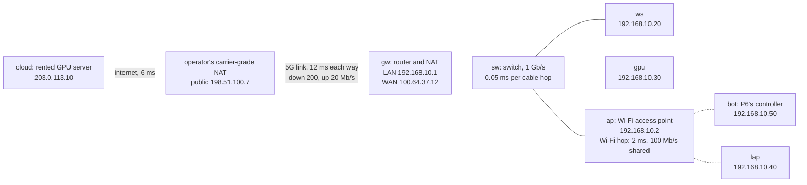
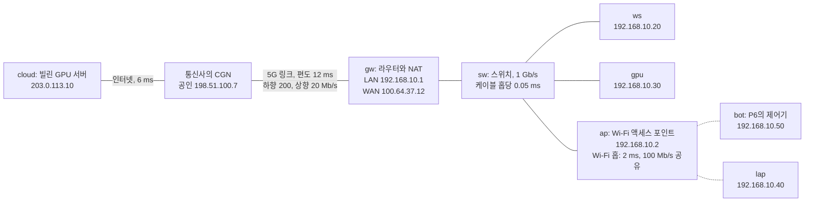

> [!note] Prerequisites · 선수 지식
> [[02-foundations/lab-plants|0.6 Lab Plants]] (**P6**: the 50 Hz goal, the 200 Hz controller and the 70 ms budget), [[02-foundations/probability|3. Probability & Random Processes]] (§2: independence and expected value; §3: the Bernoulli distribution, which is how this page models a lost packet) and [[02-foundations/lab-kernel|0.7 Lab Kernel]] (§1: a time vector at the controller's period; §5: the blank-and-solve pattern of the Do item). No networking is assumed. Python with NumPy for §13's lab; the standard library's `ipaddress` and `socket` for the short listings of §2 and §3.
> [[02-foundations/lab-plants|0.6 Lab Plants]](**P6**: 50 Hz 목표, 200 Hz 제어기, 70 ms 예산), [[02-foundations/probability|3. 확률과 확률 과정]](§2: 독립과 기댓값, §3: 이 페이지가 패킷 하나의 유실을 모델링하는 베르누이 분포), [[02-foundations/lab-kernel|0.7 Lab Kernel]](§1: 제어 주기로 만드는 시간 벡터, §5: 과제 실행 문항의 빈칸 채우기 방식). 네트워크 지식은 가정하지 않는다. §13 실습에는 NumPy와 Python, §2와 §3의 짧은 코드에는 표준 라이브러리의 `ipaddress`와 `socket`이 필요하다.

## English

*Stands on [[02-foundations/lab-plants|0.6 Lab Plants]], whose P6 gives this page its one flow with a deadline, and on [[02-foundations/probability|3. Probability §3]], whose Bernoulli trial is the lab's model of a lost packet. First use of LabNet, a network object this page freezes for itself; P6 rides on it as one flow among several. The ROS 2 track applies this vocabulary to ROS in particular — [[04-robotics/ros2/what-ros2-is|25.1 §5]] for DDS and [[04-robotics/ros2/from-simulation-to-hardware|25.11 §5]] for two machines — and [[04-robotics/robot-systems-deployment|10. Robot Systems §3]] owns the latency budget that §1 and the Worked case fill in.*

> [!note] Why this matters · 왜 배우는가
> The network is the floor beneath the physical-AI stack of [[07-research-program/index|7 §5]] that carries data between layers running on different machines — a goal from a vision node to the controller, an action chunk from a policy on a GPU server, a stop command across a site — and in "install that panel on the frame" it sits between identifying the panel and moving it (its place is marked on the [[physical-ai-map|Physical AI Map]]). When it is wrong the robot fails in ways no single machine shows: on P6, one goal lost over TCP puts 35 control ticks over the 70 ms budget, acting on a goal up to 245 ms old, and a robot behind a site's 5G router answers neither `ssh` nor DDS discovery. The need arrives in block 2 of the dissertation path ([[07-research-program/index|7 §8]]), when the ROS 2 track puts two machines on one network ([[04-robotics/ros2/what-ros2-is|25.1 §5]], [[04-robotics/ros2/from-simulation-to-hardware|25.11 §5]]) and the latency budget is written ([[04-robotics/robot-systems-deployment|10. Robot Systems §3]]), and again whenever a policy of block 4 or 7 runs off the robot. After this page you can place a host in its subnet, price a lost packet under TCP and UDP, choose the protocol and the side that connects, and measure or emulate a link before a site does it for you.

> [!note] First pass · 처음이라면
> Two sessions of about 90 minutes. **Session 1 — one packet, one loss.** Read the Running object and look at the picture, then §1–§6 in order — what a network costs, addresses, ports, NAT, TCP and UDP — and work the Worked case, which uses all six on P6's goal; answer Self-check 1–5. **Session 2 — the protocols and the link.** Read §7 and §8 for the protocols you will meet in code, §11 before you put a robot on Wi-Fi or behind a 5G router and §12 before you believe any latency number; then run §13's lab and answer Self-check 6 and 7. §9 (fieldbuses) and §10 (clocks) can wait until a robot or a timing measurement needs them, and every *Deeper* callout is optional.

### Running object · 이 페이지의 대상

**LabNet**, a research lab's network, frozen here as this page's own object. [[02-foundations/lab-plants|0.6 Lab Plants]] catalogs machines, not networks, so no catalog entry fits; the nearest is **P6**, whose deadline this page needs, and P6 rides on LabNet as one flow among several. Every number in the three tables below is a course number chosen for clean arithmetic, not a measurement of any product, operator or site.



LabNet: six machines on one subnet behind `gw`, whose uplink is a 5G link to an operator, and a rented GPU server on the internet. Dashed edges are radio; the delays are one-way, for a small packet on an idle link.

**Hosts.**

| Host | What it is | Address | Attached by |
|---|---|---|---|
| `gw` | router: the subnet's default gateway and its NAT; its uplink is a 5G modem | LAN side 192.168.10.1; the operator assigns its WAN side 100.64.37.12 | — |
| `sw` | switch | none: it forwards frames inside the subnet | cable to `gw` |
| `ap` | Wi-Fi access point | 192.168.10.2 | cable to `sw` |
| `ws` | workstation | 192.168.10.20 | cable to `sw` |
| `gpu` | GPU server | 192.168.10.30 | cable to `sw` |
| `lap` | laptop | 192.168.10.40 | Wi-Fi |
| `bot` | P6's cart computer: the 200 Hz controller runs here | 192.168.10.50 | Wi-Fi, because the cart moves |
| `cloud` | a rented GPU server | 203.0.113.10 | the internet, reached through `gw` |

The subnet is 192.168.10.0/24 (§2). The addresses of `cloud` and of the operator's NAT come from the blocks reserved for documentation, 203.0.113.0/24 and 198.51.100.0/24 (RFC 5737), so no real machine is named.

**Links.**

| Link | Rate | One-way delay | Note |
|---|---:|---:|---|
| cable hop through `sw` | 1 Gb/s | 0.05 ms | full duplex |
| Wi-Fi hop through `ap` | 100 Mb/s, shared by every station | 2 ms | varies with contention and signal (§11) |
| 5G link, `gw` to the operator | down 200 Mb/s, up 20 Mb/s | 12 ms each way | the operator's and the site's to measure (§11) |
| internet, the operator to `cloud` | — | 6 ms | 800 km of fibre at $2\times10^8$ m/s is 4 ms; routers add 2 ms |

**Flows.**

| Flow | From → to | Size and rate |
|---|---|---|
| P6's goal | vision node → controller on `bot` | a 64-byte payload at 50 Hz |
| P6's camera | camera → vision node | 640 × 480 pixels × 3 bytes = 921,600 bytes per frame at 50 frames/s, or 60,000 bytes compressed |
| remote shell | `lap` → `gpu` | ssh, TCP port 22 |
| dataset | a server on the internet → `ws` | 10 GB over HTTPS |
| dashboard | `bot` → a browser on `lap` | a WebSocket (§7) |

P6's goal gets page-local numbers as well. The vision node hands a goal to the network $L_v=25$ ms after its camera's mid-exposure (10 ms of readout, 15 ms of inference); each goal is stamped with that mid-exposure instant, $c_k=20k$ ms for goal $k$; and the exposures fall on the controller's tick instants, a choice that keeps every age a whole number of ticks. The vision node can run on `bot` itself (placement A), on `gpu` (B) or on `cloud` (C). The camera is wired to the machine that runs the vision node — to `bot` when the node runs in the cloud — so in A and B only the goal crosses LabNet, while in C `bot` must first send the camera's data up the 5G link.

*Scope: the networking an engineer or a researcher meets every day — addresses, subnets and routes, ports and sockets, names, NAT and firewalls, TCP and UDP and what each costs when a packet is lost, the application protocols built on them with robot middleware as one of them, fieldbuses in one short section, time across machines, Wi-Fi and cellular links, and how to measure and emulate a link. Administration, security engineering, radio engineering and protocol internals are left out, and §14 names the pages that own what is next to this one; the latency budget itself is [[04-robotics/robot-systems-deployment|10. Robot Systems §3]].*

### The picture · 그림으로 먼저 보기

<svg viewBox="0 0 560 386" style="max-width:100%;height:auto" role="img" aria-label="Two timelines on LabNet's Wi-Fi path, one-way delay 2.05 ms, goals sent every 20 ms and goal 1 lost. Top, UDP-like: goal 1 never arrives, the controller keeps goal 0 one period longer, and the goal age at each 5 ms tick peaks at 65 ms, under the 70 ms budget. Bottom, TCP-like: goal 1 is resent 200 ms later, goals 2 to 10 reach the robot but wait in order, goals 1 to 11 are released together at 247.05 ms, and the goal age climbs from 30 to 245 ms, 35 ticks over the budget.">
  <defs><marker id="cnrto" viewBox="0 0 10 10" refX="8" refY="5" markerWidth="6" markerHeight="6" orient="auto"><path d="M 1 1 L 9 5 L 1 9" fill="none" stroke="currentColor" stroke-width="1.6"/></marker></defs>
  <text x="12" y="18" font-size="12" fill="currentColor">(a) UDP-like: goal 1 is lost and gone; goal 2 arrives on time</text>
  <text x="70" y="42" font-size="11" text-anchor="end" fill="currentColor" fill-opacity="0.85">sent</text>
  <text x="70" y="66" font-size="11" text-anchor="end" fill="currentColor" fill-opacity="0.85">delivered</text>
  <text x="58" y="100.0" font-size="11" text-anchor="end" fill="currentColor" fill-opacity="0.85">age (ms)</text>
  <line x1="78.0" y1="38" x2="540.0" y2="38" stroke="currentColor" stroke-width="0.8" stroke-opacity="0.35"/>
  <line x1="78.0" y1="62" x2="540.0" y2="62" stroke="currentColor" stroke-width="0.8" stroke-opacity="0.35"/>
  <circle cx="116.5" cy="38" r="2.8" fill="currentColor"/>
  <path d="M143.3 34L151.3 42M143.3 42L151.3 34" stroke="currentColor" stroke-width="1.8" fill="none"/>
  <circle cx="178.1" cy="38" r="2.8" fill="currentColor"/>
  <circle cx="208.9" cy="38" r="2.8" fill="currentColor"/>
  <circle cx="239.7" cy="38" r="2.8" fill="currentColor"/>
  <circle cx="270.5" cy="38" r="2.8" fill="currentColor"/>
  <circle cx="301.3" cy="38" r="2.8" fill="currentColor"/>
  <circle cx="332.1" cy="38" r="2.8" fill="currentColor"/>
  <circle cx="362.9" cy="38" r="2.8" fill="currentColor"/>
  <circle cx="393.7" cy="38" r="2.8" fill="currentColor"/>
  <circle cx="424.5" cy="38" r="2.8" fill="currentColor"/>
  <circle cx="455.3" cy="38" r="2.8" fill="currentColor"/>
  <circle cx="486.1" cy="38" r="2.8" fill="currentColor"/>
  <circle cx="516.9" cy="38" r="2.8" fill="currentColor"/>
  <line x1="116.5" y1="41" x2="119.7" y2="59" stroke="currentColor" stroke-width="0.8" stroke-opacity="0.6"/>
  <circle cx="119.7" cy="62" r="2.8" fill="currentColor"/>
  <line x1="178.1" y1="41" x2="181.3" y2="59" stroke="currentColor" stroke-width="0.8" stroke-opacity="0.6"/>
  <circle cx="181.3" cy="62" r="2.8" fill="currentColor"/>
  <line x1="208.9" y1="41" x2="212.1" y2="59" stroke="currentColor" stroke-width="0.8" stroke-opacity="0.6"/>
  <circle cx="212.1" cy="62" r="2.8" fill="currentColor"/>
  <line x1="239.7" y1="41" x2="242.9" y2="59" stroke="currentColor" stroke-width="0.8" stroke-opacity="0.6"/>
  <circle cx="242.9" cy="62" r="2.8" fill="currentColor"/>
  <line x1="270.5" y1="41" x2="273.7" y2="59" stroke="currentColor" stroke-width="0.8" stroke-opacity="0.6"/>
  <circle cx="273.7" cy="62" r="2.8" fill="currentColor"/>
  <line x1="301.3" y1="41" x2="304.5" y2="59" stroke="currentColor" stroke-width="0.8" stroke-opacity="0.6"/>
  <circle cx="304.5" cy="62" r="2.8" fill="currentColor"/>
  <line x1="332.1" y1="41" x2="335.3" y2="59" stroke="currentColor" stroke-width="0.8" stroke-opacity="0.6"/>
  <circle cx="335.3" cy="62" r="2.8" fill="currentColor"/>
  <line x1="362.9" y1="41" x2="366.1" y2="59" stroke="currentColor" stroke-width="0.8" stroke-opacity="0.6"/>
  <circle cx="366.1" cy="62" r="2.8" fill="currentColor"/>
  <line x1="393.7" y1="41" x2="396.9" y2="59" stroke="currentColor" stroke-width="0.8" stroke-opacity="0.6"/>
  <circle cx="396.9" cy="62" r="2.8" fill="currentColor"/>
  <line x1="424.5" y1="41" x2="427.7" y2="59" stroke="currentColor" stroke-width="0.8" stroke-opacity="0.6"/>
  <circle cx="427.7" cy="62" r="2.8" fill="currentColor"/>
  <line x1="455.3" y1="41" x2="458.5" y2="59" stroke="currentColor" stroke-width="0.8" stroke-opacity="0.6"/>
  <circle cx="458.5" cy="62" r="2.8" fill="currentColor"/>
  <line x1="486.1" y1="41" x2="489.3" y2="59" stroke="currentColor" stroke-width="0.8" stroke-opacity="0.6"/>
  <circle cx="489.3" cy="62" r="2.8" fill="currentColor"/>
  <line x1="516.9" y1="41" x2="520.1" y2="59" stroke="currentColor" stroke-width="0.8" stroke-opacity="0.6"/>
  <circle cx="520.1" cy="62" r="2.8" fill="currentColor"/>
  <text x="147.3" y="54" font-size="10" text-anchor="middle" fill="currentColor">lost</text>
  <line x1="78.0" y1="114.0" x2="540.0" y2="114.0" stroke="currentColor" stroke-width="0.9" stroke-opacity="0.6"/>
  <line x1="78.0" y1="78.0" x2="78.0" y2="114.0" stroke="currentColor" stroke-width="0.9" stroke-opacity="0.6"/>
  <text x="74.0" y="117.5" font-size="10" text-anchor="end" fill="currentColor" fill-opacity="0.8">0</text>
  <text x="74.0" y="92.3" font-size="10" text-anchor="end" fill="currentColor" fill-opacity="0.8">70</text>
  <line x1="78.0" y1="88.8" x2="540.0" y2="88.8" stroke="currentColor" stroke-width="1" stroke-dasharray="5 3" stroke-opacity="0.8"/>
  <text x="540.0" y="84.8" font-size="10" text-anchor="end" fill="currentColor">70 ms budget</text>
  <polyline points="124.2,103.2 131.9,101.4 139.6,99.6 147.3,97.8 155.0,96.0 162.7,94.2 170.4,92.4 178.1,90.6 185.8,88.8 185.8,103.2 193.5,101.4 201.2,99.6 208.9,97.8 216.6,96.0 216.6,103.2 224.3,101.4 232.0,99.6 239.7,97.8 247.4,96.0 247.4,103.2 255.1,101.4 262.8,99.6 270.5,97.8 278.2,96.0 278.2,103.2 285.9,101.4 293.6,99.6 301.3,97.8 309.0,96.0 309.0,103.2 316.7,101.4 324.4,99.6 332.1,97.8 339.8,96.0 339.8,103.2 347.5,101.4 355.2,99.6 362.9,97.8 370.6,96.0 370.6,103.2 378.3,101.4 386.0,99.6 393.7,97.8 401.4,96.0 401.4,103.2 409.1,101.4 416.8,99.6 424.5,97.8 432.2,96.0 432.2,103.2 439.9,101.4 447.6,99.6 455.3,97.8 463.0,96.0 463.0,103.2 470.7,101.4 478.4,99.6 486.1,97.8 493.8,96.0 493.8,103.2 501.5,101.4 509.2,99.6 516.9,97.8 524.6,96.0 524.6,103.2 532.3,101.4 540.0,99.6" fill="none" stroke="currentColor" stroke-width="1.6"/>
  <text x="259.7" y="82.3" font-size="11" text-anchor="middle" fill="currentColor">peak 65 ms: 0 ticks over</text>
  <line x1="78.0" y1="114.0" x2="78.0" y2="118.0" stroke="currentColor" stroke-width="0.9" stroke-opacity="0.6"/>
  <text x="78.0" y="129.0" font-size="10" text-anchor="middle" fill="currentColor" fill-opacity="0.8">0</text>
  <line x1="155.0" y1="114.0" x2="155.0" y2="118.0" stroke="currentColor" stroke-width="0.9" stroke-opacity="0.6"/>
  <text x="155.0" y="129.0" font-size="10" text-anchor="middle" fill="currentColor" fill-opacity="0.8">50</text>
  <line x1="232.0" y1="114.0" x2="232.0" y2="118.0" stroke="currentColor" stroke-width="0.9" stroke-opacity="0.6"/>
  <text x="232.0" y="129.0" font-size="10" text-anchor="middle" fill="currentColor" fill-opacity="0.8">100</text>
  <line x1="309.0" y1="114.0" x2="309.0" y2="118.0" stroke="currentColor" stroke-width="0.9" stroke-opacity="0.6"/>
  <text x="309.0" y="129.0" font-size="10" text-anchor="middle" fill="currentColor" fill-opacity="0.8">150</text>
  <line x1="386.0" y1="114.0" x2="386.0" y2="118.0" stroke="currentColor" stroke-width="0.9" stroke-opacity="0.6"/>
  <text x="386.0" y="129.0" font-size="10" text-anchor="middle" fill="currentColor" fill-opacity="0.8">200</text>
  <line x1="463.0" y1="114.0" x2="463.0" y2="118.0" stroke="currentColor" stroke-width="0.9" stroke-opacity="0.6"/>
  <text x="463.0" y="129.0" font-size="10" text-anchor="middle" fill="currentColor" fill-opacity="0.8">250</text>
  <line x1="540.0" y1="114.0" x2="540.0" y2="118.0" stroke="currentColor" stroke-width="0.9" stroke-opacity="0.6"/>
  <text x="540.0" y="129.0" font-size="10" text-anchor="middle" fill="currentColor" fill-opacity="0.8">300</text>
  <text x="12" y="162" font-size="12" fill="currentColor">(b) TCP-like: goal 1 is resent after the RTO; the goals behind it wait</text>
  <text x="70" y="202" font-size="11" text-anchor="end" fill="currentColor" fill-opacity="0.85">sent</text>
  <text x="70" y="226" font-size="11" text-anchor="end" fill="currentColor" fill-opacity="0.85">delivered</text>
  <text x="58" y="302.0" font-size="11" text-anchor="end" fill="currentColor" fill-opacity="0.85">age (ms)</text>
  <line x1="78.0" y1="198" x2="540.0" y2="198" stroke="currentColor" stroke-width="0.8" stroke-opacity="0.35"/>
  <line x1="78.0" y1="222" x2="540.0" y2="222" stroke="currentColor" stroke-width="0.8" stroke-opacity="0.35"/>
  <circle cx="116.5" cy="198" r="2.8" fill="currentColor"/>
  <path d="M143.3 194L151.3 202M143.3 202L151.3 194" stroke="currentColor" stroke-width="1.8" fill="none"/>
  <circle cx="178.1" cy="198" r="2.8" fill="currentColor"/>
  <circle cx="208.9" cy="198" r="2.8" fill="currentColor"/>
  <circle cx="239.7" cy="198" r="2.8" fill="currentColor"/>
  <circle cx="270.5" cy="198" r="2.8" fill="currentColor"/>
  <circle cx="301.3" cy="198" r="2.8" fill="currentColor"/>
  <circle cx="332.1" cy="198" r="2.8" fill="currentColor"/>
  <circle cx="362.9" cy="198" r="2.8" fill="currentColor"/>
  <circle cx="393.7" cy="198" r="2.8" fill="currentColor"/>
  <circle cx="424.5" cy="198" r="2.8" fill="currentColor"/>
  <circle cx="455.3" cy="198" r="2.8" fill="currentColor"/>
  <circle cx="486.1" cy="198" r="2.8" fill="currentColor"/>
  <circle cx="516.9" cy="198" r="2.8" fill="currentColor"/>
  <line x1="116.5" y1="201" x2="119.7" y2="219" stroke="currentColor" stroke-width="0.8" stroke-opacity="0.6"/>
  <circle cx="119.7" cy="222" r="2.8" fill="currentColor"/>
  <line x1="455.3" y1="201" x2="458.5" y2="219" stroke="currentColor" stroke-width="0.8" stroke-opacity="0.6"/>
  <circle cx="458.5" cy="222" r="2.8" fill="currentColor"/>
  <line x1="178.1" y1="201" x2="181.3" y2="219" stroke="currentColor" stroke-width="0.8" stroke-opacity="0.6"/>
  <circle cx="181.3" cy="222" r="2.8" fill="none" stroke="currentColor" stroke-width="1.1"/>
  <line x1="208.9" y1="201" x2="212.1" y2="219" stroke="currentColor" stroke-width="0.8" stroke-opacity="0.6"/>
  <circle cx="212.1" cy="222" r="2.8" fill="none" stroke="currentColor" stroke-width="1.1"/>
  <line x1="239.7" y1="201" x2="242.9" y2="219" stroke="currentColor" stroke-width="0.8" stroke-opacity="0.6"/>
  <circle cx="242.9" cy="222" r="2.8" fill="none" stroke="currentColor" stroke-width="1.1"/>
  <line x1="270.5" y1="201" x2="273.7" y2="219" stroke="currentColor" stroke-width="0.8" stroke-opacity="0.6"/>
  <circle cx="273.7" cy="222" r="2.8" fill="none" stroke="currentColor" stroke-width="1.1"/>
  <line x1="301.3" y1="201" x2="304.5" y2="219" stroke="currentColor" stroke-width="0.8" stroke-opacity="0.6"/>
  <circle cx="304.5" cy="222" r="2.8" fill="none" stroke="currentColor" stroke-width="1.1"/>
  <line x1="332.1" y1="201" x2="335.3" y2="219" stroke="currentColor" stroke-width="0.8" stroke-opacity="0.6"/>
  <circle cx="335.3" cy="222" r="2.8" fill="none" stroke="currentColor" stroke-width="1.1"/>
  <line x1="362.9" y1="201" x2="366.1" y2="219" stroke="currentColor" stroke-width="0.8" stroke-opacity="0.6"/>
  <circle cx="366.1" cy="222" r="2.8" fill="none" stroke="currentColor" stroke-width="1.1"/>
  <line x1="393.7" y1="201" x2="396.9" y2="219" stroke="currentColor" stroke-width="0.8" stroke-opacity="0.6"/>
  <circle cx="396.9" cy="222" r="2.8" fill="none" stroke="currentColor" stroke-width="1.1"/>
  <line x1="424.5" y1="201" x2="427.7" y2="219" stroke="currentColor" stroke-width="0.8" stroke-opacity="0.6"/>
  <circle cx="427.7" cy="222" r="2.8" fill="none" stroke="currentColor" stroke-width="1.1"/>
  <line x1="455.3" y1="201" x2="458.5" y2="219" stroke="currentColor" stroke-width="0.8" stroke-opacity="0.6"/>
  <circle cx="458.5" cy="222" r="2.8" fill="currentColor"/>
  <line x1="486.1" y1="201" x2="489.3" y2="219" stroke="currentColor" stroke-width="0.8" stroke-opacity="0.6"/>
  <circle cx="489.3" cy="222" r="2.8" fill="currentColor"/>
  <line x1="516.9" y1="201" x2="520.1" y2="219" stroke="currentColor" stroke-width="0.8" stroke-opacity="0.6"/>
  <circle cx="520.1" cy="222" r="2.8" fill="currentColor"/>
  <path d="M147.3 192Q301.3 172 455.3 192" fill="none" stroke="currentColor" stroke-width="1.1" stroke-dasharray="4 3" marker-end="url(#cnrto)"/>
  <text x="301.3" y="174" font-size="11" text-anchor="middle" fill="currentColor">resent after RTO = 200 ms</text>
  <circle cx="455.3" cy="198" r="5.5" fill="none" stroke="currentColor" stroke-width="1.1"/>
  <text x="147.3" y="214" font-size="10" text-anchor="middle" fill="currentColor">lost</text>
  <path d="M181.3 230V234H427.7V230" fill="none" stroke="currentColor" stroke-width="1"/>
  <text x="304.5" y="245" font-size="10" text-anchor="middle" fill="currentColor">goals 2–10 reach bot and wait, in order</text>
  <text x="540.0" y="245" font-size="10" text-anchor="end" fill="currentColor">1–11 released at 247.05 ms</text>
  <line x1="78.0" y1="343.0" x2="540.0" y2="343.0" stroke="currentColor" stroke-width="0.9" stroke-opacity="0.6"/>
  <line x1="78.0" y1="253.0" x2="78.0" y2="343.0" stroke="currentColor" stroke-width="0.9" stroke-opacity="0.6"/>
  <text x="74.0" y="346.5" font-size="10" text-anchor="end" fill="currentColor" fill-opacity="0.8">0</text>
  <text x="74.0" y="321.3" font-size="10" text-anchor="end" fill="currentColor" fill-opacity="0.8">70</text>
  <text x="74.0" y="258.3" font-size="10" text-anchor="end" fill="currentColor" fill-opacity="0.8">245</text>
  <line x1="78.0" y1="317.8" x2="540.0" y2="317.8" stroke="currentColor" stroke-width="1" stroke-dasharray="5 3" stroke-opacity="0.8"/>
  <text x="540.0" y="313.8" font-size="10" text-anchor="end" fill="currentColor">70 ms budget</text>
  <polyline points="124.2,332.2 131.9,330.4 139.6,328.6 147.3,326.8 155.0,325.0 162.7,323.2 170.4,321.4 178.1,319.6 185.8,317.8 193.5,316.0 201.2,314.2 208.9,312.4 216.6,310.6 224.3,308.8 232.0,307.0 239.7,305.2 247.4,303.4 255.1,301.6 262.8,299.8 270.5,298.0 278.2,296.2 285.9,294.4 293.6,292.6 301.3,290.8 309.0,289.0 316.7,287.2 324.4,285.4 332.1,283.6 339.8,281.8 347.5,280.0 355.2,278.2 362.9,276.4 370.6,274.6 378.3,272.8 386.0,271.0 393.7,269.2 401.4,267.4 409.1,265.6 416.8,263.8 424.5,262.0 432.2,260.2 439.9,258.4 447.6,256.6 455.3,254.8 463.0,253.0 463.0,332.2 470.7,330.4 478.4,328.6 486.1,326.8 493.8,325.0 493.8,332.2 501.5,330.4 509.2,328.6 516.9,326.8 524.6,325.0 524.6,332.2 532.3,330.4 540.0,328.6" fill="none" stroke="currentColor" stroke-width="1.6"/>
  <circle cx="193.5" cy="316.0" r="1.9" fill="currentColor"/>
  <circle cx="201.2" cy="314.2" r="1.9" fill="currentColor"/>
  <circle cx="208.9" cy="312.4" r="1.9" fill="currentColor"/>
  <circle cx="216.6" cy="310.6" r="1.9" fill="currentColor"/>
  <circle cx="224.3" cy="308.8" r="1.9" fill="currentColor"/>
  <circle cx="232.0" cy="307.0" r="1.9" fill="currentColor"/>
  <circle cx="239.7" cy="305.2" r="1.9" fill="currentColor"/>
  <circle cx="247.4" cy="303.4" r="1.9" fill="currentColor"/>
  <circle cx="255.1" cy="301.6" r="1.9" fill="currentColor"/>
  <circle cx="262.8" cy="299.8" r="1.9" fill="currentColor"/>
  <circle cx="270.5" cy="298.0" r="1.9" fill="currentColor"/>
  <circle cx="278.2" cy="296.2" r="1.9" fill="currentColor"/>
  <circle cx="285.9" cy="294.4" r="1.9" fill="currentColor"/>
  <circle cx="293.6" cy="292.6" r="1.9" fill="currentColor"/>
  <circle cx="301.3" cy="290.8" r="1.9" fill="currentColor"/>
  <circle cx="309.0" cy="289.0" r="1.9" fill="currentColor"/>
  <circle cx="316.7" cy="287.2" r="1.9" fill="currentColor"/>
  <circle cx="324.4" cy="285.4" r="1.9" fill="currentColor"/>
  <circle cx="332.1" cy="283.6" r="1.9" fill="currentColor"/>
  <circle cx="339.8" cy="281.8" r="1.9" fill="currentColor"/>
  <circle cx="347.5" cy="280.0" r="1.9" fill="currentColor"/>
  <circle cx="355.2" cy="278.2" r="1.9" fill="currentColor"/>
  <circle cx="362.9" cy="276.4" r="1.9" fill="currentColor"/>
  <circle cx="370.6" cy="274.6" r="1.9" fill="currentColor"/>
  <circle cx="378.3" cy="272.8" r="1.9" fill="currentColor"/>
  <circle cx="386.0" cy="271.0" r="1.9" fill="currentColor"/>
  <circle cx="393.7" cy="269.2" r="1.9" fill="currentColor"/>
  <circle cx="401.4" cy="267.4" r="1.9" fill="currentColor"/>
  <circle cx="409.1" cy="265.6" r="1.9" fill="currentColor"/>
  <circle cx="416.8" cy="263.8" r="1.9" fill="currentColor"/>
  <circle cx="424.5" cy="262.0" r="1.9" fill="currentColor"/>
  <circle cx="432.2" cy="260.2" r="1.9" fill="currentColor"/>
  <circle cx="439.9" cy="258.4" r="1.9" fill="currentColor"/>
  <circle cx="447.6" cy="256.6" r="1.9" fill="currentColor"/>
  <circle cx="455.3" cy="254.8" r="1.9" fill="currentColor"/>
  <text x="232.0" y="266.7" font-size="11" text-anchor="middle" fill="currentColor">35 ticks over budget, ages 75 to 245 ms</text>
  <line x1="78.0" y1="343.0" x2="78.0" y2="347.0" stroke="currentColor" stroke-width="0.9" stroke-opacity="0.6"/>
  <text x="78.0" y="358.0" font-size="10" text-anchor="middle" fill="currentColor" fill-opacity="0.8">0</text>
  <line x1="155.0" y1="343.0" x2="155.0" y2="347.0" stroke="currentColor" stroke-width="0.9" stroke-opacity="0.6"/>
  <text x="155.0" y="358.0" font-size="10" text-anchor="middle" fill="currentColor" fill-opacity="0.8">50</text>
  <line x1="232.0" y1="343.0" x2="232.0" y2="347.0" stroke="currentColor" stroke-width="0.9" stroke-opacity="0.6"/>
  <text x="232.0" y="358.0" font-size="10" text-anchor="middle" fill="currentColor" fill-opacity="0.8">100</text>
  <line x1="309.0" y1="343.0" x2="309.0" y2="347.0" stroke="currentColor" stroke-width="0.9" stroke-opacity="0.6"/>
  <text x="309.0" y="358.0" font-size="10" text-anchor="middle" fill="currentColor" fill-opacity="0.8">150</text>
  <line x1="386.0" y1="343.0" x2="386.0" y2="347.0" stroke="currentColor" stroke-width="0.9" stroke-opacity="0.6"/>
  <text x="386.0" y="358.0" font-size="10" text-anchor="middle" fill="currentColor" fill-opacity="0.8">200</text>
  <line x1="463.0" y1="343.0" x2="463.0" y2="347.0" stroke="currentColor" stroke-width="0.9" stroke-opacity="0.6"/>
  <text x="463.0" y="358.0" font-size="10" text-anchor="middle" fill="currentColor" fill-opacity="0.8">250</text>
  <line x1="540.0" y1="343.0" x2="540.0" y2="347.0" stroke="currentColor" stroke-width="0.9" stroke-opacity="0.6"/>
  <text x="540.0" y="358.0" font-size="10" text-anchor="middle" fill="currentColor" fill-opacity="0.8">300</text>
  <text x="540.0" y="380" font-size="10" text-anchor="end" fill="currentColor" fill-opacity="0.8">time (ms)</text>
</svg>

One lost goal on LabNet's Wi-Fi path, placement B: one-way delay 2.05 ms, a goal every 20 ms, a controller tick every 5 ms. Above, UDP-like: goal 1 is gone, the controller keeps goal 0 one period longer, and the age of the goal it acts on peaks at 65 ms, inside the 70 ms budget. Below, TCP-like: goal 1 is resent 200 ms later, goals 2–10 reach `bot` but are held in order, goals 1–11 are released together at 247.05 ms, and the age climbs to 245 ms — 35 ticks over budget.

### 1. What a network promises, and what it costs

*In one sentence:* to move bytes between machines, a network carries them in packets through a stack of layers, promises very little about any one packet, and charges for each packet in delay — a sum of four terms — while its rate limits how much can be in flight.

**Layers, in one paragraph.** Each layer wraps the one above in a header of its own. The application's bytes, P6's 64-byte goal, get a UDP header of 8 bytes naming the ports (RFC 768), then an IPv4 header of at least 20 bytes naming the machines (RFC 791), then an Ethernet header of 14 bytes and a 4-byte checksum naming the next box on the cable (RFC 894): a 110-byte frame. The link layer moves a frame across one hop; IP moves a packet across all of them, hop by hop; the transport layer, TCP or UDP, sorts packets to programs; the application gives the bytes their meaning. IP itself promises nothing: RFC 791 states that it provides no acknowledgements, no retransmission and no flow control. Every promise a network application enjoys — delivery, order, a connection — is added above IP, at a price this page counts.

**Delay.** A packet's trip splits into four costs, owned by four different things: the distance, the link's rate, the other traffic and the equipment.

> **One-way delay, defined.** The **one-way delay** of a packet is a *time interval, a property of one packet's trip from one host to another* — not of a link, and not a round trip. Three defining conditions. It runs from the moment the source sends the packet's first bit to the moment the destination receives its last bit (RFC 7679). It is a sum over the hops of the path of four terms: **propagation**, the hop's length at the signal's speed; **transmission**, the packet's bits at the hop's rate; **queueing**, the wait behind other packets, set by load; and **processing**, the time each device takes to forward. And on a fixed path only the queueing term changes much from packet to packet, which is where delay variation comes from.
>
> $$d=\sum_{h=1}^{H}\Big(\frac{\ell_h}{v}+\frac{8B}{R_h}+q_h+\pi_h\Big)$$
>
> where $h$ counts the $H$ hops, $\ell_h$ is hop $h$'s length, $v$ the signal's speed ($2\times10^8$ m/s in LabNet), $B$ the packet's size in bytes, $R_h$ the hop's rate in bits per second, $q_h$ its queueing delay and $\pi_h$ its processing time — a sum because the hops are crossed one after another, so each hop's four costs add along the path.
>
> - **Example**: P6's goal from `cloud` to `bot`. The 800 km of fibre is $8\times10^5/(2\times10^8)=4$ ms of propagation. The 110-byte frame's transmission is 0.88 µs on a 1 Gb/s cable, 4.4 µs on the 200 Mb/s downlink and 8.8 µs on Wi-Fi — together under 0.02 ms. Everything else in LabNet's hop numbers is queueing, access and processing, and the path adds to $d_C=6+12+0.05+2=20.05$ ms.
> - **Non-example**: half of ping's round trip. It equals $d$ only when both directions take equally long, and LabNet's 5G link gives the two directions different rates, 200 and 20 Mb/s, so a large packet's two one-way delays differ (§10 shows what that does to a clock).
> - **Why it matters**: it is the network's term in P6's budget, and its four terms answer to four different remedies — a shorter path, a faster link, less traffic, faster equipment — so a delay is only fixable once it is split.

**Rate is not latency.** A link's rate says how fast bits leave once a packet starts, not how soon the first bit arrives. For a small message the two differ by orders of magnitude: P6's goal spends 8.8 µs being transmitted on Wi-Fi and 2 ms waiting for its turn on the radio, so a Wi-Fi link twice as fast would not bring it measurably sooner. For a large message the rate dominates: one raw camera frame, 921,600 bytes, takes $921{,}600\times8/10^8=73.7$ ms to transmit at 100 Mb/s — longer than P6's whole 70 ms budget. Small periodic messages are latency-bound, bulk data is rate-bound, and the rest of this page keeps asking which kind a flow is.

> **Bandwidth–delay product, defined.** The **bandwidth–delay product** (BDP) of a path is *an amount of data: the bytes a sender must have sent and not yet had acknowledged to keep the path's slowest link busy* — a property of a path, not of a packet. Three defining conditions. The path has a **bottleneck rate** $R$, the smallest rate on it. An acknowledgement returns one **round-trip time** after the byte it acknowledges was sent. And the sender may have at most $W$ bytes in flight — TCP's window (§5), or one request at a time in a request–response protocol — so it can send at most $W$ bytes per round trip.
>
> $$W^\star=\frac{R\cdot\mathrm{RTT}}{8},\qquad \text{throughput}\le\min\Big(R,\ \frac{8W}{\mathrm{RTT}}\Big)$$
>
> where $W^\star$ and $W$ are in bytes, $R$ in bits per second and RTT in seconds, so a window below $W^\star$ leaves the link idle for part of every round trip.
>
> - **Example**: the dataset flow on path C's downlink, $R=200$ Mb/s and RTT $=40.1$ ms: $W^\star=2\times10^8\times0.0401/8=1{,}002{,}500$ bytes, about 1 MB. A window stuck at 64 KiB — the most TCP's 16-bit window field expresses without the window-scale option of RFC 7323 — caps the download at $65{,}535\times8/0.0401=13.07$ Mb/s, 6.5% of the link: 10 GB takes 1.70 hours instead of 400 s. Linux tunes its receive buffers automatically, up to megabytes, and setting a socket's `SO_RCVBUF` by hand turns that tuning off (the kernel's `tcp_rmem` documentation) — so the cap bites when a buffer is fixed by hand or a protocol waits for each reply.
> - **Non-example**: P6's goal stream. At 50 frames of 110 bytes per second it is 44,000 bit/s, which over path B's 4.1 ms round trip keeps 22.6 bytes in flight, a fifth of one frame: no window limits it, and no extra bandwidth brings a goal sooner.
> - **Why it matters**: it is why one TCP connection to a distant server can crawl on a fast link, and why "the lab has a 1 Gb/s line" says nothing about a download from another continent.

**Delay varies.** Queueing is the term that moves, so delay varies with load, and a wireless hop adds its own (§11). Even a loopback round trip varies: five pings to 127.0.0.1 on the machine that wrote this page ranged from 0.055 to 0.516 ms (§12). [[04-robotics/robot-systems-deployment|10. Robot Systems §3]] reports that spread as jitter, peak to peak, which is the form a deadline argument needs; RFC 3393 calls it packet delay variation.

### 2. Addresses, subnets, routes and names

*In one sentence:* every machine must decide whether it can reach a host directly or only through a router: an IPv4 address is a 32-bit number, a subnet is the set of addresses that share a prefix, and a machine sends straight to hosts inside its subnet and through its default gateway to everything else.

**Addresses.** An IPv4 address is 32 bits, written as four bytes in decimal: `gpu` is 192.168.10.30. IPv6 raises the size to 128 bits (RFC 8200); the address sharing of §4 exists because of the shortage of IPv4 addresses (RFC 6888), which is why this page's NAT stories are IPv4 stories. Three blocks are reserved for private use — 10.0.0.0/8, 172.16.0.0/12 and 192.168.0.0/16 (RFC 1918) — and routes to them are not to be propagated beyond the enterprise, so any network may reuse them and none can be reached by them from outside. 127.0.0.0/8 is the loopback block: an address in it never appears outside the host that uses it (RFC 1122), which is why placement A's goal never touches a wire.

> **Subnet, defined.** A **subnet** is *a set of addresses: every IPv4 address that shares its first $n$ bits with a network address, written network/$n$* (CIDR notation, RFC 4632) — a property of how addresses are assigned, not a cable or a room. Three defining conditions. A **prefix length** $n$ from 0 to 32, and a **network address** whose last $32-n$ bits are zero. **Membership**: an address belongs when its first $n$ bits equal the network's. And the host part may be neither all zeros nor all ones (RFC 1122 §3.2.1.3; the all-ones address is the subnet's broadcast), which leaves $2^{32-n}-2$ addresses for hosts.
>
> $$a\in N/n\iff\Big\lfloor\frac{a}{2^{32-n}}\Big\rfloor=\Big\lfloor\frac{N}{2^{32-n}}\Big\rfloor,\qquad |N/n|=2^{32-n}$$
>
> where $a$ and $N$ are the address and the network address read as 32-bit integers, so dividing by $2^{32-n}$ and dropping the remainder keeps exactly their first $n$ bits.
>
> - **Example**: LabNet's 192.168.10.0/24 holds $2^8=256$ addresses, 254 for hosts, with mask 255.255.255.0 and broadcast 192.168.10.255. `gpu` is in it, so `bot` sends to `gpu` directly; `cloud` is not, so `bot` hands its packets to `gw`.
> - **Non-example**: a home network's 192.168.1.0/24. It looks like LabNet's and comes from the same private block, but it is another set of addresses in another building, and millions of other networks reuse the same block; a private address names a machine only inside its own network.
> - **Why it matters**: the subnet decides whether two machines talk directly or through a router, and every "it works in the lab but not from home" starts here.

**Routes.** A host's routing table lists prefixes and where to send packets for each: *on-link* for its own subnet, and a **default route**, 0.0.0.0/0, pointing at the **default gateway** for everything else. Several prefixes can contain one address — 0.0.0.0/0 contains all of them — and forwarding picks the longest match (RFC 4632 §5.1). On Linux `ip route show` lists the table and `ip route get` asks which route the kernel would take (ip-route(8)):

```bash
# Linux; verified in ip-route(8), not run here (this page's machine runs macOS)
ip route show
ip route get 203.0.113.10
```

The listing below does the same decision for LabNet with Python's `ipaddress` module. It names each address's block, tests membership with the definition's integer division — written as a shift by $32-n$ bits — and routes by longest prefix:

```python
# LabNet's addresses: which block each belongs to, and the route bot's kernel picks for it.
import ipaddress as ip

LAN = ip.ip_network("192.168.10.0/24")
BLOCKS = {"RFC 1918 private": ("10.0.0.0/8", "172.16.0.0/12", "192.168.0.0/16"),
          "RFC 6598 shared (CGN)": ("100.64.0.0/10",),
          "RFC 5737 documentation": ("192.0.2.0/24", "198.51.100.0/24", "203.0.113.0/24"),
          "loopback": ("127.0.0.0/8",)}
ROUTES = [(ip.ip_network("127.0.0.0/8"), "loopback, never leaves bot"),   # bot's routing table
          (LAN, "on-link: straight to the host"),
          (ip.ip_network("0.0.0.0/0"), "via the default gateway 192.168.10.1")]

def block(a):
    return next((name for name, nets in BLOCKS.items()
                 if any(a in ip.ip_network(n) for n in nets)), "public")

def route(a):
    """Longest-prefix match: of the routes that contain a, the one with the longest prefix wins."""
    return max((net.prefixlen, hop) for net, hop in ROUTES if a in net)[1]

print("%s: %d addresses, %d for hosts, mask %s, broadcast %s"
      % (LAN, LAN.num_addresses, len(list(LAN.hosts())), LAN.netmask, LAN.broadcast_address))
for name, a in (("gpu", "192.168.10.30"), ("self", "127.0.0.1"), ("cloud", "203.0.113.10"),
                ("gw WAN", "100.64.37.12"), ("home PC", "192.168.1.23")):
    a = ip.ip_address(a)
    same = int(a) >> (32 - LAN.prefixlen) == int(LAN.network_address) >> (32 - LAN.prefixlen)
    print("%-8s %-14s %-24s in LabNet's /24: %-5s -> %s" % (name, a, block(a), same, route(a)))
```

```text
192.168.10.0/24: 256 addresses, 254 for hosts, mask 255.255.255.0, broadcast 192.168.10.255
gpu      192.168.10.30  RFC 1918 private         in LabNet's /24: True  -> on-link: straight to the host
self     127.0.0.1      loopback                 in LabNet's /24: False -> loopback, never leaves bot
cloud    203.0.113.10   RFC 5737 documentation   in LabNet's /24: False -> via the default gateway 192.168.10.1
gw WAN   100.64.37.12   RFC 6598 shared (CGN)    in LabNet's /24: False -> via the default gateway 192.168.10.1
home PC  192.168.1.23   RFC 1918 private         in LabNet's /24: False -> via the default gateway 192.168.10.1
```

The last line is the trap: `bot`'s route to a home PC says "via the gateway", and the packet does leave, but no router beyond `gw` will carry a packet addressed to a private block. The listing tests blocks against explicit lists on purpose; Python's own `is_private` has changed its answer for some special blocks between Python releases, and a page that prints a table must print the same one everywhere.

**Names.** People type `gpu`, not 192.168.10.30. The Domain Name System maps names to addresses through a tree of name servers that resolvers query, and every answer carries a time to live, how long it may be cached (RFC 1034). Beside DNS a machine also consults `/etc/hosts`, a text file of address–name lines (hosts(5)), which is how a small lab often names its robots. Names ending in `.local` are resolved differently, by multicast DNS on the local link, with queries to 224.0.0.251 on UDP port 5353 (RFC 6762) — so `bot.local` works only while `bot` and the asker share a link, and stops working the moment the robot is taken to a site behind another router.

### 3. Ports, sockets and connections

*In one sentence:* a packet that reaches the right machine must still reach the right program: a port picks one program on a machine, a socket is an address and a port, and a TCP connection is the pair of sockets at its two ends.

A packet that reaches `gpu` still has to reach the right program: the ssh server, a web server, a DDS participant. The transport header's 16-bit **port** does that. RFC 6335 splits the ports into system ports, 0–1023; user ports, 1024–49151, which IANA registers; and dynamic ports, 49152–65535, never assigned. Linux takes the ports it gives out to clients from its own range, 32768–60999 by default (the kernel's `ip_local_port_range`). Numbers worth recognising: ssh 22 (IANA), HTTP 80 and HTTPS 443 (RFC 9110), MQTT 1883 and 8883 (IANA), iperf3 5201 (its manual), DDS discovery from 7400 upward ([[04-robotics/ros2/what-ros2-is|25.1 §4]]).

A **socket** is an endpoint of communication — an IP address and a port, for one transport protocol: the name a packet is addressed to, not a program. A server's socket listens on a port fixed in advance, a client's usually gets an ephemeral port from the operating system, and a TCP connection is identified by the pair of sockets at its two ends (RFC 9293), five fields in all:

$$\text{connection}=(\text{protocol},\ a_s,\ p_s,\ a_d,\ p_d),\qquad 0\le p\le 2^{16}-1=65{,}535$$

since a port field is 16 bits wide. `lap`'s ssh session to `gpu` is (TCP, 192.168.10.40, 41022, 192.168.10.30, 22); a second terminal to the same server gets another ephemeral port and is a second connection. "Port 22 on `gpu`" is one listening socket that accepts any number of connections — which is also why a firewall rule that opens a port opens it to every client. Routers, NATs and firewalls all act on these five fields (§4).

To see which sockets a Linux machine listens on, `ss` lists them (ss(8)): `-t` for TCP, `-u` for UDP, `-l` for listening sockets only, `-n` for numbers instead of names.

```bash
# Linux; verified in ss(8), not run here
ss -t -l -n
ss -u -l -n
```

The two transports hand a program different things, and the difference is visible in a dozen lines. Both halves of the listing below run on the loopback address inside one process, so they send nothing beyond the machine running them. Because it opens sockets, the wiki's CI does not run it; the output is one run on the machine that wrote this page:

```python
# not-run: opens loopback sockets; the output below is one run on the author's machine (macOS, Python 3.12)
# UDP keeps each datagram whole; TCP delivers one stream of bytes. Two goals over loopback.
import socket
import struct

rx = socket.socket(socket.AF_INET, socket.SOCK_DGRAM)
rx.bind(("127.0.0.1", 0))                  # port 0: the operating system picks a free port
rx.settimeout(2.0)
tx = socket.socket(socket.AF_INET, socket.SOCK_DGRAM)
for goal in (b"goal 1", b"goal 2"):
    tx.sendto(goal, rx.getsockname())
print("UDP, two recvfrom() calls:", [rx.recvfrom(1024)[0] for _ in range(2)])

srv = socket.create_server(("127.0.0.1", 0))
cli = socket.create_connection(srv.getsockname(), timeout=2.0)
cli.setsockopt(socket.IPPROTO_TCP, socket.TCP_NODELAY, 1)   # send small writes at once (Nagle off, §5)
conn, _ = srv.accept()
conn.settimeout(2.0)
for goal in (b"goal 1", b"goal 2"):
    cli.sendall(goal)
stream = b""
while len(stream) < 12:
    stream += conn.recv(1024)
print("TCP, the bytes received:", stream, "- TCP_NODELAY on:",
      bool(cli.getsockopt(socket.IPPROTO_TCP, socket.TCP_NODELAY)))

def frame(msg):                            # the application's own boundaries: a 2-byte length first
    return struct.pack("!H", len(msg)) + msg
cli.sendall(frame(b"goal 3") + frame(b"goal 4"))
stream = b""
while len(stream) < 16:
    stream += conn.recv(1024)
goals = []
while stream:
    (n,) = struct.unpack("!H", stream[:2])
    goals.append(stream[2:2 + n])
    stream = stream[2 + n:]
print("TCP with length prefixes:", goals)
for s in (rx, tx, cli, conn, srv):
    s.close()
```

```text
UDP, two recvfrom() calls: [b'goal 1', b'goal 2']
TCP, the bytes received: b'goal 1goal 2' - TCP_NODELAY on: True
TCP with length prefixes: [b'goal 3', b'goal 4']
```

UDP returned two datagrams, each whole. TCP returned twelve bytes with no trace of where one goal ended, because it promises a byte stream and nothing else; a program that sends messages over TCP must mark their boundaries itself, here with a two-byte length before each. Every message protocol over TCP — WebSocket, gRPC, MQTT (§7) — carries such framing.

### 4. NAT, carrier-grade NAT and firewalls

*In one sentence:* public IPv4 addresses are too few for every machine, so a NAT lets many private machines share one by rewriting their packets on the way out and remembering how — which is why they can call out and cannot be called.

Private addresses cannot cross the internet (§2), yet `bot` can talk to `cloud`. The router in between translates.

> **NAT, defined.** **Network address port translation** (NAPT, the common kind of NAT, RFC 3022) is *a rewriting function a router applies to packets crossing it, driven by a table it keeps* — a mapping, not a filter and not a security feature. Four defining conditions. Outbound, it replaces a private source (address, port) with its own public address and a port it chooses, and records the pair, a **binding**. It creates a binding only when an inside host sends first: sessions are outbound unless someone configures a static mapping (RFC 3022 §2 and §3.1). Inbound, it delivers a packet only if the packet's destination port belongs to a live binding, and rewrites it back. And bindings **expire** after silence — for UDP no sooner than two minutes, with five or more recommended as the default (RFC 4787).
>
> $$M:\ (a_{\text{in}},\,p_{\text{in}})\ \mapsto\ (A,\,p_{\text{out}}),\qquad \text{inbound to }(A,\,p)\ \text{is delivered}\iff p=p_{\text{out}}\ \text{of a live binding}$$
>
> where $a_{\text{in}}, p_{\text{in}}$ are the inside host's address and port, $A$ the NAT's public address and $p_{\text{out}}$ the port it chose, so a packet that arrives first from outside matches no binding and is dropped.
>
> - **Example**: `bot` opens a WebSocket to `cloud` on port 8000. Its socket 192.168.10.50:41022 leaves `gw` as 100.64.37.12:20001 and leaves the operator's carrier-grade NAT as 198.51.100.7:61234; the replies retrace both bindings back to `bot`.
> - **Non-example**: `ssh` to `bot` from home. There is no address to aim at: 192.168.10.50 is private, and 198.51.100.7 is shared by the operator's other customers and has no binding for port 22, so the attempt dies at the operator's NAT. A port forward on `gw` would fix the first NAT; the second belongs to the operator.
> - **Why it matters**: it is why a robot behind a 5G router can call out and cannot be called, and why every remote-robot design in §7 and §8 makes the robot the side that connects.

**Two NATs in a row.** An operator short of IPv4 addresses gives each subscriber a private address and translates in its own network, a carrier-grade NAT; with a second NAT at the customer's edge, packets cross two layers of translation (RFC 6888). The WAN address a 5G router reports tells you which case you are in: RFC 6598 reserves 100.64.0.0/10 as shared address space for numbering the links between a carrier-grade NAT and customers' routers, so `gw`'s 100.64.37.12 means LabNet sits behind two NATs and owns no public address at all. RFC 6888 itself warns that under carrier-grade NAT some applications need substantial changes and some do not work.

**What still works.** Everything the inside starts: `bot` publishing to a broker (§7), requesting actions from a policy server, joining a router or a VPN server that has a reachable address. A VPN is the general tool when both ends must reach each other: WireGuard, for one, encapsulates IP packets in UDP and adds a network interface on each machine (wireguard.com), and its manual recommends a keepalive every 25 seconds for a peer behind NAT so the binding stays open. A mapping held open by keepalives, or a relay that both ends call, is how remote robots are reached; the same rule — the side behind NAT connects out — organises §7 and §8.

**Firewalls, in one paragraph.** A firewall decides which packets may pass, by address, port and protocol; unlike a NAT it rewrites nothing. A stateful one lets in the replies to connections opened from inside and refuses unsolicited arrivals — the same outbound-only behaviour a NAT produces as a side effect. Ubuntu's host firewall tool is `ufw`, disabled by default; once enabled its default policy denies incoming and allows outgoing traffic, and a rule such as the one below opens a port (Ubuntu community documentation, "UFW"). A robot behind a firewall that refuses DDS's ports fails like one behind a NAT, which is why [[04-robotics/ros2/from-simulation-to-hardware|25.11 §5]] opens the multicast range explicitly.

```bash
# Ubuntu; verified in Ubuntu's UFW documentation, not run here (needs root)
sudo ufw allow 22/tcp
```

### 5. TCP: a reliable, ordered byte stream

*In one sentence:* TCP turns IP's unreliable packets into a reliable, ordered byte stream by numbering bytes, acknowledging them and resending what goes missing, and the price is a handshake before data, a waiting time after every loss, and every later byte held behind the missing one.

**What it promises.** TCP provides "a reliable, in-order, byte-stream service" (RFC 9293 §2.2): every byte arrives, once, in the order sent, or the connection reports failure. It detects loss by sequence numbers and errors by checksums, and corrects both by retransmission. A connection starts with a three-way handshake, SYN, SYN-ACK, ACK (RFC 9293 §3.5), so the first byte of data leaves one round trip after the client begins: 4.1 ms on path B, 40.1 ms on path C, and more before an HTTPS request, whose TLS 1.3 handshake takes one more round trip (RFC 8446). A long-lived connection pays this once; a program that reconnects for every message pays it every time.

**Loss and repair.** The receiver acknowledges the bytes it has; the sender keeps what is unacknowledged and resends it when the acknowledgement does not come. How long it waits is the central number of this section.

> **Retransmission timeout, defined.** The **retransmission timeout** (RTO) is *a timer value a TCP sender computes for each connection: how long it waits for an acknowledgement before resending* — derived from measured round trips, not a fixed property of a link. Three defining conditions. After each round-trip sample $R'$ the sender updates a smoothed RTT and its variation, $\mathrm{RTTVAR}\leftarrow(1-\beta)\,\mathrm{RTTVAR}+\beta\,|\mathrm{SRTT}-R'|$ and then $\mathrm{SRTT}\leftarrow(1-\alpha)\,\mathrm{SRTT}+\alpha R'$, with $\alpha=1/8$ and $\beta=1/4$; the first sample sets $\mathrm{SRTT}=R$ and $\mathrm{RTTVAR}=R/2$ (RFC 6298 §2). The timeout is raised to a **floor**: RFC 6298 says a value below one second SHOULD be rounded up to one second, and Linux documents a minimum of 200 ms (`tcp_rto_min_us`, default 200000). And each expiry **doubles** it (backoff, RFC 6298 §5.5).
>
> $$\mathrm{RTO}=\max\big(\mathrm{RTO}_{\min},\ \mathrm{SRTT}+\max(G,\,4\,\mathrm{RTTVAR})\big)$$
>
> where $G$ is the clock granularity and $\mathrm{RTO}_{\min}$ the floor, so on a short path the floor, not the path, sets the wait.
>
> - **Example**: path B's first sample, 4.1 ms, gives SRTT $=4.1$ and RTTVAR $=2.05$, so the formula says $4.1+4\times2.05=12.3$ ms; the floor makes it 200 ms on Linux and 1 s by the RFC. Path C's first sample gives $40.1+80.2=120.3$ ms, still under Linux's floor. Either way a goal whose loss is found by the timer waits 200 ms, ten goal periods.
> - **Non-example**: fast retransmit. When later segments do arrive, the receiver's duplicate acknowledgements — three of them (RFC 5681 §3.2) — or Linux's time-based RACK detection (RFC 8985, enabled by default per the kernel's `tcp_recovery`) trigger a resend without waiting for the timer, about one sending period plus one round trip after the loss at best. The timer is what remains when those signals cannot come: the last message before a pause, a lost retransmission, a burst of losses.
> - **Why it matters**: it sets the length of the stall in the picture and in §13's lab, and the Do item shows how much the faster repairs recover.

**Flow and congestion, in one sentence.** TCP also limits how much it has in flight — the receiver's window, which §1's bandwidth–delay product must fit inside, and the sender's congestion control — so a loss slows a bulk transfer for several round trips, not only for the repair.

> [!note]- Deeper · 더 깊이
> **The window and congestion control.** A receiver advertises a window, the bytes it can still buffer; the 16-bit window field caps it at 64 KiB unless both sides use the window-scale option (RFC 7323). On top of that the sender runs congestion control: it starts slowly, grows its congestion window by about one segment per round trip once past the start-up phase, and after a retransmission timeout falls back to a window of one segment (RFC 5681 §3.1). Which algorithm Linux uses by default is set when the kernel is built (tcp(7)).

> **Head-of-line blocking, defined.** **Head-of-line blocking** is *a property of any channel that delivers in order: a missing unit holds back every later unit that has already arrived* — a consequence of the ordering promise, not a fault of the link. Three defining conditions. There is **one ordered sequence**: one TCP connection, or one QUIC stream. There is a **gap** in it, a unit lost and awaiting repair. And later units that have **arrived** may not be handed to the application until the gap is filled, so each is released at the later of its own arrival and its predecessor's release.
>
> $$D_k=\max(A_k,\ D_{k-1})$$
>
> where $A_k$ is when unit $k$ reaches the receiver and $D_k$ when the application gets it, so one late unit delays every $D$ after it — the `np.maximum.accumulate` line of §13's lab.
>
> - **Example**: the picture's panel (b): goal 1 reaches `bot` at 247.05 ms, and goals 2–10, which arrived from 67.05 ms on, are released with it; goal 2 waited $247.05-67.05=180$ ms in `bot`'s receive buffer, fresh when it arrived and stale when it was read.
> - **Non-example**: separate sequences. Two TCP connections, or two streams of one QUIC connection, do not wait for each other — QUIC orders bytes within a stream and not between streams (RFC 9000) — and UDP has no sequence to hold at all.
> - **Why it matters**: it turns one lost goal into 35 stale ticks on path B; it is why HTTP/2, which multiplexes many requests over one TCP connection, notes that TCP's head-of-line blocking "is not addressed by this protocol" (RFC 9113 §1), and why HTTP/3 moved to QUIC (RFC 9114).

**Small messages: Nagle and `TCP_NODELAY`.** To avoid filling the network with tiny packets, TCP by default holds new small data while earlier data is unacknowledged, until the acknowledgement arrives or a full-sized segment's worth has accumulated — Nagle's algorithm (RFC 9293 §3.7.4). Receivers in turn may delay their acknowledgements, by up to 500 ms (RFC 5681 §4.2). Together they can hold a small message for as long as the delayed acknowledgement takes, which is exactly wrong for a stream of goals. RFC 9293 requires a way to switch Nagle off per connection, and on Linux it is the socket option `TCP_NODELAY`: segments are then sent as soon as possible, even with a small amount of data (tcp(7)). §3's listing sets it. A control message sent over TCP should always set it; ROS 1's C++ client offered it as a per-subscription hint (§8).

**When TCP is right.** Whenever every byte matters and a late byte is still useful: a file or a dataset, a parameter change, a trajectory uploaded before it runs, a request that must not be half-applied, an ssh session. What it cannot do is let a newer message overtake an older one — which is precisely what a periodic stream of goals wants.

### 6. UDP: datagrams, freshness and multicast

*In one sentence:* UDP hands IP's best-effort delivery to the program almost unchanged — whole datagrams, no repair, no order — which is exactly what a stream whose newest sample makes the older ones worthless wants.

**What it is.** A UDP header is four 16-bit fields — source port, destination port, length and checksum, 8 bytes in all (RFC 768) — and RFC 768 states plainly that delivery and duplicate protection are not guaranteed. There is no connection and no handshake: the first datagram is the first message. Boundaries are kept, as §3's listing showed.

> **Best-effort delivery, defined.** **Best-effort delivery** is *a delivery contract without a promise: each datagram is handed to the network once and arrives whole, late, twice or not at all* — what IP provides (RFC 791 §1.4) and UDP passes on, not a defect waiting to be fixed. Four defining conditions. Datagrams are **independent**: none waits for another. Each arrives **whole or not at all**, with its boundaries. Nothing is **resent**. And a message larger than one datagram is split into **fragments**, every one of which must arrive — the loss of one fragment loses the whole message (Fast DDS's large-data guide says the same of the fragments it makes itself).
>
> $$P(\text{message arrives})=(1-p)^{n},\qquad \text{messages per second}=f\,(1-p)$$
>
> where $p$ is the probability that one datagram is lost, independently of the others (the Bernoulli trials of [[02-foundations/probability|3. Probability §3]]), $n$ the number of fragments and $f$ the send rate; the first is a product because the $n$ fragments are independent trials that must all succeed.
>
> - **Example**: P6's goal is one 110-byte datagram. At $p=1\%$, $50\times0.99=49.5$ of the 50 goals per second arrive, and each one that arrives is fresh.
> - **Non-example**: a raw camera frame sent the same way. 921,600 bytes in 1,472-byte UDP payloads (a 1,500-byte Ethernet payload less 28 bytes of IP and UDP header) is $n=627$ fragments: at $p=0.1\%$ the frame arrives whole $0.999^{627}=53.4\%$ of the time, at $p=1\%$ only $0.18\%$ of the time. Best effort suits small periodic messages, not large ones.
> - **Why it matters**: it is why a control stream prefers best effort and a large message needs either reliability, a smaller encoding, or both.

**Why fresh beats complete.** P6's goal is superseded every 20 ms. A lost goal that TCP repairs 200 ms later arrives ten periods stale, and meanwhile blocks nine fresh ones (§5); lost under UDP, it costs one period of reuse and nothing else. ROS 2 builds this into its sensor-data profile, which uses best-effort reliability and a small queue because, for sensor readings, arriving on time matters more than every one arriving (ROS 2 documentation, "Quality of Service settings"; the policies are [[04-robotics/ros2/qos-executors-time|25.5 §2]]). What UDP leaves to the program is everything TCP did: a sequence number or a stamp to notice loss and staleness, a rate the network can bear, and, where it matters, its own repair.

**Multicast, in one paragraph.** A UDP datagram sent to a group address in 224.0.0.0/4 (RFC 5771) is delivered to every member of the group. It is how DDS finds peers without a list ([[04-robotics/ros2/what-ros2-is|25.1 §4]]). Two limits matter. First, multicast stays local by default: a socket's multicast time-to-live is 1 unless the program asks for more, "which means that multicast packets don't leave the local network" (Linux `IP_MULTICAST_TTL`), and Fast DDS's UDP transport also defaults to a time-to-live of one hop — so `gw` discards it, and a robot behind another router is never discovered this way. Second, Wi-Fi treats multicast badly: it is not acknowledged or retransmitted, it is sent at the slowest basic rate, it waits for stations in power save, and a loss rate of 5% or more is not uncommon (RFC 9119 §3.1).

### Worked case · 대상으로 한 번 끝까지

P6's goal across LabNet, in four steps, on the frozen numbers. It uses §1's delay terms, §5's retransmission and head-of-line blocking and §6's best-effort delivery; §13 runs the same model for 600 s and sweeps the loss rate.

**Step 1 — the goal's one-way delay, term by term.** On every hop the goal's transmission is under 0.01 ms (8.8 µs on Wi-Fi, 4.4 µs on the downlink, 0.88 µs on a cable) and its propagation under 0.001 ms except on the fibre, so LabNet's hop numbers are almost all queueing, radio access and processing:

| Placement | Path of the goal | Propagation (ms) | Queueing, access, processing (ms) | One-way $d$ (ms) | RTT (ms) |
|---|---|---:|---:|---:|---:|
| A: vision on `bot` | inside `bot` | 0 | 0.1 | 0.1 | 0.2 |
| B: vision on `gpu` | cable hop, Wi-Fi hop | ≈ 0 | 0.05 + 2 | 2.05 | 4.1 |
| C: vision on `cloud` | internet, 5G downlink, cable hop, Wi-Fi hop | 4 | 2 + 12 + 0.05 + 2 | 20.05 | 40.1 |

A's 0.1 ms is a course number for the hand-off between two processes on one machine, which never touches a wire (§8).

**Step 2 — the budget at every tick, nothing lost.** The age of the goal a tick acts on is the tick time minus the goal's stamp. Written as a sum, as [[04-robotics/ros2/what-ros2-is|25.1]]'s Worked case writes P6's budget,

$$\text{age}=L_v+d+L_{\text{wait}}+L_{\text{reuse}},\qquad 0\le L_{\text{wait}}<5\ \text{ms},\qquad L_{\text{reuse}}\in\{0,5,10,15\}\ \text{ms}$$

because a goal first waits for the next tick and is then reused by up to three more ticks before the next goal lands. A: the goal leaves at 25 ms, arrives at 25.1, is first used at the tick at 30 ($L_{\text{wait}}=4.9$) and reused at 35, 40 and 45: ages 30, 35, 40 and 45 ms. B: arrival at 27.05, first tick 30, the same four ages — a network delay shorter than the wait for a tick disappears into $L_{\text{wait}}$, and A and B look identical to the controller. C must send the camera's observation up from `bot` before it can compute: 10 ms of readout, 20.05 ms up (taking the observation as small; Step 4 prices a frame), 15 ms of inference and 20.05 ms down put the goal at `bot` at 65.1 ms, so the first tick is at 70 and the ages are 70, 75, 80 and 85 ms. C is over budget at three ticks of every four with nothing lost: the round trip through the cellular link spent 40.1 ms of the 70.

**Step 3 — one lost goal, two ways (the picture).** On path B, goal 1 (stamp 20 ms, sent at 45 ms) is lost.

- UDP-like: goal 1 is gone. The controller keeps goal 0 through the ticks at 50, 55, 60 and 65 ms, ages 50 to 65, and takes goal 2, which arrived at 67.05, at the tick at 70, age 30. The worst age is 65 ms: **0 ticks over budget**.
- TCP-like: the timer resends goal 1 one RTO later, at 245 ms, and it reaches `bot` at 247.05. Goals 2–10 arrive meanwhile, at 67.05, 87.05, …, 227.05 ms, and are held in order; goal 11 arrives at 247.05 with it. The controller keeps goal 0 from the tick at 30 to the tick at 245, so its ages run 30, 35, …, 245 ms and every one from 75 to 245 is over: $(245-75)/5+1=$ **35 ticks over budget**, 175 ms of control on a stale goal. At the tick at 250 the newest goal, 11 (stamp 220 ms), is 30 ms old again.

At the 0.10 m/s that [[04-robotics/robot-systems-deployment|10. Robot Systems §3]] uses for P6, a goal 245 ms old describes the world as it was 24.5 mm — 50 encoder counts — of cart travel ago. On path C's downlink alone, the same loss costs 3 ticks over budget by UDP and 39 by TCP (§13 prints both).

**Step 4 — the camera against the links.** Raw, the stream is $921{,}600\times8\times50=368.64$ Mb/s; compressed to 60,000 bytes a frame it is 24 Mb/s. Were the camera wired to `bot` on the moving cart, placement B would need it across Wi-Fi's 100 Mb/s: raw is 3.7 times too much, compressed uses 24%. Placement C needs it up the 20 Mb/s uplink: raw is 18.4 times too much, and even compressed is 1.2 times — each frame takes 24 ms to send while a new one comes every 20 ms, so the queue at `gw` grows by 4 ms per frame, 200 ms per second, without end. C fails on the uplink before its latency is even counted.

**What the case says.** Keep the camera and the loop on the robot's side of the slow link, send goals and states across it rather than frames, and send the periodic stream best effort. The same arithmetic on a site machine: a stop command crossing path C arrives 20.05 ms late, which at S2's finishing speed of 0.3 m/s (S2: the construction track's 5-tonne trench excavator, [[05-construction-robotics/site-engineering|2.5]]) is 6.0 mm more latency overshoot ($e=v\tau$, [[05-construction-robotics/earthmoving-heavy-machinery|3. Earthmoving §1]]); a stop that waits one RTO adds $0.3\times0.2=0.06$ m, twice the ±30 mm grade.

### 7. Application protocols: HTTP, WebSocket, gRPC, MQTT and QUIC

*In one sentence:* programs need more than a byte stream — requests and responses, two-way message pipes, typed remote calls, publish–subscribe through a broker — and most application protocols build these on TCP, inheriting its ordering and its stalls, so choosing among them is choosing a pattern.

| Protocol | Runs over | Pattern | Choose it for | On LabNet |
|---|---|---|---|---|
| HTTP (RFC 9110) | TCP for HTTP/1.1 and HTTP/2; QUIC for HTTP/3 | stateless request and response, on named resources | cloud APIs, downloads, a model behind a web service | `ws` fetching the dataset |
| WebSocket (RFC 6455) | TCP, opened by an HTTP handshake | two-way messages on one connection | browser dashboards, streaming observations and actions | `bot` → `lap`'s browser; `bot` → a policy on `cloud` |
| gRPC | HTTP/2, so TCP | remote procedure calls, one-shot or streaming, typed by Protocol Buffers | calls between programs you write | a policy server and its robot client |
| MQTT (OASIS) | TCP; port 1883, or 8883 with TLS | publish–subscribe through a broker, delivery QoS 0, 1 or 2 | telemetry from many devices to one place | `bot` reporting its state to a broker on `cloud` |
| QUIC (RFC 9000) | UDP | streams in one connection, encryption built in | the transport under HTTP/3; rarely chosen directly | — |

**HTTP.** HTTP is "a family of stateless, application-level, request/response protocols" (RFC 9110): a client sends a method on a resource — GET to read it, PUT to replace it, DELETE to remove it, POST for processing the resource defines — and the server answers with a status code, 2xx for success, 4xx for a client error, 5xx for a server error. Web APIs in the REST style are HTTP used this way. GET, PUT and DELETE are idempotent — repeating one has the effect of doing it once — and POST is not, which is what makes a retry after a timeout safe or unsafe. HTTP/1.1 and HTTP/2 run over TCP (RFC 9113 says so of HTTP/2), and default to port 80, or 443 over TLS.

**WebSocket.** A WebSocket starts as an HTTP request that the server upgrades, then carries messages both ways on the same TCP connection (RFC 6455), on port 80 or 443 by default, as `ws://` or `wss://`. It is what browser tools for robots use: `rosbridge` gives non-ROS programs a JSON interface to topics and services over WebSockets (rosbridge_suite), and Foxglove's `foxglove_bridge` is a ROS 2 WebSocket bridge listening on port 8765 by default (foxglove-sdk). It is also how at least one robot-learning codebase serves its policy: openpi's `scripts/serve_policy.py` runs the model on a separate server, port 8000 by default, and streams actions to the robot over a WebSocket, to use larger GPUs off the robot and keep the two software environments apart (openpi, `docs/remote_inference.md`). The robot runs the client, `WebsocketClientPolicy` — the NAT-friendly direction of §4.

**gRPC.** gRPC lets a client call a method on a server on another machine as if it were local, with Protocol Buffers as its default interface language and message format (grpc.io). A call can be unary, or stream in either direction or both, and a client can give it a deadline, after which it fails with `DEADLINE_EXCEEDED`. It is carried over HTTP/2 framing, one HTTP/2 stream per call, each message prefixed by a compressed flag and a 4-byte length (gRPC's `PROTOCOL-HTTP2.md`) — §3's framing again. LeRobot's asynchronous inference uses it: its `PolicyServer` is a gRPC servicer (`src/lerobot/async_inference/policy_server.py`), and its `RobotClient`, on the robot, streams observations to it and receives chunks of actions, with the next chunk computed before the current one runs out (LeRobot documentation, "Asynchronous Inference").

**MQTT.** MQTT is publish–subscribe through a broker (OASIS MQTT 5.0, 2019): clients publish to topics on the broker, which forwards to subscribers, so every device connects out to it — MQTT is at home behind NAT.

> [!note]- Deeper · 더 깊이
> **MQTT's transport and delivery.** The standard calls MQTT "a Client Server publish/subscribe messaging transport protocol", light and simple; it runs over TCP/IP or any network protocol with ordered, lossless, two-way connections, and IANA registers port 1883 for it and 8883 for its TLS form. Each message has a quality of service: 0, at most once, which may lose it; 1, at least once, which may duplicate it; 2, exactly once.

**QUIC, in one sentence.** QUIC carries its packets in UDP datagrams and gives applications flow-controlled streams, low-latency connection set-up and path migration, with no ordering between streams (RFC 9000), which is how HTTP/3 escapes TCP's head-of-line blocking (RFC 9114).

**A rule for choosing.** Every row above except QUIC inherits §5's stall on a lossy link, because it rides one TCP connection. That is harmless for requests, files and telemetry, and it is tolerable for a remote policy that sends chunks of actions, since a chunk covers the stall. It is wrong for a stream that must be fresh at every tick, which belongs on best effort (§6, §8) or on the robot's own side of the link.

### 8. Robot middleware: DDS and Zenoh

*In one sentence:* a robot's nodes must find each other and exchange messages without a list of addresses; ROS 2's default middleware, DDS, does it with publish–subscribe over UDP that finds peers by multicast and adds its own optional reliability, and Zenoh is its router-based alternative — so both inherit §4's and §6's rules about NAT and multicast.

**DDS on the wire.** DDS's wire protocol, RTPS, is "a publication-subscription communication middleware over best-effort transports such as UDP/IP" (Fast DDS documentation). Fast DDS, the default in ROS 2 Jazzy ([[04-robotics/ros2/what-ros2-is|25.1 §5]]), finds participants by multicast on a well-known port and sends topic data to the unicast address each participant announces; two participants on one machine exchange their data through shared memory instead, with only discovery on UDP — placement A's 0.1 ms.

> [!note]- Deeper · 더 깊이
> **Ports and transports.** The ports come from $7400+250\,d$ plus offsets, $d$ the domain ID — the formula 25.1 §4 writes out. Fast DDS enables its shared-memory transport by default, and two participants on the same machine that both have it exchange their user data through shared memory alone; ROS 2's `rmw_fastrtps` keeps that default inside a host and uses UDP between hosts.

**Reliable and best effort are §13's two models.** A ROS 2 topic is either *best effort*, which tries to deliver each sample and may lose some on a poor network, or *reliable*, which guarantees delivery and may retry several times (ROS 2 documentation, "Quality of Service settings"; the policies are [[04-robotics/ros2/qos-executors-time|25.5 §2]]). Reliable mode is DDS's own repair above UDP: RTPS detects lost messages and resends them using heartbeat and acknowledgement messages exchanged between writers and readers, and the heartbeat period trades extra meta-traffic against a faster response to a lost packet (Fast DDS, large-data guide); Fast DDS's default heartbeat period is 3 s. So a reliable DDS topic, like TCP, trades freshness for completeness, with a repair time its configuration sets; best effort is the UDP-like row of the lab.

**Across LabNet's NAT.** Put `bot` at a site behind a 5G router and two things fail at once. Discovery never arrives, because multicast does not pass a router (§6). And even a peer that knows about `bot` cannot send it data, because the unicast address `bot` announces, 192.168.10.50, is private and unreachable from outside, and no binding exists for traffic that starts outside (§4). The ROS 2 documentation offers tools for the first problem — static peers and a discovery server (callout). Both change how peers find each other; neither makes a private address reachable. Crossing a NAT takes a connection that the inside opens: a VPN that puts both ends on one virtual network (§4), or Zenoh.

> [!note]- Deeper · 더 깊이
> **Discovery without multicast.** `ROS_STATIC_PEERS` is a semicolon-separated list of addresses to discover on, beside `ROS_AUTOMATIC_DISCOVERY_RANGE` (SUBNET by default); a Fast DDS discovery server, started with `fastdds discovery --server-id 0` and found through `ROS_DISCOVERY_SERVER` (port 11811 by default), is meant for networks where multicast "may not work reliably", such as Wi-Fi, and where discovery traffic grows with the node count.

**Zenoh.** `rmw_zenoh` is a ROS 2 middleware built on Zenoh (ros2/rmw_zenoh), Tier 1 since Kilted Kaiju (May 2025) and packaged for Jazzy too. Its nodes find each other through a Zenoh router listening on TCP port 7447 — without one they do not, "since multicast discovery is disabled by default" — and two hosts are joined by listing one router in the other's `connect` endpoints: for LabNet, `bot`'s router connecting out to a router on `cloud` at `tcp/203.0.113.10:7447`, exactly the inside-opened connection §4 permits. The ROS 2 discovery variables above do not apply to it, and the ROS 2 documentation does not guarantee that nodes on two different middleware implementations talk, so a system uses one throughout ([[04-robotics/ros2/from-simulation-to-hardware|25.11 §5]]).

```bash
# ROS 2 with rmw_zenoh; commands verified in the rmw_zenoh README, not run here
ros2 run rmw_zenoh_cpp rmw_zenohd        # the router, on every host
export RMW_IMPLEMENTATION=rmw_zenoh_cpp  # in every shell that starts nodes
```

> [!note]- Deeper · 더 깊이
> **ROS 1, for old papers.** ROS 1's C++ client let each subscription ask for a transport: `reliable()`, which "currently means TCP", or `unreliable()`, UDP, with a `tcpNoDelay()` hint that sets §5's `TCP_NODELAY` (`ros::TransportHints`, ros_comm). A 2015 system whose control stream stuttered on Wi-Fi was often a TCP stream paying §5's price.

### 9. Inside the robot: fieldbuses and serial buses

*In one sentence:* a robot's servo loops run on buses built for fixed, short cycles, and only goals and states cross the network — because the network's delay and its variation are orders of magnitude too large for a servo.

**EtherCAT.** EtherCAT puts its payload in a standard Ethernet frame, and each device reads the data addressed to it and inserts its own "on the fly" as the frame passes, in hardware (ethercat.org). Its design aimed at cycle times of 100 µs or less, and its distributed clocks synchronise the devices with a resulting jitter "significantly less than 1 µs". A 100 µs cycle is fifty cycles inside one of P6's 5 ms ticks.

**CAN and CAN FD.** Classical CAN is limited to 1 Mbit/s and a data field of up to 8 bytes; CAN FD carries up to 64 bytes and switches to a faster bit rate for the data phase, the arbitration phase staying at or below 1 Mbit/s and the data phase limited by the transceivers (CAN in Automation). Motor drives, battery systems and mobile bases speak it.

**Serial servo buses.** Hobby and research servos often share one serial line. ROBOTIS's XM430-W350, for example, sits on a TTL or RS-485 multidrop bus with asynchronous serial framing of 8 data bits, 1 stop bit and no parity, at 9,600 bps to 4.5 Mbps — 57,600 by default — and IDs 0 to 252 (ROBOTIS e-Manual). A Protocol 2.0 ping is a 10-byte instruction answered by a 14-byte status packet, so at the default rate the exchange costs $24\times10/57{,}600=4.17$ ms on the line — each byte travels as 10 bits, a start bit, 8 data bits and a stop bit — plus the servo's default return delay of 500 µs: at least 4.67 ms of a 5 ms tick for one servo. At 4.5 Mbps the line time falls to 0.053 ms. Sync Read and Sync Write, which serve many servos with one instruction packet, exist for this reason.

**Where the line falls.** A USB, Ethernet or serial link ties the robot computer to its bus; the servo loop closes on the bus at its own rate, the robot computer's controller runs at P6's 200 Hz, and the network (§1–§8) carries goals at 50 Hz. [[04-robotics/ros2/from-simulation-to-hardware|25.11 §3]] shows the controller's read–update–write cycle that sits between the two.

### 10. Time across machines

*In one sentence:* two computers disagree about the time, a one-way delay measured across them absorbs the disagreement whole, and NTP or PTP estimate it by exchanging timestamps — exactly only when the path is symmetric.

A one-way delay is a subtraction of a receive time on one clock and a send time on another, and RFC 7679 says the obvious consequence out loud: any error in synchronising the two clocks contributes to the error in the measurement. P6 has the same problem inside it: `bot` ages each goal from a stamp written by the vision node's clock.

> **Clock offset, defined.** The **offset** between two clocks is *the difference between their readings at the same instant* — a property of two clocks, not of a path. Three defining conditions. It is **estimated by a two-way exchange** of four timestamps, two read on each clock (NTP, RFC 5905 §8). The estimate **assumes the two directions take equally long**, so half the difference between them becomes error. And every one-way delay computed across the two clocks **contains the offset whole** (RFC 7679 §3.7.1).
>
> $$\hat\theta=\tfrac12\big[(T_2-T_1)+(T_3-T_4)\big],\qquad \delta=(T_4-T_1)-(T_3-T_2),\qquad \hat\theta=\theta+\tfrac12\,(d_{\uparrow}-d_{\downarrow})$$
>
> where $T_1$ and $T_4$ are read on the client's clock (request sent, reply received), $T_2$ and $T_3$ on the server's (request received, reply sent), $\theta$ is the true offset of the server's clock from the client's, $\delta$ the round-trip delay, and $d_{\uparrow}$, $d_{\downarrow}$ the delays of the two directions; the third equation holds because each timestamp is the true time plus its own clock's offset, so the estimate absorbs half of any difference between the directions.
>
> - **Example**: `bot` asks `gpu` over path B while `bot`'s clock runs 3 ms ahead. $T_1=3.00$, $T_2=2.05$, $T_3=2.15$, $T_4=7.20$ ms give $\hat\theta=\tfrac12[(-0.95)+(-5.05)]=-3.00$ ms and $\delta=4.20-0.10=4.10$ ms: the offset recovered exactly, because the path is symmetric.
> - **Non-example**: a path with 25 ms up and 15 ms down between two clocks that agree perfectly: $T_1=0$, $T_2=25$, $T_3=25.1$, $T_4=40.1$ ms give $\hat\theta=+5$ ms, an offset that does not exist — half the 10 ms asymmetry, which no exchange can see.
> - **Why it matters**: an uncorrected 3 ms offset shifts every goal age `bot` computes by 3 ms, most of a 5 ms tick. Were `bot`'s clock behind instead, path B's 2.05 ms delay would measure $2.05-3=-0.95$ ms: a negative one-way delay is the tell-tale sign.

**The tools.** chrony implements NTP; its documentation puts the typical accuracy between two machines within a few milliseconds over the internet and in tens of microseconds on a LAN, and says sub-microsecond accuracy may be possible with hardware timestamping or a hardware reference clock (chrony-project.org). PTP, IEEE 1588, is built for that last case: linuxptp's `ptp4l` implements it on Linux and uses hardware timestamping by default (`-H`), with software timestamping as the fallback (`-S`). [[04-robotics/ros2/from-simulation-to-hardware|25.11 §5]] makes a checked `chronyc tracking` part of bringing up two machines. For P6 on placement B, tens of microseconds is invisible against a 5 ms tick; across the internet, a few milliseconds is not, and a stamp-based age measured between `cloud` and `bot` is only as good as the clocks.

### 11. Wireless links: Wi-Fi, 5G and private cellular

*In one sentence:* a radio link shares its medium, varies its delay and loses packets in ways a cable does not, and a 5G router adds a NAT and a narrow uplink between the robot and everything else.

**Wi-Fi.** Every station on an access point shares one radio channel, so LabNet gives the Wi-Fi hop a shared 100 Mb/s and a delay that moves with contention and signal. Unicast frames are acknowledged by the receiving station (RFC 9119 §4.6), and an acknowledgement is what tells the sender whether to transmit again — for multicast, which has none, the access point cannot know (RFC 9119 §3.1.1). A repeated unicast frame arrives late instead of not at all, so Wi-Fi turns part of its loss into delay variation. Multicast gets no such repair (§6), which is why §8's discovery server and static peers exist. A cart that moves between access points also has to re-associate as it goes; how long traffic stalls then depends on the site's equipment, and is measured, not assumed.

**Cellular.** 5G — ITU-R's IMT-2020 — was specified for three usage scenarios, one of them ultra-reliable low-latency communication, but what a robot gets from a given cell at a given site depends on the operator, the configuration and the load, and is the operator's and the site's to measure. A site can also run a cellular network of its own (callout).

> [!note]- Deeper · 더 깊이
> **IMT-2020 and non-public networks.** ITU-R's IMT-2020, which ITU also calls 5G, names three usage scenarios: enhanced mobile broadband, ultra-reliable and low-latency communications, and massive machine-type communications (ITU-R, IMT-2020 page); the numerical requirements behind them are in ITU-R reports that this page does not quote. 3GPP's Release 16 introduced non-public networks into its specifications: a standalone one (SNPN) that does not rely on a public operator's network functions, and a public-network-integrated one (PNI-NPN) deployed with an operator's support (3GPP, "Non-Public Networks").

**What a 5G router does.** The robot computer reaches the cell through a router — the customer premises equipment of RFC 6598 — over Ethernet or Wi-Fi. The router gives the robot's side private addresses and translates them onto the WAN address the operator assigns, which may itself sit behind the operator's carrier-grade NAT (§4). Three consequences follow from sections already on this page: nothing outside can open a connection to the robot (§4); multicast discovery stays on the robot's side (§6); and the uplink, 20 Mb/s in LabNet against a 200 Mb/s downlink, is the narrow direction for exactly the traffic a robot produces — the Worked case's camera needs 24 Mb/s compressed. The design that follows is this page's refrain: sensors and loops on the robot's side, goals and states across the link, the robot as the side that connects, and the link's delay and loss measured on site (§12) before any budget relies on them.

### 12. Measuring and emulating a link

*In one sentence:* no latency number is worth believing until the link itself has been measured: ping measures round trips, iperf3 measures throughput and loss, and netem makes a healthy link slow and lossy on purpose — and none of them measures a one-way delay without synchronised clocks.

**Round trips: ping.** `ping` sends ICMP echo requests and prints each reply's round-trip time, then a summary; iputils' ping on Linux takes `-c` for the number of requests and `-i` for the interval (ping(8)). One run on the machine that wrote this page, a macOS laptop, to its own loopback address (trimmed to the summary):

```bash
# macOS 26.6, the author's laptop; run here, to the loopback address only
ping -c 5 127.0.0.1
```

```text
5 packets transmitted, 5 packets received, 0.0% packet loss
round-trip min/avg/max/stddev = 0.055/0.187/0.516/0.167 ms
```

Even with no network in the way the round trip varied almost tenfold; iputils' Linux ping prints the same summary with `mdev` in place of macOS's `stddev`. On LabNet, `ping -c 100 192.168.10.30` from `bot` would measure path B's round trip, and its spread is the Wi-Fi hop's delay variation.

> [!note]- Deeper · 더 깊이
> **Where on the path the delay is: traceroute.** A router that finds a packet's time to live at zero discards it (RFC 792), and the classic traceroute exploits this: it sends a packet with a TTL of 1, then 2, and so on, and each hop in turn reports the expiry (RFC 1393). On Linux, `tracepath` traces a path the same way without root privileges and also finds its MTU (tracepath(8)).

**Throughput: iperf3.** iperf3 measures "the maximum achievable bandwidth on IP networks" and reports throughput, loss and other parameters for each test (ESnet). One machine runs the server, the other the client; `-u` switches to UDP at the bitrate set by `-b` (1 Mbit/s by default for UDP, unlimited for TCP), `-t` sets the duration (10 s by default) and `-R` reverses the direction so that the server sends — which is how you measure a 5G router's downlink and uplink separately.

```bash
# iperf3 3.21; verified in its manual, not run here (iperf3 is not installed on this machine)
iperf3 -s                                # on gpu: listen on port 5201
iperf3 -c 192.168.10.30 -t 30            # on bot: TCP, bot -> gpu, 30 s
iperf3 -c 192.168.10.30 -t 30 -R         # the reverse direction, gpu -> bot
iperf3 -c 192.168.10.30 -u -b 24M        # UDP at the compressed camera's 24 Mb/s: how much is lost?
```

**Emulation: netem.** Linux's netem queueing discipline emulates the properties of real networks — delay, loss, duplication, corruption — on packets queued to an interface, configured with `tc` (tc-netem(8), tc(8)). `delay` takes a time with an optional variation, `loss random` a percentage with each loss independent — the lab's model — `rate` emulates a slower link from packet sizes, `loss gemodel` a Gilbert–Elliott model of bursty loss, and `seed` makes the random events repeatable. The manual's own examples run as root:

```bash
# Linux; verified in tc(8) and tc-netem(8), not run here (needs root, and this machine runs macOS)
sudo tc qdisc add dev eth0 root netem delay 20ms loss 1%   # path C's one-way delay and 1% loss
tc qdisc show dev eth0
sudo tc qdisc delete dev eth0 root                          # back to normal
```

Three cautions from the manual and from §5: netem is limited by the kernel's timer granularity; the qdisc acts on the packets the named interface sends, so emulating a link symmetrically means configuring both ends; and for TCP measurements to be realistic, the manual says netem must be placed on the receiving host's ingress. `ip link show` names the interface, which on Ubuntu is rarely `eth0`. Emulating the link you expect on site, on the bench, before the robot leaves the lab, is the cheapest test this page can recommend.

### 13. The lab: a lossy link, delivered reliably or by best effort

The Worked case followed one loss. The lab runs P6's goal stream for 600 s — 30,000 goals, 119,800 scored ticks — over a link with one-way delay $d$ and loss probability $p$, delivered two ways. **TCP-like**: a lost goal is resent one repair time after it was sent, 200 ms (the timer floor of §5), then twice and four times as long if the resend is lost too, and no goal is released before the one ahead of it (§5's $D_k$). **UDP-like**: a lost goal is gone. At every 5 ms tick from 1 s on, the controller acts on the newest goal it holds, and the lab prints the age of that goal — mean, 95th percentile and maximum — and the share of ticks over the 70 ms budget, swept over $p\in\{0,1,5,10\}\%$ and two delays: path B's 2.05 ms, and 20.05 ms, a goal coming down path C from something already in the cloud (Step 2 of the Worked case showed that sending P6's own frames up fails first). Times are integers in microseconds, so every comparison with a tick is exact, and one seeded draw of random numbers serves every $p$ and both transports, so a goal lost at 1% is also lost at 5%, and the two transports face the same losses. The model keeps the two effects this page is about — the repair wait and in-order release — and leaves out congestion control and bursty loss.

```python
# 12.5 lab: P6's 50 Hz goal over a lossy link, delivered TCP-like (reliable, in order) or UDP-like (best effort).
import numpy as np

# --- 0. frozen numbers, in integer microseconds so that every comparison is exact -----------------
T_GOAL, T_TICK = 20_000, 5_000        # P6: a goal every 20 ms, a controller tick every 5 ms (0.6 Lab Plants)
BUDGET = 70_000                       # P6: camera mid-exposure to applied force
L_V = 25_000                          # this page: mid-exposure to the goal handed to the network
RTO = 200_000                         # TCP-like repair: Linux's minimum retransmission timeout
LINKS = {"Wi-Fi": 2_050, "5G": 20_050}   # LabNet's one-way delays d_B and d_C (Running object)
N = 30_000                            # goals simulated: 600 s
T0 = 1_000_000                        # ticks are scored from 1 s on
rng = np.random.default_rng(125)      # one seed for the whole lab
DRAWS = rng.random((N, 16))           # attempt j of goal k is lost when DRAWS[k, j] < p, for every p alike

def delivered(d, lost, reliable, rto=RTO):
    """Stamps and controller arrival times (us) of the goals that get through."""
    stamp = np.arange(N) * T_GOAL                          # c_k: mid-exposure of goal k
    sent = stamp + L_V
    if not reliable:                                       # UDP-like: a lost goal is simply gone
        ok = ~lost[:, 0]
        return stamp[ok], (sent + d)[ok]
    assert (~lost).any(axis=1).all()                       # every goal gets through within 16 tries
    fails = np.argmax(~lost, axis=1)                       # failed tries before the first success
    arrive = sent + rto * (2 ** fails - 1) + d             # resent after rto, then 2 rto, 4 rto, ...
    return stamp, np.maximum.accumulate(arrive)            # in order: no goal passes a missing one

def ages(stamp, arrive):
    """Age (us) of the newest goal the controller holds at each tick from T0 on."""
    ticks = np.arange(T0, N * T_GOAL, T_TICK)
    newest = np.searchsorted(arrive, ticks, side="right") - 1
    assert (newest >= 0).all()
    return ticks - stamp[newest]

def row(a):
    return (a.mean() / 1e3, np.percentile(a, 95, method="inverted_cdf") / 1e3,
            a.max() / 1e3, 100 * (a > BUDGET).mean())

# --- 1. one lost goal, and nothing else ---------------------------------------------------------
one = np.zeros((N, 16), dtype=bool)
one[500, 0] = True                                         # goal 500's first send is lost, once
for name, d in LINKS.items():
    for reliable in (False, True):
        a = ages(*delivered(d, one, reliable))
        print("%-5s %-11s one lost goal: %3d ticks over budget, worst age %5.1f ms"
              % (name, "TCP-like" if reliable else "UDP-like", (a > BUDGET).sum(), a.max() / 1e3))

# --- 2. the sweep: loss probability x link x transport -----------------------------------------
print("link   loss  transport   lost  mean age  p95 age  max age  ticks over 70 ms")
for name, d in LINKS.items():
    for p in (0.0, 0.01, 0.05, 0.10):
        lost = DRAWS < p
        for reliable in (False, True):
            m, q, mx, over = row(ages(*delivered(d, lost, reliable)))
            print("%-5s %5.0f%%  %-9s %6d  %7.1f  %7.1f  %7.1f  %6.2f%%"
                  % (name, 100 * p, "TCP-like" if reliable else "UDP-like", lost[:, 0].sum(), m, q, mx, over))
```

**One lost goal** (Part 1) reproduces the Worked case and the picture: on the Wi-Fi path, 0 ticks over budget by UDP (worst age 65.0 ms) and 35 by TCP (245.0 ms); on the 5G path, 3 (85.0 ms) and 39 (265.0 ms).

**The sweep** (Part 2), ages in ms; "lost" counts first sends lost among the 30,000 goals:

| Link | Loss | Transport | Lost | Mean age | p95 age | Max age | Ticks over 70 ms |
|---|---:|---|---:|---:|---:|---:|---:|
| Wi-Fi | 0% | UDP-like | 0 | 37.5 | 45.0 | 45.0 | 0.00% |
| Wi-Fi | 0% | TCP-like | 0 | 37.5 | 45.0 | 45.0 | 0.00% |
| Wi-Fi | 1% | UDP-like | 317 | 37.7 | 45.0 | 85.0 | 0.01% |
| Wi-Fi | 1% | TCP-like | 317 | 48.8 | 150.0 | 245.0 | 8.88% |
| Wi-Fi | 5% | UDP-like | 1,488 | 38.5 | 45.0 | 105.0 | 0.16% |
| Wi-Fi | 5% | TCP-like | 1,488 | 108.3 | 275.0 | 1,445.0 | 39.49% |
| Wi-Fi | 10% | UDP-like | 3,008 | 39.7 | 60.0 | 125.0 | 0.71% |
| Wi-Fi | 10% | TCP-like | 3,008 | 237.2 | 690.0 | 3,045.0 | 69.61% |
| 5G | 0% | UDP-like | 0 | 57.5 | 65.0 | 65.0 | 0.00% |
| 5G | 0% | TCP-like | 0 | 57.5 | 65.0 | 65.0 | 0.00% |
| 5G | 1% | UDP-like | 317 | 57.7 | 65.0 | 105.0 | 0.79% |
| 5G | 1% | TCP-like | 317 | 68.8 | 170.0 | 265.0 | 9.85% |
| 5G | 5% | UDP-like | 1,488 | 58.5 | 65.0 | 125.0 | 3.77% |
| 5G | 5% | TCP-like | 1,488 | 128.3 | 295.0 | 1,465.0 | 42.51% |
| 5G | 10% | UDP-like | 3,008 | 59.7 | 80.0 | 145.0 | 7.75% |
| 5G | 10% | TCP-like | 3,008 | 257.2 | 710.0 | 3,065.0 | 72.68% |

**Reading the table.** Five predictions of the sections above, and the numbers that test them.

- **With nothing lost the two transports are identical.** 37.5 ms mean on the Wi-Fi path — the four ages 30 to 45 of Step 2 — and 57.5 ms on the 5G path, 20 ms later. Reliability costs nothing until a packet is lost.
- **UDP's worst case counts consecutive losses.** Its maximum on the Wi-Fi path is 85 ms at 1% (two goals in a row lost), 105 at 5% (three) and 125 at 10% (four); every loss adds 20 ms of reuse and no more. On the Wi-Fi path one loss never crosses the budget, so what crosses it is runs of two or more: 0.71% of ticks at 10% loss.
- **TCP's cost is loss rate times stall length.** At 1%, 317 losses of about 35 ticks each would put $317\times35/119{,}800=9.3\%$ of ticks over; overlapping stalls leave 8.88%. At 10% the stalls overlap into a state: 69.61% of ticks over budget and a mean age of 237.2 ms, more than three budgets.
- **Backoff makes the tail.** The maximum of 3,045 ms at 10% is a goal whose first send and three resends were all lost, $200\times(1+2+4+8)=3{,}000$ ms of waiting on top of the 45 ms of Step 2 — and every goal behind it waited too.
- **A longer path makes UDP pay as well.** On the 5G path a single loss already crosses the budget, by 3 ticks, so UDP's share over rises with $p$ — 7.75% at 10% — while TCP's stays about ten times higher. The losses here are independent, like netem's `loss random`; real radio losses come in bursts, which lengthens runs for both transports, and TCP's stall most.

### 14. What this page does not cover

Network administration and security: configuring routers, VLANs, firewalls beyond one rule, VPN servers, certificates and TLS internals. Radio engineering: how Wi-Fi and 5G schedule the air, antennas, spectrum. Protocol internals past what a user needs: TCP's congestion-control algorithms, QUIC's handshake, DDS's full RTPS specification. Time-sensitive networking (TSN) and industrial Ethernet besides EtherCAT. ROS 2's own network setup lives in [[04-robotics/ros2/what-ros2-is|25.1]], [[04-robotics/ros2/qos-executors-time|25.5]] and [[04-robotics/ros2/from-simulation-to-hardware|25.11]]; delay inside a force-feedback loop, where it threatens stability rather than freshness, in [[04-robotics/haptics-teleoperation/bilateral-teleoperation|24.5 §4]]; where inference time goes on the robot's own GPU in [[03-deep-learning/foundations/gpu-computing|1.4 GPU Computing §8]]. The shell commands that test a link and keep a robot computer's clock are [[02-foundations/tools/linux-shell|12.1 §11]]; packing a message into bytes, widths and byte order included, is [[02-foundations/tools/config-data-formats|12.4 §7]]; and what a wrong timestamp costs a sensor rig on a moving base is [[04-robotics/perception-sensors-rigs|3.6 Perception Sensors §9]].

### After reading

- [ ] Split a packet's one-way delay into propagation, transmission, queueing and processing, and say which one a faster link removes.
- [ ] Compute a path's bandwidth–delay product and the throughput a fixed window allows.
- [ ] Decide from an address and a prefix whether a host is on-link or reached through the gateway, and count a subnet's hosts.
- [ ] Name the five fields of a connection, and explain why UDP keeps message boundaries and TCP does not.
- [ ] Explain why a robot behind a 5G router can connect out and cannot be connected to, and recognise carrier-grade NAT from a 100.64.0.0/10 address.
- [ ] Compute an RTO by RFC 6298 and say what Linux's floor does to it on a short path.
- [ ] Price one lost goal under TCP-like and UDP-like delivery, tick by tick, and say when head-of-line blocking dominates.
- [ ] Choose among HTTP, WebSocket, gRPC, MQTT and DDS for a flow, and say which side must connect when a NAT is in the way.
- [ ] Estimate a clock offset from four timestamps and say what path asymmetry does to the estimate.
- [ ] Measure a round trip, a throughput and a loss rate, and emulate a link's delay and loss with netem.

### Self-check

1. `bot` can open a connection to `cloud`, but `cloud` cannot open one to `bot`. Why, in terms of §4's bindings, and what does every remote-robot design do about it?
2. Placement B's goal crosses Wi-Fi and placement A's never leaves `bot`, yet the controller sees the same four ages. Why?
3. A colleague says "TCP is reliable, so use it for the goal stream". What does one lost goal cost on path B, and under what condition would the cost be small?
4. How many hosts fit in 192.168.10.0/24, what is its broadcast address, and is 192.168.1.23 reachable from `bot` through `gw`?
5. Why does a best-effort stream at 1% loss deliver 99% of P6's goals and almost none of the raw camera frames?
6. `ping` from `bot` to `cloud` reports 40.1 ms. What is the goal's one-way delay, and why might half the ping be wrong on a 5G link?
7. What does `sudo tc qdisc add dev eth0 root netem delay 20ms loss 1%` do, and why emulate before going to site?

> [!tip]- Answers
> 1. A NAT creates a binding only when an inside host sends first, and delivers an inbound packet only if it matches a live binding. `bot`'s connection to `cloud` creates bindings at `gw` and at the operator's carrier-grade NAT, and the replies follow them back; a connection that `cloud` starts matches no binding and has no private address to aim at. Every remote-robot design therefore makes the robot the side that connects: to a broker (MQTT), a policy server (openpi's WebSocket client, LeRobot's gRPC client), a Zenoh router, or a VPN server.
> 2. Because the first tick after arrival hides any delay shorter than the tick's own wait. A's goal arrives at 25.1 ms and B's at 27.05; both are first used at the tick at 30 and reused at 35, 40 and 45, so both see ages of 30 to 45 ms. The network delay moves from $d$ into $L_{\text{wait}}$ without changing their sum.
> 3. On path B with the 200 ms timer, one loss holds goal 0 from the tick at 30 to the tick at 245 and puts 35 ticks, 175 ms, over the 70 ms budget, while UDP puts none. The cost is small only when the loss is repaired fast: with a repair of one period plus one round trip (RACK's best case) the worst age is exactly 70 ms and no tick is over — the Do item's run — but that needs the next goal to arrive, and the timer is still what repairs a lost resend or a burst.
> 4. $2^8-2=254$ hosts, broadcast 192.168.10.255. 192.168.1.23 is outside the /24, so `bot` sends the packet to `gw`, but it is a private address (RFC 1918) that no router beyond `gw` will carry; it names a machine only inside its own network.
> 5. A goal is one datagram, so it arrives with probability $0.99$ and 49.5 of 50 goals per second get through. A raw frame is 627 fragments, all of which must arrive: $0.99^{627}=0.18\%$. Best effort suits small periodic messages; a large one needs reliability or a smaller encoding.
> 6. The goal comes down path C in 20.05 ms — half the 40.1 ms round trip only because LabNet's course numbers make the two directions equal for a small packet. Its own two directions have different rates, 20 Mb/s up and 200 Mb/s down, so a large packet's two one-way delays differ and half the round trip is neither of them; a real link's asymmetry is measured, and a one-way delay needs synchronised clocks (§10).
> 7. It makes every packet leaving `eth0` wait 20 ms and drops 1% of them, each independently — path C's one-way delay and the lab's loss model on a bench link. The manual's examples run it as root, since it changes the kernel's queueing on an interface. Emulating first shows, in the lab and with the robot in reach, whether the system survives the delay and loss it will meet on site — and, for TCP, the manual advises placing netem on the receiving host's ingress for realistic results.

### Problem set · 과제

Tier A. Using only this page, its prerequisites, and [[02-foundations/lab-plants|0.6 Lab Plants]]. The object is LabNet with P6 as its flow; every problem changes a knob — the path, the repair time, the distance to the cloud, the subnet — so none of the page's numbers can be copied.

1. **Draw.** The picture for path C's downlink ($d=20.05$ ms, RTT 40.1 ms) with a faster TCP repair: the resend leaves one goal period plus one round trip after the lost send, $20+40.1=60.1$ ms later (RACK's best case, §5), and goal 1 is lost. Draw both panels — sends, arrivals, the goals held in order, the release, and the age at every tick against the 70 ms line — and count the ticks over budget in each.
2. **Derive.** (a) Move `cloud` 2,400 km away. Find the new one-way delay and RTT of path C, the downlink's bandwidth–delay product, the throughput a 64 KiB window allows, and how long a 2 GB download takes at that cap and at the full 200 Mb/s. (b) LabNet grows to 300 hosts. Find the smallest prefix that holds them starting at 192.168.10.0, its mask and broadcast address, and whether 192.168.11.7 is inside it; then say why 192.168.10.0/22 is not a valid way to write a /22. (c) On path C, compute the RFC 6298 RTO after the first round-trip sample of 40.1 ms and after a second sample of 60 ms, and say what Linux's floor makes of both. (d) With $L_v=25$ ms, goals every 20 ms and ticks every 5 ms, find the largest one-way delay $d$ for which one lost goal under UDP-like delivery puts no tick over the 70 ms budget, and show that TCP-like delivery with a 200 ms repair puts ticks over budget at any $d$.
3. **Do.** Fill the `?` blanks below and run it: the lab's link and draws, with the TCP-like repair set by a knob. Compare three repairs — the 200 ms timer, three duplicate acknowledgements (three goal periods plus one round trip, RFC 5681) and RACK's best case (one period plus one round trip) — on both links, for one lost goal and at 5% loss, against UDP-like delivery at 5%. Say when a reliable stream's cost approaches best effort's, and why the 5G path never lets it.
4. **Interpret.** A lab-mate takes P6's cart to a site. `bot` is cabled to a 5G router whose WAN address reads 100.64.8.21; the vision node stays on the lab's `gpu`. They report: (i) `ros2 topic list` on `gpu` shows nothing from `bot`; (ii) `ssh` from `gpu` to 100.64.8.21 times out; (iii) a WebSocket bridge that `gpu` opens to `bot` never connects; (iv) after a colleague sets up a relay on a public server that both machines connect to, the goals flow but the cart hesitates every second or two, and the bridge runs over TCP; (v) their latency script, `bot`'s receive time minus the goal's stamp from `gpu`, prints negative delays for some goals. Name each cause, the section that explains it, and a fix.

```python
# Problem 3 (Do): the lab's link with a faster TCP-like repair. Fill every ?, then run.
import numpy as np

T_GOAL, T_TICK, BUDGET, L_V = 20_000, 5_000, 70_000, 25_000     # microseconds (P6 and this page)
LINKS = {"Wi-Fi": 2_050, "5G": 20_050}
N, T0 = 30_000, 1_000_000
DRAWS = np.random.default_rng(125).random((N, 16))               # the lab's draws, reused

def delivered(d, lost, reliable, repair):
    stamp = np.arange(N) * T_GOAL
    sent = stamp + L_V
    if not reliable:
        ok = ?                                                   # the first send got through
        return stamp[ok], (sent + d)[ok]
    fails = np.argmax(~lost, axis=1)
    arrive = sent + ? + d                                        # repair, then 2, 4, ... times it
    return stamp, ?                                              # no goal passes a missing one

def ages(stamp, arrive):
    ticks = np.arange(T0, N * T_GOAL, T_TICK)
    newest = np.searchsorted(arrive, ticks, side="right") - 1
    return ticks - stamp[newest]

one = np.zeros((N, 16), dtype=bool)
one[500, 0] = True
for name, d in LINKS.items():
    rtt = ?                                                      # a round trip on this link
    for label, repair in (("timer 200 ms", 200_000), ("3 dup ACKs", ?), ("RACK best", ?)):
        a1 = ages(*delivered(d, one, True, repair))
        a5 = ages(*delivered(d, DRAWS < 0.05, True, repair))
        print("%-5s %-12s one loss: %2d over, worst %5.1f ms | 5%%: mean %5.1f p95 %5.1f max %6.1f over %5.2f%%"
              % (name, label, (a1 > BUDGET).sum(), a1.max() / 1e3, a5.mean() / 1e3,
                 np.percentile(a5, 95, method="inverted_cdf") / 1e3, a5.max() / 1e3, 100 * (a5 > BUDGET).mean()))
    a5 = ages(*delivered(d, DRAWS < 0.05, False, 0))
    print("%-5s UDP-like     5%%: over %.2f%%" % (name, 100 * (a5 > BUDGET).mean()))
```

> [!note]- How to draw it · 그리는 법
> - Put time across, one scale for both panels, from 0 to at least the release; two lanes per panel, "sent" and "delivered", and an age axis below them with the 70 ms budget as a dashed line.
> - Draw every send 20 ms apart from $L_v=25$ ms on, and every arrival $d$ later; mark the lost send with a cross.
> - In the TCP-like panel, draw the resend at the lost send's time plus the repair wait, with its arrival $d$ later, and every goal that arrived before it as a hollow circle — arrived, not delivered. They are all released at the resend's arrival; a goal that arrives after it is delivered on arrival.
> - Plot the age only at ticks, every 5 ms: the tick time minus the stamp of the newest goal delivered by then. It rises 5 ms per tick and drops when a newer goal is taken. Mark every tick above 70 ms.
> - Check each panel's worst age by hand from Step 3's rule: the held goal's first age plus the time until a newer goal is released.

> [!tip]- Solutions
> 1. Sends at 25, 45, 65, … ms; arrivals 20.05 ms later, at 45.05, 65.05 (lost), 85.05, 105.05, 125.05, …. UDP-like: goal 0 is used at the ticks at 50, 55, 60 and 65 (ages 50–65), kept through 70–85 because goal 1 is gone (ages 70–85), and goal 2, arrived at 85.05, is taken at 90, age 50: 3 ticks over budget, at ages 75, 80 and 85. TCP-like: goal 1 is resent at $45+60.1=105.1$ ms and arrives at 125.15; goals 2, 3 and 4 (arrived 85.05, 105.05 and 125.05) are held and released with it. Goal 0 is kept from the tick at 50 to the tick at 125, ages 50 to 125, and goal 4 (stamp 80) is taken at 130, age 50: $(125-75)/5+1=11$ ticks over budget. Even the fastest repair TCP can manage costs eleven ticks on this path, because the repair itself takes a period plus a 40 ms round trip.
> 2. (a) 2,400 km of fibre is $2.4\times10^6/(2\times10^8)=12$ ms, so the internet hop is 14 ms, $d_C=14+12+0.05+2=28.05$ ms and RTT $=56.1$ ms. BDP $=2\times10^8\times0.0561/8=1{,}402{,}500$ bytes. A 64 KiB window allows $65{,}535\times8/0.0561=9.35$ Mb/s: 2 GB takes $2\times10^9\times8/9.345\times10^6=1{,}712$ s, 28.5 min, against 80 s at 200 Mb/s. (b) $2^{9}-2=510\ge300$ and $2^8-2=254<300$, so a /23: 192.168.10.0/23, mask 255.255.254.0, broadcast 192.168.11.255, 510 hosts, and 192.168.11.7 is inside. A /22 needs its last 10 bits zero; 192.168.10.0 has bit 9 set (the third byte, 10, is not a multiple of 4), so the valid /22 containing it is 192.168.8.0/22 — Python's `ipaddress` refuses the other form with "has host bits set". (c) First sample: SRTT $=40.1$, RTTVAR $=20.05$, RTO $=40.1+80.2=120.3$ ms. Second, $R'=60$: RTTVAR $\leftarrow0.75\times20.05+0.25\times|40.1-60|=20.0125$, then SRTT $\leftarrow0.875\times40.1+0.125\times60=42.5875$, RTO $=42.5875+4\times20.0125=122.64$ ms. Both are under both floors, so the RTO is 200 ms on Linux and 1 s by the RFC. (d) A goal arrives at $25+d$ ms after its stamp and is first used at the next tick, $5\lceil(25+d)/5\rceil$; with one loss it is kept seven more ticks, so the worst age is $5\lceil(25+d)/5\rceil+35$, which stays $\le70$ exactly when $5\lceil(25+d)/5\rceil\le35$, that is $d\le10$ ms. (The lab's functions give 0 ticks over at $d=10$ and 1 at $d=10.05$.) Under TCP-like delivery the held goal is kept until the resend arrives, $L_v+20+200+d=245+d$ ms after its stamp (the lost goal leaves 20 ms after it and waits 200 ms), and the last tick before that arrival is at least 240 ms after the stamp, so the worst age is at least 240 ms at any $d$ — the lab's functions give 240.0 ms at $d=0$.
> 3. Blanks: `~lost[:, 0]`, `repair * (2 ** fails - 1)`, `np.maximum.accumulate(arrive)`, `2 * d`, `3 * T_GOAL + rtt` and `T_GOAL + rtt`. The output:
>
>    ```text
>    Wi-Fi timer 200 ms one loss: 35 over, worst 245.0 ms | 5%: mean 108.3 p95 275.0 max 1445.0 over 39.49%
>    Wi-Fi 3 dup ACKs   one loss:  8 over, worst 110.0 ms | 5%: mean  46.9 p95 100.0 max  495.0 over 11.25%
>    Wi-Fi RACK best    one loss:  0 over, worst  70.0 ms | 5%: mean  39.4 p95  55.0 max  215.0 over  0.62%
>    Wi-Fi UDP-like     5%: over 0.16%
>    5G    timer 200 ms one loss: 39 over, worst 265.0 ms | 5%: mean 128.3 p95 295.0 max 1465.0 over 42.51%
>    5G    3 dup ACKs   one loss: 19 over, worst 165.0 ms | 5%: mean  77.9 p95 160.0 max  765.0 over 23.79%
>    5G    RACK best    one loss: 11 over, worst 125.0 ms | 5%: mean  65.7 p95 115.0 max  485.0 over 14.51%
>    5G    UDP-like     5%: over 3.77%
>    ```
>
>    The repair time is the whole story. On the Wi-Fi path RACK's best case costs no tick for a single loss — its worst age sits exactly on the budget, 70.0 ms — and 0.62% of ticks at 5% loss, four times UDP's 0.16%; three duplicate acknowledgements cost 8 ticks per loss and 11.25%; the timer 35 and 39.49%. On the 5G path even the best repair costs 11 ticks per loss and 14.51% at 5%, almost four times UDP's 3.77%, because every repair includes a 40.1 ms round trip on top of a period. A reliable stream approaches best effort only when the round trip is a small fraction of the goal period and the next packet arrives to reveal the loss; on a cellular path neither holds.
> 4. (i) DDS discovery is multicast, which a router does not pass (§6), and `bot`'s announced unicast address is private behind a NAT (§4, §8): nothing from `bot` reaches `gpu`. Fix: a connection `bot` opens — a Zenoh router on `bot` connecting out to one with a reachable address, or a VPN; a discovery server or static peers alone do not make a private address reachable. (ii) 100.64.8.21 is in 100.64.0.0/10, the shared space of carrier-grade NAT (RFC 6598): the router itself is behind the operator's NAT, and an inbound `ssh` matches no binding (§4). Fix: `bot` dials out — a VPN client with a keepalive, or a relay. (iii) The same rule: the side behind the NAT must connect; turn the bridge around so that `bot` is the client, as openpi's robot-side `WebsocketClientPolicy` is (§7). (iv) Head-of-line blocking: a relay over TCP delivers the goals in order, so each lost packet stalls every goal behind it for a repair time (§5, the lab); at 50 goals per second, a loss every second or two is about 1% loss. Fix: carry the periodic stream best effort — UDP, or a best-effort topic — or keep the loop on the robot's side and send only goals slow enough to tolerate a stall; set `TCP_NODELAY` wherever small messages must ride TCP. (v) The two clocks disagree: a one-way delay computed across clocks contains their offset (§10), and a negative delay is the tell-tale sign. Fix: synchronise both machines (chrony, or PTP with hardware timestamping) and verify it before trusting any stamp-based latency, and remember that across the internet the residual error is milliseconds, not microseconds.

### Sources

- IETF RFCs ([rfc-editor.org](https://www.rfc-editor.org)) — 768 (UDP), 791 (IPv4, no reliability), 792 (ICMP), 894 (IP over Ethernet), 1034 (DNS), 1122 (special addresses, loopback), 1393 (traceroute), 1918 (private blocks), 3022 (NAT and NAPT), 3393 (delay variation), 4632 (CIDR, longest match), 4787 (NAT timers for UDP), 5681 (congestion control, duplicate and delayed ACKs), 5737 (documentation blocks), 5771 (multicast), 5905 (NTP's four timestamps), 6298 (RTO), 6335 (port ranges), 6455 (WebSocket), 6598 (shared space for carrier-grade NAT), 6762 (mDNS), 6888 (carrier-grade NAT), 7323 (window scale), 7679 (one-way delay), 8200 (IPv6), 8446 (TLS 1.3), 8985 (RACK-TLP), 9000 (QUIC), 9110 (HTTP), 9113 (HTTP/2 and TCP head-of-line blocking), 9114 (HTTP/3), 9119 (multicast on Wi-Fi), 9293 (TCP, Nagle).
- Linux documentation ([man7.org](https://man7.org/linux/man-pages/) and the kernel's "IP Sysctl") — tcp(7), `IP_MULTICAST_TTL` (default 1), ip-route(8), ss(8), hosts(5), ping(8), tracepath(8), tc-netem(8) (delay, `loss random`, the ingress caution); `tcp_rto_min_us` 200000, `tcp_recovery`, `tcp_rmem`, `ip_local_port_range`.
- Ubuntu community documentation, "UFW" ([help.ubuntu.com/community/UFW](https://help.ubuntu.com/community/UFW)) — off by default; deny incoming, allow outgoing.
- IANA port registry ([iana.org](https://www.iana.org/assignments/service-names-port-numbers/)) — ssh 22, mqtt 1883, secure-mqtt 8883.
- OASIS, *MQTT Version 5.0*, 2019 ([docs.oasis-open.org](https://docs.oasis-open.org/mqtt/mqtt/v5.0/mqtt-v5.0.html)) — publish/subscribe through a broker, three qualities of service.
- gRPC ([grpc.io](https://grpc.io/docs/what-is-grpc/core-concepts/) and `doc/PROTOCOL-HTTP2.md`) — Protocol Buffers, the four kinds of call, deadlines, length-prefixed messages.
- rosbridge_suite and foxglove_bridge READMEs — a JSON interface over WebSocket; port 8765.
- openpi ([Physical-Intelligence/openpi](https://github.com/Physical-Intelligence/openpi), `docs/remote_inference.md`) — `serve_policy.py` on port 8000, `WebsocketClientPolicy`.
- LeRobot ([huggingface/lerobot](https://github.com/huggingface/lerobot), `docs/source/async.mdx`) — asynchronous inference over gRPC with action chunks.
- eProsima Fast DDS documentation, 2.14.x — RTPS, shared memory by default, well-known ports, UDP TTL 1, heartbeat period 3 s, the large-data guide.
- ROS 2 documentation, Jazzy branch ([ros2/ros2_documentation](https://github.com/ros2/ros2_documentation/tree/jazzy)) — middleware vendors, QoS and the sensor-data profile, `ROS_AUTOMATIC_DISCOVERY_RANGE` and `ROS_STATIC_PEERS`, the discovery server (11811), Kilted's `rmw_zenoh_cpp` Tier 1; the rmw_fastrtps and rmw_zenoh READMEs (router on 7447, `connect` endpoints).
- ros_comm, `transport_hints.h` (noetic-devel) — `reliable()` as TCP, `unreliable()` as UDP, `tcpNoDelay()`.
- WireGuard ([wireguard.com](https://www.wireguard.com/)) — IP in UDP; `PersistentKeepalive` 25 s behind NAT.
- EtherCAT Technology Group ([ethercat.org](https://www.ethercat.org/)) — processing on the fly, cycles of 100 µs or less, clock jitter under 1 µs.
- CAN in Automation ([can-cia.org](https://www.can-cia.org/)) — Classical CAN (1 Mbit/s, 8 bytes) and CAN FD (64 bytes).
- ROBOTIS e-Manual, XM430-W350 and Protocol 2.0 ([emanual.robotis.com](https://emanual.robotis.com/docs/en/dxl/x/xm430-w350/)) — 8N1 framing, 9,600 bps–4.5 Mbps (57,600 default), IDs 0–252, 500 µs return delay; ping packets and Sync Read/Write.
- chrony ([chrony-project.org](https://chrony-project.org/)) and linuxptp ([linuxptp.nwtime.org](https://linuxptp.nwtime.org/)) — NTP accuracy over the internet and a LAN; `ptp4l` hardware timestamping.
- ITU-R IMT-2020 page and 3GPP, "Non-Public Networks" — 5G's three usage scenarios; SNPN and PNI-NPN in Release 16.
- ESnet iperf3 documentation ([software.es.net/iperf](https://software.es.net/iperf/)) — options and defaults.
- Python documentation, `ipaddress` ([docs.python.org](https://docs.python.org/3/library/ipaddress.html)) — `is_private` changes; the host-bits `ValueError`.

## 한국어

*[[02-foundations/lab-plants|0.6 Lab Plants]] 위에 선다. 그 페이지의 P6이 이 페이지에서 마감이 있는 유일한 흐름을 준다. 그리고 [[02-foundations/probability|3. 확률 §3]] 위에 선다. 그 절의 베르누이 시행이 실습에서 패킷 하나가 사라지는 모델이다. 이 페이지가 스스로 고정하는 네트워크 대상 LabNet을 처음 쓰고, P6은 그 위를 지나는 여러 흐름 가운데 하나로 실린다. ROS 2 트랙은 이 어휘를 ROS에 맞춰 쓴다. DDS는 [[04-robotics/ros2/what-ros2-is|25.1 §5]], 기계 두 대는 [[04-robotics/ros2/from-simulation-to-hardware|25.11 §5]]이다. §1과 계산 절이 채우는 지연 예산의 주인은 [[04-robotics/robot-systems-deployment|10. 로봇 시스템 §3]]이다.*

> [!note] 왜 배우는가 · Why this matters
> 네트워크는 [[07-research-program/index|7 §5]]의 물리 AI 스택 아래에 깔린 바닥으로, 서로 다른 기계에서 도는 층 사이로 데이터를 나른다 — 비전 노드에서 제어기로 가는 목표, GPU 서버의 정책에서 오는 행동 묶음, 현장을 가로지르는 정지 명령 — 그리고 "그 패널을 프레임에 설치해"에서는 패널을 알아보는 단계와 옮기는 단계 사이에 앉는다([[physical-ai-map|피지컬 AI 지도]]에 그 자리가 표시되어 있다). 네트워크가 틀리면 로봇은 기계 하나만 봐서는 보이지 않는 방식으로 실패한다. P6에서 TCP로 잃은 목표 하나는 제어 틱 35개를 70 ms 예산 위로 올리고 카트가 최대 245 ms 묵은 목표로 움직이게 하며, 현장의 5G 라우터 뒤에 있는 로봇은 `ssh`에도 DDS 탐색에도 답하지 않는다. 이 지식이 처음 필요해지는 것은 학위논문 경로([[07-research-program/index|7 §8]])의 2블록, ROS 2 트랙이 기계 두 대를 한 네트워크에 올리고([[04-robotics/ros2/what-ros2-is|25.1 §5]], [[04-robotics/ros2/from-simulation-to-hardware|25.11 §5]]) 지연 예산을 쓸 때이며([[04-robotics/robot-systems-deployment|10. 로봇 시스템 §3]]), 4블록이나 7블록의 정책이 로봇 밖에서 돌 때마다 다시 필요해진다. 이 페이지를 마치면 호스트를 서브넷에 놓고, 잃은 패킷의 값을 TCP와 UDP로 매기고, 프로토콜과 연결하는 쪽을 고르고, 현장이 대신 해 주기 전에 링크를 재고 흉내 낼 수 있다.

> [!note] 처음이라면 · First pass
> 90분 안팎으로 두 번 앉으면 된다. **첫 번째 — 패킷 하나, 손실 하나.** 이 페이지의 대상을 읽고 그림을 본 뒤 §1–§6 — 네트워크가 치르게 하는 값, 주소, 포트, NAT, TCP, UDP — 을 차례로 읽고, 여섯 절을 모두 P6의 목표에 쓰는 계산 절을 따라간다. 스스로 점검 1–5에 답한다. **두 번째 — 프로토콜과 링크.** 코드에서 만날 프로토콜은 §7과 §8, 로봇을 Wi-Fi나 5G 라우터 뒤에 두기 전에는 §11, 어떤 지연 숫자든 믿기 전에는 §12를 읽고, §13의 실습을 돌린 뒤 스스로 점검 6과 7에 답한다. §9(필드버스)와 §10(시계)은 로봇이나 시간 측정이 필요로 할 때까지 미뤄도 되고, *더 깊이* 콜아웃은 모두 건너뛰어도 된다.

### 이 페이지의 대상 · Running object

**LabNet**, 한 연구실의 네트워크이고 이 페이지가 스스로 고정하는 대상이다. [[02-foundations/lab-plants|0.6 Lab Plants]]는 기계를 모을 뿐 네트워크는 없으므로 맞는 카탈로그 항목이 없다. 가장 가까운 것은 **P6**이고, 이 페이지에는 그 마감이 필요하므로 P6은 LabNet 위를 지나는 여러 흐름 가운데 하나로 실린다. 아래 세 표의 숫자는 모두 계산이 깔끔하도록 고른 교과용 숫자이고, 어떤 제품, 통신사, 현장의 측정값도 아니다.



LabNet: 서브넷 하나에 놓인 기계 여섯 대가 `gw` 뒤에 있고, `gw`의 업링크는 통신사로 가는 5G 링크이며, 인터넷에 빌린 GPU 서버가 하나 있다. 점선은 무선이고, 지연은 한가한 링크에서 작은 패킷의 편도 값이다.

**호스트.**

| 호스트 | 무엇인가 | 주소 | 연결 |
|---|---|---|---|
| `gw` | 라우터: 서브넷의 기본 게이트웨이이자 NAT. 업링크는 5G 모뎀 | LAN 쪽 192.168.10.1, WAN 쪽은 통신사가 주는 100.64.37.12 | — |
| `sw` | 스위치 | 없음: 서브넷 안에서 프레임을 넘긴다 | `gw`까지 케이블 |
| `ap` | Wi-Fi 액세스 포인트 | 192.168.10.2 | `sw`까지 케이블 |
| `ws` | 워크스테이션 | 192.168.10.20 | `sw`까지 케이블 |
| `gpu` | GPU 서버 | 192.168.10.30 | `sw`까지 케이블 |
| `lap` | 노트북 | 192.168.10.40 | Wi-Fi |
| `bot` | P6 카트의 컴퓨터: 200 Hz 제어기가 여기서 돈다 | 192.168.10.50 | Wi-Fi. 카트가 움직이므로 |
| `cloud` | 빌린 GPU 서버 | 203.0.113.10 | 인터넷, `gw`를 거쳐 |

서브넷은 192.168.10.0/24다(§2). `cloud`와 통신사 NAT의 주소는 문서용으로 예약된 블록 203.0.113.0/24와 198.51.100.0/24에서 왔으므로(RFC 5737) 실제 기계를 가리키지 않는다.

**링크.**

| 링크 | 속도 | 편도 지연 | 비고 |
|---|---:|---:|---|
| `sw`를 지나는 케이블 홉 | 1 Gb/s | 0.05 ms | 전이중 |
| `ap`를 지나는 Wi-Fi 홉 | 100 Mb/s, 모든 단말이 나눠 씀 | 2 ms | 경합과 신호에 따라 변한다(§11) |
| 5G 링크, `gw`에서 통신사까지 | 하향 200 Mb/s, 상향 20 Mb/s | 방향마다 12 ms | 통신사와 현장이 잴 값(§11) |
| 인터넷, 통신사에서 `cloud`까지 | — | 6 ms | 광섬유 800 km를 $2\times10^8$ m/s로 가면 4 ms, 라우터가 2 ms |

**흐름.**

| 흐름 | 보내는 쪽 → 받는 쪽 | 크기와 빈도 |
|---|---|---|
| P6의 목표 | 비전 노드 → `bot`의 제어기 | 64바이트 페이로드, 50 Hz |
| P6의 카메라 | 카메라 → 비전 노드 | 640 × 480 픽셀 × 3바이트 = 프레임당 921,600바이트, 초당 50프레임. 압축하면 60,000바이트 |
| 원격 셸 | `lap` → `gpu` | ssh, TCP 포트 22 |
| 데이터셋 | 인터넷의 서버 → `ws` | HTTPS로 10 GB |
| 대시보드 | `bot` → `lap`의 브라우저 | WebSocket(§7) |

P6의 목표에도 이 페이지만의 숫자를 붙인다. 비전 노드는 카메라 노출 중간에서 $L_v=25$ ms 뒤에 목표를 네트워크에 넘기고(판독 10 ms, 추론 15 ms), 목표마다 그 노출 중간 시각을 스탬프로 단다. 목표 $k$는 $c_k=20k$ ms다. 노출 시각은 제어기의 틱 시각에 맞춘다. 그래야 모든 나이가 틱의 정수배가 된다. 비전 노드는 `bot` 자신(배치 A), `gpu`(B), `cloud`(C)에서 돌 수 있다. 카메라는 비전 노드가 도는 기계에 — 노드가 클라우드에서 돌 때는 `bot`에 — 선으로 연결되므로, A와 B에서는 목표만 LabNet을 건너고 C에서는 `bot`이 카메라 데이터를 먼저 5G 링크로 올려 보내야 한다.

*범위: 엔지니어와 연구자가 매일 만나는 네트워크 — 주소, 서브넷, 경로, 포트와 소켓, 이름, NAT와 방화벽, TCP와 UDP 그리고 패킷 하나를 잃을 때 각각이 치르는 값, 그 위에 지은 응용 프로토콜과 그 가운데 하나로서의 로봇 미들웨어, 짧은 한 절의 필드버스, 기계 사이의 시간, Wi-Fi와 셀룰러 링크, 링크를 재고 흉내 내는 법 — 을 가르친다. 네트워크 관리, 보안 공학, 무선 공학, 프로토콜 내부는 빼고, 이 페이지 옆의 것을 가진 페이지들은 §14가 이름을 댄다. 지연 예산 자체는 [[04-robotics/robot-systems-deployment|10. 로봇 시스템 §3]]이다.*

### 그림으로 먼저 보기 · The picture

<svg viewBox="0 0 560 386" style="max-width:100%;height:auto" role="img" aria-label="LabNet의 Wi-Fi 경로(편도 지연 2.05 ms)에서 20 ms마다 보내는 목표 가운데 목표 1을 잃었을 때의 시간선 두 개. 위, UDP 방식: 목표 1은 오지 않고 제어기는 목표 0을 한 주기 더 쓰며, 5 ms 틱마다의 목표 나이는 최고 65 ms로 예산 70 ms 안이다. 아래, TCP 방식: 목표 1은 200 ms 뒤 재전송되고 목표 2–10은 로봇에 닿았지만 순서를 기다리다 247.05 ms에 목표 1–11이 한꺼번에 전달되며, 목표 나이는 30에서 245 ms까지 올라 35틱이 예산을 넘는다.">
  <defs><marker id="cnrtok" viewBox="0 0 10 10" refX="8" refY="5" markerWidth="6" markerHeight="6" orient="auto"><path d="M 1 1 L 9 5 L 1 9" fill="none" stroke="currentColor" stroke-width="1.6"/></marker></defs>
  <text x="12" y="18" font-size="12" fill="currentColor">(a) UDP 방식: 목표 1은 잃고 끝, 목표 2는 제때 도착</text>
  <text x="70" y="42" font-size="11" text-anchor="end" fill="currentColor" fill-opacity="0.85">보냄</text>
  <text x="70" y="66" font-size="11" text-anchor="end" fill="currentColor" fill-opacity="0.85">전달</text>
  <text x="58" y="100.0" font-size="11" text-anchor="end" fill="currentColor" fill-opacity="0.85">나이 (ms)</text>
  <line x1="78.0" y1="38" x2="540.0" y2="38" stroke="currentColor" stroke-width="0.8" stroke-opacity="0.35"/>
  <line x1="78.0" y1="62" x2="540.0" y2="62" stroke="currentColor" stroke-width="0.8" stroke-opacity="0.35"/>
  <circle cx="116.5" cy="38" r="2.8" fill="currentColor"/>
  <path d="M143.3 34L151.3 42M143.3 42L151.3 34" stroke="currentColor" stroke-width="1.8" fill="none"/>
  <circle cx="178.1" cy="38" r="2.8" fill="currentColor"/>
  <circle cx="208.9" cy="38" r="2.8" fill="currentColor"/>
  <circle cx="239.7" cy="38" r="2.8" fill="currentColor"/>
  <circle cx="270.5" cy="38" r="2.8" fill="currentColor"/>
  <circle cx="301.3" cy="38" r="2.8" fill="currentColor"/>
  <circle cx="332.1" cy="38" r="2.8" fill="currentColor"/>
  <circle cx="362.9" cy="38" r="2.8" fill="currentColor"/>
  <circle cx="393.7" cy="38" r="2.8" fill="currentColor"/>
  <circle cx="424.5" cy="38" r="2.8" fill="currentColor"/>
  <circle cx="455.3" cy="38" r="2.8" fill="currentColor"/>
  <circle cx="486.1" cy="38" r="2.8" fill="currentColor"/>
  <circle cx="516.9" cy="38" r="2.8" fill="currentColor"/>
  <line x1="116.5" y1="41" x2="119.7" y2="59" stroke="currentColor" stroke-width="0.8" stroke-opacity="0.6"/>
  <circle cx="119.7" cy="62" r="2.8" fill="currentColor"/>
  <line x1="178.1" y1="41" x2="181.3" y2="59" stroke="currentColor" stroke-width="0.8" stroke-opacity="0.6"/>
  <circle cx="181.3" cy="62" r="2.8" fill="currentColor"/>
  <line x1="208.9" y1="41" x2="212.1" y2="59" stroke="currentColor" stroke-width="0.8" stroke-opacity="0.6"/>
  <circle cx="212.1" cy="62" r="2.8" fill="currentColor"/>
  <line x1="239.7" y1="41" x2="242.9" y2="59" stroke="currentColor" stroke-width="0.8" stroke-opacity="0.6"/>
  <circle cx="242.9" cy="62" r="2.8" fill="currentColor"/>
  <line x1="270.5" y1="41" x2="273.7" y2="59" stroke="currentColor" stroke-width="0.8" stroke-opacity="0.6"/>
  <circle cx="273.7" cy="62" r="2.8" fill="currentColor"/>
  <line x1="301.3" y1="41" x2="304.5" y2="59" stroke="currentColor" stroke-width="0.8" stroke-opacity="0.6"/>
  <circle cx="304.5" cy="62" r="2.8" fill="currentColor"/>
  <line x1="332.1" y1="41" x2="335.3" y2="59" stroke="currentColor" stroke-width="0.8" stroke-opacity="0.6"/>
  <circle cx="335.3" cy="62" r="2.8" fill="currentColor"/>
  <line x1="362.9" y1="41" x2="366.1" y2="59" stroke="currentColor" stroke-width="0.8" stroke-opacity="0.6"/>
  <circle cx="366.1" cy="62" r="2.8" fill="currentColor"/>
  <line x1="393.7" y1="41" x2="396.9" y2="59" stroke="currentColor" stroke-width="0.8" stroke-opacity="0.6"/>
  <circle cx="396.9" cy="62" r="2.8" fill="currentColor"/>
  <line x1="424.5" y1="41" x2="427.7" y2="59" stroke="currentColor" stroke-width="0.8" stroke-opacity="0.6"/>
  <circle cx="427.7" cy="62" r="2.8" fill="currentColor"/>
  <line x1="455.3" y1="41" x2="458.5" y2="59" stroke="currentColor" stroke-width="0.8" stroke-opacity="0.6"/>
  <circle cx="458.5" cy="62" r="2.8" fill="currentColor"/>
  <line x1="486.1" y1="41" x2="489.3" y2="59" stroke="currentColor" stroke-width="0.8" stroke-opacity="0.6"/>
  <circle cx="489.3" cy="62" r="2.8" fill="currentColor"/>
  <line x1="516.9" y1="41" x2="520.1" y2="59" stroke="currentColor" stroke-width="0.8" stroke-opacity="0.6"/>
  <circle cx="520.1" cy="62" r="2.8" fill="currentColor"/>
  <text x="147.3" y="54" font-size="10" text-anchor="middle" fill="currentColor">잃음</text>
  <line x1="78.0" y1="114.0" x2="540.0" y2="114.0" stroke="currentColor" stroke-width="0.9" stroke-opacity="0.6"/>
  <line x1="78.0" y1="78.0" x2="78.0" y2="114.0" stroke="currentColor" stroke-width="0.9" stroke-opacity="0.6"/>
  <text x="74.0" y="117.5" font-size="10" text-anchor="end" fill="currentColor" fill-opacity="0.8">0</text>
  <text x="74.0" y="92.3" font-size="10" text-anchor="end" fill="currentColor" fill-opacity="0.8">70</text>
  <line x1="78.0" y1="88.8" x2="540.0" y2="88.8" stroke="currentColor" stroke-width="1" stroke-dasharray="5 3" stroke-opacity="0.8"/>
  <text x="540.0" y="84.8" font-size="10" text-anchor="end" fill="currentColor">예산 70 ms</text>
  <polyline points="124.2,103.2 131.9,101.4 139.6,99.6 147.3,97.8 155.0,96.0 162.7,94.2 170.4,92.4 178.1,90.6 185.8,88.8 185.8,103.2 193.5,101.4 201.2,99.6 208.9,97.8 216.6,96.0 216.6,103.2 224.3,101.4 232.0,99.6 239.7,97.8 247.4,96.0 247.4,103.2 255.1,101.4 262.8,99.6 270.5,97.8 278.2,96.0 278.2,103.2 285.9,101.4 293.6,99.6 301.3,97.8 309.0,96.0 309.0,103.2 316.7,101.4 324.4,99.6 332.1,97.8 339.8,96.0 339.8,103.2 347.5,101.4 355.2,99.6 362.9,97.8 370.6,96.0 370.6,103.2 378.3,101.4 386.0,99.6 393.7,97.8 401.4,96.0 401.4,103.2 409.1,101.4 416.8,99.6 424.5,97.8 432.2,96.0 432.2,103.2 439.9,101.4 447.6,99.6 455.3,97.8 463.0,96.0 463.0,103.2 470.7,101.4 478.4,99.6 486.1,97.8 493.8,96.0 493.8,103.2 501.5,101.4 509.2,99.6 516.9,97.8 524.6,96.0 524.6,103.2 532.3,101.4 540.0,99.6" fill="none" stroke="currentColor" stroke-width="1.6"/>
  <text x="259.7" y="82.3" font-size="11" text-anchor="middle" fill="currentColor">최고 65 ms: 초과 틱 0개</text>
  <line x1="78.0" y1="114.0" x2="78.0" y2="118.0" stroke="currentColor" stroke-width="0.9" stroke-opacity="0.6"/>
  <text x="78.0" y="129.0" font-size="10" text-anchor="middle" fill="currentColor" fill-opacity="0.8">0</text>
  <line x1="155.0" y1="114.0" x2="155.0" y2="118.0" stroke="currentColor" stroke-width="0.9" stroke-opacity="0.6"/>
  <text x="155.0" y="129.0" font-size="10" text-anchor="middle" fill="currentColor" fill-opacity="0.8">50</text>
  <line x1="232.0" y1="114.0" x2="232.0" y2="118.0" stroke="currentColor" stroke-width="0.9" stroke-opacity="0.6"/>
  <text x="232.0" y="129.0" font-size="10" text-anchor="middle" fill="currentColor" fill-opacity="0.8">100</text>
  <line x1="309.0" y1="114.0" x2="309.0" y2="118.0" stroke="currentColor" stroke-width="0.9" stroke-opacity="0.6"/>
  <text x="309.0" y="129.0" font-size="10" text-anchor="middle" fill="currentColor" fill-opacity="0.8">150</text>
  <line x1="386.0" y1="114.0" x2="386.0" y2="118.0" stroke="currentColor" stroke-width="0.9" stroke-opacity="0.6"/>
  <text x="386.0" y="129.0" font-size="10" text-anchor="middle" fill="currentColor" fill-opacity="0.8">200</text>
  <line x1="463.0" y1="114.0" x2="463.0" y2="118.0" stroke="currentColor" stroke-width="0.9" stroke-opacity="0.6"/>
  <text x="463.0" y="129.0" font-size="10" text-anchor="middle" fill="currentColor" fill-opacity="0.8">250</text>
  <line x1="540.0" y1="114.0" x2="540.0" y2="118.0" stroke="currentColor" stroke-width="0.9" stroke-opacity="0.6"/>
  <text x="540.0" y="129.0" font-size="10" text-anchor="middle" fill="currentColor" fill-opacity="0.8">300</text>
  <text x="12" y="162" font-size="12" fill="currentColor">(b) TCP 방식: 목표 1을 RTO 뒤 재전송하고, 뒤의 목표는 기다린다</text>
  <text x="70" y="202" font-size="11" text-anchor="end" fill="currentColor" fill-opacity="0.85">보냄</text>
  <text x="70" y="226" font-size="11" text-anchor="end" fill="currentColor" fill-opacity="0.85">전달</text>
  <text x="58" y="302.0" font-size="11" text-anchor="end" fill="currentColor" fill-opacity="0.85">나이 (ms)</text>
  <line x1="78.0" y1="198" x2="540.0" y2="198" stroke="currentColor" stroke-width="0.8" stroke-opacity="0.35"/>
  <line x1="78.0" y1="222" x2="540.0" y2="222" stroke="currentColor" stroke-width="0.8" stroke-opacity="0.35"/>
  <circle cx="116.5" cy="198" r="2.8" fill="currentColor"/>
  <path d="M143.3 194L151.3 202M143.3 202L151.3 194" stroke="currentColor" stroke-width="1.8" fill="none"/>
  <circle cx="178.1" cy="198" r="2.8" fill="currentColor"/>
  <circle cx="208.9" cy="198" r="2.8" fill="currentColor"/>
  <circle cx="239.7" cy="198" r="2.8" fill="currentColor"/>
  <circle cx="270.5" cy="198" r="2.8" fill="currentColor"/>
  <circle cx="301.3" cy="198" r="2.8" fill="currentColor"/>
  <circle cx="332.1" cy="198" r="2.8" fill="currentColor"/>
  <circle cx="362.9" cy="198" r="2.8" fill="currentColor"/>
  <circle cx="393.7" cy="198" r="2.8" fill="currentColor"/>
  <circle cx="424.5" cy="198" r="2.8" fill="currentColor"/>
  <circle cx="455.3" cy="198" r="2.8" fill="currentColor"/>
  <circle cx="486.1" cy="198" r="2.8" fill="currentColor"/>
  <circle cx="516.9" cy="198" r="2.8" fill="currentColor"/>
  <line x1="116.5" y1="201" x2="119.7" y2="219" stroke="currentColor" stroke-width="0.8" stroke-opacity="0.6"/>
  <circle cx="119.7" cy="222" r="2.8" fill="currentColor"/>
  <line x1="455.3" y1="201" x2="458.5" y2="219" stroke="currentColor" stroke-width="0.8" stroke-opacity="0.6"/>
  <circle cx="458.5" cy="222" r="2.8" fill="currentColor"/>
  <line x1="178.1" y1="201" x2="181.3" y2="219" stroke="currentColor" stroke-width="0.8" stroke-opacity="0.6"/>
  <circle cx="181.3" cy="222" r="2.8" fill="none" stroke="currentColor" stroke-width="1.1"/>
  <line x1="208.9" y1="201" x2="212.1" y2="219" stroke="currentColor" stroke-width="0.8" stroke-opacity="0.6"/>
  <circle cx="212.1" cy="222" r="2.8" fill="none" stroke="currentColor" stroke-width="1.1"/>
  <line x1="239.7" y1="201" x2="242.9" y2="219" stroke="currentColor" stroke-width="0.8" stroke-opacity="0.6"/>
  <circle cx="242.9" cy="222" r="2.8" fill="none" stroke="currentColor" stroke-width="1.1"/>
  <line x1="270.5" y1="201" x2="273.7" y2="219" stroke="currentColor" stroke-width="0.8" stroke-opacity="0.6"/>
  <circle cx="273.7" cy="222" r="2.8" fill="none" stroke="currentColor" stroke-width="1.1"/>
  <line x1="301.3" y1="201" x2="304.5" y2="219" stroke="currentColor" stroke-width="0.8" stroke-opacity="0.6"/>
  <circle cx="304.5" cy="222" r="2.8" fill="none" stroke="currentColor" stroke-width="1.1"/>
  <line x1="332.1" y1="201" x2="335.3" y2="219" stroke="currentColor" stroke-width="0.8" stroke-opacity="0.6"/>
  <circle cx="335.3" cy="222" r="2.8" fill="none" stroke="currentColor" stroke-width="1.1"/>
  <line x1="362.9" y1="201" x2="366.1" y2="219" stroke="currentColor" stroke-width="0.8" stroke-opacity="0.6"/>
  <circle cx="366.1" cy="222" r="2.8" fill="none" stroke="currentColor" stroke-width="1.1"/>
  <line x1="393.7" y1="201" x2="396.9" y2="219" stroke="currentColor" stroke-width="0.8" stroke-opacity="0.6"/>
  <circle cx="396.9" cy="222" r="2.8" fill="none" stroke="currentColor" stroke-width="1.1"/>
  <line x1="424.5" y1="201" x2="427.7" y2="219" stroke="currentColor" stroke-width="0.8" stroke-opacity="0.6"/>
  <circle cx="427.7" cy="222" r="2.8" fill="none" stroke="currentColor" stroke-width="1.1"/>
  <line x1="455.3" y1="201" x2="458.5" y2="219" stroke="currentColor" stroke-width="0.8" stroke-opacity="0.6"/>
  <circle cx="458.5" cy="222" r="2.8" fill="currentColor"/>
  <line x1="486.1" y1="201" x2="489.3" y2="219" stroke="currentColor" stroke-width="0.8" stroke-opacity="0.6"/>
  <circle cx="489.3" cy="222" r="2.8" fill="currentColor"/>
  <line x1="516.9" y1="201" x2="520.1" y2="219" stroke="currentColor" stroke-width="0.8" stroke-opacity="0.6"/>
  <circle cx="520.1" cy="222" r="2.8" fill="currentColor"/>
  <path d="M147.3 192Q301.3 172 455.3 192" fill="none" stroke="currentColor" stroke-width="1.1" stroke-dasharray="4 3" marker-end="url(#cnrtok)"/>
  <text x="301.3" y="174" font-size="11" text-anchor="middle" fill="currentColor">RTO = 200 ms 뒤 재전송</text>
  <circle cx="455.3" cy="198" r="5.5" fill="none" stroke="currentColor" stroke-width="1.1"/>
  <text x="147.3" y="214" font-size="10" text-anchor="middle" fill="currentColor">잃음</text>
  <path d="M181.3 230V234H427.7V230" fill="none" stroke="currentColor" stroke-width="1"/>
  <text x="304.5" y="245" font-size="10" text-anchor="middle" fill="currentColor">목표 2–10: 도착, 순서 대기</text>
  <text x="540.0" y="245" font-size="10" text-anchor="end" fill="currentColor">247.05 ms에 1–11 함께 전달</text>
  <line x1="78.0" y1="343.0" x2="540.0" y2="343.0" stroke="currentColor" stroke-width="0.9" stroke-opacity="0.6"/>
  <line x1="78.0" y1="253.0" x2="78.0" y2="343.0" stroke="currentColor" stroke-width="0.9" stroke-opacity="0.6"/>
  <text x="74.0" y="346.5" font-size="10" text-anchor="end" fill="currentColor" fill-opacity="0.8">0</text>
  <text x="74.0" y="321.3" font-size="10" text-anchor="end" fill="currentColor" fill-opacity="0.8">70</text>
  <text x="74.0" y="258.3" font-size="10" text-anchor="end" fill="currentColor" fill-opacity="0.8">245</text>
  <line x1="78.0" y1="317.8" x2="540.0" y2="317.8" stroke="currentColor" stroke-width="1" stroke-dasharray="5 3" stroke-opacity="0.8"/>
  <text x="540.0" y="313.8" font-size="10" text-anchor="end" fill="currentColor">예산 70 ms</text>
  <polyline points="124.2,332.2 131.9,330.4 139.6,328.6 147.3,326.8 155.0,325.0 162.7,323.2 170.4,321.4 178.1,319.6 185.8,317.8 193.5,316.0 201.2,314.2 208.9,312.4 216.6,310.6 224.3,308.8 232.0,307.0 239.7,305.2 247.4,303.4 255.1,301.6 262.8,299.8 270.5,298.0 278.2,296.2 285.9,294.4 293.6,292.6 301.3,290.8 309.0,289.0 316.7,287.2 324.4,285.4 332.1,283.6 339.8,281.8 347.5,280.0 355.2,278.2 362.9,276.4 370.6,274.6 378.3,272.8 386.0,271.0 393.7,269.2 401.4,267.4 409.1,265.6 416.8,263.8 424.5,262.0 432.2,260.2 439.9,258.4 447.6,256.6 455.3,254.8 463.0,253.0 463.0,332.2 470.7,330.4 478.4,328.6 486.1,326.8 493.8,325.0 493.8,332.2 501.5,330.4 509.2,328.6 516.9,326.8 524.6,325.0 524.6,332.2 532.3,330.4 540.0,328.6" fill="none" stroke="currentColor" stroke-width="1.6"/>
  <circle cx="193.5" cy="316.0" r="1.9" fill="currentColor"/>
  <circle cx="201.2" cy="314.2" r="1.9" fill="currentColor"/>
  <circle cx="208.9" cy="312.4" r="1.9" fill="currentColor"/>
  <circle cx="216.6" cy="310.6" r="1.9" fill="currentColor"/>
  <circle cx="224.3" cy="308.8" r="1.9" fill="currentColor"/>
  <circle cx="232.0" cy="307.0" r="1.9" fill="currentColor"/>
  <circle cx="239.7" cy="305.2" r="1.9" fill="currentColor"/>
  <circle cx="247.4" cy="303.4" r="1.9" fill="currentColor"/>
  <circle cx="255.1" cy="301.6" r="1.9" fill="currentColor"/>
  <circle cx="262.8" cy="299.8" r="1.9" fill="currentColor"/>
  <circle cx="270.5" cy="298.0" r="1.9" fill="currentColor"/>
  <circle cx="278.2" cy="296.2" r="1.9" fill="currentColor"/>
  <circle cx="285.9" cy="294.4" r="1.9" fill="currentColor"/>
  <circle cx="293.6" cy="292.6" r="1.9" fill="currentColor"/>
  <circle cx="301.3" cy="290.8" r="1.9" fill="currentColor"/>
  <circle cx="309.0" cy="289.0" r="1.9" fill="currentColor"/>
  <circle cx="316.7" cy="287.2" r="1.9" fill="currentColor"/>
  <circle cx="324.4" cy="285.4" r="1.9" fill="currentColor"/>
  <circle cx="332.1" cy="283.6" r="1.9" fill="currentColor"/>
  <circle cx="339.8" cy="281.8" r="1.9" fill="currentColor"/>
  <circle cx="347.5" cy="280.0" r="1.9" fill="currentColor"/>
  <circle cx="355.2" cy="278.2" r="1.9" fill="currentColor"/>
  <circle cx="362.9" cy="276.4" r="1.9" fill="currentColor"/>
  <circle cx="370.6" cy="274.6" r="1.9" fill="currentColor"/>
  <circle cx="378.3" cy="272.8" r="1.9" fill="currentColor"/>
  <circle cx="386.0" cy="271.0" r="1.9" fill="currentColor"/>
  <circle cx="393.7" cy="269.2" r="1.9" fill="currentColor"/>
  <circle cx="401.4" cy="267.4" r="1.9" fill="currentColor"/>
  <circle cx="409.1" cy="265.6" r="1.9" fill="currentColor"/>
  <circle cx="416.8" cy="263.8" r="1.9" fill="currentColor"/>
  <circle cx="424.5" cy="262.0" r="1.9" fill="currentColor"/>
  <circle cx="432.2" cy="260.2" r="1.9" fill="currentColor"/>
  <circle cx="439.9" cy="258.4" r="1.9" fill="currentColor"/>
  <circle cx="447.6" cy="256.6" r="1.9" fill="currentColor"/>
  <circle cx="455.3" cy="254.8" r="1.9" fill="currentColor"/>
  <text x="232.0" y="266.7" font-size="11" text-anchor="middle" fill="currentColor">예산 초과 틱 35개, 나이 75–245 ms</text>
  <line x1="78.0" y1="343.0" x2="78.0" y2="347.0" stroke="currentColor" stroke-width="0.9" stroke-opacity="0.6"/>
  <text x="78.0" y="358.0" font-size="10" text-anchor="middle" fill="currentColor" fill-opacity="0.8">0</text>
  <line x1="155.0" y1="343.0" x2="155.0" y2="347.0" stroke="currentColor" stroke-width="0.9" stroke-opacity="0.6"/>
  <text x="155.0" y="358.0" font-size="10" text-anchor="middle" fill="currentColor" fill-opacity="0.8">50</text>
  <line x1="232.0" y1="343.0" x2="232.0" y2="347.0" stroke="currentColor" stroke-width="0.9" stroke-opacity="0.6"/>
  <text x="232.0" y="358.0" font-size="10" text-anchor="middle" fill="currentColor" fill-opacity="0.8">100</text>
  <line x1="309.0" y1="343.0" x2="309.0" y2="347.0" stroke="currentColor" stroke-width="0.9" stroke-opacity="0.6"/>
  <text x="309.0" y="358.0" font-size="10" text-anchor="middle" fill="currentColor" fill-opacity="0.8">150</text>
  <line x1="386.0" y1="343.0" x2="386.0" y2="347.0" stroke="currentColor" stroke-width="0.9" stroke-opacity="0.6"/>
  <text x="386.0" y="358.0" font-size="10" text-anchor="middle" fill="currentColor" fill-opacity="0.8">200</text>
  <line x1="463.0" y1="343.0" x2="463.0" y2="347.0" stroke="currentColor" stroke-width="0.9" stroke-opacity="0.6"/>
  <text x="463.0" y="358.0" font-size="10" text-anchor="middle" fill="currentColor" fill-opacity="0.8">250</text>
  <line x1="540.0" y1="343.0" x2="540.0" y2="347.0" stroke="currentColor" stroke-width="0.9" stroke-opacity="0.6"/>
  <text x="540.0" y="358.0" font-size="10" text-anchor="middle" fill="currentColor" fill-opacity="0.8">300</text>
  <text x="540.0" y="380" font-size="10" text-anchor="end" fill="currentColor" fill-opacity="0.8">시간 (ms)</text>
</svg>

LabNet의 Wi-Fi 경로(배치 B: 편도 지연 2.05 ms, 목표는 20 ms마다, 제어 틱은 5 ms마다)에서 목표 하나를 잃은 경우다. 위, UDP 방식: 목표 1은 사라지고 제어기는 목표 0을 한 주기 더 쓰며, 틱이 쓰는 목표의 나이는 최고 65 ms로 70 ms 예산 안이다. 아래, TCP 방식: 목표 1은 200 ms 뒤 재전송되고, 목표 2–10은 `bot`에 닿았지만 순서를 기다리다 247.05 ms에 목표 1–11이 한꺼번에 전달되며, 나이는 245 ms까지 올라 35틱이 예산을 넘는다.

### 1. 네트워크가 약속하는 것과 그 값

*한 문장으로:* 기계 사이로 바이트를 옮기려고 네트워크는 바이트를 패킷에 담아 여러 계층을 거쳐 나르지만, 패킷 하나에 대해서는 약속하는 것이 거의 없고, 패킷마다 네 항의 합인 지연을 값으로 받으며, 그 속도가 한 번에 날아갈 수 있는 양을 정한다.

**계층, 한 문단으로.** 각 계층은 위 계층의 데이터를 자기 헤더로 감싼다. 응용의 바이트, 곧 P6의 64바이트 목표는 포트를 적은 8바이트 UDP 헤더(RFC 768), 기계를 적은 최소 20바이트 IPv4 헤더(RFC 791), 케이블 위 다음 장비를 적은 14바이트 이더넷 헤더와 4바이트 체크섬(RFC 894)을 차례로 얻어 110바이트 프레임이 된다. 링크 계층은 프레임을 홉 하나 건너게 하고, IP는 패킷을 홉에서 홉으로 끝까지 옮기고, 전송 계층인 TCP나 UDP는 패킷을 프로그램에 나눠 주고, 응용이 바이트에 뜻을 준다. IP 자신은 아무것도 약속하지 않는다. RFC 791은 IP에 확인 응답도, 재전송도, 흐름 제어도 없다고 적는다. 네트워크 응용이 누리는 약속 — 전달, 순서, 연결 — 은 모두 IP 위에서 더해지고, 그 값을 이 페이지가 센다.

**지연.** 패킷 하나의 여정은 서로 다른 넷이 책임지는 네 가지 값으로 나뉜다. 거리, 링크의 속도, 다른 트래픽, 그리고 장비다.

> **편도 지연의 정의.** 패킷의 **편도 지연**(one-way delay)은 *시간 간격이고, 한 호스트에서 다른 호스트로 가는 패킷 하나의 여정이 가진 성질*이다. 링크의 성질도 아니고 왕복도 아니다. 정의 조건 셋. 출발지가 패킷의 첫 비트를 보낸 순간부터 목적지가 마지막 비트를 받은 순간까지다(RFC 7679). 경로의 홉마다 네 항을 더한 합이다. **전파**는 홉의 길이를 신호 속도로 가는 시간, **전송**은 패킷의 비트를 홉의 속도로 내보내는 시간, **큐 대기**는 다른 패킷 뒤에서 기다리는 시간으로 부하가 정하고, **처리**는 장비가 전달하는 데 드는 시간이다. 그리고 고정된 경로에서는 큐 대기 항만 패킷마다 크게 바뀌므로, 지연의 변동은 거기서 나온다.
>
> $$d=\sum_{h=1}^{H}\Big(\frac{\ell_h}{v}+\frac{8B}{R_h}+q_h+\pi_h\Big)$$
>
> $h$는 $H$개 홉의 번호, $\ell_h$는 홉 $h$의 길이, $v$는 신호 속도(LabNet에서 $2\times10^8$ m/s), $B$는 패킷 크기(바이트), $R_h$는 홉의 속도(초당 비트), $q_h$는 큐 대기, $\pi_h$는 처리 시간이다. 홉은 차례로 지나가므로 홉마다 네 값이 경로를 따라 더해진다.
>
> - **예**: `cloud`에서 `bot`으로 가는 P6의 목표. 광섬유 800 km의 전파가 $8\times10^5/(2\times10^8)=4$ ms다. 110바이트 프레임의 전송은 1 Gb/s 케이블에서 0.88 µs, 200 Mb/s 하향 링크에서 4.4 µs, Wi-Fi에서 8.8 µs로, 다 합쳐도 0.02 ms가 안 된다. LabNet의 홉 숫자에서 나머지는 모두 큐 대기, 무선 접근, 처리이고, 경로를 더하면 $d_C=6+12+0.05+2=20.05$ ms다.
> - **비예**: ping 왕복의 절반. 두 방향이 똑같이 걸릴 때만 $d$와 같은데, LabNet의 5G 링크는 두 방향의 속도가 200과 20 Mb/s로 다르므로 큰 패킷의 두 편도 지연이 다르다(그것이 시계에 무엇을 하는지는 §10이 보인다).
> - **왜 중요한가**: P6 예산에서 네트워크의 항이 이것이고, 네 항은 네 가지 다른 처방 — 더 짧은 경로, 더 빠른 링크, 더 적은 트래픽, 더 빠른 장비 — 에 답한다. 지연은 나눈 뒤에야 고칠 수 있다.

**속도는 지연이 아니다.** 링크의 속도는 패킷이 나가기 시작한 뒤 비트가 얼마나 빨리 나가는지를 말할 뿐, 첫 비트가 얼마나 빨리 도착하는지는 말하지 않는다. 작은 메시지에서는 둘이 몇 자릿수 차이 난다. P6의 목표는 Wi-Fi에서 전송에 8.8 µs, 무선 차례를 기다리는 데 2 ms를 쓰므로, 두 배 빠른 Wi-Fi도 목표를 눈에 띄게 앞당기지 못한다. 큰 메시지에서는 속도가 지배한다. 원본 카메라 프레임 하나, 921,600바이트는 100 Mb/s에서 전송에만 $921{,}600\times8/10^8=73.7$ ms가 걸린다. P6의 70 ms 예산 전체보다 길다. 작은 주기 메시지는 지연에 묶이고 대량 데이터는 속도에 묶이며, 이 페이지의 나머지는 흐름마다 어느 쪽인지 계속 묻는다.

> **대역폭–지연 곱의 정의.** 경로의 **대역폭–지연 곱**(bandwidth–delay product, BDP)은 *데이터의 양이고, 경로에서 가장 느린 링크를 쉬지 않게 하려고 송신자가 보냈지만 아직 확인받지 못한 채 두어야 하는 바이트 수*다. 경로의 성질이지 패킷의 성질이 아니다. 정의 조건 셋. 경로에는 가장 느린 속도인 **병목 속도** $R$이 있다. 확인 응답은 그것이 확인하는 바이트를 보낸 지 **왕복 시간**(RTT) 하나 뒤에 돌아온다. 그리고 송신자가 날려 둘 수 있는 양은 $W$바이트로 묶여 있으므로 — TCP의 윈도(§5), 또는 요청–응답 프로토콜의 한 번에 요청 하나 — 왕복마다 많아야 $W$바이트를 보낸다.
>
> $$W^\star=\frac{R\cdot\mathrm{RTT}}{8},\qquad \text{throughput}\le\min\Big(R,\ \frac{8W}{\mathrm{RTT}}\Big)$$
>
> $W^\star$와 $W$는 바이트, $R$은 초당 비트, RTT는 초다. 그러므로 $W^\star$보다 작은 윈도는 왕복마다 링크를 얼마 동안 놀린다.
>
> - **예**: 경로 C의 하향 링크, $R=200$ Mb/s, RTT $=40.1$ ms에서 데이터셋 흐름. $W^\star=2\times10^8\times0.0401/8=1{,}002{,}500$바이트, 약 1 MB다. 윈도가 64 KiB — RFC 7323의 윈도 스케일 옵션 없이 TCP의 16비트 윈도 필드가 나타낼 수 있는 최대 — 에 머물면 다운로드는 $65{,}535\times8/0.0401=13.07$ Mb/s, 링크의 6.5%에 묶인다. 10 GB가 400초 대신 1.70시간 걸린다. 리눅스는 수신 버퍼를 메가바이트 단위까지 스스로 조정하고, 소켓의 `SO_RCVBUF`를 손으로 정하면 그 조정이 꺼진다(커널의 `tcp_rmem` 문서). 그러니 이 상한은 버퍼를 손으로 고정했거나 프로토콜이 응답마다 기다릴 때 문다.
> - **비예**: P6의 목표 스트림. 110바이트 프레임 50개는 초당 44,000비트이고, 경로 B의 왕복 4.1 ms 동안 날아가는 양은 22.6바이트, 프레임 하나의 5분의 1이다. 어떤 윈도도 이것을 묶지 않고, 대역폭을 더해도 목표가 더 빨리 오지 않는다.
> - **왜 중요한가**: 빠른 링크에서도 먼 서버로 가는 TCP 연결 하나가 기어가는 이유이고, "연구실 회선이 1 Gb/s다"가 다른 대륙에서 받는 다운로드에 대해 아무것도 말해 주지 않는 이유다.

**지연은 변한다.** 움직이는 항이 큐 대기이므로 지연은 부하와 함께 변하고, 무선 홉은 제 몫을 더한다(§11). 루프백 왕복조차 변한다. 이 페이지를 쓴 기계에서 127.0.0.1로 보낸 ping 다섯 번은 0.055에서 0.516 ms 사이였다(§12). [[04-robotics/robot-systems-deployment|10. 로봇 시스템 §3]]은 그 흩어짐을 최댓값–최솟값 폭의 지터로 보고하고, 마감 논증에 필요한 형태가 그것이다. RFC 3393은 이것을 패킷 지연 변동이라 부른다.

### 2. 주소, 서브넷, 경로, 이름

*한 문장으로:* 모든 기계는 상대에게 직접 닿을 수 있는지 라우터를 거쳐야 하는지를 정해야 하는데, IPv4 주소는 32비트 수이고, 서브넷은 앞부분을 공유하는 주소들의 집합이며, 기계는 자기 서브넷 안의 호스트에는 직접, 나머지 모두에는 기본 게이트웨이를 거쳐 보낸다.

**주소.** IPv4 주소는 32비트이고 네 바이트를 십진수로 적는다. `gpu`는 192.168.10.30이다. IPv6는 크기를 128비트로 늘렸고(RFC 8200), §4의 주소 공유는 IPv4 주소의 부족 때문에 생겼으므로(RFC 6888) 이 페이지의 NAT 이야기는 IPv4 이야기다. 세 블록 — 10.0.0.0/8, 172.16.0.0/12, 192.168.0.0/16 — 은 사설용으로 예약되어 있고(RFC 1918) 그 경로는 조직 밖으로 전파하지 않게 되어 있다. 그래서 어떤 네트워크든 이 블록을 다시 쓸 수 있고, 어떤 네트워크도 밖에서 이 주소로 닿을 수 없다. 127.0.0.0/8은 루프백 블록이다. 이 블록의 주소는 그것을 쓰는 호스트 밖으로 나가지 않는다(RFC 1122). 배치 A의 목표가 선을 한 번도 타지 않는 이유다.

> **서브넷의 정의.** **서브넷**(subnet)은 *주소의 집합이고, 네트워크 주소와 앞 $n$비트를 공유하는 모든 IPv4 주소를 네트워크/$n$으로 적은 것*이다(CIDR 표기, RFC 4632). 주소를 어떻게 나눠 주었는지의 성질이지 케이블이나 방이 아니다. 정의 조건 셋. 0에서 32 사이의 **접두사 길이** $n$과, 마지막 $32-n$비트가 0인 **네트워크 주소**가 있다. **소속**: 주소의 앞 $n$비트가 네트워크 주소의 것과 같으면 속한다. 그리고 호스트 부분은 전부 0이어도 전부 1이어도 안 된다(RFC 1122 §3.2.1.3. 전부 1인 주소는 서브넷의 브로드캐스트다). 그래서 호스트에게는 $2^{32-n}-2$개가 남는다.
>
> $$a\in N/n\iff\Big\lfloor\frac{a}{2^{32-n}}\Big\rfloor=\Big\lfloor\frac{N}{2^{32-n}}\Big\rfloor,\qquad |N/n|=2^{32-n}$$
>
> $a$와 $N$은 주소와 네트워크 주소를 32비트 정수로 읽은 값이다. $2^{32-n}$으로 나누고 나머지를 버리면 정확히 앞 $n$비트만 남기 때문이다.
>
> - **예**: LabNet의 192.168.10.0/24는 $2^8=256$개 주소 가운데 254개가 호스트용이고, 마스크는 255.255.255.0, 브로드캐스트는 192.168.10.255다. `gpu`는 그 안에 있으므로 `bot`은 `gpu`에게 직접 보낸다. `cloud`는 밖에 있으므로 `bot`은 패킷을 `gw`에 넘긴다.
> - **비예**: 집 네트워크의 192.168.1.0/24. LabNet의 것과 닮았고 같은 사설 블록에서 왔지만 다른 건물의 다른 주소 집합이며, 수백만의 다른 네트워크가 같은 블록을 다시 쓴다. 사설 주소는 자기 네트워크 안에서만 기계를 가리킨다.
> - **왜 중요한가**: 두 기계가 직접 말할지 라우터를 거칠지를 서브넷이 정하고, "연구실에서는 되는데 집에서는 안 된다"는 모두 여기서 시작한다.

**경로.** 호스트의 라우팅 테이블은 접두사마다 패킷을 어디로 보낼지 적는다. 자기 서브넷은 *온링크*(on-link)이고, 나머지 모두를 위한 **기본 경로** 0.0.0.0/0은 **기본 게이트웨이**(default gateway)를 가리킨다. 주소 하나를 여러 접두사가 담을 수 있으므로 — 0.0.0.0/0은 모든 주소를 담는다 — 전달은 가장 긴 일치를 고른다(RFC 4632 §5.1). 리눅스에서는 `ip route show`가 테이블을 보이고 `ip route get 203.0.113.10`이 커널이 어느 경로를 탈지 묻는다(ip-route(8). 이 페이지의 기계는 macOS라서 실행하지 않고 매뉴얼로 확인했다).

영어 절의 코드는 같은 판단을 Python의 `ipaddress` 모듈로 LabNet에 대해 한다. 주소마다 속한 블록을 대고, 정의의 정수 나눗셈 — $32-n$비트 시프트로 쓴 — 으로 소속을 따지고, 최장 접두사로 경로를 고른다. 출력은 이렇다. 192.168.10.0/24는 주소 256개, 호스트용 254개, 마스크 255.255.255.0, 브로드캐스트 192.168.10.255다. `gpu`(192.168.10.30)는 RFC 1918 사설이고 LabNet의 /24 안이라 온링크로 직접 간다. 127.0.0.1은 루프백이라 `bot`을 떠나지 않는다. `cloud`(203.0.113.10, RFC 5737 문서용), `gw`의 WAN 주소(100.64.37.12, RFC 6598 공유 공간), 집 PC(192.168.1.23, RFC 1918 사설)는 모두 /24 밖이라 기본 게이트웨이 192.168.10.1로 간다.

함정은 마지막 줄이다. `bot`의 경로는 집 PC에 대해 "게이트웨이로"라고 말하고 패킷은 실제로 나가지만, `gw` 너머의 어떤 라우터도 사설 블록으로 가는 패킷을 나르지 않는다. 코드가 블록을 일부러 명시적 목록과 비교하는 데는 이유가 있다. Python 자체의 `is_private`는 일부 특수 블록에 대한 답을 Python 판마다 바꿔 왔고, 표를 찍는 페이지는 어디서나 같은 표를 찍어야 한다.

**이름.** 사람은 192.168.10.30이 아니라 `gpu`를 친다. 도메인 이름 시스템(DNS)은 리졸버가 묻는 이름 서버의 나무를 통해 이름을 주소로 바꾸고, 모든 답에는 얼마 동안 캐시해도 되는지를 말하는 수명(TTL)이 붙는다(RFC 1034). DNS 곁에서 기계는 주소–이름 줄을 적은 텍스트 파일 `/etc/hosts`도 본다(hosts(5)). 작은 연구실이 로봇에 이름을 붙이는 흔한 방법이다. `.local`로 끝나는 이름은 다르게, 로컬 링크의 멀티캐스트 DNS로 풀린다. 질의는 UDP 포트 5353의 224.0.0.251로 간다(RFC 6762). 그래서 `bot.local`은 `bot`과 묻는 쪽이 링크를 공유하는 동안에만 통하고, 로봇을 다른 라우터 뒤의 현장으로 가져가는 순간 멈춘다.

### 3. 포트, 소켓, 연결

*한 문장으로:* 맞는 기계에 닿은 패킷도 맞는 프로그램에 닿아야 하는데, 포트는 기계 위의 프로그램 하나를 고르고, 소켓은 주소와 포트이며, TCP 연결은 양 끝의 소켓 쌍이다.

`gpu`에 닿은 패킷도 맞는 프로그램 — ssh 서버, 웹 서버, DDS 참여자 — 에 닿아야 한다. 전송 헤더의 16비트 **포트**가 그 일을 한다. RFC 6335는 포트를 시스템 포트 0–1023, IANA가 등록하는 사용자 포트 1024–49151, 배정하지 않는 동적 포트 49152–65535로 나눈다. 리눅스는 클라이언트에게 주는 포트를 자기 범위, 기본값 32768–60999에서 꺼낸다(커널의 `ip_local_port_range`). 알아 둘 번호: ssh 22(IANA), HTTP 80과 HTTPS 443(RFC 9110), MQTT 1883과 8883(IANA), iperf3 5201(매뉴얼), 7400부터 올라가는 DDS 탐색 포트([[04-robotics/ros2/what-ros2-is|25.1 §4]]).

**소켓**(socket)은 통신의 끝점, 곧 전송 프로토콜 하나에 대한 IP 주소와 포트다. 패킷이 향하는 이름이지 프로그램이 아니다. 서버의 소켓은 미리 정한 포트에서 기다리고(listen), 클라이언트의 소켓은 보통 운영체제에게서 임시 포트(ephemeral port)를 받으며, TCP 연결은 양 끝의 소켓 쌍으로 식별된다(RFC 9293). 모두 다섯 필드다.

$$\text{connection}=(\text{protocol},\ a_s,\ p_s,\ a_d,\ p_d),\qquad 0\le p\le 2^{16}-1=65{,}535$$

포트 필드가 16비트이기 때문에 포트는 이 범위에 있다. `lap`에서 `gpu`로 가는 ssh 세션은 (TCP, 192.168.10.40, 41022, 192.168.10.30, 22)이고, 같은 서버로 여는 두 번째 터미널은 다른 임시 포트를 받아 두 번째 연결이 된다. "`gpu`의 포트 22"는 연결을 몇 개든 받는 기다리는 소켓 하나다. 포트를 여는 방화벽 규칙이 그 포트를 모든 클라이언트에게 여는 이유이기도 하다. 라우터, NAT, 방화벽은 모두 이 다섯 필드 위에서 움직인다(§4).

리눅스 기계가 어떤 소켓에서 기다리는지는 `ss`가 보여 준다(ss(8)). `-t`는 TCP, `-u`는 UDP, `-l`은 기다리는 소켓만, `-n`은 이름 대신 숫자다. `ss -t -l -n`과 `ss -u -l -n`이다(매뉴얼로 확인했고 여기서는 실행하지 않았다).

두 전송 방식이 프로그램에 건네는 것은 다르고, 그 차이는 코드 몇 줄에서 보인다. 영어 절의 코드는 두 부분 모두 한 프로세스 안에서 루프백 주소로 돌므로, 돌리는 기계 밖으로 아무것도 보내지 않는다. 소켓을 열기 때문에 위키의 CI는 이 코드를 돌리지 않고, 아래 내용은 이 페이지를 쓴 기계에서 한 번 돌린 출력이다. UDP 쪽은 `recvfrom()` 두 번에 `goal 1`과 `goal 2`를 하나씩 온전히 받는다. TCP 쪽은 `goal 1goal 2`라는 12바이트를 받고, 한 목표가 어디서 끝났는지의 흔적은 없다. TCP가 약속하는 것은 바이트 스트림뿐이기 때문이다. TCP로 메시지를 보내는 프로그램은 경계를 스스로 표시해야 하고, 코드는 각 메시지 앞에 2바이트 길이를 붙여 `goal 3`과 `goal 4`를 되찾는다. `TCP_NODELAY`도 켜 두었고(§5) 켜졌다고 찍힌다. TCP 위의 모든 메시지 프로토콜 — WebSocket, gRPC, MQTT(§7) — 이 이런 틀짓기를 싣고 다닌다.

### 4. NAT, 통신사 NAT, 방화벽

*한 문장으로:* 공인 IPv4 주소는 모든 기계에 주기에 모자라므로, NAT는 나가는 패킷을 고쳐 쓰고 그 방법을 기억해 여러 사설 기계가 공인 주소 하나를 나눠 쓰게 하고 — 그래서 안에서는 밖으로 걸 수 있고 밖에서는 안으로 걸 수 없다.

사설 주소는 인터넷을 건널 수 없는데(§2) `bot`은 `cloud`와 말한다. 그 사이의 라우터가 번역한다.

> **NAT의 정의.** **네트워크 주소 포트 변환**(network address port translation, NAPT, 흔한 종류의 NAT, RFC 3022)은 *라우터가 자기를 지나는 패킷에 적용하는 고쳐 쓰기 함수이고, 라우터가 지니는 표가 그것을 이끈다.* 대응이지 필터도 보안 기능도 아니다. 정의 조건 넷. 나가는 쪽에서는 사설 출발지 (주소, 포트)를 자기 공인 주소와 스스로 고른 포트로 바꾸고, 그 쌍을 **바인딩**(binding)으로 적어 둔다. 바인딩은 안쪽 호스트가 먼저 보낼 때만 만든다. 누가 정적 대응을 설정하지 않는 한 세션은 나가는 방향뿐이다(RFC 3022 §2, §3.1). 들어오는 쪽에서는 패킷의 목적지 포트가 살아 있는 바인딩에 속할 때만 전달하고 도로 고쳐 쓴다. 그리고 바인딩은 조용하면 **만료**된다. UDP는 2분보다 빨리 만료되면 안 되고, 기본값으로는 5분 이상이 권고된다(RFC 4787).
>
> $$M:\ (a_{\text{in}},\,p_{\text{in}})\ \mapsto\ (A,\,p_{\text{out}}),\qquad \text{inbound to }(A,\,p)\ \text{is delivered}\iff p=p_{\text{out}}\ \text{of a live binding}$$
>
> $a_{\text{in}}, p_{\text{in}}$은 안쪽 호스트의 주소와 포트, $A$는 NAT의 공인 주소, $p_{\text{out}}$은 NAT가 고른 포트다. 그러므로 밖에서 먼저 온 패킷은 어떤 바인딩에도 맞지 않아 버려진다.
>
> - **예**: `bot`이 `cloud`의 포트 8000으로 WebSocket을 연다. 소켓 192.168.10.50:41022는 `gw`를 나서며 100.64.37.12:20001이 되고, 통신사의 CGN을 나서며 198.51.100.7:61234가 된다. 응답은 두 바인딩을 거꾸로 밟아 `bot`에 온다.
> - **비예**: 집에서 `bot`으로 거는 `ssh`. 겨눌 주소가 없다. 192.168.10.50은 사설이고, 198.51.100.7은 통신사의 다른 고객들과 나눠 쓰며 포트 22에 대한 바인딩이 없으므로, 시도는 통신사 NAT에서 죽는다. `gw`의 포트 포워딩은 첫 NAT를 고치지만 두 번째 NAT는 통신사의 것이다.
> - **왜 중요한가**: 5G 라우터 뒤의 로봇이 밖으로 걸 수는 있어도 걸려 올 수는 없는 이유이고, §7과 §8의 모든 원격 로봇 설계가 로봇을 연결하는 쪽으로 만드는 이유다.

**NAT 두 겹.** IPv4 주소가 모자란 통신사는 가입자마다 사설 주소를 주고 자기 네트워크에서 번역한다. 통신사급 NAT(carrier-grade NAT, CGN)다. 고객 쪽 끝에 NAT가 하나 더 있으면 패킷은 번역을 두 겹 지난다(RFC 6888). 5G 라우터가 보여 주는 WAN 주소가 어느 경우인지 알려 준다. RFC 6598은 100.64.0.0/10을 CGN과 고객 라우터 사이의 링크에 번호를 매기는 공유 주소 공간으로 예약했으므로, `gw`의 100.64.37.12는 LabNet이 NAT 두 겹 뒤에 있고 공인 주소를 하나도 갖지 않았다는 뜻이다. RFC 6888 자신도 CGN 아래에서는 어떤 응용은 크게 고쳐야 하고 어떤 응용은 아예 돌지 않는다고 경고한다.

**그래도 되는 것.** 안에서 시작하는 모든 것이다. `bot`이 브로커에 publish하는 것(§7), 정책 서버에 행동을 요청하는 것, 닿을 수 있는 주소를 가진 라우터나 VPN 서버에 붙는 것이다. 양 끝이 서로 닿아야 할 때의 일반적 도구는 VPN이다. 한 예로 WireGuard는 IP 패킷을 UDP에 담고 기계마다 네트워크 인터페이스를 하나 더하며(wireguard.com), 그 매뉴얼은 NAT 뒤의 상대가 바인딩을 열어 두도록 25초마다 keepalive를 보내라고 권한다. keepalive로 열어 둔 대응, 또는 양 끝이 모두 거는 중계가 원격 로봇에 닿는 방법이고, 같은 규칙 — NAT 뒤의 쪽이 밖으로 건다 — 이 §7과 §8을 짠다.

**방화벽, 한 문단으로.** 방화벽은 주소, 포트, 프로토콜로 어떤 패킷이 지나갈지 정하고, NAT와 달리 아무것도 고쳐 쓰지 않는다. 상태를 기억하는 방화벽은 안에서 연 연결의 응답은 들이고 청하지 않은 도착은 거절한다. NAT가 부수 효과로 만드는 나가는 방향만의 동작과 같다. 우분투의 호스트 방화벽 도구는 `ufw`이고 기본으로 꺼져 있다. 켜면 기본 정책은 들어오는 것은 거부, 나가는 것은 허용이고, `sudo ufw allow 22/tcp` 같은 규칙이 포트를 연다(우분투 커뮤니티 문서 "UFW". 루트가 필요하므로 여기서는 실행하지 않았다). DDS의 포트를 거절하는 방화벽 뒤의 로봇은 NAT 뒤의 로봇처럼 실패한다. [[04-robotics/ros2/from-simulation-to-hardware|25.11 §5]]가 멀티캐스트 범위를 명시적으로 여는 이유다.

### 5. TCP: 신뢰할 수 있는, 순서 있는 바이트 스트림

*한 문장으로:* TCP는 바이트에 번호를 매기고, 확인 응답을 받고, 사라진 것을 다시 보내서 IP의 믿을 수 없는 패킷을 믿을 수 있는 순서 있는 바이트 스트림으로 바꾸며, 그 값은 데이터 전의 핸드셰이크, 손실마다의 대기, 그리고 사라진 바이트 뒤에 붙잡히는 모든 바이트다.

**약속하는 것.** TCP는 "신뢰할 수 있고 순서 있는 바이트 스트림 서비스"를 준다(RFC 9293 §2.2). 모든 바이트가 보낸 순서대로 한 번씩 도착하거나, 연결이 실패를 알린다. 손실은 순서 번호로, 오류는 체크섬으로 찾고, 둘 다 재전송으로 고친다. 연결은 SYN, SYN-ACK, ACK의 3방향 핸드셰이크로 시작하므로(RFC 9293 §3.5) 데이터의 첫 바이트는 클라이언트가 시작한 지 왕복 하나 뒤에 나간다. 경로 B에서 4.1 ms, 경로 C에서 40.1 ms이고, HTTPS 요청 앞에서는 더 걸린다. TLS 1.3 핸드셰이크가 왕복을 하나 더 쓴다(RFC 8446). 오래 사는 연결은 이것을 한 번 치르고, 메시지마다 다시 연결하는 프로그램은 매번 치른다.

**손실과 복구.** 수신자는 받은 바이트를 확인해 주고, 송신자는 확인받지 못한 것을 쥐고 있다가 확인이 오지 않으면 다시 보낸다. 얼마나 기다리느냐가 이 절의 핵심 숫자다.

> **재전송 타임아웃의 정의.** **재전송 타임아웃**(retransmission timeout, RTO)은 *TCP 송신자가 연결마다 계산하는 타이머 값이고, 다시 보내기 전에 확인 응답을 얼마나 기다리는지*다. 잰 왕복에서 나오는 값이지 링크의 고정된 성질이 아니다. 정의 조건 셋. 왕복 표본 $R'$가 나올 때마다 송신자는 매끈한 RTT와 그 변동을 갱신한다. 먼저 $\mathrm{RTTVAR}\leftarrow(1-\beta)\,\mathrm{RTTVAR}+\beta\,|\mathrm{SRTT}-R'|$, 그다음 $\mathrm{SRTT}\leftarrow(1-\alpha)\,\mathrm{SRTT}+\alpha R'$이고, $\alpha=1/8$, $\beta=1/4$이다. 첫 표본은 $\mathrm{SRTT}=R$, $\mathrm{RTTVAR}=R/2$로 둔다(RFC 6298 §2). 타임아웃은 **바닥값**까지 올린다. RFC 6298은 1초보다 작은 값은 1초로 올려야 한다(SHOULD)고 하고, 리눅스는 최솟값 200 ms를 문서로 밝힌다(`tcp_rto_min_us`, 기본값 200000). 그리고 만료될 때마다 **두 배**가 된다(백오프, RFC 6298 §5.5).
>
> $$\mathrm{RTO}=\max\big(\mathrm{RTO}_{\min},\ \mathrm{SRTT}+\max(G,\,4\,\mathrm{RTTVAR})\big)$$
>
> $G$는 시계 해상도, $\mathrm{RTO}_{\min}$은 바닥값이다. 그래서 짧은 경로에서는 경로가 아니라 바닥값이 대기를 정한다.
>
> - **예**: 경로 B의 첫 표본 4.1 ms는 SRTT $=4.1$, RTTVAR $=2.05$를 주므로 공식은 $4.1+4\times2.05=12.3$ ms라고 말한다. 바닥값이 그것을 리눅스에서 200 ms, RFC대로면 1초로 만든다. 경로 C의 첫 표본은 $40.1+80.2=120.3$ ms로, 역시 리눅스의 바닥 아래다. 어느 쪽이든 타이머가 손실을 찾는 목표는 목표 주기 열 개인 200 ms를 기다린다.
> - **비예**: 빠른 재전송. 뒤 세그먼트가 도착하면 수신자의 중복 확인 응답 세 개(RFC 5681 §3.2)나 리눅스의 시간 기반 RACK 탐지(RFC 8985. 커널의 `tcp_recovery`에 따라 기본으로 켜짐)가 타이머를 기다리지 않고 재전송을 일으킨다. 잘해야 손실 뒤 송신 주기 하나와 왕복 하나다. 타이머는 그런 신호가 올 수 없을 때 남는 것이다. 멈추기 전 마지막 메시지, 잃어버린 재전송, 몰아서 일어난 손실이다.
> - **왜 중요한가**: 그림과 §13 실습의 멈춤 길이를 이것이 정하고, 과제 실행 문항이 더 빠른 복구가 얼마를 되찾는지 보인다.

**흐름과 혼잡, 한 문장으로.** TCP는 한꺼번에 날려 두는 양도 제한한다 — §1의 대역폭–지연 곱이 그 안에 들어가야 하는 수신자의 윈도, 그리고 송신자의 혼잡 제어 — 그래서 손실 하나는 복구 동안만이 아니라 왕복 여럿 동안 대량 전송을 늦춘다.

> [!note]- 더 깊이 · Deeper
> **윈도와 혼잡 제어.** 수신자는 아직 버퍼에 담을 수 있는 바이트, 곧 윈도를 알린다. 두 쪽이 윈도 스케일 옵션을 쓰지 않으면 16비트 윈도 필드가 그것을 64 KiB로 묶는다(RFC 7323). 그 위에서 송신자는 혼잡 제어를 돌린다. 느리게 시작하고, 시작 단계를 지나면 왕복마다 세그먼트 하나쯤 혼잡 윈도를 늘리며, 재전송 타임아웃 뒤에는 세그먼트 하나의 윈도로 물러난다(RFC 5681 §3.1). 리눅스가 기본으로 어떤 알고리즘을 쓰는지는 커널을 빌드할 때 정해진다(tcp(7)).

> **HOL 블로킹의 정의.** **HOL 블로킹**(head-of-line blocking, 선두 차단)은 *순서대로 전달하는 모든 채널의 성질이고, 빠진 단위 하나가 이미 도착한 뒤의 모든 단위를 붙잡는 것*이다. 순서 약속의 결과이지 링크의 결함이 아니다. 정의 조건 셋. **순서 있는 열이 하나** 있다. TCP 연결 하나, 또는 QUIC 스트림 하나다. 그 안에 **빈틈**, 곧 잃어버려 복구를 기다리는 단위가 있다. 그리고 **도착한** 뒤 단위들은 빈틈이 메워질 때까지 응용에 넘겨질 수 없으므로, 각 단위는 자기 도착과 앞 단위의 전달 가운데 늦은 때에 풀려난다.
>
> $$D_k=\max(A_k,\ D_{k-1})$$
>
> $A_k$는 단위 $k$가 수신자에 닿는 때, $D_k$는 응용이 그것을 받는 때다. 그러므로 늦은 단위 하나가 뒤의 모든 $D$를 늦춘다. §13 실습의 `np.maximum.accumulate` 한 줄이 이것이다.
>
> - **예**: 그림의 패널 (b). 목표 1은 247.05 ms에 `bot`에 닿고, 67.05 ms부터 도착해 있던 목표 2–10이 함께 풀려난다. 목표 2는 `bot`의 수신 버퍼에서 $247.05-67.05=180$ ms를 기다렸다. 도착할 때는 신선했고 읽힐 때는 낡았다.
> - **비예**: 따로 떨어진 열. TCP 연결 두 개, 또는 QUIC 연결 하나의 스트림 두 개는 서로를 기다리지 않는다. QUIC은 스트림 안에서만 바이트 순서를 지키고 스트림 사이에는 순서가 없다(RFC 9000). UDP에는 붙잡을 열이 아예 없다.
> - **왜 중요한가**: 경로 B에서 잃어버린 목표 하나를 낡은 틱 35개로 바꾸는 것이 이것이다. 요청 여럿을 TCP 연결 하나에 싣는 HTTP/2가 TCP의 HOL 블로킹은 "이 프로토콜이 다루지 않는다"고 적고(RFC 9113 §1), HTTP/3가 QUIC으로 옮긴 이유이기도 하다(RFC 9114).

**작은 메시지: Nagle과 `TCP_NODELAY`.** 네트워크를 작은 패킷으로 채우지 않으려고, TCP는 기본으로 앞 데이터가 확인되지 않은 동안 새 작은 데이터를 쥐고 있다가 확인이 오거나 가득 찬 세그먼트만큼 모이면 보낸다. Nagle 알고리즘이다(RFC 9293 §3.7.4). 수신자는 수신자대로 확인 응답을 500 ms까지 늦출 수 있다(RFC 5681 §4.2). 둘이 겹치면 작은 메시지가 지연된 확인 응답만큼 붙잡힐 수 있고, 목표 스트림에게는 정확히 틀린 동작이다. RFC 9293은 연결마다 Nagle을 끌 방법을 요구하고, 리눅스에서는 소켓 옵션 `TCP_NODELAY`다. 그러면 데이터가 적어도 세그먼트를 가능한 한 빨리 보낸다(tcp(7)). §3의 코드가 이것을 켠다. TCP로 보내는 제어 메시지는 늘 이것을 켜야 하고, ROS 1의 C++ 클라이언트는 이것을 구독마다의 힌트로 내놓았다(§8).

**TCP가 맞을 때.** 모든 바이트가 중요하고 늦은 바이트도 여전히 쓸모 있을 때다. 파일이나 데이터셋, 파라미터 변경, 실행 전에 올리는 궤적, 반만 적용되면 안 되는 요청, ssh 세션이다. TCP가 못 하는 것은 새 메시지가 옛 메시지를 앞지르게 하는 일이고, 그것이 바로 주기적인 목표 스트림이 원하는 것이다.

### 6. UDP: 데이터그램, 신선도, 멀티캐스트

*한 문장으로:* UDP는 IP의 최선 노력 전달을 거의 그대로 프로그램에 넘기고 — 온전한 데이터그램, 복구 없음, 순서 없음 — 그것이 바로 최신 표본이 옛 표본을 쓸모없게 만드는 스트림이 원하는 것이다.

**무엇인가.** UDP 헤더는 16비트 필드 넷 — 출발지 포트, 목적지 포트, 길이, 체크섬 — 모두 8바이트이고(RFC 768), RFC 768은 전달도 중복 방지도 보장하지 않는다고 분명히 적는다. 연결도 핸드셰이크도 없다. 첫 데이터그램이 첫 메시지다. 경계는 §3의 코드가 보였듯 지켜진다.

> **최선 노력 전달의 정의.** **최선 노력 전달**(best-effort delivery)은 *약속 없는 전달 계약이고, 데이터그램 하나를 네트워크에 한 번 넘기면 온전하게, 늦게, 두 번, 또는 전혀 도착하지 않는 것*이다. IP가 주는 것(RFC 791 §1.4)이고 UDP가 넘겨주는 것이지, 고쳐지기를 기다리는 결함이 아니다. 정의 조건 넷. 데이터그램은 **독립**이다. 어느 것도 다른 것을 기다리지 않는다. 각각은 경계를 지닌 채 **온전히 오거나 아예 오지 않는다**. 아무것도 **다시 보내지** 않는다. 그리고 데이터그램 하나보다 큰 메시지는 **조각**(fragment)으로 나뉘어 조각 하나하나가 모두 도착해야 하므로, 조각 하나를 잃으면 메시지 전체를 잃는다(Fast DDS의 대용량 데이터 안내서도 자기가 만든 조각에 대해 같은 말을 한다).
>
> $$P(\text{message arrives})=(1-p)^{n},\qquad \text{messages per second}=f\,(1-p)$$
>
> $p$는 데이터그램 하나를 다른 것과 독립으로 잃을 확률([[02-foundations/probability|3. 확률 §3]]의 베르누이 시행), $n$은 조각 수, $f$는 보내는 빈도다. 조각 $n$개가 모두 성공해야 하는 독립 시행이므로 첫 식은 곱이다.
>
> - **예**: P6의 목표는 110바이트 데이터그램 하나다. $p=1\%$에서 초당 50개 가운데 $50\times0.99=49.5$개가 도착하고, 도착한 것은 모두 신선하다.
> - **비예**: 원본 카메라 프레임을 같은 방법으로 보내기. 921,600바이트를 1,472바이트 UDP 페이로드(1,500바이트 이더넷 페이로드에서 IP와 UDP 헤더 28바이트를 뺀 것)에 담으면 $n=627$조각이다. $p=0.1\%$에서 프레임은 $0.999^{627}=53.4\%$만 온전히 오고, $p=1\%$에서는 $0.18\%$뿐이다. 최선 노력은 작은 주기 메시지에 맞고 큰 메시지에는 맞지 않는다.
> - **왜 중요한가**: 제어 스트림이 최선 노력을 좋아하고 큰 메시지가 신뢰성이나 더 작은 인코딩, 또는 둘 다를 필요로 하는 이유다.

**완전함보다 신선함인 이유.** P6의 목표는 20 ms마다 새것으로 바뀐다. TCP가 200 ms 뒤에 고치는 잃어버린 목표는 열 주기 낡아서 도착하고, 그동안 신선한 목표 아홉 개를 막는다(§5). UDP에서 잃으면 한 주기의 재사용 말고는 아무 값도 치르지 않는다. ROS 2는 이것을 센서 데이터 프로파일에 넣었다. 최선 노력 신뢰성과 작은 큐를 쓰는데, 센서 값은 하나도 빠짐없이 오는 것보다 제때 오는 것이 더 중요하기 때문이다(ROS 2 문서 "Quality of Service settings". 정책은 [[04-robotics/ros2/qos-executors-time|25.5 §2]]). UDP가 프로그램에 남기는 것은 TCP가 하던 모든 일이다. 손실과 낡음을 알아챌 순서 번호나 스탬프, 네트워크가 견딜 전송률, 그리고 필요하면 자기만의 복구다.

**멀티캐스트, 한 문단으로.** 224.0.0.0/4(RFC 5771)의 그룹 주소로 보낸 UDP 데이터그램은 그룹의 모든 구성원에게 간다. DDS가 목록 없이 상대를 찾는 방법이다([[04-robotics/ros2/what-ros2-is|25.1 §4]]). 두 한계가 중요하다. 첫째, 멀티캐스트는 기본으로 로컬에 머문다. 프로그램이 더 달라고 하지 않으면 소켓의 멀티캐스트 수명(TTL)은 1이고, "멀티캐스트 패킷이 로컬 네트워크를 떠나지 않는다는 뜻"이다(리눅스 `IP_MULTICAST_TTL`). Fast DDS의 UDP 전송도 기본 TTL이 홉 하나다. 그래서 `gw`가 그것을 버리고, 다른 라우터 뒤의 로봇은 이 방법으로 결코 발견되지 않는다. 둘째, Wi-Fi는 멀티캐스트를 나쁘게 다룬다. 확인 응답도 재전송도 없고, 가장 느린 기본 속도로 보내며, 절전 중인 단말을 기다리고, 5% 이상의 손실이 드물지 않다(RFC 9119 §3.1).

### 대상으로 한 번 끝까지 · Worked case

LabNet을 건너는 P6의 목표를 고정된 숫자로 네 단계에 걸쳐 따라간다. §1의 지연 항, §5의 재전송과 HOL 블로킹, §6의 최선 노력 전달을 쓴다. §13은 같은 모델을 600초 동안 돌리고 손실률을 쓸어 본다.

**1단계 — 목표의 편도 지연, 항별로.** 어느 홉에서든 목표의 전송은 0.01 ms가 안 되고(Wi-Fi 8.8 µs, 하향 링크 4.4 µs, 케이블 0.88 µs) 전파는 광섬유를 빼면 0.001 ms가 안 되므로, LabNet의 홉 숫자는 거의 모두 큐 대기, 무선 접근, 처리다.

| 배치 | 목표의 경로 | 전파 (ms) | 큐 대기·접근·처리 (ms) | 편도 $d$ (ms) | RTT (ms) |
|---|---|---:|---:|---:|---:|
| A: `bot`의 비전 | `bot` 안 | 0 | 0.1 | 0.1 | 0.2 |
| B: `gpu`의 비전 | 케이블 홉, Wi-Fi 홉 | ≈ 0 | 0.05 + 2 | 2.05 | 4.1 |
| C: `cloud`의 비전 | 인터넷, 5G 하향, 케이블 홉, Wi-Fi 홉 | 4 | 2 + 12 + 0.05 + 2 | 20.05 | 40.1 |

A의 0.1 ms는 한 기계 위 두 프로세스 사이의 넘겨주기에 대한 교과용 숫자이고, 선을 타지 않는다(§8).

**2단계 — 잃은 것 없이, 틱마다의 예산.** 틱이 쓰는 목표의 나이는 틱 시각에서 목표의 스탬프를 뺀 것이다. [[04-robotics/ros2/what-ros2-is|25.1]]의 계산 절이 P6의 예산을 쓰듯 합으로 쓰면

$$\text{age}=L_v+d+L_{\text{wait}}+L_{\text{reuse}},\qquad 0\le L_{\text{wait}}<5\ \text{ms},\qquad L_{\text{reuse}}\in\{0,5,10,15\}\ \text{ms}$$

목표는 먼저 다음 틱을 기다리고, 다음 목표가 올 때까지 틱 세 번에 더 쓰이기 때문이다. A: 목표는 25 ms에 떠나 25.1에 닿고, 30의 틱에서 처음 쓰이며($L_{\text{wait}}=4.9$) 35, 40, 45에서 다시 쓰인다. 나이는 30, 35, 40, 45 ms다. B: 27.05에 닿아 첫 틱이 30이고 네 나이가 같다. 틱을 기다리는 시간보다 짧은 네트워크 지연은 $L_{\text{wait}}$ 속으로 사라지고, 제어기에게 A와 B는 똑같이 보인다. C는 계산하기 전에 `bot`에서 카메라의 관측을 먼저 올려 보내야 한다. 판독 10 ms, 올라가는 데 20.05 ms(관측이 작다고 친다. 4단계가 프레임 값을 매긴다), 추론 15 ms, 내려오는 데 20.05 ms이므로 목표는 65.1 ms에 `bot`에 닿고, 첫 틱은 70, 나이는 70, 75, 80, 85 ms다. C는 아무것도 잃지 않아도 네 틱 가운데 세 틱에서 예산을 넘는다. 셀룰러 링크를 한 번 왕복하느라 70 가운데 40.1 ms를 썼다.

**3단계 — 잃은 목표 하나, 두 방식(그림).** 경로 B에서 목표 1(스탬프 20 ms, 45 ms에 보냄)을 잃는다.

- UDP 방식: 목표 1은 사라진다. 제어기는 50, 55, 60, 65 ms의 틱 내내 목표 0을 쥐고(나이 50–65), 67.05에 도착한 목표 2를 70의 틱에서 받는다(나이 30). 최악의 나이는 65 ms로 **예산 초과 틱 0개**다.
- TCP 방식: 타이머가 RTO 하나 뒤인 245 ms에 목표 1을 다시 보내고, 그것은 247.05에 `bot`에 닿는다. 그동안 목표 2–10이 67.05, 87.05, …, 227.05 ms에 도착해 순서대로 붙잡히고, 목표 11은 247.05에 함께 닿는다. 제어기는 30의 틱부터 245의 틱까지 목표 0을 쥐므로 나이는 30, 35, …, 245 ms로 흐르고, 75부터 245까지의 나이는 모두 넘는다. $(245-75)/5+1=$ **예산 초과 틱 35개**, 낡은 목표로 한 제어가 175 ms다. 250의 틱에서 가장 새 목표인 11(스탬프 220 ms)은 다시 30 ms다.

[[04-robotics/robot-systems-deployment|10. 로봇 시스템 §3]]이 P6에 쓰는 0.10 m/s에서, 245 ms 묵은 목표는 카트가 24.5 mm — 엔코더 50카운트 — 전에 있던 세상을 말한다. 경로 C의 하향 링크만 보면 같은 손실이 UDP로는 3틱, TCP로는 39틱의 예산 초과다(§13이 둘 다 찍는다).

**4단계 — 카메라 대 링크.** 원본 스트림은 $921{,}600\times8\times50=368.64$ Mb/s이고, 프레임당 60,000바이트로 압축하면 24 Mb/s다. 카메라가 움직이는 카트의 `bot`에 연결되어 있다면 배치 B는 그것을 Wi-Fi의 100 Mb/s로 건너야 한다. 원본은 3.7배 넘치고, 압축본은 24%를 쓴다. 배치 C는 그것을 20 Mb/s 업링크로 올려야 한다. 원본은 18.4배 넘치고, 압축본도 1.2배다. 프레임 하나를 보내는 데 24 ms가 드는데 새 프레임은 20 ms마다 오므로, `gw`의 큐는 프레임마다 4 ms, 초마다 200 ms씩 끝없이 자란다. C는 지연을 세기도 전에 업링크에서 실패한다.

**계산이 말하는 것.** 카메라와 루프는 느린 링크의 로봇 쪽에 두고, 링크 너머로는 프레임 대신 목표와 상태를 보내고, 주기 스트림은 최선 노력으로 보낸다. 현장 기계에서도 같은 산수다. 경로 C를 건너는 정지 명령은 20.05 ms 늦으므로, S2(건설 트랙의 5톤급 트렌치 굴착기, [[05-construction-robotics/site-engineering|2.5]])의 마무리 속도 0.3 m/s에서 지연 오버슈트가 6.0 mm 더해진다($e=v\tau$, [[05-construction-robotics/earthmoving-heavy-machinery|3. 토공 §1]]). RTO 하나를 기다린 정지는 $0.3\times0.2=0.06$ m를 더하고, ±30 mm 고저 허용치의 두 배다.

### 7. 응용 프로토콜: HTTP, WebSocket, gRPC, MQTT, QUIC

*한 문장으로:* 프로그램에는 바이트 스트림 이상의 것 — 요청과 응답, 양방향 메시지 통로, 타입 있는 원격 호출, 브로커를 거친 publish–subscribe — 이 필요하고, 응용 프로토콜 대부분은 그것을 TCP 위에 지어 그 순서와 멈춤을 물려받으므로, 그 사이의 선택은 패턴의 선택이다.

| 프로토콜 | 무엇을 타는가 | 패턴 | 고를 때 | LabNet에서 |
|---|---|---|---|---|
| HTTP (RFC 9110) | HTTP/1.1과 HTTP/2는 TCP, HTTP/3는 QUIC | 상태 없는 요청과 응답, 이름 붙은 자원 위에서 | 클라우드 API, 다운로드, 웹 서비스 뒤의 모델 | `ws`의 데이터셋 받기 |
| WebSocket (RFC 6455) | HTTP 핸드셰이크로 여는 TCP | 연결 하나 위의 양방향 메시지 | 브라우저 대시보드, 관측과 행동의 스트리밍 | `bot` → `lap`의 브라우저, `bot` → `cloud`의 정책 |
| gRPC | HTTP/2, 곧 TCP | 원격 프로시저 호출, 단발이나 스트리밍, Protocol Buffers로 타입 지정 | 직접 쓰는 프로그램 사이의 호출 | 정책 서버와 그 로봇 클라이언트 |
| MQTT (OASIS) | TCP. 포트 1883, TLS면 8883 | 브로커를 거친 publish–subscribe, 전달 QoS 0, 1, 2 | 많은 장치의 원격 측정을 한곳으로 | `bot`이 `cloud`의 브로커로 상태 보고 |
| QUIC (RFC 9000) | UDP | 연결 하나 안의 스트림, 암호화 내장 | HTTP/3 밑의 전송. 직접 고를 일은 드물다 | — |

**HTTP.** HTTP는 "상태 없는 응용 수준 요청/응답 프로토콜의 한 갈래"다(RFC 9110). 클라이언트는 자원에 대해 메서드를 보낸다. GET은 읽기, PUT은 바꾸기, DELETE는 지우기, POST는 자원이 정한 처리다. 서버는 상태 코드로 답한다. 2xx는 성공, 4xx는 클라이언트 오류, 5xx는 서버 오류다. REST 방식의 웹 API가 이렇게 쓴 HTTP다. GET, PUT, DELETE는 멱등이어서 되풀이해도 한 번 한 것과 효과가 같고 POST는 그렇지 않다. 타임아웃 뒤의 재시도가 안전한지 아닌지를 이것이 정한다. HTTP/1.1과 HTTP/2는 TCP 위에서 돌고(HTTP/2에 대해서는 RFC 9113이 그렇게 적는다), 기본 포트는 80, TLS 위에서는 443이다.

**WebSocket.** WebSocket은 서버가 업그레이드해 주는 HTTP 요청으로 시작해서, 같은 TCP 연결 위로 메시지를 양방향으로 나른다(RFC 6455). 기본 포트는 80이나 443이고 `ws://`나 `wss://`로 쓴다. 로봇을 위한 브라우저 도구가 이것을 쓴다. `rosbridge`는 ROS가 아닌 프로그램에게 WebSocket으로 토픽과 서비스에 닿는 JSON 인터페이스를 주고(rosbridge_suite), Foxglove의 `foxglove_bridge`는 기본 포트 8765에서 기다리는 ROS 2 WebSocket 브리지다(foxglove-sdk). 적어도 한 로봇 학습 코드베이스가 정책을 내놓는 방법이기도 하다. openpi의 `scripts/serve_policy.py`는 모델을 별도 서버에서 기본 포트 8000으로 돌리고 WebSocket으로 행동을 로봇에 흘려보낸다. 로봇 밖의 더 큰 GPU를 쓰고 두 소프트웨어 환경을 떼어 두려는 것이다(openpi, `docs/remote_inference.md`). 클라이언트 `WebsocketClientPolicy`는 로봇이 돌린다. §4가 허락하는 NAT 친화적 방향이다.

**gRPC.** gRPC는 클라이언트가 다른 기계의 서버에 있는 메서드를 로컬 객체처럼 부르게 하고, 기본 인터페이스 언어와 메시지 형식으로 Protocol Buffers를 쓴다(grpc.io). 호출은 단발일 수도, 어느 한쪽이나 양쪽으로 스트리밍할 수도 있고, 클라이언트가 마감 시간을 주면 그 뒤에는 `DEADLINE_EXCEEDED`로 실패한다. HTTP/2 틀에 실려 호출 하나가 HTTP/2 스트림 하나를 쓰고, 메시지마다 압축 플래그와 4바이트 길이가 앞에 붙는다(gRPC의 `PROTOCOL-HTTP2.md`). §3의 틀짓기가 여기서도 나온다. LeRobot의 비동기 추론이 이것을 쓴다. `PolicyServer`는 gRPC 서비서이고(`src/lerobot/async_inference/policy_server.py`), 로봇 위의 `RobotClient`는 관측을 흘려보내고 행동 묶음(chunk)을 받으며, 지금 묶음이 떨어지기 전에 다음 묶음이 계산된다(LeRobot 문서 "Asynchronous Inference").

**MQTT.** MQTT는 브로커를 거치는 publish–subscribe다(OASIS MQTT 5.0, 2019). 클라이언트는 브로커 위의 토픽에 publish하고 브로커가 구독자에게 넘기므로, 모든 장치가 밖으로 걸어 브로커에 붙는다. MQTT는 NAT 뒤에서 편하다.

> [!note]- 더 깊이 · Deeper
> **MQTT의 전송과 전달 보장.** 표준은 MQTT를 가볍고 단순한 "클라이언트 서버 publish/subscribe 메시징 전송 프로토콜"이라 부른다. TCP/IP, 또는 순서 있고 손실 없는 양방향 연결을 주는 어떤 네트워크 프로토콜 위에서든 돌며, IANA는 포트 1883을, TLS 형태에는 8883을 등록했다. 메시지마다 서비스 품질이 있다. 0은 많아야 한 번이라 잃을 수 있고, 1은 적어도 한 번이라 중복될 수 있고, 2는 정확히 한 번이다.

**QUIC, 한 문장으로.** QUIC은 패킷을 UDP 데이터그램에 담아 나르면서 응용에게 흐름 제어되는 스트림, 지연 짧은 연결 수립, 경로 이동을 주고 스트림 사이에는 순서를 두지 않으며(RFC 9000), HTTP/3가 TCP의 HOL 블로킹을 벗어난 방법이 이것이다(RFC 9114).

**고르는 규칙.** 표에서 QUIC을 뺀 모든 행은 TCP 연결 하나를 타므로 손실 있는 링크에서 §5의 멈춤을 물려받는다. 요청, 파일, 원격 측정에는 해가 없고, 행동을 묶음으로 보내는 원격 정책에는 견딜 만하다. 묶음이 멈춤을 덮기 때문이다. 틱마다 신선해야 하는 스트림에는 틀린 선택이고, 그런 스트림은 최선 노력(§6, §8)이나 링크의 로봇 쪽에 속한다.

### 8. 로봇 미들웨어: DDS와 Zenoh

*한 문장으로:* 로봇의 노드들은 주소 목록 없이 서로를 찾고 메시지를 주고받아야 하는데, ROS 2의 기본 미들웨어 DDS는 멀티캐스트로 상대를 찾고 선택적 신뢰성을 스스로 더하는 UDP 위의 publish–subscribe로 그 일을 하고, Zenoh는 라우터 기반의 대안이므로, 둘 다 NAT와 멀티캐스트에 관한 §4와 §6의 규칙을 물려받는다.

**선 위의 DDS.** DDS의 와이어 프로토콜 RTPS는 "UDP/IP 같은 최선 노력 전송 위의 publish–subscribe 통신 미들웨어"다(Fast DDS 문서). ROS 2 Jazzy의 기본인 Fast DDS([[04-robotics/ros2/what-ros2-is|25.1 §5]])는 잘 알려진 포트의 멀티캐스트로 참여자를 찾고, 토픽 데이터는 참여자마다 알리는 유니캐스트 주소로 보낸다. 한 기계 위의 두 참여자는 대신 공유 메모리로 데이터를 주고받고 탐색만 UDP로 한다. 이것이 배치 A의 0.1 ms다.

> [!note]- 더 깊이 · Deeper
> **포트와 전송.** 포트는 $7400+250\,d$에 오프셋을 더한 것이고($d$는 도메인 ID), 25.1 §4가 적은 공식이다. Fast DDS는 공유 메모리 전송을 기본으로 켜고, 그것을 켠 같은 기계의 두 참여자는 사용자 데이터를 공유 메모리로만 주고받는다. ROS 2의 `rmw_fastrtps`도 호스트 안에서는 이 기본값을, 호스트 사이에서는 UDP를 쓴다.

**신뢰와 최선 노력이 §13의 두 모델이다.** ROS 2 토픽은 표본마다 전달을 시도하되 나쁜 네트워크에서는 일부를 잃을 수 있는 *최선 노력*이거나, 전달을 보장하고 여러 번 다시 시도할 수 있는 *신뢰*다(ROS 2 문서 "Quality of Service settings". 정책은 [[04-robotics/ros2/qos-executors-time|25.5 §2]]). 신뢰 모드는 UDP 위에서 DDS가 스스로 하는 복구다. RTPS는 writer와 reader 사이에 주고받는 heartbeat와 확인/부정 확인 메시지로 잃은 메시지를 찾아 다시 보내고, heartbeat 주기를 줄이면 잃은 패킷에 더 빨리 반응하는 대신 메타 트래픽이 늘어난다(Fast DDS 대용량 데이터 안내서). Fast DDS의 기본 heartbeat 주기는 3초다. 그러니 신뢰 DDS 토픽은 TCP처럼 신선함을 완전함과 바꾸고, 복구 시간은 설정이 정한다. 최선 노력은 실습의 UDP 방식 행이다.

**LabNet의 NAT를 건너서.** `bot`을 5G 라우터 뒤의 현장에 두면 두 가지가 한꺼번에 무너진다. 멀티캐스트가 라우터를 지나지 않으므로 탐색이 오지 않는다(§6). 그리고 `bot`을 아는 상대라도 데이터를 보낼 수 없다. `bot`이 알리는 유니캐스트 주소 192.168.10.50은 사설이라 밖에서 닿지 않고, 밖에서 시작한 트래픽에는 바인딩이 없다(§4). ROS 2 문서는 첫 문제를 위한 도구, 곧 고정 상대와 탐색 서버를 준다(콜아웃). 둘 다 상대를 찾는 방법을 바꿀 뿐, 사설 주소를 닿게 만들지는 않는다. NAT를 건너려면 안쪽이 여는 연결이 있어야 한다. 양 끝을 가상 네트워크 하나에 두는 VPN(§4), 또는 Zenoh다.

> [!note]- 더 깊이 · Deeper
> **멀티캐스트 없는 탐색.** `ROS_STATIC_PEERS`는 탐색할 주소를 세미콜론으로 나열한 목록이고, 그 곁에 `ROS_AUTOMATIC_DISCOVERY_RANGE`(기본값 SUBNET)가 있다. `fastdds discovery --server-id 0`으로 띄우고 `ROS_DISCOVERY_SERVER`로 찾는(기본 포트 11811) Fast DDS 탐색 서버는 멀티캐스트가 Wi-Fi처럼 "믿을 만하게 동작하지 않을 수 있는" 네트워크와, 노드 수와 함께 탐색 트래픽이 늘어나는 경우를 위한 것이다.

**Zenoh.** `rmw_zenoh`는 Zenoh 위에 지은 ROS 2 미들웨어다(ros2/rmw_zenoh). Kilted Kaiju(2025년 5월)부터 Tier 1이고, Jazzy용 패키지도 있다. 노드는 TCP 포트 7447에서 기다리는 Zenoh 라우터를 통해 서로를 찾고 — 라우터가 없으면 "멀티캐스트 탐색이 기본으로 꺼져 있으므로" 찾지 못한다 — 두 호스트는 한 라우터의 `connect` 끝점에 다른 라우터를 적어 잇는다. LabNet이라면 `bot`의 라우터가 `cloud`의 라우터 `tcp/203.0.113.10:7447`로 밖으로 건다. §4가 허락하는, 안쪽이 여는 바로 그 연결이다. 라우터는 호스트마다 `ros2 run rmw_zenoh_cpp rmw_zenohd`로 띄우고, 노드를 띄우는 셸마다 `export RMW_IMPLEMENTATION=rmw_zenoh_cpp`를 둔다(README로 확인했고 여기서는 실행하지 않았다). 위의 ROS 2 탐색 변수는 `rmw_zenoh`에 적용되지 않고, ROS 2 문서는 서로 다른 미들웨어 구현의 노드가 말한다고 보장하지 않으므로 시스템 전체가 하나를 쓴다([[04-robotics/ros2/from-simulation-to-hardware|25.11 §5]]).

> [!note]- 더 깊이 · Deeper
> **ROS 1, 옛 논문을 위해.** ROS 1의 C++ 클라이언트는 구독마다 전송을 고르게 했다. `reliable()`은 "지금은 TCP를 뜻하고", `unreliable()`은 UDP이며, §5의 `TCP_NODELAY`를 켜는 `tcpNoDelay()` 힌트가 있었다(`ros::TransportHints`, ros_comm). Wi-Fi에서 제어 스트림이 더듬거리던 2015년의 시스템은 흔히 §5의 값을 치르는 TCP 스트림이었다.

### 9. 로봇 안쪽: 필드버스와 직렬 버스

*한 문장으로:* 로봇의 서보 루프는 고정되고 짧은 주기를 위해 만든 버스에서 돌고, 네트워크는 목표와 상태만 나른다. 네트워크의 지연과 그 변동은 서보에게 몇 자릿수나 크기 때문이다.

**EtherCAT.** EtherCAT은 페이로드를 표준 이더넷 프레임에 싣고, 장치마다 프레임이 지나가는 동안 자기에게 온 데이터를 읽고 자기 데이터를 "지나가는 중에"(on the fly) 하드웨어로 넣는다(ethercat.org). 설계는 100 µs 이하의 주기를 겨냥했고, 분산 클록은 장치들을 동기화해 그 결과 지터가 "1 µs보다 훨씬 작다". 100 µs 주기는 P6의 5 ms 틱 하나 안에 쉰 번이다.

**CAN과 CAN FD.** 고전 CAN은 1 Mbit/s와 최대 8바이트의 데이터 필드로 묶이고, CAN FD는 64바이트까지 싣고 데이터 구간에서 더 빠른 비트율로 바꾼다. 중재 구간은 1 Mbit/s 이하에 머물고 데이터 구간은 트랜시버가 제한한다(CAN in Automation). 모터 드라이브, 배터리 시스템, 이동 베이스가 이것을 쓴다.

**직렬 서보 버스.** 취미용과 연구용 서보는 직렬 선 하나를 나눠 쓰는 일이 많다. 예를 들어 ROBOTIS의 XM430-W350은 TTL이나 RS-485 멀티드롭 버스에 앉고, 데이터 8비트, 정지 비트 1, 패리티 없음의 비동기 직렬 틀로 9,600 bps부터 4.5 Mbps까지 — 기본 57,600 — 돌며, ID는 0부터 252까지다(ROBOTIS e-Manual). Protocol 2.0의 ping은 10바이트 명령에 14바이트 상태 패킷이 답하므로, 기본 속도에서 선 위에서만 $24\times10/57{,}600=4.17$ ms가 든다. 바이트 하나가 시작 비트, 데이터 8비트, 정지 비트를 합친 10비트로 가기 때문이다. 여기에 서보의 기본 응답 지연 500 µs가 더해지므로, 서보 하나에 5 ms 틱 가운데 적어도 4.67 ms다. 4.5 Mbps에서는 선 위의 시간이 0.053 ms로 준다. 명령 패킷 하나로 여러 서보를 다루는 Sync Read와 Sync Write가 있는 이유다.

**선이 그어지는 곳.** USB, 이더넷, 직렬 링크가 로봇 컴퓨터를 버스에 묶는다. 서보 루프는 버스 위에서 자기 속도로 닫히고, 로봇 컴퓨터의 제어기는 P6의 200 Hz로 돌며, 네트워크(§1–§8)는 목표를 50 Hz로 나른다. 둘 사이에 앉는 제어기의 읽기–갱신–쓰기 주기는 [[04-robotics/ros2/from-simulation-to-hardware|25.11 §3]]이 보인다.

### 10. 기계 사이의 시간

*한 문장으로:* 두 컴퓨터는 시각을 두고 서로 다르고, 그 사이에서 잰 편도 지연은 그 차이를 통째로 삼키며, NTP나 PTP는 타임스탬프를 주고받아 그 차이를 추정하되 경로가 대칭일 때만 정확하다.

편도 지연은 한 시계의 수신 시각에서 다른 시계의 송신 시각을 빼는 일이고, RFC 7679는 뻔한 결과를 소리 내어 말한다. 두 시계를 맞추는 데 든 오차는 측정 오차에 그대로 들어간다. P6 안에도 같은 문제가 있다. `bot`은 비전 노드의 시계가 쓴 스탬프로 목표마다 나이를 잰다.

> **시계 오프셋의 정의.** 두 시계 사이의 **오프셋**(offset)은 *같은 순간에 두 시계가 읽는 값의 차이*다. 두 시계의 성질이지 경로의 성질이 아니다. 정의 조건 셋. 각 시계에서 둘씩 읽은 타임스탬프 네 개를 **양방향으로 주고받아 추정**한다(NTP, RFC 5905 §8). 추정은 **두 방향이 똑같이 걸린다고 가정**하므로, 두 방향 차이의 절반이 오차가 된다. 그리고 두 시계에 걸쳐 계산한 모든 편도 지연은 **오프셋을 통째로 담는다**(RFC 7679 §3.7.1).
>
> $$\hat\theta=\tfrac12\big[(T_2-T_1)+(T_3-T_4)\big],\qquad \delta=(T_4-T_1)-(T_3-T_2),\qquad \hat\theta=\theta+\tfrac12\,(d_{\uparrow}-d_{\downarrow})$$
>
> $T_1$과 $T_4$는 클라이언트 시계로 읽은 요청 송신과 응답 수신, $T_2$와 $T_3$는 서버 시계로 읽은 요청 수신과 응답 송신, $\theta$는 클라이언트 시계에 대한 서버 시계의 참 오프셋, $\delta$는 왕복 지연, $d_{\uparrow}$와 $d_{\downarrow}$는 두 방향의 지연이다. 타임스탬프마다 참 시각에 자기 시계의 오프셋을 더한 것이므로 세 번째 식이 성립하고, 추정은 두 방향 차이의 절반을 삼킨다.
>
> - **예**: `bot`의 시계가 3 ms 앞선 채로 `bot`이 경로 B로 `gpu`에게 묻는다. $T_1=3.00$, $T_2=2.05$, $T_3=2.15$, $T_4=7.20$ ms에서 $\hat\theta=\tfrac12[(-0.95)+(-5.05)]=-3.00$ ms, $\delta=4.20-0.10=4.10$ ms다. 경로가 대칭이라 오프셋을 정확히 되찾았다.
> - **비예**: 완벽히 맞는 두 시계 사이에서 올라가는 데 25 ms, 내려오는 데 15 ms인 경로. $T_1=0$, $T_2=25$, $T_3=25.1$, $T_4=40.1$ ms에서 $\hat\theta=+5$ ms, 있지도 않은 오프셋이다. 10 ms 비대칭의 절반이고, 어떤 주고받기도 이것을 보지 못한다.
> - **왜 중요한가**: 고치지 않은 3 ms 오프셋은 `bot`이 계산하는 모든 목표 나이를 3 ms 옮긴다. 5 ms 틱의 대부분이다. 반대로 `bot`의 시계가 3 ms 늦었다면 경로 B의 2.05 ms 지연은 $2.05-3=-0.95$ ms로 재진다. 음수 편도 지연이 드러나는 표시다.

**도구.** chrony는 NTP를 구현한다. 그 문서는 두 기계 사이의 전형적 정확도를 인터넷에서는 몇 밀리초 안, LAN에서는 수십 마이크로초로 적고, 하드웨어 타임스탬프나 하드웨어 기준 시계가 있으면 마이크로초 미만도 가능할 수 있다고 한다(chrony-project.org). IEEE 1588인 PTP가 그 마지막 경우를 위해 만들어졌다. linuxptp의 `ptp4l`이 그것을 리눅스에서 구현하고, 기본으로 하드웨어 타임스탬프를 쓰며(`-H`) 소프트웨어 타임스탬프로 물러날 수 있다(`-S`). [[04-robotics/ros2/from-simulation-to-hardware|25.11 §5]]는 확인한 `chronyc tracking`을 두 기계를 올리는 절차에 넣는다. 배치 B의 P6에게 수십 마이크로초는 5 ms 틱 앞에서 보이지 않지만, 인터넷을 건너면 몇 밀리초는 보이고, `cloud`와 `bot` 사이에서 스탬프로 잰 나이는 시계만큼만 좋다.

### 11. 무선 링크: Wi-Fi, 5G, 사설 셀룰러

*한 문장으로:* 무선 링크는 매체를 나눠 쓰고, 지연을 흔들고, 케이블은 하지 않는 방식으로 패킷을 잃으며, 5G 라우터는 로봇과 나머지 모두 사이에 NAT 하나와 좁은 업링크를 더한다.

**Wi-Fi.** 액세스 포인트의 모든 단말이 무선 채널 하나를 나눠 쓰므로, LabNet은 Wi-Fi 홉에 공유 100 Mb/s와, 경합과 신호에 따라 움직이는 지연을 준다. 유니캐스트 프레임은 받는 단말이 확인 응답을 보내고(RFC 9119 §4.6), 다시 보낼지를 송신자에게 알려 주는 것이 바로 확인 응답이다. 확인 응답이 없는 멀티캐스트에 대해서는 액세스 포인트가 알 수 없다(RFC 9119 §3.1.1). 다시 보낸 유니캐스트 프레임은 사라지는 대신 늦게 도착하므로, Wi-Fi는 손실의 일부를 지연 변동으로 바꾼다. 멀티캐스트에는 그런 복구가 없고(§6), 그래서 §8의 탐색 서버와 고정 상대가 있다. 액세스 포인트 사이를 오가는 카트는 가면서 다시 연결(재결합)도 해야 한다. 그동안 트래픽이 얼마나 멈추는지는 현장 장비에 달렸고, 가정하지 말고 잰다.

**셀룰러.** 5G — ITU-R의 IMT-2020 — 는 세 사용 시나리오를 위해 규정되었고 그중 하나가 초고신뢰 저지연 통신이지만, 로봇이 어떤 현장의 어떤 셀에서 얻는 것은 통신사, 설정, 부하에 달렸고 통신사와 현장이 잴 값이다. 현장이 자기 셀룰러 네트워크를 돌릴 수도 있다(콜아웃).

> [!note]- 더 깊이 · Deeper
> **IMT-2020과 비공중 네트워크.** ITU-R의 IMT-2020, ITU가 5G라고도 부르는 것은 세 가지 사용 시나리오를 든다. 향상된 모바일 광대역, 초고신뢰 저지연 통신, 대규모 사물형 통신이다(ITU-R IMT-2020 페이지). 그 뒤의 수치 요구 사항은 이 페이지가 인용하지 않는 ITU-R 보고서에 있다. 3GPP의 Release 16은 비공중 네트워크(non-public network)를 규격에 넣었다. 공중 통신사의 네트워크 기능에 기대지 않는 독립형(SNPN)과, 통신사의 지원으로 배치하는 공중망 통합형(PNI-NPN)이다(3GPP "Non-Public Networks").

**5G 라우터가 하는 일.** 로봇 컴퓨터는 이더넷이나 Wi-Fi로 라우터 — RFC 6598의 고객 댁내 장치(CPE) — 에 붙어 셀에 닿는다. 라우터는 로봇 쪽에 사설 주소를 주고 그것을 통신사가 준 WAN 주소로 번역하며, 그 WAN 주소도 통신사의 CGN 뒤에 있을 수 있다(§4). 이 페이지의 앞 절들에서 세 결과가 나온다. 밖의 누구도 로봇으로 연결을 열 수 없다(§4). 멀티캐스트 탐색은 로봇 쪽에 머문다(§6). 그리고 업링크, LabNet에서 200 Mb/s 하향에 맞선 20 Mb/s가, 로봇이 만드는 바로 그 트래픽에게 좁은 방향이다. 계산 절의 카메라는 압축해도 24 Mb/s가 필요하다. 거기서 나오는 설계가 이 페이지의 후렴이다. 센서와 루프는 로봇 쪽에, 링크 너머로는 목표와 상태를, 연결하는 쪽은 로봇이, 그리고 링크의 지연과 손실은 예산이 그것에 기대기 전에 현장에서 잰다(§12).

### 12. 링크를 재고 흉내 내기

*한 문장으로:* 링크 자체를 재기 전에는 어떤 지연 숫자도 믿을 가치가 없는데, ping은 왕복을 재고, iperf3는 처리량과 손실을 재고, netem은 멀쩡한 링크를 일부러 느리고 손실 있게 만들며, 어느 것도 맞춘 시계 없이는 편도 지연을 재지 못한다.

**왕복: ping.** `ping`은 ICMP 에코 요청을 보내 응답마다 왕복 시간을 찍고, 끝에 요약을 찍는다. 리눅스의 iputils ping은 요청 수에 `-c`, 간격에 `-i`를 받는다(ping(8)). 이 페이지를 쓴 기계인 macOS 노트북(macOS 26.6)에서 자기 루프백 주소로 `ping -c 5 127.0.0.1`을 한 번 돌렸다(요약만 남김). 5개를 보내 5개를 받아 손실 0.0%, 왕복 최소/평균/최대/표준편차는 0.055/0.187/0.516/0.167 ms였다. 사이에 네트워크가 없는데도 왕복이 거의 열 배 흔들렸다. 리눅스 iputils ping은 macOS의 `stddev` 자리에 `mdev`를 둔 같은 요약을 찍는다. LabNet에서 `bot`이 `ping -c 100 192.168.10.30`을 하면 경로 B의 왕복을 재고, 그 흩어짐이 Wi-Fi 홉의 지연 변동이다.

> [!note]- 더 깊이 · Deeper
> **경로의 어디에 지연이 있는가: traceroute.** 패킷의 수명(TTL)이 0이 된 것을 본 라우터는 그것을 버리고(RFC 792), 고전적인 traceroute는 이것을 이용한다. TTL 1, 그다음 2, … 로 패킷을 보내면 홉마다 차례로 만료를 알려 온다(RFC 1393). 리눅스의 `tracepath`는 루트 권한 없이 같은 방법으로 경로를 따라가고 MTU도 찾는다(tracepath(8)).

**처리량: iperf3.** iperf3는 "IP 네트워크에서 얻을 수 있는 최대 대역폭"을 재고 시험마다 처리량, 손실 등을 보고한다(ESnet). 한 기계가 서버, 다른 기계가 클라이언트를 돌린다. `-u`는 `-b`로 정한 비트율의 UDP로 바꾸고(UDP 기본 1 Mbit/s, TCP는 무제한), `-t`는 시간(기본 10초), `-R`은 방향을 뒤집어 서버가 보내게 한다. 5G 라우터의 하향과 상향을 따로 재는 방법이 이것이다. `gpu`에서 `iperf3 -s`(포트 5201에서 기다림), `bot`에서 `iperf3 -c 192.168.10.30 -t 30`(TCP, `bot`에서 `gpu`로 30초), `-R`을 붙이면 반대 방향, `iperf3 -c 192.168.10.30 -u -b 24M`이면 압축 카메라의 24 Mb/s로 보낸 UDP 가운데 얼마를 잃는지 본다(iperf3 3.21 매뉴얼로 확인했고, 이 기계에는 iperf3가 설치되어 있지 않아 실행하지 않았다).

**흉내: netem.** 리눅스의 netem 큐 규칙(qdisc)은 인터페이스에 대기하는 패킷에 실제 네트워크의 성질 — 지연, 손실, 중복, 손상 — 을 흉내 내 입히고, `tc`로 설정한다(tc-netem(8), tc(8)). `delay`는 시간과 선택적 변동을, `loss random`은 손실마다 독립인 백분율을 받는다. 실습의 모델이 이것이다. `rate`는 패킷 크기로 느린 링크를 흉내 내고, `loss gemodel`은 몰아서 일어나는 손실의 Gilbert–Elliott 모델이며, `seed`는 무작위 사건을 되풀이할 수 있게 한다. 매뉴얼의 예는 루트로 돈다. `sudo tc qdisc add dev eth0 root netem delay 20ms loss 1%`는 경로 C의 편도 지연과 1% 손실을 입히고, `tc qdisc show dev eth0`이 보여 주며, `sudo tc qdisc delete dev eth0 root`가 되돌린다(tc(8)과 tc-netem(8)로 확인했다. 루트가 필요하고 이 기계는 macOS라서 실행하지 않았다).

매뉴얼과 §5에서 나온 주의 셋. netem은 커널 타이머 해상도에 묶인다. qdisc는 이름 붙은 인터페이스가 내보내는 패킷에 작용하므로, 링크를 대칭으로 흉내 내려면 양 끝을 모두 설정한다. 그리고 TCP 측정이 현실적이려면 netem을 받는 호스트의 들어오는 쪽에 두어야 한다고 매뉴얼은 말한다. 인터페이스 이름은 `ip link show`가 알려 주고, 우분투에서 그것이 `eth0`인 일은 드물다. 현장에서 예상하는 링크를 로봇이 연구실을 떠나기 전에 작업대에서 흉내 내 보는 것이, 이 페이지가 권할 수 있는 가장 싼 시험이다.

### 13. 실습: 손실 있는 링크, 신뢰 전달과 최선 노력 전달

계산 절은 손실 하나를 따라갔다. 실습은 P6의 목표 스트림을 600초 동안 — 목표 30,000개, 점수 매긴 틱 119,800개 — 편도 지연 $d$와 손실 확률 $p$를 가진 링크 위로 두 방식으로 돌린다. **TCP 방식**: 잃은 목표는 보낸 지 복구 시간 하나 뒤, 곧 200 ms(§5의 타이머 바닥값) 뒤에 다시 보내고, 재전송도 잃으면 두 배, 네 배를 기다리며, 앞 목표보다 먼저 풀려나는 목표는 없다(§5의 $D_k$). **UDP 방식**: 잃은 목표는 사라진다. 1초부터 5 ms 틱마다 제어기는 가진 것 가운데 가장 새 목표로 움직이고, 실습은 그 목표의 나이 — 평균, 95번째 백분위수, 최댓값 — 와 70 ms 예산을 넘은 틱의 비율을 $p\in\{0,1,5,10\}\%$와 두 지연에 대해 찍는다. 두 지연은 경로 B의 2.05 ms, 그리고 이미 클라우드에 있는 무언가에서 경로 C로 내려오는 목표의 20.05 ms다(P6 자신의 프레임을 올려 보내면 먼저 실패한다는 것을 계산 절 2단계가 보였다). 시간은 마이크로초 정수라서 틱과의 비교가 모두 정확하고, 시드를 준 난수 한 벌이 모든 $p$와 두 방식에 쓰인다. 그래서 1%에서 잃은 목표는 5%에서도 잃고, 두 방식은 같은 손실을 맞는다. 모델은 이 페이지가 다루는 두 효과 — 복구 대기와 순서 있는 풀려남 — 만 남기고 혼잡 제어와 몰아서 일어나는 손실은 뺀다. 코드는 영어 절에 있다.

**잃은 목표 하나**(1부)는 계산 절과 그림을 되풀이한다. Wi-Fi 경로에서 UDP로 예산 초과 틱 0개(최악 나이 65.0 ms), TCP로 35개(245.0 ms), 5G 경로에서 3개(85.0 ms)와 39개(265.0 ms)다.

**쓸어 보기**(2부), 나이는 ms. "잃음"은 목표 30,000개 가운데 첫 송신을 잃은 수다.

| 링크 | 손실 | 방식 | 잃음 | 평균 나이 | p95 나이 | 최대 나이 | 70 ms 초과 틱 |
|---|---:|---|---:|---:|---:|---:|---:|
| Wi-Fi | 0% | UDP 방식 | 0 | 37.5 | 45.0 | 45.0 | 0.00% |
| Wi-Fi | 0% | TCP 방식 | 0 | 37.5 | 45.0 | 45.0 | 0.00% |
| Wi-Fi | 1% | UDP 방식 | 317 | 37.7 | 45.0 | 85.0 | 0.01% |
| Wi-Fi | 1% | TCP 방식 | 317 | 48.8 | 150.0 | 245.0 | 8.88% |
| Wi-Fi | 5% | UDP 방식 | 1,488 | 38.5 | 45.0 | 105.0 | 0.16% |
| Wi-Fi | 5% | TCP 방식 | 1,488 | 108.3 | 275.0 | 1,445.0 | 39.49% |
| Wi-Fi | 10% | UDP 방식 | 3,008 | 39.7 | 60.0 | 125.0 | 0.71% |
| Wi-Fi | 10% | TCP 방식 | 3,008 | 237.2 | 690.0 | 3,045.0 | 69.61% |
| 5G | 0% | UDP 방식 | 0 | 57.5 | 65.0 | 65.0 | 0.00% |
| 5G | 0% | TCP 방식 | 0 | 57.5 | 65.0 | 65.0 | 0.00% |
| 5G | 1% | UDP 방식 | 317 | 57.7 | 65.0 | 105.0 | 0.79% |
| 5G | 1% | TCP 방식 | 317 | 68.8 | 170.0 | 265.0 | 9.85% |
| 5G | 5% | UDP 방식 | 1,488 | 58.5 | 65.0 | 125.0 | 3.77% |
| 5G | 5% | TCP 방식 | 1,488 | 128.3 | 295.0 | 1,465.0 | 42.51% |
| 5G | 10% | UDP 방식 | 3,008 | 59.7 | 80.0 | 145.0 | 7.75% |
| 5G | 10% | TCP 방식 | 3,008 | 257.2 | 710.0 | 3,065.0 | 72.68% |

**표 읽기.** 앞 절들이 예측한 것 다섯과, 그것을 시험하는 숫자.

- **잃은 것이 없으면 두 방식은 같다.** Wi-Fi 경로에서 평균 37.5 ms — 2단계의 나이 30–45 넷 — 이고 5G 경로에서는 20 ms 늦은 57.5 ms다. 신뢰성은 패킷을 잃기 전까지는 공짜다.
- **UDP의 최악은 연속 손실을 센다.** Wi-Fi 경로에서 최댓값은 1%에서 85 ms(두 개 연속 손실), 5%에서 105(세 개), 10%에서 125(네 개)다. 손실 하나는 재사용 20 ms를 더할 뿐 그 이상은 아니다. Wi-Fi 경로에서는 손실 하나가 예산을 넘지 않으므로, 넘는 것은 두 개 이상의 연속이다. 10% 손실에서 틱의 0.71%다.
- **TCP의 값은 손실률 곱하기 멈춤 길이다.** 1%에서 틱 35개쯤의 손실 317개는 $317\times35/119{,}800=9.3\%$를 넘기겠지만, 멈춤이 겹쳐 8.88%가 남는다. 10%에서는 멈춤이 겹쳐 하나의 상태가 된다. 틱의 69.61%가 예산을 넘고 평균 나이는 예산의 세 배가 넘는 237.2 ms다.
- **백오프가 꼬리를 만든다.** 10%의 최댓값 3,045 ms는 첫 송신과 재전송 세 번을 모두 잃은 목표다. 2단계의 45 ms 위에 $200\times(1+2+4+8)=3{,}000$ ms를 기다렸고, 그 뒤의 모든 목표도 기다렸다.
- **긴 경로에서는 UDP도 값을 치른다.** 5G 경로에서는 손실 하나가 이미 예산을 틱 3개만큼 넘으므로 UDP의 초과 비율이 $p$와 함께 올라 10%에서 7.75%가 되고, TCP의 것은 그 열 배쯤에 머문다. 여기서 손실은 netem의 `loss random`처럼 독립이다. 실제 무선의 손실은 몰려서 오고, 그러면 두 방식 모두 연속이 길어지며 TCP의 멈춤이 가장 길어진다.

### 14. 이 페이지가 다루지 않는 것

네트워크 관리와 보안: 라우터, VLAN, 규칙 하나를 넘는 방화벽, VPN 서버, 인증서와 TLS 내부의 설정. 무선 공학: Wi-Fi와 5G가 공중을 스케줄하는 법, 안테나, 주파수. 사용자에게 필요한 것 이상의 프로토콜 내부: TCP의 혼잡 제어 알고리즘, QUIC의 핸드셰이크, DDS의 RTPS 규격 전체. 시간 민감 네트워킹(TSN)과 EtherCAT 밖의 산업용 이더넷. ROS 2 자신의 네트워크 설정은 [[04-robotics/ros2/what-ros2-is|25.1]], [[04-robotics/ros2/qos-executors-time|25.5]], [[04-robotics/ros2/from-simulation-to-hardware|25.11]]에, 신선함이 아니라 안정성을 위협하는 힘 되먹임 루프 안의 지연은 [[04-robotics/haptics-teleoperation/bilateral-teleoperation|24.5 §4]]에, 로봇 자신의 GPU에서 추론 시간이 어디로 가는지는 [[03-deep-learning/foundations/gpu-computing|1.4 GPU 컴퓨팅 §8]]에 있다. 링크를 시험하고 로봇 컴퓨터의 시계를 지키는 셸 명령은 [[02-foundations/tools/linux-shell|12.1 §11]], 메시지를 바이트로 싸는 법은 폭과 바이트 순서까지 [[02-foundations/tools/config-data-formats|12.4 §7]], 움직이는 베이스에서 틀린 타임스탬프가 센서 리그에 치르게 하는 값은 [[04-robotics/perception-sensors-rigs|3.6 인식 센서 §9]]다.

### 읽고 나면

- [ ] 패킷의 편도 지연을 전파, 전송, 큐 대기, 처리로 나누고, 더 빠른 링크가 어느 항을 없애는지 말한다.
- [ ] 경로의 대역폭–지연 곱과, 고정된 윈도가 허락하는 처리량을 계산한다.
- [ ] 주소와 접두사로 호스트가 온링크인지 게이트웨이를 거치는지 정하고, 서브넷의 호스트 수를 센다.
- [ ] 연결의 다섯 필드를 대고, UDP는 메시지 경계를 지키고 TCP는 지키지 않는 이유를 설명한다.
- [ ] 5G 라우터 뒤의 로봇이 밖으로 걸 수는 있어도 걸려 올 수는 없는 이유를 설명하고, 100.64.0.0/10 주소에서 통신사 NAT를 알아본다.
- [ ] RFC 6298로 RTO를 계산하고, 짧은 경로에서 리눅스의 바닥값이 그것에 무엇을 하는지 말한다.
- [ ] 잃은 목표 하나의 값을 TCP 방식과 UDP 방식으로 틱마다 매기고, 언제 HOL 블로킹이 지배하는지 말한다.
- [ ] 흐름에 대해 HTTP, WebSocket, gRPC, MQTT, DDS 가운데 고르고, NAT가 가로막을 때 어느 쪽이 연결해야 하는지 말한다.
- [ ] 타임스탬프 네 개로 시계 오프셋을 추정하고, 경로의 비대칭이 추정에 무엇을 하는지 말한다.
- [ ] 왕복, 처리량, 손실률을 재고, netem으로 링크의 지연과 손실을 흉내 낸다.

### 스스로 점검

1. `bot`은 `cloud`로 연결을 열 수 있지만 `cloud`는 `bot`으로 열 수 없다. §4의 바인딩으로 보아 왜 그런가, 그리고 모든 원격 로봇 설계는 그에 대해 무엇을 하는가?
2. 배치 B의 목표는 Wi-Fi를 건너고 배치 A의 목표는 `bot`을 떠나지 않는데, 제어기는 같은 네 나이를 본다. 왜인가?
3. 동료가 "TCP는 신뢰할 수 있으니 목표 스트림에 쓰자"고 한다. 경로 B에서 잃은 목표 하나는 얼마를 치르게 하고, 어떤 조건에서 그 값이 작겠는가?
4. 192.168.10.0/24에는 호스트가 몇 개 들어가고, 브로드캐스트 주소는 무엇이며, 192.168.1.23에 `bot`이 `gw`를 거쳐 닿을 수 있는가?
5. 1% 손실의 최선 노력 스트림은 왜 P6 목표의 99%를 전달하면서 원본 카메라 프레임은 거의 하나도 전달하지 못하는가?
6. `bot`에서 `cloud`로의 `ping`이 40.1 ms를 보고한다. 목표의 편도 지연은 얼마이고, 5G 링크에서 ping의 절반이 왜 틀릴 수 있는가?
7. `sudo tc qdisc add dev eth0 root netem delay 20ms loss 1%`은 무엇을 하고, 현장에 가기 전에 왜 흉내 내 보는가?

> [!tip]- 스스로 점검 정답 · Answers
> 1. NAT는 안쪽 호스트가 먼저 보낼 때만 바인딩을 만들고, 들어오는 패킷은 살아 있는 바인딩에 맞을 때만 전달한다. `bot`이 `cloud`로 여는 연결은 `gw`와 통신사 CGN에 바인딩을 만들고 응답은 그것을 따라 돌아온다. `cloud`가 시작하는 연결은 어떤 바인딩에도 맞지 않고 겨눌 사설 주소도 없다. 그래서 모든 원격 로봇 설계는 로봇을 연결하는 쪽으로 만든다. 브로커(MQTT), 정책 서버(openpi의 WebSocket 클라이언트, LeRobot의 gRPC 클라이언트), Zenoh 라우터, VPN 서버로 거는 것이다.
> 2. 도착 뒤 첫 틱이 틱 대기보다 짧은 지연을 모두 숨기기 때문이다. A의 목표는 25.1 ms, B의 목표는 27.05 ms에 닿고, 둘 다 30의 틱에서 처음 쓰여 35, 40, 45에서 다시 쓰이므로 둘 다 나이 30–45 ms를 본다. 네트워크 지연이 $d$에서 $L_{\text{wait}}$로 옮겨 갈 뿐 합은 바뀌지 않는다.
> 3. 200 ms 타이머로는 손실 하나가 경로 B에서 목표 0을 30의 틱부터 245의 틱까지 붙잡아 틱 35개, 175 ms를 70 ms 예산 위로 올리고, UDP는 하나도 올리지 않는다. 값이 작은 것은 손실을 빨리 고칠 때뿐이다. 복구가 주기 하나에 왕복 하나(RACK의 최선)면 최악의 나이는 꼭 70 ms이고 넘는 틱이 없다. 과제 실행 문항이 돌리는 경우다. 다만 그러려면 다음 목표가 도착해야 하고, 잃은 재전송이나 몰아서 일어난 손실은 여전히 타이머가 고친다.
> 4. 호스트 $2^8-2=254$개, 브로드캐스트 192.168.10.255다. 192.168.1.23은 /24 밖이라 `bot`은 패킷을 `gw`에 넘기지만, 그것은 `gw` 너머의 어떤 라우터도 나르지 않는 사설 주소(RFC 1918)이고 자기 네트워크 안에서만 기계를 가리킨다.
> 5. 목표는 데이터그램 하나라 확률 $0.99$로 도착하고 초당 50개 가운데 49.5개가 닿는다. 원본 프레임은 모두 도착해야 하는 조각 627개라 $0.99^{627}=0.18\%$다. 최선 노력은 작은 주기 메시지에 맞고, 큰 메시지에는 신뢰성이나 더 작은 인코딩이 필요하다.
> 6. 목표는 경로 C를 20.05 ms에 내려온다. 그것이 왕복 40.1 ms의 절반인 것은 LabNet의 교과용 숫자가 작은 패킷의 두 방향을 같게 두었기 때문일 뿐이다. 이 링크의 두 방향은 속도부터 상향 20 Mb/s, 하향 200 Mb/s로 다르므로 큰 패킷의 두 편도 지연은 다르고, 왕복의 절반은 그 어느 쪽도 아니다. 실제 링크의 비대칭은 재는 것이고, 편도 지연은 맞춘 시계가 있어야 잰다(§10).
> 7. `eth0`을 떠나는 모든 패킷을 20 ms 기다리게 하고 그 1%를 하나하나 독립으로 버린다. 작업대의 링크 위에 경로 C의 편도 지연과 실습의 손실 모델을 입히는 것이다. 매뉴얼의 예는 인터페이스의 커널 큐를 바꾸므로 루트로 돈다. 먼저 흉내 내 보면, 로봇이 손 닿는 연구실에서 시스템이 현장에서 만날 지연과 손실을 견디는지 알 수 있다. TCP라면 현실적인 결과를 위해 netem을 받는 호스트의 들어오는 쪽에 두라고 매뉴얼은 권한다.

### 과제 · Problem set

Tier A. 이 페이지와 선수 지식, [[02-foundations/lab-plants|0.6 Lab Plants]]만 쓴다. 대상은 P6을 흐름으로 실은 LabNet이고, 모든 문제가 손잡이 하나 — 경로, 복구 시간, 클라우드까지의 거리, 서브넷 — 를 바꾸므로 페이지의 숫자를 그대로 옮길 수 없다.

1. **그리기.** 경로 C의 하향 링크($d=20.05$ ms, RTT 40.1 ms)에서, 더 빠른 TCP 복구로 그림을 다시 그린다. 재전송은 잃은 송신 뒤 목표 주기 하나와 왕복 하나, 곧 $20+40.1=60.1$ ms 뒤에 나가고(RACK의 최선, §5), 목표 1을 잃는다. 두 패널 — 송신, 도착, 순서를 기다리는 목표, 풀려남, 틱마다의 나이와 70 ms 선 — 을 모두 그리고, 각각에서 예산을 넘은 틱을 센다.
2. **유도.** (a) `cloud`를 2,400 km 밖으로 옮긴다. 경로 C의 새 편도 지연과 RTT, 하향 링크의 대역폭–지연 곱, 64 KiB 윈도가 허락하는 처리량, 그리고 2 GB 다운로드가 그 상한에서와 200 Mb/s 전체에서 각각 얼마나 걸리는지 구하라. (b) LabNet이 호스트 300개로 자란다. 192.168.10.0에서 시작해 그것을 담는 가장 작은 접두사, 그 마스크와 브로드캐스트 주소를 구하고 192.168.11.7이 그 안에 있는지 말하라. 그리고 192.168.10.0/22가 /22를 적는 올바른 방법이 아닌 이유를 말하라. (c) 경로 C에서 첫 왕복 표본 40.1 ms 뒤와 두 번째 표본 60 ms 뒤의 RFC 6298 RTO를 계산하고, 리눅스의 바닥값이 둘을 어떻게 만드는지 말하라. (d) $L_v=25$ ms, 목표는 20 ms마다, 틱은 5 ms마다일 때, UDP 방식에서 잃은 목표 하나가 70 ms 예산 위로 틱을 하나도 올리지 않는 가장 큰 편도 지연 $d$를 구하고, 200 ms 복구의 TCP 방식은 어떤 $d$에서든 틱을 예산 위로 올린다는 것을 보여라.
3. **실행.** 영어 절 템플릿의 `?`를 채워 돌린다. 실습의 링크와 난수를 그대로 쓰고, TCP 방식의 복구를 손잡이로 둔다. 복구 세 가지 — 200 ms 타이머, 중복 확인 응답 세 개(목표 주기 셋과 왕복 하나, RFC 5681), RACK의 최선(주기 하나와 왕복 하나) — 를 두 링크에서, 잃은 목표 하나와 5% 손실로 비교하고, 5%의 UDP 방식과 견준다. 신뢰 스트림의 값이 언제 최선 노력에 다가가는지, 5G 경로에서는 왜 결코 그러지 못하는지 말하라.
4. **해석.** 동료가 P6의 카트를 현장으로 가져간다. `bot`은 WAN 주소가 100.64.8.21인 5G 라우터에 케이블로 붙었고, 비전 노드는 연구실의 `gpu`에 남았다. 보고는 이렇다. (i) `gpu`의 `ros2 topic list`에 `bot`의 것이 하나도 안 보인다. (ii) `gpu`에서 100.64.8.21로 `ssh`하면 시간이 초과된다. (iii) `gpu`가 `bot`으로 여는 WebSocket 브리지가 연결되지 않는다. (iv) 동료가 두 기계가 모두 붙는 공인 서버에 중계를 세우자 목표가 흐르지만 카트가 1–2초마다 머뭇거리고, 브리지는 TCP로 돈다. (v) `bot`의 수신 시각에서 `gpu`의 시계로 찍은 스탬프를 빼는 지연 스크립트가 몇몇 목표에 음수를 찍는다. 각각의 원인, 그것을 설명하는 절, 그리고 고칠 방법을 대라.

> [!note]- 그리는 법 · How to draw it
> - 가로에 시간을 두 패널에 같은 척도로, 0부터 적어도 풀려나는 때까지 둔다. 패널마다 "보냄"과 "전달" 두 줄, 그 아래에 70 ms 예산을 점선으로 그은 나이 축을 둔다.
> - $L_v=25$ ms부터 20 ms마다 송신을, 그 $d$ 뒤에 도착을 그리고, 잃은 송신에는 가위표를 친다.
> - TCP 방식 패널에서는 잃은 송신 시각에 복구 대기를 더한 곳에 재전송을, 그 $d$ 뒤에 도착을 그리고, 그보다 먼저 도착한 모든 목표는 빈 원 — 도착했지만 전달되지 않음 — 으로 그린다. 그것들은 모두 재전송이 도착할 때 풀려나고, 그 뒤에 도착하는 목표는 도착할 때 전달된다.
> - 나이는 5 ms마다 틱에서만 찍는다. 틱 시각에서 그때까지 전달된 가장 새 목표의 스탬프를 뺀 값이다. 틱마다 5 ms씩 오르고, 더 새 목표를 받으면 떨어진다. 70 ms 위의 틱마다 표시한다.
> - 패널마다 최악의 나이를 3단계의 규칙으로 손으로 확인한다. 쥐고 있는 목표의 첫 나이에, 더 새 목표가 풀려날 때까지의 시간을 더한 것이다.

> [!tip]- 정답 · Solutions
> 1. 송신은 25, 45, 65, … ms이고 도착은 20.05 ms 뒤인 45.05, 65.05(잃음), 85.05, 105.05, 125.05, …다. UDP 방식: 목표 0은 50, 55, 60, 65의 틱에서 쓰이고(나이 50–65), 목표 1이 사라졌으므로 70–85 동안 계속 쓰이며(나이 70–85), 85.05에 도착한 목표 2를 90에서 받는다(나이 50). 나이 75, 80, 85에서 예산 초과 틱 3개다. TCP 방식: 목표 1은 $45+60.1=105.1$ ms에 다시 나가 125.15에 닿고, 목표 2, 3, 4(85.05, 105.05, 125.05에 도착)는 붙잡혔다가 함께 풀려난다. 목표 0은 50의 틱부터 125의 틱까지 쓰이고(나이 50–125), 목표 4(스탬프 80)를 130에서 받는다(나이 50). $(125-75)/5+1=11$틱이 예산을 넘는다. TCP가 해낼 수 있는 가장 빠른 복구도 이 경로에서는 틱 열한 개를 치르게 한다. 복구 자체가 주기 하나에 40 ms 왕복을 쓰기 때문이다.
> 2. (a) 광섬유 2,400 km는 $2.4\times10^6/(2\times10^8)=12$ ms이므로 인터넷 홉은 14 ms, $d_C=14+12+0.05+2=28.05$ ms, RTT $=56.1$ ms다. BDP $=2\times10^8\times0.0561/8=1{,}402{,}500$바이트다. 64 KiB 윈도는 $65{,}535\times8/0.0561=9.35$ Mb/s를 허락하므로 2 GB는 $2\times10^9\times8/9.345\times10^6=1{,}712$초, 28.5분이 걸리고, 200 Mb/s면 80초다. (b) $2^{9}-2=510\ge300$이고 $2^8-2=254<300$이므로 /23이다. 192.168.10.0/23, 마스크 255.255.254.0, 브로드캐스트 192.168.11.255, 호스트 510개이고 192.168.11.7은 안에 있다. /22는 마지막 10비트가 0이어야 하는데 192.168.10.0은 9번 비트가 1이다(셋째 바이트 10이 4의 배수가 아니다). 그래서 그것을 담는 올바른 /22는 192.168.8.0/22이고, Python의 `ipaddress`는 다른 형태를 "has host bits set"으로 거부한다. (c) 첫 표본: SRTT $=40.1$, RTTVAR $=20.05$, RTO $=40.1+80.2=120.3$ ms. 두 번째, $R'=60$: RTTVAR $\leftarrow0.75\times20.05+0.25\times|40.1-60|=20.0125$, 그다음 SRTT $\leftarrow0.875\times40.1+0.125\times60=42.5875$, RTO $=42.5875+4\times20.0125=122.64$ ms. 둘 다 두 바닥값 아래이므로 RTO는 리눅스에서 200 ms, RFC대로면 1초다. (d) 목표는 스탬프 뒤 $25+d$ ms에 닿아 다음 틱 $5\lceil(25+d)/5\rceil$에서 처음 쓰이고, 손실 하나가 있으면 틱 일곱 번 더 쓰이므로 최악의 나이는 $5\lceil(25+d)/5\rceil+35$다. 이것이 70 이하인 것은 정확히 $5\lceil(25+d)/5\rceil\le35$, 곧 $d\le10$ ms일 때다(실습의 함수로 $d=10$에서 초과 틱 0개, $d=10.05$에서 1개). TCP 방식에서는 쥐고 있는 목표를 재전송이 도착할 때까지, 곧 그 스탬프 뒤 $L_v+20+200+d=245+d$ ms까지 쥐고 있고(잃은 목표는 20 ms 뒤에 떠나 200 ms를 기다린다), 그 도착 직전의 틱은 스탬프 뒤 적어도 240 ms이므로, 최악의 나이는 어떤 $d$에서든 적어도 240 ms다. 실습의 함수로는 $d=0$에서 240.0 ms다.
> 3. 빈칸은 `~lost[:, 0]`, `repair * (2 ** fails - 1)`, `np.maximum.accumulate(arrive)`, `2 * d`, `3 * T_GOAL + rtt`, `T_GOAL + rtt`다. 출력은 영어 절의 정답 3과 같고, 표로 요약하면:
>
>    | 링크 | 복구 | 손실 하나: 초과 틱 | 손실 하나: 최악 나이 (ms) | 5%: 평균 | 5%: p95 | 5%: 최대 | 5%: 초과 |
>    |---|---|---:|---:|---:|---:|---:|---:|
>    | Wi-Fi | 타이머 200 ms | 35 | 245.0 | 108.3 | 275.0 | 1445.0 | 39.49% |
>    | Wi-Fi | 중복 ACK 세 개 | 8 | 110.0 | 46.9 | 100.0 | 495.0 | 11.25% |
>    | Wi-Fi | RACK 최선 | 0 | 70.0 | 39.4 | 55.0 | 215.0 | 0.62% |
>    | 5G | 타이머 200 ms | 39 | 265.0 | 128.3 | 295.0 | 1465.0 | 42.51% |
>    | 5G | 중복 ACK 세 개 | 19 | 165.0 | 77.9 | 160.0 | 765.0 | 23.79% |
>    | 5G | RACK 최선 | 11 | 125.0 | 65.7 | 115.0 | 485.0 | 14.51% |
>
>    5%의 UDP 방식에서 예산을 넘는 틱은 Wi-Fi에서 0.16%, 5G에서 3.77%다. 이야기의 전부가 복구 시간이다. Wi-Fi 경로에서 RACK의 최선은 손실 하나에 틱을 하나도 치르지 않고 — 최악의 나이가 꼭 예산선 위, 70.0 ms다 — 5% 손실에서 0.62%로 UDP의 0.16%의 네 배다. 중복 ACK 세 개는 손실마다 8틱과 11.25%, 타이머는 35틱과 39.49%다. 5G 경로에서는 가장 빠른 복구도 손실마다 11틱, 5%에서 14.51%로 UDP의 3.77%의 거의 네 배다. 모든 복구가 주기 하나 위에 40.1 ms 왕복을 싣기 때문이다. 신뢰 스트림이 최선 노력에 다가가는 것은 왕복이 목표 주기의 작은 부분이고 다음 패킷이 도착해 손실을 드러낼 때뿐이며, 셀룰러 경로에서는 둘 다 성립하지 않는다.
> 4. (i) DDS 탐색은 라우터를 지나지 않는 멀티캐스트이고(§6), `bot`이 알리는 유니캐스트 주소는 NAT 뒤의 사설 주소다(§4, §8). `bot`에서 오는 것이 `gpu`에 닿지 않는다. 고칠 방법: `bot`이 여는 연결. `bot`의 Zenoh 라우터가 닿을 수 있는 주소의 라우터로 밖으로 걸거나 VPN을 쓴다. 탐색 서버나 고정 상대만으로는 사설 주소가 닿게 되지 않는다. (ii) 100.64.8.21은 통신사 NAT의 공유 공간 100.64.0.0/10 안이다(RFC 6598). 라우터 자신이 통신사 NAT 뒤에 있고, 들어오는 `ssh`는 어떤 바인딩에도 맞지 않는다(§4). 고칠 방법: `bot`이 밖으로 건다. keepalive를 둔 VPN 클라이언트나 중계다. (iii) 같은 규칙이다. NAT 뒤의 쪽이 연결해야 한다. openpi의 로봇 쪽 `WebsocketClientPolicy`처럼 `bot`이 클라이언트가 되도록 브리지를 뒤집는다(§7). (iv) HOL 블로킹이다. TCP 위의 중계는 목표를 순서대로 전달하므로 패킷 하나를 잃을 때마다 뒤의 모든 목표가 복구 시간만큼 멈춘다(§5, 실습). 초당 목표 50개에서 1–2초마다의 손실은 약 1% 손실이다. 고칠 방법: 주기 스트림은 최선 노력으로 — UDP나 최선 노력 토픽 — 나르거나, 루프를 로봇 쪽에 두고 멈춤을 견딜 만큼 느린 목표만 보낸다. 작은 메시지가 TCP를 타야 하는 곳에는 `TCP_NODELAY`를 켠다. (v) 두 시계가 다르다. 시계에 걸쳐 계산한 편도 지연은 오프셋을 담고(§10), 음수 지연이 그 표시다. 고칠 방법: 두 기계를 맞추고(chrony, 또는 하드웨어 타임스탬프를 쓴 PTP) 스탬프 기반 지연을 믿기 전에 확인한다. 인터넷을 건너면 남는 오차가 마이크로초가 아니라 밀리초라는 것도 기억한다.

### 출처

- IETF RFC([rfc-editor.org](https://www.rfc-editor.org)) — 768(UDP), 791(IPv4, 신뢰성 없음), 792(ICMP), 894(이더넷 위의 IP), 1034(DNS), 1122(특수 주소, 루프백), 1393(traceroute), 1918(사설 블록), 3022(NAT와 NAPT), 3393(지연 변동), 4632(CIDR, 최장 일치), 4787(UDP의 NAT 타이머), 5681(혼잡 제어, 중복·지연 ACK), 5737(문서용 블록), 5771(멀티캐스트), 5905(NTP의 타임스탬프 넷), 6298(RTO), 6335(포트 범위), 6455(WebSocket), 6598(통신사 NAT용 공유 공간), 6762(mDNS), 6888(통신사 NAT), 7323(윈도 스케일), 7679(편도 지연), 8200(IPv6), 8446(TLS 1.3), 8985(RACK-TLP), 9000(QUIC), 9110(HTTP), 9113(HTTP/2와 TCP의 HOL 블로킹), 9114(HTTP/3), 9119(Wi-Fi 위의 멀티캐스트), 9293(TCP, Nagle).
- 리눅스 문서([man7.org](https://man7.org/linux/man-pages/)와 커널의 "IP Sysctl") — tcp(7), `IP_MULTICAST_TTL`(기본 1), ip-route(8), ss(8), hosts(5), ping(8), tracepath(8), tc-netem(8)(delay, `loss random`, 받는 쪽 ingress 주의), `tcp_rto_min_us` 200000, `tcp_recovery`, `tcp_rmem`, `ip_local_port_range`.
- 우분투 커뮤니티 문서 "UFW"([help.ubuntu.com/community/UFW](https://help.ubuntu.com/community/UFW)) — 기본으로 꺼짐, 들어오는 것 거부와 나가는 것 허용.
- IANA 포트 등록부([iana.org](https://www.iana.org/assignments/service-names-port-numbers/)) — ssh 22, mqtt 1883, secure-mqtt 8883.
- OASIS, *MQTT Version 5.0*, 2019([docs.oasis-open.org](https://docs.oasis-open.org/mqtt/mqtt/v5.0/mqtt-v5.0.html)) — 브로커를 거친 publish/subscribe, 서비스 품질 셋.
- gRPC([grpc.io](https://grpc.io/docs/what-is-grpc/core-concepts/)와 `doc/PROTOCOL-HTTP2.md`) — Protocol Buffers, 호출 네 종류, 마감 시간, 길이 접두 메시지.
- rosbridge_suite와 foxglove_bridge README — WebSocket 위의 JSON 인터페이스, 포트 8765.
- openpi([Physical-Intelligence/openpi](https://github.com/Physical-Intelligence/openpi), `docs/remote_inference.md`) — 포트 8000의 `serve_policy.py`, `WebsocketClientPolicy`.
- LeRobot([huggingface/lerobot](https://github.com/huggingface/lerobot), `docs/source/async.mdx`) — 행동 묶음을 쓰는 gRPC 비동기 추론.
- eProsima Fast DDS 문서, 2.14.x — RTPS, 기본으로 켜진 공유 메모리, 잘 알려진 포트, UDP TTL 1, heartbeat 주기 3초, 대용량 데이터 안내서.
- ROS 2 문서, Jazzy 브랜치([ros2/ros2_documentation](https://github.com/ros2/ros2_documentation/tree/jazzy)) — 미들웨어 공급자, QoS와 센서 데이터 프로파일, `ROS_AUTOMATIC_DISCOVERY_RANGE`와 `ROS_STATIC_PEERS`, 탐색 서버(11811), Kilted의 `rmw_zenoh_cpp` Tier 1. rmw_fastrtps와 rmw_zenoh README(7447의 라우터, `connect` 끝점).
- ros_comm의 `transport_hints.h`(noetic-devel) — TCP인 `reliable()`, UDP인 `unreliable()`, `tcpNoDelay()`.
- WireGuard([wireguard.com](https://www.wireguard.com/)) — UDP에 담은 IP, NAT 뒤의 `PersistentKeepalive` 25초.
- EtherCAT Technology Group([ethercat.org](https://www.ethercat.org/)) — 지나가는 중 처리, 100 µs 이하 주기, 1 µs 미만의 클록 지터.
- CAN in Automation([can-cia.org](https://www.can-cia.org/)) — 고전 CAN(1 Mbit/s, 8바이트)과 CAN FD(64바이트).
- ROBOTIS e-Manual, XM430-W350과 Protocol 2.0([emanual.robotis.com](https://emanual.robotis.com/docs/en/dxl/x/xm430-w350/)) — 8N1 틀, 9,600 bps–4.5 Mbps(기본 57,600), ID 0–252, 응답 지연 500 µs, ping 패킷과 Sync Read/Write.
- chrony([chrony-project.org](https://chrony-project.org/))와 linuxptp([linuxptp.nwtime.org](https://linuxptp.nwtime.org/)) — 인터넷과 LAN에서의 NTP 정확도, `ptp4l`의 하드웨어 타임스탬프.
- ITU-R IMT-2020 페이지와 3GPP "Non-Public Networks" — 5G의 세 사용 시나리오, Release 16의 SNPN과 PNI-NPN.
- ESnet iperf3 문서([software.es.net/iperf](https://software.es.net/iperf/)) — 옵션과 기본값.
- Python 문서 `ipaddress`([docs.python.org](https://docs.python.org/3/library/ipaddress.html)) — `is_private`의 변경, 호스트 비트 `ValueError`.
