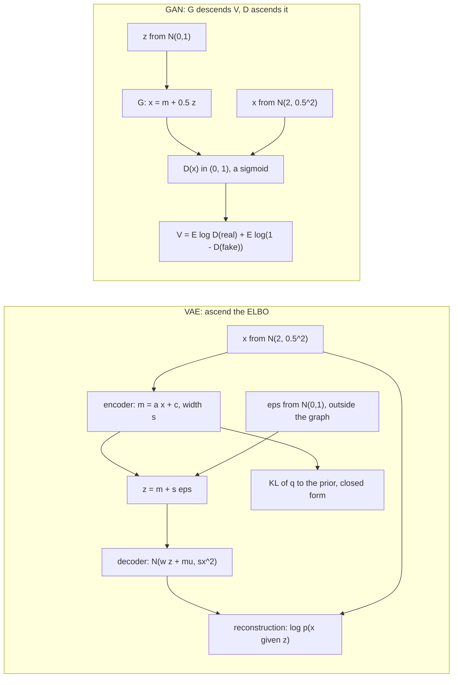

> [!note] Prerequisites · 선수 지식
> Object **D6** from [[03-deep-learning/lab-objects|0. Lab Objects]], widened here into a distribution · [[02-foundations/lab-kernel|0.65 Lab Kernel]], because this page is Tier A · [[02-foundations/probability|3. Probability §3]] (Gaussian closure and conditioning) and [[02-foundations/probability|3. Probability §4]] (maximum likelihood) · [[02-foundations/information-theory|5. Information Theory §3]] (KL divergence, Jensen's inequality) and [[02-foundations/information-theory|5. Information Theory §5]] (the ELBO by Jensen) · [[02-foundations/calculus-backprop|2. Calculus & Backprop §5]] (the reparameterization, stated) · [[02-foundations/rl-basics|7. RL Basics §4]] (the score-function gradient).
> [[03-deep-learning/lab-objects|0. Lab Objects]]의 대상 **D6**를 여기서 분포로 넓힌다 · 이 페이지는 Tier A이므로 [[02-foundations/lab-kernel|0.65 Lab Kernel]] · [[02-foundations/probability|3. 확률 §3]](가우시안 닫힘과 조건부)과 [[02-foundations/probability|3. 확률 §4]](최대우도) · [[02-foundations/information-theory|5. 정보이론 §3]](KL 발산, 옌센 부등식)과 [[02-foundations/information-theory|5. 정보이론 §5]](옌센으로 구한 ELBO) · [[02-foundations/calculus-backprop|2. 미적분과 역전파 §5]](reparameterization의 진술) · [[02-foundations/rl-basics|7. RL 기초 §4]](score-function 그래디언트).

## English

*Stands on the Gaussian algebra of [[02-foundations/probability|3. Probability §3]], the KL divergence of [[02-foundations/information-theory|5. Information Theory §3]], the ELBO of [[02-foundations/information-theory|5. Information Theory §5]] and the reparameterization stated in [[02-foundations/calculus-backprop|2. Calculus & Backprop §5]]. Second use of object **D6**, whose home is [[03-deep-learning/diffusion/index|6. Diffusion & Flow]]: this page is that module's prerequisite lecture on the two generative models diffusion displaced, and it widens D6's single datum into a distribution.*

> [!note] First pass · 처음이라면
> Read the running object and the Worked case, then §1, §2, §5 and §6, and do problems 1–2. Open §3 and §4 when a VAE trains noisily or ignores its latent, §7 when a GAN paper says "mode collapse" or "Wasserstein", and §9 before comparing any generative model with diffusion. §8 runs all of it.

### Running object · 이 페이지의 대상

**D6** from [[03-deep-learning/lab-objects|0. Lab Objects]], at the number that page freezes: the clean datum $x_0=2$. D6 is one datum, and a generative model is fitted to a distribution, so this page freezes one page-local distribution centred on it, specified once here and never changed:

$$p_{\text{data}}(x)=\mathcal N\big(x;\ 2,\ 0.5^2\big)$$

**How it differs from D6.** D6 is a point. Read as a distribution it is the point mass $\delta_2$, all probability on $x=2$, and against a point mass neither model family on this page has anything to learn: a Gaussian of width $\sigma$ centred on 2 has log-density $-\tfrac12\ln(2\pi\sigma^2)$ there, which grows without bound as $\sigma\to0$, so maximum likelihood has no optimum; and against any other point mass every divergence of §5 is pinned at its maximum (§6). The spread $0.5$ is what gives both models something to fit, and the centre is D6's datum so that the numbers stay comparable with D6's module. The two places that need D6 itself — the point masses of §6 and the collapsed generator of §7 — say so.

**The VAE on it.** A linear-Gaussian latent-variable model with one latent coordinate:

$$z\sim\mathcal N(0,1),\qquad p_\theta(x\mid z)=\mathcal N\big(x;\ wz+\mu,\ \sigma_x^2\big),\qquad q_\phi(z\mid x)=\mathcal N\big(z;\ ax+c,\ s^2\big)$$

The prior is fixed. The decoder has parameters $\theta=(w,\mu,\sigma_x)$ — slope, offset, and the standard deviation of its noise — and the encoder has $\phi=(a,c,s)$ — slope, offset, and the standard deviation of its guess about $z$. Nothing forces the encoder to be right, which is what the Worked case measures.

**The GAN on it.** A generator that shifts standard-normal noise, $G_m(z)=m+0.5\,z$ with $z\sim\mathcal N(0,1)$, so it outputs $p_g=\mathcal N(m,0.5^2)$: the right width and a movable centre. The discriminator $D$ is whatever §5 proves optimal against it.

| Symbol | Value | What it is |
|---|---:|---|
| $p_{\text{data}}$ | $\mathcal N(2,0.5^2)$ | the frozen data distribution, centred on D6's $x_0$ |
| $(w,\mu,\sigma_x)$ | $(0.4,\ 2,\ 0.3)$ | the frozen decoder: an exact optimum, since $0.4^2+0.3^2=0.5^2$ (§4) |
| $(a,c,s)$ | $(1.6,\ -3.2,\ 0.6)$ | its exact encoder, the true posterior (Worked case) |
| $(a,c,s)_{\text{wrong}}$ | $(1,\ -2,\ 0.5)$ | a deliberately wrong encoder: it reads $z=x-2$ and ignores $w$ |
| $x$ | $2.5$ | the query point, one standard deviation above the mean |
| $m$ | $2.5$ | the frozen generator's centre; §8 sweeps it from 2 to 8 |

The frozen decoder is one point on a ridge of equally good optima. It is frozen rather than derived because the likelihood cannot choose among them — that is §4's result — and §8 shows which one SGD picks instead.

*Scope: this page teaches the two generative models that came before diffusion, on one 1-D distribution — the latent-variable model and its ELBO, the reparameterization gradient, the linear VAE solved exactly and its posterior collapse; the GAN game, its optimal discriminator and the Jensen–Shannon divergence, why the original generator loss stops learning, mode collapse, and the Wasserstein distance. It does not teach the KL divergence or Jensen's inequality themselves, which are [[02-foundations/information-theory|5. Information Theory §3]]; nor deep encoders, decoders and convolutional GANs, which are architectures of [[03-deep-learning/computer-vision/index|2. Computer Vision]]; nor discrete-latent autoencoders and diffusion inside a VAE's latent space, which are the [[01-canonical-papers/notes/6-diffusion/latent-diffusion|Latent Diffusion]] note; nor sample-quality metrics such as FID, which are [[02-foundations/ml-practice|9. ML Practice §3]]; nor diffusion itself, which is [[03-deep-learning/diffusion/index|6. Diffusion & Flow]].*

### Homework diagram · 과제가 그릴 그림

Two models on the same data, drawn side by side. The problem set asks for exactly this drawing with one box changed in each panel.



Four things the drawing has to get right.
**The noise enters from outside.** Draw $\epsilon$ as its own input to $z$. The gradient reaches $(a,c,s)$ through $z=m+s\epsilon$ and never through the act of sampling; a drawing with the sampler inside the encoder box claims a derivative that does not exist (§3).
**The KL leaves the encoder and touches nothing else.** It compares $q$ with the prior in closed form, so it is the one term with no sampling and no decoder in it. Draw it as its own branch, because §4's posterior collapse is the moment this branch reads zero.
**The generator never sees a real datum.** The only path from the data to $G$ runs through $D$, so everything $G$ learns is the slope of $D$ at the points $G$ produced (§6). An arrow from the data into $G$ describes a different method.
**Draw the sigmoid on $D$.** $D$ squashes its output into $(0,1)$, and the flat tails of that squashing are where the generator's gradient dies (§6). The Wasserstein critic of §7 is this same box with the sigmoid removed and a slope limit written on it.

### Worked case · 대상으로 한 번 끝까지

This is the homework object. The problem set will ask you to draw it, to redo this case on a second optimum and a second generator, and to rerun the lab with one knob changed. Do all of it here first, at $x=2.5$ and $m=2.5$.

**The marginal, and the log-likelihood of $x=2.5$.** Write the decoder as $x=wz+\mu+\sigma_x\eta$ with $\eta\sim\mathcal N(0,1)$ independent of $z$. That is an affine map of a Gaussian plus an independent Gaussian, so by the closure rules of [[02-foundations/probability|3. Probability §3]] the variances add:

$$p_\theta(x)=\mathcal N\big(x;\ \mu,\ w^2+\sigma_x^2\big)=\mathcal N\big(x;\ 2,\ 0.16+0.09\big)=\mathcal N(x;\ 2,\ 0.25)=p_{\text{data}}(x)$$

so the frozen decoder reproduces the data distribution exactly. At the query point,

$$\ln p_\theta(2.5)=-\tfrac12\ln(2\pi\cdot0.25)-\frac{(2.5-2)^2}{2\cdot0.25}=-0.225791-0.5=-0.725791\ \text{nats}.$$

Because $2.5$ sits exactly one standard deviation out, this is also the average log-likelihood over the data, $\mathbb E_{p_{\text{data}}}[\ln p_\theta]=-\tfrac12\ln(2\pi e\cdot0.25)=-0.725791$ — minus the data's differential entropy, so it is the best average score any model can reach here. The lab's target is this same number.

**The exact posterior, hence the optimal encoder.** $(z,x)$ is jointly Gaussian with $\operatorname{Var}z=1$, $\operatorname{Cov}(z,x)=w$ and $\operatorname{Var}x=w^2+\sigma_x^2$. Conditioning (Probability §3) moves the mean by a covariance-weighted correction and removes from the variance what the observation explains:

$$p_\theta(z\mid x)=\mathcal N\Big(z;\ \frac{w(x-\mu)}{w^2+\sigma_x^2},\ 1-\frac{w^2}{w^2+\sigma_x^2}\Big)=\mathcal N\big(z;\ 1.6(x-2),\ 0.36\big)$$

At $x=2.5$ that is $\mathcal N(0.8,\,0.6^2)$. The mean is linear in $x$ and the variance does not depend on $x$, so the encoder family contains the posterior exactly: $a=1.6$, $c=-3.2$, $s=0.6$.

**The ELBO at the exact encoder: gap zero.** §2 derives the closed form. Under $q=\mathcal N(0.8,0.36)$ the expected squared residual is the squared mean residual plus the spread that $z$ injects through $w$, $(0.5-0.4\cdot0.8)^2+0.4^2\cdot0.36=0.0324+0.0576=0.09$, so

$$\mathrm{ELBO}(2.5)=\Big[-\tfrac12\ln(2\pi\cdot0.09)-\frac{0.09}{2\cdot0.09}\Big]-\tfrac12\big(0.36+0.64-1-\ln0.36\big)=(0.285034-0.5)-0.510826=-0.725791$$

where the bracket is the reconstruction term, $-0.214966$, and the second term is $\mathrm{KL}(q\,\|\,p(z))=0.510826$. The total equals $\ln p_\theta(2.5)$: the gap is zero because $q$ is the posterior.

**The ELBO at the wrong encoder, and its gap.** $(a,c,s)=(1,-2,0.5)$ gives $q=\mathcal N(0.5,\,0.5^2)$ at $x=2.5$. The residual is now $(0.5-0.2)^2+0.16\cdot0.25=0.09+0.04=0.13$, the reconstruction is $0.285034-0.13/0.18=-0.437188$, the KL to the prior is $\tfrac12(0.25+0.25-1-\ln0.25)=0.443147$, and

$$\mathrm{ELBO}(2.5)=-0.437188-0.443147=-0.880335,\qquad \text{gap}=-0.725791-(-0.880335)=0.154544.$$

§2 says the gap is $\mathrm{KL}(q\,\|\,p_\theta(z\mid x))$, and computing that independently with the Gaussian KL gives $\ln\frac{0.6}{0.5}+\frac{0.25+(0.5-0.8)^2}{2\cdot0.36}-\frac12=0.182322+0.472222-0.5=0.154544$. Two routes, one number: the agreement is the check that the identity was applied correctly. Read the trade inside it. The wrong encoder sits *closer to the prior* (KL $0.443$ against $0.511$) and pays for that twice over in reconstruction ($-0.437$ against $-0.215$).

**The GAN at $m=2.5$.** §5 derives $D^*(x)=p_{\text{data}}(x)/\big(p_{\text{data}}(x)+p_g(x)\big)$. With equal widths the log-ratio is linear in $x$, $\ln\frac{p_{\text{data}}}{p_g}=\frac{(x-2.5)^2-(x-2)^2}{2\cdot0.25}=4.5-2x$, so

$$D^*(x)=\frac{1}{1+e^{\,2x-4.5}},\qquad D^*(2)=\frac{1}{1+e^{-0.5}}=0.622459,\qquad D^*(3)=\frac{1}{1+e^{1.5}}=0.182426,$$

and $D^*=\tfrac12$ at $x=2.25$, where the two densities cross. Integrated on §8's grid, $\mathrm{JS}(p_{\text{data}}\,\|\,p_g)=0.111421$ nats ($0.160747$ bits), so the game's value at the optimal discriminator is $-\ln4+2(0.111421)=-1.163451$. Integrating $V(D^*,G)$ directly on the same grid gives $-1.163451$ as well, made of two equal halves, $\mathbb E_{p_{\text{data}}}[\ln D^*]=\mathbb E_{p_g}[\ln(1-D^*)]=-0.581726$, equal because the pair is mirror-symmetric about $2.25$. A sanity check on the size: for two equal-width Gaussians $d$ standard deviations apart, JS is close to $d^2/8$ when $d$ is small, and $d=1$ gives $0.125$, within $12\%$ of the exact value.

### 1. Latent-variable models, and why log p(x) is intractable

> **Latent-variable generative model, defined.** A **latent-variable generative model** is a *joint distribution over an observed variable and an unobserved one*, $p_\theta(x,z)=p(z)\,p_\theta(x\mid z)$, used as a density model for $x$ through its marginal. Three defining conditions. The **prior** $p(z)$ is simple and can be sampled, and in a VAE it is fixed, not learned. The **decoder** $p_\theta(x\mid z)$ can be evaluated and sampled for any given $z$. And the model's density for $x$ is **the marginal, never written down directly**: it exists only as an integral over $z$.
>
> $$p_\theta(x)=\int p_\theta(x\mid z)\,p(z)\,dz=\mathbb E_{z\sim p(z)}\big[p_\theta(x\mid z)\big]$$
>
> where $z$ is the latent and $\theta$ the decoder's parameters — and the second form is the one to read, because it says the marginal is an *average over the prior* of how well each $z$ explains $x$, which can be estimated by sampling $z$ but in general not computed.
>
> - **Example**: the frozen linear model. Its integral has a closed form, $\mathcal N(2,0.25)$, so $p_\theta(2.5)=0.483941$ exactly (Worked case). Replace the decoder mean $wz+\mu$ by a neural network $f_\theta(z)$ and it is still an example — the ordinary VAE — but the integral no longer has a closed form, and that case is why the rest of this page exists.
> - **Non-example**: fitting $\mathcal N(\mu,v)$ to the data directly. On this object it gives the very same density, but it is written down rather than integrated: there is no latent to infer and nothing for an encoder to do. §4 shows the VAE can end up exactly there.
> - **Non-example**: a plain autoencoder $x\to z\to\hat x$ trained on reconstruction error. It has an encoder and a decoder but no prior and no $p(x)$, so there is nothing to sample new data from and no likelihood to report.
> - **Why it matters**: the latent is what lets a simple prior and a simple decoder produce a complicated $p(x)$ — and it is exactly what makes $\ln p(x)$ hard to evaluate, for the three reasons below.

**Why $\ln p(x)$ is intractable in general, in three steps.**
**No closed form.** Once $z$ enters the decoder through a nonlinear network, the integral above has no formula.
**Sampling from the prior looks in the wrong place.** The Monte Carlo average $\frac1K\sum_k p_\theta(x\mid z_k)$ with $z_k$ drawn from the prior is unbiased, but most prior draws explain a given $x$ badly. On the object the square of a Gaussian density is again a Gaussian shape, so the second moment is available in closed form, $\mathbb E[p_\theta(x\mid z)^2]=\mathcal N(x;\mu,w^2+\sigma_x^2/2)/(2\sigma_x\sqrt\pi)=0.450291$ at $x=2.5$, against $p_\theta(2.5)^2=0.234199$. One prior draw therefore has relative standard deviation $\sqrt{0.450291/0.234199-1}=0.9606$, and 100 draws still leave about $10\%$ — in one dimension. In a high-dimensional $x$ the latents that explain it are an exponentially small part of the prior, and no affordable $K$ helps.
**The right place to look needs the answer.** Draw $z$ from the exact posterior instead and every importance weight $p_\theta(x\mid z)p(z)/p_\theta(z\mid x)$ equals $p_\theta(x)=0.483941$ exactly, a zero-variance estimate (checked numerically). But Bayes' rule gives $p_\theta(z\mid x)=p_\theta(x\mid z)p(z)/p_\theta(x)$, which needs $p_\theta(x)$ — the thing being computed.

The way out is to learn an approximate posterior $q_\phi(z\mid x)$ and pay for its error in a known currency. That currency is §2's gap.

### 2. The ELBO as an identity, and the Gaussian KL

The ELBO is defined, and derived by Jensen's inequality, in [[02-foundations/information-theory|5. Information Theory §5]]. Jensen gives an inequality; the route below gives an identity, which names the gap instead of only bounding it — and the gap is the number the Worked case checked twice.

Start from $\ln p_\theta(x)$. It does not depend on $z$, so it equals its own average under any $q_\phi(z\mid x)$ that is positive wherever the posterior is. Bayes' rule, $p_\theta(x)=p_\theta(x,z)/p_\theta(z\mid x)$, holds for every $z$; multiply and divide by $q$ inside the logarithm:

$$\ln p_\theta(x)=\mathbb E_{q}\Big[\ln\frac{p_\theta(x,z)}{p_\theta(z\mid x)}\Big]=\mathbb E_{q}\Big[\ln\frac{p_\theta(x,z)}{q_\phi(z\mid x)}\Big]+\mathbb E_{q}\Big[\ln\frac{q_\phi(z\mid x)}{p_\theta(z\mid x)}\Big]$$

The second term is $\mathrm{KL}(q\,\|\,p_\theta(z\mid x))$ by the definition of KL in [[02-foundations/information-theory|5. Information Theory §3]]. Split the first with $p_\theta(x,z)=p_\theta(x\mid z)\,p(z)$:

$$\ln p_\theta(x)=\underbrace{\mathbb E_{q}\big[\ln p_\theta(x\mid z)\big]-\mathrm{KL}\big(q_\phi(z\mid x)\,\|\,p(z)\big)}_{\mathrm{ELBO}(x)}+\underbrace{\mathrm{KL}\big(q_\phi(z\mid x)\,\|\,p_\theta(z\mid x)\big)}_{\text{gap}\ \ge\ 0}$$

so the ELBO sits below the log-likelihood by exactly a KL, which is never negative, and the bound is tight exactly when $q$ is the posterior. Three consequences run through the rest of the page. With the decoder fixed, maximizing the ELBO over the encoder minimizes the gap, since $\ln p_\theta(x)$ does not move: the encoder is doing inference. With the encoder fixed, maximizing it over the decoder raises a lower bound on the likelihood. And the gap is a KL between two distributions over $z$, so when both are Gaussian it is a closed-form number — which is how the Worked case checked it, $0.154544$ both ways.

**The KL between two Gaussians, derived.** Both the ELBO's second term and the gap need it. For $q=\mathcal N(m,s^2)$ and $p=\mathcal N(m',s'^2)$ the log-ratio of densities is $\ln\frac{s'}{s}-\frac{(z-m)^2}{2s^2}+\frac{(z-m')^2}{2s'^2}$. Take its expectation under $q$, using $\mathbb E_q(z-m)^2=s^2$ and $\mathbb E_q(z-m')^2=s^2+(m-m')^2$:

$$\mathrm{KL}\big(\mathcal N(m,s^2)\,\|\,\mathcal N(m',s'^2)\big)=\ln\frac{s'}{s}+\frac{s^2+(m-m')^2}{2s'^2}-\frac12$$

because the first quadratic averages to exactly $\tfrac12$ and the second to its variance plus squared offset over $2s'^2$. Against the prior ($m'=0$, $s'=1$) it is $\tfrac12(s^2+m^2-1-\ln s^2)$, the ELBO's regularizer. Information Theory §3 states the formula; this is where its three terms come from.

**The whole ELBO of the linear model, in closed form.** The reconstruction term needs $\mathbb E_q[(x-wz-\mu)^2]$ with $z=m+s\epsilon$. The residual is $(x-\mu-wm)-ws\epsilon$, so its mean square is the squared mean residual plus the spread $z$ injects through $w$. With $m=ax+c$,

$$\mathrm{ELBO}(x)=-\tfrac12\ln(2\pi\sigma_x^2)-\frac{(x-\mu-wm)^2+w^2s^2}{2\sigma_x^2}-\tfrac12\big(s^2+m^2-1-\ln s^2\big)$$

since the first two terms are the Gaussian log-density averaged over $q$ and the last is the KL to the prior. This is the formula the Worked case evaluated at two encoders, and averaged over $p_{\text{data}}$ it is what the lab's `elbo_parts` computes. One term deserves a name now, because §4 turns on it: $w^2s^2/(2\sigma_x^2)$ is the **noise cost**, what the encoder's uncertainty $s$ costs the reconstruction once it passes through the decoder's slope $w$ — $0.32$ nats at the frozen optimum. A model can shrink it two ways: a sharper encoder ($s\to0$), or a decoder that ignores $z$ ($w\to0$).

### 3. The reparameterization gradient, and why its variance is low

The trick itself is stated in [[02-foundations/calculus-backprop|2. Calculus & Backprop §5]]: $z=m+s\epsilon$ with $\epsilon\sim\mathcal N(0,1)$ has the same distribution as a draw from $\mathcal N(m,s^2)$, and its derivatives $\partial z/\partial m=1$ and $\partial z/\partial s=\epsilon$ are ordinary ones. What that page leaves open is why the resulting gradient is worth having. The claim is about variance, and on this object it has a size.

> **Pathwise gradient estimator, defined.** The **pathwise** (or **reparameterization**) **gradient estimator** is an *unbiased Monte Carlo estimator of the gradient of an expectation* whose sampling distribution depends on the parameters being differentiated. Three defining conditions. The sample is a **differentiable function of the parameters and of parameter-free noise**, $z=g_\phi(\epsilon)$ — for the Gaussian, $m+s\epsilon$. The integrand $f$ is **differentiable in $z$**. And **derivative and expectation can be exchanged**, a regularity condition that holds for the smooth integrands here, so the gradient moves inside the average over $\epsilon$.
>
> $$\nabla_\phi\,\mathbb E_{z\sim q_\phi}\big[f(z)\big]=\mathbb E_{\epsilon\sim\mathcal N(0,1)}\big[f'(m+s\epsilon)\,\nabla_\phi(m+s\epsilon)\big]\approx\frac1K\sum_{k=1}^{K}f'(m+s\epsilon_k)\,\nabla_\phi(m+s\epsilon_k)$$
>
> where $\nabla_{(m,s)}(m+s\epsilon)=(1,\epsilon)$ — so every draw carries the local slope $f'$ of the integrand, and averaging $K$ of them estimates the gradient.
>
> - **Example**: the reconstruction term at the Worked case, $f(z)=\ln\mathcal N(2.5;\,0.4z+2,\,0.09)$ with $f'(z)=w(x-\mu-wz)/\sigma_x^2$. Under the exact encoder the true $\partial/\partial m$ is $0.4\cdot0.18/0.09=0.8$, which cancels the KL's own $-m=-0.8$ — the reason this encoder is optimal. One draw scatters around $0.8$ with standard deviation $w^2s/\sigma_x^2=1.0667$.
> - **Non-example**: the score-function estimator of [[02-foundations/rl-basics|7. RL Basics §4]], $\frac1K\sum_k f(z_k)\,(z_k-m)/s^2$. It is also unbiased and needs only values of $f$, never $f'$ — which makes it the only option for a discrete latent or a reward from a simulator — and it pays for that in variance, as the table below shows.
> - **Non-example**: drawing $z$ with a library's Gaussian sampler and backpropagating. The draw is not a function of $m$ that can be differentiated, so the gradient stops at the sampler.
> - **Why it matters**: the pathwise estimator's noise comes only from how much $f'$ varies across $q$, so it shrinks with the encoder's width — on this object its variance is exactly $(w^2s/\sigma_x^2)^2$. The score-function estimator multiplies the *value* of $f$ by a zero-mean weight $\epsilon/s$, so it pays for the value itself. This is what makes a VAE trainable by plain backpropagation.

The same Worked-case gradient ($x=2.5$, decoder frozen, encoder mean at the posterior mean $0.8$, true gradient $0.8$ at every width), one draw, standard deviations in closed form from the Gaussian moments $\mathbb E\epsilon^4=3$ and $\mathbb E\epsilon^6=15$:

| encoder width $s$ | pathwise | score function | score function with baseline $\mathbb E_q f$ |
|---:|---:|---:|---:|
| 1.0 | 1.7778 | 3.5472 | 3.0301 |
| 0.6 | 1.0667 | 2.2399 | 2.0309 |
| 0.3 | 0.5333 | 1.3817 | 1.4111 |
| 0.1 | 0.1778 | 1.3934 | 1.1658 |
| 0.01 | 0.0178 | 10.5377 | 1.1317 |

As the encoder sharpens, the pathwise column goes to zero in proportion to $s$. The score-function column first falls and then grows like $f(0.8)/s=0.105034/s$, because the value of $f$ at the mean does not average away. Subtracting the baseline $\mathbb E_q f$ removes that growth: the variance becomes $2(0.8)^2+10\big(w^2s/(2\sigma_x^2)\big)^2$, which levels off at $\sqrt2\times0.8=1.1314$. No constant baseline gets under that floor — the variance-minimizing one, $\mathbb E[f\epsilon^2]$, still leaves $2(0.8)^2+6\big(w^2s/(2\sigma_x^2)\big)^2$, a standard deviation of $1.7282$ at $s=0.6$ — because the score function sees the slope only through the values of $f$, as $f'(m)\,\epsilon^2$, and $\epsilon^2$ has variance 2. At the posterior width $s=0.6$ one pathwise draw is worth $3.6$ score-function draws baselined with $\mathbb E_q f$; at $s=0.1$ it is worth $43$.

On the object the whole one-sample gradient can be written down, and these six lines are what the lab's `grads` computes. With $r=x-wz-\mu$ the residual, $\ell$ the one-sample ELBO, and the widths learned through their logarithms so that they stay positive,

$$\frac{\partial\ell}{\partial w}=\frac{rz}{\sigma_x^2},\quad \frac{\partial\ell}{\partial\mu}=\frac{r}{\sigma_x^2},\quad \frac{\partial\ell}{\partial\ln\sigma_x}=\frac{r^2}{\sigma_x^2}-1,\quad \frac{\partial\ell}{\partial a}=\Big(\frac{wr}{\sigma_x^2}-m\Big)x,\quad \frac{\partial\ell}{\partial c}=\frac{wr}{\sigma_x^2}-m,\quad \frac{\partial\ell}{\partial\ln s}=\frac{wr}{\sigma_x^2}\,s\epsilon-(s^2-1)$$

since $wr/\sigma_x^2$ is $\partial\ell/\partial z$ and the three encoder lines are the chain rule through $z=m+s\epsilon$, minus the derivatives of the closed-form KL. This is the estimator Kingma & Welling (2014) use when the KL is available analytically: Monte Carlo only for the reconstruction, the KL exact.

### 4. The linear VAE solved exactly: probabilistic PCA, its ridge, and posterior collapse

The posterior of the linear model is Gaussian with a mean linear in $x$ and a constant variance, so the encoder family contains it for *every* decoder. The best encoder therefore closes the gap exactly, and the ELBO maximized over the encoder is the log-likelihood itself. Maximizing the ELBO over everything is maximum likelihood ([[02-foundations/probability|3. Probability §4]]) for the marginal $\mathcal N(\mu,\,w^2+\sigma_x^2)$ — the model Tipping & Bishop (1999) named probabilistic PCA.

> **Probabilistic PCA, defined.** **Probabilistic PCA** (pPCA) is a *linear-Gaussian latent-variable model together with its maximum-likelihood fit* — a density model for $x$, not a projection algorithm. Three defining conditions. The prior is a **standard normal** on $q\le d$ latent coordinates. The decoder mean is **linear**, $Wz+\mu$. And the noise is **isotropic Gaussian**, one variance $\sigma^2$ shared by every coordinate of $x$.
>
> $$x=Wz+\mu+\sigma\eta,\quad z\sim\mathcal N(0,I_q),\ \eta\sim\mathcal N(0,I_d)\quad\Longrightarrow\quad p(x)=\mathcal N\big(\mu,\ WW^\top+\sigma^2I_d\big)$$
>
> where $W\in\mathbb R^{d\times q}$ — so the likelihood sees only the matrix $WW^\top+\sigma^2I$. That is why $W$ is determined only up to a rotation of the latent space, and why, when $d=q$, even the split between $WW^\top$ and $\sigma^2I$ is not.
>
> - **Example**: this page's VAE, with $d=q=1$ and $W=w$. Its likelihood depends on $w$ and $\sigma_x$ only through $w^2+\sigma_x^2$: the ridge below.
> - **Non-example**: ordinary PCA, the leading eigenvectors of the sample covariance. It has no noise model, no density and no likelihood; pPCA's maximum-likelihood $W$ spans the same principal subspace, and as $\sigma^2\to0$ its posterior mean becomes the projection onto it.
> - **Non-example**: factor analysis. Same structure with a diagonal noise matrix, one variance per coordinate, and no closed-form maximum-likelihood solution — it is fitted iteratively.
> - **Why it matters**: it is the one VAE whose optimum is known in closed form, because the ELBO at the exact encoder *is* pPCA's likelihood. That makes it the test fixture for VAE code: an implementation that cannot recover $\mu=2$, $w^2+\sigma_x^2=0.25$ and a zero gap on this object has a bug, and §8 uses it exactly that way.

The data-averaged log-likelihood depends on the decoder only through $\mu$ and the total variance $v=w^2+\sigma_x^2$:

$$\mathbb E_{p_{\text{data}}}\big[\ln p_\theta(x)\big]=-\tfrac12\ln(2\pi v)-\frac{0.25+(2-\mu)^2}{2v},\qquad v=w^2+\sigma_x^2$$

so it is maximized at $\mu=2$ and $v=0.25$, with value $-0.725791$ — and at nothing more specific. Every $(w,\sigma_x)$ on the circle $w^2+\sigma_x^2=0.5^2$ is an exact optimum: a **ridge**. Three points on it, each scoring $-0.725791$ both on average and at $x=2.5$:

| decoder $(w,\sigma_x)$ | exact encoder $(a,c,s)$ | posterior at $x=2.5$ | KL to the prior at $x=2.5$ |
|---|---|---|---:|
| $(0.4,\ 0.3)$, frozen | $(1.6,\ -3.2,\ 0.6)$ | $\mathcal N(0.8,\ 0.6^2)$ | 0.510826 |
| $(0.3,\ 0.4)$, swapped | $(1.2,\ -2.4,\ 0.8)$ | $\mathcal N(0.6,\ 0.8^2)$ | 0.223144 |
| $(0,\ 0.5)$, collapsed | $(0,\ 0,\ 1)$ | $\mathcal N(0,\ 1)$, the prior | 0 |

Tipping & Bishop's general solution says why. For $d$-dimensional data with covariance eigenvalues $\lambda_1\ge\dots\ge\lambda_d$ and $q$ latent coordinates, the maximum-likelihood noise variance is the average of the $d-q$ discarded eigenvalues, and $W=U_q(\Lambda_q-\sigma^2I)^{1/2}R$ for the leading eigenvectors $U_q$, their eigenvalues $\Lambda_q$ and any rotation $R$. Here $d=q=1$: there are no discarded eigenvalues to average, so the likelihood has no way to tell variance *explained by the latent* from variance *called noise*. §8 measures the ridge directly: the curvature of the data-averaged ELBO at the frozen optimum has an exact zero eigenvalue, the direction along the circle, next to $0.234$.

Fix $\sigma_x$ — as every VAE with a mean-squared-error reconstruction loss does, since that loss is a Gaussian decoder of fixed variance — and the ridge becomes a point:

$$w^2=\max\big(0,\ 0.25-\sigma_x^2\big)$$

because the likelihood still wants $w^2+\sigma_x^2=0.25$ and $w^2$ cannot be negative. At $\sigma_x=0.3$ that is $w=\pm0.4$, the sign being the symmetry $z\to-z$; at $\sigma_x\ge0.5$ it is $w=0$. Lucas et al. (2019) prove the general version: for a linear VAE the ELBO adds no spurious optima to pPCA's likelihood, and a latent direction whose variance lies below the decoder's noise is switched off by the likelihood itself.

> **Posterior collapse, defined.** **Posterior collapse** is a *state of a trained VAE*, not an error in its code: for one or more latent coordinates the encoder returns the prior whatever the input. Three defining conditions. The **KL term is zero for every input**, $q_\phi(z\mid x)=p(z)$ for all $x$, so the encoder writes nothing about $x$ into $z$. The **decoder does not use $z$** — here $w=0$ — so nothing downstream would change if $z$ were redrawn from the prior. And the **ELBO is at or near its best**, which is what makes it a trap: the objective's value does not flag it.
>
> $$\mathbb E_{x\sim p_{\text{data}}}\,\mathrm{KL}\big(q_\phi(z\mid x)\,\|\,p(z)\big)=0\quad\Longleftrightarrow\quad q_\phi(z\mid x)=p(z)\ \text{for all }x$$
>
> where the left side is the **rate**, the data-averaged KL term, an upper bound on the information $z$ carries about $x$ — so collapse is rate zero, and a rate reported next to the ELBO is how it is seen.
>
> - **Example**: the collapsed end of the ridge, $(w,\mu,\sigma_x)=(0,2,0.5)$ with $q=p(z)$: rate $0$ and ELBO $-0.725791$, the best there is, the same score as the frozen optimum, which writes $0.5108$ nats into $z$. And SGD finds it: from $w=1$ with an encoder equal to the prior, §8's run ends at $w=0.0210$, rate $0.0008$ nats, ELBO $-0.725795$.
> - **Non-example**: the prior used as the encoder while the decoder keeps $w=0.4$. The KL term is zero but the decoder still uses $z$, so the ELBO at $x=2.5$ drops to $-1.992744$, a gap of $1.266952=\mathrm{KL}\big(\mathcal N(0,1)\,\|\,\mathcal N(0.8,0.36)\big)$. That is a bad encoder, and the ELBO punishes it; collapse is the case where the ELBO does not.
> - **Non-example**: a small rate that is the right answer. The swapped optimum's latent carries $0.2231$ nats against the frozen optimum's $0.5108$ without having collapsed; every row of the ridge table is an optimum.
> - **Why it matters**: it has two causes with different fixes. The *likelihood itself* switches a latent off when the decoder's noise exceeds the variance that direction has, $w^2=\max(0,\,0.25-\sigma_x^2)$, and no change of optimizer helps (Lucas et al. 2019). Or the *optimizer* walks into it: early in training $z$ is noise to the decoder, the noise cost $w^2s^2/(2\sigma_x^2)$ pushes $w$ down, and the encoder's gradient, which is proportional to $w$, loses the race to make $z$ informative — the lagging inference network of He et al. (2019). Warming the KL weight up from zero (Bowman et al. 2016) is the classic remedy for the second cause, and problem 3 runs it.

### 5. The GAN game, the optimal discriminator, and Jensen–Shannon

> **GAN value function, defined.** The **GAN value function** is *the payoff of a two-player zero-sum game* between a generator $G$ and a discriminator $D$ — one number that $D$ maximizes and $G$ minimizes — not a loss with a fixed target, and not a likelihood. Four defining conditions. $G$ **maps prior noise to samples**, $x=G(z)$ with $z\sim p(z)$, and so defines a distribution $p_g$ that is never written down. $D$ **maps a point to a probability** in $(0,1)$ that the point came from the data. The value is **$D$'s log-likelihood on a balanced two-class problem**, real against generated. And the solution concept is **minimax**: $G$ is scored against the best $D$ for it, not against the current one.
>
> $$V(D,G)=\mathbb E_{x\sim p_{\text{data}}}\big[\ln D(x)\big]+\mathbb E_{z\sim p(z)}\big[\ln\big(1-D(G(z))\big)\big],\qquad G^\star=\arg\min_G\max_D V(D,G)$$
>
> where $D(x)$ is the probability $D$ assigns to "$x$ is real" — so $V$ is minus the cross-entropy of a classifier that must say which of two bags a point came from, and $G$ wins by making the bags indistinguishable.
>
> - **Example**: the frozen generator $m=2.5$ against its optimal discriminator, $V=-1.163451$ (Worked case), above the floor $-\ln4=-1.386294$ that only $m=2$ reaches.
> - **Non-example**: the inner problem alone. With $G$ frozen, maximizing $V$ over $D$ is logistic regression on two samples; there is no game until $G$ moves.
> - **Non-example**: a VAE's ELBO. It bounds an explicit $\ln p_\theta(x)$ that can be evaluated at any point; a GAN never evaluates $p_g$ anywhere, which is why §9's likelihood row reads "none".
> - **Why it matters**: the loss is a trained network, so its value measures the current discriminator as much as the generator, and a GAN's training curve is not a progress measure the way a likelihood's is — one of the things the Wasserstein GAN of §7 set out to fix.

**The optimal discriminator, derived.** For a fixed $G$, write both expectations over $x$; the second becomes an integral over $p_g$ by the change of variable $x=G(z)$, which needs only that $G$'s outputs are distributed as $p_g$:

$$V(D,G)=\int\Big[p_{\text{data}}(x)\ln D(x)+p_g(x)\ln\big(1-D(x)\big)\Big]\,dx$$

The integrand involves $D$ only through its value at the same $x$, so $D$ can be maximized one point at a time. For $\alpha,\beta>0$ the function $y\mapsto\alpha\ln y+\beta\ln(1-y)$ on $(0,1)$ is concave with derivative $\alpha/y-\beta/(1-y)$, which vanishes at $y=\alpha/(\alpha+\beta)$. With $\alpha=p_{\text{data}}(x)$ and $\beta=p_g(x)$:

$$D^*(x)=\frac{p_{\text{data}}(x)}{p_{\text{data}}(x)+p_g(x)}$$

because that is the pointwise maximizer — the posterior probability of "real" when the two bags are equally likely in advance, Bayes' rule once more. On the object it is $1/(1+e^{2x-4.5})$ (Worked case).

**Substituting it back.** Write $p_{\text{data}}+p_g=2M$ with $M=\tfrac12(p_{\text{data}}+p_g)$, so each logarithm in $V$ becomes $\ln(p/M)-\ln2$:

$$V(D^*,G)=-\ln4+\mathrm{KL}\big(p_{\text{data}}\,\|\,M\big)+\mathrm{KL}\big(p_g\,\|\,M\big)=-\ln4+2\,\mathrm{JS}\big(p_{\text{data}}\,\|\,p_g\big)$$

since the two $-\ln2$ terms add to $-\ln4$ and the two KLs to the mixture are twice the Jensen–Shannon divergence by its definition. Against the best discriminator the generator is therefore minimizing JS, whose minimum $0$ is reached exactly when $p_g=p_{\text{data}}$; there $D^*=\tfrac12$ everywhere and $V=-\ln4$ (Goodfellow et al. 2014).

> **Jensen–Shannon divergence, defined.** The **Jensen–Shannon divergence** is a *divergence between two distributions on the same space* — a non-negative number that is zero exactly when they are equal — which, unlike KL, is symmetric and bounded. Three defining conditions. It is built on the **mixture** $M=\tfrac12(p+q)$. It is the **average of the two KL divergences to that mixture**, which is what makes it symmetric. And because $M\ge\tfrac12p$ and $M\ge\tfrac12q$ everywhere, each of those KLs is **at most $\ln2$**, finite even for distributions that share no support.
>
> $$\mathrm{JS}(p\,\|\,q)=\tfrac12\mathrm{KL}\big(p\,\|\,M\big)+\tfrac12\mathrm{KL}\big(q\,\|\,M\big),\qquad M=\tfrac12(p+q),\qquad 0\le\mathrm{JS}(p\,\|\,q)\le\ln2$$
>
> where KL is the divergence of Information Theory §3 — and the upper bound is reached exactly when $p$ and $q$ do not overlap at all, which is the whole of §6.
>
> - **Example**: on the object, $\mathrm{JS}\big(\mathcal N(2,0.5^2)\,\|\,\mathcal N(m,0.5^2)\big)$ is $0.111421$ at $m=2.5$, $0.336831$ at $m=3$ and $0.693054$ at $m=6$, already within $10^{-4}$ of $\ln2=0.693147$.
> - **Non-example**: KL itself — asymmetric in general, unbounded, and $+\infty$ between two distinct point masses. Between these two Gaussians it is $(m-2)^2/(2\cdot0.25)=2(m-2)^2$, which never stops growing.
> - **Why it matters**: boundedness cuts both ways. It keeps the GAN's value finite for every generator, and it is exactly why the value stops changing once the generator is far away.

### 6. Saturation, and the non-saturating loss

**Why JS saturates.** Suppose $p$ and $q$ put their mass on disjoint sets. On $p$'s set $q=0$ and $M=p/2$, so $\mathrm{KL}(p\,\|\,M)=\mathbb E_p[\ln(p/(p/2))]=\ln2$; the same holds for $q$; and $\mathrm{JS}=\ln2$ however far apart the two sets are. D6's datum makes it exact: as point masses, $\mathrm{JS}(\delta_2\,\|\,\delta_m)=\ln2$ for every $m\ne2$, so $V(D^*,G)=-\ln4+2\ln2=0$ is flat in $m$. Gaussians always overlap, so on the object saturation is approached rather than reached, but at the speed of a Gaussian tail: $\ln2-\mathrm{JS}$ is $0.5817$ at $m=2.5$, $0.06043$ at $m=4$, $0.003849$ at $m=5$ and $3.006\times10^{-9}$ at $m=8$ (§8).

**From a flat value to a dead gradient.** The generator takes its step with $D$ held fixed, because $D$ is the other player. Danskin's theorem — the derivative of a maximum with respect to a parameter is the partial derivative of the objective at the maximizer, with the maximizer held fixed — connects that step to JS:

$$\frac{\partial}{\partial m}V(D,G_m)\Big|_{D=D^*_m}=\frac{d}{dm}\max_D V(D,G_m)=2\,\frac{d}{dm}\mathrm{JS}\big(p_{\text{data}}\,\|\,p_{g,m}\big)$$

so the generator's gradient against the best discriminator is twice the slope of JS, and it dies as JS flattens. On the object it can be written out. $D^*=1/(1+e^{-\ell(x)})$ with logit $\ell=\ln p_{\text{data}}-\ln p_g$, whose slope for two equal widths is the constant $\ell'=-4(m-2)$. Since $\frac{d}{dx}\ln(1-D)=-D\,\ell'$ and $x=G_m(z)$ moves one-for-one with $m$,

$$g_{\text{sat}}=\frac{\partial}{\partial m}\mathbb E_z\Big[\ln\big(1-D^*(G_m(z))\big)\Big]=4(m-2)\,\mathbb E_{p_g}\big[D^*(x)\big]$$

so the gradient is the discriminator's average belief that the fakes are real, times the slope of its logit. At $m=2.5$ it is $4(0.5)(0.3980)=0.7959$; at $m=5$ the belief is $0.002076$ and $g_{\text{sat}}=0.02491$; at $m=8$ it is $3.697\times10^{-8}$ (§8, where $2\,d\mathrm{JS}/dm$ is computed separately and agrees). Arjovsky & Bottou (2017) prove the general form: when the two supports are disjoint or lie on low-dimensional manifolds a perfect discriminator exists, and this gradient vanishes as $D$ approaches it.

> **Non-saturating generator loss, defined.** The **non-saturating loss** is an *alternative objective for the generator's step* — the discriminator still maximizes $V$ — used in place of minimizing $\mathbb E\ln(1-D(G(z)))$. Three defining conditions. The generator **maximizes $\ln D(G(z))$**, that is, minimizes $-\mathbb E\ln D(G(z))$. It has the **same fixed point** as the minimax game: at $p_g=p_{\text{data}}$, $D^*=\tfrac12$ and both generator losses are stationary. And its gradient is weighted by **$1-D$** where the saturating loss's is weighted by $D$, so it is large exactly when the discriminator rejects the fakes.
>
> $$\mathcal L_{\text{NS}}(G)=-\mathbb E_{z}\big[\ln D(G(z))\big],\qquad g_{\text{ns}}=\frac{\partial\mathcal L_{\text{NS}}}{\partial m}=4(m-2)\,\mathbb E_{p_g}\big[1-D^*(x)\big]$$
>
> on this page's object, because $\frac{d}{dx}(-\ln D)=-(1-D)\,\ell'$ — so the two gradients always add up to $4(m-2)$, and how confidently $D$ rejects decides how that total is split between them.
>
> - **Example**: $g_{\text{ns}}=1.2041$ against $g_{\text{sat}}=0.7959$ at $m=2.5$; $11.9751$ against $0.02491$ at $m=5$, 481 times larger; $24.0000$ against $3.697\times10^{-8}$ at $m=8$.
> - **Non-example**: the saturating loss $\ln(1-D(G(z)))$ of the minimax game — the one whose gradient dies when the generator is worst.
> - **Non-example**: flipping the labels in the discriminator's own loss. That changes what $D$ learns; the non-saturating loss changes only the generator's objective.
> - **Why it matters**: Goodfellow et al. (2014) already used it in practice — minimax is the theory, non-saturating the practice — and it is not free. Adding the two gradients gives $4(m-2)=\frac{d}{dm}\mathrm{KL}(p_g\,\|\,p_{\text{data}})$, since that KL is $2(m-2)^2$ for two equal widths, so $g_{\text{ns}}=\frac{d}{dm}\big[\mathrm{KL}(p_g\,\|\,p_{\text{data}})-2\,\mathrm{JS}\big]$: exactly on this object, and against the optimal discriminator in general (Arjovsky & Bottou 2017). That objective is dominated by the reverse KL, which charges heavily for fakes where the data has no mass and almost nothing for data the generator skips — the mode-seeking direction of Information Theory §3, and the opening of §7. The same paper shows that with a noisy near-perfect discriminator its updates have unbounded variance.

### 7. Mode collapse, and the Wasserstein distance

> **Mode collapse, defined.** **Mode collapse** is a *failure of the generator's distribution*, not of any single sample: $p_g$ covers only part of the data — a few modes, or a narrow region — and so produces little variety. Three defining conditions. **$p_g$ leaves mass-carrying regions of $p_{\text{data}}$ empty.** The generator's objective **against the discriminator it currently faces is improved by concentrating**: against a fixed $D$ the best reply sends every $z$ to where $D$ is largest. And the game's own measure is **worse** at the collapsed generator, so collapse is a failure of the alternating steps, not a solution of the minimax problem.
>
> $$\text{best reply to a fixed }D:\qquad G(z)\equiv x^\star=\arg\max_x D(x)\ \ \text{for every }z\quad\Longrightarrow\quad p_g=\delta_{x^\star}$$
>
> where $\delta$ is a point mass — because $-\mathbb E\ln D(G(z))$ is smallest when every sample sits where $D$ is largest, and nothing in a fixed $D$ rewards spread.
>
> - **Example**: on the object, a generator that is too wide, $\mathcal N(2,1^2)$. Its optimal discriminator is $D^*=r/(1+r)$ with $r=p_{\text{data}}/p_g=2e^{-1.5(x-2)^2}$, largest at $x=2$ where $D^*(2)=2/3$. The generator's best reply under the non-saturating loss sends every sample to $x=2$ — D6's datum — and it does improve its own loss, from $1.428599$ to $-\ln\tfrac23=0.405465$. Under the game's measure it went from $\mathrm{JS}=0.092733$ to $\mathrm{JS}=\ln2=0.693147$, the worst value there is: the generator collapsed from a distribution back to D6's single datum.
> - **Non-example**: a VAE, or any maximum-likelihood model. The likelihood of real data under a point mass is zero, so maximum likelihood — the forward, mass-covering KL of Information Theory §3 — punishes missing mass without limit; its characteristic failure is the opposite one, blur.
> - **Non-example**: little variety because the data has little. A generator that matches $\mathcal N(2,0.5^2)$ has not collapsed just because its samples cluster near 2.
> - **Why it matters**: a generator's loss going down means it beat the current discriminator, not that $p_g$ moved toward $p_{\text{data}}$. That is why GAN papers report diversity next to sample quality, and why mode collapse and saturation are the two structural failures the Wasserstein GAN was designed around.

> **Wasserstein-1 distance, defined.** The **Wasserstein-1 distance**, or earth mover's distance, is a *metric between probability distributions* — symmetric, zero only for equal distributions, obeying the triangle inequality — measured in the units of $x$. Three defining conditions. A **coupling** $\gamma$ of $p$ and $q$: a joint distribution whose two marginals are $p$ and $q$, read as a plan for moving $p$'s mass onto $q$'s. A **ground cost** $|x-y|$ per unit of mass moved from $x$ to $y$. And the **cheapest plan**: the infimum over all couplings.
>
> $$W_1(p,q)=\inf_{\gamma\in\Pi(p,q)}\mathbb E_{(x,y)\sim\gamma}\big[\,|x-y|\,\big]=\int_{-\infty}^{\infty}\big|F_p(t)-F_q(t)\big|\,dt\quad\text{(in one dimension)}$$
>
> where $\Pi(p,q)$ is the set of couplings and $F_p$, $F_q$ are the cumulative distribution functions — so $W_1$ measures how far the mass has to travel, and that keeps growing, with a slope, after two distributions stop overlapping.
>
> - **Example**: shifting a distribution moves all of its mass by the shift, so $W_1\big(\mathcal N(2,0.5^2),\mathcal N(m,0.5^2)\big)=|m-2|$ exactly, and the lab's grid integral returns $0.5000,\ 1.0000,\ \dots,\ 6.0000$. The same holds for D6's point masses, $W_1(\delta_2,\delta_m)=|m-2|$, where JS is $\ln2$ for every $m\ne2$ — the parallel-lines example of Arjovsky, Chintala & Bottou (2017), in one dimension.
> - **Non-example**: JS and KL on the same pair of point masses — flat at $\ln2$, and $+\infty$. Neither can say that $m=3$ is closer than $m=8$.
> - **Why it matters**: by Kantorovich–Rubinstein duality $W_1(p,q)=\sup_{\lVert f\rVert_L\le1}\big(\mathbb E_p[f]-\mathbb E_q[f]\big)$, a supremum over functions whose slope is at most 1, so a network can estimate it. The Wasserstein GAN replaces the discriminator by such a **critic** — unbounded, with no sigmoid — and keeps its slope limited by clipping every weight to a small box. On the object the best critic is $f(x)=-x$, its value is exactly $m-2$, and the generator's gradient is $1$ at every $m$, against the saturating loss's $3.697\times10^{-8}$ at $m=8$.

### 8. The lab: SGD on the linear VAE, and the GAN's gradient on a grid

Three parts. Part A trains all six parameters of §4's VAE by SGD with the pathwise gradients of §3 — no autograd, only the six hand-derived lines — from two starts, and compares where each lands with the closed form. Part B freezes $\sigma_x=0.3$, which makes the optimum unique ($w=0.4$, encoder $1.6,-3.2,0.6$), and sweeps the number of Monte Carlo samples $K$ against the learning rate $\eta$, then measures the per-step gradient noise at the optimum. Part C puts the GAN on a grid: generators $\mathcal N(m,0.5^2)$ with $m$ from 2 to 8, their JS, $W_1$, and the two generator gradients of §6. Every minibatch is 32 fresh draws from $p_{\text{data}}$, each run is 4000 steps, and a run's reported parameters are the average of its last 1000 steps.

```python
# 6.1 lab: a linear VAE trained by SGD with hand-derived gradients, then a GAN's JS on a grid. NumPy only.
import numpy as np

M, V = 2.0, 0.25                                     # the frozen data: x ~ N(2, 0.5^2)
BEST = -0.5 * np.log(2 * np.pi * np.e * V)           # best average log-likelihood: -0.725791
OPT = np.array((0.4, 2.0, np.log(0.3), 1.6, -3.2, np.log(0.6)))  # frozen optimum: w, mu, log sx, a, c, log s

def elbo_parts(p):                                   # data-averaged reconstruction and KL, closed form (§2)
    w, mu, lam, a, c, rho = p
    v, s = np.exp(2 * lam), np.exp(rho)
    bias = (1 - w * a) * M - w * c - mu              # data-average of the residual x - w m - mu
    rec = -0.5 * np.log(2 * np.pi * v) - (bias**2 + V * (1 - w * a)**2 + w**2 * s**2) / (2 * v)
    kl = 0.5 * (s**2 + (a * M + c)**2 + V * a**2 - 1 - 2 * rho)
    return rec, kl

def expected_elbo(p):
    rec, kl = elbo_parts(p)
    return rec - kl

def grads(p, x, eps, learn_sx=True):                 # hand-derived ELBO gradients, pathwise (§3)
    w, mu, lam, a, c, rho = p
    v, s = np.exp(2 * lam), np.exp(rho)
    m = a * x + c                                    # encoder mean, B x 1
    z = m + s * eps                                  # the reparameterization, B x K
    r = x - w * z - mu                               # decoder residual
    dz = w * r / v                                   # d log p(x|z) / dz
    g_rec = np.array((np.mean(r * z / v), np.mean(r / v), np.mean(r**2 / v - 1) if learn_sx else 0.0,
                      np.mean(dz * x), np.mean(dz), np.mean(dz * s * eps)))
    g_kl = np.array((0.0, 0.0, 0.0, np.mean(m * x), np.mean(m), s**2 - 1))   # gradient of KL(q || prior)
    return g_rec, g_kl

def train(K, eta, learn_sx=True, init=(1.0, 0.0, 0.0, 0.0, 0.0, 0.0), steps=4000, B=32, seed=0,
          kl_weight=lambda t: 1.0):
    rng = np.random.default_rng(seed)
    p, tail = np.array(init, float), []              # default start: w=1, mu=0, sx=1, encoder = the prior
    for t in range(steps):
        x = M + np.sqrt(V) * rng.standard_normal((B, 1))   # a fresh minibatch of data
        eps = rng.standard_normal((B, K))            # K noise draws per datum
        g_rec, g_kl = grads(p, x, eps, learn_sx)
        p = p + eta * (g_rec - kl_weight(t) * g_kl)  # gradient ascent on the ELBO
        if not np.all(np.isfinite(p)) or np.abs(p).max() > 1e3:
            return None, None
        if t >= steps - 1000:
            tail.append(p)
    tail = np.array(tail)
    return tail.mean(0), tail[:, 0].std()            # average of the last 1000 steps, and the sd of w there

def show(p):
    w, mu, lam, a, c, rho = p
    return "w=%.4f mu=%.4f sx=%.4f w2+sx2=%.4f | a=%.4f c=%.4f s=%.4f | KL=%.4f ELBO=%.6f" % (
        w, mu, np.exp(lam), w**2 + np.exp(2 * lam), a, c, np.exp(rho), elbo_parts(p)[1], expected_elbo(p))

def curvature(idx, p=OPT, h=1e-4):                  # eigenvalues of minus the Hessian of the expected ELBO
    H = np.zeros((len(idx), len(idx)))
    for i, k in enumerate(idx):
        for j, l in enumerate(idx):
            dk, dl = np.eye(6)[k] * h, np.eye(6)[l] * h
            H[i, j] = -(expected_elbo(p + dk + dl) - expected_elbo(p + dk - dl)
                        - expected_elbo(p - dk + dl) + expected_elbo(p - dk - dl)) / (4 * h * h)
    return np.linalg.eigvalsh(H).round(4) + 0.0

# --- A. all six parameters learned: where on the ridge does SGD land? ----------------------------
print("best %.6f   frozen optimum:   %s" % (BEST, show(OPT)))
print("curvatures at the frozen optimum, all six free:", curvature(range(6)))
for name, init in (("start: w=1, encoder = prior", (1.0, 0.0, 0.0, 0.0, 0.0, 0.0)), ("start: frozen optimum", OPT)):
    p, _ = train(K=1, eta=0.01, init=init)
    w, mu, lam = p[:3]; v = w**2 + np.exp(2 * lam)
    print("%-28s %s\n%-28s exact posterior at this decoder: a=%.4f c=%.4f s=%.4f"
          % (name, show(p), "", w / v, -w * mu / v, np.exp(lam) / np.sqrt(v)))

# --- B. sx frozen at 0.3, so the optimum is unique: the K x eta sweep -----------------------------
ev = curvature((0, 1, 3, 4, 5))
print("\ncurvatures, sx frozen:", ev, " 2/max = %.4f" % (2 / ev.max()))
print(" K |   eta |      w |     mu |      a |       c |      s | shortfall | sd(w) | draws")
for K in (1, 4, 16):
    for eta in (0.003, 0.01, 0.03, 0.1):
        p, sd = train(K, eta, learn_sx=False, init=(1.0, 0.0, np.log(0.3), 0.0, 0.0, 0.0))
        if p is None:
            print("%2d | %5.3f | diverged" % (K, eta))
            continue
        w, mu, lam, a, c, rho = p
        print("%2d | %5.3f | %6.4f | %6.4f | %6.4f | %7.4f | %6.4f | %9.2e | %5.4f | %d"
              % (K, eta, w, mu, a, c, np.exp(rho), BEST - expected_elbo(p), sd, 4000 * 32 * K))
rng = np.random.default_rng(1)                       # per-step gradient noise at the optimum, B = 32
print("   K | sd of the step gradient: w, mu, a, c, log s")
for K in (1, 4, 16, 1024):
    G = np.array([np.subtract(*grads(OPT, M + np.sqrt(V) * rng.standard_normal((32, 1)),
                                     rng.standard_normal((32, K)), learn_sx=False)) for _ in range(3000)])
    print("%4d | %s" % (K, " ".join("%.4f" % g for g in G.std(0)[np.r_[0, 1, 3, 4, 5]])))

# --- C. the GAN on a grid: generators N(m, 0.5^2) against the frozen data ------------------------
xs = np.linspace(-8.0, 18.0, 260001); dx = xs[1] - xs[0]
integ = lambda f: f.sum() * dx                       # integrands vanish at both ends: this is the trapezoid rule
logn = lambda x, m, v: -0.5 * np.log(2 * np.pi * v) - (x - m)**2 / (2 * v)
lp = logn(xs, M, V)

def deficit(m):                                      # log 2 - JS(p_data || N(m, V)), computed without cancellation
    lq = logn(xs, m, V)
    return 0.5 * integ(np.exp(lp) * np.logaddexp(0, lq - lp)) + 0.5 * integ(np.exp(lq) * np.logaddexp(0, lp - lq))

print("\n  m | JS (nats) | log2 - JS | W1     | E_g[D*]   | g_sat     | 2 dJS/dm  | g_ns")
for m in (2.0, 2.5, 3.0, 4.0, 5.0, 6.0, 7.0, 8.0):
    lq = logn(xs, m, V)
    D = 1 / (1 + np.exp(lq - lp))                    # optimal discriminator p/(p + q), as a logistic
    ED = integ(np.exp(lq) * D)                       # its average output on generated samples
    g_sat, g_ns = 4 * (m - 2) * ED, 4 * (m - 2) * (1 - ED)   # d/dm of E log(1-D) and of -E log D, D held fixed
    W1 = integ(np.abs(np.cumsum(np.exp(lp) - np.exp(lq)) * dx))
    dJS = -(deficit(m + 1e-3) - deficit(m - 1e-3)) / 2e-3
    print("%3.1f | %9.6f | %9.3e | %6.4f | %9.3e | %9.3e | %9.3e | %8.4f"
          % (m, np.log(2) - deficit(m), deficit(m), W1, ED, g_sat, 2 * dJS + 0.0, g_ns))
lq = logn(xs, 2.5, V); D = 1 / (1 + np.exp(lq - lp))
print("m = 2.5: V(D*, G) = %.6f   -log 4 + 2 JS = %.6f" % (integ(np.exp(lp) * np.log(D)) + integ(np.exp(lq) * np.log(1 - D)),
                                                          -np.log(4) + 2 * (np.log(2) - deficit(2.5))))
```

**Part A — all six parameters learned.** The best average ELBO is $-0.725791$. At the frozen optimum the curvatures of the data-averaged ELBO are $0,\ 0.234,\ 2.2714,\ 3.2624,\ 12.1418,\ 22.896$ — one exactly zero. The rate column is the KL term.

| run | $w$ | $\mu$ | $\sigma_x$ | $w^2+\sigma_x^2$ | $a$ | $c$ | $s$ | rate | ELBO |
|---|---:|---:|---:|---:|---:|---:|---:|---:|---:|
| frozen optimum, for reference | 0.4000 | 2.0000 | 0.3000 | 0.2500 | 1.6000 | −3.2000 | 0.6000 | 0.5108 | −0.725791 |
| start $w=1$, encoder = prior | 0.0210 | 2.0009 | 0.4996 | 0.2501 | 0.0807 | −0.1610 | 0.9988 | 0.0008 | −0.725795 |
| exact posterior at that decoder | | | | | 0.0839 | −0.1679 | 0.9991 | | |
| start at the frozen optimum | 0.3934 | 2.0014 | 0.3083 | 0.2498 | 1.5751 | −3.1526 | 0.6180 | 0.4823 | −0.725799 |
| exact posterior at that decoder | | | | | 1.5747 | −3.1516 | 0.6169 | | |

**Part B — $\sigma_x$ frozen at 0.3.** The curvatures at the optimum are $0.1068,\ 0.9857,\ 2.7037,\ 12.1273,\ 22.882$, so $2/22.882=0.0874$. The shortfall is the best ELBO minus the run's, in nats; "sd of $w$" is taken over the run's last 1000 steps; "draws" counts decoder evaluations, $4000\times32\times K$.

| $K$ | $\eta$ | $w$ | $\mu$ | $a$ | $c$ | $s$ | shortfall | sd of $w$ | draws |
|---:|---:|---:|---:|---:|---:|---:|---:|---:|---:|
| 1 | 0.003 | 0.4581 | 1.9534 | 1.2381 | −2.3753 | 0.5438 | $4.79\times10^{-2}$ | 0.0097 | 128,000 |
| 1 | 0.01 | 0.4035 | 1.9985 | 1.5717 | −3.1389 | 0.5977 | $2.53\times10^{-4}$ | 0.0138 | 128,000 |
| 1 | 0.03 | 0.3996 | 2.0007 | 1.5932 | −3.1879 | 0.6014 | $2.25\times10^{-5}$ | 0.0253 | 128,000 |
| 1 | 0.1 | diverged | | | | | | | |
| 4 | 0.003 | 0.4614 | 1.9543 | 1.2396 | −2.3797 | 0.5398 | $4.76\times10^{-2}$ | 0.0074 | 512,000 |
| 4 | 0.01 | 0.4058 | 2.0004 | 1.5734 | −3.1456 | 0.5937 | $2.33\times10^{-4}$ | 0.0105 | 512,000 |
| 4 | 0.03 | 0.4028 | 2.0035 | 1.5963 | −3.1990 | 0.5961 | $4.90\times10^{-5}$ | 0.0194 | 512,000 |
| 4 | 0.1 | diverged | | | | | | | |
| 16 | 0.003 | 0.4554 | 1.9529 | 1.2380 | −2.3742 | 0.5448 | $4.79\times10^{-2}$ | 0.0117 | 2,048,000 |
| 16 | 0.01 | 0.4017 | 1.9980 | 1.5768 | −3.1487 | 0.5980 | $1.78\times10^{-4}$ | 0.0096 | 2,048,000 |
| 16 | 0.03 | 0.3985 | 2.0006 | 1.6002 | −3.2019 | 0.6009 | $8.26\times10^{-6}$ | 0.0171 | 2,048,000 |
| 16 | 0.1 | diverged | | | | | | | |

Per-step gradient noise at the optimum, minibatch of 32, standard deviation over 3000 steps:

| $K$ | $w$ | $\mu$ | $a$ | $c$ | $\ln s$ |
|---:|---:|---:|---:|---:|---:|
| 1 | 0.6055 | 0.5820 | 0.3834 | 0.1844 | 0.1830 |
| 4 | 0.4585 | 0.4191 | 0.1970 | 0.0964 | 0.0899 |
| 16 | 0.4105 | 0.3671 | 0.0995 | 0.0481 | 0.0456 |
| 1024 | 0.3934 | 0.3547 | 0.0121 | 0.0059 | 0.0057 |

**Part C — the GAN on a grid.** $g_{\text{sat}}$ and $g_{\text{ns}}$ are §6's two generator gradients with $D=D^*_m$ held fixed; $2\,d\mathrm{JS}/dm$ is a separate central difference of the JS curve. At $m=2.5$ the direct integral of $V(D^*,G)$ and $-\ln4+2\,\mathrm{JS}$ both print $-1.163451$.

| $m$ | JS (nats) | $\ln2-\mathrm{JS}$ | $W_1$ | $\mathbb E_{p_g}[D^*]$ | $g_{\text{sat}}$ | $2\,d\mathrm{JS}/dm$ | $g_{\text{ns}}$ |
|---:|---:|---:|---:|---:|---:|---:|---:|
| 2.0 | 0.000000 | 0.6931 | 0.0000 | 0.5000 | 0 | 0 | 0.0000 |
| 2.5 | 0.111421 | 0.5817 | 0.5000 | 0.3980 | 0.7959 | 0.7959 | 1.2041 |
| 3.0 | 0.336831 | 0.3563 | 1.0000 | 0.2248 | 0.8992 | 0.8992 | 3.1008 |
| 4.0 | 0.632720 | 0.06043 | 2.0000 | 0.03430 | 0.2744 | 0.2744 | 7.7256 |
| 5.0 | 0.689298 | 0.003849 | 3.0000 | 0.002076 | 0.02491 | 0.02491 | 11.9751 |
| 6.0 | 0.693054 | $9.354\times10^{-5}$ | 4.0000 | $4.911\times10^{-5}$ | $7.857\times10^{-4}$ | $7.858\times10^{-4}$ | 15.9992 |
| 7.0 | 0.693146 | $8.632\times10^{-7}$ | 5.0000 | $4.464\times10^{-7}$ | $8.928\times10^{-6}$ | $8.928\times10^{-6}$ | 20.0000 |
| 8.0 | 0.693147 | $3.006\times10^{-9}$ | 6.0000 | $1.540\times10^{-9}$ | $3.697\times10^{-8}$ | $3.697\times10^{-8}$ | 24.0000 |

**Reading the runs.** Four things the closed forms alone could not have shown.

- **Every identifiable quantity matches the closed form, and the start decides the rest.** Both runs of part A end within $10^{-5}$ nats of the best ELBO, with $\mu$ within $0.0014$ of 2, $w^2+\sigma_x^2$ within $0.0002$ of $0.25$, and each encoder within $0.007$ of the exact posterior at its own decoder — the comparison with §4 succeeds on everything §4 says is determined. What §4 says is not determined differs by a factor of 19: $w=0.0210$ from the generic start, $w=0.3934$ from the frozen optimum, which has itself drifted along the ridge and will not drift back, because the curvature along the ridge is exactly zero. The generic run is collapsed — rate $0.0008$ nats against the frozen optimum's $0.5108$ — reached by plain SGD at no cost in ELBO. That is §4's posterior collapse, found rather than constructed.
- **The largest curvature caps the step, and the smallest decides how long convergence takes.** With $\sigma_x=0.3$ the curvatures run from $0.1068$ to $22.882$, a condition number of 214. Gradient ascent is stable only for $\eta<2/22.882=0.0874$, so $\eta=0.1$ diverges at every $K$. The slowest direction relaxes in about $1/(0.1068\,\eta)$ steps: 3121 at $\eta=0.003$, which is why those rows still read $w\approx0.46$ and fall $0.048$ nats short after 4000 steps; 936 at $\eta=0.01$, about $2\times10^{-4}$ short; 312 at $\eta=0.03$, the only rows within $5\times10^{-5}$. The fastest rate is also the noisiest: the sd of $w$ is $0.017$–$0.025$ at $\eta=0.03$ against $0.010$–$0.014$ at $\eta=0.01$.
- **More Monte Carlo samples buy the encoder's accuracy, not the decoder's.** At the optimum the encoder's gradient noise halves for every fourfold $K$ — for $a$, $0.3834$, $0.1970$, $0.0995$, and $0.0121$ at $K=1024$ — because at the exact posterior every datum's own encoder gradient is zero, so the Monte Carlo draw is the only noise left. The decoder's noise does not follow: $w$'s falls from $0.6055$ to $0.4105$ at $K=16$ and floors at $0.3934$, the minibatch's own data noise, which $K$ cannot touch. So $K=16$ spends 16 times the decoder evaluations for 1.5 times less noise in $w$, and the sweep's converged rows show no consistent gain — the regime in which Kingma & Welling report that one sample per datum suffices once the minibatch is large enough.
- **JS saturates, $W_1$ does not, and the saturating gradient dies with JS.** From $m=4$ to $m=8$, $\ln2-\mathrm{JS}$ falls from $0.06$ to $3\times10^{-9}$ and the discriminator's average output on the fakes from $0.034$ to $1.5\times10^{-9}$. The saturating gradient falls with them, from $0.2744$ to $3.7\times10^{-8}$, and matches $2\,d\mathrm{JS}/dm$ to three significant figures in every row — Danskin's theorem, checked on a grid. Over the same range $W_1=m-2$ exactly and the non-saturating gradient climbs to $4(m-2)=24$. The saturating gradient is not even monotone: $0.7959$ at $m=2.5$, $0.8992$ at $m=3$, then collapsing — small near the answer, as it should be, and small far from it, where it should be largest.

### 9. VAE, GAN and diffusion side by side

Each column bought its strength with another column's weakness. The diffusion column is the subject of [[03-deep-learning/diffusion/index|6. Diffusion & Flow]], and its numbers are D6's.

| | VAE | GAN | Diffusion |
|---|---|---|---|
| Likelihood | a lower bound, the ELBO (§2); on this page's linear model it reaches the exact $-0.725791$ | none: $p_g$ is never evaluated, and $V$ scores a classifier (§5) | a variational bound, which the DDPM loss reweights, or an exact value through the probability-flow ODE ([[01-canonical-papers/notes/6-diffusion/score-sde\|Score SDE]]) |
| What training pulls toward | the forward KL from the data, mass-covering: it blurs rather than drops | JS at the optimal $D$, or $\mathrm{KL}(p_g\Vert p_{\text{data}})-2\,\mathrm{JS}$ under the non-saturating loss (§6): mode-seeking | a regression onto the noise at sampled levels, with a free label ([[03-deep-learning/diffusion/index\|6. Diffusion & Flow §1]]) |
| Sample quality | blurry on images with a Gaussian decoder, whose mean averages every output the latent is unsure between | sharp | sharp, and ahead of GANs on ImageNet FID since Dhariwal & Nichol (2021); the metric is [[02-foundations/ml-practice\|9. ML Practice §3]] |
| Training stability | one objective, stable; its failure is posterior collapse (§4) | a game: saturation (§6) and mode collapse (§7) | stable: the forward process has nothing learned in it |
| Sampling cost | one decoder pass | one generator pass | one network call per level visited: 5 ms to 100 ms for 1 to 20 calls on D6 ([[03-deep-learning/diffusion/index\|6. Diffusion & Flow §5]]) |
| Its failure on this page's objects | slides to the collapsed end of the ridge, ELBO unchanged (§8) | the best reply collapses onto D6's datum, $\mathrm{JS}=\ln2$ (§7) | too few steps: error $0.98$ at one call, $0.058$ at twenty (D6's sweep) |

Read the diffusion column against the VAE column, because that is where it came from. A diffusion model is a latent-variable model whose "encoder" — the forward process — is fixed in advance rather than learned. With nothing learned on the encoder side there is no inference network to lag behind the decoder, and so nothing like §4's collapse; and since every KL in its bound is between Gaussians of known variance, the bound reduces to the plain regression of D6's §1. What it pays is the sampling-cost row: its encoder jumps to any level in one step, while its decoder must walk back one call per level, and that walk is the step count D6's §5 prices against a control period.

### After reading

- [ ] Say why $\ln p(x)$ of a latent-variable model is intractable in general, in three steps, and what sampling from the posterior would buy.
- [ ] Derive the ELBO as an identity, name its gap, and compute both for a Gaussian case two ways.
- [ ] Derive the KL between two Gaussians and write the linear VAE's ELBO in closed form, noise cost included.
- [ ] Say why the pathwise gradient has lower variance than the score-function gradient, how each scales with the encoder's width, and when the score function is still the tool.
- [ ] Solve the linear VAE as probabilistic PCA, find its ridge, and name the two causes of posterior collapse and the fix for each.
- [ ] Derive $D^*$ and $V(D^*,G)=-\ln4+2\,\mathrm{JS}$, say why the saturating generator gradient vanishes, and what the non-saturating loss minimizes instead.
- [ ] Define mode collapse and $W_1$, and say what each of the VAE, the GAN and diffusion traded for its strength.

### Self-check

1. A VAE paper reports a higher ELBO than its baseline and concludes that its latent space is better. What on this page says the conclusion does not follow, and what number would support it?
2. Why does the pathwise gradient have lower variance than the score-function gradient on this object, and when is the score-function gradient still the right tool?
3. On this object with the decoder noise fixed at $\sigma_x=0.6$, what does maximum likelihood give for $w$, and which of §4's two causes of posterior collapse is it?
4. A GAN's discriminator reaches 100% accuracy early in training and the generator stops improving. Which generator loss was in use, and which columns of §8's table explain it?
5. In §7 the generator's best reply to a fixed discriminator improved its own loss from 1.4286 to 0.4055 and worsened the game's JS from 0.0927 to $\ln2$. How can both be true, and what does it mean for reading a GAN's generator loss?
6. Diffusion displaced GANs in image generation. From §9's table, name the property diffusion gave up, and the number D6's module attaches to it for a 20 Hz robot policy.

> [!tip]- Answers
> 1. The ridge of §4. The frozen optimum and the collapsed decoder both score $-0.725791$ on average, and one writes $0.5108$ nats into $z$ while the other writes none (§8's two runs show the same pair, $0.4823$ against $0.0008$). An ELBO says how well the model explains the data, not whether the latent does the explaining. Support needs the rate — the data-averaged KL term — or a downstream use of $z$, reported next to the ELBO.
> 2. The pathwise estimator uses the integrand's slope $f'$, so its noise is only how much $f'$ varies across $q$: standard deviation $w^2s/\sigma_x^2$, $1.0667$ at $s=0.6$ and $0.1778$ at $s=0.1$, vanishing as the encoder sharpens. The score function multiplies the integrand's *value* by the zero-mean weight $\epsilon/s$, so it pays for the value itself — $2.2399$ at $s=0.6$ — and even with the best constant baseline it never falls below $\sqrt2\times0.8=1.1314$. It remains the tool when there is no $f'$: a discrete latent, or a reward from a simulator or the world, which is why the policy gradient of [[02-foundations/rl-basics|7. RL Basics §4]] is this estimator.
> 3. $w^2=\max(0,\ 0.25-0.36)=0$, so $w=0$: the likelihood itself switches the latent off, the first cause. The model cannot even reach the data's variance — its marginal is $\mathcal N(2,0.36)$, with average log-likelihood $-\tfrac12\ln(2\pi\cdot0.36)-0.25/0.72=-0.755335$ against the best $-0.725791$. No optimizer and no warm-up fixes it; lowering $\sigma_x$, or learning it, does.
> 4. The saturating loss, $\ln(1-D(G(z)))$. Perfect accuracy means $\mathbb E_{p_g}[D^*]\approx0$, and $g_{\text{sat}}=4(m-2)\,\mathbb E_{p_g}[D^*]$ goes with it — the $\mathbb E_{p_g}[D^*]$ and $g_{\text{sat}}$ columns, from $0.2744$ at $m=4$ to $3.7\times10^{-8}$ at $m=8$, while the JS column sits within $3\times10^{-9}$ of $\ln2$. The non-saturating loss would have had $g_{\text{ns}}=24$ at $m=8$, at the price of very noisy updates when the discriminator is noisy and near-perfect.
> 5. The generator is scored against the current discriminator, the game against the best one. Against a fixed $D$ the non-saturating loss is smallest when every sample sits where $D$ is largest, $x=2$ here, so the point mass is the best reply; the game evaluates the generator against the best $D$ for it, and against a point mass that $D$ separates perfectly, $\mathrm{JS}=\ln2$. A falling generator loss therefore says the generator beat the current discriminator, not that $p_g$ moved toward $p_{\text{data}}$.
> 6. Sampling cost. A GAN draws a sample in one pass; a diffusion sampler spends one network call per level it visits. On D6's numbers — $5\,\mathrm{ms}$ a call, a $50\,\mathrm{ms}$ period at 20 Hz — ten calls fill the whole period, and the affordable rows are four or five calls, at errors $0.150$ and $0.129$ ([[03-deep-learning/diffusion/index|6. Diffusion & Flow §5]]). That gap is why one-step generators distilled from diffusion models matter for robot policies.

### Problem set · 과제

Tier A. Using **D6** from [[03-deep-learning/lab-objects|0. Lab Objects]], this page's frozen distribution, and [[02-foundations/lab-kernel|0.65 Lab Kernel]]. Original object and original problems: the Derive problem moves to the ridge's second optimum and a second generator, and the Do problem changes one knob in §8's listing without rewriting the loop. State the tier in your answer sheet.

1. **Draw.** The homework diagram with one box changed in each panel. In the VAE panel, write the swapped optimum's numbers on the boxes — decoder $(w,\mu,\sigma_x)=(0.3,2,0.4)$, encoder $(1.2,-2.4,0.8)$ — and mark the arrow that carries the noise cost $w^2s^2/(2\sigma_x^2)$, with its value. In the GAN panel, replace $D$ by a Wasserstein critic: delete the sigmoid, write "slope at most 1" on the box, and on the arrow into $G$ write the generator's gradient at $m=5$ under the saturating loss, the non-saturating loss, and the critic.
2. **Derive.** (a) For the swapped decoder, the marginal and $\ln p_\theta(2.5)$. (b) The exact posterior at $x=2.5$ and the optimal encoder. (c) The ELBO at $x=2.5$ when this decoder is paired with the page's frozen encoder $(1.6,-3.2,0.6)$, and its gap, computed two ways. (d) For the generator $\mathcal N(3,0.5^2)$: $D^*(x)$ in closed form, $D^*(2)$ and $D^*(3)$; then, reading JS and $\mathbb E_{p_g}[D^*]$ at $m=3$ off §8's table, $V(D^*,G)$ and both generator gradients.
3. **Do.** Fill the `?` and rerun part A of §8 with a KL warm-up: the KL gradient is multiplied by a weight that rises linearly from 0 at step 0 to 1 at step `warm`, and stays at 1. Run `warm` $\in\{500,1000,2000\}$. Report $w$, $\sigma_x$, $a$, $s$, the rate and the ELBO of each run, set them against part A's first row, and say what the warm-up changed and what it did not.

```python
# Problem 3 (Do). KL warm-up on part A of the §8 listing; run it after that listing. Fill ?.
for warm in (500, 1000, 2000):
    p, _ = train(K=1, eta=0.01, steps=warm + 4000, kl_weight=lambda t: ?)   # 0 at t = 0, then 1 from t = warm on
    print("warm-up %4d: %s" % (warm, show(p)))
```

> [!tip]- Solutions
> 1. VAE panel: the numbers as given, and the noise cost on the arrow from $\epsilon$ through $z$ into the decoder, $0.3^2\cdot0.8^2/(2\cdot0.4^2)=0.18$ nats — against $0.32$ at the frozen optimum and $0$ at the collapsed end, so the ridge trades noise cost against rate. GAN panel: on the arrow into $G$ at $m=5$, $0.02491$ (saturating), $11.9751$ (non-saturating) and $1$ (critic, whose best form here is $f(x)=-x$).
> 2. (a) $\mathcal N(2,\ 0.09+0.16)=\mathcal N(2,0.25)$, unchanged, so $\ln p_\theta(2.5)=-0.725791$ again. (b) Mean $0.3\cdot0.5/0.25=0.6$ and variance $0.16/0.25=0.64$, so $\mathcal N(0.6,\,0.8^2)$ and $(a,c,s)=(1.2,-2.4,0.8)$. (c) The frozen encoder gives $q=\mathcal N(0.8,0.36)$. Residual $(0.5-0.3\cdot0.8)^2+0.09\cdot0.36=0.0676+0.0324=0.1$; reconstruction $-\tfrac12\ln(2\pi\cdot0.16)-0.1/0.32=-0.002648-0.3125=-0.315148$; KL to the prior $0.510826$ as before; ELBO $-0.825973$ and gap $0.100182$. Directly, $\mathrm{KL}\big(\mathcal N(0.8,0.36)\,\|\,\mathcal N(0.6,0.64)\big)=\ln\frac{0.8}{0.6}+\frac{0.36+0.04}{1.28}-\frac12=0.287682+0.3125-0.5=0.100182$. With its own encoder the swapped decoder gives reconstruction $-0.502648$, KL $0.223144$ and ELBO $-0.725791$. The frozen encoder is the exact posterior for one point of the ridge and a wrong encoder for every other: an encoder belongs to its decoder, which is why §8's two runs reach one ELBO with two different encoders. (d) The logit is $\frac{(x-3)^2-(x-2)^2}{2\cdot0.25}=10-4x$, so $D^*(x)=1/(1+e^{4x-10})$, $D^*(2)=1/(1+e^{-2})=0.880797$, $D^*(3)=1/(1+e^{2})=0.119203$, and $D^*=\tfrac12$ at $x=2.5$. From §8, $\mathrm{JS}=0.336831$, so $V=-1.386294+0.673662=-0.712632$; and $\mathbb E_{p_g}[D^*]=0.2248$, so $g_{\text{sat}}=4(1)(0.2248)=0.8992$ and $g_{\text{ns}}=4(1)(0.7752)=3.1008$, adding to $4(m-2)=4$.
> 3. Blank: `min(1.0, t / warm)`.
>
>    | warm-up | $w$ | $\sigma_x$ | $a$ | $s$ | rate | ELBO |
>    |---|---:|---:|---:|---:|---:|---:|
>    | none (part A) | 0.0210 | 0.4996 | 0.0807 | 0.9988 | 0.0008 | −0.725795 |
>    | 500 | 0.0927 | 0.4930 | 0.3602 | 0.9830 | 0.0165 | −0.725820 |
>    | 1000 | 0.4079 | 0.2967 | 1.6098 | 0.5887 | 0.5271 | −0.725892 |
>    | 2000 | 0.4554 | 0.2112 | 1.8088 | 0.4200 | 0.8646 | −0.725829 |
>
>    The ELBO did not move beyond $10^{-4}$ nats — every run is on the ridge — while the rate went from $0.0008$ to $0.8646$ nats. With the KL weight near zero nothing pulls the encoder toward the prior, so $s$ shrinks and $a$ grows quickly; the noise cost $w^2s^2/(2\sigma_x^2)$ is then small and the decoder keeps its $w$. By the time the weight reaches 1 the run sits far from the collapsed end, and a flat ridge gives nothing to pull it back. Five hundred steps are too short: the decoder had already begun discarding $z$ ($w=0.0927$). Warm-up changes which optimum is found, not how good it looks to the ELBO — so a paper that uses it owes the reader the rate, or some use of $z$, next to the ELBO.

### Sources

- Kingma, D. P. & Welling, M. "Auto-Encoding Variational Bayes." *ICLR*, 2014 — the ELBO estimator with an analytic KL, the reparameterization, and one sample per datum with a large enough minibatch.
- Goodfellow, I., Pouget-Abadie, J., Mirza, M., Xu, B., Warde-Farley, D., Ozair, S., Courville, A. & Bengio, Y. "Generative Adversarial Nets." *Advances in Neural Information Processing Systems 27 (NeurIPS, then NIPS)*, 2014 — the value function, the optimal discriminator, $-\ln4+2\,\mathrm{JS}$, and the non-saturating generator step.
- Arjovsky, M., Chintala, S. & Bottou, L. "Wasserstein Generative Adversarial Networks." *ICML*, PMLR 70:214–223, 2017 (arXiv title "Wasserstein GAN") — $W_1$, the Kantorovich–Rubinstein critic with weight clipping, and the parallel-lines example.
- Arjovsky, M. & Bottou, L. "Towards Principled Methods for Training Generative Adversarial Networks." *ICLR*, 2017 — perfect discriminators for disjoint or low-dimensional supports, the vanishing generator gradient, and the non-saturating gradient as that of $\mathrm{KL}(p_g\,\|\,p_{\text{data}})-2\,\mathrm{JS}$.
- Tipping, M. E. & Bishop, C. M. "Probabilistic Principal Component Analysis." *Journal of the Royal Statistical Society, Series B* 61(3):611–622, 1999.
- Lucas, J., Tucker, G., Grosse, R. & Norouzi, M. "Don't Blame the ELBO! A Linear VAE Perspective on Posterior Collapse." *NeurIPS*, 2019.
- He, J., Spokoyny, D., Neubig, G. & Berg-Kirkpatrick, T. "Lagging Inference Networks and Posterior Collapse in Variational Autoencoders." *ICLR*, 2019.
- Bowman, S. R., Vilnis, L., Vinyals, O., Dai, A. M., Jozefowicz, R. & Bengio, S. "Generating Sentences from a Continuous Space." *CoNLL*, 2016 — KL cost annealing.
- Dhariwal, P. & Nichol, A. "Diffusion Models Beat GANs on Image Synthesis." *NeurIPS*, 2021.

## 한국어

*[[02-foundations/probability|3. 확률 §3]]의 가우시안 대수, [[02-foundations/information-theory|5. 정보이론 §3]]의 KL 발산, [[02-foundations/information-theory|5. 정보이론 §5]]의 ELBO, [[02-foundations/calculus-backprop|2. 미적분과 역전파 §5]]에서 진술한 reparameterization 위에 선다. 대상 **D6**를 두 번째로 쓴다. 집은 [[03-deep-learning/diffusion/index|6. Diffusion & Flow]]이고, 이 페이지는 그 모듈의 선수 강의로서 diffusion이 밀어낸 두 생성 모델을 다루며, D6의 자료 하나를 분포로 넓힌다.*

> [!note] 처음이라면 · First pass
> 대상과 계산 절을 읽고 §1, §2, §5, §6을 본 뒤 문제 1–2를 푼다. VAE가 시끄럽게 학습되거나 잠재변수를 무시하면 §3과 §4를, GAN 논문이 "mode collapse"나 "Wasserstein"을 말하면 §7을, 어떤 생성 모델이든 diffusion과 견주기 전에는 §9를 연다. §8이 그 전부를 돌린다.

### 이 페이지의 대상 · Running object

[[03-deep-learning/lab-objects|0. Lab Objects]]의 **D6**를 그 페이지가 고정한 숫자, 깨끗한 자료 $x_0=2$ 그대로 쓴다. D6는 자료 하나이고 생성 모델은 분포에 맞추는 것이므로, 이 페이지는 그 자료를 중심으로 한 페이지 고유의 분포 하나를 여기서 한 번 명세하고 다시는 바꾸지 않는다.

$$p_{\text{data}}(x)=\mathcal N\big(x;\ 2,\ 0.5^2\big)$$

**D6와 다른 점.** D6는 점이다. 분포로 읽으면 모든 확률이 $x=2$에 있는 점질량 $\delta_2$이고, 점질량을 상대로는 이 페이지의 어느 모델도 배울 것이 없다. 2에 중심을 둔 폭 $\sigma$의 가우시안은 그 점에서 로그 밀도 $-\tfrac12\ln(2\pi\sigma^2)$를 갖는데, $\sigma\to0$이면 한없이 커지므로 최대우도에 최적점이 없다. 그리고 다른 점질량을 상대로는 §5의 모든 발산이 최댓값에 못 박힌다(§6). 퍼짐 $0.5$가 두 모델에게 맞출 것을 주고, 중심을 D6의 자료로 둔 것은 숫자를 D6 모듈과 견줄 수 있게 하려는 것이다. D6 자체가 필요한 두 곳 — §6의 점질량과 §7의 붕괴한 생성기 — 은 그렇다고 밝힌다.

**그 위의 VAE.** 잠재 좌표가 하나인 선형-가우시안 잠재변수 모델이다.

$$z\sim\mathcal N(0,1),\qquad p_\theta(x\mid z)=\mathcal N\big(x;\ wz+\mu,\ \sigma_x^2\big),\qquad q_\phi(z\mid x)=\mathcal N\big(z;\ ax+c,\ s^2\big)$$

사전분포는 고정이다. 디코더의 파라미터 $\theta=(w,\mu,\sigma_x)$는 기울기, 오프셋, 잡음의 표준편차이고, 인코더의 파라미터 $\phi=(a,c,s)$는 기울기, 오프셋, 그리고 $z$에 대한 추측의 표준편차다. 인코더가 옳아야 할 이유는 어디에도 없고, 계산 절이 재는 것이 바로 그것이다.

**그 위의 GAN.** 표준정규 잡음을 옮기는 생성기 $G_m(z)=m+0.5\,z$, $z\sim\mathcal N(0,1)$이다. 그래서 출력은 $p_g=\mathcal N(m,0.5^2)$로, 폭은 맞고 중심은 움직일 수 있다. 판별기 $D$는 §5가 그에 대해 최적이라고 증명하는 것이다.

| 기호 | 값 | 뜻 |
|---|---:|---|
| $p_{\text{data}}$ | $\mathcal N(2,0.5^2)$ | 고정된 자료 분포, 중심은 D6의 $x_0$ |
| $(w,\mu,\sigma_x)$ | $(0.4,\ 2,\ 0.3)$ | 고정된 디코더: $0.4^2+0.3^2=0.5^2$이므로 정확한 최적점(§4) |
| $(a,c,s)$ | $(1.6,\ -3.2,\ 0.6)$ | 그 디코더의 정확한 인코더, 곧 참 사후분포(계산 절) |
| $(a,c,s)_{\text{wrong}}$ | $(1,\ -2,\ 0.5)$ | 일부러 틀린 인코더: $z=x-2$로 읽고 $w$를 무시한다 |
| $x$ | $2.5$ | 질의점, 평균에서 표준편차 하나 위 |
| $m$ | $2.5$ | 고정된 생성기의 중심; §8이 2에서 8까지 쓸어 본다 |

고정된 디코더는 똑같이 좋은 최적점들이 이루는 능선 위의 한 점이다. 유도하지 않고 고정한 것은 우도가 그 가운데 하나를 고르지 못하기 때문이고 — 그것이 §4의 결과다 — SGD가 대신 무엇을 고르는지는 §8이 보인다.

*범위: 이 페이지는 diffusion 이전의 두 생성 모델을 1차원 분포 하나 위에서 가르친다. 잠재변수 모델과 그 ELBO, reparameterization 그래디언트, 정확히 풀리는 선형 VAE와 그 사후분포 붕괴, 그리고 GAN 게임, 최적 판별기와 Jensen–Shannon 발산, 원래의 생성기 손실이 왜 학습을 멈추는지, 모드 붕괴, Wasserstein 거리다. KL 발산과 옌센 부등식 자체는 가르치지 않는다. 그것은 [[02-foundations/information-theory|5. 정보이론 §3]]이다. 깊은 인코더·디코더와 합성곱 GAN도 아니다. 그것은 [[03-deep-learning/computer-vision/index|2. Computer Vision]]의 architecture다. 이산 잠재변수 오토인코더와 VAE의 잠재 공간 안에서 돌리는 diffusion도 아니다. 그것은 [[01-canonical-papers/notes/6-diffusion/latent-diffusion|Latent Diffusion]] 노트다. FID 같은 표본 품질 지표도 아니다. 그것은 [[02-foundations/ml-practice|9. ML Practice §3]]이다. diffusion 자체도 아니다. 그것은 [[03-deep-learning/diffusion/index|6. Diffusion & Flow]]다.*

### 과제가 그릴 그림 · Homework diagram

같은 자료 위의 두 모델을 나란히 그린 것이다. 과제는 각 패널에서 상자 하나를 바꾼 바로 이 그림을 요구한다.


그림이 맞혀야 할 것이 넷이다.
**잡음은 바깥에서 들어온다.** $\epsilon$을 $z$로 들어가는 별도 입력으로 그린다. 그래디언트는 $z=m+s\epsilon$을 거쳐 $(a,c,s)$에 닿고, 표본을 뽑는 행위를 거치지는 않는다. 표본기를 인코더 상자 안에 그린 그림은 존재하지 않는 도함수를 주장하는 것이다(§3).
**KL은 인코더에서 나와 다른 무엇에도 닿지 않는다.** 닫힌 형태로 $q$를 사전분포와 비교하므로, 표본도 디코더도 들어 있지 않은 유일한 항이다. 별도의 가지로 그린다. §4의 사후분포 붕괴는 이 가지가 0을 읽는 순간이기 때문이다.
**생성기는 진짜 자료를 한 번도 보지 않는다.** 자료에서 $G$로 가는 길은 $D$를 거치는 것뿐이므로, $G$가 배우는 것은 전부 자기가 만든 점에서의 $D$의 기울기다(§6). 자료에서 $G$로 곧장 가는 화살표는 다른 방법의 그림이다.
**$D$에 sigmoid를 그린다.** $D$는 출력을 $(0,1)$로 눌러 담고, 그 눌러 담기의 평평한 꼬리가 생성기의 그래디언트가 죽는 곳이다(§6). §7의 Wasserstein critic은 이 상자에서 sigmoid를 떼고 기울기 한계를 적어 넣은 것이다.

### 대상으로 한 번 끝까지 · Worked case

이것이 과제의 대상이다. 과제는 이 그림을 그리고, 이 계산을 두 번째 최적점과 두 번째 생성기로 다시 하고, 손잡이 하나를 바꿔 실습을 다시 돌리라고 한다. $x=2.5$와 $m=2.5$에서 여기서 먼저 전부 한다.

**주변분포와 $x=2.5$의 로그 우도.** 디코더를 $x=wz+\mu+\sigma_x\eta$로 쓴다. $\eta\sim\mathcal N(0,1)$은 $z$와 독립이다. 가우시안의 아핀 사상에 독립인 가우시안을 더한 것이므로, [[02-foundations/probability|3. 확률 §3]]의 닫힘 규칙에 따라 분산이 더해진다.

$$p_\theta(x)=\mathcal N\big(x;\ \mu,\ w^2+\sigma_x^2\big)=\mathcal N\big(x;\ 2,\ 0.16+0.09\big)=\mathcal N(x;\ 2,\ 0.25)=p_{\text{data}}(x)$$

그러므로 고정된 디코더는 자료 분포를 정확히 재현한다. 질의점에서

$$\ln p_\theta(2.5)=-\tfrac12\ln(2\pi\cdot0.25)-\frac{(2.5-2)^2}{2\cdot0.25}=-0.225791-0.5=-0.725791\ \text{nats}.$$

$2.5$가 정확히 표준편차 하나만큼 밖에 있으므로, 이 값은 자료 전체에 대한 평균 로그 우도 $\mathbb E_{p_{\text{data}}}[\ln p_\theta]=-\tfrac12\ln(2\pi e\cdot0.25)=-0.725791$과도 같다. 자료의 미분 엔트로피에 음수를 붙인 값이므로, 여기서 어떤 모델이든 평균으로 도달할 수 있는 최고 점수다. 실습의 목표가 바로 이 숫자다.

**정확한 사후분포, 따라서 최적 인코더.** $(z,x)$는 $\operatorname{Var}z=1$, $\operatorname{Cov}(z,x)=w$, $\operatorname{Var}x=w^2+\sigma_x^2$인 결합 가우시안이다. 조건부(확률 §3)는 평균을 공분산으로 가중한 보정만큼 옮기고, 분산에서 관측이 설명하는 만큼을 뺀다.

$$p_\theta(z\mid x)=\mathcal N\Big(z;\ \frac{w(x-\mu)}{w^2+\sigma_x^2},\ 1-\frac{w^2}{w^2+\sigma_x^2}\Big)=\mathcal N\big(z;\ 1.6(x-2),\ 0.36\big)$$

$x=2.5$에서는 $\mathcal N(0.8,\,0.6^2)$이다. 평균은 $x$에 선형이고 분산은 $x$에 의존하지 않으므로, 인코더 가족이 사후분포를 정확히 담는다. $a=1.6$, $c=-3.2$, $s=0.6$이다.

**정확한 인코더에서의 ELBO: 간극 0.** 닫힌 형태는 §2가 유도한다. $q=\mathcal N(0.8,0.36)$ 아래에서 잔차 제곱의 기댓값은 평균 잔차의 제곱에 $z$의 퍼짐이 $w$를 거쳐 넣는 몫을 더한 것, $(0.5-0.4\cdot0.8)^2+0.4^2\cdot0.36=0.0324+0.0576=0.09$이므로

$$\mathrm{ELBO}(2.5)=\Big[-\tfrac12\ln(2\pi\cdot0.09)-\frac{0.09}{2\cdot0.09}\Big]-\tfrac12\big(0.36+0.64-1-\ln0.36\big)=(0.285034-0.5)-0.510826=-0.725791$$

이다. 대괄호가 복원 항 $-0.214966$이고 둘째 항이 $\mathrm{KL}(q\,\|\,p(z))=0.510826$이다. 합이 $\ln p_\theta(2.5)$와 같다. $q$가 사후분포이므로 간극이 0이다.

**틀린 인코더에서의 ELBO와 그 간극.** $(a,c,s)=(1,-2,0.5)$는 $x=2.5$에서 $q=\mathcal N(0.5,\,0.5^2)$을 준다. 이제 잔차는 $(0.5-0.2)^2+0.16\cdot0.25=0.09+0.04=0.13$, 복원 항은 $0.285034-0.13/0.18=-0.437188$, 사전분포까지의 KL은 $\tfrac12(0.25+0.25-1-\ln0.25)=0.443147$이고

$$\mathrm{ELBO}(2.5)=-0.437188-0.443147=-0.880335,\qquad \text{간극}=-0.725791-(-0.880335)=0.154544.$$

§2에 따르면 간극은 $\mathrm{KL}(q\,\|\,p_\theta(z\mid x))$이고, 가우시안 KL로 따로 계산하면 $\ln\frac{0.6}{0.5}+\frac{0.25+(0.5-0.8)^2}{2\cdot0.36}-\frac12=0.182322+0.472222-0.5=0.154544$다. 두 길, 한 숫자. 이 일치가 항등식을 바르게 적용했는지의 검사다. 그 안의 거래를 읽어 보라. 틀린 인코더는 사전분포에 *더 가깝고*(KL $0.443$ 대 $0.511$), 그 대가를 복원에서 두 배 넘게 치른다($-0.437$ 대 $-0.215$).

**$m=2.5$의 GAN.** §5가 $D^*(x)=p_{\text{data}}(x)/\big(p_{\text{data}}(x)+p_g(x)\big)$를 유도한다. 폭이 같으면 로그 비가 $x$에 선형이다. $\ln\frac{p_{\text{data}}}{p_g}=\frac{(x-2.5)^2-(x-2)^2}{2\cdot0.25}=4.5-2x$이므로

$$D^*(x)=\frac{1}{1+e^{\,2x-4.5}},\qquad D^*(2)=\frac{1}{1+e^{-0.5}}=0.622459,\qquad D^*(3)=\frac{1}{1+e^{1.5}}=0.182426$$

이고, 두 밀도가 만나는 $x=2.25$에서 $D^*=\tfrac12$다. §8의 격자에서 적분하면 $\mathrm{JS}(p_{\text{data}}\,\|\,p_g)=0.111421$ nats($0.160747$ bits)이므로, 최적 판별기에서 게임의 값은 $-\ln4+2(0.111421)=-1.163451$이다. 같은 격자에서 $V(D^*,G)$를 직접 적분해도 $-1.163451$이고, 두 반쪽 $\mathbb E_{p_{\text{data}}}[\ln D^*]=\mathbb E_{p_g}[\ln(1-D^*)]=-0.581726$이 같다. 두 분포가 $2.25$를 사이에 두고 거울 대칭이기 때문이다. 크기에 대한 검산 하나. 표준편차 $d$개만큼 떨어진 같은 폭의 두 가우시안에서 $d$가 작으면 JS는 $d^2/8$에 가깝고, $d=1$이면 $0.125$로 정확한 값과 $12\%$ 안에서 맞는다.

### 1. 잠재변수 모델, 그리고 log p(x)를 계산할 수 없는 이유

> **잠재변수 생성 모델의 정의.** **잠재변수 생성 모델**은 *관측 변수와 관측되지 않는 변수에 대한 결합분포* $p_\theta(x,z)=p(z)\,p_\theta(x\mid z)$이고, 그 주변분포를 통해 $x$의 밀도 모델로 쓰인다. 정의 조건 셋. **사전분포** $p(z)$는 단순하고 표본을 뽑을 수 있으며, VAE에서는 학습하지 않고 고정한다. **디코더** $p_\theta(x\mid z)$는 주어진 $z$마다 값을 계산하고 표본을 뽑을 수 있다. 그리고 모델이 $x$에 주는 밀도는 **주변분포이며, 결코 직접 적히지 않는다**. $z$에 대한 적분으로만 존재한다.
>
> $$p_\theta(x)=\int p_\theta(x\mid z)\,p(z)\,dz=\mathbb E_{z\sim p(z)}\big[p_\theta(x\mid z)\big]$$
>
> $z$는 잠재변수, $\theta$는 디코더의 파라미터다. 읽어야 할 것은 둘째 형태다. 주변분포가 각 $z$가 $x$를 얼마나 잘 설명하는지의 *사전분포 위 평균*이라고 말하고, 그래서 $z$를 뽑아 추정할 수는 있지만 일반적으로 계산할 수는 없다.
>
> - **예**: 고정된 선형 모델. 적분이 닫힌 형태 $\mathcal N(2,0.25)$를 가지므로 $p_\theta(2.5)=0.483941$이 정확하다(계산 절). 디코더 평균 $wz+\mu$를 신경망 $f_\theta(z)$로 바꿔도 여전히 예 — 보통의 VAE — 이지만 적분에 더는 닫힌 형태가 없고, 이 페이지의 나머지가 존재하는 이유가 그 경우다.
> - **비예**: 자료에 $\mathcal N(\mu,v)$를 곧장 맞추는 것. 이 대상에서는 똑같은 밀도를 주지만 적분이 아니라 직접 적힌 것이다. 추론할 잠재변수가 없고 인코더가 할 일도 없다. §4는 VAE가 바로 거기에 도착할 수 있음을 보인다.
> - **비예**: 복원 오차로 학습한 평범한 오토인코더 $x\to z\to\hat x$. 인코더와 디코더는 있지만 사전분포도 $p(x)$도 없으므로 새 자료를 뽑을 곳도, 보고할 우도도 없다.
> - **왜 중요한가**: 잠재변수가 단순한 사전분포와 단순한 디코더로 복잡한 $p(x)$를 만들게 해 주고, 바로 그것이 $\ln p(x)$를 계산하기 어렵게 만든다. 이유는 아래의 셋이다.

**$\ln p(x)$를 일반적으로 계산할 수 없는 이유, 세 단계.**
**닫힌 형태가 없다.** $z$가 비선형 신경망을 거쳐 디코더에 들어가는 순간 위의 적분에는 공식이 없다.
**사전분포에서 뽑으면 엉뚱한 곳을 본다.** 사전분포에서 뽑은 $z_k$로 만든 몬테카를로 평균 $\frac1K\sum_k p_\theta(x\mid z_k)$는 비편향이지만, 사전분포에서 뽑은 대부분은 주어진 $x$를 잘 설명하지 못한다. 이 대상에서는 가우시안 밀도의 제곱이 다시 가우시안 꼴이므로 2차 모멘트가 닫힌 형태로 나온다. $x=2.5$에서 $\mathbb E[p_\theta(x\mid z)^2]=\mathcal N(x;\mu,w^2+\sigma_x^2/2)/(2\sigma_x\sqrt\pi)=0.450291$이고 $p_\theta(2.5)^2=0.234199$다. 그래서 한 번 뽑기의 상대 표준편차는 $\sqrt{0.450291/0.234199-1}=0.9606$이고, 100번을 뽑아도 약 $10\%$가 남는다 — 1차원에서. 고차원 $x$에서는 그것을 설명하는 잠재변수가 사전분포의 지수적으로 작은 부분이고, 감당할 수 있는 어떤 $K$도 소용없다.
**제대로 볼 곳은 답을 알아야 찾는다.** 대신 정확한 사후분포에서 $z$를 뽑으면 모든 중요도 가중치 $p_\theta(x\mid z)p(z)/p_\theta(z\mid x)$가 정확히 $p_\theta(x)=0.483941$이 되어 분산 0의 추정이 된다(수치로 확인). 그런데 베이즈 정리는 $p_\theta(z\mid x)=p_\theta(x\mid z)p(z)/p_\theta(x)$를 주므로 $p_\theta(x)$ — 지금 계산하려는 바로 그것 — 가 필요하다.

빠져나가는 길은 근사 사후분포 $q_\phi(z\mid x)$를 학습하고 그 오차를 알려진 화폐로 치르는 것이다. 그 화폐가 §2의 간극이다.

### 2. 항등식으로서의 ELBO, 그리고 가우시안 KL

ELBO의 정의와 옌센 부등식을 쓴 유도는 [[02-foundations/information-theory|5. 정보이론 §5]]에 있다. 옌센은 부등식을 준다. 아래의 길은 항등식을 주고, 그래서 간극을 한계로만 누르는 대신 이름을 붙인다. 그 간극이 계산 절이 두 번 확인한 숫자다.

$\ln p_\theta(x)$에서 출발한다. 이것은 $z$에 의존하지 않으므로, 사후분포가 양수인 곳에서 양수인 어떤 $q_\phi(z\mid x)$ 아래의 평균과도 같다. 베이즈 정리 $p_\theta(x)=p_\theta(x,z)/p_\theta(z\mid x)$는 모든 $z$에서 성립한다. 로그 안에서 $q$를 곱하고 나눈다.

$$\ln p_\theta(x)=\mathbb E_{q}\Big[\ln\frac{p_\theta(x,z)}{p_\theta(z\mid x)}\Big]=\mathbb E_{q}\Big[\ln\frac{p_\theta(x,z)}{q_\phi(z\mid x)}\Big]+\mathbb E_{q}\Big[\ln\frac{q_\phi(z\mid x)}{p_\theta(z\mid x)}\Big]$$

둘째 항은 [[02-foundations/information-theory|5. 정보이론 §3]]의 KL 정의에 따라 $\mathrm{KL}(q\,\|\,p_\theta(z\mid x))$다. 첫째 항은 $p_\theta(x,z)=p_\theta(x\mid z)\,p(z)$로 나눈다.

$$\ln p_\theta(x)=\underbrace{\mathbb E_{q}\big[\ln p_\theta(x\mid z)\big]-\mathrm{KL}\big(q_\phi(z\mid x)\,\|\,p(z)\big)}_{\mathrm{ELBO}(x)}+\underbrace{\mathrm{KL}\big(q_\phi(z\mid x)\,\|\,p_\theta(z\mid x)\big)}_{\text{간극}\ \ge\ 0}$$

그러므로 ELBO는 로그 우도보다 정확히 KL 하나만큼 아래에 있고, KL은 음수가 되지 않으며, $q$가 사후분포일 때에만 한계가 빈틈없이 맞는다. 이 페이지의 나머지를 관통하는 결과가 셋이다. 디코더를 고정하고 인코더에 대해 ELBO를 최대화하면 간극이 최소화된다. $\ln p_\theta(x)$가 움직이지 않기 때문이다. 인코더는 추론을 하고 있다. 인코더를 고정하고 디코더에 대해 최대화하면 우도의 하한을 올린다. 그리고 간극은 $z$ 위의 두 분포 사이의 KL이므로 둘 다 가우시안이면 닫힌 형태의 숫자다. 계산 절이 그것을 $0.154544$로 두 번 확인한 방법이 그것이다.

**두 가우시안 사이의 KL, 유도.** ELBO의 둘째 항과 간극이 모두 이것을 필요로 한다. $q=\mathcal N(m,s^2)$, $p=\mathcal N(m',s'^2)$이면 밀도의 로그 비는 $\ln\frac{s'}{s}-\frac{(z-m)^2}{2s^2}+\frac{(z-m')^2}{2s'^2}$다. $\mathbb E_q(z-m)^2=s^2$, $\mathbb E_q(z-m')^2=s^2+(m-m')^2$을 써서 $q$ 아래 기댓값을 취한다.

$$\mathrm{KL}\big(\mathcal N(m,s^2)\,\|\,\mathcal N(m',s'^2)\big)=\ln\frac{s'}{s}+\frac{s^2+(m-m')^2}{2s'^2}-\frac12$$

첫째 이차식의 평균은 정확히 $\tfrac12$이고, 둘째 것의 평균은 분산과 오프셋 제곱의 합을 $2s'^2$으로 나눈 것이기 때문이다. 사전분포($m'=0$, $s'=1$)에 대해서는 $\tfrac12(s^2+m^2-1-\ln s^2)$이고, 이것이 ELBO의 정규화 항이다. 정보이론 §3이 공식을 진술하고, 여기가 그 세 항이 어디서 오는지다.

**선형 모델의 ELBO 전체, 닫힌 형태로.** 복원 항에는 $z=m+s\epsilon$일 때의 $\mathbb E_q[(x-wz-\mu)^2]$이 필요하다. 잔차는 $(x-\mu-wm)-ws\epsilon$이므로 그 제곱 평균은 평균 잔차의 제곱에 $z$가 $w$를 거쳐 넣는 퍼짐을 더한 것이다. $m=ax+c$로 두면

$$\mathrm{ELBO}(x)=-\tfrac12\ln(2\pi\sigma_x^2)-\frac{(x-\mu-wm)^2+w^2s^2}{2\sigma_x^2}-\tfrac12\big(s^2+m^2-1-\ln s^2\big)$$

이다. 앞의 두 항은 $q$ 위에서 평균한 가우시안 로그 밀도이고 마지막 항은 사전분포까지의 KL이기 때문이다. 계산 절이 두 인코더에서 계산한 식이 이것이고, $p_{\text{data}}$ 위에서 평균하면 실습의 `elbo_parts`가 계산하는 것이 된다. 한 항에는 지금 이름을 붙일 값어치가 있다. §4가 그것에 달려 있기 때문이다. $w^2s^2/(2\sigma_x^2)$는 **잡음 비용**, 인코더의 불확실성 $s$가 디코더의 기울기 $w$를 거쳐 복원에 물리는 값이다. 고정된 최적점에서 $0.32$ nats다. 모델이 이것을 줄이는 길은 둘이다. 더 날카로운 인코더($s\to0$), 또는 $z$를 무시하는 디코더($w\to0$).

### 3. reparameterization 그래디언트, 그리고 그 분산이 작은 이유

트릭 자체는 [[02-foundations/calculus-backprop|2. 미적분과 역전파 §5]]가 진술한다. $\epsilon\sim\mathcal N(0,1)$일 때 $z=m+s\epsilon$은 $\mathcal N(m,s^2)$에서 뽑은 것과 같은 분포를 갖고, 도함수 $\partial z/\partial m=1$, $\partial z/\partial s=\epsilon$은 보통의 도함수다. 그 페이지가 열어 둔 것은 그렇게 얻은 그래디언트가 왜 가질 가치가 있느냐다. 주장은 분산에 관한 것이고, 이 대상에서는 크기가 있다.

> **Pathwise 그래디언트 추정량의 정의.** **Pathwise**(또는 **reparameterization**) **그래디언트 추정량**은 표본을 뽑는 분포가 미분하려는 파라미터에 의존하는 기댓값의 그래디언트에 대한 *비편향 몬테카를로 추정량*이다. 정의 조건 셋. 표본이 **파라미터와 파라미터 없는 잡음의 미분 가능한 함수**다. $z=g_\phi(\epsilon)$, 가우시안이면 $m+s\epsilon$. 피적분 함수 $f$가 **$z$에 대해 미분 가능하다**. 그리고 **미분과 기댓값의 순서를 바꿀 수 있다**. 여기의 매끄러운 피적분 함수에서 성립하는 정칙성 조건이고, 그래서 그래디언트가 $\epsilon$ 위의 평균 안으로 들어간다.
>
> $$\nabla_\phi\,\mathbb E_{z\sim q_\phi}\big[f(z)\big]=\mathbb E_{\epsilon\sim\mathcal N(0,1)}\big[f'(m+s\epsilon)\,\nabla_\phi(m+s\epsilon)\big]\approx\frac1K\sum_{k=1}^{K}f'(m+s\epsilon_k)\,\nabla_\phi(m+s\epsilon_k)$$
>
> $\nabla_{(m,s)}(m+s\epsilon)=(1,\epsilon)$이다. 그래서 뽑을 때마다 피적분 함수의 국소 기울기 $f'$을 싣고 오며, $K$개를 평균하면 그래디언트가 추정된다.
>
> - **예**: 계산 절의 복원 항 $f(z)=\ln\mathcal N(2.5;\,0.4z+2,\,0.09)$, $f'(z)=w(x-\mu-wz)/\sigma_x^2$. 정확한 인코더 아래에서 참 $\partial/\partial m$은 $0.4\cdot0.18/0.09=0.8$이고, KL 자신의 $-m=-0.8$과 상쇄된다. 이 인코더가 최적인 이유가 그것이다. 한 번 뽑기는 표준편차 $w^2s/\sigma_x^2=1.0667$로 $0.8$ 주위에 흩어진다.
> - **비예**: [[02-foundations/rl-basics|7. RL 기초 §4]]의 score-function 추정량 $\frac1K\sum_k f(z_k)\,(z_k-m)/s^2$. 이것도 비편향이고 $f'$ 없이 $f$의 값만 쓰므로, 이산 잠재변수나 시뮬레이터가 주는 보상에는 이것밖에 없다. 그리고 그 대가를 분산으로 치른다. 아래 표가 보인다.
> - **비예**: 라이브러리의 가우시안 표본기로 $z$를 뽑고 역전파하는 것. 그 뽑기는 미분할 수 있는 $m$의 함수가 아니므로 그래디언트가 표본기에서 멈춘다.
> - **왜 중요한가**: pathwise 추정량의 잡음은 $f'$이 $q$ 위에서 얼마나 변하는지에서만 오므로 인코더의 폭과 함께 줄어든다. 이 대상에서 그 분산은 정확히 $(w^2s/\sigma_x^2)^2$이다. score-function 추정량은 $f$의 *값*에 평균 0인 가중치 $\epsilon/s$를 곱하므로 값 자체의 대가를 치른다. VAE를 평범한 역전파로 학습할 수 있게 해 주는 것이 이것이다.

같은 계산 절의 그래디언트($x=2.5$, 디코더 고정, 인코더 평균은 사후 평균 $0.8$, 참 그래디언트는 모든 폭에서 $0.8$)를 한 번 뽑았을 때의 표준편차다. 가우시안 모멘트 $\mathbb E\epsilon^4=3$, $\mathbb E\epsilon^6=15$로 닫힌 형태로 구했다.

| 인코더 폭 $s$ | pathwise | score function | score function, 기준선 $\mathbb E_q f$ |
|---:|---:|---:|---:|
| 1.0 | 1.7778 | 3.5472 | 3.0301 |
| 0.6 | 1.0667 | 2.2399 | 2.0309 |
| 0.3 | 0.5333 | 1.3817 | 1.4111 |
| 0.1 | 0.1778 | 1.3934 | 1.1658 |
| 0.01 | 0.0178 | 10.5377 | 1.1317 |

인코더가 날카로워지면 pathwise 열은 $s$에 비례해 0으로 간다. score-function 열은 처음에는 줄다가 $f(0.8)/s=0.105034/s$처럼 커진다. 평균에서의 $f$ 값이 평균으로 지워지지 않기 때문이다. 기준선 $\mathbb E_q f$를 빼면 그 증가가 사라진다. 분산이 $2(0.8)^2+10\big(w^2s/(2\sigma_x^2)\big)^2$이 되어 $\sqrt2\times0.8=1.1314$에서 평평해진다. 어떤 상수 기준선도 그 바닥 아래로 가지 못한다. 분산을 최소화하는 기준선 $\mathbb E[f\epsilon^2]$도 여전히 $2(0.8)^2+6\big(w^2s/(2\sigma_x^2)\big)^2$, $s=0.6$에서 표준편차 $1.7282$를 남긴다. score function은 기울기를 $f$의 값을 거쳐 $f'(m)\,\epsilon^2$의 꼴로만 보고, $\epsilon^2$의 분산이 2이기 때문이다. 사후분포의 폭 $s=0.6$에서 pathwise 한 번은 $\mathbb E_q f$를 기준선으로 쓴 score-function $3.6$번의 값어치이고, $s=0.1$에서는 $43$번이다.

이 대상에서는 한 표본 그래디언트 전체를 적을 수 있고, 이 여섯 줄이 실습의 `grads`가 계산하는 것이다. 잔차를 $r=x-wz-\mu$, 한 표본 ELBO를 $\ell$로 두고, 양수로 남도록 폭은 로그로 학습하면

$$\frac{\partial\ell}{\partial w}=\frac{rz}{\sigma_x^2},\quad \frac{\partial\ell}{\partial\mu}=\frac{r}{\sigma_x^2},\quad \frac{\partial\ell}{\partial\ln\sigma_x}=\frac{r^2}{\sigma_x^2}-1,\quad \frac{\partial\ell}{\partial a}=\Big(\frac{wr}{\sigma_x^2}-m\Big)x,\quad \frac{\partial\ell}{\partial c}=\frac{wr}{\sigma_x^2}-m,\quad \frac{\partial\ell}{\partial\ln s}=\frac{wr}{\sigma_x^2}\,s\epsilon-(s^2-1)$$

이다. $wr/\sigma_x^2$가 $\partial\ell/\partial z$이고, 인코더의 세 줄은 $z=m+s\epsilon$을 거치는 연쇄 법칙에서 닫힌 형태 KL의 도함수를 뺀 것이기 때문이다. KL을 해석적으로 쓸 수 있을 때 Kingma & Welling(2014)이 쓰는 추정량이 이것이다. 몬테카를로는 복원 항에만, KL은 정확히.

### 4. 정확히 풀리는 선형 VAE: 확률적 PCA, 그 능선, 그리고 사후분포 붕괴

선형 모델의 사후분포는 평균이 $x$에 선형이고 분산이 상수인 가우시안이므로, *모든* 디코더에 대해 인코더 가족이 그것을 담는다. 그래서 최선의 인코더가 간극을 정확히 닫고, 인코더에 대해 최대화한 ELBO가 곧 로그 우도다. 모든 것에 대해 ELBO를 최대화하는 일은 주변분포 $\mathcal N(\mu,\,w^2+\sigma_x^2)$의 최대우도([[02-foundations/probability|3. 확률 §4]])이고, Tipping & Bishop(1999)이 확률적 PCA라고 이름 붙인 모델이 바로 이것이다.

> **확률적 PCA의 정의.** **확률적 PCA**(pPCA)는 *선형-가우시안 잠재변수 모델과 그 최대우도 적합을 함께 이르는 것*이다. 사영 알고리즘이 아니라 $x$의 밀도 모델이다. 정의 조건 셋. 사전분포는 $q\le d$개 잠재 좌표 위의 **표준정규**다. 디코더 평균이 **선형** $Wz+\mu$다. 그리고 잡음은 **등방 가우시안**, 곧 $x$의 모든 좌표가 분산 $\sigma^2$ 하나를 공유한다.
>
> $$x=Wz+\mu+\sigma\eta,\quad z\sim\mathcal N(0,I_q),\ \eta\sim\mathcal N(0,I_d)\quad\Longrightarrow\quad p(x)=\mathcal N\big(\mu,\ WW^\top+\sigma^2I_d\big)$$
>
> $W\in\mathbb R^{d\times q}$다. 그래서 우도가 보는 것은 행렬 $WW^\top+\sigma^2I$뿐이다. $W$가 잠재 공간의 회전만큼만 정해지는 이유이고, $d=q$일 때는 $WW^\top$와 $\sigma^2I$ 사이의 나눔조차 정해지지 않는 이유다.
>
> - **예**: 이 페이지의 VAE, $d=q=1$, $W=w$. 우도가 $w$와 $\sigma_x$에 $w^2+\sigma_x^2$를 통해서만 의존한다. 아래의 능선이다.
> - **비예**: 보통의 PCA, 곧 표본 공분산의 선두 고유벡터들. 잡음 모델도, 밀도도, 우도도 없다. pPCA의 최대우도 $W$는 같은 주성분 부분공간을 펼치고, $\sigma^2\to0$이면 그 사후 평균이 그 부분공간으로의 사영이 된다.
> - **비예**: 인자 분석. 구조는 같지만 잡음 행렬이 좌표마다 분산 하나씩인 대각이고, 최대우도 해에 닫힌 형태가 없어 반복으로 맞춘다.
> - **왜 중요한가**: 최적점이 닫힌 형태로 알려진 유일한 VAE다. 정확한 인코더에서의 ELBO가 *곧* pPCA의 우도이기 때문이다. 그래서 VAE 코드의 시험 장치가 된다. 이 대상에서 $\mu=2$, $w^2+\sigma_x^2=0.25$, 간극 0을 되찾지 못하는 구현에는 버그가 있고, §8이 바로 그렇게 쓴다.

자료에 대해 평균한 로그 우도는 디코더에 $\mu$와 총분산 $v=w^2+\sigma_x^2$를 통해서만 의존한다.

$$\mathbb E_{p_{\text{data}}}\big[\ln p_\theta(x)\big]=-\tfrac12\ln(2\pi v)-\frac{0.25+(2-\mu)^2}{2v},\qquad v=w^2+\sigma_x^2$$

그래서 $\mu=2$, $v=0.25$에서 값 $-0.725791$로 최대가 되고, 그보다 구체적인 것은 정해지지 않는다. 원 $w^2+\sigma_x^2=0.5^2$ 위의 모든 $(w,\sigma_x)$가 정확한 최적점이다. **능선**이다. 그 위의 세 점은 평균으로도, $x=2.5$에서도 모두 $-0.725791$을 얻는다.

| 디코더 $(w,\sigma_x)$ | 정확한 인코더 $(a,c,s)$ | $x=2.5$의 사후분포 | $x=2.5$에서 사전분포까지의 KL |
|---|---|---|---:|
| $(0.4,\ 0.3)$, 고정 | $(1.6,\ -3.2,\ 0.6)$ | $\mathcal N(0.8,\ 0.6^2)$ | 0.510826 |
| $(0.3,\ 0.4)$, 뒤바꾼 것 | $(1.2,\ -2.4,\ 0.8)$ | $\mathcal N(0.6,\ 0.8^2)$ | 0.223144 |
| $(0,\ 0.5)$, 붕괴 | $(0,\ 0,\ 1)$ | $\mathcal N(0,\ 1)$, 곧 사전분포 | 0 |

Tipping & Bishop의 일반 해가 이유를 말한다. 공분산 고윳값이 $\lambda_1\ge\dots\ge\lambda_d$인 $d$차원 자료와 $q$개 잠재 좌표에서, 최대우도 잡음 분산은 버려진 $d-q$개 고윳값의 평균이고, 선두 고유벡터 $U_q$, 그 고윳값 $\Lambda_q$, 임의의 회전 $R$에 대해 $W=U_q(\Lambda_q-\sigma^2I)^{1/2}R$이다. 여기서는 $d=q=1$이다. 평균할 버려진 고윳값이 없으므로, 우도는 *잠재변수가 설명한* 분산과 *잡음이라 부른* 분산을 가를 길이 없다. §8은 능선을 직접 잰다. 고정된 최적점에서 자료 평균 ELBO의 곡률에는 정확히 0인 고윳값 — 원을 따라가는 방향 — 이 있고, 그다음이 $0.234$다.

$\sigma_x$를 고정하면 — 평균제곱오차 복원 손실을 쓰는 모든 VAE가 그렇게 한다. 그 손실이 분산이 고정된 가우시안 디코더이기 때문이다 — 능선이 한 점이 된다.

$$w^2=\max\big(0,\ 0.25-\sigma_x^2\big)$$

우도는 여전히 $w^2+\sigma_x^2=0.25$를 원하고 $w^2$는 음수가 될 수 없기 때문이다. $\sigma_x=0.3$이면 $w=\pm0.4$이고 부호는 대칭 $z\to-z$다. $\sigma_x\ge0.5$이면 $w=0$이다. Lucas et al.(2019)이 일반판을 증명한다. 선형 VAE에서 ELBO는 pPCA의 우도에 가짜 최적점을 더하지 않고, 분산이 디코더 잡음보다 작은 잠재 방향은 우도 자신이 끈다.

> **사후분포 붕괴의 정의.** **사후분포 붕괴**(posterior collapse)는 코드의 오류가 아니라 *학습된 VAE의 상태*다. 하나 이상의 잠재 좌표에 대해 인코더가 입력과 무관하게 사전분포를 돌려준다. 정의 조건 셋. **모든 입력에서 KL 항이 0이다.** 모든 $x$에 대해 $q_\phi(z\mid x)=p(z)$이므로 인코더는 $x$에 대해 아무것도 $z$에 쓰지 않는다. **디코더가 $z$를 쓰지 않는다.** 여기서는 $w=0$이고, $z$를 사전분포에서 다시 뽑아도 뒤에서 바뀌는 것이 없다. 그리고 **ELBO가 최선이거나 그 가까이에 있다.** 이것이 함정인 이유다. 목적함수의 값이 경고하지 않는다.
>
> $$\mathbb E_{x\sim p_{\text{data}}}\,\mathrm{KL}\big(q_\phi(z\mid x)\,\|\,p(z)\big)=0\quad\Longleftrightarrow\quad q_\phi(z\mid x)=p(z)\ \text{for all }x$$
>
> 왼쪽은 **rate**, 곧 자료에 대해 평균한 KL 항이고 $z$가 $x$에 대해 싣는 정보의 상한이다. 그래서 붕괴는 rate 0이고, ELBO 옆에 보고한 rate가 그것을 보는 방법이다.
>
> - **예**: 능선의 붕괴한 끝 $(w,\mu,\sigma_x)=(0,2,0.5)$, $q=p(z)$. rate $0$, ELBO $-0.725791$로 최선이며, $z$에 $0.5108$ nats를 쓰는 고정된 최적점과 같은 점수다. 그리고 SGD가 그것을 찾는다. $w=1$, 사전분포와 같은 인코더에서 출발한 §8의 실행은 $w=0.0210$, rate $0.0008$ nats, ELBO $-0.725795$에서 끝난다.
> - **비예**: 디코더가 $w=0.4$를 유지한 채 사전분포를 인코더로 쓰는 것. KL 항은 0이지만 디코더가 여전히 $z$를 쓰므로 $x=2.5$의 ELBO가 $-1.992744$로 떨어지고, 간극은 $1.266952=\mathrm{KL}\big(\mathcal N(0,1)\,\|\,\mathcal N(0.8,0.36)\big)$이다. 나쁜 인코더이고 ELBO가 벌한다. 붕괴는 ELBO가 벌하지 않는 경우다.
> - **비예**: 정답인 작은 rate. 뒤바꾼 최적점의 잠재변수는 고정된 최적점의 $0.5108$에 비해 $0.2231$ nats를 싣지만 붕괴하지 않았다. 능선 표의 모든 행이 최적점이다.
> - **왜 중요한가**: 원인이 둘이고 처방이 다르다. *우도 자신*이 디코더의 잡음이 그 방향의 분산을 넘으면 잠재변수를 끈다. $w^2=\max(0,\,0.25-\sigma_x^2)$이고, 최적화기를 바꿔서는 소용이 없다(Lucas et al. 2019). 또는 *최적화기*가 걸어 들어간다. 학습 초기에 $z$는 디코더에게 잡음이고, 잡음 비용 $w^2s^2/(2\sigma_x^2)$이 $w$를 끌어내리며, $w$에 비례하는 인코더의 그래디언트가 $z$를 정보 있게 만드는 경주에서 진다. He et al.(2019)의 lagging inference network다. KL 가중치를 0에서부터 올리는 워밍업(Bowman et al. 2016)이 둘째 원인의 고전적 처방이고, 문제 3이 그것을 돌린다.

### 5. GAN 게임, 최적 판별기, 그리고 Jensen–Shannon

> **GAN 가치 함수의 정의.** **GAN 가치 함수**(value function)는 생성기 $G$와 판별기 $D$ 사이 *2인 영합 게임의 보수*, 곧 $D$가 최대화하고 $G$가 최소화하는 숫자 하나다. 목표가 고정된 손실도 아니고 우도도 아니다. 정의 조건 넷. $G$는 **사전분포의 잡음을 표본으로 보낸다**. $z\sim p(z)$에 대해 $x=G(z)$이고, 그래서 결코 적히지 않는 분포 $p_g$를 정한다. $D$는 **점 하나를 그 점이 자료에서 왔을 확률**, $(0,1)$의 값으로 보낸다. 값은 진짜 대 생성이라는 **균형 잡힌 두 클래스 문제에서 $D$의 로그 우도**다. 그리고 해의 개념은 **minimax**다. $G$는 지금의 $D$가 아니라 자신에게 최선인 $D$를 상대로 점수를 받는다.
>
> $$V(D,G)=\mathbb E_{x\sim p_{\text{data}}}\big[\ln D(x)\big]+\mathbb E_{z\sim p(z)}\big[\ln\big(1-D(G(z))\big)\big],\qquad G^\star=\arg\min_G\max_D V(D,G)$$
>
> $D(x)$는 $D$가 "$x$는 진짜다"에 주는 확률이다. 그래서 $V$는 점 하나가 두 자루 중 어디서 왔는지 말해야 하는 분류기의 교차 엔트로피에 음수를 붙인 것이고, $G$는 두 자루를 구별할 수 없게 만들어 이긴다.
>
> - **예**: 고정된 생성기 $m=2.5$를 그 최적 판별기와 맞붙이면 $V=-1.163451$(계산 절)로, $m=2$만 도달하는 바닥 $-\ln4=-1.386294$보다 위에 있다.
> - **비예**: 안쪽 문제만. $G$를 고정하고 $D$에 대해 $V$를 최대화하는 것은 표본 둘 위의 로지스틱 회귀다. $G$가 움직이기 전에는 게임이 없다.
> - **비예**: VAE의 ELBO. 어느 점에서든 계산할 수 있는 명시적 $\ln p_\theta(x)$를 아래에서 누른다. GAN은 어디에서도 $p_g$를 계산하지 않고, 그래서 §9의 우도 행에 "없음"이라고 적힌다.
> - **왜 중요한가**: 손실이 학습되는 신경망이므로 그 값은 생성기만큼 지금의 판별기를 잰다. 그래서 GAN의 학습 곡선은 우도의 곡선처럼 진전의 척도가 아니다. §7의 Wasserstein GAN이 고치려 한 것 가운데 하나다.

**최적 판별기, 유도.** $G$를 고정하고 두 기댓값을 $x$ 위에서 쓴다. 둘째 것은 변수 변환 $x=G(z)$로 $p_g$ 위의 적분이 되는데, 필요한 것은 $G$의 출력이 $p_g$를 따른다는 것뿐이다.

$$V(D,G)=\int\Big[p_{\text{data}}(x)\ln D(x)+p_g(x)\ln\big(1-D(x)\big)\Big]\,dx$$

피적분 함수가 $D$를 같은 $x$에서의 값으로만 담으므로, $D$를 점마다 따로 최대화할 수 있다. $\alpha,\beta>0$이면 $(0,1)$ 위의 함수 $y\mapsto\alpha\ln y+\beta\ln(1-y)$는 오목하고 도함수 $\alpha/y-\beta/(1-y)$가 $y=\alpha/(\alpha+\beta)$에서 0이 된다. $\alpha=p_{\text{data}}(x)$, $\beta=p_g(x)$로 두면

$$D^*(x)=\frac{p_{\text{data}}(x)}{p_{\text{data}}(x)+p_g(x)}$$

이다. 그것이 점마다의 최대화점이기 때문이다. 두 자루가 미리 똑같이 그럴듯할 때 "진짜"의 사후확률, 다시 한 번 베이즈 정리다. 이 대상에서는 $1/(1+e^{2x-4.5})$다(계산 절).

**다시 대입하기.** $M=\tfrac12(p_{\text{data}}+p_g)$로 두어 $p_{\text{data}}+p_g=2M$으로 쓰면 $V$의 각 로그가 $\ln(p/M)-\ln2$가 된다.

$$V(D^*,G)=-\ln4+\mathrm{KL}\big(p_{\text{data}}\,\|\,M\big)+\mathrm{KL}\big(p_g\,\|\,M\big)=-\ln4+2\,\mathrm{JS}\big(p_{\text{data}}\,\|\,p_g\big)$$

두 $-\ln2$가 더해져 $-\ln4$가 되고, 혼합분포까지의 두 KL은 정의에 따라 Jensen–Shannon 발산의 두 배이기 때문이다. 그러므로 최선의 판별기를 상대로 생성기는 JS를 최소화하고 있고, 그 최솟값 0은 정확히 $p_g=p_{\text{data}}$일 때 이뤄진다. 거기서 $D^*$는 어디서나 $\tfrac12$이고 $V=-\ln4$다(Goodfellow et al. 2014).

> **Jensen–Shannon 발산의 정의.** **Jensen–Shannon 발산**은 *같은 공간 위 두 분포 사이의 발산*, 곧 둘이 같을 때에만 0인 음이 아닌 숫자이고, KL과 달리 대칭이고 유계다. 정의 조건 셋. **혼합분포** $M=\tfrac12(p+q)$ 위에 세운다. 그 혼합분포까지의 **두 KL 발산의 평균**이고, 그래서 대칭이다. 그리고 어디서나 $M\ge\tfrac12p$, $M\ge\tfrac12q$이므로 그 KL은 각각 **$\ln2$ 이하**이고, 받침을 전혀 공유하지 않는 분포에서도 유한하다.
>
> $$\mathrm{JS}(p\,\|\,q)=\tfrac12\mathrm{KL}\big(p\,\|\,M\big)+\tfrac12\mathrm{KL}\big(q\,\|\,M\big),\qquad M=\tfrac12(p+q),\qquad 0\le\mathrm{JS}(p\,\|\,q)\le\ln2$$
>
> KL은 정보이론 §3의 발산이다. 그리고 위쪽 한계는 $p$와 $q$가 전혀 겹치지 않을 때에만 이뤄지는데, 그것이 §6의 전부다.
>
> - **예**: 이 대상에서 $\mathrm{JS}\big(\mathcal N(2,0.5^2)\,\|\,\mathcal N(m,0.5^2)\big)$는 $m=2.5$에서 $0.111421$, $m=3$에서 $0.336831$, $m=6$에서 $0.693054$로, 벌써 $\ln2=0.693147$과 $10^{-4}$ 안이다.
> - **비예**: KL 자체. 일반적으로 비대칭이고 유계가 아니며, 서로 다른 두 점질량 사이에서는 $+\infty$다. 이 두 가우시안 사이에서는 $(m-2)^2/(2\cdot0.25)=2(m-2)^2$로 끝없이 커진다.
> - **왜 중요한가**: 유계성은 양날이다. 모든 생성기에서 GAN의 값을 유한하게 지켜 주고, 바로 그것 때문에 생성기가 멀어지면 값이 더는 변하지 않는다.

### 6. 포화, 그리고 non-saturating 손실

**JS가 포화하는 이유.** $p$와 $q$가 질량을 서로 겹치지 않는 집합에 둔다고 하자. $p$의 집합에서는 $q=0$이고 $M=p/2$이므로 $\mathrm{KL}(p\,\|\,M)=\mathbb E_p[\ln(p/(p/2))]=\ln2$다. $q$도 같다. 그래서 두 집합이 아무리 떨어져 있어도 $\mathrm{JS}=\ln2$다. D6의 자료가 이것을 정확하게 만든다. 점질량으로 보면 모든 $m\ne2$에서 $\mathrm{JS}(\delta_2\,\|\,\delta_m)=\ln2$이므로 $V(D^*,G)=-\ln4+2\ln2=0$이 $m$에 대해 평평하다. 가우시안은 언제나 겹치므로 이 대상에서 포화는 도달하는 것이 아니라 다가가는 것이지만, 속도는 가우시안 꼬리의 속도다. $\ln2-\mathrm{JS}$는 $m=2.5$에서 $0.5817$, $m=4$에서 $0.06043$, $m=5$에서 $0.003849$, $m=8$에서 $3.006\times10^{-9}$다(§8).

**평평한 값에서 죽은 그래디언트로.** 생성기는 $D$를 고정한 채 한 걸음을 뗀다. $D$는 상대편이기 때문이다. Danskin 정리 — 최댓값을 파라미터로 미분한 것은 최대화점을 고정한 채 목적함수를 그 점에서 편미분한 것과 같다 — 가 그 걸음을 JS에 잇는다.

$$\frac{\partial}{\partial m}V(D,G_m)\Big|_{D=D^*_m}=\frac{d}{dm}\max_D V(D,G_m)=2\,\frac{d}{dm}\mathrm{JS}\big(p_{\text{data}}\,\|\,p_{g,m}\big)$$

그래서 최선의 판별기를 상대로 한 생성기의 그래디언트는 JS 기울기의 두 배이고, JS가 평평해지면 죽는다. 이 대상에서는 그것을 끝까지 적을 수 있다. $D^*=1/(1+e^{-\ell(x)})$이고 로짓은 $\ell=\ln p_{\text{data}}-\ln p_g$, 폭이 같은 두 가우시안에서 그 기울기는 상수 $\ell'=-4(m-2)$다. $\frac{d}{dx}\ln(1-D)=-D\,\ell'$이고 $x=G_m(z)$가 $m$과 일대일로 움직이므로

$$g_{\text{sat}}=\frac{\partial}{\partial m}\mathbb E_z\Big[\ln\big(1-D^*(G_m(z))\big)\Big]=4(m-2)\,\mathbb E_{p_g}\big[D^*(x)\big]$$

이다. 그래디언트는 판별기가 가짜를 진짜라고 믿는 평균 정도에 로짓의 기울기를 곱한 것이다. $m=2.5$에서 $4(0.5)(0.3980)=0.7959$, $m=5$에서는 믿음이 $0.002076$이고 $g_{\text{sat}}=0.02491$, $m=8$에서는 $3.697\times10^{-8}$이다(§8에서 $2\,d\mathrm{JS}/dm$을 따로 계산해도 일치한다). Arjovsky & Bottou(2017)가 일반형을 증명한다. 두 받침이 서로소이거나 저차원 다양체 위에 있으면 완벽한 판별기가 존재하고, $D$가 그것에 다가갈수록 이 그래디언트가 사라진다.

> **Non-saturating 생성기 손실의 정의.** **Non-saturating 손실**은 $\mathbb E\ln(1-D(G(z)))$를 최소화하는 대신 쓰는 *생성기 걸음 전용의 대안 목적함수*다. 판별기는 여전히 $V$를 최대화한다. 정의 조건 셋. 생성기가 **$\ln D(G(z))$를 최대화**한다. 곧 $-\mathbb E\ln D(G(z))$를 최소화한다. minimax 게임과 **같은 고정점**을 갖는다. $p_g=p_{\text{data}}$에서 $D^*=\tfrac12$이고 두 생성기 손실이 모두 정류한다. 그리고 그 그래디언트는 포화 손실이 $D$로 가중되는 자리에서 **$1-D$로 가중**되므로, 판별기가 가짜를 거부할 때 정확히 크다.
>
> $$\mathcal L_{\text{NS}}(G)=-\mathbb E_{z}\big[\ln D(G(z))\big],\qquad g_{\text{ns}}=\frac{\partial\mathcal L_{\text{NS}}}{\partial m}=4(m-2)\,\mathbb E_{p_g}\big[1-D^*(x)\big]$$
>
> 이 페이지의 대상에서 이렇다. $\frac{d}{dx}(-\ln D)=-(1-D)\,\ell'$이기 때문이다. 그래서 두 그래디언트는 언제나 더해서 $4(m-2)$이고, $D$가 얼마나 자신 있게 거부하느냐가 그 합을 둘 사이에 어떻게 나눌지를 정한다.
>
> - **예**: $m=2.5$에서 $g_{\text{ns}}=1.2041$ 대 $g_{\text{sat}}=0.7959$, $m=5$에서 $11.9751$ 대 $0.02491$로 481배, $m=8$에서 $24.0000$ 대 $3.697\times10^{-8}$.
> - **비예**: minimax 게임의 포화 손실 $\ln(1-D(G(z)))$. 생성기가 가장 나쁠 때 그래디언트가 죽는 쪽이다.
> - **비예**: 판별기 자신의 손실에서 라벨을 뒤집는 것. 그것은 $D$가 배우는 것을 바꾼다. non-saturating 손실은 생성기의 목적함수만 바꾼다.
> - **왜 중요한가**: Goodfellow et al.(2014)이 이미 실전에서 이것을 썼다. minimax가 이론이고 non-saturating이 실전이다. 그리고 공짜가 아니다. 두 그래디언트를 더하면 $4(m-2)=\frac{d}{dm}\mathrm{KL}(p_g\,\|\,p_{\text{data}})$이다. 폭이 같은 두 가우시안에서 그 KL이 $2(m-2)^2$이기 때문이다. 그래서 $g_{\text{ns}}=\frac{d}{dm}\big[\mathrm{KL}(p_g\,\|\,p_{\text{data}})-2\,\mathrm{JS}\big]$이다. 이 대상에서는 정확히, 일반적으로는 최적 판별기를 상대로 그렇다(Arjovsky & Bottou 2017). 그 목적함수는 역방향 KL이 지배하는데, 자료에 질량이 없는 곳의 가짜에는 무겁게, 생성기가 건너뛰는 자료에는 거의 아무것도 물리지 않는다. 정보이론 §3의 mode-seeking 방향이고, §7의 시작이다. 같은 논문은 시끄럽고 거의 완벽한 판별기를 상대로 이 걸음의 분산이 유계가 아님도 보인다.

### 7. 모드 붕괴, 그리고 Wasserstein 거리

> **모드 붕괴의 정의.** **모드 붕괴**(mode collapse)는 표본 하나의 실패가 아니라 *생성기 분포의 실패*다. $p_g$가 자료의 일부 — 모드 몇 개나 좁은 영역 — 만 덮어서 다양성이 거의 없는 표본을 낸다. 정의 조건 셋. **$p_g$가 $p_{\text{data}}$의 질량 있는 영역을 비워 둔다.** 생성기의 목적함수는 **지금 마주한 판별기를 상대로는 한곳에 몰릴수록 좋아진다.** 고정된 $D$에 대한 최선의 응수는 모든 $z$를 $D$가 가장 큰 곳으로 보내는 것이다. 그리고 붕괴한 생성기에서 게임 자신의 척도는 **더 나쁘다.** 그래서 붕괴는 minimax 문제의 해가 아니라 번갈아 걷는 걸음의 실패다.
>
> $$\text{best reply to a fixed }D:\qquad G(z)\equiv x^\star=\arg\max_x D(x)\ \ \text{for every }z\quad\Longrightarrow\quad p_g=\delta_{x^\star}$$
>
> $\delta$는 점질량이다. $-\mathbb E\ln D(G(z))$는 모든 표본이 $D$가 가장 큰 곳에 앉을 때 가장 작고, 고정된 $D$ 안에는 퍼짐을 보상하는 것이 아무것도 없기 때문이다.
>
> - **예**: 이 대상에서 너무 넓은 생성기 $\mathcal N(2,1^2)$. 그 최적 판별기는 $r=p_{\text{data}}/p_g=2e^{-1.5(x-2)^2}$로 $D^*=r/(1+r)$이고, $x=2$에서 $D^*(2)=2/3$으로 가장 크다. non-saturating 손실 아래 생성기의 최선의 응수는 모든 표본을 $x=2$ — D6의 자료 — 로 보내는 것이고, 실제로 자기 손실을 $1.428599$에서 $-\ln\tfrac23=0.405465$로 개선한다. 게임의 척도로는 $\mathrm{JS}=0.092733$에서 $\mathrm{JS}=\ln2=0.693147$, 있을 수 있는 최악의 값으로 갔다. 생성기가 분포에서 D6의 자료 하나로 붕괴해 돌아갔다.
> - **비예**: VAE, 또는 어떤 최대우도 모델이든. 점질량 아래에서 진짜 자료의 우도는 0이므로, 최대우도 — 정보이론 §3의 순방향, 질량을 덮는 KL — 는 빠진 질량을 한없이 벌한다. 그 특유의 실패는 반대쪽, 흐릿함이다.
> - **비예**: 자료의 다양성이 원래 작아서 표본의 다양성이 작은 것. $\mathcal N(2,0.5^2)$에 맞는 생성기는 표본이 2 근처에 모인다는 이유만으로 붕괴한 것이 아니다.
> - **왜 중요한가**: 생성기의 손실이 내려간다는 것은 지금의 판별기를 이겼다는 뜻이지 $p_g$가 $p_{\text{data}}$ 쪽으로 움직였다는 뜻이 아니다. GAN 논문이 표본 품질 옆에 다양성을 보고하는 이유이고, 모드 붕괴와 포화가 Wasserstein GAN이 겨냥해 설계된 두 구조적 실패인 이유다.

> **Wasserstein-1 거리의 정의.** **Wasserstein-1 거리**(earth mover's distance)는 *확률분포 사이의 거리 함수*(metric)다. 대칭이고, 같은 분포에서만 0이며, 삼각부등식을 지키고, $x$의 단위로 잰다. 정의 조건 셋. $p$와 $q$의 **커플링** $\gamma$: 두 주변분포가 $p$와 $q$인 결합분포이고, $p$의 질량을 $q$로 옮기는 계획으로 읽는다. $x$에서 $y$로 옮기는 질량 한 단위당 **바닥 비용** $|x-y|$. 그리고 **가장 싼 계획**: 모든 커플링에 대한 하한.
>
> $$W_1(p,q)=\inf_{\gamma\in\Pi(p,q)}\mathbb E_{(x,y)\sim\gamma}\big[\,|x-y|\,\big]=\int_{-\infty}^{\infty}\big|F_p(t)-F_q(t)\big|\,dt\quad\text{(in one dimension)}$$
>
> $\Pi(p,q)$는 커플링의 집합, $F_p$와 $F_q$는 누적분포함수다. 그래서 $W_1$은 질량이 얼마나 멀리 이동해야 하는지를 재고, 두 분포가 겹치지 않게 된 뒤에도 기울기를 가진 채 계속 커진다.
>
> - **예**: 분포를 옮기면 모든 질량이 옮긴 만큼 이동하므로 $W_1\big(\mathcal N(2,0.5^2),\mathcal N(m,0.5^2)\big)=|m-2|$가 정확하고, 실습의 격자 적분은 $0.5000,\ 1.0000,\ \dots,\ 6.0000$을 돌려준다. D6의 점질량에서도 같아서 $W_1(\delta_2,\delta_m)=|m-2|$인데, 거기서 JS는 모든 $m\ne2$에서 $\ln2$다. Arjovsky, Chintala & Bottou(2017)의 평행선 예의 1차원판이다.
> - **비예**: 같은 두 점질량 위의 JS와 KL. 각각 $\ln2$에서 평평하고, $+\infty$다. 어느 쪽도 $m=3$이 $m=8$보다 가깝다고 말하지 못한다.
> - **왜 중요한가**: Kantorovich–Rubinstein 쌍대성에 따라 $W_1(p,q)=\sup_{\lVert f\rVert_L\le1}\big(\mathbb E_p[f]-\mathbb E_q[f]\big)$, 곧 기울기가 많아야 1인 함수들에 대한 상한이므로 신경망이 추정할 수 있다. Wasserstein GAN은 판별기를 그런 **critic** — 유계가 아니고 sigmoid가 없다 — 으로 바꾸고, 모든 가중치를 작은 상자 안으로 잘라 기울기를 제한한다. 이 대상에서 최선의 critic은 $f(x)=-x$, 그 값은 정확히 $m-2$, 생성기의 그래디언트는 모든 $m$에서 $1$이다. $m=8$에서 포화 손실의 $3.697\times10^{-8}$과 견주어 보라.

### 8. 실습: 선형 VAE의 SGD, 그리고 격자 위의 GAN 그래디언트

세 부분이다. 코드는 영어 절에 한 번만 싣는다. A부는 §4의 VAE의 여섯 파라미터를 전부 §3의 pathwise 그래디언트로 SGD 학습한다. autograd 없이 손으로 유도한 여섯 줄만 쓰고, 두 출발점에서 각각 어디에 도착하는지를 닫힌 형태와 비교한다. B부는 $\sigma_x=0.3$으로 고정해 최적점을 유일하게 만들고($w=0.4$, 인코더 $1.6,-3.2,0.6$), 몬테카를로 표본 수 $K$와 학습률 $\eta$를 맞대어 쓸어 본 뒤, 최적점에서 걸음마다의 그래디언트 잡음을 잰다. C부는 GAN을 격자 위에 올린다. $m$이 2에서 8까지인 생성기 $\mathcal N(m,0.5^2)$의 JS, $W_1$, §6의 두 생성기 그래디언트다. 미니배치는 매번 $p_{\text{data}}$에서 새로 뽑은 32개, 실행은 4000걸음이고, 실행이 보고하는 파라미터는 마지막 1000걸음의 평균이다.

**A부 — 여섯 파라미터 모두 학습.** 최선의 평균 ELBO는 $-0.725791$이다. 고정된 최적점에서 자료 평균 ELBO의 곡률은 $0,\ 0.234,\ 2.2714,\ 3.2624,\ 12.1418,\ 22.896$으로, 하나가 정확히 0이다. rate 열은 KL 항이다.

| 실행 | $w$ | $\mu$ | $\sigma_x$ | $w^2+\sigma_x^2$ | $a$ | $c$ | $s$ | rate | ELBO |
|---|---:|---:|---:|---:|---:|---:|---:|---:|---:|
| 고정된 최적점, 참고용 | 0.4000 | 2.0000 | 0.3000 | 0.2500 | 1.6000 | −3.2000 | 0.6000 | 0.5108 | −0.725791 |
| 출발 $w=1$, 인코더 = 사전분포 | 0.0210 | 2.0009 | 0.4996 | 0.2501 | 0.0807 | −0.1610 | 0.9988 | 0.0008 | −0.725795 |
| 그 디코더의 정확한 사후분포 | | | | | 0.0839 | −0.1679 | 0.9991 | | |
| 고정된 최적점에서 출발 | 0.3934 | 2.0014 | 0.3083 | 0.2498 | 1.5751 | −3.1526 | 0.6180 | 0.4823 | −0.725799 |
| 그 디코더의 정확한 사후분포 | | | | | 1.5747 | −3.1516 | 0.6169 | | |

**B부 — $\sigma_x$를 0.3으로 고정.** 최적점에서의 곡률은 $0.1068,\ 0.9857,\ 2.7037,\ 12.1273,\ 22.882$이므로 $2/22.882=0.0874$다. 모자람은 최선의 ELBO에서 실행의 ELBO를 뺀 것(nats), "$w$의 표준편차"는 실행의 마지막 1000걸음에 대한 것, "뽑기"는 디코더 평가 횟수 $4000\times32\times K$다.

| $K$ | $\eta$ | $w$ | $\mu$ | $a$ | $c$ | $s$ | 모자람 | $w$의 표준편차 | 뽑기 |
|---:|---:|---:|---:|---:|---:|---:|---:|---:|---:|
| 1 | 0.003 | 0.4581 | 1.9534 | 1.2381 | −2.3753 | 0.5438 | $4.79\times10^{-2}$ | 0.0097 | 128,000 |
| 1 | 0.01 | 0.4035 | 1.9985 | 1.5717 | −3.1389 | 0.5977 | $2.53\times10^{-4}$ | 0.0138 | 128,000 |
| 1 | 0.03 | 0.3996 | 2.0007 | 1.5932 | −3.1879 | 0.6014 | $2.25\times10^{-5}$ | 0.0253 | 128,000 |
| 1 | 0.1 | 발산 | | | | | | | |
| 4 | 0.003 | 0.4614 | 1.9543 | 1.2396 | −2.3797 | 0.5398 | $4.76\times10^{-2}$ | 0.0074 | 512,000 |
| 4 | 0.01 | 0.4058 | 2.0004 | 1.5734 | −3.1456 | 0.5937 | $2.33\times10^{-4}$ | 0.0105 | 512,000 |
| 4 | 0.03 | 0.4028 | 2.0035 | 1.5963 | −3.1990 | 0.5961 | $4.90\times10^{-5}$ | 0.0194 | 512,000 |
| 4 | 0.1 | 발산 | | | | | | | |
| 16 | 0.003 | 0.4554 | 1.9529 | 1.2380 | −2.3742 | 0.5448 | $4.79\times10^{-2}$ | 0.0117 | 2,048,000 |
| 16 | 0.01 | 0.4017 | 1.9980 | 1.5768 | −3.1487 | 0.5980 | $1.78\times10^{-4}$ | 0.0096 | 2,048,000 |
| 16 | 0.03 | 0.3985 | 2.0006 | 1.6002 | −3.2019 | 0.6009 | $8.26\times10^{-6}$ | 0.0171 | 2,048,000 |
| 16 | 0.1 | 발산 | | | | | | | |

최적점에서 걸음마다의 그래디언트 잡음. 미니배치 32, 3000걸음에 대한 표준편차다.

| $K$ | $w$ | $\mu$ | $a$ | $c$ | $\ln s$ |
|---:|---:|---:|---:|---:|---:|
| 1 | 0.6055 | 0.5820 | 0.3834 | 0.1844 | 0.1830 |
| 4 | 0.4585 | 0.4191 | 0.1970 | 0.0964 | 0.0899 |
| 16 | 0.4105 | 0.3671 | 0.0995 | 0.0481 | 0.0456 |
| 1024 | 0.3934 | 0.3547 | 0.0121 | 0.0059 | 0.0057 |

**C부 — 격자 위의 GAN.** $g_{\text{sat}}$와 $g_{\text{ns}}$는 $D=D^*_m$을 고정한 §6의 두 생성기 그래디언트이고, $2\,d\mathrm{JS}/dm$은 JS 곡선의 중심차분으로 따로 구했다. $m=2.5$에서 $V(D^*,G)$의 직접 적분과 $-\ln4+2\,\mathrm{JS}$는 둘 다 $-1.163451$을 출력한다.

| $m$ | JS (nats) | $\ln2-\mathrm{JS}$ | $W_1$ | $\mathbb E_{p_g}[D^*]$ | $g_{\text{sat}}$ | $2\,d\mathrm{JS}/dm$ | $g_{\text{ns}}$ |
|---:|---:|---:|---:|---:|---:|---:|---:|
| 2.0 | 0.000000 | 0.6931 | 0.0000 | 0.5000 | 0 | 0 | 0.0000 |
| 2.5 | 0.111421 | 0.5817 | 0.5000 | 0.3980 | 0.7959 | 0.7959 | 1.2041 |
| 3.0 | 0.336831 | 0.3563 | 1.0000 | 0.2248 | 0.8992 | 0.8992 | 3.1008 |
| 4.0 | 0.632720 | 0.06043 | 2.0000 | 0.03430 | 0.2744 | 0.2744 | 7.7256 |
| 5.0 | 0.689298 | 0.003849 | 3.0000 | 0.002076 | 0.02491 | 0.02491 | 11.9751 |
| 6.0 | 0.693054 | $9.354\times10^{-5}$ | 4.0000 | $4.911\times10^{-5}$ | $7.857\times10^{-4}$ | $7.858\times10^{-4}$ | 15.9992 |
| 7.0 | 0.693146 | $8.632\times10^{-7}$ | 5.0000 | $4.464\times10^{-7}$ | $8.928\times10^{-6}$ | $8.928\times10^{-6}$ | 20.0000 |
| 8.0 | 0.693147 | $3.006\times10^{-9}$ | 6.0000 | $1.540\times10^{-9}$ | $3.697\times10^{-8}$ | $3.697\times10^{-8}$ | 24.0000 |

**실행 읽기.** 닫힌 형태만으로는 보일 수 없었던 네 가지.

- **식별되는 양은 모두 닫힌 형태와 맞고, 나머지는 출발점이 정한다.** A부의 두 실행 모두 최선의 ELBO와 $10^{-5}$ nats 안에서 끝나고, $\mu$는 2와 $0.0014$ 안, $w^2+\sigma_x^2$는 $0.25$와 $0.0002$ 안, 인코더는 제 디코더의 정확한 사후분포와 $0.007$ 안이다. §4가 정해진다고 한 모든 것에서 비교가 성공한다. §4가 정해지지 않는다고 한 것은 19배 차이가 난다. 일반 출발점에서 $w=0.0210$, 고정된 최적점에서 $w=0.3934$다. 뒤의 것은 그 자체로 능선을 따라 흘러갔고 되돌아오지 않는다. 능선을 따른 곡률이 정확히 0이기 때문이다. 일반 출발점의 실행은 붕괴했다. rate $0.0008$ nats로 고정된 최적점의 $0.5108$과 대비되고, 평범한 SGD가 ELBO를 전혀 잃지 않고 거기에 닿았다. 만들어 낸 것이 아니라 찾아낸 §4의 사후분포 붕괴다.
- **가장 큰 곡률이 걸음을 막고, 가장 작은 곡률이 수렴에 걸리는 시간을 정한다.** $\sigma_x=0.3$에서 곡률은 $0.1068$에서 $22.882$까지이고, 조건수는 214다. 경사 상승은 $\eta<2/22.882=0.0874$에서만 안정하므로 $\eta=0.1$은 모든 $K$에서 발산한다. 가장 느린 방향은 약 $1/(0.1068\,\eta)$걸음에 이완한다. $\eta=0.003$에서 3121걸음이고, 그래서 그 행들은 4000걸음 뒤에도 $w\approx0.46$을 읽고 $0.048$ nats 모자란다. $\eta=0.01$에서 936걸음, 약 $2\times10^{-4}$ 모자람. $\eta=0.03$에서 312걸음으로, $5\times10^{-5}$ 안에 든 유일한 행들이다. 가장 빠른 학습률이 가장 시끄럽기도 하다. $w$의 표준편차가 $\eta=0.03$에서 $0.017$–$0.025$, $\eta=0.01$에서 $0.010$–$0.014$다.
- **몬테카를로 표본을 늘리면 인코더의 정확도를 사지 디코더의 정확도를 사지 않는다.** 최적점에서 인코더의 그래디언트 잡음은 $K$가 네 배가 될 때마다 절반이 된다. $a$의 경우 $0.3834$, $0.1970$, $0.0995$, 그리고 $K=1024$에서 $0.0121$이다. 정확한 사후분포에서는 자료 하나하나의 인코더 그래디언트가 0이므로 몬테카를로 뽑기가 남은 유일한 잡음이기 때문이다. 디코더의 잡음은 따라오지 않는다. $w$의 것은 $K=16$에서 $0.6055$에서 $0.4105$로 떨어지고 $0.3934$에서 바닥에 닿는다. 미니배치 자체의 자료 잡음이고, $K$는 거기에 손댈 수 없다. 그래서 $K=16$은 디코더 평가를 16배 써서 $w$의 잡음을 1.5배 줄이고, 수렴한 행들에서 일관된 이득은 보이지 않는다. 미니배치가 충분히 크면 자료당 표본 하나로 충분하다고 Kingma & Welling이 보고한 영역이 이것이다.
- **JS는 포화하고 $W_1$은 포화하지 않으며, 포화 그래디언트는 JS와 함께 죽는다.** $m=4$에서 $m=8$까지 $\ln2-\mathrm{JS}$는 $0.06$에서 $3\times10^{-9}$으로, 가짜에 대한 판별기의 평균 출력은 $0.034$에서 $1.5\times10^{-9}$으로 떨어진다. 포화 그래디언트도 함께 $0.2744$에서 $3.7\times10^{-8}$으로 떨어지고, 모든 행에서 $2\,d\mathrm{JS}/dm$과 유효숫자 세 자리까지 맞는다. 격자 위에서 확인한 Danskin 정리다. 같은 구간에서 $W_1=m-2$가 정확하고 non-saturating 그래디언트는 $4(m-2)=24$까지 오른다. 포화 그래디언트는 단조롭지도 않다. $m=2.5$에서 $0.7959$, $m=3$에서 $0.8992$, 그다음 무너진다. 답 근처에서 작은 것은 마땅하고, 가장 커야 할 먼 곳에서도 작다.

### 9. VAE, GAN, diffusion 나란히

각 열은 다른 열의 약점으로 자기 강점을 샀다. diffusion 열은 [[03-deep-learning/diffusion/index|6. Diffusion & Flow]]의 주제이고, 그 숫자는 D6의 것이다.

| | VAE | GAN | Diffusion |
|---|---|---|---|
| 우도 | 하한인 ELBO(§2). 이 페이지의 선형 모델에서는 정확한 $-0.725791$에 닿는다 | 없음. $p_g$를 계산하지 않고, $V$는 분류기를 채점한다(§5) | 변분 하한(DDPM 손실은 그것을 재가중한 것), 또는 probability-flow ODE를 거친 정확한 값([[01-canonical-papers/notes/6-diffusion/score-sde\|Score SDE]]) |
| 학습이 끌고 가는 쪽 | 자료로부터의 순방향 KL, 질량을 덮는다. 떨구기보다 흐리게 한다 | 최적 $D$에서는 JS, non-saturating 손실에서는 $\mathrm{KL}(p_g\Vert p_{\text{data}})-2\,\mathrm{JS}$(§6). mode-seeking | 뽑은 레벨에서 잡음에 대한 회귀, label이 공짜다([[03-deep-learning/diffusion/index\|6. Diffusion & Flow §1]]) |
| 표본 품질 | 가우시안 디코더를 쓴 이미지에서는 흐릿하다. 그 평균이 잠재변수가 확신하지 못하는 모든 출력을 평균하기 때문이다 | 선명하다 | 선명하고, Dhariwal & Nichol(2021) 이후 ImageNet FID에서 GAN을 앞선다. 지표는 [[02-foundations/ml-practice\|9. ML Practice §3]] |
| 학습 안정성 | 목적함수 하나, 안정적. 실패는 사후분포 붕괴(§4) | 게임. 포화(§6)와 모드 붕괴(§7) | 안정적. forward process에는 학습되는 것이 없다 |
| 표본 비용 | 디코더 한 번 | 생성기 한 번 | 방문하는 레벨마다 신경망 한 번. D6에서 1회부터 20회까지 5 ms에서 100 ms([[03-deep-learning/diffusion/index\|6. Diffusion & Flow §5]]) |
| 이 페이지의 대상 위에서의 실패 | 능선의 붕괴한 끝으로 미끄러진다, ELBO는 그대로(§8) | 최선의 응수가 D6의 자료로 붕괴한다, $\mathrm{JS}=\ln2$(§7) | 스텝이 너무 적다. 1회에서 오차 $0.98$, 20회에서 $0.058$(D6의 쓸기) |

diffusion 열은 VAE 열과 견주어 읽어야 한다. 거기서 왔기 때문이다. diffusion 모델은 "인코더" — forward process — 가 학습되지 않고 미리 고정된 잠재변수 모델이다. 인코더 쪽에서 학습되는 것이 없으니 디코더보다 뒤처질 추론망도 없고, 그래서 §4의 붕괴 같은 것도 없다. 그리고 하한 안의 모든 KL이 분산이 알려진 가우시안 사이의 것이므로, 하한이 D6 §1의 평범한 회귀로 줄어든다. 치르는 것은 표본 비용 행이다. 인코더는 어떤 레벨로든 한 걸음에 뛰지만 디코더는 레벨마다 한 번씩 걸어 돌아와야 하고, 그 걸음이 D6 §5가 제어 주기와 견주어 값을 매기는 스텝 수다.

### 읽고 나면 · After reading

- [ ] 잠재변수 모델의 $\ln p(x)$를 일반적으로 계산할 수 없는 이유를 세 단계로 말하고, 사후분포에서 뽑으면 무엇을 사는지 말할 수 있다.
- [ ] ELBO를 항등식으로 유도하고, 그 간극에 이름을 붙이고, 가우시안 경우에 둘을 두 가지 길로 계산할 수 있다.
- [ ] 두 가우시안 사이의 KL을 유도하고, 선형 VAE의 ELBO를 잡음 비용까지 닫힌 형태로 적을 수 있다.
- [ ] pathwise 그래디언트가 score-function 그래디언트보다 분산이 작은 이유, 각각이 인코더 폭에 따라 어떻게 변하는지, score function이 여전히 쓰이는 때를 말할 수 있다.
- [ ] 선형 VAE를 확률적 PCA로 풀고, 그 능선을 찾고, 사후분포 붕괴의 두 원인과 각각의 처방을 말할 수 있다.
- [ ] $D^*$와 $V(D^*,G)=-\ln4+2\,\mathrm{JS}$를 유도하고, 포화 생성기 그래디언트가 사라지는 이유와 non-saturating 손실이 대신 무엇을 최소화하는지 말할 수 있다.
- [ ] 모드 붕괴와 $W_1$을 정의하고, VAE, GAN, diffusion이 각각 강점을 위해 무엇을 내주었는지 말할 수 있다.

### 스스로 점검 · Self-check

1. 어떤 VAE 논문이 기준선보다 높은 ELBO를 보고하고 자기 잠재 공간이 더 낫다고 결론짓는다. 이 페이지의 무엇이 그 결론이 따라 나오지 않는다고 말하며, 어떤 숫자가 그것을 받쳐 주겠는가?
2. 이 대상에서 pathwise 그래디언트의 분산이 score-function 그래디언트보다 작은 이유는 무엇이고, score-function 그래디언트가 여전히 맞는 도구인 때는 언제인가?
3. 이 대상에서 디코더 잡음을 $\sigma_x=0.6$으로 고정하면 최대우도는 $w$로 무엇을 주며, §4의 사후분포 붕괴 두 원인 중 어느 것인가?
4. 어떤 GAN의 판별기가 학습 초기에 정확도 100%에 이르고 생성기가 더는 나아지지 않는다. 어느 생성기 손실을 쓰고 있었고, §8 표의 어느 열들이 그것을 설명하는가?
5. §7에서 고정된 판별기에 대한 생성기의 최선의 응수는 자기 손실을 1.4286에서 0.4055로 개선하고 게임의 JS를 0.0927에서 $\ln2$로 악화시켰다. 둘이 어떻게 동시에 참일 수 있으며, GAN의 생성기 손실을 읽는 일에 무엇을 뜻하는가?
6. 이미지 생성에서 diffusion이 GAN을 밀어냈다. §9의 표에서 diffusion이 내준 성질을 짚고, 20 Hz 로봇 정책에 대해 D6 모듈이 그것에 붙이는 숫자를 말하라.

> [!tip]- 스스로 점검 정답 · Answers
> 1. §4의 능선이다. 고정된 최적점과 붕괴한 디코더는 둘 다 평균 $-0.725791$을 얻는데, 하나는 $z$에 $0.5108$ nats를 쓰고 다른 하나는 아무것도 쓰지 않는다(§8의 두 실행이 같은 쌍을 보인다. $0.4823$ 대 $0.0008$). ELBO는 모델이 자료를 얼마나 잘 설명하는지를 말하지, 설명을 잠재변수가 하는지를 말하지 않는다. 받치려면 rate — 자료에 대해 평균한 KL 항 — 나 $z$의 하류 쓰임을 ELBO 옆에 보고해야 한다.
> 2. pathwise 추정량은 피적분 함수의 기울기 $f'$을 쓰므로, 잡음은 $f'$이 $q$ 위에서 얼마나 변하는지뿐이다. 표준편차 $w^2s/\sigma_x^2$, $s=0.6$에서 $1.0667$, $s=0.1$에서 $0.1778$이고 인코더가 날카로워지면 사라진다. score function은 피적분 함수의 *값*에 평균 0인 가중치 $\epsilon/s$를 곱하므로 값 자체의 대가를 치른다. $s=0.6$에서 $2.2399$이고, 최선의 상수 기준선을 써도 $\sqrt2\times0.8=1.1314$ 아래로 내려가지 않는다. $f'$이 없을 때 — 이산 잠재변수, 또는 시뮬레이터나 세계가 주는 보상 — 는 여전히 이것이 도구이고, [[02-foundations/rl-basics|7. RL 기초 §4]]의 정책 그래디언트가 바로 이 추정량인 이유다.
> 3. $w^2=\max(0,\ 0.25-0.36)=0$이므로 $w=0$이다. 우도 자신이 잠재변수를 끄는 첫째 원인이다. 모델은 자료의 분산에 닿지조차 못한다. 주변분포가 $\mathcal N(2,0.36)$이고, 평균 로그 우도는 $-\tfrac12\ln(2\pi\cdot0.36)-0.25/0.72=-0.755335$로 최선의 $-0.725791$에 못 미친다. 어떤 최적화기도 워밍업도 이것을 고치지 못하고, $\sigma_x$를 낮추거나 학습하게 하면 고쳐진다.
> 4. 포화 손실 $\ln(1-D(G(z)))$다. 완벽한 정확도는 $\mathbb E_{p_g}[D^*]\approx0$을 뜻하고, $g_{\text{sat}}=4(m-2)\,\mathbb E_{p_g}[D^*]$가 함께 사라진다. $\mathbb E_{p_g}[D^*]$ 열과 $g_{\text{sat}}$ 열이 $m=4$의 $0.2744$에서 $m=8$의 $3.7\times10^{-8}$로 가는 동안 JS 열은 $\ln2$와 $3\times10^{-9}$ 안에 머문다. non-saturating 손실이었다면 $m=8$에서 $g_{\text{ns}}=24$였겠지만, 판별기가 시끄럽고 거의 완벽할 때는 매우 시끄러운 걸음이라는 대가가 있다.
> 5. 생성기는 지금의 판별기를 상대로, 게임은 최선의 판별기를 상대로 점수를 매긴다. 고정된 $D$를 상대로 non-saturating 손실은 모든 표본이 $D$가 가장 큰 곳, 여기서는 $x=2$에 앉을 때 가장 작으므로 점질량이 최선의 응수다. 게임은 생성기를 그에게 최선인 $D$를 상대로 평가하고, 그 $D$가 완벽히 가르는 점질량을 상대로 $\mathrm{JS}=\ln2$다. 그러므로 내려가는 생성기 손실은 생성기가 지금의 판별기를 이겼다는 말이지 $p_g$가 $p_{\text{data}}$ 쪽으로 움직였다는 말이 아니다.
> 6. 표본 비용이다. GAN은 한 번에 표본을 뽑고, diffusion sampler는 방문하는 레벨마다 신경망을 한 번 부른다. D6의 숫자로 — 호출당 $5\,\mathrm{ms}$, 20 Hz의 주기 $50\,\mathrm{ms}$ — 열 번이면 주기 전체가 차고, 감당할 수 있는 행은 네 번이나 다섯 번, 오차 $0.150$과 $0.129$다([[03-deep-learning/diffusion/index|6. Diffusion & Flow §5]]). diffusion 모델에서 증류한 한 걸음 생성기가 로봇 정책에서 중요한 이유가 그 차이다.

### 과제 · Problem set

Tier A. [[03-deep-learning/lab-objects|0. Lab Objects]]의 **D6**, 이 페이지의 고정된 분포, [[02-foundations/lab-kernel|0.65 Lab Kernel]]을 쓴다. 대상도 문제도 새로 만든 것이다. 유도 문제는 능선의 둘째 최적점과 둘째 생성기로 옮겨 가고, 실행 문제는 루프를 다시 쓰지 않고 §8 코드의 손잡이 하나를 바꾼다. 답안에 tier를 명시하라.

1. **그리기.** 각 패널에서 상자 하나씩 바꾼 과제 그림. VAE 패널에는 뒤바꾼 최적점의 숫자 — 디코더 $(w,\mu,\sigma_x)=(0.3,2,0.4)$, 인코더 $(1.2,-2.4,0.8)$ — 를 상자에 적고, 잡음 비용 $w^2s^2/(2\sigma_x^2)$를 나르는 화살표에 그 값과 함께 표시한다. GAN 패널에서는 $D$를 Wasserstein critic으로 바꾼다. sigmoid를 지우고, 상자에 "기울기 1 이하"라고 적고, $G$로 들어가는 화살표에 $m=5$에서 포화 손실, non-saturating 손실, critic 각각의 생성기 그래디언트를 적는다.
2. **유도.** (a) 뒤바꾼 디코더의 주변분포와 $\ln p_\theta(2.5)$. (b) $x=2.5$의 정확한 사후분포와 최적 인코더. (c) 이 디코더를 이 페이지의 고정된 인코더 $(1.6,-3.2,0.6)$와 짝지었을 때 $x=2.5$의 ELBO와 그 간극을 두 가지 길로. (d) 생성기 $\mathcal N(3,0.5^2)$에 대해 닫힌 형태의 $D^*(x)$, $D^*(2)$, $D^*(3)$. 그다음 §8의 표에서 $m=3$의 JS와 $\mathbb E_{p_g}[D^*]$를 읽어 $V(D^*,G)$와 두 생성기 그래디언트.
3. **실행.** 영어 절 템플릿의 `?`를 채우고 KL 워밍업을 넣어 §8의 A부를 다시 돌린다. KL 그래디언트에 곱하는 가중치가 0걸음의 0에서 `warm`걸음의 1까지 선형으로 오르고 그 뒤로는 1에 머문다. `warm` $\in\{500,1000,2000\}$을 돌린다. 각 실행의 $w$, $\sigma_x$, $a$, $s$, rate, ELBO를 보고하고 A부의 첫 행과 견주어, 워밍업이 바꾼 것과 바꾸지 않은 것을 말한다.

> [!tip]- 정답 · Solutions
> 1. VAE 패널: 주어진 숫자들, 그리고 $\epsilon$에서 $z$를 거쳐 디코더로 가는 화살표 위의 잡음 비용 $0.3^2\cdot0.8^2/(2\cdot0.4^2)=0.18$ nats. 고정된 최적점에서는 $0.32$, 붕괴한 끝에서는 $0$이므로 능선은 잡음 비용과 rate를 맞바꾼다. GAN 패널: $m=5$에서 $G$로 들어가는 화살표에 $0.02491$(포화), $11.9751$(non-saturating), $1$(critic, 여기서 최선의 꼴은 $f(x)=-x$).
> 2. (a) $\mathcal N(2,\ 0.09+0.16)=\mathcal N(2,0.25)$로 그대로이므로 $\ln p_\theta(2.5)=-0.725791$이 다시 나온다. (b) 평균 $0.3\cdot0.5/0.25=0.6$, 분산 $0.16/0.25=0.64$이므로 $\mathcal N(0.6,\,0.8^2)$, $(a,c,s)=(1.2,-2.4,0.8)$. (c) 고정된 인코더는 $q=\mathcal N(0.8,0.36)$을 준다. 잔차 $(0.5-0.3\cdot0.8)^2+0.09\cdot0.36=0.0676+0.0324=0.1$, 복원 $-\tfrac12\ln(2\pi\cdot0.16)-0.1/0.32=-0.002648-0.3125=-0.315148$, 사전분포까지의 KL은 앞과 같은 $0.510826$, ELBO $-0.825973$, 간극 $0.100182$. 곧바로 계산하면 $\mathrm{KL}\big(\mathcal N(0.8,0.36)\,\|\,\mathcal N(0.6,0.64)\big)=\ln\frac{0.8}{0.6}+\frac{0.36+0.04}{1.28}-\frac12=0.287682+0.3125-0.5=0.100182$. 자기 인코더를 쓰면 뒤바꾼 디코더는 복원 $-0.502648$, KL $0.223144$, ELBO $-0.725791$을 준다. 고정된 인코더는 능선의 한 점에서는 정확한 사후분포이고 다른 모든 점에서는 틀린 인코더다. 인코더는 제 디코더에 속하고, 그래서 §8의 두 실행이 서로 다른 인코더로 같은 ELBO에 닿는다. (d) 로짓은 $\frac{(x-3)^2-(x-2)^2}{2\cdot0.25}=10-4x$이므로 $D^*(x)=1/(1+e^{4x-10})$, $D^*(2)=1/(1+e^{-2})=0.880797$, $D^*(3)=1/(1+e^{2})=0.119203$이고 $x=2.5$에서 $D^*=\tfrac12$. §8에서 $\mathrm{JS}=0.336831$이므로 $V=-1.386294+0.673662=-0.712632$. $\mathbb E_{p_g}[D^*]=0.2248$이므로 $g_{\text{sat}}=4(1)(0.2248)=0.8992$, $g_{\text{ns}}=4(1)(0.7752)=3.1008$이고 더하면 $4(m-2)=4$다.
> 3. 빈칸은 `min(1.0, t / warm)`이다.
>
>    | 워밍업 | $w$ | $\sigma_x$ | $a$ | $s$ | rate | ELBO |
>    |---|---:|---:|---:|---:|---:|---:|
>    | 없음(A부) | 0.0210 | 0.4996 | 0.0807 | 0.9988 | 0.0008 | −0.725795 |
>    | 500 | 0.0927 | 0.4930 | 0.3602 | 0.9830 | 0.0165 | −0.725820 |
>    | 1000 | 0.4079 | 0.2967 | 1.6098 | 0.5887 | 0.5271 | −0.725892 |
>    | 2000 | 0.4554 | 0.2112 | 1.8088 | 0.4200 | 0.8646 | −0.725829 |
>
>    ELBO는 $10^{-4}$ nats 넘게 움직이지 않았다. 모든 실행이 능선 위에 있다. 반면 rate는 $0.0008$에서 $0.8646$ nats로 갔다. KL 가중치가 0 가까이면 인코더를 사전분포 쪽으로 당기는 것이 없으므로 $s$가 줄고 $a$가 빠르게 자란다. 그러면 잡음 비용 $w^2s^2/(2\sigma_x^2)$이 작아지고 디코더는 $w$를 지킨다. 가중치가 1에 이를 무렵 실행은 붕괴한 끝에서 멀리 있고, 평평한 능선은 그것을 되돌릴 힘을 주지 않는다. 500걸음은 너무 짧다. 디코더가 이미 $z$를 버리기 시작했다($w=0.0927$). 워밍업은 어떤 최적점을 찾는지를 바꾸지, ELBO가 보기에 얼마나 좋은지를 바꾸지 않는다. 그래서 그것을 쓰는 논문은 ELBO 옆에 rate나 $z$의 어떤 쓰임을 보고할 빚이 있다.

### 출처 · Sources

- Kingma, D. P. & Welling, M. "Auto-Encoding Variational Bayes." *ICLR*, 2014 — 해석적 KL을 쓰는 ELBO 추정량, reparameterization, 미니배치가 충분히 크면 자료당 표본 하나.
- Goodfellow, I., Pouget-Abadie, J., Mirza, M., Xu, B., Warde-Farley, D., Ozair, S., Courville, A. & Bengio, Y. "Generative Adversarial Nets." *Advances in Neural Information Processing Systems 27 (NeurIPS, 당시 NIPS)*, 2014 — 가치 함수, 최적 판별기, $-\ln4+2\,\mathrm{JS}$, non-saturating 생성기 걸음.
- Arjovsky, M., Chintala, S. & Bottou, L. "Wasserstein Generative Adversarial Networks." *ICML*, PMLR 70:214–223, 2017(arXiv 제목 "Wasserstein GAN") — $W_1$, 가중치를 자르는 Kantorovich–Rubinstein critic, 평행선 예.
- Arjovsky, M. & Bottou, L. "Towards Principled Methods for Training Generative Adversarial Networks." *ICLR*, 2017 — 서로소이거나 저차원인 받침에서의 완벽한 판별기, 사라지는 생성기 그래디언트, $\mathrm{KL}(p_g\,\|\,p_{\text{data}})-2\,\mathrm{JS}$의 그래디언트로서의 non-saturating 그래디언트.
- Tipping, M. E. & Bishop, C. M. "Probabilistic Principal Component Analysis." *Journal of the Royal Statistical Society, Series B* 61(3):611–622, 1999.
- Lucas, J., Tucker, G., Grosse, R. & Norouzi, M. "Don't Blame the ELBO! A Linear VAE Perspective on Posterior Collapse." *NeurIPS*, 2019.
- He, J., Spokoyny, D., Neubig, G. & Berg-Kirkpatrick, T. "Lagging Inference Networks and Posterior Collapse in Variational Autoencoders." *ICLR*, 2019.
- Bowman, S. R., Vilnis, L., Vinyals, O., Dai, A. M., Jozefowicz, R. & Bengio, S. "Generating Sentences from a Continuous Space." *CoNLL*, 2016 — KL 비용 annealing.
- Dhariwal, P. & Nichol, A. "Diffusion Models Beat GANs on Image Synthesis." *NeurIPS*, 2021.
