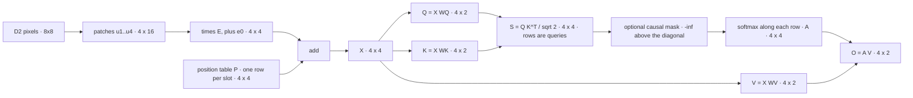

> [!note] Prerequisites · 선수 지식
> [[03-deep-learning/foundations/index|1. Learning Systems]] (softmax as a map, a shape on every tensor), [[02-foundations/linear-algebra|1. Linear Algebra]] (a matrix is a map, the dot product, the attention shape walk) and [[02-foundations/calculus-backprop|2. Calculus & Backprop]] (the softmax Jacobian, residual paths). Object **D2** from [[03-deep-learning/lab-objects|0. Lab Objects]], with its pixels frozen on [[03-deep-learning/computer-vision/index|2. Computer Vision]]; the Tier A lab in §8 needs NumPy and nothing else.
> [[03-deep-learning/foundations/index|1. 학습 시스템]](사상으로서의 softmax, 모든 텐서의 shape), [[02-foundations/linear-algebra|1. 선형대수]](사상으로서의 행렬, 내적, 어텐션 shape 따라가기), [[02-foundations/calculus-backprop|2. 미적분과 역전파]](softmax의 Jacobian, 잔차 경로). 대상: [[03-deep-learning/lab-objects|0. Lab Objects]]의 **D2**. 픽셀은 [[03-deep-learning/computer-vision/index|2. 컴퓨터비전]]에서 고정되어 있고, §8의 Tier A 실습에는 NumPy만 있으면 된다.

## English

*Stands on [[03-deep-learning/foundations/index|1. Learning Systems]] and [[03-deep-learning/computer-vision/index|2. Computer Vision]]. Second use of object **D2**, whose home is the vision page: that page names attention and hands it on, and [[03-deep-learning/vlm/index|3. VLM]], [[03-deep-learning/vla/index|4. VLA]] and every Transformer-based paper note assume what is taught here.*

> [!note] First pass · 처음이라면
> Draw the Homework diagram, then work the Worked case with a calculator — one head, sixteen scores, four softmax rows, four outputs, and the same head under a causal mask. Read §1–§3 and do problems 1–2. Open §4–§7 when a paper says "heads", "RoPE", "pre-norm" or "KV cache"; §8 runs all of it.

### Running object · 이 페이지의 대상

**D2** from [[03-deep-learning/lab-objects|0. Lab Objects]]: the $8\times8$ step-edge image whose pixels [[03-deep-learning/computer-vision/index|2. Computer Vision]] freezes — $I[i,j]=0$ for $j\le3$ and $10$ for $j\ge4$ — cut into four $4\times4$ patches in raster order: 1 top-left, 2 top-right, 3 bottom-left, 4 bottom-right. Patches 1 and 3 are all zeros, patches 2 and 4 all tens. The catalog stops at the patches and leaves the embedding open, so this page freezes a width-4 embedding and one attention layer. Both are specified completely here and never change afterwards.

**Tokens.** Flatten patch $i$ into $u_i\in\mathbb R^{16}$. The patch embedding $E\in\mathbb R^{16\times4}$ has every row equal to $(\tfrac1{160},-\tfrac1{160},0,0)$, its bias is $e_0=(0,1,0,0)$, and a learned position table adds row $p_i$ to slot $i$:

$$x_i=u_i^\top E+e_0+p_i,\qquad p_1=(0,0,-1,-1),\ \ p_2=(0,0,-1,1),\ \ p_3=(0,0,1,-1),\ \ p_4=(0,0,1,1)$$

Because $u_i^\top E=(m_i,-m_i,0,0)$, where $m_i$ is the patch mean divided by 10, every token reads $x_i=(m_i,\,1-m_i,\,r_i,\,c_i)$: a one-hot brightness in the first two coordinates (bright, dark), then the patch's grid row $r$ ($-1$ top, $+1$ bottom) and column $c$ ($-1$ left, $+1$ right).

| token | patch | $m_i$ | $r_i$ | $c_i$ | $x_i$ |
|---|---|---:|---:|---:|---|
| 1 | top-left | 0 | $-1$ | $-1$ | $(0,1,-1,-1)$ |
| 2 | top-right | 1 | $-1$ | $+1$ | $(1,0,-1,1)$ |
| 3 | bottom-left | 0 | $+1$ | $-1$ | $(0,1,1,-1)$ |
| 4 | bottom-right | 1 | $+1$ | $+1$ | $(1,0,1,1)$ |

The position table is a caricature of a learned one. The ViT paper reports that trained position embeddings come to encode distance in the image and show row and column structure; this table writes that structure as exact $\pm1$ coordinates, so every score below is an integer before scaling. Content and position sit in separate coordinates only to keep the arithmetic readable — in a trained model both are spread over all $d$ dimensions.

**The layer.** Model width $d=4$, $h=2$ heads of width $d_k=d_v=d/h=2$ — the same ratio as the original Transformer's $d=512$, $h=8$, $d_k=64$ — and output projection $W_O=I_4$, the identity, so the heads' outputs stay visible. Each projection copies coordinates of $x$, so each is fixed by the vector it produces:

| head | query $q_i=x_iW_Q$ | key $k_i=x_iW_K$ | value $v_i=x_iW_V$ | what it does on D2 |
|---|---|---|---|---|
| 1 | $(r_i,\,-c_i)$ | $(r_i,\,c_i)$ | $(m_i,\,r_i)$ | finds the horizontal neighbour, reads its brightness |
| 2 | $(-r_i,\,c_i)$ | $(r_i,\,c_i)$ | $(m_i,\,c_i)$ | finds the vertical neighbour, reads its brightness |

Written out, with rows indexing the four coordinates of $x$, head 1 and then head 2 are

$$W_Q^{(1)}=\begin{pmatrix}0&0\\0&0\\1&0\\0&-1\end{pmatrix},\quad W_K^{(1)}=\begin{pmatrix}0&0\\0&0\\1&0\\0&1\end{pmatrix},\quad W_V^{(1)}=\begin{pmatrix}1&0\\0&0\\0&1\\0&0\end{pmatrix}$$

$$W_Q^{(2)}=\begin{pmatrix}0&0\\0&0\\-1&0\\0&1\end{pmatrix},\quad W_K^{(2)}=\begin{pmatrix}0&0\\0&0\\1&0\\0&1\end{pmatrix},\quad W_V^{(2)}=\begin{pmatrix}1&0\\0&0\\0&0\\0&1\end{pmatrix}$$

so a 1 sits wherever a coordinate of $x$ is copied into the output, and a $-1$ wherever it is copied with its sign flipped.

*Scope: this page teaches scaled dot-product attention with every symbol and shape, why the scale is $\sqrt{d_k}$, causal and padding masks and cross-attention, multi-head attention, why attention needs position information and the two standard ways to supply it, the Transformer block (attention, residual, LayerNorm, MLP), and what the layer costs in arithmetic, in memory and — at generation time — what a KV cache saves. It does not teach how patches are cut or what a convolution offers instead, which is [[03-deep-learning/computer-vision/index|2. Computer Vision §1]]; nor how the layer is trained — the backward pass and the update — which is [[03-deep-learning/foundations/index|1. Learning Systems §2]], with the softmax Jacobian in [[02-foundations/calculus-backprop|2. Calculus & Backprop §4]]; nor the 2017 paper's experiments and the block variants current models substitute (RMSNorm, gated MLPs, RoPE), which are the [[01-canonical-papers/notes/1-foundations/attention-is-all-you-need|Transformer note]]; nor contrastive image–text training, which is [[03-deep-learning/vlm/index|3. VLM]]; nor efficient-attention algorithms, of which FlashAttention is named in §7 and not taught.*

### Homework diagram · 과제가 그릴 그림

One diagram, and the problem set asks for exactly this one, for a different head.



Four things the drawing has to get right, each of which is a claim about the computation.
**Rows are queries, columns are keys.** Draw the score table as a $4\times4$ grid, row $i$ labelled "query $i$" and column $j$ "key $j$", because the softmax runs along rows: a row is one token's distribution over which tokens it reads. A transposed grid normalises over the wrong axis, and nothing in the code will complain.
**$V$ bypasses the score table.** Values never influence who is attended to, only what is carried back, so the $V$ branch joins at the very end. A diagram that routes $V$ through the softmax describes a different operation.
**The position table joins before the projections, and belongs to the slot.** Draw $P$ as its own input at the sum, with $p_1$ attached to slot 1 whatever patch occupies it. §5's argument is that arrow.
**The mask acts on scores, before the softmax.** Shade the six cells above the diagonal and write $-\infty$ in them. A mask drawn after the softmax leaves rows that no longer sum to one (§3).

### Worked case · 대상으로 한 번 끝까지

This is the homework object. The problem set asks you to project, score, normalise and mix for a third head, with and without the mask; do those steps here first, on head 1, so the set is a change of head rather than a first derivation.

**Projections.** Each query, key and value copies coordinates of its token, so the three matrices can be read off the token table:

$$Q=XW_Q^{(1)}=\begin{pmatrix}-1&1\\-1&-1\\1&1\\1&-1\end{pmatrix},\qquad K=XW_K^{(1)}=\begin{pmatrix}-1&-1\\-1&1\\1&-1\\1&1\end{pmatrix},\qquad V=XW_V^{(1)}=\begin{pmatrix}0&-1\\1&-1\\0&1\\1&1\end{pmatrix}$$

since row $i$ of $Q$ is $(r_i,-c_i)$, row $i$ of $K$ is $(r_i,c_i)$ and row $i$ of $V$ is $(m_i,r_i)$.

**Scores.** Entry $(i,j)$ of $QK^\top$ is $q_i\cdot k_j=r_ir_j-c_ic_j$, which is $2$ when $j$ is $i$'s horizontal neighbour (same row, other column), $-2$ for its vertical neighbour, and $0$ for itself and for the diagonal patch. For row 1, $q_1\cdot k_2=(-1)(-1)+(1)(1)=2$. So

$$QK^\top=\begin{pmatrix}0&2&-2&0\\2&0&0&-2\\-2&0&0&2\\0&-2&2&0\end{pmatrix},\qquad S=\frac{QK^\top}{\sqrt{d_k}}=\frac{QK^\top}{\sqrt2},$$

and every entry of $S$ is $0$ or $\pm\sqrt2=\pm1.414214$.

**Softmax, one row.** Row 1 exponentiates to $e^0=1$, $e^{\sqrt2}=4.113250$, $e^{-\sqrt2}=0.243117$ and $e^0=1$, whose total is $6.356367$. Dividing each by the total gives

$$a_1=\frac{\big(1,\ e^{\sqrt2},\ e^{-\sqrt2},\ 1\big)}{2+e^{\sqrt2}+e^{-\sqrt2}}=(0.157323,\ 0.647107,\ 0.038248,\ 0.157323).$$

Every row of $QK^\top$ is a rearrangement of $(2,0,0,-2)$, so every row of $A$ is the same four numbers rearranged:

$$A=\begin{pmatrix}0.157323&0.647107&0.038248&0.157323\\0.647107&0.157323&0.157323&0.038248\\0.038248&0.157323&0.157323&0.647107\\0.157323&0.038248&0.647107&0.157323\end{pmatrix}$$

**Output.** Each output row is its weights applied to the values, $o_i=\sum_jA_{ij}v_j$. For token 1, $0.157323\,(0,-1)+0.647107\,(1,-1)+0.038248\,(0,1)+0.157323\,(1,1)=(0.804430,\,-0.608859)$, and the four rows are

$$O=AV=\begin{pmatrix}0.804430&-0.608859\\0.195570&-0.608859\\0.804430&0.608859\\0.195570&0.608859\end{pmatrix}.$$

Read the first column as the share of each token's attention that lands on bright patches. The dark tokens 1 and 3 read $0.804$ because they are looking across the edge; the bright tokens read $0.196$. The second column is the row coordinate of what is read, and it carries the token's own sign because a horizontal neighbour shares its row. Each token now has what an edge detector needs: its own brightness, in $x_i$, and its neighbour's, in $o_i$. The residual connection of §6 is what carries $x_i$ forward alongside the head's output instead of replacing it. A $3\times3$ convolution reaches its neighbour through a fixed offset; this head reached it by comparing position codes, with the same two matrices $W_Q,W_K$ at every token.

Two things the numbers show that the formula hides. $S$ is symmetric here only because $W_Q^{(1)}W_K^{(1)\top}=\mathrm{diag}(0,0,1,-1)$ happens to be symmetric; problem 2's head is not, and in general $S_{ij}\ne S_{ji}$ — how much $i$ reads $j$ and how much $j$ reads $i$ are separate numbers. And soft attention leaks: token 1's neighbour gets $0.647$, not $1$, and the rest goes to patches that carry nothing useful. The size of the scores sets the leak, which is §2's subject; without the $\sqrt2$ the same row would be $(0.104994,\,0.775803,\,0.014209,\,0.104994)$.

**The same head under a causal mask.** A causal mask sets $S_{ij}=-\infty$ wherever key $j$ comes after query $i$ in raster order, before the softmax, and $e^{-\infty}=0$ removes exactly those keys. Row 1 keeps only key 1, so it becomes $(1,0,0,0)$. Row 2 keeps scores $(\sqrt2,0)$, so its weights are $(e^{\sqrt2},1)/(e^{\sqrt2}+1)=(0.804430,\,0.195570)$. Row 3 keeps $(-\sqrt2,0,0)$, so its weights are $(0.243117,1,1)/2.243117=(0.108383,\,0.445808,\,0.445808)$. Row 4 loses nothing. Hence

$$A_{\text{causal}}=\begin{pmatrix}1&0&0&0\\0.804430&0.195570&0&0\\0.108383&0.445808&0.445808&0\\0.157323&0.038248&0.647107&0.157323\end{pmatrix},\qquad O_{\text{causal}}=\begin{pmatrix}0&-1\\0.195570&-1\\0.445808&-0.108383\\0.195570&0.608859\end{pmatrix}.$$

What the mask did to the edge is the point. Token 1 may read only itself, so its bright share falls from $0.804$ to $0$ and it no longer knows there is an edge. Token 3's across-edge neighbour is token 4, which comes later, so its bright share drops to $0.446$, all of it from the diagonal token 2. Token 2's across-edge neighbour, token 1, comes first, so it still sees the edge — on these scores its brightness reading is even exactly unchanged, $0.195570$ both ways — and token 4 sees everything. A token learns about the edge only if its neighbour precedes it in raster order. That is why a ViT encoder uses no mask — it generates nothing, so there is no future to hide, and a mask would only take from each patch every patch after it — while a decoder that emits tokens one at a time must use one (§3). The lab checks the defining property directly: change token 4 and nothing else, and outputs 1–3 move by exactly $0$ under the mask and by $5.19$ without it.

### 1. Scaled dot-product attention, symbol by symbol

Stack the $n$ tokens as the rows of $X\in\mathbb R^{n\times d}$ ($n=4$ and $d=4$ on D2). One head owns three matrices and nothing else, $W_Q,W_K\in\mathbb R^{d\times d_k}$ and $W_V\in\mathbb R^{d\times d_v}$ — $d(2d_k+d_v)$ numbers in all, $24$ for head 1. They produce queries $Q=XW_Q\in\mathbb R^{n\times d_k}$, keys $K=XW_K\in\mathbb R^{n\times d_k}$ and values $V=XW_V\in\mathbb R^{n\times d_v}$. The score table $S=QK^\top/\sqrt{d_k}\in\mathbb R^{n\times n}$ has one entry per query–key pair; the softmax, defined on [[03-deep-learning/foundations/index|1. Learning Systems §1]], turns each row into weights $A\in\mathbb R^{n\times n}$; and the output is $O=AV\in\mathbb R^{n\times d_v}$. The shape chain is the one [[02-foundations/linear-algebra|1. Linear Algebra §1]] walks for $d=512$, $d_k=64$.

The words come from lookup. A key is an address, a value is the content stored there, and a query retrieves the contents whose addresses it matches. Two differences from a database matter. Every entry comes back with some weight, because a softmax is never exactly zero except under a mask. And addresses and contents are both learned, from the same token, through different matrices.

> **Scaled dot-product attention, defined.** **Scaled dot-product attention** is a *parameter-free map from three matrices to one* — queries $Q\in\mathbb R^{n\times d_k}$, keys $K\in\mathbb R^{n'\times d_k}$ and values $V\in\mathbb R^{n'\times d_v}$ to outputs $O\in\mathbb R^{n\times d_v}$. The learned parameters live in the projections that make $Q$, $K$ and $V$, not in the map. Four defining conditions. **Compatibility is a dot product divided by $\sqrt{d_k}$**, one number per query–key pair. **Normalisation is per query, over keys**: each row of scores passes through a softmax, so each row of weights is positive and sums to one. **The output is a weighted average of the values**, $o_i=\sum_jA_{ij}v_j$ — a convex combination, so every output lies inside the convex hull of the value vectors and attention can only mix what $V$ offers. And **keys and values come in pairs while queries do not**: $K$ and $V$ have the same number of rows $n'$, $Q$ may have any number $n$, and there is one output per query.
>
> $$\mathrm{Attention}(Q,K,V)=\mathrm{softmax}\!\Big(\frac{QK^\top}{\sqrt{d_k}}\Big)V$$
>
> where the softmax acts on each row separately and $d_k$ is the query–key width — and the division comes before the softmax **because** it is the size of the softmax's input that decides how sharp each row is (§2).
>
> - **Example**: D2's head 1, with $n=n'=4$ and $d_k=d_v=2$. Token 1's output $(0.804430,-0.608859)$ is $0.647$ of its horizontal neighbour's value plus what leaks to the other three.
> - **Non-example**: a fully connected layer that mixes the four tokens with a learned $4\times4$ matrix, $O=WV$. Its mixing weights are the same for every image, while attention's are recomputed from each input: rearrange D2's patches and $A$ changes, $W$ would not.
> - **Non-example**: additive attention ([[01-canonical-papers/notes/1-foundations/bahdanau-attention|Bahdanau et al.]]), which scores a pair with a small feed-forward network instead of a dot product. The normalise-then-average skeleton is the same and the compatibility function differs; Vaswani et al. chose the dot product because it runs as optimised matrix multiplication, faster and in less memory.
> - **Non-example**: an attention map read as an explanation. $A_{ij}$ records where the computation read from, not what the answer depended on — the argument of [[03-deep-learning/vlm/index|3. VLM §3]].
> - **Why it matters**: every step that mixes tokens in the VLMs and VLAs of this wiki is this map, so reading their architecture figures is reading where each $Q$, $K$ and $V$ comes from.

**Self-attention and cross-attention.** When $Q$, $K$ and $V$ all come from the same $X$, as above, the layer is **self-attention** and the score table is square. In **cross-attention** the queries come from one sequence and the keys and values from another: $Q=XW_Q$ with $X\in\mathbb R^{n\times d}$, while $K=YW_K$ and $V=YW_V$ with $Y\in\mathbb R^{n'\times d}$, so $S\in\mathbb R^{n\times n'}$ is rectangular. On D2, a query that is not a patch — an instruction token, say, projected to $q=(-1,1)$, which means "top, right" in head 1's key coordinates — reads the four patches through the same keys and values: its scores are $(0,2,-2,0)/\sqrt2$, its single row of weights is $(0.157323,\,0.647107,\,0.038248,\,0.157323)$, and it mostly reads patch 2. The 2017 decoder reads its encoder this way, a fusion VLM's text tokens read image patches this way ([[03-deep-learning/vlm/index|3. VLM §1]]), and an action expert reads a VLM's tokens this way. The alternative is to concatenate the two sequences and run self-attention over all $n+n'$ tokens, which lets each side read the other and costs $(n+n')^2$ scores instead of $nn'$.

### 2. Why the scale is √d_k

Take one query $q$ and one key $k$ in $\mathbb R^{d_k}$ whose components are independent, with mean $0$ and variance $1$. Each product $q_ik_i$ has mean $\mathbb E[q_i]\,\mathbb E[k_i]=0$ and variance $\mathbb E[q_i^2]\,\mathbb E[k_i^2]=1$, and the $d_k$ products are independent, so their variances add:

$$\operatorname{Var}(q\cdot k)=\sum_{i=1}^{d_k}\operatorname{Var}(q_ik_i)=\sum_{i=1}^{d_k}\mathbb E[q_i^2]\,\mathbb E[k_i^2]=d_k$$

So the standard deviation of a raw score grows like $\sqrt{d_k}$, and dividing by $\sqrt{d_k}$ returns it to $1$ at every width. This is the calculation in Vaswani et al.'s footnote 4. They offered it to illustrate why dot products grow with $d_k$, and stated the consequence — very small softmax gradients at large $d_k$ — as a suspicion, prompted by earlier results in which additive attention beat unscaled dot products at large $d_k$; it is not a measurement.

Why a wide spread of scores is harmful is a property of the softmax. Its Jacobian is $\partial a_i/\partial s_j=a_i(\delta_{ij}-a_j)$ ([[02-foundations/calculus-backprop|2. Calculus & Backprop §4]]), so when one weight approaches $1$ and the rest approach $0$, every entry approaches $0$ — and so does the gradient that reaches the scores and, through them, $W_Q$ and $W_K$. Dividing the scores by $\sqrt{d_k}$ is a softmax at temperature $\tau=\sqrt{d_k}$ in the sense of [[02-foundations/calculus-backprop|2. Calculus & Backprop §6]].

> **Softmax saturation, defined.** **Saturation** is a *regime of the softmax map* — a property of the spread of its input, not of the data and not of the model. Three defining conditions. **One weight is close to one and the rest close to zero.** It is **caused by gaps between scores that are large compared with one**; only gaps matter, since the softmax is shift invariant. And **the Jacobian $a_i(\delta_{ij}-a_j)$ is close to zero**, so almost no gradient reaches the scores.
>
> $$\lVert J\rVert_F^2=\sum_{i,j}\big(a_i\delta_{ij}-a_ia_j\big)^2\ \longrightarrow\ 0\quad\text{as}\quad \max_ia_i\to1$$
>
> where $J$ is the Jacobian of one row and $a$ its weights — the norm vanishes **because** every entry carries a factor $a_i$ or $1-a_i$, and for each $i$ one of the two is near zero.
>
> - **Example**: D2's row 1 with its raw scores multiplied by $4$ has weights $(0.0003,\,0.9993,\,0.0000,\,0.0003)$ and $\lVert J\rVert_F=0.0011$, against $0.3643$ at the worked scale — a Jacobian more than 300 times smaller for the same pattern (§8).
> - **Non-example**: a sharp row that learning produced. A trained head may legitimately put $0.99$ on one key. The scale matters at initialisation, where a random head that starts saturated barely learns, because its gradients are near zero.
> - **Non-example**: dividing by $d_k$ instead of $\sqrt{d_k}$. The score spread then falls to $1/\sqrt{d_k}$, so at $d_k=1024$ with 16 keys every row is nearly uniform, each weight close to $1/16$ — the opposite failure, a head that starts blind and returns the same average to every query.
> - **Why it matters**: it is why the scale exists, and it marks the limit of what the scale can do. The argument fixes the starting point; nothing in it stops trained queries and keys from growing.

Where does the unit-variance assumption come from? From normalisation and initialisation together. LayerNorm (§6), with $\gamma=\mathbf 1$ and $\beta=0$ — their usual starting values — hands each projection a token whose $d$ features have mean $0$ and variance $1$, so $\sum_k\hat x_k^2=d$; if the entries of $W_Q$ are drawn independently with variance $1/d$, each query component $q_j=\sum_k\hat x_kW_{kj}$ then has variance $\tfrac1d\sum_k\hat x_k^2=1$. The lab's width sweep (§8) measures exactly this regime. At $d_k=64$, the original head width, raw scores have standard deviation $7.96$ and a query's largest weight over 16 keys averages $0.84$; scaled, it stays between $0.23$ and $0.25$ at every width tested.

On D2 the scores are small integers and $d_k=2$, so the scale only softens row 1 from $(0.104994,0.775803,0.014209,0.104994)$ to $(0.157323,0.647107,0.038248,0.157323)$. The worked case sits in the useful middle, neither uniform nor saturated.

### 3. Masks: which keys a query may see

> **Causal mask, defined.** A **causal mask** is an *additive $n\times n$ matrix of zeros and $-\infty$ applied to the scores* — a constraint on which tokens may inform which, not a learned parameter and not a change to the data. Three defining conditions. It **fixes an order** and forbids each query every key after it: $M_{ij}=0$ for $j\le i$ and $-\infty$ for $j>i$. It is **added before the softmax**, so masked keys receive weight exactly $0$ and the remaining weights still sum to one. And it **holds at every layer**, so output $i$ of a whole stack depends on tokens $1,\dots,i$ only — each layer's position $i$ reads positions $\le i$ of a layer that obeyed the same rule.
>
> $$M_{ij}=\begin{cases}0,&j\le i\\-\infty,&j>i\end{cases},\qquad A=\mathrm{softmax}\!\Big(\frac{QK^\top}{\sqrt{d_k}}+M\Big)$$
>
> where the order is the one the model generates in, and the mask works **because** $e^{-\infty}=0$ deletes exactly the later keys from each row's sum.
>
> - **Example**: D2's head 1 in the Worked case. Row 1 becomes $(1,0,0,0)$, and changing token 4 moves outputs 1–3 by exactly $0$.
> - **Non-example**: zeroing the upper triangle of $A$ after the softmax. D2's row 1 would then sum to $0.157323$; renormalising restores the masked answer, so the mask on the scores is the correct operation and the zeroing is at best a detour.
> - **Non-example**: a padding mask. When sequences of different lengths are batched, the padding positions are removed as keys for every query regardless of order — it concerns which tokens exist, not time. The two masks combine as the union of their cells, and a row masked entirely gives $0/0$, a case to handle explicitly ([[02-foundations/algorithms/robotics-ai-problems|11.8 §10]]).
> - **Why it matters**: it lets a decoder train on a whole sequence in one parallel pass — every position predicts its successor at once — and still generate left to right, because no output ever used a later token. An autoregressive action decoder in a [[03-deep-learning/vla/index|VLA]] is a decoder in this sense; the vision encoder in front of it is not masked. The KV cache of §7 exists only because of this mask.

### 4. Multi-head attention

$h$ heads run the map of §1 side by side on the same input, each with its own projections, and their outputs are concatenated and mixed:

$$\mathrm{MHA}(X)=\big[\,\mathrm{head}_1\ \cdots\ \mathrm{head}_h\,\big]W_O,\qquad \mathrm{head}_i=\mathrm{Attention}\big(XW_Q^{(i)},XW_K^{(i)},XW_V^{(i)}\big)$$

with $W_Q^{(i)},W_K^{(i)}\in\mathbb R^{d\times d_k}$, $W_V^{(i)}\in\mathbb R^{d\times d_v}$ and $W_O\in\mathbb R^{hd_v\times d}$, so the concatenation is $n\times hd_v$ and the output is $n\times d$ again. With $d_k=d_v=d/h$ the projections hold $3d^2$ numbers and $W_O$ holds $d^2$, for any $h$, and the two $n\times n$ products cost $h\cdot n^2d_k=n^2d$ multiply-adds each, also for any $h$. What heads do change is memory: $h$ separate $n\times n$ tables.

On D2, head 2's query is head 1's negated, $q^{(2)}_i=(-r_i,c_i)=-q^{(1)}_i$, with the same keys. Its raw scores are therefore $-r_ir_j+c_ic_j$, exactly the negative of the Worked case's $QK^\top$, and its weights are head 1's rearranged: token 1 puts $0.647107$ on token 3, the patch below it. Reading values $(m_i,c_i)$, it returns

$$O^{(2)}=\begin{pmatrix}0.195570&-0.608859\\0.804430&0.608859\\0.195570&-0.608859\\0.804430&0.608859\end{pmatrix},\qquad \mathrm{MHA}(X)\big|_{\text{token }1}=(0.804430,\ -0.608859,\ 0.195570,\ -0.608859).$$

Token 1's concatenated output says that its horizontal neighbour is bright ($0.804$) and its vertical neighbour dark ($0.196$). On D2 the first number signals an edge and the second its absence, and a single head could not keep them apart.

> **Multi-head attention, defined.** **Multi-head attention** is a *layer* — $h$ scaled dot-product attentions run in parallel on different learned projections of one input, concatenated and projected back to width $d$. Three defining conditions. **Each head has its own $W_Q^{(i)}$, $W_K^{(i)}$, $W_V^{(i)}$**, hence its own score table and its own softmax. **The heads read the same input and do not see one another**; they interact only through $W_O$ and later layers. And the outputs are **concatenated, not averaged**, before $W_O$ maps $hd_v$ back to $d$.
>
> $$\mathrm{MHA}(X)=\big[\,\mathrm{head}_1\ \cdots\ \mathrm{head}_h\,\big]W_O,\qquad 4d^2\ \text{weights when}\ d_k=d_v=d/h$$
>
> where the bracket places the $h$ outputs side by side, $n\times hd_v$ — and the weight count has no $h$ in it **because** the heads divide the width $d$ among themselves rather than each taking all of it.
>
> - **Example**: D2's two heads. Token 1 reads $(0.804430,-0.608859)$ through head 1 and $(0.195570,-0.608859)$ through head 2, and the concatenation keeps both.
> - **Non-example**: one head asked to find both neighbours. A single softmax row is one distribution, so it can weight both only by averaging what they carry: equal weight on the two gives a brightness reading of $0.5$, and the fact that one neighbour is bright and the other dark is gone — the paper's own phrase is that with a single head, "averaging inhibits this". On D2 it is worse than averaging. When keys are built from the position coordinates alone, the two neighbours of a patch have position codes that sum to zero, so any such head gives them scores that sum to zero, and raising one lowers the other by the same amount.
> - **Non-example**: $h$ copies of one head. Identical projections give identical tables and identical outputs; $W_O$ receives the same vector $h$ times, and the layer is one head with extra memory.
> - **Why it matters**: heads are how a single layer relates each token to several others at once. The benefit is measured and not monotone: in Vaswani et al.'s Table 3, at matched computation, one head of width 512 scored 24.9 BLEU on their development set, eight heads of width 64 scored 25.8, and 32 heads of width 16 fell back to 25.4.

### 5. Position: what attention cannot see, and two ways to tell it

Nothing in §1 looks at where a row sits in $X$. Reorder the tokens and every product reorders with them.

> **Permutation equivariance, defined.** **Permutation equivariance** is a *symmetry of a function on sequences* — a property of the map, not of any input. One defining condition, universally quantified: **for every permutation matrix $\Pi$ and every input $X$, reordering the input rows reorders the output rows the same way and changes nothing else**, $f(\Pi X)=\Pi f(X)$. For attention it follows in one line,
>
> $$\mathrm{Attn}(\Pi X)=\mathrm{softmax}\!\Big(\frac{\Pi QK^\top\Pi^\top}{\sqrt{d_k}}\Big)\Pi V=\Pi\,\mathrm{softmax}\!\Big(\frac{QK^\top}{\sqrt{d_k}}\Big)\Pi^\top\Pi V=\Pi\,\mathrm{Attn}(X)$$
>
> **because** permuting both the rows and the columns of a score table reorders each row's entries and the rows themselves, the row-wise softmax cares about neither, and $\Pi^\top\Pi=I$.
>
> - **Example**: the lab permutes D2's tokens and finds $\lvert f(\Pi X)-\Pi f(X)\rvert$ at $2.2\times10^{-16}$ for head 1 and for both heads, and $7.8\times10^{-16}$ for a whole block — floating-point round-off.
> - **Non-example**: permutation *invariance*, $f(\Pi X)=f(X)$, where the output does not even reorder. Mean pooling has it, and so does [[01-canonical-papers/notes/2-computer-vision/pointnet|PointNet]]'s symmetric pooling over points. Equivariance keeps one output per token; invariance collapses the set to one answer.
> - **Non-example**: a convolution. Shifting an image shifts its feature map (translation equivariance), but scrambling the pixels does not scramble the output, because a convolution's weights are tied to relative offsets.
> - **Why it matters**: every sublayer of the block in §6 is equivariant, so a stack of them is too. Without position information a Transformer treats its input as a set of tokens.

The lab removes D2's position table and shows how complete that blindness is. Tokens 1 and 3 become identical, as do 2 and 4. Both heads build their queries and keys from the position coordinates, now zero, so every score is $0$, every row is uniform, and each head returns the mean of its values: the layer's output is $(0.5,0,0.5,0)$ for every token. It has computed "half of the image is bright" and nothing else. Mirroring the image left to right gives the same verdict. With the table, the mirrored image's four outputs differ from a reordering of the original's by $1.217719$, because head 2 now reports the bright patches on the left, at column coordinate $-0.609$. Without the table the difference is exactly $0$, and no stack of equivariant layers followed by an order-free readout can ever tell D2 from its mirror.

> **Positional encoding, defined.** A **positional encoding** is a *vector that depends only on a token's slot*, added to the token — or, in rotary schemes, applied to its query and key — so that the scores can depend on where tokens are. Three defining conditions. It **depends on the slot, not the content**, so it stays with the index when the image changes. **Distinct slots get distinct vectors**; otherwise identical tokens stay tied. And it **enters before or inside the score computation**, where it can change who attends to whom.
>
> $$x_i=\text{content}_i+p_i,\qquad \mathrm{PE}(\mathrm{pos},2k)=\sin\frac{\mathrm{pos}}{10000^{2k/d}},\quad \mathrm{PE}(\mathrm{pos},2k+1)=\cos\frac{\mathrm{pos}}{10000^{2k/d}}$$
>
> where $p_i$ is either a row of a learned table or the sinusoid on the right, $\mathrm{pos}$ is the slot index counted from $0$, and $k=0,\dots,d/2-1$ indexes frequency pairs — the wavelengths run from $2\pi$ to $10000\cdot2\pi$ **so that** the fast pairs separate neighbouring slots and the slow pairs distinguish distant ones.
>
> - **Example**: D2's table $p_i=(0,0,r_i,c_i)$, which breaks the tie between tokens 1 and 3 and lets head 1 find a neighbour at all.
> - **Non-example**: adding a token's brightness a second time. It depends on content, so tokens 1 and 3 stay identical.
> - **Non-example**: a one-dimensional sinusoid on raster order, used for an image. It is a valid positional encoding with the wrong notion of neighbour, as the Gram numbers below show.
> - **Why it matters**: it is the only carrier of layout in a Transformer. The ViT paper's ablation (Table 8, ImageNet 5-shot linear accuracy for ViT-B/16, default placement) puts no position embedding at $0.614$ against $0.640$–$0.642$ for the 1-D, 2-D and relative variants: a large gap for none, little difference among the choices.

**The two standard choices.** A **learned table** $P\in\mathbb R^{n_{\max}\times d}$ is $n_{\max}d$ parameters trained with everything else — ViT's choice, a 1-D table over patches in raster order. It has no row for a slot it never trained, so ViT interpolates the table in 2-D when it fine-tunes at a higher resolution. The **sinusoidal encoding** has no parameters and is defined for every position. For $d=4$ its two frequencies are $1$ and $1/100$, and D2's four slots get

| slot (pos) | $\sin(\mathrm{pos})$ | $\cos(\mathrm{pos})$ | $\sin(\mathrm{pos}/100)$ | $\cos(\mathrm{pos}/100)$ |
|---:|---:|---:|---:|---:|
| 0 | $0$ | $1$ | $0$ | $1$ |
| 1 | $0.841471$ | $0.540302$ | $0.010000$ | $0.999950$ |
| 2 | $0.909297$ | $-0.416147$ | $0.019999$ | $0.999800$ |
| 3 | $0.141120$ | $-0.989992$ | $0.029996$ | $0.999550$ |

Two properties follow from the angle-sum identities. Shifting the slot by $k$ rotates each frequency pair by the angle $k\omega$, a linear map that depends on $k$ alone — the reason Vaswani et al. gave for the design, hoping it would make relative positions easy to attend to. And inner products depend only on the offset, since $\sin a\sin b+\cos a\cos b=\cos(a-b)$:

$$\mathrm{PE}(p)\cdot\mathrm{PE}(q)=\sum_{k}\cos\big((p-q)\,\omega_k\big)=\cos(p-q)+\cos\frac{p-q}{100}\qquad(d=4)$$

which is $2$, $1.540252$, $0.583653$ and $0.009558$ at offsets $0$ to $3$. On D2's raster order that is the wrong geometry. Tokens 2 and 3, diagonal in the image but adjacent in raster order, score $1.540$, while tokens 1 and 3, vertical neighbours in the image, score only $0.584$. A 1-D code measures raster distance, not image distance — which a learned table can unlearn and D2's hand-written 2-D table avoids. Two more facts from the same numbers: over four slots the slow pair barely moves ($0.01$, $0.02$, $0.03$), so on a short sequence only the fast frequencies do any work; and in Vaswani et al.'s Table 3 learned embeddings scored 25.7 BLEU against 25.8 for the sinusoids, which they chose because they *may* extrapolate to longer sequences — a hope, stated as one. Most current LLM backbones use a third scheme, RoPE, which rotates the query and the key instead of adding to the token, so each score depends on the offset between them; the [[01-canonical-papers/notes/1-foundations/attention-is-all-you-need|Transformer note]] tabulates which half of a VLA uses which.

### 6. The Transformer block

A block wraps multi-head attention and a per-token MLP, each inside a residual connection with a LayerNorm. In the pre-norm form that ViT and current models use (ViT's equations 2–3),

$$Z=X+\mathrm{MHA}\big(\mathrm{LN}(X)\big),\qquad Y=Z+\mathrm{MLP}\big(\mathrm{LN}(Z)\big)$$

so each sublayer reads a normalised copy of the running vector and adds its result back. The 2017 block was post-norm, $Z=\mathrm{LN}(X+\mathrm{MHA}(X))$ and $Y=\mathrm{LN}(Z+\mathrm{MLP}(Z))$ — Vaswani et al. write each sublayer's output as $\mathrm{LayerNorm}(x+\mathrm{Sublayer}(x))$ — and why the norm moved is in the [[01-canonical-papers/notes/1-foundations/attention-is-all-you-need|Transformer note]].

**The residual connection** is defined, together with the identity path it gives the gradient, in [[02-foundations/calculus-backprop|2. Calculus & Backprop §5]] and the [[01-canonical-papers/notes/1-foundations/resnet|ResNet note]]. Its role in a Transformer is to make the running vector a shared record — often called the residual stream — that every sublayer reads and adds to. On D2 it is what stops head 1's reading from overwriting the token's own brightness: without it the block would pass on only what each token read, not what it is.

> **LayerNorm, defined.** **LayerNorm** is a *per-token normalisation map with two learned vectors* — a function applied to each token on its own, not a statistic of the batch. Three defining conditions. Its **statistics are the mean and variance of one token's $d$ features**, computed across features and never across tokens or samples. The normalised vector is **rescaled and shifted by learned $\gamma,\beta\in\mathbb R^d$**, which are $2d$ parameters. And a small constant **$\varepsilon$, such as $10^{-5}$, keeps the division defined**.
>
> $$\mathrm{LN}(x)=\gamma\odot\frac{x-\mu(x)\mathbf 1}{\sqrt{\sigma^2(x)+\varepsilon}}+\beta,\qquad \mu(x)=\frac1d\sum_{k=1}^dx_k,\quad \sigma^2(x)=\frac1d\sum_{k=1}^d\big(x_k-\mu(x)\big)^2$$
>
> where $\odot$ is elementwise — so with $\varepsilon=0$, $\mathrm{LN}(x+c\mathbf 1)=\mathrm{LN}(x)$ and $\mathrm{LN}(ax)=\mathrm{LN}(x)$ for $a>0$, which means a token's mean and overall scale never reach the sublayer.
>
> - **Example**: D2's $x_1=(0,1,-1,-1)$ has $\mu=-0.25$ and $\sigma^2=0.6875$, so with $\gamma=\mathbf 1$, $\beta=0$, $\varepsilon=0$ it maps to $(0.301511,\,1.507557,\,-0.904534,\,-0.904534)$; $x_4=(1,0,1,1)$ has $\mu=0.75$ and $\sigma^2=0.1875$ and maps to $(0.577350,\,-1.732051,\,0.577350,\,0.577350)$.
> - **Non-example**: BatchNorm, which normalises each feature across the samples of a batch. Its statistics depend on the other samples and differ between training and test. LayerNorm uses one token, so it computes the same thing at batch size one and at test time — a property Ba et al. state in their abstract — and it keeps the block permutation-equivariant (§5). BatchNorm is defined in full, on D1, in [[03-deep-learning/foundations/training-at-scale|1.3 Training at Scale §2]].
> - **Non-example**: normalising each feature across the tokens of a sequence. Its mean and variance are sums over the tokens, so reordering the tokens only reorders the outputs and equivariance survives. What breaks is locality in time: every token's normalised value now depends on every other token, later ones included, so a causal mask no longer hides the future (§3), and a KV cache goes stale because the earlier tokens' outputs change each time a token is appended (§7).
> - **Why it matters**: it fixes the scale of what enters $W_Q$ and $W_K$, which is where §2's unit-variance assumption comes from at initialisation.

**The MLP** is two linear maps with a nonlinearity between them, applied to each token separately and identically, $\mathrm{MLP}(z)=\max(0,\,zW_1+b_1)W_2+b_2$ with $W_1\in\mathbb R^{d\times d_{\text{ff}}}$, $W_2\in\mathbb R^{d_{\text{ff}}\times d}$ and $d_{\text{ff}}=4d$ in the original ($2048$ for $d=512$); ViT uses GELU in place of the max ([[02-foundations/neural-network-basics|0.7 Neural Networks §6]]). The two sublayers split the work. Attention moves information between tokens, and its output is a convex combination of values; the MLP transforms each token and holds most of the parameters.

**Counting a block.** With biases on every linear map, attention holds $4(d^2+d)$ numbers, the MLP $8d^2+5d$, and the two LayerNorms $4d$:

$$\text{parameters per block}=12d^2+13d$$

so a block holds $244$ at D2's $d=4$, and the count has no $h$ in it. As a check against a published model, ViT-Base has 12 blocks at $d=768$: $12\,(12\cdot768^2+13\cdot768)=85{,}054{,}464$, and adding the patch embedding, the position table for 197 tokens, the class token and the final LayerNorm gives $85{,}798{,}656$ before the classification head — in line with the 86M the ViT paper lists.

### 7. Cost: the n × n table, and what a KV cache saves

Count multiply-adds for one block on a sequence of $n$ tokens. The four projections cost $nd^2$ each, the two $n\times n$ products cost $n^2d$ each summed over heads, and the MLP's two matrices cost $4nd^2$ each:

$$\text{MACs per block}=4nd^2+2n^2d+8nd^2=12nd^2+2n^2d$$

Time is therefore $O(n^2d+nd^2)$. Vaswani et al.'s Table 1 lists the attention part, $O(n^2\cdot d)$ per layer with $O(1)$ sequential steps and $O(1)$ path length between any two tokens, against $O(n\cdot d^2)$ and $O(n)$ steps for a recurrent layer, and notes that self-attention is the cheaper of the two when $n<d$; the recurrent side of that comparison, with the convolution and the scan that remove its $n$ sequential steps, is costed in [[03-deep-learning/foundations/sequence-models|1.1 Sequence Models §10]]. The quadratic term dominates only when $2n^2d>12nd^2$, that is when $n>6d$:

| case | $n$ | $d$ | share of a block's multiply-adds in the two $n\times n$ products |
|---|---:|---:|---:|
| D2 | 4 | 4 | $0.143$ |
| ViT-B/16 on a $224\times224$ image | 197 | 768 | $0.041$ |
| an illustrative VLA backbone | 276 | 4096 | $0.011$ |
| the original Transformer's width, at the crossover | 3072 | 512 | $0.5$ |

So whenever a sequence is shorter than six times the model width — the 197 tokens of a ViT-B image, the illustrative VLA step — "quadratic attention" is not where most of the arithmetic goes; the $d^2$ terms are. Counted over a training run, forwards and backwards, those $12nd^2$ multiply-adds become the six FLOPs per parameter per token of [[03-deep-learning/foundations/training-at-scale|1.3 Training at Scale §6]], which adds the two $n\times n$ products as a correction of $n/(6d)$.

**Memory** is where $n^2$ bites first. The standard implementation materialises one $n\times n$ table per head, $hn^2$ numbers per layer against $nd$ for $Q$, so the tables outgrow the layer's other activations as soon as $n>d/h=d_k$ — past 64 tokens at the original head width, long before the arithmetic crossover. At $n=4096$ in 16-bit precision that is 32 MiB per head. FlashAttention (Dao et al., NeurIPS 2022) computes the same exact attention in tiles, so the full table is never written to GPU main memory; the arithmetic is still $O(n^2d)$.

> **KV cache, defined.** A **KV cache** is a *buffer of the keys and values already computed for earlier positions of a causal model*, reused at every later step of generation — inference-time memory, not a parameter and not an approximation. Three defining conditions. **The attention is causal**, so position $s$'s key and value at every layer depend only on tokens $1,\dots,s$ and never change when tokens are appended. **At step $t$ only the new token is processed**: its query reads the $t$ cached keys, and its own key and value are appended. And **the cache grows by one key–value pair per layer per token**.
>
> $$c(t)=d(2d_k+d_v)+t(d_k+d_v),\qquad c_{\text{no cache}}(t)=t\,d(2d_k+d_v)+t^2(d_k+d_v)=t\cdot c(t)$$
>
> where $c(t)$ counts one head's multiply-adds at step $t$ — the three projections, then one row of scores and one weighted sum — and the uncached pass repeats that per-token work for all $t$ tokens of the prefix, **because** in a multi-layer model the past tokens' keys at layer $\ell$ depend on their outputs at layer $\ell-1$, so without a cache the whole prefix must be rerun.
>
> - **Example**: generating 1024 tokens through D2's head 1 costs $1{,}446{,}348{,}800$ multiply-adds without a cache and $2{,}123{,}776$ with one, a factor of $681.0$, and the outputs agree with full causal attention to within $10^{-12}$ (§8). Over $n$ steps the factor grows like $2n/3$.
> - **Non-example**: a bidirectional encoder such as ViT or a VLM's vision tower. A new token changes every earlier token's output at the next layer, so nothing computed earlier stays valid; there is nothing to cache, and an encoder runs once over its whole input.
> - **Non-example**: a compressed or approximate memory. The cache holds exactly what would have been recomputed, which is why its outputs match to round-off.
> - **Why it matters**: it turns a generation step from $O(t^2d+td^2)$ into $O(td+d^2)$ per layer, and it moves the bottleneck from arithmetic to memory. The cache holds $2Lnd$ numbers per sequence for $L$ layers, so an illustrative decoder with $d=4096$ and 32 layers in 16-bit precision stores 512 KiB per token and 2 GiB at a 4096-token context, and decoding is bounded by reading it back. That is why several recent backbones share keys and values across query heads — one shared pair in multi-query attention (Shazeer 2019), a few groups in grouped-query attention (Ainslie et al., EMNLP 2023).

The [[01-canonical-papers/notes/1-foundations/attention-is-all-you-need|Transformer note]] describes π0 encoding its observation prefix once and attending into that cache, and the latency budget such a pass occupies is [[04-robotics/robot-systems-deployment|10. Robot Systems §3]].

### 8. The lab: one head, the permutation test, the n × n curve, the scale

Four parts on the frozen D2 layer. Part 1 reproduces the Worked case and its causal version, and checks the defining property of the mask. Part 2 tests permutation equivariance for one head, for two heads and for a whole pre-norm block — the block's MLP weights are random with seed 0, because only the property is under test — then removes the position table and mirrors the image. Part 3 lengthens the sequence with random tokens, since the counts depend on $n$ and the widths and not on the values, and counts the multiply-adds of generating it with and without a KV cache. Part 4 sweeps the scale, first on D2's row 1 and then on random unit-variance queries and keys across $d_k$.

```python
# D2 through one attention layer: the head by hand, permutation, cost, and the scale. NumPy only.
import numpy as np

# --- 0. the object: D2's pixels become four tokens (Running object) ----------------------------
I = np.zeros((8, 8)); I[:, 4:] = 10.0                                    # D2: step edge at column 4
patches = lambda img: np.array([img[r:r+4, c:c+4].ravel() for r in (0, 4) for c in (0, 4)])
U = patches(I)                                                           # 4 patches x 16, raster order
E = np.zeros((16, 4)); E[:, 0], E[:, 1] = 1/160, -1/160                  # patch embedding, 16 -> 4
e0 = np.array((0., 1., 0., 0.))                                          # its bias
P = np.array(((0, 0, -1, -1), (0, 0, -1, 1), (0, 0, 1, -1), (0, 0, 1, 1)), float)  # position table
X = U @ E + e0 + P                                                       # rows x_i = (m, 1-m, r, c)

M = lambda *rows: np.array(rows, float)
H1 = (M((0, 0), (0, 0), (1, 0), (0, -1)), M((0, 0), (0, 0), (1, 0), (0, 1)), M((1, 0), (0, 0), (0, 1), (0, 0)))
H2 = (M((0, 0), (0, 0), (-1, 0), (0, 1)), M((0, 0), (0, 0), (1, 0), (0, 1)), M((1, 0), (0, 0), (0, 0), (0, 1)))

def softmax(S):
    e = np.exp(S - S.max(axis=-1, keepdims=True))            # shift by the row max; -inf becomes 0
    return e / e.sum(axis=-1, keepdims=True)

def attention(X, Wq, Wk, Wv, causal=False, scale=None):
    Q, K, V = X @ Wq, X @ Wk, X @ Wv                         # n x d_k, n x d_k, n x d_v
    S = (Q @ K.T) * (1/np.sqrt(Q.shape[1]) if scale is None else scale)   # n x n
    if causal:
        S = np.where(np.triu(np.ones(S.shape, bool), 1), -np.inf, S)       # key j after query i
    A = softmax(S)                                            # each row sums to 1
    return A @ V, A                                           # n x d_v, n x n

# --- 1. the worked case -------------------------------------------------------------------------
print("X =\n", X)
O, A = attention(X, *H1)
print("head 1, QK^T =\n", (X @ H1[0]) @ (X @ H1[1]).T)
print("A =\n", A.round(6), "\nO =\n", O.round(6))
Oc, Ac = attention(X, *H1, causal=True)
print("causal A =\n", Ac.round(6), "\ncausal O =\n", Oc.round(6))
print("row 1 without the scale:", attention(X, *H1, scale=1.0)[1][0].round(6))
X4 = X.copy(); X4[3] += (5., -3., 2., 7.)                     # change token 4 and nothing else
print("outputs 1-3 move by %.6f with the causal mask, %.6f without"
      % (np.abs(attention(X4, *H1, causal=True)[0][:3] - Oc[:3]).max(),
         np.abs(attention(X4, *H1)[0][:3] - O[:3]).max()))

# --- 2. permutation: what attention can and cannot see ------------------------------------------
def mha(X, heads=(H1, H2), Wo=np.eye(4)):
    return np.hstack([attention(X, *h)[0] for h in heads]) @ Wo           # concatenate, then W_O

def layer_norm(Z, eps=1e-5):                                  # per token, across features; gamma=1, beta=0
    mu = Z.mean(axis=-1, keepdims=True)
    return (Z - mu) / np.sqrt(((Z - mu)**2).mean(axis=-1, keepdims=True) + eps)

rng = np.random.default_rng(0)
W_1, W_2 = rng.normal(0, 0.5, (4, 16)), rng.normal(0, 0.5, (16, 4))    # MLP weights, d_ff = 4d
def block(X):                                                 # pre-norm Transformer block
    Z = X + mha(layer_norm(X))
    return Z + np.maximum(layer_norm(Z) @ W_1, 0) @ W_2

print("\nMHA(X), heads concatenated, W_O = I =\n", mha(X).round(6))
print("layer_norm(X), eps = 0 =\n", layer_norm(X, eps=0).round(6))
Pm = np.eye(4)[(2, 0, 3, 1), :]                               # a permutation matrix
for name, f in (("head 1", lambda Z: attention(Z, *H1)[0]), ("two heads", mha), ("whole block", block)):
    print("%-11s max |f(PX) - P f(X)| = %.1e" % (name, np.abs(f(Pm @ X) - Pm @ f(X)).max()))
Xbag = U @ E + e0                                             # the same tokens with no position table
print("no position table, MHA rows =\n", mha(Xbag).round(6))
Um, Pi = patches(I[:, ::-1]), np.eye(4)[(1, 0, 3, 2), :]     # mirrored image; it swaps patches 1-2, 3-4
for name, Xo, Xm in (("with position", X, Um @ E + e0 + P), ("no position", Xbag, Um @ E + e0)):
    print("%-13s max |MHA(mirror) - reordered MHA(original)| = %.6f"
          % (name, np.abs(mha(Xm) - Pi @ mha(Xo)).max()))

# --- 3. sequence length: the n x n table, and what a KV cache saves ------------------------------
macs = [0]
def mm(A, B):                                                 # a matrix product that counts multiply-adds
    macs[0] += A.shape[0] * A.shape[1] * B.shape[1]
    return A @ B

def decode(Z, Wq, Wk, Wv, cache):
    Kc, Vc, out = np.zeros((0, Wk.shape[1])), np.zeros((0, Wv.shape[1])), []
    for t in range(1, len(Z) + 1):
        if cache:                                             # project the new token only; append K, V
            z = Z[t-1:t]
            Kc, Vc = np.vstack([Kc, mm(z, Wk)]), np.vstack([Vc, mm(z, Wv)])
            out.append(mm(softmax(mm(mm(z, Wq), Kc.T) / np.sqrt(Wq.shape[1])), Vc)[0])
        else:                                                 # rerun causal attention on the whole prefix
            Q, K, V = mm(Z[:t], Wq), mm(Z[:t], Wk), mm(Z[:t], Wv)
            S = np.where(np.triu(np.ones((t, t), bool), 1), -np.inf, mm(Q, K.T) / np.sqrt(Wq.shape[1]))
            out.append(mm(softmax(S), V)[-1])
    return np.array(out)

print("\n    n | table bytes | MACs, no cache | MACs, KV cache | ratio | cache bytes | agree")
for n in (4, 16, 64, 256, 1024):
    Z = rng.normal(size=(n, 4))                               # longer inputs; only n enters the counts
    macs[0] = 0; full = decode(Z, *H1, cache=False); m_full = macs[0]
    macs[0] = 0; kv = decode(Z, *H1, cache=True); m_kv = macs[0]
    agree = max(np.abs(full - kv).max(), np.abs(kv - attention(Z, *H1, causal=True)[0]).max()) < 1e-12
    print("%5d | %11d | %14d | %14d | %5.1f | %11d | %s" % (n, 8*n*n, m_full, m_kv, m_full/m_kv, 8*n*4, agree))

# --- 4. the scale: why divide by sqrt(d_k) ------------------------------------------------------
def stats(S):                                                 # scores -> max weight, entropy, |Jacobian|_F
    p, logp = softmax(S), S - S.max(-1, keepdims=True)
    logp = logp - np.log(np.exp(logp).sum(-1, keepdims=True))
    J = np.eye(S.shape[-1]) * p[..., None, :] - p[..., :, None] * p[..., None, :]
    return p.max(-1).mean(), -(p * logp).sum(-1).mean(), np.sqrt((J**2).sum((-2, -1))).mean()

raw = np.array((0., 2., -2., 0.))                             # head 1, row 1, before any scale
print("\nalpha | weights on tokens 1-4       | max    | entropy | |J|_F")
for alpha in (0, 0.25, 0.5, 1/np.sqrt(2), 1, 2, 4, 8):
    mx, H, Jn = stats(alpha * raw)
    w = " ".join("%.4f" % x for x in softmax(alpha * raw))
    print("%5.3f | %s | %.4f | %.4f  | %.4f" % (alpha, w, mx, H, Jn))

print("\n d_k | std(q.k) | max weight: raw scaled | entropy: raw scaled | |J|_F: raw scaled")
for dk in (4, 16, 64, 256, 1024):                             # 4000 queries against 16 keys, in chunks
    S = np.vstack([(rng.normal(size=(500, 1, dk)) * rng.normal(size=(500, 16, dk))).sum(-1)
                   for _ in range(8)])                        # 4000 x 16 dot products q.k
    a, b = stats(S), stats(S / np.sqrt(dk))
    print("%4d | %8.2f |        %.2f   %.2f   |     %.2f   %.2f   |   %.2f   %.2f"
          % (dk, S.std(), a[0], b[0], a[1], b[1], a[2], b[2]))
```

**Part 1** prints the Worked case's $QK^\top$, $A$, $O$, $A_{\text{causal}}$ and $O_{\text{causal}}$ to six decimals and the unscaled row $(0.104994,0.775803,0.014209,0.104994)$. Changing token 4 moves outputs 1–3 by $0.000000$ with the mask and by $5.190358$ without it.

**Part 2 — permutation.** $\lvert f(\Pi X)-\Pi f(X)\rvert$ is $2.2\times10^{-16}$ for head 1 and for both heads, and $7.8\times10^{-16}$ for the whole block. Without the position table every token's two-head output is $(0.5,0,0.5,0)$. The mirror test gives $1.217719$ with the table and $0.000000$ without. The listing also prints $\mathrm{MHA}(X)$ and $\mathrm{LN}(X)$, the numbers used in §4 and §6.

**Part 3 — sequence length.** One head of D2's widths ($d=4$, $d_k=d_v=2$), in float64:

| $n$ | $n\times n$ table (bytes) | MACs, no cache | MACs, KV cache | ratio | cache (bytes) |
|---:|---:|---:|---:|---:|---:|
| 4 | 128 | 360 | 136 | 2.6 | 128 |
| 16 | 2,048 | 9,248 | 928 | 10.0 | 512 |
| 64 | 32,768 | 407,680 | 9,856 | 41.4 | 2,048 |
| 256 | 524,288 | 23,290,368 | 137,728 | 169.1 | 8,192 |
| 1024 | 8,388,608 | 1,446,348,800 | 2,123,776 | 681.0 | 32,768 |

At every length the cached and uncached outputs agree with full causal attention to within $10^{-12}$.

**Part 4 — the scale on D2's row 1.** Raw scores $(0,2,-2,0)$ multiplied by $\alpha$; $\alpha=1/\sqrt2$ is the Worked case and $\alpha=1$ is no scaling.

| $\alpha$ | weights on tokens 1–4 | max weight | entropy (nats) | $\lVert J\rVert_F$ |
|---:|---|---:|---:|---:|
| 0 | 0.2500 0.2500 0.2500 0.2500 | 0.2500 | 1.3863 | 0.4330 |
| 0.25 | 0.2350 0.3875 0.1425 0.2350 | 0.3875 | 1.3257 | 0.4310 |
| 0.5 | 0.1966 0.5344 0.0723 0.1966 | 0.5344 | 1.1644 | 0.4090 |
| 0.707 | 0.1573 0.6471 0.0382 0.1573 | 0.6471 | 0.9884 | 0.3643 |
| 1 | 0.1050 0.7758 0.0142 0.1050 | 0.7758 | 0.7307 | 0.2741 |
| 2 | 0.0177 0.9644 0.0003 0.0177 | 0.9644 | 0.1802 | 0.0543 |
| 4 | 0.0003 0.9993 0.0000 0.0003 | 0.9993 | 0.0060 | 0.0011 |
| 8 | 0.0000 1.0000 0.0000 0.0000 | 1.0000 | 0.0000 | 0.0000 |

**Part 4 — the scale across widths.** 4000 random queries, each against 16 random keys, components independent standard normal. These are Monte Carlo averages from seed 0; five other seeds move each entry by at most $0.02$.

| $d_k$ | std of $q\cdot k$ | max weight, raw | max weight, scaled | entropy, raw | entropy, scaled | $\lVert J\rVert_F$, raw | $\lVert J\rVert_F$, scaled |
|---:|---:|---:|---:|---:|---:|---:|---:|
| 4 | 1.99 | 0.42 | 0.23 | 1.77 | 2.38 | 0.32 | 0.30 |
| 16 | 3.99 | 0.69 | 0.24 | 0.89 | 2.36 | 0.27 | 0.30 |
| 64 | 7.96 | 0.84 | 0.25 | 0.41 | 2.36 | 0.18 | 0.30 |
| 256 | 16.01 | 0.92 | 0.25 | 0.19 | 2.36 | 0.10 | 0.30 |
| 1024 | 31.97 | 0.96 | 0.25 | 0.10 | 2.36 | 0.06 | 0.31 |

**Reading the sweeps.** Five things the formulas alone could not have told you.

- **The mask is exact, and so is the cache.** Outputs 1–3 do not move at all when token 4 changes, and the cached decoder matches full causal attention at every length to within $10^{-12}$. The cache is bookkeeping, not approximation, which is why it is safe to use everywhere a causal model generates.
- **Position is the only thing that separates the four tokens.** Without the table the layer returns $(0.5,0,0.5,0)$ to every token and the mirror test reads exactly zero: the layer sees D2's histogram, not its layout. With the table the mirror gap is $1.217719$, and all of it sits in head 2's column coordinate.
- **The table grows 16-fold for every 4-fold $n$; the cache grows 4-fold.** One head's $n\times n$ table goes from 128 bytes at $n=4$ to 8 MiB at $n=1024$, and the same $8n^2$ gives 128 MiB at $n=4096$ and 32 GiB at $n=65{,}536$, while the cache stays linear. The arithmetic saving tracks $2n/3$: $681.0$ at $n=1024$ against $682.7$.
- **The $\sqrt{d_k}$ does exactly one job.** Across widths the raw standard deviation follows $\sqrt{d_k}$ — $1.99$, $3.99$, $7.96$, $16.01$, $31.97$ — and every raw column drifts toward saturation, the largest weight from $0.42$ to $0.96$ and $\lVert J\rVert_F$ from $0.32$ to $0.06$. The scaled columns stay put at $0.23$–$0.25$, $2.36$–$2.38$ and $0.30$–$0.31$. The division removes the width from the problem, at initialisation.
- **D2's worked row sits in the useful middle.** The $\alpha$ sweep places the worked scale ($0.707$) between the uniform row ($\alpha=0$, $\lVert J\rVert_F=0.4330$: all gradient, no selection) and saturation ($\alpha=4$, $0.0011$: selection, no gradient). Doubling the unscaled scores cuts $\lVert J\rVert_F$ five-fold, from $0.2741$ to $0.0543$, for a rise in the largest weight from $0.78$ to $0.96$.

### After reading

- [ ] Compute one attention head on four tokens by hand — $Q$, $K$, $V$, the score table, the softmax rows, the outputs — and say what one row of $A$ means.
- [ ] Derive $\operatorname{Var}(q\cdot k)=d_k$ and say what the $\sqrt{d_k}$ prevents and what it cannot.
- [ ] Apply a causal mask and say which outputs change, which cannot, and why an encoder has no mask.
- [ ] Give the shapes and the $4d^2$ weight count of multi-head attention, and say what a second head adds that a wider single head would not.
- [ ] Prove that attention is permutation-equivariant and say what a learned table, a sinusoid and RoPE each supply.
- [ ] Write a pre-norm block, define LayerNorm, count a block's $12d^2+13d$ parameters and $12nd^2+2n^2d$ multiply-adds, and say when the $n^2$ term takes over.
- [ ] Say what a KV cache stores, why it is exact, and what its memory grows with.

### Self-check

1. For $n$ tokens, width $d$ and $h$ heads of width $d_k=d/h$, give the shapes of one head's $Q$, of $S$ and $A$, of one head's output, and of the concatenated output. Along which axis does the softmax normalise, and what does one row of $A$ mean?
2. Why divide the scores by $\sqrt{d_k}$ rather than by $d_k$? Say what each choice does to a 16-key softmax at $d_k=1024$ with random unit-variance queries and keys.
3. Remove D2's position table. What does the two-head layer return for each token, and why can no stack of such layers with an order-free readout tell D2 from its mirror image?
4. Under a causal mask in raster order, which D2 token loses all knowledge of the edge, and which keeps its brightness reading exactly? Why does a ViT encoder not use this mask?
5. Why is a KV cache exact for a causal decoder and useless for a bidirectional encoder, and what does its memory grow with?
6. LayerNorm and BatchNorm both subtract a mean and divide by a standard deviation. Over what does each compute them, and which property of LayerNorm keeps the block permutation-equivariant?

> [!tip]- Answers
> 1. $Q$ is $n\times d_k$; $S$ and $A$ are $n\times n$; one head's output is $n\times d_v$; the concatenation is $n\times hd_v=n\times d$, and $W_O$ keeps it $n\times d$. The softmax runs along each row, over keys for a fixed query, so row $i$ is token $i$'s distribution over the tokens it reads — the weights of the convex combination that is its output.
> 2. Unit-variance components give $\operatorname{Var}(q\cdot k)=d_k$, a standard deviation of $\sqrt{d_k}$, and dividing by $\sqrt{d_k}$ restores $1$ at every width. Unscaled at $d_k=1024$ the scores have a standard deviation near 32 and a query's largest weight averages $0.96$ with $\lVert J\rVert_F=0.06$ (§8): saturated. Divided by $d_k$ they have standard deviation $1/32$, so every weight sits near $1/16$: a head that starts blind.
> 3. Every token gets $(0.5,0,0.5,0)$. Both heads build queries and keys from the position coordinates, which are now zero, so every score is $0$, every row uniform, and each head returns the mean of its values — mean brightness $0.5$ and a zero position coordinate. The mirror image is a reordering of the same four token vectors and every layer is equivariant, so the outputs are the same set reordered, and an order-free readout returns exactly the same answer.
> 4. Token 1: it may read only itself, so its bright share falls from $0.804$ to $0$. Token 2 still sees the edge, because its across-edge neighbour, token 1, comes first; on these scores its reading is even exactly unchanged, $0.195570$. A ViT encoder generates nothing, so there is no future to hide; the mask would only throw away, for each patch, every patch after it — for token 1, its only view of the edge.
> 5. Causal attention makes position $s$'s keys and values at every layer depend only on tokens $1,\dots,s$, so appending a token leaves them unchanged and reusing them gives identical numbers (the lab agrees to $10^{-12}$). In a bidirectional encoder every earlier token reads the new one, so its next-layer keys and values change and nothing stays valid. The cache grows linearly in context length, layers and width — $2Lnd$ numbers per sequence, 512 KiB per token for the illustrative $d=4096$, 32-layer, 16-bit decoder of §7.
> 6. LayerNorm computes them over the $d$ features of one token; BatchNorm over the samples of a batch, feature by feature. LayerNorm never mixes tokens or samples, so it acts identically on every token and commutes with reordering them; it also computes the same thing at batch size one and at test time.

### Problem set · 과제

Tier A. Using only this page, its prerequisites, and [[03-deep-learning/lab-objects|0. Lab Objects]]. The object is D2 with this page's frozen tokens; every problem uses a third head, frozen here, so none of the Worked case's numbers can be copied.

**Head 3.** $q_i=(1-m_i,\ r_i)$, $k_i=(c_i,\ r_i)$ and $v_i=(m_i,\ r_i)$ — that is, $W_Q^{(3)}$ with rows $(0,0),(1,0),(0,1),(0,0)$, $W_K^{(3)}$ with rows $(0,0),(0,0),(0,1),(1,0)$, and $W_V^{(3)}=W_V^{(1)}$. Its raw score is $(1-m_i)\,c_j+r_ir_j$: dark patches look to the right along their row, and bright patches look along their row with no preference.

1. **Draw.** Redraw the Homework diagram for head 3 with every shape for $n=4$, $d=4$, $d_k=d_v=2$. Write the sixteen integers of $QK^\top$ into the score grid, rows labelled as queries; circle every pair of cells with $S_{ij}\ne S_{ji}$; shade the six cells a causal mask sets to $-\infty$.
2. **Derive.** (a) Head 3's $Q$, $K$ and $QK^\top$, its softmax rows $A$, and $O=AV$; then $A$ and $O$ under the causal mask. (b) Query components have variance 4 and key components variance 1, independent, with mean zero, and $d_k=64$. Give the standard deviation of $q\cdot k$ and the divisor that would restore unit variance; what does dividing by $\sqrt{d_k}$ leave? (c) Count the parameters of a pre-norm block with $d=8$, $h=2$ and $d_{\text{ff}}=4d$, biases included. Does the count change at $h=4$?
3. **Do.** Fill the `?` blanks, then (a) print head 3's $A$ and $O$, unmasked and causal, and check them against 2(a); (b) run the mirror test for head 3 alone, with and without the position table, and explain the gap; (c) count one block's multiply-adds at $d=64$, $h=4$ for $n\in\{16,64,256,1024,4096\}$, report the share in the two $n\times n$ products as a table, and find the $n$ where the share crosses one half.

```python
# Problem 3 (Do). Head 3 on D2, its mirror test, and where the n x n products take over. Fill ?.
import numpy as np
I = np.zeros((8, 8)); I[:, 4:] = 10.0
patches = lambda img: np.array([img[r:r+4, c:c+4].ravel() for r in (0, 4) for c in (0, 4)])
E = np.zeros((16, 4)); E[:, 0], E[:, 1] = 1/160, -1/160
e0 = np.array((0., 1., 0., 0.))
P = np.array(((0, 0, -1, -1), (0, 0, -1, 1), (0, 0, 1, -1), (0, 0, 1, 1)), float)

def softmax(S):
    e = np.exp(S - S.max(axis=-1, keepdims=True))
    return e / e.sum(axis=-1, keepdims=True)

def attention(X, Wq, Wk, Wv, causal=False):
    Q, K, V = X @ Wq, X @ Wk, X @ Wv
    S = ?                                                # scaled scores, n x n
    if causal:
        S = ?                                            # -inf wherever key j comes after query i
    A = softmax(S)
    return A @ V, A

H3 = (np.array(?, float),                                # W_Q: q_i = (1 - m_i, r_i)
      np.array(?, float),                                # W_K: k_i = (c_i, r_i)
      np.array(((1, 0), (0, 0), (0, 1), (0, 0)), float)) # W_V: v_i = (m_i, r_i), as head 1

X = patches(I) @ E + e0 + P
for causal in (False, True):
    O, A = attention(X, *H3, causal)
    print("causal" if causal else "unmasked", "\nA =\n", A.round(6), "\nO =\n", O.round(6))

Pi, Um = np.eye(4)[(1, 0, 3, 2), :], patches(I[:, ::-1])
for name, Xo, Xm in (("with position", X, Um @ E + e0 + P), ("no position", ?, ?)):
    gap = np.abs(attention(Xm, *H3)[0] - Pi @ attention(Xo, *H3)[0]).max()
    print("%-13s max |mirror - reordered original| = %.6f" % (name, gap))

macs = [0]
def mm(A, B):                                            # counts multiply-adds
    macs[0] += A.shape[0] * A.shape[1] * B.shape[1]
    return A @ B

d, h = 64, 4
rng = np.random.default_rng(0)
Wq, Wk, Wv, Wo = (rng.normal(size=(d, d)) / np.sqrt(d) for _ in range(4))
W1, W2 = rng.normal(size=(d, 4*d)) / np.sqrt(d), rng.normal(size=(4*d, d)) / np.sqrt(4*d)
for n in (16, 64, 256, 1024, 4096):
    Z, dk, square = rng.normal(size=(n, d)), d // h, 0
    macs[0] = 0
    Q, K, V = mm(Z, Wq), mm(Z, Wk), mm(Z, Wv)
    heads = []
    for i in range(h):
        s = slice(i*dk, (i+1)*dk)
        before = macs[0]
        heads.append(mm(softmax(mm(Q[:, s], K[:, s].T) / np.sqrt(dk)), V[:, s]))
        square += ?                                      # multiply-adds of this head's two n x n products
    Y = mm(np.hstack(heads), Wo)
    Y = mm(np.maximum(mm(Y, W1), 0), W2)
    print("n = %4d  total MACs = %11d  share in the n x n products = %.6f" % (n, macs[0], square / macs[0]))
```

4. **Interpret.** A paper replaces full attention with a linear-time variant inside a VLA backbone of width $d=4096$ that reads $n=276$ tokens per control step, and credits the swap with a 2× end-to-end speedup. Using §7, what fraction of a block's multiply-adds could the swap remove, and what should you ask?

> [!tip]- Solutions
> 1. Shapes: $X$ is $4\times4$; $Q$, $K$ and $V$ are $4\times2$; $S$ and $A$ are $4\times4$; $O$ is $4\times2$. The grid's rows are $(0,2,-2,0)$, $(1,1,-1,-1)$, $(-2,0,0,2)$ and $(-1,-1,1,1)$. The asymmetric pairs are $\{1,2\}$ ($2$ against $1$), $\{1,4\}$ ($0$ against $-1$), $\{2,3\}$ ($-1$ against $0$) and $\{3,4\}$ ($2$ against $1$) — exactly the four dark–bright pairs, since $S_{ij}-S_{ji}\propto(1-m_i)c_j-(1-m_j)c_i$ vanishes when both patches share a brightness. The masked cells are $(1,2),(1,3),(1,4),(2,3),(2,4),(3,4)$.
> 2. (a) $Q$ has rows $(1,-1),(0,-1),(1,1),(0,1)$ and $K$ has rows $(-1,-1),(1,-1),(-1,1),(1,1)$, giving the grid above. Rows 1 and 3 of $A$ are head 1's, $(0.157323,0.647107,0.038248,0.157323)$ and $(0.038248,0.157323,0.157323,0.647107)$. Rows 2 and 4 have scaled scores $\pm1/\sqrt2$; with $e^{0.707107}=2.028115$, $e^{-0.707107}=0.493069$ and a total of $5.042368$ they are $(0.402215,0.402215,0.097785,0.097785)$ and $(0.097785,0.097785,0.402215,0.402215)$. So $O$ has rows $(0.804430,-0.608859)$, $(0.5,-0.608859)$, $(0.804430,0.608859)$ and $(0.5,0.608859)$: the bright patches now read exactly half bright, because they weight their own row without preference. Under the mask the rows of $A$ are $(1,0,0,0)$, $(0.5,0.5,0,0)$ — two equal scores $1/\sqrt2$ — $(0.108383,0.445808,0.445808,0)$ and row 4 unchanged, so $O_{\text{causal}}$ has rows $(0,-1)$, $(0.5,-1)$, $(0.445808,-0.108383)$ and $(0.5,0.608859)$. (b) $\operatorname{Var}(q\cdot k)=64\cdot4\cdot1=256$, a standard deviation of 16. Dividing by $16=2\sqrt{d_k}$ restores unit variance, while dividing by $\sqrt{64}=8$ leaves a standard deviation of 2: the $\sqrt{d_k}$ rule assumes unit-variance components, and a projection twice as large doubles every score. (c) $12\cdot64+13\cdot8=872$ — attention $4(64+8)=288$, MLP $8\cdot32+32+32\cdot8+8=552$, two LayerNorms $32$. It does not change at $h=4$, because the heads divide the width among themselves.
> 3. Blanks: `S = Q @ K.T / np.sqrt(Q.shape[1])`, `S = np.where(np.triu(np.ones(S.shape, bool), 1), -np.inf, S)`, `((0, 0), (1, 0), (0, 1), (0, 0))`, `((0, 0), (0, 0), (0, 1), (1, 0))`, `patches(I) @ E + e0` with `Um @ E + e0`, and `macs[0] - before`. (a) reproduces 2(a) to six decimals. (b) With the table the gap is $0.608859$ and without it $0.000000$. Head 3 is not mirror-symmetric: in the mirror the dark patches sit in the right column, where "look right" lands on themselves, so their bright share falls from $0.804430$ to $0.195570$. Without the table every head-3 key is zero, all scores vanish, and the mirror is only a reordering. (c)
>
>    | $n$ | MACs per block | share in the two $n\times n$ products |
>    |---:|---:|---:|
>    | 16 | 819,200 | 0.040000 |
>    | 64 | 3,670,016 | 0.142857 |
>    | 256 | 20,971,520 | 0.400000 |
>    | 1024 | 184,549,376 | 0.727273 |
>    | 4096 | 2,348,810,240 | 0.914286 |
>
>    The share is $2n^2d/(12nd^2+2n^2d)=2n/(12d+2n)$, which crosses one half at $n=6d=384$.
> 4. $2n/(12d+2n)=552/49{,}704=0.011$: about 1.1% of the block's multiply-adds sit in the two $n\times n$ products at that size, so deleting them outright could not buy 2×. Ask what else changed — width, depth, kernels, precision, token count, batch size — at which sequence length the speedup was measured (a long-sequence benchmark is not the robot's 276 tokens), and whether the gain is a decoding-time effect of memory traffic rather than arithmetic.

### Sources

- Vaswani, A., Shazeer, N., Parmar, N., Uszkoreit, J., Jones, L., Gomez, A. N., Kaiser, Ł. & Polosukhin, I. "Attention is all you need." *Advances in Neural Information Processing Systems 30 (NeurIPS)*, 2017 — equation 1, footnote 4, §3.1–3.5, Tables 1 and 3.
- Dosovitskiy, A. et al. "An image is worth 16x16 words: Transformers for image recognition at scale." *ICLR*, 2021 — equations 1–4, Table 1, Figure 7, Appendix D.4 and Table 8.
- Ba, J. L., Kiros, J. R. & Hinton, G. E. "Layer normalization." arXiv:1607.06450, 2016.
- He, K., Zhang, X., Ren, S. & Sun, J. "Deep residual learning for image recognition." *CVPR*, 2016.
- Bahdanau, D., Cho, K. & Bengio, Y. "Neural machine translation by jointly learning to align and translate." *ICLR*, 2015.
- Xiong, R. et al. "On layer normalization in the Transformer architecture." *ICML*, 2020.
- Dao, T., Fu, D. Y., Ermon, S., Rudra, A. & Ré, C. "FlashAttention: Fast and memory-efficient exact attention with IO-awareness." *NeurIPS*, 2022.
- Shazeer, N. "Fast transformer decoding: One write-head is all you need." arXiv:1911.02150, 2019.
- Ainslie, J., Lee-Thorp, J., de Jong, M., Zemlyanskiy, Y., Lebrón, F. & Sanghai, S. "GQA: Training generalized multi-query transformer models from multi-head checkpoints." *EMNLP*, 2023.
- Su, J., Lu, Y., Pan, S., Murtadha, A., Wen, B. & Liu, Y. "RoFormer: Enhanced transformer with rotary position embedding." arXiv:2104.09864, 2021.

## 한국어

*[[03-deep-learning/foundations/index|1. 학습 시스템]]과 [[03-deep-learning/computer-vision/index|2. 컴퓨터비전]] 위에 선다. 대상 **D2** — 집은 비전 페이지 — 를 두 번째로 쓴다. 그 페이지가 이름만 대고 넘긴 어텐션을 여기서 가르치며, [[03-deep-learning/vlm/index|3. VLM]], [[03-deep-learning/vla/index|4. VLA]], 그리고 Transformer를 쓰는 모든 논문 노트가 이 내용을 전제한다.*

> [!note] 처음이라면 · First pass
> 과제가 그릴 그림을 그린 뒤, 계산기로 계산 절을 따라간다. 헤드 하나, 점수 열여섯 개, softmax 행 넷, 출력 넷, 그리고 인과 마스크를 건 같은 헤드다. §1–§3을 읽고 문제 1–2를 푼다. §4–§7은 논문이 "헤드", "RoPE", "pre-norm", "KV 캐시"를 말할 때 연다. §8이 전부를 돌린다.

### 이 페이지의 대상 · Running object

[[03-deep-learning/lab-objects|0. Lab Objects]]의 대상 **D2** — [[03-deep-learning/computer-vision/index|2. 컴퓨터비전]]이 픽셀을 고정한 $8\times8$ 계단 모서리 이미지로, $j\le3$에서 $I[i,j]=0$, $j\ge4$에서 $10$ — 를 래스터 순서의 $4\times4$ 패치 넷으로 자른다. 1은 왼쪽 위, 2는 오른쪽 위, 3은 왼쪽 아래, 4는 오른쪽 아래다. 패치 1과 3은 전부 0, 2와 4는 전부 10이다. 카탈로그는 패치에서 멈추고 임베딩을 열어 두므로, 이 페이지가 폭 4의 임베딩과 어텐션 층 하나를 고정한다. 둘 다 여기서 완전히 정하고 이후 바꾸지 않는다.

**토큰.** 패치 $i$를 $u_i\in\mathbb R^{16}$으로 편다. 패치 임베딩 $E\in\mathbb R^{16\times4}$는 모든 행이 $(\tfrac1{160},-\tfrac1{160},0,0)$이고, bias는 $e_0=(0,1,0,0)$이며, 학습된 위치 표가 슬롯 $i$에 행 $p_i$를 더한다.

$$x_i=u_i^\top E+e_0+p_i,\qquad p_1=(0,0,-1,-1),\ \ p_2=(0,0,-1,1),\ \ p_3=(0,0,1,-1),\ \ p_4=(0,0,1,1)$$

$u_i^\top E=(m_i,-m_i,0,0)$이고 $m_i$는 패치 평균을 10으로 나눈 값이므로, 모든 토큰은 $x_i=(m_i,\,1-m_i,\,r_i,\,c_i)$가 된다. 앞의 두 좌표는 밝기의 원-핫(밝음, 어두움)이고, 뒤의 둘은 패치의 격자 행 $r$(위 $-1$, 아래 $+1$)과 열 $c$(왼쪽 $-1$, 오른쪽 $+1$)다.

| 토큰 | 패치 | $m_i$ | $r_i$ | $c_i$ | $x_i$ |
|---|---|---:|---:|---:|---|
| 1 | 왼쪽 위 | 0 | $-1$ | $-1$ | $(0,1,-1,-1)$ |
| 2 | 오른쪽 위 | 1 | $-1$ | $+1$ | $(1,0,-1,1)$ |
| 3 | 왼쪽 아래 | 0 | $+1$ | $-1$ | $(0,1,1,-1)$ |
| 4 | 오른쪽 아래 | 1 | $+1$ | $+1$ | $(1,0,1,1)$ |

이 위치 표는 학습된 표의 캐리커처다. ViT 논문은 학습된 위치 임베딩이 이미지 안의 거리를 담게 되고 행·열 구조를 드러낸다고 보고한다. 이 표는 그 구조를 정확한 $\pm1$ 좌표로 적어서, 아래의 모든 점수가 스케일 전에 정수가 되게 한다. 내용과 위치가 서로 다른 좌표에 앉은 것은 산술을 읽기 쉽게 하려는 것일 뿐이고, 학습된 모델에서는 둘 다 $d$차원 전체에 퍼져 있다.

**층.** 모델 폭 $d=4$, 폭 $d_k=d_v=d/h=2$인 헤드 $h=2$개 — 원래 Transformer의 $d=512$, $h=8$, $d_k=64$와 같은 비율 — 이고, 출력 투영은 항등 행렬 $W_O=I_4$라 헤드의 출력이 그대로 보인다. 각 투영은 $x$의 좌표를 복사하므로, 만들어 내는 벡터 하나로 정해진다.

| 헤드 | 쿼리 $q_i=x_iW_Q$ | 키 $k_i=x_iW_K$ | 값 $v_i=x_iW_V$ | D2에서 하는 일 |
|---|---|---|---|---|
| 1 | $(r_i,\,-c_i)$ | $(r_i,\,c_i)$ | $(m_i,\,r_i)$ | 가로 이웃을 찾아 그 밝기를 읽는다 |
| 2 | $(-r_i,\,c_i)$ | $(r_i,\,c_i)$ | $(m_i,\,c_i)$ | 세로 이웃을 찾아 그 밝기를 읽는다 |

행이 $x$의 네 좌표를 가리키도록 행렬로 쓰면, 헤드 1과 헤드 2는 다음과 같다.

$$W_Q^{(1)}=\begin{pmatrix}0&0\\0&0\\1&0\\0&-1\end{pmatrix},\quad W_K^{(1)}=\begin{pmatrix}0&0\\0&0\\1&0\\0&1\end{pmatrix},\quad W_V^{(1)}=\begin{pmatrix}1&0\\0&0\\0&1\\0&0\end{pmatrix}$$

$$W_Q^{(2)}=\begin{pmatrix}0&0\\0&0\\-1&0\\0&1\end{pmatrix},\quad W_K^{(2)}=\begin{pmatrix}0&0\\0&0\\1&0\\0&1\end{pmatrix},\quad W_V^{(2)}=\begin{pmatrix}1&0\\0&0\\0&0\\0&1\end{pmatrix}$$

$x$의 좌표가 출력에 복사되는 자리에 1이, 부호를 뒤집어 복사되는 자리에 $-1$이 있다.

*범위: 이 페이지는 스케일드 닷프로덕트 어텐션을 모든 기호와 shape와 함께, 스케일이 $\sqrt{d_k}$인 이유, 인과 마스크·패딩 마스크와 cross-attention, 멀티헤드 어텐션, 어텐션에 위치 정보가 필요한 이유와 그것을 넣는 표준적인 두 방법, Transformer 블록(어텐션, 잔차, LayerNorm, MLP), 그리고 층이 산술과 메모리에서 치르는 비용과 생성 시점에 KV 캐시가 아끼는 것을 가르친다. 패치를 자르는 법이나 convolution이 대신 주는 것은 가르치지 않는다. 그것은 [[03-deep-learning/computer-vision/index|2. 컴퓨터비전 §1]]이다. 층을 학습시키는 법 — 역전파와 갱신 — 도 아니다. 그것은 [[03-deep-learning/foundations/index|1. 학습 시스템 §2]]이고, softmax의 Jacobian은 [[02-foundations/calculus-backprop|2. 미적분과 역전파 §4]]에 있다. 2017년 논문의 실험과 요즘 모델이 바꿔 끼우는 블록 변형(RMSNorm, 게이팅 MLP, RoPE)도 아니다. 그것은 [[01-canonical-papers/notes/1-foundations/attention-is-all-you-need|Transformer 노트]]다. 이미지–텍스트 대조 학습도 아니다. 그것은 [[03-deep-learning/vlm/index|3. VLM]]이다. 효율적 어텐션 알고리즘도 아니다. FlashAttention은 §7에서 이름만 나온다.*

### 과제가 그릴 그림 · Homework diagram

그림 하나이고, 과제가 요구하는 것이 정확히 이 그림이다. 헤드만 다르다.


그림이 맞혀야 할 것이 넷이고, 각각이 계산에 대한 주장이다.
**행이 쿼리, 열이 키다.** 점수 표를 $4\times4$ 격자로 그리고, 행 $i$에 "쿼리 $i$", 열 $j$에 "키 $j$"라고 적는다. softmax가 행을 따라 돌기 때문이다. 행 하나는 토큰 하나가 어느 토큰을 읽을지의 분포다. 격자를 전치해 그리면 엉뚱한 축으로 정규화하고, 코드는 아무 불평도 하지 않는다.
**$V$는 점수 표를 우회한다.** 값은 누가 누구를 보는지에 영향을 주지 않고 무엇을 가져오는지만 정하므로, $V$ 가지는 맨 끝에서 합류한다. $V$를 softmax에 통과시키는 그림은 다른 연산의 그림이다.
**위치 표는 투영 전에 합류하고, 슬롯에 속한다.** $P$를 합산점의 별도 입력으로 그리고, 어떤 패치가 앉든 $p_1$은 슬롯 1에 붙인다. §5의 논증이 그 화살표 하나다.
**마스크는 softmax 전에 점수에 건다.** 대각선 위의 여섯 칸을 칠하고 $-\infty$를 적는다. softmax 뒤에 그린 마스크는 합이 1이 아닌 행을 남긴다(§3).

### 대상으로 한 번 끝까지 · Worked case

이것이 과제의 대상이다. 과제는 셋째 헤드로 투영하고, 점수 매기고, 정규화하고, 섞으라고 한다. 마스크가 있을 때와 없을 때 둘 다. 그 단계를 헤드 1로 여기서 먼저 하면, 과제는 첫 유도가 아니라 헤드를 바꾸는 일이 된다.

**투영.** 쿼리·키·값은 각 토큰의 좌표를 복사하므로, 세 행렬을 토큰 표에서 바로 읽는다.

$$Q=XW_Q^{(1)}=\begin{pmatrix}-1&1\\-1&-1\\1&1\\1&-1\end{pmatrix},\qquad K=XW_K^{(1)}=\begin{pmatrix}-1&-1\\-1&1\\1&-1\\1&1\end{pmatrix},\qquad V=XW_V^{(1)}=\begin{pmatrix}0&-1\\1&-1\\0&1\\1&1\end{pmatrix}$$

$Q$의 행 $i$는 $(r_i,-c_i)$, $K$의 행 $i$는 $(r_i,c_i)$, $V$의 행 $i$는 $(m_i,r_i)$이기 때문이다.

**점수.** $QK^\top$의 $(i,j)$ 성분은 $q_i\cdot k_j=r_ir_j-c_ic_j$다. $j$가 $i$의 가로 이웃(같은 행, 다른 열)이면 $2$, 세로 이웃이면 $-2$, 자기 자신과 대각선 패치이면 $0$이다. 행 1에서 $q_1\cdot k_2=(-1)(-1)+(1)(1)=2$다. 그러므로

$$QK^\top=\begin{pmatrix}0&2&-2&0\\2&0&0&-2\\-2&0&0&2\\0&-2&2&0\end{pmatrix},\qquad S=\frac{QK^\top}{\sqrt{d_k}}=\frac{QK^\top}{\sqrt2},$$

이고 $S$의 모든 성분은 $0$ 아니면 $\pm\sqrt2=\pm1.414214$다.

**softmax, 한 행.** 행 1을 지수로 올리면 $e^0=1$, $e^{\sqrt2}=4.113250$, $e^{-\sqrt2}=0.243117$, $e^0=1$이고 합은 $6.356367$이다. 각각을 합으로 나누면

$$a_1=\frac{\big(1,\ e^{\sqrt2},\ e^{-\sqrt2},\ 1\big)}{2+e^{\sqrt2}+e^{-\sqrt2}}=(0.157323,\ 0.647107,\ 0.038248,\ 0.157323).$$

$QK^\top$의 모든 행이 $(2,0,0,-2)$를 재배열한 것이므로, $A$의 모든 행도 같은 네 숫자를 재배열한 것이다.

$$A=\begin{pmatrix}0.157323&0.647107&0.038248&0.157323\\0.647107&0.157323&0.157323&0.038248\\0.038248&0.157323&0.157323&0.647107\\0.157323&0.038248&0.647107&0.157323\end{pmatrix}$$

**출력.** 출력의 각 행은 그 행의 가중치를 값에 적용한 것, $o_i=\sum_jA_{ij}v_j$다. 토큰 1은 $0.157323\,(0,-1)+0.647107\,(1,-1)+0.038248\,(0,1)+0.157323\,(1,1)=(0.804430,\,-0.608859)$이고, 네 행은

$$O=AV=\begin{pmatrix}0.804430&-0.608859\\0.195570&-0.608859\\0.804430&0.608859\\0.195570&0.608859\end{pmatrix}.$$

첫 열은 각 토큰의 어텐션 중 밝은 패치에 떨어지는 몫으로 읽는다. 어두운 토큰 1과 3은 모서리 건너편을 보고 있으므로 $0.804$를 읽고, 밝은 토큰은 $0.196$을 읽는다. 둘째 열은 읽은 것의 행 좌표이고, 가로 이웃은 행을 공유하므로 토큰 자신의 부호를 띤다. 이제 각 토큰은 모서리 검출기에 필요한 것을 갖는다. 자기 밝기는 $x_i$에, 이웃의 밝기는 $o_i$에 있다. §6의 잔차 연결이 $x_i$를 헤드의 출력으로 갈아 치우지 않고 함께 실어 나른다. $3\times3$ convolution은 고정된 오프셋으로 이웃에 닿고, 이 헤드는 모든 토큰에서 같은 두 행렬 $W_Q,W_K$로 위치 부호를 비교해서 닿았다.

식이 숨기고 숫자가 보여 주는 것이 둘 있다. 여기서 $S$가 대칭인 것은 $W_Q^{(1)}W_K^{(1)\top}=\mathrm{diag}(0,0,1,-1)$이 우연히 대칭이기 때문일 뿐이다. 문제 2의 헤드는 그렇지 않고, 일반적으로 $S_{ij}\ne S_{ji}$다. $i$가 $j$를 얼마나 읽는지와 $j$가 $i$를 얼마나 읽는지는 서로 다른 숫자다. 그리고 부드러운 어텐션은 샌다. 토큰 1의 이웃은 $1$이 아니라 $0.647$을 받고, 나머지는 쓸모 있는 것을 아무것도 싣지 않은 패치로 간다. 새는 양은 점수의 크기가 정하고, 그것이 §2의 주제다. $\sqrt2$가 없으면 같은 행은 $(0.104994,\,0.775803,\,0.014209,\,0.104994)$가 된다.

**인과 마스크를 건 같은 헤드.** 인과 마스크는 래스터 순서에서 키 $j$가 쿼리 $i$보다 뒤에 오는 자리마다 softmax 전에 $S_{ij}=-\infty$로 두고, $e^{-\infty}=0$이 정확히 그 키들을 지운다. 행 1은 키 1만 남으므로 $(1,0,0,0)$이 된다. 행 2는 점수 $(\sqrt2,0)$이 남아 가중치가 $(e^{\sqrt2},1)/(e^{\sqrt2}+1)=(0.804430,\,0.195570)$이다. 행 3은 $(-\sqrt2,0,0)$이 남아 가중치가 $(0.243117,1,1)/2.243117=(0.108383,\,0.445808,\,0.445808)$이다. 행 4는 잃는 것이 없다. 따라서

$$A_{\text{causal}}=\begin{pmatrix}1&0&0&0\\0.804430&0.195570&0&0\\0.108383&0.445808&0.445808&0\\0.157323&0.038248&0.647107&0.157323\end{pmatrix},\qquad O_{\text{causal}}=\begin{pmatrix}0&-1\\0.195570&-1\\0.445808&-0.108383\\0.195570&0.608859\end{pmatrix}.$$

요점은 마스크가 모서리에 한 일이다. 토큰 1은 자기 자신만 읽을 수 있어서 밝은 몫이 $0.804$에서 $0$으로 떨어지고, 모서리가 있다는 것을 더는 모른다. 토큰 3의 모서리 건너편 이웃은 뒤에 오는 토큰 4이므로 밝은 몫이 $0.446$으로 떨어지는데, 전부 대각선의 토큰 2에서 온다. 토큰 2는 모서리 건너편 이웃인 토큰 1이 앞에 오므로 여전히 모서리를 본다. 이 점수에서는 밝기 읽기가 아예 정확히 같아서, 마스크가 있든 없든 $0.195570$이다. 토큰 4는 전부를 본다. 토큰은 이웃이 래스터 순서에서 앞설 때만 모서리를 안다. ViT 인코더가 마스크를 쓰지 않는 이유가 이것이다. 아무것도 생성하지 않으니 숨길 미래가 없고, 마스크는 각 패치에서 그 뒤의 패치를 모두 빼앗을 뿐이다. 반면 토큰을 하나씩 내는 디코더는 마스크를 써야 한다(§3). 실습은 이 정의적 성질을 직접 확인한다. 토큰 4만 바꾸면, 출력 1–3은 마스크가 있을 때 정확히 $0$, 없을 때 $5.19$만큼 움직인다.

### 1. 스케일드 닷프로덕트 어텐션, 기호 하나씩

토큰 $n$개를 $X\in\mathbb R^{n\times d}$의 행으로 쌓는다(D2에서 $n=4$, $d=4$). 헤드 하나가 가진 것은 세 행렬뿐이다. $W_Q,W_K\in\mathbb R^{d\times d_k}$와 $W_V\in\mathbb R^{d\times d_v}$, 모두 $d(2d_k+d_v)$개의 숫자이고 헤드 1은 $24$개다. 이들이 쿼리 $Q=XW_Q\in\mathbb R^{n\times d_k}$, 키 $K=XW_K\in\mathbb R^{n\times d_k}$, 값 $V=XW_V\in\mathbb R^{n\times d_v}$를 만든다. 점수 표 $S=QK^\top/\sqrt{d_k}\in\mathbb R^{n\times n}$는 쿼리–키 쌍마다 성분 하나를 갖는다. [[03-deep-learning/foundations/index|1. 학습 시스템 §1]]에서 정의한 softmax가 각 행을 가중치 $A\in\mathbb R^{n\times n}$로 바꾸고, 출력은 $O=AV\in\mathbb R^{n\times d_v}$다. 이 shape 연쇄는 [[02-foundations/linear-algebra|1. 선형대수 §1]]이 $d=512$, $d_k=64$로 따라간 그것이다.

이름은 조회에서 왔다. 키는 주소, 값은 거기 저장된 내용이고, 쿼리는 주소가 맞는 내용을 꺼낸다. 데이터베이스와 다른 점 둘이 중요하다. 모든 항목이 어떤 가중치로든 돌아온다. softmax는 마스크 아래가 아니면 정확히 0이 되지 않기 때문이다. 그리고 주소와 내용이 모두 학습되며, 같은 토큰에서 서로 다른 행렬을 거쳐 나온다.

> **스케일드 닷프로덕트 어텐션의 정의.** 스케일드 닷프로덕트 어텐션(scaled dot-product attention)은 *세 행렬을 하나로 보내는, 파라미터 없는 사상*이다. 쿼리 $Q\in\mathbb R^{n\times d_k}$, 키 $K\in\mathbb R^{n'\times d_k}$, 값 $V\in\mathbb R^{n'\times d_v}$를 출력 $O\in\mathbb R^{n\times d_v}$로 보낸다. 학습되는 파라미터는 $Q$, $K$, $V$를 만드는 투영에 있지 이 사상 안에 있지 않다. 정의 조건 넷. **호환도는 내적을 $\sqrt{d_k}$로 나눈 값**, 쿼리–키 쌍마다 하나다. **정규화는 쿼리별로, 키에 걸쳐** 한다. 점수의 각 행이 softmax를 지나므로 가중치의 각 행은 양수이고 합이 1이다. **출력은 값의 가중 평균**, $o_i=\sum_jA_{ij}v_j$다. 볼록 결합이므로 모든 출력은 값 벡터들의 볼록 껍질 안에 있고, 어텐션은 $V$가 내놓은 것만 섞을 수 있다. 그리고 **키와 값은 짝으로 오고 쿼리는 그렇지 않다**. $K$와 $V$의 행 수 $n'$은 같아야 하고, $Q$의 행 수 $n$은 무엇이든 되며, 출력은 쿼리마다 하나다.
>
> $$\mathrm{Attention}(Q,K,V)=\mathrm{softmax}\!\Big(\frac{QK^\top}{\sqrt{d_k}}\Big)V$$
>
> softmax는 각 행에 따로 걸고, $d_k$는 쿼리–키 폭이다. 나눗셈이 softmax 앞에 오는 것은 각 행이 얼마나 날카로운지를 softmax 입력의 크기가 정하기 **때문이다**(§2).
>
> - **예**: D2의 헤드 1, $n=n'=4$, $d_k=d_v=2$. 토큰 1의 출력 $(0.804430,-0.608859)$은 가로 이웃의 값의 $0.647$에, 나머지 셋으로 샌 몫을 더한 것이다.
> - **비예**: 학습된 $4\times4$ 행렬로 네 토큰을 섞는 완전연결층, $O=WV$. 섞는 가중치가 모든 이미지에서 같다. 어텐션의 가중치는 입력마다 다시 계산된다. D2의 패치를 재배열하면 $A$는 바뀌고 $W$는 바뀌지 않는다.
> - **비예**: 가산 어텐션([[01-canonical-papers/notes/1-foundations/bahdanau-attention|Bahdanau 등]]). 쌍을 내적이 아니라 작은 feed-forward 신경망으로 채점한다. 정규화한 뒤 평균하는 골격은 같고 호환도 함수가 다르다. Vaswani 등이 내적을 고른 것은 최적화된 행렬곱으로 돌아가 더 빠르고 메모리를 덜 쓰기 때문이다.
> - **비예**: 설명으로 읽은 어텐션 맵. $A_{ij}$는 계산이 어디서 읽었는지를 기록할 뿐, 답이 무엇에 의존했는지를 기록하지 않는다. [[03-deep-learning/vlm/index|3. VLM §3]]의 논증이다.
> - **왜 중요한가**: 이 위키의 VLM과 VLA에서 토큰을 섞는 모든 단계가 이 사상이다. 그러니 그 구조 그림을 읽는다는 것은 각 $Q$, $K$, $V$가 어디서 오는지를 읽는 것이다.

**self-attention과 cross-attention.** 위처럼 $Q$, $K$, $V$가 모두 같은 $X$에서 오면 self-attention이고 점수 표는 정사각형이다. cross-attention에서는 쿼리가 한 시퀀스에서, 키와 값이 다른 시퀀스에서 온다. $X\in\mathbb R^{n\times d}$로 $Q=XW_Q$를, $Y\in\mathbb R^{n'\times d}$로 $K=YW_K$, $V=YW_V$를 만들므로 $S\in\mathbb R^{n\times n'}$는 직사각형이다. D2에서 패치가 아닌 쿼리 — 예컨대 $q=(-1,1)$, 곧 헤드 1의 키 좌표로 "위, 오른쪽"에 투영된 지시 토큰 — 는 같은 키와 값으로 네 패치를 읽는다. 점수는 $(0,2,-2,0)/\sqrt2$, 가중치 한 행은 $(0.157323,\,0.647107,\,0.038248,\,0.157323)$이고, 주로 패치 2를 읽는다. 2017년 디코더가 인코더를 이렇게 읽고, fusion VLM의 텍스트 토큰이 이미지 패치를 이렇게 읽으며([[03-deep-learning/vlm/index|3. VLM §1]]), action expert가 VLM의 토큰을 이렇게 읽는다. 대안은 두 시퀀스를 이어 붙여 $n+n'$개 토큰 전체에 self-attention을 도는 것이다. 양쪽이 서로를 읽게 되지만 점수가 $nn'$개가 아니라 $(n+n')^2$개 든다.

### 2. 스케일이 √d_k인 이유

$\mathbb R^{d_k}$의 쿼리 $q$ 하나와 키 $k$ 하나를 잡고, 성분들이 서로 독립이며 평균 $0$, 분산 $1$이라고 하자. 곱 $q_ik_i$ 각각의 평균은 $\mathbb E[q_i]\,\mathbb E[k_i]=0$, 분산은 $\mathbb E[q_i^2]\,\mathbb E[k_i^2]=1$이고, $d_k$개의 곱이 독립이므로 분산이 더해진다.

$$\operatorname{Var}(q\cdot k)=\sum_{i=1}^{d_k}\operatorname{Var}(q_ik_i)=\sum_{i=1}^{d_k}\mathbb E[q_i^2]\,\mathbb E[k_i^2]=d_k$$

그러므로 날점수의 표준편차는 $\sqrt{d_k}$처럼 자라고, $\sqrt{d_k}$로 나누면 어떤 폭에서든 $1$로 돌아온다. Vaswani 등의 각주 4에 있는 계산이다. 그들은 이것을 내적이 $d_k$와 함께 커지는 이유를 보이려고 내놓았고, 그 결과 — 큰 $d_k$에서 softmax 그래디언트가 아주 작아짐 — 는 추측으로 적었다. 큰 $d_k$에서 가산 어텐션이 스케일 없는 내적을 이긴 앞선 결과가 계기였고, 측정한 것이 아니다.

점수가 넓게 퍼지면 왜 해로운지는 softmax의 성질이다. Jacobian이 $\partial a_i/\partial s_j=a_i(\delta_{ij}-a_j)$이므로([[02-foundations/calculus-backprop|2. 미적분과 역전파 §4]]), 가중치 하나가 $1$에, 나머지가 $0$에 다가가면 모든 성분이 $0$에 다가간다. 점수에, 그리고 점수를 거쳐 $W_Q$와 $W_K$에 닿는 그래디언트도 마찬가지다. 점수를 $\sqrt{d_k}$로 나누는 것은 [[02-foundations/calculus-backprop|2. 미적분과 역전파 §6]]의 뜻으로 온도 $\tau=\sqrt{d_k}$의 softmax다.

> **softmax 포화의 정의.** 포화(saturation)는 *softmax 사상의 한 영역*이다. 입력이 얼마나 퍼졌는지의 성질이지 데이터나 모델의 성질이 아니다. 정의 조건 셋. **가중치 하나가 1에 가깝고 나머지는 0에 가깝다.** **점수 사이의 간격이 1에 비해 클 때** 생긴다. softmax는 이동 불변이라 간격만 중요하다. 그리고 **Jacobian $a_i(\delta_{ij}-a_j)$가 0에 가까워** 점수에 거의 아무 그래디언트도 닿지 않는다.
>
> $$\lVert J\rVert_F^2=\sum_{i,j}\big(a_i\delta_{ij}-a_ia_j\big)^2\ \longrightarrow\ 0\quad(\max_ia_i\to1\text{일 때})$$
>
> $J$는 한 행의 Jacobian, $a$는 그 가중치다. 노름이 사라지는 것은 모든 성분이 $a_i$나 $1-a_i$를 인수로 갖고, 각 $i$에서 둘 중 하나가 0에 가깝기 **때문이다**.
>
> - **예**: 날점수에 $4$를 곱한 D2의 행 1은 가중치 $(0.0003,\,0.9993,\,0.0000,\,0.0003)$, $\lVert J\rVert_F=0.0011$이다. 계산 절의 스케일에서는 $0.3643$이다. 같은 패턴인데 Jacobian이 300배 넘게 작다(§8).
> - **비예**: 학습이 만든 날카로운 행. 학습된 헤드는 정당하게 키 하나에 $0.99$를 둘 수 있다. 스케일이 중요한 것은 초기화 때다. 포화된 채 시작한 무작위 헤드는 그래디언트가 0에 가까워 거의 배우지 못한다.
> - **비예**: $\sqrt{d_k}$ 대신 $d_k$로 나누기. 점수의 퍼짐이 $1/\sqrt{d_k}$로 줄어서, 키 16개와 $d_k=1024$에서는 모든 행이 거의 균등하고 가중치마다 $1/16$ 가까이다. 반대쪽 실패다. 눈먼 채 시작해 모든 쿼리에 같은 평균을 돌려주는 헤드다.
> - **왜 중요한가**: 스케일이 있는 이유이고, 동시에 스케일이 할 수 있는 일의 한계다. 이 논증은 출발점을 고정할 뿐, 학습된 쿼리와 키가 커지는 것을 막지 않는다.

단위 분산 가정은 어디서 오는가. 정규화와 초기화가 함께 만든다. LayerNorm(§6)은 $\gamma=\mathbf 1$, $\beta=0$ — 보통의 초깃값 — 일 때 $d$개 특징의 평균이 $0$, 분산이 $1$인 토큰을 투영에 넘기므로 $\sum_k\hat x_k^2=d$다. $W_Q$의 성분을 분산 $1/d$로 독립적으로 뽑으면, 쿼리 성분 $q_j=\sum_k\hat x_kW_{kj}$의 분산은 $\tfrac1d\sum_k\hat x_k^2=1$이 된다. 실습의 폭 스윕(§8)이 바로 이 영역을 잰다. 원래 헤드 폭인 $d_k=64$에서 날점수의 표준편차는 $7.96$이고, 쿼리 하나가 키 16개에 두는 최대 가중치는 평균 $0.84$다. 스케일하면 시험한 모든 폭에서 $0.23$과 $0.25$ 사이에 머문다.

D2에서는 점수가 작은 정수이고 $d_k=2$라서, 스케일은 행 1을 $(0.104994,0.775803,0.014209,0.104994)$에서 $(0.157323,0.647107,0.038248,0.157323)$으로 부드럽게 할 뿐이다. 계산 절은 균등하지도 포화되지도 않은 쓸모 있는 가운데에 있다.

### 3. 마스크: 쿼리가 볼 수 있는 키

> **인과 마스크의 정의.** 인과 마스크(causal mask)는 *점수에 더하는, 0과 $-\infty$로 된 $n\times n$ 행렬*이다. 어느 토큰이 어느 토큰에 정보를 줄 수 있는지에 대한 제약이지, 학습되는 파라미터도 데이터의 변형도 아니다. 정의 조건 셋. **순서를 정하고** 각 쿼리에 그 뒤의 모든 키를 금한다. $j\le i$이면 $M_{ij}=0$, $j>i$이면 $-\infty$다. **softmax 전에 더하므로** 가려진 키는 정확히 가중치 $0$을 받고 남은 가중치의 합은 여전히 1이다. 그리고 **모든 층에서 성립하므로** 스택 전체의 출력 $i$는 토큰 $1,\dots,i$에만 의존한다. 각 층의 위치 $i$는 같은 규칙을 지킨 아래층의 위치 $\le i$만 읽는다.
>
> $$M_{ij}=\begin{cases}0,&j\le i\\-\infty,&j>i\end{cases},\qquad A=\mathrm{softmax}\!\Big(\frac{QK^\top}{\sqrt{d_k}}+M\Big)$$
>
> 순서는 모델이 생성하는 순서이고, 마스크가 통하는 것은 $e^{-\infty}=0$이 각 행의 합에서 뒤쪽 키를 정확히 지우기 **때문이다**.
>
> - **예**: 계산 절의 D2 헤드 1. 행 1이 $(1,0,0,0)$이 되고, 토큰 4를 바꿔도 출력 1–3은 정확히 $0$만큼 움직인다.
> - **비예**: softmax 뒤에 $A$의 위 삼각을 0으로 만들기. D2의 행 1은 합이 $0.157323$이 된다. 다시 정규화하면 마스크의 답이 돌아오므로, 옳은 연산은 점수에 거는 마스크이고 0으로 만들기는 잘해야 돌아가는 길이다.
> - **비예**: 패딩 마스크. 길이가 다른 시퀀스를 배치로 묶을 때 패딩 위치를 순서와 무관하게 모든 쿼리의 키에서 뺀다. 시간이 아니라 어떤 토큰이 존재하는가의 문제다. 두 마스크는 가린 칸의 합집합으로 합치고, 전부 가려진 행은 $0/0$이 되니 따로 처리해야 한다([[02-foundations/algorithms/robotics-ai-problems|11.8 §10]]).
> - **왜 중요한가**: 디코더가 시퀀스 전체를 병렬로 한 번에 학습하면서 — 모든 위치가 동시에 다음 토큰을 예측한다 — 왼쪽에서 오른쪽으로 생성할 수 있게 한다. 어떤 출력도 뒤쪽 토큰을 쓴 적이 없기 때문이다. [[03-deep-learning/vla/index|VLA]]의 자기회귀 행동 디코더가 이런 뜻의 디코더이고, 그 앞의 비전 인코더에는 마스크가 없다. §7의 KV 캐시는 이 마스크가 있어서만 존재한다.

### 4. 멀티헤드 어텐션

헤드 $h$개가 같은 입력 위에서 §1의 사상을 나란히 돌리고, 각자 자기 투영을 가지며, 출력을 이어 붙여 섞는다.

$$\mathrm{MHA}(X)=\big[\,\mathrm{head}_1\ \cdots\ \mathrm{head}_h\,\big]W_O,\qquad \mathrm{head}_i=\mathrm{Attention}\big(XW_Q^{(i)},XW_K^{(i)},XW_V^{(i)}\big)$$

$W_Q^{(i)},W_K^{(i)}\in\mathbb R^{d\times d_k}$, $W_V^{(i)}\in\mathbb R^{d\times d_v}$, $W_O\in\mathbb R^{hd_v\times d}$이므로 이어 붙인 것은 $n\times hd_v$이고 출력은 다시 $n\times d$다. $d_k=d_v=d/h$이면 투영은 $3d^2$개, $W_O$는 $d^2$개의 숫자를 갖는다. $h$가 무엇이든 그렇다. 두 $n\times n$ 곱도 각각 $h\cdot n^2d_k=n^2d$번의 곱셈-덧셈으로, 역시 $h$와 무관하다. 헤드가 실제로 바꾸는 것은 메모리다. $n\times n$ 표가 $h$개 따로 있다.

D2에서 헤드 2의 쿼리는 헤드 1의 쿼리에 부호를 붙인 것, $q^{(2)}_i=(-r_i,c_i)=-q^{(1)}_i$이고 키는 같다. 그래서 날점수가 $-r_ir_j+c_ic_j$, 곧 계산 절 $QK^\top$의 정확한 음수이고, 가중치는 헤드 1의 것을 재배열한 것이다. 토큰 1은 바로 아래 패치인 토큰 3에 $0.647107$을 둔다. 값 $(m_i,c_i)$를 읽어 다음을 돌려준다.

$$O^{(2)}=\begin{pmatrix}0.195570&-0.608859\\0.804430&0.608859\\0.195570&-0.608859\\0.804430&0.608859\end{pmatrix},\qquad \mathrm{MHA}(X)\big|_{\text{토큰 }1}=(0.804430,\ -0.608859,\ 0.195570,\ -0.608859).$$

토큰 1의 이어 붙인 출력은 가로 이웃이 밝고($0.804$) 세로 이웃이 어둡다고($0.196$) 말한다. D2에서 앞의 숫자는 모서리를, 뒤의 숫자는 모서리가 없음을 알리고, 헤드 하나로는 둘을 따로 붙잡아 둘 수 없다.

> **멀티헤드 어텐션의 정의.** 멀티헤드 어텐션(multi-head attention)은 *층*이다. 한 입력의 서로 다른 학습된 투영 위에서 스케일드 닷프로덕트 어텐션 $h$개를 병렬로 돌리고, 이어 붙여 폭 $d$로 다시 투영한다. 정의 조건 셋. **헤드마다 자기 $W_Q^{(i)}$, $W_K^{(i)}$, $W_V^{(i)}$가 있고**, 따라서 자기 점수 표와 자기 softmax가 있다. **헤드는 같은 입력을 읽고 서로를 보지 않는다.** 상호작용은 $W_O$와 뒤쪽 층을 통해서만 한다. 그리고 출력은 **평균하지 않고 이어 붙인** 뒤 $W_O$가 $hd_v$를 $d$로 돌려 보낸다.
>
> $$\mathrm{MHA}(X)=\big[\,\mathrm{head}_1\ \cdots\ \mathrm{head}_h\,\big]W_O,\qquad d_k=d_v=d/h\text{이면 가중치 }4d^2\text{개}$$
>
> 대괄호는 $h$개의 출력을 옆으로 나란히 놓아 $n\times hd_v$를 만든다. 가중치 개수에 $h$가 없는 것은 헤드들이 폭 $d$를 각자 다 갖지 않고 나눠 갖기 **때문이다**.
>
> - **예**: D2의 두 헤드. 토큰 1은 헤드 1로 $(0.804430,-0.608859)$을, 헤드 2로 $(0.195570,-0.608859)$을 읽고, 이어 붙인 것이 둘 다 간직한다.
> - **비예**: 두 이웃을 다 찾으라는 헤드 하나. softmax 행 하나는 분포 하나라서, 둘 다에 가중치를 두려면 둘이 싣는 것을 평균할 수밖에 없다. 두 이웃에 같은 가중치를 두면 밝기 읽기가 $0.5$가 되고, 한 이웃은 밝고 다른 이웃은 어둡다는 사실이 사라진다. 논문의 표현으로는 헤드가 하나이면 "averaging inhibits this"다. D2에서는 평균보다 나쁘다. 키를 위치 좌표만으로 만들면 한 패치의 두 이웃은 위치 부호의 합이 0이라, 그런 헤드는 둘에게 합이 0인 점수를 준다. 하나를 올리면 다른 하나가 같은 만큼 내려간다.
> - **비예**: 헤드 하나를 $h$번 복사한 것. 투영이 같으면 표도 출력도 같다. $W_O$는 같은 벡터를 $h$번 받고, 층은 메모리만 더 쓰는 헤드 하나다.
> - **왜 중요한가**: 헤드는 층 하나가 각 토큰을 여러 토큰과 동시에 관계 짓는 방법이다. 이득은 측정되어 있고 단조롭지 않다. Vaswani 등의 표 3에서 같은 계산량일 때, 폭 512의 헤드 하나는 개발 셋에서 BLEU 24.9, 폭 64의 헤드 여덟은 25.8, 폭 16의 헤드 서른둘은 25.4로 다시 내려갔다.

### 5. 위치: 어텐션이 보지 못하는 것, 그리고 알려 주는 두 방법

§1의 어떤 것도 행이 $X$의 어디에 앉았는지 보지 않는다. 토큰의 순서를 바꾸면 모든 곱의 순서가 함께 바뀐다.

> **순열 등변성의 정의.** 순열 등변성(permutation equivariance)은 *시퀀스 위의 함수가 갖는 대칭*이다. 어떤 입력의 성질이 아니라 사상의 성질이다. 정의 조건은 하나이고 전칭이다. **모든 순열 행렬 $\Pi$와 모든 입력 $X$에 대해, 입력 행을 재배열하면 출력 행이 같은 식으로 재배열되고 그 밖의 것은 아무것도 바뀌지 않는다.** $f(\Pi X)=\Pi f(X)$다. 어텐션에서는 한 줄로 나온다.
>
> $$\mathrm{Attn}(\Pi X)=\mathrm{softmax}\!\Big(\frac{\Pi QK^\top\Pi^\top}{\sqrt{d_k}}\Big)\Pi V=\Pi\,\mathrm{softmax}\!\Big(\frac{QK^\top}{\sqrt{d_k}}\Big)\Pi^\top\Pi V=\Pi\,\mathrm{Attn}(X)$$
>
> 점수 표의 행과 열을 함께 순열하면 각 행의 성분과 행들 자체가 재배열될 뿐이고, 행별 softmax는 둘 다 상관하지 않으며, $\Pi^\top\Pi=I$이기 **때문이다**.
>
> - **예**: 실습은 D2의 토큰을 순열하고 $\lvert f(\Pi X)-\Pi f(X)\rvert$가 헤드 1과 두 헤드에서 $2.2\times10^{-16}$, 블록 전체에서 $7.8\times10^{-16}$임을 확인한다. 부동소수점 반올림이다.
> - **비예**: 순열 *불변성*, $f(\Pi X)=f(X)$. 출력이 재배열조차 되지 않는다. 평균 풀링이 그렇고, 점에 대한 [[01-canonical-papers/notes/2-computer-vision/pointnet|PointNet]]의 대칭 풀링도 그렇다. 등변성은 토큰마다 출력 하나를 남기고, 불변성은 집합을 답 하나로 접는다.
> - **비예**: convolution. 이미지를 옮기면 feature map이 옮겨지지만(평행이동 등변성), 픽셀을 뒤섞는다고 출력이 뒤섞이지는 않는다. convolution의 가중치는 상대 오프셋에 묶여 있기 때문이다.
> - **왜 중요한가**: §6 블록의 모든 서브레이어가 등변이므로 그것을 쌓은 것도 등변이다. 위치 정보가 없으면 Transformer는 입력을 토큰의 집합으로 다룬다.

실습은 D2의 위치 표를 빼고 그 눈멂이 얼마나 완전한지 보인다. 토큰 1과 3이 같아지고 2와 4도 같아진다. 두 헤드 모두 위치 좌표로 쿼리와 키를 만드는데 그 좌표가 이제 0이므로, 모든 점수가 $0$, 모든 행이 균등이 되고, 각 헤드는 값의 평균을 돌려준다. 층의 출력은 모든 토큰에서 $(0.5,0,0.5,0)$이다. "이미지의 절반이 밝다"만 계산했고 그 밖에는 아무것도 없다. 이미지를 좌우로 뒤집어도 판정은 같다. 표가 있으면 뒤집은 이미지의 네 출력은 원래 출력을 재배열한 것과 $1.217719$만큼 다르다. 헤드 2가 이제 밝은 패치를 왼쪽, 열 좌표 $-0.609$에 있다고 보고하기 때문이다. 표가 없으면 차이는 정확히 $0$이고, 등변 층을 아무리 쌓고 순서 없는 읽기를 붙여도 D2와 그 거울상을 구별할 수 없다.

> **위치 인코딩의 정의.** 위치 인코딩(positional encoding)은 *토큰의 슬롯에만 의존하는 벡터*다. 토큰에 더하거나, 회전 방식에서는 쿼리와 키에 적용해서, 점수가 토큰의 위치에 의존할 수 있게 한다. 정의 조건 셋. **내용이 아니라 슬롯에 의존한다.** 그래서 이미지가 바뀌어도 인덱스와 함께 머문다. **서로 다른 슬롯은 서로 다른 벡터를 받는다.** 그렇지 않으면 같은 토큰끼리의 동률이 남는다. 그리고 **점수 계산 전이나 안에서 들어가** 누가 누구를 보는지를 바꿀 수 있다.
>
> $$x_i=\text{내용}_i+p_i,\qquad \mathrm{PE}(\mathrm{pos},2k)=\sin\frac{\mathrm{pos}}{10000^{2k/d}},\quad \mathrm{PE}(\mathrm{pos},2k+1)=\cos\frac{\mathrm{pos}}{10000^{2k/d}}$$
>
> $p_i$는 학습된 표의 한 행이거나 오른쪽의 정현파이고, $\mathrm{pos}$는 0부터 센 슬롯 번호, $k=0,\dots,d/2-1$은 주파수 쌍의 번호다. 파장이 $2\pi$에서 $10000\cdot2\pi$까지 퍼져 있어서, 빠른 쌍은 이웃한 슬롯을, 느린 쌍은 멀리 떨어진 슬롯을 **구별하게 된다**.
>
> - **예**: D2의 표 $p_i=(0,0,r_i,c_i)$. 토큰 1과 3의 동률을 깨고, 헤드 1이 이웃을 찾을 수 있게 해 준다.
> - **비예**: 토큰의 밝기를 한 번 더 더하기. 내용에 의존하므로 토큰 1과 3은 여전히 같다.
> - **비예**: 이미지에 쓴 래스터 순서의 1차원 정현파. 유효한 위치 인코딩이지만 이웃의 개념이 틀렸다. 아래의 내적 수치가 보인다.
> - **왜 중요한가**: Transformer에서 배치를 싣는 유일한 운반자다. ViT 논문의 ablation(표 8, ViT-B/16의 ImageNet 5-shot 선형 정확도, 기본 위치)은 위치 임베딩이 없을 때 $0.614$, 1-D·2-D·상대 변형은 $0.640$–$0.642$다. 없는 것과는 큰 차이, 방식끼리는 거의 차이가 없다.

**표준적인 두 선택.** 학습된 표 $P\in\mathbb R^{n_{\max}\times d}$는 다른 모든 것과 함께 학습되는 $n_{\max}d$개의 파라미터다. ViT의 선택이고, 래스터 순서의 패치에 대한 1차원 표다. 학습하지 않은 슬롯에 대한 행은 없으므로, ViT는 더 높은 해상도로 미세조정할 때 표를 2차원으로 보간한다. 정현파 인코딩은 파라미터가 없고 모든 위치에서 정의된다. $d=4$이면 두 주파수는 $1$과 $1/100$이고, D2의 네 슬롯은 다음 값을 받는다.

| 슬롯 (pos) | $\sin(\mathrm{pos})$ | $\cos(\mathrm{pos})$ | $\sin(\mathrm{pos}/100)$ | $\cos(\mathrm{pos}/100)$ |
|---:|---:|---:|---:|---:|
| 0 | $0$ | $1$ | $0$ | $1$ |
| 1 | $0.841471$ | $0.540302$ | $0.010000$ | $0.999950$ |
| 2 | $0.909297$ | $-0.416147$ | $0.019999$ | $0.999800$ |
| 3 | $0.141120$ | $-0.989992$ | $0.029996$ | $0.999550$ |

각의 덧셈 공식에서 성질 둘이 나온다. 슬롯을 $k$만큼 옮기면 각 주파수 쌍이 각도 $k\omega$만큼 회전한다. $k$에만 의존하는 선형 사상이다. Vaswani 등이 이 설계의 이유로 든 것이고, 상대 위치로 어텐션하기 쉬워지리라는 기대였다. 그리고 $\sin a\sin b+\cos a\cos b=\cos(a-b)$이므로 내적은 오프셋에만 의존한다.

$$\mathrm{PE}(p)\cdot\mathrm{PE}(q)=\sum_{k}\cos\big((p-q)\,\omega_k\big)=\cos(p-q)+\cos\frac{p-q}{100}\qquad(d=4)$$

오프셋 $0$부터 $3$까지 $2$, $1.540252$, $0.583653$, $0.009558$이다. D2의 래스터 순서에서는 틀린 기하다. 이미지에서는 대각선이지만 래스터 순서로는 이웃한 토큰 2와 3이 $1.540$을 받고, 이미지에서 세로 이웃인 토큰 1과 3은 $0.584$만 받는다. 1차원 부호는 이미지 거리가 아니라 래스터 거리를 잰다. 학습된 표는 이것을 고쳐 배울 수 있고, D2의 손으로 쓴 2차원 표는 처음부터 피한다. 같은 숫자에서 사실 둘이 더 나온다. 네 슬롯에 걸쳐 느린 쌍은 거의 움직이지 않으므로($0.01$, $0.02$, $0.03$) 짧은 시퀀스에서는 빠른 주파수만 일을 한다. 그리고 Vaswani 등의 표 3에서 학습된 임베딩은 BLEU 25.7, 정현파는 25.8이었고, 정현파를 고른 것은 더 긴 시퀀스로 외삽할 *수도 있기* 때문이었다. 기대로 적은 기대다. 요즘 LLM 백본 대부분은 셋째 방식인 RoPE를 쓴다. 토큰에 더하지 않고 쿼리와 키를 회전시켜서, 점수가 둘 사이의 오프셋에 의존하게 한다. VLA의 어느 절반이 무엇을 쓰는지는 [[01-canonical-papers/notes/1-foundations/attention-is-all-you-need|Transformer 노트]]의 표에 있다.

### 6. Transformer 블록

블록은 멀티헤드 어텐션과 토큰별 MLP를 각각 LayerNorm이 붙은 잔차 연결 안에 싼다. ViT와 요즘 모델이 쓰는 pre-norm 형태로는(ViT의 식 2–3)

$$Z=X+\mathrm{MHA}\big(\mathrm{LN}(X)\big),\qquad Y=Z+\mathrm{MLP}\big(\mathrm{LN}(Z)\big)$$

이므로, 각 서브레이어는 흐르는 벡터의 정규화된 사본을 읽고 결과를 다시 더한다. 2017년 블록은 post-norm이었다. $Z=\mathrm{LN}(X+\mathrm{MHA}(X))$, $Y=\mathrm{LN}(Z+\mathrm{MLP}(Z))$이고, Vaswani 등은 서브레이어의 출력을 $\mathrm{LayerNorm}(x+\mathrm{Sublayer}(x))$로 적는다. 정규화가 왜 자리를 옮겼는지는 [[01-canonical-papers/notes/1-foundations/attention-is-all-you-need|Transformer 노트]]에 있다.

잔차 연결은 그것이 그래디언트에 주는 항등 경로와 함께 [[02-foundations/calculus-backprop|2. 미적분과 역전파 §5]]와 [[01-canonical-papers/notes/1-foundations/resnet|ResNet 노트]]에서 정의했다. Transformer에서 그 역할은 흐르는 벡터를 공유 기록 — 흔히 residual stream이라 부른다 — 으로 만드는 것이다. 모든 서브레이어가 그것을 읽고 거기에 더한다. D2에서는 헤드 1이 읽은 것이 토큰 자신의 밝기를 덮어쓰지 못하게 막는 것이 잔차다. 잔차가 없으면 블록은 각 토큰이 무엇인지가 아니라 무엇을 읽었는지만 넘긴다.

> **LayerNorm의 정의.** LayerNorm은 *학습되는 벡터 둘을 가진 토큰별 정규화 사상*이다. 각 토큰에 따로 적용하는 함수이지 배치의 통계량이 아니다. 정의 조건 셋. **통계량은 토큰 하나의 $d$개 특징의 평균과 분산이다.** 특징에 걸쳐 계산하며 토큰이나 샘플에 걸쳐 계산하는 일은 없다. **정규화된 벡터는 학습되는 $\gamma,\beta\in\mathbb R^d$로 다시 스케일하고 이동한다.** 이것이 파라미터 $2d$개다. 그리고 **$10^{-5}$ 같은 작은 상수 $\varepsilon$이 나눗셈을 정의된 채로 둔다.**
>
> $$\mathrm{LN}(x)=\gamma\odot\frac{x-\mu(x)\mathbf 1}{\sqrt{\sigma^2(x)+\varepsilon}}+\beta,\qquad \mu(x)=\frac1d\sum_{k=1}^dx_k,\quad \sigma^2(x)=\frac1d\sum_{k=1}^d\big(x_k-\mu(x)\big)^2$$
>
> $\odot$은 성분별 곱이다. 그래서 $\varepsilon=0$이면 $\mathrm{LN}(x+c\mathbf 1)=\mathrm{LN}(x)$이고 $a>0$에서 $\mathrm{LN}(ax)=\mathrm{LN}(x)$다. 토큰의 평균과 전체 크기는 서브레이어에 닿지 않는다는 뜻이다.
>
> - **예**: D2의 $x_1=(0,1,-1,-1)$은 $\mu=-0.25$, $\sigma^2=0.6875$이므로 $\gamma=\mathbf 1$, $\beta=0$, $\varepsilon=0$에서 $(0.301511,\,1.507557,\,-0.904534,\,-0.904534)$로 간다. $x_4=(1,0,1,1)$은 $\mu=0.75$, $\sigma^2=0.1875$이고 $(0.577350,\,-1.732051,\,0.577350,\,0.577350)$으로 간다.
> - **비예**: BatchNorm. 특징마다 배치의 샘플들에 걸쳐 정규화한다. 통계량이 다른 샘플에 의존하고 학습과 시험 때 달라진다. LayerNorm은 토큰 하나를 쓰므로 배치 크기 1에서도, 시험 때도 같은 것을 계산하고 — Ba 등이 초록에 적은 성질이다 — 블록의 순열 등변성을 지킨다(§5). BatchNorm의 완전한 정의는 D1 위에서 [[03-deep-learning/foundations/training-at-scale|1.3 대규모 학습 §2]]에 있다.
> - **비예**: 시퀀스의 토큰들에 걸쳐 특징마다 정규화하기. 평균과 분산이 토큰들에 대한 합이므로 토큰을 재배열하면 출력도 재배열될 뿐이고, 등변성은 살아남는다. 깨지는 것은 시간상의 국소성이다. 모든 토큰의 정규화된 값이 이제 다른 모든 토큰, 뒤에 오는 토큰까지에 의존하므로 인과 마스크가 더 이상 미래를 가리지 못하고(§3), 토큰을 하나 덧붙일 때마다 앞 토큰들의 출력이 바뀌어 KV 캐시가 낡아 버린다(§7).
> - **왜 중요한가**: $W_Q$와 $W_K$에 들어가는 것의 크기를 고정한다. 초기화 때 §2의 단위 분산 가정이 오는 곳이 여기다.

MLP는 사이에 비선형성을 둔 선형 사상 둘이고, 각 토큰에 따로, 똑같이 적용한다. $\mathrm{MLP}(z)=\max(0,\,zW_1+b_1)W_2+b_2$, $W_1\in\mathbb R^{d\times d_{\text{ff}}}$, $W_2\in\mathbb R^{d_{\text{ff}}\times d}$이고 원래는 $d_{\text{ff}}=4d$($d=512$에서 $2048$)였다. ViT는 max 대신 GELU를 쓴다([[02-foundations/neural-network-basics|0.7 신경망 §6]]). 두 서브레이어는 일을 나눈다. 어텐션은 토큰 사이로 정보를 옮기고 그 출력은 값의 볼록 결합이다. MLP는 각 토큰을 변환하고 파라미터의 대부분을 갖는다.

**블록 세기.** 모든 선형 사상에 bias가 있으면 어텐션은 $4(d^2+d)$개, MLP는 $8d^2+5d$개, LayerNorm 둘은 $4d$개의 숫자를 갖는다.

$$\text{블록당 파라미터}=12d^2+13d$$

그래서 D2의 $d=4$에서 블록은 $244$개를 갖고, 개수에 $h$는 없다. 공개된 모델로 검산하면, ViT-Base는 $d=768$의 블록 12개다. $12\,(12\cdot768^2+13\cdot768)=85{,}054{,}464$이고, 패치 임베딩, 토큰 197개의 위치 표, class 토큰, 마지막 LayerNorm을 더하면 분류 헤드 전까지 $85{,}798{,}656$이다. ViT 논문이 적은 86M과 맞는다.

### 7. 비용: n × n 표, 그리고 KV 캐시가 아끼는 것

토큰 $n$개인 시퀀스에서 블록 하나의 곱셈-덧셈을 센다. 투영 넷은 각각 $nd^2$, 두 $n\times n$ 곱은 헤드에 걸쳐 합해 각각 $n^2d$, MLP의 두 행렬은 각각 $4nd^2$다.

$$\text{블록당 곱셈-덧셈}=4nd^2+2n^2d+8nd^2=12nd^2+2n^2d$$

그러므로 시간은 $O(n^2d+nd^2)$다. Vaswani 등의 표 1은 어텐션 부분을 층당 $O(n^2\cdot d)$, 순차 단계 $O(1)$, 임의의 두 토큰 사이 경로 길이 $O(1)$로 적고, 순환층의 $O(n\cdot d^2)$, 순차 단계 $O(n)$과 비교하며, $n<d$일 때 self-attention이 더 싸다고 적는다. 그 비교의 순환 쪽은, 그 $n$개의 순차 단계를 없애는 합성곱과 scan과 함께 [[03-deep-learning/foundations/sequence-models|1.1 시퀀스 모델 §10]]이 비용을 센다. 이차 항은 $2n^2d>12nd^2$, 곧 $n>6d$일 때만 지배한다.

| 경우 | $n$ | $d$ | 블록의 곱셈-덧셈 중 두 $n\times n$ 곱의 몫 |
|---|---:|---:|---:|
| D2 | 4 | 4 | $0.143$ |
| $224\times224$ 이미지의 ViT-B/16 | 197 | 768 | $0.041$ |
| 예시용 VLA 백본 | 276 | 4096 | $0.011$ |
| 원래 Transformer의 폭, 교차점 | 3072 | 512 | $0.5$ |

그러니 시퀀스가 모델 폭의 여섯 배보다 짧을 때마다 — ViT-B 이미지의 토큰 197개, 예시용 VLA 스텝 — "이차 어텐션"은 산술 대부분이 가는 곳이 아니다. $d^2$ 항이 그곳이다. 학습 전체에 걸쳐 순방향과 역방향으로 세면 그 $12nd^2$ 곱셈-덧셈은 [[03-deep-learning/foundations/training-at-scale|1.3 대규모 학습 §6]]의 파라미터당 토큰당 6 FLOP이 되고, 그 페이지는 두 $n\times n$ 곱을 $n/(6d)$의 보정으로 더한다.

$n^2$이 먼저 무는 곳은 메모리다. 표준 구현은 헤드마다 $n\times n$ 표 하나를 만들어 두므로 층마다 $hn^2$개의 숫자이고, $Q$의 $nd$개와 비교하면 $n>d/h=d_k$가 되자마자 표가 층의 다른 활성보다 커진다. 원래 헤드 폭에서는 토큰 64개를 넘는 순간이고, 산술의 교차점보다 훨씬 앞이다. $n=4096$, 16비트 정밀도에서는 헤드당 32 MiB다. FlashAttention(Dao 등, NeurIPS 2022)은 같은 정확한 어텐션을 타일 단위로 계산해서 전체 표를 GPU 주 메모리에 쓰지 않는다. 산술은 여전히 $O(n^2d)$다.

> **KV 캐시의 정의.** KV 캐시(KV cache)는 *인과 모델의 앞선 위치들에 대해 이미 계산한 키와 값의 버퍼*이고, 생성의 뒤쪽 스텝마다 다시 쓴다. 추론 시점의 메모리이지 파라미터도 근사도 아니다. 정의 조건 셋. **어텐션이 인과적이므로** 위치 $s$의 모든 층의 키와 값은 토큰 $1,\dots,s$에만 의존하고, 토큰이 덧붙어도 바뀌지 않는다. **스텝 $t$에서는 새 토큰만 처리한다.** 그 쿼리가 캐시된 키 $t$개를 읽고, 자기 키와 값을 덧붙인다. 그리고 **캐시는 토큰마다, 층마다 키–값 쌍 하나씩 자란다.**
>
> $$c(t)=d(2d_k+d_v)+t(d_k+d_v),\qquad c_{\text{캐시 없음}}(t)=t\,d(2d_k+d_v)+t^2(d_k+d_v)=t\cdot c(t)$$
>
> $c(t)$는 스텝 $t$에서 헤드 하나의 곱셈-덧셈 — 투영 셋, 그리고 점수 한 행과 가중합 하나 — 을 세고, 캐시가 없으면 접두사의 토큰 $t$개 모두에 대해 그 토큰별 일을 되풀이한다. 여러 층의 모델에서 과거 토큰의 층 $\ell$ 키가 층 $\ell-1$ 출력에 의존하므로, 캐시가 없으면 접두사 전체를 다시 돌려야 하기 **때문이다**.
>
> - **예**: D2의 헤드 1로 토큰 1024개를 생성하면 캐시 없이 곱셈-덧셈 $1{,}446{,}348{,}800$번, 캐시로 $2{,}123{,}776$번, $681.0$배이고, 출력은 전체 인과 어텐션과 $10^{-12}$ 안에서 일치한다(§8). $n$스텝에 걸쳐 이 배수는 $2n/3$처럼 자란다.
> - **비예**: ViT나 VLM의 비전 타워 같은 양방향 인코더. 새 토큰이 다음 층에서 앞선 모든 토큰의 출력을 바꾸므로, 앞서 계산한 것이 하나도 유효하지 않다. 캐시할 것이 없고, 인코더는 입력 전체에 대해 한 번 돈다.
> - **비예**: 압축하거나 근사한 메모리. 캐시는 다시 계산했을 것을 정확히 담는다. 그래서 출력이 반올림 수준에서 일치한다.
> - **왜 중요한가**: 생성 스텝을 층당 $O(t^2d+td^2)$에서 $O(td+d^2)$로 바꾸고, 병목을 산술에서 메모리로 옮긴다. $L$층이면 캐시는 시퀀스당 $2Lnd$개의 숫자를 담으므로, $d=4096$, 32층, 16비트 정밀도의 예시용 디코더는 토큰당 512 KiB, 4096 토큰 문맥에서 2 GiB를 담고, 디코딩은 그것을 다시 읽는 속도에 묶인다. 최근 백본 여럿이 키와 값을 쿼리 헤드들이 나눠 쓰게 하는 이유다. multi-query attention(Shazeer 2019)은 한 쌍을, grouped-query attention(Ainslie 등, EMNLP 2023)은 몇 개의 그룹을 공유한다.

[[01-canonical-papers/notes/1-foundations/attention-is-all-you-need|Transformer 노트]]는 π0가 관측 접두사를 한 번 부호화하고 그 캐시에 어텐션한다고 적고, 그런 패스가 차지하는 지연 예산은 [[04-robotics/robot-systems-deployment|10. 로봇 시스템 §3]]에 있다.

### 8. 실습: 헤드 하나, 순열 검사, n × n 곡선, 스케일

고정된 D2 층 위의 네 부분이다. 코드는 영어 절에 한 번만 싣는다. 1부는 계산 절과 그 인과 판을 재현하고 마스크의 정의적 성질을 확인한다. 2부는 헤드 하나, 헤드 둘, pre-norm 블록 전체의 순열 등변성을 시험한다. 블록의 MLP 가중치는 시드 0의 무작위 값인데, 시험하는 것이 성질뿐이기 때문이다. 그다음 위치 표를 빼고 이미지를 뒤집는다. 3부는 무작위 토큰으로 시퀀스를 늘린다. 셈은 $n$과 폭에 의존하지 값에 의존하지 않기 때문이다. 그리고 KV 캐시가 있을 때와 없을 때 생성의 곱셈-덧셈을 센다. 4부는 스케일을 쓴다. 먼저 D2의 행 1에서, 그다음 $d_k$에 걸친 단위 분산의 무작위 쿼리와 키에서.

**1부.** 코드는 계산 절의 $QK^\top$, $A$, $O$, $A_{\text{causal}}$, $O_{\text{causal}}$을 소수 여섯째 자리까지, 그리고 스케일 없는 행 $(0.104994,0.775803,0.014209,0.104994)$을 출력한다. 토큰 4를 바꾸면 출력 1–3은 마스크가 있을 때 $0.000000$, 없을 때 $5.190358$만큼 움직인다.

**2부 — 순열.** $\lvert f(\Pi X)-\Pi f(X)\rvert$는 헤드 1과 두 헤드에서 $2.2\times10^{-16}$, 블록 전체에서 $7.8\times10^{-16}$이다. 위치 표가 없으면 모든 토큰의 두 헤드 출력이 $(0.5,0,0.5,0)$이다. 거울 검사는 표가 있으면 $1.217719$, 없으면 $0.000000$이다. 코드는 §4와 §6에서 쓴 $\mathrm{MHA}(X)$와 $\mathrm{LN}(X)$도 출력한다.

**3부 — 시퀀스 길이.** D2의 폭($d=4$, $d_k=d_v=2$)을 가진 헤드 하나, float64.

| $n$ | $n\times n$ 표 (바이트) | 캐시 없이 MAC | KV 캐시로 MAC | 배수 | 캐시 (바이트) |
|---:|---:|---:|---:|---:|---:|
| 4 | 128 | 360 | 136 | 2.6 | 128 |
| 16 | 2,048 | 9,248 | 928 | 10.0 | 512 |
| 64 | 32,768 | 407,680 | 9,856 | 41.4 | 2,048 |
| 256 | 524,288 | 23,290,368 | 137,728 | 169.1 | 8,192 |
| 1024 | 8,388,608 | 1,446,348,800 | 2,123,776 | 681.0 | 32,768 |

모든 길이에서 캐시가 있을 때와 없을 때의 출력이 전체 인과 어텐션과 $10^{-12}$ 안에서 일치한다.

**4부 — D2 행 1에서의 스케일.** 날점수 $(0,2,-2,0)$에 $\alpha$를 곱한다. $\alpha=1/\sqrt2$가 계산 절이고 $\alpha=1$은 스케일이 없는 경우다.

| $\alpha$ | 토큰 1–4의 가중치 | 최대 가중치 | 엔트로피 (nat) | $\lVert J\rVert_F$ |
|---:|---|---:|---:|---:|
| 0 | 0.2500 0.2500 0.2500 0.2500 | 0.2500 | 1.3863 | 0.4330 |
| 0.25 | 0.2350 0.3875 0.1425 0.2350 | 0.3875 | 1.3257 | 0.4310 |
| 0.5 | 0.1966 0.5344 0.0723 0.1966 | 0.5344 | 1.1644 | 0.4090 |
| 0.707 | 0.1573 0.6471 0.0382 0.1573 | 0.6471 | 0.9884 | 0.3643 |
| 1 | 0.1050 0.7758 0.0142 0.1050 | 0.7758 | 0.7307 | 0.2741 |
| 2 | 0.0177 0.9644 0.0003 0.0177 | 0.9644 | 0.1802 | 0.0543 |
| 4 | 0.0003 0.9993 0.0000 0.0003 | 0.9993 | 0.0060 | 0.0011 |
| 8 | 0.0000 1.0000 0.0000 0.0000 | 1.0000 | 0.0000 | 0.0000 |

**4부 — 폭에 걸친 스케일.** 무작위 쿼리 4000개가 각각 무작위 키 16개를 보고, 성분은 서로 독립인 표준정규다. 시드 0의 몬테카를로 평균이고, 다른 시드 다섯은 각 칸을 최대 $0.02$만큼 움직인다.

| $d_k$ | $q\cdot k$의 표준편차 | 최대 가중치, 날것 | 최대 가중치, 스케일 | 엔트로피, 날것 | 엔트로피, 스케일 | $\lVert J\rVert_F$, 날것 | $\lVert J\rVert_F$, 스케일 |
|---:|---:|---:|---:|---:|---:|---:|---:|
| 4 | 1.99 | 0.42 | 0.23 | 1.77 | 2.38 | 0.32 | 0.30 |
| 16 | 3.99 | 0.69 | 0.24 | 0.89 | 2.36 | 0.27 | 0.30 |
| 64 | 7.96 | 0.84 | 0.25 | 0.41 | 2.36 | 0.18 | 0.30 |
| 256 | 16.01 | 0.92 | 0.25 | 0.19 | 2.36 | 0.10 | 0.30 |
| 1024 | 31.97 | 0.96 | 0.25 | 0.10 | 2.36 | 0.06 | 0.31 |

**스윕 읽기.** 식만으로는 알 수 없었던 다섯 가지.

- **마스크는 정확하고, 캐시도 정확하다.** 토큰 4가 바뀌어도 출력 1–3은 전혀 움직이지 않고, 캐시 디코더는 모든 길이에서 전체 인과 어텐션과 $10^{-12}$ 안에서 맞는다. 캐시는 장부 정리이지 근사가 아니다. 인과 모델이 생성하는 곳이면 어디서든 써도 안전한 이유다.
- **네 토큰을 가르는 것은 위치뿐이다.** 표가 없으면 층은 모든 토큰에 $(0.5,0,0.5,0)$을 돌려주고 거울 검사는 정확히 0이다. 층은 D2의 배치가 아니라 히스토그램을 본다. 표가 있으면 거울 차이는 $1.217719$이고, 전부 헤드 2의 열 좌표에 있다.
- **$n$이 4배가 될 때마다 표는 16배, 캐시는 4배 자란다.** 헤드 하나의 $n\times n$ 표는 $n=4$의 128바이트에서 $n=1024$의 8 MiB가 되고, 같은 $8n^2$로 $n=4096$에서 128 MiB, $n=65{,}536$에서 32 GiB다. 캐시는 선형에 머문다. 산술 절약은 $2n/3$을 따른다. $n=1024$에서 $681.0$ 대 $682.7$이다.
- **$\sqrt{d_k}$는 정확히 한 가지 일을 한다.** 폭에 걸쳐 날점수의 표준편차는 $\sqrt{d_k}$를 따르고 — $1.99$, $3.99$, $7.96$, $16.01$, $31.97$ — 날것의 모든 열이 포화 쪽으로 흘러간다. 최대 가중치는 $0.42$에서 $0.96$으로, $\lVert J\rVert_F$는 $0.32$에서 $0.06$으로. 스케일한 열은 $0.23$–$0.25$, $2.36$–$2.38$, $0.30$–$0.31$에 머문다. 나눗셈이 초기화 때 문제에서 폭을 지운다.
- **D2의 계산 행은 쓸모 있는 가운데에 있다.** $\alpha$ 스윕은 계산 절의 스케일($0.707$)을 균등한 행($\alpha=0$, $\lVert J\rVert_F=0.4330$: 그래디언트는 전부, 선택은 없음)과 포화($\alpha=4$, $0.0011$: 선택은 있고 그래디언트는 없음) 사이에 놓는다. 스케일 없는 점수를 두 배로 하면 $\lVert J\rVert_F$가 $0.2741$에서 $0.0543$으로 다섯 배 줄고, 최대 가중치는 $0.78$에서 $0.96$으로 오른다.

### 읽고 나면 · After reading

- [ ] 토큰 넷 위에서 어텐션 헤드 하나를 손으로 계산하고 — $Q$, $K$, $V$, 점수 표, softmax 행, 출력 — $A$의 행 하나가 무슨 뜻인지 말할 수 있다.
- [ ] $\operatorname{Var}(q\cdot k)=d_k$를 유도하고, $\sqrt{d_k}$가 막는 것과 막지 못하는 것을 말할 수 있다.
- [ ] 인과 마스크를 걸고, 어느 출력이 바뀌고 어느 출력은 바뀔 수 없는지, 인코더에는 왜 마스크가 없는지 말할 수 있다.
- [ ] 멀티헤드 어텐션의 shape와 $4d^2$개의 가중치를 적고, 더 넓은 헤드 하나가 주지 못하는 것을 둘째 헤드가 무엇으로 주는지 말할 수 있다.
- [ ] 어텐션이 순열 등변임을 증명하고, 학습된 표, 정현파, RoPE가 각각 무엇을 공급하는지 말할 수 있다.
- [ ] pre-norm 블록을 쓰고, LayerNorm을 정의하고, 블록의 파라미터 $12d^2+13d$개와 곱셈-덧셈 $12nd^2+2n^2d$번을 세고, $n^2$ 항이 언제 지배하는지 말할 수 있다.
- [ ] KV 캐시가 무엇을 저장하는지, 왜 정확한지, 메모리가 무엇과 함께 자라는지 말할 수 있다.

### 스스로 점검

1. 토큰 $n$개, 폭 $d$, 폭 $d_k=d/h$인 헤드 $h$개에서 헤드 하나의 $Q$, $S$와 $A$, 헤드 하나의 출력, 이어 붙인 출력의 shape는? softmax는 어느 축으로 정규화하고, $A$의 행 하나는 무슨 뜻인가?
2. 점수를 $d_k$가 아니라 $\sqrt{d_k}$로 나누는 이유는? 단위 분산의 무작위 쿼리와 키, $d_k=1024$, 키 16개의 softmax에 각 선택이 무엇을 하는지 말하라.
3. D2의 위치 표를 빼라. 두 헤드 층은 각 토큰에 무엇을 돌려주고, 그런 층을 아무리 쌓고 순서 없는 읽기를 붙여도 왜 D2와 그 거울상을 구별하지 못하는가?
4. 래스터 순서의 인과 마스크에서, 모서리에 대한 앎을 전부 잃는 D2 토큰은 무엇이고 밝기 읽기를 정확히 유지하는 토큰은 무엇인가? ViT 인코더는 왜 이 마스크를 쓰지 않는가?
5. KV 캐시는 왜 인과 디코더에서 정확하고 양방향 인코더에서는 쓸모가 없으며, 그 메모리는 무엇과 함께 자라는가?
6. LayerNorm과 BatchNorm은 둘 다 평균을 빼고 표준편차로 나눈다. 각각 무엇에 걸쳐 그것을 계산하며, LayerNorm의 어떤 성질이 블록의 순열 등변성을 지키는가?

> [!tip]- 정답 · Answers
> 1. $Q$는 $n\times d_k$, $S$와 $A$는 $n\times n$, 헤드 하나의 출력은 $n\times d_v$, 이어 붙인 것은 $n\times hd_v=n\times d$이고 $W_O$가 그것을 $n\times d$로 유지한다. softmax는 각 행을 따라, 곧 쿼리 하나를 고정하고 키에 걸쳐 돈다. 그래서 행 $i$는 토큰 $i$가 읽는 토큰들에 대한 분포이고, 그 출력인 볼록 결합의 가중치다.
> 2. 단위 분산 성분이면 $\operatorname{Var}(q\cdot k)=d_k$, 표준편차 $\sqrt{d_k}$이고, $\sqrt{d_k}$로 나누면 어떤 폭에서든 $1$로 돌아온다. $d_k=1024$에서 스케일하지 않으면 점수의 표준편차가 32 가까이이고 최대 가중치가 평균 $0.96$, $\lVert J\rVert_F=0.06$이다(§8). 포화다. $d_k$로 나누면 표준편차가 $1/32$이라 가중치가 모두 $1/16$ 가까이에 있다. 눈먼 채 시작하는 헤드다.
> 3. 모든 토큰이 $(0.5,0,0.5,0)$을 받는다. 두 헤드 모두 위치 좌표로 쿼리와 키를 만드는데 그 좌표가 이제 0이므로, 모든 점수가 $0$, 모든 행이 균등이고, 각 헤드는 값의 평균 — 평균 밝기 $0.5$와 0인 위치 좌표 — 을 돌려준다. 거울상은 같은 네 토큰 벡터를 재배열한 것이고 모든 층이 등변이므로, 출력은 같은 집합을 재배열한 것이며, 순서 없는 읽기는 정확히 같은 답을 낸다.
> 4. 토큰 1이다. 자기 자신만 읽을 수 있어서 밝은 몫이 $0.804$에서 $0$으로 떨어진다. 토큰 2는 모서리 건너편 이웃인 토큰 1이 앞에 오므로 여전히 모서리를 보고, 이 점수에서는 읽기가 아예 정확히 같은 $0.195570$이다. ViT 인코더는 아무것도 생성하지 않으니 숨길 미래가 없다. 마스크는 각 패치에서 뒤에 오는 패치를 모두 버릴 뿐이고, 토큰 1에게는 모서리를 보는 유일한 창을 버린다.
> 5. 인과 어텐션에서는 위치 $s$의 모든 층의 키와 값이 토큰 $1,\dots,s$에만 의존하므로, 토큰을 덧붙여도 바뀌지 않고 다시 쓰면 같은 숫자가 나온다(실습은 $10^{-12}$까지 일치한다). 양방향 인코더에서는 앞선 모든 토큰이 새 토큰을 읽으므로 다음 층의 키와 값이 바뀌고, 유효하게 남는 것이 없다. 캐시는 문맥 길이, 층 수, 폭에 선형으로 자란다. 시퀀스당 $2Lnd$개이고, §7의 $d=4096$, 32층, 16비트 예시 디코더에서는 토큰당 512 KiB다.
> 6. LayerNorm은 토큰 하나의 $d$개 특징에 걸쳐, BatchNorm은 특징마다 배치의 샘플들에 걸쳐 계산한다. LayerNorm은 토큰이나 샘플을 섞는 일이 없으므로 모든 토큰에 똑같이 작용하고 토큰의 재배열과 교환된다. 배치 크기 1에서도, 시험 때도 같은 것을 계산한다.

### 과제 · Problem set

Tier A. 이 페이지, 선수 페이지, [[03-deep-learning/lab-objects|0. Lab Objects]]만 쓴다. 대상은 이 페이지의 고정된 토큰을 가진 D2이고, 모든 문제가 여기서 고정하는 셋째 헤드를 쓰므로 계산 절의 숫자를 베낄 수 없다.

**헤드 3.** $q_i=(1-m_i,\ r_i)$, $k_i=(c_i,\ r_i)$, $v_i=(m_i,\ r_i)$다. 곧 $W_Q^{(3)}$의 행은 $(0,0),(1,0),(0,1),(0,0)$, $W_K^{(3)}$의 행은 $(0,0),(0,0),(0,1),(1,0)$이고 $W_V^{(3)}=W_V^{(1)}$이다. 날점수는 $(1-m_i)\,c_j+r_ir_j$다. 어두운 패치는 자기 행을 따라 오른쪽을 보고, 밝은 패치는 선호 없이 자기 행을 본다.

1. **그리기.** 헤드 3으로 과제가 그릴 그림을 다시 그리고, $n=4$, $d=4$, $d_k=d_v=2$의 shape를 모두 적는다. 행에 쿼리라고 적은 점수 격자에 $QK^\top$의 정수 열여섯 개를 적고, $S_{ij}\ne S_{ji}$인 칸의 쌍을 모두 동그라미 치고, 인과 마스크가 $-\infty$로 두는 여섯 칸을 칠한다.
2. **유도.** (a) 헤드 3의 $Q$, $K$, $QK^\top$, softmax 행 $A$, $O=AV$. 그다음 인과 마스크에서의 $A$와 $O$. (b) 쿼리 성분의 분산이 4, 키 성분의 분산이 1이고, 서로 독립, 평균 0, $d_k=64$다. $q\cdot k$의 표준편차와 단위 분산을 되돌릴 나눗수를 구하라. $\sqrt{d_k}$로 나누면 무엇이 남는가? (c) $d=8$, $h=2$, $d_{\text{ff}}=4d$인 pre-norm 블록의 파라미터를 bias 포함해 세라. $h=4$이면 바뀌는가?
3. **실행.** 영어 절 템플릿의 `?`를 채운 뒤, (a) 헤드 3의 $A$와 $O$를 마스크 없이, 인과로 출력해 2(a)와 맞춰 본다. (b) 헤드 3 하나로 위치 표가 있을 때와 없을 때 거울 검사를 돌리고 그 차이를 설명한다. (c) $d=64$, $h=4$에서 $n\in\{16,64,256,1024,4096\}$에 대해 블록 하나의 곱셈-덧셈을 세고, 두 $n\times n$ 곱의 몫을 표로 보고하고, 그 몫이 절반을 넘는 $n$을 찾는다.
4. **해석.** 어떤 논문이 폭 $d=4096$이고 제어 스텝마다 토큰 $n=276$개를 읽는 VLA 백본 안의 전체 어텐션을 선형 시간 변형으로 바꾸고, 그 교체 덕분에 끝에서 끝까지 2배 빨라졌다고 한다. §7을 써서, 그 교체가 블록의 곱셈-덧셈 중 얼마를 없앨 수 있는지, 그리고 무엇을 물어야 하는지 말하라.

> [!tip]- 정답 · Solutions
> 1. shape: $X$는 $4\times4$, $Q$, $K$, $V$는 $4\times2$, $S$와 $A$는 $4\times4$, $O$는 $4\times2$다. 격자의 행은 $(0,2,-2,0)$, $(1,1,-1,-1)$, $(-2,0,0,2)$, $(-1,-1,1,1)$이다. 비대칭인 쌍은 $\{1,2\}$($2$ 대 $1$), $\{1,4\}$($0$ 대 $-1$), $\{2,3\}$($-1$ 대 $0$), $\{3,4\}$($2$ 대 $1$)다. 정확히 어둠–밝음 쌍 넷이다. $S_{ij}-S_{ji}\propto(1-m_i)c_j-(1-m_j)c_i$가 두 패치의 밝기가 같으면 사라지기 때문이다. 가려지는 칸은 $(1,2),(1,3),(1,4),(2,3),(2,4),(3,4)$다.
> 2. (a) $Q$의 행은 $(1,-1),(0,-1),(1,1),(0,1)$, $K$의 행은 $(-1,-1),(1,-1),(-1,1),(1,1)$이고 위의 격자가 나온다. $A$의 행 1과 3은 헤드 1의 것, $(0.157323,0.647107,0.038248,0.157323)$과 $(0.038248,0.157323,0.157323,0.647107)$이다. 행 2와 4는 스케일된 점수가 $\pm1/\sqrt2$이고, $e^{0.707107}=2.028115$, $e^{-0.707107}=0.493069$, 합 $5.042368$이므로 $(0.402215,0.402215,0.097785,0.097785)$와 $(0.097785,0.097785,0.402215,0.402215)$다. 그래서 $O$의 행은 $(0.804430,-0.608859)$, $(0.5,-0.608859)$, $(0.804430,0.608859)$, $(0.5,0.608859)$다. 밝은 패치는 이제 정확히 절반 밝음을 읽는다. 자기 행을 선호 없이 가중하기 때문이다. 마스크를 걸면 $A$의 행은 $(1,0,0,0)$, $(0.5,0.5,0,0)$ — 같은 점수 $1/\sqrt2$ 둘 — , $(0.108383,0.445808,0.445808,0)$, 그리고 바뀌지 않은 행 4다. 그래서 $O_{\text{causal}}$의 행은 $(0,-1)$, $(0.5,-1)$, $(0.445808,-0.108383)$, $(0.5,0.608859)$다. (b) $\operatorname{Var}(q\cdot k)=64\cdot4\cdot1=256$, 표준편차 16이다. $16=2\sqrt{d_k}$로 나누면 단위 분산이 돌아오고, $\sqrt{64}=8$로 나누면 표준편차 2가 남는다. $\sqrt{d_k}$ 규칙은 단위 분산 성분을 가정하고, 두 배 큰 투영은 모든 점수를 두 배로 만든다. (c) $12\cdot64+13\cdot8=872$이다. 어텐션 $4(64+8)=288$, MLP $8\cdot32+32+32\cdot8+8=552$, LayerNorm 둘 $32$. $h=4$여도 바뀌지 않는다. 헤드들이 폭을 나눠 갖기 때문이다.
> 3. 빈칸은 `S = Q @ K.T / np.sqrt(Q.shape[1])`, `S = np.where(np.triu(np.ones(S.shape, bool), 1), -np.inf, S)`, `((0, 0), (1, 0), (0, 1), (0, 0))`, `((0, 0), (0, 0), (0, 1), (1, 0))`, `patches(I) @ E + e0`와 `Um @ E + e0`, 그리고 `macs[0] - before`다. (a)는 2(a)를 소수 여섯째 자리까지 재현한다. (b) 표가 있으면 차이가 $0.608859$, 없으면 $0.000000$이다. 헤드 3은 좌우 대칭이 아니다. 거울상에서 어두운 패치는 오른쪽 열에 앉고, 거기서 "오른쪽 보기"는 자기 자신에 떨어지므로 밝은 몫이 $0.804430$에서 $0.195570$으로 떨어진다. 표가 없으면 헤드 3의 키가 모두 0이라 점수가 전부 사라지고, 거울상은 재배열일 뿐이다. (c)
>
>    | $n$ | 블록당 MAC | 두 $n\times n$ 곱의 몫 |
>    |---:|---:|---:|
>    | 16 | 819,200 | 0.040000 |
>    | 64 | 3,670,016 | 0.142857 |
>    | 256 | 20,971,520 | 0.400000 |
>    | 1024 | 184,549,376 | 0.727273 |
>    | 4096 | 2,348,810,240 | 0.914286 |
>
>    몫은 $2n^2d/(12nd^2+2n^2d)=2n/(12d+2n)$이고, $n=6d=384$에서 절반을 넘는다.
> 4. $2n/(12d+2n)=552/49{,}704=0.011$이다. 그 크기에서 블록의 곱셈-덧셈 중 두 $n\times n$ 곱에 있는 것은 약 1.1%이므로, 그것을 통째로 지워도 2배를 살 수 없다. 무엇이 더 바뀌었는지 — 폭, 깊이, 커널, 정밀도, 토큰 수, 배치 크기 — , 속도 향상을 어느 시퀀스 길이에서 쟀는지(긴 시퀀스 벤치마크는 로봇의 276 토큰이 아니다), 그 이득이 산술이 아니라 디코딩 시점의 메모리 이동 효과인지를 물어야 한다.

### 출처 · Sources

- Vaswani, A., Shazeer, N., Parmar, N., Uszkoreit, J., Jones, L., Gomez, A. N., Kaiser, Ł. & Polosukhin, I. "Attention is all you need." *Advances in Neural Information Processing Systems 30 (NeurIPS)*, 2017 — 식 1, 각주 4, §3.1–3.5, 표 1과 3.
- Dosovitskiy, A. et al. "An image is worth 16x16 words: Transformers for image recognition at scale." *ICLR*, 2021 — 식 1–4, 표 1, 그림 7, 부록 D.4와 표 8.
- Ba, J. L., Kiros, J. R. & Hinton, G. E. "Layer normalization." arXiv:1607.06450, 2016.
- He, K., Zhang, X., Ren, S. & Sun, J. "Deep residual learning for image recognition." *CVPR*, 2016.
- Bahdanau, D., Cho, K. & Bengio, Y. "Neural machine translation by jointly learning to align and translate." *ICLR*, 2015.
- Xiong, R. et al. "On layer normalization in the Transformer architecture." *ICML*, 2020.
- Dao, T., Fu, D. Y., Ermon, S., Rudra, A. & Ré, C. "FlashAttention: Fast and memory-efficient exact attention with IO-awareness." *NeurIPS*, 2022.
- Shazeer, N. "Fast transformer decoding: One write-head is all you need." arXiv:1911.02150, 2019.
- Ainslie, J., Lee-Thorp, J., de Jong, M., Zemlyanskiy, Y., Lebrón, F. & Sanghai, S. "GQA: Training generalized multi-query transformer models from multi-head checkpoints." *EMNLP*, 2023.
- Su, J., Lu, Y., Pan, S., Murtadha, A., Wen, B. & Liu, Y. "RoFormer: Enhanced transformer with rotary position embedding." arXiv:2104.09864, 2021.
