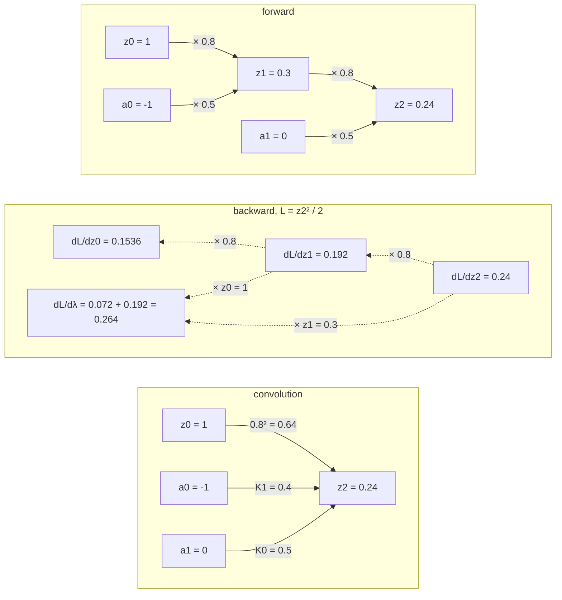
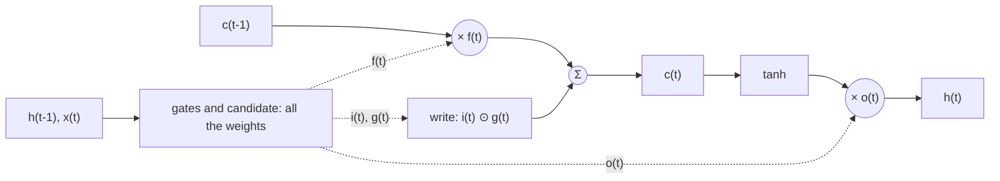
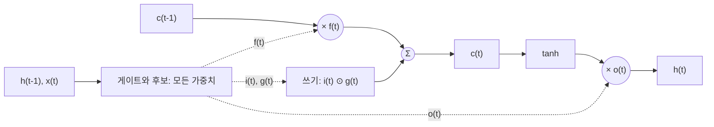

> [!note] Prerequisites · 선수 지식
> Object **D5** from [[03-deep-learning/lab-objects|0. Lab Objects]], whose home is [[03-deep-learning/world-models/index|5. World Models]] · [[03-deep-learning/foundations/index|1. Learning Systems]] (a shape on every tensor, parameters against activations) · [[02-foundations/calculus-backprop|2. Calculus & Backprop §2 and §5]] (the chain rule; vanishing and exploding gradients; clipping) · [[02-foundations/linear-algebra|1. Linear Algebra §3 and §4]] (eigenvalues; the spectral norm) · [[02-foundations/signal-processing|6. Signal Processing §1]] (LTI systems, impulse response, convolution) · [[04-robotics/control-theory-ce397|5. Control Theory §2 and §4]] (state-space models; zero-order-hold discretization; discrete stability) · [[02-foundations/lab-kernel|0.7 Lab Kernel]], because this page is Tier A and the lab in §11 needs NumPy and nothing else.
> [[03-deep-learning/lab-objects|0. Lab Objects]]의 대상 **D5**(사용처는 [[03-deep-learning/world-models/index|5. 월드모델]]) · [[03-deep-learning/foundations/index|1. 학습 시스템]](모든 텐서의 shape, 파라미터와 활성값의 구분) · [[02-foundations/calculus-backprop|2. 미적분과 역전파 §2, §5]](연쇄 법칙, 그래디언트 소실과 폭발, clipping) · [[02-foundations/linear-algebra|1. 선형대수 §3, §4]](고유값, 스펙트럼 노름) · [[02-foundations/signal-processing|6. 신호처리 §1]](LTI 시스템, 임펄스 응답, 합성곱) · [[04-robotics/control-theory-ce397|5. 제어 이론 §2, §4]](상태공간 모델, zero-order hold 이산화, 이산 안정성) · 이 페이지는 Tier A이므로 [[02-foundations/lab-kernel|0.7 Lab Kernel]]. §11의 실습에는 NumPy만 있으면 된다.

## English

*Stands on [[03-deep-learning/foundations/index|1. Learning Systems]] and [[02-foundations/calculus-backprop|2. Calculus & Backprop]]. Second use of object **D5**, whose home is [[03-deep-learning/world-models/index|5. World Models]]: that page runs D5 forward to measure how a rollout's error grows, and this one reads the same line as the smallest recurrent network and runs it backwards. The sibling page [[03-deep-learning/foundations/attention-transformer|1.2 Attention & the Transformer]] is the other way to read a sequence.*

> [!note] First pass · 처음이라면
> Look at the picture first, then work the Worked case with a calculator: two steps forward, two back, five kernel taps, and the same two outputs again by convolution. Read §1–§3 and do problems 1–2. Open §4–§6 when a paper says "clipping", "forget-gate bias" or "GRU", and §7–§10 when it says "state space", "S4", "Mamba" or "linear time". §11 runs all of it.

### Running object · 이 페이지의 대상

**D5** from [[03-deep-learning/lab-objects|0. Lab Objects]], at the numbers that page freezes: $z_{t+1}=0.8z_t+0.5a_t$ from $z_0=1$, with the test sequence $(a_0,a_1)=(-1,0)$, which gives $z_1=0.3$ and $z_2=0.24$. [[03-deep-learning/world-models/index|5. World Models]] reads that line as a learned transition. This page reads it as a recurrent network, so every symbol gets a second name.

| Symbol | Value | In 5. World Models | Here, as a recurrent network |
|---|---:|---|---|
| $z_t$ | $z_0=1$ | latent state | hidden state $h_t$, width $d_h=1$ |
| $a_t$ | $(a_0,a_1)=(-1,0)$ | action | input, width $d_x=1$ (written $x_{t+1}$ in §1's notation) |
| $\lambda$ | $0.8$ | transition gain | recurrent weight $W$ |
| $\beta$ | $0.5$ | action gain | input weight $U$ |
| $b$ | $0$ | — | bias |
| activation | identity | — | none, so D5 is a **linear** RNN |
| $C$ | $1$ | — | readout $y_t=Cz_t$, the output matrix of §7 |

D5's reward $r_t=-z_t^2-0.1a_t^2$ plays no part here. The loss in the worked case is $L=\tfrac12 z_T^2$, which charges the last state the way the reward charges every state.

The page adds two small objects and freezes them here. Neither changes afterwards.

- **The row of four.** Four D5 cells in series, so the hidden width is 4. Cell $k$'s state is cell $k{+}1$'s input, entering with D5's input weight $0.5$. The recurrent matrix is $W_{\text{row}}(w)=wI+0.5N$, where $N$ has ones just below the diagonal and zeros elsewhere; the input enters cell 1 through $B=(0.5,0,0,0)^\top$ and the readout is cell 4, $C=(0,0,0,1)$. At $w=0.8$ every cell is D5. Its **side-by-side** twin, $W=wI$, runs the same four cells in parallel with no coupling. The row differs from D5 only in length, and four cells are enough to pull a matrix's spectral radius apart from its norm (§3).
- **The scalar LSTM cell.** $d_x=d_h=1$. Every input weight is $1$. The recurrent weight is $0.5$ into each of the three gates and $0$ into the candidate. Every bias is $0$ except the forget-gate bias $b_f$, the page's knob, set to $0$ or $3$. Start at $c_0=1$, $h_0=0$ and feed it D5's inputs, $x_1=a_0=-1$ and then zeros. Its input and output gates share weights, so $i_t=o_t$ at every step; that is a property of this frozen cell, not of LSTMs. It differs from D5 in carrying two states and three gates, which is what §5 needs.

*Scope: this page teaches the recurrent network and what training it through time does to gradients — backpropagation through time, vanishing and exploding on the scalar and on the matrix, clipping, the LSTM and GRU gates — and the linear state-space model as one system computed two ways, as a recurrence and as a convolution, together with the discretization and the two changes, S4's and Mamba's, that made it a deep-learning backbone. It does not teach attention, which is [[03-deep-learning/foundations/attention-transformer|1.2 Attention & the Transformer]]; nor the world model built around a transition like D5's, which is [[03-deep-learning/world-models/index|5. World Models]]; nor the Kalman filter, a recurrence whose gain is derived rather than learned, which is [[04-robotics/state-estimation-slam|3. State Estimation §5]]; nor the optimizers that consume these gradients, which are [[02-foundations/optimization|4. Optimization §3]]; nor tokenizers or language modelling.*

### The picture · 그림으로 먼저 보기



D5 unrolled over its catalog sequence, in three strips. Forward, $z_1=0.8(1)+0.5(-1)=0.3$ and $z_2=0.24$, with the same $0.8$ on both state-to-state arrows; backward, for $L=\tfrac12z_2^2$, the adjoints $0.24\to0.192\to0.1536$ carry that $0.8$ back, and $\partial L/\partial\lambda=0.24(0.3)+0.192(1)=0.264$ collects one term per step, each an adjoint times the state its step started from. The convolution strip wires $z_0$, $a_0$ and $a_1$ straight to $z_2$ with weights $0.8^2=0.64$, $K_1=0.4$ and $K_0=0.5$ — no state-to-state arrow, and the same $z_2=0.24$.

### Worked case · 대상으로 한 번 끝까지

This is the homework object. The problem set will ask you to draw it, backpropagate through it and convolve it, with a different gain and one step more. Do all three here first, on the catalog numbers.

**Forward, by recurrence.** One multiplication by $0.8$ and one by $0.5$ per step:

$$z_1=0.8(1)+0.5(-1)=0.3,\qquad z_2=0.8(0.3)+0.5(0)=0.24$$

**Backward, through time.** Take the loss $L=\tfrac12z_2^2=0.0288$ and write $g_t=\partial L/\partial z_t$ for the adjoint of each state. It starts at $g_2=z_2=0.24$, and every step back multiplies it by $\partial z_t/\partial z_{t-1}=0.8$, so $g_1=0.192$ and $g_0=0.1536$. The recurrent weight acted at both steps, so its gradient collects one term from each — the adjoint times the state that step started from:

$$\frac{\partial L}{\partial\lambda}=g_2z_1+g_1z_0=0.24(0.3)+0.192(1)=0.264,\qquad \frac{\partial L}{\partial\beta}=g_2a_1+g_1a_0=0+0.192(-1)=-0.192$$

Check it against the closed form $z_2=\lambda^2z_0+\lambda\beta a_0+\beta a_1$: its derivative in $\lambda$ is $2\lambda z_0+\beta a_0=1.6-0.5=1.1$, and $0.24\times1.1=0.264$. Notice which term is larger. The $0.192$ came from the *earlier* step and is $73\%$ of the gradient; a backward pass cut after one step (§2) would have reported $0.072$.

**The gradient through $T$ steps.** Every backward arrow carries the same $0.8$, so

$$\frac{\partial z_T}{\partial z_0}=0.8^T$$

because the chain rule multiplies one Jacobian per step and all $T$ of them are the same number:

| $T$ | 1 | 5 | 10 | 20 |
|---|---:|---:|---:|---:|
| $0.8^T$ | 0.8 | 0.32768 | 0.107374 | 0.011529 |

It halves every $\ln0.5/\ln0.8=3.1$ steps and first falls below $1\%$ at $T=21$, where $0.8^{21}=0.0092$.

**The convolution kernel.** Unrolled (§7), every state is a weighted sum of the inputs, and the weight on an input $m$ steps old is $K_m=C\,0.8^m\,0.5$:

| $m$ | 0 | 1 | 2 | 3 | 4 |
|---|---:|---:|---:|---:|---:|
| $K_m=0.5\cdot0.8^m$ | 0.5 | 0.4 | 0.32 | 0.256 | 0.2048 |

**The catalog outputs, by convolution.** Each state is the start state's share $0.8^t z_0$ plus the taps applied to the inputs, so

$$z_1=0.8(1)+K_0a_0=0.8-0.5=0.3,\qquad z_2=0.64(1)+K_1a_0+K_0a_1=0.64-0.4+0=0.24$$

— the same two numbers as the recurrence, from arithmetic that never used $z_1$ to reach $z_2$.

**One power, three readings.** $K_m=0.5\cdot0.8^m$ says how much of an input survives $m$ steps; $0.8^T$ says how much gradient survives $T$ steps back; and the sensitivity of a state to an old input, $\partial z_T/\partial a_j=K_{T-1-j}$, is both at once. At the table's longest horizon, $a_0$'s share of $z_{20}$ is $K_{19}=0.5\cdot0.8^{19}=0.0072$ per unit of action, and $0.0072$ is also the factor through which any loss on $z_{20}$ reaches $a_0$. On a linear, time-invariant recurrence, "it forgets" and "its gradient vanishes" are one sentence about one number.

### 1. The recurrent network, symbol by symbol

A recurrent network reads a sequence one element at a time and carries a fixed-size summary forward. With $d_x$-dimensional inputs, a $d_h$-dimensional state and $d_y$-dimensional outputs,

$$h_t=\tanh\big(Wh_{t-1}+Ux_t+b\big),\qquad y_t=Vh_t+c$$

so each step mixes the old state and the new input linearly, squashes the result into $(-1,1)$ elementwise, and reads an output off the new state.

| Symbol | Shape | Role |
|---|---|---|
| $x_t$ | $d_x$ | input at step $t$ |
| $h_t$ | $d_h$ | hidden state after step $t$; $h_0$ is given |
| $W$ | $d_h\times d_h$ | recurrent weight, old state to new state |
| $U$ | $d_h\times d_x$ | input weight |
| $b$ | $d_h$ | bias |
| $V$, $c$ | $d_y\times d_h$, $d_y$ | readout |

The parameter count is $d_h^2+d_hd_x+d_h+d_yd_h+d_y$. At an illustrative $d_x=16$, $d_h=128$, the recurrent core $(W,U,b)$ alone is $128^2+128\cdot16+128=18{,}560$ numbers — and the same $18{,}560$ whether the sequence is ten steps long or ten thousand.

> **Recurrent neural network, defined.** A **recurrent neural network** (RNN; the form above is the Elman network) is a *single parameterized update map applied once per sequence element* — one function reused along the sequence, not a stack of different layers. Three defining conditions. It **carries a state**: $h_t$ is computed from $h_{t-1}$, so everything the network retains about the past must fit in $d_h$ numbers. It **shares its parameters across time**: the same $W$, $U$ and $b$ at every step, so the parameter count does not depend on the sequence length and the network runs on sequences longer than any it was trained on. And it is **causal**: $h_t$ depends on $x_1,\dots,x_t$ only, so it can run online, one input at a time, as a robot's estimator or policy must.
>
> $$h_t=\phi\big(Wh_{t-1}+Ux_t+b\big)$$
>
> where $\phi$ is the elementwise activation — $\tanh$ in the classic network, the identity in a linear RNN — and the other symbols are those of the table above. Condition two is what makes it a *recurrent* network rather than a deep one: without it the unrolled graph would be an ordinary $T$-layer network with $T$ different weight matrices.
>
> - **Example**: D5 with the identity activation, $d_x=d_h=d_y=1$, $W=0.8$, $U=0.5$, $b=0$, $V=1$, $c=0$. Put $\tanh$ back and the same numbers give $h_1=\tanh(0.3)=0.291313$ and $h_2=\tanh(0.8\times0.291313)=0.228921$, a slightly squashed D5.
> - **Non-example**: a feed-forward network on a window of the last $k$ inputs — an MLP on the stacked window, or a 1-D convolution. It carries no state, so condition one fails: nothing older than $k$ steps can reach its output, and its first layer grows with $k$.
> - **Non-example**: a bidirectional RNN. Each of its two directions is an RNN, but the pair reads $x_{t+1},\dots,x_T$ to produce the output at $t$, so condition three fails. It can label a recorded sequence and cannot drive a robot, which has to act before the future arrives.
> - **Why it matters**: constant memory and constant work per step, whatever the length — the property that makes recurrence the natural shape for a filter or a controller — bought with the cost §10 counts, because the steps must run in order.

**The index shift.** In this notation the input that produces $h_t$ is $x_t$; in D5's the action that produces $z_{t+1}$ is $a_t$. So $x_{t+1}=a_t$ — the same arrow, labelled from its other end. Papers use both, and the kernel of §7 moves by one step between them.

**Unrolled, it is a deep network with one weight.** Written out over $T$ steps, $h_T=\tanh(W\tanh(W\cdots)+Ux_T+b)$ is a $T$-layer feed-forward network whose layers all use the same $W$, $U$ and $b$. Everything that happens to gradients in a deep network happens here, with one extra constraint: every layer's Jacobian carries the same matrix.

### 2. Backpropagation through time

Training needs $\partial L/\partial W$ for a loss on the outputs. The unrolled network is an ordinary computational graph, so reverse-mode differentiation applies unchanged ([[02-foundations/calculus-backprop|2. Calculus & Backprop §2]]). Run on an unrolled recurrence it has its own name and three conditions of its own.

> **Backpropagation through time, defined.** **Backpropagation through time** (BPTT) is *reverse-mode differentiation applied to a recurrent network unrolled over its sequence* — an algorithm for the exact gradient, not a separate learning rule and not an approximation. Three defining conditions. The **forward pass is stored**: every state $h_0,\dots,h_T$ is kept, since each backward step needs the state its forward step started from. The **backward recursion runs from $T$ down to 1**, carrying the adjoint $g_t=\partial L/\partial h_t$ back through each step's Jacobian $J_t=\partial h_t/\partial h_{t-1}$. And the **shared parameters accumulate**: $W$ acted at every step, so its gradient is a sum with one term per step.
>
> $$g_{t-1}=\frac{\partial\ell_{t-1}}{\partial h_{t-1}}+J_t^\top g_t,\qquad \frac{\partial L}{\partial W}=\sum_{t=1}^{T}\delta_t\,h_{t-1}^\top,\qquad \delta_t=g_t\odot\big(1-h_t\odot h_t\big)$$
>
> where $\ell_t$ is the part of the loss charged at step $t$ (all of it at $T$ when only the last state is scored), $\delta_t$ is the adjoint of step $t$'s pre-activation, and $J_t=\operatorname{diag}(1-h_t\odot h_t)\,W$ for the tanh network — so for D5, which is linear, $\delta_t=g_t$ and $J_t=0.8$. The gradients of $U$ and $b$ are the same sum with $x_t^\top$ and $1$ in place of $h_{t-1}^\top$.
>
> - **Example**: the worked case, $g_2=0.24$, $g_1=0.192$ and $\partial L/\partial\lambda=0.24(0.3)+0.192(1)=0.264$ — two terms because $\lambda$ acted twice.
> - **Non-example**: **truncated BPTT**. The forward state is carried across the whole sequence, but the backward recursion is cut after a window of $k$ steps by passing the carried state through a stop-gradient ([[02-foundations/calculus-backprop|2. Calculus & Backprop §5]]). With $k=1$ on the worked case it returns $g_2z_1=0.072$ for $\partial L/\partial\lambda$ instead of $0.264$. It is cheaper and it is biased, and the part it drops — $0.192$ here — is exactly the credit that crosses time, the part a recurrence exists to learn.
> - **Why it matters**: the stored states cost memory in proportion to $Td_h$, which is why long sequences are trained in truncated windows; and every term of the sum reaches back through a product of Jacobians, which is where §3's pathology lives.

The product itself: the adjoint that reaches $h_0$ from a loss on $h_T$ is multiplied by

$$\frac{\partial h_T}{\partial h_0}=J_TJ_{T-1}\cdots J_1,\qquad J_t=\operatorname{diag}\big(1-h_t\odot h_t\big)\,W$$

since $h_T$ depends on $h_0$ only through the chain of intermediate states, and the chain rule multiplies one Jacobian per link ([[02-foundations/calculus-backprop|2. Calculus & Backprop §5]] states the general product and its norm bound). For D5 every factor is $0.8$, so the product is $0.8^T$ exactly — the worked case's table.

### 3. Vanishing and exploding: the scalar, the matrix, the spectral radius

For a linear scalar recurrence with weight $w$, the product of §2 is a power,

$$\frac{\partial h_T}{\partial h_0}=w^T$$

because every one of the $T$ Jacobians is the same number, and a power has three regimes. For $\lvert w\rvert<1$ it decays geometrically; D5 halves every $3.1$ steps. For $\lvert w\rvert>1$ it grows geometrically: $1.1^{20}=6.73$ and $1.1^{50}=117.4$. And $\lvert w\rvert=1$ is the knife edge where it is preserved exactly. The general definitions of vanishing and exploding gradients, as products of Jacobians with norms below or above one, are in [[02-foundations/calculus-backprop|2. Calculus & Backprop §5]]. What a recurrent network adds is that the factors are *all the same*, so the product becomes a power, and a power is governed by one number. Taken across the layers of a deep network instead of the steps of one sequence, the same product is what a residual path reshapes, in [[03-deep-learning/foundations/training-at-scale|1.3 Training at Scale §3]].

**The matrix case.** For the linear RNN $h_t=Wh_{t-1}+Ux_t$ the same argument gives $\partial h_T/\partial h_0=W^T$. If $W$ has a full set of eigenvectors, $W=V\Lambda V^{-1}$ ([[02-foundations/linear-algebra|1. Linear Algebra §3]]), then

$$W^T=V\Lambda^TV^{-1}$$

since every inner $V^{-1}V$ cancels, so each eigen-direction is scaled by its own $\lambda_i^T$ and over a long enough horizon the largest $\lvert\lambda_i\rvert$ outruns the rest. That largest modulus has a name.

> **Spectral radius, defined.** The **spectral radius** of a square matrix is a *nonnegative real number computed from its eigenvalues* — not a norm and not a singular value. Three defining conditions. It is defined only for a **square** matrix, a map from a space to itself, which is exactly what a recurrent weight is. It uses **every eigenvalue by its modulus, complex ones included**, so a rotation–scaling pair $0.6\pm0.3j$ counts as $\lvert0.6+0.3j\rvert=0.671$. And it takes the **maximum**, so one slow direction sets it however fast the others decay.
>
> $$\rho(W)=\max_i\lvert\lambda_i(W)\rvert=\lim_{T\to\infty}\big\lVert W^T\big\rVert^{1/T}$$
>
> where $\lambda_i(W)$ are the eigenvalues, and the second equality (Gelfand's formula, true for any matrix norm) is why it is the number that governs long horizons: $\lVert W^T\rVert$ behaves like $\rho^T$ in the limit, up to factors that grow more slowly than any exponential.
>
> - **Example**: D5, $\rho=0.8$. Four D5 cells side by side, $W=0.8I$: $\rho=0.8$ and $\lVert W^T\rVert_2=0.8^T$ exactly, the scalar's numbers. For any *normal* $W$ — one that commutes with its transpose, $WW^\top=W^\top W$, as symmetric, diagonal and orthogonal-times-a-scale matrices do — the norm equals $\rho^T$ at every $T$, not only in the limit.
> - **Non-example**: the row of four at $w=0.8$. Its matrix is triangular with $0.8$ down the diagonal, so its eigenvalues are $0.8,0.8,0.8,0.8$ and $\rho=0.8$, identical to the side-by-side twin — yet its gradient norm is $1.23$ after one step and peaks at $4.57$ at $T=13$ before it vanishes (§11). The spectral radius bounds no finite power. The **spectral norm** $\lVert W\rVert_2$, the largest singular value ([[02-foundations/linear-algebra|1. Linear Algebra §4]]), does, $\lVert W^T\rVert_2\le\lVert W\rVert_2^T$, and the row's is $1.2297$.
> - **Non-example**: $N$ itself, the shift inside the row. Every eigenvalue is $0$, so $\rho(N)=0$, yet $\lVert N\rVert_2=1$. A norm is zero only for the zero matrix, so $\rho$ is not a norm.
> - **Why it matters**: $\rho(W)<1$ is at once the condition for a linear recurrence to be stable — "inside the unit circle" in [[04-robotics/control-theory-ce397|5. Control Theory §4]] — to forget its inputs, and to have gradients that eventually vanish; $\rho>1$ turns all three around. When a paper initializes a recurrent matrix "with spectral radius 0.9", or keeps an SSM's eigenvalues inside the unit circle, this is the number, and the row of four is the reason to ask whether the matrix is also normal.

**With the nonlinearity.** For the tanh network $J_t=\operatorname{diag}(1-h_t\odot h_t)W$, and every diagonal entry lies in $(0,1]$, so $\lVert J_t\rVert_2\le\lVert W\rVert_2$. Two conclusions follow, and they point in different directions. $\lVert W\rVert_2<1$ is **sufficient** for vanishing: every factor contracts, from the first step on. $\lVert W\rVert_2>1$ is only **necessary** for exploding: without it nothing can grow, and with it the squashing may still win. These are the conditions Pascanu, Mikolov and Bengio (ICML 2013) prove, stated with the largest singular value of the recurrent matrix against $1/\gamma$, where $\gamma$ bounds the activation's slope — $1$ for $\tanh$, $\tfrac14$ for the sigmoid — and, for the linear case, with the spectral radius against $1$ as above. On the worked case the two tanh factors are $0.7321$ and $0.7581$ against D5's $0.8$: squashing only ever takes away.

### 4. Gradient clipping: a ceiling, not a floor

When $\rho>1$, or when a non-normal matrix amplifies the way the row does, one long sequence can return a gradient large enough that a single step throws the weights far from where the loss was measured. **Clipping by norm** rescales the whole gradient vector so that its length is at most a threshold $c$ and its direction is kept; the formula and its $(3,4)$ example are in [[02-foundations/calculus-backprop|2. Calculus & Backprop §5]]. On this page's numbers:

- $w=1.1$, $T=20$: the factor is $1.1^{20}=6.7275$, and clipping at $c=1$ multiplies the step by $0.1486$. At $T=50$ the factor is $117.39$ and the step is cut to $0.0085$ of itself.
- D5, $T=20$: the factor is $0.8^{20}=0.0115$, already under the ceiling, so clipping does nothing.

So clipping is one-sided. It caps an exploding gradient and never lengthens a vanishing one: no rescaling toward a ceiling can restore the $0.0115$ that the chain rule has already taken. Long memory needs a change of cell (§5) or of parameterization (§9), not of the optimizer. Pascanu, Mikolov and Bengio proposed norm clipping for the exploding half of the problem and a separate regularizer for the vanishing half; for the threshold they suggest looking at the average gradient norm over many updates, report that anything from half to ten times it still converged, and used $1$ on their synthetic tasks.

**Clipping by value**, the non-example, clamps each component to $[-c,c]$ separately, and that changes the direction. $g=(3,0.1)$ clipped by value at $c=1$ becomes $(1,0.1)$, turned from $1.9^\circ$ to $5.7^\circ$ off the first axis, while clipping by norm gives $(0.99944,0.03331)$, the same direction at length $1$. A paper that says "we clip gradients at 1" has to say which.

### 5. The LSTM cell

The LSTM replaces §1's one-line update with six, in two groups. First three gates and a candidate, each a layer of §1's shape reading the current input and the previous exposed state:

$$f_t=\sigma(W_fx_t+U_fh_{t-1}+b_f),\quad i_t=\sigma(W_ix_t+U_ih_{t-1}+b_i),\quad o_t=\sigma(W_ox_t+U_oh_{t-1}+b_o),\quad g_t=\tanh(W_gx_t+U_gh_{t-1}+b_g)$$

where $\sigma$ is the logistic sigmoid, so every gate is a vector of numbers in $(0,1)$; each $W_\ast$ is $d_h\times d_x$, each $U_\ast$ is $d_h\times d_h$, and each $b_\ast$ has $d_h$ entries. Then the two states:

$$c_t=f_t\odot c_{t-1}+i_t\odot g_t,\qquad h_t=o_t\odot\tanh(c_t)$$

so the forget gate decides how much of the old cell to keep, the input gate how much of the candidate to write, and the output gate how much of the squashed cell to show as $h_t$; $\odot$ is the elementwise product. The parameter count is $4(d_hd_x+d_h^2+d_h)$, four times a vanilla RNN of the same width: $74{,}240$ against $18{,}560$ at the illustrative size of §1.



*The run from c(t-1) to c(t) is the cell path: one multiplication and one addition per step and nothing else; tanh and o(t) only decide how much of the cell is shown as h(t). Every weight matrix sits on the dotted side.*

> **LSTM cell, defined.** The **LSTM** (long short-term memory) cell is a *recurrent cell with two carried states and three multiplicative gates* — one particular update map for §1's definition, not a different kind of network. Three defining conditions. It carries a **cell state updated additively**: the old cell reaches the new one through one elementwise multiplication by $f_t$ and one addition, with no weight matrix and no squashing on the way. Its **gates are recomputed at every step from the current input and the previous $h$**, so how much is kept, written and shown is decided afresh, from data. And the **exposed state $h_t=o_t\odot\tanh(c_t)$ is what the gates and the next layer read**; the cell itself stays internal.
>
> $$c_t=f_t\odot c_{t-1}+i_t\odot g_t$$
>
> where $c_{t-1}$ is the old cell, $f_t$ the forget gate, $i_t$ the input gate and $g_t$ the candidate — the one line of the six that makes it an LSTM, since the other five are ordinary recurrent layers.
>
> - **Example**: the page's scalar cell at $t=1$ with $b_f=3$, $x_1=-1$, $h_0=0$, $c_0=1$. The forget gate's pre-activation is $1(-1)+0.5(0)+3=2$, so $f_1=\sigma(2)=0.880797$; $i_1=o_1=\sigma(-1)=0.268941$; $g_1=\tanh(-1)=-0.761594$. Then $c_1=0.880797(1)+0.268941(-0.761594)=0.675973$ and $h_1=0.268941\tanh(0.675973)=0.158378$. With $b_f=0$ the same step keeps only $f_1=\sigma(-1)=0.268941$ of the old cell, and $c_1=0.064117$.
> - **Non-example**: a vanilla RNN with a sigmoid gate $s_t=\sigma(W_sx_t+U_sh_{t-1}+b_s)$ multiplied onto its output, $h_t=s_t\odot\tanh(Wh_{t-1}+Ux_t+b)$. It is gated, but its only path from $h_{t-1}$ to $h_t$ still runs through $W$ and $\tanh$ at every step, so its gradient is still §3's product of $W$'s. Gating is not what matters; the additive path is.
> - **Boundary case**: Hochreiter and Schmidhuber's 1997 cell had no forget gate — in effect $f_t=1$ — so the cell path carried the gradient back unchanged, the "constant error carousel" of the [[01-canonical-papers/notes/1-foundations/lstm|LSTM note]]. On a stream that never resets, a cell that can only add grows without bound; Gers, Schmidhuber and Cummins added the forget gate (ICANN 1999, journal version 2000) so the cell can release its own memory, and that is the form above.
> - **Why it matters**: it turns the rate at which the gradient decays from a fixed power of $W$ into a learned, input-dependent number $f_t$, which the next paragraph derives and §11 measures.

**Why the additive path keeps the gradient.** Differentiate $c_t=f_t\odot c_{t-1}+i_t\odot g_t$ with respect to $c_{t-1}$:

$$\frac{\partial c_t}{\partial c_{t-1}}=\operatorname{diag}(f_t)+\big(\text{terms through }h_{t-1}\big)$$

because $c_{t-1}$ enters directly, through its product with $f_t$, and indirectly, through $h_{t-1}=o_{t-1}\odot\tanh(c_{t-1})$, which every gate and the candidate read. The direct term contains no $W$ and no $\tanh'$: it is the forget gate itself. Along that path alone,

$$\frac{\partial c_T}{\partial c_0}\bigg|_{\text{direct}}=\prod_{t=1}^{T}\operatorname{diag}(f_t)$$

since each step contributes its own diagonal factor, so the rate at which the cell forgets, and at which its gradient decays, is the forget gate — learned, input-dependent, and free to sit near $1$ exactly where memory is needed. With the gate near $\sigma(b_f)$, $b_f=0$ gives $0.5$ per step and $0.5^{20}=9.5\times10^{-7}$ over twenty steps, far worse than D5's $0.0115$; $b_f=3$ gives $\sigma(3)=0.9526$ per step and $0.9526^{20}=0.378$. The indirect terms pass through the $U$ matrices and can shrink or amplify the way a vanilla RNN's do. What the LSTM guarantees is a path without $W$, not a total that cannot vanish or explode; §11 computes the exact derivative beside the direct product.

**The forget-gate bias.** Jozefowicz, Zaremba and Sutskever (ICML 2015) point out that the usual small random initialization leaves the forget gate near $0.5$, which is a vanishing factor of $0.5$ per step — this page's $b_f=0$ cell. A positive $b_f$ starts every cell on the keeping side of its gate before anything is learned; they note the idea is already in Gers et al. (2000), recommend a bias of $1$ for every LSTM, and report in their abstract that it closes the gap they measured between the LSTM and the GRU. Note what $1$ buys on this page's cell: $\sigma(1)=0.731$ per step, still below D5's $0.8$ (problem 3).

### 6. The GRU, in one line of comparison

The gated recurrent unit (Cho et al., EMNLP 2014) keeps a single state, ties the forget and input gates into one update gate $z_t$, and gates the recurrent read with a reset gate $r_t$:

$$h_t=z_t\odot h_{t-1}+(1-z_t)\odot\tanh\big(W_gx_t+U_g(r_t\odot h_{t-1})+b_g\big)$$

with $z_t=\sigma(W_zx_t+U_zh_{t-1}+b_z)$ and $r_t=\sigma(W_rx_t+U_rh_{t-1}+b_r)$. So a GRU is an LSTM whose forget gate is $z_t$, whose input gate is $1-z_t$, and which has no output gate: the same additive keep path, with $\operatorname{diag}(z_t)$ where the LSTM has $\operatorname{diag}(f_t)$, in three weight blocks instead of four — three quarters of the LSTM's parameters at equal width, $55{,}680$ against $74{,}240$ at §1's illustrative size. Cho et al. put $z_t$ on the old state as above; Chung et al.'s 2014 comparison of gated units writes the same unit with $1-z_t$ there, so read the equation, not the letter. The GRU is also the deterministic path of the recurrent state-space model in [[01-canonical-papers/notes/5-world-models/planet|PlaNet]].

### 7. Linear state-space models: one system, two computations

Drop the nonlinearity and give the state room. The linear time-invariant state-space model is

$$x_{k+1}=Ax_k+Bu_k,\qquad y_k=Cx_k$$

with state $x_k\in\mathbb R^n$, input $u_k\in\mathbb R^m$, output $y_k\in\mathbb R^p$ and constant matrices $A$ ($n\times n$), $B$ ($n\times m$), $C$ ($p\times n$) — the discrete-time form of the model in [[04-robotics/control-theory-ce397|5. Control Theory §2]]. As a recurrence it is a linear RNN with $W=A$, $U=B$, $V=C$, and D5 is the case $n=m=p=1$, $A=0.8$, $B=0.5$, $C=1$.

Unroll it by induction, $x_1=Ax_0+Bu_0$, $x_2=A^2x_0+ABu_0+Bu_1$, and in general

$$y_k=CA^kx_0+\sum_{j=0}^{k-1}CA^{k-1-j}B\,u_j$$

since each input, once written into the state by $B$, is carried forward by one factor of $A$ per step until $C$ reads it. The sum is a convolution: the weight on an input depends only on its age $k-1-j$, never on when it arrived. That is forced — a linear, time-invariant system can only convolve ([[02-foundations/signal-processing|6. Signal Processing §1]]).

> **SSM convolution kernel, defined.** The **convolution kernel** of a linear state-space model is a *sequence of $p\times m$ matrices $K_0,K_1,\dots$, one per input age* — the model's impulse response from input to output, computed from $(A,B,C)$ rather than stored as extra parameters. Three defining conditions. The recurrence is **linear**: nothing squashes the state between steps, so the responses to separate inputs add. It is **time-invariant**: $A$, $B$ and $C$ are the same at every step, so the weight on an input depends on its age alone. And the pure convolution holds from a **zero start**; a nonzero $x_0$ adds its own free response $CA^kx_0$, which is not part of the kernel.
>
> $$K_m=CA^mB,\qquad y_k=CA^kx_0+\sum_{j=0}^{k-1}K_{k-1-j}\,u_j$$
>
> where $m=k-1-j$ is the input's age in steps — $K_0$ acts on the input one step old, because in this convention an input reaches the output one step after it enters.
>
> - **Example**: D5, $K_m=0.5\cdot0.8^m=(0.5,0.4,0.32,0.256,0.2048,\dots)$, and the worked case's $z_1=0.3$ and $z_2=0.24$ by convolution. The row of four has $K=(0,0,0,0.0625,0.2,0.4,0.64,\dots)$. Its first three taps are exactly zero, because an input needs four steps to travel from cell 1 to cell 4, and its taps then rise before they fall.
> - **Non-example**: the tanh RNN. From a zero start, the input $-1$ gives $h_1=\tanh(-0.5)=-0.4621$ and the input $-2$ gives $\tanh(-1)=-0.7616$, not twice $-0.4621$, which is $-0.9242$. Condition one fails, responses do not add, and there is no kernel.
> - **Non-example**: a state-space layer whose $B$ and step size are recomputed from each input, as in Mamba (§9). Condition two fails: the weight on an input now depends on when it arrived as well as on its age, so no single sequence $K_m$ describes it.
> - **Why it matters**: with a kernel, all $T$ outputs are one convolution, computable at once — directly in about $T^2/2$ multiplications or through the FFT in $O(T\log T)$ — instead of $T$ steps in order; that is S4's training mode (§9). And the kernel, the memory and the gradient are one object, $\partial y_k/\partial u_j=K_{k-1-j}$: a kernel that decays like $0.8^m$ belongs to a model whose gradients to old inputs decay like $0.8^m$.

The sum of D5's taps is $0.5/(1-0.8)=2.5$, finite, so D5 is BIBO stable in the sense of [[02-foundations/signal-processing|6. Signal Processing §1]]; the same $2.5$ is its steady-state gain, since a constant input $a$ held forever drives $z$ to $2.5a$. S4 writes the recurrence with the input entering at the same step, $x_k=Ax_{k-1}+Bu_k$, so its kernel starts with $CB$ acting on the current input — the same numbers shifted by one step, the index shift of §1 again.

### 8. Discretization: where A and B come from

State-space layers are defined in continuous time, $\dot x=A_cx+B_cu$, and sampled with a step $\Delta$. Holding the input constant over each step (a zero-order hold) makes the sampled model exact at the sample instants, as [[04-robotics/control-theory-ce397|5. Control Theory §4]] derives:

$$A=e^{A_c\Delta},\qquad B=A_c^{-1}\big(e^{A_c\Delta}-I\big)B_c$$

where the second form is that page's $\int_0^\Delta e^{A_c\tau}d\tau\,B_c$ evaluated for an invertible $A_c$. For a scalar $A_c=a$, $B_c=b$ this reads $A=e^{a\Delta}$ and $B=(e^{a\Delta}-1)\,b/a$.

**D5 is a sampled continuous system.** Take $\Delta=1$ D5 step. $A=0.8$ requires $a=\ln0.8=-0.223144$ per step, and $B=0.5$ then requires $b=0.5a/(0.8-1)=0.557859$. So D5 is the zero-order-hold sampling of

$$\dot z=-0.223144\,z+0.557859\,a$$

a first-order lag with time constant $1/0.223144=4.48$ steps and DC gain $b/(-a)=2.5$ — the same $2.5$ as the kernel's sum, as it has to be. Keep $a$ and $b$, change only the step, and the two matrices become $A(\Delta)=0.8^\Delta$ and $B(\Delta)=2.5(1-0.8^\Delta)$:

| $\Delta$ (D5 steps) | 0.1 | 0.5 | 1 | 2 | 10 |
|---|---:|---:|---:|---:|---:|
| $A=0.8^\Delta$ | 0.977933 | 0.894427 | 0.8 | 0.64 | 0.107374 |
| $B=2.5(1-0.8^\Delta)$ | 0.055168 | 0.263932 | 0.5 | 0.9 | 2.231565 |
| forward Euler, $A=1+a\Delta$ | 0.977686 | 0.888428 | 0.776856 | 0.553713 | $-1.231436$ |

Three readings. Two half-steps reproduce one full step exactly, $0.894427^2=0.8$ and $0.263932(1+0.894427)=0.5$, because the hold is exact whenever the input really is constant over both halves. Every column has $B/(1-A)=2.5$: the step changes how fast the state moves, not where a constant input sends it. And the step is a dial between two behaviours. A small $\Delta$ puts $A$ near $1$ and $B$ near $0$, so the state is kept and the input barely written; a large $\Delta$ puts $A$ near $0$ and $B$ near the full gain, so the state is overwritten by the current input.

Forward Euler, $A=1+a\Delta$ and $B=b\Delta$, is the non-example. At $\Delta=1$ it gives $A=0.776856$, a different D5, and at $\Delta=10$ it gives $A=-1.231436$, an unstable recurrence sampled from a stable system — the $\lambda\mapsto1+\lambda T$ failure [[04-robotics/control-theory-ce397|5. Control Theory §4]] warns about.

### 9. S4 and Mamba: what made the linear SSM a backbone

One D5 remembers like $0.8^m$ and nothing else. A deep state-space model stacks many linear SSMs, one per channel with a state of its own, and mixes channels with nonlinear layers in between. Two papers changed what one such layer can do.

**S4: structure, so the kernel is cheap and long.** Gu, Goel and Ré (ICLR 2022) keep each layer linear and time-invariant, so it has a kernel, and give $A$ a structure: initialized from the HiPPO matrices and stored as normal plus low-rank, which, in their abstract's account, lets $A$ be diagonalized stably and reduces computing the length-$L$ kernel to a well-studied Cauchy-kernel computation instead of $L$ successive matrix powers. The layer trains in convolution mode and switches to its recurrence to generate, where it needs constant memory and computation per step. S4 discretizes with the bilinear transform, $\bar A=(I-\tfrac\Delta2A)^{-1}(I+\tfrac\Delta2A)$, not with §8's hold; like the hold it keeps a stable continuous system stable, but it is not exact for a held input. Among the abstract's results is solving Path-X, a length-16k task on which all prior work had failed.

**Mamba: selection, so the layer can choose what to keep.** A time-invariant layer weighs an input by its age alone, so it cannot decide from an input's *content* to keep it or skip it — Gu and Dao's Selective Copying task, in which the tokens to remember arrive at random spacings, is built to expose exactly that. Mamba (arXiv 2023; COLM 2024) makes $\Delta$, $B$ and $C$ functions of the current input, keeps $A$ diagonal and input-independent, and writes its discretization with §8's zero-order hold, the rule its Theorem 1 uses.

> **Selective state-space model, defined.** A **selective SSM** is a *linear recurrence whose step and read/write matrices are recomputed from the current input at every step* — still linear in the state, no longer time-invariant. Three defining conditions. **$\Delta_k$, $B_k$ and $C_k$ are functions of $u_k$**, while $A$ stays a fixed learned matrix, discretized afresh with each step's $\Delta_k$. **Given those parameters the update is linear in the state**, which keeps it computable by a scan. And it stays **causal**: the parameters at step $k$ read only $u_k$, so it can still generate one step at a time.
>
> $$x_{k+1}=e^{A\Delta_k}x_k+A^{-1}\big(e^{A\Delta_k}-I\big)B_k\,u_k,\qquad y_k=C_kx_k,\qquad(\Delta_k,B_k,C_k)=s(u_k)$$
>
> where $s$ is a learned map from the input to the three parameters (Mamba uses linear projections, with a softplus to keep $\Delta_k$ positive), and the update is §8's hold with the step chosen per input — written in D5's convention, where $u_k$ reaches $x_{k+1}$.
>
> - **Example**: D5 with its step chosen per input, and illustrative choices standing in for a trained $s$: the action $-1$ arrives with $\Delta_0=10$ and the silent step gets $\Delta_1=0.1$. From §8's table, $z_1=0.107374(1)+2.231565(-1)=-2.124190$ — the start state is overwritten by the input — and $z_2=0.977933(-2.124190)=-2.077315$, the state held. Swap the two steps and the input barely registers, $z_1=0.977933-0.055168=0.922765$, after which the silent step wipes the state to $z_2=0.099081$. A time-invariant D5 gives $0.3$ and $0.24$ either way.
> - **Non-example**: S4. Its $\Delta$, $B$ and $C$ are learned but fixed after training, the same for every input, so it satisfies §7's time invariance and convolves; it cannot keep one token and discard the next by what they contain.
> - **Why it matters**: the selection is the gate. Gu and Dao's Theorem 1 takes a one-dimensional state with $A=-1$, $B=1$ and $\Delta_k=\operatorname{softplus}(s_k)$ for a linear function $s_k$ of the input, and the hold gives $e^{-\Delta_k}=1/(1+e^{s_k})=1-\sigma(s_k)$, so the update is $x_{k+1}=(1-g_k)x_k+g_ku_k$ with $g_k=\sigma(s_k)$ — §6's GRU keep path, recovered from a discretization. Their interpretation of $\Delta$ is §8's dial: a large $\Delta$ resets the state and focuses on the current input, a small one keeps the state and ignores it.

Selection costs the kernel, and Mamba's abstract says so: the input-dependent parameters rule out the efficient convolution, and the authors instead compute the recurrence with a hardware-aware parallel algorithm, a **scan**.

> **Parallel scan, defined.** A **scan** is an *algorithm that returns every running combination of a sequence under a binary operation* — all of $p_1$, $p_2\bullet p_1$, $p_3\bullet p_2\bullet p_1,\dots$ at once — here, every state of a linear recurrence from its per-step maps. Two conditions make it parallel. The operation must be **associative**, $(p\bullet q)\bullet r=p\bullet(q\bullet r)$, so the combinations can be grouped as a tree of depth about $\log_2T$ instead of a chain of length $T$. And **every element must be available in advance**, which holds in training on a recorded sequence and fails in generation, where the next input does not exist yet. For a linear recurrence each step is an affine map $x\mapsto A_kx+b_k$, stored as the pair $(A_k,b_k)$, and doing step 1 and then step 2 is again such a pair:
>
> $$(A_2,b_2)\bullet(A_1,b_1)=(A_2A_1,\;A_2b_1+b_2)$$
>
> because $A_2(A_1x+b_1)+b_2=A_2A_1x+(A_2b_1+b_2)$, and this composition is associative because matrix multiplication is.
>
> - **Example**: D5's two catalog steps are the pairs $(0.8,-0.5)$ and $(0.8,0)$. Composed, $(0.64,\ 0.8(-0.5)+0)=(0.64,-0.4)$, and applied to $z_0=1$ it gives $0.64-0.4=0.24=z_2$ — the worked case again, reached without $z_1$.
> - **Non-example**: the tanh RNN. Two tanh steps compose to $z\mapsto\tanh(w\tanh(wz+ua_1)+ua_2)$, which is not affine; no fixed-size pair represents it, and the scan has nothing to combine.
> - **Why it matters**: it lets a *time-varying* linear recurrence train with about $\log_2T$ sequential steps instead of $T$, without a kernel. Each combination multiplies two state matrices, which a diagonal $A$ makes $n$ multiplications rather than $n^3$ — one reason Mamba keeps $A$ diagonal.

### 10. Cost: sequential steps, arithmetic and memory

Four ways to compute a length-$T$ sequence layer, compared on the three quantities a paper's efficiency claim can be about. The state has $n$ numbers per channel, and $d$ is the width of an attention layer, whose row is [[03-deep-learning/foundations/attention-transformer|1.2 Attention & the Transformer §7]] with $T$ written there as $n$.

| | recurrence | convolution | scan | attention |
|---|---|---|---|---|
| applies to | any recurrent cell | linear, time-invariant layers (S4) | linear layers, time-varying allowed (Mamba) | — |
| steps that must run in order, in training | $T$ | about $\log_2T$ | about $\log_2T$ | a constant |
| arithmetic per layer, in training | $Tn^2$ dense, $Tn$ diagonal | $O(T\log T)$ per channel with the FFT | $O(Tn)$ diagonal | $O(T^2d+Td^2)$ |
| cost of one more generated step | $n^2$ or $n$, the same at every $t$ | grows with $t$ unless switched to the recurrence | switched to the recurrence | $O(td+d^2)$ with a KV cache |
| memory carried while generating | the state | the input history | the state | the KV cache, growing with $t$ |

On D5 at $T=20$ the difference is visible by hand. The recurrence does $40$ multiplications in $20$ steps that must run in order. The direct convolution does $\sum_{k=1}^{20}(k+1)=230$ — every tap on every input, plus each state's free response — and none of them waits for another. The convolution pays about six times the arithmetic to remove the ordering, and on a GPU removing the ordering is usually the better trade. It is not always the better trade: Gu and Dao note that the recurrent computation uses $O(BLDN)$ FLOPs against the convolution's $O(BLD\log L)$, with the smaller constant factor — so for long sequences and a modest state the recurrence can do less arithmetic, and what it lacks is parallelism, which is what the scan supplies.

Read the columns against one another and the history of sequence models is on the page. Recurrence lost the training race on its second row, the $T$ steps that must run in order. Attention removed that cost and pays for it in arithmetic that grows with $T^2$ and in a generation cache that grows with $t$. A linear recurrence trained by convolution or scan keeps the parallel training of the one and the constant-memory generation of the other. That is the sense of "linear-time" in Mamba's title: training arithmetic that grows like $T$ rather than $T^2$, and a generation step whose cost does not grow with $t$.

### 11. The lab: horizon sweep, recurrence against convolution, the cell path

Everything is frozen in the running object. The listing checks the worked case's BPTT against finite differences; sweeps the gradient norm against the horizon for the scalar, the side-by-side twin and the row of four; computes the recurrence three ways and compares them; and runs the scalar LSTM beside D5 and D5's tanh twin. It runs in a second with NumPy alone.

```python
import numpy as np

lam, beta, z0 = 0.8, 0.5, 1.0            # D5: recurrent weight, input weight, start state
a_test = [-1.0, 0.0]                     # D5's catalog test sequence
Ts = (1, 5, 10, 20, 50)

def rollout(w, u, a, z=z0):              # the linear scalar RNN: z_{t+1} = w z_t + u a_t
    out = [z]
    for at in a:
        z = w * z + u * at
        out.append(z)
    return out

# 1. BPTT on D5 by hand, then checked: L = z_T^2 / 2
def bptt(w, u, a, z=z0):
    zs = rollout(w, u, a, z)
    g, dw, du = zs[-1], 0.0, 0.0         # g = dL/dz_t, starting at t = T
    for t in range(len(a), 0, -1):
        dw += g * zs[t - 1]              # the shared weight collects one term per step
        du += g * a[t - 1]
        g *= w                           # one Jacobian back: dz_t/dz_{t-1} = w
    return zs, dw, du, g                 # g is now dL/dz_0

zs, dw, du, g0 = bptt(lam, beta, a_test)
L = lambda w, u: rollout(w, u, a_test)[-1] ** 2 / 2
e = 1e-6
assert abs(dw - (L(lam + e, beta) - L(lam - e, beta)) / (2 * e)) < 1e-8
assert abs(du - (L(lam, beta + e) - L(lam, beta - e)) / (2 * e)) < 1e-8
print("z:", np.round(zs, 6), " dL/dlam:", round(dw, 6), " dL/dbeta:", round(du, 6), " dL/dz0:", round(g0, 6))

# 2. Gradient norm against horizon: one cell, four cells side by side, four cells in a row
N = np.diag(np.ones(3), -1)              # cell k's state is cell k+1's input
for w in (0.5, 0.8, 0.9, 1.0, 1.1):
    Wp, Ws = w * np.eye(4), w * np.eye(4) + beta * N
    par = [np.linalg.norm(np.linalg.matrix_power(Wp, T), 2) for T in Ts]
    ser = [np.linalg.norm(np.linalg.matrix_power(Ws, T), 2) for T in Ts]
    assert np.allclose(par, [w ** T for T in Ts])        # side by side = the scalar, exactly
    curve = [np.linalg.norm(np.linalg.matrix_power(Ws, T), 2) for T in range(201)]
    k = int(np.argmax(curve))
    peak = f"{curve[k]:.4g} at T={k}" if k < 200 else "still growing at T=200"
    print(f"w={w}  rho={max(abs(np.linalg.eigvals(Ws))):.4f}  ||W||2={np.linalg.norm(Ws, 2):.4f}  peak {peak}")
    print("   one cell / side by side:", "  ".join(f"{v:.4g}" for v in par))
    print("   four in a row          :", "  ".join(f"{v:.4g}" for v in ser))

# 3. Recurrence against convolution: the catalog sequence, then 64 steps, then the 4-cell row
K = beta * lam ** np.arange(64)          # K_m = C A^m B with C = 1
print("kernel:", np.round(K[:5], 6))
for t in (1, 2):
    conv = lam ** t * z0 + sum(K[t - 1 - j] * a_test[j] for j in range(t))
    print(f"z_{t}: recurrence {zs[t]:.6f}  convolution {conv:.6f}")
T = 64
a = np.cos(0.7 * np.arange(T))           # any input will do; this one is deterministic
z_rec = np.array(rollout(lam, beta, a))[1:]
free = lam ** np.arange(1, T + 1) * z0   # C A^k x_0: the start state's share
z_conv = free + np.convolve(a, K)[:T]
z_fft = free + np.fft.irfft(np.fft.rfft(a, 2 * T) * np.fft.rfft(K, 2 * T), 2 * T)[:T]
print("max |rec - conv|:", np.abs(z_rec - z_conv).max(), " max |rec - fft|:", np.abs(z_rec - z_fft).max())
Ws = lam * np.eye(4) + beta * N          # four D5 cells in a row, read at cell 4, input at cell 1
B, C = np.array([beta, 0, 0, 0]), np.array([0, 0, 0, 1.0])
K4 = np.array([C @ np.linalg.matrix_power(Ws, m) @ B for m in range(T)])
x, y = np.zeros(4), []
for at in a:
    x = Ws @ x + B * at
    y.append(C @ x)
print("row kernel:", np.round(K4[:7], 6), " max |rec - conv|:", np.abs(np.array(y) - np.convolve(a, K4)[:T]).max())

# 4. The cell path: a scalar LSTM against D5 and its tanh twin, on D5's inputs
sig = lambda s: 1.0 / (1.0 + np.exp(-s))
xs = [-1.0, 0.0] + [0.0] * 48            # x_t = a_{t-1}: the catalog sequence, then silence

def tanh_rnn(x, w=lam, u=beta, h=z0):    # h_t = tanh(w h_{t-1} + u x_t); returns dh_t/dh_0
    dh, out = 1.0, []
    for xt in x:
        h = np.tanh(w * h + u * xt)
        dh *= (1 - h * h) * w
        out.append(dh)
    return out

def lstm(x, bf, Ug=0.0, c=1.0, h=0.0):   # returns (prod of f, exact dc_t/dc_0) per step
    dc, dh, pf, out = 1.0, 0.0, 1.0, []
    for xt in x:
        f, i, o = sig(xt + 0.5 * h + bf), sig(xt + 0.5 * h), sig(xt + 0.5 * h)
        g = np.tanh(xt + Ug * h)
        df, di, do = f * (1 - f) * 0.5 * dh, i * (1 - i) * 0.5 * dh, o * (1 - o) * 0.5 * dh
        dg = (1 - g * g) * Ug * dh       # tangents: derivatives w.r.t. c_0, carried forward
        c, dc = f * c + i * g, df * c + f * dc + di * g + i * dg
        h, dh = o * np.tanh(c), do * np.tanh(c) + o * (1 - np.tanh(c) ** 2) * dc
        pf *= f
        out.append((pf, dc))
    return out

rnn = tanh_rnn(xs)
cells = {bf: lstm(xs, bf) for bf in (0.0, 3.0)}
for t in Ts:                             # t, not T: T stays the 64 of block 3
    row = f"T={t:<3} D5 {lam ** t:.4g}  tanh {rnn[t - 1]:.4g}"
    for bf, out in cells.items():
        row += f"  bf={bf:g}: prod f {out[t - 1][0]:.4g}, full {out[t - 1][1]:.4g}"
    print(row)
```

The first line reproduces the worked case, and the two asserts confirm it against centred finite differences: `dL/dlam: 0.264  dL/dbeta: -0.192  dL/dz0: 0.1536`.

**Gradient norm $\lVert\partial h_T/\partial h_0\rVert_2$ against the horizon.** "One cell" is $w^T$, which the side-by-side twin matches exactly (the listing asserts it); "row" is the row of four with the same $w$ on its diagonal, so the same eigenvalues.

| $w=\rho$ | $\lVert W_{\text{row}}\rVert_2$ | arrangement | $T=1$ | $T=5$ | $T=10$ | $T=20$ | $T=50$ | peak of the row |
|---:|---:|---|---:|---:|---:|---:|---:|---|
| 0.5 | 0.9397 | one cell | 0.5 | 0.03125 | 0.0009766 | $9.537\times10^{-7}$ | $8.882\times10^{-16}$ | |
| | | row | 0.9397 | 0.5922 | 0.1336 | 0.001117 | $1.748\times10^{-11}$ | none: below 1 from $T=1$ |
| 0.8 | 1.2297 | one cell | 0.8 | 0.3277 | 0.1074 | 0.01153 | $1.427\times10^{-5}$ | |
| | | row | 1.230 | 2.571 | 4.264 | 3.437 | 0.06898 | 4.568 at $T=13$ |
| 0.9 | 1.3275 | one cell | 0.9 | 0.5905 | 0.3487 | 0.1216 | 0.005154 | |
| | | row | 1.327 | 3.842 | 10.40 | 25.91 | 17.54 | 30.69 at $T=29$ |
| 1.0 | 1.4256 | one cell | 1 | 1 | 1 | 1 | 1 | |
| | | row | 1.426 | 5.566 | 23.31 | 158.4 | 2488 | still growing at $T=200$ |
| 1.1 | 1.5240 | one cell | 1.1 | 1.611 | 2.594 | 6.727 | 117.4 | |
| | | row | 1.524 | 7.854 | 48.81 | 817.5 | $2.202\times10^{5}$ | still growing at $T=200$ |

**Recurrence against convolution.** The kernel prints as $(0.5,0.4,0.32,0.256,0.2048)$ and the catalog states as $0.300000$ and $0.240000$ both ways. Over 64 steps of a cosine input the largest disagreement between the recurrence and the direct convolution is $1.7\times10^{-16}$, and $4.4\times10^{-16}$ against the FFT convolution; the row of four, read at cell 4, agrees with its own convolution to $2.0\times10^{-15}$. Those are round-off on this machine (NumPy 2.0.2) and your last digits may differ. The row's kernel prints as $(0,0,0,0.0625,0.2,0.4,0.64)$.

**The cell path.** $\partial h_T/\partial h_0$ for D5 and its tanh twin, and for the LSTM the direct-path product $\prod f_t$ beside the exact $\partial c_T/\partial c_0$, carried forward alongside the state.

| $T$ | D5, $0.8^T$ | tanh twin | $b_f=0$: $\prod f_t$ | $b_f=0$: exact | $b_f=3$: $\prod f_t$ | $b_f=3$: exact |
|---:|---:|---:|---:|---:|---:|---:|
| 1 | 0.8 | 0.7321 | 0.2689 | 0.2689 | 0.8808 | 0.8808 |
| 5 | 0.3277 | 0.2656 | 0.01700 | 0.01719 | 0.7421 | 0.7553 |
| 10 | 0.1074 | 0.08525 | $5.318\times10^{-4}$ | $5.384\times10^{-4}$ | 0.5989 | 0.6243 |
| 20 | 0.01153 | 0.009131 | $5.194\times10^{-7}$ | $5.258\times10^{-7}$ | 0.3847 | 0.4169 |
| 50 | $1.427\times10^{-5}$ | $1.130\times10^{-5}$ | $4.837\times10^{-16}$ | $4.897\times10^{-16}$ | 0.09485 | 0.1087 |

Four readings.

**Same eigenvalues, different gradients.** The side-by-side twin reproduces the scalar to the last digit, because $wI$ is normal. The row has exactly the same eigenvalues and does something else: at D5's own $w=0.8$ its gradient grows to $4.57$ times its starting size at $T=13$ before it vanishes, and at $w=1.0$, where the single cell preserves its gradient perfectly, the row's grows like $T^3$, to $2488$ by $T=50$. Only $w=0.5$ has $\lVert W\rVert_2<1$, and only there does the row decay from the first step — the sufficient condition of §3, visible in one column. The spectral radius still wins in the end: at $w=0.8$ the row is down to $0.069$ by $T=50$. It sets the rate; the norm and the non-normality set what happens before the rate takes over.

**The convolution is not an approximation.** Recurrence, direct convolution and FFT convolution agree to round-off, for D5 and for the row. The row's kernel starts with three exact zeros — an input spends three steps travelling down the row before cell 4 can see it — and then rises, which is the forward-memory face of the same transient the gradient table shows.

**Gates alone do not keep a gradient.** With $b_f=0$ the LSTM's cell gradient at $T=20$ is $5.2\times10^{-7}$, about twenty thousand times smaller than D5's $0.0115$: its forget gate sits near $\sigma(0)=0.5$, below D5's $0.8$. With $b_f=3$ it is $0.385$ along the direct path, $33$ times D5's and $42$ times the tanh twin's. The architecture is the same in both runs; the bias decided which side of D5 it landed on.

**The direct path carries most of it, not all.** The exact derivative stays within $1.3\%$ of $\prod f_t$ for $b_f=0$ and within $8.4\%$ for $b_f=3$ at $T=20$; the remainder flows through $h$ into the gates. That remainder is small here because the candidate does not read $h$. Give it a recurrent weight and it need not be small — problem 3 does, and the exact derivative climbs above $1$.

### 12. Reading a sequence-model claim

- **Which computation, when.** A layer can train in one form and deploy in another: S4 trains as a convolution and generates as a recurrence, Mamba trains by scan and generates as a recurrence. A latency or memory claim is about the deployed form, a training-throughput claim about the other; ask which one a number measures.
- **The horizon the gradient actually saw.** A model trained with a $k$-step truncation has never received a gradient from a dependency longer than $k$ steps (§2). A claim of long memory needs an evaluation whose dependencies are longer than both the training length and $k$, and it needs both numbers.
- **The stability devices, named.** The clipping threshold and whether it clips by norm or by value (§4); the forget-gate bias (§5); any constraint on the spectral radius, and whether the matrix is normal (§3); the discretization rule and how $\Delta$ is set (§8) — zero-order hold in Mamba's formulation, bilinear in S4, and forward Euler wherever a layer is written as $x+\Delta(Ax+Bu)$, which §8 shows is a different model.
- **Time-invariant or selective.** Whether a layer convolves or selects decides both its cost (§10) and whether it can drop an input for what it contains (§9). "State-space model" alone does not say which.
- **Recurrence in robotics clothing.** A Kalman filter with its steady-state gain $K$ is a linear time-invariant recurrence, $\hat x_t=(I-KH)A\hat x_{t-1}+(I-KH)Bu_t+Kz_t$ — a linear RNN whose weights come from a Riccati equation rather than from gradient descent, and whose memory is the spectral radius of $(I-KH)A$ ([[04-robotics/state-estimation-slam|3. State Estimation §5]]). The rollout error of [[03-deep-learning/world-models/index|5. World Models]], $\delta_H=\sum_t\hat\lambda^{H-1-t}e_t$, is this page's convolution with the one-step errors as input and powers of $\hat\lambda$ as the kernel. And [[01-canonical-papers/notes/5-world-models/dreamer|Dreamer]] trains its actor by backpropagating through imagined latent rollouts of a GRU-based model — BPTT through a learned world model, with the same products of Jacobians.

### After reading

- [ ] Unroll a linear RNN over a short sequence and backpropagate through time by hand, writing the shared weight's gradient as a sum with one term per step.
- [ ] Give $\partial h_T/\partial h_0$ for a scalar and for a matrix recurrence, and say what the spectral radius bounds and what it does not.
- [ ] Explain why clipping treats exploding gradients and cannot treat vanishing ones, and tell clipping by norm from clipping by value.
- [ ] Write the LSTM's six equations with shapes, derive the direct cell path's $\operatorname{diag}(f_t)$, and say what the forget-gate bias sets.
- [ ] Write a linear SSM as a recurrence and as a convolution, compute its kernel, and name the three conditions the convolution needs.
- [ ] Discretize a scalar continuous system by zero-order hold and read $\Delta$ as a keep-or-write dial.
- [ ] Say which of recurrence, convolution, scan and attention a paper trains and deploys with, and what each costs in sequential steps and in generation memory.

### Self-check

1. D5's worked case gave $\partial L/\partial\lambda=0.264$ as a sum of two terms. Which term does truncated BPTT with a one-step window keep, what fraction of the gradient does it lose, and why is the lost part the one that matters for memory?
2. Two $4\times4$ recurrent matrices both have spectral radius $0.8$. At $T=20$ one gives a gradient norm of $0.0115$ and the other $3.44$. How is that possible, and which single number would have warned you?
3. A paper clips its gradients at norm 1 and reports that its RNN "still cannot use context older than about 30 steps". Is that a contradiction?
4. An LSTM whose forget-gate bias starts at 0 carries its cell gradient worse than D5's plain linear recurrence. Using the lab's $T=20$ numbers, say why, and say what the gate structure does guarantee.
5. S4 and Mamba are both linear in their state. Why can S4 train as a convolution and Mamba cannot, and what does Mamba use instead?
6. For D5, the influence of $a_0$ on $z_{20}$ and the sensitivity $\partial z_{20}/\partial a_0$ are the same number. What is it, and why is the equality special to linear time-invariant recurrences?

> [!tip]- Answers
> 1. It keeps $g_2z_1=0.072$, the term from the last step, and loses $g_1z_0=0.192$, which is $73\%$ of the $0.264$. The lost term is the credit assigned through the earlier step — how $\lambda$'s action on $z_0$ affected the loss one step later — so it is exactly the dependency across time that a recurrence exists to learn. A longer window keeps more of it, and on D5 every term beyond a $k$-step window carries a factor of $0.8^k$ or smaller.
> 2. The first is normal (the side-by-side twin, $0.8I$), so its norm is $0.8^{20}=0.0115$ at every horizon; the second is the non-normal row of four, whose equal eigenvalues hide a coupling that amplifies before the decay takes over. The warning is the spectral norm: $0.8$ for the first, $1.2297$ for the second. Only a spectral norm below $1$ guarantees that the gradient shrinks at every step.
> 3. No. Clipping only shortens gradients that exceed the threshold; a gradient from 30 steps back that has decayed like $0.8^{30}=0.0012$ is far below any ceiling and is left untouched. Clipping protects against exploding gradients and does nothing for vanishing ones, so the failure the paper reports needs a different cell, a different parameterization or a different initialization.
> 4. With $b_f=0$ the forget gate sits near $\sigma(0)=0.5$, so the direct cell path multiplies by about $0.5$ per step: $5.2\times10^{-7}$ at $T=20$ against D5's $0.0115$. What the structure guarantees is a path from $c_0$ to $c_T$ whose factors are the forget gates themselves, with no $W$ and no $\tanh'$ — so the decay rate is a learnable number that can sit near $1$. With $b_f=3$ the same cell keeps $0.385$ along that path. The guarantee is the path, not its rate.
> 5. S4's $\Delta$, $B$ and $C$ are the same at every step, so the layer is time-invariant and has a single kernel $K_m=CA^mB$ that one convolution applies to the whole sequence. Mamba recomputes them from each input, so the weight on an input depends on when it arrived, and no single kernel exists. The recurrence is still linear in the state, so each step is an affine map, and affine maps compose associatively; Mamba computes all states with a parallel scan over those maps.
> 6. $K_{19}=0.5\cdot0.8^{19}=0.0072$: changing $a_0$ by $\delta$ changes $z_{20}$ by exactly $0.0072\,\delta$, whatever $\delta$ is and whatever the other inputs are, and that is also the derivative. For a tanh RNN the effect of a change is not proportional to its size, and the local derivative depends on every other input through the saturation, so neither "influence" nor "sensitivity" is a single number, let alone the same one.

### Problem set · 과제

Tier A. Using **D5** from [[03-deep-learning/lab-objects|0. Lab Objects]], this page, and [[02-foundations/lab-kernel|0.7 Lab Kernel]]. Original object and original problems. The worked case used D5's true gain over two steps; this set uses the catalog's pessimistic learned gain $\hat\lambda=0.9$ over three steps, with the actions $(a_0,a_1,a_2)=(-1,0,0)$, and turns two knobs in the lab — change the knobs in §11's listing, do not rewrite it.

1. **Draw.** The picture above, for $\hat\lambda=0.9$ over the three steps: the forward strip with every state's value; the backward strip for $L=\tfrac12z_3^2$, with its three adjoints and the three terms of $\partial L/\partial\lambda$; and the convolution strip with the start state's arrow and three taps. Mark the backward arrows that a one-step truncation cuts.
2. **Derive.** (a) $z_1,z_2,z_3$ by recurrence; the first five kernel taps; $z_3$ by convolution. (b) BPTT for $L=\tfrac12z_3^2$: $g_3,g_2,g_1$, then $\partial L/\partial\lambda$ and $\partial L/\partial\beta$, checked against the closed form of $z_3$; and what one-step truncated BPTT returns for $\partial L/\partial\lambda$. (c) $\partial z_T/\partial z_0$ at $T=1,5,10,20$, the first horizon at which it falls below $1\%$, and the ratio of that horizon to D5's $21$; say what sets the ratio. (d) The continuous $(a,b)$ of which $\hat\lambda=0.9$, $\beta=0.5$ is the zero-order-hold sampling at $\Delta=1$; its time constant and DC gain; and $A$ and $B$ at $\Delta=2$.
3. **Do.** Fill the `?` in the patch below and append it to §11's listing. Report (a) the BPTT line and the recurrence–convolution check for $\hat\lambda$; (b) $\lVert W\rVert_2$ and the peak of the row of four with its coupling halved to $0.25$, at $w=0.8$ and $w=0.9$; (c) $\prod f_t$ and the exact $\partial c_T/\partial c_0$ at the five horizons for $b_f=1$, and for $b_f=3$ with a candidate that reads $h$ through $U_g=0.8$. Then answer two questions: does the recommended bias of $1$ carry the cell gradient further than D5's linear recurrence at $T=20$? Does a forget gate near $1$ bound the exact derivative?

```python
# patch to the §11 listing: fill ?, keep rollout(), bptt(), lstm(), a, xs, N, Ts and T = 64
lam_hat = 0.9                                     # the catalog's pessimistic learned gain
zs, dw, du, g0 = bptt(lam_hat, beta, [-1.0, 0.0, 0.0])
print("z:", np.round(zs, 6), " dL/dlam:", round(dw, 6), " dL/dbeta:", round(du, 6))
K_hat = ?                                         # the first T taps of lam_hat's kernel
z_conv = ? + np.convolve(a, K_hat)[:T]           # the start state's share, then the taps
print("max |rec - conv|:", np.abs(np.array(rollout(lam_hat, beta, a))[1:] - z_conv).max())

for w in (0.8, 0.9):                              # the row of four with its coupling halved
    Ws = ?
    curve = [np.linalg.norm(np.linalg.matrix_power(Ws, t), 2) for t in range(201)]
    k = int(np.argmax(curve))
    print(w, round(np.linalg.norm(Ws, 2), 4), round(curve[k], 4), k)

for bf, Ug in ((1.0, 0.0), (3.0, 0.8)):          # the recommended bias; a candidate that reads h
    out = lstm(xs, bf, Ug=?)
    print(bf, Ug, [(float(f"{p:.4g}"), float(f"{d:.4g}")) for p, d in (out[t - 1] for t in Ts)])
```

> [!note]- How to draw it · 그리는 법
> - Put the same number on every arrow of the chain: the gain sits on each state-to-state arrow going forward and on each going back. One weight used at every step is what "shared across time" means, and it is why the gradient of $\lambda$ in the backward strip is a sum with one term per step.
> - Carry the forward strip's values into the backward strip. Each term of $\partial L/\partial\lambda$ multiplies an adjoint by the state its step *started* from; a backward pass that has thrown the forward states away cannot compute them, which is why §2 stores every state.
> - Draw no state-to-state arrow in the convolution strip: the start state and each input are wired straight to the last state, each with its own weight. The chain is gone, so the last state no longer waits for the one before it — the reason §7 convolves — and the strip can be drawn at all only because D5 is linear and its weights do not change with time.
> - Label every tap and every backward multiplier with the power of the gain it carries. A tap is a backward multiplier times $0.5$ — in the worked case, $K_1=0.5\times0.8$ carries the same $0.8$ as a backward arrow — and the worked case ends by showing they are one number.

> [!tip]- Solutions
> 1. Forward: $z_0=1\to z_1=0.4\to z_2=0.36\to z_3=0.324$, with $0.9$ on every arrow of the chain and $0.5$ on the three input arrows. Backward: $g_3=0.324\to g_2=0.2916\to g_1=0.26244$, each arrow $\times0.9$, and three stubs into $\partial L/\partial\lambda$: $g_3z_2=0.11664$, $g_2z_1=0.11664$, $g_1z_0=0.26244$. Convolution: $z_0\to z_3$ with weight $0.9^3=0.729$, and taps $K_2=0.405$ on $a_0$, $K_1=0.45$ on $a_1$, $K_0=0.5$ on $a_2$. A one-step truncation keeps only the stub from $g_3$ and cuts the arrows $g_3\to g_2$ and $g_2\to g_1$.
> 2. (a) $z_1=0.9-0.5=0.4$, $z_2=0.36$, $z_3=0.324$. Taps $K_m=0.5\cdot0.9^m=(0.5,0.45,0.405,0.3645,0.32805)$. By convolution $z_3=0.9^3(1)+K_2(-1)+K_1(0)+K_0(0)=0.729-0.405=0.324$. (b) $g_3=0.324$, $g_2=0.2916$, $g_1=0.26244$; $\partial L/\partial\lambda=0.11664+0.11664+0.26244=0.49572$ and $\partial L/\partial\beta=g_1a_0=-0.26244$. Closed form: $z_3=\lambda^3z_0+\lambda^2\beta a_0+\lambda\beta a_1+\beta a_2$, so $\partial z_3/\partial\lambda=3\lambda^2+2\lambda\beta a_0=2.43-0.9=1.53$ and $0.324\times1.53=0.49572$; $\partial z_3/\partial\beta=\lambda^2a_0=-0.81$ and $0.324\times(-0.81)=-0.26244$. The first two terms are equal because after $a_0$ the state only decays, $z_{t+1}=0.9z_t$, so each step back multiplies $g$ by $0.9$ and divides the state by $0.9$. One-step truncation returns $0.11664$, $23.5\%$ of the gradient. (c) $0.9$, $0.59049$, $0.348678$, $0.121577$; first below $1\%$ at $T=44$ ($0.9^{44}=0.0097$), against D5's $21$, a ratio of $2.1$. The horizon to fall by a fixed factor is proportional to $1/\lvert\ln w\rvert$, and $\ln0.8/\ln0.9=2.12$: moving the weight from $0.8$ to $0.9$ roughly doubles the memory. (d) $a=\ln0.9=-0.105361$ and $b=0.5a/(0.9-1)=0.526803$; time constant $1/0.105361=9.49$ steps; DC gain $b/(-a)=5$, twice D5's, which is also $\sum K_m=0.5/(1-0.9)$. At $\Delta=2$, $A=0.9^2=0.81$ and $B=5(1-0.81)=0.95$.
> 3. Blanks: `K_hat = beta * lam_hat ** np.arange(T)`, `lam_hat ** np.arange(1, T + 1) * z0`, `Ws = w * np.eye(4) + 0.25 * N`, and `Ug=Ug`. (a) The BPTT line prints $z=(1,0.4,0.36,0.324)$, $\partial L/\partial\lambda=0.49572$ and $\partial L/\partial\beta=-0.26244$, and the recurrence and convolution agree to round-off, a few times $10^{-16}$. (b) At $w=0.8$, $\lVert W\rVert_2=1.0094$ and the row peaks at $1.0277$ at $T=4$, against $4.568$ at $T=13$ with coupling $0.5$; at $w=0.9$, $\lVert W\rVert_2=1.1087$ and the peak is $4.336$ at $T=26$, against $30.69$. Halving the coupling does not touch the eigenvalues and cuts the transient sharply. (c) For $b_f=1$, $\prod f_t=(0.5,\ 0.1492,\ 0.03171,\ 0.001389,\ 1.151\times10^{-7})$ and the exact derivative $(0.5,\ 0.1556,\ 0.03366,\ 0.001481,\ 1.228\times10^{-7})$. At $T=20$ that is $0.0015$ against D5's $0.0115$, so no: $\sigma(1)=0.731$ per step is still below $0.8$, and the bias of $1$ is a starting point for learning, not a memory. For $b_f=3$ with $U_g=0.8$, $\prod f_t=(0.8808,\ 0.7452,\ 0.6153,\ 0.4252,\ 0.1412)$ but the exact derivative is $(0.8808,\ 1.214,\ 1.420,\ 1.096,\ 0.3675)$: the candidate now feeds the cell back through $h$, the cell grows toward a nonzero level ($c_{20}=3.318$, if you also return $c$ from `lstm`), and the derivative rises above $1$ between $T=5$ and $T=20$. So no: a forget gate near $1$ guarantees a path without $W$; it does not bound what the other paths add, and they can amplify.

### Sources

- S. Hochreiter and J. Schmidhuber, "Long Short-Term Memory," *Neural Computation* 9(8):1735–1780, 1997 — the gated cell and the constant error carousel ([[01-canonical-papers/notes/1-foundations/lstm|LSTM note]]).
- F. A. Gers, J. Schmidhuber and F. Cummins, "Learning to Forget: Continual Prediction with LSTM," *Neural Computation* 12(10):2451–2471, 2000 — the forget gate; a conference version with the same title appeared at ICANN 1999.
- J. L. Elman, "Finding Structure in Time," *Cognitive Science* 14(2):179–211, 1990 — the simple recurrent network of §1.
- P. J. Werbos, "Backpropagation through time: what it does and how to do it," *Proceedings of the IEEE* 78(10):1550–1560, 1990 — BPTT.
- Y. Bengio, P. Simard and P. Frasconi, "Learning long-term dependencies with gradient descent is difficult," *IEEE Transactions on Neural Networks* 5(2):157–166, 1994 — the vanishing-gradient analysis for recurrent networks.
- R. Pascanu, T. Mikolov and Y. Bengio, "On the difficulty of training recurrent neural networks," *ICML 2013*, PMLR 28(3):1310–1318 — the singular-value conditions of §3 and gradient-norm clipping.
- K. Cho, B. van Merriënboer, C. Gulcehre, D. Bahdanau, F. Bougares, H. Schwenk and Y. Bengio, "Learning Phrase Representations using RNN Encoder–Decoder for Statistical Machine Translation," *EMNLP 2014*, pp. 1724–1734 — the GRU.
- J. Chung, C. Gulcehre, K. Cho and Y. Bengio, "Empirical Evaluation of Gated Recurrent Neural Networks on Sequence Modeling," arXiv:1412.3555, 2014 (NIPS 2014 Deep Learning workshop) — the GRU written with the opposite gate convention.
- R. Jozefowicz, W. Zaremba and I. Sutskever, "An Empirical Exploration of Recurrent Network Architectures," *ICML 2015*, PMLR 37:2342–2350 — the forget-gate bias of 1.
- A. Gu, K. Goel and C. Ré, "Efficiently Modeling Long Sequences with Structured State Spaces," *ICLR 2022* (arXiv:2111.00396) — S4: the bilinear discretization, the convolution kernel, the normal-plus-low-rank parameterization.
- A. Gu and T. Dao, "Mamba: Linear-Time Sequence Modeling with Selective State Spaces," arXiv:2312.00752, 2023; *COLM 2024* — selection, the zero-order hold, Theorem 1, the interpretation of $\Delta$, and the scan.
- I. Goodfellow, Y. Bengio and A. Courville, *Deep Learning*, MIT Press, 2016, ch. 10 — §10.7 on long-term dependencies, §10.10 on gated RNNs, §10.11.1 on clipping.
- Every number on this page was computed here from D5's catalog values and the two objects frozen above, with NumPy 2.0.2; none is measured.

## 한국어

*[[03-deep-learning/foundations/index|1. 학습 시스템]]과 [[02-foundations/calculus-backprop|2. 미적분과 역전파]] 위에 선다. 대상 **D5**, 두 번째 사용. D5의 집은 [[03-deep-learning/world-models/index|5. 월드모델]]이다. 그 페이지는 D5를 앞으로 돌려 rollout 오차가 어떻게 자라는지 재고, 이 페이지는 같은 식을 가장 작은 순환 신경망으로 읽어 뒤로 돌린다. 자매 페이지 [[03-deep-learning/foundations/attention-transformer|1.2 어텐션과 Transformer]]가 시퀀스를 읽는 또 하나의 방법이다.*

> [!note] 처음이라면 · First pass
> 그림을 먼저 보고, 계산기를 들고 계산 절을 따라간다. 앞으로 두 스텝, 뒤로 두 스텝, 커널 탭 다섯 개, 그리고 같은 두 출력을 합성곱으로 한 번 더. §1–§3을 읽고 문제 1–2를 푼다. 논문이 "clipping", "forget 게이트 bias", "GRU"라고 하면 §4–§6을, "상태공간", "S4", "Mamba", "선형 시간"이라고 하면 §7–§10을 연다. §11이 전부를 돌린다.

### 이 페이지의 대상 · Running object

대상은 [[03-deep-learning/lab-objects|0. Lab Objects]]의 **D5**, 그 페이지가 고정한 숫자 그대로다. $z_0=1$에서 $z_{t+1}=0.8z_t+0.5a_t$이고, 시험 sequence $(a_0,a_1)=(-1,0)$이 $z_1=0.3$, $z_2=0.24$를 준다. [[03-deep-learning/world-models/index|5. 월드모델]]은 이 식을 학습된 전이로 읽는다. 이 페이지는 순환 신경망으로 읽으므로, 모든 기호가 이름을 하나씩 더 얻는다.

| 기호 | 값 | 5. 월드모델에서 | 여기서, 순환 신경망으로 |
|---|---:|---|---|
| $z_t$ | $z_0=1$ | 잠재 상태 | 은닉 상태 $h_t$, 폭 $d_h=1$ |
| $a_t$ | $(a_0,a_1)=(-1,0)$ | 행동 | 입력, 폭 $d_x=1$ (§1의 표기로는 $x_{t+1}$) |
| $\lambda$ | $0.8$ | 전이 이득 | 순환 가중치 $W$ |
| $\beta$ | $0.5$ | 행동 이득 | 입력 가중치 $U$ |
| $b$ | $0$ | — | bias |
| 활성화 | 항등 | — | 없음. 그래서 D5는 **선형** RNN이다 |
| $C$ | $1$ | — | 읽기 $y_t=Cz_t$, §7의 출력 행렬 |

D5의 보상 $r_t=-z_t^2-0.1a_t^2$은 여기서 쓰지 않는다. 계산 절의 손실은 $L=\tfrac12 z_T^2$이다. 보상이 모든 상태에 값을 매기듯 마지막 상태에 값을 매긴다.

이 페이지는 작은 대상 둘을 더하고 여기서 고정한다. 둘 다 이후 바뀌지 않는다.

- **직렬 넷**(the row of four). D5 셀 넷을 직렬로 이은 것이라 은닉 폭이 4다. 셀 $k$의 상태가 셀 $k{+}1$의 입력이 되고, D5의 입력 가중치 $0.5$로 들어간다. 순환 행렬은 $W_{\text{row}}(w)=wI+0.5N$이고, $N$은 대각선 바로 아래가 1이고 나머지는 0이다. 입력은 $B=(0.5,0,0,0)^\top$로 셀 1에 들어가고, 읽기는 셀 4, $C=(0,0,0,1)$이다. $w=0.8$이면 모든 셀이 D5다. 결합 없이 같은 네 셀을 병렬로 돌리는 쌍둥이 $W=wI$를 **병렬 쌍둥이**(side-by-side twin)라 부른다. 직렬 넷은 길이만 D5와 다르고, 셀 넷이면 행렬의 스펙트럼 반경과 노름을 떼어 놓기에 충분하다(§3).
- **스칼라 LSTM 셀**. $d_x=d_h=1$. 입력 가중치는 모두 $1$이다. 순환 가중치는 세 게이트에 각각 $0.5$, 후보에는 $0$이다. bias는 이 페이지의 손잡이인 forget 게이트 bias $b_f$ 말고는 모두 $0$이고, $b_f$는 $0$ 또는 $3$이다. $c_0=1$, $h_0=0$에서 시작해 D5의 입력, $x_1=a_0=-1$과 그 뒤의 0들을 먹인다. 입력 게이트와 출력 게이트가 가중치를 공유하므로 매 스텝 $i_t=o_t$다. 이것은 이 고정된 셀의 성질이지 LSTM의 성질이 아니다. 상태 둘과 게이트 셋을 가진다는 점에서 D5와 다르고, §5에 필요한 것이 바로 그것이다.

*범위: 이 페이지는 순환 신경망과, 그것을 시간을 따라 학습할 때 그래디언트에 일어나는 일 — 시간 역전파, 스칼라와 행렬에서의 소실과 폭발, clipping, LSTM과 GRU의 게이트 — 을 가르친다. 그리고 선형 상태공간 모델을 두 가지로 계산되는 하나의 시스템, 곧 점화식이자 합성곱으로 가르치고, 그것을 딥러닝 골격으로 만든 이산화와 두 변화(S4와 Mamba)를 함께 가르친다. 어텐션은 가르치지 않는다. 그것은 [[03-deep-learning/foundations/attention-transformer|1.2 어텐션과 Transformer]]다. D5 같은 전이를 둘러싼 월드모델도 아니다. 그것은 [[03-deep-learning/world-models/index|5. 월드모델]]이다. 이득을 학습하지 않고 유도하는 점화식인 칼만 필터도 아니다. 그것은 [[04-robotics/state-estimation-slam|3. 상태 추정 §5]]다. 이 그래디언트를 받아 쓰는 최적화기도 아니다. 그것은 [[02-foundations/optimization|4. 최적화 §3]]이다. 토크나이저와 언어 모델링도 다루지 않는다.*

### 그림으로 먼저 보기 · The picture


카탈로그 sequence 위에 펼친 D5를 세 띠로 그렸다. 앞 방향은 $z_1=0.8(1)+0.5(-1)=0.3$, $z_2=0.24$로 상태–상태 화살표 둘에 같은 $0.8$이 붙고, 역방향은 $L=\tfrac12z_2^2$에 대해 수반값 $0.24\to0.192\to0.1536$이 그 $0.8$을 거꾸로 나르며, $\partial L/\partial\lambda=0.24(0.3)+0.192(1)=0.264$가 스텝마다 한 항씩, 곧 수반값에 그 스텝이 출발한 상태를 곱한 항을 모은다. 합성곱 띠는 $z_0$, $a_0$, $a_1$을 가중치 $0.8^2=0.64$, $K_1=0.4$, $K_0=0.5$로 $z_2$에 곧장 이어, 상태–상태 화살표 없이 같은 $z_2=0.24$를 낸다.

### 대상으로 한 번 끝까지 · Worked case

이것이 과제의 대상이다. 과제는 이것을 그리고, 역전파하고, 합성곱하라고 한다. 다른 이득으로, 한 스텝 더. 셋 모두 여기서 카탈로그 숫자로 먼저 한다.

**앞으로, 점화식으로.** 스텝마다 $0.8$을 한 번, $0.5$를 한 번 곱한다.

$$z_1=0.8(1)+0.5(-1)=0.3,\qquad z_2=0.8(0.3)+0.5(0)=0.24$$

**뒤로, 시간을 거슬러.** 손실을 $L=\tfrac12z_2^2=0.0288$로 두고, 각 상태의 수반값을 $g_t=\partial L/\partial z_t$로 쓴다. $g_2=z_2=0.24$에서 출발하고, 한 스텝 뒤로 갈 때마다 $\partial z_t/\partial z_{t-1}=0.8$을 곱하므로 $g_1=0.192$, $g_0=0.1536$이다. 순환 가중치는 두 스텝 모두에서 쓰였으므로 그 그래디언트는 스텝마다 항 하나씩, 곧 수반값에 그 스텝이 출발한 상태를 곱한 것을 모은다.

$$\frac{\partial L}{\partial\lambda}=g_2z_1+g_1z_0=0.24(0.3)+0.192(1)=0.264,\qquad \frac{\partial L}{\partial\beta}=g_2a_1+g_1a_0=0+0.192(-1)=-0.192$$

닫힌 꼴 $z_2=\lambda^2z_0+\lambda\beta a_0+\beta a_1$과 맞춰 보자. $\lambda$에 대한 미분은 $2\lambda z_0+\beta a_0=1.6-0.5=1.1$이고, $0.24\times1.1=0.264$다. 어느 항이 더 큰지 보라. $0.192$는 *이전* 스텝에서 왔고 그래디언트의 $73\%$다. 한 스텝 뒤에서 자르는 역방향 패스(§2)라면 $0.072$를 보고했을 것이다.

**$T$ 스텝에 걸친 그래디언트.** 역방향 화살표가 모두 같은 $0.8$을 나르므로

$$\frac{\partial z_T}{\partial z_0}=0.8^T$$

연쇄 법칙이 스텝마다 야코비안 하나를 곱하고, $T$개가 모두 같은 숫자이기 때문이다.

| $T$ | 1 | 5 | 10 | 20 |
|---|---:|---:|---:|---:|
| $0.8^T$ | 0.8 | 0.32768 | 0.107374 | 0.011529 |

$\ln0.5/\ln0.8=3.1$ 스텝마다 절반이 되고, 처음 $1\%$ 아래로 떨어지는 것은 $T=21$, $0.8^{21}=0.0092$에서다.

**합성곱 커널.** 펼치면(§7) 모든 상태가 입력들의 가중합이 되고, $m$ 스텝 묵은 입력에 걸리는 가중치는 $K_m=C\,0.8^m\,0.5$다.

| $m$ | 0 | 1 | 2 | 3 | 4 |
|---|---:|---:|---:|---:|---:|
| $K_m=0.5\cdot0.8^m$ | 0.5 | 0.4 | 0.32 | 0.256 | 0.2048 |

**카탈로그 출력, 합성곱으로.** 각 상태는 시작 상태의 몫 $0.8^t z_0$에 입력에 걸린 탭을 더한 것이므로

$$z_1=0.8(1)+K_0a_0=0.8-0.5=0.3,\qquad z_2=0.64(1)+K_1a_0+K_0a_1=0.64-0.4+0=0.24$$

점화식과 같은 두 숫자이고, $z_2$에 가는 길에 $z_1$을 한 번도 쓰지 않은 산술에서 나왔다.

**거듭제곱 하나, 세 가지 읽기.** $K_m=0.5\cdot0.8^m$은 입력이 $m$ 스텝 뒤에 얼마나 남는지, $0.8^T$는 그래디언트가 $T$ 스텝 뒤로 가서 얼마나 남는지를 말하고, 상태의 옛 입력에 대한 민감도 $\partial z_T/\partial a_j=K_{T-1-j}$는 그 둘을 한꺼번에 말한다. 표의 가장 긴 horizon에서 $z_{20}$ 안의 $a_0$의 몫은 행동 한 단위당 $K_{19}=0.5\cdot0.8^{19}=0.0072$이고, $z_{20}$에 걸린 어떤 손실이든 $a_0$에 닿는 인자도 $0.0072$다. 선형 시불변 점화식에서 "잊는다"와 "그래디언트가 소실된다"는 한 숫자에 대한 한 문장이다.

### 1. 순환 신경망, 기호 하나씩

순환 신경망은 시퀀스를 한 원소씩 읽으며 고정 크기 요약을 앞으로 나른다. 입력이 $d_x$차원, 상태가 $d_h$차원, 출력이 $d_y$차원이면

$$h_t=\tanh\big(Wh_{t-1}+Ux_t+b\big),\qquad y_t=Vh_t+c$$

그래서 각 스텝은 옛 상태와 새 입력을 선형으로 섞고, 결과를 원소별로 $(-1,1)$ 안으로 누르고, 새 상태에서 출력을 읽는다.

| 기호 | shape | 역할 |
|---|---|---|
| $x_t$ | $d_x$ | 스텝 $t$의 입력 |
| $h_t$ | $d_h$ | 스텝 $t$ 뒤의 은닉 상태. $h_0$은 주어진다 |
| $W$ | $d_h\times d_h$ | 순환 가중치, 옛 상태에서 새 상태로 |
| $U$ | $d_h\times d_x$ | 입력 가중치 |
| $b$ | $d_h$ | bias |
| $V$, $c$ | $d_y\times d_h$, $d_y$ | 읽기 |

파라미터 수는 $d_h^2+d_hd_x+d_h+d_yd_h+d_y$다. 예시로 $d_x=16$, $d_h=128$이면 순환 핵심부 $(W,U,b)$만 $128^2+128\cdot16+128=18{,}560$개이고, 시퀀스가 열 스텝이든 만 스텝이든 똑같이 $18{,}560$개다.

> **순환 신경망의 정의.** 순환 신경망(recurrent neural network, RNN; 위의 꼴은 Elman 신경망)은 *시퀀스 원소마다 한 번씩 적용되는, 파라미터를 가진 갱신 사상 하나*다. 시퀀스를 따라 다시 쓰는 함수 하나이지, 서로 다른 층의 더미가 아니다. 정의 조건 셋. **상태를 나른다**: $h_t$는 $h_{t-1}$에서 계산되므로, 신경망이 과거에 대해 간직하는 모든 것이 숫자 $d_h$개에 들어가야 한다. **파라미터를 시간에 걸쳐 공유한다**: 모든 스텝에서 같은 $W$, $U$, $b$를 쓰므로 파라미터 수가 시퀀스 길이에 의존하지 않고, 학습 때 본 어떤 시퀀스보다 긴 시퀀스에서도 돈다. 그리고 **인과적이다**: $h_t$는 $x_1,\dots,x_t$에만 의존하므로, 로봇의 추정기나 정책이 그래야 하듯 입력을 하나씩 받으며 온라인으로 돌 수 있다.
>
> $$h_t=\phi\big(Wh_{t-1}+Ux_t+b\big)$$
>
> 여기서 $\phi$는 원소별 활성화 — 고전 신경망에서는 $\tanh$, 선형 RNN에서는 항등 — 이고 나머지 기호는 위 표의 것이다. 둘째 조건이 이것을 깊은 신경망이 아니라 *순환* 신경망으로 만든다. 그 조건이 없으면 펼친 그래프는 서로 다른 가중치 행렬 $T$개를 가진 평범한 $T$층 신경망이다.
>
> - **예**: 항등 활성화를 쓴 D5, $d_x=d_h=d_y=1$, $W=0.8$, $U=0.5$, $b=0$, $V=1$, $c=0$. $\tanh$를 되돌려 넣으면 같은 숫자로 $h_1=\tanh(0.3)=0.291313$, $h_2=\tanh(0.8\times0.291313)=0.228921$이 나온다. 조금 눌린 D5다.
> - **비예**: 마지막 입력 $k$개의 창 위의 feed-forward 신경망 — 쌓은 창 위의 MLP, 또는 1차원 합성곱. 상태를 나르지 않으므로 조건 하나가 깨진다. $k$ 스텝보다 오래된 것은 출력에 닿을 수 없고, 첫 층이 $k$와 함께 커진다.
> - **비예**: 양방향 RNN. 두 방향 각각은 RNN이지만, 둘을 합친 것은 시점 $t$의 출력을 내려고 $x_{t+1},\dots,x_T$를 읽으므로 조건 셋이 깨진다. 기록된 시퀀스에 이름을 붙일 수는 있어도, 미래가 오기 전에 움직여야 하는 로봇을 몰 수는 없다.
> - **왜 중요한가**: 길이가 얼마든 스텝당 메모리와 일이 일정하다. 이 성질 덕에 점화식은 필터나 제어기의 자연스러운 모양이 된다. 그 값은 §10이 세는 비용으로 치른다. 스텝들이 순서대로 돌아야 하기 때문이다.

**인덱스 어긋남.** 이 표기에서 $h_t$를 만드는 입력은 $x_t$이고, D5의 표기에서 $z_{t+1}$을 만드는 행동은 $a_t$다. 그래서 $x_{t+1}=a_t$ — 같은 화살표를 반대쪽 끝에서 이름 붙인 것이다. 논문들은 둘 다 쓰고, 둘 사이에서 §7의 커널이 한 스텝 움직인다.

**펼치면 가중치 하나짜리 깊은 신경망이다.** $T$ 스텝에 걸쳐 풀어 쓴 $h_T=\tanh(W\tanh(W\cdots)+Ux_T+b)$는 모든 층이 같은 $W$, $U$, $b$를 쓰는 $T$층 feed-forward 신경망이다. 깊은 신경망에서 그래디언트에 일어나는 모든 일이 여기서도 일어나고, 제약이 하나 더 붙는다. 모든 층의 야코비안이 같은 행렬을 나른다.

### 2. 시간 역전파

학습에는 출력에 걸린 손실의 $\partial L/\partial W$가 필요하다. 펼친 신경망은 평범한 계산 그래프이므로 역방향 모드 미분이 그대로 적용된다([[02-foundations/calculus-backprop|2. 미적분과 역전파 §2]]). 펼친 점화식 위에서 돌 때는 따로 이름이 있고, 따로 조건 셋이 있다.

> **시간 역전파의 정의.** 시간 역전파(backpropagation through time, BPTT)는 *시퀀스 위에 펼친 순환 신경망에 적용한 역방향 모드 미분*이다. 정확한 그래디언트를 얻는 알고리즘이지, 별도의 학습 규칙도 근사도 아니다. 정의 조건 셋. **앞 방향 패스를 저장한다**: 각 역방향 스텝에 그 앞 방향 스텝이 출발한 상태가 필요하므로 모든 상태 $h_0,\dots,h_T$를 보관한다. **역방향 점화식이 $T$에서 1로 내려간다**: 수반값 $g_t=\partial L/\partial h_t$를 각 스텝의 야코비안 $J_t=\partial h_t/\partial h_{t-1}$를 거쳐 뒤로 나른다. 그리고 **공유 파라미터는 누적된다**: $W$는 모든 스텝에서 작용했으므로 그 그래디언트는 스텝마다 항 하나인 합이다.
>
> $$g_{t-1}=\frac{\partial\ell_{t-1}}{\partial h_{t-1}}+J_t^\top g_t,\qquad \frac{\partial L}{\partial W}=\sum_{t=1}^{T}\delta_t\,h_{t-1}^\top,\qquad \delta_t=g_t\odot\big(1-h_t\odot h_t\big)$$
>
> 여기서 $\ell_t$는 스텝 $t$에 매긴 손실의 몫(마지막 상태만 채점하면 전부 $T$에 있다), $\delta_t$는 스텝 $t$의 활성화 전 값에 대한 수반값이고, tanh 신경망에서 $J_t=\operatorname{diag}(1-h_t\odot h_t)\,W$다. 그래서 선형인 D5에서는 $\delta_t=g_t$, $J_t=0.8$이다. $U$와 $b$의 그래디언트는 $h_{t-1}^\top$ 자리에 $x_t^\top$와 $1$을 넣은 같은 합이다.
>
> - **예**: 계산 절. $g_2=0.24$, $g_1=0.192$, $\partial L/\partial\lambda=0.24(0.3)+0.192(1)=0.264$. $\lambda$가 두 번 작용했으니 항이 둘이다.
> - **비예**: **잘린 BPTT**(truncated BPTT). 앞 방향 상태는 시퀀스 전체에 걸쳐 나르지만, 역방향 점화식은 $k$ 스텝 창 뒤에서 끊는다. 나르는 상태를 stop-gradient에 통과시키는 것이다([[02-foundations/calculus-backprop|2. 미적분과 역전파 §5]]). 계산 절에서 $k=1$이면 $\partial L/\partial\lambda$로 $0.264$ 대신 $g_2z_1=0.072$를 돌려준다. 더 싸고 편향되어 있으며, 버리는 몫 — 여기서는 $0.192$ — 이 정확히 시간을 건너는 공로, 점화식이 배우려고 존재하는 바로 그 몫이다.
> - **왜 중요한가**: 저장한 상태들이 $Td_h$에 비례하는 메모리를 먹으므로 긴 시퀀스는 잘린 창으로 학습한다. 그리고 합의 모든 항이 야코비안의 곱을 거쳐 뒤로 닿으며, §3의 병리가 사는 곳이 거기다.

곱 자체를 보자. $h_T$에 걸린 손실에서 $h_0$에 닿는 수반값은

$$\frac{\partial h_T}{\partial h_0}=J_TJ_{T-1}\cdots J_1,\qquad J_t=\operatorname{diag}\big(1-h_t\odot h_t\big)\,W$$

를 곱받는다. $h_T$는 중간 상태의 사슬을 통해서만 $h_0$에 의존하고, 연쇄 법칙이 고리마다 야코비안 하나를 곱하기 때문이다([[02-foundations/calculus-backprop|2. 미적분과 역전파 §5]]가 일반적인 곱과 그 노름 경계를 적는다). D5에서는 모든 인자가 $0.8$이므로 곱은 정확히 $0.8^T$, 계산 절의 표다.

### 3. 소실과 폭발: 스칼라, 행렬, 스펙트럼 반경

가중치 $w$인 선형 스칼라 점화식에서 §2의 곱은 거듭제곱이다.

$$\frac{\partial h_T}{\partial h_0}=w^T$$

야코비안 $T$개가 모두 같은 숫자이기 때문이고, 거듭제곱에는 세 영역이 있다. $\lvert w\rvert<1$이면 기하급수로 줄어든다. D5는 $3.1$ 스텝마다 절반이 된다. $\lvert w\rvert>1$이면 기하급수로 자란다. $1.1^{20}=6.73$, $1.1^{50}=117.4$다. 그리고 $\lvert w\rvert=1$은 정확히 보존되는 칼날이다. 그래디언트 소실과 폭발을 노름이 1보다 작거나 큰 야코비안의 곱으로 정의한 일반 정의는 [[02-foundations/calculus-backprop|2. 미적분과 역전파 §5]]에 있다. 순환 신경망이 더하는 것은 인자들이 *모두 같다*는 점이다. 그래서 곱이 거듭제곱이 되고, 거듭제곱은 숫자 하나가 다스린다. 시퀀스 하나의 스텝들이 아니라 깊은 신경망의 층들에 걸쳐 취한 같은 곱을 잔차 경로가 어떻게 바꾸는지는 [[03-deep-learning/foundations/training-at-scale|1.3 대규모 학습 §3]]에 있다.

**행렬의 경우.** 선형 RNN $h_t=Wh_{t-1}+Ux_t$에서 같은 논증이 $\partial h_T/\partial h_0=W^T$를 준다. $W$가 고유벡터를 다 갖춰 $W=V\Lambda V^{-1}$이면([[02-foundations/linear-algebra|1. 선형대수 §3]])

$$W^T=V\Lambda^TV^{-1}$$

안쪽의 $V^{-1}V$가 모두 지워지므로, 각 고유 방향이 자기 $\lambda_i^T$만큼 늘고 줄며, horizon이 충분히 길면 가장 큰 $\lvert\lambda_i\rvert$가 나머지를 앞지른다. 그 가장 큰 크기에 이름이 있다.

> **스펙트럼 반경의 정의.** 정사각 행렬의 스펙트럼 반경(spectral radius)은 *고유값에서 계산하는 음이 아닌 실수 하나*다. 노름도 아니고 특이값도 아니다. 정의 조건 셋. **정사각** 행렬, 곧 공간에서 자기 자신으로 가는 사상에만 정의되고, 순환 가중치가 바로 그런 것이다. **복소수를 포함한 모든 고유값을 크기로** 쓴다. 그래서 회전–축척 쌍 $0.6\pm0.3j$는 $\lvert0.6+0.3j\rvert=0.671$로 센다. 그리고 **최댓값**, 곧 가장 큰 크기를 취하므로 다른 방향들이 아무리 빨리 줄어도 느린 방향 하나가 값을 정한다.
>
> $$\rho(W)=\max_i\lvert\lambda_i(W)\rvert=\lim_{T\to\infty}\big\lVert W^T\big\rVert^{1/T}$$
>
> 여기서 $\lambda_i(W)$는 고유값이고, 둘째 등식(Gelfand 공식, 어떤 행렬 노름에서든 성립)이 이것이 긴 horizon을 다스리는 숫자인 이유다. $\lVert W^T\rVert$는 극한에서 지수함수보다 느리게 자라는 인자를 빼면 $\rho^T$처럼 움직인다.
>
> - **예**: D5, $\rho=0.8$. D5 셀 넷의 병렬, $W=0.8I$: $\rho=0.8$이고 $\lVert W^T\rVert_2=0.8^T$가 정확히 스칼라의 숫자다. *정규* 행렬, 곧 자기 전치와 교환하는 행렬 $WW^\top=W^\top W$ — 대칭, 대각, 직교 행렬에 축척을 곱한 것이 그렇다 — 이면 노름이 극한에서만이 아니라 모든 $T$에서 $\rho^T$와 같다.
> - **비예**: $w=0.8$의 직렬 넷. 대각선에 $0.8$이 늘어선 삼각 행렬이라 고유값이 $0.8,0.8,0.8,0.8$, $\rho=0.8$로 병렬 쌍둥이와 똑같다. 그런데 그래디언트 노름은 한 스텝 뒤 $1.23$이고, 사라지기 전에 $T=13$에서 $4.57$로 정점을 찍는다(§11). 스펙트럼 반경은 어떤 유한한 거듭제곱도 막지 않는다. 막는 것은 **스펙트럼 노름** $\lVert W\rVert_2$, 곧 가장 큰 특이값이다([[02-foundations/linear-algebra|1. 선형대수 §4]]). $\lVert W^T\rVert_2\le\lVert W\rVert_2^T$이고, 직렬 넷의 값은 $1.2297$이다.
> - **비예**: 직렬 넷 안의 이동 행렬 $N$ 자체. 모든 고유값이 $0$이라 $\rho(N)=0$인데 $\lVert N\rVert_2=1$이다. 노름이 0인 행렬은 영행렬뿐이므로 $\rho$는 노름이 아니다.
> - **왜 중요한가**: $\rho(W)<1$은 선형 점화식이 안정할 조건 — [[04-robotics/control-theory-ce397|5. 제어 이론 §4]]의 "단위원 안" — 이자, 입력을 잊을 조건이자, 그래디언트가 결국 소실될 조건이다. $\rho>1$이면 셋이 모두 뒤집힌다. 논문이 순환 행렬을 "스펙트럼 반경 0.9로" 초기화하거나 SSM의 고유값을 단위원 안에 묶는다면 이것이 그 숫자이고, 직렬 넷은 그 행렬이 정규인지도 물어야 하는 이유다.

**비선형성이 있을 때.** tanh 신경망에서 $J_t=\operatorname{diag}(1-h_t\odot h_t)W$이고 대각 원소가 모두 $(0,1]$에 있으므로 $\lVert J_t\rVert_2\le\lVert W\rVert_2$다. 여기서 결론 둘이 나오고, 방향이 다르다. $\lVert W\rVert_2<1$은 소실에 **충분하다**: 첫 스텝부터 모든 인자가 수축한다. $\lVert W\rVert_2>1$은 폭발에 **필요할 뿐이다**: 그것이 없으면 아무것도 자랄 수 없고, 있어도 누름이 이길 수 있다. Pascanu, Mikolov, Bengio(ICML 2013)가 증명한 조건이 이것이다. 순환 행렬의 가장 큰 특이값을 $1/\gamma$와 비교하는 형태이고, $\gamma$는 활성화 기울기의 상한 — $\tanh$는 $1$, sigmoid는 $\tfrac14$ — 이다. 선형인 경우는 위처럼 스펙트럼 반경을 $1$과 비교한다. 계산 절에서 두 tanh 인자는 D5의 $0.8$에 대해 $0.7321$과 $0.7581$이다. 누름은 빼앗기만 한다.

### 4. 그래디언트 clipping: 천장이지 바닥이 아니다

$\rho>1$일 때, 또는 비정규 행렬이 직렬 넷처럼 증폭할 때, 긴 시퀀스 하나가 스텝 한 번에 가중치를 손실을 잰 곳에서 멀리 내던질 만큼 큰 그래디언트를 돌려줄 수 있다. 노름 기준 clipping(**clipping by norm**)은 그래디언트 벡터 전체를 길이가 문턱값 $c$를 넘지 않게 다시 축척하고 방향은 유지한다. 식과 $(3,4)$ 예는 [[02-foundations/calculus-backprop|2. 미적분과 역전파 §5]]에 있다. 이 페이지의 숫자로는 이렇다.

- $w=1.1$, $T=20$: 인자가 $1.1^{20}=6.7275$이고, $c=1$에서 자르면 스텝에 $0.1486$이 곱해진다. $T=50$이면 인자가 $117.39$이고 스텝은 자기 자신의 $0.0085$로 잘린다.
- D5, $T=20$: 인자가 $0.8^{20}=0.0115$로 이미 천장 아래이므로 clipping은 아무것도 하지 않는다.

그래서 clipping은 한쪽으로만 작동한다. 폭발하는 그래디언트에 뚜껑을 씌울 뿐, 소실되는 그래디언트를 늘이지는 못한다. 천장 쪽으로 다시 축척해서는 연쇄 법칙이 이미 가져간 $0.0115$를 되찾을 수 없다. 긴 기억에는 최적화기가 아니라 셀(§5)이나 매개변수화(§9)의 변화가 필요하다. Pascanu, Mikolov, Bengio는 문제의 폭발 쪽에 노름 clipping을, 소실 쪽에 별도의 정칙화 항을 제안했다. 문턱값은 많은 갱신에 걸친 평균 그래디언트 노름을 보고 정하라고 권하며, 그 절반에서 열 배까지는 여전히 수렴했다고 보고하고, 합성 과제에서는 $1$을 썼다.

비예인 값 기준 clipping(**clipping by value**)은 각 성분을 따로 $[-c,c]$로 조이고, 그러면 방향이 바뀐다. $g=(3,0.1)$을 $c=1$에서 값 기준으로 자르면 $(1,0.1)$이 되어 첫 축에서 $1.9^\circ$가 아니라 $5.7^\circ$ 틀어지지만, 노름 기준으로 자르면 $(0.99944,0.03331)$, 같은 방향에 길이 $1$이다. "그래디언트를 1에서 잘랐다"고 쓰는 논문은 어느 쪽인지 말해야 한다.

### 5. LSTM 셀

LSTM은 §1의 한 줄짜리 갱신을 두 묶음, 여섯 줄로 바꾼다. 먼저 게이트 셋과 후보 하나가 있고, 각각은 현재 입력과 이전의 노출된 상태를 읽는 §1 모양의 층이다.

$$f_t=\sigma(W_fx_t+U_fh_{t-1}+b_f),\quad i_t=\sigma(W_ix_t+U_ih_{t-1}+b_i),\quad o_t=\sigma(W_ox_t+U_oh_{t-1}+b_o),\quad g_t=\tanh(W_gx_t+U_gh_{t-1}+b_g)$$

여기서 $\sigma$는 로지스틱 sigmoid이므로 모든 게이트가 $(0,1)$ 안의 숫자로 된 벡터다. 각 $W_\ast$는 $d_h\times d_x$, 각 $U_\ast$는 $d_h\times d_h$, 각 $b_\ast$는 원소 $d_h$개다. 그다음 두 상태다.

$$c_t=f_t\odot c_{t-1}+i_t\odot g_t,\qquad h_t=o_t\odot\tanh(c_t)$$

그래서 forget 게이트는 옛 셀을 얼마나 간직할지, 입력 게이트는 후보를 얼마나 쓸지, 출력 게이트는 눌린 셀을 얼마나 $h_t$로 보여 줄지를 정한다. $\odot$는 원소별 곱이다. 파라미터 수는 $4(d_hd_x+d_h^2+d_h)$, 같은 폭의 vanilla RNN의 네 배다. §1의 예시 크기에서 $18{,}560$ 대 $74{,}240$이다.



*c(t-1)에서 c(t)까지가 셀 경로다. 스텝마다 곱셈 한 번과 덧셈 한 번, 그 밖에는 아무것도 없다. tanh와 o(t)는 셀을 얼마나 h(t)로 보여 줄지만 정한다. 모든 가중치 행렬은 점선 쪽에 있다.*

> **LSTM 셀의 정의.** LSTM(long short-term memory) 셀은 *나르는 상태 둘과 곱셈 게이트 셋을 가진 순환 셀*이다. §1의 정의를 만족하는 특정한 갱신 사상 하나이지, 다른 종류의 신경망이 아니다. 정의 조건 셋. 셀 상태를 나르고, 그 셀은 **덧셈으로 갱신된다**: 옛 셀은 $f_t$와의 원소별 곱셈 한 번과 덧셈 한 번을 거쳐 새 셀에 닿고, 도중에 가중치 행렬도 누름도 없다. **게이트는 매 스텝 현재 입력과 이전 $h$에서 다시 계산된다**: 얼마나 간직하고, 쓰고, 보여 줄지를 데이터로부터 매번 새로 정한다. 그리고 **게이트와 다음 층이 읽는 것은 노출된 상태다**: $h_t=o_t\odot\tanh(c_t)$. 셀 자체는 안에 머문다.
>
> $$c_t=f_t\odot c_{t-1}+i_t\odot g_t$$
>
> 여기서 $c_{t-1}$은 옛 셀, $f_t$는 forget 게이트, $i_t$는 입력 게이트, $g_t$는 후보다. 여섯 줄 가운데 이것을 LSTM으로 만드는 한 줄이 이것이다. 나머지 다섯은 평범한 순환 층이기 때문이다.
>
> - **예**: 이 페이지의 스칼라 셀, $t=1$, $b_f=3$, $x_1=-1$, $h_0=0$, $c_0=1$. forget 게이트의 활성화 전 값은 $1(-1)+0.5(0)+3=2$이므로 $f_1=\sigma(2)=0.880797$이다. $i_1=o_1=\sigma(-1)=0.268941$, $g_1=\tanh(-1)=-0.761594$다. 그러면 $c_1=0.880797(1)+0.268941(-0.761594)=0.675973$, $h_1=0.268941\tanh(0.675973)=0.158378$이다. $b_f=0$이면 같은 스텝이 옛 셀의 $f_1=\sigma(-1)=0.268941$만 간직하고 $c_1=0.064117$이다.
> - **비예**: 출력에 sigmoid 게이트 $s_t=\sigma(W_sx_t+U_sh_{t-1}+b_s)$를 곱한 vanilla RNN, $h_t=s_t\odot\tanh(Wh_{t-1}+Ux_t+b)$. 게이트는 있지만 $h_{t-1}$에서 $h_t$로 가는 유일한 길이 여전히 매 스텝 $W$와 $\tanh$를 지나므로, 그래디언트는 여전히 §3의 $W$ 곱이다. 중요한 것은 게이트가 아니라 덧셈 경로다.
> - **경계 사례**: Hochreiter와 Schmidhuber의 1997년 셀에는 forget 게이트가 없었다. 사실상 $f_t=1$이라 셀 경로가 그래디언트를 바뀌지 않은 채 뒤로 날랐고, 이것이 [[01-canonical-papers/notes/1-foundations/lstm|LSTM 노트]]의 "constant error carousel"이다. 리셋 없이 계속 흐르는 입력에서는 더하기만 하는 셀이 끝없이 자란다. Gers, Schmidhuber, Cummins가 셀이 제 기억을 놓을 수 있도록 forget 게이트를 더했고(ICANN 1999, 학술지판 2000), 그것이 위의 꼴이다.
> - **왜 중요한가**: 그래디언트가 줄어드는 비율을 $W$의 고정된 거듭제곱에서, 학습되고 입력에 따라 달라지는 숫자 $f_t$로 바꾼다. 다음 문단이 그것을 유도하고 §11이 잰다.

**덧셈 경로가 그래디언트를 지키는 이유.** $c_t=f_t\odot c_{t-1}+i_t\odot g_t$를 $c_{t-1}$로 미분하면

$$\frac{\partial c_t}{\partial c_{t-1}}=\operatorname{diag}(f_t)+\big(h_{t-1}\text{을 거치는 항들}\big)$$

$c_{t-1}$은 $f_t$와의 곱으로 직접 들어오고, 모든 게이트와 후보가 읽는 $h_{t-1}=o_{t-1}\odot\tanh(c_{t-1})$을 통해 간접으로도 들어오기 때문이다. 직접 항에는 $W$도 $\tanh'$도 없다. forget 게이트 그 자체다. 그 경로만 따라가면

$$\frac{\partial c_T}{\partial c_0}\bigg|_{\text{direct}}=\prod_{t=1}^{T}\operatorname{diag}(f_t)$$

스텝마다 자기 대각 인자 하나를 보태기 때문이다. 그래서 셀이 잊는 비율, 곧 그 그래디언트가 줄어드는 비율은 forget 게이트다. 학습되고, 입력에 따라 달라지며, 기억이 필요한 곳에서 1 가까이에 앉을 수 있다. 게이트가 $\sigma(b_f)$ 근처에 있을 때, $b_f=0$이면 스텝당 $0.5$, 스무 스텝이면 $0.5^{20}=9.5\times10^{-7}$로 D5의 $0.0115$보다 훨씬 나쁘다. $b_f=3$이면 스텝당 $\sigma(3)=0.9526$, $0.9526^{20}=0.378$이다. 간접 항들은 $U$ 행렬을 지나고, vanilla RNN의 항처럼 줄어들 수도 증폭될 수도 있다. LSTM이 보장하는 것은 $W$ 없는 경로이지, 소실도 폭발도 할 수 없는 합계가 아니다. §11이 정확한 미분을 직접 경로의 곱 옆에서 계산한다.

**forget 게이트 bias.** Jozefowicz, Zaremba, Sutskever(ICML 2015)는 흔한 작은 무작위 초기화가 forget 게이트를 $0.5$ 근처에 두며, 이것이 스텝당 $0.5$의 소실 인자라고 지적한다. 이 페이지의 $b_f=0$ 셀이 그것이다. 양의 $b_f$는 무엇이든 배우기 전에 모든 셀을 게이트의 간직하는 쪽에서 출발시킨다. 그들은 이 생각이 이미 Gers 등(2000)에 있다고 적고, 모든 LSTM에 bias $1$을 권하며, 초록에서 그것으로 자신들이 잰 LSTM과 GRU의 격차가 메워진다고 보고한다. 이 페이지의 셀에서 $1$이 무엇을 사는지 보라. 스텝당 $\sigma(1)=0.731$, 여전히 D5의 $0.8$ 아래다(문제 3).

### 6. GRU, 한 줄 비교

gated recurrent unit(Cho 등, EMNLP 2014)은 상태를 하나만 두고, forget 게이트와 입력 게이트를 갱신 게이트 $z_t$ 하나로 묶고, 순환 읽기를 리셋 게이트 $r_t$로 거른다.

$$h_t=z_t\odot h_{t-1}+(1-z_t)\odot\tanh\big(W_gx_t+U_g(r_t\odot h_{t-1})+b_g\big)$$

여기서 $z_t=\sigma(W_zx_t+U_zh_{t-1}+b_z)$, $r_t=\sigma(W_rx_t+U_rh_{t-1}+b_r)$다. 그러니 GRU는 forget 게이트가 $z_t$, 입력 게이트가 $1-z_t$이고 출력 게이트가 없는 LSTM이다. 같은 덧셈 간직 경로이고, LSTM의 $\operatorname{diag}(f_t)$ 자리에 $\operatorname{diag}(z_t)$가 있으며, 가중치 묶음이 넷이 아니라 셋이다. 같은 폭에서 LSTM 파라미터의 4분의 3, §1의 예시 크기에서 $74{,}240$ 대 $55{,}680$이다. Cho 등은 위처럼 옛 상태에 $z_t$를 걸었고, Chung 등의 2014년 게이트 유닛 비교는 같은 유닛을 거기에 $1-z_t$를 걸어 쓴다. 그러니 글자가 아니라 식을 읽어라. GRU는 [[01-canonical-papers/notes/5-world-models/planet|PlaNet]]의 순환 상태공간 모델에서 결정론적 경로이기도 하다.

### 7. 선형 상태공간 모델: 시스템 하나, 계산 둘

비선형성을 빼고 상태에 자리를 주자. 선형 시불변 상태공간 모델은

$$x_{k+1}=Ax_k+Bu_k,\qquad y_k=Cx_k$$

이고 상태 $x_k\in\mathbb R^n$, 입력 $u_k\in\mathbb R^m$, 출력 $y_k\in\mathbb R^p$, 상수 행렬 $A$($n\times n$), $B$($n\times m$), $C$($p\times n$)을 갖는다. [[04-robotics/control-theory-ce397|5. 제어 이론 §2]] 모델의 이산 시간 꼴이다. 점화식으로 보면 $W=A$, $U=B$, $V=C$인 선형 RNN이고, D5는 $n=m=p=1$, $A=0.8$, $B=0.5$, $C=1$인 경우다.

귀납으로 펼치면 $x_1=Ax_0+Bu_0$, $x_2=A^2x_0+ABu_0+Bu_1$이고, 일반적으로

$$y_k=CA^kx_0+\sum_{j=0}^{k-1}CA^{k-1-j}B\,u_j$$

각 입력은 $B$로 상태에 쓰인 뒤 스텝마다 $A$를 하나씩 곱받으며 앞으로 실려 가다가 $C$에게 읽히기 때문이다. 이 합은 합성곱이다. 입력에 걸리는 가중치가 그 나이 $k-1-j$에만 의존하고, 언제 도착했는지에는 의존하지 않는다. 이것은 강제된 것이다. 선형 시불변 시스템은 합성곱밖에 할 수 없다([[02-foundations/signal-processing|6. 신호처리 §1]]).

> **SSM 합성곱 커널의 정의.** 선형 상태공간 모델의 합성곱 커널(convolution kernel)은 *입력 나이마다 하나씩인 $p\times m$ 행렬의 수열 $K_0,K_1,\dots$*이다. 입력에서 출력까지의 임펄스 응답이며, 따로 저장하는 파라미터가 아니라 $(A,B,C)$에서 계산된다. 정의 조건 셋. 점화식이 **선형이다**: 스텝 사이에 상태를 누르는 것이 없으므로 따로 들어온 입력들의 응답이 더해진다. **시불변이다**: $A$, $B$, $C$가 모든 스텝에서 같으므로 입력에 걸리는 가중치가 나이에만 의존한다. 그리고 순수한 합성곱은 **0에서 출발할 때** 성립한다. 0이 아닌 $x_0$은 자기 자유 응답 $CA^kx_0$을 더하며, 그것은 커널에 속하지 않는다.
>
> $$K_m=CA^mB,\qquad y_k=CA^kx_0+\sum_{j=0}^{k-1}K_{k-1-j}\,u_j$$
>
> 여기서 $m=k-1-j$는 입력의 스텝 단위 나이다. $K_0$이 한 스텝 묵은 입력에 걸리는 것은, 이 규약에서는 입력이 들어간 한 스텝 뒤에 출력에 닿기 때문이다.
>
> - **예**: D5, $K_m=0.5\cdot0.8^m=(0.5,0.4,0.32,0.256,0.2048,\dots)$, 그리고 합성곱으로 얻은 계산 절의 $z_1=0.3$, $z_2=0.24$. 직렬 넷의 커널은 $K=(0,0,0,0.0625,0.2,0.4,0.64,\dots)$다. 입력이 셀 1에서 셀 4까지 가는 데 네 스텝이 걸리므로 처음 세 탭이 정확히 0이고, 그 뒤 탭들은 떨어지기 전에 먼저 오른다.
> - **비예**: tanh RNN. 0에서 출발할 때 입력 $-1$은 $h_1=\tanh(-0.5)=-0.4621$을, 입력 $-2$는 $\tanh(-1)=-0.7616$을 준다. $-0.4621$의 두 배인 $-0.9242$가 아니다. 조건 하나가 깨져 응답이 더해지지 않고, 커널이 없다.
> - **비예**: Mamba(§9)처럼 $B$와 스텝 크기를 입력마다 다시 계산하는 상태공간 층. 조건 둘이 깨진다. 입력에 걸리는 가중치가 나이뿐 아니라 도착 시점에도 의존하므로, 하나의 수열 $K_m$으로 기술할 수 없다.
> - **왜 중요한가**: 커널이 있으면 출력 $T$개가 합성곱 하나이고, 순서대로 도는 $T$ 스텝 대신 한꺼번에 계산된다. 직접 하면 곱셈 약 $T^2/2$번, FFT로 하면 $O(T\log T)$다. S4의 학습 방식이 이것이다(§9). 그리고 커널, 기억, 그래디언트는 한 대상이다. $\partial y_k/\partial u_j=K_{k-1-j}$이므로, $0.8^m$처럼 줄어드는 커널은 옛 입력으로 가는 그래디언트가 $0.8^m$처럼 줄어드는 모델의 것이다.

D5의 탭 합은 $0.5/(1-0.8)=2.5$로 유한하므로 D5는 [[02-foundations/signal-processing|6. 신호처리 §1]]의 의미에서 BIBO 안정이다. 같은 $2.5$가 정상상태 이득이기도 하다. 상수 입력 $a$를 계속 유지하면 $z$가 $2.5a$로 간다. S4는 입력이 같은 스텝에 들어가는 꼴, $x_k=Ax_{k-1}+Bu_k$로 점화식을 쓰므로 그 커널은 현재 입력에 걸리는 $CB$로 시작한다. 한 스텝 밀린 같은 숫자들이고, §1의 인덱스 어긋남이 다시 나타난 것이다.

### 8. 이산화: A와 B는 어디서 오는가

상태공간 층은 연속 시간 $\dot x=A_cx+B_cu$로 정의하고 스텝 $\Delta$로 샘플링한다. 각 스텝 동안 입력을 상수로 유지하면(zero-order hold, 영차 유지) 샘플 순간에서 샘플 모델이 정확해진다. [[04-robotics/control-theory-ce397|5. 제어 이론 §4]]가 유도한 대로

$$A=e^{A_c\Delta},\qquad B=A_c^{-1}\big(e^{A_c\Delta}-I\big)B_c$$

둘째 꼴은 그 페이지의 $\int_0^\Delta e^{A_c\tau}d\tau\,B_c$를 가역인 $A_c$에 대해 계산한 것이다. 스칼라 $A_c=a$, $B_c=b$이면 $A=e^{a\Delta}$, $B=(e^{a\Delta}-1)\,b/a$가 된다.

**D5는 샘플링된 연속 시스템이다.** $\Delta=1$ D5 스텝으로 두자. $A=0.8$이려면 스텝당 $a=\ln0.8=-0.223144$여야 하고, 그러면 $B=0.5$이려면 $b=0.5a/(0.8-1)=0.557859$여야 한다. 그러니 D5는

$$\dot z=-0.223144\,z+0.557859\,a$$

의 zero-order hold 샘플링이다. 시상수 $1/0.223144=4.48$ 스텝, DC 이득 $b/(-a)=2.5$인 1차 지연이고, 그 $2.5$는 커널 합과 같아야 하는 대로 같다. $a$와 $b$를 두고 스텝만 바꾸면 두 행렬은 $A(\Delta)=0.8^\Delta$, $B(\Delta)=2.5(1-0.8^\Delta)$가 된다.

| $\Delta$ (D5 스텝) | 0.1 | 0.5 | 1 | 2 | 10 |
|---|---:|---:|---:|---:|---:|
| $A=0.8^\Delta$ | 0.977933 | 0.894427 | 0.8 | 0.64 | 0.107374 |
| $B=2.5(1-0.8^\Delta)$ | 0.055168 | 0.263932 | 0.5 | 0.9 | 2.231565 |
| 전진 오일러, $A=1+a\Delta$ | 0.977686 | 0.888428 | 0.776856 | 0.553713 | $-1.231436$ |

읽을 것이 셋이다. 반 스텝 둘이 온 스텝 하나를 정확히 재현한다. $0.894427^2=0.8$, $0.263932(1+0.894427)=0.5$다. 입력이 두 반쪽 모두에서 정말로 상수이면 hold가 정확하기 때문이다. 모든 열에서 $B/(1-A)=2.5$다. 스텝은 상태가 얼마나 빨리 움직이는지를 바꿀 뿐, 상수 입력이 상태를 어디로 보내는지는 바꾸지 않는다. 그리고 스텝은 두 동작 사이의 다이얼이다. 작은 $\Delta$는 $A$를 1 가까이, $B$를 0 가까이에 두므로 상태가 간직되고 입력은 거의 쓰이지 않는다. 큰 $\Delta$는 $A$를 0 가까이, $B$를 온전한 이득 가까이에 두므로 상태가 현재 입력으로 덮어쓰인다.

비예는 전진 오일러, $A=1+a\Delta$, $B=b\Delta$다. $\Delta=1$에서 $A=0.776856$, 다른 D5를 주고, $\Delta=10$에서는 $A=-1.231436$, 안정한 시스템에서 샘플링한 불안정한 점화식을 준다. [[04-robotics/control-theory-ce397|5. 제어 이론 §4]]가 경고하는 $\lambda\mapsto1+\lambda T$ 실패다.

### 9. S4와 Mamba: 선형 SSM을 골격으로 만든 것

D5 하나는 $0.8^m$처럼 기억하고 그 밖에는 아무것도 못 한다. 깊은 상태공간 모델은 채널마다 제 상태를 가진 선형 SSM을 많이 쌓고, 그 사이에 비선형 층을 두어 채널을 섞는다. 그런 층 하나가 할 수 있는 일을 두 논문이 바꿨다.

**S4: 구조, 그래서 커널이 싸고 길다.** Gu, Goel, Ré(ICLR 2022)는 각 층을 선형 시불변으로 두어 커널을 갖게 하고, $A$에 구조를 준다. HiPPO 행렬로 초기화하고 정규 행렬 더하기 저계수 꼴로 저장하는데, 초록의 설명에 따르면 이것이 $A$를 안정적으로 대각화하게 해 주고, 길이 $L$의 커널 계산을 $L$번의 연속된 행렬 거듭제곱 대신 잘 알려진 Cauchy 커널 계산으로 줄인다. 층은 합성곱 방식으로 학습하고, 생성할 때는 점화식으로 바꾸며, 그때 스텝당 메모리와 계산이 일정하다. S4는 §8의 hold가 아니라 쌍선형 변환 $\bar A=(I-\tfrac\Delta2A)^{-1}(I+\tfrac\Delta2A)$로 이산화한다. hold처럼 안정한 연속 시스템을 안정하게 두지만, 유지된 입력에 대해 정확하지는 않다. 초록의 결과 가운데 하나가, 이전의 모든 연구가 실패한 길이 16k 과제 Path-X를 푼 것이다.

**Mamba: 선택, 그래서 층이 무엇을 간직할지 고를 수 있다.** 시불변 층은 입력을 나이로만 가늠하므로, 입력의 *내용*을 보고 그것을 간직할지 건너뛸지 정할 수 없다. 기억할 토큰이 무작위 간격으로 도착하는 Gu와 Dao의 Selective Copying 과제가 바로 이것을 드러내도록 만든 것이다. Mamba(arXiv 2023; COLM 2024)는 $\Delta$, $B$, $C$를 현재 입력의 함수로 만들고, $A$는 대각이며 입력과 무관하게 두고, 이산화를 §8의 zero-order hold로 쓴다. 정리 1이 쓰는 규칙이 그것이다.

> **선택적 상태공간 모델의 정의.** 선택적 SSM(selective SSM)은 *스텝 크기와 읽기·쓰기 행렬을 매 스텝 현재 입력에서 다시 계산하는 선형 점화식*이다. 상태에 대해서는 여전히 선형이고, 더는 시불변이 아니다. 정의 조건 셋. **$\Delta_k$, $B_k$, $C_k$가 $u_k$의 함수다**. $A$는 고정된 학습 행렬로 남고, 스텝마다 그 스텝의 $\Delta_k$로 새로 이산화된다. **그 파라미터가 주어지면 갱신은 상태에 대해 선형이다**. 이것이 스캔으로 계산할 수 있게 해 준다. 그리고 **인과적이다**: 스텝 $k$의 파라미터는 $u_k$만 읽으므로 여전히 한 스텝씩 생성할 수 있다.
>
> $$x_{k+1}=e^{A\Delta_k}x_k+A^{-1}\big(e^{A\Delta_k}-I\big)B_k\,u_k,\qquad y_k=C_kx_k,\qquad(\Delta_k,B_k,C_k)=s(u_k)$$
>
> 여기서 $s$는 입력에서 세 파라미터로 가는 학습된 사상이다(Mamba는 선형 투영을 쓰고, $\Delta_k$를 양수로 두려고 softplus를 쓴다). 갱신은 스텝을 입력마다 고르는 §8의 hold이고, $u_k$가 $x_{k+1}$에 닿는 D5의 규약으로 적었다.
>
> - **예**: 스텝을 입력마다 고르는 D5, 학습된 $s$ 대신 예시로 고른 값. 행동 $-1$은 $\Delta_0=10$으로, 조용한 스텝은 $\Delta_1=0.1$로 들어온다. §8의 표에서 $z_1=0.107374(1)+2.231565(-1)=-2.124190$ — 시작 상태가 입력으로 덮어쓰이고 — $z_2=0.977933(-2.124190)=-2.077315$, 상태가 유지된다. 두 스텝을 바꾸면 입력이 거의 기록되지 않아 $z_1=0.977933-0.055168=0.922765$이고, 그 뒤 조용한 스텝이 상태를 $z_2=0.099081$로 지운다. 시불변 D5는 어느 쪽이든 $0.3$과 $0.24$를 준다.
> - **비예**: S4. $\Delta$, $B$, $C$가 학습되지만 학습 뒤에는 고정되어 모든 입력에 같으므로, §7의 시불변성을 만족하고 합성곱을 한다. 담긴 내용을 보고 한 토큰은 간직하고 다음 토큰은 버리는 일을 할 수 없다.
> - **왜 중요한가**: 선택이 곧 게이트다. Gu와 Dao의 정리 1은 1차원 상태에 $A=-1$, $B=1$, 입력의 선형 함수 $s_k$에 대해 $\Delta_k=\operatorname{softplus}(s_k)$를 둔다. 그러면 hold가 $e^{-\Delta_k}=1/(1+e^{s_k})=1-\sigma(s_k)$를 주어, 갱신이 $g_k=\sigma(s_k)$인 $x_{k+1}=(1-g_k)x_k+g_ku_k$가 된다. 이산화에서 되찾은 §6의 GRU 간직 경로다. 그들의 $\Delta$ 해석이 §8의 다이얼이다. 큰 $\Delta$는 상태를 리셋하고 현재 입력에 집중하며, 작은 $\Delta$는 상태를 간직하고 현재 입력을 무시한다.

선택은 커널을 대가로 치르고, Mamba의 초록이 그렇게 말한다. 입력에 의존하는 파라미터가 효율적인 합성곱을 막으므로, 저자들은 대신 하드웨어를 고려한 병렬 알고리즘, 곧 스캔(**scan**)으로 점화식을 계산한다.

> **병렬 스캔의 정의.** 스캔(scan)은 *이항 연산 아래에서 시퀀스의 모든 누적 결합을 돌려주는 알고리즘*이다. $p_1$, $p_2\bullet p_1$, $p_3\bullet p_2\bullet p_1,\dots$을 한꺼번에 내고, 여기서는 스텝별 사상들로부터 선형 점화식의 모든 상태를 낸다. 병렬이 되려면 조건 둘. 연산이 **결합적이어야 한다**: $(p\bullet q)\bullet r=p\bullet(q\bullet r)$. 그래야 결합을 길이 $T$의 사슬이 아니라 깊이 약 $\log_2T$의 트리로 묶을 수 있다. 그리고 **모든 원소가 미리 있어야 한다**. 기록된 시퀀스로 학습할 때는 성립하고, 다음 입력이 아직 없는 생성에서는 성립하지 않는다. 선형 점화식에서 각 스텝은 아핀 사상 $x\mapsto A_kx+b_k$이고 쌍 $(A_k,b_k)$로 저장되며, 스텝 1을 하고 스텝 2를 하는 것이 다시 그런 쌍이다.
>
> $$(A_2,b_2)\bullet(A_1,b_1)=(A_2A_1,\;A_2b_1+b_2)$$
>
> $A_2(A_1x+b_1)+b_2=A_2A_1x+(A_2b_1+b_2)$이기 때문이고, 행렬 곱셈이 결합적이므로 이 합성도 결합적이다.
>
> - **예**: D5의 카탈로그 두 스텝은 쌍 $(0.8,-0.5)$와 $(0.8,0)$이다. 합성하면 $(0.64,\ 0.8(-0.5)+0)=(0.64,-0.4)$이고, $z_0=1$에 적용하면 $0.64-0.4=0.24=z_2$다. $z_1$ 없이 도달한 계산 절이다.
> - **비예**: tanh RNN. 두 tanh 스텝을 합성하면 $z\mapsto\tanh(w\tanh(wz+ua_1)+ua_2)$로 아핀이 아니다. 고정 크기의 쌍이 그것을 표현하지 못하므로 스캔이 결합할 것이 없다.
> - **왜 중요한가**: *시변* 선형 점화식을 커널 없이 순차 스텝 $T$개가 아니라 약 $\log_2T$개로 학습하게 해 준다. 결합 한 번마다 상태 행렬 둘을 곱하는데, 대각 $A$이면 그것이 곱셈 $n^3$번이 아니라 $n$번이 된다. Mamba가 $A$를 대각으로 두는 이유의 하나다.

### 10. 비용: 순차 스텝, 산술, 메모리

길이 $T$인 시퀀스 층을 계산하는 네 방법을, 논문의 효율 주장이 겨눌 수 있는 세 양으로 비교한다. 상태는 채널당 숫자 $n$개이고, $d$는 어텐션 층의 폭이다. 어텐션의 열은 [[03-deep-learning/foundations/attention-transformer|1.2 어텐션과 Transformer §7]]이고, 거기서는 $T$를 $n$으로 쓴다.

| | 점화식 | 합성곱 | 스캔 | 어텐션 |
|---|---|---|---|---|
| 적용 대상 | 모든 순환 셀 | 선형 시불변 층(S4) | 선형 층, 시변 허용(Mamba) | — |
| 학습에서 순서대로 돌아야 하는 스텝 | $T$ | 약 $\log_2T$ | 약 $\log_2T$ | 상수 |
| 학습에서 층당 산술 | 조밀 $Tn^2$, 대각 $Tn$ | FFT로 채널당 $O(T\log T)$ | 대각 $O(Tn)$ | $O(T^2d+Td^2)$ |
| 한 스텝 더 생성하는 비용 | $n^2$ 또는 $n$, 모든 $t$에서 같다 | 점화식으로 바꾸지 않으면 $t$와 함께 자란다 | 점화식으로 바꾼다 | KV 캐시로 $O(td+d^2)$ |
| 생성 중 나르는 메모리 | 상태 | 입력 이력 | 상태 | $t$와 함께 자라는 KV 캐시 |

$T=20$의 D5에서는 차이가 손으로 보인다. 점화식은 곱셈 $40$번을 순서대로 도는 $20$ 스텝에 한다. 직접 합성곱은 $\sum_{k=1}^{20}(k+1)=230$번 — 모든 입력에 걸린 모든 탭과 각 상태의 자유 응답 — 을 하고, 어느 것도 다른 것을 기다리지 않는다. 합성곱은 순서를 없애는 데 약 여섯 배의 산술을 치르고, GPU에서는 순서를 없애는 쪽이 보통 더 나은 거래다. 늘 그렇지는 않다. Gu와 Dao는 점화식 계산이 $O(BLDN)$ FLOP, 합성곱이 $O(BLD\log L)$ FLOP을 쓰며 앞의 것의 상수 인자가 더 작다고 적는다. 그러니 시퀀스가 길고 상태가 적당하면 점화식의 산술이 더 적을 수 있고, 모자라는 것은 병렬성이며, 그것을 스캔이 채운다.

열들을 서로 견주어 읽으면 시퀀스 모델의 역사가 이 표 위에 있다. 점화식은 둘째 행, 곧 순서대로 돌아야 하는 $T$ 스텝에서 학습 경쟁에 졌다. 어텐션은 그 비용을 없앴고, 그 값을 $T^2$과 함께 자라는 산술과 $t$와 함께 자라는 생성 캐시로 치른다. 합성곱이나 스캔으로 학습하는 선형 점화식은 한쪽의 병렬 학습과 다른 쪽의 일정 메모리 생성을 함께 지닌다. Mamba 제목의 "선형 시간"이 뜻하는 것이 이것이다. 학습 산술이 $T^2$이 아니라 $T$처럼 자라고, 생성 스텝 하나의 비용이 $t$와 함께 자라지 않는다.

### 11. 실습: horizon 쓸기, 점화식 대 합성곱, 셀 경로

모든 것은 대상 절에서 고정했다. 목록은 계산 절의 BPTT를 유한 차분과 맞춰 보고, 스칼라, 병렬 쌍둥이, 직렬 넷에 대해 horizon에 따른 그래디언트 노름을 쓸고, 점화식을 세 가지로 계산해 비교하고, 스칼라 LSTM을 D5와 D5의 tanh 쌍둥이 옆에서 돌린다. 코드는 영어 절 §11의 목록이며, NumPy만으로 1초면 돈다.

첫 줄은 계산 절을 재현하고, assert 둘이 중심 유한 차분과 맞춰 확인한다. `dL/dlam: 0.264  dL/dbeta: -0.192  dL/dz0: 0.1536`.

**horizon에 따른 그래디언트 노름 $\lVert\partial h_T/\partial h_0\rVert_2$.** "셀 하나"는 $w^T$이고 병렬 쌍둥이가 그것과 정확히 같다(목록이 assert한다). "직렬"은 대각선에 같은 $w$를 둔, 곧 고유값이 같은 직렬 넷이다.

| $w=\rho$ | $\lVert W_{\text{row}}\rVert_2$ | 배치 | $T=1$ | $T=5$ | $T=10$ | $T=20$ | $T=50$ | 직렬의 정점 |
|---:|---:|---|---:|---:|---:|---:|---:|---|
| 0.5 | 0.9397 | 셀 하나 | 0.5 | 0.03125 | 0.0009766 | $9.537\times10^{-7}$ | $8.882\times10^{-16}$ | |
| | | 직렬 | 0.9397 | 0.5922 | 0.1336 | 0.001117 | $1.748\times10^{-11}$ | 없음: $T=1$부터 1 아래 |
| 0.8 | 1.2297 | 셀 하나 | 0.8 | 0.3277 | 0.1074 | 0.01153 | $1.427\times10^{-5}$ | |
| | | 직렬 | 1.230 | 2.571 | 4.264 | 3.437 | 0.06898 | $T=13$에서 4.568 |
| 0.9 | 1.3275 | 셀 하나 | 0.9 | 0.5905 | 0.3487 | 0.1216 | 0.005154 | |
| | | 직렬 | 1.327 | 3.842 | 10.40 | 25.91 | 17.54 | $T=29$에서 30.69 |
| 1.0 | 1.4256 | 셀 하나 | 1 | 1 | 1 | 1 | 1 | |
| | | 직렬 | 1.426 | 5.566 | 23.31 | 158.4 | 2488 | $T=200$에도 여전히 자람 |
| 1.1 | 1.5240 | 셀 하나 | 1.1 | 1.611 | 2.594 | 6.727 | 117.4 | |
| | | 직렬 | 1.524 | 7.854 | 48.81 | 817.5 | $2.202\times10^{5}$ | $T=200$에도 여전히 자람 |

**점화식 대 합성곱.** 커널은 $(0.5,0.4,0.32,0.256,0.2048)$로, 카탈로그 상태는 두 방법 모두 $0.300000$과 $0.240000$으로 찍힌다. 코사인 입력 64 스텝에서 점화식과 직접 합성곱의 가장 큰 차이는 $1.7\times10^{-16}$, FFT 합성곱과는 $4.4\times10^{-16}$이고, 셀 4에서 읽은 직렬 넷은 자기 합성곱과 $2.0\times10^{-15}$까지 일치한다. 이 기계(NumPy 2.0.2)의 반올림 오차이며, 마지막 자리는 기계마다 다를 수 있다. 직렬 넷의 커널은 $(0,0,0,0.0625,0.2,0.4,0.64)$로 찍힌다.

**셀 경로.** D5와 그 tanh 쌍둥이의 $\partial h_T/\partial h_0$, 그리고 LSTM에서는 직접 경로의 곱 $\prod f_t$ 옆에 상태와 함께 앞으로 나른 정확한 $\partial c_T/\partial c_0$.

| $T$ | D5, $0.8^T$ | tanh 쌍둥이 | $b_f=0$: $\prod f_t$ | $b_f=0$: 정확 | $b_f=3$: $\prod f_t$ | $b_f=3$: 정확 |
|---:|---:|---:|---:|---:|---:|---:|
| 1 | 0.8 | 0.7321 | 0.2689 | 0.2689 | 0.8808 | 0.8808 |
| 5 | 0.3277 | 0.2656 | 0.01700 | 0.01719 | 0.7421 | 0.7553 |
| 10 | 0.1074 | 0.08525 | $5.318\times10^{-4}$ | $5.384\times10^{-4}$ | 0.5989 | 0.6243 |
| 20 | 0.01153 | 0.009131 | $5.194\times10^{-7}$ | $5.258\times10^{-7}$ | 0.3847 | 0.4169 |
| 50 | $1.427\times10^{-5}$ | $1.130\times10^{-5}$ | $4.837\times10^{-16}$ | $4.897\times10^{-16}$ | 0.09485 | 0.1087 |

읽을 것이 넷이다.

**고유값은 같고 그래디언트는 다르다.** 병렬 쌍둥이는 $wI$가 정규 행렬이라 스칼라를 마지막 자리까지 재현한다. 직렬 넷은 고유값이 정확히 같은데도 다른 일을 한다. D5 자신의 $w=0.8$에서 그래디언트가 사라지기 전에 $T=13$에서 처음 크기의 $4.57$배까지 자라고, 셀 하나가 그래디언트를 완벽히 보존하는 $w=1.0$에서는 직렬 넷의 그래디언트가 $T^3$처럼 자라 $T=50$에 $2488$이 된다. $\lVert W\rVert_2<1$인 것은 $w=0.5$뿐이고, 직렬 넷이 첫 스텝부터 줄어드는 것도 거기뿐이다. §3의 충분조건이 한 열에 보인다. 그래도 끝에는 스펙트럼 반경이 이긴다. $w=0.8$에서 직렬 넷은 $T=50$에 $0.069$까지 내려온다. 반경이 비율을 정하고, 노름과 비정규성이 그 비율이 이기기 전에 일어나는 일을 정한다.

**합성곱은 근사가 아니다.** 점화식, 직접 합성곱, FFT 합성곱이 D5에서도 직렬 넷에서도 반올림 오차까지 일치한다. 직렬 넷의 커널은 정확한 0 셋으로 시작하고 — 입력이 줄을 따라 내려가는 세 스텝 동안 셀 4는 그것을 볼 수 없다 — 그다음 오른다. 그래디언트 표가 보이는 것과 같은 과도 현상의, 앞 방향 기억 쪽 얼굴이다.

**게이트만으로는 그래디언트를 지키지 못한다.** $b_f=0$이면 LSTM의 셀 그래디언트가 $T=20$에서 $5.2\times10^{-7}$로, D5의 $0.0115$보다 약 2만 배 작다. forget 게이트가 D5의 $0.8$보다 낮은 $\sigma(0)=0.5$ 근처에 앉기 때문이다. $b_f=3$이면 직접 경로를 따라 $0.385$, D5의 $33$배이고 tanh 쌍둥이의 $42$배다. 두 실행의 구조는 같다. D5의 어느 쪽에 떨어질지를 bias가 정했다.

**직접 경로가 대부분을 나르지만 전부는 아니다.** $T=20$에서 정확한 미분은 $b_f=0$이면 $\prod f_t$의 $1.3\%$ 안에, $b_f=3$이면 $8.4\%$ 안에 머문다. 나머지는 $h$를 거쳐 게이트로 흐른다. 여기서 그 나머지가 작은 것은 후보가 $h$를 읽지 않기 때문이다. 후보에 순환 가중치를 주면 작을 이유가 없다. 문제 3이 그렇게 하고, 정확한 미분은 1 위로 올라간다.

### 12. 시퀀스 모델 주장 읽기

- **어느 계산을, 언제.** 층은 한 꼴로 학습하고 다른 꼴로 배포할 수 있다. S4는 합성곱으로 학습하고 점화식으로 생성하며, Mamba는 스캔으로 학습하고 점화식으로 생성한다. 지연이나 메모리 주장은 배포하는 꼴에 대한 것이고, 학습 처리량 주장은 다른 꼴에 대한 것이다. 숫자가 어느 쪽을 쟀는지 물어라.
- **그래디언트가 실제로 본 horizon.** $k$ 스텝 절단으로 학습한 모델은 $k$ 스텝보다 긴 의존성에서 그래디언트를 한 번도 받지 못했다(§2). 긴 기억을 주장하려면 학습 길이와 $k$보다 모두 긴 의존성을 가진 평가가 필요하고, 두 숫자가 모두 필요하다.
- **안정화 장치의 이름.** clipping 문턱값과 그것이 노름 기준인지 값 기준인지(§4), forget 게이트 bias(§5), 스펙트럼 반경에 대한 제약과 그 행렬이 정규인지(§3), 이산화 규칙과 $\Delta$를 정하는 방법(§8) — Mamba의 정식화는 zero-order hold, S4는 쌍선형, 그리고 층을 $x+\Delta(Ax+Bu)$로 쓰는 곳은 어디서나 전진 오일러이며, §8이 보이듯 그것은 다른 모델이다.
- **시불변인가, 선택적인가.** 층이 합성곱을 하는지 선택을 하는지가 비용(§10)과, 담긴 내용을 보고 입력을 버릴 수 있는지(§9)를 함께 정한다. "상태공간 모델"이라는 말만으로는 어느 쪽인지 알 수 없다.
- **로보틱스 옷을 입은 점화식.** 정상상태 이득 $K$를 쓰는 칼만 필터는 선형 시불변 점화식 $\hat x_t=(I-KH)A\hat x_{t-1}+(I-KH)Bu_t+Kz_t$다. 가중치가 경사 하강이 아니라 리카티 방정식에서 오는 선형 RNN이고, 그 기억은 $(I-KH)A$의 스펙트럼 반경이다([[04-robotics/state-estimation-slam|3. 상태 추정 §5]]). [[03-deep-learning/world-models/index|5. 월드모델]]의 rollout 오차 $\delta_H=\sum_t\hat\lambda^{H-1-t}e_t$는 한 스텝 오차를 입력으로, $\hat\lambda$의 거듭제곱을 커널로 하는 이 페이지의 합성곱이다. 그리고 [[01-canonical-papers/notes/5-world-models/dreamer|Dreamer]]는 GRU 기반 모델의 상상 속 잠재 rollout을 거슬러 역전파해 actor를 학습한다. 학습된 월드모델을 통한 BPTT이고, 야코비안의 곱도 같다.

### 읽고 나면 · After reading

- [ ] 짧은 시퀀스 위에 선형 RNN을 펼치고 손으로 시간 역전파를 하며, 공유 가중치의 그래디언트를 스텝마다 항 하나인 합으로 쓸 수 있다.
- [ ] 스칼라와 행렬 점화식의 $\partial h_T/\partial h_0$를 적고, 스펙트럼 반경이 무엇을 막고 무엇을 막지 않는지 말할 수 있다.
- [ ] clipping이 폭발하는 그래디언트는 다루고 소실되는 그래디언트는 다루지 못하는 이유를 설명하고, 노름 기준과 값 기준 clipping을 구별할 수 있다.
- [ ] LSTM의 여섯 식을 shape와 함께 쓰고, 직접 셀 경로의 $\operatorname{diag}(f_t)$를 유도하고, forget 게이트 bias가 무엇을 정하는지 말할 수 있다.
- [ ] 선형 SSM을 점화식과 합성곱으로 쓰고, 커널을 계산하고, 합성곱에 필요한 조건 셋을 댈 수 있다.
- [ ] 스칼라 연속 시스템을 zero-order hold로 이산화하고, $\Delta$를 간직하거나 쓰는 다이얼로 읽을 수 있다.
- [ ] 논문이 점화식, 합성곱, 스캔, 어텐션 가운데 무엇으로 학습하고 배포하는지, 각각이 순차 스텝과 생성 메모리에서 무엇을 치르는지 말할 수 있다.

### 스스로 점검

1. D5의 계산 절은 $\partial L/\partial\lambda=0.264$를 두 항의 합으로 주었다. 한 스텝 창의 잘린 BPTT는 어느 항을 간직하고, 그래디언트의 몇 할을 잃으며, 잃는 몫이 왜 기억에 중요한 몫인가?
2. 두 $4\times4$ 순환 행렬의 스펙트럼 반경이 모두 $0.8$이다. $T=20$에서 하나는 그래디언트 노름 $0.0115$를, 다른 하나는 $3.44$를 준다. 어떻게 가능하며, 어떤 숫자 하나가 미리 경고했겠는가?
3. 어떤 논문이 그래디언트를 노름 1에서 자르고, 자기 RNN이 "여전히 약 30 스텝보다 오래된 문맥을 쓰지 못한다"고 보고한다. 모순인가?
4. forget 게이트 bias를 0에서 시작한 LSTM은 셀 그래디언트를 D5의 평범한 선형 점화식보다 못하게 나른다. 실습의 $T=20$ 숫자로 이유를 말하고, 게이트 구조가 실제로 보장하는 것을 말하라.
5. S4와 Mamba는 둘 다 상태에 대해 선형이다. 왜 S4는 합성곱으로 학습할 수 있고 Mamba는 못 하며, Mamba는 대신 무엇을 쓰는가?
6. D5에서 $a_0$이 $z_{20}$에 미치는 영향과 민감도 $\partial z_{20}/\partial a_0$은 같은 숫자다. 그 숫자는 무엇이며, 왜 이 일치가 선형 시불변 점화식에만 있는가?

> [!tip]- 정답 · Answers
> 1. 마지막 스텝의 항 $g_2z_1=0.072$를 간직하고, $0.264$의 $73\%$인 $g_1z_0=0.192$를 잃는다. 잃는 항은 이전 스텝을 거쳐 배정된 공로, 곧 $z_0$에 대한 $\lambda$의 작용이 한 스텝 뒤의 손실에 어떻게 영향을 주었는지다. 그러니 점화식이 배우려고 존재하는 시간을 건너는 의존성 바로 그것이다. 창을 길게 하면 더 많이 간직하고, D5에서 $k$ 스텝 창 너머의 항은 모두 $0.8^k$ 이하의 인자를 진다.
> 2. 첫째는 정규 행렬(병렬 쌍둥이 $0.8I$)이라 노름이 모든 horizon에서 $0.8^{20}=0.0115$다. 둘째는 비정규인 직렬 넷으로, 같은 고유값 뒤에 감쇠가 이기기 전에 증폭하는 결합을 숨긴다. 경고는 스펙트럼 노름이다. 첫째는 $0.8$, 둘째는 $1.2297$이다. 스펙트럼 노름이 1보다 작아야만 그래디언트가 매 스텝 줄어든다고 보장된다.
> 3. 아니다. clipping은 문턱값을 넘는 그래디언트만 줄인다. 30 스텝 뒤에서 온 그래디언트가 $0.8^{30}=0.0012$처럼 줄어 있다면 어떤 천장보다도 한참 아래이므로 손대지 않는다. clipping은 폭발을 막을 뿐 소실에는 아무것도 하지 않으므로, 논문이 보고한 실패에는 다른 셀, 다른 매개변수화, 또는 다른 초기화가 필요하다.
> 4. $b_f=0$이면 forget 게이트가 $\sigma(0)=0.5$ 근처에 앉아, 직접 셀 경로가 스텝당 약 $0.5$를 곱한다. $T=20$에서 D5의 $0.0115$에 대해 $5.2\times10^{-7}$이다. 구조가 보장하는 것은 $c_0$에서 $c_T$로 가는 경로의 인자가 $W$도 $\tanh'$도 없이 forget 게이트 그 자체라는 것이다. 그래서 감쇠율이 1 가까이에 앉을 수 있는, 학습 가능한 숫자가 된다. $b_f=3$이면 같은 셀이 그 경로를 따라 $0.385$를 간직한다. 보장되는 것은 경로이지 그 비율이 아니다.
> 5. S4의 $\Delta$, $B$, $C$는 모든 스텝에서 같으므로 층이 시불변이고, 합성곱 한 번이 시퀀스 전체에 적용하는 단일 커널 $K_m=CA^mB$를 갖는다. Mamba는 입력마다 그것들을 다시 계산하므로 입력에 걸리는 가중치가 도착 시점에 의존하고, 단일 커널이 없다. 점화식은 여전히 상태에 대해 선형이라 각 스텝이 아핀 사상이고, 아핀 사상의 합성은 결합적이다. Mamba는 그 사상들 위의 병렬 스캔으로 모든 상태를 계산한다.
> 6. $K_{19}=0.5\cdot0.8^{19}=0.0072$다. $a_0$을 $\delta$만큼 바꾸면 $\delta$가 얼마든, 다른 입력이 무엇이든 $z_{20}$이 정확히 $0.0072\,\delta$만큼 바뀌고, 그것이 곧 미분이기도 하다. tanh RNN에서는 변화의 효과가 그 크기에 비례하지 않고, 국소 미분이 포화를 통해 다른 모든 입력에 의존하므로, "영향"도 "민감도"도 한 숫자가 아니며 같은 숫자는 더더욱 아니다.

### 과제 · Problem set

Tier A. [[03-deep-learning/lab-objects|0. Lab Objects]]의 **D5**, 이 페이지, [[02-foundations/lab-kernel|0.7 Lab Kernel]]만 쓴다. 독자적인 대상과 독자적인 문제다. 계산 절은 D5의 참 이득으로 두 스텝을 돌았다. 이 과제는 카탈로그의 비관적 학습 이득 $\hat\lambda=0.9$로 세 스텝을, 행동 $(a_0,a_1,a_2)=(-1,0,0)$으로 돌고, 실습의 손잡이 둘을 돌린다. 영어 절 §11 목록의 손잡이를 바꾸되 다시 쓰지는 마라.

1. **그리기.** 위의 그림을 $\hat\lambda=0.9$로 세 스텝에 걸쳐 그린다. 모든 상태의 값을 적은 앞 방향 띠, 수반값 셋과 $\partial L/\partial\lambda$의 세 항을 적은 $L=\tfrac12z_3^2$의 역방향 띠, 시작 상태의 화살표와 탭 셋을 가진 합성곱 띠. 한 스텝 절단이 자르는 역방향 화살표를 표시한다.
2. **유도.** (a) 점화식으로 $z_1,z_2,z_3$, 처음 다섯 커널 탭, 합성곱으로 $z_3$. (b) $L=\tfrac12z_3^2$의 BPTT: $g_3,g_2,g_1$, 그다음 $\partial L/\partial\lambda$와 $\partial L/\partial\beta$를 $z_3$의 닫힌 꼴과 맞춰 보고, 한 스텝 잘린 BPTT가 $\partial L/\partial\lambda$로 무엇을 돌려주는지. (c) $T=1,5,10,20$에서 $\partial z_T/\partial z_0$, 처음 $1\%$ 아래로 떨어지는 horizon, 그리고 그 horizon과 D5의 $21$의 비. 무엇이 그 비를 정하는지 말하라. (d) $\hat\lambda=0.9$, $\beta=0.5$를 $\Delta=1$의 zero-order hold 샘플링으로 갖는 연속 $(a,b)$, 그 시상수와 DC 이득, 그리고 $\Delta=2$에서의 $A$와 $B$.
3. **실행.** 영어 절 패치의 `?`를 채워 §11 목록 뒤에 붙인다. (a) $\hat\lambda$의 BPTT 줄과 점화식–합성곱 검산, (b) 결합을 $0.25$로 반으로 줄인 직렬 넷의 $\lVert W\rVert_2$와 정점, $w=0.8$과 $w=0.9$에서, (c) $b_f=1$에 대해, 그리고 후보가 $U_g=0.8$로 $h$를 읽는 $b_f=3$에 대해, 다섯 horizon에서 $\prod f_t$와 정확한 $\partial c_T/\partial c_0$을 보고하라. 그다음 두 질문에 답한다. 권장 bias $1$은 $T=20$에서 셀 그래디언트를 D5의 선형 점화식보다 멀리 나르는가? 1 가까운 forget 게이트가 정확한 미분에 상한을 주는가?

> [!note]- 그리는 법 · How to draw it
> - 사슬의 모든 화살표에 같은 숫자를 적는다. 앞으로 가는 상태–상태 화살표마다, 뒤로 가는 화살표마다 이득이 붙는다. 가중치 하나를 매 스텝 쓰는 것이 "시간에 걸쳐 공유한다"의 뜻이고, 그래서 역방향 띠에서 $\lambda$의 그래디언트가 스텝마다 한 항씩의 합이 된다.
> - 앞 방향 띠의 값을 역방향 띠로 가져온다. $\partial L/\partial\lambda$의 각 항은 수반값에 그 스텝이 *출발한* 상태를 곱한다. 앞 방향 상태를 버린 역방향 패스는 이 항들을 계산할 수 없고, 그래서 §2가 모든 상태를 저장한다.
> - 합성곱 띠에는 상태에서 상태로 가는 화살표를 그리지 않는다. 시작 상태와 각 입력이 저마다의 가중치로 마지막 상태에 곧장 연결된다. 사슬이 사라졌으니 마지막 상태는 더 이상 그 앞 상태를 기다리지 않는다. §7이 합성곱을 하는 이유이고, 이 띠를 그릴 수 있는 것 자체가 D5가 선형이고 가중치가 시간에 따라 바뀌지 않기 때문이다.
> - 모든 탭과 모든 역방향 곱수에 그것이 나르는 이득의 거듭제곱을 적는다. 탭은 역방향 곱수에 $0.5$를 곱한 것이고 — 계산 절에서는 $K_1=0.5\times0.8$이 역방향 화살표와 같은 $0.8$을 나른다 — 계산 절이 마지막에 둘이 한 숫자임을 보인다.

> [!tip]- 정답 · Solutions
> 1. 앞 방향: $z_0=1\to z_1=0.4\to z_2=0.36\to z_3=0.324$, 사슬의 모든 화살표에 $0.9$, 입력 화살표 셋에 $0.5$. 역방향: $g_3=0.324\to g_2=0.2916\to g_1=0.26244$, 화살표마다 $\times0.9$, 그리고 $\partial L/\partial\lambda$로 들어가는 가지 셋, $g_3z_2=0.11664$, $g_2z_1=0.11664$, $g_1z_0=0.26244$. 합성곱: 가중치 $0.9^3=0.729$인 $z_0\to z_3$, 그리고 $a_0$에 $K_2=0.405$, $a_1$에 $K_1=0.45$, $a_2$에 $K_0=0.5$인 탭. 한 스텝 절단은 $g_3$에서 나온 가지만 남기고 화살표 $g_3\to g_2$와 $g_2\to g_1$을 자른다.
> 2. (a) $z_1=0.9-0.5=0.4$, $z_2=0.36$, $z_3=0.324$. 탭 $K_m=0.5\cdot0.9^m=(0.5,0.45,0.405,0.3645,0.32805)$. 합성곱으로 $z_3=0.9^3(1)+K_2(-1)+K_1(0)+K_0(0)=0.729-0.405=0.324$. (b) $g_3=0.324$, $g_2=0.2916$, $g_1=0.26244$. $\partial L/\partial\lambda=0.11664+0.11664+0.26244=0.49572$, $\partial L/\partial\beta=g_1a_0=-0.26244$. 닫힌 꼴 $z_3=\lambda^3z_0+\lambda^2\beta a_0+\lambda\beta a_1+\beta a_2$에서 $\partial z_3/\partial\lambda=3\lambda^2+2\lambda\beta a_0=2.43-0.9=1.53$이고 $0.324\times1.53=0.49572$다. $\partial z_3/\partial\beta=\lambda^2a_0=-0.81$이고 $0.324\times(-0.81)=-0.26244$다. 앞의 두 항이 같은 것은 $a_0$ 뒤로 상태가 $z_{t+1}=0.9z_t$로 줄기만 해서, 한 스텝 뒤로 갈 때마다 $g$에 $0.9$가 곱해지고 상태는 $0.9$로 나뉘기 때문이다. 한 스텝 절단은 $0.11664$, 그래디언트의 $23.5\%$를 돌려준다. (c) $0.9$, $0.59049$, $0.348678$, $0.121577$. 처음 $1\%$ 아래로 떨어지는 것은 $T=44$($0.9^{44}=0.0097$)이고, D5의 $21$에 대해 비는 $2.1$이다. 일정한 배수만큼 떨어지는 horizon은 $1/\lvert\ln w\rvert$에 비례하고 $\ln0.8/\ln0.9=2.12$다. 가중치를 $0.8$에서 $0.9$로 옮기면 기억이 대략 두 배가 된다. (d) $a=\ln0.9=-0.105361$, $b=0.5a/(0.9-1)=0.526803$. 시상수 $1/0.105361=9.49$ 스텝, DC 이득 $b/(-a)=5$로 D5의 두 배이며 $\sum K_m=0.5/(1-0.9)$이기도 하다. $\Delta=2$에서 $A=0.9^2=0.81$, $B=5(1-0.81)=0.95$.
> 3. 빈칸: `K_hat = beta * lam_hat ** np.arange(T)`, `lam_hat ** np.arange(1, T + 1) * z0`, `Ws = w * np.eye(4) + 0.25 * N`, 그리고 `Ug=Ug`. (a) BPTT 줄이 $z=(1,0.4,0.36,0.324)$, $\partial L/\partial\lambda=0.49572$, $\partial L/\partial\beta=-0.26244$를 찍고, 점화식과 합성곱은 반올림 오차, $10^{-16}$의 몇 배까지 일치한다. (b) $w=0.8$에서 $\lVert W\rVert_2=1.0094$이고 직렬 넷은 $T=4$에서 $1.0277$로 정점을 찍는다. 결합 $0.5$일 때의 $T=13$, $4.568$과 비교하라. $w=0.9$에서는 $\lVert W\rVert_2=1.1087$, 정점은 $T=26$에서 $4.336$으로 $30.69$에 비해 작다. 결합을 반으로 줄여도 고유값은 그대로이고 과도 현상은 크게 준다. (c) $b_f=1$이면 $\prod f_t=(0.5,\ 0.1492,\ 0.03171,\ 0.001389,\ 1.151\times10^{-7})$, 정확한 미분은 $(0.5,\ 0.1556,\ 0.03366,\ 0.001481,\ 1.228\times10^{-7})$다. $T=20$에서 D5의 $0.0115$에 대해 $0.0015$이니 답은 아니다. 스텝당 $\sigma(1)=0.731$은 여전히 $0.8$ 아래이고, bias $1$은 학습의 출발점이지 기억이 아니다. $U_g=0.8$인 $b_f=3$이면 $\prod f_t=(0.8808,\ 0.7452,\ 0.6153,\ 0.4252,\ 0.1412)$인데 정확한 미분은 $(0.8808,\ 1.214,\ 1.420,\ 1.096,\ 0.3675)$다. 이제 후보가 $h$를 거쳐 셀로 되먹임되어 셀이 0이 아닌 수준으로 자라고($c$도 `lstm`에서 돌려받으면 $c_{20}=3.318$), 미분은 $T=5$와 $T=20$ 사이에서 1 위로 올라간다. 그러니 역시 아니다. 1 가까운 forget 게이트는 $W$ 없는 경로를 보장할 뿐, 다른 경로들이 더하는 것에 상한을 주지 않으며, 그것들은 증폭할 수 있다.

### 출처 · Sources

- S. Hochreiter and J. Schmidhuber, "Long Short-Term Memory," *Neural Computation* 9(8):1735–1780, 1997 — 게이트 달린 셀과 constant error carousel([[01-canonical-papers/notes/1-foundations/lstm|LSTM 노트]]).
- F. A. Gers, J. Schmidhuber and F. Cummins, "Learning to Forget: Continual Prediction with LSTM," *Neural Computation* 12(10):2451–2471, 2000 — forget 게이트. 같은 제목의 학회판이 ICANN 1999에 실렸다.
- J. L. Elman, "Finding Structure in Time," *Cognitive Science* 14(2):179–211, 1990 — §1의 단순 순환 신경망.
- P. J. Werbos, "Backpropagation through time: what it does and how to do it," *Proceedings of the IEEE* 78(10):1550–1560, 1990 — BPTT.
- Y. Bengio, P. Simard and P. Frasconi, "Learning long-term dependencies with gradient descent is difficult," *IEEE Transactions on Neural Networks* 5(2):157–166, 1994 — 순환 신경망의 그래디언트 소실 분석.
- R. Pascanu, T. Mikolov and Y. Bengio, "On the difficulty of training recurrent neural networks," *ICML 2013*, PMLR 28(3):1310–1318 — §3의 특이값 조건과 그래디언트 노름 clipping.
- K. Cho, B. van Merriënboer, C. Gulcehre, D. Bahdanau, F. Bougares, H. Schwenk and Y. Bengio, "Learning Phrase Representations using RNN Encoder–Decoder for Statistical Machine Translation," *EMNLP 2014*, pp. 1724–1734 — GRU.
- J. Chung, C. Gulcehre, K. Cho and Y. Bengio, "Empirical Evaluation of Gated Recurrent Neural Networks on Sequence Modeling," arXiv:1412.3555, 2014 (NIPS 2014 Deep Learning 워크숍) — 게이트 규약을 반대로 쓴 GRU.
- R. Jozefowicz, W. Zaremba and I. Sutskever, "An Empirical Exploration of Recurrent Network Architectures," *ICML 2015*, PMLR 37:2342–2350 — forget 게이트 bias 1.
- A. Gu, K. Goel and C. Ré, "Efficiently Modeling Long Sequences with Structured State Spaces," *ICLR 2022* (arXiv:2111.00396) — S4: 쌍선형 이산화, 합성곱 커널, 정규 더하기 저계수 매개변수화.
- A. Gu and T. Dao, "Mamba: Linear-Time Sequence Modeling with Selective State Spaces," arXiv:2312.00752, 2023; *COLM 2024* — 선택, zero-order hold, 정리 1, $\Delta$의 해석, 스캔.
- I. Goodfellow, Y. Bengio and A. Courville, *Deep Learning*, MIT Press, 2016, 10장 — 긴 의존성의 §10.7, 게이트 RNN의 §10.10, clipping의 §10.11.1.
- 이 페이지의 모든 숫자는 D5의 카탈로그 값과 위에서 고정한 두 대상에서 NumPy 2.0.2로 여기서 계산했다. 측정한 것은 없다.
