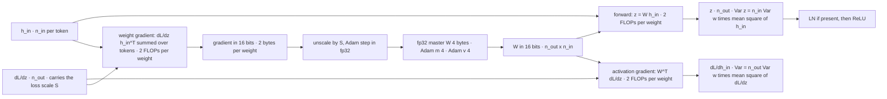
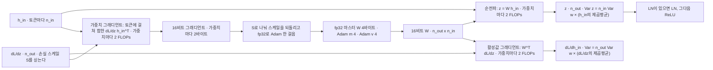

> [!note] Prerequisites · 선수 지식
> [[03-deep-learning/foundations/index|1. Learning Systems]] (object D1, the small classifier of [[03-deep-learning/lab-objects|0. Lab Objects]]; the SGD step and its step-size bound; the training-recipe checklist), [[03-deep-learning/foundations/attention-transformer|1.2 Attention & the Transformer]] (LayerNorm and the pre-norm block, the per-block cost), [[02-foundations/calculus-backprop|2. Calculus & Backprop]] (the product of Jacobians and the residual identity path), [[02-foundations/optimization|4. Optimization]] (momentum and Adam's two running averages) and [[02-foundations/probability|3. Probability]] (variance, and why uncorrelated variances add). Object **D1** from [[03-deep-learning/lab-objects|0. Lab Objects]] plus two objects frozen on this page; the Tier A lab in §10 needs NumPy and nothing else.
> [[03-deep-learning/foundations/index|1. 학습 시스템]](대상 D1, SGD 한 스텝과 그 보폭 경계, 학습 recipe 점검 목록), [[03-deep-learning/foundations/attention-transformer|1.2 어텐션과 Transformer]](LayerNorm과 pre-norm 블록, 블록당 비용), [[02-foundations/calculus-backprop|2. 미적분과 역전파]](Jacobian의 곱과 잔차의 항등 경로), [[02-foundations/optimization|4. 최적화]](momentum과 Adam의 두 이동평균), [[02-foundations/probability|3. 확률]](분산, 그리고 상관없는 항의 분산이 더해지는 이유). 대상은 [[03-deep-learning/lab-objects|0. Lab Objects]]의 **D1**과 이 페이지가 고정하는 대상 둘이고, §10의 Tier A 실습에는 NumPy만 있으면 된다.

## English

*Stands on [[03-deep-learning/foundations/index|1. Learning Systems]] and [[03-deep-learning/foundations/attention-transformer|1.2 Attention & the Transformer]]. Second use of object **D1**, whose home is 1. Learning Systems: that page lists initialization, precision and hardware among the items of a training recipe ([[03-deep-learning/foundations/index|1. Learning Systems §5]]) and asks a scaling claim to separate parameters, data and compute ([[03-deep-learning/foundations/index|1. Learning Systems §4]]). This page puts a number on each of those items. [[03-deep-learning/vlm/index|3. VLM]] and [[03-deep-learning/vla/index|4. VLA]] rely on §8 whenever a pretrained model is adapted.*

> [!note] First pass · 처음이라면
> Look at the picture first, then work the Worked case with a calculator — D1's variances under three initializations, and T-100M's compute, time, memory, tokens per parameter and one LoRA fraction. Read §1, §5 and §6 and do problems 1–2. Open §2–§4 when a paper says "BatchNorm", "pre-norm" or "bf16", and §7–§8 when it quotes a token count or a LoRA rank; §10 runs §1–§9 as code. Open §11 before putting a trained model on a robot.

### Running object · 이 페이지의 대상

Three objects, one for each scale the page works at.

**D1** from [[03-deep-learning/lab-objects|0. Lab Objects]], at its catalog numbers — $x=(1,2)$, $W_1\in\mathbb R^{3\times2}$, $W_2\in\mathbb R^{2\times3}$, ReLU, biases zero, $z=W_1x=(1,2,1)$ — carries the hand calculations: the variance a pre-activation gets when $W_1$ is re-drawn under each initialization (Worked case), and what BatchNorm and LayerNorm do to $z$ (§2).

**MLP-20** is frozen here for the initialization lab, because what D1 is too shallow to show — twenty random multiplications in a row — needs depth.

| Symbol | Value | What it is |
|---|---:|---|
| $L$ | 20 | layers, each $z_l=W_lh_{l-1}$ and $h_l=\mathrm{ReLU}(z_l)$, with $h_0=x$ |
| $n$ | 64 | width of every layer, so $n_{\text{in}}=n_{\text{out}}=64$ and every $W_l$ is $64\times64$ |
| batch | 512 | inputs, every entry drawn from $\mathcal N(0,1)$, so $\mathbb E[x^2]=1$ |
| biases | 0 | none, as in D1 |
| draws | seed 0 | one set of standard-normal matrices $G_l$; an initialization with standard deviation $\sigma$ uses $W_l=\sigma G_l$ |

The two variants the lab adds — a LayerNorm before each ReLU, and a residual path — reuse the same $G_l$, so any difference between two rows of the lab's table is the one change between them.

**T-100M** is frozen here for the compute and memory budget. Every number is illustrative, chosen so the arithmetic is clean; none is a product specification or a figure from a paper.

| Symbol | Value | What it is |
|---|---:|---|
| $N$ | $1.0\times10^8$ | parameters, all of them in weight matrices; embedding tables, which cost memory but no arithmetic, are left out |
| $D$ | $2.0\times10^9$ | training tokens |
| $d$ | 768 | model width, so each attention projection is $768\times768$ |
| $n_{\text{ctx}}$ | 1024 | context length, used only for the attention correction in §6 |
| $R$ | $100\ \text{TFLOP/s}=10^{14}\ \text{FLOP/s}$ | the throughput one device *sustains* on this workload |
| recipe | 16-bit compute, fp32 master weights, Adam | the mixed-precision recipe of §4 |

The number of blocks is not frozen. Only the attention correction in §6 touches it, and there the page assumes all of $N$ sits in standard blocks of $12d^2$ parameters (MLP width $4d$) — $N/(12d^2)=14.1$ of them, not a whole number, which moves that correction by a few percent; nothing else on the page depends on the count.

*Scope: this page teaches why initialization scales each weight by the layer's fan and the activation's gain; what BatchNorm and LayerNorm normalize over and what changes at inference; what a residual path and a pre-norm residual do to variance, forwards and backwards; why mixed precision needs a master copy and a loss scale; how many bytes and how much arithmetic training costs per parameter; the empirical fit of about twenty tokens per parameter; what LoRA saves and what it does not; and, briefly, why schedules warm up. It does not teach the optimizers themselves, which are [[02-foundations/optimization|4. Optimization §3]] and the [[01-canonical-papers/notes/1-foundations/adam|Adam note]]; nor the attention block whose cost it budgets, which is [[03-deep-learning/foundations/attention-transformer|1.2]] — LayerNorm is defined in its §6 and the per-block arithmetic counted in its §7; nor the recipe as a reading checklist, with EMA and gradient accumulation, which is [[02-foundations/ml-practice|9. ML Practice §6]]; nor distributed training — how model states are split across devices — which §5 names and does not teach; nor the scaling-law fits themselves, which are the [[01-canonical-papers/notes/1-foundations/scaling-laws|Scaling Laws note]].*

### The picture · 그림으로 먼저 보기



One linear layer through one mixed-precision training step. Three products each cost 2 FLOPs per weight per token — the forward $z=Wh_{\text{in}}$, whose variance scales with $n_{\text{in}}$; the activation gradient $W^\top\partial L/\partial z$, whose variance scales with $n_{\text{out}}$; and the weight gradient, summed over tokens — while the loss scale $S$ rides the backward pass and is divided out in fp32 just before the Adam step. Each weight keeps five numbers, $2+2+4+4+4=16$ bytes (the 16-bit weight and gradient, the fp32 master and Adam's two moments), the master copy feeds the 16-bit weight and never the reverse, and every number on the page is one of these per-weight costs multiplied by a count.

### Worked case · 대상으로 한 번 끝까지

This is the homework object at both of its scales. The problem set changes the layer's fans, the batch-mate, the model, the budget and the adapter; do the catalog versions here first, so the set is a change of knobs rather than a first derivation.

**D1's first layer under He initialization.** He draws each weight with variance $2/n_{\text{in}}$ (derived in §1). D1's $W_1$ has $n_{\text{in}}=2$, so $\operatorname{Var}(w)=1$. With the catalog input held fixed, each pre-activation $z_i=W_{i1}x_1+W_{i2}x_2$ is a sum of two independent zero-mean terms, and the variances of independent terms add:

$$\operatorname{Var}(z_i)=\sum_{j=1}^{2}x_j^2\operatorname{Var}(w)=(1^2+2^2)\cdot1=5$$

so each of the three pre-activations has standard deviation $\sqrt5=2.236$, and the catalog's own $z=(1,2,1)$ is one draw inside that spread. A ReLU keeps the positive half of a symmetric zero-mean $z$, so $\mathbb E[h_i^2]=\operatorname{Var}(z_i)/2=2.5$ — exactly the mean square of the input, $(1^2+2^2)/2=2.5$. That equality is the design goal: what enters layer 2 has the second moment of what entered layer 1. Layer 2 has $n_{\text{in}}=3$, so He gives it variance $2/3$, and each logit $s_k$ of $s=W_2h$ has

$$\operatorname{Var}(s_k)=n_{\text{in}}\operatorname{Var}(w)\,\mathbb E[h^2]=3\cdot\tfrac23\cdot2.5=5$$

because each logit sums three independent products. The same arithmetic under the other two choices:

| init | $\operatorname{Var}(w)$ in $W_1$ | $\operatorname{Var}(z_i)$ | $\mathbb E[h_i^2]$ | $\operatorname{Var}(w)$ in $W_2$ | $\operatorname{Var}(s_k)$ |
|---|---:|---:|---:|---:|---:|
| He, $2/n_{\text{in}}$ | 1 | 5 | 2.5 | 2/3 | 5 |
| Xavier, $2/(n_{\text{in}}+n_{\text{out}})$ | 0.4 | 2 | 1 | 0.4 | 1.2 |
| $\mathcal N(0,1)$ | 1 | 5 | 2.5 | 1 | 7.5 |

D1's first layer is the one place where $\mathcal N(0,1)$ *is* He — $2/n_{\text{in}}=1$ when $n_{\text{in}}=2$ — and its second layer already grows the variance by $n_{\text{in}}/2=1.5$. Sampling $200{,}000$ He-drawn copies of $W_1$ in §10 gives $\operatorname{Var}(z)=4.993$ and $\mathbb E[h^2]=2.496$.

**The same rule on MLP-20.** Each ReLU layer multiplies the pre-activation variance by $n_{\text{in}}\operatorname{Var}(w)/2$ (§1). At $n=64$ that factor is $32$ for $\mathcal N(0,1)$, $64\cdot\tfrac{2}{128}\cdot\tfrac12=\tfrac12$ for Xavier and $1$ for He. The first layer reads the raw input, so $\operatorname{Var}(z_1)=64\operatorname{Var}(w)$, and the three predictions for layer 20 are

$$\sigma(z_{20})=8\cdot32^{19/2}=1.59\times10^{15},\qquad 1\cdot\big(\tfrac12\big)^{19/2}=1.38\times10^{-3},\qquad \sqrt2=1.414$$

since nineteen more layers each multiply the standard deviation by the square root of the factor. Explosion, collapse, and a constant. §10 runs the network and gets $9.0\times10^{14}$, $7.8\times10^{-4}$ and $0.80$ — the right orders of magnitude, and in all three rows the same ratio $0.57$ to the prediction, for a reason §10 gives.

**T-100M's budget.** Five numbers, each one line of §5–§8.

*Compute.* Six FLOPs per parameter per token (§6):

$$C=6ND=6\times(1.0\times10^8)\times(2.0\times10^9)=1.2\times10^{18}\ \text{FLOPs}$$

*Time.* Divide by what the device sustains: $1.2\times10^{18}/10^{14}=1.2\times10^4\ \text{s}=3.33\ \text{h}$ on one device.

*Memory.* Mixed-precision Adam keeps five numbers per parameter, $2+2+4+4+4=16$ bytes (§5):

$$M=16N=16\times10^8\ \text{bytes}=1.6\ \text{GB}$$

split as 0.2 GB of 16-bit weights, 0.2 GB of 16-bit gradients, 0.4 GB of fp32 master weights and 0.4 GB for each of Adam's two moments; a GB here is $10^9$ bytes, so this is also $1.49$ GiB. Activations are not in the count. Served in 16 bits the same model needs its weights only, $2N=0.2$ GB, so the training states cost eight times the inference weights.

*Tokens per parameter.* $D/N=2.0\times10^9/1.0\times10^8=20$, exactly the ratio of the compute-optimal fit in §7: for $C=1.2\times10^{18}$ the fit asks for $N=\sqrt{C/120}=1.0\times10^8$. T-100M was frozen on the fit so that the sweep in §10 can step off it in both directions. The match is exact on the page's convention, which counts weight matrices only; Hoffmann et al. count embedding tables in $N$ too (§7), so a real model with a vocabulary would read below 20 on theirs.

*A LoRA fraction.* A rank-$r$ adapter on a $d\times k$ matrix trains $r(d+k)$ numbers instead of $dk$ (§8). For one $768\times768$ projection at $r=8$,

$$\frac{r(d+k)}{dk}=\frac{8\cdot1536}{768\cdot768}=\frac{12{,}288}{589{,}824}=\frac1{48}=2.08\%$$

so the adapter trains one number in 48. §8 shows why the memory it saves is a factor near 7 rather than 48, and the compute it saves about a third.

### 1. Initialization is a variance budget

Every layer multiplies its input by a random matrix, and a product of twenty random scalings is very large, very small, or — only by design — about one. Initialization is that design.

**Forward.** Take one layer, $z=Wh$ with $W\in\mathbb R^{n_{\text{out}}\times n_{\text{in}}}$. At initialization three things hold: the entries $W_{ij}$ are independent and zero-mean with a common variance $\operatorname{Var}(w)$; they are independent of the input $h$; and the entries of $h$ share one mean square $\mathbb E[h^2]$. Then each product $W_{ij}h_j$ has mean zero and second moment $\operatorname{Var}(w)\,\mathbb E[h^2]$, the $n_{\text{in}}$ products in $z_i$ are uncorrelated, and uncorrelated variances add ([[02-foundations/probability|3. Probability §2]]):

$$\operatorname{Var}(z_i)=n_{\text{in}}\operatorname{Var}(w)\,\mathbb E[h^2]$$

It is the mean square $\mathbb E[h^2]$, not the variance of $h$, that enters, because a post-ReLU $h$ has a positive mean. When the input has mean zero — raw standardized data, or a network in its linear regime — the two coincide and the rule reads $\operatorname{Var}(z)=n_{\text{in}}\operatorname{Var}(w)\operatorname{Var}(x)$.

**The activation's share.** A ReLU passes the positive half of a symmetric zero-mean $z$ and zeroes the other half, so $\mathbb E[\mathrm{ReLU}(z)^2]=\tfrac12\operatorname{Var}(z)$. Chaining the two steps, each layer multiplies the previous pre-activation's variance by one fixed factor:

$$\operatorname{Var}(z_l)=\frac{n_{\text{in}}\operatorname{Var}(w)}{2}\operatorname{Var}(z_{l-1})$$

so after the first layer, which reads the input, every further layer applies the same factor — $L-1$ times over $L$ layers — and any factor other than one compounds geometrically with depth. The factor that holds at every depth is exactly one, $\operatorname{Var}(w)=2/n_{\text{in}}$. That is He initialization (He et al., ICCV 2015).

**Backward.** The gradient crosses the same layer transposed, $\partial L/\partial h=W^\top\,\partial L/\partial z$, and the ReLU's mask passes half of it, so by the same argument

$$\operatorname{Var}\Big(\frac{\partial L}{\partial h_{l-1}}\Big)=\frac{n_{\text{out}}\operatorname{Var}(w)}{2}\operatorname{Var}\Big(\frac{\partial L}{\partial h_l}\Big)$$

because a row of $W^\top$ has $n_{\text{out}}$ entries. The forward pass asks for $\operatorname{Var}(w)=2/n_{\text{in}}$ and the backward pass for $2/n_{\text{out}}$. A square layer satisfies both; a rectangular one cannot.

**Glorot's compromise.** Glorot and Bengio (AISTATS 2010) derived the same pair of conditions for a network in its linear regime — tanh near zero has slope one and halves nothing — where they read $n_{\text{in}}\operatorname{Var}(w)=1$ and $n_{\text{out}}\operatorname{Var}(w)=1$. Their compromise is the variance whose reciprocal is the average fan,

$$\operatorname{Var}(w)=\frac{2}{n_{\text{in}}+n_{\text{out}}}$$

so that $1/\operatorname{Var}(w)=(n_{\text{in}}+n_{\text{out}})/2$ sits halfway between the two requirements. He et al. keep one of their two ReLU conditions instead of averaging them, and note that either one alone suffices (ICCV 2015, after their equation 16): satisfy the forward condition and the backward factors multiply, over the whole network, to the last layer's output width over the first layer's input width — a constant, not a power of the depth. They also measured the cost of the wrong choice: a 30-layer ReLU network that converges under their initialization and completely stalls under Xavier's (their Figure 3).

> **Variance-preserving initialization, defined.** A **variance-preserving initialization** is a *rule for the distribution of each layer's initial weights* — a scale chosen per layer, once, before training; not a learned quantity and not a normalization applied during training. Four defining conditions. The weights are **independent and zero-mean**, so the terms of every pre-activation are uncorrelated. The variance is **set by the layer's fan** — how many terms each output sums — and not fixed across layers. It is **matched to the activation's gain**, the factor by which the nonlinearity scales the mean square: $\tfrac12$ for ReLU, $1$ for tanh near zero. And it **targets a per-layer factor of one** in the forward pass, the backward pass, or a compromise of the two.
>
> $$\operatorname{Var}(w)=\frac{2}{n_{\text{in}}}\ \ \text{(He, ReLU)},\qquad \operatorname{Var}(w)=\frac{2}{n_{\text{in}}+n_{\text{out}}}\ \ \text{(Xavier or Glorot, linear regime)}$$
>
> where $n_{\text{in}}$ is the fan-in (inputs summed per output) and $n_{\text{out}}$ the fan-out — and the weights may be drawn Gaussian or uniform, since a uniform on $[-a,a]$ has variance $a^2/3$ and Glorot's uniform bound $a=\sqrt{6/(n_{\text{in}}+n_{\text{out}})}$ gives the same variance.
>
> - **Example**: one MLP-20 layer, $64\times64$. He draws with standard deviation $\sqrt{2/64}=0.1768$ and keeps the variance factor at exactly $1$; Xavier draws with $\sqrt{1/64}=0.125$ and sets it to $\tfrac12$ — the right compromise for tanh, applied to an activation that halves the mean square.
> - **Non-example**: $\mathcal N(0,1)$ for every weight. It ignores the fan, so at width 64 each ReLU layer multiplies the variance by 32, the standard deviation at MLP-20's twentieth layer is predicted at $1.59\times10^{15}$, and in fp16 the network is infinite by layer 6 (§10) — bf16, with fp32's range, would still hold it.
> - **Non-example**: a fixed small scale, $0.01\cdot\mathcal N(0,1)$. It ignores the fan in the other direction: at width 64 the factor is $64\cdot10^{-4}/2=0.0032$ per layer, and by layer 6 the typical pre-activation, $4.6\times10^{-8}$, is below the smallest number fp16 can hold. A fixed scale is right for at most one width.
> - **Why it matters**: the factor compounds, so an error of 2 per layer is $2^{20}\approx10^6$ after twenty layers, and the gradient compounds the same way backwards. Normalization (§2) and pre-norm residuals (§3) make modern networks far less sensitive to the choice, which is why the recipe checklist of [[02-foundations/ml-practice|9. ML Practice §6]] can call it rarely load-bearing; a paper that trains without normalization, or that reports a divergence in its first hundred steps, is reporting on this.

### 2. Normalization: which axis, and what changes at inference

Initialization sets the scale once. A normalization layer resets it at every forward pass, from the data. The two standard ones apply the same standardization along different axes of the activation matrix, and the axis decides everything else about them.

> **BatchNorm, defined.** **Batch normalization** is a *per-feature standardization computed across the samples of a mini-batch, followed by a learned per-feature scale and shift* — a layer whose output for one sample depends on the other samples in its batch, and which computes a different function in training and at inference. Four defining conditions. Its **statistics run over the batch axis**: for each feature — each channel of a convolutional layer, pooled over the batch and every spatial position — one mean and one variance over the $m$ samples. The standardized value is **rescaled and shifted by learned $\gamma_j$ and $\beta_j$**, two parameters per feature, so the layer can still represent the identity. In **training** it uses the current batch's statistics and back-propagates through them. At **inference** it replaces them with population estimates from the training data — Ioffe and Szegedy average the statistics of many training mini-batches, and running averages kept during training are the common alternative — and becomes a fixed affine map per feature.
>
> $$\hat z_{ij}=\frac{z_{ij}-\mu_j}{\sqrt{\sigma_j^2+\varepsilon}},\qquad y_{ij}=\gamma_j\hat z_{ij}+\beta_j,\qquad \mu_j=\frac1m\sum_{i=1}^{m}z_{ij},\quad \sigma_j^2=\frac1m\sum_{i=1}^{m}(z_{ij}-\mu_j)^2$$
>
> where $i$ indexes the $m$ samples of the batch, $j$ the features, and $\varepsilon$ is a small constant that keeps the division defined — so the sums run down a *column* of the batch matrix, one feature across samples, where LayerNorm's run along a *row*.
>
> - **Example**: D1 with a batch of two, $x=(1,2)$ and $x'=(2,1)$, so $z=(1,2,1)$ and $z'=W_1x'=(2,1,2)$. Each feature now has two values, and two distinct values always standardize to $-1$ and $+1$: with $\gamma=1$, $\beta=0$, $\varepsilon\to0$, BatchNorm sends $x$ to $(-1,1,-1)$ and $x'$ to $(1,-1,1)$. At batch size two it keeps only which of the two samples was larger, feature by feature.
> - **Non-example**: the same $x$ batched with $x''=(1,3)$ instead, $z''=(1,3,1)$. Features 1 and 3 now hold two equal values, variance zero, and standardize to $0$; feature 2 goes to $-1$. So $x$ becomes $(0,-1,0)$ — a different output for the same input, because its batch-mate changed. At batch size one a fully connected feature is its own mean and the layer outputs $\beta$ whatever the input; a convolutional channel still pools its spatial positions, so it keeps some dependence on the input. That is a function of the batch, not of the sample.
> - **Non-example**: BatchNorm at inference. With population statistics in place of batch ones the output no longer depends on a batch-mate, but it now depends on how well those averages match the test data, and a model accidentally evaluated in training mode is a different function; the [[01-canonical-papers/notes/1-foundations/batch-norm|BatchNorm note]] lists that mismatch among the method's standing costs.
> - **Why it matters**: the batch dependence is the price of normalizing across samples, and it is paid wherever batches are small, where training and deployment statistics differ, or where the samples of a batch are not interchangeable — padded sequences of different lengths, or one observation at a time on a robot. That is the case for normalizing along the other axis.

**LayerNorm** applies the same standardization along the other axis — over the $d$ features of one sample or one token, with its own learned $\gamma,\beta\in\mathbb R^d$ — and is defined in full on [[03-deep-learning/foundations/attention-transformer|1.2 Attention & the Transformer §6]]. On D1's $z=(1,2,1)$ the mean is $4/3$ and the variance $2/9$, a standard deviation of $0.4714$, so with $\gamma=1$, $\beta=0$, $\varepsilon=0$

$$\mathrm{LN}(z)=\frac{(1,2,1)-\tfrac43}{0.4714}=(-0.7071,\ 1.4142,\ -0.7071)$$

whatever $x$ was batched with, and at batch size one. It pays a different price: it removes each sample's own mean and scale, so $z''=(1,3,1)=2z-1$ maps to the same three numbers, and whatever D1's features said by their overall level is gone.

| | BatchNorm | LayerNorm |
|---|---|---|
| statistics over | one feature, across the $m$ samples of the batch (and spatial positions) | one sample or token, across its $d$ features |
| depends on the other samples | yes | no |
| training versus inference | batch statistics, then population statistics: two functions | the same computation in both |
| at batch size one, training mode | outputs $\beta$ for a fully connected feature | unchanged |
| learned parameters | $2$ per feature | $2d$ |
| what it erases | each feature's batch mean and scale | each sample's own mean and scale |

**Why Transformers use LayerNorm.** Each reason is a consequence of the axis. A Transformer's samples are tokens in sequences of different lengths, padded to a common length; batch statistics would mix real tokens with padding and with other sequences, and per-token statistics see neither. Statistics pooled across a sequence would also let each token's normalized value depend on the tokens after it — a leak from the future that a causal model must not have in training and cannot have when it generates. And a language or action model generates its output one token at a time, often for a single sequence, so it is deployed in inference mode on statistics it never trained with: BatchNorm there computes a different function from the one that was trained, LayerNorm the same one — Ba, Kiros and Hinton (2016) state the training-and-test property in their abstract. RMSNorm, which divides by the root-mean-square without subtracting the mean, is set against LayerNorm in the [[01-canonical-papers/notes/1-foundations/attention-is-all-you-need|Transformer note]].

**What a normalization does to initialization.** LayerNorm is scale-invariant, $\mathrm{LN}(cz)=\mathrm{LN}(z)$ for $c>0$ up to $\varepsilon$, so a layer followed by one computes the same function whatever the scale of its weights: in §10 the three LayerNorm rows are one network, their final activations agreeing to within $3\times10^{-5}$. The scale still matters in one place. If a loss, as a function $\ell(W)$ of one such weight matrix, satisfies $\ell(cW)=\ell(W)$ for every $c>0$, differentiating both sides with respect to $W$ gives $c\,\nabla\ell(cW)=\nabla\ell(W)$, so

$$\nabla\ell(cW)=\frac{\nabla\ell(W)}{c},\qquad \frac{\lVert\eta\,\nabla\ell(cW)\rVert}{\lVert cW\rVert}=\frac{\eta}{c^2}\,\frac{\lVert\nabla\ell(W)\rVert}{\lVert W\rVert}$$

and a weight matrix initialized $c$ times larger takes relative steps $c^2$ times smaller. Behind a normalization the initialization scale stops deciding whether the signal survives and becomes part of the effective learning rate — one reason weight decay and normalization interact.

### 3. Residual connections: the identity path, in variance

A residual block computes $x_l=x_{l-1}+F_l(x_{l-1})$. Its Jacobian $I+\partial F_l/\partial x$ gives the gradient a path that no weight multiplies; that identity path, and the product of Jacobians it short-circuits, are defined in [[02-foundations/calculus-backprop|2. Calculus & Backprop §5]] — the same product taken across time steps instead of layers is the vanishing and exploding of [[03-deep-learning/foundations/sequence-models|1.1 Sequence Models §3]] — and the pre-norm block that uses it is [[03-deep-learning/foundations/attention-transformer|1.2 Attention & the Transformer §6]]. What the identity does not do on its own is keep the variance bounded, and the difference between a plain and a pre-norm residual stream is one line of §1's algebra.

**Plain residual.** Let each branch be one He-initialized layer, $F_l(x)=W_l\,\mathrm{ReLU}(x)$. At initialization $W_l$ is zero-mean and independent of $x_{l-1}$, so the branch is uncorrelated with the stream and the variances add:

$$\operatorname{Var}(x_l)=\operatorname{Var}(x_{l-1})+\frac{n\operatorname{Var}(w)}{2}\operatorname{Var}(x_{l-1})=2\operatorname{Var}(x_{l-1})$$

because the branch reads the stream unnormalized, so its output variance is proportional to the stream's. Every block doubles the variance: MLP-20 built this way is predicted at $2^{20}$ in variance, $2^{10}=1024$ in standard deviation, by block 20. The backward pass mirrors it. Write $g_l=\partial L/\partial x_l$ for the gradient on the stream and $J_l=\partial F_l/\partial x$ for the branch's Jacobian; the gradient into block $l$ is $g_{l-1}=g_l+J_l^\top g_l$, the two terms are uncorrelated at initialization, and the second has variance $\tfrac{n\operatorname{Var}(w)}{2}\operatorname{Var}(g_l)=\operatorname{Var}(g_l)$, so the gradient doubles per block as well. At initialization the identity path keeps the gradient from shrinking in variance — the branch term can only add to it — but it does nothing to stop the gradient growing.

**Pre-norm residual.** Put a LayerNorm at the branch's entrance, $F_l(x)=W_l\,\mathrm{ReLU}(\mathrm{LN}(x))$, the form of 1.2's block. The branch now reads a unit-variance input however large the stream has grown, so its output variance is a constant $v=n\operatorname{Var}(w)/2$ — one, under He — and each block adds instead of multiplying:

$$\operatorname{Var}(x_l)=\operatorname{Var}(x_0)+l\,v$$

which is linear in depth: $1+20=21$ at block 20, a standard deviation of $4.58$. Backwards, the LayerNorm divides the branch's gradient by the stream's standard deviation, so $\operatorname{Var}(g_{l-1})=\operatorname{Var}(g_l)\big(1+v/\operatorname{Var}(x_{l-1})\big)=\operatorname{Var}(g_l)\operatorname{Var}(x_l)/\operatorname{Var}(x_{l-1})$, and the product over blocks telescopes:

$$\frac{\operatorname{Var}(g_0)}{\operatorname{Var}(g_L)}=\prod_{l=1}^{L}\frac{\operatorname{Var}(x_l)}{\operatorname{Var}(x_{l-1})}=\frac{\operatorname{Var}(x_L)}{\operatorname{Var}(x_0)}=1+\frac{L\,v}{\operatorname{Var}(x_0)}$$

since every intermediate variance cancels. The gradient that reaches the bottom is larger than the one leaving the top by exactly the factor the forward signal grew — $\sqrt{21}=4.58$ in standard deviation — polynomial in depth where the plain residual was exponential. §10 measures $4.74$ forwards and $4.48$ backwards; the plain residual measures $969$ and $992$ against $1024$.

The reading lesson: a residual path makes depth trainable only together with something that stops each branch's output from growing with the stream — a normalization inside the branch, or a branch initialized small. Post-norm, the 2017 placement, normalizes the sum instead, which holds the stream at unit variance but puts a LayerNorm on the identity path itself; why that placement needs a learning-rate warmup the pre-norm one can do without is §9.

### 4. Mixed precision: a master copy and a loss scale

A floating-point number is $(1+\phi)\,2^{e}$, with $\phi\in[0,1)$ the fraction and $e$ the exponent: the exponent bits set the range, and the fraction bits set the spacing between neighbours — one unit in the last fraction bit, $2^{-p}$ just above 1 for $p$ fraction bits. The three formats a training run mixes differ in exactly those two allocations:

| format | sign · exponent · fraction bits | largest | smallest normal | smallest subnormal | spacing just above 1 |
|---|---|---:|---:|---:|---:|
| fp32 | 1 · 8 · 23 | $3.40\times10^{38}$ | $1.18\times10^{-38}$ | $1.4\times10^{-45}$ | $2^{-23}=1.19\times10^{-7}$ |
| fp16 | 1 · 5 · 10 | $65{,}504$ | $2^{-14}=6.10\times10^{-5}$ | $2^{-24}=5.96\times10^{-8}$ | $2^{-10}=9.77\times10^{-4}$ |
| bf16 | 1 · 8 · 7 | $3.39\times10^{38}$ | $1.18\times10^{-38}$ | $9.2\times10^{-41}$ | $2^{-7}=7.81\times10^{-3}$ |

fp16 spends its bits on precision and gets a narrow range; bf16 keeps fp32's eight exponent bits, hence fp32's range, and pays with a spacing eight times coarser than fp16's. [[02-foundations/ml-practice|9. ML Practice §6]] gives the range side of this trade; the spacing side is what the master copy is about. The same spacing met in a robot's log rather than in a weight — a float32 clock that stops counting ticks, a running sum that drifts — is [[02-foundations/tools/python-research-code|12.3 Python for Research Code §5]].

**Why a master copy.** An update is added to a weight, and the sum is rounded to the weight's format. Write $\mathrm{fl}_{16}(\cdot)$ for that rounding. In fp16 the next number above 1 is $1+2^{-10}$, so an increase smaller than half the gap, $2^{-11}=4.88\times10^{-4}$, rounds straight back — and below 1 the spacing halves, so a decrease is lost below $2^{-12}$:

$$\mathrm{fl}_{16}\big(1+10^{-4}\big)=1$$

because $10^{-4}<2^{-11}$. Adding $10^{-4}$ to a weight equal to 1 ten thousand times leaves it at exactly $1.0$ in fp16 and moves it to $2.000166$ in fp32 (§10). A learning rate of $10^{-4}$ times a gradient of order one is an ordinary step, so a 16-bit weight updated in place stops learning without any error being raised. The remedy keeps an fp32 master copy, applies each step there, and re-rounds the 16-bit copy from it before the next forward pass. In general the threshold depends on where the weight sits between two powers of two: fp16 loses every update smaller than $2^{-12}$ of the weight and can lose one up to $2^{-11}$ — the 2048 of the definition below. bf16's spacing is coarser still, so it needs the master copy even more: its thresholds are $2^{-9}$ and $2^{-8}=3.9\times10^{-3}$, and a weight of 1 loses any increase below the second.

**Why loss scaling.** Gradients in a deep network are often tiny — in the speech-recognition model Micikevicius et al. examine, about 5% of the weight-gradient values sit below $2^{-24}$ (their §3.1) — and fp16's smallest subnormal is $2^{-24}=5.96\times10^{-8}$; anything below half of it, $2^{-25}=2.98\times10^{-8}$, rounds to zero. A gradient of $2\times10^{-8}$ is therefore exactly zero in fp16, and a weight whose gradients all sit there never moves. The backward pass is linear in the loss, so multiplying the loss by a constant $S$ multiplies every gradient by $S$:

$$\nabla_\theta(S\,L)=S\,\nabla_\theta L,\qquad g=\frac1S\,\mathrm{fl}_{16}\big(\nabla_\theta(S\,L)\big)$$

so the backward pass runs on gradients $S$ times larger and the division happens in fp32, just before the optimizer. At $S=2^{16}$ the same gradient is $1.31\times10^{-3}$ in fp16 and comes back as $1.999\times10^{-8}$, the last digit lost to fp16's three significant figures. $S$ is a power of two because multiplying by one changes only the exponent, so the scaling itself rounds nothing.

**The window.** Scaling moves the gradients; it does not widen what fp16 can hold at once. From the largest finite value to the smallest subnormal is $65{,}504/2^{-24}=1.1\times10^{12}\approx2^{40}$, and across the normal numbers alone, where full precision holds, $2^{30}$. $S$ must be small enough that the largest gradient times $S$ stays finite — a largest gradient of 2 allows $S=2^{14}$, since $2\cdot2^{14}=32{,}768$, but not $2^{15}$, which gives $65{,}536$ and overflows — and large enough to lift the smallest gradients that matter above $2^{-24}$. Micikevicius et al. choose a constant $S$ this way — their runs used values from 8 to 32K — and skip any step whose scaled gradients still overflow; adjusting $S$ automatically, lowering it after an overflow and raising it after a run of clean steps, is the refinement their paper leaves as future work. bf16 shares fp32's exponent range down to its smallest normal number, $1.18\times10^{-38}$, far below any gradient that matters, so it drops loss scaling altogether.

> **Mixed-precision training, defined.** **Mixed-precision training** is a *training recipe* — a division of labour between number formats inside one optimizer step — not a property of the model and not a compression of its trained weights. Four defining conditions. The **forward and backward matrix products run in a 16-bit format**, fp16 or bf16, which is what halves activation memory and raises throughput. Those products **accumulate their sums in fp32**, so a long dot product does not lose its small terms. An **fp32 master copy of the weights** receives every optimizer update, and the 16-bit weights are re-rounded from it. And **with fp16 the loss is scaled** by $S$ before the backward pass and the gradients unscaled before the step; with bf16 it is not.
>
> $$\theta_{32}\leftarrow\theta_{32}-\eta\,u\Big(\tfrac1S\,\nabla_\theta\big(S\,L(\theta_{16})\big)\Big),\qquad \theta_{16}=\mathrm{fl}_{16}(\theta_{32})$$
>
> where $\theta_{32}$ is the master copy, $\theta_{16}$ its 16-bit rounding used by the forward and backward passes, $\mathrm{fl}_{16}$ rounding to the 16-bit format, $u(\cdot)$ the optimizer's update direction (Adam's, computed from its fp32 moments), $\eta$ the learning rate and $S$ the loss scale, $S=1$ for bf16 — so the only 16-bit quantities are the ones the matrix products read, and everything that accumulates across steps is fp32.
>
> - **Example**: T-100M in fp16 with Adam. Its forward pass reads 0.2 GB of 16-bit weights, its optimizer writes 0.4 GB of fp32 master weights, and at $S=2^{16}$ a $2\times10^{-8}$ gradient travels the backward pass as $1.31\times10^{-3}$.
> - **Non-example**: storing and updating the weights in fp16 with no master copy. Every increase smaller than $4.9\times10^{-4}$ to a unit weight is rounded away, and §10's ten thousand steps end where they started.
> - **Non-example**: 16-bit *inference*, or weights quantized for deployment. There is no optimizer, no gradient and no update, so neither the master copy nor the loss scale has anything to do; what is traded is the accuracy of a fixed function, not the ability to learn.
> - **Why it matters**: it explains three things a training section reports together — the precision, the loss-scale policy, and the memory per parameter — and it is where the 4 bytes of master weight in §5's count come from. A paper that trains "in fp16" and says nothing about scaling or master weights has left out the part that makes it work. The three parts — fp32 master weights, loss scaling, fp32 accumulation — are the recipe of Micikevicius et al. (ICLR 2018), who state the master-copy argument as a ratio: an update 2048 times smaller than its weight can vanish in fp16, which is the $2^{-11}$ above.

### 5. Memory: sixteen bytes per parameter

Training memory has two parts that scale differently. **Model states** are the tensors that exist once per parameter and persist from step to step. **Activations** are the per-token intermediate values saved for the backward pass; they grow with batch size, context length, width and depth, and this page does not budget them. For mixed-precision Adam the model states have a standard count, the one the ZeRO paper builds on (Rajbhandari et al., SC 2020):

$$M_{\text{states}}=\underbrace{2N}_{\text{16-bit }\theta}+\underbrace{2N}_{\text{16-bit }g}+\underbrace{4N}_{\text{fp32 master}}+\underbrace{4N}_{\text{Adam }m}+\underbrace{4N}_{\text{Adam }v}=16N\ \text{bytes}$$

because each parameter carries five numbers: the two that the matrix products read and write, in 16 bits, and the three the optimizer keeps in fp32 — §4's master weight and Adam's two running averages, the mean and the mean square of the gradient ([[02-foundations/optimization|4. Optimization §3]]).

> **Model states and the 16-byte count, defined.** The **model states** of a training run are the *tensors that exist once per trained parameter and persist across optimizer steps* — a memory ledger indexed by parameters, not by data. Three defining conditions. They are **per parameter**: every trained number carries the same set of stored numbers, so the total is bytes-per-parameter times $N$. They are **independent of the batch**: doubling the batch or the context leaves them unchanged. And their size is **set by the recipe, not the architecture**: the optimizer decides how many running averages there are — two for Adam, one for momentum SGD, none for plain SGD — and the precision decides each one's bytes.
>
> $$M_{\text{states}}=bN,\qquad b=\underbrace{2+2}_{\text{16-bit }\theta,\ g}+\underbrace{4+4+4}_{\text{fp32 master},\ m,\ v}=16$$
>
> where $N$ is the number of trained parameters and $b$ the bytes each one carries — so mixed-precision Adam costs $b=16$, and so does plain fp32 Adam, $4+4+4+4$ for weights, gradients, $m$ and $v$: mixed precision saves activation memory and time, not model states.
>
> - **Example**: T-100M, $16\times10^8$ bytes $=1.6$ GB, as $0.2+0.2+0.4+0.4+0.4$.
> - **Non-example**: inference memory. A deployed model holds its weights once, $2N=0.2$ GB for T-100M in 16 bits — one eighth of the training states. "Fits on one GPU" has to say whether it means training or inference, because the factor between them is eight before a single activation is counted.
> - **Non-example**: activation memory. It is not per parameter but per token kept for the backward pass, it grows with batch and context, and at long contexts it can exceed the model states. The ZeRO paper files activations, temporary buffers and fragmented memory under a separate name, *residual states*, to keep them out of this ledger; recomputing activations during the backward pass instead of storing them trades that memory for compute, which the 16-byte count never sees.
> - **Why it matters**: the count shows where each memory-saving method acts. The ZeRO paper shards the 16 bytes across $N_d$ data-parallel devices in three cumulative stages — the optimizer's 12 bytes first ($4\Psi+12\Psi/N_d$ per device in its notation, $\Psi$ being $N$, so at most a $4\times$ saving), then the gradients ($2\Psi+14\Psi/N_d$, at most $8\times$), then the weights themselves ($16\Psi/N_d$, falling linearly with $N_d$); at the third stage T-100M's 1.6 GB is 0.2 GB per device on eight devices. LoRA (§8) removes 14 of the 16 bytes for every frozen parameter. None of these touches the activations.

Which of these sixteen bytes a checkpoint must keep for a run to resume exactly, and how often a long run on a shared cluster should write them, is [[02-foundations/tools/gpu-clusters|12.7 GPU Clusters §6–§7]].

### 6. Compute: six FLOPs per parameter per token

Count the three products of the picture at the top of the page for one token and one weight matrix $W\in\mathbb R^{n_{\text{out}}\times n_{\text{in}}}$.

- **Forward**, $z=Wh$: each weight is used in one multiply and one add, $2n_{\text{out}}n_{\text{in}}$ FLOPs, 2 per weight.
- **Activation gradient**, $\partial L/\partial h=W^\top\partial L/\partial z$: the same product transposed, 2 per weight, needed by every layer below.
- **Weight gradient**, $\partial L/\partial W=\sum_t(\partial L/\partial z_t)\,h_t^\top$ over the tokens of the batch: one multiply and one add per weight per token, 2 per weight.

$$C_{\text{token}}=\underbrace{2}_{\text{forward}}+\underbrace{2+2}_{\text{backward}}=6\ \text{FLOPs per parameter},\qquad C\approx6ND$$

because each of the $N$ parameters takes part in all three products once for each of the $D$ training tokens — which is also why a backward pass costs about twice a forward one: it does two products for the forward's one. Kaplan et al. (2020) derive the same count — a forward pass of about $2N$ plus a context term, a backward pass of about twice that, hence $C\approx6N$ per training token — and Hoffmann et al. (2022) use $6ND$ as the budget constraint of their allocation study, reporting that their own operation-by-operation count differs from it negligibly.

> **Training compute, $C\approx6ND$, defined.** The **training compute** of a run is a *count of floating-point operations* — an amount of arithmetic; not a time, not a price, and not a property of the hardware. Three defining conditions for the $6ND$ estimate. The model is **dense**: every parameter is used exactly once per token, which a mixture-of-experts model, routing each token through a fraction of its parameters, is not. The count keeps **only the parameter matrix products**, one multiply and one add each, and drops the rest because it is small: normalizations, activations and softmaxes cost a few operations per activation rather than per weight, and the attention scores' $n_{\text{ctx}}\times n_{\text{ctx}}$ products are the fraction the non-example below sizes. And **$N$ counts the parameters that multiply activations**; an embedding lookup reads a row and does no arithmetic.
>
> $$C\approx6ND,\qquad t=\frac{C}{R}$$
>
> where $N$ is the parameter count, $D$ the number of training tokens, and $t$ the wall-clock time at a *sustained* throughput $R$ in FLOP/s — which sits below a device's peak by a utilization factor that the paper, not the formula, has to supply.
>
> - **Example**: T-100M, $1.2\times10^{18}$ FLOPs and $1.2\times10^4\ \text{s}=3.33$ h at $R=10^{14}$ FLOP/s. Four such devices take 50 minutes only if nothing is lost to communication.
> - **Non-example**: the attention scores. Per token and block they cost $n_{\text{ctx}}/(6d)$ of the parameter products — [[03-deep-learning/foundations/attention-transformer|1.2 Attention & the Transformer §7]] counts both, for a block of $12d^2$ parameters with an MLP of width $4d$ — which at T-100M's $n_{\text{ctx}}=1024$ and $d=768$ is $0.222$, if all of $N$ sits in such blocks. The true count is $1.22$ times $6ND$ with full attention, or $1.11$ times if the masked half of a causal model is skipped — Kaplan et al.'s own context term, $2n_{\text{layer}}n_{\text{ctx}}d$ per token, is that second ratio, $n_{\text{ctx}}/(12d)$, and they drop it because $d\gg n_{\text{ctx}}/12$. The formula is accurate when the context is short against the width, and only then.
> - **Non-example**: inference. A generated token costs one forward pass, $2N$ FLOPs, a third of a training token, and serving cost is a separate ledger that §7's fit does not count.
> - **Why it matters**: $C$ is the axis on which compute-matched comparisons are made, and the one [[03-deep-learning/foundations/index|1. Learning Systems §4]] asks a scaling claim to hold apart from parameters and data. "Trained with twice the compute" is a statement about the product $ND$ and says nothing about which factor grew.

### 7. Compute-optimal allocation: about twenty tokens per parameter, as a fit

Fix the budget $C$. A larger model sees fewer tokens and a smaller one sees more, and which split reaches the lowest loss is an empirical question. The answer most papers now cite is Hoffmann et al. (NeurIPS 2022), the Chinchilla study: model size and training tokens should be scaled equally, which on their fits works out to roughly twenty training tokens per parameter. The paper never prints that ratio as a number. It is read off their estimates — about 20.2 billion tokens for a 1-billion-parameter model and 205.1 billion for 10 billion (Table 3 of the arXiv version) — and off Chinchilla itself, 70 billion parameters trained on 1.4 trillion tokens. The first difference they name from the earlier study is that it trained every model on the same number of tokens with the same learning-rate schedule, where they found that matching the schedule's length to each run's token count gives the best final loss. Write the ratio as tokens per parameter, $\kappa=D/N$, take $\kappa\approx20$, and solve $D=\kappa N$ against $C=6ND$:

$$C=6N(\kappa N)\ \Rightarrow\ N_{\text{opt}}=\sqrt{\frac{C}{6\kappa}},\qquad D_{\text{opt}}=\kappa N_{\text{opt}}=\sqrt{\frac{\kappa C}{6}}$$

so both grow as the square root of the budget: ten times the compute buys $\sqrt{10}=3.16$ times the parameters and $3.16$ times the tokens. With $\kappa=20$, $6\kappa=120$, and T-100M's budget gives $N_{\text{opt}}=\sqrt{1.2\times10^{18}/120}=1.0\times10^8$ — the object sits on the fit by construction.

> **Compute-optimal allocation, defined.** A **compute-optimal allocation** is the *pair $(N,D)$ that minimizes the final training loss for a fixed compute budget* — an empirical fit over a family of training runs, not a law of learning and not a statement about downstream skill. Four defining conditions. The budget is **fixed and counted as $C\approx6ND$**, so a larger $N$ means a smaller $D$. What is minimized is the **pretraining loss** on the fitting distribution, not a task success rate. The optimum is **read off runs whose learning-rate schedules were matched to their own token budgets**, since a run cut off partway through a longer schedule looks worse than it is. And the result is **specific to the family fitted**: architecture, tokenizer, data mixture, the range of scales the runs covered, and even the parameter count's convention — Hoffmann et al. count embedding parameters in $N$ and Kaplan et al. do not, so ratios quoted from the two studies are not on the same $N$.
>
> $$N_{\text{opt}}(C)\approx\sqrt{\frac{C}{120}},\qquad D_{\text{opt}}(C)\approx20\,N_{\text{opt}}(C)$$
>
> where $C$ is in FLOPs and the $120=6\times20$ carries the fitted ratio — so a change of data (quality, repetition, robot trajectories instead of web text) changes the 20, and nothing in the algebra protects it.
>
> - **Example**: T-100M, $N=10^8$ and $D=2\times10^9$ at $1.2\times10^{18}$ FLOPs. §10's iso-FLOP sweep keeps $C$ and moves $N$: $2.5\times10^7$ parameters see 320 tokens each, $4\times10^8$ see 1.25.
> - **Non-example**: the earlier allocation of Kaplan et al. (2020), which grew parameters much faster than data for the same kind of budget. Same arithmetic, different fitted exponents; the [[01-canonical-papers/notes/1-foundations/scaling-laws|Scaling Laws note]] keeps the two studies apart.
> - **Non-example**: a model deliberately trained far past twenty tokens per parameter. When a model will be served many times, a smaller one trained longer costs more to train and less to run; "compute-optimal" counts training FLOPs only, so this is a different objective, not a mistake.
> - **Why it matters**: tokens per parameter is the first number to compute when a paper reports a model size and a dataset size. An illustrative robot policy of $10^9$ parameters trained on $10^8$ tokens sits at $0.1$, two hundred times below the language fit — and whether that is too little data or a regime the fit never covered is exactly the question the fit cannot answer.

### 8. Fine-tuning and LoRA

Fine-tuning continues training a pretrained $\theta_0$ on a smaller dataset, and freezing leaves a subset of parameters out of the update; both are defined, with the update that touches only the trained part, in [[02-foundations/neural-network-basics|0.8 Neural Networks §6]], which also gives LoRA's shape and a $4096\times4096$ count. This section adds what the two ledgers of §5 and §6 say about it.

> **LoRA, defined.** **Low-rank adaptation** is a *parameterization of the fine-tuning update* — the change to a frozen weight matrix is constrained to a product of two thin trained matrices — not a compression of the pretrained weights and not an extra layer at inference. Four defining conditions. The pretrained $W_0$ is **frozen**. The update is **$\Delta W=BA$ with inner dimension $r$**, so its rank is at most $r\ll\min(d,k)$. **$B$ starts at zero** while $A$ starts random, so $\Delta W=0$ and training begins exactly at the pretrained function. And the update is **scaled by a constant $\alpha/r$ and can be merged**, $W=W_0+\tfrac{\alpha}{r}BA$, so the deployed model runs one ordinary matrix.
>
> $$h=W_0x+\frac{\alpha}{r}\,BAx,\qquad B\in\mathbb R^{d\times r},\ \ A\in\mathbb R^{r\times k},\qquad \frac{\text{trained}}{\text{full}}=\frac{r(d+k)}{dk}$$
>
> where $W_0\in\mathbb R^{d\times k}$ maps a $k$-vector $x$ to a $d$-vector, $r$ is the rank and $\alpha$ a fixed constant — so the trained count grows with $d+k$ while the matrix grows with $dk$, and the fraction shrinks as matrices get larger.
>
> - **Example**: one $768\times768$ projection of T-100M at $r=8$: $12{,}288$ of $589{,}824$, one in 48. Its model states fall from $16\times589{,}824=9.44$ MB to $2\times589{,}824+16\times12{,}288=1.38$ MB, a factor of $6.86$ — not 48, because the frozen $W_0$ still sits in memory in 16 bits.
> - **Non-example**: truncating the SVD of an update after full fine-tuning. That approximates a finished $\Delta W$ and needed the full training first; LoRA constrains the update from the start ([[02-foundations/linear-algebra|1. Linear Algebra §4]] draws the distinction).
> - **Non-example**: fine-tuning only the last layer. That trains a subset of the parameters at full rank and leaves every earlier layer's function fixed; LoRA touches every adapted matrix, but only along $r$ directions.
> - **Why it matters**: it is how large pretrained models are adapted on a single device — VLA policies fine-tuned to a new robot among them, as in the [[01-canonical-papers/notes/4-vla/openvla|OpenVLA note]] — and reading its savings correctly takes both ledgers below.

**Memory.** A frozen parameter keeps only its 16-bit weight, 2 of the 16 bytes; an adapter parameter needs all 16. With $N$ frozen parameters and $fN$ trained adapter parameters,

$$\frac{M_{\text{LoRA}}}{M_{\text{full}}}=\frac{2N+16fN}{16N}=\frac18+f$$

so however small the rank, the model-state saving cannot exceed eight times; past that point the frozen weights themselves must be stored in fewer bits or kept off the device. The one projection above is $\tfrac18+\tfrac1{48}=\tfrac7{48}$, the factor $6.86$.

**Compute.** A frozen weight skips its weight gradient but not its activation gradient, which every adapter below it still needs, so it costs $2+2=4$ FLOPs per token instead of 6. With adapters throughout,

$$\frac{C_{\text{LoRA}}}{C_{\text{full}}}\approx\frac{4N+6fN}{6N}=\frac23+f$$

since the adapter's own parameters cost the full 6. For the one projection that is $\tfrac23+\tfrac1{48}=0.6875$ — about a third saved, not forty-seven forty-eighths. Only the layers below the lowest adapter skip the backward pass entirely, at 2 FLOPs per parameter. Hu et al. measured both effects on GPT-3 175B: a 25% training speedup, 43.1 against 32.5 tokens per second per V100 — a factor of $1.33$, inside the $1.5$ that a two-thirds FLOP count allows for the arithmetic alone — and training memory falling from 1.2 TB to 350 GB, where 350 GB is what 175 billion frozen weights occupy at 2 bytes each, the floor above. Their full fine-tuning baseline was not the 16-byte recipe, so the ratio between those two memory figures is not the $\tfrac18+f$ of this section.

Where this track fine-tunes: a VLM's representation becomes a VLA's backbone ([[03-deep-learning/vlm/index|3. VLM §4]]), and a generalist policy is adapted to a new embodiment or task ([[03-deep-learning/vla/index|4. VLA]]). The paper-level evidence for LoRA, including why two different trainable-parameter fractions circulate for it, is the [[01-canonical-papers/notes/1-foundations/lora|LoRA note]].

### 9. Warmup and schedules, briefly

A schedule is a function $\eta_t$ of the step. The standard one, a linear warmup followed by cosine decay, is written out with numbers in [[02-foundations/ml-practice|9. ML Practice §6]], and the reason Adam in particular warms up — its second-moment average has seen few gradients early — is in [[02-foundations/optimization|4. Optimization §3]]. Three things this page adds.

**Warmup is the step-size bound applied early.** [[03-deep-learning/foundations/index|1. Learning Systems §2]] shows a step is safe only below $2/\lambda_{\max}$ of the current curvature. At initialization nothing guarantees that bound is loose, and the optimizer's own statistics are least reliable, so a schedule starts small and grows. How much warmup a model needs depends on its architecture: Xiong et al. (ICML 2020) show that at initialization the post-norm Transformer's gradients near the output layer are large, which is what warmup protects against, while the pre-norm form of §3 has well-behaved gradients, and they report that pre-norm trained without warmup reaches comparable results.

**Large batches move the peak.** Goyal et al. (arXiv 2017) scale the learning rate linearly with the batch — $k$ times the batch, $k$ times the rate — and found the rule works only with a gradual warmup, raising the rate from $\eta$ to $k\eta$ over the first five epochs (0.1 to 3.2 in their example). A paper that changes its batch size owes you its learning rate at the new batch, and whether it warmed up to it.

**The original Transformer's schedule** is warmup followed by an inverse-square-root decay rather than a cosine (Vaswani et al., NIPS 2017, §5.3):

$$\eta_t=d^{-1/2}\min\big(t^{-1/2},\ t\,T_w^{-3/2}\big)$$

so the rate rises linearly until $t=T_w$ and then decays as $t^{-1/2}$; at the peak, with $d=512$ and $T_w=4000$, it is $512^{-1/2}\cdot4000^{-1/2}=6.99\times10^{-4}$.

### 10. The lab: the variance table, the residual stream, sixteen bits, and the budget

Six parts, all on the frozen objects. Part 1 samples D1's He-drawn first layer and checks the Worked case. Part 2 runs MLP-20 under three initializations, without and then with a LayerNorm before each ReLU, and records the standard deviation of the pre-activation $z_l$ at layers 1, 5, 10, 15 and 20, plus the gradient gain — the standard deviation of the gradient reaching the input divided by that of a unit-variance gradient injected at the top. Part 3 builds the two residual streams of §3 from the same matrices. Part 4 redraws the He network 200 times — plain, with LayerNorm, and plain at width 256 — because one draw is one sample of a random variable. Part 5 repeats the arithmetic of §4 in 16 bits. Part 6 is T-100M's budget and the sweep over $N$ and $D$.

```python
# 1.3 lab: initialization, LayerNorm and residuals on the depth-20 MLP, then compute and memory at scale. NumPy only.
import numpy as np

# --- 0. the frozen MLP: depth 20, width 64, ReLU, no biases -----------------------------------
L, n, B = 20, 64, 512
rng = np.random.default_rng(0)
X  = rng.standard_normal((B, n))                  # a batch of inputs with unit variance
G  = rng.standard_normal((L, n, n))               # one set of N(0,1) draws; each init rescales it
GT = rng.standard_normal((B, n))                  # a unit-variance gradient arriving at the top
INIT = {"N(0,1)": 1.0, "Xavier": np.sqrt(2/(n + n)), "He": np.sqrt(2/n)}

def ln(z, eps=1e-5):                              # LayerNorm over each row's n features, gamma=1, beta=0
    s = np.sqrt(z.var(axis=1, keepdims=True) + eps)
    return (z - z.mean(axis=1, keepdims=True)) / s, s

def ln_back(g, u, s):                             # the backward pass of the same map
    return (g - g.mean(axis=1, keepdims=True) - u*(g*u).mean(axis=1, keepdims=True)) / s

def mlp(sigma, norm, X=X, G=G):                   # z_l = W_l h_{l-1};  h_l = ReLU(z_l) or ReLU(LN(z_l))
    W, h, tape, sd = sigma*G, X, [], []
    for l in range(L):
        z = h @ W[l].T
        u, s = ln(z) if norm else (z, None)
        h = np.maximum(u, 0.0)
        tape.append((u, s)); sd.append(z.std())
    g = GT
    for l in reversed(range(L)):                  # backward: ReLU mask, then LN if present, then W^T
        u, s = tape[l]
        g = g * (u > 0)
        g = (ln_back(g, u, s) if norm else g) @ W[l]
    return np.array(sd), g.std() / GT.std()

def resnet(sigma, norm):                          # x_l = x_{l-1} + W_l ReLU(x_{l-1})  or  + W_l ReLU(LN(x_{l-1}))
    W, x, tape, sd = sigma*G, X, [], []
    for l in range(L):
        u, s = ln(x) if norm else (x, None)
        x = x + np.maximum(u, 0.0) @ W[l].T
        tape.append((u, s)); sd.append(x.std())
    g = GT
    for l in reversed(range(L)):                  # the identity path adds g itself back at every block
        u, s = tape[l]
        b = (g @ W[l]) * (u > 0)
        g = g + (ln_back(b, u, s) if norm else b)
    return np.array(sd), g.std() / GT.std()

# --- 1. D1's first layer re-drawn with He init, by sampling (the Worked case says Var z = 5) ---
x1 = np.array((1., 2.))
Z = rng.standard_normal((200000, 3, 2)) * np.sqrt(2/2) @ x1
print("D1, He init: Var(z) = %.3f   E[ReLU(z)^2] = %.3f" % (Z.var(), (np.maximum(Z, 0)**2).mean()))

# --- 2. the sweep: three inits, with and without LayerNorm -------------------------------------
pick = (0, 4, 9, 14, 19)                          # layers 1, 5, 10, 15, 20
for norm in (False, True):
    for name, sig in INIT.items():
        sd, gain = mlp(sig, norm)
        print("%-3s %-7s" % ("LN" if norm else "-", name), " ".join("%10.4g" % sd[i] for i in pick),
              "   grad gain %.4g" % gain)

# --- 3. residual connections, He init: plain versus pre-norm -----------------------------------
for norm in (False, True):
    sd, gain = resnet(INIT["He"], norm)
    print("%-12s" % ("pre-norm res" if norm else "plain res"), " ".join("%8.4g" % sd[i] for i in pick),
          "   grad gain %.4g" % gain)

# --- 4. He holds the variance in expectation: 200 fresh draws each, and the spread against width ---
def last_std(sigma, norm, X, G):                  # forward only: the standard deviation of z at the last layer
    h = X
    for Wl in sigma*G:
        z = h @ Wl.T
        h = np.maximum(ln(z)[0] if norm else z, 0.0)
    return z.std()

for norm, w in ((False, 64), (True, 64), (False, 256)):
    v = []
    for seed in range(1, 201):
        r = np.random.default_rng(seed)
        v.append(last_std(np.sqrt(2/w), norm, r.standard_normal((B, w)), r.standard_normal((L, w, w))))
    v = np.array(v)
    print("He%-5s width %3d, layer 20: mean Var %.3f, median std %.3f, 5-95%% %.3f-%.3f, spread of log Var %.3f"
          % (" + LN" if norm else "", w, (v**2).mean(), np.median(v), *np.percentile(v, (5, 95)), np.log(v**2).std()))

# --- 5. the same numbers in 16 bits ------------------------------------------------------------
h = X.astype(np.float16)
with np.errstate(over="ignore"):                  # the overflow is the point, so do not warn about it
    for l in range(L):                            # N(0,1) init, computed in fp16
        z = h @ G[l].T.astype(np.float16)
        if not np.isfinite(z).all():
            print("N(0,1) in fp16: first inf at layer", l + 1); break
        h = np.maximum(z, 0)
w16, w32 = np.float16(1.0), np.float32(1.0)
for _ in range(10000):                            # 10,000 updates of 1e-4 to a weight equal to 1
    w16, w32 = w16 + np.float16(1e-4), w32 + np.float32(1e-4)
print("after 10,000 updates of 1e-4: fp16 weight %s, fp32 weight %.6f" % (w16, w32))
g, S = 2e-8, 2.0**16                              # a small gradient, and a loss scale
print("gradient 2e-8 in fp16: %s; scaled by 2^16: %s; unscaled in fp32: %.4g"
      % (np.float16(g), np.float16(g*S), np.float32(np.float16(g*S)) / S))

# --- 6. the frozen transformer: compute, time, memory, and the iso-FLOP sweep ------------------
N, D, R, d, ctx = 1.0e8, 2.0e9, 100e12, 768, 1024  # params, tokens, sustained FLOP/s, width, context (illustrative)
C = 6*N*D
print("C = %.3g FLOPs, %.4g h at %.0f TFLOP/s, model states %.3g GB, D/N = %g"
      % (C, C/R/3600, R/1e12, 16*N/1e9, D/N))
print("with the attention-score term: x%.4f (full), x%.4f (causal, skipped half)" % (1 + ctx/(6*d), 1 + ctx/(12*d)))
print("LoRA on one %dx%d projection, r = 8: %d of %d trainable = %.4f%%" % (d, d, 8*(d + d), d*d, 100*8*(d + d)/(d*d)))
for Ni in (2.5e7, 5e7, 1e8, 2e8, 4e8):            # hold C fixed, trade parameters for tokens
    Di = C / (6*Ni)
    print("N = %.3g  D = %.3g  D/N = %7.2f  states %.2f GB  %.4g h" % (Ni, Di, Di/Ni, 16*Ni/1e9, C/R/3600))
for Cb in (1.2e17, 1.2e18, 1.2e19, 1.2e20):       # the ~20 tokens-per-parameter fit, budget by budget
    No = np.sqrt(Cb / (6*20))
    print("C = %.2g  N_opt = %.4g  D_opt = %.4g  states %.3g GB  %.4g h" % (Cb, No, 20*No, 16*No/1e9, Cb/R/3600))
```

**The initialization sweep.** MLP-20, seed 0. The factor column is the per-layer variance factor $n_{\text{in}}\operatorname{Var}(w)/2$ of §1.

| init | LayerNorm | layer 1 | layer 5 | layer 10 | layer 15 | layer 20 | factor | gradient gain | verdict |
|---|---|---:|---:|---:|---:|---:|---:|---:|---|
| $\mathcal N(0,1)$ | — | 8.135 | 7,255 | $4.56\times10^{7}$ | $1.88\times10^{11}$ | $9.02\times10^{14}$ | 32 | $1.02\times10^{15}$ | **explodes** |
| Xavier | — | 1.017 | 0.2214 | 0.04242 | 0.005354 | 0.0007819 | 1/2 | $8.82\times10^{-4}$ | **collapses** |
| He | — | 1.438 | 1.252 | 1.358 | 0.9691 | 0.8007 | 1 | 0.9032 | holds, in expectation |
| $\mathcal N(0,1)$ | yes | 8.135 | 5.912 | 5.864 | 5.639 | 4.484 | reset | 0.7018 | holds |
| Xavier | yes | 1.017 | 0.7390 | 0.7330 | 0.7048 | 0.5605 | reset | 0.7018 | holds |
| He | yes | 1.438 | 1.045 | 1.037 | 0.9968 | 0.7927 | reset | 0.7018 | holds |

**The residual streams**, He-initialized branches, standard deviation of the stream $x_l$:

| stream | block 1 | block 5 | block 10 | block 15 | block 20 | predicted at 20 | gradient gain | predicted gain |
|---|---:|---:|---:|---:|---:|---:|---:|---:|
| plain residual | 1.463 | 5.920 | 35.89 | 152.4 | 968.9 | $2^{10}=1024$ | 991.5 | 1024 |
| pre-norm residual | 1.462 | 2.529 | 3.276 | 4.109 | 4.739 | $\sqrt{21}=4.583$ | 4.476 | 4.583 |

**Two hundred draws.** He-initialized, standard deviation of $z_{20}$:

| network | mean of $\operatorname{Var}(z_{20})$ | median std | 5–95% of std | spread of $\log\operatorname{Var}$ |
|---|---:|---:|---:|---:|
| plain, width 64 | 2.057 | 1.090 | 0.449–2.588 | 1.065 |
| LayerNorm, width 64 | 0.986 | 0.976 | 0.840–1.155 | 0.194 |
| plain, width 256 | 2.078 | 1.325 | 0.882–2.087 | 0.531 |

**Sixteen bits.** $\mathcal N(0,1)$ computed in fp16 is infinite at layer 6. After 10,000 updates of $10^{-4}$ the fp16 weight is still $1.0$ and the fp32 one is $2.000166$. A $2\times10^{-8}$ gradient is $0$ in fp16, $1.31\times10^{-3}$ after scaling by $2^{16}$, and $1.999\times10^{-8}$ unscaled in fp32.

**The budget.** T-100M: $1.2\times10^{18}$ FLOPs, 3.333 h at 100 TFLOP/s, 1.6 GB of model states, $D/N=20$; with the attention scores the count is $\times1.2222$ (full) or $\times1.1111$ (causal half skipped); one LoRA projection trains $2.0833\%$. Holding $C=1.2\times10^{18}$ and trading parameters for tokens:

| $N$ | $D$ | $D/N$ | against the ~20 fit | model states | time at 100 TFLOP/s |
|---:|---:|---:|---|---:|---:|
| $2.5\times10^{7}$ | $8\times10^{9}$ | 320 | 16 times more tokens per parameter | 0.40 GB | 3.33 h |
| $5\times10^{7}$ | $4\times10^{9}$ | 80 | 4 times more | 0.80 GB | 3.33 h |
| $1\times10^{8}$ | $2\times10^{9}$ | 20 | on the fit | 1.60 GB | 3.33 h |
| $2\times10^{8}$ | $1\times10^{9}$ | 5 | 4 times fewer | 3.20 GB | 3.33 h |
| $4\times10^{8}$ | $5\times10^{8}$ | 1.25 | 16 times fewer | 6.40 GB | 3.33 h |

and the fit budget by budget:

| $C$ (FLOPs) | $N_{\text{opt}}$ | $D_{\text{opt}}$ | model states | time at 100 TFLOP/s |
|---:|---:|---:|---:|---:|
| $1.2\times10^{17}$ | $3.162\times10^{7}$ | $6.325\times10^{8}$ | 0.506 GB | 0.333 h |
| $1.2\times10^{18}$ | $1.0\times10^{8}$ | $2.0\times10^{9}$ | 1.6 GB | 3.33 h |
| $1.2\times10^{19}$ | $3.162\times10^{8}$ | $6.325\times10^{9}$ | 5.06 GB | 33.3 h |
| $1.2\times10^{20}$ | $1.0\times10^{9}$ | $2.0\times10^{10}$ | 16 GB | 333 h |

**Reading the tables.** Six things the derivations predicted and the numbers now show.

- **Without normalization the per-layer factor is the whole story, and the three plain rows are one network.** Every row uses the same draws $G_l$, and ReLU is positively homogeneous, $\mathrm{ReLU}(cz)=c\,\mathrm{ReLU}(z)$ for $c>0$, so the three plain runs are exact rescalings of each other. That is why each lands at the same fraction, $0.566$, of its prediction at layer 20 ($9.02\times10^{14}$ of $1.59\times10^{15}$, $7.8\times10^{-4}$ of $1.38\times10^{-3}$, $0.80$ of $1.414$): the fraction belongs to the draw, not to the initialization. The gradient gains mirror the forward pass — $1.02\times10^{15}$ and $8.8\times10^{-4}$ against $32^{10}=1.13\times10^{15}$ and $2^{-10}=9.8\times10^{-4}$ — because for a square layer the backward factor $n_{\text{out}}\operatorname{Var}(w)/2$ equals the forward one.
- **He holds the variance in expectation; one draw wanders.** Seed 0's layer 20 at $0.80$ is not a failure of §1: over 200 fresh draws the mean of $\operatorname{Var}(z_{20})$ is $2.057$ against the predicted $2$, the median standard deviation is $1.09$, and 90% of draws fall between $0.45$ and $2.59$. Each layer multiplies the variance by a random factor that averages to one, so the logarithm of the variance does a random walk with one step per layer: its spread grows with depth and shrinks with width, and quadrupling the width halves it, from $1.065$ to $0.531$.
- **LayerNorm erases the initialization.** At every layer the three LayerNorm rows stand in the ratios $\sqrt{32}=5.657$ and $1/\sqrt2=0.7071$ exactly, the gradient gains agree to four digits, and the final activations agree to within $3\times10^{-5}$ — the $\varepsilon$. From layer 2 on each row stays near $\sqrt{n\operatorname{Var}(w)/2}$ — $5.66$, $0.707$ and $1$ — and a dip such as layer 20's belongs to that one layer's matrix and is reset by the next normalization: over 200 draws the spread of $\log\operatorname{Var}(z_{20})$ is $0.194$, one layer's worth, against $1.065$ without it. What survives of the initialization is the effective learning rate of §2, not the signal.
- **A residual path without normalization still explodes exponentially.** The plain residual stream doubles its variance per block — a factor of 2, where $\mathcal N(0,1)$ was 32 per layer — reaching $969$ against $1024$, and its gradient does the same, $992$. The pre-norm stream grows linearly, $4.74$ against $\sqrt{21}=4.58$, and the telescoping of §3 shows up in the backward pass, $4.48$ against the same $4.58$.
- **Sixteen bits turn a scale problem into a failure.** In fp32 the $\mathcal N(0,1)$ network is merely absurd at layer 20; in fp16 it is infinite by layer 6, where the predicted standard deviation, $8\cdot32^{5/2}=46{,}341$, puts the tails past $65{,}504$. The unscaled gradient and the in-place fp16 update fail the same way — silently, with no error raised.
- **The iso-FLOP sweep holds the time fixed and trades memory for tokens.** Every row costs the same 3.33 h, while model states run from 0.4 GB to 6.4 GB and tokens per parameter from 320 to 1.25. The fit picks the middle row by its loss, which the table does not contain: it says what each choice costs, not which is best, and the $\sqrt{10}$ steps of the second table are the equal-proportion rule made visible.

### 11. Precision at inference: fitting the model on the robot

§4's non-example set aside weights quantized for deployment, because nothing there learns. That is the case a robot lives in: a trained policy has to fit the memory beside the machine and answer inside the control period. Two more rows extend §4's table — the formats inference now runs in — and the 4-bit one needs a scale to be usable at all.

| format | sign · exponent · fraction bits | largest | smallest normal | smallest subnormal | spacing just above 1 |
|---|---|---:|---:|---:|---:|
| fp8 E4M3 | 1 · 4 · 3 | $448$ | $2^{-6}$ | $2^{-9}$ | $2^{-3}=0.125$ |
| fp8 E5M2 | 1 · 5 · 2 | $57{,}344$ | $2^{-14}$ | $2^{-16}$ | $2^{-2}=0.25$ |
| fp4 E2M1 | 1 · 2 · 1 | $6$ | $1$ | $0.5$ | $0.5$ |

fp4 has only eight magnitudes — $0,\ 0.5,\ 1,\ 1.5,\ 2,\ 3,\ 4,\ 6$ — so a weight of $0.05$ and one of $0.84$ cannot both be written in it directly. The remedy is to store a **scale** with every small block of values.

> **Post-training quantization, defined.** **Post-training quantization** is a *deployment transformation of a trained model* — a change to how its numbers are stored and multiplied, not a change of what it learned. Three defining conditions. It is applied **after training, with no gradient steps** (quantization-aware training, which trains with the rounding in the loop, is a different method). Each weight is **replaced by a low-bit code times a scale shared by a group** — a tensor, a channel, or a block of a few values. And the matrix product **either dequantizes the weights on the fly or runs in low precision itself**, the latter only when the activations are quantized too.
>
> $$\hat w=s\cdot Q\!\left(\frac{w}{s}\right),\qquad s=\frac{\max_{j\in\text{block}}|w_j|}{q_{\max}}$$
>
> where $Q$ rounds to the nearest code and $q_{\max}$ is the largest code, $6$ for fp4 — so every block uses the whole range of the format, and the error is set by the block's largest value.
>
> - **Example**: NVFP4, NVIDIA's format: fp4 E2M1 codes in blocks of $16$ with an fp8 E4M3 scale per block and an fp32 scale per tensor, $4.5$ bits per value in all, about $3.5$ times smaller than fp16 ([NVIDIA, 2025](https://developer.nvidia.com/blog/introducing-nvfp4-for-efficient-and-accurate-low-precision-inference/)). The open MX formats use blocks of $32$ with a power-of-two scale ([Rouhani et al., 2023](https://arxiv.org/abs/2310.10537)).
> - **Non-example**: §4's mixed precision. It changes how a model is trained and leaves nothing smaller behind.
> - **Non-example**: pruning or distillation. They change which function is computed; quantization keeps the function and changes its precision.

**By hand, one block of four.** Take the weights $(0.30,\ -0.12,\ 0.05,\ 0.84)$. The scale is $s=0.84/6=0.14$, the scaled values are $(2.143,\ -0.857,\ 0.357,\ 6)$, the nearest codes $(2,\ -1,\ 0.5,\ 6)$, and the stored weights $(0.28,\ -0.14,\ 0.07,\ 0.84)$ — each of the three small ones off by $0.02$. Now let one weight be an outlier, $8.4$ in place of $0.84$. The scale grows tenfold to $1.4$, the three small weights scale to $0.21$, $-0.09$ and $0.04$, all below fp4's first step, and all three are stored as **zero**: an error of $0.19$ in root mean square, nine times worse, caused by one number. That is why NVFP4 uses blocks of $16$ rather than whole tensors, and why the first large-model quantization methods treat outliers apart: LLM.int8() keeps the few outlier feature dimensions in 16-bit and the rest in 8-bit ([Dettmers et al., 2022](https://arxiv.org/abs/2208.07339)); GPTQ rounds weights using second-order information, one-shot, $175$B parameters in about four GPU hours ([Frantar et al., 2023](https://arxiv.org/abs/2210.17323)); AWQ protects the roughly $1\%$ of weight channels that the activations say matter most ([Lin et al., 2024](https://arxiv.org/abs/2306.00978)).

**Why fewer bytes means faster, on a robot.** Generating one token at batch size one reads every weight once and does about two operations with it, so the arithmetic intensity is about $2$ operations per parameter divided by the bytes per parameter — $1$ per byte in bf16, $3.6$ in NVFP4. A Jetson Thor offers $2{,}070$ sparse fp4 TFLOPS against $273$ GB/s of memory bandwidth, a ridge of about $7{,}600$ operations per byte ([[03-deep-learning/physical-ai-ecosystem|the NVIDIA stack]]), so decoding sits two thousand times below it: memory-bound, and its speed is the bytes read per token. For a 3B-parameter policy, and for D4, the deep-learning track's action chunk ([[03-deep-learning/lab-objects|0. Lab Objects]]):

| precision | weight bytes | time to read them once | a D4 chunk of $6$ tokens ([[03-deep-learning/vla/index\|4. VLA §6]]) |
|---|---:|---:|---:|
| bf16 | $6.0$ GB | $22.0$ ms | $132$ ms |
| fp8 | $3.0$ GB | $11.0$ ms | $66$ ms |
| NVFP4 | $1.69$ GB | $6.2$ ms | $37$ ms |

These are lower bounds — they ignore the prefill, the KV cache and every overhead — but they set the order: at bf16 a six-token chunk overruns two of D4's $50$ ms control periods, at NVFP4 it fits in one.

**The robot's own evidence.** OpenVLA served its 7B policy three ways on eight BridgeData V2 tasks, $80$ rollouts each: bf16 succeeded $71.3\pm4.8\%$ of the time in $16.8$ GB, int4 $71.9\pm4.7\%$ in $7.0$ GB, and int8 only $58.1\pm5.1\%$ in $10.2$ GB. The authors trace the int8 loss to speed, not precision. Offline, both 8-bit and 4-bit matched bf16's token accuracy; but int8's extra quantization operations slowed inference, and on their A5000 GPU it ran at $1.2$ Hz against the $5$ Hz controller the training data were recorded with, which changed the dynamics the policy had learned. int4 ran at $3$ Hz, its smaller memory traffic more than paying for its overhead ([[01-canonical-papers/notes/4-vla/openvla|OpenVLA]]). On a robot, quantization reaches the success rate through latency — the budget of [[04-robotics/robot-systems-deployment|10. Robot Systems]] — as well as through accuracy, so a quantized policy has to be evaluated closed-loop, at its real control rate.

### After reading

- [ ] Derive $\operatorname{Var}(z)=n_{\text{in}}\operatorname{Var}(w)\,\mathbb E[h^2]$, say which three assumptions it uses, and explain why He uses $2/n_{\text{in}}$ and Xavier $2/(n_{\text{in}}+n_{\text{out}})$.
- [ ] Compute D1's pre-activation variance under He, Xavier and $\mathcal N(0,1)$ by hand.
- [ ] Say over which axis BatchNorm and LayerNorm compute their statistics, what each does at inference and at batch size one, and why Transformers use LayerNorm.
- [ ] Show why a plain residual stream still explodes and a pre-norm one grows linearly, forwards and backwards.
- [ ] Explain why mixed precision keeps an fp32 master copy and why fp16 needs a loss scale, with the numbers.
- [ ] Break 16 bytes per parameter into its five parts and 6 FLOPs per parameter per token into its three products.
- [ ] Solve $C=6ND$ against $D\approx20N$ and say what kind of claim the 20 is.
- [ ] Count a LoRA adapter's parameters and say why its memory saving is capped near $8\times$ and its compute saving near a third.
- [ ] Quantize a block to fp4 by hand, say what one outlier does to it, and say why a quantized policy must be judged at its real control rate.

### Self-check

1. Why does He initialization use $2/n_{\text{in}}$ and not $1/n_{\text{in}}$? What would $1/n_{\text{in}}$ do to MLP-20 by layer 20?
2. A model whose BatchNorm layers act on fully connected features is evaluated one sample at a time, but by mistake in training mode. What does each such layer output, and why does LayerNorm not have this failure?
3. A residual network has He-initialized branches and no normalization. Why does its variance still explode, and what exactly does moving a LayerNorm inside each branch change?
4. Why does mixed precision keep an fp32 master copy when every matrix product runs in 16 bits? Give the smallest increase to a weight equal to 1 that survives in fp16 and in bf16, and say why a decrease has a smaller threshold.
5. Where do the 6 FLOPs per parameter per token come from, and what does freezing a weight under LoRA change in that count?
6. A lab trains a $10^9$-parameter model on $5\times10^9$ tokens and calls it compute-optimal. What does the twenty-tokens fit say, and what would you ask before disagreeing?
7. A 7B policy runs at $2$ Hz in bf16 on the robot's GPU, and a colleague proposes int8 to save memory. What does §11 predict for its closed-loop success, and what would you measure before deciding?

> [!tip]- Answers
> 1. A ReLU zeroes half of a symmetric input, so $\mathbb E[h^2]=\operatorname{Var}(z)/2$, and the per-layer factor is $n_{\text{in}}\operatorname{Var}(w)/2$. $2/n_{\text{in}}$ makes it one; $1/n_{\text{in}}$ makes it $\tfrac12$, the same factor Xavier has at MLP-20's square layers, so the standard deviation falls by $2^{-19/2}$: from about $1$ at layer 1 to $1.38\times10^{-3}$ at layer 20.
> 2. It standardizes each feature over a batch of one, so every feature equals its own mean and the layer outputs $\beta$ for every input — nothing that passes only through such a layer carries information about the input, and only a path around it, such as a residual connection, still does. (A convolutional BatchNorm would still pool each channel over its spatial positions.) LayerNorm computes its statistics over the features of the one sample, so it needs no batch and does the same thing in training and at inference.
> 3. The branch reads the stream unnormalized, so its output variance is proportional to the stream's: $\operatorname{Var}(x_l)=(1+n\operatorname{Var}(w)/2)\operatorname{Var}(x_{l-1})=2\operatorname{Var}(x_{l-1})$ under He, and the gradient doubles per block too. A LayerNorm at the branch's entrance makes the branch's output variance a constant $v$, so the variances add, $\operatorname{Var}(x_l)=\operatorname{Var}(x_0)+lv$, and the backward gain telescopes to the same $1+Lv/\operatorname{Var}(x_0)$ — linear in depth instead of exponential.
> 4. Updates are added to weights and rounded to the weight's format, and a 16-bit format is too coarse to hold a small update: the spacing just above 1 is $2^{-10}$ in fp16 and $2^{-7}$ in bf16, so an increase survives only above half of it, $2^{-11}=4.9\times10^{-4}$ in fp16 and $2^{-8}=3.9\times10^{-3}$ in bf16. Just below 1 the numbers belong to the next lower power of two, $[1/2,1)$, where the spacing is half as wide, so a decrease survives above $2^{-12}$ in fp16 and $2^{-9}$ in bf16. The fp32 master accumulates the updates; the 16-bit copy is re-rounded from it.
> 5. Three products per weight per token, one multiply and one add each: the forward product, the activation gradient $W^\top\partial L/\partial z$, and the weight gradient $\partial L/\partial z\,h^\top$. A frozen weight skips the weight gradient but still passes activation gradients down to the adapters below, so it costs 4, not 2 — which is why LoRA saves about a third of the compute however small its rank.
> 6. $D/N=5$, a quarter of the fit's 20: for $C=6\cdot10^9\cdot5\times10^9=3\times10^{19}$ the fit would put $N=\sqrt{C/120}=5\times10^8$ and $D=10^{10}$. Before disagreeing, ask what loss and data they optimized, whether they fitted their own ratio on their own data — the 20 belongs to the fitting family, not to learning — and whether "optimal" was meant to include inference cost.
> 7. Decoding is bound by memory bandwidth, so fewer bytes *can* make it faster — but only if the quantized kernels are efficient. OpenVLA's int8 ran slower, at $1.2$ Hz against a $5$ Hz training controller, and lost thirteen points of success although its offline token accuracy matched bf16; its int4 matched bf16 at less than half the memory. Measure the achieved control rate and the closed-loop success at that rate, not the offline accuracy.

### Problem set · 과제

Tier A. Using only this page, its prerequisites, and [[03-deep-learning/lab-objects|0. Lab Objects]]. The objects are D1, MLP-20 and T-100M; every problem changes a knob — a rectangular matrix at a higher rank, a rectangular layer, a new batch-mate, a different model and budget, adapters on every matrix, a wider and deeper network — so none of the page's numbers can be copied.

1. **Draw.** The picture above, for T-100M's MLP up-projection, $W_0\in\mathbb R^{3072\times768}$ (it maps a 768-vector to a 3072-vector), adapted by LoRA at $r=16$: the frozen $W_0$, and the trained $B\in\mathbb R^{3072\times16}$ and $A\in\mathbb R^{16\times768}$. For each of $W_0$, $A$ and $B$, mark which of the three products it takes part in and which of the five stored numbers it needs, and write the model-state bytes and the training FLOPs per token for the whole adapted matrix.
2. **Derive.** (a) A ReLU layer has $n_{\text{in}}=256$ and $n_{\text{out}}=64$. Give $\operatorname{Var}(w)$ and the standard deviation under He and under Xavier, and each one's forward factor $n_{\text{in}}\operatorname{Var}(w)/2$ and backward factor $n_{\text{out}}\operatorname{Var}(w)/2$. Which direction does each preserve? (b) Batch D1's $x=(1,2)$ with $x'=(3,1)$, and then with $x'''=(2,2)$. Give BatchNorm's output for $x$ in each batch ($\gamma=1$, $\beta=0$, $\varepsilon\to0$), and LayerNorm's output for $z'$ and for $z'''$. Why does $x$ come out the same with $(3,1)$ as with §2's $(2,1)$, but not with $(2,2)$? (c) An illustrative model has $N=3.0\times10^8$, $D=3.0\times10^9$, and trains on devices sustaining $250$ TFLOP/s in total. Give $C$, the wall-clock time, the model states, $D/N$, and the compute-optimal $(N,D)$ for the same $C$ under the twenty-tokens fit. (d) Every weight matrix of T-100M gets an adapter, and the adapters add up to 1% of $N$. Give the model-state memory and the training FLOPs per token as fractions of full fine-tuning, and say which of the two a smaller rank could still improve, and by how much at most.
3. **Do.** Fill the `?` blanks, then run MLP-20 widened to $n=256$ and deepened to $L=40$, with a fourth initialization — a fixed $0.01\cdot\mathcal N(0,1)$ — and with and without LayerNorm. Report (a) the standard deviation of $z_l$ at layers 1, 10, 20, 30 and 40 as a table with each row's predicted factor, and say which factors changed with the width and which did not; (b) at a budget of 40 TFLOP/s sustained for 24 hours, $D$, $D/N$ and the model states for $N\in\{5\times10^7,10^8,2\times10^8,4\times10^8\}$, and the compute-optimal $N$ under the fit.
4. **Interpret.** A paper fine-tunes an illustrative $7\times10^9$-parameter VLA with LoRA on one 24 GB device and says full fine-tuning "would not fit". Using §5 and §8, check both statements with model states alone, and say what else the device's memory has to hold.

```python
# Problem 3 (Do). MLP-20 widened to 256 and deepened to 40, a fourth init, and a new compute budget. Fill ?.
import numpy as np

L, n, B = 40, 256, 512
rng = np.random.default_rng(0)
X, G = rng.standard_normal((B, n)), rng.standard_normal((L, n, n))
INIT = {"N(0,1)": 1.0,
        "Xavier": ?,                                  # standard deviation from the variance 2/(n_in + n_out)
        "He":     ?,                                  # standard deviation from the variance 2/n_in
        "0.01":   0.01}                               # a fixed small scale that ignores the width

def ln(z, eps=1e-5):
    return (z - z.mean(axis=1, keepdims=True)) / np.sqrt(z.var(axis=1, keepdims=True) + eps)

def forward_std(sigma, norm):
    h, sd = X, []
    for l in range(L):
        z = ?                                         # pre-activation of layer l+1, with W = sigma * G[l]
        sd.append(z.std())
        h = ?                                         # ReLU, applied after LayerNorm when norm is True
    return np.array(sd)

for norm in (False, True):
    for name, sig in INIT.items():
        sd = forward_std(sig, norm)
        print("%-3s %-7s" % ("LN" if norm else "-", name), " ".join("%10.4g" % sd[i] for i in (0, 9, 19, 29, 39)),
              "  factor per layer %.4g" % ?)                       # n_in Var(w) / 2

R, hours = 40e12, 24                                  # sustained FLOP/s and wall-clock hours (illustrative)
C = ?                                                 # the budget in FLOPs
for N in (5e7, 1e8, 2e8, 4e8):
    D = ?                                             # the tokens that spend C at this N
    print("N = %.3g  D = %.4g  D/N = %6.1f  states %.2f GB" % (N, D, D/N, 16*N/1e9))
N_opt = ?                                             # the ~20 tokens-per-parameter fit
print("C = %.4g FLOPs  N_opt = %.4g  D_opt = %.4g" % (C, N_opt, 20*N_opt))
```

> [!note]- How to draw it · 그리는 법
> - Draw three products per weight per token, not two: the forward product, the activation gradient and the weight gradient each cost one multiply and one add. Drawn as "forward" and "backward" only, the picture hides the product a frozen weight skips (§8), and the 6 of §6 becomes unexplainable.
> - Put fan-in on the forward arrow and fan-out on the backward one. The variance of $z$ scales with $n_{\text{in}}$ and that of $\partial L/\partial h_{\text{in}}$ with $n_{\text{out}}$ (§1); they agree only for a square layer, which is the whole reason Glorot needed a compromise.
> - Keep a ledger of five stored numbers per weight, with no activation among them: the 16-bit weight, its 16-bit gradient, the fp32 master copy and Adam's two moments, $2+2+4+4+4=16$ bytes (§5). The activations $h_{\text{in}}$ and $z$ are kept for the backward pass too, but per token, so they grow with batch and context, not with $N$ alone — draw them outside the ledger.
> - Draw the master copy feeding the 16-bit copy, never the reverse. The optimizer updates the fp32 master and the 16-bit weight is re-rounded from it for the next forward pass (§4); an arrow from the 16-bit weight into the optimizer draws the recipe that loses small updates.
> - Let the loss scale enter at the top of the backward pass and leave before the optimizer. $S$ multiplies $\partial L/\partial z$ and, by linearity, every gradient below it; the division by $S$ happens in fp32, just before the step (§4).

> [!tip]- Solutions
> 1. The adapter's path runs beside $W_0$'s: $x\to Ax$ (16 numbers) $\to B(Ax)$, summed with $W_0x$ at the 3072-wide output, and the gradient returns through both $W_0^\top$ and $A^\top B^\top$. $W_0$ takes part in the forward product and the activation gradient but not the weight gradient, and keeps one stored number per weight, its 16-bit value: 2 bytes. $A$ and $B$ take part in all three products and keep all five: 16 bytes each. The loss-scale and optimizer arrows attach to $A$ and $B$ only. Trained: $16\cdot(3072+768)=61{,}440$ of $3072\cdot768=2{,}359{,}296$, or $2.60\%$. Model states: $2\cdot2{,}359{,}296+16\cdot61{,}440=4{,}718{,}592+983{,}040=5{,}701{,}632$ bytes against $16\cdot2{,}359{,}296=37{,}748{,}736$ for full fine-tuning — $\tfrac18+0.026=0.151$, a factor of $6.62$. FLOPs per token: $4\cdot2{,}359{,}296+6\cdot61{,}440=9{,}437{,}184+368{,}640=9{,}805{,}824$ against $6\cdot2{,}359{,}296=14{,}155{,}776$ — $0.693=\tfrac23+0.026$ of full fine-tuning.
> 2. (a) He: $\operatorname{Var}(w)=2/256=0.0078125$, standard deviation $0.0884$; forward factor $256\cdot0.0078125/2=1$, backward $64\cdot0.0078125/2=0.25$. It preserves the forward pass and shrinks the gradient's variance fourfold across this layer — a shrink the telescoping product undoes wherever the width grows back. Xavier: $2/320=0.00625$, standard deviation $0.0791$; forward $0.8$, backward $0.2$. It preserves neither: in the linear regime it would give $1.6$ forwards and $0.4$ backwards, splitting the difference, and the ReLU then halves both. (b) $z'=(3,1,3)$. With $x'$: feature 1 holds $(1,3)$, feature 2 $(2,1)$, feature 3 $(1,3)$, so BatchNorm sends $x$ to $(-1,1,-1)$ and $x'$ to $(1,-1,1)$ — the same as with $(2,1)$, because at batch size two each feature keeps only the sign of the difference between the two samples, and $(3,1)$ differs from $x$ in the same direction as $(2,1)$ in every feature. With $x'''$, $z'''=(2,2,2)$ ties $x$ in feature 2, which standardizes to $0$, so $x$ becomes $(-1,0,-1)$. LayerNorm: $z'$ has mean $7/3$ and standard deviation $0.9428$, so $\mathrm{LN}(z')=(0.7071,-1.4142,0.7071)$; $z'''$ has equal features, zero variance, and $\mathrm{LN}(z''')=(0,0,0)$ — the vector's level, 2 or 200, is gone. (c) $C=6\cdot(3.0\times10^8)\cdot(3.0\times10^9)=5.4\times10^{18}$ FLOPs; $t=5.4\times10^{18}/2.5\times10^{14}=21{,}600$ s $=6$ h; model states $16\cdot3\times10^8=4.8$ GB; $D/N=10$, half the fit's ratio. For the same $C$ the fit gives $N_{\text{opt}}=\sqrt{5.4\times10^{18}/120}=2.12\times10^8$ and $D_{\text{opt}}=4.24\times10^9$ — a model $1/\sqrt2$ the size trained on $\sqrt2$ times the tokens, because the ratio was off by exactly 2. (d) With $f=0.01$: model states $2N+16fN=2.16N$ bytes, $0.216$ GB against $1.6$ GB — $\tfrac18+0.01=0.135$, a factor of $7.41$; training FLOPs $(4+6f)N=4.06N$ per token against $6N$ — $\tfrac23+0.01=0.677$. A smaller rank shrinks only the $f$ terms: memory can fall at most to $\tfrac18$, a factor of 8, and compute at most to $\tfrac23$ — the frozen weights' 2 bytes and 4 FLOPs set both floors.
> 3. Blanks: `np.sqrt(2/(n + n))`, `np.sqrt(2/n)`, `h @ (sigma*G[l]).T`, `np.maximum(ln(z) if norm else z, 0.0)`, `(n*sig**2/2)`, `R * hours * 3600`, `C / (6*N)` and `np.sqrt(C / (6*20))`. (a)
>
>    | init | LayerNorm | layer 1 | layer 10 | layer 20 | layer 30 | layer 40 | factor |
>    |---|---|---:|---:|---:|---:|---:|---:|
>    | $\mathcal N(0,1)$ | — | 16.08 | $5.74\times10^{10}$ | $1.48\times10^{21}$ | $4.56\times10^{31}$ | $1.07\times10^{42}$ | 128 |
>    | Xavier | — | 1.005 | 0.05223 | 0.001221 | $3.43\times10^{-5}$ | $7.32\times10^{-7}$ | 0.5 |
>    | He | — | 1.421 | 1.671 | 1.250 | 1.123 | 0.7671 | 1 |
>    | 0.01 | — | 0.1608 | $5.74\times10^{-10}$ | $1.48\times10^{-19}$ | $4.56\times10^{-29}$ | $1.07\times10^{-38}$ | 0.0128 |
>    | $\mathcal N(0,1)$ | yes | 16.08 | 11.27 | 10.99 | 11.32 | 11.29 | reset |
>    | Xavier | yes | 1.005 | 0.7045 | 0.6866 | 0.7074 | 0.7058 | reset |
>    | He | yes | 1.421 | 0.9963 | 0.9710 | 1.000 | 0.9982 | reset |
>    | 0.01 | yes | 0.1608 | 0.1127 | 0.1098 | 0.1131 | 0.1129 | reset |
>
>    The factor changed with the width for the two initializations that ignore it — $\mathcal N(0,1)$ from 32 to 128, the fixed $0.01$ from $0.0032$ to $0.0128$ — and not for the two that divide by it: Xavier stays at $\tfrac12$ and He at $1$. The $\mathcal N(0,1)$ and $0.01$ rows are one network scaled by $100$ per layer ($1.07\times10^{42}\cdot10^{-80}=1.07\times10^{-38}$); in fp32 the first would overflow and the second would sink below the smallest normal number, $1.18\times10^{-38}$, by layer 40. With LayerNorm every row is flat near $\sigma\sqrt{n/2}$ — $11.3$, $0.707$, $1.0$, $0.113$ — and He's $0.77$ at layer 40 without it is one draw's wander. (b) $C=40\times10^{12}\cdot24\cdot3600=3.456\times10^{18}$ FLOPs. $N=5\times10^7$: $D=1.152\times10^{10}$, $D/N=230.4$, 0.80 GB. $N=10^8$: $5.76\times10^9$, $57.6$, 1.60 GB. $N=2\times10^8$: $2.88\times10^9$, $14.4$, 3.20 GB. $N=4\times10^8$: $1.44\times10^9$, $3.6$, 6.40 GB. The fit gives $N_{\text{opt}}=\sqrt{3.456\times10^{18}/120}=1.70\times10^8$ and $D_{\text{opt}}=3.39\times10^9$, between the second and third rows and nearer the third, with 2.72 GB of model states.
> 4. Full fine-tuning: $16\cdot7\times10^9=112$ GB of model states, 4.7 times the device's 24 GB, so the claim holds before a single activation is stored. LoRA: the frozen weights in 16 bits take $2\cdot7\times10^9=14$ GB, and an adapter of, say, 1% of the parameters adds $16\cdot7\times10^7=1.12$ GB, so about 15.1 GB of model states and roughly 9 GB left for activations — which grow with batch size and context length — plus temporary buffers and the framework's own overhead. The LoRA claim is therefore plausible, but only at a batch and context the paper must state. Ask which precision held the frozen weights (storing them in fewer bits, or keeping them off the device, is what gets past the $8\times$ cap), which matrices were adapted and at what rank, the batch and sequence length, and whether activations were recomputed instead of stored.

### Sources

- Glorot, X. & Bengio, Y. "Understanding the difficulty of training deep feedforward neural networks." *AISTATS*, PMLR 9:249–256, 2010 — §4.2.1, equations 10–12 (the forward and backward conditions and their compromise) and 16 (normalized initialization).
- He, K., Zhang, X., Ren, S. & Sun, J. "Delving deep into rectifiers: Surpassing human-level performance on ImageNet classification." *ICCV*, 2015 — §2.2, equations 12 and 16 (numbered 10 and 14 in the arXiv version), Figure 3.
- Ioffe, S. & Szegedy, C. "Batch normalization: Accelerating deep network training by reducing internal covariate shift." *ICML*, PMLR 37:448–456, 2015 — Algorithm 1, §3.1 (population statistics at inference), §3.2 (convolutional layers).
- Ba, J. L., Kiros, J. R. & Hinton, G. E. "Layer normalization." arXiv:1607.06450, 2016 — abstract and equation 3.
- He, K., Zhang, X., Ren, S. & Sun, J. "Deep residual learning for image recognition." *CVPR*, 2016.
- Xiong, R. et al. "On layer normalization in the Transformer architecture." *ICML*, PMLR 119:10524–10533, 2020 — abstract, §3.2, §5.
- Micikevicius, P., Narang, S. et al. "Mixed precision training." *ICLR*, 2018 — §3.1 (the fp32 master copy, the 2048× ratio, gradients below $2^{-24}$), §3.2 (loss scaling with a constant factor, skipped steps on overflow), §5 (dynamic scaling left as future work). The two first authors contributed equally, and the PDF lists Narang first.
- Rajbhandari, S., Rasley, J., Ruwase, O. & He, Y. "ZeRO: Memory optimizations toward training trillion parameter models." *SC20: International Conference for High Performance Computing, Networking, Storage and Analysis*, 2020 — §3.1 (the $16\Psi$ count), §3 (residual states), §5.1–5.3 (the three stages).
- Kaplan, J. et al. "Scaling laws for neural language models." arXiv:2001.08361, 2020 — §2.1, equation 2.2 and Table 1.
- Hoffmann, J. et al. "Training compute-optimal large language models." arXiv:2203.15556, 2022; published in *Advances in Neural Information Processing Systems 35 (NeurIPS 2022)*, where the proceedings metadata titles it "An empirical analysis of compute-optimal large language model training" — §2 (the difference from Kaplan et al.), §3.3 ($6ND$), and, in the arXiv version only, Table 3 (optimal tokens by model size) and Appendix F (embedding parameters counted in $N$).
- Hu, E. J. et al. "LoRA: Low-rank adaptation of large language models." *ICLR*, 2022 — §4.1, equation 3 (the update, its initialization and the $\alpha/r$ scale); §4.2 (training speed and memory on GPT-3 175B).
- Goyal, P. et al. "Accurate, large minibatch SGD: Training ImageNet in 1 hour." arXiv:1706.02677, 2017 — §2.1 (linear scaling rule), §2.2 (gradual warmup).
- Vaswani, A. et al. "Attention is all you need." *NIPS*, 2017 — §5.3, equation 3.
- Micikevicius, P. et al. "FP8 Formats for Deep Learning." arXiv:2209.05433, 2022 — E4M3 and E5M2.
- Rouhani, B. D. et al. "Microscaling Data Formats for Deep Learning." arXiv:2310.10537, 2023 — the MX block formats.
- NVIDIA. "Introducing NVFP4 for Efficient and Accurate Low-Precision Inference." Technical blog, 2025-06-24 — 16-value blocks, E4M3 block scale, fp32 tensor scale, 4.5 bits per value.
- Dettmers, T. et al. "LLM.int8(): 8-bit Matrix Multiplication for Transformers at Scale." *NeurIPS*, 2022; Frantar, E. et al. "GPTQ: Accurate Post-Training Quantization for Generative Pre-trained Transformers." *ICLR*, 2023; Lin, J. et al. "AWQ: Activation-aware Weight Quantization for LLM Compression and Acceleration." *MLSys*, 2024.
- Kim, M. J. et al. "OpenVLA: An Open-Source Vision-Language-Action Model." *CoRL*, 2024 — Table 2 and §5.4, quantized inference.

## 한국어

*[[03-deep-learning/foundations/index|1. 학습 시스템]]과 [[03-deep-learning/foundations/attention-transformer|1.2 어텐션과 Transformer]] 위에 선다. 대상 **D1**(딥러닝 트랙의 작은 분류기, [[03-deep-learning/lab-objects|0. Lab Objects]]) — 집은 1. 학습 시스템 — 을 두 번째로 쓴다. 그 페이지는 초기화, 정밀도와 하드웨어를 학습 recipe의 항목으로 나열하고([[03-deep-learning/foundations/index|1. 학습 시스템 §5]]), scaling 주장에 파라미터·데이터·연산량을 분리하라고 요구한다([[03-deep-learning/foundations/index|1. 학습 시스템 §4]]). 이 페이지는 그 항목 하나하나에 숫자를 붙인다. [[03-deep-learning/vlm/index|3. VLM]]과 [[03-deep-learning/vla/index|4. VLA]]는 사전학습 모델을 적응시킬 때마다 §8에 기댄다.*

> [!note] 처음이라면 · First pass
> 그림을 먼저 본 뒤 계산기로 계산 절을 따라간다. 세 초기화 아래 D1의 분산, 그리고 T-100M의 연산량·시간·메모리·파라미터당 토큰 수·LoRA 비율 하나다. §1, §5, §6을 읽고 문제 1–2를 푼다. 논문이 "BatchNorm", "pre-norm", "bf16"을 말하면 §2–§4를, 토큰 수나 LoRA 랭크를 인용하면 §7–§8을 연다. §10이 §1–§9를 코드로 돌린다. 학습한 모델을 로봇에 올리기 전에는 §11을 연다.

### 이 페이지의 대상 · Running object

페이지가 다루는 규모마다 대상이 하나씩, 모두 셋이다.

**D1** — [[03-deep-learning/lab-objects|0. Lab Objects]]의 대상을 카탈로그 숫자 그대로 쓴다. $x=(1,2)$, $W_1\in\mathbb R^{3\times2}$, $W_2\in\mathbb R^{2\times3}$, ReLU, bias 0, $z=W_1x=(1,2,1)$이다. D1은 손계산을 맡는다. $W_1$을 각 초기화로 다시 뽑았을 때 pre-activation이 갖는 분산(계산 절), 그리고 BatchNorm과 LayerNorm이 $z$에 하는 일(§2)이다.

**MLP-20** — 초기화 실습을 위해 여기서 고정한다. D1이 너무 얕아서 보여 주지 못하는 것, 곧 무작위 곱셈 스무 번의 연쇄에는 깊이가 필요하다.

| 기호 | 값 | 무엇인가 |
|---|---:|---|
| $L$ | 20 | 층 수. 각 층은 $z_l=W_lh_{l-1}$, $h_l=\mathrm{ReLU}(z_l)$이고 $h_0=x$ |
| $n$ | 64 | 모든 층의 폭. 따라서 $n_{\text{in}}=n_{\text{out}}=64$이고 모든 $W_l$은 $64\times64$ |
| 배치 | 512 | 입력 수. 모든 성분을 $\mathcal N(0,1)$에서 뽑으므로 $\mathbb E[x^2]=1$ |
| bias | 0 | 없음, D1과 같다 |
| 난수 | seed 0 | 표준정규 행렬 $G_l$ 한 벌. 표준편차 $\sigma$인 초기화는 $W_l=\sigma G_l$을 쓴다 |

실습이 더하는 두 변형 — 각 ReLU 앞의 LayerNorm, 그리고 잔차 경로 — 도 같은 $G_l$을 쓴다. 그래서 실습 표의 두 행 사이의 차이는 둘 사이에 바꾼 한 가지뿐이다.

**T-100M** — 연산량과 메모리 예산을 위해 여기서 고정한다. 모든 숫자는 산수가 깔끔하도록 고른 예시값이다. 제품 사양도, 논문의 수치도 아니다.

| 기호 | 값 | 무엇인가 |
|---|---:|---|
| $N$ | $1.0\times10^8$ | 파라미터 수. 전부 가중치 행렬 안에 있다. 메모리는 먹지만 산술은 하지 않는 임베딩 표는 빼고 센다 |
| $D$ | $2.0\times10^9$ | 학습 토큰 수 |
| $d$ | 768 | 모델 폭. 따라서 어텐션 투영 하나는 $768\times768$ |
| $n_{\text{ctx}}$ | 1024 | 문맥 길이. §6의 어텐션 보정에만 쓴다 |
| $R$ | $100\ \text{TFLOP/s}=10^{14}\ \text{FLOP/s}$ | 장치 하나가 이 작업에서 *실제로 유지하는* 처리량 |
| recipe | 16비트 계산, fp32 마스터 가중치, Adam | §4의 혼합 정밀도 recipe |

블록 수는 고정하지 않는다. 그것을 건드리는 것은 §6의 어텐션 보정뿐이고, 거기서 페이지는 $N$ 전체가 파라미터 $12d^2$개(MLP 폭 $4d$)의 표준 블록에 있다고 가정한다. 그러면 블록이 $N/(12d^2)=14.1$개로 정수가 아니고, 이것이 그 보정을 몇 퍼센트 움직인다. 페이지의 다른 어떤 숫자도 블록 수에 달려 있지 않다.

*범위: 이 페이지는 초기화가 각 가중치를 층의 fan과 활성함수의 이득으로 스케일하는 이유, BatchNorm과 LayerNorm이 무엇을 따라 정규화하고 추론에서 무엇이 바뀌는지, 잔차 경로와 pre-norm 잔차가 순방향과 역방향의 분산에 하는 일, 혼합 정밀도에 마스터 사본과 손실 스케일이 필요한 이유, 학습이 파라미터당 몇 바이트와 얼마의 산술을 치르는지, 파라미터당 약 20토큰이라는 경험적 적합, LoRA가 아끼는 것과 아끼지 못하는 것, 그리고 스케줄이 warmup하는 이유를 짧게 가르친다. optimizer 자체는 가르치지 않는다. 그것은 [[02-foundations/optimization|4. 최적화 §3]]과 [[01-canonical-papers/notes/1-foundations/adam|Adam 노트]]다. 비용을 셈하는 어텐션 블록도 아니다. 그것은 [[03-deep-learning/foundations/attention-transformer|1.2]]이고, LayerNorm의 정의가 그 §6에, 블록당 산술이 그 §7에 있다. EMA와 gradient accumulation을 포함해 읽기용 점검 목록으로서의 recipe도 아니다. 그것은 [[02-foundations/ml-practice|9. ML 실무 §6]]이다. 모델 상태를 여러 장치에 나누는 분산 학습도 아니다. §5에서 이름만 나온다. scaling law 적합 자체도 아니다. 그것은 [[01-canonical-papers/notes/1-foundations/scaling-laws|Scaling Laws 노트]]다.*

### 그림으로 먼저 보기 · The picture



혼합 정밀도 학습 스텝 하나를 지나는 선형층 하나다. 곱 셋 — 분산이 $n_{\text{in}}$에 비례하는 순방향 $z=Wh_{\text{in}}$, 분산이 $n_{\text{out}}$에 비례하는 activation 그래디언트 $W^\top\partial L/\partial z$, 토큰에 걸쳐 합한 가중치 그래디언트 — 이 각각 가중치당 토큰당 2 FLOP을 치르고, 손실 스케일 $S$는 역전파를 타고 내려가다 Adam 스텝 직전에 fp32에서 나눠진다. 가중치마다 숫자 다섯, $2+2+4+4+4=16$바이트(16비트 가중치와 그래디언트, fp32 마스터, Adam의 두 모멘트)를 두고, 마스터 사본이 16비트 가중치를 먹일 뿐 거꾸로는 없으며, 이 페이지의 모든 숫자는 이런 가중치당 비용에 어떤 개수를 곱한 것이다.

### 대상으로 한 번 끝까지 · Worked case

이것이 두 규모 모두에서 과제의 대상이다. 과제는 층의 fan, 배치 짝, 모델, 예산, 어댑터를 바꾼다. 카탈로그 판을 여기서 먼저 하면, 과제는 첫 유도가 아니라 손잡이를 바꾸는 일이 된다.

**He 초기화 아래 D1의 첫 층.** He는 각 가중치를 분산 $2/n_{\text{in}}$으로 뽑는다(§1에서 유도). D1의 $W_1$은 $n_{\text{in}}=2$이므로 $\operatorname{Var}(w)=1$이다. 카탈로그 입력을 고정하면 각 pre-activation $z_i=W_{i1}x_1+W_{i2}x_2$는 평균 0인 독립 항 둘의 합이고, 독립인 항의 분산은 더해진다.

$$\operatorname{Var}(z_i)=\sum_{j=1}^{2}x_j^2\operatorname{Var}(w)=(1^2+2^2)\cdot1=5$$

그러므로 세 pre-activation의 표준편차는 모두 $\sqrt5=2.236$이고, 카탈로그의 $z=(1,2,1)$은 그 퍼짐 안에 있는 한 번의 추출이다. ReLU는 평균 0인 대칭 $z$의 양수 절반만 남기므로 $\mathbb E[h_i^2]=\operatorname{Var}(z_i)/2=2.5$이고, 이것은 입력의 평균제곱 $(1^2+2^2)/2=2.5$와 정확히 같다. 이 등식이 설계 목표다. 2층에 들어가는 것이 1층에 들어간 것과 같은 2차 모멘트를 갖는다. 2층은 $n_{\text{in}}=3$이므로 He는 분산 $2/3$을 주고, $s=W_2h$의 각 logit $s_k$는

$$\operatorname{Var}(s_k)=n_{\text{in}}\operatorname{Var}(w)\,\mathbb E[h^2]=3\cdot\tfrac23\cdot2.5=5$$

각 logit이 독립인 곱 셋을 더하기 때문이다. 다른 두 선택에서 같은 산수를 하면

| 초기화 | $W_1$의 $\operatorname{Var}(w)$ | $\operatorname{Var}(z_i)$ | $\mathbb E[h_i^2]$ | $W_2$의 $\operatorname{Var}(w)$ | $\operatorname{Var}(s_k)$ |
|---|---:|---:|---:|---:|---:|
| He, $2/n_{\text{in}}$ | 1 | 5 | 2.5 | 2/3 | 5 |
| Xavier, $2/(n_{\text{in}}+n_{\text{out}})$ | 0.4 | 2 | 1 | 0.4 | 1.2 |
| $\mathcal N(0,1)$ | 1 | 5 | 2.5 | 1 | 7.5 |

D1의 첫 층은 $\mathcal N(0,1)$이 곧 He인 유일한 자리다. $n_{\text{in}}=2$이면 $2/n_{\text{in}}=1$이기 때문이다. 그리고 둘째 층에서 벌써 분산이 $n_{\text{in}}/2=1.5$배로 자란다. §10에서 He로 뽑은 $W_1$을 $200{,}000$번 표본 추출하면 $\operatorname{Var}(z)=4.993$, $\mathbb E[h^2]=2.496$이다.

**같은 규칙을 MLP-20에.** ReLU 층 하나는 pre-activation의 분산에 $n_{\text{in}}\operatorname{Var}(w)/2$를 곱한다(§1). $n=64$에서 이 배율은 $\mathcal N(0,1)$이 $32$, Xavier가 $64\cdot\tfrac{2}{128}\cdot\tfrac12=\tfrac12$, He가 $1$이다. 첫 층은 원래 입력을 읽으므로 $\operatorname{Var}(z_1)=64\operatorname{Var}(w)$이고, 20층에 대한 세 예측은

$$\sigma(z_{20})=8\cdot32^{19/2}=1.59\times10^{15},\qquad 1\cdot\big(\tfrac12\big)^{19/2}=1.38\times10^{-3},\qquad \sqrt2=1.414$$

나머지 열아홉 층이 각각 표준편차에 배율의 제곱근을 곱하기 때문이다. 폭발, 붕괴, 그리고 상수. §10이 신경망을 돌려 얻는 값은 $9.0\times10^{14}$, $7.8\times10^{-4}$, $0.80$이다. 자릿수는 맞고, 세 행 모두 예측 대비 비율이 똑같이 $0.57$인데, 그 이유는 §10에 있다.

**T-100M의 예산.** 숫자 다섯 개이고, 각각이 §5–§8의 한 줄이다.

*연산량.* 파라미터당 토큰당 6 FLOP이다(§6).

$$C=6ND=6\times(1.0\times10^8)\times(2.0\times10^9)=1.2\times10^{18}\ \text{FLOP}$$

*시간.* 장치가 유지하는 처리량으로 나눈다. 장치 하나에서 $1.2\times10^{18}/10^{14}=1.2\times10^4\ \text{s}=3.33\ \text{h}$다.

*메모리.* 혼합 정밀도 Adam은 파라미터마다 숫자 다섯 개, $2+2+4+4+4=16$바이트를 둔다(§5).

$$M=16N=16\times10^8\ \text{바이트}=1.6\ \text{GB}$$

16비트 가중치 0.2 GB, 16비트 그래디언트 0.2 GB, fp32 마스터 가중치 0.4 GB, Adam의 두 모멘트 각 0.4 GB로 나뉜다. 여기서 GB는 $10^9$바이트이므로 $1.49$ GiB이기도 하다. activation은 이 셈에 없다. 같은 모델을 16비트로 서빙하면 가중치만 있으면 되므로 $2N=0.2$ GB이고, 학습 상태는 추론 가중치의 여덟 배다.

*파라미터당 토큰 수.* $D/N=2.0\times10^9/1.0\times10^8=20$으로, §7의 연산 최적 적합의 비율과 정확히 같다. $C=1.2\times10^{18}$에 대해 적합은 $N=\sqrt{C/120}=1.0\times10^8$을 요구한다. T-100M은 §10의 sweep이 양쪽으로 벗어나 볼 수 있도록 적합 위에 고정했다. 이 일치는 가중치 행렬만 세는 이 페이지의 관례에서 정확하다. Hoffmann 외는 임베딩 표도 $N$에 넣으므로(§7), 어휘를 가진 실제 모델은 그들의 관례로는 20보다 낮게 읽힌다.

*LoRA 비율.* $d\times k$ 행렬에 붙인 랭크 $r$ 어댑터는 $dk$ 대신 $r(d+k)$개를 학습한다(§8). $768\times768$ 투영 하나에 $r=8$이면

$$\frac{r(d+k)}{dk}=\frac{8\cdot1536}{768\cdot768}=\frac{12{,}288}{589{,}824}=\frac1{48}=2.08\%$$

어댑터는 48개 중 하나를 학습한다. 아끼는 메모리가 48배가 아니라 7배 가까이이고 아끼는 연산량이 약 3분의 1인 이유는 §8에 있다.

### 1. 초기화는 분산의 예산이다

모든 층은 입력에 무작위 행렬을 곱하고, 무작위 배율 스무 개의 곱은 아주 크거나 아주 작거나, 설계했을 때만 대략 1이다. 초기화가 그 설계다.

**순방향.** 층 하나 $z=Wh$, $W\in\mathbb R^{n_{\text{out}}\times n_{\text{in}}}$을 보자. 초기화 시점에 세 가지가 성립한다. 성분 $W_{ij}$가 독립이고 평균 0이며 공통 분산 $\operatorname{Var}(w)$를 갖는다. 그것들이 입력 $h$와 독립이다. 그리고 $h$의 성분이 하나의 평균제곱 $\mathbb E[h^2]$을 공유한다. 그러면 각 곱 $W_{ij}h_j$는 평균 0, 2차 모멘트 $\operatorname{Var}(w)\,\mathbb E[h^2]$을 갖고, $z_i$ 안의 $n_{\text{in}}$개 곱은 서로 상관이 없으며, 상관없는 항의 분산은 더해진다([[02-foundations/probability|3. 확률 §2]]).

$$\operatorname{Var}(z_i)=n_{\text{in}}\operatorname{Var}(w)\,\mathbb E[h^2]$$

들어가는 것이 $h$의 분산이 아니라 평균제곱 $\mathbb E[h^2]$인 이유는 ReLU를 지난 $h$의 평균이 양수이기 때문이다. 입력의 평균이 0이면 — 표준화된 원자료, 또는 선형 영역의 신경망 — 둘이 일치하고 규칙은 $\operatorname{Var}(z)=n_{\text{in}}\operatorname{Var}(w)\operatorname{Var}(x)$가 된다.

**활성함수의 몫.** ReLU는 평균 0인 대칭 $z$의 양수 절반을 통과시키고 나머지 절반을 0으로 만들므로 $\mathbb E[\mathrm{ReLU}(z)^2]=\tfrac12\operatorname{Var}(z)$다. 두 단계를 이으면 각 층은 앞 pre-activation의 분산에 고정된 배율 하나를 곱한다.

$$\operatorname{Var}(z_l)=\frac{n_{\text{in}}\operatorname{Var}(w)}{2}\operatorname{Var}(z_{l-1})$$

그러므로 입력을 읽는 첫 층 뒤로는 모든 층이 같은 배율을 곱해 $L$개 층이면 $L-1$번이 되고, 1이 아닌 배율은 깊이에 따라 기하급수적으로 쌓인다. 어떤 깊이에서도 버티는 배율은 정확히 1, 곧 $\operatorname{Var}(w)=2/n_{\text{in}}$이다. 이것이 He 초기화다(He 외, ICCV 2015).

**역방향.** 그래디언트는 같은 층을 전치해서 지나고, $\partial L/\partial h=W^\top\,\partial L/\partial z$, ReLU의 mask가 그 절반을 통과시키므로 같은 논증으로

$$\operatorname{Var}\Big(\frac{\partial L}{\partial h_{l-1}}\Big)=\frac{n_{\text{out}}\operatorname{Var}(w)}{2}\operatorname{Var}\Big(\frac{\partial L}{\partial h_l}\Big)$$

$W^\top$의 행 하나가 성분 $n_{\text{out}}$개를 갖기 때문이다. 순방향은 $\operatorname{Var}(w)=2/n_{\text{in}}$을, 역방향은 $2/n_{\text{out}}$을 요구한다. 정사각 층은 둘을 다 만족하고, 직사각 층은 그럴 수 없다.

**Glorot의 절충.** Glorot과 Bengio(AISTATS 2010)는 선형 영역의 신경망 — 0 근처의 tanh는 기울기가 1이고 아무것도 반으로 줄이지 않는다 — 에 대해 같은 조건 한 쌍을 유도했고, 거기서는 $n_{\text{in}}\operatorname{Var}(w)=1$과 $n_{\text{out}}\operatorname{Var}(w)=1$이 된다. 그들의 절충은 역수가 평균 fan인 분산이다.

$$\operatorname{Var}(w)=\frac{2}{n_{\text{in}}+n_{\text{out}}}$$

$1/\operatorname{Var}(w)=(n_{\text{in}}+n_{\text{out}})/2$가 두 요구의 한가운데에 놓이도록 한 것이다. He 외는 평균을 내지 않고 ReLU 조건 둘 중 하나만 지키며, 어느 하나만으로 충분하다고 적는다(ICCV 2015, 식 16 뒤). 순방향 조건을 지키면 역방향 배율들이 신경망 전체에서 곱해져 마지막 층의 출력 폭 나누기 첫 층의 입력 폭이 된다. 깊이의 거듭제곱이 아니라 상수다. 그들은 잘못 골랐을 때의 대가도 쟀다. 30층 ReLU 신경망이 그들의 초기화로는 수렴하고 Xavier의 초기화로는 완전히 멈춘다(그들의 그림 3).

> **분산 보존 초기화의 정의.** **분산 보존 초기화**(variance-preserving initialization)는 *각 층 초기 가중치의 분포를 정하는 규칙*이다. 학습 전에 층마다 한 번 고르는 스케일이고, 학습되는 양도, 학습 중에 거는 정규화도 아니다. 정의 조건 넷. 가중치는 **독립이고 평균이 0이어서** 모든 pre-activation의 항이 서로 상관이 없다. 분산은 층마다 고정된 값이 아니라 **층의 fan**, 곧 출력 하나가 더하는 항의 개수로 정한다. 분산은 **활성함수의 이득**, 곧 비선형 함수가 평균제곱에 곱하는 배율에 맞춘다. ReLU는 $\tfrac12$, 0 근처의 tanh는 $1$이다. 그리고 순방향, 역방향, 또는 둘의 절충에서 **층당 배율 1을 겨냥한다**.
>
> $$\operatorname{Var}(w)=\frac{2}{n_{\text{in}}}\ \ \text{(He, ReLU)},\qquad \operatorname{Var}(w)=\frac{2}{n_{\text{in}}+n_{\text{out}}}\ \ \text{(Xavier 또는 Glorot, 선형 영역)}$$
>
> $n_{\text{in}}$은 fan-in(출력 하나가 더하는 입력 수), $n_{\text{out}}$은 fan-out이다. 가중치는 가우시안으로도 균등분포로도 뽑을 수 있는데, $[-a,a]$ 위의 균등분포는 분산이 $a^2/3$이어서 Glorot의 균등 경계 $a=\sqrt{6/(n_{\text{in}}+n_{\text{out}})}$가 같은 분산을 주기 때문이다.
>
> - **예**: MLP-20의 층 하나, $64\times64$. He는 표준편차 $\sqrt{2/64}=0.1768$로 뽑아 분산 배율을 정확히 $1$로 유지한다. Xavier는 $\sqrt{1/64}=0.125$로 뽑아 배율을 $\tfrac12$로 만든다. tanh에 맞는 절충을, 평균제곱을 반으로 줄이는 활성함수에 쓴 결과다.
> - **비예**: 모든 가중치에 $\mathcal N(0,1)$. fan을 무시하므로 폭 64에서 ReLU 층마다 분산이 32배가 되고, MLP-20의 20층의 표준편차는 $1.59\times10^{15}$로 예측되며, fp16에서는 6층에서 이미 무한대다(§10). fp32의 범위를 가진 bf16이라면 여전히 담는다.
> - **비예**: 고정된 작은 스케일 $0.01\cdot\mathcal N(0,1)$. 반대 방향으로 fan을 무시한다. 폭 64에서 배율은 층당 $64\cdot10^{-4}/2=0.0032$이고, 6층이면 전형적인 pre-activation이 $4.6\times10^{-8}$로 fp16이 담을 수 있는 가장 작은 수보다 작다. 고정 스케일은 기껏해야 한 가지 폭에서만 맞다.
> - **왜 중요한가**: 배율은 복리로 쌓인다. 층당 2배의 오차는 스무 층 뒤 $2^{20}\approx10^6$배이고, 그래디언트도 역방향으로 똑같이 쌓인다. 정규화(§2)와 pre-norm 잔차(§3)가 요즘 신경망을 이 선택에 훨씬 둔감하게 만들고, 그래서 [[02-foundations/ml-practice|9. ML 실무 §6]]의 recipe 점검 목록은 이것을 결정적인 경우가 드물다고 적을 수 있다. 정규화 없이 학습하는 논문, 또는 첫 백 스텝 안의 발산을 보고하는 논문은 바로 이것을 보고하고 있다.

### 2. 정규화: 어느 축인가, 그리고 추론에서 무엇이 바뀌는가

초기화는 스케일을 한 번 정한다. 정규화 층(normalization layer)은 순전파마다 데이터에서 스케일을 다시 맞춘다. 표준적인 둘은 activation 행렬의 서로 다른 축을 따라 같은 표준화를 하고, 그 축이 둘에 관한 나머지 모든 것을 정한다.

> **BatchNorm의 정의.** **배치 정규화**(batch normalization)는 *미니배치의 샘플들에 걸쳐 특징마다 계산하는 표준화와, 그 뒤에 붙는 특징별 학습 스케일·이동*이다. 한 샘플의 출력이 같은 배치의 다른 샘플에 달려 있고, 학습 때와 추론 때 서로 다른 함수를 계산하는 층이다. 정의 조건 넷. **통계는 배치 축을 따라 계산한다.** 특징마다 — 합성곱 층에서는 채널마다, 배치와 모든 공간 위치를 합쳐서 — $m$개 샘플에 대한 평균 하나와 분산 하나다. 표준화된 값은 **학습된 $\gamma_j$와 $\beta_j$로 다시 스케일·이동되고**, 특징마다 파라미터 두 개이므로 층은 여전히 항등 사상을 표현할 수 있다. **학습** 중에는 현재 배치의 통계를 쓰고 그 통계를 거쳐 역전파한다. **추론** 때는 그것을 학습 데이터에서 얻은 모집단 추정으로 바꾼다. Ioffe와 Szegedy는 많은 학습 미니배치의 통계를 평균하고, 학습 중에 유지하는 이동평균이 흔한 대안이다. 그러면 층은 특징마다 고정된 아핀 사상이 된다.
>
> $$\hat z_{ij}=\frac{z_{ij}-\mu_j}{\sqrt{\sigma_j^2+\varepsilon}},\qquad y_{ij}=\gamma_j\hat z_{ij}+\beta_j,\qquad \mu_j=\frac1m\sum_{i=1}^{m}z_{ij},\quad \sigma_j^2=\frac1m\sum_{i=1}^{m}(z_{ij}-\mu_j)^2$$
>
> $i$는 배치의 $m$개 샘플, $j$는 특징을 가리키고, $\varepsilon$은 나눗셈이 정의되게 하는 작은 상수다. 그러므로 합은 배치 행렬의 *열*, 곧 샘플들에 걸친 특징 하나를 따라 내려가고, LayerNorm의 합은 *행*을 따라 간다.
>
> - **예**: 둘짜리 배치의 D1, $x=(1,2)$와 $x'=(2,1)$. $z=(1,2,1)$, $z'=W_1x'=(2,1,2)$다. 이제 특징마다 값이 둘이고, 서로 다른 두 값은 항상 $-1$과 $+1$로 표준화된다. $\gamma=1$, $\beta=0$, $\varepsilon\to0$이면 BatchNorm은 $x$를 $(-1,1,-1)$로, $x'$를 $(1,-1,1)$로 보낸다. 배치 크기 2에서는 특징마다 두 샘플 중 어느 쪽이 컸는지만 남는다.
> - **비예**: 같은 $x$를 $x''=(1,3)$과 묶으면 $z''=(1,3,1)$이다. 특징 1과 3은 같은 값 둘을 가져 분산이 0이므로 $0$으로 표준화되고, 특징 2는 $-1$이 된다. 그래서 $x$는 $(0,-1,0)$이 된다. 같은 입력에 다른 출력이고, 배치 짝이 바뀌었기 때문이다. 배치 크기 1이면 완전연결 특징은 자기 평균이라 층은 입력과 상관없이 $\beta$를 낸다. 합성곱 채널은 여전히 공간 위치를 합쳐 통계를 내므로 입력에 어느 정도 의존한다. 샘플의 함수가 아니라 배치의 함수다.
> - **비예**: 추론 때의 BatchNorm. 배치 통계 대신 모집단 통계를 쓰면 출력이 배치 짝에 더는 달려 있지 않지만, 이번에는 그 평균이 시험 데이터와 얼마나 맞는지에 달리고, 실수로 학습 모드에서 평가한 모델은 다른 함수다. [[01-canonical-papers/notes/1-foundations/batch-norm|BatchNorm 노트]]는 그 불일치를 이 방법의 상시 비용으로 꼽는다.
> - **왜 중요한가**: 배치 의존성은 샘플에 걸쳐 정규화한 대가이고, 배치가 작은 곳, 학습과 배포의 통계가 다른 곳, 배치의 샘플들이 서로 바꿔 넣을 수 없는 곳 — 길이가 다른 패딩된 시퀀스, 또는 로봇에서 한 번에 관측 하나 — 에서 치른다. 다른 축을 따라 정규화하는 이유가 그것이다.

LayerNorm(**layer normalization**)은 같은 표준화를 다른 축, 곧 샘플 하나나 토큰 하나의 $d$개 특징을 따라 하고 자기 학습 파라미터 $\gamma,\beta\in\mathbb R^d$를 가지며, 정의 전체가 [[03-deep-learning/foundations/attention-transformer|1.2 어텐션과 Transformer §6]]에 있다. D1의 $z=(1,2,1)$은 평균 $4/3$, 분산 $2/9$, 표준편차 $0.4714$이므로 $\gamma=1$, $\beta=0$, $\varepsilon=0$에서

$$\mathrm{LN}(z)=\frac{(1,2,1)-\tfrac43}{0.4714}=(-0.7071,\ 1.4142,\ -0.7071)$$

$x$가 무엇과 묶였든, 배치 크기 1에서도 그렇다. 치르는 대가는 다르다. 샘플마다 자기 평균과 스케일을 지우므로 $z''=(1,3,1)=2z-1$도 같은 세 숫자로 가고, D1의 특징들이 전체 수준으로 말하던 것은 사라진다.

| | BatchNorm | LayerNorm |
|---|---|---|
| 통계의 범위 | 특징 하나, 배치의 $m$개 샘플(과 공간 위치)에 걸쳐 | 샘플이나 토큰 하나, 그 $d$개 특징에 걸쳐 |
| 다른 샘플에 의존 | 예 | 아니오 |
| 학습 대 추론 | 배치 통계, 그다음 모집단 통계: 함수 둘 | 둘에서 같은 계산 |
| 학습 모드, 배치 크기 1 | 완전연결 특징이면 $\beta$를 낸다 | 그대로 |
| 학습 파라미터 | 특징마다 $2$ | $2d$ |
| 지우는 것 | 특징마다 배치 평균과 스케일 | 샘플마다 자기 평균과 스케일 |

**Transformer가 LayerNorm을 쓰는 이유.** 이유마다 축의 귀결이다. Transformer의 샘플은 길이가 서로 다른 시퀀스 안의 토큰이고, 공통 길이로 패딩된다. 배치 통계는 실제 토큰을 패딩과, 그리고 다른 시퀀스와 섞겠지만 토큰별 통계는 어느 것도 보지 않는다. 시퀀스에 걸쳐 모은 통계는 또 각 토큰의 정규화 값이 뒤에 오는 토큰에 달리게 만든다. 인과 모델이 학습 중에 가져서는 안 되고 생성할 때는 가질 수 없는, 미래로부터의 누설이다. 그리고 언어 모델이나 행동 모델은 출력을 한 토큰씩, 흔히 시퀀스 하나에 대해 생성하므로 학습 때 본 적 없는 통계로 추론 모드에서 배포된다. 거기서 BatchNorm은 학습된 것과 다른 함수를 계산하고 LayerNorm은 같은 함수를 계산한다. Ba, Kiros, Hinton(2016)이 학습과 시험에서 같은 계산이라는 성질을 초록에 적었다. 평균을 빼지 않고 제곱평균제곱근으로만 나누는 RMSNorm은 [[01-canonical-papers/notes/1-foundations/attention-is-all-you-need|Transformer 노트]]가 LayerNorm과 나란히 비교한다.

**정규화가 초기화에 하는 일.** LayerNorm은 스케일 불변이어서 $c>0$이면 $\varepsilon$을 빼고 $\mathrm{LN}(cz)=\mathrm{LN}(z)$다. 그래서 뒤에 LayerNorm이 붙은 층은 가중치의 스케일과 상관없이 같은 함수를 계산한다. §10에서 LayerNorm 세 행은 한 신경망이고, 마지막 activation이 $3\times10^{-5}$ 안에서 일치한다. 스케일이 여전히 중요한 곳이 하나 있다. 그런 가중치 행렬 하나의 함수로 본 손실 $\ell(W)$가 모든 $c>0$에 대해 $\ell(cW)=\ell(W)$를 만족하면 양변을 $W$로 미분해 $c\,\nabla\ell(cW)=\nabla\ell(W)$를 얻고, 따라서

$$\nabla\ell(cW)=\frac{\nabla\ell(W)}{c},\qquad \frac{\lVert\eta\,\nabla\ell(cW)\rVert}{\lVert cW\rVert}=\frac{\eta}{c^2}\,\frac{\lVert\nabla\ell(W)\rVert}{\lVert W\rVert}$$

$c$배 크게 초기화한 가중치 행렬은 $c^2$배 작은 상대 보폭을 딛는다. 정규화 뒤에서 초기화 스케일은 신호가 살아남는지를 정하던 역할을 그만두고 실효 learning rate의 일부가 된다. weight decay와 정규화가 서로 얽히는 이유 하나가 이것이다.

### 3. 잔차 연결: 분산으로 본 항등 경로

잔차 블록은 $x_l=x_{l-1}+F_l(x_{l-1})$을 계산한다. 그 Jacobian $I+\partial F_l/\partial x$는 그래디언트에 어떤 가중치도 곱하지 않는 경로를 준다. 그 항등 경로와, 그것이 건너뛰는 Jacobian의 곱은 [[02-foundations/calculus-backprop|2. 미적분과 역전파 §5]]에 정의되어 있고 — 같은 곱을 층 대신 시간 스텝에 걸쳐 취한 것이 [[03-deep-learning/foundations/sequence-models|1.1 시퀀스 모델 §3]]의 소실과 폭발이다 — 그것을 쓰는 pre-norm 블록은 [[03-deep-learning/foundations/attention-transformer|1.2 어텐션과 Transformer §6]]이다. 항등 경로가 혼자서는 하지 못하는 일이 분산을 묶어 두는 것이고, 일반 잔차 스트림과 pre-norm 잔차 스트림의 차이는 §1 대수의 한 줄이다.

**일반 잔차.** 각 가지를 He로 초기화한 층 하나, $F_l(x)=W_l\,\mathrm{ReLU}(x)$라 하자. 초기화 시점에 $W_l$은 평균 0이고 $x_{l-1}$과 독립이므로 가지는 스트림과 상관이 없고 분산이 더해진다.

$$\operatorname{Var}(x_l)=\operatorname{Var}(x_{l-1})+\frac{n\operatorname{Var}(w)}{2}\operatorname{Var}(x_{l-1})=2\operatorname{Var}(x_{l-1})$$

가지가 정규화하지 않은 스트림을 읽으므로 출력 분산이 스트림의 분산에 비례하기 때문이다. 블록마다 분산이 두 배가 된다. 이렇게 만든 MLP-20은 블록 20에서 분산 $2^{20}$, 표준편차 $2^{10}=1024$로 예측된다. 역전파가 그대로 따라 한다. 스트림 위의 그래디언트를 $g_l=\partial L/\partial x_l$, 가지의 Jacobian을 $J_l=\partial F_l/\partial x$라 쓰면 블록 $l$로 들어가는 그래디언트는 $g_{l-1}=g_l+J_l^\top g_l$이고, 초기화 시점에 두 항은 상관이 없으며, 둘째 항의 분산은 $\tfrac{n\operatorname{Var}(w)}{2}\operatorname{Var}(g_l)=\operatorname{Var}(g_l)$이므로 그래디언트도 블록마다 두 배가 된다. 초기화 시점에 항등 경로는 그래디언트의 분산이 줄지 않게 한다 — 가지 항은 더할 수만 있다 — 하지만 그래디언트가 커지는 것은 조금도 막지 않는다.

**Pre-norm 잔차.** 가지의 입구에 LayerNorm을 둔다. $F_l(x)=W_l\,\mathrm{ReLU}(\mathrm{LN}(x))$, 1.2 블록의 형태다. 이제 가지는 스트림이 얼마나 커졌든 분산 1인 입력을 읽으므로 출력 분산이 상수 $v=n\operatorname{Var}(w)/2$ — He에서는 1 — 이고, 블록마다 곱하는 대신 더한다.

$$\operatorname{Var}(x_l)=\operatorname{Var}(x_0)+l\,v$$

깊이에 선형이다. 블록 20에서 $1+20=21$, 표준편차 $4.58$이다. 역방향에서는 LayerNorm이 가지의 그래디언트를 스트림의 표준편차로 나누므로 $\operatorname{Var}(g_{l-1})=\operatorname{Var}(g_l)\big(1+v/\operatorname{Var}(x_{l-1})\big)=\operatorname{Var}(g_l)\operatorname{Var}(x_l)/\operatorname{Var}(x_{l-1})$이고, 블록에 걸친 곱이 망원경처럼 접힌다.

$$\frac{\operatorname{Var}(g_0)}{\operatorname{Var}(g_L)}=\prod_{l=1}^{L}\frac{\operatorname{Var}(x_l)}{\operatorname{Var}(x_{l-1})}=\frac{\operatorname{Var}(x_L)}{\operatorname{Var}(x_0)}=1+\frac{L\,v}{\operatorname{Var}(x_0)}$$

중간의 분산이 모두 약분되기 때문이다. 바닥에 닿는 그래디언트는 꼭대기를 떠난 것보다 순방향 신호가 자란 것과 정확히 같은 배율, 표준편차로 $\sqrt{21}=4.58$만큼 크다. 일반 잔차가 지수적이던 자리에서 깊이의 다항식이다. §10은 순방향 $4.74$, 역방향 $4.48$을 재고, 일반 잔차는 $1024$에 대해 $969$와 $992$를 잰다.

읽기의 교훈: 잔차 경로가 깊이를 학습 가능하게 만드는 것은 각 가지의 출력이 스트림과 함께 커지지 못하게 막는 무엇 — 가지 안의 정규화, 또는 작게 초기화한 가지 — 과 함께일 때뿐이다. 2017년의 배치인 post-norm은 대신 합을 정규화하는데, 스트림을 분산 1로 붙들지만 LayerNorm을 항등 경로 자체에 올려놓는다. 그 배치가 왜 pre-norm은 없이도 되는 learning rate warmup을 필요로 하는지는 §9다.

### 4. 혼합 정밀도: 마스터 사본과 손실 스케일

부동소수점 수는 $(1+\phi)\,2^{e}$이고, $\phi\in[0,1)$가 가수, $e$가 지수다. 지수 비트가 범위를, 가수 비트가 이웃 사이 간격을 정한다. 간격은 마지막 가수 비트 한 단위로, 가수가 $p$비트면 1 바로 위에서 $2^{-p}$다. 학습이 섞는 세 형식은 정확히 이 두 배분에서 다르다.

| 형식 | 부호 · 지수 · 가수 비트 | 최댓값 | 최소 정규수 | 최소 비정규수 | 1 바로 위의 간격 |
|---|---|---:|---:|---:|---:|
| fp32 | 1 · 8 · 23 | $3.40\times10^{38}$ | $1.18\times10^{-38}$ | $1.4\times10^{-45}$ | $2^{-23}=1.19\times10^{-7}$ |
| fp16 | 1 · 5 · 10 | $65{,}504$ | $2^{-14}=6.10\times10^{-5}$ | $2^{-24}=5.96\times10^{-8}$ | $2^{-10}=9.77\times10^{-4}$ |
| bf16 | 1 · 8 · 7 | $3.39\times10^{38}$ | $1.18\times10^{-38}$ | $9.2\times10^{-41}$ | $2^{-7}=7.81\times10^{-3}$ |

fp16은 비트를 정밀도에 써서 범위가 좁다. bf16은 fp32의 지수 8비트, 곧 fp32의 범위를 지키고 fp16보다 여덟 배 거친 간격으로 값을 치른다. [[02-foundations/ml-practice|9. ML 실무 §6]]이 이 교환의 범위 쪽을 준다. 간격 쪽이 마스터 사본의 이야기다. 같은 간격을 가중치가 아니라 로봇의 로그에서 만나는 것 — 틱을 세다 멈추는 float32 시계, 떠내려가는 누적 합 — 은 [[02-foundations/tools/python-research-code|12.3 연구 코드를 위한 Python §5]]이다.

**마스터 사본이 필요한 이유.** 갱신은 가중치에 더해지고, 합은 가중치의 형식으로 반올림된다. 그 반올림을 $\mathrm{fl}_{16}(\cdot)$이라 쓴다. fp16에서 1 바로 위의 수는 $1+2^{-10}$이므로 간격의 절반 $2^{-11}=4.88\times10^{-4}$보다 작은 증가는 곧바로 되돌아오고, 1 아래에서는 간격이 반으로 줄어 $2^{-12}$보다 작은 감소가 사라진다.

$$\mathrm{fl}_{16}\big(1+10^{-4}\big)=1$$

$10^{-4}<2^{-11}$이기 때문이다. 1인 가중치에 $10^{-4}$를 만 번 더하면 fp16에서는 정확히 $1.0$에 머물고 fp32에서는 $2.000166$으로 간다(§10). learning rate $10^{-4}$에 크기 1 정도의 그래디언트면 평범한 스텝이므로, 제자리에서 갱신되는 16비트 가중치는 오류 하나 없이 학습을 멈춘다. 처방은 fp32 마스터 사본을 두고, 스텝을 거기에 적용하고, 다음 순전파 전에 16비트 사본을 거기서 다시 반올림하는 것이다. 일반적으로 문턱은 가중치가 두 거듭제곱 사이 어디에 있는지에 달려 있다. fp16은 가중치의 $2^{-12}$보다 작은 갱신을 모두 잃고, $2^{-11}$까지는 잃을 수 있다 — 아래 정의의 2048이다. bf16의 간격은 더 거치므로 마스터 사본이 더욱 필요하다. 문턱이 $2^{-9}$와 $2^{-8}=3.9\times10^{-3}$이고, 1인 가중치는 둘째 문턱보다 작은 증가를 모두 잃는다.

**손실 스케일링이 필요한 이유.** 깊은 신경망의 그래디언트는 흔히 아주 작다. Micikevicius 외가 살펴본 음성 인식 모델에서는 가중치 그래디언트 값의 약 5%가 $2^{-24}$ 아래에 있다(그들의 §3.1). 그런데 fp16의 최소 비정규수는 $2^{-24}=5.96\times10^{-8}$이고, 그 절반 $2^{-25}=2.98\times10^{-8}$보다 작은 값은 0으로 반올림된다. 그러므로 $2\times10^{-8}$인 그래디언트는 fp16에서 정확히 0이고, 그래디언트가 전부 거기 있는 가중치는 결코 움직이지 않는다. 역전파는 손실에 대해 선형이므로 손실에 상수 $S$를 곱하면 모든 그래디언트에 $S$가 곱해진다.

$$\nabla_\theta(S\,L)=S\,\nabla_\theta L,\qquad g=\frac1S\,\mathrm{fl}_{16}\big(\nabla_\theta(S\,L)\big)$$

그래서 역전파는 $S$배 큰 그래디언트로 돌고, 나눗셈은 optimizer 직전에 fp32에서 한다. $S=2^{16}$이면 같은 그래디언트가 fp16에서 $1.31\times10^{-3}$이고 $1.999\times10^{-8}$로 돌아온다. 마지막 자리는 fp16의 유효숫자 세 자리 때문에 잃은 것이다. $S$가 2의 거듭제곱인 이유는 그런 수를 곱하면 지수만 바뀌어서 스케일링 자체가 아무것도 반올림하지 않기 때문이다.

**창.** 스케일링은 그래디언트를 옮길 뿐, fp16이 한꺼번에 담을 수 있는 범위를 넓히지 않는다. 가장 큰 유한값에서 최소 비정규수까지는 $65{,}504/2^{-24}=1.1\times10^{12}\approx2^{40}$이고, 정밀도가 온전한 정규수만 치면 $2^{30}$이다. $S$는 가장 큰 그래디언트에 $S$를 곱해도 유한하게 남을 만큼 작아야 하고 — 가장 큰 그래디언트가 2이면 $2\cdot2^{14}=32{,}768$이므로 $S=2^{14}$는 되지만, $2^{15}$는 $65{,}536$을 줘서 넘친다 — 중요한 가장 작은 그래디언트를 $2^{-24}$ 위로 올릴 만큼 커야 한다. Micikevicius 외는 상수 $S$를 이렇게 고르고 — 실험에서 8부터 32K까지 썼다 — 스케일한 그래디언트가 그래도 넘치는 스텝은 건너뛴다. 넘치면 $S$를 내리고 깨끗한 스텝이 이어지면 올리는 자동 조정은 그들의 논문이 향후 과제로 남긴 개선이다. bf16은 최소 정규수 $1.18\times10^{-38}$까지 fp32와 지수 범위를 공유하고 이는 의미 있는 어떤 그래디언트보다도 훨씬 아래이므로, 손실 스케일링을 아예 뺀다.

> **혼합 정밀도 학습의 정의.** **혼합 정밀도 학습**(mixed-precision training)은 *학습 recipe*, 곧 optimizer 스텝 하나 안에서 수 형식들 사이의 분업이다. 모델의 성질도, 학습된 가중치의 압축도 아니다. 정의 조건 넷. **순방향과 역방향의 행렬곱은 16비트 형식**(fp16 또는 bf16)으로 돌고, activation 메모리를 반으로 줄이고 처리량을 올리는 것이 이것이다. 그 곱들은 **합을 fp32로 누적하므로** 긴 내적이 작은 항을 잃지 않는다. **가중치의 fp32 마스터 사본이** 모든 optimizer 갱신을 받고, 16비트 가중치는 거기서 다시 반올림된다. 그리고 **fp16이면 손실을 스케일한다.** 역전파 전에 $S$를 곱하고 스텝 전에 그래디언트를 되돌린다. bf16이면 하지 않는다.
>
> $$\theta_{32}\leftarrow\theta_{32}-\eta\,u\Big(\tfrac1S\,\nabla_\theta\big(S\,L(\theta_{16})\big)\Big),\qquad \theta_{16}=\mathrm{fl}_{16}(\theta_{32})$$
>
> $\theta_{32}$는 마스터 사본, $\theta_{16}$은 순방향과 역방향이 쓰는 그것의 16비트 반올림, $\mathrm{fl}_{16}$은 16비트 형식으로의 반올림, $u(\cdot)$는 optimizer의 갱신 방향(fp32 모멘트로 계산한 Adam의 것), $\eta$는 learning rate, $S$는 손실 스케일이며 bf16이면 $S=1$이다. 그러므로 16비트인 것은 행렬곱이 읽는 양뿐이고, 스텝을 넘어 누적되는 것은 모두 fp32다.
>
> - **예**: fp16과 Adam으로 학습하는 T-100M. 순전파는 16비트 가중치 0.2 GB를 읽고, optimizer는 fp32 마스터 가중치 0.4 GB를 쓰며, $S=2^{16}$에서 $2\times10^{-8}$인 그래디언트는 $1.31\times10^{-3}$으로 역전파를 지난다.
> - **비예**: 마스터 사본 없이 fp16으로 가중치를 저장하고 갱신하기. 1인 가중치에 대한 $4.9\times10^{-4}$보다 작은 증가는 모두 반올림으로 사라지고, §10의 만 스텝은 출발한 자리에서 끝난다.
> - **비예**: 16비트 *추론*, 또는 배포를 위해 양자화한 가중치. optimizer도 그래디언트도 갱신도 없으므로 마스터 사본도 손실 스케일도 할 일이 없다. 거기서 맞바꾸는 것은 고정된 함수의 정확도이지 학습할 능력이 아니다.
> - **왜 중요한가**: 학습 절이 함께 보고하는 세 가지 — 정밀도, 손실 스케일 정책, 파라미터당 메모리 — 를 설명하고, §5의 셈에서 마스터 가중치 4바이트가 어디서 오는지가 이것이다. "fp16으로" 학습했다면서 스케일링과 마스터 가중치에 대해 아무 말도 없는 논문은 그것을 작동하게 하는 부분을 빠뜨린 것이다. 세 부분 — fp32 마스터 가중치, 손실 스케일링, fp32 누적 — 은 Micikevicius 외(ICLR 2018)의 recipe이고, 그들은 마스터 사본의 논증을 비율로 적는다. 가중치보다 2048배 작은 갱신은 fp16에서 사라질 수 있고, 위의 $2^{-11}$이 그것이다.

### 5. 메모리: 파라미터당 16바이트

학습 메모리에는 서로 다르게 커지는 두 부분이 있다. **모델 상태**(model states)는 파라미터마다 하나씩 있고 스텝에서 스텝으로 이어지는 텐서들이다. **activation**(활성값)은 역전파를 위해 저장하는 토큰별 중간값으로, 배치 크기, 문맥 길이, 폭, 깊이에 따라 커지며, 이 페이지는 그 예산을 잡지 않는다. 혼합 정밀도 Adam의 모델 상태에는 ZeRO 논문이 기반으로 삼는 표준 셈이 있다(Rajbhandari 외, SC 2020).

$$M_{\text{states}}=\underbrace{2N}_{\text{16-bit }\theta}+\underbrace{2N}_{\text{16-bit }g}+\underbrace{4N}_{\text{fp32 master}}+\underbrace{4N}_{\text{Adam }m}+\underbrace{4N}_{\text{Adam }v}=16N\ \text{바이트}$$

파라미터마다 숫자 다섯 개를 지니기 때문이다. 행렬곱이 읽고 쓰는 둘은 16비트로, optimizer가 두는 셋 — §4의 마스터 가중치와 Adam의 두 이동평균, 곧 그래디언트의 평균과 평균제곱([[02-foundations/optimization|4. 최적화 §3]]) — 은 fp32로 둔다.

> **모델 상태와 16바이트 셈의 정의.** 학습의 **모델 상태**(model states)는 *학습되는 파라미터마다 하나씩 있고 optimizer 스텝을 넘어 이어지는 텐서들*이다. 데이터가 아니라 파라미터로 색인되는 메모리 장부다. 정의 조건 셋. **파라미터마다 있다.** 학습되는 숫자는 모두 같은 묶음의 저장 숫자를 지니므로 총량은 파라미터당 바이트 곱하기 $N$이다. **배치와 무관하다.** 배치나 문맥을 두 배로 해도 그대로다. 그리고 크기는 **구조가 아니라 recipe가 정한다.** 이동평균이 몇 개인지는 optimizer가 정하고 — Adam 둘, momentum SGD 하나, 순수 SGD 없음 — 각각의 바이트는 정밀도가 정한다.
>
> $$M_{\text{states}}=bN,\qquad b=\underbrace{2+2}_{\text{16-bit }\theta,\ g}+\underbrace{4+4+4}_{\text{fp32 master},\ m,\ v}=16$$
>
> $N$은 학습되는 파라미터 수, $b$는 각각이 지니는 바이트다. 그러니 혼합 정밀도 Adam은 $b=16$이고, 가중치·그래디언트·$m$·$v$가 $4+4+4+4$인 순수 fp32 Adam도 $16$이다. 혼합 정밀도가 아끼는 것은 activation 메모리와 시간이지 모델 상태가 아니다.
>
> - **예**: T-100M, $16\times10^8$바이트 $=1.6$ GB, $0.2+0.2+0.4+0.4+0.4$.
> - **비예**: 추론 메모리. 배포된 모델은 가중치를 한 번만 가지므로 T-100M을 16비트로 두면 $2N=0.2$ GB로 학습 상태의 8분의 1이다. "GPU 하나에 들어간다"는 학습을 말하는지 추론을 말하는지 밝혀야 한다. activation을 하나도 세기 전에 둘 사이가 여덟 배이기 때문이다.
> - **비예**: activation 메모리. 파라미터마다가 아니라 역전파를 위해 둔 토큰마다 있고, 배치와 문맥에 따라 커지며, 긴 문맥에서는 모델 상태를 넘을 수 있다. ZeRO 논문은 activation, 임시 버퍼, 조각난 메모리를 *residual state*라는 별도 이름에 넣어 이 장부 밖에 둔다. activation을 저장하는 대신 역전파 때 다시 계산하면 그 메모리를 연산량과 맞바꾸는데, 16바이트 셈은 그것을 보지 못한다.
> - **왜 중요한가**: 이 셈은 메모리 절약 기법마다 어디에 작용하는지 보여 준다. ZeRO 논문은 16바이트를 데이터 병렬 장치 $N_d$개에 누적되는 세 단계로 나눈다. optimizer의 12바이트가 먼저이고(그 표기로 장치당 $4\Psi+12\Psi/N_d$, $\Psi$가 $N$이며, 절약은 최대 $4\times$), 다음이 그래디언트(장치당 $2\Psi+14\Psi/N_d$, 최대 $8\times$), 그다음이 가중치 자체다(장치당 $16\Psi/N_d$, $N_d$에 선형으로 준다). 셋째 단계에서 T-100M의 1.6 GB는 장치 여덟 개에서 장치당 0.2 GB다. LoRA(§8)는 얼린 파라미터마다 16바이트 중 14바이트를 없앤다. 어느 것도 activation은 건드리지 않는다.

이 16바이트 가운데 학습을 그대로 이어 가려면 체크포인트가 무엇을 지녀야 하는지, 공유 클러스터의 긴 학습이 그것을 얼마나 자주 써야 하는지는 [[02-foundations/tools/gpu-clusters|12.7 GPU 클러스터 §6–§7]]이다.

### 6. 연산량: 파라미터당 토큰당 6 FLOP

토큰 하나와 가중치 행렬 하나 $W\in\mathbb R^{n_{\text{out}}\times n_{\text{in}}}$에 대해 맨 위 그림의 곱 셋을 센다.

- **순방향** $z=Wh$: 가중치마다 곱셈 하나와 덧셈 하나에 쓰인다. $2n_{\text{out}}n_{\text{in}}$ FLOP, 가중치당 2.
- **activation 그래디언트** $\partial L/\partial h=W^\top\partial L/\partial z$: 같은 곱을 전치한 것으로 가중치당 2이고, 아래의 모든 층이 필요로 한다.
- **가중치 그래디언트** $\partial L/\partial W=\sum_t(\partial L/\partial z_t)\,h_t^\top$, 배치의 토큰에 걸친 합: 가중치당 토큰당 곱셈 하나와 덧셈 하나, 가중치당 2.

$$C_{\text{token}}=\underbrace{2}_{\text{forward}}+\underbrace{2+2}_{\text{backward}}=6\ \text{FLOP per parameter},\qquad C\approx6ND$$

$N$개 파라미터가 $D$개 학습 토큰마다 한 번씩 세 곱에 모두 참여하기 때문이다. 역전파가 순전파의 약 두 배인 이유도 이것이다. 순전파의 곱 하나에 대해 곱 둘을 한다. Kaplan 외(2020)가 같은 셈을 유도했다. 순전파는 약 $2N$에 문맥 항이 붙고, 역전파는 그 약 두 배이므로 학습 토큰당 $C\approx6N$이다. Hoffmann 외(2022)는 배분 연구의 예산 제약으로 $6ND$를 쓰고, 연산을 하나하나 센 자기 셈과의 차이가 무시할 만하다고 보고한다.

> **학습 연산량 $C\approx6ND$의 정의.** 학습의 **연산량**(training compute)은 *부동소수점 연산의 개수*, 곧 산술의 양이다. 시간도, 가격도, 하드웨어의 성질도 아니다. $6ND$ 추정의 정의 조건 셋. 모델이 **조밀하다**. 모든 파라미터가 토큰마다 정확히 한 번 쓰이며, 토큰마다 파라미터의 일부만 거치는 mixture-of-experts 모델은 그렇지 않다. 셈에는 **파라미터 행렬곱만** 남기고 — 각각 곱셈 하나와 덧셈 하나 — 나머지는 작아서 버린다. 정규화, 활성함수, softmax는 가중치마다가 아니라 activation마다 연산 몇 개를 치르고, 어텐션 점수의 $n_{\text{ctx}}\times n_{\text{ctx}}$ 곱은 아래 비예가 크기를 재는 비율이다. 그리고 **$N$은 activation에 곱해지는 파라미터를 센다.** 임베딩 조회는 행 하나를 읽을 뿐 산술을 하지 않는다.
>
> $$C\approx6ND,\qquad t=\frac{C}{R}$$
>
> $N$은 파라미터 수, $D$는 학습 토큰 수, $t$는 FLOP/s 단위의 *유지* 처리량 $R$에서의 실제 소요 시간이다. $R$은 장치의 최대 성능보다 활용률만큼 낮고, 그 활용률은 공식이 아니라 논문이 밝혀야 한다.
>
> - **예**: T-100M, $1.2\times10^{18}$ FLOP, $R=10^{14}$ FLOP/s에서 $1.2\times10^4\ \text{s}=3.33$ h. 같은 장치 넷이 50분에 끝내는 것은 통신에서 아무것도 잃지 않을 때뿐이다.
> - **비예**: 어텐션 점수. 토큰당 블록당 파라미터 곱의 $n_{\text{ctx}}/(6d)$를 치르고 — [[03-deep-learning/foundations/attention-transformer|1.2 어텐션과 Transformer §7]]이 파라미터 $12d^2$개에 폭 $4d$인 MLP를 가진 블록에 대해 둘을 모두 센다 — $N$ 전체가 그런 블록에 있다면 T-100M의 $n_{\text{ctx}}=1024$, $d=768$에서 $0.222$다. 참 셈은 전체 어텐션이면 $6ND$의 $1.22$배, 인과 모델의 가려진 절반을 건너뛰면 $1.11$배다. Kaplan 외 자신의 문맥 항, 토큰당 $2n_{\text{layer}}n_{\text{ctx}}d$가 그 둘째 비율 $n_{\text{ctx}}/(12d)$이고, 그들은 $d\gg n_{\text{ctx}}/12$라서 그 항을 버린다. 공식은 문맥이 폭에 비해 짧을 때, 그때만 정확하다.
> - **비예**: 추론. 생성 토큰 하나는 순전파 한 번, $2N$ FLOP으로 학습 토큰의 3분의 1이고, 서빙 비용은 §7의 적합이 세지 않는 별도의 장부다.
> - **왜 중요한가**: $C$는 연산량을 맞춘 비교가 이루어지는 축이고, [[03-deep-learning/foundations/index|1. 학습 시스템 §4]]가 scaling 주장에 파라미터·데이터와 따로 붙들어 두라고 요구하는 축이다. "두 배의 연산량으로 학습했다"는 곱 $ND$에 대한 진술이고, 둘 중 어느 인수가 자랐는지는 말하지 않는다.

### 7. 연산 최적 배분: 파라미터당 약 20토큰, 적합으로서

예산 $C$를 고정한다. 모델이 크면 토큰을 적게 보고 작으면 많이 보며, 어느 분할이 가장 낮은 손실에 닿는지는 경험적 질문이다. 요즘 논문 대부분이 인용하는 답은 Hoffmann 외(NeurIPS 2022), 곧 Chinchilla 연구다. 모델 크기와 학습 토큰 수를 같은 비율로 키워야 하고, 그들의 적합으로는 이것이 대략 파라미터당 학습 토큰 20개가 된다. 논문은 그 비율을 숫자로 적지 않는다. 그들의 추정 — 10억 파라미터 모델에 약 202억 토큰, 100억에 2051억(arXiv판의 표 3) — 과 Chinchilla 자체, 1.4조 토큰으로 학습한 700억 파라미터에서 읽어 낸 것이다. 그들이 앞선 연구와의 차이로 가장 먼저 꼽는 것은 앞선 연구가 모든 모델을 같은 토큰 수와 같은 learning rate 스케줄로 학습했다는 점이고, 그들은 스케줄의 길이를 각 학습의 토큰 수에 맞출 때 최종 손실이 가장 낮다는 것을 발견했다. 그 비율을 파라미터당 토큰 수 $\kappa=D/N$으로 쓰고 $\kappa\approx20$으로 두어 $D=\kappa N$을 $C=6ND$에 대해 풀면

$$C=6N(\kappa N)\ \Rightarrow\ N_{\text{opt}}=\sqrt{\frac{C}{6\kappa}},\qquad D_{\text{opt}}=\kappa N_{\text{opt}}=\sqrt{\frac{\kappa C}{6}}$$

그러므로 둘 다 예산의 제곱근으로 자란다. 연산량을 열 배로 하면 파라미터가 $\sqrt{10}=3.16$배, 토큰이 $3.16$배다. $\kappa=20$이면 $6\kappa=120$이고, T-100M의 예산은 $N_{\text{opt}}=\sqrt{1.2\times10^{18}/120}=1.0\times10^8$을 준다. 대상은 구성상 적합 위에 있다.

> **연산 최적 배분의 정의.** **연산 최적 배분**(compute-optimal allocation)은 *고정된 연산 예산에서 최종 학습 손실을 최소로 하는 $(N,D)$ 쌍*이다. 학습 실행들의 한 계열에 대한 경험적 적합이고, 학습의 법칙도, 하류 과제 능력에 대한 진술도 아니다. 정의 조건 넷. 예산은 **고정되어 있고 $C\approx6ND$로 센다.** 그래서 $N$이 커지면 $D$가 작아진다. 최소화하는 것은 과제 성공률이 아니라 적합한 분포 위의 **사전학습 손실**(pretraining loss)이다. 최적점은 **learning rate 스케줄을 자기 토큰 예산에 맞춘 학습들에서 읽는다.** 더 긴 스케줄 도중에 끊은 학습은 실제보다 나빠 보이기 때문이다. 그리고 결과는 **적합한 계열에 특정하다.** 구조, 토크나이저, 데이터 혼합, 실행들이 덮은 규모의 범위, 그리고 파라미터 수를 세는 관례까지다. Hoffmann 외는 임베딩 파라미터를 $N$에 넣고 Kaplan 외는 넣지 않으므로, 두 연구에서 인용한 비율은 같은 $N$ 위에 있지 않다.
>
> $$N_{\text{opt}}(C)\approx\sqrt{\frac{C}{120}},\qquad D_{\text{opt}}(C)\approx20\,N_{\text{opt}}(C)$$
>
> $C$는 FLOP 단위이고 $120=6\times20$이 적합한 비율을 싣는다. 그러므로 데이터를 바꾸면(품질, 반복, 웹 텍스트 대신 로봇 궤적) 20이 바뀌고, 대수의 어떤 부분도 그것을 지켜 주지 않는다.
>
> - **예**: T-100M, $1.2\times10^{18}$ FLOP에서 $N=10^8$, $D=2\times10^9$. §10의 iso-FLOP sweep은 $C$를 두고 $N$을 옮긴다. $2.5\times10^7$개 파라미터는 각각 320토큰을, $4\times10^8$개는 1.25토큰을 본다.
> - **비예**: Kaplan 외(2020)의 앞선 배분. 같은 종류의 예산에서 파라미터를 데이터보다 훨씬 빨리 키웠다. 산수는 같고 적합한 지수가 다르다. [[01-canonical-papers/notes/1-foundations/scaling-laws|Scaling Laws 노트]]가 두 연구를 따로 둔다.
> - **비예**: 일부러 파라미터당 20토큰을 훨씬 넘겨 학습한 모델. 여러 번 서빙할 모델이면 작게 만들어 오래 학습한 쪽이 학습비는 더 들고 운용비는 덜 든다. "연산 최적"은 학습 FLOP만 세므로 이것은 실수가 아니라 다른 목적함수다.
> - **왜 중요한가**: 논문이 모델 크기와 데이터셋 크기를 보고하면 가장 먼저 계산할 숫자가 파라미터당 토큰 수다. $10^8$토큰으로 학습한 $10^9$파라미터짜리 예시 로봇 정책은 $0.1$로 언어 적합보다 200배 아래다. 그것이 데이터가 너무 적은 것인지 적합이 덮은 적 없는 영역인지가 바로 적합이 답할 수 없는 질문이다.

### 8. 파인튜닝과 LoRA

파인튜닝은 사전학습된 $\theta_0$를 더 작은 데이터셋으로 계속 학습하는 것이고, 얼리기는 파라미터의 일부를 갱신에서 빼는 것이다. 학습되는 부분만 건드리는 갱신과 함께 둘 다 [[02-foundations/neural-network-basics|0.8 신경망 §6]]에 정의되어 있고, 그곳에 LoRA의 모양과 $4096\times4096$의 셈도 있다. 이 절은 §5와 §6의 두 장부가 그것에 대해 말하는 것을 더한다.

> **LoRA의 정의.** **저랭크 적응**(low-rank adaptation)은 *파인튜닝 갱신의 파라미터화*다. 얼린 가중치 행렬의 변화를 학습되는 얇은 행렬 두 개의 곱으로 제한한다. 사전학습 가중치의 압축도, 추론 때 붙는 추가 층도 아니다. 정의 조건 넷. 사전학습된 $W_0$는 **얼려 있다.** 갱신은 **안쪽 차원이 $r$인 $\Delta W=BA$** 이므로 랭크가 최대 $r\ll\min(d,k)$다. **$B$는 0에서 시작하고** $A$는 무작위로 시작하므로 $\Delta W=0$이고, 학습은 정확히 사전학습된 함수에서 출발한다. 그리고 갱신은 **상수 $\alpha/r$로 스케일되고 병합할 수 있다.** $W=W_0+\tfrac{\alpha}{r}BA$이므로 배포된 모델은 평범한 행렬 하나를 돌린다.
>
> $$h=W_0x+\frac{\alpha}{r}\,BAx,\qquad B\in\mathbb R^{d\times r},\ \ A\in\mathbb R^{r\times k},\qquad \frac{\text{trained}}{\text{full}}=\frac{r(d+k)}{dk}$$
>
> $W_0\in\mathbb R^{d\times k}$는 $k$차원 벡터 $x$를 $d$차원 벡터로 보내고, $r$은 랭크, $\alpha$는 고정 상수다. 그러므로 학습되는 개수는 $d+k$로 자라는데 행렬은 $dk$로 자라서, 행렬이 클수록 비율이 줄어든다.
>
> - **예**: T-100M의 $768\times768$ 투영 하나에 $r=8$. $589{,}824$개 중 $12{,}288$개, 48개 중 하나다. 그 모델 상태는 $16\times589{,}824=9.44$ MB에서 $2\times589{,}824+16\times12{,}288=1.38$ MB로 줄어 $6.86$배이고, 48배가 아닌 이유는 얼린 $W_0$가 여전히 16비트로 메모리에 있기 때문이다.
> - **비예**: 전체 파인튜닝 뒤에 갱신의 SVD를 잘라 내기. 완성된 $\Delta W$를 근사하는 것이고 전체 학습이 먼저 필요했다. LoRA는 처음부터 갱신을 제한한다([[02-foundations/linear-algebra|1. 선형대수 §4]]가 그 구분을 긋는다).
> - **비예**: 마지막 층만 파인튜닝하기. 파라미터의 일부를 온전한 랭크로 학습하고 앞선 모든 층의 함수는 고정한다. LoRA는 적응한 모든 행렬을 건드리되 $r$개 방향으로만 건드린다.
> - **왜 중요한가**: 큰 사전학습 모델을 장치 하나에서 적응시키는 방법이고 — [[01-canonical-papers/notes/4-vla/openvla|OpenVLA 노트]]처럼 새 로봇에 맞춰 파인튜닝하는 VLA 정책도 그중 하나다 — 그 절약을 바로 읽으려면 아래의 두 장부가 모두 필요하다.

**메모리.** 얼린 파라미터는 16비트 가중치만, 곧 16바이트 중 2바이트만 지닌다. 어댑터 파라미터는 16바이트 전부가 필요하다. 얼린 파라미터 $N$개와 학습되는 어댑터 파라미터 $fN$개가 있으면

$$\frac{M_{\text{LoRA}}}{M_{\text{full}}}=\frac{2N+16fN}{16N}=\frac18+f$$

그러므로 랭크가 아무리 작아도 모델 상태 절약은 여덟 배를 넘을 수 없다. 그 너머는 얼린 가중치 자체를 더 적은 비트로 저장하거나 장치 밖에 두어야 한다. 위의 투영 하나는 $\tfrac18+\tfrac1{48}=\tfrac7{48}$, 곧 $6.86$배다.

**연산량.** 얼린 가중치는 가중치 그래디언트는 건너뛰지만, 그 아래의 모든 어댑터가 여전히 필요로 하는 activation 그래디언트는 건너뛰지 못하므로 토큰당 6이 아니라 $2+2=4$ FLOP을 치른다. 어댑터가 곳곳에 있으면

$$\frac{C_{\text{LoRA}}}{C_{\text{full}}}\approx\frac{4N+6fN}{6N}=\frac23+f$$

어댑터 자신의 파라미터는 6을 다 치르기 때문이다. 투영 하나면 $\tfrac23+\tfrac1{48}=0.6875$로, 48분의 47이 아니라 약 3분의 1을 아낀다. 가장 낮은 어댑터보다 아래에 있는 층만 역전파를 통째로 건너뛰어 파라미터당 2 FLOP을 치른다. Hu 외는 GPT-3 175B에서 두 효과를 모두 쟀다. 학습이 25% 빨라졌는데, V100 한 장당 초당 32.5토큰 대 43.1토큰으로 $1.33$배이고, 3분의 2 FLOP 셈이 산술만으로 허락하는 $1.5$배 안이다. 학습 메모리는 1.2 TB에서 350 GB로 줄었는데, 350 GB는 얼린 가중치 1750억 개가 2바이트씩 차지하는 양, 곧 위의 바닥이다. 그들의 전체 파인튜닝 기준선은 16바이트 recipe가 아니었으므로 두 메모리 수치의 비는 이 절의 $\tfrac18+f$가 아니다.

이 트랙에서 파인튜닝하는 곳: VLM의 표현이 VLA의 백본이 되고([[03-deep-learning/vlm/index|3. VLM §4]]), 범용 정책이 새 embodiment나 과제에 맞춰 적응한다([[03-deep-learning/vla/index|4. VLA]]). LoRA의 논문 수준 증거와, 그것에 대해 서로 다른 학습 파라미터 비율 두 개가 돌아다니는 이유는 [[01-canonical-papers/notes/1-foundations/lora|LoRA 노트]]에 있다.

### 9. Warmup과 스케줄, 짧게

스케줄은 스텝의 함수 $\eta_t$다. 표준형, 곧 선형 warmup 뒤의 cosine decay는 숫자와 함께 [[02-foundations/ml-practice|9. ML 실무 §6]]에 적혀 있고, 특히 Adam이 warmup하는 이유 — 초반에는 2차 모멘트 평균이 그래디언트를 몇 개밖에 보지 못했다 — 는 [[02-foundations/optimization|4. 최적화 §3]]에 있다. 이 페이지가 더하는 것은 셋이다.

**Warmup은 초반에 적용한 보폭 경계다.** [[03-deep-learning/foundations/index|1. 학습 시스템 §2]]는 스텝이 현재 곡률의 $2/\lambda_{\max}$ 아래에서만 안전하다는 것을 보인다. 초기화 시점에는 그 경계가 넉넉하다는 보장이 없고 optimizer 자신의 통계도 가장 믿기 어려우므로, 스케줄은 작게 시작해 키운다. 모델에 warmup이 얼마나 필요한지는 구조에 달려 있다. Xiong 외(ICML 2020)는 초기화 시점에 post-norm Transformer의 출력층 근처 그래디언트가 크고 warmup이 막는 것이 그것이라는 점, §3의 pre-norm 형태는 그래디언트가 온순하다는 점을 보이고, warmup 없이 학습한 pre-norm이 비슷한 결과에 이른다고 보고한다.

**큰 배치는 정점을 옮긴다.** Goyal 외(arXiv 2017)는 learning rate를 배치에 선형으로 맞춘다. 배치를 $k$배 하면 학습률도 $k$배다. 그리고 그 규칙이 점진적 warmup, 곧 처음 다섯 에포크 동안 학습률을 $\eta$에서 $k\eta$로 올리는 것과 함께일 때만 통한다는 것을 발견했다(그들의 예에서 0.1에서 3.2로). 배치 크기를 바꾼 논문은 새 배치에서의 learning rate와, 거기까지 warmup했는지를 밝혀야 한다.

**원래 Transformer의 스케줄.** warmup 뒤에 cosine이 아니라 역제곱근 감쇠가 온다(Vaswani 외, NIPS 2017, §5.3).

$$\eta_t=d^{-1/2}\min\big(t^{-1/2},\ t\,T_w^{-3/2}\big)$$

그러므로 학습률은 $t=T_w$까지 선형으로 오른 뒤 $t^{-1/2}$로 감쇠하고, $d=512$, $T_w=4000$에서 정점은 $512^{-1/2}\cdot4000^{-1/2}=6.99\times10^{-4}$다.

### 10. 실습: 분산 표, 잔차 스트림, 16비트, 그리고 예산

모두 고정된 대상 위의 여섯 부분이다. 영어 절의 코드가 그것이다. 1부는 He로 뽑은 D1의 첫 층을 표본 추출해 계산 절을 검산한다. 2부는 세 초기화로 MLP-20을 돌리는데, 먼저 그대로, 다음에는 각 ReLU 앞에 LayerNorm을 두고, 층 1, 5, 10, 15, 20에서 pre-activation $z_l$의 표준편차와 그래디언트 이득 — 꼭대기에 넣은 분산 1인 그래디언트 대비, 입력에 닿은 그래디언트의 표준편차 — 을 기록한다. 3부는 같은 행렬로 §3의 두 잔차 스트림을 만든다. 4부는 He 신경망을 200번 다시 뽑는다 — 그대로, LayerNorm과 함께, 폭 256에서 그대로. 한 번의 추출은 확률변수의 표본 하나이기 때문이다. 5부는 §4의 산수를 16비트로 되풀이한다. 6부는 T-100M의 예산과 $N$, $D$에 대한 sweep이다.

**초기화 sweep.** MLP-20, seed 0. 배율 열은 §1의 층당 분산 배율 $n_{\text{in}}\operatorname{Var}(w)/2$다.

| 초기화 | LayerNorm | 층 1 | 층 5 | 층 10 | 층 15 | 층 20 | 배율 | 그래디언트 이득 | 판정 |
|---|---|---:|---:|---:|---:|---:|---:|---:|---|
| $\mathcal N(0,1)$ | — | 8.135 | 7,255 | $4.56\times10^{7}$ | $1.88\times10^{11}$ | $9.02\times10^{14}$ | 32 | $1.02\times10^{15}$ | **폭발** |
| Xavier | — | 1.017 | 0.2214 | 0.04242 | 0.005354 | 0.0007819 | 1/2 | $8.82\times10^{-4}$ | **붕괴** |
| He | — | 1.438 | 1.252 | 1.358 | 0.9691 | 0.8007 | 1 | 0.9032 | 기댓값으로 유지 |
| $\mathcal N(0,1)$ | 있음 | 8.135 | 5.912 | 5.864 | 5.639 | 4.484 | 재설정 | 0.7018 | 유지 |
| Xavier | 있음 | 1.017 | 0.7390 | 0.7330 | 0.7048 | 0.5605 | 재설정 | 0.7018 | 유지 |
| He | 있음 | 1.438 | 1.045 | 1.037 | 0.9968 | 0.7927 | 재설정 | 0.7018 | 유지 |

**잔차 스트림**, He로 초기화한 가지, 스트림 $x_l$의 표준편차:

| 스트림 | 블록 1 | 블록 5 | 블록 10 | 블록 15 | 블록 20 | 20에서의 예측 | 그래디언트 이득 | 예측 이득 |
|---|---:|---:|---:|---:|---:|---:|---:|---:|
| 일반 잔차 | 1.463 | 5.920 | 35.89 | 152.4 | 968.9 | $2^{10}=1024$ | 991.5 | 1024 |
| pre-norm 잔차 | 1.462 | 2.529 | 3.276 | 4.109 | 4.739 | $\sqrt{21}=4.583$ | 4.476 | 4.583 |

**200번의 추출.** He 초기화, $z_{20}$의 표준편차:

| 신경망 | $\operatorname{Var}(z_{20})$의 평균 | 표준편차 중앙값 | 표준편차 5–95% | $\log\operatorname{Var}$의 퍼짐 |
|---|---:|---:|---:|---:|
| 그대로, 폭 64 | 2.057 | 1.090 | 0.449–2.588 | 1.065 |
| LayerNorm, 폭 64 | 0.986 | 0.976 | 0.840–1.155 | 0.194 |
| 그대로, 폭 256 | 2.078 | 1.325 | 0.882–2.087 | 0.531 |

**16비트.** fp16으로 계산한 $\mathcal N(0,1)$은 6층에서 무한대다. $10^{-4}$를 만 번 갱신한 뒤 fp16 가중치는 여전히 $1.0$이고 fp32 가중치는 $2.000166$이다. $2\times10^{-8}$인 그래디언트는 fp16에서 $0$, $2^{16}$으로 스케일하면 $1.31\times10^{-3}$, fp32에서 되돌리면 $1.999\times10^{-8}$이다.

**예산.** T-100M: $1.2\times10^{18}$ FLOP, 100 TFLOP/s에서 3.333 h, 모델 상태 1.6 GB, $D/N=20$. 어텐션 점수까지 넣으면 셈이 $\times1.2222$(전체) 또는 $\times1.1111$(인과 절반 생략)이다. LoRA 투영 하나는 $2.0833\%$를 학습한다. $C=1.2\times10^{18}$을 두고 파라미터와 토큰을 맞바꾸면

| $N$ | $D$ | $D/N$ | 약 20인 적합 대비 | 모델 상태 | 100 TFLOP/s에서의 시간 |
|---:|---:|---:|---|---:|---:|
| $2.5\times10^{7}$ | $8\times10^{9}$ | 320 | 파라미터당 토큰 16배 많음 | 0.40 GB | 3.33 h |
| $5\times10^{7}$ | $4\times10^{9}$ | 80 | 4배 많음 | 0.80 GB | 3.33 h |
| $1\times10^{8}$ | $2\times10^{9}$ | 20 | 적합 위 | 1.60 GB | 3.33 h |
| $2\times10^{8}$ | $1\times10^{9}$ | 5 | 4배 적음 | 3.20 GB | 3.33 h |
| $4\times10^{8}$ | $5\times10^{8}$ | 1.25 | 16배 적음 | 6.40 GB | 3.33 h |

그리고 예산별 적합은

| $C$ (FLOP) | $N_{\text{opt}}$ | $D_{\text{opt}}$ | 모델 상태 | 100 TFLOP/s에서의 시간 |
|---:|---:|---:|---:|---:|
| $1.2\times10^{17}$ | $3.162\times10^{7}$ | $6.325\times10^{8}$ | 0.506 GB | 0.333 h |
| $1.2\times10^{18}$ | $1.0\times10^{8}$ | $2.0\times10^{9}$ | 1.6 GB | 3.33 h |
| $1.2\times10^{19}$ | $3.162\times10^{8}$ | $6.325\times10^{9}$ | 5.06 GB | 33.3 h |
| $1.2\times10^{20}$ | $1.0\times10^{9}$ | $2.0\times10^{10}$ | 16 GB | 333 h |

**표 읽기.** 유도가 예측했고 숫자가 이제 보여 주는 것 여섯.

- **정규화가 없으면 층당 배율이 이야기의 전부이고, 세 일반 행은 한 신경망이다.** 모든 행이 같은 $G_l$을 쓰고 ReLU는 양의 동차성, 곧 $c>0$이면 $\mathrm{ReLU}(cz)=c\,\mathrm{ReLU}(z)$를 가지므로 세 일반 실행은 서로의 정확한 재스케일이다. 그래서 셋 모두 20층에서 예측의 같은 비율 $0.566$에 닿는다($1.59\times10^{15}$ 중 $9.02\times10^{14}$, $1.38\times10^{-3}$ 중 $7.8\times10^{-4}$, $1.414$ 중 $0.80$). 그 비율은 초기화가 아니라 추출에 속한다. 그래디언트 이득이 순방향을 따라 한다. $32^{10}=1.13\times10^{15}$와 $2^{-10}=9.8\times10^{-4}$에 대해 $1.02\times10^{15}$와 $8.8\times10^{-4}$인데, 정사각 층에서는 역방향 배율 $n_{\text{out}}\operatorname{Var}(w)/2$가 순방향 배율과 같기 때문이다.
- **He는 분산을 기댓값으로 지키고, 한 번의 추출은 떠돈다.** seed 0의 20층이 $0.80$인 것은 §1의 실패가 아니다. 새로 뽑은 200번에서 $\operatorname{Var}(z_{20})$의 평균은 예측 $2$에 대해 $2.057$, 표준편차 중앙값은 $1.09$이고, 90%가 $0.45$와 $2.59$ 사이에 든다. 층마다 평균이 1인 무작위 배율이 분산에 곱해지므로 분산의 로그는 층마다 한 걸음씩 무작위 행보를 한다. 그 퍼짐은 깊이에 따라 커지고 폭에 따라 줄며, 폭을 네 배로 하면 $1.065$에서 $0.531$로 반이 된다.
- **LayerNorm은 초기화를 지운다.** LayerNorm 세 행 사이의 비는 모든 층에서 정확히 $\sqrt{32}=5.657$과 $1/\sqrt2=0.7071$이고, 그래디언트 이득은 네 자리까지 같으며, 마지막 activation은 $3\times10^{-5}$, 곧 $\varepsilon$ 안에서 일치한다. 2층부터 각 행은 $\sqrt{n\operatorname{Var}(w)/2}$, 곧 $5.66$, $0.707$, $1$ 근처에 머물고, 20층 같은 움푹한 값은 그 한 층의 행렬에 속하며 다음 정규화가 재설정한다. 200번의 추출에서 $\log\operatorname{Var}(z_{20})$의 퍼짐은 한 층 몫인 $0.194$로, 정규화 없는 $1.065$와 대조된다. 초기화에서 살아남는 것은 신호가 아니라 §2의 실효 learning rate다.
- **정규화 없는 잔차 경로도 여전히 지수적으로 폭발한다.** 일반 잔차 스트림은 블록마다 분산이 두 배가 되어 — $\mathcal N(0,1)$이 층당 32배였던 자리에서 2배다 — $1024$에 대해 $969$에 닿고, 그래디언트도 같아 $992$다. pre-norm 스트림은 선형으로 자라 $\sqrt{21}=4.58$에 대해 $4.74$이고, §3의 망원경 접힘이 역전파에 나타나 같은 $4.58$에 대해 $4.48$이다.
- **16비트는 스케일 문제를 실패로 바꾼다.** fp32에서 $\mathcal N(0,1)$ 신경망은 20층에서 그저 터무니없을 뿐인데, fp16에서는 6층에서 무한대다. 거기서 예측 표준편차 $8\cdot32^{5/2}=46{,}341$이 꼬리를 $65{,}504$ 너머로 민다. 스케일하지 않은 그래디언트와 제자리 fp16 갱신도 같은 방식으로, 오류 하나 없이 조용히 실패한다.
- **iso-FLOP sweep은 시간을 고정하고 메모리와 토큰을 맞바꾼다.** 모든 행이 같은 3.33 h를 치르는데 모델 상태는 0.4 GB에서 6.4 GB까지, 파라미터당 토큰은 320에서 1.25까지 간다. 적합은 손실로 가운데 행을 고르는데, 손실은 표에 없다. 표는 각 선택의 비용을 말할 뿐 어느 것이 최선인지는 말하지 않고, 둘째 표의 $\sqrt{10}$ 걸음이 같은 비율 규칙을 눈에 보이게 한다.

### 11. 추론 시의 정밀도: 모델을 로봇에 올리기

§4의 반례는 배포를 위해 양자화한 가중치를 따로 두었다. 거기서는 아무것도 배우지 않기 때문이다. 로봇이 사는 곳이 바로 그 경우다. 학습된 정책은 기계 옆의 메모리에 들어가야 하고 제어 주기 안에 답해야 한다. §4의 표에 두 줄을 더하면 추론이 지금 도는 형식이 되고, 4비트 형식은 스케일이 있어야 쓸 수 있다.

| 형식 | 부호 · 지수 · 가수 비트 | 최대 | 가장 작은 정규수 | 가장 작은 비정규수 | 1 바로 위의 간격 |
|---|---|---:|---:|---:|---:|
| fp8 E4M3 | 1 · 4 · 3 | $448$ | $2^{-6}$ | $2^{-9}$ | $2^{-3}=0.125$ |
| fp8 E5M2 | 1 · 5 · 2 | $57{,}344$ | $2^{-14}$ | $2^{-16}$ | $2^{-2}=0.25$ |
| fp4 E2M1 | 1 · 2 · 1 | $6$ | $1$ | $0.5$ | $0.5$ |

fp4의 크기는 $0,\ 0.5,\ 1,\ 1.5,\ 2,\ 3,\ 4,\ 6$ 여덟 개뿐이라, $0.05$인 가중치와 $0.84$인 가중치를 둘 다 그대로 적을 수 없다. 처방은 작은 값 묶음마다 **스케일**을 함께 저장하는 것이다.

> **사후학습 양자화의 정의.** **사후학습 양자화**(post-training quantization)는 *학습된 모델의 배포 변환*이다. 숫자를 저장하고 곱하는 방식을 바꿀 뿐, 배운 것을 바꾸지 않는다. 정의 조건은 셋이다. **학습이 끝난 뒤, 경사 스텝 없이** 적용한다(반올림을 루프에 넣고 학습하는 양자화 인식 학습은 다른 방법이다). 각 가중치를 **묶음이 공유하는 스케일에 저비트 코드를 곱한 값으로 바꾼다.** 묶음은 텐서, 채널, 또는 값 몇 개의 블록이다. 그리고 행렬 곱은 **가중치를 그때그때 역양자화하거나, 스스로 저정밀도로 돈다.** 뒤의 것은 활성값도 양자화할 때에만 된다.
>
> $$\hat w=s\cdot Q\!\left(\frac{w}{s}\right),\qquad s=\frac{\max_{j\in\text{block}}|w_j|}{q_{\max}}$$
>
> 여기서 $Q$는 가장 가까운 코드로 반올림하고 $q_{\max}$는 가장 큰 코드, fp4에서는 $6$이다. 그래서 모든 블록이 형식의 범위 전체를 쓰고, 오차는 블록에서 가장 큰 값이 정한다.
>
> - **예**: NVIDIA의 NVFP4. fp4 E2M1 코드를 $16$개씩 묶고 블록마다 fp8 E4M3 스케일, 텐서마다 fp32 스케일을 둔다. 값당 모두 $4.5$비트로 fp16보다 약 $3.5$배 작다([NVIDIA, 2025](https://developer.nvidia.com/blog/introducing-nvfp4-for-efficient-and-accurate-low-precision-inference/)). 공개 MX 형식은 2의 거듭제곱 스케일로 $32$개씩 묶는다([Rouhani 외, 2023](https://arxiv.org/abs/2310.10537)).
> - **반례**: §4의 혼합 정밀도. 모델을 학습하는 방식을 바꿀 뿐 더 작은 것을 남기지 않는다.
> - **반례**: 가지치기나 증류. 계산하는 함수 자체를 바꾼다. 양자화는 함수를 두고 정밀도를 바꾼다.

**손으로, 넷짜리 블록 하나.** 가중치 $(0.30,\ -0.12,\ 0.05,\ 0.84)$를 보자. 스케일은 $s=0.84/6=0.14$, 스케일로 나눈 값은 $(2.143,\ -0.857,\ 0.357,\ 6)$, 가장 가까운 코드는 $(2,\ -1,\ 0.5,\ 6)$, 저장되는 가중치는 $(0.28,\ -0.14,\ 0.07,\ 0.84)$로 작은 셋이 각각 $0.02$씩 틀린다. 이제 가중치 하나를 이상값으로, $0.84$ 대신 $8.4$로 하자. 스케일은 열 배인 $1.4$가 되고, 작은 세 가중치는 $0.21$, $-0.09$, $0.04$로 나뉘어 모두 fp4의 첫 칸보다 작아지며, 셋 다 **0**으로 저장된다. 제곱평균 오차가 $0.19$로 아홉 배 나빠지고, 원인은 숫자 하나다. NVFP4가 텐서 전체가 아니라 $16$개 블록을 쓰는 이유이고, 큰 모델의 첫 양자화 방법들이 이상값을 따로 다루는 이유다. LLM.int8()은 몇 안 되는 이상값 특징 차원을 16비트로, 나머지를 8비트로 둔다([Dettmers 외, 2022](https://arxiv.org/abs/2208.07339)). GPTQ는 2차 정보로 가중치를 한 번에 반올림해 $175$B 파라미터를 GPU 약 네 시간에 처리한다([Frantar 외, 2023](https://arxiv.org/abs/2210.17323)). AWQ는 활성값이 가장 중요하다고 말하는 약 $1\%$의 가중치 채널을 보호한다([Lin 외, 2024](https://arxiv.org/abs/2306.00978)).

**로봇에서 바이트가 적으면 빠른 이유.** 배치 1에서 토큰 하나를 생성하면 모든 가중치를 한 번 읽고 그것으로 연산을 두 번쯤 한다. 그래서 산술 강도는 파라미터당 연산 약 $2$를 파라미터당 바이트로 나눈 값이다. bf16에서 바이트당 $1$, NVFP4에서 $3.6$이다. Jetson Thor는 메모리 대역폭 $273$ GB/s에 희소 fp4 $2{,}070$ TFLOPS를 내므로 경계점이 바이트당 약 $7{,}600$ 연산이고([[03-deep-learning/physical-ai-ecosystem|NVIDIA 스택]]), 디코딩은 그보다 이천 배 아래에 있다. 메모리에 묶여 있고, 속도는 토큰마다 읽는 바이트다. 3B 파라미터 정책과 D4(딥러닝 트랙의 행동 청크, [[03-deep-learning/lab-objects|0. Lab Objects]])라면:

| 정밀도 | 가중치 바이트 | 한 번 읽는 시간 | 토큰 $6$개짜리 D4 청크([[03-deep-learning/vla/index\|4. VLA §6]]) |
|---|---:|---:|---:|
| bf16 | $6.0$ GB | $22.0$ ms | $132$ ms |
| fp8 | $3.0$ GB | $11.0$ ms | $66$ ms |
| NVFP4 | $1.69$ GB | $6.2$ ms | $37$ ms |

이것은 하한이다. prefill, KV 캐시, 모든 부가 비용을 무시한다. 그래도 크기를 정한다. bf16에서 토큰 여섯 개 청크는 D4의 $50$ ms 제어 주기 둘을 넘기고, NVFP4에서는 하나에 들어간다.

**로봇 자신의 증거.** OpenVLA는 7B 정책을 세 방식으로 올려 BridgeData V2 과제 여덟 개에서 각각 $80$번 돌렸다. bf16은 $16.8$ GB로 $71.3\pm4.8\%$, int4는 $7.0$ GB로 $71.9\pm4.7\%$, int8은 $10.2$ GB로 $58.1\pm5.1\%$에 그쳤다. 저자들은 int8의 손실을 정밀도가 아니라 속도로 설명한다. 오프라인에서는 8비트와 4비트 모두 bf16과 토큰 정확도가 같았다. 그러나 int8의 양자화 부가 연산이 추론을 늦춰, 그들의 A5000 GPU에서 학습 데이터를 기록한 $5$ Hz 제어기 대신 $1.2$ Hz로만 돌았고, 정책이 배운 동역학이 바뀌었다. int4는 $3$ Hz로 돌았다. 줄어든 메모리 전송이 부가 비용을 넘어선 것이다([[01-canonical-papers/notes/4-vla/openvla|OpenVLA]]). 로봇에서 양자화는 정확도뿐 아니라 지연 — [[04-robotics/robot-systems-deployment|10. 로봇 시스템]]의 예산 — 을 거쳐 성공률에 닿는다. 그러니 양자화한 정책은 실제 제어 주기로 폐루프에서 평가해야 한다.

### 읽고 나면 · After reading

- [ ] $\operatorname{Var}(z)=n_{\text{in}}\operatorname{Var}(w)\,\mathbb E[h^2]$를 유도하고, 쓰는 가정 셋을 말하고, He가 $2/n_{\text{in}}$을, Xavier가 $2/(n_{\text{in}}+n_{\text{out}})$을 쓰는 이유를 설명한다.
- [ ] He, Xavier, $\mathcal N(0,1)$에서 D1의 pre-activation 분산을 손으로 계산한다.
- [ ] BatchNorm과 LayerNorm이 어느 축에서 통계를 계산하는지, 추론과 배치 크기 1에서 각각 무엇을 하는지, Transformer가 LayerNorm을 쓰는 이유를 말한다.
- [ ] 일반 잔차 스트림이 여전히 폭발하고 pre-norm 스트림이 선형으로 자라는 이유를 순방향과 역방향에서 보인다.
- [ ] 혼합 정밀도가 fp32 마스터 사본을 두는 이유와 fp16이 손실 스케일을 필요로 하는 이유를 숫자와 함께 설명한다.
- [ ] 파라미터당 16바이트를 다섯 부분으로, 파라미터당 토큰당 6 FLOP을 세 곱으로 나눈다.
- [ ] $C=6ND$를 $D\approx20N$에 대해 풀고, 20이 어떤 종류의 주장인지 말한다.
- [ ] LoRA 어댑터의 파라미터를 세고, 메모리 절약이 $8\times$ 근처에서, 연산량 절약이 3분의 1 근처에서 막히는 이유를 말한다.
- [ ] 블록 하나를 손으로 fp4로 양자화하고, 이상값 하나가 무엇을 하는지, 양자화한 정책을 왜 실제 제어 주기로 판단해야 하는지 말한다.

### 스스로 점검 · Self-check

1. He 초기화는 왜 $1/n_{\text{in}}$이 아니라 $2/n_{\text{in}}$을 쓰는가? $1/n_{\text{in}}$이면 20층까지 MLP-20에 무슨 일이 일어나는가?
2. 완전연결 특징에 BatchNorm을 거는 모델을 샘플 하나씩 평가하는데, 실수로 학습 모드에서 한다. 그런 층은 각각 무엇을 내고, LayerNorm에는 왜 이 실패가 없는가?
3. 잔차 신경망의 가지를 He로 초기화하고 정규화는 두지 않았다. 분산이 왜 여전히 폭발하며, LayerNorm을 각 가지 안으로 옮기면 정확히 무엇이 바뀌는가?
4. 모든 행렬곱이 16비트로 도는데 혼합 정밀도는 왜 fp32 마스터 사본을 두는가? 1인 가중치에 대해 fp16과 bf16에서 살아남는 가장 작은 증가를 말하고, 감소의 문턱이 왜 더 작은지 말하라.
5. 파라미터당 토큰당 6 FLOP은 어디서 오며, LoRA에서 가중치를 얼리면 그 셈에서 무엇이 바뀌는가?
6. 어떤 연구실이 $10^9$파라미터 모델을 $5\times10^9$토큰으로 학습하고 연산 최적이라 부른다. 20토큰 적합은 무엇을 말하고, 반박하기 전에 무엇을 묻겠는가?
7. 7B 정책이 로봇 GPU에서 bf16으로 $2$ Hz에 돈다. 동료가 메모리를 아끼려고 int8을 제안한다. §11은 폐루프 성공률에 대해 무엇을 예측하며, 결정 전에 무엇을 재겠는가?

> [!tip]- 정답 · Answers
> 1. ReLU는 대칭 입력의 절반을 0으로 만들므로 $\mathbb E[h^2]=\operatorname{Var}(z)/2$이고 층당 배율은 $n_{\text{in}}\operatorname{Var}(w)/2$다. $2/n_{\text{in}}$이 그것을 1로 만든다. $1/n_{\text{in}}$이면 배율이 $\tfrac12$, 곧 MLP-20의 정사각 층에서 Xavier가 갖는 배율과 같아서 표준편차가 $2^{-19/2}$배로 떨어진다. 1층에서 약 $1$이던 것이 20층에서 $1.38\times10^{-3}$이다.
> 2. 배치 하나에 대해 특징마다 표준화하므로 모든 특징이 자기 평균과 같아지고, 층은 모든 입력에 대해 $\beta$를 낸다. 그런 층만 지나는 것은 입력에 대한 정보를 하나도 나르지 못하고, 잔차 연결처럼 그 층을 돌아가는 경로만이 여전히 나른다. (합성곱 BatchNorm이라면 채널마다 공간 위치를 합쳐 통계를 낸다.) LayerNorm은 그 한 샘플의 특징들로 통계를 계산하므로 배치가 필요 없고 학습과 추론에서 같은 일을 한다.
> 3. 가지가 정규화하지 않은 스트림을 읽으므로 출력 분산이 스트림의 분산에 비례한다. He에서 $\operatorname{Var}(x_l)=(1+n\operatorname{Var}(w)/2)\operatorname{Var}(x_{l-1})=2\operatorname{Var}(x_{l-1})$이고, 그래디언트도 블록마다 두 배가 된다. 가지 입구의 LayerNorm은 가지의 출력 분산을 상수 $v$로 만들어 분산이 더해지게 하고, $\operatorname{Var}(x_l)=\operatorname{Var}(x_0)+lv$, 역방향 이득은 같은 $1+Lv/\operatorname{Var}(x_0)$로 망원경처럼 접힌다. 지수적이던 것이 깊이에 선형이 된다.
> 4. 갱신은 가중치에 더해진 뒤 가중치의 형식으로 반올림되는데, 16비트 형식은 작은 갱신을 담기에 너무 거칠다. 1 바로 위의 간격이 fp16에서 $2^{-10}$, bf16에서 $2^{-7}$이므로 증가는 그 절반 위에서만 살아남는다. fp16에서 $2^{-11}=4.9\times10^{-4}$, bf16에서 $2^{-8}=3.9\times10^{-3}$이다. 1 바로 아래의 수들은 한 단계 낮은 거듭제곱 구간 $[1/2,1)$에 속해 간격이 반이므로, 감소는 fp16에서 $2^{-12}$, bf16에서 $2^{-9}$ 위에서 살아남는다. fp32 마스터가 갱신을 누적하고, 16비트 사본은 거기서 다시 반올림된다.
> 5. 가중치 하나, 토큰 하나당 곱 셋이고 각각 곱셈 하나와 덧셈 하나다. 순방향 곱, activation 그래디언트 $W^\top\partial L/\partial z$, 가중치 그래디언트 $\partial L/\partial z\,h^\top$다. 얼린 가중치는 가중치 그래디언트를 건너뛰지만 아래의 어댑터로 activation 그래디언트는 여전히 넘겨야 하므로 2가 아니라 4를 치른다. 랭크가 아무리 작아도 LoRA가 연산량을 약 3분의 1만 아끼는 이유다.
> 6. $D/N=5$로 적합의 20의 4분의 1이다. $C=6\cdot10^9\cdot5\times10^9=3\times10^{19}$에서 적합은 $N=\sqrt{C/120}=5\times10^8$, $D=10^{10}$을 둔다. 반박하기 전에 어떤 손실과 데이터를 최적화했는지, 자기 데이터로 자기 비율을 적합했는지 — 20은 학습이 아니라 적합한 계열에 속한다 — 그리고 "최적"에 추론 비용까지 넣을 생각이었는지를 묻는다.
> 7. 디코딩은 메모리 대역폭에 묶이므로 바이트가 줄면 빨라*질 수 있다*. 단, 양자화 커널이 효율적일 때에만이다. OpenVLA의 int8은 더 느려져 학습 제어기의 $5$ Hz 대신 $1.2$ Hz로 돌았고, 오프라인 토큰 정확도는 bf16과 같았는데도 성공률을 13%p 잃었다. int4는 메모리를 절반 넘게 줄이고 bf16과 같았다. 오프라인 정확도가 아니라 실제로 도달한 제어 주기와 그 주기에서의 폐루프 성공률을 잰다.

### 과제 · Problem set

Tier A. 이 페이지와 선수 지식, [[03-deep-learning/lab-objects|0. Lab Objects]]만 쓴다. 대상은 D1, MLP-20, T-100M이다. 모든 문제가 손잡이 하나를 바꾸므로 — 더 높은 랭크의 직사각 행렬, 직사각 층, 새 배치 짝, 다른 모델과 예산, 모든 행렬의 어댑터, 더 넓고 깊은 신경망 — 페이지의 숫자를 그대로 옮길 수 없다.

1. **그리기.** 위의 그림을 T-100M의 MLP 확장 투영 $W_0\in\mathbb R^{3072\times768}$(768차원 벡터를 3072차원으로 보낸다)에 $r=16$ LoRA를 붙인 판으로 다시 그린다. 얼린 $W_0$, 학습되는 $B\in\mathbb R^{3072\times16}$과 $A\in\mathbb R^{16\times768}$이다. $W_0$, $A$, $B$ 각각에 대해 세 곱 중 어디에 참여하는지, 저장하는 숫자 다섯 중 무엇이 필요한지 표시하고, 적응한 행렬 전체의 모델 상태 바이트와 토큰당 학습 FLOP을 적는다.
2. **유도.** (a) ReLU 층이 $n_{\text{in}}=256$, $n_{\text{out}}=64$다. He와 Xavier에서 각각 $\operatorname{Var}(w)$와 표준편차, 순방향 배율 $n_{\text{in}}\operatorname{Var}(w)/2$와 역방향 배율 $n_{\text{out}}\operatorname{Var}(w)/2$를 구하라. 각각은 어느 방향을 보존하는가? (b) D1의 $x=(1,2)$를 $x'=(3,1)$과, 이어서 $x'''=(2,2)$와 묶는다. 각 배치에서 $x$에 대한 BatchNorm의 출력($\gamma=1$, $\beta=0$, $\varepsilon\to0$)과, $z'$과 $z'''$에 대한 LayerNorm의 출력을 구하라. $x$는 왜 $(3,1)$과 묶였을 때 §2의 $(2,1)$과 묶였을 때와 같게 나오고 $(2,2)$와 묶였을 때는 다르게 나오는가? (c) 예시 모델이 $N=3.0\times10^8$, $D=3.0\times10^9$이고, 합쳐서 $250$ TFLOP/s를 유지하는 장치들에서 학습한다. $C$, 실제 소요 시간, 모델 상태, $D/N$, 그리고 같은 $C$에서 20토큰 적합의 연산 최적 $(N,D)$를 구하라. (d) T-100M의 모든 가중치 행렬에 어댑터를 붙이고, 어댑터가 모두 합쳐 $N$의 1%다. 모델 상태 메모리와 토큰당 학습 FLOP을 전체 파인튜닝 대비 비율로 구하고, 둘 중 어느 것을 더 작은 랭크가 아직 개선할 수 있는지, 최대 얼마까지인지 말하라.
3. **실행.** 영어 절 템플릿의 `?`를 채운 뒤, MLP-20을 $n=256$으로 넓히고 $L=40$으로 깊게 하고, 넷째 초기화 — 고정된 $0.01\cdot\mathcal N(0,1)$ — 를 더해, LayerNorm이 있을 때와 없을 때 돌린다. (a) 층 1, 10, 20, 30, 40에서 $z_l$의 표준편차를 각 행의 예측 배율과 함께 표로 보고하고, 어느 배율이 폭과 함께 바뀌었고 어느 것이 바뀌지 않았는지 말하라. (b) 40 TFLOP/s를 24시간 유지하는 예산에서 $N\in\{5\times10^7,10^8,2\times10^8,4\times10^8\}$에 대한 $D$, $D/N$, 모델 상태와, 적합 아래의 연산 최적 $N$을 보고하라.
4. **해석.** 어떤 논문이 $7\times10^9$파라미터짜리 예시 VLA를 24 GB 장치 하나에서 LoRA로 파인튜닝하고, 전체 파인튜닝은 "들어가지 않는다"고 말한다. §5와 §8을 써서 모델 상태만으로 두 진술을 점검하고, 장치 메모리가 그 밖에 무엇을 담아야 하는지 말하라.

> [!note]- 그리는 법 · How to draw it
> - 가중치 하나, 토큰 하나당 곱은 둘이 아니라 셋으로 그린다. 순방향 곱, activation 그래디언트, 가중치 그래디언트가 각각 곱셈 하나와 덧셈 하나를 치른다. "순방향"과 "역방향" 둘로만 그리면 얼린 가중치가 건너뛰는 곱(§8)이 숨고, §6의 6이 설명되지 않는다.
> - 순방향 화살표에는 fan-in, 역방향 화살표에는 fan-out을 적는다. $z$의 분산은 $n_{\text{in}}$에, $\partial L/\partial h_{\text{in}}$의 분산은 $n_{\text{out}}$에 비례하고(§1), 둘은 정사각 층에서만 일치한다. Glorot이 절충을 필요로 한 이유가 전적으로 그것이다.
> - 가중치마다 저장하는 숫자 다섯의 장부를 두고, 그중에 activation은 넣지 않는다. 16비트 가중치, 그 16비트 그래디언트, fp32 마스터 사본, Adam의 두 모멘트로 $2+2+4+4+4=16$바이트다(§5). activation $h_{\text{in}}$과 $z$도 역전파를 위해 보관되지만 토큰마다 있어서 $N$만이 아니라 배치와 문맥 길이에 따라 커지므로, 장부 바깥에 그린다.
> - 마스터 사본이 16비트 사본을 먹이게 그리고, 거꾸로는 그리지 않는다. optimizer는 fp32 마스터를 갱신하고, 16비트 가중치는 다음 순전파를 위해 거기서 다시 반올림된다(§4). 16비트 가중치에서 optimizer로 들어가는 화살표는 작은 갱신을 잃는 recipe의 그림이다.
> - 손실 스케일은 역전파의 꼭대기에서 들어와 optimizer 앞에서 나가게 그린다. $S$는 $\partial L/\partial z$에 곱해지고 선형성 때문에 그 아래의 모든 그래디언트에 곱해지며, $S$로 나누는 일은 스텝 직전에 fp32에서 한다(§4).

> [!tip]- 정답 · Solutions
> 1. 어댑터의 경로는 $W_0$의 경로 옆을 달린다. $x\to Ax$(숫자 16개) $\to B(Ax)$가 폭 3072인 출력에서 $W_0x$와 더해지고, 그래디언트는 $W_0^\top$과 $A^\top B^\top$ 양쪽으로 돌아간다. $W_0$는 순방향 곱과 activation 그래디언트에는 참여하고 가중치 그래디언트에는 참여하지 않으며, 가중치마다 16비트 값 하나, 2바이트만 둔다. $A$와 $B$는 세 곱 모두에 참여하고 다섯을 다 두어 각각 16바이트다. 손실 스케일과 optimizer 화살표는 $A$와 $B$에만 붙는다. 학습되는 것은 $3072\cdot768=2{,}359{,}296$개 중 $16\cdot(3072+768)=61{,}440$개, $2.60\%$다. 모델 상태는 $2\cdot2{,}359{,}296+16\cdot61{,}440=4{,}718{,}592+983{,}040=5{,}701{,}632$바이트로, 전체 파인튜닝의 $16\cdot2{,}359{,}296=37{,}748{,}736$에 대해 $\tfrac18+0.026=0.151$, $6.62$배다. 토큰당 FLOP은 $4\cdot2{,}359{,}296+6\cdot61{,}440=9{,}437{,}184+368{,}640=9{,}805{,}824$로, $6\cdot2{,}359{,}296=14{,}155{,}776$에 대해 전체 파인튜닝의 $0.693=\tfrac23+0.026$이다.
> 2. (a) He: $\operatorname{Var}(w)=2/256=0.0078125$, 표준편차 $0.0884$. 순방향 배율 $256\cdot0.0078125/2=1$, 역방향 $64\cdot0.0078125/2=0.25$. 순방향을 보존하고 이 층을 지나는 그래디언트의 분산을 네 배 줄이는데, 폭이 다시 커지는 곳에서 망원경 곱이 그 축소를 되돌린다. Xavier: $2/320=0.00625$, 표준편차 $0.0791$. 순방향 $0.8$, 역방향 $0.2$. 어느 쪽도 보존하지 않는다. 선형 영역이라면 순방향 $1.6$, 역방향 $0.4$로 차이를 반씩 나누었을 것이고, 거기에 ReLU가 둘을 다 반으로 줄인다. (b) $z'=(3,1,3)$. $x'$과 묶으면 특징 1은 $(1,3)$, 특징 2는 $(2,1)$, 특징 3은 $(1,3)$이므로 BatchNorm은 $x$를 $(-1,1,-1)$로, $x'$을 $(1,-1,1)$로 보낸다. $(2,1)$과 묶였을 때와 같은데, 배치 크기 2에서는 특징마다 두 샘플의 차이의 부호만 남고, $(3,1)$은 모든 특징에서 $(2,1)$과 같은 방향으로 $x$와 다르기 때문이다. $x'''$이면 $z'''=(2,2,2)$가 특징 2에서 $x$와 같은 값을 가져 그 특징이 $0$으로 표준화되므로 $x$는 $(-1,0,-1)$이 된다. LayerNorm: $z'$은 평균 $7/3$, 표준편차 $0.9428$이므로 $\mathrm{LN}(z')=(0.7071,-1.4142,0.7071)$이다. $z'''$은 특징이 모두 같아 분산이 0이고 $\mathrm{LN}(z''')=(0,0,0)$이다. 그 벡터의 수준이 2였는지 200이었는지는 사라진다. (c) $C=6\cdot(3.0\times10^8)\cdot(3.0\times10^9)=5.4\times10^{18}$ FLOP, $t=5.4\times10^{18}/2.5\times10^{14}=21{,}600$ s $=6$ h, 모델 상태 $16\cdot3\times10^8=4.8$ GB, $D/N=10$으로 적합 비율의 절반이다. 같은 $C$에서 적합은 $N_{\text{opt}}=\sqrt{5.4\times10^{18}/120}=2.12\times10^8$, $D_{\text{opt}}=4.24\times10^9$을 준다. 크기는 $1/\sqrt2$배, 토큰은 $\sqrt2$배인 모델인데, 비율이 정확히 2배 어긋났기 때문이다. (d) $f=0.01$이면 모델 상태는 $2N+16fN=2.16N$바이트, $1.6$ GB에 대해 $0.216$ GB로 $\tfrac18+0.01=0.135$, $7.41$배다. 학습 FLOP은 토큰당 $6N$에 대해 $(4+6f)N=4.06N$으로 $\tfrac23+0.01=0.677$이다. 더 작은 랭크는 $f$ 항만 줄이므로 메모리는 최대 $\tfrac18$(8배)까지, 연산량은 최대 $\tfrac23$까지만 내려간다. 얼린 가중치의 2바이트와 4 FLOP이 두 바닥을 정한다.
> 3. 빈칸은 `np.sqrt(2/(n + n))`, `np.sqrt(2/n)`, `h @ (sigma*G[l]).T`, `np.maximum(ln(z) if norm else z, 0.0)`, `(n*sig**2/2)`, `R * hours * 3600`, `C / (6*N)`, `np.sqrt(C / (6*20))`이다. (a)
>
>    | 초기화 | LayerNorm | 층 1 | 층 10 | 층 20 | 층 30 | 층 40 | 배율 |
>    |---|---|---:|---:|---:|---:|---:|---:|
>    | $\mathcal N(0,1)$ | — | 16.08 | $5.74\times10^{10}$ | $1.48\times10^{21}$ | $4.56\times10^{31}$ | $1.07\times10^{42}$ | 128 |
>    | Xavier | — | 1.005 | 0.05223 | 0.001221 | $3.43\times10^{-5}$ | $7.32\times10^{-7}$ | 0.5 |
>    | He | — | 1.421 | 1.671 | 1.250 | 1.123 | 0.7671 | 1 |
>    | 0.01 | — | 0.1608 | $5.74\times10^{-10}$ | $1.48\times10^{-19}$ | $4.56\times10^{-29}$ | $1.07\times10^{-38}$ | 0.0128 |
>    | $\mathcal N(0,1)$ | 있음 | 16.08 | 11.27 | 10.99 | 11.32 | 11.29 | 재설정 |
>    | Xavier | 있음 | 1.005 | 0.7045 | 0.6866 | 0.7074 | 0.7058 | 재설정 |
>    | He | 있음 | 1.421 | 0.9963 | 0.9710 | 1.000 | 0.9982 | 재설정 |
>    | 0.01 | 있음 | 0.1608 | 0.1127 | 0.1098 | 0.1131 | 0.1129 | 재설정 |
>
>    폭을 무시하는 두 초기화의 배율은 폭과 함께 바뀌었다. $\mathcal N(0,1)$은 32에서 128로, 고정 $0.01$은 $0.0032$에서 $0.0128$로 갔다. 폭으로 나누는 두 초기화는 바뀌지 않았다. Xavier는 $\tfrac12$, He는 $1$ 그대로다. $\mathcal N(0,1)$과 $0.01$ 행은 층마다 $100$배로 스케일한 한 신경망이다($1.07\times10^{42}\cdot10^{-80}=1.07\times10^{-38}$). fp32라면 40층까지 앞의 것은 넘치고 뒤의 것은 최소 정규수 $1.18\times10^{-38}$ 아래로 가라앉는다. LayerNorm이 있으면 모든 행이 $\sigma\sqrt{n/2}$ — $11.3$, $0.707$, $1.0$, $0.113$ — 근처에서 평평하고, LayerNorm 없는 He의 40층 $0.77$은 한 번의 추출이 떠돈 것이다. (b) $C=40\times10^{12}\cdot24\cdot3600=3.456\times10^{18}$ FLOP. $N=5\times10^7$: $D=1.152\times10^{10}$, $D/N=230.4$, 0.80 GB. $N=10^8$: $5.76\times10^9$, $57.6$, 1.60 GB. $N=2\times10^8$: $2.88\times10^9$, $14.4$, 3.20 GB. $N=4\times10^8$: $1.44\times10^9$, $3.6$, 6.40 GB. 적합은 $N_{\text{opt}}=\sqrt{3.456\times10^{18}/120}=1.70\times10^8$, $D_{\text{opt}}=3.39\times10^9$을 주는데, 둘째와 셋째 행 사이에서 셋째에 가깝고 모델 상태는 2.72 GB다.
> 4. 전체 파인튜닝: 모델 상태가 $16\cdot7\times10^9=112$ GB로 장치의 24 GB의 4.7배이므로, activation을 하나도 저장하기 전에 주장이 성립한다. LoRA: 16비트로 얼린 가중치가 $2\cdot7\times10^9=14$ GB이고, 파라미터의 1%쯤 되는 어댑터가 $16\cdot7\times10^7=1.12$ GB를 더해 모델 상태가 약 15.1 GB, activation — 배치 크기와 문맥 길이에 따라 커진다 — 과 임시 버퍼, 프레임워크 자체의 부담에 약 9 GB가 남는다. 그러니 LoRA 주장은 그럴듯하지만, 논문이 밝혀야 할 배치와 문맥에서만 그렇다. 얼린 가중치를 어떤 정밀도로 두었는지(더 적은 비트로 저장하거나 장치 밖에 두는 것이 $8\times$ 상한을 넘는 길이다), 어느 행렬을 어떤 랭크로 적응했는지, 배치와 시퀀스 길이, 그리고 activation을 저장하는 대신 다시 계산했는지를 묻는다.

### 출처 · Sources

- Glorot, X. & Bengio, Y. "Understanding the difficulty of training deep feedforward neural networks." *AISTATS*, PMLR 9:249–256, 2010 — §4.2.1, equations 10–12 (the forward and backward conditions and their compromise) and 16 (normalized initialization).
- He, K., Zhang, X., Ren, S. & Sun, J. "Delving deep into rectifiers: Surpassing human-level performance on ImageNet classification." *ICCV*, 2015 — §2.2, equations 12 and 16 (numbered 10 and 14 in the arXiv version), Figure 3.
- Ioffe, S. & Szegedy, C. "Batch normalization: Accelerating deep network training by reducing internal covariate shift." *ICML*, PMLR 37:448–456, 2015 — Algorithm 1, §3.1 (population statistics at inference), §3.2 (convolutional layers).
- Ba, J. L., Kiros, J. R. & Hinton, G. E. "Layer normalization." arXiv:1607.06450, 2016 — abstract and equation 3.
- He, K., Zhang, X., Ren, S. & Sun, J. "Deep residual learning for image recognition." *CVPR*, 2016.
- Xiong, R. et al. "On layer normalization in the Transformer architecture." *ICML*, PMLR 119:10524–10533, 2020 — abstract, §3.2, §5.
- Micikevicius, P., Narang, S. et al. "Mixed precision training." *ICLR*, 2018 — §3.1 (the fp32 master copy, the 2048× ratio, gradients below $2^{-24}$), §3.2 (loss scaling with a constant factor, skipped steps on overflow), §5 (dynamic scaling left as future work). The two first authors contributed equally, and the PDF lists Narang first.
- Rajbhandari, S., Rasley, J., Ruwase, O. & He, Y. "ZeRO: Memory optimizations toward training trillion parameter models." *SC20: International Conference for High Performance Computing, Networking, Storage and Analysis*, 2020 — §3.1 (the $16\Psi$ count), §3 (residual states), §5.1–5.3 (the three stages).
- Kaplan, J. et al. "Scaling laws for neural language models." arXiv:2001.08361, 2020 — §2.1, equation 2.2 and Table 1.
- Hoffmann, J. et al. "Training compute-optimal large language models." arXiv:2203.15556, 2022; published in *Advances in Neural Information Processing Systems 35 (NeurIPS 2022)*, where the proceedings metadata titles it "An empirical analysis of compute-optimal large language model training" — §2 (the difference from Kaplan et al.), §3.3 ($6ND$), and, in the arXiv version only, Table 3 (optimal tokens by model size) and Appendix F (embedding parameters counted in $N$).
- Hu, E. J. et al. "LoRA: Low-rank adaptation of large language models." *ICLR*, 2022 — §4.1, equation 3 (the update, its initialization and the $\alpha/r$ scale); §4.2 (training speed and memory on GPT-3 175B).
- Goyal, P. et al. "Accurate, large minibatch SGD: Training ImageNet in 1 hour." arXiv:1706.02677, 2017 — §2.1 (linear scaling rule), §2.2 (gradual warmup).
- Vaswani, A. et al. "Attention is all you need." *NIPS*, 2017 — §5.3, equation 3.
- Micikevicius, P. et al. "FP8 Formats for Deep Learning." arXiv:2209.05433, 2022 — E4M3과 E5M2.
- Rouhani, B. D. et al. "Microscaling Data Formats for Deep Learning." arXiv:2310.10537, 2023 — MX 블록 형식.
- NVIDIA. "Introducing NVFP4 for Efficient and Accurate Low-Precision Inference." 기술 블로그, 2025-06-24 — 16개 블록, E4M3 블록 스케일, fp32 텐서 스케일, 값당 4.5비트.
- Dettmers, T. et al. "LLM.int8(): 8-bit Matrix Multiplication for Transformers at Scale." *NeurIPS*, 2022; Frantar, E. et al. "GPTQ: Accurate Post-Training Quantization for Generative Pre-trained Transformers." *ICLR*, 2023; Lin, J. et al. "AWQ: Activation-aware Weight Quantization for LLM Compression and Acceleration." *MLSys*, 2024.
- Kim, M. J. et al. "OpenVLA: An Open-Source Vision-Language-Action Model." *CoRL*, 2024 — 표 2와 §5.4, 양자화 추론.
