## English

Papers read one at a time are forgotten; papers read as a lineage stay. This page is the
map of which idea split off from which.

**How to read it**: solid arrows = a strong technical or architectural predecessor
relationship; dotted = looser conceptual or ecosystem influence (this is a *teaching*
narrative, not a claim of single strict causation). Follow the nodes top to bottom in time
and they become one story. Start with the single big picture, then descend into the
per-area maps.

### The whole thing on one page: 2012 → today

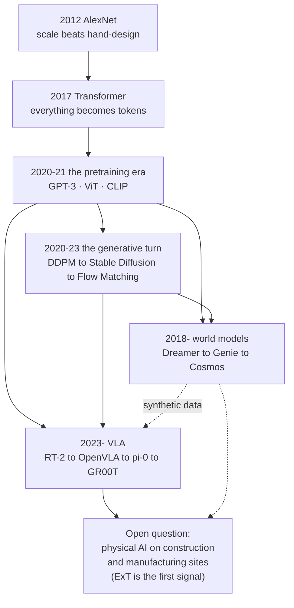

In one sentence: **scale (2012) met tokenization (2017) and became pretraining (2020),
which split into generation (diffusion), action (VLA) and imagination (world models) — and
those three are now meeting again in the physical world.** That last confluence is this
wiki's research direction.

### 2012–2017: two branches meet at the Transformer

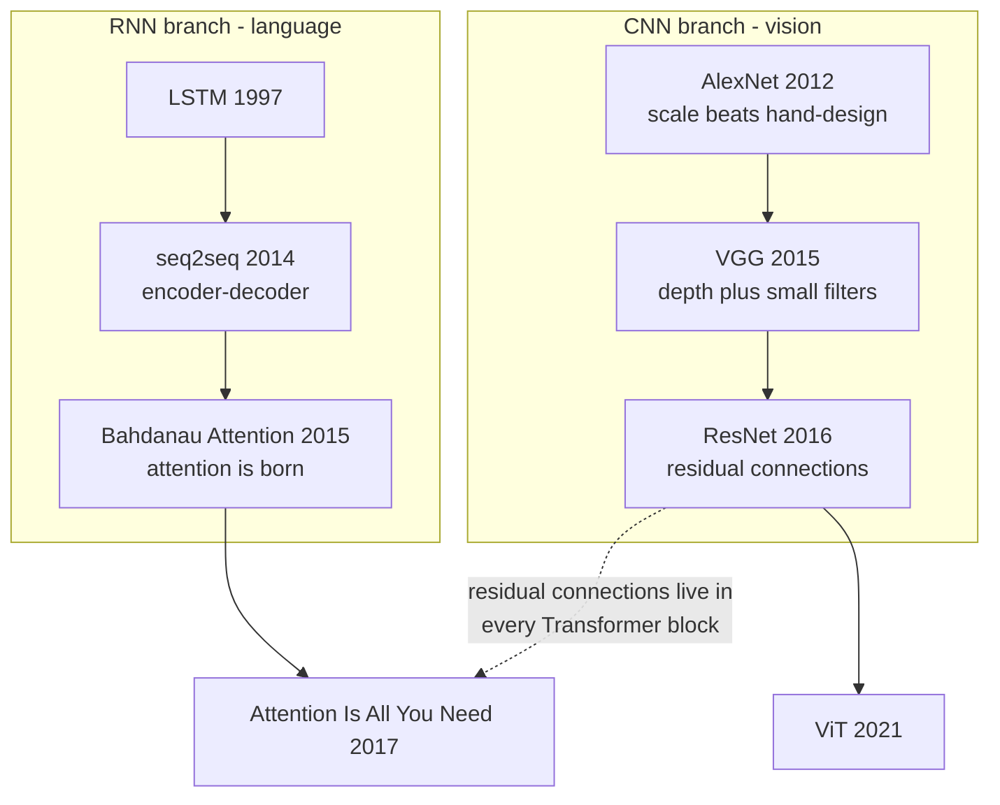

### Backbone: the main currents after the Transformer

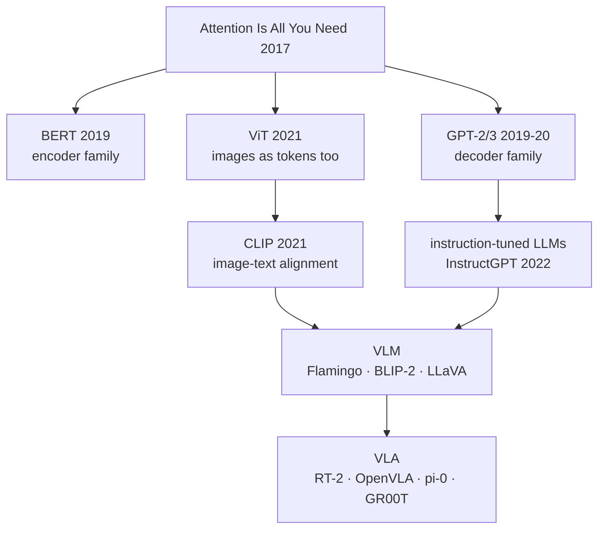

### Generative: the diffusion family

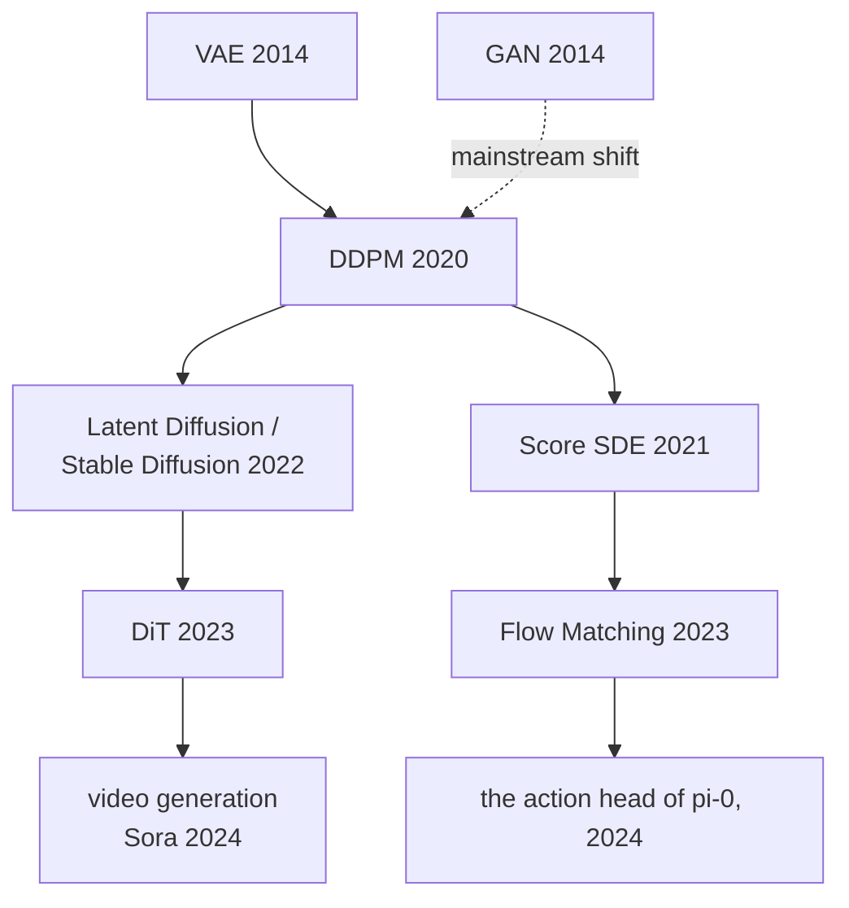

### Robot learning: from demonstrations to foundation models

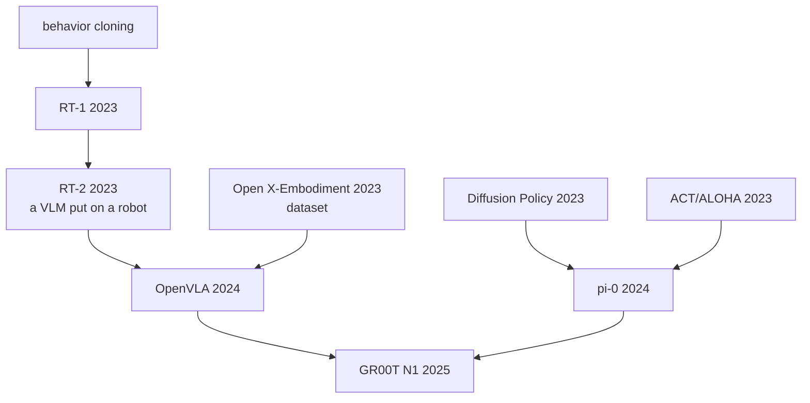

### World models: learning inside imagination

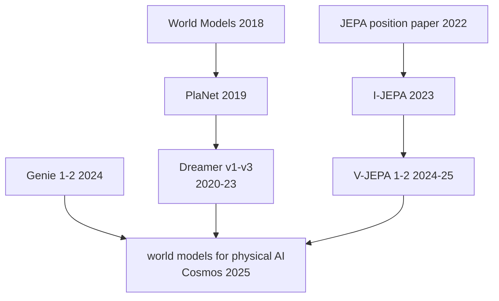

Related: [[01-canonical-papers/canonical-list|Canonical Paper List]] · [[03-deep-learning/index|Deep Learning map]] · [[05-construction-robotics/lineage|Construction Robotics Lineage]] — the three genealogies of this wiki's own domain.

## 한국어

논문을 낱개로 읽으면 잊어버리지만, 계보로 읽는다면 남는다.
각 분야가 어떤 논문에서 갈라져 나왔는지 한눈에 보기 위한 지도.

**읽는 법**: 실선 화살표 = 강한 기술적·구조적 선행 관계, 점선 = 느슨한 아이디어·생태계
영향 (교육적 서사이지 엄밀한 단일 인과가 아니다). 노드를 시대순(위→아래)으로 따라가면 하나의 이야기가 된다. 아래의 큰 그림 한 장을
먼저 보고, 그다음 분야별 상세 지도로 내려가라.

### 큰 그림 한 장: 2012 → 오늘

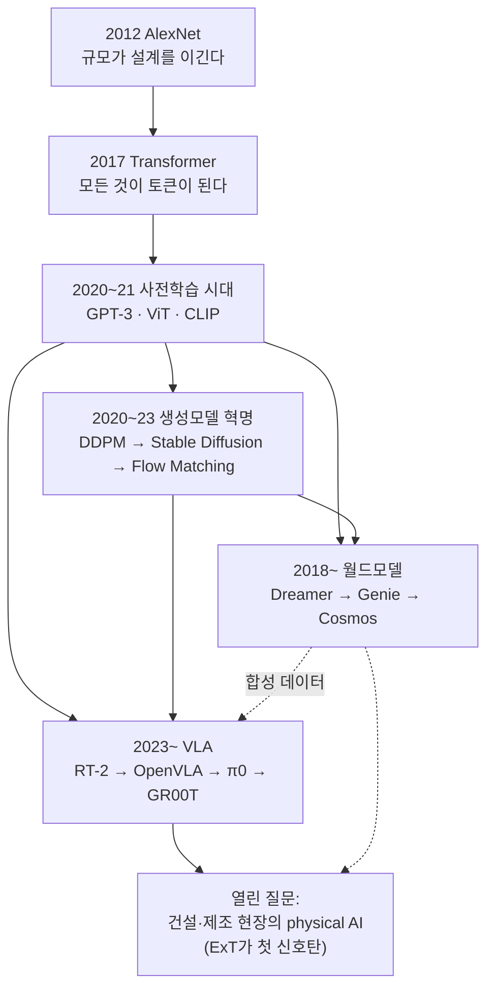

한 문장으로: **규모(2012)가 토큰화(2017)를 만나 사전학습(2020)이 되고, 그것이 생성(디퓨전)과
행동(VLA)과 상상(월드모델)으로 갈라졌다가, 물리 세계에서 다시 만나는 중이다** — 그 마지막
합류점이 이 위키의 연구 방향이다.

### 2012–2017: 딥러닝의 부상 — 두 갈래가 Transformer에서 만나다

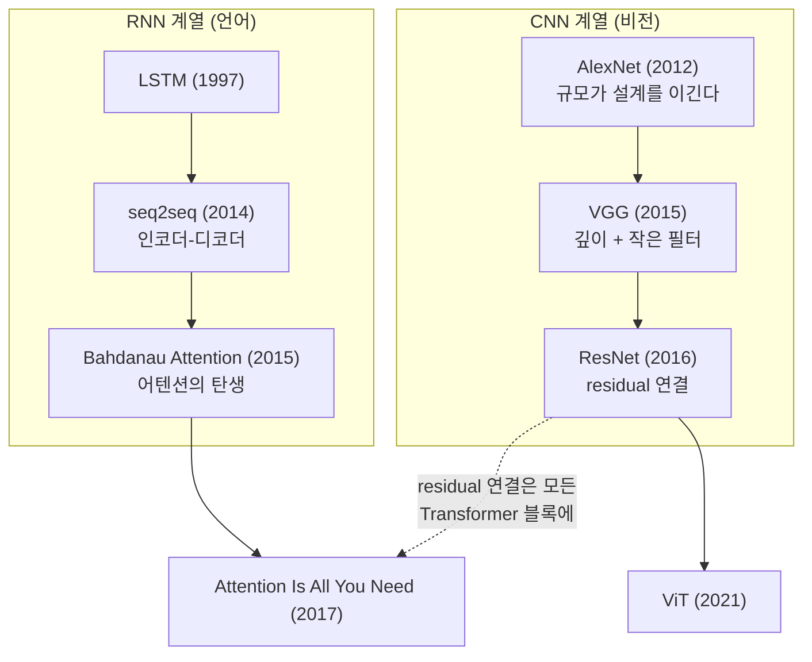

### Backbone: Transformer 이후의 큰 흐름

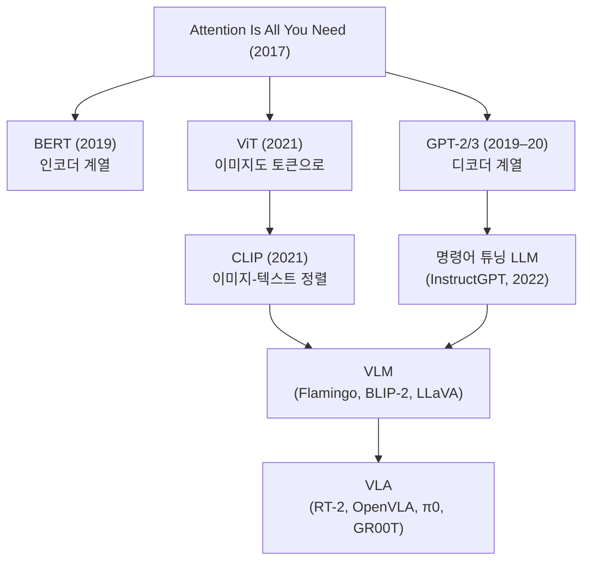

### Generative: 디퓨전 계열

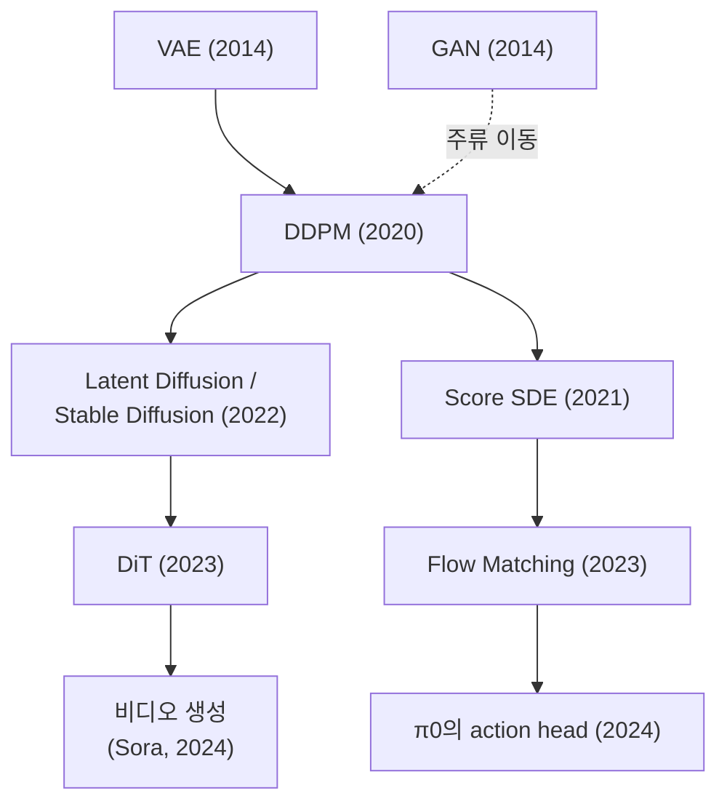

### Robot Learning: 시연에서 파운데이션 모델로

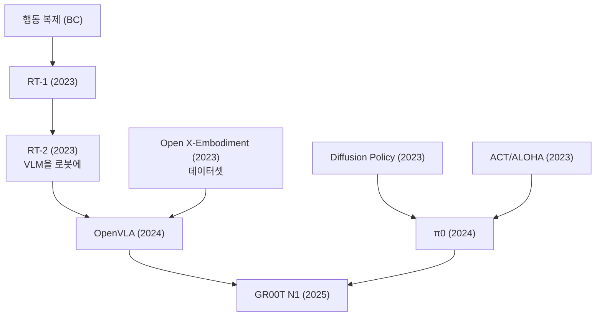

### World Models: 상상 속에서 배우기

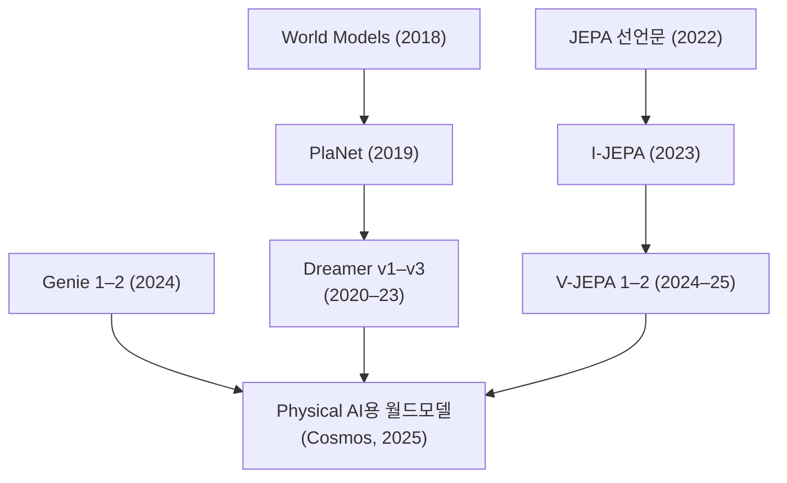

관련: [[01-canonical-papers/canonical-list|핵심 논문 리스트]] · [[03-deep-learning/index|딥러닝 지도]] · [[05-construction-robotics/lineage|건설로봇 계보]] — 이 위키 도메인의 세 계보
