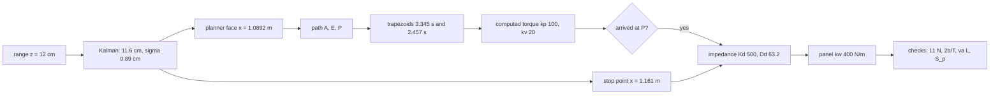

> [!note] Prerequisites · 선수 지식
> Plants **P2**, **P3**, **P5** and **P6** from [[02-foundations/lab-plants|0.6 Lab Plants]] and the integrator of [[02-foundations/lab-kernel|0.7 Lab Kernel]]. Every stage has an owner page and this page only assembles them: the Kalman update ([[02-foundations/probability|3. Probability §5]]), C-obstacles and the edge test ([[04-robotics/modern-robotics/ch02-configuration-space|MR ch.2 §2]], [[04-robotics/modern-robotics/ch10-motion-planning|MR ch.10 §2]]), trapezoids ([[04-robotics/modern-robotics/ch09-trajectory-generation|MR ch.9 §3]]), computed torque ([[04-robotics/modern-robotics/ch11-robot-control|MR ch.11 §2]]), impedance and the contact transition ([[04-robotics/force-compliance-control|13. Force & Compliance §2, §5]]), the sampled-spring ledger ([[04-robotics/haptics-teleoperation/rendering-sampling-stability|24.4 §2]]), the latency budget ([[04-robotics/robot-systems-deployment|10. Robot Systems §3]]) and the separation distance ([[04-robotics/hri-safety|11. HRI & Safety]]). Do the cumulative problem set on [[04-robotics/index|4. Robotics]] first.
> [[02-foundations/lab-plants|0.6 Lab Plants]]의 장치 넷(**P2**, **P3**, **P5**, **P6**)과 [[02-foundations/lab-kernel|0.7 Lab Kernel]]의 적분기. 단계마다 주인 페이지가 있고 이 페이지는 조립만 한다: 칼만 갱신([[02-foundations/probability|3. 확률 §5]]), C-장애물과 간선 검사([[04-robotics/modern-robotics/ch02-configuration-space|MR 2장 §2]], [[04-robotics/modern-robotics/ch10-motion-planning|MR 10장 §2]]), 사다리꼴([[04-robotics/modern-robotics/ch09-trajectory-generation|MR 9장 §3]]), 계산 토크([[04-robotics/modern-robotics/ch11-robot-control|MR 11장 §2]]), 임피던스와 접촉 천이([[04-robotics/force-compliance-control|13. 힘·컴플라이언스 §2, §5]]), 샘플된 스프링의 장부([[04-robotics/haptics-teleoperation/rendering-sampling-stability|24.4 §2]]), 지연 예산([[04-robotics/robot-systems-deployment|10. 로봇 시스템 §3]]), 분리 거리([[04-robotics/hri-safety|11. HRI·안전]]). [[04-robotics/index|4. 로보틱스]]의 누적 과제를 먼저 풀어라.

## English

*The capstone of the robotics track. Stands on [[04-robotics/modern-robotics/ch02-configuration-space|MR ch.2]], [[04-robotics/modern-robotics/ch09-trajectory-generation|ch.9]], [[04-robotics/modern-robotics/ch10-motion-planning|ch.10]], [[04-robotics/modern-robotics/ch11-robot-control|ch.11]], [[04-robotics/force-compliance-control|13]], [[04-robotics/haptics-teleoperation/rendering-sampling-stability|24.4]], [[04-robotics/robot-systems-deployment|10]], [[04-robotics/hri-safety|11]] and [[02-foundations/probability|3. Probability]]. It uses **P2**, **P3**, **P5** and **P6** together, as the cumulative set on [[04-robotics/index|4. Robotics]] does — but as one loop, in which each stage's answer is the next stage's input, rather than as four separate answers.*

> [!note] First pass · 처음이라면
> Read the running object and the picture, and follow the worked case to its report and its caution — that is the page. Then §5 for the four checks and their owners, and run the lab in §6. §1–§4 each define one thing the assembly needed that no single page owned; §7 says what the simulation cannot certify.

### Running object · 이 페이지의 대상

**The capstone cell.** **P2** from [[02-foundations/lab-plants|0.6 Lab Plants]] standing in the vertical plane, gravity $9.81\,\mathrm{m/s^2}$ in $-y$, parked at its catalog pose and carrying a tool whose contact point is the tip. In front of it a panel stands up — the vertical face of [[04-robotics/modern-robotics/ch02-configuration-space|MR ch.2]] and [[04-robotics/contact-force-tactile|9. Contact]] — with **P3**'s wall stiffness and wall law. Where that face is must be estimated, and that is **P5**; the camera-to-force budget is **P6**'s. Every other number is borrowed from the page that owns it, and the few this page adds are marked *this page*.

| Symbol | Value | What it is | Owner |
|---|---:|---|---|
| $A$ | $\theta=(0^\circ,90^\circ)$, tip $(1,1)\,\mathrm{m}$ | home: the catalog pose | 0.6 |
| prior | $10\,\mathrm{cm}$, variance $4\,\mathrm{cm^2}$ | range from the home tip to the face on the drawing, i.e. the face at $x=1.10\,\mathrm{m}$ | P5 |
| $z$, $R$ | $12\,\mathrm{cm}$, $1\,\mathrm{cm^2}$ | one range reading along $+x$ from a sensor on the tool, taken at home | P5 |
| $x_w$ | $1.120\,\mathrm{m}$ | the true face, used only by the simulation — put where the sensor read (illustrative) | this page |
| $k_w$ | $400\,\mathrm{N/m}$ | panel stiffness; force $-k_w(x-x_w)$ only while $x>x_w$ | P3 |
| $b$ | $0.8\,\mathrm{N{\cdot}s/m}$ | physical damping at the tool, borrowed from P3's device damper — the only term 24.4's ledger may spend; absent from the controller's model | P3, this page |
| $y_c$, $d_s$ | $1.00\,\mathrm{m}$, $4\,\mathrm{cm}$ | contact height, and the standoff of the pre-contact pose from the estimated face | this page |
| $E$ | $\theta=(135^\circ,-45^\circ)$ | via point: the answer of ch.10's roadmap | MR ch.10 |
| $v_{\max}$, $a_{\max}$ | $0.8\,\mathrm{rad/s}$, $2\,\mathrm{rad/s^2}$ | joint limits, every joint | MR ch.9 |
| $v_{\text{tip}}$ | $1.0\,\mathrm{m/s}$ | the tip speed page 11's cell was sized for | 11 |
| $k_p$, $k_v$ | $100\,\mathrm{s^{-2}}$, $20\,\mathrm{s^{-1}}$ | computed-torque gains — ch.11's $K_p$, $K_d$, renamed because $K_d$ below is a stiffness | MR ch.11 |
| $K_d$, $D_d$ | $500\,\mathrm{N/m}$, $63.2\,\mathrm{N{\cdot}s/m}$ | target stiffness, and the damping that is critical for a $2\,\mathrm{kg}$ target | 13 |
| $v_a$, $F_d$ | $0.05\,\mathrm{m/s}$, $10\,\mathrm{N}$ | approach speed and commanded press | 13 |
| $F_{\lim}$ | $11\,\mathrm{N}$ | peak-force limit, at most $10\,\%$ over the press (an illustrative task specification) | this page |
| $T$ | $1\,\mathrm{ms}$ | controller period, torque held over the period | 24.4 |
| $L$ | $70\,\mathrm{ms}$ | observation-to-action budget | P6, 10 |

$400\,\mathrm{N/m}$ is soft — below the foam row of the stiffness scale in [[04-robotics/force-compliance-control|13. Force & Compliance §1]] — so this is a compliantly mounted panel and the approach below is a slow press rather than an impact; 13 §5 computes what a structural panel does to the same approach. As on ch.2 the face is frictionless and the links have no thickness.

*Scope: this page teaches how the stages of the running task feed each other — which number from one page becomes the input of the next, and where two pages' checks disagree — on one frozen cell, with one simulation of the whole loop. It re-teaches no stage; each is linked to its owner where it is used. It does not teach contact detection ([[04-robotics/contact-force-tactile|9. Contact §7]]), force-sensed control ([[04-robotics/force-compliance-control|13 §3]]) or a stiff panel's impact ([[04-robotics/force-compliance-control|13 §5]]).*

### The picture · 그림으로 먼저 보기



The worked case's loop, stage by stage, each box carrying the number it passes on. The $12\,\mathrm{cm}$ reading fuses to $11.6\,\mathrm{cm}$ with $\sigma=0.89\,\mathrm{cm}$ and feeds two stages: the band's near edge, $x=1.0892\,\mathrm{m}$, goes to the planner and the estimate to the stop point at $x=1.161\,\mathrm{m}$. The path $A\to E\to P$, timed as trapezoids of $3.345$ and $2.457\,\mathrm{s}$, runs under computed torque until the switch to the impedance ($K_d=500\,\mathrm{N/m}$, $D_d=63.2\,\mathrm{N{\cdot}s/m}$) on arrival at $P$, and the press on the $400\,\mathrm{N/m}$ panel is judged by four checks: the $11\,\mathrm{N}$ limit, the ledger $2b/T$, the latency $v_aL$ and the separation $S_p$.

### Worked case · 대상으로 한 번 끝까지

Nine steps in the order the loop runs them, each heading naming the page that owns the step. Step 8 fails the first time and sends the loop back to step 3 — feedback between stages, which no stage page, read alone, can show.

**Step 1 — where is the panel? (P5, [[02-foundations/probability|3. Probability §5]]).** The sensor looks along $+x$ from the home tip. The drawing says $10\,\mathrm{cm}$ with variance $4\,\mathrm{cm^2}$; the reading says $12\,\mathrm{cm}$ with variance $1\,\mathrm{cm^2}$:

$$K=\frac{4}{4+1}=0.8,\qquad \hat x=10+0.8\,(12-10)=11.6\ \mathrm{cm},\qquad P=(1-0.8)\cdot4=0.8\ \mathrm{cm^2}$$

because the gain is the fraction of the innovation worth walking and the variance shrinks by $1-K$. So the face is estimated at $\hat x_w=1.00+0.116=1.116\,\mathrm{m}$ with $\sigma=\sqrt{0.8}=0.894\,\mathrm{cm}$. The planner is not given $\hat x_w$; it is given the near edge of the $3\sigma$ band, $x_{\text{obs}}=1.116-0.0268=1.0892\,\mathrm{m}$ (§2). Without the reading the band would be $\pm6.0\,\mathrm{cm}$ around $1.10$, with its near edge at $1.04\,\mathrm{m}$: the update narrows the band by $3.3\,\mathrm{cm}$, which at $v_a=0.05\,\mathrm{m/s}$ is $0.66\,\mathrm{s}$ of approach not spent.

**Step 2 — which configurations are legal, and which path ([[04-robotics/modern-robotics/ch02-configuration-space|MR ch.2 §2]], [[04-robotics/modern-robotics/ch10-motion-planning|MR ch.10 §2]]).** Since $x_{\text{obs}}>L_1=1$, ch.2's argument carries over: the elbow never gets past $x=1$, so only the tip can enter, and

$$\mathcal C_{\text{obs}}=\{\theta:\ \cos\theta_1+\cos(\theta_1+\theta_2)>1.0892\}$$

which blocks $16.565\,\%$ of the torus, against $18.478\,\%$ for ch.2's face at $x=1$. The pre-contact pose $P$ puts the tip at $(\hat x_w-d_s,\,y_c)=(1.076,\,1.000)$ on the **elbow-up** branch, because the tool rides along the forearm and must point at the face:

$$\cos\theta_2=\frac{1.076^2+1^2-2}{2}=0.0789,\qquad \theta_2=-85.48^\circ,\qquad \theta_1=42.90^\circ+42.74^\circ=85.64^\circ$$

where $42.90^\circ=\operatorname{atan2}(1,\,1.076)$ is the direction of the target and $42.74^\circ$ is how far the bent elbow turns the reach off it. The elbow-down twin, $(0.17^\circ,\,85.48^\circ)$, is legal but points the forearm straight up the face ($\theta_1+\theta_2=85.64^\circ$), so the tool could not press. From $A$ the direct edge fails the test: at its midpoint $\theta=(42.82^\circ,\,2.26^\circ)$ the tip is at $x=\cos42.82^\circ+\cos45.08^\circ=1.4396$, so it sits $1.4396-1.0892=0.350\,\mathrm{m}$ inside the panel (the worst point, $0.352\,\mathrm{m}$, is at $\lambda=0.53$) — ch.10's elbow flip again. Take ch.10's detour through $E$. On $A$–$E$ the sum $\theta_1+\theta_2$ stays at $90^\circ$, so the tip's $x$ is just $\cos\theta_1\le1$, clear by at least $0.089\,\mathrm{m}$; on $E$–$P$ the tip's $x$ climbs monotonically to $1.076$, clear by $13.2\,\mathrm{mm}$ at $P$. **Path: $A\to E\to P$.**

**Step 3 — how fast, at the joints ([[04-robotics/modern-robotics/ch09-trajectory-generation|MR ch.9 §3]]).** Rest-to-rest trapezoids, one scaling per leg, led by the joint that moves furthest. $A\to E$ moves both joints $135^\circ=2.3562\,\mathrm{rad}$; $E\to P$ moves $(-49.36^\circ,\,-40.48^\circ)=(-0.8615,\,-0.7064)\,\mathrm{rad}$, led by the shoulder. Both are far above $v_{\max}^2/a_{\max}=0.32\,\mathrm{rad}$, so both are true trapezoids:

$$T_1=\frac{2.3562}{0.8}+\frac{0.8}{2}=3.345\ \mathrm{s},\qquad T_2=\frac{0.8615}{0.8}+\frac{0.8}{2}=1.477\ \mathrm{s}$$

since a trapezoid spends $\Delta\theta/v_{\max}$ cruising plus one ramp time. Both legs are legal for the motors. Now read the same scaling at the tip. On $A\to E$ the forearm translates without turning, so the tip moves exactly like the elbow: $0.8\,\mathrm{m/s}$. On $E\to P$ both joints turn the same way and the tip swings on a long radius. At $E$, with the leading-joint direction $u=(-1,\,-0.820)$,

$$\lVert J(E)\,u\rVert=\left\lVert\begin{pmatrix}-1.7071&-1\\-0.7071&0\end{pmatrix}\begin{pmatrix}-1\\-0.820\end{pmatrix}\right\rVert=\lVert(2.527,\,0.707)\rVert=2.624\ \mathrm{m/rad}$$

so every radian per second of shoulder speed is up to $2.624\,\mathrm{m/s}$ at the tip, and along the cruise the tip reaches $2.04\,\mathrm{m/s}$. Hold that number for step 8.

**Step 4 — tracking the legs ([[04-robotics/modern-robotics/ch11-robot-control|MR ch.11 §2]]).** Computed torque, $\tau=M(\theta)(\ddot\theta_d+k_pe+k_v\dot e)+c+g$, makes every joint's error obey $\ddot e+20\dot e+100e=0$: $\omega_n=10\,\mathrm{rad/s}$, $\zeta=1$, $0.4\,\mathrm{s}$ settling. The model leaves out the tool damper $b$, and that omission is the whole tracking error. Run on the final plan of step 8, the simulation follows the legs to within $6.2\,\mathrm{mrad}$ and arrives at $P$ with the tip $1.2\,\mathrm{mm}$ short and $4.6\,\mathrm{mm}$ high; the tip's largest $x$ on the way is $1.0748\,\mathrm{m}$, $14\,\mathrm{mm}$ outside the planner's face. Parked at $P$, the arm holds gravity with

$$g(\theta_P)=9.81\,\big(2\cos85.64^\circ+\cos0.17^\circ,\ \cos0.17^\circ\big)=(11.30,\ 9.81)\ \mathrm{N{\cdot}m}$$

since the forearm is now horizontal: the elbow carries the full $9.81\,\mathrm{N{\cdot}m}$ it carried none of at $A$.

**Step 5 — the switch, and the press it makes ([[04-robotics/force-compliance-control|13. Force & Compliance §2]]).** On arrival at $P$, at time $t_s$, the controller becomes 13's impedance, with gravity and velocity terms compensated and no inertia shaping:

$$\tau=J^\top\big[K_d\,(x_r-x)+D_d\,(\dot x_r-\dot x)\big]+c(\theta,\dot\theta)+g(\theta)$$

so the tool keeps the arm's own apparent mass. At the contact pose that is $\Lambda\approx\mathrm{diag}(2.02,\,1.00)\,\mathrm{kg}$ — the catalog pose's $\mathrm{diag}(1,2)$ mirrored, because the forearm now lies along $x$ — and $D_d=2\sqrt{500\cdot2}=63.2\,\mathrm{N{\cdot}s/m}$ is 13's critical damping for it. The reference starts at $P$, ramps along $+x$ at $v_a$, and stops where the modelled series spring would carry $F_d$ against the *estimated* face (§4):

$$K_s=\frac{K_dk_w}{K_d+k_w}=\frac{500\cdot400}{900}=222.2\ \mathrm{N/m},\qquad x_{\text{stop}}=\hat x_w+\frac{F_d}{K_s}=1.116+0.045=1.161\ \mathrm{m}$$

because the impedance spring and the panel carry the same force in series ([[04-robotics/force-compliance-control|13 §1]]). The true face is $1.120-1.076=0.044\,\mathrm{m}$ ahead of the tip, so first contact comes $0.044/0.05=0.88\,\mathrm{s}$ after the switch; the simulation says $0.882\,\mathrm{s}$.

**Step 6 — the force against the P3-stiffness panel ([[04-robotics/force-compliance-control|13 §5]]).** Once the motion dies only the springs are left, so

$$F_{\text{set}}=K_s\,(x_{\text{stop}}-x_w)=222.2\times0.041=9.111\ \mathrm{N}$$

which is $0.889\,\mathrm{N}$ under the command — the estimate's $4\,\mathrm{mm}$ error times $K_s$. The peak comes from the transient, in two pieces that can be done by hand. While the reference ramps in contact, the tool follows at $\alpha v_a$ with $\alpha=K_d/(K_d+k_w)=5/9$, and the force runs ahead of its static value by the damper's share, $D_dv_a\big(k_w/(K_d+k_w)\big)^2=63.2\times0.05\times(4/9)^2=0.625\,\mathrm{N}$; so when the reference stops the force is $9.736\,\mathrm{N}$. After the stop the contact is a damped oscillator with

$$\omega_n=\sqrt{\frac{K_d+k_w}{M_d}}=21.2\ \mathrm{rad/s},\qquad \zeta=\sqrt{\frac{K_d}{K_d+k_w}}=0.745,\qquad \omega_d=\sqrt{\frac{k_w}{M_d}}=14.1\ \mathrm{rad/s}$$

because $D_d$ was chosen critical for $K_d$ alone and the panel adds stiffness but no damping. Released $1.56\,\mathrm{mm}$ past its equilibrium and still moving at $27.8\,\mathrm{mm/s}$, it peaks $23\,\mathrm{ms}$ later at $1.85\,\mathrm{mm}$, so $F_{\text{pk}}=9.111+400\times0.00185=9.85\,\mathrm{N}$. The simulation says $9.84\,\mathrm{N}$ at $t=7.526\,\mathrm{s}$, $24\,\mathrm{ms}$ after the reference stopped at $7.502$; the last digit is the tool damper and the full arm dynamics the hand calculation leaves out.

**Step 7 — the force limit and the stability ledger ([[04-robotics/haptics-teleoperation/rendering-sampling-stability|24.4 §2]]).** $F_{\text{pk}}=9.84\le11\,\mathrm{N}$, with $1.16\,\mathrm{N}$ to spare. The impedance spring is rendered by a sampled controller that holds its torque for $T$, so 24.4's ledger applies to $K_d$:

$$K_d\le\frac{2b}{T}=\frac{2\times0.8}{10^{-3}}=1600\ \mathrm{N/m}$$

and $500$ passes, the hold leaking $K_dT/(2b)=0.3125$ of what the tool damper removes. The panel's $400\,\mathrm{N/m}$ is a physical spring and is not on this ledger.

**Step 8 — latency and separation ([[04-robotics/robot-systems-deployment|10. Robot Systems §3]], [[04-robotics/hri-safety|11. HRI & Safety]]).** Inside one $70\,\mathrm{ms}$ budget the approaching tool moves $v_aL=0.05\times0.070=3.5\,\mathrm{mm}$, less than $\sigma=8.9\,\mathrm{mm}$ (§5): a camera correction during the approach would be stale by only $0.39\sigma$, so the budget holds. Separation is where the loop breaks. Page 11's cell was sized for a tip at $1.0\,\mathrm{m/s}$; step 3's $E\to P$ leg runs it at $2.04\,\mathrm{m/s}$, and

$$S_p=1.6\,(0.10+0.30)+2.04\times0.10+\tfrac12\times2.04\times0.30+0.20+0.10+0.05=1.50\ \mathrm{m}>1.24\ \mathrm{m}$$

so the sensing field would have to move out to $2.25+1.50=3.75\,\mathrm{m}$. **Back to step 3**, and cap the leg at the tip instead (§3): $v_c=1.0/2.624=0.381$, rounded down to $0.38\,\mathrm{rad/s}$, gives

$$T_2=\frac{0.8615}{0.38}+\frac{0.38}{2}=2.457\ \mathrm{s},\qquad v_{\text{tip}}\le0.38\times2.624=0.997\ \mathrm{m/s},\qquad S_p=1.239\ \mathrm{m}\le1.24\ \mathrm{m}$$

and page 11's cell stands. The contact phase starts from rest at $P$ either way, so steps 5–7 do not change; every clock time after $E$ moves $2.457-1.477=0.980\,\mathrm{s}$ later.

**Step 9 — the report.** Switch at $t_s=3.345+2.457=5.802\,\mathrm{s}$; **first contact at $6.684\,\mathrm{s}$**; **peak contact force $9.84\,\mathrm{N}$** at $7.526\,\mathrm{s}$; **within the $11\,\mathrm{N}$ limit**. Settling force $9.11\,\mathrm{N}$, $0.89\,\mathrm{N}$ under the command. On the unrepaired plan contact would have come at $5.704\,\mathrm{s}$ with the same peak, in a cell $0.26\,\mathrm{m}$ too small.

**What "within the limit" rests on.** The $4\,\mathrm{mm}$ error has a sign the robot cannot see. Put the true face at the band's near edge, $1.0892\,\mathrm{m}$, and the same stop point presses $K_s(1.161-1.0892)=15.96\,\mathrm{N}$; at the far edge, $4.04\,\mathrm{N}$. A position-referenced press turns $\pm3\sigma=\pm26.8\,\mathrm{mm}$ into $\pm5.96\,\mathrm{N}$, and the $11\,\mathrm{N}$ limit sits inside that band. The worked case passes on the error this simulation happens to contain; the problem set gives it the mirror-image error.

### 1. What the cumulative set computed, and what assembling it adds

The cumulative problem set on [[04-robotics/index|4. Robotics]] asks for four numbers at the catalog pose — joint rates $J^{-1}v=(-0.05,\,0.05)\,\mathrm{rad/s}$, a holding torque $g+J^\top F=(9.62,\,0)\,\mathrm{N{\cdot}m}$, the ledger $2b/T=1600\,\mathrm{N/m}$, and the fused range $11.6\,\mathrm{cm}$ — and each is right. They are also independent: no answer is used by another. Assembling them changes five things, and each is a claim no stage page can make.

| Cumulative item | Here | What changed |
|---|---|---|
| fused range $11.6\,\mathrm{cm}$ (Derive d) | Step 1 | an answer becomes an input twice: its band's near edge to the planner, its mean to the stop point |
| $\Lambda_y=2\,\mathrm{kg}$ at $(0^\circ,90^\circ)$ (Interpret) | Step 5 | the tool must point at the face, so the contact pose is the elbow-up branch, where $\Lambda=\mathrm{diag}(2,1)$: the heavy direction is now the press direction |
| $2b/T=1600$ on the panel (Derive c) | Step 7 | the ledger moves from the panel to $K_d$, the spring the controller renders; the panel is physical |
| holding torque at the catalog pose (Derive b) | Step 4 | at $P$ the forearm is horizontal and the elbow holds $9.81\,\mathrm{N{\cdot}m}$ |
| "late vision is P6" (Interpret) | Step 8 | lateness gets a threshold, $v_aL\le\sigma$ |

The fifth is the one to remember: **the checks disagree**. Step 3's trapezoid is legal by ch.9 and illegal by page 11, and nothing inside either page would have caught it, because each is written in its own coordinates — joint speed on one, tip speed on the other.

### 2. The estimate feeds the planner — the inflated C-obstacle, defined

A C-obstacle ([[04-robotics/modern-robotics/ch02-configuration-space|MR ch.2 §2]]) assumes the obstacle is where the drawing says. Here it is where an estimate says, with a stated spread, and the planner must be given something it can treat as certain.

> **Uncertainty-inflated C-obstacle, defined.** An **uncertainty-inflated C-obstacle** is a *set of configurations* — an ordinary C-obstacle, not a new kind of object — computed for the obstacle moved toward the robot by a multiple of its posterior standard deviation. Three defining conditions. The obstacle's pose is an **estimate with a stated posterior** $\sigma$, from a filter whose assumptions hold; the obstacle is **grown by $k\sigma$ toward the robot before** the C-obstacle is computed, never after; and $k$ is **chosen for a stated miss probability** — $k=3$ leaves $0.135\,\%$, one-sided, for a Gaussian.
>
> $$\mathcal C^{\,k}_{\text{obs}}=\{\theta:\ \mathcal A(\theta)\cap\{x\ge\hat x_w-k\sigma\}\neq\varnothing\}$$
>
> where $\mathcal A(\theta)$ is the set of points the arm occupies at $\theta$, $\hat x_w$ the estimated face and $\sigma$ its posterior standard deviation — so the planner sees a certain obstacle whose boundary the true face crosses with probability $0.135\,\%$.
>
> - **Example**: step 2's lens, $\cos\theta_1+\cos(\theta_1+\theta_2)>1.0892$, $16.565\,\%$ of P2's torus, pinching at $\theta_1=\pm84.9^\circ$. With the prior alone ($\sigma=2\,\mathrm{cm}$, near edge $1.04$) it would block $17.611\,\%$: the update frees only $1.05\,\%$ of the torus but $3.3\,\mathrm{cm}$ of approach, which is where it pays.
> - **Non-example**: the C-obstacle of the mean, $k=0$. The true face is nearer than $\hat x_w$ half the time, so the planner would certify as free configurations that are inside the panel with probability up to one half; a $1\,\mathrm{cm}$ standoff, legal against the mean, puts the tip inside the true panel $13\,\%$ of the time.
> - **Non-example**: Nav2's inflation layer ([[04-robotics/ros2/navigation-nav2|25.9 §5]]). Only its inscribed core is treated as collision; the decaying skirt around it is a cost gradient that steers a search toward the middle of free space rather than a margin, and neither radius is set from an estimate's $\sigma$.
> - **Why it matters**: it passes the filter's output to the planner with its units intact — $\sigma$ in centimetres becomes standoff in centimetres and approach time in seconds — and it is where a wrong $\sigma$, an overconfident filter, becomes a collision rather than a number.

One consequence is specific to this cell and worth rechecking whenever the panel moves. Ch.2's shortcut, testing the tip only, holds because $x_{\text{obs}}=1.0892>L_1$, so the elbow can never reach the face. Inflate a panel that sits closer than $L_1+k\sigma$ and the elbow can enter too; the collision test must then check both link ends, which is exactly the non-example of testing the tip alone in [[04-robotics/modern-robotics/ch10-motion-planning|MR ch.10 §2]].

### 3. Two clocks on one path — the tip-speed cap, defined

Ch.9 times a path in joint coordinates; page 11 judges it in the tip's. They meet through $J$, and on the $E\to P$ leg $J$ multiplies by up to $2.624$.

> **Tip-speed cap, defined.** A **tip-speed cap** is a *constraint on a time scaling* — a bound on $\dot s$, not a change of path — that keeps the tip's speed under a stated limit along a fixed joint-space path. Three defining conditions. The **path is fixed** and written with the leading joint's direction $u=\Delta\theta/\max_i|\Delta\theta_i|$, so $\dot s$ is the leading joint's speed; the tip's speed at each point is **$\lVert J(\theta(s))\,u\rVert\,\dot s$**, not $\dot s$; and the cap bounds the **maximum over the whole path**, because the scaling does not know where the fast point is.
>
> $$\dot s_{\max}=\min\!\Big(v_{\max},\ \frac{v_{\text{tip}}}{\max_{s}\lVert J(\theta(s))\,u\rVert}\Big)$$
>
> where $v_{\max}$ is the joint limit, $v_{\text{tip}}$ the tip limit and the maximum runs over $s\in[0,1]$ — whichever bound is smaller is the one that binds.
>
> - **Example**: $E\to P$, where $\max_s\lVert Ju\rVert=2.624\,\mathrm{m/rad}$ at $E$, so $1.0/2.624=0.381$, rounded down to $0.38\,\mathrm{rad/s}$: $T_2$ grows from $1.477$ to $2.457\,\mathrm{s}$ and the tip is bounded by $0.997\,\mathrm{m/s}$ (the trajectory's actual peak is $0.992$). On $A\to E$, $\max_s\lVert Ju\rVert=1.000$, so $0.8\,\mathrm{rad/s}$ already means $0.8\,\mathrm{m/s}$ and the cap does not bind.
> - **Non-example**: the joint limit itself. $0.8\,\mathrm{rad/s}$ on every joint bounds the tip only through $J$, and on $E\to P$ that bound is $2.1\,\mathrm{m/s}$. A trajectory that respects every actuator can still break a safety function written in task space.
> - **Why it matters**: page 11's $S_p$ is written in tip speed, ch.9's limits in joint speed, and a robot's datasheet speaks joint. The cap is the one line that translates, and without it step 3 and step 8 never talk.

A cap rounds toward safety: the cruise speed is rounded down, never to the nearest value.

### 4. The switch, and the press it makes

"Switch to impedance at contact" cannot mean *at the instant of contact*. Detecting that instant is its own estimation problem ([[04-robotics/contact-force-tactile|9. Contact §7]]), and until the detector fires the tool would meet the panel under computed torque — a stiff position loop that turns every millimetre of unexpected penetration into force at the loop's stiffness ([[04-robotics/force-compliance-control|13 §1]]). So the switch happens at $P$, outside the band, and the impedance is already running when the tool arrives: *at contact* means *for the contact phase*. The switch itself is gentle here, because the arm is at rest at $P$ and the reference starts at $P$; the first impedance force is the pull back from the $1.2$ and $4.6\,\mathrm{mm}$ tracking offsets plus the damper's $D_dv_a=3.2\,\mathrm{N}$ as the reference sets off.

What the impedance then delivers is a press whose force nobody measures.

> **Position-referenced press, defined.** A **position-referenced press** is a *way of commanding a contact force without measuring it*: the force is whatever the series stiffness makes of the gap between where the reference stops and where the surface really is. Three defining conditions. **No force measurement closes the loop**; the stop point is **computed from an estimated surface position and a modelled series stiffness**; and the delivered force is therefore **set by the true surface**, which the controller never sees.
>
> $$F_{\text{set}}=K_s\,(x_{\text{stop}}-x_w)=F_d-K_s\,(x_w-\hat x_w)$$
>
> where $K_s=K_dk_w/(K_d+k_w)$ is the series stiffness of impedance and panel, $x_{\text{stop}}=\hat x_w+F_d/K_s$, and $x_w-\hat x_w$ is the estimate's error — so the force error is the position error times $K_s$, sign included.
>
> - **Example**: the worked case, $F_{\text{set}}=10-222.2\times0.004=9.111\,\mathrm{N}$. Per standard deviation of the estimate, $K_s\sigma=222.2\times0.00894=1.99\,\mathrm{N}$.
> - **Non-example**: a press that ends the ramp when a wrist force sensor reads $F_d$. The estimate's error then moves the *stop point*, not the force, and the force error becomes the sensor's — the force-measuring side of the causality argument in [[04-robotics/force-compliance-control|13 §2]], or the force-controlled direction of hybrid control in [[04-robotics/force-compliance-control|13 §3]].
> - **Non-example**: a soft panel "absorbing" the error. $K_s$ contains $k_w$, so a stiffer panel raises the force error per millimetre and a softer one lowers it — the panel is part of the gain, not a buffer after it.
> - **Why it matters**: it is where estimation and control stop being separate pages. Step 1's $\sigma$ becomes a force band, $\pm K_s\cdot3\sigma=\pm5.96\,\mathrm{N}$ at $K_d=500$, and no approach speed, gain schedule or better tracking removes it, because it is not a transient.

### 5. Four checks, four owners

| Check | Owner | Inequality | Worked case | Read from the simulation? |
|---|---|---|---|---|
| peak force | this page's limit; the transient is 13 §5's | $F_{\text{pk}}\le11\,\mathrm{N}$ | $9.84\,\mathrm{N}$ | yes |
| sampled-spring ledger | 24.4 §2 | $K_d\le2b/T=1600\,\mathrm{N/m}$ | $500\,\mathrm{N/m}$ | no — a ledger |
| latency | 10 §3 | $v_aL\le\sigma$ | $3.5\le8.9\,\mathrm{mm}$ | no — a design inequality |
| separation | 11 | $S_p(v_{\text{tip}})\le1.24\,\mathrm{m}$ | $1.239\,\mathrm{m}$ | no — it uses the planned bound |

Only one of the four is read off the trace. That is not a weakness of this simulation; it is what the four inequalities are. The ledger is a sufficient condition over all inputs, and a trace is one input. The latency and separation checks are about loops the simulation does not contain — a camera in the loop, a person in the cell. A capstone that reports "the simulation ran and nothing broke" has reported the first row.

The latency row needs one definition, because 10's budget is a time and the check needs a length.

> **Staleness distance, defined.** The **staleness distance** is a *length*: how far the thing an observation describes moves between the observation and the action it causes. Three defining conditions. The time is the **end-to-end** observation-to-action latency $L$, from mid-exposure to applied force ([[04-robotics/robot-systems-deployment|10. Robot Systems §3]]), not a rate; the speed is that of the **observed quantity relative to the observer** — here, the tool relative to the panel; and it is **compared with the uncertainty of the estimate** it would correct, because a correction staler than the estimate's own spread adds error rather than removing it.
>
> $$v\,L\le\sigma\quad\Longleftrightarrow\quad v\le\frac{\sigma}{L}=\frac{8.94\,\mathrm{mm}}{70\,\mathrm{ms}}=0.128\ \mathrm{m/s}$$
>
> where $v$ is the approach speed, $L=70\,\mathrm{ms}$ and $\sigma=8.94\,\mathrm{mm}$ is step 1's posterior spread.
>
> - **Example**: the approach at $0.05\,\mathrm{m/s}$, $3.5\,\mathrm{mm}$, $0.39\sigma$. The free leg at $1.0\,\mathrm{m/s}$ has $70\,\mathrm{mm}$, nearly eight $\sigma$ — which is why that leg is planned against the inflated obstacle and never steered by the camera.
> - **Non-example**: the camera's $20\,\mathrm{ms}$ frame period. A rate is not a latency ([[04-robotics/robot-systems-deployment|10 §3]]), and the worst-case age of a vision goal adds the vision and control periods to $L$ ([[04-robotics/ros2/simulation-and-control|25.7]]'s staleness ledger).
> - **Why it matters**: it gives "late vision" a threshold, and the threshold couples P5 to P6: a better sensor, with a smaller $\sigma$, *lowers* the speed at which a camera correction can still help.

### 6. Lab — the whole loop in one simulation

Tier A. One program runs steps 1–8; the sweep changes the two knobs the contact phase owns, $K_d$ and $v_a$, and marks each row against the three checks that move with them. The plant is P2 with its full $M$, $c$ and $g$; the panel is P3's unilateral spring; the controller runs at $T=1\,\mathrm{ms}$ with its torque held over the step, and the integrator is semi-implicit Euler at the same step ([[02-foundations/lab-kernel|0.7 §3]]). The tool damper $b$ acts on the plant and is absent from the controller's model.

```python
import numpy as np

# P2 (0.6): unit links, point masses at the link ends, vertical plane, gravity in -y
G = 9.81
def fk(q):
    return np.array((np.cos(q[0]) + np.cos(q[0] + q[1]), np.sin(q[0]) + np.sin(q[0] + q[1])))
def jac(q):
    s1, s12, c1, c12 = np.sin(q[0]), np.sin(q[0] + q[1]), np.cos(q[0]), np.cos(q[0] + q[1])
    return np.array(((-s1 - s12, -s12), (c1 + c12, c12)))
def mass(q):
    c2 = np.cos(q[1])
    return np.array(((3 + 2 * c2, 1 + c2), (1 + c2, 1.0)))
def cor(q, dq):
    h = -np.sin(q[1])
    return np.array((h * dq[1] ** 2 + 2 * h * dq[0] * dq[1], -h * dq[0] ** 2))
def grav(q):
    return G * np.array((2 * np.cos(q[0]) + np.cos(q[0] + q[1]), np.cos(q[0] + q[1])))
def ik_up(x, y):                       # elbow-up branch: the forearm points at the panel
    t2 = -np.arccos((x * x + y * y - 2) / 2)
    return np.array((np.arctan2(y, x) - np.arctan2(np.sin(t2), 1 + np.cos(t2)), t2))

# Step 1 - P5 Kalman update (cm), read along +x from the home tip at x = 1.00 m
x0, P0, z, R = 10.0, 4.0, 12.0, 1.0
K = P0 / (P0 + R)
xh = x0 + K * (z - x0)
Pp = (1 - K) * P0
XW_HAT, SIG = 1.0 + xh / 100, np.sqrt(Pp) / 100      # estimated face (m), posterior sigma (m)
XW_TRUE = 1.120                                       # the simulation's face (illustrative)
X_OBS = XW_HAT - 3 * SIG                              # 3-sigma inflated face for planning

# Step 2 - plan A -> E -> P against the inflated C-obstacle (MR ch.2, ch.10)
A, E = np.radians((0.0, 90.0)), np.radians((135.0, -45.0))
P = ik_up(XW_HAT - 0.04, 1.0)                         # pre-contact pose, 4 cm standoff
def depth(q):                                         # > 0 means inside the inflated panel
    return max(np.cos(q[0]), fk(q)[0]) - X_OBS
def edge(q1, q2, m=400):
    return max(depth(q1 + s * (q2 - q1)) for s in np.linspace(0, 1, m + 2))

# Step 3 - rest-to-rest trapezoids (MR ch.9) with a tip-speed cap (11)
VMAX, AMAX, VTIP = 0.8, 2.0, 1.0
def tip_gain(q0, q1):                                 # max |J u| per rad of the leading joint
    u = (q1 - q0) / np.max(np.abs(q1 - q0))
    return max(np.linalg.norm(jac(q0 + s * (q1 - q0)) @ u) for s in np.linspace(0, 1, 401))
def trap(q0, q1, vc, t):
    D = np.max(np.abs(q1 - q0)); u = (q1 - q0) / D; ta = vc / AMAX; Tt = D / vc + ta
    t = min(max(t, 0.0), Tt)
    if t < ta: s, sd, sdd = 0.5 * AMAX * t * t, AMAX * t, AMAX
    elif t < Tt - ta: s, sd, sdd = 0.5 * AMAX * ta * ta + vc * (t - ta), vc, 0.0
    else: r = Tt - t; s, sd, sdd = D - 0.5 * AMAX * r * r, AMAX * r, -AMAX
    return q0 + u * s, u * sd, u * sdd, Tt
V1 = min(VMAX, np.floor(100 * VTIP / tip_gain(A, E)) / 100)
V2 = min(VMAX, np.floor(100 * VTIP / tip_gain(E, P)) / 100)
T1 = trap(A, E, V1, 0)[3]
TS = T1 + trap(E, P, V2, 0)[3]                        # switch time: arrival at P

# Steps 4-6 - computed torque (MR ch.11), impedance (13), P3-stiffness wall
def simulate(Kd, va, kw=400.0, b=0.8, Fd=10.0, T=1e-3, kp=100.0, kv=20.0):
    Dd = 2 * np.sqrt(2.0 * Kd)                        # critical for a 2 kg target
    Ks = Kd * kw / (Kd + kw)                          # series stiffness, impedance + panel
    xP = fk(P); xstop = XW_HAT + Fd / Ks              # the ramp stops here
    q, dq = A.copy(), np.zeros(2)
    tc, Fpk, vtip, F = None, 0.0, 0.0, []
    for k in range(int((TS + (xstop - xP[0]) / va + 2.0) / T)):
        t = k * T; x, J = fk(q), jac(q); v = J @ dq
        Fw = kw * (x[0] - XW_TRUE) if x[0] > XW_TRUE else 0.0
        if Fw > 0 and tc is None: tc = t
        Fpk = max(Fpk, Fw); F.append(Fw)
        if t < TS:                                    # computed torque on the trapezoids
            qd, dqd, ddqd, _ = trap(A, E, V1, t) if t < T1 else trap(E, P, V2, t - T1)
            tau = mass(q) @ (ddqd + kp * (qd - q) + kv * (dqd - dq)) + cor(q, dq) + grav(q)
            vtip = max(vtip, np.linalg.norm(v))
        else:                                         # impedance, reference ramps then stops
            xr = min(xP[0] + va * (t - TS), xstop); vr = va if xr < xstop else 0.0
            Fi = Kd * (np.array((xr, xP[1])) - x) + Dd * (np.array((vr, 0.0)) - v)
            tau = J.T @ Fi + cor(q, dq) + grav(q)
        f_ext = np.array((-Fw, 0.0)) - b * v          # panel + tool damping b (not modelled)
        ddq = np.linalg.solve(mass(q), tau + J.T @ f_ext - cor(q, dq) - grav(q))
        dq = dq + T * ddq                             # semi-implicit Euler (0.65 section 3)
        q = q + T * dq
    return tc, Fpk, np.mean(F[-500:]) - Fd, vtip

# Report: the worked case, then the sweep with every check marked
print("fused range %.1f cm, sigma %.2f cm, inflated face x = %.4f m" % (xh, 100 * SIG, X_OBS))
print("edges (m, >0 blocked): A-P %.3f  A-E %.3f  E-P %.4f" % (edge(A, P), edge(A, E), edge(E, P)))
print("cruise %.2f / %.2f rad/s, T1 %.3f s, switch at %.3f s" % (V1, V2, T1, TS))
tc, Fpk, dF, vtip = simulate(500.0, 0.05)
print("worked: first contact %.3f s, peak %.2f N, settling error %+.3f N, tip %.3f m/s"
      % (tc, Fpk, dF, vtip))
L, FLIM, B, TCTRL = 0.070, 11.0, 0.8, 1e-3
print(" Kd(N/m) va(m/s)   t_c(s)  F_pk(N)  dF_set(N)  va*L<=sigma  fails")
for Kd in (250.0, 500.0, 1000.0, 2000.0):
    for va in (0.05, 0.10, 0.20, 0.40):
        tc, Fpk, dF, _ = simulate(Kd, va)
        fails = []
        if Fpk > FLIM: fails.append("force>11N (26)")
        if Kd > 2 * B / TCTRL: fails.append("Kd>2b/T (24.4)")
        if va * L > SIG: fails.append("vaL>sigma (10)")
        print("%8.0f %7.2f %8.3f %8.2f %+10.3f %12s  %s" % (Kd, va, tc, Fpk, dF,
              "yes" if va * L <= SIG else "NO", ", ".join(fails) or "pass"))
v_plan = max(V1 * tip_gain(A, E), V2 * tip_gain(E, P))   # the commanded bound, not the trace
Sp = 1.6 * (0.10 + 0.30) + v_plan * 0.10 + 0.5 * v_plan * 0.30 + 0.20 + 0.10 + 0.05
print("tip speed: planned bound %.3f m/s, simulated %.3f m/s -> S_p %.3f m (11: 1.24 m)"
      % (v_plan, vtip, Sp))
```

It runs in about five seconds and prints the worked case first:

```text
fused range 11.6 cm, sigma 0.89 cm, inflated face x = 1.0892 m
edges (m, >0 blocked): A-P 0.352  A-E -0.089  E-P -0.0132
cruise 0.80 / 0.38 rad/s, T1 3.345 s, switch at 5.802 s
worked: first contact 6.684 s, peak 9.84 N, settling error -0.889 N, tip 0.967 m/s
```

and closes with the separation check, `tip speed: planned bound 0.997 m/s, simulated 0.967 m/s -> S_p 1.239 m`. The simulated tip is slower than the plan because the arm lags a trajectory whose model left out $b$; the check uses the plan, since a safety function must hold for what was commanded. The sweep, with each failing row marked by the page whose limit it violates:

| $K_d$ (N/m) | $v_a$ (m/s) | $t_c$ (s) | $F_{\text{pk}}$ (N) | $F_{\text{set}}-F_d$ (N) | $v_aL\le\sigma$ | Verdict: the limit violated |
|---:|---:|---:|---:|---:|:---:|---|
| 250 | 0.05 | 6.686 | 10.30 | −0.615 | yes | pass |
| 250 | 0.10 | 6.250 | **11.21** | −0.615 | yes | **fails**: force limit (this page) |
| 250 | 0.20 | 6.043 | **13.06** | −0.615 | **no** | **fails**: force limit; latency (10 §3) |
| 250 | 0.40 | 5.944 | **17.59** | −0.615 | **no** | **fails**: force limit; latency (10 §3) |
| 500 | 0.05 | 6.684 | 9.84 | −0.889 | yes | pass — the worked case |
| 500 | 0.10 | 6.245 | 10.58 | −0.889 | yes | pass |
| 500 | 0.20 | 6.031 | **12.12** | −0.889 | **no** | **fails**: force limit; latency (10 §3) |
| 500 | 0.40 | 5.931 | **14.74** | −0.889 | **no** | **fails**: force limit; latency (10 §3) |
| 1000 | 0.05 | 6.684 | 9.36 | −1.143 | yes | pass |
| 1000 | 0.10 | 6.244 | 9.86 | −1.143 | yes | pass |
| 1000 | 0.20 | 6.025 | 10.88 | −1.143 | **no** | **fails**: latency (10 §3) |
| 1000 | 0.40 | 5.922 | **12.50** | −1.143 | **no** | **fails**: force limit; latency (10 §3) |
| 2000 | 0.05 | 6.683 | 8.99 | −1.333 | yes | **fails**: ledger (24.4 §2) |
| 2000 | 0.10 | 6.243 | 9.30 | −1.333 | yes | **fails**: ledger (24.4 §2) |
| 2000 | 0.20 | 6.023 | 9.94 | −1.333 | **no** | **fails**: ledger (24.4 §2); latency (10 §3) |
| 2000 | 0.40 | 5.917 | **11.06** | −1.333 | **no** | **fails**: force limit; ledger (24.4 §2); latency (10 §3) |

Reading the table:

- **Stiffness trades the peak against the settling error.** Down each speed column the peak falls as $K_d$ rises, because $D_d$ was chosen critical for $K_d$ alone and the contact damping ratio $\zeta=\sqrt{K_d/(K_d+k_w)}$ climbs from $0.62$ to $0.91$. The settling error grows, because $K_s$ climbs from $154$ to $333\,\mathrm{N/m}$ and multiplies the same $4\,\mathrm{mm}$. No row is best at both.
- **Speed buys nothing at rest.** $F_{\text{set}}-F_d$ is the same at every speed of a stiffness — the press is quasi-static — while the peak grows with speed in every column.
- **Every check binds alone somewhere.** The force limit alone at $(250,\,0.10)$; latency alone at $(1000,\,0.20)$, whose $10.88\,\mathrm{N}$ is within the limit; the ledger alone at $(2000,\,0.05)$ and $(2000,\,0.10)$ — the two rows with the lowest peaks in the table, rejected by a page whose limit their traces cannot show (§7).
- **The passing set** is $K_d\in\{500,\,1000\}$ at $v_a\le0.10$, plus $(250,\,0.05)$. For $K_d\ge500$ it is the latency check, not the force limit, that caps the speed at this soft panel.
- **One row is a knife edge.** $(2000,\,0.40)$ exceeds the limit by $0.06\,\mathrm{N}$ — the same size as the change a finer integration step makes, $11.06\to11.11\,\mathrm{N}$, so its force verdict is not robust. It fails two other checks regardless.

**The integrator is part of the claim** ([[02-foundations/lab-kernel|0.7 Lab Kernel]]). Stepping the plant at $T/10$ under the same held torques moves no peak by more than $0.51\,\%$ — the largest change is $11.06\to11.11\,\mathrm{N}$ in that knife-edge row — and no settling force at all, so the table describes the controller, not the Euler step.

### 7. What this simulation cannot certify

- **24.4's leak.** The plant is stepped at the controller's own period, so the energy a held spring leaks between samples is not in the model at all. And the impedance damper is computed from the exact sampled velocity: $D_d=126\,\mathrm{N{\cdot}s/m}$ at $K_d=2000$, $158$ times the tool's $b$. That is why the $2000\,\mathrm{N/m}$ rows look clean. It is 24.4's case D in a new place — a damper that is not the device's is paying — and [[04-robotics/haptics-teleoperation/rendering-sampling-stability|24.4 §2]] says a damper computed from a delayed velocity estimate does not substitute for physical dissipation.
- **A stiff panel.** At $10^5\,\mathrm{N/m}$, the series stiffness 13 §1 says a force controller identifies on real structure, the approach becomes an impact: $22\,\mathrm{N}$ in $14\,\mathrm{ms}$ at $5\,\mathrm{cm/s}$ against a $2\,\mathrm{kg}$ apparent mass ([[04-robotics/force-compliance-control|13 §5]]), and the force limit, not latency, would bind first.
- **One estimate, no noise.** The panel is read once, at home, and the simulation's sensor is exact. A second reading would shrink $\sigma$ — [[02-foundations/probability|3. Probability §5]] runs the sequence — and with it the force band of §4.
- **Geometry.** Point contact, frictionless face, zero-thickness links. The elbow's clearance was checked; the tool's orientation was not controlled, because a 2R arm has no spare joint for it.
- **Model error.** The computed-torque model is exact except for $b$. A real arm carries payload and friction error, which enters the error dynamics as the disturbance ch.11 §2 describes.

### After reading

- [ ] Say where P5's fused range enters the planner and where it enters the controller, and why those are different numbers.
- [ ] Explain why the contact pose is on the elbow-up branch and why the direct edge from home is illegal.
- [ ] Time a joint-space leg with a trapezoid, compute its peak tip speed, and cap it for a tip-speed limit.
- [ ] Derive the settling force of a position-referenced press and the force band its $\sigma$ implies.
- [ ] Name the owner page of each of the four checks and say which one a simulation can certify.
- [ ] Read the sweep: which knob lowers the peak, which lowers the settling error, and which page each failing row violates.

### Self-check

1. With the prior alone, what is the smallest legal standoff from the drawing's face, and what does the Kalman update buy in approach time at $0.05\,\mathrm{m/s}$?
2. The trapezoid on $E\to P$ respects $0.8\,\mathrm{rad/s}$ at both joints. Why does it still fail page 11, and why did $A\to E$ not?
3. The $2000\,\mathrm{N/m}$ rows have the lowest peak forces in the sweep. Why are they rejected, and why does the trace not show the reason?
4. Why is $F_{\text{set}}-F_d$ the same at every approach speed, and what would change it?
5. A report says "the capstone meets the $11\,\mathrm{N}$ limit." What must it add?

> [!tip]- Answers
> 1. $3\sigma_{\text{prior}}=6.0\,\mathrm{cm}$ from $1.10$, i.e. a planner's face at $1.04\,\mathrm{m}$. With the update the band's half-width is $2.68\,\mathrm{cm}$, so the tool may start $3.3\,\mathrm{cm}$ closer: $0.66\,\mathrm{s}$ at $0.05\,\mathrm{m/s}$ — and only $1.05\,\%$ of the torus. The estimate pays in the approach, not in the planner's freedom.
> 2. Joint speed reaches the tip only through $J$, and at $E$, $\lVert Ju\rVert=2.624\,\mathrm{m/rad}$: both joints turn the same way and the tip swings on a long radius, so $0.8\,\mathrm{rad/s}$ becomes up to $2.04\,\mathrm{m/s}$, while $S_p$ is written in tip speed. On $A\to E$ the joints turn in opposite directions at equal rates, $\theta_1+\theta_2$ stays at $90^\circ$ and the forearm only translates: $\lVert Ju\rVert=1$, so the tip moves at $0.8\,\mathrm{m/s}$.
> 3. $K_d=2000>2b/T=1600$: the held spring leaks more per period than the $0.8\,\mathrm{N{\cdot}s/m}$ tool damper removes, $K_dT/(2b)=1.25$. The trace hides it twice over — the plant is stepped at the control period, so the inter-sample leak is not modelled, and the $126\,\mathrm{N{\cdot}s/m}$ virtual damper computed from the exact velocity pays for it, which 24.4 says a delayed estimate cannot be counted on to do.
> 4. Because once the motion has died it is set by springs alone: $F_{\text{set}}=K_s(x_{\text{stop}}-x_w)$ has no velocity in it. Only the estimate's error, $K_d$ and $k_w$ (through $K_s$), or measuring the force instead would change it.
> 5. "At the realised estimate error of $-4\,\mathrm{mm}$." At the band's near edge the same stop point presses $15.96\,\mathrm{N}$ and at its far edge $4.04\,\mathrm{N}$: the result is conditional on the sign of an error the robot cannot see.

### Problem set · 과제

Tier A. Using only this page, its prerequisites and [[02-foundations/lab-plants|0.6]]. The same cell with **one reading changed**: the panel was re-hung and the sensor now reads $z=8\,\mathrm{cm}$ — the mirror of $12$ about the drawing's $10$. The simulation's true face moves to where this reading puts it, $x_w=1.080\,\mathrm{m}$. Everything else — the prior, $R$, $d_s$, $E$, the limits, the gains, the controller — stays frozen. Use the lab of §6; do not start a second simulator.

1. **Draw.** The picture above at the new numbers — the loop with each box's new number — and, as *How to draw it* below lays them out, the workspace with the new band, the C-space lens for the new planner's face, and the clock. Mark which boxes' numbers did *not* change, and say why.
2. **Derive.** (a) The Kalman update, $\hat x_w$ and the planner's face. (b) The pre-contact pose on the elbow-up branch; the direct edge from $A$ at its midpoint; the two legs' clearances. (c) $T_1$; the joint-limit $T_2$; the capped $T_2$, taking $\max_s\lVert Ju\rVert=2.694\,\mathrm{m/rad}$ (attained at $E$) on the new $E\to P$; the switch time. (d) $K_s$, $x_{\text{stop}}$ and $F_{\text{set}}$ at $K_d=500$, and $F_{\text{set}}-F_d$ for all four stiffnesses. (e) The ledger, latency and separation checks.
3. **Do.** Fill the `?` below, paste it over step 1 of the lab, and run. Fill the sweep table with $t_c$, $F_{\text{pk}}$, $F_{\text{set}}-F_d$ and each row's verdict. Then interpret: which rows pass, why the answer differs from the worked case although no controller setting changed, and what change — outside the sweep — would make a row pass.

```python
# Variant: paste over "Step 1" of the lab in section 6, keep everything else, rerun. Fill ?.
x0, P0, z, R = 10.0, 4.0, ?, 1.0
K = ?                                  # Kalman gain
xh = ?                                 # fused range, cm
Pp = ?                                 # posterior variance, cm^2
XW_HAT, SIG = 1.0 + xh / 100, np.sqrt(Pp) / 100
XW_TRUE = ?                            # the simulation's face: where this reading puts it
X_OBS = XW_HAT - ? * SIG               # the planner's face
# The three checks the sweep marks, for reference:
#   Fpk > ?          Kd > ?          va * L > ?
```

> [!note]- How to draw it · 그리는 법
> - **The loop**, as in the picture: each box carries the number it passes on. At new numbers, mark the boxes whose numbers did not change.
> - **Two faces feed two stages**: the band's near edge goes to the planner, the estimate itself to the stop point. A Kalman box with one arrow out has merged them.
> - **Under the loop, three drawings, stacked, each to scale**: the workspace, the C-space chart and the clock.
> - **Workspace.** P2 at $A$, at $E$ and at $P$, with the tip path $A\to E\to P$. The face three times: the drawing's at $x=1.10$ (dashed), the estimate with its $\pm3\sigma$ band shaded, and the true face (dotted, labelled *simulation only*). The approach arrow runs from $P$'s tip to the stop point, with the $4\,\mathrm{cm}$ standoff and the gap to the band's near edge written on it.
> - **C-space.** The torus chart of ch.2 with the inflated lens $\cos\theta_1+\cos(\theta_1+\theta_2)>x_{\text{obs}}$ shaded and its pinch marked; the points $A$, $E$, $P$; the direct edge $A$–$P$ dashed, with an X and its penetration; the two legs solid.
> - **The dashed edge visibly crosses the lens while both its ends sit outside it**, because that is the fact that forces the via point.
> - **The clock**, $0$ to $9\,\mathrm{s}$: arrival at $E$, the switch at $P$, first contact, the reference stop, the peak. Under it the force trace, with $F_d=10\,\mathrm{N}$ dotted and $F_{\lim}=11\,\mathrm{N}$ dashed; beside the contact, a $70\,\mathrm{ms}$ bar with the tool's $v_aL=3.5\,\mathrm{mm}$ of travel inside it.
> - **The switch sits at $P$, before the contact**, not on it: on the clock its tick comes before first contact, and in the workspace $P$ is outside the band.

> [!tip]- Solutions
> 1. Same loop, same three drawings. Changed: range $8\,\mathrm{cm}$, fused $8.4\,\mathrm{cm}$, planner's face $1.0572\,\mathrm{m}$, stop point $1.129\,\mathrm{m}$, $P$'s tip at $x=1.044$, capped $T_2=2.427\,\mathrm{s}$, switch $5.772\,\mathrm{s}$, first contact $6.494\,\mathrm{s}$, peak $11.62\,\mathrm{N}$. Unchanged: $\sigma=0.894\,\mathrm{cm}$ (the variance update never looks at $z$), $T_1$, the gains, $K_s$, and every check that depends only on $\sigma$, $K_d$ or $v_a$. The clock's force trace now crosses the $11\,\mathrm{N}$ line.
> 2. (a) $K=0.8$, $\hat x=10+0.8\,(8-10)=8.4\,\mathrm{cm}$, $P=0.8\,\mathrm{cm^2}$, $\hat x_w=1.084\,\mathrm{m}$; planner's face $1.084-0.0268=1.0572\,\mathrm{m}>L_1$, so the tip-only test still holds. (b) Tip $(1.044,\,1.000)$: $\cos\theta_2=(1.044^2+1-2)/2=0.0450$, $\theta_2=-87.42^\circ$, $\theta_1=43.77^\circ+43.71^\circ=87.48^\circ$. Midpoint of $A$–$P$: $(43.74^\circ,\,1.29^\circ)$, tip $x=1.4293$, $0.372\,\mathrm{m}$ inside ($0.373$ at worst) — blocked. $A$–$E$ is clear by $1.0572-1=0.057\,\mathrm{m}$; $E$–$P$ by $1.0572-1.044=13.2\,\mathrm{mm}$ at $P$ — unchanged, because the standoff and $\sigma$ are. (c) $T_1=3.345\,\mathrm{s}$. $E\to P$ moves $(-47.52^\circ,\,-42.42^\circ)=(-0.8294,\,-0.7404)\,\mathrm{rad}$: joint-limit $T_2=0.8294/0.8+0.4=1.437\,\mathrm{s}$; cap $1.0/2.694=0.371\to0.37\,\mathrm{rad/s}$, $T_2=0.8294/0.37+0.185=2.427\,\mathrm{s}$; switch at $3.345+2.427=5.772\,\mathrm{s}$. (d) $K_s=222.2\,\mathrm{N/m}$, $x_{\text{stop}}=1.084+0.045=1.129\,\mathrm{m}$, $F_{\text{set}}=222.2\times0.049=10.889\,\mathrm{N}$, i.e. $+0.889\,\mathrm{N}$. For $K_d=250$, $500$, $1000$, $2000$: $+0.615$, $+0.889$, $+1.143$, $+1.333\,\mathrm{N}$ — the worked case's numbers with the sign flipped. (e) Ledger: $500\le1600$, unchanged. Latency: $3.5\le8.9\,\mathrm{mm}$, unchanged. Separation: $0.37\times2.694=0.997\,\mathrm{m/s}$, $S_p=1.239\,\mathrm{m}$, passes.
> 3. Blanks: `z = 8.0`, `K = P0 / (P0 + R)`, `xh = x0 + K * (z - x0)`, `Pp = (1 - K) * P0`, `XW_TRUE = 1.080`, `X_OBS = XW_HAT - 3 * SIG`; checks `11.0`, `2 * B / TCTRL`, `SIG`. The run prints fused $8.4\,\mathrm{cm}$, planner's face $1.0572$, edges $0.373$ / $-0.057$ / $-0.0132$, cruise $0.80/0.37$, switch $5.772\,\mathrm{s}$, and the worked row: contact $6.494\,\mathrm{s}$, peak $11.62\,\mathrm{N}$, settling error $+0.889\,\mathrm{N}$. Peak force in newtons, rows $K_d$, columns $v_a=0.05/0.10/0.20/0.40\,\mathrm{m/s}$: $250$: $11.52/12.43/14.23/18.89$; $500$: $11.62/12.34/13.84/16.75$; $1000$: $11.64/12.13/13.13/14.97$; $2000$: $11.64/11.95/12.57/13.72$. **No row passes.** Every row now fails the force limit; the $v_a\ge0.20$ columns also fail latency and the $K_d=2000$ row the ledger, exactly as before. Nothing in the controller changed: the estimate's error flipped from $-4$ to $+4\,\mathrm{mm}$, a position-referenced press turns that into $+K_s\times4\,\mathrm{mm}$ of standing force, and the transient then sits on top of it. The worked case's pass was the sign of an error. What would make a row pass is outside the sweep: measure the force and end the ramp on it, so the estimate moves the stop and not the force (13 §2–§3); or shrink $K_s\sigma$ until the $\pm3\sigma$ band fits the $1\,\mathrm{N}$ margin — at $K_d=500$ that needs $\sigma\le1/(3\times222.2)=1.5\,\mathrm{mm}$, some $45$ independent readings of this sensor, which is why measuring the force is the practical fix.
>
> **Grading checklist** (10 points, one each).
> - [ ] Kalman: $K=0.8$, $8.4\,\mathrm{cm}$, $0.8\,\mathrm{cm^2}$, $\hat x_w=1.084\,\mathrm{m}$, with the note that $\sigma$ did not change.
> - [ ] Planner's face $1.0572\,\mathrm{m}$, with the reason the tip-only test survives ($1.0572>L_1$).
> - [ ] Pre-contact IK on the elbow-up branch, $(87.48^\circ,\,-87.42^\circ)$, with the reason: the tool rides the forearm.
> - [ ] Direct edge blocked, about $0.37\,\mathrm{m}$ deep; both legs clear, with their clearances.
> - [ ] $T_1$, the joint-limit and capped $T_2$, and the cruise $0.37\,\mathrm{rad/s}$ rounded *down*.
> - [ ] $K_s$, $x_{\text{stop}}$, $F_{\text{set}}=10.889\,\mathrm{N}$, and the four signed settling errors.
> - [ ] Ledger, latency and separation computed, with verdicts unchanged.
> - [ ] Template filled; printed first contact $6.494\,\mathrm{s}$ and peak $11.62\,\mathrm{N}$.
> - [ ] Sweep table complete, every failing row marked with the page it violates.
> - [ ] Interpretation: the sign of the estimate error decides; the fix is force measurement or a smaller $K_s\sigma$, not speed or gains.

### Sources

**Primary sources — verified citations**

- K. M. Lynch and F. C. Park, *Modern Robotics: Mechanics, Planning, and Control*, Cambridge University Press, 2017 — ch.2 (configuration space), ch.9 (time scaling), ch.10 (motion planning), ch.11 (computed torque).
- R. E. Kalman, "A New Approach to Linear Filtering and Prediction Problems," *Journal of Basic Engineering*, vol. 82, no. 1, pp. 35–45, 1960.
- N. Hogan, "Impedance Control: An Approach to Manipulation: Part I—Theory," *ASME Journal of Dynamic Systems, Measurement, and Control*, vol. 107, no. 1, pp. 1–7, 1985.
- J. E. Colgate and G. G. Schenkel, "Passivity of a Class of Sampled-Data Systems: Application to Haptic Interfaces," *Journal of Robotic Systems*, vol. 14, no. 1, pp. 37–47, 1997 — the sampled-data passivity condition behind 24.4's $2b/T$.

**Within this wiki**

- Each stage's owner page, linked where the stage is used: [[02-foundations/probability|3. Probability]], [[04-robotics/modern-robotics/ch02-configuration-space|MR ch.2]], [[04-robotics/modern-robotics/ch10-motion-planning|MR ch.10]], [[04-robotics/modern-robotics/ch09-trajectory-generation|MR ch.9]], [[04-robotics/modern-robotics/ch11-robot-control|MR ch.11]], [[04-robotics/force-compliance-control|13. Force & Compliance]], [[04-robotics/haptics-teleoperation/rendering-sampling-stability|24.4 Rendering, Sampling & Stability]], [[04-robotics/robot-systems-deployment|10. Robot Systems]] and [[04-robotics/hri-safety|11. HRI & Safety]], which gives the separation standards and their current status.
- The cumulative problem set this page builds on: [[04-robotics/index|4. Robotics]].
- Every number on this page was computed here from the stated cell, and the lab reproduces them; the true face at $1.120\,\mathrm{m}$ and the $11\,\mathrm{N}$ limit are illustrative choices, not measurements. Recompute rather than trust.

## 한국어

*로보틱스 트랙의 캡스톤. [[04-robotics/modern-robotics/ch02-configuration-space|MR 2장]], [[04-robotics/modern-robotics/ch09-trajectory-generation|9장]], [[04-robotics/modern-robotics/ch10-motion-planning|10장]], [[04-robotics/modern-robotics/ch11-robot-control|11장]], [[04-robotics/force-compliance-control|13]], [[04-robotics/haptics-teleoperation/rendering-sampling-stability|24.4]], [[04-robotics/robot-systems-deployment|10]], [[04-robotics/hri-safety|11]], [[02-foundations/probability|3. 확률]] 위에 선다. [[04-robotics/index|4. 로보틱스]]의 누적 과제처럼 장치 넷(**P2**, **P3**, **P5**, **P6**)을 함께 쓰지만, 따로 떨어진 답 넷이 아니라 단계마다 앞 단계의 답이 다음 단계의 입력이 되는 루프 하나로 쓴다.*

> [!note] 처음이라면 · First pass
> 이 페이지의 대상과 그림을 읽고, 계산 절을 보고서와 경고까지 따라가라. 그것이 이 페이지다. 그다음 §5에서 네 가지 검사와 그 주인을 보고 §6의 랩을 돌려라. §1–§4는 조립에 필요했지만 어느 한 페이지도 갖고 있지 않던 것을 하나씩 정의하고, §7은 시뮬레이션이 보증하지 못하는 것을 말한다.

### 이 페이지의 대상 · Running object

**캡스톤 셀.** [[02-foundations/lab-plants|0.6 Lab Plants]]의 장치 **P2**, 수직 평면에 서 있고 중력 $9.81\,\mathrm{m/s^2}$가 $-y$로 작용한다. 카탈로그 자세에 세워 두고, 말단이 곧 접촉점인 공구를 들고 있다. 그 앞에 패널이 서 있다 — [[04-robotics/modern-robotics/ch02-configuration-space|MR 2장]]과 [[04-robotics/contact-force-tactile|9. 접촉]]의 수직 면이고, 강성과 벽 법칙은 장치 **P3** 것이다. 그 면이 어디 있는지는 추정해야 하며 그것이 장치 **P5**, 카메라에서 힘까지의 예산은 장치 **P6** 것이다. 나머지 숫자는 모두 그 숫자의 주인 페이지에서 빌려 오고, 이 페이지가 더한 몇 개는 *이 페이지*로 표시한다.

| 기호 | 값 | 뜻 | 주인 |
|---|---:|---|---|
| $A$ | $\theta=(0^\circ,90^\circ)$, 말단 $(1,1)\,\mathrm{m}$ | 홈: 카탈로그 자세 | 0.6 |
| 사전 | $10\,\mathrm{cm}$, 분산 $4\,\mathrm{cm^2}$ | 도면상 홈 말단에서 면까지의 거리, 즉 면은 $x=1.10\,\mathrm{m}$ | P5 |
| $z$, $R$ | $12\,\mathrm{cm}$, $1\,\mathrm{cm^2}$ | 홈에서 공구에 단 센서로 $+x$ 방향을 한 번 잰 거리 | P5 |
| $x_w$ | $1.120\,\mathrm{m}$ | 참 면, 시뮬레이션만 쓴다 — 센서가 읽은 자리에 둔다(예시값) | 이 페이지 |
| $k_w$ | $400\,\mathrm{N/m}$ | 패널 강성; $x>x_w$일 때만 힘 $-k_w(x-x_w)$ | P3 |
| $b$ | $0.8\,\mathrm{N{\cdot}s/m}$ | 공구의 물리 댐핑, P3의 장치 댐퍼를 빌린다 — 24.4의 장부가 쓸 수 있는 유일한 항; 제어기 모델에는 없다 | P3, 이 페이지 |
| $y_c$, $d_s$ | $1.00\,\mathrm{m}$, $4\,\mathrm{cm}$ | 접촉 높이, 그리고 추정한 면에서 접촉 전 자세까지의 이격 거리 | 이 페이지 |
| $E$ | $\theta=(135^\circ,-45^\circ)$ | 경유점: 10장 로드맵의 답 | MR 10장 |
| $v_{\max}$, $a_{\max}$ | $0.8\,\mathrm{rad/s}$, $2\,\mathrm{rad/s^2}$ | 관절 한계, 모든 관절 | MR 9장 |
| $v_{\text{tip}}$ | $1.0\,\mathrm{m/s}$ | 11번 페이지의 셀이 가정한 말단 속도 | 11 |
| $k_p$, $k_v$ | $100\,\mathrm{s^{-2}}$, $20\,\mathrm{s^{-1}}$ | 계산 토크 이득 — 11장의 $K_p$, $K_d$인데, 아래 $K_d$가 강성이라 이름을 바꾼다 | MR 11장 |
| $K_d$, $D_d$ | $500\,\mathrm{N/m}$, $63.2\,\mathrm{N{\cdot}s/m}$ | 목표 강성, 그리고 $2\,\mathrm{kg}$ 목표에 임계인 댐핑 | 13 |
| $v_a$, $F_d$ | $0.05\,\mathrm{m/s}$, $10\,\mathrm{N}$ | 접근 속도와 명령한 누르는 힘 | 13 |
| $F_{\lim}$ | $11\,\mathrm{N}$ | 최대 힘 한계, 누르는 힘보다 최대 $10\,\%$ 초과(예시 과제 사양) | 이 페이지 |
| $T$ | $1\,\mathrm{ms}$ | 제어기 주기, 토크는 주기 동안 유지 | 24.4 |
| $L$ | $70\,\mathrm{ms}$ | 관측에서 행동까지의 예산 | P6, 10 |

$400\,\mathrm{N/m}$은 부드럽다. [[04-robotics/force-compliance-control|13. 힘·컴플라이언스 §1]]의 강성 눈금에서 폼 줄보다도 낮다. 그러니 이것은 유연하게 장착한 패널이고, 아래의 접근은 충격이 아니라 느린 누르기다. 구조물 패널이 같은 접근에 무엇을 하는지는 13 §5가 계산한다. 2장처럼 면에는 마찰이 없고 링크에는 두께가 없다.

*범위: 이 페이지는 관통 과제의 단계들이 서로를 어떻게 먹이는지 — 한 페이지의 어떤 숫자가 다음 페이지의 입력이 되고, 두 페이지의 검사가 어디서 어긋나는지 — 를 고정된 셀 하나와 루프 전체의 시뮬레이션 하나로 가르친다. 어떤 단계도 다시 가르치지 않는다. 각 단계는 쓰이는 자리에서 주인 페이지로 연결된다. 접촉 감지([[04-robotics/contact-force-tactile|9. 접촉 §7]]), 힘 센싱 제어([[04-robotics/force-compliance-control|13 §3]]), 단단한 패널의 충격([[04-robotics/force-compliance-control|13 §5]])은 가르치지 않는다.*

### 그림으로 먼저 보기 · The picture


계산 절의 루프를 단계별로 그렸고, 상자마다 다음 단계로 넘기는 숫자가 적혀 있다. $12\,\mathrm{cm}$ 측정은 $\sigma=0.89\,\mathrm{cm}$의 $11.6\,\mathrm{cm}$로 융합되어 두 단계를 먹인다: 띠의 가까운 끝 $x=1.0892\,\mathrm{m}$는 계획기로, 추정은 $x=1.161\,\mathrm{m}$의 정지점으로 간다. 경로 $A\to E\to P$는 $3.345\,\mathrm{s}$와 $2.457\,\mathrm{s}$의 사다리꼴로 시간이 매겨져 계산 토크로 추종되다가 $P$에 도착하면 임피던스($K_d=500\,\mathrm{N/m}$, $D_d=63.2\,\mathrm{N{\cdot}s/m}$)로 전환되고, $400\,\mathrm{N/m}$ 패널을 누르는 일은 검사 넷으로 판정한다: $11\,\mathrm{N}$ 한계, 장부 $2b/T$, 지연 $v_aL$, 분리 $S_p$.

### 대상으로 한 번 끝까지 · Worked case

루프가 도는 순서대로 아홉 단계, 각 제목은 그 단계의 주인 페이지를 댄다. 8단계는 처음에 실패하고 루프를 3단계로 돌려보낸다. 단계 사이의 되먹임이고, 어느 단계 페이지도 혼자서는 보여 줄 수 없는 부분이다.

**1단계 — 패널은 어디 있나 (P5, [[02-foundations/probability|3. 확률 §5]]).** 센서는 홈 말단에서 $+x$ 방향을 본다. 도면은 $10\,\mathrm{cm}$, 분산 $4\,\mathrm{cm^2}$라 하고 측정은 $12\,\mathrm{cm}$, 분산 $1\,\mathrm{cm^2}$라 한다.

$$K=\frac{4}{4+1}=0.8,\qquad \hat x=10+0.8\,(12-10)=11.6\ \mathrm{cm},\qquad P=(1-0.8)\cdot4=0.8\ \mathrm{cm^2}$$

이득은 혁신 중 걸어갈 만한 몫이고 분산은 $1-K$배로 줄기 때문이다. 그래서 면은 $\hat x_w=1.00+0.116=1.116\,\mathrm{m}$, $\sigma=\sqrt{0.8}=0.894\,\mathrm{cm}$로 추정된다. 계획기에는 $\hat x_w$가 아니라 $3\sigma$ 띠의 가까운 끝 $x_{\text{obs}}=1.116-0.0268=1.0892\,\mathrm{m}$를 준다(§2). 측정이 없으면 띠는 $1.10$ 둘레 $\pm6.0\,\mathrm{cm}$이고 가까운 끝은 $1.04\,\mathrm{m}$다. 갱신은 띠를 $3.3\,\mathrm{cm}$ 좁히고, 그것은 $v_a=0.05\,\mathrm{m/s}$에서 쓰지 않아도 되는 $0.66\,\mathrm{s}$의 접근이다.

**2단계 — 어떤 형상이 합법이고, 어떤 경로인가 ([[04-robotics/modern-robotics/ch02-configuration-space|MR 2장 §2]], [[04-robotics/modern-robotics/ch10-motion-planning|MR 10장 §2]]).** $x_{\text{obs}}>L_1=1$이므로 2장의 논증이 그대로 넘어온다. 엘보는 $x=1$을 넘지 못하니 들어갈 수 있는 것은 말단뿐이고,

$$\mathcal C_{\text{obs}}=\{\theta:\ \cos\theta_1+\cos(\theta_1+\theta_2)>1.0892\}$$

이 토러스의 $16.565\,\%$를 막는다. $x=1$의 2장 면은 $18.478\,\%$였다. 접촉 전 자세 $P$는 말단을 $(\hat x_w-d_s,\,y_c)=(1.076,\,1.000)$에 두되 **엘보 위** 가지에 둔다. 공구가 전완을 따라 달려 있어 면을 가리켜야 하기 때문이다.

$$\cos\theta_2=\frac{1.076^2+1^2-2}{2}=0.0789,\qquad \theta_2=-85.48^\circ,\qquad \theta_1=42.90^\circ+42.74^\circ=85.64^\circ$$

여기서 $42.90^\circ=\operatorname{atan2}(1,\,1.076)$은 목표의 방향이고, $42.74^\circ$는 굽힌 엘보가 도달 방향을 거기서 비트는 양이다. 엘보 아래 쌍둥이 $(0.17^\circ,\,85.48^\circ)$도 합법이지만 전완이 면을 따라 곧게 위를 향하므로($\theta_1+\theta_2=85.64^\circ$) 공구가 누를 수 없다. $A$에서의 직통 간선은 검사에서 떨어진다. 중간점 $\theta=(42.82^\circ,\,2.26^\circ)$에서 말단은 $x=\cos42.82^\circ+\cos45.08^\circ=1.4396$이니 패널 안으로 $1.4396-1.0892=0.350\,\mathrm{m}$ 들어가 있다(최악점 $0.352\,\mathrm{m}$는 $\lambda=0.53$). 10장의 엘보 뒤집기가 다시 나온 것이다. 10장의 우회로 $E$를 탄다. $A$–$E$에서는 합 $\theta_1+\theta_2$가 $90^\circ$에 머무르므로 말단의 $x$는 $\cos\theta_1\le1$일 뿐이고 여유는 최소 $0.089\,\mathrm{m}$다. $E$–$P$에서는 말단의 $x$가 단조롭게 $1.076$까지 올라가고 $P$에서 여유 $13.2\,\mathrm{mm}$다. **경로: $A\to E\to P$.**

**3단계 — 관절에서 얼마나 빨리 ([[04-robotics/modern-robotics/ch09-trajectory-generation|MR 9장 §3]]).** 정지에서 정지까지의 사다리꼴, 구간마다 스케일링 하나, 가장 멀리 가는 관절이 이끈다. $A\to E$는 두 관절을 모두 $135^\circ=2.3562\,\mathrm{rad}$ 움직이고, $E\to P$는 $(-49.36^\circ,\,-40.48^\circ)=(-0.8615,\,-0.7064)\,\mathrm{rad}$를 어깨가 이끌며 움직인다. 둘 다 $v_{\max}^2/a_{\max}=0.32\,\mathrm{rad}$보다 훨씬 크니 둘 다 진짜 사다리꼴이다.

$$T_1=\frac{2.3562}{0.8}+\frac{0.8}{2}=3.345\ \mathrm{s},\qquad T_2=\frac{0.8615}{0.8}+\frac{0.8}{2}=1.477\ \mathrm{s}$$

사다리꼴은 순항에 $\Delta\theta/v_{\max}$를 쓰고 거기에 램프 시간 하나를 더하기 때문이다. 두 구간 모두 모터에게는 합법이다. 이제 같은 스케일링을 말단에서 읽는다. $A\to E$에서는 전완이 돌지 않고 평행 이동하므로 말단은 엘보와 똑같이 $0.8\,\mathrm{m/s}$로 움직인다. $E\to P$에서는 두 관절이 같은 쪽으로 돌아 말단이 긴 반지름으로 휘돈다. $E$에서 선도 관절 방향 $u=(-1,\,-0.820)$이면

$$\lVert J(E)\,u\rVert=\left\lVert\begin{pmatrix}-1.7071&-1\\-0.7071&0\end{pmatrix}\begin{pmatrix}-1\\-0.820\end{pmatrix}\right\rVert=\lVert(2.527,\,0.707)\rVert=2.624\ \mathrm{m/rad}$$

이므로 어깨 속도 $1\,\mathrm{rad/s}$마다 말단은 최대 $2.624\,\mathrm{m/s}$이고, 순항 중 말단은 $2.04\,\mathrm{m/s}$에 이른다. 이 숫자를 8단계까지 들고 가라.

**4단계 — 구간 추종 ([[04-robotics/modern-robotics/ch11-robot-control|MR 11장 §2]]).** 계산 토크 $\tau=M(\theta)(\ddot\theta_d+k_pe+k_v\dot e)+c+g$는 모든 관절의 오차를 $\ddot e+20\dot e+100e=0$에 따르게 한다: $\omega_n=10\,\mathrm{rad/s}$, $\zeta=1$, 정착 $0.4\,\mathrm{s}$. 모델에는 공구 댐퍼 $b$가 빠져 있고, 그 누락이 추종 오차의 전부다. 8단계의 최종 계획으로 돌린 시뮬레이션은 구간을 $6.2\,\mathrm{mrad}$ 안에서 따라가고, $P$에 말단이 $1.2\,\mathrm{mm}$ 모자라고 $4.6\,\mathrm{mm}$ 높은 채로 도착한다. 가는 동안 말단의 최대 $x$는 $1.0748\,\mathrm{m}$로 계획기의 면보다 $14\,\mathrm{mm}$ 바깥이다. $P$에 멈춘 팔은 중력을

$$g(\theta_P)=9.81\,\big(2\cos85.64^\circ+\cos0.17^\circ,\ \cos0.17^\circ\big)=(11.30,\ 9.81)\ \mathrm{N{\cdot}m}$$

로 버틴다. 전완이 이제 수평이라, $A$에서 하나도 지지 않던 $9.81\,\mathrm{N{\cdot}m}$를 엘보가 모두 진다.

**5단계 — 전환, 그리고 그것이 만드는 누르기 ([[04-robotics/force-compliance-control|13. 힘·컴플라이언스 §2]]).** $P$에 도착하는 시각 $t_s$에 제어기는 13의 임피던스로 바뀐다. 중력과 속도 항은 보상하고 관성 성형은 하지 않는다.

$$\tau=J^\top\big[K_d\,(x_r-x)+D_d\,(\dot x_r-\dot x)\big]+c(\theta,\dot\theta)+g(\theta)$$

그래서 공구는 팔 자신의 겉보기 질량을 그대로 가진다. 접촉 자세에서 그것은 $\Lambda\approx\mathrm{diag}(2.02,\,1.00)\,\mathrm{kg}$ — 전완이 이제 $x$를 따라 누워 있어서 카탈로그 자세의 $\mathrm{diag}(1,2)$가 뒤집힌 것이다 — 이고, $D_d=2\sqrt{500\cdot2}=63.2\,\mathrm{N{\cdot}s/m}$는 그에 대한 13의 임계 댐핑이다. 기준은 $P$에서 출발해 $+x$로 $v_a$만큼씩 나아가다가, 모델링한 직렬 스프링이 *추정한* 면에 대해 $F_d$를 지는 자리에서 멈춘다(§4).

$$K_s=\frac{K_dk_w}{K_d+k_w}=\frac{500\cdot400}{900}=222.2\ \mathrm{N/m},\qquad x_{\text{stop}}=\hat x_w+\frac{F_d}{K_s}=1.116+0.045=1.161\ \mathrm{m}$$

임피던스 스프링과 패널이 직렬로 같은 힘을 지기 때문이다([[04-robotics/force-compliance-control|13 §1]]). 참 면은 말단보다 $1.120-1.076=0.044\,\mathrm{m}$ 앞에 있으니 첫 접촉은 전환 후 $0.044/0.05=0.88\,\mathrm{s}$에 온다. 시뮬레이션은 $0.882\,\mathrm{s}$라 한다.

**6단계 — P3 강성 패널에 대한 힘 ([[04-robotics/force-compliance-control|13 §5]]).** 움직임이 잦아들면 스프링만 남으므로

$$F_{\text{set}}=K_s\,(x_{\text{stop}}-x_w)=222.2\times0.041=9.111\ \mathrm{N}$$

이고, 이는 명령보다 $0.889\,\mathrm{N}$ 모자라다 — 추정의 $4\,\mathrm{mm}$ 오차에 $K_s$를 곱한 것이다. 최대값은 과도 응답에서 오고, 손으로 풀 수 있는 두 조각으로 나뉜다. 접촉한 채 기준이 나아가는 동안 공구는 $\alpha v_a$($\alpha=K_d/(K_d+k_w)=5/9$)로 따라가고, 힘은 댐퍼의 몫 $D_dv_a\big(k_w/(K_d+k_w)\big)^2=63.2\times0.05\times(4/9)^2=0.625\,\mathrm{N}$만큼 정적 값보다 앞서 달린다. 그래서 기준이 멈출 때 힘은 $9.736\,\mathrm{N}$이다. 정지 뒤 접촉은

$$\omega_n=\sqrt{\frac{K_d+k_w}{M_d}}=21.2\ \mathrm{rad/s},\qquad \zeta=\sqrt{\frac{K_d}{K_d+k_w}}=0.745,\qquad \omega_d=\sqrt{\frac{k_w}{M_d}}=14.1\ \mathrm{rad/s}$$

인 감쇠 진동자다. $D_d$를 $K_d$만 놓고 임계로 골랐고 패널은 강성만 더하지 댐핑은 더하지 않기 때문이다. 평형보다 $1.56\,\mathrm{mm}$ 지난 자리에서 여전히 $27.8\,\mathrm{mm/s}$로 움직이며 풀려나, $23\,\mathrm{ms}$ 뒤 $1.85\,\mathrm{mm}$에서 최대가 되므로 $F_{\text{pk}}=9.111+400\times0.00185=9.85\,\mathrm{N}$이다. 시뮬레이션은 $t=7.526\,\mathrm{s}$에 $9.84\,\mathrm{N}$, 즉 기준이 $7.502$에 멈추고 $24\,\mathrm{ms}$ 뒤라 한다. 마지막 자리의 차이는 손 계산이 빠뜨린 공구 댐퍼와 팔의 전체 동역학이다.

**7단계 — 힘 한계와 안정성 장부 ([[04-robotics/haptics-teleoperation/rendering-sampling-stability|24.4 §2]]).** $F_{\text{pk}}=9.84\le11\,\mathrm{N}$, $1.16\,\mathrm{N}$의 여유가 있다. 임피던스 스프링은 토크를 $T$ 동안 유지하는 샘플 제어기가 렌더링하므로 24.4의 장부가 $K_d$에 적용된다.

$$K_d\le\frac{2b}{T}=\frac{2\times0.8}{10^{-3}}=1600\ \mathrm{N/m}$$

$500$은 통과하고, 홀드가 흘리는 에너지는 공구 댐퍼가 걷어 가는 양의 $K_dT/(2b)=0.3125$다. 패널의 $400\,\mathrm{N/m}$은 물리 스프링이라 이 장부에 오르지 않는다.

**8단계 — 지연과 분리 ([[04-robotics/robot-systems-deployment|10. 로봇 시스템 §3]], [[04-robotics/hri-safety|11. HRI·안전]]).** $70\,\mathrm{ms}$ 예산 하나 동안 다가가는 공구는 $v_aL=0.05\times0.070=3.5\,\mathrm{mm}$ 움직이고, 이는 $\sigma=8.9\,\mathrm{mm}$보다 작다(§5). 접근 중의 카메라 보정은 $0.39\sigma$만큼만 낡으니 예산은 지켜진다. 루프가 깨지는 곳은 분리다. 11번 페이지의 셀은 $1.0\,\mathrm{m/s}$의 말단을 가정해 크기를 정했는데, 3단계의 $E\to P$ 구간은 말단을 $2.04\,\mathrm{m/s}$로 몬다.

$$S_p=1.6\,(0.10+0.30)+2.04\times0.10+\tfrac12\times2.04\times0.30+0.20+0.10+0.05=1.50\ \mathrm{m}>1.24\ \mathrm{m}$$

그러니 감지 영역을 $2.25+1.50=3.75\,\mathrm{m}$까지 밀어내야 한다. **3단계로 돌아가** 이번에는 구간을 말단에서 제한한다(§3). $v_c=1.0/2.624=0.381$을 내림해 $0.38\,\mathrm{rad/s}$로 두면

$$T_2=\frac{0.8615}{0.38}+\frac{0.38}{2}=2.457\ \mathrm{s},\qquad v_{\text{tip}}\le0.38\times2.624=0.997\ \mathrm{m/s},\qquad S_p=1.239\ \mathrm{m}\le1.24\ \mathrm{m}$$

이고 11번 페이지의 셀이 그대로 선다. 접촉 국면은 어느 쪽이든 $P$의 정지 상태에서 시작하므로 5–7단계는 바뀌지 않는다. $E$ 이후의 모든 시각이 $2.457-1.477=0.980\,\mathrm{s}$ 늦춰질 뿐이다.

**9단계 — 보고.** 전환 $t_s=3.345+2.457=5.802\,\mathrm{s}$. **첫 접촉 $6.684\,\mathrm{s}$.** **최대 접촉력 $9.84\,\mathrm{N}$**, 시각 $7.526\,\mathrm{s}$. **$11\,\mathrm{N}$ 한계 안.** 정착 힘 $9.11\,\mathrm{N}$, 명령보다 $0.89\,\mathrm{N}$ 모자람. 고치기 전의 계획이었다면 같은 최대값으로 $5.704\,\mathrm{s}$에 접촉했을 것이고, 셀은 $0.26\,\mathrm{m}$ 작았을 것이다.

**"한계 안"이 기대고 있는 것.** $4\,\mathrm{mm}$ 오차에는 로봇이 볼 수 없는 부호가 있다. 참 면을 띠의 가까운 끝 $1.0892\,\mathrm{m}$에 두면 같은 정지점이 $K_s(1.161-1.0892)=15.96\,\mathrm{N}$으로 누르고, 먼 끝이면 $4.04\,\mathrm{N}$이다. 위치 기준 누르기는 $\pm3\sigma=\pm26.8\,\mathrm{mm}$를 $\pm5.96\,\mathrm{N}$으로 바꾸고, $11\,\mathrm{N}$ 한계는 그 띠 안에 있다. 계산 절이 통과하는 것은 이 시뮬레이션에 마침 들어 있는 오차 덕분이다. 과제는 거울상의 오차를 준다.

### 1. 누적 과제가 계산한 것, 그리고 조립이 더하는 것

[[04-robotics/index|4. 로보틱스]]의 누적 과제는 카탈로그 자세에서 숫자 넷을 묻는다 — 관절 속도 $J^{-1}v=(-0.05,\,0.05)\,\mathrm{rad/s}$, 유지 토크 $g+J^\top F=(9.62,\,0)\,\mathrm{N{\cdot}m}$, 장부 $2b/T=1600\,\mathrm{N/m}$, 융합 거리 $11.6\,\mathrm{cm}$. 모두 맞다. 그리고 서로 독립이다. 어떤 답도 다른 답에 쓰이지 않는다. 조립하면 다섯 가지가 바뀌고, 각각은 어느 단계 페이지도 할 수 없는 주장이다.

| 누적 과제 항목 | 여기서 | 바뀐 것 |
|---|---|---|
| 융합 거리 $11.6\,\mathrm{cm}$ (유도 d) | 1단계 | 답이 입력으로 두 번 쓰인다: 띠의 가까운 끝은 계획기로, 평균은 정지점으로 |
| $(0^\circ,90^\circ)$에서 $\Lambda_y=2\,\mathrm{kg}$ (해석) | 5단계 | 공구가 면을 가리켜야 하므로 접촉 자세는 엘보 위 가지이고, 거기서 $\Lambda=\mathrm{diag}(2,1)$: 무거운 방향이 이제 누르는 방향이다 |
| 패널에 대한 $2b/T=1600$ (유도 c) | 7단계 | 장부가 패널에서 제어기가 렌더링하는 스프링 $K_d$로 옮겨 간다; 패널은 물리적이다 |
| 카탈로그 자세의 유지 토크 (유도 b) | 4단계 | $P$에서는 전완이 수평이라 엘보가 $9.81\,\mathrm{N{\cdot}m}$를 진다 |
| "늦은 비전은 P6" (해석) | 8단계 | 늦음에 문턱이 생긴다, $v_aL\le\sigma$ |

기억할 것은 다섯째다. **검사들이 서로 어긋난다.** 3단계의 사다리꼴은 9장으로는 합법이고 11번 페이지로는 불법이며, 두 페이지 어느 쪽 안에서도 그것을 잡지 못했을 것이다. 각자 자기 좌표로 쓰여 있기 때문이다 — 한쪽은 관절 속도, 다른 쪽은 말단 속도.

### 2. 추정이 계획기로 들어간다 — 부풀린 C-장애물의 정의

C-장애물([[04-robotics/modern-robotics/ch02-configuration-space|MR 2장 §2]])은 장애물이 도면이 말하는 자리에 있다고 가정한다. 여기서는 추정이 말하는 자리에, 명시된 퍼짐과 함께 있다. 그리고 계획기에는 확실한 것으로 다룰 수 있는 무언가를 줘야 한다.

> **불확실성으로 부풀린 C-장애물의 정의.** 불확실성으로 부풀린 C-장애물(**uncertainty-inflated C-obstacle**)은 *형상의 집합*이다 — 새로운 종류의 대상이 아니라 보통의 C-장애물이며, 장애물을 사후 표준편차의 몇 배만큼 로봇 쪽으로 옮겨 놓고 계산한다. 정의 조건 셋. 장애물의 자세는 추정이다 — 가정이 성립하는 필터가 낸, **명시된 사후 $\sigma$를 가진 추정**. 장애물은 C-장애물을 계산하기 **전에 로봇 쪽으로 $k\sigma$만큼 키우며**, 계산한 뒤에 키우지 않는다. 그리고 $k$는 **명시한 놓칠 확률에 맞춰 고른다** — $k=3$이면 가우시안에서 한쪽 $0.135\,\%$가 남는다.
>
> $$\mathcal C^{\,k}_{\text{obs}}=\{\theta:\ \mathcal A(\theta)\cap\{x\ge\hat x_w-k\sigma\}\neq\varnothing\}$$
>
> $\mathcal A(\theta)$는 형상 $\theta$에서 팔이 차지하는 점들의 집합, $\hat x_w$는 추정한 면, $\sigma$는 그 사후 표준편차다. 그래서 계획기는 확실한 장애물을 보고, 참 면이 그 경계를 넘을 확률은 $0.135\,\%$다.
>
> - **예**: 2단계의 렌즈 $\cos\theta_1+\cos(\theta_1+\theta_2)>1.0892$, P2 토러스의 $16.565\,\%$, $\theta_1=\pm84.9^\circ$에서 오므라든다. 사전만 쓰면($\sigma=2\,\mathrm{cm}$, 가까운 끝 $1.04$) $17.611\,\%$를 막는다. 갱신이 토러스에서 풀어 주는 것은 $1.05\,\%$뿐이지만 접근은 $3.3\,\mathrm{cm}$를 풀어 주고, 값을 하는 곳이 거기다.
> - **비예**: 평균의 C-장애물, $k=0$. 참 면은 절반의 확률로 $\hat x_w$보다 가깝다. 그러니 계획기는 최대 절반의 확률로 패널 안에 있는 형상을 자유롭다고 인증하게 된다. 평균에 대해서는 합법인 $1\,\mathrm{cm}$ 이격은 말단을 $13\,\%$의 확률로 참 패널 안에 둔다.
> - **비예**: Nav2의 팽창 계층([[04-robotics/ros2/navigation-nav2|25.9 §5]]). 충돌로 다루는 것은 내접 핵심부뿐이고, 그 둘레의 감쇠하는 치마는 여유가 아니라 탐색을 자유 공간 한가운데로 모는 비용 경사다. 어느 반지름도 추정의 $\sigma$에서 정하지 않는다.
> - **왜 중요한가**: 필터의 출력을 단위를 잃지 않고 계획기에 넘긴다 — 센티미터의 $\sigma$가 센티미터의 이격이 되고 초 단위의 접근 시간이 된다. 그리고 틀린 $\sigma$, 즉 과신하는 필터가 숫자가 아니라 충돌이 되는 자리가 여기다.

이 셀에만 해당하는, 패널이 움직일 때마다 다시 확인할 결과가 하나 있다. 말단만 검사하는 2장의 지름길은 $x_{\text{obs}}=1.0892>L_1$이라 엘보가 면에 닿을 수 없어서 성립한다. $L_1+k\sigma$보다 가까이 있는 패널을 부풀리면 엘보도 들어갈 수 있고, 그때 충돌 검사는 링크 양 끝을 모두 봐야 한다. 말단만 검사하는 것이 바로 [[04-robotics/modern-robotics/ch10-motion-planning|MR 10장 §2]]의 비예다.

### 3. 한 경로 위의 두 시계 — 말단 속도 상한의 정의

9장은 경로에 관절 좌표로 시간을 입히고, 11번 페이지는 말단 좌표로 판정한다. 둘은 $J$를 통해 만나고, $E\to P$ 구간에서 $J$는 최대 $2.624$배를 곱한다.

> **말단 속도 상한의 정의.** 말단 속도 상한(**tip-speed cap**)은 *시간 스케일링에 대한 제약*이다 — 경로를 바꾸는 것이 아니라 $\dot s$를 묶는 것 — 이고, 고정된 관절 공간 경로를 따라 말단 속도를 명시한 한계 아래로 유지한다. 정의 조건 셋. **경로가 고정되어 있다.** 선도 관절 방향 $u=\Delta\theta/\max_i|\Delta\theta_i|$로 쓰므로 $\dot s$는 선도 관절의 속도다. 각 점에서의 말단 속도는 $\dot s$가 아니라 **$\lVert J(\theta(s))\,u\rVert\,\dot s$**, 즉 선도 관절 속도에 $J$가 곱해진 값이다. 그리고 상한은 경로 위 어느 한 점이 아니라 **경로 전체의 최대값**, 곧 가장 빠른 점을 묶는다. 스케일링은 빠른 점이 어디인지 모르기 때문이다.
>
> $$\dot s_{\max}=\min\!\Big(v_{\max},\ \frac{v_{\text{tip}}}{\max_{s}\lVert J(\theta(s))\,u\rVert}\Big)$$
>
> $v_{\max}$는 관절 한계, $v_{\text{tip}}$은 말단 한계이고 최대값은 $s\in[0,1]$ 전체에서 잡는다. 둘 중 작은 쪽이 묶는 쪽이다.
>
> - **예**: $E\to P$에서는 $E$에서 $\max_s\lVert Ju\rVert=2.624\,\mathrm{m/rad}$이므로 $1.0/2.624=0.381$을 내림해 $0.38\,\mathrm{rad/s}$가 된다. $T_2$는 $1.477$에서 $2.457\,\mathrm{s}$로 늘고 말단은 $0.997\,\mathrm{m/s}$로 묶인다(궤적의 실제 최대는 $0.992$). $A\to E$에서는 $\max_s\lVert Ju\rVert=1.000$이라 $0.8\,\mathrm{rad/s}$가 이미 $0.8\,\mathrm{m/s}$이고, 상한은 묶지 않는다.
> - **비예**: 관절 한계 그 자체. 모든 관절의 $0.8\,\mathrm{rad/s}$는 $J$를 통해서만 말단을 묶고, $E\to P$에서 그 묶음은 $2.1\,\mathrm{m/s}$다. 모든 액추에이터를 지키는 궤적도 작업 공간에서 쓰인 안전 기능은 깰 수 있다.
> - **왜 중요한가**: 11번 페이지의 $S_p$는 말단 속도로, 9장의 한계는 관절 속도로 쓰여 있고, 로봇의 데이터시트는 관절로 말한다. 상한은 둘을 번역하는 단 한 줄이고, 그것 없이는 3단계와 8단계가 서로 말을 하지 않는다.

상한은 안전 쪽으로 반올림한다. 순항 속도는 가장 가까운 값이 아니라 늘 내림한다.

### 4. 전환, 그리고 그것이 만드는 누르기

"접촉에서 임피던스로 전환"은 *접촉하는 순간에*라는 뜻일 수 없다. 그 순간을 감지하는 것은 그 자체로 추정 문제이고([[04-robotics/contact-force-tactile|9. 접촉 §7]]), 감지기가 울리기 전까지 공구는 계산 토크 아래서 패널을 만나게 된다 — 예상 못 한 침투 1밀리미터를 루프의 강성만큼의 힘으로 바꾸는 뻣뻣한 위치 루프다([[04-robotics/force-compliance-control|13 §1]]). 그래서 전환은 띠 바깥의 $P$에서 일어나고, 공구가 도착할 때 임피던스는 이미 돌고 있다. *접촉에서*는 *접촉 국면을 위해*라는 뜻이다. 여기서 전환 자체는 부드럽다. 팔은 $P$에 멈춰 있고 기준도 $P$에서 출발하므로, 첫 임피던스 힘은 $1.2$와 $4.6\,\mathrm{mm}$의 추종 어긋남을 되돌리는 힘에 기준이 떠날 때의 댐퍼 몫 $D_dv_a=3.2\,\mathrm{N}$을 더한 것이다.

그다음 임피던스가 내놓는 것은 아무도 재지 않는 힘의 누르기다.

> **위치 기준 누르기의 정의.** 위치 기준 누르기(**position-referenced press**)는 *접촉력을 재지 않고 명령하는 방식*이다. 힘은 기준이 멈추는 자리와 표면이 실제로 있는 자리 사이의 간격을 직렬 강성이 무엇으로 만드느냐에 달려 있다. 정의 조건 셋. **어떤 힘 측정도 루프를 닫지 않는다.** 정지점은 **추정한 표면 위치와 모델링한 직렬 강성으로 계산한다.** 그러므로 전달되는 힘은 제어기가 결코 보지 못하는 **참 표면이 정한다.**
>
> $$F_{\text{set}}=K_s\,(x_{\text{stop}}-x_w)=F_d-K_s\,(x_w-\hat x_w)$$
>
> $K_s=K_dk_w/(K_d+k_w)$는 임피던스와 패널의 직렬 강성, $x_{\text{stop}}=\hat x_w+F_d/K_s$, $x_w-\hat x_w$는 추정의 오차다. 그래서 힘 오차는 부호까지 포함해 위치 오차에 $K_s$를 곱한 것이다.
>
> - **예**: 계산 절, $F_{\text{set}}=10-222.2\times0.004=9.111\,\mathrm{N}$. 추정의 표준편차 하나당 $K_s\sigma=222.2\times0.00894=1.99\,\mathrm{N}$.
> - **비예**: 손목 힘 센서가 $F_d$를 읽으면 램프를 끝내는 누르기. 그러면 추정 오차는 힘이 아니라 *정지점*을 옮기고, 힘 오차는 센서의 것이 된다 — [[04-robotics/force-compliance-control|13 §2]]의 인과 논증에서 힘을 재는 쪽, 또는 [[04-robotics/force-compliance-control|13 §3]] 하이브리드 제어의 힘 제어 방향이다.
> - **비예**: 부드러운 패널이 오차를 "흡수한다"는 생각. $K_s$ 안에 $k_w$가 들어 있으므로 단단한 패널은 밀리미터당 힘 오차를 키우고 부드러운 패널은 줄인다. 패널은 이득의 일부이지 이득 뒤의 완충재가 아니다.
> - **왜 중요한가**: 추정과 제어가 더는 별개의 페이지가 아니게 되는 자리다. 1단계의 $\sigma$가 힘의 띠, $K_d=500$에서 $\pm K_s\cdot3\sigma=\pm5.96\,\mathrm{N}$이 되고, 어떤 접근 속도나 이득 스케줄이나 더 나은 추종도 그것을 없애지 못한다. 과도 응답이 아니기 때문이다.

### 5. 네 가지 검사, 네 주인

| 검사 | 주인 | 부등식 | 계산 절 | 시뮬레이션에서 읽는가? |
|---|---|---|---|---|
| 최대 힘 | 이 페이지의 한계; 과도 응답은 13 §5의 것 | $F_{\text{pk}}\le11\,\mathrm{N}$ | $9.84\,\mathrm{N}$ | 그렇다 |
| 샘플된 스프링의 장부 | 24.4 §2 | $K_d\le2b/T=1600\,\mathrm{N/m}$ | $500\,\mathrm{N/m}$ | 아니다 — 장부다 |
| 지연 | 10 §3 | $v_aL\le\sigma$ | $3.5\le8.9\,\mathrm{mm}$ | 아니다 — 설계 부등식이다 |
| 분리 | 11 | $S_p(v_{\text{tip}})\le1.24\,\mathrm{m}$ | $1.239\,\mathrm{m}$ | 아니다 — 계획한 상한을 쓴다 |

넷 중 궤적에서 읽는 것은 하나뿐이다. 이 시뮬레이션의 약점이 아니라 네 부등식이 원래 그런 것이다. 장부는 모든 입력에 대한 충분조건이고 궤적은 입력 하나다. 지연과 분리 검사는 시뮬레이션에 들어 있지 않은 루프 — 루프 속의 카메라, 셀 안의 사람 — 에 관한 것이다. "시뮬레이션이 돌았고 아무것도 깨지지 않았다"고 보고하는 캡스톤은 첫 줄만 보고한 것이다.

지연 줄에는 정의가 하나 필요하다. 10의 예산은 시간이고 검사에는 길이가 필요하기 때문이다.

> **낡음 거리의 정의.** 낡음 거리(**staleness distance**)는 *길이*다. 관측이 묘사하는 대상이 그 관측과 그것이 일으킨 행동 사이에 움직이는 거리. 정의 조건 셋. 시간은 노출 중간에서 힘이 나갈 때까지의 **종단 간** 관측–행동 지연 $L$이지 주기가 아니다([[04-robotics/robot-systems-deployment|10. 로봇 시스템 §3]]). 속도는 관측하는 쪽에 대한 관측 대상의 **상대 속도**, 여기서는 패널에 대한 공구의 속도다. 그리고 그것이 보정할 **추정의 불확실성과 비교한다.** 추정 자신의 퍼짐보다 더 낡은 보정은 오차를 없애는 대신 더하기 때문이다.
>
> $$v\,L\le\sigma\quad\Longleftrightarrow\quad v\le\frac{\sigma}{L}=\frac{8.94\,\mathrm{mm}}{70\,\mathrm{ms}}=0.128\ \mathrm{m/s}$$
>
> $v$는 접근 속도, $L=70\,\mathrm{ms}$, $\sigma=8.94\,\mathrm{mm}$는 1단계의 사후 퍼짐이다.
>
> - **예**: $0.05\,\mathrm{m/s}$의 접근, $3.5\,\mathrm{mm}$, $0.39\sigma$. $1.0\,\mathrm{m/s}$의 자유 구간은 $70\,\mathrm{mm}$로 거의 여덟 $\sigma$다. 그 구간을 부풀린 장애물에 대해 계획하고 결코 카메라로 조종하지 않는 이유가 이것이다.
> - **비예**: 카메라의 $20\,\mathrm{ms}$ 프레임 주기. 주기는 지연이 아니다([[04-robotics/robot-systems-deployment|10 §3]]). 비전 목표의 최악 나이는 $L$에 비전 주기와 제어 주기를 더한 것이다([[04-robotics/ros2/simulation-and-control|25.7]]의 낡음 장부).
> - **왜 중요한가**: "늦은 비전"에 문턱을 주고, 그 문턱이 P5와 P6를 묶는다. 더 좋은 센서, 즉 더 작은 $\sigma$는 카메라 보정이 아직 도움이 되는 속도를 *낮춘다*.

### 6. 랩 — 루프 전체를 시뮬레이션 하나로

Tier A. 프로그램 하나가 1–8단계를 돌린다. 스윕은 접촉 국면이 가진 두 손잡이 $K_d$와 $v_a$를 바꾸고, 그와 함께 움직이는 세 검사에 대해 각 행을 표시한다. 플랜트는 $M$, $c$, $g$를 모두 가진 P2이고, 패널은 P3의 한쪽 스프링이다. 제어기는 $T=1\,\mathrm{ms}$로 돌며 토크를 스텝 동안 유지하고, 적분기는 같은 스텝의 준음해 오일러다([[02-foundations/lab-kernel|0.7 §3]]). 공구 댐퍼 $b$는 플랜트에 작용하고 제어기 모델에는 없다. 코드와 출력은 영어 절에 있다.

약 5초 동안 돌고, 계산 절을 먼저 출력한다: 융합 거리 $11.6\,\mathrm{cm}$, $\sigma$ $0.89\,\mathrm{cm}$, 부풀린 면 $1.0892\,\mathrm{m}$; 간선 $A$–$P$ $0.352$(막힘), $A$–$E$ $-0.089$, $E$–$P$ $-0.0132$; 순항 $0.80/0.38\,\mathrm{rad/s}$, $T_1$ $3.345\,\mathrm{s}$, 전환 $5.802\,\mathrm{s}$; 첫 접촉 $6.684\,\mathrm{s}$, 최대 $9.84\,\mathrm{N}$, 정착 오차 $-0.889\,\mathrm{N}$. 마지막 줄은 분리 검사로, 계획한 상한 $0.997\,\mathrm{m/s}$, 시뮬레이션 $0.967\,\mathrm{m/s}$, $S_p=1.239\,\mathrm{m}$다. 시뮬레이션의 말단이 계획보다 느린 것은 모델에서 $b$를 뺀 궤적을 팔이 뒤처져 따라가기 때문이다. 검사는 계획을 쓴다. 안전 기능은 명령한 것에 대해 성립해야 하기 때문이다. 스윕은 다음과 같고, 실패한 행마다 한계를 어긴 페이지를 적었다.

| $K_d$ (N/m) | $v_a$ (m/s) | $t_c$ (s) | $F_{\text{pk}}$ (N) | $F_{\text{set}}-F_d$ (N) | $v_aL\le\sigma$ | 판정: 어긴 한계 |
|---:|---:|---:|---:|---:|:---:|---|
| 250 | 0.05 | 6.686 | 10.30 | −0.615 | 예 | 통과 |
| 250 | 0.10 | 6.250 | **11.21** | −0.615 | 예 | **실패**: 힘 한계 (이 페이지) |
| 250 | 0.20 | 6.043 | **13.06** | −0.615 | **아니오** | **실패**: 힘 한계; 지연 (10 §3) |
| 250 | 0.40 | 5.944 | **17.59** | −0.615 | **아니오** | **실패**: 힘 한계; 지연 (10 §3) |
| 500 | 0.05 | 6.684 | 9.84 | −0.889 | 예 | 통과 — 계산 절 |
| 500 | 0.10 | 6.245 | 10.58 | −0.889 | 예 | 통과 |
| 500 | 0.20 | 6.031 | **12.12** | −0.889 | **아니오** | **실패**: 힘 한계; 지연 (10 §3) |
| 500 | 0.40 | 5.931 | **14.74** | −0.889 | **아니오** | **실패**: 힘 한계; 지연 (10 §3) |
| 1000 | 0.05 | 6.684 | 9.36 | −1.143 | 예 | 통과 |
| 1000 | 0.10 | 6.244 | 9.86 | −1.143 | 예 | 통과 |
| 1000 | 0.20 | 6.025 | 10.88 | −1.143 | **아니오** | **실패**: 지연 (10 §3) |
| 1000 | 0.40 | 5.922 | **12.50** | −1.143 | **아니오** | **실패**: 힘 한계; 지연 (10 §3) |
| 2000 | 0.05 | 6.683 | 8.99 | −1.333 | 예 | **실패**: 장부 (24.4 §2) |
| 2000 | 0.10 | 6.243 | 9.30 | −1.333 | 예 | **실패**: 장부 (24.4 §2) |
| 2000 | 0.20 | 6.023 | 9.94 | −1.333 | **아니오** | **실패**: 장부 (24.4 §2); 지연 (10 §3) |
| 2000 | 0.40 | 5.917 | **11.06** | −1.333 | **아니오** | **실패**: 힘 한계; 장부 (24.4 §2); 지연 (10 §3) |

표 읽기:

- **강성은 최대값과 정착 오차를 맞바꾼다.** 속도 열마다 $K_d$가 커질수록 최대값이 떨어진다. $D_d$를 $K_d$만 놓고 임계로 골랐으므로 접촉 감쇠비 $\zeta=\sqrt{K_d/(K_d+k_w)}$가 $0.62$에서 $0.91$로 오르기 때문이다. 정착 오차는 커진다. $K_s$가 $154$에서 $333\,\mathrm{N/m}$로 오르며 같은 $4\,\mathrm{mm}$를 곱하기 때문이다. 둘 다에서 최선인 행은 없다.
- **속도는 정지 상태에서 아무것도 사지 못한다.** $F_{\text{set}}-F_d$는 한 강성의 모든 속도에서 같다 — 누르기가 준정적이다. 최대값은 모든 열에서 속도와 함께 커진다.
- **모든 검사가 어딘가에서 혼자 묶는다.** 힘 한계는 $(250,\,0.10)$에서 혼자, 지연은 $(1000,\,0.20)$에서 혼자 — 그 행의 $10.88\,\mathrm{N}$은 한계 안이다. 장부는 $(2000,\,0.05)$와 $(2000,\,0.10)$에서 혼자인데, 표에서 최대값이 가장 낮은 두 행이다. 궤적이 보여 줄 수 없는 한계를 가진 페이지가 그 둘을 떨어뜨린다(§7).
- **통과 집합.** $v_a\le0.10$에서 $K_d\in\{500,\,1000\}$, 그리고 $(250,\,0.05)$다. $K_d\ge500$이면 이 부드러운 패널에서 속도를 묶는 것은 힘 한계가 아니라 지연 검사다.
- **한 행은 칼날 위에 있다.** $(2000,\,0.40)$은 한계를 $0.06\,\mathrm{N}$ 넘는다 — 더 고운 적분 스텝이 만드는 변화 $11.06\to11.11\,\mathrm{N}$과 같은 크기라, 이 행의 힘 판정은 견고하지 않다. 어쨌든 다른 검사 둘에서 떨어진다.

**적분기도 주장의 일부다**([[02-foundations/lab-kernel|0.7 Lab Kernel]]). 같은 유지 토크 아래서 플랜트를 $T/10$으로 전진시키면 어떤 최대값도 $0.51\,\%$보다 많이 움직이지 않고 — 가장 큰 변화는 그 칼날 행의 $11.06\to11.11\,\mathrm{N}$ — 정착 힘은 전혀 움직이지 않는다. 그러니 표가 묘사하는 것은 오일러 스텝이 아니라 제어기다.

### 7. 이 시뮬레이션이 보증하지 못하는 것

- **24.4의 누설.** 플랜트를 제어기 자신의 주기로 전진시키므로, 유지된 스프링이 샘플 사이에 흘리는 에너지는 모델에 아예 없다. 그리고 임피던스 댐퍼는 정확한 샘플 속도로 계산한다: $K_d=2000$에서 $D_d=126\,\mathrm{N{\cdot}s/m}$, 공구 $b$의 $158$배다. $2000\,\mathrm{N/m}$ 행들이 깨끗해 보이는 이유가 그것이다. 새 자리에서 본 24.4의 조건 D다 — 장치의 것이 아닌 댐퍼가 갚고 있다. [[04-robotics/haptics-teleoperation/rendering-sampling-stability|24.4 §2]]는 늦은 속도 추정으로 계산한 댐퍼가 물리적 소산을 대신하지 못한다고 말한다.
- **단단한 패널.** 13 §1이 실제 구조물에서 힘 제어기가 식별한다고 말하는 직렬 강성 $10^5\,\mathrm{N/m}$이면 접근은 충격이 된다: $2\,\mathrm{kg}$의 겉보기 질량으로 $5\,\mathrm{cm/s}$에서 $14\,\mathrm{ms}$ 동안 $22\,\mathrm{N}$([[04-robotics/force-compliance-control|13 §5]]). 그때 먼저 묶는 것은 지연이 아니라 힘 한계일 것이다.
- **추정 하나, 잡음 없음.** 패널은 홈에서 한 번 읽고, 시뮬레이션의 센서는 정확하다. 두 번째 측정은 $\sigma$를 줄이고 — [[02-foundations/probability|3. 확률 §5]]가 그 순서를 돌린다 — 그와 함께 §4의 힘 띠도 줄인다.
- **기하.** 점 접촉, 마찰 없는 면, 두께 없는 링크. 엘보의 여유는 확인했지만 공구의 방향은 제어하지 않았다. 2R 팔에는 그럴 여분의 관절이 없다.
- **모델 오차.** 계산 토크의 모델은 $b$를 빼면 정확하다. 실제 팔은 탑재물과 마찰의 오차를 싣고, 그것은 11장 §2가 말하는 교란으로 오차 동역학에 들어간다.

### 읽고 나면 말할 수 있어야 하는 것

- [ ] P5의 융합 거리가 계획기로 들어가는 자리와 제어기로 들어가는 자리를 말하고, 그 둘이 왜 다른 숫자인지 말한다.
- [ ] 접촉 자세가 왜 엘보 위 가지에 있는지, 그리고 홈에서의 직통 간선이 왜 불법인지 설명한다.
- [ ] 관절 공간 구간에 사다리꼴로 시간을 입히고, 그 말단 최대 속도를 계산하고, 말단 속도 한계에 맞춰 제한한다.
- [ ] 위치 기준 누르기의 정착 힘과, 그 $\sigma$가 뜻하는 힘의 띠를 유도한다.
- [ ] 네 검사 각각의 주인 페이지를 대고, 시뮬레이션이 보증할 수 있는 것이 어느 것인지 말한다.
- [ ] 스윕을 읽는다: 어느 손잡이가 최대값을 낮추고 어느 손잡이가 정착 오차를 낮추는지, 실패한 행마다 어느 페이지를 어겼는지.

### 스스로 점검

1. 사전만 쓰면 도면의 면에서 가장 작은 합법 이격은 얼마이고, 칼만 갱신은 $0.05\,\mathrm{m/s}$에서 접근 시간을 얼마나 사 주는가?
2. $E\to P$의 사다리꼴은 두 관절 모두 $0.8\,\mathrm{rad/s}$를 지킨다. 그런데도 왜 11번 페이지에서 떨어지고, $A\to E$는 왜 그러지 않았나?
3. $2000\,\mathrm{N/m}$ 행들은 스윕에서 최대 힘이 가장 낮다. 왜 떨어지며, 궤적은 왜 그 이유를 보여 주지 않는가?
4. $F_{\text{set}}-F_d$는 왜 모든 접근 속도에서 같고, 무엇이 그것을 바꾸겠는가?
5. 어떤 보고서가 "캡스톤은 $11\,\mathrm{N}$ 한계를 만족한다"고 쓴다. 무엇을 덧붙여야 하나?

> [!tip]- 정답 · Answers
> 1. $1.10$에서 $3\sigma_{\text{prior}}=6.0\,\mathrm{cm}$, 즉 계획기의 면은 $1.04\,\mathrm{m}$다. 갱신하면 띠의 반폭이 $2.68\,\mathrm{cm}$라 공구가 $3.3\,\mathrm{cm}$ 더 가까이서 출발할 수 있다: $0.05\,\mathrm{m/s}$에서 $0.66\,\mathrm{s}$ — 그리고 토러스는 $1.05\,\%$뿐이다. 추정은 계획기의 자유가 아니라 접근에서 값을 한다.
> 2. 관절 속도는 $J$를 통해서만 말단에 닿고, $E$에서 $\lVert Ju\rVert=2.624\,\mathrm{m/rad}$다. 두 관절이 같은 쪽으로 돌아 말단이 긴 반지름으로 휘돌므로 $0.8\,\mathrm{rad/s}$가 최대 $2.04\,\mathrm{m/s}$가 되는데, $S_p$는 말단 속도로 쓰여 있다. $A\to E$에서는 두 관절이 같은 빠르기로 반대쪽으로 돌아 $\theta_1+\theta_2$가 $90^\circ$에 머물고 전완은 평행 이동만 한다: $\lVert Ju\rVert=1$이라 말단은 $0.8\,\mathrm{m/s}$다.
> 3. $K_d=2000>2b/T=1600$: 유지된 스프링이 주기마다 흘리는 양이 $0.8\,\mathrm{N{\cdot}s/m}$ 공구 댐퍼가 걷어 가는 양보다 많다, $K_dT/(2b)=1.25$. 궤적은 이것을 두 겹으로 숨긴다 — 플랜트를 제어 주기로 전진시키므로 샘플 사이 누설이 모델에 없고, 정확한 속도로 계산한 $126\,\mathrm{N{\cdot}s/m}$ 가상 댐퍼가 그것을 갚는다. 24.4는 늦은 추정에 그 일을 맡길 수 없다고 말한다.
> 4. 움직임이 잦아들고 나면 스프링만으로 정해지기 때문이다: $F_{\text{set}}=K_s(x_{\text{stop}}-x_w)$에는 속도가 없다. 바꿀 수 있는 것은 추정의 오차, ($K_s$를 통한) $K_d$와 $k_w$, 또는 대신 힘을 재는 것뿐이다.
> 5. "실현된 추정 오차 $-4\,\mathrm{mm}$에서." 띠의 가까운 끝이면 같은 정지점이 $15.96\,\mathrm{N}$으로, 먼 끝이면 $4.04\,\mathrm{N}$으로 누른다. 결과는 로봇이 볼 수 없는 오차의 부호에 조건부다.

### 과제 · Problem set

Tier A. 이 페이지, 선수 지식, [[02-foundations/lab-plants|0.6]]만 쓴다. 같은 셀에서 **측정 하나만 바꾼다**: 패널을 다시 걸었고 센서는 이제 $z=8\,\mathrm{cm}$를 읽는다 — 도면의 $10$을 중심으로 $12$의 거울상이다. 시뮬레이션의 참 면은 이 측정이 두는 자리 $x_w=1.080\,\mathrm{m}$로 옮긴다. 나머지 — 사전, $R$, $d_s$, $E$, 한계, 이득, 제어기 — 는 고정이다. §6의 랩을 쓰고, 시뮬레이터를 하나 더 만들지 마라.

1. **그리기.** 새 숫자로 위의 그림, 곧 상자마다 새 숫자를 적은 루프. 그리고 아래 *그리는 법*이 늘어놓은 대로 새 띠를 그린 작업 영역, 새 계획기 면의 C-space 렌즈, 시계. 숫자가 바뀌지 *않은* 상자를 표시하고 이유를 말하라.
2. **유도.** (a) 칼만 갱신, $\hat x_w$, 계획기의 면. (b) 엘보 위 가지의 접촉 전 자세; $A$에서의 직통 간선의 중간점; 두 구간의 여유. (c) $T_1$; 관절 한계 $T_2$; 새 $E\to P$에서 $\max_s\lVert Ju\rVert=2.694\,\mathrm{m/rad}$($E$에서)을 써서 제한한 $T_2$; 전환 시각. (d) $K_d=500$의 $K_s$, $x_{\text{stop}}$, $F_{\text{set}}$, 그리고 네 강성 모두의 $F_{\text{set}}-F_d$. (e) 장부, 지연, 분리 검사.
3. **실행.** 영어 절 템플릿의 `?`를 채우고 랩의 1단계 위에 붙여 넣은 뒤 돌린다. 스윕 표를 $t_c$, $F_{\text{pk}}$, $F_{\text{set}}-F_d$, 행마다의 판정으로 채운다. 그리고 해석하라: 어느 행이 통과하는지, 제어기 설정은 하나도 바꾸지 않았는데 왜 답이 계산 절과 다른지, 그리고 스윕 바깥의 어떤 변화가 행 하나를 통과시키겠는지.

> [!note]- 그리는 법 · How to draw it
> - **루프.** 위의 그림처럼 상자마다 다음 단계로 넘기는 숫자를 적는다. 새 숫자로 그릴 때는 숫자가 바뀌지 않은 상자를 표시한다.
> - **두 면이 두 단계를 먹인다.** 띠의 가까운 끝은 계획기로, 추정 자체는 정지점으로 간다. 칼만 상자에서 나가는 화살표가 하나뿐이면 둘을 합쳐 버린 것이다.
> - **루프 아래에 세 그림을 위아래로 쌓아 각각 축척대로 그린다.** 작업 영역, C-space 도표, 시계.
> - **작업 영역.** $A$, $E$, $P$에서의 P2와 말단 경로 $A\to E\to P$. 면을 세 번 그린다: 도면의 $x=1.10$(파선), 추정과 그 $\pm3\sigma$ 띠(음영), 그리고 참 면(점선, *시뮬레이션 전용*이라 적는다). $P$의 말단에서 정지점까지 접근 화살표를 긋고, 그 위에 $4\,\mathrm{cm}$ 이격과 띠의 가까운 끝까지의 간격을 적는다.
> - **C-space.** 2장의 토러스 도표에 부풀린 렌즈 $\cos\theta_1+\cos(\theta_1+\theta_2)>x_{\text{obs}}$를 음영으로 칠하고 오므라드는 곳을 표시한다. 점 $A$, $E$, $P$를 찍고, 직통 간선 $A$–$P$는 X를 친 파선으로 그 침투와 함께, 두 구간은 실선으로 그린다.
> - **파선 간선은 양 끝이 렌즈 밖에 있으면서 렌즈를 눈에 띄게 가로질러야 한다.** 경유점을 강제하는 사실이 바로 그것이기 때문이다.
> - **시계**, $0$에서 $9\,\mathrm{s}$까지: $E$ 도착, $P$에서의 전환, 첫 접촉, 기준 정지, 최대. 그 아래 힘 궤적을 그리고 $F_d=10\,\mathrm{N}$은 점선, $F_{\lim}=11\,\mathrm{N}$은 파선으로 긋는다. 접촉 옆에는 $70\,\mathrm{ms}$ 막대를 두고, 그 안에 공구가 움직이는 $v_aL=3.5\,\mathrm{mm}$를 적는다.
> - **전환은 접촉 위가 아니라 그 전, $P$에 있다.** 시계에서 그 눈금은 첫 접촉보다 앞에 오고, 작업 영역에서 $P$는 띠 밖에 있다.

> [!tip]- 정답 · Solutions
> 1. 같은 루프, 같은 세 그림. 바뀐 것: 측정 $8\,\mathrm{cm}$, 융합 $8.4\,\mathrm{cm}$, 계획기의 면 $1.0572\,\mathrm{m}$, 정지점 $1.129\,\mathrm{m}$, $P$의 말단 $x=1.044$, 제한한 $T_2=2.427\,\mathrm{s}$, 전환 $5.772\,\mathrm{s}$, 첫 접촉 $6.494\,\mathrm{s}$, 최대 $11.62\,\mathrm{N}$. 바뀌지 않은 것: $\sigma=0.894\,\mathrm{cm}$(분산 갱신은 $z$를 보지 않는다), $T_1$, 이득, $K_s$, 그리고 $\sigma$, $K_d$, $v_a$에만 기대는 모든 검사. 시계의 힘 궤적이 이제 $11\,\mathrm{N}$ 선을 넘는다.
> 2. (a) $K=0.8$, $\hat x=10+0.8\,(8-10)=8.4\,\mathrm{cm}$, $P=0.8\,\mathrm{cm^2}$, $\hat x_w=1.084\,\mathrm{m}$. 계획기의 면 $1.084-0.0268=1.0572\,\mathrm{m}>L_1$이라 말단만의 검사가 여전히 성립한다. (b) 말단 $(1.044,\,1.000)$: $\cos\theta_2=(1.044^2+1-2)/2=0.0450$, $\theta_2=-87.42^\circ$, $\theta_1=43.77^\circ+43.71^\circ=87.48^\circ$. $A$–$P$의 중간점 $(43.74^\circ,\,1.29^\circ)$, 말단 $x=1.4293$, 안으로 $0.372\,\mathrm{m}$(최악 $0.373$) — 막힘. $A$–$E$의 여유 $1.0572-1=0.057\,\mathrm{m}$, $E$–$P$는 $P$에서 $1.0572-1.044=13.2\,\mathrm{mm}$ — 이격과 $\sigma$가 그대로라 이것도 그대로다. (c) $T_1=3.345\,\mathrm{s}$. $E\to P$는 $(-47.52^\circ,\,-42.42^\circ)=(-0.8294,\,-0.7404)\,\mathrm{rad}$를 움직인다: 관절 한계 $T_2=0.8294/0.8+0.4=1.437\,\mathrm{s}$; 상한 $1.0/2.694=0.371\to0.37\,\mathrm{rad/s}$, $T_2=0.8294/0.37+0.185=2.427\,\mathrm{s}$; 전환 $3.345+2.427=5.772\,\mathrm{s}$. (d) $K_s=222.2\,\mathrm{N/m}$, $x_{\text{stop}}=1.084+0.045=1.129\,\mathrm{m}$, $F_{\text{set}}=222.2\times0.049=10.889\,\mathrm{N}$, 즉 $+0.889\,\mathrm{N}$. $K_d=250$, $500$, $1000$, $2000$이면 $+0.615$, $+0.889$, $+1.143$, $+1.333\,\mathrm{N}$ — 계산 절의 숫자에서 부호만 뒤집혔다. (e) 장부: $500\le1600$, 그대로. 지연: $3.5\le8.9\,\mathrm{mm}$, 그대로. 분리: $0.37\times2.694=0.997\,\mathrm{m/s}$, $S_p=1.239\,\mathrm{m}$, 통과.
> 3. 빈칸: `z = 8.0`, `K = P0 / (P0 + R)`, `xh = x0 + K * (z - x0)`, `Pp = (1 - K) * P0`, `XW_TRUE = 1.080`, `X_OBS = XW_HAT - 3 * SIG`; 검사 `11.0`, `2 * B / TCTRL`, `SIG`. 실행하면 융합 $8.4\,\mathrm{cm}$, 계획기의 면 $1.0572$, 간선 $0.373$ / $-0.057$ / $-0.0132$, 순항 $0.80/0.37$, 전환 $5.772\,\mathrm{s}$, 그리고 계산 행: 접촉 $6.494\,\mathrm{s}$, 최대 $11.62\,\mathrm{N}$, 정착 오차 $+0.889\,\mathrm{N}$를 출력한다. 최대 힘(뉴턴), 행은 $K_d$, 열은 $v_a=0.05/0.10/0.20/0.40\,\mathrm{m/s}$: $250$: $11.52/12.43/14.23/18.89$; $500$: $11.62/12.34/13.84/16.75$; $1000$: $11.64/12.13/13.13/14.97$; $2000$: $11.64/11.95/12.57/13.72$. **통과하는 행이 없다.** 이제 모든 행이 힘 한계에서 떨어지고, $v_a\ge0.20$ 열은 지연에서도, $K_d=2000$ 행은 장부에서도 전과 똑같이 떨어진다. 제어기는 하나도 바뀌지 않았다. 추정의 오차가 $-4$에서 $+4\,\mathrm{mm}$로 뒤집혔고, 위치 기준 누르기가 그것을 $+K_s\times4\,\mathrm{mm}$의 상시 힘으로 바꾸었으며, 과도 응답이 그 위에 얹혔다. 계산 절의 통과는 오차의 부호였다. 행을 통과시킬 것은 스윕 바깥에 있다: 힘을 재서 램프를 그것으로 끝내 추정이 힘이 아니라 정지점을 옮기게 하거나(13 §2–§3), $\pm3\sigma$ 띠가 $1\,\mathrm{N}$ 여유에 들어올 때까지 $K_s\sigma$를 줄이는 것 — $K_d=500$에서 그것은 $\sigma\le1/(3\times222.2)=1.5\,\mathrm{mm}$, 이 센서의 독립 측정 약 $45$번을 요구한다. 힘을 재는 것이 실용적인 해법인 이유다.
>
> **채점 목록** (10점, 항목당 1점).
> - [ ] 칼만: $K=0.8$, $8.4\,\mathrm{cm}$, $0.8\,\mathrm{cm^2}$, $\hat x_w=1.084\,\mathrm{m}$, 그리고 $\sigma$가 바뀌지 않았다는 언급.
> - [ ] 계획기의 면 $1.0572\,\mathrm{m}$와 말단만의 검사가 살아남는 이유($1.0572>L_1$).
> - [ ] 엘보 위 가지의 접촉 전 역기구학 $(87.48^\circ,\,-87.42^\circ)$와 그 이유: 공구가 전완을 따라 달려 있다.
> - [ ] 직통 간선이 약 $0.37\,\mathrm{m}$ 깊이로 막힘; 두 구간은 여유와 함께 통과.
> - [ ] $T_1$, 관절 한계와 제한한 $T_2$, 그리고 *내림*한 순항 $0.37\,\mathrm{rad/s}$.
> - [ ] $K_s$, $x_{\text{stop}}$, $F_{\text{set}}=10.889\,\mathrm{N}$, 부호가 붙은 정착 오차 넷.
> - [ ] 장부, 지연, 분리를 계산했고 판정은 그대로.
> - [ ] 템플릿을 채웠고 첫 접촉 $6.494\,\mathrm{s}$와 최대 $11.62\,\mathrm{N}$를 출력.
> - [ ] 스윕 표 완성, 실패한 행마다 어긴 페이지 표시.
> - [ ] 해석: 추정 오차의 부호가 결정한다; 해법은 속도나 이득이 아니라 힘 측정이나 더 작은 $K_s\sigma$다.

### 출처

**1차 출처 — 확인한 인용**

- K. M. Lynch and F. C. Park, *Modern Robotics: Mechanics, Planning, and Control*, Cambridge University Press, 2017 — 2장(형상 공간), 9장(시간 스케일링), 10장(운동 계획), 11장(계산 토크).
- R. E. Kalman, "A New Approach to Linear Filtering and Prediction Problems," *Journal of Basic Engineering*, vol. 82, no. 1, pp. 35–45, 1960.
- N. Hogan, "Impedance Control: An Approach to Manipulation: Part I—Theory," *ASME Journal of Dynamic Systems, Measurement, and Control*, vol. 107, no. 1, pp. 1–7, 1985.
- J. E. Colgate and G. G. Schenkel, "Passivity of a Class of Sampled-Data Systems: Application to Haptic Interfaces," *Journal of Robotic Systems*, vol. 14, no. 1, pp. 37–47, 1997 — 24.4의 $2b/T$ 뒤에 있는 샘플링 데이터 수동성 조건.

**이 위키 안에서**

- 각 단계의 주인 페이지, 단계가 쓰이는 자리에 연결했다: [[02-foundations/probability|3. 확률]], [[04-robotics/modern-robotics/ch02-configuration-space|MR 2장]], [[04-robotics/modern-robotics/ch10-motion-planning|MR 10장]], [[04-robotics/modern-robotics/ch09-trajectory-generation|MR 9장]], [[04-robotics/modern-robotics/ch11-robot-control|MR 11장]], [[04-robotics/force-compliance-control|13. 힘·컴플라이언스]], [[04-robotics/haptics-teleoperation/rendering-sampling-stability|24.4 렌더링·샘플링·안정성]], [[04-robotics/robot-systems-deployment|10. 로봇 시스템]], 그리고 분리 표준과 그 현재 지위를 주는 [[04-robotics/hri-safety|11. HRI·안전]].
- 이 페이지가 딛고 선 누적 과제: [[04-robotics/index|4. 로보틱스]].
- 이 페이지의 모든 숫자는 명시한 셀에서 여기서 계산했고 랩이 그것을 재현한다. $1.120\,\mathrm{m}$의 참 면과 $11\,\mathrm{N}$ 한계는 측정값이 아니라 예시로 고른 값이다. 믿지 말고 다시 계산하라.
