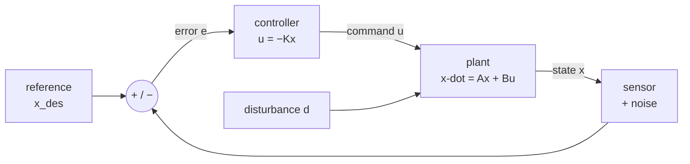
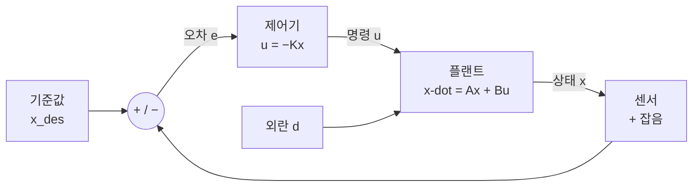

**Deep-dive text** — Matthew Bartos, *Control Theory for Smart Infrastructure* (UT Austin CE397) · [Course packet PDF (public)](https://future-water-website.s3.amazonaws.com/docs/teaching/ce397/ce397_course_packet.pdf) · [Teaching page](https://future-water.org/teaching/)

## English

> [!info] Depth target · 깊이 목표
> Read state-space models, stability, pole/eigenvalue claims, and controllability/observability statements in robotics papers accurately, and say what a controller can and cannot promise. This page teaches that reading level end to end; *designing* controllers beyond the worked examples here is what the packet and [[04-robotics/lqr-lqg|LQR]]/[[04-robotics/mpc|MPC]] are for.
> 로보틱스 논문의 상태공간 모델·안정성·극점/고유값 주장·가제어성/가관측성 서술을 정확히 읽고, 제어기가 무엇을 약속할 수 있고 없는지 말할 수 있으면 된다. 이 페이지가 그 읽기 수준을 처음부터 끝까지 가르친다; 여기 예제 너머의 제어기 *설계*는 패킷과 [[04-robotics/lqr-lqg|LQR]]/[[04-robotics/mpc|MPC]]의 몫이다.

> [!note] Prerequisites
> [[02-foundations/engineering-math|0.5 Engineering Math §8–9]] (linear ODEs, $\dot x = ax \Rightarrow x = x_0e^{at}$, Laplace, poles) · [[02-foundations/linear-algebra|1. Linear Algebra §1–3, §5]] (matrix multiplication, eigenvalues, the state-space section). Nothing else — if you can differentiate, multiply matrices, and read $e^{at}$, this page is self-contained.

Control is the layer that makes a physical system do what you meant. Every robotics paper
either designs one, wraps a learned policy in one, or quietly relies on one — and almost
every claim about *stability*, *tracking*, *bandwidth*, or *robustness* is a claim in this
page's vocabulary.

### 1. What feedback actually buys

Take a heater with a leak: $\dot x = -x + u + d$, where $x$ is temperature error, $u$ your
command, and $d$ an unknown disturbance (an open window). Two strategies:

- **Open loop** — you compute the $u$ that *should* work: $u = 1$ gives steady state
  $x = 1 + d$. If $d = 0.5$, you sit at $1.5$ and never notice. If your model gain was
  10% wrong, that error passes straight through.
- **Closed loop** — you measure $x$ and push against the error: $u = -Kx$. Then
  $\dot x = -(1+K)x + d$, whose steady state is $x = d/(1+K)$. With $K = 9$ that same
  $d = 0.5$ leaves only $0.05$ — **10× smaller** — and you never had to know $d$.

That is the whole trade in one line: *feedback converts model error and disturbance into
a division by $(1+K)$*. What it costs is the rest of this page — measurement noise gets
amplified by the same $K$, delay turns correction into oscillation, and large $K$ can
destabilize a system that was fine open-loop.

### 2. State-space models — writing a physical system as a matrix

Any linear system is written

$$\dot x = Ax + Bu, \qquad y = Cx + Du$$

- $x$ = **state**: the minimum set of numbers that, with future inputs, determines the future.
- $u$ = **input** (what you command), $y$ = **output** (what you measure), $A$ = internal
  dynamics, $B$ = how input enters, $C$ = what the sensor sees.

**Worked conversion — mass–spring–damper.** $m\ddot q + b\dot q + kq = u$ is second order;
state-space wants first order, so *stack the derivatives*: let $x = (q, \dot q)$. Then
$\dot x_1 = x_2$ (definition) and $\dot x_2 = (u - bx_2 - kx_1)/m$ (the physics), so

$$A = \begin{pmatrix} 0 & 1 \\ -k/m & -b/m\end{pmatrix}, \quad B = \begin{pmatrix}0 \\ 1/m\end{pmatrix}, \quad C = \begin{pmatrix}1 & 0\end{pmatrix}$$

with $m=1, b=1, k=4$: $A = \begin{pmatrix}0&1\\-4&-1\end{pmatrix}$. That trick —
*n*-th order scalar ODE → *n*-dimensional first-order system — is how every robot joint,
suspension, and hydraulic cylinder enters a paper's equations. A robot arm is the same
structure with $M(\theta)$ in place of $m$
([[04-robotics/modern-robotics/ch08-dynamics|MR ch.8]]).

### 3. Solving it: modes and the matrix exponential

For $u=0$, the solution is the matrix version of $x_0e^{at}$:
$x(t) = e^{At}x_0$. Diagonalizing $A = Q\Lambda Q^{-1}$
([[02-foundations/linear-algebra|linear algebra §3]]) gives
$e^{At} = Qe^{\Lambda t}Q^{-1}$ — so the motion is a sum of **modes**, each one an
eigenvector direction decaying or growing like $e^{\lambda_i t}$.

**Worked eigenvalues.** For $A = \begin{pmatrix}0&1\\-4&-1\end{pmatrix}$:
$\det(A-\lambda I) = \lambda^2 + \lambda + 4 = 0 \Rightarrow \lambda = -0.5 \pm j1.94$.
Read it off directly: negative real part → decaying; nonzero imaginary part → oscillating
at ~1.94 rad/s while it decays. **Complex eigenvalues are ringing; real ones are monotone —
decaying if negative, growing if positive.** You now know the qualitative response without
simulating anything.

### 4. Stability, and the two half-stories

| System | Stable iff | Mnemonic |
|---|---|---|
| Continuous $\dot x = Ax$ | all $\text{Re}(\lambda_i) < 0$ | left half-plane |
| Discrete $x_{t+1} = A_dx_t$ | all $\lvert\lambda_i\rvert < 1$ | inside the unit circle |

These are the same statement in two clocks: discretizing with step $T$ maps
$\lambda \mapsto e^{\lambda T}$, and $\text{Re}(\lambda)<0$ is exactly
$\lvert e^{\lambda T}\rvert<1$. Check: $\lambda = -1$, $T = 0.1$ →
$e^{-0.1} = 0.905 < 1$. ✓ Papers switch between the two without warning; the code is
always discrete.

> [!warning] Stability is not performance
> "Stable" only says the error eventually goes to zero. It says nothing about *how long*,
> how much overshoot, how large the control effort, or whether the linear model was valid
> that far from the operating point. A paper that reports only "the closed loop is stable"
> has reported the weakest possible claim.

### 5. Transfer functions, poles, and the numbers papers quote

Laplace-transform the system ([[02-foundations/engineering-math|0.5 §9]]) and the ODE
becomes algebra: for the mass–spring–damper,
$G(s) = \dfrac{1}{ms^2+bs+k} = \dfrac{1}{s^2+s+4}$. Its **poles** (denominator roots) are
exactly the eigenvalues of $A$ — one object, two languages.

Any second-order response is described by two numbers, and these are the ones experimental
sections actually report:

$$s^2 + 2\zeta\omega_n s + \omega_n^2, \qquad \omega_n = \sqrt{k/m}, \quad \zeta = \frac{b}{2\sqrt{km}}$$

- **$\omega_n$** (natural frequency) sets *speed*; **$\zeta$** (damping ratio) sets
  *ringing*: $\zeta<1$ oscillates, $\zeta=1$ is critically damped, $\zeta>1$ is sluggish.
- Rules of thumb you can apply to any plot in a paper: 2% **settling time**
  $t_s \approx 4/(\zeta\omega_n)$; **overshoot** $M_p = e^{-\pi\zeta/\sqrt{1-\zeta^2}}$.
- **Worked**: our system has $\omega_n = 2$, $\zeta = 1/(2\cdot 2) = 0.25$. So
  $t_s \approx 4/0.5 = 8$ s and $M_p = e^{-\pi(0.25)/0.968} \approx 0.44$ — **44% overshoot**,
  settling in ~8 s. A step-response figure that disagrees with these numbers means the
  model in the paper is not the system in the video.

### 6. Controllability and observability — can you steer it, can you see it?

**Controllability** asks: can the input reach every state? One step of $u$ moves you along
the columns of $B$; the dynamics then rotate that reach into $AB$, then $A^2B$. Stack them:

$$\mathcal{C} = [\,B \;\; AB \;\; \cdots \;\; A^{n-1}B\,], \qquad \text{controllable} \iff \text{rank}\,\mathcal{C} = n$$

**Worked, controllable.** $A = \begin{pmatrix}0&1\\-4&-1\end{pmatrix}$,
$B = \begin{pmatrix}0\\1\end{pmatrix}$: $AB = \begin{pmatrix}1\\-1\end{pmatrix}$, so
$\mathcal{C} = \begin{pmatrix}0&1\\1&-1\end{pmatrix}$, $\det = -1 \neq 0$ → rank 2 → **controllable**.

**Worked, uncontrollable.** Two independent joints, one motor that only touches the first:
$A = \begin{pmatrix}-1&0\\0&-2\end{pmatrix}$, $B = \begin{pmatrix}1\\0\end{pmatrix}$ gives
$\mathcal{C} = \begin{pmatrix}1&-1\\0&0\end{pmatrix}$, rank 1 < 2 → **uncontrollable**: no
input sequence ever influences the second joint. Here it happens to be harmless (that mode
decays on its own); the dangerous case is an *unstable* mode you cannot reach — which is
why [[04-robotics/lqr-lqg|LQR]] uses the weaker, exactly-right condition **stabilizability**
("every *unstable* mode is reachable").

**Observability** is the transpose twin — can the sensor eventually reveal every state? —
tested with $\mathcal{O} = [C;\, CA;\, \cdots;\, CA^{n-1}]$ and rank $n$. With
$C = (1\;0)$ (measure position only) and our $A$: $CA = (0\;1)$, so
$\mathcal{O} = \begin{pmatrix}1&0\\0&1\end{pmatrix}$ → observable. **Measuring position is
enough to infer velocity** — because the dynamics couple them. That single fact is why
robots run observers instead of putting a sensor on everything.

### 7. Designing the feedback: pole placement and PID

**Pole placement.** With full state measured, $u = -Kx$ makes the closed loop
$\dot x = (A - BK)x$ — and if the system is controllable you can put the eigenvalues of
$A-BK$ *anywhere you like*.

**Worked.** $A - BK = \begin{pmatrix}0&1\\-4-k_1 & -1-k_2\end{pmatrix}$, characteristic
polynomial $\lambda^2 + (1+k_2)\lambda + (4+k_1)$. Want a well-damped, faster response,
$\zeta = 0.7$, $\omega_n = 4$ → target $\lambda^2 + 5.6\lambda + 16$. Match coefficients:
$k_2 = 4.6$, $k_1 = 12$. New settling time $\approx 4/(0.7\cdot4) = 1.4$ s and overshoot
$\approx 4.6\%$ — from 8 s and 44%. *This is what "we designed a state-feedback controller"
means in a paper.* [[04-robotics/lqr-lqg|LQR]] is the same $u=-Kx$ with the pole locations
chosen by an optimization instead of by hand.

<svg viewBox="0 0 430 216" style="max-width:100%;height:auto" role="img" aria-label="step responses before and after pole placement">
  <g stroke="currentColor" stroke-width="1" opacity="0.3"><line x1="40" y1="50" x2="410" y2="50" stroke-dasharray="4 4"/><line x1="40" y1="150" x2="410" y2="150"/><line x1="40" y1="20" x2="40" y2="150"/></g>
  <path d="M40.0 150.0L43.3 148.4L46.5 143.8L49.8 136.7L53.1 127.5L56.4 116.6L59.6 104.6L62.9 91.9L66.2 79.0L69.5 66.2L72.7 54.1L76.0 42.9L79.3 32.9L82.5 24.3L85.8 17.3L89.1 11.9L92.4 8.2L95.6 6.1L98.9 5.6L102.2 6.5L105.5 8.7L108.7 12.0L112.0 16.3L115.3 21.2L118.5 26.6L121.8 32.3L125.1 38.0L128.4 43.6L131.6 49.0L134.9 53.9L138.2 58.2L141.5 61.9L144.7 64.9L148.0 67.2L151.3 68.8L154.5 69.6L157.8 69.7L161.1 69.2L164.4 68.1L167.6 66.6L170.9 64.7L174.2 62.4L177.5 60.0L180.7 57.5L184.0 54.9L187.3 52.5L190.5 50.1L193.8 48.0L197.1 46.1L200.4 44.5L203.6 43.2L206.9 42.2L210.2 41.6L213.5 41.3L216.7 41.3L220.0 41.5L223.3 42.0L226.5 42.7L229.8 43.6L233.1 44.6L236.4 45.7L239.6 46.9L242.9 48.0L246.2 49.1L249.5 50.1L252.7 51.0L256.0 51.9L259.3 52.6L262.5 53.1L265.8 53.5L269.1 53.8L272.4 53.9L275.6 53.9L278.9 53.7L282.2 53.5L285.5 53.2L288.7 52.8L292.0 52.3L295.3 51.8L298.5 51.3L301.8 50.8L305.1 50.3L308.4 49.9L311.6 49.5L314.9 49.1L318.2 48.8L321.5 48.6L324.7 48.4L328.0 48.3L331.3 48.3L334.5 48.3L337.8 48.4L341.1 48.5L344.4 48.6L347.6 48.8L350.9 49.0L354.2 49.2L357.5 49.4L360.7 49.7L364.0 49.9L367.3 50.1L370.5 50.3L373.8 50.4L377.1 50.5L380.4 50.6L383.6 50.7L386.9 50.8L390.2 50.8L393.5 50.8L396.7 50.7L400.0 50.7" fill="none" stroke="currentColor" stroke-width="1.7" opacity="0.55"/>
  <path d="M40.0 150.0L43.3 144.4L46.5 131.4L49.8 115.2L53.1 98.8L56.4 84.0L59.6 71.6L62.9 61.9L66.2 54.9L69.5 50.1L72.7 47.3L76.0 45.8L79.3 45.4L82.5 45.6L85.8 46.2L89.1 46.9L92.4 47.7L95.6 48.4L98.9 49.0L102.2 49.4L105.5 49.8L108.7 50.0L112.0 50.1L115.3 50.2L118.5 50.2L121.8 50.2L125.1 50.2L128.4 50.1L131.6 50.1L134.9 50.1L138.2 50.1L141.5 50.0L144.7 50.0L148.0 50.0L151.3 50.0L154.5 50.0L157.8 50.0L161.1 50.0L164.4 50.0L167.6 50.0L170.9 50.0L174.2 50.0L177.5 50.0L180.7 50.0L184.0 50.0L187.3 50.0L190.5 50.0L193.8 50.0L197.1 50.0L200.4 50.0L203.6 50.0L206.9 50.0L210.2 50.0L213.5 50.0L216.7 50.0L220.0 50.0L223.3 50.0L226.5 50.0L229.8 50.0L233.1 50.0L236.4 50.0L239.6 50.0L242.9 50.0L246.2 50.0L249.5 50.0L252.7 50.0L256.0 50.0L259.3 50.0L262.5 50.0L265.8 50.0L269.1 50.0L272.4 50.0L275.6 50.0L278.9 50.0L282.2 50.0L285.5 50.0L288.7 50.0L292.0 50.0L295.3 50.0L298.5 50.0L301.8 50.0L305.1 50.0L308.4 50.0L311.6 50.0L314.9 50.0L318.2 50.0L321.5 50.0L324.7 50.0L328.0 50.0L331.3 50.0L334.5 50.0L337.8 50.0L341.1 50.0L344.4 50.0L347.6 50.0L350.9 50.0L354.2 50.0L357.5 50.0L360.7 50.0L364.0 50.0L367.3 50.0L370.5 50.0L373.8 50.0L377.1 50.0L380.4 50.0L383.6 50.0L386.9 50.0L390.2 50.0L393.5 50.0L396.7 50.0L400.0 50.0" fill="none" stroke="currentColor" stroke-width="2"/>
  <g stroke="currentColor" stroke-width="1" opacity="0.5" stroke-dasharray="3 3"><line x1="98" y1="6" x2="98" y2="150"/></g>
  <g stroke="currentColor"><line x1="40" y1="166" x2="70" y2="166" stroke-width="1.7" opacity="0.55"/><line x1="40" y1="186" x2="70" y2="186" stroke-width="2"/></g>
  <g font-size="11" fill="currentColor">
    <text x="6" y="54">target</text><text x="6" y="154">0</text>
    <text x="104" y="16" opacity="0.9">44% overshoot</text>
    <text x="330" y="144">time (s)</text>
    <text x="78" y="170">before &#8212; wn = 2, z = 0.25 &#183; settles in about 8 s</text>
    <text x="78" y="190">after &#8212; wn = 4, z = 0.7 &#183; settles in 1.4 s, 4.6% overshoot</text>
    <text x="40" y="210" opacity="0.85">same plant, same u = -Kx form &#8212; only where you put the poles changed</text>
  </g>
</svg>

**PID**, the controller that actually runs on most hardware:

$$u = K_p e + K_i\int e\,dt + K_d\dot e, \qquad e = x_{des} - x$$

- **P** pushes proportional to error (raises $\omega_n$ — faster, but too much causes ringing).
- **D** pushes against the error's *rate* (adds damping, raises $\zeta$) — and amplifies
  sensor noise, so it is always used with a filter (whose lag then eats into **phase margin**
  — the extra phase lag, in degrees at the gain-crossover frequency, the loop can absorb
  before its correction reinforces the error instead of cancelling it. Divide it by that
  frequency and you get the *delay* margin in seconds; the two are related but not
  interchangeable across controllers of different bandwidth,
  [[02-foundations/signal-processing|signal processing §4]]).
- **I** integrates residual error to kill steady-state offset — and introduces
  **integral windup**: while an actuator is saturated the integral keeps growing, then
  overshoots badly on release. Every real implementation has anti-windup; if a paper's PID
  baseline does not, the baseline is unfairly weak
  ([[02-foundations/ml-practice|ML practice §4]]).
- **Feedforward** (compute the input the model says you need, then let feedback fix the
  residue) is why computed-torque control
  ([[04-robotics/modern-robotics/ch11-robot-control|MR ch.11]]) beats pure PID on arms.

### 8. Observers and the separation principle

You rarely measure the full state, so estimate it: run a copy of the model and correct it
with the measurement residual,

$$\dot{\hat x} = A\hat x + Bu + L(y - C\hat x)$$

The error $\tilde x = x - \hat x$ obeys $\dot{\tilde x} = (A - LC)\tilde x$, so choosing
$L$ to place *those* eigenvalues is the same algebra as pole placement, transposed — this
is why observability is controllability's dual. Practice: make the observer 2–5× faster
than the controller so estimation transients do not masquerade as control transients.

Then feed $\hat x$ to the controller: $u = -K\hat x$. The **separation principle** says you
may design $K$ and $L$ independently and the combination still works (for the linear model).
The stochastic version of $L$ is the [[02-foundations/probability|Kalman filter]], the
combination is [[04-robotics/lqr-lqg|LQG]] — and its famous caveat (LQG has no guaranteed
robustness margins) lives on that page.

### 9. Where linear control meets a real machine

Real systems are nonlinear, so control **linearizes about an operating point**: take the
Jacobian of the dynamics at $(x_0,u_0)$ and use it locally
([[02-foundations/calculus-backprop|calculus §1]]). Everything above then holds *near that
point only*. Three consequences you will meet in papers:

- **Gain scheduling**: interpolate different $K$'s across operating points (an excavator's
  dynamics at full extension are not those at full retraction).
- **Saturation and rate limits**: no linear result survives an actuator that has stopped
  moving — this is exactly the gap [[04-robotics/mpc|MPC]] exists to close.
- **Unmodeled dynamics**: hydraulic valve dead zones, backlash, and flexible links break
  linearity outright — which is why the excavation literature spends as much effort on
  actuator models as on policies
  ([[05-construction-robotics/earthmoving-heavy-machinery|earthmoving stream §1]]).

### 10. Reading control claims in papers

| Paper phrase | Check before accepting it |
|---|---|
| "the closed-loop system is stable" | of which model, linearized where, and does the proof survive saturation/delay? |
| "we tuned the gains" | tuned on the evaluation cases? any anti-windup? same effort as the proposed method? |
| "high bandwidth control at 1 kHz" | loop *rate* is not *latency* ([[04-robotics/robot-systems-deployment\|systems §3]]); what is observation-to-actuation? |
| "robust to disturbances" | which disturbances, what magnitude, measured how — margins or anecdotes? |
| "PID baseline" | structure (P/PI/PID), filter on D, anti-windup, and who tuned it |
| "we use a Kalman filter / observer" | is the model that generates $\hat x$ the same one the controller assumes? |
| "outperforms classical control" | against a *tuned* classical controller with feedforward, or a strawman P controller? |

### Self-check

1. In §1, what closed-loop gain $K$ would you need to attenuate the disturbance 100×, and
   name one cost of choosing it.
2. Write $\ddot q + 3\dot q + 2q = u$ in state-space form and give its eigenvalues. Stable?
3. A discrete controller has $A_d$ with eigenvalues $0.95$ and $1.01$. What happens, and
   over how many steps does the bad mode double?
4. For $A = \begin{pmatrix}0&1\\-4&-1\end{pmatrix}$, $B = (0,1)^\top$, place the closed-loop
   poles at $-2 \pm j2$. What is $K$?
5. A paper measures only joint position but its controller needs velocity. What must be
   true for that to be legitimate, and what fails if the encoder is noisy?

> [!tip]- Answers
> 1. Steady state is $d/(1+K)$, so $1+K = 100 \Rightarrow K = 99$. Costs: sensor noise is multiplied by the same $K$ into the command, control effort/saturation grows, and with any delay or unmodeled fast dynamics such a gain typically destabilizes the loop.
> 2. $x = (q,\dot q)$, $A = \begin{pmatrix}0&1\\-2&-3\end{pmatrix}$, $B = (0,1)^\top$. $\lambda^2+3\lambda+2=0 \Rightarrow \lambda = -1, -2$ — both real and negative, so **stable and non-oscillatory** (overdamped).
> 3. The $0.95$ mode decays; the $1.01$ mode grows 1% per step and the state diverges along its eigenvector. Doubling takes $\ln 2/\ln 1.01 \approx 70$ steps — slow enough to look fine in a short demo and fatal in a long run.
> 4. Target polynomial $(\lambda+2)^2+4 = \lambda^2+4\lambda+8$. Matching $\lambda^2+(1+k_2)\lambda+(4+k_1)$: $k_2 = 3$, $k_1 = 4$, so $K = (4\;\;3)$.
> 5. The pair $(A, C)$ must be observable — with position measured and position/velocity coupled by the dynamics it is (§6), so an observer can reconstruct velocity. What fails with a noisy encoder is naive differentiation: it amplifies high-frequency noise, which is why you use an observer/Kalman filter rather than $\Delta q/\Delta t$ ([[02-foundations/signal-processing|signal processing §4]]).

### Continue beyond this guide

Optimal choice of $K$ → [[04-robotics/lqr-lqg|6. LQR & LQG]]; constraints and saturation →
[[04-robotics/mpc|7. MPC]]; a high-rate application → [[04-robotics/convex-mpc-legged|8. Convex MPC]];
robot-specific control laws → [[04-robotics/modern-robotics/ch11-robot-control|MR ch.11]].
For controller *design* practice, the CE397 packet linked above works through the same
material with infrastructure examples — for a construction-robotics researcher its
examples *are* your domain.

### Connections · 연결

- Foundations · 기초: [[02-foundations/engineering-math|0.5 Engineering Math §8–9]], [[02-foundations/linear-algebra|1. Linear Algebra §5]], [[02-foundations/probability|3. Probability]] (Kalman · 칼만)
- Next · 다음: [[04-robotics/lqr-lqg|LQR/LQG]] → [[04-robotics/mpc|MPC]] → [[04-robotics/convex-mpc-legged|Convex MPC for legged robots]]
- Robot-specific control · 로봇 제어법: [[04-robotics/modern-robotics/ch11-robot-control|MR ch.11]] · Contact · 접촉: [[04-robotics/contact-force-tactile|9. Contact, Force & Tactile]]

### After reading · 읽고 나면 말할 수 있어야 하는 것

- [ ] Convert a scalar ODE to state-space form and say what each of $A, B, C$ is · 스칼라 미분방정식을 상태공간으로 바꾸고 $A, B, C$가 각각 무엇인지 말할 수 있다
- [ ] Read stability off eigenvalues in both continuous and discrete time · 연속·이산 시간 모두에서 고유값으로 안정성을 판정할 수 있다
- [ ] Estimate settling time and overshoot from $\zeta, \omega_n$ · $\zeta, \omega_n$에서 정착 시간과 오버슈트를 추정할 수 있다
- [ ] Run the controllability/observability rank tests and say what each failure means physically · 가제어성·가관측성 랭크 검정을 수행하고 각 실패의 물리적 의미를 말할 수 있다
- [ ] Say what feedback buys, and name three things it costs · 피드백이 무엇을 사고 무엇을 지불하는지 세 가지를 말할 수 있다
- [ ] Audit a paper's "stable/robust/tuned/1 kHz" claims against §10 · 논문의 "stable·robust·tuned·1 kHz" 주장을 §10으로 검사할 수 있다

## 한국어

> [!note] 선수 지식
> [[02-foundations/engineering-math|0.5 공업수학 §8–9]] (선형 미분방정식, $\dot x = ax \Rightarrow x = x_0e^{at}$, 라플라스, 극점) · [[02-foundations/linear-algebra|1. 선형대수 §1–3, §5]] (행렬곱, 고유값, 상태공간 절). 그 외에는 없다 — 미분할 수 있고, 행렬을 곱할 수 있고, $e^{at}$를 읽을 수 있으면 이 페이지는 자체 완결이다.

제어는 물리 시스템이 *의도한 대로* 움직이게 만드는 층이다. 모든 로보틱스 논문은 제어기를
설계하거나, 학습된 정책을 제어기로 감싸거나, 말없이 제어기에 기대고 있다 — 그리고
*안정성·추종·대역폭·강건성*에 대한 거의 모든 주장이 이 페이지의 어휘로 쓰여 있다.

### 1. 피드백이 실제로 사는 것

새는 히터를 보자: $\dot x = -x + u + d$, $x$는 온도 오차, $u$는 명령, $d$는 모르는
외란(열린 창문). 두 전략:

- **개루프** — *되어야 할* $u$를 계산한다: $u = 1$이면 정상 상태가 $x = 1 + d$. $d = 0.5$면
  $1.5$에 앉아 있으면서 그 사실을 모른다. 모델 이득이 10% 틀렸다면 그 오차가 그대로 통과한다.
- **폐루프** — $x$를 재고 오차에 맞서 민다: $u = -Kx$. 그러면
  $\dot x = -(1+K)x + d$이고 정상 상태는 $x = d/(1+K)$. $K = 9$면 같은 $d = 0.5$가
  $0.05$만 남긴다 — **10배 작아지고**, $d$를 알 필요가 전혀 없었다.

한 줄로 요약된 거래가 이것이다: *피드백은 모델 오차와 외란을 $(1+K)$로 나눈다.* 그 대가가
이 페이지의 나머지다 — 측정 잡음도 같은 $K$로 증폭되고, 지연은 보정을 진동으로 바꾸며,
큰 $K$는 개루프에서 멀쩡하던 시스템을 불안정하게 만들 수 있다.

### 2. 상태공간 모델 — 물리 시스템을 행렬로 쓰기

모든 선형 시스템은 이렇게 쓴다:

$$\dot x = Ax + Bu, \qquad y = Cx + Du$$

- $x$ = **상태**: 미래 입력과 함께 미래를 결정하는 최소 숫자 집합.
- $u$ = **입력**(명령하는 것), $y$ = **출력**(측정하는 것), $A$ = 내부 동역학,
  $B$ = 입력이 들어오는 방식, $C$ = 센서가 보는 것.

**변환 예제 — 질량-스프링-댐퍼.** $m\ddot q + b\dot q + kq = u$는 2차인데 상태공간은 1차를
원하므로 *도함수를 쌓는다*: $x = (q, \dot q)$로 두면 $\dot x_1 = x_2$(정의)이고
$\dot x_2 = (u - bx_2 - kx_1)/m$(물리)이므로

$$A = \begin{pmatrix} 0 & 1 \\ -k/m & -b/m\end{pmatrix}, \quad B = \begin{pmatrix}0 \\ 1/m\end{pmatrix}, \quad C = \begin{pmatrix}1 & 0\end{pmatrix}$$

$m=1, b=1, k=4$이면 $A = \begin{pmatrix}0&1\\-4&-1\end{pmatrix}$. *n*차 스칼라 미분방정식
→ *n*차원 1차 시스템이라는 이 요령이, 모든 로봇 관절·서스펜션·유압 실린더가 논문의 수식에
들어오는 방식이다. 로봇 팔은 $m$ 자리에 $M(\theta)$가 오는 같은 구조다
([[04-robotics/modern-robotics/ch08-dynamics|MR 8장]]).

### 3. 푸는 법: 모드와 행렬 지수

$u=0$이면 해는 $x_0e^{at}$의 행렬판이다: $x(t) = e^{At}x_0$. $A = Q\Lambda Q^{-1}$로
대각화하면([[02-foundations/linear-algebra|선형대수 §3]]) $e^{At} = Qe^{\Lambda t}Q^{-1}$ —
즉 운동은 **모드**들의 합이고, 각 모드는 고유벡터 방향으로 $e^{\lambda_i t}$처럼 감쇠하거나
성장한다.

**고유값 계산 예제.** $A = \begin{pmatrix}0&1\\-4&-1\end{pmatrix}$에서
$\det(A-\lambda I) = \lambda^2 + \lambda + 4 = 0 \Rightarrow \lambda = -0.5 \pm j1.94$.
바로 읽힌다: 실수부 음수 → 감쇠; 허수부 0 아님 → 감쇠하면서 약 1.94 rad/s로 진동.
**복소 고유값은 울림이고, 실수 고유값은 순수 감쇠다.** 시뮬레이션 없이 정성적 응답을 안 것이다.

### 4. 안정성, 그리고 한 이야기의 두 반쪽

| 시스템 | 안정 조건 | 기억법 |
|---|---|---|
| 연속 $\dot x = Ax$ | 모든 $\text{Re}(\lambda_i) < 0$ | 좌반평면 |
| 이산 $x_{t+1} = A_dx_t$ | 모든 $\lvert\lambda_i\rvert < 1$ | 단위원 안 |

같은 진술을 두 시계로 쓴 것이다: 스텝 $T$로 이산화하면 $\lambda \mapsto e^{\lambda T}$이고,
$\text{Re}(\lambda)<0$이 정확히 $\lvert e^{\lambda T}\rvert<1$이다. 검산: $\lambda = -1$,
$T = 0.1$ → $e^{-0.1} = 0.905 < 1$. ✓ 논문은 예고 없이 둘을 오가지만, 코드는 언제나
이산이다.

> [!warning] 안정성은 성능이 아니다
> "안정"은 오차가 결국 0으로 간다는 말뿐이다. *얼마나 걸리는지*, 오버슈트가 얼마인지,
> 제어 입력이 얼마나 큰지, 운용점에서 그만큼 멀어져도 선형 모델이 유효한지에 대해 아무
> 말도 하지 않는다. "폐루프가 안정하다"만 보고한 논문은 가능한 가장 약한 주장을 한 것이다.

### 5. 전달함수, 극점, 그리고 논문이 인용하는 숫자들

라플라스 변환하면([[02-foundations/engineering-math|0.5 §9]]) 미분방정식이 대수가 된다:
질량-스프링-댐퍼는 $G(s) = \dfrac{1}{ms^2+bs+k} = \dfrac{1}{s^2+s+4}$. 그 **극점**(분모의
근)이 정확히 $A$의 고유값이다 — 하나의 대상, 두 개의 언어.

모든 2차 응답은 두 숫자로 기술되고, 실험 섹션이 실제로 보고하는 것이 바로 이 둘이다:

$$s^2 + 2\zeta\omega_n s + \omega_n^2, \qquad \omega_n = \sqrt{k/m}, \quad \zeta = \frac{b}{2\sqrt{km}}$$

- **$\omega_n$**(고유 진동수)이 *속도*를, **$\zeta$**(감쇠비)가 *울림*을 정한다:
  $\zeta<1$은 진동, $\zeta=1$은 임계 감쇠, $\zeta>1$은 굼뜸.
- 논문의 어떤 그래프에도 적용할 수 있는 어림법: 2% **정착 시간**
  $t_s \approx 4/(\zeta\omega_n)$; **오버슈트** $M_p = e^{-\pi\zeta/\sqrt{1-\zeta^2}}$.
- **계산 예제**: 우리 시스템은 $\omega_n = 2$, $\zeta = 1/(2\cdot 2) = 0.25$. 따라서
  $t_s \approx 4/0.5 = 8$초, $M_p = e^{-\pi(0.25)/0.968} \approx 0.44$ — **오버슈트 44%**,
  정착 약 8초. 계단 응답 그림이 이 숫자와 어긋나면, 논문의 모델이 영상 속 시스템이 아니라는 뜻이다.

### 6. 가제어성과 가관측성 — 몰 수 있는가, 볼 수 있는가

**가제어성**이 묻는 것: 입력이 모든 상태에 도달할 수 있는가? 입력 한 스텝은 $B$의 열 방향으로
움직이고, 동역학이 그 도달 범위를 $AB$로, 다시 $A^2B$로 회전시킨다. 그것들을 쌓으면:

$$\mathcal{C} = [\,B \;\; AB \;\; \cdots \;\; A^{n-1}B\,], \qquad \text{가제어} \iff \text{rank}\,\mathcal{C} = n$$

**계산 예제, 가제어.** $A = \begin{pmatrix}0&1\\-4&-1\end{pmatrix}$,
$B = \begin{pmatrix}0\\1\end{pmatrix}$: $AB = \begin{pmatrix}1\\-1\end{pmatrix}$이므로
$\mathcal{C} = \begin{pmatrix}0&1\\1&-1\end{pmatrix}$, $\det = -1 \neq 0$ → 랭크 2 → **가제어**.

**계산 예제, 불가제어.** 독립적인 관절 둘에 첫 번째만 건드리는 모터 하나:
$A = \begin{pmatrix}-1&0\\0&-2\end{pmatrix}$, $B = \begin{pmatrix}1\\0\end{pmatrix}$이면
$\mathcal{C} = \begin{pmatrix}1&-1\\0&0\end{pmatrix}$, 랭크 1 < 2 → **불가제어**: 어떤 입력
시퀀스도 두 번째 관절에 영향을 주지 못한다. 여기서는 마침 무해하다(그 모드가 스스로
감쇠하니까); 위험한 경우는 도달할 수 없는 *불안정* 모드다 — 그래서
[[04-robotics/lqr-lqg|LQR]]은 더 약하고 정확히 들어맞는 조건인 **안정화 가능성**("모든
*불안정* 모드가 도달 가능")을 쓴다.

**가관측성**은 전치 쌍둥이 — 센서가 결국 모든 상태를 드러낼 수 있는가? —
$\mathcal{O} = [C;\, CA;\, \cdots;\, CA^{n-1}]$의 랭크가 $n$인지로 검정한다.
$C = (1\;0)$(위치만 측정)과 위의 $A$에서 $CA = (0\;1)$이므로
$\mathcal{O} = \begin{pmatrix}1&0\\0&1\end{pmatrix}$ → 가관측. **위치만 재도 속도를 추론할
수 있다** — 동역학이 둘을 묶고 있기 때문이다. 로봇이 모든 곳에 센서를 달지 않고 관측기를
돌리는 이유가 이 사실 하나다.

### 7. 피드백 설계: 극점 배치와 PID

**극점 배치.** 전체 상태를 측정하면 $u = -Kx$가 폐루프를 $\dot x = (A - BK)x$로 만들고,
시스템이 가제어이면 $A-BK$의 고유값을 *원하는 곳 아무 데나* 놓을 수 있다.

**계산 예제.** $A - BK = \begin{pmatrix}0&1\\-4-k_1 & -1-k_2\end{pmatrix}$, 특성 다항식은
$\lambda^2 + (1+k_2)\lambda + (4+k_1)$. 잘 감쇠하고 더 빠른 응답 $\zeta = 0.7$,
$\omega_n = 4$를 원하면 목표는 $\lambda^2 + 5.6\lambda + 16$. 계수를 맞추면
$k_2 = 4.6$, $k_1 = 12$. 새 정착 시간 $\approx 4/(0.7\cdot4) = 1.4$초, 오버슈트 약 4.6%
— 8초·44%에서 온 것이다. *논문의 "상태 피드백 제어기를 설계했다"가 뜻하는 것이 이것이다.*
[[04-robotics/lqr-lqg|LQR]]은 극점 위치를 손이 아니라 최적화가 고르는 같은 $u=-Kx$다.

<svg viewBox="0 0 430 216" style="max-width:100%;height:auto" role="img" aria-label="극점 배치 전후의 계단 응답">
  <g stroke="currentColor" stroke-width="1" opacity="0.3"><line x1="40" y1="50" x2="410" y2="50" stroke-dasharray="4 4"/><line x1="40" y1="150" x2="410" y2="150"/><line x1="40" y1="20" x2="40" y2="150"/></g>
  <path d="M40.0 150.0L43.3 148.4L46.5 143.8L49.8 136.7L53.1 127.5L56.4 116.6L59.6 104.6L62.9 91.9L66.2 79.0L69.5 66.2L72.7 54.1L76.0 42.9L79.3 32.9L82.5 24.3L85.8 17.3L89.1 11.9L92.4 8.2L95.6 6.1L98.9 5.6L102.2 6.5L105.5 8.7L108.7 12.0L112.0 16.3L115.3 21.2L118.5 26.6L121.8 32.3L125.1 38.0L128.4 43.6L131.6 49.0L134.9 53.9L138.2 58.2L141.5 61.9L144.7 64.9L148.0 67.2L151.3 68.8L154.5 69.6L157.8 69.7L161.1 69.2L164.4 68.1L167.6 66.6L170.9 64.7L174.2 62.4L177.5 60.0L180.7 57.5L184.0 54.9L187.3 52.5L190.5 50.1L193.8 48.0L197.1 46.1L200.4 44.5L203.6 43.2L206.9 42.2L210.2 41.6L213.5 41.3L216.7 41.3L220.0 41.5L223.3 42.0L226.5 42.7L229.8 43.6L233.1 44.6L236.4 45.7L239.6 46.9L242.9 48.0L246.2 49.1L249.5 50.1L252.7 51.0L256.0 51.9L259.3 52.6L262.5 53.1L265.8 53.5L269.1 53.8L272.4 53.9L275.6 53.9L278.9 53.7L282.2 53.5L285.5 53.2L288.7 52.8L292.0 52.3L295.3 51.8L298.5 51.3L301.8 50.8L305.1 50.3L308.4 49.9L311.6 49.5L314.9 49.1L318.2 48.8L321.5 48.6L324.7 48.4L328.0 48.3L331.3 48.3L334.5 48.3L337.8 48.4L341.1 48.5L344.4 48.6L347.6 48.8L350.9 49.0L354.2 49.2L357.5 49.4L360.7 49.7L364.0 49.9L367.3 50.1L370.5 50.3L373.8 50.4L377.1 50.5L380.4 50.6L383.6 50.7L386.9 50.8L390.2 50.8L393.5 50.8L396.7 50.7L400.0 50.7" fill="none" stroke="currentColor" stroke-width="1.7" opacity="0.55"/>
  <path d="M40.0 150.0L43.3 144.4L46.5 131.4L49.8 115.2L53.1 98.8L56.4 84.0L59.6 71.6L62.9 61.9L66.2 54.9L69.5 50.1L72.7 47.3L76.0 45.8L79.3 45.4L82.5 45.6L85.8 46.2L89.1 46.9L92.4 47.7L95.6 48.4L98.9 49.0L102.2 49.4L105.5 49.8L108.7 50.0L112.0 50.1L115.3 50.2L118.5 50.2L121.8 50.2L125.1 50.2L128.4 50.1L131.6 50.1L134.9 50.1L138.2 50.1L141.5 50.0L144.7 50.0L148.0 50.0L151.3 50.0L154.5 50.0L157.8 50.0L161.1 50.0L164.4 50.0L167.6 50.0L170.9 50.0L174.2 50.0L177.5 50.0L180.7 50.0L184.0 50.0L187.3 50.0L190.5 50.0L193.8 50.0L197.1 50.0L200.4 50.0L203.6 50.0L206.9 50.0L210.2 50.0L213.5 50.0L216.7 50.0L220.0 50.0L223.3 50.0L226.5 50.0L229.8 50.0L233.1 50.0L236.4 50.0L239.6 50.0L242.9 50.0L246.2 50.0L249.5 50.0L252.7 50.0L256.0 50.0L259.3 50.0L262.5 50.0L265.8 50.0L269.1 50.0L272.4 50.0L275.6 50.0L278.9 50.0L282.2 50.0L285.5 50.0L288.7 50.0L292.0 50.0L295.3 50.0L298.5 50.0L301.8 50.0L305.1 50.0L308.4 50.0L311.6 50.0L314.9 50.0L318.2 50.0L321.5 50.0L324.7 50.0L328.0 50.0L331.3 50.0L334.5 50.0L337.8 50.0L341.1 50.0L344.4 50.0L347.6 50.0L350.9 50.0L354.2 50.0L357.5 50.0L360.7 50.0L364.0 50.0L367.3 50.0L370.5 50.0L373.8 50.0L377.1 50.0L380.4 50.0L383.6 50.0L386.9 50.0L390.2 50.0L393.5 50.0L396.7 50.0L400.0 50.0" fill="none" stroke="currentColor" stroke-width="2"/>
  <g stroke="currentColor" stroke-width="1" opacity="0.5" stroke-dasharray="3 3"><line x1="98" y1="6" x2="98" y2="150"/></g>
  <g stroke="currentColor"><line x1="40" y1="166" x2="70" y2="166" stroke-width="1.7" opacity="0.55"/><line x1="40" y1="186" x2="70" y2="186" stroke-width="2"/></g>
  <g font-size="11" fill="currentColor">
    <text x="6" y="54">목표값</text><text x="6" y="154">0</text>
    <text x="104" y="16" opacity="0.9">오버슈트 44%</text>
    <text x="330" y="144">시간 (초)</text>
    <text x="78" y="170">이전 &#8212; wn = 2, z = 0.25 &#183; 정착까지 약 8초</text>
    <text x="78" y="190">이후 &#8212; wn = 4, z = 0.7 &#183; 1.4초 정착, 오버슈트 4.6%</text>
    <text x="40" y="210" opacity="0.85">같은 플랜트, 같은 u = -Kx 형태 &#8212; 바뀐 것은 극점 위치뿐이다</text>
  </g>
</svg>

**PID**, 실제 하드웨어에서 대부분 돌아가는 제어기:

$$u = K_p e + K_i\int e\,dt + K_d\dot e, \qquad e = x_{des} - x$$

- **P**는 오차에 비례해 민다($\omega_n$을 올린다 — 빨라지지만 과하면 울린다).
- **D**는 오차의 *변화율*에 맞선다(감쇠를 더해 $\zeta$를 올린다) — 그리고 센서 잡음을
  증폭하므로 항상 필터와 함께 쓰이고, 그 필터의 지연이 다시 **위상 여유**(phase margin)를
  깎는다 — 위상 여유란 이득 교차 주파수에서 루프가 더 견딜 수 있는 위상 지연을 도(度)로 잰 값이다. 그것을 그 주파수로 나누면 초 단위의 *지연* 여유가 되는데, 대역폭이 다른 제어기 사이에서는 둘을 바꿔 쓸 수 없다. 보정이
  너무 늦게 도착하면 오차를 상쇄하는 대신 되레 키운다
  ([[02-foundations/signal-processing|신호처리 §4]]).
- **I**는 잔여 오차를 적분해 정상 상태 오프셋을 없앤다 — 그리고 **적분 와인드업**을
  데려온다: 액추에이터가 포화된 동안 적분값이 계속 자라고, 풀리는 순간 크게 오버슈트한다.
  모든 실전 구현에 anti-windup이 있다; 논문의 PID 베이스라인에 그것이 없다면 그 베이스라인은
  부당하게 약한 것이다([[02-foundations/ml-practice|ML 실무 §4]]).
- **피드포워드**(모델이 말하는 입력을 먼저 넣고 피드백이 잔차를 고치게 하기)가 팔에서
  계산 토크 제어([[04-robotics/modern-robotics/ch11-robot-control|MR 11장]])가 순수 PID를
  이기는 이유다.

### 8. 관측기와 분리 원리

전체 상태를 재는 일은 드무니 추정한다: 모델의 복사본을 돌리고 측정 잔차로 보정한다,

$$\dot{\hat x} = A\hat x + Bu + L(y - C\hat x)$$

오차 $\tilde x = x - \hat x$는 $\dot{\tilde x} = (A - LC)\tilde x$를 따르므로, *그* 고유값을
배치하도록 $L$을 고르는 것은 극점 배치를 전치한 같은 대수다 — 가관측성이 가제어성의 쌍대인
이유가 이것이다. 실전: 추정 과도 응답이 제어 과도 응답으로 오인되지 않도록 관측기를
제어기보다 2~5배 빠르게 만든다.

그다음 $\hat x$를 제어기에 먹인다: $u = -K\hat x$. **분리 원리**는 $K$와 $L$을 독립적으로
설계해도 (선형 모델에서는) 결합이 작동한다고 말한다. $L$의 확률적 버전이
[[02-foundations/probability|칼만 필터]]이고 그 결합이 [[04-robotics/lqr-lqg|LQG]]다 —
유명한 단서(LQG에는 보장된 강건성 여유가 없다)는 그 페이지에 있다.

### 9. 선형 제어가 실제 기계와 만나는 곳

실제 시스템은 비선형이므로 제어는 **운용점 주변에서 선형화**한다: $(x_0,u_0)$에서 동역학의
야코비안을 취해 국소적으로 쓴다([[02-foundations/calculus-backprop|미적분 §1]]). 위의 모든
것이 그때 *그 점 근처에서만* 성립한다. 논문에서 만나게 될 세 귀결:

- **게인 스케줄링**: 운용점마다 다른 $K$를 보간한다(굴착기의 완전 신장 시 동역학은 완전
  수축 시 동역학이 아니다).
- **포화와 속도 한계**: 이미 멈춘 액추에이터 앞에서 살아남는 선형 결과는 없다 — 정확히
  이 간극을 메우려고 [[04-robotics/mpc|MPC]]가 존재한다.
- **미모델링 동역학**: 유압 밸브 데드존, 백래시, 유연 링크가 선형성을 정면으로 깬다 —
  굴착 문헌이 정책만큼 액추에이터 모델에 공을 들이는 이유다
  ([[05-construction-robotics/earthmoving-heavy-machinery|토공 스트림 §1]]).

### 10. 논문의 제어 주장 읽기

| 논문 표현 | 받아들이기 전에 확인할 것 |
|---|---|
| "폐루프가 안정하다" | 어느 모델의, 어디서 선형화한, 그리고 포화·지연에서도 증명이 살아남는가? |
| "게인을 튜닝했다" | 평가 케이스에서 튜닝했나? anti-windup은? 제안 방법과 같은 공을 들였나? |
| "1 kHz 고대역폭 제어" | 루프 *주기*는 *지연*이 아니다([[04-robotics/robot-systems-deployment\|시스템 §3]]); 관측→구동 지연은? |
| "외란에 강건" | 어떤 외란을, 얼마 크기로, 어떻게 측정했나 — 여유(margin)인가 일화인가? |
| "PID 베이스라인" | 구조(P/PI/PID), D의 필터, anti-windup, 그리고 누가 튜닝했나 |
| "칼만 필터/관측기를 쓴다" | $\hat x$를 만드는 모델이 제어기가 가정하는 그 모델과 같은가? |
| "고전 제어를 능가" | 피드포워드가 붙은 *튜닝된* 고전 제어기 대비인가, 허수아비 P 제어기 대비인가? |

### 스스로 점검

1. §1에서 외란을 100배 줄이려면 폐루프 이득 $K$는 얼마여야 하고, 그 선택의 대가 하나를 들라.
2. $\ddot q + 3\dot q + 2q = u$를 상태공간으로 쓰고 고유값을 구하라. 안정한가?
3. 이산 제어기의 $A_d$ 고유값이 $0.95$와 $1.01$이다. 무슨 일이 일어나고, 나쁜 모드는 몇
   스텝 만에 2배가 되는가?
4. $A = \begin{pmatrix}0&1\\-4&-1\end{pmatrix}$, $B = (0,1)^\top$에서 폐루프 극점을
   $-2 \pm j2$에 배치하라. $K$는?
5. 어떤 논문이 관절 위치만 측정하는데 제어기는 속도가 필요하다. 그것이 정당하려면 무엇이
   참이어야 하고, 엔코더에 잡음이 있으면 무엇이 실패하는가?

> [!tip]- 정답 · Answers
> 1. 정상 상태가 $d/(1+K)$이므로 $1+K = 100 \Rightarrow K = 99$. 대가: 센서 잡음이 같은 $K$로 곱해져 명령에 들어가고, 제어 입력·포화가 커지며, 지연이나 미모델링 고속 동역학이 조금만 있어도 그런 이득은 대개 루프를 불안정하게 만든다.
> 2. $x = (q,\dot q)$, $A = \begin{pmatrix}0&1\\-2&-3\end{pmatrix}$, $B = (0,1)^\top$. $\lambda^2+3\lambda+2=0 \Rightarrow \lambda = -1, -2$ — 둘 다 실수 음수라 **안정하고 진동하지 않는다**(과감쇠).
> 3. $0.95$ 모드는 감쇠하고, $1.01$ 모드는 매 스텝 1%씩 자라 그 고유벡터 방향으로 발산한다. 2배가 되는 데 $\ln 2/\ln 1.01 \approx 70$ 스텝 — 짧은 데모에서는 멀쩡해 보이고 긴 운용에서는 치명적일 만큼 느리다.
> 4. 목표 다항식 $(\lambda+2)^2+4 = \lambda^2+4\lambda+8$. $\lambda^2+(1+k_2)\lambda+(4+k_1)$과 맞추면 $k_2 = 3$, $k_1 = 4$, 즉 $K = (4\;\;3)$.
> 5. $(A, C)$가 가관측이어야 한다 — 위치를 측정하고 동역학이 위치·속도를 묶고 있으면 가관측이므로(§6) 관측기가 속도를 복원할 수 있다. 엔코더에 잡음이 있으면 실패하는 것은 순진한 차분이다: 고주파 잡음을 증폭하므로 $\Delta q/\Delta t$ 대신 관측기/칼만 필터를 쓴다([[02-foundations/signal-processing|신호처리 §4]]).

### 이 가이드 다음으로

$K$의 최적 선택 → [[04-robotics/lqr-lqg|6. LQR & LQG]]; 제약과 포화 →
[[04-robotics/mpc|7. MPC]]; 고주기 응용 → [[04-robotics/convex-mpc-legged|8. Convex MPC]];
로봇 특유의 제어 법칙 → [[04-robotics/modern-robotics/ch11-robot-control|MR 11장]].
제어기 *설계* 연습에는 위에 링크한 CE397 패킷이 같은 내용을 인프라 예제로 풀어 준다 —
건설로봇 연구자에게는 그 예제가 *곧 당신의 도메인*이다.
