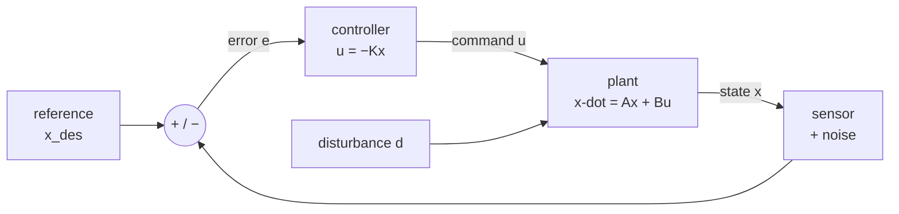
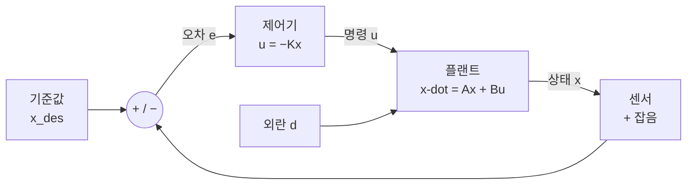

**Deep-dive text** — Matthew Bartos, *Control Theory for Smart Infrastructure* (UT Austin CE397) · [Course packet PDF (public)](https://future-water-website.s3.amazonaws.com/docs/teaching/ce397/ce397_course_packet.pdf) · [Teaching page](https://future-water.org/teaching/)

## English

*First page of group D, and the cheapest to enter: engineering math and [[02-foundations/linear-algebra|linear algebra]] are enough.
What feedback buys and what it costs is settled here; [[04-robotics/lqr-lqg|6]], [[04-robotics/mpc|7]] and [[04-robotics/convex-mpc-legged|8]] are all built on top of it.*

> [!info] Depth target · 깊이 목표
> Read state-space models, stability, pole/eigenvalue claims, and controllability/observability statements in robotics papers accurately, and say what a controller can and cannot promise. This page teaches that reading level end to end; *designing* controllers beyond the worked examples here is what the packet and [[04-robotics/lqr-lqg|LQR]]/[[04-robotics/mpc|MPC]] are for.
> 로보틱스 논문의 상태공간 모델·안정성·극점/고유값 주장·가제어성/가관측성 서술을 정확히 읽고, 제어기가 무엇을 약속할 수 있고 없는지 말할 수 있으면 된다. 이 페이지가 그 읽기 수준을 처음부터 끝까지 가르친다; 여기 예제 너머의 제어기 *설계*는 패킷과 [[04-robotics/lqr-lqg|LQR]]/[[04-robotics/mpc|MPC]]의 몫이다.

> [!note] Prerequisites
> [[02-foundations/engineering-math|0.5 Engineering Math §8–9]] (linear ODEs, $\dot x = ax \Rightarrow x = x_0e^{at}$, Laplace, poles) · [[02-foundations/linear-algebra|1. Linear Algebra §1–3, §5]] (matrix multiplication, eigenvalues, the state-space section). Nothing else — if you can differentiate, multiply matrices, and read $e^{at}$, this page is self-contained.

Control is the layer that makes a physical system do what you meant. Every robotics paper
either designs one, wraps a learned policy in one, or quietly relies on one — and almost
every claim about *stability*, *tracking*, *bandwidth*, or *robustness* is a claim in this
page's vocabulary.

> [!note] First pass · 처음이라면
> The longest page in group D. First pass: §1 — the leaky heater, with the numbers — then §4 for stability, then §10 for reading control claims. §5.5 — margins, sensitivity, and what no controller can do — is the other reading-skill section; save it for a second pass. It is read off a frequency-response (Nyquist) plot, which this page introduces only in a short primer at the start of §5.5; if that primer is not enough, read Åström & Murray ch.9 first. §2, §3 and §5 to §8 are the machinery, and they read much faster once §1 has told you what feedback is for.

### Homework diagram · 과제가 그릴 그림

Two panels and a clock, drawn by hand before the problem set asks for them again. The object is
**P4** from [[02-foundations/lab-plants|0.6 Lab Plants]], the leaky heater $\dot x=-x+u+d$ that
§1 opens with.

<svg viewBox="0 0 560 332" style="max-width:100%;height:auto" role="img" aria-label="Left: the leaky heater in open loop, u and d summed before the plant and x read by nothing, so x settles at 1 + d = 1.5; right: the same plant with u = -Kx through a sampler of period 0.1 s and a zero-order hold, closed-loop pole -10 and x settling at d/(1+K) = 0.05, and the sampled loop stable only for K below 19">
  <defs><marker id="ctdA" viewBox="0 0 10 10" refX="8" refY="5" markerWidth="5" markerHeight="5" orient="auto"><path d="M 0 0 L 10 5 L 0 10 z" fill="currentColor"/></marker></defs>
  <g fill="currentColor">
    <text x="12" y="22" font-size="12" fill-opacity="0.85" font-weight="600">open loop</text>
    <line x1="12" y1="96" x2="45" y2="96" stroke="currentColor" stroke-width="1.4" marker-end="url(#ctdA)"/>
    <text x="14" y="88" font-size="12">u = 1</text>
    <line x1="56" y1="46" x2="56" y2="85" stroke="currentColor" stroke-width="1.4" marker-end="url(#ctdA)"/>
    <text x="63" y="58" font-size="12">d = 0.5</text>
    <circle cx="56" cy="96" r="9" fill="none" stroke="currentColor" stroke-width="1.3"/>
    <line x1="49.7" y1="89.7" x2="62.3" y2="102.3" stroke="currentColor" stroke-width="0.9" stroke-opacity="0.7"/>
    <line x1="49.7" y1="102.3" x2="62.3" y2="89.7" stroke="currentColor" stroke-width="0.9" stroke-opacity="0.7"/>
    <text x="40" y="114" font-size="12" text-anchor="middle">+</text>
    <text x="68" y="83" font-size="12" text-anchor="middle">+</text>
    <line x1="65" y1="96" x2="78" y2="96" stroke="currentColor" stroke-width="1.4" marker-end="url(#ctdA)"/>
    <rect x="80" y="77" width="100" height="38" rx="3" fill="currentColor" fill-opacity="0.06" stroke="currentColor" stroke-width="1.3"/>
    <text x="130" y="100.3" font-size="12" text-anchor="middle">ẋ = −x + u + d</text>
    <line x1="180" y1="96" x2="204" y2="96" stroke="currentColor" stroke-width="1.4" marker-end="url(#ctdA)"/>
    <text x="192" y="88" font-size="12" text-anchor="middle">x</text>
    <text x="12" y="156" font-size="12" xml:space="preserve">x<tspan dy="3.4" font-size="11">∞</tspan><tspan dy="-3.4"> = 1 + d = 1.5</tspan></text>
    <text x="12" y="172" font-size="12" fill-opacity="0.85">(u = 1, d = 0.5)</text>
    <text x="12" y="196" font-size="12" fill-opacity="0.85">no arrow reads x,</text>
    <text x="12" y="212" font-size="12" fill-opacity="0.85">so nothing can correct it</text>
    <line x1="214" y1="12" x2="214" y2="320" stroke="currentColor" stroke-width="0.8" stroke-opacity="0.3"/>
    <text x="226" y="22" font-size="12" fill-opacity="0.85" font-weight="600">closed loop, with the clock on top</text>
    <line x1="262" y1="46" x2="262" y2="85" stroke="currentColor" stroke-width="1.4" marker-end="url(#ctdA)"/>
    <text x="269" y="58" font-size="12">d(t)</text>
    <circle cx="262" cy="96" r="9" fill="none" stroke="currentColor" stroke-width="1.3"/>
    <line x1="255.7" y1="89.7" x2="268.3" y2="102.3" stroke="currentColor" stroke-width="0.9" stroke-opacity="0.7"/>
    <line x1="255.7" y1="102.3" x2="268.3" y2="89.7" stroke="currentColor" stroke-width="0.9" stroke-opacity="0.7"/>
    <text x="274" y="83" font-size="12" text-anchor="middle">+</text>
    <text x="250" y="118" font-size="12" text-anchor="middle">+</text>
    <line x1="271" y1="96" x2="286" y2="96" stroke="currentColor" stroke-width="1.4" marker-end="url(#ctdA)"/>
    <rect x="288" y="77" width="100" height="38" rx="3" fill="currentColor" fill-opacity="0.06" stroke="currentColor" stroke-width="1.3"/>
    <text x="338" y="100.3" font-size="12" text-anchor="middle">ẋ = −x + u + d</text>
    <line x1="388" y1="96" x2="546" y2="96" stroke="currentColor" stroke-width="1.4" marker-end="url(#ctdA)"/>
    <text x="430" y="88" font-size="12" text-anchor="middle">x(t)</text>
    <circle cx="488" cy="96" r="3" fill="currentColor"/>
    <line x1="488" y1="96" x2="488" y2="176" stroke="currentColor" stroke-width="1.4"/>
    <line x1="488" y1="176" x2="470" y2="176" stroke="currentColor" stroke-width="1.4"/>
    <circle cx="470" cy="176" r="2.6" fill="none" stroke="currentColor" stroke-width="1.2"/>
    <circle cx="448" cy="176" r="2.6" fill="none" stroke="currentColor" stroke-width="1.2"/>
    <line x1="467.6" y1="174.5" x2="450" y2="164" stroke="currentColor" stroke-width="1.5" stroke-linecap="round"/>
    <path d="M 454.0 159.0 A 10 10 0 0 1 469.0 166.0" fill="none" stroke="currentColor" stroke-width="0.9" stroke-opacity="0.7" marker-end="url(#ctdA)"/>
    <text x="546" y="198" font-size="11" text-anchor="end">sampler, T = 0.1 s</text>
    <line x1="445" y1="176" x2="424" y2="176" stroke="currentColor" stroke-width="1.4" marker-end="url(#ctdA)"/>
    <text x="435" y="168" font-size="12" text-anchor="middle" xml:space="preserve">x<tspan dy="3.4" font-size="11">k</tspan></text>
    <rect x="384" y="161" width="38" height="30" rx="3" fill="currentColor" fill-opacity="0.06" stroke="currentColor" stroke-width="1.3"/>
    <text x="403" y="180.7" font-size="13" text-anchor="middle">−K</text>
    <text x="403" y="206" font-size="11" text-anchor="middle" fill-opacity="0.85">K = 9</text>
    <line x1="384" y1="176" x2="344" y2="176" stroke="currentColor" stroke-width="1.4" marker-end="url(#ctdA)"/>
    <text x="363" y="168" font-size="12" text-anchor="middle" xml:space="preserve">u<tspan dy="3.4" font-size="11">k</tspan></text>
    <rect x="300" y="161" width="42" height="30" rx="3" fill="currentColor" fill-opacity="0.06" stroke="currentColor" stroke-width="1.3"/>
    <text x="321" y="180.3" font-size="12" text-anchor="middle">ZOH</text>
    <text x="321" y="206" font-size="11" text-anchor="middle" fill-opacity="0.85">zero-order hold</text>
    <path d="M 300.0 176.0 L 262.0 176.0 L 262.0 107.0" fill="none" stroke="currentColor" stroke-width="1.4" marker-end="url(#ctdA)"/>
    <text x="269" y="142" font-size="12">u(t), held</text>
    <text x="546" y="226" font-size="11" text-anchor="end" fill-opacity="0.8">(t): continuous signal  ·  k: sequence</text>
    <text x="226" y="250" font-size="12">closed-loop pole −(1+K) = −10</text>
    <text x="226" y="266" font-size="12" xml:space="preserve">x<tspan dy="3.4" font-size="11">∞</tspan><tspan dy="-3.4"> = d/(1+K) = 0.05   (K = 9, d = 0.5)</tspan></text>
    <text x="226" y="288" font-size="12" fill-opacity="0.9">with the clock, T = 0.1 s (explicit Euler, §4):</text>
    <text x="226" y="304" font-size="12" fill-opacity="0.9" xml:space="preserve">x<tspan dy="3.4" font-size="11">k+1</tspan><tspan dy="-3.4"> = (1 − T(1+K)) x</tspan><tspan dy="3.4" font-size="11">k</tspan><tspan dy="-3.4"> + T d</tspan><tspan dy="3.4" font-size="11">k</tspan></text>
    <text x="226" y="320" font-size="12" fill-opacity="0.9">stable only while K &lt; 19; K = 99 gives −9 and diverges</text>
  </g>
</svg>

**Left panel — open loop.** A box labelled $\dot x=-x+u+d$, with the command $u$ and the
disturbance $d$ arriving together at a summing junction *before* the box, and the state $x$ leaving
it and going nowhere. Write $x_\infty=1+d$ under the panel and say why in one line: no arrow reads
$x$, so nothing in this picture can correct it.

**Right panel — closed loop.** The same box, plus a path from the output $x$ into a gain block
$-K$ and back into the same summing junction. Mark the junction's signs explicitly. The convention
that survives substitution is the one where the minus lives inside the block, so the junction adds
$u$ and $d$ and the box is $\dot x=-x+u+d$ unchanged — a paper that hides the sign in the junction
instead is the reason half of all sign errors are found in someone else's figure. Under the panel
write the closed-loop pole $-(1+K)$ and $x_\infty=d/(1+K)$; those are the two numbers the problem
set asks for first.

**The clock, drawn on top of the right panel.** Put a sampler — a switch labelled with period $T$ —
on the feedback path, and a zero-order hold on $u$ after the gain. Then label every arrow with
which kind of signal it carries: $x(t)$ and $d(t)$ continuous, $x_k$ and $u_k$ sequences. This
third element is the one readers leave out and the one §4 shows can decide the answer: the same
$K$ that is stable in the left-hand notation can be unstable in the right-hand one. A block diagram
that does not say where the signal becomes a sequence has not specified the controller the problem
set runs. That controller steps the held loop by explicit Euler, $x_{k+1}=\big(1-T(1+K)\big)x_k+Td_k$ (§4), which is where the panel's $K<19$ at $T=0.1$ s comes from; integrating the plant exactly across each held interval would allow $K<20.02$.

### 1. What feedback actually buys

Take a heater with a leak: $\dot x = -x + u + d$, where $x$ is temperature error, $u$ your
command, and $d$ an unknown disturbance (an open window). Two strategies, which differ in one
thing: an **open-loop** controller computes the command without measuring the result, while a
**closed-loop** (feedback) controller computes the command from the measured output. The
**steady state** quoted below is where the state stops changing, found by setting $\dot x = 0$.

- **Open loop** — you compute the $u$ that *should* work: $u = 1$ gives steady state
  $x = 1 + d$. If $d = 0.5$, you sit at $1.5$ and never notice. If your model gain was
  10% wrong, that error passes straight through.
- **Closed loop** — you measure $x$ and push against the error: $u = -Kx$. Then
  $\dot x = -(1+K)x + d$, whose steady state is $x = d/(1+K)$. With $K = 9$ that same
  $d = 0.5$ leaves only $0.05$ — **10× smaller** — and you never had to know $d$.

That is the whole trade in one line: *feedback converts model error and disturbance into
a division by $(1+K)$*. What it costs is the rest of this page — measurement noise gets
amplified by the same $K$, delay turns correction into oscillation, and large $K$ can
destabilize a system that was fine open-loop.




### 2. State-space models — writing a physical system as a matrix

Any linear system is written

$$\dot x = Ax + Bu, \qquad y = Cx + Du$$

No robot is linear, so ask where this shape comes from. It is the first-order Taylor expansion of the true dynamics $\dot x = f(x,u)$ about the operating point you intend to hold: $A$ and $B$ are the Jacobians $\partial f/\partial x$ and $\partial f/\partial u$ evaluated there, which is why a paper's $A$ matrix changes when its operating point does. $D$ is usually zero because a sensor rarely sees the command directly.

Written out, let $(x_0, u_0)$ be an **equilibrium**, a state and input with $f(x_0, u_0) = 0$ so
that the state would rest there, and let $\delta x = x - x_0$ and $\delta u = u - u_0$ be the
deviations from it. Then

$$\delta\dot x \approx A\,\delta x + B\,\delta u, \qquad A = \frac{\partial f}{\partial x}\Big|_{(x_0,u_0)}, \qquad B = \frac{\partial f}{\partial u}\Big|_{(x_0,u_0)}$$

This is linear in the deviations, additive and homogeneous in the sense of
[[02-foundations/engineering-math|0.5 §4.5]], because the constant Taylor term $f(x_0,u_0)$ is
zero at an equilibrium; so it is trustworthy only while $\delta x$ and $\delta u$ stay small.
*Example:* a pendulum $\ddot\theta = -(g/l)\sin\theta + u$ with $g/l = 9.81\ \text{s}^{-2}$ and
state $(\theta, \dot\theta)$. Hanging down ($\theta_0 = 0$, $\cos\theta_0 = 1$) gives
$A = \begin{pmatrix}0&1\\-9.81&0\end{pmatrix}$ with eigenvalues $\pm j3.13$, an oscillation;
balanced upright ($\theta_0 = \pi$, $\cos\theta_0 = -1$) gives
$A = \begin{pmatrix}0&1\\9.81&0\end{pmatrix}$ with eigenvalues $\pm 3.13$, one of them unstable.
Same machine, two operating points, two different $A$ matrices.

- $x$ = **state**: the minimum set of numbers that, with future inputs, determines the future.
- $u$ = **input** (what you command), $y$ = **output** (what you measure), $A$ = internal
  dynamics, $B$ = how input enters, $C$ = what the sensor sees.
- With $n$ states, $m$ inputs and $p$ outputs, $A$ is $n\times n$, $B$ is $n\times m$, $C$ is
  $p\times n$ and $D$ is $p\times m$. All four are constant, which makes the model
  **time-invariant** as well as linear: an LTI (linear time-invariant) system. Its exact solution
  through the matrix exponential is written out in
  [[02-foundations/linear-algebra|1. Linear Algebra §5]].

**Worked conversion — mass–spring–damper.** $m\ddot q + b\dot q + kq = u$ is second order;
state-space wants first order, so *stack the derivatives*: let $x = (q, \dot q)$. Then
$\dot x_1 = x_2$ (definition) and $\dot x_2 = (u - bx_2 - kx_1)/m$ (the physics), so

$$A = \begin{pmatrix} 0 & 1 \\ -k/m & -b/m\end{pmatrix}, \quad B = \begin{pmatrix}0 \\ 1/m\end{pmatrix}, \quad C = \begin{pmatrix}1 & 0\end{pmatrix}$$

Read the two rows of $A$ as the two sentences they came from: the top row says that velocity is the derivative of position, the bottom row is Newton's law solved for acceleration. With $m=1, b=1, k=4$: $A = \begin{pmatrix}0&1\\-4&-1\end{pmatrix}$. That trick —
*n*-th order scalar ODE → *n*-dimensional first-order system — is how every robot joint,
suspension, and hydraulic cylinder enters a paper's equations. A robot arm is the same
structure with $M(\theta)$ in place of $m$
([[04-robotics/modern-robotics/ch08-dynamics|MR ch.8]]).

### 3. Solving it: modes and the matrix exponential

For $u=0$, the solution is the matrix version of $x_0e^{at}$:
$x(t) = e^{At}x_0$. Diagonalizing $A = Q\Lambda Q^{-1}$
([[02-foundations/linear-algebra|linear algebra §3]]) gives
$e^{At} = Qe^{\Lambda t}Q^{-1}$ — so the motion is a sum of **modes**, each one an
eigenvector direction decaying or growing like $e^{\lambda_i t}$. The matrix exponential itself
is defined by its power series in [[02-foundations/linear-algebra|1. Linear Algebra §5]]. When $A$
has $n$ independent eigenvectors $v_i$ with eigenvalues $\lambda_i$, the solution reads

$$x(t) = \sum_{i=1}^{n} c_i\, e^{\lambda_i t}\, v_i, \qquad c = Q^{-1}x_0$$

so a **mode** is one term of that sum: a fixed direction $v_i$ (a column of $Q$), a size that
evolves as $e^{\lambda_i t}$, and a weight $c_i$ saying how much of the initial state lies along
that direction. A mode with $c_i = 0$ is never excited from that start, which is why one initial
condition can look calm while another reveals a slow or unstable direction.

**Worked eigenvalues.** For $A = \begin{pmatrix}0&1\\-4&-1\end{pmatrix}$:
$\det(A-\lambda I) = \lambda^2 + \lambda + 4 = 0 \Rightarrow \lambda = -0.5 \pm j1.94$.
Read it off directly: negative real part → decaying; nonzero imaginary part → oscillating
at ~1.94 rad/s while it decays. For an individual mode, the real part sets growth or decay
and the imaginary part sets oscillation. A full output can still be non-monotone with real
poles because modal coefficients, zeros, and output choice also matter.

### 4. Asymptotic stability, and the two half-stories

**The definitions, each named.** Stability is a property of an **equilibrium** of an autonomous
system $\dot x = f(x)$ (no input, or the input already fixed by a controller), meaning a state
$x_e$ with $f(x_e) = 0$. Shift coordinates so that $x_e = 0$. There are two levels:

- **Stable** (in the sense of Lyapunov): trajectories that start close stay close. For every
  radius $\varepsilon > 0$ there is a starting radius $\delta > 0$ such that
  $$\lVert x(0)\rVert < \delta \implies \lVert x(t)\rVert < \varepsilon \quad \text{for all } t \ge 0$$
  so no matter how tight a tube $\varepsilon$ you ask for, starting close enough keeps you inside it.
- **Asymptotically stable**: stable, *and* nearby trajectories converge to the equilibrium,
  $\lVert x(0)\rVert < \delta \implies x(t) \to 0$ as $t \to \infty$. It is **globally**
  asymptotically stable when convergence holds from every $x(0)$, which for a linear system is
  automatic, since scaling a linear trajectory scales it without changing whether it decays.

For the linear $\dot x = Ax$ both levels reduce to eigenvalues, because every solution is a sum of
the modes $e^{\lambda_i t}$ of §3. Asymptotic stability holds exactly when every mode decays, which
is the table below (such an $A$ is called **Hurwitz**). Plain stability also allows eigenvalues
with zero real part, provided each has a full set of eigenvectors (no Jordan block), so that no
growing $t\,e^{\lambda t}$ term appears. Two boundary cases that readers get wrong:

- The undamped spring $\ddot x + 4x = 0$ has eigenvalues $\pm j2$. Every trajectory circles forever
  at its starting energy, so it is **stable but not asymptotically stable**.
- The double integrator $\ddot x = 0$ has eigenvalues $0, 0$, none with positive real part, yet it
  is **unstable**: $x(t) = x_0 + v_0 t$, so a velocity of $0.01$ m/s carries it $10$ m away in
  $1000$ s. "No eigenvalue in the right half-plane" is not the stability test.

Input–output (BIBO) stability is a different notion about bounded inputs, defined in
[[02-foundations/signal-processing|6. Signal Processing §1]]; for a minimal realization the two
agree.

| System | Asymptotically stable iff | Mnemonic |
|---|---|---|
| Continuous $\dot x = Ax$ | all $\text{Re}(\lambda_i) < 0$ | left half-plane |
| Discrete $x_{t+1} = A_dx_t$ | all $\lvert\lambda_i\rvert < 1$ | inside the unit circle |

These are the same statement in two clocks: exact (zero-order-hold, meaning the input is held constant between samples) discretization with step $T$ gives

$$x_{k+1} = A_d x_k + B_d u_k, \qquad A_d = e^{AT}, \qquad B_d = \int_0^T e^{A\tau}\,d\tau\; B$$

which is exact at the sample instants because the input really is constant over each interval, so
integrating the §3 solution across one interval gives exactly these matrices. For $\dot x = -x + u$
and $T = 0.1$: $A_d = e^{-0.1} = 0.905$ and $B_d = 1 - e^{-0.1} = 0.095$. Since the eigenvalues of
$e^{AT}$ are $e^{\lambda_i T}$, the map is
$\lambda \mapsto e^{\lambda T}$, and $\text{Re}(\lambda)<0$ is exactly
$\lvert e^{\lambda T}\rvert<1$. Check: $\lambda = -1$, $T = 0.1$ →
$e^{-0.1} = 0.905 < 1$. ✓ Approximate schemes do not keep this equivalence: forward Euler maps $\lambda \mapsto 1 + \lambda T$, so $\lambda = -30$ with $T = 0.1$ gives $-2$, an unstable discrete mode from a stable continuous one. Recovering this $A_d$ and $B_d$ from a recorded input and output, and mapping them back to the time constant, is [[04-robotics/system-identification|5.5 System Identification]]. Deep sequence models sample their state-space layers from a continuous-time model too, with the step learned rather than chosen — Mamba with this hold, S4 with the bilinear transform ([[03-deep-learning/foundations/sequence-models|1.1 Sequence Models §8–§9]]).

**Worked: P4 under explicit Euler.** The leaky heater of §1 with $u=-Kx$ is $\dot x=-(1+K)x+d$. One explicit-Euler step of period $T$ ([[02-foundations/lab-kernel|0.65]]) is

$$x_{k+1}=\big(1-T(1+K)\big)x_k + T d_k.$$

The discrete multiplier must sit inside the unit disk. For $T=0.1$ that is $K<19$. Self-check 1 asked for $K=99$ to cut a disturbance a hundredfold in *continuous* time; that same $K$ at $T=0.1$ gives multiplier $1-10=-9$, which grows. At $T=0.01$ the multiplier is $0$ — deadbeat on this Euler map, and fragile. The problem set is this loop with four knobs; you have already seen why $K=99$ can refuse to survive the sampler. Papers switch between continuous models and discrete
implementations without warning; inspect which clock each equation uses. The place where the
discrete clock is felt rather than read is haptic rendering, where a spring that is passive on
paper injects energy once it is sampled
([[04-robotics/haptics-teleoperation/rendering-sampling-stability|24.4 Rendering, Sampling & Stability]]).

> [!warning] Stability is not performance
> For the autonomous system above, "stable" says the state returns to the origin. It does not by itself guarantee zero tracking error, and says nothing about *how long*,
> how much overshoot, how large the control effort, or whether the linear model was valid
> that far from the operating point. A paper that reports only "the closed loop is stable"
> has reported the weakest possible claim.

**Lyapunov's direct method: proving stability without solving.** A **Lyapunov function** for the
equilibrium $0$ of $\dot x = f(x)$ is a continuously differentiable scalar function $V(x)$ that
satisfies three conditions in a neighbourhood of $0$:

$$V(0) = 0, \qquad V(x) > 0 \ \text{ for } x \ne 0, \qquad \dot V(x) = \nabla V(x)^\top f(x) \le 0$$

Here $\dot V$ is the rate of change of $V$ along trajectories, obtained from the chain rule without
solving the ODE. If such a $V$ exists, the equilibrium is **stable**, since $V$ behaves like an
energy that never increases, so the state cannot climb out of a small level set of $V$. If the
third condition is strict, $\dot V(x) < 0$ for every $x \ne 0$, the equilibrium is
**asymptotically stable**, since the energy must keep falling until $V = 0$, which happens only at
$x = 0$; the conclusion is global if in addition the conditions hold everywhere and
$V(x) \to \infty$ as $\lVert x\rVert \to \infty$. **LaSalle's invariance principle** covers the
common in-between case: if $\dot V \le 0$ and no trajectory other than $x = 0$ can stay forever in
the set where $\dot V = 0$, the equilibrium is still asymptotically stable.

- *Linear case, with numbers.* For $\dot x = Ax$ try $V = x^\top P x$ with $P$ positive definite
  ([[02-foundations/linear-algebra|1. Linear Algebra §3]]). Then $\dot V = x^\top(A^\top P + PA)x$,
  so it suffices to solve the **Lyapunov equation** $A^\top P + PA = -Q$ for a positive definite
  $Q$. For $A = \begin{pmatrix}0&1\\-4&-1\end{pmatrix}$ and $Q = I$ the solution is
  $P = \begin{pmatrix}2.625&0.125\\0.125&0.625\end{pmatrix}$, with positive eigenvalues $2.63$ and
  $0.62$, so $V$ qualifies and $\dot V = -\lVert x\rVert^2 < 0$ proves what the eigenvalues
  $-0.5 \pm j1.94$ of §3 said.
- *Non-example of a proof.* A candidate that fails a condition proves nothing. $V = x_1^2$ for the
  same system is zero at $x = (0, 1) \ne 0$, so the second condition fails, although the system is
  stable. Failing to find a $V$ is not evidence of instability.
- *Why it matters.* It is the stability tool that survives nonlinearity, saturation and switching,
  and it is the argument behind [[04-robotics/lqr-lqg|6. LQR / LQG §1]] ($V = x^\top P x$ from the
  Riccati equation) and [[04-robotics/mpc|7. MPC]] (the optimal cost used as $V$).

> [!example] Energy, stability and passivity in one line of reasoning
> For $m\ddot x+b\dot x+kx=u$, choose stored energy
> $V=\tfrac12m\dot x^2+\tfrac12kx^2$. Then
> $\dot V=\dot x(m\ddot x+kx)=u\dot x-b\dot x^2$.
> With $u=0$ and $b>0$, energy decreases; under the usual $m,k>0$ assumptions,
> LaSalle's argument gives convergence to the equilibrium. With input $u$ and output
> $\dot x$, $\dot V\le u\dot x$: the system is passive because it cannot release more
> energy than it stored plus what entered through the port. Stability is a property of an
> autonomous equilibrium; passivity is an input–output energy inequality. They connect,
> but they are not synonyms.
>
> Stated generally, a system with input $u$ and output $y$ is **passive** when some storage
> function $V(x) \ge 0$ satisfies
> $$\dot V \le u^\top y$$
> so the stored energy grows no faster than the power $u^\top y$ supplied through the port. Here
> $V$ is the mechanical energy, $y = \dot x$, and the inequality holds since $-b\dot x^2 \le 0$.
> Non-example: negative damping, $b < 0$ (an actuator pushing along the velocity), gives
> $\dot V > u\dot x$ whenever $\dot x \ne 0$, so the device creates energy. A negative-feedback
> connection of two passive systems is again passive, which is why passivity is the guarantee
> haptics and teleoperation rely on.

### 5. Transfer functions, poles, and the numbers papers quote

The **transfer function** of an LTI system is the ratio of the Laplace transforms of its output
and its input, taken with every initial condition equal to zero:

$$G(s) = \frac{Y(s)}{U(s)}\bigg|_{x(0)=0} = C(sI - A)^{-1}B + D$$

Here $s$ is the complex frequency of [[02-foundations/engineering-math|0.5 §9]], and $Y(s)$ and
$U(s)$ are the transforms of output and input. The right-hand form follows because transforming
$\dot x = Ax + Bu$ with $x(0) = 0$ gives $sX = AX + BU$, so $X = (sI - A)^{-1}BU$. The initial
conditions are zeroed since $G$ is meant to describe the system rather than one starting state; a
nonzero $x(0)$ adds a separate free-response term. $G$ is a ratio of two polynomials, and only LTI
systems have one: a nonlinear or time-varying system has no single ratio that holds for every input.

Laplace-transform the system ([[02-foundations/engineering-math|0.5 §9]]) and the ODE
becomes algebra: for the mass–spring–damper,
$G(s) = \dfrac{1}{ms^2+bs+k} = \dfrac{1}{s^2+s+4}$. Its **poles** (denominator roots; the numerator's roots, where $G(s)=0$, are called **zeros**) are
exactly the eigenvalues of $A$ — one object, two languages. (That equality holds here because nothing cancels; in general every pole is an eigenvalue, but a pole–zero cancellation can hide an eigenvalue, even an unstable one, from $G(s)$ — Åström & Murray Example 9.7.)

For a standard or dominant second-order mode with negligible zero effects, the denominator is described by two numbers experimental sections often report:

$$s^2 + 2\zeta\omega_n s + \omega_n^2, \qquad \omega_n = \sqrt{k/m}, \quad \zeta = \frac{b}{2\sqrt{km}}$$

Those two expressions are not separate facts to memorize — they are what you get by matching
coefficients. Divide the physical polynomial by $m$: $ms^2 + bs + k = m\big(s^2 + \tfrac{b}{m}s + \tfrac{k}{m}\big)$.
Line that up with $s^2 + 2\zeta\omega_n s + \omega_n^2$ and read off $\omega_n^2 = k/m$ and
$2\zeta\omega_n = b/m$, so $\zeta = b/(2\sqrt{km})$. That is the whole derivation, and it is
worth doing once because it shows $\zeta$ and $\omega_n$ are a *reparameterization*, not new
physics: the canonical form exists so that every second-order system, whatever it is made of,
can be described by one number for speed and one for ringing.

- **$\omega_n$** (natural frequency) sets *speed*; **$\zeta$** (damping ratio) sets
  *ringing*: $\zeta<1$ oscillates, $\zeta=1$ is critically damped, $\zeta>1$ is sluggish
  (the three regimes, with a worked mass–spring–damper, are defined in
  [[02-foundations/engineering-math|0.5 §8]]).
- Rules of thumb you can apply to any plot in a paper. The 2% **settling time** $t_s$ is the time
  after which the step response stays within 2% of its final value $y_\infty$. The **overshoot**
  is how far the peak exceeds that final value, as a fraction of it,
  $M_p = (y_{max} - y_\infty)/y_\infty$. For an underdamped standard second-order system
  ($0 < \zeta < 1$, no zeros):
  $$t_s \approx \frac{4}{\zeta\omega_n}, \qquad M_p = e^{-\pi\zeta/\sqrt{1-\zeta^2}}$$
  The $4$ is $\ln 50 = 3.91$ rounded, because the oscillation's envelope decays as
  $e^{-\zeta\omega_n t}$ and reaches $2\% = 1/50$ when $\zeta\omega_n t = \ln 50$; so $t_s$ is an
  envelope estimate, not the exact last crossing.
- **Worked**: our system has $\omega_n = 2$, $\zeta = 1/(2\cdot 2) = 0.25$. So
  $t_s \approx 4/0.5 = 8$ s and $M_p = e^{-\pi(0.25)/0.968} \approx 0.44$ — **44% overshoot**,
  settling in ~8 s. A step-response figure that disagrees with these numbers means the
  model in the paper is not the system in the video.

### 5.5 Margins, sensitivity, and what feedback cannot do

Section 5 gave you the poles of a closed loop you already have. This section is about the
question papers actually argue over: **how close is that loop to not working**, and what is
provably out of reach no matter how the controller is designed.

**Primer: frequency response and the Nyquist plot.** Substitute $s = i\omega$ into a stable transfer function and you get a complex number for each frequency $\omega$. Its magnitude is how much a sine wave at that frequency is amplified once transients die out, and its angle is how far the output sine lags the input. The **Nyquist plot** is the curve these complex numbers trace in the complex plane as $\omega$ sweeps from $0$ to $\infty$. (The full definition of frequency response, with the steady-state sine formula, is [[02-foundations/engineering-math|0.5 §9]].)

> [!example] Worked example · 계산 예제
> Take $L(s) = 1/(s+1)$. At $\omega = 1$ rad/s, $L(i) = 1/(1+i) = 0.5 - 0.5i$, with magnitude $0.707$ and angle $-45°$: a 1 rad/s sine comes out at 71% amplitude, lagging by 45°. At $\omega = 0$ the value is $1$, and as $\omega \to \infty$ it shrinks to $0$, so the Nyquist plot is a half-circle from $1$ to $0$ below the real axis, never near $-1$.

**Read the closed loop from the open loop.** Write the loop transfer function
$L(s) = P(s)C(s)$ — plant times controller, going once around the loop. The closed loop is
stable when the Nyquist plot of $L(i\omega)$ keeps the right relationship to the point $-1$
(it is $1 + L = 0$ that makes the closed loop blow up, so $-1$ is where the danger is). For an open loop with no right-half-plane poles, the right relationship is simply that the curve, together with its mirror image for negative $\omega$, does not encircle $-1$. This
is why control papers plot an *open*-loop quantity: changing $C$ moves $L$ directly, while
its effect on the closed-loop response is tangled.

The general rule is the **Nyquist stability criterion**:

$$Z = N + P$$

where $P$ is the number of poles of $L$ in the right half-plane, $N$ is the number of *clockwise*
encirclements of $-1$ by the full curve ($\omega$ from $-\infty$ to $\infty$, which adds the mirror
image), and $Z$ is the number of closed-loop poles in the right half-plane. So the closed loop is
stable exactly when $Z = 0$, which requires one counter-clockwise encirclement of $-1$ for every
unstable open-loop pole. *Example:* $L(s) = 2/(s-1)$ has $P = 1$. Its curve is the circle of
radius $1$ centred at $-1$, traversed counter-clockwise, so $N = -1$ and $Z = 0$; indeed
$1 + L = 0$ gives the stable closed-loop pole $s = -1$. *Non-example:* with gain $0.5$ instead,
$L = 0.5/(s-1)$ traces a circle of radius $0.25$ centred at $-0.25$ that never reaches $-1$, so
$N = 0$, $Z = 1$, and the closed-loop pole is $s = +0.5$. Too little gain cannot stabilize an
unstable plant.

**Three margins, and they are not interchangeable.** Let $\omega_{pc}$ be the *phase
crossover* — where $\angle L = -180°$ — and $\omega_{gc}$ the *gain crossover*, where
$|L| = 1$.

| Margin | Definition | What it answers | Usual range |
|---|---|---|---|
| Gain margin $g_m$ | $1/\lvert L(i\omega_{pc})\rvert$ | how much can the loop gain grow before instability | 2–5 |
| Phase margin $\varphi_m$ | $180° + \angle L(i\omega_{gc})$ | how much extra phase lag is survivable | 30°–60° |
| Stability margin $s_m$ | shortest distance from the $L$ curve to $-1$ | how close the loop comes to the critical point at *any* frequency | 0.5–0.8 |

The first two constrain the curve along two directions; only $s_m$ constrains the distance
itself. They are related by $g_m \ge 1/(1-s_m)$ and $\varphi_m \ge 2\arcsin(s_m/2)$ — note
which way the inequality runs: a good $s_m$ *guarantees* the other two, but not the reverse.
The picture behind both bounds: $s_m$ keeps the curve outside a disk of radius $s_m$ around $-1$. Where the curve crosses the negative real axis it must therefore stay within $1-s_m$ of the origin, which gives the gain bound. Where it crosses the unit circle it must stay outside the disk, and points on the unit circle at angle $\theta$ from $-1$ lie at distance $2\sin(\theta/2)$, which gives the phase bound. For $s_m = 0.5$ that is $g_m \ge 2$ and $\varphi_m \ge 29°$.

**Worked, all three on one loop.** Take $L(s) = 2/(s+1)^3$, whose phase is $-3\arctan\omega$.
Phase crossover is at $\omega_{pc} = \sqrt3 = 1.73$ rad/s, where $|L| = 2/(1+3)^{3/2} = 0.25$, so
$g_m = 4$. Gain crossover, $|L| = 1$, is at $\omega_{gc} = 0.77$ rad/s, where the phase is
$-112.4°$, so $\varphi_m = 67.6°$. The closest approach of the curve to $-1$ is $s_m = 0.60$, at
$1.22$ rad/s, and the bounds above give $g_m \ge 2.5$ and $\varphi_m \ge 34.9°$, both satisfied.

**Why that asymmetry matters when reading.** Åström & Murray give a loop with
$g_m = 266$ and $\varphi_m = 70°$ — numbers that would pass any review — whose stability
margin is $s_m = 0.27$. Its step response rings badly, because the closed loop has a mode
with $\zeta = 0.014$. The Nyquist curve passes close to $-1$ in a direction that is neither
pure gain nor pure phase, so both classical margins look at it and see nothing. **A paper
that reports only gain and phase margins has not shown you that its loop is robust.**

**The sensitivity functions are where the claim actually lives.** With $L = PC$, define

$$S = \frac{1}{1+PC}, \qquad T = \frac{PC}{1+PC}$$

$S$ (sensitivity) maps disturbance to output error; $T$ (complementary sensitivity) maps
reference and measurement noise to output. They satisfy $S + T = 1$ identically, which is
the whole design problem in one line: **you cannot make both small at the same frequency.**
Reject a disturbance well there and you pass noise through, and conversely. The peak
$M_s = \max_\omega |S(i\omega)|$ is a single number for the worst amplification, and it is
exactly the stability margin: $s_m = 1/M_s$. So $M_s = 2$ and $s_m = 0.5$ are the same
statement, and a paper reporting either has reported both.

Where the two come from: with an output disturbance $d$ and a measurement noise $n$, the loop is
$y = PC\,(r - y - n) + d$. Solving for $y$ gives $y = T(r - n) + S\,d$, so $S$ is literally the
factor by which feedback shrinks a disturbance, and without feedback ($C = 0$) that factor is $1$.
*Example on the worked loop above,* $L = 2/(s+1)^3$: at $\omega = 0$, $S = 1/(1+2) = 0.33$, so a
slow disturbance is cut to a third; the peak is $M_s = 1/0.60 = 1.67$ at $1.22$ rad/s, so
disturbances near that frequency come out 67% *larger* than without feedback.

**Bandwidth**, the word §10 audits, is the frequency range over which the closed loop follows its
reference: the lowest frequency $\omega_b$ at which $|T(i\omega)|$ has fallen to $1/\sqrt2$
(that is, $-3$ dB) of its low-frequency value,

$$|T(i\omega_b)| = \frac{|T(0)|}{\sqrt 2}$$

so references slower than $\omega_b$ are tracked and faster ones are attenuated. For the heater of
§1, $P = 1/(s+1)$ and $C = K = 9$ give $T = 9/(s+10)$, with $T(0) = 0.9$ and
$|T(10i)| = 9/|10 + 10i| = 0.636 = 0.9/\sqrt2$, so $\omega_b = 10$ rad/s: the gain that cut the
disturbance tenfold also made the loop ten times faster than the open-loop pole at $1$ rad/s.
Bandwidth is of the same order as the gain crossover $\omega_{gc}$ ($8.9$ rad/s here), which is why
papers use the two loosely.

One trap worth knowing: $S$ and $T$ can look fine while the loop is unsafe, if a pole and a
zero cancel in the product $PC$. Cancel an unstable plant pole with a controller zero and
$L$ looks clean, but the transfer function from *load disturbance* to output stays unstable —
a small push produces unbounded motion. Stability of the loop transfer function is not
stability of the system; all four of $S$, $T$, $PS$, $CS$ have to be stable, a condition
called **internal stability**:

$$S = \frac{1}{1+PC}, \quad T = \frac{PC}{1+PC}, \quad PS = \frac{P}{1+PC}, \quad CS = \frac{C}{1+PC} \quad \text{all stable}$$

Four are needed because these four map every external signal (reference, load disturbance at the
plant input, output disturbance, noise) to every internal one (control $u$, output $y$), so a
single unstable entry is a signal that can blow up. *Example:* $P = 1/(s-1)$ with
$C = (s-1)/s$ gives $L = 1/s$, so $S = s/(s+1)$ and $T = 1/(s+1)$ are both stable; but
$PS = s/\big((s-1)(s+1)\big)$ keeps the pole at $s = 1$, so a load disturbance grows like $e^{t}$.

**Delay is the version of this you will actually hit.** A pure delay $\tau$ contributes
phase $-\omega\tau$ and no gain change. Let $\varphi_0$ be the loop's phase margin before
that delay and $\varphi_{req}$ the margin the design must retain. If crossover does not move
much, the usable delay budget is

$$\tau \le \frac{\varphi_0-\varphi_{req}}{\omega_{gc}}.$$

Read it as follows: the numerator is the phase that the added delay is allowed to consume, in radians;
dividing by crossover frequency converts that phase budget into seconds. This is a
first-order design check, not an exact delay bound when the crossover itself shifts.

Setting $\varphi_{req}=0$ gives the approximate delay margin to instability,
$\tau_{dm}\approx\varphi_0/\omega_{gc}$. The plant and controller determine
$\varphi_0$; delay alone does not determine a universal bandwidth cap.

**Worked.** Suppose a joint loop crosses at $\omega_{gc}=5$ Hz $=31.4$ rad/s and has
$\varphi_0=90°$ before the perception delay. Retaining $\varphi_{req}=45°$ permits about
$(1.571-0.785)/31.4=25$ ms. Conversely, a 79 ms delay permits a 1.6 Hz crossover **under
those same 90°-before/45°-after assumptions**. A loop with more lead can tolerate a higher
crossover; one with less initial margin tolerates less. Recompute crossover after adding
the delay rather than treating this first-order budget as an exact redesign.

Delay also behaves like a right-half-plane zero, which is the deeper reason it is expensive:
the first-order Padé approximation $\frac{1-s\tau/2}{1+s\tau/2}$ has a zero at $2/\tau$, so
79 ms is a zero at 25.3 rad/s (4.0 Hz) sitting right where you wanted bandwidth.

**Bode's integral — the constraint no design escapes.** The takeaway first, in one sentence: push sensitivity down in one frequency band and it must rise in another (the *waterbed effect*); the integral below says exactly how much, and why an unstable plant makes it worse. For an internally stable loop with
$sL(s) \to 0$ **as $s \to \infty$** — the book calls that assumption essential, and without it the
sensitivity can be made arbitrarily small —

$$\int_0^\infty \log|S(i\omega)| \, d\omega = \pi \sum_k p_k$$

summed over right-half-plane poles of $L$. Read it as a conservation law: if the controller is itself stable, the right-hand side is fixed by the plant before any controller is designed, and the controller only decides *where* on the frequency axis that fixed area sits. If $L$ has no right-half-plane poles (a stable plant *and* a stable controller) the right side
is **zero**: on a linear frequency axis, the area where $\log|S|$ is negative (disturbances
attenuated) must be exactly paid for by area where it is positive (disturbances amplified).
This is the **waterbed effect** — push sensitivity down in the band you care about and it
rises somewhere else, always. An unstable plant or controller makes the right side positive, so it starts
the account in debt.

The complementary statement,
$\int_0^\infty \omega^{-2}\log|T(i\omega)|\,d\omega = \pi\sum_i 1/z_i$ over right-half-plane
zeros (as printed this needs integral action so that $T(0)=1$; otherwise the integral diverges at $\omega \to 0$), says **slow RHP zeros are worse than fast ones**, while the first says **fast RHP
poles are worse than slow ones**.

**Worked — a specification the margins say may not be reachable.** The X-29 aircraft has a
right-half-plane pole at $p = 6$ rad/s, actuators good to $\omega_a = 40$ rad/s, and a
desired loop bandwidth $\omega_1 = 3$ rad/s. Ask for the smallest sensitivity peak
consistent with Bode's integral for a sensitivity shaped as $|S|$ rising linearly to $M_s$
at $\omega_1$, flat at $M_s$ up to $\omega_a$, and 1 above it. The integral gives
$-\omega_1 + \omega_a \log M_s = \pi p$. Solve for $M_s$ and substitute $p = 6$, $\omega_1 = 3$, $\omega_a = 40$, so that every number on the next line is traceable — the $18.85$ is $\pi \times 6$:

$$M_s = e^{(\pi p + \omega_1)/\omega_a} = e^{(18.85 + 3)/40} = e^{0.546} = 1.73$$

Then $\varphi_m \ge 2\arcsin\!\big(1/(2M_s)\big) = 34°$. (Åström & Murray's Example 14.2 prints $M_s = 1.75$ and $33°$; $e^{0.5462}$ is 1.727, so the book has rounded up and this page keeps its own arithmetic.) This lower bound constrains the sensitivity peak but does not by itself prove that a 45° phase margin is impossible. Physical moves include faster actuators (raise $\omega_a$), a less
unstable airframe (lower $p$), or a lower bandwidth demand.

That is the reading skill this section exists for. When a paper reports a control result,
the interesting question is rarely "is the controller good" but "what did the plant permit."
Right-half-plane poles, right-half-plane zeros, and delay are properties of the *machine and
its sensing*, and they bound every controller you could have written.

### 6. Controllability and observability — can you steer it, can you see it?

**Controllability** asks: can the input reach every state? Precisely, the pair $(A, B)$ is
**controllable** when for every initial state $x_0$, every target state $x_f$ and every duration
$T > 0$ there is an input $u(t)$ on $[0, T]$ that drives $x(0) = x_0$ to $x(T) = x_f$. It is a
property of the model, not of any controller, and the rank test below decides it (the same test,
with a pushed-mass example, is in [[02-foundations/linear-algebra|1. Linear Algebra §5]]).
One step of $u$ moves you along
the columns of $B$; the dynamics then rotate that reach into $AB$, then $A^2B$. Stack them:

$$\mathcal{C} = [\,B \;\; AB \;\; \cdots \;\; A^{n-1}B\,], \qquad \text{controllable} \iff \text{rank}\,\mathcal{C} = n$$

Why the stack stops at $A^{n-1}B$ instead of running forever: by the Cayley–Hamilton theorem
an $n \times n$ matrix satisfies its own characteristic polynomial, so $A^n$ is a linear
combination of $I, A, \ldots, A^{n-1}$. Then $A^nB$ lies in the span of the columns already
stacked and adds no new reachable direction — and neither does anything after it. The $n$
blocks are not a convention or a truncation; they are the whole story.

**Worked, controllable.** $A = \begin{pmatrix}0&1\\-4&-1\end{pmatrix}$,
$B = \begin{pmatrix}0\\1\end{pmatrix}$: $AB = \begin{pmatrix}1\\-1\end{pmatrix}$, so
$\mathcal{C} = \begin{pmatrix}0&1\\1&-1\end{pmatrix}$, $\det = -1 \neq 0$ → rank 2 → **controllable**.

**Worked, uncontrollable.** Two independent joints, one motor that only touches the first:
$A = \begin{pmatrix}-1&0\\0&-2\end{pmatrix}$, $B = \begin{pmatrix}1\\0\end{pmatrix}$ gives
$\mathcal{C} = \begin{pmatrix}1&-1\\0&0\end{pmatrix}$, rank 1 < 2 → **uncontrollable**: no
input sequence ever influences the second joint. Here it happens to be harmless (that mode
decays on its own); the dangerous case is an *unstable* mode you cannot reach — which is
why LQR uses the weaker, exactly-right condition **stabilizability**
("every *unstable* mode is reachable", defined with its rank test in [[04-robotics/lqr-lqg|6. LQR / LQG §2]]).

**Observability** is the transpose twin — can the sensor eventually reveal every state?
Precisely, $(A, C)$ is **observable** when, for any $T > 0$, the measured output $y(t)$ and the
known input $u(t)$ on $[0, T]$ determine the initial state $x(0)$ uniquely, and with it the whole
trajectory. The test is

$$\mathcal{O} = \begin{bmatrix} C \\ CA \\ \vdots \\ CA^{n-1} \end{bmatrix}, \qquad \text{observable} \iff \text{rank}\,\mathcal{O} = n$$

because with $u = 0$ the output and its derivatives $y, \dot y, \ddot y, \ldots$ equal
$Cx, CAx, CA^2x, \ldots$, so $x$ can be solved for exactly when this stack has full rank. With
$C = (1\;0)$ (measure position only) and our $A$: $CA = (0\;1)$, so
$\mathcal{O} = \begin{pmatrix}1&0\\0&1\end{pmatrix}$ → observable. With the spring present even
$C = (0\;1)$, velocity only, works: $CA = (-4\;\;{-1})$ and $\det\mathcal{O} = 4 \ne 0$. Remove the
spring ($k = 0$) and velocity alone gives rows $(0\;1)$ and $(0\;{-1})$, rank 1, so it can never
reveal where the mass started (the undamped version of this non-example is worked in
[[02-foundations/linear-algebra|1. Linear Algebra §5]]). **Measuring position is
enough to infer velocity** — because the dynamics couple them. That single fact is why
robots run observers instead of putting a sensor on everything.

### 7. Designing the feedback: pole placement and PID

**Pole placement.** With full state measured, $u = -Kx$ makes the closed loop
$\dot x = (A - BK)x$ — and if the system is controllable you can put the eigenvalues of
$A-BK$ *anywhere you like*.

**Worked.** $A - BK = \begin{pmatrix}0&1\\-4-k_1 & -1-k_2\end{pmatrix}$, characteristic
polynomial $\lambda^2 + (1+k_2)\lambda + (4+k_1)$. Want a well-damped, faster response,
$\zeta = 0.7$, $\omega_n = 4$ → target $\lambda^2 + 5.6\lambda + 16$. Match coefficients:
$k_2 = 4.6$, $k_1 = 12$. New settling time $\approx 4/(0.7\cdot4) = 1.4$ s and overshoot
$\approx 4.6\%$ — from 8 s and 44%. *This is what "we designed a state-feedback controller"
means in a paper.* [[04-robotics/lqr-lqg|LQR]] is the same $u=-Kx$ with the pole locations
chosen by an optimization instead of by hand.

<svg viewBox="0 0 430 216" style="max-width:100%;height:auto" role="img" aria-label="step responses before and after pole placement">
  <g stroke="currentColor" stroke-width="1" opacity="0.3"><line x1="40" y1="50" x2="410" y2="50" stroke-dasharray="4 4"/><line x1="40" y1="150" x2="410" y2="150"/><line x1="40" y1="20" x2="40" y2="150"/></g>
  <path d="M40.0 150.0L43.3 148.4L46.5 143.8L49.8 136.7L53.1 127.5L56.4 116.6L59.6 104.6L62.9 91.9L66.2 79.0L69.5 66.2L72.7 54.1L76.0 42.9L79.3 32.9L82.5 24.3L85.8 17.3L89.1 11.9L92.4 8.2L95.6 6.1L98.9 5.6L102.2 6.5L105.5 8.7L108.7 12.0L112.0 16.3L115.3 21.2L118.5 26.6L121.8 32.3L125.1 38.0L128.4 43.6L131.6 49.0L134.9 53.9L138.2 58.2L141.5 61.9L144.7 64.9L148.0 67.2L151.3 68.8L154.5 69.6L157.8 69.7L161.1 69.2L164.4 68.1L167.6 66.6L170.9 64.7L174.2 62.4L177.5 60.0L180.7 57.5L184.0 54.9L187.3 52.5L190.5 50.1L193.8 48.0L197.1 46.1L200.4 44.5L203.6 43.2L206.9 42.2L210.2 41.6L213.5 41.3L216.7 41.3L220.0 41.5L223.3 42.0L226.5 42.7L229.8 43.6L233.1 44.6L236.4 45.7L239.6 46.9L242.9 48.0L246.2 49.1L249.5 50.1L252.7 51.0L256.0 51.9L259.3 52.6L262.5 53.1L265.8 53.5L269.1 53.8L272.4 53.9L275.6 53.9L278.9 53.7L282.2 53.5L285.5 53.2L288.7 52.8L292.0 52.3L295.3 51.8L298.5 51.3L301.8 50.8L305.1 50.3L308.4 49.9L311.6 49.5L314.9 49.1L318.2 48.8L321.5 48.6L324.7 48.4L328.0 48.3L331.3 48.3L334.5 48.3L337.8 48.4L341.1 48.5L344.4 48.6L347.6 48.8L350.9 49.0L354.2 49.2L357.5 49.4L360.7 49.7L364.0 49.9L367.3 50.1L370.5 50.3L373.8 50.4L377.1 50.5L380.4 50.6L383.6 50.7L386.9 50.8L390.2 50.8L393.5 50.8L396.7 50.7L400.0 50.7" fill="none" stroke="currentColor" stroke-width="1.7" opacity="0.55"/>
  <path d="M40.0 150.0L43.3 144.4L46.5 131.4L49.8 115.2L53.1 98.8L56.4 84.0L59.6 71.6L62.9 61.9L66.2 54.9L69.5 50.1L72.7 47.3L76.0 45.8L79.3 45.4L82.5 45.6L85.8 46.2L89.1 46.9L92.4 47.7L95.6 48.4L98.9 49.0L102.2 49.4L105.5 49.8L108.7 50.0L112.0 50.1L115.3 50.2L118.5 50.2L121.8 50.2L125.1 50.2L128.4 50.1L131.6 50.1L134.9 50.1L138.2 50.1L141.5 50.0L144.7 50.0L148.0 50.0L151.3 50.0L154.5 50.0L157.8 50.0L161.1 50.0L164.4 50.0L167.6 50.0L170.9 50.0L174.2 50.0L177.5 50.0L180.7 50.0L184.0 50.0L187.3 50.0L190.5 50.0L193.8 50.0L197.1 50.0L200.4 50.0L203.6 50.0L206.9 50.0L210.2 50.0L213.5 50.0L216.7 50.0L220.0 50.0L223.3 50.0L226.5 50.0L229.8 50.0L233.1 50.0L236.4 50.0L239.6 50.0L242.9 50.0L246.2 50.0L249.5 50.0L252.7 50.0L256.0 50.0L259.3 50.0L262.5 50.0L265.8 50.0L269.1 50.0L272.4 50.0L275.6 50.0L278.9 50.0L282.2 50.0L285.5 50.0L288.7 50.0L292.0 50.0L295.3 50.0L298.5 50.0L301.8 50.0L305.1 50.0L308.4 50.0L311.6 50.0L314.9 50.0L318.2 50.0L321.5 50.0L324.7 50.0L328.0 50.0L331.3 50.0L334.5 50.0L337.8 50.0L341.1 50.0L344.4 50.0L347.6 50.0L350.9 50.0L354.2 50.0L357.5 50.0L360.7 50.0L364.0 50.0L367.3 50.0L370.5 50.0L373.8 50.0L377.1 50.0L380.4 50.0L383.6 50.0L386.9 50.0L390.2 50.0L393.5 50.0L396.7 50.0L400.0 50.0" fill="none" stroke="currentColor" stroke-width="2"/>
  <g stroke="currentColor" stroke-width="1" opacity="0.5" stroke-dasharray="3 3"><line x1="98" y1="6" x2="98" y2="150"/></g>
  <g stroke="currentColor"><line x1="40" y1="166" x2="70" y2="166" stroke-width="1.7" opacity="0.55"/><line x1="40" y1="186" x2="70" y2="186" stroke-width="2"/></g>
  <g font-size="11" fill="currentColor">
    <text x="6" y="54">target</text><text x="6" y="154">0</text>
    <text x="104" y="16" opacity="0.9">44% overshoot</text>
    <text x="330" y="144">time (s)</text>
    <text x="78" y="170">before &#8212; wn = 2, z = 0.25 &#183; settles in about 8 s</text>
    <text x="78" y="190">after &#8212; wn = 4, z = 0.7 &#183; settles in 1.4 s, 4.6% overshoot</text>
    <text x="40" y="210" opacity="0.85">same plant, same u = -Kx form &#8212; only where you put the poles changed</text>
  </g>
</svg>


**PID**, the controller that actually runs on most hardware:

$$u = K_p e + K_i\int e\,dt + K_d\dot e, \qquad e = x_{des} - x$$

Here $e$ is the tracking error between the reference $x_{des}$ and the measured $x$, and $K_p$,
$K_i$, $K_d$ are the proportional, integral and derivative gains, with units of command per unit
error, per error-second, and per unit error rate. Setting a gain to zero removes its term, which is
how P, PI and PD controllers are named.

Read it as three corrections drawn from three views of the same error — its present value, its accumulated history, and its trend. The three exist because each fixes a failure of the one before it: proportional action alone leaves a steady offset against a constant load, the integral removes that offset, and the derivative anticipates where the error is heading so the loop can be made fast without ringing.

- **P** pushes proportional to error (raises $\omega_n$ — faster, but too much causes ringing).
- **D** pushes against the error's *rate* (adds damping, raises $\zeta$) — and amplifies
  sensor noise, so it is nearly always used with a filter (whose lag then eats into **phase
  margin** — the extra phase lag the loop can absorb at the gain-crossover frequency before its
  correction reinforces the error instead of cancelling it. Divide it **in radians** by that
  frequency and you get the *delay* margin in seconds, as §5.5 does; degrees divided by rad/s
  is 57.3 times too large; the two are related but not
  interchangeable across controllers of different bandwidth,
  [[02-foundations/signal-processing|signal processing §4]]).
- **I** integrates residual error to kill steady-state offset — and introduces
  **integral windup**: while an actuator is saturated the integral keeps growing, then
  overshoots badly on release. Wherever integral action and actuator saturation coexist,
  anti-windup is needed; if a paper's PID baseline does not have it, the baseline is unfairly weak
  ([[02-foundations/ml-practice|ML practice §4]]). **Anti-windup** means stopping or bleeding
  the integrator while the actuator is saturated, for instance freezing $\int e\,dt$ whenever the
  command sits at its limit (conditional integration).
- **Worked, on the heater of §1** (reference $0$, so $e = -x$, and constant $d = 0.5$). P alone
  with $K_p = 9$ settles at $x = 0.05$, the §1 offset. Adding $K_i = 16$ turns the loop into
  $\ddot x + 10\dot x + 16x = 0$ (differentiate once; the constant $d$ drops out), with poles $-2$
  and $-8$, and the offset goes to exactly $0$; a simulation gives $|x| < 10^{-9}$ at $t = 10$ s.
  The reason is structural: at a steady state the integrator's input $e$ must be zero, or
  $\int e\,dt$ would still be changing. Non-example of "integral action removes every offset": it
  removes offsets to *constant* disturbances and references only. A ramp disturbance $d = ct$
  leaves the constant error $x = c/16$ in this loop.
- **Feedforward** (compute the input the model says you need, then let feedback fix the
  residue, $u = u_{ff} + u_{fb}$, with $u_{ff}$ from the model and the reference and $u_{fb}$
  from the error) is why computed-torque control
  ([[04-robotics/modern-robotics/ch11-robot-control|MR ch.11]]) beats pure PID on arms.

### 8. Observers and the separation principle

You rarely measure the full state, so estimate it: run a copy of the model and correct it
with the measurement residual,

$$\dot{\hat x} = A\hat x + Bu + L(y - C\hat x)$$

where $\hat x$ is the estimate, $y - C\hat x$ is the **innovation** (measured output minus the
output the model predicts), and $L$ is the $n \times p$ **observer gain** that decides how hard the
residual pulls the estimate. This is a **Luenberger observer**.
The error $\tilde x = x - \hat x$ obeys $\dot{\tilde x} = (A - LC)\tilde x$, so choosing
$L$ to place *those* eigenvalues is the same algebra as pole placement, transposed — this
is why observability is controllability's dual.

**Worked.** For the §6 system with $C = (1\;0)$,
$A - LC = \begin{pmatrix}-l_1&1\\-4-l_2&-1\end{pmatrix}$ has characteristic polynomial
$\lambda^2 + (1+l_1)\lambda + (4 + l_1 + l_2)$. Three times faster than the §7 controller
($\omega_n = 12$, $\zeta = 0.7$) is the target $\lambda^2 + 16.8\lambda + 144$, so $l_1 = 15.8$ and
$l_2 = 124.2$, and the observer poles are $-8.4 \pm j8.57$. A common rule of thumb is to make the observer
2–5× faster than the controller so estimation transients do not masquerade as control
transients. It is a starting point rather than a law: measurement noise, unmodelled
high-frequency dynamics, the sampling rate and sensor bandwidth all bound how fast an observer
can usefully be, and past that bound a faster observer amplifies noise instead of settling
sooner.

Then feed $\hat x$ to the controller: $u = -K\hat x$. The **separation principle** says you
may design $K$ and $L$ independently and the combination still works (for the linear model).
Substituting $u = -K\hat x = -Kx + K\tilde x$ and writing the state as $(x, \tilde x)$ shows why:

$$\begin{pmatrix}\dot x\\ \dot{\tilde x}\end{pmatrix} = \begin{pmatrix}A - BK & BK\\ 0 & A - LC\end{pmatrix}\begin{pmatrix}x\\ \tilde x\end{pmatrix}$$

The matrix is block triangular, so its eigenvalues are those of $A - BK$ together with those of
$A - LC$, and each design keeps the poles it chose. With the §7 gain $K = (12\;\;4.6)$ and the $L$
above, the four closed-loop poles are $-2.8 \pm j2.86$ and $-8.4 \pm j8.57$.
The stochastic version of $L$ is the [[02-foundations/probability|Kalman filter]], the
combination is [[04-robotics/lqr-lqg|LQG]] — and its famous caveat (LQG has no guaranteed
robustness margins) lives on that page.

### 9. Where linear control meets a real machine

Real systems are nonlinear, so control **linearizes about an operating point**: take the
Jacobian of the dynamics at $(x_0,u_0)$ and use it locally (the formula and a pendulum example are in §2;
[[02-foundations/calculus-backprop|calculus §1]]). Everything above then holds *near that
point only*. Three consequences you will meet in papers:

- **Gain scheduling**: interpolate different $K$'s across operating points (an excavator's
  dynamics at full extension are not those at full retraction).
- **Saturation and rate limits**: no linear result survives an actuator that has stopped
  moving — this is exactly the gap [[04-robotics/mpc|MPC]] exists to close. On an electric joint, speed saturation is the current loop running out of voltage ([[04-robotics/actuators-drives|10.5 Actuators & Drives §5]]).
- **Unmodeled dynamics**: hydraulic valve dead zones, backlash, and flexible links break
  linearity outright — which is why the excavation literature spends as much effort on
  actuator models as on policies
  ([[05-construction-robotics/earthmoving-heavy-machinery|earthmoving stream §1]]).

### 10. Reading control claims in papers

| Paper phrase | Check before accepting it |
|---|---|
| "the closed-loop system is stable" | of which model, linearized where, and does the proof survive saturation/delay? |
| "we tuned the gains" | tuned on the evaluation cases? any anti-windup? same effort as the proposed method? |
| "high bandwidth control at 1 kHz" | loop *rate* is not *latency* ([[04-robotics/robot-systems-deployment\|systems §3]]); what is observation-to-actuation? |
| "robust to disturbances" | which disturbances, what magnitude, measured how — margins or anecdotes? |
| "PID baseline" | structure (P/PI/PID), filter on D, anti-windup, and who tuned it |
| "we use a Kalman filter / observer" | is the model that generates $\hat x$ the same one the controller assumes? |
| "outperforms classical control" | against a *tuned* classical controller with feedforward, or a strawman P controller? |

> [!tip] Going deeper · 더 깊이
> Åström & Murray, [*Feedback Systems*](https://fbswiki.org/wiki/index.php/Main_Page) (Princeton, free) is the textbook this page is a compressed reading of, and it is written for exactly this audience — engineers who need the ideas rather than the theorem sequence. Read ch.6–8 for state space and output feedback, ch.9–10 for the frequency domain, and ch.11 for PID and integrator windup. Its examples are drawn from across engineering rather than robotics, so keep §9 of this page open beside it: the gap between a linear model and a real machine is where your papers live — the book does cover it, in §8.5 on gain scheduling, §10.5 on describing functions for saturation, §11.4 on integral windup and §14.6 on nonlinear effects, so read those alongside §9 rather than instead of it.

### Self-check

1. In §1, what closed-loop gain $K$ would you need to attenuate the disturbance 100×, and
   name one cost of choosing it.
2. Write $\ddot q + 3\dot q + 2q = u$ in state-space form and give its eigenvalues. Stable?
3. A discrete controller has $A_d$ with eigenvalues $0.95$ and $1.01$. What happens, and
   over how many steps does the bad mode double?
4. For $A = \begin{pmatrix}0&1\\-4&-1\end{pmatrix}$, $B = (0,1)^\top$, place the closed-loop
   poles at $-2 \pm j2$. What is $K$?
5. A paper measures only joint position but its controller needs velocity. What must be
   true for that to be legitimate, and what fails if the encoder is noisy?

> [!tip]- Answers
> 1. Steady state is $d/(1+K)$, so $1+K = 100 \Rightarrow K = 99$. Costs: sensor noise is multiplied by the same $K$ into the command, control effort/saturation grows, and with any delay or unmodeled fast dynamics such a gain typically destabilizes the loop.
> 2. $x = (q,\dot q)$, $A = \begin{pmatrix}0&1\\-2&-3\end{pmatrix}$, $B = (0,1)^\top$. $\lambda^2+3\lambda+2=0 \Rightarrow \lambda = -1, -2$ — both real and negative, so **stable and non-oscillatory** (overdamped).
> 3. The $0.95$ mode decays; the $1.01$ mode grows 1% per step and the state diverges along its eigenvector. Doubling takes $\ln 2/\ln 1.01 \approx 70$ steps — slow enough to look fine in a short demo and fatal in a long run.
> 4. Target polynomial $(\lambda+2)^2+4 = \lambda^2+4\lambda+8$. Matching $\lambda^2+(1+k_2)\lambda+(4+k_1)$: $k_2 = 3$, $k_1 = 4$, so $K = (4\;\;3)$.
> 5. The pair $(A, C)$ must be observable — with position measured and position/velocity coupled by the dynamics it is (§6), so an observer can reconstruct velocity. What fails with a noisy encoder is naive differentiation: it amplifies high-frequency noise, which is why you use an observer/Kalman filter rather than $\Delta q/\Delta t$ ([[02-foundations/signal-processing|signal processing §4]]).

### Problem set · 과제

Tier A. Plant **P4** from [[02-foundations/lab-plants|0.6]]. Integrator [[02-foundations/lab-kernel|0.65]]. $T$ is the controller period.

Closed loop $u=-Kx$ discretized by explicit Euler:

$$x_{k+1}=\big(1-T(1+K)\big)x_k + T d_k$$

1. **Draw.** Open-loop P4 ($u$ and $d$ into $\dot x=-x+\cdot$) and the same plant with $u=-Kx$ closing the loop. Mark the summing junction.
2. **Derive.** (a) Continuous closed-loop pole and steady state under constant $d$. (b) Discrete multiplier $1-T(1+K)$. For $T=0.1$, the largest $K$ that stays inside the unit disk. (c) Self-check 1 asked for $K=99$ to cut $d$ a hundredfold. Does that $K$ survive $T=0.1$? $T=0.01$?
3. **Do.** Fill `?`. Four runs, $t\in[0,2]$, $x(0)$ as listed, plot $x(t)$:
   - A. Open: $K=0$, $d=1$, $x_0=0$, $T=0.1$ (ss $=1$)
   - B. $K=4$, $d=0$, $x_0=1$, $T=0.1$
   - C. $K=4$, $d=1$, $x_0=0$, $T=0.1$
   - D. $K=99$, $d=1$, $x_0=0$, $T=0.1$, then repeat D at $T=0.01$

```python
# P4 explicit Euler. Fill ?.
K, T, d, x = 4.0, 0.1, 1.0, 0.0     # override per case
t1 = 2.0
n = int(round(t1 / T))
xs, ts = [x], [0.0]
for k in range(n):
    u = ?                            # -K * x
    x = ?                            # x + T * (-x + u + d)
    xs.append(x); ts.append((k + 1) * T)
# plot; caption "P4, explicit Euler, T=..."
```

> [!tip]- Solutions
> 1. Open: $u$ and $d$ sum into the $-1$ plant. Closed: a box $-K$ from $x$ to $u$.
> 2. (a) $\dot x=-(1+K)x+d$, pole $-(1+K)$, $x_\infty=d/(1+K)$. (b) $|1-T(1+K)|<1$ $\Rightarrow$ for $T=0.1$ and $K>-1$, the dangerous edge is $1-T(1+K)>-1$ $\Rightarrow$ $T(1+K)<2$ $\Rightarrow$ $K<19$. (c) $K=99$ at $T=0.1$ gives multiplier $1-10=-9$ — unstable. At $T=0.01$, $1-1.00=0$: inside the disk, so it survives — deadbeat on this Euler map, and fragile. The 100× attenuation gain is a continuous-time number; the sampler can refuse it.
> 3. `u = -K * x`, `x = x + T * (-x + u + d)`. A: $x\to 1$. B: $x\to 0$ with multiplier $0.5$. C: $x\to 0.2$. D at $T=0.1$: diverges (sign-flipping growth). D at $T=0.01$: sits near $0.01$. The integrator is part of the claim ([[02-foundations/lab-kernel|0.65]]).

### Continue beyond this guide

Optimal choice of $K$ → [[04-robotics/lqr-lqg|6. LQR & LQG]]; constraints and saturation →
[[04-robotics/mpc|7. MPC]]; a high-rate application → [[04-robotics/convex-mpc-legged|8. Convex MPC]];
robot-specific control laws → [[04-robotics/modern-robotics/ch11-robot-control|MR ch.11]].
For controller *design* practice, the CE397 packet linked above works through the same
material with infrastructure examples — for a construction-robotics researcher its
examples *are* your domain.

### Connections

- Foundations: [[02-foundations/engineering-math|0.5 Engineering Math §8–9]], [[02-foundations/linear-algebra|1. Linear Algebra §5]], [[02-foundations/probability|3. Probability]] (Kalman)
- Next: [[04-robotics/lqr-lqg|LQR/LQG]] → [[04-robotics/mpc|MPC]] → [[04-robotics/convex-mpc-legged|Convex MPC for legged robots]]
- Robot-specific control: [[04-robotics/modern-robotics/ch11-robot-control|MR ch.11]] · Contact: [[04-robotics/contact-force-tactile|9. Contact, Force & Tactile]]

### After reading

- [ ] Convert a scalar ODE to state-space form and say what each of $A, B, C$ is
- [ ] Read stability off eigenvalues in both continuous and discrete time
- [ ] Estimate settling time and overshoot from $\zeta, \omega_n$
- [ ] Run the controllability/observability rank tests and say what each failure means physically
- [ ] Say what feedback buys, and name three things it costs
- [ ] Audit a paper's "stable/robust/tuned/1 kHz" claims against §10

## 한국어

*D군의 첫 페이지이자 진입 비용이 가장 낮은 곳이다 — 공업수학과 [[02-foundations/linear-algebra|선형대수]]면 읽힌다.
피드백이 무엇을 사고 무엇을 대가로 치르는지가 여기서 정해지고, [[04-robotics/lqr-lqg|6]]·[[04-robotics/mpc|7]]·[[04-robotics/convex-mpc-legged|8]]번이 그 위에 쌓인다.*

> [!note] 선수 지식
> [[02-foundations/engineering-math|0.5 공업수학 §8–9]] (선형 미분방정식, $\dot x = ax \Rightarrow x = x_0e^{at}$, 라플라스, 극점) · [[02-foundations/linear-algebra|1. 선형대수 §1–3, §5]] (행렬곱, 고유값, 상태공간 절). 그 외에는 없다 — 미분할 수 있고, 행렬을 곱할 수 있고, $e^{at}$를 읽을 수 있으면 이 페이지는 자체 완결이다.

제어는 물리 시스템이 *의도한 대로* 움직이게 만드는 층이다. 모든 로보틱스 논문은 제어기를
설계하거나, 학습된 정책을 제어기로 감싸거나, 말없이 제어기에 기대고 있다 — 그리고
*안정성·추종·대역폭·강건성*에 대한 거의 모든 주장이 이 페이지의 어휘로 쓰여 있다.

> [!note] 처음이라면 · First pass
> D군에서 가장 긴 페이지다. 1차 통과: §1 — 새는 히터, 숫자까지 — 그다음 §4의 안정성, 그다음 §10의 제어 주장 읽기. §5.5 — 여유, 감도, 그리고 어떤 제어기도 할 수 없는 것 — 이 나머지 하나의 읽기 기술 절이니 2회독에 두라. 그 절은 주파수 응답(나이퀴스트) 선도를 읽는 절인데, 이 페이지는 §5.5 첫머리의 짧은 입문으로만 그것을 소개한다. 그 입문으로 부족하면 Åström & Murray 9장을 먼저 읽어라. §2·§3·§5~§8은 기계장치이고, §1이 피드백이 무엇을 위한 것인지 말해 준 뒤에 훨씬 빨리 읽힌다.

### 과제가 그릴 그림 · Homework diagram

칸 두 개와 시계 하나. 과제가 다시 요구하기 전에 손으로 한 번 그려 둔다. 대상은
[[02-foundations/lab-plants|0.6 Lab Plants]]의 **P4**, §1이 열면서 꺼내는 새는 히터
$\dot x=-x+u+d$다.

<svg viewBox="0 0 560 332" style="max-width:100%;height:auto" role="img" aria-label="왼쪽: 개루프의 새는 히터, u와 d가 플랜트 앞에서 더해지고 x를 읽는 것이 없어 x는 1 + d = 1.5에 머문다; 오른쪽: 같은 플랜트에 주기 0.1 s의 샘플러와 영차 홀드를 거친 u = -Kx, 폐루프 극점 -10과 정상 상태 d/(1+K) = 0.05, 그리고 샘플링된 루프는 K가 19보다 작을 때만 안정하다">
  <defs><marker id="ctdkA" viewBox="0 0 10 10" refX="8" refY="5" markerWidth="5" markerHeight="5" orient="auto"><path d="M 0 0 L 10 5 L 0 10 z" fill="currentColor"/></marker></defs>
  <g fill="currentColor">
    <text x="12" y="22" font-size="12" fill-opacity="0.85" font-weight="600">개루프</text>
    <line x1="12" y1="96" x2="45" y2="96" stroke="currentColor" stroke-width="1.4" marker-end="url(#ctdkA)"/>
    <text x="14" y="88" font-size="12">u = 1</text>
    <line x1="56" y1="46" x2="56" y2="85" stroke="currentColor" stroke-width="1.4" marker-end="url(#ctdkA)"/>
    <text x="63" y="58" font-size="12">d = 0.5</text>
    <circle cx="56" cy="96" r="9" fill="none" stroke="currentColor" stroke-width="1.3"/>
    <line x1="49.7" y1="89.7" x2="62.3" y2="102.3" stroke="currentColor" stroke-width="0.9" stroke-opacity="0.7"/>
    <line x1="49.7" y1="102.3" x2="62.3" y2="89.7" stroke="currentColor" stroke-width="0.9" stroke-opacity="0.7"/>
    <text x="40" y="114" font-size="12" text-anchor="middle">+</text>
    <text x="68" y="83" font-size="12" text-anchor="middle">+</text>
    <line x1="65" y1="96" x2="78" y2="96" stroke="currentColor" stroke-width="1.4" marker-end="url(#ctdkA)"/>
    <rect x="80" y="77" width="100" height="38" rx="3" fill="currentColor" fill-opacity="0.06" stroke="currentColor" stroke-width="1.3"/>
    <text x="130" y="100.3" font-size="12" text-anchor="middle">ẋ = −x + u + d</text>
    <line x1="180" y1="96" x2="204" y2="96" stroke="currentColor" stroke-width="1.4" marker-end="url(#ctdkA)"/>
    <text x="192" y="88" font-size="12" text-anchor="middle">x</text>
    <text x="12" y="156" font-size="12" xml:space="preserve">x<tspan dy="3.4" font-size="11">∞</tspan><tspan dy="-3.4"> = 1 + d = 1.5</tspan></text>
    <text x="12" y="172" font-size="12" fill-opacity="0.85">(u = 1, d = 0.5)</text>
    <text x="12" y="196" font-size="12" fill-opacity="0.85">x를 읽는 화살표가 없으니</text>
    <text x="12" y="212" font-size="12" fill-opacity="0.85">아무것도 고칠 수 없다</text>
    <line x1="214" y1="12" x2="214" y2="320" stroke="currentColor" stroke-width="0.8" stroke-opacity="0.3"/>
    <text x="226" y="22" font-size="12" fill-opacity="0.85" font-weight="600">폐루프, 그 위에 시계</text>
    <line x1="262" y1="46" x2="262" y2="85" stroke="currentColor" stroke-width="1.4" marker-end="url(#ctdkA)"/>
    <text x="269" y="58" font-size="12">d(t)</text>
    <circle cx="262" cy="96" r="9" fill="none" stroke="currentColor" stroke-width="1.3"/>
    <line x1="255.7" y1="89.7" x2="268.3" y2="102.3" stroke="currentColor" stroke-width="0.9" stroke-opacity="0.7"/>
    <line x1="255.7" y1="102.3" x2="268.3" y2="89.7" stroke="currentColor" stroke-width="0.9" stroke-opacity="0.7"/>
    <text x="274" y="83" font-size="12" text-anchor="middle">+</text>
    <text x="250" y="118" font-size="12" text-anchor="middle">+</text>
    <line x1="271" y1="96" x2="286" y2="96" stroke="currentColor" stroke-width="1.4" marker-end="url(#ctdkA)"/>
    <rect x="288" y="77" width="100" height="38" rx="3" fill="currentColor" fill-opacity="0.06" stroke="currentColor" stroke-width="1.3"/>
    <text x="338" y="100.3" font-size="12" text-anchor="middle">ẋ = −x + u + d</text>
    <line x1="388" y1="96" x2="546" y2="96" stroke="currentColor" stroke-width="1.4" marker-end="url(#ctdkA)"/>
    <text x="430" y="88" font-size="12" text-anchor="middle">x(t)</text>
    <circle cx="488" cy="96" r="3" fill="currentColor"/>
    <line x1="488" y1="96" x2="488" y2="176" stroke="currentColor" stroke-width="1.4"/>
    <line x1="488" y1="176" x2="470" y2="176" stroke="currentColor" stroke-width="1.4"/>
    <circle cx="470" cy="176" r="2.6" fill="none" stroke="currentColor" stroke-width="1.2"/>
    <circle cx="448" cy="176" r="2.6" fill="none" stroke="currentColor" stroke-width="1.2"/>
    <line x1="467.6" y1="174.5" x2="450" y2="164" stroke="currentColor" stroke-width="1.5" stroke-linecap="round"/>
    <path d="M 454.0 159.0 A 10 10 0 0 1 469.0 166.0" fill="none" stroke="currentColor" stroke-width="0.9" stroke-opacity="0.7" marker-end="url(#ctdkA)"/>
    <text x="546" y="198" font-size="11" text-anchor="end">샘플러, T = 0.1 s</text>
    <line x1="445" y1="176" x2="424" y2="176" stroke="currentColor" stroke-width="1.4" marker-end="url(#ctdkA)"/>
    <text x="435" y="168" font-size="12" text-anchor="middle" xml:space="preserve">x<tspan dy="3.4" font-size="11">k</tspan></text>
    <rect x="384" y="161" width="38" height="30" rx="3" fill="currentColor" fill-opacity="0.06" stroke="currentColor" stroke-width="1.3"/>
    <text x="403" y="180.7" font-size="13" text-anchor="middle">−K</text>
    <text x="403" y="206" font-size="11" text-anchor="middle" fill-opacity="0.85">K = 9</text>
    <line x1="384" y1="176" x2="344" y2="176" stroke="currentColor" stroke-width="1.4" marker-end="url(#ctdkA)"/>
    <text x="363" y="168" font-size="12" text-anchor="middle" xml:space="preserve">u<tspan dy="3.4" font-size="11">k</tspan></text>
    <rect x="300" y="161" width="42" height="30" rx="3" fill="currentColor" fill-opacity="0.06" stroke="currentColor" stroke-width="1.3"/>
    <text x="321" y="180.3" font-size="12" text-anchor="middle">ZOH</text>
    <text x="321" y="206" font-size="11" text-anchor="middle" fill-opacity="0.85">영차 홀드</text>
    <path d="M 300.0 176.0 L 262.0 176.0 L 262.0 107.0" fill="none" stroke="currentColor" stroke-width="1.4" marker-end="url(#ctdkA)"/>
    <text x="269" y="142" font-size="12">u(t), 유지</text>
    <text x="546" y="226" font-size="11" text-anchor="end" fill-opacity="0.8">(t): 연속 신호  ·  k: 수열</text>
    <text x="226" y="250" font-size="12">폐루프 극점 −(1+K) = −10</text>
    <text x="226" y="266" font-size="12" xml:space="preserve">x<tspan dy="3.4" font-size="11">∞</tspan><tspan dy="-3.4"> = d/(1+K) = 0.05   (K = 9, d = 0.5)</tspan></text>
    <text x="226" y="288" font-size="12" fill-opacity="0.9">시계를 넣으면, T = 0.1 s (명시적 오일러, §4):</text>
    <text x="226" y="304" font-size="12" fill-opacity="0.9" xml:space="preserve">x<tspan dy="3.4" font-size="11">k+1</tspan><tspan dy="-3.4"> = (1 − T(1+K)) x</tspan><tspan dy="3.4" font-size="11">k</tspan><tspan dy="-3.4"> + T d</tspan><tspan dy="3.4" font-size="11">k</tspan></text>
    <text x="226" y="320" font-size="12" fill-opacity="0.9">K &lt; 19일 때만 안정. K = 99는 −9로 발산한다</text>
  </g>
</svg>

**왼쪽 칸 — 개루프.** $\dot x=-x+u+d$라 적은 상자 하나. 명령 $u$와 외란 $d$가 상자 *앞의*
합산점에서 함께 들어가고, 상태 $x$는 상자에서 나와 아무 데로도 가지 않는다. 칸 아래에
$x_\infty=1+d$를 적고 이유를 한 줄로 쓴다. $x$를 읽는 화살표가 없으니 이 그림 안의 어떤 것도
그것을 고칠 수 없다.

**오른쪽 칸 — 폐루프.** 같은 상자에, 출력 $x$에서 이득 상자 $-K$를 거쳐 같은 합산점으로
돌아가는 경로를 더한다. 합산점의 부호를 명시한다. 대입해도 살아남는 관례는 마이너스를 이득
상자 안에 두는 쪽이다. 그러면 합산점은 $u$와 $d$를 더하고 상자는 그대로 $\dot x=-x+u+d$다 —
부호를 합산점에 숨긴 논문이, 부호 오류의 절반이 남의 그림에서 발견되는 이유다. 칸 아래에
폐루프 극점 $-(1+K)$와 $x_\infty=d/(1+K)$를 적는다. 과제가 가장 먼저 묻는 두 숫자다.

**시계 — 오른쪽 칸 위에 겹쳐 그린다.** 피드백 경로에 주기 $T$를 적은 스위치(샘플러)를 놓고,
이득 뒤 $u$에 영차 홀드를 놓는다. 그다음 화살표마다 어떤 신호를 나르는지 적는다. $x(t)$와
$d(t)$는 연속, $x_k$와 $u_k$는 수열이다. 이 세 번째 요소가 독자들이 빠뜨리는 것이고, §4가
보여 주듯 답을 가르는 것이다. 왼쪽 표기에서 안정한 같은 $K$가 오른쪽 표기에서는 불안정할 수
있다. 신호가 어디서 수열이 되는지 말하지 않는 블록 다이어그램은 과제가 돌릴 제어기를 아직
특정하지 못한 그림이다. 그 제어기는 유지된 루프를 명시적 오일러 $x_{k+1}=\big(1-T(1+K)\big)x_k+Td_k$(§4)로 한 주기씩 전진시키고, 칸 아래의 $T=0.1$ s에서 $K<19$가 거기서 나온다. 유지된 각 구간에서 플랜트를 정확히 적분했다면 $K<20.02$까지 허용된다.

### 1. 피드백이 실제로 사는 것

새는 히터를 보자: $\dot x = -x + u + d$, $x$는 온도 오차, $u$는 명령, $d$는 모르는
외란(열린 창문). 두 전략은 한 가지에서 갈린다. **개루프** 제어기는 결과를 측정하지 않고 명령을
계산하고, **폐루프**(피드백) 제어기는 측정한 출력으로 명령을 계산한다. 아래에서 말하는
**정상 상태**는 상태가 더 이상 변하지 않는 곳이며, $\dot x = 0$으로 두어 구한다.

- **개루프** — *되어야 할* $u$를 계산한다: $u = 1$이면 정상 상태가 $x = 1 + d$. $d = 0.5$면
  $1.5$에 앉아 있으면서 그 사실을 모른다. 모델 이득이 10% 틀렸다면 그 오차가 그대로 통과한다.
- **폐루프** — $x$를 재고 오차에 맞서 민다: $u = -Kx$. 그러면
  $\dot x = -(1+K)x + d$이고 정상 상태는 $x = d/(1+K)$. $K = 9$면 같은 $d = 0.5$가
  $0.05$만 남긴다 — **10배 작아지고**, $d$를 알 필요가 전혀 없었다.

한 줄로 요약된 거래가 이것이다: *피드백은 모델 오차와 외란을 $(1+K)$로 나눈다.* 그 대가가
이 페이지의 나머지다 — 측정 잡음도 같은 $K$로 증폭되고, 지연은 보정을 진동으로 바꾸며,
큰 $K$는 개루프에서 멀쩡하던 시스템을 불안정하게 만들 수 있다.




### 2. 상태공간 모델 — 물리 시스템을 행렬로 쓰기

모든 선형 시스템은 이렇게 쓴다:

$$\dot x = Ax + Bu, \qquad y = Cx + Du$$

선형인 로봇은 없으니 이 모양이 어디서 오는지 물어야 한다. 참 동역학 $\dot x = f(x,u)$를 유지하려는 작동점 근처에서 1차 테일러 전개한 것이다. $A$와 $B$는 그 점에서 계산한 야코비안 $\partial f/\partial x$, $\partial f/\partial u$이고, 그래서 논문의 작동점이 바뀌면 $A$ 행렬도 바뀐다. $D$는 보통 0인데, 센서가 명령을 직접 보는 일이 드물기 때문이다.

식으로 쓰면 이렇다. $f(x_0, u_0) = 0$이어서 상태가 그 자리에 머무는 상태·입력 쌍 $(x_0, u_0)$를
**평형점**이라 하고, 그로부터의 편차를 $\delta x = x - x_0$, $\delta u = u - u_0$라 하자. 그러면

$$\delta\dot x \approx A\,\delta x + B\,\delta u, \qquad A = \frac{\partial f}{\partial x}\Big|_{(x_0,u_0)}, \qquad B = \frac{\partial f}{\partial u}\Big|_{(x_0,u_0)}$$

평형점에서는 테일러 전개의 상수항 $f(x_0,u_0)$가 0이므로 이 식은 편차에 대해 선형이다
([[02-foundations/engineering-math|0.5 §4.5]]의 뜻에서 가법적이고 동차적이다). 그래서 $\delta x$와
$\delta u$가 작을 때만 믿을 수 있다. *예:* 진자 $\ddot\theta = -(g/l)\sin\theta + u$, $g/l = 9.81\ \text{s}^{-2}$,
상태 $(\theta, \dot\theta)$. 아래로 매달린 자세($\theta_0 = 0$, $\cos\theta_0 = 1$)에서는
$A = \begin{pmatrix}0&1\\-9.81&0\end{pmatrix}$이고 고유값 $\pm j3.13$, 즉 진동이다. 위로 세운
자세($\theta_0 = \pi$, $\cos\theta_0 = -1$)에서는 $A = \begin{pmatrix}0&1\\9.81&0\end{pmatrix}$이고
고유값 $\pm 3.13$, 그중 하나는 불안정하다. 같은 기계, 두 작동점, 서로 다른 두 $A$ 행렬이다.

- $x$ = **상태**: 미래 입력과 함께 미래를 결정하는 최소 숫자 집합.
- $u$ = **입력**(명령하는 것), $y$ = **출력**(측정하는 것), $A$ = 내부 동역학,
  $B$ = 입력이 들어오는 방식, $C$ = 센서가 보는 것.
- 상태 $n$개, 입력 $m$개, 출력 $p$개면 $A$는 $n\times n$, $B$는 $n\times m$, $C$는 $p\times n$,
  $D$는 $p\times m$이다. 넷 모두 상수라서 모델은 선형일 뿐 아니라 **시불변**이기도 하다. 이것이
  LTI(선형 시불변) 시스템이다. 행렬 지수를 쓴 정확한 해는
  [[02-foundations/linear-algebra|1. 선형대수 §5]]에 써 놓았다.

**변환 예제 — 질량-스프링-댐퍼.** $m\ddot q + b\dot q + kq = u$는 2차인데 상태공간은 1차를
원하므로 *도함수를 쌓는다*: $x = (q, \dot q)$로 두면 $\dot x_1 = x_2$(정의)이고
$\dot x_2 = (u - bx_2 - kx_1)/m$(물리)이므로

$$A = \begin{pmatrix} 0 & 1 \\ -k/m & -b/m\end{pmatrix}, \quad B = \begin{pmatrix}0 \\ 1/m\end{pmatrix}, \quad C = \begin{pmatrix}1 & 0\end{pmatrix}$$

$A$의 두 행을 그것이 나온 두 문장으로 읽어라. 윗행은 속도가 위치의 도함수라는 말이고, 아랫행은 뉴턴 법칙을 가속도에 대해 푼 것이다. $m=1, b=1, k=4$이면 $A = \begin{pmatrix}0&1\\-4&-1\end{pmatrix}$. *n*차 스칼라 미분방정식
→ *n*차원 1차 시스템이라는 이 요령이, 모든 로봇 관절·서스펜션·유압 실린더가 논문의 수식에
들어오는 방식이다. 로봇 팔은 $m$ 자리에 $M(\theta)$가 오는 같은 구조다
([[04-robotics/modern-robotics/ch08-dynamics|MR 8장]]).

### 3. 푸는 법: 모드와 행렬 지수

$u=0$이면 해는 $x_0e^{at}$의 행렬판이다: $x(t) = e^{At}x_0$. $A = Q\Lambda Q^{-1}$로
대각화하면([[02-foundations/linear-algebra|선형대수 §3]]) $e^{At} = Qe^{\Lambda t}Q^{-1}$ —
즉 운동은 **모드**들의 합이고, 각 모드는 고유벡터 방향으로 $e^{\lambda_i t}$처럼 감쇠하거나
성장한다. 행렬 지수 자체는 [[02-foundations/linear-algebra|1. 선형대수 §5]]에서 멱급수로
정의한다. $A$가 고유값 $\lambda_i$에 대응하는 독립 고유벡터 $v_i$를 $n$개 가지면 해는

$$x(t) = \sum_{i=1}^{n} c_i\, e^{\lambda_i t}\, v_i, \qquad c = Q^{-1}x_0$$

이다. 그러므로 **모드**는 이 합의 한 항이다. 고정된 방향 $v_i$($Q$의 한 열), $e^{\lambda_i t}$로
변하는 크기, 그리고 초기 상태가 그 방향으로 얼마나 놓여 있는지를 말하는 가중치 $c_i$로 이루어진다.
$c_i = 0$인 모드는 그 출발점에서 전혀 들뜨지 않는다. 그래서 어떤 초기 조건에서는 조용해 보이던
시스템이 다른 초기 조건에서 느리거나 불안정한 방향을 드러낸다.

**고유값 계산 예제.** $A = \begin{pmatrix}0&1\\-4&-1\end{pmatrix}$에서
$\det(A-\lambda I) = \lambda^2 + \lambda + 4 = 0 \Rightarrow \lambda = -0.5 \pm j1.94$.
바로 읽힌다: 실수부 음수 → 감쇠; 허수부 0 아님 → 감쇠하면서 약 1.94 rad/s로 진동.
개별 모드에서는 실수부가 성장·감쇠를, 허수부가 진동을 정한다. 그러나 전체 출력은 모드 계수·영점·출력 선택 때문에 실수 극점만 있어도 비단조일 수 있다.

### 4. 점근 안정성, 그리고 한 이야기의 두 반쪽

**정의, 조건마다 이름을 붙여.** 안정성은 자율계 $\dot x = f(x)$(입력이 없거나 제어기가 입력을 이미
정해 둔 시스템)의 **평형점**, 즉 $f(x_e) = 0$인 상태 $x_e$의 성질이다. 좌표를 옮겨 $x_e = 0$으로
두자. 수준은 둘이다.

- **안정**(리아푸노프 의미): 가까이서 출발한 궤적은 계속 가까이 머문다. 모든 반지름
  $\varepsilon > 0$에 대해 다음을 만족하는 출발 반지름 $\delta > 0$가 있다.
  $$\lVert x(0)\rVert < \delta \implies \lVert x(t)\rVert < \varepsilon \quad \text{for all } t \ge 0$$
  즉 관을 아무리 가늘게 $\varepsilon$로 요구해도, 충분히 가까이서 출발하면 그 안에 머문다.
- **점근 안정**: 안정하고, *동시에* 가까운 궤적이 평형점으로 수렴한다.
  $\lVert x(0)\rVert < \delta \implies t \to \infty$일 때 $x(t) \to 0$. 모든 $x(0)$에서 수렴하면
  **전역** 점근 안정이다. 선형 시스템에서는 이것이 저절로 성립하는데, 선형 궤적은 배율을 바꿔도
  감쇠 여부가 달라지지 않기 때문이다.

선형 $\dot x = Ax$에서는 두 수준 모두 고유값 문제로 줄어든다. 모든 해가 §3의 모드 $e^{\lambda_i t}$의
합이기 때문이다. 점근 안정은 모든 모드가 감쇠할 때 정확히 성립하고, 그것이 아래 표다(이런 $A$를
**후르비츠**(Hurwitz) 행렬이라 한다). 그냥 안정은 실수부가 0인 고유값도 허용하지만, 그 고유값마다
고유벡터가 모자라지 않아(조르당 블록이 없어) 커지는 $t\,e^{\lambda t}$ 항이 생기지 않아야 한다.
독자가 자주 틀리는 경계 사례 둘:

- 감쇠 없는 스프링 $\ddot x + 4x = 0$의 고유값은 $\pm j2$다. 모든 궤적이 출발 에너지를 유지한 채
  영원히 돈다. 그러므로 **안정하지만 점근 안정은 아니다**.
- 이중 적분기 $\ddot x = 0$의 고유값은 $0, 0$이고 실수부가 양수인 것은 없지만 **불안정**하다.
  $x(t) = x_0 + v_0 t$이므로 속도 $0.01$ m/s면 $1000$초 뒤 $10$ m 떨어져 있다. "우반평면에 고유값이
  없다"는 안정성 판정이 아니다.

입력–출력(BIBO) 안정성은 유계 입력에 관한 다른 개념이며
[[02-foundations/signal-processing|6. 신호처리 §1]]에서 정의한다. 최소 실현이면 둘은 일치한다.

| 시스템 | 점근 안정 조건 | 기억법 |
|---|---|---|
| 연속 $\dot x = Ax$ | 모든 $\text{Re}(\lambda_i) < 0$ | 좌반평면 |
| 이산 $x_{t+1} = A_dx_t$ | 모든 $\lvert\lambda_i\rvert < 1$ | 단위원 안 |

같은 진술을 두 시계로 쓴 것이다: 스텝 $T$로 정확히(영차 유지, 즉 샘플 사이에 입력을 일정하게 붙잡아 두는 방식으로) 이산화하면

$$x_{k+1} = A_d x_k + B_d u_k, \qquad A_d = e^{AT}, \qquad B_d = \int_0^T e^{A\tau}\,d\tau\; B$$

이다. 입력이 각 구간에서 실제로 일정하므로 §3의 해를 한 구간에 걸쳐 적분하면 정확히 이 행렬들이
나오고, 그래서 샘플 순간에서는 오차가 없다. $\dot x = -x + u$, $T = 0.1$이면
$A_d = e^{-0.1} = 0.905$, $B_d = 1 - e^{-0.1} = 0.095$다. $e^{AT}$의 고유값은 $e^{\lambda_i T}$이므로
사상은 $\lambda \mapsto e^{\lambda T}$이고,
$\text{Re}(\lambda)<0$이 정확히 $\lvert e^{\lambda T}\rvert<1$이다. 검산: $\lambda = -1$,
$T = 0.1$ → $e^{-0.1} = 0.905 < 1$. ✓ 근사 기법은 이 동치를 지키지 않는다: 전진 오일러는 $\lambda \mapsto 1 + \lambda T$라서, $\lambda = -30$, $T = 0.1$이면 $-2$가 되어 안정한 연속 모드가 불안정한 이산 모드가 된다. 기록된 입력과 출력에서 이 $A_d$와 $B_d$를 되찾고, 그것을 다시 시상수로 되돌리는 일은 [[04-robotics/system-identification|5.5 시스템 식별]]이다. 딥러닝 시퀀스 모델도 상태공간 층을 연속 시간 모델에서 샘플링하되, 스텝을 고르는 대신 학습한다. Mamba는 이 영차 유지로, S4는 쌍선형 변환으로 이산화한다([[03-deep-learning/foundations/sequence-models|1.1 시퀀스 모델 §8–§9]]).

**계산: 명시적 오일러 아래의 P4.** §1의 새는 히터에 $u=-Kx$를 걸면 $\dot x=-(1+K)x+d$. 주기 $T$의 명시적 오일러 한 스텝([[02-foundations/lab-kernel|0.65]])은

$$x_{k+1}=\big(1-T(1+K)\big)x_k + T d_k.$$

이산 배수는 단위원 안에 있어야 한다. $T=0.1$이면 $K<19$. 스스로 점검 1은 연속 시간에서 외란을 100배로 줄이려고 $K=99$를 물었다. 같은 $K$를 $T=0.1$에 넣으면 배수는 $1-10=-9$로 자란다. $T=0.01$이면 배수 $0$ — 이 오일러 사상의 deadbeat이고 깨지기 쉽다. 과제는 이 루프의 손잡이 네 개다. $K=99$가 샘플러에서 거절될 수 있는 이유는 이미 봤다. 논문은 연속 모델과 이산 구현을 예고 없이
오가므로 각 식이 어느 시계를 쓰는지 확인한다. 이산 시계를 읽는 것이 아니라 몸으로 느끼는
자리가 햅틱 렌더링이다. 종이 위에서는 수동적인 스프링이 샘플링되는 순간 에너지를 주입한다
([[04-robotics/haptics-teleoperation/rendering-sampling-stability|24.4 렌더링·샘플링·안정성]]).

> [!warning] 안정성은 성능이 아니다
> 위 자율계에서 "안정"은 상태가 원점으로 돌아간다는 뜻이다. 추종 오차 0을 그 자체로 보장하지 않으며, *얼마나 걸리는지*, 오버슈트가 얼마인지,
> 제어 입력이 얼마나 큰지, 운용점에서 그만큼 멀어져도 선형 모델이 유효한지에 대해 아무
> 말도 하지 않는다. "폐루프가 안정하다"만 보고한 논문은 가능한 가장 약한 주장을 한 것이다.

**리아푸노프 직접법: 풀지 않고 안정성을 증명하기.** $\dot x = f(x)$의 평형점 $0$에 대한
**리아푸노프 함수**(Lyapunov function)는 $0$의 근방에서 세 조건을 만족하는, 연속 미분 가능한 스칼라
함수 $V(x)$다.

$$V(0) = 0, \qquad V(x) > 0 \ \text{ for } x \ne 0, \qquad \dot V(x) = \nabla V(x)^\top f(x) \le 0$$

$\dot V$는 궤적을 따라가며 $V$가 변하는 속도이고, 미분방정식을 풀지 않고 연쇄법칙만으로 얻는다.
그런 $V$가 있으면 평형점은 **안정**하다. $V$가 결코 늘지 않는 에너지처럼 굴어서 상태가 $V$의 작은
등위 집합 밖으로 올라갈 수 없기 때문이다. 셋째 조건이 엄격하면, 즉 모든 $x \ne 0$에서
$\dot V(x) < 0$이면 **점근 안정**이다. 에너지가 $V = 0$에 이를 때까지 계속 떨어져야 하고 그런 곳은
$x = 0$뿐이기 때문이다. 조건이 모든 곳에서 성립하고 $\lVert x\rVert \to \infty$일 때
$V(x) \to \infty$이면 결론은 전역적이다. 흔한 중간 경우는 **LaSalle 불변 원리**가 다룬다.
$\dot V \le 0$이고 $x = 0$ 말고는 어떤 궤적도 $\dot V = 0$인 집합에 영원히 머물 수 없다면, 평형점은
여전히 점근 안정하다.

- *선형 경우, 숫자로.* $\dot x = Ax$에 양의 정부호 $P$로 $V = x^\top P x$를 시도한다
  ([[02-foundations/linear-algebra|1. 선형대수 §3]]). 그러면 $\dot V = x^\top(A^\top P + PA)x$이므로
  양의 정부호 $Q$에 대해 **리아푸노프 방정식** $A^\top P + PA = -Q$를 풀면 충분하다.
  $A = \begin{pmatrix}0&1\\-4&-1\end{pmatrix}$, $Q = I$이면 해는
  $P = \begin{pmatrix}2.625&0.125\\0.125&0.625\end{pmatrix}$이고 고유값 $2.63$, $0.62$가 모두
  양수다. 그러므로 $V$는 자격이 있고, $\dot V = -\lVert x\rVert^2 < 0$이 §3의 고유값
  $-0.5 \pm j1.94$가 말한 것을 증명한다.
- *증명의 반례.* 조건 하나라도 어긋난 후보는 아무것도 증명하지 않는다. 같은 시스템에서
  $V = x_1^2$은 $x = (0, 1) \ne 0$에서 0이 되어 둘째 조건이 깨진다. 시스템은 안정한데도 그렇다.
  $V$를 찾지 못한 것은 불안정의 증거가 아니다.
- *왜 중요한가.* 비선형성·포화·스위칭 앞에서도 살아남는 안정성 도구이고,
  [[04-robotics/lqr-lqg|6. LQR / LQG §1]](리카티 방정식에서 나온 $V = x^\top P x$)과
  [[04-robotics/mpc|7. MPC]](최적 비용을 $V$로 쓴다)의 논증이 바로 이것이다.

> [!example] 에너지·안정성·수동성을 한 줄로 잇기
> $m\ddot x+b\dot x+kx=u$에서 저장 에너지를
> $V=\tfrac12m\dot x^2+\tfrac12kx^2$로 두면
> $\dot V=\dot x(m\ddot x+kx)=u\dot x-b\dot x^2$다.
> $u=0$, $b>0$이면 에너지가 줄고, 통상적인 $m,k>0$ 가정 아래 LaSalle 논증으로 평형점
> 수렴을 보인다. 입력 $u$, 출력 $\dot x$로 보면 $\dot V\le u\dot x$이므로 포트로 받은 것과
> 저장한 것보다 더 많은 에너지를 내지 않는 수동계다. 안정성은 자율계 평형점의 성질이고,
> 수동성은 입력–출력 에너지 부등식이다. 둘은 연결되지만 같은 말은 아니다.
>
> 일반적으로 쓰면, 입력 $u$와 출력 $y$를 가진 시스템은 어떤 저장 함수 $V(x) \ge 0$이
> $$\dot V \le u^\top y$$
> 를 만족할 때 **수동적**(passive)이다. 저장 에너지가 포트로 공급되는 전력 $u^\top y$보다 빨리 늘 수
> 없다는 뜻이다. 여기서 $V$는 역학적 에너지, $y = \dot x$이고, $-b\dot x^2 \le 0$이므로 부등식이
> 성립한다. 반례: 음의 감쇠 $b < 0$(속도 방향으로 미는 구동기)이면 $\dot x \ne 0$일 때마다
> $\dot V > u\dot x$가 되어 장치가 에너지를 만들어 낸다. 수동계 둘을 음의 피드백으로 연결하면 다시
> 수동계가 되고, 그래서 햅틱과 원격조작이 기대는 보장이 수동성이다.

### 5. 전달함수, 극점, 그리고 논문이 인용하는 숫자들

LTI 시스템의 **전달함수**는 모든 초기 조건을 0으로 두고 취한, 출력과 입력의 라플라스 변환의
비다.

$$G(s) = \frac{Y(s)}{U(s)}\bigg|_{x(0)=0} = C(sI - A)^{-1}B + D$$

$s$는 [[02-foundations/engineering-math|0.5 §9]]의 복소 주파수이고, $Y(s)$와 $U(s)$는 출력과
입력의 변환이다. 오른쪽 형태는 $x(0) = 0$으로 $\dot x = Ax + Bu$를 변환하면 $sX = AX + BU$,
즉 $X = (sI - A)^{-1}BU$가 되기 때문에 나온다. 초기 조건을 0으로 두는 이유는 $G$가 하나의 출발
상태가 아니라 시스템 자체를 기술해야 하기 때문이다. $x(0)$이 0이 아니면 별도의 자유 응답 항이
더해진다. $G$는 두 다항식의 비이며 LTI 시스템만 그런 비를 갖는다. 비선형이거나 시변인 시스템에는
모든 입력에 대해 성립하는 단일한 비가 없다.

라플라스 변환하면([[02-foundations/engineering-math|0.5 §9]]) 미분방정식이 대수가 된다:
질량-스프링-댐퍼는 $G(s) = \dfrac{1}{ms^2+bs+k} = \dfrac{1}{s^2+s+4}$. 그 **극점**(분모의
근. 분자의 근, 즉 $G(s)=0$이 되는 곳은 **영점**이라 부른다)이 정확히 $A$의 고유값이다 — 하나의 대상, 두 개의 언어. (여기서 등식이 성립하는 것은 상쇄가 없기 때문이다. 일반적으로 모든 극점은 고유값이지만, 극점–영점 상쇄는 고유값을, 불안정한 것까지도 $G(s)$에서 숨길 수 있다 — Åström & Murray 예제 9.7.)

영점 영향이 작고 표준 또는 우세 2차 모드가 지배할 때, 분모는 실험 절이 자주 보고하는 두 숫자로 기술된다:

$$s^2 + 2\zeta\omega_n s + \omega_n^2, \qquad \omega_n = \sqrt{k/m}, \quad \zeta = \frac{b}{2\sqrt{km}}$$

저 두 식은 따로 외울 사실이 아니라 계수를 맞춰 보면 나오는 것이다. 물리 다항식을 $m$으로
나누자: $ms^2 + bs + k = m\big(s^2 + \tfrac{b}{m}s + \tfrac{k}{m}\big)$. 이것을
$s^2 + 2\zeta\omega_n s + \omega_n^2$과 나란히 놓고 읽으면 $\omega_n^2 = k/m$이고
$2\zeta\omega_n = b/m$이므로 $\zeta = b/(2\sqrt{km})$이다. 유도는 그게 전부이고, 한 번 해 볼
값어치가 있다. $\zeta$와 $\omega_n$이 새로운 물리가 아니라 *다시 매개변수화한 것*임을 보여
주기 때문이다. 정준형이 존재하는 이유는, 무엇으로 만들어졌든 모든 2차 시스템을 속도를 나타내는
숫자 하나와 울림을 나타내는 숫자 하나로 서술하기 위해서다.

- **$\omega_n$**(고유 진동수)이 *속도*를, **$\zeta$**(감쇠비)가 *울림*을 정한다:
  $\zeta<1$은 진동, $\zeta=1$은 임계 감쇠, $\zeta>1$은 굼뜸(세 영역은 질량-스프링-댐퍼 예제와 함께
  [[02-foundations/engineering-math|0.5 §8]]에서 정의한다).
- 논문의 어떤 그래프에도 적용할 수 있는 어림법. 2% **정착 시간** $t_s$는 계단 응답이 최종값
  $y_\infty$의 2% 안에 계속 머물기 시작하는 시각이다. **오버슈트**는 최댓값이 최종값을 넘어선 정도를
  최종값에 대한 비율로 쓴 것, $M_p = (y_{max} - y_\infty)/y_\infty$다. 부족 감쇠 표준 2차
  시스템($0 < \zeta < 1$, 영점 없음)에서는
  $$t_s \approx \frac{4}{\zeta\omega_n}, \qquad M_p = e^{-\pi\zeta/\sqrt{1-\zeta^2}}$$
  이다. 진동의 포락선이 $e^{-\zeta\omega_n t}$로 줄어 $\zeta\omega_n t = \ln 50$일 때
  $2\% = 1/50$에 닿으므로, $4$는 $\ln 50 = 3.91$을 반올림한 값이다. 그래서 $t_s$는 마지막 교차
  시각의 정확한 값이 아니라 포락선 추정값이다.
- **계산 예제**: 우리 시스템은 $\omega_n = 2$, $\zeta = 1/(2\cdot 2) = 0.25$. 따라서
  $t_s \approx 4/0.5 = 8$초, $M_p = e^{-\pi(0.25)/0.968} \approx 0.44$ — **오버슈트 44%**,
  정착 약 8초. 계단 응답 그림이 이 숫자와 어긋나면, 논문의 모델이 영상 속 시스템이 아니라는 뜻이다.

### 5.5 여유, 감도, 그리고 피드백이 할 수 없는 것

5절은 이미 손에 쥔 폐루프의 극점을 주었다. 이 절은 논문이 실제로 다투는 질문에 관한 것이다.
**그 루프가 작동하지 않는 상태에 얼마나 가까운가**, 그리고 제어기를 어떻게 설계하든 증명
가능하게 손에 닿지 않는 것은 무엇인가.

**입문: 주파수 응답과 나이퀴스트 선도.** 안정한 전달함수에 $s = i\omega$를 넣으면 주파수 $\omega$마다 복소수 하나가 나온다. 그 크기는 과도 응답이 사라진 뒤 그 주파수의 사인파가 몇 배로 커지는지이고, 각은 출력 사인파가 입력보다 얼마나 늦는지다. **나이퀴스트 선도**는 $\omega$를 $0$에서 $\infty$까지 훑을 때 이 복소수들이 복소평면에 그리는 곡선이다. (정상 상태 사인파 공식을 포함한 주파수 응답의 완전한 정의는 [[02-foundations/engineering-math|0.5 §9]]에 있다.)

> [!example] 계산 예제 · Worked example
> $L(s) = 1/(s+1)$을 보자. $\omega = 1$ rad/s에서 $L(i) = 1/(1+i) = 0.5 - 0.5i$이고, 크기는 $0.707$, 각은 $-45°$다. 1 rad/s 사인파가 진폭 71%로, 45° 늦게 나온다는 뜻이다. $\omega = 0$에서 값은 $1$이고 $\omega \to \infty$이면 $0$으로 줄어드니, 나이퀴스트 선도는 실수축 아래에서 $1$부터 $0$까지 가는 반원이고 $-1$ 근처에는 가지 않는다.

**폐루프를 개루프에서 읽는다.** 루프 전달함수 $L(s) = P(s)C(s)$를 쓴다 — 플랜트 곱하기
제어기, 루프를 한 바퀴 돈 것. 폐루프는 $L(i\omega)$의 나이퀴스트 선도가 점 $-1$과 올바른
관계를 유지할 때 안정하다(폐루프를 발산시키는 것은 $1 + L = 0$이니, 위험이 있는 곳이
$-1$이다). 개루프에 우반평면 극점이 없다면, 올바른 관계란 곡선이 음의 $\omega$에 대한 거울상과 함께 $-1$을 감싸 돌지 않는다는 것뿐이다. 제어 논문이 굳이 *개*루프 양을 그리는 이유가 이것이다. $C$를 바꾸면 $L$이 곧장
움직이지만, 폐루프 응답에 미치는 영향은 뒤엉켜 있다.

일반 규칙은 **나이퀴스트 안정 판별법**이다.

$$Z = N + P$$

$P$는 $L$의 우반평면 극점 수, $N$은 전체 곡선($\omega$를 $-\infty$에서 $\infty$까지, 즉 거울상 포함)이
$-1$을 *시계 방향으로* 감싸 도는 횟수, $Z$는 폐루프의 우반평면 극점 수다. 그러므로 폐루프는
$Z = 0$일 때 정확히 안정하고, 그러려면 불안정한 개루프 극점 하나마다 $-1$을 반시계 방향으로 한 번씩
감싸야 한다. *예:* $L(s) = 2/(s-1)$은 $P = 1$이다. 그 곡선은 $-1$을 중심으로 한 반지름 $1$의 원을
반시계 방향으로 돌므로 $N = -1$, $Z = 0$이고, 실제로 $1 + L = 0$은 안정한 폐루프 극점 $s = -1$을
준다. *반례:* 이득을 $0.5$로 바꾼 $L = 0.5/(s-1)$은 $-0.25$를 중심으로 한 반지름 $0.25$의 원을
그려 $-1$에 닿지 않으므로 $N = 0$, $Z = 1$이고 폐루프 극점은 $s = +0.5$다. 이득이 모자라면 불안정한
플랜트를 안정화할 수 없다.

**여유는 셋이고, 서로 대체되지 않는다.** $\omega_{pc}$를 *위상 교차* — $\angle L = -180°$가
되는 곳 — 로, $\omega_{gc}$를 $|L| = 1$이 되는 *이득 교차*로 두자.

| 여유 | 정의 | 무엇에 답하는가 | 통상 범위 |
|---|---|---|---|
| 이득 여유 $g_m$ | $1/\lvert L(i\omega_{pc})\rvert$ | 불안정해지기까지 루프 이득이 얼마나 커질 수 있나 | 2~5 |
| 위상 여유 $\varphi_m$ | $180° + \angle L(i\omega_{gc})$ | 추가 위상 지연을 얼마나 견디나 | 30°~60° |
| 안정 여유 $s_m$ | $L$ 곡선에서 $-1$까지의 최단 거리 | *어느 주파수에서든* 임계점에 얼마나 가까워지나 | 0.5~0.8 |

앞의 둘은 곡선을 두 방향으로 제약하고, 거리 자체를 제약하는 것은 $s_m$뿐이다. 셋은
$g_m \ge 1/(1-s_m)$과 $\varphi_m \ge 2\arcsin(s_m/2)$로 이어진다 — 부등호의 방향을 보라.
좋은 $s_m$은 나머지 둘을 *보장하지만*, 그 역은 성립하지 않는다.
두 경계 뒤의 그림은 이렇다. $s_m$은 곡선을 $-1$ 둘레 반지름 $s_m$인 원판 밖에 묶어 둔다. 그래서 곡선이 음의 실수축을 지나는 곳은 원점에서 $1-s_m$ 안쪽이어야 하고, 이것이 이득 경계다. 곡선이 단위원을 지나는 곳도 원판 밖이어야 하는데, 단위원 위에서 $-1$로부터 각 $\theta$만큼 떨어진 점까지의 거리는 $2\sin(\theta/2)$이므로 이것이 위상 경계다. $s_m = 0.5$면 $g_m \ge 2$, $\varphi_m \ge 29°$다.

**계산 — 한 루프에서 셋 모두.** $L(s) = 2/(s+1)^3$을 보자. 위상은 $-3\arctan\omega$다. 위상 교차는
$\omega_{pc} = \sqrt3 = 1.73$ rad/s이고 거기서 $|L| = 2/(1+3)^{3/2} = 0.25$이므로 $g_m = 4$다.
이득 교차 $|L| = 1$은 $\omega_{gc} = 0.77$ rad/s이고 거기서 위상이 $-112.4°$이므로
$\varphi_m = 67.6°$다. 곡선이 $-1$에 가장 가까워지는 거리는 $1.22$ rad/s에서 $s_m = 0.60$이고, 위
경계는 $g_m \ge 2.5$, $\varphi_m \ge 34.9°$를 주는데 둘 다 만족된다.

**그 비대칭이 읽을 때 중요해지는 이유.** Åström & Murray는 $g_m = 266$, $\varphi_m = 70°$인
루프를 든다 — 어떤 심사도 통과할 숫자다 — 그런데 그 안정 여유는 $s_m = 0.27$이다. 계단
응답이 심하게 울리는데, 폐루프에 $\zeta = 0.014$인 모드가 있기 때문이다. 나이퀴스트 곡선이
순수한 이득도 순수한 위상도 아닌 방향에서 $-1$에 가까이 지나가므로, 고전적인 두 여유는 그것을
쳐다보고도 아무것도 보지 못한다. **이득 여유와 위상 여유만 보고한 논문은 자기 루프가
강건하다는 것을 보인 적이 없다.**

**주장이 실제로 사는 곳은 감도 함수다.** $L = PC$에 대해 다음을 정의한다.

$$S = \frac{1}{1+PC}, \qquad T = \frac{PC}{1+PC}$$

$S$(감도)는 외란을 출력 오차로 보내고, $T$(상보 감도)는 기준 신호와 측정 잡음을 출력으로
보낸다. 둘은 항등적으로 $S + T = 1$을 만족하는데, 설계 문제 전체가 이 한 줄에 있다.
**같은 주파수에서 둘 다 작게 만들 수는 없다.** 거기서 외란을 잘 막으면 잡음을 통과시키고,
그 반대도 마찬가지다. 최댓값 $M_s = \max_\omega |S(i\omega)|$는 최악의 증폭을 나타내는 숫자
하나이며, 그것이 정확히 안정 여유다: $s_m = 1/M_s$. 그러므로 $M_s = 2$와 $s_m = 0.5$는 같은
진술이고, 둘 중 하나를 보고한 논문은 둘 다 보고한 것이다.

둘이 어디서 오는가: 출력 외란 $d$와 측정 잡음 $n$이 있으면 루프는 $y = PC\,(r - y - n) + d$다.
$y$에 대해 풀면 $y = T(r - n) + S\,d$이므로, $S$는 말 그대로 피드백이 외란을 줄이는 배율이고
피드백이 없으면($C = 0$) 그 배율은 $1$이다. *예:* 위의 계산 루프 $L = 2/(s+1)^3$에서는
$\omega = 0$에서 $S = 1/(1+2) = 0.33$이므로 느린 외란은 3분의 1로 줄어든다. 최댓값은
$1.22$ rad/s에서 $M_s = 1/0.60 = 1.67$이므로, 그 근처 주파수의 외란은 피드백이 없을 때보다 67%
*커져서* 나온다.

§10이 점검하는 단어인 **대역폭**(bandwidth)은 폐루프가 기준 신호를 따라가는 주파수 범위다.
$|T(i\omega)|$가 저주파 값의 $1/\sqrt2$(즉 $-3$ dB)로 떨어지는 가장 낮은 주파수 $\omega_b$로 정의한다.

$$|T(i\omega_b)| = \frac{|T(0)|}{\sqrt 2}$$

그래서 $\omega_b$보다 느린 기준 신호는 추종되고 빠른 것은 감쇠된다. §1의 히터에서 $P = 1/(s+1)$,
$C = K = 9$이면 $T = 9/(s+10)$이고 $T(0) = 0.9$, $|T(10i)| = 9/|10 + 10i| = 0.636 = 0.9/\sqrt2$이므로
$\omega_b = 10$ rad/s다. 외란을 10배 줄인 그 이득이 루프를 개루프 극점 $1$ rad/s보다 10배 빠르게도
만든 것이다. 대역폭은 이득 교차 주파수 $\omega_{gc}$(여기서는 $8.9$ rad/s)와 같은 자릿수라서 논문이
둘을 느슨하게 섞어 쓴다.

알아 둘 함정 하나: 곱 $PC$에서 극점과 영점이 소거되면 루프가 안전하지 않은데도 $S$와 $T$는
멀쩡해 보일 수 있다. 불안정한 플랜트 극점을 제어기 영점으로 지우면 $L$은 깨끗해 보이지만,
*부하 외란*에서 출력으로 가는 전달함수는 여전히 불안정하다 — 작게 밀면 무한히 움직인다. 루프
전달함수의 안정성은 시스템의 안정성이 아니다. $S$, $T$, $PS$, $CS$ 넷이 모두 안정해야 하고,
그 조건을 **내부 안정성**이라 부른다.

$$S = \frac{1}{1+PC}, \quad T = \frac{PC}{1+PC}, \quad PS = \frac{P}{1+PC}, \quad CS = \frac{C}{1+PC} \quad \text{all stable}$$

넷이 필요한 이유는 이 넷이 모든 외부 신호(기준 신호, 플랜트 입력의 부하 외란, 출력 외란, 잡음)를
모든 내부 신호(제어 입력 $u$, 출력 $y$)로 보내기 때문이다. 하나라도 불안정하면 발산할 수 있는
신호가 있다. *예:* $P = 1/(s-1)$에 $C = (s-1)/s$를 쓰면 $L = 1/s$라서 $S = s/(s+1)$과
$T = 1/(s+1)$은 모두 안정하다. 그러나 $PS = s/\big((s-1)(s+1)\big)$에는 $s = 1$ 극점이 남아
부하 외란이 $e^{t}$처럼 커진다.

**지연이 실제로 부딪힐 판본이다.** 순수 지연 $\tau$는 위상 $-\omega\tau$를 더할 뿐 이득은
바꾸지 않는다. $\varphi_0$를 지연을 넣기 전 루프의 위상 여유, $\varphi_{req}$를 설계가 남겨야
할 위상 여유라 하자. 교차 주파수가 크게 움직이지 않는다는 근사 아래 지연 예산은

$$\tau \le \frac{\varphi_0-\varphi_{req}}{\omega_{gc}}.$$

분자는 새 지연이 써도 되는 위상량(라디안)이고, 이를 교차 주파수로 나누면 시간 예산(초)이
된다. 지연 때문에 교차 주파수 자체가 움직이면 정확한 경계가 아니라 1차 설계 점검값이다.

$\varphi_{req}=0$이면 불안정에 이르는 근사 delay margin
$\tau_{dm}\approx\varphi_0/\omega_{gc}$가 된다. $\varphi_0$는 플랜트와 제어기가 정하며,
지연만으로 보편적인 대역폭 상한이 정해지지는 않는다.

**계산.** $\omega_{gc}=5$ Hz $=31.4$ rad/s에서 교차하고, 인식 지연을 넣기 전
$\varphi_0=90°$인 관절 루프가 $\varphi_{req}=45°$를 남기려면 허용 지연은 약
$(1.571-0.785)/31.4=25$ ms다. 거꾸로 79 ms가 주어지면 **지연 전 90°/지연 후 45°라는 같은
가정 아래에서만** 1.6 Hz가 나온다. 위상 선행이 더 크면 더 높은 교차 주파수를 견딜 수 있고,
초기 여유가 작으면 더 낮아진다. 실제 설계에서는 지연을 넣은 뒤 교차 주파수도 다시 계산한다.

지연은 우반평면 영점처럼 굴기도 하는데, 그것이 지연이 비싼 더 깊은 이유다. 1차 파데 근사
$\frac{1-s\tau/2}{1+s\tau/2}$는 $2/\tau$에 영점을 갖는다. 그러므로 79 ms는 25.3 rad/s(4.0 Hz)의
영점이고, 바로 당신이 대역폭을 원하던 자리에 앉는다.

**보드 적분 — 어떤 설계도 벗어나지 못하는 제약.** 요점부터 한 문장으로: 한 주파수 대역에서 감도를 눌러 내리면 다른 대역에서 반드시 올라온다(*워터베드 효과*). 아래 적분은 그 양이 정확히 얼마인지, 그리고 불안정한 플랜트가 왜 사정을 더 나쁘게 만드는지 말해 준다. $s \to \infty$에서 $sL(s) \to 0$인 내부 안정 루프에 대해(책은 이 가정을 필수라고 부르고, 이것이 없으면 감도를 얼마든지 작게 만들 수 있다고 적는다)

$$\int_0^\infty \log|S(i\omega)| \, d\omega = \pi \sum_k p_k$$

이고, 합은 $L$의 우반평면 극점에 대해 취한다. 보존 법칙으로 읽어라. 제어기 자체가 안정하다면 우변은 제어기를 설계하기도 전에 플랜트가 정해 놓은 값이고, 제어기가 정하는 것은 그 고정된 넓이가 주파수 축의 *어디에* 놓이는가뿐이다. $L$에 우반평면 극점이 없으면(플랜트*와* 제어기가 모두 안정하면) 우변은 **0**이다.
선형 주파수 축 위에서 $\log|S|$가 음수인 넓이(외란이 감쇠되는 구간)는 양수인
넓이(외란이 증폭되는 구간)로 정확히 값을 치러야 한다. 이것이 **워터베드 효과**다 — 관심
있는 대역에서 감도를 눌러 내리면 어딘가에서 반드시 올라온다. 불안정한 플랜트나 제어기는 우변을 양수로
만드니, 시작부터 빚을 지고 들어간다.

상보 진술인 우반평면 영점에 대한
$\int_0^\infty \omega^{-2}\log|T(i\omega)|\,d\omega = \pi\sum_i 1/z_i$는(이렇게 쓴 식은 $T(0)=1$이 되도록 적분 동작이 있어야 하고, 아니면 $\omega \to 0$에서 발산한다) **느린 RHP 영점이
빠른 것보다 나쁘다**고 말하고, 앞의 것은 **빠른 RHP 극점이 느린 것보다 나쁘다**고 말한다.

**계산 — 여유가 도달 불가능할 수 있다고 말하는 사양.** X-29 항공기는 $p = 6$ rad/s에 우반평면 극점을
갖고, 구동기는 $\omega_a = 40$ rad/s까지 쓸 만하며, 원하는 루프 대역폭은 $\omega_1 = 3$
rad/s다. $|S|$가 $\omega_1$까지 선형으로 $M_s$까지 오르고, $\omega_a$까지 $M_s$로 평평하며,
그 위로는 1인 모양이라 두고, 보드 적분과 양립하는 가장 작은 감도 최댓값을 구하자. 적분은
$-\omega_1 + \omega_a \log M_s = \pi p$를 준다. $M_s$에 대해 풀고 $p = 6$, $\omega_1 = 3$, $\omega_a = 40$을 대입하라. 다음 줄의 숫자가 전부 추적되도록 — $18.85$는 $\pi \times 6$이다:

$$M_s = e^{(\pi p + \omega_1)/\omega_a} = e^{(18.85 + 3)/40} = e^{0.546} = 1.73$$

그러면 $\varphi_m \ge 2\arcsin\!\big(1/(2M_s)\big) = 34°$다. (Åström과 Murray의 예제 14.2는 $M_s = 1.75$와 $33°$를 싣는다. $e^{0.5462}$는 1.727이므로 책이 올림한 것이고, 이 페이지는 자기 계산을 유지한다.) 이 하한은 감도 피크를 제약하지만,
그 자체로 45° 위상여유가 불가능하다고 증명하지는 않는다. 물리적으로 조정할 수 있는 값에는 더 빠른 구동기($\omega_a$를 올린다), 덜 불안정한 기체($p$를
낮춘다), 아니면 더 낮은 대역폭 요구.

이 절이 존재하는 이유인 읽기 기술이 그것이다. 논문이 제어 결과를 보고할 때 흥미로운 질문은
"제어기가 좋은가"인 경우가 드물고 "플랜트가 무엇을 허락했는가"인 경우가 대부분이다. 우반평면
극점, 우반평면 영점, 지연은 *기계와 그 감지*의 성질이고, 당신이 쓸 수 있었을 모든 제어기를
그것들이 한계 짓는다.

### 6. 가제어성과 가관측성 — 몰 수 있는가, 볼 수 있는가

**가제어성**이 묻는 것: 입력이 모든 상태에 도달할 수 있는가? 정확히는, 모든 초기 상태 $x_0$, 모든
목표 상태 $x_f$, 모든 시간 $T > 0$에 대해 $x(0) = x_0$을 $x(T) = x_f$로 보내는 입력 $u(t)$가
$[0, T]$ 위에 존재할 때 쌍 $(A, B)$가 **가제어**하다고 한다. 제어기가 아니라 모델의 성질이고, 아래
랭크 검정이 그것을 판정한다(같은 검정을 밀리는 질량 예제와 함께
[[02-foundations/linear-algebra|1. 선형대수 §5]]에서도 다룬다). 입력 한 스텝은 $B$의 열 방향으로
움직이고, 동역학이 그 도달 범위를 $AB$로, 다시 $A^2B$로 회전시킨다. 그것들을 쌓으면:

$$\mathcal{C} = [\,B \;\; AB \;\; \cdots \;\; A^{n-1}B\,], \qquad \text{가제어} \iff \text{rank}\,\mathcal{C} = n$$

쌓기가 왜 끝없이 가지 않고 $A^{n-1}B$에서 멈추는가: 케일리–해밀턴 정리에 의해 $n \times n$
행렬은 자기 특성다항식을 만족하므로 $A^n$은 $I, A, \ldots, A^{n-1}$의 선형결합이다. 그러면
$A^nB$는 이미 쌓은 열들이 치는 공간 안에 있어 새로운 도달 방향을 더하지 않고, 그 뒤의 어떤
것도 마찬가지다. $n$개의 블록은 관례도 절단도 아니다. 그것이 이야기의 전부다.

**계산 예제, 가제어.** $A = \begin{pmatrix}0&1\\-4&-1\end{pmatrix}$,
$B = \begin{pmatrix}0\\1\end{pmatrix}$: $AB = \begin{pmatrix}1\\-1\end{pmatrix}$이므로
$\mathcal{C} = \begin{pmatrix}0&1\\1&-1\end{pmatrix}$, $\det = -1 \neq 0$ → 랭크 2 → **가제어**.

**계산 예제, 불가제어.** 독립적인 관절 둘에 첫 번째만 건드리는 모터 하나:
$A = \begin{pmatrix}-1&0\\0&-2\end{pmatrix}$, $B = \begin{pmatrix}1\\0\end{pmatrix}$이면
$\mathcal{C} = \begin{pmatrix}1&-1\\0&0\end{pmatrix}$, 랭크 1 < 2 → **불가제어**: 어떤 입력
시퀀스도 두 번째 관절에 영향을 주지 못한다. 여기서는 마침 무해하다(그 모드가 스스로
감쇠하니까); 위험한 경우는 도달할 수 없는 *불안정* 모드다 — 그래서
LQR은 더 약하고 정확히 들어맞는 조건인 **안정화 가능성**("모든
*불안정* 모드가 도달 가능", 랭크 검정과 함께 [[04-robotics/lqr-lqg|6. LQR / LQG §2]]에서 정의)을 쓴다.

**가관측성**은 전치 쌍둥이 — 센서가 결국 모든 상태를 드러낼 수 있는가? 정확히는, 어떤
$T > 0$에 대해서든 $[0, T]$에서 측정한 출력 $y(t)$와 알려진 입력 $u(t)$가 초기 상태 $x(0)$을, 따라서
궤적 전체를 유일하게 결정할 때 $(A, C)$가 **가관측**하다고 한다. 검정은

$$\mathcal{O} = \begin{bmatrix} C \\ CA \\ \vdots \\ CA^{n-1} \end{bmatrix}, \qquad \text{가관측} \iff \text{rank}\,\mathcal{O} = n$$

이다. $u = 0$이면 출력과 그 도함수 $y, \dot y, \ddot y, \ldots$가 $Cx, CAx, CA^2x, \ldots$와 같으므로,
이 쌓음이 완전 랭크일 때 정확히 $x$를 풀어낼 수 있기 때문이다.
$C = (1\;0)$(위치만 측정)과 위의 $A$에서 $CA = (0\;1)$이므로
$\mathcal{O} = \begin{pmatrix}1&0\\0&1\end{pmatrix}$ → 가관측. 스프링이 있으면 속도만 재는
$C = (0\;1)$도 된다. $CA = (-4\;\;{-1})$이고 $\det\mathcal{O} = 4 \ne 0$이다. 스프링을 없애면($k = 0$)
속도만으로는 행이 $(0\;1)$과 $(0\;{-1})$이 되어 랭크 1이므로, 질량이 어디서 출발했는지 결코 드러나지
않는다(감쇠 없는 판의 같은 반례를 [[02-foundations/linear-algebra|1. 선형대수 §5]]에서 계산한다). **위치만 재도 속도를 추론할
수 있다** — 동역학이 둘을 묶고 있기 때문이다. 로봇이 모든 곳에 센서를 달지 않고 관측기를
돌리는 이유가 이 사실 하나다.

### 7. 피드백 설계: 극점 배치와 PID

**극점 배치.** 전체 상태를 측정하면 $u = -Kx$가 폐루프를 $\dot x = (A - BK)x$로 만들고,
시스템이 가제어이면 $A-BK$의 고유값을 *원하는 곳 아무 데나* 놓을 수 있다.

**계산 예제.** $A - BK = \begin{pmatrix}0&1\\-4-k_1 & -1-k_2\end{pmatrix}$, 특성 다항식은
$\lambda^2 + (1+k_2)\lambda + (4+k_1)$. 잘 감쇠하고 더 빠른 응답 $\zeta = 0.7$,
$\omega_n = 4$를 원하면 목표는 $\lambda^2 + 5.6\lambda + 16$. 계수를 맞추면
$k_2 = 4.6$, $k_1 = 12$. 새 정착 시간 $\approx 4/(0.7\cdot4) = 1.4$초, 오버슈트 약 4.6%
— 8초·44%에서 온 것이다. *논문의 "상태 피드백 제어기를 설계했다"가 뜻하는 것이 이것이다.*
[[04-robotics/lqr-lqg|LQR]]은 극점 위치를 손이 아니라 최적화가 고르는 같은 $u=-Kx$다.

<svg viewBox="0 0 430 216" style="max-width:100%;height:auto" role="img" aria-label="극점 배치 전후의 계단 응답">
  <g stroke="currentColor" stroke-width="1" opacity="0.3"><line x1="40" y1="50" x2="410" y2="50" stroke-dasharray="4 4"/><line x1="40" y1="150" x2="410" y2="150"/><line x1="40" y1="20" x2="40" y2="150"/></g>
  <path d="M40.0 150.0L43.3 148.4L46.5 143.8L49.8 136.7L53.1 127.5L56.4 116.6L59.6 104.6L62.9 91.9L66.2 79.0L69.5 66.2L72.7 54.1L76.0 42.9L79.3 32.9L82.5 24.3L85.8 17.3L89.1 11.9L92.4 8.2L95.6 6.1L98.9 5.6L102.2 6.5L105.5 8.7L108.7 12.0L112.0 16.3L115.3 21.2L118.5 26.6L121.8 32.3L125.1 38.0L128.4 43.6L131.6 49.0L134.9 53.9L138.2 58.2L141.5 61.9L144.7 64.9L148.0 67.2L151.3 68.8L154.5 69.6L157.8 69.7L161.1 69.2L164.4 68.1L167.6 66.6L170.9 64.7L174.2 62.4L177.5 60.0L180.7 57.5L184.0 54.9L187.3 52.5L190.5 50.1L193.8 48.0L197.1 46.1L200.4 44.5L203.6 43.2L206.9 42.2L210.2 41.6L213.5 41.3L216.7 41.3L220.0 41.5L223.3 42.0L226.5 42.7L229.8 43.6L233.1 44.6L236.4 45.7L239.6 46.9L242.9 48.0L246.2 49.1L249.5 50.1L252.7 51.0L256.0 51.9L259.3 52.6L262.5 53.1L265.8 53.5L269.1 53.8L272.4 53.9L275.6 53.9L278.9 53.7L282.2 53.5L285.5 53.2L288.7 52.8L292.0 52.3L295.3 51.8L298.5 51.3L301.8 50.8L305.1 50.3L308.4 49.9L311.6 49.5L314.9 49.1L318.2 48.8L321.5 48.6L324.7 48.4L328.0 48.3L331.3 48.3L334.5 48.3L337.8 48.4L341.1 48.5L344.4 48.6L347.6 48.8L350.9 49.0L354.2 49.2L357.5 49.4L360.7 49.7L364.0 49.9L367.3 50.1L370.5 50.3L373.8 50.4L377.1 50.5L380.4 50.6L383.6 50.7L386.9 50.8L390.2 50.8L393.5 50.8L396.7 50.7L400.0 50.7" fill="none" stroke="currentColor" stroke-width="1.7" opacity="0.55"/>
  <path d="M40.0 150.0L43.3 144.4L46.5 131.4L49.8 115.2L53.1 98.8L56.4 84.0L59.6 71.6L62.9 61.9L66.2 54.9L69.5 50.1L72.7 47.3L76.0 45.8L79.3 45.4L82.5 45.6L85.8 46.2L89.1 46.9L92.4 47.7L95.6 48.4L98.9 49.0L102.2 49.4L105.5 49.8L108.7 50.0L112.0 50.1L115.3 50.2L118.5 50.2L121.8 50.2L125.1 50.2L128.4 50.1L131.6 50.1L134.9 50.1L138.2 50.1L141.5 50.0L144.7 50.0L148.0 50.0L151.3 50.0L154.5 50.0L157.8 50.0L161.1 50.0L164.4 50.0L167.6 50.0L170.9 50.0L174.2 50.0L177.5 50.0L180.7 50.0L184.0 50.0L187.3 50.0L190.5 50.0L193.8 50.0L197.1 50.0L200.4 50.0L203.6 50.0L206.9 50.0L210.2 50.0L213.5 50.0L216.7 50.0L220.0 50.0L223.3 50.0L226.5 50.0L229.8 50.0L233.1 50.0L236.4 50.0L239.6 50.0L242.9 50.0L246.2 50.0L249.5 50.0L252.7 50.0L256.0 50.0L259.3 50.0L262.5 50.0L265.8 50.0L269.1 50.0L272.4 50.0L275.6 50.0L278.9 50.0L282.2 50.0L285.5 50.0L288.7 50.0L292.0 50.0L295.3 50.0L298.5 50.0L301.8 50.0L305.1 50.0L308.4 50.0L311.6 50.0L314.9 50.0L318.2 50.0L321.5 50.0L324.7 50.0L328.0 50.0L331.3 50.0L334.5 50.0L337.8 50.0L341.1 50.0L344.4 50.0L347.6 50.0L350.9 50.0L354.2 50.0L357.5 50.0L360.7 50.0L364.0 50.0L367.3 50.0L370.5 50.0L373.8 50.0L377.1 50.0L380.4 50.0L383.6 50.0L386.9 50.0L390.2 50.0L393.5 50.0L396.7 50.0L400.0 50.0" fill="none" stroke="currentColor" stroke-width="2"/>
  <g stroke="currentColor" stroke-width="1" opacity="0.5" stroke-dasharray="3 3"><line x1="98" y1="6" x2="98" y2="150"/></g>
  <g stroke="currentColor"><line x1="40" y1="166" x2="70" y2="166" stroke-width="1.7" opacity="0.55"/><line x1="40" y1="186" x2="70" y2="186" stroke-width="2"/></g>
  <g font-size="11" fill="currentColor">
    <text x="6" y="54">목표값</text><text x="6" y="154">0</text>
    <text x="104" y="16" opacity="0.9">오버슈트 44%</text>
    <text x="330" y="144">시간 (초)</text>
    <text x="78" y="170">이전 &#8212; wn = 2, z = 0.25 &#183; 정착까지 약 8초</text>
    <text x="78" y="190">이후 &#8212; wn = 4, z = 0.7 &#183; 1.4초 정착, 오버슈트 4.6%</text>
    <text x="40" y="210" opacity="0.85">같은 플랜트, 같은 u = -Kx 형태 &#8212; 바뀐 것은 극점 위치뿐이다</text>
  </g>
</svg>


**PID**, 실제 하드웨어에서 대부분 돌아가는 제어기:

$$u = K_p e + K_i\int e\,dt + K_d\dot e, \qquad e = x_{des} - x$$

$e$는 기준값 $x_{des}$와 측정한 $x$ 사이의 추종 오차이고, $K_p$, $K_i$, $K_d$는 각각 비례·적분·미분
이득이다. 단위는 오차 1당 명령, 오차·초 1당 명령, 오차 변화율 1당 명령이다. 이득 하나를 0으로 두면
그 항이 빠지고, P·PI·PD 제어기라는 이름이 거기서 나온다.

같은 오차를 세 방향에서 본 세 가지 보정으로 읽어라 — 지금 값, 쌓인 이력, 그리고 추세다. 항이 셋인 이유는 각각이 앞 항의 실패를 고치기 때문이다. 비례 항만으로는 일정한 부하에 대해 정상 상태 오프셋이 남고, 적분 항이 그 오프셋을 없애며, 미분 항은 오차가 어디로 가는지를 앞질러 읽어 루프를 울리지 않고 빠르게 만든다.

- **P**는 오차에 비례해 민다($\omega_n$을 올린다 — 빨라지지만 과하면 울린다).
- **D**는 오차의 *변화율*에 맞선다(감쇠를 더해 $\zeta$를 올린다) — 그리고 센서 잡음을
  증폭하므로 거의 언제나 필터와 함께 쓰이고, 그 필터의 지연이 다시 **위상 여유**(phase margin)를
  깎는다 — 위상 여유란 이득 교차 주파수에서 루프가 더 견딜 수 있는 위상 지연이다. 그것을 **라디안으로** 그 주파수로 나누면 초 단위의 *지연* 여유가 된다. §5.5가 그렇게 한다. 도(度)를 rad/s로 나누면 57.3배 크게 나온다. 둘은 대역폭이 다른 제어기 사이에서는 둘을 바꿔 쓸 수 없다. 보정이
  너무 늦게 도착하면 오차를 상쇄하는 대신 되레 키운다
  ([[02-foundations/signal-processing|신호처리 §4]]).
- **I**는 잔여 오차를 적분해 정상 상태 오프셋을 없앤다 — 그리고 **적분 와인드업**을
  데려온다: 액추에이터가 포화된 동안 적분값이 계속 자라고, 풀리는 순간 크게 오버슈트한다.
  적분 동작과 액추에이터 포화가 함께 있는 곳이면 anti-windup이 필요하다; 논문의 PID
  베이스라인에 그것이 없다면 그 베이스라인은 부당하게 약한 것이다([[02-foundations/ml-practice|ML 실무 §4]]).
  **Anti-windup**은 액추에이터가 포화된 동안 적분기를 멈추거나 조금씩 빼내는 것이다. 예컨대 명령이
  한계에 붙어 있는 동안 $\int e\,dt$를 얼려 두는 방식(조건부 적분)이 있다.
- **계산 예제, §1의 히터에서**(기준값 $0$이라 $e = -x$, 일정한 $d = 0.5$). $K_p = 9$인 P만 쓰면
  §1의 오프셋인 $x = 0.05$에 머문다. $K_i = 16$을 더하면 루프가 $\ddot x + 10\dot x + 16x = 0$이
  되고(한 번 미분하면 상수 $d$가 사라진다) 극점은 $-2$와 $-8$, 오프셋은 정확히 $0$으로 간다.
  시뮬레이션하면 $t = 10$초에서 $|x| < 10^{-9}$이다. 이유는 구조적이다. 정상 상태에서는 적분기의 입력
  $e$가 0이어야 하고, 아니면 $\int e\,dt$가 아직 변하고 있을 것이기 때문이다. "적분 동작은 모든
  오프셋을 없앤다"의 반례: 없애는 것은 *일정한* 외란과 기준값에 대한 오프셋뿐이다. 경사 외란
  $d = ct$는 이 루프에 일정한 오차 $x = c/16$을 남긴다.
- **피드포워드**(모델이 말하는 입력을 먼저 넣고 피드백이 잔차를 고치게 하기, $u = u_{ff} + u_{fb}$에서
  $u_{ff}$는 모델과 기준값에서, $u_{fb}$는 오차에서 나온다)가 팔에서
  계산 토크 제어([[04-robotics/modern-robotics/ch11-robot-control|MR 11장]])가 순수 PID를
  이기는 이유다.

### 8. 관측기와 분리 원리

전체 상태를 재는 일은 드무니 추정한다: 모델의 복사본을 돌리고 측정 잔차로 보정한다,

$$\dot{\hat x} = A\hat x + Bu + L(y - C\hat x)$$

$\hat x$는 추정값, $y - C\hat x$는 **이노베이션**(측정한 출력에서 모델이 예측한 출력을 뺀 값), $L$은
잔차가 추정값을 얼마나 세게 끌어당길지 정하는 $n \times p$ **관측기 이득**이다. 이것이
**루엔버거 관측기**다.
오차 $\tilde x = x - \hat x$는 $\dot{\tilde x} = (A - LC)\tilde x$를 따르므로, *그* 고유값을
배치하도록 $L$을 고르는 것은 극점 배치를 전치한 같은 대수다 — 가관측성이 가제어성의 쌍대인
이유가 이것이다.

**계산 예제.** §6의 시스템에서 $C = (1\;0)$이면
$A - LC = \begin{pmatrix}-l_1&1\\-4-l_2&-1\end{pmatrix}$의 특성 다항식은
$\lambda^2 + (1+l_1)\lambda + (4 + l_1 + l_2)$다. §7 제어기보다 세 배 빠르게($\omega_n = 12$,
$\zeta = 0.7$) 하려면 목표가 $\lambda^2 + 16.8\lambda + 144$이므로 $l_1 = 15.8$, $l_2 = 124.2$이고,
관측기 극점은 $-8.4 \pm j8.57$이다. 흔한 어림 규칙은 추정 과도 응답이 제어 과도 응답으로 오인되지 않도록
관측기를 제어기보다 2~5배 빠르게 만드는 것이다. 법칙이 아니라 출발점이다. 측정 잡음,
모델링되지 않은 고주파 동역학, 샘플링 주기, 센서 대역폭이 관측기를 얼마나 빠르게 만들 수
있는지를 묶고, 그 한계를 넘으면 더 빠른 관측기는 빨리 수렴하는 대신 잡음을 증폭한다.

그다음 $\hat x$를 제어기에 먹인다: $u = -K\hat x$. **분리 원리**는 $K$와 $L$을 독립적으로
설계해도 (선형 모델에서는) 결합이 작동한다고 말한다. $u = -K\hat x = -Kx + K\tilde x$를 대입하고
상태를 $(x, \tilde x)$로 쓰면 이유가 보인다.

$$\begin{pmatrix}\dot x\\ \dot{\tilde x}\end{pmatrix} = \begin{pmatrix}A - BK & BK\\ 0 & A - LC\end{pmatrix}\begin{pmatrix}x\\ \tilde x\end{pmatrix}$$

행렬이 블록 삼각이므로 고유값은 $A - BK$의 고유값과 $A - LC$의 고유값을 합친 것이고, 각 설계가
고른 극점을 그대로 유지한다. §7의 이득 $K = (12\;\;4.6)$과 위의 $L$을 쓰면 폐루프 극점 넷은
$-2.8 \pm j2.86$과 $-8.4 \pm j8.57$이다.
$L$의 확률적 버전이
[[02-foundations/probability|칼만 필터]]이고 그 결합이 [[04-robotics/lqr-lqg|LQG]]다 —
유명한 단서(LQG에는 보장된 강건성 여유가 없다)는 그 페이지에 있다.

### 9. 선형 제어가 실제 기계와 만나는 곳

실제 시스템은 비선형이므로 제어는 **운용점 주변에서 선형화**한다: $(x_0,u_0)$에서 동역학의
야코비안을 취해 국소적으로 쓴다(식과 진자 예제는 §2, [[02-foundations/calculus-backprop|미적분 §1]]). 위의 모든
것이 그때 *그 점 근처에서만* 성립한다. 논문에서 만나게 될 세 귀결:

- **게인 스케줄링**: 운용점마다 다른 $K$를 보간한다(굴착기의 완전 신장 시 동역학은 완전
  수축 시 동역학이 아니다).
- **포화와 속도 한계**: 이미 멈춘 액추에이터 앞에서 살아남는 선형 결과는 없다 — 정확히
  이 간극을 메우려고 [[04-robotics/mpc|MPC]]가 존재한다. 전기 관절에서 속도 포화는 전류 루프가 전압을 다 써 버린 것이다([[04-robotics/actuators-drives|10.5 액추에이터·구동계 §5]]).
- **미모델링 동역학**: 유압 밸브 데드존, 백래시, 유연 링크가 선형성을 정면으로 깬다 —
  굴착 문헌이 정책만큼 액추에이터 모델에 공을 들이는 이유다
  ([[05-construction-robotics/earthmoving-heavy-machinery|토공 스트림 §1]]).

### 10. 논문의 제어 주장 읽기

| 논문 표현 | 받아들이기 전에 확인할 것 |
|---|---|
| "폐루프가 안정하다" | 어느 모델의, 어디서 선형화한, 그리고 포화·지연에서도 증명이 살아남는가? |
| "게인을 튜닝했다" | 평가 케이스에서 튜닝했나? anti-windup은? 제안 방법과 같은 공을 들였나? |
| "1 kHz 고대역폭 제어" | 루프 *주기*는 *지연*이 아니다([[04-robotics/robot-systems-deployment\|시스템 §3]]); 관측→구동 지연은? |
| "외란에 강건" | 어떤 외란을, 얼마 크기로, 어떻게 측정했나 — 여유(margin)인가 일화인가? |
| "PID 베이스라인" | 구조(P/PI/PID), D의 필터, anti-windup, 그리고 누가 튜닝했나 |
| "칼만 필터/관측기를 쓴다" | $\hat x$를 만드는 모델이 제어기가 가정하는 그 모델과 같은가? |
| "고전 제어를 능가" | 피드포워드가 붙은 *튜닝된* 고전 제어기 대비인가, 허수아비 P 제어기 대비인가? |

> [!tip] 더 깊이 · Going deeper
> Åström & Murray의 [*Feedback Systems*](https://fbswiki.org/wiki/index.php/Main_Page)(Princeton, 무료)가 이 페이지가 압축해 읽은 그 교과서이고, 정확히 이 독자층을 위해 쓰였다 — 정리의 나열이 아니라 발상이 필요한 공학자. 상태공간과 출력 피드백은 6~8장, 주파수 영역은 9~10장, PID와 적분기 와인드업은 11장을 읽어라. 예제가 로보틱스가 아니라 공학 전반에서 오므로 이 페이지의 §9를 옆에 펴 두어라. 선형 모델과 실제 기계 사이의 간극이 당신의 논문들이 사는 곳이다. 책도 그것을 다룬다. 게인 스케줄링은 §8.5, 포화에 대한 describing function은 §10.5, 적분기 와인드업은 §11.4, 비선형 효과는 §14.6이다. §9 대신이 아니라 §9와 나란히 읽어라.

### 스스로 점검

1. §1에서 외란을 100배 줄이려면 폐루프 이득 $K$는 얼마여야 하고, 그 선택의 대가 하나를 들라.
2. $\ddot q + 3\dot q + 2q = u$를 상태공간으로 쓰고 고유값을 구하라. 안정한가?
3. 이산 제어기의 $A_d$ 고유값이 $0.95$와 $1.01$이다. 무슨 일이 일어나고, 나쁜 모드는 몇
   스텝 만에 2배가 되는가?
4. $A = \begin{pmatrix}0&1\\-4&-1\end{pmatrix}$, $B = (0,1)^\top$에서 폐루프 극점을
   $-2 \pm j2$에 배치하라. $K$는?
5. 어떤 논문이 관절 위치만 측정하는데 제어기는 속도가 필요하다. 그것이 정당하려면 무엇이
   참이어야 하고, 엔코더에 잡음이 있으면 무엇이 실패하는가?

> [!tip]- 정답 · Answers
> 1. 정상 상태가 $d/(1+K)$이므로 $1+K = 100 \Rightarrow K = 99$. 대가: 센서 잡음이 같은 $K$로 곱해져 명령에 들어가고, 제어 입력·포화가 커지며, 지연이나 미모델링 고속 동역학이 조금만 있어도 그런 이득은 대개 루프를 불안정하게 만든다.
> 2. $x = (q,\dot q)$, $A = \begin{pmatrix}0&1\\-2&-3\end{pmatrix}$, $B = (0,1)^\top$. $\lambda^2+3\lambda+2=0 \Rightarrow \lambda = -1, -2$ — 둘 다 실수 음수라 **안정하고 진동하지 않는다**(과감쇠).
> 3. $0.95$ 모드는 감쇠하고, $1.01$ 모드는 매 스텝 1%씩 자라 그 고유벡터 방향으로 발산한다. 2배가 되는 데 $\ln 2/\ln 1.01 \approx 70$ 스텝 — 짧은 데모에서는 멀쩡해 보이고 긴 운용에서는 치명적일 만큼 느리다.
> 4. 목표 다항식 $(\lambda+2)^2+4 = \lambda^2+4\lambda+8$. $\lambda^2+(1+k_2)\lambda+(4+k_1)$과 맞추면 $k_2 = 3$, $k_1 = 4$, 즉 $K = (4\;\;3)$.
> 5. $(A, C)$가 가관측이어야 한다 — 위치를 측정하고 동역학이 위치·속도를 묶고 있으면 가관측이므로(§6) 관측기가 속도를 복원할 수 있다. 엔코더에 잡음이 있으면 실패하는 것은 순진한 차분이다: 고주파 잡음을 증폭하므로 $\Delta q/\Delta t$ 대신 관측기/칼만 필터를 쓴다([[02-foundations/signal-processing|신호처리 §4]]).

### 과제 · Problem set

Tier A. [[02-foundations/lab-plants|0.6]]의 **P4**. 적분기 [[02-foundations/lab-kernel|0.65]]. 영어 템플릿.

$$x_{k+1}=\big(1-T(1+K)\big)x_k + T d_k$$

1. **그리기.** 개루프 P4와 $u=-Kx$로 닫은 같은 플랜트.
2. **유도.** (a) 연속 폐루프 극점과 상수 $d$의 정상상태. (b) $T=0.1$에서 단위원 안에 남는 최대 $K$. (c) 스스로 점검 1의 $K=99$가 $T=0.1$과 $T=0.01$에서 살아남는가?
3. **실행.** 네 런: A $K=0,d=1,x_0=0,T=0.1$; B $K=4,d=0,x_0=1$; C $K=4,d=1,x_0=0$; D $K=99,d=1$ at $T=0.1$ then $T=0.01$.

> [!tip]- 정답 · Solutions
> 1. 개루프는 $u$와 $d$가 $-1$ 플랜트로. 폐루프는 $x$에서 $u$로 $-K$.
> 2. (a) 극점 $-(1+K)$, $x_\infty=d/(1+K)$. (b) $K<19$. (c) $T=0.1$에서 배수 $-9$, 불안정. $T=0.01$에서 배수 $0$, 단위원 안이라 살아남는다 — 이 오일러 사상의 deadbeat이고 깨지기 쉽다. 100배 감쇠 이득은 연속 시간 숫자다.
> 3. A: $x\to 1$. B: $x\to 0$. C: $x\to 0.2$. D $T=0.1$: 발산. D $T=0.01$: $\approx 0.01$. 적분기가 주장의 일부다.

### 이 가이드 다음으로

$K$의 최적 선택 → [[04-robotics/lqr-lqg|6. LQR & LQG]]; 제약과 포화 →
[[04-robotics/mpc|7. MPC]]; 고주기 응용 → [[04-robotics/convex-mpc-legged|8. Convex MPC]];
로봇 특유의 제어 법칙 → [[04-robotics/modern-robotics/ch11-robot-control|MR 11장]].
제어기 *설계* 연습에는 위에 링크한 CE397 패킷이 같은 내용을 인프라 예제로 풀어 준다 —
건설로봇 연구자에게는 그 예제가 *곧 당신의 도메인*이다.

### 연결

- 기초: [[02-foundations/engineering-math|0.5 공업수학 §8–9]], [[02-foundations/linear-algebra|1. 선형대수 §5]], [[02-foundations/probability|3. 확률]](칼만)
- 다음: [[04-robotics/lqr-lqg|LQR/LQG]] → [[04-robotics/mpc|MPC]] → [[04-robotics/convex-mpc-legged|보행 로봇의 convex MPC]]
- 로봇 제어법: [[04-robotics/modern-robotics/ch11-robot-control|MR 11장]] · 접촉: [[04-robotics/contact-force-tactile|9. 접촉·힘·촉각]]

### 읽고 나면 말할 수 있어야 하는 것

- [ ] 스칼라 미분방정식을 상태공간으로 바꾸고 $A, B, C$가 각각 무엇인지 말할 수 있다
- [ ] 연속·이산 시간 모두에서 고유값으로 안정성을 판정할 수 있다
- [ ] $\zeta, \omega_n$에서 정착 시간과 오버슈트를 추정할 수 있다
- [ ] 가제어성·가관측성 랭크 검정을 수행하고 각 실패의 물리적 의미를 말할 수 있다
- [ ] 피드백이 무엇을 사고 무엇을 지불하는지 세 가지를 말할 수 있다
- [ ] 논문의 "stable·robust·tuned·1 kHz" 주장을 §10으로 검사할 수 있다
