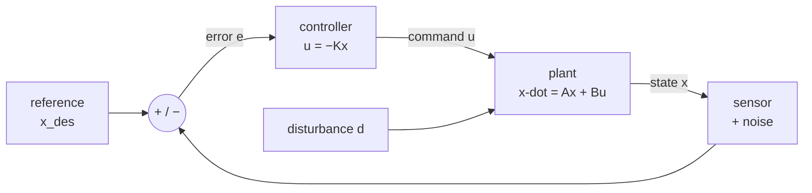
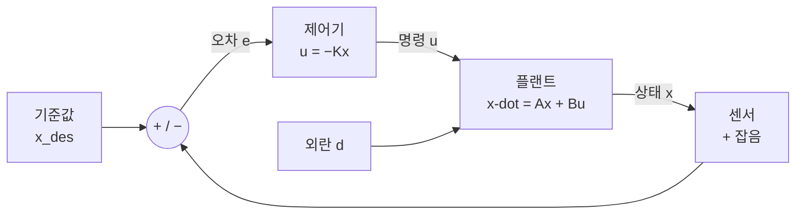

**Deep-dive text** — Matthew Bartos, *Control Theory for Smart Infrastructure* (UT Austin CE397) · [Course packet PDF (public)](https://future-water-website.s3.amazonaws.com/docs/teaching/ce397/ce397_course_packet.pdf) · [Teaching page](https://future-water.org/teaching/)

## English

*First page of group D, and the cheapest to enter: engineering math and [[02-foundations/linear-algebra|linear algebra]] are enough.
What feedback buys and what it costs is settled here; [[04-robotics/lqr-lqg|6]], [[04-robotics/mpc|7]] and [[04-robotics/convex-mpc-legged|8]] are all built on top of it.*

> [!info] Depth target · 깊이 목표
> Read state-space models, stability, pole/eigenvalue claims, and controllability/observability statements in robotics papers accurately, and say what a controller can and cannot promise. This page teaches that reading level end to end; *designing* controllers beyond the worked examples here is what the packet and [[04-robotics/lqr-lqg|LQR]]/[[04-robotics/mpc|MPC]] are for.
> 로보틱스 논문의 상태공간 모델·안정성·극점/고유값 주장·가제어성/가관측성 서술을 정확히 읽고, 제어기가 무엇을 약속할 수 있고 없는지 말할 수 있으면 된다. 이 페이지가 그 읽기 수준을 처음부터 끝까지 가르친다; 여기 예제 너머의 제어기 *설계*는 패킷과 [[04-robotics/lqr-lqg|LQR]]/[[04-robotics/mpc|MPC]]의 몫이다.

> [!note] Prerequisites
> [[02-foundations/engineering-math|0.5 Engineering Math §8–9]] (linear ODEs, $\dot x = ax \Rightarrow x = x_0e^{at}$, Laplace, poles) · [[02-foundations/linear-algebra|1. Linear Algebra §1–3, §5]] (matrix multiplication, eigenvalues, the state-space section). Nothing else — if you can differentiate, multiply matrices, and read $e^{at}$, this page is self-contained.

Control is the layer that makes a physical system do what you meant. Every robotics paper
either designs one, wraps a learned policy in one, or quietly relies on one — and almost
every claim about *stability*, *tracking*, *bandwidth*, or *robustness* is a claim in this
page's vocabulary.

> [!note] First pass · 처음이라면
> The longest page in group D. First pass: §1 — the leaky heater, with the numbers — then §4 for stability, then §10 for reading control claims. §5.5 — margins, sensitivity, and what no controller can do — is the other reading-skill section; save it for a second pass. §2, §3 and §5 to §8 are the machinery, and they read much faster once §1 has told you what feedback is for.

### 1. What feedback actually buys

Take a heater with a leak: $\dot x = -x + u + d$, where $x$ is temperature error, $u$ your
command, and $d$ an unknown disturbance (an open window). Two strategies:

- **Open loop** — you compute the $u$ that *should* work: $u = 1$ gives steady state
  $x = 1 + d$. If $d = 0.5$, you sit at $1.5$ and never notice. If your model gain was
  10% wrong, that error passes straight through.
- **Closed loop** — you measure $x$ and push against the error: $u = -Kx$. Then
  $\dot x = -(1+K)x + d$, whose steady state is $x = d/(1+K)$. With $K = 9$ that same
  $d = 0.5$ leaves only $0.05$ — **10× smaller** — and you never had to know $d$.

That is the whole trade in one line: *feedback converts model error and disturbance into
a division by $(1+K)$*. What it costs is the rest of this page — measurement noise gets
amplified by the same $K$, delay turns correction into oscillation, and large $K$ can
destabilize a system that was fine open-loop.

### 2. State-space models — writing a physical system as a matrix

Any linear system is written

$$\dot x = Ax + Bu, \qquad y = Cx + Du$$

No robot is linear, so ask where this shape comes from. It is the first-order Taylor expansion of the true dynamics $\dot x = f(x,u)$ about the operating point you intend to hold: $A$ and $B$ are the Jacobians $\partial f/\partial x$ and $\partial f/\partial u$ evaluated there, which is why a paper's $A$ matrix changes when its operating point does. $D$ is usually zero because a sensor rarely sees the command directly.

- $x$ = **state**: the minimum set of numbers that, with future inputs, determines the future.
- $u$ = **input** (what you command), $y$ = **output** (what you measure), $A$ = internal
  dynamics, $B$ = how input enters, $C$ = what the sensor sees.

**Worked conversion — mass–spring–damper.** $m\ddot q + b\dot q + kq = u$ is second order;
state-space wants first order, so *stack the derivatives*: let $x = (q, \dot q)$. Then
$\dot x_1 = x_2$ (definition) and $\dot x_2 = (u - bx_2 - kx_1)/m$ (the physics), so

$$A = \begin{pmatrix} 0 & 1 \\ -k/m & -b/m\end{pmatrix}, \quad B = \begin{pmatrix}0 \\ 1/m\end{pmatrix}, \quad C = \begin{pmatrix}1 & 0\end{pmatrix}$$

Read the two rows of $A$ as the two sentences they came from: the top row says that velocity is the derivative of position, the bottom row is Newton's law solved for acceleration. With $m=1, b=1, k=4$: $A = \begin{pmatrix}0&1\\-4&-1\end{pmatrix}$. That trick —
*n*-th order scalar ODE → *n*-dimensional first-order system — is how every robot joint,
suspension, and hydraulic cylinder enters a paper's equations. A robot arm is the same
structure with $M(\theta)$ in place of $m$
([[04-robotics/modern-robotics/ch08-dynamics|MR ch.8]]).

### 3. Solving it: modes and the matrix exponential

For $u=0$, the solution is the matrix version of $x_0e^{at}$:
$x(t) = e^{At}x_0$. Diagonalizing $A = Q\Lambda Q^{-1}$
([[02-foundations/linear-algebra|linear algebra §3]]) gives
$e^{At} = Qe^{\Lambda t}Q^{-1}$ — so the motion is a sum of **modes**, each one an
eigenvector direction decaying or growing like $e^{\lambda_i t}$.

**Worked eigenvalues.** For $A = \begin{pmatrix}0&1\\-4&-1\end{pmatrix}$:
$\det(A-\lambda I) = \lambda^2 + \lambda + 4 = 0 \Rightarrow \lambda = -0.5 \pm j1.94$.
Read it off directly: negative real part → decaying; nonzero imaginary part → oscillating
at ~1.94 rad/s while it decays. For an individual mode, the real part sets growth or decay
and the imaginary part sets oscillation. A full output can still be non-monotone with real
poles because modal coefficients, zeros, and output choice also matter.

### 4. Asymptotic stability, and the two half-stories

| System | Asymptotically stable iff | Mnemonic |
|---|---|---|
| Continuous $\dot x = Ax$ | all $\text{Re}(\lambda_i) < 0$ | left half-plane |
| Discrete $x_{t+1} = A_dx_t$ | all $\lvert\lambda_i\rvert < 1$ | inside the unit circle |

These are the same statement in two clocks: discretizing with step $T$ maps
$\lambda \mapsto e^{\lambda T}$, and $\text{Re}(\lambda)<0$ is exactly
$\lvert e^{\lambda T}\rvert<1$. Check: $\lambda = -1$, $T = 0.1$ →
$e^{-0.1} = 0.905 < 1$. ✓ Papers switch between continuous models and discrete
implementations without warning; inspect which clock each equation uses. The place where the
discrete clock is felt rather than read is haptic rendering, where a spring that is passive on
paper injects energy once it is sampled
([[04-robotics/haptics-teleoperation/rendering-sampling-stability|24.4 Rendering, Sampling & Stability]]).

> [!warning] Stability is not performance
> For the autonomous system above, "stable" says the state returns to the origin. It does not by itself guarantee zero tracking error, and says nothing about *how long*,
> how much overshoot, how large the control effort, or whether the linear model was valid
> that far from the operating point. A paper that reports only "the closed loop is stable"
> has reported the weakest possible claim.

> [!example] Energy, stability and passivity in one line of reasoning
> For $m\ddot x+b\dot x+kx=u$, choose stored energy
> $V=\tfrac12m\dot x^2+\tfrac12kx^2$. Then
> $\dot V=\dot x(m\ddot x+kx)=u\dot x-b\dot x^2$.
> With $u=0$ and $b>0$, energy decreases; under the usual $m,k>0$ assumptions,
> LaSalle's argument gives convergence to the equilibrium. With input $u$ and output
> $\dot x$, $\dot V\le u\dot x$: the system is passive because it cannot release more
> energy than it stored plus what entered through the port. Stability is a property of an
> autonomous equilibrium; passivity is an input–output energy inequality. They connect,
> but they are not synonyms.

### 5. Transfer functions, poles, and the numbers papers quote

Laplace-transform the system ([[02-foundations/engineering-math|0.5 §9]]) and the ODE
becomes algebra: for the mass–spring–damper,
$G(s) = \dfrac{1}{ms^2+bs+k} = \dfrac{1}{s^2+s+4}$. Its **poles** (denominator roots) are
exactly the eigenvalues of $A$ — one object, two languages.

For a standard or dominant second-order mode with negligible zero effects, the denominator is described by two numbers experimental sections often report:

$$s^2 + 2\zeta\omega_n s + \omega_n^2, \qquad \omega_n = \sqrt{k/m}, \quad \zeta = \frac{b}{2\sqrt{km}}$$

Those two expressions are not separate facts to memorize — they are what you get by matching
coefficients. Divide the physical polynomial by $m$: $ms^2 + bs + k = m\big(s^2 + \tfrac{b}{m}s + \tfrac{k}{m}\big)$.
Line that up with $s^2 + 2\zeta\omega_n s + \omega_n^2$ and read off $\omega_n^2 = k/m$ and
$2\zeta\omega_n = b/m$, so $\zeta = b/(2\sqrt{km})$. That is the whole derivation, and it is
worth doing once because it shows $\zeta$ and $\omega_n$ are a *reparameterization*, not new
physics: the canonical form exists so that every second-order system, whatever it is made of,
can be described by one number for speed and one for ringing.

- **$\omega_n$** (natural frequency) sets *speed*; **$\zeta$** (damping ratio) sets
  *ringing*: $\zeta<1$ oscillates, $\zeta=1$ is critically damped, $\zeta>1$ is sluggish.
- Rules of thumb you can apply to any plot in a paper: 2% **settling time**
  $t_s \approx 4/(\zeta\omega_n)$; **overshoot** $M_p = e^{-\pi\zeta/\sqrt{1-\zeta^2}}$.
- **Worked**: our system has $\omega_n = 2$, $\zeta = 1/(2\cdot 2) = 0.25$. So
  $t_s \approx 4/0.5 = 8$ s and $M_p = e^{-\pi(0.25)/0.968} \approx 0.44$ — **44% overshoot**,
  settling in ~8 s. A step-response figure that disagrees with these numbers means the
  model in the paper is not the system in the video.

### 5.5 Margins, sensitivity, and what feedback cannot do

Section 5 gave you the poles of a closed loop you already have. This section is about the
question papers actually argue over: **how close is that loop to not working**, and what is
provably out of reach no matter how the controller is designed.

**Read the closed loop from the open loop.** Write the loop transfer function
$L(s) = P(s)C(s)$ — plant times controller, going once around the loop. The closed loop is
stable when the Nyquist plot of $L(i\omega)$ keeps the right relationship to the point $-1$
(it is $1 + L = 0$ that makes the closed loop blow up, so $-1$ is where the danger is). This
is why control papers plot an *open*-loop quantity: changing $C$ moves $L$ directly, while
its effect on the closed-loop response is tangled.

**Three margins, and they are not interchangeable.** Let $\omega_{pc}$ be the *phase
crossover* — where $\angle L = -180°$ — and $\omega_{gc}$ the *gain crossover*, where
$|L| = 1$.

| Margin | Definition | What it answers | Usual range |
|---|---|---|---|
| Gain margin $g_m$ | $1/\lvert L(i\omega_{pc})\rvert$ | how much can the loop gain grow before instability | 2–5 |
| Phase margin $\varphi_m$ | $180° + \angle L(i\omega_{gc})$ | how much extra phase lag is survivable | 30°–60° |
| Stability margin $s_m$ | shortest distance from the $L$ curve to $-1$ | how close the loop comes to the critical point at *any* frequency | 0.5–0.8 |

The first two constrain the curve along two directions; only $s_m$ constrains the distance
itself. They are related by $g_m \ge 1/(1-s_m)$ and $\varphi_m \ge 2\arcsin(s_m/2)$ — note
which way the inequality runs: a good $s_m$ *guarantees* the other two, but not the reverse.

**Why that asymmetry matters when reading.** Åström & Murray give a loop with
$g_m = 266$ and $\varphi_m = 70°$ — numbers that would pass any review — whose stability
margin is $s_m = 0.27$. Its step response rings badly, because the closed loop has a mode
with $\zeta = 0.014$. The Nyquist curve passes close to $-1$ in a direction that is neither
pure gain nor pure phase, so both classical margins look at it and see nothing. **A paper
that reports only gain and phase margins has not shown you that its loop is robust.**

**The sensitivity functions are where the claim actually lives.** With $L = PC$, define

$$S = \frac{1}{1+PC}, \qquad T = \frac{PC}{1+PC}$$

$S$ (sensitivity) maps disturbance to output error; $T$ (complementary sensitivity) maps
reference and measurement noise to output. They satisfy $S + T = 1$ identically, which is
the whole design problem in one line: **you cannot make both small at the same frequency.**
Reject a disturbance well there and you pass noise through, and conversely. The peak
$M_s = \max_\omega |S(i\omega)|$ is a single number for the worst amplification, and it is
exactly the stability margin: $s_m = 1/M_s$. So $M_s = 2$ and $s_m = 0.5$ are the same
statement, and a paper reporting either has reported both.

One trap worth knowing: $S$ and $T$ can look fine while the loop is unsafe, if a pole and a
zero cancel in the product $PC$. Cancel an unstable plant pole with a controller zero and
$L$ looks clean, but the transfer function from *load disturbance* to output stays unstable —
a small push produces unbounded motion. Stability of the loop transfer function is not
stability of the system; all four of $S$, $T$, $PS$, $CS$ have to be stable, a condition
called **internal stability**.

**Delay is the version of this you will actually hit.** A pure delay $\tau$ contributes
phase $-\omega\tau$ and no gain change. Let $\varphi_0$ be the loop's phase margin before
that delay and $\varphi_{req}$ the margin the design must retain. If crossover does not move
much, the usable delay budget is

$$\tau \le \frac{\varphi_0-\varphi_{req}}{\omega_{gc}}.$$

Read it as follows: the numerator is the phase that the added delay is allowed to consume, in radians;
dividing by crossover frequency converts that phase budget into seconds. This is a
first-order design check, not an exact delay bound when the crossover itself shifts.

Setting $\varphi_{req}=0$ gives the approximate delay margin to instability,
$\tau_{dm}\approx\varphi_0/\omega_{gc}$. The plant and controller determine
$\varphi_0$; delay alone does not determine a universal bandwidth cap.

**Worked.** Suppose a joint loop crosses at $\omega_{gc}=5$ Hz $=31.4$ rad/s and has
$\varphi_0=90°$ before the perception delay. Retaining $\varphi_{req}=45°$ permits about
$(1.571-0.785)/31.4=25$ ms. Conversely, a 79 ms delay permits a 1.6 Hz crossover **under
those same 90°-before/45°-after assumptions**. A loop with more lead can tolerate a higher
crossover; one with less initial margin tolerates less. Recompute crossover after adding
the delay rather than treating this first-order budget as an exact redesign.

Delay also behaves like a right-half-plane zero, which is the deeper reason it is expensive:
the first-order Padé approximation $\frac{1-s\tau/2}{1+s\tau/2}$ has a zero at $2/\tau$, so
79 ms is a zero at 25.3 rad/s (4.0 Hz) sitting right where you wanted bandwidth.

**Bode's integral — the constraint no design escapes.** For an internally stable loop whose
$sL(s) \to 0$,

$$\int_0^\infty \log|S(i\omega)| \, d\omega = \pi \sum_k p_k$$

summed over right-half-plane poles of $L$. Read it as a conservation law: the right-hand side is fixed by the plant before any controller is designed, and the controller only decides *where* on the frequency axis that fixed area sits. If the plant is open-loop stable the right side
is **zero**: on a linear frequency axis, the area where $\log|S|$ is negative (disturbances
attenuated) must be exactly paid for by area where it is positive (disturbances amplified).
This is the **waterbed effect** — push sensitivity down in the band you care about and it
rises somewhere else, always. An unstable plant makes the right side positive, so it starts
the account in debt. The complementary statement,
$\int_0^\infty \omega^{-2}\log|T(i\omega)|\,d\omega = \pi\sum_i 1/z_i$ over right-half-plane
zeros, says **slow RHP zeros are worse than fast ones**, while the first says **fast RHP
poles are worse than slow ones**.

**Worked — a specification that is provably unreachable.** The X-29 aircraft has a
right-half-plane pole at $p = 6$ rad/s, actuators good to $\omega_a = 40$ rad/s, and a
desired loop bandwidth $\omega_1 = 3$ rad/s. Ask for the smallest sensitivity peak
consistent with Bode's integral for a sensitivity shaped as $|S|$ rising linearly to $M_s$
at $\omega_1$, flat at $M_s$ up to $\omega_a$, and 1 above it. The integral gives
$-\omega_1 + \omega_a \log M_s = \pi p$. Solve for $M_s$ and substitute $p = 6$, $\omega_1 = 3$, $\omega_a = 40$, so that every number on the next line is traceable — the $18.85$ is $\pi \times 6$:

$$M_s = e^{(\pi p + \omega_1)/\omega_a} = e^{(18.85 + 3)/40} = e^{0.546} = 1.73$$

Then $\varphi_m \ge 2\arcsin\!\big(1/(2M_s)\big) = 33°$. This lower bound constrains the sensitivity peak but does not by itself prove that a 45° phase margin is impossible. Physical moves include faster actuators (raise $\omega_a$), a less
unstable airframe (lower $p$), or a lower bandwidth demand.

That is the reading skill this section exists for. When a paper reports a control result,
the interesting question is rarely "is the controller good" but "what did the plant permit."
Right-half-plane poles, right-half-plane zeros, and delay are properties of the *machine and
its sensing*, and they bound every controller you could have written.

### 6. Controllability and observability — can you steer it, can you see it?

**Controllability** asks: can the input reach every state? One step of $u$ moves you along
the columns of $B$; the dynamics then rotate that reach into $AB$, then $A^2B$. Stack them:

$$\mathcal{C} = [\,B \;\; AB \;\; \cdots \;\; A^{n-1}B\,], \qquad \text{controllable} \iff \text{rank}\,\mathcal{C} = n$$

Why the stack stops at $A^{n-1}B$ instead of running forever: by the Cayley–Hamilton theorem
an $n \times n$ matrix satisfies its own characteristic polynomial, so $A^n$ is a linear
combination of $I, A, \ldots, A^{n-1}$. Then $A^nB$ lies in the span of the columns already
stacked and adds no new reachable direction — and neither does anything after it. The $n$
blocks are not a convention or a truncation; they are the whole story.

**Worked, controllable.** $A = \begin{pmatrix}0&1\\-4&-1\end{pmatrix}$,
$B = \begin{pmatrix}0\\1\end{pmatrix}$: $AB = \begin{pmatrix}1\\-1\end{pmatrix}$, so
$\mathcal{C} = \begin{pmatrix}0&1\\1&-1\end{pmatrix}$, $\det = -1 \neq 0$ → rank 2 → **controllable**.

**Worked, uncontrollable.** Two independent joints, one motor that only touches the first:
$A = \begin{pmatrix}-1&0\\0&-2\end{pmatrix}$, $B = \begin{pmatrix}1\\0\end{pmatrix}$ gives
$\mathcal{C} = \begin{pmatrix}1&-1\\0&0\end{pmatrix}$, rank 1 < 2 → **uncontrollable**: no
input sequence ever influences the second joint. Here it happens to be harmless (that mode
decays on its own); the dangerous case is an *unstable* mode you cannot reach — which is
why [[04-robotics/lqr-lqg|LQR]] uses the weaker, exactly-right condition **stabilizability**
("every *unstable* mode is reachable").

**Observability** is the transpose twin — can the sensor eventually reveal every state? —
tested with $\mathcal{O} = [C;\, CA;\, \cdots;\, CA^{n-1}]$ and rank $n$. With
$C = (1\;0)$ (measure position only) and our $A$: $CA = (0\;1)$, so
$\mathcal{O} = \begin{pmatrix}1&0\\0&1\end{pmatrix}$ → observable. **Measuring position is
enough to infer velocity** — because the dynamics couple them. That single fact is why
robots run observers instead of putting a sensor on everything.

### 7. Designing the feedback: pole placement and PID

**Pole placement.** With full state measured, $u = -Kx$ makes the closed loop
$\dot x = (A - BK)x$ — and if the system is controllable you can put the eigenvalues of
$A-BK$ *anywhere you like*.

**Worked.** $A - BK = \begin{pmatrix}0&1\\-4-k_1 & -1-k_2\end{pmatrix}$, characteristic
polynomial $\lambda^2 + (1+k_2)\lambda + (4+k_1)$. Want a well-damped, faster response,
$\zeta = 0.7$, $\omega_n = 4$ → target $\lambda^2 + 5.6\lambda + 16$. Match coefficients:
$k_2 = 4.6$, $k_1 = 12$. New settling time $\approx 4/(0.7\cdot4) = 1.4$ s and overshoot
$\approx 4.6\%$ — from 8 s and 44%. *This is what "we designed a state-feedback controller"
means in a paper.* [[04-robotics/lqr-lqg|LQR]] is the same $u=-Kx$ with the pole locations
chosen by an optimization instead of by hand.

<svg viewBox="0 0 430 216" style="max-width:100%;height:auto" role="img" aria-label="step responses before and after pole placement">
  <g stroke="currentColor" stroke-width="1" opacity="0.3"><line x1="40" y1="50" x2="410" y2="50" stroke-dasharray="4 4"/><line x1="40" y1="150" x2="410" y2="150"/><line x1="40" y1="20" x2="40" y2="150"/></g>
  <path d="M40.0 150.0L43.3 148.4L46.5 143.8L49.8 136.7L53.1 127.5L56.4 116.6L59.6 104.6L62.9 91.9L66.2 79.0L69.5 66.2L72.7 54.1L76.0 42.9L79.3 32.9L82.5 24.3L85.8 17.3L89.1 11.9L92.4 8.2L95.6 6.1L98.9 5.6L102.2 6.5L105.5 8.7L108.7 12.0L112.0 16.3L115.3 21.2L118.5 26.6L121.8 32.3L125.1 38.0L128.4 43.6L131.6 49.0L134.9 53.9L138.2 58.2L141.5 61.9L144.7 64.9L148.0 67.2L151.3 68.8L154.5 69.6L157.8 69.7L161.1 69.2L164.4 68.1L167.6 66.6L170.9 64.7L174.2 62.4L177.5 60.0L180.7 57.5L184.0 54.9L187.3 52.5L190.5 50.1L193.8 48.0L197.1 46.1L200.4 44.5L203.6 43.2L206.9 42.2L210.2 41.6L213.5 41.3L216.7 41.3L220.0 41.5L223.3 42.0L226.5 42.7L229.8 43.6L233.1 44.6L236.4 45.7L239.6 46.9L242.9 48.0L246.2 49.1L249.5 50.1L252.7 51.0L256.0 51.9L259.3 52.6L262.5 53.1L265.8 53.5L269.1 53.8L272.4 53.9L275.6 53.9L278.9 53.7L282.2 53.5L285.5 53.2L288.7 52.8L292.0 52.3L295.3 51.8L298.5 51.3L301.8 50.8L305.1 50.3L308.4 49.9L311.6 49.5L314.9 49.1L318.2 48.8L321.5 48.6L324.7 48.4L328.0 48.3L331.3 48.3L334.5 48.3L337.8 48.4L341.1 48.5L344.4 48.6L347.6 48.8L350.9 49.0L354.2 49.2L357.5 49.4L360.7 49.7L364.0 49.9L367.3 50.1L370.5 50.3L373.8 50.4L377.1 50.5L380.4 50.6L383.6 50.7L386.9 50.8L390.2 50.8L393.5 50.8L396.7 50.7L400.0 50.7" fill="none" stroke="currentColor" stroke-width="1.7" opacity="0.55"/>
  <path d="M40.0 150.0L43.3 144.4L46.5 131.4L49.8 115.2L53.1 98.8L56.4 84.0L59.6 71.6L62.9 61.9L66.2 54.9L69.5 50.1L72.7 47.3L76.0 45.8L79.3 45.4L82.5 45.6L85.8 46.2L89.1 46.9L92.4 47.7L95.6 48.4L98.9 49.0L102.2 49.4L105.5 49.8L108.7 50.0L112.0 50.1L115.3 50.2L118.5 50.2L121.8 50.2L125.1 50.2L128.4 50.1L131.6 50.1L134.9 50.1L138.2 50.1L141.5 50.0L144.7 50.0L148.0 50.0L151.3 50.0L154.5 50.0L157.8 50.0L161.1 50.0L164.4 50.0L167.6 50.0L170.9 50.0L174.2 50.0L177.5 50.0L180.7 50.0L184.0 50.0L187.3 50.0L190.5 50.0L193.8 50.0L197.1 50.0L200.4 50.0L203.6 50.0L206.9 50.0L210.2 50.0L213.5 50.0L216.7 50.0L220.0 50.0L223.3 50.0L226.5 50.0L229.8 50.0L233.1 50.0L236.4 50.0L239.6 50.0L242.9 50.0L246.2 50.0L249.5 50.0L252.7 50.0L256.0 50.0L259.3 50.0L262.5 50.0L265.8 50.0L269.1 50.0L272.4 50.0L275.6 50.0L278.9 50.0L282.2 50.0L285.5 50.0L288.7 50.0L292.0 50.0L295.3 50.0L298.5 50.0L301.8 50.0L305.1 50.0L308.4 50.0L311.6 50.0L314.9 50.0L318.2 50.0L321.5 50.0L324.7 50.0L328.0 50.0L331.3 50.0L334.5 50.0L337.8 50.0L341.1 50.0L344.4 50.0L347.6 50.0L350.9 50.0L354.2 50.0L357.5 50.0L360.7 50.0L364.0 50.0L367.3 50.0L370.5 50.0L373.8 50.0L377.1 50.0L380.4 50.0L383.6 50.0L386.9 50.0L390.2 50.0L393.5 50.0L396.7 50.0L400.0 50.0" fill="none" stroke="currentColor" stroke-width="2"/>
  <g stroke="currentColor" stroke-width="1" opacity="0.5" stroke-dasharray="3 3"><line x1="98" y1="6" x2="98" y2="150"/></g>
  <g stroke="currentColor"><line x1="40" y1="166" x2="70" y2="166" stroke-width="1.7" opacity="0.55"/><line x1="40" y1="186" x2="70" y2="186" stroke-width="2"/></g>
  <g font-size="11" fill="currentColor">
    <text x="6" y="54">target</text><text x="6" y="154">0</text>
    <text x="104" y="16" opacity="0.9">44% overshoot</text>
    <text x="330" y="144">time (s)</text>
    <text x="78" y="170">before &#8212; wn = 2, z = 0.25 &#183; settles in about 8 s</text>
    <text x="78" y="190">after &#8212; wn = 4, z = 0.7 &#183; settles in 1.4 s, 4.6% overshoot</text>
    <text x="40" y="210" opacity="0.85">same plant, same u = -Kx form &#8212; only where you put the poles changed</text>
  </g>
</svg>

**PID**, the controller that actually runs on most hardware:

$$u = K_p e + K_i\int e\,dt + K_d\dot e, \qquad e = x_{des} - x$$

Read it as three corrections drawn from three views of the same error — its present value, its accumulated history, and its trend. The three exist because each fixes a failure of the one before it: proportional action alone leaves a steady offset against a constant load, the integral removes that offset, and the derivative anticipates where the error is heading so the loop can be made fast without ringing.

- **P** pushes proportional to error (raises $\omega_n$ — faster, but too much causes ringing).
- **D** pushes against the error's *rate* (adds damping, raises $\zeta$) — and amplifies
  sensor noise, so it is always used with a filter (whose lag then eats into **phase margin**
  — the extra phase lag, in degrees at the gain-crossover frequency, the loop can absorb
  before its correction reinforces the error instead of cancelling it. Divide it by that
  frequency and you get the *delay* margin in seconds; the two are related but not
  interchangeable across controllers of different bandwidth,
  [[02-foundations/signal-processing|signal processing §4]]).
- **I** integrates residual error to kill steady-state offset — and introduces
  **integral windup**: while an actuator is saturated the integral keeps growing, then
  overshoots badly on release. Every real implementation has anti-windup; if a paper's PID
  baseline does not, the baseline is unfairly weak
  ([[02-foundations/ml-practice|ML practice §4]]).
- **Feedforward** (compute the input the model says you need, then let feedback fix the
  residue) is why computed-torque control
  ([[04-robotics/modern-robotics/ch11-robot-control|MR ch.11]]) beats pure PID on arms.

### 8. Observers and the separation principle

You rarely measure the full state, so estimate it: run a copy of the model and correct it
with the measurement residual,

$$\dot{\hat x} = A\hat x + Bu + L(y - C\hat x)$$

The error $\tilde x = x - \hat x$ obeys $\dot{\tilde x} = (A - LC)\tilde x$, so choosing
$L$ to place *those* eigenvalues is the same algebra as pole placement, transposed — this
is why observability is controllability's dual. Practice: make the observer 2–5× faster
than the controller so estimation transients do not masquerade as control transients.

Then feed $\hat x$ to the controller: $u = -K\hat x$. The **separation principle** says you
may design $K$ and $L$ independently and the combination still works (for the linear model).
The stochastic version of $L$ is the [[02-foundations/probability|Kalman filter]], the
combination is [[04-robotics/lqr-lqg|LQG]] — and its famous caveat (LQG has no guaranteed
robustness margins) lives on that page.

### 9. Where linear control meets a real machine

Real systems are nonlinear, so control **linearizes about an operating point**: take the
Jacobian of the dynamics at $(x_0,u_0)$ and use it locally
([[02-foundations/calculus-backprop|calculus §1]]). Everything above then holds *near that
point only*. Three consequences you will meet in papers:

- **Gain scheduling**: interpolate different $K$'s across operating points (an excavator's
  dynamics at full extension are not those at full retraction).
- **Saturation and rate limits**: no linear result survives an actuator that has stopped
  moving — this is exactly the gap [[04-robotics/mpc|MPC]] exists to close.
- **Unmodeled dynamics**: hydraulic valve dead zones, backlash, and flexible links break
  linearity outright — which is why the excavation literature spends as much effort on
  actuator models as on policies
  ([[05-construction-robotics/earthmoving-heavy-machinery|earthmoving stream §1]]).

### 10. Reading control claims in papers

| Paper phrase | Check before accepting it |
|---|---|
| "the closed-loop system is stable" | of which model, linearized where, and does the proof survive saturation/delay? |
| "we tuned the gains" | tuned on the evaluation cases? any anti-windup? same effort as the proposed method? |
| "high bandwidth control at 1 kHz" | loop *rate* is not *latency* ([[04-robotics/robot-systems-deployment\|systems §3]]); what is observation-to-actuation? |
| "robust to disturbances" | which disturbances, what magnitude, measured how — margins or anecdotes? |
| "PID baseline" | structure (P/PI/PID), filter on D, anti-windup, and who tuned it |
| "we use a Kalman filter / observer" | is the model that generates $\hat x$ the same one the controller assumes? |
| "outperforms classical control" | against a *tuned* classical controller with feedforward, or a strawman P controller? |

> [!tip] Going deeper · 더 깊이
> Åström & Murray, [*Feedback Systems*](https://fbswiki.org/wiki/index.php/Main_Page) (Princeton, free) is the textbook this page is a compressed reading of, and it is written for exactly this audience — engineers who need the ideas rather than the theorem sequence. Read ch.6–7 for state space and ch.9–10 for frequency domain and PID. Its examples are drawn from across engineering rather than robotics, so keep §9 of this page open beside it: the gap between a linear model and a real machine is the part the book treats lightly and the part your papers live in.

### Self-check

1. In §1, what closed-loop gain $K$ would you need to attenuate the disturbance 100×, and
   name one cost of choosing it.
2. Write $\ddot q + 3\dot q + 2q = u$ in state-space form and give its eigenvalues. Stable?
3. A discrete controller has $A_d$ with eigenvalues $0.95$ and $1.01$. What happens, and
   over how many steps does the bad mode double?
4. For $A = \begin{pmatrix}0&1\\-4&-1\end{pmatrix}$, $B = (0,1)^\top$, place the closed-loop
   poles at $-2 \pm j2$. What is $K$?
5. A paper measures only joint position but its controller needs velocity. What must be
   true for that to be legitimate, and what fails if the encoder is noisy?

> [!tip]- Answers
> 1. Steady state is $d/(1+K)$, so $1+K = 100 \Rightarrow K = 99$. Costs: sensor noise is multiplied by the same $K$ into the command, control effort/saturation grows, and with any delay or unmodeled fast dynamics such a gain typically destabilizes the loop.
> 2. $x = (q,\dot q)$, $A = \begin{pmatrix}0&1\\-2&-3\end{pmatrix}$, $B = (0,1)^\top$. $\lambda^2+3\lambda+2=0 \Rightarrow \lambda = -1, -2$ — both real and negative, so **stable and non-oscillatory** (overdamped).
> 3. The $0.95$ mode decays; the $1.01$ mode grows 1% per step and the state diverges along its eigenvector. Doubling takes $\ln 2/\ln 1.01 \approx 70$ steps — slow enough to look fine in a short demo and fatal in a long run.
> 4. Target polynomial $(\lambda+2)^2+4 = \lambda^2+4\lambda+8$. Matching $\lambda^2+(1+k_2)\lambda+(4+k_1)$: $k_2 = 3$, $k_1 = 4$, so $K = (4\;\;3)$.
> 5. The pair $(A, C)$ must be observable — with position measured and position/velocity coupled by the dynamics it is (§6), so an observer can reconstruct velocity. What fails with a noisy encoder is naive differentiation: it amplifies high-frequency noise, which is why you use an observer/Kalman filter rather than $\Delta q/\Delta t$ ([[02-foundations/signal-processing|signal processing §4]]).

### Continue beyond this guide

Optimal choice of $K$ → [[04-robotics/lqr-lqg|6. LQR & LQG]]; constraints and saturation →
[[04-robotics/mpc|7. MPC]]; a high-rate application → [[04-robotics/convex-mpc-legged|8. Convex MPC]];
robot-specific control laws → [[04-robotics/modern-robotics/ch11-robot-control|MR ch.11]].
For controller *design* practice, the CE397 packet linked above works through the same
material with infrastructure examples — for a construction-robotics researcher its
examples *are* your domain.

### Connections · 연결

- Foundations · 기초: [[02-foundations/engineering-math|0.5 Engineering Math §8–9]], [[02-foundations/linear-algebra|1. Linear Algebra §5]], [[02-foundations/probability|3. Probability]] (Kalman · 칼만)
- Next · 다음: [[04-robotics/lqr-lqg|LQR/LQG]] → [[04-robotics/mpc|MPC]] → [[04-robotics/convex-mpc-legged|Convex MPC for legged robots]]
- Robot-specific control · 로봇 제어법: [[04-robotics/modern-robotics/ch11-robot-control|MR ch.11]] · Contact · 접촉: [[04-robotics/contact-force-tactile|9. Contact, Force & Tactile]]

### After reading · 읽고 나면 말할 수 있어야 하는 것

- [ ] Convert a scalar ODE to state-space form and say what each of $A, B, C$ is · 스칼라 미분방정식을 상태공간으로 바꾸고 $A, B, C$가 각각 무엇인지 말할 수 있다
- [ ] Read stability off eigenvalues in both continuous and discrete time · 연속·이산 시간 모두에서 고유값으로 안정성을 판정할 수 있다
- [ ] Estimate settling time and overshoot from $\zeta, \omega_n$ · $\zeta, \omega_n$에서 정착 시간과 오버슈트를 추정할 수 있다
- [ ] Run the controllability/observability rank tests and say what each failure means physically · 가제어성·가관측성 랭크 검정을 수행하고 각 실패의 물리적 의미를 말할 수 있다
- [ ] Say what feedback buys, and name three things it costs · 피드백이 무엇을 사고 무엇을 지불하는지 세 가지를 말할 수 있다
- [ ] Audit a paper's "stable/robust/tuned/1 kHz" claims against §10 · 논문의 "stable·robust·tuned·1 kHz" 주장을 §10으로 검사할 수 있다

## 한국어

*D군의 첫 페이지이자 진입 비용이 가장 낮은 곳이다 — 공업수학과 [[02-foundations/linear-algebra|선형대수]]면 읽힌다.
피드백이 무엇을 사고 무엇을 대가로 치르는지가 여기서 정해지고, [[04-robotics/lqr-lqg|6]]·[[04-robotics/mpc|7]]·[[04-robotics/convex-mpc-legged|8]]번이 그 위에 쌓인다.*

> [!note] 선수 지식
> [[02-foundations/engineering-math|0.5 공업수학 §8–9]] (선형 미분방정식, $\dot x = ax \Rightarrow x = x_0e^{at}$, 라플라스, 극점) · [[02-foundations/linear-algebra|1. 선형대수 §1–3, §5]] (행렬곱, 고유값, 상태공간 절). 그 외에는 없다 — 미분할 수 있고, 행렬을 곱할 수 있고, $e^{at}$를 읽을 수 있으면 이 페이지는 자체 완결이다.

제어는 물리 시스템이 *의도한 대로* 움직이게 만드는 층이다. 모든 로보틱스 논문은 제어기를
설계하거나, 학습된 정책을 제어기로 감싸거나, 말없이 제어기에 기대고 있다 — 그리고
*안정성·추종·대역폭·강건성*에 대한 거의 모든 주장이 이 페이지의 어휘로 쓰여 있다.

> [!note] 처음이라면 · First pass
> D군에서 가장 긴 페이지다. 1차 통과: §1 — 새는 히터, 숫자까지 — 그다음 §4의 안정성, 그다음 §10의 제어 주장 읽기. §5.5 — 여유, 감도, 그리고 어떤 제어기도 할 수 없는 것 — 이 나머지 하나의 읽기 기술 절이니 2회독에 두라. §2·§3·§5~§8은 기계장치이고, §1이 피드백이 무엇을 위한 것인지 말해 준 뒤에 훨씬 빨리 읽힌다.

### 1. 피드백이 실제로 사는 것

새는 히터를 보자: $\dot x = -x + u + d$, $x$는 온도 오차, $u$는 명령, $d$는 모르는
외란(열린 창문). 두 전략:

- **개루프** — *되어야 할* $u$를 계산한다: $u = 1$이면 정상 상태가 $x = 1 + d$. $d = 0.5$면
  $1.5$에 앉아 있으면서 그 사실을 모른다. 모델 이득이 10% 틀렸다면 그 오차가 그대로 통과한다.
- **폐루프** — $x$를 재고 오차에 맞서 민다: $u = -Kx$. 그러면
  $\dot x = -(1+K)x + d$이고 정상 상태는 $x = d/(1+K)$. $K = 9$면 같은 $d = 0.5$가
  $0.05$만 남긴다 — **10배 작아지고**, $d$를 알 필요가 전혀 없었다.

한 줄로 요약된 거래가 이것이다: *피드백은 모델 오차와 외란을 $(1+K)$로 나눈다.* 그 대가가
이 페이지의 나머지다 — 측정 잡음도 같은 $K$로 증폭되고, 지연은 보정을 진동으로 바꾸며,
큰 $K$는 개루프에서 멀쩡하던 시스템을 불안정하게 만들 수 있다.

### 2. 상태공간 모델 — 물리 시스템을 행렬로 쓰기

모든 선형 시스템은 이렇게 쓴다:

$$\dot x = Ax + Bu, \qquad y = Cx + Du$$

선형인 로봇은 없으니 이 모양이 어디서 오는지 물어야 한다. 참 동역학 $\dot x = f(x,u)$를 유지하려는 작동점 근처에서 1차 테일러 전개한 것이다. $A$와 $B$는 그 점에서 계산한 야코비안 $\partial f/\partial x$, $\partial f/\partial u$이고, 그래서 논문의 작동점이 바뀌면 $A$ 행렬도 바뀐다. $D$는 보통 0인데, 센서가 명령을 직접 보는 일이 드물기 때문이다.

- $x$ = **상태**: 미래 입력과 함께 미래를 결정하는 최소 숫자 집합.
- $u$ = **입력**(명령하는 것), $y$ = **출력**(측정하는 것), $A$ = 내부 동역학,
  $B$ = 입력이 들어오는 방식, $C$ = 센서가 보는 것.

**변환 예제 — 질량-스프링-댐퍼.** $m\ddot q + b\dot q + kq = u$는 2차인데 상태공간은 1차를
원하므로 *도함수를 쌓는다*: $x = (q, \dot q)$로 두면 $\dot x_1 = x_2$(정의)이고
$\dot x_2 = (u - bx_2 - kx_1)/m$(물리)이므로

$$A = \begin{pmatrix} 0 & 1 \\ -k/m & -b/m\end{pmatrix}, \quad B = \begin{pmatrix}0 \\ 1/m\end{pmatrix}, \quad C = \begin{pmatrix}1 & 0\end{pmatrix}$$

$A$의 두 행을 그것이 나온 두 문장으로 읽어라. 윗행은 속도가 위치의 도함수라는 말이고, 아랫행은 뉴턴 법칙을 가속도에 대해 푼 것이다. $m=1, b=1, k=4$이면 $A = \begin{pmatrix}0&1\\-4&-1\end{pmatrix}$. *n*차 스칼라 미분방정식
→ *n*차원 1차 시스템이라는 이 요령이, 모든 로봇 관절·서스펜션·유압 실린더가 논문의 수식에
들어오는 방식이다. 로봇 팔은 $m$ 자리에 $M(\theta)$가 오는 같은 구조다
([[04-robotics/modern-robotics/ch08-dynamics|MR 8장]]).

### 3. 푸는 법: 모드와 행렬 지수

$u=0$이면 해는 $x_0e^{at}$의 행렬판이다: $x(t) = e^{At}x_0$. $A = Q\Lambda Q^{-1}$로
대각화하면([[02-foundations/linear-algebra|선형대수 §3]]) $e^{At} = Qe^{\Lambda t}Q^{-1}$ —
즉 운동은 **모드**들의 합이고, 각 모드는 고유벡터 방향으로 $e^{\lambda_i t}$처럼 감쇠하거나
성장한다.

**고유값 계산 예제.** $A = \begin{pmatrix}0&1\\-4&-1\end{pmatrix}$에서
$\det(A-\lambda I) = \lambda^2 + \lambda + 4 = 0 \Rightarrow \lambda = -0.5 \pm j1.94$.
바로 읽힌다: 실수부 음수 → 감쇠; 허수부 0 아님 → 감쇠하면서 약 1.94 rad/s로 진동.
개별 모드에서는 실수부가 성장·감쇠를, 허수부가 진동을 정한다. 그러나 전체 출력은 모드 계수·영점·출력 선택 때문에 실수 극점만 있어도 비단조일 수 있다.

### 4. 점근 안정성, 그리고 한 이야기의 두 반쪽

| 시스템 | 점근 안정 조건 | 기억법 |
|---|---|---|
| 연속 $\dot x = Ax$ | 모든 $\text{Re}(\lambda_i) < 0$ | 좌반평면 |
| 이산 $x_{t+1} = A_dx_t$ | 모든 $\lvert\lambda_i\rvert < 1$ | 단위원 안 |

같은 진술을 두 시계로 쓴 것이다: 스텝 $T$로 이산화하면 $\lambda \mapsto e^{\lambda T}$이고,
$\text{Re}(\lambda)<0$이 정확히 $\lvert e^{\lambda T}\rvert<1$이다. 검산: $\lambda = -1$,
$T = 0.1$ → $e^{-0.1} = 0.905 < 1$. ✓ 논문은 연속 모델과 이산 구현을 예고 없이
오가므로 각 식이 어느 시계를 쓰는지 확인한다. 이산 시계를 읽는 것이 아니라 몸으로 느끼는
자리가 햅틱 렌더링이다. 종이 위에서는 수동적인 스프링이 샘플링되는 순간 에너지를 주입한다
([[04-robotics/haptics-teleoperation/rendering-sampling-stability|24.4 렌더링·샘플링·안정성]]).

> [!warning] 안정성은 성능이 아니다
> 위 자율계에서 "안정"은 상태가 원점으로 돌아간다는 뜻이다. 추종 오차 0을 그 자체로 보장하지 않으며, *얼마나 걸리는지*, 오버슈트가 얼마인지,
> 제어 입력이 얼마나 큰지, 운용점에서 그만큼 멀어져도 선형 모델이 유효한지에 대해 아무
> 말도 하지 않는다. "폐루프가 안정하다"만 보고한 논문은 가능한 가장 약한 주장을 한 것이다.

> [!example] 에너지·안정성·수동성을 한 줄로 잇기
> $m\ddot x+b\dot x+kx=u$에서 저장 에너지를
> $V=\tfrac12m\dot x^2+\tfrac12kx^2$로 두면
> $\dot V=\dot x(m\ddot x+kx)=u\dot x-b\dot x^2$다.
> $u=0$, $b>0$이면 에너지가 줄고, 통상적인 $m,k>0$ 가정 아래 LaSalle 논증으로 평형점
> 수렴을 보인다. 입력 $u$, 출력 $\dot x$로 보면 $\dot V\le u\dot x$이므로 포트로 받은 것과
> 저장한 것보다 더 많은 에너지를 내지 않는 수동계다. 안정성은 자율계 평형점의 성질이고,
> 수동성은 입력–출력 에너지 부등식이다. 둘은 연결되지만 같은 말은 아니다.

### 5. 전달함수, 극점, 그리고 논문이 인용하는 숫자들

라플라스 변환하면([[02-foundations/engineering-math|0.5 §9]]) 미분방정식이 대수가 된다:
질량-스프링-댐퍼는 $G(s) = \dfrac{1}{ms^2+bs+k} = \dfrac{1}{s^2+s+4}$. 그 **극점**(분모의
근)이 정확히 $A$의 고유값이다 — 하나의 대상, 두 개의 언어.

영점 영향이 작고 표준 또는 우세 2차 모드가 지배할 때, 분모는 실험 절이 자주 보고하는 두 숫자로 기술된다:

$$s^2 + 2\zeta\omega_n s + \omega_n^2, \qquad \omega_n = \sqrt{k/m}, \quad \zeta = \frac{b}{2\sqrt{km}}$$

저 두 식은 따로 외울 사실이 아니라 계수를 맞춰 보면 나오는 것이다. 물리 다항식을 $m$으로
나누자: $ms^2 + bs + k = m\big(s^2 + \tfrac{b}{m}s + \tfrac{k}{m}\big)$. 이것을
$s^2 + 2\zeta\omega_n s + \omega_n^2$과 나란히 놓고 읽으면 $\omega_n^2 = k/m$이고
$2\zeta\omega_n = b/m$이므로 $\zeta = b/(2\sqrt{km})$이다. 유도는 그게 전부이고, 한 번 해 볼
값어치가 있다. $\zeta$와 $\omega_n$이 새로운 물리가 아니라 *다시 매개변수화한 것*임을 보여
주기 때문이다. 정준형이 존재하는 이유는, 무엇으로 만들어졌든 모든 2차 시스템을 속도를 나타내는
숫자 하나와 울림을 나타내는 숫자 하나로 서술하기 위해서다.

- **$\omega_n$**(고유 진동수)이 *속도*를, **$\zeta$**(감쇠비)가 *울림*을 정한다:
  $\zeta<1$은 진동, $\zeta=1$은 임계 감쇠, $\zeta>1$은 굼뜸.
- 논문의 어떤 그래프에도 적용할 수 있는 어림법: 2% **정착 시간**
  $t_s \approx 4/(\zeta\omega_n)$; **오버슈트** $M_p = e^{-\pi\zeta/\sqrt{1-\zeta^2}}$.
- **계산 예제**: 우리 시스템은 $\omega_n = 2$, $\zeta = 1/(2\cdot 2) = 0.25$. 따라서
  $t_s \approx 4/0.5 = 8$초, $M_p = e^{-\pi(0.25)/0.968} \approx 0.44$ — **오버슈트 44%**,
  정착 약 8초. 계단 응답 그림이 이 숫자와 어긋나면, 논문의 모델이 영상 속 시스템이 아니라는 뜻이다.

### 5.5 여유, 감도, 그리고 피드백이 할 수 없는 것

5절은 이미 손에 쥔 폐루프의 극점을 주었다. 이 절은 논문이 실제로 다투는 질문에 관한 것이다.
**그 루프가 작동하지 않는 상태에 얼마나 가까운가**, 그리고 제어기를 어떻게 설계하든 증명
가능하게 손에 닿지 않는 것은 무엇인가.

**폐루프를 개루프에서 읽는다.** 루프 전달함수 $L(s) = P(s)C(s)$를 쓴다 — 플랜트 곱하기
제어기, 루프를 한 바퀴 돈 것. 폐루프는 $L(i\omega)$의 나이퀴스트 선도가 점 $-1$과 올바른
관계를 유지할 때 안정하다(폐루프를 발산시키는 것은 $1 + L = 0$이니, 위험이 있는 곳이
$-1$이다). 제어 논문이 굳이 *개*루프 양을 그리는 이유가 이것이다. $C$를 바꾸면 $L$이 곧장
움직이지만, 폐루프 응답에 미치는 영향은 뒤엉켜 있다.

**여유는 셋이고, 서로 대체되지 않는다.** $\omega_{pc}$를 *위상 교차* — $\angle L = -180°$가
되는 곳 — 로, $\omega_{gc}$를 $|L| = 1$이 되는 *이득 교차*로 두자.

| 여유 | 정의 | 무엇에 답하는가 | 통상 범위 |
|---|---|---|---|
| 이득 여유 $g_m$ | $1/\lvert L(i\omega_{pc})\rvert$ | 불안정해지기까지 루프 이득이 얼마나 커질 수 있나 | 2~5 |
| 위상 여유 $\varphi_m$ | $180° + \angle L(i\omega_{gc})$ | 추가 위상 지연을 얼마나 견디나 | 30°~60° |
| 감도 여유 $s_m$ | $L$ 곡선에서 $-1$까지의 최단 거리 | *어느 주파수에서든* 임계점에 얼마나 가까워지나 | 0.5~0.8 |

앞의 둘은 곡선을 두 방향으로 제약하고, 거리 자체를 제약하는 것은 $s_m$뿐이다. 셋은
$g_m \ge 1/(1-s_m)$과 $\varphi_m \ge 2\arcsin(s_m/2)$로 이어진다 — 부등호의 방향을 보라.
좋은 $s_m$은 나머지 둘을 *보장하지만*, 그 역은 성립하지 않는다.

**그 비대칭이 읽을 때 중요해지는 이유.** Åström & Murray는 $g_m = 266$, $\varphi_m = 70°$인
루프를 든다 — 어떤 심사도 통과할 숫자다 — 그런데 그 감도 여유는 $s_m = 0.27$이다. 계단
응답이 심하게 울리는데, 폐루프에 $\zeta = 0.014$인 모드가 있기 때문이다. 나이퀴스트 곡선이
순수한 이득도 순수한 위상도 아닌 방향에서 $-1$에 가까이 지나가므로, 고전적인 두 여유는 그것을
쳐다보고도 아무것도 보지 못한다. **이득 여유와 위상 여유만 보고한 논문은 자기 루프가
강건하다는 것을 보인 적이 없다.**

**주장이 실제로 사는 곳은 감도 함수다.** $L = PC$에 대해 다음을 정의한다.

$$S = \frac{1}{1+PC}, \qquad T = \frac{PC}{1+PC}$$

$S$(감도)는 외란을 출력 오차로 보내고, $T$(상보 감도)는 기준 신호와 측정 잡음을 출력으로
보낸다. 둘은 항등적으로 $S + T = 1$을 만족하는데, 설계 문제 전체가 이 한 줄에 있다.
**같은 주파수에서 둘 다 작게 만들 수는 없다.** 거기서 외란을 잘 막으면 잡음을 통과시키고,
그 반대도 마찬가지다. 최댓값 $M_s = \max_\omega |S(i\omega)|$는 최악의 증폭을 나타내는 숫자
하나이며, 그것이 정확히 감도 여유다: $s_m = 1/M_s$. 그러므로 $M_s = 2$와 $s_m = 0.5$는 같은
진술이고, 둘 중 하나를 보고한 논문은 둘 다 보고한 것이다.

알아 둘 함정 하나: 곱 $PC$에서 극점과 영점이 소거되면 루프가 안전하지 않은데도 $S$와 $T$는
멀쩡해 보일 수 있다. 불안정한 플랜트 극점을 제어기 영점으로 지우면 $L$은 깨끗해 보이지만,
*부하 외란*에서 출력으로 가는 전달함수는 여전히 불안정하다 — 작게 밀면 무한히 움직인다. 루프
전달함수의 안정성은 시스템의 안정성이 아니다. $S$, $T$, $PS$, $CS$ 넷이 모두 안정해야 하고,
그 조건을 **내부 안정성**이라 부른다.

**지연이 실제로 부딪힐 판본이다.** 순수 지연 $\tau$는 위상 $-\omega\tau$를 더할 뿐 이득은
바꾸지 않는다. $\varphi_0$를 지연을 넣기 전 루프의 위상 여유, $\varphi_{req}$를 설계가 남겨야
할 위상 여유라 하자. 교차 주파수가 크게 움직이지 않는다는 근사 아래 지연 예산은

$$\tau \le \frac{\varphi_0-\varphi_{req}}{\omega_{gc}}.$$

분자는 새 지연이 써도 되는 위상량(라디안)이고, 이를 교차 주파수로 나누면 시간 예산(초)이
된다. 지연 때문에 교차 주파수 자체가 움직이면 정확한 경계가 아니라 1차 설계 점검값이다.

$\varphi_{req}=0$이면 불안정에 이르는 근사 delay margin
$\tau_{dm}\approx\varphi_0/\omega_{gc}$가 된다. $\varphi_0$는 플랜트와 제어기가 정하며,
지연만으로 보편적인 대역폭 상한이 정해지지는 않는다.

**계산.** $\omega_{gc}=5$ Hz $=31.4$ rad/s에서 교차하고, 인식 지연을 넣기 전
$\varphi_0=90°$인 관절 루프가 $\varphi_{req}=45°$를 남기려면 허용 지연은 약
$(1.571-0.785)/31.4=25$ ms다. 거꾸로 79 ms가 주어지면 **지연 전 90°/지연 후 45°라는 같은
가정 아래에서만** 1.6 Hz가 나온다. 위상 선행이 더 크면 더 높은 교차 주파수를 견딜 수 있고,
초기 여유가 작으면 더 낮아진다. 실제 설계에서는 지연을 넣은 뒤 교차 주파수도 다시 계산한다.

지연은 우반평면 영점처럼 굴기도 하는데, 그것이 지연이 비싼 더 깊은 이유다. 1차 파데 근사
$\frac{1-s\tau/2}{1+s\tau/2}$는 $2/\tau$에 영점을 갖는다. 그러므로 79 ms는 25.3 rad/s(4.0 Hz)의
영점이고, 바로 당신이 대역폭을 원하던 자리에 앉는다.

**보드 적분 — 어떤 설계도 벗어나지 못하는 제약.** $sL(s) \to 0$인 내부 안정 루프에 대해

$$\int_0^\infty \log|S(i\omega)| \, d\omega = \pi \sum_k p_k$$

이고, 합은 $L$의 우반평면 극점에 대해 취한다. 보존 법칙으로 읽어라. 우변은 제어기를 설계하기도 전에 플랜트가 정해 놓은 값이고, 제어기가 정하는 것은 그 고정된 넓이가 주파수 축의 *어디에* 놓이는가뿐이다. 플랜트가 개루프 안정이면 우변은 **0**이다.
선형 주파수 축 위에서 $\log|S|$가 음수인 넓이(외란이 감쇠되는 구간)는 양수인
넓이(외란이 증폭되는 구간)로 정확히 값을 치러야 한다. 이것이 **워터베드 효과**다 — 관심
있는 대역에서 감도를 눌러 내리면 어딘가에서 반드시 올라온다. 불안정한 플랜트는 우변을 양수로
만드니, 시작부터 빚을 지고 들어간다. 상보 진술인 우반평면 영점에 대한
$\int_0^\infty \omega^{-2}\log|T(i\omega)|\,d\omega = \pi\sum_i 1/z_i$는 **느린 RHP 영점이
빠른 것보다 나쁘다**고 말하고, 앞의 것은 **빠른 RHP 극점이 느린 것보다 나쁘다**고 말한다.

**계산 — 증명 가능하게 도달 불가능한 사양.** X-29 항공기는 $p = 6$ rad/s에 우반평면 극점을
갖고, 구동기는 $\omega_a = 40$ rad/s까지 쓸 만하며, 원하는 루프 대역폭은 $\omega_1 = 3$
rad/s다. $|S|$가 $\omega_1$까지 선형으로 $M_s$까지 오르고, $\omega_a$까지 $M_s$로 평평하며,
그 위로는 1인 모양이라 두고, 보드 적분과 양립하는 가장 작은 감도 최댓값을 구하자. 적분은
$-\omega_1 + \omega_a \log M_s = \pi p$를 준다. $M_s$에 대해 풀고 $p = 6$, $\omega_1 = 3$, $\omega_a = 40$을 대입하라. 다음 줄의 숫자가 전부 추적되도록 — $18.85$는 $\pi \times 6$이다:

$$M_s = e^{(\pi p + \omega_1)/\omega_a} = e^{(18.85 + 3)/40} = e^{0.546} = 1.73$$

그러면 $\varphi_m \ge 2\arcsin\!\big(1/(2M_s)\big) = 33°$다. 이 하한은 감도 피크를 제약하지만,
그 자체로 45° 위상여유가 불가능하다고 증명하지는 않는다. 물리적으로 조정할 수 있는 값에는 더 빠른 구동기($\omega_a$를 올린다), 덜 불안정한 기체($p$를
낮춘다), 아니면 더 낮은 대역폭 요구.

이 절이 존재하는 이유인 읽기 기술이 그것이다. 논문이 제어 결과를 보고할 때 흥미로운 질문은
"제어기가 좋은가"인 경우가 드물고 "플랜트가 무엇을 허락했는가"인 경우가 대부분이다. 우반평면
극점, 우반평면 영점, 지연은 *기계와 그 감지*의 성질이고, 당신이 쓸 수 있었을 모든 제어기를
그것들이 한계 짓는다.

### 6. 가제어성과 가관측성 — 몰 수 있는가, 볼 수 있는가

**가제어성**이 묻는 것: 입력이 모든 상태에 도달할 수 있는가? 입력 한 스텝은 $B$의 열 방향으로
움직이고, 동역학이 그 도달 범위를 $AB$로, 다시 $A^2B$로 회전시킨다. 그것들을 쌓으면:

$$\mathcal{C} = [\,B \;\; AB \;\; \cdots \;\; A^{n-1}B\,], \qquad \text{가제어} \iff \text{rank}\,\mathcal{C} = n$$

쌓기가 왜 끝없이 가지 않고 $A^{n-1}B$에서 멈추는가: 케일리–해밀턴 정리에 의해 $n \times n$
행렬은 자기 특성다항식을 만족하므로 $A^n$은 $I, A, \ldots, A^{n-1}$의 선형결합이다. 그러면
$A^nB$는 이미 쌓은 열들이 치는 공간 안에 있어 새로운 도달 방향을 더하지 않고, 그 뒤의 어떤
것도 마찬가지다. $n$개의 블록은 관례도 절단도 아니다. 그것이 이야기의 전부다.

**계산 예제, 가제어.** $A = \begin{pmatrix}0&1\\-4&-1\end{pmatrix}$,
$B = \begin{pmatrix}0\\1\end{pmatrix}$: $AB = \begin{pmatrix}1\\-1\end{pmatrix}$이므로
$\mathcal{C} = \begin{pmatrix}0&1\\1&-1\end{pmatrix}$, $\det = -1 \neq 0$ → 랭크 2 → **가제어**.

**계산 예제, 불가제어.** 독립적인 관절 둘에 첫 번째만 건드리는 모터 하나:
$A = \begin{pmatrix}-1&0\\0&-2\end{pmatrix}$, $B = \begin{pmatrix}1\\0\end{pmatrix}$이면
$\mathcal{C} = \begin{pmatrix}1&-1\\0&0\end{pmatrix}$, 랭크 1 < 2 → **불가제어**: 어떤 입력
시퀀스도 두 번째 관절에 영향을 주지 못한다. 여기서는 마침 무해하다(그 모드가 스스로
감쇠하니까); 위험한 경우는 도달할 수 없는 *불안정* 모드다 — 그래서
[[04-robotics/lqr-lqg|LQR]]은 더 약하고 정확히 들어맞는 조건인 **안정화 가능성**("모든
*불안정* 모드가 도달 가능")을 쓴다.

**가관측성**은 전치 쌍둥이 — 센서가 결국 모든 상태를 드러낼 수 있는가? —
$\mathcal{O} = [C;\, CA;\, \cdots;\, CA^{n-1}]$의 랭크가 $n$인지로 검정한다.
$C = (1\;0)$(위치만 측정)과 위의 $A$에서 $CA = (0\;1)$이므로
$\mathcal{O} = \begin{pmatrix}1&0\\0&1\end{pmatrix}$ → 가관측. **위치만 재도 속도를 추론할
수 있다** — 동역학이 둘을 묶고 있기 때문이다. 로봇이 모든 곳에 센서를 달지 않고 관측기를
돌리는 이유가 이 사실 하나다.

### 7. 피드백 설계: 극점 배치와 PID

**극점 배치.** 전체 상태를 측정하면 $u = -Kx$가 폐루프를 $\dot x = (A - BK)x$로 만들고,
시스템이 가제어이면 $A-BK$의 고유값을 *원하는 곳 아무 데나* 놓을 수 있다.

**계산 예제.** $A - BK = \begin{pmatrix}0&1\\-4-k_1 & -1-k_2\end{pmatrix}$, 특성 다항식은
$\lambda^2 + (1+k_2)\lambda + (4+k_1)$. 잘 감쇠하고 더 빠른 응답 $\zeta = 0.7$,
$\omega_n = 4$를 원하면 목표는 $\lambda^2 + 5.6\lambda + 16$. 계수를 맞추면
$k_2 = 4.6$, $k_1 = 12$. 새 정착 시간 $\approx 4/(0.7\cdot4) = 1.4$초, 오버슈트 약 4.6%
— 8초·44%에서 온 것이다. *논문의 "상태 피드백 제어기를 설계했다"가 뜻하는 것이 이것이다.*
[[04-robotics/lqr-lqg|LQR]]은 극점 위치를 손이 아니라 최적화가 고르는 같은 $u=-Kx$다.

<svg viewBox="0 0 430 216" style="max-width:100%;height:auto" role="img" aria-label="극점 배치 전후의 계단 응답">
  <g stroke="currentColor" stroke-width="1" opacity="0.3"><line x1="40" y1="50" x2="410" y2="50" stroke-dasharray="4 4"/><line x1="40" y1="150" x2="410" y2="150"/><line x1="40" y1="20" x2="40" y2="150"/></g>
  <path d="M40.0 150.0L43.3 148.4L46.5 143.8L49.8 136.7L53.1 127.5L56.4 116.6L59.6 104.6L62.9 91.9L66.2 79.0L69.5 66.2L72.7 54.1L76.0 42.9L79.3 32.9L82.5 24.3L85.8 17.3L89.1 11.9L92.4 8.2L95.6 6.1L98.9 5.6L102.2 6.5L105.5 8.7L108.7 12.0L112.0 16.3L115.3 21.2L118.5 26.6L121.8 32.3L125.1 38.0L128.4 43.6L131.6 49.0L134.9 53.9L138.2 58.2L141.5 61.9L144.7 64.9L148.0 67.2L151.3 68.8L154.5 69.6L157.8 69.7L161.1 69.2L164.4 68.1L167.6 66.6L170.9 64.7L174.2 62.4L177.5 60.0L180.7 57.5L184.0 54.9L187.3 52.5L190.5 50.1L193.8 48.0L197.1 46.1L200.4 44.5L203.6 43.2L206.9 42.2L210.2 41.6L213.5 41.3L216.7 41.3L220.0 41.5L223.3 42.0L226.5 42.7L229.8 43.6L233.1 44.6L236.4 45.7L239.6 46.9L242.9 48.0L246.2 49.1L249.5 50.1L252.7 51.0L256.0 51.9L259.3 52.6L262.5 53.1L265.8 53.5L269.1 53.8L272.4 53.9L275.6 53.9L278.9 53.7L282.2 53.5L285.5 53.2L288.7 52.8L292.0 52.3L295.3 51.8L298.5 51.3L301.8 50.8L305.1 50.3L308.4 49.9L311.6 49.5L314.9 49.1L318.2 48.8L321.5 48.6L324.7 48.4L328.0 48.3L331.3 48.3L334.5 48.3L337.8 48.4L341.1 48.5L344.4 48.6L347.6 48.8L350.9 49.0L354.2 49.2L357.5 49.4L360.7 49.7L364.0 49.9L367.3 50.1L370.5 50.3L373.8 50.4L377.1 50.5L380.4 50.6L383.6 50.7L386.9 50.8L390.2 50.8L393.5 50.8L396.7 50.7L400.0 50.7" fill="none" stroke="currentColor" stroke-width="1.7" opacity="0.55"/>
  <path d="M40.0 150.0L43.3 144.4L46.5 131.4L49.8 115.2L53.1 98.8L56.4 84.0L59.6 71.6L62.9 61.9L66.2 54.9L69.5 50.1L72.7 47.3L76.0 45.8L79.3 45.4L82.5 45.6L85.8 46.2L89.1 46.9L92.4 47.7L95.6 48.4L98.9 49.0L102.2 49.4L105.5 49.8L108.7 50.0L112.0 50.1L115.3 50.2L118.5 50.2L121.8 50.2L125.1 50.2L128.4 50.1L131.6 50.1L134.9 50.1L138.2 50.1L141.5 50.0L144.7 50.0L148.0 50.0L151.3 50.0L154.5 50.0L157.8 50.0L161.1 50.0L164.4 50.0L167.6 50.0L170.9 50.0L174.2 50.0L177.5 50.0L180.7 50.0L184.0 50.0L187.3 50.0L190.5 50.0L193.8 50.0L197.1 50.0L200.4 50.0L203.6 50.0L206.9 50.0L210.2 50.0L213.5 50.0L216.7 50.0L220.0 50.0L223.3 50.0L226.5 50.0L229.8 50.0L233.1 50.0L236.4 50.0L239.6 50.0L242.9 50.0L246.2 50.0L249.5 50.0L252.7 50.0L256.0 50.0L259.3 50.0L262.5 50.0L265.8 50.0L269.1 50.0L272.4 50.0L275.6 50.0L278.9 50.0L282.2 50.0L285.5 50.0L288.7 50.0L292.0 50.0L295.3 50.0L298.5 50.0L301.8 50.0L305.1 50.0L308.4 50.0L311.6 50.0L314.9 50.0L318.2 50.0L321.5 50.0L324.7 50.0L328.0 50.0L331.3 50.0L334.5 50.0L337.8 50.0L341.1 50.0L344.4 50.0L347.6 50.0L350.9 50.0L354.2 50.0L357.5 50.0L360.7 50.0L364.0 50.0L367.3 50.0L370.5 50.0L373.8 50.0L377.1 50.0L380.4 50.0L383.6 50.0L386.9 50.0L390.2 50.0L393.5 50.0L396.7 50.0L400.0 50.0" fill="none" stroke="currentColor" stroke-width="2"/>
  <g stroke="currentColor" stroke-width="1" opacity="0.5" stroke-dasharray="3 3"><line x1="98" y1="6" x2="98" y2="150"/></g>
  <g stroke="currentColor"><line x1="40" y1="166" x2="70" y2="166" stroke-width="1.7" opacity="0.55"/><line x1="40" y1="186" x2="70" y2="186" stroke-width="2"/></g>
  <g font-size="11" fill="currentColor">
    <text x="6" y="54">목표값</text><text x="6" y="154">0</text>
    <text x="104" y="16" opacity="0.9">오버슈트 44%</text>
    <text x="330" y="144">시간 (초)</text>
    <text x="78" y="170">이전 &#8212; wn = 2, z = 0.25 &#183; 정착까지 약 8초</text>
    <text x="78" y="190">이후 &#8212; wn = 4, z = 0.7 &#183; 1.4초 정착, 오버슈트 4.6%</text>
    <text x="40" y="210" opacity="0.85">같은 플랜트, 같은 u = -Kx 형태 &#8212; 바뀐 것은 극점 위치뿐이다</text>
  </g>
</svg>

**PID**, 실제 하드웨어에서 대부분 돌아가는 제어기:

$$u = K_p e + K_i\int e\,dt + K_d\dot e, \qquad e = x_{des} - x$$

같은 오차를 세 방향에서 본 세 가지 보정으로 읽어라 — 지금 값, 쌓인 이력, 그리고 추세다. 항이 셋인 이유는 각각이 앞 항의 실패를 고치기 때문이다. 비례 항만으로는 일정한 부하에 대해 정상 상태 오프셋이 남고, 적분 항이 그 오프셋을 없애며, 미분 항은 오차가 어디로 가는지를 앞질러 읽어 루프를 울리지 않고 빠르게 만든다.

- **P**는 오차에 비례해 민다($\omega_n$을 올린다 — 빨라지지만 과하면 울린다).
- **D**는 오차의 *변화율*에 맞선다(감쇠를 더해 $\zeta$를 올린다) — 그리고 센서 잡음을
  증폭하므로 항상 필터와 함께 쓰이고, 그 필터의 지연이 다시 **위상 여유**(phase margin)를
  깎는다 — 위상 여유란 이득 교차 주파수에서 루프가 더 견딜 수 있는 위상 지연을 도(度)로 잰 값이다. 그것을 그 주파수로 나누면 초 단위의 *지연* 여유가 되는데, 대역폭이 다른 제어기 사이에서는 둘을 바꿔 쓸 수 없다. 보정이
  너무 늦게 도착하면 오차를 상쇄하는 대신 되레 키운다
  ([[02-foundations/signal-processing|신호처리 §4]]).
- **I**는 잔여 오차를 적분해 정상 상태 오프셋을 없앤다 — 그리고 **적분 와인드업**을
  데려온다: 액추에이터가 포화된 동안 적분값이 계속 자라고, 풀리는 순간 크게 오버슈트한다.
  모든 실전 구현에 anti-windup이 있다; 논문의 PID 베이스라인에 그것이 없다면 그 베이스라인은
  부당하게 약한 것이다([[02-foundations/ml-practice|ML 실무 §4]]).
- **피드포워드**(모델이 말하는 입력을 먼저 넣고 피드백이 잔차를 고치게 하기)가 팔에서
  계산 토크 제어([[04-robotics/modern-robotics/ch11-robot-control|MR 11장]])가 순수 PID를
  이기는 이유다.

### 8. 관측기와 분리 원리

전체 상태를 재는 일은 드무니 추정한다: 모델의 복사본을 돌리고 측정 잔차로 보정한다,

$$\dot{\hat x} = A\hat x + Bu + L(y - C\hat x)$$

오차 $\tilde x = x - \hat x$는 $\dot{\tilde x} = (A - LC)\tilde x$를 따르므로, *그* 고유값을
배치하도록 $L$을 고르는 것은 극점 배치를 전치한 같은 대수다 — 가관측성이 가제어성의 쌍대인
이유가 이것이다. 실전: 추정 과도 응답이 제어 과도 응답으로 오인되지 않도록 관측기를
제어기보다 2~5배 빠르게 만든다.

그다음 $\hat x$를 제어기에 먹인다: $u = -K\hat x$. **분리 원리**는 $K$와 $L$을 독립적으로
설계해도 (선형 모델에서는) 결합이 작동한다고 말한다. $L$의 확률적 버전이
[[02-foundations/probability|칼만 필터]]이고 그 결합이 [[04-robotics/lqr-lqg|LQG]]다 —
유명한 단서(LQG에는 보장된 강건성 여유가 없다)는 그 페이지에 있다.

### 9. 선형 제어가 실제 기계와 만나는 곳

실제 시스템은 비선형이므로 제어는 **운용점 주변에서 선형화**한다: $(x_0,u_0)$에서 동역학의
야코비안을 취해 국소적으로 쓴다([[02-foundations/calculus-backprop|미적분 §1]]). 위의 모든
것이 그때 *그 점 근처에서만* 성립한다. 논문에서 만나게 될 세 귀결:

- **게인 스케줄링**: 운용점마다 다른 $K$를 보간한다(굴착기의 완전 신장 시 동역학은 완전
  수축 시 동역학이 아니다).
- **포화와 속도 한계**: 이미 멈춘 액추에이터 앞에서 살아남는 선형 결과는 없다 — 정확히
  이 간극을 메우려고 [[04-robotics/mpc|MPC]]가 존재한다.
- **미모델링 동역학**: 유압 밸브 데드존, 백래시, 유연 링크가 선형성을 정면으로 깬다 —
  굴착 문헌이 정책만큼 액추에이터 모델에 공을 들이는 이유다
  ([[05-construction-robotics/earthmoving-heavy-machinery|토공 스트림 §1]]).

### 10. 논문의 제어 주장 읽기

| 논문 표현 | 받아들이기 전에 확인할 것 |
|---|---|
| "폐루프가 안정하다" | 어느 모델의, 어디서 선형화한, 그리고 포화·지연에서도 증명이 살아남는가? |
| "게인을 튜닝했다" | 평가 케이스에서 튜닝했나? anti-windup은? 제안 방법과 같은 공을 들였나? |
| "1 kHz 고대역폭 제어" | 루프 *주기*는 *지연*이 아니다([[04-robotics/robot-systems-deployment\|시스템 §3]]); 관측→구동 지연은? |
| "외란에 강건" | 어떤 외란을, 얼마 크기로, 어떻게 측정했나 — 여유(margin)인가 일화인가? |
| "PID 베이스라인" | 구조(P/PI/PID), D의 필터, anti-windup, 그리고 누가 튜닝했나 |
| "칼만 필터/관측기를 쓴다" | $\hat x$를 만드는 모델이 제어기가 가정하는 그 모델과 같은가? |
| "고전 제어를 능가" | 피드포워드가 붙은 *튜닝된* 고전 제어기 대비인가, 허수아비 P 제어기 대비인가? |

> [!tip] 더 깊이 · Going deeper
> Åström & Murray의 [*Feedback Systems*](https://fbswiki.org/wiki/index.php/Main_Page)(Princeton, 무료)가 이 페이지가 압축해 읽은 그 교과서이고, 정확히 이 독자층을 위해 쓰였다 — 정리의 나열이 아니라 발상이 필요한 공학자. 상태공간은 6~7장, 주파수 영역과 PID는 9~10장을 읽어라. 예제가 로보틱스가 아니라 공학 전반에서 오므로 이 페이지의 §9를 옆에 펴 두어라. 선형 모델과 실제 기계 사이의 간극이 책이 가볍게 다루는 부분이자 당신의 논문들이 사는 부분이다.

### 스스로 점검

1. §1에서 외란을 100배 줄이려면 폐루프 이득 $K$는 얼마여야 하고, 그 선택의 대가 하나를 들라.
2. $\ddot q + 3\dot q + 2q = u$를 상태공간으로 쓰고 고유값을 구하라. 안정한가?
3. 이산 제어기의 $A_d$ 고유값이 $0.95$와 $1.01$이다. 무슨 일이 일어나고, 나쁜 모드는 몇
   스텝 만에 2배가 되는가?
4. $A = \begin{pmatrix}0&1\\-4&-1\end{pmatrix}$, $B = (0,1)^\top$에서 폐루프 극점을
   $-2 \pm j2$에 배치하라. $K$는?
5. 어떤 논문이 관절 위치만 측정하는데 제어기는 속도가 필요하다. 그것이 정당하려면 무엇이
   참이어야 하고, 엔코더에 잡음이 있으면 무엇이 실패하는가?

> [!tip]- 정답 · Answers
> 1. 정상 상태가 $d/(1+K)$이므로 $1+K = 100 \Rightarrow K = 99$. 대가: 센서 잡음이 같은 $K$로 곱해져 명령에 들어가고, 제어 입력·포화가 커지며, 지연이나 미모델링 고속 동역학이 조금만 있어도 그런 이득은 대개 루프를 불안정하게 만든다.
> 2. $x = (q,\dot q)$, $A = \begin{pmatrix}0&1\\-2&-3\end{pmatrix}$, $B = (0,1)^\top$. $\lambda^2+3\lambda+2=0 \Rightarrow \lambda = -1, -2$ — 둘 다 실수 음수라 **안정하고 진동하지 않는다**(과감쇠).
> 3. $0.95$ 모드는 감쇠하고, $1.01$ 모드는 매 스텝 1%씩 자라 그 고유벡터 방향으로 발산한다. 2배가 되는 데 $\ln 2/\ln 1.01 \approx 70$ 스텝 — 짧은 데모에서는 멀쩡해 보이고 긴 운용에서는 치명적일 만큼 느리다.
> 4. 목표 다항식 $(\lambda+2)^2+4 = \lambda^2+4\lambda+8$. $\lambda^2+(1+k_2)\lambda+(4+k_1)$과 맞추면 $k_2 = 3$, $k_1 = 4$, 즉 $K = (4\;\;3)$.
> 5. $(A, C)$가 가관측이어야 한다 — 위치를 측정하고 동역학이 위치·속도를 묶고 있으면 가관측이므로(§6) 관측기가 속도를 복원할 수 있다. 엔코더에 잡음이 있으면 실패하는 것은 순진한 차분이다: 고주파 잡음을 증폭하므로 $\Delta q/\Delta t$ 대신 관측기/칼만 필터를 쓴다([[02-foundations/signal-processing|신호처리 §4]]).

### 이 가이드 다음으로

$K$의 최적 선택 → [[04-robotics/lqr-lqg|6. LQR & LQG]]; 제약과 포화 →
[[04-robotics/mpc|7. MPC]]; 고주기 응용 → [[04-robotics/convex-mpc-legged|8. Convex MPC]];
로봇 특유의 제어 법칙 → [[04-robotics/modern-robotics/ch11-robot-control|MR 11장]].
제어기 *설계* 연습에는 위에 링크한 CE397 패킷이 같은 내용을 인프라 예제로 풀어 준다 —
건설로봇 연구자에게는 그 예제가 *곧 당신의 도메인*이다.
