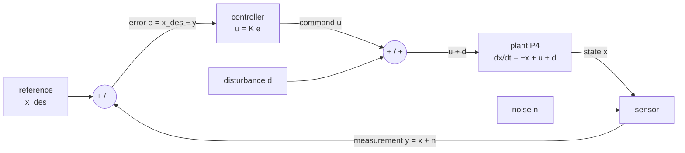
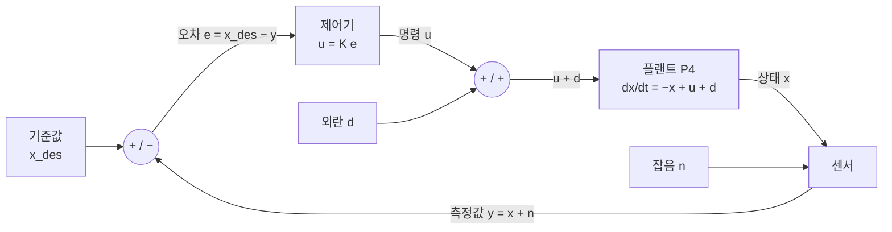

**Deep-dive text** — Matthew Bartos, *Control Theory for Smart Infrastructure* (UT Austin CE397) · [Course packet PDF (public)](https://future-water-website.s3.amazonaws.com/docs/teaching/ce397/ce397_course_packet.pdf) · [Teaching page](https://future-water.org/teaching/)

## English

*First page of group D, and the cheapest to enter: engineering math and [[02-foundations/linear-algebra|linear algebra]] carry the main line.
What feedback buys and what it costs is settled here; [[04-robotics/lqr-lqg|6]], [[04-robotics/mpc|7]] and [[04-robotics/convex-mpc-legged|8]] are all built on top of it.*

> [!info] Depth target · 깊이 목표
> Read state-space models, stability, pole/eigenvalue claims, and controllability/observability statements in robotics papers accurately, and say what a controller can and cannot promise. This page teaches that reading level end to end; *designing* controllers beyond the worked examples here is what the packet and [[04-robotics/lqr-lqg|LQR]]/[[04-robotics/mpc|MPC]] are for.
> 로보틱스 논문의 상태공간 모델·안정성·극점/고유값 주장·가제어성/가관측성 서술을 정확히 읽고, 제어기가 무엇을 약속할 수 있고 없는지 말할 수 있으면 된다. 이 페이지가 그 읽기 수준을 처음부터 끝까지 가르친다; 여기 예제 너머의 제어기 *설계*는 패킷과 [[04-robotics/lqr-lqg|LQR]]/[[04-robotics/mpc|MPC]]의 몫이다.

> [!note] Prerequisites
> [[02-foundations/engineering-math|0.5 Engineering Math §7–9]] (complex numbers in polar form and atan2; linear ODEs, $\dot x = ax \Rightarrow x = x_0e^{at}$, and the sampled factor $a_d = e^{a\Delta t}$; Laplace, poles and frequency response) · [[02-foundations/linear-algebra|1. Linear Algebra §1–3, §5]] (matrix multiplication, eigenvalues, the state-space section) · [[02-foundations/lab-plants|0.6 Lab Plants]] (plant P4, the heater every section reuses; a *plant* is the system being controlled) · [[02-foundations/lab-kernel|0.7 Lab Kernel §2]] (explicit Euler, which §4 and the problem set step the loop with) · [[02-foundations/signal-processing|6. Signal Processing §1, §4 and §5]] (input–output stability and LTI; why differentiating a noisy signal amplifies the noise; the z-plane, $z = e^{sT}$). With those, the page is self-contained: the frequency-response reading of §5.5 is built on the page, point by point.

> [!note] Why this matters · 왜 배우는가
> **Where you are:** on the [[physical-ai-map|Physical AI Map]] control stands in the column beside the robot stack of [[07-research-program/index|7. Research Program §5]], feeding its manipulation layer, and in *"install that panel on the frame"* it serves *move the component*: every joint that carries the panel along its planned path runs a feedback loop of this page's kind, and almost every robotics paper designs such a loop, wraps a learned policy in one, or quietly relies on one. **Why:** feedback buys a division and charges for it — on P4, the wiki's leaky heater ([[02-foundations/lab-plants|0.6]]), a draught $d = 0.5$ that moves the open-loop temperature error by $0.5$ moves it by only $0.05$ under $u = -9x$ (Worked case, §1), yet $K = 99$, the gain that would cut it a hundredfold, diverges as soon as a computer samples the loop every $0.1$ s and holds its command, whether the heater is integrated exactly or by Euler (§4). **Direction:** [[04-robotics/modern-robotics/ch11-robot-control|MR ch.11 §1–§2]] builds computed torque for P2, the catalog's two-link arm ([[02-foundations/lab-plants|0.6]]), on §5's $\zeta$ and $\omega_n$ and §7's feedforward; [[04-robotics/system-identification|5.5 System Identification §2–§3, §7]] recovers §4's sampled model from a record and turns it back into a time constant; [[04-robotics/lqr-lqg|6. LQR/LQG §1–§2]] chooses §7's gain by optimization and proves it with §4's Lyapunov function; [[04-robotics/mpc|7. MPC]] puts §9's rail $\lvert u\rvert\le1$ on the same heater; and [[04-robotics/contact-force-tactile|9. Contact, Force & Tactile §5]] turns §7's PD law into force control at the panel — block 2 of the dissertation path, robotics sessions 61–65 ([[07-research-program/index|7. Research Program §8]]). **Payoff:** you can write a machine as $\dot x = Ax + Bu$, read its stability in continuous and sampled time, place its poles, and check a paper's "stable", "robust" and "1 kHz" against what the plant and the clock allow.

> [!note] First pass · 처음이라면
> Two sessions of 60–90 minutes for the first pass, the bold robotics rows 61–62, and three more for the Working pass (63–65). **Session 1 (61):** the Running object, the picture and the Worked case on P4 by hand, then §1–§3 and §5 — what feedback buys, the mass–spring–damper written as $\dot x = Ax + Bu$, its eigenvalues $-0.5 \pm j1.94$ read as modes, and the same eigenvalues turned into the damping ratio, settling time and overshoot papers quote. §5 finishes §3's mass–spring–damper and needs nothing from §4, so it is read before §4. End by writing, with the page covered, P4's open- and closed-loop steady states under $d = 0.5$, the held and Euler multipliers at $K = 9$, and the $\zeta$, $\omega_n$, settling time and overshoot that §5 reads off those eigenvalues. **Session 2 (62):** §4 — the two definitions, the eigenvalue table and why the sampled loop refuses $K = 99$, with its Lyapunov part read once for the idea — then §10. End by rederiving the $T = 0.1$ s bounds, $20.02$ held and $19$ under Euler, and putting one row of §10 to a control paper. **Working pass:** §5.5 with its Nyquist figure (63); §6–§9 (64); the self-check and the problem set (65). The collapsed *Deeper* notes in §4 and §5.5 are second pass. [[04-robotics/modern-robotics/ch11-robot-control|MR ch.11]], robot control on P2, comes next and builds on §5 and §7.

### Running object · 이 페이지의 대상

Three objects carry the page, all frozen here.

| Object | What it is | Numbers | Where |
|---|---|---|---|
| **P4** from [[02-foundations/lab-plants\|0.6 Lab Plants]] | the catalog's leaky heater, $\dot x = -x + u + d$: $x$ the temperature error, $u$ the command, $d$ an unknown disturbance | gain $K = 9$ (and $99$), $d = 0.5$, sample period $T = 0.1$ s | the picture, the Worked case, §1, §4, §5.5's bandwidth, §7's PI, §9's rail |
| mass–spring–damper | $m\ddot q + b\dot q + kq = u$, the state-space example; [[02-foundations/engineering-math\|0.5 §8]] writes the damping $c$ | $m = 1$, $b = 1$, $k = 4$ | §2–§8 |
| the loop $L(s) = 2/(s+1)^3$ | a third-order lag under gain $2$, chosen because its margins come out round | $g_m = 4$, $\varphi_m = 67.6°$, $s_m = 0.60$ | §5.5 |

P2, the catalog's planar two-link arm, enters only §9, as the reason a gain schedule exists.

*Scope: this page teaches linear state-space control at reading level — models, stability in continuous and sampled time, transfer functions and margins, controllability and observability, pole placement, PID and observers — on these three objects. It does not teach optimal control ([[04-robotics/lqr-lqg|6. LQR & LQG]]), constraints ([[04-robotics/mpc|7. MPC]]), robot-specific control laws ([[04-robotics/modern-robotics/ch11-robot-control|MR ch.11]]), force control ([[04-robotics/contact-force-tactile|9]] and [[04-robotics/force-compliance-control|13]]) or the sampled-data stability of a rendered contact ([[04-robotics/haptics-teleoperation/rendering-sampling-stability|24.4]]).*

### The picture · 그림으로 먼저 보기

<svg viewBox="0 0 560 360" style="max-width:100%;height:auto" role="img" aria-label="Left: the leaky heater in open loop, u and d summed before the plant and x read by nothing, so x settles at 1 + d = 1.5; right: the same plant with u = -Kx through a sampler of period 0.1 s and a zero-order hold, closed-loop pole -10 and x settling at d/(1+K) = 0.05; sampled and held exactly the loop multiplier is 0.905 - 0.095K, stable only for K below 20.02, and stepped by explicit Euler it is 1 - 0.1(1+K), stable only for K below 19; K = 9 gives 0.048 held and 0 under Euler, K = 99 gives -8.52 and -9, and diverges under both">
  <defs><marker id="ctdA" viewBox="0 0 10 10" refX="8" refY="5" markerWidth="5" markerHeight="5" orient="auto"><path d="M 0 0 L 10 5 L 0 10 z" fill="currentColor"/></marker></defs>
  <g fill="currentColor">
    <text x="12" y="22" font-size="12" fill-opacity="0.85" font-weight="600">open loop</text>
    <line x1="12" y1="96" x2="45" y2="96" stroke="currentColor" stroke-width="1.4" marker-end="url(#ctdA)"/>
    <text x="14" y="88" font-size="12">u = 1</text>
    <line x1="56" y1="46" x2="56" y2="85" stroke="currentColor" stroke-width="1.4" marker-end="url(#ctdA)"/>
    <text x="63" y="58" font-size="12">d = 0.5</text>
    <circle cx="56" cy="96" r="9" fill="none" stroke="currentColor" stroke-width="1.3"/>
    <line x1="49.7" y1="89.7" x2="62.3" y2="102.3" stroke="currentColor" stroke-width="0.9" stroke-opacity="0.7"/>
    <line x1="49.7" y1="102.3" x2="62.3" y2="89.7" stroke="currentColor" stroke-width="0.9" stroke-opacity="0.7"/>
    <text x="40" y="114" font-size="12" text-anchor="middle">+</text>
    <text x="68" y="83" font-size="12" text-anchor="middle">+</text>
    <line x1="65" y1="96" x2="78" y2="96" stroke="currentColor" stroke-width="1.4" marker-end="url(#ctdA)"/>
    <rect x="80" y="77" width="100" height="38" rx="3" fill="currentColor" fill-opacity="0.06" stroke="currentColor" stroke-width="1.3"/>
    <text x="130" y="100.3" font-size="12" text-anchor="middle">ẋ = −x + u + d</text>
    <line x1="180" y1="96" x2="204" y2="96" stroke="currentColor" stroke-width="1.4" marker-end="url(#ctdA)"/>
    <text x="192" y="88" font-size="12" text-anchor="middle">x</text>
    <text x="12" y="156" font-size="12" xml:space="preserve">x<tspan dy="3.4" font-size="11">∞</tspan><tspan dy="-3.4"> = 1 + d = 1.5</tspan></text>
    <text x="12" y="172" font-size="12" fill-opacity="0.85">(u = 1, d = 0.5)</text>
    <text x="12" y="196" font-size="12" fill-opacity="0.85">no arrow reads x,</text>
    <text x="12" y="212" font-size="12" fill-opacity="0.85">so nothing can correct it</text>
    <line x1="214" y1="12" x2="214" y2="350" stroke="currentColor" stroke-width="0.8" stroke-opacity="0.3"/>
    <text x="226" y="22" font-size="12" fill-opacity="0.85" font-weight="600">closed loop, with the clock on top</text>
    <line x1="262" y1="46" x2="262" y2="85" stroke="currentColor" stroke-width="1.4" marker-end="url(#ctdA)"/>
    <text x="269" y="58" font-size="12">d(t)</text>
    <circle cx="262" cy="96" r="9" fill="none" stroke="currentColor" stroke-width="1.3"/>
    <line x1="255.7" y1="89.7" x2="268.3" y2="102.3" stroke="currentColor" stroke-width="0.9" stroke-opacity="0.7"/>
    <line x1="255.7" y1="102.3" x2="268.3" y2="89.7" stroke="currentColor" stroke-width="0.9" stroke-opacity="0.7"/>
    <text x="274" y="83" font-size="12" text-anchor="middle">+</text>
    <text x="250" y="118" font-size="12" text-anchor="middle">+</text>
    <line x1="271" y1="96" x2="286" y2="96" stroke="currentColor" stroke-width="1.4" marker-end="url(#ctdA)"/>
    <rect x="288" y="77" width="100" height="38" rx="3" fill="currentColor" fill-opacity="0.06" stroke="currentColor" stroke-width="1.3"/>
    <text x="338" y="100.3" font-size="12" text-anchor="middle">ẋ = −x + u + d</text>
    <line x1="388" y1="96" x2="546" y2="96" stroke="currentColor" stroke-width="1.4" marker-end="url(#ctdA)"/>
    <text x="430" y="88" font-size="12" text-anchor="middle">x(t)</text>
    <circle cx="488" cy="96" r="3" fill="currentColor"/>
    <line x1="488" y1="96" x2="488" y2="176" stroke="currentColor" stroke-width="1.4"/>
    <line x1="488" y1="176" x2="470" y2="176" stroke="currentColor" stroke-width="1.4"/>
    <circle cx="470" cy="176" r="2.6" fill="none" stroke="currentColor" stroke-width="1.2"/>
    <circle cx="448" cy="176" r="2.6" fill="none" stroke="currentColor" stroke-width="1.2"/>
    <line x1="467.6" y1="174.5" x2="450" y2="164" stroke="currentColor" stroke-width="1.5" stroke-linecap="round"/>
    <path d="M 454.0 159.0 A 10 10 0 0 1 469.0 166.0" fill="none" stroke="currentColor" stroke-width="0.9" stroke-opacity="0.7" marker-end="url(#ctdA)"/>
    <text x="546" y="198" font-size="11" text-anchor="end">sampler, T = 0.1 s</text>
    <line x1="445" y1="176" x2="424" y2="176" stroke="currentColor" stroke-width="1.4" marker-end="url(#ctdA)"/>
    <text x="435" y="168" font-size="12" text-anchor="middle" xml:space="preserve">x<tspan dy="3.4" font-size="11">k</tspan></text>
    <rect x="384" y="161" width="38" height="30" rx="3" fill="currentColor" fill-opacity="0.06" stroke="currentColor" stroke-width="1.3"/>
    <text x="403" y="180.3" font-size="12" text-anchor="middle">−K</text>
    <text x="403" y="206" font-size="11" text-anchor="middle" fill-opacity="0.85">K = 9</text>
    <line x1="384" y1="176" x2="344" y2="176" stroke="currentColor" stroke-width="1.4" marker-end="url(#ctdA)"/>
    <text x="363" y="168" font-size="12" text-anchor="middle" xml:space="preserve">u<tspan dy="3.4" font-size="11">k</tspan></text>
    <rect x="300" y="161" width="42" height="30" rx="3" fill="currentColor" fill-opacity="0.06" stroke="currentColor" stroke-width="1.3"/>
    <text x="321" y="180.3" font-size="12" text-anchor="middle">ZOH</text>
    <text x="321" y="206" font-size="11" text-anchor="middle" fill-opacity="0.85">zero-order hold</text>
    <path d="M 300.0 176.0 L 262.0 176.0 L 262.0 107.0" fill="none" stroke="currentColor" stroke-width="1.4" marker-end="url(#ctdA)"/>
    <text x="269" y="142" font-size="12">u(t), held</text>
    <text x="546" y="226" font-size="11" text-anchor="end" fill-opacity="0.8">(t): continuous signal  ·  k: sequence</text>
    <text x="226" y="246" font-size="12">closed-loop pole −(1+K) = −10</text>
    <text x="226" y="262" font-size="12" xml:space="preserve">x<tspan dy="3.4" font-size="11">∞</tspan><tspan dy="-3.4"> = d/(1+K) = 0.05   (K = 9, d = 0.5)</tspan></text>
    <text x="226" y="286" font-size="12" fill-opacity="0.9">sampled every T = 0.1 s, u held (§4):</text>
    <text x="226" y="302" font-size="12" fill-opacity="0.9" xml:space="preserve">held:   x<tspan dy="3.4" font-size="11">k+1</tspan><tspan dy="-3.4"> = (0.905 − 0.095K) x</tspan><tspan dy="3.4" font-size="11">k</tspan><tspan dy="-3.4">  →  K &lt; 20.02</tspan></text>
    <text x="226" y="318" font-size="12" fill-opacity="0.9" xml:space="preserve">Euler: x<tspan dy="3.4" font-size="11">k+1</tspan><tspan dy="-3.4"> = (1 − 0.1(1+K)) x</tspan><tspan dy="3.4" font-size="11">k</tspan><tspan dy="-3.4">  →  K &lt; 19</tspan></text>
    <text x="226" y="334" font-size="12" fill-opacity="0.9">K = 9: 0.048 held, 0 under Euler (deadbeat)</text>
    <text x="226" y="350" font-size="12" fill-opacity="0.9">K = 99: −8.52 held, −9 under Euler: both diverge</text>
  </g>
</svg>

Left: **P4** from [[02-foundations/lab-plants|0.6 Lab Plants]], the leaky heater $\dot x=-x+u+d$ that §1 opens with, in open loop — $u=1$ and $d=0.5$ enter one summing junction before the plant, so $x$ settles at $x_\infty=1+d=1.5$, and since no arrow reads $x$, nothing can correct it. Right: the same plant under $u=-Kx$ with $K=9$, which moves the pole to $-(1+K)=-10$ and the steady state to $d/(1+K)=0.05$, while the clock on top — a sampler of period $T=0.1\,\mathrm s$ and a zero-order hold, which turn $x(t)$ into the sequence $x_k$ and hold each $u_k$ over its period — makes the loop discrete. With the command held and the heater integrated exactly the loop is $x_{k+1}=(0.905-0.095K)\,x_k+0.095\,d$, stable only while $K<20.02$, and stepped by explicit Euler it is $x_{k+1}=\big(1-T(1+K)\big)x_k+Td_k$, stable only while $K<19$: $K=9$ survives both (multipliers $0.048$ and $0$), and $K=99$, which the continuous loop accepts, diverges under both ($-8.52$ and $-9$).

### Worked case · 대상으로 한 번 끝까지

P4 through the picture in four steps, with $d = 0.5$ and $T = 0.1$ s. Every step uses only the picture and [[02-foundations/engineering-math|0.5 §8]] — a steady state is where $\dot x = 0$; a first-order ODE with a constant input decays by $e^{-T}$ over a period and accumulates $1-e^{-T}$ of the input; and a discrete loop $x_{k+1} = a_d x_k$ is stable exactly when $\lvert a_d\rvert < 1$ — plus the explicit-Euler step of [[02-foundations/lab-kernel|0.7 §2]]. §1 and §4 derive the same results in general.

**Step 1 — open loop.** With $u = 1$ and $d = 0.5$, setting $\dot x = -x + u + d = 0$ gives $x_\infty = u + d = 1.5$: the draught moves the temperature error by its full $0.5$, and nothing in the loop notices.

**Step 2 — close the loop.** With $u = -9x$ the heater becomes $\dot x = -10x + d$: pole $-10$, a time constant of $0.1$ s instead of $1$ s, and $x_\infty = d/10 = 0.05$. The same draught now moves the error a tenth as far, and the controller never measured $d$. A hundredfold cut would take $1 + K = 100$, that is $K = 99$.

**Step 3 — the clock, with the heater integrated exactly.** A computer reads $x_k$ every $T = 0.1$ s and holds $u_k = -Kx_k$ until the next reading. Over one period the heater is a first-order ODE with a constant input, so

$$x_{k+1} = e^{-T}x_k + (1-e^{-T})(u_k + d) = (0.905 - 0.095K)\,x_k + 0.095\,d$$

because the free response decays by $e^{-0.1} = 0.905$ and the held input accumulates $1 - e^{-0.1} = 0.095$ of itself. With the unrounded factors $0.904837$ and $0.095163$, the multiplier is $0.904837 - 9\times0.095163 = 0.048$ at $K = 9$, so each sample keeps under five percent of the error, and $0.904837 - 99\times0.095163 = -8.52$ at $K = 99$, so the error grows 8.5-fold per sample while flipping sign. It crosses $-1$ at $K = 1.904837/0.095163 = 20.02$.

**Step 4 — the clock, stepped by explicit Euler.** The lab's integrator replaces the exact factors by one Euler step, $x_{k+1} = x_k + T(-x_k + u_k + d)$:

$$x_{k+1} = \big(1 - T(1+K)\big)x_k + T\,d = \big(1 - 0.1(1+K)\big)x_k + 0.1\,d$$

since $u_k = -Kx_k$ adds $-TKx_k$ to the leak's $-Tx_k$. At $K = 9$ the multiplier is exactly $0$ — **deadbeat**, meaning the error is gone after one step — and at $K = 99$ it is $-9$. It crosses $-1$ at $T(1+K) = 2$, that is $K = 19$.

**What the four steps show.** Feedback divided the draught by $1 + K$ (Step 2), and the sampler capped $K$ near $20$ at this clock whether the heater was integrated exactly (Step 3) or by Euler (Step 4); the two bounds differ by one unit of gain, and both refuse $K = 99$. Why exact integration cannot rescue a controller that holds its command, and why the Euler loop's deadbeat belongs to the model rather than to the heater, is §4.

### 1. What feedback actually buys

The job is to hold the temperature error at $0$ against a draught you cannot measure. Take a heater with a leak: $\dot x = -x + u + d$, where $x$ is temperature error, $u$ your
command, and $d$ an unknown disturbance (an open window). Two strategies, which differ in one
thing: an **open-loop** controller computes the command without measuring the result, while a
**closed-loop** (feedback) controller computes the command from the measured output. The
**steady state** quoted below is where the state stops changing, found by setting $\dot x = 0$.

- **Open loop** — you compute the $u$ that *should* work: $u = 1$ gives steady state
  $x = 1 + d$. If $d = 0.5$, you sit at $1.5$ and never notice. If your model's gain is
  10 % off, so that $u = 1$ delivers only $0.9$, you sit at $0.9 + d$: the $0.1$ of model
  error passes straight through, on top of $d$.
- **Closed loop** — you measure $x$ and push against the error: $u = -Kx$. Then
  $\dot x = -(1+K)x + d$, whose steady state is $x = d/(1+K)$. With $K = 9$ that same
  $d = 0.5$ leaves only $0.05$ — **10× smaller** — and you never had to know $d$. Under the
  same 10 % gain error the loop is $\dot x = -9.1x + d$, and the draught leaves $0.055$
  instead of $0.05$.

That is the whole trade in one line: *feedback converts model error and disturbance into
a division by $(1+K)$*. What it costs is the rest of this page — measurement noise gets
amplified by the same $K$, delay turns correction into oscillation, and large $K$ can
destabilize a system that was fine open-loop.



The same loop as a signal-flow diagram, with the two signals the picture leaves out: a reference $x_{des}$ for the error to follow, and the sensor noise $n$ that arrives with every measurement. With §1's reference $x_{des} = 0$ the error is $e = -y$, so $u = Ke = -Kx - Kn$: the command is the $u = -Kx$ above plus the noise multiplied by the same $K$, the first cost named above.

### 2. State-space models — writing a physical system as a matrix

Every robot joint, suspension and hydraulic cylinder enters a paper's equations in the same shape, a few first-order equations written with matrices; this section shows where that shape comes from and what each matrix means.

Any linear system is written

$$\dot x = Ax + Bu, \qquad y = Cx + Du$$

No robot is linear, so ask where this shape comes from. It is the first-order Taylor expansion of the true dynamics $\dot x = f(x,u)$ about the operating point you intend to hold: $A$ and $B$ are the Jacobians $\partial f/\partial x$ and $\partial f/\partial u$ evaluated there, which is why a paper's $A$ matrix changes when its operating point does. $D$ is usually zero because a sensor rarely sees the command directly.

Written out, let $(x_0, u_0)$ be an **equilibrium**, a state and input with $f(x_0, u_0) = 0$ so
that the state would rest there, and let $\delta x = x - x_0$ and $\delta u = u - u_0$ be the
deviations from it. Then

$$\delta\dot x \approx A\,\delta x + B\,\delta u, \qquad A = \frac{\partial f}{\partial x}\Big|_{(x_0,u_0)}, \qquad B = \frac{\partial f}{\partial u}\Big|_{(x_0,u_0)}$$

This is linear in the deviations, additive and homogeneous in the sense of
[[02-foundations/engineering-math|0.5 §4.5]], because the constant Taylor term $f(x_0,u_0)$ is
zero at an equilibrium; so it is trustworthy only while $\delta x$ and $\delta u$ stay small.
*Example:* a pendulum $\ddot\theta = -(g/l)\sin\theta + u$ with $g/l = 9.81\ \text{s}^{-2}$ and
state $(\theta, \dot\theta)$. Hanging down ($\theta_0 = 0$, $\cos\theta_0 = 1$) gives
$A = \begin{pmatrix}0&1\\-9.81&0\end{pmatrix}$ with eigenvalues $\pm j3.13$, an oscillation;
balanced upright ($\theta_0 = \pi$, $\cos\theta_0 = -1$) gives
$A = \begin{pmatrix}0&1\\9.81&0\end{pmatrix}$ with eigenvalues $\pm 3.13$, one of them unstable.
Same machine, two operating points, two different $A$ matrices.

- $x$ = **state**: the minimum set of numbers that, with future inputs, determines the future.
- $u$ = **input** (what you command), $y$ = **output** (what you measure), $A$ = internal
  dynamics, $B$ = how input enters, $C$ = what the sensor sees.
- With $n$ states, $m$ inputs and $p$ outputs, $A$ is $n\times n$, $B$ is $n\times m$, $C$ is
  $p\times n$ and $D$ is $p\times m$. All four are constant, which makes the model
  **time-invariant** as well as linear: an LTI (linear time-invariant) system, the pair of
  conditions [[02-foundations/signal-processing|6. Signal Processing §1]] defines with examples. Its exact solution
  through the matrix exponential is written out in
  [[02-foundations/linear-algebra|1. Linear Algebra §5]].

**Worked conversion — mass–spring–damper.** $m\ddot q + b\dot q + kq = u$ (the Running object's, with $b$ where [[02-foundations/engineering-math|0.5 §8]] writes $c$) is second order;
state-space wants first order, so *stack the derivatives*: let $x = (q, \dot q)$. Then
$\dot x_1 = x_2$ (definition) and $\dot x_2 = (u - bx_2 - kx_1)/m$ (the physics), so

$$A = \begin{pmatrix} 0 & 1 \\ -k/m & -b/m\end{pmatrix}, \quad B = \begin{pmatrix}0 \\ 1/m\end{pmatrix}, \quad C = \begin{pmatrix}1 & 0\end{pmatrix}$$

Read the two rows of $A$ as the two sentences they came from: the top row says that velocity is the derivative of position, the bottom row is Newton's law solved for acceleration. With $m=1, b=1, k=4$: $A = \begin{pmatrix}0&1\\-4&-1\end{pmatrix}$. That trick — an
*n*-th order scalar ODE stacked into an *n*-dimensional first-order system — is the whole
method, and a robot arm is the same
structure with $M(\theta)$ in place of $m$
([[04-robotics/modern-robotics/ch08-dynamics|MR ch.8]]). The oil column of a hydraulic cylinder is itself such a spring, stiff but not rigid ([[02-foundations/fluid-power|0.6.3 Fluid Power §7]]).

### 3. Solving it: modes and the matrix exponential

A model predicts the future only once it is solved, and the solution explains why one initial condition can look calm while another reveals a slow or unstable direction.

For $u=0$, the solution is the matrix version of $x_0e^{at}$:
$x(t) = e^{At}x_0$. Diagonalizing $A = V\Lambda V^{-1}$
([[02-foundations/linear-algebra|linear algebra §3]], which writes $V$ for the matrix whose columns are the eigenvectors) gives
$e^{At} = Ve^{\Lambda t}V^{-1}$ — so the motion is a sum of **modes**, each one an
eigenvector direction decaying or growing like $e^{\lambda_i t}$. The matrix exponential itself
is defined by its power series in [[02-foundations/linear-algebra|1. Linear Algebra §5]]. When $A$
has $n$ independent eigenvectors $v_i$ with eigenvalues $\lambda_i$, the solution reads

$$x(t) = \sum_{i=1}^{n} c_i\, e^{\lambda_i t}\, v_i, \qquad c = V^{-1}x_0$$

so a **mode** is one term of that sum: a fixed direction $v_i$ (a column of $V$), a size that
evolves as $e^{\lambda_i t}$, and a weight $c_i$ saying how much of the initial state lies along
that direction. A mode with $c_i = 0$ is never excited from that start: that is how one initial
condition looks calm while another reveals the slow or unstable direction.

**Worked eigenvalues.** For $A = \begin{pmatrix}0&1\\-4&-1\end{pmatrix}$:
$\det(A-\lambda I) = \lambda^2 + \lambda + 4 = 0 \Rightarrow \lambda = -0.5 \pm j1.94$.
Read it off directly: negative real part → decaying; nonzero imaginary part → oscillating
at ~1.94 rad/s while it decays. For an individual mode, the real part sets growth or decay
and the imaginary part sets oscillation. A full output can still be non-monotone with real
poles because modal coefficients, zeros, and output choice also matter.

### 4. Asymptotic stability, and the two half-stories

*In one sentence:* a loop is asymptotically stable when anything that knocks it off its resting point dies away on its own, and merely stable when the state only stays nearby; this section shows how to read that off the model's numbers, why the reading changes once a computer runs the loop in steps, and how an energy that never rises proves stability without solving anything, while one that keeps falling proves the dying away.

*The two half-stories* of the title are the two clocks a loop can run on: continuous time, whose stability test is the left half-plane, and the sampled time a computer runs, whose test is the unit circle.

*If you need only one thing from this section:* a gain that is safe in continuous time can be unstable once a computer samples the loop and holds its command. For P4 at $T=0.1$ s the held loop's multiplier $0.905-0.095K$ must stay inside the unit circle, so $K<20.02$ ($19$ under explicit Euler), and the hundredfold gain $K=99$ gives $-8.52$ and grows (*Exact is not safe*, after the table).

**The definitions, each named.** Stability is a property of an **equilibrium** of an autonomous
system $\dot x = f(x)$ (no input, or the input already fixed by a controller), meaning a state
$x_e$ with $f(x_e) = 0$. Shift coordinates so that $x_e = 0$. There are two levels:

- **Stable** (in the sense of Lyapunov): trajectories that start close stay close. For every
  radius $\varepsilon > 0$ there is a starting radius $\delta > 0$ such that
  $$\lVert x(0)\rVert < \delta \implies \lVert x(t)\rVert < \varepsilon \quad \text{for all } t \ge 0$$
  so no matter how tight a tube $\varepsilon$ you ask for, starting close enough keeps you inside it.
- **Asymptotically stable**: stable, *and* nearby trajectories converge to the equilibrium,
  $\lVert x(0)\rVert < \delta \implies x(t) \to 0$ as $t \to \infty$. It is **globally**
  asymptotically stable when convergence holds from every $x(0)$, which for a linear system is
  automatic, since scaling a linear trajectory scales it without changing whether it decays.

For the linear $\dot x = Ax$ both levels reduce to eigenvalues, because every solution is a sum of
the modes $e^{\lambda_i t}$ of §3. Asymptotic stability holds exactly when every mode decays, which
is the table below (such an $A$ is called **Hurwitz**). Plain stability also allows eigenvalues
with zero real part, provided each has a full set of eigenvectors (no Jordan block), so that no
growing $t\,e^{\lambda t}$ term appears. Two boundary cases that readers get wrong:

- The undamped spring $\ddot x + 4x = 0$ has eigenvalues $\pm j2$. Every trajectory circles forever
  at its starting energy, so it is **stable but not asymptotically stable**.
- The double integrator $\ddot x = 0$ has eigenvalues $0, 0$, none with positive real part, yet it
  is **unstable**: $x(t) = x_0 + v_0 t$, so a velocity of $0.01$ m/s carries it $10$ m away in
  $1000$ s. "No eigenvalue in the right half-plane" is not the stability test.

Input–output (BIBO) stability is a different notion about bounded inputs, defined in
[[02-foundations/signal-processing|6. Signal Processing §1]]; for a minimal realization the two
agree.

| System | Asymptotically stable iff | Mnemonic |
|---|---|---|
| Continuous $\dot x = Ax$ | all $\text{Re}(\lambda_i) < 0$ | left half-plane |
| Discrete $x_{k+1} = A_dx_k$ | all $\lvert\lambda_i\rvert < 1$ | inside the unit circle |

These are the same statement in two clocks: exact (zero-order-hold, meaning the input is held constant between samples) discretization with step $T$ gives

$$x_{k+1} = A_d x_k + B_d u_k, \qquad A_d = e^{AT}, \qquad B_d = \int_0^T e^{At'}\,dt'\; B$$

which is exact at the sample instants because the input really is constant over each interval, so
integrating the §3 solution across one interval gives exactly these matrices. For $\dot x = -x + u$
and $T = 0.1$: $A_d = e^{-0.1} = 0.905$ and $B_d = 1 - e^{-0.1} = 0.095$ — the scalar case is [[02-foundations/engineering-math|0.5 §8]]'s $a_d = e^{a\Delta t}$, written here $A_d$, with $T$ for $\Delta t$ and $k$ for the step index. Since the eigenvalues of
$e^{AT}$ are $e^{\lambda_i T}$, the map is
$\lambda \mapsto e^{\lambda T}$, and $\text{Re}(\lambda)<0$ is exactly
$\lvert e^{\lambda T}\rvert<1$: a continuous pole lands at $z = e^{\lambda T}$ in the **z-plane**, the complex plane of the discrete clock, a callback to [[02-foundations/signal-processing|6. Signal Processing §5]]. Check: P4's $\lambda = -1$ at $T = 0.1$ lands at
$z = e^{-0.1} = 0.905 < 1$ ✓, the number 6. Signal Processing §5 computes. Approximate schemes do not keep this equivalence: forward Euler — the explicit Euler of [[02-foundations/lab-kernel|0.7 §2]], two names for one scheme, $x_{k+1} = x_k + T\,f(x_k, u_k)$ — maps $\lambda \mapsto 1 + \lambda T$, so $\lambda = -30$ with $T = 0.1$ gives $-2$, an unstable discrete mode from a stable continuous one. Recovering this $A_d$ and $B_d$ from a recorded input and output, and mapping them back to the time constant, is [[04-robotics/system-identification|5.5 System Identification]]. Deep sequence models sample their state-space layers from a continuous-time model too, with the step learned rather than chosen — Mamba with this hold, S4 with the bilinear transform ([[03-deep-learning/foundations/sequence-models|1.1 Sequence Models §8–§9, §12]]).

**Exact is not safe: a digital controller closes a new loop.** Exact discretization preserves stability only for what it maps — the plant $\dot x = Ax$, or a loop already closed in continuous time, such as P4 under $u = -9x$, whose pole $-10$ lands at $e^{-1} = 0.37$. A digital controller is a different loop. It reads $x_k$ and holds $u_k = -Kx_k$ for a whole period, so between samples it acts on a state up to $T$ old, and the loop it closes is the held map $x_{k+1} = (A_d - B_dK)\,x_k$ — exact, and still a new loop. For P4 at $T = 0.1$ s,

$$x_{k+1} = (0.905 - 0.095K)\,x_k + 0.095\,d$$

since $A_d = 0.905$ carries $x_k$ across the period and $B_d = 0.095$ multiplies the held $u_k + d$. It is stable only while the multiplier stays above $-1$, that is $K < (1 + e^{-T})/(1 - e^{-T}) = 20.02$. A hundredfold cut of the disturbance in continuous time needs $1 + K = 100$, $K = 99$, and the held loop's multiplier is then $0.9048 - 99\times0.0952 = -8.52$ (the Worked case's Step 3): the error grows 8.5-fold per sample, flipping sign each time, although the continuous pole $-100$ is fast and stable. This multiplier is the closed-loop pole $a - bK$ that [[04-robotics/system-identification|5.5 System Identification §4]] recovers from a record logged under feedback. Explicit Euler, the lab's step, adds its own error on top.

**Worked: P4 under explicit Euler.** The lab steps the same loop by explicit Euler, one step of period $T$ ([[02-foundations/lab-kernel|0.7]]):

$$x_{k+1}=\big(1-T(1+K)\big)x_k + T d_k$$

since $u=-Kx$ makes the heater $\dot x=-(1+K)x+d$. The multiplier must sit inside the unit disk, so at $T=0.1$ the bound is $K<19$, one unit of gain below the held loop's $20.02$, and $K=99$ gives $1-10=-9$ (Step 4). In plain words: Euler is stable only while $T$ stays under twice the time constant of what it integrates ([[02-foundations/engineering-math|0.5]]'s problem 3), and the closed loop's time constant is $1/(1+K)$, so $T(1+K)<2$. The two bounds are $2/T-1$ under Euler and $(1+e^{-T})/(1-e^{-T})\approx 2/T$ for the held loop, so a faster clock buys proportionally more gain under either, and for P4 Euler is always about one unit too pessimistic. At $T=0.01$ the Euler multiplier for $K=99$ is $0$ — **deadbeat**, the error gone after one step. Deadbeat is fragile, because it is a property of the model: the held heater's multiplier at the same $K$ and $T$ is $0.005$, not $0$. And one sample of computation delay, $u_k=-99x_{k-1}$, makes the Euler loop $x_{k+1}=0.99\,x_k-0.99\,x_{k-1}$, whose modes $z^k$ satisfy $z^2-0.99z+0.99=0$: Euler's single pole at $0$ becomes a complex pair with $\lvert z\rvert=\sqrt{0.99}=0.995$, so the error shrinks by only $0.5\,\%$ per $0.01$ s step and rings with an envelope time constant of $0.01/0.005=2$ s instead of settling in $0.01$ s. Papers switch between continuous models and discrete
implementations without warning; inspect which clock each equation uses. The place where the
discrete clock is felt rather than read is haptic rendering, where a spring that is passive on
paper injects energy once it is sampled
([[04-robotics/haptics-teleoperation/rendering-sampling-stability|24.4 Rendering, Sampling & Stability]]).

> [!warning] Stability is not performance
> For the autonomous system above, "stable" says the state returns to the origin. It does not by itself guarantee zero tracking error, and says nothing about *how long*,
> how much overshoot, how large the control effort, or whether the linear model was valid
> that far from the operating point. A paper that reports only "the closed loop is stable"
> has reported the weakest possible claim.

**Lyapunov's direct method: proving stability without solving.** A **Lyapunov function** for the
equilibrium $0$ of $\dot x = f(x)$ is a continuously differentiable scalar function $V(x)$ (a function, not §3's eigenvector matrix $V$) that
satisfies three conditions in a neighbourhood of $0$:

$$V(0) = 0, \qquad V(x) > 0 \ \text{ for } x \ne 0, \qquad \dot V(x) = \nabla V(x)^\top f(x) \le 0$$

Here $\dot V$ is the rate of change of $V$ along trajectories, obtained from the chain rule without
solving the ODE. If such a $V$ exists, the equilibrium is **stable**, since $V$ behaves like an
energy that never increases, so the state cannot climb out of a small level set of $V$. If the
third condition is strict, $\dot V(x) < 0$ for every $x \ne 0$, the equilibrium is
**asymptotically stable**, since the energy must keep falling until $V = 0$, which happens only at
$x = 0$; the conclusion is global if in addition the conditions hold everywhere and
$V(x) \to \infty$ as $\lVert x\rVert \to \infty$. **LaSalle's invariance principle** covers the
common in-between case: if $\dot V \le 0$ and no trajectory other than $x = 0$ can stay forever in
the set where $\dot V = 0$, the equilibrium is still asymptotically stable.

- *Linear case, with numbers.* For $\dot x = Ax$ try $V = x^\top P x$ with $P$ positive definite
  ([[02-foundations/linear-algebra|1. Linear Algebra §3]]). Then $\dot V = x^\top(A^\top P + PA)x$,
  so it suffices to solve the **Lyapunov equation** $A^\top P + PA = -Q$ for a positive definite
  $Q$. For $A = \begin{pmatrix}0&1\\-4&-1\end{pmatrix}$ and $Q = I$ the solution is
  $P = \begin{pmatrix}2.625&0.125\\0.125&0.625\end{pmatrix}$, with positive eigenvalues $2.63$ and
  $0.62$, so $V$ qualifies and $\dot V = -\lVert x\rVert^2 < 0$ proves what the eigenvalues
  $-0.5 \pm j1.94$ of §3 said.
- *Non-example of a proof.* A candidate that fails a condition proves nothing. $V = x_1^2$ for the
  same system is zero at $x = (0, 1) \ne 0$, so the second condition fails, although the system is
  stable. Failing to find a $V$ is not evidence of instability.
- *Why it matters.* It is the stability tool that survives nonlinearity, saturation and switching,
  and it is the argument behind [[04-robotics/lqr-lqg|6. LQR / LQG §1]] ($V = x^\top P x$ from the
  Riccati equation) and [[04-robotics/mpc|7. MPC]] (the optimal cost used as $V$).

The collapsed note below runs the same energy argument on the mass–spring–damper and defines **passivity**, its input–output form, the guarantee that haptics and teleoperation rely on ([[04-robotics/force-compliance-control|13]], [[04-robotics/haptics-teleoperation/rendering-sampling-stability|24.4]]).

> [!note]- Deeper · 더 깊이
> **Energy, stability and passivity in one line of reasoning.** For $m\ddot x+b\dot x+kx=u$, choose stored energy
> $V=\tfrac12m\dot x^2+\tfrac12kx^2$. Then
> $\dot V=\dot x(m\ddot x+kx)=u\dot x-b\dot x^2$.
> With $u=0$ and $b>0$, energy decreases; under the usual $m,k>0$ assumptions,
> LaSalle's argument gives convergence to the equilibrium. With input $u$ and output
> $\dot x$, $\dot V\le u\dot x$: the system is passive because it cannot release more
> energy than it stored plus what entered through the port. Stability is a property of an
> autonomous equilibrium; passivity is an input–output energy inequality. They connect,
> but they are not synonyms.
>
> Stated generally, a system with input $u$ and output $y$ is **passive** when some storage
> function $V(x) \ge 0$ satisfies
> $$\dot V \le u^\top y$$
> so the stored energy grows no faster than the power $u^\top y$ supplied through the port. Here
> $V$ is the mechanical energy, $y = \dot x$, and the inequality holds since $-b\dot x^2 \le 0$.
> Non-example: negative damping, $b < 0$ (an actuator pushing along the velocity), gives
> $\dot V > u\dot x$ whenever $\dot x \ne 0$, so the device creates energy. A negative-feedback
> connection of two passive systems is again passive, which is why passivity is the guarantee
> haptics and teleoperation rely on.

### 5. Transfer functions, poles, and the numbers papers quote

Papers report a system by a handful of numbers — its poles, a damping ratio, a settling time, an overshoot — and a step-response figure that disagrees with them means the model in the paper is not the system in the video. This section turns a state-space model into those numbers.

The **transfer function** of an LTI system is the ratio of the Laplace transforms of its output
and its input, taken with every initial condition equal to zero:

$$G(s) = \frac{Y(s)}{U(s)}\bigg|_{x(0)=0} = C(sI - A)^{-1}B + D$$

Here $s$ is the complex frequency of [[02-foundations/engineering-math|0.5 §9]], and $Y(s)$ and
$U(s)$ are the transforms of output and input. The right-hand form follows because transforming
$\dot x = Ax + Bu$ with $x(0) = 0$ gives $sX = AX + BU$, so $X = (sI - A)^{-1}BU$. Initial
conditions are zeroed, as on 0.5 §9, because $G$ describes the system rather than one starting
state. $G$ is a ratio of two polynomials, and only an LTI system has one.

Laplace-transform the system ([[02-foundations/engineering-math|0.5 §9]]) and the ODE
becomes algebra: for the mass–spring–damper,
$G(s) = \dfrac{1}{ms^2+bs+k} = \dfrac{1}{s^2+s+4}$. Its **poles** (denominator roots; the numerator's roots, where $G(s)=0$, are called **zeros**) are
exactly the eigenvalues of $A$ — one object, two languages. (That equality holds here because nothing cancels; 0.5 §9's Deeper note shows how a pole–zero cancellation can hide an eigenvalue, even an unstable one, from $G(s)$.)

For a second-order system — or a **dominant** second-order mode, the slowest pair of poles, nearest the imaginary axis, which outlasts the others and so shapes the step response once the first moments pass — and negligible zero effects, the denominator is described by two numbers experimental sections often report:

$$s^2 + 2\zeta\omega_n s + \omega_n^2, \qquad \omega_n = \sqrt{k/m}, \quad \zeta = \frac{b}{2\sqrt{km}}$$

Both come from dividing $ms^2 + bs + k$ by $m$ and matching $b/m = 2\zeta\omega_n$ and $k/m = \omega_n^2$, the derivation [[02-foundations/basic-mechanics|0.6.1 Basic Mechanics §5]] carries out for the catalog's haptic handle; so $\zeta$ and $\omega_n$ are a *reparameterization*, not new physics — one number for speed and one for ringing, whatever the system is made of.

- **$\omega_n$** (natural frequency) sets *speed*; **$\zeta$** (damping ratio) sets
  *ringing*: $\zeta<1$ oscillates, $\zeta=1$ is critically damped, $\zeta>1$ is sluggish
  (the three regimes, with a worked mass–spring–damper, are defined in
  [[02-foundations/engineering-math|0.5 §8]], and worked on the handle of P3, the catalog's haptic device ([[02-foundations/lab-plants|0.6]]), energy and all, in [[02-foundations/basic-mechanics|0.6.1 Basic Mechanics §5]]).
- Rules of thumb you can apply to any plot in a paper. The 2% **settling time** $t_s$ is the time
  after which the step response stays within 2% of its final value $y_\infty$. The **overshoot**
  is how far the peak exceeds that final value, as a fraction of it,
  $M_p = (y_{max} - y_\infty)/y_\infty$. For an underdamped standard second-order system
  ($0 < \zeta < 1$, no zeros):
  $$t_s \approx \frac{4}{\zeta\omega_n}, \qquad M_p = e^{-\pi\zeta/\sqrt{1-\zeta^2}}$$
  The $4$ is $\ln 50 = 3.91$ rounded, because the oscillation's envelope decays as
  $e^{-\zeta\omega_n t}$ and reaches $2\% = 1/50$ when $\zeta\omega_n t = \ln 50$; so $t_s$ is an
  envelope estimate, not the exact last crossing.
- **Worked**: the Running object's mass–spring–damper has $\omega_n = 2$, $\zeta = 1/(2\cdot 2) = 0.25$. So
  $t_s \approx 4/0.5 = 8$ s and $M_p = e^{-\pi(0.25)/0.968} \approx 0.44$ — **44% overshoot**,
  settling in ~8 s.

### 5.5 Margins, sensitivity, and what feedback cannot do

*In one sentence:* a loop that works on paper can still be one small change away from failing; this section measures how far away that is, and shows that some limits belong to the machine itself, so no controller can remove them.

*If you need only one thing from this section:* the stability margin $s_m$, the closest the loop's Nyquist curve comes to $-1$. It equals $1/M_s$ and it bounds the gain and phase margins, not the other way round; on the worked loop $L=2/(s+1)^3$ it is $0.60$, so disturbances near $1.22$ rad/s come out 67% larger than without feedback (*Three margins on one loop* and *Sensitivity, bandwidth and internal stability*, below).

Section 5 gave you the poles of a closed loop you already have. This section is about the
question papers actually argue over: **how close is that loop to not working**, and what is
provably out of reach no matter how the controller is designed.

*A note on letters.* This section works in the frequency domain, where four letters of the earlier sections mean something else: $P(s)$ is the plant's transfer function (not §4's Lyapunov matrix $P$), $C(s)$ the controller's (not the output matrix $C$), $L(s)$ the loop's (not §8's observer gain $L$), and $T(s)$ the complementary sensitivity (not the sample period $T$ of §4). As on [[02-foundations/engineering-math|0.5 §7]], $j = \sqrt{-1}$, and $n_p$ counts right-half-plane poles.

#### The Nyquist plot and the stability criterion

**Primer: frequency response and the Nyquist plot.** Substitute $s = j\omega$ into a stable transfer function and you get a complex number for each frequency $\omega$. Its magnitude is how much a sine wave at that frequency is amplified once transients die out, and its angle is how far the output sine lags the input. The **Nyquist plot** is the curve these complex numbers trace in the complex plane as $\omega$ sweeps from $0$ to $\infty$. (The full definition of frequency response, with the steady-state sine formula, is [[02-foundations/engineering-math|0.5 §9]].)

> [!example] Worked example · 계산 예제
> Take $L(s) = 1/(s+1)$. At $\omega = 1$ rad/s, $L(j) = 1/(1+j) = 0.5 - 0.5j$, with magnitude $0.707$ and angle $-45°$: a 1 rad/s sine comes out at 71% amplitude, lagging by 45°. At $\omega = 0$ the value is $1$, and as $\omega \to \infty$ it shrinks to $0$, so the Nyquist plot is a half-circle from $1$ to $0$ below the real axis, never near $-1$.

> [!example] Worked example, point by point · 한 점씩 계산
> The loop the margins below are measured on, $L(s)=2/(s+1)^3$. Each factor $1/(1+j\omega)$ has magnitude $1/\sqrt{1+\omega^2}$ and angle $-\arctan\omega$, so $|L|=2/(1+\omega^2)^{3/2}$ and $\angle L=-3\arctan\omega$. Seven frequencies, each turned into a point $|L|(\cos\angle L+j\sin\angle L)$ of the complex plane — 0.5 §7's polar form, read backwards:
>
> | $\omega$ (rad/s) | $\lvert L\rvert$ | $\angle L$ | $L(j\omega)$ | distance to $-1$ |
> |---:|---:|---:|---|---:|
> | 0 | 2.000 | 0° | 2.000 | 3.000 |
> | 0.5 | 1.431 | −79.7° | 0.256 − 1.408j | 1.887 |
> | 0.766 | 1.000 | −112.4° | −0.381 − 0.925j | 1.113 |
> | 1 | 0.707 | −135.0° | −0.500 − 0.500j | 0.707 |
> | 1.225 | 0.506 | −152.3° | −0.448 − 0.235j | 0.600 |
> | 1.732 | 0.250 | −180.0° | −0.250 | 0.750 |
> | 2.5 | 0.102 | −204.6° | −0.093 + 0.043j | 0.908 |
>
> The last angle is written unwrapped, as $-3\arctan\omega$ gives it; the atan2 of 0.5 §7, which returns angles in $(-180°, 180°]$, reports the same point as $+155.4°$.
>
> Plot the seven points and join them in order of $\omega$. The curve leaves $2$ on the positive real axis, swings clockwise through the lower half-plane, crosses the unit circle at $\omega=0.766$, comes closest to $-1$ at $\omega=1.225$, crosses the negative real axis at $-0.25$ when $\omega=\sqrt3=1.732$, and curls into the origin from above. It never encircles $-1$, and three numbers can already be read off the sketch: the crossing at $-0.25$, the angle where the curve meets the unit circle, and the smallest distance, $0.600$. Those are the three margins defined below, and the figure under *Three margins on one loop* draws the curve with all three.

**Read the closed loop from the open loop.** Write the loop transfer function
$L(s) = P(s)C(s)$ — plant times controller, going once around the loop. The closed loop is
stable when the Nyquist plot of $L(j\omega)$ keeps the right relationship to the point $-1$
(it is $1 + L = 0$ that makes the closed loop blow up, so $-1$ is where the danger is). For an open loop with no right-half-plane poles, the right relationship is simply that the curve, together with its mirror image for negative $\omega$, does not encircle $-1$. This
is why control papers plot an *open*-loop quantity: changing $C$ moves $L$ directly, while
its effect on the closed-loop response is tangled.

The general rule is the **Nyquist stability criterion**:

$$Z = N + n_p$$

where $n_p$ is the number of poles of $L$ in the right half-plane (the $p_k$ of Bode's integral below), $N$ is the number of *clockwise*
encirclements of $-1$ by the full curve ($\omega$ from $-\infty$ to $\infty$, which adds the mirror
image), and $Z$ is the number of closed-loop poles in the right half-plane. So the closed loop is
stable exactly when $Z = 0$, which requires one counter-clockwise encirclement of $-1$ for every
unstable open-loop pole. *Example:* $L(s) = 2/(s-1)$ has $n_p = 1$. Its curve is the circle of
radius $1$ centred at $-1$, traversed counter-clockwise, so $N = -1$ and $Z = 0$; indeed
$1 + L = 0$ gives the stable closed-loop pole $s = -1$. *Non-example:* with gain $0.5$ instead,
$L = 0.5/(s-1)$ traces a circle of radius $0.25$ centred at $-0.25$ that never reaches $-1$, so
$N = 0$, $Z = 1$, and the closed-loop pole is $s = +0.5$. Too little gain cannot stabilize an
unstable plant.

#### Three margins on one loop

**Three margins, and they are not interchangeable.** Let $\omega_{pc}$ be the *phase
crossover* — where $\angle L = -180°$ — and $\omega_{gc}$ the *gain crossover*, where
$|L| = 1$.

| Margin | Definition | What it answers | Usual range |
|---|---|---|---|
| Gain margin $g_m$ | $1/\lvert L(j\omega_{pc})\rvert$ | how much can the loop gain grow before instability | 2–5 |
| Phase margin $\varphi_m$ | $180° + \angle L(j\omega_{gc})$ | how much extra phase lag is survivable | 30°–60° |
| Stability margin $s_m$ | shortest distance from the $L$ curve to $-1$ | how close the loop comes to the critical point at *any* frequency | 0.5–0.8 |

The first two constrain the curve along two directions; only $s_m$ constrains the distance
itself. They are related by $g_m \ge 1/(1-s_m)$ and $\varphi_m \ge 2\arcsin(s_m/2)$ — note
which way the inequality runs: a good $s_m$ *guarantees* the other two, but not the reverse.
The picture behind both bounds, drawn in the figure below: $s_m$ keeps the curve outside a disk of radius $s_m$ around $-1$. Where the curve crosses the negative real axis it must therefore stay within $1-s_m$ of the origin, which gives the gain bound. Where it crosses the unit circle it must stay outside the disk, and points on the unit circle at angle $\theta$ from $-1$ lie at distance $2\sin(\theta/2)$, which gives the phase bound. For $s_m = 0.5$ that is $g_m \ge 2$ and $\varphi_m \ge 29°$.

**Worked, all three on one loop.** Take $L(s) = 2/(s+1)^3$, whose phase is $-3\arctan\omega$.
Phase crossover is at $\omega_{pc} = \sqrt3 = 1.73$ rad/s, where $|L| = 2/(1+3)^{3/2} = 0.25$, so
$g_m = 4$. Gain crossover, $|L| = 1$, is at $\omega_{gc} = 0.77$ rad/s, where the phase is
$-112.4°$, so $\varphi_m = 67.6°$. The closest approach of the curve to $-1$ is $s_m = 0.60$, at
$1.22$ rad/s, and the bounds above give $g_m \ge 2.5$ and $\varphi_m \ge 34.9°$, both satisfied.

<svg viewBox="0 0 560 322" style="max-width:100%;height:auto" role="img" aria-label="Nyquist plot of L(jw) = 2/(jw+1)^3: the curve leaves 2 on the real axis at w = 0, swings clockwise through the lower half-plane past the labelled points w = 0.5, 0.766, 1, 1.225, crosses the negative real axis at -0.25 when w = 1.732 and curls into the origin; its mirror image for negative w is drawn light. The dashed unit circle is crossed at w = 0.766, 67.6 degrees below the negative real axis (phase margin); the shaded disk of radius 0.60 around the critical point -1 touches the curve at w = 1.225 (stability margin); the crossing at -0.25 gives gain margin 4.">
  <defs><clipPath id="ctnClip"><rect x="30" y="16" width="500" height="287.5"/></clipPath><marker id="ctnA" viewBox="0 0 10 10" refX="8" refY="5" markerWidth="6" markerHeight="6" orient="auto"><path d="M 0 0 L 10 5 L 0 10 z" fill="currentColor"/></marker></defs>
  <g stroke="currentColor" stroke-width="0.9" stroke-opacity="0.55"><line x1="30" y1="103.5" x2="530" y2="103.5"/><line x1="255.0" y1="16" x2="255.0" y2="303.5"/>
    <line x1="67.5" y1="100.5" x2="67.5" y2="106.5"/><line x1="192.5" y1="100.5" x2="192.5" y2="106.5"/><line x1="317.5" y1="100.5" x2="317.5" y2="106.5"/><line x1="380.0" y1="100.5" x2="380.0" y2="106.5"/><line x1="442.5" y1="100.5" x2="442.5" y2="106.5"/><line x1="505.0" y1="100.5" x2="505.0" y2="106.5"/><line x1="252.0" y1="41.0" x2="258.0" y2="41.0"/><line x1="252.0" y1="166.0" x2="258.0" y2="166.0"/><line x1="252.0" y1="228.5" x2="258.0" y2="228.5"/><line x1="252.0" y1="291.0" x2="258.0" y2="291.0"/></g>
  <circle cx="130.0" cy="103.5" r="75.0" fill="currentColor" fill-opacity="0.10" stroke="currentColor" stroke-width="0.8" stroke-opacity="0.5" clip-path="url(#ctnClip)"/>
  <circle cx="255.0" cy="103.5" r="125.0" fill="none" stroke="currentColor" stroke-width="0.9" stroke-opacity="0.55" stroke-dasharray="4 3" clip-path="url(#ctnClip)"/>
  <path d="M 130.0 103.5 A 125.0 125.0 0 0 0 207.4 219.1" fill="none" stroke="currentColor" stroke-width="2.4" stroke-opacity="0.75"/>
  <line x1="255.0" y1="103.5" x2="207.4" y2="219.1" stroke="currentColor" stroke-width="0.9" stroke-dasharray="3 2"/>
  <polyline points="505.0,103.5 504.9,96.0 504.4,88.5 503.7,81.1 502.6,73.7 501.3,66.3 499.6,59.0 497.7,51.8 495.6,44.8 493.1,37.8 490.4,30.9 487.4,24.2 484.2,17.7 480.7,11.3 477.0,5.1 473.1,-0.9 468.9,-6.8 464.6,-12.4 460.1,-17.9 455.4,-23.1 450.6,-28.1 445.6,-32.8 440.4,-37.4 435.2,-41.7 429.8,-45.7 424.3,-49.6 418.8,-53.1 413.2,-56.5 407.5,-59.6 401.7,-62.4 395.9,-65.0 390.1,-67.4 384.3,-69.5 378.4,-71.4 372.6,-73.1 366.8,-74.5 361.0,-75.7 355.3,-76.7 349.5,-77.5 343.9,-78.1 338.3,-78.4 332.8,-78.6 327.3,-78.6 321.9,-78.4 316.6,-78.0 311.4,-77.5 306.3,-76.8 301.3,-75.9 296.4,-74.9 291.7,-73.8 287.0,-72.5 282.5,-71.1 278.0,-69.6 273.7,-67.9 269.5,-66.2 265.5,-64.4 261.5,-62.4 257.7,-60.4 254.0,-58.3 250.5,-56.2 247.0,-53.9 243.7,-51.6 240.6,-49.3 237.5,-46.9 234.6,-44.5 231.8,-42.0 229.1,-39.5 226.5,-37.0 224.0,-34.4 221.7,-31.9 219.5,-29.3 217.4,-26.7 215.4,-24.1 213.4,-21.5 211.6,-18.9 209.9,-16.3 208.3,-13.7 206.8,-11.1 205.4,-8.6 204.1,-6.0 202.9,-3.5 201.7,-1.0 200.6,1.5 199.6,4.0 198.7,6.4 197.9,8.8 197.1,11.2 196.4,13.5 195.8,15.9 195.2,18.1 194.7,20.4 194.3,22.6 193.9,24.8 193.5,27.0 193.2,29.1 193.0,31.2 192.8,33.2 192.7,35.2 192.6,37.2 192.5,39.1 192.5,41.0 192.5,42.9 192.6,44.7 192.7,46.5 192.8,48.2 192.9,49.9 193.1,51.6 193.3,53.2 193.5,54.8 193.8,56.4 194.1,57.9 194.4,59.4 194.7,60.8 195.0,62.3 195.4,63.6 195.8,65.0 196.2,66.3 196.6,67.6 197.0,68.9 197.4,70.1 197.9,71.3 198.3,72.4 198.8,73.6 199.2,74.7 199.7,75.8 200.2,76.8 200.7,77.8 201.2,78.8 201.7,79.8 202.2,80.7 202.7,81.6 203.2,82.5 203.8,83.4 204.3,84.2 204.8,85.0 205.3,85.8 205.9,86.6 206.4,87.3 206.9,88.1 207.4,88.8 208.0,89.5 208.5,90.1 209.0,90.8 209.5,91.4 210.0,92.0 210.6,92.6 211.1,93.2 211.6,93.7 212.1,94.3 212.6,94.8 213.1,95.3 213.6,95.8 214.1,96.3 214.6,96.7 215.1,97.2 215.6,97.6 216.1,98.0 216.6,98.5 217.0,98.8 217.5,99.2 218.0,99.6 218.5,100.0 218.9,100.3 219.4,100.6 219.8,101.0 220.3,101.3 220.7,101.6 221.1,101.9 221.6,102.2 222.0,102.4 222.4,102.7 222.8,103.0 223.3,103.2 223.7,103.5 224.1,103.7 224.5,103.9 224.9,104.1 225.3,104.3 225.6,104.5 226.0,104.7 226.4,104.9 226.8,105.1 227.1,105.3 227.5,105.4 227.9,105.6 228.2,105.8 228.6,105.9 228.9,106.1 229.2,106.2 229.6,106.3 229.9,106.5 230.2,106.6 230.6,106.7 230.9,106.8 231.2,106.9 231.5,107.0 231.8,107.1 232.1,107.2 232.4,107.3 232.7,107.4 233.0,107.5 233.3,107.6 233.6,107.7 233.8,107.7 234.1,107.8 234.4,107.9 234.7,107.9 234.9,108.0 235.2,108.1 235.4,108.1 235.7,108.2 235.9,108.2 236.2,108.3 236.4,108.3 236.7,108.4 236.9,108.4 237.1,108.4 237.4,108.5 237.6,108.5 237.8,108.6 238.0,108.6 238.2,108.6 238.5,108.6 238.7,108.7 238.9,108.7 239.1,108.7 239.3,108.7 239.5,108.7 239.7,108.8 239.9,108.8 240.1,108.8 240.2,108.8 240.4,108.8 240.6,108.8 240.8,108.8 241.0,108.8 241.1,108.8 241.3,108.9 241.5,108.9 241.7,108.9 241.8,108.9 242.0,108.9 242.1,108.9 242.3,108.9 242.5,108.9 242.6,108.9 242.8,108.9 242.9,108.8 243.1,108.8 243.2,108.8 243.4,108.8 243.5,108.8 243.6,108.8 243.8,108.8 243.9,108.8 244.0,108.8 244.2,108.8 244.3,108.8 244.4,108.8 244.6,108.7 244.7,108.7 244.8,108.7 244.9,108.7 245.0,108.7 245.2,108.7 245.3,108.7 245.4,108.6 245.5,108.6 245.6,108.6 245.7,108.6 245.8,108.6 245.9,108.6 246.1,108.5 246.2,108.5 246.3,108.5 246.4,108.5 246.5,108.5 246.6,108.5 246.7,108.4 246.8,108.4 246.9,108.4 246.9,108.4 247.0,108.4 247.1,108.3 247.2,108.3 247.3,108.3 247.4,108.3 247.5,108.3 247.6,108.2 247.6,108.2 247.7,108.2 247.8,108.2 247.9,108.2 248.0,108.1 248.1,108.1 248.1,108.1 248.2,108.1 248.3,108.1 248.4,108.0 248.4,108.0 248.5,108.0 248.8,107.9 249.7,107.6 250.4,107.3 251.0,107.1 251.5,106.8 251.9,106.6 252.3,106.4 252.6,106.1 252.9,106.0 253.1,105.8 253.3,105.6 253.5,105.5 253.6,105.3 253.8,105.2 253.9,105.1 254.0,105.0 254.1,104.9 254.2,104.8 254.3,104.7 254.3,104.7 254.4,104.6 254.4,104.5 254.5,104.5 254.5,104.4 254.6,104.4 254.6,104.3 254.6,104.3 254.7,104.2 254.7,104.2 254.7,104.1 254.7,104.1 254.7,104.1 254.8,104.1 254.8,104.0 254.8,104.0 254.8,104.0 254.8,104.0 254.8,103.9 254.8,103.9 254.9,103.9 254.9,103.9 254.9,103.9 254.9,103.8 254.9,103.8 254.9,103.8 254.9,103.8 254.9,103.8 254.9,103.8 254.9,103.8 254.9,103.8 254.9,103.7 254.9,103.7 254.9,103.7 254.9,103.7 254.9,103.7 254.9,103.7 254.9,103.7 254.9,103.7 254.9,103.7 255.0,103.7 255.0,103.7 255.0,103.7 255.0,103.7 255.0,103.7 255.0,103.6 255.0,103.6 255.0,103.6 255.0,103.6 255.0,103.6 255.0,103.6 255.0,103.6 255.0,103.6 255.0,103.6 255.0,103.6 255.0,103.6 255.0,103.6 255.0,103.6 255.0,103.6 255.0,103.6 255.0,103.6 255.0,103.6 255.0,103.6 255.0,103.6 255.0,103.6 255.0,103.6 255.0,103.6 255.0,103.6 255.0,103.6 255.0,103.6 255.0,103.6 255.0,103.6 255.0,103.6 255.0,103.6 255.0,103.6 255.0,103.6 255.0,103.6 255.0,103.6 255.0,103.6 255.0,103.6 255.0,103.6 255.0,103.6 255.0,103.6 255.0,103.6 255.0,103.5 255.0,103.5 255.0,103.5 255.0,103.5 255.0,103.5 255.0,103.5 255.0,103.5 255.0,103.5 255.0,103.5 255.0,103.5 255.0,103.5 255.0,103.5 255.0,103.5 255.0,103.5 255.0,103.5 255.0,103.5 255.0,103.5 255.0,103.5 255.0,103.5 255.0,103.5 255.0,103.5 255.0,103.5 255.0,103.5 255.0,103.5 255.0,103.5 255.0,103.5 255.0,103.5 255.0,103.5 255.0,103.5 255.0,103.5 255.0,103.5 255.0,103.5 255.0,103.5 255.0,103.5 255.0,103.5 255.0,103.5 255.0,103.5 255.0,103.5 255.0,103.5 255.0,103.5 255.0,103.5 255.0,103.5 255.0,103.5 255.0,103.5 255.0,103.5 255.0,103.5 255.0,103.5 255.0,103.5 255.0,103.5 255.0,103.5 255.0,103.5 255.0,103.5 255.0,103.5 255.0,103.5 255.0,103.5 255.0,103.5 255.0,103.5 255.0,103.5 255.0,103.5 255.0,103.5 255.0,103.5 255.0,103.5 255.0,103.5 255.0,103.5 255.0,103.5 255.0,103.5 255.0,103.5 255.0,103.5 255.0,103.5 255.0,103.5 255.0,103.5 255.0,103.5 255.0,103.5 255.0,103.5 255.0,103.5 255.0,103.5 255.0,103.5 255.0,103.5 255.0,103.5 255.0,103.5 255.0,103.5 255.0,103.5 255.0,103.5 255.0,103.5 255.0,103.5 255.0,103.5 255.0,103.5 255.0,103.5 255.0,103.5 255.0,103.5 255.0,103.5 255.0,103.5 255.0,103.5 255.0,103.5 255.0,103.5 255.0,103.5 255.0,103.5" fill="none" stroke="currentColor" stroke-width="1.3" stroke-opacity="0.3" clip-path="url(#ctnClip)"/>
  <polyline points="505.0,103.5 504.9,111.0 504.4,118.5 503.7,125.9 502.6,133.3 501.3,140.7 499.6,148.0 497.7,155.2 495.6,162.2 493.1,169.2 490.4,176.1 487.4,182.8 484.2,189.3 480.7,195.7 477.0,201.9 473.1,207.9 468.9,213.8 464.6,219.4 460.1,224.9 455.4,230.1 450.6,235.1 445.6,239.8 440.4,244.4 435.2,248.7 429.8,252.7 424.3,256.6 418.8,260.1 413.2,263.5 407.5,266.6 401.7,269.4 395.9,272.0 390.1,274.4 384.3,276.5 378.4,278.4 372.6,280.1 366.8,281.5 361.0,282.7 355.3,283.7 349.5,284.5 343.9,285.1 338.3,285.4 332.8,285.6 327.3,285.6 321.9,285.4 316.6,285.0 311.4,284.5 306.3,283.8 301.3,282.9 296.4,281.9 291.7,280.8 287.0,279.5 282.5,278.1 278.0,276.6 273.7,274.9 269.5,273.2 265.5,271.4 261.5,269.4 257.7,267.4 254.0,265.3 250.5,263.2 247.0,260.9 243.7,258.6 240.6,256.3 237.5,253.9 234.6,251.5 231.8,249.0 229.1,246.5 226.5,244.0 224.0,241.4 221.7,238.9 219.5,236.3 217.4,233.7 215.4,231.1 213.4,228.5 211.6,225.9 209.9,223.3 208.3,220.7 206.8,218.1 205.4,215.6 204.1,213.0 202.9,210.5 201.7,208.0 200.6,205.5 199.6,203.0 198.7,200.6 197.9,198.2 197.1,195.8 196.4,193.5 195.8,191.1 195.2,188.9 194.7,186.6 194.3,184.4 193.9,182.2 193.5,180.0 193.2,177.9 193.0,175.8 192.8,173.8 192.7,171.8 192.6,169.8 192.5,167.9 192.5,166.0 192.5,164.1 192.6,162.3 192.7,160.5 192.8,158.8 192.9,157.1 193.1,155.4 193.3,153.8 193.5,152.2 193.8,150.6 194.1,149.1 194.4,147.6 194.7,146.2 195.0,144.7 195.4,143.4 195.8,142.0 196.2,140.7 196.6,139.4 197.0,138.1 197.4,136.9 197.9,135.7 198.3,134.6 198.8,133.4 199.2,132.3 199.7,131.2 200.2,130.2 200.7,129.2 201.2,128.2 201.7,127.2 202.2,126.3 202.7,125.4 203.2,124.5 203.8,123.6 204.3,122.8 204.8,122.0 205.3,121.2 205.9,120.4 206.4,119.7 206.9,118.9 207.4,118.2 208.0,117.5 208.5,116.9 209.0,116.2 209.5,115.6 210.0,115.0 210.6,114.4 211.1,113.8 211.6,113.3 212.1,112.7 212.6,112.2 213.1,111.7 213.6,111.2 214.1,110.7 214.6,110.3 215.1,109.8 215.6,109.4 216.1,109.0 216.6,108.5 217.0,108.2 217.5,107.8 218.0,107.4 218.5,107.0 218.9,106.7 219.4,106.4 219.8,106.0 220.3,105.7 220.7,105.4 221.1,105.1 221.6,104.8 222.0,104.6 222.4,104.3 222.8,104.0 223.3,103.8 223.7,103.5 224.1,103.3 224.5,103.1 224.9,102.9 225.3,102.7 225.6,102.5 226.0,102.3 226.4,102.1 226.8,101.9 227.1,101.7 227.5,101.6 227.9,101.4 228.2,101.2 228.6,101.1 228.9,100.9 229.2,100.8 229.6,100.7 229.9,100.5 230.2,100.4 230.6,100.3 230.9,100.2 231.2,100.1 231.5,100.0 231.8,99.9 232.1,99.8 232.4,99.7 232.7,99.6 233.0,99.5 233.3,99.4 233.6,99.3 233.8,99.3 234.1,99.2 234.4,99.1 234.7,99.1 234.9,99.0 235.2,98.9 235.4,98.9 235.7,98.8 235.9,98.8 236.2,98.7 236.4,98.7 236.7,98.6 236.9,98.6 237.1,98.6 237.4,98.5 237.6,98.5 237.8,98.4 238.0,98.4 238.2,98.4 238.5,98.4 238.7,98.3 238.9,98.3 239.1,98.3 239.3,98.3 239.5,98.3 239.7,98.2 239.9,98.2 240.1,98.2 240.2,98.2 240.4,98.2 240.6,98.2 240.8,98.2 241.0,98.2 241.1,98.2 241.3,98.1 241.5,98.1 241.7,98.1 241.8,98.1 242.0,98.1 242.1,98.1 242.3,98.1 242.5,98.1 242.6,98.1 242.8,98.1 242.9,98.2 243.1,98.2 243.2,98.2 243.4,98.2 243.5,98.2 243.6,98.2 243.8,98.2 243.9,98.2 244.0,98.2 244.2,98.2 244.3,98.2 244.4,98.2 244.6,98.3 244.7,98.3 244.8,98.3 244.9,98.3 245.0,98.3 245.2,98.3 245.3,98.3 245.4,98.4 245.5,98.4 245.6,98.4 245.7,98.4 245.8,98.4 245.9,98.4 246.1,98.5 246.2,98.5 246.3,98.5 246.4,98.5 246.5,98.5 246.6,98.5 246.7,98.6 246.8,98.6 246.9,98.6 246.9,98.6 247.0,98.6 247.1,98.7 247.2,98.7 247.3,98.7 247.4,98.7 247.5,98.7 247.6,98.8 247.6,98.8 247.7,98.8 247.8,98.8 247.9,98.8 248.0,98.9 248.1,98.9 248.1,98.9 248.2,98.9 248.3,98.9 248.4,99.0 248.4,99.0 248.5,99.0 248.8,99.1 249.7,99.4 250.4,99.7 251.0,99.9 251.5,100.2 251.9,100.4 252.3,100.6 252.6,100.9 252.9,101.0 253.1,101.2 253.3,101.4 253.5,101.5 253.6,101.7 253.8,101.8 253.9,101.9 254.0,102.0 254.1,102.1 254.2,102.2 254.3,102.3 254.3,102.3 254.4,102.4 254.4,102.5 254.5,102.5 254.5,102.6 254.6,102.6 254.6,102.7 254.6,102.7 254.7,102.8 254.7,102.8 254.7,102.9 254.7,102.9 254.7,102.9 254.8,102.9 254.8,103.0 254.8,103.0 254.8,103.0 254.8,103.0 254.8,103.1 254.8,103.1 254.9,103.1 254.9,103.1 254.9,103.1 254.9,103.2 254.9,103.2 254.9,103.2 254.9,103.2 254.9,103.2 254.9,103.2 254.9,103.2 254.9,103.2 254.9,103.3 254.9,103.3 254.9,103.3 254.9,103.3 254.9,103.3 254.9,103.3 254.9,103.3 254.9,103.3 254.9,103.3 255.0,103.3 255.0,103.3 255.0,103.3 255.0,103.3 255.0,103.3 255.0,103.4 255.0,103.4 255.0,103.4 255.0,103.4 255.0,103.4 255.0,103.4 255.0,103.4 255.0,103.4 255.0,103.4 255.0,103.4 255.0,103.4 255.0,103.4 255.0,103.4 255.0,103.4 255.0,103.4 255.0,103.4 255.0,103.4 255.0,103.4 255.0,103.4 255.0,103.4 255.0,103.4 255.0,103.4 255.0,103.4 255.0,103.4 255.0,103.4 255.0,103.4 255.0,103.4 255.0,103.4 255.0,103.4 255.0,103.4 255.0,103.4 255.0,103.4 255.0,103.4 255.0,103.4 255.0,103.4 255.0,103.4 255.0,103.4 255.0,103.4 255.0,103.4 255.0,103.5 255.0,103.5 255.0,103.5 255.0,103.5 255.0,103.5 255.0,103.5 255.0,103.5 255.0,103.5 255.0,103.5 255.0,103.5 255.0,103.5 255.0,103.5 255.0,103.5 255.0,103.5 255.0,103.5 255.0,103.5 255.0,103.5 255.0,103.5 255.0,103.5 255.0,103.5 255.0,103.5 255.0,103.5 255.0,103.5 255.0,103.5 255.0,103.5 255.0,103.5 255.0,103.5 255.0,103.5 255.0,103.5 255.0,103.5 255.0,103.5 255.0,103.5 255.0,103.5 255.0,103.5 255.0,103.5 255.0,103.5 255.0,103.5 255.0,103.5 255.0,103.5 255.0,103.5 255.0,103.5 255.0,103.5 255.0,103.5 255.0,103.5 255.0,103.5 255.0,103.5 255.0,103.5 255.0,103.5 255.0,103.5 255.0,103.5 255.0,103.5 255.0,103.5 255.0,103.5 255.0,103.5 255.0,103.5 255.0,103.5 255.0,103.5 255.0,103.5 255.0,103.5 255.0,103.5 255.0,103.5 255.0,103.5 255.0,103.5 255.0,103.5 255.0,103.5 255.0,103.5 255.0,103.5 255.0,103.5 255.0,103.5 255.0,103.5 255.0,103.5 255.0,103.5 255.0,103.5 255.0,103.5 255.0,103.5 255.0,103.5 255.0,103.5 255.0,103.5 255.0,103.5 255.0,103.5 255.0,103.5 255.0,103.5 255.0,103.5 255.0,103.5 255.0,103.5 255.0,103.5 255.0,103.5 255.0,103.5 255.0,103.5 255.0,103.5 255.0,103.5 255.0,103.5 255.0,103.5 255.0,103.5 255.0,103.5 255.0,103.5 255.0,103.5" fill="none" stroke="currentColor" stroke-width="1.9"/>
  <line x1="429.8" y1="252.7" x2="413.2" y2="263.5" stroke="currentColor" stroke-width="1.9" marker-end="url(#ctnA)"/>
  <line x1="130.0" y1="103.5" x2="199.0" y2="132.9" stroke="currentColor" stroke-width="1.1"/>
  <g stroke="currentColor" stroke-width="1.6"><line x1="126.0" y1="99.5" x2="134.0" y2="107.5"/><line x1="126.0" y1="107.5" x2="134.0" y2="99.5"/></g>
  <g fill="currentColor"><circle cx="505.0" cy="103.5" r="2.8"/><circle cx="287.0" cy="279.5" r="2.8"/><circle cx="207.4" cy="219.1" r="2.8"/><circle cx="192.5" cy="166.0" r="2.8"/><circle cx="199.0" cy="132.9" r="2.8"/><circle cx="223.8" cy="103.5" r="2.8"/><circle cx="243.4" cy="98.2" r="2.8"/></g>
  <g fill="currentColor">
    <text x="499.0" y="95.5" font-size="11" text-anchor="end" xml:space="preserve">ω = 0</text>
    <text x="287.0" y="296.5" font-size="11" text-anchor="middle" xml:space="preserve">0.5</text>
    <text x="201.4" y="234.1" font-size="11" text-anchor="end" xml:space="preserve">0.766</text>
    <text x="185.5" y="170.0" font-size="11" text-anchor="end" xml:space="preserve">1</text>
    <text x="206.0" y="144.9" font-size="11" xml:space="preserve">1.225</text>
    <line x1="243.4" y1="98.2" x2="237.4" y2="68.2" stroke="currentColor" stroke-width="0.7" stroke-opacity="0.7"/>
    <text x="235.4" y="65.2" font-size="11" text-anchor="end" xml:space="preserve">2.5</text>
    <text x="526.0" y="118.5" font-size="11" text-anchor="end" fill-opacity="0.8" xml:space="preserve">Re</text>
    <text x="261.0" y="28.0" font-size="11" fill-opacity="0.8" xml:space="preserve">Im</text>
    <text x="385.0" y="98.5" font-size="11" fill-opacity="0.8" xml:space="preserve">1</text>
    <text x="260.0" y="244.5" font-size="11" fill-opacity="0.8" xml:space="preserve">−j</text>
    <text x="128.0" y="95.5" font-size="11" text-anchor="end" xml:space="preserve">−1</text>
    <text x="262.0" y="47.5" font-size="11" xml:space="preserve">g<tspan dy="3" font-size="10">m</tspan><tspan dy="-3"> = 1/0.25 = 4</tspan></text>
    <text x="262.0" y="61.5" font-size="11" xml:space="preserve">(ω = 1.732)</text>
    <line x1="225.8" y1="100.5" x2="260.0" y2="57.5" stroke="currentColor" stroke-width="0.7" stroke-opacity="0.7"/>
    <text x="131.8" y="191.3" font-size="11" text-anchor="end" xml:space="preserve">φ<tspan dy="3" font-size="10">m</tspan><tspan dy="-3"> = 67.6°</tspan></text>
    <text x="158.5" y="134.2" font-size="11" text-anchor="middle" xml:space="preserve">s<tspan dy="3" font-size="10">m</tspan><tspan dy="-3"> = 0.60</tspan></text>
    <text x="355.0" y="196.0" font-size="11" fill-opacity="0.75" xml:space="preserve">unit circle</text>
    <text x="525.0" y="279.5" font-size="11" text-anchor="end" xml:space="preserve">L(jω) = 2/(jω + 1)³, ω ≥ 0</text>
    <text x="525.0" y="294.5" font-size="11" text-anchor="end" fill-opacity="0.75" xml:space="preserve">light: ω &lt; 0 (mirror)</text>
  </g>
</svg>

The worked loop's Nyquist curve, drawn from its $\omega$ points: it leaves $2$ at $\omega = 0$, swings clockwise below the axis and curls into the origin, and its mirror for negative $\omega$ is drawn light. The three margins are three ways of measuring how far the curve stays from $-1$: the axis crossing at $-0.25$ gives $g_m = 4$, the unit-circle crossing at $\omega = 0.766$, $67.6°$ below the negative real axis, gives $\varphi_m$, and the shaded disk of radius $s_m = 0.60 = 1/M_s$ touches the curve at $\omega = 1.225$. Any curve that stays outside that disk has $g_m \ge 1/(1-s_m) = 2.5$ and $\varphi_m \ge 34.9°$, which is why only $s_m$ bounds the other two.

**Why that asymmetry matters when reading.** Åström & Murray give a loop with
$g_m = 266$ and $\varphi_m = 70°$ — numbers that would pass any review — whose stability
margin is $s_m = 0.27$. Its step response rings badly, because the closed loop has a mode
with $\zeta = 0.014$. The Nyquist curve passes close to $-1$ in a direction that is neither
pure gain nor pure phase, so both classical margins look at it and see nothing. **A paper
that reports only gain and phase margins has not shown you that its loop is robust.**

**Recap before sensitivity.** The Nyquist criterion answers *whether* the loop is stable; the three margins answer *how far* it is from instability — along gain, along phase, and in any direction at all — and only the last, $s_m$, bounds the other two. What follows turns $s_m$ into the sensitivity peak $M_s$, then asks what no controller can buy.

#### Sensitivity, bandwidth and internal stability

**The sensitivity functions are where the claim actually lives.** With $L = PC$, define

$$S = \frac{1}{1+PC}, \qquad T = \frac{PC}{1+PC}$$

$S$ (sensitivity) maps disturbance to output error; $T$ (complementary sensitivity) maps
reference and measurement noise to output. They satisfy $S + T = 1$ identically, which is
the whole design problem in one line: **you cannot make both small at the same frequency.**
Reject a disturbance well there and you pass noise through, and conversely. The peak
$M_s = \max_\omega |S(j\omega)|$ is a single number for the worst amplification, and it is
exactly the stability margin: $s_m = 1/M_s$. So $M_s = 2$ and $s_m = 0.5$ are the same
statement, and a paper reporting either has reported both.

Where the two come from: with an output disturbance $d$ and a measurement noise $n$, the loop is
$y = PC\,(r - y - n) + d$. Solving for $y$ gives $y = T(r - n) + S\,d$, so $S$ is literally the
factor by which feedback shrinks a disturbance, and without feedback ($C = 0$) that factor is $1$.
*Example on the worked loop above,* $L = 2/(s+1)^3$: at $\omega = 0$, $S = 1/(1+2) = 0.33$, so a
slow disturbance is cut to a third; the peak is $M_s = 1/0.60 = 1.67$ at $1.22$ rad/s, so
disturbances near that frequency come out 67% *larger* than without feedback.

**Bandwidth**, the word §10 audits, is the frequency range over which the closed loop follows its
reference: the lowest frequency $\omega_b$ at which $|T(j\omega)|$ has fallen to $1/\sqrt2$
(that is, $-3$ dB) of its low-frequency value,

$$|T(j\omega_b)| = \frac{|T(0)|}{\sqrt 2}$$

so references slower than $\omega_b$ are tracked and faster ones are attenuated. For the heater of
§1, $P = 1/(s+1)$ and $C = K = 9$ give $T = 9/(s+10)$, with $T(0) = 0.9$ and
$|T(10j)| = 9/|10 + 10j| = 0.636 = 0.9/\sqrt2$, so $\omega_b = 10$ rad/s: the gain that cut the
disturbance tenfold also made the loop ten times faster than the open-loop pole at $1$ rad/s.
Bandwidth is of the same order as the gain crossover $\omega_{gc}$ ($8.9$ rad/s here), which is why
papers use the two loosely.

One trap worth knowing: $S$ and $T$ can look fine while the loop is unsafe, if a pole and a
zero cancel in the product $PC$. Cancel an unstable plant pole with a controller zero and
$L$ looks clean, but the transfer function from *load disturbance* to output stays unstable —
a small push produces unbounded motion. Stability of the loop transfer function is not
stability of the system; all four of $S$, $T$, $PS$, $CS$ have to be stable, a condition
called **internal stability**:

$$S = \frac{1}{1+PC}, \quad T = \frac{PC}{1+PC}, \quad PS = \frac{P}{1+PC}, \quad CS = \frac{C}{1+PC} \quad \text{all stable}$$

Four are needed because these four map every external signal (reference, load disturbance at the
plant input, output disturbance, noise) to every internal one (control $u$, output $y$), so a
single unstable entry is a signal that can blow up. *Example:* $P = 1/(s-1)$ with
$C = (s-1)/s$ gives $L = 1/s$, so $S = s/(s+1)$ and $T = 1/(s+1)$ are both stable; but
$PS = s/\big((s-1)(s+1)\big)$ keeps the pole at $s = 1$, so a load disturbance grows like $e^{t}$.

#### Delay as a phase budget

**Delay is the version of this you will actually hit.** A pure delay $\tau_d$ contributes
phase $-\omega\tau_d$ and no gain change. Let $\varphi_0$ be the loop's phase margin before
that delay and $\varphi_{req}$ the margin the design must retain. If crossover does not move
much, the usable delay budget is

$$\tau_d \le \frac{\varphi_0-\varphi_{req}}{\omega_{gc}}.$$

Read it as follows: the numerator is the phase that the added delay is allowed to consume, in radians;
dividing by crossover frequency converts that phase budget into seconds. This is a
first-order design check, not an exact delay bound when the crossover itself shifts.

Setting $\varphi_{req}=0$ gives the approximate delay margin to instability,
$\tau_{dm}\approx\varphi_0/\omega_{gc}$. The plant and controller determine
$\varphi_0$; delay alone does not determine a universal bandwidth cap.

**Worked.** Suppose a joint loop crosses at $\omega_{gc}=5$ Hz $=31.4$ rad/s and has
$\varphi_0=90°$ before the perception delay. Retaining $\varphi_{req}=45°$ permits about
$(1.571-0.785)/31.4=25$ ms. Conversely, a 79 ms delay — the camera-to-actuation total of [[04-robotics/robot-systems-deployment|10. Robot Systems §3]] — permits a 1.6 Hz crossover **under
those same 90°-before/45°-after assumptions**. A loop with more lead can tolerate a higher
crossover; one with less initial margin tolerates less. Recompute crossover after adding
the delay rather than treating this first-order budget as an exact redesign.

A collapsed note below gives the deeper reason delay is expensive: it behaves like a right-half-plane zero.

> [!note]- Deeper · 더 깊이
> **Delay as a right-half-plane zero.** The first-order Padé approximation of a delay, $\frac{1-s\tau_d/2}{1+s\tau_d/2}$, has a zero at $2/\tau_d$ in the right half-plane, so $79$ ms is a zero at $25.3$ rad/s ($4.0$ Hz), sitting right where you wanted bandwidth; the complementary integral in the note under *Limits no controller escapes* says why a slow right-half-plane zero is the expensive kind.

#### Limits no controller escapes

**Bode's integral — the constraint no design escapes.** The takeaway first, in one sentence: push sensitivity down in one frequency band and it must rise in another (the *waterbed effect*); the integral below says exactly how much, and why an unstable plant makes it worse. For an internally stable loop with
$sL(s) \to 0$ **as $s \to \infty$** — Åström & Murray call that assumption essential, since without it the
sensitivity can be made arbitrarily small —

$$\int_0^\infty \log|S(j\omega)| \, d\omega = \pi \sum_k p_k$$

summed over right-half-plane poles of $L$. This result is cited rather than derived on this page (Bode 1945 for stable loops, Freudenberg & Looze 1985 for the unstable case; Åström & Murray ch.14 state it with its assumptions), and the note below sketches where it comes from. Read it as a conservation law: if the controller is itself stable, the right-hand side is fixed by the plant before any controller is designed, and the controller only decides *where* on the frequency axis that fixed area sits. If $L$ has no right-half-plane poles (a stable plant *and* a stable controller) the right side
is **zero**: on a linear frequency axis, the area where $\log|S|$ is negative (disturbances
attenuated) must be exactly paid for by area where it is positive (disturbances amplified).
This is the **waterbed effect** — push sensitivity down in the band you care about and it
rises somewhere else, always. An unstable plant or controller makes the right side positive, so it starts
the account in debt.

The collapsed note below sketches where the integral comes from, gives its companion for right-half-plane zeros — slow ones are the expensive kind, as fast unstable poles are in Bode's — and works the X-29 aircraft, whose unstable pole puts a floor under the sensitivity peak any controller can reach.

> [!note]- Deeper · 더 깊이
> **Where the integral comes from.** Apply Cauchy's integral theorem to $\log S(s)$ around a contour that encloses the right half-plane: the assumption $sL(s)\to0$ makes the large arc contribute nothing, and each unstable pole of $L$, which is a zero of $S$, contributes $\pi p_k$.
>
> **The complementary statement.** $\int_0^\infty \omega^{-2}\log|T(j\omega)|\,d\omega = \pi\sum_i 1/z_i$ over right-half-plane zeros $z_i$ (as printed this needs integral action so that $T(0)=1$; otherwise the integral diverges at $\omega \to 0$) says **slow RHP zeros are worse than fast ones**, while Bode's says **fast RHP poles are worse than slow ones**.
>
> **Worked — a specification the margins say may not be reachable.** The X-29 aircraft has a right-half-plane pole at $p = 6$ rad/s, actuators good to $\omega_a = 40$ rad/s, and a desired loop bandwidth $\omega_1 = 3$ rad/s. Ask for the smallest sensitivity peak consistent with Bode's integral for a sensitivity shaped as $|S|$ rising linearly to $M_s$ at $\omega_1$, flat at $M_s$ up to $\omega_a$, and 1 above it. The integral gives $-\omega_1 + \omega_a \log M_s = \pi p$. Solve for $M_s$ and substitute $p = 6$, $\omega_1 = 3$, $\omega_a = 40$, so that every number on the next line is traceable — the $18.85$ is $\pi \times 6$:
>
> $$M_s = e^{(\pi p + \omega_1)/\omega_a} = e^{(18.85 + 3)/40} = e^{0.546} = 1.73$$
>
> Then $\varphi_m \ge 2\arcsin\!\big(1/(2M_s)\big) = 34°$. (Åström & Murray's Example 14.2 prints $M_s = 1.75$ and $33°$; $e^{0.5462}$ is 1.727, so the book has rounded up and this page keeps its own arithmetic.) This lower bound constrains the sensitivity peak but does not by itself prove that a 45° phase margin is impossible. Physical moves include faster actuators (raise $\omega_a$), a less unstable airframe (lower $p$), or a lower bandwidth demand.

That is the reading skill this section exists for. When a paper reports a control result,
the interesting question is rarely "is the controller good" but "what did the plant permit."
Right-half-plane poles, right-half-plane zeros, and delay are properties of the *machine and
its sensing*, and they bound every controller you could have written.

### 6. Controllability and observability — can you steer it, can you see it?

**Controllability** asks: can the input reach every state? Precisely, the pair $(A, B)$ is
**controllable** when for every initial state $x_0$, every target state $x_f$ and every duration
$T > 0$ there is an input $u(t)$ on $[0, T]$ that drives $x(0) = x_0$ to $x(T) = x_f$. It is a
property of the model, not of any controller, and the rank test below decides it (the same test,
with a pushed-mass example, is in [[02-foundations/linear-algebra|1. Linear Algebra §5]]).
One step of $u$ moves you along
the columns of $B$; the dynamics then rotate that reach into $AB$, then $A^2B$. Stack them:

$$\mathcal{C} = [\,B \;\; AB \;\; \cdots \;\; A^{n-1}B\,], \qquad \text{controllable} \iff \text{rank}\,\mathcal{C} = n$$

Why the stack stops at $A^{n-1}B$ instead of running forever: by the Cayley–Hamilton theorem
an $n \times n$ matrix satisfies its own characteristic polynomial, so $A^n$ is a linear
combination of $I, A, \ldots, A^{n-1}$. Then $A^nB$ lies in the span of the columns already
stacked and adds no new reachable direction — and neither does anything after it. The $n$
blocks are not a convention or a truncation; they are the whole story.

**Worked, controllable.** $A = \begin{pmatrix}0&1\\-4&-1\end{pmatrix}$,
$B = \begin{pmatrix}0\\1\end{pmatrix}$: $AB = \begin{pmatrix}1\\-1\end{pmatrix}$, so
$\mathcal{C} = \begin{pmatrix}0&1\\1&-1\end{pmatrix}$, $\det = -1 \neq 0$ → rank 2 → **controllable**.

**Worked, uncontrollable.** Two independent joints, one motor that only touches the first:
$A = \begin{pmatrix}-1&0\\0&-2\end{pmatrix}$, $B = \begin{pmatrix}1\\0\end{pmatrix}$ gives
$\mathcal{C} = \begin{pmatrix}1&-1\\0&0\end{pmatrix}$, rank 1 < 2 → **uncontrollable**: no
input sequence ever influences the second joint. Here it happens to be harmless (that mode
decays on its own; [[02-foundations/linear-algebra|1. Linear Algebra §5]] works the unstable twin, $\text{diag}(1, 2)$, where the unreachable mode grows); the dangerous case is an *unstable* mode you cannot reach — which is
why LQR uses the weaker, exactly-right condition **stabilizability**
("every *unstable* mode is reachable", defined with its rank test in [[04-robotics/lqr-lqg|6. LQR / LQG §2]]).

**Observability** is the transpose twin — can the sensor eventually reveal every state?
Precisely, $(A, C)$ is **observable** when, for any $T > 0$, the measured output $y(t)$ and the
known input $u(t)$ on $[0, T]$ determine the initial state $x(0)$ uniquely, and with it the whole
trajectory. The test is

$$\mathcal{O} = \begin{bmatrix} C \\ CA \\ \vdots \\ CA^{n-1} \end{bmatrix}, \qquad \text{observable} \iff \text{rank}\,\mathcal{O} = n$$

because with $u = 0$ the output and its derivatives $y, \dot y, \ddot y, \ldots$ equal
$Cx, CAx, CA^2x, \ldots$, so $x$ can be solved for exactly when this stack has full rank. With
$C = (1\;0)$ (measure position only) and our $A$: $CA = (0\;1)$, so
$\mathcal{O} = \begin{pmatrix}1&0\\0&1\end{pmatrix}$ → observable. With the spring present even
$C = (0\;1)$, velocity only, works: $CA = (-4\;\;{-1})$ and $\det\mathcal{O} = 4 \ne 0$. Remove the
spring ($k = 0$) and velocity alone gives rows $(0\;1)$ and $(0\;{-1})$, rank 1, so it can never
reveal where the mass started (the undamped version of this non-example is worked in
[[02-foundations/linear-algebra|1. Linear Algebra §5]]). **Measuring position is
enough to infer velocity** — because the dynamics couple them. That single fact is why
robots run observers instead of putting a sensor on everything.

### 7. Designing the feedback: pole placement and PID

A paper that says "we designed a state-feedback controller" has done this section: it chose where the closed-loop poles go, as the worked case below does to turn the mass–spring–damper's 8 s and 44 % overshoot into 1.4 s and 4.6 %.

**Pole placement.** With full state measured, $u = -Kx$ makes the closed loop
$\dot x = (A - BK)x$ — and if the system is controllable you can put the eigenvalues of
$A-BK$ *anywhere you like*.

**Worked.** $A - BK = \begin{pmatrix}0&1\\-4-k_1 & -1-k_2\end{pmatrix}$, characteristic
polynomial $\lambda^2 + (1+k_2)\lambda + (4+k_1)$. Want a well-damped, faster response,
$\zeta = 0.7$, $\omega_n = 4$ → target $\lambda^2 + 5.6\lambda + 16$. Match coefficients:
$k_2 = 4.6$, $k_1 = 12$. New settling time $\approx 4/(0.7\cdot4) = 1.4$ s and overshoot
$\approx 4.6\%$ — from 8 s and 44%. [[04-robotics/lqr-lqg|LQR]] is the same $u=-Kx$ with the pole locations
chosen by an optimization instead of by hand.

<svg viewBox="0 0 560 284" style="max-width:100%;height:auto" role="img" aria-label="Step responses of the mass-spring-damper before and after pole placement, each divided by its own final value, on a 0 to 10 s axis with a 2 percent band around 1: before, natural frequency 2 and damping ratio 0.25, peaks 44 percent high at 1.6 s and enters the band for good at 7.1 s against the 8 s estimate; after, natural frequency 4 and damping ratio 0.7, peaks 4.6 percent high and settles at 1.5 s against the 1.4 s estimate">
  <rect x="56" y="78.0" width="480" height="4.0" fill="currentColor" fill-opacity="0.16"/>
  <line x1="56" y1="80.0" x2="536" y2="80.0" stroke="currentColor" stroke-width="0.8" stroke-opacity="0.45" stroke-dasharray="4 4"/>
  <g stroke="currentColor" stroke-width="1" stroke-opacity="0.6"><line x1="56" y1="180" x2="536" y2="180"/><line x1="56" y1="180" x2="56" y2="20"/>
    <line x1="56" y1="180" x2="56" y2="185"/><line x1="104" y1="180" x2="104" y2="183"/><line x1="152" y1="180" x2="152" y2="185"/><line x1="200" y1="180" x2="200" y2="183"/><line x1="248" y1="180" x2="248" y2="185"/><line x1="296" y1="180" x2="296" y2="183"/><line x1="344" y1="180" x2="344" y2="185"/><line x1="392" y1="180" x2="392" y2="183"/><line x1="440" y1="180" x2="440" y2="185"/><line x1="488" y1="180" x2="488" y2="183"/><line x1="536" y1="180" x2="536" y2="185"/><line x1="52" y1="180" x2="56" y2="180"/><line x1="52" y1="130" x2="56" y2="130"/><line x1="52" y1="80" x2="56" y2="80"/><line x1="52" y1="30" x2="56" y2="30"/></g>
  <g font-size="11" fill="currentColor">
    <text x="56" y="197" text-anchor="middle">0</text>
    <text x="152" y="197" text-anchor="middle">2</text>
    <text x="248" y="197" text-anchor="middle">4</text>
    <text x="344" y="197" text-anchor="middle">6</text>
    <text x="440" y="197" text-anchor="middle">8</text>
    <text x="536" y="197" text-anchor="middle">10</text>
    <text x="536" y="211" text-anchor="end">t (s)</text>
    <text x="49" y="184" text-anchor="end">0</text>
    <text x="49" y="134" text-anchor="end">0.5</text>
    <text x="49" y="84" text-anchor="end">1</text>
    <text x="49" y="34" text-anchor="end">1.5</text>
    <text x="536" y="73" text-anchor="end" fill-opacity="0.8">2 % band · 1 = final value</text>
  </g>
  <path d="M56.0 180.0L58.4 179.5L60.8 178.1L63.2 175.7L65.6 172.6L68.0 168.7L70.4 164.1L72.8 159.0L75.2 153.3L77.6 147.2L80.0 140.7L82.4 134.0L84.8 127.0L87.2 119.9L89.6 112.8L92.0 105.7L94.4 98.8L96.8 91.9L99.2 85.3L101.6 79.0L104.0 72.9L106.4 67.3L108.8 62.0L111.2 57.2L113.6 52.8L116.0 48.9L118.4 45.5L120.8 42.6L123.2 40.2L125.6 38.3L128.0 36.9L130.4 36.0L132.8 35.6L135.2 35.6L137.6 36.1L140.0 36.9L142.4 38.2L144.8 39.8L147.2 41.7L149.6 43.9L152.0 46.3L154.4 48.9L156.8 51.7L159.2 54.7L161.6 57.7L164.0 60.8L166.4 64.0L168.8 67.2L171.2 70.3L173.6 73.4L176.0 76.3L178.4 79.2L180.8 82.0L183.2 84.6L185.6 87.0L188.0 89.2L190.4 91.2L192.8 93.1L195.2 94.7L197.6 96.1L200.0 97.2L202.4 98.2L204.8 98.9L207.2 99.4L209.6 99.7L212.0 99.7L214.4 99.6L216.8 99.3L219.2 98.8L221.6 98.2L224.0 97.4L226.4 96.5L228.8 95.5L231.2 94.3L233.6 93.1L236.0 91.8L238.4 90.5L240.8 89.1L243.2 87.7L245.6 86.3L248.0 84.9L250.4 83.6L252.8 82.2L255.2 80.9L257.6 79.7L260.0 78.5L262.4 77.4L264.8 76.3L267.2 75.4L269.6 74.5L272.0 73.8L274.4 73.1L276.8 72.6L279.2 72.1L281.6 71.7L284.0 71.5L286.4 71.3L288.8 71.2L291.2 71.2L293.6 71.3L296.0 71.5L298.4 71.8L300.8 72.1L303.2 72.5L305.6 72.9L308.0 73.4L310.4 73.9L312.8 74.5L315.2 75.1L317.6 75.7L320.0 76.3L322.4 76.9L324.8 77.5L327.2 78.1L329.6 78.8L332.0 79.3L334.4 79.9L336.8 80.4L339.2 81.0L341.6 81.4L344.0 81.9L346.4 82.3L348.8 82.6L351.2 82.9L353.6 83.2L356.0 83.4L358.4 83.6L360.8 83.7L363.2 83.8L365.6 83.9L368.0 83.9L370.4 83.9L372.8 83.8L375.2 83.7L377.6 83.6L380.0 83.4L382.4 83.2L384.8 83.0L387.2 82.8L389.6 82.6L392.0 82.3L394.4 82.0L396.8 81.8L399.2 81.5L401.6 81.2L404.0 80.9L406.4 80.7L408.8 80.4L411.2 80.2L413.6 79.9L416.0 79.7L418.4 79.5L420.8 79.3L423.2 79.1L425.6 78.9L428.0 78.8L430.4 78.6L432.8 78.5L435.2 78.4L437.6 78.4L440.0 78.3L442.4 78.3L444.8 78.3L447.2 78.3L449.6 78.3L452.0 78.3L454.4 78.4L456.8 78.4L459.2 78.5L461.6 78.6L464.0 78.7L466.4 78.8L468.8 78.9L471.2 79.0L473.6 79.2L476.0 79.3L478.4 79.4L480.8 79.5L483.2 79.6L485.6 79.8L488.0 79.9L490.4 80.0L492.8 80.1L495.2 80.2L497.6 80.3L500.0 80.4L502.4 80.5L504.8 80.5L507.2 80.6L509.6 80.6L512.0 80.7L514.4 80.7L516.8 80.7L519.2 80.8L521.6 80.8L524.0 80.8L526.4 80.8L528.8 80.7L531.2 80.7L533.6 80.7L536.0 80.7" fill="none" stroke="currentColor" stroke-width="1.7" stroke-opacity="0.5"/>
  <path d="M56.0 180.0L58.4 178.2L60.8 173.4L63.2 166.5L65.6 158.3L68.0 149.4L70.4 140.3L72.8 131.2L75.2 122.6L77.6 114.7L80.0 107.4L82.4 101.0L84.8 95.4L87.2 90.7L89.6 86.7L92.0 83.5L94.4 80.9L96.8 78.9L99.2 77.5L101.6 76.5L104.0 75.8L106.4 75.5L108.8 75.4L111.2 75.5L113.6 75.7L116.0 76.0L118.4 76.4L120.8 76.8L123.2 77.2L125.6 77.6L128.0 78.0L130.4 78.4L132.8 78.7L135.2 79.0L137.6 79.3L140.0 79.5L142.4 79.7L144.8 79.8L147.2 80.0L149.6 80.0L152.0 80.1L154.4 80.2L156.8 80.2L159.2 80.2L161.6 80.2L164.0 80.2L166.4 80.2L168.8 80.2L171.2 80.2L173.6 80.1L176.0 80.1L178.4 80.1L180.8 80.1L183.2 80.1L185.6 80.1L188.0 80.0L190.4 80.0L192.8 80.0L195.2 80.0L197.6 80.0L200.0 80.0L202.4 80.0L204.8 80.0L207.2 80.0L209.6 80.0L212.0 80.0L214.4 80.0L216.8 80.0L219.2 80.0L221.6 80.0L224.0 80.0L226.4 80.0L228.8 80.0L231.2 80.0L233.6 80.0L236.0 80.0L238.4 80.0L240.8 80.0L243.2 80.0L245.6 80.0L248.0 80.0L250.4 80.0L252.8 80.0L255.2 80.0L257.6 80.0L260.0 80.0L262.4 80.0L264.8 80.0L267.2 80.0L269.6 80.0L272.0 80.0L274.4 80.0L276.8 80.0L279.2 80.0L281.6 80.0L284.0 80.0L286.4 80.0L288.8 80.0L291.2 80.0L293.6 80.0L296.0 80.0L298.4 80.0L300.8 80.0L303.2 80.0L305.6 80.0L308.0 80.0L310.4 80.0L312.8 80.0L315.2 80.0L317.6 80.0L320.0 80.0L322.4 80.0L324.8 80.0L327.2 80.0L329.6 80.0L332.0 80.0L334.4 80.0L336.8 80.0L339.2 80.0L341.6 80.0L344.0 80.0L346.4 80.0L348.8 80.0L351.2 80.0L353.6 80.0L356.0 80.0L358.4 80.0L360.8 80.0L363.2 80.0L365.6 80.0L368.0 80.0L370.4 80.0L372.8 80.0L375.2 80.0L377.6 80.0L380.0 80.0L382.4 80.0L384.8 80.0L387.2 80.0L389.6 80.0L392.0 80.0L394.4 80.0L396.8 80.0L399.2 80.0L401.6 80.0L404.0 80.0L406.4 80.0L408.8 80.0L411.2 80.0L413.6 80.0L416.0 80.0L418.4 80.0L420.8 80.0L423.2 80.0L425.6 80.0L428.0 80.0L430.4 80.0L432.8 80.0L435.2 80.0L437.6 80.0L440.0 80.0L442.4 80.0L444.8 80.0L447.2 80.0L449.6 80.0L452.0 80.0L454.4 80.0L456.8 80.0L459.2 80.0L461.6 80.0L464.0 80.0L466.4 80.0L468.8 80.0L471.2 80.0L473.6 80.0L476.0 80.0L478.4 80.0L480.8 80.0L483.2 80.0L485.6 80.0L488.0 80.0L490.4 80.0L492.8 80.0L495.2 80.0L497.6 80.0L500.0 80.0L502.4 80.0L504.8 80.0L507.2 80.0L509.6 80.0L512.0 80.0L514.4 80.0L516.8 80.0L519.2 80.0L521.6 80.0L524.0 80.0L526.4 80.0L528.8 80.0L531.2 80.0L533.6 80.0L536.0 80.0" fill="none" stroke="currentColor" stroke-width="2"/>
  <circle cx="133.9" cy="35.6" r="2.6" fill="currentColor" fill-opacity="0.6"/>
  <circle cx="108.8" cy="75.4" r="2.6" fill="currentColor"/>
  <line x1="394.8" y1="82.0" x2="394.8" y2="180" stroke="currentColor" stroke-width="0.9" stroke-opacity="0.5" stroke-dasharray="3 3"/>
  <line x1="127.8" y1="82.0" x2="127.8" y2="180" stroke="currentColor" stroke-width="0.9" stroke-opacity="0.9" stroke-dasharray="3 3"/>
  <g font-size="11" fill="currentColor">
    <text x="142.9" y="31.6" fill-opacity="0.85">44 % at 1.6 s</text>
    <text x="105.8" y="68.4" text-anchor="end">4.6 %</text>
    <text x="398.8" y="172" fill-opacity="0.8">7.1 s</text>
    <text x="131.8" y="172">1.5 s</text>
  </g>
  <g stroke="currentColor"><line x1="56" y1="226" x2="84" y2="226" stroke-width="1.7" stroke-opacity="0.5"/><line x1="56" y1="246" x2="84" y2="246" stroke-width="2"/></g>
  <g font-size="11" fill="currentColor">
    <text x="92" y="230" xml:space="preserve">before: ω<tspan dy="3" font-size="10">n</tspan><tspan dy="-3"> = 2, ζ = 0.25, poles −0.5 ± j1.94 · enters the band at 7.1 s (estimate 8 s)</tspan></text>
    <text x="92" y="250" xml:space="preserve">after: ω<tspan dy="3" font-size="10">n</tspan><tspan dy="-3"> = 4, ζ = 0.7, poles −2.8 ± j2.86 · settles at 1.5 s (estimate 1.4 s)</tspan></text>
    <text x="56" y="274" fill-opacity="0.8">same plant, same u = −Kx form: only where the poles sit changed</text>
  </g>
</svg>

The mass–spring–damper's position after a unit step in the input — added to $u = -Kx$ in the second case — with each curve divided by its own final value ($1/4$ before the placement, $1/16$ after), so $1$ marks where each ends. The poles move from $-0.5 \pm j1.94$ to $-2.8 \pm j2.86$: the peak falls from $44\,\%$ to $4.6\,\%$, and the curves enter the $2\,\%$ band for good at $7.1$ s and $1.5$ s, against §5's envelope estimates of $8$ s and $1.4$ s.

**PID**, the controller that actually runs on most hardware:

$$u = K_p e + K_i\int e\,dt + K_d\dot e, \qquad e = x_{des} - x$$

Here $e$ is the tracking error between the reference $x_{des}$ and the measured $x$, and $K_p$,
$K_i$, $K_d$ are the proportional, integral and derivative gains, with units of command per unit
error, per error-second, and per unit error rate. Setting a gain to zero removes its term, which is
how P, PI and PD controllers are named.

Read it as three corrections drawn from three views of the same error — its present value, its accumulated history, and its trend. The three exist because each fixes a failure of the one before it: proportional action alone leaves a steady offset against a constant load, the integral removes that offset, and the derivative anticipates where the error is heading so the loop can be made fast without ringing.

- **P** pushes proportional to error (raises $\omega_n$ — faster, but too much causes ringing).
- **D** pushes against the error's *rate* (adds damping, raises $\zeta$) — and amplifies
  sensor noise ([[02-foundations/signal-processing|signal processing §4]]), so it is nearly
  always used with a filter, whose lag eats into the **phase margin**: the extra lag the loop
  can absorb at crossover before its correction reinforces the error instead of cancelling it
  (defined in §5.5). Divided **in radians** by the crossover frequency it becomes the *delay*
  margin in seconds, and degrees divided by rad/s is 57.3 times too large; the two margins are
  related but not interchangeable across controllers of different bandwidth.
- **I** integrates residual error to kill steady-state offset — and introduces
  **integral windup**: while an actuator is saturated the integral keeps growing, then
  overshoots badly on release. Wherever integral action and actuator saturation coexist,
  anti-windup is needed; if a paper's PID baseline does not have it, the baseline is unfairly weak
  ([[02-foundations/ml-practice|ML practice §4]]). **Anti-windup** means stopping or bleeding
  the integrator while the actuator is saturated, for instance freezing $\int e\,dt$ whenever the
  command sits at its limit (conditional integration).
- **Worked, on the heater of §1** (reference $0$, so $e = -x$, and constant $d = 0.5$). P alone
  with $K_p = 9$ settles at $x = 0.05$, the §1 offset. Adding $K_i = 16$ turns the loop into
  $\ddot x + 10\dot x + 16x = 0$ (differentiate once; the constant $d$ drops out), with poles $-2$
  and $-8$, and the offset goes to exactly $0$; a simulation gives $|x| < 10^{-9}$ at $t = 10$ s.
  The reason is structural: at a steady state the integrator's input $e$ must be zero, or
  $\int e\,dt$ would still be changing. Non-example of "integral action removes every offset": it
  removes offsets to *constant* disturbances and references only. A ramp disturbance $d = ct$
  leaves the constant error $x = c/16$ in this loop.
- **Feedforward** (compute the input the model says you need, then let feedback fix the
  residue, $u = u_{ff} + u_{fb}$, with $u_{ff}$ from the model and the reference and $u_{fb}$
  from the error) is why computed-torque control
  ([[04-robotics/modern-robotics/ch11-robot-control|MR ch.11]]) beats pure PID on arms.

### 8. Observers and the separation principle

You rarely measure the full state, so estimate it: run a copy of the model and correct it
with the measurement residual,

$$\dot{\hat x} = A\hat x + Bu + L(y - C\hat x)$$

where $\hat x$ is the estimate, $y - C\hat x$ is the **innovation** (measured output minus the
output the model predicts), and $L$ is the $n \times p$ **observer gain** that decides how hard the
residual pulls the estimate. This is a **Luenberger observer**. It is the continuous-time twin of [[04-robotics/state-estimation-slam|3. State Estimation §5]]'s Kalman update $\hat x^+ = \hat x^- + K\nu$: that page's innovation $\nu = z - H\hat x^-$ is this $y - C\hat x$, with $H$ for $C$ and $z$ for $y$, and its Kalman gain, which it calls $K$, plays this $L$'s role, chosen from the noise covariances instead of by placing poles.
The error $\tilde x = x - \hat x$ obeys $\dot{\tilde x} = (A - LC)\tilde x$, so choosing
$L$ to place *those* eigenvalues is the same algebra as pole placement, transposed — this
is why observability is controllability's dual.

**Worked.** For the §6 system with $C = (1\;0)$,
$A - LC = \begin{pmatrix}-l_1&1\\-4-l_2&-1\end{pmatrix}$ has characteristic polynomial
$\lambda^2 + (1+l_1)\lambda + (4 + l_1 + l_2)$. Three times faster than the §7 controller
($\omega_n = 12$, $\zeta = 0.7$) is the target $\lambda^2 + 16.8\lambda + 144$, so $l_1 = 15.8$ and
$l_2 = 124.2$, and the observer poles are $-8.4 \pm j8.57$. A common rule of thumb is to make the observer
2–5× faster than the controller so estimation transients do not masquerade as control
transients. It is a starting point rather than a law: measurement noise, unmodelled
high-frequency dynamics, the sampling rate and sensor bandwidth all bound how fast an observer
can usefully be, and past that bound a faster observer amplifies noise instead of settling
sooner.

Then feed $\hat x$ to the controller: $u = -K\hat x$. The **separation principle** says you
may design $K$ and $L$ independently and the combination still works (for the linear model).
Substituting $u = -K\hat x = -Kx + K\tilde x$ and writing the state as $(x, \tilde x)$ shows why:

$$\begin{pmatrix}\dot x\\ \dot{\tilde x}\end{pmatrix} = \begin{pmatrix}A - BK & BK\\ 0 & A - LC\end{pmatrix}\begin{pmatrix}x\\ \tilde x\end{pmatrix}$$

The matrix is block triangular, so its eigenvalues are those of $A - BK$ together with those of
$A - LC$, and each design keeps the poles it chose. With the §7 gain $K = (12\;\;4.6)$ and the $L$
above, the four closed-loop poles are $-2.8 \pm j2.86$ and $-8.4 \pm j8.57$.
The stochastic version of $L$ is the [[02-foundations/probability|Kalman filter]], the
combination is [[04-robotics/lqr-lqg|LQG]] — and its famous caveat (LQG has no guaranteed
robustness margins) lives on that page.

### 9. Where linear control meets a real machine

Real systems are nonlinear, so control **linearizes about an operating point**: take the
Jacobian of the dynamics at $(x_0,u_0)$ and use it locally (the formula and a pendulum example are in §2;
[[02-foundations/calculus-backprop|calculus §1]]). Everything above then holds *near that
point only*. Three consequences you will meet in papers:

- **Gain scheduling**: interpolate different $K$'s across operating points (an excavator's
  dynamics at full extension are not those at full retraction).
- **Saturation and rate limits**: no linear result survives an actuator that has stopped
  moving — this is exactly the gap [[04-robotics/mpc|MPC]] exists to close. On an electric joint, speed saturation is the current loop running out of voltage ([[04-robotics/actuators-drives|10.5 Actuators & Drives §5]]).
- **Unmodeled dynamics**: hydraulic valve dead zones, backlash, and flexible links break
  linearity outright — which is why the excavation literature spends as much effort on
  actuator models as on policies
  ([[05-construction-robotics/earthmoving-heavy-machinery|earthmoving stream §1]]; a valve's latency and the oil spring behind it are [[02-foundations/fluid-power|0.6.3 Fluid Power §11]]).

**Worked: the rail on P4.** Give the heater of §1 the rail $|u|\le1$ that [[04-robotics/mpc|7. MPC]] puts on it, keep $K=9$, and raise the disturbance to $d=2$. The linear answer is $x=d/(1+K)=0.2$, which needs $u=-Kx=-1.8$; the rail stops the command at $-1$, so the heater settles at $x=d+u=1.0$, five times the linear prediction. The division by $1+K$ that §1 sold holds only while the command it needs, $Kd/(1+K)=0.9\,d$, fits inside the rail, that is $d\le1.11$, and once the rail binds, raising $K$ buys nothing: the saturated steady state $x=d-1$ does not contain $K$ at all.

**Worked: why a schedule, on P2.** In the horizontal plane with the elbow held, P2's shoulder is one inertia, $M_{11}=3+2\cos\theta_2$, which runs from $5\ \mathrm{kg\,m^2}$ straight out to $1$ folded back ([[02-foundations/manipulator-kinematics-dynamics|10. §3]]). A PD pair tuned at the frozen pose, $M_{11}=3$, for $\omega_n=\sqrt{K_p/M_{11}}=10$ rad/s and $\zeta=K_d/(2\sqrt{K_pM_{11}})=0.7$ is $K_p=300$ N·m/rad and $K_d=42$ N·m·s/rad. The same pair gives $\omega_n=7.7$ rad/s and $\zeta=0.54$ straight out, so the overshoot that damping ratio implies, $e^{-\pi\zeta/\sqrt{1-\zeta^2}}$, grows from 4.6% to 13%, and it gives $\omega_n=17.3$ rad/s with $\zeta=1.21$ folded, an overdamped loop. A schedule stores one pair per $\theta_2$; computed torque removes the dependence by multiplying by $M(\theta)$ itself ([[04-robotics/modern-robotics/ch11-robot-control|MR ch.11]]).

### 10. Reading control claims in papers

A paper's control claims are written in this page's vocabulary, and each one has a question that tests it against what the model, the actuator and the clock allow.

| Paper phrase | Check before accepting it |
|---|---|
| "the closed-loop system is stable" | of which model, linearized where, and does the proof survive saturation/delay? |
| "we tuned the gains" | tuned on the evaluation cases? any anti-windup? same effort as the proposed method? |
| "high bandwidth control at 1 kHz" | loop *rate* is not *latency* ([[04-robotics/robot-systems-deployment\|systems §3]]); what is observation-to-actuation? |
| "robust to disturbances" | which disturbances, what magnitude, measured how — margins or anecdotes? |
| "PID baseline" | structure (P/PI/PID), filter on D, anti-windup, and who tuned it |
| "we use a Kalman filter / observer" | is the model that generates $\hat x$ the same one the controller assumes? |
| "outperforms classical control" | against a *tuned* classical controller with feedforward, or a strawman P controller? |

> [!tip] Going deeper · 더 깊이
> Åström & Murray, [*Feedback Systems*](https://fbswiki.org/wiki/index.php/Main_Page) (Princeton, free) is the textbook this page is a compressed reading of, and it is written for exactly this audience — engineers who need the ideas rather than the theorem sequence. Read ch.6–8 for state space and output feedback, ch.9–10 for the frequency domain, and ch.11 for PID and integrator windup. Its examples are drawn from across engineering rather than robotics, so keep §9 of this page open beside it: the gap between a linear model and a real machine is where your papers live — the book does cover it, in §8.5 on gain scheduling, §10.5 on describing functions for saturation, §11.4 on integral windup and §14.6 on nonlinear effects, so read those alongside §9 rather than instead of it.

### Continue beyond this guide

Optimal choice of $K$ → [[04-robotics/lqr-lqg|6. LQR & LQG]]; constraints and saturation →
[[04-robotics/mpc|7. MPC]]; a high-rate application → [[04-robotics/convex-mpc-legged|8. Convex MPC]];
robot-specific control laws → [[04-robotics/modern-robotics/ch11-robot-control|MR ch.11]].
For controller *design* practice, the CE397 packet linked above works through the same
material with infrastructure examples — for a construction-robotics researcher its
examples *are* your domain.

### Connections

- Foundations: [[02-foundations/engineering-math|0.5 Engineering Math §8–9]], [[02-foundations/linear-algebra|1. Linear Algebra §5]], [[02-foundations/probability|3. Probability]] (Kalman)
- Next: [[04-robotics/lqr-lqg|LQR/LQG]] → [[04-robotics/mpc|MPC]] → [[04-robotics/convex-mpc-legged|Convex MPC for legged robots]]
- Robot-specific control: [[04-robotics/modern-robotics/ch11-robot-control|MR ch.11]] · Contact: [[04-robotics/contact-force-tactile|9. Contact, Force & Tactile]]

### After reading

- [ ] Convert a scalar ODE to state-space form and say what each of $A, B, C$ is
- [ ] Read stability off eigenvalues in both continuous and discrete time
- [ ] Say why exact discretization does not rescue a digital controller, and rederive P4's two bounds at $T = 0.1$ s
- [ ] Estimate settling time and overshoot from $\zeta, \omega_n$
- [ ] Run the controllability/observability rank tests and say what each failure means physically
- [ ] Say what feedback buys, and name three things it costs
- [ ] Audit a paper's "stable/robust/tuned/1 kHz" claims against §10

### Self-check

1. In §1, what gain $K$ would attenuate the disturbance $20\times$? Is that loop stable when a
   computer runs it at $T = 0.1$ s — held exactly, and stepped by explicit Euler? Name one cost of the gain.
2. Write $\ddot q + 3\dot q + 2q = u$ in state-space form and give its eigenvalues. Stable?
3. A discrete controller has $A_d$ with eigenvalues $0.95$ and $1.01$. What happens, and
   over how many steps does the bad mode double?
4. For $A = \begin{pmatrix}0&1\\-4&-1\end{pmatrix}$, $B = (0,1)^\top$, place the closed-loop
   poles at $-2 \pm j2$. What is $K$?
5. A paper measures only joint position but its controller needs velocity. What must be
   true for that to be legitimate, and what fails if the encoder is noisy?

> [!tip]- Answers
> 1. Steady state is $d/(1+K)$, so $1+K = 20$ and $K = 19$. Held exactly, the multiplier is $0.90484-19\times0.09516=-0.903$: stable, though the error flips sign every sample and shrinks only by the factor $0.903$, so it first drops below $2\,\%$ of its start at sample $39$, $3.9$ s ($0.903^{38}=0.021$, $0.903^{39}=0.019$). Under explicit Euler it is $1-0.1\times20=-1$ exactly: marginal, an error that alternates for ever without shrinking, so the simulation and the hardware disagree about the same gain (§4). Costs: sensor noise enters the command multiplied by $19$, the command is $19$ times the error and saturates sooner, and any delay eats into the little margin left.
> 2. $x = (q,\dot q)$, $A = \begin{pmatrix}0&1\\-2&-3\end{pmatrix}$, $B = (0,1)^\top$. $\lambda^2+3\lambda+2=0 \Rightarrow \lambda = -1, -2$ — both real and negative, so **stable and non-oscillatory** (overdamped).
> 3. The $0.95$ mode decays; the $1.01$ mode grows 1% per step and the state diverges along its eigenvector. Doubling takes $\ln 2/\ln 1.01 \approx 70$ steps — slow enough to look fine in a short demo and fatal in a long run.
> 4. Target polynomial $(\lambda+2)^2+4 = \lambda^2+4\lambda+8$. Matching $\lambda^2+(1+k_2)\lambda+(4+k_1)$: $k_2 = 3$, $k_1 = 4$, so $K = (4\;\;3)$.
> 5. The pair $(A, C)$ must be observable — with position measured and position/velocity coupled by the dynamics it is (§6), so an observer can reconstruct velocity. What fails with a noisy encoder is naive differentiation: it amplifies high-frequency noise, which is why you use an observer/Kalman filter rather than $\Delta q/\Delta t$ ([[02-foundations/signal-processing|signal processing §4]]).

### Problem set · 과제

Tier A. Plant **P4** from [[02-foundations/lab-plants|0.6]], the leaky heater. Integrators: explicit Euler ([[02-foundations/lab-kernel|0.7]]) and the exact held map of §4. $T$ is the controller period. The Worked case and §4 ran this loop at $T = 0.1$ s; this set keeps the hundredfold gain $K = 99$ and $d = 1$ and moves the clock.

Closed loop $u_k = -Kx_k$, held over each period, under the two integrators:

$$x_{k+1}=\big(1-T(1+K)\big)x_k + T d_k \quad\text{(Euler)},\qquad x_{k+1}=\big(e^{-T}-(1-e^{-T})K\big)x_k+(1-e^{-T})\,d_k \quad\text{(exact)}$$

because the exact map lets the free response decay by $e^{-T}$ and multiplies the held $u_k + d_k$ by $1-e^{-T}$.

1. **Draw.** The right panel of the picture for $K=99$ and $d=1$, with the clock drawn twice, at $T=0.05$ and at $T=0.02$ (the left panel is unchanged). Under the panel write the continuous pole and $x_\infty$; beside each clock write both multipliers, Euler's and the exact one, and whether the sampled loop is stable under each.
2. **Derive.** (a) For $K = 99$, the continuous pole and steady state under constant $d = 1$, and the fixed point $x_{k+1} = x_k$ of each sampled loop. (b) Both multipliers at $T = 0.05$ and at $T = 0.02$, and what each loop does from $x_0 = 0$. (c) The largest $T$ at which $K = 99$ survives, under Euler and under the exact map. (d) Which of the two verdicts describes a real heater driven by a digital controller through a hold, and why the other still matters.
3. **Do.** Fill the `?` and run. (i) Five runs over $t\in[0,2]$ s, each under both integrators, plotting $x(t)$:
   - A. Open: $K=0$, $d=1$, $x_0=0$, $T=0.1$ (ss $=1$)
   - B. $K=4$, $d=0$, $x_0=1$, $T=0.1$
   - C. $K=4$, $d=1$, $x_0=0$, $T=0.1$
   - D. $K=99$, $d=1$, $x_0=0$, $T=0.05$
   - E. $K=99$, $d=1$, $x_0=0$, $T=0.02$

   (ii) Sweep $T\in\{0.1,\ 0.05,\ 0.02,\ 0.01\}$ and print the largest stable $K$ under each integrator, found by bisection on the one-step multiplier; compare it with $2/T-1$ and with $\coth(T/2)=(1+e^{-T})/(1-e^{-T})$.

```python
# P4 under u = -K x, held over each period: explicit Euler or the exact map. Fill ?.
import math

def step(x, K, T, d, exact):
    u = ?                                    # the feedback law, held over the period
    if exact:
        return ?                             # decay by exp(-T), accumulate (1 - exp(-T)) of u + d
    return ?                                 # one explicit-Euler step of dx/dt = -x + u + d

def run(K, T, d, x0, exact, t1=2.0):
    xs = [x0]
    for k in range(int(round(t1 / T))):
        xs.append(step(xs[-1], K, T, d, exact))
    return xs                                # plot against k * T; caption "P4, Euler/exact, T=..."

def largest_stable_K(T, exact):
    lo, hi = 0.0, 1000.0                     # stable at lo, unstable at hi
    for _ in range(60):
        mid = (lo + hi) / 2
        mu = step(1.0, mid, T, 0.0, exact)   # one step from x = 1 with d = 0 is the multiplier
        lo, hi = (mid, hi) if ? else (lo, mid)   # stable: the multiplier inside the unit circle
    return lo

for T in (0.1, 0.05, 0.02, 0.01):
    print(T, round(largest_stable_K(T, False), 2), round(largest_stable_K(T, True), 2))
```

> [!note]- How to draw it · 그리는 법
> - **The closed loop**: one box labelled $\dot x=-x+u+d$, the disturbance $d$ arriving at a summing junction *before* the box, and a path from the output $x$ through a gain block $-99$ back into the same junction.
> - **The junction's signs marked explicitly, with the minus inside the gain block**, so the junction adds $u$ and $d$ and the box stays $\dot x=-x+u+d$. That convention survives substitution; a minus hidden in the junction is easily lost when the figure is redrawn in another paper.
> - **Under the panel, the continuous pole $-(1+K)=-100$ and $x_\infty=d/(1+K)=0.01$**: a hundredfold cut of $d$, on paper.
> - **The clock, drawn twice on the same diagram**: a sampler — a switch labelled with its period — on the feedback path and a zero-order hold on $u$ after the gain, once labelled $T=0.05$ and once $T=0.02$.
> - **Every arrow labelled with the kind of signal it carries**: $x(t)$ and $d(t)$ continuous, $x_k$ and $u_k$ sequences.
> - **Beside each clock, two multipliers and two verdicts**: at $T=0.05$, $-4$ (Euler) and $-3.88$ (exact), both outside the unit circle; at $T=0.02$, $-1$ (Euler, on the circle: marginal) and $-0.980$ (exact, inside: stable).
> - **The integrator named beside each verdict**, since at $T=0.02$ the two disagree: the exact map is what the held hardware does, Euler what the lab's simulation does.

> [!tip]- Solutions
> 1. The picture's right panel with $-K=-99$ in the gain block and $d=1$. Continuous pole $-(1+K)=-100$ and $x_\infty=d/(1+K)=0.01$. At $T=0.05$: Euler $1-0.05\times100=-4$ and exact $e^{-0.05}-(1-e^{-0.05})\times99=0.951-4.828=-3.877$, both outside the unit circle, so both loops diverge, flipping sign each sample. At $T=0.02$: Euler $1-0.02\times100=-1$, on the circle, marginal; exact $0.980-1.960=-0.980$, inside, stable. The same gain on the same clock gets opposite verdicts from the two integrators, so the drawing must say which one it means.
> 2. (a) $\dot x=-(1+K)x+d$: pole $-100$ and $x_\infty=0.01$. Both sampled loops have the same fixed point: Euler's $x=Td/\big(T(1+K)\big)$ and the exact map's $x=(1-e^{-T})d/\big((1-e^{-T})(1+K)\big)$ are both $d/(1+K)=0.01$, because in each the input factor equals one minus the leak factor. Sampling moves the transient, never the steady state. (b) At $T=0.05$, $-4$ and $-3.877$: from $x_0=0$ Euler runs $0,\ 0.05,\ -0.15,\ 0.65,\ -2.55$ and the exact map $0,\ 0.049,\ -0.140,\ 0.593,\ -2.249$, about fourfold growth per sample. At $T=0.02$, Euler's $-1$ gives $x_{k+1}=-x_k+0.02$, so from $0$ it alternates $0,\ 0.02,\ 0,\ 0.02,\ \dots$ for ever, centred on $0.01$ but never settling; the exact $-0.980$ converges to $0.01$, the oscillation's envelope shrinking by $2\,\%$ per sample. (c) Euler: $\lvert1-T(1+K)\rvert<1$ gives $T<2/(1+K)=0.02$ s. Exact: $e^{-T}-(1-e^{-T})K>-1$ gives $e^{-T}>(K-1)/(K+1)$, so $T<\ln(100/98)=0.0202$ s. (d) The exact one: a digital controller holds its command and the heater integrates it exactly between samples, so the held map is what the hardware does. Euler's verdict describes the simulation, and it still matters because the gain was probably tuned there: at $T=0.0201$ s the simulation diverges ($-1.01$) while the hardware would settle ($-0.990$).
> 3. Blanks: `u = -K * x`, `math.exp(-T) * x + (1 - math.exp(-T)) * (u + d)`, `x + T * (-x + u + d)`, and `abs(mu) < 1`. (i) A: both rise toward $1$, reaching $0.878$ (Euler) and $0.865$ (exact) at $t=2$. B: both decay to $0$, with multipliers $0.5$ and $0.524$. C: both settle at $0.2$. D: both diverge, flipping sign, to magnitudes of $1.2\times10^{22}$ (Euler) and $3.5\times10^{21}$ (exact) by $t=2$. E: Euler alternates $0,\ 0.02$ for ever; the exact map rings toward $0.01$ and is still between $0.0086$ and $0.0114$ at $t=2$. (ii) It prints `0.1 19.0 20.02`, `0.05 39.0 40.01`, `0.02 99.0 100.0` and `0.01 199.0 200.0`: Euler's bound is exactly $2/T-1$ and the exact one is $\coth(T/2)\approx 2/T+T/6$, so each halving of $T$ roughly doubles the gain either integrator allows, and Euler is about one unit of gain too pessimistic at every clock. The integrator is part of the claim ([[02-foundations/lab-kernel|0.7]]).

### Sources

- K. J. Åström and R. M. Murray, *Feedback Systems: An Introduction for Scientists and Engineers*, 2nd ed., Princeton University Press, 2021 ([free online](https://fbswiki.org/wiki/index.php/Main_Page)) — the textbook this page is a compressed reading of: Example 9.7 (a cancellation that hides an unstable mode), the loop with $g_m = 266$, $\varphi_m = 70°$ and $s_m = 0.27$, and ch.14, with Bode's integral and the X-29 of Example 14.2.
- H. W. Bode, *Network Analysis and Feedback Amplifier Design*, Van Nostrand, 1945 — the sensitivity integral for stable loops.
- J. S. Freudenberg and D. P. Looze, "Right half plane poles and zeros and design tradeoffs in feedback systems," *IEEE Transactions on Automatic Control* 30(6), 1985 — the integral with unstable poles, and its complementary form for right-half-plane zeros.
- The course packet linked at the top of this page — the same material worked with infrastructure examples, for design practice.
- Every number on this page was computed here from P4's catalog values and the page's own objects with NumPy, and the figures' coordinates come from the same numbers.

## 한국어

*D군의 첫 페이지이자 진입 비용이 가장 낮은 곳이다 — 본줄기는 공업수학과 [[02-foundations/linear-algebra|선형대수]]면 읽힌다.
피드백이 무엇을 사고 무엇을 대가로 치르는지가 여기서 정해지고, [[04-robotics/lqr-lqg|6]]·[[04-robotics/mpc|7]]·[[04-robotics/convex-mpc-legged|8]]번이 그 위에 쌓인다.*

> [!note] 선수 지식
> [[02-foundations/engineering-math|0.5 공업수학 §7–9]] (극형식의 복소수와 atan2, 선형 미분방정식 $\dot x = ax \Rightarrow x = x_0e^{at}$와 샘플 인수 $a_d = e^{a\Delta t}$, 라플라스, 극점, 주파수 응답) · [[02-foundations/linear-algebra|1. 선형대수 §1–3, §5]] (행렬곱, 고유값, 상태공간 절) · [[02-foundations/lab-plants|0.6 Lab Plants]] (모든 절이 다시 쓰는 히터, 장치 P4. *플랜트*는 제어되는 시스템을 부르는 말이다) · [[02-foundations/lab-kernel|0.7 Lab Kernel §2]] (§4와 과제가 루프를 한 스텝씩 밟는 명시적 오일러) · [[02-foundations/signal-processing|6. 신호 처리 §1, §4, §5]] (입출력 안정성과 LTI, 잡음 섞인 신호를 미분하면 잡음이 증폭되는 이유, z-평면 $z = e^{sT}$). 이것들이 있으면 이 페이지는 자체 완결이다. §5.5의 주파수 응답 읽기는 페이지 안에서 한 점씩 쌓아 올린다.

> [!note] 왜 배우는가 · Why this matters
> **지금 있는 곳:** [[physical-ai-map|피지컬 AI 지도]]에서 제어는 [[07-research-program/index|7. 연구 프로그램 §5]]의 로봇 스택 옆 열에 서서 그 조작 층을 받치고, "*저 패널을 프레임에 설치해*"에서는 *부재를 옮기는* 단계를 맡는다. 계획한 경로를 따라 패널을 나르는 관절마다 이 페이지와 같은 피드백 루프가 돌고, 거의 모든 로보틱스 논문이 그런 루프를 설계하거나, 학습된 정책을 그런 루프로 감싸거나, 말없이 그것에 기댄다. **왜:** 피드백은 나눗셈을 사 오고 그 값을 치르게 한다. 위키의 새는 히터 P4([[02-foundations/lab-plants|0.6]])에서 개루프 온도 오차를 $0.5$만큼 옮기는 외풍 $d = 0.5$가 $u = -9x$ 아래서는 $0.05$만 옮기지만(끝까지 계산, §1), 그것을 백분의 일로 줄일 이득 $K = 99$는 컴퓨터가 $0.1$ s마다 루프를 샘플하고 명령을 유지하는 순간, 히터를 정확히 적분하든 오일러로 적분하든 발산한다(§4). **방향:** [[04-robotics/modern-robotics/ch11-robot-control|MR 11장 §1–§2]]는 §5의 $\zeta$와 $\omega_n$, §7의 피드포워드 위에서 카탈로그의 2링크 팔 P2([[02-foundations/lab-plants|0.6]])의 계산 토크를 세우고, [[04-robotics/system-identification|5.5 시스템 식별 §2–§3, §7]]은 §4의 샘플 모델을 기록에서 되찾아 시정수로 되돌리며, [[04-robotics/lqr-lqg|6. LQR/LQG §1–§2]]는 §7의 이득을 최적화로 고르고 §4의 리아푸노프 함수로 증명하고, [[04-robotics/mpc|7. MPC]]는 같은 히터에 §9의 레일 $\lvert u\rvert\le1$을 걸고, [[04-robotics/contact-force-tactile|9. 접촉·힘·촉각 §5]]는 §7의 PD 법칙을 패널에서의 힘 제어로 바꾼다. 학위논문 경로의 블록 2, 로보틱스 61–65회차다([[07-research-program/index|7. 연구 프로그램 §8]]). **얻는 것:** 기계를 $\dot x = Ax + Bu$로 쓰고, 연속 시간과 샘플 시간에서 안정성을 읽고, 극점을 배치하고, 논문의 "안정", "강건", "1 kHz"를 플랜트와 시계가 허락하는 것에 비추어 점검할 수 있다.

> [!note] 처음이라면 · First pass
> 첫 읽기는 60–90분짜리 두 회차, 로보틱스 일정의 굵은 61–62회차이고, Working 통과에 세 회차(63–65)가 더 든다. **1회차(61):** 이 페이지의 대상, 그림, 그리고 P4 위의 끝까지 계산을 손으로 한 뒤 §1–§3과 §5 — 피드백이 사는 것, $\dot x = Ax + Bu$로 쓴 질량-스프링-댐퍼, 모드로 읽는 그 고유값 $-0.5 \pm j1.94$, 그리고 같은 고유값을 논문이 인용하는 감쇠비·정착 시간·오버슈트로 바꾸는 법. §5는 §3의 질량-스프링-댐퍼를 마무리하고 §4에서 가져오는 것이 없으므로 §4보다 먼저 읽는다. 페이지를 가리고 $d = 0.5$ 아래 P4의 개루프·폐루프 정상 상태, $K = 9$의 유지 배수·오일러 배수, 그리고 §5가 그 고유값에서 읽어 내는 $\zeta$, $\omega_n$, 정착 시간, 오버슈트를 적는 것으로 끝낸다. **2회차(62):** §4 — 두 정의, 고유값 표, 샘플된 루프가 $K = 99$를 거절하는 이유. 리아푸노프 부분은 발상만 한 번 읽는다 — 그다음 §10. $T = 0.1$ s의 두 경계, 유지 $20.02$와 오일러 $19$를 다시 유도하고 §10의 한 행을 제어 논문 하나에 던지는 것으로 끝낸다. **Working 통과:** 나이퀴스트 그림과 함께 §5.5(63), §6–§9(64), 스스로 점검과 과제(65). §4와 §5.5의 접힌 *더 깊이* 노트는 2회독 몫이다. P2 위의 로봇 제어인 [[04-robotics/modern-robotics/ch11-robot-control|MR 11장]]이 다음이고, §5와 §7 위에 쌓인다.

### 이 페이지의 대상 · Running object

세 대상이 페이지를 끌고 가며, 모두 여기서 고정한다.

| 대상 | 무엇인가 | 숫자 | 쓰는 곳 |
|---|---|---|---|
| [[02-foundations/lab-plants\|0.6 Lab Plants]]의 **P4** | 카탈로그의 새는 히터 $\dot x = -x + u + d$: $x$는 온도 오차, $u$는 명령, $d$는 모르는 외란 | 이득 $K = 9$(그리고 $99$), $d = 0.5$, 샘플 주기 $T = 0.1$ s | 그림, 끝까지 계산, §1, §4, §5.5의 대역폭, §7의 PI, §9의 레일 |
| 질량-스프링-댐퍼 | $m\ddot q + b\dot q + kq = u$, 상태공간의 예. [[02-foundations/engineering-math\|0.5 §8]]은 감쇠를 $c$로 쓴다 | $m = 1$, $b = 1$, $k = 4$ | §2–§8 |
| 루프 $L(s) = 2/(s+1)^3$ | 이득 $2$를 건 3차 지연, 여유가 깔끔하게 나오도록 고른 루프 | $g_m = 4$, $\varphi_m = 67.6°$, $s_m = 0.60$ | §5.5 |

카탈로그의 평면 2링크 팔 P2는 게인 스케줄이 왜 필요한지 보이려고 §9에만 나온다.

*범위: 이 페이지는 선형 상태공간 제어를 읽기 수준으로 가르친다 — 모델, 연속·샘플 시간의 안정성, 전달함수와 여유, 가제어성과 가관측성, 극점 배치, PID, 관측기 — 이 세 대상 위에서. 최적 제어([[04-robotics/lqr-lqg|6. LQR & LQG]]), 제약([[04-robotics/mpc|7. MPC]]), 로봇 특유의 제어 법칙([[04-robotics/modern-robotics/ch11-robot-control|MR 11장]]), 힘 제어([[04-robotics/contact-force-tactile|9]]와 [[04-robotics/force-compliance-control|13]]), 렌더링된 접촉의 샘플링 안정성([[04-robotics/haptics-teleoperation/rendering-sampling-stability|24.4]])은 가르치지 않는다.*

### 그림으로 먼저 보기 · The picture

<svg viewBox="0 0 560 360" style="max-width:100%;height:auto" role="img" aria-label="왼쪽: 개루프의 새는 히터, u와 d가 플랜트 앞에서 더해지고 x를 읽는 것이 없어 x는 1 + d = 1.5에 머문다; 오른쪽: 같은 플랜트에 주기 0.1 s의 샘플러와 영차 유지를 거친 u = -Kx, 폐루프 극점 -10과 정상 상태 d/(1+K) = 0.05; 정확히 유지해 샘플하면 루프 배수는 0.905 - 0.095K로 K가 20.02보다 작을 때만 안정하고, 명시적 오일러로 밟으면 1 - 0.1(1+K)로 K가 19보다 작을 때만 안정하다; K = 9는 유지 0.048, 오일러 0이고, K = 99는 -8.52와 -9로 둘 다 발산한다">
  <defs><marker id="ctdkA" viewBox="0 0 10 10" refX="8" refY="5" markerWidth="5" markerHeight="5" orient="auto"><path d="M 0 0 L 10 5 L 0 10 z" fill="currentColor"/></marker></defs>
  <g fill="currentColor">
    <text x="12" y="22" font-size="12" fill-opacity="0.85" font-weight="600">개루프</text>
    <line x1="12" y1="96" x2="45" y2="96" stroke="currentColor" stroke-width="1.4" marker-end="url(#ctdkA)"/>
    <text x="14" y="88" font-size="12">u = 1</text>
    <line x1="56" y1="46" x2="56" y2="85" stroke="currentColor" stroke-width="1.4" marker-end="url(#ctdkA)"/>
    <text x="63" y="58" font-size="12">d = 0.5</text>
    <circle cx="56" cy="96" r="9" fill="none" stroke="currentColor" stroke-width="1.3"/>
    <line x1="49.7" y1="89.7" x2="62.3" y2="102.3" stroke="currentColor" stroke-width="0.9" stroke-opacity="0.7"/>
    <line x1="49.7" y1="102.3" x2="62.3" y2="89.7" stroke="currentColor" stroke-width="0.9" stroke-opacity="0.7"/>
    <text x="40" y="114" font-size="12" text-anchor="middle">+</text>
    <text x="68" y="83" font-size="12" text-anchor="middle">+</text>
    <line x1="65" y1="96" x2="78" y2="96" stroke="currentColor" stroke-width="1.4" marker-end="url(#ctdkA)"/>
    <rect x="80" y="77" width="100" height="38" rx="3" fill="currentColor" fill-opacity="0.06" stroke="currentColor" stroke-width="1.3"/>
    <text x="130" y="100.3" font-size="12" text-anchor="middle">ẋ = −x + u + d</text>
    <line x1="180" y1="96" x2="204" y2="96" stroke="currentColor" stroke-width="1.4" marker-end="url(#ctdkA)"/>
    <text x="192" y="88" font-size="12" text-anchor="middle">x</text>
    <text x="12" y="156" font-size="12" xml:space="preserve">x<tspan dy="3.4" font-size="11">∞</tspan><tspan dy="-3.4"> = 1 + d = 1.5</tspan></text>
    <text x="12" y="172" font-size="12" fill-opacity="0.85">(u = 1, d = 0.5)</text>
    <text x="12" y="196" font-size="12" fill-opacity="0.85">x를 읽는 화살표가 없으니</text>
    <text x="12" y="212" font-size="12" fill-opacity="0.85">아무것도 고칠 수 없다</text>
    <line x1="214" y1="12" x2="214" y2="350" stroke="currentColor" stroke-width="0.8" stroke-opacity="0.3"/>
    <text x="226" y="22" font-size="12" fill-opacity="0.85" font-weight="600">폐루프, 그 위에 시계</text>
    <line x1="262" y1="46" x2="262" y2="85" stroke="currentColor" stroke-width="1.4" marker-end="url(#ctdkA)"/>
    <text x="269" y="58" font-size="12">d(t)</text>
    <circle cx="262" cy="96" r="9" fill="none" stroke="currentColor" stroke-width="1.3"/>
    <line x1="255.7" y1="89.7" x2="268.3" y2="102.3" stroke="currentColor" stroke-width="0.9" stroke-opacity="0.7"/>
    <line x1="255.7" y1="102.3" x2="268.3" y2="89.7" stroke="currentColor" stroke-width="0.9" stroke-opacity="0.7"/>
    <text x="274" y="83" font-size="12" text-anchor="middle">+</text>
    <text x="250" y="118" font-size="12" text-anchor="middle">+</text>
    <line x1="271" y1="96" x2="286" y2="96" stroke="currentColor" stroke-width="1.4" marker-end="url(#ctdkA)"/>
    <rect x="288" y="77" width="100" height="38" rx="3" fill="currentColor" fill-opacity="0.06" stroke="currentColor" stroke-width="1.3"/>
    <text x="338" y="100.3" font-size="12" text-anchor="middle">ẋ = −x + u + d</text>
    <line x1="388" y1="96" x2="546" y2="96" stroke="currentColor" stroke-width="1.4" marker-end="url(#ctdkA)"/>
    <text x="430" y="88" font-size="12" text-anchor="middle">x(t)</text>
    <circle cx="488" cy="96" r="3" fill="currentColor"/>
    <line x1="488" y1="96" x2="488" y2="176" stroke="currentColor" stroke-width="1.4"/>
    <line x1="488" y1="176" x2="470" y2="176" stroke="currentColor" stroke-width="1.4"/>
    <circle cx="470" cy="176" r="2.6" fill="none" stroke="currentColor" stroke-width="1.2"/>
    <circle cx="448" cy="176" r="2.6" fill="none" stroke="currentColor" stroke-width="1.2"/>
    <line x1="467.6" y1="174.5" x2="450" y2="164" stroke="currentColor" stroke-width="1.5" stroke-linecap="round"/>
    <path d="M 454.0 159.0 A 10 10 0 0 1 469.0 166.0" fill="none" stroke="currentColor" stroke-width="0.9" stroke-opacity="0.7" marker-end="url(#ctdkA)"/>
    <text x="546" y="198" font-size="11" text-anchor="end">샘플러, T = 0.1 s</text>
    <line x1="445" y1="176" x2="424" y2="176" stroke="currentColor" stroke-width="1.4" marker-end="url(#ctdkA)"/>
    <text x="435" y="168" font-size="12" text-anchor="middle" xml:space="preserve">x<tspan dy="3.4" font-size="11">k</tspan></text>
    <rect x="384" y="161" width="38" height="30" rx="3" fill="currentColor" fill-opacity="0.06" stroke="currentColor" stroke-width="1.3"/>
    <text x="403" y="180.3" font-size="12" text-anchor="middle">−K</text>
    <text x="403" y="206" font-size="11" text-anchor="middle" fill-opacity="0.85">K = 9</text>
    <line x1="384" y1="176" x2="344" y2="176" stroke="currentColor" stroke-width="1.4" marker-end="url(#ctdkA)"/>
    <text x="363" y="168" font-size="12" text-anchor="middle" xml:space="preserve">u<tspan dy="3.4" font-size="11">k</tspan></text>
    <rect x="300" y="161" width="42" height="30" rx="3" fill="currentColor" fill-opacity="0.06" stroke="currentColor" stroke-width="1.3"/>
    <text x="321" y="180.3" font-size="12" text-anchor="middle">ZOH</text>
    <text x="321" y="206" font-size="11" text-anchor="middle" fill-opacity="0.85">영차 유지</text>
    <path d="M 300.0 176.0 L 262.0 176.0 L 262.0 107.0" fill="none" stroke="currentColor" stroke-width="1.4" marker-end="url(#ctdkA)"/>
    <text x="269" y="142" font-size="12">u(t), 유지</text>
    <text x="546" y="226" font-size="11" text-anchor="end" fill-opacity="0.8">(t): 연속 신호  ·  k: 수열</text>
    <text x="226" y="246" font-size="12">폐루프 극점 −(1+K) = −10</text>
    <text x="226" y="262" font-size="12" xml:space="preserve">x<tspan dy="3.4" font-size="11">∞</tspan><tspan dy="-3.4"> = d/(1+K) = 0.05   (K = 9, d = 0.5)</tspan></text>
    <text x="226" y="286" font-size="12" fill-opacity="0.9">T = 0.1 s마다 샘플, u는 유지 (§4):</text>
    <text x="226" y="302" font-size="12" fill-opacity="0.9" xml:space="preserve">유지:   x<tspan dy="3.4" font-size="11">k+1</tspan><tspan dy="-3.4"> = (0.905 − 0.095K) x</tspan><tspan dy="3.4" font-size="11">k</tspan><tspan dy="-3.4">  →  K &lt; 20.02</tspan></text>
    <text x="226" y="318" font-size="12" fill-opacity="0.9" xml:space="preserve">오일러: x<tspan dy="3.4" font-size="11">k+1</tspan><tspan dy="-3.4"> = (1 − 0.1(1+K)) x</tspan><tspan dy="3.4" font-size="11">k</tspan><tspan dy="-3.4">  →  K &lt; 19</tspan></text>
    <text x="226" y="334" font-size="12" fill-opacity="0.9">K = 9: 유지 0.048, 오일러 0 (데드비트)</text>
    <text x="226" y="350" font-size="12" fill-opacity="0.9">K = 99: 유지 −8.52, 오일러 −9: 둘 다 발산</text>
  </g>
</svg>

왼쪽은 [[02-foundations/lab-plants|0.6 Lab Plants]]의 **P4**, 곧 §1이 열면서 꺼내는 새는 히터 $\dot x=-x+u+d$의 개루프로, $u=1$과 $d=0.5$가 플랜트(제어되는 시스템, 여기서는 히터) 앞의 합산점 하나로 들어가 $x$는 $x_\infty=1+d=1.5$에 머물고, $x$를 읽는 화살표가 없으니 아무것도 그것을 고칠 수 없다. 오른쪽은 같은 플랜트에 $K=9$의 $u=-Kx$를 건 폐루프로, 극점이 $-(1+K)=-10$으로, 정상 상태가 $d/(1+K)=0.05$로 옮겨 가고, 그 위에 겹친 시계 — 주기 $T=0.1\,\mathrm s$의 샘플러와 영차 유지, $x(t)$를 수열 $x_k$로 바꾸고 각 $u_k$를 한 주기 동안 유지한다 — 가 루프를 이산으로 만든다. 명령을 유지하고 히터를 정확히 적분하면 루프는 $x_{k+1}=(0.905-0.095K)\,x_k+0.095\,d$로 $K<20.02$일 때만 안정하고, 명시적 오일러로 밟으면 $x_{k+1}=\big(1-T(1+K)\big)x_k+Td_k$로 $K<19$일 때만 안정하다. $K=9$는 둘 다에서 살아남고(배수 $0.048$과 $0$), 연속 루프가 받아들이는 $K=99$는 둘 다에서 발산한다($-8.52$와 $-9$).

### 대상으로 한 번 끝까지 · Worked case

그림의 P4를 $d = 0.5$, $T = 0.1$ s로 네 단계에 걸쳐 끝까지 간다. 단계마다 쓰는 것은 그림과 [[02-foundations/engineering-math|0.5 §8]] — 정상 상태는 $\dot x = 0$인 곳이고, 입력이 상수인 1차 미분방정식은 한 주기에 $e^{-T}$만큼 감쇠하며 입력의 $1-e^{-T}$만큼을 쌓고, 이산 루프 $x_{k+1} = a_d x_k$는 $\lvert a_d\rvert < 1$일 때 정확히 안정하다 — 그리고 [[02-foundations/lab-kernel|0.7 §2]]의 명시적 오일러 스텝뿐이다. §1과 §4가 같은 결과를 일반적으로 다시 유도한다.

**1단계 — 개루프.** $u = 1$, $d = 0.5$에서 $\dot x = -x + u + d = 0$으로 두면 $x_\infty = u + d = 1.5$다. 외풍이 온도 오차를 고스란히 $0.5$만큼 옮기고, 루프의 어느 것도 알아채지 못한다.

**2단계 — 루프를 닫는다.** $u = -9x$이면 히터는 $\dot x = -10x + d$가 된다. 극점 $-10$, 시정수는 $1$ s가 아니라 $0.1$ s, 그리고 $x_\infty = d/10 = 0.05$다. 같은 외풍이 이제 오차를 10분의 1만 옮기고, 제어기는 $d$를 한 번도 재지 않았다. 백분의 일로 줄이려면 $1 + K = 100$, 곧 $K = 99$가 필요하다.

**3단계 — 시계, 히터는 정확히 적분.** 컴퓨터는 $T = 0.1$ s마다 $x_k$를 읽고 다음 읽기까지 $u_k = -Kx_k$를 유지한다. 한 주기 동안 히터는 입력이 상수인 1차 미분방정식이므로

$$x_{k+1} = e^{-T}x_k + (1-e^{-T})(u_k + d) = (0.905 - 0.095K)\,x_k + 0.095\,d$$

자유 응답이 $e^{-0.1} = 0.905$만큼 감쇠하고 유지된 입력이 자기 자신의 $1 - e^{-0.1} = 0.095$만큼 쌓이기 때문이다. 반올림하지 않은 인수 $0.904837$과 $0.095163$으로 계산하면 배수는 $K = 9$에서 $0.904837 - 9\times0.095163 = 0.048$이라 샘플마다 오차의 5 %도 남지 않고, $K = 99$에서 $0.904837 - 99\times0.095163 = -8.52$라 오차가 부호를 바꾸며 샘플마다 8.5배씩 자란다. $-1$을 지나는 곳은 $K = 1.904837/0.095163 = 20.02$다.

**4단계 — 시계, 명시적 오일러로 밟기.** 랩의 적분기는 정확한 인수 대신 오일러 한 스텝 $x_{k+1} = x_k + T(-x_k + u_k + d)$를 쓴다:

$$x_{k+1} = \big(1 - T(1+K)\big)x_k + T\,d = \big(1 - 0.1(1+K)\big)x_k + 0.1\,d$$

$u_k = -Kx_k$가 누설의 $-Tx_k$에 $-TKx_k$를 더하기 때문이다. $K = 9$에서 배수는 정확히 $0$ — **데드비트**(deadbeat), 곧 한 스텝 뒤에 오차가 사라진다는 뜻이다 — 이고, $K = 99$에서는 $-9$다. $-1$을 지나는 곳은 $T(1+K) = 2$, 곧 $K = 19$다.

**네 단계가 보여 주는 것.** 피드백은 외풍을 $1 + K$로 나누었고(2단계), 샘플러는 히터를 정확히 적분하든(3단계) 오일러로 적분하든(4단계) 이 시계에서 $K$를 $20$ 근처로 묶었다. 두 경계는 이득 한 단위만큼 다르고, 둘 다 $K = 99$를 거절한다. 정확한 적분이 명령을 유지하는 제어기를 왜 구하지 못하는지, 오일러 루프의 데드비트가 왜 히터가 아니라 모델의 성질인지는 §4다.

### 1. 피드백이 실제로 사는 것

할 일은 잴 수 없는 외풍에 맞서 온도 오차를 $0$에 붙잡아 두는 것이다. 새는 히터를 보자: $\dot x = -x + u + d$, $x$는 온도 오차, $u$는 명령, $d$는 모르는
외란(열린 창문). 두 전략은 한 가지에서 갈린다. **개루프** 제어기는 결과를 측정하지 않고 명령을
계산하고, **폐루프**(피드백) 제어기는 측정한 출력으로 명령을 계산한다. 아래에서 말하는
**정상 상태**는 상태가 더 이상 변하지 않는 곳이며, $\dot x = 0$으로 두어 구한다.

- **개루프** — *되어야 할* $u$를 계산한다: $u = 1$이면 정상 상태가 $x = 1 + d$. $d = 0.5$면
  $1.5$에 앉아 있으면서 그 사실을 모른다. 모델 이득이 10 % 틀려 $u = 1$이 $0.9$만 전달한다면
  $0.9 + d$에 앉는다. 모델 오차 $0.1$이 $d$ 위에 그대로 얹혀 통과한다.
- **폐루프** — $x$를 재고 오차에 맞서 민다: $u = -Kx$. 그러면
  $\dot x = -(1+K)x + d$이고 정상 상태는 $x = d/(1+K)$. $K = 9$면 같은 $d = 0.5$가
  $0.05$만 남긴다 — **10배 작아지고**, $d$를 알 필요가 전혀 없었다. 같은 10 % 이득 오차
  아래서도 루프는 $\dot x = -9.1x + d$가 되어, 외풍은 $0.05$ 대신 $0.055$를 남길 뿐이다.

한 줄로 요약된 거래가 이것이다: *피드백은 모델 오차와 외란을 $(1+K)$로 나눈다.* 그 대가가
이 페이지의 나머지다 — 측정 잡음도 같은 $K$로 증폭되고, 지연은 보정을 진동으로 바꾸며,
큰 $K$는 개루프에서 멀쩡하던 시스템을 불안정하게 만들 수 있다.



같은 루프를 신호 흐름도로 그리고, 그림이 빼 둔 두 신호를 더했다. 오차가 따라갈 기준값 $x_{des}$, 그리고 측정값마다 함께 들어오는 센서 잡음 $n$이다. §1의 기준값 $x_{des} = 0$에서는 오차가 $e = -y$이므로 $u = Ke = -Kx - Kn$이다. 명령은 위의 $u = -Kx$에 같은 $K$를 곱한 잡음이 더해진 것이고, 앞에서 든 첫 번째 대가가 이것이다.

### 2. 상태공간 모델 — 물리 시스템을 행렬로 쓰기

로봇 관절, 서스펜션, 유압 실린더는 모두 같은 모양, 곧 행렬로 쓴 1차 방정식 몇 개로 논문의 수식에 들어온다. 이 절은 그 모양이 어디서 오는지, 각 행렬이 무슨 뜻인지 보인다.

모든 선형 시스템은 이렇게 쓴다:

$$\dot x = Ax + Bu, \qquad y = Cx + Du$$

선형인 로봇은 없으니 이 모양이 어디서 오는지 물어야 한다. 참 동역학 $\dot x = f(x,u)$를 유지하려는 운용점 근처에서 1차 테일러 전개한 것이다. $A$와 $B$는 그 점에서 계산한 야코비안 $\partial f/\partial x$, $\partial f/\partial u$이고, 그래서 논문의 운용점이 바뀌면 $A$ 행렬도 바뀐다. $D$는 보통 0인데, 센서가 명령을 직접 보는 일이 드물기 때문이다.

식으로 쓰면 이렇다. $f(x_0, u_0) = 0$이어서 상태가 그 자리에 머무는 상태·입력 쌍 $(x_0, u_0)$를
**평형점**이라 하고, 그로부터의 편차를 $\delta x = x - x_0$, $\delta u = u - u_0$라 하자. 그러면

$$\delta\dot x \approx A\,\delta x + B\,\delta u, \qquad A = \frac{\partial f}{\partial x}\Big|_{(x_0,u_0)}, \qquad B = \frac{\partial f}{\partial u}\Big|_{(x_0,u_0)}$$

평형점에서는 테일러 전개의 상수항 $f(x_0,u_0)$가 0이므로 이 식은 편차에 대해 선형이다
([[02-foundations/engineering-math|0.5 §4.5]]의 뜻에서 가법적이고 동차적이다). 그래서 $\delta x$와
$\delta u$가 작을 때만 믿을 수 있다. *예:* 진자 $\ddot\theta = -(g/l)\sin\theta + u$, $g/l = 9.81\ \text{s}^{-2}$,
상태 $(\theta, \dot\theta)$. 아래로 매달린 자세($\theta_0 = 0$, $\cos\theta_0 = 1$)에서는
$A = \begin{pmatrix}0&1\\-9.81&0\end{pmatrix}$이고 고유값 $\pm j3.13$, 즉 진동이다. 위로 세운
자세($\theta_0 = \pi$, $\cos\theta_0 = -1$)에서는 $A = \begin{pmatrix}0&1\\9.81&0\end{pmatrix}$이고
고유값 $\pm 3.13$, 그중 하나는 불안정하다. 같은 기계, 두 운용점, 서로 다른 두 $A$ 행렬이다.

- $x$ = **상태**: 미래 입력과 함께 미래를 결정하는 최소 숫자 집합.
- $u$ = **입력**(명령하는 것), $y$ = **출력**(측정하는 것), $A$ = 내부 동역학,
  $B$ = 입력이 들어오는 방식, $C$ = 센서가 보는 것.
- 상태 $n$개, 입력 $m$개, 출력 $p$개면 $A$는 $n\times n$, $B$는 $n\times m$, $C$는 $p\times n$,
  $D$는 $p\times m$이다. 넷 모두 상수라서 모델은 선형일 뿐 아니라 **시불변**이기도 하다. 이것이
  LTI(선형 시불변) 시스템이고, 두 조건은 [[02-foundations/signal-processing|6. 신호 처리 §1]]이 예와 함께 정의한다. 행렬 지수를 쓴 정확한 해는
  [[02-foundations/linear-algebra|1. 선형대수 §5]]에 써 놓았다.

**변환 예제 — 질량-스프링-댐퍼.** $m\ddot q + b\dot q + kq = u$(이 페이지의 대상. [[02-foundations/engineering-math|0.5 §8]]이 $c$로 쓰는 감쇠를 여기서는 $b$로 쓴다)는 2차인데 상태공간은 1차를
원하므로 *도함수를 쌓는다*: $x = (q, \dot q)$로 두면 $\dot x_1 = x_2$(정의)이고
$\dot x_2 = (u - bx_2 - kx_1)/m$(물리)이므로

$$A = \begin{pmatrix} 0 & 1 \\ -k/m & -b/m\end{pmatrix}, \quad B = \begin{pmatrix}0 \\ 1/m\end{pmatrix}, \quad C = \begin{pmatrix}1 & 0\end{pmatrix}$$

$A$의 두 행을 그것이 나온 두 문장으로 읽어라. 윗행은 속도가 위치의 도함수라는 말이고, 아랫행은 뉴턴 법칙을 가속도에 대해 푼 것이다. $m=1, b=1, k=4$이면 $A = \begin{pmatrix}0&1\\-4&-1\end{pmatrix}$. *n*차 스칼라 미분방정식을
*n*차원 1차 시스템으로 쌓는 이 요령이 방법의 전부이고, 로봇 팔은 $m$ 자리에 $M(\theta)$가 오는 같은 구조다
([[04-robotics/modern-robotics/ch08-dynamics|MR 8장]]). 유압 실린더의 기름 기둥도 그런 스프링이다. 뻣뻣하지만 강체는 아니다([[02-foundations/fluid-power|0.6.3 유체 동력 §7]]).

### 3. 푸는 법: 모드와 행렬 지수

모델은 풀어야 미래를 말해 주고, 그 해가 어떤 초기 조건은 조용해 보이는데 다른 초기 조건은 느리거나 불안정한 방향을 드러내는 이유를 설명한다.

$u=0$이면 해는 $x_0e^{at}$의 행렬판이다: $x(t) = e^{At}x_0$. $A = V\Lambda V^{-1}$로
대각화하면([[02-foundations/linear-algebra|선형대수 §3]]. 거기서는 고유벡터를 열로 모은 행렬을 $V$로 쓴다) $e^{At} = Ve^{\Lambda t}V^{-1}$ —
즉 운동은 **모드**들의 합이고, 각 모드는 고유벡터 방향으로 $e^{\lambda_i t}$처럼 감쇠하거나
성장한다. 행렬 지수 자체는 [[02-foundations/linear-algebra|1. 선형대수 §5]]에서 멱급수로
정의한다. $A$가 고유값 $\lambda_i$에 대응하는 독립 고유벡터 $v_i$를 $n$개 가지면 해는

$$x(t) = \sum_{i=1}^{n} c_i\, e^{\lambda_i t}\, v_i, \qquad c = V^{-1}x_0$$

이다. 그러므로 **모드**는 이 합의 한 항이다. 고정된 방향 $v_i$($V$의 한 열), $e^{\lambda_i t}$로
변하는 크기, 그리고 초기 상태가 그 방향으로 얼마나 놓여 있는지를 말하는 가중치 $c_i$로 이루어진다.
$c_i = 0$인 모드는 그 출발점에서 전혀 들뜨지 않는다. 어떤 초기 조건은 조용해 보이는데 다른 초기 조건은
느리거나 불안정한 방향을 드러내는 방식이 이것이다.

**고유값 계산 예제.** $A = \begin{pmatrix}0&1\\-4&-1\end{pmatrix}$에서
$\det(A-\lambda I) = \lambda^2 + \lambda + 4 = 0 \Rightarrow \lambda = -0.5 \pm j1.94$.
바로 읽힌다: 실수부 음수 → 감쇠; 허수부 0 아님 → 감쇠하면서 약 1.94 rad/s로 진동.
개별 모드에서는 실수부가 성장·감쇠를, 허수부가 진동을 정한다. 그러나 전체 출력은 모드 계수·영점·출력 선택 때문에 실수 극점만 있어도 비단조일 수 있다.

### 4. 점근 안정성, 그리고 한 이야기의 두 반쪽

*한 문장으로:* 쉬던 자리에서 밀려나도 그 흔들림이 저절로 잦아들면 루프는 점근 안정하고, 상태가 가까이 머물기만 하면 그냥 안정하다. 이 절은 그것을 모델의 숫자에서 읽는 법, 컴퓨터가 루프를 한 걸음씩 돌리면 그 읽기가 왜 달라지는지, 그리고 늘지 않는 에너지 하나가 식을 풀지 않고도 안정을 증명하고 계속 줄어드는 에너지는 잦아듦까지 증명하는 방법을 보인다.

*제목의 두 반쪽*은 루프가 돌 수 있는 두 시계다. 좌반평면으로 안정성을 판정하는 연속 시간, 그리고 단위원으로 판정하는, 컴퓨터가 돌리는 샘플 시간이다.

*이 절에서 하나만 가져간다면:* 연속 시간에서 안전한 이득도 컴퓨터가 루프를 샘플하고 명령을 유지하면 불안정해질 수 있다. $T=0.1$ s의 P4에서는 유지된 루프의 배수 $0.905-0.095K$가 단위원 안에 있어야 하므로 $K<20.02$(명시적 오일러로는 $19$)이고, 백분의 일 이득 $K=99$는 $-8.52$를 주어 커진다(표 뒤의 *정확해도 안전하지 않다*).

**정의, 조건마다 이름을 붙여.** 안정성은 자율계 $\dot x = f(x)$(입력이 없거나 제어기가 입력을 이미
정해 둔 시스템)의 **평형점**, 즉 $f(x_e) = 0$인 상태 $x_e$의 성질이다. 좌표를 옮겨 $x_e = 0$으로
두자. 수준은 둘이다.

- **안정**(리아푸노프 의미): 가까이서 출발한 궤적은 계속 가까이 머문다. 모든 반지름
  $\varepsilon > 0$에 대해 다음을 만족하는 출발 반지름 $\delta > 0$가 있다.
  $$\lVert x(0)\rVert < \delta \implies \lVert x(t)\rVert < \varepsilon \quad \text{for all } t \ge 0$$
  즉 관을 아무리 가늘게 $\varepsilon$로 요구해도, 충분히 가까이서 출발하면 그 안에 머문다.
- **점근 안정**: 안정하고, *동시에* 가까운 궤적이 평형점으로 수렴한다.
  $\lVert x(0)\rVert < \delta \implies t \to \infty$일 때 $x(t) \to 0$. 모든 $x(0)$에서 수렴하면
  **전역** 점근 안정이다. 선형 시스템에서는 이것이 저절로 성립하는데, 선형 궤적은 배율을 바꿔도
  감쇠 여부가 달라지지 않기 때문이다.

선형 $\dot x = Ax$에서는 두 수준 모두 고유값 문제로 줄어든다. 모든 해가 §3의 모드 $e^{\lambda_i t}$의
합이기 때문이다. 점근 안정은 모든 모드가 감쇠할 때 정확히 성립하고, 그것이 아래 표다(이런 $A$를
**후르비츠**(Hurwitz) 행렬이라 한다). 그냥 안정은 실수부가 0인 고유값도 허용하지만, 그 고유값마다
고유벡터가 모자라지 않아(조르당 블록이 없어) 커지는 $t\,e^{\lambda t}$ 항이 생기지 않아야 한다.
독자가 자주 틀리는 경계 사례 둘:

- 감쇠 없는 스프링 $\ddot x + 4x = 0$의 고유값은 $\pm j2$다. 모든 궤적이 출발 에너지를 유지한 채
  영원히 돈다. 그러므로 **안정하지만 점근 안정은 아니다**.
- 이중 적분기 $\ddot x = 0$의 고유값은 $0, 0$이고 실수부가 양수인 것은 없지만 **불안정**하다.
  $x(t) = x_0 + v_0 t$이므로 속도 $0.01$ m/s면 $1000$초 뒤 $10$ m 떨어져 있다. "우반평면에 고유값이
  없다"는 안정성 판정이 아니다.

입력–출력(BIBO) 안정성은 유계 입력에 관한 다른 개념이며
[[02-foundations/signal-processing|6. 신호처리 §1]]에서 정의한다. 최소 실현이면 둘은 일치한다.

| 시스템 | 점근 안정 조건 | 기억법 |
|---|---|---|
| 연속 $\dot x = Ax$ | 모든 $\text{Re}(\lambda_i) < 0$ | 좌반평면 |
| 이산 $x_{k+1} = A_dx_k$ | 모든 $\lvert\lambda_i\rvert < 1$ | 단위원 안 |

같은 진술을 두 시계로 쓴 것이다: 스텝 $T$로 정확히(영차 유지, 즉 샘플 사이에 입력을 일정하게 붙잡아 두는 방식으로) 이산화하면

$$x_{k+1} = A_d x_k + B_d u_k, \qquad A_d = e^{AT}, \qquad B_d = \int_0^T e^{At'}\,dt'\; B$$

이다. 입력이 각 구간에서 실제로 일정하므로 §3의 해를 한 구간에 걸쳐 적분하면 정확히 이 행렬들이
나오고, 그래서 샘플 순간에서는 오차가 없다. $\dot x = -x + u$, $T = 0.1$이면
$A_d = e^{-0.1} = 0.905$, $B_d = 1 - e^{-0.1} = 0.095$다 — 스칼라 경우는 [[02-foundations/engineering-math|0.5 §8]]의 $a_d = e^{a\Delta t}$이고, 이 페이지는 $\Delta t$ 대신 $T$, 스텝 번호로 $k$를 써서 그것을 $A_d$라 부른다. $e^{AT}$의 고유값은 $e^{\lambda_i T}$이므로
사상은 $\lambda \mapsto e^{\lambda T}$이고,
$\text{Re}(\lambda)<0$이 정확히 $\lvert e^{\lambda T}\rvert<1$이다. 연속 극점은 이산 시계의 복소평면인 **z-평면**의 $z = e^{\lambda T}$로 떨어지고, 이것은 [[02-foundations/signal-processing|6. 신호 처리 §5]]의 되짚기다. 검산: P4의 $\lambda = -1$은
$T = 0.1$에서 $z = e^{-0.1} = 0.905 < 1$로 떨어진다 ✓. 6. 신호 처리 §5가 계산하는 바로 그 숫자다. 근사 기법은 이 동치를 지키지 않는다: 전진 오일러 — [[02-foundations/lab-kernel|0.7 §2]]의 명시적 오일러와 같은 기법 $x_{k+1} = x_k + T\,f(x_k, u_k)$의 다른 이름 — 는 $\lambda \mapsto 1 + \lambda T$라서, $\lambda = -30$, $T = 0.1$이면 $-2$가 되어 안정한 연속 모드가 불안정한 이산 모드가 된다. 기록된 입력과 출력에서 이 $A_d$와 $B_d$를 되찾고, 그것을 다시 시정수로 되돌리는 일은 [[04-robotics/system-identification|5.5 시스템 식별]]이다. 딥러닝 시퀀스 모델도 상태공간 층을 연속 시간 모델에서 샘플링하되, 스텝을 고르는 대신 학습한다. Mamba는 이 영차 유지로, S4는 쌍선형 변환으로 이산화한다([[03-deep-learning/foundations/sequence-models|1.1 시퀀스 모델 §8–§9, §12]]).

**정확해도 안전하지 않다: 디지털 제어기는 새 루프를 닫는다.** 정확한 이산화가 안정성을 지켜 주는 것은 그것이 옮기는 대상뿐이다. 플랜트 $\dot x = Ax$, 또는 이미 연속 시간에서 닫힌 루프 — 예컨대 극점 $-10$이 $e^{-1} = 0.37$로 떨어지는 $u = -9x$ 아래의 P4 — 말이다. 디지털 제어기는 다른 루프다. $x_k$를 읽고 한 주기 내내 $u_k = -Kx_k$를 유지하므로 샘플 사이에는 최대 $T$만큼 묵은 상태에 대고 행동하고, 그것이 닫는 루프는 유지된 사상 $x_{k+1} = (A_d - B_dK)\,x_k$다. 정확하지만 여전히 새로운 루프다. $T = 0.1$ s의 P4에서는

$$x_{k+1} = (0.905 - 0.095K)\,x_k + 0.095\,d$$

$A_d = 0.905$가 $x_k$를 한 주기 너머로 나르고 $B_d = 0.095$가 유지된 $u_k + d$에 곱해지기 때문이다. 배수가 $-1$ 위에 있는 동안, 곧 $K < (1 + e^{-T})/(1 - e^{-T}) = 20.02$일 때만 안정하다. 연속 시간에서 외란을 백분의 일로 줄이려면 $1 + K = 100$, 곧 $K = 99$가 필요한데, 그러면 유지된 루프의 배수는 $0.9048 - 99\times0.0952 = -8.52$다(끝까지 계산의 3단계). 연속 극점 $-100$은 빠르고 안정한데도 오차가 샘플마다 부호를 바꾸며 8.5배씩 자란다. 이 배수가 [[04-robotics/system-identification|5.5 시스템 식별 §4]]가 피드백 아래 기록에서 되찾는 폐루프 극점 $a - bK$다. 명시적 오일러, 곧 랩의 스텝은 그 위에 자기 오차를 더한다.

**계산: 명시적 오일러 아래의 P4.** 랩은 같은 루프를 주기 $T$의 명시적 오일러 한 스텝([[02-foundations/lab-kernel|0.7]])으로 전진시킨다:

$$x_{k+1}=\big(1-T(1+K)\big)x_k + T d_k$$

$u=-Kx$가 히터를 $\dot x=-(1+K)x+d$로 만들기 때문이다. 배수가 단위원 안에 있어야 하므로 $T=0.1$에서 경계는 $K<19$, 유지된 루프의 $20.02$보다 이득 한 단위 낮고, $K=99$는 $1-10=-9$를 준다(4단계). 쉬운 말로 하면, 오일러는 $T$가 적분하는 대상의 시정수의 두 배보다 작을 때만 안정하고([[02-foundations/engineering-math|0.5]]의 과제 3), 폐루프의 시정수는 $1/(1+K)$이므로 $T(1+K)<2$다. 두 경계는 오일러가 $2/T-1$, 유지된 루프가 $(1+e^{-T})/(1-e^{-T})\approx 2/T$이므로, 시계를 빠르게 하면 어느 쪽이든 그만큼 큰 이득을 살 수 있고, P4에서 오일러는 언제나 이득 한 단위쯤 지나치게 비관적이다. $T=0.01$에서 $K=99$의 오일러 배수는 $0$ — **데드비트**, 곧 한 스텝 뒤 오차가 사라진다. 데드비트는 깨지기 쉽다. 모델의 성질이기 때문이다. 같은 $K$와 $T$에서 유지된 히터의 배수는 $0$이 아니라 $0.005$다. 그리고 계산 지연 한 샘플 $u_k=-99x_{k-1}$은 오일러 루프를 $x_{k+1}=0.99\,x_k-0.99\,x_{k-1}$로 만들고, 그 모드 $z^k$는 $z^2-0.99z+0.99=0$을 만족한다. 오일러의 극점 하나 $0$이 $\lvert z\rvert=\sqrt{0.99}=0.995$인 복소 쌍이 되어, 오차는 $0.01$ s 스텝마다 $0.5\,\%$씩만 줄고 $0.01$ s 안에 가라앉는 대신 포락선 시정수 $0.01/0.005=2$ s로 울린다. 논문은 연속 모델과 이산 구현을 예고 없이
오가므로 각 식이 어느 시계를 쓰는지 확인한다. 이산 시계를 읽는 것이 아니라 몸으로 느끼는
자리가 햅틱 렌더링이다. 종이 위에서는 수동적인 스프링이 샘플링되는 순간 에너지를 주입한다
([[04-robotics/haptics-teleoperation/rendering-sampling-stability|24.4 렌더링·샘플링·안정성]]).

> [!warning] 안정성은 성능이 아니다
> 위 자율계에서 "안정"은 상태가 원점으로 돌아간다는 뜻이다. 추종 오차 0을 그 자체로 보장하지 않으며, *얼마나 걸리는지*, 오버슈트가 얼마인지,
> 제어 입력이 얼마나 큰지, 운용점에서 그만큼 멀어져도 선형 모델이 유효한지에 대해 아무
> 말도 하지 않는다. "폐루프가 안정하다"만 보고한 논문은 가능한 가장 약한 주장을 한 것이다.

**리아푸노프 직접법: 풀지 않고 안정성을 증명하기.** $\dot x = f(x)$의 평형점 $0$에 대한
**리아푸노프 함수**(Lyapunov function)는 $0$의 근방에서 세 조건을 만족하는, 연속 미분 가능한 스칼라
함수 $V(x)$다(§3의 고유벡터 행렬 $V$가 아니라 함수다).

$$V(0) = 0, \qquad V(x) > 0 \ \text{ for } x \ne 0, \qquad \dot V(x) = \nabla V(x)^\top f(x) \le 0$$

$\dot V$는 궤적을 따라가며 $V$가 변하는 속도이고, 미분방정식을 풀지 않고 연쇄법칙만으로 얻는다.
그런 $V$가 있으면 평형점은 **안정**하다. $V$가 결코 늘지 않는 에너지처럼 굴어서 상태가 $V$의 작은
등위 집합 밖으로 올라갈 수 없기 때문이다. 셋째 조건이 엄격하면, 즉 모든 $x \ne 0$에서
$\dot V(x) < 0$이면 **점근 안정**이다. 에너지가 $V = 0$에 이를 때까지 계속 떨어져야 하고 그런 곳은
$x = 0$뿐이기 때문이다. 조건이 모든 곳에서 성립하고 $\lVert x\rVert \to \infty$일 때
$V(x) \to \infty$이면 결론은 전역적이다. 흔한 중간 경우는 **LaSalle 불변 원리**가 다룬다.
$\dot V \le 0$이고 $x = 0$ 말고는 어떤 궤적도 $\dot V = 0$인 집합에 영원히 머물 수 없다면, 평형점은
여전히 점근 안정하다.

- *선형 경우, 숫자로.* $\dot x = Ax$에 양의 정부호 $P$로 $V = x^\top P x$를 시도한다
  ([[02-foundations/linear-algebra|1. 선형대수 §3]]). 그러면 $\dot V = x^\top(A^\top P + PA)x$이므로
  양의 정부호 $Q$에 대해 **리아푸노프 방정식** $A^\top P + PA = -Q$를 풀면 충분하다.
  $A = \begin{pmatrix}0&1\\-4&-1\end{pmatrix}$, $Q = I$이면 해는
  $P = \begin{pmatrix}2.625&0.125\\0.125&0.625\end{pmatrix}$이고 고유값 $2.63$, $0.62$가 모두
  양수다. 그러므로 $V$는 자격이 있고, $\dot V = -\lVert x\rVert^2 < 0$이 §3의 고유값
  $-0.5 \pm j1.94$가 말한 것을 증명한다.
- *증명의 비예.* 조건 하나라도 어긋난 후보는 아무것도 증명하지 않는다. 같은 시스템에서
  $V = x_1^2$은 $x = (0, 1) \ne 0$에서 0이 되어 둘째 조건이 깨진다. 시스템은 안정한데도 그렇다.
  $V$를 찾지 못한 것은 불안정의 증거가 아니다.
- *왜 중요한가.* 비선형성·포화·스위칭 앞에서도 살아남는 안정성 도구이고,
  [[04-robotics/lqr-lqg|6. LQR / LQG §1]](리카티 방정식에서 나온 $V = x^\top P x$)과
  [[04-robotics/mpc|7. MPC]](최적 비용을 $V$로 쓴다)의 논증이 바로 이것이다.

아래 접힌 노트는 같은 에너지 논증을 질량-스프링-댐퍼에 돌리고, 그 입출력 형태인 **수동성**(passivity)을 정의한다. 햅틱과 원격조작이 기대는 보장이다([[04-robotics/force-compliance-control|13]], [[04-robotics/haptics-teleoperation/rendering-sampling-stability|24.4]]).

> [!note]- 더 깊이 · Deeper
> **에너지·안정성·수동성을 한 줄로 잇기.** $m\ddot x+b\dot x+kx=u$에서 저장 에너지를
> $V=\tfrac12m\dot x^2+\tfrac12kx^2$로 두면
> $\dot V=\dot x(m\ddot x+kx)=u\dot x-b\dot x^2$다.
> $u=0$, $b>0$이면 에너지가 줄고, 통상적인 $m,k>0$ 가정 아래 LaSalle 논증으로 평형점
> 수렴을 보인다. 입력 $u$, 출력 $\dot x$로 보면 $\dot V\le u\dot x$이므로 포트로 받은 것과
> 저장한 것보다 더 많은 에너지를 내지 않는 수동계다. 안정성은 자율계 평형점의 성질이고,
> 수동성은 입력–출력 에너지 부등식이다. 둘은 연결되지만 같은 말은 아니다.
>
> 일반적으로 쓰면, 입력 $u$와 출력 $y$를 가진 시스템은 어떤 저장 함수 $V(x) \ge 0$이
> $$\dot V \le u^\top y$$
> 를 만족할 때 **수동적**(passive)이다. 저장 에너지가 포트로 공급되는 전력 $u^\top y$보다 빨리 늘 수
> 없다는 뜻이다. 여기서 $V$는 역학적 에너지, $y = \dot x$이고, $-b\dot x^2 \le 0$이므로 부등식이
> 성립한다. 비예: 음의 감쇠 $b < 0$(속도 방향으로 미는 구동기)이면 $\dot x \ne 0$일 때마다
> $\dot V > u\dot x$가 되어 장치가 에너지를 만들어 낸다. 수동계 둘을 음의 피드백으로 연결하면 다시
> 수동계가 되고, 그래서 햅틱과 원격조작이 기대는 보장이 수동성이다.

### 5. 전달함수, 극점, 그리고 논문이 인용하는 숫자들

논문은 시스템을 숫자 몇 개 — 극점, 감쇠비, 정착 시간, 오버슈트 — 로 보고하고, 그 숫자와 어긋나는 계단 응답 그림은 논문의 모델이 영상 속 시스템이 아니라는 뜻이다. 이 절은 상태공간 모델을 그 숫자들로 바꾼다.

LTI 시스템의 **전달함수**는 모든 초기 조건을 0으로 두고 취한, 출력과 입력의 라플라스 변환의
비다.

$$G(s) = \frac{Y(s)}{U(s)}\bigg|_{x(0)=0} = C(sI - A)^{-1}B + D$$

$s$는 [[02-foundations/engineering-math|0.5 §9]]의 복소 주파수이고, $Y(s)$와 $U(s)$는 출력과
입력의 변환이다. 오른쪽 형태는 $x(0) = 0$으로 $\dot x = Ax + Bu$를 변환하면 $sX = AX + BU$,
즉 $X = (sI - A)^{-1}BU$가 되기 때문에 나온다. 초기 조건을 0으로 두는 것은 0.5 §9에서처럼
$G$가 하나의 출발 상태가 아니라 시스템 자체를 기술하기 때문이다. $G$는 두 다항식의 비이고,
그런 비는 LTI 시스템에만 있다.

라플라스 변환하면([[02-foundations/engineering-math|0.5 §9]]) 미분방정식이 대수가 된다:
질량-스프링-댐퍼는 $G(s) = \dfrac{1}{ms^2+bs+k} = \dfrac{1}{s^2+s+4}$. 그 **극점**(분모의
근. 분자의 근, 즉 $G(s)=0$이 되는 곳은 **영점**이라 부른다)이 정확히 $A$의 고유값이다 — 하나의 대상, 두 개의 언어. (여기서 등식이 성립하는 것은 상쇄가 없기 때문이다. 극점–영점 상쇄가 고유값을, 불안정한 것까지도 $G(s)$에서 숨길 수 있다는 것은 0.5 §9의 더 깊이 노트가 보인다.)

2차 시스템이거나 **우세**(dominant) 2차 모드 — 허수축에 가장 가까운, 가장 느린 극점 쌍이라 나머지보다 오래 남아 첫 순간이 지난 뒤의 계단 응답 모양을 정하는 모드 — 이고 영점 영향이 작을 때, 분모는 실험 절이 자주 보고하는 두 숫자로 기술된다:

$$s^2 + 2\zeta\omega_n s + \omega_n^2, \qquad \omega_n = \sqrt{k/m}, \quad \zeta = \frac{b}{2\sqrt{km}}$$

둘 다 $ms^2 + bs + k$를 $m$으로 나누고 $b/m = 2\zeta\omega_n$, $k/m = \omega_n^2$를 맞추면 나오고, 그 유도는 [[02-foundations/basic-mechanics|0.6.1 기초 역학 §5]]가 카탈로그의 햅틱 핸들 위에서 한다. 그러니 $\zeta$와 $\omega_n$은 새 물리가 아니라 *다시 매개변수화한 것*이다. 무엇으로 만들어졌든 속도를 나타내는 숫자 하나와 울림을 나타내는 숫자 하나다.

- **$\omega_n$**(고유 진동수)이 *속도*를, **$\zeta$**(감쇠비)가 *울림*을 정한다:
  $\zeta<1$은 진동, $\zeta=1$은 임계 감쇠, $\zeta>1$은 굼뜸(세 영역은 질량-스프링-댐퍼 예제와 함께
  [[02-foundations/engineering-math|0.5 §8]]에서 정의하고, P3, 곧 카탈로그의 햅틱 장치([[02-foundations/lab-plants|0.6]])의 핸들 위에서 에너지까지 [[02-foundations/basic-mechanics|0.6.1 기초 역학 §5]]가 계산한다).
- 논문의 어떤 그래프에도 적용할 수 있는 어림법. 2% **정착 시간** $t_s$는 계단 응답이 최종값
  $y_\infty$의 2% 안에 계속 머물기 시작하는 시각이다. **오버슈트**는 최댓값이 최종값을 넘어선 정도를
  최종값에 대한 비율로 쓴 것, $M_p = (y_{max} - y_\infty)/y_\infty$다. 부족 감쇠 표준 2차
  시스템($0 < \zeta < 1$, 영점 없음)에서는
  $$t_s \approx \frac{4}{\zeta\omega_n}, \qquad M_p = e^{-\pi\zeta/\sqrt{1-\zeta^2}}$$
  이다. 진동의 포락선이 $e^{-\zeta\omega_n t}$로 줄어 $\zeta\omega_n t = \ln 50$일 때
  $2\% = 1/50$에 닿으므로, $4$는 $\ln 50 = 3.91$을 반올림한 값이다. 그래서 $t_s$는 마지막 교차
  시각의 정확한 값이 아니라 포락선 추정값이다.
- **계산 예제**: 이 페이지의 질량-스프링-댐퍼는 $\omega_n = 2$, $\zeta = 1/(2\cdot 2) = 0.25$. 따라서
  $t_s \approx 4/0.5 = 8$초, $M_p = e^{-\pi(0.25)/0.968} \approx 0.44$ — **오버슈트 44%**,
  정착 약 8초.

### 5.5 여유, 감도, 그리고 피드백이 할 수 없는 것

*한 문장으로:* 종이 위에서 작동하는 루프도 작은 변화 하나 앞에서 무너질 수 있다. 이 절은 그 거리가 얼마인지 재고, 어떤 한계는 기계 자체에 속해 있어서 어떤 제어기로도 없앨 수 없음을 보인다.

*이 절에서 하나만 가져간다면:* 안정 여유 $s_m$, 곧 루프의 나이퀴스트 곡선이 $-1$에 가장 가까이 오는 거리다. 그것은 $1/M_s$와 같고 이득 여유와 위상 여유에 하한을 주지만 그 역은 성립하지 않는다. 계산 루프 $L=2/(s+1)^3$에서는 $0.60$이므로, $1.22$ rad/s 근처의 외란은 피드백이 없을 때보다 67% 커져서 나온다(아래 *한 루프 위의 세 여유*와 *감도, 대역폭, 내부 안정성*).

5절은 이미 손에 쥔 폐루프의 극점을 주었다. 이 절은 논문이 실제로 다투는 질문에 관한 것이다.
**그 루프가 작동하지 않는 상태에 얼마나 가까운가**, 그리고 제어기를 어떻게 설계하든 증명
가능하게 손에 닿지 않는 것은 무엇인가.

*기호에 관한 메모.* 이 절은 주파수 영역에서 일하고, 거기서는 앞 절의 글자 넷이 다른 것을 뜻한다. $P(s)$는 플랜트의 전달함수(§4의 리아푸노프 행렬 $P$가 아니다), $C(s)$는 제어기의 전달함수(출력 행렬 $C$가 아니다), $L(s)$는 루프의 전달함수(§8의 관측기 이득 $L$이 아니다), $T(s)$는 상보 감도(§4의 샘플 주기 $T$가 아니다)다. [[02-foundations/engineering-math|0.5 §7]]에서처럼 $j = \sqrt{-1}$이고, $n_p$는 우반평면 극점의 수를 센다.

#### 나이퀴스트 선도와 안정 판별법

**입문: 주파수 응답과 나이퀴스트 선도.** 안정한 전달함수에 $s = j\omega$를 넣으면 주파수 $\omega$마다 복소수 하나가 나온다. 그 크기는 과도 응답이 사라진 뒤 그 주파수의 사인파가 몇 배로 커지는지이고, 각은 출력 사인파가 입력보다 얼마나 늦는지다. **나이퀴스트 선도**는 $\omega$를 $0$에서 $\infty$까지 훑을 때 이 복소수들이 복소평면에 그리는 곡선이다. (정상 상태 사인파 공식을 포함한 주파수 응답의 완전한 정의는 [[02-foundations/engineering-math|0.5 §9]]에 있다.)

> [!example] 계산 예제 · Worked example
> $L(s) = 1/(s+1)$을 보자. $\omega = 1$ rad/s에서 $L(j) = 1/(1+j) = 0.5 - 0.5j$이고, 크기는 $0.707$, 각은 $-45°$다. 1 rad/s 사인파가 진폭 71%로, 45° 늦게 나온다는 뜻이다. $\omega = 0$에서 값은 $1$이고 $\omega \to \infty$이면 $0$으로 줄어드니, 나이퀴스트 선도는 실수축 아래에서 $1$부터 $0$까지 가는 반원이고 $-1$ 근처에는 가지 않는다.

> [!example] 계산 예제, 한 점씩 · Worked example, point by point
> 아래에서 여유를 잴 루프 $L(s)=2/(s+1)^3$을 보자. 인수 $1/(1+j\omega)$ 하나는 크기가 $1/\sqrt{1+\omega^2}$, 각이 $-\arctan\omega$이므로 $|L|=2/(1+\omega^2)^{3/2}$, $\angle L=-3\arctan\omega$다. 주파수 일곱 개를 각각 복소평면의 점 $|L|(\cos\angle L+j\sin\angle L)$로 바꾼다. 0.5 §7의 극형식을 거꾸로 읽는 것이다.
>
> | $\omega$ (rad/s) | $\lvert L\rvert$ | $\angle L$ | $L(j\omega)$ | $-1$까지 거리 |
> |---:|---:|---:|---|---:|
> | 0 | 2.000 | 0° | 2.000 | 3.000 |
> | 0.5 | 1.431 | −79.7° | 0.256 − 1.408j | 1.887 |
> | 0.766 | 1.000 | −112.4° | −0.381 − 0.925j | 1.113 |
> | 1 | 0.707 | −135.0° | −0.500 − 0.500j | 0.707 |
> | 1.225 | 0.506 | −152.3° | −0.448 − 0.235j | 0.600 |
> | 1.732 | 0.250 | −180.0° | −0.250 | 0.750 |
> | 2.5 | 0.102 | −204.6° | −0.093 + 0.043j | 0.908 |
>
> 마지막 각은 $-3\arctan\omega$가 주는 대로 펼친 값으로 적었다. 각을 $(-180°, 180°]$ 안에서 돌려주는 0.5 §7의 atan2는 같은 점을 $+155.4°$로 보고한다.
>
> 일곱 점을 찍고 $\omega$ 순서로 이어 보라. 곡선은 양의 실수축의 $2$에서 출발해 아래 반평면을 시계 방향으로 돌고, $\omega=0.766$에서 단위원을 지나고, $\omega=1.225$에서 $-1$에 가장 가까워지고, $\omega=\sqrt3=1.732$에서 음의 실수축을 $-0.25$로 지난 뒤, 위쪽에서 원점으로 말려 들어간다. $-1$을 감싸 돌지 않으며, 스케치에서 이미 숫자 셋을 읽을 수 있다. $-0.25$의 교차점, 곡선이 단위원과 만나는 곳의 각, 그리고 최소 거리 $0.600$. 아래에서 정의하는 세 여유가 그것이고, *한 루프 위의 세 여유*의 그림이 곡선을 셋과 함께 그린다.

**폐루프를 개루프에서 읽는다.** 루프 전달함수 $L(s) = P(s)C(s)$를 쓴다 — 플랜트 곱하기
제어기, 루프를 한 바퀴 돈 것. 폐루프는 $L(j\omega)$의 나이퀴스트 선도가 점 $-1$과 올바른
관계를 유지할 때 안정하다(폐루프를 발산시키는 것은 $1 + L = 0$이니, 위험이 있는 곳이
$-1$이다). 개루프에 우반평면 극점이 없다면, 올바른 관계란 곡선이 음의 $\omega$에 대한 거울상과 함께 $-1$을 감싸 돌지 않는다는 것뿐이다. 제어 논문이 굳이 *개*루프 양을 그리는 이유가 이것이다. $C$를 바꾸면 $L$이 곧장
움직이지만, 폐루프 응답에 미치는 영향은 뒤엉켜 있다.

일반 규칙은 **나이퀴스트 안정 판별법**이다.

$$Z = N + n_p$$

$n_p$는 $L$의 우반평면 극점 수(아래 보드 적분의 $p_k$), $N$은 전체 곡선($\omega$를 $-\infty$에서 $\infty$까지, 즉 거울상 포함)이
$-1$을 *시계 방향으로* 감싸 도는 횟수, $Z$는 폐루프의 우반평면 극점 수다. 그러므로 폐루프는
$Z = 0$일 때 정확히 안정하고, 그러려면 불안정한 개루프 극점 하나마다 $-1$을 반시계 방향으로 한 번씩
감싸야 한다. *예:* $L(s) = 2/(s-1)$은 $n_p = 1$이다. 그 곡선은 $-1$을 중심으로 한 반지름 $1$의 원을
반시계 방향으로 돌므로 $N = -1$, $Z = 0$이고, 실제로 $1 + L = 0$은 안정한 폐루프 극점 $s = -1$을
준다. *비예:* 이득을 $0.5$로 바꾼 $L = 0.5/(s-1)$은 $-0.25$를 중심으로 한 반지름 $0.25$의 원을
그려 $-1$에 닿지 않으므로 $N = 0$, $Z = 1$이고 폐루프 극점은 $s = +0.5$다. 이득이 모자라면 불안정한
플랜트를 안정화할 수 없다.

#### 한 루프 위의 세 여유

**여유는 셋이고, 서로 대체되지 않는다.** $\omega_{pc}$를 *위상 교차* — $\angle L = -180°$가
되는 곳 — 로, $\omega_{gc}$를 $|L| = 1$이 되는 *이득 교차*로 두자.

| 여유 | 정의 | 무엇에 답하는가 | 통상 범위 |
|---|---|---|---|
| 이득 여유 $g_m$ | $1/\lvert L(j\omega_{pc})\rvert$ | 불안정해지기까지 루프 이득이 얼마나 커질 수 있나 | 2~5 |
| 위상 여유 $\varphi_m$ | $180° + \angle L(j\omega_{gc})$ | 추가 위상 지연을 얼마나 견디나 | 30°~60° |
| 안정 여유 $s_m$ | $L$ 곡선에서 $-1$까지의 최단 거리 | *어느 주파수에서든* 임계점에 얼마나 가까워지나 | 0.5~0.8 |

앞의 둘은 곡선을 두 방향으로 제약하고, 거리 자체를 제약하는 것은 $s_m$뿐이다. 셋은
$g_m \ge 1/(1-s_m)$과 $\varphi_m \ge 2\arcsin(s_m/2)$로 이어진다 — 부등호의 방향을 보라.
좋은 $s_m$은 나머지 둘을 *보장하지만*, 그 역은 성립하지 않는다.
두 경계 뒤의 그림은 이렇다(아래 그림에 그렸다). $s_m$은 곡선을 $-1$ 둘레 반지름 $s_m$인 원판 밖에 묶어 둔다. 그래서 곡선이 음의 실수축을 지나는 곳은 원점에서 $1-s_m$ 안쪽이어야 하고, 이것이 이득 경계다. 곡선이 단위원을 지나는 곳도 원판 밖이어야 하는데, 단위원 위에서 $-1$로부터 각 $\theta$만큼 떨어진 점까지의 거리는 $2\sin(\theta/2)$이므로 이것이 위상 경계다. $s_m = 0.5$면 $g_m \ge 2$, $\varphi_m \ge 29°$다.

**계산 — 한 루프에서 셋 모두.** $L(s) = 2/(s+1)^3$을 보자. 위상은 $-3\arctan\omega$다. 위상 교차는
$\omega_{pc} = \sqrt3 = 1.73$ rad/s이고 거기서 $|L| = 2/(1+3)^{3/2} = 0.25$이므로 $g_m = 4$다.
이득 교차 $|L| = 1$은 $\omega_{gc} = 0.77$ rad/s이고 거기서 위상이 $-112.4°$이므로
$\varphi_m = 67.6°$다. 곡선이 $-1$에 가장 가까워지는 거리는 $1.22$ rad/s에서 $s_m = 0.60$이고, 위
경계는 $g_m \ge 2.5$, $\varphi_m \ge 34.9°$를 주는데 둘 다 만족된다.

<svg viewBox="0 0 560 322" style="max-width:100%;height:auto" role="img" aria-label="L(jw) = 2/(jw+1)^3의 나이퀴스트 선도: 곡선은 w = 0에서 실수축의 2를 떠나 아래 반평면을 시계 방향으로 돌며 w = 0.5, 0.766, 1, 1.225 점을 지나고, w = 1.732에서 음의 실수축을 -0.25로 지난 뒤 원점으로 말려 든다; 음의 w에 대한 거울상은 옅게 그렸다. 점선 단위원은 w = 0.766에서 음의 실수축 아래 67.6도로 지난다(위상 여유); 임계점 -1 둘레 반지름 0.60의 원판이 w = 1.225에서 곡선에 닿는다(안정 여유); -0.25의 교차는 이득 여유 4를 준다.">
  <defs><clipPath id="ctnClipk"><rect x="30" y="16" width="500" height="287.5"/></clipPath><marker id="ctnAk" viewBox="0 0 10 10" refX="8" refY="5" markerWidth="6" markerHeight="6" orient="auto"><path d="M 0 0 L 10 5 L 0 10 z" fill="currentColor"/></marker></defs>
  <g stroke="currentColor" stroke-width="0.9" stroke-opacity="0.55"><line x1="30" y1="103.5" x2="530" y2="103.5"/><line x1="255.0" y1="16" x2="255.0" y2="303.5"/>
    <line x1="67.5" y1="100.5" x2="67.5" y2="106.5"/><line x1="192.5" y1="100.5" x2="192.5" y2="106.5"/><line x1="317.5" y1="100.5" x2="317.5" y2="106.5"/><line x1="380.0" y1="100.5" x2="380.0" y2="106.5"/><line x1="442.5" y1="100.5" x2="442.5" y2="106.5"/><line x1="505.0" y1="100.5" x2="505.0" y2="106.5"/><line x1="252.0" y1="41.0" x2="258.0" y2="41.0"/><line x1="252.0" y1="166.0" x2="258.0" y2="166.0"/><line x1="252.0" y1="228.5" x2="258.0" y2="228.5"/><line x1="252.0" y1="291.0" x2="258.0" y2="291.0"/></g>
  <circle cx="130.0" cy="103.5" r="75.0" fill="currentColor" fill-opacity="0.10" stroke="currentColor" stroke-width="0.8" stroke-opacity="0.5" clip-path="url(#ctnClipk)"/>
  <circle cx="255.0" cy="103.5" r="125.0" fill="none" stroke="currentColor" stroke-width="0.9" stroke-opacity="0.55" stroke-dasharray="4 3" clip-path="url(#ctnClipk)"/>
  <path d="M 130.0 103.5 A 125.0 125.0 0 0 0 207.4 219.1" fill="none" stroke="currentColor" stroke-width="2.4" stroke-opacity="0.75"/>
  <line x1="255.0" y1="103.5" x2="207.4" y2="219.1" stroke="currentColor" stroke-width="0.9" stroke-dasharray="3 2"/>
  <polyline points="505.0,103.5 504.9,96.0 504.4,88.5 503.7,81.1 502.6,73.7 501.3,66.3 499.6,59.0 497.7,51.8 495.6,44.8 493.1,37.8 490.4,30.9 487.4,24.2 484.2,17.7 480.7,11.3 477.0,5.1 473.1,-0.9 468.9,-6.8 464.6,-12.4 460.1,-17.9 455.4,-23.1 450.6,-28.1 445.6,-32.8 440.4,-37.4 435.2,-41.7 429.8,-45.7 424.3,-49.6 418.8,-53.1 413.2,-56.5 407.5,-59.6 401.7,-62.4 395.9,-65.0 390.1,-67.4 384.3,-69.5 378.4,-71.4 372.6,-73.1 366.8,-74.5 361.0,-75.7 355.3,-76.7 349.5,-77.5 343.9,-78.1 338.3,-78.4 332.8,-78.6 327.3,-78.6 321.9,-78.4 316.6,-78.0 311.4,-77.5 306.3,-76.8 301.3,-75.9 296.4,-74.9 291.7,-73.8 287.0,-72.5 282.5,-71.1 278.0,-69.6 273.7,-67.9 269.5,-66.2 265.5,-64.4 261.5,-62.4 257.7,-60.4 254.0,-58.3 250.5,-56.2 247.0,-53.9 243.7,-51.6 240.6,-49.3 237.5,-46.9 234.6,-44.5 231.8,-42.0 229.1,-39.5 226.5,-37.0 224.0,-34.4 221.7,-31.9 219.5,-29.3 217.4,-26.7 215.4,-24.1 213.4,-21.5 211.6,-18.9 209.9,-16.3 208.3,-13.7 206.8,-11.1 205.4,-8.6 204.1,-6.0 202.9,-3.5 201.7,-1.0 200.6,1.5 199.6,4.0 198.7,6.4 197.9,8.8 197.1,11.2 196.4,13.5 195.8,15.9 195.2,18.1 194.7,20.4 194.3,22.6 193.9,24.8 193.5,27.0 193.2,29.1 193.0,31.2 192.8,33.2 192.7,35.2 192.6,37.2 192.5,39.1 192.5,41.0 192.5,42.9 192.6,44.7 192.7,46.5 192.8,48.2 192.9,49.9 193.1,51.6 193.3,53.2 193.5,54.8 193.8,56.4 194.1,57.9 194.4,59.4 194.7,60.8 195.0,62.3 195.4,63.6 195.8,65.0 196.2,66.3 196.6,67.6 197.0,68.9 197.4,70.1 197.9,71.3 198.3,72.4 198.8,73.6 199.2,74.7 199.7,75.8 200.2,76.8 200.7,77.8 201.2,78.8 201.7,79.8 202.2,80.7 202.7,81.6 203.2,82.5 203.8,83.4 204.3,84.2 204.8,85.0 205.3,85.8 205.9,86.6 206.4,87.3 206.9,88.1 207.4,88.8 208.0,89.5 208.5,90.1 209.0,90.8 209.5,91.4 210.0,92.0 210.6,92.6 211.1,93.2 211.6,93.7 212.1,94.3 212.6,94.8 213.1,95.3 213.6,95.8 214.1,96.3 214.6,96.7 215.1,97.2 215.6,97.6 216.1,98.0 216.6,98.5 217.0,98.8 217.5,99.2 218.0,99.6 218.5,100.0 218.9,100.3 219.4,100.6 219.8,101.0 220.3,101.3 220.7,101.6 221.1,101.9 221.6,102.2 222.0,102.4 222.4,102.7 222.8,103.0 223.3,103.2 223.7,103.5 224.1,103.7 224.5,103.9 224.9,104.1 225.3,104.3 225.6,104.5 226.0,104.7 226.4,104.9 226.8,105.1 227.1,105.3 227.5,105.4 227.9,105.6 228.2,105.8 228.6,105.9 228.9,106.1 229.2,106.2 229.6,106.3 229.9,106.5 230.2,106.6 230.6,106.7 230.9,106.8 231.2,106.9 231.5,107.0 231.8,107.1 232.1,107.2 232.4,107.3 232.7,107.4 233.0,107.5 233.3,107.6 233.6,107.7 233.8,107.7 234.1,107.8 234.4,107.9 234.7,107.9 234.9,108.0 235.2,108.1 235.4,108.1 235.7,108.2 235.9,108.2 236.2,108.3 236.4,108.3 236.7,108.4 236.9,108.4 237.1,108.4 237.4,108.5 237.6,108.5 237.8,108.6 238.0,108.6 238.2,108.6 238.5,108.6 238.7,108.7 238.9,108.7 239.1,108.7 239.3,108.7 239.5,108.7 239.7,108.8 239.9,108.8 240.1,108.8 240.2,108.8 240.4,108.8 240.6,108.8 240.8,108.8 241.0,108.8 241.1,108.8 241.3,108.9 241.5,108.9 241.7,108.9 241.8,108.9 242.0,108.9 242.1,108.9 242.3,108.9 242.5,108.9 242.6,108.9 242.8,108.9 242.9,108.8 243.1,108.8 243.2,108.8 243.4,108.8 243.5,108.8 243.6,108.8 243.8,108.8 243.9,108.8 244.0,108.8 244.2,108.8 244.3,108.8 244.4,108.8 244.6,108.7 244.7,108.7 244.8,108.7 244.9,108.7 245.0,108.7 245.2,108.7 245.3,108.7 245.4,108.6 245.5,108.6 245.6,108.6 245.7,108.6 245.8,108.6 245.9,108.6 246.1,108.5 246.2,108.5 246.3,108.5 246.4,108.5 246.5,108.5 246.6,108.5 246.7,108.4 246.8,108.4 246.9,108.4 246.9,108.4 247.0,108.4 247.1,108.3 247.2,108.3 247.3,108.3 247.4,108.3 247.5,108.3 247.6,108.2 247.6,108.2 247.7,108.2 247.8,108.2 247.9,108.2 248.0,108.1 248.1,108.1 248.1,108.1 248.2,108.1 248.3,108.1 248.4,108.0 248.4,108.0 248.5,108.0 248.8,107.9 249.7,107.6 250.4,107.3 251.0,107.1 251.5,106.8 251.9,106.6 252.3,106.4 252.6,106.1 252.9,106.0 253.1,105.8 253.3,105.6 253.5,105.5 253.6,105.3 253.8,105.2 253.9,105.1 254.0,105.0 254.1,104.9 254.2,104.8 254.3,104.7 254.3,104.7 254.4,104.6 254.4,104.5 254.5,104.5 254.5,104.4 254.6,104.4 254.6,104.3 254.6,104.3 254.7,104.2 254.7,104.2 254.7,104.1 254.7,104.1 254.7,104.1 254.8,104.1 254.8,104.0 254.8,104.0 254.8,104.0 254.8,104.0 254.8,103.9 254.8,103.9 254.9,103.9 254.9,103.9 254.9,103.9 254.9,103.8 254.9,103.8 254.9,103.8 254.9,103.8 254.9,103.8 254.9,103.8 254.9,103.8 254.9,103.8 254.9,103.7 254.9,103.7 254.9,103.7 254.9,103.7 254.9,103.7 254.9,103.7 254.9,103.7 254.9,103.7 254.9,103.7 255.0,103.7 255.0,103.7 255.0,103.7 255.0,103.7 255.0,103.7 255.0,103.6 255.0,103.6 255.0,103.6 255.0,103.6 255.0,103.6 255.0,103.6 255.0,103.6 255.0,103.6 255.0,103.6 255.0,103.6 255.0,103.6 255.0,103.6 255.0,103.6 255.0,103.6 255.0,103.6 255.0,103.6 255.0,103.6 255.0,103.6 255.0,103.6 255.0,103.6 255.0,103.6 255.0,103.6 255.0,103.6 255.0,103.6 255.0,103.6 255.0,103.6 255.0,103.6 255.0,103.6 255.0,103.6 255.0,103.6 255.0,103.6 255.0,103.6 255.0,103.6 255.0,103.6 255.0,103.6 255.0,103.6 255.0,103.6 255.0,103.6 255.0,103.6 255.0,103.5 255.0,103.5 255.0,103.5 255.0,103.5 255.0,103.5 255.0,103.5 255.0,103.5 255.0,103.5 255.0,103.5 255.0,103.5 255.0,103.5 255.0,103.5 255.0,103.5 255.0,103.5 255.0,103.5 255.0,103.5 255.0,103.5 255.0,103.5 255.0,103.5 255.0,103.5 255.0,103.5 255.0,103.5 255.0,103.5 255.0,103.5 255.0,103.5 255.0,103.5 255.0,103.5 255.0,103.5 255.0,103.5 255.0,103.5 255.0,103.5 255.0,103.5 255.0,103.5 255.0,103.5 255.0,103.5 255.0,103.5 255.0,103.5 255.0,103.5 255.0,103.5 255.0,103.5 255.0,103.5 255.0,103.5 255.0,103.5 255.0,103.5 255.0,103.5 255.0,103.5 255.0,103.5 255.0,103.5 255.0,103.5 255.0,103.5 255.0,103.5 255.0,103.5 255.0,103.5 255.0,103.5 255.0,103.5 255.0,103.5 255.0,103.5 255.0,103.5 255.0,103.5 255.0,103.5 255.0,103.5 255.0,103.5 255.0,103.5 255.0,103.5 255.0,103.5 255.0,103.5 255.0,103.5 255.0,103.5 255.0,103.5 255.0,103.5 255.0,103.5 255.0,103.5 255.0,103.5 255.0,103.5 255.0,103.5 255.0,103.5 255.0,103.5 255.0,103.5 255.0,103.5 255.0,103.5 255.0,103.5 255.0,103.5 255.0,103.5 255.0,103.5 255.0,103.5 255.0,103.5 255.0,103.5 255.0,103.5 255.0,103.5 255.0,103.5 255.0,103.5 255.0,103.5 255.0,103.5 255.0,103.5 255.0,103.5 255.0,103.5 255.0,103.5" fill="none" stroke="currentColor" stroke-width="1.3" stroke-opacity="0.3" clip-path="url(#ctnClipk)"/>
  <polyline points="505.0,103.5 504.9,111.0 504.4,118.5 503.7,125.9 502.6,133.3 501.3,140.7 499.6,148.0 497.7,155.2 495.6,162.2 493.1,169.2 490.4,176.1 487.4,182.8 484.2,189.3 480.7,195.7 477.0,201.9 473.1,207.9 468.9,213.8 464.6,219.4 460.1,224.9 455.4,230.1 450.6,235.1 445.6,239.8 440.4,244.4 435.2,248.7 429.8,252.7 424.3,256.6 418.8,260.1 413.2,263.5 407.5,266.6 401.7,269.4 395.9,272.0 390.1,274.4 384.3,276.5 378.4,278.4 372.6,280.1 366.8,281.5 361.0,282.7 355.3,283.7 349.5,284.5 343.9,285.1 338.3,285.4 332.8,285.6 327.3,285.6 321.9,285.4 316.6,285.0 311.4,284.5 306.3,283.8 301.3,282.9 296.4,281.9 291.7,280.8 287.0,279.5 282.5,278.1 278.0,276.6 273.7,274.9 269.5,273.2 265.5,271.4 261.5,269.4 257.7,267.4 254.0,265.3 250.5,263.2 247.0,260.9 243.7,258.6 240.6,256.3 237.5,253.9 234.6,251.5 231.8,249.0 229.1,246.5 226.5,244.0 224.0,241.4 221.7,238.9 219.5,236.3 217.4,233.7 215.4,231.1 213.4,228.5 211.6,225.9 209.9,223.3 208.3,220.7 206.8,218.1 205.4,215.6 204.1,213.0 202.9,210.5 201.7,208.0 200.6,205.5 199.6,203.0 198.7,200.6 197.9,198.2 197.1,195.8 196.4,193.5 195.8,191.1 195.2,188.9 194.7,186.6 194.3,184.4 193.9,182.2 193.5,180.0 193.2,177.9 193.0,175.8 192.8,173.8 192.7,171.8 192.6,169.8 192.5,167.9 192.5,166.0 192.5,164.1 192.6,162.3 192.7,160.5 192.8,158.8 192.9,157.1 193.1,155.4 193.3,153.8 193.5,152.2 193.8,150.6 194.1,149.1 194.4,147.6 194.7,146.2 195.0,144.7 195.4,143.4 195.8,142.0 196.2,140.7 196.6,139.4 197.0,138.1 197.4,136.9 197.9,135.7 198.3,134.6 198.8,133.4 199.2,132.3 199.7,131.2 200.2,130.2 200.7,129.2 201.2,128.2 201.7,127.2 202.2,126.3 202.7,125.4 203.2,124.5 203.8,123.6 204.3,122.8 204.8,122.0 205.3,121.2 205.9,120.4 206.4,119.7 206.9,118.9 207.4,118.2 208.0,117.5 208.5,116.9 209.0,116.2 209.5,115.6 210.0,115.0 210.6,114.4 211.1,113.8 211.6,113.3 212.1,112.7 212.6,112.2 213.1,111.7 213.6,111.2 214.1,110.7 214.6,110.3 215.1,109.8 215.6,109.4 216.1,109.0 216.6,108.5 217.0,108.2 217.5,107.8 218.0,107.4 218.5,107.0 218.9,106.7 219.4,106.4 219.8,106.0 220.3,105.7 220.7,105.4 221.1,105.1 221.6,104.8 222.0,104.6 222.4,104.3 222.8,104.0 223.3,103.8 223.7,103.5 224.1,103.3 224.5,103.1 224.9,102.9 225.3,102.7 225.6,102.5 226.0,102.3 226.4,102.1 226.8,101.9 227.1,101.7 227.5,101.6 227.9,101.4 228.2,101.2 228.6,101.1 228.9,100.9 229.2,100.8 229.6,100.7 229.9,100.5 230.2,100.4 230.6,100.3 230.9,100.2 231.2,100.1 231.5,100.0 231.8,99.9 232.1,99.8 232.4,99.7 232.7,99.6 233.0,99.5 233.3,99.4 233.6,99.3 233.8,99.3 234.1,99.2 234.4,99.1 234.7,99.1 234.9,99.0 235.2,98.9 235.4,98.9 235.7,98.8 235.9,98.8 236.2,98.7 236.4,98.7 236.7,98.6 236.9,98.6 237.1,98.6 237.4,98.5 237.6,98.5 237.8,98.4 238.0,98.4 238.2,98.4 238.5,98.4 238.7,98.3 238.9,98.3 239.1,98.3 239.3,98.3 239.5,98.3 239.7,98.2 239.9,98.2 240.1,98.2 240.2,98.2 240.4,98.2 240.6,98.2 240.8,98.2 241.0,98.2 241.1,98.2 241.3,98.1 241.5,98.1 241.7,98.1 241.8,98.1 242.0,98.1 242.1,98.1 242.3,98.1 242.5,98.1 242.6,98.1 242.8,98.1 242.9,98.2 243.1,98.2 243.2,98.2 243.4,98.2 243.5,98.2 243.6,98.2 243.8,98.2 243.9,98.2 244.0,98.2 244.2,98.2 244.3,98.2 244.4,98.2 244.6,98.3 244.7,98.3 244.8,98.3 244.9,98.3 245.0,98.3 245.2,98.3 245.3,98.3 245.4,98.4 245.5,98.4 245.6,98.4 245.7,98.4 245.8,98.4 245.9,98.4 246.1,98.5 246.2,98.5 246.3,98.5 246.4,98.5 246.5,98.5 246.6,98.5 246.7,98.6 246.8,98.6 246.9,98.6 246.9,98.6 247.0,98.6 247.1,98.7 247.2,98.7 247.3,98.7 247.4,98.7 247.5,98.7 247.6,98.8 247.6,98.8 247.7,98.8 247.8,98.8 247.9,98.8 248.0,98.9 248.1,98.9 248.1,98.9 248.2,98.9 248.3,98.9 248.4,99.0 248.4,99.0 248.5,99.0 248.8,99.1 249.7,99.4 250.4,99.7 251.0,99.9 251.5,100.2 251.9,100.4 252.3,100.6 252.6,100.9 252.9,101.0 253.1,101.2 253.3,101.4 253.5,101.5 253.6,101.7 253.8,101.8 253.9,101.9 254.0,102.0 254.1,102.1 254.2,102.2 254.3,102.3 254.3,102.3 254.4,102.4 254.4,102.5 254.5,102.5 254.5,102.6 254.6,102.6 254.6,102.7 254.6,102.7 254.7,102.8 254.7,102.8 254.7,102.9 254.7,102.9 254.7,102.9 254.8,102.9 254.8,103.0 254.8,103.0 254.8,103.0 254.8,103.0 254.8,103.1 254.8,103.1 254.9,103.1 254.9,103.1 254.9,103.1 254.9,103.2 254.9,103.2 254.9,103.2 254.9,103.2 254.9,103.2 254.9,103.2 254.9,103.2 254.9,103.2 254.9,103.3 254.9,103.3 254.9,103.3 254.9,103.3 254.9,103.3 254.9,103.3 254.9,103.3 254.9,103.3 254.9,103.3 255.0,103.3 255.0,103.3 255.0,103.3 255.0,103.3 255.0,103.3 255.0,103.4 255.0,103.4 255.0,103.4 255.0,103.4 255.0,103.4 255.0,103.4 255.0,103.4 255.0,103.4 255.0,103.4 255.0,103.4 255.0,103.4 255.0,103.4 255.0,103.4 255.0,103.4 255.0,103.4 255.0,103.4 255.0,103.4 255.0,103.4 255.0,103.4 255.0,103.4 255.0,103.4 255.0,103.4 255.0,103.4 255.0,103.4 255.0,103.4 255.0,103.4 255.0,103.4 255.0,103.4 255.0,103.4 255.0,103.4 255.0,103.4 255.0,103.4 255.0,103.4 255.0,103.4 255.0,103.4 255.0,103.4 255.0,103.4 255.0,103.4 255.0,103.4 255.0,103.5 255.0,103.5 255.0,103.5 255.0,103.5 255.0,103.5 255.0,103.5 255.0,103.5 255.0,103.5 255.0,103.5 255.0,103.5 255.0,103.5 255.0,103.5 255.0,103.5 255.0,103.5 255.0,103.5 255.0,103.5 255.0,103.5 255.0,103.5 255.0,103.5 255.0,103.5 255.0,103.5 255.0,103.5 255.0,103.5 255.0,103.5 255.0,103.5 255.0,103.5 255.0,103.5 255.0,103.5 255.0,103.5 255.0,103.5 255.0,103.5 255.0,103.5 255.0,103.5 255.0,103.5 255.0,103.5 255.0,103.5 255.0,103.5 255.0,103.5 255.0,103.5 255.0,103.5 255.0,103.5 255.0,103.5 255.0,103.5 255.0,103.5 255.0,103.5 255.0,103.5 255.0,103.5 255.0,103.5 255.0,103.5 255.0,103.5 255.0,103.5 255.0,103.5 255.0,103.5 255.0,103.5 255.0,103.5 255.0,103.5 255.0,103.5 255.0,103.5 255.0,103.5 255.0,103.5 255.0,103.5 255.0,103.5 255.0,103.5 255.0,103.5 255.0,103.5 255.0,103.5 255.0,103.5 255.0,103.5 255.0,103.5 255.0,103.5 255.0,103.5 255.0,103.5 255.0,103.5 255.0,103.5 255.0,103.5 255.0,103.5 255.0,103.5 255.0,103.5 255.0,103.5 255.0,103.5 255.0,103.5 255.0,103.5 255.0,103.5 255.0,103.5 255.0,103.5 255.0,103.5 255.0,103.5 255.0,103.5 255.0,103.5 255.0,103.5 255.0,103.5 255.0,103.5 255.0,103.5 255.0,103.5 255.0,103.5 255.0,103.5 255.0,103.5" fill="none" stroke="currentColor" stroke-width="1.9"/>
  <line x1="429.8" y1="252.7" x2="413.2" y2="263.5" stroke="currentColor" stroke-width="1.9" marker-end="url(#ctnAk)"/>
  <line x1="130.0" y1="103.5" x2="199.0" y2="132.9" stroke="currentColor" stroke-width="1.1"/>
  <g stroke="currentColor" stroke-width="1.6"><line x1="126.0" y1="99.5" x2="134.0" y2="107.5"/><line x1="126.0" y1="107.5" x2="134.0" y2="99.5"/></g>
  <g fill="currentColor"><circle cx="505.0" cy="103.5" r="2.8"/><circle cx="287.0" cy="279.5" r="2.8"/><circle cx="207.4" cy="219.1" r="2.8"/><circle cx="192.5" cy="166.0" r="2.8"/><circle cx="199.0" cy="132.9" r="2.8"/><circle cx="223.8" cy="103.5" r="2.8"/><circle cx="243.4" cy="98.2" r="2.8"/></g>
  <g fill="currentColor">
    <text x="499.0" y="95.5" font-size="11" text-anchor="end" xml:space="preserve">ω = 0</text>
    <text x="287.0" y="296.5" font-size="11" text-anchor="middle" xml:space="preserve">0.5</text>
    <text x="201.4" y="234.1" font-size="11" text-anchor="end" xml:space="preserve">0.766</text>
    <text x="185.5" y="170.0" font-size="11" text-anchor="end" xml:space="preserve">1</text>
    <text x="206.0" y="144.9" font-size="11" xml:space="preserve">1.225</text>
    <line x1="243.4" y1="98.2" x2="237.4" y2="68.2" stroke="currentColor" stroke-width="0.7" stroke-opacity="0.7"/>
    <text x="235.4" y="65.2" font-size="11" text-anchor="end" xml:space="preserve">2.5</text>
    <text x="526.0" y="118.5" font-size="11" text-anchor="end" fill-opacity="0.8" xml:space="preserve">Re</text>
    <text x="261.0" y="28.0" font-size="11" fill-opacity="0.8" xml:space="preserve">Im</text>
    <text x="385.0" y="98.5" font-size="11" fill-opacity="0.8" xml:space="preserve">1</text>
    <text x="260.0" y="244.5" font-size="11" fill-opacity="0.8" xml:space="preserve">−j</text>
    <text x="128.0" y="95.5" font-size="11" text-anchor="end" xml:space="preserve">−1</text>
    <text x="262.0" y="47.5" font-size="11" xml:space="preserve">g<tspan dy="3" font-size="10">m</tspan><tspan dy="-3"> = 1/0.25 = 4</tspan></text>
    <text x="262.0" y="61.5" font-size="11" xml:space="preserve">(ω = 1.732)</text>
    <line x1="225.8" y1="100.5" x2="260.0" y2="57.5" stroke="currentColor" stroke-width="0.7" stroke-opacity="0.7"/>
    <text x="131.8" y="191.3" font-size="11" text-anchor="end" xml:space="preserve">φ<tspan dy="3" font-size="10">m</tspan><tspan dy="-3"> = 67.6°</tspan></text>
    <text x="158.5" y="134.2" font-size="11" text-anchor="middle" xml:space="preserve">s<tspan dy="3" font-size="10">m</tspan><tspan dy="-3"> = 0.60</tspan></text>
    <text x="355.0" y="196.0" font-size="11" fill-opacity="0.75" xml:space="preserve">단위원</text>
    <text x="525.0" y="279.5" font-size="11" text-anchor="end" xml:space="preserve">L(jω) = 2/(jω + 1)³, ω ≥ 0</text>
    <text x="525.0" y="294.5" font-size="11" text-anchor="end" fill-opacity="0.75" xml:space="preserve">옅은 선: ω &lt; 0 (거울상)</text>
  </g>
</svg>

계산 루프의 나이퀴스트 곡선을 그 $\omega$ 점들로 그린 것이다. $\omega = 0$에서 $2$를 떠나 축 아래를 시계 방향으로 돌고 원점으로 말려 들며, 음의 $\omega$에 대한 거울상은 옅게 그렸다. 세 여유는 곡선이 $-1$에서 얼마나 떨어져 있는지를 재는 세 방법이다. $-0.25$의 축 교차가 $g_m = 4$를, 음의 실수축 아래 $67.6°$인 $\omega = 0.766$의 단위원 교차가 $\varphi_m$을 주고, 반지름 $s_m = 0.60 = 1/M_s$의 칠한 원판은 $\omega = 1.225$에서 곡선에 닿는다. 그 원판 밖에 머무는 곡선은 무엇이든 $g_m \ge 1/(1-s_m) = 2.5$와 $\varphi_m \ge 34.9°$를 가지므로, 나머지 둘에 하한을 주는 것은 $s_m$뿐이다.

**그 비대칭이 읽을 때 중요해지는 이유.** Åström & Murray는 $g_m = 266$, $\varphi_m = 70°$인
루프를 든다 — 어떤 심사도 통과할 숫자다 — 그런데 그 안정 여유는 $s_m = 0.27$이다. 계단
응답이 심하게 울리는데, 폐루프에 $\zeta = 0.014$인 모드가 있기 때문이다. 나이퀴스트 곡선이
순수한 이득도 순수한 위상도 아닌 방향에서 $-1$에 가까이 지나가므로, 고전적인 두 여유는 그것을
쳐다보고도 아무것도 보지 못한다. **이득 여유와 위상 여유만 보고한 논문은 자기 루프가
강건하다는 것을 보인 적이 없다.**

**감도로 넘어가기 전에 정리.** 나이퀴스트 판별법은 루프가 안정한지 *여부*에 답하고, 세 여유는 불안정에서 *얼마나 먼지* — 이득 방향으로, 위상 방향으로, 그리고 어느 방향으로든 — 에 답하며, 나머지 둘에 하한을 주는 것은 마지막 $s_m$뿐이다. 이어지는 부분은 $s_m$을 감도의 최댓값 $M_s$로 바꾸고, 어떤 제어기로도 살 수 없는 것이 무엇인지 묻는다.

#### 감도, 대역폭, 내부 안정성

**주장이 실제로 사는 곳은 감도 함수다.** $L = PC$에 대해 다음을 정의한다.

$$S = \frac{1}{1+PC}, \qquad T = \frac{PC}{1+PC}$$

$S$(감도)는 외란을 출력 오차로 보내고, $T$(상보 감도)는 기준 신호와 측정 잡음을 출력으로
보낸다. 둘은 항등적으로 $S + T = 1$을 만족하는데, 설계 문제 전체가 이 한 줄에 있다.
**같은 주파수에서 둘 다 작게 만들 수는 없다.** 거기서 외란을 잘 막으면 잡음을 통과시키고,
그 반대도 마찬가지다. 최댓값 $M_s = \max_\omega |S(j\omega)|$는 최악의 증폭을 나타내는 숫자
하나이며, 그것이 정확히 안정 여유다: $s_m = 1/M_s$. 그러므로 $M_s = 2$와 $s_m = 0.5$는 같은
진술이고, 둘 중 하나를 보고한 논문은 둘 다 보고한 것이다.

둘이 어디서 오는가: 출력 외란 $d$와 측정 잡음 $n$이 있으면 루프는 $y = PC\,(r - y - n) + d$다.
$y$에 대해 풀면 $y = T(r - n) + S\,d$이므로, $S$는 말 그대로 피드백이 외란을 줄이는 배율이고
피드백이 없으면($C = 0$) 그 배율은 $1$이다. *예:* 위의 계산 루프 $L = 2/(s+1)^3$에서는
$\omega = 0$에서 $S = 1/(1+2) = 0.33$이므로 느린 외란은 3분의 1로 줄어든다. 최댓값은
$1.22$ rad/s에서 $M_s = 1/0.60 = 1.67$이므로, 그 근처 주파수의 외란은 피드백이 없을 때보다 67%
*커져서* 나온다.

§10이 점검하는 단어인 **대역폭**(bandwidth)은 폐루프가 기준 신호를 따라가는 주파수 범위다.
$|T(j\omega)|$가 저주파 값의 $1/\sqrt2$(즉 $-3$ dB)로 떨어지는 가장 낮은 주파수 $\omega_b$로 정의한다.

$$|T(j\omega_b)| = \frac{|T(0)|}{\sqrt 2}$$

그래서 $\omega_b$보다 느린 기준 신호는 추종되고 빠른 것은 감쇠된다. §1의 히터에서 $P = 1/(s+1)$,
$C = K = 9$이면 $T = 9/(s+10)$이고 $T(0) = 0.9$, $|T(10j)| = 9/|10 + 10j| = 0.636 = 0.9/\sqrt2$이므로
$\omega_b = 10$ rad/s다. 외란을 10배 줄인 그 이득이 루프를 개루프 극점 $1$ rad/s보다 10배 빠르게도
만든 것이다. 대역폭은 이득 교차 주파수 $\omega_{gc}$(여기서는 $8.9$ rad/s)와 같은 자릿수라서 논문이
둘을 느슨하게 섞어 쓴다.

알아 둘 함정 하나: 곱 $PC$에서 극점과 영점이 소거되면 루프가 안전하지 않은데도 $S$와 $T$는
멀쩡해 보일 수 있다. 불안정한 플랜트 극점을 제어기 영점으로 지우면 $L$은 깨끗해 보이지만,
*부하 외란*에서 출력으로 가는 전달함수는 여전히 불안정하다 — 작게 밀면 무한히 움직인다. 루프
전달함수의 안정성은 시스템의 안정성이 아니다. $S$, $T$, $PS$, $CS$ 넷이 모두 안정해야 하고,
그 조건을 **내부 안정성**이라 부른다.

$$S = \frac{1}{1+PC}, \quad T = \frac{PC}{1+PC}, \quad PS = \frac{P}{1+PC}, \quad CS = \frac{C}{1+PC} \quad \text{all stable}$$

넷이 필요한 이유는 이 넷이 모든 외부 신호(기준 신호, 플랜트 입력의 부하 외란, 출력 외란, 잡음)를
모든 내부 신호(제어 입력 $u$, 출력 $y$)로 보내기 때문이다. 하나라도 불안정하면 발산할 수 있는
신호가 있다. *예:* $P = 1/(s-1)$에 $C = (s-1)/s$를 쓰면 $L = 1/s$라서 $S = s/(s+1)$과
$T = 1/(s+1)$은 모두 안정하다. 그러나 $PS = s/\big((s-1)(s+1)\big)$에는 $s = 1$ 극점이 남아
부하 외란이 $e^{t}$처럼 커진다.

#### 위상 예산으로 본 지연

**지연이 실제로 부딪힐 판본이다.** 순수 지연 $\tau_d$는 위상 $-\omega\tau_d$를 더할 뿐 이득은
바꾸지 않는다. $\varphi_0$를 지연을 넣기 전 루프의 위상 여유, $\varphi_{req}$를 설계가 남겨야
할 위상 여유라 하자. 교차 주파수가 크게 움직이지 않는다는 근사 아래 지연 예산은

$$\tau_d \le \frac{\varphi_0-\varphi_{req}}{\omega_{gc}}.$$

분자는 새 지연이 써도 되는 위상량(라디안)이고, 이를 교차 주파수로 나누면 시간 예산(초)이
된다. 지연 때문에 교차 주파수 자체가 움직이면 정확한 경계가 아니라 1차 설계 점검값이다.

$\varphi_{req}=0$이면 불안정에 이르는 근사 지연 여유(delay margin)
$\tau_{dm}\approx\varphi_0/\omega_{gc}$가 된다. $\varphi_0$는 플랜트와 제어기가 정하며,
지연만으로 보편적인 대역폭 상한이 정해지지는 않는다.

**계산.** $\omega_{gc}=5$ Hz $=31.4$ rad/s에서 교차하고, 인식 지연을 넣기 전
$\varphi_0=90°$인 관절 루프가 $\varphi_{req}=45°$를 남기려면 허용 지연은 약
$(1.571-0.785)/31.4=25$ ms다. 거꾸로 79 ms — [[04-robotics/robot-systems-deployment|10. 로봇 시스템 §3]]의 카메라에서 구동까지의 지연 합계 — 가 주어지면 **지연 전 90°/지연 후 45°라는 같은
가정 아래에서만** 1.6 Hz가 나온다. 위상 선행이 더 크면 더 높은 교차 주파수를 견딜 수 있고,
초기 여유가 작으면 더 낮아진다. 실제 설계에서는 지연을 넣은 뒤 교차 주파수도 다시 계산한다.

지연이 비싼 더 깊은 이유는 아래 접힌 노트에 있다. 지연은 우반평면 영점처럼 군다.

> [!note]- 더 깊이 · Deeper
> **우반평면 영점으로서의 지연.** 지연의 1차 파데 근사 $\frac{1-s\tau_d/2}{1+s\tau_d/2}$는 우반평면의 $2/\tau_d$에 영점을 갖는다. 그러므로 $79$ ms는 $25.3$ rad/s($4.0$ Hz)의 영점이고, 바로 당신이 대역폭을 원하던 자리에 앉는다. 느린 우반평면 영점이 왜 비싼 쪽인지는 *어떤 제어기도 벗어나지 못하는 한계* 아래 노트의 상보 적분이 말한다.

#### 어떤 제어기도 벗어나지 못하는 한계

**보드 적분 — 어떤 설계도 벗어나지 못하는 제약.** 요점부터 한 문장으로: 한 주파수 대역에서 감도를 눌러 내리면 다른 대역에서 반드시 올라온다(*워터베드 효과*). 아래 적분은 그 양이 정확히 얼마인지, 그리고 불안정한 플랜트가 왜 사정을 더 나쁘게 만드는지 말해 준다. $s \to \infty$에서 $sL(s) \to 0$인 내부 안정 루프에 대해(Åström & Murray는 이 가정을 필수라고 부른다. 이것이 없으면 감도를 얼마든지 작게 만들 수 있기 때문이다)

$$\int_0^\infty \log|S(j\omega)| \, d\omega = \pi \sum_k p_k$$

이고, 합은 $L$의 우반평면 극점에 대해 취한다. 이 결과는 이 페이지에서 유도하지 않고 인용해 오며(안정한 루프는 Bode 1945, 불안정한 경우는 Freudenberg & Looze 1985. Åström & Murray 14장이 가정과 함께 적어 둔다), 어디서 나오는지는 아래 노트가 스케치한다. 보존 법칙으로 읽어라. 제어기 자체가 안정하다면 우변은 제어기를 설계하기도 전에 플랜트가 정해 놓은 값이고, 제어기가 정하는 것은 그 고정된 넓이가 주파수 축의 *어디에* 놓이는가뿐이다. $L$에 우반평면 극점이 없으면(플랜트*와* 제어기가 모두 안정하면) 우변은 **0**이다.
선형 주파수 축 위에서 $\log|S|$가 음수인 넓이(외란이 감쇠되는 구간)는 양수인
넓이(외란이 증폭되는 구간)로 정확히 값을 치러야 한다. 이것이 **워터베드 효과**다 — 관심
있는 대역에서 감도를 눌러 내리면 어딘가에서 반드시 올라온다. 불안정한 플랜트나 제어기는 우변을 양수로
만드니, 시작부터 빚을 지고 들어간다.

아래 접힌 노트는 적분이 어디서 나오는지 스케치하고, 우반평면 영점에 대한 짝 — 보드 적분에서 빠른 불안정 극점이 비싼 쪽이듯, 여기서는 느린 영점이 비싼 쪽이다 — 을 주고, 불안정 극점이 어떤 제어기로도 내려갈 수 없는 감도 최댓값의 바닥을 까는 X-29 항공기를 계산한다.

> [!note]- 더 깊이 · Deeper
> **적분이 어디서 나오는가.** 우반평면을 감싸는 경로를 따라 $\log S(s)$에 코시 적분 정리를 적용한다. 가정 $sL(s)\to0$ 덕분에 큰 호의 기여가 0이 되고, $S$의 영점인 $L$의 불안정 극점 하나하나가 $\pi p_k$를 보탠다.
>
> **상보 진술.** 우반평면 영점 $z_i$에 대한 $\int_0^\infty \omega^{-2}\log|T(j\omega)|\,d\omega = \pi\sum_i 1/z_i$는(이렇게 쓴 식은 $T(0)=1$이 되도록 적분 동작이 있어야 하고, 아니면 $\omega \to 0$에서 발산한다) **느린 RHP 영점이 빠른 것보다 나쁘다**고 말하고, 보드 적분은 **빠른 RHP 극점이 느린 것보다 나쁘다**고 말한다.
>
> **계산 — 여유가 도달 불가능할 수 있다고 말하는 사양.** X-29 항공기는 $p = 6$ rad/s에 우반평면 극점을 갖고, 구동기는 $\omega_a = 40$ rad/s까지 쓸 만하며, 원하는 루프 대역폭은 $\omega_1 = 3$ rad/s다. $|S|$가 $\omega_1$까지 선형으로 $M_s$까지 오르고, $\omega_a$까지 $M_s$로 평평하며, 그 위로는 1인 모양이라 두고, 보드 적분과 양립하는 가장 작은 감도 최댓값을 구하자. 적분은 $-\omega_1 + \omega_a \log M_s = \pi p$를 준다. $M_s$에 대해 풀고 $p = 6$, $\omega_1 = 3$, $\omega_a = 40$을 대입하라. 다음 줄의 숫자가 전부 추적되도록 — $18.85$는 $\pi \times 6$이다:
>
> $$M_s = e^{(\pi p + \omega_1)/\omega_a} = e^{(18.85 + 3)/40} = e^{0.546} = 1.73$$
>
> 그러면 $\varphi_m \ge 2\arcsin\!\big(1/(2M_s)\big) = 34°$다. (Åström과 Murray의 예제 14.2는 $M_s = 1.75$와 $33°$를 싣는다. $e^{0.5462}$는 1.727이므로 책이 올림한 것이고, 이 페이지는 자기 계산을 유지한다.) 이 하한은 감도 피크를 제약하지만, 그 자체로 45° 위상 여유가 불가능하다고 증명하지는 않는다. 물리적으로 움직일 수 있는 것은 더 빠른 구동기($\omega_a$를 올린다), 덜 불안정한 기체($p$를 낮춘다), 또는 더 낮은 대역폭 요구다.

이 절이 존재하는 이유인 읽기 기술이 그것이다. 논문이 제어 결과를 보고할 때 흥미로운 질문은
"제어기가 좋은가"인 경우가 드물고 "플랜트가 무엇을 허락했는가"인 경우가 대부분이다. 우반평면
극점, 우반평면 영점, 지연은 *기계와 그 감지*의 성질이고, 당신이 쓸 수 있었을 모든 제어기를
그것들이 한계 짓는다.

### 6. 가제어성과 가관측성 — 몰 수 있는가, 볼 수 있는가

**가제어성**이 묻는 것: 입력이 모든 상태에 도달할 수 있는가? 정확히는, 모든 초기 상태 $x_0$, 모든
목표 상태 $x_f$, 모든 시간 $T > 0$에 대해 $x(0) = x_0$을 $x(T) = x_f$로 보내는 입력 $u(t)$가
$[0, T]$ 위에 존재할 때 쌍 $(A, B)$가 **가제어**하다고 한다. 제어기가 아니라 모델의 성질이고, 아래
랭크 검정이 그것을 판정한다(같은 검정을 밀리는 질량 예제와 함께
[[02-foundations/linear-algebra|1. 선형대수 §5]]에서도 다룬다). 입력 한 스텝은 $B$의 열 방향으로
움직이고, 동역학이 그 도달 범위를 $AB$로, 다시 $A^2B$로 회전시킨다. 그것들을 쌓으면:

$$\mathcal{C} = [\,B \;\; AB \;\; \cdots \;\; A^{n-1}B\,], \qquad \text{가제어} \iff \text{rank}\,\mathcal{C} = n$$

쌓기가 왜 끝없이 가지 않고 $A^{n-1}B$에서 멈추는가: 케일리–해밀턴 정리에 의해 $n \times n$
행렬은 자기 특성다항식을 만족하므로 $A^n$은 $I, A, \ldots, A^{n-1}$의 선형결합이다. 그러면
$A^nB$는 이미 쌓은 열들이 치는 공간 안에 있어 새로운 도달 방향을 더하지 않고, 그 뒤의 어떤
것도 마찬가지다. $n$개의 블록은 관례도 절단도 아니다. 그것이 이야기의 전부다.

**계산 예제, 가제어.** $A = \begin{pmatrix}0&1\\-4&-1\end{pmatrix}$,
$B = \begin{pmatrix}0\\1\end{pmatrix}$: $AB = \begin{pmatrix}1\\-1\end{pmatrix}$이므로
$\mathcal{C} = \begin{pmatrix}0&1\\1&-1\end{pmatrix}$, $\det = -1 \neq 0$ → 랭크 2 → **가제어**.

**계산 예제, 불가제어.** 독립적인 관절 둘에 첫 번째만 건드리는 모터 하나:
$A = \begin{pmatrix}-1&0\\0&-2\end{pmatrix}$, $B = \begin{pmatrix}1\\0\end{pmatrix}$이면
$\mathcal{C} = \begin{pmatrix}1&-1\\0&0\end{pmatrix}$, 랭크 1 < 2 → **불가제어**: 어떤 입력
시퀀스도 두 번째 관절에 영향을 주지 못한다. 여기서는 마침 무해하다(그 모드가 스스로
감쇠하니까. [[02-foundations/linear-algebra|1. 선형대수 §5]]는 도달할 수 없는 모드가 자라는 불안정한 쌍둥이 $\text{diag}(1, 2)$를 계산한다); 위험한 경우는 도달할 수 없는 *불안정* 모드다 — 그래서
LQR은 더 약하고 정확히 들어맞는 조건인 **안정화 가능성**("모든
*불안정* 모드가 도달 가능", 랭크 검정과 함께 [[04-robotics/lqr-lqg|6. LQR / LQG §2]]에서 정의)을 쓴다.

**가관측성**은 전치 쌍둥이 — 센서가 결국 모든 상태를 드러낼 수 있는가? 정확히는, 어떤
$T > 0$에 대해서든 $[0, T]$에서 측정한 출력 $y(t)$와 알려진 입력 $u(t)$가 초기 상태 $x(0)$을, 따라서
궤적 전체를 유일하게 결정할 때 $(A, C)$가 **가관측**하다고 한다. 검정은

$$\mathcal{O} = \begin{bmatrix} C \\ CA \\ \vdots \\ CA^{n-1} \end{bmatrix}, \qquad \text{가관측} \iff \text{rank}\,\mathcal{O} = n$$

이다. $u = 0$이면 출력과 그 도함수 $y, \dot y, \ddot y, \ldots$가 $Cx, CAx, CA^2x, \ldots$와 같으므로,
이 쌓음이 완전 랭크일 때 정확히 $x$를 풀어낼 수 있기 때문이다.
$C = (1\;0)$(위치만 측정)과 위의 $A$에서 $CA = (0\;1)$이므로
$\mathcal{O} = \begin{pmatrix}1&0\\0&1\end{pmatrix}$ → 가관측. 스프링이 있으면 속도만 재는
$C = (0\;1)$도 된다. $CA = (-4\;\;{-1})$이고 $\det\mathcal{O} = 4 \ne 0$이다. 스프링을 없애면($k = 0$)
속도만으로는 행이 $(0\;1)$과 $(0\;{-1})$이 되어 랭크 1이므로, 질량이 어디서 출발했는지 결코 드러나지
않는다(감쇠 없는 판의 같은 비예를 [[02-foundations/linear-algebra|1. 선형대수 §5]]에서 계산한다). **위치만 재도 속도를 추론할
수 있다** — 동역학이 둘을 묶고 있기 때문이다. 로봇이 모든 곳에 센서를 달지 않고 관측기를
돌리는 이유가 이 사실 하나다.

### 7. 피드백 설계: 극점 배치와 PID

논문이 "상태 피드백 제어기를 설계했다"고 말하면 이 절을 한 것이다. 폐루프 극점을 어디 둘지 골랐고, 아래 계산 예제처럼 질량-스프링-댐퍼의 8초·오버슈트 44 %를 1.4초·4.6 %로 바꿨다.

**극점 배치.** 전체 상태를 측정하면 $u = -Kx$가 폐루프를 $\dot x = (A - BK)x$로 만들고,
시스템이 가제어이면 $A-BK$의 고유값을 *원하는 곳 아무 데나* 놓을 수 있다.

**계산 예제.** $A - BK = \begin{pmatrix}0&1\\-4-k_1 & -1-k_2\end{pmatrix}$, 특성 다항식은
$\lambda^2 + (1+k_2)\lambda + (4+k_1)$. 잘 감쇠하고 더 빠른 응답 $\zeta = 0.7$,
$\omega_n = 4$를 원하면 목표는 $\lambda^2 + 5.6\lambda + 16$. 계수를 맞추면
$k_2 = 4.6$, $k_1 = 12$. 새 정착 시간 $\approx 4/(0.7\cdot4) = 1.4$초, 오버슈트 약 4.6%
— 8초·44%에서 온 것이다.
[[04-robotics/lqr-lqg|LQR]]은 극점 위치를 손이 아니라 최적화가 고르는 같은 $u=-Kx$다.

<svg viewBox="0 0 560 284" style="max-width:100%;height:auto" role="img" aria-label="극점 배치 전후 질량-스프링-댐퍼의 계단 응답, 각각 자기 최종값으로 나눈 것, 0~10 s 축과 1 둘레의 2 % 띠: 이전은 고유 진동수 2, 감쇠비 0.25로 1.6 s에 44 % 넘고 8 s 추정에 비해 7.1 s에 띠 안으로 들어간다; 이후는 고유 진동수 4, 감쇠비 0.7로 4.6 % 넘고 1.4 s 추정에 비해 1.5 s에 정착한다">
  <rect x="56" y="78.0" width="480" height="4.0" fill="currentColor" fill-opacity="0.16"/>
  <line x1="56" y1="80.0" x2="536" y2="80.0" stroke="currentColor" stroke-width="0.8" stroke-opacity="0.45" stroke-dasharray="4 4"/>
  <g stroke="currentColor" stroke-width="1" stroke-opacity="0.6"><line x1="56" y1="180" x2="536" y2="180"/><line x1="56" y1="180" x2="56" y2="20"/>
    <line x1="56" y1="180" x2="56" y2="185"/><line x1="104" y1="180" x2="104" y2="183"/><line x1="152" y1="180" x2="152" y2="185"/><line x1="200" y1="180" x2="200" y2="183"/><line x1="248" y1="180" x2="248" y2="185"/><line x1="296" y1="180" x2="296" y2="183"/><line x1="344" y1="180" x2="344" y2="185"/><line x1="392" y1="180" x2="392" y2="183"/><line x1="440" y1="180" x2="440" y2="185"/><line x1="488" y1="180" x2="488" y2="183"/><line x1="536" y1="180" x2="536" y2="185"/><line x1="52" y1="180" x2="56" y2="180"/><line x1="52" y1="130" x2="56" y2="130"/><line x1="52" y1="80" x2="56" y2="80"/><line x1="52" y1="30" x2="56" y2="30"/></g>
  <g font-size="11" fill="currentColor">
    <text x="56" y="197" text-anchor="middle">0</text>
    <text x="152" y="197" text-anchor="middle">2</text>
    <text x="248" y="197" text-anchor="middle">4</text>
    <text x="344" y="197" text-anchor="middle">6</text>
    <text x="440" y="197" text-anchor="middle">8</text>
    <text x="536" y="197" text-anchor="middle">10</text>
    <text x="536" y="211" text-anchor="end">t (초)</text>
    <text x="49" y="184" text-anchor="end">0</text>
    <text x="49" y="134" text-anchor="end">0.5</text>
    <text x="49" y="84" text-anchor="end">1</text>
    <text x="49" y="34" text-anchor="end">1.5</text>
    <text x="536" y="73" text-anchor="end" fill-opacity="0.8">2 % 띠 · 1 = 최종값</text>
  </g>
  <path d="M56.0 180.0L58.4 179.5L60.8 178.1L63.2 175.7L65.6 172.6L68.0 168.7L70.4 164.1L72.8 159.0L75.2 153.3L77.6 147.2L80.0 140.7L82.4 134.0L84.8 127.0L87.2 119.9L89.6 112.8L92.0 105.7L94.4 98.8L96.8 91.9L99.2 85.3L101.6 79.0L104.0 72.9L106.4 67.3L108.8 62.0L111.2 57.2L113.6 52.8L116.0 48.9L118.4 45.5L120.8 42.6L123.2 40.2L125.6 38.3L128.0 36.9L130.4 36.0L132.8 35.6L135.2 35.6L137.6 36.1L140.0 36.9L142.4 38.2L144.8 39.8L147.2 41.7L149.6 43.9L152.0 46.3L154.4 48.9L156.8 51.7L159.2 54.7L161.6 57.7L164.0 60.8L166.4 64.0L168.8 67.2L171.2 70.3L173.6 73.4L176.0 76.3L178.4 79.2L180.8 82.0L183.2 84.6L185.6 87.0L188.0 89.2L190.4 91.2L192.8 93.1L195.2 94.7L197.6 96.1L200.0 97.2L202.4 98.2L204.8 98.9L207.2 99.4L209.6 99.7L212.0 99.7L214.4 99.6L216.8 99.3L219.2 98.8L221.6 98.2L224.0 97.4L226.4 96.5L228.8 95.5L231.2 94.3L233.6 93.1L236.0 91.8L238.4 90.5L240.8 89.1L243.2 87.7L245.6 86.3L248.0 84.9L250.4 83.6L252.8 82.2L255.2 80.9L257.6 79.7L260.0 78.5L262.4 77.4L264.8 76.3L267.2 75.4L269.6 74.5L272.0 73.8L274.4 73.1L276.8 72.6L279.2 72.1L281.6 71.7L284.0 71.5L286.4 71.3L288.8 71.2L291.2 71.2L293.6 71.3L296.0 71.5L298.4 71.8L300.8 72.1L303.2 72.5L305.6 72.9L308.0 73.4L310.4 73.9L312.8 74.5L315.2 75.1L317.6 75.7L320.0 76.3L322.4 76.9L324.8 77.5L327.2 78.1L329.6 78.8L332.0 79.3L334.4 79.9L336.8 80.4L339.2 81.0L341.6 81.4L344.0 81.9L346.4 82.3L348.8 82.6L351.2 82.9L353.6 83.2L356.0 83.4L358.4 83.6L360.8 83.7L363.2 83.8L365.6 83.9L368.0 83.9L370.4 83.9L372.8 83.8L375.2 83.7L377.6 83.6L380.0 83.4L382.4 83.2L384.8 83.0L387.2 82.8L389.6 82.6L392.0 82.3L394.4 82.0L396.8 81.8L399.2 81.5L401.6 81.2L404.0 80.9L406.4 80.7L408.8 80.4L411.2 80.2L413.6 79.9L416.0 79.7L418.4 79.5L420.8 79.3L423.2 79.1L425.6 78.9L428.0 78.8L430.4 78.6L432.8 78.5L435.2 78.4L437.6 78.4L440.0 78.3L442.4 78.3L444.8 78.3L447.2 78.3L449.6 78.3L452.0 78.3L454.4 78.4L456.8 78.4L459.2 78.5L461.6 78.6L464.0 78.7L466.4 78.8L468.8 78.9L471.2 79.0L473.6 79.2L476.0 79.3L478.4 79.4L480.8 79.5L483.2 79.6L485.6 79.8L488.0 79.9L490.4 80.0L492.8 80.1L495.2 80.2L497.6 80.3L500.0 80.4L502.4 80.5L504.8 80.5L507.2 80.6L509.6 80.6L512.0 80.7L514.4 80.7L516.8 80.7L519.2 80.8L521.6 80.8L524.0 80.8L526.4 80.8L528.8 80.7L531.2 80.7L533.6 80.7L536.0 80.7" fill="none" stroke="currentColor" stroke-width="1.7" stroke-opacity="0.5"/>
  <path d="M56.0 180.0L58.4 178.2L60.8 173.4L63.2 166.5L65.6 158.3L68.0 149.4L70.4 140.3L72.8 131.2L75.2 122.6L77.6 114.7L80.0 107.4L82.4 101.0L84.8 95.4L87.2 90.7L89.6 86.7L92.0 83.5L94.4 80.9L96.8 78.9L99.2 77.5L101.6 76.5L104.0 75.8L106.4 75.5L108.8 75.4L111.2 75.5L113.6 75.7L116.0 76.0L118.4 76.4L120.8 76.8L123.2 77.2L125.6 77.6L128.0 78.0L130.4 78.4L132.8 78.7L135.2 79.0L137.6 79.3L140.0 79.5L142.4 79.7L144.8 79.8L147.2 80.0L149.6 80.0L152.0 80.1L154.4 80.2L156.8 80.2L159.2 80.2L161.6 80.2L164.0 80.2L166.4 80.2L168.8 80.2L171.2 80.2L173.6 80.1L176.0 80.1L178.4 80.1L180.8 80.1L183.2 80.1L185.6 80.1L188.0 80.0L190.4 80.0L192.8 80.0L195.2 80.0L197.6 80.0L200.0 80.0L202.4 80.0L204.8 80.0L207.2 80.0L209.6 80.0L212.0 80.0L214.4 80.0L216.8 80.0L219.2 80.0L221.6 80.0L224.0 80.0L226.4 80.0L228.8 80.0L231.2 80.0L233.6 80.0L236.0 80.0L238.4 80.0L240.8 80.0L243.2 80.0L245.6 80.0L248.0 80.0L250.4 80.0L252.8 80.0L255.2 80.0L257.6 80.0L260.0 80.0L262.4 80.0L264.8 80.0L267.2 80.0L269.6 80.0L272.0 80.0L274.4 80.0L276.8 80.0L279.2 80.0L281.6 80.0L284.0 80.0L286.4 80.0L288.8 80.0L291.2 80.0L293.6 80.0L296.0 80.0L298.4 80.0L300.8 80.0L303.2 80.0L305.6 80.0L308.0 80.0L310.4 80.0L312.8 80.0L315.2 80.0L317.6 80.0L320.0 80.0L322.4 80.0L324.8 80.0L327.2 80.0L329.6 80.0L332.0 80.0L334.4 80.0L336.8 80.0L339.2 80.0L341.6 80.0L344.0 80.0L346.4 80.0L348.8 80.0L351.2 80.0L353.6 80.0L356.0 80.0L358.4 80.0L360.8 80.0L363.2 80.0L365.6 80.0L368.0 80.0L370.4 80.0L372.8 80.0L375.2 80.0L377.6 80.0L380.0 80.0L382.4 80.0L384.8 80.0L387.2 80.0L389.6 80.0L392.0 80.0L394.4 80.0L396.8 80.0L399.2 80.0L401.6 80.0L404.0 80.0L406.4 80.0L408.8 80.0L411.2 80.0L413.6 80.0L416.0 80.0L418.4 80.0L420.8 80.0L423.2 80.0L425.6 80.0L428.0 80.0L430.4 80.0L432.8 80.0L435.2 80.0L437.6 80.0L440.0 80.0L442.4 80.0L444.8 80.0L447.2 80.0L449.6 80.0L452.0 80.0L454.4 80.0L456.8 80.0L459.2 80.0L461.6 80.0L464.0 80.0L466.4 80.0L468.8 80.0L471.2 80.0L473.6 80.0L476.0 80.0L478.4 80.0L480.8 80.0L483.2 80.0L485.6 80.0L488.0 80.0L490.4 80.0L492.8 80.0L495.2 80.0L497.6 80.0L500.0 80.0L502.4 80.0L504.8 80.0L507.2 80.0L509.6 80.0L512.0 80.0L514.4 80.0L516.8 80.0L519.2 80.0L521.6 80.0L524.0 80.0L526.4 80.0L528.8 80.0L531.2 80.0L533.6 80.0L536.0 80.0" fill="none" stroke="currentColor" stroke-width="2"/>
  <circle cx="133.9" cy="35.6" r="2.6" fill="currentColor" fill-opacity="0.6"/>
  <circle cx="108.8" cy="75.4" r="2.6" fill="currentColor"/>
  <line x1="394.8" y1="82.0" x2="394.8" y2="180" stroke="currentColor" stroke-width="0.9" stroke-opacity="0.5" stroke-dasharray="3 3"/>
  <line x1="127.8" y1="82.0" x2="127.8" y2="180" stroke="currentColor" stroke-width="0.9" stroke-opacity="0.9" stroke-dasharray="3 3"/>
  <g font-size="11" fill="currentColor">
    <text x="142.9" y="31.6" fill-opacity="0.85">1.6 s에 44 %</text>
    <text x="105.8" y="68.4" text-anchor="end">4.6 %</text>
    <text x="398.8" y="172" fill-opacity="0.8">7.1 s</text>
    <text x="131.8" y="172">1.5 s</text>
  </g>
  <g stroke="currentColor"><line x1="56" y1="226" x2="84" y2="226" stroke-width="1.7" stroke-opacity="0.5"/><line x1="56" y1="246" x2="84" y2="246" stroke-width="2"/></g>
  <g font-size="11" fill="currentColor">
    <text x="92" y="230" xml:space="preserve">이전: ω<tspan dy="3" font-size="10">n</tspan><tspan dy="-3"> = 2, ζ = 0.25, 극점 −0.5 ± j1.94 · 7.1 s에 띠 안으로 (추정 8 s)</tspan></text>
    <text x="92" y="250" xml:space="preserve">이후: ω<tspan dy="3" font-size="10">n</tspan><tspan dy="-3"> = 4, ζ = 0.7, 극점 −2.8 ± j2.86 · 1.5 s에 정착 (추정 1.4 s)</tspan></text>
    <text x="56" y="274" fill-opacity="0.8">같은 장치, 같은 u = −Kx 꼴: 바뀐 것은 극점 위치뿐</text>
  </g>
</svg>

입력에 단위 계단을 넣었을 때(두 번째 경우는 $u = -Kx$에 더해서) 질량-스프링-댐퍼의 위치를 곡선마다 자기 최종값(배치 전 $1/4$, 배치 후 $1/16$)으로 나눠 그렸으므로, $1$이 각 곡선이 끝나는 곳이다. 극점이 $-0.5 \pm j1.94$에서 $-2.8 \pm j2.86$으로 옮겨 가면서 최댓값은 $44\,\%$에서 $4.6\,\%$로 떨어지고, 곡선은 §5의 포락선 추정 $8$ s와 $1.4$ s에 비해 $7.1$ s와 $1.5$ s에 $2\,\%$ 띠 안으로 들어가 머문다.

**PID**, 실제 하드웨어에서 대부분 돌아가는 제어기:

$$u = K_p e + K_i\int e\,dt + K_d\dot e, \qquad e = x_{des} - x$$

$e$는 기준값 $x_{des}$와 측정한 $x$ 사이의 추종 오차이고, $K_p$, $K_i$, $K_d$는 각각 비례·적분·미분
이득이다. 단위는 오차 1당 명령, 오차·초 1당 명령, 오차 변화율 1당 명령이다. 이득 하나를 0으로 두면
그 항이 빠지고, P·PI·PD 제어기라는 이름이 거기서 나온다.

같은 오차를 세 방향에서 본 세 가지 보정으로 읽어라 — 지금 값, 쌓인 이력, 그리고 추세다. 항이 셋인 이유는 각각이 앞 항의 실패를 고치기 때문이다. 비례 항만으로는 일정한 부하에 대해 정상 상태 오프셋이 남고, 적분 항이 그 오프셋을 없애며, 미분 항은 오차가 어디로 가는지를 앞질러 읽어 루프를 울리지 않고 빠르게 만든다.

- **P**는 오차에 비례해 민다($\omega_n$을 올린다 — 빨라지지만 과하면 울린다).
- **D**는 오차의 *변화율*에 맞선다(감쇠를 더해 $\zeta$를 올린다) — 그리고 센서 잡음을
  증폭하므로([[02-foundations/signal-processing|신호처리 §4]]) 거의 언제나 필터와 함께 쓰이고,
  그 필터의 지연이 **위상 여유**(phase margin)를 깎는다. 위상 여유는 교차 주파수에서 루프가 더
  견딜 수 있는 위상 지연, 곧 보정이 오차를 상쇄하는 대신 키우기 전까지 남은 지연이다(§5.5에서
  정의한다). 그것을 **라디안으로** 교차 주파수로 나누면 초 단위의 *지연* 여유가 되고, 도(度)를
  rad/s로 나누면 57.3배 크게 나온다. 두 여유는 관련되어 있지만, 대역폭이 다른 제어기 사이에서
  서로 바꿔 쓸 수는 없다.
- **I**는 잔여 오차를 적분해 정상 상태 오프셋을 없앤다 — 그리고 **적분 와인드업**을
  데려온다: 액추에이터가 포화된 동안 적분값이 계속 자라고, 풀리는 순간 크게 오버슈트한다.
  적분 동작과 액추에이터 포화가 함께 있는 곳이면 anti-windup이 필요하다; 논문의 PID
  베이스라인에 그것이 없다면 그 베이스라인은 부당하게 약한 것이다([[02-foundations/ml-practice|ML 실무 §4]]).
  **Anti-windup**은 액추에이터가 포화된 동안 적분기를 멈추거나 조금씩 빼내는 것이다. 예컨대 명령이
  한계에 붙어 있는 동안 $\int e\,dt$를 얼려 두는 방식(조건부 적분)이 있다.
- **계산 예제, §1의 히터에서**(기준값 $0$이라 $e = -x$, 일정한 $d = 0.5$). $K_p = 9$인 P만 쓰면
  §1의 오프셋인 $x = 0.05$에 머문다. $K_i = 16$을 더하면 루프가 $\ddot x + 10\dot x + 16x = 0$이
  되고(한 번 미분하면 상수 $d$가 사라진다) 극점은 $-2$와 $-8$, 오프셋은 정확히 $0$으로 간다.
  시뮬레이션하면 $t = 10$초에서 $|x| < 10^{-9}$이다. 이유는 구조적이다. 정상 상태에서는 적분기의 입력
  $e$가 0이어야 하고, 아니면 $\int e\,dt$가 아직 변하고 있을 것이기 때문이다. "적분 동작은 모든
  오프셋을 없앤다"의 반례: 없애는 것은 *일정한* 외란과 기준값에 대한 오프셋뿐이다. 경사 외란
  $d = ct$는 이 루프에 일정한 오차 $x = c/16$을 남긴다.
- **피드포워드**(모델이 말하는 입력을 먼저 넣고 피드백이 잔차를 고치게 하기, $u = u_{ff} + u_{fb}$에서
  $u_{ff}$는 모델과 기준값에서, $u_{fb}$는 오차에서 나온다)가 팔에서
  계산 토크 제어([[04-robotics/modern-robotics/ch11-robot-control|MR 11장]])가 순수 PID를
  이기는 이유다.

### 8. 관측기와 분리 원리

전체 상태를 재는 일은 드무니 추정한다: 모델의 복사본을 돌리고 측정 잔차로 보정한다,

$$\dot{\hat x} = A\hat x + Bu + L(y - C\hat x)$$

$\hat x$는 추정값, $y - C\hat x$는 **혁신**(innovation), 곧 측정한 출력에서 모델이 예측한 출력을 뺀 값이고, $L$은
잔차가 추정값을 얼마나 세게 끌어당길지 정하는 $n \times p$ **관측기 이득**이다. 이것이
**루엔버거 관측기**다. [[04-robotics/state-estimation-slam|3. 상태 추정 §5]]의 칼만 갱신 $\hat x^+ = \hat x^- + K\nu$의 연속 시간 쌍둥이이기도 하다. 그 페이지의 혁신 $\nu = z - H\hat x^-$가 여기의 $y - C\hat x$이고($C$ 대신 $H$, $y$ 대신 $z$), 그 페이지가 $K$라 부르는 칼만 이득이 여기의 $L$ 역할을 한다. 다만 극점 배치가 아니라 잡음 공분산으로 고른다.
오차 $\tilde x = x - \hat x$는 $\dot{\tilde x} = (A - LC)\tilde x$를 따르므로, *그* 고유값을
배치하도록 $L$을 고르는 것은 극점 배치를 전치한 같은 대수다 — 가관측성이 가제어성의 쌍대인
이유가 이것이다.

**계산 예제.** §6의 시스템에서 $C = (1\;0)$이면
$A - LC = \begin{pmatrix}-l_1&1\\-4-l_2&-1\end{pmatrix}$의 특성 다항식은
$\lambda^2 + (1+l_1)\lambda + (4 + l_1 + l_2)$다. §7 제어기보다 세 배 빠르게($\omega_n = 12$,
$\zeta = 0.7$) 하려면 목표가 $\lambda^2 + 16.8\lambda + 144$이므로 $l_1 = 15.8$, $l_2 = 124.2$이고,
관측기 극점은 $-8.4 \pm j8.57$이다. 흔한 어림 규칙은 추정 과도 응답이 제어 과도 응답으로 오인되지 않도록
관측기를 제어기보다 2~5배 빠르게 만드는 것이다. 법칙이 아니라 출발점이다. 측정 잡음,
모델링되지 않은 고주파 동역학, 샘플링 주기, 센서 대역폭이 관측기를 얼마나 빠르게 만들 수
있는지를 묶고, 그 한계를 넘으면 더 빠른 관측기는 빨리 수렴하는 대신 잡음을 증폭한다.

그다음 $\hat x$를 제어기에 먹인다: $u = -K\hat x$. **분리 원리**는 $K$와 $L$을 독립적으로
설계해도 (선형 모델에서는) 결합이 작동한다고 말한다. $u = -K\hat x = -Kx + K\tilde x$를 대입하고
상태를 $(x, \tilde x)$로 쓰면 이유가 보인다.

$$\begin{pmatrix}\dot x\\ \dot{\tilde x}\end{pmatrix} = \begin{pmatrix}A - BK & BK\\ 0 & A - LC\end{pmatrix}\begin{pmatrix}x\\ \tilde x\end{pmatrix}$$

행렬이 블록 삼각이므로 고유값은 $A - BK$의 고유값과 $A - LC$의 고유값을 합친 것이고, 각 설계가
고른 극점을 그대로 유지한다. §7의 이득 $K = (12\;\;4.6)$과 위의 $L$을 쓰면 폐루프 극점 넷은
$-2.8 \pm j2.86$과 $-8.4 \pm j8.57$이다.
$L$의 확률적 버전이
[[02-foundations/probability|칼만 필터]]이고 그 결합이 [[04-robotics/lqr-lqg|LQG]]다 —
유명한 단서(LQG에는 보장된 강건성 여유가 없다)는 그 페이지에 있다.

### 9. 선형 제어가 실제 기계와 만나는 곳

실제 시스템은 비선형이므로 제어는 **운용점 주변에서 선형화**한다: $(x_0,u_0)$에서 동역학의
야코비안을 취해 국소적으로 쓴다(식과 진자 예제는 §2, [[02-foundations/calculus-backprop|미적분 §1]]). 위의 모든
것이 그때 *그 점 근처에서만* 성립한다. 논문에서 만나게 될 세 귀결:

- **게인 스케줄링**: 운용점마다 다른 $K$를 보간한다(굴착기의 완전 신장 시 동역학은 완전
  수축 시 동역학이 아니다).
- **포화와 속도 한계**: 이미 멈춘 액추에이터 앞에서 살아남는 선형 결과는 없다 — 정확히
  이 간극을 메우려고 [[04-robotics/mpc|MPC]]가 존재한다. 전기 관절에서 속도 포화는 전류 루프가 전압을 다 써 버린 것이다([[04-robotics/actuators-drives|10.5 액추에이터·구동계 §5]]).
- **미모델링 동역학**: 유압 밸브 데드존, 백래시, 유연 링크가 선형성을 정면으로 깬다 —
  굴착 문헌이 정책만큼 액추에이터 모델에 공을 들이는 이유다
  ([[05-construction-robotics/earthmoving-heavy-machinery|토공 스트림 §1]]. 밸브의 지연과 그 뒤의 기름 스프링은 [[02-foundations/fluid-power|0.6.3 유체 동력 §11]]).

**계산: P4에 레일을 걸면.** §1의 히터에 [[04-robotics/mpc|7. MPC]]가 거는 레일 $|u|\le1$을 걸고, $K=9$는 그대로 둔 채 외란을 $d=2$로 키우자. 선형 답은 $x=d/(1+K)=0.2$이고 그러려면 $u=-Kx=-1.8$이 필요한데, 레일이 명령을 $-1$에서 멈추므로 히터는 $x=d+u=1.0$에 자리 잡는다. 선형 예측의 다섯 배다. §1이 약속한 $1+K$로 나누기는 그것이 요구하는 명령 $Kd/(1+K)=0.9\,d$가 레일 안에 들어가는 동안, 즉 $d\le1.11$인 동안만 성립하고, 레일에 걸린 뒤에는 $K$를 올려도 얻는 것이 없다. 포화된 정상 상태 $x=d-1$에는 $K$가 아예 들어 있지 않다.

**계산: P2에 스케줄이 필요한 이유.** 수평면에서 엘보를 붙잡아 두면 P2의 어깨는 관성 하나, $M_{11}=3+2\cos\theta_2$이고, 이 값은 곧게 편 자세의 $5\ \mathrm{kg\,m^2}$에서 완전히 접은 자세의 $1$까지 움직인다([[02-foundations/manipulator-kinematics-dynamics|10. §3]]). 고정 자세 $M_{11}=3$에서 $\omega_n=\sqrt{K_p/M_{11}}=10$ rad/s, $\zeta=K_d/(2\sqrt{K_pM_{11}})=0.7$이 되도록 맞춘 PD 쌍은 $K_p=300$ N·m/rad, $K_d=42$ N·m·s/rad이다. 같은 쌍이 곧게 편 자세에서는 $\omega_n=7.7$ rad/s, $\zeta=0.54$를 주므로 그 감쇠비가 뜻하는 오버슈트 $e^{-\pi\zeta/\sqrt{1-\zeta^2}}$가 4.6%에서 13%로 커지고, 접은 자세에서는 $\omega_n=17.3$ rad/s, $\zeta=1.21$로 과감쇠 루프가 된다. 스케줄은 $\theta_2$마다 쌍 하나를 저장하고, 계산 토크는 $M(\theta)$ 자체를 곱해 이 의존성을 없앤다([[04-robotics/modern-robotics/ch11-robot-control|MR 11장]]).

### 10. 논문의 제어 주장 읽기

논문의 제어 주장은 이 페이지의 어휘로 쓰여 있고, 각 주장에는 그것을 모델·구동기·시계가 허락하는 것에 비추어 시험하는 질문이 하나씩 있다.

| 논문 표현 | 받아들이기 전에 확인할 것 |
|---|---|
| "폐루프가 안정하다" | 어느 모델의, 어디서 선형화한, 그리고 포화·지연에서도 증명이 살아남는가? |
| "이득을 튜닝했다" | 평가 케이스에서 튜닝했나? anti-windup은? 제안 방법과 같은 공을 들였나? |
| "1 kHz 고대역폭 제어" | 루프 *주기*는 *지연*이 아니다([[04-robotics/robot-systems-deployment\|시스템 §3]]); 관측→구동 지연은? |
| "외란에 강건" | 어떤 외란을, 얼마 크기로, 어떻게 측정했나 — 여유(margin)인가 일화인가? |
| "PID 베이스라인" | 구조(P/PI/PID), D의 필터, anti-windup, 그리고 누가 튜닝했나 |
| "칼만 필터/관측기를 쓴다" | $\hat x$를 만드는 모델이 제어기가 가정하는 그 모델과 같은가? |
| "고전 제어를 능가" | 피드포워드가 붙은 *튜닝된* 고전 제어기 대비인가, 허수아비 P 제어기 대비인가? |

> [!tip] 더 깊이 · Going deeper
> Åström & Murray의 [*Feedback Systems*](https://fbswiki.org/wiki/index.php/Main_Page)(Princeton, 무료)가 이 페이지가 압축해 읽은 그 교과서이고, 정확히 이 독자층을 위해 쓰였다 — 정리의 나열이 아니라 발상이 필요한 공학자. 상태공간과 출력 피드백은 6~8장, 주파수 영역은 9~10장, PID와 적분기 와인드업은 11장을 읽어라. 예제가 로보틱스가 아니라 공학 전반에서 오므로 이 페이지의 §9를 옆에 펴 두어라. 선형 모델과 실제 기계 사이의 간극이 당신의 논문들이 사는 곳이다. 책도 그것을 다룬다. 게인 스케줄링은 §8.5, 포화에 대한 describing function은 §10.5, 적분기 와인드업은 §11.4, 비선형 효과는 §14.6이다. §9 대신이 아니라 §9와 나란히 읽어라.

### 이 가이드 다음으로

$K$의 최적 선택 → [[04-robotics/lqr-lqg|6. LQR & LQG]]; 제약과 포화 →
[[04-robotics/mpc|7. MPC]]; 고주기 응용 → [[04-robotics/convex-mpc-legged|8. Convex MPC]];
로봇 특유의 제어 법칙 → [[04-robotics/modern-robotics/ch11-robot-control|MR 11장]].
제어기 *설계* 연습에는 위에 링크한 CE397 패킷이 같은 내용을 인프라 예제로 풀어 준다 —
건설로봇 연구자에게는 그 예제가 *곧 당신의 도메인*이다.

### 연결

- 기초: [[02-foundations/engineering-math|0.5 공업수학 §8–9]], [[02-foundations/linear-algebra|1. 선형대수 §5]], [[02-foundations/probability|3. 확률]](칼만)
- 다음: [[04-robotics/lqr-lqg|LQR/LQG]] → [[04-robotics/mpc|MPC]] → [[04-robotics/convex-mpc-legged|보행 로봇의 convex MPC]]
- 로봇 제어법: [[04-robotics/modern-robotics/ch11-robot-control|MR 11장]] · 접촉: [[04-robotics/contact-force-tactile|9. 접촉·힘·촉각]]

### 읽고 나면 말할 수 있어야 하는 것

- [ ] 스칼라 미분방정식을 상태공간으로 바꾸고 $A, B, C$가 각각 무엇인지 말할 수 있다
- [ ] 연속·이산 시간 모두에서 고유값으로 안정성을 판정할 수 있다
- [ ] 정확한 이산화가 디지털 제어기를 구하지 못하는 이유를 말하고, $T = 0.1$ s에서 P4의 두 경계를 다시 유도할 수 있다
- [ ] $\zeta, \omega_n$에서 정착 시간과 오버슈트를 추정할 수 있다
- [ ] 가제어성·가관측성 랭크 검정을 수행하고 각 실패의 물리적 의미를 말할 수 있다
- [ ] 피드백이 무엇을 사고 무엇을 지불하는지 세 가지를 말할 수 있다
- [ ] 논문의 "stable·robust·tuned·1 kHz" 주장을 §10으로 검사할 수 있다

### 스스로 점검

1. §1에서 외란을 20분의 1로 줄이려면 이득 $K$는 얼마여야 하는가? 컴퓨터가 그 루프를 $T = 0.1$ s로 돌리면 — 정확히 유지할 때와 명시적 오일러로 밟을 때 — 안정한가? 그 이득의 대가 하나를 들라.
2. $\ddot q + 3\dot q + 2q = u$를 상태공간으로 쓰고 고유값을 구하라. 안정한가?
3. 이산 제어기의 $A_d$ 고유값이 $0.95$와 $1.01$이다. 무슨 일이 일어나고, 나쁜 모드는 몇
   스텝 만에 2배가 되는가?
4. $A = \begin{pmatrix}0&1\\-4&-1\end{pmatrix}$, $B = (0,1)^\top$에서 폐루프 극점을
   $-2 \pm j2$에 배치하라. $K$는?
5. 어떤 논문이 관절 위치만 측정하는데 제어기는 속도가 필요하다. 그것이 정당하려면 무엇이
   참이어야 하고, 엔코더에 잡음이 있으면 무엇이 실패하는가?

> [!tip]- 정답 · Answers
> 1. 정상 상태가 $d/(1+K)$이므로 $1+K = 20$, $K = 19$. 정확히 유지하면 배수는 $0.90484-19\times0.09516=-0.903$으로 안정하지만, 오차가 샘플마다 부호를 바꾸며 $0.903$배씩만 줄어들어 처음의 $2\,\%$ 아래로는 $39$번째 샘플, $3.9$ s에야 내려간다($0.903^{38}=0.021$, $0.903^{39}=0.019$). 명시적 오일러에서는 정확히 $1-0.1\times20=-1$로 경계다. 오차가 줄지 않고 영원히 번갈아 나타나므로 시뮬레이션과 하드웨어가 같은 이득에 대해 엇갈린다(§4). 대가: 센서 잡음이 $19$배로 명령에 들어가고, 명령이 오차의 $19$배라 더 일찍 포화하며, 지연이 조금만 있어도 남은 얼마 안 되는 여유를 깎아 먹는다.
> 2. $x = (q,\dot q)$, $A = \begin{pmatrix}0&1\\-2&-3\end{pmatrix}$, $B = (0,1)^\top$. $\lambda^2+3\lambda+2=0 \Rightarrow \lambda = -1, -2$ — 둘 다 실수 음수라 **안정하고 진동하지 않는다**(과감쇠).
> 3. $0.95$ 모드는 감쇠하고, $1.01$ 모드는 매 스텝 1%씩 자라 그 고유벡터 방향으로 발산한다. 2배가 되는 데 $\ln 2/\ln 1.01 \approx 70$ 스텝 — 짧은 데모에서는 멀쩡해 보이고 긴 운용에서는 치명적일 만큼 느리다.
> 4. 목표 다항식 $(\lambda+2)^2+4 = \lambda^2+4\lambda+8$. $\lambda^2+(1+k_2)\lambda+(4+k_1)$과 맞추면 $k_2 = 3$, $k_1 = 4$, 즉 $K = (4\;\;3)$.
> 5. $(A, C)$가 가관측이어야 한다 — 위치를 측정하고 동역학이 위치·속도를 묶고 있으면 가관측이므로(§6) 관측기가 속도를 복원할 수 있다. 엔코더에 잡음이 있으면 실패하는 것은 순진한 차분이다: 고주파 잡음을 증폭하므로 $\Delta q/\Delta t$ 대신 관측기/칼만 필터를 쓴다([[02-foundations/signal-processing|신호처리 §4]]).

### 과제 · Problem set

Tier A. [[02-foundations/lab-plants|0.6]]의 **P4**, 곧 새는 히터. 적분기는 명시적 오일러([[02-foundations/lab-kernel|0.7]])와 §4의 정확한 유지 사상 둘이다. $T$는 제어기 주기. 끝까지 계산과 §4는 이 루프를 $T = 0.1$ s에서 돌렸다. 이 과제는 백분의 일 이득 $K = 99$와 $d = 1$을 그대로 두고 시계를 옮긴다. 영어 템플릿.

한 주기씩 유지한 폐루프 $u_k = -Kx_k$, 두 적분기에서:

$$x_{k+1}=\big(1-T(1+K)\big)x_k + T d_k \quad\text{(오일러)},\qquad x_{k+1}=\big(e^{-T}-(1-e^{-T})K\big)x_k+(1-e^{-T})\,d_k \quad\text{(정확)}$$

정확한 사상은 자유 응답을 $e^{-T}$만큼 감쇠시키고 유지된 $u_k + d_k$에 $1-e^{-T}$를 곱하기 때문이다.

1. **그리기.** $K=99$, $d=1$에 대한 그림의 오른쪽 칸을, 시계를 $T=0.05$와 $T=0.02$로 두 번 그려서(왼쪽 칸은 그대로). 칸 아래에 연속 극점과 $x_\infty$를, 시계마다 오일러 배수와 정확한 배수 둘, 그리고 각각에서 샘플된 루프가 안정한지를 적어라.
2. **유도.** (a) $K = 99$에서 연속 극점과 상수 $d = 1$ 아래 정상 상태, 그리고 샘플된 두 루프 각각의 고정점 $x_{k+1} = x_k$. (b) $T = 0.05$와 $T = 0.02$에서 두 배수, 그리고 $x_0 = 0$에서 각 루프가 하는 일. (c) $K = 99$가 살아남는 가장 큰 $T$, 오일러와 정확한 사상 각각에서. (d) 둘 중 어느 판정이 영차 유지를 거쳐 디지털 제어기가 모는 실제 히터를 기술하는지, 그리고 다른 판정도 여전히 중요한 이유.
3. **실행.** `?`를 채우고 돌린다. (i) $t\in[0,2]$ s에서 다섯 런을 각각 두 적분기로 돌려 $x(t)$를 그린다:
   - A. 개루프: $K=0$, $d=1$, $x_0=0$, $T=0.1$ (정상 상태 $=1$)
   - B. $K=4$, $d=0$, $x_0=1$, $T=0.1$
   - C. $K=4$, $d=1$, $x_0=0$, $T=0.1$
   - D. $K=99$, $d=1$, $x_0=0$, $T=0.05$
   - E. $K=99$, $d=1$, $x_0=0$, $T=0.02$

   (ii) $T\in\{0.1,\ 0.05,\ 0.02,\ 0.01\}$을 훑으며, 한 스텝 배수를 이분법으로 풀어 적분기마다 안정한 최대 $K$를 출력하고, $2/T-1$ 및 $\coth(T/2)=(1+e^{-T})/(1-e^{-T})$와 비교하라.

> [!note]- 그리는 법 · How to draw it
> - **폐루프**: $\dot x=-x+u+d$라 적은 상자 하나. 외란 $d$는 상자 *앞의* 합산점으로 들어오고, 출력 $x$에서 이득 상자 $-99$를 거쳐 같은 합산점으로 돌아가는 경로가 있다.
> - **합산점의 부호를 명시하고, 마이너스는 이득 상자 안에 둔다**: 그러면 합산점은 $u$와 $d$를 더하고 상자는 그대로 $\dot x=-x+u+d$다. 대입해도 살아남는 관례가 이쪽이고, 합산점에 숨긴 마이너스는 그림을 다른 논문에 다시 그릴 때 잃어버리기 쉽다.
> - **칸 아래에 연속 극점 $-(1+K)=-100$과 $x_\infty=d/(1+K)=0.01$**: 서류상으로는 $d$를 백분의 일로 줄인다.
> - **시계는 같은 그림에 두 번 그린다**: 피드백 경로에 주기를 적은 스위치(샘플러), 이득 뒤 $u$에 영차 유지. 한 번은 $T=0.05$, 한 번은 $T=0.02$라고 적는다.
> - **화살표마다 나르는 신호의 종류를 적는다**: $x(t)$와 $d(t)$는 연속, $x_k$와 $u_k$는 수열.
> - **시계마다 옆에 배수 둘과 판정 둘**: $T=0.05$에서는 $-4$(오일러)와 $-3.88$(정확)로 둘 다 단위원 밖, $T=0.02$에서는 $-1$(오일러, 원 위라 경계)과 $-0.980$(정확, 원 안이라 안정).
> - **판정마다 옆에 적분기를 밝힌다**: $T=0.02$에서 둘이 갈리기 때문이다. 정확한 사상은 명령을 유지하는 하드웨어가 하는 일이고, 오일러는 랩의 시뮬레이션이 하는 일이다.

> [!tip]- 정답 · Solutions
> 1. 이득 상자에 $-K=-99$, $d=1$을 넣은 그림의 오른쪽 칸이다. 연속 극점 $-(1+K)=-100$, $x_\infty=d/(1+K)=0.01$. $T=0.05$에서 오일러는 $1-0.05\times100=-4$, 정확한 배수는 $e^{-0.05}-(1-e^{-0.05})\times99=0.951-4.828=-3.877$로 둘 다 단위원 밖이라, 두 루프 모두 샘플마다 부호를 바꾸며 발산한다. $T=0.02$에서 오일러는 $1-0.02\times100=-1$로 원 위, 곧 경계이고, 정확한 배수는 $0.980-1.960=-0.980$으로 원 안, 곧 안정하다. 같은 시계의 같은 이득이 두 적분기에서 정반대 판정을 받으므로, 그림은 어느 쪽을 뜻하는지 밝혀야 한다.
> 2. (a) $\dot x=-(1+K)x+d$: 극점 $-100$, $x_\infty=0.01$. 샘플된 두 루프의 고정점은 같다. 오일러의 $x=Td/\big(T(1+K)\big)$와 정확한 사상의 $x=(1-e^{-T})d/\big((1-e^{-T})(1+K)\big)$가 둘 다 $d/(1+K)=0.01$인데, 어느 쪽이든 입력 인수가 1에서 누설 인수를 뺀 값과 같기 때문이다. 샘플링은 과도 응답을 옮길 뿐 정상 상태는 옮기지 않는다. (b) $T=0.05$에서 $-4$와 $-3.877$: $x_0=0$에서 오일러는 $0,\ 0.05,\ -0.15,\ 0.65,\ -2.55$, 정확한 사상은 $0,\ 0.049,\ -0.140,\ 0.593,\ -2.249$로 샘플마다 약 네 배씩 자란다. $T=0.02$에서 오일러의 $-1$은 $x_{k+1}=-x_k+0.02$를 주므로 $0$에서 $0,\ 0.02,\ 0,\ 0.02,\ \dots$를 영원히 오가며, $0.01$을 중심으로 하되 결코 가라앉지 않는다. 정확한 $-0.980$은 $0.01$로 수렴하고, 진동의 포락선은 샘플마다 $2\,\%$씩 줄어든다. (c) 오일러: $\lvert1-T(1+K)\rvert<1$에서 $T<2/(1+K)=0.02$ s. 정확: $e^{-T}-(1-e^{-T})K>-1$에서 $e^{-T}>(K-1)/(K+1)$, 곧 $T<\ln(100/98)=0.0202$ s. (d) 정확한 쪽이다. 디지털 제어기는 명령을 유지하고 히터는 샘플 사이에 그것을 정확히 적분하므로, 유지된 사상이 하드웨어가 하는 일이다. 오일러의 판정은 시뮬레이션에 관한 것이지만 여전히 중요한데, 이득을 아마 거기서 조정했을 것이기 때문이다. $T=0.0201$ s에서 시뮬레이션은 발산하고($-1.01$) 하드웨어는 가라앉는다($-0.990$).
> 3. 빈칸: `u = -K * x`, `math.exp(-T) * x + (1 - math.exp(-T)) * (u + d)`, `x + T * (-x + u + d)`, `abs(mu) < 1`. (i) A: 둘 다 $1$을 향해 올라가 $t=2$에서 $0.878$(오일러)과 $0.865$(정확). B: 둘 다 배수 $0.5$와 $0.524$로 $0$까지 감쇠한다. C: 둘 다 $0.2$에 자리 잡는다. D: 둘 다 부호를 바꾸며 발산해 $t=2$에서 크기가 $1.2\times10^{22}$(오일러)와 $3.5\times10^{21}$(정확)이 된다. E: 오일러는 $0,\ 0.02$를 영원히 오가고, 정확한 사상은 $0.01$을 향해 울리며 $t=2$에서도 여전히 $0.0086$과 $0.0114$ 사이에 있다. (ii) `0.1 19.0 20.02`, `0.05 39.0 40.01`, `0.02 99.0 100.0`, `0.01 199.0 200.0`을 출력한다. 오일러의 경계는 정확히 $2/T-1$이고 정확한 경계는 $\coth(T/2)\approx 2/T+T/6$이므로, $T$를 반으로 줄일 때마다 어느 적분기든 허용하는 이득이 대략 두 배가 되고, 오일러는 모든 시계에서 이득 한 단위쯤 지나치게 비관적이다. 적분기가 주장의 일부다([[02-foundations/lab-kernel|0.7]]).

### 출처

- K. J. Åström and R. M. Murray, *Feedback Systems: An Introduction for Scientists and Engineers*, 2nd ed., Princeton University Press, 2021([무료 온라인](https://fbswiki.org/wiki/index.php/Main_Page)) — 이 페이지가 압축해 읽은 교과서. 예제 9.7(불안정 모드를 숨기는 상쇄), $g_m = 266$, $\varphi_m = 70°$, $s_m = 0.27$인 루프, 그리고 보드 적분과 예제 14.2의 X-29가 있는 14장.
- H. W. Bode, *Network Analysis and Feedback Amplifier Design*, Van Nostrand, 1945 — 안정한 루프의 감도 적분.
- J. S. Freudenberg and D. P. Looze, "Right half plane poles and zeros and design tradeoffs in feedback systems," *IEEE Transactions on Automatic Control* 30(6), 1985 — 불안정 극점이 있는 적분과 우반평면 영점에 대한 그 상보 형태.
- 이 페이지 맨 위에 링크한 코스 패킷 — 같은 내용을 인프라 예제로 풀어 둔 설계 연습.
- 이 페이지의 모든 숫자는 P4의 카탈로그 값과 페이지 자신의 대상에서 NumPy로 여기서 계산했고, 그림의 좌표도 같은 숫자에서 나왔다.
