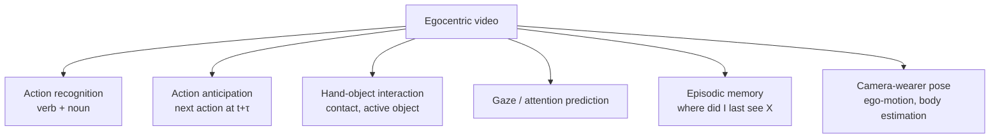
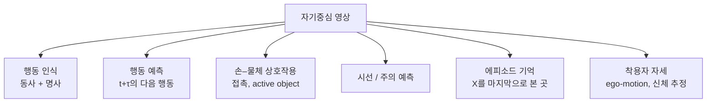

## English

Move the camera from the room to the head and the perception problem changes character. The body that was the object of study disappears from view; the hands and the manipulated object fill the frame; and camera motion — previously noise — becomes the strongest available signal about attention. **Egocentric perception is not third-person perception from a worse angle. It is a different observability regime.**

> [!info] Depth target
> State how the first-person viewpoint changes observability; distinguish the main egocentric task families and what each is scored on; explain why head motion is an attention proxy and where that breaks; and judge whether an egocentric benchmark result would survive on a helmet camera at a work site.

> [!note] Prerequisites
> [[04-robotics/video-action-understanding|20. Video Representation & Action Understanding]] · [[04-robotics/human-pose-gaze|21. Human Pose, Hands & Gaze]] · [[04-robotics/geometric-perception-calibration|3.5 Geometric Perception & Calibration]]

### 1. What changes when the camera moves to the head

| Property | Third-person | Egocentric |
|---|---|---|
| The actor's body | fully visible | **mostly invisible**; hands and forearms only |
| Camera motion | nuisance, to be stabilised | **signal** — where the head points is where attention is |
| Object scale | small, distant | large, near, frequently occluded by hands |
| Field of view | scene-level, stable | narrow, sweeping, objects enter and leave constantly |
| Temporal structure | activity observed from outside | activity experienced in sequence, with intent preceding contact |
| What is easy | who is doing what, where they are | what is being touched, what is being attended to |
| What is hard | fine hand–object detail | global localisation, the actor's own pose |

The consequence for intent work is direct: third-person video is good at *trajectory* and bad at *attention*; egocentric video is the reverse. Systems that need both usually need both cameras.

### 2. Task families

Two conventions worth knowing because they shape the labels:

- **Action = verb + noun.** Egocentric datasets typically factor the label ("cut / onion"), which makes the label space compositional and the long tail unavoidable. A model may be strong on verbs and weak on nouns; report both.
- **Active object.** Many objects are visible; one is being acted on. Identifying the *active* object is a distinct and often harder problem than detection, and it is the one that matters for intent.

### 3. Why head motion is an attention proxy — and where it fails

Large gaze shifts are executed by a coordinated eye-then-head movement, so head direction tracks the target of attention for substantial reorientations. This is why egocentric camera pose carries intent information even without an eye tracker.

It fails in three predictable places:

1. **Small glances.** Checking a mirror, a peripheral hazard, or a colleague's hands may involve eyes only. These are short, frequent, and often decision-relevant — exactly the events a head-only proxy misses.
2. **Sustained fixation with body motion.** Walking while looking ahead produces head motion driven by gait, not attention. Gait-frequency components must be removed before treating head motion as a signal.
3. **Habitual action.** Skilled workers execute familiar motions with reduced visual guidance. Expertise systematically weakens the attention–head coupling, which means a model trained on novices degrades on experts — the population you would deploy on.

### 4. Anticipation from the first person

The egocentric anticipation setting is the same formulation as [[04-robotics/video-action-understanding|20. §4]],

$$p\big(y_{t+\tau}\mid x_{1:t}\big),$$

but the observable evidence is different and, for short horizons, better. Hands move toward an object before contact; the head orients before the hands; gaze precedes the head. This gives a natural cue cascade with increasing lead time and decreasing reliability:

| Cue | Typical lead before action | Reliability |
|---|---|---|
| Gaze shift | longest | lowest (often unmeasurable) |
| Head orientation | long | moderate |
| Hand trajectory toward object | short | high |
| Contact | zero | certain, and too late |

**Designing an anticipation system is choosing a point on this cascade.** A system that only uses contact is a detector, not a predictor.

### 5. Benchmarks and what they encode

- **EPIC-KITCHENS** — unscripted kitchen activity, verb+noun labels, strong long-tail; the reference benchmark for fine-grained egocentric action and anticipation.
- **Ego4D** — a massive multi-site egocentric corpus (thousands of hours) with a benchmark suite spanning episodic memory, hands and objects, social interaction, and forecasting. Kristen Grauman led this effort, which is why the topic appears in [[04-robotics/index|CS 381V]]-style syllabi.

- **Ego-Exo4D** — the same skilled activity captured *simultaneously* from the wearer's view and from several third-person cameras, with expert commentary as language annotation. This is the dataset that makes the ego–exo correspondence learnable, which is why it matters for turning third-person demonstration video into a first-person policy. Its headline numbers differ between the CVPR 2024 paper and the expanded v2 manuscript — see Sources.

All three are daily-life or skill datasets. None contains PPE, industrial tools, exclusion zones, or safety-critical decisions. Treat a number from either as evidence that a method *can* work on egocentric video, not that it will work on a helmet camera.

### 6. The domain gap to field deployment

| Assumption in benchmarks | Field reality |
|---|---|
| head-mounted, stable rig | helmet-mounted, vibration, impacts |
| indoor, controlled lighting | outdoor, glare, dust, night work |
| bare hands | gloves — hand appearance and keypoint models degrade |
| familiar household objects | tools, fasteners, materials outside training vocabulary |
| single wearer, no consequence | multiple workers, safety consequence, privacy constraints |

The last row is not a technical detail. Egocentric recording of workers is human-subjects data with faces, conversations, and location traces in it. **IRB approval and a data-handling plan are prerequisites, not paperwork after the fact,** and approval timelines are measured in months.

### 7. Where this connects

- Third-person intent work — [[04-robotics/human-intent-prediction|23. Human Intent & Trajectory Prediction]] — shares the anticipation formulation but sees the body instead of the view.
- Shared autonomy and authority — [[04-robotics/hri-safety|11. Human–Robot Interaction & Safety]] — is what consumes an intent estimate.
- Demonstration collection — [[04-robotics/teleoperation-demonstration|12. Teleoperation & Demonstration Collection]] — increasingly uses head-mounted capture as the data source, making egocentric perception part of the imitation-learning pipeline rather than a separate topic.

### 8. Reading claims and evaluations

| Paper phrase | Check before accepting it |
|---|---|
| egocentric action recognition | verb and noun accuracy separately, and tail performance |
| anticipates the next action | anticipation time $\tau$, and whether frames after $t$ are excluded |
| attention-aware | eye tracking or head-pose proxy; was gait motion removed |
| hand–object interaction | active-object identification or mere detection |
| generalises across wearers | held-out *people*, or held-out clips from the same people |
| deployable | gloves, helmets, outdoor light, and whether consent and IRB are addressed |

### After reading

You should be able to:

- state three ways observability changes when the camera moves to the head;
- name the egocentric task families and the metric each uses;
- explain the gaze → head → hand → contact cue cascade and the lead-time/reliability trade;
- name the three regimes where head motion stops being an attention proxy;
- list the specific domain gaps between a daily-life egocentric benchmark and a work-site helmet camera.

### Self-check

1. Why is the camera wearer's own body pose hard to estimate, and what is usually done instead?
2. A model reaches high verb accuracy and low noun accuracy. What does that imply about its usefulness for intent?
3. Why might an anticipation model trained on novices underperform on experienced workers?
4. You must remove gait-induced head motion before using head direction as attention. What property of the signal makes this feasible?

> [!tip]- Answers
> 1. The body is out of frame; systems estimate ego-motion from the scene and infer coarse body state from hands, motion, and priors rather than observing it. 2. It recognises the manner of action but not the object — for intent, "reaching for *what*" is usually the decision-relevant half, so the estimate is weak where it matters. 3. Expertise reduces visual guidance, weakening the head–attention coupling the model learned. 4. Gait produces roughly periodic motion at a characteristic frequency, so it is separable in the frequency domain from aperiodic attentional reorientations.

### Sources

**Datasets — verified citations**

- K. Grauman, A. Westbury, E. Byrne, et al., "Ego4D: Around the World in 3,000 Hours of Egocentric Video," *CVPR 2022*, pp. 18973–18990. [arXiv:2110.07058](https://arxiv.org/abs/2110.07058) — 3,670 hours from 931 camera wearers at 74 locations in 9 countries, with audio, 3D meshes, eye gaze, stereo, and multi-camera video. The benchmarks split into past (episodic memory), present (hand-object, audio-visual social), and future (forecasting). The title says 3,000 hours; the abstract says 3,670. Cite it as "Grauman et al." — indexes disagree on the author count, giving anywhere from 85 to 106, so write "over 80 authors" rather than a precise number.
- D. Damen, H. Doughty, G. M. Farinella, et al., "Scaling Egocentric Vision: The EPIC-KITCHENS Dataset," *ECCV 2018*, pp. 753–771. [arXiv:1804.02748](https://arxiv.org/abs/1804.02748) — 32 participants in 4 cities, 55 hours, 39.6K action segments, unscripted and recorded every time the participant entered their own kitchen.
- D. Damen, H. Doughty, G. M. Farinella, et al., "Rescaling Egocentric Vision: Collection, Pipeline and Challenges for EPIC-KITCHENS-100," *IJCV*, vol. 130, pp. 33–55, 2022. [arXiv:2006.13256](https://arxiv.org/abs/2006.13256) — 100 hours, 90K actions, 45 environments, and an annotation pipeline yielding 54% more actions per minute. Cite whichever version matches the scale number you quote.
- K. Grauman, A. Westbury, L. Torresani, et al., "Ego-Exo4D: Understanding Skilled Human Activity from First- and Third-Person Perspectives," *CVPR 2024* (Oral). [arXiv:2311.18259](https://arxiv.org/abs/2311.18259) — simultaneous ego and multiple exo views of the same activity, skilled rather than undirected activity, and expert commentary as language annotation.

> [!warning] Ego-Exo4D has two sets of numbers
> The CVPR 2024 paper reports over 800 participants in 13 cities, 131 scene contexts, and 1,422
> hours. The expanded arXiv manuscript covering the v2 release reports 740 participants, 123
> scene contexts, and 1,286 hours. Neither is wrong; they describe different releases. State
> which version you took the number from.

**Egocentric video as a manipulation prior**

- D. Shan, J. Geng, M. Shu, and D. F. Fouhey, "Understanding Human Hands in Contact at Internet Scale," *CVPR 2020* (Oral) — introduces 100DOH (131 days of footage) and a detector predicting hand location, handedness, *contact state*, and the box of the object in contact. The de facto tool for mining contact events out of human video.
- S. Nair, A. Rajeswaran, V. Kumar, C. Finn, and A. Gupta, "R3M: A Universal Visual Representation for Robot Manipulation," *CoRL 2022*. [arXiv:2203.12601](https://arxiv.org/abs/2203.12601) — pretrains on Ego4D with time-contrastive learning and video-language alignment, then freezes the representation; a Franka learns real cluttered-apartment tasks from about 20 demonstrations.
- K. Shaw, S. Bahl, and D. Pathak, "VideoDex: Learning Dexterity from Internet Videos," *CoRL 2022*. [arXiv:2212.04498](https://arxiv.org/abs/2212.04498) — retargets human hand trajectories into a robot hand embodiment, transferring *action* priors rather than visual features. The clean contrast to R3M.

## 한국어

카메라를 방에서 머리로 옮기면 인지 문제의 성격이 바뀐다. 연구 대상이던 몸이 화면에서 사라지고, 손과 조작 대상이 프레임을 채우고, 이전에는 잡음이던 카메라 움직임이 **주의에 대한 가장 강한 신호**가 된다. **자기중심 인지는 나쁜 각도의 3인칭 인지가 아니다. 다른 관측 가능성 체제다.**

> [!info] 깊이 목표
> 1인칭 시점이 관측 가능성을 어떻게 바꾸는지 말한다; 주요 자기중심 과제군과 각각의 채점
> 기준을 구분한다; 머리 움직임이 주의의 대용인 이유와 그것이 깨지는 지점을 설명한다;
> 자기중심 벤치마크 결과가 현장 헬멧 카메라에서 살아남을지 판단한다.

> [!note] 선수 지식
> [[04-robotics/video-action-understanding|20. 비디오 표현과 행동 이해]] · [[04-robotics/human-pose-gaze|21. 사람 자세·손·시선]] · [[04-robotics/geometric-perception-calibration|3.5 Geometric Perception & Calibration]]

### 1. 카메라가 머리로 갈 때 바뀌는 것

| 성질 | 3인칭 | 자기중심 |
|---|---|---|
| 행위자의 몸 | 전부 보임 | **거의 안 보임**; 손과 팔뚝뿐 |
| 카메라 움직임 | 제거할 방해 요소 | **신호** — 머리가 향한 곳이 주의가 향한 곳 |
| 물체 스케일 | 작고 멀다 | 크고 가깝고 손에 자주 가려짐 |
| 시야 | 장면 수준, 안정 | 좁고 휩쓸림, 물체가 계속 들고 남 |
| 시간 구조 | 밖에서 관찰된 활동 | 순서대로 경험되는 활동, 의도가 접촉에 선행 |
| 쉬운 것 | 누가 무엇을 하는가, 어디 있는가 | 무엇을 만지는가, 무엇에 주의하는가 |
| 어려운 것 | 세밀한 손–물체 상호작용 | 전역 위치추정, 행위자 본인의 자세 |

의도 연구에 대한 귀결은 직접적이다: **3인칭 영상은 궤적에 강하고 주의에 약하다. 자기중심 영상은 그 반대다.** 둘 다 필요한 시스템은 대개 카메라도 둘 필요하다.

### 2. 과제군

레이블 구조를 좌우하므로 알아둘 관례 둘:

- **행동 = 동사 + 명사.** 자기중심 데이터셋은 레이블을 인수분해한다("자르다 / 양파"). 그래서 레이블 공간이 조합적이 되고 롱테일이 불가피하다. 동사에 강하고 명사에 약한 모델이 나올 수 있으니 **둘 다 보고하라.**
- **Active object.** 보이는 물체는 많고 실제로 작용받는 건 하나다. *능동* 물체를 식별하는 건 검출과 별개이고 대개 더 어려우며, **의도에 중요한 건 그쪽이다.**

### 3. 머리 움직임이 주의의 대용인 이유 — 그리고 실패 지점

큰 시선 이동은 눈–머리 협응으로 수행되므로, 상당한 재정향에서는 머리 방향이 주의 대상을 추종한다. 아이트래커 없이도 자기중심 카메라 자세가 의도 정보를 담는 이유다.

예측 가능한 세 곳에서 실패한다:

1. **작은 곁눈질.** 거울, 주변 위험, 동료의 손을 확인하는 건 눈만 움직일 수 있다. 짧고, 잦고, 결정에 관련된다 — 머리만 보는 대용이 놓치는 바로 그 사건들이다.
2. **몸이 움직이는 중의 지속 응시.** 앞을 보며 걸으면 머리 움직임이 주의가 아니라 보행에서 나온다. 머리 움직임을 신호로 쓰기 전에 **보행 주파수 성분을 제거해야 한다.**
3. **습관화된 동작.** 숙련 작업자는 익숙한 동작을 시각 안내를 줄인 채 수행한다. 숙련도가 주의–머리 결합을 체계적으로 약화시키므로, 초보로 학습한 모델은 숙련자에서 나빠진다 — **배포 대상이 바로 그 집단이다.**

### 4. 1인칭에서의 예측

자기중심 anticipation의 정식화는 [[04-robotics/video-action-understanding|20. §4]]와 같다,

$$p\big(y_{t+\tau}\mid x_{1:t}\big),$$

그러나 관측 가능한 증거가 다르고, 짧은 지평에서는 더 낫다. 손은 접촉 전에 물체로 향하고, 머리는 손보다 먼저 정향하고, 시선은 머리보다 앞선다. 여기서 선행 시간이 늘고 신뢰도가 줄어드는 자연스러운 단서 사슬이 나온다:

| 단서 | 행동 전 통상 선행 시간 | 신뢰도 |
|---|---|---|
| 시선 이동 | 가장 김 | 가장 낮음 (측정 불가한 경우 많음) |
| 머리 정향 | 김 | 중간 |
| 물체를 향한 손 궤적 | 짧음 | 높음 |
| 접촉 | 0 | 확실하지만 이미 늦음 |

**예측 시스템을 설계한다는 건 이 사슬 위의 한 점을 고르는 것이다.** 접촉만 쓰는 시스템은 예측기가 아니라 검출기다.

### 5. 벤치마크와 그것이 담은 것

- **EPIC-KITCHENS** — 대본 없는 주방 활동, 동사+명사 레이블, 강한 롱테일. 세밀한 자기중심 행동·예측의 기준 벤치마크.
- **Ego4D** — 다지역 대규모 자기중심 코퍼스(수천 시간)에 에피소드 기억·손과 물체·사회적 상호작용·예측을 아우르는 벤치마크 묶음. Kristen Grauman이 주도했고, 그래서 [[04-robotics/index|CS 381V]] 계열 강의계획서에 이 주제가 등장한다.

- **Ego-Exo4D** — 같은 숙련 활동을 착용자 시점과 여러 3인칭 카메라에서 *동시에* 촬영하고, 전문가 해설을 언어 주석으로 붙였다. ego–exo 대응을 학습 가능하게 만드는 데이터셋이고, 3인칭 시연 영상을 1인칭 정책으로 바꾸는 문제에서 중요한 이유가 그것이다. 대표 숫자가 CVPR 2024 논문과 확장 v2 원고에서 다르다 — 출처를 보라.

셋 다 일상생활 또는 숙련 활동 데이터셋이다. **PPE도, 산업 공구도, 통제구역도, 안전 필수 결정도 없다.** 여기서 나온 숫자는 그 방법이 자기중심 영상에서 *작동할 수 있다*는 증거지 헬멧 카메라에서 작동한다는 증거가 아니다.

### 6. 현장 배포까지의 도메인 격차

| 벤치마크의 가정 | 현장 현실 |
|---|---|
| 머리 장착, 안정된 리그 | 헬멧 장착, 진동, 충격 |
| 실내, 통제된 조명 | 실외, 역광, 먼지, 야간 작업 |
| 맨손 | **장갑** — 손 외형·키포인트 모델이 무너짐 |
| 익숙한 생활 물체 | 학습 어휘 밖의 공구·체결재·자재 |
| 착용자 1명, 결과 없음 | 다수 작업자, 안전 결과, 프라이버시 제약 |

마지막 행은 기술 세부가 아니다. 작업자의 자기중심 녹화는 얼굴·대화·위치 궤적이 들어간 **인간 대상 데이터**다. **IRB 승인과 데이터 처리 계획은 사후 서류가 아니라 선행 조건이고**, 승인 기간은 개월 단위다.

### 7. 연결되는 곳

- 3인칭 의도 연구 — [[04-robotics/human-intent-prediction|23. 인간 의도·궤적 예측]] — 는 anticipation 정식화를 공유하되 시야 대신 몸을 본다.
- 공유 자율성과 권한 — [[04-robotics/hri-safety|11. Human–Robot Interaction & Safety]] — 이 의도 추정치를 소비하는 쪽이다.
- 시연 수집 — [[04-robotics/teleoperation-demonstration|12. Teleoperation & Demonstration Collection]] — 이 점점 머리 장착 캡처를 데이터원으로 쓰면서, 자기중심 인지가 별개 주제가 아니라 모방학습 파이프라인의 일부가 되고 있다.

### 8. 주장과 평가 읽기

| 논문 문구 | 받아들이기 전에 확인할 것 |
|---|---|
| 자기중심 행동 인식 | 동사·명사 정확도 각각, 그리고 롱테일 성능 |
| 다음 행동을 예측한다 | 예측 시점 $\tau$, 그리고 $t$ 이후 프레임이 배제됐는가 |
| 주의 인지 | 아이트래킹인가 머리 자세 대용인가; 보행 성분을 제거했는가 |
| 손–물체 상호작용 | active object 식별인가 단순 검출인가 |
| 착용자 간 일반화 | held-out **사람**인가, 같은 사람의 held-out 클립인가 |
| 배포 가능 | 장갑·헬멧·실외 조명, 그리고 동의와 IRB를 다뤘는가 |

### 읽은 뒤

다음을 할 수 있어야 한다:

- 카메라가 머리로 갈 때 관측 가능성이 바뀌는 방식 셋을 말한다;
- 자기중심 과제군과 각 지표를 든다;
- 시선 → 머리 → 손 → 접촉 단서 사슬과 선행 시간/신뢰도 교환을 설명한다;
- 머리 움직임이 주의 대용이기를 멈추는 세 영역을 든다;
- 일상 자기중심 벤치마크와 현장 헬멧 카메라 사이의 구체적 도메인 격차를 나열한다.

### 자가 점검

1. 착용자 본인의 신체 자세 추정이 어려운 이유는? 대신 보통 무엇을 하나?
2. 어떤 모델이 동사 정확도는 높고 명사 정확도는 낮다. 의도 활용 측면에서 무엇을 함의하나?
3. 초보로 학습한 예측 모델이 숙련 작업자에서 나빠질 수 있는 이유는?
4. 머리 방향을 주의로 쓰기 전에 보행 유발 움직임을 제거해야 한다. 이를 가능하게 하는 신호의 성질은?

> [!tip]- 정답
> 1. 몸이 프레임 밖이다; 장면에서 ego-motion을 추정하고 손·움직임·사전지식으로 거친 신체 상태를 추론한다 — 관측이 아니라 추론이다. 2. 행동의 방식은 알아도 대상을 모른다는 뜻이다. 의도에서는 "*무엇*을 향해 뻗는가"가 대개 결정에 관련된 절반이므로, 중요한 곳에서 약한 추정치다. 3. 숙련도가 시각 안내를 줄여, 모델이 학습한 머리–주의 결합을 약화시킨다. 4. 보행은 특정 주파수의 거의 주기적인 움직임을 만들므로, 비주기적인 주의 재정향과 주파수 영역에서 분리 가능하다.

### 출처

**데이터셋 — 검증된 인용**

- K. Grauman, A. Westbury, E. Byrne, et al., "Ego4D: Around the World in 3,000 Hours of Egocentric Video," *CVPR 2022*, pp. 18973–18990. [arXiv:2110.07058](https://arxiv.org/abs/2110.07058) — 9개국 74개 장소, 촬영자 931명, 3,670시간. 오디오·3D 메시·시선·스테레오·다중 카메라를 포함한다. 벤치마크는 과거(episodic memory), 현재(손-물체, 시청각 사회적 상호작용), 미래(forecasting)로 나뉜다. 제목은 3,000시간, 초록은 3,670시간이다. "Grauman et al."로 인용하라. 저자 수는 색인마다 85명에서 106명까지 엇갈리므로 정확한 숫자 대신 "80명 이상"이라고 써라.
- D. Damen, H. Doughty, G. M. Farinella, et al., "Scaling Egocentric Vision: The EPIC-KITCHENS Dataset," *ECCV 2018*, pp. 753–771. [arXiv:1804.02748](https://arxiv.org/abs/1804.02748) — 4개 도시 32명, 55시간, 행동 구간 39.6K. 대본 없이, 참가자가 자기 부엌에 들어갈 때마다 녹화했다.
- D. Damen, H. Doughty, G. M. Farinella, et al., "Rescaling Egocentric Vision: Collection, Pipeline and Challenges for EPIC-KITCHENS-100," *IJCV*, vol. 130, pp. 33–55, 2022. [arXiv:2006.13256](https://arxiv.org/abs/2006.13256) — 100시간, 행동 90K, 환경 45개, 그리고 분당 행동 수를 54% 늘린 새 주석 파이프라인. 인용하는 규모 숫자에 맞는 판본을 인용하라.
- K. Grauman, A. Westbury, L. Torresani, et al., "Ego-Exo4D: Understanding Skilled Human Activity from First- and Third-Person Perspectives," *CVPR 2024* (Oral). [arXiv:2311.18259](https://arxiv.org/abs/2311.18259) — 같은 활동의 1인칭과 다수 3인칭 시점을 동시 촬영했고, 방향 없는 일상이 아니라 숙련된 활동을 다루며, 전문가 해설을 언어 주석으로 붙였다.

> [!warning] Ego-Exo4D의 숫자는 두 벌이다
> CVPR 2024 논문은 13개 도시 800명 이상, 장면 맥락 131개, 1,422시간을 보고한다. v2 릴리스를
> 다루는 확장 arXiv 원고는 740명, 123개, 1,286시간을 보고한다. 어느 쪽도 틀리지 않았고 서로
> 다른 릴리스를 기술한 것이다. 어느 판본에서 가져온 숫자인지 밝혀라.

**조작을 위한 사전지식으로서의 1인칭 비디오**

- D. Shan, J. Geng, M. Shu, and D. F. Fouhey, "Understanding Human Hands in Contact at Internet Scale," *CVPR 2020* (Oral) — 100DOH(영상 131일치)를 내놓고, 손 위치·좌우·*접촉 상태*·접촉 중인 물체 상자를 예측하는 검출기를 함께 공개했다. 사람 비디오에서 접촉 사건을 캐내는 사실상의 표준 도구다.
- S. Nair, A. Rajeswaran, V. Kumar, C. Finn, and A. Gupta, "R3M: A Universal Visual Representation for Robot Manipulation," *CoRL 2022*. [arXiv:2203.12601](https://arxiv.org/abs/2203.12601) — Ego4D에서 시간 대조 학습과 비디오-언어 정렬로 사전학습한 뒤 표현을 동결한다. Franka가 어질러진 실제 아파트 과제를 시연 20개 남짓으로 학습한다.
- K. Shaw, S. Bahl, and D. Pathak, "VideoDex: Learning Dexterity from Internet Videos," *CoRL 2022*. [arXiv:2212.04498](https://arxiv.org/abs/2212.04498) — 사람 손 궤적을 로봇 손 신체로 재타깃해서, 시각 특징이 아니라 *행동* 사전지식을 옮긴다. R3M과 깔끔하게 대비된다.
