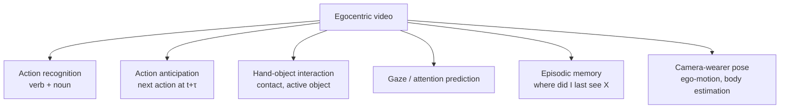
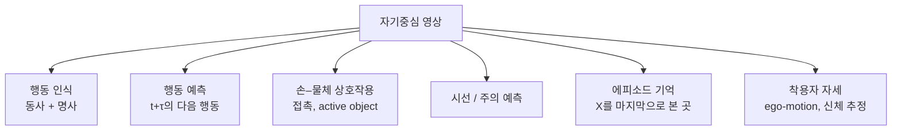

## English

*Group J. Stands on [[04-robotics/geometric-perception-calibration|3.5]], [[04-robotics/human-pose-gaze|21. Pose & Gaze]] and [[04-robotics/video-action-understanding|20. Video]].
Moving the camera to the head changes what is observable at all — it is a different regime, not a bad camera angle.*

Move the camera from the room to the head and the perception problem changes character. The body that was the object of study disappears from view; the hands and the manipulated object fill the frame; and camera motion — previously noise — becomes the strongest available signal about attention. **Egocentric perception is not third-person perception from a worse angle. It is a different observability regime.**

> [!info] Depth target
> State how the first-person viewpoint changes observability; distinguish the main egocentric task families; explain why head motion is an attention proxy and where that breaks; and judge whether an egocentric benchmark result would survive on a helmet camera at a work site.

> [!note] Prerequisites
> [[04-robotics/video-action-understanding|20. Video Representation & Action Understanding]] · [[04-robotics/human-pose-gaze|21. Human Pose, Hands & Gaze]] · [[04-robotics/geometric-perception-calibration|3.5 Geometric Perception & Calibration]]

> [!note] First pass · 처음이라면
> Read the running object and the six derivations on it, then §1 — first-person is a different observability regime, not a worse camera angle — then §3 on head motion as an attention proxy and where it breaks, then §8. §5 and §6 matter when you are judging whether a benchmark result survives a helmet camera.

### Running object · 이 페이지의 대상

A head-mounted camera is not a plant from [[02-foundations/lab-plants|0.6 Lab Plants]], so this page freezes its own object — **E1**, one worker's helmet camera on one task — and never changes its numbers afterwards.

| quantity | symbol | value |
|---|---|---:|
| image size | $W \times H$ | $1920 \times 1080$ px |
| focal length in pixels, both axes | $f$ | 960 px |
| exposure | $t_e$ | $1/60$ s |
| frame rate | | 30 fps |
| mount offset from the eye's projection centre — right, forward, up | $b$ | $(0.030,\ 0.070,\ 0.050)$ m |
| working distance to the bench | $D$ | 0.80 m |
| the feature on the bench | $d$ | a 6 mm bolt head |
| eye height, standing | $h$ | 1.65 m |
| head pitch below horizontal, for the floor case | $\theta$ | $40^\circ$ |
| head angular rates, from §3 | $\omega$ | 90 °/s walking, 300 °/s a moderate look-around |

Distortion is taken as zero and the pixels as square, so the pinhole relation $u = f\,X/Z$ holds exactly and every derivation below is arithmetic. The two angular rates are the ones §3 already cites; nothing on this page introduces a new measured value.

### Homework diagram · 과제가 그릴 그림

Three panels, drawn once. The problem set asks for the same three with a different camera.

1. **The camera cone, from the side.** The projection centre, the optical axis pitched $\theta = 40^\circ$ below horizontal, and the two rays at $\pm\mathrm{VFOV}/2$ about it. Draw the ground line at $h = 1.65$ m below the centre and mark where the two rays meet it: those are the near and far edges of the ground footprint. Then draw a third ray at the horizontal and label it — everything above it never meets the floor at all.
2. **The bench, fronto-parallel.** The image rectangle at $D = 0.80$ m with its width and height in metres, one pixel's footprint in millimetres, and the 6 mm bolt head drawn to scale inside it. Next to the bolt head, draw the blur streak that $\omega = 90$ °/s produces in one exposure, to the same scale.
3. **The eye and the camera, from above.** Both projection centres, separated by the offset $b$; the bench target at $0.80$ m; and the two rays to it from eye and camera, with the angle between them marked. This is the panel that says what "where the head is pointing" is actually measuring.

### Worked on E1 · E1로 한 번 끝까지

**1. Field of view from the focal length.**

> [!info] Definition — field of view
> An **angle**, and in fact three of them — horizontal, vertical, diagonal — each a joint property
> of the sensor extent and the focal length, never of either alone. Conditions: a **rectilinear**
> (pinhole) projection; the extent measured across the **full sensor** in that direction; and the
> focal length and the extent in the **same units**, which is why $f$ in pixels is the convenient
> form.
> $$\mathrm{FOV}_s = 2\arctan\!\frac{s}{2f}$$
> where $s$ is the sensor extent in that direction (in pixels, here) and $f$ the focal length in
> the same units.
> **Example.** E1: $\mathrm{HFOV} = 2\arctan(960/960) = 90.00^\circ$,
> $\mathrm{VFOV} = 2\arctan(540/960) = 58.72^\circ$, and with a diagonal of
> $\sqrt{1920^2 + 1080^2} = 2202.9$ px, $\mathrm{DFOV} = 2\arctan(1101.5/960) = 97.85^\circ$.
> **Non-example.** The diagonal field of view is *not* the quadrature sum of the other two.
> $\sqrt{90^2 + 58.72^2} = 107.5^\circ$, which is nearly ten degrees too large, because angles do
> not combine that way under a tangent projection — pixels do, and then you take one arctangent.
> **Why it matters.** Spec sheets give a field of view and every calculation below needs $f$, so
> converting between them, in the right direction and at the right sensor extent, is step zero of
> reading any camera claim.

**2. How much angle a pixel covers, and why §3's number is the frame average.** The pixel angle is defined at [[04-robotics/human-pose-gaze|21. Pose & Gaze, Worked step 5]]: on axis one pixel subtends $1/f$ radians, so on E1 that is $1/960 = 1.042$ mrad $= 0.0597^\circ$, i.e. **16.76 px per degree**. Off axis a rectilinear projection stretches angle, and differentiating $u = f\tan\phi$ gives $\mathrm{d}u/\mathrm{d}\phi = f\sec^2\phi$, so

$$\text{px per degree at angle } \phi = \frac{\pi}{180}\,f\,\sec^{2}\phi$$

because the same angular step covers more pixels the further off axis it lands. At the horizontal frame edge $\phi = 45^\circ$, $\sec^2\phi = 2$ and the rate doubles to **33.51 px/deg**. §3's worked example uses $1920/90 = 21.33$ px/deg, which is the **frame average** — correct as an average, and between the two extremes, as it must be. Keep all three straight: a feature's pixel width depends on *where in the frame it sits*, by a factor of two across this lens.

**3. The bench footprint and the ground sampling distance.**

> [!info] Definition — ground sampling distance
> A **length in the scene per pixel**, in millimetres per pixel — the inverse of a resolution, not
> an angle. Conditions: a pinhole camera; a plane **perpendicular to the optical axis** at
> distance $D$; the reading taken **on axis**, since §2 just showed the rate varies across the
> frame; and $f$ in pixels.
> $$\mathrm{GSD} = \frac{D}{f}, \qquad \text{footprint width} = D\,\frac{W}{f}$$
> where $D$ is the distance to the plane, $f$ the focal length in pixels and $W$ the image width
> in pixels.
> **Example.** E1 at the bench: $\mathrm{GSD} = 0.80/960 = 0.833$ mm/px, footprint
> $0.80 \times 1920/960 = 1.60$ m wide by $0.80 \times 1080/960 = 0.90$ m high, and the 6 mm bolt
> head spans $6/0.833 = 7.2$ px.
> **Non-example.** GSD is not the smallest feature you can recognise. Seven pixels clears the
> sampling limit and is still below what most detectors use, and step 5's blur can erase the bolt
> head entirely while the GSD is unchanged, because GSD knows nothing about time.
> **Why it matters.** It converts "the camera sees the bench" into "the camera puts seven pixels on
> the fastener", which is the form in which the claim is either true or false.

The mount offset has a first consequence here, and it is the cheapest one. The bench is $0.80$ m from the worker's *eye*, but the camera sits $0.070$ m further forward, so its distance to the same bench is $0.730$ m. Every number in the box shrinks by that ratio: the footprint becomes $1.46 \times 0.82$ m and the GSD $0.760$ mm/px, an **8.75%** difference. Small, and it is the difference between a footprint computed for the camera and one computed for the person — which are not the same object, and papers routinely write the second and measure the first.

**4. The floor footprint, which is not a fixed quantity at all.** Tilt the same cone down. With the eye at $h = 1.65$ m and the optical axis $\theta$ below horizontal, the near and far edges of the visible floor lie at horizontal distances

$$d_{\mathrm{near}} = \frac{h}{\tan\!\big(\theta + \mathrm{VFOV}/2\big)}, \qquad d_{\mathrm{far}} = \frac{h}{\tan\!\big(\theta - \mathrm{VFOV}/2\big)}$$

because the ray that leaves at a given depression angle drops $h$ over exactly that horizontal run. With $\mathrm{VFOV}/2 = 29.36^\circ$:

| head pitch $\theta$ | near edge | far edge |
|---|---:|---:|
| $40^\circ$ | 0.62 m | 8.78 m |
| $35^\circ$ | 0.79 m | 16.70 m |
| $30^\circ$ | 0.98 m | 147.2 m |
| $29.36^\circ$ | 1.00 m | the horizon |

**Ten degrees of head pitch move the far edge from nine metres to a hundred and fifty**, and at $\theta = \mathrm{VFOV}/2$ the top of the frame reaches the horizon and the footprint stops being finite. The near edge, meanwhile, barely moves. So a sentence like "the helmet camera covers the work area out to $9$ m" is not a camera specification; it is a claim about where the worker's head happened to be pointing, and the worker does not hold it there. Any egocentric system that reasons about ground coverage has to condition on pitch or measure it.

**5. Motion blur, and what it costs in light.**

> [!info] Definition — motion blur
> A **length in pixels** (equivalently an angle): how far a scene point's image travels across the
> sensor while the shutter is open. Four conditions decide it. The rate is the **angular** rate of
> the camera relative to the point. The time is the **exposure**, not the frame period. The answer
> is read **at a place in the frame**, because §2 showed the conversion varies. And a pure
> **rotation** blurs everything by the same angle regardless of depth, which is what makes head
> turning tractable to compute, whereas translation blurs near things more.
> $$\beta = \omega\,t_e \times \big(\text{px per degree at that point}\big)$$
> where $\omega$ is the angular rate in deg/s, $t_e$ the exposure in seconds and $\beta$ the smear
> in pixels.
> **Example.** E1 walking: $\beta = 90 \times (1/60) = 1.50^\circ$, which on axis is
> $1.50 \times 16.76 = 25.1$ px.
> **Non-example.** Frame rate is not in the formula. Going from 30 fps to 120 fps with the exposure
> unchanged gives four times as many *equally blurred* frames — more data, identical evidence. Nor
> is blur the same as being out of focus: it is directional, aligned with the motion, and it
> shortens only when the shutter does.
> **Why it matters.** It decides whether the feature carrying the label still exists in the frames
> that matter, which are exactly the frames where the wearer is turning.

Run both rates of E1 through it, at all three positions in the frame:

| $\omega$ | smear in degrees | on axis | frame average | at the frame edge |
|---|---:|---:|---:|---:|
| 90 °/s, walking | $1.50^\circ$ | 25.1 px | 32.0 px | 50.3 px |
| 300 °/s, look-around | $5.00^\circ$ | 83.8 px | 106.7 px | 167.6 px |

The frame-average column is §3's pair of numbers, $32$ and $107$ px, now placed between the two extremes they average. Set them against the bolt head's $7.2$ px: walking already smears it across **3.5 times its own width**, and a look-around across **11.6 times**. The feature is not degraded, it is gone.

Ask what it would cost to keep it. Holding the smear to one pixel on axis at $300$ °/s needs

$$t_e \le \frac{1}{\omega \times 16.76} = \frac{1}{300 \times 16.76} = 199\ \mu\mathrm{s}$$

which is $16\,667/199 = 83.8$ times shorter than E1's exposure, or $\log_2 83.8 = 6.4$ **stops** of light. Nobody finds six and a half stops on a construction site at dusk, and buying them with sensor gain buys the noise with them. **The sharp frames and the informative frames are the same frames, and the exposure that gets you one loses the other** — which is a hardware conclusion a benchmark accuracy can never reach.

**6. Parallax, and the quiet assumption in "the camera sees what the wearer sees".**

> [!info] Definition — parallax from a mount offset
> An **angle**: the difference in direction to one scene point as seen from two displaced
> projection centres. It is a **geometric** error, present under perfect calibration, and it falls
> off as $1/D$. Conditions: two projection centres separated by a baseline $b$; only the component
> of $b$ **perpendicular** to the viewing direction produces an angle, since the along-axis
> component changes range rather than direction to first order; and the point must be at a finite,
> known distance, because the angle is a function of that distance.
> $$\theta_{\parallel} \approx \frac{b_{\perp}}{D}, \qquad b_{\perp} = \sqrt{b_x^2 + b_z^2}\ \ \text{for a target straight ahead}$$
> where $b_\perp$ is the perpendicular baseline, $D$ the distance to the point and
> $\theta_\parallel$ the angle in radians.
> **Example.** E1's perpendicular baseline is $\sqrt{0.030^2 + 0.050^2} = 0.0583$ m. The
> small-angle value at the bench is $0.0583/0.80 = 4.18^\circ$; carrying the $0.070$ m forward
> offset properly gives the exact angle $4.57^\circ$, which is $4.57 \times 16.76 = 76.5$ px on
> axis.
> **Non-example.** It is not a calibration error that a fixed rotation removes. Rotate the camera
> by $4.57^\circ$ to null it at the bench, and at $5$ m — where the correct angle is $0.68^\circ$ —
> you are left with $3.89^\circ$, about $65$ px, in the opposite sense. A distance-dependent error
> cannot be cancelled by a distance-independent correction.
> **Why it matters.** It is the gap between where the camera points and where the eye points, it
> exists before any eye-in-head offset is considered, and every "head direction as attention"
> claim assumes it away without saying so.

Put it beside the thing §3 is actually claiming. At the bench, the mount alone displaces the ray by $4.57^\circ$. That is the same order as the angular separation between adjacent tools on a bench, and it is the *easy* half of the problem: it is deterministic, it is measurable, and a system that models the offset and the working distance can remove it. The residual **eye-in-head** offset — the part §3 calls the small glance, and which [[04-robotics/human-pose-gaze|21. Pose & Gaze §4]] shows nobody has measured at manipulation range — is neither deterministic nor observable from the camera. **Report the mount offset and the assumed working distance whenever you report head direction as attention.** A paper that gives neither has published a ray of unknown origin.

### 1. What changes when the camera moves to the head

| Property | Third-person | Egocentric |
|---|---|---|
| The actor's body | fully visible | **mostly invisible**; hands and forearms only |
| Camera motion | nuisance, to be stabilised | **signal** — where the head points is where attention is |
| Object scale | small, distant | large, near, frequently occluded by hands |
| Field of view | scene-level, stable | narrow, sweeping, objects enter and leave constantly |
| Temporal structure | activity observed from outside | activity experienced in sequence, with intent preceding contact |
| What is easy | who is doing what, where they are | what is being touched, what is being attended to |
| What is hard | fine hand–object detail | global localisation, the actor's own pose |

The consequence for intent work is direct: third-person video is good at *trajectory* and bad at *attention*; egocentric video is the reverse. Systems that need both usually need both cameras.

### 2. Task families

Two conventions worth knowing because they shape the labels:

- **Action = verb + noun.** Egocentric datasets typically factor the label ("cut / onion"), which makes the label space compositional and the long tail unavoidable. A model may be strong on verbs and weak on nouns; report both.
- **Active object.** Many objects are visible; one is being acted on. Identifying the *active* object is a distinct and often harder problem than detection, and it is the one that matters for intent.

### 3. Why head motion is an attention proxy — and where it fails

Large gaze shifts are executed by a coordinated eye-then-head movement, so head direction tracks the target of attention for substantial reorientations. This is why egocentric camera pose carries intent information even without an eye tracker.

It fails in three predictable places:

1. **Small glances.** Checking a mirror, a peripheral hazard, or a colleague's hands may involve eyes only. These are short, frequent, and often decision-relevant — exactly the events a head-only proxy misses.
2. **Sustained fixation with body motion.** Walking while looking ahead produces head motion driven by gait, not attention. Gait-frequency components must be removed before treating head motion as a signal. Because walking repeats at a steady step rate, this is a filtering job: suppress that frequency band ([[02-foundations/signal-processing|signal processing §3–4]]).
3. **Habitual action.** Skilled workers execute familiar motions with reduced visual guidance. Expertise systematically weakens the attention–head coupling, which means a model trained on novices degrades on experts — the population you would deploy on.

> [!example] Worked example · 계산 예제
> **Putting a number on the head-motion problem.** A 1920-pixel image over a 90° horizontal
> field of view gives $1920/90 = 21.3$ pixels per degree. Grossman et al. (1988) found the group-median
> peak head velocity while walking or running did not exceed 90 °/s, while vigorous voluntary head rotation reached a median peak of about 780 °/s; a moderate look-around of 300 °/s sits between. At a 1/60 s exposure, 90 °/s smears the image by $90 \times 0.0167 = 1.5° = 32$
> pixels; at 300 °/s it is $5.0° = 107$ pixels. A hand at 0.5 m spans roughly 180 pixels, so a
> turn of the head blurs it across a fifth to more than half its own width.
>
> **The same motion in the time domain.** At 90 °/s a 90° field of view replaces itself
> completely in 1.0 s — 30 frames at 30 fps. At 300 °/s it is 0.3 s, or 9 frames. Any method that assumes
> half a second of overlapping context has, during a look-around, none.
>
> The $21.3$ px/deg used here is the **frame average**; the worked object above splits it into
> $16.8$ px/deg on axis and $33.5$ px/deg at the frame edge, so the same smear is $25$ px in the
> middle of the image and $50$ px at its edge.
>
> **The reading this gives you.** This is why egocentric benchmarks and deployed headsets
> disagree so reliably: benchmark clips are dominated by the low-velocity majority, while the
> moments a system is *for* — the wearer turning to look at what they are about to do — are
> exactly the high-velocity minority. When a paper reports a single accuracy over a dataset,
> ask whether it reports anything conditioned on head velocity. Most do not, and that omission is
> the gap between the table and the helmet.

### 4. Anticipation from the first person

The egocentric anticipation setting is the same formulation as [[04-robotics/video-action-understanding|20. §4]] — in other words, predict the label $\tau$ seconds ahead from everything observed so far —

$$p\big(y_{t+\tau}\mid x_{1:t}\big),$$

but the observable evidence is different and, for short horizons, better. Hands move toward an object before contact; the head orients before the hands; gaze precedes the head. This gives a natural cue cascade with increasing lead time and decreasing reliability:

| Cue | Typical lead before action | Reliability |
|---|---|---|
| Gaze shift | longest | lowest (often unmeasurable without an eye tracker; see §3) |
| Head orientation | long | moderate |
| Hand trajectory toward object | short | high |
| Contact | zero | certain, and too late |

**Designing an anticipation system is choosing a point on this cascade.** A system that only uses contact is a detector, not a predictor.

### 5. Benchmarks and what they encode

- **EPIC-KITCHENS** — unscripted kitchen activity, verb+noun labels, strong long-tail; the reference benchmark for fine-grained egocentric action and anticipation.
- **Ego4D** — a massive multi-site egocentric corpus (thousands of hours) with a benchmark suite spanning episodic memory, hands and objects, social interaction, and forecasting. Kristen Grauman led this effort, which is why the topic appears in [[04-robotics/index|CS 381V]]-style syllabi.

- **Ego-Exo4D** — the same skilled activity captured *simultaneously* from the wearer's view and from several third-person cameras, with expert commentary as language annotation. This is the dataset that makes the ego–exo correspondence learnable, which is why it matters for turning third-person demonstration video into a first-person policy. Its headline numbers differ between the first arXiv preprint and the CVPR 2024 paper — see Sources.

All three are daily-life or skill datasets. None contains PPE (personal protective equipment such as hard hats and gloves), industrial tools, exclusion zones, or safety-critical decisions. Treat a number from either as evidence that a method *can* work on egocentric video, not that it will work on a helmet camera.

### 6. The domain gap to field deployment

| Assumption in benchmarks | Field reality |
|---|---|
| head-mounted, stable rig | helmet-mounted, vibration, impacts |
| indoor, controlled lighting | outdoor, glare, dust, night work |
| bare hands | gloves — hand appearance and keypoint models degrade |
| familiar household objects | tools, fasteners, materials outside training vocabulary |
| single wearer, no consequence | multiple workers, safety consequence, privacy constraints |

The last row is not a technical detail. Egocentric recording of workers is human-subjects data with faces, conversations, and location traces in it. **IRB approval and a data-handling plan are prerequisites, not paperwork after the fact,** and approval timelines are measured in months.

### 7. Where this connects

- Third-person intent work — [[04-robotics/human-intent-prediction|23. Human Intent & Trajectory Prediction]] — shares the anticipation formulation but sees the body instead of the view.
- Shared autonomy and authority — [[04-robotics/hri-safety|11. Human–Robot Interaction & Safety]] — is what consumes an intent estimate.
- Demonstration collection — [[04-robotics/teleoperation-demonstration|12. Teleoperation & Demonstration Collection]] — increasingly uses head-mounted capture as the data source, making egocentric perception part of the imitation-learning pipeline rather than a separate topic.

### 8. Reading claims and evaluations

| Paper phrase | Check before accepting it |
|---|---|
| egocentric action recognition | verb and noun accuracy separately, and tail performance |
| anticipates the next action | anticipation time $\tau$, and whether frames after $t$ are excluded |
| attention-aware | eye tracking or head-pose proxy; was gait motion removed |
| hand–object interaction | active-object identification or mere detection |
| generalises across wearers | held-out *people*, or held-out clips from the same people |
| deployable | gloves, helmets, outdoor light, and whether consent and IRB are addressed |

### After reading

You should be able to:

- state three ways observability changes when the camera moves to the head;
- turn a head camera's focal length, image size, exposure and mount offset into its field of view, its ground footprint, its blur at a stated head rate, and the parallax between camera and eye;
- name the egocentric task families and what each asks the model to produce;
- explain the gaze → head → hand → contact cue cascade and the lead-time/reliability trade;
- name the three regimes where head motion stops being an attention proxy;
- list the specific domain gaps between a daily-life egocentric benchmark and a work-site helmet camera.

> [!tip] Going deeper · 더 깊이
> No textbook exists; the datasets are the literature, because each one defined the tasks that followed it. Read EPIC-KITCHENS (ECCV 2018) first — it is small enough to understand completely, and it establishes what unscripted first-person recording even means. Then Ego4D (CVPR 2022) for the benchmark suite that split the field into past, present and future tasks. Only then go to a method paper, and read it against the specific benchmark it reports, because in this field the benchmark carries most of the claim.

### Self-check

1. Why is the camera wearer's own body pose hard to estimate, and what is usually done instead?
2. A model reaches high verb accuracy and low noun accuracy. What does that imply about its usefulness for intent?
3. Why might an anticipation model trained on novices underperform on experienced workers?
4. You must remove gait-induced head motion before using head direction as attention. What property of the signal makes this feasible?

> [!tip]- Answers
> 1. The body is out of frame; systems estimate ego-motion from the scene and infer coarse body state from hands, motion, and priors rather than observing it. 2. It recognises the manner of action but not the object — for intent, "reaching for *what*" is usually the decision-relevant half, so the estimate is weak where it matters. 3. Expertise reduces visual guidance, weakening the head–attention coupling the model learned. 4. Gait produces roughly periodic motion at a characteristic frequency, so it is separable in the frequency domain from aperiodic attentional reorientations.

**Worked: three claim-readings this page licenses.** Hands-and-object filling the frame transfers from EPIC-KITCHENS to a helmet; kitchen objects do not. Ego4D's title says 3,000 hours and the abstract 3,670 — cite the part you used; the *split* (past/present/future) is the claim that licenses a deployment. Expertise is the regime where head direction stops being gaze.

### Problem set · 과제

Tier B. Using **E1** from the running object above, and this page only. A vendor proposes a second helmet camera, **E2**: $1280 \times 720$ px, $f = 1200$ px, exposure $t_e = 1/120$ s, mount offset $(0.000,\ 0.090,\ 0.060)$ m from the eye, and a working distance of $1.20$ m. Everything else — the worker, the bolt head, the head rates — is E1's.

1. **Draw.** Redraw all three homework panels for **E2**, with E1's outlines left on the page underneath so the two can be compared. In panel 1 use the same eye height and a head pitch of $40^\circ$. In panel 2 draw the blur streak for $\omega = 200$ °/s, a rate between the two E1 uses. In panel 3, note that E2's offset has no lateral component and say what that does to the panel.
2. **Derive.** For **E2**: (a) horizontal and vertical field of view; (b) the on-axis and frame-average pixels per degree; (c) the footprint and GSD at $1.20$ m, and the bolt head's width in pixels; (d) the blur in pixels on axis at $200$ °/s, and its ratio to the bolt head; (e) the exposure that would hold that blur to one pixel on axis, and the light cost in stops; (f) the parallax angle and its width in pixels at the working distance.
3. **Interpret.** E2 is sold as "the higher-resolution option: the bolt head is 6 pixels instead of E1's 7.2, at a longer working distance, with half the exposure." Using your own numbers, say which of E2's advantages survive a $200$ °/s head turn, which of E1's problems E2 has made worse rather than better, and what single number you would require before believing either camera can identify an active object during a reorientation.

> [!tip]- Solutions
> 1. E2's cone must be drawn narrower than E1's in both directions — the sensor shrank and the focal length grew, so both fields of view fall. Panel 3's two rays become coplanar with the vertical, because with $b_x = 0$ the whole offset lies in the sagittal plane, so the parallax is a pure pitch error and none of it is left–right. That is a real simplification and it does not reduce the magnitude.
> 2. (a) $\mathrm{HFOV} = 2\arctan(640/1200) = \mathbf{56.14^\circ}$, $\mathrm{VFOV} = 2\arctan(360/1200) = \mathbf{33.40^\circ}$ — against E1's $90^\circ$ and $58.7^\circ$, so E2 sees about two-fifths of the solid angle ($0.54$ sr against $1.42$ sr).
> (b) On axis $1200 \times \pi/180 = \mathbf{20.94}$ px/deg; frame average $1280/56.14 = \mathbf{22.80}$ px/deg.
> (c) $\mathrm{GSD} = 1200/1200$, i.e. $\mathbf{1.00}$ mm/px exactly; footprint $1.20 \times 1280/1200 = \mathbf{1.28}$ m by $1.20 \times 720/1200 = \mathbf{0.72}$ m; the bolt head is $6/1.00 = \mathbf{6.0}$ px — *coarser* than E1's $7.2$ px, because the extra focal length did not keep up with the extra distance.
> (d) $\beta = 200 \times (1/120) = 1.667^\circ$, so on axis $1.667 \times 20.94 = \mathbf{34.9}$ px, which is $\mathbf{5.8}$ times the bolt head. The halved exposure bought a real improvement over E1 and did not come close to solving it.
> (e) $t_e \le 1/(200 \times 20.94) = \mathbf{239\ \mu s}$, which is $(1/120)/239\mu\mathrm{s} = 34.9$ times shorter, or $\log_2 34.9 = \mathbf{5.1}$ stops.
> (f) $b_\perp = 0.060$ m, so the small-angle value is $\theta_\parallel \approx 0.060/1.20 = 0.050$ rad $= \mathbf{2.86^\circ}$, i.e. $2.86 \times 20.94 = \mathbf{60}$ px; carrying the $0.090$ m forward offset properly gives $3.09^\circ$ and $64.8$ px. Smaller in angle than E1's $4.57^\circ$ — the longer working distance did that, not the mount, whose perpendicular baseline actually grew from $58$ mm to $60$ mm.
> 3. The exposure advantage survives and nothing else does. On the bolt head E2 is *worse* than E1 ($6.0$ px against $7.2$), and it sees two-fifths of the solid angle, so at $200$ °/s it replaces its own $56^\circ$ frame in $0.28$ s against E1's $1.0$ s at $90$ °/s — the narrower field of view makes the context problem of §3 worse, not better, and that is the cost the spec sheet does not print. The single number to demand is **accuracy conditioned on head angular rate**, reported on the high-rate frames separately, since §3's whole argument is that the benchmark average is dominated by the low-rate majority while the decision-relevant frames are the minority both cameras blur past recognition.

### Sources

**Datasets — verified citations**

- K. Grauman, A. Westbury, E. Byrne, et al., "Ego4D: Around the World in 3,000 Hours of Egocentric Video," *CVPR 2022*, pp. 18973–18990. [arXiv:2110.07058](https://arxiv.org/abs/2110.07058) — 3,670 hours from 931 camera wearers at 74 locations in 9 countries, with audio, 3D meshes, eye gaze, stereo, and multi-camera video. The benchmarks split into past (episodic memory), present (hand-object, audio-visual social), and future (forecasting). The title says 3,000 hours; the abstract says 3,670. Cite it as "Grauman et al." — indexes disagree on the author count, giving anywhere from 85 to 106, so write "over 80 authors" rather than a precise number.
- D. Damen, H. Doughty, G. M. Farinella, et al., "Scaling Egocentric Vision: The EPIC-KITCHENS Dataset," *ECCV 2018*, pp. 753–771. [arXiv:1804.02748](https://arxiv.org/abs/1804.02748) — 32 participants in 4 cities, 55 hours, 39.6K action segments, unscripted and recorded every time the participant entered their own kitchen.
- D. Damen, H. Doughty, G. M. Farinella, et al., "Rescaling Egocentric Vision: Collection, Pipeline and Challenges for EPIC-KITCHENS-100," *IJCV*, vol. 130, pp. 33–55, 2022. [arXiv:2006.13256](https://arxiv.org/abs/2006.13256) — 100 hours, 90K actions, 45 environments, and an annotation pipeline yielding 54% more actions per minute. Cite whichever version matches the scale number you quote.
- K. Grauman, A. Westbury, L. Torresani, et al., "Ego-Exo4D: Understanding Skilled Human Activity from First- and Third-Person Perspectives," *CVPR 2024* (Oral). [arXiv:2311.18259](https://arxiv.org/abs/2311.18259) — simultaneous ego and multiple exo views of the same activity, skilled rather than undirected activity, and expert commentary as language annotation.

> [!warning] Ego-Exo4D has two sets of numbers
> The first arXiv preprint (v1, November 2023) reports over 800 participants in 13 cities, 131 scene contexts, and 1,422
> hours. The CVPR 2024 paper and the expanded arXiv manuscript report 740 participants from 13 cities, 123
> scene contexts, and 1,286 hours. Neither is wrong; they describe different versions of the release. State
> which version you took the number from.

**Egocentric video as a manipulation prior**

- D. Shan, J. Geng, M. Shu, and D. F. Fouhey, "Understanding Human Hands in Contact at Internet Scale," *CVPR 2020* (Oral) — introduces 100DOH (131 days of footage) and a detector predicting hand location, handedness, *contact state*, and the box of the object in contact. The de facto tool for mining contact events out of human video.
- S. Nair, A. Rajeswaran, V. Kumar, C. Finn, and A. Gupta, "R3M: A Universal Visual Representation for Robot Manipulation," *CoRL 2022*. [arXiv:2203.12601](https://arxiv.org/abs/2203.12601) — pretrains on Ego4D with time-contrastive learning and video-language alignment, then freezes the representation; a Franka learns real cluttered-apartment tasks from about 20 demonstrations.
- K. Shaw, S. Bahl, and D. Pathak, "VideoDex: Learning Dexterity from Internet Videos," *CoRL 2022*. [arXiv:2212.04498](https://arxiv.org/abs/2212.04498) — retargets human hand trajectories into a robot hand embodiment, adding *action* and physical priors on top of visual priors. The contrast to R3M, which transfers only a visual representation.

## 한국어

*J군이다. [[04-robotics/geometric-perception-calibration|3.5]]·[[04-robotics/human-pose-gaze|21. 자세·시선]]·[[04-robotics/video-action-understanding|20. 비디오]] 위에 선다.
카메라를 머리로 옮기면 무엇이 관측 가능한지 자체가 달라진다 — 나쁜 각도가 아니라 다른 체제다.*

카메라를 방에서 머리로 옮기면 인지 문제의 성격이 바뀐다. 연구 대상이던 몸이 화면에서 사라지고, 손과 조작 대상이 프레임을 채우고, 이전에는 잡음이던 카메라 움직임이 **주의에 대한 가장 강한 신호**가 된다. **자기중심 인지는 나쁜 각도의 3인칭 인지가 아니다. 다른 관측 가능성 체제다.**

> [!info] 깊이 목표
> 1인칭 시점이 관측 가능성을 어떻게 바꾸는지 말한다; 주요 자기중심 과제군을
> 구분한다; 머리 움직임이 주의의 대용인 이유와 그것이 깨지는 지점을 설명한다;
> 자기중심 벤치마크 결과가 현장 헬멧 카메라에서 살아남을지 판단한다.

> [!note] 선수 지식
> [[04-robotics/video-action-understanding|20. 비디오 표현과 행동 이해]] · [[04-robotics/human-pose-gaze|21. 사람 자세·손·시선]] · [[04-robotics/geometric-perception-calibration|3.5 Geometric Perception & Calibration]]

> [!note] 처음이라면 · First pass
> 먼저 이 페이지의 대상과 그 위에서 하는 여섯 개의 유도, 그다음 §1 — 1인칭은 나쁜 카메라 각도가 아니라 다른 관측 가능성 체제다 — 그다음 머리 움직임이 주의의 대용인 이유와 깨지는 지점인 §3, 그다음 §8. §5·§6은 벤치마크 결과가 헬멧 카메라에서 살아남을지 판단할 때 중요해진다.

### 이 페이지의 대상 · Running object

머리에 붙인 카메라는 [[02-foundations/lab-plants|0.6 Lab Plants]]의 장치가 아니므로, 이 페이지는 자기 대상을 고정한다. 작업자 한 명의 헬멧 카메라로 한 가지 작업을 하는 **E1** 이고, 이후로 숫자를 바꾸지 않는다.

| 양 | 기호 | 값 |
|---|---|---:|
| 영상 크기 | $W \times H$ | $1920 \times 1080$ px |
| 픽셀 단위 초점거리, 두 축 | $f$ | 960 px |
| 노출 | $t_e$ | $1/60$ s |
| 프레임률 | | 30 fps |
| 눈의 투영 중심 기준 장착 오프셋 — 오른쪽·앞·위 | $b$ | $(0.030,\ 0.070,\ 0.050)$ m |
| 작업대까지의 작업 거리 | $D$ | 0.80 m |
| 작업대 위의 대상 | $d$ | 6 mm 볼트 머리 |
| 선 자세의 눈높이 | $h$ | 1.65 m |
| 바닥 계산용 머리 하향 피치 | $\theta$ | $40^\circ$ |
| 머리 각속도, §3에서 | $\omega$ | 걸을 때 90 °/s, 적당히 둘러볼 때 300 °/s |

왜곡은 0, 픽셀은 정사각으로 두므로 핀홀 관계 $u = f\,X/Z$가 정확히 성립하고 아래 유도가 전부 산수가 된다. 두 각속도는 §3이 이미 인용한 값이며, 이 페이지는 새로운 측정값을 하나도 들여오지 않는다.

### 과제가 그릴 그림 · Homework diagram

패널 셋, 한 번 그린다. 과제는 카메라를 바꿔서 같은 셋을 다시 요구한다.

1. **옆에서 본 카메라 원뿔.** 투영 중심, 수평에서 $\theta = 40^\circ$ 내려간 광축, 그리고 그 둘레 $\pm\mathrm{VFOV}/2$의 광선 둘. 중심에서 $h = 1.65$ m 아래에 지면선을 긋고 두 광선이 만나는 지점을 표시한다. 그것이 지면 발자국의 근거리 끝과 원거리 끝이다. 그다음 수평 방향 광선을 하나 더 긋고 이름을 붙여라. 그 위쪽은 바닥에 영영 닿지 않는다.
2. **정면으로 본 작업대.** $D = 0.80$ m의 영상 직사각형을 미터 단위 가로·세로와 함께, 픽셀 하나의 발자국을 mm로, 그리고 6 mm 볼트 머리를 축척에 맞춰 그 안에 그린다. 볼트 머리 옆에는 $\omega = 90$ °/s가 노출 한 번에 만드는 번짐 자국을 같은 축척으로 그린다.
3. **위에서 본 눈과 카메라.** 오프셋 $b$만큼 떨어진 투영 중심 둘, $0.80$ m의 작업대 표적, 그리고 눈과 카메라에서 표적으로 가는 광선 둘과 그 사이 각. "머리가 어디를 향하는가"가 실제로 무엇을 재는지를 말해 주는 패널이 이것이다.

### E1으로 한 번 끝까지 · Worked on E1

**1. 초점거리에서 나오는 화각.**

> [!info] 정의 — 화각(field of view)
> **각도** 이고, 실은 셋이다 — 수평·수직·대각. 각각 센서 크기와 초점거리가 함께 정하는 성질이지
> 어느 한쪽만의 성질이 아니다. 조건: **직선 보존**(핀홀) 투영일 것; 그 방향으로 **센서 전체**
> 크기를 쓸 것; 초점거리와 센서 크기를 **같은 단위** 로 쓸 것 — $f$를 픽셀로 적는 편이 편한
> 이유다.
> $$\mathrm{FOV}_s = 2\arctan\!\frac{s}{2f}$$
> $s$는 그 방향의 센서 크기(여기서는 픽셀), $f$는 같은 단위의 초점거리다.
> **예.** E1: $\mathrm{HFOV} = 2\arctan(960/960) = 90.00^\circ$,
> $\mathrm{VFOV} = 2\arctan(540/960) = 58.72^\circ$, 대각이 $\sqrt{1920^2 + 1080^2} = 2202.9$ px이므로
> $\mathrm{DFOV} = 2\arctan(1101.5/960) = 97.85^\circ$다.
> **반례.** 대각 화각은 나머지 둘의 제곱합 제곱근이 *아니다*. $\sqrt{90^2 + 58.72^2} = 107.5^\circ$로
> 10도 가까이 크게 나온다. 탄젠트 투영에서 각은 그렇게 합쳐지지 않는다. 그렇게 합쳐지는 것은
> 픽셀이고, 그다음에 아크탄젠트를 한 번 취한다.
> **왜 중요한가.** 스펙 시트는 화각을 주고 아래의 모든 계산은 $f$를 필요로 하므로, 올바른 방향과
> 올바른 센서 크기로 둘 사이를 오가는 것이 모든 카메라 주장 읽기의 0단계다.

**2. 픽셀 하나가 덮는 각, 그리고 §3의 숫자가 프레임 평균인 이유.** 픽셀 각의 정의는 [[04-robotics/human-pose-gaze|21. 자세·시선, Worked step 5]]에 있다. 광축 위에서 픽셀 하나는 $1/f$ 라디안을 벌리므로 E1에서는 $1/960 = 1.042$ mrad $= 0.0597^\circ$, 즉 **도당 16.76픽셀** 이다. 축을 벗어나면 직선 보존 투영이 각을 늘이고, $u = f\tan\phi$를 미분하면 $\mathrm{d}u/\mathrm{d}\phi = f\sec^2\phi$이므로

$$\text{각 } \phi \text{에서의 도당 픽셀} = \frac{\pi}{180}\,f\,\sec^{2}\phi$$

이다. 같은 각도 폭이 축에서 멀리 떨어질수록 더 많은 픽셀을 덮기 때문이다. 수평 프레임 끝 $\phi = 45^\circ$에서는 $\sec^2\phi = 2$라서 비율이 두 배인 **33.51 px/deg** 가 된다. §3의 계산 예제는 $1920/90 = 21.33$ px/deg를 쓰는데, 그것은 **프레임 평균** 이고, 평균으로서 맞으며 당연히 두 극단 사이에 있다. 셋을 구분해 둬라. 어떤 대상의 픽셀 폭은 *프레임 어디에 놓였느냐* 에 달려 있고, 이 렌즈에서는 그 차이가 두 배다.

**3. 작업대 발자국과 지상 샘플링 간격.**

> [!info] 정의 — 지상 샘플링 간격(GSD)
> 픽셀당 **장면에서의 길이** 이고 단위는 mm/px다. 해상도의 역수이지 각이 아니다. 조건: 핀홀
> 카메라; 거리 $D$에서 **광축에 수직인** 평면; §2가 보였듯 비율이 프레임에 따라 달라지므로
> **광축 위** 에서 읽을 것; $f$는 픽셀 단위.
> $$\mathrm{GSD} = \frac{D}{f}, \qquad \text{발자국 가로} = D\,\frac{W}{f}$$
> $D$는 평면까지의 거리, $f$는 픽셀 단위 초점거리, $W$는 픽셀 단위 영상 가로다.
> **예.** 작업대의 E1: $\mathrm{GSD} = 0.80/960 = 0.833$ mm/px, 발자국은
> $0.80 \times 1920/960 = 1.60$ m $\times$ $0.80 \times 1080/960 = 0.90$ m, 6 mm 볼트 머리는
> $6/0.833 = 7.2$ px다.
> **반례.** GSD는 알아볼 수 있는 최소 대상 크기가 아니다. 7픽셀은 샘플링 한계는 넘지만 대부분의
> 검출기가 쓰는 크기에는 못 미치고, 5단계의 번짐은 GSD가 그대로인 채 볼트 머리를 통째로 지워
> 버린다. GSD는 시간에 대해 아무것도 모르기 때문이다.
> **왜 중요한가.** "카메라가 작업대를 본다"를 "카메라가 체결재에 일곱 픽셀을 얹는다"로 바꿔 주고,
> 주장이 참이거나 거짓일 수 있는 형태는 후자다.

장착 오프셋의 첫 번째 귀결이 여기 있고, 가장 싼 귀결이다. 작업대는 작업자 *눈* 에서 $0.80$ m인데 카메라는 $0.070$ m 더 앞에 있으므로 카메라에서 같은 작업대까지는 $0.730$ m다. 박스 안의 모든 숫자가 그 비율로 줄어 발자국은 $1.46 \times 0.82$ m, GSD는 $0.760$ mm/px, 즉 **8.75%** 차이가 된다. 작지만, 카메라에 대해 계산한 발자국과 사람에 대해 계산한 발자국의 차이다. 둘은 같은 대상이 아니고, 논문들은 흔히 뒤엣것을 써 놓고 앞엣것을 잰다.

**4. 바닥 발자국, 애초에 고정된 양이 아니다.** 같은 원뿔을 아래로 기울여 보자. 눈이 $h = 1.65$ m에 있고 광축이 수평에서 $\theta$만큼 내려가 있으면, 보이는 바닥의 근거리·원거리 끝은 수평 거리로

$$d_{\mathrm{near}} = \frac{h}{\tan\!\big(\theta + \mathrm{VFOV}/2\big)}, \qquad d_{\mathrm{far}} = \frac{h}{\tan\!\big(\theta - \mathrm{VFOV}/2\big)}$$

에 놓인다. 어떤 내림각으로 나간 광선이 정확히 그만큼의 수평 거리를 달리는 동안 $h$를 떨어지기 때문이다. $\mathrm{VFOV}/2 = 29.36^\circ$이므로:

| 머리 피치 $\theta$ | 근거리 끝 | 원거리 끝 |
|---|---:|---:|
| $40^\circ$ | 0.62 m | 8.78 m |
| $35^\circ$ | 0.79 m | 16.70 m |
| $30^\circ$ | 0.98 m | 147.2 m |
| $29.36^\circ$ | 1.00 m | 지평선 |

**머리 피치 10도가 원거리 끝을 9미터에서 150미터로 옮기고**, $\theta = \mathrm{VFOV}/2$에서는 프레임 윗변이 지평선에 닿아 발자국이 유한하기를 그만둔다. 그동안 근거리 끝은 거의 움직이지 않는다. 그러니 "헬멧 카메라가 작업 구역을 $9$ m까지 덮는다" 같은 문장은 카메라 사양이 아니라 작업자의 머리가 마침 어디를 향했는지에 대한 주장이고, 작업자는 거기 고정해 두지 않는다. 지면 커버리지를 따지는 자기중심 시스템은 피치로 조건화하거나 피치를 재야 한다.

**5. 모션 블러, 그리고 그것의 빛 비용.**

> [!info] 정의 — 모션 블러
> **픽셀 단위 길이**(각으로도 된다)이고, 셔터가 열려 있는 동안 장면의 한 점이 센서 위를 얼마나
> 이동하는지다. 조건 넷이 값을 정한다. 속도는 그 점에 대한 카메라의 **각속도** 다. 시간은
> 프레임 주기가 아니라 **노출** 이다. 답은 §2가 보인 대로 변환비가 자리마다 다르므로 **프레임
> 안의 어느 자리** 에서 읽는다. 그리고 순수한 **회전** 은 깊이와 무관하게 모든 것을 같은 각도로
> 번지게 하므로 머리 돌림은 계산 가능한 쪽인 반면, 병진은 가까운 것을 더 번지게 한다.
> $$\beta = \omega\,t_e \times \big(\text{그 자리의 도당 픽셀}\big)$$
> $\omega$는 deg/s 단위 각속도, $t_e$는 초 단위 노출, $\beta$는 픽셀 단위 번짐이다.
> **예.** 걷는 E1: $\beta = 90 \times (1/60) = 1.50^\circ$이고 광축 위에서
> $1.50 \times 16.76 = 25.1$ px다.
> **반례.** 프레임률은 식에 없다. 노출을 그대로 둔 채 30 fps를 120 fps로 올리면 *똑같이 번진*
> 프레임이 네 배로 나온다. 데이터는 늘고 증거는 그대로다. 초점이 안 맞는 것과도 다르다. 번짐은
> 움직임 방향으로 정렬돼 있고, 셔터가 짧아져야만 짧아진다.
> **왜 중요한가.** 라벨을 담은 대상이 정작 중요한 프레임에 아직 존재하는지를 결정하고, 그 중요한
> 프레임이란 바로 착용자가 고개를 돌리는 프레임이다.

E1의 두 각속도를 프레임 안 세 자리에서 돌려 보자:

| $\omega$ | 각도 번짐 | 광축 위 | 프레임 평균 | 프레임 끝 |
|---|---:|---:|---:|---:|
| 90 °/s, 걷기 | $1.50^\circ$ | 25.1 px | 32.0 px | 50.3 px |
| 300 °/s, 둘러보기 | $5.00^\circ$ | 83.8 px | 106.7 px | 167.6 px |

프레임 평균 열이 §3의 두 숫자 $32$와 $107$ px이고, 이제 그것들이 평균하는 두 극단 사이에 놓였다. 볼트 머리의 $7.2$ px과 견줘 보라. 걷기만 해도 **제 폭의 3.5배** 로 번지고, 둘러보면 **11.6배** 다. 대상이 나빠진 게 아니라 사라진 것이다.

그것을 지키는 비용을 물어보자. $300$ °/s에서 광축 위 번짐을 한 픽셀로 묶으려면

$$t_e \le \frac{1}{\omega \times 16.76} = \frac{1}{300 \times 16.76} = 199\ \mu\mathrm{s}$$

가 필요하고, 이는 E1 노출보다 $16\,667/199 = 83.8$배 짧아서 $\log_2 83.8 = 6.4$ **스톱** 의 빛이다. 해질 무렵 건설 현장에서 6.4스톱을 찾아낼 사람은 없고, 센서 게인으로 사면 잡음까지 함께 사게 된다. **선명한 프레임과 정보가 든 프레임이 같은 프레임이고, 한쪽을 얻는 노출이 다른 쪽을 잃는다.** 벤치마크 정확도로는 결코 닿을 수 없는 하드웨어 결론이다.

**6. 시차, 그리고 "카메라가 착용자가 보는 것을 본다"에 숨은 가정.**

> [!info] 정의 — 장착 오프셋이 만드는 시차
> **각도** 다. 떨어져 있는 두 투영 중심에서 같은 장면 점을 볼 때 방향이 달라지는 양이다. 교정이
> 완벽해도 남는 **기하학적** 오차이고, $1/D$로 줄어든다. 조건: 기저선 $b$만큼 떨어진 투영 중심
> 둘; 각을 만드는 것은 $b$ 중 시선 방향에 **수직인** 성분뿐이며 축 방향 성분은 1차 근사에서
> 방향이 아니라 거리를 바꾼다; 그리고 각이 거리의 함수이므로 점이 유한하고 알려진 거리에 있어야
> 한다.
> $$\theta_{\parallel} \approx \frac{b_{\perp}}{D}, \qquad b_{\perp} = \sqrt{b_x^2 + b_z^2}\ \ \text{(정면 표적에 대해)}$$
> $b_\perp$는 수직 기저선, $D$는 점까지의 거리, $\theta_\parallel$은 라디안 단위 각이다.
> **예.** E1의 수직 기저선은 $\sqrt{0.030^2 + 0.050^2} = 0.0583$ m다. 작업대에서 소각 근사값은
> $0.0583/0.80 = 4.18^\circ$이고, $0.070$ m 앞 오프셋까지 제대로 넣으면 정확값이 $4.57^\circ$,
> 광축 위 $4.57 \times 16.76 = 76.5$ px이다.
> **반례.** 고정 회전으로 없앨 수 있는 교정 오차가 아니다. 카메라를 $4.57^\circ$ 돌려 작업대에서
> 0으로 맞추면, 올바른 각이 $0.68^\circ$인 $5$ m에서는 반대 방향으로 $3.89^\circ$, 약 $65$ px이
> 남는다. 거리에 의존하는 오차는 거리에 무관한 보정으로 상쇄되지 않는다.
> **왜 중요한가.** 카메라가 향하는 곳과 눈이 향하는 곳 사이의 간격이고, eye-in-head 오프셋을
> 따지기 전에 이미 존재하며, "머리 방향이 곧 주의"라는 모든 주장이 말없이 이것을 0으로 놓는다.

§3이 실제로 주장하는 것과 나란히 놓아 보자. 작업대에서 장착만으로 광선이 $4.57^\circ$ 어긋난다. 작업대 위 인접한 공구 사이 각 간격과 같은 자릿수인데, 이것은 문제의 *쉬운* 절반이다. 결정론적이고, 측정 가능하며, 오프셋과 작업 거리를 모델링하는 시스템은 제거할 수 있다. 남는 **eye-in-head** 오프셋 — §3이 작은 곁눈질이라 부르는 부분이고, [[04-robotics/human-pose-gaze|21. 자세·시선 §4]]가 조작 거리에서 아무도 재지 않았음을 보이는 그 부분 — 은 결정론적이지도, 카메라에서 관측 가능하지도 않다. **머리 방향을 주의로 보고할 때는 장착 오프셋과 가정한 작업 거리를 함께 보고하라.** 둘 다 없는 논문은 출처를 알 수 없는 광선을 발표한 것이다.

### 1. 카메라가 머리로 갈 때 바뀌는 것

| 성질 | 3인칭 | 자기중심 |
|---|---|---|
| 행위자의 몸 | 전부 보임 | **거의 안 보임**; 손과 팔뚝뿐 |
| 카메라 움직임 | 제거할 방해 요소 | **신호** — 머리가 향한 곳이 주의가 향한 곳 |
| 물체 스케일 | 작고 멀다 | 크고 가깝고 손에 자주 가려짐 |
| 시야 | 장면 수준, 안정 | 좁고 휩쓸림, 물체가 계속 들고 남 |
| 시간 구조 | 밖에서 관찰된 활동 | 순서대로 경험되는 활동, 의도가 접촉에 선행 |
| 쉬운 것 | 누가 무엇을 하는가, 어디 있는가 | 무엇을 만지는가, 무엇에 주의하는가 |
| 어려운 것 | 세밀한 손–물체 상호작용 | 전역 위치추정, 행위자 본인의 자세 |

의도 연구에 대한 귀결은 직접적이다: **3인칭 영상은 궤적에 강하고 주의에 약하다. 자기중심 영상은 그 반대다.** 둘 다 필요한 시스템은 대개 카메라도 둘 필요하다.

### 2. 과제군

레이블 구조를 좌우하므로 알아둘 관례 둘:

- **행동 = 동사 + 명사.** 자기중심 데이터셋은 레이블을 인수분해한다("자르다 / 양파"). 그래서 레이블 공간이 조합적이 되고 롱테일이 불가피하다. 동사에 강하고 명사에 약한 모델이 나올 수 있으니 **둘 다 보고하라.**
- **Active object.** 보이는 물체는 많고 실제로 작용받는 건 하나다. *능동* 물체를 식별하는 건 검출과 별개이고 대개 더 어려우며, **의도에 중요한 건 그쪽이다.**

### 3. 머리 움직임이 주의의 대용인 이유 — 그리고 실패 지점

큰 시선 이동은 눈–머리 협응으로 수행되므로, 상당한 재정향에서는 머리 방향이 주의 대상을 추종한다. 아이트래커 없이도 자기중심 카메라 자세가 의도 정보를 담는 이유다.

예측 가능한 세 곳에서 실패한다:

1. **작은 곁눈질.** 거울, 주변 위험, 동료의 손을 확인하는 건 눈만 움직일 수 있다. 짧고, 잦고, 결정에 관련된다 — 머리만 보는 대용이 놓치는 바로 그 사건들이다.
2. **몸이 움직이는 중의 지속 응시.** 앞을 보며 걸으면 머리 움직임이 주의가 아니라 보행에서 나온다. 머리 움직임을 신호로 쓰기 전에 **보행 주파수 성분을 제거해야 한다.** 걸음은 일정한 박자로 반복되므로 이것은 필터링 문제다. 그 주파수 대역을 억제하면 된다([[02-foundations/signal-processing|신호 처리 §3–4]]).
3. **습관화된 동작.** 숙련 작업자는 익숙한 동작을 시각 안내를 줄인 채 수행한다. 숙련도가 주의–머리 결합을 체계적으로 약화시키므로, 초보로 학습한 모델은 숙련자에서 나빠진다 — **배포 대상이 바로 그 집단이다.**

> [!example] 계산 예제 · Worked example
> **머리 움직임 문제에 숫자를 붙이기.** 수평 화각 90°를 1920픽셀에 담으면
> $1920/90 = 21.3$ 픽셀/도다. Grossman 외(1988)는 걷거나 뛸 때 머리 최대 속도의 집단 중앙값이
> 90 °/s를 넘지 않았고, 힘껏 의도적으로 고개를 돌리면 중앙값 최대 약 780 °/s에 이른다고 보고했다. 적당히 둘러보는 300 °/s는 그 사이다. 노출 1/60초에서 90 °/s는 영상을
> $90 \times 0.0167 = 1.5° = 32$픽셀만큼 번지게 하고, 300 °/s에서는 $5.0° = 107$픽셀이다.
> 0.5 m 앞의 손은 대략 180픽셀을 차지하니, 고개 한 번 돌리는 동안 손은 제 폭의 5분의 1에서
> 절반 넘게까지 번진다.
>
> **같은 움직임을 시간 영역에서.** 90 °/s면 90° 화각이 1.0초 만에 완전히 교체된다 — 30 fps로 30프레임.
> 300 °/s면 0.3초, 9프레임이다. 0.5초의 겹치는 맥락을 전제하는 방법은 둘러보는 동안 그 맥락을
> 하나도 갖지 못한다.
>
> 여기 쓴 $21.3$ px/deg는 **프레임 평균** 이다. 위의 대상에서 이것을 광축 위 $16.8$ px/deg와
> 프레임 끝 $33.5$ px/deg로 나눠 두었으므로, 같은 번짐이 영상 가운데서는 $25$ px, 가장자리에서는
> $50$ px이다.
>
> **여기서 얻는 독법.** 1인칭 벤치마크와 실제 배포된 헤드셋이 그토록 어김없이 어긋나는 이유가
> 이것이다. 벤치마크 클립은 저속도 다수가 지배하는데, 정작 시스템이 *존재하는 이유*인 순간 —
> 착용자가 이제 하려는 일을 보려고 고개를 돌리는 순간 — 은 바로 그 고속도 소수다. 데이터셋
> 전체에 대한 정확도 하나를 보고하는 논문이라면, 머리 속도로 조건부한 수치를 무엇이라도
> 보고하는지 물어라. 대부분은 하지 않고, 그 누락이 표와 헬멧 사이의 간극이다.

### 4. 1인칭에서의 예측

자기중심 anticipation의 정식화는 [[04-robotics/video-action-understanding|20. §4]]와 같다 — 다시 말해, 지금까지 관측한 전부로부터 $\tau$초 뒤의 라벨을 예측하는 것이다 —

$$p\big(y_{t+\tau}\mid x_{1:t}\big),$$

그러나 관측 가능한 증거가 다르고, 짧은 지평에서는 더 낫다. 손은 접촉 전에 물체로 향하고, 머리는 손보다 먼저 정향하고, 시선은 머리보다 앞선다. 여기서 선행 시간이 늘고 신뢰도가 줄어드는 자연스러운 단서 사슬이 나온다:

| 단서 | 행동 전 통상 선행 시간 | 신뢰도 |
|---|---|---|
| 시선 이동 | 가장 김 | 가장 낮음 (아이트래커 없이는 측정 불가한 경우 많음; §3 참고) |
| 머리 정향 | 김 | 중간 |
| 물체를 향한 손 궤적 | 짧음 | 높음 |
| 접촉 | 0 | 확실하지만 이미 늦음 |

**예측 시스템을 설계한다는 건 이 사슬 위의 한 점을 고르는 것이다.** 접촉만 쓰는 시스템은 예측기가 아니라 검출기다.

### 5. 벤치마크와 그것이 담은 것

- **EPIC-KITCHENS** — 대본 없는 주방 활동, 동사+명사 레이블, 강한 롱테일. 세밀한 자기중심 행동·예측의 기준 벤치마크.
- **Ego4D** — 다지역 대규모 자기중심 코퍼스(수천 시간)에 에피소드 기억·손과 물체·사회적 상호작용·예측을 아우르는 벤치마크 묶음. Kristen Grauman이 주도했고, 그래서 [[04-robotics/index|CS 381V]] 계열 강의계획서에 이 주제가 등장한다.

- **Ego-Exo4D** — 같은 숙련 활동을 착용자 시점과 여러 3인칭 카메라에서 *동시에* 촬영하고, 전문가 해설을 언어 주석으로 붙였다. ego–exo 대응을 학습 가능하게 만드는 데이터셋이고, 3인칭 시연 영상을 1인칭 정책으로 바꾸는 문제에서 중요한 이유가 그것이다. 대표 숫자가 첫 arXiv 프리프린트와 CVPR 2024 논문에서 다르다 — 출처를 보라.

셋 다 일상생활 또는 숙련 활동 데이터셋이다. **PPE(안전모·장갑 같은 개인 보호구)도, 산업 공구도, 통제구역도, 안전 필수 결정도 없다.** 여기서 나온 숫자는 그 방법이 자기중심 영상에서 *작동할 수 있다*는 증거지 헬멧 카메라에서 작동한다는 증거가 아니다.

### 6. 현장 배포까지의 도메인 격차

| 벤치마크의 가정 | 현장 현실 |
|---|---|
| 머리 장착, 안정된 리그 | 헬멧 장착, 진동, 충격 |
| 실내, 통제된 조명 | 실외, 역광, 먼지, 야간 작업 |
| 맨손 | **장갑** — 손 외형·키포인트 모델이 무너짐 |
| 익숙한 생활 물체 | 학습 어휘 밖의 공구·체결재·자재 |
| 착용자 1명, 결과 없음 | 다수 작업자, 안전 결과, 프라이버시 제약 |

마지막 행은 기술 세부가 아니다. 작업자의 자기중심 녹화는 얼굴·대화·위치 궤적이 들어간 **인간 대상 데이터**다. **IRB 승인과 데이터 처리 계획은 사후 서류가 아니라 선행 조건이고**, 승인 기간은 개월 단위다.

### 7. 연결되는 곳

- 3인칭 의도 연구 — [[04-robotics/human-intent-prediction|23. 인간 의도·궤적 예측]] — 는 anticipation 정식화를 공유하되 시야 대신 몸을 본다.
- 공유 자율성과 권한 — [[04-robotics/hri-safety|11. Human–Robot Interaction & Safety]] — 이 의도 추정치를 소비하는 쪽이다.
- 시연 수집 — [[04-robotics/teleoperation-demonstration|12. Teleoperation & Demonstration Collection]] — 이 점점 머리 장착 캡처를 데이터원으로 쓰면서, 자기중심 인지가 별개 주제가 아니라 모방학습 파이프라인의 일부가 되고 있다.

### 8. 주장과 평가 읽기

| 논문 문구 | 받아들이기 전에 확인할 것 |
|---|---|
| 자기중심 행동 인식 | 동사·명사 정확도 각각, 그리고 롱테일 성능 |
| 다음 행동을 예측한다 | 예측 시점 $\tau$, 그리고 $t$ 이후 프레임이 배제됐는가 |
| 주의 인지 | 아이트래킹인가 머리 자세 대용인가; 보행 성분을 제거했는가 |
| 손–물체 상호작용 | active object 식별인가 단순 검출인가 |
| 착용자 간 일반화 | held-out **사람**인가, 같은 사람의 held-out 클립인가 |
| 배포 가능 | 장갑·헬멧·실외 조명, 그리고 동의와 IRB를 다뤘는가 |

### 읽고 나면 말할 수 있어야 하는 것

다음을 할 수 있어야 한다:

- 카메라가 머리로 갈 때 관측 가능성이 바뀌는 방식 셋을 말한다;
- 머리 카메라의 초점거리·영상 크기·노출·장착 오프셋에서 화각, 지면 발자국, 주어진 머리 각속도에서의 번짐, 그리고 카메라와 눈 사이 시차를 구한다;
- 자기중심 과제군과 각 과제가 모델에게 무엇을 내놓으라고 하는지 든다;
- 시선 → 머리 → 손 → 접촉 단서 사슬과 선행 시간/신뢰도 교환을 설명한다;
- 머리 움직임이 주의 대용이기를 멈추는 세 영역을 든다;
- 일상 자기중심 벤치마크와 현장 헬멧 카메라 사이의 구체적 도메인 격차를 나열한다.

> [!tip] 더 깊이 · Going deeper
> 교과서는 없고, 데이터셋이 곧 문헌이다. 각각이 뒤따르는 과제들을 정의했기 때문이다. EPIC-KITCHENS(ECCV 2018)를 먼저 읽어라 — 완전히 이해할 수 있을 만큼 작고, 대본 없는 1인칭 기록이 대체 무엇인지를 확립한다. 그다음 Ego4D(CVPR 2022), 이 분야를 과거·현재·미래 과제로 갈라놓은 벤치마크 모음이다. 그다음에야 방법 논문으로 가되, 그 논문이 보고하는 특정 벤치마크에 비추어 읽어라. 이 분야에서는 주장의 대부분을 벤치마크가 지고 있다.

### 스스로 점검

1. 착용자 본인의 신체 자세 추정이 어려운 이유는? 대신 보통 무엇을 하나?
2. 어떤 모델이 동사 정확도는 높고 명사 정확도는 낮다. 의도 활용 측면에서 무엇을 함의하나?
3. 초보로 학습한 예측 모델이 숙련 작업자에서 나빠질 수 있는 이유는?
4. 머리 방향을 주의로 쓰기 전에 보행 유발 움직임을 제거해야 한다. 이를 가능하게 하는 신호의 성질은?

> [!tip]- 정답
> 1. 몸이 프레임 밖이다; 장면에서 ego-motion을 추정하고 손·움직임·사전지식으로 거친 신체 상태를 추론한다 — 관측이 아니라 추론이다. 2. 행동의 방식은 알아도 대상을 모른다는 뜻이다. 의도에서는 "*무엇*을 향해 뻗는가"가 대개 결정에 관련된 절반이므로, 중요한 곳에서 약한 추정치다. 3. 숙련도가 시각 안내를 줄여, 모델이 학습한 머리–주의 결합을 약화시킨다. 4. 보행은 특정 주파수의 거의 주기적인 움직임을 만들므로, 비주기적인 주의 재정향과 주파수 영역에서 분리 가능하다.

**계산: 이 페이지가 허가하는 세 가지 주장 읽기.** 손과 물체가 프레임을 채우는 것은 헬멧으로 이전되고, 부엌 물체는 아니다. Ego4D 제목 3,000시간과 초록 3,670 — 쓴 쪽을 인용하고, 배치를 허가하는 주장은 *분할*(과거/현재/미래)이다. 숙련은 머리 방향이 시선이기를 멈추는 영역이다.

### 과제 · Problem set

Tier B. 위의 대상 **E1**, 그리고 이 페이지만 사용한다. 어떤 업체가 두 번째 헬멧 카메라 **E2** 를 제안한다. $1280 \times 720$ px, $f = 1200$ px, 노출 $t_e = 1/120$ s, 눈 기준 장착 오프셋 $(0.000,\ 0.090,\ 0.060)$ m, 작업 거리 $1.20$ m. 나머지 — 작업자, 볼트 머리, 머리 각속도 — 는 E1의 것이다.

1. **그려라.** **E2** 로 과제 패널 셋을 다시 그리되, 비교할 수 있게 E1의 윤곽을 아래에 남겨 둬라. 패널 1은 같은 눈높이와 머리 피치 $40^\circ$를 쓴다. 패널 2는 E1이 쓰는 두 값 사이인 $\omega = 200$ °/s의 번짐 자국을 그린다. 패널 3에서는 E2의 오프셋에 좌우 성분이 없다는 점을 적고 그것이 패널에 무슨 일을 하는지 말하라.
2. **유도하라.** **E2** 에 대해: (a) 수평·수직 화각; (b) 광축 위와 프레임 평균의 도당 픽셀; (c) $1.20$ m에서의 발자국과 GSD, 그리고 볼트 머리의 픽셀 폭; (d) $200$ °/s에서 광축 위 번짐의 픽셀 수와 볼트 머리 대비 비율; (e) 그 번짐을 광축 위 한 픽셀로 묶는 노출과 스톱 단위 빛 비용; (f) 작업 거리에서의 시차 각과 픽셀 폭.
3. **해석하라.** E2는 "고해상도 옵션 — 더 먼 작업 거리에서, 노출은 절반인데 볼트 머리가 E1의 7.2픽셀이 아니라 6픽셀"로 팔린다. 직접 구한 숫자로, E2의 장점 중 $200$ °/s 머리 돌림에서 살아남는 것은 무엇이고, E1의 문제 중 E2가 개선이 아니라 악화시킨 것은 무엇이며, 두 카메라 중 어느 쪽이든 재정향 중에 active object를 식별할 수 있다고 믿기 전에 어떤 숫자 하나를 요구할지 말하라.

> [!tip]- 정답 · Solutions
> 1. E2의 원뿔은 두 방향 모두 E1보다 좁게 그려야 한다. 센서는 작아지고 초점거리는 커졌으니 두 화각 모두 줄어든다. 패널 3의 두 광선은 수직면 안에 놓인다. $b_x = 0$이라 오프셋 전체가 시상면에 있어서 시차가 순수한 피치 오차가 되고 좌우 성분이 전혀 없기 때문이다. 실제로 단순해지는 것이 맞지만 크기가 줄어드는 것은 아니다.
> 2. (a) $\mathrm{HFOV} = 2\arctan(640/1200) = \mathbf{56.14^\circ}$, $\mathrm{VFOV} = 2\arctan(360/1200) = \mathbf{33.40^\circ}$ — E1의 $90^\circ$·$58.7^\circ$에 견주면 입체각의 약 5분의 2다($0.54$ sr 대 $1.42$ sr).
> (b) 광축 위 $1200 \times \pi/180 = \mathbf{20.94}$ px/deg, 프레임 평균 $1280/56.14 = \mathbf{22.80}$ px/deg.
> (c) $\mathrm{GSD} = 1200/1200$, 즉 정확히 $\mathbf{1.00}$ mm/px. 발자국은 $1.20 \times 1280/1200 = \mathbf{1.28}$ m $\times$ $1.20 \times 720/1200 = \mathbf{0.72}$ m. 볼트 머리는 $6/1.00 = \mathbf{6.0}$ px로 E1의 $7.2$ px보다 *거칠다*. 늘어난 초점거리가 늘어난 거리를 따라잡지 못했기 때문이다.
> (d) $\beta = 200 \times (1/120) = 1.667^\circ$이므로 광축 위 $1.667 \times 20.94 = \mathbf{34.9}$ px, 볼트 머리의 $\mathbf{5.8}$ 배다. 노출을 절반으로 줄인 것은 E1 대비 실질적 개선이지만 해결 근처에도 못 갔다.
> (e) $t_e \le 1/(200 \times 20.94) = \mathbf{239\ \mu s}$로 $(1/120)/239\mu\mathrm{s} = 34.9$배 짧고, $\log_2 34.9 = \mathbf{5.1}$ 스톱이다.
> (f) $b_\perp = 0.060$ m이므로 소각 근사로 $\theta_\parallel \approx 0.060/1.20 = 0.050$ rad $= \mathbf{2.86^\circ}$, 즉 $2.86 \times 20.94 = \mathbf{60}$ px. $0.090$ m 앞 오프셋까지 제대로 넣으면 $3.09^\circ$, $64.8$ px이다. 각으로는 E1의 $4.57^\circ$보다 작은데, 그렇게 만든 것은 장착이 아니라 더 먼 작업 거리다. 수직 기저선 자체는 $58$ mm에서 $60$ mm로 오히려 늘었다.
> 3. 살아남는 장점은 노출뿐이고 나머지는 없다. 볼트 머리에서 E2는 E1보다 *나쁘고*($6.0$ px 대 $7.2$), 입체각은 5분의 2라서 $200$ °/s에서 자기 $56^\circ$ 프레임을 $0.28$초 만에 갈아치운다. E1이 $90$ °/s에서 $1.0$초 걸리는 일이다. 좁은 화각이 §3의 맥락 문제를 개선이 아니라 악화시키고, 그것이 스펙 시트에 찍히지 않는 비용이다. 요구할 숫자 하나는 **머리 각속도로 조건화한 정확도** 이고, 고속도 프레임에 대해 따로 보고돼야 한다. §3의 논지 전체가, 벤치마크 평균은 저속도 다수가 지배하는데 정작 결정에 관련된 프레임은 두 카메라 모두가 알아볼 수 없게 번지게 만드는 그 소수라는 것이기 때문이다.

### 출처

**데이터셋 — 검증된 인용**

- K. Grauman, A. Westbury, E. Byrne, et al., "Ego4D: Around the World in 3,000 Hours of Egocentric Video," *CVPR 2022*, pp. 18973–18990. [arXiv:2110.07058](https://arxiv.org/abs/2110.07058) — 9개국 74개 장소, 촬영자 931명, 3,670시간. 오디오·3D 메시·시선·스테레오·다중 카메라를 포함한다. 벤치마크는 과거(episodic memory), 현재(손-물체, 시청각 사회적 상호작용), 미래(forecasting)로 나뉜다. 제목은 3,000시간, 초록은 3,670시간이다. "Grauman et al."로 인용하라. 저자 수는 색인마다 85명에서 106명까지 엇갈리므로 정확한 숫자 대신 "80명 이상"이라고 써라.
- D. Damen, H. Doughty, G. M. Farinella, et al., "Scaling Egocentric Vision: The EPIC-KITCHENS Dataset," *ECCV 2018*, pp. 753–771. [arXiv:1804.02748](https://arxiv.org/abs/1804.02748) — 4개 도시 32명, 55시간, 행동 구간 39.6K. 대본 없이, 참가자가 자기 부엌에 들어갈 때마다 녹화했다.
- D. Damen, H. Doughty, G. M. Farinella, et al., "Rescaling Egocentric Vision: Collection, Pipeline and Challenges for EPIC-KITCHENS-100," *IJCV*, vol. 130, pp. 33–55, 2022. [arXiv:2006.13256](https://arxiv.org/abs/2006.13256) — 100시간, 행동 90K, 환경 45개, 그리고 분당 행동 수를 54% 늘린 새 주석 파이프라인. 인용하는 규모 숫자에 맞는 판본을 인용하라.
- K. Grauman, A. Westbury, L. Torresani, et al., "Ego-Exo4D: Understanding Skilled Human Activity from First- and Third-Person Perspectives," *CVPR 2024* (Oral). [arXiv:2311.18259](https://arxiv.org/abs/2311.18259) — 같은 활동의 1인칭과 다수 3인칭 시점을 동시 촬영했고, 방향 없는 일상이 아니라 숙련된 활동을 다루며, 전문가 해설을 언어 주석으로 붙였다.

> [!warning] Ego-Exo4D의 숫자는 두 벌이다
> 첫 arXiv 프리프린트(v1, 2023년 11월)는 13개 도시 800명 이상, 장면 맥락 131개, 1,422시간을 보고한다. CVPR 2024 논문과
> 확장 arXiv 원고는 13개 도시 740명, 123개, 1,286시간을 보고한다. 어느 쪽도 틀리지 않았고 서로
> 다른 판본을 기술한 것이다. 어느 판본에서 가져온 숫자인지 밝혀라.

**조작을 위한 사전지식으로서의 1인칭 비디오**

- D. Shan, J. Geng, M. Shu, and D. F. Fouhey, "Understanding Human Hands in Contact at Internet Scale," *CVPR 2020* (Oral) — 100DOH(영상 131일치)를 내놓고, 손 위치·좌우·*접촉 상태*·접촉 중인 물체 상자를 예측하는 검출기를 함께 공개했다. 사람 비디오에서 접촉 사건을 캐내는 사실상의 표준 도구다.
- S. Nair, A. Rajeswaran, V. Kumar, C. Finn, and A. Gupta, "R3M: A Universal Visual Representation for Robot Manipulation," *CoRL 2022*. [arXiv:2203.12601](https://arxiv.org/abs/2203.12601) — Ego4D에서 시간 대조 학습과 비디오-언어 정렬로 사전학습한 뒤 표현을 동결한다. Franka가 어질러진 실제 아파트 과제를 시연 20개 남짓으로 학습한다.
- K. Shaw, S. Bahl, and D. Pathak, "VideoDex: Learning Dexterity from Internet Videos," *CoRL 2022*. [arXiv:2212.04498](https://arxiv.org/abs/2212.04498) — 사람 손 궤적을 로봇 손 신체로 재타깃해서, 시각 사전지식 위에 *행동*과 물리 사전지식을 더한다. 시각 표현만 옮기는 R3M과 대비된다.
