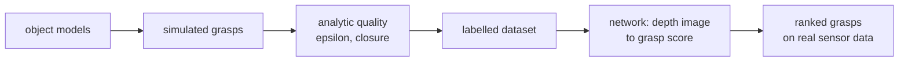

> [!abstract] Depth target · 깊이 목표
> **Mastery** — a contact-rich task that starts from a bad grasp fails for reasons that have
> nothing to do with the interesting part, so this is a dependency of the contribution
> rather than an adjacent field.
> **Mastery** — 나쁜 파지에서 시작한 접촉이 많은 작업은 정작 흥미로운 부분과 무관한 이유로
> 실패한다. 그래서 이것은 인접 분야가 아니라 기여의 의존 층이다.

> [!note] Prerequisites · 선수 지식
> You need friction and the friction cone ([[04-robotics/contact-force-tactile|Contact, Force & Tactile §2]]), wrenches and $\tau = J^\top\mathcal{F}$ ([[04-robotics/modern-robotics/ch05-velocity-kinematics|MR ch.5 §3]]), and convexity ([[02-foundations/optimization|4. Optimization §2]]).
> 마찰과 마찰 원뿔([[04-robotics/contact-force-tactile|접촉·힘·촉각 §2]]), 렌치와 $\tau = J^\top\mathcal{F}$([[04-robotics/modern-robotics/ch05-velocity-kinematics|MR 5장 §3]]), 볼록성([[02-foundations/optimization|4. 최적화 §2]])이 필요하다.

## English

*Group H and a Mastery page. Stands on [[04-robotics/contact-force-tactile|9. Contact]], [[04-robotics/modern-robotics/ch12-grasping|MR ch.12]] and optimization.
Half the field is the mathematics of closure and half is predicting it from a depth image without writing any of it down — both are worth reading, because the learned half trains on labels the analytic half produced.*

> [!note] First pass · 처음이라면
> Read §1, then §3 — form closure versus force closure is the distinction the secondary literature keeps getting wrong — then §7. §4 (the epsilon metric) and §5 are for when you are comparing grasp planners rather than reading about them.

### Running object · 이 페이지의 대상

**P2** from [[02-foundations/lab-plants|0.6 Lab Plants]] carries the tool, and the tool holds **the panel tile** already frozen by [[04-robotics/modern-robotics/ch12-grasping|MR ch.12]] — same numbers, not restated and not changed: $0.200 \times 0.100\ \mathrm{m}$, mass $0.500\ \mathrm{kg}$ so $W = 4.905\ \mathrm{N}$, Coulomb $\mu = 0.5$, planar wrenches written $w = (f_x,\ f_y,\ m_z)$ about the tile's centre of mass.

Closure is binary and ch.12 settles it. Ranking needs three things ch.12 never has to choose, so this page freezes them:

| Addition | Value | Why a quality metric needs it |
|---|---|---|
| **three candidate grasps** | **A** at $(\pm 0.100,\ 0)$ with normals $(\mp 1,\ 0)$ · **B** at $(0,\ \pm 0.050)$ with normals $(0,\ \mp 1)$ · **C** at $(-0.100,\ 0)$ with normal $(1,\ 0)$ and $(0.060,\ -0.050)$ with normal $(0,\ 1)$ | a ranking needs more than one grasp, and a screening test needs something that fails it |
| **force budget** | $\sum_i f_{n,i} \le F = 20\ \mathrm{N}$ — a **total**, not a per-contact cap | without a bound the wrench set is an unbounded cone and no radius or volume exists |
| **characteristic length** | $\rho = 0.100\ \mathrm{m}$, the grasp half-span | a ball cannot mix newtons with newton-metres until $m_z$ is divided by a length |

Grasp **A** is ch.12's grasp. **B** is the same tile turned $90°$ in the gripper, squeezing across the short dimension. **C** is a pair a depth image would happily propose and the test of §3 rejects. Ch.12's preload of $20\ \mathrm{N}$ *per finger* is the other budget convention, and §4 prices the difference exactly.

*Scope: this page teaches how a grasp is scored — the linear map from contact forces to object wrenches, the wrench set that map generates under a budget, and the two numbers usually read off that set — and where the arithmetic survives inside a learned pipeline. It does not teach the closure test, which [[04-robotics/modern-robotics/ch12-grasping|MR ch.12 §3]] derives on this same tile; nor grasp synthesis algorithms; nor hand design, for which §8 names sources.*

### Homework diagram · 과제가 그릴 그림

Two figures, side by side.

<svg viewBox="0 0 560 380" style="max-width:100%;height:auto" role="img" aria-label="Grasping homework diagram: left, the panel tile with grasps A and C, their friction cones, the four line-to-normal angles and the octagon that linearizes one cone; right, grasp A's wrench space as a tetrahedron with its inscribed ball of radius 6.667 N and the gravity wrench leaving it at 10.0 N">
  <text x="16" y="24" font-size="12" fill="currentColor" font-weight="600">the tile and its candidates</text>
  <text x="296" y="24" font-size="12" fill="currentColor" font-weight="600">grasp A's wrench space (N)</text>
  <rect x="72" y="67" width="180" height="90" stroke="currentColor" stroke-width="1.8" fill="currentColor" fill-opacity="0.05"/>
  <circle cx="162" cy="112" r="5.5" stroke="currentColor" stroke-width="1.2" fill="none"/>
  <path d="M162 112 L167.5 112 L167.4 110.9 L167.1 109.9 L166.6 108.9 L165.9 108.1 L165.1 107.4 L164.1 106.9 L163.1 106.6 L162 106.5 Z" fill="currentColor" fill-opacity="0.9" stroke="none"/>
  <path d="M162 112 L156.5 112 L156.6 113.1 L156.9 114.1 L157.4 115.1 L158.1 115.9 L158.9 116.6 L159.9 117.1 L160.9 117.4 L162 117.5 Z" fill="currentColor" fill-opacity="0.9" stroke="none"/>
  <text x="162" y="101" font-size="11" fill="currentColor" text-anchor="middle" fill-opacity="0.85">CoM</text>
  <line x1="72" y1="112" x2="252" y2="112" stroke="currentColor" stroke-width="1.1" stroke-opacity="0.55"/>
  <line x1="72" y1="112" x2="216" y2="157" stroke="currentColor" stroke-width="1.4" stroke-dasharray="7 4"/>
  <path d="M72 112 L107.8 129.9 L107.8 94.1 Z" fill="currentColor" fill-opacity="0.16" stroke="none"/>
  <line x1="72" y1="112" x2="107.8" y2="129.9" stroke="currentColor" stroke-width="1.0" stroke-opacity="0.8" stroke-dasharray="3 2.5"/>
  <line x1="72" y1="112" x2="107.8" y2="94.1" stroke="currentColor" stroke-width="1.0" stroke-opacity="0.8" stroke-dasharray="3 2.5"/>
  <line x1="72" y1="112" x2="94.4" y2="112" stroke="currentColor" stroke-width="1.8"/>
  <path d="M100 112 L93 114.9 L93 109.1 Z" fill="currentColor" stroke="none"/>
  <circle cx="72" cy="112" r="3.4" stroke="none" fill="currentColor"/>
  <path d="M252 112 L216.2 94.1 L216.2 129.9 Z" fill="currentColor" fill-opacity="0.16" stroke="none"/>
  <line x1="252" y1="112" x2="216.2" y2="94.1" stroke="currentColor" stroke-width="1.0" stroke-opacity="0.8" stroke-dasharray="3 2.5"/>
  <line x1="252" y1="112" x2="216.2" y2="129.9" stroke="currentColor" stroke-width="1.0" stroke-opacity="0.8" stroke-dasharray="3 2.5"/>
  <line x1="252" y1="112" x2="229.6" y2="112" stroke="currentColor" stroke-width="1.8"/>
  <path d="M224 112 L231 109.1 L231 114.9 Z" fill="currentColor" stroke="none"/>
  <circle cx="252" cy="112" r="3.4" stroke="none" fill="currentColor"/>
  <path d="M216 157 L233.9 121.2 L198.1 121.2 Z" fill="currentColor" fill-opacity="0.16" stroke="none"/>
  <line x1="216" y1="157" x2="233.9" y2="121.2" stroke="currentColor" stroke-width="1.0" stroke-opacity="0.8" stroke-dasharray="3 2.5"/>
  <line x1="216" y1="157" x2="198.1" y2="121.2" stroke="currentColor" stroke-width="1.0" stroke-opacity="0.8" stroke-dasharray="3 2.5"/>
  <line x1="216" y1="157" x2="216" y2="134.6" stroke="currentColor" stroke-width="1.8"/>
  <path d="M216 129 L218.9 136 L213.1 136 Z" fill="currentColor" stroke="none"/>
  <circle cx="216" cy="157" r="3.4" stroke="none" fill="currentColor"/>
  <path d="M124 112 L124 112.7 L124 113.3 L124 114 L123.9 114.6 L123.9 115.3 L123.9 115.9 L123.8 116.6 L123.7 117.2 L123.7 117.9 L123.6 118.5 L123.5 119.2 L123.4 119.8 L123.3 120.5 L123.2 121.1 L123.1 121.8 L122.9 122.4 L122.8 123.1 L122.7 123.7 L122.5 124.3 L122.4 125 L122.2 125.6 L122 126.3 L121.8 126.9 L121.6 127.5" stroke="currentColor" stroke-width="1.1" fill="none" stroke-linejoin="round"/>
  <path d="M216 137 L214.9 137 L213.9 137.1 L212.8 137.3 L211.8 137.4 L210.8 137.7 L209.8 138 L208.8 138.4 L207.8 138.8 L206.8 139.2 L205.9 139.7 L205 140.3 L204.2 140.9 L203.3 141.5 L202.5 142.2 L201.8 143 L201 143.7 L200.4 144.5 L199.7 145.4 L199.1 146.3 L198.6 147.2 L198.1 148.1 L197.6 149.1 L197.3 150 L196.9 151" stroke="currentColor" stroke-width="1.1" fill="none" stroke-linejoin="round"/>
  <text x="65" y="98" font-size="11" fill="currentColor" text-anchor="end">A<tspan dy="3.1" font-size="8.6">1</tspan><tspan dx="3.1" dy="-3.1">= C</tspan><tspan dy="3.1" font-size="8.6">1</tspan></text>
  <text x="65" y="116" font-size="11" fill="currentColor" text-anchor="end">A 0.000°</text>
  <text x="65" y="132" font-size="11" fill="currentColor" text-anchor="end">C 17.354°</text>
  <text x="258" y="116" font-size="11" fill="currentColor">A<tspan dy="3.1" font-size="8.6">2</tspan></text>
  <text x="252" y="59" font-size="11" fill="currentColor" text-anchor="middle">A 0.000°</text>
  <text x="224" y="172" font-size="11" fill="currentColor">C<tspan dy="3.1" font-size="8.6">2</tspan></text>
  <text x="176" y="185" font-size="11" fill="currentColor" text-anchor="middle">C 72.646°</text>
  <ellipse cx="176" cy="182.1" rx="31.5" ry="9.3" fill="none" stroke="currentColor" stroke-width="1.4"/>
  <text x="188" y="107" font-size="11" fill="currentColor" fill-opacity="0.75">A</text>
  <text x="120" y="142" font-size="11" fill="currentColor" fill-opacity="0.75">C</text>
  <rect x="16" y="218" width="258" height="92" rx="4" stroke="currentColor" stroke-width="1.0" stroke-opacity="0.6" stroke-dasharray="4 3" fill="none"/>
  <path d="M98 264 A36 36 0 1 1 26 264 A36 36 0 1 1 98 264 Z M95.3 277.8 L75.8 297.3 L48.2 297.3 L28.7 277.8 L28.7 250.2 L48.2 230.7 L75.8 230.7 L95.3 250.2 Z" fill="currentColor" fill-opacity="0.32" fill-rule="evenodd" stroke="none"/>
  <circle cx="62" cy="264" r="36" stroke="currentColor" stroke-width="1.2" fill="none"/>
  <path d="M95.3 277.8 L75.8 297.3 L48.2 297.3 L28.7 277.8 L28.7 250.2 L48.2 230.7 L75.8 230.7 L95.3 250.2 Z" stroke="currentColor" stroke-width="1.2" fill="none" stroke-linejoin="round"/>
  <circle cx="62" cy="264" r="2.4" stroke="none" fill="currentColor"/>
  <line x1="62" y1="264" x2="75.8" y2="230.7" stroke="currentColor" stroke-width="1.0"/>
  <line x1="62" y1="264" x2="95.3" y2="264" stroke="currentColor" stroke-width="1.0" stroke-dasharray="2 2"/>
  <text x="112" y="235" font-size="11" fill="currentColor" fill-opacity="0.85">the same cone seen along n:</text>
  <text x="112" y="251" font-size="11" fill="currentColor">base disc, radius μ = 0.5</text>
  <text x="112" y="267" font-size="11" fill="currentColor">octagon: μ<tspan dy="3.1" font-size="8.6">eff</tspan><tspan dx="3.1" dy="-3.1">= 0.462</tspan></text>
  <text x="112" y="283" font-size="11" fill="currentColor">shaded: 10.0% of the disc,</text>
  <text x="112" y="299" font-size="11" fill="currentColor">7.6% of μ in the worst direction</text>
  <text x="16" y="336" font-size="11" fill="currentColor" fill-opacity="0.9">C fails at C<tspan dy="3.1" font-size="8.6">2</tspan><tspan dy="-3.1">: 72.646° &gt; 26.565°,</tspan></text>
  <text x="16" y="352" font-size="11" fill="currentColor" fill-opacity="0.9">so no squeeze makes it hold.</text>
  <circle cx="424" cy="159.4" r="30.7" stroke="currentColor" stroke-width="1.0" stroke-opacity="0.55" fill="currentColor" fill-opacity="0.1"/>
  <line x1="474.2" y1="162.1" x2="526" y2="206.4" stroke="currentColor" stroke-width="1.7"/>
  <line x1="474.2" y1="162.1" x2="373.8" y2="76" stroke="currentColor" stroke-width="1.7"/>
  <line x1="474.2" y1="162.1" x2="322" y2="193.3" stroke="currentColor" stroke-width="1.0" stroke-opacity="0.6" stroke-dasharray="4 3"/>
  <line x1="526" y1="206.4" x2="373.8" y2="76" stroke="currentColor" stroke-width="1.7"/>
  <line x1="526" y1="206.4" x2="322" y2="193.3" stroke="currentColor" stroke-width="1.7"/>
  <line x1="373.8" y1="76" x2="322" y2="193.3" stroke="currentColor" stroke-width="1.7"/>
  <circle cx="474.2" cy="162.1" r="3.6" stroke="none" fill="currentColor"/>
  <circle cx="526" cy="206.4" r="3.6" stroke="none" fill="currentColor"/>
  <circle cx="373.8" cy="76" r="3.6" stroke="none" fill="currentColor"/>
  <circle cx="322" cy="193.3" r="3.6" stroke="none" fill="currentColor"/>
  <line x1="424" y1="159.4" x2="440.1" y2="140.7" stroke="currentColor" stroke-width="2.0"/>
  <path d="M444 136.1 L441.5 143.9 L436.7 139.8 Z" fill="currentColor" stroke="none"/>
  <path d="M448.5 140 L444.6 144.6 L440.1 140.7" stroke="currentColor" stroke-width="1.0" fill="none" stroke-linejoin="round"/>
  <line x1="424" y1="159.4" x2="424" y2="145.6" stroke="currentColor" stroke-width="2.0"/>
  <path d="M424 139.6 L427.1 147.1 L420.9 147.1 Z" fill="currentColor" stroke="none"/>
  <line x1="424" y1="139.6" x2="424" y2="119" stroke="currentColor" stroke-width="1.1" stroke-dasharray="1.5 2.5"/>
  <circle cx="424" cy="119" r="4.4" stroke="currentColor" stroke-width="1.5" fill="none"/>
  <circle cx="424" cy="159.4" r="3" stroke="none" fill="currentColor"/>
  <line x1="512" y1="300" x2="527.7" y2="305.1" stroke="currentColor" stroke-width="1.2" stroke-opacity="0.8"/>
  <path d="M531.8 306.5 L525.9 307 L527.3 302.6 Z" fill="currentColor" stroke="none" fill-opacity="0.8"/>
  <line x1="512" y1="300" x2="512" y2="283.3" stroke="currentColor" stroke-width="1.2" stroke-opacity="0.8"/>
  <path d="M512 278.9 L514.3 284.4 L509.7 284.4 Z" fill="currentColor" stroke="none" fill-opacity="0.8"/>
  <line x1="512" y1="300" x2="521.9" y2="293" stroke="currentColor" stroke-width="1.2" stroke-opacity="0.8"/>
  <path d="M525.5 290.5 L522.3 295.5 L519.7 291.8 Z" fill="currentColor" stroke="none" fill-opacity="0.8"/>
  <text x="483.2" y="156.1" font-size="12" fill="currentColor">1<tspan dy="-4.6" font-size="9.4">+</tspan></text>
  <text x="528" y="223.4" font-size="12" fill="currentColor" text-anchor="middle">1<tspan dy="-4.6" font-size="9.4">−</tspan></text>
  <text x="364.8" y="71" font-size="12" fill="currentColor" text-anchor="end">2<tspan dy="-4.6" font-size="9.4">+</tspan></text>
  <text x="314" y="208.3" font-size="12" fill="currentColor" text-anchor="end">2<tspan dy="-4.6" font-size="9.4">−</tspan></text>
  <text x="539.8" y="310.5" font-size="11" fill="currentColor">f<tspan dy="3.1" font-size="8.6">x</tspan></text>
  <text x="512" y="273.9" font-size="11" fill="currentColor" text-anchor="middle">f<tspan dy="3.1" font-size="8.6">y</tspan></text>
  <text x="521.5" y="286.5" font-size="11" fill="currentColor">m<tspan dy="3.1" font-size="8.6">z</tspan><tspan dy="-3.1">/ρ</tspan></text>
  <text x="415" y="167.4" font-size="11" fill="currentColor" text-anchor="end">0</text>
  <text x="453" y="133.1" font-size="11" fill="currentColor">ε = 6.667 N</text>
  <text x="433" y="110" font-size="11" fill="currentColor">leaves at 10.0 N</text>
  <text x="418" y="151.5" font-size="11" fill="currentColor" text-anchor="end">W = 4.905 N</text>
  <text x="300" y="336" font-size="11" fill="currentColor" fill-opacity="0.9">generators 1<tspan dy="-4.2" font-size="8.6">±</tspan><tspan dx="3.1" dy="4.2">= (20, ±10, ∓10),</tspan></text>
  <text x="300" y="352" font-size="11" fill="currentColor" fill-opacity="0.9">2<tspan dy="-4.2" font-size="8.6">±</tspan><tspan dx="3.1" dy="4.2">= (−20, ±10, ±10); ε ⟂ the face it touches;</tspan></text>
  <text x="300" y="368" font-size="11" fill="currentColor" fill-opacity="0.9">gravity's direction reaches 10.0 N, beyond ε.</text>
</svg>

**Left — the tile and its candidates.** Draw the tile as a rectangle with the centre of mass marked, then all four contact points of **A** and **C** on it. At each, the inward normal as a solid arrow and the friction cone as two dashed rays at $\pm 26.565°$ with the wedge shaded. Draw the connecting line of **A** straight through the tile and the connecting line of **C** as a second, tilted line. Write the angle each line makes with each normal at its own end — four numbers — and circle the one that is outside its cone. In a margin box, draw one contact's cone a second time with an inscribed regular octagon over it, and shade the eight slivers the octagon throws away.

**Right — the wrench space.** Axes $f_x$, $f_y$ and $m_z/\rho$, all three in newtons. Plot the four generator wrenches of **A** as points, join them into the tetrahedron, mark the origin inside it, and draw the inscribed ball touching a face. Label the ball's radius $\epsilon$ and draw the arrow from the origin to that touch point — the weakest direction. Then draw the gravity wrench $(0,\ +4.905,\ 0)$ as a separate arrow from the origin and mark where it leaves the tetrahedron: a longer arrow than $\epsilon$, which is the whole point of §4.

The problem set asks for both figures again at $\mu = 0.2$: the left one for a new family of candidates, the right one for grasp **B**, where $\epsilon$ shrinks but the gravity arrow keeps its verdict, since B's lift margin stays $4.08$. The arrow whose verdict flips at that friction is A's (Step 6 below).

### Worked case · 대상으로 한 번 끝까지

**Step 1 — the grasp map.** Each contact $i$ applies $f_i = f_{n,i}\hat n_i + f_{t,i}\hat t_i$, and ch.12 §2 turns a force at a point into a wrench. Stacking all the contact coordinates into one vector $f_c$ makes the whole thing one matrix.

> **Grasp map, defined.** The **grasp map** $G$ is a *matrix* — a linear map from contact-force coordinates to object wrenches, and nothing else: not a set, not a test, not a quality. Three defining conditions: it is built column by column, one column per contact-force coordinate, each column being the wrench that coordinate produces at unit magnitude; its columns are written in a stated object frame, because $m_z$ moves with the origin; and it is **linear**, which is what buys everything downstream — additivity and homogeneity in $f_c$, in the sense of [[02-foundations/engineering-math|0.5 Engineering Math §4.5]]. The friction cones are *not* part of $G$; they are the constraint set $G$ is later applied to.
>
> $$\mathcal{F}_o = G\,f_c, \qquad G = \big[\,w(r_1,\hat n_1)\ \ w(r_1,\hat t_1)\ \cdots\ w(r_k,\hat n_k)\ \ w(r_k,\hat t_k)\,\big]$$
>
> where $\mathcal{F}_o$ is the net wrench on the object, $f_c = (f_{n,1}, f_{t,1}, \ldots, f_{n,k}, f_{t,k})$ the contact-force coordinates, $r_i$ and $(\hat n_i, \hat t_i)$ contact $i$'s position and its normal and tangent, and $w(r, d) = (d_x,\ d_y,\ r_x d_y - r_y d_x)$ the unit wrench of ch.12 §2 — so $G$ is $3 \times 2k$ in the plane and $6 \times 6k$ in space.

For grasp **A**, with $r_1 = (-0.100,\ 0)$, $\hat n_1 = (1,0)$, $\hat t_1 = (0,1)$ and $r_2 = (+0.100,\ 0)$, $\hat n_2 = (-1,0)$, $\hat t_2 = (0,1)$:

$$G_A = \begin{bmatrix} 1 & 0 & -1 & 0 \\ 0 & 1 & 0 & 1 \\ 0 & -0.100 & 0 & 0.100 \end{bmatrix}$$

because each column is $(d_x,\ d_y,\ r_x d_y - r_y d_x)$ for that contact's own $r$ and direction. Read three things straight off it. Its rank is $3$, so the grasp can in principle produce any planar wrench. Its null space has dimension $4 - 3 = 1$ and is spanned by $(1,\ 0,\ 1,\ 0)$: pressing both normals equally is an **internal force** that the object never feels — $G_A\,(1,0,1,0)^\top = (0,0,0)$ — which is exactly why a preload can be raised freely without disturbing the load balance. And holding the tile against gravity, $\mathcal{F}_o = (0,\ 4.905,\ 0)$, the least-norm solution is $f_c = (0,\ 2.4525,\ 0,\ 2.4525)$, reproducing ch.12's $f_{y}=W/2$ and $f_n^{\min} = 2.4525/0.5 = 4.905\ \mathrm{N}$ without re-deriving it.

One more reading, because it recurs in §4: $G_A\,(20,\ 10,\ 20,\ -10)^\top = (0,\ 0,\ -2)$. Equal squeeze with opposed tangentials is a **pure moment** of $2.00\ \mathrm{N\cdot m}$, the moment capacity ch.12 Step 6 reports.

- **Example**: the column $w(r_1, \hat t_1) = (0,\ 1,\ -0.100)$ — dragging up at the left contact lifts *and* rolls the tile, because that force acts $0.100\,\mathrm{m}$ off centre.
- **Non-example**: the $3 \times 2$ matrix of just the two normals. It is a perfectly good matrix and it is not the grasp map of a *frictional* grasp: drop the tangential columns and the rank falls to $1$, which is ch.12 Step 4's frictionless case and a different grasp entirely.
- **Why it matters**: every object in §3 and §4 — the closure test, the wrench space, both quality numbers — is a statement about $G$ and the cones together. Write $G$ in the wrong frame and all of them are wrong in the third coordinate only, which is the hardest kind of error to notice.

**Step 2 — make the cones polyhedral.** In the plane nothing is needed: the wedge already has exactly two edges, $\hat n \pm \mu\hat t$, and they are the same two $G$ will be applied to. In space the cone is circular and has to be replaced before any of this is computable — see the definition at the end of §2, which costs $7.6\%$ of $\mu$ at $m = 8$ and nothing at all here.

**Step 3 — screen the candidates.** The antipodal test of §3, applied to all three:

| grasp | line joining the contacts | angle at contact 1 | angle at contact 2 | verdict against $\arctan 0.5 = 26.565°$ |
|---|---|---:|---:|---|
| **A** | $0.200\ \mathrm{m}$ along $\hat x$ | $0.000°$ | $0.000°$ | pass, with the widest possible margin |
| **B** | $0.100\ \mathrm{m}$ along $\hat y$ | $0.000°$ | $0.000°$ | pass |
| **C** | $0.168\ \mathrm{m}$, tilted | $17.354°$ | $72.646°$ | **fail at contact 2** |

Contact 2 of **C** is on the bottom edge with normal $(0,1)$, and the line back to contact 1 is $(-0.160,\ +0.050)$, so $\cos\theta = 0.050/0.167631 = 0.298275$ and $\theta = 72.646°$. **C** would need $\mu \ge \tan 72.646° = 3.20$ — several times any dry surface — so no squeeze whatever makes it work, which is the point of screening before computing anything.

**Step 4 — build the wrench space and read the two numbers.** Take the budget $F = 20\ \mathrm{N}$ to one contact at a time, at each of its two cone edges, and divide $m_z$ by $\rho = 0.100\ \mathrm{m}$:

| edge | $f$ (N) | $m_z = r_x f_y$ (N·m) | generator $(f_x,\ f_y,\ m_z/\rho)$ (N) |
|---|---|---:|---|
| $1^{+}$ | $(20,\ +10)$ | $-1$ | $(20,\ 10,\ -10)$ |
| $1^{-}$ | $(20,\ -10)$ | $+1$ | $(20,\ -10,\ 10)$ |
| $2^{+}$ | $(-20,\ +10)$ | $+1$ | $(-20,\ 10,\ 10)$ |
| $2^{-}$ | $(-20,\ -10)$ | $-1$ | $(-20,\ -10,\ -10)$ |

$\mathcal{W}_A$ is the convex hull of those four points — a tetrahedron. They sum to zero, which is ch.12's $\lambda = (1,1,1,1)$ arriving again, so the origin is the centroid and sits strictly inside.

The inscribed ball. By symmetry all four faces are the same distance from the origin; take the face through $1^{+}, 1^{-}, 2^{+}$, whose unit normal is $\hat u = (1,\ 2,\ 2)/3$. Then $\hat u\cdot(20,\ 10,\ -10) = (20 + 20 - 20)/3$, so

$$\epsilon_A = \tfrac{20}{3} = 6.667\ \mathrm{N}, \qquad \text{attained along } \hat u = \tfrac13(1,\ 2,\ 2)$$

because a face's supporting plane is the first thing a growing ball touches. The weakest direction is not a pure force and not a pure moment: it is one part push to two parts lift to two parts twist, which no hand calculation would have guessed.

The volume. The tetrahedron on those four vertices has

$$Q_{v,A} = \tfrac16\left|\det\begin{bmatrix} 0 & -20 & 20 \\ -40 & 0 & 20 \\ -40 & -20 & 0\end{bmatrix}\right| = \tfrac{32000}{6} = \tfrac{16000}{3} = 5333\ \mathrm{N^3}$$

since the three rows are the edge vectors from vertex $1^{+}$ to the other three.

**Step 5 — rank the two grasps, then look at the task.** Repeating Step 4 for **B** (contacts $0.050\,\mathrm{m}$ from centre, squeeze along $\hat y$) gives generators $(\pm 10,\ -20,\ \mp 5)$ and $(\pm 10,\ +20,\ \pm 5)$, then $\epsilon_B = 20/\sqrt{21} = 4.364\ \mathrm{N}$ on the face with normal $(2,\ -1,\ 4)/\sqrt{21}$, and $Q_{v,B} = 8000/3 = 2667\ \mathrm{N^3}$. So **A** wins on both metrics — $2.00\times$ the volume, $\sqrt{21}/3 = 1.528\times$ the radius. Now ask what the task loads:

| direction | **A** capacity | **B** capacity |
|---|---:|---:|
| $+y$, lifting against gravity | $\mu F = 10.0\ \mathrm{N}$ | $F = 20.0\ \mathrm{N}$ |
| $+x$, a sideways nudge | $F = 20.0\ \mathrm{N}$ | $\mu F = 10.0\ \mathrm{N}$ |
| $+m_z/\rho$, twist | $10.0\ \mathrm{N}$ | $5.0\ \mathrm{N}$ |

**B** is twice as strong as **A** in the one direction gravity actually pulls, because **B** carries the weight on its *normals* while **A** carries it on friction alone. Against $W = 4.905\ \mathrm{N}$ the margins are $2.04$ for **A** and $4.08$ for **B**. Two metrics, both ranking **A** first, both blind to the only load the task has. That is §4's complaint about $\epsilon$, derived rather than asserted — and it applies to hull volume just as hard.

**Step 6 — the input nobody measures.** Re-run Step 4 for **A** with site dust, $\mu = 0.2$: the cone half-angle falls to $11.310°$, $\epsilon_A$ falls to $2.801\ \mathrm{N}$ ($0.42\times$) and $Q_{v,A}$ to $853\ \mathrm{N^3}$ ($0.16\times$) — the volume, being three-dimensional, is punished far harder than the radius. The antipodal verdicts do not move at all: **A** was at $0°$ and stays inside any cone, **C** needed $\mu \ge 3.20$ and still does. But the lift capacity is now $\mu F = 4.0\ \mathrm{N}$ against a weight of $4.905\ \mathrm{N}$, a margin of $0.82$: **under a $20\ \mathrm{N}$ total budget the grasp is still force-closed and can no longer hold the tile.** Ch.12 Step 7's separation of directions from magnitudes, arriving as a number.

(Under ch.12's own convention — $20\ \mathrm{N}$ *per* finger — the same grasp has $2\mu F = 8.0\ \mathrm{N}$ of lift and a margin of $1.63$, and it holds. The verdict changed because the budget did, which is §4's warning about quality numbers in exactly the form it is usually met.)

### 1. The question a grasp has to answer

A grasp is not "the gripper is touching the object". It is a claim: **whatever the world
does to this object next, the contacts can resist it.** The field's classical half is the
mathematics of that claim, and its modern half is a way of predicting the claim from a
depth image without ever writing it down. Both halves are worth reading, because the
learned methods are trained on labels the classical theory produces.

### 2. The friction cone, and why closure is a cone question

A frictionless point contact can push only along the surface normal. With Coulomb friction
of coefficient $\mu$, the contact can also resist tangential force up to $\mu$ times the
normal force, so the set of forces it can apply is a **cone** about the normal with
half-angle $\arctan\mu$.

$$\|f_t\| \le \mu f_n \quad \Longleftrightarrow \quad \text{the force lies inside the cone of half-angle } \arctan\mu$$

For $\mu = 0.5$ that half-angle is $\arctan 0.5 \approx 26.6°$; for $\mu = 1.0$ it is $45°$.
That single number is why grasp analysis is a geometry problem: each contact contributes a
cone of admissible forces, each force at a contact point produces a **wrench** (force plus
the moment it makes about the object's reference point), and the question becomes whether
the cones together span everything the world can throw at the object.

<svg viewBox="0 0 560 236" style="max-width:100%;height:auto" role="img" aria-label="a friction cone at a contact with half angle arctan mu, and two opposed contacts whose cones each contain the line between them">
  <g stroke="currentColor" stroke-width="1.6" fill="none" opacity="0.8">
    <line x1="40" y1="150" x2="180" y2="150"/>
  </g>
  <path d="M 110 150 L 74 78 L 146 78 Z" fill="currentColor" fill-opacity="0.16" stroke="currentColor" stroke-width="1.1"/>
  <g stroke="currentColor" stroke-width="1.2" fill="none" opacity="0.65" stroke-dasharray="4 3">
    <line x1="110" y1="150" x2="110" y2="70"/>
  </g>
  <g fill="currentColor"><circle cx="110" cy="150" r="4"/></g>
  <g font-size="10.5" fill="currentColor">
    <text x="116" y="66">normal</text>
    <text x="150" y="112">half-angle arctan &#956;</text>
    <text x="40" y="172" opacity="0.8">surface</text>
    <text x="40" y="46" font-size="11">one contact: a cone of forces it can apply</text>
  </g>
  <g stroke="currentColor" stroke-width="1.6" fill="none" opacity="0.8">
    <rect x="330" y="96" width="120" height="60" rx="3"/>
  </g>
  <path d="M 330 126 L 372 104 L 372 148 Z" fill="currentColor" fill-opacity="0.16" stroke="currentColor" stroke-width="1.1"/>
  <path d="M 450 126 L 408 104 L 408 148 Z" fill="currentColor" fill-opacity="0.16" stroke="currentColor" stroke-width="1.1"/>
  <g stroke="currentColor" stroke-width="1.2" fill="none" opacity="0.65" stroke-dasharray="4 3">
    <line x1="330" y1="126" x2="450" y2="126"/>
  </g>
  <g fill="currentColor"><circle cx="330" cy="126" r="4"/><circle cx="450" cy="126" r="4"/></g>
  <g font-size="10.5" fill="currentColor">
    <text x="390" y="80" font-size="11" text-anchor="middle">two contacts: antipodal if the line lies in both cones</text>
    <text x="330" y="180" opacity="0.8">the line joining the contacts</text>
  </g>
  <g font-size="11" fill="currentColor" opacity="0.9">
    <text x="20" y="212">The whole of two-finger grasp planning is that second picture: find a pair of surface points whose</text>
    <text x="20" y="228">connecting line lies inside both friction cones. Wider cones &#8212; rougher surfaces &#8212; admit more pairs.</text>
  </g>
</svg>

The cone's own full definition — both inequalities, the worked example and the "$\mu$ is the cone angle" non-example — is in [[04-robotics/modern-robotics/ch12-grasping|MR ch.12 §2]] and is not repeated here. What this page needs on top of it is the step that makes the cone computable at all in three dimensions.

> **Friction cone linearization, defined.** Cone **linearization** replaces the circular cone $\|f_t\| \le \mu f_n$ by the polyhedral cone generated by $m$ edges spaced evenly around the normal. It is an approximation of a *set*, not of a number, and it has three defining conditions. The $m$ edges lie **on** the true cone, so the polyhedron is **inscribed** and every force it admits the contact really can apply — the approximation is conservative in one direction only, never optimistic. The count $m$ is part of the result and has to be reported with it. And it is *anisotropic*: the error is zero along an edge and largest halfway between two edges.
>
> $$f = \sum_{j=1}^{m}\lambda_j\left(\hat n + \mu\cos\tfrac{2\pi j}{m}\,\hat t_1 + \mu\sin\tfrac{2\pi j}{m}\,\hat t_2\right),\quad \lambda_j \ge 0, \qquad \mu_{\text{eff}} = \mu\cos\tfrac{\pi}{m}$$
>
> where $\hat n$ is the inward normal, $\hat t_1,\hat t_2$ any two tangents completing a frame, $\lambda_j$ the nonnegative edge weights and $\mu_{\text{eff}}$ the friction the pyramid actually delivers in its worst direction — because the apothem of a regular $m$-gon is $\cos(\pi/m)$ times its circumradius, and the worst direction points at the middle of a side.
>
> - **Example**: $m = 8$ at $\mu = 0.5$ gives $\mu_{\text{eff}} = 0.462$ and a worst-case half-angle of $24.794°$ instead of $26.565°$ — $7.6\%$ of $\mu$ and $10.0\%$ of the cone's base disc thrown away. At $m = 4$ it is $\mu_{\text{eff}} = 0.354$, a third of the disc gone; at $m = 16$, $\mu_{\text{eff}} = 0.490$ and $2.6\%$.
> - **Non-example**: the *circumscribed* pyramid, $\mu_{\text{circ}} = \mu/\cos(\pi/m)$, whose edges lie outside the cone. It is the same construction with the polygon on the other side of the circle, and it admits tangential forces the contact cannot apply — so it reports closure and quality where there is none. A paper that says "we linearize the friction cone with 8 facets" has not said which side, and the two differ by $\cos^2(\pi/8) = 0.854$ in the ratio.
> - **Why it matters**: with polyhedral cones the closure test of §3 is a linear program and the wrench set of §4 is the convex hull of finitely many points — both become arithmetic instead of geometry. Everything worked above is planar, where $m = 2$ is *exact* and costs nothing; a 3D grasp planner's $\epsilon$ is pessimistic by roughly $\cos(\pi/m)$, which is worth knowing before comparing two planners that chose different $m$.

### 3. Form closure and force closure

Two different guarantees, routinely conflated:

| | Means | Depends on friction? | Defined, and derived on this tile, in |
|---|---|---|---|
| **Form closure** | the contact geometry alone immobilises the object; no motion is possible whatever forces are applied | no — it is a purely kinematic property | [[04-robotics/modern-robotics/ch12-grasping\|MR ch.12 §3]], Steps 4–5 |
| **Force closure** | the contacts can generate forces resisting **any** external wrench | yes — it is a statement about the friction cones | [[04-robotics/modern-robotics/ch12-grasping\|MR ch.12 §3]], Step 3 |

> [!note] Both closures are one condition, and it is derived on this page's own tile
> [[04-robotics/modern-robotics/ch12-grasping|MR ch.12 §3]] defines the two as the *same* mathematical property — **positive spanning** — applied to two different generator sets, the bare contact normals or the friction-cone edges; makes it checkable as "find $\lambda > 0$ with $\sum_i\lambda_i w_i = 0$, then check $\operatorname{rank} = n$"; and runs it on grasp **A**, on a frictionless pair, and on a four-contact pinwheel, including the four-contact arrangement that satisfies the textbook count and still lets the tile spin. That derivation is not repeated here.
>
> What this section adds is the part ch.12 has no reason to cover: **which published finger count is a statement about which of the two, and under what contact model.** The test is settled; the literature is not.

Form closure is the stronger and rarer condition. Force closure is what a two-finger grasp
of a box achieves and what almost every grasp paper means when it says "stable".

The finger counts are a place where secondary sources reliably go wrong, so state them with
their sources attached. Markenscoff, Ni and Papadimitriou's 1990 analysis gives, in its own
abstract, that with Coulomb friction and *under its most relaxed assumptions* **three fingers are necessary and sufficient in two
dimensions and four in three dimensions** — bounds over all objects; a particular object may need fewer (two frictional contacts can force-close a planar body, MR §12.2.3.1). The much-quoted **seven** is a different result —
it is the *frictionless* form-closure count in 3D, and quoting it as the force-closure
number is a common error. It carries a second qualifier that is dropped just as often: it is
a **first-order** bound, derived by linearizing the contact constraints, so it sees only the
contact normals. Allow curvature and the second-order analysis immobilizes a planar body with
two contacts, against a first-order bound of four
([[04-robotics/modern-robotics/ch12-grasping|MR ch.12]]). Three numbers, three different
theorems; always say which one you mean.

> [!warning] Two fingers or four? Name the contact model
> Those two statements — "a two-finger grasp of a box achieves force closure" and "four
> fingers are necessary in 3D" — look contradictory and are not. They assume different
> **contact models**, and a paper that does not name its model cannot be checked.
>
> | Model | Each contact transmits | Two-finger force closure in 3D? |
> |---|---|---|
> | **Point contact, frictionless** | force along the normal only | no |
> | **Hard finger** (point contact with friction) | force inside the friction cone, **no moment** | no — some particular geometries admit **three** non-collinear contacts |
> | **Soft finger** | force inside the cone **plus a moment about the contact normal** (torsional friction) | yes — this is the antipodal case |
>
> A parallel-jaw gripper on a real box is a soft-finger contact: the pads deform, so each
> contact resists twisting about its own normal, and two of them suffice. Under hard finger
> some particular 3D geometries admit **three** non-collinear contacts. *Springer Handbook of Robotics* §38.4.2 gives these as minimum counts: a 3D object needs seven contacts for form closure, but force closure needs only two soft-finger contacts or three non-collinear hard-finger contacts. A minimum is not a guarantee; whether a given three-contact grasp is force-closed still depends on the geometry and the friction.
>
> Markenscoff's four is a **third** kind of statement and the easiest to misuse: it is a
> *universal* bound — how many fingers suffice for **any** object — not the minimum for the
> object in front of you. So the reconciliation has two moving parts, not one: the contact
> model, and whether the count is universal or particular. **When a paper claims force
> closure, ask which row it stands on and whether its number is a worst case** — learned grasp
> planners almost always assume soft finger implicitly, by training on grippers with
> compliant pads.

For two contacts specifically, the practical criterion is the **antipodal** condition —
the second panel of the figure above, and the geometric core of essentially every
two-finger grasp planner, learned or not.

> **Antipodal grasp, defined.** An **antipodal grasp** is a *pair of contacts*, not a force, not a hand pose and not a quality score: two point contacts whose connecting line lies inside both friction cones. Three defining conditions, and the second is where implementations go wrong. There are exactly **two** contacts — the notion does not generalise to three by inspection. The condition must hold **at both ends**: each contact's own inward normal makes an angle of at most $\arctan\mu_i$ with the line, measured at that contact. And each end uses **its own** $\mu_i$, which on a real part with two different surfaces are two different numbers.
>
> $$\angle\!\left(r_2 - r_1,\ \hat n_1\right) \le \arctan\mu_1 \quad\text{and}\quad \angle\!\left(r_1 - r_2,\ \hat n_2\right) \le \arctan\mu_2$$
>
> where $r_i$ is contact $i$'s position, $\hat n_i$ its inward normal and $\mu_i$ its friction coefficient — because a force directed along that line is then admissible at both contacts, so the pair can squeeze with zero net wrench and lean within the cones to resist a load.
>
> - **Example**: grasp **A** on the tile. The line runs along $\hat x$, both normals are $\pm\hat x$, so both angles are exactly $0°$ against a budget of $26.565°$: the largest margin the geometry allows.
> - **Non-example**: grasp **C**. At the left contact the line makes $17.354°$, comfortably inside the cone — and at the bottom contact it makes $\arccos(0.050/0.167631) = 72.646°$, far outside. **C** would need $\mu \ge \tan 72.646° = 3.20$. A test written to check one end, or to check the *average* of the two angles ($45.0°$ here, still outside but for the wrong reason), accepts pairs like this, and it is the standard bug in a hand-rolled antipodal screen.
> - **Why it matters**: it costs two dot products per candidate pair, so a planner can screen millions of surface-point pairs before any of them reaches a closure test or a wrench-space construction. And in the plane, for two point contacts with friction, it is not merely a heuristic — it is *equivalent* to force closure, which is why [[04-robotics/modern-robotics/ch12-grasping|MR ch.12]] Step 3 can use it as a cross-check on the positive-span test rather than as a separate claim. In space it is not equivalent, and the contact model in the box above is why.

### 4. Grasp quality — the wrench space and the two numbers read off it

Closure is binary; a planner needs a ranking. Both of the standard rankings are properties
of one set, so define the set first.

> **Grasp wrench space, defined.** The **grasp wrench space** $\mathcal{W}$ is a *convex body* in wrench space — $\mathbb{R}^3$ in the plane, $\mathbb{R}^6$ in space — and not a cone, not a number and not a test. Four defining conditions, every one of them a choice that must be stated with the result. It is the image under the grasp map $G$ of the product of the contacts' friction cones, so nothing enters it that some contact could not have applied. The contact forces are **bounded** by a declared budget, because without one the set is an unbounded cone and neither of the numbers below exists. The wrenches are referred to a declared **origin**, because $m_z$ moves with it. And the moment coordinates are divided by a declared **characteristic length** $\rho$, because otherwise a ball in this space is comparing newtons with newton-metres.
>
> $$\mathcal{W} = \left\{\,S\,G f_c \;\middle|\; f_c \in \mathcal{FC}_1 \times \cdots \times \mathcal{FC}_k,\ \ \textstyle\sum_i f_{n,i} \le F \right\}, \qquad S = \operatorname{diag}\!\left(1,\ 1,\ \tfrac1\rho\right)$$
>
> with $G$ the grasp map of the Worked case, $\mathcal{FC}_i$ contact $i$'s friction cone, $F$ the total normal-force budget, $\rho$ the characteristic length and $S$ the scaling that leaves every coordinate of $\mathcal{W}$ in newtons — so $\mathcal{W}$ is convex, because $G$ is linear, each cone is convex and the budget is one linear inequality. When the cones are polyhedral, $\mathcal{W}$ is exactly the convex hull of the budgeted cone-edge wrenches, which is what makes it computable.
>
> - **Example**: $\mathcal{W}_A$, the tetrahedron on $(20,\ \pm 10,\ \mp 10)$ and $(-20,\ \pm 10,\ \pm 10)$ built in Step 4, with the origin at its centroid.
> - **Non-example, no budget**: the cone those four edges generate. It contains the origin in its interior exactly when the grasp is force-closed, so "the largest ball inside it" is *infinite* for every closed grasp and zero for every other — the quality metric collapses back into the binary test it was meant to refine.
> - **Non-example, no $\rho$**: the same four wrenches with $m_z$ left in newton-metres, $(20,\pm10,\mp1)$ and $(-20,\pm10,\pm1)$. The inscribed radius drops from $6.667$ to $0.994$ and the weakest direction swings to almost pure moment, $(0.050,\ 0.099,\ 0.994)$ — the metric now measures the tile's size, not the grasp.
> - **Why it matters**: both numbers below are functions of $\mathcal{W}$, so two papers scoring the *same grasp on the same object* — **A** on this tile — differ by a factor of $\sqrt3 = 1.73$ in $\epsilon$ and $3$ in volume purely by choosing a per-contact budget instead of a total one, and by another factor for $\rho$. Neither convention is wrong. Reporting the number without it is.

Ferrari and Canny's 1992 metric is then disarmingly geometric.

> **Epsilon, defined.** $\epsilon$ is a *radius* — one number, in newtons once $\rho$ has been applied: the largest ball centred at the wrench-space **origin** that fits inside $\mathcal{W}$. Three conditions beyond inheriting all four of $\mathcal{W}$'s. The ball is centred at the origin, not at the set's centroid. It is a **minimum over directions**, so a single weak direction sets the whole score however strong the rest is. And it is positive exactly when the grasp is force-closed under that budget, which is what makes it a refinement of §3 rather than a different question.
>
> $$\epsilon = \max\{\,r : \mathcal{B}(0,r)\subseteq\mathcal{W}\,\} = \min_{\|u\|=1} h_{\mathcal{W}}(u), \qquad h_{\mathcal{W}}(u) = \max_{w\in\mathcal{W}} u^{\!\top} w$$
>
> where $h_{\mathcal{W}}$ is the support function and $\mathcal{B}(0,r)$ the ball of radius $r$ at the origin — so for a polytope the minimum is attained on a face, and $\epsilon$ is just the distance from the origin to the nearest face.
>
> - **Example**: $\epsilon_A = 20/3 = 6.667\ \mathrm{N}$, attained along $(1,\ 2,\ 2)/3$; $\epsilon_B = 20/\sqrt{21} = 4.364\ \mathrm{N}$.
> - **Non-example**: "$\epsilon$ is the weight the grasp can hold." Grasp **A** lifts $\mu F = 10.0\ \mathrm{N}$, half again more than its $\epsilon$, because $+y$ is not its weakest direction. $\epsilon$ is a *lower bound* over all directions and is attained in only one of them.
> - **Why it matters**: it is the one quality number that is comparable across grasps with different contact counts, because it is a worst case rather than a total, and it rises as contacts are added. It is also the number Dex-Net's labels are made of (§5), so the assumptions above propagate into every learned grasp score trained on them.

> **Hull volume, defined.** The **hull volume** $Q_v$ is a *volume*: the Lebesgue measure of $\mathcal{W}$, in $\mathrm{N}^3$ here and $\mathrm{N}^6$ in space. It inherits all four of $\mathcal{W}$'s conventions and adds two properties of its own. It is an **average-case** score, not a worst case — every direction contributes in proportion to how far $\mathcal{W}$ extends in it, so one weak direction barely moves it. And it is **not scale-free**: multiplying the budget by $\lambda$ multiplies $\epsilon$ by $\lambda$ and $Q_v$ by $\lambda^3$.
>
> $$Q_v = \operatorname{vol}(\mathcal{W}) = \int_{\mathcal{W}} \mathrm{d}w$$
>
> where the integral is over the same scaled, budgeted set — so for the tetrahedra above it is $\tfrac16\left|\det[\,v_2 - v_1,\ v_3 - v_1,\ v_4 - v_1\,]\right|$ on the four generators.
>
> - **Example**: $Q_{v,A} = 16000/3 = 5333\ \mathrm{N^3}$ against $Q_{v,B} = 8000/3 = 2667\ \mathrm{N^3}$, so **A** scores twice **B** while $\epsilon$ scores it only $1.53$ times better. The two metrics agree on the ranking here and not on the margin, and they need not agree on either.
> - **Non-example**: comparing $Q_v$ across papers that chose different $\rho$. Halving $\rho$ from $0.100$ to $0.050\,\mathrm{m}$ **doubles** $Q_{v,A}$ to $10667\ \mathrm{N^3}$ while raising $\epsilon_A$ only $22\%$, to $8.165\ \mathrm{N}$ — so a volume comparison is a $\rho$ comparison unless both are stated.
> - **Why it matters**: it is the metric that rewards a grasp for being strong *somewhere*, which is what you want when the task wrench is unknown and broadly distributed, and exactly what you do not want when it is known and narrow. Dust makes the difference visible: at $\mu = 0.2$, grasp **A** keeps $42\%$ of its $\epsilon$ and only $16\%$ of its volume.

Read what $\epsilon$ buys. It is the magnitude of the **worst-case** external wrench the
grasp can resist — worst-case over direction, because a ball is direction-agnostic. It is
positive exactly when the grasp has closure, and it grows as contacts are added. A grasp
that is superb against gravity and helpless against a sideways nudge gets the low score it
deserves.

The weakness is the same as the strength: by treating all wrench directions as equally
likely, $\epsilon$ ignores the task. A screwdriver grasp that must resist torque about the
shaft is not well served by a metric whose value is set by the weakest direction, even one the task will never load —
which is the motivation for task-oriented quality measures, and worth remembering when a
paper reports "grasp quality" without saying quality *for what*. Step 5 of the Worked case
is that complaint with numbers on it: **A** wins both metrics and **B** is twice as strong
against the only load the task has.

### 5. From analysis to learning

The modern pipeline did not discard the theory; it moved it into the **label generator**.

Dex-Net 2.0 is the clearest statement of this idea: train a grasp-quality CNN entirely on
synthetic depth images paired with **analytic** grasp metrics, so no real grasp attempts are
needed for training. Its abstract reports 6.7 million point clouds, grasps and analytic
metrics; planning in 0.8 s with a 93% success rate on eight known adversarial objects; and
99% precision — one false positive out of 69 grasps classified robust — on 40 novel
household objects.

Then the field moved in two directions:

- **Toward real data and full 6-DoF.** GraspNet-1Billion contributes a real-sensor benchmark
  — its abstract states 97,280 RGB-D images with over one billion grasp poses — plus an
  evaluation system that scores arbitrary grasp poses without exhaustive labels.
  AnyGrasp extends this to dense, temporally smooth 7-DoF grasps with centre-of-mass
  awareness; its abstract reports **93.3% success clearing bins with over 300 unseen
  objects, "on par with human subjects under controlled conditions", and over 900 mean
  picks per hour**.
- **Toward rooting the grasp in the observation.** Contact-GraspNet treats observed scene
  points as candidate contacts, which cuts the learned representation from 6-DoF to 4-DoF;
  its abstract claims training on 17 million simulated grasps and over 90% success on unseen
  objects in structured clutter, halving a prior method's failure rate.

A different lineage worth knowing: Transporter Networks recasts pick-and-place as a
**spatial displacement** inferred by cross-correlating deep feature templates over the
scene. Exploiting that symmetry rather than predicting grasp poses lets it learn from very
few demonstrations without object models or keypoints — a reminder that "grasping" and
"rearrangement" are not the same problem.

**What the policy actually looks at.** A 2024–26 manipulation paper's method section opens by
naming its observation representation, and the choice bounds what the policy can do. The four
you will meet:

| Representation | What is fed in | Buys | Costs |
|---|---|---|---|
| **RGB images** | one or more camera views | the pretrained-backbone ecosystem (SigLIP, a vision–language image encoder in the [[01-canonical-papers/notes/3-vlm/clip\|CLIP]] family; [[01-canonical-papers/notes/2-computer-vision/dino\|DINO]], a self-supervised vision backbone) and web-scale priors | no metric scale; viewpoint changes are out-of-distribution |
| **Point clouds** | calibrated depth back-projected into the robot frame, encoded with a PointNet-style permutation-invariant network ([[01-canonical-papers/notes/2-computer-vision/pointnet\|PointNet]]) | explicit metric geometry when depth and extrinsics are accurate | extrinsic error shifts the cloud; the encoder is **not** rotation- or viewpoint-invariant; occlusion changes the visible set |
| **Keypoints** | a sparse set of task-relevant points on the object | a low-dimensional, interpretable state that generalizes across instances of a category | someone must define what the keypoints *are*, and a novel category has none |
| **Affordances** | a per-pixel or per-point map of where an action can be applied | directly language- and task-conditionable, and composes with open-vocabulary models | supervision is expensive, and "graspable" is not a property of the object alone but of the object *and the gripper* |

**Read the representation as a claim about generalization.** A policy on RGB generalizes the
way its visual backbone does; a policy on point clouds generalizes across viewpoint but
inherits the depth sensor's failure set; a keypoint policy generalizes within the category
whose keypoints were defined and not outside it. When a paper reports strong unseen-object
performance, **the representation usually explains more of that number than the policy
architecture does** — which is why the seen/unseen split axis of
[[06-research-practice/simulators-benchmarks-datasets|7. §11]] has to be read alongside it.

**Beyond the parallel jaw.** Everything above §4 assumed two rigid fingers, and a growing
share of the literature does not. Two distinctions are enough to read those papers:

- **Multi-fingered versus parallel-jaw** is a change in *dimension*, not degree — though
  check the actual number before assuming it is large. Anthropomorphic hands run 16–20
  actuated DoF (Shadow 20, Allegro and LEAP 16), while the common **three-fingered** hands are
  underactuated and much smaller (BarrettHand 4, Robotiq 3-Finger 4, Schunk SDH-2 7). Above a
  handful of DoF, grasp synthesis becomes search in a space where §4's ε-metric is expensive
  and this section's learned pipelines were never trained. Two reductions are used: a
  **grasp taxonomy** — power versus precision at the top, with leaf types like tripod and tip
  pinch underneath — and, more often in synthesis, a *continuous* low-dimensional subspace
  (eigengrasps: a handful of principal hand-posture directions, found by principal component analysis (PCA) of recorded human grasps, whose combinations span most postures a hand actually uses).
- **In-hand manipulation** — reorienting an object *after* it is grasped, without putting it
  down — is a genuinely different problem, because the contact set changes during the motion.
  Force closure ([[04-robotics/grasping|§3]]) describes a *static* condition; in-hand
  reorientation deliberately breaks and remakes it — though that describes **finger gaiting**;
  rolling and sliding reorientation can hold contact throughout. What changes is that the
  problem becomes a hybrid contact-mode problem whose mode combinatorics explode, which is why
  sampling and RL in simulation with heavy randomization became the default. Analytic work did
  not stop: contact-implicit MPC ([[04-robotics/mpc|model predictive control]], which re-solves a short-horizon trajectory optimization at every step; *contact-implicit* means the optimizer itself decides when contacts make and break) for in-hand manipulation is current.

For construction this is mostly a boundary marker: site objects are heavy, held with tools or
two-finger grips, and the dexterity that matters is force regulation ([[04-robotics/force-compliance-control|13]])
rather than finger-gaiting. **A dexterous-hand result does not transfer to a construction task
by default**, and a paper claiming it should be asked which of the two changes above it
actually relies on.

#### Extrinsic dexterity — when the environment is part of the grasp

Everything above computes closure over the contacts the *hand* supplies. That is a modelling
choice, not a law, and dropping it changes the answer. A gripper pressing an object against a
wall has three contact sets in play — two fingers and the wall. It can supply support without an extra finger actuator, but its normal force, friction cone $|f_t|\leq\mu f_n$, stiffness, and contact-maintenance conditions must be included.

**Chavan Dafle, Rodriguez et al. (ICRA 2014)** named this *extrinsic dexterity*: reorienting
an object in the hand using gravity, inertia, and contacts with the environment instead of
finger motion. The point is an economic one about hardware. The classical argument for a
many-DoF hand is that in-hand reorientation requires internal degrees of freedom; extrinsic
dexterity shows that a two-finger gripper plus a table gets a large share of that capability
for free. **Zhou & Held (CoRL 2022)** is the learned version and the sharper datapoint: on
*occluded grasping* — where no grasp exists from the object's initial pose — a policy
discovers pushing the object against a wall to rotate it, then grasps, **with no reward term
rewarding environmental contact**, and transfers zero-shot from simulation to hardware at 78%
across objects varying in size, density, friction and shape.

Two consequences for how you read §2–§4:

- **A force-closure verdict is relative to the contact set you chose to model.** "This grasp
  is not force-closed" may only mean "not force-closed by the fingers alone". Ask what the
  object is resting on.
- **Dexterity is not only a property of the hand.** It is a property of hand *and* environment
  together — which is why the boundary marker above ("a dexterous-hand result does not
  transfer") cuts both ways: a simple gripper in a rich environment can beat a complex hand in
  an empty one.

**In construction the environment is unusually rich, and this is under-exploited.** A drill
braced against the wall it is drilling converts reaction torque into an environmental contact
instead of a joint load; a panel slid along a track is constrained by the track for free; a
component lowered into a socket is seated by gravity rather than by force control. These are
the same manoeuvre as pushing against a table, and the site supplies more fixtures than a
tabletop does. The framing to carry into
[[05-construction-robotics/construction-manipulation|9. Construction Manipulation]] is that
**a construction workpiece is rarely free-floating** — so a grasp analysis that models only
the gripper is describing a harder problem than the one actually present.

### 6. Construction changes the object, not the theory

The mathematics above assumes a rigid object of known-enough geometry. Construction
materials break that assumption in specific ways, and each one maps to a specific part of
the theory:

| What construction supplies | Which assumption it breaks |
|---|---|
| Rebar bundles, mesh | not one object; the "object" deforms and shifts internally |
| Panels, sheet goods | large, thin, and flexible — the grasp wrench space depends on where you hold it |
| Bricks, blocks, aggregates | fine, and mostly a weight and cycle-time problem rather than a grasp-analysis one |
| Bags, insulation, membranes | deformable; closure is not defined on a shape that changes |
| Dusty, wet, or abraded surfaces | $\mu$ is unknown and varies within a shift, so every cone in §2 has an uncertain half-angle |

The last row is the one most worth carrying: the friction coefficient is an *input* to all
of §2–§4 and on a site nobody measures it. A grasp planner that assumes $\mu = 0.6$ on a
surface that is actually 0.3 has half the cone it thinks it has. This is a concrete,
defensible thing to be robust to — and the tactile route to estimating it is
[[04-robotics/tactile-visuotactile|14. §3]].

### 7. Reading a grasp paper

| Question | What a missing answer hides |
|---|---|
| Is success **grasp** success or **task** success? | Lifting an object is not the same as still holding it after a transfer |
| How many attempts, and were failures retried? | "Success rate" over retried attempts is a different quantity |
| Seen or unseen objects — and unseen in what sense? | New instance, new category, and new material are three difficulty levels |
| Clutter: isolated, structured, or dense? | The step from isolated to dense clutter is where most methods lose their numbers |
| Was $\mu$ assumed, measured, or learned? | An assumed $\mu$ makes every analytic label a hypothesis |
| Which gripper, and was it re-tuned per object? | Parallel-jaw results do not transfer to suction or to multi-finger hands |
| Planning time on what hardware? | Closed-loop use needs a number here, not "efficient" |

### 8. The path to Mastery

| Need | Where |
|---|---|
| Contact models, closure, internal forces | [[04-robotics/modern-robotics/ch12-grasping\|MR ch.12]], then Bicchi & Kumar's 2000 review |
| The taxonomy grasping sits inside | Okamura, Smaby & Cutkosky, ICRA 2000 — what "dexterous manipulation" actually enumerates (rolling, sliding, finger gaiting, regrasping), so you can say which one a paper is claiming |
| The construction of force-closure grasps | Nguyen 1988 |
| Quality metrics done properly | Ferrari & Canny 1992, and a task-oriented critique of it |
| The learned pipeline end to end | Dex-Net 2.0, then Contact-GraspNet |
| Hands-on | Compute the antipodal condition on a simulated object at two values of $\mu$ and watch the admissible set shrink |

The Mastery test: given an object, a gripper, and a friction estimate, say where the good
grasps are and what would make your answer wrong.

### After reading

- [ ] Draw a friction cone and give its half-angle for $\mu = 0.5$ and $\mu = 1$.
- [ ] Write the grasp map of a two-contact planar grasp and say what its null space is physically.
- [ ] Run the antipodal test at both ends of a pair, and say what a one-ended test would have accepted.
- [ ] State the difference between form closure and force closure, and state the frictional 3D counts — the Springer §38.4.2 minimums (two soft-finger / three non-collinear hard-finger) versus Markenscoff's universal four — with their sources.
- [ ] Define $\epsilon$ and say what it deliberately ignores, and name the three conventions without which a reported $\epsilon$ means nothing.
- [ ] Explain where the analytic theory sits inside a learned grasping pipeline.
- [ ] Name the assumption construction most reliably breaks.

> [!tip] Going deeper · 더 깊이
> Murray, Li & Sastry, *A Mathematical Introduction to Robotic Manipulation* (CRC, 1994) ch.5 is the source of the vocabulary in §2–§4 — contact models, grasp maps, form and force closure — and it is worth reading precisely because the secondary literature garbles those definitions so often. It is a mathematics book and will not tell you what §5 tells you, which is that most of the field stopped computing closure and started predicting grasps from images. Read ch.5 for the definitions and the [[01-canonical-papers/index|papers track]] for what replaced the method.

### Self-check

1. A paper says its grasps are "force closure with seven contacts, following the classical
   result". What is wrong?
2. $\mu$ drops from 0.6 to 0.3 because a surface is dusty. What happens geometrically, and
   what happens to the set of valid antipodal grasps?
3. Why can a grasp with a high $\epsilon$ still be the wrong grasp for a task?
4. Dex-Net trains on synthetic data with analytic labels and works on real objects. What is
   the strongest assumption making that possible?
5. A robot must hold a 2.4 m drywall sheet. Which part of §2–§4 stops applying, and what
   would you reach for instead?

> [!tip]- Answers
> 1. Seven is the *frictionless form-closure* count in 3D, not a force-closure count. With Coulomb friction, Markenscoff, Ni and Papadimitriou's 1990 abstract gives four fingers as necessary and sufficient in three dimensions, under its most relaxed assumptions and as a bound over all objects. The paper has merged two different theorems, which is the single most common error in this area.
> 2. The cone's half-angle falls from $\arctan 0.6 \approx 31.0°$ to $\arctan 0.3 \approx 16.7°$ — roughly half the angular width. The antipodal condition requires the line joining two contacts to lie inside *both* cones, so narrowing both cones shrinks the set of valid contact pairs sharply, and grasps that were marginal become invalid. Worse, a planner that still believes $\mu = 0.6$ will keep proposing them.
> 3. Because $\epsilon$ is the worst case over *all* wrench directions, weighting equally the directions the task will never produce. A grasp optimised against a uniform ball can be beaten, on the actual task, by one that is weak in irrelevant directions and strong in the one direction that matters — resisting torque about a screwdriver's shaft, say. Quality is only meaningful relative to a task wrench distribution.
> 4. That the analytic metric is a good enough proxy for real grasp success — that is, that the physics in the label generator matches the physics of the real contact closely enough for the ranking to survive. Depth-image realism matters too, but it is the *label* that carries the assumption: the network can only learn the quality function it was shown.
> 5. Everything from §2 on, because the sheet is not a rigid body — it flexes, so the contact geometry and therefore the grasp wrench space depend on where and how it is held, and closure is not defined on a shape that changes under load. The realistic move is multi-point support or a vacuum array that constrains the deformation, treating it as a handling and fixturing problem rather than a grasp-analysis one.

### Problem set · 과제

Tier B. Using only this page, its prerequisites and [[02-foundations/lab-plants|0.6]]. Same tile, same budget $F=20\,\mathrm{N}$, same $\rho=0.100\,\mathrm{m}$. Two knobs move: the planner now proposes a **left-edge plus bottom-edge** pair — contact 1 fixed at $(-0.100,\ 0)$ with normal $(1,0)$, contact 2 anywhere on the bottom edge at $(x_2,\ -0.050)$ with normal $(0,1)$ — and the surface is dusty, $\mu=0.2$. No new simulator.

1. **Draw.** The tile with contact 1 and its cone, and the bottom edge marked as a segment. Shade, along that segment, the set of $x_2$ passing the angle test *at contact 1*, then shade separately the set passing it *at contact 2*, using two different hatchings. Beside it, redraw the wrench-space figure for grasp **B** at $\mu=0.2$: the four generators, the tetrahedron, the inscribed ball, and the gravity arrow $(0,\ 4.905,\ 0)$.
2. **Derive.** (a) Write each end's antipodal condition as an inequality on $x_2$ in terms of $\mu$, and show the two sets are **disjoint** at $\mu=0.2$ and at $\mu=0.5$. (b) Find the $\mu$ at which they first meet, and the single $x_2$ where they meet. (c) Grasp **B** at $\mu=0.2$: the four generators, $\epsilon_B$, $Q_{v,B}$, and the ratio of each to its $\mu=0.5$ value. (d) The lift capacity of **B** and of **A** at $\mu=0.2$, each as a margin over $W=4.905\,\mathrm{N}$.
3. **Interpret.** At $\mu=0.2$ both metrics still rank **A** above **B**. State which grasp survives the dust and which does not, and explain in one sentence what property of **B** the two metrics are structurally unable to see. Then say what this implies for a planner that ranks candidates by $\epsilon$ alone on a site where $\mu$ is unknown.

> [!tip]- Solutions
> 1. Contact 1's cone opens $\pm 11.310°$ about $+\hat x$. The two hatchings never overlap.
> 2. (a) At contact 1 the line is $(x_2+0.100,\ -0.050)$ against $\hat n_1 = (1,0)$, so $0.050/(x_2+0.100)\le\mu$, i.e. $x_2 \ge 0.050/\mu - 0.100$. At contact 2 the line is $(-(x_2+0.100),\ +0.050)$ against $\hat n_2 = (0,1)$, so $(x_2+0.100)/0.050 \le \mu$, i.e. $x_2 \le 0.050\mu - 0.100$. At $\mu=0.2$: $x_2\ge +0.150$ and $x_2\le -0.090$ — empty, and $+0.150$ is off the tile besides. At $\mu=0.5$: $x_2\ge 0$ and $x_2\le -0.075$ — empty. (b) The bounds meet when $0.050/\mu = 0.050\mu$, so $\mu=1$ and $x_2=-0.050\,\mathrm{m}$, where both angles are exactly $45°$ and the line is the $0.0707\,\mathrm{m}$ diagonal. **No left-edge-plus-bottom-edge pair on this tile is antipodal below $\mu=1$** — a whole family of candidates ruled out by two inequalities, with no wrench space built. (c) Generators $(4,\ -20,\ -2)$, $(-4,\ -20,\ 2)$, $(4,\ 20,\ 2)$, $(-4,\ 20,\ -2)$; they sum to zero. The nearest face has normal $(5,\ -1,\ 10)/\sqrt{126}$, so $\epsilon_B = 20/\sqrt{126} = 1.782\,\mathrm{N}$, which is $0.408\times$ its $\mu=0.5$ value of $4.364$; $Q_{v,B} = 426.7\,\mathrm{N^3}$, $0.160\times$ its $2667$. **A** fell by the same pattern, $0.420$ and $0.160$: the volume is exactly $(0.2/0.5)^2 = 0.16$ because two of the three generator coordinates are proportional to $\mu$, while $\epsilon$ falls a little less than in proportion. (d) **B** lifts $F = 20.0\,\mathrm{N}$, margin $20.0/4.905 = 4.08$, **unchanged from $\mu=0.5$**, because **B** carries the weight on its contact *normals* and normals do not care about friction. **A** lifts $\mu F = 4.0\,\mathrm{N}$, margin $0.82$: it drops the tile.
> 3. **B** survives and **A** does not, and yet both metrics rank **A** first at both values of $\mu$ ($\epsilon$: $2.801$ against $1.782$; volume: $853$ against $427$). What the metrics cannot see is that **B**'s strength lies along the one axis the task loads, so dust takes $59\%$ of **B**'s $\epsilon$ and none of its actual job. A planner ranking by $\epsilon$ alone while $\mu$ is unknown is optimising a worst case over directions the task will never produce, and on this object it picks the grasp that fails. The fix is not a better scalar: it is a task wrench distribution, which is what the task-oriented critique in §8 is about.

### Sources

**Classical**

- V.-D. Nguyen, "Constructing Force-Closure Grasps," *IJRR*, vol. 7, no. 3, pp. 3–16, 1988 (earlier ICRA versions: 1986 pp. 1368–1373; "…in 3D" 1987 pp. 240–245).
- A. M. Okamura, N. Smaby, M. R. Cutkosky, "An overview of dexterous manipulation," *ICRA 2000*, pp. 255–262. DOI 10.1109/ROBOT.2000.844067 — the taxonomy of manipulation modes a grasp result sits inside.
- N. Chavan Dafle, A. Rodriguez, R. Paolini, B. Tang, S. Srinivasa, M. Erdmann, M. T. Mason, et al., "Extrinsic dexterity: In-hand manipulation with external forces," *ICRA 2014*, pp. 1578–1585. DOI 10.1109/ICRA.2014.6907062
- W. Zhou, D. Held, "Learning to Grasp the Ungraspable with Emergent Extrinsic Dexterity," *CoRL 2022*, PMLR vol. 205 (published 2023 — cite the conference year, not the proceedings year) ([arXiv:2211.01500](https://arxiv.org/abs/2211.01500))
- X. Markenscoff, L. Ni, C. H. Papadimitriou, "The Geometry of Grasping," *IJRR*, vol. 9, no. 1, pp. 61–74, 1990 — the source for the frictional finger counts in §3, stated in its own abstract.
- C. Ferrari and J. F. Canny, "Planning optimal grasps," ICRA **1992**, pp. 2290–2295 — the $\epsilon$ metric. Note the *Springer Handbook of Robotics* bibliography misprints the year as 1986; the correct year is 1992.
- A. Bicchi and V. Kumar, "Robotic grasping and contact: a review," ICRA 2000, pp. 348–353 — the survey to read first. It discusses the frictionless counts only, not the frictional one.

**Learned**

- J. Mahler, J. Liang, S. Niyaz, et al., "Dex-Net 2.0: Deep Learning to Plan Robust Grasps with Synthetic Point Clouds and Analytic Grasp Metrics," RSS 2017 ([arXiv:1703.09312](https://arxiv.org/abs/1703.09312)).
- H.-S. Fang, C. Wang, M. Gou, C. Lu, "GraspNet-1Billion: A Large-Scale Benchmark for General Object Grasping," CVPR 2020, pp. 11441–11450. The scene and object counts usually quoted for it come from the project page, not the abstract.
- H.-S. Fang, C. Wang, H. Fang, et al., "AnyGrasp: Robust and Efficient Grasp Perception in Spatial and Temporal Domains," *IEEE T-RO*, vol. 39, no. 5, pp. 3929–3945, 2023 ([arXiv:2212.08333](https://arxiv.org/abs/2212.08333)).
- M. Sundermeyer, A. Mousavian, R. Triebel, D. Fox, "Contact-GraspNet: Efficient 6-DoF Grasp Generation in Cluttered Scenes," ICRA 2021, pp. 13438–13444 ([arXiv:2103.14127](https://arxiv.org/abs/2103.14127)).
- A. Zeng, P. Florence, J. Tompson, et al., "Transporter Networks: Rearranging the Visual World for Robotic Manipulation," CoRL 2020, PMLR vol. 155, pp. 726–747 ([arXiv:2010.14406](https://arxiv.org/abs/2010.14406)). The PMLR proceedings list 11 authors; arXiv lists 12.

Every quantitative figure quoted in §5 is from the respective paper's own abstract.

**Within this wiki**

- [[04-robotics/modern-robotics/ch12-grasping|MR ch.12]] — the chapter this page extends.
- [[04-robotics/contact-force-tactile|Contact, Force & Tactile Interaction §2, §4]] — friction and the wrench vocabulary.
- [[04-robotics/tactile-visuotactile|14. Tactile & Visuotactile Sensing]] — how the unknown $\mu$ of §6 might be estimated at the contact.

## 한국어

*H군이자 Mastery 페이지다. [[04-robotics/contact-force-tactile|9. 접촉]]·[[04-robotics/modern-robotics/ch12-grasping|MR 12장]]·최적화 위에 선다.
이 분야의 절반은 closure의 수학이고 절반은 그것을 적지 않은 채 깊이 이미지에서 예측하는 방법이다 — 학습된 쪽이 해석적 쪽이 만든 라벨로 학습되므로 둘 다 읽을 값어치가 있다.*

> [!note] 처음이라면 · First pass
> 먼저 §1 다음 §3 — form closure 대 force closure는 2차 문헌이 계속 틀리는 구분이다 — 그다음 §7. §4(엡실론 지표)와 §5는 파지 계획기에 관해 읽는 것이 아니라 비교할 때 본다.

### 이 페이지의 대상 · Running object

[[02-foundations/lab-plants|0.6 Lab Plants]]의 **P2**가 도구를 들고, 그 도구가 이미 [[04-robotics/modern-robotics/ch12-grasping|MR 12장]]이 고정해 둔 **패널 타일**을 잡는다. 숫자를 다시 적지도, 바꾸지도 않는다: $0.200 \times 0.100\ \mathrm{m}$, 질량 $0.500\ \mathrm{kg}$이므로 $W = 4.905\ \mathrm{N}$, 쿨롱 $\mu = 0.5$, 평면 렌치는 타일 질량 중심 기준으로 $w = (f_x,\ f_y,\ m_z)$.

Closure는 이분법이고 12장이 그것을 끝낸다. 순위를 매기려면 12장이 고를 필요가 없었던 것 셋이 필요하므로, 이 페이지에서 고정한다:

| 추가하는 것 | 값 | 품질 지표에 왜 필요한가 |
|---|---|---|
| **후보 파지 셋** | **A**는 $(\pm 0.100,\ 0)$, 법선 $(\mp 1,\ 0)$ · **B**는 $(0,\ \pm 0.050)$, 법선 $(0,\ \mp 1)$ · **C**는 $(-0.100,\ 0)$에 법선 $(1,\ 0)$과 $(0.060,\ -0.050)$에 법선 $(0,\ 1)$ | 순위에는 파지가 둘 이상 필요하고, 선별 검사에는 그것을 통과하지 못하는 것이 필요하다 |
| **힘 예산** | $\sum_i f_{n,i} \le F = 20\ \mathrm{N}$ — 접촉당이 아니라 **총합** | 한계가 없으면 렌치 집합은 유계가 아닌 원뿔이고 반지름도 부피도 존재하지 않는다 |
| **특성 길이** | $\rho = 0.100\ \mathrm{m}$, 파지의 반너비 | $m_z$를 길이로 나누기 전에는 공 하나가 뉴턴과 뉴턴미터를 비교하게 된다 |

파지 **A**가 12장의 파지다. **B**는 같은 타일을 그리퍼 안에서 $90°$ 돌려 짧은 쪽으로 쥔 것이다. **C**는 깊이 이미지가 기꺼이 제안할 법하고 §3의 검사가 기각하는 쌍이다. 12장의 손가락당 $20\ \mathrm{N}$ 예압은 다른 쪽 예산 규약이고, §4가 그 차이를 정확히 값으로 매긴다.

*범위: 이 페이지는 파지를 어떻게 채점하는지를 가르친다 — 접촉력에서 물체 렌치로 가는 선형 사상, 그 사상이 예산 아래 만들어 내는 렌치 집합, 그리고 그 집합에서 보통 읽어 내는 숫자 둘, 그리고 그 산술이 학습 파이프라인 안에서 어디에 살아남는지. Closure 검사 자체는 가르치지 않는다. 그것은 [[04-robotics/modern-robotics/ch12-grasping|MR 12장 §3]]이 바로 이 타일 위에서 유도한다. 파지 합성 알고리즘과 손 설계도 가르치지 않는다. 후자는 §8이 출처를 지목한다.*

### 과제가 그릴 그림 · Homework diagram

그림 둘을 나란히.

<svg viewBox="0 0 560 380" style="max-width:100%;height:auto" role="img" aria-label="파지 과제 그림: 왼쪽은 파지 A와 C가 놓인 패널 타일, 마찰 원뿔, 선과 법선이 이루는 각 넷, 원뿔 하나를 선형화하는 팔각형이고, 오른쪽은 반지름 6.667 N의 내접 공을 품은 사면체로 그린 파지 A의 렌치 공간과 10.0 N에서 그것을 벗어나는 중력 렌치다">
  <text x="16" y="24" font-size="12" fill="currentColor" font-weight="600">타일과 후보들</text>
  <text x="296" y="24" font-size="12" fill="currentColor" font-weight="600">파지 A의 렌치 공간 (N)</text>
  <rect x="72" y="67" width="180" height="90" stroke="currentColor" stroke-width="1.8" fill="currentColor" fill-opacity="0.05"/>
  <circle cx="162" cy="112" r="5.5" stroke="currentColor" stroke-width="1.2" fill="none"/>
  <path d="M162 112 L167.5 112 L167.4 110.9 L167.1 109.9 L166.6 108.9 L165.9 108.1 L165.1 107.4 L164.1 106.9 L163.1 106.6 L162 106.5 Z" fill="currentColor" fill-opacity="0.9" stroke="none"/>
  <path d="M162 112 L156.5 112 L156.6 113.1 L156.9 114.1 L157.4 115.1 L158.1 115.9 L158.9 116.6 L159.9 117.1 L160.9 117.4 L162 117.5 Z" fill="currentColor" fill-opacity="0.9" stroke="none"/>
  <text x="162" y="101" font-size="11" fill="currentColor" text-anchor="middle" fill-opacity="0.85">질량 중심</text>
  <line x1="72" y1="112" x2="252" y2="112" stroke="currentColor" stroke-width="1.1" stroke-opacity="0.55"/>
  <line x1="72" y1="112" x2="216" y2="157" stroke="currentColor" stroke-width="1.4" stroke-dasharray="7 4"/>
  <path d="M72 112 L107.8 129.9 L107.8 94.1 Z" fill="currentColor" fill-opacity="0.16" stroke="none"/>
  <line x1="72" y1="112" x2="107.8" y2="129.9" stroke="currentColor" stroke-width="1.0" stroke-opacity="0.8" stroke-dasharray="3 2.5"/>
  <line x1="72" y1="112" x2="107.8" y2="94.1" stroke="currentColor" stroke-width="1.0" stroke-opacity="0.8" stroke-dasharray="3 2.5"/>
  <line x1="72" y1="112" x2="94.4" y2="112" stroke="currentColor" stroke-width="1.8"/>
  <path d="M100 112 L93 114.9 L93 109.1 Z" fill="currentColor" stroke="none"/>
  <circle cx="72" cy="112" r="3.4" stroke="none" fill="currentColor"/>
  <path d="M252 112 L216.2 94.1 L216.2 129.9 Z" fill="currentColor" fill-opacity="0.16" stroke="none"/>
  <line x1="252" y1="112" x2="216.2" y2="94.1" stroke="currentColor" stroke-width="1.0" stroke-opacity="0.8" stroke-dasharray="3 2.5"/>
  <line x1="252" y1="112" x2="216.2" y2="129.9" stroke="currentColor" stroke-width="1.0" stroke-opacity="0.8" stroke-dasharray="3 2.5"/>
  <line x1="252" y1="112" x2="229.6" y2="112" stroke="currentColor" stroke-width="1.8"/>
  <path d="M224 112 L231 109.1 L231 114.9 Z" fill="currentColor" stroke="none"/>
  <circle cx="252" cy="112" r="3.4" stroke="none" fill="currentColor"/>
  <path d="M216 157 L233.9 121.2 L198.1 121.2 Z" fill="currentColor" fill-opacity="0.16" stroke="none"/>
  <line x1="216" y1="157" x2="233.9" y2="121.2" stroke="currentColor" stroke-width="1.0" stroke-opacity="0.8" stroke-dasharray="3 2.5"/>
  <line x1="216" y1="157" x2="198.1" y2="121.2" stroke="currentColor" stroke-width="1.0" stroke-opacity="0.8" stroke-dasharray="3 2.5"/>
  <line x1="216" y1="157" x2="216" y2="134.6" stroke="currentColor" stroke-width="1.8"/>
  <path d="M216 129 L218.9 136 L213.1 136 Z" fill="currentColor" stroke="none"/>
  <circle cx="216" cy="157" r="3.4" stroke="none" fill="currentColor"/>
  <path d="M124 112 L124 112.7 L124 113.3 L124 114 L123.9 114.6 L123.9 115.3 L123.9 115.9 L123.8 116.6 L123.7 117.2 L123.7 117.9 L123.6 118.5 L123.5 119.2 L123.4 119.8 L123.3 120.5 L123.2 121.1 L123.1 121.8 L122.9 122.4 L122.8 123.1 L122.7 123.7 L122.5 124.3 L122.4 125 L122.2 125.6 L122 126.3 L121.8 126.9 L121.6 127.5" stroke="currentColor" stroke-width="1.1" fill="none" stroke-linejoin="round"/>
  <path d="M216 137 L214.9 137 L213.9 137.1 L212.8 137.3 L211.8 137.4 L210.8 137.7 L209.8 138 L208.8 138.4 L207.8 138.8 L206.8 139.2 L205.9 139.7 L205 140.3 L204.2 140.9 L203.3 141.5 L202.5 142.2 L201.8 143 L201 143.7 L200.4 144.5 L199.7 145.4 L199.1 146.3 L198.6 147.2 L198.1 148.1 L197.6 149.1 L197.3 150 L196.9 151" stroke="currentColor" stroke-width="1.1" fill="none" stroke-linejoin="round"/>
  <text x="65" y="98" font-size="11" fill="currentColor" text-anchor="end">A<tspan dy="3.1" font-size="8.6">1</tspan><tspan dx="3.1" dy="-3.1">= C</tspan><tspan dy="3.1" font-size="8.6">1</tspan></text>
  <text x="65" y="116" font-size="11" fill="currentColor" text-anchor="end">A 0.000°</text>
  <text x="65" y="132" font-size="11" fill="currentColor" text-anchor="end">C 17.354°</text>
  <text x="258" y="116" font-size="11" fill="currentColor">A<tspan dy="3.1" font-size="8.6">2</tspan></text>
  <text x="252" y="59" font-size="11" fill="currentColor" text-anchor="middle">A 0.000°</text>
  <text x="224" y="172" font-size="11" fill="currentColor">C<tspan dy="3.1" font-size="8.6">2</tspan></text>
  <text x="176" y="185" font-size="11" fill="currentColor" text-anchor="middle">C 72.646°</text>
  <ellipse cx="176" cy="182.1" rx="31.5" ry="9.3" fill="none" stroke="currentColor" stroke-width="1.4"/>
  <text x="188" y="107" font-size="11" fill="currentColor" fill-opacity="0.75">A</text>
  <text x="120" y="142" font-size="11" fill="currentColor" fill-opacity="0.75">C</text>
  <rect x="16" y="218" width="258" height="92" rx="4" stroke="currentColor" stroke-width="1.0" stroke-opacity="0.6" stroke-dasharray="4 3" fill="none"/>
  <path d="M98 264 A36 36 0 1 1 26 264 A36 36 0 1 1 98 264 Z M95.3 277.8 L75.8 297.3 L48.2 297.3 L28.7 277.8 L28.7 250.2 L48.2 230.7 L75.8 230.7 L95.3 250.2 Z" fill="currentColor" fill-opacity="0.32" fill-rule="evenodd" stroke="none"/>
  <circle cx="62" cy="264" r="36" stroke="currentColor" stroke-width="1.2" fill="none"/>
  <path d="M95.3 277.8 L75.8 297.3 L48.2 297.3 L28.7 277.8 L28.7 250.2 L48.2 230.7 L75.8 230.7 L95.3 250.2 Z" stroke="currentColor" stroke-width="1.2" fill="none" stroke-linejoin="round"/>
  <circle cx="62" cy="264" r="2.4" stroke="none" fill="currentColor"/>
  <line x1="62" y1="264" x2="75.8" y2="230.7" stroke="currentColor" stroke-width="1.0"/>
  <line x1="62" y1="264" x2="95.3" y2="264" stroke="currentColor" stroke-width="1.0" stroke-dasharray="2 2"/>
  <text x="112" y="235" font-size="11" fill="currentColor" fill-opacity="0.85">같은 원뿔을 n 방향에서 본 것:</text>
  <text x="112" y="251" font-size="11" fill="currentColor">밑면 원판, 반지름 μ = 0.5</text>
  <text x="112" y="267" font-size="11" fill="currentColor">팔각형: μ<tspan dy="3.1" font-size="8.6">eff</tspan><tspan dx="3.1" dy="-3.1">= 0.462</tspan></text>
  <text x="112" y="283" font-size="11" fill="currentColor">칠한 부분: 원판의 10.0%,</text>
  <text x="112" y="299" font-size="11" fill="currentColor">가장 나쁜 방향에서 μ의 7.6%</text>
  <text x="16" y="336" font-size="11" fill="currentColor" fill-opacity="0.9">C는 C<tspan dy="3.1" font-size="8.6">2</tspan><tspan dy="-3.1">에서 실패한다: 72.646° &gt; 26.565°.</tspan></text>
  <text x="16" y="352" font-size="11" fill="currentColor" fill-opacity="0.9">얼마나 세게 쥐어도 버티지 못한다.</text>
  <circle cx="424" cy="159.4" r="30.7" stroke="currentColor" stroke-width="1.0" stroke-opacity="0.55" fill="currentColor" fill-opacity="0.1"/>
  <line x1="474.2" y1="162.1" x2="526" y2="206.4" stroke="currentColor" stroke-width="1.7"/>
  <line x1="474.2" y1="162.1" x2="373.8" y2="76" stroke="currentColor" stroke-width="1.7"/>
  <line x1="474.2" y1="162.1" x2="322" y2="193.3" stroke="currentColor" stroke-width="1.0" stroke-opacity="0.6" stroke-dasharray="4 3"/>
  <line x1="526" y1="206.4" x2="373.8" y2="76" stroke="currentColor" stroke-width="1.7"/>
  <line x1="526" y1="206.4" x2="322" y2="193.3" stroke="currentColor" stroke-width="1.7"/>
  <line x1="373.8" y1="76" x2="322" y2="193.3" stroke="currentColor" stroke-width="1.7"/>
  <circle cx="474.2" cy="162.1" r="3.6" stroke="none" fill="currentColor"/>
  <circle cx="526" cy="206.4" r="3.6" stroke="none" fill="currentColor"/>
  <circle cx="373.8" cy="76" r="3.6" stroke="none" fill="currentColor"/>
  <circle cx="322" cy="193.3" r="3.6" stroke="none" fill="currentColor"/>
  <line x1="424" y1="159.4" x2="440.1" y2="140.7" stroke="currentColor" stroke-width="2.0"/>
  <path d="M444 136.1 L441.5 143.9 L436.7 139.8 Z" fill="currentColor" stroke="none"/>
  <path d="M448.5 140 L444.6 144.6 L440.1 140.7" stroke="currentColor" stroke-width="1.0" fill="none" stroke-linejoin="round"/>
  <line x1="424" y1="159.4" x2="424" y2="145.6" stroke="currentColor" stroke-width="2.0"/>
  <path d="M424 139.6 L427.1 147.1 L420.9 147.1 Z" fill="currentColor" stroke="none"/>
  <line x1="424" y1="139.6" x2="424" y2="119" stroke="currentColor" stroke-width="1.1" stroke-dasharray="1.5 2.5"/>
  <circle cx="424" cy="119" r="4.4" stroke="currentColor" stroke-width="1.5" fill="none"/>
  <circle cx="424" cy="159.4" r="3" stroke="none" fill="currentColor"/>
  <line x1="512" y1="300" x2="527.7" y2="305.1" stroke="currentColor" stroke-width="1.2" stroke-opacity="0.8"/>
  <path d="M531.8 306.5 L525.9 307 L527.3 302.6 Z" fill="currentColor" stroke="none" fill-opacity="0.8"/>
  <line x1="512" y1="300" x2="512" y2="283.3" stroke="currentColor" stroke-width="1.2" stroke-opacity="0.8"/>
  <path d="M512 278.9 L514.3 284.4 L509.7 284.4 Z" fill="currentColor" stroke="none" fill-opacity="0.8"/>
  <line x1="512" y1="300" x2="521.9" y2="293" stroke="currentColor" stroke-width="1.2" stroke-opacity="0.8"/>
  <path d="M525.5 290.5 L522.3 295.5 L519.7 291.8 Z" fill="currentColor" stroke="none" fill-opacity="0.8"/>
  <text x="483.2" y="156.1" font-size="12" fill="currentColor">1<tspan dy="-4.6" font-size="9.4">+</tspan></text>
  <text x="528" y="223.4" font-size="12" fill="currentColor" text-anchor="middle">1<tspan dy="-4.6" font-size="9.4">−</tspan></text>
  <text x="364.8" y="71" font-size="12" fill="currentColor" text-anchor="end">2<tspan dy="-4.6" font-size="9.4">+</tspan></text>
  <text x="314" y="208.3" font-size="12" fill="currentColor" text-anchor="end">2<tspan dy="-4.6" font-size="9.4">−</tspan></text>
  <text x="539.8" y="310.5" font-size="11" fill="currentColor">f<tspan dy="3.1" font-size="8.6">x</tspan></text>
  <text x="512" y="273.9" font-size="11" fill="currentColor" text-anchor="middle">f<tspan dy="3.1" font-size="8.6">y</tspan></text>
  <text x="521.5" y="286.5" font-size="11" fill="currentColor">m<tspan dy="3.1" font-size="8.6">z</tspan><tspan dy="-3.1">/ρ</tspan></text>
  <text x="415" y="167.4" font-size="11" fill="currentColor" text-anchor="end">0</text>
  <text x="453" y="133.1" font-size="11" fill="currentColor">ε = 6.667 N</text>
  <text x="433" y="110" font-size="11" fill="currentColor">10.0 N에서 벗어남</text>
  <text x="418" y="151.5" font-size="11" fill="currentColor" text-anchor="end">W = 4.905 N</text>
  <text x="300" y="336" font-size="11" fill="currentColor" fill-opacity="0.9">생성 렌치 1<tspan dy="-4.2" font-size="8.6">±</tspan><tspan dx="3.1" dy="4.2">= (20, ±10, ∓10),</tspan></text>
  <text x="300" y="352" font-size="11" fill="currentColor" fill-opacity="0.9">2<tspan dy="-4.2" font-size="8.6">±</tspan><tspan dx="3.1" dy="4.2">= (−20, ±10, ±10). ε는 닿는 면에 수직,</tspan></text>
  <text x="300" y="368" font-size="11" fill="currentColor" fill-opacity="0.9">중력 방향은 ε보다 먼 10.0 N까지 간다.</text>
</svg>

**왼쪽 — 타일과 후보들.** 타일을 직사각형으로 그리고 질량 중심을 표시한 뒤, **A**와 **C**의 접촉점 넷을 모두 찍는다. 각각에 안쪽 법선을 실선 화살표로, 마찰 원뿔을 $\pm 26.565°$의 점선 두 개와 그 사이를 칠한 쐐기로 그린다. **A**의 이음선은 타일을 관통하는 직선으로, **C**의 이음선은 기울어진 두 번째 직선으로 긋는다. 각 선이 자기 쪽 끝의 법선과 이루는 각을 적는다 — 숫자 넷 — 그리고 자기 원뿔 밖에 있는 것 하나에 동그라미를 친다. 여백 상자에는 접촉 하나의 원뿔을 다시 그리고 그 위에 내접 정팔각형을 겹쳐, 팔각형이 버리는 조각 여덟 개를 칠한다.

**오른쪽 — 렌치 공간.** 축은 $f_x$, $f_y$, $m_z/\rho$이고 셋 다 단위가 뉴턴이다. **A**의 생성 렌치 넷을 점으로 찍고 사면체로 잇고, 그 안의 원점을 표시하고, 한 면에 닿는 내접 공을 그린다. 공의 반지름에 $\epsilon$이라 쓰고 원점에서 그 접점으로 가는 화살표를 그린다 — 가장 약한 방향이다. 그다음 중력 렌치 $(0,\ +4.905,\ 0)$을 원점에서 나가는 별도의 화살표로 그리고 그것이 사면체를 벗어나는 지점을 표시한다. $\epsilon$보다 긴 화살표이고, 그것이 §4의 요점 전부다.

과제는 두 그림을 $\mu = 0.2$에서 다시 요구한다. 왼쪽은 새 후보 가족에 대해, 오른쪽은 파지 B에 대해서다. 파지 B에서는 $\epsilon$이 줄지만 중력 화살표의 판정은 그대로다. 드는 여유가 $4.08$로 변하지 않기 때문이다. 그 마찰에서 판정이 뒤집히는 화살표는 파지 A의 것이다(아래 6단계).

### 대상으로 한 번 끝까지 · Worked case

**1단계 — 파지 사상.** 각 접촉 $i$가 $f_i = f_{n,i}\hat n_i + f_{t,i}\hat t_i$를 가하고, 12장 §2가 한 점의 힘을 렌치로 바꾼다. 모든 접촉력 좌표를 벡터 하나로 쌓으면 전체가 행렬 하나가 된다.

> **파지 사상의 정의.** **파지 사상**(grasp map) $G$는 *행렬*이다 — 접촉력 좌표에서 물체 렌치로 가는 선형 사상일 뿐, 집합도 검사도 품질도 아니다. 정의 조건 셋: 접촉력 좌표 하나당 열 하나씩 쌓아 만들고 각 열은 그 좌표가 크기 1일 때 만드는 렌치다. 열은 명시된 물체 좌표계에서 쓰인다. $m_z$가 원점을 따라 움직이기 때문이다. 그리고 $f_c$에 대해 **선형**이다 — 덧셈성과 동차성 둘 다이고, [[02-foundations/engineering-math|0.5 공학 수학 §4.5]]가 말하는 그 뜻이다. 이것이 아래 모든 것을 사는 조건이다. 마찰 원뿔은 $G$의 일부가 *아니다*. 그것은 나중에 $G$를 적용할 제약 집합이다.
>
> $$\mathcal{F}_o = G\,f_c, \qquad G = \big[\,w(r_1,\hat n_1)\ \ w(r_1,\hat t_1)\ \cdots\ w(r_k,\hat n_k)\ \ w(r_k,\hat t_k)\,\big]$$
>
> $\mathcal{F}_o$는 물체에 걸리는 합렌치, $f_c = (f_{n,1}, f_{t,1}, \ldots, f_{n,k}, f_{t,k})$는 접촉력 좌표, $r_i$와 $(\hat n_i, \hat t_i)$는 접촉 $i$의 위치와 법선·접선, $w(r, d) = (d_x,\ d_y,\ r_x d_y - r_y d_x)$는 12장 §2의 단위 렌치다. 그래서 $G$는 평면에서 $3 \times 2k$, 공간에서 $6 \times 6k$이다.

파지 **A**에 대해, $r_1 = (-0.100,\ 0)$, $\hat n_1 = (1,0)$, $\hat t_1 = (0,1)$이고 $r_2 = (+0.100,\ 0)$, $\hat n_2 = (-1,0)$, $\hat t_2 = (0,1)$이므로:

$$G_A = \begin{bmatrix} 1 & 0 & -1 & 0 \\ 0 & 1 & 0 & 1 \\ 0 & -0.100 & 0 & 0.100 \end{bmatrix}$$

각 열이 그 접촉의 $r$와 방향에 대한 $(d_x,\ d_y,\ r_x d_y - r_y d_x)$이기 때문이다. 여기서 셋을 바로 읽는다. 랭크가 $3$이므로 원리적으로 어떤 평면 렌치도 만들 수 있다. 영공간 차원은 $4 - 3 = 1$이고 $(1,\ 0,\ 1,\ 0)$이 그것을 생성한다. 두 법선을 똑같이 누르는 것은 물체가 전혀 느끼지 못하는 **내부 힘**이고 — $G_A\,(1,0,1,0)^\top = (0,0,0)$ — 그래서 하중 균형을 흐트러뜨리지 않고 예압을 마음대로 올릴 수 있다. 그리고 중력에 맞서 타일을 들 때, $\mathcal{F}_o = (0,\ 4.905,\ 0)$의 최소 노름 해는 $f_c = (0,\ 2.4525,\ 0,\ 2.4525)$이므로 12장의 $f_y = W/2$와 $f_n^{\min} = 2.4525/0.5 = 4.905\ \mathrm{N}$을 다시 유도하지 않고 재현한다.

§4에서 다시 나오니 하나 더: $G_A\,(20,\ 10,\ 20,\ -10)^\top = (0,\ 0,\ -2)$다. 똑같이 쥐면서 접선만 반대로 주면 **순수 모멘트** $2.00\ \mathrm{N\cdot m}$이 되고, 이것이 12장 6단계가 보고하는 모멘트 용량이다.

- **예**: 열 $w(r_1, \hat t_1) = (0,\ 1,\ -0.100)$ — 왼쪽 접촉에서 위로 끌면 타일이 올라가면서 *동시에* 구른다. 그 힘이 중심에서 $0.100\,\mathrm{m}$ 벗어난 곳에 작용하기 때문이다.
- **반례**: 법선 둘만 모은 $3 \times 2$ 행렬. 훌륭한 행렬이지만 *마찰이 있는* 파지의 파지 사상은 아니다. 접선 열을 빼면 랭크가 $1$로 떨어지고, 그것이 12장 4단계의 마찰 없는 경우이며 전혀 다른 파지다.
- **왜 중요한가**: §3과 §4의 모든 대상 — closure 검사, 렌치 공간, 품질 숫자 둘 — 이 $G$와 원뿔에 관한 진술이다. $G$를 틀린 좌표계에서 쓰면 그것들이 전부 셋째 성분에서만 틀리는데, 그것이 가장 알아채기 어려운 종류의 오류다.

**2단계 — 원뿔을 다면체로.** 평면에서는 할 일이 없다. 쐐기는 이미 모서리가 정확히 둘, $\hat n \pm \mu\hat t$이고, $G$가 적용될 대상이 바로 그 둘이다. 공간에서는 원뿔이 원형이라 계산 가능해지기 전에 반드시 바꿔야 한다 — §2 끝의 정의를 보라. $m = 8$에서 $\mu$의 $7.6\%$가 들고 여기서는 아무것도 들지 않는다.

**3단계 — 후보를 선별한다.** §3의 antipodal 검사를 셋 모두에:

| 파지 | 접촉을 잇는 선 | 접촉 1에서의 각 | 접촉 2에서의 각 | $\arctan 0.5 = 26.565°$에 대한 판정 |
|---|---|---:|---:|---|
| **A** | $\hat x$ 방향 $0.200\ \mathrm{m}$ | $0.000°$ | $0.000°$ | 통과, 가능한 가장 넓은 여유로 |
| **B** | $\hat y$ 방향 $0.100\ \mathrm{m}$ | $0.000°$ | $0.000°$ | 통과 |
| **C** | $0.168\ \mathrm{m}$, 기울어짐 | $17.354°$ | $72.646°$ | **접촉 2에서 실패** |

**C**의 접촉 2는 법선이 $(0,1)$인 아래 변에 있고 접촉 1로 돌아가는 선이 $(-0.160,\ +0.050)$이므로 $\cos\theta = 0.050/0.167631 = 0.298275$, 즉 $\theta = 72.646°$다. **C**에는 $\mu \ge \tan 72.646° = 3.20$이 필요하다 — 어떤 마른 표면의 몇 배다 — 그러니 얼마나 세게 쥐든 되지 않고, 아무것도 계산하기 전에 선별하는 이유가 그것이다.

**4단계 — 렌치 공간을 짓고 숫자 둘을 읽는다.** 예산 $F = 20\ \mathrm{N}$을 한 번에 접촉 하나에, 그 접촉의 두 원뿔 모서리 각각에 주고, $m_z$를 $\rho = 0.100\ \mathrm{m}$으로 나눈다:

| 모서리 | $f$ (N) | $m_z = r_x f_y$ (N·m) | 생성자 $(f_x,\ f_y,\ m_z/\rho)$ (N) |
|---|---|---:|---|
| $1^{+}$ | $(20,\ +10)$ | $-1$ | $(20,\ 10,\ -10)$ |
| $1^{-}$ | $(20,\ -10)$ | $+1$ | $(20,\ -10,\ 10)$ |
| $2^{+}$ | $(-20,\ +10)$ | $+1$ | $(-20,\ 10,\ 10)$ |
| $2^{-}$ | $(-20,\ -10)$ | $-1$ | $(-20,\ -10,\ -10)$ |

$\mathcal{W}_A$는 그 점 넷의 볼록 껍질, 즉 사면체다. 넷을 더하면 0인데 그것이 12장의 $\lambda = (1,1,1,1)$이 다시 온 것이고, 그러므로 원점이 무게중심이며 엄밀히 내부에 있다.

내접 공. 대칭에 의해 네 면이 원점에서 같은 거리에 있으므로 $1^{+}, 1^{-}, 2^{+}$를 지나는 면을 잡으면 그 단위 법선이 $\hat u = (1,\ 2,\ 2)/3$이다. 그러면 $\hat u\cdot(20,\ 10,\ -10) = (20 + 20 - 20)/3$이므로

$$\epsilon_A = \tfrac{20}{3} = 6.667\ \mathrm{N}, \qquad \text{가장 약한 방향은 } \hat u = \tfrac13(1,\ 2,\ 2)$$

이다. 자라나는 공이 처음 닿는 것이 면의 지지 평면이기 때문이다. 가장 약한 방향은 순수한 힘도 순수한 모멘트도 아니다. 미는 힘 1 : 드는 힘 2 : 비트는 힘 2이고, 손으로는 짐작할 수 없는 조합이다.

부피. 그 꼭짓점 넷 위의 사면체는

$$Q_{v,A} = \tfrac16\left|\det\begin{bmatrix} 0 & -20 & 20 \\ -40 & 0 & 20 \\ -40 & -20 & 0\end{bmatrix}\right| = \tfrac{32000}{6} = \tfrac{16000}{3} = 5333\ \mathrm{N^3}$$

이다. 세 행이 꼭짓점 $1^{+}$에서 나머지 셋으로 가는 변 벡터이기 때문이다.

**5단계 — 파지 둘의 순위를 매기고, 그다음 과제를 본다.** **B**(접촉이 중심에서 $0.050\,\mathrm{m}$, $\hat y$로 쥔다)에 4단계를 반복하면 생성자가 $(\pm 10,\ -20,\ \mp 5)$와 $(\pm 10,\ +20,\ \pm 5)$, 그다음 법선이 $(2,\ -1,\ 4)/\sqrt{21}$인 면에서 $\epsilon_B = 20/\sqrt{21} = 4.364\ \mathrm{N}$, 그리고 $Q_{v,B} = 8000/3 = 2667\ \mathrm{N^3}$이다. 즉 **A**가 두 지표 모두에서 이긴다 — 부피 $2.00$배, 반지름 $\sqrt{21}/3 = 1.528$배. 이제 과제가 무엇에 힘을 거는지 묻자:

| 방향 | **A**의 용량 | **B**의 용량 |
|---|---:|---:|
| $+y$, 중력에 맞서 들기 | $\mu F = 10.0\ \mathrm{N}$ | $F = 20.0\ \mathrm{N}$ |
| $+x$, 옆에서 툭 밀기 | $F = 20.0\ \mathrm{N}$ | $\mu F = 10.0\ \mathrm{N}$ |
| $+m_z/\rho$, 비틀기 | $10.0\ \mathrm{N}$ | $5.0\ \mathrm{N}$ |

중력이 실제로 당기는 그 한 방향에서 **B**가 **A**보다 두 배 강하다. **B**는 무게를 *법선*으로 지고 **A**는 마찰만으로 지기 때문이다. $W = 4.905\ \mathrm{N}$에 대한 여유는 **A**가 $2.04$, **B**가 $4.08$이다. 지표 둘이 모두 **A**를 1위로 놓고, 둘 다 과제가 가진 유일한 하중을 보지 못한다. 그것이 $\epsilon$에 대한 §4의 불평이고, 주장이 아니라 유도된 것이다 — 그리고 hull volume에도 똑같이 세게 적용된다.

**6단계 — 아무도 재지 않는 입력.** 현장 먼지로 $\mu = 0.2$가 된 **A**에 4단계를 다시 돌린다. 원뿔 반각이 $11.310°$로 줄고 $\epsilon_A$는 $2.801\ \mathrm{N}$($0.42$배), $Q_{v,A}$는 $853\ \mathrm{N^3}$($0.16$배)이 된다 — 3차원인 부피가 반지름보다 훨씬 심하게 벌을 받는다. Antipodal 판정은 전혀 움직이지 않는다. **A**는 $0°$였으니 어떤 원뿔 안에도 있고, **C**는 $\mu \ge 3.20$이 필요했고 여전히 그렇다. 그런데 드는 용량이 이제 $\mu F = 4.0\ \mathrm{N}$으로 무게 $4.905\ \mathrm{N}$에 대해 여유 $0.82$다. **총합 $20\ \mathrm{N}$ 예산에서 이 파지는 여전히 force closure이고 더 이상 타일을 들지 못한다.** 12장 7단계가 갈라 놓은 방향과 크기가 숫자로 도착한 것이다.

(12장 자신의 규약 — 손가락*당* $20\ \mathrm{N}$ — 에서는 같은 파지가 $2\mu F = 8.0\ \mathrm{N}$의 드는 힘과 여유 $1.63$을 가지고 타일을 든다. 판정이 바뀐 이유는 예산이 바뀌었기 때문이고, 품질 숫자에 대한 §4의 경고가 실제로 마주치는 바로 그 모습이다.)

### 1. 파지가 답해야 하는 질문

파지는 "그리퍼가 물체에 닿아 있다"가 아니다. 하나의 주장이다: **다음에 세상이 이 물체에
무슨 짓을 하든, 접촉들이 그것에 저항할 수 있다.** 이 분야의 고전적 절반은 그 주장의 수학이고,
현대적 절반은 그것을 적어 보지도 않은 채 깊이 이미지에서 예측하는 방법이다. 두 절반을 다
읽을 가치가 있다. 학습된 방법들이 고전 이론이 만들어낸 라벨로 학습되기 때문이다.

### 2. 마찰 원뿔, 그리고 closure가 원뿔의 문제인 이유

마찰 없는 점접촉은 표면 법선 방향으로만 밀 수 있다. 마찰계수 $\mu$의 쿨롱 마찰이 있으면
접선 방향 힘도 법선력의 $\mu$배까지 버틸 수 있으므로, 가할 수 있는 힘의 집합은 법선을 축으로
반각 $\arctan\mu$인 **원뿔**이 된다.

$$\|f_t\| \le \mu f_n \quad \Longleftrightarrow \quad \text{힘이 반각 } \arctan\mu \text{ 인 원뿔 안에 있다}$$

$\mu = 0.5$면 그 반각은 $\arctan 0.5 \approx 26.6°$이고, $\mu = 1.0$이면 $45°$다. 이 숫자
하나가 파지 해석을 기하 문제로 만든다: 각 접촉이 허용 가능한 힘의 원뿔을 하나씩 기여하고,
접촉점에서의 각 힘이 **렌치**(힘 + 그것이 물체 기준점에 만드는 모멘트)를 만들며, 질문은
그 원뿔들이 합쳐서 세상이 물체에 던질 수 있는 모든 것을 덮는가가 된다.

<svg viewBox="0 0 560 236" style="max-width:100%;height:auto" role="img" aria-label="반각이 arctan mu인 접촉의 마찰 원뿔과, 서로를 잇는 선이 두 원뿔 안에 들어가는 마주 보는 두 접촉">
  <g stroke="currentColor" stroke-width="1.6" fill="none" opacity="0.8">
    <line x1="40" y1="150" x2="180" y2="150"/>
  </g>
  <path d="M 110 150 L 74 78 L 146 78 Z" fill="currentColor" fill-opacity="0.16" stroke="currentColor" stroke-width="1.1"/>
  <g stroke="currentColor" stroke-width="1.2" fill="none" opacity="0.65" stroke-dasharray="4 3">
    <line x1="110" y1="150" x2="110" y2="70"/>
  </g>
  <g fill="currentColor"><circle cx="110" cy="150" r="4"/></g>
  <g font-size="10.5" fill="currentColor">
    <text x="116" y="66">법선</text>
    <text x="150" y="112">반각 arctan &#956;</text>
    <text x="40" y="172" opacity="0.8">표면</text>
    <text x="40" y="46" font-size="11">접촉 하나: 그것이 가할 수 있는 힘의 원뿔</text>
  </g>
  <g stroke="currentColor" stroke-width="1.6" fill="none" opacity="0.8">
    <rect x="330" y="96" width="120" height="60" rx="3"/>
  </g>
  <path d="M 330 126 L 372 104 L 372 148 Z" fill="currentColor" fill-opacity="0.16" stroke="currentColor" stroke-width="1.1"/>
  <path d="M 450 126 L 408 104 L 408 148 Z" fill="currentColor" fill-opacity="0.16" stroke="currentColor" stroke-width="1.1"/>
  <g stroke="currentColor" stroke-width="1.2" fill="none" opacity="0.65" stroke-dasharray="4 3">
    <line x1="330" y1="126" x2="450" y2="126"/>
  </g>
  <g fill="currentColor"><circle cx="330" cy="126" r="4"/><circle cx="450" cy="126" r="4"/></g>
  <g font-size="10.5" fill="currentColor">
    <text x="390" y="80" font-size="11" text-anchor="middle">접촉 둘: 잇는 선이 두 원뿔 안에 있으면 antipodal</text>
    <text x="330" y="180" opacity="0.8">두 접촉을 잇는 선</text>
  </g>
  <g font-size="11" fill="currentColor" opacity="0.9">
    <text x="20" y="212">두 손가락 파지 계획의 전부가 저 두 번째 그림이다: 잇는 선이 두 마찰 원뿔 안에 들어가는</text>
    <text x="20" y="228">표면 점 쌍을 찾는 것. 원뿔이 넓을수록 &#8212; 표면이 거칠수록 &#8212; 가능한 쌍이 많아진다.</text>
  </g>
</svg>

원뿔 자체의 완전한 정의 — 부등식 둘, 계산 예, 그리고 "$\mu$가 원뿔 각이다" 반례 — 는 [[04-robotics/modern-robotics/ch12-grasping|MR 12장 §2]]에 있고 여기서 되풀이하지 않는다. 이 페이지가 그 위에 더해야 하는 것은 3차원에서 원뿔을 애초에 계산 가능하게 만드는 단계다.

> **마찰 원뿔 선형화의 정의.** 원뿔 **선형화**(linearization)는 원형 원뿔 $\|f_t\| \le \mu f_n$을 법선 둘레에 고르게 놓인 모서리 $m$개가 생성하는 다면체 원뿔로 바꾸는 것이다. *집합*의 근사이지 숫자의 근사가 아니며, 정의 조건이 셋이다. 모서리 $m$개가 참된 원뿔 **위에** 놓이므로 다면체는 **내접**이고, 그것이 허용하는 힘은 접촉이 실제로 가할 수 있는 힘이다 — 근사가 한쪽으로만 보수적이고 결코 낙관적이지 않다. 개수 $m$은 결과의 일부이므로 함께 보고해야 한다. 그리고 *비등방적*이다. 오차는 모서리 방향에서 0이고 두 모서리의 한가운데에서 가장 크다.
>
> $$f = \sum_{j=1}^{m}\lambda_j\left(\hat n + \mu\cos\tfrac{2\pi j}{m}\,\hat t_1 + \mu\sin\tfrac{2\pi j}{m}\,\hat t_2\right),\quad \lambda_j \ge 0, \qquad \mu_{\text{eff}} = \mu\cos\tfrac{\pi}{m}$$
>
> $\hat n$은 안쪽 법선, $\hat t_1,\hat t_2$는 좌표계를 완성하는 접선 둘, $\lambda_j$는 음이 아닌 모서리 가중치, $\mu_{\text{eff}}$는 그 피라미드가 최악의 방향에서 실제로 내주는 마찰이다. 정$m$각형의 내심거리가 외접반지름의 $\cos(\pi/m)$배이고, 최악의 방향이 변의 한가운데를 향하기 때문이다.
>
> - **예**: $\mu = 0.5$에서 $m = 8$이면 $\mu_{\text{eff}} = 0.462$, 최악의 반각이 $26.565°$ 대신 $24.794°$다 — $\mu$의 $7.6\%$와 원뿔 밑면 원판의 $10.0\%$를 버린 것이다. $m = 4$면 $\mu_{\text{eff}} = 0.354$로 원판의 3분의 1이 사라지고, $m = 16$이면 $\mu_{\text{eff}} = 0.490$에 $2.6\%$다.
> - **반례**: 모서리가 원뿔 바깥에 놓이는 *외접* 피라미드, $\mu_{\text{circ}} = \mu/\cos(\pi/m)$. 다각형을 원의 반대쪽에 놓은 같은 구성이고, 접촉이 가할 수 없는 접선력을 허용한다 — 그래서 closure도 품질도 없는 곳에서 있다고 보고한다. "마찰 원뿔을 면 8개로 선형화했다"고 쓴 논문은 어느 쪽인지를 말하지 않은 것이고, 둘은 비에서 $\cos^2(\pi/8) = 0.854$만큼 다르다.
> - **왜 중요한가**: 원뿔이 다면체면 §3의 closure 검사가 선형계획이 되고 §4의 렌치 집합이 유한한 점들의 볼록 껍질이 된다 — 둘 다 기하에서 산술이 된다. 위에서 계산한 모든 것이 평면이고, 평면에서는 $m = 2$가 *정확*하며 비용이 0이다. 3D 파지 계획기의 $\epsilon$은 대략 $\cos(\pi/m)$만큼 체계적으로 비관적이고, 서로 다른 $m$을 고른 계획기 둘을 비교하기 전에 알아 둘 값이 있다.

### 3. Form closure와 force closure

일상적으로 혼동되는 두 가지 다른 보장이다:

| | 뜻 | 마찰에 의존? | 정의와, 이 타일 위에서의 유도가 있는 곳 |
|---|---|---|---|
| **Form closure** | 접촉 기하만으로 물체가 고정된다. 어떤 힘을 가해도 운동이 불가능하다 | 아니다 — 순수하게 기구학적 성질 | [[04-robotics/modern-robotics/ch12-grasping\|MR 12장 §3]], 4~5단계 |
| **Force closure** | 접촉들이 **임의의** 외부 렌치에 저항하는 힘을 만들 수 있다 | 그렇다 — 마찰 원뿔에 관한 진술 | [[04-robotics/modern-robotics/ch12-grasping\|MR 12장 §3]], 3단계 |

> [!note] 두 closure는 조건 하나이고, 그것이 이 페이지의 타일 위에서 유도된다
> [[04-robotics/modern-robotics/ch12-grasping|MR 12장 §3]]은 둘을 *같은* 수학적 성질 — **양의 생성**(positive spanning) — 을 서로 다른 생성자 집합, 즉 맨 접촉 법선이나 마찰 원뿔 모서리에 적용한 것으로 정의한다. 그것을 "$\sum_i\lambda_i w_i = 0$인 $\lambda > 0$을 찾고 $\operatorname{rank} = n$을 확인하라"로 검사 가능하게 만들고, 파지 **A**와 마찰 없는 쌍과 접촉 넷짜리 바람개비에 실제로 돌린다. 교과서적 개수 조건을 채우고도 타일이 도는 네 접촉 배치까지 포함해서다. 그 유도를 여기서 되풀이하지 않는다.
>
> 이 절이 더하는 것은 12장이 다룰 이유가 없는 부분이다. **어느 출판된 손가락 개수가 둘 중 무엇에 대한 진술이고, 어떤 접촉 모델 아래인가.** 검사는 끝났고, 문헌은 그렇지 않다.

Form closure가 더 강하고 더 드문 조건이다. Force closure가 상자를 두 손가락으로 잡을 때
달성되는 것이고, 거의 모든 파지 논문이 "안정적"이라고 할 때 뜻하는 것이다.

손가락 개수는 2차 출처가 어김없이 틀리는 지점이므로, 출처를 붙여서 말한다. Markenscoff, Ni,
Papadimitriou의 1990년 분석은 자기 초록에서, 쿨롱 마찰이 있을 때 *가장 느슨한 가정 아래에서* **2차원에서는 손가락 셋,
3차원에서는 넷이 필요충분**이라고 말한다 — 모든 물체에 대한 bound이고, 특정 물체는 더 적게 필요할 수 있다(마찰 접촉 둘로 평면 물체를 force closure할 수 있다, MR §12.2.3.1). 널리 인용되는 **일곱**은 다른 결과다 — 3D에서의
*마찰 없는* form closure 개수이고, 이것을 force closure 개수로 인용하는 것이 흔한 오류다.
여기에는 그만큼 자주 빠지는 두 번째 단서가 붙는다. 이것은 접촉 구속을 선형화해서 얻은
**1차** 경계라 접촉 법선만 본다. 곡률을 허용하면 2차 해석은 평면 물체를 접촉 둘로 가두고,
이는 1차 경계인 넷보다 적다([[04-robotics/modern-robotics/ch12-grasping|MR 12장]]).
숫자 셋이 서로 다른 정리 셋이다. 어느 것을 말하는지 항상 밝혀라.

> [!warning] 손가락 둘인가 넷인가 — 접촉 모델을 밝혀라
> 두 진술 — "상자를 두 손가락으로 잡으면 force closure다"와 "3D에서는 넷이 필요하다" — 은
> 모순처럼 보이지만 아니다. 서로 다른 **접촉 모델**을 전제하고 있고, 모델을 밝히지 않은
> 논문은 검증할 수 없다.
>
> | 모델 | 각 접촉이 전달하는 것 | 3D에서 두 손가락 force closure? |
> |---|---|---|
> | **점 접촉, 마찰 없음** | 법선 방향 힘만 | 불가 |
> | **hard finger**(마찰 있는 점 접촉) | 마찰 원뿔 안의 힘, **모멘트 없음** | 불가 — 특정 형상에서는 비공선 접촉 셋이 가능할 수 있음 |
> | **soft finger** | 원뿔 안의 힘 **+ 접촉 법선 둘레의 모멘트**(비틀림 마찰) | 가능 — 이것이 antipodal의 경우 |
>
> 실제 상자를 잡는 평행 조 그리퍼는 soft finger 접촉이다: 패드가 변형되므로 각 접촉이 자기
> 법선 둘레의 비틀림에 저항하고, 그래서 둘이면 충분하다. Hard finger에서는 특정 3D 형상에
> 한해 비공선 접촉 셋이 가능하다. *Springer Handbook of Robotics* §38.4.2는 이를 최소 개수로 제시한다: 3D 물체의 form closure에는 접촉 일곱 개가 필요하지만, force closure에는 soft finger 접촉 둘, 또는 비공선 hard finger 접촉 셋이면 된다. 최소 개수는 보장이 아니다. 주어진 세 접촉 파지가 force closure인지는 여전히 형상과 마찰에 달려 있다. Markenscoff의 넷은 **세 번째**
> 종류의 진술이고 오용하기 가장 쉽다. 그것은 *보편* bound, 즉 **어떤** 물체에도 충분한
> 손가락 수이지 눈앞의 물체에 대한 최소가 아니다. 따라서 조정해야 할 축은 접촉 모델과
> 개수의 양화, 둘이다. **논문이 force closure를 주장하면 접촉 모델과 특정/보편 양화를 함께 물어야 한다** — 학습 기반
> 파지 계획기는 대개 유연한 패드가 달린 그리퍼로 학습하면서 soft finger를 암묵적으로 가정한다.

접촉이 둘일 때의 실용적 판정은 **antipodal** 조건이다 — 위 그림의 두 번째 패널이 그것이고,
학습이든 아니든 사실상 모든 두 손가락 파지 계획기의 기하학적 핵심이다.

> **Antipodal 파지의 정의.** **Antipodal 파지**는 *접촉 쌍*이다. 힘도, 손 자세도, 품질 점수도 아니다. 두 접촉점을 잇는 선이 두 마찰 원뿔 안에 모두 들어가는 점접촉 둘이다. 정의 조건은 셋이고, 구현이 틀리는 곳은 둘째다. 접촉이 정확히 **둘**이다 — 이 개념은 눈대중으로 셋으로 일반화되지 않는다. 조건이 **양쪽 끝에서** 성립해야 한다. 각 접촉 자신의 안쪽 법선이 그 접촉에서 잰 선과 이루는 각이 $\arctan\mu_i$ 이하여야 한다. 그리고 각 끝은 **자기** $\mu_i$를 쓴다. 표면이 서로 다른 실제 부재에서는 그것이 서로 다른 두 숫자다.
>
> $$\angle\!\left(r_2 - r_1,\ \hat n_1\right) \le \arctan\mu_1 \quad\text{이고}\quad \angle\!\left(r_1 - r_2,\ \hat n_2\right) \le \arctan\mu_2$$
>
> $r_i$는 접촉 $i$의 위치, $\hat n_i$는 그 안쪽 법선, $\mu_i$는 그 마찰계수다. 그 선 방향의 힘이 두 접촉 모두에서 허용되므로, 쌍이 합렌치 0으로 쥘 수 있고 원뿔 안에서 기울여 하중에 버틸 수 있기 때문이다.
>
> - **예**: 타일 위의 파지 **A**. 선이 $\hat x$이고 법선이 $\pm\hat x$이므로 양쪽 각이 정확히 $0°$, 예산 $26.565°$에 대해 기하가 허락하는 가장 큰 여유다.
> - **반례**: 파지 **C**. 왼쪽 접촉에서 선이 $17.354°$로 원뿔 안에 넉넉히 들어가고 — 아래 접촉에서는 $\arccos(0.050/0.167631) = 72.646°$로 한참 바깥이다. **C**에는 $\mu \ge \tan 72.646° = 3.20$이 필요하다. 한쪽 끝만 검사하거나 두 각의 *평균*(여기서는 $45.0°$, 여전히 바깥이지만 틀린 이유로)을 검사하도록 쓴 코드는 이런 쌍을 통과시키고, 손으로 짠 antipodal 선별기의 표준적인 버그가 그것이다.
> - **왜 중요한가**: 후보 쌍당 내적 두 번이면 되므로, 계획기가 closure 검사나 렌치 공간 구성에 도달하기 전에 표면 점 쌍 수백만 개를 선별할 수 있다. 그리고 평면에서 마찰 있는 점접촉 둘에 대해서는 이것이 단순한 휴리스틱이 아니라 force closure와 *동치*다. [[04-robotics/modern-robotics/ch12-grasping|MR 12장]] 3단계가 이것을 별개 주장이 아니라 양의 생성 검사의 교차 확인으로 쓸 수 있는 이유가 그것이다. 공간에서는 동치가 아니고, 위 상자의 접촉 모델이 그 이유다.

### 4. 파지 품질 — 렌치 공간과 거기서 읽는 숫자 둘

Closure는 이분법이고, 계획기에는 순위가 필요하다. 표준적인 순위 둘 다 집합 하나의 성질이므로
집합부터 정의한다.

> **파지 렌치 공간의 정의.** **파지 렌치 공간**(grasp wrench space) $\mathcal{W}$는 렌치 공간의 *볼록체*다 — 평면이면 $\mathbb{R}^3$, 공간이면 $\mathbb{R}^6$ — 원뿔도, 숫자도, 검사도 아니다. 정의 조건이 넷이고 하나하나가 결과와 함께 밝혀야 하는 선택이다. 파지 사상 $G$에 의한 접촉 마찰 원뿔들의 곱의 상이므로, 어떤 접촉도 가할 수 없었을 것은 들어오지 않는다. 접촉력이 명시된 예산으로 **유계**여야 한다. 그렇지 않으면 집합이 유계가 아닌 원뿔이고 아래 숫자 둘 다 존재하지 않는다. 렌치가 명시된 **원점** 기준이어야 한다. $m_z$가 원점을 따라 움직이기 때문이다. 그리고 모멘트 좌표를 명시된 **특성 길이** $\rho$로 나눠야 한다. 그러지 않으면 이 공간의 공이 뉴턴과 뉴턴미터를 비교하게 된다.
>
> $$\mathcal{W} = \left\{\,S\,G f_c \;\middle|\; f_c \in \mathcal{FC}_1 \times \cdots \times \mathcal{FC}_k,\ \ \textstyle\sum_i f_{n,i} \le F \right\}, \qquad S = \operatorname{diag}\!\left(1,\ 1,\ \tfrac1\rho\right)$$
>
> $G$는 Worked case의 파지 사상, $\mathcal{FC}_i$는 접촉 $i$의 마찰 원뿔, $F$는 법선력 총 예산, $\rho$는 특성 길이, $S$는 $\mathcal{W}$의 모든 좌표를 뉴턴으로 남기는 스케일링이다. $G$가 선형이고 각 원뿔이 볼록이며 예산이 선형 부등식 하나이므로 $\mathcal{W}$는 볼록이다. 원뿔이 다면체일 때 $\mathcal{W}$는 정확히 예산이 적용된 원뿔 모서리 렌치들의 볼록 껍질이고, 그것이 계산 가능하게 만드는 것이다.
>
> - **예**: 4단계에서 $(20,\ \pm 10,\ \mp 10)$과 $(-20,\ \pm 10,\ \pm 10)$ 위에 지은 사면체 $\mathcal{W}_A$, 원점이 그 무게중심이다.
> - **반례(예산 없음)**: 그 모서리 넷이 생성하는 원뿔. 파지가 force closure일 때 정확히 원점을 내부에 담으므로 "그 안의 가장 큰 공"은 닫힌 파지마다 *무한*이고 나머지마다 0이다 — 품질 지표가 정교하게 만들려던 그 이분법으로 도로 무너진다.
> - **반례($\rho$ 없음)**: $m_z$를 뉴턴미터로 남긴 같은 렌치 넷, $(20,\pm10,\mp1)$과 $(-20,\pm10,\pm1)$. 내접 반지름이 $6.667$에서 $0.994$로 떨어지고 가장 약한 방향이 거의 순수 모멘트 $(0.050,\ 0.099,\ 0.994)$로 돌아간다 — 지표가 파지가 아니라 타일의 크기를 재고 있다.
> - **왜 중요한가**: 아래 숫자 둘 다 $\mathcal{W}$의 함수이므로, *같은 물체 위 같은 파지*(이 타일 위의 A)를 채점한 논문 둘이 총합 예산 대신 접촉당 예산을 골랐다는 이유만으로 $\epsilon$에서 $\sqrt3 = 1.73$배, 부피에서 $3$배 다르고, $\rho$로 또 한 번 다르다. 어느 규약도 틀리지 않았다. 규약 없이 숫자만 보고하는 것이 틀렸다.

Ferrari와 Canny의 1992년 지표는 그다음 놀랄 만큼 기하적이다.

> **엡실론의 정의.** $\epsilon$은 *반지름*이다 — $\rho$를 적용한 뒤 단위가 뉴턴인 숫자 하나로, 렌치 공간의 **원점**을 중심으로 $\mathcal{W}$ 안에 들어가는 가장 큰 공의 반지름이다. $\mathcal{W}$의 조건 넷을 물려받고 조건 셋을 더한다. 공의 중심이 집합의 무게중심이 아니라 원점이다. **방향에 대한 최솟값**이므로 나머지가 아무리 강해도 약한 방향 하나가 점수 전체를 정한다. 그리고 그 예산 아래 파지가 force closure일 때 정확히 양수이고, 그것이 §3의 다른 질문이 아니라 §3의 정교화이게 만드는 조건이다.
>
> $$\epsilon = \max\{\,r : \mathcal{B}(0,r)\subseteq\mathcal{W}\,\} = \min_{\|u\|=1} h_{\mathcal{W}}(u), \qquad h_{\mathcal{W}}(u) = \max_{w\in\mathcal{W}} u^{\!\top} w$$
>
> $h_{\mathcal{W}}$는 지지 함수, $\mathcal{B}(0,r)$은 원점의 반지름 $r$짜리 공이다. 다면체에서는 최솟값이 어떤 면에서 달성되므로 $\epsilon$은 원점에서 가장 가까운 면까지의 거리일 뿐이다.
>
> - **예**: $\epsilon_A = 20/3 = 6.667\ \mathrm{N}$, $(1,\ 2,\ 2)/3$ 방향에서 달성된다. $\epsilon_B = 20/\sqrt{21} = 4.364\ \mathrm{N}$.
> - **반례**: "$\epsilon$은 파지가 들 수 있는 무게다". 파지 **A**는 $\mu F = 10.0\ \mathrm{N}$을 드는데, 자기 $\epsilon$의 1.5배다. $+y$가 가장 약한 방향이 아니기 때문이다. $\epsilon$은 모든 방향에 대한 *하한*이고 그중 한 방향에서만 달성된다.
> - **왜 중요한가**: 총합이 아니라 최악의 경우이기 때문에 접촉 개수가 다른 파지들을 가로질러 비교할 수 있는 유일한 품질 숫자이고, 접촉을 더하면 커진다. 그리고 Dex-Net의 라벨이 만들어지는 재료이기도 하다(§5). 위 가정들이 그 라벨로 학습한 모든 파지 점수로 전파된다는 뜻이다.

> **Hull volume의 정의.** **Hull volume** $Q_v$는 *부피*다. $\mathcal{W}$의 르베그 측도이고 여기서는 단위가 $\mathrm{N}^3$, 공간에서는 $\mathrm{N}^6$이다. $\mathcal{W}$의 규약 넷을 물려받고 자기 성질 둘을 더한다. 최악의 경우가 아니라 **평균적 경우**의 점수다 — 모든 방향이 $\mathcal{W}$가 그 방향으로 얼마나 뻗는지에 비례해 기여하므로 약한 방향 하나로는 거의 움직이지 않는다. 그리고 **스케일에 자유롭지 않다**. 예산에 $\lambda$를 곱하면 $\epsilon$은 $\lambda$배, $Q_v$는 $\lambda^3$배가 된다.
>
> $$Q_v = \operatorname{vol}(\mathcal{W}) = \int_{\mathcal{W}} \mathrm{d}w$$
>
> 적분은 스케일링과 예산이 적용된 같은 집합 위에서 한다. 위의 사면체들에 대해서는 생성자 넷으로 $\tfrac16\left|\det[\,v_2 - v_1,\ v_3 - v_1,\ v_4 - v_1\,]\right|$이다.
>
> - **예**: $Q_{v,A} = 16000/3 = 5333\ \mathrm{N^3}$ 대 $Q_{v,B} = 8000/3 = 2667\ \mathrm{N^3}$. **A**가 **B**의 두 배를 받는데 $\epsilon$은 $1.53$배만 낫다고 한다. 여기서는 두 지표가 순위에 동의하고 차이에는 동의하지 않으며, 둘 중 어느 것에도 동의할 필요가 없다.
> - **반례**: $\rho$를 다르게 고른 논문들 사이의 $Q_v$ 비교. $\rho$를 $0.100$에서 $0.050\,\mathrm{m}$으로 반으로 줄이면 $Q_{v,A}$가 $10667\ \mathrm{N^3}$으로 **두 배**가 되는데 $\epsilon_A$는 $22\%$만 올라 $8.165\ \mathrm{N}$이 된다 — 둘 다 밝히지 않은 부피 비교는 $\rho$ 비교다.
> - **왜 중요한가**: 파지가 *어딘가에서* 강한 것에 상을 주는 지표이고, 과제 렌치를 모르고 넓게 퍼져 있을 때 바라는 바로 그것이며, 알고 좁을 때는 정확히 바라지 않는 것이다. 먼지가 그 차이를 드러낸다. $\mu = 0.2$에서 파지 **A**는 $\epsilon$의 $42\%$를 지키고 부피는 $16\%$만 지킨다.

$\epsilon$이 무엇을 사는지 읽어라. 파지가 저항할 수 있는 **최악의** 외부 렌치의 크기다 —
방향에 대해 최악인데, 공은 방향을 가리지 않기 때문이다. 파지가 closure를 가질 때 정확히
양수이고, 접촉을 더하면 커진다. 중력에는 훌륭하고 옆에서 툭 미는 데는 무력한 파지는 마땅히
낮은 점수를 받는다.

약점은 강점과 같다: 모든 렌치 방향을 동등하게 취급하므로 $\epsilon$은 과제를 무시한다. 축
둘레의 토크에 저항해야 하는 드라이버 파지는, 과제가 결코 힘을 걸지 않을 방향이라도 가장 약한 방향이 값을 정하는 지표로
잘 다뤄지지 않는다 — 과제 지향 품질 지표의 동기이고, 어떤 논문이 무엇을 *위한* 품질인지 밝히지
않은 채 "파지 품질"을 보고할 때 기억할 것이다. Worked case 5단계가 그 불평에 숫자를 붙인
것이다. **A**가 두 지표를 다 이기고, **B**가 과제가 가진 유일한 하중에 두 배 강하다.

### 5. 해석에서 학습으로

현대의 파이프라인은 이론을 버린 것이 아니라 **라벨 생성기** 안으로 옮겼다.

Dex-Net 2.0이 이 발상의 가장 명확한 진술이다: 파지 품질 CNN을 전적으로 **해석적** 파지 지표와
짝지어진 합성 깊이 이미지로 학습시켜, 학습에 실제 파지 시도가 전혀 필요 없게 만든다. 초록은
포인트 클라우드·파지·해석 지표 670만 개, 알려진 적대적 형상 물체 8개에서 0.8초 계획에 93%
성공률, 그리고 새로운 생활용품 40개에서 99% 정밀도 — robust로 분류한 파지 69개 중 거짓 양성
1개 — 를 보고한다.

그다음 분야는 두 방향으로 갔다:

- **실제 데이터와 완전한 6자유도 쪽으로.** GraspNet-1Billion은 실제 센서 벤치마크를 기여하고
  — 초록은 RGB-D 이미지 97,280장과 10억 개가 넘는 파지 자세를 말한다 — 전수 라벨 없이 임의의
  파지 자세를 채점하는 평가 체계를 함께 준다. AnyGrasp은 이를 무게중심을 인지하는 조밀하고
  시간적으로 매끄러운 7자유도 파지로 확장한다. 초록은 **처음 보는 물체 300개가 넘는 통을 비우며
  93.3% 성공, "통제된 조건에서 사람 피험자와 대등", 시간당 평균 900회 이상 집기**를 보고한다.
- **파지를 관측에 뿌리내리는 쪽으로.** Contact-GraspNet은 관측된 장면 점들을 후보 접촉으로
  다뤄 학습되는 표현을 6자유도에서 4자유도로 줄인다. 초록은 시뮬레이션 파지 1,700만 개로 학습해
  구조화된 잡동사니 속 처음 보는 물체에서 90% 넘는 성공률, 선행 방법의 실패율을 절반으로 줄였다고
  주장한다.

알아 둘 다른 계보: Transporter Networks는 집어 놓기를 장면 위에서 깊은 특징 템플릿을 상호
상관해 추론하는 **공간적 변위**로 다시 정식화한다. 파지 자세를 예측하는 대신 그 대칭성을
이용해, 물체 모델도 키포인트도 없이 아주 적은 시연으로 학습한다 — "파지"와 "재배치"가 같은
문제가 아니라는 것을 상기시킨다.

**정책이 실제로 무엇을 보는가.** 2024~26년 매니퓰레이션 논문의 방법 절은 관측 표현을 밝히면서
시작하고, 그 선택이 정책이 할 수 있는 것의 범위를 정한다. 마주치게 될 네 가지:

| 표현 | 무엇을 넣는가 | 사는 것 | 치르는 것 |
|---|---|---|---|
| **RGB 이미지** | 카메라 시점 하나 이상 | 사전학습 백본 생태계(SigLIP: [[01-canonical-papers/notes/3-vlm/clip\|CLIP]] 계열의 시각–언어 이미지 인코더, [[01-canonical-papers/notes/2-computer-vision/dino\|DINO]]: 자기지도 시각 백본)와 웹 규모 사전지식 | 미터 스케일이 없다. 시점 변화가 분포 밖이다 |
| **포인트 클라우드** | 보정된 깊이를 로봇 프레임으로 역투영해 PointNet 계열 순열 불변 네트워크로 부호화([[01-canonical-papers/notes/2-computer-vision/pointnet\|PointNet]]) | 깊이와 extrinsic이 정확할 때 명시적 미터 기하 | extrinsic 오차가 점군을 옮긴다. 회전·시점 불변이 아니며 가림이 보이는 점 집합을 바꾼다 |
| **키포인트** | 물체 위 과제 관련 점들의 성긴 집합 | 저차원이고 해석 가능하며 범주 내 개체를 가로질러 일반화되는 상태 | 키포인트가 *무엇인지*를 누군가 정의해야 하고, 새로운 범주에는 그것이 없다 |
| **어포던스** | 행동을 적용할 수 있는 곳의 픽셀별·점별 지도 | 언어와 과제로 직접 조건화되고 개방 어휘 모델과 결합된다 | 지도 신호가 비싸고, "잡을 수 있음"은 물체만의 성질이 아니라 물체 *와 그리퍼*의 성질이다 |

**표현을 일반화에 대한 주장으로 읽어라.** RGB 위의 정책은 자기 시각 백본이 일반화하는 방식으로
일반화하고, 포인트 클라우드 위의 정책은 시점을 가로질러 일반화하되 깊이 센서의 실패 집합을
물려받으며, 키포인트 정책은 키포인트가 정의된 범주 안에서 일반화하고 그 바깥에서는 아니다.
논문이 강한 unseen 물체 성능을 보고할 때, **그 숫자를 설명하는 것은 정책 구조보다 표현인 경우가
많다** — [[06-research-practice/simulators-benchmarks-datasets|7. §11]]의 seen/unseen 분할 축을
그것과 나란히 읽어야 하는 이유다.

**평행 조 너머.** §4까지의 모든 것이 단단한 손가락 둘을 가정했고, 문헌의 점점 더 많은 부분이
그렇지 않다. 그런 논문을 읽는 데는 두 구분이면 족하다:

- **다지 손 대 평행 조**는 정도가 아니라 *차원*의 변화다 — 다만 크다고 가정하기 전에 실제
  숫자를 확인하라. 인간형 손은 구동 자유도가 16~20개지만(Shadow 20, Allegro와 LEAP 16), 흔한
  **세 손가락** 손은 부족구동이고 훨씬 작다(BarrettHand 4, Robotiq 3-Finger 4, Schunk SDH-2 7).
  자유도가 한 줌을 넘으면 파지 합성이 §4의 ε 지표를 평가하기 비싼 공간에서의 탐색이 되고, 이
  절의 학습 파이프라인들은 거기서 학습된 적이 없다. 축소는 두 가지가 쓰인다. 이산적인 **파지
  분류 체계**(위로는 power 대 precision, 잎으로는 tripod과 tip 같은 유형), 그리고 **eigengrasp**
  — 실제 파지가 놓이는 저차원 연속 부분공간이다. 기록된 사람 파지 자세에 주성분 분석(PCA)을 적용해 얻은 몇 개의 주요 손 자세 방향으로, 그 조합이 손이 실제로 쓰는 자세 대부분을 덮는다.
- **In-hand manipulation** — 잡은 *뒤에* 내려놓지 않고 물체의 방향을 바꾸는 것 — 은 진짜로
  다른 문제다. 운동 중에 접촉 집합 자체가 바뀌기 때문이다. Force closure([[04-robotics/grasping|§3]])는
  *정적* 조건을 기술하는데, in-hand 재정향은 그것을 의도적으로 깨고 다시 만든다 — 다만 그것은
  **finger gaiting**의 이야기이고, 구르기나 미끄러짐에 의한 재정향은 접촉을 유지한 채로도
  가능하다. 바뀌는 것은 문제가 접촉 모드의 조합이 폭발하는 하이브리드 문제가 된다는 점이고,
  그래서 표본 기반 방법과 무거운 무작위화를 동반한 시뮬레이션 RL이 기본이 되었다. 해석적
  연구가 멈춘 것은 아니다: in-hand manipulation을 위한 contact-implicit MPC는 현재 진행형이다. MPC([[04-robotics/mpc|모델 예측 제어]])는 매 스텝 짧은 구간의 궤적 최적화를 다시 푸는 방법이고, *contact-implicit*은 접촉이 언제 생기고 끊기는지를 최적화기 스스로 정한다는 뜻이다.

건설에서 이것은 대체로 경계 표지다: 현장 물체는 무겁고, 공구나 두 손가락 파지로 다뤄지며,
중요한 손재주는 손가락 걸음이 아니라 힘 조절([[04-robotics/force-compliance-control|13]])이다.
**다지 손 결과가 건설 과제로 자동으로 옮겨가지는 않는다.** 옮겨간다고 주장하는 논문에는 위 두
변화 중 무엇에 실제로 기대고 있는지를 물어야 한다.

#### Extrinsic dexterity — 환경이 파지의 일부일 때

위의 모든 계산은 closure를 *손*이 공급하는 접촉에 대해 구한다. 이것은 법칙이 아니라 **모델링
선택**이고, 그 선택을 버리면 답이 달라진다. 물체를 벽에 밀어붙이고 있는 그리퍼에는 접촉 집합이
셋 있다 — 손가락 둘과 벽. 추가 손가락 액추에이터 없이 지지를 얻을 수 있지만, 법선력·마찰 원뿔 $|f_t|\leq\mu f_n$·환경 강성·접촉 유지 조건을 포함해야 한다.

**Chavan Dafle, Rodriguez 등**(ICRA 2014)이 이것을 *extrinsic dexterity*라 이름 붙였다:
손가락 운동 대신 중력·관성·환경과의 접촉을 써서 손 안의 물체를 재정향하는 것. 요점은 하드웨어에
관한 경제적 논증이다. 다자유도 손을 옹호하는 고전적 근거는 손 안 재정향에 내부 자유도가 필요하다는
것인데, extrinsic dexterity는 **두 손가락 그리퍼에 탁자 하나만 있어도 그 능력의 상당 부분이 공짜로
따라온다**는 것을 보인다. **Zhou & Held**(CoRL 2022)가 학습판이고 더 날카로운 데이터포인트다.
*가려진 파지(occluded grasping)* — 물체의 초기 자세에서는 가능한 파지가 없는 상황 — 에서 정책이
물체를 벽에 밀어 회전시킨 뒤 잡는 행동을 발견하는데, **환경 접촉에 보상을 주는 항이 전혀 없이**
그렇게 되고, 시뮬레이션에서 실기계로 zero-shot 전이해 크기·밀도·마찰·형상이 다른 물체들에서
78%를 낸다.

§2~§4를 읽는 방식에 두 가지 귀결이 있다:

- **force closure 판정은 당신이 모델링하기로 고른 접촉 집합에 상대적이다.** "이 파지는 force
  closure가 아니다"가 실은 "손가락만으로는 아니다"일 수 있다. 물체가 무엇에 놓여 있는지를 물어라.
- **손재주는 손만의 속성이 아니다.** 손 *과* 환경이 함께 갖는 속성이다 — 그래서 위의 경계 표지("다지
  손 결과는 전이되지 않는다")는 양방향으로 작동한다. 풍부한 환경의 단순한 그리퍼가 텅 빈 환경의
  복잡한 손을 이길 수 있다.

**건설의 환경은 유난히 풍부한데, 이것이 덜 활용되고 있다.** 뚫고 있는 벽에 지지된 드릴은 반력
토크를 관절 부하가 아니라 환경 접촉으로 바꾼다. 트랙을 따라 미끄러지는 패널은 트랙에 의해 공짜로
구속된다. 소켓에 내려놓는 부재는 힘 제어가 아니라 중력이 안착시킨다. 전부 탁자에 밀어붙이는 것과
같은 기동이고, **현장은 탁자보다 훨씬 많은 지그를 공급한다.**
[[05-construction-robotics/construction-manipulation|9. 건설 매니퓰레이션]]으로 가져갈 프레이밍은
이것이다 — **건설 작업물은 자유 부유 상태인 경우가 드물다.** 그러므로 그리퍼만 모델링한 파지 해석은
실제보다 어려운 문제를 기술하고 있는 것이다.

### 6. 건설은 이론이 아니라 물체를 바꾼다

위의 수학은 기하를 충분히 아는 강체를 가정한다. 건설 자재는 그 가정을 구체적인 방식으로 깨고,
각각이 이론의 특정 부분에 대응한다:

| 건설이 주는 것 | 깨지는 가정 |
|---|---|
| 철근 다발, 메시 | 물체가 하나가 아니다. "물체"가 변형되고 내부에서 어긋난다 |
| 패널, 판재 | 크고 얇고 휜다 — 파지 렌치 공간이 어디를 잡느냐에 달라진다 |
| 벽돌, 블록, 골재 | 괜찮다. 파지 해석보다는 무게와 사이클 타임의 문제다 |
| 자루, 단열재, 멤브레인 | 변형체. 변하는 형상 위에는 closure가 정의되지 않는다 |
| 먼지·물·마모된 표면 | $\mu$를 모르고 한 교대 안에서도 변한다. §2의 모든 원뿔이 불확실한 반각을 갖는다 |

마지막 행이 가장 가져갈 만하다: 마찰계수는 §2~§4 전체의 *입력*인데 현장에서 아무도 그것을
재지 않는다. $\mu = 0.6$을 가정한 파지 계획기가 실제로는 0.3인 표면 위에 있으면, 자기가
가졌다고 생각하는 원뿔의 절반만 가진 것이다. 견고성을 주장할 만한 구체적이고 방어 가능한
대상이며, 그것을 추정하는 촉각 경로는 [[04-robotics/tactile-visuotactile|14. §3]]에 있다.

### 7. 파지 논문 읽기

| 질문 | 답이 없을 때 감춰지는 것 |
|---|---|
| 성공이 **파지** 성공인가 **과제** 성공인가? | 물체를 드는 것과 옮긴 뒤에도 여전히 쥐고 있는 것은 다르다 |
| 시도 횟수는? 실패를 재시도했는가? | 재시도를 포함한 "성공률"은 다른 양이다 |
| 본 물체인가 처음 보는 물체인가 — 어떤 의미로 처음인가? | 새 인스턴스, 새 범주, 새 재료는 서로 다른 세 난이도다 |
| 잡동사니: 고립, 구조화, 조밀 중 어느 것인가? | 고립에서 조밀로 가는 단계에서 대부분의 방법이 숫자를 잃는다 |
| $\mu$를 가정했는가, 측정했는가, 학습했는가? | 가정한 $\mu$는 모든 해석적 라벨을 가설로 만든다 |
| 어떤 그리퍼이고, 물체마다 다시 튜닝했는가? | 평행 조 그리퍼 결과는 흡착이나 다지 핸드로 이전되지 않는다 |
| 어떤 하드웨어에서 계획 시간이 얼마인가? | 폐루프로 쓰려면 "효율적"이 아니라 숫자가 필요하다 |

### 8. Mastery로 가는 길

| 필요한 것 | 어디서 |
|---|---|
| 접촉 모델, closure, 내부 힘 | [[04-robotics/modern-robotics/ch12-grasping\|MR 12장]], 그다음 Bicchi & Kumar 2000 리뷰 |
| 파지가 속한 분류 체계 | Okamura, Smaby & Cutkosky, ICRA 2000 — "dexterous manipulation"이 실제로 열거하는 것(구르기·미끄러짐·finger gaiting·재파지). 논문이 그중 어느 것을 주장하는지 말할 수 있게 된다 |
| Force-closure 파지의 구성 | Nguyen 1988 |
| 품질 지표를 제대로 | Ferrari & Canny 1992, 그리고 그에 대한 과제 지향 비판 |
| 학습 파이프라인 전체 | Dex-Net 2.0, 그다음 Contact-GraspNet |
| 직접 해 보기 | 시뮬레이션 물체에서 $\mu$ 두 값에 대해 antipodal 조건을 계산하고 허용 집합이 줄어드는 것을 볼 것 |

Mastery 시험: 물체, 그리퍼, 마찰 추정치가 주어졌을 때 좋은 파지가 어디 있는지 말하고, 그 답을
틀리게 만들 수 있는 것이 무엇인지 말하는 것.

### 읽고 나면 말할 수 있어야 하는 것

- [ ] 마찰 원뿔을 그리고 $\mu = 0.5$와 $\mu = 1$에서의 반각을 댄다.
- [ ] 접촉 둘짜리 평면 파지의 파지 사상을 쓰고, 그 영공간이 물리적으로 무엇인지 말한다.
- [ ] 쌍의 양쪽 끝에서 antipodal 검사를 돌리고, 한쪽 끝만 보는 검사라면 무엇을 통과시켰을지 말한다.
- [ ] Form closure와 force closure의 차이를 말하고, 마찰 있는 3D 접촉 수 — Springer §38.4.2의 최소 개수(soft finger 둘 / 비공선 hard finger 셋)와 Markenscoff의 보편 bound 넷 — 를 출처와 함께 말한다.
- [ ] $\epsilon$을 정의하고 그것이 의도적으로 무시하는 것을 말하며, 그것 없이는 보고된 $\epsilon$이 아무 뜻도 없는 규약 셋을 댄다.
- [ ] 학습 파지 파이프라인 안에서 해석 이론이 어디에 앉는지 설명한다.
- [ ] 건설이 가장 어김없이 깨뜨리는 가정을 댄다.

> [!tip] 더 깊이 · Going deeper
> Murray, Li, Sastry의 *A Mathematical Introduction to Robotic Manipulation*(CRC, 1994) 5장이 §2~§4 어휘의 출처다 — 접촉 모델, 파지 사상, form/force closure. 2차 문헌이 그 정의들을 워낙 자주 뭉개기 때문에 더욱 읽을 값어치가 있다. 수학책이므로 §5가 말하는 것은 말해 주지 않는다. 이 분야 대부분이 closure 계산을 그만두고 영상에서 파지를 예측하기 시작했다는 사실 말이다. 정의는 5장에서, 그 방법을 대체한 것은 [[01-canonical-papers/index|논문 트랙]]에서 읽어라.

### 스스로 점검

1. 어떤 논문이 "고전적 결과에 따라 접촉 7개로 force closure"라고 말한다. 무엇이 잘못되었는가?
2. 표면에 먼지가 앉아 $\mu$가 0.6에서 0.3으로 떨어진다. 기하적으로 무슨 일이 일어나고, 유효한
   antipodal 파지 집합에는 무슨 일이 일어나는가?
3. $\epsilon$이 높은 파지가 왜 여전히 그 과제에는 틀린 파지일 수 있는가?
4. Dex-Net은 해석적 라벨을 붙인 합성 데이터로 학습하고 실제 물체에서 동작한다. 그것을 가능하게
   하는 가장 강한 가정은?
5. 로봇이 2.4 m 드라이월 시트를 들어야 한다. §2~§4 중 어느 부분이 적용되지 않게 되고, 대신
   무엇에 기대겠는가?

> [!tip]- 정답 · Answers
> 1. 일곱은 3D에서의 *마찰 없는 form closure* 개수이지 force closure 개수가 아니다. Coulomb 마찰이 있으면 Markenscoff, Ni, Papadimitriou의 1990년 초록이 가장 느슨한 가정 아래, 모든 물체에 대한 bound로서 3D에서 손가락 넷을 필요충분으로 제시한다. 그 논문은 서로 다른 두 정리를 합쳐 버렸고, 이것이 이 영역에서 가장 흔한 오류다.
> 2. 원뿔의 반각이 $\arctan 0.6 \approx 31.0°$에서 $\arctan 0.3 \approx 16.7°$로 — 대략 절반의 각폭으로 — 줄어든다. Antipodal 조건은 두 접촉을 잇는 선이 *두* 원뿔 안에 모두 들어갈 것을 요구하므로, 두 원뿔이 모두 좁아지면 유효한 접촉 쌍의 집합이 급격히 줄고, 아슬아슬하던 파지들이 무효가 된다. 더 나쁜 것은, 여전히 $\mu = 0.6$이라고 믿는 계획기는 그것들을 계속 제안한다는 점이다.
> 3. $\epsilon$이 *모든* 렌치 방향에 대한 최악의 경우이고, 과제가 결코 만들지 않을 방향까지 동등하게 가중하기 때문이다. 균일한 공에 대해 최적화된 파지가, 실제 과제에서는 무관한 방향으로는 약하고 정작 중요한 한 방향 — 이를테면 드라이버 축 둘레의 토크 저항 — 으로는 강한 파지에 질 수 있다. 품질은 과제의 렌치 분포에 상대적으로만 의미가 있다.
> 4. 해석적 지표가 실제 파지 성공의 충분히 좋은 대리라는 것 — 즉 라벨 생성기 안의 물리가 실제 접촉의 물리와 충분히 가까워서 순위가 살아남는다는 것이다. 깊이 이미지의 사실성도 중요하지만 가정을 지는 것은 *라벨*이다: 네트워크는 자기가 본 품질 함수만 배울 수 있다.
> 5. §2부터 전부다. 시트는 강체가 아니기 때문이다 — 휘므로 접촉 기하가, 따라서 파지 렌치 공간이 어디를 어떻게 잡느냐에 달라지고, 하중을 받으면 변하는 형상 위에는 closure가 정의되지 않는다. 현실적인 수는 변형을 구속하는 다점 지지나 진공 배열이고, 파지 해석 문제가 아니라 취급·고정(fixturing) 문제로 다루는 것이다.

### 과제 · Problem set

Tier B. 이 페이지와 선수 지식, [[02-foundations/lab-plants|0.6]]만 쓴다. 타일도 예산 $F=20\,\mathrm{N}$도 $\rho=0.100\,\mathrm{m}$도 그대로다. 노브 둘이 움직인다. 계획기가 이제 **왼쪽 변과 아래 변**의 쌍을 제안한다 — 접촉 1은 $(-0.100,\ 0)$에 법선 $(1,0)$으로 고정, 접촉 2는 아래 변 위 아무 데나 $(x_2,\ -0.050)$에 법선 $(0,1)$ — 그리고 표면에 먼지가 앉아 $\mu=0.2$다. 시뮬레이터를 새로 만들지 마라.

1. **그리기.** 타일과 접촉 1, 그 원뿔, 그리고 아래 변을 선분으로 표시한다. 그 선분을 따라 *접촉 1에서* 각 조건을 통과하는 $x_2$ 집합을 칠하고, *접촉 2에서* 통과하는 집합을 다른 빗금으로 따로 칠한다. 그 옆에 $\mu=0.2$의 파지 **B**에 대한 렌치 공간 그림을 다시 그린다. 생성자 넷, 사면체, 내접 공, 그리고 중력 화살표 $(0,\ 4.905,\ 0)$.
2. **유도.** (a) 각 끝의 antipodal 조건을 $\mu$가 든 $x_2$에 대한 부등식으로 쓰고, $\mu=0.2$와 $\mu=0.5$에서 두 집합이 **서로소**임을 보여라. (b) 두 집합이 처음 만나는 $\mu$와 그때의 유일한 $x_2$를 구하라. (c) $\mu=0.2$의 파지 **B**: 생성자 넷, $\epsilon_B$, $Q_{v,B}$, 그리고 각각의 $\mu=0.5$ 값 대비 비. (d) $\mu=0.2$에서 **B**와 **A**가 드는 용량을, 각각 $W=4.905\,\mathrm{N}$에 대한 여유로.
3. **해석.** $\mu=0.2$에서도 두 지표는 여전히 **A**를 **B**보다 위에 놓는다. 먼지에서 살아남는 파지와 그러지 못하는 파지를 밝히고, 두 지표가 구조적으로 볼 수 없는 **B**의 성질이 무엇인지 한 문장으로 설명하라. 그다음 $\mu$를 모르는 현장에서 $\epsilon$만으로 후보 순위를 매기는 계획기에 이것이 무엇을 함의하는지 말하라.

> [!tip]- 정답 · Solutions
> 1. 접촉 1의 원뿔이 $+\hat x$ 둘레로 $\pm 11.310°$ 열린다. 두 빗금은 결코 겹치지 않는다.
> 2. (a) 접촉 1에서 선이 $(x_2+0.100,\ -0.050)$이고 $\hat n_1 = (1,0)$이므로 $0.050/(x_2+0.100)\le\mu$, 즉 $x_2 \ge 0.050/\mu - 0.100$이다. 접촉 2에서 선이 $(-(x_2+0.100),\ +0.050)$이고 $\hat n_2 = (0,1)$이므로 $(x_2+0.100)/0.050 \le \mu$, 즉 $x_2 \le 0.050\mu - 0.100$이다. $\mu=0.2$에서는 $x_2\ge +0.150$이고 $x_2\le -0.090$ — 공집합이고, $+0.150$은 애초에 타일 바깥이다. $\mu=0.5$에서는 $x_2\ge 0$이고 $x_2\le -0.075$ — 공집합이다. (b) $0.050/\mu = 0.050\mu$일 때 두 경계가 만나므로 $\mu=1$, $x_2=-0.050\,\mathrm{m}$이고, 거기서 두 각이 정확히 $45°$이며 선은 $0.0707\,\mathrm{m}$짜리 대각선이다. **이 타일에서 왼쪽 변과 아래 변의 쌍은 $\mu=1$ 아래에서는 어느 것도 antipodal이 아니다** — 렌치 공간을 하나도 짓지 않고 부등식 둘로 후보 가족 전체를 배제한 것이다. (c) 생성자는 $(4,\ -20,\ -2)$, $(-4,\ -20,\ 2)$, $(4,\ 20,\ 2)$, $(-4,\ 20,\ -2)$이고 합이 0이다. 가장 가까운 면의 법선이 $(5,\ -1,\ 10)/\sqrt{126}$이므로 $\epsilon_B = 20/\sqrt{126} = 1.782\,\mathrm{N}$, $\mu=0.5$ 값 $4.364$의 $0.408$배다. $Q_{v,B} = 426.7\,\mathrm{N^3}$으로 $2667$의 $0.160$배다. **A**도 같은 형태로 떨어졌다($0.420$과 $0.160$). 부피가 정확히 $(0.2/0.5)^2 = 0.16$인 이유는 생성자 세 좌표 중 둘이 $\mu$에 비례하기 때문이고, $\epsilon$은 비례보다 조금 덜 떨어진다. (d) **B**는 $F = 20.0\,\mathrm{N}$을 들고 여유가 $20.0/4.905 = 4.08$로 **$\mu=0.5$에서와 같다**. **B**가 무게를 접촉 *법선*으로 지고, 법선은 마찰을 신경 쓰지 않기 때문이다. **A**는 $\mu F = 4.0\,\mathrm{N}$을 들고 여유가 $0.82$다. 타일을 떨어뜨린다.
> 3. **B**가 살아남고 **A**가 그러지 못하는데, 두 지표는 두 $\mu$ 값 모두에서 **A**를 1위로 놓는다($\epsilon$은 $2.801$ 대 $1.782$, 부피는 $853$ 대 $427$). 지표가 볼 수 없는 것은 **B**의 강함이 과제가 하중을 거는 바로 그 축에 놓여 있다는 사실이고, 그래서 먼지는 **B**의 $\epsilon$을 $59\%$ 가져가고 실제 임무는 하나도 가져가지 못한다. $\mu$를 모르는 채 $\epsilon$만으로 순위를 매기는 계획기는 과제가 결코 만들지 않을 방향들에 대한 최악의 경우를 최적화하고 있고, 이 물체에서는 실패하는 파지를 고른다. 해법은 더 나은 스칼라가 아니라 과제 렌치 분포이며, §8의 과제 지향 비판이 말하는 것이 그것이다.

### 출처

**고전**

- V.-D. Nguyen, "Constructing Force-Closure Grasps," *IJRR*, vol. 7, no. 3, pp. 3–16, 1988 (앞선 ICRA 판본: 1986 pp. 1368–1373; "…in 3D" 1987 pp. 240–245).
- X. Markenscoff, L. Ni, C. H. Papadimitriou, "The Geometry of Grasping," *IJRR*, vol. 9, no. 1, pp. 61–74, 1990 — §3의 마찰 있는 손가락 개수의 출처이며, 그 논문 자신의 초록에 적혀 있다.
- C. Ferrari and J. F. Canny, "Planning optimal grasps," ICRA **1992**, pp. 2290–2295 — $\epsilon$ 지표. *Springer Handbook of Robotics*의 참고문헌이 연도를 1986으로 잘못 적고 있으니 주의. 올바른 연도는 1992다.
- A. Bicchi and V. Kumar, "Robotic grasping and contact: a review," ICRA 2000, pp. 348–353 — 먼저 읽을 서베이. 마찰 없는 개수만 다루고 마찰 있는 개수는 다루지 않는다.

**학습**

- J. Mahler, J. Liang, S. Niyaz, et al., "Dex-Net 2.0: Deep Learning to Plan Robust Grasps with Synthetic Point Clouds and Analytic Grasp Metrics," RSS 2017 ([arXiv:1703.09312](https://arxiv.org/abs/1703.09312)).
- H.-S. Fang, C. Wang, M. Gou, C. Lu, "GraspNet-1Billion: A Large-Scale Benchmark for General Object Grasping," CVPR 2020, pp. 11441–11450. 흔히 인용되는 장면·물체 개수는 초록이 아니라 프로젝트 페이지에서 온 것이다.
- H.-S. Fang, C. Wang, H. Fang, et al., "AnyGrasp: Robust and Efficient Grasp Perception in Spatial and Temporal Domains," *IEEE T-RO*, vol. 39, no. 5, pp. 3929–3945, 2023 ([arXiv:2212.08333](https://arxiv.org/abs/2212.08333)).
- M. Sundermeyer, A. Mousavian, R. Triebel, D. Fox, "Contact-GraspNet: Efficient 6-DoF Grasp Generation in Cluttered Scenes," ICRA 2021, pp. 13438–13444 ([arXiv:2103.14127](https://arxiv.org/abs/2103.14127)).
- A. Zeng, P. Florence, J. Tompson, et al., "Transporter Networks: Rearranging the Visual World for Robotic Manipulation," CoRL 2020, PMLR vol. 155, pp. 726–747 ([arXiv:2010.14406](https://arxiv.org/abs/2010.14406)). PMLR 판본은 저자 11명, arXiv는 12명이다.
- A. M. Okamura, N. Smaby, M. R. Cutkosky, "An overview of dexterous manipulation," *ICRA 2000*, pp. 255–262. DOI 10.1109/ROBOT.2000.844067 — 파지 결과가 놓이는 조작 양식의 분류 체계.
- N. Chavan Dafle, A. Rodriguez, R. Paolini, B. Tang, S. Srinivasa, M. Erdmann, M. T. Mason, et al., "Extrinsic dexterity: In-hand manipulation with external forces," *ICRA 2014*, pp. 1578–1585. DOI 10.1109/ICRA.2014.6907062
- W. Zhou, D. Held, "Learning to Grasp the Ungraspable with Emergent Extrinsic Dexterity," *CoRL 2022*, PMLR vol. 205 (2023년 출간 — 학회 연도로 인용하고 proceedings 연도로 인용하지 마라) ([arXiv:2211.01500](https://arxiv.org/abs/2211.01500))

§5에 인용한 모든 수치는 각 논문 자신의 초록에서 가져온 것이다.

**이 위키 안에서**

- [[04-robotics/modern-robotics/ch12-grasping|MR 12장]] — 이 페이지가 연장하는 챕터.
- [[04-robotics/contact-force-tactile|접촉·힘·촉각 상호작용 §2, §4]] — 마찰과 렌치의 어휘.
- [[04-robotics/tactile-visuotactile|14. 촉각·시촉각 센싱]] — §6의 알 수 없는 $\mu$를 접촉에서 추정하는 법.
