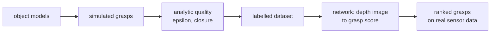

> [!abstract] Depth target · 깊이 목표
> **Mastery** — a contact-rich task that starts from a bad grasp fails for reasons that have
> nothing to do with the interesting part, so this is a dependency of the contribution
> rather than an adjacent field.
> **Mastery** — 나쁜 파지에서 시작한 접촉이 많은 작업은 정작 흥미로운 부분과 무관한 이유로
> 실패한다. 그래서 이것은 인접 분야가 아니라 기여의 의존 층이다.

> [!note] Prerequisites · 선수 지식
> You need friction and the friction cone ([[04-robotics/contact-force-tactile|Contact, Force & Tactile §2]]), wrenches and $\tau = J^\top\mathcal{F}$ ([[04-robotics/modern-robotics/ch05-velocity-kinematics|MR ch.5 §3]]), and convexity ([[02-foundations/optimization|4. Optimization §2]]).
> 마찰과 마찰 원뿔([[04-robotics/contact-force-tactile|접촉·힘·촉각 §2]]), 렌치와 $\tau = J^\top\mathcal{F}$([[04-robotics/modern-robotics/ch05-velocity-kinematics|MR 5장 §3]]), 볼록성([[02-foundations/optimization|4. 최적화 §2]])이 필요하다.

## English

*Group H and a Mastery page. Stands on [[04-robotics/contact-force-tactile|9. Contact]], [[04-robotics/modern-robotics/ch12-grasping|MR ch.12]] and optimization.
Half the field is the mathematics of closure and half is predicting it from a depth image without writing any of it down — both are worth reading, because the learned half trains on labels the analytic half produced.*

> [!note] First pass · 처음이라면
> Read §1, then §3 — form closure versus force closure is the distinction the secondary literature keeps getting wrong — then §7. §4 (the epsilon metric) and §5 are for when you are comparing grasp planners rather than reading about them.

### 1. The question a grasp has to answer

A grasp is not "the gripper is touching the object". It is a claim: **whatever the world
does to this object next, the contacts can resist it.** The field's classical half is the
mathematics of that claim, and its modern half is a way of predicting the claim from a
depth image without ever writing it down. Both halves are worth reading, because the
learned methods are trained on labels the classical theory produces.

### 2. The friction cone, and why closure is a cone question

A frictionless point contact can push only along the surface normal. With Coulomb friction
of coefficient $\mu$, the contact can also resist tangential force up to $\mu$ times the
normal force, so the set of forces it can apply is a **cone** about the normal with
half-angle $\arctan\mu$.

$$\|f_t\| \le \mu f_n \quad \Longleftrightarrow \quad \text{the force lies inside the cone of half-angle } \arctan\mu$$

For $\mu = 0.5$ that half-angle is $\arctan 0.5 \approx 26.6°$; for $\mu = 1.0$ it is $45°$.
That single number is why grasp analysis is a geometry problem: each contact contributes a
cone of admissible forces, each force at a contact point produces a **wrench** (force plus
the moment it makes about the object's reference point), and the question becomes whether
the cones together span everything the world can throw at the object.

<svg viewBox="0 0 560 236" style="max-width:100%;height:auto" role="img" aria-label="a friction cone at a contact with half angle arctan mu, and two opposed contacts whose cones each contain the line between them">
  <g stroke="currentColor" stroke-width="1.6" fill="none" opacity="0.8">
    <line x1="40" y1="150" x2="180" y2="150"/>
  </g>
  <path d="M 110 150 L 74 78 L 146 78 Z" fill="currentColor" fill-opacity="0.16" stroke="currentColor" stroke-width="1.1"/>
  <g stroke="currentColor" stroke-width="1.2" fill="none" opacity="0.65" stroke-dasharray="4 3">
    <line x1="110" y1="150" x2="110" y2="70"/>
  </g>
  <g fill="currentColor"><circle cx="110" cy="150" r="4"/></g>
  <g font-size="10.5" fill="currentColor">
    <text x="116" y="66">normal</text>
    <text x="150" y="112">half-angle arctan &#956;</text>
    <text x="40" y="172" opacity="0.8">surface</text>
    <text x="40" y="46" font-size="11">one contact: a cone of forces it can apply</text>
  </g>
  <g stroke="currentColor" stroke-width="1.6" fill="none" opacity="0.8">
    <rect x="330" y="96" width="120" height="60" rx="3"/>
  </g>
  <path d="M 330 126 L 372 104 L 372 148 Z" fill="currentColor" fill-opacity="0.16" stroke="currentColor" stroke-width="1.1"/>
  <path d="M 450 126 L 408 104 L 408 148 Z" fill="currentColor" fill-opacity="0.16" stroke="currentColor" stroke-width="1.1"/>
  <g stroke="currentColor" stroke-width="1.2" fill="none" opacity="0.65" stroke-dasharray="4 3">
    <line x1="330" y1="126" x2="450" y2="126"/>
  </g>
  <g fill="currentColor"><circle cx="330" cy="126" r="4"/><circle cx="450" cy="126" r="4"/></g>
  <g font-size="10.5" fill="currentColor">
    <text x="390" y="80" font-size="11" text-anchor="middle">two contacts: antipodal if the line lies in both cones</text>
    <text x="330" y="180" opacity="0.8">the line joining the contacts</text>
  </g>
  <g font-size="11" fill="currentColor" opacity="0.9">
    <text x="20" y="212">The whole of two-finger grasp planning is that second picture: find a pair of surface points whose</text>
    <text x="20" y="228">connecting line lies inside both friction cones. Wider cones &#8212; rougher surfaces &#8212; admit more pairs.</text>
  </g>
</svg>

### 3. Form closure and force closure

Two different guarantees, routinely conflated:

| | Means | Depends on friction? |
|---|---|---|
| **Form closure** | the contact geometry alone immobilises the object; no motion is possible whatever forces are applied | no — it is a purely kinematic property |
| **Force closure** | the contacts can generate forces resisting **any** external wrench | yes — it is a statement about the friction cones |

Form closure is the stronger and rarer condition. Force closure is what a two-finger grasp
of a box achieves and what almost every grasp paper means when it says "stable".

The finger counts are a place where secondary sources reliably go wrong, so state them with
their sources attached. Markenscoff, Ni and Papadimitriou's 1990 analysis gives, in its own
abstract, that with Coulomb friction **three fingers are necessary and sufficient in two
dimensions and four in three dimensions**. The much-quoted **seven** is a different result —
it is the *frictionless* form-closure count in 3D, and quoting it as the force-closure
number is a common error.

> [!warning] Two fingers or four? Name the contact model
> Those two statements — "a two-finger grasp of a box achieves force closure" and "four
> fingers are necessary in 3D" — look contradictory and are not. They assume different
> **contact models**, and a paper that does not name its model cannot be checked.
>
> | Model | Each contact transmits | Two-finger force closure in 3D? |
> |---|---|---|
> | **Point contact, frictionless** | force along the normal only | no |
> | **Hard finger** (point contact with friction) | force inside the friction cone, **no moment** | no — **three** non-collinear contacts is the 3D minimum |
> | **Soft finger** | force inside the cone **plus a moment about the contact normal** (torsional friction) | yes — this is the antipodal case |
>
> A parallel-jaw gripper on a real box is a soft-finger contact: the pads deform, so each
> contact resists twisting about its own normal, and two of them suffice. Under hard finger
> the 3D minimum is **three** non-collinear contacts (Springer Handbook ch. 38).
>
> Markenscoff's four is a **third** kind of statement and the easiest to misuse: it is a
> *universal* bound — how many fingers suffice for **any** object — not the minimum for the
> object in front of you. So the reconciliation has two moving parts, not one: the contact
> model, and whether the count is universal or particular. **When a paper claims force
> closure, ask which row it stands on and whether its number is a worst case** — learned grasp
> planners almost always assume soft finger implicitly, by training on grippers with
> compliant pads.

For two contacts specifically, the practical criterion is the **antipodal** condition: the
line joining the two contact points must lie inside both friction cones. That is the second
panel of the figure above, and it is the geometric core of essentially every two-finger
grasp planner, learned or not.

### 4. Grasp quality — the epsilon metric

Closure is binary; a planner needs a ranking. Build the **grasp wrench space**: the set of
wrenches the contacts can produce with bounded contact forces — a convex set containing the
origin. Ferrari and Canny's 1992 metric is then disarmingly geometric:

> $\epsilon$ = the radius of the largest ball centred at the wrench-space origin that fits
> inside the grasp wrench space.

Read what that buys. $\epsilon$ is the magnitude of the **worst-case** external wrench the
grasp can resist — worst-case over direction, because a ball is direction-agnostic. It is
positive exactly when the grasp has closure, and it grows as contacts are added. A grasp
that is superb against gravity and helpless against a sideways nudge gets the low score it
deserves.

The weakness is the same as the strength: by treating all wrench directions as equally
likely, $\epsilon$ ignores the task. A screwdriver grasp that must resist torque about the
shaft is not well served by a metric that averages over directions it will never see —
which is the motivation for task-oriented quality measures, and worth remembering when a
paper reports "grasp quality" without saying quality *for what*.

### 5. From analysis to learning

The modern pipeline did not discard the theory; it moved it into the **label generator**.

Dex-Net 2.0 is the clearest statement of this idea: train a grasp-quality CNN entirely on
synthetic depth images paired with **analytic** grasp metrics, so no real grasp attempts are
needed for training. Its abstract reports 6.7 million point clouds, grasps and analytic
metrics; planning in 0.8 s with a 93% success rate on eight known adversarial objects; and
99% precision — one false positive out of 69 grasps classified robust — on 40 novel
household objects.

Then the field moved in two directions:

- **Toward real data and full 6-DoF.** GraspNet-1Billion contributes a real-sensor benchmark
  — its abstract states 97,280 RGB-D images with over one billion grasp poses — plus an
  evaluation system that scores arbitrary grasp poses without exhaustive labels.
  AnyGrasp extends this to dense, temporally smooth 7-DoF grasps with centre-of-mass
  awareness; its abstract reports **93.3% success clearing bins with over 300 unseen
  objects, "on par with human subjects under controlled conditions", and over 900 mean
  picks per hour**.
- **Toward rooting the grasp in the observation.** Contact-GraspNet treats observed scene
  points as candidate contacts, which cuts the learned representation from 6-DoF to 4-DoF;
  its abstract claims training on 17 million simulated grasps and over 90% success on unseen
  objects in structured clutter, halving a prior method's failure rate.

A different lineage worth knowing: Transporter Networks recasts pick-and-place as a
**spatial displacement** inferred by cross-correlating deep feature templates over the
scene. Exploiting that symmetry rather than predicting grasp poses lets it learn from very
few demonstrations without object models or keypoints — a reminder that "grasping" and
"rearrangement" are not the same problem.

**What the policy actually looks at.** A 2024–26 manipulation paper's method section opens by
naming its observation representation, and the choice bounds what the policy can do. The four
you will meet:

| Representation | What is fed in | Buys | Costs |
|---|---|---|---|
| **RGB images** | one or more camera views | the pretrained-backbone ecosystem (SigLIP, DINO) and web-scale priors | no metric scale; viewpoint changes are out-of-distribution |
| **Point clouds** | depth back-projected into the robot frame, encoded with a PointNet-style permutation-invariant network ([[01-canonical-papers/notes/2-computer-vision/pointnet\|PointNet]]) | metric geometry, and camera extrinsics stop mattering because the points are already in a fixed frame — the argument behind 3D policy variants | the *encoder* is permutation-invariant, **not** rotation- or viewpoint-invariant, and self-occlusion still changes the visible set; depth fails on the glossy, dark and transparent |
| **Keypoints** | a sparse set of task-relevant points on the object | a low-dimensional, interpretable state that generalizes across instances of a category | someone must define what the keypoints *are*, and a novel category has none |
| **Affordances** | a per-pixel or per-point map of where an action can be applied | directly language- and task-conditionable, and composes with open-vocabulary models | supervision is expensive, and "graspable" is not a property of the object alone but of the object *and the gripper* |

**Read the representation as a claim about generalization.** A policy on RGB generalizes the
way its visual backbone does; a policy on point clouds generalizes across viewpoint but
inherits the depth sensor's failure set; a keypoint policy generalizes within the category
whose keypoints were defined and not outside it. When a paper reports strong unseen-object
performance, **the representation usually explains more of that number than the policy
architecture does** — which is why the seen/unseen split axis of
[[06-research-practice/simulators-benchmarks-datasets|7. §11]] has to be read alongside it.

**Beyond the parallel jaw.** Everything above §4 assumed two rigid fingers, and a growing
share of the literature does not. Two distinctions are enough to read those papers:

- **Multi-fingered versus parallel-jaw** is a change in *dimension*, not degree — though
  check the actual number before assuming it is large. Anthropomorphic hands run 16–20
  actuated DoF (Shadow 20, Allegro and LEAP 16), while the common **three-fingered** hands are
  underactuated and much smaller (BarrettHand 4, Robotiq 3-Finger 4, Schunk SDH-2 7). Above a
  handful of DoF, grasp synthesis becomes search in a space where §4's ε-metric is expensive
  and this section's learned pipelines were never trained. Two reductions are used: a
  **grasp taxonomy** — power versus precision at the top, with leaf types like tripod and tip
  pinch underneath — and, more often in synthesis, a *continuous* low-dimensional subspace
  (eigengrasps).
- **In-hand manipulation** — reorienting an object *after* it is grasped, without putting it
  down — is a genuinely different problem, because the contact set changes during the motion.
  Force closure ([[04-robotics/grasping|§3]]) describes a *static* condition; in-hand
  reorientation deliberately breaks and remakes it — though that describes **finger gaiting**;
  rolling and sliding reorientation can hold contact throughout. What changes is that the
  problem becomes a hybrid contact-mode problem whose mode combinatorics explode, which is why
  sampling and RL in simulation with heavy randomization became the default. Analytic work did
  not stop: contact-implicit MPC for in-hand manipulation is current.

For construction this is mostly a boundary marker: site objects are heavy, held with tools or
two-finger grips, and the dexterity that matters is force regulation ([[04-robotics/force-compliance-control|13]])
rather than finger-gaiting. **A dexterous-hand result does not transfer to a construction task
by default**, and a paper claiming it should be asked which of the two changes above it
actually relies on.

#### Extrinsic dexterity — when the environment is part of the grasp

Everything above computes closure over the contacts the *hand* supplies. That is a modelling
choice, not a law, and dropping it changes the answer. A gripper pressing an object against a
wall has three contact sets in play — two fingers and the wall — and the wall's contact costs
nothing, needs no actuator, and never slips out of position.

**Chavan Dafle, Rodriguez et al. (ICRA 2014)** named this *extrinsic dexterity*: reorienting
an object in the hand using gravity, inertia, and contacts with the environment instead of
finger motion. The point is an economic one about hardware. The classical argument for a
many-DoF hand is that in-hand reorientation requires internal degrees of freedom; extrinsic
dexterity shows that a two-finger gripper plus a table gets a large share of that capability
for free. **Zhou & Held (CoRL 2022)** is the learned version and the sharper datapoint: on
*occluded grasping* — where no grasp exists from the object's initial pose — a policy
discovers pushing the object against a wall to rotate it, then grasps, **with no reward term
rewarding environmental contact**, and transfers zero-shot from simulation to hardware at 78%
across objects varying in size, density, friction and shape.

Two consequences for how you read §2–§4:

- **A force-closure verdict is relative to the contact set you chose to model.** "This grasp
  is not force-closed" may only mean "not force-closed by the fingers alone". Ask what the
  object is resting on.
- **Dexterity is not only a property of the hand.** It is a property of hand *and* environment
  together — which is why the boundary marker above ("a dexterous-hand result does not
  transfer") cuts both ways: a simple gripper in a rich environment can beat a complex hand in
  an empty one.

**In construction the environment is unusually rich, and this is under-exploited.** A drill
braced against the wall it is drilling converts reaction torque into an environmental contact
instead of a joint load; a panel slid along a track is constrained by the track for free; a
component lowered into a socket is seated by gravity rather than by force control. These are
the same manoeuvre as pushing against a table, and the site supplies more fixtures than a
tabletop does. The framing to carry into
[[05-construction-robotics/construction-manipulation|9. Construction Manipulation]] is that
**a construction workpiece is rarely free-floating** — so a grasp analysis that models only
the gripper is describing a harder problem than the one actually present.

### 6. Construction changes the object, not the theory

The mathematics above assumes a rigid object of known-enough geometry. Construction
materials break that assumption in specific ways, and each one maps to a specific part of
the theory:

| What construction supplies | Which assumption it breaks |
|---|---|
| Rebar bundles, mesh | not one object; the "object" deforms and shifts internally |
| Panels, sheet goods | large, thin, and flexible — the grasp wrench space depends on where you hold it |
| Bricks, blocks, aggregates | fine, and mostly a weight and cycle-time problem rather than a grasp-analysis one |
| Bags, insulation, membranes | deformable; closure is not defined on a shape that changes |
| Dusty, wet, or abraded surfaces | $\mu$ is unknown and varies within a shift, so every cone in §2 has an uncertain half-angle |

The last row is the one most worth carrying: the friction coefficient is an *input* to all
of §2–§4 and on a site nobody measures it. A grasp planner that assumes $\mu = 0.6$ on a
surface that is actually 0.3 has half the cone it thinks it has. This is a concrete,
defensible thing to be robust to — and the tactile route to estimating it is
[[04-robotics/tactile-visuotactile|14. §3]].

### 7. Reading a grasp paper

| Question | What a missing answer hides |
|---|---|
| Is success **grasp** success or **task** success? | Lifting an object is not the same as still holding it after a transfer |
| How many attempts, and were failures retried? | "Success rate" over retried attempts is a different quantity |
| Seen or unseen objects — and unseen in what sense? | New instance, new category, and new material are three difficulty levels |
| Clutter: isolated, structured, or dense? | The step from isolated to dense clutter is where most methods lose their numbers |
| Was $\mu$ assumed, measured, or learned? | An assumed $\mu$ makes every analytic label a hypothesis |
| Which gripper, and was it re-tuned per object? | Parallel-jaw results do not transfer to suction or to multi-finger hands |
| Planning time on what hardware? | Closed-loop use needs a number here, not "efficient" |

### 8. The path to Mastery

| Need | Where |
|---|---|
| Contact models, closure, internal forces | [[04-robotics/modern-robotics/ch12-grasping\|MR ch.12]], then Bicchi & Kumar's 2000 review |
| The taxonomy grasping sits inside | Okamura, Smaby & Cutkosky 1999 — what "dexterous manipulation" actually enumerates (rolling, sliding, finger gaiting, regrasping), so you can say which one a paper is claiming |
| The construction of force-closure grasps | Nguyen 1988 |
| Quality metrics done properly | Ferrari & Canny 1992, and a task-oriented critique of it |
| The learned pipeline end to end | Dex-Net 2.0, then Contact-GraspNet |
| Hands-on | Compute the antipodal condition on a simulated object at two values of $\mu$ and watch the admissible set shrink |

The Mastery test: given an object, a gripper, and a friction estimate, say where the good
grasps are and what would make your answer wrong.

### After reading

- [ ] Draw a friction cone and give its half-angle for $\mu = 0.5$ and $\mu = 1$.
- [ ] State the difference between form closure and force closure, and give the frictional 3D finger count with its source.
- [ ] Define $\epsilon$ and say what it deliberately ignores.
- [ ] Explain where the analytic theory sits inside a learned grasping pipeline.
- [ ] Name the assumption construction most reliably breaks.

> [!tip] Going deeper · 더 깊이
> Murray, Li & Sastry, *A Mathematical Introduction to Robotic Manipulation* (CRC, 1994) ch.5 is the source of the vocabulary in §2–§4 — contact models, grasp maps, form and force closure — and it is worth reading precisely because the secondary literature garbles those definitions so often. It is a mathematics book and will not tell you what §5 tells you, which is that most of the field stopped computing closure and started predicting grasps from images. Read ch.5 for the definitions and the [[01-canonical-papers/index|papers track]] for what replaced the method.

### Self-check

1. A paper says its grasps are "force closure with seven contacts, following the classical
   result". What is wrong?
2. $\mu$ drops from 0.6 to 0.3 because a surface is dusty. What happens geometrically, and
   what happens to the set of valid antipodal grasps?
3. Why can a grasp with a high $\epsilon$ still be the wrong grasp for a task?
4. Dex-Net trains on synthetic data with analytic labels and works on real objects. What is
   the strongest assumption making that possible?
5. A robot must hold a 2.4 m drywall sheet. Which part of §2–§4 stops applying, and what
   would you reach for instead?

> [!tip]- Answers
> 1. Seven is the *frictionless form-closure* count in 3D, not a force-closure count. With Coulomb friction, Markenscoff, Ni and Papadimitriou's 1990 abstract gives four fingers as necessary and sufficient in three dimensions. The paper has merged two different theorems, which is the single most common error in this area.
> 2. The cone's half-angle falls from $\arctan 0.6 \approx 31.0°$ to $\arctan 0.3 \approx 16.7°$ — roughly half the angular width. The antipodal condition requires the line joining two contacts to lie inside *both* cones, so narrowing both cones shrinks the set of valid contact pairs sharply, and grasps that were marginal become invalid. Worse, a planner that still believes $\mu = 0.6$ will keep proposing them.
> 3. Because $\epsilon$ is the worst case over *all* wrench directions, weighting equally the directions the task will never produce. A grasp optimised against a uniform ball can be beaten, on the actual task, by one that is weak in irrelevant directions and strong in the one direction that matters — resisting torque about a screwdriver's shaft, say. Quality is only meaningful relative to a task wrench distribution.
> 4. That the analytic metric is a good enough proxy for real grasp success — that is, that the physics in the label generator matches the physics of the real contact closely enough for the ranking to survive. Depth-image realism matters too, but it is the *label* that carries the assumption: the network can only learn the quality function it was shown.
> 5. Everything from §2 on, because the sheet is not a rigid body — it flexes, so the contact geometry and therefore the grasp wrench space depend on where and how it is held, and closure is not defined on a shape that changes under load. The realistic move is multi-point support or a vacuum array that constrains the deformation, treating it as a handling and fixturing problem rather than a grasp-analysis one.

### Sources

**Classical**

- V.-D. Nguyen, "Constructing Force-Closure Grasps," *IJRR*, vol. 7, no. 3, pp. 3–16, 1988 (earlier ICRA versions: 1986 pp. 1368–1373; "…in 3D" 1987 pp. 240–245).
- A. M. Okamura, N. Smaby, M. R. Cutkosky, "An overview of dexterous manipulation," *ICRA 2000*, pp. 255–262. DOI 10.1109/ROBOT.2000.844067 — the taxonomy of manipulation modes a grasp result sits inside.
- N. Chavan Dafle, A. Rodriguez, R. Paolini, B. Tang, S. Srinivasa, M. Erdmann, M. T. Mason, et al., "Extrinsic dexterity: In-hand manipulation with external forces," *ICRA 2014*, pp. 1578–1585. DOI 10.1109/ICRA.2014.6907062
- W. Zhou, D. Held, "Learning to Grasp the Ungraspable with Emergent Extrinsic Dexterity," *CoRL 2022*, PMLR vol. 205 (published 2023 — cite the conference year, not the proceedings year) ([arXiv:2211.01500](https://arxiv.org/abs/2211.01500))
- X. Markenscoff, L. Ni, C. H. Papadimitriou, "The Geometry of Grasping," *IJRR*, vol. 9, no. 1, pp. 61–74, 1990 — the source for the frictional finger counts in §3, stated in its own abstract.
- C. Ferrari and J. F. Canny, "Planning optimal grasps," ICRA **1992**, pp. 2290–2295 — the $\epsilon$ metric. Note the *Springer Handbook of Robotics* bibliography misprints the year as 1986; the correct year is 1992.
- A. Bicchi and V. Kumar, "Robotic grasping and contact: a review," ICRA 2000, pp. 348–353 — the survey to read first. It discusses the frictionless counts only, not the frictional one.

**Learned**

- J. Mahler, J. Liang, S. Niyaz, et al., "Dex-Net 2.0: Deep Learning to Plan Robust Grasps with Synthetic Point Clouds and Analytic Grasp Metrics," RSS 2017 ([arXiv:1703.09312](https://arxiv.org/abs/1703.09312)).
- H.-S. Fang, C. Wang, M. Gou, C. Lu, "GraspNet-1Billion: A Large-Scale Benchmark for General Object Grasping," CVPR 2020, pp. 11441–11450. The scene and object counts usually quoted for it come from the project page, not the abstract.
- H.-S. Fang, C. Wang, H. Fang, et al., "AnyGrasp: Robust and Efficient Grasp Perception in Spatial and Temporal Domains," *IEEE T-RO*, vol. 39, no. 5, pp. 3929–3945, 2023 ([arXiv:2212.08333](https://arxiv.org/abs/2212.08333)).
- M. Sundermeyer, A. Mousavian, R. Triebel, D. Fox, "Contact-GraspNet: Efficient 6-DoF Grasp Generation in Cluttered Scenes," ICRA 2021, pp. 13438–13444 ([arXiv:2103.14127](https://arxiv.org/abs/2103.14127)).
- A. Zeng, P. Florence, J. Tompson, et al., "Transporter Networks: Rearranging the Visual World for Robotic Manipulation," CoRL 2020, PMLR vol. 155, pp. 726–747 ([arXiv:2010.14406](https://arxiv.org/abs/2010.14406)). The PMLR proceedings list 11 authors; arXiv lists 12.

Every quantitative figure quoted in §5 is from the respective paper's own abstract.

**Within this wiki**

- [[04-robotics/modern-robotics/ch12-grasping|MR ch.12]] — the chapter this page extends.
- [[04-robotics/contact-force-tactile|Contact, Force & Tactile Interaction §2, §4]] — friction and the wrench vocabulary.
- [[04-robotics/tactile-visuotactile|14. Tactile & Visuotactile Sensing]] — how the unknown $\mu$ of §6 might be estimated at the contact.

## 한국어

*H군이자 Mastery 페이지다. [[04-robotics/contact-force-tactile|9. 접촉]]·[[04-robotics/modern-robotics/ch12-grasping|MR 12장]]·최적화 위에 선다.
이 분야의 절반은 closure의 수학이고 절반은 그것을 적지 않은 채 깊이 이미지에서 예측하는 방법이다 — 학습된 쪽이 해석적 쪽이 만든 라벨로 학습되므로 둘 다 읽을 값어치가 있다.*

> [!note] 처음이라면 · First pass
> 먼저 §1 다음 §3 — form closure 대 force closure는 2차 문헌이 계속 틀리는 구분이다 — 그다음 §7. §4(엡실론 지표)와 §5는 파지 계획기에 관해 읽는 것이 아니라 비교할 때 본다.

### 1. 파지가 답해야 하는 질문

파지는 "그리퍼가 물체에 닿아 있다"가 아니다. 하나의 주장이다: **다음에 세상이 이 물체에
무슨 짓을 하든, 접촉들이 그것에 저항할 수 있다.** 이 분야의 고전적 절반은 그 주장의 수학이고,
현대적 절반은 그것을 적어 보지도 않은 채 깊이 이미지에서 예측하는 방법이다. 두 절반을 다
읽을 가치가 있다. 학습된 방법들이 고전 이론이 만들어낸 라벨로 학습되기 때문이다.

### 2. 마찰 원뿔, 그리고 closure가 원뿔의 문제인 이유

마찰 없는 점접촉은 표면 법선 방향으로만 밀 수 있다. 마찰계수 $\mu$의 쿨롱 마찰이 있으면
접선 방향 힘도 법선력의 $\mu$배까지 버틸 수 있으므로, 가할 수 있는 힘의 집합은 법선을 축으로
반각 $\arctan\mu$인 **원뿔**이 된다.

$$\|f_t\| \le \mu f_n \quad \Longleftrightarrow \quad \text{힘이 반각 } \arctan\mu \text{ 인 원뿔 안에 있다}$$

$\mu = 0.5$면 그 반각은 $\arctan 0.5 \approx 26.6°$이고, $\mu = 1.0$이면 $45°$다. 이 숫자
하나가 파지 해석을 기하 문제로 만든다: 각 접촉이 허용 가능한 힘의 원뿔을 하나씩 기여하고,
접촉점에서의 각 힘이 **렌치**(힘 + 그것이 물체 기준점에 만드는 모멘트)를 만들며, 질문은
그 원뿔들이 합쳐서 세상이 물체에 던질 수 있는 모든 것을 덮는가가 된다.

<svg viewBox="0 0 560 236" style="max-width:100%;height:auto" role="img" aria-label="반각이 arctan mu인 접촉의 마찰 원뿔과, 서로를 잇는 선이 두 원뿔 안에 들어가는 마주 보는 두 접촉">
  <g stroke="currentColor" stroke-width="1.6" fill="none" opacity="0.8">
    <line x1="40" y1="150" x2="180" y2="150"/>
  </g>
  <path d="M 110 150 L 74 78 L 146 78 Z" fill="currentColor" fill-opacity="0.16" stroke="currentColor" stroke-width="1.1"/>
  <g stroke="currentColor" stroke-width="1.2" fill="none" opacity="0.65" stroke-dasharray="4 3">
    <line x1="110" y1="150" x2="110" y2="70"/>
  </g>
  <g fill="currentColor"><circle cx="110" cy="150" r="4"/></g>
  <g font-size="10.5" fill="currentColor">
    <text x="116" y="66">법선</text>
    <text x="150" y="112">반각 arctan &#956;</text>
    <text x="40" y="172" opacity="0.8">표면</text>
    <text x="40" y="46" font-size="11">접촉 하나: 그것이 가할 수 있는 힘의 원뿔</text>
  </g>
  <g stroke="currentColor" stroke-width="1.6" fill="none" opacity="0.8">
    <rect x="330" y="96" width="120" height="60" rx="3"/>
  </g>
  <path d="M 330 126 L 372 104 L 372 148 Z" fill="currentColor" fill-opacity="0.16" stroke="currentColor" stroke-width="1.1"/>
  <path d="M 450 126 L 408 104 L 408 148 Z" fill="currentColor" fill-opacity="0.16" stroke="currentColor" stroke-width="1.1"/>
  <g stroke="currentColor" stroke-width="1.2" fill="none" opacity="0.65" stroke-dasharray="4 3">
    <line x1="330" y1="126" x2="450" y2="126"/>
  </g>
  <g fill="currentColor"><circle cx="330" cy="126" r="4"/><circle cx="450" cy="126" r="4"/></g>
  <g font-size="10.5" fill="currentColor">
    <text x="390" y="80" font-size="11" text-anchor="middle">접촉 둘: 잇는 선이 두 원뿔 안에 있으면 antipodal</text>
    <text x="330" y="180" opacity="0.8">두 접촉을 잇는 선</text>
  </g>
  <g font-size="11" fill="currentColor" opacity="0.9">
    <text x="20" y="212">두 손가락 파지 계획의 전부가 저 두 번째 그림이다: 잇는 선이 두 마찰 원뿔 안에 들어가는</text>
    <text x="20" y="228">표면 점 쌍을 찾는 것. 원뿔이 넓을수록 &#8212; 표면이 거칠수록 &#8212; 가능한 쌍이 많아진다.</text>
  </g>
</svg>

### 3. Form closure와 force closure

일상적으로 혼동되는 두 가지 다른 보장이다:

| | 뜻 | 마찰에 의존? |
|---|---|---|
| **Form closure** | 접촉 기하만으로 물체가 고정된다. 어떤 힘을 가해도 운동이 불가능하다 | 아니다 — 순수하게 기구학적 성질 |
| **Force closure** | 접촉들이 **임의의** 외부 렌치에 저항하는 힘을 만들 수 있다 | 그렇다 — 마찰 원뿔에 관한 진술 |

Form closure가 더 강하고 더 드문 조건이다. Force closure가 상자를 두 손가락으로 잡을 때
달성되는 것이고, 거의 모든 파지 논문이 "안정적"이라고 할 때 뜻하는 것이다.

손가락 개수는 2차 출처가 어김없이 틀리는 지점이므로, 출처를 붙여서 말한다. Markenscoff, Ni,
Papadimitriou의 1990년 분석은 자기 초록에서, 쿨롱 마찰이 있을 때 **2차원에서는 손가락 셋,
3차원에서는 넷이 필요충분**이라고 말한다. 널리 인용되는 **일곱**은 다른 결과다 — 3D에서의
*마찰 없는* form closure 개수이고, 이것을 force closure 개수로 인용하는 것이 흔한 오류다.

> [!warning] 손가락 둘인가 넷인가 — 접촉 모델을 밝혀라
> 두 진술 — "상자를 두 손가락으로 잡으면 force closure다"와 "3D에서는 넷이 필요하다" — 은
> 모순처럼 보이지만 아니다. 서로 다른 **접촉 모델**을 전제하고 있고, 모델을 밝히지 않은
> 논문은 검증할 수 없다.
>
> | 모델 | 각 접촉이 전달하는 것 | 3D에서 두 손가락 force closure? |
> |---|---|---|
> | **점 접촉, 마찰 없음** | 법선 방향 힘만 | 불가 |
> | **hard finger**(마찰 있는 점 접촉) | 마찰 원뿔 안의 힘, **모멘트 없음** | 불가 — 이것이 Markenscoff의 넷 |
> | **soft finger** | 원뿔 안의 힘 **+ 접촉 법선 둘레의 모멘트**(비틀림 마찰) | 가능 — 이것이 antipodal의 경우 |
>
> 실제 상자를 잡는 평행 조 그리퍼는 soft finger 접촉이다: 패드가 변형되므로 각 접촉이 자기
> 법선 둘레의 비틀림에 저항하고, 그래서 둘이면 충분하다. Markenscoff의 개수는 hard finger
> 정리다. **논문이 force closure를 주장하면 첫 질문은 어느 행에 서 있느냐다** — 학습 기반
> 파지 계획기는 대개 유연한 패드가 달린 그리퍼로 학습하면서 soft finger를 암묵적으로 가정한다.

접촉이 둘일 때의 실용적 판정은 **antipodal** 조건이다: 두 접촉점을 잇는 선이 두 마찰 원뿔
안에 모두 들어가야 한다. 위 그림의 두 번째 패널이 그것이고, 학습이든 아니든 사실상 모든 두
손가락 파지 계획기의 기하학적 핵심이다.

### 4. 파지 품질 — 엡실론 지표

Closure는 이분법이고, 계획기에는 순위가 필요하다. **파지 렌치 공간**(grasp wrench space)을
만든다: 접촉력이 유계일 때 접촉들이 만들 수 있는 렌치의 집합 — 원점을 포함하는 볼록 집합이다.
Ferrari와 Canny의 1992년 지표는 놀랄 만큼 기하적이다:

> $\epsilon$ = 렌치 공간의 원점을 중심으로 파지 렌치 공간 안에 들어가는 가장 큰 공의 반지름.

무엇을 사는지 읽어라. $\epsilon$은 파지가 저항할 수 있는 **최악의** 외부 렌치의 크기다 —
방향에 대해 최악인데, 공은 방향을 가리지 않기 때문이다. 파지가 closure를 가질 때 정확히
양수이고, 접촉을 더하면 커진다. 중력에는 훌륭하고 옆에서 툭 미는 데는 무력한 파지는 마땅히
낮은 점수를 받는다.

약점은 강점과 같다: 모든 렌치 방향을 동등하게 취급하므로 $\epsilon$은 과제를 무시한다. 축
둘레의 토크에 저항해야 하는 드라이버 파지는, 결코 마주칠 일 없는 방향들까지 평균 내는 지표로
잘 다뤄지지 않는다 — 과제 지향 품질 지표의 동기이고, 어떤 논문이 무엇을 *위한* 품질인지 밝히지
않은 채 "파지 품질"을 보고할 때 기억할 것이다.

### 5. 해석에서 학습으로

현대의 파이프라인은 이론을 버린 것이 아니라 **라벨 생성기** 안으로 옮겼다.

Dex-Net 2.0이 이 발상의 가장 명확한 진술이다: 파지 품질 CNN을 전적으로 **해석적** 파지 지표와
짝지어진 합성 깊이 이미지로 학습시켜, 학습에 실제 파지 시도가 전혀 필요 없게 만든다. 초록은
포인트 클라우드·파지·해석 지표 670만 개, 알려진 적대적 형상 물체 8개에서 0.8초 계획에 93%
성공률, 그리고 새로운 생활용품 40개에서 99% 정밀도 — robust로 분류한 파지 69개 중 거짓 양성
1개 — 를 보고한다.

그다음 분야는 두 방향으로 갔다:

- **실제 데이터와 완전한 6자유도 쪽으로.** GraspNet-1Billion은 실제 센서 벤치마크를 기여하고
  — 초록은 RGB-D 이미지 97,280장과 10억 개가 넘는 파지 자세를 말한다 — 전수 라벨 없이 임의의
  파지 자세를 채점하는 평가 체계를 함께 준다. AnyGrasp은 이를 무게중심을 인지하는 조밀하고
  시간적으로 매끄러운 7자유도 파지로 확장한다. 초록은 **처음 보는 물체 300개가 넘는 통을 비우며
  93.3% 성공, "통제된 조건에서 사람 피험자와 대등", 시간당 평균 900회 이상 집기**를 보고한다.
- **파지를 관측에 뿌리내리는 쪽으로.** Contact-GraspNet은 관측된 장면 점들을 후보 접촉으로
  다뤄 학습되는 표현을 6자유도에서 4자유도로 줄인다. 초록은 시뮬레이션 파지 1,700만 개로 학습해
  구조화된 잡동사니 속 처음 보는 물체에서 90% 넘는 성공률, 선행 방법의 실패율을 절반으로 줄였다고
  주장한다.

알아 둘 다른 계보: Transporter Networks는 집어 놓기를 장면 위에서 깊은 특징 템플릿을 상호
상관해 추론하는 **공간적 변위**로 다시 정식화한다. 파지 자세를 예측하는 대신 그 대칭성을
이용해, 물체 모델도 키포인트도 없이 아주 적은 시연으로 학습한다 — "파지"와 "재배치"가 같은
문제가 아니라는 것을 상기시킨다.

**정책이 실제로 무엇을 보는가.** 2024~26년 매니퓰레이션 논문의 방법 절은 관측 표현을 밝히면서
시작하고, 그 선택이 정책이 할 수 있는 것의 범위를 정한다. 마주치게 될 네 가지:

| 표현 | 무엇을 넣는가 | 사는 것 | 치르는 것 |
|---|---|---|---|
| **RGB 이미지** | 카메라 시점 하나 이상 | 사전학습 백본 생태계(SigLIP, DINO)와 웹 규모 사전지식 | 미터 스케일이 없다. 시점 변화가 분포 밖이다 |
| **포인트 클라우드** | 깊이를 역투영해 PointNet 계열 순열 불변 네트워크로 부호화([[01-canonical-papers/notes/2-computer-vision/pointnet\|PointNet]]) | 미터 기하와 시점 불변성을 거의 공짜로 — 3D 정책 변형들의 논거 | 깊이 센서가 광택·어두움·투명에서 실패한다. 융합하지 않으면 색 의미가 없다 |
| **키포인트** | 물체 위 과제 관련 점들의 성긴 집합 | 저차원이고 해석 가능하며 범주 내 개체를 가로질러 일반화되는 상태 | 키포인트가 *무엇인지*를 누군가 정의해야 하고, 새로운 범주에는 그것이 없다 |
| **어포던스** | 행동을 적용할 수 있는 곳의 픽셀별·점별 지도 | 언어와 과제로 직접 조건화되고 개방 어휘 모델과 결합된다 | 지도 신호가 비싸고, "잡을 수 있음"은 물체만의 성질이 아니라 물체 *와 그리퍼*의 성질이다 |

**표현을 일반화에 대한 주장으로 읽어라.** RGB 위의 정책은 자기 시각 백본이 일반화하는 방식으로
일반화하고, 포인트 클라우드 위의 정책은 시점을 가로질러 일반화하되 깊이 센서의 실패 집합을
물려받으며, 키포인트 정책은 키포인트가 정의된 범주 안에서 일반화하고 그 바깥에서는 아니다.
논문이 강한 unseen 물체 성능을 보고할 때, **그 숫자를 설명하는 것은 정책 구조보다 표현인 경우가
많다** — [[06-research-practice/simulators-benchmarks-datasets|7. §11]]의 seen/unseen 분할 축을
그것과 나란히 읽어야 하는 이유다.

**평행 조 너머.** §4까지의 모든 것이 단단한 손가락 둘을 가정했고, 문헌의 점점 더 많은 부분이
그렇지 않다. 그런 논문을 읽는 데는 두 구분이면 족하다:

- **다지 손 대 평행 조**는 정도가 아니라 *차원*의 변화다: 세 손가락이나 인간형 손은 구동
  자유도가 12~20개 이상이어서, 파지 합성이 §4의 ε 지표를 평가하기 비싼 공간에서의 탐색이 되고,
  이 절의 학습 파이프라인들은 거기서 학습된 적이 없다. 논문들은 대개 전체 공간 대신 이산적
  **파지 분류 체계**(power, precision, pinch, tripod)로 물러난다.
- **In-hand manipulation** — 잡은 *뒤에* 내려놓지 않고 물체의 방향을 바꾸는 것 — 은 진짜로
  다른 문제다. 운동 중에 접촉 집합 자체가 바뀌기 때문이다. Force closure([[04-robotics/grasping|§3]])는
  *정적* 조건을 기술하는데, in-hand 재정향은 그것을 의도적으로 깨고 다시 만든다 — 다만 그것은
  **finger gaiting**의 이야기이고, 구르기나 미끄러짐에 의한 재정향은 접촉을 유지한 채로도
  가능하다. 바뀌는 것은 문제가 접촉 모드의 조합이 폭발하는 하이브리드 문제가 된다는 점이고,
  그래서 표본 기반 방법과 무거운 무작위화를 동반한 시뮬레이션 RL이 기본이 되었다. 해석적
  연구가 멈춘 것은 아니다: in-hand manipulation을 위한 contact-implicit MPC는 현재 진행형이다.

건설에서 이것은 대체로 경계 표지다: 현장 물체는 무겁고, 공구나 두 손가락 파지로 다뤄지며,
중요한 손재주는 손가락 걸음이 아니라 힘 조절([[04-robotics/force-compliance-control|13]])이다.
**다지 손 결과가 건설 과제로 자동으로 옮겨가지는 않는다.** 옮겨간다고 주장하는 논문에는 위 두
변화 중 무엇에 실제로 기대고 있는지를 물어야 한다.

#### Extrinsic dexterity — 환경이 파지의 일부일 때

위의 모든 계산은 closure를 *손*이 공급하는 접촉에 대해 구한다. 이것은 법칙이 아니라 **모델링
선택**이고, 그 선택을 버리면 답이 달라진다. 물체를 벽에 밀어붙이고 있는 그리퍼에는 접촉 집합이
셋 있다 — 손가락 둘과 벽 — 그리고 벽의 접촉은 비용이 들지 않고, 액추에이터가 필요 없으며,
자리를 이탈하지도 않는다.

**Chavan Dafle, Rodriguez 등**(ICRA 2014)이 이것을 *extrinsic dexterity*라 이름 붙였다:
손가락 운동 대신 중력·관성·환경과의 접촉을 써서 손 안의 물체를 재정향하는 것. 요점은 하드웨어에
관한 경제적 논증이다. 다자유도 손을 옹호하는 고전적 근거는 손 안 재정향에 내부 자유도가 필요하다는
것인데, extrinsic dexterity는 **두 손가락 그리퍼에 탁자 하나만 있어도 그 능력의 상당 부분이 공짜로
따라온다**는 것을 보인다. **Zhou & Held**(CoRL 2022)가 학습판이고 더 날카로운 데이터포인트다.
*가려진 파지(occluded grasping)* — 물체의 초기 자세에서는 가능한 파지가 없는 상황 — 에서 정책이
물체를 벽에 밀어 회전시킨 뒤 잡는 행동을 발견하는데, **환경 접촉에 보상을 주는 항이 전혀 없이**
그렇게 되고, 시뮬레이션에서 실기계로 zero-shot 전이해 크기·밀도·마찰·형상이 다른 물체들에서
78%를 낸다.

§2~§4를 읽는 방식에 두 가지 귀결이 있다:

- **force closure 판정은 당신이 모델링하기로 고른 접촉 집합에 상대적이다.** "이 파지는 force
  closure가 아니다"가 실은 "손가락만으로는 아니다"일 수 있다. 물체가 무엇에 놓여 있는지를 물어라.
- **손재주는 손만의 속성이 아니다.** 손 *과* 환경이 함께 갖는 속성이다 — 그래서 위의 경계 표지("다지
  손 결과는 전이되지 않는다")는 양방향으로 작동한다. 풍부한 환경의 단순한 그리퍼가 텅 빈 환경의
  복잡한 손을 이길 수 있다.

**건설의 환경은 유난히 풍부한데, 이것이 덜 활용되고 있다.** 뚫고 있는 벽에 지지된 드릴은 반력
토크를 관절 부하가 아니라 환경 접촉으로 바꾼다. 트랙을 따라 미끄러지는 패널은 트랙에 의해 공짜로
구속된다. 소켓에 내려놓는 부재는 힘 제어가 아니라 중력이 안착시킨다. 전부 탁자에 밀어붙이는 것과
같은 기동이고, **현장은 탁자보다 훨씬 많은 지그를 공급한다.**
[[05-construction-robotics/construction-manipulation|9. 건설 매니퓰레이션]]으로 가져갈 프레이밍은
이것이다 — **건설 작업물은 자유 부유 상태인 경우가 드물다.** 그러므로 그리퍼만 모델링한 파지 해석은
실제보다 어려운 문제를 기술하고 있는 것이다.

### 6. 건설은 이론이 아니라 물체를 바꾼다

위의 수학은 기하를 충분히 아는 강체를 가정한다. 건설 자재는 그 가정을 구체적인 방식으로 깨고,
각각이 이론의 특정 부분에 대응한다:

| 건설이 주는 것 | 깨지는 가정 |
|---|---|
| 철근 다발, 메시 | 물체가 하나가 아니다. "물체"가 변형되고 내부에서 어긋난다 |
| 패널, 판재 | 크고 얇고 휜다 — 파지 렌치 공간이 어디를 잡느냐에 달라진다 |
| 벽돌, 블록, 골재 | 괜찮다. 파지 해석보다는 무게와 사이클 타임의 문제다 |
| 자루, 단열재, 멤브레인 | 변형체. 변하는 형상 위에는 closure가 정의되지 않는다 |
| 먼지·물·마모된 표면 | $\mu$를 모르고 한 교대 안에서도 변한다. §2의 모든 원뿔이 불확실한 반각을 갖는다 |

마지막 행이 가장 가져갈 만하다: 마찰계수는 §2~§4 전체의 *입력*인데 현장에서 아무도 그것을
재지 않는다. $\mu = 0.6$을 가정한 파지 계획기가 실제로는 0.3인 표면 위에 있으면, 자기가
가졌다고 생각하는 원뿔의 절반만 가진 것이다. 견고성을 주장할 만한 구체적이고 방어 가능한
대상이며, 그것을 추정하는 촉각 경로는 [[04-robotics/tactile-visuotactile|14. §3]]에 있다.

### 7. 파지 논문 읽기

| 질문 | 답이 없을 때 감춰지는 것 |
|---|---|
| 성공이 **파지** 성공인가 **과제** 성공인가? | 물체를 드는 것과 옮긴 뒤에도 여전히 쥐고 있는 것은 다르다 |
| 시도 횟수는? 실패를 재시도했는가? | 재시도를 포함한 "성공률"은 다른 양이다 |
| 본 물체인가 처음 보는 물체인가 — 어떤 의미로 처음인가? | 새 인스턴스, 새 범주, 새 재료는 서로 다른 세 난이도다 |
| 잡동사니: 고립, 구조화, 조밀 중 어느 것인가? | 고립에서 조밀로 가는 단계에서 대부분의 방법이 숫자를 잃는다 |
| $\mu$를 가정했는가, 측정했는가, 학습했는가? | 가정한 $\mu$는 모든 해석적 라벨을 가설로 만든다 |
| 어떤 그리퍼이고, 물체마다 다시 튜닝했는가? | 평행 조 그리퍼 결과는 흡착이나 다지 핸드로 이전되지 않는다 |
| 어떤 하드웨어에서 계획 시간이 얼마인가? | 폐루프로 쓰려면 "효율적"이 아니라 숫자가 필요하다 |

### 8. Mastery로 가는 길

| 필요한 것 | 어디서 |
|---|---|
| 접촉 모델, closure, 내부 힘 | [[04-robotics/modern-robotics/ch12-grasping\|MR 12장]], 그다음 Bicchi & Kumar 2000 리뷰 |
| 파지가 속한 분류 체계 | Okamura, Smaby & Cutkosky 1999 — "dexterous manipulation"이 실제로 열거하는 것(구르기·미끄러짐·finger gaiting·재파지). 논문이 그중 어느 것을 주장하는지 말할 수 있게 된다 |
| Force-closure 파지의 구성 | Nguyen 1988 |
| 품질 지표를 제대로 | Ferrari & Canny 1992, 그리고 그에 대한 과제 지향 비판 |
| 학습 파이프라인 전체 | Dex-Net 2.0, 그다음 Contact-GraspNet |
| 직접 해 보기 | 시뮬레이션 물체에서 $\mu$ 두 값에 대해 antipodal 조건을 계산하고 허용 집합이 줄어드는 것을 볼 것 |

Mastery 시험: 물체, 그리퍼, 마찰 추정치가 주어졌을 때 좋은 파지가 어디 있는지 말하고, 그 답을
틀리게 만들 수 있는 것이 무엇인지 말하는 것.

### 읽고 나면 말할 수 있어야 하는 것

- [ ] 마찰 원뿔을 그리고 $\mu = 0.5$와 $\mu = 1$에서의 반각을 댄다.
- [ ] Form closure와 force closure의 차이를 말하고, 마찰 있는 3D 손가락 개수를 출처와 함께 댄다.
- [ ] $\epsilon$을 정의하고 그것이 의도적으로 무시하는 것을 말한다.
- [ ] 학습 파지 파이프라인 안에서 해석 이론이 어디에 앉는지 설명한다.
- [ ] 건설이 가장 어김없이 깨뜨리는 가정을 댄다.

> [!tip] 더 깊이 · Going deeper
> Murray, Li, Sastry의 *A Mathematical Introduction to Robotic Manipulation*(CRC, 1994) 5장이 §2~§4 어휘의 출처다 — 접촉 모델, 파지 사상, form/force closure. 2차 문헌이 그 정의들을 워낙 자주 뭉개기 때문에 더욱 읽을 값어치가 있다. 수학책이므로 §5가 말하는 것은 말해 주지 않는다. 이 분야 대부분이 closure 계산을 그만두고 영상에서 파지를 예측하기 시작했다는 사실 말이다. 정의는 5장에서, 그 방법을 대체한 것은 [[01-canonical-papers/index|논문 트랙]]에서 읽어라.

### 스스로 점검

1. 어떤 논문이 "고전적 결과에 따라 접촉 7개로 force closure"라고 말한다. 무엇이 잘못되었는가?
2. 표면에 먼지가 앉아 $\mu$가 0.6에서 0.3으로 떨어진다. 기하적으로 무슨 일이 일어나고, 유효한
   antipodal 파지 집합에는 무슨 일이 일어나는가?
3. $\epsilon$이 높은 파지가 왜 여전히 그 과제에는 틀린 파지일 수 있는가?
4. Dex-Net은 해석적 라벨을 붙인 합성 데이터로 학습하고 실제 물체에서 동작한다. 그것을 가능하게
   하는 가장 강한 가정은?
5. 로봇이 2.4 m 드라이월 시트를 들어야 한다. §2~§4 중 어느 부분이 적용되지 않게 되고, 대신
   무엇에 기대겠는가?

> [!tip]- 정답 · Answers
> 1. 일곱은 3D에서의 *마찰 없는 form closure* 개수이지 force closure 개수가 아니다. 쿨롱 마찰이 있으면 Markenscoff, Ni, Papadimitriou의 1990년 초록이 3차원에서 손가락 넷이 필요충분이라고 말한다. 그 논문은 서로 다른 두 정리를 합쳐 버린 것이고, 이 분야에서 가장 흔한 오류다.
> 2. 원뿔의 반각이 $\arctan 0.6 \approx 31.0°$에서 $\arctan 0.3 \approx 16.7°$로 — 대략 절반의 각폭으로 — 줄어든다. Antipodal 조건은 두 접촉을 잇는 선이 *두* 원뿔 안에 모두 들어갈 것을 요구하므로, 두 원뿔이 모두 좁아지면 유효한 접촉 쌍의 집합이 급격히 줄고, 아슬아슬하던 파지들이 무효가 된다. 더 나쁜 것은, 여전히 $\mu = 0.6$이라고 믿는 계획기는 그것들을 계속 제안한다는 점이다.
> 3. $\epsilon$이 *모든* 렌치 방향에 대한 최악의 경우이고, 과제가 결코 만들지 않을 방향까지 동등하게 가중하기 때문이다. 균일한 공에 대해 최적화된 파지가, 실제 과제에서는 무관한 방향으로는 약하고 정작 중요한 한 방향 — 이를테면 드라이버 축 둘레의 토크 저항 — 으로는 강한 파지에 질 수 있다. 품질은 과제의 렌치 분포에 상대적으로만 의미가 있다.
> 4. 해석적 지표가 실제 파지 성공의 충분히 좋은 대리라는 것 — 즉 라벨 생성기 안의 물리가 실제 접촉의 물리와 충분히 가까워서 순위가 살아남는다는 것이다. 깊이 이미지의 사실성도 중요하지만 가정을 지는 것은 *라벨*이다: 네트워크는 자기가 본 품질 함수만 배울 수 있다.
> 5. §2부터 전부다. 시트는 강체가 아니기 때문이다 — 휘므로 접촉 기하가, 따라서 파지 렌치 공간이 어디를 어떻게 잡느냐에 달라지고, 하중을 받으면 변하는 형상 위에는 closure가 정의되지 않는다. 현실적인 수는 변형을 구속하는 다점 지지나 진공 배열이고, 파지 해석 문제가 아니라 취급·고정(fixturing) 문제로 다루는 것이다.

### 출처

**고전**

- V.-D. Nguyen, "Constructing Force-Closure Grasps," *IJRR*, vol. 7, no. 3, pp. 3–16, 1988 (앞선 ICRA 판본: 1986 pp. 1368–1373; "…in 3D" 1987 pp. 240–245).
- X. Markenscoff, L. Ni, C. H. Papadimitriou, "The Geometry of Grasping," *IJRR*, vol. 9, no. 1, pp. 61–74, 1990 — §3의 마찰 있는 손가락 개수의 출처이며, 그 논문 자신의 초록에 적혀 있다.
- C. Ferrari and J. F. Canny, "Planning optimal grasps," ICRA **1992**, pp. 2290–2295 — $\epsilon$ 지표. *Springer Handbook of Robotics*의 참고문헌이 연도를 1986으로 잘못 적고 있으니 주의. 올바른 연도는 1992다.
- A. Bicchi and V. Kumar, "Robotic grasping and contact: a review," ICRA 2000, pp. 348–353 — 먼저 읽을 서베이. 마찰 없는 개수만 다루고 마찰 있는 개수는 다루지 않는다.

**학습**

- J. Mahler, J. Liang, S. Niyaz, et al., "Dex-Net 2.0: Deep Learning to Plan Robust Grasps with Synthetic Point Clouds and Analytic Grasp Metrics," RSS 2017 ([arXiv:1703.09312](https://arxiv.org/abs/1703.09312)).
- H.-S. Fang, C. Wang, M. Gou, C. Lu, "GraspNet-1Billion: A Large-Scale Benchmark for General Object Grasping," CVPR 2020, pp. 11441–11450. 흔히 인용되는 장면·물체 개수는 초록이 아니라 프로젝트 페이지에서 온 것이다.
- H.-S. Fang, C. Wang, H. Fang, et al., "AnyGrasp: Robust and Efficient Grasp Perception in Spatial and Temporal Domains," *IEEE T-RO*, vol. 39, no. 5, pp. 3929–3945, 2023 ([arXiv:2212.08333](https://arxiv.org/abs/2212.08333)).
- M. Sundermeyer, A. Mousavian, R. Triebel, D. Fox, "Contact-GraspNet: Efficient 6-DoF Grasp Generation in Cluttered Scenes," ICRA 2021, pp. 13438–13444 ([arXiv:2103.14127](https://arxiv.org/abs/2103.14127)).
- A. Zeng, P. Florence, J. Tompson, et al., "Transporter Networks: Rearranging the Visual World for Robotic Manipulation," CoRL 2020, PMLR vol. 155, pp. 726–747 ([arXiv:2010.14406](https://arxiv.org/abs/2010.14406)). PMLR 판본은 저자 11명, arXiv는 12명이다.
- A. M. Okamura, N. Smaby, M. R. Cutkosky, "An overview of dexterous manipulation," *ICRA 2000*, pp. 255–262. DOI 10.1109/ROBOT.2000.844067 — 파지 결과가 놓이는 조작 양식의 분류 체계.
- N. Chavan Dafle, A. Rodriguez, R. Paolini, B. Tang, S. Srinivasa, M. Erdmann, M. T. Mason, et al., "Extrinsic dexterity: In-hand manipulation with external forces," *ICRA 2014*, pp. 1578–1585. DOI 10.1109/ICRA.2014.6907062
- W. Zhou, D. Held, "Learning to Grasp the Ungraspable with Emergent Extrinsic Dexterity," *CoRL 2022*, PMLR vol. 205 (2023년 출간 — 학회 연도로 인용하고 proceedings 연도로 인용하지 마라) ([arXiv:2211.01500](https://arxiv.org/abs/2211.01500))

§5에 인용한 모든 수치는 각 논문 자신의 초록에서 가져온 것이다.

**이 위키 안에서**

- [[04-robotics/modern-robotics/ch12-grasping|MR 12장]] — 이 페이지가 연장하는 챕터.
- [[04-robotics/contact-force-tactile|접촉·힘·촉각 상호작용 §2, §4]] — 마찰과 렌치의 어휘.
- [[04-robotics/tactile-visuotactile|14. 촉각·시촉각 센싱]] — §6의 알 수 없는 $\mu$를 접촉에서 추정하는 법.
