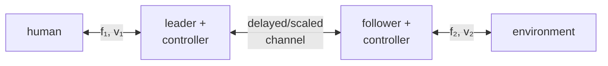

## English

### 1. Two ports and four signals

A bilateral system has a local **leader** port coupled to the human and a remote **follower** port coupled to the environment. Each port has force and velocity, and therefore power. A paper is unreadable until its signs are declared: does positive force point into the network at both ports, or along the same spatial axis? The passivity inequality changes appearance with convention even when the physics is identical.

### 2. Transparency is a target impedance

Ideal transparency means the operator feels the remote environment as if the intervening system were absent. At the human port, the displayed impedance $Z_{in}=F_1/V_1$ should equal a scaled remote impedance. Real systems add leader/follower inertia, friction, local servos, sensor filtering, communication delay, quantization, and saturation. “Stable” and “transparent” are therefore different claims.

A four-channel architecture may transmit position/velocity and force in both directions; simpler position–force or position–position architectures transmit fewer signals. More channels can improve matching under a model, but also expose noise, delay, calibration, and causality constraints.

### 3. Scaling must preserve the intended power relation

Suppose remote position is scaled by $x_f=s_xx_l$. If reflected force is $F_l=s_fF_f$, then power scales as

$$P_l=F_l\dot x_l=s_fF_f\frac{\dot x_f}{s_x}=\frac{s_f}{s_x}P_f.$$

Power-preserving scaling requires $s_f=s_x$ under this convention; other conventions or deliberate power amplification change the relation. A paper must distinguish geometric scaling, force scaling, actuator gain, and unit conversion.

### 4. Why delay is hard

A delayed force can arrive after velocity reverses, turning nominal damping into energy injection. Raising local feedback gains may improve low-delay tracking but erode phase margin. Common strategies include:

- local damping or virtual coupling;
- time-domain passivity observers/controllers;
- wave/scattering variables that make a constant-delay channel passive under assumptions;
- model-mediated teleoperation, where a fast local model renders contact while remote updates correct it;
- shared control or predictive displays that reduce the human's need to close the fastest loop through the network.

Each pays somewhere: added damping reduces transparency, wave variables distort transients, local models can be wrong, and prediction/shared autonomy can alter authority.

### 5. Reading a two-port model

A two-port can be represented by impedance, admittance, hybrid, or transmission matrices. Do not memorize one matrix. For every row ask:

1. Which variables are treated as inputs and outputs?
2. Is the model impedance or admittance causal at each port?
3. Which transfer terms describe self-impedance and cross-coupling?
4. What human and environment classes are allowed—fixed LTI models, passive uncertainty, or nonlinear systems?
5. Is the criterion stability for one termination or absolute stability over a class of passive terminations?

The classic two-port design literature demonstrates that desired port impedances and stability constraints can be expressed together, but the resulting gain choice depends on plant models and the assumed task impedance. It does not produce a task-independent “best teleoperator.”

### 6. Evidence checklist

Report round-trip delay and jitter, control rates, force/position scaling, saturation, local controller gains, contact objects, human grip/instructions, and both objective performance and subjective workload. A free-space trajectory plus one soft object does not establish transparency across the device's operating envelope.

> [!question]- Self-check · Answer
> **A controller is passive and users are slower. Is the result contradictory?** No. Passivity constrains energy generation; it does not guarantee transparency, low effort, good authority allocation, or task-optimal cues. Added dissipation may stabilize the loop while making motion sluggish.

## 한국어

### 1. 두 포트와 네 신호

양방향 시스템은 사람과 연결된 local **leader**, 환경과 연결된 remote **follower** 포트를 가진다. 각 포트에는 force와 velocity, 따라서 power가 있다. 두 포트에서 network 안쪽을 양의 힘으로 정했는지, 같은 공간축을 양으로 정했는지 먼저 확인해야 한다. 부호 규약이 다르면 passivity 식의 모양도 달라진다.

### 2. 투명성은 목표 임피던스다

이상적 transparency는 중간 시스템 없이 원격 환경을 직접 느끼는 것이다. 사람 쪽 $Z_{in}=F_1/V_1$이 적절히 scaling된 원격 임피던스와 같아야 한다. 실제로는 양쪽 장치의 관성·마찰, local servo, 필터, 통신 지연, quantization, saturation이 더해진다. 안정성과 투명성은 서로 다른 주장이다.

### 3. 스케일링과 에너지

$x_f=s_xx_l$, $F_l=s_fF_f$이면 위 식처럼 $P_l=(s_f/s_x)P_f$다. 이 규약에서 power-preserving scaling은 $s_f=s_x$다. 다른 규약이나 의도적인 power amplification에는 다른 관계가 따른다. 기하 스케일·힘 스케일·액추에이터 gain·단위 변환을 구분한다.

### 4. 지연이 어려운 이유

속도 방향이 바뀐 뒤 늦게 도착한 힘은 원래 damping이어도 에너지를 넣을 수 있다. Local damping/virtual coupling, TDPA, wave variable, model-mediated rendering, shared control과 predictive display가 대표 대응이다. 각각 transparency, transient, model error, authority 측면의 비용이 있다.

### 5. 2-port 모델 읽기

Impedance·admittance·hybrid·transmission matrix 중 무엇을 썼는지보다 입출력 변수, 각 포트의 인과성, self/cross term, 허용하는 human/environment 모델, 특정 termination 안정성인지 absolute stability인지 확인한다. 모델과 과제 임피던스가 달라지면 적절한 gain도 달라진다.

### 6. 증거 체크

Round-trip delay와 jitter, 제어 주기, 힘/위치 스케일, 포화, local gain, 접촉 물체, 파지와 지시, 객관 성능과 workload를 함께 보고해야 한다. 자유공간 궤적과 부드러운 물체 하나만으로 전체 운용 범위의 transparency를 입증할 수 없다.

> [!question]- 스스로 점검 · 정답
> **수동적인 제어기에서 사용자가 느려졌다면 모순인가?** 아니다. Passivity는 에너지 생성을 제한할 뿐 transparency·낮은 effort·좋은 authority·과제 최적 cue를 보장하지 않는다. 추가 소산이 안정성은 높이고 운동은 둔하게 만들 수 있다.

