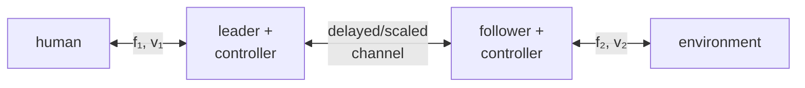

> [!note] Prerequisites · 선수 지식
> Passivity as an energy inequality at a port, and why a sampled or delayed loop can inject energy, from [[04-robotics/haptics-teleoperation/rendering-sampling-stability|24.4 §2 and §4]]; impedance versus admittance causality from [[04-robotics/haptics-teleoperation/device-design-kinematics|24.3 §1]]; phase margin from [[04-robotics/control-theory-ce397|Control Theory §5.5]]; and the constant-delay passivity proof for wave variables from [[04-robotics/teleoperation-demonstration|12. Teleoperation & Demonstration Collection §3]], which §4 cites rather than repeats.
> 포트에서의 에너지 부등식으로서의 수동성과, 샘플링되거나 지연된 루프가 에너지를 주입할 수 있는 이유는 [[04-robotics/haptics-teleoperation/rendering-sampling-stability|24.4 §2와 §4]]. 임피던스 대 어드미턴스 인과성은 [[04-robotics/haptics-teleoperation/device-design-kinematics|24.3 §1]]. 위상 여유는 [[04-robotics/control-theory-ce397|제어 이론 §5.5]]. wave 변수로 일정 지연 채널이 수동적이 된다는 증명은 [[04-robotics/teleoperation-demonstration|12. 원격조작과 시연 수집 §3]]이고, §4는 그것을 다시 쓰지 않고 인용한다.

## English

> [!note] First pass · 처음이라면
> Read the Running object and the Worked case below: two copies of one handle, fifty milliseconds apart, and the three numbers that decide whether the pair can be honest. Then §2 for what transparency actually asserts and §4 for why delay is not just lag. §5 and §6 are what you open when you are reading somebody's architecture rather than building one.

### Running object · 이 페이지의 대상

Two copies of plant **P3** from [[02-foundations/lab-plants|0.6 Lab Plants]] — one as the **leader** in the operator's hand, one as the **follower** against the wall — joined by a channel that delays and scales. No new device is introduced; the point of the page is what the *channel* does to a pair of machines already fully specified.

| Symbol | Value | What it is |
|---|---:|---|
| $m,\ b$ | $0.04\,\mathrm{kg}$, $0.8\,\mathrm{N{\cdot}s/m}$ | each device's mass and damping, both copies identical |
| $k_w,\ x_w$ | $400\,\mathrm{N/m}$, $0.030\,\mathrm{m}$ | the wall the follower meets |
| $T$ | $1\,\mathrm{ms}$ | local control period at each end |
| $T_d$ | $50\,\mathrm{ms}$ | one-way channel delay, constant and known |
| $s_x$ | $0.1$ | position scale, follower per leader: a micro-manipulation setup |
| $s_f$ | $0.1$ or $10$ | force scale reflected to the leader — the knob the page argues about |
| $b_w$ | $0.8\,\mathrm{N{\cdot}s/m}$ | wave impedance, when §4's wave encoding is used; chosen equal to $b$ |

$T_d$ is a *declared* channel property of this page, not a measurement of any network; $s_x$ and $s_f$ are design choices. Everything else is catalog.

*Scope: this page teaches the bilateral pair as a two-port energy and information system — the four port signals, what transparency asserts, what scaling does to power, and what delay does to the passivity argument. It does not re-derive the sampled-data wall bound, which is [[04-robotics/haptics-teleoperation/rendering-sampling-stability|24.4 §2]]; nor run a simulator, which stays on [[04-robotics/haptics-teleoperation/rendering-sampling-stability|24.4]]; nor derive the wave-variable channel-passivity proof, which is [[04-robotics/teleoperation-demonstration|12. Teleoperation & Demonstration Collection §3]].*

### The picture · 그림으로 먼저 보기

Two copies of P3 joined by one channel: the operator's hand meets the leader at the port $(F_1,v_1)$, the follower meets the environment — here the catalog wall, $k_w=400\,\mathrm{N/m}$ — at $(F_2,v_2)$, and the channel between them delays each direction by $T_d=50\,\mathrm{ms}$ while scaling motion by $s_x=0.1$ and reflected force by $s_f=0.1$ or $10$. Both ports are double-headed because what crosses them is power, and the leader's port carries $s_f/s_x$ times the follower's: the same power at $s_f=0.1$, a hundred times it at $s_f=10$. Around the loop the delay is $2T_d=100\,\mathrm{ms}$, which lowers the stiffest wall the leader may reflect from the local $1600\,\mathrm{N/m}$ to $7.96\,\mathrm{N/m}$.

### Worked case · 대상으로 한 번 끝까지

Five steps on the pair above. Everything §2 to §4 assert in words is a number here.

**Step 1 — what the operator's hand feels when nothing is touching.** With the follower in free space the operator still feels the leader itself, $Z=ms+b$. At $1\,\mathrm{Hz}$ that is $\lvert 0.04\cdot j2\pi+0.8\rvert=0.839\,\mathrm{N{\cdot}s/m}$, so moving the leader at $5\,\mathrm{cm/s}$ costs $0.042\,\mathrm{N}$ of drag against an environment that is producing nothing at all. At $10\,\mathrm{Hz}$ the same handle reads $2.64\,\mathrm{N{\cdot}s/m}$, or $0.132\,\mathrm{N}$ — the inertia has taken over. §1 calls this quantity $h_{11}$ and transparency asks for it to be zero, which is why a teleoperator can fail its own specification before the channel is switched on.

**Step 2 — the stiffness the delay leaves.** First decide which delay is in the loop. Leader motion goes out to the follower and the follower's wall force comes back, so if the follower tracks its delayed command, the force reaching the leader is the wall acting on the leader's *own* position one round trip earlier: the loop delay is $T_D=2T_d=100\,\mathrm{ms}$, and this step assumes exactly that. Then price that delay. The §2 bound of 24.4, $K\le 2b/T$, reads as $K\le b/(T/2)$: the zero-order hold acts like half a period of delay. Diolaiti, Niemeyer, Barbagli and Salisbury (2006), the paper whose $(\beta,\sigma)$ plane [[04-robotics/haptics-teleoperation/rendering-sampling-stability|24.4 §3]] already used, show that a loop delay adds to that half period *in full*: with $\beta=b/(KT)$ and $\tau_D=T_D/T$, the viscous boundary moves from $\beta\ge\tfrac12$ to $\beta\ge\tfrac12+\tau_D$, which is $b\ge KT/2+KT_D$. So

$$K\le\frac{b}{T/2+2T_d}=\frac{0.8}{0.0005+0.100}=7.96\,\mathrm{N/m}$$

because the device damper's phase lead is the only thing paying for lag, and the lag it must now cover is the hold's half millisecond plus the whole $100\,\mathrm{ms}$ round trip. At unit impedance scale, $s_fs_x=1$ (unscaled, or Step 4's $s_f=10$, $s_x=0.1$), the leader feels the catalog wall itself, $k_w=400\,\mathrm{N/m}$, which misses that ceiling by a factor of $400/7.96=50.3$; the local ceiling of $1600\,\mathrm{N/m}$ has fallen by $1600/7.96=201$, which is $1+2\tau_D$ at $\tau_D=100$. Three delay assumptions circulate, and they give three different ceilings; only the first is this step's.

| delay assumption | lag the damper pays for | ceiling on $K$ | $k_w=400$ is over it by |
|---|---:|---:|---:|
| round trip, $T_D=2T_d$ (this step) | $T/2+2T_d=0.1005\,\mathrm{s}$ | $7.96\,\mathrm{N/m}$ | $50.3\times$ |
| one direction only, $T_D=T_d$ | $T/2+T_d=0.0505\,\mathrm{s}$ | $15.8\,\mathrm{N/m}$ | $25.3\times$ |
| shortcut $2b/(T+T_d)$, wrong | $(T+T_d)/2=0.0255\,\mathrm{s}$ | $31.4\,\mathrm{N/m}$ | $12.8\times$ |

The shortcut writes $T+T_d$ where 24.4 has $T$ and is wrong twice: $2b/(T+T_d)=b/(T/2+T_d/2)$ charges the delay at half its value, as if it were a hold, and it counts one direction only, so it returns about four times the true ceiling. The wall the follower actually touches is unchanged; what changed is how much of it may be reflected.

**Step 3 — power-preserving scaling, and why nobody ships it.** With $x_f=s_xx_l$ and $F_l=s_fF_f$ the power ratio is $s_f/s_x$ (§3), so power preservation means $s_f=s_x=0.1$. Let the follower hold $F_f=1\,\mathrm{N}$, which on the catalog wall is a penetration of $1/400=2.5\,\mathrm{mm}$. The leader then reflects

$$F_l=s_fF_f=0.1\cdot 1=0.1\,\mathrm{N}$$

and whether that is a cue is a question about the hand. The force discrimination this track measures, in [[04-robotics/haptics-teleoperation/human-haptics-psychophysics|24.1 §5]], found a JND of $0.4107\,\mathrm{N}$ near $5\,\mathrm{N}$, a Weber fraction $k=0.4107/5.0429=0.0814$, and Weber's law reads that as a JND of $k$ times whatever force the hand already carries. Here the hand carries $s_fF_f$ and a follower change $\Delta F_f$ reaches it as $s_f\Delta F_f$, so the change is felt when

$$s_f\,\Delta F_f\ge k\,s_fF_f\quad\Longleftrightarrow\quad\Delta F_f\ge kF_f=0.0814\cdot1=0.081\,\mathrm{N}$$

because $s_f$ divides out: at this page's $1\,\mathrm{N}$ the JND is $0.08\,\mathrm{N}$, not $1\,\mathrm{N}$ (which is the JND of a $12\,\mathrm{N}$ reference), and on Weber's law alone the honest scaling would cost nothing. What it costs is the range where $k$ is known. 24.1's problem set finds $k$ already risen to $0.0896$ at $2.03\,\mathrm{N}$ and measures nothing lower, and the leader's $0.1\,\mathrm{N}$ is twenty times below that, so no measurement on this track says the hand resolves anything there. The honest scaling puts the whole contact signal in that gap, which is the whole reason the next step exists.

**Step 4 — force amplification, and what it costs.** Choose $s_f=10$ with $s_x=0.1$ instead. The leader now reflects $10\,\mathrm{N}$ from the same $1\,\mathrm{N}$ contact, and

$$\frac{P_l}{P_f}=\frac{s_f}{s_x}=\frac{10}{0.1}=100$$

so the leader port carries a hundred times the follower's power, and that factor comes out of the leader's actuators. A system that generates power at a port cannot inherit passivity from passive parts, so its stability has to be argued directly rather than assembled — and the interconnection theorem of [[04-robotics/haptics-teleoperation/rendering-sampling-stability|24.4 §4]] no longer applies to it.

**Step 5 — what the standard repair would charge.** Encode the channel in wave variables with $b_w=0.8\,\mathrm{N{\cdot}s/m}$ (§4). The channel becomes passive for *any* constant delay, including this $50\,\mathrm{ms}$, but the operator now feels an apparent damping of $b_w$ through it: at $5\,\mathrm{cm/s}$ that is $0.8\cdot0.05=0.040\,\mathrm{N}$, on top of the $0.042\,\mathrm{N}$ of Step 1. The pair has bought an unconditional guarantee and paid for it in exactly the currency Step 1 was already short of. Sanity check on the encoding, at $\dot x=0.05\,\mathrm{m/s}$ and $F=1\,\mathrm{N}$: $u=(0.8\cdot0.05+1)/\sqrt{1.6}=0.822$ and $v=(0.8\cdot0.05-1)/\sqrt{1.6}=-0.759$, so $\tfrac12(u^2-v^2)=0.050\,\mathrm{W}$, which is $F\dot x$ exactly — the transformation moved the power without changing it.

The problem set is this same pair with the same channel, asked as a drawing and three questions.

### 1. Two ports and four signals

A bilateral system has a local **leader** port coupled to the human and a remote **follower** port coupled to the environment, drawn in the picture above. Each port has force and velocity, and therefore power. A paper is unreadable until its signs are declared: does positive force point into the network at both ports, or along the same spatial axis? The passivity inequality changes appearance with convention even when the physics is identical.

Each of those two ports is a port in the sense of [[04-robotics/haptics-teleoperation/device-design-kinematics|24.3 §1]] — one effort–flow pair, one causality — and the energy that crosses it obeys the inequality of [[04-robotics/haptics-teleoperation/rendering-sampling-stability|24.4 §4]]. What is new here is that there are two of them and one system in between, which has a name.

> **Two-port model, defined.** A **two-port model** of a teleoperator is a *linear map between four port variables* — a $2\times2$ matrix, and nothing else: not a block diagram, not a controller and not an architecture. Three defining conditions, and the third is the one that makes two papers' matrices incomparable. There are **exactly two power ports**, each carrying one effort–flow pair whose product is power; anything with a third connection is a three-port and its passivity argument is different. A **causality is declared at each port**, which is what decides whether the matrix is called impedance, admittance, hybrid or transmission — the four names are four choices of which two variables are inputs. And a **sign convention is declared**, because negating one port's force negates a whole row and column while changing no physics at all.
>
> $$\begin{pmatrix}F_1\\ -V_2\end{pmatrix}=\begin{pmatrix}h_{11}&h_{12}\\ h_{21}&h_{22}\end{pmatrix}\begin{pmatrix}V_1\\ F_2\end{pmatrix}$$
>
> is the **hybrid** form, the one teleoperation uses, where $F_1,V_1$ are force and velocity at the human port and $F_2,V_2$ at the environment port — so $h_{11}$ is the input impedance with the follower free, $h_{22}$ the output admittance with the leader locked, and $h_{12},h_{21}$ the two transmissions. Terminating port 2 with an environment $F_2=Z_eV_2$ and eliminating $V_2$ gives what the hand feels,
>
> $$Z_{to}=\frac{F_1}{V_1}=h_{11}-\frac{h_{12}h_{21}Z_e}{1+h_{22}Z_e}$$
>
> because row 2 forces $V_2=-h_{21}V_1/(1+h_{22}Z_e)$, and substituting that into row 1 is the whole derivation.
>
> - **Example**: the ideal transparent teleoperator, $h=\begin{pmatrix}0&1\\-1&0\end{pmatrix}$ in this convention. Substituting gives $Z_{to}=Z_e$ for *every* $Z_e$, which is §2's definition of transparency reached from the matrix rather than asserted.
> - **Non-example**: the bare P3 leader of the Worked case, which has $h_{11}=ms+b\ne0$. Setting $Z_e=0$ in the formula returns $Z_{to}=h_{11}$, so in free space the operator feels the leader and nothing else — no amount of channel design removes a term that sits outside the fraction.
> - **Why it matters**: the two limits of that one formula are the two ends of Z-width read at the human port. $Z_e\to0$ gives $h_{11}$, the lightest thing the system can display; $Z_e\to\infty$ gives $h_{11}-h_{12}h_{21}/h_{22}$, the hardest. A paper that reports one and not the other has described half of its own device.

### 2. Transparency is a target impedance

Ideal transparency means the operator feels the remote environment as if the intervening system were absent. At the human port, the displayed impedance $Z_{in}=F_1/V_1$ should equal a scaled remote impedance. Real systems add leader/follower inertia, friction, local servos, sensor filtering, communication delay, quantization, and saturation. “Stable” and “transparent” are therefore different claims.

> **Transparency, defined.** **Transparency** is a *target* — an asserted equality between two impedances at the human port — not a score, not a percentage, and not a synonym for "feels good". Three defining conditions, and a claim missing any of them is not checkable. The equality is between the **displayed** impedance and the **scaled environment** impedance, so the scale factors are part of the claim and a system with $s_fs_x\ne1$ is transparent to a *different* environment than the one being touched. It must hold over a **declared frequency band**, because $Z$ is a function of $\omega$ and matching a slow press says nothing about an impact. And it must hold over a **declared class of environments**, since matching one soft object is one point of a function.
>
> $$Z_{to}(j\omega)=\frac{F_1(j\omega)}{V_1(j\omega)}=s_fs_x\,Z_e(j\omega)\qquad\text{for all }\omega\text{ in the declared band and all }Z_e\text{ in the declared class}$$
>
> where $Z_{to}$ is what the hand feels, $Z_e$ the environment impedance at the follower, and $s_fs_x$ the impedance scale, since $F_l=s_fF_f$ while $\dot x_l=\dot x_f/s_x$ (the power ratio of §3 is $s_f/s_x$ instead) — so unscaled transparency is the case $s_fs_x=1$, in which the equality reads $Z_{to}=Z_e$ and the intervening system has disappeared from the expression entirely.
>
> - **Example**: the ideal $h$ of §1. Substituting it into $Z_{to}=h_{11}-h_{12}h_{21}Z_e/(1+h_{22}Z_e)$ gives $Z_e$ for every $Z_e$ — transparency as an identity rather than a fit.
> - **Non-example**: "force-tracking RMS error was $5\%$ on the trajectory we recorded." That is a performance number at one input, and it can be small on a system whose $h_{11}$ makes free space feel like syrup. Transparency is a statement about the *map*; performance is a statement about one of its outputs.
> - **Non-example**: the Worked case's bare leader in free space. There $Z_e=0$, so $Z_{to}=h_{11}=0.839\,\mathrm{N{\cdot}s/m}$ at $1\,\mathrm{Hz}$ against a target of $0$, an error of $0.042\,\mathrm{N}$ at $5\,\mathrm{cm/s}$ — largest exactly where the target is smallest.
> - **Why it matters**: every stabilizer on this page pays for stability in transparency — the virtual coupling of [[04-robotics/haptics-teleoperation/rendering-sampling-stability|24.4 §5]], the added damping of §4, the wave encoding of §4 — so "stable" and "transparent" cannot be claimed as one result, and a paper reporting only one has told you which half it lost.

A four-channel architecture may transmit position/velocity and force in both directions; simpler position–force or position–position architectures transmit fewer signals. More channels can improve matching under a model, but also expose noise, delay, calibration, and causality constraints.

### 3. Scaling must preserve the intended power relation

*In one sentence:* scaling is how a hand's centimetre becomes a micro-tool's millimetre and a micro-tool's millinewton becomes something a hand can feel; the question is what happens to power on the way.

Suppose remote position is scaled by $x_f=s_xx_l$. If reflected force is $F_l=s_fF_f$, then power scales as

$$P_l=F_l\dot x_l=s_fF_f\frac{\dot x_f}{s_x}=\frac{s_f}{s_x}P_f.$$

Power-preserving scaling requires $s_f=s_x$ under this convention; other conventions or deliberate power amplification change the relation. A paper must keep four factors apart, because each can pass for another. **Geometric scaling** $s_x$ is a kinematic choice: it sets how far the follower moves per leader millimetre, and with it the workspace and how much tremor reaches the tool. **Force scaling** $s_f$ is the knob this page argues about, and together with $s_x$ it fixes both the power ratio above and the impedance scale $s_fs_x$ of §2. **Actuator gain** — amplifier and motor constant, from commanded to delivered newtons — is a calibration, not a choice, so a gain $10\%$ off multiplies the effective $s_f$ by $1.1$ without appearing anywhere in the paper. And a **unit conversion** should equal exactly $1$ in physical terms, so an error in one, millimetres read as metres, is a silent scale of $1000$.

> [!example] Worked example · 계산 예제
> A micro-manipulation setup scales motion down, $s_x=0.1$. The leader moves 20 mm at 50 mm/s, so the follower moves 2 mm at 5 mm/s, and it touches tissue with $F_f=0.5$ N, which is $P_f=0.5\times0.005=2.5$ mW. Power-preserving scaling, $s_f=s_x=0.1$, reflects only $F_l=0.05$ N, too faint to use. Choosing $s_f=10$ instead reflects $F_l=5$ N, and the leader port now carries $P_l=5\times0.05=250$ mW, which is $s_f/s_x=100$ times the follower power. That extra power comes from the actuators, so a force-amplifying teleoperator cannot inherit passivity from its parts; its stability has to be argued separately.

**What the scaling does to the delay ceiling.** The stiffness the leader feels is the impedance scale times the wall, $K = s_fs_x\,k_w$, and that is the $K$ in the delay ceiling of Step 2. Power-preserving scaling on the running pair gives $K = 0.1 \times 0.1 \times 400 = 4\,\mathrm{N/m}$, under the $7.96\,\mathrm{N/m}$ that the $100\,\mathrm{ms}$ round trip leaves, with a factor of $1.99$ to spare. The useful amplification, $s_f = 10$, gives $K = 10 \times 0.1 \times 400 = 400\,\mathrm{N/m}$, $50.3$ times over it. So on this pair the honest scaling is the stable one and the faint one at once, and the amplified one is strong enough to feel and over the ceiling — which is why §4's stabilizers exist, and why Step 4 says a force-amplifying pair needs its own stability argument.

### 4. Why delay is hard

A delayed force can arrive after velocity reverses, turning nominal damping into energy injection. Raising local feedback gains may improve low-delay tracking but erode phase margin (how much extra lag the loop tolerates before it oscillates; [[04-robotics/control-theory-ce397|Control Theory §5.5]]). On the running pair the $100\,\mathrm{ms}$ round trip costs a factor of $201$ in renderable stiffness, worked in Step 2 above. Common strategies include:

- local damping or virtual coupling, the latter defined in [[04-robotics/haptics-teleoperation/rendering-sampling-stability|24.4 §5]];
- time-domain passivity observers/controllers;
- wave/scattering variables that make a constant-delay channel passive under assumptions (send sum and difference combinations of velocity and force instead of the raw signals; derived in [[04-robotics/teleoperation-demonstration|12. Teleoperation & Demonstration Collection §3]]);
- model-mediated teleoperation, where a fast local model renders contact while remote updates correct it;
- shared control or predictive displays that reduce the human's need to close the fastest loop through the network.

Each pays somewhere: added damping reduces transparency, wave variables distort transients, local models can be wrong, and prediction/shared autonomy can alter authority — how shared autonomy arbitrates that authority by inferring the operator's goal is [[04-robotics/hri-safety|11. HRI & Safety §3.5]].

The third of those is the one that is a theorem rather than a tuning knob, so it gets a definition; the channel-passivity proof itself is not repeated here.

> **Wave variables, defined.** **Wave variables** (equivalently, the **scattering transformation**) are a *change of variables* — an invertible linear map of the port pair $(\dot x,F)$ onto a new pair $(u,v)$ — and not a controller, not a filter and not a delay compensator. Three defining conditions. The map is parameterized by a **wave impedance** $b_w>0$ with units $\mathrm{N{\cdot}s/m}$, which is a free design choice and not a property of the hardware. It is chosen so that **port power is the difference of the squared wave amplitudes**, which is the entire reason the transformation exists. And the channel must carry **one wave each way**, $u$ forward and $v$ back, because it is that pairing that makes a *constant* delay store rather than create energy.
>
> $$u=\frac{b_w\dot x+F}{\sqrt{2b_w}},\qquad v=\frac{b_w\dot x-F}{\sqrt{2b_w}},\qquad \tfrac12\left(u^2-v^2\right)=F\dot x$$
>
> where $\dot x$ and $F$ are the port velocity and force and $b_w$ the wave impedance — the third equality is algebra, since $u^2-v^2=[(b_w\dot x+F)^2-(b_w\dot x-F)^2]/(2b_w)=2F\dot x$, and everything else follows from it.
>
> - **Example**: the running pair at $\dot x=0.05\,\mathrm{m/s}$, $F=1\,\mathrm{N}$, $b_w=0.8$. Then $u=0.822$, $v=-0.759$ and $\tfrac12(u^2-v^2)=0.050\,\mathrm{W}=F\dot x$, so the $50\,\mathrm{ms}$ channel now holds energy in flight instead of manufacturing it. The telescoping argument that turns this identity into passivity for *any* constant delay is [[04-robotics/teleoperation-demonstration|12. Teleoperation & Demonstration Collection §3]] and is not repeated here.
> - **Non-example**: sending $\dot x$ and $F$ through the same channel and adding damping until it stops ringing. That is the §4 problem, not its solution: the guarantee is conditional on the delay you tuned against, and wave variables are unconditional in $T_d$.
> - **Non-example**: reading $b_w$ as the device's physical damping. It is a *choice*; the hardware's $b=0.8$ is a separate number that happens to be what this page picks for $b_w$, and picking a different $b_w$ changes the feel without changing any machine.
> - **Why it matters**: it converts "delay destroys passivity" into "delay is passive and costs impedance matching", which is a design trade rather than a failure. The bill arrives as an apparent damping of $b_w$ at the port — $0.040\,\mathrm{N}$ at $5\,\mathrm{cm/s}$ on this pair — plus wave reflection at impedance mismatches and a position drift, because the channel transmits velocity rather than position. That is the §2 tradeoff again, now as a theorem.

### 5. Reading a two-port model

A two-port can be represented by impedance, admittance, hybrid, or transmission matrices. Do not memorize one matrix. For every row ask:

1. Which variables are treated as inputs and outputs?
2. Is the model impedance or admittance causal at each port?
3. Which transfer terms describe self-impedance and cross-coupling?
4. What human and environment classes are allowed—fixed LTI (linear time-invariant; [[02-foundations/signal-processing|6. Signal Processing §1]]) models, passive uncertainty, or nonlinear systems?
5. Is the criterion stability for one termination or absolute stability over a class of passive terminations?

The classic two-port design literature demonstrates that desired port impedances and stability constraints can be expressed together, but the resulting gain choice depends on plant models and the assumed task impedance. It does not produce a task-independent “best teleoperator.”

**One two-port, read with the five questions.** Take the position–position pair of [[04-robotics/haptics-teleoperation/teleoperation-architectures-delay|24.8]]: two P3 handles joined by a spring–damper coupling. (1) Inputs are the hand's velocity and the environment's force; outputs are the hand force and the follower velocity, the hybrid form. (2) Both ports are impedance-causal, since P3 reads motion and commands force. (3) The self term $h_{11}$, what the hand feels in free space, is $1.61+0.49j\,\mathrm{N{\cdot}s/m}$ at $1\,\mathrm{Hz}$ against an ideal of $0$; the cross terms carry the coupling. (4) The terminations allowed are any passive hand and environment. (5) The criterion is absolute stability: Llewellyn's $\eta(\omega)\ge1$ holds at every frequency without delay and fails below $19\,\mathrm{Hz}$ with $50\,\mathrm{ms}$ each way. Five answers, and the reader knows what the model claims and where it stops.

### 6. Evidence checklist

Report round-trip delay and jitter, control rates, force/position scaling, saturation, local controller gains, contact objects, human grip/instructions, and both objective performance and subjective workload. A free-space trajectory plus one soft object does not establish transparency across the device's operating envelope.

What a real bench adds to this list shows in Muradore and Fiorini's comparison of six controllers on one single-axis bench with a simulated network: force sensors with a negative bias, a motor dead zone below about $0.5\,\mathrm{V}$, force quantization of about $0.15\,\mathrm{N}$, and a PD controller that stayed stable through hard contact but turned sluggish as the delay grew. None of these appears in a free-space trajectory, and each decides what happens at contact. Report them.

### Self-check

1. Why does a passive controller not guarantee a transparent one?
2. P3's handle at $1$ Hz has $h_{11} = 0.839\ \mathrm{N\,s/m}$ when the follower touches nothing. What does a non-zero $h_{11}$ cost the operator, and what would make it zero?
3. A channel delays force by $20\ \mathrm{ms}$ each way. Which term of the two-port picture does the delay enter, and why does raising the follower's stiffness make the feel *worse* rather than better?

> [!tip]- Answers
> 1. Passivity bounds the energy the controller can create; transparency is about matching the environment's impedance. A very stiff, very damped controller can be passive and still feel like syrup, because the operator pays the device's own impedance on every motion.
> 2. It is the impedance the operator feels in free space — the device's own mass, damping and friction, felt as resistance where the environment offers none. Zero $h_{11}$ means a massless frictionless handle: only an ideal admittance device with perfect force feedback approaches it.
> 3. It enters the transmission terms $h_{12}, h_{21}$, which carry force and motion between the ports. Delay turns the round trip into energy generation: the operator's motion meets a force computed for where the follower *was*, so a stiffer follower returns a larger wrong-signed force, which is exactly the destabilizing case.

### Problem set · 과제

Tier B. Using **P3** from [[02-foundations/lab-plants|0.6]] as *both* leader and follower. The Euler lab stays on [[04-robotics/haptics-teleoperation/rendering-sampling-stability|24.4]].

Leader motion is sent to the follower; follower wall force $F_a$ is sent back. One-way delay $T_d=50\,\mathrm{ms}$. Local sample $T=1\,\mathrm{ms}$. Catalog $k_w=400$, $b=0.8$.

1. **Draw.** The picture above for the channel item 2(c) ends on: the leader's motion reaches the follower at once, only the wall force $F_a$ comes back delayed by $T_d=50\,\mathrm{ms}$, and there is no scaling ($s_x=s_f=1$). Human port $(F_1,v_1)$ — leader P3 — channel — follower P3 — wall: mark the four signals, the sign convention (positive force into the network at both ports), each direction's delay, and the round trip the leader's bound sees.
2. **Derive.** (a) Power-preserving scales $s_f=s_x$. If $s_x=0.1$ and the follower holds $F_f=1\,\mathrm{N}$ (catalog wall at $2.5\,\mathrm{mm}$ in), what does the leader reflect? Too faint? (b) With $s_f=10$, $s_x=0.1$, the power ratio $s_f/s_x$. Can the pair inherit passivity from its parts? (c) The delayed bound $K\le b/(T/2+T_D)$ (Diolaiti et al. 2006) at the leader, where $T_D$ is the delay around the loop. Which $T_D$ does this architecture put there, what is the ceiling, and does catalog $k_w$ pass? What would the ceiling be if only one direction were delayed?
3. **Interpret.** Users are slower after you add damping to survive the delay. Is that a contradiction of passivity?

> [!note]- How to draw it · 그리는 법
> - Draw both ports as double-headed arrows, each labelled with its own pair: $(F_1,v_1)$ at the hand, $(F_2,v_2)$ at the wall. A single-headed arrow claims information flow where there is power flow, and the whole page is about power.
> - Write the sign convention on the figure as a short legend — positive force *into* the network at both ports — not as an arrowhead, because the arrowhead is what everyone reads differently.
> - Draw the delay on each direction separately: leader motion going out marked $0$, wall force $F_a$ coming back marked $T_d=50\,\mathrm{ms}$, and the round trip $T_D=50\,\mathrm{ms}$ written underneath, against the picture's $100$. A single box labelled "network" would hide exactly the difference this variant is about.
> - Draw the wall at the follower as a switch, the same unilateral block as [[04-robotics/haptics-teleoperation/rendering-sampling-stability|24.4]], not as a spring.
> - Keep the two scale blocks on the channel, $s_x$ out and $s_f$ back, both set to $1$: drawing them at unity says that scaling was chosen away, not forgotten.
> - Beside the leader, the delayed bound with this round trip: $K\le b/(T/2+T_D)=0.8/0.0505=15.8\,\mathrm{N/m}$.

> [!tip]- Solutions
> 1. The picture's two-port with both scale blocks at $1$ and the outgoing delay removed: the leader's motion arrow carries no delay, the returning $F_a$ arrow carries $T_d=50\,\mathrm{ms}$. Four signals $F_1,v_1,F_2,v_2$, both ports double-headed, the legend "positive force into the network at both ports", and the wall a switch at the follower. The delay around the loop is now $T_D=T_d=50\,\mathrm{ms}$, half the picture's $100\,\mathrm{ms}$, so the ceiling at the leader is $b/(T/2+T_D)=0.8/0.0505=15.8\,\mathrm{N/m}$: double the picture's $7.96$, and still $25$ times below the catalog $400$. Removing one direction's delay helps by exactly the delay it removes; it does not rescue the wall.
> 2. (a) $F_l=0.1\,\mathrm{N}$ — too faint to rely on, but not because it is under a JND. With 24.1 §5's $k=0.0814$, $s_f$ divides out of $s_f\Delta F_f\ge ks_fF_f$, so the smallest follower change the hand feels is $kF_f=0.081\,\mathrm{N}$ whatever $s_f$ is; the trouble is that $0.1\,\mathrm{N}$ is twenty times below $2.03\,\mathrm{N}$, the lowest force at which 24.1 measured $k$, where it had already risen to $0.0896$. (b) Ratio $100$; extra power from actuators; force-amplifying teleoperators do not inherit passivity. (c) $T_D=2T_d=100\,\mathrm{ms}$: the follower tracks a command already $T_d$ old, and its force takes $T_d$ more to come back. $b/(T/2+2T_d)=0.8/0.1005=7.96\,\mathrm{N/m}$; $400$ fails by a factor of $50.3$. One direction only: $0.8/0.0505=15.8\,\mathrm{N/m}$. Not $2b/(T+T_d)=31.4$, which charges the delay at half its value.
> 3. No. Passivity bounds energy generation, not transparency or speed. Added dissipation can stabilize and make the wall feel sluggish — the trade §4 names.

### Sources

- N. Diolaiti, G. Niemeyer, F. Barbagli, J. K. Salisbury, "Stability of Haptic Rendering: Discretization, Quantization, Time Delay, and Coulomb Effects," *IEEE Transactions on Robotics*, vol. 22, no. 2, pp. 256–268, 2006 — the delayed dissipation criterion of Step 2, $\beta\ge\tfrac12+\tau_D$ with $\beta=b/(KT)$ and $\tau_D$ the combined loop delay over the sample period (Sec. III-D, eq. (19), Fig. 5); their describing-function analysis puts the viscous boundary at the same $\beta=\tfrac12+\tau_D$ by approximating the zero-order hold as half a sample of delay lumped with $\tau_D$.
- R. Muradore, P. Fiorini, "A review of bilateral teleoperation algorithms," *Acta Polytechnica Hungarica* 13(1):191–208, 2016.
## 한국어

> [!note] 처음이라면 · First pass
> 아래 대상과 계산을 먼저 읽어라. 같은 핸들 두 대가 50밀리초 떨어져 있고, 그 쌍이 정직할 수 있는지를 정하는 숫자가 셋이다. 그다음 §2에서 투명성이 실제로 무엇을 주장하는지, §4에서 지연이 왜 단순한 늦음이 아닌지를 읽는다. §5와 §6은 남의 구조를 읽을 때 연다.

### 이 페이지의 대상 · Running object

[[02-foundations/lab-plants|0.6 Lab Plants]]의 장치 **P3** 두 대 — 하나는 조작자 손의 **leader**, 하나는 벽을 마주한 **follower** — 를 지연하고 스케일하는 채널로 잇는다. 새 장치는 없다. 이 페이지의 요점은 이미 완전히 규정된 기계 두 대에 *채널*이 무엇을 하는가다.

| 기호 | 값 | 뜻 |
|---|---:|---|
| $m,\ b$ | $0.04\,\mathrm{kg}$, $0.8\,\mathrm{N{\cdot}s/m}$ | 각 장치의 질량과 댐핑. 두 대가 동일 |
| $k_w,\ x_w$ | $400\,\mathrm{N/m}$, $0.030\,\mathrm{m}$ | follower가 만나는 벽 |
| $T$ | $1\,\mathrm{ms}$ | 양 끝의 로컬 제어 주기 |
| $T_d$ | $50\,\mathrm{ms}$ | 편도 채널 지연. 일정하고 알려져 있다 |
| $s_x$ | $0.1$ | 위치 스케일, leader 대비 follower: 미세 조작 설정 |
| $s_f$ | $0.1$ 또는 $10$ | leader로 반사되는 힘 스케일 — 이 페이지가 다투는 손잡이 |
| $b_w$ | $0.8\,\mathrm{N{\cdot}s/m}$ | §4의 wave 인코딩을 쓸 때의 wave 임피던스. $b$와 같게 잡았다 |

$T_d$는 이 페이지가 *선언한* 채널 성질이지 어떤 네트워크의 측정값이 아니다. $s_x$와 $s_f$는 설계 선택이다. 나머지는 전부 카탈로그다.

*범위: 이 페이지는 양방향 쌍을 2포트 에너지·정보 시스템으로 가르친다 — 포트 신호 넷, 투명성이 주장하는 것, 스케일링이 일률에 하는 일, 지연이 수동성 논증에 하는 일. 샘플링 데이터 벽 경계를 다시 유도하지는 않는다. 그것은 [[04-robotics/haptics-teleoperation/rendering-sampling-stability|24.4 §2]]다. 시뮬레이터도 돌리지 않는다. 그것은 [[04-robotics/haptics-teleoperation/rendering-sampling-stability|24.4]]에 남는다. Wave variable 채널의 수동성 증명도 유도하지 않는다. 그것은 [[04-robotics/teleoperation-demonstration|12. 원격조작과 시연 수집 §3]]이다.*

### 그림으로 먼저 보기 · The picture

조작자의 손은 포트 $(F_1,v_1)$에서 leader P3를 만나고 follower P3는 포트 $(F_2,v_2)$에서 환경(여기서는 카탈로그 벽, $k_w=400\,\mathrm{N/m}$)을 만나며, 그 사이의 채널은 양방향을 각각 $T_d=50\,\mathrm{ms}$씩 지연시키고 운동을 $s_x=0.1$로, 반사되는 힘을 $s_f=0.1$ 또는 $10$으로 스케일한다. 두 포트가 양쪽 화살표인 것은 거기를 건너는 것이 일률이기 때문이고, leader 포트는 follower 일률의 $s_f/s_x$배, 즉 $s_f=0.1$이면 같은 일률을, $s_f=10$이면 백 배를 나른다. 루프를 한 바퀴 도는 지연은 $2T_d=100\,\mathrm{ms}$이고, 이것이 leader가 반사해도 되는 가장 단단한 벽을 로컬 천장 $1600\,\mathrm{N/m}$에서 $7.96\,\mathrm{N/m}$으로 끌어내린다.

### 대상으로 한 번 끝까지 · Worked case

위 쌍에 대해 다섯 단계. §2부터 §4까지가 말로 주장하는 것이 여기서는 전부 숫자다.

**1단계 — 아무것도 닿지 않을 때 손이 느끼는 것.** follower가 자유공간에 있어도 조작자는 leader 자체, $Z=ms+b$를 느낀다. $1\,\mathrm{Hz}$에서 $\lvert 0.04\cdot j2\pi+0.8\rvert=0.839\,\mathrm{N{\cdot}s/m}$이므로 leader를 $5\,\mathrm{cm/s}$로 움직이는 데 아무것도 내지 않는 환경에 대해 $0.042\,\mathrm{N}$의 끌림을 쓴다. $10\,\mathrm{Hz}$에서 같은 핸들이 $2.64\,\mathrm{N{\cdot}s/m}$, 즉 $0.132\,\mathrm{N}$이 된다. 관성이 넘겨받은 것이다. §1은 이 양을 $h_{11}$이라 부르고 투명성은 그것이 0이기를 요구한다. 원격조작기가 채널을 켜기도 전에 자기 규격에 미달할 수 있는 이유다.

**2단계 — 지연이 남겨 주는 강성.** 먼저 루프에 어느 지연이 들어가는지 정한다. leader 운동은 follower로 나가고 follower의 벽 힘은 돌아오므로, follower가 지연된 명령을 추종한다면 leader에 도착하는 힘은 왕복 한 번 전의 leader *자신의* 위치에 벽이 작용한 힘이다. 루프 지연은 $T_D=2T_d=100\,\mathrm{ms}$이고, 이 단계는 바로 그것을 가정한다. 다음은 지연의 값이다. 24.4 §2의 경계 $K\le 2b/T$는 $K\le b/(T/2)$로 읽힌다. zero-order hold가 반 주기의 지연처럼 작용한다는 뜻이다. [[04-robotics/haptics-teleoperation/rendering-sampling-stability|24.4 §3]]이 이미 $(\beta,\sigma)$ 평면으로 쓴 논문인 Diolaiti, Niemeyer, Barbagli, Salisbury(2006)는 루프 지연이 그 반 주기에 *온전히* 더해짐을 보였다. $\beta=b/(KT)$, $\tau_D=T_D/T$로 두면 점성 경계가 $\beta\ge\tfrac12$에서 $\beta\ge\tfrac12+\tau_D$로, 즉 $b\ge KT/2+KT_D$로 옮겨 간다. 그러므로

$$K\le\frac{b}{T/2+2T_d}=\frac{0.8}{0.0005+0.100}=7.96\,\mathrm{N/m}$$

이다. 지연을 갚는 것은 장치 댐퍼의 위상 앞섬뿐인데, 그것이 이제 덮어야 할 지연이 홀드의 반 밀리초에 $100\,\mathrm{ms}$ 왕복 전체를 더한 것이기 때문이다. 임피던스 스케일이 1이면($s_fs_x=1$. 스케일이 없거나 4단계의 $s_f=10$, $s_x=0.1$) leader는 카탈로그 벽 $k_w=400\,\mathrm{N/m}$을 그대로 느끼고, 이는 그 천장을 $400/7.96=50.3$배 넘는다. 로컬 천장 $1600\,\mathrm{N/m}$은 $1600/7.96=201$분의 1로 내려앉았고, 이 배수는 $\tau_D=100$에서의 $1+2\tau_D$다. 지연에 대한 가정은 세 가지가 돌아다니고, 천장도 셋이 나온다. 이 단계의 것은 첫째뿐이다.

| 지연 가정 | 댐퍼가 갚아야 할 지연 | $K$의 천장 | $k_w=400$이 넘는 배수 |
|---|---:|---:|---:|
| 왕복, $T_D=2T_d$ (이 단계) | $T/2+2T_d=0.1005\,\mathrm{s}$ | $7.96\,\mathrm{N/m}$ | $50.3\times$ |
| 한 방향만, $T_D=T_d$ | $T/2+T_d=0.0505\,\mathrm{s}$ | $15.8\,\mathrm{N/m}$ | $25.3\times$ |
| 지름길 $2b/(T+T_d)$, 틀림 | $(T+T_d)/2=0.0255\,\mathrm{s}$ | $31.4\,\mathrm{N/m}$ | $12.8\times$ |

24.4의 $T$ 자리에 $T+T_d$를 쓰는 지름길은 두 번 틀린다. $2b/(T+T_d)=b/(T/2+T_d/2)$는 지연을 홀드처럼 절반 값으로 치르고, 한 방향만 센다. 그래서 참 천장의 약 네 배가 나온다. follower가 실제로 만지는 벽은 그대로다. 바뀐 것은 그중 얼마를 반사해도 되는가다.

**3단계 — 일률 보존 스케일링, 그리고 아무도 그것을 출하하지 않는 이유.** $x_f=s_xx_l$, $F_l=s_fF_f$이면 일률 비는 $s_f/s_x$이므로(§3) 일률 보존은 $s_f=s_x=0.1$을 뜻한다. follower가 $F_f=1\,\mathrm{N}$을 쥔다고 하자. 카탈로그 벽에서 침투 $1/400=2.5\,\mathrm{mm}$다. 그러면 leader가 반사하는 것은

$$F_l=s_fF_f=0.1\cdot 1=0.1\,\mathrm{N}$$

이다. 이것이 cue가 되는지는 손에 대한 질문이다. 이 트랙의 힘 변별 측정인 [[04-robotics/haptics-teleoperation/human-haptics-psychophysics|24.1 §5]]는 $5\,\mathrm{N}$ 부근에서 JND $0.4107\,\mathrm{N}$, 즉 Weber 분수 $k=0.4107/5.0429=0.0814$를 얻었다. Weber 법칙은 이것을 손이 이미 받치고 있는 힘이 무엇이든 그 $k$배가 JND라는 뜻으로 읽는다. 여기서 손이 받치는 힘은 $s_fF_f$이고 follower의 변화 $\Delta F_f$는 손에 $s_f\Delta F_f$로 도착하므로, 변화가 느껴지는 조건은

$$s_f\,\Delta F_f\ge k\,s_fF_f\quad\Longleftrightarrow\quad\Delta F_f\ge kF_f=0.0814\cdot1=0.081\,\mathrm{N}$$

이다. $s_f$가 약분되기 때문이다. 이 페이지의 $1\,\mathrm{N}$에서 JND는 $1\,\mathrm{N}$이 아니라 $0.08\,\mathrm{N}$이고($1\,\mathrm{N}$은 $12\,\mathrm{N}$ 기준의 JND다), Weber 법칙만 보면 정직한 스케일링은 아무것도 잃지 않는다. 잃는 것은 $k$를 아는 범위다. 24.1의 과제는 $2.03\,\mathrm{N}$에서 $k$가 이미 $0.0896$으로 올라 있음을 보이고 그보다 낮은 곳은 재지 않는데, leader의 $0.1\,\mathrm{N}$은 그보다 스무 배 낮다. 그곳에서 손이 무엇이든 구별해 낸다고 말해 주는 측정은 이 트랙에 없다. 정직한 스케일링은 접촉 신호 전체를 그 빈틈에 넣고, 이것이 다음 단계가 존재하는 이유다.

**4단계 — 힘 증폭, 그리고 그 대가.** 대신 $s_x=0.1$에 $s_f=10$을 고른다. 같은 $1\,\mathrm{N}$ 접촉에서 leader가 이제 $10\,\mathrm{N}$을 반사하고,

$$\frac{P_l}{P_f}=\frac{s_f}{s_x}=\frac{10}{0.1}=100$$

이므로 leader 포트는 follower 일률의 백 배를 나른다. 그 배수는 leader의 액추에이터에서 나온다. 포트에서 일률을 만들어 내는 시스템은 수동적인 부품들로부터 수동성을 물려받을 수 없으므로 안정성을 조립하는 대신 직접 논증해야 하고, [[04-robotics/haptics-teleoperation/rendering-sampling-stability|24.4 §4]]의 상호연결 정리가 더 이상 적용되지 않는다.

**5단계 — 표준적인 수선이 청구하는 값.** 채널을 $b_w=0.8\,\mathrm{N{\cdot}s/m}$의 wave variable로 인코딩한다(§4). 채널은 이 $50\,\mathrm{ms}$을 포함해 *임의의* 일정 지연에 대해 수동이 되지만, 조작자는 이제 그것을 통해 $b_w$만큼의 겉보기 댐핑을 느낀다. $5\,\mathrm{cm/s}$에서 $0.8\cdot0.05=0.040\,\mathrm{N}$이고, 1단계의 $0.042\,\mathrm{N}$ 위에 얹힌다. 쌍은 무조건적인 보장을 샀고, 1단계에서 이미 모자라던 바로 그 화폐로 값을 치렀다. 인코딩 검산, $\dot x=0.05\,\mathrm{m/s}$, $F=1\,\mathrm{N}$: $u=(0.8\cdot0.05+1)/\sqrt{1.6}=0.822$, $v=(0.8\cdot0.05-1)/\sqrt{1.6}=-0.759$이므로 $\tfrac12(u^2-v^2)=0.050\,\mathrm{W}$이고 이는 정확히 $F\dot x$다. 변환은 일률을 옮겼을 뿐 바꾸지 않았다.

과제는 같은 쌍과 같은 채널을 그림 하나와 질문 셋으로 묻는다.

### 1. 두 포트와 네 신호

양방향 시스템은 사람과 연결된 local **leader** 포트와 환경과 연결된 remote **follower** 포트를 가진다. 위의 그림에 그려 두었다. 각 포트에는 force와 velocity가, 따라서 power가 있다. 논문은 부호를 선언하기 전까지 읽을 수 없다. 두 포트에서 network 안쪽을 향하는 것을 양의 힘으로 정했는가, 아니면 같은 공간축을 따라 정했는가? 물리가 똑같아도 규약이 다르면 passivity 부등식의 모양이 달라진다.

두 포트 각각은 [[04-robotics/haptics-teleoperation/device-design-kinematics|24.3 §1]]의 의미에서 포트다 — effort–flow 쌍 하나, 인과성 하나 — 그리고 거기를 건너는 에너지는 [[04-robotics/haptics-teleoperation/rendering-sampling-stability|24.4 §4]]의 부등식을 따른다. 여기서 새로운 것은 포트가 둘이고 그 사이에 시스템이 하나 있다는 점이고, 거기에는 이름이 있다.

> **2포트 모델의 정의.** 원격조작기의 **2포트 모델**(two-port model)은 *포트 변수 넷 사이의 선형 사상*이다. $2\times2$ 행렬이고 그 이상이 아니다. 블록선도도 아니고 제어기도 아니고 구조도 아니다. 정의 조건 셋이고, 셋째가 두 논문의 행렬을 비교 불가능하게 만드는 바로 그것이다. **일률 포트가 정확히 둘**이고 각각이 곱이 일률인 effort–flow 쌍 하나를 나른다. 연결이 셋이면 3포트이고 수동성 논증이 다르다. **각 포트에서 인과성을 선언**하는데, 그것이 행렬을 impedance라 부를지 admittance, hybrid, transmission이라 부를지를 정한다. 이름 넷은 어느 변수 둘을 입력으로 둘지의 선택 넷이다. 그리고 **부호 규약을 선언**해야 한다. 한 포트의 힘 부호를 뒤집으면 물리는 그대로인 채 행과 열 하나가 통째로 부호를 바꾸기 때문이다.
>
> $$\begin{pmatrix}F_1\\ -V_2\end{pmatrix}=\begin{pmatrix}h_{11}&h_{12}\\ h_{21}&h_{22}\end{pmatrix}\begin{pmatrix}V_1\\ F_2\end{pmatrix}$$
>
> 이것이 원격조작이 쓰는 **hybrid** 형태다. $F_1,V_1$은 사람 포트의 힘과 속도, $F_2,V_2$는 환경 포트의 것이다. 그래서 $h_{11}$은 follower가 자유일 때의 입력 임피던스, $h_{22}$는 leader를 고정했을 때의 출력 어드미턴스, $h_{12}$와 $h_{21}$이 두 전달이다. 포트 2를 환경 $F_2=Z_eV_2$로 끝맺고 $V_2$를 소거하면 손이 느끼는 것이 나온다.
>
> $$Z_{to}=\frac{F_1}{V_1}=h_{11}-\frac{h_{12}h_{21}Z_e}{1+h_{22}Z_e}$$
>
> 둘째 행이 $V_2=-h_{21}V_1/(1+h_{22}Z_e)$를 강제하고 그것을 첫째 행에 넣는 것이 유도의 전부이기 때문이다.
>
> - **예**: 이상적으로 투명한 원격조작기, 이 규약에서 $h=\begin{pmatrix}0&1\\-1&0\end{pmatrix}$. 넣어 보면 *모든* $Z_e$에 대해 $Z_{to}=Z_e$이고, §2의 투명성 정의를 주장이 아니라 행렬에서 얻은 것이다.
> - **비예**: 계산 절의 맨 leader. $h_{11}=ms+b\ne0$이다. 식에 $Z_e=0$을 넣으면 $Z_{to}=h_{11}$이므로 자유공간에서 조작자는 leader만 느낀다. 분수 바깥에 앉은 항은 어떤 채널 설계로도 없앨 수 없다.
> - **왜 중요한가**: 그 식 하나의 두 극한이 사람 포트에서 읽은 Z-width의 두 끝이다. $Z_e\to0$은 $h_{11}$, 시스템이 표시할 수 있는 가장 가벼운 것을 주고, $Z_e\to\infty$는 $h_{11}-h_{12}h_{21}/h_{22}$, 가장 단단한 것을 준다. 둘 중 하나만 보고한 논문은 자기 장치의 절반만 기술한 것이다.

### 2. 투명성은 목표 임피던스다

이상적 transparency는 중간 시스템이 없는 것처럼 원격 환경을 조작자가 느끼는 것이다. 사람 쪽 포트에서 표시되는 임피던스 $Z_{in}=F_1/V_1$이 스케일된 원격 임피던스와 같아야 한다. 실제 시스템은 leader와 follower의 관성, 마찰, local servo, 센서 필터링, 통신 지연, quantization, saturation을 더한다. 그러므로 "안정하다"와 "투명하다"는 서로 다른 주장이다.

> **투명성의 정의.** **투명성**(transparency)은 *목표*다. 사람 포트에서 임피던스 둘이 같다는 주장이지 점수도, 백분율도, "느낌이 좋다"의 동의어도 아니다. 정의 조건 셋이고, 하나라도 빠진 주장은 검증할 수 없다. 등식은 **표시되는** 임피던스와 **스케일된 환경** 임피던스 사이의 것이므로 스케일 인자가 주장의 일부이고, $s_fs_x\ne1$인 시스템은 실제로 만지는 환경이 아니라 *다른* 환경에 대해 투명하다. **선언한 주파수 대역**에서 성립해야 한다. $Z$가 $\omega$의 함수이므로 느린 가압이 맞았다는 것은 충격에 대해 아무것도 말하지 않는다. 그리고 **선언한 환경 부류**에서 성립해야 한다. 부드러운 물체 하나가 맞은 것은 함수의 점 하나다.
>
> $$Z_{to}(j\omega)=\frac{F_1(j\omega)}{V_1(j\omega)}=s_fs_x\,Z_e(j\omega)\qquad\text{선언한 대역의 모든 }\omega\text{, 선언한 부류의 모든 }Z_e$$
>
> $Z_{to}$는 손이 느끼는 것, $Z_e$는 follower에서의 환경 임피던스, $s_fs_x$는 임피던스 스케일이다. $F_l=s_fF_f$인데 $\dot x_l=\dot x_f/s_x$이기 때문이다(§3의 일률 비는 $s_f/s_x$로 다르다). 그러므로 스케일 없는 투명성은 $s_fs_x=1$인 경우이고, 그때 등식은 $Z_{to}=Z_e$가 되어 중간 시스템이 식에서 완전히 사라진다.
>
> - **예**: §1의 이상적 $h$. $Z_{to}=h_{11}-h_{12}h_{21}Z_e/(1+h_{22}Z_e)$에 넣으면 모든 $Z_e$에 대해 $Z_e$가 나온다. 맞춤이 아니라 항등식으로서의 투명성이다.
> - **비예**: "우리가 기록한 궤적에서 힘 추종 RMS 오차가 $5\%$였다." 입력 하나에서의 성능 수치이고, $h_{11}$ 때문에 자유공간이 꿀처럼 느껴지는 시스템에서도 작을 수 있다. 투명성은 *사상*에 대한 진술이고 성능은 그 출력 하나에 대한 진술이다.
> - **비예**: 계산 절의 자유공간 leader. 거기서는 $Z_e=0$이므로 $1\,\mathrm{Hz}$에서 $Z_{to}=h_{11}=0.839\,\mathrm{N{\cdot}s/m}$, 목표는 $0$이다. $5\,\mathrm{cm/s}$에서 오차 $0.042\,\mathrm{N}$이고, 목표가 가장 작은 곳에서 오차가 가장 크다.
> - **왜 중요한가**: 이 페이지의 모든 안정화 수단이 안정성을 투명성으로 값을 치른다 — [[04-robotics/haptics-teleoperation/rendering-sampling-stability|24.4 §5]]의 virtual coupling, §4의 추가 댐핑, §4의 wave 인코딩. 그래서 "안정"과 "투명"은 한 결과로 주장할 수 없고, 하나만 보고한 논문은 어느 쪽을 잃었는지를 말해 준 셈이다.

4채널 구조는 위치·속도와 힘을 양방향으로 모두 전송할 수 있고, 더 단순한 position–force나 position–position 구조는 더 적은 신호를 보낸다. 채널이 많으면 어떤 모델 아래에서 정합이 좋아질 수 있지만, 동시에 잡음·지연·보정·인과성 제약에 더 노출된다.

### 3. 스케일링은 의도한 일률 관계를 보존해야 한다

*한 문장으로:* 스케일링은 손의 센티미터를 미세 도구의 밀리미터로, 미세 도구의 밀리뉴턴을 손이 느낄 수 있는 무엇으로 바꾸는 일이다. 문제는 그 사이에 일률이 어떻게 되느냐다.

원격 위치가 $x_f=s_xx_l$로 스케일된다고 하자. 반사되는 힘이 $F_l=s_fF_f$이면 일률은 이렇게 스케일된다.

$$P_l=F_l\dot x_l=s_fF_f\frac{\dot x_f}{s_x}=\frac{s_f}{s_x}P_f.$$

이 규약에서 일률을 보존하는 스케일링은 $s_f=s_x$를 요구한다. 다른 규약이나 의도적인 power amplification은 관계를 바꾼다. 논문은 네 인자를 떼어 놓아야 한다. 저마다 다른 것으로 행세할 수 있기 때문이다. **기하 스케일** $s_x$는 기구학적 선택이다. leader 1밀리미터당 follower가 얼마나 움직이는지를 정하고, 그와 함께 작업 공간과 도구에 닿는 떨림의 양을 정한다. **힘 스케일** $s_f$는 이 페이지가 따지는 손잡이이고, $s_x$와 함께 위의 일률 비와 §2의 임피던스 스케일 $s_fs_x$를 둘 다 정한다. **액추에이터 이득** — 증폭기와 모터 상수, 명령한 뉴턴에서 실제로 나온 뉴턴까지 — 은 선택이 아니라 교정이다. 그래서 이득이 $10\%$ 틀리면 유효 $s_f$가 $1.1$배가 되는데도 논문 어디에도 나타나지 않는다. 그리고 **단위 변환**은 물리적으로 정확히 $1$이어야 하므로, 그 오류 — 밀리미터를 미터로 읽는 것 — 는 소리 없는 $1000$배 스케일이다.

> [!example] 계산 예제 · Worked example
> 미세 조작 장치가 운동을 $s_x=0.1$로 줄인다고 하자. leader가 50 mm/s로 20 mm 움직이면 follower는 5 mm/s로 2 mm 움직이고, 조직에 $F_f=0.5$ N으로 닿으면 $P_f=0.5\times0.005=2.5$ mW다. 일률 보존 스케일링 $s_f=s_x=0.1$은 $F_l=0.05$ N만 돌려주는데, 쓰기엔 너무 약하다. 대신 $s_f=10$을 고르면 $F_l=5$ N이 반사되고 leader 포트의 일률은 $P_l=5\times0.05=250$ mW, 즉 follower 일률의 $s_f/s_x=100$배가 된다. 그 여분의 일률은 액추에이터에서 나오므로, 힘을 증폭하는 원격조작기는 부품들로부터 수동성을 물려받을 수 없고 안정성을 따로 논증해야 한다.

**스케일링이 지연 천장에 하는 일.** leader가 느끼는 강성은 임피던스 스케일 곱하기 벽, $K = s_fs_x\,k_w$이고, 이것이 2단계의 지연 천장에 들어가는 $K$다. 이 페이지의 쌍에서 일률 보존 스케일링은 $K = 0.1 \times 0.1 \times 400 = 4\,\mathrm{N/m}$를 주는데, $100\,\mathrm{ms}$ 왕복이 남기는 $7.96\,\mathrm{N/m}$ 아래이고 여유가 $1.99$배다. 쓸모 있는 증폭 $s_f = 10$은 $K = 10 \times 0.1 \times 400 = 400\,\mathrm{N/m}$를 주어 천장을 $50.3$배 넘는다. 그러니 이 쌍에서 정직한 스케일링은 안정한 쪽이자 희미한 쪽이고, 증폭한 스케일링은 손이 느낄 만큼 세면서 천장을 넘는다 — §4의 안정화 기법들이 있는 이유이고, 4단계가 힘을 증폭하는 쌍에는 따로 안정성 논증이 필요하다고 말하는 이유다.

### 4. 지연이 어려운 이유

지연된 힘은 속도가 방향을 바꾼 뒤에 도착할 수 있고, 그러면 명목상 damping이 에너지 주입으로 바뀐다. Local 피드백 이득을 올리면 지연이 작을 때의 추종은 나아지지만 위상 여유(루프가 진동하기 전까지 견딜 수 있는 추가 지연의 여유. [[04-robotics/control-theory-ce397|제어 이론 §5.5]])가 깎인다. 위의 대상 쌍에서는 $100\,\mathrm{ms}$ 왕복이 렌더링 가능한 강성을 $201$분의 1로 깎고, 2단계에서 계산했다. 흔한 대응은 이렇다.

- local damping 또는 virtual coupling. 뒤쪽의 정의는 [[04-robotics/haptics-teleoperation/rendering-sampling-stability|24.4 §5]];
- 시간영역 passivity observer/controller;
- 가정 아래에서 일정 지연 채널을 수동적으로 만드는 wave/scattering 변수(원시 신호 대신 속도와 힘의 합·차 조합을 보낸다. 유도는 [[04-robotics/teleoperation-demonstration|12. 원격조작과 시연 수집 §3]]);
- 빠른 local 모델이 접촉을 렌더링하고 원격 갱신이 그것을 교정하는 model-mediated teleoperation;
- 사람이 네트워크를 통과하는 가장 빠른 루프를 닫을 필요를 줄이는 shared control이나 predictive display.

각각 어딘가에서 값을 치른다. damping을 더하면 transparency가 줄고, wave 변수는 과도 응답을 일그러뜨리며, local 모델은 틀릴 수 있고, 예측과 shared autonomy는 권한 배분을 바꿀 수 있다 — shared autonomy가 조작자의 목표를 추론해 그 권한을 어떻게 나누는지는 [[04-robotics/hri-safety|11. HRI·안전 §3.5]]에 있다.

셋째 것만은 튜닝 손잡이가 아니라 정리이므로 정의를 준다. 채널 수동성 증명 자체는 여기서 되풀이하지 않는다.

> **Wave variable의 정의.** **Wave variable**(동등하게 **scattering transformation**)은 *변수 변환*이다. 포트 쌍 $(\dot x,F)$를 새 쌍 $(u,v)$로 보내는 가역 선형 사상이고, 제어기도 필터도 지연 보상기도 아니다. 정의 조건 셋. 사상은 단위가 $\mathrm{N{\cdot}s/m}$인 **wave 임피던스** $b_w>0$으로 매개되는데, 이것은 자유로운 설계 선택이지 하드웨어의 성질이 아니다. **포트 일률이 wave 진폭 제곱의 차**가 되도록 고르고, 이 변환이 존재하는 이유 전체가 그것이다. 그리고 채널은 **한쪽 방향에 wave 하나씩**, $u$는 앞으로 $v$는 뒤로 날라야 한다. *일정한* 지연이 에너지를 만들지 않고 저장하게 만드는 것이 바로 그 짝짓기이기 때문이다.
>
> $$u=\frac{b_w\dot x+F}{\sqrt{2b_w}},\qquad v=\frac{b_w\dot x-F}{\sqrt{2b_w}},\qquad \tfrac12\left(u^2-v^2\right)=F\dot x$$
>
> $\dot x$와 $F$는 포트 속도와 힘, $b_w$는 wave 임피던스다. 셋째 등식은 대수다. $u^2-v^2=[(b_w\dot x+F)^2-(b_w\dot x-F)^2]/(2b_w)=2F\dot x$이고, 나머지는 전부 여기서 따라 나온다.
>
> - **예**: $\dot x=0.05\,\mathrm{m/s}$, $F=1\,\mathrm{N}$, $b_w=0.8$의 대상 쌍. $u=0.822$, $v=-0.759$이고 $\tfrac12(u^2-v^2)=0.050\,\mathrm{W}=F\dot x$이므로, $50\,\mathrm{ms}$ 채널은 이제 에너지를 만들어 내는 대신 비행 중에 담고 있다. 이 항등식을 임의의 일정 지연에 대한 수동성으로 바꾸는 망원 합 논증은 [[04-robotics/teleoperation-demonstration|12. 원격조작과 시연 수집 §3]]이고 여기서 되풀이하지 않는다.
> - **비예**: $\dot x$와 $F$를 같은 채널로 보내고 울림이 멎을 때까지 댐핑을 더하는 것. 그것은 §4의 해법이 아니라 §4의 문제다. 보장이 당신이 맞춰 튜닝한 지연에 조건부인데, wave variable은 $T_d$에 대해 무조건이다.
> - **비예**: $b_w$를 장치의 물리적 댐핑으로 읽는 것. 그것은 *선택*이다. 하드웨어의 $b=0.8$은 별개의 숫자이고 이 페이지가 마침 그 값을 $b_w$로 골랐을 뿐이다. 다른 $b_w$를 고르면 어떤 기계도 바꾸지 않은 채 촉감이 달라진다.
> - **왜 중요한가**: "지연이 수동성을 깬다"를 "지연은 수동이고 임피던스 정합을 값으로 치른다"로 바꾼다. 실패가 아니라 설계 거래다. 청구서는 포트에서 $b_w$만큼의 겉보기 댐핑으로 온다. 이 쌍에서 $5\,\mathrm{cm/s}$에 $0.040\,\mathrm{N}$이다. 거기에 임피던스 불일치에서의 wave 반사와 위치 표류가 더해지는데, 채널이 위치가 아니라 속도를 보내기 때문이다. §2의 상충이 이제 정리로 나타난 것이다.

### 5. 2-port 모델 읽기

2-port는 impedance, admittance, hybrid, transmission 행렬로 표현할 수 있다. 어느 행렬 하나를 외우지 마라. 모든 행에 대해 이렇게 물어라.

1. 어떤 변수를 입력으로, 어떤 변수를 출력으로 두었는가?
2. 각 포트에서 모델이 impedance 인과인가 admittance 인과인가?
3. 어떤 전달 항이 자기 임피던스이고 어떤 항이 교차 결합인가?
4. 어떤 사람·환경 부류를 허용하는가 — 고정된 LTI(선형 시불변. [[02-foundations/signal-processing|6. 신호처리 §1]]) 모델인가, 수동적 불확실성인가, 비선형 시스템인가?
5. 판정 기준이 한 termination에 대한 안정성인가, 수동적 termination 부류 전체에 대한 절대 안정성인가?

고전적인 2-port 설계 문헌은 원하는 포트 임피던스와 안정성 제약을 함께 표현할 수 있음을 보이지만, 거기서 나오는 이득 선택은 플랜트 모델과 가정한 과제 임피던스에 달려 있다. 과제와 무관한 "최선의 원격조작기"를 만들어 주지는 않는다.

**다섯 질문으로 읽은 2포트 하나.** [[04-robotics/haptics-teleoperation/teleoperation-architectures-delay|24.8]]의 위치–위치 쌍을 보자. P3 핸들 두 개를 스프링–댐퍼 결합으로 이은 것이다. (1) 입력은 손의 속도와 환경의 힘, 출력은 손의 힘과 팔로워 속도로, 하이브리드 형식이다. (2) P3는 운동을 읽고 힘을 명령하므로 두 포트 모두 임피던스 인과성이다. (3) 손이 자유 공간에서 느끼는 자기 항 $h_{11}$은 $1\,\mathrm{Hz}$에서 $1.61+0.49j\,\mathrm{N{\cdot}s/m}$로, 이상값 $0$과 비교된다. 교차 항이 결합을 나른다. (4) 허용하는 종단은 임의의 수동적인 손과 환경이다. (5) 판정은 절대 안정성이다. Llewellyn의 $\eta(\omega)\ge1$이 지연 없이는 모든 주파수에서 성립하고, 한 방향 $50\,\mathrm{ms}$에서는 $19\,\mathrm{Hz}$ 아래에서 깨진다. 답 다섯 개면 모형이 무엇을 주장하고 어디서 멈추는지 안다.

### 6. 증거 체크리스트

왕복 지연과 jitter, 제어 주기, 힘·위치 스케일, 포화, local 제어기 이득, 접촉 물체, 사람의 파지 방식과 지시문, 그리고 객관적 성능과 주관적 workload를 함께 보고해야 한다. 자유공간 궤적 하나에 부드러운 물체 하나를 더한 것으로는 장치의 운용 범위 전체에 걸친 transparency를 입증할 수 없다.

실제 실험대가 이 목록에 무엇을 더하는지는 Muradore와 Fiorini가 모사 네트워크를 단 1축 실험대 하나에서 제어기 여섯 개를 비교한 결과에서 보인다. 음의 편향이 있는 힘 센서, 약 $0.5\,\mathrm{V}$ 아래의 모터 불감대, 약 $0.15\,\mathrm{N}$의 힘 양자화, 그리고 단단한 접촉을 지나도 안정했지만 지연이 커질수록 굼떠진 PD 제어기다. 이 가운데 어느 것도 자유 공간 궤적에는 나타나지 않고, 모두 접촉에서 일어나는 일을 정한다. 보고하라.

### 스스로 점검

1. 수동적인 제어기가 왜 투명한 제어기를 보장하지 않는가?
2. 추종자가 아무것도 만지지 않을 때 P3 핸들은 $1$ Hz에서 $h_{11} = 0.839\ \mathrm{N\,s/m}$다. $h_{11}$이 0이 아니라는 것은 조작자에게 무엇을 물리며, 무엇이 있어야 0이 되는가?
3. 채널이 힘을 편도 $20\ \mathrm{ms}$ 지연시킨다. 지연은 두 포트 그림의 어느 항으로 들어오며, 추종자 강성을 높이면 왜 느낌이 *더* 나빠지는가?

> [!tip]- 정답 · Answers
> 1. 수동성은 제어기가 만들어 낼 수 있는 에너지를 묶을 뿐이고, 투명성은 환경의 임피던스를 그대로 전달하는 문제다. 아주 단단하고 아주 감쇠가 큰 제어기는 수동적이면서도 끈적하게 느껴질 수 있다. 조작자가 모든 움직임마다 장치 자신의 임피던스를 지불하기 때문이다.
> 2. 자유 공간에서 조작자가 느끼는 임피던스다. 환경은 아무 저항도 주지 않는데 장치 자신의 질량·감쇠·마찰이 저항으로 느껴진다. $h_{11}=0$은 질량도 마찰도 없는 핸들을 뜻하고, 완전한 힘 되먹임을 갖춘 이상적 어드미턴스 장치만 거기에 가까워진다.
> 3. 힘과 운동을 포트 사이로 나르는 전달 항 $h_{12}, h_{21}$로 들어온다. 지연은 왕복을 에너지 생성으로 바꾼다. 조작자의 운동이 추종자의 *과거* 위치로 계산된 힘을 만나므로, 추종자가 단단할수록 부호가 틀린 힘이 더 커진다. 이것이 바로 불안정해지는 경우다.

### 과제 · Problem set

Tier B. [[02-foundations/lab-plants|0.6]]의 **P3**를 리더와 팔로워 *둘 다*로. 오일러 랩은 [[04-robotics/haptics-teleoperation/rendering-sampling-stability|24.4]]에 남긴다.

리더 운동이 팔로워로, 팔로워 벽 힘 $F_a$가 돌아온다. 편도 지연 $T_d=50\,\mathrm{ms}$. 로컬 샘플 $T=1\,\mathrm{ms}$. 카탈로그 $k_w=400$, $b=0.8$.

1. **그리기.** 2(c)번이 끝에 묻는 채널에 대한 위의 그림: 리더의 운동은 팔로워에 곧바로 닿고, 벽 힘 $F_a$만 $T_d=50\,\mathrm{ms}$ 늦게 돌아오며, 스케일링은 없다($s_x=s_f=1$). 사람 포트 $(F_1,v_1)$ — 리더 P3 — 채널 — 팔로워 P3 — 벽. 신호 넷, 부호 규약(두 포트 모두 네트워크 안쪽이 양의 힘), 방향마다의 지연, 그리고 리더의 경계가 보는 왕복 지연을 표시하라.
2. **유도.** (a) 일률 보존 스케일 $s_f=s_x$. $s_x=0.1$이고 팔로워가 $F_f=1\,\mathrm{N}$(카탈로그 벽 안 $2.5\,\mathrm{mm}$)을 쥐면 리더는 얼마를 반사하는가? 너무 약한가? (b) $s_f=10$, $s_x=0.1$에서 일률 비 $s_f/s_x$. 쌍이 부품에서 수동성을 물려받을 수 있는가? (c) 리더에서 지연 경계 $K\le b/(T/2+T_D)$(Diolaiti 외 2006). $T_D$는 루프를 한 바퀴 도는 지연이다. 이 구조에서 $T_D$는 얼마이고, 천장은 얼마이며, 카탈로그 $k_w$가 통과하는가? 한 방향만 지연된다면 천장은 얼마인가?
3. **해석.** 지연을 버티려고 댐핑을 더했더니 사용자가 느려졌다. 수동성의 모순인가?

> [!note]- 그리는 법 · How to draw it
> - 두 포트를 양쪽 화살표로 그리고 각각에 자기 쌍을 단다. 손 쪽은 $(F_1,v_1)$, 벽 쪽은 $(F_2,v_2)$다. 한쪽 화살표는 일률이 흐르는 곳에 정보가 흐른다고 주장하는 것이고, 이 페이지 전체가 일률에 대한 이야기다.
> - 부호 규약을 그림 위에 짧은 범례로 적는다. 두 포트 모두 네트워크 *안쪽*이 양의 힘이다. 화살촉으로 나타내지 마라. 화살촉이야말로 사람마다 다르게 읽는 것이다.
> - 지연은 방향마다 따로 그린다. 나가는 리더 운동에는 $0$, 돌아오는 벽 힘 $F_a$에는 $T_d=50\,\mathrm{ms}$를 표시하고, 아래에 왕복 $T_D=50\,\mathrm{ms}$를 위 그림의 $100$과 나란히 적는다. "네트워크"라고만 적힌 상자 하나는 이 변형이 다루는 바로 그 차이를 가린다.
> - 팔로워의 벽은 스프링이 아니라 스위치로 그린다. [[04-robotics/haptics-teleoperation/rendering-sampling-stability|24.4]]와 같은 한쪽 스위치 블록이다.
> - 채널의 스케일 블록 둘, 나가는 $s_x$와 돌아오는 $s_f$는 남겨 두고 둘 다 $1$로 적는다. 단위로 그려야 스케일링을 잊은 것이 아니라 고르지 않은 것임이 드러난다.
> - 리더 옆에 이 왕복 지연의 경계: $K\le b/(T/2+T_D)=0.8/0.0505=15.8\,\mathrm{N/m}$.

> [!tip]- 정답 · Solutions
> 1. 스케일 블록 둘을 $1$로 두고 나가는 지연을 없앤 위 그림의 2포트다. 리더 운동 화살표에는 지연이 없고, 돌아오는 $F_a$ 화살표에 $T_d=50\,\mathrm{ms}$가 있다. 신호 넷 $F_1,v_1,F_2,v_2$, 양쪽 화살표인 두 포트, 범례 "두 포트 모두 네트워크 안쪽이 양의 힘", 팔로워의 벽 스위치. 루프를 도는 지연은 이제 $T_D=T_d=50\,\mathrm{ms}$로 위 그림의 $100\,\mathrm{ms}$의 절반이므로, 리더의 천장은 $b/(T/2+T_D)=0.8/0.0505=15.8\,\mathrm{N/m}$다. 위 그림의 $7.96$의 두 배이고, 여전히 카탈로그 $400$보다 $25$배 낮다. 한 방향의 지연을 없애면 꼭 그만큼만 나아질 뿐, 벽을 구하지는 못한다.
> 2. (a) $F_l=0.1\,\mathrm{N}$ — 믿고 쓰기엔 너무 약하지만, JND보다 작아서가 아니다. 24.1 §5의 $k=0.0814$에서는 $s_f\Delta F_f\ge ks_fF_f$의 $s_f$가 약분되므로 손이 느끼는 가장 작은 follower 변화는 $s_f$와 무관하게 $kF_f=0.081\,\mathrm{N}$이다. 문제는 $0.1\,\mathrm{N}$이 24.1이 $k$를 잰 가장 낮은 힘 $2.03\,\mathrm{N}$(거기서 이미 $0.0896$으로 올랐다)보다 스무 배 낮다는 것이다. (b) 비 $100$; 여분 일률은 액추에이터에서; 힘을 증폭하는 원격조작기는 수동성을 물려받지 못한다. (c) $T_D=2T_d=100\,\mathrm{ms}$. 팔로워는 이미 $T_d$ 늦은 명령을 추종하고, 그 힘이 돌아오는 데 $T_d$가 더 걸린다. $b/(T/2+2T_d)=0.8/0.1005=7.96\,\mathrm{N/m}$; $400$은 $50.3$배로 실패. 한 방향만이면 $0.8/0.0505=15.8\,\mathrm{N/m}$. 지연을 절반 값으로 치르는 $2b/(T+T_d)=31.4$가 아니다.
> 3. 아니다. 수동성은 에너지 생성을 묶지 투명성이나 속도를 묶지 않는다. 소산을 더하면 안정되면서 벽이 둔해질 수 있다 — §4가 이름 붙인 거래다.

### 출처

- N. Diolaiti, G. Niemeyer, F. Barbagli, J. K. Salisbury, "Stability of Haptic Rendering: Discretization, Quantization, Time Delay, and Coulomb Effects," *IEEE Transactions on Robotics*, vol. 22, no. 2, pp. 256–268, 2006 — 2단계의 지연 소산 조건 $\beta\ge\tfrac12+\tau_D$. $\beta=b/(KT)$, $\tau_D$는 합친 루프 지연을 샘플 주기로 나눈 값이다(Sec. III-D, 식 (19), 그림 5). 논문의 describing function 해석은 zero-order hold를 반 샘플의 지연으로 근사해 $\tau_D$와 합치고, 같은 점성 경계 $\beta=\tfrac12+\tau_D$에 이른다.
- R. Muradore, P. Fiorini, "A review of bilateral teleoperation algorithms," *Acta Polytechnica Hungarica* 13(1):191–208, 2016.
