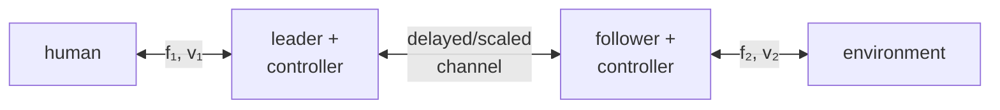

> [!note] Prerequisites · 선수 지식
> Passivity as an energy inequality at a port, and why a sampled or delayed loop can inject energy, from [[04-robotics/haptics-teleoperation/rendering-sampling-stability|24.4 §2 and §4]]; impedance versus admittance causality from [[04-robotics/haptics-teleoperation/device-design-kinematics|24.3 §1]]; phase margin from [[04-robotics/control-theory-ce397|Control Theory §5.5]].
> 포트에서의 에너지 부등식으로서의 수동성과, 샘플링되거나 지연된 루프가 에너지를 주입할 수 있는 이유는 [[04-robotics/haptics-teleoperation/rendering-sampling-stability|24.4 §2와 §4]]. 임피던스 대 어드미턴스 인과성은 [[04-robotics/haptics-teleoperation/device-design-kinematics|24.3 §1]]. 위상 여유는 [[04-robotics/control-theory-ce397|제어 이론 §5.5]].

## English

### 1. Two ports and four signals

A bilateral system has a local **leader** port coupled to the human and a remote **follower** port coupled to the environment. Each port has force and velocity, and therefore power. A paper is unreadable until its signs are declared: does positive force point into the network at both ports, or along the same spatial axis? The passivity inequality changes appearance with convention even when the physics is identical.

### 2. Transparency is a target impedance

Ideal transparency means the operator feels the remote environment as if the intervening system were absent. At the human port, the displayed impedance $Z_{in}=F_1/V_1$ should equal a scaled remote impedance. Real systems add leader/follower inertia, friction, local servos, sensor filtering, communication delay, quantization, and saturation. “Stable” and “transparent” are therefore different claims.

A four-channel architecture may transmit position/velocity and force in both directions; simpler position–force or position–position architectures transmit fewer signals. More channels can improve matching under a model, but also expose noise, delay, calibration, and causality constraints.

### 3. Scaling must preserve the intended power relation

Suppose remote position is scaled by $x_f=s_xx_l$. If reflected force is $F_l=s_fF_f$, then power scales as

$$P_l=F_l\dot x_l=s_fF_f\frac{\dot x_f}{s_x}=\frac{s_f}{s_x}P_f.$$

Power-preserving scaling requires $s_f=s_x$ under this convention; other conventions or deliberate power amplification change the relation. A paper must distinguish geometric scaling, force scaling, actuator gain, and unit conversion.

> [!example] Worked example · 계산 예제
> A micro-manipulation setup scales motion down, $s_x=0.1$. The leader moves 20 mm at 50 mm/s, so the follower moves 2 mm at 5 mm/s, and it touches tissue with $F_f=0.5$ N, which is $P_f=0.5\times0.005=2.5$ mW. Power-preserving scaling, $s_f=s_x=0.1$, reflects only $F_l=0.05$ N, too faint to use. Choosing $s_f=10$ instead reflects $F_l=5$ N, and the leader port now carries $P_l=5\times0.05=250$ mW, which is $s_f/s_x=100$ times the follower power. That extra power comes from the actuators, so a force-amplifying teleoperator cannot inherit passivity from its parts; its stability has to be argued separately.

### 4. Why delay is hard

A delayed force can arrive after velocity reverses, turning nominal damping into energy injection. Raising local feedback gains may improve low-delay tracking but erode phase margin (how much extra lag the loop tolerates before it oscillates; [[04-robotics/control-theory-ce397|Control Theory §5.5]]). Common strategies include:

- local damping or virtual coupling;
- time-domain passivity observers/controllers;
- wave/scattering variables that make a constant-delay channel passive under assumptions (send sum and difference combinations of velocity and force instead of the raw signals; derived in [[04-robotics/teleoperation-demonstration|12. Teleoperation & Demonstration Collection §3]]);
- model-mediated teleoperation, where a fast local model renders contact while remote updates correct it;
- shared control or predictive displays that reduce the human's need to close the fastest loop through the network.

Each pays somewhere: added damping reduces transparency, wave variables distort transients, local models can be wrong, and prediction/shared autonomy can alter authority — how shared autonomy arbitrates that authority by inferring the operator's goal is [[04-robotics/hri-safety|11. HRI & Safety §3.5]].

### 5. Reading a two-port model

A two-port can be represented by impedance, admittance, hybrid, or transmission matrices. Do not memorize one matrix. For every row ask:

1. Which variables are treated as inputs and outputs?
2. Is the model impedance or admittance causal at each port?
3. Which transfer terms describe self-impedance and cross-coupling?
4. What human and environment classes are allowed—fixed LTI (linear time-invariant; [[02-foundations/signal-processing|6. Signal Processing §1]]) models, passive uncertainty, or nonlinear systems?
5. Is the criterion stability for one termination or absolute stability over a class of passive terminations?

The classic two-port design literature demonstrates that desired port impedances and stability constraints can be expressed together, but the resulting gain choice depends on plant models and the assumed task impedance. It does not produce a task-independent “best teleoperator.”

### 6. Evidence checklist

Report round-trip delay and jitter, control rates, force/position scaling, saturation, local controller gains, contact objects, human grip/instructions, and both objective performance and subjective workload. A free-space trajectory plus one soft object does not establish transparency across the device's operating envelope.

> [!question]- Self-check · Answer
> **A controller is passive and users are slower. Is the result contradictory?** No. Passivity constrains energy generation; it does not guarantee transparency, low effort, good authority allocation, or task-optimal cues. Added dissipation may stabilize the loop while making motion sluggish.

### Problem set · 과제

Tier B. Using **P3** from [[02-foundations/lab-plants|0.6]] as *both* leader and follower. The Euler lab stays on [[04-robotics/haptics-teleoperation/rendering-sampling-stability|24.4]].

Leader motion is sent to the follower; follower wall force $F_a$ is sent back. One-way delay $T_d=50\,\mathrm{ms}$. Local sample $T=1\,\mathrm{ms}$. Catalog $k_w=400$, $b=0.8$.

1. **Draw.** Human port $(F_1,v_1)$ — leader P3 — delayed channel — follower P3 — wall. Mark the four signals and the sign convention (positive force into the network at both ports).
2. **Derive.** (a) Power-preserving scales $s_f=s_x$. If $s_x=0.1$ and the follower holds $F_f=1\,\mathrm{N}$ (catalog wall at $2.5\,\mathrm{mm}$ in), what does the leader reflect? Too faint? (b) With $s_f=10$, $s_x=0.1$, the power ratio $s_f/s_x$. Can the pair inherit passivity from its parts? (c) Colgate-style $K\le 2b/(T+T_d)$ at the leader. Does catalog $k_w$ pass?
3. **Interpret.** Users are slower after you add damping to survive the delay. Is that a contradiction of passivity?

> [!tip]- Solutions
> 1. Four signals $F_1,v_1,F_2,v_2$; delay on both directions or at least on force; wall switch at the follower. Arrows for force into the two-port.
> 2. (a) $F_l=0.1\,\mathrm{N}$ — below a typical force JND near $1\,\mathrm{N}$, too faint. (b) Ratio $100$; extra power from actuators; force-amplifying teleoperators do not inherit passivity. (c) $2b/0.051\approx 31\,\mathrm{N/m}$; $400$ fails.
> 3. No. Passivity bounds energy generation, not transparency or speed. Added dissipation can stabilize and make the wall feel sluggish — the trade §4 names.

## 한국어

### 1. 두 포트와 네 신호

양방향 시스템은 사람과 연결된 local **leader** 포트와 환경과 연결된 remote **follower** 포트를 가진다. 각 포트에는 force와 velocity가, 따라서 power가 있다. 논문은 부호를 선언하기 전까지 읽을 수 없다. 두 포트에서 network 안쪽을 향하는 것을 양의 힘으로 정했는가, 아니면 같은 공간축을 따라 정했는가? 물리가 똑같아도 규약이 다르면 passivity 부등식의 모양이 달라진다.

### 2. 투명성은 목표 임피던스다

이상적 transparency는 중간 시스템이 없는 것처럼 원격 환경을 조작자가 느끼는 것이다. 사람 쪽 포트에서 표시되는 임피던스 $Z_{in}=F_1/V_1$이 스케일된 원격 임피던스와 같아야 한다. 실제 시스템은 leader와 follower의 관성, 마찰, local servo, 센서 필터링, 통신 지연, quantization, saturation을 더한다. 그러므로 "안정하다"와 "투명하다"는 서로 다른 주장이다.

4채널 구조는 위치·속도와 힘을 양방향으로 모두 전송할 수 있고, 더 단순한 position–force나 position–position 구조는 더 적은 신호를 보낸다. 채널이 많으면 어떤 모델 아래에서 정합이 좋아질 수 있지만, 동시에 잡음·지연·보정·인과성 제약에 더 노출된다.

### 3. 스케일링은 의도한 일률 관계를 보존해야 한다

원격 위치가 $x_f=s_xx_l$로 스케일된다고 하자. 반사되는 힘이 $F_l=s_fF_f$이면 일률은 이렇게 스케일된다.

$$P_l=F_l\dot x_l=s_fF_f\frac{\dot x_f}{s_x}=\frac{s_f}{s_x}P_f.$$

이 규약에서 일률을 보존하는 스케일링은 $s_f=s_x$를 요구한다. 다른 규약이나 의도적인 power amplification은 관계를 바꾼다. 논문은 기하 스케일, 힘 스케일, 액추에이터 이득, 단위 변환을 구분해야 한다.

> [!example] 계산 예제 · Worked example
> 미세 조작 장치가 운동을 $s_x=0.1$로 줄인다고 하자. leader가 50 mm/s로 20 mm 움직이면 follower는 5 mm/s로 2 mm 움직이고, 조직에 $F_f=0.5$ N으로 닿으면 $P_f=0.5\times0.005=2.5$ mW다. 일률 보존 스케일링 $s_f=s_x=0.1$은 $F_l=0.05$ N만 돌려주는데, 쓰기엔 너무 약하다. 대신 $s_f=10$을 고르면 $F_l=5$ N이 반사되고 leader 포트의 일률은 $P_l=5\times0.05=250$ mW, 즉 follower 일률의 $s_f/s_x=100$배가 된다. 그 여분의 일률은 액추에이터에서 나오므로, 힘을 증폭하는 원격조작기는 부품들로부터 수동성을 물려받을 수 없고 안정성을 따로 논증해야 한다.

### 4. 지연이 어려운 이유

지연된 힘은 속도가 방향을 바꾼 뒤에 도착할 수 있고, 그러면 명목상 damping이 에너지 주입으로 바뀐다. Local 피드백 이득을 올리면 지연이 작을 때의 추종은 나아지지만 위상 여유(루프가 진동하기 전까지 견딜 수 있는 추가 지연의 여유. [[04-robotics/control-theory-ce397|제어 이론 §5.5]])가 깎인다. 흔한 대응은 이렇다.

- local damping 또는 virtual coupling;
- 시간영역 passivity observer/controller;
- 가정 아래에서 일정 지연 채널을 수동적으로 만드는 wave/scattering 변수(원시 신호 대신 속도와 힘의 합·차 조합을 보낸다. 유도는 [[04-robotics/teleoperation-demonstration|12. 원격조작과 시연 수집 §3]]);
- 빠른 local 모델이 접촉을 렌더링하고 원격 갱신이 그것을 교정하는 model-mediated teleoperation;
- 사람이 네트워크를 통과하는 가장 빠른 루프를 닫을 필요를 줄이는 shared control이나 predictive display.

각각 어딘가에서 값을 치른다. damping을 더하면 transparency가 줄고, wave 변수는 과도 응답을 일그러뜨리며, local 모델은 틀릴 수 있고, 예측과 shared autonomy는 권한 배분을 바꿀 수 있다 — shared autonomy가 조작자의 목표를 추론해 그 권한을 어떻게 나누는지는 [[04-robotics/hri-safety|11. HRI·안전 §3.5]]에 있다.

### 5. 2-port 모델 읽기

2-port는 impedance, admittance, hybrid, transmission 행렬로 표현할 수 있다. 어느 행렬 하나를 외우지 마라. 모든 행에 대해 이렇게 물어라.

1. 어떤 변수를 입력으로, 어떤 변수를 출력으로 두었는가?
2. 각 포트에서 모델이 impedance 인과인가 admittance 인과인가?
3. 어떤 전달 항이 자기 임피던스이고 어떤 항이 교차 결합인가?
4. 어떤 사람·환경 부류를 허용하는가 — 고정된 LTI(선형 시불변. [[02-foundations/signal-processing|6. 신호처리 §1]]) 모델인가, 수동적 불확실성인가, 비선형 시스템인가?
5. 판정 기준이 한 termination에 대한 안정성인가, 수동적 termination 부류 전체에 대한 절대 안정성인가?

고전적인 2-port 설계 문헌은 원하는 포트 임피던스와 안정성 제약을 함께 표현할 수 있음을 보이지만, 거기서 나오는 이득 선택은 플랜트 모델과 가정한 과제 임피던스에 달려 있다. 과제와 무관한 "최선의 원격조작기"를 만들어 주지는 않는다.

### 6. 증거 체크리스트

왕복 지연과 jitter, 제어 주기, 힘·위치 스케일, 포화, local 제어기 이득, 접촉 물체, 사람의 파지 방식과 지시문, 그리고 객관적 성능과 주관적 workload를 함께 보고해야 한다. 자유공간 궤적 하나에 부드러운 물체 하나를 더한 것으로는 장치의 운용 범위 전체에 걸친 transparency를 입증할 수 없다.

> [!question]- 스스로 점검 · 정답
> **제어기가 수동적인데 사용자가 더 느려졌다면 모순인가?** 아니다. Passivity는 에너지 생성을 제약할 뿐, transparency나 낮은 힘 소모, 좋은 권한 배분, 과제에 최적인 cue를 보장하지 않는다. 소산을 더하면 루프는 안정되면서 운동은 둔해질 수 있다.

### 과제 · Problem set

Tier B. [[02-foundations/lab-plants|0.6]]의 **P3**를 리더와 팔로워 *둘 다*로. 오일러 랩은 [[04-robotics/haptics-teleoperation/rendering-sampling-stability|24.4]]에 남긴다.

리더 운동이 팔로워로, 팔로워 벽 힘 $F_a$가 돌아온다. 편도 지연 $T_d=50\,\mathrm{ms}$. 로컬 샘플 $T=1\,\mathrm{ms}$. 카탈로그 $k_w=400$, $b=0.8$.

1. **그리기.** 사람 포트 $(F_1,v_1)$ — 리더 P3 — 지연 채널 — 팔로워 P3 — 벽. 신호 넷과 부호 규약(두 포트 모두 네트워크 안쪽이 양의 힘).
2. **유도.** (a) 일률 보존 스케일 $s_f=s_x$. $s_x=0.1$이고 팔로워가 $F_f=1\,\mathrm{N}$(카탈로그 벽 안 $2.5\,\mathrm{mm}$)을 쥐면 리더는 얼마를 반사하는가? 너무 약한가? (b) $s_f=10$, $s_x=0.1$에서 일률 비 $s_f/s_x$. 쌍이 부품에서 수동성을 물려받을 수 있는가? (c) 리더에서 Colgate형 $K\le 2b/(T+T_d)$. 카탈로그 $k_w$가 통과하는가?
3. **해석.** 지연을 버티려고 댐핑을 더했더니 사용자가 느려졌다. 수동성의 모순인가?

> [!tip]- 정답 · Solutions
> 1. 신호 넷 $F_1,v_1,F_2,v_2$; 양방향 또는 적어도 힘 쪽 지연; 팔로워의 벽 스위치. 2포트 안으로 들어가는 힘 화살표.
> 2. (a) $F_l=0.1\,\mathrm{N}$ — $1\,\mathrm{N}$ 부근 힘 JND보다 작아 너무 약하다. (b) 비 $100$; 여분 일률은 액추에이터에서; 힘을 증폭하는 원격조작기는 수동성을 물려받지 못한다. (c) $2b/0.051\approx 31\,\mathrm{N/m}$; $400$ 실패.
> 3. 아니다. 수동성은 에너지 생성을 묶지 투명성이나 속도를 묶지 않는다. 소산을 더하면 안정되면서 벽이 둔해질 수 있다 — §4가 이름 붙인 거래다.
