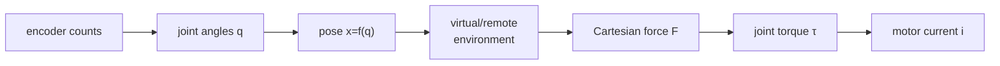
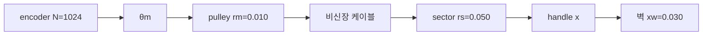
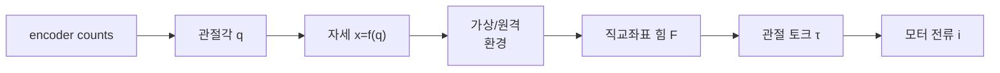

> [!note] Prerequisites · 선수 지식
> Plant **P3** from [[02-foundations/lab-plants|0.6 Lab Plants]]. The Jacobian $v=J(q)\dot q$ and the statics relation $\tau=J^\top F$ from [[04-robotics/modern-robotics/ch05-velocity-kinematics|MR ch.5]], and the idea of impedance versus admittance control from [[04-robotics/force-compliance-control|13. Force & Compliance Control §2]]; this page re-derives $\tau=J^\top F$ but moves quickly.
> [[02-foundations/lab-plants|0.6]]의 장치 **P3**. [[04-robotics/modern-robotics/ch05-velocity-kinematics|MR 5장]]의 야코비안 $v=J(q)\dot q$와 정역학 관계 $\tau=J^\top F$, 그리고 [[04-robotics/force-compliance-control|13. 힘·컴플라이언스 제어 §2]]의 임피던스 대 어드미턴스 제어 개념. 이 페이지도 $\tau=J^\top F$를 다시 유도하지만 빠르게 지나간다.

## English

> [!note] First pass · 처음이라면
> Read the Running object and the Worked case below: one command traced from a Cartesian force down to a motor torque, and one encoder count traced back up to a rendered newton. Then §1 for the two causalities and §3 for what a transmission costs. §2, §4 and §5 are what you open when you are sizing a mechanism rather than reading about one.

### Running object · 이 페이지의 대상

**P3**, the 1-DoF translating handle frozen in [[02-foundations/lab-plants|0.6 Lab Plants]]. Every number in §1–§5 is one of these, and this page never changes them.

| Symbol | Value | What it is |
|---|---:|---|
| $m$ | $0.04\,\mathrm{kg}$ | effective mass at the handle — everything the hand has to accelerate |
| $b$ | $0.8\,\mathrm{N{\cdot}s/m}$ | physical viscous damping of the mechanism |
| $r_m$ | $0.010\,\mathrm{m}$ | motor pulley radius |
| $r_s$ | $0.050\,\mathrm{m}$ | sector radius |
| $N$ | $1024$ counts/rev | encoder, after quadrature decode |
| $k_w$ | $400\,\mathrm{N/m}$ | default virtual wall, used here only to price one encoder count in newtons |
| $x_w$ | $0.030\,\mathrm{m}$ | wall location; $+x$ is into the wall |

Two numbers this page adds and then freezes, because the catalog has no reason to carry them and the lecture cannot be finished without them. Both are *declared design choices*, not measurements:

| Symbol | Value | What it is |
|---|---:|---|
| $J_m$ | $1.0\times10^{-6}\,\mathrm{kg{\cdot}m^2}$ | motor rotor inertia, for the reflected-inertia arithmetic of §3 |
| $\tau_m^{\max}$ | $0.020\,\mathrm{N{\cdot}m}$ | amplifier saturation torque, used by the problem set |

*Scope: this page teaches the chain from a commanded Cartesian force down to a motor current on one named handle — the two interface causalities, the Jacobian and its transpose, what a transmission does to force and to felt inertia, and what a single encoder count is worth. It does not teach the sampled-data limit on how stiff that wall may be, which is [[04-robotics/haptics-teleoperation/rendering-sampling-stability|24.4]]; nor the algorithm that decides the force in the first place, which is [[04-robotics/haptics-teleoperation/haptic-rendering-algorithms|24.7]]; nor the hand the device is built for, which is [[04-robotics/haptics-teleoperation/human-haptics-psychophysics|24.1]].*

### Homework diagram · 과제가 그릴 그림

Draw the chain once, left to right, as one line of blocks with the physical quantity written on every arrow. The problem set asks for this same drawing.

Five things have to be on the page, and each of them is a thing the drawing can get wrong.
**The two radii, drawn to scale.** $r_s$ is five times $r_m$; if the sector and the pulley come out the same size the reader has already lost the only ratio the picture carries.
**The cable, as one unbroken line** from the pulley to the sector, labelled *inextensible* — that label is the constraint the whole derivation rests on.
**The two constitutive equalities written on the sketch**, $x=\ldots$ and $\tau_m=\ldots$, each with the radius that actually appears in it.
**The wall**, a vertical line at $x_w=0.030\,\mathrm{m}$, with an arrow marking $+x$ as *into* the wall so that penetration is positive.
**One encoder count**, as a short tick next to the handle with $\Delta x$ written beside it, drawn deliberately far too large to scale — at $61\,\mathrm{\mu m}$ against a $30\,\mathrm{mm}$ wall it is $1/500$ of the picture, and the point of the tick is that it is the smallest thing the device can know.

### Worked case · 대상으로 한 번 끝까지

Six steps down the chain on the catalog numbers. The problem set keeps this map and changes what pushes on it.

**Step 1 — the cable constraint.** The cable does not stretch, so the arc it unwinds from the motor pulley is the arc it winds onto the sector:

$$r_m\theta_m = r_s\theta_s$$

where $\theta_m$ is motor rotation and $\theta_s$ sector rotation, because equal arc lengths is exactly what "the cable has constant length" says.

**Step 2 — the handle map, and the trap in it.** A handle that translates at the sector rim moves $x=r_s\theta_s$. Substitute Step 1 and $r_s$ cancels:

$$x = r_m\theta_m = 0.010\,\theta_m$$

so the sector radius never appears in the handle map at all. The sector is a lever the cable has already accounted for. Writing $x=r_s\theta_m$ instead pretends the cable wraps the sector as if the sector *were* the motor pulley, and every length and every force on the page is then wrong by $r_s/r_m=5$.

**Step 3 — the force map.** Power at the two ends of a lossless capstan must match, $\tau_m\omega_m=F\dot x$, and differentiating Step 2 gives $\dot x=r_m\omega_m$, so

$$\tau_m = F r_m = 0.010\,F$$

and the Jacobian of this 1-DoF map is the scalar $r_m$, which makes $\tau=J^\top F$ of §2 exactly this line.

**Step 4 — one encoder count, in metres.** After quadrature decode the encoder reports $N=1024$ counts per revolution, so one count is $\Delta\theta_m=2\pi/N$ and Step 2 turns it into handle travel:

$$\Delta x = r_m\frac{2\pi}{N} = 0.010\cdot\frac{2\pi}{1024}=6.14\times10^{-5}\,\mathrm{m}$$

that is $61.4\,\mathrm{\mu m}$, and it is the *only* resolution the device has, because nothing downstream can recover where the handle was inside that interval (§4).

**Step 5 — one encoder count, in newtons.** Once the handle is inside the catalog wall $k_w=400\,\mathrm{N/m}$, the rendered force is a function of the *reported* position, so one count changes it by

$$\Delta F = k_w\,\Delta x = 400\cdot 6.14\times10^{-5}=0.0245\,\mathrm{N}$$

which is the resolution of the wall and not a sampling-rate number: sampling ($T$) and quantization ($\Delta x$) are different ceilings, and [[04-robotics/haptics-teleoperation/rendering-sampling-stability|24.4 §3]] takes the second one. Crossing the whole $5\,\mathrm{mm}$ of penetration that the amplifier can hold takes $0.005/6.14\times10^{-5}=81.5$ counts, so the entire useful force range of this wall is resolved into about eighty steps.

**Step 6 — what the transmission did to the felt mass.** The same $r_m$ that multiplied force in Step 3 appears squared when the rotor's inertia is referred to the handle (§3). With the declared $J_m=1.0\times10^{-6}\,\mathrm{kg{\cdot}m^2}$,

$$m_{\text{refl}} = \frac{J_m}{r_m^2} = \frac{1.0\times10^{-6}}{(0.010)^2}=0.010\,\mathrm{kg}$$

so the rotor alone accounts for $10$ of the catalog's $40$ grams — a quarter of everything the hand accelerates — and the remaining $0.030\,\mathrm{kg}$ is structure, cable and handle. Had the designer driven the handle directly from a pulley of radius $r_s$ instead, the same rotor would have contributed $J_m/r_s^2=4.0\times10^{-4}\,\mathrm{kg}$, which is $0.4\,\mathrm{g}$, or $1\%$ of the handle mass. The capstan bought a factor $n=r_s/r_m=5$ in force and paid $n^2=25$ in reflected inertia, which is §3's claim with this page's numbers in it. At $\dot x=0.05\,\mathrm{m/s}$ and $\ddot x=5\,\mathrm{m/s^2}$ the person therefore has to supply $m\ddot x+b\dot x=0.04\cdot5+0.8\cdot0.05=0.24\,\mathrm{N}$ to move a handle that is rendering nothing at all — the free-space floor that §1's backdrivability box names.

### 1. Impedance and admittance causality

An **impedance display** measures motion and commands force: $x,\dot x\mapsto F$. It should feel light and backdrivable in free space, so low inertia, friction, cogging (torque ripple from the attraction between rotor magnets and stator slots, felt as small detents when you turn an unpowered motor by hand), backlash, and cable drag matter. An **admittance display** measures force and commands motion: $F\mapsto x,\dot x$. It relies on a high-bandwidth motion servo and is often built on a non-backdrivable industrial mechanism. These are interface causalities, not synonyms for impedance or admittance control used around an arbitrary robot.

Network theory describes any power exchange as an effort–flow pair whose product is power: force times velocity in mechanics, voltage times current in a circuit. Only one member of the pair can be independently imposed at a port (a connection point through which power enters or leaves). In mechanics the pair is force and velocity, and instantaneous power is $P=F^\top v$. This energy view will reappear in passivity and bilateral teleoperation.

That last sentence is the whole content of the word "causality" here, so it is worth making exact.

> **Interface causality, defined.** The **causality** of a haptic interface is a *choice of which member of the port's effort–flow pair the device imposes* — a property of the hardware and its sensing, not a control law and not a spectrum between two extremes. Three defining conditions. At the port there is exactly one effort–flow pair, force and velocity, whose product is power. **Exactly one** member of that pair may be imposed independently, which is why the two causalities are exclusive: a device that imposed both would be over-determining the port. And the member the device imposes fixes the member it must *measure*, so the causality is visible in the sensor list before any code is written.
>
> $$Z(s)=\frac{F(s)}{V(s)},\qquad Y(s)=Z(s)^{-1}=\frac{V(s)}{F(s)}$$
>
> where $F$ is the port force, $V$ the port velocity, $Z$ the mechanical impedance and $Y$ the admittance — an **impedance display** realizes $Z$ (it reads $V$, writes $F$), an **admittance display** realizes $Y$ (it reads $F$, writes $V$), and because the two are reciprocals no device realizes both at one port.
>
> - **Example**: **P3**. It has an encoder and no force sensor, and its actuator is a current-controlled motor. Reading the Worked case's chain left to right gives $x$ and writing it right to left gives $F$, so P3 is impedance-causal, and the catalog's wall law $F_a=-k_w(x-x_w)$ is a $Z$.
> - **Non-example**: "impedance control" on a position-controlled industrial arm. That is a *control law* shaping an apparent $Z$ behind an inner position loop, and the interface underneath is still admittance-causal — the distinction is [[04-robotics/force-compliance-control|13. Force & Compliance Control §2]], and confusing the two is how a paper ends up claiming free-space transparency it has no hardware for.
> - **Why it matters**: it decides which end of the renderable range is easy. An impedance display is light in free space and runs out of stiffness at the wall; an admittance display is stiff at the wall and heavy in free space. The two ends are the two ends of Z-width in [[04-robotics/haptics-teleoperation/rendering-sampling-stability|24.4 §4]], and the causality chosen here is which end you will spend the project fighting.

The word that keeps appearing in the impedance column is "backdrivable", and it is a measurable claim rather than an adjective.

> **Backdrivability, defined.** **Backdrivability** is a property of a *mechanism with its power off*: the output can be moved by a force applied at the output, cheaply. It is not a property of a controller, and it is not binary — it is a force, so it has a number. Three defining conditions, and a claim that omits any of them is not checkable. The mechanism must move at all, which fails outright for a self-locking transmission such as a worm gear. The force required must be **small compared with the forces the task renders**, which is a comparison, not an absolute. And it must be stated **with the speed and acceleration it was measured at**, because the three terms below scale differently.
>
> $$F_{\text{bd}}=\left(m_0+\frac{J_m}{r_m^2}\right)\ddot x+b\,\dot x+f_c\,\mathrm{sgn}(\dot x)$$
>
> where $F_{\text{bd}}$ is the force the user must supply at the output with the amplifier disabled, $m_0$ the mechanism's own translating mass, $J_m/r_m^2$ the reflected rotor inertia of §3, $b$ the viscous damping and $f_c$ the Coulomb friction — so backdrivability is three separate defects wearing one name, and improving one of them says nothing about the other two.
>
> - **Example**: **P3** at $\dot x=0.05\,\mathrm{m/s}$, $\ddot x=5\,\mathrm{m/s^2}$. The catalog's lumped $m=0.04$ and $b=0.8$ give $0.04\cdot5+0.8\cdot0.05=0.24\,\mathrm{N}$, of which the rotor's share of the inertial term is $0.010\cdot5=0.05\,\mathrm{N}$. Against a wall that renders up to $2\,\mathrm{N}$ before the amplifier saturates, a free-space floor of $0.24\,\mathrm{N}$ is about $12\%$ of full scale, and it is there whether or not anything is being displayed.
> - **Non-example**: an admittance display built on a harmonic-drive industrial arm that "feels compliant". The felt compliance is the force sensor and the servo; unplug the amplifier and the arm does not move at all. It can be a perfectly good haptic device — it is simply not backdrivable, and reporting the rendered compliance as though it were the mechanism's is the error.
> - **Why it matters**: $F_{\text{bd}}$ is a floor on the smallest impedance the device can display, so it sets the *lower* end of Z-width directly ([[04-robotics/haptics-teleoperation/rendering-sampling-stability|24.4 §4]]) and it is the number a gear ratio quietly ruins, per §3 and this page's self-check.

### 2. The device chain and the Jacobian

The kinematic differential is $v=J(q)\dot q$. Equality of mechanical power gives

$$\tau^\top\dot q=F^\top v=F^\top J\dot q\quad\Rightarrow\quad \tau=J^\top F.$$

This mapping does not require $J^{-1}$ and remains valid for non-square Jacobians. Near a singularity, however, some Cartesian velocities need very large joint rates or become unavailable, and a force along the singular direction is carried by the structure with little joint torque, so it cannot be actively modulated. Use singular values and condition number across the usable workspace, not only $\det J$ at one pose.

Worked example: for $J=\begin{bmatrix}0.2&0.1\\0&0.15\end{bmatrix}$ m/rad and $F=[5,-2]^\top$ N,

$$\tau=J^\top F=\begin{bmatrix}0.2&0\\0.1&0.15\end{bmatrix}\begin{bmatrix}5\\-2\end{bmatrix}=\begin{bmatrix}1.0\\0.2\end{bmatrix}\ \mathrm{N\,m}.$$

The computation only means anything if the units and the coordinate frames line up on both
sides.

Two mechanism families dominate teaching and commercial devices. A **serial** arm such as the 3-DOF Geomagic Touch (formerly Phantom Omni) chains links from base to stylus. Its forward kinematics and Jacobian come straight from the link lengths, and its singular configurations are worth computing before choosing a workspace. A **pantograph** is a planar closed-chain linkage driven by two base-mounted motors. Because the motors do not ride on the moving links, moving inertia stays low, which is exactly what free-space transparency asks for. The costs are a smaller workspace and a Jacobian that has to be derived from the loop-closure constraint rather than read off a single chain.

### 3. Actuation is not “PWM equals force”

For a brushed DC motor,

$$\tau_m=k_t i,\qquad V=Ri+L\dot i+k_e\omega.$$

Current is the direct torque variable. PWM duty cycle approximately controls average terminal voltage; current still depends on resistance, inductance, back-EMF, switching, and load. Stall torque is a short-duration operating point, not a continuous-force rating. Thermal limits, saturation, torque ripple (torque that oscillates with rotor angle even at constant current), and amplifier current/voltage limits must be included in the force envelope. The same two equations, with the torque–speed line and the current and voltage limits, are worked on an arm joint in [[04-robotics/actuators-drives|10.5 Actuators & Drives §1–§3]].

A transmission multiplies torque and reflected inertia approximately by $n$ and $n^2$, respectively. Gears can add backlash and friction; capstan drives (a cable wrapped around a small motor pulley and a larger output drum) can be low-backlash but require tension, alignment, and no-slip contact. High torque ratio can make a device strong yet heavy-feeling—bad for free-space transparency. That asymmetry between $n$ and $n^2$ is the single most consequential fact in haptic mechanism design, so both halves of it get a definition. The ratio is written $n$ here to keep it clear of the encoder's $N=1024$ counts/rev, which is an unrelated quantity that most textbooks unhelpfully give the same letter.

> **Transmission ratio, defined.** A **transmission ratio** $n$ is a *kinematic* number — a fixed ratio between input and output motion, set by geometry alone. It is not a gain, not a control parameter, and not load-dependent. Three defining conditions. It is a property of the **mechanism**, so it holds whether the motor is powered or being backdriven. It divides speed by exactly as much as it multiplies force, **because a lossless transmission conserves power**, $\tau_m\omega_m=F\dot x$. And it must be quoted with a **direction**, since $n$ and $1/n$ describe the same hardware and only the convention tells them apart.
>
> $$n=\frac{r_s}{r_m}=\frac{0.050}{0.010}=5,\qquad F=\frac{\tau_m}{r_m}=\frac{n\,\tau_m}{r_s}$$
>
> where $r_m$ is the motor pulley radius, $r_s$ the sector radius, $\tau_m$ the motor torque and $F$ the handle force — so P3's capstan gives five times the handle force a motor mounted directly on a sector-radius pulley would, at one fifth of the handle speed for the same motor speed.
> - **Example**: P3's capstan, $n=5$. Step 3 of the Worked case is this line with the numbers in it.
> - **Non-example**: $r_s/r_m$ read as a *displacement* ratio in the handle map. It is not: Step 2 showed $r_s$ cancels out of $x=r_m\theta_m$ entirely. The ratio governs the pulley-to-sector stage, not the sector-to-handle one, and collapsing the two is the error the problem set's item 3 prices at a factor of five.
> - **Why it matters**: it is the only free parameter that buys force without a bigger motor, which is why every device has one and why the next box exists.

> **Reflected inertia, defined.** **Reflected inertia** is the *apparent mass or inertia that the rotor contributes at the output port* — an equivalent parameter obtained by requiring equal kinetic energy, not a real mass and not something a scale would weigh. Three defining conditions. It is defined by **energy equivalence**, $\tfrac12 J_m\omega_m^2=\tfrac12 m_{\text{refl}}\dot x^2$, evaluated through the transmission's own kinematics. It therefore scales with the **square** of the ratio, not the ratio, which is the whole asymmetry. And it is **unaffected by control**: no feedback law removes it from the port, because it is present with the amplifier disabled.
>
> $$m_{\text{refl}}=\frac{J_m}{r_m^{2}}=\frac{1.0\times10^{-6}}{(0.010)^2}=0.010\,\mathrm{kg}$$
>
> where $J_m$ is the rotor's moment of inertia and $r_m$ the radius that maps motor rotation to handle travel — the square appears because $\dot x=r_m\omega_m$ enters the kinetic energy squared, so substituting $\omega_m=\dot x/r_m$ into $\tfrac12 J_m\omega_m^2$ leaves $\tfrac12 (J_m/r_m^2)\dot x^2$.
> - **Example**: P3. $10\,\mathrm{g}$ reflected against a catalog handle mass of $40\,\mathrm{g}$ — a quarter of everything the hand accelerates comes from a rotor that weighs almost nothing on its own.
> - **Non-example**: the same rotor driving the handle directly at $r_s$, which reflects $J_m/r_s^2=4.0\times10^{-4}\,\mathrm{kg}$, or $0.4\,\mathrm{g}$: the *same motor*, $25$ times lighter at the port. Nothing about the rotor changed; only $r^2$ did.
> - **Why it matters**: "stronger device" and "lighter-feeling device" pull in opposite directions through the same number, at a rate of $n$ against $n^2$. Raising $n$ from $5$ to $10$ doubles the force and quadruples the rotor's share of the felt mass, which is the self-check at the end of this page and the reason free-space transparency is a mechanism problem before it is a control problem.

The chain from that ratio down to one encoder count is worked in full on P3 in the Worked case above; the problem set keeps that map and asks what happens when the amplifier saturates, and what a reviewer who swaps $r_s$ for $r_m$ would publish.

### 4. Sensing and differentiation

Quadrature encoders provide counts and direction; angle requires counts-per-revolution and transmission calibration. Velocity from $(q_k-q_{k-1})/T$ amplifies quantization and noise. Filtering reduces noise but adds phase lag, which can destabilize a haptic loop. The filter equation, and the convention trap in its $\alpha$, are in [[04-robotics/haptics-teleoperation/rendering-sampling-stability|24.4 §3]]. Force sensors add direct interaction information but require bias, temperature, frame, bandwidth, and inertial-load checks.

"Amplifies quantization" is a sentence that hides two distinct things, one of which is a measurement and the other a limit, so both get named here and both are used by 24.4.

> **Quantization, defined.** **Quantization** is a *deterministic map* from the true position to the reported one — a staircase function, not a noise source. Three defining conditions, and the first is the one that gets forgotten. It is a **function of position**: the same position always produces the same count, so the error is repeatable and is *not* zero-mean random noise that averaging can remove. Its error is **bounded**, $|x-\hat x|<\Delta x$, so it is small but never small in the places it matters. And it is **irreversible**: no filter, and no faster sample rate, recovers where the handle sat inside a count.
>
> $$\hat x=\Delta x\left\lfloor\frac{x}{\Delta x}\right\rfloor,\qquad \Delta x=r_m\frac{2\pi}{N}$$
>
> where $x$ is true handle position, $\hat x$ the position the controller sees, $\lfloor\cdot\rfloor$ the floor, $\Delta x$ the encoder resolution below, $r_m$ the pulley radius and $N$ counts per revolution — so every force the device renders is a function of $\hat x$, never of $x$.
> - **Example**: on P3, a handle drifting from $x=0.03003$ to $x=0.03006\,\mathrm{m}$ renders the *same* wall force the whole way, then jumps by $0.0245\,\mathrm{N}$ in one sample when the count changes.
> - **Non-example**: treating that jump as additive white noise and low-pass filtering it. Because the staircase is a function of position, a slow approach produces a long run of identical readings followed by a step, which is a strongly correlated error, and filtering only delays the step. It is also why the finite-difference velocity estimate reads exactly zero at low speed ([[04-robotics/haptics-teleoperation/rendering-sampling-stability|24.4 §3]]) rather than reading something small and noisy. The white-noise model becomes honest only when the position crosses many counts irregularly between samples, the condition [[04-robotics/sensor-models|3.2 Sensor Models & Noise §4]] states and checks.
> - **Why it matters**: with Coulomb friction $f_c$ it imposes a stiffness ceiling $K\le 2f_c/\Delta x$ that is entirely separate from, and does not improve with, the sample rate — Abbott & Okamura's bound, taken in [[04-robotics/haptics-teleoperation/rendering-sampling-stability|24.4 §3]].

> **Encoder resolution, defined.** **Encoder resolution** $\Delta x$ is a *length*: the smallest change in handle position that changes the reported count. It is one number with units of metres at the handle, not a count and not a percentage. Three defining conditions. It is stated **at the point of interest** — an angular resolution at the motor is a different number from a linear resolution at the handle, related by the whole transmission. It is stated **after decode**, because quadrature multiplies a disc's line count by four and the two figures differ by that factor. And it is a **floor, not an accuracy**: eccentricity, cable stretch and calibration error all add on top of it, so the true error is never smaller than $\Delta x$ and is usually larger.
>
> $$\Delta x=r_m\frac{2\pi}{N}=0.010\cdot\frac{2\pi}{1024}=6.14\times10^{-5}\,\mathrm{m}$$
>
> where $r_m$ is the pulley radius and $N$ the post-decode counts per revolution — $61.4\,\mathrm{\mu m}$ at the handle, because one revolution carries the handle $2\pi r_m=62.8\,\mathrm{mm}$ and that travel is cut into $1024$ equal pieces.
> - **Example**: the $5\,\mathrm{mm}$ of penetration P3's amplifier can hold is $81.5$ counts, so the wall's entire force range is resolved into about eighty steps of $0.0245\,\mathrm{N}$.
> - **Non-example**: quoting $N=256$ because that is the number of slots on the disc. Quadrature decoding gives four counts per slot, so the true $N$ is $1024$ and the true $\Delta x$ is four times *smaller*; a paper that makes this mistake under-reports its own resolution by a factor of four, which is the problem set's item 3.
> - **Why it matters**: it is the $\Delta$ in the quantization ceiling above, and it is the one term in that ceiling that faster computation cannot touch — it is bought with hardware, once.

### 5. Design from two ends

From the person: workspace, grasp, comfortable continuous/peak force, perceptual bandwidth, and safety. From the virtual task: minimum free-space impedance, maximum stable wall stiffness, directions of force, update rate, collision complexity, and desired cue. A useful design maximizes the intersection; no scalar “best haptic device” captures it.

### Self-check

1. Why can a larger gear ratio worsen a haptic interface even though its maximum force rises?
2. P3's capstan has $r_m = 10\ \mathrm{mm}$ and $r_s = 50\ \mathrm{mm}$. What is the transmission ratio, and by what factor does the motor's rotor inertia appear at the handle?
3. An encoder gives $1024$ counts per revolution on the motor shaft. Does gearing up the transmission improve or worsen the position resolution at the handle, and does the same answer hold for the force resolution?

> [!tip]- Answers
> 1. Reflected inertia grows with the square of the ratio while force grows only linearly, and friction and backlash grow too. The handle gets heavier and stickier faster than it gets stronger, which is felt in free space where the operator should feel nothing.
> 2. $n = r_s/r_m = 5$. Rotor inertia appears multiplied by $n^2 = 25$ at the handle — the reason a high-ratio drive feels heavy even when it is not moving anything.
> 3. It improves position resolution: one motor count covers $n$ times less handle motion. It worsens nothing about force resolution directly, but the same $n^2$ inertia and the added friction raise the smallest force the device can render honestly, so the two resolutions do not improve together.

### Problem set · 과제

Tier B. Using **P3** from [[02-foundations/lab-plants|0.6]], this page, and [[04-robotics/modern-robotics/ch05-velocity-kinematics|MR ch.5]]. The Euler loop for the same handle lives on [[04-robotics/haptics-teleoperation/rendering-sampling-stability|24.4]] — do not start a second simulator here.

The translating handle is driven by an inextensible capstan: motor pulley radius $r_m$, sector radius $r_s$. Cable length is conserved, so handle displacement is $x=r_m\theta_m$ regardless of $r_s$. Power match then gives $\tau_m=F r_m$. The motor encoder has $N=1024$ counts/rev after decode. A current amplifier saturates at $\tau_m^{\max}=0.020\,\mathrm{N{\cdot}m}$ (a problem number, not a catalog number).

1. **Draw.** Sketch the chain encoder $\to$ $\theta_m$ $\to$ pulley $r_m$ $\to$ cable $\to$ sector $r_s$ $\to$ handle $x$. Label every P3 length and $N$. Mark the wall at $x_w$ and the $+x$ direction into the wall. Write the two constitutive equalities $x=\ldots$ and $\tau_m=\ldots$ on the sketch.
2. **Derive.** (a) Handle motion $\Delta x$ for one encoder count. (b) Force increment $\Delta F$ of the default virtual wall $k_w$ for that one count, once inside the wall. (c) Maximum handle force $F^{\max}$ at amplifier saturation, and the penetration at which the default wall saturates. (d) At $x=0.036\,\mathrm{m}$ (6 mm into the wall), does the unsaturated spring law still hold?
3. **Interpret.** A reviewer says “just use the sector radius in $x=r_s\theta_m$, the handle sits on the sector.” What factor would that mistake inject into every force you report? Separately: $N$ is after quadrature decode. If you treated it as 256 slots before decode, how would $\Delta x$ change?

> [!tip]- Solutions
> 1. Cable inextensible $\Rightarrow$ arc on the motor pulley equals arc on the sector, $r_m\theta_m=r_s\theta_s$. A translating handle at the sector rim has $x=r_s\theta_s=r_m\theta_m$. Power $\tau_m\omega_m=F\dot x$ with $\dot x=r_m\omega_m$ gives $\tau_m=F r_m$. $r_s$ sets how the sector is built; it cancels in the handle map.
> 2. (a) $\Delta\theta_m=2\pi/N=2\pi/1024$, so $\Delta x=r_m\Delta\theta_m=0.010\cdot 2\pi/1024=6.14\times10^{-5}\,\mathrm{m}$ (61.4 µm). (b) $\Delta F=k_w\Delta x=400\cdot 6.14\times10^{-5}=0.0245\,\mathrm{N}$. (c) $F^{\max}=\tau_m^{\max}/r_m=0.020/0.010=2.0\,\mathrm{N}$. Saturation penetration $\delta=F^{\max}/k_w=2/400=0.005\,\mathrm{m}$ (5 mm), i.e. at $x=0.035\,\mathrm{m}$. (d) At $x=0.036$ the unsaturated law wants $F=k_w(0.006)=2.4\,\mathrm{N}>2.0$, so the amplifier is already saturated and the spring law is a lie.
> 3. Using $r_s$ in place of $r_m$ multiplies $x$ and divides $F$ by $r_s/r_m=5$. Every Newton you publish would be off by five. Quadrature $4\times$ on 256 slots is 1024 counts: treating $N=256$ inflates $\Delta x$ by four, so the wall would feel four times coarser and you would under-report resolution.

## 한국어

> [!note] 처음이라면 · First pass
> 아래 대상과 계산을 먼저 읽어라. 직교좌표 힘 하나가 모터 토크까지 내려가고, 엔코더 한 카운트가 렌더링된 뉴턴까지 올라오는 사슬 하나다. 그다음 §1의 두 인과성과 §3의 전달장치 대가를 읽는다. §2·§4·§5는 메커니즘을 읽는 게 아니라 설계할 때 연다.

### 이 페이지의 대상 · Running object

[[02-foundations/lab-plants|0.6 Lab Plants]]가 고정한 1자유도 병진 핸들 **P3**. §1–§5의 모든 숫자가 이 표에서 나오고, 이 페이지는 그 숫자를 바꾸지 않는다.

| 기호 | 값 | 뜻 |
|---|---:|---|
| $m$ | $0.04\,\mathrm{kg}$ | 핸들의 유효 질량 — 손이 가속해야 하는 전부 |
| $b$ | $0.8\,\mathrm{N{\cdot}s/m}$ | 메커니즘의 물리적 점성 댐핑 |
| $r_m$ | $0.010\,\mathrm{m}$ | 모터 풀리 반지름 |
| $r_s$ | $0.050\,\mathrm{m}$ | 섹터 반지름 |
| $N$ | $1024$ counts/rev | 엔코더, 쿼드러처 디코드 후 |
| $k_w$ | $400\,\mathrm{N/m}$ | 기본 가상 벽. 여기서는 카운트 하나를 뉴턴으로 환산하는 데만 쓴다 |
| $x_w$ | $0.030\,\mathrm{m}$ | 벽 위치; $+x$가 벽 안 |

이 페이지가 덧붙여 고정하는 숫자 둘. 카탈로그가 들고 있을 이유는 없지만 강의를 끝내려면 필요하다. 둘 다 측정값이 아니라 여기서 *선언한 설계값*이다.

| 기호 | 값 | 뜻 |
|---|---:|---|
| $J_m$ | $1.0\times10^{-6}\,\mathrm{kg{\cdot}m^2}$ | 모터 회전자 관성. §3의 반사 관성 계산용 |
| $\tau_m^{\max}$ | $0.020\,\mathrm{N{\cdot}m}$ | 증폭기 포화 토크. 과제에서 쓴다 |

*범위: 이 페이지는 명령된 직교좌표 힘에서 모터 전류까지의 사슬을 핸들 하나 위에서 가르친다 — 두 인터페이스 인과성, 야코비안과 그 전치, 전달장치가 힘과 느껴지는 관성에 하는 일, 엔코더 한 카운트의 값. 그 벽이 얼마나 단단할 수 있는지의 샘플링 데이터 한계는 가르치지 않는다. 그것은 [[04-robotics/haptics-teleoperation/rendering-sampling-stability|24.4]]다. 애초에 힘을 무엇으로 정하는지의 알고리즘도 아니다. 그것은 [[04-robotics/haptics-teleoperation/haptic-rendering-algorithms|24.7]]이다. 장치가 상대하는 손도 아니다. 그것은 [[04-robotics/haptics-teleoperation/human-haptics-psychophysics|24.1]]이다.*

### 과제가 그릴 그림 · Homework diagram

사슬을 왼쪽에서 오른쪽으로 한 줄의 블록으로 그리고, 모든 화살표 위에 그 화살표가 나르는 물리량을 적는다. 과제가 요구하는 그림이 이것이다.

그림에 반드시 들어가야 하는 것이 다섯이고, 각각은 그림이 틀릴 수 있는 지점이다.
**축척을 지킨 두 반지름.** $r_s$는 $r_m$의 다섯 배다. 섹터와 풀리가 같은 크기로 나오면 그림이 나르는 유일한 비를 이미 잃은 것이다.
**끊기지 않은 한 줄의 케이블.** 풀리에서 섹터까지 한 선으로 긋고 *비신장*이라 적는다. 유도 전체가 그 한마디 위에 서 있다.
**그림 위에 적은 구성 등식 둘.** $x=\ldots$와 $\tau_m=\ldots$를, 각각 실제로 등장하는 반지름과 함께 적는다.
**벽.** $x_w=0.030\,\mathrm{m}$의 수직선, 그리고 침투가 양수가 되도록 $+x$가 벽 *안*임을 화살표로 표시한다.
**엔코더 한 카운트.** 핸들 옆에 짧은 눈금으로 긋고 $\Delta x$를 적되, 일부러 축척을 크게 어겨서 그린다. $30\,\mathrm{mm}$ 벽에 대한 $61\,\mathrm{\mu m}$은 그림의 $1/500$이고, 이 눈금의 요점은 그것이 장치가 알 수 있는 가장 작은 것이라는 데 있다.

### 대상으로 한 번 끝까지 · Worked case

카탈로그 숫자로 사슬을 여섯 단계 내려간다. 과제는 이 사상을 그대로 두고 무엇이 미는지를 바꾼다.

**1단계 — 케이블 제약.** 케이블은 늘어나지 않으므로 모터 풀리에서 풀리는 호와 섹터에 감기는 호가 같다.

$$r_m\theta_m = r_s\theta_s$$

$\theta_m$은 모터 회전, $\theta_s$는 섹터 회전이다. "케이블 길이가 일정하다"가 말하는 것이 바로 호 길이가 같다는 것이기 때문이다.

**2단계 — 핸들 사상, 그리고 그 안의 함정.** 섹터 가장자리에서 병진하는 핸들은 $x=r_s\theta_s$다. 1단계를 대입하면 $r_s$가 소거된다.

$$x = r_m\theta_m = 0.010\,\theta_m$$

그래서 섹터 반지름은 핸들 사상에 아예 등장하지 않는다. 섹터는 케이블이 이미 셈에 넣은 지렛대다. 대신 $x=r_s\theta_m$을 쓰면 케이블이 섹터를 모터 풀리인 양 감는 셈이 되고, 페이지의 모든 길이와 모든 힘이 $r_s/r_m=5$배 틀린다.

**3단계 — 힘 사상.** 손실 없는 캡스턴의 양 끝 일률은 같아야 한다: $\tau_m\omega_m=F\dot x$. 2단계를 미분하면 $\dot x=r_m\omega_m$이므로

$$\tau_m = F r_m = 0.010\,F$$

이고, 이 1자유도 사상의 야코비안은 스칼라 $r_m$이다. 그래서 §2의 $\tau=J^\top F$가 정확히 이 줄이다.

**4단계 — 엔코더 한 카운트를 미터로.** 쿼드러처 디코드 후 엔코더는 회전당 $N=1024$ 카운트를 주므로 한 카운트는 $\Delta\theta_m=2\pi/N$이고, 2단계가 그것을 핸들 이동으로 바꾼다.

$$\Delta x = r_m\frac{2\pi}{N} = 0.010\cdot\frac{2\pi}{1024}=6.14\times10^{-5}\,\mathrm{m}$$

$61.4\,\mathrm{\mu m}$이고, 이것이 장치가 가진 해상도의 *전부*다. 그 간격 안에서 핸들이 어디 있었는지는 뒤의 어떤 단계도 복원할 수 없기 때문이다(§4).

**5단계 — 엔코더 한 카운트를 뉴턴으로.** 핸들이 카탈로그 벽 $k_w=400\,\mathrm{N/m}$ 안에 들어오면 렌더링되는 힘은 *보고된* 위치의 함수이므로, 한 카운트가 힘을

$$\Delta F = k_w\,\Delta x = 400\cdot 6.14\times10^{-5}=0.0245\,\mathrm{N}$$

만큼 바꾼다. 이것은 벽의 해상도이지 샘플 주기 숫자가 아니다. 샘플링($T$)과 양자화($\Delta x$)는 서로 다른 천장이고, [[04-robotics/haptics-teleoperation/rendering-sampling-stability|24.4 §3]]이 둘째를 가져간다. 증폭기가 버틸 수 있는 침투 $5\,\mathrm{mm}$ 전체는 $0.005/6.14\times10^{-5}=81.5$ 카운트이므로, 이 벽의 쓸 수 있는 힘 범위 전체가 여든 단계 남짓으로 쪼개진다.

**6단계 — 전달장치가 느껴지는 질량에 한 일.** 3단계에서 힘을 곱했던 그 $r_m$이 회전자 관성을 핸들로 옮길 때는 제곱으로 나타난다(§3). 선언한 $J_m=1.0\times10^{-6}\,\mathrm{kg{\cdot}m^2}$으로

$$m_{\text{refl}} = \frac{J_m}{r_m^2} = \frac{1.0\times10^{-6}}{(0.010)^2}=0.010\,\mathrm{kg}$$

이므로 회전자 혼자서 카탈로그 $40\,\mathrm{g}$ 중 $10\,\mathrm{g}$을 차지한다. 손이 가속하는 것의 4분의 1이고, 나머지 $0.030\,\mathrm{kg}$이 구조·케이블·핸들이다. 설계자가 대신 반지름 $r_s$의 풀리로 핸들을 직접 구동했다면 같은 회전자가 $J_m/r_s^2=4.0\times10^{-4}\,\mathrm{kg}$, 즉 $0.4\,\mathrm{g}$만 기여했을 것이고 이는 핸들 질량의 $1\%$다. 캡스턴은 힘에서 $n=r_s/r_m=5$를 사고 반사 관성에서 $n^2=25$를 치렀다. §3의 주장에 이 페이지의 숫자를 넣은 것이 이것이다. 그래서 $\dot x=0.05\,\mathrm{m/s}$, $\ddot x=5\,\mathrm{m/s^2}$에서 사람은 아무것도 렌더링하지 않는 핸들을 움직이는 데 $m\ddot x+b\dot x=0.04\cdot5+0.8\cdot0.05=0.24\,\mathrm{N}$을 써야 한다. §1의 역구동성 정의가 이름 붙이는 자유공간 바닥이다.

### 1. 임피던스·어드미턴스 인과성

**Impedance display**는 운동을 측정해 힘을 명령한다: $x,\dot x\mapsto F$. 자유공간에서 가볍고 backdrivable해야 하므로 관성·마찰·cogging(회전자 자석과 고정자 슬롯 사이의 인력에서 생기는 토크 요동. 전원 없는 모터를 손으로 돌릴 때 작은 걸림으로 느껴진다)·backlash·케이블 항력이 중요하다. **Admittance display**는 힘을 측정해 운동을 명령한다: $F\mapsto x,\dot x$. 고대역폭 motion servo에 의존하며 역구동이 되지 않는 산업용 메커니즘 위에 만드는 경우가 많다. 이것은 인터페이스의 인과성이며, 임의의 로봇에 두르는 impedance/admittance 제어기와 같은 말이 아니다.

네트워크 이론은 모든 일률 교환을 곱이 일률이 되는 effort–flow 쌍으로 기술한다. 역학에서는 힘×속도, 회로에서는 전압×전류다. 한 포트(일률이 들어오거나 나가는 연결점)에서 이 쌍 중 독립적으로 부과할 수 있는 것은 하나뿐이다. 역학에서 그 쌍은 힘과 속도이고 순간 일률은 $P=F^\top v$다. 이 에너지 관점은 수동성과 양방향 원격조작에서 다시 등장한다.

마지막 문장이 여기서 말하는 "인과성"의 전부이므로, 정확히 적어 둘 값어치가 있다.

> **인터페이스 인과성의 정의.** 햅틱 인터페이스의 **인과성**(causality)은 *포트의 effort–flow 쌍 중 장치가 어느 쪽을 부과하는가의 선택*이다. 하드웨어와 센싱의 성질이지 제어 법칙이 아니고, 두 극단 사이의 연속적인 눈금도 아니다. 정의 조건 셋. 포트에는 곱이 일률인 effort–flow 쌍, 즉 힘과 속도가 정확히 하나 있다. 그 쌍 중 독립적으로 부과할 수 있는 것은 **정확히 하나**이고, 그래서 두 인과성은 배타적이다. 둘 다 부과하는 장치는 포트를 과다 결정한다. 그리고 부과하는 쪽이 정해지면 *측정해야 하는* 쪽도 정해지므로, 인과성은 코드를 한 줄도 쓰기 전에 센서 목록에서 이미 드러난다.
>
> $$Z(s)=\frac{F(s)}{V(s)},\qquad Y(s)=Z(s)^{-1}=\frac{V(s)}{F(s)}$$
>
> $F$는 포트 힘, $V$는 포트 속도, $Z$는 기계 임피던스, $Y$는 어드미턴스다. **impedance display**는 $Z$를 구현하고($V$를 읽고 $F$를 쓴다), **admittance display**는 $Y$를 구현한다($F$를 읽고 $V$를 쓴다). 둘이 서로 역수이므로 한 포트에서 둘 다 구현하는 장치는 없다.
>
> - **예**: **P3**. 엔코더가 있고 힘 센서가 없으며 액추에이터는 전류 제어 모터다. 계산 절의 사슬을 왼쪽에서 오른쪽으로 읽으면 $x$가 나오고 오른쪽에서 왼쪽으로 읽으면 $F$가 나오므로 P3는 임피던스 인과이고, 카탈로그의 벽 법칙 $F_a=-k_w(x-x_w)$가 하나의 $Z$다.
> - **비예**: 위치 제어되는 산업용 팔 위의 "임피던스 제어". 그것은 내부 위치 루프 뒤에서 겉보기 $Z$를 만드는 *제어 법칙*이고, 그 밑의 인터페이스는 여전히 어드미턴스 인과다. 이 구분은 [[04-robotics/force-compliance-control|13. 힘·컴플라이언스 제어 §2]]에 있고, 둘을 섞으면 하드웨어가 뒷받침하지 못하는 자유공간 투명성을 주장하게 된다.
> - **왜 중요한가**: 표현 가능한 범위의 어느 쪽 끝이 쉬운지를 정한다. Impedance display는 자유공간에서 가볍고 벽에서 강성이 모자라며, admittance display는 그 반대다. 그 두 끝이 [[04-robotics/haptics-teleoperation/rendering-sampling-stability|24.4 §4]]의 Z-width의 두 끝이고, 여기서 고른 인과성이 곧 프로젝트 내내 싸울 쪽을 고르는 일이다.

Impedance 쪽 열에 계속 등장하는 단어가 "backdrivable"인데, 이것은 형용사가 아니라 잴 수 있는 주장이다.

> **역구동성의 정의.** **역구동성**(backdrivability)은 *전원을 끈 메커니즘*의 성질이다. 출력단에 건 힘으로 출력을 움직일 수 있고, 그것이 싸다는 뜻이다. 제어기의 성질이 아니고 이분법도 아니다. 힘이므로 숫자가 있다. 정의 조건 셋이고, 하나라도 빠진 주장은 검증할 수 없다. 우선 메커니즘이 아예 움직여야 하는데, 웜 기어 같은 자기잠금 전달장치는 여기서 바로 탈락한다. 필요한 힘이 **과제가 렌더링하는 힘에 비해 작아야** 하고, 이것은 절댓값이 아니라 비교다. 그리고 **잰 속도와 가속도와 함께** 말해야 한다. 아래 세 항의 축척이 서로 다르기 때문이다.
>
> $$F_{\text{bd}}=\left(m_0+\frac{J_m}{r_m^2}\right)\ddot x+b\,\dot x+f_c\,\mathrm{sgn}(\dot x)$$
>
> $F_{\text{bd}}$는 증폭기를 끈 채 사용자가 출력단에 넣어야 하는 힘, $m_0$는 메커니즘 자체의 병진 질량, $J_m/r_m^2$는 §3의 반사 회전자 관성, $b$는 점성 댐핑, $f_c$는 Coulomb 마찰이다. 그러므로 역구동성은 이름 하나를 나눠 쓰는 서로 다른 결함 셋이고, 하나를 고쳤다는 말은 나머지 둘에 대해 아무것도 말해 주지 않는다.
>
> - **예**: $\dot x=0.05\,\mathrm{m/s}$, $\ddot x=5\,\mathrm{m/s^2}$의 **P3**. 카탈로그의 묶인 $m=0.04$와 $b=0.8$로 $0.04\cdot5+0.8\cdot0.05=0.24\,\mathrm{N}$이고, 그중 관성 항에서 회전자 몫은 $0.010\cdot5=0.05\,\mathrm{N}$이다. 증폭기가 포화하기 전까지 $2\,\mathrm{N}$을 내는 벽에 대해 자유공간 바닥 $0.24\,\mathrm{N}$은 풀스케일의 약 $12\%$이고, 아무것도 표시하지 않을 때에도 거기 있다.
> - **비예**: "컴플라이언트하게 느껴지는" 하모닉 드라이브 산업용 팔 위의 admittance display. 느껴지는 컴플라이언스는 힘 센서와 서보가 만든 것이고, 증폭기를 뽑으면 팔은 전혀 움직이지 않는다. 훌륭한 햅틱 장치일 수 있다. 다만 역구동되지 않을 뿐이고, 렌더링된 컴플라이언스를 메커니즘의 것인 양 보고하는 것이 잘못이다.
> - **왜 중요한가**: $F_{\text{bd}}$는 장치가 표시할 수 있는 최소 임피던스의 바닥이므로 Z-width의 *아래* 끝을 곧바로 정하고([[04-robotics/haptics-teleoperation/rendering-sampling-stability|24.4 §4]]), §3과 이 페이지의 스스로 점검이 말하듯 감속비가 조용히 망가뜨리는 숫자가 바로 이것이다.

### 2. 장치 사슬과 야코비안

기구학 미분은 $v=J(q)\dot q$다. 기계적 일률이 같다는 조건에서

$$\tau^\top\dot q=F^\top v=F^\top J\dot q\quad\Rightarrow\quad \tau=J^\top F.$$

이 사상에는 $J^{-1}$가 필요하지 않고 비정방 야코비안에서도 성립한다. 다만 특이점 근처에서는 어떤 직교 속도가 매우 큰 관절 속도를 요구하거나 아예 만들 수 없고, 특이 방향의 힘은 관절 토크를 거의 쓰지 않고 구조가 받아 내므로 능동적으로 조절할 수 없다. 한 자세의 $\det J$만이 아니라 사용 가능한 작업공간 전체에서 특이값과 조건수를 본다.

예제: $J=\begin{bmatrix}0.2&0.1\\0&0.15\end{bmatrix}$ m/rad, $F=[5,-2]^\top$ N일 때

$$\tau=J^\top F=\begin{bmatrix}0.2&0\\0.1&0.15\end{bmatrix}\begin{bmatrix}5\\-2\end{bmatrix}=\begin{bmatrix}1.0\\0.2\end{bmatrix}\ \mathrm{N\,m}.$$

단위와 좌표 프레임이 함께 맞아야 이 계산이 물리적 의미를 가진다.

교육용과 상용 장치에서는 메커니즘 계열 둘이 주를 이룬다. 3자유도 Geomagic Touch(옛 Phantom Omni) 같은 **직렬** 팔은 베이스에서 스타일러스까지 링크를 잇는다. 순기구학과 야코비안이 링크 길이에서 곧바로 나오고, 작업공간을 정하기 전에 특이 자세를 계산해 둘 가치가 있다. **팬터그래프**는 베이스에 고정된 모터 둘이 구동하는 평면 폐쇄 사슬 링크다. 모터가 움직이는 링크 위에 실리지 않으므로 움직이는 관성이 작고, 이것이 바로 자유공간 투명성이 요구하는 것이다. 대가는 더 작은 작업공간, 그리고 사슬 하나에서 읽어 낼 수 없어 루프 폐쇄 제약에서 유도해야 하는 야코비안이다.

### 3. PWM은 곧 힘이 아니다

브러시 DC 모터에서

$$\tau_m=k_t i,\qquad V=Ri+L\dot i+k_e\omega.$$

전류가 직접적인 토크 변수다. PWM duty는 평균 단자 전압을 근사적으로 제어할 뿐이고, 전류는 여전히 저항·인덕턴스·역기전력·스위칭·부하에 달려 있다. Stall torque는 짧은 시간의 동작점이지 연속 힘 정격이 아니다. 열 한계·포화·torque ripple(전류가 일정해도 회전자 각도에 따라 출렁이는 토크)·증폭기의 전류/전압 한계를 힘 범위 안에 포함해야 한다. 같은 두 방정식을 토크–속도 선, 전류·전압 한계와 함께 팔 관절 위에서 푼 것이 [[04-robotics/actuators-drives|10.5 액추에이터·구동계 §1–§3]]이다.

전달장치는 토크를 대략 $n$배, 반사 관성을 대략 $n^2$배로 만든다. 기어는 backlash와 마찰을 더할 수 있고, capstan(작은 모터 풀리와 큰 출력 드럼에 케이블을 감은 전달장치)은 backlash가 작지만 장력·정렬·미끄럼 없는 접촉을 요구한다. 큰 감속비는 장치를 강하지만 무겁게 느껴지게 만들며, 이는 자유공간 투명성에 나쁘다. $n$과 $n^2$의 이 비대칭이 햅틱 메커니즘 설계에서 결과가 가장 큰 사실 하나이므로 양쪽 모두에 정의를 준다. 비를 $n$으로 적는 것은 엔코더의 $N=1024$ counts/rev와 구별하기 위해서다. 둘은 전혀 다른 양인데 대부분의 교과서가 같은 글자를 쓴다.

> **전달비의 정의.** **전달비**(transmission ratio) $n$은 *기구학적인* 수다. 기하만으로 정해지는, 입력 운동과 출력 운동 사이의 고정된 비다. 이득이 아니고, 제어 파라미터가 아니며, 부하에 따라 달라지지도 않는다. 정의 조건 셋. **메커니즘**의 성질이므로 모터에 전원이 들어와 있든 역구동되고 있든 그대로 성립한다. 힘을 곱하는 만큼 정확히 그만큼 속도를 나누는데, **손실 없는 전달장치가 일률을 보존하기 때문**이다: $\tau_m\omega_m=F\dot x$. 그리고 **방향과 함께** 말해야 한다. $n$과 $1/n$이 같은 하드웨어를 기술하고, 둘을 가르는 것은 규약뿐이다.
>
> $$n=\frac{r_s}{r_m}=\frac{0.050}{0.010}=5,\qquad F=\frac{\tau_m}{r_m}=\frac{n\,\tau_m}{r_s}$$
>
> $r_m$은 모터 풀리 반지름, $r_s$는 섹터 반지름, $\tau_m$은 모터 토크, $F$는 핸들 힘이다. 그러므로 P3의 캡스턴은 섹터 반지름 풀리를 모터에 직결했을 때보다 다섯 배의 핸들 힘을 내고, 같은 모터 속도에서 핸들 속도는 5분의 1이 된다.
> - **예**: P3의 캡스턴, $n=5$. 계산 절의 3단계가 여기에 숫자를 넣은 줄이다.
> - **비예**: $r_s/r_m$을 핸들 사상의 *변위* 비로 읽는 것. 그렇지 않다. 2단계가 보였듯 $x=r_m\theta_m$에서 $r_s$는 완전히 소거된다. 이 비는 풀리–섹터 단을 지배하지 섹터–핸들 단을 지배하지 않으며, 둘을 합치는 실수의 값이 과제 3번의 다섯 배다.
> - **왜 중요한가**: 더 큰 모터 없이 힘을 살 수 있는 유일한 자유 파라미터다. 그래서 모든 장치가 이것을 갖고, 그래서 다음 정의가 필요하다.

> **반사 관성의 정의.** **반사 관성**(reflected inertia)은 *회전자가 출력 포트에 기여하는 겉보기 질량 또는 관성*이다. 운동에너지가 같다는 요구에서 얻은 등가 파라미터일 뿐, 실제 질량도 아니고 저울에 올라가는 것도 아니다. 정의 조건 셋. **에너지 등가**로 정의된다: 전달장치 자신의 기구학을 거쳐 $\tfrac12 J_m\omega_m^2=\tfrac12 m_{\text{refl}}\dot x^2$. 따라서 비가 아니라 비의 **제곱**으로 커지고, 이것이 비대칭의 전부다. 그리고 **제어로는 바뀌지 않는다**. 증폭기를 꺼도 포트에 남아 있으므로 어떤 피드백 법칙도 이것을 포트에서 빼지 못한다.
>
> $$m_{\text{refl}}=\frac{J_m}{r_m^{2}}=\frac{1.0\times10^{-6}}{(0.010)^2}=0.010\,\mathrm{kg}$$
>
> $J_m$은 회전자의 관성 모멘트, $r_m$은 모터 회전을 핸들 이동으로 바꾸는 반지름이다. 제곱이 나오는 것은 $\dot x=r_m\omega_m$이 운동에너지에 제곱으로 들어가기 때문이다. $\omega_m=\dot x/r_m$을 $\tfrac12 J_m\omega_m^2$에 넣으면 $\tfrac12 (J_m/r_m^2)\dot x^2$가 남는다.
> - **예**: P3. 카탈로그 핸들 질량 $40\,\mathrm{g}$에 대해 반사분이 $10\,\mathrm{g}$이다. 혼자서는 거의 무게가 없는 회전자가 손이 가속하는 것의 4분의 1을 만든다.
> - **비예**: 같은 회전자가 $r_s$에서 핸들을 직접 구동하는 경우로, $J_m/r_s^2=4.0\times10^{-4}\,\mathrm{kg}$, 즉 $0.4\,\mathrm{g}$이다. *같은 모터*가 포트에서 $25$배 가볍다. 회전자는 아무것도 바뀌지 않았고 $r^2$만 바뀌었다.
> - **왜 중요한가**: "더 강한 장치"와 "더 가볍게 느껴지는 장치"가 같은 숫자를 통해 반대로 당기는데, 그 비율이 $n$ 대 $n^2$이다. $n$을 $5$에서 $10$으로 올리면 힘은 두 배, 느껴지는 질량에서 회전자의 몫은 네 배가 된다. 이 페이지 끝의 스스로 점검이 그것이고, 자유공간 투명성이 제어 문제이기 전에 메커니즘 문제인 이유가 그것이다.

그 비에서 엔코더 한 카운트까지 내려가는 사슬은 위 계산 절에서 P3로 끝까지 따라갔다. 과제는 그 사상을 유지한 채 증폭기 포화와, $r_m$ 자리에 $r_s$를 넣는 심사자를 묻는다.

### 4. 센싱과 미분

Quadrature encoder는 count와 방향을 준다. 각도를 얻으려면 회전당 count 수와 전달비 보정이 필요하다. $(q_k-q_{k-1})/T$로 얻는 속도는 quantization과 noise를 증폭한다. 필터는 noise를 줄이지만 phase lag를 더해 햅틱 루프를 불안정하게 만들 수 있다. 필터 식과 그 $\alpha$의 표기 함정은 [[04-robotics/haptics-teleoperation/rendering-sampling-stability|24.4 §3]]에 있다. Force sensor는 상호작용 정보를 직접 주지만 bias·온도·프레임·대역폭·관성 부하를 함께 점검해야 한다.

"quantization을 증폭한다"는 문장은 서로 다른 둘을 덮고 있다. 하나는 측정이고 하나는 한계다. 둘 다 여기서 이름을 붙이고, 둘 다 24.4가 가져다 쓴다.

> **양자화의 정의.** **양자화**(quantization)는 참 위치에서 보고된 위치로 가는 *결정론적 사상*이다. 계단 함수이지 잡음원이 아니다. 정의 조건 셋이고, 첫째가 가장 자주 잊힌다. **위치의 함수**다. 같은 위치는 언제나 같은 카운트를 내므로 오차는 재현되고, 평균으로 지울 수 있는 영평균 난수 잡음이 *아니다*. 오차가 **유계**다: $|x-\hat x|<\Delta x$. 작지만, 정작 중요한 곳에서는 결코 작지 않다. 그리고 **되돌릴 수 없다**. 어떤 필터도, 어떤 빠른 샘플링도 카운트 안에서 핸들이 어디 있었는지를 복원하지 못한다.
>
> $$\hat x=\Delta x\left\lfloor\frac{x}{\Delta x}\right\rfloor,\qquad \Delta x=r_m\frac{2\pi}{N}$$
>
> $x$는 참 핸들 위치, $\hat x$는 제어기가 보는 위치, $\lfloor\cdot\rfloor$는 바닥 함수, $\Delta x$는 아래의 엔코더 해상도, $r_m$은 풀리 반지름, $N$은 회전당 카운트다. 그러므로 장치가 렌더링하는 모든 힘은 $x$가 아니라 $\hat x$의 함수다.
> - **예**: P3에서 핸들이 $x=0.03003$에서 $x=0.03006\,\mathrm{m}$까지 흘러가는 동안 벽 힘은 *그대로*이고, 카운트가 바뀌는 샘플에서 $0.0245\,\mathrm{N}$만큼 한 번에 뛴다.
> - **비예**: 그 도약을 가산 백색 잡음으로 보고 저역통과로 거르는 것. 계단이 위치의 함수이므로 천천히 다가가면 같은 값이 길게 이어지다가 계단이 오고, 이는 강하게 상관된 오차라 필터는 계단을 늦출 뿐이다. 저속에서 차분 속도 추정이 정확히 0을 읽는 이유도 같다([[04-robotics/haptics-teleoperation/rendering-sampling-stability|24.4 §3]]). 작고 시끄러운 값이 아니라 0이다. 백색 잡음 모델이 정직해지는 것은 위치가 샘플 사이에 여러 카운트를 불규칙하게 가로지를 때뿐이고, 그 조건은 [[04-robotics/sensor-models|3.2 센서 모델과 잡음 §4]]가 말하고 확인한다.
> - **왜 중요한가**: Coulomb 마찰 $f_c$와 함께 $K\le 2f_c/\Delta x$라는 강성 천장을 만드는데, 이 천장은 샘플 주기와 완전히 무관하고 주기를 줄여도 올라가지 않는다. Abbott & Okamura의 경계이고 [[04-robotics/haptics-teleoperation/rendering-sampling-stability|24.4 §3]]이 다룬다.

> **엔코더 해상도의 정의.** **엔코더 해상도** $\Delta x$는 *길이*다. 보고되는 카운트를 바꾸는 가장 작은 핸들 위치 변화이고, 핸들에서 미터 단위를 갖는 숫자 하나다. 카운트도 아니고 백분율도 아니다. 정의 조건 셋. **관심 지점에서** 말해야 한다. 모터에서의 각 해상도와 핸들에서의 길이 해상도는 전달장치 전체를 사이에 둔 다른 숫자다. **디코드 후**로 말해야 한다. 쿼드러처가 디스크의 선 수를 네 배로 만들므로 두 값이 그 배수만큼 다르다. 그리고 **정확도가 아니라 바닥**이다. 편심, 케이블 신장, 보정 오차가 그 위에 더해지므로 실제 오차는 $\Delta x$보다 작아지는 일이 없고 보통은 더 크다.
>
> $$\Delta x=r_m\frac{2\pi}{N}=0.010\cdot\frac{2\pi}{1024}=6.14\times10^{-5}\,\mathrm{m}$$
>
> $r_m$은 풀리 반지름, $N$은 디코드 후 회전당 카운트다. 핸들에서 $61.4\,\mathrm{\mu m}$인데, 한 바퀴가 핸들을 $2\pi r_m=62.8\,\mathrm{mm}$ 옮기고 그 이동이 $1024$등분되기 때문이다.
> - **예**: P3의 증폭기가 버티는 침투 $5\,\mathrm{mm}$는 $81.5$ 카운트이므로, 벽의 힘 범위 전체가 $0.0245\,\mathrm{N}$짜리 여든 단계로 쪼개진다.
> - **비예**: 디스크의 슬롯이 $256$개라서 $N=256$이라고 적는 것. 쿼드러처 디코드가 슬롯당 네 카운트를 주므로 참 $N$은 $1024$이고 참 $\Delta x$는 네 배 *작다*. 이 실수를 한 논문은 자기 해상도를 네 배 낮게 보고하는 셈이고, 과제 3번이 그것이다.
> - **왜 중요한가**: 위 양자화 천장의 $\Delta$가 이것이고, 그 천장에서 빠른 연산으로 건드릴 수 없는 유일한 항이다. 하드웨어로 한 번에 사는 값이다.

### 5. 양쪽에서 설계하기

사람 쪽에서: 작업공간, 파지, 편안한 지속/최대 힘, 지각 대역폭, 안전. 가상 과제 쪽에서: 자유공간 최소 임피던스, 안정하게 낼 수 있는 최대 벽 강성, 힘의 방향, 갱신 주기, 충돌 복잡도, 원하는 cue. 좋은 설계는 이 두 집합의 교집합을 최대로 만든다. "최고의 햅틱 장치"라는 하나의 스칼라 지표는 존재하지 않는다.

### 스스로 점검

1. 전달비를 키우면 최대 힘은 커지는데 왜 햅틱 인터페이스가 나빠질 수 있는가?
2. P3의 캡스턴은 $r_m = 10\ \mathrm{mm}$, $r_s = 50\ \mathrm{mm}$다. 전달비는 얼마이고, 모터 회전자의 관성은 핸들에서 몇 배로 보이는가?
3. 엔코더가 모터축에서 회전당 $1024$ 카운트를 준다. 전달비를 키우면 핸들에서의 위치 분해능은 좋아지는가 나빠지는가, 그리고 힘 분해능에도 같은 답이 성립하는가?

> [!tip]- 정답 · Answers
> 1. 반사 관성은 전달비의 제곱으로 커지는데 힘은 1차로만 커지고, 마찰과 백래시도 함께 커진다. 핸들은 세지는 속도보다 무겁고 끈적해지는 속도가 빠르다. 조작자가 아무것도 느끼지 않아야 할 자유 공간에서 바로 느껴진다.
> 2. $n = r_s/r_m = 5$다. 회전자 관성은 핸들에서 $n^2 = 25$배로 보인다. 아무것도 움직이지 않을 때조차 고전달비 구동이 무겁게 느껴지는 이유다.
> 3. 위치 분해능은 좋아진다. 모터 카운트 하나가 핸들의 더 작은 움직임에 대응하기 때문이다. 힘 분해능이 직접 나빠지지는 않지만, 같은 $n^2$ 관성과 늘어난 마찰이 장치가 정직하게 낼 수 있는 최소 힘을 올린다. 두 분해능은 함께 좋아지지 않는다.

### 과제 · Problem set

Tier B. [[02-foundations/lab-plants|0.6]]의 **P3**, 이 페이지, [[04-robotics/modern-robotics/ch05-velocity-kinematics|MR 5장]]. 같은 핸들의 오일러 루프는 [[04-robotics/haptics-teleoperation/rendering-sampling-stability|24.4]]에 있다. 여기서 시뮬레이터를 하나 더 만들지 마라.

병진 핸들은 비신장 캡스턴으로 구동된다: 모터 풀리 $r_m$, 섹터 $r_s$. 케이블 길이가 보존되므로 핸들 변위는 $r_s$와 무관하게 $x=r_m\theta_m$이다. 일률에서 $\tau_m=F r_m$. 모터 엔코더는 디코드 후 $N=1024$ counts/rev. 전류 증폭기는 $\tau_m^{\max}=0.020\,\mathrm{N{\cdot}m}$에서 포화한다(과제 숫자이지 카탈로그 숫자가 아니다).

1. **그리기.** 엔코더 $\to$ $\theta_m$ $\to$ 풀리 $r_m$ $\to$ 케이블 $\to$ 섹터 $r_s$ $\to$ 핸들 $x$ 사슬을 그려라. P3의 길이와 $N$을 모두 기입하라. 벽 $x_w$와 벽 안 $+x$를 표시하라. 구성 등식 $x=\ldots$, $\tau_m=\ldots$를 그림에 써라.
2. **유도.** (a) 엔코더 한 카운트의 핸들 변위 $\Delta x$. (b) 벽 안에서 기본 가상 벽 $k_w$의 힘 증분 $\Delta F$. (c) 증폭기 포화 시 최대 핸들 힘 $F^{\max}$, 기본 벽이 포화하는 침투량. (d) $x=0.036\,\mathrm{m}$(벽 안 6 mm)에서 포화 없는 스프링 법칙이 아직 성립하는가?
3. **해석.** 심사자가 “핸들이 섹터 위에 있으니 $x=r_s\theta_m$을 써라”고 한다. 그 실수가 보고하는 힘마다 몇 배를 넣는가? 별도로: $N$은 쿼드러처 디코드 후 값이다. 디코드 전 256 슬롯으로 취급하면 $\Delta x$는 어떻게 바뀌는가?

> [!tip]- 정답 · Solutions
> 1. 케이블 비신장 $\Rightarrow$ $r_m\theta_m=r_s\theta_s$. 섹터 가장자리의 병진 핸들은 $x=r_s\theta_s=r_m\theta_m$. 일률 $\tau_m\omega_m=F\dot x$, $\dot x=r_m\omega_m$이므로 $\tau_m=F r_m$. $r_s$는 섹터 형상이고 핸들 사상에서는 소거된다.
> 2. (a) $\Delta\theta_m=2\pi/1024$, $\Delta x=0.010\cdot 2\pi/1024=6.14\times10^{-5}\,\mathrm{m}$ (61.4 µm). (b) $\Delta F=400\cdot 6.14\times10^{-5}=0.0245\,\mathrm{N}$. (c) $F^{\max}=0.020/0.010=2.0\,\mathrm{N}$. 포화 침투 $\delta=2/400=0.005\,\mathrm{m}$ (5 mm), 즉 $x=0.035\,\mathrm{m}$. (d) $x=0.036$에서 포화 없는 법칙은 $F=2.4\,\mathrm{N}>2.0$을 원하므로 증폭기는 이미 포화이고 스프링 법칙은 거짓이다.
> 3. $r_m$ 자리에 $r_s$를 쓰면 $x$는 5배, $F$는 $1/5$. 발표하는 뉴턴마다 다섯 배가 틀린다. 256 슬롯의 쿼드러처 $4\times$가 1024 카운트다. $N=256$으로 쓰면 $\Delta x$가 네 배가 되어 벽이 네 배 거칠고 해상도를 낮게 보고하게 된다.
