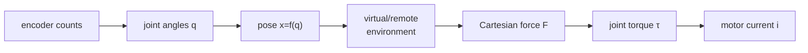

## English

### 1. Impedance and admittance causality

An **impedance display** measures motion and commands force: $x,\dot x\mapsto F$. It should feel light and backdrivable in free space, so low inertia, friction, cogging, backlash, and cable drag matter. An **admittance display** measures force and commands motion: $F\mapsto x,\dot x$. It relies on a high-bandwidth motion servo and is often built on a non-backdrivable industrial mechanism. These are interface causalities, not synonyms for impedance or admittance control used around an arbitrary robot.

Only one member of an effort–flow pair can be independently imposed at a port. In mechanics the pair is force and velocity, and instantaneous power is $P=F^\top v$. This energy view will reappear in passivity and bilateral teleoperation.

### 2. The device chain

The kinematic differential is $v=J(q)\dot q$. Equality of mechanical power gives

$$\tau^\top\dot q=F^\top v=F^\top J\dot q\quad\Rightarrow\quad \tau=J^\top F.$$

This mapping does not require $J^{-1}$ and remains valid for non-square Jacobians. Near a singularity, however, some Cartesian force directions demand very large joint torque or some velocities become unavailable. Use singular values and condition number across the usable workspace, not only $\det J$ at one pose.

Worked example: for $J=\begin{bmatrix}0.2&0.1\\0&0.15\end{bmatrix}$ m/rad and $F=[5,-2]^\top$ N,

$$\tau=J^\top F=\begin{bmatrix}0.2&0\\0.1&0.15\end{bmatrix}\begin{bmatrix}5\\-2\end{bmatrix}=\begin{bmatrix}1.0\\0.2\end{bmatrix}\ \mathrm{N\,m}.$$

### 3. Actuation is not “PWM equals force”

For a brushed DC motor,

$$\tau_m=k_t i,\qquad V=Ri+L\dot i+k_e\omega.$$

Current is the direct torque variable. PWM duty cycle approximately controls average terminal voltage; current still depends on resistance, inductance, back-EMF, switching, and load. Stall torque is a short-duration operating point, not a continuous-force rating. Thermal limits, saturation, torque ripple, and amplifier current/voltage limits must be included in the force envelope.

A transmission multiplies torque and reflected inertia approximately by $N$ and $N^2$, respectively. Gears can add backlash and friction; capstan drives can be low-backlash but require tension, alignment, and no-slip contact. High torque ratio can make a device strong yet heavy-feeling—bad for free-space transparency.

### 4. Sensing and differentiation

Quadrature encoders provide counts and direction; angle requires counts-per-revolution and transmission calibration. Velocity from $(q_k-q_{k-1})/T$ amplifies quantization and noise. Filtering reduces noise but adds phase lag, which can destabilize a haptic loop. Force sensors add direct interaction information but require bias, temperature, frame, bandwidth, and inertial-load checks.

### 5. Design from two ends

From the person: workspace, grasp, comfortable continuous/peak force, perceptual bandwidth, and safety. From the virtual task: minimum free-space impedance, maximum stable wall stiffness, directions of force, update rate, collision complexity, and desired cue. A useful design maximizes the intersection; no scalar “best haptic device” captures it.

> [!question]- Self-check · Answer
> **Why can increasing a gear ratio worsen a haptic interface even when maximum force rises?** Reflected motor inertia grows approximately with the square of ratio, and friction/backlash may grow. The device becomes harder to backdrive and corrupts free-space motion and small forces.

## 한국어

### 1. 임피던스·어드미턴스 인과성

**Impedance display**는 운동을 측정해 힘을 명령한다: $x,\dot x\mapsto F$. 자유공간에서 가볍고 backdrivable해야 하므로 관성·마찰·cogging·backlash가 중요하다. **Admittance display**는 힘을 측정해 운동을 명령한다: $F\mapsto x,\dot x$. 고대역폭 motion servo를 사용하며 비가역 산업용 메커니즘에도 적용할 수 있다. 이것은 포트의 인과성이며, 임의 로봇에 적용하는 impedance/admittance controller의 이름과 완전히 같은 분류는 아니다.

### 2. 장치 사슬과 야코비안

$v=J(q)\dot q$이고 power equality를 적용하면 위 유도처럼 $\tau=J^\top F$다. $J^{-1}$가 필요하지 않으며 비정방 야코비안에도 성립한다. 다만 특이점 근처에서는 일부 힘 방향이 큰 토크를 요구하거나 일부 속도 방향을 만들 수 없다. 한 자세의 determinant보다 작업공간 전체의 singular value와 condition number를 본다.

예제의 $J$와 $F$에서는 $\tau=[1.0,0.2]^\top$ N·m이다. 단위와 좌표 프레임까지 맞아야 이 계산이 물리적으로 의미가 있다.

### 3. PWM은 곧 힘이 아니다

DC 모터에서 $\tau_m=k_ti$, $V=Ri+L\dot i+k_e\omega$다. 전류가 직접 토크를 정하고 PWM duty는 평균 전압을 근사 제어한다. 실제 전류는 저항·인덕턴스·back-EMF·부하에 달린다. Stall torque를 지속 토크로 사용해서는 안 되며, 열·포화·torque ripple·증폭기 한계를 힘 범위에 포함한다.

전달비 $N$은 토크를 키우지만 반사 관성은 대략 $N^2$으로 키운다. 기어는 backlash·마찰을, capstan은 장력·정렬·미끄럼 문제를 만든다. 강한 장치가 반드시 투명한 장치는 아니다.

### 4. 센싱과 미분

Encoder count는 CPR과 전달비 보정 후 각도가 된다. $(q_k-q_{k-1})/T$는 quantization과 noise를 증폭한다. 필터는 noise를 줄이지만 phase lag를 추가해 햅틱 루프를 불안정하게 할 수 있다. Force sensor는 bias·온도·프레임·대역폭·관성력을 함께 검토한다.

### 5. 양쪽에서 설계하기

사람 쪽에서는 작업공간·파지·지속/최대 힘·지각 대역폭·안전, 과제 쪽에서는 자유공간 최소 임피던스·안정한 최대 벽 강성·힘 방향·주기·충돌 복잡도·필요 cue를 정한다. 좋은 설계는 두 요구의 교집합을 넓힌다.

> [!question]- 스스로 점검 · 정답
> **감속비를 높이면 최대 힘이 커져도 왜 햅틱 품질이 나빠질 수 있는가?** 반사 모터 관성이 대략 감속비 제곱으로 커지고 마찰·backlash도 증가할 수 있다. Backdrivability와 자유공간 운동, 작은 힘 표현이 나빠진다.

