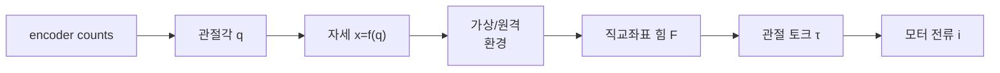

> [!note] Prerequisites · 선수 지식
> Plant **P3** from [[02-foundations/lab-plants|0.6 Lab Plants]]. The Jacobian $v=J(q)\dot q$ and the statics relation $\tau=J^\top F$ from [[04-robotics/modern-robotics/ch05-velocity-kinematics|MR ch.5]], and the idea of impedance versus admittance control from [[04-robotics/force-compliance-control|13. Force & Compliance Control §2]]; this page re-derives $\tau=J^\top F$ but moves quickly.
> [[02-foundations/lab-plants|0.6]]의 장치 **P3**. [[04-robotics/modern-robotics/ch05-velocity-kinematics|MR 5장]]의 야코비안 $v=J(q)\dot q$와 정역학 관계 $\tau=J^\top F$, 그리고 [[04-robotics/force-compliance-control|13. 힘·컴플라이언스 제어 §2]]의 임피던스 대 어드미턴스 제어 개념. 이 페이지도 $\tau=J^\top F$를 다시 유도하지만 빠르게 지나간다.

## English

### 1. Impedance and admittance causality

An **impedance display** measures motion and commands force: $x,\dot x\mapsto F$. It should feel light and backdrivable in free space, so low inertia, friction, cogging (torque ripple from the attraction between rotor magnets and stator slots, felt as small detents when you turn an unpowered motor by hand), backlash, and cable drag matter. An **admittance display** measures force and commands motion: $F\mapsto x,\dot x$. It relies on a high-bandwidth motion servo and is often built on a non-backdrivable industrial mechanism. These are interface causalities, not synonyms for impedance or admittance control used around an arbitrary robot.

Network theory describes any power exchange as an effort–flow pair whose product is power: force times velocity in mechanics, voltage times current in a circuit. Only one member of the pair can be independently imposed at a port (a connection point through which power enters or leaves). In mechanics the pair is force and velocity, and instantaneous power is $P=F^\top v$. This energy view will reappear in passivity and bilateral teleoperation.

### 2. The device chain and the Jacobian

The kinematic differential is $v=J(q)\dot q$. Equality of mechanical power gives

$$\tau^\top\dot q=F^\top v=F^\top J\dot q\quad\Rightarrow\quad \tau=J^\top F.$$

This mapping does not require $J^{-1}$ and remains valid for non-square Jacobians. Near a singularity, however, some Cartesian velocities need very large joint rates or become unavailable, and a force along the singular direction is carried by the structure with little joint torque, so it cannot be actively modulated. Use singular values and condition number across the usable workspace, not only $\det J$ at one pose.

Worked example: for $J=\begin{bmatrix}0.2&0.1\\0&0.15\end{bmatrix}$ m/rad and $F=[5,-2]^\top$ N,

$$\tau=J^\top F=\begin{bmatrix}0.2&0\\0.1&0.15\end{bmatrix}\begin{bmatrix}5\\-2\end{bmatrix}=\begin{bmatrix}1.0\\0.2\end{bmatrix}\ \mathrm{N\,m}.$$

The computation only means anything if the units and the coordinate frames line up on both
sides.

Two mechanism families dominate teaching and commercial devices. A **serial** arm such as the 3-DOF Geomagic Touch (formerly Phantom Omni) chains links from base to stylus. Its forward kinematics and Jacobian come straight from the link lengths, and its singular configurations are worth computing before choosing a workspace. A **pantograph** is a planar closed-chain linkage driven by two base-mounted motors. Because the motors do not ride on the moving links, moving inertia stays low, which is exactly what free-space transparency asks for. The costs are a smaller workspace and a Jacobian that has to be derived from the loop-closure constraint rather than read off a single chain.

### 3. Actuation is not “PWM equals force”

For a brushed DC motor,

$$\tau_m=k_t i,\qquad V=Ri+L\dot i+k_e\omega.$$

Current is the direct torque variable. PWM duty cycle approximately controls average terminal voltage; current still depends on resistance, inductance, back-EMF, switching, and load. Stall torque is a short-duration operating point, not a continuous-force rating. Thermal limits, saturation, torque ripple (torque that oscillates with rotor angle even at constant current), and amplifier current/voltage limits must be included in the force envelope.

A transmission multiplies torque and reflected inertia approximately by $N$ and $N^2$, respectively. Gears can add backlash and friction; capstan drives (a cable wrapped around a small motor pulley and a larger output drum) can be low-backlash but require tension, alignment, and no-slip contact. High torque ratio can make a device strong yet heavy-feeling—bad for free-space transparency.

**Worked: plant P3, the translating handle.** The catalog numbers are in [[02-foundations/lab-plants|0.6]]: motor pulley $r_m=0.010\,\mathrm{m}$, sector $r_s=0.050\,\mathrm{m}$, encoder $N=1024$ counts/rev after quadrature decode. This is the object the problem set will ask you to draw. Follow the chain once here so the homework is a variant, not a first meeting.

The cable does not stretch, so an arc on the motor pulley equals an arc on the sector:

$$r_m\theta_m = r_s\theta_s.$$

A handle that translates at the sector rim moves $x = r_s\theta_s$. Substitute the cable constraint and $r_s$ cancels:

$$x = r_m\theta_m.$$

The sector is a lever that the cable already accounted for. Using $x=r_s\theta_m$ pretends the cable wraps the sector as if the sector *were* the motor pulley; every length and every force would then be wrong by $r_s/r_m=5$.

Power at the two ends of a lossless capstan must match: $\tau_m\omega_m = F\dot x$. From $x=r_m\theta_m$ one has $\dot x = r_m\omega_m$, so

$$\tau_m = F r_m.$$

On P3 the Jacobian of this 1-DoF map is the scalar $r_m$, and $\tau=J^\top F$ is exactly that line. One encoder count is $\Delta\theta_m=2\pi/N=2\pi/1024$. The handle therefore moves

$$\Delta x = r_m\Delta\theta_m = 0.010\cdot\frac{2\pi}{1024}=6.14\times10^{-5}\,\mathrm{m}$$

(61.4 µm). Once the handle is inside the catalog wall $k_w=400\,\mathrm{N/m}$, that one count changes the rendered force by

$$\Delta F = k_w\Delta x = 400\cdot 6.14\times10^{-5}=0.0245\,\mathrm{N}.$$

That is the resolution of the wall, not a sampling-rate number. Sampling ($T$) and quantization ($\Delta x$) are different ceilings; [[04-robotics/haptics-teleoperation/rendering-sampling-stability|24.4 §3]] takes the second one. The problem set keeps this map and asks what happens when the amplifier saturates, and what a reviewer who swaps $r_s$ for $r_m$ would publish.

### 4. Sensing and differentiation

Quadrature encoders provide counts and direction; angle requires counts-per-revolution and transmission calibration. Velocity from $(q_k-q_{k-1})/T$ amplifies quantization and noise. Filtering reduces noise but adds phase lag, which can destabilize a haptic loop. The filter equation, and the convention trap in its $\alpha$, are in [[04-robotics/haptics-teleoperation/rendering-sampling-stability|24.4 §3]]. Force sensors add direct interaction information but require bias, temperature, frame, bandwidth, and inertial-load checks.

### 5. Design from two ends

From the person: workspace, grasp, comfortable continuous/peak force, perceptual bandwidth, and safety. From the virtual task: minimum free-space impedance, maximum stable wall stiffness, directions of force, update rate, collision complexity, and desired cue. A useful design maximizes the intersection; no scalar “best haptic device” captures it.

> [!question]- Self-check · Answer
> **Why can increasing a gear ratio worsen a haptic interface even when maximum force rises?** Reflected motor inertia grows approximately with the square of ratio, and friction/backlash may grow. The device becomes harder to backdrive and corrupts free-space motion and small forces.

### Problem set · 과제

Tier B. Using **P3** from [[02-foundations/lab-plants|0.6]], this page, and [[04-robotics/modern-robotics/ch05-velocity-kinematics|MR ch.5]]. The Euler loop for the same handle lives on [[04-robotics/haptics-teleoperation/rendering-sampling-stability|24.4]] — do not start a second simulator here.

The translating handle is driven by an inextensible capstan: motor pulley radius $r_m$, sector radius $r_s$. Cable length is conserved, so handle displacement is $x=r_m\theta_m$ regardless of $r_s$. Power match then gives $\tau_m=F r_m$. The motor encoder has $N=1024$ counts/rev after decode. A current amplifier saturates at $\tau_m^{\max}=0.020\,\mathrm{N{\cdot}m}$ (a problem number, not a catalog number).

1. **Draw.** Sketch the chain encoder $\to$ $\theta_m$ $\to$ pulley $r_m$ $\to$ cable $\to$ sector $r_s$ $\to$ handle $x$. Label every P3 length and $N$. Mark the wall at $x_w$ and the $+x$ direction into the wall. Write the two constitutive equalities $x=\ldots$ and $\tau_m=\ldots$ on the sketch.
2. **Derive.** (a) Handle motion $\Delta x$ for one encoder count. (b) Force increment $\Delta F$ of the default virtual wall $k_w$ for that one count, once inside the wall. (c) Maximum handle force $F^{\max}$ at amplifier saturation, and the penetration at which the default wall saturates. (d) At $x=0.036\,\mathrm{m}$ (6 mm into the wall), does the unsaturated spring law still hold?
3. **Interpret.** A reviewer says “just use the sector radius in $x=r_s\theta_m$, the handle sits on the sector.” What factor would that mistake inject into every force you report? Separately: $N$ is after quadrature decode. If you treated it as 256 slots before decode, how would $\Delta x$ change?

> [!tip]- Solutions
> 1. Cable inextensible $\Rightarrow$ arc on the motor pulley equals arc on the sector, $r_m\theta_m=r_s\theta_s$. A translating handle at the sector rim has $x=r_s\theta_s=r_m\theta_m$. Power $\tau_m\omega_m=F\dot x$ with $\dot x=r_m\omega_m$ gives $\tau_m=F r_m$. $r_s$ sets how the sector is built; it cancels in the handle map.
> 2. (a) $\Delta\theta_m=2\pi/N=2\pi/1024$, so $\Delta x=r_m\Delta\theta_m=0.010\cdot 2\pi/1024=6.14\times10^{-5}\,\mathrm{m}$ (61.4 µm). (b) $\Delta F=k_w\Delta x=400\cdot 6.14\times10^{-5}=0.0245\,\mathrm{N}$. (c) $F^{\max}=\tau_m^{\max}/r_m=0.020/0.010=2.0\,\mathrm{N}$. Saturation penetration $\delta=F^{\max}/k_w=2/400=0.005\,\mathrm{m}$ (5 mm), i.e. at $x=0.035\,\mathrm{m}$. (d) At $x=0.036$ the unsaturated law wants $F=k_w(0.006)=2.4\,\mathrm{N}>2.0$, so the amplifier is already saturated and the spring law is a lie.
> 3. Using $r_s$ in place of $r_m$ multiplies $x$ and divides $F$ by $r_s/r_m=5$. Every Newton you publish would be off by five. Quadrature $4\times$ on 256 slots is 1024 counts: treating $N=256$ inflates $\Delta x$ by four, so the wall would feel four times coarser and you would under-report resolution.

## 한국어

### 1. 임피던스·어드미턴스 인과성

**Impedance display**는 운동을 측정해 힘을 명령한다: $x,\dot x\mapsto F$. 자유공간에서 가볍고 backdrivable해야 하므로 관성·마찰·cogging(회전자 자석과 고정자 슬롯 사이의 인력에서 생기는 토크 요동. 전원 없는 모터를 손으로 돌릴 때 작은 걸림으로 느껴진다)·backlash·케이블 항력이 중요하다. **Admittance display**는 힘을 측정해 운동을 명령한다: $F\mapsto x,\dot x$. 고대역폭 motion servo에 의존하며 역구동이 되지 않는 산업용 메커니즘 위에 만드는 경우가 많다. 이것은 인터페이스의 인과성이며, 임의의 로봇에 두르는 impedance/admittance 제어기와 같은 말이 아니다.

네트워크 이론은 모든 일률 교환을 곱이 일률이 되는 effort–flow 쌍으로 기술한다. 역학에서는 힘×속도, 회로에서는 전압×전류다. 한 포트(일률이 들어오거나 나가는 연결점)에서 이 쌍 중 독립적으로 부과할 수 있는 것은 하나뿐이다. 역학에서 그 쌍은 힘과 속도이고 순간 일률은 $P=F^\top v$다. 이 에너지 관점은 수동성과 양방향 원격조작에서 다시 등장한다.

### 2. 장치 사슬과 야코비안

기구학 미분은 $v=J(q)\dot q$다. 기계적 일률이 같다는 조건에서

$$\tau^\top\dot q=F^\top v=F^\top J\dot q\quad\Rightarrow\quad \tau=J^\top F.$$

이 사상에는 $J^{-1}$가 필요하지 않고 비정방 야코비안에서도 성립한다. 다만 특이점 근처에서는 어떤 직교 속도가 매우 큰 관절 속도를 요구하거나 아예 만들 수 없고, 특이 방향의 힘은 관절 토크를 거의 쓰지 않고 구조가 받아 내므로 능동적으로 조절할 수 없다. 한 자세의 $\det J$만이 아니라 사용 가능한 작업공간 전체에서 특이값과 조건수를 본다.

예제: $J=\begin{bmatrix}0.2&0.1\\0&0.15\end{bmatrix}$ m/rad, $F=[5,-2]^\top$ N일 때

$$\tau=J^\top F=\begin{bmatrix}0.2&0\\0.1&0.15\end{bmatrix}\begin{bmatrix}5\\-2\end{bmatrix}=\begin{bmatrix}1.0\\0.2\end{bmatrix}\ \mathrm{N\,m}.$$

단위와 좌표 프레임이 함께 맞아야 이 계산이 물리적 의미를 가진다.

교육용과 상용 장치에서는 메커니즘 계열 둘이 주를 이룬다. 3자유도 Geomagic Touch(옛 Phantom Omni) 같은 **직렬** 팔은 베이스에서 스타일러스까지 링크를 잇는다. 순기구학과 야코비안이 링크 길이에서 곧바로 나오고, 작업공간을 정하기 전에 특이 자세를 계산해 둘 가치가 있다. **팬터그래프**는 베이스에 고정된 모터 둘이 구동하는 평면 폐쇄 사슬 링크다. 모터가 움직이는 링크 위에 실리지 않으므로 움직이는 관성이 작고, 이것이 바로 자유공간 투명성이 요구하는 것이다. 대가는 더 작은 작업공간, 그리고 사슬 하나에서 읽어 낼 수 없어 루프 폐쇄 제약에서 유도해야 하는 야코비안이다.

### 3. PWM은 곧 힘이 아니다

브러시 DC 모터에서

$$\tau_m=k_t i,\qquad V=Ri+L\dot i+k_e\omega.$$

전류가 직접적인 토크 변수다. PWM duty는 평균 단자 전압을 근사적으로 제어할 뿐이고, 전류는 여전히 저항·인덕턴스·역기전력·스위칭·부하에 달려 있다. Stall torque는 짧은 시간의 동작점이지 연속 힘 정격이 아니다. 열 한계·포화·torque ripple(전류가 일정해도 회전자 각도에 따라 출렁이는 토크)·증폭기의 전류/전압 한계를 힘 범위 안에 포함해야 한다.

전달장치는 토크를 대략 $N$배, 반사 관성을 대략 $N^2$배로 만든다. 기어는 backlash와 마찰을 더할 수 있고, capstan(작은 모터 풀리와 큰 출력 드럼에 케이블을 감은 전달장치)은 backlash가 작지만 장력·정렬·미끄럼 없는 접촉을 요구한다. 큰 감속비는 장치를 강하지만 무겁게 느껴지게 만들며, 이는 자유공간 투명성에 나쁘다.

**계산: 장치 P3, 병진 핸들.** 카탈로그 숫자는 [[02-foundations/lab-plants|0.6]]에 있다: 모터 풀리 $r_m=0.010\,\mathrm{m}$, 섹터 $r_s=0.050\,\mathrm{m}$, 엔코더는 쿼드러처 디코드 후 $N=1024$ counts/rev. 과제가 그리라고 할 대상이다. 여기서 사슬을 한 번 따라가면 과제는 변형이지 첫 만남이 아니다.

케이블이 늘어나지 않으므로 모터 풀리의 호와 섹터의 호가 같다:

$$r_m\theta_m = r_s\theta_s.$$

섹터 가장자리에서 병진하는 핸들은 $x = r_s\theta_s$. 케이블 제약을 넣으면 $r_s$가 소거된다:

$$x = r_m\theta_m.$$

섹터는 케이블이 이미 센 지렛대다. $x=r_s\theta_m$을 쓰면 케이블이 섹터를 모터 풀리인 양 감는 셈이 되어, 길이와 힘이 모두 $r_s/r_m=5$배 틀린다.

손실 없는 캡스턴의 양 끝 일률은 같아야 한다: $\tau_m\omega_m = F\dot x$. $x=r_m\theta_m$이면 $\dot x = r_m\omega_m$이므로

$$\tau_m = F r_m.$$

P3에서 이 1자유도 사상의 야코비안은 스칼라 $r_m$이고, $\tau=J^\top F$가 바로 그 줄이다. 엔코더 한 카운트는 $\Delta\theta_m=2\pi/1024$. 핸들은

$$\Delta x = 0.010\cdot\frac{2\pi}{1024}=6.14\times10^{-5}\,\mathrm{m}$$

(61.4 µm) 움직인다. 카탈로그 벽 $k_w=400\,\mathrm{N/m}$ 안에서는 그 한 카운트가 힘을

$$\Delta F = 400\cdot 6.14\times10^{-5}=0.0245\,\mathrm{N}$$

만큼 바꾼다. 이것은 벽의 해상도이지 샘플 주기 숫자가 아니다. 샘플링($T$)과 양자화($\Delta x$)는 다른 천장이고, [[04-robotics/haptics-teleoperation/rendering-sampling-stability|24.4 §3]]이 둘째를 가져간다. 과제는 이 사상을 유지한 채 증폭기 포화와, $r_m$ 자리에 $r_s$를 넣는 심사자를 묻는다.

### 4. 센싱과 미분

Quadrature encoder는 count와 방향을 준다. 각도를 얻으려면 회전당 count 수와 전달비 보정이 필요하다. $(q_k-q_{k-1})/T$로 얻는 속도는 quantization과 noise를 증폭한다. 필터는 noise를 줄이지만 phase lag를 더해 햅틱 루프를 불안정하게 만들 수 있다. 필터 식과 그 $\alpha$의 표기 함정은 [[04-robotics/haptics-teleoperation/rendering-sampling-stability|24.4 §3]]에 있다. Force sensor는 상호작용 정보를 직접 주지만 bias·온도·프레임·대역폭·관성 부하를 함께 점검해야 한다.

### 5. 양쪽에서 설계하기

사람 쪽에서: 작업공간, 파지, 편안한 지속/최대 힘, 지각 대역폭, 안전. 가상 과제 쪽에서: 자유공간 최소 임피던스, 안정하게 낼 수 있는 최대 벽 강성, 힘의 방향, 갱신 주기, 충돌 복잡도, 원하는 cue. 좋은 설계는 이 두 집합의 교집합을 최대로 만든다. "최고의 햅틱 장치"라는 하나의 스칼라 지표는 존재하지 않는다.

> [!question]- 스스로 점검 · 정답
> **감속비를 높이면 최대 힘이 커져도 왜 햅틱 인터페이스가 나빠질 수 있는가?** 반사 모터 관성이 대략 감속비의 제곱으로 커지고 마찰·backlash도 함께 커질 수 있다. 장치가 역구동하기 어려워지면서 자유공간 운동과 작은 힘의 표현이 망가진다.

### 과제 · Problem set

Tier B. [[02-foundations/lab-plants|0.6]]의 **P3**, 이 페이지, [[04-robotics/modern-robotics/ch05-velocity-kinematics|MR 5장]]. 같은 핸들의 오일러 루프는 [[04-robotics/haptics-teleoperation/rendering-sampling-stability|24.4]]에 있다. 여기서 시뮬레이터를 하나 더 만들지 마라.

병진 핸들은 비신장 캡스턴으로 구동된다: 모터 풀리 $r_m$, 섹터 $r_s$. 케이블 길이가 보존되므로 핸들 변위는 $r_s$와 무관하게 $x=r_m\theta_m$이다. 일률에서 $\tau_m=F r_m$. 모터 엔코더는 디코드 후 $N=1024$ counts/rev. 전류 증폭기는 $\tau_m^{\max}=0.020\,\mathrm{N{\cdot}m}$에서 포화한다(과제 숫자이지 카탈로그 숫자가 아니다).

1. **그리기.** 엔코더 $\to$ $\theta_m$ $\to$ 풀리 $r_m$ $\to$ 케이블 $\to$ 섹터 $r_s$ $\to$ 핸들 $x$ 사슬을 그려라. P3의 길이와 $N$을 모두 기입하라. 벽 $x_w$와 벽 안 $+x$를 표시하라. 구성 등식 $x=\ldots$, $\tau_m=\ldots$를 그림에 써라.
2. **유도.** (a) 엔코더 한 카운트의 핸들 변위 $\Delta x$. (b) 벽 안에서 기본 가상 벽 $k_w$의 힘 증분 $\Delta F$. (c) 증폭기 포화 시 최대 핸들 힘 $F^{\max}$, 기본 벽이 포화하는 침투량. (d) $x=0.036\,\mathrm{m}$(벽 안 6 mm)에서 포화 없는 스프링 법칙이 아직 성립하는가?
3. **해석.** 심사자가 “핸들이 섹터 위에 있으니 $x=r_s\theta_m$을 써라”고 한다. 그 실수가 보고하는 힘마다 몇 배를 넣는가? 별도로: $N$은 쿼드러처 디코드 후 값이다. 디코드 전 256 슬롯으로 취급하면 $\Delta x$는 어떻게 바뀌는가?

> [!tip]- 정답 · Solutions
> 1. 케이블 비신장 $\Rightarrow$ $r_m\theta_m=r_s\theta_s$. 섹터 가장자리의 병진 핸들은 $x=r_s\theta_s=r_m\theta_m$. 일률 $\tau_m\omega_m=F\dot x$, $\dot x=r_m\omega_m$이므로 $\tau_m=F r_m$. $r_s$는 섹터 형상이고 핸들 사상에서는 소거된다.
> 2. (a) $\Delta\theta_m=2\pi/1024$, $\Delta x=0.010\cdot 2\pi/1024=6.14\times10^{-5}\,\mathrm{m}$ (61.4 µm). (b) $\Delta F=400\cdot 6.14\times10^{-5}=0.0245\,\mathrm{N}$. (c) $F^{\max}=0.020/0.010=2.0\,\mathrm{N}$. 포화 침투 $\delta=2/400=0.005\,\mathrm{m}$ (5 mm), 즉 $x=0.035\,\mathrm{m}$. (d) $x=0.036$에서 포화 없는 법칙은 $F=2.4\,\mathrm{N}>2.0$을 원하므로 증폭기는 이미 포화이고 스프링 법칙은 거짓이다.
> 3. $r_m$ 자리에 $r_s$를 쓰면 $x$는 5배, $F$는 $1/5$. 발표하는 뉴턴마다 다섯 배가 틀린다. 256 슬롯의 쿼드러처 $4\times$가 1024 카운트다. $N=256$으로 쓰면 $\Delta x$가 네 배가 되어 벽이 네 배 거칠고 해상도를 낮게 보고하게 된다.
