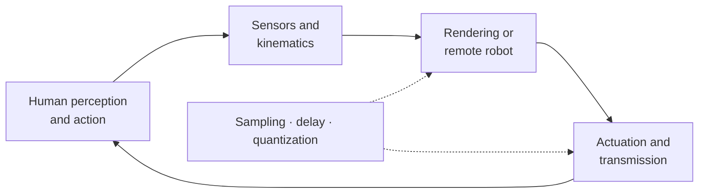
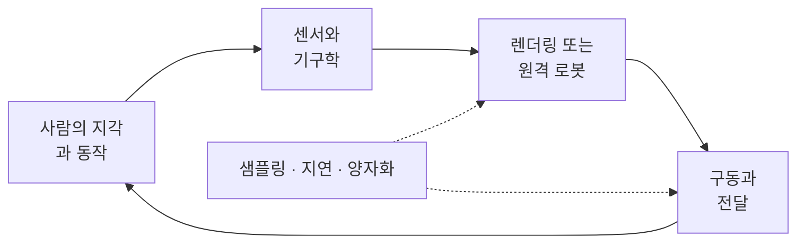

## English

Haptics closes a loop through a person. A sensor measures motion or force; a model computes a response; an actuator returns mechanical energy; the person's hand changes the next input. This makes haptics simultaneously a perception problem, a mechatronics problem, and a sampled-data control problem.

### Recommended path

1. [[04-robotics/haptics-teleoperation/human-haptics-psychophysics|24.1 Human Haptics & Psychophysics]] — what can be felt, and how to measure it.
2. [[04-robotics/haptics-teleoperation/tactile-display-design|24.2 Tactile Display Design]] — vibration, skin stretch, contact, friction, shape, and temperature.
3. [[04-robotics/haptics-teleoperation/device-design-kinematics|24.3 Haptic Device Design & Kinematics]] — impedance/admittance causality, motors, sensors, transmissions, Jacobians, and workspace.
4. [[04-robotics/haptics-teleoperation/rendering-sampling-stability|24.4 Rendering, Sampling & Stability]] — virtual walls, Z-width, energy leaks, virtual coupling, and time-domain passivity.
5. [[04-robotics/haptics-teleoperation/bilateral-teleoperation|24.5 Bilateral Teleoperation]] — two-port models, transparency, scaling, delay, and passivity.
6. [[04-robotics/haptics-teleoperation/experiments-readings|24.6 Experiments & Reading Map]] — human studies, workload, evidence, and an annotated source sequence.

The fastest useful route is **24.1 → 24.3 → 24.4**. Add 24.2 for tactile-display work and 24.5 for force-reflecting teleoperation. The broader demonstration-collection interpretation is in [[04-robotics/teleoperation-demonstration|12. Teleoperation & Demonstration Collection]].

### Prerequisite map

| Needed here | Review first |
|---|---|
| vectors, matrices, coordinate frames | [[02-foundations/linear-algebra\|Linear Algebra]], [[02-foundations/se3-geometry\|3D Geometry & SE(3)]] |
| $\dot q$, Jacobians, $\tau=J^\top F$ | [[04-robotics/modern-robotics/ch05-velocity-kinematics\|MR ch.5]] |
| mass–spring–damper and feedback | [[04-robotics/control-theory-ce397\|Control Theory]] |
| sampling, filtering, frequency response | [[02-foundations/signal-processing\|Signal Processing]] |
| force/impedance/admittance control | [[04-robotics/force-compliance-control\|Force & Compliance Control]] |
| experimental design and uncertainty | [[06-research-practice/experimental-design-reproducibility\|Experiment Design]], [[06-research-practice/psychophysics-human-measurement\|Psychophysics]] |

You need not master every formula first, but mark the inputs, outputs, energy flow and assumptions on each page as you read.

> [!warning] Scope and source status
> The local course packet contains copyrighted lectures, licensed papers, assignments, hardware files, and human-subject documents. Those originals remain outside the public site. These pages are original study notes synthesized from them and from linked public sources. Hardware pin assignments and deadlines differ across packet versions; the current board documentation and instructor instructions are authoritative.

### Completion criterion

After this track, you should be able to trace one full haptic cycle, distinguish tactile from kinesthetic display, derive $\tau=J^\top F$, explain why a sampled virtual wall can add energy, state what passivity does and does not guarantee, and propose measurements that separate perceptual benefit from controller performance.

## 한국어

햅틱은 사람을 포함해 닫히는 피드백 루프다. 센서가 운동이나 힘을 측정하고, 모델이 반응을 계산하고, 액추에이터가 기계적 에너지를 돌려주면 사람의 손이 다음 입력을 바꾼다. 따라서 햅틱은 지각·메카트로닉스·샘플드데이터 제어 문제를 동시에 다룬다.

### 권장 학습 순서

1. [[04-robotics/haptics-teleoperation/human-haptics-psychophysics|24.1 Human Haptics & Psychophysics]] — 무엇을 느낄 수 있고 어떻게 측정하는가.
2. [[04-robotics/haptics-teleoperation/tactile-display-design|24.2 Tactile Display Design]] — 진동·피부 신장·접촉·마찰·형상·온도.
3. [[04-robotics/haptics-teleoperation/device-design-kinematics|24.3 Haptic Device Design & Kinematics]] — 임피던스/어드미턴스 인과성, 모터, 센서, 전달장치, 야코비안, 작업공간.
4. [[04-robotics/haptics-teleoperation/rendering-sampling-stability|24.4 Rendering, Sampling & Stability]] — 가상 벽, Z-width, 에너지 누출, 가상 결합, 시간영역 수동성.
5. [[04-robotics/haptics-teleoperation/bilateral-teleoperation|24.5 Bilateral Teleoperation]] — 2-port 모델, 투명성, 스케일링, 지연, 수동성.
6. [[04-robotics/haptics-teleoperation/experiments-readings|24.6 Experiments & Reading Map]] — 인간 실험, workload, 증거, 주석 달린 원문 순서.

가장 빠른 핵심 경로는 **24.1 → 24.3 → 24.4**다. 촉각 디스플레이 연구에는 24.2를, 힘 반영 원격조작에는 24.5를 더한다. 원격조작을 로봇 학습 데이터 수집으로 보는 관점은 [[04-robotics/teleoperation-demonstration|12. Teleoperation & Demonstration Collection]]에 있다.

### 선수 지식

| 여기서 필요한 것 | 먼저 복습할 곳 |
|---|---|
| 벡터, 행렬, 좌표계 | [[02-foundations/linear-algebra\|Linear Algebra]], [[02-foundations/se3-geometry\|3D Geometry & SE(3)]] |
| $\dot q$, 야코비안, $\tau=J^\top F$ | [[04-robotics/modern-robotics/ch05-velocity-kinematics\|MR ch.5]] |
| 질량–스프링–댐퍼와 피드백 | [[04-robotics/control-theory-ce397\|Control Theory]] |
| 샘플링, 필터링, 주파수 응답 | [[02-foundations/signal-processing\|Signal Processing]] |
| 힘/임피던스/어드미턴스 제어 | [[04-robotics/force-compliance-control\|Force & Compliance Control]] |
| 실험 설계와 불확실성 | [[06-research-practice/experimental-design-reproducibility\|Experiment Design]], [[06-research-practice/psychophysics-human-measurement\|Psychophysics]] |

모든 공식을 먼저 숙달할 필요는 없지만, 각 페이지에서 **입력·출력·에너지 흐름·가정**을 표시하며 읽어야 한다.

> [!warning] 범위와 자료 상태
> 로컬 과목 자료에는 저작권 강의안·라이선스 논문·과제·하드웨어 파일·인간대상연구 문서가 포함되어 있어 공개하지 않는다. 이 디렉토리는 그 자료와 공개 출처를 바탕으로 새로 쓴 학습 노트다. 자료 버전에 따라 배선 핀과 일정이 다르므로 실제 제작에서는 현재 보드 문서와 담당 교수 안내를 따른다.

### 완료 기준

하나의 햅틱 루프 전체를 추적하고, tactile과 kinesthetic display를 구분하고, $\tau=J^\top F$를 유도하고, 샘플된 가상 벽이 왜 에너지를 만들 수 있는지 설명하고, 수동성이 보장하는 것과 보장하지 않는 것을 구분하며, 지각 이득과 제어기 성능을 분리하는 실험을 제안할 수 있어야 한다.
