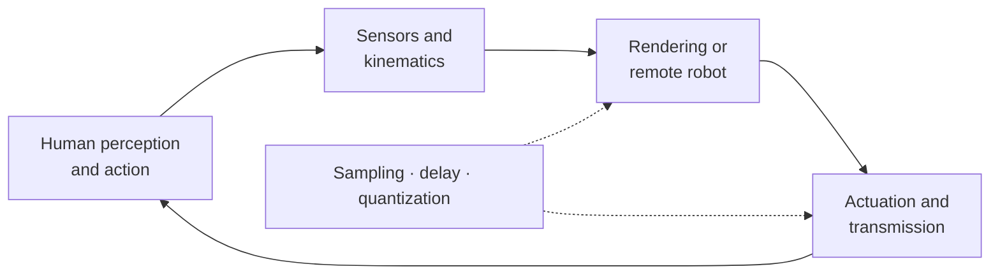
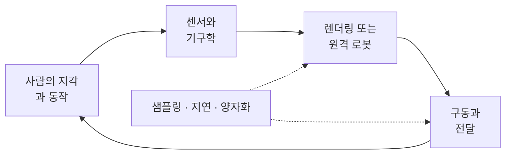

## English

Haptics closes a loop through a person. A sensor measures motion or force; a model computes a response; an actuator returns mechanical energy; the person's hand changes the next input. This makes haptics simultaneously a perception problem, a mechatronics problem, and a sampled-data control problem.

### Recommended path

1. [[04-robotics/haptics-teleoperation/human-haptics-psychophysics|24.1 Human Haptics & Psychophysics]] — what can be felt, and how to measure it.
2. [[04-robotics/haptics-teleoperation/tactile-display-design|24.2 Tactile Display Design]] — vibration, skin stretch, contact, friction, shape, and temperature.
3. [[04-robotics/haptics-teleoperation/device-design-kinematics|24.3 Haptic Device Design & Kinematics]] — impedance/admittance causality, motors, sensors, transmissions, Jacobians, and workspace.
4. [[04-robotics/haptics-teleoperation/rendering-sampling-stability|24.4 Rendering, Sampling & Stability]] — virtual walls, Z-width, energy leaks, virtual coupling, and time-domain passivity.
5. [[04-robotics/haptics-teleoperation/bilateral-teleoperation|24.5 Bilateral Teleoperation]] — two-port models, transparency, scaling, delay, and passivity.
6. [[04-robotics/haptics-teleoperation/experiments-readings|24.6 Experiments & Reading Map]] — human studies, workload, evidence, and an annotated source sequence.
7. [[04-robotics/haptics-teleoperation/haptic-rendering-algorithms|24.7 Haptic Rendering Algorithms]] — penalty and proxy rendering, event-based contact transients, friction models, textures, and simulated dynamic objects.
8. [[04-robotics/haptics-teleoperation/teleoperation-architectures-delay|24.8 Teleoperation Architectures, Absolute Stability & Delay]] — hybrid parameters, position–position and position–force pairs, transmitted impedance, Llewellyn's test, four channels, and what each delay remedy guarantees.
9. [[04-robotics/haptics-teleoperation/rendering-in-practice|24.9 Rendering in Practice: Loops, Effects & Passivity Control]] — fast and slow loops, where the force is computed, the one-degree-of-freedom effect library, implicit surfaces, the sampled wall's energy leaks, and the time-domain passivity observer and controller.

The fastest useful route is **24.1 → 24.3 → 24.4**. Add 24.2 for tactile-display work, 24.7 and then 24.9 for virtual-environment rendering, and 24.5 and then 24.8 for force-reflecting teleoperation. The broader demonstration-collection interpretation is in [[04-robotics/teleoperation-demonstration|12. Teleoperation & Demonstration Collection]].

### Prerequisite map

| Needed here | Review first |
|---|---|
| vectors, matrices, coordinate frames | [[02-foundations/linear-algebra\|Linear Algebra]], [[02-foundations/se3-geometry\|3D Geometry & SE(3)]] |
| $\dot q$, Jacobians, $\tau=J^\top F$ | [[04-robotics/modern-robotics/ch05-velocity-kinematics\|MR ch.5]] |
| mass–spring–damper and feedback | [[04-robotics/control-theory-ce397\|Control Theory]] |
| sampling, filtering, frequency response | [[02-foundations/signal-processing\|Signal Processing]] |
| force/impedance/admittance control | [[04-robotics/force-compliance-control\|Force & Compliance Control]] |
| experimental design and uncertainty | [[06-research-practice/experimental-design-reproducibility\|Experiment Design]], [[06-research-practice/psychophysics-human-measurement\|Psychophysics]] |

You need not master every formula before starting, but the numbers are not optional: P3's $m$, $b$ and $k_w$, 24.1's JND and 24.3's encoder count all come back in 24.4 and later, and the checks there assume you can reproduce them. Mark the inputs, outputs, energy flow and assumptions on each page as you read.

> [!warning] Scope and source status
> The local course packet contains copyrighted lectures, licensed papers, assignments, hardware files, and human-subject documents. Those originals remain outside the public site. These pages are original study notes synthesized from them and from linked public sources. Hardware pin assignments and deadlines differ across packet versions; the current board documentation and instructor instructions are authoritative.

### Completion criterion

After this track, you should be able to trace one full haptic cycle, distinguish tactile from kinesthetic display, derive $\tau=J^\top F$, explain why a sampled virtual wall can add energy, state what passivity does and does not guarantee, and propose measurements that separate perceptual benefit from controller performance.

### Problem set · 과제

Tier C. Using this page and the **P3** lab on [[04-robotics/haptics-teleoperation/rendering-sampling-stability|24.4]]; item 4 also uses the numbers of 24.1 and 24.3.

1. After 24.1–24.4, which three facts about **P3** must you be able to state without opening 24.4 (mass, damper, wall), and which bound do they enter?
2. A colleague wants to skip 24.4 and "just raise $k_w$ until the handle feels hard". What does the 24.4 lab's case C versus D show that this page's completion criterion is asking you to explain?
3. Where does a force-reflecting teleoperator leave this track and enter [[04-robotics/haptics-teleoperation/bilateral-teleoperation|24.5]], and what does 24.4's energy sum still buy you there?
4. **Combine three pages.** Take the stiffest wall 24.4 lets P3 render passively at $T=1\,\mathrm{ms}$. What force step does one encoder count of [[04-robotics/haptics-teleoperation/device-design-kinematics|24.3]] make against that wall, and how many such steps fit in the JND of [[04-robotics/haptics-teleoperation/human-haptics-psychophysics|24.1]]? What does the comparison with the catalog wall say about raising $k_w$?

> [!tip]- Solutions
> 1. $m=0.04$, $b=0.8$, $k_w=400$. They enter $K\le 2b/T$ (device $b$, not $b_h$).
> 2. Case C ($T=5\,\mathrm{ms}$, $k_w=2500$) chatters and $\sum T F_a v>0$; case D looks settled only because $b_h$ is damping for you. Raising $k_w$ can inject energy. That is the sampled-wall fact the completion criterion names.
> 3. When a second port and a delayed channel appear. The same energy sum at each port still diagnoses whether the channel is injecting; 24.5 adds transparency and scaling on top of that test.
> 4. $K=2b/T=1600\,\mathrm{N/m}$. One count moves the handle $\Delta x=r_m2\pi/N=6.14\times10^{-5}\,\mathrm{m}$, so $\Delta F=1600(6.14\times10^{-5})=0.0982\,\mathrm{N}$, four times the $0.0245\,\mathrm{N}$ step at the catalog $k_w=400$. The JND of $0.4107\,\mathrm{N}$ is then $0.4107/0.0982=4.2$ counts wide instead of $16.7$. A stiffer wall renders coarser force steps: at the passivity ceiling one count is already about a quarter of a JND, so stiffness bought from the sampling bound is paid for in force resolution.

## 한국어

햅틱은 사람을 포함해 닫히는 피드백 루프다. 센서가 운동이나 힘을 측정하고, 모델이 반응을 계산하고, 액추에이터가 기계적 에너지를 돌려주면 사람의 손이 다음 입력을 바꾼다. 따라서 햅틱은 지각·메카트로닉스·샘플드데이터 제어 문제를 동시에 다룬다.

### 권장 학습 순서

1. [[04-robotics/haptics-teleoperation/human-haptics-psychophysics|24.1 Human Haptics & Psychophysics]] — 무엇을 느낄 수 있고 어떻게 측정하는가.
2. [[04-robotics/haptics-teleoperation/tactile-display-design|24.2 Tactile Display Design]] — 진동·피부 신장·접촉·마찰·형상·온도.
3. [[04-robotics/haptics-teleoperation/device-design-kinematics|24.3 Haptic Device Design & Kinematics]] — 임피던스/어드미턴스 인과성, 모터, 센서, 전달장치, 야코비안, 작업공간.
4. [[04-robotics/haptics-teleoperation/rendering-sampling-stability|24.4 Rendering, Sampling & Stability]] — 가상 벽, Z-width, 에너지 누출, 가상 결합, 시간영역 수동성.
5. [[04-robotics/haptics-teleoperation/bilateral-teleoperation|24.5 Bilateral Teleoperation]] — 2-port 모델, 투명성, 스케일링, 지연, 수동성.
6. [[04-robotics/haptics-teleoperation/experiments-readings|24.6 Experiments & Reading Map]] — 인간 실험, workload, 증거, 주석 달린 원문 순서.
7. [[04-robotics/haptics-teleoperation/haptic-rendering-algorithms|24.7 Haptic Rendering Algorithms]] — 벌점·proxy 렌더링, 사건 기반 접촉 과도 신호, 마찰 모델, 질감, 동적 물체 시뮬레이션.
8. [[04-robotics/haptics-teleoperation/teleoperation-architectures-delay|24.8 Teleoperation Architectures, Absolute Stability & Delay]] — 하이브리드 매개변수, 위치–위치와 위치–힘 쌍, 전달 임피던스, Llewellyn 판정, 네 채널, 지연 처방마다 보장하는 것.
9. [[04-robotics/haptics-teleoperation/rendering-in-practice|24.9 Rendering in Practice: Loops, Effects & Passivity Control]] — 빠른 루프와 느린 루프, 힘을 계산하는 곳, 1자유도 효과 목록, 음함수 곡면, 샘플된 벽의 에너지 누설, 시간 영역 수동성 관측기와 제어기.

가장 빠른 핵심 경로는 **24.1 → 24.3 → 24.4**다. 촉각 디스플레이 연구에는 24.2를, 가상 환경 렌더링에는 24.7과 그다음 24.9를, 힘 반영 원격조작에는 24.5와 그다음 24.8을 더한다. 원격조작을 로봇 학습 데이터 수집으로 보는 관점은 [[04-robotics/teleoperation-demonstration|12. Teleoperation & Demonstration Collection]]에 있다.

### 선수 지식

| 여기서 필요한 것 | 먼저 복습할 곳 |
|---|---|
| 벡터, 행렬, 좌표계 | [[02-foundations/linear-algebra\|Linear Algebra]], [[02-foundations/se3-geometry\|3D Geometry & SE(3)]] |
| $\dot q$, 야코비안, $\tau=J^\top F$ | [[04-robotics/modern-robotics/ch05-velocity-kinematics\|MR ch.5]] |
| 질량–스프링–댐퍼와 피드백 | [[04-robotics/control-theory-ce397\|Control Theory]] |
| 샘플링, 필터링, 주파수 응답 | [[02-foundations/signal-processing\|Signal Processing]] |
| 힘/임피던스/어드미턴스 제어 | [[04-robotics/force-compliance-control\|Force & Compliance Control]] |
| 실험 설계와 불확실성 | [[06-research-practice/experimental-design-reproducibility\|Experiment Design]], [[06-research-practice/psychophysics-human-measurement\|Psychophysics]] |

모든 공식을 먼저 숙달하고 시작할 필요는 없지만, 숫자는 건너뛸 수 없다. P3의 $m$, $b$, $k_w$, 24.1의 JND, 24.3의 엔코더 한 카운트가 모두 24.4와 그 뒤에서 다시 나오고, 거기서의 확인은 당신이 그 숫자를 다시 낼 수 있다고 가정한다. 각 페이지에서 입력·출력·에너지 흐름·가정을 표시하며 읽어라.

> [!warning] 범위와 자료 상태
> 로컬 과목 자료에는 저작권 강의안·라이선스 논문·과제·하드웨어 파일·인간대상연구 문서가 포함되어 있어 공개하지 않는다. 이 디렉토리는 그 자료와 공개 출처를 바탕으로 새로 쓴 학습 노트다. 자료 버전에 따라 배선 핀과 일정이 다르므로 실제 제작에서는 현재 보드 문서와 담당 교수 안내를 따른다.

### 완료 기준

하나의 햅틱 루프 전체를 추적하고, tactile과 kinesthetic display를 구분하고, $\tau=J^\top F$를 유도하고, 샘플된 가상 벽이 왜 에너지를 만들 수 있는지 설명하고, 수동성이 보장하는 것과 보장하지 않는 것을 구분하며, 지각 이득과 제어기 성능을 분리하는 실험을 제안할 수 있어야 한다.

### 과제 · Problem set

Tier C. 이 페이지와 [[04-robotics/haptics-teleoperation/rendering-sampling-stability|24.4]]의 **P3** 랩. 4번은 24.1과 24.3의 숫자도 쓴다.

1. 24.1–24.4를 마친 뒤 24.4를 열지 않고 말해야 하는 **P3**의 사실 셋(질량, 댐퍼, 벽)은 무엇이고, 그것들이 들어가는 경계는?
2. 동료가 24.4를 건너뛰고 "핸들이 단단해질 때까지 $k_w$만 올리자"고 한다. 24.4 랩의 조건 C 대 D가, 이 페이지 완료 기준이 설명하라고 하는 무엇을 보여 주는가?
3. 힘 반사 원격조작기가 이 트랙을 떠나 [[04-robotics/haptics-teleoperation/bilateral-teleoperation|24.5]]로 들어가는 지점은 어디이고, 거기서도 24.4의 에너지 합이 사 주는 것은?
4. **세 페이지를 합쳐라.** 24.4가 $T=1\,\mathrm{ms}$의 P3에 수동적으로 허락하는 가장 단단한 벽을 잡아라. [[04-robotics/haptics-teleoperation/device-design-kinematics|24.3]]의 엔코더 한 카운트는 그 벽에서 힘을 얼마만큼 한 단 바꾸고, [[04-robotics/haptics-teleoperation/human-haptics-psychophysics|24.1]]의 JND 안에 그런 단이 몇 개 들어가는가? 카탈로그 벽과 비교하면 $k_w$를 올리는 일에 대해 무엇을 말해 주는가?

> [!tip]- 정답 · Solutions
> 1. $m=0.04$, $b=0.8$, $k_w=400$. $K\le 2b/T$에 들어간다(장치 $b$이지 $b_h$가 아님).
> 2. 조건 C($T=5\,\mathrm{ms}$, $k_w=2500$)는 채터하고 $\sum T F_a v>0$; 조건 D가 정착해 보이는 것은 $b_h$가 대신 댐핑하기 때문이다. $k_w$를 올리면 에너지를 넣을 수 있다. 완료 기준이 가리키는 샘플된 벽의 사실이다.
> 3. 두 번째 포트와 지연 채널이 나타날 때. 각 포트의 같은 에너지 합이 채널이 주입하는지를 여전히 진단하고, 24.5는 그 시험 위에 투명성과 스케일링을 더한다.
> 4. $K=2b/T=1600\,\mathrm{N/m}$. 한 카운트는 핸들을 $\Delta x=r_m2\pi/N=6.14\times10^{-5}\,\mathrm{m}$ 움직이므로 $\Delta F=1600(6.14\times10^{-5})=0.0982\,\mathrm{N}$이고, 카탈로그 $k_w=400$에서의 $0.0245\,\mathrm{N}$의 네 배다. 그러면 JND $0.4107\,\mathrm{N}$은 $16.7$ 카운트가 아니라 $0.4107/0.0982=4.2$ 카운트 폭이다. 벽이 단단할수록 힘의 단이 거칠어진다. 수동성 천장에서는 한 카운트가 이미 JND의 약 4분의 1이므로, 샘플링 경계에서 사들인 강성의 값은 힘 해상도로 치른다.
