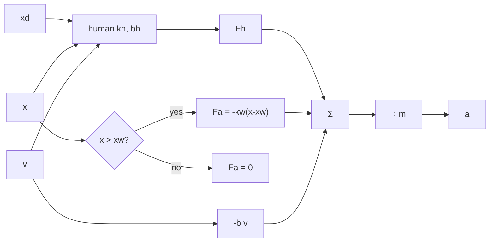

> [!note] Prerequisites · 선수 지식
> Plant **P3** from [[02-foundations/lab-plants|0.6 Lab Plants]]; the integrator from [[02-foundations/lab-kernel|0.65 Lab Kernel]]; encoder and capstan maps from [[04-robotics/haptics-teleoperation/device-design-kinematics|24.3]]. Sampling, the Nyquist frequency, and the Z-transform $H(z)$ from [[02-foundations/signal-processing|6. Signal Processing §2 and §5]]; stability and phase lag from [[04-robotics/control-theory-ce397|5. Control Theory §5]].
> [[02-foundations/lab-plants|0.6]]의 장치 **P3**; [[02-foundations/lab-kernel|0.65]]의 적분기; [[04-robotics/haptics-teleoperation/device-design-kinematics|24.3]]의 엔코더·캡스턴 사상. [[02-foundations/signal-processing|6. 신호처리 §2와 §5]]의 샘플링, 나이퀴스트, $H(z)$. [[04-robotics/control-theory-ce397|5. 제어 이론 §5]]의 안정성과 위상 지연.

## English

> [!note] First pass · 처음이라면
> Draw the P3 loop in the Homework diagram, work the Worked case, derive the wall bound in §2 with P3's $b$, then do the problem set. §3–§6 are what you open when a paper's stiffness ceiling or a filter needs a name.

### Running object · 이 페이지의 대상

Plant **P3** from [[02-foundations/lab-plants|0.6 Lab Plants]], the 1-DoF translating handle, held at the catalog numbers throughout. The integrator is [[02-foundations/lab-kernel|0.65 Lab Kernel]]; the capstan and encoder that turn these into counts and torques are [[04-robotics/haptics-teleoperation/device-design-kinematics|24.3]].

| Symbol | Value | What it is |
|---|---:|---|
| $m$ | $0.04\,\mathrm{kg}$ | effective mass at the handle |
| $b$ | $0.8\,\mathrm{N{\cdot}s/m}$ | **device** damping — the only $b$ the passivity bound may spend |
| $k_h$ | $400\,\mathrm{N/m}$ | human hand stiffness |
| $b_h$ | $8\,\mathrm{N{\cdot}s/m}$ | human hand damping — ten times the device's, and not yours to spend |
| $k_w$ | $400\,\mathrm{N/m}$ | virtual-wall stiffness, default |
| $x_w$ | $0.030\,\mathrm{m}$ | wall location; $+x$ is into the wall |
| $T$ | $10^{-3}\,\mathrm{s}$ | controller period, unless a case says otherwise |
| $\Delta x$ | $6.14\times10^{-5}\,\mathrm{m}$ | one encoder count at the handle, derived in [[04-robotics/haptics-teleoperation/device-design-kinematics\|24.3 §4]] |

The human's desired position $x_d$ is an exogenous input; the handle position $x$ is the state.

*Scope: this page teaches why a sampled virtual wall can create energy, the two ceilings that result — one from the sample period and one from the encoder — and the energy language (passivity, Z-width, virtual coupling) the field uses to talk about them. It does not teach the mechanism that produces the force, which is [[04-robotics/haptics-teleoperation/device-design-kinematics|24.3]]; nor the algorithm that decides what force to render inside the ceiling, which is [[04-robotics/haptics-teleoperation/haptic-rendering-algorithms|24.7]]; nor the two-port case with a communication delay, which is [[04-robotics/haptics-teleoperation/bilateral-teleoperation|24.5]].*

### Homework diagram · 과제가 그릴 그림

One block diagram, and the problem set asks for exactly this one.



Four things the drawing has to get right, each of which is a claim about the physics.
**Five labelled signals** — $x_d$, $x$, $\dot x$, $F_h$, $F_a$ — and a summing junction feeding $1/m$. Anything unlabelled is a place the sign convention can hide.
**The wall as a switch, not a spring.** Draw it as a diamond testing $x>x_w$ with two outgoing branches. A spring symbol here would claim the loop is linear, and §2's whole argument is that it is not.
**No arrow from $F_a$ back to $x_d$.** The person chooses where they want the handle; the wall only pushes on $x$. A loop drawn with that arrow is a different, and wrong, system.
**The hold, drawn explicitly.** Put a small zero-order-hold block between the sampled $x$ and the wall block, with $T$ written on it, because that block is the energy source the rest of the page is about.

### Worked case · 대상으로 한 번 끝까지

This is the homework object. The problem set will ask you to draw it, write its characteristic polynomial, and step it. Do those three things here first, on the catalog numbers, so the set is a change of knobs rather than a first derivation.

The human is an impedance attached to a *desired* position $x_d$ that we hold constant, so $\dot x_d=0$:

$$F_h=k_h(x_d-x)+b_h(0-\dot x).$$

The device is a mass–damper driven by the sum of human force, actuator force, and physical damping:

$$m\ddot x+b\dot x=F_h+F_a.$$

The wall is a switch, not a linear spring:

$$F_a=\begin{cases}-k_w(x-x_w),&x>x_w,\\0,&x\le x_w.\end{cases}$$

**In sustained contact** the switch stays on, so the closed-loop ODE is linear:

$$m\ddot x+(b+b_h)\dot x+(k_h+k_w)x = k_h x_d + k_w x_w$$

(the right-hand side is constant when $x_d$ is held). The characteristic polynomial is therefore

$$0.04 s^2 + 8.8 s + 800 = 0 \quad\Leftrightarrow\quad s^2 + 220 s + 20000 = 0.$$

Natural frequency $\omega_n=\sqrt{20000}=141\,\mathrm{rad/s}$. Damping ratio $\zeta=220/(2\cdot 141)=0.78$ — underdamped, a couple of rings then settle, not a chatter. This $\zeta$ *includes* $b_h$. The passivity bound in §2 does not.

**Equilibrium**, velocities zero, for a worked desired position $x_d=0.032\,\mathrm{m}$ (2 mm into the wall): the two springs share the stretch,

$$k_h(0.032-x^\ast)=k_w(x^\ast-0.030) \Rightarrow x^\ast=0.031\,\mathrm{m},$$

wall force $k_w\cdot 0.001=0.4\,\mathrm{N}$. The problem set repeats this with $x_d=0.035$. Same algebra, one number changed.

**One explicit-Euler step**, so the template's blanks have a check. Start at $x=0.020$ (still free), $v=0$, $x_d=0.035$, $T=10^{-3}$, catalog $k_w$. The wall is off, so $F_a=0$. Then

$$F_h=400\cdot(0.035-0.020)+8\cdot 0=6.0\,\mathrm{N},\qquad a=\frac{6.0}{0.04}=150\,\mathrm{m/s}^2.$$

Explicit Euler uses the *old* velocity for position ([[02-foundations/lab-kernel|0.65]]):

$$v\leftarrow 0+10^{-3}\cdot 150=0.150,\qquad x\leftarrow 0.020+10^{-3}\cdot 0=0.020.$$

Next step: $F_h=400\cdot 0.015+8\cdot(-0.150)=4.80$, $a=(4.80-0.8\cdot 0.150)/0.04=117$, $v\leftarrow 0.267$, $x\leftarrow 0.02015$. If your filled template disagrees here, the blanks are wrong before any plot.

**And the same case as energy**, which is the quantity §2 reasons with. At a representative approach speed $v=0.1\,\mathrm{m/s}$ the hold leaks about $\tfrac12 k_w(vT)^2=\tfrac12\cdot400\cdot(10^{-4})^2=2\,\mathrm{\mu J}$ per period while the device damper removes $bv^2T=0.8\cdot0.01\cdot10^{-3}=8\,\mathrm{\mu J}$, a ratio of $0.25$ — comfortably dissipative. Put $k_w=2500$ in the same place and the leak becomes $12.5\,\mathrm{\mu J}$ against the same $8\,\mathrm{\mu J}$, a ratio of $1.5625$, and the wall is now a generator. Those two ratios are exactly $k_wT/(2b)$, since the $v^2$ cancels between leak and dissipation, which is why §2's bound has no speed in it.

The four-condition sweep in the problem set is this same loop with one knob changed each time: never hit the wall; hit it and settle; sample too slowly on a stiff wall; sample faster; then drop $b_h$ and watch the "stable" stiff wall fail. §2 already told you which of those the device damper can pay for.

### 1. Haptic rendering is a hard real-time feedback loop

An impedance display repeatedly senses joint position, applies forward kinematics, detects collision, finds a proxy/surface point, computes force, maps it by $J^\top$, and commands actuators. Graphics may update at tens of hertz; stiff contact commonly needs a haptic servo around a kilohertz or more. The important property is not average rate but bounded execution time and jitter.

A point-penetration wall is commonly written

$$F_k=\begin{cases}-Kx_k-B\hat v_k,&x_k>0\\0,&x_k\le 0,\end{cases}$$

where positive $x$ denotes penetration. The nearest geometric point is not always the correct proxy: near an edge it may jump to another face and eject the user sideways. Contact rendering therefore needs state/memory as well as collision detection; the penalty wall's failure modes and the proxy that supplies that memory are [[04-robotics/haptics-teleoperation/haptic-rendering-algorithms|24.7 §2]] and [[04-robotics/haptics-teleoperation/haptic-rendering-algorithms|24.7 §3]].

**Model the loop before tuning it.** For a one-DOF impedance device the standard model is a mass–damper, $m\ddot x+b\dot x=F_a$, where $F_a$ is the actuator force and $b$ is the physical damping that §2 will need. The hand is commonly modelled as a spring–damper attached to the handle, and the virtual environment closes the loop by turning measured position into $F_a$. That block diagram is linear only on paper. The wall is a unilateral switch, the encoder quantizes, the amplifier saturates, and the person changes grip and stiffness during the task. That is why the rest of this page reasons with energy and passivity rather than with the poles of a linear model; the linear tools are in [[04-robotics/control-theory-ce397|5. Control Theory]]. The full nonlinear hybrid model, with non-volitional human dynamics, quantization, delay and the velocity filter, is Colonnese & Okamura (§3).

### 2. Why a digital spring can create energy

The controller samples position and holds a force until the next update. During one interval $T$, a constant velocity $v$ moves $\Delta x=vT$. The zero-order hold makes the force lag the ideal spring. A useful worst-case energy estimate is

$$E_{\text{leak}}\approx\frac12K(vT)^2,$$

while physical viscous damping dissipates

$$E_{\text{diss}}=bv^2T.$$

Requiring $E_{\text{leak}}\le E_{\text{diss}}$ gives the intuitive bound

$$K\le\frac{2b}{T}.$$

With backward-difference virtual damping $B$, a classic one-DOF passivity condition under its model assumptions is $b>KT/2+|B|$. It is not a universal hardware rating: friction, delay, quantization, nonlinear kinematics, saturation, human grip, and implementation details change the boundary.

Worked example: with physical damping $b=0.1$ N·s/m and $T=1$ ms, the simple bound gives $K\le200$ N/m. Halving $T$ doubles that bound; adding digital damping does not substitute freely for physical dissipation because its estimate is delayed.

On **P3**, the catalog damper is $b=0.8\,\mathrm{N{\cdot}s/m}$. At the haptic period $T=10^{-3}\,\mathrm{s}$ the same formula gives $K\le 2\cdot 0.8/10^{-3}=1600\,\mathrm{N/m}$. Catalog $k_w=400$ sits comfortably inside; $k_w=2500$ does not. At $T=5\times10^{-3}$ the bound falls to $320\,\mathrm{N/m}$ and even the catalog wall fails it. The $b$ in this inequality is the *device* damper. The human damper $b_h$ is not a term you may spend to claim a stiffer wall.

The quantity the bound is really about has a name, and it is worth stating exactly, because almost every wrong intuition about stiff walls is a wrong idea about this one thing.

> **Sampled-data energy leak, defined.** The **energy leak** of a sampled virtual environment is an *energy per sample period*, in joules — not a force, not a gain and not a stability criterion. Three defining conditions. Its source is the **zero-order hold**: the force is computed from the position at the start of the interval and held unchanged across it, so on the way out of a wall the device is still pushing with the force it owed at a deeper penetration. It is **generated**, not merely stored: the hold returns more work over a cycle than an ideal spring would, which is energy the loop did not have. And it is a **per-interval** quantity, so it is compared against what the physical damper removes in that same interval, never against a total.
>
> $$E_{\text{leak}}\approx\tfrac12 K (vT)^2 \quad\text{against}\quad E_{\text{diss}} = b v^2 T,\qquad \frac{E_{\text{leak}}}{E_{\text{diss}}}=\frac{KT}{2b}$$
>
> where $K$ is the rendered stiffness, $v$ the speed through the interval, $T$ the period and $b$ the device damping — and the ratio has no $v$ in it **because** the $v^2$ that the hold's overshoot picks up is the same $v^2$ the damper dissipates, which is why the bound $K\le 2b/T$ is a statement about the machine and not about how fast the user moves.
>
> - **Example**: P3 at $v=0.1\,\mathrm{m/s}$, $T=10^{-3}$, catalog $k_w=400$. Leak $\tfrac12\cdot400\cdot(10^{-4})^2=2\,\mathrm{\mu J}$ per period against $0.8\cdot0.01\cdot10^{-3}=8\,\mathrm{\mu J}$ dissipated — a ratio of $0.25$, exactly $k_wT/(2b)$, so three quarters of the leak is paid for and the wall is a sink.
> - **Non-example**: the energy an ideal *continuous* spring stores on the way in and returns on the way out. That is conservative, not a leak: the net over a cycle is zero at any stiffness, which is why the whole phenomenon disappears as $T\to0$ and why it is a sampled-data effect rather than a stiffness effect.
> - **Non-example**: energy growth caused by an unstable integrator. Explicit Euler on a stiff spring also blows up, but from truncation error in the simulation, not from a hold in the loop. The two look identical on a plot and have different fixes, which is why the integrator is part of the claim two paragraphs below.
> - **Why it matters**: it converts "how stiff can this device be" from a tuning question into an accounting question with four terms — $K$, $T$, $b$, and the encoder's $\Delta x$ in §3 — and every stabilizer in §5 is a different way of making the ledger balance.

These bounds are usually checked in simulation before hardware, and that check has its own trap.

The integrator you simulate this with is part of the claim. Explicit Euler advances position with the *old* velocity, $v_{k+1}=v_k+Ta_k$ and $x_{k+1}=x_k+Tv_k$; semi-implicit Euler uses the *new* velocity in the position step. The two behave differently at the same step size, and a wall that looks stable under one can leak energy under the other. When a paper reports a stability limit from simulation, the integrator and step size are part of the result.

The same holds for the non-idealities you include: a simulation without quantization, Coulomb friction, actuator saturation and the zero-order hold will report a wall the hardware cannot render, so model them before trusting a simulated limit.

The wall bound is a special case of a general one, and this is where it comes from. A pulse transfer function $H(z)$ is the sampled-data version of a transfer function: it maps the sequence of sampled positions to the sequence of commanded forces, with $z$ standing for a one-sample time shift ([[02-foundations/signal-processing|6. Signal Processing §5]]). Before the formula, the idea: read it the same way as the wall bound, because the physical damping $b$ has to pay, at every frequency up to Nyquist ($\omega_N=\pi/T$), for the energy the sampled environment injects. For any virtual environment written as $H(z)$, Colgate and Schenkel (*J. Robotic Systems* 14(1), 1997) give the passivity condition for the one-DOF sampled-data model with a zero-order hold, as presented in Weir & Colgate (eq. 8.2):

$$b>\frac{T}{2}\,\frac{1}{1-\cos\omega T}\,\mathrm{Re}\{(1-e^{-j\omega T})H(e^{j\omega T})\},\qquad 0\le\omega\le\omega_N=\pi/T$$

Here $H(e^{j\omega T})$ is just $H(z)$ evaluated on the unit circle, $z=e^{j\omega T}$, which is how a discrete transfer function gives its response to a sinusoid of frequency $\omega$. Putting a spring and a backward-difference damper in for $H(z)$ gives the $b>KT/2+|B|$ form above.

### 3. Sampling and quantization are different

Sampling hides **when** contact occurred between updates. Quantization hides **where** the device lies within an encoder interval $\Delta$. Quantization is the staircase map $\hat x=\Delta\lfloor x/\Delta\rfloor$ and the resolution $\Delta$ is a length at the handle; both are defined in full, with P3's $\Delta=6.14\times10^{-5}\,\mathrm{m}$, in [[04-robotics/haptics-teleoperation/device-design-kinematics|24.3 §4]], and the one property this section needs from there is that the error is a repeatable function of position rather than zero-mean noise. Quantization sets a second ceiling on stiffness, and friction raises it. Under a Coulomb-plus-viscous friction model with quantization, passivity requires $K\le\min(2b/T,\,2f_c/\Delta)$ (Abbott & Okamura 2005). Both must hold, and whichever is smaller limits the wall.

- **Units.** The second bound is $K\le2f_c/\Delta$, where $f_c$ is the device's Coulomb friction force in newtons. N divided by m is a stiffness, so the coarser the encoder, the lower the wall you can render.
- **Friction's role.** Friction *raises* that second ceiling rather than lowering it. It helps only when the quantization term is the binding one.

That is the uncomfortable part. The same friction that buys stability is the friction a transparency claim has to subtract, so a device reporting a high stable stiffness and high transparency owes you the friction number. Diolaiti, Niemeyer, Barbagli and Salisbury (*IEEE T-RO* 22(2), 2006) extend the analysis with time delay and draw it as a dimensionless plane with axes $\beta=b/(KT)$ and $\sigma=f_c/(K\Delta)$, divided into regions that are globally stable (passive), show limit cycles, are globally unstable, or are only locally stable or unstable. That plane is the quickest way to see which of $b$, $T$, $f_c$ and $\Delta$ to change. Note also what this bound does not share with $K\le2b/T$ above: no $T$ appears in it. Faster sampling does not improve encoder resolution. Conversely, finer resolution does not eliminate zero-order-hold delay.

Velocity estimation exposes the tradeoff:

$$\hat v_k=\frac{x_k-x_{k-1}}{T}.$$

Small $T$ increases the velocity jump caused by one encoder count. Averaging over $n$ samples, $(x_k-x_{k-n})/(nT)$, reduces variance but increases effective delay. A low-pass filter should therefore be evaluated by both noise attenuation and phase at the contact frequencies.

The usual low-pass filter on that estimate is a first-order IIR, $\hat v^{f}_k=\alpha\hat v_k+(1-\alpha)\hat v^{f}_{k-1}$ with $0<\alpha\le1$. Written this way, a larger $\alpha$ weights the new sample more and filters less. [[02-foundations/signal-processing|6. Signal Processing §4]] writes the same filter with $\alpha$ on the old value, so read the equation, not the symbol. Lowering the weight on new samples cuts noise and adds lag: the tradeoff above, in one knob.

The failure is worst where it is least expected. Move slowly enough and a fixed window may contain **no** encoder transition at all, so the estimate reads exactly zero and the rendered damping vanishes at the moment a wall is being approached gently. The alternative is to invert the measurement — time the interval between successive encoder ticks instead of counting ticks in a fixed interval — which is accurate at low speed for the same reason, and degrades at high speed where the ticks arrive faster than the timer resolves. Neither estimator is good everywhere, so a paper that reports a stiffness ceiling owes you the velocity estimator and the speed at which it was measured.

Colonnese and Okamura put all of this into one model — device and human dynamics, sampling, position quantization, delay, and the velocity filter together — and derive the tradeoffs between the resulting stability and quantization-error regions, including necessary conditions for avoiding limit cycles and sufficient conditions for quantization-error passivity. Read it as the reference treatment for this section; it is in the reading list in [[04-robotics/haptics-teleoperation/experiments-readings|Experiments & Readings]].

### 4. Passivity, stability, and Z-width

A port is a force/velocity pair through which power flows into or out of a system, and a one-port has exactly one such pair (here, the handle). With power defined positive into a one-port, passivity requires

$$E(t)=E_0+\int_0^t F(\tau)^\top v(\tau)d\tau\ge0.$$

Interconnected passive systems have strong stability properties, which avoids needing an exact high-frequency human model. But passivity is a sufficient design framework, not a guarantee of good feel, task success, or safety; it can be conservative, and active humans or actuators still require careful port definitions and assumptions.

That paragraph is the whole idea, and each of its clauses is load-bearing, so here it is as a definition.

> **Passivity, defined.** **Passivity** is a property of a *system together with a declared port and a declared sign convention* — an input–output energy inequality, not a property of a signal, a gain, or a trajectory. Three defining conditions, and papers lose arguments by dropping any of them. There is a **lower-bounded initial store** $E_0$: the system may give back energy it had, and $E_0$ is what bounds how much. The inequality must hold **for every admissible input and every $t\ge0$**, so passivity is a universally quantified claim and one trajectory that behaves proves nothing. And the power must be written **at a named port with a stated sign**, because flipping the convention flips the inequality while the physics is unchanged.
>
> $$E(t)=E_0+\int_0^t F(\tau)^\top v(\tau)\,d\tau\ \ge\ 0\qquad\text{for all admissible }F,v\text{ and all }t\ge0$$
>
> where $F$ and $v$ are the force and velocity at the port, positive into the system, and $E_0\ge0$ is the initial stored energy — so the integral is the work the environment has done on the system, and the inequality says the system has never returned more than it received plus what it started with.
>
> - **Example**: P3's physical damper. Its port power is $b v^\top v=b\lVert v\rVert^2\ge0$ at every instant, so the integral only grows and the inequality is satisfied for free. Springs are passive the harder way: they return what they took, never more.
> - **Non-example**: the sampled wall at $k_w=2500$, $T=10^{-3}$. Its leak-to-dissipation ratio is $1.5625$ (§2), so there exist inputs for which the integral goes negative — it is therefore **not** passive, even though the problem set's case D *looks* stable on a plot, because the person's $b_h=8$ is ten times the device's $b$ and is quietly paying the difference. Passive and stable are different words: this system is the second without being the first.
> - **Non-example**: "the controller is passive." A controller alone has no port until you say where it is measured and which way power is positive; the same code is passive at the joint and active at the tool tip if a transmission sits between them.
> - **Why it matters**: two passive one-ports connected at a port give a passive system, so a device proved passive can be handed to an unmodelled human and still be stable. That interconnection theorem is the only reason the field can avoid identifying a person's high-frequency dynamics — and it is also why the bound is conservative, since a real hand is dissipative and the proof refuses to count on it.

**Z-width** is the range of impedances a device can render stably/passively—from light free space to hard contact. A stiffness–damping plot shows only part of it; frequency, minimum impedance, load, grip, and measurement location must be reported.

> **Z-width, defined.** **Z-width** is a *region* — a two-dimensional set of renderable virtual stiffness–damping pairs — not a scalar, not a maximum stiffness, and not a fixed rating of a device. Three defining conditions. It is defined **relative to a declared criterion**, normally passivity, so "Z-width" with no criterion named is not a claim. It has **two** boundaries that different physics set: a lower one, the smallest impedance the device can display, and an upper one, the largest. And it is measured **under declared conditions** — frequency range, grip, load, measurement location, velocity estimator — so it moves when any of them moves.
>
> $$\mathcal{Z}=\Big\{(K,B)\ :\ b>\tfrac{KT}{2}+\lvert B\rvert\Big\}\quad\text{under the one-DoF backward-difference model of §2}$$
>
> where $K$ and $B$ are the virtual stiffness and damping being asked for, $b$ the device damping and $T$ the period — a triangle in the $(K,B)$ plane rather than a line, because every unit of virtual damping is subtracted from the same $b$ that was paying for the stiffness.
>
> - **Example**: P3 at $T=10^{-3}$, $b=0.8$. With $B=0$ the region reaches $K=1600\,\mathrm{N/m}$; with $B=0.4\,\mathrm{N{\cdot}s/m}$ it reaches only $2(0.8-0.4)/10^{-3}=800\,\mathrm{N/m}$. Spending half the damper on virtual damping halved the stiffness ceiling, and no amount of tuning recovers it.
> - **Non-example**: "this device has a Z-width of $1600\,\mathrm{N/m}$." A single number is not a region: it hides which $B$ it was measured at, which rate, which encoder, and whether a hand was on the handle. Two devices quoting the same number can have regions of completely different shape.
> - **Non-example**: the *physical* impedance range of the mechanism. Z-width is about what can be **rendered**, and the mechanism's own $m$, $b$ and friction sit underneath it as an offset the user always feels.
> - **Why it matters**: it is the one figure that makes the counterintuitive lever below visible — adding physical damping enlarges the region rather than shrinking it — and it is where §3's second ceiling, $K\le2f_c/\Delta$, cuts the triangle off in a direction that a faster loop cannot move.

Z-width has two ends, and different things set them. The lower end, how light free space can feel, is set mainly by mechanical design and force sensing: inertia, friction, backdrivability. The upper end, how stiff a wall can be, is limited by sensor quantization, sampled-data effects, time delay and noise (Weir & Colgate, citing Colgate & Schenkel 1997). Colgate and Brown (ICRA 1994) measured the upper end experimentally and found the counterintuitive lever: adding *physical* damping to the mechanism raises the virtual stiffness and damping that can be rendered passively, as do a faster sampling rate and finer position resolution. So Z-width is not a fixed number for a device. It moves with its damping, rate, sensor and filter, and with the task it is measured on.

### 5. Three stabilization families

- **Virtual coupling:** place a virtual spring–damper between the device proxy and the simulated tool. It isolates a passive environment but softens transparency continuously.
- **Passivity observer/controller (PO/PC):** track discrete power/energy and inject damping only when the energy budget would be violated. It is adaptive but can introduce bursts, near-zero-velocity division problems, saturation, and delayed action after stored “energy credit.”
- **Hardware/perceptual design:** raise sample rate and sensor resolution, add physical/electrical high-frequency damping, reduce inertia, or add event-triggered impact vibration so a modest stable stiffness feels harder.

The first of the three is the one most often described without being defined, and the definition is what explains its cost.

> **Virtual coupling, defined.** A **virtual coupling** is an *element* — a spring–damper inserted into the loop between the haptic device and the simulated environment — and therefore a piece of the controller, not a piece of the environment being rendered. Three defining conditions. It sits **between** the device and the environment, so the device never faces the environment's impedance directly and the environment never faces the device's. Its parameters are chosen so that the **coupled discrete-time system** is passive for *any* passive environment, which is what turns an unbounded design problem into a fixed one. And it therefore **bounds the maximum impedance the device can be asked to display**, no matter how stiff the environment behind it is.
>
> $$F_{\text{vc}} = K_{\text{vc}}\,(x_t - x) + B_{\text{vc}}\,(\dot x_t - \dot x)$$
>
> where $x$ and $\dot x$ are the device's position and velocity, $x_t$ and $\dot x_t$ the simulated tool's, and $K_{\text{vc}}$, $B_{\text{vc}}$ the coupler gains — and this force is what both sides feel, equal and opposite, because the coupler is a two-port element and not a command.
>
> - **Example**: P3 at $T=10^{-3}$ rendering a nominally rigid object of $10^4\,\mathrm{N/m}$. Choose $K_{\text{vc}}=1200\,\mathrm{N/m}$, inside the $1600\,\mathrm{N/m}$ ceiling of §2. The user now feels the coupler in series with the object, $(1/1200+1/10^4)^{-1}=1071\,\mathrm{N/m}$, so an environment $6.25$ times stiffer than the device's ceiling is rendered safely — and rendered as $1071\,\mathrm{N/m}$, which is the honest number to report as the felt stiffness.
> - **Non-example**: lowering $k_w$ in the environment model itself. That renders a *different object*; the coupler renders the same object through a known filter, and the distinction matters as soon as the environment is a simulation someone else wrote.
> - **Non-example**: a damper added only to the device's velocity, $-d\dot x$. That dissipates but is not a coupling: it has one port, not two, so it slows the user down without bounding what the environment can demand.
> - **Why it matters**: it is a continuous, not a conditional, cost. Unlike the PO/PC above, which acts only when the energy budget is violated, the coupler is in the loop at all times — free space included — so it trades a fixed loss of transparency for a guarantee that holds against environments you have not seen. Which of those two trades is right is the design question, and [[04-robotics/haptics-teleoperation/bilateral-teleoperation|24.5 §4]] asks it again with a delay in the channel.

For a discrete sample, a common observer uses $\Delta E_k=T F_k^\top v_k$ with a declared sign convention. If the cumulative budget becomes negative, an impedance-causality controller may add $F_{pc}=-d_kv_k$ with $d_k$ chosen to cancel the deficit. Clamp and regularize this law near $\|v_k\|=0$; never interpret the formula without actuator limits.

### 6. Debugging order

1. Disable contact force and verify units, signs, frames, encoder direction, and motor current limits.
2. Log actual loop period and worst-case jitter, not only requested rate.
3. Add a low-stiffness wall without damping; inspect penetration, force, and energy.
4. Add velocity estimation and damping while plotting phase/noise.
5. Raise stiffness gradually; stop at sustained oscillation, saturation, overheating, or unsafe force.
6. Separate numerical instability, mechanical resonance, friction limit cycle, and collision/proxy discontinuity.

### Self-check

1. Why can a smoother velocity estimate make a virtual wall *less* stable?
2. P3 has $b = 0.8\ \mathrm{N\,s/m}$ and runs at $T = 1\ \mathrm{ms}$. What wall stiffness does $K \le 2b/T$ allow, and what happens to that ceiling if the loop slips to $2\ \mathrm{ms}$?
3. Two devices render the same $400\ \mathrm{N/m}$ wall stably. One has twice the physical damping, the other twice the sample rate. Which one also feels lighter in free space, and why is that the real trade?

> [!tip]- Answers
> 1. Smoothing attenuates noise but adds phase lag. Damping computed from a lagged velocity can act after the motion has already reversed, so it injects energy instead of removing it — the same energy the passivity bound is trying to cap.
> 2. $K \le 2(0.8)/0.001 = 1600\ \mathrm{N/m}$. At $T = 2\ \mathrm{ms}$ the ceiling halves to $800\ \mathrm{N/m}$: the stiffest honest wall is set by the loop you actually achieve, not the one you intended.
> 3. The faster device. Physical damping buys stability by making the handle drag in free space, which is exactly what the operator should not feel; raising the rate buys the same stability without that cost. That is why Z-width is a region, not a single number.

### Problem set · 과제

Tier A. Using **P3**, this page, [[02-foundations/lab-kernel|0.65]], and [[04-robotics/haptics-teleoperation/device-design-kinematics|24.3]]. Original plant and original problems — fill the blanks; do not rewrite the loop.

Human (impedance, desired position $x_d$ held constant so $\dot x_d=0$):

$$F_h=k_h(x_d-x)+b_h(0-\dot x)$$

Device: $m\ddot x+b\dot x=F_h+F_a$. Wall: $F_a=-k_w(x-x_w)$ when $x>x_w$, else $0$.

1. **Draw.** Block diagram with signals $x_d$, $x$, $\dot x$, $F_h$, $F_a$, and the summing junction into $m$. Mark the unilateral switch on the wall. This is the homework object; the rest of the set is this diagram in equations and in a loop.
2. **Derive.** (a) In sustained contact, the characteristic polynomial in $s$. Natural frequency and damping ratio at the catalog $k_w=400$. (b) Equilibrium $x^\ast$ for $x_d=0.035\,\mathrm{m}$ (velocities zero). (c) Colgate-style bound $K\le 2b/T$ at $T=10^{-3}$ and at $T=5\times10^{-3}$. Does catalog $k_w$ pass each? Does $k_w=2500$ pass each? The bound is on the *device* damper $b$, not $b_h$.
3. **Do.** Fill the `?` in the template. Explicit Euler, $T$ is the controller period ([[02-foundations/lab-kernel|0.65]]). Run four conditions, $t\in[0,1.5]$, $x(0)=0.020$, $v(0)=0$, and plot $x(t)$ with a dashed wall at $x_w$:
   - A. Free: $x_d=0.020$, $k_w=400$, $T=10^{-3}$
   - B. Contact: $x_d=0.035$, $k_w=400$, $T=10^{-3}$
   - C. Slow sample, stiff wall: $x_d=0.035$, $k_w=2500$, $T=5\times10^{-3}$
   - D. Fast sample, same wall: $x_d=0.035$, $k_w=2500$, $T=10^{-3}$
   Then one extra run: D with $b_h=0$. Report, for each, whether $x$ stays off the wall, settles, or chatters, and the sign of $\sum T F_a v$ (virtual-wall energy; negative means the wall took energy out).

```python
# P3 explicit Euler. Integrator: lab-kernel. Fill ?.
m, b = 0.04, 0.8
kh, bh = 400.0, 8.0
kw, xw = 400.0, 0.030          # override per case
xd = 0.035                     # 0.020 in case A
T = 1e-3                       # 5e-3 in case C
t1 = 1.5
n = int(round(t1 / T)) + 1
x, v = 0.020, 0.0
xs, vs, Fas, ts, E = [], [], [], [], 0.0
for k in range(n):
    Fh = ?                     # kh*(xd - x) + bh*(0.0 - v)
    Fa = ?                     # -kw*(x - xw) if x > xw else 0.0
    a = ?                      # (Fh + Fa - b*v) / m
    E = E + T * Fa * v
    xs.append(x); vs.append(v); Fas.append(Fa); ts.append(k * T)
    v_old = v
    v = v + T * a              # explicit: position uses OLD velocity
    x = x + T * v_old
# plot xs vs ts; axhline xw; caption "P3, explicit Euler, T=..."
```

> [!tip]- Solutions
> 1. $x_d$ feeds a spring–damper whose other port is $(x,\dot x)$; that force $F_h$ sums with $F_a$ and $-b\dot x$ into $1/m$. The wall block is a switch: it reads $x$ and emits $F_a$ only for $x>x_w$. No path from $F_a$ back to $x_d$ — the human desired position is an exogenous input.
> 2. (a) $m s^2+(b+b_h)s+(k_h+k_w)=0.04 s^2+8.8 s+800$. Divide by $m$: $s^2+220s+20000=0$. $\omega_n=\sqrt{20000}=141\,\mathrm{rad/s}$, $\zeta=220/(2\cdot 141)=0.78$ (underdamped). (b) $k_h(x_d-x^\ast)=k_w(x^\ast-x_w)$ $\Rightarrow$ $0.035-x^\ast=x^\ast-0.030$ $\Rightarrow$ $x^\ast=0.0325\,\mathrm{m}$, wall force $1.0\,\mathrm{N}$. (c) $T=10^{-3}$: $2b/T=1600\,\mathrm{N/m}$. Catalog $400$ passes; $2500$ fails. $T=5\times10^{-3}$: $2b/T=320$. Both $400$ and $2500$ fail the device-only bound. Human damper $b_h$ is *not* in this inequality.
> 3. Blanks: `Fh = kh*(xd - x) + bh*(0.0 - v)`, `Fa = -kw*(x - xw) if x > xw else 0.0`, `a = (Fh + Fa - b*v) / m`. A: never contacts, $x\to 0.020$, $E=0$. B: contacts and settles at $0.0325$, $E<0$ (wall takes energy). C: chatters for the whole window, many velocity sign changes, $E>0$ (sampled wall injects energy). D: looks settled despite $k_w>1600$, because $b_h=8$ is ten times $b$. D with $b_h=0$: the trace diverges. The bound assumed you would not spend the human as a damper; a paper that “proves” a $2500\,\mathrm{N/m}$ wall at $1\,\mathrm{kHz}$ on this mass owes you $b$ and whether a person was holding the handle.

## 한국어

> [!note] 처음이라면 · First pass
> 과제가 그릴 그림에서 P3 루프를 그리고 계산 절을 따라간 뒤, §2에서 P3의 $b$로 벽 경계를 유도하고 과제를 풀어라. §3–§6은 논문의 강성 천장이나 필터에 이름이 필요할 때 연다.

### 이 페이지의 대상 · Running object

[[02-foundations/lab-plants|0.6 Lab Plants]]의 장치 **P3**, 1자유도 병진 핸들. 페이지 전체에서 카탈로그 숫자를 그대로 쓴다. 적분기는 [[02-foundations/lab-kernel|0.65 Lab Kernel]], 이 숫자들을 카운트와 토크로 바꾸는 캡스턴과 엔코더는 [[04-robotics/haptics-teleoperation/device-design-kinematics|24.3]]이다.

| 기호 | 값 | 뜻 |
|---|---:|---|
| $m$ | $0.04\,\mathrm{kg}$ | 핸들의 유효 질량 |
| $b$ | $0.8\,\mathrm{N{\cdot}s/m}$ | **장치** 댐핑 — 수동성 경계가 쓸 수 있는 유일한 $b$ |
| $k_h$ | $400\,\mathrm{N/m}$ | 손 강성 |
| $b_h$ | $8\,\mathrm{N{\cdot}s/m}$ | 손 댐핑 — 장치의 열 배이고, 당신이 쓸 수 있는 몫이 아니다 |
| $k_w$ | $400\,\mathrm{N/m}$ | 가상 벽 강성, 기본값 |
| $x_w$ | $0.030\,\mathrm{m}$ | 벽 위치; $+x$가 벽 안 |
| $T$ | $10^{-3}\,\mathrm{s}$ | 제어기 주기. 조건에서 따로 말하지 않는 한 |
| $\Delta x$ | $6.14\times10^{-5}\,\mathrm{m}$ | 핸들에서 엔코더 한 카운트. 유도는 [[04-robotics/haptics-teleoperation/device-design-kinematics\|24.3 §4]] |

사람의 목표 위치 $x_d$는 외부 입력이고, 핸들 위치 $x$가 상태다.

*범위: 이 페이지는 샘플링된 가상 벽이 왜 에너지를 만들 수 있는지, 거기서 나오는 두 천장 — 하나는 샘플 주기에서, 하나는 엔코더에서 — 이 무엇인지, 그리고 그것을 말하는 에너지 언어(수동성, Z-width, virtual coupling)를 가르친다. 힘을 만들어 내는 메커니즘은 가르치지 않는다. 그것은 [[04-robotics/haptics-teleoperation/device-design-kinematics|24.3]]이다. 천장 안에서 어떤 힘을 낼지 정하는 알고리즘도 아니다. 그것은 [[04-robotics/haptics-teleoperation/haptic-rendering-algorithms|24.7]]이다. 통신 지연이 있는 2포트 경우도 아니다. 그것은 [[04-robotics/haptics-teleoperation/bilateral-teleoperation|24.5]]다.*

### 과제가 그릴 그림 · Homework diagram

블록선도 하나, 과제가 요구하는 것이 정확히 이 그림이다.


그림이 맞혀야 할 것이 넷이고, 각각이 물리에 대한 주장이다.
**이름 붙은 신호 다섯** — $x_d$, $x$, $\dot x$, $F_h$, $F_a$ — 과 $1/m$으로 들어가는 합산점. 이름 없는 선은 부호 규약이 숨는 자리다.
**벽은 스프링이 아니라 스위치.** $x>x_w$를 묻는 마름모와 나가는 가지 둘로 그린다. 여기에 스프링 기호를 그리면 루프가 선형이라고 주장하는 셈이고, §2의 논증 전체가 그렇지 않다는 것이다.
**$F_a$에서 $x_d$로 가는 화살표는 없다.** 사람이 핸들을 어디에 두고 싶은지를 정하고, 벽은 $x$만 민다. 그 화살표를 그린 루프는 다른 시스템이고 틀린 시스템이다.
**홀드를 명시적으로.** 샘플된 $x$와 벽 블록 사이에 작은 zero-order hold 블록을 넣고 그 위에 $T$를 적는다. 페이지의 나머지가 다루는 에너지원이 그 블록이기 때문이다.

### 대상으로 한 번 끝까지 · Worked case

이것이 과제의 대상이다. 과제는 이 그림을 그리고, 특성다항식을 쓰고, 한 스텝 전진하라고 한다. 카탈로그 숫자로 여기서 먼저 하면 과제는 손잡이를 바꾸는 일이지 첫 유도가 아니다.

사람은 목표 위치 $x_d$에 붙은 임피던스이고, $x_d$를 상수로 두므로 $\dot x_d=0$:

$$F_h=k_h(x_d-x)+b_h(0-\dot x).$$

장치는 사람 힘, 액추에이터 힘, 물리 댐핑의 합이 미는 질량–댐퍼다:

$$m\ddot x+b\dot x=F_h+F_a.$$

벽은 선형 스프링이 아니라 스위치다:

$$F_a=\begin{cases}-k_w(x-x_w),&x>x_w,\\0,&x\le x_w.\end{cases}$$

**지속 접촉**에서 스위치는 켜진 채라 폐루프 ODE가 선형이다:

$$m\ddot x+(b+b_h)\dot x+(k_h+k_w)x = k_h x_d + k_w x_w$$

($x_d$가 상수면 우변도 상수). 특성다항식은

$$0.04 s^2 + 8.8 s + 800 = 0 \quad\Leftrightarrow\quad s^2 + 220 s + 20000 = 0.$$

고유진동수 $\omega_n=\sqrt{20000}=141\,\mathrm{rad/s}$. 감쇠비 $\zeta=220/(2\cdot 141)=0.78$ — 과소감쇠, 두어 번 울리고 정착하지 채터가 아니다. 이 $\zeta$는 $b_h$를 *포함한다*. §2의 수동성 경계는 그렇지 않다.

**평형**, 속도 0, 계산용 목표 $x_d=0.032\,\mathrm{m}$(벽 안 2 mm): 두 스프링이 신장을 나눈다.

$$k_h(0.032-x^\ast)=k_w(x^\ast-0.030) \Rightarrow x^\ast=0.031\,\mathrm{m},$$

벽 힘 $0.4\,\mathrm{N}$. 과제는 같은 대수를 $x_d=0.035$로 반복한다. 숫자 하나.

**명시적 오일러 한 스텝**, 템플릿 빈칸의 검산. $x=0.020$(아직 자유), $v=0$, $x_d=0.035$, $T=10^{-3}$, 카탈로그 $k_w$. 벽은 꺼져 $F_a=0$.

$$F_h=400\cdot 0.015=6.0\,\mathrm{N},\qquad a=6.0/0.04=150\,\mathrm{m/s}^2.$$

명시적 오일러는 위치에 *이전* 속도를 쓴다([[02-foundations/lab-kernel|0.65]]):

$$v\leftarrow 0.150,\qquad x\leftarrow 0.020.$$

다음 스텝: $F_h=4.80$, $a=117$, $v\leftarrow 0.267$, $x\leftarrow 0.02015$. 채운 템플릿이 여기서 어긋나면 플롯 전에 빈칸이 틀린 것이다.

**같은 경우를 에너지로**, 즉 §2가 추론하는 양으로 보자. 대표적인 접근 속도 $v=0.1\,\mathrm{m/s}$에서 홀드는 주기마다 $\tfrac12 k_w(vT)^2=\tfrac12\cdot400\cdot(10^{-4})^2=2\,\mathrm{\mu J}$를 흘리고 장치 댐퍼는 $bv^2T=0.8\cdot0.01\cdot10^{-3}=8\,\mathrm{\mu J}$를 걷어 간다. 비는 $0.25$, 넉넉히 소산이다. 같은 자리에 $k_w=2500$을 넣으면 누설은 $12.5\,\mathrm{\mu J}$가 되고 소산은 그대로 $8\,\mathrm{\mu J}$, 비는 $1.5625$라 벽이 발전기가 된다. 두 비는 정확히 $k_wT/(2b)$다. 누설과 소산에서 $v^2$이 소거되기 때문이고, 그래서 §2의 경계에 속도가 없다.

과제의 네 조건 스윕은 같은 루프에서 손잡이 하나만 바꾼다. §2가 장치 댐퍼가 어느 것을 갚을 수 있는지 이미 말했다.

### 1. 햅틱 렌더링은 hard real-time feedback loop다

Impedance display는 관절 위치 측정 → 순기구학 → 충돌 검출 → proxy/표면점 결정 → 힘 계산 → $J^\top$ 매핑 → 액추에이터 명령을 반복한다. 그래픽은 수십 Hz로 갱신해도 되지만, 단단한 접촉은 보통 1 kHz 안팎 이상의 햅틱 servo를 요구한다. 중요한 성질은 평균 주기가 아니라 유계인 실행시간과 jitter다.

점 침투 방식의 가상 벽은 흔히 다음과 같이 쓴다.

$$F_k=\begin{cases}-Kx_k-B\hat v_k,&x_k>0\\0,&x_k\le 0,\end{cases}$$

여기서 양의 $x$는 침투를 뜻한다. 기하학적으로 가장 가까운 점이 항상 옳은 proxy는 아니다. 모서리 근처에서는 다른 면으로 뛰면서 사용자를 옆으로 밀어낼 수 있다. 따라서 접촉 렌더링에는 충돌 검출뿐 아니라 상태와 기억이 필요하다. 벌점 벽의 실패 방식과 그 기억을 제공하는 proxy는 [[04-robotics/haptics-teleoperation/haptic-rendering-algorithms|24.7 §2]]와 [[04-robotics/haptics-teleoperation/haptic-rendering-algorithms|24.7 §3]]에 있다.

**튜닝 전에 루프를 모델링하라.** 1자유도 임피던스 장치의 표준 모델은 질량–댐퍼 $m\ddot x+b\dot x=F_a$다. $F_a$는 액추에이터 힘이고 $b$는 §2에서 필요해질 물리적 댐핑이다. 손은 흔히 핸들에 붙은 스프링–댐퍼로 모델링하고, 가상 환경이 측정된 위치를 $F_a$로 바꾸어 루프를 닫는다. 이 블록선도는 종이 위에서만 선형이다. 벽은 한쪽으로만 켜지는 스위치이고, encoder는 양자화하고, 증폭기는 포화하며, 사람은 과제 도중에 파지와 강성을 바꾼다. 그래서 이 페이지의 나머지는 선형 모델의 극점이 아니라 에너지와 수동성으로 추론한다. 선형 도구는 [[04-robotics/control-theory-ce397|5. 제어 이론]]에 있다. 비의지적 인간 동역학, 양자화, 지연, 속도 필터까지 넣은 완전한 비선형 하이브리드 모델은 Colonnese & Okamura다(§3).

### 2. 디지털 스프링이 에너지를 만들 수 있는 이유

제어기는 위치를 샘플링하고 다음 갱신까지 힘을 유지한다. 한 주기 $T$ 동안 일정 속도 $v$는 $\Delta x=vT$만큼 움직인다. Zero-order hold 때문에 힘이 이상적인 스프링보다 늦는다. 쓸 만한 최악의 경우 에너지 추정은

$$E_{\text{leak}}\approx\frac12K(vT)^2,$$

이고, 물리적 점성 댐핑이 소산하는 에너지는

$$E_{\text{diss}}=bv^2T.$$

$E_{\text{leak}}\le E_{\text{diss}}$를 요구하면 직관적인 경계

$$K\le\frac{2b}{T}$$

를 얻는다. 후방차분 가상 댐핑 $B$를 쓸 때, 모델 가정 아래의 고전적인 1자유도 수동성 조건은 $b>KT/2+|B|$다. 이것은 보편적인 하드웨어 정격이 아니다. 마찰·지연·양자화·비선형 기구학·포화·사람의 파지·구현 세부가 경계를 바꾼다.

예제: 물리 댐핑 $b=0.1$ N·s/m, $T=1$ ms이면 단순 경계는 $K\le200$ N/m다. $T$를 절반으로 줄이면 이 경계는 두 배가 된다. 디지털 댐핑을 더하는 것은 물리적 소산을 자유롭게 대체하지 못하는데, 그 추정값 자체가 늦기 때문이다.

**P3**의 카탈로그 댐퍼는 $b=0.8\,\mathrm{N{\cdot}s/m}$이다. 햅틱 주기 $T=10^{-3}\,\mathrm{s}$에서 같은 식은 $K\le 1600\,\mathrm{N/m}$을 준다. 카탈로그 $k_w=400$은 안에 있고, $k_w=2500$은 아니다. $T=5\times10^{-3}$이면 경계는 $320\,\mathrm{N/m}$이 되어 카탈로그 벽도 실패한다. 이 부등식의 $b$는 *장치* 댐퍼다. 사람 댐퍼 $b_h$는 더 단단한 벽을 주장하는 데 써도 되는 항이 아니다.

경계가 실제로 말하는 양에는 이름이 있고, 정확히 적어 둘 값어치가 있다. 단단한 벽에 대한 잘못된 직관은 거의 전부 이 하나에 대한 잘못된 생각이기 때문이다.

> **샘플링 데이터 에너지 누설의 정의.** 샘플링된 가상 환경의 **에너지 누설**(energy leak)은 *주기당 에너지*, 단위는 줄이다. 힘도 아니고 이득도 아니고 안정성 판정 기준도 아니다. 정의 조건 셋. 원천은 **zero-order hold**다. 힘을 구간 시작의 위치에서 계산해 구간 내내 그대로 유지하므로, 벽에서 빠져나오는 동안에도 장치는 더 깊이 들어가 있었을 때의 힘으로 밀고 있다. 저장이 아니라 **생성**이다. 한 주기 동안 홀드가 돌려주는 일이 이상적인 스프링보다 많고, 그 차이는 루프가 갖고 있지 않던 에너지다. 그리고 **구간당** 양이므로 같은 구간에서 물리 댐퍼가 걷어 가는 양과 비교하지, 누적 총량과 비교하지 않는다.
>
> $$E_{\text{leak}}\approx\tfrac12 K (vT)^2 \quad\text{대}\quad E_{\text{diss}} = b v^2 T,\qquad \frac{E_{\text{leak}}}{E_{\text{diss}}}=\frac{KT}{2b}$$
>
> $K$는 렌더링된 강성, $v$는 구간 동안의 속도, $T$는 주기, $b$는 장치 댐핑이다. 비에 $v$가 없는 것은 홀드의 초과분이 얻는 $v^2$과 댐퍼가 소산하는 $v^2$이 같기 **때문이고**, 그래서 $K\le 2b/T$는 사용자가 얼마나 빨리 움직이는가가 아니라 기계에 대한 진술이다.
>
> - **예**: $v=0.1\,\mathrm{m/s}$, $T=10^{-3}$, 카탈로그 $k_w=400$의 P3. 주기당 누설 $\tfrac12\cdot400\cdot(10^{-4})^2=2\,\mathrm{\mu J}$ 대 소산 $0.8\cdot0.01\cdot10^{-3}=8\,\mathrm{\mu J}$. 비는 $0.25$이고 정확히 $k_wT/(2b)$다. 누설의 4분의 3이 갚아지고 벽은 흡수원이다.
> - **비예**: 이상적인 *연속* 스프링이 들어갈 때 저장하고 나올 때 돌려주는 에너지. 그것은 보존이지 누설이 아니다. 어떤 강성에서도 한 주기 순합이 0이다. $T\to0$에서 현상 전체가 사라지는 이유이고, 이것이 강성 효과가 아니라 샘플링 데이터 효과인 이유다.
> - **비예**: 불안정한 적분기가 만드는 에너지 증가. 명시적 오일러도 단단한 스프링에서 발산하지만, 그것은 루프의 홀드가 아니라 시뮬레이션의 절단 오차에서 온다. 그래프에서는 똑같아 보이고 고치는 법은 다르다. 두 문단 아래에서 적분기가 주장의 일부인 이유가 그것이다.
> - **왜 중요한가**: "이 장치가 얼마나 단단해질 수 있나"를 튜닝 문제에서 항 넷($K$, $T$, $b$, 그리고 §3의 $\Delta x$)의 회계 문제로 바꾼다. §5의 안정화 기법은 모두 그 장부를 맞추는 서로 다른 방법이다.

이 경계들은 보통 하드웨어 전에 시뮬레이션으로 확인하는데, 그 확인에도 함정이 있다.

이것을 시뮬레이션하는 적분기도 주장의 일부다. 명시적 오일러는 *이전* 속도로 위치를 전진시키고($v_{k+1}=v_k+Ta_k$, $x_{k+1}=x_k+Tv_k$), 준음해 오일러는 위치 갱신에 *새* 속도를 쓴다. 같은 스텝 크기에서 둘의 거동이 다르고, 한쪽에서 안정해 보이는 벽이 다른 쪽에서는 에너지를 샐 수 있다. 논문이 시뮬레이션에서 얻은 안정성 한계를 보고하면 적분기와 스텝 크기가 그 결과의 일부다.

시뮬레이션에 넣는 비이상성도 마찬가지다. 양자화, Coulomb 마찰, 액추에이터 포화, zero-order hold가 빠진 시뮬레이션은 하드웨어가 구현할 수 없는 벽을 보고하므로, 시뮬레이션 한계를 믿기 전에 이것들을 모델링하라.

벽 경계는 일반적인 경계의 특수한 경우이고, 그 경계가 여기서 나온다. 펄스 전달함수 $H(z)$는 전달함수의 샘플링 데이터 판이다. 샘플링된 위치의 수열을 명령 힘의 수열로 사상하고, $z$는 한 샘플만큼의 시간 이동을 나타낸다([[02-foundations/signal-processing|6. 신호처리 §5]]). 식보다 생각을 먼저 보자. 벽 경계와 같은 방식으로 읽으면 되는데, 물리적 댐핑 $b$가 나이퀴스트($\omega_N=\pi/T$)까지의 모든 주파수에서 샘플링된 환경이 주입하는 에너지를 갚아야 하기 때문이다. 가상 환경을 $H(z)$로 쓰면, Colgate와 Schenkel(*J. Robotic Systems* 14(1), 1997)은 zero-order hold가 있는 1자유도 샘플링 데이터 모델의 수동성 조건을 다음과 같이 준다(Weir & Colgate의 식 8.2).

$$b>\frac{T}{2}\,\frac{1}{1-\cos\omega T}\,\mathrm{Re}\{(1-e^{-j\omega T})H(e^{j\omega T})\},\qquad 0\le\omega\le\omega_N=\pi/T$$

여기서 $H(e^{j\omega T})$는 $H(z)$를 단위원 위, 즉 $z=e^{j\omega T}$에서 계산한 값일 뿐이다. 이산 전달함수는 이렇게 주파수 $\omega$인 사인파에 대한 응답을 준다. $H(z)$ 자리에 스프링과 후방차분 댐퍼를 넣으면 위의 $b>KT/2+|B|$ 형태가 나온다.

### 3. 샘플링과 양자화는 서로 다른 문제다

샘플링은 갱신 사이의 **언제** 접촉이 일어났는지를 가린다. 양자화는 장치가 encoder 간격 $\Delta$ 안의 **어디**에 있는지를 가린다. 양자화는 계단 사상 $\hat x=\Delta\lfloor x/\Delta\rfloor$이고 해상도 $\Delta$는 핸들에서의 길이다. 둘 다 P3의 $\Delta=6.14\times10^{-5}\,\mathrm{m}$과 함께 [[04-robotics/haptics-teleoperation/device-design-kinematics|24.3 §4]]에서 완전히 정의했고, 이 절이 거기서 가져와야 하는 성질은 하나뿐이다. 오차가 영평균 잡음이 아니라 위치의 재현되는 함수라는 것. 양자화는 강성에 둘째 천장을 두고, 마찰은 그 천장을 올린다. Coulomb에 점성 마찰을 더하고 양자화를 넣은 모델에서는 수동성이 $K\le\min(2b/T,\,2f_c/\Delta)$(Abbott & Okamura 2005)를 요구한다. 두 경계가 모두 성립해야 하고, 더 작은 쪽이 벽을 제한한다.

- **단위.** 둘째 경계는 $K\le2f_c/\Delta$이고, $f_c$는 장치의 Coulomb 마찰력으로 단위는 N이다. N을 m으로 나누면 강성이므로, encoder가 거칠수록 렌더링할 수 있는 벽은 낮아진다.
- **마찰의 역할.** 마찰은 그 둘째 천장을 낮추는 것이 아니라 *올린다*. 양자화 항이 더 작은 쪽일 때만 도움이 된다.

불편한 지점이 여기다. 안정성을 사 주는 그 마찰이 곧 투명도 주장에서 빼야 할 마찰이다. 높은 안정 강성과 높은 투명도를 동시에 보고하는 장치라면 마찰 수치를 함께 내놓아야 한다. Diolaiti, Niemeyer, Barbagli, Salisbury(*IEEE T-RO* 22(2), 2006)는 여기에 시간 지연을 더해 분석을 확장하고, 축이 $\beta=b/(KT)$와 $\sigma=f_c/(K\Delta)$인 무차원 평면으로 그린다. 평면은 전역 안정(수동), limit cycle, 전역 불안정, 국소적으로만 안정 또는 불안정한 영역으로 나뉜다. $b$, $T$, $f_c$, $\Delta$ 중 무엇을 바꿔야 할지 가장 빨리 보여 주는 그림이다. 위의 $K\le2b/T$와 다른 점도 보라. 이 경계에는 $T$가 등장하지 않는다. 더 빠른 샘플링이 encoder 해상도를 높여 주지는 않는다. 반대로, 더 고운 해상도가 zero-order hold 지연을 없애 주지도 않는다.

속도 추정에서 이 상충이 드러난다.

$$\hat v_k=\frac{x_k-x_{k-1}}{T}.$$

$T$가 작을수록 encoder 한 count가 만드는 속도 도약이 커진다. $n$개 샘플에 대한 평균 $(x_k-x_{k-n})/(nT)$는 분산을 줄이지만 실효 지연을 늘린다. 따라서 저역통과 필터는 noise 감쇠와 접촉 주파수에서의 위상, 두 가지로 함께 평가해야 한다.

그 추정값에 흔히 거는 저역통과 필터는 1차 IIR, $\hat v^{f}_k=\alpha\hat v_k+(1-\alpha)\hat v^{f}_{k-1}$($0<\alpha\le1$)이다. 이렇게 쓰면 $\alpha$가 클수록 새 샘플에 무게를 두고 덜 거른다. [[02-foundations/signal-processing|6. 신호처리 §4]]는 같은 필터를 $\alpha$가 이전 값에 붙도록 쓰므로, 기호가 아니라 식을 읽어라. 새 샘플의 가중을 낮추면 noise가 줄고 지연이 는다. 위의 상충이 손잡이 하나에 담긴 것이다.

이 고장은 예상하기 가장 어려운 곳에서 가장 심하다. 충분히 느리게 움직이면 고정된 창 안에 encoder 전이가 **하나도** 안 들어올 수 있다. 그러면 추정값이 정확히 0이 되고, 벽에 조심스럽게 다가가는 바로 그 순간에 렌더링된 감쇠가 사라진다. 대안은 측정을 뒤집는 것이다. 고정 구간의 tick 수를 세는 대신 연속한 tick 사이의 시간을 재면, 같은 이유로 저속에서 정확하고, tick이 타이머 분해능보다 빨리 도착하는 고속에서 나빠진다. 어느 추정기도 전 구간에서 좋지 않다. 그러니 강성 한계를 보고하는 논문이라면 속도 추정기와 그것을 측정한 속도를 함께 내놓아야 한다.

Colonnese와 Okamura는 이것을 전부 한 모델에 넣었다 — 장치와 인간의 동역학, 샘플링, 위치 양자화, 지연, 속도 필터를 함께 놓고, 그 결과로 생기는 안정성 영역과 양자화 오차 영역 사이의 절충을 유도한다. 극한 주기를 피하기 위한 필요조건과 양자화 오차 수동성의 충분조건도 함께 다룬다. 이 절의 기준 문헌으로 읽어라. [[04-robotics/haptics-teleoperation/experiments-readings|실험과 읽을거리]]의 읽기 목록에 있다.

### 4. 수동성, 안정성, Z-width

포트는 일률이 시스템으로 들어오거나 나가는 힘·속도 쌍이고, 1-포트는 그런 쌍을 정확히 하나(여기서는 손잡이) 가진다. 일률을 1-포트로 들어가는 방향을 양으로 정의하면 수동성은 다음을 요구한다.

$$E(t)=E_0+\int_0^t F(\tau)^\top v(\tau)d\tau\ge0.$$

수동 시스템을 연결하면 강한 안정성 성질이 생기고, 덕분에 사람의 정확한 고주파 모델이 필요 없어진다. 그러나 수동성은 충분조건을 주는 설계 틀이지 좋은 촉감·과제 성공·안전을 보장하지 않는다. 보수적일 수 있고, 능동적인 사람이나 액추에이터가 있으면 포트 정의와 가정을 여전히 조심해야 한다.

위 문단이 생각의 전부이고 그 절마다 무게가 실려 있으므로, 정의로 적어 둔다.

> **수동성의 정의.** **수동성**(passivity)은 *포트와 부호 규약을 선언한 시스템*의 성질이다. 입출력 에너지 부등식이지 신호나 이득이나 하나의 궤적의 성질이 아니다. 정의 조건 셋이고, 논문은 이 중 하나를 빠뜨리면서 논쟁에서 진다. **아래로 유계인 초기 저장** $E_0$가 있다. 시스템은 갖고 있던 에너지를 돌려줄 수 있고, 얼마나까지인지를 $E_0$가 묶는다. 부등식은 **모든 허용 입력과 모든 $t\ge0$에 대해** 성립해야 하므로 수동성은 전칭 주장이고, 잘 도는 궤적 하나는 아무것도 증명하지 않는다. 그리고 일률을 **이름 붙인 포트에서 부호와 함께** 써야 한다. 규약을 뒤집으면 물리는 그대로인 채 부등식이 뒤집히기 때문이다.
>
> $$E(t)=E_0+\int_0^t F(\tau)^\top v(\tau)\,d\tau\ \ge\ 0\qquad\text{모든 허용 } F,v \text{ 와 모든 } t\ge0$$
>
> $F$와 $v$는 포트의 힘과 속도이고 시스템 안쪽이 양, $E_0\ge0$은 초기 저장 에너지다. 그러므로 적분은 환경이 시스템에 한 일이고, 부등식은 시스템이 받은 것에 처음 가진 것을 더한 양보다 더 돌려준 적이 없다는 뜻이다.
>
> - **예**: P3의 물리 댐퍼. 포트 일률이 매 순간 $b\lVert v\rVert^2\ge0$이므로 적분은 늘기만 하고 부등식은 공짜로 성립한다. 스프링은 더 어렵게 수동적이다. 가져간 것을 돌려주되 그보다 더는 아니다.
> - **비예**: $k_w=2500$, $T=10^{-3}$의 샘플링된 벽. 누설 대 소산 비가 $1.5625$이므로(§2) 적분을 음수로 만드는 입력이 존재하고, 따라서 **수동이 아니다**. 과제의 조건 D가 그래프에서 안정해 *보이는* 것과 무관하다. 사람의 $b_h=8$이 장치 $b$의 열 배로 차액을 조용히 갚고 있을 뿐이다. 수동과 안정은 다른 말이고, 이 시스템은 앞의 것 없이 뒤의 것이다.
> - **비예**: "제어기가 수동적이다." 제어기만으로는 포트가 없다. 어디서 재고 어느 쪽이 양의 일률인지를 말하기 전까지는. 같은 코드가 관절에서 수동이고 도구 끝에서 능동일 수 있다. 사이에 전달장치가 있으면 그렇다.
> - **왜 중요한가**: 수동 1-포트 둘을 포트에서 연결하면 수동이므로, 수동임을 증명한 장치는 모델링하지 않은 사람에게 건네도 안정하다. 이 상호연결 정리가 사람의 고주파 동역학을 동정하지 않아도 되는 유일한 이유다. 그리고 같은 이유로 경계가 보수적이다. 실제 손은 소산적인데 증명은 그것을 계산에 넣기를 거부한다.

**Z-width**는 장치가 안정하게(수동적으로) 표현할 수 있는 임피던스의 범위다. 가벼운 자유공간에서 단단한 접촉까지가 여기에 들어간다. 강성–댐핑 평면의 그림은 그 일부만 보여 준다. 주파수, 최소 임피던스, 부하, 파지, 측정 위치를 함께 보고해야 한다.

> **Z-width의 정의.** **Z-width**는 *영역*이다. 표현 가능한 가상 강성–댐핑 쌍의 2차원 집합이지 스칼라도, 최대 강성도, 장치에 고정된 정격도 아니다. 정의 조건 셋. **선언한 판정 기준에 상대적으로** 정의된다. 보통 수동성이고, 기준을 말하지 않은 "Z-width"는 주장이 아니다. 서로 다른 물리가 정하는 **두** 경계가 있다. 아래 끝은 장치가 표시할 수 있는 가장 작은 임피던스, 위 끝은 가장 큰 임피던스다. 그리고 **선언한 조건에서** 측정한다. 주파수 범위, 파지, 부하, 측정 위치, 속도 추정기가 그것이고, 그중 무엇이 움직이면 영역도 움직인다.
>
> $$\mathcal{Z}=\Big\{(K,B)\ :\ b>\tfrac{KT}{2}+\lvert B\rvert\Big\}\quad\text{(§2의 1자유도 후방차분 모델에서)}$$
>
> $K$와 $B$는 요구하는 가상 강성과 댐핑, $b$는 장치 댐핑, $T$는 주기다. 선이 아니라 $(K,B)$ 평면의 삼각형인데, 가상 댐핑 한 단위마다 강성을 갚던 그 $b$에서 빠져나가기 때문이다.
>
> - **예**: $T=10^{-3}$, $b=0.8$의 P3. $B=0$이면 영역이 $K=1600\,\mathrm{N/m}$까지 가고, $B=0.4\,\mathrm{N{\cdot}s/m}$이면 $2(0.8-0.4)/10^{-3}=800\,\mathrm{N/m}$까지만 간다. 댐퍼의 절반을 가상 댐핑에 쓰면 강성 천장이 절반이 되고, 어떤 튜닝으로도 되찾지 못한다.
> - **비예**: "이 장치의 Z-width는 $1600\,\mathrm{N/m}$이다." 숫자 하나는 영역이 아니다. 어떤 $B$에서, 어떤 주기로, 어떤 엔코더로, 손을 얹고 쟀는지를 모두 숨긴다. 같은 숫자를 말하는 두 장치의 영역 모양이 전혀 다를 수 있다.
> - **비예**: 메커니즘 자체의 *물리적* 임피던스 범위. Z-width는 **렌더링할 수 있는** 것에 대한 말이고, 메커니즘의 $m$, $b$, 마찰은 그 밑에서 사용자가 늘 느끼는 오프셋으로 깔려 있다.
> - **왜 중요한가**: 아래에 나오는 반직관적 지렛대 — 물리 댐핑을 더하면 영역이 줄지 않고 늘어난다 — 를 보이게 만드는 유일한 그림이고, §3의 둘째 천장 $K\le2f_c/\Delta$가 삼각형을 잘라 내는 자리이기도 하다. 그 방향은 루프를 빨리 돌려도 움직이지 않는다.

Z-width에는 두 끝이 있고, 각각을 정하는 것이 다르다. 아래 끝, 즉 자유공간이 얼마나 가볍게 느껴질 수 있는가는 주로 기계 설계와 힘 센싱이 정한다: 관성, 마찰, 역구동성. 위 끝, 즉 벽이 얼마나 단단할 수 있는가는 센서 양자화, 샘플링 데이터 효과, 시간 지연, noise가 제한한다(Weir & Colgate, Colgate & Schenkel 1997 인용). Colgate와 Brown(ICRA 1994)은 위 끝을 실험으로 재서 직관에 반하는 지렛대를 찾았다. 메커니즘에 *물리적* 댐핑을 더하면 수동적으로 구현할 수 있는 가상 강성과 댐핑이 올라가고, 더 빠른 샘플링과 더 고운 위치 해상도도 그렇다. 그러니 Z-width는 장치에 고정된 숫자가 아니다. 댐핑, 주기, 센서, 필터, 그리고 측정한 과제에 따라 움직인다.

### 5. 세 가지 안정화 계열

- **Virtual coupling:** 장치 proxy와 시뮬레이션된 도구 사이에 가상 스프링–댐퍼를 넣는다. 수동적인 환경을 분리해 주지만 투명성을 상시로 무디게 만든다.
- **Passivity observer/controller (PO/PC):** 이산 일률/에너지를 추적하다가 에너지 예산이 깨질 때만 댐핑을 넣는다. 적응적이지만 burst, 속도가 0에 가까울 때의 나눗셈 문제, 포화, 축적된 "에너지 credit" 뒤의 늦은 개입을 만들 수 있다.
- **하드웨어·지각 설계:** 샘플링 주파수와 센서 해상도를 높이고, 물리적/전기적 고주파 댐핑을 더하고, 관성을 줄이거나, 충돌 시점에 event-triggered 진동을 더해 적당한 안정 강성이 더 단단하게 느껴지게 한다.

셋 중 첫째가 정의 없이 서술되는 일이 가장 잦고, 그 대가를 설명해 주는 것이 바로 정의다.

> **Virtual coupling의 정의.** **Virtual coupling**은 *요소*다. 햅틱 장치와 시뮬레이션된 환경 사이의 루프에 끼워 넣은 스프링–댐퍼이고, 따라서 렌더링되는 환경의 일부가 아니라 제어기의 일부다. 정의 조건 셋. 장치와 환경 **사이에** 놓이므로 장치가 환경의 임피던스를 직접 마주하는 일이 없고 환경도 장치를 직접 마주하지 않는다. 파라미터는 **결합된 이산시간 시스템**이 *임의의* 수동 환경에 대해 수동이 되도록 고른다. 끝이 없던 설계 문제를 고정된 문제로 바꾸는 것이 이것이다. 그리고 그 결과 **장치에 요구할 수 있는 최대 임피던스를 묶는다**. 뒤에 있는 환경이 아무리 단단하든 상관없이.
>
> $$F_{\text{vc}} = K_{\text{vc}}\,(x_t - x) + B_{\text{vc}}\,(\dot x_t - \dot x)$$
>
> $x$와 $\dot x$는 장치의 위치와 속도, $x_t$와 $\dot x_t$는 시뮬레이션된 도구의 것, $K_{\text{vc}}$와 $B_{\text{vc}}$는 커플러 이득이다. 이 힘을 양쪽이 크기는 같고 방향은 반대로 함께 느끼는데, 커플러가 명령이 아니라 2포트 요소이기 때문이다.
>
> - **예**: $T=10^{-3}$의 P3가 사실상 강체인 $10^4\,\mathrm{N/m}$ 물체를 렌더링한다. §2의 천장 $1600\,\mathrm{N/m}$ 안쪽인 $K_{\text{vc}}=1200\,\mathrm{N/m}$을 고른다. 사용자는 이제 커플러와 물체의 직렬 결합, $(1/1200+1/10^4)^{-1}=1071\,\mathrm{N/m}$을 느낀다. 장치 천장보다 $6.25$배 단단한 환경을 안전하게 렌더링하고, 느껴지는 강성으로 정직하게 보고할 숫자는 $1071\,\mathrm{N/m}$이다.
> - **비예**: 환경 모델의 $k_w$를 낮추는 것. 그것은 *다른 물체*를 렌더링한다. 커플러는 같은 물체를 알려진 필터를 거쳐 렌더링하고, 환경이 남이 쓴 시뮬레이션일 때 이 구분이 곧바로 중요해진다.
> - **비예**: 장치 속도에만 거는 댐퍼 $-d\dot x$. 소산은 하지만 coupling이 아니다. 포트가 둘이 아니라 하나라서, 환경이 요구할 수 있는 양을 묶지 못한 채 사용자만 느리게 만든다.
> - **왜 중요한가**: 조건부가 아니라 상시 비용이다. 에너지 예산이 깨질 때만 개입하는 위의 PO/PC와 달리 커플러는 자유공간을 포함해 언제나 루프 안에 있다. 그래서 본 적 없는 환경에 대해서도 성립하는 보장을 투명성의 고정된 손실로 산다. 둘 중 어느 거래가 옳은지가 설계 질문이고, [[04-robotics/haptics-teleoperation/bilateral-teleoperation|24.5 §4]]가 채널에 지연을 넣고 같은 질문을 다시 한다.

이산 샘플에서 흔히 쓰는 observer는 부호 규약을 명시한 뒤 $\Delta E_k=T F_k^\top v_k$를 쓴다. 누적 예산이 음수가 되면, impedance 인과성의 제어기는 부족분을 상쇄하도록 고른 $d_k$로 $F_{pc}=-d_kv_k$를 더할 수 있다. $\|v_k\|=0$ 근처에서는 이 법칙을 clamp하고 정규화해야 한다. 액추에이터 한계를 빼고 이 식을 해석해서는 안 된다.

### 6. 디버깅 순서

1. 접촉력을 끄고 단위·부호·프레임·encoder 방향·모터 전류 한계를 확인한다.
2. 요청한 주기가 아니라 실제 loop period와 최악의 jitter를 기록한다.
3. 댐핑 없이 낮은 강성의 벽을 넣고 침투량·힘·에너지를 관찰한다.
4. 속도 추정과 댐핑을 더하면서 위상과 noise를 함께 그린다.
5. 강성을 점진적으로 올리고, 지속 진동·포화·과열·위험한 힘에서 멈춘다.
6. 수치 불안정, 기계 공진, 마찰 limit cycle, 충돌/proxy 불연속을 구분한다.

### 스스로 점검

1. 더 매끄러운 속도 추정이 왜 가상 벽을 *덜* 안정하게 만들 수 있는가?
2. P3는 $b = 0.8\ \mathrm{N\,s/m}$이고 $T = 1\ \mathrm{ms}$로 돈다. $K \le 2b/T$가 허용하는 벽 강성은 얼마이고, 루프가 $2\ \mathrm{ms}$로 늘어지면 그 천장은 어떻게 되는가?
3. 두 장치가 같은 $400\ \mathrm{N/m}$ 벽을 안정하게 렌더링한다. 하나는 물리 감쇠가 두 배이고 다른 하나는 샘플링이 두 배다. 자유 공간에서 더 가볍게 느껴지는 쪽은 어디이며, 왜 그것이 진짜 맞바꿈인가?

> [!tip]- 정답 · Answers
> 1. 평활화는 noise를 줄이지만 위상 지연을 더한다. 지연된 속도로 계산한 댐핑은 이미 운동이 뒤집힌 뒤에 작용할 수 있고, 그러면 에너지를 빼는 대신 넣는다. 수동성 경계가 막으려는 바로 그 에너지다.
> 2. $K \le 2(0.8)/0.001 = 1600\ \mathrm{N/m}$이다. $T = 2\ \mathrm{ms}$가 되면 천장은 $800\ \mathrm{N/m}$으로 반이 된다. 가장 단단한 정직한 벽은 의도한 루프가 아니라 실제로 달성한 루프가 정한다.
> 3. 샘플링이 빠른 쪽이다. 물리 감쇠는 자유 공간에서 핸들을 끌리게 만들어 안정성을 사는데, 그것이 바로 조작자가 느끼면 안 되는 것이다. 주기를 줄이면 그 대가 없이 같은 안정성을 얻는다. Z-width가 하나의 숫자가 아니라 영역인 이유다.

### 과제 · Problem set

Tier A. **P3**, 이 페이지, [[02-foundations/lab-kernel|0.65]], [[04-robotics/haptics-teleoperation/device-design-kinematics|24.3]]. 영어 절의 템플릿을 채워라. 루프를 다시 쓰지 마라.

사람은 임피던스, 목표 $x_d$는 상수라 $\dot x_d=0$:

$$F_h=k_h(x_d-x)+b_h(0-\dot x)$$

장치 $m\ddot x+b\dot x=F_h+F_a$. 벽: $x>x_w$이면 $F_a=-k_w(x-x_w)$, 아니면 $0$.

1. **그리기.** 신호 $x_d$, $x$, $\dot x$, $F_h$, $F_a$와 $m$으로 들어가는 합산점을 가진 블록선도. 벽의 한쪽 스위치. 이 그림이 과제 대상이다.
2. **유도.** (a) 지속 접촉에서 $s$의 특성다항식. 카탈로그 $k_w=400$의 고유진동수와 감쇠비. (b) $x_d=0.035\,\mathrm{m}$의 평형 $x^\ast$. (c) $T=10^{-3}$과 $T=5\times10^{-3}$에서 $K\le 2b/T$. 카탈로그 $k_w$와 $k_w=2500$이 각각 통과하는가? 경계는 장치 댐퍼 $b$이지 $b_h$가 아니다.
3. **실행.** 영어 템플릿의 `?`를 채운다. 명시적 오일러. 네 조건, $t\in[0,1.5]$, $x(0)=0.020$, $v(0)=0$, 벽을 점선으로:
   - A. 자유: $x_d=0.020$, $k_w=400$, $T=10^{-3}$
   - B. 접촉: $x_d=0.035$, $k_w=400$, $T=10^{-3}$
   - C. 느린 샘플, 단단한 벽: $x_d=0.035$, $k_w=2500$, $T=5\times10^{-3}$
   - D. 빠른 샘플, 같은 벽: $x_d=0.035$, $k_w=2500$, $T=10^{-3}$
   추가: D에서 $b_h=0$. 각각 벽을 안 닿는지, 정착하는지, 채터하는지, 그리고 $\sum T F_a v$의 부호.

> [!tip]- 정답 · Solutions
> 1. $x_d$는 $(x,\dot x)$가 다른 포트인 스프링–댐퍼로 들어가 $F_h$가 되고, $F_a$ 및 $-b\dot x$와 더해 $1/m$으로 간다. 벽은 $x>x_w$일 때만 $F_a$를 낸다. $F_a$에서 $x_d$로 가는 길은 없다.
> 2. (a) $0.04 s^2+8.8 s+800=0$, 즉 $s^2+220s+20000=0$. $\omega_n=141\,\mathrm{rad/s}$, $\zeta=0.78$. (b) $x^\ast=0.0325\,\mathrm{m}$, 벽 힘 $1.0\,\mathrm{N}$. (c) $T=10^{-3}$이면 $2b/T=1600$: $400$ 통과, $2500$ 실패. $T=5\times10^{-3}$이면 $320$: 둘 다 실패. $b_h$는 이 부등식에 없다.
> 3. 빈칸은 영어 해와 같다. A: 비접촉, $x\to 0.020$, $E=0$. B: $0.0325$에 정착, $E<0$. C: 창 내내 채터, $E>0$. D: $k_w>1600$인데도 정착해 보인다 — $b_h=8$이 $b$의 열 배. $b_h=0$인 D는 발산. 경계는 사람을 댐퍼로 쓰지 않는다는 가정이다.
