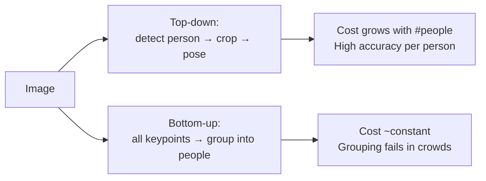
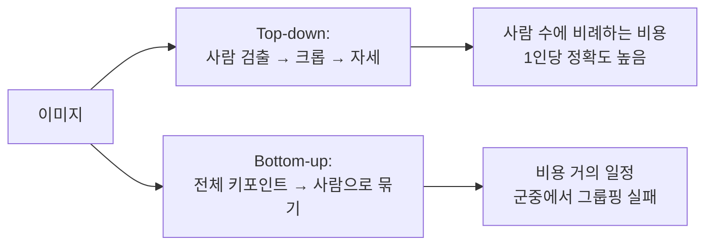

## English

*Group J. Stands on [[04-robotics/geometric-perception-calibration|3.5 Geometric Perception]], [[02-foundations/se3-geometry|SE(3)]] and [[04-robotics/video-action-understanding|20. Video]].
Intent is not observable and the body is, so every intent claim eventually rests on what this page can and cannot measure.*

A robot that must anticipate a person cannot observe intent. It observes a body. **Pose, hands, and gaze are the measurable channels through which intent leaks before action** — and each channel has a different resolution, a different failure mode, and a different range at which it stops existing.

> [!info] Depth target
> Know what 2D pose, 3D pose, parametric body models, hand pose, and gaze each output; interpret MPJPE and PCK as physical quantities; explain why head orientation is not gaze and why the substitution is usually unavoidable; and judge whether a cue claimed in a paper is observable in the deployment setting.

> [!note] Prerequisites
> [[02-foundations/se3-geometry|3D Geometry & SE(3)]] · [[04-robotics/geometric-perception-calibration|3.5 Geometric Perception & Calibration]] · [[04-robotics/video-action-understanding|20. Video Representation & Action Understanding]]

### 1. The representation ladder

| Representation | Output | Typical error | What it buys |
|---|---|---|---|
| 2D keypoints | $(u,v)$ per joint in image | pixels | cheap, robust, view-dependent |
| 3D keypoints | $(x,y,z)$ per joint, usually **root-relative** | MPJPE in mm | limb geometry, but often no absolute position |
| Parametric body (SMPL family) | shape $\beta$ + pose $\theta$ → full mesh | mm, plus shape error | surface, volume, contact, occlusion reasoning |
| Hand pose (MANO family) | ~21 keypoints or hand mesh | mm at small scale | grasp type, object interaction |
| Gaze | 3D gaze ray or 2D point of regard | degrees | attention, and therefore intent |

Going down the ladder buys information and costs robustness. The failure at deployment is almost always chosen at this step: a pipeline that needs hand pose at 15 m has already failed, because hands are a few pixels wide at that distance.

### 2. Top-down versus bottom-up

The choice is a runtime contract, not a quality ranking. Top-down cost is $O(N)$ in the number of people; bottom-up is roughly constant but must solve an association problem that degrades exactly where crowds make it hard. For a site with a handful of workers, top-down is usually right; for a crowded intersection, it is not.

### 3. Reading MPJPE honestly

Mean per-joint position error is reported in millimetres:

$$\text{MPJPE} = \frac{1}{J}\sum_{j=1}^{J}\big\lVert \hat{p}_j - p_j \big\rVert_2$$

Three qualifications change its meaning entirely:

- **Root-relative.** Most benchmarks align the pelvis to the origin first. The number therefore says nothing about *where the person is*, only about limb configuration. Absolute 3D localisation is a separate, harder problem.
- **PA-MPJPE.** Procrustes alignment additionally removes rotation and scale. A good PA-MPJPE with a poor MPJPE means the shape is right and the orientation is not — and orientation is what intent reading needs.
- **Monocular depth ambiguity.** From one camera, scale and depth are recoverable only through priors. A 40 mm MPJPE from a calibrated multi-camera rig and a 40 mm MPJPE from a phone are not the same result.

> [!example] Worked interpretation
> A paper reports PA-MPJPE $= 42$ mm. A shoulder-to-shoulder width is roughly 400 mm. The error is about 10% of torso width — enough to tell facing direction coarsely, not enough to distinguish a 10° torso rotation. If the intent cue you need *is* a 10° rotation, this model does not supply it, regardless of how good the number looks.

### 4. Gaze, and the substitution nobody flags

Gaze is the strongest single predictor of near-future action in humans, and the hardest to measure. Three regimes:

| Method | Requires | Accuracy | Range |
|---|---|---|---|
| Eye-tracker (worn) | instrumented subject | ~1° | any |
| Appearance-based gaze | eye region resolvable | ~3–6° | a few metres |
| **Head pose as gaze proxy** | face or head visible | coarse — see below | tens of metres |

At any realistic street or site distance, **only head pose survives.** Nearly every deployed "gaze-aware" system is in fact head-pose-aware, and almost none of them says so.

The approximation is defensible, and there is one number worth knowing: in seated four-person meetings, head orientation accounts for roughly **two-thirds** of gaze direction (68.9%), and attention estimation from head orientation alone reaches 88.7% (Stiefelhagen & Zhu 2002). The residual is what makes the map many-to-one, and it gets worse as candidate targets multiply (Ba & Odobez 2009).

> [!warning] Do not carry that number into a workspace
> Both results come from adults seated around a table with a small, fixed set of well-separated
> targets. A manipulation workspace is the opposite regime: targets are close, low, and densely
> packed, so the eye-in-head offset that head pose discards is exactly the part that discriminates
> between them. **No published study reports the angular error this substitution introduces at
> manipulation range.** That is a measurable gap, not a settled question — and the small, quick
> glance that precedes a decision is precisely what the substitution loses. At minimum, say which
> one you measured.

### 5. Motion cues below the pose layer

Not every useful human signal requires keypoints:

- **Velocity and deceleration** of the body centroid — a pedestrian slowing near a curb is a strong crossing cue and needs only a tracked box.
- **Body orientation** relative to path — cheaper and more robust than full pose.
- **Gait phase and stride change** — hesitation appears here before it appears in trajectory.
- **Proximity and clearance** to a boundary (curb, exclusion zone, machine envelope).

A recurring mistake is to reach for the most expressive representation when a coarser one is more robust and sufficient. Ablate downward, not only upward.

### 6. Occlusion, truncation, and the site case

Construction and street scenes violate the assumptions of most pose benchmarks:

- workers are truncated by equipment and each other;
- PPE (helmets, vests, harnesses) changes appearance statistics away from training data;
- posture distribution is unusual — crouching, overhead reaching, carrying;
- lighting and dust degrade the eye region first, which is exactly the gaze channel.

Report per-joint visibility and evaluate on occluded subsets separately, or the aggregate number will be dominated by easy frames.

### 7. Reading claims and evaluations

| Paper phrase | Check before accepting it |
|---|---|
| accurate 3D pose | root-relative or absolute; MPJPE or PA-MPJPE; single or multi-view |
| gaze estimation | eye-based or head-proxy; at what distance; angular error in degrees |
| real-time multi-person | top-down or bottom-up; how many people at the reported fps |
| robust to occlusion | is there an occluded-subset evaluation, or only an aggregate |
| in-the-wild | recording conditions; does the training distribution include PPE, crouching, night |
| intent-relevant cue | is the cue physically resolvable at the deployment distance |

### After reading

You should be able to:

- place a representation on the ladder and state what it costs in robustness;
- convert an MPJPE into a physical judgement about whether a cue is resolvable;
- explain root-relative versus absolute pose and why it matters for a robot;
- state the range at which each gaze method stops working;
- name three human motion cues that need no keypoints.

### Self-check

1. A system claims gaze-aware pedestrian prediction at 20 m from a vehicle camera. What is it almost certainly measuring?
2. Why can PA-MPJPE improve while the estimate becomes less useful for intent?
3. You need to detect a worker turning their torso toward a hazard. Which representation is the cheapest sufficient one?
4. Why does a bottom-up pose estimator degrade in exactly the scenario that motivates it?

> [!tip]- Answers
> 1. Head pose, not eye gaze — the eye region is not resolvable at that distance. 2. Procrustes alignment removes global rotation; orientation error is precisely the intent-relevant quantity, so the metric can improve while the useful signal is discarded. 3. Body orientation from a tracked box or coarse 2D keypoints; full 3D mesh is unnecessary. 4. Its constant cost is attractive for crowds, but crowding is what makes keypoint-to-person grouping ambiguous.

### Sources

**Pose — verified citations**

- Z. Cao, T. Simon, S.-E. Wei, and Y. Sheikh, "Realtime Multi-Person 2D Pose Estimation using Part Affinity Fields," *CVPR 2017* (Oral). [arXiv:1611.08050](https://arxiv.org/abs/1611.08050) — introduces part affinity fields and the greedy bottom-up parse; won the inaugural COCO 2016 keypoint challenge.
- Z. Cao, G. Hidalgo, T. Simon, S.-E. Wei, and Y. Sheikh, "OpenPose: Realtime Multi-Person 2D Pose Estimation Using Part Affinity Fields," *IEEE TPAMI*, vol. 43, no. 1, pp. 172–186, 2021. [arXiv:1812.08008](https://arxiv.org/abs/1812.08008) — five authors, not four; refines only the PAFs, adds the combined body+foot detector, and is the paper that names and releases the system. Cite CVPR 2017 for the method, TPAMI for OpenPose the system.
- K. Sun, B. Xiao, D. Liu, and J. Wang, "Deep High-Resolution Representation Learning for Human Pose Estimation," *CVPR 2019*. [arXiv:1902.09212](https://arxiv.org/abs/1902.09212) — parallel multi-resolution subnetworks with repeated fusion instead of encode-low-then-recover. The general-backbone HRNet is a separate *TPAMI 2021* article; do not conflate them.

**Body, hand, and face models**

- M. Loper, N. Mahmood, J. Romero, G. Pons-Moll, and M. J. Black, "SMPL: A Skinned Multi-Person Linear Model," *ACM Transactions on Graphics*, vol. 34, no. 6, art. 248, 2015 (SIGGRAPH Asia). [Project page](https://smpl.is.tue.mpg.de/) — identity blend shapes plus *pose-dependent* blend shapes correcting linear blend skinning. Journal only; there is no arXiv preprint.
- J. Romero, D. Tzionas, and M. J. Black, "Embodied Hands: Modeling and Capturing Hands and Bodies Together," *ACM TOG*, vol. 36, no. 6, 2017 (SIGGRAPH Asia). [Project page](https://mano.is.tue.mpg.de/) — MANO is a *hand* model learned from roughly 1,000 high-resolution scans of 31 subjects. Attaching it to SMPL gives SMPL+H: body and hands, no face.
- G. Pavlakos, V. Choutas, N. Ghorbani, et al., "Expressive Body Capture: 3D Hands, Face, and Body from a Single Image," *CVPR 2019*. [arXiv:1904.05866](https://arxiv.org/abs/1904.05866) — SMPL-X unifies SMPL, MANO, and FLAME in one parameterisation and adds the SMPLify-X monocular fit. MANO and SMPL-X are different kinds of object; the common shorthand "MANO / SMPL-X" hides that.

**Gaze, and the head-pose substitution**

- P. Kellnhofer, A. Recasens, S. Stent, W. Matusik, and A. Torralba, "Gaze360: Physically Unconstrained Gaze Estimation in the Wild," *ICCV 2019*. [Project page](http://gaze360.csail.mit.edu/) — 238 subjects indoors and out, and a temporal model that emits gaze *with uncertainty*.
- R. Stiefelhagen and J. Zhu, "Head Orientation and Gaze Direction in Meetings," *CHI 2002 Extended Abstracts*, doi:10.1145/506443.506634 — head orientation contributes about 68.9% of gaze direction on average, and attention estimation from head orientation alone reaches 88.7% in a four-person round-table meeting.
- S. O. Ba and J.-M. Odobez, "Recognizing Visual Focus of Attention From Head Pose in Natural Meetings," *IEEE Trans. SMC — Part B*, vol. 39, no. 1, 2009 — the head-pose-to-attention map is many-to-one, and degrades as the number of candidate targets grows.

> [!warning] There is no canonical citation for the substitution
> Robotics papers substitute head pose for gaze constantly and cite nobody. The two references
> above are the closest defensible anchors, and both are seated adults at a table with a small,
> fixed set of targets — not a manipulation workspace, where targets are close, low, and densely
> packed, and the eye-in-head offset dominates. No study reports the angular error introduced by
> that substitution in a robot workspace. Write it as: head orientation accounts for roughly
> two-thirds of gaze direction in seated multi-party settings (Stiefelhagen & Zhu 2002), with the
> residual creating a many-to-one ambiguity (Ba & Odobez 2009), and no equivalent measurement
> exists for close-range manipulation. That absence is a gap you could measure.

## 한국어

*J군이다. [[04-robotics/geometric-perception-calibration|3.5 기하 인식]]·[[02-foundations/se3-geometry|SE(3)]]·[[04-robotics/video-action-understanding|20. 비디오]] 위에 선다.
의도는 관측할 수 없고 몸은 관측할 수 있으므로, 모든 의도 주장이 결국 이 페이지가 잴 수 있는 것과 없는 것 위에 얹힌다.*

사람을 예측해야 하는 로봇은 의도를 관측할 수 없다. 관측하는 건 몸이다. **자세·손·시선은 행동보다 먼저 의도가 새어 나오는 측정 가능한 채널**이고, 각 채널은 해상도도, 실패 방식도, 그리고 그것이 존재하기를 멈추는 거리도 다르다.

> [!info] 깊이 목표
> 2D 자세·3D 자세·파라메트릭 신체 모델·손 자세·시선이 각각 무엇을 출력하는지 안다;
> MPJPE와 PCK를 물리량으로 해석한다; 머리 방향이 시선이 아닌 이유와 그 대체가 대개
> 불가피한 이유를 설명한다; 논문이 주장한 단서가 배포 환경에서 관측 가능한지 판단한다.

> [!note] 선수 지식
> [[02-foundations/se3-geometry|3D 기하와 SE(3)]] · [[04-robotics/geometric-perception-calibration|3.5 Geometric Perception & Calibration]] · [[04-robotics/video-action-understanding|20. 비디오 표현과 행동 이해]]

### 1. 표현의 사다리

| 표현 | 출력 | 통상 오차 | 얻는 것 |
|---|---|---|---|
| 2D 키포인트 | 관절별 이미지 좌표 $(u,v)$ | 픽셀 | 싸고 강건, 시점 의존 |
| 3D 키포인트 | 관절별 $(x,y,z)$, 보통 **루트 상대** | MPJPE (mm) | 사지 기하, 다만 절대 위치는 없음 |
| 파라메트릭 신체 (SMPL 계열) | 형상 $\beta$ + 자세 $\theta$ → 메시 | mm + 형상 오차 | 표면·부피·접촉·가림 추론 |
| 손 자세 (MANO 계열) | 약 21 키포인트 또는 손 메시 | 작은 스케일의 mm | 파지 유형, 물체 상호작용 |
| 시선 | 3D 시선 광선 또는 응시점 | 도(degree) | 주의, 따라서 의도 |

사다리를 내려갈수록 정보를 얻고 강건성을 잃는다. 배포에서의 실패는 거의 항상 이 단계에서 결정된다 — 15 m에서 손 자세가 필요한 파이프라인은 이미 실패했다. 그 거리에서 손은 몇 픽셀이다.

### 2. Top-down vs bottom-up

이 선택은 품질 순위가 아니라 **런타임 계약**이다. Top-down 비용은 사람 수에 $O(N)$이고, bottom-up은 대체로 일정하지만 군중일수록 어려워지는 결합 문제를 풀어야 한다. 작업자 몇 명인 현장이면 보통 top-down이 맞고, 혼잡한 교차로면 아니다.

### 3. MPJPE를 정직하게 읽기

Mean per-joint position error는 mm로 보고된다:

$$\text{MPJPE} = \frac{1}{J}\sum_{j=1}^{J}\big\lVert \hat{p}_j - p_j \big\rVert_2$$

의미를 통째로 바꾸는 단서가 셋 있다:

- **루트 상대.** 대부분의 벤치마크가 골반을 원점에 먼저 정렬한다. 그래서 이 숫자는 *사람이 어디 있는지*에 대해 아무 말도 안 하고 사지 배치만 말한다. 절대 3D 위치추정은 별개의 더 어려운 문제다.
- **PA-MPJPE.** Procrustes 정렬은 회전과 스케일까지 제거한다. PA-MPJPE는 좋은데 MPJPE가 나쁘면 형상은 맞고 방향이 틀린 것이고, **의도 판독이 필요로 하는 건 방향이다.**
- **단안 깊이 모호성.** 카메라 하나에서 스케일과 깊이는 사전지식으로만 복원된다. 교정된 다중 카메라의 40 mm와 휴대폰의 40 mm는 같은 결과가 아니다.

> [!example] 해석 예제
> 어떤 논문이 PA-MPJPE $= 42$ mm를 보고했다. 어깨 너비는 대략 400 mm다. 오차가 몸통 너비의 약 10% — 향하는 방향을 거칠게 아는 데는 충분하고, 몸통 10° 회전을 구분하기엔 부족하다. 네가 필요한 의도 단서가 *바로 그 10° 회전*이면, 숫자가 아무리 좋아 보여도 이 모델은 그걸 주지 못한다.

### 4. 시선, 그리고 아무도 밝히지 않는 대체

시선은 사람의 근미래 행동에 대한 가장 강한 단일 예측자이자 측정이 가장 어려운 것이다. 세 가지 영역:

| 방법 | 필요 조건 | 정확도 | 범위 |
|---|---|---|---|
| 착용형 아이트래커 | 피험자 계측 | 약 1° | 무관 |
| 외형 기반 시선 추정 | 눈 영역이 분해 가능 | 약 3–6° | 수 미터 |
| **머리 자세를 시선 대용으로** | 얼굴·머리가 보임 | 거칠다 — 아래 참조 | 수십 미터 |

현실적인 도로·현장 거리에서는 **머리 자세만 살아남는다.** 배포된 거의 모든 "시선 인지" 시스템은 실제로는 머리 자세 인지이고, 그렇다고 밝히는 경우는 거의 없다.

이 근사는 방어 가능하고, 알아둘 만한 숫자가 하나 있다. 앉은 4인 회의에서 머리 방향이 시선 방향의 약 **2/3**(68.9%)를 설명하고, 머리 방향만으로 주의 대상을 추정해도 88.7%에 이른다(Stiefelhagen & Zhu 2002). 나머지가 이 사상을 다대일로 만들고, 후보 대상이 늘어날수록 나빠진다(Ba & Odobez 2009).

> [!warning] 그 숫자를 작업공간으로 옮기지 마라
> 두 결과 모두 탁자에 앉은 성인과, 서로 충분히 떨어진 소수의 고정 대상이라는 조건에서 나왔다.
> 조작 작업공간은 정반대다. 대상이 가깝고 낮고 빽빽해서, 머리 자세가 버리는 eye-in-head
> 오프셋이 바로 그것들을 구분해주는 성분이다. **조작 거리에서 이 대체가 만드는 각도 오차를
> 보고한 연구는 없다.** 정해진 답이 아니라 측정 가능한 빈틈이다 — 그리고 결정 직전에 나타나는
> 짧고 빠른 곁눈질이 정확히 이 대체가 잃는 것이다. 최소한 무엇을 측정했는지는 밝혀라.

### 5. 자세 계층 아래의 움직임 단서

유용한 사람 신호가 전부 키포인트를 요구하진 않는다:

- **몸 중심의 속도와 감속** — 연석 근처에서 느려지는 보행자는 강한 횡단 단서이고, 추적 박스만 있으면 된다.
- **진행 경로 대비 몸 방향** — 전체 자세보다 싸고 강건하다.
- **보행 위상과 보폭 변화** — 망설임은 궤적보다 여기서 먼저 나타난다.
- **경계(연석, 통제구역, 기계 작업반경)와의 근접·여유**.

반복되는 실수는 더 거친 표현이 더 강건하고 충분한데도 가장 표현력 높은 표현을 집어드는 것이다. **위로만 말고 아래로도 ablate 하라.**

### 6. 가림, 절단, 그리고 현장 사례

건설과 도로 장면은 대부분의 자세 벤치마크 가정을 위반한다:

- 작업자가 장비와 서로에 의해 잘린다;
- PPE(헬멧·조끼·안전대)가 외형 통계를 학습 데이터에서 멀어지게 한다;
- 자세 분포가 특이하다 — 쪼그림, 머리 위 작업, 운반;
- 조명과 먼지가 **눈 영역부터** 망가뜨리는데, 그게 정확히 시선 채널이다.

관절별 가시성을 보고하고 가림 부분집합을 따로 평가하라. 아니면 집계 숫자가 쉬운 프레임에 지배된다.

### 7. 주장과 평가 읽기

| 논문 문구 | 받아들이기 전에 확인할 것 |
|---|---|
| 정확한 3D 자세 | 루트 상대인가 절대인가; MPJPE인가 PA-MPJPE인가; 단일 뷰인가 다중 뷰인가 |
| 시선 추정 | 눈 기반인가 머리 대용인가; 몇 미터에서; 각도 오차 몇 도 |
| 실시간 다인 | top-down인가 bottom-up인가; 보고된 fps에서 몇 명인가 |
| 가림에 강건 | 가림 부분집합 평가가 있는가, 집계뿐인가 |
| in-the-wild | 촬영 조건; 학습 분포에 PPE·쪼그림·야간이 있는가 |
| 의도 관련 단서 | 그 단서가 배포 거리에서 물리적으로 분해 가능한가 |

### 읽은 뒤

다음을 할 수 있어야 한다:

- 표현을 사다리 위에 놓고 강건성 비용을 말한다;
- MPJPE를 "그 단서가 분해 가능한가"라는 물리적 판단으로 환산한다;
- 루트 상대 자세와 절대 자세를 구분하고 로봇에 왜 중요한지 설명한다;
- 각 시선 방법이 작동을 멈추는 거리를 말한다;
- 키포인트가 필요 없는 사람 움직임 단서 셋을 든다.

### 자가 점검

1. 차량 카메라로 20 m에서 시선 인지 보행자 예측을 한다고 주장한다. 실제로 측정하는 건 거의 확실히 무엇인가?
2. PA-MPJPE가 개선되는데 의도 판독에는 덜 유용해질 수 있는 이유는?
3. 작업자가 위험원 쪽으로 몸통을 트는 걸 감지해야 한다. 가장 싼 충분 표현은?
4. Bottom-up 자세 추정기가 자기를 정당화하는 바로 그 상황에서 나빠지는 이유는?

> [!tip]- 정답
> 1. 눈 시선이 아니라 머리 자세 — 그 거리에서 눈 영역은 분해되지 않는다. 2. Procrustes 정렬이 전역 회전을 제거하는데, 방향 오차가 바로 의도 관련 양이므로 지표는 좋아지면서 유용한 신호는 버려진다. 3. 추적 박스나 거친 2D 키포인트에서 얻은 몸 방향; 3D 메시는 불필요하다. 4. 일정한 비용이 군중에 매력적이지만, 군중이야말로 키포인트–사람 그룹핑을 모호하게 만드는 조건이다.

### 출처

**자세 — 검증된 인용**

- Z. Cao, T. Simon, S.-E. Wei, and Y. Sheikh, "Realtime Multi-Person 2D Pose Estimation using Part Affinity Fields," *CVPR 2017* (Oral). [arXiv:1611.08050](https://arxiv.org/abs/1611.08050) — part affinity field와 상향식 greedy 파싱을 도입했고, 첫 COCO 2016 키포인트 챌린지에서 우승했다.
- Z. Cao, G. Hidalgo, T. Simon, S.-E. Wei, and Y. Sheikh, "OpenPose: Realtime Multi-Person 2D Pose Estimation Using Part Affinity Fields," *IEEE TPAMI*, vol. 43, no. 1, pp. 172–186, 2021. [arXiv:1812.08008](https://arxiv.org/abs/1812.08008) — 저자가 네 명이 아니라 다섯 명이다. PAF만 정제하고, 몸+발 통합 검출기를 더했으며, 시스템에 OpenPose라는 이름을 붙여 공개한 논문이다. 방법은 CVPR 2017, 시스템은 TPAMI를 인용하라.
- K. Sun, B. Xiao, D. Liu, and J. Wang, "Deep High-Resolution Representation Learning for Human Pose Estimation," *CVPR 2019*. [arXiv:1902.09212](https://arxiv.org/abs/1902.09212) — 저해상도로 내렸다 복원하는 대신, 병렬 다해상도 서브네트워크를 반복 융합한다. 범용 백본으로서의 HRNet은 별개의 *TPAMI 2021* 논문이다. 섞지 마라.

**몸·손·얼굴 모델**

- M. Loper, N. Mahmood, J. Romero, G. Pons-Moll, and M. J. Black, "SMPL: A Skinned Multi-Person Linear Model," *ACM Transactions on Graphics*, vol. 34, no. 6, art. 248, 2015 (SIGGRAPH Asia). [프로젝트 페이지](https://smpl.is.tue.mpg.de/) — 정체성 blend shape에 더해, 선형 블렌드 스키닝을 보정하는 *자세 의존* blend shape가 핵심이다. 저널 전용이고 arXiv 프리프린트가 없다.
- J. Romero, D. Tzionas, and M. J. Black, "Embodied Hands: Modeling and Capturing Hands and Bodies Together," *ACM TOG*, vol. 36, no. 6, 2017 (SIGGRAPH Asia). [프로젝트 페이지](https://mano.is.tue.mpg.de/) — MANO는 31명의 고해상도 스캔 약 1,000개로 학습한 *손* 모델이다. SMPL에 붙이면 SMPL+H(몸+손, 얼굴 없음)가 된다.
- G. Pavlakos, V. Choutas, N. Ghorbani, et al., "Expressive Body Capture: 3D Hands, Face, and Body from a Single Image," *CVPR 2019*. [arXiv:1904.05866](https://arxiv.org/abs/1904.05866) — SMPL-X는 SMPL·MANO·FLAME을 하나의 파라미터화로 통합하고 단안 피팅 SMPLify-X를 더한다. MANO와 SMPL-X는 종류가 다른 대상이다. 흔한 "MANO / SMPL-X" 표기는 그 차이를 가린다.

**시선, 그리고 머리 자세 대체**

- P. Kellnhofer, A. Recasens, S. Stent, W. Matusik, and A. Torralba, "Gaze360: Physically Unconstrained Gaze Estimation in the Wild," *ICCV 2019*. [프로젝트 페이지](http://gaze360.csail.mit.edu/) — 실내외 238명, 그리고 *불확실성과 함께* 시선을 내놓는 시계열 모델.
- R. Stiefelhagen and J. Zhu, "Head Orientation and Gaze Direction in Meetings," *CHI 2002 Extended Abstracts*, doi:10.1145/506443.506634 — 머리 방향이 시선 방향의 평균 약 68.9%를 설명하고, 4인 원탁 회의에서 머리 방향만으로 주의 대상 추정이 88.7%에 이른다.
- S. O. Ba and J.-M. Odobez, "Recognizing Visual Focus of Attention From Head Pose in Natural Meetings," *IEEE Trans. SMC — Part B*, vol. 39, no. 1, 2009 — 머리 자세에서 주의 대상으로의 사상은 다대일이고, 후보 대상이 많아질수록 나빠진다.

> [!warning] 이 대체에는 정본 인용이 없다
> 로보틱스 논문들은 시선 대신 머리 자세를 끊임없이 쓰면서 아무도 인용하지 않는다. 위 두
> 편이 그나마 방어 가능한 근거인데, 둘 다 탁자에 앉은 성인과 소수의 고정된 대상이라는
> 조건이다 — 대상이 가깝고 낮고 빽빽하며 eye-in-head 오프셋이 지배적인 조작 작업공간이
> 아니다. 로봇 작업공간에서 그 대체가 만드는 각도 오차를 보고한 연구는 없다. 이렇게 써라:
> 앉은 다자 상황에서 머리 방향이 시선의 약 2/3를 설명하고(Stiefelhagen & Zhu 2002),
> 나머지가 다대일 모호성을 만들며(Ba & Odobez 2009), 근거리 조작에 대한 동등한 측정은
> 존재하지 않는다. 그 부재가 당신이 측정할 수 있는 빈틈이다.
