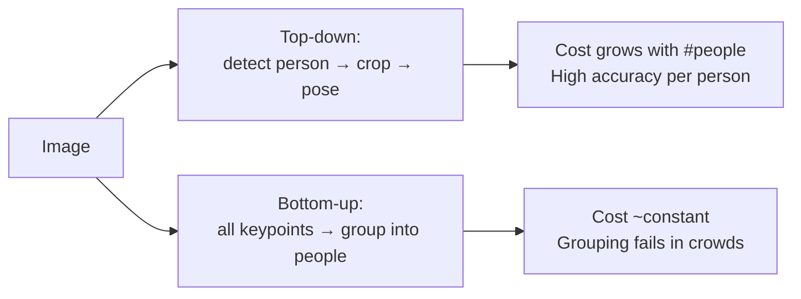
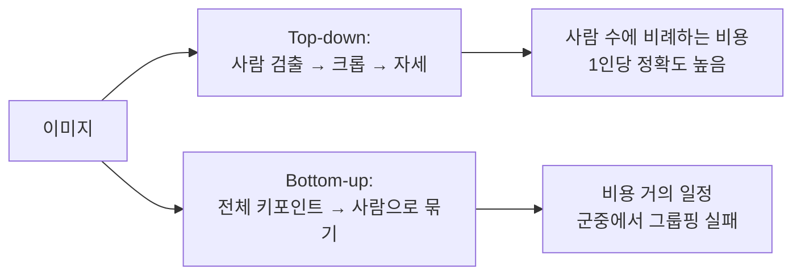

## English

*Group J. Stands on [[04-robotics/geometric-perception-calibration|3.5 Geometric Perception]], [[02-foundations/se3-geometry|SE(3)]] and [[04-robotics/video-action-understanding|20. Video]].
Intent is not observable and the body is, so every intent claim eventually rests on what this page can and cannot measure.*

A robot that must anticipate a person cannot observe intent. It observes a body. **Pose, hands, and gaze are the measurable channels through which intent leaks before action** — and each channel has a different resolution, a different failure mode, and a different range at which it stops existing.

> [!info] Depth target
> Know what 2D pose, 3D pose, parametric body models, hand pose, and gaze each output; interpret MPJPE and PCK as physical quantities; explain why head orientation is not gaze and why the substitution is usually unavoidable; and judge whether a cue claimed in a paper is observable in the deployment setting.

> [!note] Prerequisites
> [[02-foundations/se3-geometry|3D Geometry & SE(3)]] · [[04-robotics/geometric-perception-calibration|3.5 Geometric Perception & Calibration]] · [[04-robotics/video-action-understanding|20. Video Representation & Action Understanding]]

> [!note] First pass · 처음이라면
> Read the running object and the six derivations on it, then §1 — the representation ladder tells you what any given paper is even outputting — then §3 on reading MPJPE as a physical quantity, then §4, the substitution nobody states. §2 and §5 are for comparing methods.

### Running object · 이 페이지의 대상

Pose and gaze are perception, so no plant from [[02-foundations/lab-plants|0.6 Lab Plants]] fits. This page freezes its own object instead and never changes its numbers afterwards.

**K5 — a five-keypoint 3-D skeleton.** Head, both shoulders, both hips, in metres, **root-relative**: the hip midpoint is the origin, $\hat{z}$ points up along gravity, and the table is the ground truth $p_j$.

| joint $j$ | $x$ (m) | $y$ (m) | $z$ (m) |
|---|---:|---:|---:|
| 1 head | 0.00 | 0.00 | 0.75 |
| 2 left shoulder | −0.12 | 0.16 | 0.50 |
| 3 right shoulder | 0.12 | −0.16 | 0.50 |
| 4 left hip | −0.09 | 0.12 | 0.00 |
| 5 right hip | 0.09 | −0.12 | 0.00 |

Three lengths follow, and they are all the geometry the derivations need: shoulder width $\lVert p_2 - p_3\rVert = 0.40$ m, hip width $\lVert p_4 - p_5\rVert = 0.30$ m, and the horizontal radius of each joint about the vertical axis through the root — $r_{\mathrm{sh}} = 0.20$ m per shoulder, $r_{\mathrm{hip}} = 0.15$ m per hip, and $r = 0$ for the head, which sits on that axis.

**Two predictions $\hat{p}_j$ of the same skeleton.**

- $\hat{A}$ is K5 rotated by $\delta = 15^\circ$ about the vertical axis through the root. Every limb length is exactly right and the whole body is turned.
- $\hat{B}$ is K5 plus this frozen per-joint offset.

| joint | $\Delta x$ (m) | $\Delta y$ (m) | $\Delta z$ (m) | $\lVert \Delta_j \rVert$ (mm) |
|---|---:|---:|---:|---:|
| head | 0.03 | 0.04 | 0.00 | 50 |
| left shoulder | 0.00 | 0.03 | 0.04 | 50 |
| right shoulder | 0.00 | −0.03 | −0.04 | 50 |
| left hip | 0.02 | −0.02 | 0.01 | 30 |
| right hip | −0.01 | 0.02 | 0.02 | 30 |

**C20 — the camera that has to see this person.** A distortion-free pinhole, $1920 \times 1080$ px, focal length $f = 2000$ px on both axes, with the person standing at $D = 20$ m on the optical axis. Two body sizes are frozen with it: head breadth $d_{\mathrm{head}} = 0.16$ m and visible iris diameter $d_{\mathrm{iris}} = 0.012$ m.

The object is built so that $\hat{A}$ and $\hat{B}$ swap places depending on which number you read, and §3 and §4 are what that swap is for.

### Homework diagram · 과제가 그릴 그림

Draw this once. The problem set asks for the same drawing with a different yaw and a different camera.

1. **The skeleton from above.** Project K5 onto the horizontal plane. Mark the root at the origin, the shoulder line $p_2 - p_3$, the hip line $p_4 - p_5$, and the two circles of radius $r_{\mathrm{sh}} = 0.20$ m and $r_{\mathrm{hip}} = 0.15$ m that each joint rides when the body yaws. Put the head on the centre.
2. **The facing arrow.** From the root draw $u = (p_2 - p_3) \times \hat{z}$ and label its azimuth. Draw the shoulder-line azimuth as a second arrow, so the $90^\circ$ between them is on the page.
3. **Both predictions on those axes.** $\hat{A}$ as the same figure turned by $15^\circ$, with the chord each joint travels marked; $\hat{B}$ as five short error arrows with their lengths in millimetres beside them.
4. **The camera cone.** To one side, C20 at $D = 20$ m, one pixel's angle $1/f$ opening from the pinhole, and the two subtenses $d_{\mathrm{head}}/D$ and $d_{\mathrm{iris}}/D$ drawn to scale inside it. Write how many pixels wide each one is.

A correct drawing has already answered §4: the head spans several pixels and the iris does not fill one.

### Worked on K5 · K5로 한 번 끝까지

**1. The torso facing angle, which is the quantity intent needs.**

> [!info] Definition — torso facing angle $\psi$
> An **angle in the horizontal plane** (an azimuth in degrees), not a 3-D orientation and not a
> rotation matrix. Three conditions define it: the two shoulder keypoints must be **labelled
> left and right**; an **up axis** $\hat{z}$ must be fixed, by gravity or by the room frame; and
> forward is the **horizontal normal of the shoulder line**, oriented by the right-hand rule so
> that it leaves the chest rather than the back:
> $$u = \big(p_{\mathrm{L\,sh}} - p_{\mathrm{R\,sh}}\big) \times \hat{z}, \qquad \psi = \operatorname{atan2}\!\big(u_y,\, u_x\big)$$
> where $u$ is the (unnormalised) forward vector, $p_{\mathrm{L\,sh}}$ and $p_{\mathrm{R\,sh}}$ are
> the left and right shoulder keypoints, $\hat{z} = (0,0,1)$ is the vertical, $\times$ is the cross
> product, and $\operatorname{atan2}$
> returns the azimuth in $(-180^\circ, 180^\circ]$. The cross product with $\hat{z}$ drops the
> vertical component of the shoulder vector, so a shoulder error that is purely up or down costs
> no facing at all.
> **Example, on K5.** $p_2 - p_3 = (-0.24,\ 0.32,\ 0)$, so $u = (0.32,\ 0.24,\ 0)$, which
> normalises to $(0.8,\ 0.6,\ 0)$ and gives $\psi = \operatorname{atan2}(0.6, 0.8) = 36.87^\circ$.
> **Non-example.** The azimuth of the shoulder line itself is
> $\operatorname{atan2}(0.32, -0.24) = 126.87^\circ$; it is not the facing, and it is $90^\circ$
> away by construction. A second non-example is the *unlabelled* shoulder line: swapping the two
> shoulders gives $-u$ and an azimuth of $-143.13^\circ$, exactly backwards, which is how a 2-D
> detector that loses left from right under a back view reports a worker walking away as walking
> toward you.
> **Why it matters.** This single number is what "is the worker turning toward the saw" means,
> and it is the number the metric in step 3 deletes.

**2. MPJPE on both predictions.**

> [!info] Definition — MPJPE
> A **scalar error statistic** with units of length, reported in millimetres: the mean over joints
> of the per-joint Euclidean distance. Three conditions: the prediction and the ground truth must
> use the **same $J$ joints in the same order**; both must be in the **same frame**, which in
> benchmarks means the root has been translated to the origin in each; and **nothing else is
> removed** — no rotation, no scale.
> $$\mathrm{MPJPE} = \frac{1}{J}\sum_{j=1}^{J}\big\lVert \hat{p}_j - p_j \big\rVert_2$$
> where $J$ is the number of joints, $p_j$ is the ground-truth position of joint $j$, $\hat p_j$
> the predicted one, and $\lVert\cdot\rVert_2$ the Euclidean norm.
> **Example.** $\hat{B}$ below: $42.0$ mm.
> **Non-example.** The root-mean-square of the same five errors is
> $\sqrt{(50^2+50^2+50^2+30^2+30^2)/5} = 43.1$ mm, not $42.0$ — MPJPE is a mean of norms, not a
> norm of the stacked error, and the two diverge exactly when one joint is much worse than the
> rest. Nor is it the distance between the two skeletons' centroids, which is $12.8$ mm here and
> would be zero for any prediction that is merely rotated.
> **Why it matters.** It is the number in every 3-D pose table you will read, so every claim in
> that literature is quoted against it.

For $\hat{A}$ the derivation is one line of geometry rather than five subtractions. A yaw of $\delta$ about the vertical axis moves each joint along a circle of radius $r_j$, and the straight-line distance between start and end is the chord of that arc, so

$$\big\lVert \hat{p}_j - p_j \big\rVert = 2\,r_j \sin\!\big(\delta/2\big)$$

with $r_j$ the joint's horizontal distance from the axis and $\delta$ the yaw. Substituting $\delta = 15^\circ$, so $\sin(7.5^\circ) = 0.130526$:

- head, $r = 0$: $\ 0$ mm — a joint on the axis cannot register a yaw at all;
- each shoulder, $r = 0.200$: $\ 2 \times 0.200 \times 0.130526 = 0.05221$ m $= 52.21$ mm;
- each hip, $r = 0.150$: $\ 2 \times 0.150 \times 0.130526 = 0.03916$ m $= 39.16$ mm.

$$\mathrm{MPJPE}(\hat{A}) = \frac{0 + 52.21 + 52.21 + 39.16 + 39.16}{5} = \frac{182.74}{5} = 36.55\ \mathrm{mm}$$

For $\hat{B}$ the per-joint norms are already in the offset table, so the mean is immediate:

$$\mathrm{MPJPE}(\hat{B}) = \frac{50 + 50 + 50 + 30 + 30}{5} = \frac{210}{5} = 42.0\ \mathrm{mm}$$

**$\hat{A}$ wins by $5.5$ mm.** Hold on to that until step 4.

**3. PA-MPJPE, and what it throws away.**

> [!info] Definition — PA-MPJPE
> The **same statistic as MPJPE, computed after a similarity alignment** of the prediction onto
> the ground truth — "PA" is Procrustes analysis. Four conditions: the alignment is fitted
> **per sample**, not once for the dataset; it is the **optimal** rotation $R$, uniform scale
> $s > 0$ and translation $t$ in the least-squares sense; **reflections are excluded**
> ($\det R = +1$), or a mirrored skeleton would score well; and the fit is applied to the
> prediction, with the ground truth as the target.
> $$\mathrm{PA\text{-}MPJPE} = \frac{1}{J}\sum_{j=1}^{J}\big\lVert s^{\ast}R^{\ast}\hat{p}_j + t^{\ast} - p_j \big\rVert_2, \quad (s^\ast, R^\ast, t^\ast) = \arg\min_{s,R,t} \sum_{j}\big\lVert sR\hat{p}_j + t - p_j\big\rVert_2^2$$
> where $R$ is a rotation, $s$ a single scalar scale shared by all joints, $t$ a translation, and
> the starred quantities are the minimisers.
> **Example.** $\hat{A}$ scores **exactly $0$**, because $\hat{A} = R_{15^\circ}\,$K5 *is* a
> similarity transform of the truth, so the fit recovers $R^\ast = R_{15^\circ}^{-1}$, $s^\ast = 1$,
> $t^\ast = 0$ and every residual vanishes.
> **Non-example.** PA-MPJPE is not "MPJPE after subtracting the root" — that is plain
> root-relative MPJPE, which every benchmark already reports and which gives $36.55$ mm here. The
> difference between $36.55$ and $0$ is precisely the rotation, and the rotation is the facing.
> **Why it matters.** It isolates articulated shape from placement. For a paper about hand shape
> that is the right isolation. For a robot that has to know which way a worker is turned, it is
> the deletion of the answer.

$\hat{B}$ is not a similarity transform of K5, so its Procrustes fit is a genuine least-squares problem and the one step on this page that wants a solver rather than a pencil: it returns $s^\ast = 1.0008$ and leaves $\mathrm{PA\text{-}MPJPE}(\hat{B}) = 37.0$ mm.

**4. The facing error, and the reversal.** Apply step 1 to each prediction. $\hat{A}$ is a rigid yaw, so its facing is the truth plus the yaw: $36.87^\circ + 15^\circ = 51.87^\circ$, an error of $+15.0^\circ$. For $\hat{B}$, the predicted shoulder vector is $\hat{p}_2 - \hat{p}_3 = (-0.24,\ 0.38,\ 0.08)$; crossing with $\hat{z}$ gives $u_{\hat B} = (0.38,\ 0.24,\ 0)$ and $\psi_{\hat B} = \operatorname{atan2}(0.24, 0.38) = 32.28^\circ$, an error of $-4.59^\circ$.

| | MPJPE | PA-MPJPE | facing error |
|---|---:|---:|---:|
| $\hat{A}$ — turned, otherwise perfect | **36.5 mm** | **0.0 mm** | $+15.0^\circ$ |
| $\hat{B}$ — noisy, correctly turned | 42.0 mm | 37.0 mm | $\mathbf{-4.6^\circ}$ |

$\hat{A}$ wins both published metrics, one of them by the largest margin a metric can have, and is wrong about the only quantity a robot would act on by more than three times as much as $\hat{B}$. This is not a pathology invented for the page: a yaw is what a monocular network gets wrong when depth is ambiguous, and Procrustes alignment is the standard reporting convention that removes it.

**5. The eye at 20 m, which is where the gaze claim dies.**

> [!info] Definition — angular size and pixel angle
> **Angular size** $\theta$ is the **plane angle a feature subtends at the camera's projection
> centre**; **pixel angle** (also instantaneous field of view) is the angle one pixel subtends,
> and both are angles, not lengths. Conditions: a pinhole model with focal length $f$ **expressed
> in pixels**, the feature **perpendicular to the optical axis**, and the reading taken **on
> axis**, where one pixel subtends $1/f$ radians.
> $$\theta = 2\arctan\!\frac{d}{2D} \approx \frac{d}{D}, \qquad n_{\mathrm{px}} = \frac{\theta}{1/f} \approx \frac{f\,d}{D}$$
> where $d$ is the feature's physical size, $D$ its distance, $f$ the focal length in pixels and
> $n_{\mathrm{px}}$ its width in pixels. The approximations are the small-angle ones and are
> exact to six digits at everything on this page.
> **Example.** The iris on C20: $\theta = 0.012/20 = 6.00\times10^{-4}$ rad $= 0.0344^\circ$,
> against a pixel angle of $1/2000 = 5.00 \times 10^{-4}$ rad $= 0.0286^\circ$.
> **Non-example.** The **frame-average** pixel angle, field of view divided by width, is not the
> on-axis pixel angle: a rectilinear lens stretches angle toward the frame edge, so the average
> understates the centre pixel. On C20 the horizontal field of view is
> $2\arctan(960/2000) = 51.28^\circ$ and the average $51.28/1920 = 0.0267^\circ$ per pixel, about
> 7% finer than the $0.0286^\circ$ the centre actually delivers. Use $f$, not the field of view,
> whenever the answer is a few pixels wide.
> **Why it matters.** It decides whether a cue physically exists before any model is trained, and
> it is arithmetic, not an experiment.

Now put the numbers in. On C20 the widths follow directly from $n_{\mathrm{px}} = f d / D$:

$$n_{\mathrm{head}} = \frac{2000 \times 0.16}{20} = 16.0\ \mathrm{px}, \qquad n_{\mathrm{iris}} = \frac{2000 \times 0.012}{20} = 1.2\ \mathrm{px}$$

so the whole head is sixteen pixels across and the iris — the feature an appearance-based gaze estimator has to localise a centre inside — covers **one pixel and a fifth**. The ratio is $0.16/0.012 = 13.3$, fixed by anatomy and independent of the camera: no focal length changes it.

Invert the same formula for the range at which the iris reaches a stated width, since $D = f\,d/n_{\mathrm{px}}$:

| iris width wanted | range on C20 |
|---|---:|
| 4 px | $2000 \times 0.012 / 4 = 6.0$ m |
| 2 px | $12.0$ m |
| 1 px | $24.0$ m |

Six metres. Past that C20 has under four pixels on an iris, and §4's table stops being a menu. To hold 4 px at 20 m you would need $f = 4 \times 20 / 0.012 = 6667$ px, which on the same 1920-pixel sensor is a $16.4^\circ$ field of view — you would have traded the entire scene for one face, and still be reading a four-pixel iris.

**6. What the substitution has to discriminate, as an angle.** The page's honest claim in §4 is that nobody has measured the error head pose introduces at manipulation range. Here is that gap with a number attached. Put two candidate objects $0.30$ m apart on a bench, $0.80$ m from the worker's eye. Their angular separation is

$$\Delta\theta = 2\arctan\!\frac{0.15}{0.80} = 2 \times 10.62^\circ = 21.24^\circ$$

so each target sits only $10.6^\circ$ off the midline. Let $E$ be the **eye-only range**: the gaze amplitude below which the head does not move at all. For any $E \ge 10.6^\circ$ the worker selects either object with the eyes alone, the head never turns, and **head pose carries exactly zero bits about which object was chosen**. $E$ is the number no study reports for a manipulation workspace, and it is the whole content of §4's warning. Compare the street case on C20: the same $0.30$ m separation at $20$ m subtends $0.86^\circ$ and $30$ px, so the camera resolves the *targets* twenty-five times better than it resolves the 1.2-pixel *eye* that would select between them. Both regimes fail, and they fail for opposite reasons.

### 1. The representation ladder

| Representation | Output | Typical error | What it buys |
|---|---|---|---|
| 2D keypoints | $(u,v)$ per joint in image | pixels | cheap, robust, view-dependent |
| 3D keypoints | $(x,y,z)$ per joint, usually **root-relative** | MPJPE in mm | limb geometry, but often no absolute position |
| Parametric body (SMPL family) | shape $\beta$ + pose $\theta$ → full mesh | mm, plus shape error | surface, volume, contact, occlusion reasoning |
| Hand pose (MANO family) | ~21 keypoints or hand mesh | mm at small scale | grasp type, object interaction |
| Gaze | 3D gaze ray or 2D point of regard | degrees | attention, and therefore intent |

Going down the ladder buys information and costs robustness. The failure at deployment is almost always chosen at this step: a pipeline that needs hand pose at 15 m has already failed, because hands are a few pixels wide at that distance.

### 2. Top-down versus bottom-up

The choice is a runtime contract, not a quality ranking. Top-down cost is $O(N)$ in the number of people; bottom-up is roughly constant but must solve an association problem that degrades exactly where crowds make it hard. For a site with a handful of workers, top-down is usually right; for a crowded intersection, it is not.

A heatmap is an image-sized grid with one score per pixel for where a joint is. Its usual training target is a small 2D Gaussian bump centred on the annotated joint pixel, so pixels near the true location still get partial credit instead of a single 1-or-0 label.

Heatmap regression is useful because a hidden joint may have several plausible image locations. Direct coordinate regression compresses the answer into a point; a heatmap can retain spatial alternatives around that bump. For an occluded worker wrist, that spatial structure gives the model a less brittle target than demanding an exact coordinate immediately. It does not guarantee calibrated uncertainty, and taking only the maximum discards much of the map.

**The reading this gives you.** Check how heatmaps become coordinates, how occluded joints are labeled, and whether reported confidence has been validated. Heatmaps are a representation choice, not a universal guarantee of higher accuracy.

### 3. Reading MPJPE honestly

Mean per-joint position error is reported in millimetres:

$$\text{MPJPE} = \frac{1}{J}\sum_{j=1}^{J}\big\lVert \hat{p}_j - p_j \big\rVert_2$$

Read it as a per-joint Euclidean distance averaged over the $J$ joints, so that one badly wrong joint is diluted by the rest — the full definition, with its conditions and its non-examples, is on K5 above — and three qualifications change its meaning entirely:

- **Root-relative.** Most benchmarks align the pelvis to the origin first, which is why K5 is written that way. The number therefore says nothing about *where the person is*, only about limb configuration. Absolute 3D localisation is a separate, harder problem.
- **PA-MPJPE.** Procrustes alignment additionally removes rotation and scale. A good PA-MPJPE with a poor MPJPE means the articulated shape is right and the global rotation and/or scale is not — and orientation is what intent reading needs. On K5 the extreme case is worked in full: $\hat{A}$ scores $0.0$ mm and is turned $15^\circ$ the wrong way.
- **PCK.** Percentage of correct keypoints. It is a **fraction, not a length**, and three things must be stated before it means anything: the **threshold**, its **units** (an absolute length such as 150 mm in 3D, or a relative one such as half the head segment in 2D), and whether the comparison is strict or inclusive at the boundary.
  $$\mathrm{PCK@}\tau = \frac{1}{J}\sum_{j=1}^{J}\mathbb{1}\big[\lVert \hat{p}_j - p_j\rVert_2 < \tau\big]$$
  where $\tau$ is the threshold, $\mathbb{1}[\cdot]$ is 1 when the condition holds and 0 otherwise, and the sum counts joints. *Example on K5*: $\hat{B}$'s five errors are $50, 50, 50, 30, 30$ mm, so $\mathrm{PCK@}40 = 2/5 = 40\%$. *Non-example*: PCK is not a rescaled MPJPE and does not even rank the same way. $\hat{A}$'s errors are $0, 52.2, 52.2, 39.2, 39.2$ mm, giving $\mathrm{PCK@}40 = 3/5 = 60\%$, so $\hat{A}$ leads at $\tau = 40$ mm; move the threshold to $\tau = 50$ mm counted inclusively and $\hat{B}$ scores $5/5 = 100\%$ against $\hat{A}$'s unchanged $60\%$ and the ranking flips, on the same two estimates. *Why it matters*: a hit rate at one tolerance answers "is this joint good enough", which is the right question when you can name the tolerance — and an unnamed $\tau$ makes the number unreadable.
- **Monocular depth ambiguity.** From one camera, scale and depth are recoverable only through priors. A 40 mm MPJPE from a calibrated multi-camera rig and a 40 mm MPJPE from a phone are not the same result.

> [!example] Worked interpretation
> A paper reports PA-MPJPE $= 42$ mm. Because Procrustes alignment has removed global
> rotation and scale, that number alone says nothing about absolute facing direction or the
> ability to distinguish a 10° torso rotation. If orientation is the intent cue, require an
> unaligned rotation error or a task-specific orientation metric.

> [!example] Worked example · 계산 예제
> **Turning 40 mm MPJPE into a decision.** Standard anthropometry (Drillis & Contini) puts
> forearm length at $0.146H$; for a 1.75 m adult that is 256 mm. A Human3.6M MPJPE of 40 mm is
> therefore $40/256 = \mathbf{16\%}$ of a forearm — the joint is placed within about a sixth of
> the segment it terminates.
>
> Now ask the question the downstream page actually asks. Two objects sit 100 mm apart and you
> want to know which one the wrist is reaching for. **MPJPE alone cannot answer this.** It is a
> mean Euclidean distance across joints and examples, not the wrist's directional standard
> deviation; writing $50/40=1.25\sigma$ (50 mm being half the 100 mm gap, the margin to the midpoint) would invent a noise model. You need the wrist-error
> distribution projected onto the line separating the objects, together with bias and temporal
> correlation, then evaluate the actual nearest-object decision.
>
> **The reading this gives you.** MPJPE is not a complete uncertainty model; it is an average
> length, and it only means
> something once you name the length it has to beat. That is also why "state of the art by 3 mm"
> is not yet a claim about capability: 3 mm is about 1% of a forearm, but whether it changes
> a task decision cannot be inferred from aggregate MPJPE. Ask which error the task needs, then read the
> table to see whether anything crosses it.

### 4. Gaze, and the substitution nobody flags

Gaze is the strongest single predictor of near-future action in humans, and the hardest to measure. Three regimes:

| Method | Requires | Accuracy | Range |
|---|---|---|---|
| Eye-tracker (worn) | instrumented subject | ~1° | any |
| Appearance-based gaze | eyes or at least the head visible | ~4–6° near-frontal under 1 m; ~11–14° unconstrained at 1–3 m (Gaze360) | a few metres, falling back on head appearance when the eyes are not visible |
| **Head pose as gaze proxy** | face or head visible | coarse — see below | tens of metres |

At any realistic street or site distance, **only head pose survives.** The table says why, and the running object turns "why" into arithmetic: on C20 the iris is $1.2$ px wide at $20$ m against a $16$ px head, and it falls under four pixels beyond $6.0$ m. Appearance-based gaze needs a resolvable eye region, so a system that reports "gaze" at site range is necessarily estimating head pose. Check which one a paper measured before you read its accuracy figure, and check it with $n_{\mathrm{px}} = f d / D$ rather than with the paper's adjectives.

The approximation is defensible, and there is one number worth knowing: in seated four-person meetings, head orientation accounts for roughly **two-thirds** of gaze direction (68.9%), and attention estimation from head orientation alone reaches 88.7% (Stiefelhagen & Zhu 2002). The residual is what makes the map many-to-one, and it gets worse as candidate targets multiply (Ba & Odobez 2009).

> [!warning] Do not carry that number into a workspace
> Both results come from adults seated around a table with a small, fixed set of well-separated
> targets. A manipulation workspace is the opposite regime: targets are close, low, and densely
> packed, so the eye-in-head offset that head pose discards is exactly the part that discriminates
> between them. **No published study reports the angular error this substitution introduces at
> manipulation range.** That is a measurable gap, not a settled question — and the small, quick
> glance that precedes a decision is precisely what the substitution loses. At minimum, say which
> one you measured. The worked step 6 names the missing quantity: two bench objects $0.30$ m apart
> at $0.80$ m are separated by $21.2^\circ$, so each sits $10.6^\circ$ off the midline, and the
> substitution is empty whenever the eye-only range $E$ exceeds that. $E$ is what a study would
> have to report.

### 5. Motion cues below the pose layer

Not every useful human signal requires keypoints:

- **Velocity and deceleration** of the body centroid — a pedestrian slowing near a curb is a strong crossing cue and needs only a tracked box.
- **Body orientation** relative to path — cheaper and more robust than full pose.
- **Gait phase and stride change** — hesitation appears here before it appears in trajectory.
- **Proximity and clearance** to a boundary (curb, exclusion zone, machine envelope).

A recurring mistake is to reach for the most expressive representation when a coarser one is more robust and sufficient. Ablate downward, not only upward.

### 6. Occlusion, truncation, and the site case

Construction and street scenes violate the assumptions of most pose benchmarks:

- workers are truncated by equipment and each other;
- PPE (helmets, vests, harnesses) changes appearance statistics away from training data;
- posture distribution is unusual — crouching, overhead reaching, carrying;
- lighting and dust degrade the eye region first, which is exactly the gaze channel.

Report per-joint visibility and evaluate on occluded subsets separately, or the aggregate number will be dominated by easy frames.

### 7. Reading claims and evaluations

| Paper phrase | Check before accepting it |
|---|---|
| accurate 3D pose | root-relative or absolute; MPJPE or PA-MPJPE; single or multi-view |
| gaze estimation | eye-based or head-proxy; at what distance; angular error in degrees |
| real-time multi-person | top-down or bottom-up; how many people at the reported fps |
| robust to occlusion | is there an occluded-subset evaluation, or only an aggregate |
| in-the-wild | recording conditions; does the training distribution include PPE, crouching, night |
| intent-relevant cue | is the cue physically resolvable at the deployment distance |

### After reading

You should be able to:

- place a representation on the ladder and state what it costs in robustness;
- compute MPJPE, PA-MPJPE, PCK and a torso facing angle on a skeleton you are handed, and say which of them a stated decision needs;
- convert an MPJPE into a physical judgement about whether a cue is resolvable;
- turn a focal length and a distance into the pixel width of a body feature, and read a gaze claim against it;
- explain root-relative versus absolute pose and why it matters for a robot;
- state the range at which each gaze method stops working;
- name three human motion cues that need no keypoints.

> [!tip] Going deeper · 더 깊이
> No textbook; three papers cover the ladder in §1. Cao et al. (CVPR 2017) for part affinity fields — the bottom-up parse that made multi-person 2D real-time — then the OpenPose TPAMI paper (2021) for the system as released, then HRNet (CVPR 2019) for the representation choice that most later work inherits. Gaze is the weaker half of this page for a reason: there is no equivalent canonical sequence, and §4's substitution of head pose for gaze is the field's working compromise rather than a result.

### Self-check

1. A system claims gaze-aware pedestrian prediction at 20 m from a vehicle camera. What is it almost certainly measuring?
2. Why can PA-MPJPE improve while the estimate becomes less useful for intent?
3. You need to detect a worker turning their torso toward a hazard. Which representation is the cheapest sufficient one?
4. Why does a bottom-up pose estimator degrade in exactly the scenario that motivates it?

> [!tip]- Answers
> 1. Head pose, not eye gaze — the eye region is not resolvable at that distance. 2. Procrustes alignment removes global rotation; orientation error is precisely the intent-relevant quantity, so the metric can improve while the useful signal is discarded. 3. Torso orientation from coarse 2D keypoints (the shoulder and hip lines); a tracked box alone gives heading only while the person is moving. A full 3D mesh is unnecessary. 4. Its constant cost is attractive for crowds, but crowding is what makes keypoint-to-person grouping ambiguous.

**Worked: three claim-readings this page licenses.** At $20\,\mathrm{m}$ a vehicle camera measures head pose, not gaze. PA-MPJPE $45\to 30\,\mathrm{mm}$ can throw away facing. Cheapest sufficient cue for “turning toward a saw” is torso from shoulder/hip lines.

### Problem set · 과제

Tier B. Using **K5** and **C20** from the running object above, and this page only. The yaw and the camera change; the object does not.

1. **Draw.** Redraw the homework diagram for a prediction $\hat{C}$ that is K5 yawed by $\delta = 25^\circ$ about the vertical axis through the root. Show the chord each joint travels, mark which joint travels none and why, and draw the true and predicted facing arrows with the angle between them labelled. Beside it, draw the camera cone for a telephoto $\mathbf{C20t}$ — same sensor, $f = 6000$ px — with the head and iris subtenses to scale at $D = 20$ m.
2. **Derive.** (a) MPJPE, PA-MPJPE and facing error for $\hat{C}$, using the chord formula rather than five subtractions. (b) $\mathrm{PCK@}50\,\mathrm{mm}$ for $\hat{C}$, and compare it with $\hat{B}$'s. (c) On $\mathbf{C20t}$ at $D = 20$ m: the iris width in pixels, the head width in pixels, and the range beyond which the iris falls under 4 px.
3. **Interpret.** A vendor sells a site pose system quoting $\text{PA-MPJPE} = 28\,\mathrm{mm}$ and $\mathrm{PCK@}150\,\mathrm{mm} = 99\%$, and proposes triggering a machine stop when a worker turns toward the blade. Which of the two numbers bears on that trigger, what would have to be measured instead, and what does the $150\,\mathrm{mm}$ threshold do to the second number on an object whose worst joint error is $87\,\mathrm{mm}$?

> [!tip]- Solutions
> 1. The drawing must show the head on the yaw axis with zero chord, the shoulders on the $0.20\,\mathrm{m}$ circle and the hips on the $0.15\,\mathrm{m}$ circle, and two facing arrows $25^\circ$ apart. In the camera cone the head must be drawn about thirteen times the iris, whatever $f$ is, since the ratio $0.16/0.012$ is anatomy and not optics.
> 2. (a) $\sin(12.5^\circ) = 0.216440$, so each shoulder moves $2\times0.200\times0.216440 = 86.58\,\mathrm{mm}$, each hip $2\times0.150\times0.216440 = 64.93\,\mathrm{mm}$, and the head $0$. $\mathrm{MPJPE} = (0 + 86.58 + 86.58 + 64.93 + 64.93)/5 = 303.02/5 = \mathbf{60.60\,\mathrm{mm}}$. $\hat{C}$ is a rigid rotation of K5, so Procrustes undoes it exactly and $\text{PA-MPJPE} = \mathbf{0.0\,\mathrm{mm}}$. Facing error $= \mathbf{+25.0^\circ}$: MPJPE grew by two thirds, the facing error by ten degrees, and the metric that is meant to report shape still says perfect.
> (b) $\hat{C}$'s errors are $0, 86.58, 86.58, 64.93, 64.93$, so only the head clears $50\,\mathrm{mm}$ and $\mathrm{PCK@}50 = 1/5 = \mathbf{20\%}$. $\hat{B}$'s errors are $50, 50, 50, 30, 30$, so counted inclusively $\mathrm{PCK@}50 = 5/5 = \mathbf{100\%}$ — the opposite ranking to PA-MPJPE, from the same two estimates.
> (c) $n_{\mathrm{iris}} = 6000 \times 0.012/20 = \mathbf{3.6\,\mathrm{px}}$; $n_{\mathrm{head}} = 6000 \times 0.16/20 = \mathbf{48\,\mathrm{px}}$; the iris reaches 4 px at $D = 6000\times0.012/4 = \mathbf{18.0\,\mathrm{m}}$, so a lens that triples C20's focal length still does not deliver four pixels on an iris at $20$ m.
> 3. Neither number bears on the trigger. PA-MPJPE has had global rotation removed, which *is* the turn, and the derivation above shows an estimate with $\text{PA-MPJPE} = 0$ whose facing is $25^\circ$ wrong. What must be measured is an unaligned facing error in degrees, on the facing definition this page gives, on occluded site frames. The $150\,\mathrm{mm}$ threshold exceeds every joint error in the object, so $\mathrm{PCK@}150$ saturates at $100\%$ for $\hat{B}$ and for $\hat{C}$ alike and separates nothing; $99\%$ is a statement about the threshold, not the system.

### Sources

**Pose — verified citations**

- Z. Cao, T. Simon, S.-E. Wei, and Y. Sheikh, "Realtime Multi-Person 2D Pose Estimation using Part Affinity Fields," *CVPR 2017* (Oral). [arXiv:1611.08050](https://arxiv.org/abs/1611.08050) — introduces part affinity fields and the greedy bottom-up parse; won the inaugural COCO 2016 keypoint challenge.
- Z. Cao, G. Hidalgo, T. Simon, S.-E. Wei, and Y. Sheikh, "OpenPose: Realtime Multi-Person 2D Pose Estimation Using Part Affinity Fields," *IEEE TPAMI*, vol. 43, no. 1, pp. 172–186, 2021. [arXiv:1812.08008](https://arxiv.org/abs/1812.08008) — five authors, not four; refines only the PAFs, adds the combined body+foot detector, and is the paper that names and releases the system. Cite CVPR 2017 for the method, TPAMI for OpenPose the system.
- K. Sun, B. Xiao, D. Liu, and J. Wang, "Deep High-Resolution Representation Learning for Human Pose Estimation," *CVPR 2019*. [arXiv:1902.09212](https://arxiv.org/abs/1902.09212) — parallel multi-resolution subnetworks with repeated fusion instead of encode-low-then-recover. The general-backbone HRNet is a separate *TPAMI 2021* article; do not conflate them.

**Body, hand, and face models**

- M. Loper, N. Mahmood, J. Romero, G. Pons-Moll, and M. J. Black, "SMPL: A Skinned Multi-Person Linear Model," *ACM Transactions on Graphics*, vol. 34, no. 6, art. 248, 2015 (SIGGRAPH Asia). [Project page](https://smpl.is.tue.mpg.de/) — identity blend shapes plus *pose-dependent* blend shapes correcting linear blend skinning. Journal only; there is no arXiv preprint.
- J. Romero, D. Tzionas, and M. J. Black, "Embodied Hands: Modeling and Capturing Hands and Bodies Together," *ACM TOG*, vol. 36, no. 6, 2017 (SIGGRAPH Asia). [Project page](https://mano.is.tue.mpg.de/) — MANO is a *hand* model learned from roughly 1,000 high-resolution scans of 31 subjects. Attaching it to SMPL gives SMPL+H: body and hands, no face.
- G. Pavlakos, V. Choutas, N. Ghorbani, et al., "Expressive Body Capture: 3D Hands, Face, and Body from a Single Image," *CVPR 2019*. [arXiv:1904.05866](https://arxiv.org/abs/1904.05866) — SMPL-X unifies SMPL, MANO, and FLAME in one parameterisation and adds the SMPLify-X monocular fit. MANO and SMPL-X are different kinds of object; the common shorthand "MANO / SMPL-X" hides that.

**Gaze, and the head-pose substitution**

- P. Kellnhofer, A. Recasens, S. Stent, W. Matusik, and A. Torralba, "Gaze360: Physically Unconstrained Gaze Estimation in the Wild," *ICCV 2019*. [Project page](http://gaze360.csail.mit.edu/) — 238 subjects indoors and out, and a temporal model that emits gaze *with uncertainty*.
- R. Stiefelhagen and J. Zhu, "Head Orientation and Gaze Direction in Meetings," *CHI 2002 Extended Abstracts*, doi:10.1145/506443.506634 — head orientation contributes about 68.9% of gaze direction on average, and attention estimation from head orientation alone reaches 88.7% in a four-person round-table meeting.
- S. O. Ba and J.-M. Odobez, "Recognizing Visual Focus of Attention From Head Pose in Natural Meetings," *IEEE Trans. SMC — Part B*, vol. 39, no. 1, 2009 — the head-pose-to-attention map is many-to-one, and degrades as the number of candidate targets grows.

> [!warning] There is no canonical citation for the substitution
> Robotics papers substitute head pose for gaze constantly and cite nobody. The two references
> above are the closest defensible anchors, and both are seated adults at a table with a small,
> fixed set of targets — not a manipulation workspace, where targets are close, low, and densely
> packed, and the eye-in-head offset dominates. No study reports the angular error introduced by
> that substitution in a robot workspace. Write it as: head orientation accounts for roughly
> two-thirds of gaze direction in seated multi-party settings (Stiefelhagen & Zhu 2002), with the
> residual creating a many-to-one ambiguity (Ba & Odobez 2009), and no equivalent measurement
> exists for close-range manipulation. That absence is a gap you could measure.

## 한국어

*J군이다. [[04-robotics/geometric-perception-calibration|3.5 기하 인식]]·[[02-foundations/se3-geometry|SE(3)]]·[[04-robotics/video-action-understanding|20. 비디오]] 위에 선다.
의도는 관측할 수 없고 몸은 관측할 수 있으므로, 모든 의도 주장이 결국 이 페이지가 잴 수 있는 것과 없는 것 위에 얹힌다.*

사람을 예측해야 하는 로봇은 의도를 관측할 수 없다. 관측하는 건 몸이다. **자세·손·시선은 행동보다 먼저 의도가 새어 나오는 측정 가능한 채널**이고, 각 채널은 해상도도, 실패 방식도, 그리고 그것이 존재하기를 멈추는 거리도 다르다.

> [!info] 깊이 목표
> 2D 자세·3D 자세·파라메트릭 신체 모델·손 자세·시선이 각각 무엇을 출력하는지 안다;
> MPJPE와 PCK를 물리량으로 해석한다; 머리 방향이 시선이 아닌 이유와 그 대체가 대개
> 불가피한 이유를 설명한다; 논문이 주장한 단서가 배포 환경에서 관측 가능한지 판단한다.

> [!note] 선수 지식
> [[02-foundations/se3-geometry|3D 기하와 SE(3)]] · [[04-robotics/geometric-perception-calibration|3.5 Geometric Perception & Calibration]] · [[04-robotics/video-action-understanding|20. 비디오 표현과 행동 이해]]

> [!note] 처음이라면 · First pass
> 먼저 이 페이지의 대상과 그 위에서 하는 여섯 개의 유도, 그다음 §1 — 표현의 사다리가 어떤 논문이 대체 무엇을 출력하는지 알려 준다 — 그다음 MPJPE를 물리량으로 읽는 §3, 그다음 아무도 밝히지 않는 대체인 §4. §2·§5는 방법을 비교할 때다.

### 이 페이지의 대상 · Running object

자세와 시선은 인지 문제라서 [[02-foundations/lab-plants|0.6 Lab Plants]]의 장치가 맞지 않는다. 그래서 이 페이지는 자기 대상을 직접 고정하고, 이후로 그 숫자를 바꾸지 않는다.

**K5 — 키포인트 다섯 개짜리 3D 골격.** 머리, 양 어깨, 양 엉덩이를 미터 단위로, **루트 상대**로 적는다. 엉덩이 중점이 원점이고 $\hat{z}$는 중력 반대 방향이며, 표가 곧 정답 $p_j$다.

| 관절 $j$ | $x$ (m) | $y$ (m) | $z$ (m) |
|---|---:|---:|---:|
| 1 머리 | 0.00 | 0.00 | 0.75 |
| 2 왼쪽 어깨 | −0.12 | 0.16 | 0.50 |
| 3 오른쪽 어깨 | 0.12 | −0.16 | 0.50 |
| 4 왼쪽 엉덩이 | −0.09 | 0.12 | 0.00 |
| 5 오른쪽 엉덩이 | 0.09 | −0.12 | 0.00 |

여기서 길이 셋이 따라 나오고, 아래 유도에 필요한 기하는 그게 전부다. 어깨 너비 $\lVert p_2 - p_3\rVert = 0.40$ m, 엉덩이 너비 $\lVert p_4 - p_5\rVert = 0.30$ m, 그리고 루트를 지나는 수직축에서 각 관절까지의 수평 반지름 — 어깨는 $r_{\mathrm{sh}} = 0.20$ m, 엉덩이는 $r_{\mathrm{hip}} = 0.15$ m, 그리고 축 위에 놓인 머리는 $r = 0$이다.

**같은 골격에 대한 예측 $\hat{p}_j$ 둘.**

- $\hat{A}$는 K5를 루트의 수직축 둘레로 $\delta = 15^\circ$ 돌린 것이다. 모든 분절 길이가 정확히 맞고 몸 전체가 돌아가 있다.
- $\hat{B}$는 K5에 아래의 고정된 관절별 오차를 더한 것이다.

| 관절 | $\Delta x$ (m) | $\Delta y$ (m) | $\Delta z$ (m) | $\lVert \Delta_j \rVert$ (mm) |
|---|---:|---:|---:|---:|
| 머리 | 0.03 | 0.04 | 0.00 | 50 |
| 왼쪽 어깨 | 0.00 | 0.03 | 0.04 | 50 |
| 오른쪽 어깨 | 0.00 | −0.03 | −0.04 | 50 |
| 왼쪽 엉덩이 | 0.02 | −0.02 | 0.01 | 30 |
| 오른쪽 엉덩이 | −0.01 | 0.02 | 0.02 | 30 |

**C20 — 이 사람을 봐야 하는 카메라.** 왜곡 없는 핀홀, $1920 \times 1080$ px, 두 축 모두 초점거리 $f = 2000$ px이고, 사람은 광축 위 $D = 20$ m에 서 있다. 신체 치수 둘을 함께 고정한다: 머리 너비 $d_{\mathrm{head}} = 0.16$ m, 보이는 홍채 지름 $d_{\mathrm{iris}} = 0.012$ m.

이 대상은 어느 숫자를 읽느냐에 따라 $\hat{A}$와 $\hat{B}$의 순위가 뒤바뀌도록 만들어져 있고, §3과 §4는 바로 그 뒤바뀜을 위한 절이다.

### 과제가 그릴 그림 · Homework diagram

한 번 그려 두라. 과제는 요각과 카메라만 바꿔서 같은 그림을 다시 요구한다.

1. **위에서 본 골격.** K5를 수평면에 투영한다. 원점의 루트, 어깨선 $p_2 - p_3$, 엉덩이선 $p_4 - p_5$, 그리고 몸이 요각으로 돌 때 각 관절이 타는 반지름 $r_{\mathrm{sh}} = 0.20$ m와 $r_{\mathrm{hip}} = 0.15$ m 원 둘을 표시한다. 머리는 중심에 놓는다.
2. **facing 화살표.** 루트에서 $u = (p_2 - p_3) \times \hat{z}$를 그리고 방위각을 적는다. 어깨선 방위각을 별도 화살표로 그려서 둘 사이 $90^\circ$가 종이 위에 보이게 한다.
3. **같은 축 위의 예측 둘.** $\hat{A}$는 같은 도형을 $15^\circ$ 돌린 것으로, 각 관절이 지나는 현을 표시한다. $\hat{B}$는 짧은 오차 화살표 다섯 개로, 옆에 길이를 mm로 적는다.
4. **카메라 원뿔.** 옆쪽에 $D = 20$ m의 C20, 핀홀에서 벌어지는 픽셀 하나의 각 $1/f$, 그리고 그 안에 축척을 맞춘 $d_{\mathrm{head}}/D$와 $d_{\mathrm{iris}}/D$ 두 시각(視角)을 그린다. 각각 몇 픽셀인지 적는다.

제대로 그렸다면 §4의 답은 이미 그림 안에 있다. 머리는 여러 픽셀을 덮고 홍채는 한 픽셀도 채우지 못한다.

### K5로 한 번 끝까지 · Worked on K5

**1. 몸통 facing 각 — 의도가 필요로 하는 바로 그 양.**

> [!info] 정의 — 몸통 facing 각 $\psi$
> 수평면 위의 **각도**(방위각, 단위 도)이지 3D 자세도 회전행렬도 아니다. 정의 조건이 셋이다.
> 두 어깨 키포인트에 **좌·우 라벨**이 있어야 하고, 중력이나 방 좌표계로 **위 방향 축**
> $\hat{z}$가 고정돼 있어야 하며, 앞 방향은 **어깨선의 수평 법선**을 오른손 법칙으로 방향지어
> 등이 아니라 가슴에서 나오게 잡는다:
> $$u = \big(p_{\mathrm{L\,sh}} - p_{\mathrm{R\,sh}}\big) \times \hat{z}, \qquad \psi = \operatorname{atan2}\!\big(u_y,\, u_x\big)$$
> 여기서 $u$는 정규화 전의 앞 방향 벡터, $p_{\mathrm{L\,sh}}$와 $p_{\mathrm{R\,sh}}$는 왼쪽·오른쪽
> 어깨 키포인트, $\hat{z} = (0,0,1)$은
> 수직 방향, $\times$는 외적, $\operatorname{atan2}$는 $(-180^\circ, 180^\circ]$의 방위각을
> 돌려준다. $\hat{z}$와의 외적이 어깨 벡터의 수직 성분을 떨어뜨리므로, 순전히 위아래로만 난
> 어깨 오차는 facing을 전혀 건드리지 않는다.
> **예 (K5).** $p_2 - p_3 = (-0.24,\ 0.32,\ 0)$이므로 $u = (0.32,\ 0.24,\ 0)$이고, 정규화하면
> $(0.8,\ 0.6,\ 0)$, 따라서 $\psi = \operatorname{atan2}(0.6, 0.8) = 36.87^\circ$다.
> **반례.** 어깨선 자체의 방위각은 $\operatorname{atan2}(0.32, -0.24) = 126.87^\circ$인데 이건
> facing이 아니고, 정의상 $90^\circ$ 어긋나 있다. 두 번째 반례는 라벨 없는 어깨선이다. 두 어깨를
> 바꾸면 $-u$가 되어 방위각이 $-143.13^\circ$, 즉 정확히 반대가 된다. 뒷모습에서 좌우를 놓치는
> 2D 검출기가 멀어지는 작업자를 다가오는 작업자로 보고하는 경로가 이것이다.
> **왜 중요한가.** "작업자가 톱 쪽으로 도는가"라는 말의 내용이 이 숫자 하나이고, 3단계의 지표가
> 지우는 것도 바로 이 숫자다.

**2. 두 예측의 MPJPE.**

> [!info] 정의 — MPJPE
> 길이 차원을 가진 **스칼라 오차 통계량**으로 mm로 보고한다. 관절별 유클리드 거리를 관절에 대해
> 평균한 값이다. 조건이 셋이다. 예측과 정답이 **같은 $J$개 관절을 같은 순서로** 써야 하고, 둘이
> **같은 좌표계**에 있어야 하며 — 벤치마크에서는 각각 루트를 원점으로 옮긴다는 뜻이다 — 그 밖에는
> **아무것도 제거하지 않는다.** 회전도 스케일도 그대로 둔다.
> $$\mathrm{MPJPE} = \frac{1}{J}\sum_{j=1}^{J}\big\lVert \hat{p}_j - p_j \big\rVert_2$$
> $J$는 관절 수, $p_j$는 관절 $j$의 정답 위치, $\hat p_j$는 예측 위치, $\lVert\cdot\rVert_2$는
> 유클리드 노름이다.
> **예.** 아래의 $\hat{B}$는 $42.0$ mm다.
> **반례.** 같은 다섯 오차의 제곱평균제곱근은
> $\sqrt{(50^2+50^2+50^2+30^2+30^2)/5} = 43.1$ mm이지 $42.0$이 아니다. MPJPE는 노름의 평균이지
> 쌓아 올린 오차의 노름이 아니고, 한 관절만 크게 틀릴 때 둘이 정확히 갈라진다. 두 골격 중심 사이
> 거리도 아니다. 여기서는 $12.8$ mm이고, 단순히 회전만 된 예측이라면 0이 된다.
> **왜 중요한가.** 앞으로 읽을 3D 자세 표에 전부 이 숫자가 들어 있어서, 그 문헌의 모든 주장이
> 이것에 견주어 인용된다.

$\hat{A}$는 뺄셈 다섯 번이 아니라 기하 한 줄로 끝난다. 수직축 둘레의 요각 $\delta$는 각 관절을 반지름 $r_j$인 원을 따라 옮기고, 시작점과 끝점 사이 직선거리는 그 호의 현이므로

$$\big\lVert \hat{p}_j - p_j \big\rVert = 2\,r_j \sin\!\big(\delta/2\big)$$

이고, $r_j$는 축에서 관절까지의 수평 거리, $\delta$는 요각이다. $\delta = 15^\circ$를 넣으면 $\sin(7.5^\circ) = 0.130526$이므로:

- 머리, $r = 0$: $\ 0$ mm — 축 위의 관절은 요각을 아예 기록하지 못한다;
- 어깨 각각, $r = 0.200$: $\ 2 \times 0.200 \times 0.130526 = 0.05221$ m $= 52.21$ mm;
- 엉덩이 각각, $r = 0.150$: $\ 2 \times 0.150 \times 0.130526 = 0.03916$ m $= 39.16$ mm.

$$\mathrm{MPJPE}(\hat{A}) = \frac{0 + 52.21 + 52.21 + 39.16 + 39.16}{5} = \frac{182.74}{5} = 36.55\ \mathrm{mm}$$

$\hat{B}$는 관절별 노름이 이미 오차 표에 있으니 평균이 바로 나온다:

$$\mathrm{MPJPE}(\hat{B}) = \frac{50 + 50 + 50 + 30 + 30}{5} = \frac{210}{5} = 42.0\ \mathrm{mm}$$

**$\hat{A}$가 $5.5$ mm 차이로 이긴다.** 4단계까지 이 사실을 쥐고 있어라.

**3. PA-MPJPE, 그리고 그것이 버리는 것.**

> [!info] 정의 — PA-MPJPE
> 예측을 정답에 **닮음 정렬한 뒤 계산한, MPJPE와 같은 통계량**이다. PA는 Procrustes analysis다.
> 조건이 넷이다. 정렬은 데이터셋 전체가 아니라 **샘플마다** 맞추고, 최소제곱 의미에서 **최적인**
> 회전 $R$·등방 스케일 $s > 0$·평행이동 $t$이며, **반사는 배제**한다($\det R = +1$; 아니면 거울상
> 골격이 좋은 점수를 받는다). 그리고 정렬은 정답을 표적으로 삼아 예측 쪽에 적용한다.
> $$\mathrm{PA\text{-}MPJPE} = \frac{1}{J}\sum_{j=1}^{J}\big\lVert s^{\ast}R^{\ast}\hat{p}_j + t^{\ast} - p_j \big\rVert_2, \quad (s^\ast, R^\ast, t^\ast) = \arg\min_{s,R,t} \sum_{j}\big\lVert sR\hat{p}_j + t - p_j\big\rVert_2^2$$
> $R$은 회전, $s$는 모든 관절이 공유하는 스칼라 하나, $t$는 평행이동이고, 별표 붙은 양이 최소해다.
> **예.** $\hat{A}$는 **정확히 $0$** 이다. $\hat{A} = R_{15^\circ}\,$K5는 정답의 닮음 변환 그 자체라서
> 정렬이 $R^\ast = R_{15^\circ}^{-1}$, $s^\ast = 1$, $t^\ast = 0$을 찾아내고 모든 잔차가 사라진다.
> **반례.** PA-MPJPE는 "루트를 뺀 MPJPE"가 아니다. 그건 모든 벤치마크가 이미 보고하는 루트 상대
> MPJPE이고 여기서는 $36.55$ mm다. $36.55$와 $0$의 차이가 정확히 그 회전이며, 그 회전이 곧 facing이다.
> **왜 중요한가.** 관절 형상을 배치에서 분리해 준다. 손 형상 논문에는 옳은 분리다. 작업자가 어느
> 쪽으로 돌았는지 알아야 하는 로봇에는 답을 삭제하는 일이다.

$\hat{B}$는 K5의 닮음 변환이 아니므로 Procrustes 적합이 진짜 최소제곱 문제가 되고, 이 페이지에서 연필 대신 솔버가 필요한 유일한 단계다. 적합 결과는 $s^\ast = 1.0008$이고 $\mathrm{PA\text{-}MPJPE}(\hat{B}) = 37.0$ mm가 남는다.

**4. facing 오차, 그리고 역전.** 1단계를 두 예측에 각각 적용한다. $\hat{A}$는 강체 요각이므로 facing이 정답에 요각을 더한 값, 즉 $36.87^\circ + 15^\circ = 51.87^\circ$이고 오차는 $+15.0^\circ$다. $\hat{B}$는 예측 어깨 벡터가 $\hat{p}_2 - \hat{p}_3 = (-0.24,\ 0.38,\ 0.08)$이고, $\hat{z}$와 외적하면 $u_{\hat B} = (0.38,\ 0.24,\ 0)$, 따라서 $\psi_{\hat B} = \operatorname{atan2}(0.24, 0.38) = 32.28^\circ$, 오차는 $-4.59^\circ$다.

| | MPJPE | PA-MPJPE | facing 오차 |
|---|---:|---:|---:|
| $\hat{A}$ — 돌아갔지만 나머지는 완벽 | **36.5 mm** | **0.0 mm** | $+15.0^\circ$ |
| $\hat{B}$ — 잡음은 있지만 방향은 맞음 | 42.0 mm | 37.0 mm | $\mathbf{-4.6^\circ}$ |

$\hat{A}$가 출판되는 두 지표를 모두 이기고, 그중 하나는 지표가 낼 수 있는 최대 차이로 이긴다. 그런데 로봇이 실제로 행동의 근거로 삼을 유일한 양에서는 $\hat{B}$보다 세 배 넘게 틀렸다. 페이지를 위해 지어낸 병리가 아니다. 깊이가 모호할 때 단안 네트워크가 틀리는 것이 바로 요각이고, Procrustes 정렬은 그 요각을 제거하는 표준 보고 관행이다.

**5. 20 m에서의 눈, 시선 주장이 죽는 자리.**

> [!info] 정의 — 시각(視角)과 픽셀 각
> **시각** $\theta$는 **카메라 투영 중심에서 어떤 대상이 벌리는 평면각**이고, **픽셀 각**(순간
> 시야, IFOV)은 픽셀 하나가 벌리는 각이다. 둘 다 길이가 아니라 각이다. 조건은 초점거리 $f$를
> **픽셀 단위로** 쓴 핀홀 모형, 대상이 **광축에 수직**일 것, 그리고 픽셀 하나가 $1/f$ 라디안을
> 벌리는 **광축 위**에서 읽을 것이다.
> $$\theta = 2\arctan\!\frac{d}{2D} \approx \frac{d}{D}, \qquad n_{\mathrm{px}} = \frac{\theta}{1/f} \approx \frac{f\,d}{D}$$
> $d$는 대상의 실제 크기, $D$는 거리, $f$는 픽셀 단위 초점거리, $n_{\mathrm{px}}$는 픽셀 폭이다.
> 근사는 소각 근사이고 이 페이지의 모든 값에서 여섯 자리까지 정확하다.
> **예.** C20의 홍채: $\theta = 0.012/20 = 6.00\times10^{-4}$ rad $= 0.0344^\circ$, 픽셀 각은
> $1/2000 = 5.00 \times 10^{-4}$ rad $= 0.0286^\circ$다.
> **반례.** 화각을 가로 픽셀 수로 나눈 **프레임 평균** 픽셀 각은 광축 위의 픽셀 각이 아니다.
> 직선 보존(rectilinear) 렌즈는 프레임 가장자리로 갈수록 각을 늘이므로, 평균은 중심 픽셀을
> 과소평가한다. C20의 수평 화각은 $2\arctan(960/2000) = 51.28^\circ$이고 평균은 픽셀당
> $51.28/1920 = 0.0267^\circ$로, 중심이 실제로 내주는 $0.0286^\circ$보다 약 7% 곱다. 답이 몇 픽셀
> 수준일 때는 화각이 아니라 $f$를 써라.
> **왜 중요한가.** 모델을 학습하기 전에 그 단서가 물리적으로 존재하는지를 결정하고, 실험이 아니라
> 산수다.

이제 숫자를 넣는다. C20에서 폭은 $n_{\mathrm{px}} = f d / D$로 바로 나온다:

$$n_{\mathrm{head}} = \frac{2000 \times 0.16}{20} = 16.0\ \mathrm{px}, \qquad n_{\mathrm{iris}} = \frac{2000 \times 0.012}{20} = 1.2\ \mathrm{px}$$

머리 전체가 16픽셀이고, 외형 기반 시선 추정기가 그 안에서 중심을 찾아야 하는 홍채는 **1.2픽셀**이다. 비는 $0.16/0.012 = 13.3$이고 해부학이 정하므로 카메라와 무관하다. 어떤 초점거리도 이 비를 바꾸지 못한다.

같은 식을 뒤집으면 $D = f\,d/n_{\mathrm{px}}$이므로 원하는 홍채 폭이 유지되는 거리가 나온다:

| 원하는 홍채 폭 | C20에서의 거리 |
|---|---:|
| 4 px | $2000 \times 0.012 / 4 = 6.0$ m |
| 2 px | $12.0$ m |
| 1 px | $24.0$ m |

6미터다. 그 너머에서 C20은 홍채에 네 픽셀도 얹지 못하고, §4의 표는 더 이상 선택지 목록이 아니다. 20 m에서 4픽셀을 유지하려면 $f = 4 \times 20 / 0.012 = 6667$ px이 필요한데, 같은 1920픽셀 센서에서 그건 화각 $16.4^\circ$다. 장면 전체를 얼굴 하나와 맞바꾸고도 여전히 네 픽셀짜리 홍채를 읽고 있는 셈이다.

**6. 그 대체가 구별해야 하는 것을 각도로.** §4의 정직한 주장은 조작 거리에서 머리 자세 대체가 만드는 오차를 아무도 재지 않았다는 것이다. 여기 그 빈틈에 숫자를 붙인다. 작업대 위에 후보 물체 둘을 $0.30$ m 간격으로 놓고, 작업자 눈에서 $0.80$ m 떨어뜨린다. 각 분리는

$$\Delta\theta = 2\arctan\!\frac{0.15}{0.80} = 2 \times 10.62^\circ = 21.24^\circ$$

이므로 각 대상은 정중선에서 $10.6^\circ$밖에 떨어져 있지 않다. 머리가 아예 움직이지 않는 시선 진폭의 상한을 **눈만의 범위** $E$라 하자. $E \ge 10.6^\circ$인 한 작업자는 눈만으로 어느 쪽이든 고르고 머리는 끝까지 돌지 않으며, 따라서 **머리 자세는 어느 물체를 골랐는지에 대해 정확히 0비트를 담는다.** 조작 작업공간에 대한 $E$를 보고한 연구가 없고, 그것이 §4 경고의 내용 전부다. 도로 쪽과 비교해 보라. C20에서 같은 $0.30$ m 간격은 $20$ m에서 $0.86^\circ$, 즉 30픽셀이다. 카메라는 *대상들* 을 둘 사이를 고르는 1.2픽셀짜리 *눈* 보다 25배 잘 분해한다. 두 영역 모두 실패하고, 실패하는 이유가 서로 반대다.

### 1. 표현의 사다리

| 표현 | 출력 | 통상 오차 | 얻는 것 |
|---|---|---|---|
| 2D 키포인트 | 관절별 이미지 좌표 $(u,v)$ | 픽셀 | 싸고 강건, 시점 의존 |
| 3D 키포인트 | 관절별 $(x,y,z)$, 보통 **루트 상대** | MPJPE (mm) | 사지 기하, 다만 절대 위치가 없는 경우가 많음 |
| 파라메트릭 신체 (SMPL 계열) | 형상 $\beta$ + 자세 $\theta$ → 메시 | mm + 형상 오차 | 표면·부피·접촉·가림 추론 |
| 손 자세 (MANO 계열) | 약 21 키포인트 또는 손 메시 | 작은 스케일의 mm | 파지 유형, 물체 상호작용 |
| 시선 | 3D 시선 광선 또는 응시점 | 도(degree) | 주의, 따라서 의도 |

사다리를 내려갈수록 정보를 얻고 강건성을 잃는다. 배포에서의 실패는 거의 항상 이 단계에서 결정된다 — 15 m에서 손 자세가 필요한 파이프라인은 이미 실패했다. 그 거리에서 손은 몇 픽셀이다.

### 2. Top-down vs bottom-up

이 선택은 품질 순위가 아니라 **런타임 계약**이다. Top-down 비용은 사람 수에 $O(N)$이고, bottom-up은 대체로 일정하지만 군중일수록 어려워지는 결합 문제를 풀어야 한다. 작업자 몇 명인 현장이면 보통 top-down이 맞고, 혼잡한 교차로면 아니다.

히트맵은 관절이 어디 있는지를 픽셀마다 점수 하나로 적은 영상 크기의 격자다. 보통의 학습 목표는 표시된 관절 픽셀을 중심으로 한 작은 2D 가우시안 봉우리라서, 1 아니면 0인 라벨 하나 대신 참 위치 근처 픽셀도 부분 점수를 받는다.

가려진 관절은 영상에서 여러 위치가 그럴듯하므로 히트맵 회귀가 유용하다. 직접 좌표 회귀는 답을 한 점으로 압축한다. 히트맵은 그 봉우리 주변의 공간적 대안을 유지할 수 있다. 가려진 작업자 손목에서는 즉시 정확한 좌표를 요구하는 것보다 덜 경직된 목표가 된다. 보정된 불확실성을 보장하지는 않으며 최댓값만 취하면 지도 정보가 많이 사라진다.

**여기서 얻는 독법.** 히트맵을 좌표로 바꾸는 방법, 가림 표기, 신뢰도 검증을 본다. 히트맵은 표현 선택이지 항상 더 높은 정확도의 보장이 아니다.

### 3. MPJPE를 정직하게 읽기

Mean per-joint position error는 mm로 보고된다:

$$\text{MPJPE} = \frac{1}{J}\sum_{j=1}^{J}\big\lVert \hat{p}_j - p_j \big\rVert_2$$

관절 $J$개에 걸쳐 평균 낸 관절별 유클리드 거리로 읽어라. 그래서 하나가 크게 틀려도 나머지에 희석된다. 조건과 반례를 갖춘 완전한 정의는 위의 K5 위에 있다 — 그리고 의미를 통째로 바꾸는 단서가 셋 있다:

- **루트 상대.** 대부분의 벤치마크가 골반을 원점에 먼저 정렬한다. K5를 그렇게 쓴 이유다. 그래서 이 숫자는 *사람이 어디 있는지*에 대해 아무 말도 안 하고 사지 배치만 말한다. 절대 3D 위치추정은 별개의 더 어려운 문제다.
- **PA-MPJPE.** Procrustes 정렬은 회전과 스케일까지 제거한다. PA-MPJPE는 좋은데 MPJPE가 나쁘면 관절 형상은 맞고 전역 회전이나 스케일이 틀린 것이고, **의도 판독이 필요로 하는 건 방향이다.** K5에서 극단적인 경우를 끝까지 계산해 두었다. $\hat{A}$는 $0.0$ mm를 받으면서 $15^\circ$ 반대로 돌아가 있다.
- **PCK.** 올바른 키포인트 비율이다. **길이가 아니라 분수**이고, 의미를 가지려면 셋을 밝혀야 한다. **문턱**, 그 **단위**(3D의 150 mm 같은 절대 길이인지, 2D의 머리 분절 절반 같은 상대 길이인지), 그리고 경계에서 미만인지 이하인지.
  $$\mathrm{PCK@}\tau = \frac{1}{J}\sum_{j=1}^{J}\mathbb{1}\big[\lVert \hat{p}_j - p_j\rVert_2 < \tau\big]$$
  $\tau$는 문턱, $\mathbb{1}[\cdot]$은 조건이 참이면 1 아니면 0, 합은 관절을 센다. *K5에서의 예*: $\hat{B}$의 다섯 오차는 $50, 50, 50, 30, 30$ mm이므로 $\mathrm{PCK@}40 = 2/5 = 40\%$다. *반례*: PCK는 MPJPE를 다시 눈금 매긴 것이 아니고 순위조차 같지 않다. $\hat{A}$의 오차는 $0, 52.2, 52.2, 39.2, 39.2$ mm여서 $\mathrm{PCK@}40 = 3/5 = 60\%$, 즉 $\tau = 40$ mm에서는 $\hat{A}$가 앞선다. 문턱을 $\tau = 50$ mm로 옮겨 이하로 세면 $\hat{B}$가 $5/5 = 100\%$를 받고 $\hat{A}$는 그대로 $60\%$여서, 같은 두 추정치로 순위가 뒤집힌다. *왜 중요한가*: 한 허용치에서의 적중률은 "이 관절이 쓸 만한가"에 답하고, 허용치를 댈 수 있을 때는 그게 옳은 질문이다. 그리고 $\tau$를 밝히지 않으면 그 숫자는 읽을 수 없다.
- **단안 깊이 모호성.** 카메라 하나에서 스케일과 깊이는 사전지식으로만 복원된다. 교정된 다중 카메라의 40 mm와 휴대폰의 40 mm는 같은 결과가 아니다.

> [!example] 해석 예제
> 어떤 논문이 PA-MPJPE $= 42$ mm를 보고했다. Procrustes 정렬이 전역 회전과 스케일을 제거한
> 뒤의 평균 관절 거리이므로, 이 숫자만으로 절대 facing direction이나 10° 몸통 회전의 구분
> 능력을 판단할 수 없다. 방향이 의도 단서라면 정렬 전 회전 오차나 과제별 방향 지표가 필요하다.

> [!example] 계산 예제 · Worked example
> **MPJPE 40 mm를 결정으로 바꾸기.** 표준 인체 측정(Drillis & Contini)은 아래팔 길이를
> $0.146H$로 잡는다. 키 1.75 m 성인이면 256 mm다. 따라서 Human3.6M의 MPJPE 40 mm는 아래팔의
> $40/256 = \mathbf{16\%}$다 — 관절이 자신이 끝맺는 분절의 6분의 1 안쪽에 놓인다는 뜻이다.
>
> 이제 뒷단 페이지가 실제로 던지는 질문을 해 보자. 물체 둘이 100 mm 떨어져 있고 손목이 어느
> 쪽으로 가는지 알고 싶어도 **MPJPE만으로는 답할 수 없다.** MPJPE는 관절과 사례에 걸친 평균
> 유클리드 거리이지 손목의 특정 방향 표준편차가 아니다. $50/40=1.25\sigma$(50 mm는 100 mm 간격의 절반, 즉 중점까지의 여유)라 쓰면 없던 잡음
> 모델을 만든다. 물체를 잇는 방향으로 투영한 손목 오차의 분포, 편향, 시간 상관을 구한 뒤 실제
> 최근접 물체 결정을 평가해야 한다.
>
> **여기서 얻는 독법.** MPJPE는 완전한 불확실성 모델이 아니라 평균 길이이고, 그것이 이겨야 할 길이를 지목해야만
> 비로소 뜻을 갖는다. "3 mm 차이로 최고 성능"이 대개 능력에 관한 주장이 아닌 이유이기도 하다.
> 3 mm는 아래팔의 약 1%이지만, 실제 결정이 바뀌는지는 집계 MPJPE만으로 알 수 없다. 대신 그
> 과제가 요구하는 오차가 얼마인지를 먼저 묻고, 그다음에 표에서 그 선을 넘는 것이 있는지를
> 읽어라.

### 4. 시선, 그리고 아무도 밝히지 않는 대체

시선은 사람의 근미래 행동에 대한 가장 강한 단일 예측자이자 측정이 가장 어려운 것이다. 세 가지 영역:

| 방법 | 필요 조건 | 정확도 | 범위 |
|---|---|---|---|
| 착용형 아이트래커 | 피험자 계측 | 약 1° | 무관 |
| 외형 기반 시선 추정 | 눈, 최소한 머리가 보임 | 1 m 이내 정면에서 약 4–6°; 1–3 m 비제약 환경에서 약 11–14°(Gaze360) | 수 미터, 눈이 안 보이면 머리 외형에 기댐 |
| **머리 자세를 시선 대용으로** | 얼굴·머리가 보임 | 거칠다 — 아래 참조 | 수십 미터 |

현실적인 도로·현장 거리에서는 **머리 자세만 살아남는다.** 이유는 표에 있고, 이 페이지의 대상이 그 "왜"를 산수로 바꿔 준다. C20에서 홍채는 $20$ m에서 $1.2$ px이고 머리는 $16$ px이며, $6.0$ m를 넘으면 홍채가 네 픽셀 아래로 떨어진다. 외형 기반 시선 추정은 눈 영역이 분해되어야 하므로, 현장 거리에서 "시선"을 보고하는 시스템은 필연적으로 머리 자세를 추정하고 있다. 정확도 수치를 읽기 전에 논문이 둘 중 무엇을 쟀는지 확인하되, 논문의 형용사가 아니라 $n_{\mathrm{px}} = f d / D$로 확인하라.

이 근사는 방어 가능하고, 알아둘 만한 숫자가 하나 있다. 앉은 4인 회의에서 머리 방향이 시선 방향의 약 **2/3**(68.9%)를 설명하고, 머리 방향만으로 주의 대상을 추정해도 88.7%에 이른다(Stiefelhagen & Zhu 2002). 나머지가 이 사상을 다대일로 만들고, 후보 대상이 늘어날수록 나빠진다(Ba & Odobez 2009).

> [!warning] 그 숫자를 작업공간으로 옮기지 마라
> 두 결과 모두 탁자에 앉은 성인과, 서로 충분히 떨어진 소수의 고정 대상이라는 조건에서 나왔다.
> 조작 작업공간은 정반대다. 대상이 가깝고 낮고 빽빽해서, 머리 자세가 버리는 eye-in-head
> 오프셋이 바로 그것들을 구분해주는 성분이다. **조작 거리에서 이 대체가 만드는 각도 오차를
> 보고한 연구는 없다.** 정해진 답이 아니라 측정 가능한 빈틈이다 — 그리고 결정 직전에 나타나는
> 짧고 빠른 곁눈질이 정확히 이 대체가 잃는 것이다. 최소한 무엇을 측정했는지는 밝혀라. 위 6단계가
> 그 빠진 양의 이름을 댄다. $0.80$ m 앞에 $0.30$ m 간격으로 놓인 작업대 물체 둘은 $21.2^\circ$
> 떨어져 있어 각각 정중선에서 $10.6^\circ$이고, 눈만의 범위 $E$가 그보다 크면 이 대체는 비어
> 있다. 연구가 보고해야 할 양이 바로 $E$다.

### 5. 자세 계층 아래의 움직임 단서

유용한 사람 신호가 전부 키포인트를 요구하진 않는다:

- **몸 중심의 속도와 감속** — 연석 근처에서 느려지는 보행자는 강한 횡단 단서이고, 추적 박스만 있으면 된다.
- **진행 경로 대비 몸 방향** — 전체 자세보다 싸고 강건하다.
- **보행 위상과 보폭 변화** — 망설임은 궤적보다 여기서 먼저 나타난다.
- **경계(연석, 통제구역, 기계 작업반경)와의 근접·여유**.

반복되는 실수는 더 거친 표현이 더 강건하고 충분한데도 가장 표현력 높은 표현을 집어드는 것이다. **위로만 말고 아래로도 ablate 하라.**

### 6. 가림, 절단, 그리고 현장 사례

건설과 도로 장면은 대부분의 자세 벤치마크 가정을 위반한다:

- 작업자가 장비와 서로에 의해 잘린다;
- PPE(헬멧·조끼·안전대)가 외형 통계를 학습 데이터에서 멀어지게 한다;
- 자세 분포가 특이하다 — 쪼그림, 머리 위 작업, 운반;
- 조명과 먼지가 **눈 영역부터** 망가뜨리는데, 그게 정확히 시선 채널이다.

관절별 가시성을 보고하고 가림 부분집합을 따로 평가하라. 아니면 집계 숫자가 쉬운 프레임에 지배된다.

### 7. 주장과 평가 읽기

| 논문 문구 | 받아들이기 전에 확인할 것 |
|---|---|
| 정확한 3D 자세 | 루트 상대인가 절대인가; MPJPE인가 PA-MPJPE인가; 단일 뷰인가 다중 뷰인가 |
| 시선 추정 | 눈 기반인가 머리 대용인가; 몇 미터에서; 각도 오차 몇 도 |
| 실시간 다인 | top-down인가 bottom-up인가; 보고된 fps에서 몇 명인가 |
| 가림에 강건 | 가림 부분집합 평가가 있는가, 집계뿐인가 |
| in-the-wild | 촬영 조건; 학습 분포에 PPE·쪼그림·야간이 있는가 |
| 의도 관련 단서 | 그 단서가 배포 거리에서 물리적으로 분해 가능한가 |

### 읽고 나면 말할 수 있어야 하는 것

다음을 할 수 있어야 한다:

- 표현을 사다리 위에 놓고 강건성 비용을 말한다;
- 주어진 골격 위에서 MPJPE·PA-MPJPE·PCK와 몸통 facing 각을 계산하고, 명시된 결정에 그중 무엇이 필요한지 말한다;
- 초점거리와 거리로 신체 특징의 픽셀 폭을 구해서 시선 주장을 그것에 비추어 읽는다;
- MPJPE를 "그 단서가 분해 가능한가"라는 물리적 판단으로 환산한다;
- 루트 상대 자세와 절대 자세를 구분하고 로봇에 왜 중요한지 설명한다;
- 각 시선 방법이 작동을 멈추는 거리를 말한다;
- 키포인트가 필요 없는 사람 움직임 단서 셋을 든다.

> [!tip] 더 깊이 · Going deeper
> 교과서는 없고, §1의 사다리는 세 논문이 덮는다. Cao 외(CVPR 2017)의 part affinity field — 다인 2D를 실시간으로 만든 상향식 파싱 — 다음 OpenPose TPAMI 논문(2021)으로 공개된 시스템 자체를, 다음 HRNet(CVPR 2019)으로 이후 연구 대부분이 물려받는 표현 선택을 읽어라. 시선이 이 페이지의 약한 절반인 데는 이유가 있다. 그에 상응하는 정본 계열이 없고, §4에서 시선을 머리 자세로 대체하는 것은 결과가 아니라 이 분야의 임시 타협이다.

### 스스로 점검

1. 차량 카메라로 20 m에서 시선 인지 보행자 예측을 한다고 주장한다. 실제로 측정하는 건 거의 확실히 무엇인가?
2. PA-MPJPE가 개선되는데 의도 판독에는 덜 유용해질 수 있는 이유는?
3. 작업자가 위험원 쪽으로 몸통을 트는 걸 감지해야 한다. 가장 싼 충분 표현은?
4. Bottom-up 자세 추정기가 자기를 정당화하는 바로 그 상황에서 나빠지는 이유는?

> [!tip]- 정답
> 1. 눈 시선이 아니라 머리 자세 — 그 거리에서 눈 영역은 분해되지 않는다. 2. Procrustes 정렬이 전역 회전을 제거하는데, 방향 오차가 바로 의도 관련 양이므로 지표는 좋아지면서 유용한 신호는 버려진다. 3. 거친 2D 키포인트(어깨선과 엉덩이선)에서 얻은 몸통 방향. 추적 박스만으로는 사람이 움직이는 동안의 진행 방향만 알 수 있다. 3D 메시는 불필요하다. 4. 일정한 비용이 군중에 매력적이지만, 군중이야말로 키포인트–사람 그룹핑을 모호하게 만드는 조건이다.

### 과제 · Problem set

Tier B. 위의 대상 **K5** 와 **C20**, 그리고 이 페이지만 사용한다. 요각과 카메라는 바뀌고 대상은 바뀌지 않는다.

1. **그려라.** K5를 루트의 수직축 둘레로 $\delta = 25^\circ$ 돌린 예측 $\hat{C}$에 대해 과제 그림을 다시 그려라. 각 관절이 지나는 현을 표시하고, 현이 0인 관절과 그 이유를 적고, 참 facing과 예측 facing 화살표를 그 사이 각과 함께 그려라. 옆에는 같은 센서에 $f = 6000$ px인 망원 **C20t** 의 카메라 원뿔을 그리고, $D = 20$ m에서 머리와 홍채의 시각을 축척에 맞춰 넣어라.
2. **유도하라.** (a) $\hat{C}$의 MPJPE·PA-MPJPE·facing 오차를, 뺄셈 다섯 번이 아니라 현 공식으로. (b) $\hat{C}$의 $\mathrm{PCK@}50\,\mathrm{mm}$와 $\hat{B}$의 그것을 비교하라. (c) $D = 20$ m의 **C20t** 에서 홍채 픽셀 폭, 머리 픽셀 폭, 그리고 홍채가 4 px 아래로 떨어지는 거리.
3. **해석하라.** 어떤 업체가 $\text{PA-MPJPE} = 28\,\mathrm{mm}$, $\mathrm{PCK@}150\,\mathrm{mm} = 99\%$를 내걸고 현장 자세 시스템을 팔면서, 작업자가 톱날 쪽으로 돌면 기계를 세우자고 제안한다. 두 숫자 중 그 트리거에 관계있는 것은 무엇이고, 대신 무엇을 측정해야 하며, 최악 관절 오차가 $87\,\mathrm{mm}$인 대상에서 $150\,\mathrm{mm}$ 문턱은 두 번째 숫자에 무슨 일을 하는가?

> [!tip]- 정답 · Solutions
> 1. 그림에는 요각 축 위에 있어 현이 0인 머리, $0.20\,\mathrm{m}$ 원 위의 어깨와 $0.15\,\mathrm{m}$ 원 위의 엉덩이, 그리고 $25^\circ$ 벌어진 facing 화살표 둘이 있어야 한다. 카메라 원뿔에서는 $f$가 얼마든 머리를 홍채의 약 13배로 그려야 한다. 비 $0.16/0.012$는 광학이 아니라 해부학이다.
> 2. (a) $\sin(12.5^\circ) = 0.216440$이므로 어깨는 각각 $2\times0.200\times0.216440 = 86.58\,\mathrm{mm}$, 엉덩이는 각각 $2\times0.150\times0.216440 = 64.93\,\mathrm{mm}$, 머리는 $0$이다. $\mathrm{MPJPE} = (0 + 86.58 + 86.58 + 64.93 + 64.93)/5 = 303.02/5 = \mathbf{60.60\,\mathrm{mm}}$. $\hat{C}$는 K5의 강체 회전이라 Procrustes가 정확히 되돌리므로 $\text{PA-MPJPE} = \mathbf{0.0\,\mathrm{mm}}$다. facing 오차는 $\mathbf{+25.0^\circ}$. MPJPE는 3분의 2만큼, facing 오차는 10도만큼 커졌는데 형상을 보고한다는 지표는 여전히 완벽이라고 말한다.
> (b) $\hat{C}$의 오차는 $0, 86.58, 86.58, 64.93, 64.93$이라 $50\,\mathrm{mm}$를 넘기는 건 머리뿐, $\mathrm{PCK@}50 = 1/5 = \mathbf{20\%}$다. $\hat{B}$의 오차는 $50, 50, 50, 30, 30$이므로 이하로 세면 $\mathrm{PCK@}50 = 5/5 = \mathbf{100\%}$ — 같은 두 추정치에서 PA-MPJPE와 정반대 순위다.
> (c) $n_{\mathrm{iris}} = 6000 \times 0.012/20 = \mathbf{3.6\,\mathrm{px}}$, $n_{\mathrm{head}} = 6000 \times 0.16/20 = \mathbf{48\,\mathrm{px}}$, 홍채가 4 px이 되는 거리는 $D = 6000\times0.012/4 = \mathbf{18.0\,\mathrm{m}}$다. C20의 초점거리를 세 배로 키운 렌즈도 $20$ m에서 홍채에 네 픽셀을 주지 못한다.
> 3. 어느 숫자도 그 트리거와 관계없다. PA-MPJPE는 전역 회전을 제거한 값인데 그 회전이 곧 도는 동작이고, 위 유도가 $\text{PA-MPJPE} = 0$이면서 facing이 $25^\circ$ 틀린 추정치를 보여 준다. 측정해야 할 것은 이 페이지의 facing 정의 위에서, 가림이 있는 현장 프레임에 대해 잰 정렬 전 facing 오차(도)다. $150\,\mathrm{mm}$ 문턱은 이 대상의 모든 관절 오차보다 커서 $\mathrm{PCK@}150$이 $\hat{B}$와 $\hat{C}$ 모두 $100\%$로 포화하고 아무것도 구분하지 못한다. $99\%$는 시스템이 아니라 문턱에 대한 진술이다.

### 출처

**자세 — 검증된 인용**

- Z. Cao, T. Simon, S.-E. Wei, and Y. Sheikh, "Realtime Multi-Person 2D Pose Estimation using Part Affinity Fields," *CVPR 2017* (Oral). [arXiv:1611.08050](https://arxiv.org/abs/1611.08050) — part affinity field와 상향식 greedy 파싱을 도입했고, 첫 COCO 2016 키포인트 챌린지에서 우승했다.
- Z. Cao, G. Hidalgo, T. Simon, S.-E. Wei, and Y. Sheikh, "OpenPose: Realtime Multi-Person 2D Pose Estimation Using Part Affinity Fields," *IEEE TPAMI*, vol. 43, no. 1, pp. 172–186, 2021. [arXiv:1812.08008](https://arxiv.org/abs/1812.08008) — 저자가 네 명이 아니라 다섯 명이다. PAF만 정제하고, 몸+발 통합 검출기를 더했으며, 시스템에 OpenPose라는 이름을 붙여 공개한 논문이다. 방법은 CVPR 2017, 시스템은 TPAMI를 인용하라.
- K. Sun, B. Xiao, D. Liu, and J. Wang, "Deep High-Resolution Representation Learning for Human Pose Estimation," *CVPR 2019*. [arXiv:1902.09212](https://arxiv.org/abs/1902.09212) — 저해상도로 내렸다 복원하는 대신, 병렬 다해상도 서브네트워크를 반복 융합한다. 범용 백본으로서의 HRNet은 별개의 *TPAMI 2021* 논문이다. 섞지 마라.

**몸·손·얼굴 모델**

- M. Loper, N. Mahmood, J. Romero, G. Pons-Moll, and M. J. Black, "SMPL: A Skinned Multi-Person Linear Model," *ACM Transactions on Graphics*, vol. 34, no. 6, art. 248, 2015 (SIGGRAPH Asia). [프로젝트 페이지](https://smpl.is.tue.mpg.de/) — 정체성 blend shape에 더해, 선형 블렌드 스키닝을 보정하는 *자세 의존* blend shape가 핵심이다. 저널 전용이고 arXiv 프리프린트가 없다.
- J. Romero, D. Tzionas, and M. J. Black, "Embodied Hands: Modeling and Capturing Hands and Bodies Together," *ACM TOG*, vol. 36, no. 6, 2017 (SIGGRAPH Asia). [프로젝트 페이지](https://mano.is.tue.mpg.de/) — MANO는 31명의 고해상도 스캔 약 1,000개로 학습한 *손* 모델이다. SMPL에 붙이면 SMPL+H(몸+손, 얼굴 없음)가 된다.
- G. Pavlakos, V. Choutas, N. Ghorbani, et al., "Expressive Body Capture: 3D Hands, Face, and Body from a Single Image," *CVPR 2019*. [arXiv:1904.05866](https://arxiv.org/abs/1904.05866) — SMPL-X는 SMPL·MANO·FLAME을 하나의 파라미터화로 통합하고 단안 피팅 SMPLify-X를 더한다. MANO와 SMPL-X는 종류가 다른 대상이다. 흔한 "MANO / SMPL-X" 표기는 그 차이를 가린다.

**시선, 그리고 머리 자세 대체**

- P. Kellnhofer, A. Recasens, S. Stent, W. Matusik, and A. Torralba, "Gaze360: Physically Unconstrained Gaze Estimation in the Wild," *ICCV 2019*. [프로젝트 페이지](http://gaze360.csail.mit.edu/) — 실내외 238명, 그리고 *불확실성과 함께* 시선을 내놓는 시계열 모델.
- R. Stiefelhagen and J. Zhu, "Head Orientation and Gaze Direction in Meetings," *CHI 2002 Extended Abstracts*, doi:10.1145/506443.506634 — 머리 방향이 시선 방향의 평균 약 68.9%를 설명하고, 4인 원탁 회의에서 머리 방향만으로 주의 대상 추정이 88.7%에 이른다.
- S. O. Ba and J.-M. Odobez, "Recognizing Visual Focus of Attention From Head Pose in Natural Meetings," *IEEE Trans. SMC — Part B*, vol. 39, no. 1, 2009 — 머리 자세에서 주의 대상으로의 사상은 다대일이고, 후보 대상이 많아질수록 나빠진다.

> [!warning] 이 대체에는 정본 인용이 없다
> 로보틱스 논문들은 시선 대신 머리 자세를 끊임없이 쓰면서 아무도 인용하지 않는다. 위 두
> 편이 그나마 방어 가능한 근거인데, 둘 다 탁자에 앉은 성인과 소수의 고정된 대상이라는
> 조건이다 — 대상이 가깝고 낮고 빽빽하며 eye-in-head 오프셋이 지배적인 조작 작업공간이
> 아니다. 로봇 작업공간에서 그 대체가 만드는 각도 오차를 보고한 연구는 없다. 이렇게 써라:
> 앉은 다자 상황에서 머리 방향이 시선의 약 2/3를 설명하고(Stiefelhagen & Zhu 2002),
> 나머지가 다대일 모호성을 만들며(Ba & Odobez 2009), 근거리 조작에 대한 동등한 측정은
> 존재하지 않는다. 그 부재가 당신이 측정할 수 있는 빈틈이다.
