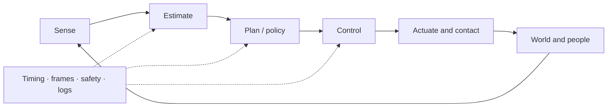
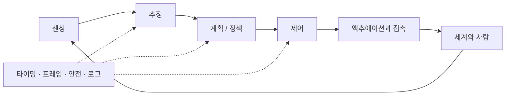

## English

Robotics is a closed physical system: sensing produces uncertain observations, estimation forms a belief, planning selects feasible behavior, control stabilizes execution, and contact and embodiment determine what the world actually permits.

### A. Geometry, mechanics & motion

- [[04-robotics/modern-robotics-book|1. Modern Robotics]] — book guide and scope
- [[04-robotics/modern-robotics/index|2. Modern Robotics Summary]] — chapters 2–6 and 8–13
- Chapter 7 (closed-chain kinematics) is intentionally optional: this track prioritizes open-chain manipulation, control, physical interaction, and field/mobile robotics literacy.
- On the manipulation-first path, follow ch.2–6 with [[02-foundations/manipulator-kinematics-dynamics|10. Manipulator Kinematics & Dynamics]] — the dynamics half those summaries stop short of, and the operational-space inertia that makes section E readable.

### B. State, perception & belief

- [[04-robotics/state-estimation-slam|3. State Estimation, Localization & SLAM]] — state versus observation, Bayes/Kalman filtering, sensor fusion, factor graphs, drift and loop closure
- [[04-robotics/geometric-perception-calibration|3.5 Geometric Perception & Calibration]] — camera models, depth, point clouds, registration/ICP, intrinsic/extrinsic/hand–eye calibration, reprojection error
- Learned visual perception lives in [[03-deep-learning/index|Deep Learning]]; this page explains how sensor evidence becomes a time-indexed robot belief.

### C. Planning & decision-making

- [[04-robotics/planning-decision-making|4. Planning & Decision-Making]] — graph search, sampling, trajectory optimization, TAMP, uncertainty, replanning, and learned planning

### D. Feedback & control

Depth target: classical control solid; MPC to formulation and representative applications—enough to read modern robotics papers.

1. [[04-robotics/control-theory-ce397|5. Control Theory]] — state space, modes and eigenvalue stability, transfer functions and poles, controllability/observability, pole placement, PID, observers (self-contained; the CE397 packet is the deep dive)
2. [[04-robotics/lqr-lqg|6. LQR & LQG]] — optimal feedback and estimator–controller separation
3. [[04-robotics/mpc|7. Model Predictive Control]] — finite-horizon optimization, constraints and replanning
4. [[04-robotics/convex-mpc-legged|8. Convex MPC for Legged Robots]] — representative high-rate application

### E. Physical interaction

- [[04-robotics/contact-force-tactile|9. Contact, Force & Tactile Interaction]] — friction, contact modes, force/impedance/admittance control, tactile sensing, deformable materials

### F. Embodiment & deployment

- [[04-robotics/robot-systems-deployment|10. Robot Systems, Embodiment & Deployment]] — action interfaces, timing, frames, middleware, reliability, simulation, logging, and failure diagnosis

### G. Humans & safety

- [[04-robotics/hri-safety|11. Human–Robot Interaction & Safety]] — autonomy levels, authority, intervention, human studies, hazard and risk literacy

### H. Manipulation specialization

Optional relative to the common track above — these belong to the manipulation-first path in [[07-research-program/index|7. Research Program]]. Read them after section E.

- [[04-robotics/teleoperation-demonstration|12. Teleoperation & Demonstration Collection]] — bilateral architectures, transparency versus stability, why delay breaks passivity, interface tradeoffs, retargeting, and what makes demonstration data good
- [[04-robotics/force-compliance-control|13. Force & Compliance Control]] — impedance versus admittance and why the stiff robot fails against the stiff wall, hybrid position/force, operational-space control, and the contact-transition arithmetic that decides what a controller can do at all
- [[04-robotics/tactile-visuotactile|14. Tactile & Visuotactile Sensing]] — what each sensor family actually outputs, slip and contact-state estimation, what fusion buys, and why sensor latency makes touch a decision signal
- [[04-robotics/grasping|15. Grasping]] — friction cones, form versus force closure, the epsilon quality metric, and how the analytic theory became the label generator for learned grasping
- [[04-robotics/navigation-mobile-manipulation|16. Navigation & Mobile Manipulation]] — why the navigation goal is a manipulation-ready pose, reachability and capability maps, base placement, and the error budget that decides whether a tolerance can be met at all

### I. Unstructured-environment navigation

Also optional relative to the common track — this is the **navigation** pillar of
[[07-research-program/index|7. Research Program]], and the field it surveys moved a long way
between 2020 and 2026. Read after section B.

- [[04-robotics/traversability-off-road|17. Traversability & Off-Road Autonomy]] — traversability as a learned, robot-specific, velocity-conditioned affordance rather than a geometric predicate; where the supervision comes from; the adaptation-versus-generalization split; and what SubT and RACER established
- [[04-robotics/legged-locomotion|18. Legged Locomotion]] — privileged teacher-student distillation, and what each landmark result actually claimed as opposed to what it is cited for
- [[04-robotics/semantic-language-navigation|19. Semantic & Language-Driven Navigation]] — ObjectNav and VLN definitions and metrics, why the nav-graph formulation was abandoned, language-queryable maps, and what happened to the benchmarks

### J. Human perception & intent

The perception layer that human-centered robotics actually runs on — and the one the
common track above does not cover. This is the **HRI/prediction** pillar of
[[07-research-program/index|7. Research Program]]. Read after section B; section G gives the
decision layer these pages feed.

- [[04-robotics/video-action-understanding|20. Video Representation & Action Understanding]] — recognition versus localization versus anticipation, scene bias and the single-frame baseline, backbone families and their temporal receptive field, and why one anticipation number hides the result
- [[04-robotics/human-pose-gaze|21. Human Pose, Hands & Gaze]] — the representation ladder from 2D keypoints to parametric bodies, what MPJPE means in millimetres, why head pose is substituted for gaze at range, and the motion cues that need no keypoints
- [[04-robotics/egocentric-perception|22. Egocentric & First-Person Perception]] — how the first-person viewpoint changes observability, the gaze → head → hand → contact cue cascade, where head motion stops proxying attention, and the gap from daily-life benchmarks to a helmet camera
- [[04-robotics/human-intent-prediction|23. Human Intent & Trajectory Prediction]] — intent versus trajectory, the usable horizon $\Delta^*$ against required lead time, calibration and conformal prediction as the decision interface, base rates, and the human-masked ablation

Note: page numbers are the recommended study order — estimation (3) → geometric perception (3.5) → planning (4) → control (5–8) → contact (9) → systems (10) → humans & safety (11), then the specialization pages (12–16 manipulation, 17–19 navigation, 20–23 human perception & intent).

### Where this track leads

These components converge in VLA, world-model, and learning-based-control systems, then meet field constraints in [[05-construction-robotics/index|Construction Robotics]]. Use [[06-research-practice/index|Research Practice]] to design and evaluate new work rather than only read it, and [[07-research-program/index|Research Program]] to decide which of these pages your own work actually needs at depth.

## 한국어

로보틱스는 닫힌 물리 시스템이다: 센싱은 불확실한 관측을 만들고, 추정은 belief를 형성하고,
계획은 실행 가능한 행동을 고르고, 제어는 실행을 안정화한다. 접촉과 embodiment는 세계가
실제로 허용하는 것을 결정하고, 타이밍·프레임·안전·로깅이 전체를 연결한다.

### A. 기하·역학·운동

- [[04-robotics/modern-robotics-book|1. Modern Robotics]] — 책 가이드와 범위
- [[04-robotics/modern-robotics/index|2. Modern Robotics Summary]] — 2–6장, 8–13장
- 7장(폐쇄 사슬 기구학)은 의도적으로 선택 사항이다: 이 트랙은 개연쇄 매니퓰레이션, 제어, 물리 상호작용, 현장/모바일 로보틱스 문해력을 우선한다.
- 매니퓰레이션 우선 경로에서는 2~6장 다음에 [[02-foundations/manipulator-kinematics-dynamics|10. 매니퓰레이터 기구학·동역학]]을 읽는다 — 그 요약들이 못 미치고 멈춘 동역학 절반, 그리고 E절을 읽을 수 있게 만드는 작업 공간 관성.

### B. 상태·인지·belief

- [[04-robotics/state-estimation-slam|3. State Estimation, Localization & SLAM]] — 상태 vs 관측, 베이즈/칼만 필터링, 센서 융합, factor graph, drift와 loop closure
- [[04-robotics/geometric-perception-calibration|3.5 Geometric Perception & Calibration]] — 카메라 모델, 깊이, 포인트 클라우드, registration/ICP, intrinsic/extrinsic/hand–eye 보정, reprojection error
- 학습된 시각 인식은 [[03-deep-learning/index|딥러닝]]에 있다; 이 페이지는 센서 증거가 시간 인덱스된 로봇 belief가 되는 과정을 설명한다.

### C. 계획·의사결정

- [[04-robotics/planning-decision-making|4. Planning & Decision-Making]] — 그래프 탐색, 샘플링, 궤적 최적화, TAMP, 불확실성, replanning, 학습 기반 계획

### D. Feedback·제어

깊이 목표: 고전 제어는 탄탄히, MPC는 정식화와 대표 응용까지 — 현대 로보틱스 논문을 읽기에 충분하게.

1. [[04-robotics/control-theory-ce397|5. Control Theory]] — 상태공간, 모드와 고유값 안정성, 전달함수와 극점, 가제어성/가관측성, 극점 배치, PID, 관측기 (자체 완결; CE397 패킷은 심화)
2. [[04-robotics/lqr-lqg|6. LQR & LQG]] — 최적 피드백과 추정기–제어기 분리
3. [[04-robotics/mpc|7. Model Predictive Control]] — 유한 지평 최적화, 제약, replanning
4. [[04-robotics/convex-mpc-legged|8. Convex MPC for Legged Robots]] — 대표적 고주기 응용

### E. 물리 상호작용

- [[04-robotics/contact-force-tactile|9. Contact, Force & Tactile Interaction]] — 마찰, 접촉 모드, 힘/임피던스/어드미턴스 제어, 촉각 센싱, 유연 재료

### F. Embodiment·배포

- [[04-robotics/robot-systems-deployment|10. Robot Systems, Embodiment & Deployment]] — 행동 인터페이스, 타이밍, 프레임, 미들웨어, 신뢰성, 시뮬레이션, 로깅, 실패 진단

### G. 사람·안전

- [[04-robotics/hri-safety|11. Human–Robot Interaction & Safety]] — 자율성 수준, 권한, 개입, 인간 대상 연구, hazard·risk 문해력

### H. 매니퓰레이션 전문화

위의 공통 트랙에 대해 선택 사항이다 — [[07-research-program/index|7. 연구 프로그램]]의 매니퓰레이션 우선 경로에 속한다. E절 다음에 읽는다.

- [[04-robotics/teleoperation-demonstration|12. 원격조작과 시연 수집]] — 양방향 아키텍처, 투명성 대 안정성, 지연이 수동성을 깨는 이유, 인터페이스 절충, 리타게팅, 그리고 좋은 시연 데이터의 조건
- [[04-robotics/force-compliance-control|13. 힘·컴플라이언스 제어]] — 임피던스 대 어드미턴스와 뻣뻣한 로봇이 단단한 벽에 지는 이유, 하이브리드 위치/힘, 작업 공간 제어, 그리고 제어기가 무엇을 할 수 있는지를 결정하는 접촉 천이의 산수
- [[04-robotics/tactile-visuotactile|14. 촉각·시촉각 센싱]] — 각 센서 계열이 실제로 출력하는 것, 미끄러짐과 접촉 상태 추정, 융합이 사는 것, 그리고 센서 지연이 촉각을 결정 신호로 만드는 이유
- [[04-robotics/grasping|15. 파지]] — 마찰 원뿔, form 대 force closure, 엡실론 품질 지표, 그리고 해석 이론이 학습 파지의 라벨 생성기가 된 경위
- [[04-robotics/navigation-mobile-manipulation|16. 내비게이션과 모바일 조작]] — 내비게이션 목표가 왜 조작 가능한 자세인가, 도달성·능력 지도, base placement, 그리고 공차 충족 가능성을 결정하는 오차 예산

### I. 비정형 환경 내비게이션

이것도 공통 트랙에 대해 선택 사항이다 — [[07-research-program/index|7. 연구 프로그램]]의
**내비게이션** 기둥이며, 이 페이지들이 다루는 분야는 2020년과 2026년 사이에 크게 움직였다.
B절 다음에 읽는다.

- [[04-robotics/traversability-off-road|17. Traversability와 오프로드 자율성]] — 기하학적 술어가 아니라 로봇마다 다르고 속도에 조건부인 학습된 어포던스로서의 traversability, 지도 신호의 출처, 적응 대 일반화의 분기, 그리고 SubT와 RACER가 확립한 것
- [[04-robotics/legged-locomotion|18. 레그드 로코모션]] — privileged teacher-student 증류, 그리고 각 대표 결과가 인용되는 바가 아니라 실제로 주장한 것
- [[04-robotics/semantic-language-navigation|19. 의미·언어 기반 내비게이션]] — ObjectNav과 VLN의 정의와 지표, 내비 그래프 정식화가 폐기된 이유, 언어로 질의하는 지도, 그리고 벤치마크에 무슨 일이 있었는가

### J. 사람 인지와 의도

인간 중심 로보틱스가 실제로 그 위에서 돌아가는 인지 계층 — 그리고 위 공통 트랙이 다루지
않는 계층. [[07-research-program/index|7. Research Program]]의 **HRI·예측** 기둥이다.
B절 다음에 읽는다; 이 페이지들이 먹이는 결정 계층은 G절에 있다.

- [[04-robotics/video-action-understanding|20. Video Representation & Action Understanding]] — 인식 vs 위치추정 vs 예측, 장면 편향과 단일 프레임 베이스라인, 백본 계보와 시간 수용 영역, 그리고 anticipation 숫자 하나가 결과를 가리는 방식
- [[04-robotics/human-pose-gaze|21. Human Pose, Hands & Gaze]] — 2D 키포인트에서 파라메트릭 신체까지의 표현 사다리, MPJPE의 mm 단위 의미, 원거리에서 머리 자세가 시선을 대체하는 이유, 키포인트가 필요 없는 움직임 단서
- [[04-robotics/egocentric-perception|22. Egocentric & First-Person Perception]] — 1인칭 시점이 관측 가능성을 바꾸는 방식, 시선 → 머리 → 손 → 접촉 단서 사슬, 머리 움직임이 주의 대용이기를 멈추는 지점, 일상 벤치마크에서 헬멧 카메라까지의 격차
- [[04-robotics/human-intent-prediction|23. Human Intent & Trajectory Prediction]] — 의도 vs 궤적, 필요 선행 시간 대비 가용 지평 $\Delta^*$, 결정 인터페이스로서의 보정과 conformal prediction, 기저율, 사람 마스킹 ablation

참고: 페이지 번호는 권장 학습 순서다 — 추정(3) → 기하 인식(3.5) → 계획(4) → 제어(5–8) →
접촉(9) → 시스템(10) → 사람·안전(11), 그다음 전문화 페이지들(12–16 매니퓰레이션, 17–19 내비게이션, 20–23 사람 인지·의도).

### 이 트랙이 향하는 곳

이 구성요소들은 VLA·월드모델·학습 기반 제어 시스템에서 합류한 뒤,
[[05-construction-robotics/index|건설로봇]]의 현장 제약과 만난다. 새 연구를 읽는 것을 넘어
설계·평가할 때는 [[06-research-practice/index|Research Practice]]를, 이 페이지들 중 무엇을
실제로 깊이 알아야 하는지 정할 때는 [[07-research-program/index|Research Program]]을 쓰라.
