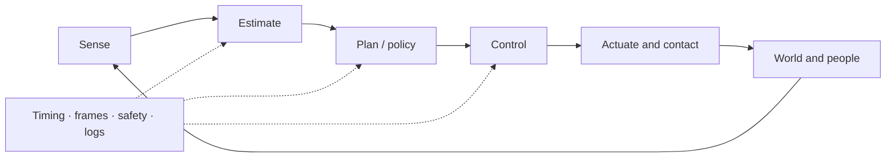

## English

Robotics is a closed physical system: sensing produces uncertain observations, estimation forms a belief, planning selects feasible behavior, control stabilizes execution, and contact and embodiment determine what the world actually permits.

### A. Geometry, mechanics & motion

- [[04-robotics/modern-robotics-book|1. Modern Robotics]] — book guide and scope
- [[04-robotics/modern-robotics/index|2. Modern Robotics Summary]] — chapters 2–6 and 8–13
- Chapter 7 (closed-chain kinematics) is intentionally optional: this track prioritizes open-chain manipulation, control, physical interaction, and field/mobile robotics literacy.

### B. State, perception & belief

- [[04-robotics/state-estimation-slam|7. State Estimation, Localization & SLAM]] — state versus observation, Bayes/Kalman filtering, sensor fusion, factor graphs, drift and loop closure
- Learned visual perception lives in [[03-deep-learning/index|Deep Learning]]; this page explains how sensor evidence becomes a time-indexed robot belief.

### C. Planning & decision-making

- [[04-robotics/planning-decision-making|8. Planning & Decision-Making]] — graph search, sampling, trajectory optimization, TAMP, uncertainty, replanning, and learned planning

### D. Feedback & control

Depth target: classical control solid; MPC to formulation and representative applications—enough to read modern robotics papers.

1. [[04-robotics/control-theory-ce397|3. Control Theory]] — state space, stability, controllability and observability
2. [[04-robotics/lqr-lqg|4. LQR & LQG]] — optimal feedback and estimator–controller separation
3. [[04-robotics/mpc|5. Model Predictive Control]] — finite-horizon optimization, constraints and replanning
4. [[04-robotics/convex-mpc-legged|6. Convex MPC for Legged Robots]] — representative high-rate application

### E. Physical interaction

- [[04-robotics/contact-force-tactile|9. Contact, Force & Tactile Interaction]] — friction, contact modes, force/impedance/admittance control, tactile sensing, deformable materials

### F. Embodiment & deployment

- [[04-robotics/robot-systems-deployment|10. Robot Systems, Embodiment & Deployment]] — action interfaces, timing, frames, middleware, reliability, simulation, logging, and failure diagnosis

### G. Humans & safety

- [[04-robotics/hri-safety|11. Human–Robot Interaction & Safety]] — autonomy levels, authority, intervention, human studies, hazard and risk literacy

### Where this track leads

These components converge in VLA, world-model, and learning-based-control systems, then meet field constraints in [[05-construction-robotics/index|Construction Robotics]]. Use [[06-research-practice/index|Research Practice]] to design and evaluate new work rather than only read it.

## 한국어

로보틱스는 닫힌 물리 시스템이다. 센서는 불확실한 관측을 만들고, estimation은 belief를 만들며, planning은 실행 가능한 행동을 고르고, control은 실행을 안정화한다. Contact와 embodiment는 세계에서 실제로 가능한 행동을 결정하고 timing·frame·safety·logging은 전체를 연결한다.

- **기하·역학·운동:** [[04-robotics/modern-robotics-book|1. Modern Robotics]] · [[04-robotics/modern-robotics/index|2. Modern Robotics Summary]]. 7장 closed-chain kinematics는 의도적으로 선택 사항이다.
- **상태·인지·belief:** [[04-robotics/state-estimation-slam|7. State Estimation, Localization & SLAM]]
- **계획·의사결정:** [[04-robotics/planning-decision-making|8. Planning & Decision-Making]]
- **Feedback·제어:** [[04-robotics/control-theory-ce397|3. Control Theory]] → [[04-robotics/lqr-lqg|4. LQR & LQG]] → [[04-robotics/mpc|5. MPC]] → [[04-robotics/convex-mpc-legged|6. Convex MPC]]
- **물리 상호작용:** [[04-robotics/contact-force-tactile|9. Contact, Force & Tactile Interaction]]
- **Embodiment·배포:** [[04-robotics/robot-systems-deployment|10. Robot Systems, Embodiment & Deployment]]
- **사람·안전:** [[04-robotics/hri-safety|11. Human–Robot Interaction & Safety]]

이 지식은 VLA·world model·learning-based control에서 합류하고 [[05-construction-robotics/index|Construction Robotics]]의 현장 조건으로 이어진다. 새 연구의 질문·실험·실패 분석·글쓰기는 [[06-research-practice/index|Research Practice]]에서 다룬다.
